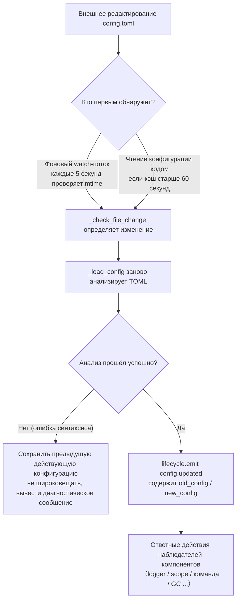

# Описание конфигурационного файла
> Этот документ описывает конфигурационный файл фреймворка. Если у стороннего модуля есть какие-либо настройки, обратитесь к документации модуля.

ErisPulse использует конфигурационный файл в формате TOML `config/config.toml` для управления конфигурацией проекта.

## Позиция конфигурационного файла

Конфигурационный файл находится в папке `config/` в корне проекта:

```
project/
├── config/
│   └── config.toml
├── main.py
```

## Обработка ошибок при загрузке конфигурации

Фреймворк различает три состояния ошибок при загрузке `config.toml` и предоставляет **действенные диагностические сообщения**, а не просто возвращается к конфигурации по умолчанию:

| Состояние ошибки | Условия возникновения | Поведение фреймворка |
|---------|---------|---------|
| Файл отсутствует | `config.toml` не существует | Нормальный запуск, при первом запуске используется пустая конфигурация (без предупреждений) |
| Ошибка синтаксиса TOML | Файл существует, но формат неверный (например, отсутствуют кавычки, не закрыты скобки) | Выводит **номер строки и столбца ошибки и причину**, и сообщает, что была использована конфигурация по умолчанию |
| Ошибка прав доступа и другие | Нет прав на чтение, ошибки ввода-вывода и т.д. | Выводит **ясную причину** и сообщает, что была использована конфигурация по умолчанию |

Например, если вы случайно написали `port = 8000` (без кавычек для строки), в логах будет что-то вроде:

```
[ERROR] [Config] Синтаксическая ошибка в конфигурационном файле config/config.toml (строка 3, столбец 1): ...
[WARNING] [Config] Не удалось прочитать конфигурационный файл. Продолжаем использовать предыдущую действующую конфигурацию, изменения в файле не вступили в силу — пожалуйста, исправьте и перезагрузите или перезапустите
```

Таким образом, вы можете сразу обнаружить проблему на уровне `INFO`, а не задаваться вопросом, почему ваши изменения не вступили в силу.

> **Что делать, если испортить конфигурационный файл во время работы?** Если вы вручную отредактируете `config.toml` во время работы робота и внесёте синтаксическую ошибку, при следующей попытке записи (объединения конфигурации) фреймворк выведет сообщение «Конфигурационный файл повреждён (ошибка синтаксиса, строка X), невозможно записать — пожалуйста, исправьте конфигурационный файл и перезапустите», а не запутанное «Не удалось записать». Записываемые параметры сохраняются, не теряются.

## Сохранение комментариев и минимизация записи на диск

Комментарии и порядок ключей в `config.toml` сохраняются полностью после записи фреймворком: независимо от того, используется ли `setConfig()`, сохранение через CLI-конфигурационный помощник или генерация шаблона адаптером/модулем, фреймворк изменяет только задействованные ключи, и ваши комментарии, а также порядок не будут удалены или перестроены (на основе сохранения комментариев tomlkit).

Фреймворк сдержан в записи на диск:

- **Конфигурация по умолчанию не сохраняется автоматически**: `gc`, `scope`, `transcript` и другие встроенные значения остаются в памяти, `config.toml` содержит только явно заданные ключи, сохраняя минимальный размер. Полный список настраиваемых параметров см. в `config/config.full.example` проекта, скопируйте его в `config.toml` и измените по мере необходимости (не настроенные параметры используют встроенные значения по умолчанию, поведение не меняется).
- **`config.full.example` автоматически поддерживается**: Независимо от того, выполнялся ли `epsdk init`, при запуске фреймворка (`epsdk run` / `main.py`) `config/config.full.example` будет автоматически сгенерирован, если он отсутствует. Первая строка файла — это метка, поддерживаемая фреймворком, и при обновлении генератора (например, при добавлении новых параметров конфигурации, установке новых компонентов) при запуске файл будет обновлен один раз. Если удалить или изменить первую строку, файл перейдёт в ручное управление, и фреймворк больше не будет его перезаписывать.
- **Шаблоны конфигурации адаптеров/модулей**: При первом инициализации шаблон с комментариями сохраняется на диск (описание полей — это комментарии); поля, помеченные как `example`, не сохраняются на диск, а только записываются в `config.full.example` для справки.

## Переопределение с помощью переменных окружения

Фреймворк поддерживает **переопределение** конфигурационных параметров `ErisPulse.*` с помощью переменных окружения (подходит для Docker / контейнеризации / CI-развертывания, без необходимости изменять `config.toml`).

Правила именования: преобразуйте точечный путь `ErisPulse.<section>.<key>` в верхний регистр, замените `.` на `_`, и добавьте префикс `ERISPULSE_`:

| Параметр конфигурации | Переменная окружения | Пример значения |
|--------|---------|--------|
| `ErisPulse.server.port` | `ERISPULSE_SERVER_PORT` | `9000` |
| `ErisPulse.server.host` | `ERISPULSE_SERVER_HOST` | `0.0.0.0` |
| `ErisPulse.logger.level` | `ERISPULSE_LOGGER_LEVEL` | `DEBUG` |
| `ErisPulse.framework.strict_mode` | `ERISPULSE_FRAMEWORK_STRICT_MODE` | `false` |

Описание поведения:
- **Наивысший приоритет**: Переменные окружения переопределяют «конфигурационный файл» и «значения по умолчанию», автоматически преобразуя значение по типу (логический, целочисленный, дробный, список, разделённый запятыми, строка).
- **Не сохраняются**: Переопределение действует только во время выполнения, не записывается обратно в `config.toml`.
- **Поддержка горячей перезагрузки**: При изменении переменной окружения во время выполнения, в сочетании с перезагрузкой конфигурации, изменения вступают в силу.

```bash
# Пример развертывания с помощью Docker: без изменения config.toml, просто переопределите порт
ERISPULSE_SERVER_PORT=9000 docker compose up -d
```

> Примечание: параметры фреймворка, такие как `ErisPulse.server.port`, читаются через API `get_server_config()`, и все они подвержены влиянию переменных окружения.

## Горячая перезагрузка конфигурации

Начиная с версии 2.7.0, фреймворк системно поддерживает **горячую перезагрузку конфигурации**. После изменения `config.toml` (фоновый watch-поток проверяет каждые 5 секунд) или вызова кодом `setConfig()`, компоненты автоматически реагируют:

| Компонент | Поддерживаемые конфигурационные параметры | Поведение |
|------|----------------|------|
| **Логгер Logger** | `logger.level` / `log_files` / `log_dir` (включая параметры сегментации) / `memory_limit` / `format` / `exclude_levels` | Автоматически переприменяется (с детектированием изменений) |
| **Система команд CommandHandler** | `event.command.prefix` / `case_sensitive` / `allow_space_prefix` / `must_at_bot` | Вступает в силу с следующего сообщения |
| **Параллелизм адаптера** | `framework.handler_max_concurrency` | Сигнал об отключении кэша, пересоздание по новому значению |
| **Активный GC** | `framework.proactive_gc_*` | Изменение конфигурации немедленно перезапускает задачу GC, поддерживает изменение/отключение/переактивацию во время выполнения |
| **Система владельцев Master** | `master.users` | Каждая проверка `is_master()` читает актуальные данные, не требуется перезапуск |
| **Конфигурация модулей/адаптеров** | Собственные параметры конфигурации | Запускается回调 `on_config_update(old, new)` |

**Параметры, требующие перезапуска** (небезопасно переключать горячо, при изменении выводится предупреждение "Требуется перезапуск процесса для вступления в силу"):

| Конфигурация | Причина |
|------|------|
| `router.cors.*` / `router.security.*` | Промежуточные слои записываются в FastAPI при запуске сервиса, безопасное горячее переключение невозможно во время выполнения |
| `storage.use_global_db` | SQLite файловый дескриптор уже открыт во время выполнения, безопасная смена пути невозможна |

> **Что делать, если во время редактирования сохранения произошла ошибка?** Если при редактировании `config.toml` возникла временная синтаксическая ошибка, фреймворк **сохранит предыдущую действующую конфигурацию** и выведет диагностическое сообщение, не распространяя пустую конфигурацию на компоненты (избегает ошибки `on_config_update`, получив пустое значение и вернув значения по умолчанию).

### Внутренняя разбивка цепочки горячей перезагрузки

«Изменили конфигурацию, как узнают компоненты?» — за этим стоит цепочка обнаружения → перезагрузки → широковещания:



**Две пути обнаружения** (достаточно одного, оба обеспечивают резервирование):

| Путь | Механизм | Время срабатывания |
|------|------|---------|
| Фоновый watch | daemon-поток `config-watcher` каждые **5 секунд** `wait` проверяет `mtime` файла | После изменения файла внешними действиями максимум через 5 секунд |
| Ленивая проверка | При любом чтении `getConfig()` проверяется, если кэш старше **60 секунд**, сначала проверяется файл | При следующем чтении конфигурации |

> **Фреймворк не повредит сам себя**: `setConfig()` при записи на диск записывает «время последней записи, сделанной самим собой», watch-поток при сравнении исключает его, считая изменения только **внешними редактированиями**.

**Два типа событий изменения конфигурации:**

| Событие | Инициатор | Данные | Типичный сценарий |
|------|--------|------|---------|
| `config.set` | Код / Dashboard вызывает `setConfig()` | `{key, old_value, new_value}` | Одиночное изменение ключа (генерация шаблона, запись состояния, изменение конфигурации во время выполнения) |
| `config.updated` | Watcher/Ленивая проверка после внешнего редактирования | `{old_config, new_config, config_file}` | Ручное изменение `config.toml` |

> `setConfig()` по умолчанию **задерживает запись на диск на 5 секунд** (объединяет несколько записей), `immediate=True` записывает немедленно. Watcher обнаруживает внешнее изменение, обновляет только в памяти, **не** записывает изменения обратно в файл.

**Список автоматически реагирующих компонентов** (обычно оба события подписываются, реакция одинакова):

| Компонент | Наблюдатель | Реакция |
|------|------|------|
| Logger | `config.set` + `config.updated` | Уровень/файл/каталог сегментации/память лимит/формат/исключить уровни переприменяются (с детектированием изменений, без изменений не двигается) |
| Scope | `config.updated` | Перестроение кэша привязки области |
| Система команд | `config.updated` | Префикс/регистр/пробел перед префиксом/must_at_bot параметры пересчитываются, вступают в силу с следующего сообщения |
| Параллелизм адаптера | `config.set` + `config.updated` | `handler_max_concurrency` сигнал об отключении пересоздание семафора |
| Активный GC | `config.set` + `config.updated` | `proactive_gc_*` немедленно перезапускает фоновую задачу GC |
| Адаптер | Перенаправление на `on_config_update` | Каждый адаптер `on_config_update(old, new)` callback |
| Модуль | Перенаправление на `on_config_update` | Каждый модуль `on_config_update(old, new)` callback |
| Хранилище | `config.updated` | Изменение `use_global_db` **только предупреждение** (требуется перезапуск) |
| Роутер | `config.updated` | Изменение `cors.*` / `security.*` **только предупреждение** (требуется перезапуск) |

## Полный пример конфигурации

```toml
[ErisPulse.server]
host = "0.0.0.0"
port = 8000
auto_start = true
ssl_certfile = ""
ssl_keyfile = ""

[ErisPulse.master]
# users поддерживает два способа записи (выберите один из них):
#   Глобальный владелец (действует для всех платформ): users = ["123456", "789012"]
#   Владелец по платформе: users = { yunhu = ["123456"], telegram = ["789012"] }
users = {}

[ErisPulse.logger]
level = "INFO"
format = "rich"
log_files = []
log_dir = ""
log_rotation = "size"
log_max_size_mb = 10
log_backup_count = 5
log_rotation_when = "midnight"
memory_limit = 1000
exclude_levels = []

[ErisPulse.framework]
enable_lazy_loading = true
uninit_timeout = 30
strict_mode = 0

[ErisPulse.framework.strict_mode_exceptions]
modules = []
adapters = []

[ErisPulse.storage]
backend = "sqlite"
use_global_db = false

[ErisPulse.event.command]
prefix = "/"
case_sensitive = true
allow_space_prefix = false
must_at_bot = false

[ErisPulse.event.message]
ignore_self = true

[ErisPulse.i18n]
language = "auto"
```

## Конфигурация сервера

```toml
[ErisPulse.server]
host = "0.0.0.0"
port = 8000
auto_start = true
ssl_certfile = "/path/to/cert.pem"
ssl_keyfile = "/path/to/key.pem"
```

| Параметр | Тип | Значение по умолчанию | Описание |
|---------|------|---------|------|
| host | string | 0.0.0.0 | Адрес прослушивания, 0.0.0.0 означает все интерфейсы |
| port | integer | 8000 | Номер порта прослушивания |
| auto_start | boolean | true | Автоматически запускать сервер маршрутизации при `sdk.init()`. Установка в `false` пропускает запуск сервера маршрутизации (чисто событийный/без WebUI сценарий) |
| ssl_certfile | string | пустая строка | Путь к файлу SSL-сертификата |
| ssl_keyfile | string | пустая строка | Путь к файлу SSL-приватного ключа |

## Конфигурация системы владельцев

Система владельцев используется для определения аккаунтов «владельцев» фреймворка (например, администраторов бота). `master.users` поддерживает два способа записи:

```toml
[ErisPulse.master]
# Способ 1: глобальные владельцы (действуют на всех платформах)
users = ["123456", "789012"]

# Способ 2: владельцы по платформе (dict)
# users = { yunhu = ["123456"], telegram = ["789012"] }
```

| Параметр | Тип | Значение по умолчанию | Описание |
|---------|------|---------|------|
| users | array / object | пустой | Список аккаунтов владельцев. `list` форма — глобальные владельцы (действуют на всех платформах); `dict` форма — владельцы по платформе (ключ — название платформы, значение — список аккаунтов владельцев на этой платформе) |

В коде проверка осуществляется через `master.is_master(event)` или `master.is_master(platform, user_id)`, каждый вызов читает конфигурацию в реальном времени (поддерживает горячую перезагрузку, не требуется перезапуск):

```python
from ErisPulse.Core import master

if master.is_master(event):
    await event.reply("Привет, хозяин")
```

### Цепочка проверки и добавление/удаление в режиме выполнения

Цепочка проверки владельца: **конфигурация владельцев → запись в режиме выполнения → провайдер-цепочка**:

```python
from ErisPulse.Core import master

master.is_master(event)                      # проверка по событию
master.is_master("yunhu", "123")             # явная проверка
master.add("yunhu", "123")                   # добавление в режиме выполнения (по умолчанию сохраняется; persist=False — только в памяти)
master.remove("yunhu", "123")                # удаление (по умолчанию сохраняется)
master.list()                                # объединение: {"global": [...], "<platform>": [...]}
```

### Пользовательские источники идентификации (провайдеры)

Помимо конфигурации, можно зарегистрировать пользовательские источники идентификации: `fn(platform, user_id) -> bool`, встроенные источники идентификации (конфигурация + запись в режиме выполнения) не срабатывают, последовательно проверяются, если один провайдер разрешает, то признаётся владельцем. Подходит для подключения администраторских интерфейсов адаптера, ролей базы данных и других внешних систем идентификации.

Точка регистрации `master.provider` поддерживает два способа: декоратор и функциональный, для снятия регистрации используйте `fn.unregister()`:

```python
from ErisPulse.Core import master

# Способ 1: декоратор (постоянный источник идентификации, рекомендуется)
@master.provider
def admin_provider(platform, user_id):
    return user_id in {"999"}     # пользовательская логика проверки

master.is_master("yunhu", "999")   # True
admin_provider.unregister()        # отменить регистрацию, если больше не нужен

# Способ 2: функциональный (регистрация на этапе загрузки модуля / отмена регистрации на этапе выгрузки)
fn = master.provider(admin_provider)
fn.unregister()
```

> Исключения в провайдере обрабатываются и пропускаются, не блокируют цепочку проверки идентификации. Привязка метода экземпляра не может быть зарегистрирована с `unregister`, для сценариев, требующих парной регистрации/отмены, используйте **функции на уровне модуля**.

### Приоритет пользователя: область действия владельца определяется пользователем

Параметр `master=True` команды — это **по умолчанию разработчика**: пользователь может перезаписать или ослабить (см. [Общая конфигурация перезаписи событий (event.overrides)](#общая-конфигурация-перезаписи-событий-eventoverrides), явная конфигурация пользователя вступает в силу).

## Конфигурация логов

```toml
[ErisPulse.logger]
level = "INFO"
log_files = []                # явный список файлов логов (без сегментации)
log_dir = ""                  # директория логов (автоматически создаётся). При установке автоматически сегментирует в `erispulse.log` по `log_rotation`; взаимоисключает с `log_files`, приоритет выше
log_rotation = "size"         # способ сегментации: "size" / "date" / "none"
log_max_size_mb = 10          # размер файла в режиме size (MB), при превышении сегментирует в `.1`/`.2`
log_backup_count = 5          # количество сохранённых файлов логов
log_rotation_when = "midnight"  # период сегментации в режиме date: S/M/H/D/midnight
memory_limit = 1000
exclude_levels = ["EVENT"]
```

| Параметр | Тип | Значение по умолчанию | Описание |
|---------|------|---------|------|
| level | string | INFO | Уровень логирования: TRACE, DEBUG, INFO, WARNING, ERROR, CRITICAL (TRACE — самый низкий уровень, выводит подробную отладочную информацию фреймворка) |
| format | string | rich | Формат вывода логов: `rich` (цветной, по умолчанию), `plain` (чистый текст без цвета, подходит для лог-сборки/перенаправления), `json` (структурированный JSON, подходит для ELK и т.д.) |
| log_files | array | пустой | Список файлов для вывода логов (явные пути, без сегментации) |
| log_dir | string | пустой | Директория для вывода логов (автоматически создаётся). При установке логи пишутся в `erispulse.log` и сегментируются по `log_rotation`; взаимоисключает с `log_files`, приоритет выше |
| log_rotation | string | size | Способ сегментации: `size` (по размеру) / `date` (по времени) / `none` (без сегментации) |
| log_max_size_mb | float | 10 | Максимальный размер файла в режиме size (MB), при превышении сегментирует в `.1`/`.2` |
| log_backup_count | integer | 5 | Количество сохранённых файлов логов, старые автоматически удаляются |
| log_rotation_when | string | midnight | Период сегментации в режиме date: S/M/H/D/midnight (по умолчанию каждый день в полночь) |
| memory_limit | integer | 1000 | Количество логов, сохраняемых в памяти |
| exclude_levels | array | пустой | Список уровней логов для исключения. Логи исключённых уровней **полностью отбрасываются** (не пишутся в память, не передаются на панель логов Dashboard и другие подписчики, не печатаются, не пишутся в файл). Поддерживает горячую перезагрузку |

Также можно динамически переключать в коде:

```python
from ErisPulse.Core import logger

# Сегментация по размеру: файл 10MB, 5 резервных копий
logger.set_output_dir("logs", rotation="size", max_size_mb=10, backup_count=5)

# Сегментация по времени: каждый день в полночь, 7 резервных копий
logger.set_output_dir("logs", rotation="date", backup_count=7)
```

> [!NOTE]
> `log_dir` и связанные сегментационные параметры требуют ErisPulse **2.8.0+**.

> **Защита конфиденциальности**: Содержание сообщений отправки и получения записывается на уровне **EVENT** (значение 21). Установка `exclude_levels = ["EVENT"]` позволит панели логов Dashboard не видеть содержание сообщений в группах/личных чатах, не влияя на другие уровни логов.

> [!NOTE]
> Эта функция `exclude_levels` требует ErisPulse **2.8.0+**.

## Конфигурация фреймворка

```toml
[ErisPulse.framework]
enable_lazy_loading = true
uninit_timeout = 30
strict_mode = 0

[ErisPulse.framework.strict_mode_exceptions]
modules = []
adapters = []
```

| Параметр | Тип | Значение по умолчанию | Описание |
|---------|------|---------|------|
| enable_lazy_loading | boolean | true | Включить ленивую загрузку модулей |
| uninit_timeout | integer | 30 | Общее время ожидания при корректном завершении (секунды), после которого принудительно завершить. 0 означает отсутствие таймаута |
| strict_mode | integer | 0 | Уровень строгого режима, см. ниже «Строгий режим» |
| handler_max_concurrency | integer | 64 | Максимальное количество задач обработчика событий, увеличение повышает пропускную способность, но увеличивает использование памяти |
| offline_bot_expiry | integer | 3600 | Время автоматического истечения срока действия записи о неактивном боте (секунды), 0 означает не истекать |

### Конфигурация активного GC

После инициализации SDK запускается фоновая задача активного GC, периодически выполняющая сборку мусора Python и внутреннюю очистку ресурсов (очистка неактивных ботов и т.д.). Все параметры поддерживают горячую перезагрузку, при изменении задача перезапускается немедленно.

| Параметр | Тип | Значение по умолчанию | Описание |
|---------|------|---------|------|
| proactive_gc_interval | number | 300 | Интервал сборки (секунды), поддерживает десятичные дроби. 0 означает отключение активного GC |
| proactive_gc_generation | integer | 0 | Обычный цикл сборки поколений (0/1/2, ограничено до 0..2). Обратите внимание, что `gc.collect(2)` эквивалентна полной сборке, по умолчанию 0 сохраняет лёгкость; глубокая сборка вызывается `proactive_gc_full_every` периодически |
| proactive_gc_full_every | integer | 20 | Каждые N циклов делается полная сборка, 0 означает отключение периодической полной. Полная сборка ограничена порогом роста памяти `proactive_gc_memory_growth_mb` |
| proactive_gc_memory_growth_mb | integer | 32 | Порог роста памяти для полной сборки (МБ): по сравнению с базой памяти после последней полной сборки (в первую очередь tracemalloc, затем RSS), полная сборка выполняется только при достижении этого значения. 0 означает отсутствие порога |
| proactive_gc_idle_only | boolean | false | При включении, если в очереди есть незавершённые задачи обработки (событийный пик), текущий цикл пропускается, чтобы избежать пауз и конкуренции с обработкой сообщений; внутренняя очистка ресурсов не затрагивается |
| proactive_gc_gen0_min | integer | 500 | Порог количества мусора gen0 для запуска обычного цикла сборки: `gc.get_count()[0]` ниже этого значения, цикл пропускается (почти нулевые пустые циклы с низкой стоимостью). 0 означает всегда собирать |

> **Изменение 2.7.1**: Значение по умолчанию `proactive_gc_generation` изменено с `2` на `0`, значение по умолчанию `proactive_gc_full_every` изменено с `0` на `20`. Ранее `generation=2` означало, что каждый цикл делал самую тяжёлую полную сборку; новое значение по умолчанию при сохранении охвата сборки значительно снижает пустые циклы. Явно заданные старые значения по-прежнему действуют в соответствии с их значением.

### Строгий режим

Строгий режим контролирует стратегию обработки компонентов, которые не соответствуют требованиям или не удались при загрузке. Современные модули/адаптеры должны наследовать соответствующие базовые классы (`BaseModule`/`BaseAdapter`), компоненты, не наследующие базовые классы, влияют на контекстную систему фреймворка и на очистку по умолчанию, что может привести к утечке ресурсов.

> **Изменение 2.5.2**: Значение по умолчанию изменилось с `1` (пропуск) на `0` (мягкий), чтобы уменьшить проблемы при первом использовании новыми пользователями. Компоненты, не наследующие базовые классы, будут предупреждаться и попытаться загрузиться, а не отклоняться напрямую. Если вы хотите восстановить старое поведение, явно установите `strict_mode = 1`.

| Уровень | Название | Поведение |
|------|------|------|
| 0 | Мягкий (по умолчанию) | Нарушения только предупреждения, компоненты, не наследующие базовые классы, всё ещё будут пытаться загрузиться (совместимость со старыми компонентами) |
| 1 | Строгий-пропуск | Отклонение компонентов, не наследующих базовые классы, и пропуск, остальное нормально запускается |
| 2 | Строгий-катастрофа | Сбор всех нарушений и единое сообщение, затем остановка всего запуска |

На всех уровнях, ошибки компонентов в процессе загрузки/регистрации/инициализации всегда будут пропущены; различие заключается в следующем:

- **0 → 1**: Единственное изменение поведения — «не наследование базового класса» из «всё ещё загрузки» на «пропуск».
- **1 → 2**: Все нарушения (не наследование базового класса, загрузка не удалась, регистрация не удалась, инициализация не удалась и т.д.) повышаются до катастрофического уровня, будут собраны в точке запуска, выведены список нарушений и остановлен запуск.

#### Список исключений

Если некоторые компоненты действительно временно не могут быть обновлены (например, из-за зависимостей старого модуля), их можно добавить в список исключений, и даже если они не соответствуют требованиям, они будут обрабатываться в соответствии с мягким режимом и продолжат загрузку:

```toml
[ErisPulse.framework.strict_mode_exceptions]
modules = ["SeTu", "SomeLegacyModule"]
adapters = ["OldAdapter"]
```

> Когда компонент отклоняется строгим режимом, журнал будет четко указывать, как восстановить загрузку (добавить в список исключений или понизить уровень).

## Конфигурация хранилища

Начиная с версии 2.8.0, движок хранилища поддерживает три асинхронных бэкенда, **API полностью совместимы, переключение конфигурации происходит одним кликом**:

| Бэкенд | Драйвер | Установка | Особенности |
|------|------|------|------|
| SQLite (по умолчанию) | aiosqlite | Готов к использованию | Нулевая конфигурация, одиночный файл, WAL-параллелизм |
| MySQL / MariaDB | aiomysql | `pip install ErisPulse[mysql]` | Существующая инфраструктура MySQL, совместное использование нескольких экземпляров |
| PostgreSQL | asyncpg | `pip install ErisPulse[postgres]` | Высокая производительность транзакций, высокая параллельность |

```toml
[ErisPulse.storage]
backend = "sqlite"        # "sqlite" (по умолчанию) / "mysql" / "postgres"
use_global_db = false     # Только для SQLite: использовать глобальную базу данных data/config.db из пакета

[ErisPulse.storage.mysql]      # Действует, если backend = "mysql"
host = "127.0.0.1"
port = 3306
user = "erispulse"
password = ""
database = "erispulse"
# charset = "utf8mb4"
# pool_min = 1
# pool_max = 10

[ErisPulse.storage.postgres]   # Действует, если backend = "postgres"
host = "127.0.0.1"
port = 5432
user = "erispulse"
password = ""
database = "erispulse"
# pool_min = 1
# pool_max = 10
```

| Параметр | Тип | Значение по умолчанию | Описание |
|---------|------|---------|------|
| backend | string | sqlite | Бэкенд хранилища: `sqlite` / `mysql` / `postgres`, переключение без изменений кода |
| use_global_db | boolean | false | Только для SQLite: использовать глобальную базу данных из пакета, а не проектную |
| storage.mysql.* | table | См. выше | Параметры подключения к MySQL (host / port / user / password / database / charset / pool) |
| storage.postgres.* | table | См. выше | Параметры подключения к PostgreSQL (host / port / user / password / database / pool) |

Также поддерживаются параметры через переменные окружения (Docker / 12-factor): `ErisPulse.storage.postgres.host` → `ERISPULSE_STORAGE_POSTGRES_HOST`.

> [!TIP]
> - После изменения параметров подключения необходимо перезапустить фреймворк для применения изменений; при мгновенной ошибке создания пула соединений автоматически применяется экспоненциальная задержка перед повторной попыткой
> - Перед переключением бэкенда можно использовать скрипт проверки: `python tests/devs/test_storage_backend_verify.py --backend mysql`
> - Подробное описание транзакций, диалектов, пользовательских бэкендов и т.д. см. в разделе [Хранилище бэкендов](../advanced/storage-backends.md)

## Конфигурация событий

### Конфигурация команд

```toml
[ErisPulse.event.command]
prefix = "/"
case_sensitive = true
allow_space_prefix = false
```

| Параметр | Тип | Значение по умолчанию | Описание |
|---------|------|---------|------|
| prefix | string | / | Префикс команды |
| case_sensitive | boolean | true | Регистр чувствителен (например, `/Help` и `/help` считаются разными командами) |
| allow_space_prefix | boolean | false | Пространство может быть префиксом |
| must_at_bot | boolean | false | Команду можно запускать только с упоминанием бота (в личных сообщениях не ограничено) |

### Конфигурация сообщений

```toml
[ErisPulse.event.message]
ignore_self = true
```

| Параметр | Тип | Значение по умолчанию | Описание |
|---------|------|---------|------|
| ignore_self | boolean | true | Игнорировать собственные сообщения бота |

## Конфигурация локализации

```toml
[ErisPulse.i18n]
language = "auto"
```

| Параметр | Тип | Значение по умолчанию | Описание |
|---------|------|---------|------|
| language | string | auto | Язык отображения встроенного текста фреймворка. Установка `auto` автоматически определяет системный язык, может быть установлена в конкретный код: `zh-CN`, `zh-TW`, `en`, `ja`, `ru` |

## Конфигурация модулей

Каждый модуль может определить свою конфигурацию в файле конфигурации:

```toml
[MyModule]
api_url = "https://api.example.com"
timeout = 30
enabled = true
```

В модуле читать и записывать конфигурацию:

```python
from ErisPulse import sdk

# Чтение конфигурации
config = sdk.config.getConfig("MyModule", {})
api_url = config.get("api_url", "https://default.api.com")

# Запись конфигурации во время выполнения (отложенная запись)
sdk.config.setConfig("MyModule.timeout", 60)

# Немедленная запись в файл
sdk.config.setConfig("MyModule.timeout", 60, immediate=True)
```

> `setConfig` по умолчанию использует отложенную запись (примерно каждые 5 секунд пакетная запись в файл), установка `immediate=True` немедленно сохраняет. Изменение конфигурации запускает событие жизненного цикла `config.set`.

## Конфигурация области действия (scope)

> [!NOTE]
> Эта функция требует ErisPulse **2.8.0+**.

Область действия определяет, **в каком контексте действует** — на каком платформе / боте / сессии какие модули доступны (① по модулям), какие события принимаются на каком пользователе / группе / боте / адаптере (② по идентификации), какие исходящие вызовы может делать модуль (③ по действиям):

```toml
[ErisPulse.scope]
default_allow = true        # Глобальный флаг по умолчанию (false = явное отклонение в строгом режиме; не влияет на действие ③)
cache_size = 1024           # Размер LRU-кэша

# ① Привязка модулей (приоритет: сессия > бот > платформа; элементы поддерживают точное / glob / re: регулярные выражения)
[ErisPulse.scope.platforms.onebot11]
modules = ["Chat", "Tool*"]
blocked = ["re:^Danger"]

# При вложении с merge = true объединяются поэлементно с низким приоритетом (по умолчанию общее перезаписывание)
[ErisPulse.scope.bots.onebot11."123456"]
modules = ["Music"]
merge = true

# ② Привязка идентификации (приоритет: пользователь > сессия > бот > адаптер; на каждом уровне только allow или deny)
[ErisPulse.scope.identity.adapters.onebot11]
deny = true                 # Все события этой платформы отбрасываются на входе
[ErisPulse.scope.identity.users.onebot11]
allow = ["u_admin"]         # Поддержка glob / re: регулярных выражений для ключей пользователей
deny = ["u_bad", "spam_*"]

# ③ Правила действий (по умолчанию все разрешены; правила в виде вложенных таблиц, элементы поддерживают точное / glob / re: регулярные выражения)
[ErisPulse.scope.actions.MyModule]
send = { deny = true }                    # Полный запрет отправки
api = { allow = ["get_*"] }               # Только разрешённые стандартные API запросы
request = { deny = true }                 # Запрет обработки запросов
```

| Параметр | Тип | Описание |
|---------|------|------|
| `scope.default_allow` | boolean | Глобальный флаг по умолчанию: разрешение/отклонение модулей/идентификации, не попавших под правило (true) |
| `scope.cache_size` | integer | Размер LRU-кэша (по умолчанию 1024) |
| `scope.platforms / bots / sessions` | table | ① Трехуровневая привязка модулей: `{modules=[...], blocked=[...], merge=bool?}` |
| `scope.identity.adapters / bots / sessions / users` | table | ② Четырехуровневая привязка идентификации: `{allow=true}` / `{deny=true}` |
| `scope.actions.<module>.<action>` | table | ③ Правила действий: `{allow=[...], deny=true|[...]}` (действия: send / api / request) |

> Подробности и API времени выполнения (уровневые `sdk.scope.set_module()` / `set_identity()` / `set_action()`, проверки `is_allowed()` / `is_identity_allowed()` / `is_action_allowed()`, а также словарный доступ `get()` / `set()` / `delete()`) см. в [Области действия (scope)](../advanced/scope.md).

## Единая конфигурация перезаписи событий (event.overrides)

Система перезаписи событий: перезапись поведения обработчиков любого модуля по типу события, без изменения кода модуля. Стандартные типы OneBot12 (meta / message / notice / request) и расширенные типы (command) имеют собственные настраиваемые параметры:

```toml
[ErisPulse.event.overrides]

# message: текстовые условия (AND с условиями в коде)
[ErisPulse.event.overrides.message.ChatModule]
pattern = "闲聊*"

# notice / request / meta: белый список detail_type (элементы поддерживают точное / glob / re: регулярные выражения)
[ErisPulse.event.overrides.notice.MyModule]
detail_types = ["group_increase"]

# command (расширенный тип): параметры реализации перезаписи (приоритет пользователя; отключение через acl deny)
[ErisPulse.event.overrides.command.MyModule.restart]
master = true               # Перезапись только для владельцев фреймворка (false — разрешить ограничение владельца разработчиком)
hidden = true               # Скрыть в списке помощи
aliases = ["rs"]            # Действующие псевдонимы

# acl (специфично для command): белый и чёрный список пользователей (имена команд поддерживают glob / re: регулярные выражения, точные ключи имеют приоритет)
[ErisPulse.event.overrides.acl."roll*"]
allow = ["onebot11:u_vip"]  # Идентификатор пользователя "platform:user_id"
deny = ["onebot11:u_bad"]

# ACL по умолчанию: разрешение команд без ACL (true) / строгое отклонение (false)
acl_default_allow = true
```

| Параметр | Тип | Описание |
|---------|------|------|
| `event.overrides.message.<module>` | table | Условия текста: `{pattern="...", regex="..."}` |
| `event.overrides.notice / request.<module>` | table | `{detail_types=[...], pattern, regex}` |
| `event.overrides.meta.<module>` | table | `{detail_types=[...]}` |
| `event.overrides.command.<module>` | table | Параметры перезаписи на уровне модуля (скаляры, такие как `hidden = true`) |
| `event.overrides.command.<module>.<command>` | table | Параметры перезаписи на уровне команды (приоритет команды) |
| `event.overrides.acl.<command>` | table | Белый и чёрный список пользователей: `{allow=[...], deny=[...]}` |
| `event.overrides.acl_default_allow` | boolean | ACL по умолчанию: разрешение команд без ACL (true) / строгое отклонение (false) |

> API во время выполнения (после `from ErisPulse.Core.Event import overrides` обращайтесь к подпространствам по типу события: `overrides.message.set()` / `overrides.command.set()` / `overrides.acl.set()` и т.д., или через `sdk.Event.overrides`), см. [Введение в обработку событий · Перезапись событий](../getting-started/event-handling.md#перезапись-событий-без-изменения-кода-модуля-перезапись-поведения-любого-типа-события).

## Конфигурация анализа команд (event.command)

## Следующие шаги

- [Справочник команд CLI](cli-reference.md) - Ознакомьтесь со всеми командами командной строки
- [Руководство для разработчиков](../developer-guide/) - Изучите, как разрабатывать пользовательские модули