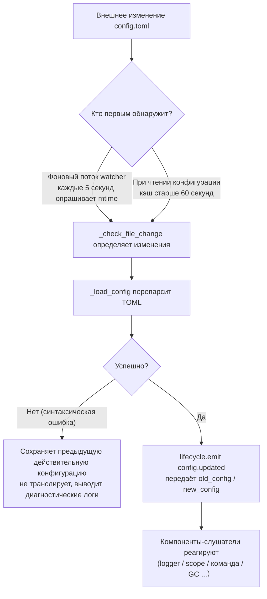

# Описание конфигурационного файла
> В этом документе будет представлено описание конфигурационного файла фреймворка. Если сторонний модуль требует настройки, пожалуйста, обратитесь к документации модуля.

ErisPulse использует конфигурационный файл в формате TOML `config/config.toml` для управления настройками проекта.

## Путь к файлу конфигурации

Файл конфигурации находится в папке `config/` в корневом каталоге проекта:

```
project/
├── config/
│   └── config.toml
├── main.py
```

## Обработка ошибок при загрузке конфигурации

Фреймворк при загрузке `config.toml` различает три состояния ошибок и предоставляет **действенные диагностические сведения**, а не просто беззвучно возвращается к конфигурации по умолчанию:

| Состояние ошибки | Условия возникновения | Поведение фреймворка |
|-----------------|---------------------|----------------------|
| Файл отсутствует | `config.toml` не существует | При первом запуске нормально, без предупреждений использует пустую конфигурацию |
| Синтаксическая ошибка TOML | Файл существует, но имеет некорректный формат (например, отсутствуют кавычки, не закрыты скобки) | Выводит **номер строки/столбца и причину ошибки**, и сообщает, что использована конфигурация по умолчанию |
| Ошибка прав доступа/другие ошибки | Отсутствуют права на чтение, ошибки ввода-вывода и т.д. | Выводит **ясную причину**, и сообщает, что использована конфигурация по умолчанию |

Например, если вы случайно напишете в конфигурации `port = 8000` (без кавычек для строки), лог будет содержать что-то вроде:

```
[ERROR] [Config] Синтаксическая ошибка в конфигурационном файле config/config.toml (строка 3, столбец 1): ...
[WARNING] [Config] Не удалось прочитать конфигурационный файл. Продолжение работы с последней действительной конфигурацией. Изменения в файле не были применены — пожалуйста, исправьте и перезагрузите или перезапустите
```

Таким образом, вы сможете **в моменте на уровне INFO** сразу определить проблему, а не задаваться вопросом "почему мои изменения в конфигурации не вступили в силу".

> **Испорченный конфигурационный файл во время работы?** Если вы в процессе работы робота вручную отредактируете `config.toml`, вводя синтаксическую ошибку, фреймворк при следующей попытке записи (слияния конфигурации) выведет сообщение «Конфигурационный файл повреждён (ошибка синтаксиса, строка X), невозможно записать — пожалуйста, сначала исправьте конфигурационный файл и перезапустите», а не запутанное «Ошибка записи». Изменения, ожидающие записи, будут сохранены, и не будут потеряны.

## Переменные окружения

Фреймворк поддерживает **переопределение** параметров конфигурации `ErisPulse.*` с помощью переменных окружения (подходит для развертывания с Docker / в контейнерах / в CI, без необходимости изменения `config.toml`).

Правило именования: замените точечный путь `ErisPulse.<section>.<key>` на заглавные буквы, замените `.` на `_` и добавьте префикс `ERISPULSE_`:

| Параметр конфигурации | Переменная окружения | Пример значения |
|-----------------------|----------------------|-----------------|
| `ErisPulse.server.port` | `ERISPULSE_SERVER_PORT` | `9000` |
| `ErisPulse.server.host` | `ERISPULSE_SERVER_HOST` | `0.0.0.0` |
| `ErisPulse.logger.level` | `ERISPULSE_LOGGER_LEVEL` | `DEBUG` |
| `ErisPulse.framework.strict_mode` | `ERISPULSE_FRAMEWORK_STRICT_MODE` | `false` |

Описание поведения:
- **Наивысший приоритет**: переменные окружения переопределяют параметры из конфигурационного файла и значения по умолчанию, автоматически преобразуя типы (bool / int / float / list, разделённый запятыми / строка)
- **Непостоянное хранение**: переопределение действует только во время выполнения, не записывается обратно в `config.toml`
- **Поддержка горячей перезагрузки**: при изменении переменных окружения во время работы, с помощью перезагрузки конфигурации на основе прослушивания изменений, изменения вступают в силу

```bash
# Пример развертывания с Docker: без изменения config.toml, просто переопределяем порт
ERISPULSE_SERVER_PORT=9000 docker compose up -d
```

> Примечание: такие параметры конфигурации фреймворка, как `ErisPulse.server.port`, читаются с помощью API, таких как `get_server_config()`, и подвержены влиянию переменных окружения.

## Конфигурация горячего обновления

Начиная с версии 2.7.0, фреймворк предоставляет **системную поддержку горячего обновления конфигурации**. После внешнего изменения `config.toml` (фоновый watcher каждые 5 секунд проверяет изменения) или вызова кодом `setConfig()`, соответствующие компоненты автоматически реагируют:

| Компонент | Поддерживаемые конфигурации для горячего обновления | Поведение |
|-----------|--------------------------------------------------|----------|
| **Логгер Logger** | `logger.level` / `log_files` / `log_dir` (включая параметры сегментации) / `memory_limit` / `format` / `exclude_levels` | Автоматически перезапускается (с обнаружением изменений) |
| **Система команд CommandHandler** | `event.command.prefix` / `case_sensitive` / `allow_space_prefix` / `must_at_bot` | Применяется к следующему сообщению |
| **Параллелизм адаптеров** | `framework.handler_max_concurrency` | Сигналы кэша становятся недействительными, пересоздаются по новым значениям |
| **Активный GC** | `framework.proactive_gc_*` | Изменение конфигурации немедленно перезапускает задачи GC, поддерживается изменение/отключение/включение в режиме выполнения |
| **Система владельцев Master** | `master.users` | Каждый вызов `is_master()` проверяет актуальные данные, перезапуск не требуется |
| **Конфигурация модулей/адаптеров** | Собственные конфигурации | Вызывается обратный вызов `on_config_update(old, new)` |

**Конфигурации, требующие перезапуска** (небезопасно безопасно изменять в процессе, при изменении выводится предупреждение "Требуется перезапуск процесса для применения"):

| Конфигурация | Причина |
|--------------|---------|
| `router.cors.*` / `router.security.*` | Промежуточные слои записываются в FastAPI при запуске сервиса, безопасное горячее переключение невозможно во время выполнения |
| `storage.use_global_db` | SQLite-дескриптор файла уже открыт во время выполнения, безопасная смена пути невозможна |

> **Ошибка при редактировании и сохранении?** Если при редактировании `config.toml` возникает кратковременная синтаксическая ошибка, фреймворк **сохраняет предыдущую действительную конфигурацию** и выводит диагностические логи, не распространяя пустую конфигурацию среди компонентов (чтобы избежать неправильного возврата к значениям по умолчанию в `on_config_update`).

### Внутренняя разбивка цепочки горячего обновления

«Как компоненты узнают, что конфигурация изменилась?» — за этим стоит цепочка: обнаружение → перезагрузка → трансляция:



**Две линии обнаружения** (достаточно одной, обе обеспечивают резерв):

| Линия | Механизм | Триггер |
|-------|----------|---------|
| Фоновый watcher | Демон-поток `config-watcher` каждые **5 секунд** `wait` опрашивает `mtime` файла | Внешнее изменение файла с задержкой до 5 секунд |
| Ленивое обнаружение | При любом вызове `getConfig()` проверка кэша старше **60 секунд** | Следующий вызов чтения конфигурации |

> **Фреймворк не повредит сам себя**: при записи `setConfig()` в файл записывается «mtime, записанное самим», watcher сравнивает и исключает его, обнаруживая только **внешние изменения**.

**Два типа событий изменения конфигурации:**

| Событие | Инициатор | Данные | Типичный сценарий |
|---------|-----------|--------|-------------------|
| `config.set` | Код / Dashboard вызывает `setConfig()` | `{key, old_value, new_value}` | Одиночное изменение (генерация шаблонов, запись состояния, изменение конфигурации в режиме выполнения) |
| `config.updated` | После внешнего изменения watcher/Ленивое обнаружение | `{old_config, new_config, config_file}` | Ручное изменение `config.toml` |

> `setConfig()` по умолчанию **задерживает запись на диск на 5 секунд** (объединяет несколько записей), `immediate=True` — немедленная запись. watcher обнаруживает внешние изменения, обновляет только кэш в памяти, **не** перезаписывает файл.

**Список автоматически реагирующих компонентов** (обычно оба события подписываются, реакция одинакова):

| Компонент | Подписка | Реакция |
|-----------|----------|---------|
| Logger | `config.set` + `config.updated` | Уровень/файл/каталог сегментации/ограничение памяти/формат/уровень исключения перезапускаются (с обнаружением изменений, без изменений не перезапускаются) |
| Scope | `config.updated` | Перестроение кэша привязки области |
| Система команд | `config.updated` | Перезапуск параметров префикса/регистра/префикса с пробелом/must_at_bot, применяется к следующему сообщению |
| Параллелизм адаптеров | `config.set` + `config.updated` | `handler_max_concurrency` делает сигналы кэша недействительными, пересоздает семафоры |
| Активный GC | `config.set` + `config.updated` | `proactive_gc_*` немедленно перезапускает фоновую задачу GC |
| Адаптер | Перенаправление в `on_config_update` | Обратный вызов `on_config_update(old, new)` для каждого адаптера |
| Модуль | Перенаправление в `on_config_update` | Обратный вызов `on_config_update(old, new)` для каждого модуля |
| Хранилище | `config.updated` | Изменение `use_global_db` **только предупреждение** (требуется перезапуск) |
| Роутер | `config.updated` | Изменение `cors.*` / `security.*` **только предупреждение** (требуется перезапуск) |

## Полный пример конфигурации

```toml
[ErisPulse.server]
host = "0.0.0.0"
port = 8000
auto_start = true
ssl_certfile = ""
ssl_keyfile = ""

[ErisPulse.master]
# users поддерживает два способа записи (выберите один из них):
#   Глобальный владелец (действует на всех платформах): users = ["123456", "789012"]
#   Владелец по платформе: users = { yunhu = ["123456"], telegram = ["789012"] }
users = {}

[ErisPulse.logger]
level = "INFO"
format = "rich"
log_files = []
log_dir = ""
log_rotation = "size"
log_max_size_mb = 10
log_backup_count = 5
log_rotation_when = "midnight"
memory_limit = 1000
exclude_levels = []

[ErisPulse.framework]
enable_lazy_loading = true
uninit_timeout = 30
strict_mode = 0

[ErisPulse.framework.strict_mode_exceptions]
modules = []
adapters = []

[ErisPulse.storage]
use_global_db = false

[ErisPulse.event.command]
prefix = "/"
case_sensitive = true
allow_space_prefix = false
must_at_bot = false

[ErisPulse.event.message]
ignore_self = true

[ErisPulse.i18n]
language = "auto"
```

## Настройка сервера

```toml
[ErisPulse.server]
host = "0.0.0.0"
port = 8000
auto_start = true
ssl_certfile = "/path/to/cert.pem"
ssl_keyfile = "/path/to/key.pem"
```

| Параметр | Тип | Значение по умолчанию | Описание |
|---------|------|---------|------|
| host | string | 0.0.0.0 | Адрес прослушивания, 0.0.0.0 означает все интерфейсы |
| port | integer | 8000 | Прослушиваемый порт |
| auto_start | boolean | true | Автоматически запускать сервер маршрутизации при вызове `sdk.init()`. При значении `false` пропускается запуск сервера маршрутизации (сценарии без WebUI или только событий) |
| ssl_certfile | string | пусто | Путь к файлу SSL-сертификата |
| ssl_keyfile | string | пусто | Путь к файлу SSL-ключа |

## Конфигурация системы хозяина

Система хозяина используется для распознавания аккаунтов "хозяев фреймворка" (например, администраторов бота). `master.users` поддерживает два способа записи:

```toml
[ErisPulse.master]
# Способ 1: Глобальный хозяин (действует на всех платформах)
users = ["123456", "789012"]

# Способ 2: Хозяин по платформе (dict)
# users = { yunhu = ["123456"], telegram = ["789012"] }
```

| Параметр | Тип | Значение по умолчанию | Описание |
|---------|------|---------|------|
| users | array / object | пустой | Список аккаунтов хозяев. Формат `list` — глобальный хозяин (действует на всех платформах); формат `dict` — хозяин по платформе (ключ — имя платформы, значение — список аккаунтов хозяев для этой платформы) |

В коде используется `master.is_master(event)` или `master.is_master(platform, user_id)` для проверки, при каждом вызове конфигурация читается в реальном времени (поддерживается горячая перезагрузка, без необходимости перезапуска):

```python
from ErisPulse.Core import master

if master.is_master(event):
    await event.reply("Привет, хозяин")
```

> Полный API для определения статуса (динамическое добавление/удаление в ходе выполнения, **цепочка пользовательских источников статуса provider**) и семантика "пользовательский приоритет" (пользователь может через интерфейс управления разрешить/ограничить `master=True`), см. в разделе [Единый интерфейс управления · Хозяин и пользовательские источники статуса provider](../advanced/scope.md#хозяин-и-пользовательские-источники-статуса-provider).

## Настройка логов

```toml
[ErisPulse.logger]
level = "INFO"
log_files = []                # Явный список файлов логов (взаимоисключающий с log_dir, имеет более высокий приоритет)
log_dir = ""                  # Директория для логов (автоматическая сегментация при записи)
log_rotation = "size"         # Способ сегментации: "size" / "date" / "none"
log_max_size_mb = 10          # Максимальный размер файла в режиме size (МБ)
log_backup_count = 5          # Количество сохраняемых файлов логов
log_rotation_when = "midnight"  # Период сегментации в режиме date: S/M/H/D/midnight
memory_limit = 1000
exclude_levels = ["EVENT"]
```

| Параметр | Тип | Значение по умолчанию | Описание |
|---------|------|---------|------|
| level | string | INFO | Уровень логов: TRACE, DEBUG, INFO, WARNING, ERROR, CRITICAL (TRACE — самый низкий уровень, выводит подробную отладочную информацию фреймворка) |
| format | string | rich | Формат вывода логов: `rich` (цветной, по умолчанию), `plain` (чистый текст без цвета, подходит для сбора логов/перенаправления в поток), `json` (структурированный JSON, подходит для ELK и др.) |
| log_files | array | пустой | Список файлов для вывода логов (явные пути, без сегментации) |
| log_dir | string | пустой | Директория для вывода логов (автоматически создается). При установке запись ведется в файл `erispulse.log` в этой директории с автоматической сегментацией по `log_rotation`; взаимоисключающий с `log_files`, `log_files` имеет более высокий приоритет |
| log_rotation | string | size | Способ сегментации: `size` (по размеру) / `date` (по времени) / `none` (без сегментации) |
| log_max_size_mb | float | 10 | Максимальный размер файла в режиме size (МБ), при превышении создается резервный файл `.1`/`.2` |
| log_backup_count | integer | 5 | Количество сохраняемых файлов логов, старые файлы автоматически удаляются |
| log_rotation_when | string | midnight | Период сегментации в режиме date: `S`/`M`/`H`/`D`/`midnight` (по умолчанию каждый день в полночь) |
| memory_limit | integer | 1000 | Количество записей логов, сохраняемых в памяти |
| exclude_levels | array | пустой | Список уровней логов, которые нужно исключить. Логи указанных уровней **полностью отбрасываются** (не записываются в память, не отправляются подписчикам, таким как Dashboard, не выводятся, не записываются в файл). Поддерживается горячая перезагрузка |

Настройки также можно динамически изменять в коде:

```python
from ErisPulse.Core import logger

# Сегментация по размеру: файл 10 МБ, сохранить 5 файлов
logger.set_output_dir("logs", rotation="size", max_size_mb=10, backup_count=5)

# Сегментация по времени: смена файла каждый день в полночь, сохранить 7 файлов
logger.set_output_dir("logs", rotation="date", backup_count=7)
```

> [!NOTE]
> Настройки `log_dir` и связанные с сегментацией требуют ErisPulse **2.8.0+**.

> **Защита конфиденциальности**: Содержимое сообщений записывается на уровне **EVENT** (значение 21). Установка `exclude_levels = ["EVENT"]` позволит скрыть содержимое сообщений в чатах/личных сообщениях от бэкенда (например, в панели логов Dashboard), при этом другие уровни логов будут работать без изменений.

> [!NOTE]
> Функция `exclude_levels` доступна начиная с ErisPulse **2.8.0+**.

## Конфигурация фреймворка

```toml
[ErisPulse.framework]
enable_lazy_loading = true
uninit_timeout = 30
strict_mode = 0

[ErisPulse.framework.strict_mode_exceptions]
modules = []
adapters = []
```

| Параметр | Тип | Значение по умолчанию | Описание |
|---------|------|---------|------|
| enable_lazy_loading | boolean | true | Включает ли ленивую загрузку модулей |
| uninit_timeout | integer | 30 | Общее время ожидания при корректном завершении (секунды), после которого происходит принудительное завершение. 0 означает отсутствие таймаута |
| strict_mode | integer | 0 | Уровень строгого режима, см. описание ниже «Строгий режим» |
| handler_max_concurrency | integer | 64 | Максимальное количество одновременных задач обработчиков событий, увеличение повышает пропускную способность, но увеличивает потребление памяти |
| offline_bot_expiry | integer | 3600 | Время автоматической просрочки записи для оффлайн-бота (секунды), 0 означает отсутствие просрочки |

### Конфигурация активного сборщика мусора

После инициализации SDK запускается фоновая задача активного сборщика мусора, периодически выполняющая сборку мусора Python и внутреннюю очистку ресурсов (очистка оффлайн-ботов и т.д.). Все параметры поддерживают горячее обновление, изменение параметров немедленно перезапускает задачу.

| Параметр | Тип | Значение по умолчанию | Описание |
|---------|------|---------|------|
| proactive_gc_interval | number | 300 | Интервал сборки (секунды), поддерживает десятичные дроби. 0 означает отключение активного сборщика мусора |
| proactive_gc_generation | integer | 0 | Обычная генерация сборки (0/1/2, ограничено от 0 до 2). Обратите внимание, что `gc.collect(2)` эквивалентен полной сборке, по умолчанию 0 сохраняет легкость; глубокая сборка запускается периодически по `proactive_gc_full_every` |
| proactive_gc_full_every | integer | 20 | Полная сборка выполняется каждые N циклов, 0 означает отключение периодической полной сборки. Полная сборка ограничена порогом `proactive_gc_memory_growth_mb` |
| proactive_gc_memory_growth_mb | integer | 32 | Порог роста памяти для полной сборки (МБ): сравнивается с базой памяти после последней полной сборки (в первую очередь tracemalloc, затем RSS), полная сборка выполняется только при достижении этого порога. 0 означает отсутствие порога |
| proactive_gc_idle_only | boolean | false | При включении, в периоды пикового события (существуют незавершенные pending handler) текущий цикл Python GC пропускается, чтобы избежать пауз и конкуренции с обработкой сообщений; внутренняя очистка ресурсов не затрагивается |
| proactive_gc_gen0_min | integer | 500 | Минимальное количество мусора для запуска обычной генерации сборки: `gc.get_count()[0]` ниже этого значения пропускает цикл (почти нулевые накладные расходы). 0 означает постоянную сборку |

> **Изменение 2.7.1**: значение по умолчанию `proactive_gc_generation` изменилось с `2` на `0`, значение по умолчанию `proactive_gc_full_every` изменилось с `0` на `20`. Ранее `generation=2` означало полную сборку каждый цикл; новое значение по умолчанию сохраняет охват сборки, но значительно снижает накладные расходы на пустые циклы. Явно заданные старые значения по-прежнему действуют по смыслу.

### Строгий режим

Строгий режим определяет стратегию обработки компонентов, которые не соответствуют требованиям или завершаются с ошибкой на этапе загрузки. Современные модули/адаптеры должны наследовать соответствующие базовые классы (`BaseModule`/`BaseAdapter`), компоненты, не наследующие базовые классы, влияют на систему контекста фреймворка и на базовую очистку, что может привести к утечке ресурсов.

> **Изменение 2.5.2**: уровень по умолчанию изменился с `1` (пропуск) на `0` (мягкий), чтобы уменьшить проблемы при первом использовании новыми пользователями. Компоненты, не наследующие базовые классы, будут предупреждаться и попыткой загрузки, а не непосредственным отказом. Для восстановления прежнего поведения необходимо явно установить `strict_mode = 1`.

| Уровень | Название | Поведение |
|------|------|------|
| 0 | Мягкий (по умолчанию) | Нарушения только предупреждаются, компоненты, не наследующие базовые классы, все равно будут загружаться (совместимость со старыми компонентами) |
| 1 | Строгий-пропуск | Компоненты, не наследующие базовые классы, отклоняются и пропускаются, остальные компоненты загружаются нормально |
| 2 | Строгий-фатальный | Все нарушения (не наследование базовых классов, сбой загрузки, сбой регистрации, сбой инициализации и т.д.) превращаются в фатальные, все нарушения собираются на этапе проверки запуска и система завершается |

На всех уровнях, ошибки, возникающие на этапах загрузки/регистрации/инициализации, всегда будут пропущены; различия заключаются в следующем:

- **0 → 1**: единственное изменение поведения — «не наследование базовых классов» из «все еще загрузка» превращается в «пропуск».
- **1 → 2**: все нарушения (не наследование базовых классов, сбой загрузки, сбой регистрации, сбой инициализации и т.д.) повышаются до фатального уровня, на этапе проверки запуска собирается список нарушений и система завершается.

#### Список исключений

Если некоторые компоненты действительно временно не могут быть перенесены (например, зависят от старых модулей), их можно включить в список исключений, и компоненты, включенные в этот список, будут обрабатываться как в мягком режиме, продолжая загрузку:

```toml
[ErisPulse.framework.strict_mode_exceptions]
modules = ["SeTu", "SomeLegacyModule"]
adapters = ["OldAdapter"]
```

> Когда компонент отклоняется строгим режимом, в журнале будет четко указано, как восстановить загрузку (включение в список исключений или понижение уровня).

## Конфигурация хранилища

```toml
[ErisPulse.storage]
use_global_db = false
```

| Параметр | Тип | Значение по умолчанию | Описание |
|---------|------|---------|------|
| use_global_db | boolean | false | Использовать ли глобальную базу данных (внутри пакета), а не базу данных проекта. При `true` все проекты будут использовать общий SQLite-файл базы данных внутри пакета ErisPulse; при `false` (по умолчанию) каждый проект использует свою отдельную базу данных в каталоге `config/` |

## Конфигурация событий

### Конфигурация команд

```toml
[ErisPulse.event.command]
prefix = "/"
case_sensitive = true
allow_space_prefix = false
```

| Параметр | Тип | Значение по умолчанию | Описание |
|---------|------|---------|------|
| prefix | string | / | Префикс команды |
| case_sensitive | boolean | true | Регистр букв учитывается (`/Help` и `/help` — разные команды) |
| allow_space_prefix | boolean | false | Разрешить пробел в качестве префикса |
| must_at_bot | boolean | false | Команду можно вызвать только при упоминании бота (в личных сообщениях это правило не применяется) |

### Конфигурация сообщений

```toml
[ErisPulse.event.message]
ignore_self = true
```

| Параметр | Тип | Значение по умолчанию | Описание |
|---------|------|---------|------|
| ignore_self | boolean | true | Игнорировать собственные сообщения бота |

## Конфигурация международной локализации

```toml
[ErisPulse.i18n]
language = "auto"
```

| Параметр | Тип | Значение по умолчанию | Описание |
|---------|------|---------|------|
| language | string | auto | Язык отображения встроенных текстов фреймворка. Установка значения `auto` автоматически определяет системный язык. Также можно указать конкретный код языка: `zh-CN`, `zh-TW`, `en`, `ja`, `ru` |

## Конфигурация модуля

Каждый модуль может определить свою собственную конфигурацию в файле конфигурации:

```toml
[MyModule]
api_url = "https://api.example.com"
timeout = 30
enabled = true
```

Чтение и запись конфигурации в модуле:

```python
from ErisPulse import sdk

# Чтение конфигурации
config = sdk.config.getConfig("MyModule", {})
api_url = config.get("api_url", "https://default.api.com")

# Запись конфигурации во время выполнения (отложено сохранение)
sdk.config.setConfig("MyModule.timeout", 60)

# Немедленное сохранение в файл
sdk.config.setConfig("MyModule.timeout", 60, immediate=True)
```

> `setConfig` по умолчанию использует отложенную запись (примерно каждые 5 секунд пакетное сохранение в файл), установка `immediate=True` позволяет немедленно сохранить данные. Изменения конфигурации запускают событие жизненного цикла `config.set`.

## Конфигурация контролируемой поверхности (scope)

> [!NOTE]  
> Эта функция требует ErisPulse **2.8.0+**.

Единая контролируемая поверхность является **единственным** входом для управления правами/доступом, пятимерная конфигурационная структура:

| Измерение | Что контролировать | Путь конфигурации |
|------|---------|---------|
| ① Модуль | Какие модули доступны в платформе / Bot / сессии | `scope.platforms / bots / sessions` |
| ② Идентичность | Получают ли события определенного пользователя / группы / Bot / адаптера | `scope.identity.*` |
| ③ Команда | Кто может выполнить определенную команду (имя команды поддерживает glob) | `scope.commands` |
| ④ Обработчик | Фильтрация текста для обработчиков модуля | `scope.handlers` |
| ⑤ Переопределение | Переопределение реализации параметров модуля/команды | `scope.overrides` |

```toml
[ErisPulse.scope]
default_allow = true        # Глобальный резервный параметр (false = строгий режим отклонения по умолчанию)
cache_size = 1024           # Размер кэша LRU

# ① Модульный уровень (приоритет: сессия > Bot > платформа; записи поддерживают точное совпадение / glob / re: регулярные выражения)
[ErisPulse.scope.platforms.onebot11]
modules = ["Chat", "Tool*"]
blocked = ["re:^Danger"]

# ② Уровень идентичности (приоритет: пользователь > сессия > Bot > адаптер; на каждом уровне пишется только allow или deny)
[ErisPulse.scope.identity.adapters.onebot11]
deny = true                 # Все события этой платформы отбрасываются на входе
[ErisPulse.scope.identity.users.onebot11]
allow = ["u_admin"]         # Поддержка glob / re: регулярных выражений для ключей пользователей
deny = ["u_bad", "spam_*"]

# ③ Уровень команд (идентификатор пользователя "platform:user_id")
[ErisPulse.scope.commands."roll*"]
allow = ["onebot11:u_vip"]
deny = ["onebot11:u_bad"]

# ④ Уровень обработчиков/текста (логическое AND с условиями в коде)
[ErisPulse.scope.handlers.MyModule]
pattern = "签到*"

# ⑤ Переопределение реализации параметров (отключение через deny команды, не здесь)
[ErisPulse.scope.overrides.MyModule.restart]
master = true
hidden = true
```

| Параметр | Тип | Описание |
|---------|------|------|
| `scope.default_allow` | boolean | Глобальный резервный параметр: разрешение/отклонение для несовпадающих правил (true). Модули/идентичность "без правил = отклонение"; команды "без ACL = отклонение" |
| `scope.cache_size` | integer | Размер кэша LRU (по умолчанию 1024) |
| `scope.platforms / bots / sessions` | table | ① Трехуровневое привязывание модуля: `{modules=[...], blocked=[...]}` |
| `scope.identity.adapters / bots / sessions / users` | table | ② Четырехуровневое привязывание идентичности: `{allow=true}` / `{deny=true}` |
| `scope.commands.<имя команды>` | table | ③ ACL команды: `{allow=[...], deny=[...]}` |
| `scope.handlers.<модуль>` | table | ④ Фильтрация текста: `{pattern="...", regex="..."}` |
| `scope.overrides.<модуль>[.<команда>]` | table | ⑤ Переопределение параметров: `master` / `hidden` / `aliases` / `prefix` и др. |

> Общий синтаксис для совпадающих записей: точное имя / glob (`*` `?` `[seq]`) / `re:` регулярное выражение, без учета регистра.
> Подробное описание пяти измерений и API во время выполнения (`sdk.scope.bind_module()` / `bind_identity()` / `block_user()` /
> `allow_user()` / `override()` и др.) см. в [Единой контролируемой поверхности](../advanced/scope.md).

## Далее

- [Справочник команд CLI](cli-reference.md) - Узнайте обо всех командах командной строки
- [Руководство для разработчиков](../developer-guide/) - Изучите разработку пользовательских модулей