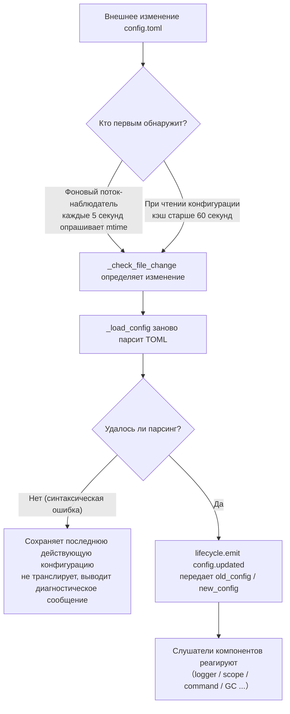

# Описание конфигурационного файла
> Этот документ описывает конфигурационный файл фреймворка. Если у стороннего модуля есть настройки, обратитесь к документации модуля.

ErisPulse использует конфигурационный файл в формате TOML `config/config.toml` для управления конфигурацией проекта.

## Позиция конфигурационного файла

Конфигурационный файл находится в папке `config/` в корне проекта:

```
project/
├── config/
│   └── config.toml
├── main.py
```

### Подсказка по нескольким экземплярам и файлу блокировки

При запуске фреймворка в папке `config/` создается файл блокировки `.erispulse_config.lock`, который удерживается до завершения процесса (используется для обнаружения нескольких экземпляров, использующих одну и ту же папку конфигурации). Если в логах появляется предупреждение «Обнаружено, что конфигурационный файл, возможно, используется другим экземпляром ErisPulse одновременно», это означает, что **два и более экземпляров ErisPulse записывают в один и тот же файл конфигурации** (типичный сценарий: несколько контейнеров монтируют одну и ту же папку `config/` хоста) — одновременная запись будет перезаписывать друг друга, поэтому для каждого экземпляра используйте отдельную папку конфигурации.

## Обработка ошибок загрузки конфигурации

Фреймворк при загрузке `config.toml` различает три состояния ошибок и предоставляет **действенные диагностические сообщения**, а не просто переходит к значениям по умолчанию:

| Состояние ошибки | Условия срабатывания | Поведение фреймворка |
|---------|---------|---------|
| Файл отсутствует | `config.toml` не существует | Нормальный запуск, использование пустой конфигурации (без предупреждения) |
| Ошибка синтаксиса TOML | Файл существует, но формат некорректен (например, отсутствуют кавычки, не закрыты скобки) | Вывод **номера строки/столбца и причины ошибки**, а также уведомление о возврате к значениям по умолчанию |
| Ошибка доступа/другие ошибки | Отсутствие прав на чтение, ошибки ввода-вывода и т.д. | Вывод **ясной причины**, а также уведомление о возврате к значениям по умолчанию |

Например, если вы случайно напишете `port = 8000` (без кавычек для строки), лог выведет примерно следующее:

```
[ERROR] [Config] Синтаксическая ошибка в конфигурационном файле config/config.toml (строка 3, столбец 1): ...
[WARNING] [Config] Ошибка чтения конфигурационного файла. Продолжение работы с последней действующей конфигурацией, изменения в файле не применились — исправьте и перезагрузите или перезапустите
```

Таким образом, вы можете сразу определить проблему на уровне `INFO`, а не задаваться вопросом "почему мои изменения в конфигурации не применились".

> **Что делать, если испортить конфигурационный файл во время работы?** Если вы вручную отредактируете `config.toml`, внося синтаксическую ошибку, фреймворк при следующей попытке записи (объединение конфигурации) выведет сообщение «Конфигурационный файл поврежден (ошибка синтаксиса, строка X), невозможно записать — исправьте конфигурационный файл и перезапустите», а не неясное «Ошибка записи». Записываемые параметры будут сохранены, не будет потерь.

## Сохранение комментариев и минимизация записи на диск

**Комментарии и порядок ключей в `config.toml` сохраняются полностью после записи фреймворком**: будь то `setConfig()`, сохранение конфигурации через CLI-конфигуратор или генерация шаблона конфигурации адаптером/модулем, фреймворк изменяет только затронутые ключи, ваши комментарии и порядок не будут удалены или перемешаны (на основе сохранения комментариев tomlkit).

Фреймворк сдержан в записи на диск:

- **Значения по умолчанию фреймворка не записываются автоматически**: `gc`, `scope`, `transcript` и другие встроенные значения по умолчанию хранятся только в памяти, `config.toml` содержит только ключи, установленные вами явно, сохраняя минимальный объем. Полный список настраиваемых параметров см. в `config/config.full.example` проекта, скопируйте нужные в `config.toml` и измените (не настроенные параметры по-прежнему используют встроенные значения по умолчанию, поведение не меняется).
- **`config.full.example` автоматически поддерживается**: независимо от того, выполняли ли вы `epsdk init`, при запуске фреймворка (`epsdk run` / `main.py`) будет автоматически сгенерирован `config/config.full.example`, если файл отсутствует. В первой строке файла — метка, управляемая фреймворком, содержимое генератора обновляется (например, при добавлении новых конфигурационных параметров, установке новых компонентов) при запуске; удаление/изменение первой строки означает ручное управление, фреймворк больше не будет перезаписывать.
- **Шаблоны конфигурации адаптера/модуля**: при первом инициализации шаблон с комментариями сохраняется на диск (описание полей — это комментарии); поля, помеченные как `example`, не записываются на диск, только сохраняются в `config.full.example` для справки.

## Перекрытие с помощью переменных окружения

Фреймворк поддерживает перекрытие конфигурационных параметров `ErisPulse.*` с помощью переменных окружения (подходит для Docker / контейнеризации / CI-развертывания, без необходимости изменять `config.toml`).

Правила именования: замените точечный путь `ErisPulse.<section>.<key>` на полные заглавные буквы, замените `.` на `_` и добавьте префикс `ERISPULSE_`:

| Конфигурация | Переменная окружения | Пример значения |
|--------|---------|--------|
| `ErisPulse.server.port` | `ERISPULSE_SERVER_PORT` | `9000` |
| `ErisPulse.server.host` | `ERISPULSE_SERVER_HOST` | `0.0.0.0` |
| `ErisPulse.logger.level` | `ERISPULSE_LOGGER_LEVEL` | `DEBUG` |
| `ErisPulse.framework.strict_mode` | `ERISPULSE_FRAMEWORK_STRICT_MODE` | `false` |

Описание поведения:

- **Наивысший приоритет**: переменные окружения перекрывают «конфигурационный файл» и «значения по умолчанию», автоматически преобразуются по типу (bool / int / float / список, разделенный запятыми / строка)
- **Не сохраняются**: перекрытие действует только в процессе выполнения, не записывается обратно в `config.toml`
- **Поддержка горячей перезагрузки**: после изменения переменной окружения во время выполнения, с перезагрузкой конфигурации можно сразу применить изменения

```bash
# Пример развертывания в Docker: без изменения config.toml, просто перекройте порт
ERISPULSE_SERVER_PORT=9000 docker compose up -d
```

> Примечание: `ErisPulse.server.port` и другие конфигурации фреймворка, читаемые через `get_server_config()` и другие API, подвержены влиянию переменных окружения.

### Привязка переменных окружения к конфигурации модуля (2.9.0+)

Конфигурация модуля в виде декларативного класса (`ConfigClass`) поддерживает привязку переменных окружения на уровне полей — в `field(metadata=...)` объявите `env`:

```python
@dataclass
class MyConfig(BaseConfig):
    api_key: str = field(default="", metadata={
        "description": "Ключ API",
        "env": "MYMODULE_API_KEY",   # Привязка к переменной окружения
    })
    retries: int = field(default=3, metadata={"env": "MYMODULE_RETRIES"})
```

Описание поведения:

- **Приоритет**: переменная окружения > `config.toml` > значение по умолчанию (конфигурация горячей перезагрузки сохраняет этот приоритет)
- **Тип преобразования**: значение переменной окружения автоматически преобразуется по аннотации поля — `str` как есть, `int` / `float` / `bool` (`true` / `1` / `yes` / `on`) автоматически преобразуются, `list` / `dict` через JSON-парсинг; при неудачном преобразовании пропускается перекрытие (возвращается конфигурация файла / значение по умолчанию) и выводится предупреждение
- **Одно объявление, везде работает**: конфигурация используется, горячая перезагрузка, валидация через один канал; схема конфигурации указывает `env` имя, комментарии в шаблоне config.toml также указывают доступные переменные окружения (шаблон не записывает фактические значения переменных окружения, чтобы избежать утечки)
- **Полная совместимость**: поведение полей без `env` не меняется; непосредственное создание ConfigClass (без канала конфигурации фреймворка) не зависит от переменных окружения

```bash
# Пример развертывания в Docker: без изменения config.toml, просто вставьте ключ модуля
MYMODULE_API_KEY=sk-xxx docker compose up -d
```

> **Что выбрать: конфигурационный класс или ORM-поле?** Конфигурационный класс управляет «как работает модуль» (параметры поведения, горячая перезагрузка), `Field()` ORM управляет «какие данные создал пользователь» (таблицы базы данных, запросы). Оба используют одну и ту же систему ограничений и движок валидатора; таблица сравнения доступна в разделе [Слой данных модели · Когда использовать какое объявление](../developer-guide/orm.md#когда-использовать-какое-объявление).

## Горячая перезагрузка конфигурации

Начиная с версии 2.7.0, фреймворк системно поддерживает горячую перезагрузку конфигурации. После внешнего изменения `config.toml` (фоновый watcher каждые 5 секунд проверяет) или вызова кодом `setConfig()`, компоненты автоматически реагируют:

| Компонент | Поддержка горячей перезагрузки | Поведение |
|------|----------------|------|
| **Логгер Logger** | `logger.level` / `log_files` / `log_dir` (с параметрами сегментации) / `memory_limit` / `format` / `exclude_levels` | Автоматически переприменяется (с обнаружением изменений) |
| **Командная система CommandHandler** | `event.command.prefix` / `case_sensitive` / `allow_space_prefix` / `must_at_bot` | Действует с первой следующей сообщением |
| **Параллелизм адаптера** | `framework.handler_max_concurrency` | Сигнал к失效 кэша, перестроение по новому значению |
| **Активный GC** | `framework.proactive_gc_*` | Изменения конфигурации немедленно перезапускают задачу GC, поддержка изменения/отключения/переактивации во время выполнения |
| **Система хозяина Master** | `master.users` | Каждый вызов `is_master()` проверяет в реальном времени, без перезапуска |
| **Конфигурация модулей/адаптеров** | Собственные конфигурационные параметры | Вызывается обратный вызов `on_config_update(old, new)` |

**Конфигурации, требующие перезапуска** (небезопасно безопасно переключить во время выполнения, при изменении выводится предупреждение «Требуется перезапуск процесса для применения»):

| Конфигурация | Причина |
|------|------|
| `router.cors.*` / `router.security.*` | Промежуточные слои записываются в FastAPI при запуске службы, безопасно переключить во время выполнения невозможно |
| `storage.use_global_db` | Дескриптор файла SQLite уже открыт во время выполнения, безопасно сменить путь невозможно |

> **Ошибка при редактировании и сохранении?** Если при редактировании `config.toml` возникает временный синтаксический сбой, фреймворк **сохраняет последнюю действующую конфигурацию** и выводит диагностическое сообщение, не распространяя пустую конфигурацию среди компонентов (избегает `on_config_update` получения пустого значения и возврата к значению по умолчанию).

### Разбор внутренней цепочки горячей перезагрузки

«Как компоненты узнают, что конфигурация изменилась?» — за этим стоит цепочка обнаружения → перезагрузки → трансляции:



**Две пути обнаружения** (достаточно одного, оба обеспечивают резервирование):

| Путь | Механизм | Триггер |
|------|------|---------|
| Фоновый наблюдатель | демон-поток `config-watcher` каждые **5 секунд** `wait` опрашивает `mtime` файла | после изменения файла максимум через 5 секунд |
| Ленивое обнаружение | при любом `getConfig()` чтении, если кэш старше **60 секунд**, сначала проверяется файл | при следующем чтении конфигурации |

> **Фреймворк не повредит сам себя**: при записи `setConfig()` фреймворк записывает «mtime, записанное самим», наблюдатель при сравнении исключает его, считая изменение только **внешним редактированием**.

**Два типа событий изменения конфигурации:**

| Событие | Инициатор | Данные | Типичный сценарий |
|------|--------|------|---------|
| `config.set` | код / Dashboard вызывает `setConfig()` | `{key, old_value, new_value}` | одиночное значение (генерация шаблона, запись состояния, изменение конфигурации во время выполнения) |
| `config.updated` | внешнее редактирование после обнаружения watcher/Ленивое обнаружение | `{old_config, new_config, config_file}` | ручное изменение `config.toml` |

> `setConfig()` по умолчанию **задерживает запись на диск на 5 секунд** (объединяет несколько записей), `immediate=True` — немедленно. Наблюдатель, обнаружив внешнее изменение, обновляет только кэш в памяти, **не** записывает изменения обратно в файл.

**Список автоматических ответчиков** (обычно оба события подписываются, реакция одинакова):

| Компонент | Подписка | Реакция |
|------|------|------|
| Logger | `config.set` + `config.updated` | Уровень/файл/разделение каталога/ограничение памяти/формат/уровни исключения переприменяются (с обнаружением изменений, без изменений не трогать) |
| Scope | `config.updated` | Перестроение кэша привязки области |
| Командная система | `config.updated` | Обновление параметров префикса/регистра/пробела/обязательного упоминания бота, изменение вступает в силу с следующего сообщения |
| Параллелизм адаптера | `config.set` + `config.updated` | `handler_max_concurrency` сбрасывает сигнал перестроения |
| Активный GC | `config.set` + `config.updated` | `proactive_gc_*` немедленно перезапускает фоновую задачу GC |
| Адаптер | перенаправляется в `on_config_update` | Обратный вызов `on_config_update(old, new)` для каждого адаптера |
| Модуль | перенаправляется в `on_config_update` | Обратный вызов `on_config_update(old, new)` для каждого модуля |
| Хранилище | `config.updated` | Изменение `use_global_db` **только предупреждение** (требуется перезапуск) |
| Роутер | `config.updated` | Изменение `cors.*` / `security.*` **только предупреждение** (требуется перезапуск) |

## Полный пример конфигурации

```toml
[ErisPulse.server]
host = "0.0.0.0"
port = 8000
auto_start = true
ssl_certfile = ""
ssl_keyfile = ""

[ErisPulse.master]
# users поддерживает два способа записи (выберите один):
#   глобальный хозяин (действует на всех платформах): users = ["123456", "789012"]
#   хозяин по платформе: users = { yunhu = ["123456"], telegram = ["789012"] }
users = {}

[ErisPulse.logger]
level = "INFO"
format = "rich"
log_files = []
log_dir = ""
log_rotation = "size"
log_max_size_mb = 10
log_backup_count = 5
log_rotation_when = "midnight"
memory_limit = 1000
exclude_levels = []

[ErisPulse.framework]
enable_lazy_loading = true
uninit_timeout = 30
strict_mode = 0

[ErisPulse.framework.strict_mode_exceptions]
modules = []
adapters = []

[ErisPulse.storage]
backend = "sqlite"
use_global_db = false

[ErisPulse.event.command]
prefix = "/"
case_sensitive = true
allow_space_prefix = false
must_at_bot = false

[ErisPulse.event.message]
ignore_self = true

[ErisPulse.i18n]
language = "auto"
```

## Конфигурация сервера

```toml
[ErisPulse.server]
host = "0.0.0.0"
port = 8000
auto_start = true
ssl_certfile = "/path/to/cert.pem"
ssl_keyfile = "/path/to/key.pem"
```

| Конфигурация | Тип | Значение по умолчанию | Описание |
|---------|------|---------|------|
| host | string | 0.0.0.0 | Адрес监听а, 0.0.0.0 означает все интерфейсы |
| port | integer | 8000 | Номер порта监听а |
| auto_start | boolean | true | Автоматически запускать сервер маршрутизации при `sdk.init()`. Установите `false`, чтобы пропустить запуск сервера маршрутизации (чистый сценарий событий/без WebUI) |
| ssl_certfile | string | пустая строка | Путь к файлу сертификата SSL |
| ssl_keyfile | string | пустая строка | Путь к файлу приватного ключа SSL |

## Конфигурация системы хозяина

Система хозяина используется для идентификации «хозяина» аккаунта (например, администратора бота). `master.users` поддерживает два способа записи:

```toml
[ErisPulse.master]
# Способ 1: Глобальный хозяин (действует на всех платформах)
users = ["123456", "789012"]

# Способ 2: Хозяин по платформе (dict)
# users = { yunhu = ["123456"], telegram = ["789012"] }
```

| Конфигурация | Тип | Значение по умолчанию | Описание |
|---------|------|---------|------|
| users | array / object | пустой | Список аккаунтов хозяина. `list` форма — глобальный хозяин (действует на всех платформах); `dict` форма — хозяин по платформе (ключ — имя платформы, значение — список хозяинов на этой платформе) |

В коде проверка осуществляется через `master.is_master(event)` или `master.is_master(platform, user_id)`, каждый вызов читает конфигурацию в реальном времени (поддержка горячей перезагрузки, перезапуск не требуется):

```python
from ErisPulse.Core import master

if master.is_master(event):
    await event.reply("Привет, хозяин")
```

### Цепочка проверки и динамическое добавление

Цепочка проверки хозяина: **конфигурационный хозяин → динамическая запись → провайдер цепочки**:

```python
from ErisPulse.Core import master

master.is_master(event)                      # Проверка по событию
master.is_master("yunhu", "123")             # Явная проверка
master.add("yunhu", "123")                   # Добавление во время выполнения (по умолчанию сохраняется; persist=False — только в памяти)
master.remove("yunhu", "123")                # Удаление (по умолчанию сохраняется)
master.list()                                # Сводка: {"global": [...], "<platform>": [...]}
```

### Пользовательские источники идентификации (провайдеры)

Помимо конфигурации, можно зарегистрировать пользовательские источники идентификации: `fn(platform, user_id) -> bool`, встроенные источники идентификации (конфигурация + динамическая запись) не соответствуют, последовательно проверяются, если один провайдер разрешает, считается хозяином. Подходит для подключения адаптеров администраторских интерфейсов, ролей базы данных и других внешних систем идентификации.

Точка регистрации `master.provider` поддерживает два способа: декоратор и функциональный, для отмены регистрации используется `fn.unregister()`:

```python
from ErisPulse.Core import master

# Способ 1: Декоратор (рекомендуется, постоянный источник идентификации)
@master.provider
def admin_provider(platform, user_id):
    return user_id in {"999"}     # Пользовательская логика проверки

master.is_master("yunhu", "999")   # True
admin_provider.unregister()        # Отмена регистрации, когда больше не нужно

# Способ 2: Функциональный (регистрация при загрузке модуля / отмена при выгрузке)
fn = master.provider(admin_provider)
fn.unregister()
```

> Исключения провайдера перехватываются и пропускаются, не блокируя цепочку проверки идентификации.
> Привязка метода экземпляра не может быть зарегистрирована с `unregister`, для сопряженной регистрации/отмены используйте **модульный уровень функцию**.

### Приоритет пользователя: область действия хозяина определяется пользователем

`master=True` для команды — это **по умолчанию разработчика**: пользователь может перезаписать с помощью `ErisPulse.event.overrides.command.<module>.<cmd>.master = true/false` (см. [Единая конфигурация перезаписи событий (event.overrides)](#единственная-конфигурация-перезаписи-событий-eventoverrides), явная конфигурация пользователя применяется немедленно).

## Конфигурация логирования

```toml
[ErisPulse.logger]
level = "INFO"
log_files = []                # Явный список файлов логов (без сегментации)
log_dir = ""                  # Директория логов (автоматически создается). При установке запись в erispulse.log в директории и автоматическая сегментация по `log_rotation`; взаимоисключающе с `log_files`, `log_files` имеет приоритет
log_rotation = "size"         # Способ сегментации: "size" / "date" / "none"
log_max_size_mb = 10          # Максимальный размер файла (MB) в режиме "size", после чего происходит ротация
log_backup_count = 5          # Количество сохраняемых файлов логов
log_rotation_when = "midnight"  # Период ротации в режиме "date": S/M/H/D/midnight (по умолчанию каждый день в полночь)
memory_limit = 1000
exclude_levels = ["EVENT"]
```

| Конфигурация | Тип | Значение по умолчанию | Описание |
|---------|------|---------|------|
| level | string | INFO | Уровень логирования: TRACE, DEBUG, INFO, WARNING, ERROR, CRITICAL (TRACE — самый низкий уровень, выводит подробную отладочную информацию фреймворка) |
| format | string | rich | Формат вывода логов: `rich` (цветной, по умолчанию), `plain` (чистый текст без цвета, подходит для лог-коллекторов/перенаправления), `json` (структурированный JSON, подходит для ELK и т.д.) |
| log_files | array | пустой | Список файлов вывода логов (явные пути, без сегментации) |
| log_dir | string | пустая строка | Директория вывода логов (автоматически создается). При установке запись в erispulse.log в директории и автоматическая сегментация по `log_rotation`; взаимоисключающе с `log_files`, `log_files` имеет приоритет |
| log_rotation | string | size | Способ сегментации: `size` (по размеру) / `date` (по времени) / `none` (без сегментации) |
| log_max_size_mb | float | 10 | Максимальный размер файла (MB) в режиме "size", после которого происходит ротация |
| log_backup_count | integer | 5 | Количество сохраняемых файлов логов, самые старые автоматически удаляются |
| log_rotation_when | string | midnight | Период ротации в режиме "date": S/M/H/D/midnight (по умолчанию каждый день в полночь) |
| memory_limit | integer | 1000 | Количество записей логов, хранящихся в памяти |
| exclude_levels | array | пустой | Уровни логирования для исключения. Логи исключенных уровней **полностью отбрасываются** (не записываются в память, не передаются подписчикам, таким как панель логов Dashboard, не выводятся, не записываются в файл). Поддержка горячей перезагрузки |

Также можно динамически переключать в коде:

```python
from ErisPulse.Core import logger

# По размеру: файл 10MB, сохранять 5 копий
logger.set_output_dir("logs", rotation="size", max_size_mb=10, backup_count=5)

# По времени: ротация каждый день в полночь, сохранять 7 копий
logger.set_output_dir("logs", rotation="date", backup_count=7)
```

> [!NOTE]
> `log_dir` и связанные с сегментацией параметры требуют ErisPulse **2.8.0+**.

> **Защита конфиденциальности**: содержимое сообщений отправки и получения записывается на уровне **EVENT** (значение 21). Установка `exclude_levels = ["EVENT"]` позволит фоновым компонентам (например, панели логов Dashboard) не видеть содержимое сообщений в группах/личных чатах, при этом не влияя на другие уровни логирования.

> [!NOTE]
> Эта функция `exclude_levels` требует ErisPulse **2.8.0+**.

## Конфигурация фреймворка

```toml
[ErisPulse.framework]
enable_lazy_loading = true
uninit_timeout = 30
strict_mode = 0

[ErisPulse.framework.strict_mode_exceptions]
modules = []
adapters = []
```

| Конфигурация | Тип | Значение по умолчанию | Описание |
|---------|------|---------|------|
| enable_lazy_loading | boolean | true | Включить ленивую загрузку модулей |
| uninit_timeout | integer | 30 | Общее время ожидания для элегантного завершения (секунды), после которого принудительно завершается. 0 означает, что таймаут не установлен |
| strict_mode | integer | 0 | Уровень строгого режима, см. ниже «Строгий режим» |
| handler_max_concurrency | integer | 64 | Максимальное количество задач обработчиков событий, увеличение повышает пропускную способность, но увеличивает использование памяти |
| offline_bot_expiry | integer | 3600 | Время автоматической просрочки записи неактивного бота (секунды), 0 означает, что не просрочивается |

### Конфигурация активного GC

После инициализации SDK запускается фоновая задача активного GC, периодически выполняющая сборку мусора Python и внутреннюю очистку ресурсов (очистка неактивных ботов). Все параметры поддерживают горячую перезагрузку, при изменении задача немедленно перезапускается.

| Конфигурация | Тип | Значение по умолчанию | Описание |
|---------|------|---------|------|
| proactive_gc_interval | number | 300 | Интервал сборки (секунды), поддерживает дробные значения. 0 означает, что активный GC отключен |
| proactive_gc_generation | integer | 0 | Обычный цикл сборки поколений (0/1/2, ограничено 0..2). Обратите внимание, что `gc.collect(2)` эквивалентно полной сборке, по умолчанию 0 сохраняет легкость; глубокая сборка запускается циклически по `proactive_gc_full_every` |
| proactive_gc_full_every | integer | 20 | Каждые N циклов делается полная сборка, 0 означает, что циклическая полная отключена. Полная сборка ограничена порогом `proactive_gc_memory_growth_mb` |
| proactive_gc_memory_growth_mb | integer | 32 | Порог роста памяти для полной сборки (МБ): по сравнению с базовым уровнем памяти после последней полной сборки (в первую очередь tracemalloc, затем RSS), только если рост достигает этого значения, выполняется полная сборка. 0 означает, что порог не установлен |
| proactive_gc_idle_only | boolean | false | При включении, если в очереди есть незавершенные задачи обработки, текущий цикл пропускается, чтобы избежать пауз и конкуренции с обработкой сообщений; внутренняя очистка ресурсов не затрагивается |
| proactive_gc_gen0_min | integer | 500 | Минимальное количество мусора в поколении 0 для запуска обычной сборки: `gc.get_count()[0]` ниже этого значения, цикл пропускается (почти нулевые пустые циклы с низкой стоимостью). 0 означает, что всегда выполняется сборка |

> **Изменение 2.7.1**: значение по умолчанию `proactive_gc_generation` изменилось с `2` на `0`, значение по умолчанию `proactive_gc_full_every` изменилось с `0` на `20`. Ранее `generation=2` означало, что каждый цикл делает самую тяжелую полную сборку; новое значение по умолчанию при сохранении охвата сборки значительно снижает накладные расходы пустых циклов. Явно заданные старые значения по-прежнему действуют по смыслу.

### Строгий режим

Строгий режим управляет стратегией обработки компонентов, которые не соответствуют требованиям или терпят неудачу при загрузке. Современные модули/адаптеры должны наследовать соответствующие базовые классы (`BaseModule`/`BaseAdapter`), компоненты, не унаследовавшие базовые классы, влияют на контекстную систему фреймворка и на боковую очистку, что может привести к утечке ресурсов.

> **Изменение 2.5.2**: значение по умолчанию изменилось с `1` (пропуск) на `0` (допускающий), чтобы уменьшить проблемы, с которыми сталкиваются новые пользователи при первом использовании. Компоненты, не унаследовавшие базовые классы, будут попытаться загрузиться с предупреждением, а не отвергаться. Если вы хотите вернуться к старому поведению, явно установите `strict_mode = 1`.

| Уровень | Название | Поведение |
|------|------|------|
| 0 | Допускающий (по умолчанию) | Нарушения только предупреждения, компоненты, не унаследовавшие базовые классы, все еще будут пытаться загрузиться (совместимость со старыми компонентами) |
| 1 | Строгий-пропуск | Отклонить компоненты, не унаследовавшие базовые классы, и пропустить их, остальное нормально запускается |
| 2 | Строгий-фатальный | Собрать все нарушения и сообщить об этом единожды, остановив весь запуск |

На всех уровнях, ошибки, возникающие на этапах загрузки/регистрации/инициализации, которые приводят к сбою компонента, будут отклонены; различие заключается в следующем:

- **0 → 1**: единственное изменение поведения — «не унаследовавшие базовые классы» из «все еще загружаются» в «пропускаются».
- **1 → 2**: все нарушения (не унаследовавшие базовые классы, загрузка не удалась, регистрация не удалась, инициализация не удалась и т.д.) повышаются до фатального уровня, будут собираться после точки запуска и выводиться в виде списка нарушений, после чего запуск останавливается.

#### Исключения

Если некоторые компоненты действительно не могут быть переведены (например, из-за зависимости от старого модуля), их можно добавить в список исключений, и даже если такие компоненты не соответствуют требованиям, они будут загружаться в соответствии с допускающим режимом:

```toml
[ErisPulse.framework.strict_mode_exceptions]
modules = ["SeTu", "SomeLegacyModule"]
adapters = ["OldAdapter"]
```

> Когда компонент отклоняется строгим режимом, в логах будет четко указано, как восстановить загрузку (добавление в список исключений или понижение уровня).

## Конфигурация хранилища

Начиная с версии 2.8.0, движок хранилища поддерживает три асинхронных бэкенда, **API полностью идентичны, переключение конфигурации происходит одним кликом**:

| Бэкенд | Драйвер | Установка | Особенности |
|------|------|------|------|
| SQLite (по умолчанию) | aiosqlite | Готов к использованию | Нулевая настройка, одиночный файл, WAL для параллелизма |
| MySQL / MariaDB | aiomysql | `pip install ErisPulse[mysql]` | Существующая инфраструктура MySQL, многократное использование |
| PostgreSQL | asyncpg | `pip install ErisPulse[postgres]` | Сильные транзакции, высокая параллельность |

```toml
[ErisPulse.storage]
backend = "sqlite"        # "sqlite" (по умолчанию) / "mysql" / "postgres"
use_global_db = false     # Только для SQLite: использовать глобальную базу данных пакета data/config.db

[ErisPulse.storage.mysql]      # backend = "mysql" действует
host = "127.0.0.1"
port = 3306
user = "erispulse"
password = ""
database = "erispulse"
# charset = "utf8mb4"
# pool_min = 1
# pool_max = 10

[ErisPulse.storage.postgres]   # backend = "postgres" действует
host = "127.0.0.1"
port = 5432
user = "erispulse"
password = ""
database = "erispulse"
# pool_min = 1
# pool_max = 10
```

| Конфигурация | Тип | Значение по умолчанию | Описание |
|---------|------|---------|------|
| backend | string | sqlite | Бэкенд хранилища: `sqlite` / `mysql` / `postgres`, переключение без изменений кода |
| use_global_db | boolean | false | Только для SQLite: использовать глобальную базу данных пакета, а не независимую базу данных проекта |
| storage.mysql.* | table | см. выше | Параметры подключения MySQL (host / port / user / password / database / charset / pool) |
| storage.postgres.* | table | см. выше | Параметры подключения PostgreSQL (host / port / user / password / database / pool) |

Также поддерживаются переменные окружения (Docker / 12-factor): `ErisPulse.storage.postgres.host` → `ERISPULSE_STORAGE_POSTGRES_HOST`.

> [!TIP]
> - После изменения параметров подключения необходимо перезапустить фреймворк, чтобы изменения вступили в силу; временные сбои при создании пула автоматически повторяются с экспоненциальной задержкой
> - Перед переключением бэкенда можно использовать скрипт проверки: `python tests/devs/test_storage_backend_verify.py --backend mysql`
> - Полное описание транзакций / диалектов / пользовательских бэкендов см. в [Хранилище бэкендов](../advanced/storage-backends.md)

## Конфигурация событий

### Конфигурация команд

```toml
[ErisPulse.event.command]
prefix = "/"
case_sensitive = true
allow_space_prefix = false
```

| Конфигурация | Тип | Значение по умолчанию | Описание |
|---------|------|---------|------|
| prefix | string | / | Префикс команды |
| case_sensitive | boolean | true | Регистр чувствительен (различаются ли `/Help` и `/help` как разные команды) |
| allow_space_prefix | boolean | false | Пространство допускается в качестве префикса |
| must_at_bot | boolean | false | Команда должна быть вызвана с упоминанием бота (в личных сообщениях это не ограничено) |

### Конфигурация сообщений

```toml
[ErisPulse.event.message]
ignore_self = true
```

| Конфигурация | Тип | Значение по умолчанию | Описание |
|---------|------|---------|------|
| ignore_self | boolean | true | Игнорировать собственные сообщения бота |

## Конфигурация локализации

```toml
[ErisPulse.i18n]
language = "auto"
```

| Конфигурация | Тип | Значение по умолчанию | Описание |
|---------|------|---------|------|
| language | string | auto | Язык отображения встроенных текстов фреймворка. Установите `auto` для автоматического определения системного языка, или укажите конкретный код: `zh-CN`, `zh-TW`, `en`, `ja`, `ru` |

## Конфигурация модуля

Каждый модуль может определить свою конфигурацию в конфигурационном файле:

```toml
[MyModule]
api_url = "https://api.example.com"
timeout = 30
enabled = true
```

В модуле читать и записывать конфигурацию:

```python
from ErisPulse import sdk

# Чтение конфигурации
config = sdk.config.getConfig("MyModule", {})
api_url = config.get("api_url", "https://default.api.com")

# Запись конфигурации во время выполнения (отложенная запись)
sdk.config.setConfig("MyModule.timeout", 60)

# Немедленная запись в файл
sdk.config.setConfig("MyModule.timeout", 60, immediate=True)
```

> `setConfig` по умолчанию использует отложенную запись (примерно каждые 5 секунд пакетно сохраняется в файл), установка `immediate=True` немедленно сохраняет. Изменения конфигурации запускают событие жизненного цикла `config.set`.

## Конфигурация области (scope)

> [!NOTE]
> Эта функция требует ErisPulse **2.8.0+**.

Область определяет **в каком диапазоне применяется** — на какой платформе / боте / сессии какие модули доступны (1. по модулям), какие события принимаются для какого пользователя / группы / бота / адаптера (2. по идентификации), какие исходящие вызовы может выполнять модуль (3. по исходящим):

```toml
[ErisPulse.scope]
default_allow = true        # Глобальный фолбэк (false = явный отказ в строгом режиме; не влияет на исходящие)
cache_size = 1024           # Размер LRU кэша

# ① Модульный уровень (приоритет: сессия > бот > платформа; записи поддерживают точные / glob / re: регулярные выражения)
[ErisPulse.scope.platforms.onebot11]
modules = ["Chat", "Tool*"]
blocked = ["re:^Danger"]

# Подуровни привязки с merge = true объединяются с низшим приоритетом по отдельным элементам (по умолчанию — полное перезаписывание)
[ErisPulse.scope.bots.onebot11."123456"]
modules = ["Music"]
merge = true

# ② Уровень идентификации (приоритет: пользователь > сессия > бот > адаптер; на каждом уровне записывается только allow или deny)
[ErisPulse.scope.identity.adapters.onebot11]
deny = true                 # Все события этой платформы отбрасываются на входе
[ErisPulse.scope.identity.users.onebot11]
allow = ["u_admin"]         # Поддержка glob / re: регулярных выражений
deny = ["u_bad", "spam_*"]

# ③ Исходящий уровень (по умолчанию разрешено всё; правила — встроенные таблицы, записи поддерживают точные / glob / re: регулярные выражения)
[ErisPulse.scope.actions.MyModule]
send = { deny = true }                    # Полный запрет отправки
api = { allow = ["get_*"] }               # Только разрешены стандартные API-запросы
request = { deny = true }                 # Запрет обработки запросов
```

| Конфигурация | Тип | Описание |
|---------|------|------|
| `scope.default_allow` | boolean | Глобальный фолбэк: разрешение/запрет для модулей/идентификации, не попавших под правила (true) |
| `scope.cache_size` | integer | Размер LRU кэша (по умолчанию 1024) |
| `scope.platforms / bots / sessions` | table | ① Трехуровневая привязка модулей: `{modules=[...], blocked=[...], merge=bool?}` |
| `scope.identity.adapters / bots / sessions / users` | table | ② Четырехуровневая привязка идентификации: `{allow=true}` / `{deny=true}` |
| `scope.actions.<module>.<action>` | table | ③ Правила исходящих действий: `{allow=[...], deny=true|[...]}` (действия — send / api / request) |

> Подробное объяснение и API (дименсионный `sdk.scope.set_module()` / `set_identity()` / `set_action()`, проверка `is_allowed()` / `is_identity_allowed()` / `is_action_allowed()`, а также словарный фолбэк `get()` / `set()` / `delete()`) см. в [Область (scope)](../advanced/scope.md).

## Единая конфигурация перезаписи событий (event.overrides)

Система единой перезаписи: переопределение поведения любого модульного обработчика по **типу события** без изменения кода модуля. Стандартные типы OneBot12 (meta / message / notice / request) и расширенные типы (command) имеют свои собственные настраиваемые параметры:

```toml
[ErisPulse.event.overrides]

# message: текстовые условия (AND с условиями в коде)
[ErisPulse.event.overrides.message.ChatModule]
pattern = "闲聊*"

# notice / request / meta: белый список detail_type (элементы поддерживают точные / glob / re: регулярные выражения)
[ErisPulse.event.overrides.notice.MyModule]
detail_types = ["group_increase"]

# command (расширенный тип): реализация параметров перезаписи (приоритет пользователя; отключение через acl deny)
[ErisPulse.event.overrides.command.MyModule.restart]
master = true               # Переопределить как только хозяин фреймворка (false — разрешить ограничение хозяина разработчика)
hidden = true               # Скрыть в списке помощи
aliases = ["rs"]            # Активные псевдонимы

# acl (специфично для command): черный и белый списки пользователей команды (имена команд поддерживают glob / re: регулярные выражения, точные ключи имеют приоритет)
[ErisPulse.event.overrides.acl."roll*"]
allow = ["onebot11:u_vip"]  # Идентификатор пользователя "platform:user_id"
deny = ["onebot11:u_bad"]

# ACL фолбэк: разрешить (true) / строго запретить (false) команды, не имеющие ACL
acl_default_allow = true
```

| Конфигурация | Тип | Описание |
|---------|------|------|
| `event.overrides.message.<module>` | table | Текстовые условия: `{pattern="...", regex="..."}` |
| `event.overrides.notice / request.<module>` | table | `{detail_types=[...], pattern, regex}` |
| `event.overrides.meta.<module>` | table | `{detail_types=[...]}` |
| `event.overrides.command.<module>` | table | Параметры переопределения модуля (скаляры, такие как `hidden = true`) |
| `event.overrides.command.<module>.<command>` | table | Переопределение команды (приоритет команды) |
| `event.overrides.acl.<command>` | table | Черный и белый списки пользователей: `{allow=[...], deny=[...]}` |
| `event.overrides.acl_default_allow` | boolean | ACL фолбэк: разрешить (true) / строго запретить (false) команды без ACL |

> API во время выполнения (`from ErisPulse.Core.Event import overrides` затем вызов по подпространству типа `overrides.message.set()` / `overrides.command.set()` / `overrides.acl.set()` и т.д., или через `sdk.Event.overrides` доступ), см. в [Введение в обработку событий · Перезапись событий](../getting-started/event-handling.md#перезапись-событий-без-изменения-кода-модуля-перезапись-поведения-любого-типа-событий).

## Конфигурация разбора команд (event.command)

## Далее

- [Справочник CLI команд](cli-reference.md) - Ознакомьтесь со всеми командами командной строки
- [Руководство для разработчиков](../developer-guide/) - Научитесь создавать пользовательские модули