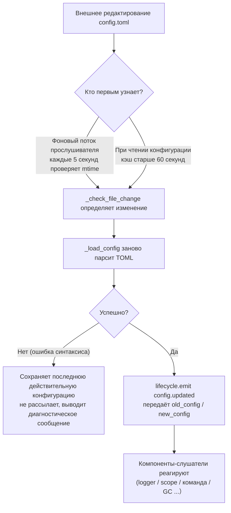

# Описание конфигурационного файла
> В этом документе будет описан конфигурационный файл фреймворка. Если у стороннего модуля есть настройки, обратитесь к документации модуля.

ErisPulse использует конфигурационный файл в формате TOML `config/config.toml` для управления настройками проекта.

## Путь к конфигурационному файлу

Конфигурационный файл находится в папке `config/` корневого каталога проекта:

```
project/
├── config/
│   └── config.toml
├── main.py
```

## Обработка ошибок при загрузке конфигурации

Фреймворк различает три состояния ошибок при загрузке `config.toml` и предоставляет **действенные инструкции по диагностике**, а не просто переключается на настройки по умолчанию:

| Состояние ошибки | Условия возникновения | Поведение фреймворка |
|---------|---------|---------|
| Файл отсутствует | `config.toml` не существует | При первом запуске нормально, используется пустая конфигурация (без предупреждения) |
| Ошибка синтаксиса TOML | Файл существует, но формат некорректен (например, отсутствуют кавычки, не закрыты скобки) | Выводит **номер строки/столбца и причину ошибки**, и сообщает, что используется конфигурация по умолчанию |
| Ошибка доступа/другие ошибки | Нет прав на чтение, ошибка ввода-вывода и т.д. | Выводит **ясную причину**, и сообщает, что используется конфигурация по умолчанию |

Например, если вы случайно напишете `port = 8000` (без кавычек для строки), в логах будет что-то вроде:

```
[ERROR] [Config] Ошибка синтаксиса конфигурационного файла config/config.toml (строка 3, столбец 1): ...
[WARNING] [Config] Ошибка чтения конфигурационного файла. Продолжение работы с последней действительной конфигурацией, изменения в файле не применились — пожалуйста, исправьте и перезагрузите или перезапустите
```

Таким образом, вы можете сразу обнаружить проблему на уровне `INFO`, а не задаваться вопросом "почему мои изменения не вступили в силу".

> **Что делать, если испортить конфигурационный файл во время работы?** Если во время работы робота вы вручную отредактируете `config.toml` и внесёте синтаксическую ошибку, фреймворк при следующей попытке записи (объединения конфигурации) выведет сообщение "Конфигурационный файл повреждён (ошибка синтаксиса, строка X), невозможно записать — пожалуйста, исправьте конфигурационный файл и перезапустите", а не запутанное "ошибка записи". Конфигурационные параметры, которые должны были быть записаны, сохраняются, и не теряются.

## Переопределение конфигурации переменными окружения

Фреймворк поддерживает **переопределение** конфигурационных параметров `ErisPulse.*` с помощью переменных окружения (подходит для Docker / контейнеризации / CI-деплоя, без необходимости изменять `config.toml`).

Правило именования: замените точечный путь `ErisPulse.<section>.<key>` на заглавные буквы, замените `.` на `_`, и добавьте префикс `ERISPULSE_`:

| Параметр конфигурации | Переменная окружения | Пример значения |
|--------|---------|--------|
| `ErisPulse.server.port` | `ERISPULSE_SERVER_PORT` | `9000` |
| `ErisPulse.server.host` | `ERISPULSE_SERVER_HOST` | `0.0.0.0` |
| `ErisPulse.logger.level` | `ERISPULSE_LOGGER_LEVEL` | `DEBUG` |
| `ErisPulse.framework.strict_mode` | `ERISPULSE_FRAMEWORK_STRICT_MODE` | `false` |

Описание поведения:
- **Наивысший приоритет**: переменные окружения переопределяют «конфигурационный файл» и «значения по умолчанию», автоматически преобразуются по типу (bool / int / float / список, разделённый запятыми / строка)
- **Не сохраняются**: переопределение действует только во время выполнения, не записывается обратно в `config.toml`
- **Поддержка горячей перезагрузки**: при изменении переменных окружения во время работы, в сочетании с перезагрузкой конфигурации по прослушиванию, изменения вступают в силу

```bash
# Пример деплоя с Docker: без изменения config.toml, просто переопределяем порт
ERISPULSE_SERVER_PORT=9000 docker compose up -d
```

> Примечание: `ErisPulse.server.port` и другие параметры конфигурации фреймворка, читаемые через `get_server_config()` и другие API, подвержены влиянию переменных окружения.

## Горячая перезагрузка конфигурации

Начиная с версии 2.7.0, фреймворк системно поддерживает **горячую перезагрузку конфигурации**. После изменения `config.toml` снаружи (фоновый прослушиватель каждые 5 секунд проверяет) или вызова `setConfig()` из кода, компоненты автоматически реагируют:

| Компонент | Поддерживаемые конфигурации для горячей перезагрузки | Поведение |
|------|----------------|------|
| **Логгер Logger** | `logger.level` / `log_files` / `log_dir` (включая параметры сегментации) / `memory_limit` / `format` / `exclude_levels` | Автоматически перезапускается (с обнаружением изменений) |
| **Система команд CommandHandler** | `event.command.prefix` / `case_sensitive` / `allow_space_prefix` / `must_at_bot` | Вступает в силу с следующего сообщения |
| **Адаптеры с并发ностью** | `framework.handler_max_concurrency` | Сигналы кэша становятся недействительными, пересоздаются по новому значению |
| **Активный GC** | `framework.proactive_gc_*` | Конфигурация изменяется, задача GC перезапускается, поддерживает изменение/отключение/переактивацию во время выполнения |
| **Система владельцев Master** | `master.users` | Каждый вызов `is_master()` проверяет актуальные данные, не требует перезапуска |
| **Конфигурации модулей/адаптеров** | Собственные параметры конфигурации | Запускается обратный вызов `on_config_update(old, new)` |

**Конфигурации, требующие перезапуска** (небезопасно переключать во время выполнения, при изменении выводится предупреждение "требуется перезапуск процесса для вступления в силу"):

| Конфигурация | Причина |
|------|------|
| `router.cors.*` / `router.security.*` | Промежуточные слои записываются в FastAPI при запуске сервиса, безопасное переключение во время выполнения невозможно |
| `storage.use_global_db` | Дескриптор файла SQLite уже открыт во время выполнения, безопасная смена пути невозможна |

> **Что делать, если произошла ошибка при редактировании и сохранении?** Если при редактировании `config.toml` возникнет временная синтаксическая ошибка, фреймворк **сохранит последнюю действительную конфигурацию** и выведет диагностическое сообщение, не будет рассылать пустую конфигурацию по всем компонентам (чтобы `on_config_update` не получал пустые значения и не возвращался к значениям по умолчанию).

### Внутренняя структура цепочки горячей перезагрузки

«Изменили конфигурацию, как узнают компоненты?» — за этим стоит цепочка обнаружения → перезагрузки → рассылки:



**Две линии обнаружения** (достаточно одной, обе обеспечивают резервирование):

| Путь | Механизм | Время срабатывания |
|------|------|---------|
| Фоновый прослушиватель | Демон-поток `config-watcher` каждые **5 секунд** `wait` проверяет `mtime` файла | После изменения файла снаружи максимум через 5 секунд |
| Ленивая проверка | При любом `getConfig()` чтении, если кэш старше **60 секунд**, сначала проверяется файл | При следующем чтении конфигурации |

> **Фреймворк не будет ошибаться сам**: `setConfig()` при записи отслеживает «время последнего изменения, вызванное самим фреймворком», прослушиватель при сравнении исключает его, и только **внешние изменения** считаются как изменения.

**Два типа событий изменения конфигурации**:

| Событие | Инициатор | Данные | Типичный сценарий |
|------|--------|------|---------|
| `config.set` | Код / Dashboard вызывает `setConfig()` | `{key, old_value, new_value}` | Одиночное изменение (шаблон генерации, запись состояния, изменение конфигурации во время выполнения) |
| `config.updated` | Внешнее изменение после обнаружения прослушивателем/ленивой проверки | `{old_config, new_config, config_file}` | Ручное редактирование `config.toml` |

> `setConfig()` по умолчанию **задерживает запись на диск на 5 секунд** (объединяет несколько записей), `immediate=True` записывает немедленно. Прослушиватель, обнаружив внешнее изменение, обновляет только кэш в памяти, **не записывает изменения обратно в файл**.

**Список компонентов, отслеживающих изменения** (обычно оба события подписываются, реакция одинакова):

| Компонент | Подписка | Реакция |
|------|------|------|
| Logger | `config.set` + `config.updated` | Уровень/файлы/директория/сегментация/память/формат/уровни исключения переприменяются (с обнаружением изменений, без изменений — не трогать) |
| Scope | `config.updated` | Перестраивается кэш привязки области |
| Система команд | `config.updated` | Префикс/регистр/пробелы/обязательное упоминание бота пересчитываются параметры, вступают в силу с следующего сообщения |
| Адаптеры с并发ностью | `config.set` + `config.updated` | `handler_max_concurrency` сбрасывает и пересоздаёт сигнал |
| Активный GC | `config.set` + `config.updated` | `proactive_gc_*` немедленно перезапускает фоновую задачу GC |
| Адаптеры | Перенаправляется в `on_config_update` | Обратный вызов `on_config_update(old, new)` для каждого адаптера |
| Модули | Перенаправляется в `on_config_update` | Обратный вызов `on_config_update(old, new)` для каждого модуля |
| Хранилище | `config.updated` | Изменение `use_global_db` **только предупреждение** (требуется перезапуск) |
| Роутер | `config.updated` | Изменение `cors.*` / `security.*` **только предупреждение** (требуется перезапуск) |

## Полный пример конфигурации

```toml
[ErisPulse.server]
host = "0.0.0.0"
port = 8000
auto_start = true
ssl_certfile = ""
ssl_keyfile = ""

[ErisPulse.master]
# users поддерживает два способа записи (выберите один):
#   глобальный владелец (действует на всех платформах): users = ["123456", "789012"]
#   владелец по платформе: users = { yunhu = ["123456"], telegram = ["789012"] }
users = {}

[ErisPulse.logger]
level = "INFO"
format = "rich"
log_files = []
log_dir = ""
log_rotation = "size"
log_max_size_mb = 10
log_backup_count = 5
log_rotation_when = "midnight"
memory_limit = 1000
exclude_levels = []

[ErisPulse.framework]
enable_lazy_loading = true
uninit_timeout = 30
strict_mode = 0

[ErisPulse.framework.strict_mode_exceptions]
modules = []
adapters = []

[ErisPulse.storage]
use_global_db = false

[ErisPulse.event.command]
prefix = "/"
case_sensitive = true
allow_space_prefix = false
must_at_bot = false

[ErisPulse.event.message]
ignore_self = true

[ErisPulse.i18n]
language = "auto"
```

## Конфигурация сервера

```toml
[ErisPulse.server]
host = "0.0.0.0"
port = 8000
auto_start = true
ssl_certfile = "/path/to/cert.pem"
ssl_keyfile = "/path/to/key.pem"
```

| Параметр | Тип | Значение по умолчанию | Описание |
|---------|------|---------|------|
| host | string | 0.0.0.0 | Адрес прослушивания, 0.0.0.0 означает все интерфейсы |
| port | integer | 8000 | Порт прослушивания |
| auto_start | boolean | true | Автоматически запускать сервер маршрутизации при `sdk.init()`. Установка в `false` пропускает запуск сервера маршрутизации (сценарии без WebUI) |
| ssl_certfile | string | пустая строка | Путь к файлу SSL-сертификата |
| ssl_keyfile | string | пустая строка | Путь к файлу SSL-ключа |

## Конфигурация системы владельцев

Система владельцев используется для определения «владельца» аккаунта (например, администратора бота). `master.users` поддерживает два способа записи:

```toml
[ErisPulse.master]
# Способ 1: глобальный владелец (действует на всех платформах)
users = ["123456", "789012"]

# Способ 2: владелец по платформе (словарь)
# users = { yunhu = ["123456"], telegram = ["789012"] }
```

| Параметр | Тип | Значение по умолчанию | Описание |
|---------|------|---------|------|
| users | array / object | пустой | Список владельцев. `list` — глобальный владелец (действует на всех платформах); `dict` — по платформе (ключ — название платформы, значение — список владельцев для этой платформы) |

В коде проверка осуществляется через `master.is_master(event)` или `master.is_master(platform, user_id)`, каждый вызов читает конфигурацию в реальном времени (поддерживает горячую перезагрузку, не требует перезапуска):

```python
from ErisPulse.Core import master

if master.is_master(event):
    await event.reply("Привет, хозяин")
```

### Цепочка проверки и динамическое добавление

Цепочка проверки владельца: **конфигурационный владелец → запись во время выполнения → провайдер цепочки**:

```python
from ErisPulse.Core import master

master.is_master(event)                      # Проверка по событию
master.is_master("yunhu", "123")             # Явная проверка
master.add("yunhu", "123")                   # Добавление во время выполнения (по умолчанию сохраняется; persist=False — только в памяти)
master.remove("yunhu", "123")                # Удаление (по умолчанию сохраняется)
master.list()                                # Сводка: {"global": [...], "<platform>": [...]}
```

### Пользовательские источники идентификации (провайдеры)

Помимо конфигурации, можно зарегистрировать пользовательские источники идентификации: `fn(platform, user_id) -> bool`,  
встроенные источники идентификации (конфигурация + запись во время выполнения) не срабатывают, проверка происходит по очереди, если один провайдер разрешает, владелец считается.

Подходит для подключения адаптеров администраторов, ролей базы данных и других внешних систем идентификации.

Регистрация через `master.provider` поддерживает два способа: декоратор и функциональный,  
удаление происходит через `fn.unregister()`:

```python
from ErisPulse.Core import master

# Способ 1: декоратор (рекомендуется, постоянный источник идентификации)
@master.provider
def admin_provider(platform, user_id):
    return user_id in {"999"}     # Пользовательская логика проверки

master.is_master("yunhu", "999")   # True
admin_provider.unregister()        # Удаление при необходимости

# Способ 2: функциональный (регистрация при загрузке модуля / удаление при выгрузке)
fn = master.provider(admin_provider)
fn.unregister()
```

> Исключения в провайдерах перехватываются и пропускаются, не блокируют цепочку проверки идентификации.  
> Привязка методов экземпляра не может быть связана с `unregister`, для сценариев с парой регистрации/удаления рекомендуется использовать **модульные функции**.

### Приоритет пользователя: область действия владельца определяется пользователем

Параметр `master=True` в команде — это **по умолчанию разработчика**: пользователь может переопределить сужение или расширение через  
`ErisPulse.event.overrides.command.<module>.<cmd>.master = true/false` (см. [Единая конфигурация переопределения событий (event.overrides)], пользовательская конфигурация вступает в силу немедленно).

## Конфигурация логирования

```toml
[ErisPulse.logger]
level = "INFO"
log_files = []                # Явный список файлов логов (взаимоисключительно с log_dir, имеет более высокий приоритет)
log_dir = ""                  # Директория логов (автоматически создается). При установке записывается в `erispulse.log` с автоматическим сегментированием по `log_rotation`; взаимоисключительно с `log_files`, `log_files` имеет приоритет
log_rotation = "size"         # Способ сегментации: `size` / `date` / `none`
log_max_size_mb = 10          # Максимальный размер файла в режиме `size` (МБ), при превышении сегментируется в `.1`/`.2`
log_backup_count = 5          # Количество сохраняемых файлов логов, старые автоматически удаляются
log_rotation_when = "midnight"  # Период сегментации в режиме `date`: S/M/H/D/midnight (по умолчанию каждый день в полночь)
memory_limit = 1000
exclude_levels = ["EVENT"]
```

| Параметр | Тип | Значение по умолчанию | Описание |
|---------|------|---------|------|
| level | string | INFO | Уровень логирования: TRACE, DEBUG, INFO, WARNING, ERROR, CRITICAL (TRACE — самый низкий уровень, выводит подробную отладочную информацию фреймворка) |
| format | string | rich | Формат вывода логов: `rich` (цветной, по умолчанию), `plain` (чистый текст без цвета, подходит для лог-сборки/перенаправления), `json` (структурированный JSON, подходит для ELK и т.д.) |
| log_files | array | пустой | Список файлов логов (явные пути, без сегментации) |
| log_dir | string | пустой | Директория логов (автоматически создается). При установке записывается в `erispulse.log` с автоматическим сегментированием по `log_rotation`; взаимоисключительно с `log_files`, `log_files` имеет приоритет |
| log_rotation | string | size | Способ сегментации: `size` (по размеру) / `date` (по времени) / `none` (без сегментации) |
| log_max_size_mb | float | 10 | Максимальный размер файла в режиме `size` (МБ), при превышении сегментируется в `.1`/`.2` |
| log_backup_count | integer | 5 | Количество сохраняемых файлов логов, старые автоматически удаляются |
| log_rotation_when | string | midnight | Период сегментации в режиме `date`: S/M/H/D/midnight (по умолчанию каждый день в полночь) |
| memory_limit | integer | 1000 | Количество записей логов, сохраняемых в памяти |
| exclude_levels | array | пустой | Список уровней логирования для исключения. Логи с исключёнными уровнями **полностью отбрасываются** (не записываются в память, не отправляются в Dashboard и другие подписчики, не выводятся, не записываются в файл). Поддерживает горячую перезагрузку |

Также можно динамически переключать в коде:

```python
from ErisPulse.Core import logger

# Сегментация по размеру: 10 МБ на файл, 5 файлов
logger.set_output_dir("logs", rotation="size", max_size_mb=10, backup_count=5)

# Сегментация по времени: смена каждый день в полночь, 7 файлов
logger.set_output_dir("logs", rotation="date", backup_count=7)
```

> [!NOTE]
> `log_dir` и связанные сегментационные параметры требуют ErisPulse **2.8.0+**.

> **Защита конфиденциальности**: содержание сообщений отправки и получения записывается на уровне **EVENT** (значение 21). Установка `exclude_levels = ["EVENT"]` позволит бэкенду (например, панель логов Dashboard) не видеть содержимое сообщений в группах/личных чатах, при этом влияние на другие уровни логирования не будет.

> [!NOTE]
> Эта функция `exclude_levels` требует ErisPulse **2.8.0+**.

## Конфигурация фреймворка

```toml
[ErisPulse.framework]
enable_lazy_loading = true
uninit_timeout = 30
strict_mode = 0

[ErisPulse.framework.strict_mode_exceptions]
modules = []
adapters = []
```

| Параметр | Тип | Значение по умолчанию | Описание |
|---------|------|---------|------|
| enable_lazy_loading | boolean | true | Включить ленивую загрузку модулей |
| uninit_timeout | integer | 30 | Общее время ожидания при корректном завершении (секунды), если превышено, принудительно завершается. 0 означает отсутствие таймаута |
| strict_mode | integer | 0 | Уровень строгого режима, см. ниже «Строгий режим» |
| handler_max_concurrency | integer | 64 | Максимальное количество одновременных задач обработчиков событий, увеличение повышает пропускную способность, но увеличивает использование памяти |
| offline_bot_expiry | integer | 3600 | Время автоматической просрочки записи о неактивных ботах (секунды), 0 означает не просрочивать |

### Конфигурация активного GC

После инициализации SDK запускается фоновая задача активного GC, периодически выполняющая сборку мусора Python и внутреннюю очистку ресурсов (очистка неактивных ботов и т.д.). Все параметры поддерживают горячую перезагрузку, при изменении задача перезапускается мгновенно.

| Параметр | Тип | Значение по умолчанию | Описание |
|---------|------|---------|------|
| proactive_gc_interval | number | 300 | Интервал сборки мусора (секунды), поддерживает десятичные числа. 0 означает отключение активного GC |
| proactive_gc_generation | integer | 0 | Обычный цикл сборки поколений (0/1/2, ограничивается на 0..2). Обратите внимание, что `gc.collect(2)` эквивалентно полной сборке, значение по умолчанию 0 сохраняет низкую нагрузку; глубокая сборка запускается периодически через `proactive_gc_full_every` |
| proactive_gc_full_every | integer | 20 | Каждые N циклов делается полная сборка, 0 означает отключение периодической полной. Полная сборка ограничена порогом `proactive_gc_memory_growth_mb` |
| proactive_gc_memory_growth_mb | integer | 32 | Порог роста памяти для полной сборки (МБ): по сравнению с базой памяти после последней полной сборки (предпочтительно tracemalloc, затем RSS), сборка выполняется только если рост достигает этого значения. 0 означает отсутствие порога |
| proactive_gc_idle_only | boolean | false | При включении сборка Python пропускается в циклах с незавершёнными pending handler (пиковая нагрузка), внутренняя очистка ресурсов не затрагивается |
| proactive_gc_gen0_min | integer | 500 | Порог запуска обычной сборки по количеству мусора gen0: `gc.get_count()[0]` ниже этого значения — пропуск (почти нулевой цикл пустой). 0 означает всегда выполнять сборку |

> **Изменение 2.7.1**: значение по умолчанию `proactive_gc_generation` изменилось с `2` на `0`, значение по умолчанию `proactive_gc_full_every` изменилось с `0` на `20`. Ранее `generation=2` означало, что каждый цикл выполняется самая тяжёлая полная сборка; новое значение по умолчанию при сохранении охвата сборки значительно снижает накладные расходы пустых циклов. Явно заданные старые значения по-прежнему действуют по буквальному смыслу.

### Строгий режим

Строгий режим управляет стратегией обработки компонентов, которые не соответствуют требованиям или завершились с ошибкой на этапе загрузки. Современные модули/адаптеры должны наследовать соответствующие базовые классы (`BaseModule`/`BaseAdapter`), компоненты, не наследующие базовые классы, влияют на контекстную систему фреймворка и на байпасную очистку, что может привести к утечкам ресурсов.

> **Изменение 2.5.2**: уровень по умолчанию изменился с `1` (пропуск) на `0` (мягкий), чтобы уменьшить проблемы, с которыми сталкиваются новые пользователи при первом использовании. Компоненты, не наследующие базовые классы, будут предупреждаться и попытаться загрузиться, а не отклоняться напрямую. Чтобы восстановить прежнее поведение, явно установите `strict_mode = 1`.

| Уровень | Название | Поведение |
|------|------|------|
| 0 | Мягкий (по умолчанию) | Нарушения только предупреждаются, компоненты, не наследующие базовые классы, всё ещё будут загружаться (совместимость со старыми компонентами) |
| 1 | Строгий-пропуск | Компоненты, не наследующие базовые классы, отклоняются и пропускаются, остальное запускается нормально |
| 2 | Строгий-фатальный | Нарушения собираются и сообщаются, запуск прерывается |

На всех уровнях, «ошибки загрузки/регистрации/инициализации» компонентов всегда будут пропускаться; различие заключается в том, что:

- **0 → 1**: единственное изменение поведения — «не наследующие базовые классы» теперь пропускаются, а не загружаются.
- **1 → 2**: все нарушения (не наследуют базовые классы, загрузка не удалась, регистрация не удалась, инициализация не удалась и т.д.) превращаются в фатальные, собираются на контрольной точке запуска и выводятся список нарушений, после чего запуск прерывается.

#### Список исключений

Если некоторые компоненты действительно временно не могут быть обновлены (например, зависимые старые модули), их можно добавить в список исключений, и даже если компоненты не соответствуют требованиям, они будут загружаться по мягкому режиму:

```toml
[ErisPulse.framework.strict_mode_exceptions]
modules = ["SeTu", "SomeLegacyModule"]
adapters = ["OldAdapter"]
```

> Когда компонент отклоняется строгим режимом, в логах будет указано, как восстановить загрузку (добавление в список исключений или понижение уровня).

## Конфигурация хранилища

```toml
[ErisPulse.storage]
use_global_db = false
```

| Параметр | Тип | Значение по умолчанию | Описание |
|---------|------|---------|------|
| use_global_db | boolean | false | Использовать глобальную базу данных (внутри пакета) или базу данных проекта. `true` означает, что все проекты используют SQLite-базу данных внутри пакета ErisPulse; `false` (по умолчанию) означает, что каждый проект использует независимую базу данных в папке `config/` |

## Конфигурация событий

### Конфигурация команд

```toml
[ErisPulse.event.command]
prefix = "/"
case_sensitive = true
allow_space_prefix = false
```

| Параметр | Тип | Значение по умолчанию | Описание |
|---------|------|---------|------|
| prefix | string | / | Префикс команды |
| case_sensitive | boolean | true | Регистр чувствителен (например, `/Help` и `/help` — это разные команды) |
| allow_space_prefix | boolean | false | Разрешить пробел в качестве префикса |
| must_at_bot | boolean | false | Команда может быть вызвана только с @ботом (в личных сообщениях не ограничено) |

### Конфигурация сообщений

```toml
[ErisPulse.event.message]
ignore_self = true
```

| Параметр | Тип | Значение по умолчанию | Описание |
|---------|------|---------|------|
| ignore_self | boolean | true | Игнорировать собственные сообщения бота |

## Конфигурация локализации

```toml
[ErisPulse.i18n]
language = "auto"
```

| Параметр | Тип | Значение по умолчанию | Описание |
|---------|------|---------|------|
| language | string | auto | Язык отображения встроенных текстов фреймворка. Установите `auto` для автоматического определения языка системы, или укажите конкретный код: `zh-CN`, `zh-TW`, `en`, `ja`, `ru` |

## Конфигурация модулей

Каждый модуль может определить свою конфигурацию в конфигурационном файле:

```toml
[MyModule]
api_url = "https://api.example.com"
timeout = 30
enabled = true
```

В модуле читать и записывать конфигурацию:

```python
from ErisPulse import sdk

# Чтение конфигурации
config = sdk.config.getConfig("MyModule", {})
api_url = config.get("api_url", "https://default.api.com")

# Запись конфигурации во время выполнения (отложено)
sdk.config.setConfig("MyModule.timeout", 60)

# Немедленное сохранение в файл
sdk.config.setConfig("MyModule.timeout", 60, immediate=True)
```

> `setConfig` по умолчанию использует отложенную запись (примерно каждые 5 секунд сохраняется в файл), установка `immediate=True` немедленно сохраняет. Изменения конфигурации запускают событие жизненного цикла `config.set`.

## Конфигурация области (scope)

> [!NOTE]
> Эта функция требует ErisPulse **2.8.0+**.

Область определяет **в каком диапазоне действует** — какой модуль доступен в определённой платформе / боте / сессии (по модулям),  
какие события принимаются для определённого пользователя / группы / бота / адаптера (по идентификации),  
какие исходящие вызовы может выполнять модуль (по исходящим):

```toml
[ErisPulse.scope]
default_allow = true        # Глобальный флаг по умолчанию (false = явный отказ в строгом режиме; не влияет на исходящие)
cache_size = 1024           # Размер LRU кэша

# ① Модульный уровень (приоритет: сессия > бот > платформа; записи поддерживают точные / glob / re: регулярные выражения)
[ErisPulse.scope.platforms.onebot11]
modules = ["Chat", "Tool*"]
blocked = ["re:^Danger"]

# Подуровни с merge = true объединяются с низшим приоритетом по элементам (по умолчанию — полное перезаписывание)
[ErisPulse.scope.bots.onebot11."123456"]
modules = ["Music"]
merge = true

# ② Идентификационный уровень (приоритет: пользователь > сессия > бот > адаптер; только allow или deny)
[ErisPulse.scope.identity.adapters.onebot11]
deny = true                 # Все события на этом адаптере отбрасываются на входе
[ErisPulse.scope.identity.users.onebot11]
allow = ["u_admin"]         # Поддержка glob / re: регулярные выражения
deny = ["u_bad", "spam_*"]

# ③ Исходящий уровень (по умолчанию разрешено всё; правила — встроенные таблицы, поддержка точных / glob / re: регулярных выражений)
[ErisPulse.scope.actions.MyModule]
send = { deny = true }                    # Запретить отправку
api = { allow = ["get_*"] }               # Разрешить только стандартные API запросов
request = { deny = true }                 # Запретить обработку запросов
```

| Параметр | Тип | Описание |
|---------|------|------|
| `scope.default_allow` | boolean | Глобальный флаг по умолчанию: разрешение/запрет для модулей/идентификации, не попавших в правила (true) |
| `scope.cache_size` | integer | Размер LRU кэша (по умолчанию 1024) |
| `scope.platforms / bots / sessions` | table | ① Три уровня привязки модуля: `{modules=[...], blocked=[...], merge=bool?}` |
| `scope.identity.adapters / bots / sessions / users` | table | ② Четыре уровня привязки идентификации: `{allow=true}` / `{deny=true}` |
| `scope.actions.<module>.<action>` | table | ③ Правила исходящих действий: `{allow=[...], deny=true|[...]}` (действия: send / api / request) |

> Подробное объяснение и API времени выполнения (модульные `sdk.scope.set_module()` / `set_identity()` / `set_action()`, проверка `is_allowed()` / `is_identity_allowed()` / `is_action_allowed()`, а также словарный доступ `get()` / `set()` / `delete()`) см. в [Области (scope)](../advanced/scope.md).

## Единая конфигурация переопределения событий (event.overrides)

Система переопределения: по **типу события** переопределяет поведение обработчиков любого модуля, не изменяя код модуля. Стандартные типы OneBot12 (meta / message / notice / request) и расширенные типы (command) имеют собственные настраиваемые параметры:

```toml
[ErisPulse.event.overrides]

# message: текстовые условия (AND с условиями в коде)
[ErisPulse.event.overrides.message.ChatModule]
pattern = "闲聊*"

# notice / request / meta: detail_type белый список (поддержка точных / glob / re: регулярных выражений)
[ErisPulse.event.overrides.notice.MyModule]
detail_types = ["group_increase"]

# command (расширенный тип): переопределение параметров (приоритет пользователя; отключение через acl deny)
[ErisPulse.event.overrides.command.MyModule.restart]
master = true               # Переопределить как только владелец фреймворка (false — разрешить ограничения владельца разработчика)
hidden = true               # Скрыть в списке помощи
aliases = ["rs"]            # Активный псевдоним

# acl (только для команд): черный и белый список пользователей (поддержка glob / re: регулярных выражений, точные ключи имеют приоритет)
[ErisPulse.event.overrides.acl."roll*"]
allow = ["onebot11:u_vip"]  # Идентификатор пользователя "platform:user_id"
deny = ["onebot11:u_bad"]

# ACL по умолчанию: разрешить команды без настроенной ACL (true) / строго запретить (false)
acl_default_allow = true
```

| Параметр | Тип | Описание |
|---------|------|------|
| `event.overrides.message.<module>` | table | Текстовые условия: `{pattern="...", regex="..."}` |
| `event.overrides.notice / request.<module>` | table | `{detail_types=[...], pattern, regex}` |
| `event.overrides.meta.<module>` | table | `{detail_types=[...]}` |
| `event.overrides.command.<module>` | table | Переопределение параметров модуля (скалярные значения `hidden = true` и т.д.) |
| `event.overrides.command.<module>.<command>` | table | Переопределение параметров команды (приоритет команды) |
| `event.overrides.acl.<command>` | table | Черный и белый список пользователей: `{allow=[...], deny=[...]}` |
| `event.overrides.acl_default_allow` | boolean | ACL по умолчанию: разрешить команды без настроенной ACL (true) / строго запретить (false) |

> API во время выполнения (после `from ErisPulse.Core.Event import overrides` вызовите по подпространствам типа `overrides.message.set()` / `overrides.command.set()` / `overrides.acl.set()` и т.д., или через `sdk.Event.overrides` доступ к `overrides`), см. в [Введение в обработку событий · Переопределение событий](../getting-started/event-handling.md#переопределение-событий-без-изменения-кода-модуля-переопределение-поведения-любого-типа-события).

## Конфигурация разбора команд (event.command)

## Далее

- [Справочник CLI-команд](cli-reference.md) - узнать все команды командной строки
- [Руководство для разработчиков](../developer-guide/) - изучить разработку пользовательских модулей