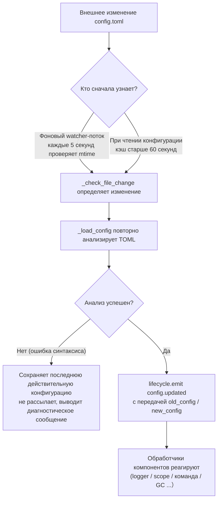

# Описание конфигурационного файла
> В этом документе будет описан конфигурационный файл фреймворка. Если у стороннего модуля есть настройки, обратитесь к документации модуля.

ErisPulse использует конфигурационный файл в формате TOML `config/config.toml` для управления настройками проекта.

## Расположение конфигурационного файла

Конфигурационный файл находится в папке `config/` в корне проекта:

```
project/
├── config/
│   └── config.toml
├── main.py
```

## Обработка ошибок при загрузке конфигурации

Фреймворк при загрузке `config.toml` различает три состояния ошибок и предоставляет **действенные диагностические сообщения**, а не молча возвращается к значениям по умолчанию:

| Состояние ошибки | Условие возникновения | Поведение фреймворка |
|---------|---------|---------|
| Файл отсутствует | `config.toml` не существует | Нормальный запуск в первый раз, молча используется пустая конфигурация (без предупреждения) |
| Ошибка синтаксиса TOML | Файл существует, но формат некорректен (например, отсутствуют кавычки, не закрыты скобки) | Выводится **номер строки/столбца и причина ошибки**, и сообщается, что используется конфигурация по умолчанию |
| Ошибка прав доступа и др. | Нет прав на чтение, IO-ошибка и т.д. | Выводится **ясная причина**, и сообщается, что используется конфигурация по умолчанию |

Например, если вы случайно напишете `port = 8000` (без кавычек для строки), в логах появится что-то вроде:

```
[ERROR] [Config] Синтаксическая ошибка в конфигурационном файле config/config.toml (строка 3, столбец 1): ...
[WARNING] [Config] Ошибка чтения конфигурационного файла. Продолжение работы с последней действительной конфигурацией, изменения файла не вступили в силу — пожалуйста, исправьте и перезагрузите или перезапустите
```

Таким образом, вы можете сразу определить проблему на уровне `INFO`, а не запутаться в том, почему ваши изменения не вступили в силу.

> **Что делать, если испортить конфигурационный файл во время работы?** Если вы вручную отредактируете `config.toml` во время работы робота и внесете синтаксическую ошибку, фреймворк при следующей попытке записи (объединение конфигурации) выведет сообщение «Конфигурационный файл поврежден (ошибка синтаксиса, строка X), невозможно объединить и записать — пожалуйста, сначала исправьте конфигурационный файл и перезапустите», а не запутанное «Ошибка записи». Измененные конфигурационные параметры будут сохранены, не будут потеряны.

## Переменные окружения

Фреймворк поддерживает **переопределение** конфигурационных параметров `ErisPulse.*` с помощью переменных окружения (подходит для Docker / контейнеризации / CI-деплоя, без необходимости редактировать `config.toml`).

Правила именования: преобразуйте точечный путь `ErisPulse.<section>.<key>` в верхний регистр, замените `.` на `_` и добавьте префикс `ERISPULSE_`:

| Параметр | Переменная окружения | Пример значения |
|--------|---------|--------|
| `ErisPulse.server.port` | `ERISPULSE_SERVER_PORT` | `9000` |
| `ErisPulse.server.host` | `ERISPULSE_SERVER_HOST` | `0.0.0.0` |
| `ErisPulse.logger.level` | `ERISPULSE_LOGGER_LEVEL` | `DEBUG` |
| `ErisPulse.framework.strict_mode` | `ERISPULSE_FRAMEWORK_STRICT_MODE` | `false` |

Описание поведения:
- **Наивысший приоритет**: переменные окружения переопределяют «конфигурацию» и «значения по умолчанию», автоматически преобразуются по типу (bool / int / float / список, разделенный запятыми / строка)
- **Не сохраняются**: переопределение действует только во время выполнения, не записывается обратно в `config.toml`
- **Поддержка горячей перезагрузки**: изменение переменной окружения во время работы, в сочетании с перезагрузкой конфигурации, вступает в силу

```bash
# Пример деплоя в Docker: без редактирования config.toml, просто переопределение порта
ERISPULSE_SERVER_PORT=9000 docker compose up -d
```

> Примечание: параметры фреймворка, такие как `ErisPulse.server.port`, читаются через API `get_server_config()`, и все они подвержены влиянию переменных окружения.

## Горячая перезагрузка конфигурации

Начиная с версии 2.7.0, фреймворк систематически поддерживает горячую перезагрузку конфигурации. После внешнего изменения `config.toml` (фоновый watcher каждые 5 секунд проверяет), или после вызова `setConfig()` в коде, компоненты автоматически реагируют:

| Компонент | Поддерживаемые параметры горячей перезагрузки | Поведение |
|------|----------------|------|
| **Логгер Logger** | `logger.level` / `log_files` / `log_dir` (включая параметры сегментации) / `memory_limit` / `format` / `exclude_levels` | Автоматически переприменяются (с детекцией изменений) |
| **Система команд CommandHandler** | `event.command.prefix` / `case_sensitive` / `allow_space_prefix` / `must_at_bot` | Вступают в силу с первой же сообщения |
| **Адаптеры и параллелизм** | `framework.handler_max_concurrency` | Сигналы кэша становятся недействительными, пересоздаются по новому значению |
| **Активный GC** | `framework.proactive_gc_*` | Конфигурация изменяется, задача GC перезапускается мгновенно, поддерживает изменение/отключение/перезапуск во время работы |
| **Система владельцев Master** | `master.users` | Каждый вызов `is_master()` проверяет актуальные данные, перезапуск не требуется |
| **Модули/адаптеры** | Собственные параметры конфигурации | Вызывается обратный вызов `on_config_update(old, new)` |

**Параметры, требующие перезапуска** (безопасно переключить нельзя, при изменении выводится предупреждение «Требуется перезапуск процесса»):

| Параметр | Причина |
|------|------|
| `router.cors.*` / `router.security.*` | Промежуточные слои записываются в FastAPI при запуске сервиса, безопасно переключить во время работы нельзя |
| `storage.use_global_db` | Файловый дескриптор SQLite уже открыт во время выполнения, безопасно сменить путь нельзя |

> **Что делать, если во время редактирования произошла ошибка?** Если при редактировании `config.toml` возникнет кратковременная синтаксическая ошибка, фреймворк **сохранит последнюю действительную конфигурацию** и выведет диагностическое сообщение, не будет рассылать пустую конфигурацию по всем компонентам (чтобы `on_config_update` не получил пустое значение и не вернулся к значениям по умолчанию).

### Внутренняя структура цепочки горячей перезагрузки

«После изменения конфигурации, как компоненты узнают?» — за этим стоит цепочка обнаружения → перезагрузки → рассылки:



**Две пути обнаружения** (достаточно одного, оба обеспечивают резервирование):

| Путь | Механизм | Триггер |
|------|------|---------|
| Фоновый watcher | daemon-поток `config-watcher` каждые **5 секунд** `wait` проверяет файл `mtime` | После внешнего изменения файла максимум через 5 секунд |
| Ленивое обнаружение | При любом `getConfig()` чтении, если кэш старше **60 секунд**, сначала проверяется файл | При следующем чтении конфигурации |

> **Фреймворк не будет ошибаться сам**. `setConfig()` при записи в диск записывает «время последнего изменения, сделанного самим»; watcher при сравнении исключает его, только **внешние изменения** считаются изменением.

**Два типа событий изменения конфигурации**:

| Событие | Инициатор | Данные | Типичный сценарий |
|------|--------|------|---------|
| `config.set` | Код / Dashboard вызывает `setConfig()` | `{key, old_value, new_value}` | Одиночное значение (шаблон генерации, запись состояния, изменение конфигурации во время работы) |
| `config.updated` | После внешнего изменения watcher/лентивного обнаружения | `{old_config, new_config, config_file}` | Ручное изменение `config.toml` |

> `setConfig()` по умолчанию **задерживает сохранение (около 5 секунд)** (объединяет несколько записей), `immediate=True` — немедленно сохраняет. watcher при обнаружении внешнего изменения обновляет только кэш памяти, **не** возвращает изменения во внешний файл.

**Список автоматических обработчиков** (обычно подписываются на оба события, содержимое реакции одинаковое):

| Компонент | Подписка | Реакция |
|------|------|------|
| Logger | `config.set` + `config.updated` | Уровень/файлы/директории сегментации/память/формат/уровни исключения переприменяются (с детекцией изменений, без изменений не трогается) |
| Scope | `config.updated` | Перестраивается кэш привязки области |
| Система команд | `config.updated` | Префикс/регистр/пробелы/обязательное упоминание бота пересчитываются параметры, вступают в силу с первого сообщения |
| Адаптеры и параллелизм | `config.set` + `config.updated` | `handler_max_concurrency` делает сигналы кэша недействительными, пересоздает по новому значению |
| Активный GC | `config.set` + `config.updated` | `proactive_gc_*` немедленно перезапускает фоновую задачу GC |
| Адаптеры | Перенаправляются в `on_config_update` | Обратный вызов `on_config_update(old, new)` для каждого адаптера |
| Модули | Перенаправляются в `on_config_update` | Обратный вызов `on_config_update(old, new)` для каждого модуля |
| Хранилище | `config.updated` | Изменение `use_global_db` **только предупреждение** (требуется перезапуск) |
| Роутер | `config.updated` | Изменение `cors.*` / `security.*` **только предупреждение** (требуется перезапуск) |


## Полный пример конфигурации

```toml
[ErisPulse.server]
host = "0.0.0.0"
port = 8000
auto_start = true
ssl_certfile = ""
ssl_keyfile = ""

[ErisPulse.master]
# users поддерживает два способа записи (выберите один):
#   Глобальный владелец (действует на всех платформах): users = ["123456", "789012"]
#   Владелец по платформе: users = { yunhu = ["123456"], telegram = ["789012"] }
users = {}

[ErisPulse.logger]
level = "INFO"
format = "rich"
log_files = []
log_dir = ""
log_rotation = "size"
log_max_size_mb = 10
log_backup_count = 5
log_rotation_when = "midnight"
memory_limit = 1000
exclude_levels = []

[ErisPulse.framework]
enable_lazy_loading = true
uninit_timeout = 30
strict_mode = 0

[ErisPulse.framework.strict_mode_exceptions]
modules = []
adapters = []

[ErisPulse.storage]
use_global_db = false

[ErisPulse.event.command]
prefix = "/"
case_sensitive = true
allow_space_prefix = false
must_at_bot = false

[ErisPulse.event.message]
ignore_self = true

[ErisPulse.i18n]
language = "auto"
```

## Конфигурация сервера

```toml
[ErisPulse.server]
host = "0.0.0.0"
port = 8000
auto_start = true
ssl_certfile = "/path/to/cert.pem"
ssl_keyfile = "/path/to/key.pem"
```

| Параметр | Тип | Значение по умолчанию | Описание |
|---------|------|---------|------|
| host | string | 0.0.0.0 | Адрес прослушивания, 0.0.0.0 означает все интерфейсы |
| port | integer | 8000 | Номер порта прослушивания |
| auto_start | boolean | true | Автоматически запускать сервер маршрутизации при `sdk.init()`. Установка в `false` пропускает запуск сервера маршрутизации (сценарий без WebUI) |
| ssl_certfile | string | пусто | Путь к файлу SSL-сертификата |
| ssl_keyfile | string | пусто | Путь к файлу SSL-приватного ключа |

## Конфигурация системы владельцев

Система владельцев используется для идентификации аккаунта «владельца» (администратора бота). `master.users` поддерживает два способа записи:

```toml
[ErisPulse.master]
# Способ 1: глобальный владелец (действует на всех платформах)
users = ["123456", "789012"]

# Способ 2: владелец по платформе (dict)
# users = { yunhu = ["123456"], telegram = ["789012"] }
```

| Параметр | Тип | Значение по умолчанию | Описание |
|---------|------|---------|------|
| users | array / object | пусто | Список аккаунтов владельцев. `list` форма — глобальный владелец (действует на всех платформах); `dict` форма — по платформе (ключ — имя платформы, значение — список аккаунтов владельцев на этой платформе) |

В коде проверка осуществляется через `master.is_master(event)` или `master.is_master(platform, user_id)`, каждый вызов читает конфигурацию в реальном времени (поддерживает горячую перезагрузку, перезапуск не требуется):

```python
from ErisPulse.Core import master

if master.is_master(event):
    await event.reply("Привет, владелец")
```

## Конфигурация логирования

```toml
[ErisPulse.logger]
level = "INFO"
log_files = []                # Явный список файлов логов (взаимоисключительно с log_dir, имеет более высокий приоритет)
log_dir = ""                  # Директория логов (автоматически создается). При установке запись в `erispulse.log` с автоматическим сегментированием по `log_rotation`; взаимоисключительно с `log_files`, `log_files` имеет более высокий приоритет
log_rotation = "size"         # Сегментация: "size" / "date" / "none"
log_max_size_mb = 10          # Максимальный размер файла в режиме "size" (МБ), при превышении сегментируется в `.1`/`.2`
log_backup_count = 5          # Количество сохраняемых файлов логов
log_rotation_when = "midnight"  # Период сегментации в режиме "date": S/M/H/D/midnight
memory_limit = 1000
exclude_levels = ["EVENT"]
```

| Параметр | Тип | Значение по умолчанию | Описание |
|---------|------|---------|------|
| level | string | INFO | Уровень логирования: TRACE, DEBUG, INFO, WARNING, ERROR, CRITICAL (TRACE — самый низкий уровень, выводит подробную отладочную информацию фреймворка) |
| format | string | rich | Формат вывода логов: `rich` (цветной, по умолчанию), `plain` (обычный текст без цвета, подходит для лог-сборки/перенаправления в поток), `json` (структурированный JSON, подходит для ELK и т.д.) |
| log_files | array | пусто | Список файлов для вывода логов (явные пути, без сегментации) |
| log_dir | string | пусто | Директория для вывода логов (автоматически создается). При установке запись в `erispulse.log` с автоматическим сегментированием по `log_rotation`; взаимоисключительно с `log_files`, `log_files` имеет более высокий приоритет |
| log_rotation | string | size | Сегментация: `size` (по размеру) / `date` (по времени) / `none` (без сегментации) |
| log_max_size_mb | float | 10 | Максимальный размер файла в режиме "size" (МБ), при превышении сегментируется в `.1`/`.2` |
| log_backup_count | integer | 5 | Количество сохраняемых файлов логов, самые старые автоматически удаляются |
| log_rotation_when | string | midnight | Период сегментации в режиме "date": `S`/`M`/`H`/`D`/`midnight` (по умолчанию каждый день в полночь) |
| memory_limit | integer | 1000 | Количество записей логов, хранящихся в памяти |
| exclude_levels | array | пусто | Уровни логов для исключения. Логи указанных уровней **полностью отбрасываются** (не записываются в память, не передаются подписчикам, таким как Dashboard, не выводятся, не записываются в файл). Поддерживает горячую перезагрузку |

Также можно динамически переключать в коде:

```python
from ErisPulse.Core import logger

# Сегментация по размеру: файл по 10MB, сохранять 5 версий
logger.set_output_dir("logs", rotation="size", max_size_mb=10, backup_count=5)

# Сегментация по времени: смена каждый день в полночь, сохранять 7 версий
logger.set_output_dir("logs", rotation="date", backup_count=7)
```

> [!NOTE]
> Параметры `log_dir` и сегментации требуют ErisPulse **2.8.0+**.

> **Защита конфиденциальности**: содержание сообщений отправки и получения записывается на уровне **EVENT** (значение 21). Установка `exclude_levels = ["EVENT"]` позволит панели логов Dashboard не видеть содержимое сообщений в группах/личных чатах, при этом не влияя на другие уровни логов.

> [!NOTE]
> Характеристика `exclude_levels` требует ErisPulse **2.8.0+**.

## Конфигурация фреймворка

```toml
[ErisPulse.framework]
enable_lazy_loading = true
uninit_timeout = 30
strict_mode = 0

[ErisPulse.framework.strict_mode_exceptions]
modules = []
adapters = []
```

| Параметр | Тип | Значение по умолчанию | Описание |
|---------|------|---------|------|
| enable_lazy_loading | boolean | true | Включать ли ленивую загрузку модулей |
| uninit_timeout | integer | 30 | Общее время ожидания при优雅关闭 (секунды), после которого принудительно завершается. 0 означает не устанавливать тайм-аут |
| strict_mode | integer | 0 | Уровень строгого режима, см. объяснение ниже |
| handler_max_concurrency | integer | 64 | Максимальное количество задач обработчиков событий, увеличение повышает пропускную способность, но увеличивает потребление памяти |
| offline_bot_expiry | integer | 3600 | Время автоматического истечения срока действия записи о неактивном боте (секунды), 0 означает не истекать |

### Конфигурация активного GC

После инициализации SDK запускается фоновая задача активного GC, периодически выполняющая сборку мусора Python и внутреннюю очистку ресурсов (очистка неактивных ботов и т.д.). Все параметры поддерживают горячую перезагрузку, при изменении задача перезапускается мгновенно.

| Параметр | Тип | Значение по умолчанию | Описание |
|---------|------|---------|------|
| proactive_gc_interval | number | 300 | Интервал сборки (секунды), поддерживает десятичные дроби. 0 означает отключить активный GC |
| proactive_gc_generation | integer | 0 | Обычный цикл сборки поколений (0/1/2, ограничивается до 0..2). Обратите внимание, что `gc.collect(2)` эквивалентно полной сборке, по умолчанию 0 сохраняет легкость; глубокая сборка запускается периодически по `proactive_gc_full_every` |
| proactive_gc_full_every | integer | 20 | Каждые N циклов выполняется полная сборка, 0 означает отключить периодическую полную. Полная сборка ограничивается порогом роста памяти `proactive_gc_memory_growth_mb` |
| proactive_gc_memory_growth_mb | integer | 32 | Порог роста памяти для полной сборки (МБ): по сравнению с базой памяти после последней полной сборки (в первую очередь tracemalloc, затем RSS), только при достижении этого значения выполняется полная сборка. 0 означает не устанавливать порог |
| proactive_gc_idle_only | boolean | false | При включении, в периоды пикового количества событий (если есть незавершенные pending handler) этот цикл пропускается, чтобы избежать пауз и конкуренции с обработкой сообщений; внутренняя очистка ресурсов не затрагивается |
| proactive_gc_gen0_min | integer | 500 | Минимальное количество мусора в gen0 для запуска обычного цикла сборки: `gc.get_count()[0]` ниже этого значения — пропускать (почти нулевые циклы имеют низкие накладные расходы). 0 означает всегда выполнять сборку |

> **Изменение 2.7.1**: значение по умолчанию `proactive_gc_generation` было изменено с `2` на `0`, значение по умолчанию `proactive_gc_full_every` было изменено с `0` на `20`. Ранее `generation=2` означало, что каждый цикл выполняется самая тяжелая полная сборка; новое значение по умолчанию сохраняет охват при сборке, но значительно снижает накладные расходы пустых циклов. Явно заданные старые значения по-прежнему действуют по буквальному смыслу.

### Строгий режим

Строгий режим управляет стратегией обработки компонентов, которые не соответствуют требованиям или завершаются с ошибкой на этапе загрузки. Современные модули/адаптеры должны наследовать соответствующие базовые классы (`BaseModule`/`BaseAdapter`), компоненты, не наследующие базовые классы, влияют на систему контекста фреймворка и на базовую очистку, что может привести к утечкам ресурсов.

> **Изменение 2.5.2**: значение по умолчанию было изменено с `1` (пропустить) на `0` (мягкий), чтобы уменьшить проблемы при первом использовании новыми пользователями. Компоненты, не наследующие базовые классы, будут попытаться загрузиться с предупреждением, а не отклоняться. Если вы хотите восстановить старое поведение, явно установите `strict_mode = 1`.

| Уровень | Название | Поведение |
|------|------|------|
| 0 | Мягкий (по умолчанию) | Нарушения только предупреждения, компоненты, не наследующие базовые классы, все еще будут попытаться загрузиться (совместимость с устаревшими компонентами) |
| 1 | Строгий-пропустить | Отклонить компоненты, не наследующие базовые классы, и пропустить их, остальное нормально запускается |
| 2 | Строгий-критический | Собрать все нарушения, затем сообщить и завершить запуск |

На каждом уровне, «ошибки на этапах загрузки/регистрации/инициализации» компонентов, которые приводят к сбою, всегда будут пропущены; различие заключается в том, что:

- **0 → 1**: единственное изменение поведения — «не наследующие базовые классы» перестают загружаться и теперь пропускаются.
- **1 → 2**: все нарушения (не наследуют базовые классы, загрузка не удалась, регистрация не удалась, инициализация не удалась и т.д.) повышаются до критических, и на контрольной точке запуска будут собраны и выведены списки нарушений, а затем запуск будет остановлен.

#### Список исключений

Если некоторые компоненты действительно временно не могут быть обновлены (например, зависимые устаревшие модули), их можно добавить в список исключений, и даже если они не соответствуют требованиям, они будут обрабатываться как мягкий режим и загружаться:

```toml
[ErisPulse.framework.strict_mode_exceptions]
modules = ["SeTu", "SomeLegacyModule"]
adapters = ["OldAdapter"]
```

> Когда компонент отклоняется строгим режимом, в логах будет четко указано, как восстановить загрузку (добавить в список исключений или понизить уровень).

## Конфигурация хранилища

```toml
[ErisPulse.storage]
use_global_db = false
```

| Параметр | Тип | Значение по умолчанию | Описание |
|---------|------|---------|------|
| use_global_db | boolean | false | Использовать ли глобальную базу данных (внутри пакета) вместо проектной базы данных. `true` означает, что все проекты используют SQLite-базу данных внутри пакета ErisPulse; `false` (по умолчанию) означает, что каждый проект использует отдельную базу данных в директории `config/` |

## Конфигурация событий

### Конфигурация команд

```toml
[ErisPulse.event.command]
prefix = "/"
case_sensitive = true
allow_space_prefix = false
```

| Параметр | Тип | Значение по умолчанию | Описание |
|---------|------|---------|------|
| prefix | string | / | Префикс команды |
| case_sensitive | boolean | true | Различать ли регистр (являются ли `/Help` и `/help` разными командами) |
| allow_space_prefix | boolean | false | Разрешать ли пробел в качестве префикса |
| must_at_bot | boolean | false | Требуется ли упоминание бота для активации команды (личные сообщения не ограничены) |

### Конфигурация сообщений

```toml
[ErisPulse.event.message]
ignore_self = true
```

| Параметр | Тип | Значение по умолчанию | Описание |
|---------|------|---------|------|
| ignore_self | boolean | true | Игнорировать ли собственные сообщения бота |

## Конфигурация локализации

```toml
[ErisPulse.i18n]
language = "auto"
```

| Параметр | Тип | Значение по умолчанию | Описание |
|---------|------|---------|------|
| language | string | auto | Язык отображения встроенного текста фреймворка. Установка `auto` автоматически определяет системный язык, также можно установить конкретный код: `zh-CN`, `zh-TW`, `en`, `ja`, `ru` |

## Конфигурация модуля

Каждый модуль может определить свою собственную конфигурацию в файле конфигурации:

```toml
[MyModule]
api_url = "https://api.example.com"
timeout = 30
enabled = true
```

В модуле читать и записывать конфигурацию:

```python
from ErisPulse import sdk

# Чтение конфигурации
config = sdk.config.getConfig("MyModule", {})
api_url = config.get("api_url", "https://default.api.com")

# Запись конфигурации во время выполнения (задержанная запись)
sdk.config.setConfig("MyModule.timeout", 60)

# Немедленная запись в файл
sdk.config.setConfig("MyModule.timeout", 60, immediate=True)
```

> `setConfig` по умолчанию использует задержанную запись (примерно каждые 5 секунд пакетно сохраняется в файл), установка `immediate=True` немедленно сохраняет. Изменение конфигурации вызывает событие жизненного цикла `config.set`.

## Конфигурация контрольной панели (scope)

> [!NOTE]
> Эта функция требует ErisPulse **2.8.0+**.

Единая контрольная панель — это **единственный** вход для управления разрешениями и доступом, пятимерная конфигурационная структура:

| Измерение | Что контролировать | Путь конфигурации |
|------|---------|---------|
| ① Модуль | Какие модули доступны в платформе / боте / сессии | `scope.platforms / bots / sessions` |
| ② Идентичность | Получать ли события от пользователя / группы / бота / адаптера | `scope.identity.*` |
| ③ Команда | Кто может выполнить команду (имя команды поддерживает шаблоны glob) | `scope.commands` |
| ④ Обработчик | Фильтрация обработчиков модуля по тексту | `scope.handlers` |
| ⑤ Переопределение | Переопределение реализации модуля/команды параметров | `scope.overrides` |

```toml
[ErisPulse.scope]
default_allow = true        # Глобальный флаг по умолчанию (false = явное отклонение в строгом режиме)
cache_size = 1024           # Размер LRU кэша

# ① Модуль (приоритет: сессия > бот > платформа; элементы поддерживают точное / шаблон / re: регулярное выражение)
[ErisPulse.scope.platforms.onebot11]
modules = ["Chat", "Tool*"]
blocked = ["re:^Danger"]

# ② Идентичность (приоритет: пользователь > сессия > бот > адаптер; на каждом уровне пишется только allow или deny)
[ErisPulse.scope.identity.adapters.onebot11]
deny = true                 # Все события этой платформы отбрасываются на входе
[ErisPulse.scope.identity.users.onebot11]
allow = ["u_admin"]         # Ключи пользователей поддерживают шаблоны / регулярные выражения
deny = ["u_bad", "spam_*"]

# ③ Команда (идентификатор пользователя "platform:user_id")
[ErisPulse.scope.commands."roll*"]
allow = ["onebot11:u_vip"]
deny = ["onebot11:u_bad"]

# ④ Обработчик / текст (AND с условиями в коде)
[ErisPulse.scope.handlers.MyModule]
pattern = "签到*"

# ⑤ Переопределение реализации (запрет через команду deny, не здесь)
[ErisPulse.scope.overrides.MyModule.restart]
master = true
hidden = true
```

| Параметр | Тип | Описание |
|---------|------|------|
| `scope.default_allow` | boolean | Глобальный флаг по умолчанию: не попавшие под правило разрешаются/отклоняются (true). Модули/идентичность "без правила = отклонение"; команды "без ACL = отклонение" |
| `scope.cache_size` | integer | Размер LRU кэша (по умолчанию 1024) |
| `scope.platforms / bots / sessions` | table | ① Три уровня привязки модуля: `{modules=[...], blocked=[...]}` |
| `scope.identity.adapters / bots / sessions / users` | table | ② Четыре уровня привязки идентичности: `{allow=true}` / `{deny=true}` |
| `scope.commands.<имя команды>` | table | ③ ACL команды: `{allow=[...], deny=[...]}` |
| `scope.handlers.<модуль>` | table | ④ Фильтр текста: `{pattern="...", regex="..."}` |
| `scope.overrides.<модуль>[.<команда>]` | table | ⑤ Переопределение параметров: `master` / `hidden` / `aliases` / `prefix` и т.д. |

> Синтаксис совпадающих записей: точное имя / шаблон (glob: `*` `?` `[seq]`) / `re:` регулярное выражение, не чувствительный к регистру.
> Подробное объяснение пяти измерений и API во время выполнения (`sdk.scope.bind_module()` / `bind_identity()` / `block_user()` /
> `allow_user()` / `override()` и т.д.) см. в [Единой контрольной панели](../advanced/scope.md).

## Далее

- [Справочник команд CLI](cli-reference.md) - Ознакомьтесь со всеми командами командной строки
- [Руководство для разработчиков](../developer-guide/) - Изучите создание пользовательских модулей