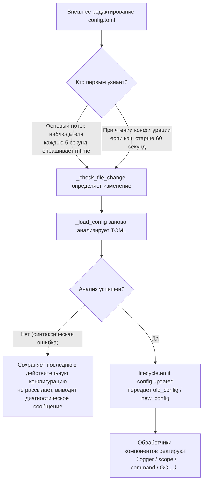

# Описание конфигурационного файла
> Этот документ описывает конфигурационный файл фреймворка. Если у стороннего модуля есть свои настройки, обратитесь к документации модуля.

ErisPulse использует конфигурационный файл в формате TOML `config/config.toml` для управления настройками проекта.

## Позиция конфигурационного файла

Конфигурационный файл находится в папке `config/` корневого каталога проекта:

```
project/
├── config/
│   └── config.toml
├── main.py
```

### Подсказка по нескольким экземплярам и файлу блокировки

При запуске фреймворк создает файл блокировки `.erispulse_config.lock` в каталоге `config/` и удерживает его до завершения процесса (используется для обнаружения нескольких экземпляров, использующих общий каталог конфигурации). Если в журнале появляется предупреждение «Обнаружено, что конфигурационный файл, возможно, используется другим экземпляром ErisPulse», это означает, что **два или более процессов ErisPulse записывают в одну и ту же конфигурацию** (типичный сценарий: несколько контейнеров монтируют один и тот же каталог `config/` хоста) — одновременная запись будет перезаписывать друг друга, поэтому для каждого экземпляра используйте отдельный каталог конфигурации.

## Обработка ошибок при загрузке конфигурации

Фреймворк различает три состояния ошибок при загрузке `config.toml` и предоставляет **действенные сведения для диагностики**, а не просто переключается на конфигурацию по умолчанию:

| Состояние ошибки | Условия срабатывания | Поведение фреймворка |
|---------|---------|---------|
| Файл отсутствует | `config.toml` не существует | Нормальный запуск, пустая конфигурация используется без предупреждения |
| Синтаксическая ошибка TOML | Файл существует, но формат неверный (например, отсутствуют кавычки, не закрыты скобки) | Выводится **номер строки/столбца и причина ошибки**, и сообщается, что используется конфигурация по умолчанию |
| Ошибка доступа/другие ошибки | Нет прав на чтение, ошибки ввода-вывода и т.д. | Выводится **ясная причина**, и сообщается, что используется конфигурация по умолчанию |

Например, если вы случайно написали `port = 8000` (без кавычек для строки), в журнале появится примерно следующее:

```
[ERROR] [Config] Синтаксическая ошибка в конфигурационном файле config/config.toml (строка 3, столбец 1): ...
[WARNING] [Config] Ошибка чтения конфигурационного файла. Продолжение работы с последней действительной конфигурацией, изменения в файле не вступили в силу — исправьте и перезагрузите или перезапустите
```

Таким образом, вы можете сразу определить проблему на уровне **уровня INFO**, а не задаваться вопросом «почему мои изменения в конфигурации не вступили в силу».

> **Изменение конфигурационного файла во время работы?** Если вы вручную отредактировали `config.toml` во время работы робота и внесли синтаксическую ошибку, фреймворк при следующей записи (слиянии конфигурации) выведет «Конфигурационный файл поврежден (ошибка синтаксиса, строка X), невозможно записать изменения — исправьте конфигурационный файл и перезапустите», а не запутанное сообщение «Запись не удалась». Изменения, подлежащие записи, сохраняются, не теряются.

## Сохранение комментариев и минимизация записи на диск

В `config.toml` **комментарии и порядок ключей сохраняются полностью** после записи фреймворком: независимо от того, используете ли вы `setConfig()`, сохранение конфигурации через CLI-викторину или шаблон конфигурации адаптера/модуля, фреймворк изменяет только соответствующие ключи, ваши комментарии и упорядоченный порядок не будут удалены или перестроены (на основе сохранения комментариев tomlkit).

Фреймворк проявляет сдержанность при записи на диск:

- **Конфигурация по умолчанию не записывается автоматически**: `gc`, `scope`, `transcript` и другие встроенные значения по умолчанию хранятся только в памяти, `config.toml` содержит только явно заданные ключи, сохраняя минимальный объем. Полный список настраиваемых параметров см. в `config/config.full.example` проекта, скопируйте его в `config.toml` и измените по необходимости (не заданные параметры по-прежнему используют встроенные значения по умолчанию, поведение не изменится).
- **`config.full.example` автоматически поддерживается**: независимо от того, выполняли ли вы `epsdk init`, при запуске фреймворка (`epsdk run` / `main.py`) файл `config/config.full.example` будет автоматически сгенерирован при его отсутствии; первая строка файла — это метка, поддерживаемая фреймворком, содержимое генератора обновляется (например, при добавлении новых конфигурационных параметров, при установке новых компонентов) при запуске; удаление/изменение первой строки означает, что файл перейдет в ручное управление, и фреймворк больше не будет его перезаписывать.
- **Шаблоны конфигурации адаптеров/модулей**: при первом инициализации шаблоны с комментариями записываются на диск (описание полей — это комментарии); поля, помеченные как `example`, не записываются, только сохраняются в `config.full.example` для справки.

## Переменные окружения

Фреймворк поддерживает **переопределение** конфигурационных параметров `ErisPulse.*` с помощью переменных окружения (подходит для Docker / контейнеризации / CI-развертывания, без необходимости изменять `config.toml`).

Правила именования: замените точечный путь `ErisPulse.<section>.<key>` на полностью заглавные, замените `.` на `_` и добавьте префикс `ERISPULSE_`:

| Параметр | Переменная окружения | Пример значения |
|--------|---------|--------|
| `ErisPulse.server.port` | `ERISPULSE_SERVER_PORT` | `9000` |
| `ErisPulse.server.host` | `ERISPULSE_SERVER_HOST` | `0.0.0.0` |
| `ErisPulse.logger.level` | `ERISPULSE_LOGGER_LEVEL` | `DEBUG` |
| `ErisPulse.framework.strict_mode` | `ERISPULSE_FRAMEWORK_STRICT_MODE` | `false` |

Описание поведения:

- **Наивысший приоритет**: переменные окружения переопределяют «конфигурационный файл» и «значения по умолчанию», автоматически преобразуются по типу (bool / int / float / список, разделенный запятыми / строка)
- **Не сохраняются**: переопределение действует только во время выполнения, не записывается обратно в `config.toml`
- **Поддержка горячей перезагрузки**: при изменении переменных окружения во время выполнения и перезагрузке конфигурации с помощью наблюдателя изменений, изменения вступают в силу

```bash
# Пример развертывания в Docker: без изменения config.toml, просто переопределение порта
ERISPULSE_SERVER_PORT=9000 docker compose up -d
```

> Примечание: `ErisPulse.server.port` и другие конфигурационные параметры фреймворка, доступные через `get_server_config()` и другие API, подвержены влиянию переменных окружения.

### Привязка переменных окружения для конфигурации модуля (2.9.0+)

Конфигурация модуля в виде декларативного класса (`ConfigClass`) поддерживает привязку переменных окружения на уровне полей — в `field(metadata=...)` объявите `env`:

```python
@dataclass
class MyConfig(BaseConfig):
    api_key: str = field(default="", metadata={
        "description": "API ключ",
        "env": "MYMODULE_API_KEY",   # привязка переменной окружения
    })
    retries: int = field(default=3, metadata={"env": "MYMODULE_RETRIES"})
```

Описание поведения:

- **Приоритет**: переменные окружения > `config.toml` > значение по умолчанию (при热 обновлении конфигурации сохраняется этот приоритет)
- **Тип преобразования**: значения переменных окружения автоматически преобразуются по аннотации поля — `str` как есть, `int` / `float` / `bool` (`true` / `1` / `yes` / `on`) автоматически преобразуются, `list` / `dict` разбираются через JSON; при неудачном преобразовании значение переопределения игнорируется (возвращается конфигурационный файл / значение по умолчанию) и выводится предупреждение
- **Одно объявление, все места生效**: конфигурация читается,热 обновляется, проверяется через один и тот же канал; схема конфигурационной панели помечает `env` имя, комментарии в шаблоне config.toml также указывают доступные переменные окружения (шаблон не записывает фактические значения переменных окружения, чтобы избежать утечки)
- **Полная совместимость**: поля, не объявленные с `env`, ведут себя как обычно; непосредственное создание экземпляра ConfigClass (без использования канала конфигурации фреймворка) не подвержено влиянию переменных окружения

```bash
# Пример развертывания в Docker: без изменения config.toml, просто вставка ключа модуля
MYMODULE_API_KEY=sk-xxx docker compose up -d
```

##热 обновление конфигурации

Начиная с версии 2.7.0, фреймворк системно поддерживает热 обновление конфигурации. После внешнего изменения `config.toml` (фоновый наблюдатель каждые 5 секунд обнаруживает изменения) или вызова `setConfig()` из кода, компоненты автоматически реагируют:

| Компонент | Поддерживаемые настройки для热 обновления | Поведение |
|------|----------------|------|
| **Logger** | `logger.level` / `log_files` / `log_dir` (включая параметры сегментации) / `memory_limit` / `format` / `exclude_levels` | Автоматически переприменяются (с обнаружением изменений) |
| **CommandHandler** | `event.command.prefix` / `case_sensitive` / `allow_space_prefix` / `must_at_bot` | Действуют с следующего сообщения |
| **Адаптеры** | `framework.handler_max_concurrency` | Сигнал об отключении кэша, перестройка по новому значению |
| **Активный GC** | `framework.proactive_gc_*` | Конфигурация изменяется, задача GC перезапускается, поддержка настройки/отключения/переактивации в режиме реального времени |
| **Система владельцев** | `master.users` | Каждый вызов `is_master()` проверяет в реальном времени, перезагрузка не требуется |
| **Модули/адаптеры** | Собственные конфигурационные параметры | Вызывается обратный вызов `on_config_update(old, new)` |

**Настройки, требующие перезапуска (небезопасно热 обновить, при изменении выводится предупреждение «Требуется перезапуск процесса для вступления в силу»）:**

| Настройка | Причина |
|------|------|
| `router.cors.*` / `router.security.*` | Промежуточные слои записываются в FastAPI при запуске службы,热 обновление во время выполнения небезопасно |
| `storage.use_global_db` | Дескриптор файла SQLite уже открыт во время выполнения, безопасная смена пути невозможна |

> **Ошибка при редактировании и сохранении?** Если при редактировании `config.toml` возникает временная синтаксическая ошибка, фреймворк **сохранит последнюю действительную конфигурацию** и выведет диагностическое сообщение, не будет рассылать пустую конфигурацию по всем компонентам (избегает `on_config_update` с получением пустого значения и возврата к значению по умолчанию).

### Внутренняя разбивка цепочки热 обновления

«Изменили конфигурацию, как узнают компоненты?» — за этим стоит цепочка обнаружения → перезагрузки → рассылки:



**Две линии обнаружения (достаточно одной, обе могут обеспечить резервирование）:**

| Линия | Механизм | Триггер |
|------|------|---------|
| Фоновый наблюдатель | демон-поток `config-watcher` каждые **5 секунд** `wait` опрашивает `mtime` файла | после редактирования файла максимум через 5 секунд |
| Ленивое обнаружение | при каждом `getConfig()` чтении, если кэш старше **60 секунд** сначала проверяет файл | при следующем чтении конфигурации |

> **Фреймворк не повредит сам себя**: `setConfig()` при записи фиксирует «время последней записи mtime», наблюдатель при сравнении исключает его, рассматривая как изменение только **внешнее редактирование**.

**Два типа событий изменения конфигурации:**

| Событие | Инициатор | Данные | Типичный сценарий |
|------|--------|------|---------|
| `config.set` | код / Dashboard вызывает `setConfig()` | `{key, old_value, new_value}` | одиночное изменение ключа (генерация шаблона, запись состояния, изменение конфигурации в режиме реального времени） |
| `config.updated` | внешнее редактирование после обнаружения наблюдателем/лентивного обнаружения | `{old_config, new_config, config_file}` | ручное редактирование `config.toml` |

> `setConfig()` по умолчанию **задерживает запись на диск на 5 секунд** (объединяет несколько записей), `immediate=True` немедленно записывает. Наблюдатель обнаруживает внешнее изменение, обновляет только кэш в памяти, **не записывает обратно** изменения в файл.

**Список автоматически реагирующих компонентов (обычно оба события подписаны, реакция одинакова）:**

| Компонент | Подписка | Реакция |
|------|------|------|
| Logger | `config.set` + `config.updated` | уровень/файлы/каталог/сегментация/память/формат/уровни исключения переприменяются (с обнаружением изменений, без изменений не двигается） |
| Scope | `config.updated` | перестройка кэша привязки области |
| Система команд | `config.updated` | параметры префикса/регистра/пробел/must_at_bot перепроверяются, вступают в силу с следующего сообщения |
| Адаптеры | `config.set` + `config.updated` | `handler_max_concurrency` сбрасывает сигнал, перестраивается |
| Активный GC | `config.set` + `config.updated` | `proactive_gc_*` немедленно перезапускает фоновую задачу GC |
| Адаптеры | маршрутизация в `on_config_update` | обратный вызов `on_config_update(old, new)` для каждого адаптера |
| Модули | маршрутизация в `on_config_update` | обратный вызов `on_config_update(old, new)` для каждого модуля |
| Хранилище | `config.updated` | `use_global_db` изменение **только предупреждение** (требуется перезапуск） |
| Роутер | `config.updated` | `cors.*` / `security.*` изменение **только предупреждение** (требуется перезапуск） |


## Полный пример конфигурации

```toml
[ErisPulse.server]
host = "0.0.0.0"
port = 8000
auto_start = true
ssl_certfile = ""
ssl_keyfile = ""

[ErisPulse.master]
# users поддерживает два способа записи (выберите один）:
#   глобальный владелец (действует на всех платформах）: users = ["123456", "789012"]
#   владелец по платформе: users = { yunhu = ["123456"], telegram = ["789012"] }
users = {}

[ErisPulse.logger]
level = "INFO"
format = "rich"
log_files = []
log_dir = ""
log_rotation = "size"
log_max_size_mb = 10
log_backup_count = 5
log_rotation_when = "midnight"
memory_limit = 1000
exclude_levels = []

[ErisPulse.framework]
enable_lazy_loading = true
uninit_timeout = 30
strict_mode = 0

[ErisPulse.framework.strict_mode_exceptions]
modules = []
adapters = []

[ErisPulse.storage]
backend = "sqlite"
use_global_db = false

[ErisPulse.event.command]
prefix = "/"
case_sensitive = true
allow_space_prefix = false
must_at_bot = false

[ErisPulse.event.message]
ignore_self = true

[ErisPulse.i18n]
language = "auto"
```

## Конфигурация сервера

```toml
[ErisPulse.server]
host = "0.0.0.0"
port = 8000
auto_start = true
ssl_certfile = "/path/to/cert.pem"
ssl_keyfile = "/path/to/key.pem"
```

| Параметр | Тип | Значение по умолчанию | Описание |
|---------|------|---------|------|
| host | string | 0.0.0.0 | Адрес监听а, 0.0.0.0 означает все интерфейсы |
| port | integer | 8000 | Номер порта监听а |
| auto_start | boolean | true | Автоматически запускать сервер маршрутизации при `sdk.init()`. Установка в `false` пропускает запуск сервера маршрутизации (чистый сценарий событий/без WebUI） |
| ssl_certfile | string | пустая строка | Путь к файлу SSL сертификата |
| ssl_keyfile | string | пустая строка | Путь к файлу SSL приватного ключа |

## Конфигурация системы владельца

Система владельца используется для идентификации «владельца фреймворка» (например, администратора бота). `master.users` поддерживает два способа записи:

```toml
[ErisPulse.master]
# Способ 1: глобальный владелец (действует на всех платформах）
users = ["123456", "789012"]

# Способ 2: владелец по платформе (dict）
# users = { yunhu = ["123456"], telegram = ["789012"] }
```

| Параметр | Тип | Значение по умолчанию | Описание |
|---------|------|---------|------|
| users | array / object | пустой | Список аккаунтов владельца. `list` форма — глобальный владелец (действует на всех платформах); `dict` форма — по платформе (ключ — имя платформы, значение — список аккаунтов владельца на этой платформе） |

В коде проверка осуществляется через `master.is_master(event)` или `master.is_master(platform, user_id)`, каждый вызов считывает конфигурацию в реальном времени (поддерживает热 обновление, перезапуск не требуется）:

```python
from ErisPulse.Core import master

if master.is_master(event):
    await event.reply("Привет, владелец")
```

### Цепочка проверки и динамическое добавление/удаление

Цепочка проверки владельца: **конфигурационный владелец → временные записи → провайдер цепочки**:

```python
from ErisPulse.Core import master

master.is_master(event)                      # проверка по событию
master.is_master("yunhu", "123")             # явная проверка
master.add("yunhu", "123")                   # динамическое добавление (по умолчанию сохраняется; persist=False только в памяти）
master.remove("yunhu", "123")                # удаление (по умолчанию сохраняется）
master.list()                                # объединение: {"global": [...], "<platform>": [...]}
```

### Пользовательские источники идентификации (провайдеры)

Помимо конфигурации, можно зарегистрировать пользовательские источники идентификации: `fn(platform, user_id) -> bool`, встроенные источники идентификации (конфигурация + временные записи) не соответствуют, последовательно проверяются, если один провайдер разрешает, считается владельцем. Подходит для подключения адаптера администратора, базы данных ролей и других внешних систем идентификации.

Точка регистрации `master.provider` поддерживает два способа: декоратор / функциональный, отмена происходит через функцию, зарегистрированную на декораторе:

```python
from ErisPulse.Core import master

# Способ 1: декоратор (постоянный источник идентификации, рекомендуется）
@master.provider
def admin_provider(platform, user_id):
    return user_id in {"999"}     # пользовательская логика проверки

master.is_master("yunhu", "999")   # True
admin_provider.unregister()        # отмена, когда больше не нужно

# Способ 2: функциональный (регистрация на этапе загрузки модуля / отмена на этапе выгрузки）
fn = master.provider(admin_provider)
fn.unregister()
```

> Исключения провайдера перехватываются и пропускаются, не блокируют цепочку проверки идентификации.
> Привязка метода экземпляра не может быть связана с `unregister`, в сценариях, требующих сопоставления регистрации/отмены, используйте **функцию уровня модуля**.

### Приоритет пользователя: область действия владельца определяется пользователем

Параметр `master=True` команды — это только **по умолчанию разработчика**: пользователь может переопределить с помощью `ErisPulse.event.overrides.command.<module>.<cmd>.master = true/false` (см. [единая конфигурация перезаписи событий (event.overrides)], пользовательская конфигурация вступает в силу).

## Конфигурация логов

```toml
[ErisPulse.logger]
level = "INFO"
log_files = []                # явный список файлов логов (без сегментации)
log_dir = ""                  # каталог логов (автоматически создается). После установки запись в erispulse.log в каталоге и автоматическая сегментация по log_rotation; log_files имеет приоритет, log_dir устарел
log_rotation = "size"         # метод сегментации: "size" / "date" / "none"
log_max_size_mb = 10          # максимальный размер файла (MB) в режиме size, после превышения сегментация в .1/.2 резервные копии
log_backup_count = 5          # количество сохраненных файлов логов, старые резервные копии удаляются
log_rotation_when = "midnight"  # период сегментации в режиме date: S/M/H/D/midnight
memory_limit = 1000
exclude_levels = ["EVENT"]
```

| Параметр | Тип | Значение по умолчанию | Описание |
|---------|------|---------|------|
| level | string | INFO | Уровень логирования: TRACE, DEBUG, INFO, WARNING, ERROR, CRITICAL (TRACE — самый низкий уровень, выводит подробную отладочную информацию фреймворка） |
| format | string | rich | Формат вывода логов: `rich` (цветной, по умолчанию）、`plain` (чистый текст без цвета, подходит для лог-сборки/перенаправления потока）、`json` (структурированный JSON, подходит для ELK и т.д.） |
| log_files | array | пустой | Список файлов вывода логов (явные пути, без сегментации） |
| log_dir | string | пустая строка | Каталог вывода логов (автоматически создается). После установки запись в erispulse.log в каталоге и автоматическая сегментация по `log_rotation`; `log_files` и `log_dir` взаимоисключаются, `log_files` имеет приоритет |
| log_rotation | string | size | Метод сегментации: `size` (по размеру）/ `date` (по времени）/ `none` (без сегментации） |
| log_max_size_mb | float | 10 | Максимальный размер файла (MB) в режиме size, после превышения сегментация в .1/.2 резервные копии |
| log_backup_count | integer | 5 | Количество сохраненных файлов логов, старые резервные копии удаляются |
| log_rotation_when | string | midnight | Период сегментации в режиме date: `S`/`M`/`H`/`D`/`midnight` (по умолчанию каждый день в полночь） |
| memory_limit | integer | 1000 | Количество записей логов, хранящихся в памяти |
| exclude_levels | array | пустой | Скрывать указанные уровни логов. Логи с отключенным уровнем **полностью отбрасываются** (не записываются в память, не передаются подписчикам, не печатаются, не записываются в файл). Поддерживает热 обновление |

Также можно динамически переключать в коде:

```python
from ErisPulse.Core import logger

# по размеру сегментации: один файл 10MB, сохранить 5 копий
logger.set_output_dir("logs", rotation="size", max_size_mb=10, backup_count=5)

# по времени сегментации: сегментация каждый день в полночь, сохранить 7 копий
logger.set_output_dir("logs", rotation="date", backup_count=7)
```

> [!NOTE]
> `log_dir` и связанные с сегментацией параметры требуют ErisPulse **2.8.0+**.

> **Защита конфиденциальности**: содержание сообщений входящих и исходящих записывается на уровне **EVENT** (значение 21). Установка `exclude_levels = ["EVENT"]` позволит фоновым системам (например, панель журнала веб-интерфейса) не видеть содержимое сообщений в группах/личных чатах, при этом не влияя на другие уровни логов.

> [!NOTE]
> Эта функция `exclude_levels` требует ErisPulse **2.8.0+**.

## Конфигурация фреймворка

```toml
[ErisPulse.framework]
enable_lazy_loading = true
uninit_timeout = 30
strict_mode = 0

[ErisPulse.framework.strict_mode_exceptions]
modules = []
adapters = []
```

| Параметр | Тип | Значение по умолчанию | Описание |
|---------|------|---------|------|
| enable_lazy_loading | boolean | true | Включить ленивую загрузку модулей |
| uninit_timeout | integer | 30 | Общее время ожидания при корректном завершении (секунды), после которого принудительно завершается. 0 означает отсутствие таймаута |
| strict_mode | integer | 0 | Уровень строгого режима, см. ниже «Строгий режим» |
| handler_max_concurrency | integer | 64 | Максимальное количество задач обработчиков событий, увеличение повышает пропускную способность, но увеличивает использование памяти |
| offline_bot_expiry | integer | 3600 | Автоматический срок истечения записи неактивного бота (секунды), 0 означает, что срок не истекает |

### Конфигурация активного GC

После инициализации SDK запускается фоновая задача активного GC, периодически выполняющая Python GC и внутреннюю очистку ресурсов (очистка неактивных ботов). Все параметры поддерживают热 обновление, при изменении задача перезапускается, поддерживается изменение/отключение/переактивация в режиме реального времени.

| Параметр | Тип | Значение по умолчанию | Описание |
|---------|------|---------|------|
| proactive_gc_interval | number | 300 | Интервал очистки (секунды), поддерживает дробные значения. 0 означает отключение активного GC |
| proactive_gc_generation | integer | 0 | Обычный раунд очистки поколений (0/1/2, ограничивается на 0..2). Обратите внимание, что `gc.collect(2)` эквивалентно полной очистке, по умолчанию 0 сохраняет легкость; глубокая очистка вызывается `proactive_gc_full_every` периодически |
| proactive_gc_full_every | integer | 20 | Каждые N раундов делается полная очистка, 0 означает отключение периодической полной. Полная очистка ограничена порогом `proactive_gc_memory_growth_mb` |
| proactive_gc_memory_growth_mb | integer | 32 | Порог роста памяти для полной очистки (МБ): по сравнению с базой памяти после последней полной очистки (в первую очередь tracemalloc, затем RSS), очистка выполняется только при достижении этого значения. 0 означает, что порог не установлен |
| proactive_gc_idle_only | boolean | false | При включении, в период пиковой нагрузки (существуют незавершенные pending handler) этот раунд пропускается для Python GC, чтобы избежать пауз и конкуренции с обработкой сообщений; внутренняя очистка ресурсов не затрагивается |
| proactive_gc_gen0_min | integer | 500 | Порог срабатывания обычного раунда очистки для мусора gen0: `gc.get_count()[0]` ниже этого значения напрямую пропускается (пустые раунды почти без накладных расходов). 0 означает, что всегда очищается |

> **Изменение 2.7.1**: по умолчанию `proactive_gc_generation` изменился с `2` на `0`, по умолчанию `proactive_gc_full_every` изменился с `0` на `20`. Ранее `generation=2` означало, что каждый раунд делал самую тяжелую полную очистку; новое значение по умолчанию при сохранении охвата очистки значительно снижает накладные расходы на пустые раунды. Явно заданные старые значения по-прежнему действуют по смыслу.

### Строгий режим

Строгий режим управляет стратегией обработки компонентов, которые не соответствуют требованиям или завершаются с ошибкой на этапе загрузки. Современные модули/адаптеры должны наследовать соответствующие базовые классы (`BaseModule`/`BaseAdapter`), компоненты, не унаследованные от базовых классов, влияют на контекстную систему фреймворка и на базовую очистку, что может привести к утечке ресурсов.

> **Изменение 2.5.2**: по умолчанию уровень изменился с `1` (пропуск) на `0` (мягкий), чтобы уменьшить количество проблем, с которыми сталкиваются новые пользователи при первом использовании. Компоненты, не унаследованные от базового класса, будут попытаться загрузиться с предупреждением, а не напрямую отклоняться. Если вы хотите восстановить старое поведение, явно установите `strict_mode = 1`.

| Уровень | Название | Поведение |
|------|------|------|
| 0 | Мягкий (по умолчанию) | Нарушения только предупреждения, компоненты, не унаследованные от базового класса, все еще будут попытаться загрузиться (совместимость со старыми компонентами） |
| 1 | Строгий-пропуск | Отклонить компоненты, не унаследованные от базового класса, и пропустить, остальное нормально запускается |
| 2 | Строгий-фатален | Собрать все нарушения и сообщить в едином сообщении, завершить запуск |

На всех уровнях, «ошибки на этапе загрузки/регистрации/инициализации» компонентов, которые сами по себе аварийно завершаются, всегда будут пропущены; различия заключаются в том, что:

- **0 → 1**: единственное поведение — «не унаследованный от базового класса» из «все еще загрузить» на «пропустить».
- **1 → 2**: все нарушения (не унаследованный от базового класса, загрузка не удалась, регистрация не удалась, инициализация не удалась и т.д.) повышаются до фатального, будут собраны на контрольной точке запуска и выведены в виде списка нарушений, после чего запуск будет остановлен.

#### Исключения

Если некоторые компоненты действительно временно не могут быть обновлены (например, зависимые старые модули), их можно добавить в список исключений, компоненты, перечисленные в списке, будут обрабатываться в соответствии с мягким режимом, продолжая загрузку:

```toml
[ErisPulse.framework.strict_mode_exceptions]
modules = ["SeTu", "SomeLegacyModule"]
adapters = ["OldAdapter"]
```

> Когда компонент отклоняется строгим режимом, журнал будет четко указывать, как восстановить загрузку (добавить в список исключений или снизить уровень).

## Конфигурация хранилища

Начиная с версии 2.8.0, движок хранилища поддерживает три асинхронных бэкенда, **API полностью идентичны, конфигурация переключается одним кликом**:

| Бэкенд | Драйвер | Установка | Особенности |
|------|------|------|------|
| SQLite (по умолчанию) | aiosqlite | Готов к использованию | Нулевая конфигурация, одиночный файл, WAL для параллелизма |
| MySQL / MariaDB | aiomysql | `pip install ErisPulse[mysql]` | Существующая инфраструктура MySQL, многократное использование |
| PostgreSQL | asyncpg | `pip install ErisPulse[postgres]` | Сильные транзакции, высокая параллельность |

```toml
[ErisPulse.storage]
backend = "sqlite"        # "sqlite" (по умолчанию) / "mysql" / "postgres"
use_global_db = false     # Только SQLite: использовать глобальную базу данных пакета data/config.db

[ErisPulse.storage.mysql]      # backend = "mysql" при необходимости
host = "127.0.0.1"
port = 3306
user = "erispulse"
password = ""
database = "erispulse"
# charset = "utf8mb4"
# pool_min = 1
# pool_max = 10

[ErisPulse.storage.postgres]   # backend = "postgres" при необходимости
host = "127.0.0.1"
port = 5432
user = "erispulse"
password = ""
database = "erispulse"
# pool_min = 1
# pool_max = 10
```

| Параметр | Тип | Значение по умолчанию | Описание |
|---------|------|---------|------|
| backend | string | sqlite | Бэкенд хранилища: `sqlite` / `mysql` / `postgres`, переключение без кодовых изменений |
| use_global_db | boolean | false | Только SQLite: использовать глобальную базу данных пакета, а не независимую базу данных проекта |
| storage.mysql.* | table | см. выше | Параметры подключения MySQL (host / port / user / password / database / charset / pool) |
| storage.postgres.* | table | см. выше | Параметры подключения PostgreSQL (host / port / user / password / database / pool) |

Также поддерживаются переменные окружения (Docker / 12-фактор): `ErisPulse.storage.postgres.host` → `ERISPULSE_STORAGE_POSTGRES_HOST`.

> [!TIP]
> - После изменения параметров подключения необходимо перезапустить фреймворк; временные ошибки при создании пула автоматически повторяются с экспоненциальной задержкой
> - Перед переключением бэкенда можно использовать скрипт проверки: `python tests/devs/test_storage_backend_verify.py --backend mysql`
> - Подробное описание транзакций, диалектов, пользовательских бэкендов см. в [Backends хранилища](../advanced/storage-backends.md)

## Конфигурация событий

### Конфигурация команд

```toml
[ErisPulse.event.command]
prefix = "/"
case_sensitive = true
allow_space_prefix = false
```

| Параметр | Тип | Значение по умолчанию | Описание |
|---------|------|---------|------|
| prefix | string | / | Префикс команды |
| case_sensitive | boolean | true | Регистр чувствителен (например, `/Help` и `/help` — это разные команды） |
| allow_space_prefix | boolean | false | Пробел может быть префиксом |
| must_at_bot | boolean | false | Команда может быть вызвана только с упоминанием бота (в личных сообщениях это не ограничено） |

### Конфигурация сообщений

```toml
[ErisPulse.event.message]
ignore_self = true
```

| Параметр | Тип | Значение по умолчанию | Описание |
|---------|------|---------|------|
| ignore_self | boolean | true | Игнорировать собственные сообщения бота |

## Конфигурация локализации

```toml
[ErisPulse.i18n]
language = "auto"
```

| Параметр | Тип | Значение по умолчанию | Описание |
|---------|------|---------|------|
| language | string | auto | Язык отображения встроенного текста фреймворка. Установите в `auto` для автоматического определения языка системы, или укажите конкретный код: `zh-CN`、`zh-TW`、`en`、`ja`、`ru` |

## Конфигурация модуля

Каждый модуль может определить свою конфигурацию в файле конфигурации:

```toml
[MyModule]
api_url = "https://api.example.com"
timeout = 30
enabled = true
```

В модуле читайте и записывайте конфигурацию:

```python
from ErisPulse import sdk

# Чтение конфигурации
config = sdk.config.getConfig("MyModule", {})
api_url = config.get("api_url", "https://default.api.com")

# Запись конфигурации во время выполнения (отложенная запись)
sdk.config.setConfig("MyModule.timeout", 60)

# Немедленная запись в файл
sdk.config.setConfig("MyModule.timeout", 60, immediate=True)
```

> `setConfig` по умолчанию использует отложенную запись (примерно каждые 5 секунд пакетная запись в файл), установка `immediate=True` немедленно сохраняет. Изменения конфигурации вызывают событие жизненного цикла `config.set`.

## Конфигурация области (scope)

> [!NOTE]
> Эта функция требует ErisPulse **2.8.0+**.

Область определяет «**в каком контексте действует**» — на какой платформе / боте / сессии какие модули доступны (① уровень модуля), какие события принимаются для какого пользователя / группы / бота / адаптера (② уровень идентификации), какие исходящие вызовы может делать модуль (③ уровень исходящих вызовов):

```toml
[ErisPulse.scope]
default_allow = true        # Глобальная базовая настройка (false = явное отклонение строгого режима; не влияет на исходящий уровень)
cache_size = 1024           # Размер кэша LRU

# ① Уровень модуля (приоритет: сессия > бот > платформа; элементы поддерживают точные / glob / re: регулярные выражения)
[ErisPulse.scope.platforms.onebot11]
modules = ["Chat", "Tool*"]
blocked = ["re:^Danger"]

# Подчиненные привязки с merge = true объединяются с низшим уровнем по каждому элементу (по умолчанию — общее перекрытие)
[ErisPulse.scope.bots.onebot11."123456"]
modules = ["Music"]
merge = true

# ② Уровень идентификации (приоритет: пользователь > сессия > бот > адаптер; на каждом уровне только allow или deny)
[ErisPulse.scope.identity.adapters.onebot11]
deny = true                 # Все события этой платформы отбрасываются на входе
[ErisPulse.scope.identity.users.onebot11]
allow = ["u_admin"]         # Ключи пользователей поддерживают glob / re: регулярные выражения
deny = ["u_bad", "spam_*"]

# ③ Уровень исходящих вызовов (по умолчанию все разрешено; правила — в виде вложенных таблиц, элементы поддерживают точные / glob / re: регулярные выражения)
[ErisPulse.scope.actions.MyModule]
send = { deny = true }                    # Полный запрет отправки
api = { allow = ["get_*"] }               # Разрешены только стандартные API запросов
request = { deny = true }                 # Запрет обработки запросов
```

| Параметр | Тип | Описание |
|---------|------|------|
| `scope.default_allow` | boolean | Глобальная базовая настройка: разрешение/отклонение для модулей/идентификации, не попавших под правило (true) |
| `scope.cache_size` | integer | Размер кэша LRU (по умолчанию 1024) |
| `scope.platforms / bots / sessions` | table | ① Трехуровневая привязка модуля: `{modules=[...], blocked=[...], merge=bool?}` |
| `scope.identity.adapters / bots / sessions / users` | table | ② Четырехуровневая привязка идентификации: `{allow=true}` / `{deny=true}` |
| `scope.actions.<module>.<action>` | table | ③ Правила исходящих вызовов: `{allow=[...], deny=true|[...]}` (действия — send / api / request) |

> Подробное объяснение и API времени выполнения (`sdk.scope.set_module()` / `set_identity()` / `set_action()`, проверка `is_allowed()` / `is_identity_allowed()` / `is_action_allowed()`, а также словарный доступ `get()` / `set()` / `delete()`) см. в [Область (scope)](../advanced/scope.md).

## Единая конфигурация перезаписи событий (event.overrides)

Система единых перезаписей: перезапись поведения любого обработчика модуля по типу события, без изменения кода модуля. Стандартные типы OneBot12 (meta / message / notice / request) и расширенные типы (command) имеют собственные перезаписываемые параметры:

```toml
[ErisPulse.event.overrides]

# message: текстовые условия (и условия в коде AND)
[ErisPulse.event.overrides.message.ChatModule]
pattern = "闲聊*"

# notice / request / meta: detail_type белый список (элементы поддерживают точные / glob / re: регулярные выражения)
[ErisPulse.event.overrides.notice.MyModule]
detail_types = ["group_increase"]

# command (расширенный тип): реализация параметров перезаписи (приоритет пользователя; отключение через acl deny)
[ErisPulse.event.overrides.command.MyModule.restart]
master = true               # Перезапись как только владелец фреймворка (false — разрешить ограничение владельца разработчика)
hidden = true               # Скрыть в списке помощи
aliases = ["rs"]            # Действительные псевдонимы

# acl (command специфичный): черный/белый список пользователей (название команды поддерживает glob / re: регулярные выражения, точные ключи имеют приоритет)
[ErisPulse.event.overrides.acl."roll*"]
allow = ["onebot11:u_vip"]  # Идентификатор пользователя "platform:user_id"
deny = ["onebot11:u_bad"]

# ACL базовая настройка: разрешение (true) / строгое отклонение (false) для команд, не имеющих ACL
acl_default_allow = true
```

| Параметр | Тип | Описание |
|---------|------|------|
| `event.overrides.message.<module>` | table | Условия текста: `{pattern="...", regex="..."}` |
| `event.overrides.notice / request.<module>` | table | `{detail_types=[...], pattern, regex}` |
| `event.overrides.meta.<module>` | table | `{detail_types=[...]}` |
| `event.overrides.command.<module>` | table | Параметры перезаписи на уровне модуля (например, `hidden = true` и т.д.) |
| `event.overrides.command.<module>.<command>` | table | Перезапись на уровне команды (приоритет команды) |
| `event.overrides.acl.<command>` | table | Черный/белый список пользователей: `{allow=[...], deny=[...]}` |
| `event.overrides.acl_default_allow` | boolean | ACL базовая настройка: разрешение (true) / строгое отклонение (false) для команд без ACL |

> API во время выполнения (`from ErisPulse.Core.Event import overrides` после доступа к подпространствам по типу `overrides.message.set()` / `overrides.command.set()` / `overrides.acl.set()` и т.д., или через `sdk.Event.overrides` доступ) см. в [Введение в обработку событий · Перезапись событий](../getting-started/event-handling.md#перезапись-событий-без-изменения-кода-модуля-перезапись-поведения-любого-типа-события)。

## Конфигурация разбора команд (event.command)

## Далее

- [Справочник CLI](cli-reference.md) - Ознакомьтесь со всеми командами командной строки
- [Руководство для разработчиков](../developer-guide/) - Научитесь создавать собственные модули