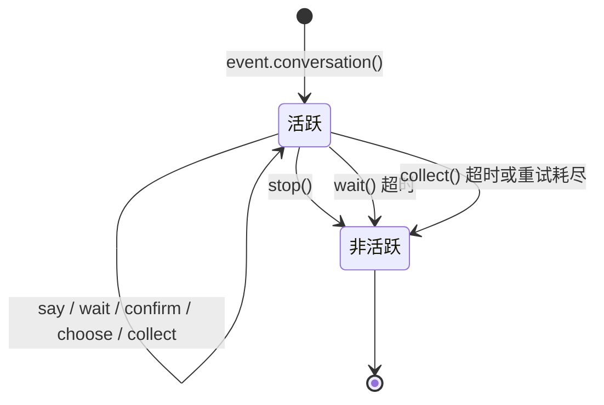

# Conversation 多轮对话

`Conversation` 类提供了在同一会话中进行多轮交互的便捷方法，适合实现引导式操作、信息收集、对话式问答等场景。

## 创建对话

通过 `Event` 对象的 `conversation()` 方法创建：

```python
from ErisPulse.Core.Event import command

@command("quiz")
async def quiz_handler(event):
    conv = event.conversation(timeout=30)

    await conv.say("🎮 欢迎参加知识问答！")

    answer = await conv.choose("第一题：Python 的创造者是谁？", [
        "Guido van Rossum",
        "James Gosling",
        "Dennis Ritchie",
    ])

    if answer is None:
        await conv.say("超时了，下次再来吧！")
        return

    if answer == 0:
        await conv.say("正确！")
    else:
        await conv.say("错误了，正确答案是 Guido van Rossum")

    conv.stop()
```

## 核心 API

### say(content, **kwargs)

发送消息，返回 `self` 支持链式调用：

```python
await conv.say("第一行").say("第二行").say("第三行")
```

也可以指定发送方法：

```python
await conv.say("https://example.com/image.jpg", method="Image")
```

### wait(prompt=None, timeout=None)

等待用户回复，返回 `Event` 对象或 `None`（超时）：

```python
# 简单等待
resp = await conv.wait()
if resp:
    text = resp.get_text()

# 发送提示后等待
resp = await conv.wait(prompt="请输入你的名字：")

# 使用自定义超时（覆盖对话默认超时）
resp = await conv.wait(prompt="请在10秒内回复：", timeout=10)
```

### confirm(prompt=None, **kwargs)

等待用户确认（是/否），返回 `True` / `False` / `None`（超时）：

```python
result = await conv.confirm("确定要删除所有数据吗？")
if result is True:
    await conv.say("已删除")
elif result is False:
    await conv.say("已取消")
else:
    await conv.say("超时未回复")
```

内置识别的确认词：`是/yes/y/确认/确定/好/ok/true/对/嗯/行/同意/没问题/可以/当然...`

内置识别的否定词：`否/no/n/取消/不/不要/不行/cancel/false/错/不对/别/拒绝...`

### choose(prompt, options, **kwargs)

等待用户从选项中选择，返回选项索引（0-based）或 `None`：

```python
choice = await conv.choose("请选择颜色：", ["红色", "绿色", "蓝色"])
if choice is not None:
    colors = ["红色", "绿色", "蓝色"]
    await conv.say(f"你选择了 {colors[choice]}")
```

用户可以通过输入编号（`1`/`2`/`3`）或选项文本（`红色`）来选择。

`options_format="auto"`（默认）根据 method 自动选择内置样式：Markdown→无序列表，Html→有序列表，其他→纯文本列表。
也支持 `"list"`、`"inline"`、`"md"`、`"html"` 或自定义函数。

支持 `merge_prompt=True` 合并为一条消息，以及占位符控制选项插入位置（默认 `{options}`，可通过 `placeholder` 自定义）：

```python
choice = await conv.choose(
    "## 请选择\n{options}",
    ["选项A", "选项B"],
    method="Markdown",
    merge_prompt=True,
)

# 自定义占位符
choice = await conv.choose(
    "请选择: [choices]",
    ["选项A", "选项B"],
    placeholder="[choices]",
)
```

### collect(fields, **kwargs)

多步骤收集信息，返回数据字典或 `None`：

```python
data = await conv.collect([
    {"key": "name", "prompt": "请输入姓名"},
    {"key": "age", "prompt": "请输入年龄",
     "validator": lambda e: e.get("alt_message", "").strip().isdigit(),
     "retry_prompt": "年龄必须是数字，请重新输入"},
    {"key": "city", "prompt": "请输入城市"},
])

if data:
    await conv.say(f"注册成功！\n姓名: {data['name']}\n年龄: {data['age']}\n城市: {data['city']}")
else:
    await conv.say("注册过程中断")
```

字段配置：

| 参数 | 说明 | 默认值 |
|------|------|--------|
| `key` | 字段键名（必须） | - |
| `prompt` | 提示消息 | `"请输入 {key}"` |
| `validator` | 验证函数，接收 Event，返回 bool | 无 |
| `retry_prompt` | 验证失败重试提示 | `"输入无效，请重新输入"` |
| `max_retries` | 最大重试次数 | 3 |
| `condition` | 条件函数，接收已收集数据 dict，返回 bool | 无 |

**条件字段**：使用 `condition` 可以实现动态表单，只有条件满足时才收集该字段：

```python
data = await conv.collect([
    {"key": "has_car", "prompt": "你有车吗？（是/否）"},
    {"key": "car_brand", "prompt": "请输入车型",
     "condition": lambda d: d.get("has_car", "").lower() in ("是", "yes", "y")},
])
```

### stop()

手动结束对话，设置 `is_active` 为 `False`：

```python
conv.stop()
```

### is_active

对话是否处于活跃状态：

```python
if conv.is_active:
    await conv.say("对话还在进行中")
```

## 活跃状态管理



对话在以下情况会自动变为非活跃状态：

1. 调用 `stop()` 方法
2. `wait()` 超时返回 `None`
3. `collect()` 因任何步骤超时或重试耗尽而返回 `None`

非活跃后，所有交互方法（`wait`/`confirm`/`choose`/`collect`）会立即返回 `None`，不会继续等待用户输入。

## 分支与跳转

### @conv.branch(name) 装饰器

使用 `branch()` 注册对话分支，通过 `goto()` 在分支间跳转：

```python
@command("menu")
async def menu_handler(event):
    conv = event.conversation(timeout=60)

    @conv.branch("main")
    async def main_menu():
        await conv.say("=== 主菜单 ===\n1. 个人信息\n2. 设置\n3. 退出")
        resp = await conv.wait()
        if resp is None:
            return
        text = resp.get_text().strip()
        if text == "1":
            await conv.goto("profile")
        elif text == "2":
            await conv.goto("settings")
        elif text == "3":
            await conv.say("再见！")
            conv.stop()

    @conv.branch("profile")
    async def profile():
        await conv.say("=== 个人信息 ===\n姓名: Alice\n0. 返回")
        resp = await conv.wait()
        if resp and resp.get_text().strip() == "0":
            await conv.goto("main")

    @conv.branch("settings")
    async def settings():
        await conv.say("=== 设置 ===\n1. 通知开关\n0. 返回")
        resp = await conv.wait()
        if resp and resp.get_text().strip() == "0":
            await conv.goto("main")

    await conv.start()  # 从第一个注册的分支开始
```

### conv.start(name=None)

启动对话，默认从第一个注册的分支开始：

```python
await conv.start()          # 从第一个分支开始
await conv.start("settings") # 从指定分支开始
```

## 上下文与持久化

### conv.context

每个对话实例内置 `context` 字典，用于在分支间共享状态：

```python
@conv.branch("step1")
async def step1():
    conv.context["username"] = resp.get_text().strip()
    await conv.goto("step2")

@conv.branch("step2")
async def step2():
    name = conv.context.get("username", "未知")
    await conv.say(f"你好，{name}！")
```

### save() / resume() / clear_saved()

对话支持持久化，可在超时或中断后恢复：

```python
# 保存对话状态（通常无需手动调用，见下方"自动检查点"）
await conv.save()

# ... 之后在同一会话中恢复 ...
conv2 = event.conversation()
if await conv2.resume():
    await conv2.say("欢迎回来！继续之前的对话")
else:
    await conv2.say("没有找到之前的对话")

# 清除保存的对话
await conv.clear_saved()
```

存储键含 target 维度（`conversation:{platform}:{user_id}:{target_id}`），同一用户在不同会话中的对话互不覆盖；旧格式（不含 target）的存档在 `resume()` 时自动迁移。

## 自动检查点与重启恢复

### 自动存档

框架在以下时机自动维护检查点，通常无需手动调用 `save()`：

| 时机 | 行为 |
|------|------|
| `goto()` / `start()` 跳转分支 | 自动保存（当前分支 + context） |
| `stop()` / `wait()` 超时 / `collect()` 失败 | 自动清除（对话终态） |

### 检查点 TTL

存档带时间戳，超过 `ErisPulse.interaction.checkpoint_ttl`（默认 24 小时）的存档在恢复时自动丢弃：

```toml
[ErisPulse.interaction]
checkpoint_ttl = 86400  # 秒
```

### 重启自动恢复

框架重启后，进行中的对话（内存中的等待协程）会丢失，但检查点仍在。通过 `register_resume_handler` 注册**恢复工厂**，框架即可在重启后收到该会话首条消息时自动续接对话：

```python
from ErisPulse.Core.Event.wrapper import Conversation

@Conversation.register_resume_handler()  # 可传 platform="onebot11" 限定平台
def make_conversation(event) -> Conversation:
    # 工厂职责：重建对话并重新注册所有分支
    conv = event.conversation(timeout=60)

    @conv.branch("menu")
    async def menu(conv, event):
        ...

    return conv
```

注册后，重启前处于 `menu` 分支的用户发来首条消息时，框架自动：恢复 context → 认领该消息 → 从存档分支继续对话。未注册工厂时此机制零开销。

### 恢复即接管

`resume()` 成功时框架自动完成两件事：

1. **会话接管**：自动 acquire 该会话的互斥租约——其他模块可通过 `sdk.interaction.get_owner_of(event)` 感知"这个用户正被对话占用"；会话已被其他模块占用时放弃恢复（返回 False），避免两个对话打架
2. **历史带回**：从会话收件箱取最近 10 条消息到 `conv.recent_history`（AI 模块恢复后 LLM 上下文不断档）；`resume(with_history=0)` 可关闭

```python
if await conv.resume(with_history=20):
    for m in conv.recent_history:
        print(m["role"], ":", m["text"])
```

### 手动恢复（不用自动机制时）

```python
@command("continue")
async def continue_handler(event):
    conv = event.conversation()
    # ... 注册分支 ...
    if await conv.resume():
        conv.goto(conv.get_current_branch())
```

## 典型流程模式

### 引导式注册

```python
@command("register")
async def register_handler(event):
    conv = event.conversation(timeout=60)

    await conv.say("欢迎注册！")

    data = await conv.collect([
        {"key": "username", "prompt": "请输入用户名（3-20个字符）",
         "validator": lambda e: 3 <= len(e.get_text().strip()) <= 20},
        {"key": "email", "prompt": "请输入邮箱地址",
         "validator": lambda e: "@" in e.get_text() and "." in e.get_text(),
         "retry_prompt": "邮箱格式不正确，请重新输入"},
    ])

    if not data:
        await event.reply("注册已取消")
        return

    confirmed = await conv.confirm(
        f"确认注册信息？\n用户名: {data['username']}\n邮箱: {data['email']}"
    )

    if confirmed:
        await conv.say("✅ 注册成功！")
    else:
        await conv.say("❌ 已取消注册")
```

### 循环对话

```python
@command("chat")
async def chat_handler(event):
    conv = event.conversation(timeout=120)
    await conv.say("进入对话模式，输入「退出」结束")

    while conv.is_active:
        resp = await conv.wait()
        if resp is None:
            await conv.say("超时，对话结束")
            break

        text = resp.get_text().strip()

        if text == "退出":
            await conv.say("再见！")
            conv.stop()
        elif text == "帮助":
            await conv.say("可用命令：退出、帮助、状态")
        elif text == "状态":
            await conv.say("对话活跃中")
        else:
            await conv.say(f"你说的是：{text}")
```

## 相关文档

- [Event 包装类](../developer-guide/modules/event-wrapper.md) - Event 对象的所有方法
- [事件处理入门](../getting-started/event-handling.md) - 事件处理基础
