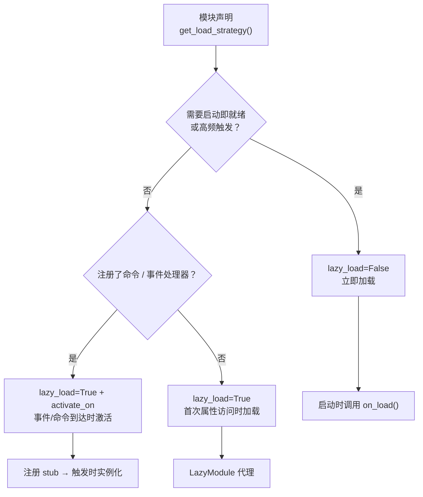

# 懒加载模块系统

ErisPulse SDK 提供了强大的懒加载模块系统，允许模块在实际需要时才进行初始化，从而显著提升应用启动速度和内存效率。

## 概述

懒加载模块系统是 ErisPulse 的核心特性之一，它通过以下方式工作：

- **延迟初始化**：模块只有在第一次被访问时才会实际加载和初始化
- **透明使用**：对于开发者来说，懒加载模块与普通模块在使用上几乎没有区别
- **自动依赖管理**：模块依赖会在被使用时自动初始化
- **生命周期支持**：对于继承自 `BaseModule` 的模块，会自动调用生命周期方法

## 工作原理

### LazyModule 类

懒加载系统的核心是 `LazyModule` 类，它是一个包装器，在第一次访问时才实际初始化模块。

### 初始化过程

当模块首次被访问时，`LazyModule` 会执行以下操作：

1. 获取模块类的 `__init__` 参数信息
2. 根据参数决定是否传入 `sdk` 引用
3. 设置模块的 `moduleInfo` 属性
4. 对于继承自 `BaseModule` 的模块，调用 `on_load` 方法
5. 触发 `module.init` 生命周期事件

## 事件驱动懒激活（activate_on）

> [!NOTE]
> 本特性需要 ErisPulse **2.8.0+**。

`lazy_load=True` 的模块默认只在**首次属性访问**时加载。若模块注册了命令/事件处理器，
传统做法只能 `lazy_load=False` 立即加载。`activate_on` 提供了第三种选择：**声明触发器，
首个匹配事件/命令到达时自动激活模块**——既不常驻内存，又不丢失触发入口。

```python
from ErisPulse.loaders import ModuleLoadStrategy

class MyModule(BaseModule):
    @staticmethod
    def get_load_strategy():
        return ModuleLoadStrategy(
            lazy_load=True,
            activate_on=[
                # ---- 事件触发（被动到达，无需用户感知）----
                "message",                                    # 类型级：任何消息事件
                {"notice": "group_member_increase"},          # 类型 + 单个 detail_type
                {"message": ["private", "group"]},            # 类型 + 多个 detail_type

                # ---- 命令触发（主动输入，占位命令对 Help 可见）----
                {"command": "roll"},                          # 简写：命令名
                {"command": ["roll", "dice"]},                # 命令名列表
                {"command": {                                 # dict 声明（name 必填）
                    "name": "dice",
                    "help": "掷一个骰子",
                    "usage": "/dice",
                    "group": "娱乐",
                    "aliases": ["d"],
                    "hidden": False,
                }},
            ],
        )
```

### 命令 dict 声明参数

dict 形式镜像 `@command()` 装饰器的用户级参数，用于在模块加载前就注册占位命令：

| 参数 | 类型 | 默认 | 说明 |
|------|------|------|------|
| `name` | `str` | **必填** | 命令名；须与 `on_load` 中 `@command(name)` 一致，否则激活后占位注销、命令不存在 |
| `help` | `str` | 回退链 | Help 中显示的介绍；未声明时按回退链取值（见下） |
| `usage` | `str` | 自动生成 | 用法行，默认 `{prefix}{name}` |
| `group` | `str` | `None` | 命令分组 |
| `aliases` | `list[str]` | `[]` | 别名同时注册，**输入别名同样触发激活** |
| `hidden` | `bool` | `False` | `True` 时占位命令同样隐藏（与激活后真实命令的隐藏语义对齐）；知道命令名的用户输入仍可触发 |

**不支持** `priority` / `permission` / `master`：占位命令的使命只是触发激活，
权限检查由激活后的真实命令执行（占位阶段拦截权限反而会让"输入命令激活"失效）。

### 占位命令 help 回退链

模块未加载时 Help 显示的命令介绍，按以下顺序取值（取到即止）：

1. dict 声明的命令级 `help`（最精确）
2. 模块 `get_meta()` 的 `description`
3. 模块 `__description__` 属性
4. 包元数据的 `Summary`（PyPI 包简介）
5. 通用提示：「此命令来自懒加载模块 X，首次使用将自动加载该模块」

### 触发语义

- **事件 stub**：以极低优先级（`ACTIVATION_STUB_PRIORITY`）注册到对应事件管理器，
  在所有普通处理器之后兜底触发；激活后将当前事件转发给模块的真实处理器
- **命令 stub**：注册占位命令；激活后占位注销、真实命令接管当次触发
- **防重入**：`asyncio.Lock` 保证并发触发下只激活一次
- **作用域过滤**：stub 带模块 owner 身份，模块未对该 Bot / 会话 / 平台启用时不触发
- **失败语义**：激活失败不重试，stub 一并注销
- **去重**：同名命令以简写 + dict 混合声明时去重（dict 优先）；dict 缺 `name`
  或事件 `detail_type` 误写 dict 时告警并忽略

> 架构图与完整语义详见 [架构概览](../architecture.md#事件驱动懒激活activate_on触发架构)。

## 配置懒加载

### 全局配置

在配置文件中启用/禁用全局懒加载：

```toml
[ErisPulse.framework]
enable_lazy_loading = true  # true=启用懒加载(默认)，false=禁用懒加载
```

### 模块级别控制

模块可以通过实现 `get_load_strategy()` 静态方法来控制加载策略：

```python
from ErisPulse.Core.Bases import BaseModule
from ErisPulse.loaders import ModuleLoadStrategy

class MyModule(BaseModule):
    @staticmethod
    def get_load_strategy():
        """返回模块加载策略"""
        return ModuleLoadStrategy(
            lazy_load=False,  # 返回 False 表示立即加载
            priority=100      # 加载优先级，数值越大优先级越高
        )
```

## 使用懒加载模块

### 基本使用

对于开发者来说，懒加载模块与普通模块在使用上几乎没有区别：

```python
# 通过SDK访问懒加载模块
from ErisPulse import sdk

# 以下访问会触发模块懒加载
result = await sdk.my_module.my_method()
```

### 统一的模块获取入口

无论是通过 SDK 属性、模块管理器属性访问，还是通过 `module.get()` 查询，
对于“已注册但尚未加载”的懒加载模块，都会返回同一个懒加载代理，访问其属性才会真正触发初始化：

```python
# 三种方式拿到的都是懒加载代理（在模块未加载时），行为一致、对用户透明
sdk.my_module          # 触发加载的入口
sdk.module.my_module   # 同样返回懒加载代理
sdk.module.get("my_module")  # 也返回懒加载代理，本身不会触发加载

# 访问代理的任意属性才会真正初始化模块
result = await sdk.my_module.my_method()
```

`module.get()` 是**查询**接口，本身不触发加载：
- 模块已加载 → 返回真实实例
- 模块已注册但未加载 → 返回懒加载代理（访问属性才初始化）
- 模块未注册 → 返回 `None`

如需显式触发加载，请使用 `await sdk.load_module("my_module")`。

### 异步初始化

对于需要异步初始化的模块，建议先显式加载：

```python
# 先显式加载模块
await sdk.load_module("my_module")

# 然后使用模块
result = await sdk.my_module.my_method()
```

### 同步初始化

对于不需要异步初始化的模块，可以直接访问：

```python
# 直接访问会自动同步初始化
result = sdk.my_module.some_sync_method()
```

## 最佳实践

选择加载策略时，可参考以下决策流程：



### 推荐使用懒加载的场景（lazy_load=True）

- 被动调用的工具类（如数据查询模块，格式转换器等，仅只在其他模块调用时才需要）
- 注册命令/事件处理器但非高频使用的模块——配合 `activate_on` 声明触发器，首个匹配事件/命令到达时自动激活，无需放弃懒加载

### 推荐禁用懒加载的场景（lazy_load=False）

- 需要在启动时立即就绪的模块（如为其它模块提供基础服务的核心模块）
- 高频触发的监听器（每条消息都要处理）——`activate_on` 转发有一次激活开销，高频场景立即加载更直接
- 定时任务模块
- 需要在应用启动时就初始化的模块

> `priority` 参数控制立即加载模块间的初始化顺序，数值越大越先初始化。同优先级的模块按注册顺序加载。

## 注意事项

1. 如果您的模块使用了懒加载，如果其它模块从未在ErisPulse内进行过调用，则您的模块永远不会被初始化。
2. 如果您的模块中包含了诸如监听Event的模块，或其它主动监听类似模块，有两种选择：声明 `activate_on` 触发器（保持懒加载，事件到达时自动激活），或声明需要立即被加载（`lazy_load=False`），否则会影响您模块的正常业务。
3. 我们不建议您禁用懒加载，除非有特殊需求，否则它可能为您带来诸如依赖管理和生命周期事件等的问题。
4. `activate_on` 的命令 dict 声明中，`name` 必须与模块 `on_load` 中 `@command()` 注册的真实命令名一致——否则模块激活后占位命令注销，声明与实现不一致的命令将不存在。

## 相关文档

- [模块开发指南](../developer-guide/modules/getting-started.md) - 学习开发模块
- [最佳实践](../developer-guide/modules/best-practices.md) - 了解更多最佳实践