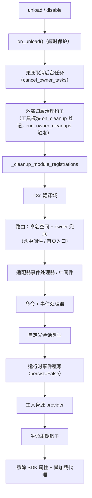

# 归属权（owner）系统

归属权是模块"即插即用"的基石：模块在加载期间注册的一切框架资源自动记名，
卸载/禁用时按记名一键回收——模块作者只需声明资源，无需手写清理逻辑。

> **相关系统**：作用域（scope）在事件分发时决定"资源是否生效"，
> 归属权在生命周期中决定"资源归谁、谁卸载时被回收"。
> 作用域详见[统一控制面（scope）](scope.md)，后台任务详见
> [生命周期管理](lifecycle.md#后台任务归属与自动取消)。

{!--< tips >!--}
1. 归属在**注册瞬间**按 `current_owner` 自动记录，模块代码零改动
2. 卸载/禁用共用同一条清理链（`_cleanup_module_registrations`），每步失败仅告警不中断
3. 用户配置语义的资源（持久化覆写 / scope 规则 / 命令 ACL）**不**随模块卸载清理
4. 工具模块托管的外部句柄可用 `on_cleanup(cb)` 挂入清理链，对方模块卸载时自动回调（见[工具模块指南](#工具模块指南托管其它模块的句柄)）
{!--< /tips >!--}

## owner 上下文机制

owner 通过上下文变量 `current_owner` 传递（`ErisPulse.runtime.context`）：

```python
from ErisPulse.runtime import owner_scope, get_current_owner

with owner_scope("MyModule"):
    # 此区间内注册的一切资源自动归属 MyModule
    assert get_current_owner() == "MyModule"
```

框架在以下时机自动注入 owner（模块/适配器代码无需手动包裹）：

| 时机 | owner 值 | 位置 |
|------|----------|------|
| 模块 `load()` | 模块名 | 实例化 + `on_load` 全程 |
| 适配器 `start()` / `restart()` | 平台名 | 适配器启动全程 |
| `activate_on` 懒加载 stub 注册 | 模块名 | 占位命令/处理器注册 |
| 事件处理器执行期 | 处理器归属模块名 | handler / 命令入口重注入 |

执行期重注入意味着：模块在 `on_load` 里声明的命令处理器**运行中**调用
注册型 API（如 `sdk.adapter.on()`、`overrides.*.set(persist=False)`），
同样会自动归属本模块。

## 归属资源全景

模块在加载上下文内注册的以下资源均记录归属，卸载/禁用时自动回收：

| 资源 | 注册方式 | 清理调用 |
|------|----------|----------|
| 命令 | `@command()` / 命令 dict 声明 | `command.unregister_by_owner()` |
| 事件处理器 | `@message` / `@notice` / `@request` / `@meta` | `handler.unregister_by_owner()` |
| 适配器事件监听 | `sdk.adapter.on()` / `raw=True` | `adapter.unregister_handlers_by_owner()` |
| 适配器中间件 | `@sdk.adapter.middleware` | 同上 |
| 路由（HTTP/WS/SSE） | `router.http()` / `websocket()` / `sse()` | 按命名空间 + 按 owner 双重兜底 |
| 路由中间件 | `@router.middleware()` / `add_middleware()` | `router.unregister_all_by_owner()` |
| Dashboard 首页入口 | `router.register_home_entry()` | `unregister_home_entries_by_owner()` |
| 自定义会话类型 | `register_custom_type()` | `unregister_custom_types_by_owner()` |
| 后台任务 | `self.spawn()` | `cancel_owner_tasks()` |
| 外部归属清理钩子（工具模块托管） | `runtime.on_cleanup(cb)` | `run_owner_cleanups()`（卸载/禁用/适配器关闭链内触发） |
| 生命周期钩子 | `lifecycle.register()` | `lifecycle.unregister_by_owner()` |
| 主人身源 provider | `master.provider` | `master.unregister_by_owner()` |
| i18n 翻译键 | `I18nClass` 声明（domain=模块名） | `i18n.unregister_domain()` |
| 事件覆写（运行时） | `overrides.*.set(persist=False)` | `overrides.unregister_by_owner()` |
| 交互会话（wait_reply 等待 / 租约） | `event.wait_reply()` / `sdk.interaction.acquire()` | `interaction.cancel_by_owner()`（等待方立即收到取消） |
| 上下文数据 | `runtime/context` 按 owner 记录 | 按模块精确清理 |

适配器侧的对应资源（以平台名为 owner）在适配器 `shutdown()` / `restart()`
时由 `_cleanup_adapter_resources` 回收，另含：

| 资源 | 清理调用 |
|------|----------|
| 适配器自有的 `on()` 处理器与中间件 | `adapter.unregister_handlers_by_owner(platform)` |
| 平台事件方法扩展（`EventMixin`） | `unregister_platform_event_methods(platform)` |
| 自定义会话类型 | `unregister_custom_types_by_owner(platform)` |
| 交互会话（该平台挂起的 wait_reply / 租约） | `interaction.cancel_by_platform(platform)` |
| i18n 翻译域（domain=配置键） | `i18n.unregister_domain(配置键)` |
| 细颗粒命名空间路由 | `router.unregister_all_by_owner(platform)` |

## 卸载/禁用清理序列

`unload()` 与 `disable()` 共用同一条清理链（每步独立 try/except，
失败仅记日志，**不中断后续清理**）：



`sdk.uninit()` 退出时另有全局兜底：全部适配器 shutdown → 全部模块 unload →
`router.stop()`（清空路由/中间件/首页入口）→ `cancel_all_background_tasks()` →
清空事件处理器与钩子。

## 设计边界：哪些资源不随卸载清理

归属权只回收**模块代码注册的运行时资源**。以下资源属**用户配置语义**
（控制权在用户，可能刻意配置），模块卸载后随配置持久保留：

| 资源 | 语义 | 说明 |
|------|------|------|
| `overrides.*.set(persist=True)` | 持久化覆写 | 写入配置文件，跨重启生效；模块卸载不删（用户显式配置） |
| `scope.set_action()` 等作用域规则 | 权限控制面 | 由用户/Dashboard 管理，卸载模块不回收规则 |
| `overrides.acl.set(persist=True)` | 命令 ACL | 同上 |
| Conversation `save()` 持久化 | 多轮对话存档 | 数据资产不清理 |

运行时临时写入（`persist=False`）则随 owner 回收——**持久化与否即
"用户资产"与"模块运行时状态"的分界线**。

## 模块作者指南

### 推荐写法

```python
from ErisPulse import sdk
from ErisPulse.Core.Event import command
from ErisPulse.runtime import owner_scope, spawn_background

class MyModule(BaseModule):
    async def on_load(self, event):
        # 框架资源：自动归属，无需手动清理
        self.task = self.spawn(self.polling())      # 后台任务
        sdk.router.register_home_entry("我的模块", "/my")  # 首页入口

        # 模块自有资源：包进 owner_scope 即纳入归属体系
        with owner_scope("MyModule"):
            self.client.on_event(self._handle)      # 假想的自定义注册

    async def on_unload(self, event):
        # 框架资源已被自动回收，只需清理 owner_scope 覆盖不到的自有资源
        await self.client.close()
```

### 注意事项

- **import 期注册无归属**：模块顶层（import 时）注册的钩子/处理器发生在
  `owner_scope` 之前，会被视为框架级资源（owner=None）而**不被清理**。
  一律放到 `on_load()` 内注册。
- **自定义 domain 的 i18n 注册**：`i18n.register(domain=...)` 的 domain
  不等于模块名时不会被自动回收，请保持 domain=模块名。
- **后台任务务必用 `self.spawn()`**：裸 `asyncio.create_task` 不归属模块，
  卸载时不会被取消（详见[生命周期管理](lifecycle.md#后台任务归属与自动取消)）。
- 清理链"失败仅告警"：单步清理异常不会阻断其余资源回收，日志 DEBUG/WARNING
  级别可见，排障时可开启 TRACE。

## 工具模块指南：托管其它模块的句柄

**场景**：定时任务、注册表、连接池这类"工具模块"会替其它模块保管东西——
对方在 `on_load` 里调用 `sdk.Cron.on_trigger(handler)`，你的容器里就存下了
一个指向对方实例的回调。框架会自动清理对方注册的一切框架资源，但清理不了
你**私有容器里的引用**：对方卸载后你的容器还拉着它的实例，它就无法被
GC 回收（内存泄漏，`purge` 泄漏诊断报"不可回收"）。

**解法**：在登记对方东西的同一个函数里调用 `on_cleanup()`，
框架会在对方卸载 / 禁用时自动回调你的清理函数：

```python
from ErisPulse.Core.Bases import BaseModule
from ErisPulse.runtime import off_cleanup, on_cleanup

class CronModule(BaseModule):
    def __init__(self):
        self._entries = {}  # {模块名: 该模块托管的回调列表}

    def on_trigger(self, handler):
        # 自动识别调用方模块名（on_load 直接调用 / module.call 均正确），
        # 返回值是解析出的 owner，可直接用作记名键
        owner = on_cleanup(self._drop)
        self._entries.setdefault(owner, []).append(handler)

    def _drop(self, owner: str):
        """对方模块被卸载/禁用时由框架自动调用：抛弃它的句柄即可"""
        self._entries.pop(owner, None)

    async def on_unload(self, event):
        off_cleanup(self._drop)  # ③ 自己卸载前注销钩子，避免钩子表持有 self
```

框架保证的行为：

| 关注点 | 行为 |
|--------|------|
| 触发时机 | 对方模块 unload / disable，或适配器关闭——均在框架清理链内触发，早于 purge 泄漏诊断 |
| 调用方识别 | 直接调用取 `current_owner`；经 `module.call()` 被调用取调用方（`current_caller`）；也可 `on_cleanup(cb, owner="模块名")` 显式指定 |
| 回调签名 | `cb(owner: str)`，同步 / 异步均可；异步带超时保护（`CLEANUP_CALLBACK_TIMEOUT_SECS`，默认 10 秒） |
| 容错 | 单个回调异常 / 超时只记日志，不影响其余钩子与清理链 |
| 重复登记 | 同一 `(owner, callback)` 幂等去重 |

**什么时候不需要**：如果对方注册的是框架资源（命令、事件处理器、路由、
后台任务……），框架已全自动清理（见上文[归属资源全景](#归属资源全景)）。
只有你私有容器里持有的对方句柄才需要 `on_cleanup`。
模块开发视角的速查版见
[最佳实践 · 工具模块](../developer-guide/modules/best-practices.md#工具模块托管别人东西时要接住卸载通知)。
