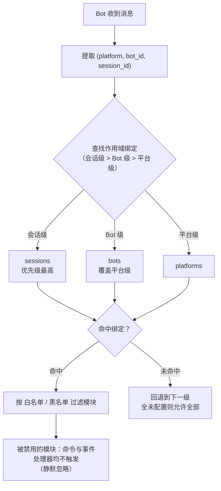

# 模块作用域系统

> [!NOTE]
> 本特性需要 ErisPulse **2.8.0+**。

模块作用域系统用于控制"某个 Bot 只能使用哪些模块"，实现多 Bot 场景下的模块隔离。
默认情况下所有模块对所有 Bot 开放；仅在配置绑定后才开始过滤，**模块与适配器无需任何改动**即可适配。

{!--< tips >!--}
1. 作用域以「适配器平台 + Bot 标识 + 会话标识」为维度绑定模块
2. 支持白名单（`modules`）与黑名单（`blocked`）两种方式
3. 被作用域禁用的模块收到消息时静默忽略，不回复提示
4. 支持运行时 `sdk.scope.bind()` / `unbind()` 动态增删，可持久化
{!--< /tips >!--}

## 工作原理



- **解析优先级：会话级 > Bot 级 > 平台级**，更高优先级未绑定规则时回退到下一级；全部未配置则允许全部模块。
- 事件数据缺少 `self`（无法识别 Bot）时，跳过 Bot 级，按会话级 / 平台级判断。
- 框架层资源（owner 为空的处理器、命令分发器、事件总线）始终放行，不受作用域影响。

## 配置文件

```toml
[ErisPulse.scope]
default_allow = true        # 默认允许全部（false = 隐式拒绝严格模式）
cache_size = 1024           # is_allowed 的 LRU 缓存大小

# 平台级绑定（作用于该平台所有 Bot / 会话）
[ErisPulse.scope.platforms.onebot11]
modules = ["Chat", "Translate"]   # 白名单：该平台 Bot 只能使用这些模块
blocked = ["Danger"]              # 黑名单：这些模块在该平台禁用

# Bot 级绑定（作用于该 Bot 的所有会话，覆盖平台级）
[ErisPulse.scope.bots.onebot11."123456"]
modules = ["Chat"]
blocked = []

# 会话级绑定（作用于某个群 / 频道 / 私聊，最具体）
[ErisPulse.scope.sessions.onebot11."789012345"]
modules = ["Chat"]                # 该群只能使用 Chat
blocked = []
```

语义（模块名匹配**大小写不敏感**）：

| 配置 | 效果 |
|------|------|
| 仅 `modules`（白名单） | 只有列出的模块允许使用 |
| 仅 `blocked`（黑名单） | 列出的模块被禁用，其余全部允许 |
| 两者都配置 | 白名单限定范围，白名单内的模块再剔除黑名单 |
| 两者都为空 / 未配置 | 遵循 `default_allow`：`true`（默认）允许全部；`false` 则隐式拒绝 |

> `modules` 与 `blocked` 均支持字符串或字符串列表。模块名大小写不敏感（`"Chat"` 与 `"chat"` 等价）。
> 会话标识为事件的群 ID（`group_id`）、频道 ID（`channel_id`）或私聊用户 ID（`user_id`）。
> **会话标识跨平台隔离**：`(platform, session_id)` 组合唯一标识一个会话，`onebot11` 的 `789` 与 `telegram` 的 `789` 互不影响。

## 运行时 API

### 判断模块是否允许

```python
from ErisPulse import sdk

# 某个 Bot 是否允许使用某模块
allowed = sdk.scope.is_allowed("onebot11", "123456", "Chat")

# 指定会话（群 / 频道 / 私聊）判断
allowed = sdk.scope.is_allowed("onebot11", "123456", "Chat", "789012345")
```

### 动态绑定 / 解绑

```python
# 绑定 Bot 级白名单（持久化到配置）
sdk.scope.bind("onebot11", "123456", modules=["Chat", "Translate"])

# 绑定会话级白名单（第三参数为 session_id）
sdk.scope.bind("onebot11", "123456", "789012345", modules=["Chat"])

# 绑定平台级黑名单
sdk.scope.bind("onebot11", blocked=["Danger"])

# 仅运行时生效（重启失效）
sdk.scope.bind("onebot11", "123456", modules=["Chat"], persist=False)

# 合并而非替换：把 Music 并入现有白名单（默认 bind 是替换）
sdk.scope.bind("onebot11", "123456", modules=["Music"], merge=True)

# 移除绑定（恢复允许全部）；可指定 session_id 移除会话级绑定
sdk.scope.unbind("onebot11", "123456")
sdk.scope.unbind("onebot11", "123456", "789012345")
```

> `bind()` 默认**替换**该目标的整个绑定；`merge=True` 时将新模块/禁用并入现有绑定。

### 查询绑定

```python
# 获取生效绑定（可指定会话）
sdk.scope.get("onebot11", "123456")              # {"modules": ["Chat"], "blocked": []}
sdk.scope.get("onebot11", "123456", "789012345") # 会话级生效绑定
sdk.scope.get("onebot11")                        # 平台级绑定，无则 None

# 列出全部绑定（platforms / bots / sessions 三桶）
sdk.scope.list_bindings()
```

### 过滤统计（调试）

```python
# 查看被作用域静默过滤的次数与缓存命中情况
sdk.scope.get_stats()
# {"is_allowed_calls": 10, "filtered_count": 3, "cache_hits": 5, "cache_misses": 5}

sdk.scope.reset_stats()
```

### 拓扑树数据

```python
# 作用域部分（供 Dashboard 展示）
sdk.scope.get_topology()
```

## 常见问题与注意事项

### 1. 配置层级

解析优先级：**会话级 > Bot 级 > 平台级**。高优先级绑定**整体覆盖**低优先级。

```toml
# 平台级只允许 Chat
[ErisPulse.scope.platforms.onebot11]
modules = ["Chat"]

# 但 Bot 级只允许 Music → 该 Bot 最终只能用 Music，不能用 Chat！
[ErisPulse.scope.bots.onebot11."123456"]
modules = ["Music"]
```

- 想"平台级允许 Chat，Bot 级再加 Music"，必须在 **Bot 级同时列出两者**：`modules = ["Chat", "Music"]`。
- 同理，底层黑名单会被上层白名单覆盖：平台级 `blocked=["Danger"]` + Bot 级 `modules=["Danger"]` → Bot 级整体覆盖，Danger 可用。层级越高、越具体，越以它为准。

### 2. 它是"逐事件"判断，不会"粘住"

作用域判断**只针对当前这一条事件**，不跨事件记忆：
- 会话 g1 禁用了模块 A → 在 g1 的**这条**消息 A 不触发；**下一条**消息独立重新判断，若绑定没变仍不触发，绑定改了立即生效（LRU 缓存会自动失效）。
- 会话 g2 没配绑定 → 回退到 Bot 级 / 平台级判断；都没有则按 `default_allow`。

### 3. 模块没反应

当你发了消息模块却没反应，先怀疑作用域而不是模块/适配器：

```python
# 在模块代码或临时脚本里加一行定位
from ErisPulse import sdk
print(sdk.scope.is_allowed(event.get_platform(), <bot_id>, "MyModule", <session_id>))
print(sdk.scope.get_stats())          # filtered_count > 0 说明确实被过滤了
```

被过滤是**静默**的（不回复，避免暴露作用域规则给用户），但 `filtered_count` 会累计。

### 4. 会话标识跨平台隔离

`(platform, session_id)` 组合才是唯一标识。`[ErisPulse.scope.sessions.onebot11."789"]` 只作用于 onebot11 平台，不影响 telegram 上同为 `789` 的会话。

### 5. 性能

`is_allowed()` 结果带 **LRU 缓存**（默认 1024 条，`scope.cache_size` 可调），
配置变更 / `bind()` / `unbind()` 自动失效，高频事件路径开销极小。

## 拓扑树 API

`ModuleManager.get_topology()` 与 `AdapterManager.get_topology()` 提供模块/适配器归属关系数据，
`sdk.get_topology()` 一键聚合三者：

```python
from ErisPulse import sdk

topology = sdk.get_topology()
# {
#   "modules": {                                   # 模块 → 拥有的资源
#     "Chat": {
#       "loaded": True, "enabled": True,
#       "load_strategy": {"lazy": False, "priority": 50},
#       "info": {...},
#       "commands": ["chat", "translate"],
#       "handlers": {"message": 2, "notice": 1},
#       "routes": {"http": ["/Chat/api"], "ws": [], "sse": []},
#       "lifecycle_hooks": 3,
#       "scope_applies": True,
#     }
#   },
#   "adapters": {                                  # 适配器 → Bot → 作用域
#     "onebot11": {
#       "status": "started", "enabled": True,
#       "bots": {"123456": {"status": "online", "last_active": ..., "info": {...}, "scope": {...}}},
#       "scope": {"modules": [...], "blocked": [...]},
#     }
#   },
#   "scope": {"platforms": {...}, "bots": {...}, "sessions": {...}}   # 全部作用域绑定
# }
```

- 模块拓扑聚合了该模块注册的命令、事件处理器、HTTP/WS/SSE 路由与生命周期钩子，便于绘制模块资源树。
- 适配器拓扑聚合了各适配器状态、下属 Bot 状态及平台级/Bot 级作用域绑定。
