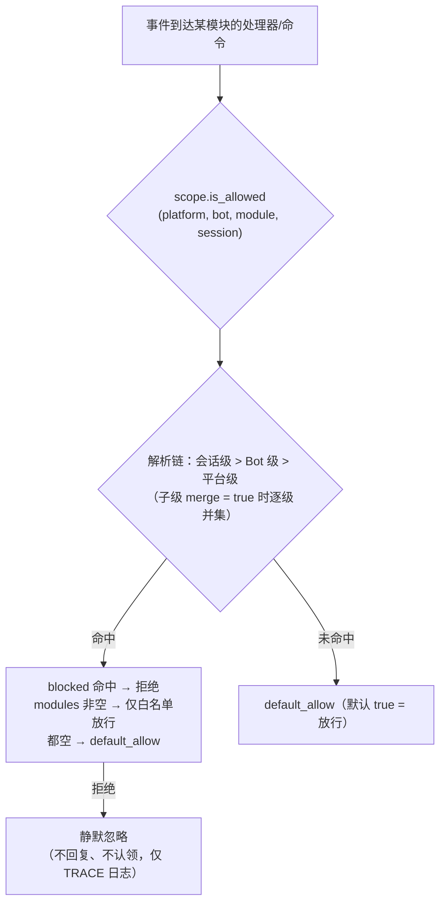

# 作用域（scope）

> [!NOTE]
> 本特性需要 ErisPulse **2.8.0+**。

作用域回答四个问题：**哪些模块可用、谁的事件收不收、某模块处理什么文本、
模块能向外做什么**。
控制权完全交给用户：在模块 / 适配器 / 处理器 / 出站调用注册的**上层**（配置
`ErisPulse.scope` 或运行时 `sdk.scope`）统一声明，事件管线在入口、处理器过滤
与出站闸口自动读取并执行。

| 维度 | 控制什么 | 拒绝行为 | 配置路径 |
|------|---------|---------|---------|
| **① 模块** | 哪些模块可用（平台 / Bot / 会话三级） | 静默忽略（不回复、不认领） | `scope.platforms / bots / sessions` |
| **② 身份** | 事件收不收（适配器 / Bot / 会话 / 用户四级） | 入口完全丢弃（静默） | `scope.identity.*` |
| **③ 出站** | 模块能发起哪些出站调用（消息 / API / 请求，方法级白黑名单） | 失败响应（`retcode=34601`） | `scope.actions` |

> **相关系统**：命令是特殊的消息事件处理器，其用户黑白名单（ACL）与
> 实现参数覆写由命令系统自持（`ErisPulse.event.command`），
> 见 [事件处理入门](../getting-started/event-handling.md) 与 [配置指南](../user-guide/configuration.md)。

{!--< tips >!--}
1. 通过 `from ErisPulse.Core import scope` 导入单例（`sdk.scope` 同对象）
2. 判定：`scope.is_allowed(...)` / `scope.is_identity_allowed(...)` /
   `scope.is_action_allowed(...)` 对应 ①②③ 三个闸口
3. 读写：维度化参数方法（IDE 可补全）——
   `scope.set_module(...)` / `scope.set_identity(...)` / `scope.set_action(...)`；
   另有字典式兜底 `scope.get(path)` / `scope.set(path, v)` / `scope.delete(path)`
4. 事件处理器文本条件覆写见
   [事件处理入门 · 事件覆写](../getting-started/event-handling.md#事件覆写不改模块代码覆写任意事件类型的行为)；
   命令 ACL / 参数覆写见[事件处理入门](../getting-started/event-handling.md)
{!--< /tips >!--}

## 匹配条目语法（全系统统一）

作用域所有"名字列表"（模块名、身份键、出站条目）共用同一套匹配语法
（`ErisPulse.Core.text_match`）：

| 语法 | 示例 | 说明 |
|------|------|------|
| 精确名 | `"Chat"` | 全值比较，**大小写不敏感** |
| glob | `"Tool*"`、`"spam_*"` | `*` 任意串 / `?` 单字符 / `[seq]` 字符集，大小写不敏感 |
| 正则 | `"re:^Danger.*"` | 以 `re:` 前缀声明，正则 `search` 匹配，默认大小写不敏感 |

- 非法正则**静默降级**为"不匹配"（不抛错、不崩溃）
- 装饰器参数（`pattern=` / `regex=`）为固定语义：`pattern` 是 glob、`regex` 是正则源码
  （不加 `re:` 前缀）；作用域配置里的正则条目**必须**带 `re:` 前缀

## 全局兜底：`default_allow`

`default_allow` 是**全局唯一**的兜底开关（默认 `true`），
对两个判定维度统一生效：

- **模块维度**：未命中任何绑定 → `default_allow` 决定放行 / 拒绝
- **身份维度**：未命中任何策略 → `default_allow` 决定放行 / 拒绝

设为 `false` 即开启"隐式拒绝"严格模式：白名单式管理，
**没显式允许的一律拒绝**。

> **例外**：③ 出站维度**不受** `default_allow` 影响——它是独立的收紧开关，
> 默认全允许，仅显式规则才限制（框架层 owner 为空的调用恒放行）。
> 这样严格的全局模式不会意外掐断所有模块的消息回复。
> 命令 ACL 有独立的 `ErisPulse.event.command.default_allow` 兜底，互不影响。

## 配置文件

```toml
[ErisPulse.scope]
default_allow = true        # 全局兜底（false = 隐式拒绝严格模式）
cache_size = 1024           # LRU 缓存大小

# ── ① 模块维度（优先级：会话 > Bot > 平台）──
[ErisPulse.scope.platforms.onebot11]
modules = ["Chat", "Tool*"]   # 白名单：精确名 / glob / re: 正则
blocked = ["re:^Danger"]
[ErisPulse.scope.bots.onebot11."123456"]
modules = ["Chat"]
merge = true                  # 在平台级绑定基础上追加（默认整体覆盖）
[ErisPulse.scope.sessions.onebot11."789012345"]
modules = ["Chat"]

# ── ② 身份维度（优先级：用户 > 会话 > Bot > 适配器）──
[ErisPulse.scope.identity.adapters.onebot11]
deny = true                   # 整个适配器的事件全部丢弃
[ErisPulse.scope.identity.bots.onebot11."123456"]
deny = true
[ErisPulse.scope.identity.sessions.onebot11."g_blocked"]
deny = true
[ErisPulse.scope.identity.users.onebot11]
allow = ["u_admin"]           # 用户键支持 glob / re: 正则
deny = ["u_bad", "spam_*"]

# ── ③ 出站维度（默认全允许，显式收紧才禁）──
[ErisPulse.scope.actions.MyModule]
send = { deny = true }                                    # 全禁发送
api = { allow = ["get_*"] }                               # 仅允许查询类标准 API
request = { deny = true }                                 # 禁止处理请求
```

## ① 模块维度

回答"某个上下文里，哪些模块可用"。默认全部开放；配置绑定后才开始过滤，
**模块与适配器无需任何改动**。



- **解析优先级：会话级 > Bot 级 > 平台级**，高优先级绑定**整体覆盖**低优先级；
  子级绑定写 `merge = true` 时改为与低优先级**逐条目并集**（modules / blocked 各自合并，
  `merge` 本身是控制键，不算条目）
- **静默语义**：被过滤模块的命令与处理器不触发、不回复、不认领（防止跨命令误匹配），
  仅 TRACE 级日志可见（`core.scope.denied`）
- **框架级处理器**（`scope_exempt=True` 或 owner 为空）不受影响；模块名为空（框架层资源）始终放行
- **会话感知帮助与命令查询**：命令查询 API（`command.help` /
  `get_command` / `get_commands` / `get_group_commands` / `get_visible_commands`，
  以及 `module.get_commands_overview`）均支持可选 `event=` 或显式
  `platform=` / `bot_id=` / `session_id=` 关键字——当前会话不可用模块的命令
  不再出现在结果中（`get_command` 返回 None、单命令帮助按"未注册"处理，
  与静默语义一致）；不传上下文则保持全量行为

### 绑定继承（merge）

默认整体覆盖的语义清晰可预测；需要在上级基础上**追加**时，在子级写 `merge = true`：

```toml
[ErisPulse.scope.platforms.onebot11]
modules = ["Chat", "Tool"]      # 平台级：允许 Chat、Tool

[ErisPulse.scope.bots.onebot11."123456"]
modules = ["Music"]
merge = true                    # 该 Bot 实际生效 = ["Chat", "Tool", "Music"]
```

- 合并规则：`modules` 与 `blocked` 各自取**并集**；绑定内 `blocked` 仍优先于 `modules`
- 链式合并：平台 → Bot → 会话逐级叠加，每一级独立决定 `merge` 或覆盖

## ② 身份维度（事件准入）

回答"谁的事件收不收"。被拒绝的事件在**分发入口完全丢弃**——
不进入中间件与任何处理器（含框架级），仅 TRACE 级日志可见（`core.scope.identity_denied`）。

- **解析优先级：用户 > 会话 > Bot > 适配器**，取最具体的已配置策略；deny 优先于 allow
- 每级绑定是二元策略：`{ allow = true }` 或 `{ deny = true }`
- 用户键支持 glob / 正则（如 `"spam_*"` 拉黑一批垃圾用户）
- 典型用法——上级 deny、个人 allow 做"例外放行"：

```toml
[ErisPulse.scope.identity.adapters.onebot11]
deny = true
[ErisPulse.scope.identity.users.onebot11]
allow = ["u_admin"]   # 即使适配器级拒绝，u_admin 的事件仍然放行
```

## ③ 出站维度（限制模块发起出站调用）

约束模块**发起的出站动作**：消息发送 / 标准 API 动作 / 请求操作。
三类动作对应底层 DSL：`Event.reply` 与 `Send`（send）、`Api` / `call_api`（api）、
`Request` 的 accept/reject（request）。模块在事件 handler 执行期发起的出站调用
携带模块 owner，由本维度统一判定。

### 规则形态（内联表）

每个动作的规则是一张内联表：`{ allow = [...], deny = true|[...] }`。
同一动作只能有一种规则（TOML 键不可重复，全禁与细粒度二选一）：

```toml
[ErisPulse.scope.actions.MyModule]
send = { deny = true }                                  # 全禁发送（Event.reply / Send DSL）
# 或方法级细粒度：send = { allow = ["Text", "Image*"], deny = ["File"] }
api = { allow = ["get_*"] }                             # 仅放行查询类标准 API
# 或动作级黑名单：api = { deny = ["set_*", "leave_*"] }
request = { deny = true }                               # 禁止处理请求 accept/reject
```

- `send` 的条目匹配**发送方法名**（`Text` / `Image` / `File` ...），
  `api` 的条目匹配**标准动作名**（`get_group_info` / `set_group_name` ...）
- 条目支持精确名 / glob / `re:` 正则（与全系统统一语法一致，大小写不敏感）
- `allow` 写单个字符串等价于单条目列表：`send = { allow = "Text" }`

### 判定语义

**默认全允许**——未配置、或 owner 为空（框架层内部调用）均放行。
配置规则后按以下顺序判定：

1. `deny = true` → 拒绝
2. `deny` 列表命中调用名 → 拒绝
3. `allow` 列表非空且调用名未命中（或调用无名称）→ 拒绝
4. 其余放行

被拒调用不发起任何网络请求，直接返回标准失败响应
（`retcode = 34601`，见 [api-response §5.3](../standards/api-response.md#53-框架扩展返回码34xxx-平台错误段的低三位自定义)）。
三个动作互相独立，可只限其一。

```python
# 运行时 API
sdk.scope.set_action("MyModule", "send", deny=True)              # 全禁发消息
sdk.scope.set_action("MyModule", "send", allow=["Text"])         # 仅允许发文本
sdk.scope.is_action_allowed("MyModule", "send", name="Image")    # False
sdk.scope.is_action_allowed("MyModule", "api", name="get_user_info")  # 按规则判定
sdk.scope.delete_action("MyModule", "send")                      # 恢复允许
sdk.scope.get_action("MyModule", "send")                         # 该动作当前规则
```

## 运行时 API

作用域运行时 API 分三层：**判定**（三问）、**维度化读写**（每维 `set` / `get` / `delete`
参数化方法，签名全类型标注，IDE 可补全）、**字典式兜底**（点分路径直达任意节）。

```python
from ErisPulse import sdk

scope = sdk.scope
```

### 判定（三问）

```python
scope.is_allowed("onebot11", "123456", "Chat")                 # ① 模块维度
scope.is_allowed("onebot11", "123456", "Chat", "789012345")    # 含会话级
scope.is_allowed("onebot11", "123456", None)                   # 框架层资源 -> True

scope.is_identity_allowed("onebot11", "123456", "group_9", "u1")   # ② 身份维度

scope.is_action_allowed("MyModule", "send")                    # ④ 出站维度
scope.is_action_allowed("MyModule", "send", name="Image")      # 方法级细粒度
```

### ① 模块维度

```python
# 绑定（层级由参数决定：session_id > bot_id > 平台级）
scope.set_module("onebot11", bot_id="123456", modules=["Chat", "Tool*"])
scope.set_module("onebot11", blocked=["re:^Danger"])                       # 平台级
scope.set_module("onebot11", bot_id="123456", session_id="g9", modules=["Chat"])  # 会话级
scope.set_module("onebot11", bot_id="123456", modules=["Music"], merge=True)      # 与现有条目并集
scope.set_module("onebot11", bot_id="123456", modules=["Chat"], persist=False)    # 仅运行时

# 读 / 删
scope.get_module("onebot11", bot_id="123456")   # {"modules": ["Chat"], "blocked": []}
scope.delete_module("onebot11", bot_id="123456")
```

> `merge=True` 是**写时并集**（与该级现有绑定合并条目）；跨级解析期的
> `merge = true` 配置键见上文[绑定继承](#绑定继承merge)——两者是独立机制。

> **运行时绑定（`persist=False`）语义**：运行时绑定保存在独立的覆盖层中，
> **任意后续配置写入 / 配置文件热更新都不会冲掉它们**（配置树重建后按写入顺序
> 自动重放，含运行时删除）。它们不落盘，进程重启后丢失；模块卸载时该模块写入的
> 运行时绑定会被兜底清理。随后对同一路径执行 `persist=True` 写入（用户持久化语义）
> 将取代运行时规则。

### ② 身份维度

```python
# 绑定策略（层级由参数决定：user > session > bot > adapter；allow / deny 二选一）
scope.set_identity("onebot11", user_id="u_bad", deny=True)
scope.set_identity("onebot11", user_id="spam_*", deny=True)    # 键支持 glob / re: 正则
scope.set_identity("onebot11", bot_id="123456", session_id="g9", allow=True)

# 读 / 删
scope.get_identity("onebot11", user_id="u_bad")   # {"deny": True}
scope.delete_identity("onebot11", user_id="u_bad")
```

### ③ 出站维度

```python
# 设置限制规则（allow: str|list；deny: bool|str|list；整规则替换语义）
scope.set_action("MyModule", "send", deny=True)                    # 全禁发送
scope.set_action("MyModule", "send", allow=["Text"])               # 仅允许发文本
scope.set_action("MyModule", "api", deny=["set_*", "leave_*"])     # 禁管理类 API

# 读 / 删
scope.get_action("MyModule", "send")       # {"allow": ["Text"]} 原始规则
scope.delete_action("MyModule", "send")    # 移除单动作
scope.delete_action("MyModule")            # 移除该模块全部动作限制
```

### 通用

```python
scope.get("platforms")   # 字典式兜底：点分路径读任意节
scope.topology()         # 全量配置树（供 Dashboard）
scope.stats()
# {"module_calls": .., "module_filtered": .., "identity_checks": .., "identity_denied": ..,
#  "action_checks": .., "action_denied": .., "cache_hits": .., "cache_misses": ..}
scope.reset_stats()
scope.clear()           # 清空全部配置（仅内存生效）
```

### 高级：字典式点分路径兜底

维度化方法覆盖日常场景；需要直达任意节点（或未来新增的维度）时，
可用字典式 API——`get` / `set` / `delete` 接受点分路径（dict 深合并、写后立读），
并提供 `scope[path]` / `scope[path] = v` / `del scope[path]` / `path in scope` 协议：

```python
scope.set("bots.onebot11.123456", {"modules": ["Chat"], "blocked": []})
scope.set("identity.users.onebot11.u_bad", {"deny": True})
scope.get("actions.MyModule.send")

scope["platforms.onebot11"]        # 读（不存在抛 KeyError）
scope["platforms.onebot11"] = {...}  # 写
del scope["platforms.onebot11"]      # 删
"actions.MyModule" in scope          # 存在性
```

## 缓存与热更新

- `is_allowed` / `is_identity_allowed` / `is_action_allowed` 结果带 **LRU 缓存**
  （`scope.cache_size` 可调），`set` / `delete` /
  配置热更新（`config.updated` / `config.set`）自动失效
- 所有维度配置改了**立即生效**，无需重启
- 作用域是"逐事件"判断，不跨事件记忆：配置变了，下一条事件即按新规则

## 配置格式校验

加载 / 热更新时逐节校验配置格式：类型错误的节（如 `platforms` 写成了字符串）、
非法的出站规则（如 `allow` 写成数字）、未知动作名、未知的顶层键（如 `alow` 拼写错误）
会输出 **WARNING** 并忽略对应节 / 条目，其余合法配置照常生效——写错不再静默失效。

## 常见问题与注意事项

### 1. 配置层级与覆盖

- 模块维度：会话级 > Bot 级 > 平台级，**整体覆盖**（子级 `merge = true` 时逐条目并集）。
  想"平台允许 Chat，Bot 再加 Music"，可在 Bot 级写 `merge = true`，或同时列出两者
- 身份维度：用户 > 会话 > Bot > 适配器，取**最具体**的已配置策略（可做例外放行）
- 命令用户黑白名单：精确命令名优先于 glob 键（见 `event.command.acl`）

### 2. 模块/命令没反应

先怀疑作用域而不是模块本身：

```python
from ErisPulse import sdk

print(sdk.scope.is_allowed(event.get_platform(), bot_id, "MyModule", session_id))
print(sdk.scope.is_identity_allowed(event.get_platform(), bot_id, session_id, user_id))
print(sdk.scope.stats())   # module_filtered / identity_denied > 0 说明被静默过滤
```

被过滤是**静默**的（模块维度与身份维度不回复，避免暴露规则），但统计会累计；
命令维度被 ACL 拒绝会显式回复"权限不足"。

### 3. 出站动作被拒时排查

```python
from ErisPulse import sdk

print(sdk.scope.get("actions.MyModule"))
print(sdk.scope.stats())   # action_denied > 0 说明有调用被拦截
```

拦截是**显式**的：被拒调用返回 `retcode = 34601` 的标准失败响应（不发起网络请求）。

### 4. 会话标识跨平台隔离

`(platform, session_id)` 组合才是唯一标识。`scope.sessions.onebot11."789"`
只作用于 onebot11，不影响 telegram 上同为 `789` 的会话。身份维度的用户键同理。

## 拓扑树 API

`ModuleManager.get_topology()` 与 `AdapterManager.get_topology()` 提供模块/适配器归属关系数据，
`sdk.get_topology()` 一键聚合（含作用域 `scope`）：

```python
from ErisPulse import sdk

topology = sdk.get_topology()
# {
#   "modules": {                                   # 模块 → 拥有的资源
#     "Chat": {
#       "loaded": True, "enabled": True,
#       "commands": ["chat", "translate"],
#       "handlers": {"message": 2, "notice": 1},
#       "routes": {"http": ["/Chat/api"], "ws": [], "sse": []},
#       "lifecycle_hooks": 3,
#     }
#   },
#   "adapters": {                                  # 适配器 → Bot → 作用域
#     "onebot11": {
#       "status": "started", "enabled": True,
#       "bots": {"123456": {"status": "online", "scope": {...}}},
#       "scope": {"modules": [...], "blocked": [...]},
#     }
#   },
#   "scope": {                                     # 作用域（模块 / 身份 / 出站动作）
#     "platforms": {...}, "bots": {...}, "sessions": {...},
#     "identity": {"adapters": {...}, "bots": {...}, "sessions": {...}, "users": {...}},
#     "actions": {...},
#   },
# }
```

- 模块拓扑聚合了该模块注册的命令、事件处理器、HTTP/WS/SSE 路由与生命周期钩子，便于绘制模块资源树。
- 适配器拓扑聚合了各适配器状态、下属 Bot 状态及平台级/Bot 级作用域绑定（模块维度）。
- **JSON 安全输出**：`get_topology(json_safe=...)` 默认 `True`，返回的结构可直接 `json.dumps`——模块 `info` 仅保留纯数据的 `meta` 子表（丢弃 `module_class` / `strategy` 等运行时对象），并对其余节点（含适配器作者塞入 Bot `info` 的任意对象）做兜底净化（类对象取 `__name__`、不可序列化对象退化 `str()`）。Dashboard / WebUI 可直接序列化返回；需要原始对象时传 `json_safe=False`。
