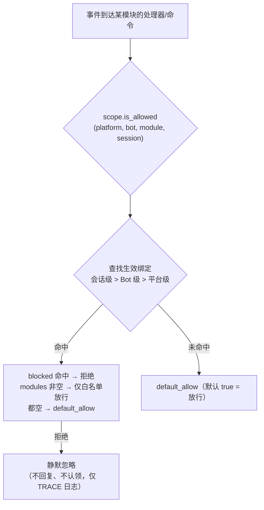

# 统一控制面（scope）

> [!NOTE]
> 本特性需要 ErisPulse **2.8.0+**。

统一控制面回答六个问题：**哪些模块可用、谁的事件收不收、谁能执行某条命令、
某模块处理什么文本、覆盖哪些实现参数、禁止模块发起哪些出站调用**。
控制权完全交给用户：在模块 / 适配器 / 命令 / 处理器注册的**上层**（配置
`ErisPulse.scope` 或运行时 `sdk.scope`）统一声明，事件管线在每一级自动读取并执行。

控制面收敛了原有的多套权限系统，是 2.8.0 权限/访问控制的**唯一**入口：

| 维度 | 控制什么 | 拒绝行为 | 配置路径 |
|------|---------|---------|---------|
| **① 模块** | 哪些模块可用（平台 / Bot / 会话三级） | 静默忽略（不回复、不认领） | `scope.platforms / bots / sessions` |
| **② 身份** | 事件收不收（适配器 / Bot / 会话 / 用户四级） | 入口完全丢弃（静默） | `scope.identity.*` |
| **③ 命令** | 谁能执行某条命令（命令名支持 glob） | 回复"权限不足"（显式） | `scope.commands` |
| **④ 处理器** | 某模块的事件处理器按文本过滤 | 不触发（静默） | `scope.handlers` |
| **⑤ 覆盖** | 覆盖模块/命令的实现参数（master/hidden/aliases/prefix） | ——（只改参数） | `scope.overrides` |
| **⑥ 出站动作** | 禁止模块发送消息 / 调标准 API / 处理请求 | 失败响应（`retcode=34601`） | `scope.actions` |

{!--< tips >!--}
1. 通过 `from ErisPulse.Core import scope` 导入单例（`sdk.scope` 同对象）
2. `scope.is_allowed(platform, bot_id, module, session_id)` 判断模块是否可用
3. `scope.is_identity_allowed(platform, bot_id, session_id, user_id)` 判断事件是否放行
4. `scope.allow_user("roll*", platform, uid)` / `deny_user(...)` 命令 ACL（支持 glob）
5. `scope.override("MyModule", "restart", master=True)` 覆盖实现参数
6. `scope.set_action("MyModule", "send", False)` 禁止模块回复/发消息
7. `scope.get_stats()` 查看过滤统计；`scope.get_topology()` 查看拓扑
{!--< /tips >!--}

## 匹配条目语法（全系统统一）

控制面所有"名字列表"（模块名、身份键、命令名）共用同一套匹配语法
（`ErisPulse.Core.text_match`）：

| 语法 | 示例 | 说明 |
|------|------|------|
| 精确名 | `"Chat"` | 全值比较，**大小写不敏感** |
| glob | `"Tool*"`、`"spam_*"` | `*` 任意串 / `?` 单字符 / `[seq]` 字符集，大小写不敏感 |
| 正则 | `"re:^Danger.*"` | 以 `re:` 前缀声明，正则 `search` 匹配，默认大小写不敏感 |

- 非法正则**静默降级**为"不匹配"（不抛错、不崩溃）
- 装饰器参数（`pattern=` / `regex=`）为固定语义：`pattern` 是 glob、`regex` 是正则源码
  （不加 `re:` 前缀）；控制面配置里的正则条目**必须**带 `re:` 前缀

## 全局兜底：`default_allow`

`default_allow` 是**全局唯一**的兜底开关（默认 `true`），
对三个判定维度统一生效：

- **模块维度**：未命中任何绑定 → `default_allow` 决定放行 / 拒绝
- **身份维度**：未命中任何策略 → `default_allow` 决定放行 / 拒绝
- **命令维度**：未配置 ACL → `default_allow=true` 交给开发者默认权限链；
  `false`（严格模式）命令未配置 ACL 即拒绝

设为 `false` 即开启"隐式拒绝"严格模式：白名单式管理，
**没显式允许的一律拒绝**。

> **例外**：⑥ 出站动作维度**不**受 `default_allow` 影响——它是独立的收紧开关，
> 默认全允许，仅显式 `false` 才禁（框架层 owner 为空的调用恒放行）。
> 这样严格的全局模式不会意外掐断所有模块的消息回复。

## 配置文件

```toml
[ErisPulse.scope]
default_allow = true        # 全局兜底（false = 隐式拒绝严格模式）
cache_size = 1024           # LRU 缓存大小

# ── ① 模块维度（优先级：会话 > Bot > 平台）──
[ErisPulse.scope.platforms.onebot11]
modules = ["Chat", "Tool*"]   # 白名单：精确名 / glob / re: 正则
blocked = ["re:^Danger"]
[ErisPulse.scope.bots.onebot11."123456"]
modules = ["Chat"]
[ErisPulse.scope.sessions.onebot11."789012345"]
modules = ["Chat"]

# ── ② 身份维度（优先级：用户 > 会话 > Bot > 适配器）──
[ErisPulse.scope.identity.adapters.onebot11]
deny = true                   # 整个适配器的事件全部丢弃
[ErisPulse.scope.identity.bots.onebot11."123456"]
deny = true
[ErisPulse.scope.identity.sessions.onebot11."g_blocked"]
deny = true
[ErisPulse.scope.identity.users.onebot11]
allow = ["u_admin"]           # 用户键支持 glob / re: 正则
deny = ["u_bad", "spam_*"]

# ── ③ 命令维度（命令名支持 glob）──
[ErisPulse.scope.commands."roll*"]
allow = ["onebot11:u_vip"]    # 用户标识 "platform:user_id"
deny = ["onebot11:u_bad"]

# ── ④ 处理器/文本维度 ──
[ErisPulse.scope.handlers.MyModule]
pattern = "签到*"             # 与代码内 pattern/regex 条件 AND
regex = "re:\\d+\\s*元"

# ── ⑤ 实现参数覆盖 ──
[ErisPulse.scope.overrides.MyModule.restart]
master = true                 # 仅框架主人可用
hidden = true                 # 帮助中隐藏
aliases = ["rs"]              # 追加别名
prefix = "!"                  # 追加触发前缀

# ── ⑥ 出站动作维度（默认全允许，显式禁用才收紧）──
[ErisPulse.scope.actions.MyModule]
send = false                  # 禁止 MyModule 回复/主动发消息
api = false                   # 禁止 MyModule 调标准 API（含 call 逃生舱）
request = false               # 禁止 MyModule 处理请求操作 accept/reject
```

## ① 模块维度

回答"某个上下文里，哪些模块可用"。默认全部开放；配置绑定后才开始过滤，
**模块与适配器无需任何改动**。



- **解析优先级：会话级 > Bot 级 > 平台级**，高优先级绑定**整体覆盖**低优先级
- **静默语义**：被过滤模块的命令与处理器不触发、不回复、不认领（防止跨命令误匹配），
  仅 TRACE 级日志可见（`core.scope.denied`）
- **框架级处理器**（`scope_exempt=True` 或 owner 为空）不受影响；模块名为空（框架层资源）始终放行

## ② 身份维度（事件准入）

回答"谁的事件收不收"。被拒绝的事件在**分发入口完全丢弃**——
不进入中间件与任何处理器（含框架级），仅 TRACE 级日志可见（`core.scope.identity_denied`）。

- **解析优先级：用户 > 会话 > Bot > 适配器**，取最具体的已配置策略；deny 优先于 allow
- 每级绑定是二元策略：`{ allow = true }` 或 `{ deny = true }`
- 用户键支持 glob / 正则（如 `"spam_*"` 拉黑一批垃圾用户）
- 典型用法——上级 deny、个人 allow 做"例外放行"：

```toml
[ErisPulse.scope.identity.adapters.onebot11]
deny = true
[ErisPulse.scope.identity.users.onebot11]
allow = ["u_admin"]   # 即使适配器级拒绝，u_admin 的事件仍然放行
```

## ③ 命令维度（命令 ACL）

回答"谁能执行某条命令"。判定顺序：**deny 命中 → 拒绝；allow 白名单非空且未命中 →
拒绝；均未配置 → 遵循 `default_allow`**（`true` 交给开发者默认权限链）。
被拒绝的命令会显式回复"权限不足"。

- 命令名支持 glob：`"roll*"` 一条规则覆盖 `roll`、`roll_dice` 等一族命令
- 精确键优先于 glob 键（`commands.roll` 命中时不再查 `commands."roll*"`）
- 用户标识格式 `"platform:user_id"`（与框架主人系统一致）
- 该维度**只是用户侧的额外闸门**，与命令的 `master` / `permission` 参数串联：
  ACL 通过后仍走开发者声明的默认权限链（该默认链可用 ⑤ 覆盖调整）

## ④ 处理器/文本维度

按模块过滤"处理什么文本"：给某模块配置 `pattern` / `regex` 后，
该模块的所有事件处理器只在文本命中时触发（与代码内条件 AND，需同时满足）。
适合在不改模块代码的前提下缩小其触发范围。

```toml
[ErisPulse.scope.handlers.ChatModule]
pattern = "闲聊*"     # ChatModule 的处理器只响应"闲聊"开头的消息
```

## ⑤ 实现参数覆盖

在模块/命令注册的**上层**覆盖实现参数，不修改模块代码：

```toml
[ErisPulse.scope.overrides.MyModule.restart]
master = true      # 覆盖为仅框架主人（也可设 false 放开开发者的主人限制）
hidden = true      # 帮助列表中隐藏
aliases = ["rs"]   # 生效别名
```

> 覆盖遵循**用户优先**：开发者声明的 `master` / `hidden` 等只是默认值，
> 用户在此显式配置后即以用户配置为准（可收紧也可放开）。
> 覆盖只改**实现参数**（master / hidden / aliases / prefix / help / usage 等）。
> **禁用一条命令不在这里**——统一走命令维度 deny（`scope.commands` 或
> `scope.deny_user()`），避免两套"禁用"语义打架。

## ⑥ 出站动作维度（禁止模块发起出站调用）

约束模块**发起的出站动作**：消息发送 / 标准 API 动作 / 请求操作。
三类动作对应底层 DSL：`Event.reply` 与 `Send`（send）、`Api` / `call_api`（api）、
`Request` 的 accept/reject（request）。模块在事件 handler 执行期发起的出站调用
携带模块 owner，由本维度统一判定。

```toml
[ErisPulse.scope.actions.MyModule]
send = false      # 禁止 MyModule 回复/主动发消息
api = false       # 禁止 MyModule 调用标准 API 动作（含 call 逃生舱）
request = false   # 禁止 MyModule 对请求事件执行 accept/reject
```

判定语义：**默认全允许**——未配置、或 owner 为空（框架层内部调用）均放行；
仅当用户显式设为 `false` 才拒绝，被拒调用不发起任何网络请求，直接返回
标准失败响应（`retcode = 34601`，见 [api-response §5.3](../standards/api-response.md#53-框架扩展返回码34xxx-平台错误段的低三位自定义)）。三个动作互相独立，可只禁其一。

```python
# 运行时 API
sdk.scope.set_action("MyModule", "send", False)   # 禁发消息
sdk.scope.is_action_allowed("MyModule", "send")   # False
sdk.scope.unset_action("MyModule", "send")        # 恢复允许
sdk.scope.get_action_rules("MyModule")            # {"send": False, "api": True, "request": True}
```

## 运行时 API

### 模块维度

```python
from ErisPulse import sdk

# 判断
sdk.scope.is_allowed("onebot11", "123456", "Chat")
sdk.scope.is_allowed("onebot11", "123456", "Chat", "789012345")
sdk.scope.is_allowed("onebot11", "123456", None)      # 框架层资源 -> True

# 绑定 / 解绑
sdk.scope.bind_module("onebot11", "123456", modules=["Chat", "Tool*"])
sdk.scope.bind_module("onebot11", blocked=["Danger"])             # 平台级
sdk.scope.bind_module("onebot11", "123456", "789012345", modules=["Chat"])  # 会话级
sdk.scope.bind_module("onebot11", "123456", modules=["Music"], merge=True)  # 合并
sdk.scope.bind_module("onebot11", "123456", modules=["Chat"], persist=False)  # 仅运行时
sdk.scope.unbind_module("onebot11", "123456")

# 查询
sdk.scope.get("onebot11", "123456")   # {"modules": ["Chat"], "blocked": []}
```

### 身份维度

```python
# 判断事件是否放行
sdk.scope.is_identity_allowed("onebot11", "123456", "group_9", "u1")

# 绑定策略（层级由参数决定：user > session > bot > adapter）
sdk.scope.bind_identity("onebot11", user_id="u_bad", deny=True)
sdk.scope.bind_identity("onebot11", user_id="spam_*", deny=True)   # glob
sdk.scope.bind_identity("onebot11", "123456", "group_9", allow=True)
sdk.scope.unbind_identity("onebot11", user_id="u_bad")

# 用户黑名单便捷 API
sdk.scope.block_user("onebot11", "u_bad")
sdk.scope.is_user_blocked("onebot11", "u_bad")
sdk.scope.get_blocked_users()        # {"onebot11": ["u_bad"]}
sdk.scope.unblock_user("onebot11", "u_bad")
```

### 命令维度

```python
sdk.scope.is_command_allowed("roll", "onebot11", "u1")
sdk.scope.allow_user("roll*", "onebot11", "u_vip")   # 命令名支持 glob
sdk.scope.deny_user("roll*", "onebot11", "u_bad")
sdk.scope.get_acl("roll*")
sdk.scope.remove_acl("roll*")

# 也可通过命令系统门面（等价委托）
from ErisPulse.Core.Event import command
command.allow_user("restart", "onebot11", "123456")
```

### 处理器与覆盖维度

```python
sdk.scope.bind_handler("MyModule", pattern="签到*", regex=r"\d+号")
sdk.scope.unbind_handler("MyModule")

sdk.scope.override("MyModule", "restart", master=True, hidden=True)
sdk.scope.get_override("MyModule", "restart")
sdk.scope.remove_override("MyModule", "restart")
```

### 通用

```python
sdk.scope.list_bindings()   # 全量绑定
sdk.scope.get_topology()    # 拓扑（供 Dashboard）
sdk.scope.get_stats()
# {"module_calls": .., "module_filtered": .., "identity_checks": .., "identity_denied": ..,
#  "command_checks": .., "command_denied": .., "action_checks": .., "action_denied": ..,
#  "cache_hits": .., "cache_misses": ..}
sdk.scope.reset_stats()
sdk.scope.clear()           # 清空全部绑定（仅内存生效）
```

## 主人身份与自定义身份源（provider）

主人系统回答"谁是框架主人"：命令的 `master=True` 参数与业务层的
`master.is_master()` 共用同一套身份判定，判定链为
**配置主人 → 运行时记录 → provider 链**。

主人配置（`ErisPulse.master.users`，支持全局 list 与按平台 dict）见
[配置文档](../user-guide/configuration.md#主人系统配置)；本节聚焦身份判定 API 与扩展点。

### 判定与运行时增删

```python
from ErisPulse.Core import master

master.is_master(event)                      # 从事件判定
master.is_master("yunhu", "123")             # 显式判定
master.add("yunhu", "123")                   # 运行时添加（默认持久化；persist=False 仅内存）
master.remove("yunhu", "123")                # 移除（默认持久化）
master.list()                                # 汇总：{"global": [...], "<platform>": [...]}
```

### 自定义身份源（provider）

除配置外，还可注册自定义身份源：`fn(platform, user_id) -> bool`，
内置身份源（配置 + 运行时记录）未命中时依次尝试，任一 provider 放行即认定为主人。
适合对接适配器管理员接口、数据库角色等外部身份体系。

注册入口 `master.provider` 支持装饰器 / 函数式两种写法，
注销统一走被注册函数上的 `fn.unregister()`：

```python
from ErisPulse.Core import master

# 写法一：装饰器（常驻身份源，推荐）
@master.provider
def admin_provider(platform, user_id):
    return user_id in {"999"}     # 自定义判定逻辑

master.is_master("yunhu", "999")   # True
admin_provider.unregister()        # 不再需要时注销

# 写法二：函数式（模块加载期注册 / 卸载期注销）
fn = master.provider(admin_provider)
fn.unregister()
```

> provider 异常会被捕获并跳过，不阻断身份判定链。
> 绑定实例方法无法挂载 `unregister`，需要注册/注销配对的场景请用**模块级函数**。

### 用户优先：主人生效范围由用户最终决定

命令的 `master=True` 只是**开发者默认**：用户可在控制面
`ErisPulse.scope.overrides.<module>.<cmd>.master = true/false`
覆盖收紧或放开（见上文 ⑤ 实现参数覆盖，用户显式配置即生效）。

## 缓存与热更新

- `is_allowed` / `is_identity_allowed` 结果带 **LRU 缓存**（`scope.cache_size` 可调），
  `bind_*` / `unbind_*` / 配置热更新（`config.updated` / `config.set`）自动失效
- 所有维度配置改了**立即生效**，无需重启
- 控制面是"逐事件"判断，不跨事件记忆：配置变了，下一条事件即按新规则

## 常见问题与注意事项

### 1. 配置层级与覆盖

- 模块维度：会话级 > Bot 级 > 平台级，**整体覆盖**。想"平台允许 Chat，Bot 再加 Music"，
  必须在 Bot 级同时列出两者
- 身份维度：用户 > 会话 > Bot > 适配器，取**最具体**的已配置策略（可做例外放行）
- 命令维度：精确命令名优先于 glob 键

### 2. 优先用控制面而不是改模块代码

模块声明的是"开发者默认"（`master=True`、`permission=...`、`pattern=...`）；
控制面声明的是"用户最终决定"。实现参数覆盖遵循**用户优先**：
用户显式配置的 `master = true/false` 直接生效（可收紧可放开）。
开发者未设的限制用户可自行收紧；禁用/放行类控制走命令 deny / 身份 allow。

### 3. 模块/命令没反应

先怀疑控制面而不是模块本身：

```python
from ErisPulse import sdk

print(sdk.scope.is_allowed(event.get_platform(), bot_id, "MyModule", session_id))
print(sdk.scope.is_identity_allowed(event.get_platform(), bot_id, session_id, user_id))
print(sdk.scope.get_stats())   # module_filtered / identity_denied > 0 说明被静默过滤
```

被过滤是**静默**的（模块维度与身份维度不回复，避免暴露规则），但统计会累计；
命令维度被 ACL 拒绝会显式回复"权限不足"。

### 4. 会话标识跨平台隔离

`(platform, session_id)` 组合才是唯一标识。`scope.sessions.onebot11."789"`
只作用于 onebot11，不影响 telegram 上同为 `789` 的会话。身份维度的用户键同理。

## 拓扑树 API

`ModuleManager.get_topology()` 与 `AdapterManager.get_topology()` 提供模块/适配器归属关系数据，
`sdk.get_topology()` 一键聚合（含控制面 `scope` 五维）：

```python
from ErisPulse import sdk

topology = sdk.get_topology()
# {
#   "modules": {                                   # 模块 → 拥有的资源
#     "Chat": {
#       "loaded": True, "enabled": True,
#       "commands": ["chat", "translate"],
#       "handlers": {"message": 2, "notice": 1},
#       "routes": {"http": ["/Chat/api"], "ws": [], "sse": []},
#       "lifecycle_hooks": 3,
#     }
#   },
#   "adapters": {                                  # 适配器 → Bot → 作用域
#     "onebot11": {
#       "status": "started", "enabled": True,
#       "bots": {"123456": {"status": "online", "scope": {...}}},
#       "scope": {"modules": [...], "blocked": [...]},
#     }
#   },
#   "scope": {                                     # 统一控制面（五维）
#     "platforms": {...}, "bots": {...}, "sessions": {...},
#     "identity": {"adapters": {...}, "bots": {...}, "sessions": {...}, "users": {...}},
#     "commands": {...}, "handlers": {...}, "overrides": {...},
#   },
# }
```

- 模块拓扑聚合了该模块注册的命令、事件处理器、HTTP/WS/SSE 路由与生命周期钩子，便于绘制模块资源树。
- 适配器拓扑聚合了各适配器状态、下属 Bot 状态及平台级/Bot 级作用域绑定。
