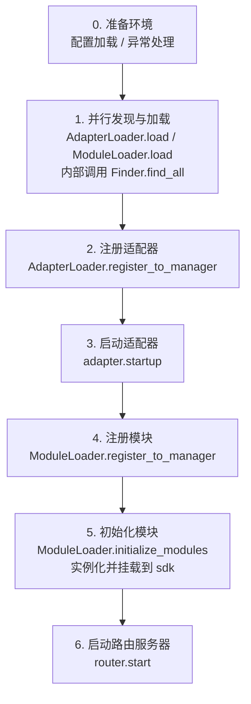

# 启动流程与手动控制

ErisPulse 的 `await sdk.run()` / `await sdk.init()` 把一整条启动链路封装成了"一行代码"。但当你需要完全自定义启动流程（例如部分加载、动态注册、热插拔、注入自定义加载策略）时，就需要了解这条链路内部到底发生了什么、以及如何手动驱动每一步。

本文把启动链路拆解成独立的环节，说明各自的职责、调用顺序，并给出手动完整启动的示例。

> 本文假设你已经跑通过 [第一个机器人](../getting-started/first-bot.md)，了解 `sdk.run(keep_running=True/False)` 两种模式。本文聚焦于 `init()` **内部**的链路拆解，以及 `init()`/`init_task()`/`init_sync()` 等更底层的入口。

## SDK 顶层入口一览

除了 `run()` 的两种 `keep_running` 模式，SDK 还提供几个更底层的初始化入口，区别在于**异步性、返回值、以及是否包装异常**：

| 入口 | 异步性 | 返回值 | 异常处理 | 适用场景 |
|------|--------|--------|----------|----------|
| `await sdk.run(True)` | async，阻塞维持 | `None`（关闭时自动 `uninit`） | 模块/适配器错误被拦截，不拖垮进程 | 纯 bot 应用 |
| `await sdk.run(False)` | async，不阻塞 | `None`（不自动卸载） | 同上 | 初始化后执行自定义逻辑 |
| `await sdk.init()` | async，需 await | `bool` | 内部捕获组件异常，失败返回 `False` | 手动控制生命周期（配 `uninit()`） |
| `sdk.init_task()` | async，返回 Task 不阻塞 | `asyncio.Task` | 同 `init()` | 并发执行别的初始化、或事件循环尚未运行 |
| `sdk.init_sync()` | **同步**，阻塞当前线程 | `bool` | 同 `init()` | 命令行脚本、无事件循环的同步入口 |

> **常见误区**：`await sdk.init()` **并不等价于** `await sdk.run(keep_running=False)`。两点不同：① `init()` 返回 `bool`（失败时返回 `False`），`run()` 返回 `None`；② `init()` 只做初始化、**不自动卸载**，`run()` 在事件循环结束时自动 `uninit()`。因此需要手动配对卸载或自定义生命周期时，用 `init()` + `uninit()`。

## 启动链路总览

`sdk.init()`（确切说是其内部的 `Initializer.init()`）按以下顺序拉起整个框架：



对应的核心组件：

| 层 | 组件 | 职责 |
|----|------|------|
| 发现 | `AdapterFinder` / `ModuleFinder` | 从已安装包的 entry-points 中**发现**适配器/模块 |
| 加载 | `AdapterLoader` / `ModuleLoader` | 发现 + 导入 + 读取元数据 + 判断启用/禁用，返回对象清单 |
| 注册 | `*Loader.register_to_manager` | 把对象登记到对应管理器 |
| 管理 | `sdk.adapter` / `sdk.module` | 维护适配器/模块实例，提供启停接口 |
| 初始化 | `ModuleLoader.initialize_modules` | 创建模块实例并挂载到 `sdk`（处理依赖拓扑排序） |
| 路由 | `sdk.router` | HTTP / WebSocket 服务器 |

> **重要**：`Finder` 和 `Loader` 是两层。`Loader` 内部**已经持有**一个 `Finder`（`AdapterLoader` 自带 `AdapterFinder`，`ModuleLoader` 自带 `ModuleFinder`）。绝大多数场景你只需要用 `Loader`，只有需要"只列出不导入"时才会单独用 `Finder`。

## 各环节详解

### 1. 发现层：Finder

Finder 只负责"找到有哪些包提供了适配器/模块"，不导入、不实例化。

```python
from ErisPulse.finders import AdapterFinder, ModuleFinder

adapter_finder = AdapterFinder()
module_finder = ModuleFinder()

# 查找所有已安装的适配器/模块 entry-points
adapter_entries = adapter_finder.find_all()    # list[EntryPoint]
module_entries = module_finder.find_all()      # list[EntryPoint]

# 按名称查找单个
entry = module_finder.find_by_name("MyModule")  # EntryPoint | None
```

每个 `EntryPoint` 可以 `.load()` 得到对应的类，但通常不用你手动调——Loader 会做。

### 2. 加载层：Loader

Loader 在 Finder 之上做了"导入 + 读元数据 + 判断启用/禁用"。

```python
from ErisPulse.loaders import AdapterLoader, ModuleLoader
from ErisPulse import sdk

adapter_loader = AdapterLoader()
module_loader = ModuleLoader()

# load() 内部：调用 finder.find_all() → 逐个处理 entry-point → 返回三元组
adapter_objs, enabled_adapters, disabled_adapters = await adapter_loader.load(sdk.adapter)
module_objs, enabled_modules, disabled_modules = await module_loader.load(sdk.module)
```

`load()` 返回的三元组：

| 返回值 | 含义 |
|--------|------|
| `objs` (`dict`) | 名称 → 对象（适配器类 / 模块包装对象） |
| `enabled` (`list[str]`) | 被启用的名称（配置中未禁用） |
| `disabled` (`list[str]`) | 被禁用的名称 |

#### 加载失败时的诊断信息

当某个模块/适配器在加载或初始化阶段抛出异常时，框架会跳过该组件并继续加载其他组件，同时输出**用户代码帧摘要**，让你在默认 INFO 级别下即可定位出错位置，无需手动重开 DEBUG：

```
[ERROR] [ModuleLoader] 从 entry-point 加载模块 MyModule 失败，已跳过: 'NoneType' object has no attribute 'platform'
  → MyModule/Core.py:42 in on_load
      adapter = sdk.platform
  → AttributeError: 'NoneType' object has no attribute 'platform'
  → 提示: 将日志级别提高到 DEBUG 可查看完整堆栈；检查模块 MyModule 的实现代码
```

诊断信息通过 `ErisPulse.runtime.diagnostics` 模块生成，会自动过滤掉框架内部帧，只保留你的代码帧。如需在自定义加载逻辑中复用：

```python
from ErisPulse.runtime import log_diagnostic

try:
    risky_init()
except Exception as e:
    log_diagnostic(e)  # 自动提取用户代码帧并写入 ERROR 日志
```

该模块还提供 `extract_user_frame()`（返回结构化帧信息）和 `format_diagnostic_block()`（返回多行文本）两个底层函数。

### 3. 注册层：register_to_manager

把 Loader 产出的对象登记到管理器，让 `sdk.adapter` / `sdk.module` 能识别它们。

```python
# 注册适配器（返回 bool，表示是否全部成功）
await adapter_loader.register_to_manager(enabled_adapters, adapter_objs, sdk.adapter)

# 注册模块
await module_loader.register_to_manager(enabled_modules, module_objs, sdk.module)
```

注册后，适配器已登记到适配器管理器、模块已登记到模块管理器，但**都还未启动/实例化**。

### 4. 启动适配器

```python
# 启动所有已注册的适配器
await sdk.adapter.startup()
# 或指定平台
await sdk.adapter.startup("yunhu")
await sdk.adapter.startup(["yunhu", "telegram"])
```

> 注册 ≠ 启动。`register_to_manager` 只是登记；`startup` 才会调用适配器的 `start()`，建立与平台的连接。

### 5. 初始化模块

模块比适配器多一步——需要**实例化**并挂载到 `sdk` 上（这样你才能 `sdk.MyModule.xxx` 调用）。这一步还处理模块间的依赖声明与拓扑排序。

```python
success = await module_loader.initialize_modules(
    enabled_modules, module_objs, sdk.module, sdk
)
```

实例化成功后，模块会出现在 `sdk.<ModuleName>` 上。

### 6. 启动路由服务器

```python
await sdk.router.start(
    host="0.0.0.0",
    port=8000,
    ssl_certfile=None,
    ssl_keyfile=None,
)
```

路由服务器负责接收适配器的 Webhook / WebSocket 回调。不启动它，server 模式的适配器无法收消息。

## 完整手动启动示例

下面这段代码**等价于** `await sdk.init()` 的核心流程，但每一步都暴露在你手里，可以在任意环节插入自定义逻辑：

```python
import asyncio
from ErisPulse import sdk
from ErisPulse.loaders import AdapterLoader, ModuleLoader

async def manual_startup():
    # 0. 准备环境（加载配置、注册全局异常处理）
    #    _prepare_environment 是 init() 内部的前置步骤；手动流程也需先调用，
    #    否则 Loader 读不到配置，会把所有适配器/模块误判为禁用。
    if not await sdk._prepare_environment():
        print("环境准备失败")
        return False

    # 1. 创建加载器（内部各自持有 Finder）
    adapter_loader = AdapterLoader()
    module_loader = ModuleLoader()

    # 2. 并行发现与加载（与 init() 内部一致用 gather）
    (adapter_objs, enabled_adapters, disabled_adapters), \
    (module_objs, enabled_modules, disabled_modules) = await asyncio.gather(
        adapter_loader.load(sdk.adapter),
        module_loader.load(sdk.module),
    )

    # 3. 注册适配器
    await adapter_loader.register_to_manager(
        enabled_adapters, adapter_objs, sdk.adapter
    )

    # 4. 启动适配器
    if enabled_adapters:
        await sdk.adapter.startup()

    # 5. 注册模块
    await module_loader.register_to_manager(
        enabled_modules, module_objs, sdk.module
    )

    # 6. 初始化模块（实例化 + 挂载到 sdk）
    if enabled_modules:
        await module_loader.initialize_modules(
            enabled_modules, module_objs, sdk.module, sdk
        )

    # 7. 启动路由服务器
    await sdk.router.start(host="0.0.0.0", port=8000)

    print("手动启动完成")
    return True

async def main():
    ok = await manual_startup()
    if ok:
        # 阻塞维持运行（手动流程不会自动阻塞）
        await asyncio.Event().wait()

if __name__ == "__main__":
    asyncio.run(main())
```

### 何时该手动启动？

绝大多数情况下**不需要**手动启动，`await sdk.run()` 已经把上面这些都做好了。手动启动仅在这些场景才有价值：

- **部分加载**：只加载指定的适配器/模块，跳过其他
- **动态注册**：运行时根据条件注册新的适配器/模块
- **自定义顺序**：需要打乱默认的加载顺序（如先启动某模块再启动适配器）
- **注入策略**：对 Loader 注入自定义的严格模式管理器、加载策略等
- **调试/诊断**：在某个环节失败时，手动驱动以定位问题

## 运行时细粒度控制

即使用了 `sdk.run()` 完成启动，你仍然可以在运行时单独控制各子系统，而不必重启整个 SDK：

### 适配器热启停

```python
# 热重启某个适配器（修复连接，不影响其他平台）
await sdk.adapter.shutdown("yunhu")
await sdk.adapter.startup("yunhu")

# 运行中拉起一个新平台
await sdk.adapter.startup("telegram")

# 临时下线某平台
await sdk.adapter.shutdown("telegram")
```

> `adapter.startup()` 要求适配器**已被注册**到管理器。注册发生在 `init()`/`run()` 内部，所以这是启动**之后**的细粒度控制。

### 路由服务器

```python
# 临时下线 webhook 服务器
await sdk.router.stop()

# 重新启动（例如换了端口）
await sdk.router.start(host="0.0.0.0", port=9000)
```

### 模块按需加载

```python
# 手动加载一个（可能是懒加载的）模块
await sdk.load_module("MyModule")
```

## 优雅关闭

从 2.7.0 起，`sdk.shutdown()` 提供**程序化优雅关闭**：设置关闭事件，让正在 `await sdk.run(keep_running=True)` 挂起的主循环返回，进而触发 `uninit()` 完成资源清理。

```python
# 在任意协程中调用，触发优雅退出（run() 挂起返回并自动 uninit）
sdk.shutdown()
```

典型用途：

```python
async def shutdown_after_idle():
    await asyncio.sleep(3600)
    sdk.shutdown()  # 空闲 1 小时后优雅退出
```

**信号处理**：`run()` 内部会注册 `SIGTERM` / `SIGHUP` 处理器，将系统信号转为优雅关闭——容器编排（Docker `docker stop`）或 `systemd` 停止服务时，进程会走完 `uninit()` 清理而非被强杀。

- Windows 不支持 `loop.add_signal_handler`，信号处理器会自动跳过（仍可用 `sdk.shutdown()` 或 Ctrl+C 触发关闭）
- 反复调用 `sdk.shutdown()` 是安全的（事件已设置后再次调用为无操作）

## 卸载流程

启动的反向操作是 `await sdk.uninit()`，它按相反顺序清理：

1. 关闭所有适配器（`adapter.shutdown()`）
2. 卸载所有模块
3. 清理所有事件处理器
4. 清理管理器与 SDK 上的模块属性

手动启动场景下，记得在退出前调用 `uninit()` 保证优雅关闭：

```python
try:
    await asyncio.Event().wait()   # 维持运行
finally:
    await sdk.uninit()
```

## 重启

SDK 提供两种重启方式，都不需要你自己先卸载——框架会自行处理：

| 方式 | 调用 | 行为 | 适用场景 |
|------|------|------|----------|
| 热重启 | `await sdk.restart()` | 同一进程内 `uninit()` 后重新 `init()`，重新加载适配器/模块 | 重新加载配置、热更新模块 |
| 硬重启 | `await sdk.hard_restart()` | `uninit()` 后退出整个进程，由父进程（`epsdk run`）拉起全新进程 | 怀疑有内存/资源泄漏、需要彻底干净重启 |

```python
# 热重启：同进程内重新加载（最常用）
await sdk.restart()

# 硬重启：退出进程，需通过 epsdk run 启动才生效
await sdk.hard_restart()
```

> **两点注意**：
> 1. 这两个方法都用后台任务执行重启，**立即返回 `True` 表示「重启任务已调度」**，而非「重启已完成」。实际重启在后台进行，避免中断当前事件链路。
> 2. `hard_restart()` **必须通过 `epsdk run main.py` 启动才能生效**。它的原理是：卸载后以**退出码 42** 退出进程，`epsdk run` 的父进程检测到 42 才会重新拉起一个全新进程；如果是直接 `python main.py` 启动，进程以码 42 退出后就直接结束了，不会自动重启。

### 什么时候该用硬重启？

硬重启不只是“更彻底的重启”，它在以下场景比热重启更合适、甚至更高效：

- **二进制库（C 扩展）副作用**：热重启在同一进程内进行，无法释放 C 扩展、打开的文件描述符、线程等进程级资源；硬重启换一个全新进程，这些副作用随之彻底清零。
- **资源泄漏排查**：怀疑存在内存或句柄泄漏时，硬重启能拿到一个干净的环境。
- **对性能敏感的频繁重启**：硬重启省去了同进程内卸载→重新加载的开销，实际比热重启更高效。

> Dashboard 管理面板里的「框架重启」功能，底层调用的就是 `hard_restart()`。
> 另外就是硬重启一个要求！必须使用epsdk的run命令进行启动，否则程序只是会抛出42退出码进行退出，因为run命令的拉起检查了42退出码进行重新拉起进程，这点必须要注意！！！

## 相关文档

- [创建第一个机器人](../getting-started/first-bot.md) - `keep_running` 两种基础模式入门
- [生命周期管理](lifecycle.md) - 监听 `core.init.start` / `core.init.complete` 等启动事件
- [懒加载系统](lazy-loading.md) - 模块懒加载机制与 `load_module`
