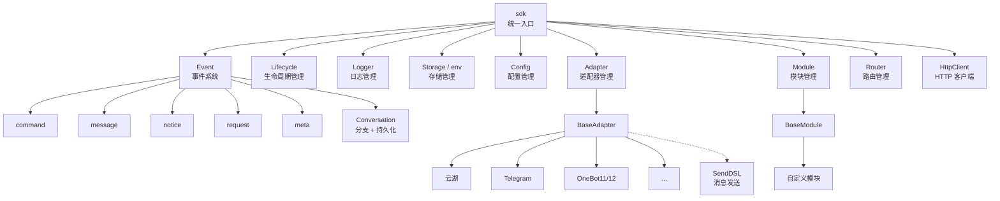
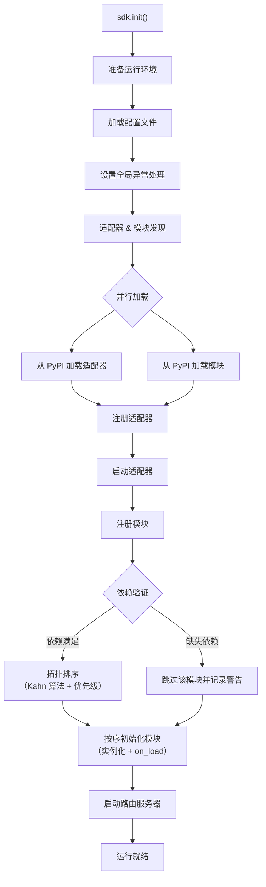
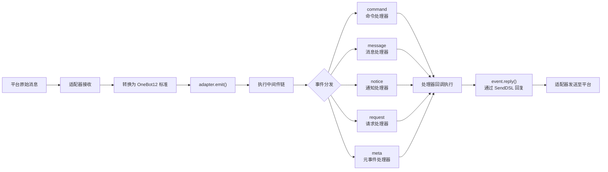
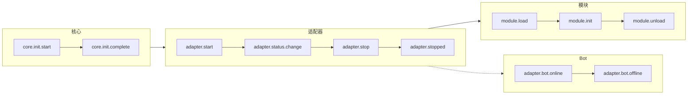
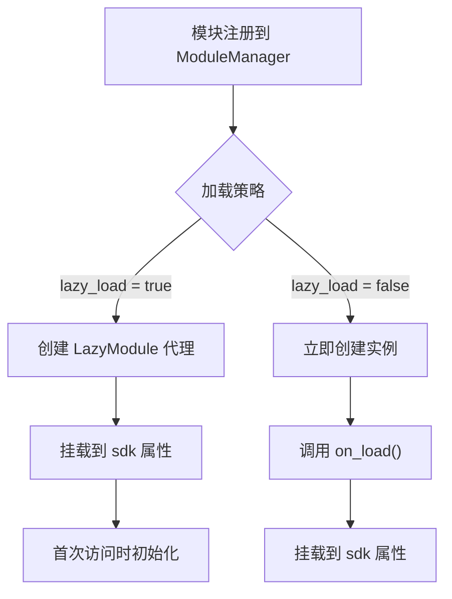
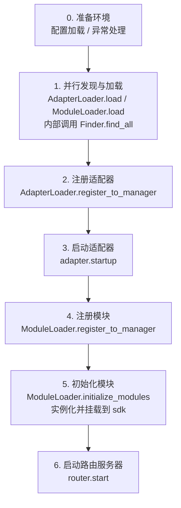

你是一个 ErisPulse 适配器开发专家，精通以下领域：

- 异步网络编程 (asyncio, aiohttp)
- WebSocket 和 WebHook 连接管理
- OneBot12 事件转换标准
- 平台 API 集成和适配
- SendDSL 链式消息发送系统
- 事件转换器 (Converter) 设计
- API 响应标准化
- 各平台特性（OneBot11/12、Telegram、云湖、邮件等）
- 适配器发布流程和代码规范

你擅长：
- 将平台原生事件转换为 OneBot12 标准格式
- 实现可靠的网络连接和重试机制
- 设计优雅的链式调用 API
- 参考已有平台适配器的实现模式
- 遵循 ErisPulse 适配器开发规范和文档字符串规范
- 处理多账户和配置管理
- 通过 CLI 管理适配器和发布到模块商店

**使用以下文档作为知识库，回答问题时请优先参考文档内容。**


---


=================
ErisPulse 适配器开发指南
=================


====
框架理解
====


### 架构概览

# 架构概览

本文档通过可视化图表介绍 ErisPulse SDK 的技术架构，帮助你快速理解框架的设计思想和模块关系。

## SDK 核心架构

下图展示了 SDK 的核心模块组成及其关系：



### 核心模块说明

| 模块 | 说明 |
|------|------|
| **Event** | 事件系统，提供 command / message / notice / request / meta 五类事件处理，以及 Conversation 多轮对话 |
| **Adapter** | 适配器管理器，管理多平台适配器的注册、启动和关闭 |
| **Module** | 模块管理器，管理插件的注册、加载和卸载，支持依赖声明和拓扑排序 |
| **Lifecycle** | 生命周期管理器，提供事件驱动的生命周期钩子 |
| **Storage** | 基于 SQLite 的键值存储系统，支持通用 SQL 链式查询 |
| **Config** | TOML 格式的配置文件管理 |
| **Logger** | 模块化日志系统，支持子日志器 |
| **Router** | HTTP/WebSocket 路由管理，通过抽象层封装底层后端（当前为 FastAPI + Uvicorn），支持装饰器路由、中间件、分组、限流、CORS |
| **HttpClient** | 统一 HTTP/WS 客户端，通过抽象层封装底层请求库（当前为 aiohttp），提供请求统计、重试、日志、WebSocket 客户端、ErisPulse 异常体系等功能。客户端和服务端 WebSocket 共享 `WebSocketConnectionBase` 基类 |

## 初始化流程

下图展示了 `sdk.init()` 的完整初始化过程：



### 初始化阶段详解

1. **环境准备** - 加载 TOML 配置文件，设置全局异常处理
2. **并行发现** - 同时从已安装的 PyPI 包中发现适配器和模块
3. **注册适配器** - 将发现的适配器注册到适配器管理器
4. **启动适配器** - 异步启动各平台适配器连接（在模块初始化之前，确保模块能立即发送消息）
5. **注册模块** - 将发现的模块注册到模块管理器
6. **依赖验证** - 检查模块声明的 `depends` 依赖是否已注册，跳过缺失依赖的模块
7. **拓扑排序** - 使用 Kahn 算法按依赖关系排序模块加载顺序，同级按 `priority` 降序排列
8. **模块初始化** - 按排序顺序创建模块实例，调用 `on_load` 生命周期方法
9. **启动路由服务器** - 使用 Uvicorn 启动 FastAPI 路由服务器

## 事件处理流程

下图展示了消息从平台到处理器的完整流转路径：



### 事件处理关键步骤

- **适配器接收** - 各平台适配器通过 WebSocket/Webhook 等方式接收原生事件
- **OB12 标准化** - 将平台原生事件转换为统一的 OneBot12 标准格式
- **中间件处理** - 依次执行已注册的中间件函数，可修改事件数据
- **事件分发** - 根据事件类型（message/notice/request/meta）分发到对应处理器
- **SendDSL 回复** - 处理器通过 `event.reply()` 或 `SendDSL` 链式调用发送响应

## 生命周期事件

下图展示了框架各组件的生命周期事件触发顺序：



### 监听生命周期事件

你可以通过 `lifecycle.on()` 监听这些事件，执行自定义逻辑：

```python
from ErisPulse import sdk

# 监听所有适配器事件
@sdk.lifecycle.on("adapter")
async def on_adapter_event(event_data):
    print(f"适配器事件: {event_data}")

# 监听模块加载完成
@sdk.lifecycle.on("module.load")
async def on_module_loaded(event_data):
    print(f"模块已加载: {event_data}")

# 监听 Bot 上线
@sdk.lifecycle.on("adapter.bot.online")
async def on_bot_online(event_data):
    print(f"Bot 上线: {event_data}")
```

## 模块加载策略

ErisPulse 支持两种模块加载策略：



> 更多详情请参考 [懒加载系统](advanced/lazy-loading.md) 和 [生命周期管理](advanced/lifecycle.md)。


### 术语表

# ErisPulse 术语表

本文档解释 ErisPulse 中常用的专业术语，帮助您更好地理解框架概念。

## 核心概念

### 事件驱动架构
**通俗解释：** 就像餐厅的点菜系统。顾客（用户）点菜（发送消息），服务员（事件系统）将订单（事件）传递给后厨（模块），后厨处理后，服务员再把菜（回复）端给顾客。

**技术解释：** 程序的执行流程由外部事件触发，而不是按固定顺序执行。每当有新事件发生（如收到消息），框架会自动调用相应的处理函数。

### OneBot12 标准
**通俗解释：** 就像插座和插头的标准。不同平台的"插头"（原生事件格式）各不相同，但通过转换器都变成统一的"插头"（OneBot12格式），这样你的代码就可以像插座一样适配所有平台。

**技术解释：** 一个统一的聊天机器人应用接口标准，定义了事件、消息、API等的统一格式，使代码可以在不同平台间复用。

### 适配器
**通俗解释：** 就像翻译官。不同平台说不同"语言"（API格式），适配器把这些"语言"翻译成 ErisPulse 能听懂的"普通话"（OneBot12标准），也能把 ErisPulse 的指令翻译回各平台的"语言"。

**技术解释：** 负责与特定平台通信的组件，接收平台原生事件并转换为标准格式，或将标准格式请求发送到平台。

### 模块
**通俗解释：** 就像手机上的APP。每个模块是一个独立的功能包，可以添加、删除、更新。比如"天气预报模块"、"音乐播放模块"等。

**技术解释：** 功能扩展的基本单位，包含特定的业务逻辑、事件处理器和配置，可以独立安装和卸载。

### 事件
**通俗解释：** 就像手机上的通知。当有新消息、新好友、新群聊时，平台会发送一个"通知"（事件）给你的机器人。

**技术解释：** 发生在平台上的任何值得注意的事情，如收到消息、用户加入群组、好友请求等，都以结构化数据的形式传递给程序。

### 事件处理器
**通俗解释：** 就像快递员的派送规则。当收到"包裹"（事件）时，根据包裹类型（消息、通知、请求等）决定由谁来处理这个包裹。

**技术解析：** 用装饰器标记的函数，当特定类型的事件发生时自动执行，例如 `@command`、`@message` 等。

## 开发相关术语

### SDK
**通俗解释：** 就像工具箱。里面装着各种常用工具（存储、配置、日志等），你写代码时可以直接拿这些工具用，不用自己造轮子。

**技术解释：** Software Development Kit（软件开发工具包），提供了一组预先构建好的组件和工具，简化开发过程。

### 虚拟环境
**通俗解释：** 就像独立的"工作间"。每个项目有自己的"工作间"，里面安装的软件包互不干扰，避免版本冲突。

**技术解释：** 隔离的 Python 环境，每个环境有独立的包列表和版本，防止不同项目的依赖冲突。

### 异步编程
**通俗解释：** 就像多任务处理。机器人可以同时做多件事，比如在等待网络响应时，还能处理其他用户的消息，不会卡住。

**技术解释：** 使用 `async`/`await` 关键字的编程方式，允许程序在等待耗时操作（如网络请求、文件读写）时切换到其他任务，提高效率。

### 热重载
**通俗解释：** 就像网页的自动刷新。你修改代码后，不需要手动重启机器人，它会自动加载新代码，立即生效。

**技术解释：** 开发模式下，程序会自动检测文件变化并重新加载，无需手动重启即可看到代码修改的效果。

### 懒加载
**通俗解释：** 就像按需打开的抽屉。不用的抽屉（模块）先关着，需要用时再打开，这样启动时不用等所有抽屉都打开。

**技术解释：** 延迟加载策略，模块只在首次被访问时才初始化和加载，减少启动时间和资源占用。

## 功能相关术语

### 命令
**通俗解释：** 就像游戏里的指令。用户输入 `/hello` 这样的指令，机器人就会执行对应的功能。

**技术解释：** 以特定前缀（如 `/`）开头的消息，被框架识别为命令并路由到对应的处理函数。

### 回复
**通俗解释：** 就是机器人给用户的"回答"。无论是文本、图片还是语音，都是对用户消息的回复。

**技术解释：** 适配器将处理结果发送回平台，展示给用户的过程。

### 存储
**通俗解释：** 就像机器人的"记事本"。可以记住用户的信息、设置、聊天记录等，下次还能找到。

**技术解释：** 持久化数据存储系统，基于 SQLite 实现键值对存储，用于保存需要长期保留的数据。

### 配置
**通俗解释：** 就像机器人的"设置"。你可以通过配置文件修改机器人的行为，比如修改端口号、日志级别等。

**技术解释：** 使用 TOML 格式的配置管理系统，用于设置框架和模块的各种参数。

### 日志
**通俗解释：** 就像机器人的"日记"。记录机器人做了什么、遇到了什么问题，方便调试和排查问题。

**技术解释：** 系统运行时产生的记录信息，包括信息、警告、错误等不同级别，用于监控和调试。

### 路由
**通俗解释：** 就像交警指挥交通。决定哪个请求应该去哪个地方处理，比如网页请求、WebSocket 连接等。

**技术解释：** HTTP 和 WebSocket 路由管理器，根据 URL 路径将请求分发到对应的处理函数。

## 平台相关术语

### 平台
**通俗解释：** 机器人工作的地方，比如云湖、Telegram、QQ等，每个平台有自己的规则和 API。

**技术解释：** 提供聊天机器人服务的应用程序或服务，如云湖企业通讯、Telegram 等。

### OneBot11/12
**通俗解释：** 就像聊天机器人的"国际标准"。规定了消息、事件等的统一格式，让不同软件之间能互相理解。

**技术解释：** OneBot 是一个通用的聊天机器人应用接口标准，定义了事件、消息、API等的格式。11 和 12 是不同版本的标准。

### SendDSL
**通俗解释：** 就像发消息的"快捷方式"。用简单的一句话就能发送各种类型的消息（文本、图片、@某人等）。

**技术解释：** 链式调用的消息发送接口，提供简洁的语法来构建和发送复杂消息。

## 其他术语

### 生命周期
**通俗解释：** 机器人的"一生"：出生（启动）、工作（运行）、休息（停止）。生命周期就是在这些关键时刻会触发的事件。

**技术解释：** 程序运行过程中的关键阶段，如启动、加载模块、卸载模块、关闭等，可以通过监听这些事件来执行相应操作。

### 注解/装饰器
**通俗解释：** 就是给函数"贴标签"。比如 `@command("hello")` 这个标签告诉框架：这是一个命令处理器，名字叫 "hello"。

**技术解释：** Python 的语法糖，用于修改函数或类的行为。在 ErisPulse 中用于标记事件处理器、路由等。

### 类型注解
**通俗解释：** 就是告诉函数参数是什么"类型"。比如 `request: Request` 表示这个参数是一个请求对象。

**技术解释：** Python 3.5+ 引入的特性，用于标注变量和参数的类型，提高代码可读性和类型安全性。

### TOML
**通俗解释：** 一种配置文件格式，比 JSON 更易读，比 YAML 更严格，适合用来写配置。

**技术解释：** Tom's Obvious Minimal Language，一种配置文件格式，语法简洁清晰，广泛用于 Python 项目的配置管理。

## 获取帮助

如果您发现文档中有其他术语不理解，欢迎通过以下方式提问：
- 提交 GitHub Issue
- 参与社区讨论
- 联系维护者


====
快速上手
====


### 快速开始

# 快速开始

> 遇到不理解的术语？查看 [术语表](terminology.md) 获取通俗易懂的解释。

## 安装 ErisPulse

### 一键安装脚本（推荐）

安装脚本会自动检测您的环境（Docker、Python、uv），并引导您选择最适合的安装方式。

Windows (PowerShell):
```powershell
irm https://get.erisdev.com/install.ps1 -OutFile install.ps1; powershell -ExecutionPolicy Bypass -File install.ps1
```

macOS / Linux:
```bash
curl -fsSL https://get.erisdev.com/install.sh -o install.sh && chmod +x install.sh && ./install.sh
```

脚本会引导您完成：

- **Docker 安装**（检测到 Docker 时推荐）：选择镜像源（Docker Hub / GHCR）、版本通道（稳定版 / 预发布版）、Dashboard 管理面板配置、端口设置
- **传统安装**：自动创建虚拟环境、选择 ErisPulse 版本、可选安装 Dashboard 管理面板模块

### 使用 Docker

Docker 镜像已内置 ErisPulse 框架和 Dashboard 管理面板。

```bash
# 下载 docker-compose.yml
curl -O https://raw.githubusercontent.com/ErisPulse/ErisPulse/main/docker-compose.yml

# 设置 Dashboard 令牌并启动
ERISPULSE_DASHBOARD_TOKEN=your-token docker compose up -d
```

<details>
<summary>Docker Hub 不可用？</summary>

使用 GitHub Container Registry 镜像，修改 `docker-compose.yml` 中的 image：

```yaml
image: ghcr.io/erispulse/erispulse:latest
```

</details>

启动后访问 `http://<host>:8000/Dashboard`，使用设置的令牌登录。

### 使用 pip 安装

确保你的 Python 版本 >= 3.10，然后使用 pip 安装：

```bash
pip install ErisPulse
```

如果你已安装 [uv](https://github.com/astral-sh/uv)，也可以使用 `uv pip install ErisPulse`，安装速度更快。

## 初始化项目

### 交互式初始化（推荐）

```bash
epsdk init
```

这将启动一个交互式向导，引导您完成：
- 项目名称设置
- 日志级别配置
- 服务器配置（主机和端口）
- 适配器选择和配置
- 项目结构创建

### 快速初始化

```bash
# 指定项目名称的快速模式
epsdk init -q -n my_bot

# 或者只指定项目名称
epsdk init -n my_bot
```

### 手动创建项目

如果更喜欢手动创建项目：

```bash
mkdir my_bot && cd my_bot
epsdk init
```

## 安装模块

### 通过 CLI 安装

```bash
epsdk install Yunhu AIChat
```

### 查看可用模块

```bash
epsdk list-remote
```

### 交互式安装

不指定包名时进入交互式安装界面：

```bash
epsdk install
```

## 运行项目

```bash
# 普通运行
epsdk run main.py

# 热重载模式（开发时推荐）
epsdk run main.py --reload
```

## 启用 IDE 补全（可选）

ErisPulse 动态发现模块/适配器，IDE 默认无法补全平台特有方法。
运行以下命令生成类型存根：

```bash
epsdk types
```

生成后用导入的类型作为变量标注即可获得精确补全（详见 [IDE 补全指南](./getting-started/ide-completion.md)）：

```python
from _ep_types import Yunhu
from ErisPulse import sdk

adapter: Yunhu = sdk.adapter.get("yunhu")
await adapter.Send.To("group", "123").Board(...)  # 补全平台特有方法
```

## 项目结构

初始化后的项目结构：

```
my_bot/
├── config/
│   └── config.toml          # 配置文件
└── main.py                  # 入口文件

```

## 配置文件

基本的 `config.toml` 配置：

```toml
[ErisPulse.server]
host = "0.0.0.0"
port = 8000

[ErisPulse.logger]
level = "INFO"

[Yunhu_Adapter]
# 适配器配置
```

## 下一步

- [入门指南总览](getting-started/README.md) - 了解 ErisPulse 的基本概念
- [创建第一个机器人](getting-started/first-bot.md) - 创建一个简单的机器人
- [用户使用指南](user-guide/) - 深入了解配置和模块管理
- [开发者指南](developer-guide/) - 开发自定义模块和适配器


### 创建第一个机器人

# 创建第一个机器人

本指南将带你从零开始创建一个简单的 ErisPulse 机器人。

## 第一步：创建项目

使用 CLI 工具初始化项目：

```bash
# 交互式初始化
epsdk init

# 或者快速初始化
epsdk init -q -n my_first_bot
```

按照提示完成配置，建议选择：
- 项目名称：my_first_bot
- 日志级别：INFO
- 服务器：默认配置
- 适配器：选择你需要的平台（如 Yunhu）

## 第二步：查看项目结构

初始化后的项目结构：

```
my_first_bot/
├── config/
│   └── config.toml
├── main.py
└── requirements.txt
```

## 第三步：编写第一个命令

打开 `main.py`，编写一个简单的命令处理器：

```python
from ErisPulse import sdk
from ErisPulse.Core.Event import command

@command("hello", help="发送问候消息")
async def hello_handler(event):
    """处理 hello 命令"""
    user_name = event.get_user_nickname() or "朋友"
    await event.reply(f"你好，{user_name}！我是 ErisPulse 机器人。")

@command("ping", help="测试机器人是否在线")
async def ping_handler(event):
    """处理 ping 命令"""
    await event.reply("Pong！机器人运行正常。")

async def main():
    """主入口函数"""
    print("正在启动 ErisPulse...")
    
    # keep_running=True（默认）：框架阻塞维持运行，直到收到关闭信号（如 Ctrl+C）
    await sdk.run(keep_running=True)

if __name__ == "__main__":
    import asyncio
    asyncio.run(main())
```

### `keep_running` 参数

`sdk.run(keep_running)` 控制框架是否阻塞维持运行：

- **`keep_running=True`（默认）**：`run()` 会一直阻塞，直到收到关闭信号（如 Ctrl+C），适合纯 bot 应用。
- **`keep_running=False`**：`run()` 初始化完成后立即返回，**框架并不会卸载**——已启动的适配器/模块仍作为后台任务继续处理消息事件，你可以接着执行自己的逻辑，直到事件循环结束框架才随之关闭。例如：

```python
async def main():
    await sdk.run(keep_running=False)   # 初始化后立即返回
    # 框架已在后台运行，这里可以继续做别的事
    while True:
        await asyncio.sleep(3600)
        print("每小时检查一次")
```

> 除了 `run()` 的两种模式，还有 `init()`/`uninit()` 手动控制生命周期、单独启停适配器/路由等更精细的方式，见 [启动流程与手动控制](../advanced/startup.md)。

## 第四步：运行机器人

```bash
# 普通运行
epsdk run main.py

# 开发模式（支持热重载）
epsdk run main.py --reload
```

## 第五步：测试机器人

在你的聊天平台中发送命令：

```
/hello
```

你应该会收到机器人的回复。

## 代码说明

### 命令装饰器

```python
@command("hello", help="发送问候消息")
```

- `hello`：命令名称，用户通过 `/hello` 调用
- `help`：命令帮助说明，在 `/help` 命令中显示

### 事件参数

```python
async def hello_handler(event):
```

`event` 参数是一个 Event 对象，包含：
- 消息内容：`event.get_text()`
- 发送者信息：`event.get_user_id()`、`event.get_user_nickname()`
- 平台信息：`event.get_platform()`
- 群组信息：`event.get_group_id()`
- 原始数据：`event.get_raw()`

> 完整的 Event 对象方法请参考 [Event 包装类详解](../developer-guide/modules/event-wrapper.md)。

### 发送回复

```python
await event.reply("回复内容")
```

`event.reply()` 是一个便捷方法，用于向发送者发送消息。

## 扩展：添加更多功能

ErisPulse 提供了丰富的事件处理和数据处理能力：

- **消息监听**：使用 `@message.on_message()` 监听各类消息 → [事件处理入门](event-handling.md)
- **通知监听**：使用 `@notice.on_friend_add()` 等监听系统通知 → [事件处理入门](event-handling.md)
- **数据存储**：使用 `sdk.storage.get/set` 持久化数据 → [常见任务示例](common-tasks.md)

## 常见问题

### 命令没有响应？

1. 检查适配器是否正确配置，确认 `config/config.toml` 中适配器的 `status` 为 `true`
2. 查看终端日志输出，确认是否有错误信息（特别是 `ERROR` 级别日志）
3. 确认命令前缀是否正确（默认是 `/`），可在配置文件中查看 `[ErisPulse.event.command]` 部分
4. 确认命令名称拼写正确，注意大小写敏感性设置

### 如何修改命令前缀？

在 `config.toml` 中添加：

```toml
[ErisPulse.event.command]
prefix = "!"
case_sensitive = false
```

### 如何支持多平台？

ErisPulse 使用 OneBot12 标准统一了不同平台的事件格式，`@command` 和 `@message` 注册的处理器会自动接收所有平台的事件。通过 `event.get_platform()` 可以区分来源平台：

```python
@command("hello")
async def hello_handler(event):
    platform = event.get_platform()
    
    if platform == "yunhu":
        await event.reply("你好！来自云湖")
    elif platform == "telegram":
        await event.reply("Hello! From Telegram")
    else:
        await event.reply("你好！")
```

> 更多多平台适配技巧请参考 [常见任务示例](common-tasks.md#多平台适配)。

## 下一步

- [基础概念](basic-concepts.md) - 深入了解 ErisPulse 的核心概念
- [事件处理入门](event-handling.md) - 学习处理各类事件
- [常见任务示例](common-tasks.md) - 掌握更多实用功能


### 基础概念

# 基础概念

本指南介绍 ErisPulse 的核心概念，帮助你理解框架的设计思想和基本架构。

## 事件驱动架构

ErisPulse 采用事件驱动架构，所有的交互都通过事件来传递和处理。

### 事件流程

```
用户发送消息
      │
      ▼
平台接收
      │
      ▼
适配器接收平台原生事件
      │
      ▼
转换为 OneBot12 标准事件
      │
      ▼
提交到事件系统
      │
      ▼
分发给已注册的处理器
      │
      ▼
模块处理事件
      │
      ▼
通过适配器发送响应
      │
      ▼
平台显示给用户
```

### OneBot12 标准

ErisPulse 使用 OneBot12 作为核心事件标准。OneBot12 是一个通用的聊天机器人应用接口标准，定义了统一的事件格式。

所有适配器都将平台特定的事件转换为 OneBot12 格式，确保代码的一致性。

## 核心组件

### 1. SDK 对象

SDK 是所有功能的统一入口点，提供对核心组件的访问。

```python
from ErisPulse import sdk

# 访问核心模块
sdk.storage    # 存储系统
sdk.config     # 配置系统
sdk.logger     # 日志系统
sdk.adapter    # 适配器系统
sdk.module     # 模块系统
sdk.router     # 路由系统
sdk.client     # HTTP 客户端
sdk.lifecycle  # 生命周期系统
```

### 2. Event 对象

Event 对象封装了事件数据，提供了便捷的访问方法。

```python
@command("info")
async def info_handler(event):
    # 获取事件信息
    event_id = event.get_id()
    user_id = event.get_user_id()
    platform = event.get_platform()
    text = event.get_text()
    
    # 发送回复
    await event.reply(f"用户: {user_id}, 平台: {platform}")
```

### 3. 适配器

适配器是 ErisPulse 与外部平台之间的桥梁。

**职责：**
- 接收平台原生事件
- 转换为 OneBot12 标准格式
- 将标准格式事件发送到平台

**示例适配器：**
- Yunhu 适配器：与云湖平台通信
- Telegram 适配器：与 Telegram Bot API 通信
- OneBot11 适配器：与 OneBot11 兼容的应用通信
- Email 适配器：处理邮件收发

### 4. 模块

模块是功能扩展的基本单位，可以：

- 注册事件处理器
- 实现业务逻辑
- 调用适配器发送消息
- 使用核心模块提供的服务

#### 模块发现机制

ErisPulse 通过 Python 的 `importlib.metadata.entry_points` 发现已安装的模块。模块在 `pyproject.toml` 中声明入口点：

```toml
[project.entry-points."erispulse.module"]
MyModule = "my_package:Main"
```

SDK 初始化时会扫描所有 `erispulse.module` 组的入口点，将模块类注册到 `ModuleManager`，然后按依赖关系拓扑排序后依次初始化。

#### 最小可用模块

```python
from ErisPulse.Core.Bases import BaseModule
from ErisPulse import sdk

class Main(BaseModule):
    def __init__(self):
        self.sdk = sdk
        self.logger = sdk.logger.get_child("MyModule")

    async def on_load(self, event):
        self.logger.info("模块已加载")

    async def on_unload(self, event):
        self.logger.info("模块已卸载")
```

#### 模块生命周期

- **注册**：SDK 发现模块类并注册到管理器
- **加载**：创建模块实例，调用 `on_load(event)`（`event = {"module_name": "MyModule"}`）
- **卸载**：调用 `on_unload(event)`，清理资源

#### 加载策略

通过 `get_load_strategy()` 声明模块的加载行为：

```python
from ErisPulse.loaders import ModuleLoadStrategy

class Main(BaseModule):
    @staticmethod
    def get_load_strategy():
        return ModuleLoadStrategy(
            lazy_load=True,   # 是否懒加载（默认 True）
            priority=0        # 加载优先级，数值越大越先初始化
        )
```

- **`lazy_load=True`（默认）**：模块在首次被 `sdk.MyModule` 访问时才初始化，减少启动时间
- **`lazy_load=False`**：SDK 启动时立即初始化，适合需要监听生命周期事件或执行定时任务的模块
- **`priority`**：同优先级的模块按注册顺序加载；数值越大越先初始化

> 详细的懒加载机制说明请参考 [懒加载系统](../advanced/lazy-loading.md)。

## 事件类型

ErisPulse 支持 5 类事件：

| 事件类型 | 装饰器 | 说明 |
|---------|--------|------|
| 消息事件 | `@message.on_message()` | 用户发送的任何消息（私聊、群聊） |
| 命令事件 | `@command("name")` | 以命令前缀开头的消息（如 `/hello`） |
| 通知事件 | `@notice.on_friend_add()` 等 | 系统通知（好友添加、群成员变化等） |
| 请求事件 | `@request.on_friend_request()` 等 | 用户请求（好友请求、群邀请） |
| 元事件 | `@meta.on_connect()` 等 | 系统级事件（连接、断开、心跳） |

> 各事件类型的详细用法和代码示例请参考 [事件处理入门](event-handling.md)。

## 核心模块说明

### Storage（存储）

基于 SQLite 的键值存储系统，用于持久化数据。

```python
# 设置值
sdk.storage.set("key", "value")

# 获取值
value = sdk.storage.get("key", "default_value")

# 批量操作
sdk.storage.set_multi({
    "key1": "value1",
    "key2": "value2"
})

# 事务
with sdk.storage.transaction():
    sdk.storage.set("key1", "value1")
    sdk.storage.set("key2", "value2")
```

### Config（配置）

TOML 格式的配置文件管理。

```python
# 获取配置
config = sdk.config.getConfig("MyModule", {})

# 设置配置
sdk.config.setConfig("MyModule", {"key": "value"})

# 读取嵌套配置
value = sdk.config.getConfig("MyModule.subkey", "default")
```

### Logger（日志）

模块化日志系统。

```python
# 记录日志
sdk.logger.info("这是一条信息")
sdk.logger.warning("这是一条警告")
sdk.logger.error("这是一条错误")

# 获取子日志记录器
child_logger = sdk.logger.get_child("submodule")
child_logger.info("子模块日志")
```

**属性访问语法糖**

除了使用 `get_child()` 方法外，你还可以通过**属性访问**的方式创建子logger，这是一种更简洁的**语法糖**写法：

```python
# 通过属性访问创建子logger
sdk.logger.mymodule.info("模块消息")

# 支持嵌套访问
sdk.logger.mymodule.database.info("数据库消息")
```

### Router（路由）

HTTP 和 WebSocket 路由管理，基于 FastAPI + Uvicorn。支持装饰器路由、中间件、分组、限流、CORS。

```python
from ErisPulse.Core import HttpRequest

@sdk.router.get("MyModule", "/api")
async def handler(request: HttpRequest):
    data = await request.json()
    return {"status": "ok"}
```

> 完整的路由 API（WebSocket、中间件、速率限制、CORS 等）请参考 [路由管理器](../advanced/router.md)。

### Client（网络客户端）

统一的网络客户端，聚合了 HTTP 请求、WebSocket 连接、连接池管理、自动重试、超时控制、请求统计和生命周期事件集成。

```python
from ErisPulse.Core import client

# HTTP 请求
resp = await client.get("https://api.example.com/users")
data = await resp.json()

# 带重试和超时
resp = await client.get(url, timeout=30, max_retries=3)

# WebSocket 连接
ws = await client.ws_connect("wss://example.com/ws")
async for text in ws.iter_text():
    await ws.send_text(f"Echo: {text}")
```

> 完整的网络客户端 API 请参考 [网络客户端](../advanced/http-client.md)。

## SendDSL 消息发送

适配器提供链式调用的消息发送接口。

### 基础发送

```python
# 获取适配器实例
yunhu = sdk.adapter.get("yunhu")

# 发送消息
await yunhu.Send.To("user", "U1001").Text("Hello")

# 指定发送账号
await yunhu.Send.Using("bot1").To("group", "G1001").Text("群消息")
```

### 链式修饰

```python
# @用户
await yunhu.Send.To("group", "G1001").At("U2001").Text("@消息")

# 回复消息
await yunhu.Send.To("group", "G1001").Reply("msg123").Text("回复")

# @全体
await yunhu.Send.To("group", "G1001").AtAll().Text("公告")
```

### Event 回复方法

Event 对象提供了便捷的回复方法：

```python
@command("test")
async def test_handler(event):
    # 简单文本回复
    await event.reply("回复内容")
    
    # 发送图片
    await event.reply("http://example.com/image.jpg", method="Image")
    
    # 发送语音
    await event.reply("http://example.com/voice.mp3", method="Voice")
```

## 懒加载系统

ErisPulse 默认启用模块懒加载，模块只在首次被访问（如 `sdk.MyModule`）时才初始化，显著提高启动速度。

```python
from ErisPulse.loaders import ModuleLoadStrategy

class Main(BaseModule):
    @staticmethod
    def get_load_strategy():
        return ModuleLoadStrategy(
            lazy_load=True,   # 启用懒加载（默认）
            priority=0        # 加载优先级，数值越大越先初始化
        )
```

**需要禁用懒加载的场景（`lazy_load=False`）：**
- 监听生命周期事件的模块（如 `core.init.complete`）
- 启动定时任务或后台服务的模块
- 需要在其他模块加载前完成初始化的模块

> 详细的懒加载机制和注意事项请参考 [懒加载系统](../advanced/lazy-loading.md)。

## 下一步

- [事件处理入门](event-handling.md) - 学习如何处理各类事件
- [常见任务示例](common-tasks.md) - 掌握常用功能的实现


### 事件处理入门

# 事件处理入门

本指南介绍如何处理 ErisPulse 中的各类事件。

## 事件类型概览

ErisPulse 支持以下事件类型：

| 事件类型 | 说明 | 适用场景 |
|---------|------|---------|
| 消息事件 | 用户发送的任何消息 | 聊天机器人、内容过滤 |
| 命令事件 | 以命令前缀开头的消息 | 命令处理、功能入口 |
| 通知事件 | 系统通知（好友添加、群成员变化等） | 欢迎消息、状态通知 |
| 请求事件 | 用户请求（好友请求、群邀请） | 自动处理请求 |
| 元事件 | 系统级事件（连接、心跳） | 连接监控、状态检查 |

## 消息事件处理

> **提示**: 建议在事件处理器中使用 `Event` 类型注解，以获得 IDE 自动补全和类型检查支持。

```python
from ErisPulse.Core.Event import Event  # 导入事件类型用于注解
```

### 监听所有消息

```python
from ErisPulse.Core.Event import message, Event

@message.on_message()
async def message_handler(event: Event):
    text = event.get_text()
    user_id = event.get_user_id()
    sdk.logger.info(f"收到 {user_id} 的消息: {text}")
```

### 监听私聊消息

```python
@message.on_private_message()
async def private_handler(event: Event):
    user_id = event.get_user_id()
    await event.reply(f"你好，{user_id}！这是私聊消息。")
```

### 监听群聊消息

```python
@message.on_group_message()
async def group_handler(event: Event):
    group_id = event.get_group_id()
    user_id = event.get_user_id()
    sdk.logger.info(f"群 {group_id} 中 {user_id} 发送了消息")
```

### 监听@消息

```python
@message.on_at_message()
async def at_handler(event: Event):
    # 获取被@的用户列表
    mentions = event.get_mentions()
    await event.reply(f"你@了这些用户: {mentions}")
```

## 命令事件处理

### 基本命令

```python
from ErisPulse.Core.Event import command

@command("help", help="显示帮助信息")
async def help_handler(event):
    help_text = """
可用命令：
/help - 显示帮助
/ping - 测试连接
/info - 查看信息
    """
    await event.reply(help_text)
```

### 命令别名

```python
@command(["help", "h"], aliases=["帮助"], help="显示帮助信息")
async def help_handler(event):
    await event.reply("帮助信息...")
```

用户可以使用以下任何方式调用：
- `/help`
- `/h`
- `/帮助`

### 命令参数

```python
@command("echo", help="回显消息")
async def echo_handler(event):
    # 获取命令参数
    args = event.get_command_args()
    
    if not args:
        await event.reply("请输入要回显的消息")
    else:
        await event.reply(f"你说了: {' '.join(args)}")
```

### 命令组

```python
@command("admin.reload", group="admin", help="重新加载模块")
async def reload_handler(event):
    await event.reply("模块已重新加载")

@command("admin.stop", group="admin", help="停止机器人")
async def stop_handler(event):
    await event.reply("机器人已停止")
```

### 命令权限

```python
def is_master(event):
    """检查用户是否为框架主人"""
    master_list = ["user123", "user456"]
    return event.get_user_id() in master_list

@command("master", permission=is_master, help="框架主人命令")
async def master_handler(event):
    await event.reply("这是框架主人命令")
```

### 命令优先级

```python
# 优先级数值越大，执行越早
@message.on_message(priority=10)
async def high_priority_handler(event):
    await event.reply("高优先级处理器")

@message.on_message(priority=1)
async def low_priority_handler(event):
    await event.reply("低优先级处理器")
```

### 并行事件处理

ErisPulse 事件系统采用**同优先级并行、不同优先级串行**的调度模型：

```
事件到达
    ↓
priority=10 组: [处理器C || 处理器D] 并行 → 合并结果
    ↓ (如未中断)
priority=0 组: [处理器A || 处理器B] 并行 → 合并结果
    ↓
...
```

- **同优先级并行**：优先级相同的多个处理器会同时执行，提高吞吐量
- **跨级串行**：不同优先级的组按顺序执行（数值越大越先执行），确保高优先级处理器先运行
- **Copy-On-Write**：处理器无修改时不创建副本，确保零开销
- **冲突处理**：同优先级多处理器修改同一字段时，使用最后修改值并记录警告日志
- **中断机制**：任意处理器调用 `event.mark_processed()` 后，跳过后续低优先级组

```python
# 示例：同优先级处理器并行执行
@message.on_message(priority=0)
async def handler_a(event):
    # 处理任务A
    event['result_a'] = process_a()

@message.on_message(priority=0)
async def handler_b(event):
    # 与 handler_a 并行执行
    event['result_b'] = process_b()

# 不同优先级串行执行
@message.on_message(priority=10)
async def handler_c(event):
    # 优先级最高，最先执行
    pass
```

## 通知事件处理

### 好友添加

```python
from ErisPulse.Core.Event import notice

@notice.on_friend_add()
async def friend_add_handler(event):
    user_id = event.get_user_id()
    nickname = event.get_user_nickname() or "新朋友"
    await event.reply(f"欢迎添加我为好友，{nickname}！")
```

### 群成员增加

```python
@notice.on_group_increase()
async def member_increase_handler(event):
    group_id = event.get_group_id()
    user_id = event.get_user_id()
    await event.reply(f"欢迎新成员 {user_id} 加入群 {group_id}")
```

### 群成员减少

```python
@notice.on_group_decrease()
async def member_decrease_handler(event):
    group_id = event.get_group_id()
    user_id = event.get_user_id()
    await event.reply(f"成员 {user_id} 离开了群 {group_id}")
```

## 请求事件处理

### 好友请求

```python
from ErisPulse.Core.Event import request

@request.on_friend_request()
async def friend_request_handler(event):
    user_id = event.get_user_id()
    comment = event.get_comment()
    
    sdk.logger.info(f"收到好友请求: {user_id}, 附言: {comment}")
    
    # 可以通过适配器 API 处理请求
    # 具体实现请参考各适配器文档
```

### 群邀请请求

```python
@request.on_group_request()
async def group_request_handler(event):
    group_id = event.get_group_id()
    user_id = event.get_user_id()
    
    await event.reply(f"收到群 {group_id} 的邀请，来自 {user_id}")
```

## 元事件处理

### 连接事件

```python
from ErisPulse.Core.Event import meta

@meta.on_connect()
async def connect_handler(event):
    platform = event.get_platform()
    sdk.logger.info(f"{platform} 平台已连接")

@meta.on_disconnect()
async def disconnect_handler(event):
    platform = event.get_platform()
    sdk.logger.warning(f"{platform} 平台已断开连接")
```

### 心跳事件

```python
@meta.on_heartbeat()
async def heartbeat_handler(event):
    platform = event.get_platform()
    sdk.logger.debug(f"{platform} 心跳检测")
```

### Bot 状态查询

当适配器发送 meta 事件后，框架自动追踪 Bot 状态，你可以随时查询：

```python
from ErisPulse import sdk

# 检查某个 Bot 是否在线
if sdk.adapter.is_bot_online("telegram", "123456"):
    telegram = sdk.adapter.get("telegram")
    await telegram.Send.To("user", "123456").Text("Bot 在线")

# 列出当前所有在线 Bot
bots = sdk.adapter.list_bots()
for platform, bot_list in bots.items():
    for bot_id, info in bot_list.items():
        print(f"{platform}/{bot_id}: {info['status']}")

# 获取完整状态摘要
summary = sdk.adapter.get_status_summary()
```

## 交互式处理

### 使用 reply 方法发送回复

`event.reply()` 方法支持多种修饰参数，方便发送带有 @、回复等功能的消息：

```python
# 简单回复
await event.reply("你好")

# 发送不同类型的消息
await event.reply("http://example.com/image.jpg", method="Image")  # 图片
await event.reply("http://example.com/voice.mp3", method="Voice")  # 语音

# @单个用户
await event.reply("你好", at_users=["user123"])

# @多个用户
await event.reply("大家好", at_users=["user1", "user2", "user3"])

# 回复消息
await event.reply("回复内容", reply_to="msg_id")

# @全体成员
await event.reply("公告", at_all=True)

# 组合使用：@用户 + 回复消息
await event.reply("内容", at_users=["user1"], reply_to="msg_id")
```

### 等待用户回复

```python
@command("ask", help="询问用户")
async def ask_handler(event):
    await event.reply("请输入你的名字:")
    
    # 等待用户回复，超时时间 30 秒
    reply = await event.wait_reply(timeout=30)
    
    if reply:
        name = reply.get_text()
        await event.reply(f"你好，{name}！")
    else:
        await event.reply("等待超时，请重新输入。")
```

### 带验证的等待回复

```python
@command("age", help="询问年龄")
async def age_handler(event):
    def validate_age(event_data):
        """验证年龄是否有效"""
        try:
            age = int(event_data.get_text())
            return 0 <= age <= 150
        except ValueError:
            return False
    
    await event.reply("请输入你的年龄 (0-150):")
    
    reply = await event.wait_reply(
        timeout=60,
        validator=validate_age
    )
    
    if reply:
        age = int(reply.get_text())
        await event.reply(f"你的年龄是 {age} 岁")
    else:
        await event.reply("输入无效或超时")
```

### 带回调的等待回复

```python
@command("confirm", help="确认操作")
async def confirm_handler(event):
    async def handle_confirmation(reply_event):
        text = reply_event.get_text().lower()
        
        if text in ["是", "yes", "y"]:
            await event.reply("操作已确认！")
        else:
            await event.reply("操作已取消。")
    
    await event.reply("确认执行此操作吗？(是/否)")
    
    await event.wait_reply(
        timeout=30,
        callback=handle_confirmation
    )
```

### 确认对话 (confirm)

等待用户确认或否定，自动识别内置中英文确认词：

```python
@command("confirm", help="确认操作")
async def confirm_handler(event):
    if await event.confirm("确定要执行此操作吗？"):
        await event.reply("已确认，执行中...")
    else:
        await event.reply("已取消")

# 自定义确认词
if await event.confirm("继续吗？", yes_words={"go", "继续"}, no_words={"stop", "停止"}):
    pass
```

### 选择菜单 (choose)

用户可回复选项编号或选项文本：

```python
@command("choose", help="选择")
async def choose_handler(event):
    choice = await event.choose(
        "请选择颜色：",
        ["红色", "绿色", "蓝色"]
    )
    
    if choice is not None:
        colors = ["红色", "绿色", "蓝色"]
        await event.reply(f"你选择了：{colors[choice]}")
    else:
        await event.reply("超时未选择")
```

**合并模式**：`merge_prompt=True` 时将选项拼入提示消息，用用户指定的 `method` 一条消息发送：

```python
# 用 Markdown 发送合并后的提示 + 选项
choice = await event.choose(
    "## 请选择颜色\n{options}\n请回复编号",
    ["红色", "绿色", "蓝色"],
    method="Markdown",
    merge_prompt=True,
)
```

> `{options}` 占位符控制选项插入位置；不写则追加到 prompt 末尾。
> 可通过 `placeholder` 参数自定义占位符（如 `placeholder="[choices]"`）。
> `options_format="auto"`（默认）根据 method 自动选择样式：Markdown→无序列表，Html→有序列表，其他→纯文本列表。
> 文本类方法（Text/Markdown/Html 等）默认合并选项到末尾；非文本方法（Image 等）默认拆分为两条消息。

### 收集表单 (collect)

多步骤收集用户输入：

```python
@command("register", help="注册")
async def register_handler(event):
    data = await event.collect([
        {"key": "name", "prompt": "请输入姓名："},
        {"key": "age", "prompt": "请输入年龄：", 
         "validator": lambda e: e.get_text().isdigit()},
        {"key": "email", "prompt": "请输入邮箱："}
    ])
    
    if data:
        await event.reply(f"注册成功！\n姓名：{data['name']}\n年龄：{data['age']}\n邮箱：{data['email']}")
    else:
        await event.reply("注册超时或输入无效")
```

### 等待任意事件 (wait_for)

等待满足条件的任意事件，不限于同一用户：

```python
@command("wait_member", help="等待新成员")
async def wait_member_handler(event):
    await event.reply("等待群成员加入...")
    
    evt = await event.wait_for(
        event_type="notice",
        condition=lambda e: e.get_detail_type() == "group_member_increase",
        timeout=120
    )
    
    if evt:
        await event.reply(f"欢迎新成员：{evt.get_user_id()}")
    else:
        await event.reply("等待超时")
```

### 多轮对话 (conversation)

创建可交互的多轮对话上下文：

```python
@command("survey", help="问卷调查")
async def survey_handler(event):
    conv = event.conversation(timeout=60)
    
    await conv.say("欢迎参与问卷调查！")
    
    while conv.is_active:
        reply = await conv.wait()
        
        if reply is None:
            await conv.say("对话超时，再见！")
            break
        
        text = reply.get_text()
        
        if text == "退出":
            await conv.say("再见！")
            break
        
        await conv.say(f"你说了：{text}，继续输入或回复'退出'结束")
```

### 内置确认词

ErisPulse 内置了中英文确认词集合：

- **确认词** (`CONFIRM_YES_WORDS`): 是、yes、y、确认、确定、好、好的、ok、true、对、嗯、行、同意、没问题...
- **否定词** (`CONFIRM_NO_WORDS`): 否、no、n、取消、不、不要、不行、cancel、false、错、拒绝、不可以...

## 事件数据访问

### Event 对象常用方法

```python
@command("info")
async def info_handler(event):
    # 基础信息
    event_id = event.get_id()
    event_time = event.get_time()
    event_type = event.get_type()
    detail_type = event.get_detail_type()
    
    # 发送者信息
    user_id = event.get_user_id()
    nickname = event.get_user_nickname()
    
    # 消息内容
    message_segments = event.get_message()
    alt_message = event.get_alt_message()
    text = event.get_text()
    
    # 群组信息
    group_id = event.get_group_id()
    
    # 机器人信息
    self_id = event.get_self_user_id()
    self_platform = event.get_self_platform()
    
    # 原始数据
    raw_data = event.get_raw()
    raw_type = event.get_raw_type()
    
    # 平台信息
    platform = event.get_platform()
    
    # 消息类型判断
    is_private = event.is_private_message()
    is_group = event.is_group_message()
    is_at = event.is_at_message()
    
    # 命令信息
    if event.is_command():
        cmd_name = event.get_command_name()
        cmd_args = event.get_command_args()
        cmd_raw = event.get_command_raw()
```

### 平台扩展方法

除了内置方法外，各平台适配器还会注册平台专有方法，方便你访问平台特有的数据。

```python
from ErisPulse.Core.Event import message

@message.on_message()
async def handle_message(event):
    platform = event.get_platform()

    # 根据平台调用专有方法
    if platform == "telegram":
        chat_type = event.get_chat_type()      # Telegram 专有方法
    elif platform == "email":
        subject = event.get_subject()           # 邮件专有方法
```

如果不确定平台是否注册了某个方法，可以查询某个平台注册了哪些方法：

```python
from ErisPulse.Core.Event import get_platform_event_methods

methods = get_platform_event_methods("telegram")
# ["get_chat_type", "is_bot_message", ...]
```

> 各平台注册的专有方法请参阅对应的 [平台文档](../platform-guide/)。

## 事件处理最佳实践

### 1. 异常处理

```python
@command("process")
async def process_handler(event):
    try:
        # 业务逻辑
        result = await do_some_work()
        await event.reply(f"结果: {result}")
    except ValueError as e:
        # 预期的业务错误
        await event.reply(f"参数错误: {e}")
    except Exception as e:
        # 未预期的错误
        sdk.logger.error(f"处理失败: {e}")
        await event.reply("处理失败，请稍后重试")
```

### 2. 日志记录

```python
@message.on_message()
async def message_handler(event):
    user_id = event.get_user_id()
    text = event.get_text()
    
    sdk.logger.info(f"处理消息: {user_id} - {text}")
    
    # 使用模块自己的日志
    from ErisPulse import sdk
    logger = sdk.logger.get_child("MyHandler")
    logger.debug(f"详细调试信息")
```

### 3. 条件处理

```python
@message.on_message(priority=0)
async def conditional_handler(event):
    """条件处理 - 在处理器内部判断"""
    # 只处理特定用户的消息
    if event.get_user_id() in ["bot1", "bot2"]:
        return
    
    # 只处理包含特定关键词的消息
    if "关键词" not in event.get_text():
        return
    
    await event.reply("条件满足，处理消息")
```

## 下一步

- [常见任务示例](common-tasks.md) - 学习常用功能的实现（含消息发送进阶：重试/超时/批量）
- [平台特性指南](../platform-guide/README.md) - Send DSL 链式发送、发送规则、批量构建的完整说明
- [Event 包装类详解](../developer-guide/modules/event-wrapper.md) - 深入了解 Event 对象
- [用户使用指南](../user-guide/) - 了解配置和模块管理


### IDE 补全

# 类型存根生成（IDE 补全）

ErisPulse 通过 entry-points 动态发现模块/适配器，入口点无法在静态层面获知用户类的具体类型。
`epsdk types` 命令通过扫描已安装的模块/适配器，生成一个类型存根文件，让用户可以用这些类型作为变量标注，从而获得 IDE 补全。

## 核心设计原则

存根文件**只导出类型**，不提供任何运行时实例：

- 所有导入都在 ``TYPE_CHECKING`` 下，**零运行时开销、零行为改变**
- 类型名采用 entry-point 名的 PascalCase 形式（如 ``yunhu`` → ``Yunhu``），与传入 ``sdk.adapter.get()`` / ``sdk.module.get()`` 的名称对应
- 用户在代码里照常用 ``sdk.module.get(...)`` / ``sdk.adapter.get(...)`` 获取实例，只是用导入的类型做**变量标注**

## 基本用法

在项目根目录运行：

```bash
epsdk types
```

会在当前目录生成 `_ep_types.py`，包含所有已安装模块/适配器的类型。

## 在代码中使用

```python
from _ep_types import MyModule, Yunhu
from ErisPulse import sdk

# 用导入的类型作为变量标注，即可让 IDE 补全该类的方法
my_mod: MyModule = sdk.module.get("MyModule")
my_mod.hello()                  # ← IDE 补全 hello

my_adapter: Yunhu = sdk.adapter.get("yunhu")
await my_adapter.Send.To("group", "123").Board(...)   # ← 补全平台特有方法
```

## 工作原理

1. 扫描 `erispulse.adapter` / `erispulse.module` entry-points
2. 通过子进程在目标 Python 环境中内省，收集每个适配器/模块的实际类信息（包含模块路径与限定名）
3. 生成 `.py` 文件，其中：
   - 所有 ``from xxx import Yyy as Zzz`` 都在 ``TYPE_CHECKING`` 下
   - ``Zzz`` 是 entry-point 名的 PascalCase 形式
4. IDE 读取 ``TYPE_CHECKING`` 部分提供补全；运行时不执行任何代码

生成的存根示例：

```python
# _ep_types.py（自动生成）
from typing import TYPE_CHECKING

if TYPE_CHECKING:
    # 适配器
    from MyAdapter.Core import MyAdapter as MyAdapter
    from YunhuAdapter.Core import YunhuAdapter as Yunhu

    # 模块
    from MyModule.Core import Main as MyModule

    __all__ = ['MyAdapter', 'Yunhu', 'MyModule']
```

## 命令选项

| 选项 | 说明 |
|------|------|
| `-o, --output PATH` | 指定输出文件路径（默认 `./_ep_types.py`） |
| `--force` | 覆盖已存在的存根文件 |
| `--adapters-only` | 仅扫描适配器 |
| `--modules-only` | 仅扫描模块 |

## 何时重新生成

- 安装/卸载新的模块或适配器后
- 模块/适配器更新了公开 API 后
- IDE 补全失效或类型过期时

## 与 SendDSL 标准方法的关系

`SendDSL` 基类已内置标准发送方法（Text/Image/Voice/Video/File），任何方式获取的 SendDSL 实例都能补全这些方法。
`types` 命令主要用于补全**平台特有方法**（如云湖的 `Board`、沙盒的 `Dice`）和**模块特有方法**。

## 相关文档

- [SendDSL 详解](../developer-guide/adapters/send-dsl.md) - 标准发送方法说明
- [适配器开发入门](../developer-guide/adapters/getting-started.md) - 创建适配器


=====
适配器开发
=====


### 适配器开发入门

# 适配器开发入门

本指南帮助你开始开发 ErisPulse 适配器，连接新的消息平台。

## 适配器简介

### 什么是适配器

适配器是 ErisPulse 与各个消息平台之间的桥梁，负责：

1. **正向转换**：接收平台事件并转换为 OneBot12 标准格式（Converter）
2. **反向转换**：将 OneBot12 消息段转换为平台 API 调用（`Raw_ob12`）
3. 管理与平台的连接（WebSocket/WebHook）
4. 提供统一的 SendDSL 消息发送接口

### 适配器架构

```
正向转换（接收）                        反向转换（发送）
─────────────                        ─────────────
平台事件                               模块构建消息
    ↓                                    ↓
Converter.convert()               Send.Raw_ob12()
    ↓                                    ↓
OneBot12 标准事件                   平台原生 API 调用
    ↓                                    ↓
事件系统                             标准响应格式
    ↓
模块处理
```

## 目录结构

标准的适配器包结构：

```
MyAdapter/
├── pyproject.toml          # 项目配置
├── README.md               # 项目说明
├── LICENSE                 # 许可证
└── MyAdapter/
    ├── __init__.py          # 包入口
    ├── Core.py               # 适配器主类
    └── Converter.py          # 事件转换器
```

## 快速开始

### 1. 创建项目

```bash
mkdir MyAdapter && cd MyAdapter
```

### 2. 创建 pyproject.toml

```toml
[project]
name = "ErisPulse-MyAdapter"
version = "1.0.0"
description = "MyAdapter平台适配器"
readme = "README.md"
requires-python = ">=3.10"
license = { file = "LICENSE" }
authors = [ { name = "yourname", email = "your@mail.com" } ]

dependencies = [
    "ErisPulse>=2.4.0"  # ErisPulse 已内置 aiohttp，通常无需单独依赖
]

[project.urls]
"homepage" = "https://github.com/yourname/MyAdapter"

[project.entry-points."erispulse.adapter"]
"MyAdapter" = "MyAdapter:MyAdapter"
```

### 3. 创建适配器主类

框架提供了 `ConfigClass` / `AccountConfigClass` 声明式配置管理，适配器只需声明配置类即可自动加载、校验和生成配置模板。

```python
# MyAdapter/Core.py
from dataclasses import dataclass, field
from ErisPulse.Core import BaseAdapter
from ErisPulse.runtime.config_schema import BaseConfig

@dataclass
class MyAdapterConfig(BaseConfig):
    """MyAdapter 配置"""
    api_endpoint: str = field(
        default="https://api.example.com",
        metadata={
            "description": {"i18n": "my_adapter.api_endpoint", "default": "API 地址"},
            "required": False,
            "ui": {"widget": "text", "group": "connection", "order": 1},
        },
    )
    token: str = field(
        default="",
        metadata={
            "description": {"i18n": "my_adapter.token", "default": "平台 Token"},
            "required": True,
            "secret": True,
            "ui": {"widget": "password", "group": "basic", "order": 2},
        },
    )

class MyAdapter(BaseAdapter):
    ConfigClass = MyAdapterConfig  # 声明配置类，框架自动管理
    
    # 不需要覆写 __init__！框架自动处理：
    # - self.sdk / self.logger 自动设置
    # - self.cfg 实时读取配置
    # - self.Send / self.Request 自动初始化
    
    def _setup_converter(self):
        from .Converter import MyPlatformConverter
        return MyPlatformConverter()
```

> ⚠️ **关于 `__init__`**：新版本中 `BaseAdapter.__init__(self, sdk=None)` 会自动处理 SDK 引用、日志初始化和配置加载。大多数适配器**不再需要覆写 `__init__`**。详见 [__init__ 注意事项](#init-注意事项)。

> ⚠️ **关于 `super().__init__()`**：`BaseAdapter.__init__()` 负责创建 `Send` 和 `Request` 工厂实例。如果忘记调用，所有消息发送和请求操作都会报 `AttributeError`。详见 [__init__ 注意事项](#init-注意事项)。

### 4. 实现必需方法

```python
class MyAdapter(BaseAdapter):
    # ... __init__ 代码 ...
    
    async def start(self):
        """启动适配器（必须实现）"""
        # 注册 WebSocket 或 WebHook 路由
        router.register_websocket(
            module_name="myplatform",
            path="/ws",
            handler=self._ws_handler
        )
        self.logger.info("适配器已启动")
    
    async def shutdown(self):
        """关闭适配器（必须实现）"""
        router.unregister_websocket(
            module_name="myplatform",
            path="/ws"
        )
        # 清理连接和资源
        self.logger.info("适配器已关闭")
    
    async def call_api(self, endpoint: str, **params):
        """调用平台 API（必须实现）"""
        raise NotImplementedError("需要实现 call_api")
```

#### 主动发送 Meta 事件

适配器应主动发送 meta 事件，让框架追踪 Bot 的在线状态。使用 `emit_meta()` 一行即可完成：

```python
class MyAdapter(BaseAdapter):
    async def _ws_handler(self, websocket):
        bot_id = self._get_bot_id()

        # Bot 上线
        await self.emit_meta("connect", bot_id, user_name="MyBot")

        try:
            while True:
                data = await websocket.receive_text()
                event = self.convert(data)
                if event:
                    await self.adapter.emit(event)
        except WebSocketDisconnect:
            pass
        finally:
            # Bot 下线
            await self.emit_meta("disconnect", bot_id)
```

> 详细的 Bot 状态管理和 Meta 事件说明请参阅 [适配器最佳实践 - Bot 状态管理](best-practices.md#bot-状态管理与-meta-事件)。

### 5. 实现 Send 类

`At`/`AtAll`/`Reply` 修饰器已由框架 SendDSL 基类内置实现，适配器只需实现 `Raw_ob12` 和具体的发送方法即可。

框架提供两个关键辅助方法：
- `self._apply_modifiers(message)` — 自动合并 At/AtAll/Reply 修饰器到消息段
- `self.send_context` — 获取发送上下文字典（`target_type`、`target_id`、`account_id`）

```python
import asyncio

class MyAdapter(BaseAdapter):
    # ... 其他代码 ...

    class Send(BaseAdapter.Send):

        def Raw_ob12(self, message, **kwargs):
            """
            发送 OneBot12 格式消息（必须实现）

            使用 _apply_modifiers 自动合并修饰器状态，
            使用 send_context 获取发送上下文。
            """
            async def _do_send():
                segments = self._apply_modifiers(message)
                return await self._adapter.call_api(
                    endpoint="/send_message",
                    message=segments,
                    **self.send_context,
                    **kwargs
                )
            return asyncio.create_task(_do_send())

        # Text/Image/Voice/Video/File 已从 SendDSL 基类继承，
        # 默认委托给 Raw_ob12，无需重复实现。
        # 如需平台特定逻辑，可覆盖单个方法：
        # def Text(self, text: str):
        #     return self.Raw_ob12([{"type": "text", "data": {"text": text}}])
```

**媒体类发送方法（Image/Video/File）实现要点：**

- 基类的默认实现会将 `file` 参数封装为 OneBot12 消息段传给 `Raw_ob12`，适配器需在 `Raw_ob12` 中处理下载/上传
- `file` 参数应同时支持 `bytes` 二进制数据和 `str` URL 两种类型
- 当传入 URL 时，需先下载文件再上传到平台
- 平台通常需要先调用上传接口获取文件标识，再调用发送接口

**`__getattr__` 魔术方法：**

- 实现方法名大小写不敏感（`Text`、`text`、`TEXT` 都能调用）
- 未定义的方法应返回提示信息而非报错

**`Raw_ob12` 方法：**

- 将 OneBot12 标准消息格式转换为平台格式发送
- 使用 `self._apply_modifiers(message)` 自动处理 At/AtAll/Reply 修饰器
- 使用 `**self.send_context` 传递发送目标信息和账号信息

### 6. 实现转换器

```python
# MyAdapter/Converter.py
import time
import uuid

class MyPlatformConverter:
    def convert(self, raw_event):
        """将平台原生事件转换为 OneBot12 标准格式"""
        if not isinstance(raw_event, dict):
            return None
        
        onebot_event = {
            "id": str(raw_event.get("event_id", uuid.uuid4())),
            "time": int(time.time()),
            "type": self._convert_event_type(raw_event.get("type")),
            "detail_type": self._convert_detail_type(raw_event),
            "platform": "myplatform",
            "self": {
                "platform": "myplatform",
                "user_id": str(raw_event.get("bot_id", ""))
            },
            "myplatform_raw": raw_event,
            "myplatform_raw_type": raw_event.get("type", "")
        }
        
        return onebot_event
    
    def _convert_event_type(self, event_type):
        """转换事件类型"""
        type_map = {
            "message": "message",
            "notice": "notice"
        }
        return type_map.get(event_type, "unknown")
    
    def _convert_detail_type(self, raw_event):
        """转换详细类型"""
        return "private"  # 简化示例
```

### 7. 实现 Request 类（请求操作）

如果你的平台支持好友请求、群邀请等需要 Bot 做出决策的请求，可以实现 `Request` 内部类：

```python
from ErisPulse.Core import BaseAdapter, RequestDSL

class MyAdapter(BaseAdapter):
    # ... Send 和其他代码 ...

    class Request(RequestDSL):
        """请求操作实现（好友请求、群邀请等）"""

        def accept(self, **kwargs):
            """同意请求"""
            async def _do():
                result = await self._adapter.call_api(
                    endpoint="/set_request",
                    request_id=self._request_id,
                    approve=True,
                    **kwargs,
                )
                return {
                    "status": "ok" if result.get("code") == 0 else "failed",
                    "retcode": result.get("code", 0),
                    "data": None,
                    "message_id": "",
                    "message": result.get("message", ""),
                }
            return self._create_task(_do())

        def reject(self, **kwargs):
            """拒绝请求"""
            async def _do():
                result = await self._adapter.call_api(
                    endpoint="/set_request",
                    request_id=self._request_id,
                    approve=False,
                    **kwargs,
                )
                return {
                    "status": "ok" if result.get("code") == 0 else "failed",
                    "retcode": result.get("code", 0),
                    "data": None,
                    "message_id": "",
                    "message": result.get("message", ""),
                }
            return self._create_task(_do())
```

模块开发者使用方式：

```python
from ErisPulse.Core.Event import request

@request.on_friend_request()
async def handle_friend_request(event):
    # 通过 Event 便捷方法
    await event.approve()
    # 或通过适配器直接操作
    await adapter.myplatform.Request("req_id").accept()
```

> 如果平台不支持请求操作，可以不实现 `Request` 内部类。基类默认返回 `retcode=10002`（不支持的操作）。详见 [请求操作规范](../../standards/request-action-spec.md)。

### 8. 创建包入口

```python
# MyAdapter/__init__.py
from .Core import MyAdapter
```

## `__init__` 注意事项

适配器开发中有三个层面可能涉及 `__init__` 重写。以下是每个层面的正确做法。

### 1. BaseAdapter 层（大多数情况不需要重写）

`BaseAdapter.__init__(self, sdk=None)` 负责创建 `Send` / `Request` 工厂实例，并自动完成以下工作：

- 接受 `sdk` 参数并设置 `self.sdk`、`self.logger`
- 如果声明了 `ConfigClass`，可通过 `self.cfg` 实时读取全局配置
- 如果声明了 `AccountConfigClass`，可通过 `self.accounts` 实时读取多账户配置

**大多数情况下不需要覆写 `__init__`**，只需声明 `ConfigClass` 即可：

```python
class MyAdapter(BaseAdapter):
    ConfigClass = MyAdapterConfig  # 声明后框架自动管理配置
    
    async def start(self):
        cfg = self.cfg  # 类型安全，实时读取
        ...
```

如果确实需要自定义初始化，调用 `super().__init__(sdk)` 即可：

```python
class MyAdapter(BaseAdapter):
    ConfigClass = MyAdapterConfig
    
    def __init__(self, sdk=None):
        super().__init__(sdk)  # 传入 sdk
        self.converter = self._setup_converter()
        self.convert = self.converter.convert
```

### 2. Send 内部类（大多数情况不需要重写）

`SendDSL.__init__` 负责链式调用的状态传递（目标类型、目标ID、账号等）。**大多数情况下，你只需要重写方法**（`Raw_ob12`、`Text` 等），不需要重写 `__init__`。

如果确实需要（比如初始化平台特有的状态），**必须透传所有参数**：

```python
class MyAdapter(BaseAdapter):
    class Send(BaseAdapter.Send):
        # 参数：adapter, target_type, target_id, account_id
        def __init__(self, adapter, target_type=None, target_id=None, account_id=None):
            super().__init__(adapter, target_type, target_id, account_id)  # ← 必须透传
            self._my_state = None  # 平台特有初始化
```

**为什么必须透传？** 链式调用的每一步都通过 `self.__class__(...)` 创建新实例：

```python
adapter.Send.To("user", "123")               # → Send(adapter, "user", "123", None)
adapter.Send.To("user", "123").Using("bot1")  # → Send(adapter, "user", "123", "bot1")
```

如果 `__init__` 签名不匹配或没调 `super()`，链式调用就会中断。

### 3. Request 内部类（大多数情况不需要重写）

与 Send 同理。参数为 `adapter`, `request_id`, `account_id`：

```python
class MyAdapter(BaseAdapter):
    class Request(RequestDSL):
        # 参数：adapter, request_id, account_id
        def __init__(self, adapter, request_id=None, account_id=None):
            super().__init__(adapter, request_id, account_id)  # ← 必须透传
            self._my_state = None  # 平台特有初始化
```

### 总结

| 层面 | 什么时候重写 | 必须做的事 |
|------|------------|-----------|
| **BaseAdapter** | 需要自定义初始化逻辑时 | `super().__init__(sdk)` （传入 sdk 参数） |
| **Send 内部类** | 需要初始化发送相关状态时 | `super().__init__(adapter, target_type, target_id, account_id)` |
| **Request 内部类** | 需要初始化请求相关状态时 | `super().__init__(adapter, request_id, account_id)` |
| 三个层面 | 大多数情况 | **声明 ConfigClass 即可，不碰 `__init__`** |

### 9. 连接信息与路由发现

适配器注册路由后，框架会记录所有路由信息。用户可以通过以下 API 查看适配器的连接地址：

```python
from ErisPulse import sdk

# 获取适配器完整连接信息
info = sdk.adapter.get_connection_info("myplatform")
# {
#   "platform": "myplatform",
#   "status": "started",
#   "connection": {
#     "base_url": "http://localhost:8080",
#     "http_routes": [
#       {"path": "/myplatform/webhook", "method": "POST",
#        "url": "http://localhost:8080/myplatform/webhook"}
#     ],
#     "websocket_routes": [
#       {"path": "/myplatform/ws",
#        "url": "ws://localhost:8080/myplatform/ws"}
#     ]
#   }
# }

# 列出所有命名空间（适配器/模块）的路由
namespaces = sdk.router.list_namespaces()
# {"myplatform": {"http": ["/myplatform/webhook"], "websocket": ["/myplatform/ws"]}}

# 获取命名空间的完整连接 URL
urls = sdk.router.get_module_urls("myplatform")
# {"base_url": "http://localhost:8080", "http": [...], "websocket": [...]}

# 获取命名空间的详细路由信息
routes = sdk.router.get_module_routes("myplatform")
# {"http": [{"path": "/myplatform/webhook", "methods": ["POST"]}],
#  "websocket": [{"path": "/myplatform/ws", "auth": false}]}
```

> **提示**：`get_connection_info()` 返回的信息适合展示给用户（如 WebUI），帮助用户配置平台侧的回调地址或 WebSocket 连接地址。路由注册时的 `module_name` 必须与适配器在 ErisPulse 中注册的 `platform` 名称完全一致，否则路由发现将无法正确关联。

### 10. SSE (Server-Sent Events) 支持

ErisPulse 内置了服务器无关的 SSE 支持，模块和适配器可以通过 `@sdk.router.sse()` 注册 SSE 端点。

#### 基本使用

```python
import asyncio
from ErisPulse import sdk

@sdk.router.sse("MyModule", "/events")
async def event_stream(sse):
    """推送 SSE 事件"""
    count = 0
    while not sse.closed:
        await sse.send({"count": count}, event="update")
        count += 1
        await asyncio.sleep(1)
```

#### 使用请求参数

处理器可以声明 `request` 参数来访问客户端请求信息：

```python
@sdk.router.sse("MyModule", "/events")
async def event_stream(request, sse):
    token = request.query_params.get("token")
    if not validate_token(token):
        await sse.close()
        return

    while not sse.closed:
        data = await fetch_data(token)
        await sse.send(data)
        await asyncio.sleep(5)
```

#### SseEmitter API

| 方法 | 说明 |
|------|------|
| `sse.send(data, event=None, id=None, retry=None)` | 发送 SSE 事件。非 str 的 data 自动 JSON 序列化 |
| `sse.close()` | 优雅关闭 SSE 连接（安全调用，可多次） |
| `sse.closed` | 连接是否已关闭 |
| `sse.request` | 底层请求对象（可用于读取 query params、headers） |

#### 在 RouteGroup 中使用

```python
api = sdk.router.group("MyModule", "/api", version="1")

@api.sse("/events")
async def events(sse):
    await sse.send({"msg": "hello"})
```

#### 路由发现

SSE 路由会自动出现在路由发现 API 中：

```python
# list_namespaces 会包含 "sse" 键
sdk.router.list_namespaces()
# {"MyModule": {"http": [...], "websocket": [...], "sse": ["/MyModule/events"]}}

# get_module_routes 会标记 streaming: true
sdk.router.get_module_routes("MyModule")
# {"http": [...], "websocket": [...], "sse": [{"path": "/MyModule/events", "streaming": true}]}

# get_module_urls 会生成完整 URL
sdk.router.get_module_urls("MyModule")
# {"sse": [{"path": "/MyModule/events", "url": "http://localhost:8080/MyModule/events"}]}
```

> **服务器无关设计**：`SseEmitter` 通过回调与底层 HTTP 框架解耦。框架提供了 `register_sse()` 和 `@sse` 装饰器作为统一的注册入口，适配器无需直接依赖任何底层 HTTP 框架即可实现 SSE 端点。

## 下一步

- [适配器核心概念](core-concepts.md) - 了解适配器架构
- [SendDSL 详解](send-dsl.md) - 学习消息发送
- [转换器实现](converter.md) - 了解事件转换
- [适配器最佳实践](best-practices.md) - 开发高质量适配器


### 适配器核心概念

# 适配器核心概念

了解 ErisPulse 适配器的核心概念是开发适配器的基础。

## 适配器架构

### 组件关系

```
正向转换（接收方向）                           反向转换（发送方向）
─────────────────                           ─────────────────
                                             
┌──────────────────┐                        ┌──────────────────┐
│ 平台原生事件     │                        │ 模块构建消息     │
└────────┬─────────┘                        └────────┬─────────┘
         │                                           │
         ↓                                           ↓
┌──────────────────┐   ┌──────────────────┐   ┌──────────────────┐
│                  │   │ 适配器 (MyAdapter) │   │                  │
│  Converter       │   │ ┌──────────────┐ │   │ Send.Raw_ob12()  │
│  (事件转换器)    │──→│ │              │ │   │ (反向转换入口)   │
│                  │   │ │              │ │   │                  │
└──────────────────┘   │ └──────────────┘ │   └────────┬─────────┘
                       └──────────────────┘            │
                                │                      ↓
                                ↓              ┌──────────────────┐
                       ┌──────────────────┐    │ 平台 API 调用    │
                       │ OneBot12 标准事件 │    └────────┬─────────┘
                       └────────┬─────────┘             │
                                │                      ↓
                                ↓              ┌──────────────────┐
                       ┌──────────────────┐    │ 标准响应格式     │
                       │ 事件系统         │    └──────────────────┘
                       └────────┬─────────┘
                                │
                                ↓
                       ┌──────────────────┐
                       │ 模块 (处理事件)  │
                       └──────────────────┘
```

**核心对称性**：
- **正向转换**（Converter）：平台原生事件 → OneBot12 标准事件，原始数据保留在 `{platform}_raw`
- **反向转换**（Raw_ob12）：OneBot12 消息段 → 平台 API 调用，返回标准响应格式

## AdapterManager 适配器管理器

`AdapterManager` 是 ErisPulse 适配器系统的核心组件，负责管理所有平台适配器的注册、启动、关闭和事件分发。

### 核心功能

- **适配器注册**：注册和管理多个平台适配器
- **生命周期管理**：控制适配器的启动和关闭
- **事件分发**：分发 OneBot12 标准事件和平台原生事件
- **配置管理**：管理适配器的启用/禁用状态
- **中间件支持**：支持 OneBot12 事件中间件

### 基本使用

```python
from ErisPulse import sdk

# 注册适配器（通常由 Loader 自动完成）
sdk.adapter.register("myplatform", MyPlatformAdapter)

# 启动所有适配器
await sdk.adapter.startup()

# 启动指定适配器
await sdk.adapter.startup(["myplatform"])
# 启动全部适配器
await sdk.adapter.startup()

# 获取适配器实例
my_adapter = sdk.adapter.get("myplatform")
# 或通过属性访问
my_adapter = sdk.adapter.myplatform

# 关闭所有适配器
await sdk.adapter.shutdown()
```

### 启动和关闭

#### 启动适配器

```python
# 启动所有已注册的适配器
await sdk.adapter.startup()

# 启动指定平台
await sdk.adapter.startup(["platform1", "platform2"])
```

**启动流程：**

1. 提交 `adapter.start` 生命周期事件
2. 提交 `adapter.status.change` 事件（starting）
3. 并行启动各个适配器
4. 如果启动失败，自动重试（指数退避策略）
5. 启动成功后提交 `adapter.status.change` 事件（started）

**重试机制：**

- 前 4 次重试：60秒、10分钟、30分钟、60分钟
- 第 5 次及以后：3 小时固定间隔

#### 关闭适配器

```python
# 关闭所有适配器
await sdk.adapter.shutdown()
```

**关闭流程：**

1. 提交 `adapter.stop` 生命周期事件
2. 调用所有适配器的 `shutdown()` 方法
3. 关闭路由服务器
4. 清空事件处理器
5. 提交 `adapter.stopped` 生命周期事件

### 配置管理

#### 检查平台状态

```python
# 检查平台是否已注册
exists = sdk.adapter.exists("myplatform")

# 检查平台是否启用
enabled = sdk.adapter.is_enabled("myplatform")

# 使用 in 操作符
if "myplatform" in sdk.adapter:
    print("平台存在且已启用")
```

#### 列出平台

```python
# 列出所有已注册的平台
platforms = sdk.adapter.list_registered()

# 列出所有平台及其状态
status_dict = sdk.adapter.list_items()
# 返回: {"platform1": true, "platform2": false, ...}

# 获取已启用的平台列表
enabled_platforms = [p for p, enabled in status_dict.items() if enabled]
```

### 事件监听

#### OneBot12 标准事件

```python
from ErisPulse import sdk

# 监听所有平台的标准消息事件
@sdk.adapter.on("message")
async def handle_message(data):
    print(f"收到OneBot12消息: {data}")

# 监听特定平台的标准消息事件
@sdk.adapter.on("message", platform="myplatform")
async def handle_platform_message(data):
    print(f"收到 myplatform 消息: {data}")

# 监听所有事件
@sdk.adapter.on("*")
async def handle_any_event(data):
    print(f"收到事件: {data.get('type')}")
```

#### 平台原生事件

```python
# 监听特定平台的原生事件
@sdk.adapter.on("raw_event_type", raw=True, platform="myplatform")
async def handle_raw_event(data):
    print(f"收到原生事件: {data}")

# 监听所有平台的原生事件（通配符）
@sdk.adapter.on("*", raw=True)
async def handle_all_raw_events(data):
    print(f"收到原生事件: {data}")
```

#### 事件分发机制

当调用 `adapter.emit(event_data)` 时：

1. **中间件处理**：先执行所有 OneBot12 中间件
2. **标准事件分发**：分发到匹配的 OneBot12 事件处理器
3. **原生事件分发**：如果存在原始数据，分发到原生事件处理器

**匹配规则：**

- 精确匹配：`@sdk.adapter.on("message")` 只匹配 `message` 事件
- 通配符：`@sdk.adapter.on("*")` 匹配所有事件
- 平台过滤：`platform="myplatform"` 只分发指定平台的事件

### 中间件

#### 添加中间件

```python
@sdk.adapter.middleware
async def logging_middleware(data):
    """日志记录中间件"""
    print(f"处理事件: {data.get('type')}")
    return data  # 必须返回数据

@sdk.adapter.middleware
async def filter_middleware(data):
    """事件过滤中间件"""
    # 过滤不需要的事件
    if data.get("type") == "notice":
        return None  # 返回 None 时中间件链会忽略该返回值，保留原数据继续传递
    return data  # 必须返回数据以继续传递
```

#### 中间件执行顺序

中间件按照注册顺序执行，后注册的中间件先执行。

> **注意**：如果中间件返回 `None`（例如忘记 `return data`），框架会忽略该返回值并保留原数据继续传递，同时输出 warning 级别日志。这确保了单个中间件的失误不会导致整个事件链中断。

```python
# 注册顺序
sdk.adapter.middleware(middleware1)  # 最后执行
sdk.adapter.middleware(middleware2)  # 中间执行
sdk.adapter.middleware(middleware3)  # 最先执行

# 执行顺序：middleware3 -> middleware2 -> middleware1
```

### 获取适配器实例

#### get() 方法

```python
adapter = sdk.adapter.get("myplatform")
if adapter:
    await adapter.Send.To("user", "123").Text("Hello")
```

#### 属性访问

```python
# 通过属性名访问（不区分大小写）
adapter = sdk.adapter.myplatform
await adapter.Send.To("user", "123").Text("Hello")
```

## BaseAdapter 基类

### 基本结构

```python
from dataclasses import dataclass, field
from ErisPulse.Core import BaseAdapter
from ErisPulse.runtime.config_schema import BaseConfig, BotAccountConfig

@dataclass
class MyConfig(BaseConfig):
    """适配器配置（声明后框架自动管理）"""
    token: str = field(
        default="",
        metadata={
            "description": {"i18n": "my_adapter.token", "default": "Bot Token"},
            "required": True,
            "secret": True,
            "ui": {"widget": "password", "group": "basic", "order": 1},
        },
    )

class MyAdapter(BaseAdapter):
    ConfigClass = MyConfig  # 声明配置类
    
    # 无需覆写 __init__，框架自动处理：
    # - self.sdk, self.logger
    # - self.cfg（类型安全的配置实例，实时读取）
    # - self.Send, self.Request
    
    async def start(self):
        """启动适配器（必须实现）"""
        cfg = self.cfg  # 自动加载的类型安全配置
        pass
    
    async def shutdown(self):
        """关闭适配器（必须实现）"""
        pass
    
    async def call_api(self, endpoint: str, **params):
        """调用平台 API（必须实现）"""
        pass
```

### 配置管理

框架提供了声明式配置管理，通过 dataclass 定义配置结构，框架自动处理加载、校验和模板生成。

#### 单账户配置

```python
from dataclasses import dataclass, field
from ErisPulse.runtime.config_schema import BaseConfig

@dataclass
class TelegramConfig(BaseConfig):
    token: str = field(default="", metadata={
        "description": {"i18n": "telegram.token", "default": "Bot Token"},
        "required": True,
        "secret": True,
        "ui": {"widget": "password", "group": "basic", "order": 1},
    })
    proxy: str = field(default="", metadata={
        "description": {"i18n": "telegram.proxy", "default": "代理地址"},
        "ui": {"widget": "text", "group": "advanced", "order": 10},
    })

class TelegramAdapter(BaseAdapter):
    ConfigClass = TelegramConfig
    
    async def start(self):
        cfg = self.cfg  # 类型安全，实时读取
        if not cfg.token:
            raise ValueError("未配置 Token")
        await self._connect(cfg.token, proxy=cfg.proxy)
```

#### 多账户配置

`BotAccountConfig` 基类提供 `enabled` 和 `name` 字段。绝大多数适配器能从平台协议或登录响应中自动获取 bot_id，在事件转换时注入到账户配置中。：

```python
from dataclasses import dataclass, field
from ErisPulse.runtime.config_schema import BotAccountConfig

# 大多数适配器：bot_id 运行时自动获取，无需配置
@dataclass
class MyBotConfig(BotAccountConfig):
    token: str = field(default="", metadata={
        "description": {"i18n": "my_adapter.bot_token", "default": "Token"},
        "required": True,
    })

# 如果登录时无法获取 bot_id，可以让用户在配置中填写
@dataclass
class YunhuBotConfig(BotAccountConfig):
    bot_id: str = field(default="", metadata={
        "description": {"i18n": "yunhu.bot_id", "default": "机器人ID"},
        "required": True,
    })
    token: str = field(default="", metadata={
        "description": {"i18n": "yunhu.token", "default": "Token"},
        "required": True,
    })

class MyAdapter(BaseAdapter):
    AccountConfigClass = MyBotConfig
    
    async def start(self):
        for name, account in self.enabled_accounts.items():
            user_id = await self._login(name, account)
            await self.emit_meta("connect", user_id)
```

#### metadata 约定

字段 metadata 同时服务于 TOML 注释生成和 WebUI 表单渲染：

```python
metadata = {
    "description": str | dict,  # 字段描述（支持 i18n）
    "required": bool,         # 是否必填（校验 + WebUI 必填标记）
    "secret": bool,           # 是否敏感（WebUI 显示为 ***，日志中脱敏）
    "ui": {                   # WebUI 控件配置（旧名 "webui" 仍兼容）
        "widget": str,        # 控件类型: "text" | "switch" | "select" | "number" | "password"
        "group": str,         # 分组: "basic" | "advanced" | "connection" 等
        "order": int,         # 排序权重（越小越靠前）
        "options": list,      # select 控件的可选项 [{label, value}]，label 支持 i18n
        "placeholder": str | dict,  # 输入框占位符（支持 i18n）
    },
    "extra": dict,            # 额外扩展字段（透传到 schema）
}
```

所有用户可见的文本字段均支持 i18n，统一采用 `{"i18n": "key", "default": "文本"}` 格式，
纯字符串则原样透传（向后兼容）。支持的 i18n 字段：

| 字段 | 位置 | 说明 |
|------|------|------|
| `description` | field metadata | 字段描述 |
| `options[].label` | `ui.options` | select 控件选项标签 |
| `placeholder` | `ui.placeholder` | 输入框占位符 |
| `group_labels` | `_schema_meta` | 分组显示名（Dashboard 分区标题） |

使用 i18n 时，需提前将翻译键注册到 i18n 系统（详见 [i18n 文档](../../advanced/i18n.md#配置字段多语言)）。

**description / placeholder / options label** 示例：

```python
token: str = field(
    default="",
    metadata={
        "description": {"i18n": "my_adapter.token", "default": "Bot Token"},
        "ui": {
            "widget": "text",
            "placeholder": {"i18n": "my_adapter.token.ph", "default": "请输入 Token"},
        },
    },
)
mode: str = field(
    default="a",
    metadata={
        "description": {"i18n": "my_adapter.mode", "default": "模式"},
        "ui": {
            "widget": "select",
            "options": [
                {"label": {"i18n": "my_adapter.mode.a", "default": "选项A"}, "value": "a"},
                {"label": "纯字符串标签", "value": "b"},  # 纯字符串原样透传
            ],
        },
    },
)
```

**group_labels** 示例（在配置类定义后声明）：

```python
MyConfig._schema_meta = {
    "group_labels": {
        "basic": {"i18n": "my_adapter.group.basic", "default": "基本设置"},
        "advanced": {"i18n": "my_adapter.group.advanced", "default": "高级设置"},
    }
}
```

框架的 `resolve_config_schema()` 会根据当前语言自动解析上述所有字段的 i18n 键；
`get_config_schema()` 则原样透传 i18n 字典，由前端自行解析。

### 声明式翻译键（v2.7.0+）

适配器可以像声明 `ConfigClass` 一样，通过嵌套类 `I18nClass` 集中声明翻译键。
框架会在 `__init__` 阶段（配置模板生成之前）自动注册所有声明的翻译键，
确保配置描述中引用的 i18n 键在生成模板时已可用。

```python
from ErisPulse.Core.Bases import BaseAdapter, BaseI18n, I18nKey

class MyAdapter(BaseAdapter):
    class I18nClass(BaseI18n):
        endpoint: I18nKey = I18nKey(
            default="API Endpoint",
            zh_CN="API 地址",
            zh_TW="API 位址",
            en="API Endpoint",
            ja="APIアドレス",
            ru="API адрес",
        )
        token: I18nKey = I18nKey(
            default="Platform Token",
            zh_CN="平台 Token",
            zh_TW="平台權杖",
            en="Platform Token",
            ja="プラットフォームトークン",
            ru="Токен платформы",
        )
```

> ``I18nKey.default`` 是**语言无关的兜底文本**，不会注册到任何语言。
> 要让翻译生效，必须显式传入至少一个语言参数。

详细用法（键路径规则、显式 key 参数等）见 [i18n 文档](../../advanced/i18n.md#推荐写法通过-i18nclass-声明翻译键-v270)。

### 声明式事件扩展方法（v2.7.0+）

适配器可以通过 `EventMixin` 集中声明平台特有的事件扩展方法，框架自动注册到当前平台。

```python
from ErisPulse.Core import BaseAdapter

class MyAdapter(BaseAdapter):
    class EventMixin:
        def get_chat_name(self):
            """获取聊天名称"""
            return self.get("myplatform_raw", {}).get("chat", {}).get("name", "")

        def is_official_message(self):
            """判断是否为官方消息"""
            raw = self.get("myplatform_raw", {})
            return raw.get("sender", {}).get("is_official", False)
```

注册后，事件对象直接调用这些方法：

```python
@message.on_group_message()
async def handler(event):
    if event.is_official_message():
        chat_name = event.get_chat_name()
        await event.reply(f"[{chat_name}] 官方消息已收到")
```

> 适配器的事件扩展方法注册到自身平台（``self._platform``）。
> 模块如需跨平台事件扩展，请使用原有的 ``register_event_mixin()`` API。

#### 账户解析

多账户适配器可使用 `_resolve_account()` 自动解析目标账户：

```python
async def call_api(self, endpoint: str, **params):
    account_id = params.pop("account_id", None)
    name, account = self._resolve_account(account_id)
    # name: 账户名, account: 配置实例
```

解析策略：账户名匹配 → `bot_id` 字段匹配 → 其他 str 字段匹配 → 第一个启用账户。

#### 配置热更新

子类可覆写 `on_config_update()` 响应配置变更：

```python
class MyAdapter(BaseAdapter):
    ConfigClass = MyConfig
    
    def on_config_update(self, old_config, new_config):
        if old_config.token != new_config.token:
            self.logger.info("Token 已更新，将重新连接")
```

### 初始化过程

框架在 `BaseAdapter.__init__(self, sdk=None)` 中自动完成以下工作：

1. **SDK 引用**：设置 `self.sdk`、`self.logger`
2. **Send/Request 工厂**：创建 `self.Send` 和 `self.Request`
3. **配置模板**：如果声明了 `ConfigClass`，自动生成默认配置模板（首次）
4. **账户模板**：如果声明了 `AccountConfigClass`，自动生成默认账户模板（首次）
5. **EventMixin 注册**：如果声明了 `EventMixin`，在 `AdapterManager` 注入平台名后自动注册

配置通过 `self.cfg` / `self.accounts` 实时读取（每次访问都从配置存储读取最新值）。`self.config` 作为 `self.cfg` 的兼容别名仍可使用。

大多数适配器无需覆写 `__init__`。如需自定义初始化：

```python
class MyAdapter(BaseAdapter):
    ConfigClass = MyConfig
    
    def __init__(self, sdk=None):
        super().__init__(sdk)  # 传入 sdk
        self.converter = self._setup_converter()
        self.convert = self.converter.convert
```

## Send 消息发送 DSL

### 继承关系

```python
class MyAdapter(BaseAdapter):
    class Send(BaseAdapter.Send):
        """Send 嵌套类，继承自 BaseAdapter.Send"""
        pass
```

### 可用属性

`Send` 类在调用时会自动设置以下属性：

| 属性 | 说明 | 设置方式 |
|-----|------|---------|
| `_target_id` | 目标ID | `To(id)` 或 `To(type, id)` |
| `_target_type` | 目标类型 | `To(type, id)` |
| `_target_to` | 简化目标ID | `To(id)` |
| `_account_id` | 发送账号ID | `Using(account_id)` |
| `_adapter` | 适配器实例 | 自动设置 |
| `_at_user_ids` | @用户列表 | `At(user_id)` |
| `_reply_message_id` | 回复的消息ID | `Reply(message_id)` |
| `_at_all` | 是否@全体 | `AtAll()` |

> **推荐**：使用 `self.send_context` 属性一次性获取 `target_type`、`target_id`、`account_id`，比直接访问实例变量更清晰。

### 框架辅助方法

| 方法/属性 | 说明 |
|-----------|------|
| `self._apply_modifiers(message)` | 将 At/AtAll/Reply 修饰器状态合并到消息段列表 |
| `self.send_context` | 返回 `{target_type, target_id, account_id}` 字典 |

### 基本方法

适配器只需实现 `Raw_ob12`，标准方法（Text/Image/Voice/Video/File）已从 `SendDSL` 基类继承并默认委托给它：

```python
class Send(BaseAdapter.Send):
    def Raw_ob12(self, message, **kwargs):
        """必须实现：OneBot12 消息段 → 平台 API"""
        async def _do_send():
            segments = self._apply_modifiers(message)
            return await self._adapter.call_api(
                endpoint="/send_message",
                message=segments,
                **self.send_context,
                **kwargs
            )
        return asyncio.create_task(_do_send())

    # Text/Image/Voice/Video/File 已从基类继承，自动委托 Raw_ob12，无需重复实现
    # 如需平台特定逻辑，可覆盖单个方法：
    # def Text(self, text: str):
    #     return self.Raw_ob12([{"type": "text", "data": {"text": text}}])
```

### 链式修饰方法

```python
class Send(BaseAdapter.Send):

    def __init__(self, adapter, target_type=None, target_id=None, account_id=None):
        super().__init__(adapter, target_type, target_id, account_id)
        self.buttons = []

    def Button(self, content: list) -> 'Send':
        self.buttons.append(content)
        return self
```

## 事件转换器

### 转换流程

```
平台原始事件
    ↓
Converter.convert()
    ↓
OneBot12 标准事件
```

### 必需字段

所有转换后的事件必须包含：

```python
{
    "id": "事件唯一标识",
    "time": 1234567890,           # 10位 Unix 时间戳
    "type": "message/notice/request/meta",
    "detail_type": "事件详细类型",
    "platform": "平台名称",
    "self": {
        "platform": "平台名称",
        "user_id": "机器人ID"     # 必须与 bot_id 一致
    },
    "{platform}_raw": {...},       # 原始数据（必须）
    "{platform}_raw_type": "..."    # 原始类型（必须）
}
```

### 转换器示例

```python
class MyPlatformConverter:
    def convert(self, raw_event):
        """将平台原生事件转换为 OneBot12 标准格式"""
        if not isinstance(raw_event, dict):
            return None
        
        # 生成事件 ID
        event_id = raw_event.get("event_id") or str(uuid.uuid4())
        
        # 转换时间戳
        timestamp = raw_event.get("timestamp")
        if timestamp and timestamp > 10**12:
            timestamp = int(timestamp / 1000)
        else:
            timestamp = int(timestamp) if timestamp else int(time.time())
        
        # 转换事件类型
        event_type = self._convert_type(raw_event.get("type"))
        detail_type = self._convert_detail_type(raw_event)
        
        # 构建标准事件
        onebot_event = {
            "id": str(event_id),
            "time": timestamp,
            "type": event_type,
            "detail_type": detail_type,
            "platform": "myplatform",
            "self": {
                "platform": "myplatform",
                "user_id": str(raw_event.get("bot_id", ""))
            },
            "myplatform_raw": raw_event,
            "myplatform_raw_type": raw_event.get("type", "")
        }
        
        return onebot_event
```

## 连接管理

### WebSocket 连接

```python
class MyAdapter(BaseAdapter):
    async def start(self):
        """注册 WebSocket 路由"""
        router.register_websocket(
            module_name="myplatform",
            path="/ws",
            handler=self._ws_handler,
            auth_handler=self._auth_handler
        )
    
    async def _ws_handler(self, websocket):
        """WebSocket 连接处理器"""
        self.connection = websocket
        
        try:
            while True:
                data = await websocket.receive_text()
                onebot_event = self.convert(data)
                if onebot_event:
                    await self.adapter.emit(onebot_event)
        except WebSocketDisconnect:
            self.logger.info("连接已断开")
        finally:
            self.connection = None
    
    async def _auth_handler(self, websocket) -> bool:
        """WebSocket 认证"""
        token = websocket.query_params.get("token")
        return token == "valid_token"
```

### WebHook 连接

```python
class MyAdapter(BaseAdapter):
    async def start(self):
        """注册 WebHook 路由"""
        router.register_http_route(
            module_name="myplatform",
            path="/webhook",
            handler=self._webhook_handler,
            methods=["POST"]
        )
    
    async def _webhook_handler(self, request):
        """WebHook 请求处理器"""
        data = await request.json()
        onebot_event = self.convert(data)
        if onebot_event:
            await self.adapter.emit(onebot_event)
        return {"status": "ok"}
```

> **路由信息查询**：适配器注册的路由（HTTP、WebSocket、SSE）可以通过 `sdk.adapter.get_connection_info(platform)` 和 `sdk.router.get_module_urls(module_name)` 查询完整连接地址（包含 `base_url` + 路径）。详见 [适配器开发入门 - 连接信息与路由发现](getting-started.md#9-连接信息与路由发现) 和 [SSE 支持](getting-started.md#10-sse-server-sent-events-支持)。

## API 响应标准

框架提供 `make_response()` 和 `make_error()` 方法构造标准化响应，无需手动构建响应字典。

### 成功响应

```python
async def call_api(self, endpoint: str, **params):
    try:
        raw_response = await self._platform_api_call(endpoint, **params)
        
        return self.make_response(
            data=raw_response.get("data"),
            message_id=raw_response.get("data", {}).get("message_id", ""),
            raw=raw_response,
        )
    except Exception as e:
        return self.make_error(message=str(e), raw=None)
```

### 手动构造响应（旧版方式仍然兼容）

```python
async def call_api(self, endpoint: str, **params):
    return {
        "status": "ok",
        "retcode": 0,
        "data": {...},
        "message_id": "msg_id",
        "message": "",
        "myplatform_raw": raw_response
    }
```

## 多账户支持

### 声明式配置（推荐）

使用 `AccountConfigClass` 声明配置类后，框架自动管理多账户加载、校验和模板生成：

```python
from dataclasses import dataclass, field
from ErisPulse.runtime.config_schema import BotAccountConfig

@dataclass
class MyBotConfig(BotAccountConfig):
    bot_id: str = field(default="", metadata={"description": "Bot ID", "required": True})
    token: str = field(default="", metadata={"description": "Token", "required": True, "secret": True})

class MyAdapter(BaseAdapter):
    AccountConfigClass = MyBotConfig
    
    async def start(self):
        for name, account in self.enabled_accounts.items():
            self.logger.info(f"启动账户 {name}: {account.bot_id}")
            await self._connect(name, account)
    
    async def call_api(self, endpoint: str, **params):
        account_id = params.pop("account_id", None)
        name, account = self._resolve_account(account_id)
        # 使用 account.token, account.bot_id 等字段
```

### 账户配置文件

```toml
[MyAdapter.accounts.account1]
bot_id = "bot_001"
token = "token1"
enabled = true

[MyAdapter.accounts.account2]
bot_id = "bot_002"
token = "token2"
enabled = true
```

### 指定账户发送

```python
# 使用 Using 方法指定账户
my_adapter = adapter.get("myplatform")

# 通过事件中的 self.user_id（推荐，最通用）
await my_adapter.Send.Using(event["self"]["user_id"]).To("user", "123").Text("Hello")

# 通过账户名
await my_adapter.Send.Using("account1").To("user", "123").Text("Hello")
```

### self.user_id 与 Using 的关系

框架的事件回复机制会自动从事件的 `self` 字段中提取 `account_id`（优先）或 `user_id`，作为 `Using` 参数传入。适配器开发者需要确保 Converter 中 `self.user_id` 的值与 `_resolve_account()` 能够正确匹配。

**框架内部行为**（`Event._get_adapter_and_target`）：

```python
# 框架提取 bot_id 的逻辑
bot_id = self.get("self", {}).get("account_id", "") or self.get("self", {}).get("user_id", "")

# 仅在 bot_id 非空时调用 Using
if bot_id:
    send_chain = send_chain.Using(bot_id)
```

> **关键点**：即使适配器只使用一个 Bot 配置，只要 Converter 正确设置了 `self.user_id`，框架就会将其作为 `Using` 参数传入。适配器需确保 `self.user_id` 与 `AccountConfigClass` 中的标识字段（如 `bot_id`）一致，使 `_resolve_account()` 能匹配到正确账户。如果 `self.user_id` 为空，框架不会调用 `Using`，此时 `call_api` 收到的 `account_id` 为 `None`，`_resolve_account(None)` 返回第一个启用的账户。

## 错误处理

### 连接重试

```python
import asyncio

class MyAdapter(BaseAdapter):
    async def start(self):
        retry_count = 0
        max_retries = 5
        
        while retry_count < max_retries:
            try:
                await self._connect_to_platform()
                break
            except Exception as e:
                retry_count += 1
                if retry_count < max_retries:
                    wait_time = min(60 * (2 ** retry_count), 600)
                    self.logger.warning(f"连接失败，{wait_time}秒后重试")
                    await asyncio.sleep(wait_time)
                else:
                    raise
```

### API 错误处理

```python
async def call_api(self, endpoint: str, **params):
    try:
        # 推荐使用 SDK 内置客户端
        from ErisPulse.Core import client
        from ErisPulse.Core.Bases.errors import ClientError, ClientTimeoutError
        resp = await client.post(
            f"https://api.platform.com/{endpoint}",
            json=params,
            max_retries=2,
        )
        response = await resp.json()
        return self._standardize_response(response)
    except ClientTimeoutError:
        self.logger.error(f"请求超时: {endpoint}")
        return self._error_response("请求超时", 32000)
    except ClientError as e:
        self.logger.error(f"网络错误: {e}")
        return self._error_response("网络请求失败", 33000)
    except Exception as e:
        self.logger.error(f"未知错误: {e}")
        return self._error_response(str(e), 34000)
```

> **向后兼容**：直接使用 `aiohttp.ClientSession` 的旧适配器代码不受影响，仍然可以捕获 `aiohttp.ClientError`。两种方式可以共存。推荐新代码使用 `sdk.client` + ErisPulse 异常体系。

## Bot 状态管理

AdapterManager 内置了 Bot 状态追踪系统，自动维护所有已注册 Bot 的在线状态、活跃时间和元信息。

### 自动发现机制

当适配器通过 `adapter.emit()` 发送事件时，框架会自动检查事件中的 `self` 字段：

- **meta 事件**：根据 `detail_type` 执行对应操作（connect 注册/断开标记离线/heartbeat 更新活跃时间）
- **普通事件**（message/notice/request）：自动发现 Bot 并更新活跃时间

```python
# 所有包含 self 字段的事件都会触发自动发现
await self.adapter.emit({
    "type": "message",
    "platform": "myplatform",
    "self": {"platform": "myplatform", "user_id": "bot123"},
    # ...
})
# Bot "bot123" 已自动注册（如果首次出现）并更新活跃时间
```

### Meta 事件类型

| `detail_type` | 说明 | 框架行为 |
|---|---|---|
| `connect` | Bot 连接 | 注册 Bot 并触发 `adapter.bot.online` 生命周期事件 |
| `disconnect` | Bot 断开 | 标记 Bot 离线并触发 `adapter.bot.offline` 生命周期事件 |
| `heartbeat` | Bot 心跳 | 更新 Bot 活跃时间和元信息 |

### 适配器发送 Meta 事件

使用 `emit_meta()` 一行即可发送 meta 事件：

```python
class MyAdapter(BaseAdapter):
    async def _on_bot_connect(self, bot_id: str):
        # 一行发送 connect 事件
        await self.emit_meta("connect", bot_id, user_name="MyBot", nickname="我的机器人")

    async def _on_bot_disconnect(self, bot_id: str):
        await self.emit_meta("disconnect", bot_id)
```

也支持手动构造（旧版方式仍然兼容）：

```python
await self.adapter.emit({
    "type": "meta",
    "detail_type": "connect",
    "platform": "myplatform",
    "self": {"platform": "myplatform", "user_id": bot_id}
})
```

### `self` 字段扩展信息

`self` 字段除必需的 `platform` 和 `user_id` 外，还支持以下可选字段：

| 字段 | 说明 |
|---|---|
| `user_name` | Bot 用户名 |
| `nickname` | Bot 昵称 |
| `avatar` | Bot 头像 URL |
| `account_id` | 多账户标识 |

### Bot 状态查询

```python
from ErisPulse import sdk

# 获取单个 Bot 信息
info = sdk.adapter.get_bot_info("myplatform", "bot123")
# {"status": "online", "last_active": 1712345678.0, "info": {"nickname": "MyBot"}}

# 列出所有 Bot
all_bots = sdk.adapter.list_bots()

# 列出指定平台的 Bot
platform_bots = sdk.adapter.list_bots("myplatform")

# 检查 Bot 是否在线
is_online = sdk.adapter.is_bot_online("myplatform", "bot123")

# 获取完整状态摘要（适合 WebUI 展示）
summary = sdk.adapter.get_status_summary()
# {"adapters": {"myplatform": {"status": "started", "bots": {...}}}}
```

### 监听 Bot 生命周期

```python
from ErisPulse import sdk

@sdk.lifecycle.on("adapter.bot.online")
async def on_bot_online(data):
    platform = data.get("platform")
    bot_id = data.get("bot_id")
    sdk.logger.info(f"Bot 上线: {platform}/{bot_id}")

@sdk.lifecycle.on("adapter.bot.offline")
async def on_bot_offline(data):
    platform = data.get("platform")
    bot_id = data.get("bot_id")
    sdk.logger.info(f"Bot 下线: {platform}/{bot_id}")
```

## 相关文档

- [适配器开发入门](getting-started.md) - 创建第一个适配器
- [SendDSL 详解](send-dsl.md) - 学习消息发送
- [适配器最佳实践](best-practices.md) - 开发高质量适配器


### SendDSL 详解

# SendDSL 详解

SendDSL 是 ErisPulse 适配器提供的链式调用风格的消息发送接口。

## 基本调用方式

### 1. 指定类型和ID

```python
await adapter.Send.To("group", "123").Text("Hello")
```

### 2. 仅指定ID

```python
await adapter.Send.To("123").Text("Hello")
```

### 3. 指定发送账号

```python
await adapter.Send.Using("bot1").Text("Hello")
```

### 4. 组合使用

```python
await adapter.Send.Using("bot1").To("group", "123").Text("Hello")
```

## 方法链

```
Using/Account() → To() → [修饰方法] → [发送方法]
```

## 发送方法

所有发送方法返回 `asyncio.Task` 对象。

### 基本方法（基类内置）

以下标准方法已由 `SendDSL` 基类内置实现，**默认委托给 `Raw_ob12`**，适配器子类无需重复实现即可直接使用，且 IDE 能补全：

| 方法名 | 说明 | 返回值 |
|--------|------|---------|
| `Text(text: str)` | 发送文本消息 | `asyncio.Task` |
| `Image(file: bytes \| str)` | 发送图片 | `asyncio.Task` |
| `Voice(file: bytes \| str)` | 发送语音（OneBot12 `audio` 段） | `asyncio.Task` |
| `Video(file: bytes \| str)` | 发送视频 | `asyncio.Task` |
| `File(file: bytes \| str, filename: str = None)` | 发送文件 | `asyncio.Task` |

适配器可覆盖单个标准方法以提供平台特定逻辑：

```python
class Send(SendDSL):
    def Raw_ob12(self, message, **kwargs):
        # 必须实现
        ...

    # 可选：覆盖 Text 以提供平台特定逻辑
    # def Text(self, text: str):
    #     return self.Raw_ob12([{"type": "text", "data": {"text": text}}])
```

### 协议方法

| 方法名 | 说明 | 返回值 | 是否必须 |
|--------|------|---------|---------|
| `Raw_ob12(message)` | 发送 OneBot12 格式消息 | `asyncio.Task` | **必须实现** |

> **重要**：`Raw_ob12` 是适配器的核心方法，**必须实现**。它是反向转换（OneBot12 → 平台）的统一入口。未实现时基类会记录 error 日志并返回标准错误响应（`status: "failed"`, `retcode: 10002`）。标准方法（`Text`、`Image` 等）默认委托给 `Raw_ob12`。

### 平台特有方法

适配器可在 `Send` 子类中添加平台特有的发送方法（会被 `event.supports()` / `event.available_methods()` 识别）：

```python
class Send(SendDSL):
    def Raw_ob12(self, message, **kwargs): ...

    # 平台特有方法
    def Sticker(self, sticker_id: str):
        return self.Raw_ob12([{"type": "sticker", "data": {"id": sticker_id}}])
```

## 修饰方法

修饰方法返回 `self` 以支持链式调用。

### At 方法

```python
# @单个用户
await adapter.Send.To("group", "123").At("456").Text("你好")

# @多个用户
await adapter.Send.To("group", "123").At("456").At("789").Text("你们好")
```

### AtAll 方法

```python
# @全体成员
await adapter.Send.To("group", "123").AtAll().Text("大家好")
```

### Reply 方法

```python
# 回复消息
await adapter.Send.To("group", "123").Reply("msg_id").Text("回复内容")
```

### 组合修饰

```python
await adapter.Send.To("group", "123").At("456").Reply("msg_id").Text("回复@的消息")
```

### 平台专有修饰方法

除了内置的 `At`/`AtAll`/`Reply`，适配器可以定义**平台专有的修饰方法**。这类方法**只需返回 `self`**，无需任何装饰器——框架会自动识别：

- 返回 `self`（SendDSL 实例）→ 修饰方法，不触发发送包装/生命周期事件，链式继续
- 返回 `Task`/`Awaitable` → 发送方法

```python
class Send(SendDSL):
    def Raw_ob12(self, message, **kwargs): ...

    # 修饰方法：返回 self，不发送
    def Expire(self, seconds: int):
        self._expire = seconds
        return self

    def ForMember(self, user_id: str):
        self._member = user_id
        return self

    # 发送方法：返回 Task，依赖修饰方法设置的状态
    def Board(self, content: str, **kwargs):
        return self.Raw_ob12([{"type": "board", "data": {"text": content}}])
```

使用：

```python
# 修饰方法可连续链式叠加
await adapter.Send.To("group", "big").Expire(3600).ForMember("114").Board("看板内容")
```

## 在 Event 包装类中使用修饰方法

`event.reply()` 默认只暴露 `at_sender`/`at_users`/`at_all`/`quote` 等内置修饰参数。要使用平台专有修饰方法，有两种方式：

### 方式一：reply() 的 via 参数

适合少量、已知的修饰方法：

```python
await event.reply("看板内容", method="Board",
                  via=[("Expire", 3600), ("ForMember", "114514")])
```

`via` 是一个列表，每个元素可为：

| 形式 | 等价链式调用 |
|------|-------------|
| `"Name"` | `.Name()` |
| `("Name", arg1, arg2)` | `.Name(arg1, arg2)` |
| `("Name", (arg1,), {kw: val})` | `.Name(arg1, kw=val)` |

### 方式二：event.send_chain()

适合**连续多个修饰方法**或**无内容参数的动作型方法**（如撤回、删除）。`send_chain()` 返回已配置好 `To`/`Using` 的发送链，可自由追加任意修饰方法和发送方法：

```python
# 平台专有修饰方法 + 看板发送
await event.send_chain().Expire(3600).Board("一小时后过期")

# 连续多个修饰方法
await (event.send_chain()
       .Expire(3600)
       .ForMember("114514")
       .Board("看板内容", content_type="markdown"))

# 内置修饰方法同样可用
await event.send_chain().At("123").Reply("msg_id").Text("hi")

# 无内容参数的动作型方法
await event.send_chain().DismissBoard()
```

> `send_chain()` 返回的是完整的 SendDSL 实例，因此**所有链式特性都可用**——不仅是修饰方法，还包括发送规则和批量构建：

```python
# 发送规则：重试 + 超时 + 成功回调
await (event.send_chain()
       .Retry(3).Timeout(10)
       .Hook(lambda r: print("发送成功"))
       .Text("可靠发送"))

# 延迟发送 + 平台修饰 + 看板
await event.send_chain().Defer(5).Expire(3600).Board("延迟看板")

# 批量构建模式
results = await (event.send_chain()
                 .Build()
                 .Text("第一句").Image("pic.jpg").Text("第二句")
                 .send_all())
```

## 账户管理

### Using 方法

`Using()` 用于指定发送消息的账户。传入的标识符会通过 `_resolve_account()` 按以下优先级匹配：

1. **账户名** — 配置中的键名（如 `"default"`、`"bot1"`）
2. **运行时注入的 bot_id** — 从事件转换时自动注入的标识符
3. **任意 str 字段** — 配置中其他字符串字段
4. **兜底** — 第一个启用的账户

```python
# 使用账户名
await adapter.Send.Using("account1").To("user", "123").Text("Hello")

# 使用 bot_id（即事件中的 self.user_id）
await adapter.Send.Using("bot_123").To("user", "123").Text("Hello")
```

### Account 方法

`Account` 方法与 `Using` 等价：

```python
await adapter.Send.Account("account1").To("user", "123").Text("Hello")
```

## 异步处理

### 不等待结果

```python
# 消息在后台发送
task = adapter.Send.To("user", "123").Text("Hello")

# 继续执行其他操作
# ...
```

### 等待结果

```python
# 直接 await 获取结果
result = await adapter.Send.To("user", "123").Text("Hello")
print(f"发送结果: {result}")

# 先保存 Task，稍后等待
task = adapter.Send.To("user", "123").Text("Hello")
# ... 其他操作 ...
result = await task
```

## 发送规则系统

SendDSL 内置了一套发送规则装饰器，通过链式方法附加规则，在最终发送时统一应用。规则覆盖常见的生产场景：超时控制、失败重试、成功回调、延迟发送、优先级丢弃、进度监控。

规则方法**返回 self**（与 At/AtAll/Reply 一样），必须放在发送方法（Text/Image 等）之前调用。规则会随 `To`/`Using`/`Account` 创建的新实例传播。

### 规则方法一览

| 方法 | 说明 |
|--------|------|
| `.Hook(callback)` | 发送成功后执行的回调（可多次调用，按顺序执行） |
| `.Retry(times=1)` | 失败自动重试 N 次（含首次共 N+1 次） |
| `.Timeout(seconds)` | 单次发送超时，超时取消当前尝试（可与 Retry 叠加） |
| `.Defer(seconds=1.0)` | 延迟发送（进程内定时，不持久化） |
| `.Priority(level, drop_if_busy=False)` | 设置优先级；积压时可丢弃 |
| `.OnProgress(callback)` | 各阶段进度回调（传入 `SendContext`） |
| `.OnError(callback)` | 最终失败时的错误回调（仅触发一次） |

### 发送成功后执行逻辑（Hook）

```python
# 同步回调
await (adapter.Send.To("user", "123")
       .Hook(lambda r: print(f"发送成功，消息ID: {r['message_id']}"))
       .Text("你好"))

# 异步回调
async def deduct_points(result):
    await db.update(user_id="123", points=-1)

await adapter.Send.To("user", "123").Hook(deduct_points).Text("扣积分")
```

Hook 仅在发送最终成功（含重试成功）时执行；失败、超时、取消不触发。

### 失败自动重试（Retry）

```python
# 首次失败后重试 2 次，共 3 次尝试
result = await adapter.Send.To("user", "123").Retry(2).Text("带重试")
```

重试触发条件：发送抛出异常、发送超时、发送返回 `status == "failed"` 的响应。

### 超时自动取消（Timeout）

```python
# 单次发送超过 10 秒则取消
await adapter.Send.To("user", "123").Timeout(10).Text("带超时")

# 超时 + 重试：每次尝试 10 秒，最多 3 次
await adapter.Send.To("user", "123").Timeout(10).Retry(2).Text("超时重试")
```

### 进度监控（OnProgress / OnError）

```python
def on_progress(ctx):
    print(f"阶段: {ctx.stage}, 尝试: {ctx.attempt + 1}/{ctx.max_attempts}, 耗时: {ctx.elapsed:.2f}s")
    if ctx.stage == "failed":
        print(f"  错误: {ctx.error!r}")

async def on_error(ctx):
    await notify_admin(f"发送给 {ctx.target_id} 失败: {ctx.error!r}")

await (adapter.Send.To("user", "123")
       .Retry(3).Timeout(10)
       .OnProgress(on_progress)
       .OnError(on_error)
       .Text("监控"))
```

`SendContext` 包含的字段：`task_id`、`platform`、`method`、`target_type`、`target_id`、`bot_id`、`stage`、`attempt`、`max_attempts`、`started_at`、`finished_at`、`elapsed`、`error`、`result`、`extra`。

`stage` 可能的值：`pending`、`sending`、`retrying`、`success`、`failed`、`timeout`、`cancelled`、`dropped`。

### 延迟发送（Defer）

```python
# 5 秒后发送
await adapter.Send.To("user", "123").Defer(5).Text("迟到消息")
```

> 注意：延迟为进程内定时，进程重启会丢失，不提供持久化。

### 优先级与积压丢弃（Priority）

```python
# 低优先级消息，队列积压时自动丢弃
result = await (adapter.Send.To("user", "123")
               .Priority(-1, drop_if_busy=True)
               .Text("可放弃的通知"))
# 若被丢弃，result["status"] == "failed"
```

`drop_if_busy` 启用后，当在途发送任务数超过阈值（默认 64）时直接放弃本次发送。可通过 `.PriorityThreshold(n)` 调整全局阈值。

### 规则组合与后台执行

```python
# 不阻塞主流程，规则照样生效
task = (adapter.Send.To("user", "123")
        .Hook(lambda r: print("发送成功！"))
        .Retry(3)
        .Timeout(10)
        .OnProgress(on_progress)
        .Text("你好"))

# 继续执行其他操作
await handle_next_action()
```

### 规则传播

规则随 `To`/`Using`/`Account` 创建的新实例传播，避免链式调用中规则丢失：

```python
# 规则在 To 之前设置，也会传播到 To 创建的实例
builder = adapter.Send.Retry(3).Timeout(10)
send = builder.To("user", "123")  # send 仍携带 Retry(3) 和 Timeout(10)
await send.Text("hi")
```

多个实例的规则相互独立（hooks 列表深拷贝）。

## 批量构建模式（Build）

除单发模式外，SendDSL 还支持批量构建模式：一条链路中写多个发送方法，最后统一执行。适用于“一口气发多条消息”的场景。

### 进入构建模式

在发送方法之前调用 `.Build()`，返回 `SendBuilder`。此后发送方法（Text/Image 等）不再立即执行，而是累积为发送意图：

```python
results = await (adapter.Send.To("user", "123")
                 .Build()                    # 进入构建模式
                 .Text("第一句")
                 .Image("pic.jpg")
                 .Text("第二句")
                 .send_all())                 # 统一执行
# results = [Text结果, Image结果, Text结果]
```

`.send_all()` 返回 `asyncio.Task`，await 后得到结果列表（按意图顺序）。

### 并行与串行

默认**并行**执行（并发发送，总耗时约等于最慢的一条）。需要保证消息到达顺序时调用 `.Sequential()`：

```python
# 串行：按顺序依次发送
await (adapter.Send.To("group", "456")
       .Build()
       .Sequential()
       .Text("先发这个").Text("再发这个")
       .send_all())

# 并行（默认，可显式调用）
await (adapter.Send.To("group", "456")
       .Build()
       .Parallel()
       .Text("并发1").Text("并发2")
       .send_all())
```

### 失败继续与重试

批量执行采用**失败继续**策略：某条失败不会中断其他条的发送。配合 `.Retry()` 时，失败的条目会自动重试（重试作用于单条，不是重试整批）：

```python
await (adapter.Send.To("user", "123")
       .Build()
       .Retry(2)                       # 每条各自重试 2 次
       .Text("可能失败的").Image("也可能失败的")
       .send_all())
```

### 整批规则与回调

规则统一作用于整批：

| 方法 | 说明 |
|--------|------|
| `.Timeout(seconds)` | 每条发送的单次超时 |
| `.Retry(times)` | 每条发送各自重试（失败继续） |
| `.Defer(seconds)` | 延迟整批发送 |
| `.Hook(callback)` | 整批全部成功后触发，接收 `results` 列表 |
| `.OnError(callback)` | 批次存在失败时触发，接收 `BatchContext` |
| `.OnProgress(callback)` | 每条完成时触发，接收 `BatchContext` |

```python
def on_progress(ctx):
    print(f"进度: {ctx.completed}/{ctx.total}, 成功 {ctx.succeeded}, 失败 {ctx.failed}")

async def on_error(ctx):
    print(f"批次有 {ctx.failed} 条失败")

results = await (adapter.Send.To("user", "123")
               .Build()
               .Retry(2).Timeout(10)
               .OnProgress(on_progress)
               .OnError(on_error)
               .Hook(lambda rs: print("整批完成"))
               .Text("a").Text("b").Text("c")
               .send_all())
```

`BatchContext` 包含：`task_id`、`total`、`completed`、`succeeded`、`failed`、`stage`、`results`、`errors`、`elapsed`、`extra`。

`stage` 可能的值：`pending`、`sending`、`success`（全部成功）、`partial`（部分成功）、`failed`（全部失败）。

### 修饰器与规则的继承

`.Build()` 之前的 At/AtAll/Reply 修饰器和规则会继承到整批，作用于每条消息：

```python
await (adapter.Send.To("group", "456")
       .At("789")                        # 继承：每条消息都 @789
       .Build()
       .Retry(2)                         # 继承 + 追加：每条各自重试
       .Text("@你的通知")
       .Image("公告图")
       .send_all())
```

进入 Build 后仍可追加修饰器（作用于整批）：

```python
await (adapter.Send.To("group", "456")
       .Build()
       .At("111").At("222")             # 追加 @，作用于整批
       .Text("@多人")
       .send_all())
```

### 后台执行

与单发一样，`.send_all()` 返回 Task，可不 await 让其在后台执行：

```python
task = (adapter.Send.To("user", "123")
        .Build()
        .Hook(lambda rs: print("批量发送完成"))
        .Text("a").Text("b")
        .send_all())

# 不阻塞主流程
await do_something_else()
```

## 命名规范

### PascalCase 命名

所有发送方法使用大驼峰命名法：

```python
# ✅ 正确
def Text(self, text: str):
    pass

def Image(self, file: bytes):
    pass

# ❌ 错误
def text(self, text: str):
    pass

def send_image(self, file: bytes):
    pass
```

### 平台特有方法

不推荐添加平台前缀方法：

```python
# ✅ 推荐
def Sticker(self, sticker_id: str):
    pass

# ❌ 不推荐
def TelegramSticker(self, sticker_id: str):
    pass
```

使用 `Raw` 方法替代：

```python
# ✅ 推荐
await adapter.Send.Raw_ob12([{"type": "sticker", ...}])

# ❌ 不推荐
def TelegramSticker(self, ...):
    pass
```

## 返回值

### Task 对象

所有发送方法返回 `asyncio.Task`。适配器只需实现 `Raw_ob12`，标准方法（Text/Image 等）默认委托给它：

```python
import asyncio

def Raw_ob12(self, message, **kwargs):
    async def _do_send():
        segments = self._apply_modifiers(message)
        return await self._adapter.call_api(
            endpoint="/send_message",
            message=segments,
            **self.send_context,
            **kwargs,
        )
    return asyncio.create_task(_do_send())

# Text/Image/Voice/Video/File 已从基类继承，自动委托给 Raw_ob12
# 如需覆盖标准方法，返回 asyncio.Task 即可：
# def Text(self, text: str):
#     return self.Raw_ob12([{"type": "text", "data": {"text": text}}])
```

### 标准化响应

`call_api` 应返回标准化响应。推荐使用 `make_response()` / `make_error()` 方法：

```python
async def call_api(self, endpoint: str, **params):
    try:
        result = await self._do_api_call(endpoint, **params)
        return self.make_response(
            data=result.get("data"),
            message_id=result.get("message_id", ""),
            raw=result,
        )
    except Exception as e:
        return self.make_error(message=str(e))
```

也支持手动构造（旧版方式仍然兼容）：

```python
async def call_api(self, endpoint: str, **params):
    return {
        "status": "ok" or "failed",
        "retcode": 0 or error_code,
        "data": {...},
        "message_id": "msg_id" or "",
        "message": "",
        "{platform}_raw": raw_response
    }
```

## 完整示例

### 基本使用

```python
from ErisPulse.Core import adapter

my_adapter = adapter.get("myplatform")

# 发送文本
await my_adapter.Send.To("user", "123").Text("Hello World!")

# 发送图片
await my_adapter.Send.To("group", "456").Image("https://example.com/image.jpg")

# 发送文件
with open("document.pdf", "rb") as f:
    await my_adapter.Send.To("user", "123").File(f.read())
```

### 链式调用

```python
# @用户 + 回复
await my_adapter.Send.To("group", "456").At("789").Reply("msg123").Text("回复@的消息")

# @全体 + 多个修饰
await my_adapter.Send.Using("bot1").To("group", "456").AtAll().Text("公告消息")
```

### 原始消息与消息构建

`Raw_ob12` 是反向转换的核心入口（接收 OB12 消息段 → 平台 API 调用），`MessageBuilder` 是配合其使用的链式消息段构建工具。

> 完整的 `Raw_ob12` 实现规范、`MessageBuilder` 用法及代码示例请参阅：
> - [发送方法规范 §6 反向转换规范](../../standards/send-method-spec.md#6-反向转换规范onebot12--平台)
> - [发送方法规范 §11 消息构建器](../../standards/send-method-spec.md#11-消息构建器-messagebuilder)

## 相关文档

- [适配器开发入门](getting-started.md) - 创建适配器
- [适配器核心概念](core-concepts.md) - 了解适配器架构
- [适配器最佳实践](best-practices.md) - 开发高质量适配器
- [发送方法规范](../../standards/send-method-spec.md) - 发送方法完整规范


### 适配器开发最佳实践

# 适配器开发最佳实践

本文档提供了 ErisPulse 适配器开发的最佳实践建议。

## Bot 状态管理与 Meta 事件

适配器应主动通过 `adapter.emit()` 发送 meta 事件，让框架自动追踪 Bot 的连接状态、上下线和心跳信息。

### 1. 何时发送 Meta 事件

| 事件 | `detail_type` | 触发时机 | 框架行为 |
|------|--------------|---------|---------|
| 连接 | `"connect"` | Bot 与平台建立连接时 | 注册 Bot，触发 `adapter.bot.online` 生命周期事件 |
| 断开 | `"disconnect"` | Bot 与平台断开连接时 | 标记 Bot 离线，触发 `adapter.bot.offline` 生命周期事件 |
| 心跳 | `"heartbeat"` | 定期发送（建议 30-60 秒） | 更新 Bot 活跃时间和元信息 |

### 2. 发送 Meta 事件

框架提供 `emit_meta()` 方法，一行即可发送 meta 事件：

```python
class MyAdapter(BaseAdapter):
    async def _ws_handler(self, websocket):
        bot_id = self._get_bot_id()

        # Bot 上线：一行发送 connect 事件
        await self.emit_meta("connect", bot_id, user_name="MyBot", nickname="我的机器人")

        try:
            while True:
                data = await websocket.receive_text()
                event = self.convert(data)
                if event:
                    await self.adapter.emit(event)
        except WebSocketDisconnect:
            pass
        finally:
            # Bot 下线
            await self.emit_meta("disconnect", bot_id)
```

### 3. 心跳事件

适配器应在连接存活期间定期发送心跳事件，更新 Bot 的活跃时间：

```python
class MyAdapter(BaseAdapter):
    async def _heartbeat_loop(self, bot_id: str):
        while self._connected:
            # 向框架发送 meta heartbeat（一行完成）
            await self.emit_meta("heartbeat", bot_id)
            await asyncio.sleep(30)
```

### 4. `self` 字段自动发现

框架的 `adapter.emit()` 会自动处理所有事件（不仅是 meta 事件）中的 `self` 字段：

- **普通事件**（message/notice/request）中的 `self` 字段会自动发现并注册 Bot
- **`self` 字段扩展信息**：支持 `user_name`、`nickname`、`avatar`、`account_id` 可选字段

```python
# 转换器中包含 self 字段即可自动注册 Bot
onebot_event = {
    "type": "message",
    "detail_type": "private",
    "platform": "myplatform",
    "self": {
        "platform": "myplatform",
        "user_id": "bot123",
        "user_name": "MyBot",
        "nickname": "我的机器人",
    },
    # ... 其他字段
}
await self.adapter.emit(onebot_event)
# Bot "bot123" 已自动注册并更新活跃时间
```

### 5. Bot 状态查询

框架提供以下查询方法：

```python
from ErisPulse import sdk

# 获取 Bot 详细信息
info = sdk.adapter.get_bot_info("myplatform", "bot123")
# {"status": "online", "last_active": 1712345678.0, "info": {"nickname": "MyBot"}}

# 列出所有 Bot（按平台分组）
all_bots = sdk.adapter.list_bots()

# 列出指定平台的 Bot
platform_bots = sdk.adapter.list_bots("myplatform")

# 检查 Bot 是否在线
is_online = sdk.adapter.is_bot_online("myplatform", "bot123")

# 获取完整状态摘要（适合 WebUI 展示）
summary = sdk.adapter.get_status_summary()
# {"adapters": {"myplatform": {"status": "started", "bots": {...}}}}
```

## 连接管理

### 1. 实现连接重试

```python
import asyncio

class MyAdapter(BaseAdapter):
    async def start(self):
        retry_count = 0
        max_retries = 5
        
        while retry_count < max_retries:
            try:
                await self._connect_to_platform()
                self.logger.info("连接成功")
                break
            except Exception as e:
                retry_count += 1
                if retry_count < max_retries:
                    # 指数退避策略
                    wait_time = min(60 * (2 ** retry_count), 600)
                    self.logger.warning(
                        f"连接失败，{wait_time}秒后重试 ({retry_count}/{max_retries}): {e}"
                    )
                    await asyncio.sleep(wait_time)
                else:
                    self.logger.error("连接失败，已达到最大重试次数")
                    raise
```

### 2. 连接状态管理

```python
class MyAdapter(BaseAdapter):
    async def start(self):
        self.connection = None
        self._connected = False
    
    async def _ws_handler(self, websocket: WebSocket):
        self.connection = websocket
        self._connected = True
        self.logger.info("连接已建立")
        
        try:
            while True:
                data = await websocket.receive_text()
                await self._process_event(data)
        except WebSocketDisconnect:
            self.logger.info("连接已断开")
        finally:
            self.connection = None
            self._connected = False
```

### 3. 心跳保活与 Meta 心跳

适配器的心跳应同时完成两个任务：向平台发送心跳保活，并向框架发送 meta heartbeat 事件。

```python
class MyAdapter(BaseAdapter):
    async def start(self):
        self.connection = await self._connect_to_platform()
        self._heartbeat_task = asyncio.create_task(self._heartbeat_loop())

    async def _heartbeat_loop(self):
        while self.connection:
            try:
                # 1. 向平台发送心跳保活
                await self.connection.send_json({"type": "ping"})

                # 2. 向框架发送 meta heartbeat（使用 emit_meta 一行完成）
                await self.emit_meta("heartbeat", self._bot_id)

                await asyncio.sleep(30)
            except Exception as e:
                self.logger.error(f"心跳失败: {e}")
                break
```

### 4. 连接信息暴露

适配器注册的路由应对用户可见，便于用户配置平台侧的回调地址。推荐在 `start()` 中主动输出连接信息：

```python
class MyAdapter(BaseAdapter):
    async def start(self):
        router.register_websocket(
            module_name=self.platform,
            path="/ws",
            handler=self._ws_handler
        )

        if self.sdk:
            info = self.sdk.adapter.get_connection_info(self.platform)
            if info:
                self.logger.info(f"WebSocket 地址: "
                    f"{info.get('connection', {}).get('base_url', '')}"
                    f"{info.get('connection', {}).get('websocket_routes', [])}")
```

用户可以通过以下 API 查看适配器的所有路由和连接地址：

```python
from ErisPulse import sdk

# 适配器级别的连接信息（推荐）
info = sdk.adapter.get_connection_info("myplatform")

# 路由管理器级别的查询
sdk.router.list_namespaces()              # 列出所有命名空间
sdk.router.get_module_routes("myplatform")  # 详细路由信息
sdk.router.get_module_urls("myplatform")    # 完整连接 URL
```

> **注意**：路由注册时的 `module_name` 必须与适配器在 ErisPulse 中注册的 `platform` 名称完全一致，否则 `get_connection_info()` 将无法关联路由。多账户适配器应为每个账户注册子路径（如 `/account1/webhook`、`/account2/webhook`），而非使用不同的 `module_name`。

## 事件转换

### 1. 严格遵循 OneBot12 标准

```python
class MyPlatformConverter:
    def convert(self, raw_event):
        """转换事件"""
        onebot_event = {
            "id": str(raw_event.get("event_id", uuid.uuid4())),
            "time": int(time.time()),
            "type": self._convert_type(raw_event.get("type")),
            "detail_type": self._convert_detail_type(raw_event),
            "platform": "myplatform",
            "self": {
                "platform": "myplatform",
                "user_id": str(raw_event.get("bot_id", ""))
            },
            "myplatform_raw": raw_event,  # 保留原始数据（必须）
            "myplatform_raw_type": raw_event.get("type", "")  # 原始类型（必须）
        }
        return onebot_event
```

### 2. 时间戳标准化

```python
def _convert_timestamp(self, timestamp):
    """转换为 10 位秒级时间戳"""
    if not timestamp:
        return int(time.time())
    
    # 如果是毫秒级时间戳
    if timestamp > 10**12:
        return int(timestamp / 1000)
    
    # 如果是秒级时间戳
    return int(timestamp)
```

### 3. 事件 ID 生成

```python
import uuid

def _generate_event_id(self, raw_event):
    """生成事件 ID"""
    event_id = raw_event.get("event_id")
    if event_id:
        return str(event_id)
    # 如果平台没有提供 ID，生成 UUID
    return str(uuid.uuid4())
```

## SendDSL 实现

`At`/`AtAll`/`Reply` 修饰器已由框架 SendDSL 基类内置，适配器只需实现 `Raw_ob12` 和具体发送方法。使用 `self._apply_modifiers(message)` 和 `self.send_context` 简化开发。

### 1. 必须返回 Task 对象

```python
class Send(BaseAdapter.Send):
    def Raw_ob12(self, message, **kwargs):
        """推荐实现：使用框架辅助方法"""
        async def _do_send():
            segments = self._apply_modifiers(message)
            return await self._adapter.call_api(
                endpoint="/send_message",
                message=segments,
                **self.send_context,
                **kwargs
            )
        return asyncio.create_task(_do_send())

    def Text(self, text: str):
        return self.Raw_ob12([{"type": "text", "data": {"text": text}}])
```

### 2. 链式修饰方法返回 self

```python
class Send(BaseAdapter.Send):

    def __init__(self, adapter, target_type=None, target_id=None, account_id=None):
        super().__init__(adapter, target_type, target_id, account_id)
        self.buttons = []

    def Button(self, content: list) -> 'Send':
        self.buttons.append(content)
        return self # 返回 self
```

### 3. 支持平台特有方法

```python
class Send(BaseAdapter.Send):
    def Sticker(self, sticker_id: str):
        """发送表情包"""
        return asyncio.create_task(
            self._adapter.call_api(
                endpoint="/send_sticker",
                message=[{"type": "sticker", "data": {"id": sticker_id}}],
                **self.send_context
            )
        )
    
    def Card(self, card_data: dict):
        """发送卡片消息"""
        return asyncio.create_task(
            self._adapter.call_api(
                endpoint="/send_card",
                message=[{"type": "card", "data": card_data}],
                **self.send_context
            )
        )
```

## API 响应

### 1. 标准化响应格式

框架提供 `make_response()` 和 `make_error()` 方法构造标准化响应：

```python
async def call_api(self, endpoint: str, **params):
    try:
        raw_response = await self._platform_api_call(endpoint, **params)
        
        if raw_response.get("success"):
            return self.make_response(
                data=raw_response.get("data"),
                message_id=raw_response.get("data", {}).get("message_id", ""),
                raw=raw_response,
            )
        else:
            return self.make_error(
                retcode=raw_response.get("code", 10001),
                message=raw_response.get("message", ""),
                raw=raw_response,
            )
    except Exception as e:
        return self.make_error(message=str(e))
```

`make_response()` 会自动生成包含 `{platform}_raw` 键的响应字典。`make_error()` 默认使用 `retcode=34000`（Platform Error）。

### 2. 错误码规范

遵循 OneBot12 标准错误码：

```python
# 1xxxx - 动作请求错误
10001: Bad Request
10002: Unsupported Action
10003: Bad Param

# 2xxxx - 动作处理器错误
20001: Bad Handler
20002: Internal Handler Error

# 3xxxx - 动作执行错误
31000: Database Error
32000: Filesystem Error
33000: Network Error
34000: Platform Error
35000: Logic Error
```

## 多账户支持

### 1. 声明式配置（推荐）

使用 `AccountConfigClass` 声明配置类后，框架自动管理多账户加载、校验和模板生成。`BotAccountConfig` 基类提供 `enabled` 和 `name` 字段，适配器无需声明：

```python
from dataclasses import dataclass, field
from ErisPulse.runtime.config_schema import BotAccountConfig

@dataclass
class MyBotConfig(BotAccountConfig):
    token: str = field(default="", metadata={
        "description": {"i18n": "my_adapter.bot_token", "default": "Bot Token"},
        "required": True,
        "secret": True,
    })

class MyAdapter(BaseAdapter):
    AccountConfigClass = MyBotConfig
    
    async def start(self):
        for name, account in self.enabled_accounts.items():
            self.logger.info(f"启动账户 {name}")
            await self._connect(name, account.token)
            # bot_id 由框架自动从平台协议/登录响应中获取并回填
    
    async def call_api(self, endpoint: str, **params):
        account_id = params.pop("account_id", None)
        name, account = self._resolve_account(account_id)
        # name: 账户名, account: MyBotConfig 实例
```

配置文件自动生成为：

```toml
[MyAdapter.accounts.default]
token = ""
enabled = true
name = ""
```

### 2. 账户选择机制

框架内置 `_resolve_account()` 方法，匹配优先级：

1. **账户名** — 配置键名精确匹配
2. **`bot_id` 字段** — 自动获取的 bot_id（即 `event["self"]["user_id"]`）
3. **任意 str 字段** — 配置中其他字符串字段
4. **兜底** — 第一个启用的账户

```python
# 按账户名匹配
name, account = self._resolve_account("account1")

# 按 bot_id 匹配（最常用的方式，来自事件）
name, account = self._resolve_account("bot_123")

# 获取第一个启用的账户（传入 None）
name, account = self._resolve_account(None)
```

## 错误处理

### 1. 分类异常处理

使用 `make_error()` 构造标准化错误响应。通过 `sdk.client` 请求时捕获 ErisPulse 异常：

```python
from ErisPulse.Core.Bases.errors import ClientError, ClientTimeoutError

async def call_api(self, endpoint: str, **params):
    try:
        from ErisPulse.Core import client
        resp = await client.post(
            f"https://api.platform.com/{endpoint}",
            json=params,
            max_retries=2,
        )
        response = await resp.json()
        return self.make_response(data=response, raw=response)
    except ClientTimeoutError:
        self.logger.error(f"请求超时: {endpoint}")
        return self.make_error(retcode=32000, message="请求超时")
    except ClientError as e:
        self.logger.error(f"网络错误: {e}")
        return self.make_error(retcode=33000, message="网络请求失败")
    except json.JSONDecodeError:
        self.logger.error("JSON 解析失败")
        return self.make_error(retcode=10006, message="响应格式错误")
    except Exception as e:
        self.logger.error(f"未知错误: {e}", exc_info=True)
        return self.make_error(message=str(e))
```

> **向后兼容**：直接使用 `aiohttp` 的旧适配器代码不受影响，仍可捕获 `aiohttp.ClientError`。异常转换仅在通过 `sdk.client` 发起请求时生效。

### 2. 日志记录

框架自动为适配器创建子 logger（`sdk.logger.get_child("MyAdapter")`），无需手动初始化：

```python
class MyAdapter(BaseAdapter):
    # ConfigClass = ...  # 声明配置类后 self.logger 自动可用
    
    async def start(self):
        self.logger.info("适配器启动中...")
        # ...
        self.logger.info("适配器启动完成")
    
    async def shutdown(self):
        self.logger.info("适配器关闭中...")
        # ...
        self.logger.info("适配器关闭完成")
```

## 测试

### 1. 单元测试

```python
import pytest
from ErisPulse.Core.Bases import BaseAdapter

class TestMyAdapter:
    def test_converter(self):
        """测试转换器"""
        converter = MyPlatformConverter()
        raw_event = {"type": "message", "content": "Hello"}
        result = converter.convert(raw_event)
        assert result is not None
        assert result["platform"] == "myplatform"
        assert "myplatform_raw" in result
    
    def test_api_response(self):
        """测试 API 响应格式"""
        adapter = MyAdapter()
        response = adapter.call_api("/test", param="value")
        assert "status" in response
        assert "retcode" in response
```

### 2. 集成测试

```python
@pytest.mark.asyncio
async def test_adapter_start():
    """测试适配器启动"""
    adapter = MyAdapter()
    await adapter.start()
    assert adapter._connected is True

@pytest.mark.asyncio
async def test_send_message():
    """测试发送消息"""
    adapter = MyAdapter()
    await adapter.start()
    
    result = await adapter.Send.To("user", "123").Text("Hello")
    assert result is not None
```

## 反向转换与消息构建

`Raw_ob12` 是适配器**必须实现**的方法，是反向转换（OneBot12 → 平台）的统一入口。标准方法（`Text`、`Image` 等）应委托给 `Raw_ob12`，修饰器状态（`At`/`Reply`/`AtAll`）需在 `Raw_ob12` 内合并为消息段。

`MessageBuilder` 是配合 `Raw_ob12` 使用的消息段构建工具，支持链式调用和快速构建。

> 完整的实现规范、代码示例和使用方法请参阅：
> - [发送方法规范 §6 反向转换规范](../../standards/send-method-spec.md#6-反向转换规范onebot12--平台)
> - [发送方法规范 §11 消息构建器](../../standards/send-method-spec.md#11-消息构建器-messagebuilder)

## 平台事件方法扩展

适配器可以为 Event 包装类注册平台专有方法，让模块开发者能更方便地访问平台特有数据。

### 1. 使用 Mixin 类批量注册（推荐）

当平台有多个专有方法时，推荐使用 Mixin 类：

```python
# 在适配器的 start() 或模块级别注册
from ErisPulse.Core.Event import register_event_mixin

class MyPlatformEventMixin:
    def get_chat_name(self):
        """获取聊天名称"""
        return self.get("myplatform_raw", {}).get("chat", {}).get("name", "")

    def is_official_message(self):
        """判断是否为官方消息"""
        raw = self.get("myplatform_raw", {})
        return raw.get("sender", {}).get("is_official", False)

    def get_message_type(self):
        """获取平台消息类型"""
        return self.get("myplatform_raw", {}).get("msg_type", "text")

# 批量注册
register_event_mixin("myplatform", MyPlatformEventMixin)
```

### 2. 使用装饰器注册单个方法

```python
from ErisPulse.Core.Event import register_event_method

@register_event_method("myplatform")
def get_chat_name(self):
    return self.get("myplatform_raw", {}).get("chat", {}).get("name", "")
```

### 3. 适配器关闭时清理

```python
from ErisPulse.Core.Event import unregister_platform_event_methods

class MyAdapter(BaseAdapter):
    async def shutdown(self):
        # 清理平台事件方法注册
        unregister_platform_event_methods("myplatform")
        # ... 其他清理
```

> 更详细的注册和注销说明请参阅 [事件系统 API - 注册平台扩展方法](../../api-reference/event-system.md#适配器注册平台扩展方法)。

## 文档维护

### 1. 维护平台特性文档

在 `docs/zh-CN/platform-guide/` 下创建 `{platform}.md` 文档(其它语言版本会自动生成)：

```markdown
# 平台名称适配器文档

## 基本信息
- 对应模块版本: 1.0.0
- 维护者: Your Name

## 支持的消息发送类型
...

## 特有事件类型
...

## 配置选项
...
```

### 2. 更新版本信息

发布新版本时，更新文档中的版本信息：

```toml
[project]
version = "2.0.0"  # 更新版本号
```

## 相关文档

- [适配器开发入门](getting-started.md) - 创建第一个适配器
- [适配器核心概念](core-concepts.md) - 了解适配器架构
- [SendDSL 详解](send-dsl.md) - 学习消息发送


### 事件转换器

# 事件转换器实现指南

事件转换器 (Converter) 是适配器的核心组件之一，负责将平台原生事件转换为 ErisPulse 统一的 OneBot12 标准事件格式。

## Converter 职责

```
平台原生事件 ──→ Converter.convert() ──→ OneBot12 标准事件
```

Converter 只负责**正向转换**（接收方向），即将平台的原生事件数据转换为 OneBot12 标准格式。反向转换（发送方向）由 `Send.Raw_ob12()` 方法处理。

### 核心原则

1. **无损转换**：原始数据必须完整保留在 `{platform}_raw` 字段中
2. **标准兼容**：转换后的事件必须符合 OneBot12 标准格式
3. **平台扩展**：平台特有数据使用 `{platform}_` 前缀字段存储

## convert() 方法

### 方法签名

```python
def convert(self, raw_event: dict) -> dict:
    """
    将平台原生事件转换为 OneBot12 标准格式

    :param raw_event: 平台原生事件数据
    :return: OneBot12 标准格式事件字典
    """
    pass
```

### 返回值结构

转换后的事件字典应包含以下标准字段：

```python
{
    "id": "事件唯一ID",
    "time": 1234567890,           # Unix 时间戳（秒）
    "type": "message",             # 事件类型
    "detail_type": "private",      # 详细类型
    "platform": "myplatform",      # 平台名称
    "self": {
        "platform": "myplatform",
        "user_id": "bot_user_id"
    },

    # 消息事件字段
    "user_id": "sender_id",
    "message": [...],              # OneBot12 消息段列表
    "alt_message": "纯文本内容",

    # 必须保留原始数据
    "myplatform_raw": { ... },     # 平台原生事件完整数据
    "myplatform_raw_type": "原生事件类型名",
}
```

## 必填字段映射

### 通用字段（所有事件类型）

| OB12 字段 | 类型 | 说明 |
|-----------|------|------|
| `id` | str | 事件唯一标识符 |
| `time` | int | Unix 时间戳（秒） |
| `type` | str | 事件类型：`message` / `notice` / `request` / `meta` |
| `detail_type` | str | 详细类型：`private` / `group` / `friend` 等 |
| `platform` | str | 平台名称，与适配器注册名一致 |
| `self` | dict | 机器人信息：`{"platform": "...", "user_id": "..."}` |

### 消息事件额外字段

| OB12 字段 | 类型 | 说明 |
|-----------|------|------|
| `user_id` | str | 发送者 ID |
| `message` | list[dict] | OneBot12 消息段列表 |
| `alt_message` | str | 纯文本备用内容 |

### 通知事件额外字段

| OB12 字段 | 类型 | 说明 |
|-----------|------|------|
| `user_id` | str | 相关用户 ID |
| `operator_id` | str | 操作者 ID（如群成员变动） |

## 消息段转换

OneBot12 标准定义了以下消息段类型：

```python
# 文本
{"type": "text", "data": {"text": "Hello"}}

# 图片
{"type": "image", "data": {"file": "https://example.com/img.jpg"}}

# 音频
{"type": "audio", "data": {"file": "https://example.com/audio.mp3"}}

# 视频
{"type": "video", "data": {"file": "https://example.com/video.mp4"}}

# 文件
{"type": "file", "data": {"file": "https://example.com/doc.pdf"}}

# @提及
{"type": "mention", "data": {"user_id": "123"}}

# @全体
{"type": "mention_all", "data": {}}

# 回复
{"type": "reply", "data": {"message_id": "msg_123"}}
```

如果平台有不支持的消息段类型，可以省略该段或转换为最接近的标准类型。

## 平台扩展字段

平台特有的数据应使用 `{platform}_` 前缀存储，避免与标准字段冲突：

```python
{
    # 标准字段
    "type": "message",
    "detail_type": "group",
    # ...

    # 平台扩展字段
    "myplatform_raw": { ... },          # 原始事件数据（必须）
    "myplatform_raw_type": "chat",      # 原始事件类型（必须）

    # 其他平台特有字段
    "myplatform_group_name": "群名称",
    "myplatform_sender_role": "admin",
}
```

> **重要**：`{platform}_raw` 字段是必须的，ErisPulse 的事件系统和模块可能依赖它来访问平台原始数据。

## 完整示例

以下是一个完整的 Converter 实现：

```python
class MyConverter:
    def __init__(self, platform: str):
        self.platform = platform

    def convert(self, raw_event: dict) -> dict:
        event_type = raw_event.get("type", "")

        base_event = {
            "id": raw_event.get("id", ""),
            "time": raw_event.get("timestamp", 0),
            "platform": self.platform,
            "self": {
                "platform": self.platform,
                "user_id": raw_event.get("self_id", ""),
            },
            "myplatform_raw": raw_event,
            "myplatform_raw_type": event_type,
        }

        if event_type == "chat":
            return self._convert_message(raw_event, base_event)
        elif event_type == "notification":
            return self._convert_notice(raw_event, base_event)
        elif event_type == "request":
            return self._convert_request(raw_event, base_event)

        return base_event

    def _convert_message(self, raw: dict, base: dict) -> dict:
        base["type"] = "message"
        base["detail_type"] = "group" if raw.get("group_id") else "private"
        base["user_id"] = raw.get("sender_id", "")
        base["message"] = self._convert_message_segments(raw.get("content", ""))
        base["alt_message"] = raw.get("content", "")

        if raw.get("group_id"):
            base["group_id"] = raw["group_id"]

        return base

    def _convert_message_segments(self, content: str) -> list:
        segments = []
        if content:
            segments.append({"type": "text", "data": {"text": content}})
        return segments

    def _convert_notice(self, raw: dict, base: dict) -> dict:
        base["type"] = "notice"
        notification_type = raw.get("notification_type", "")

        if notification_type == "member_join":
            base["detail_type"] = "group_member_increase"
            base["user_id"] = raw.get("user_id", "")
            base["group_id"] = raw.get("group_id", "")
            base["operator_id"] = raw.get("operator_id", "")
        elif notification_type == "friend_add":
            base["detail_type"] = "friend_increase"
            base["user_id"] = raw.get("user_id", "")

        return base

    def _convert_request(self, raw: dict, base: dict) -> dict:
        base["type"] = "request"
        request_type = raw.get("request_type", "")

        if request_type == "friend":
            base["detail_type"] = "friend"
            base["user_id"] = raw.get("user_id", "")
            base["comment"] = raw.get("message", "")
        elif request_type == "group_invite":
            base["detail_type"] = "group"
            base["group_id"] = raw.get("group_id", "")
            base["user_id"] = raw.get("inviter_id", "")

        return base
```

## 富媒体消息转换示例

实际平台的消息通常包含图片、@提及、回复等富媒体内容。以下是 `_convert_message_segments` 处理多种消息类型的示例：

```python
def _convert_message_segments(self, raw_content: list) -> list:
    """将平台原生消息段列表转换为 OneBot12 标准消息段"""
    segments = []

    for item in raw_content:
        item_type = item.get("type", "")

        if item_type == "text":
            segments.append({
                "type": "text",
                "data": {"text": item.get("content", "")}
            })

        elif item_type == "image":
            file_url = item.get("url") or item.get("file_id", "")
            segments.append({
                "type": "image",
                "data": {"file": file_url}
            })

        elif item_type == "at":
            segments.append({
                "type": "mention",
                "data": {"user_id": item.get("target_id", "")}
            })

        elif item_type == "reply":
            segments.append({
                "type": "reply",
                "data": {"message_id": item.get("reply_to_id", "")}
            })

        elif item_type == "at_all":
            segments.append({"type": "mention_all", "data": {}})

        else:
            segments.append({
                "type": "text",
                "data": {"text": f"[不支持的消息类型: {item_type}]"}
            })

    return segments
```

## 常见陷阱

### 1. 缺少 `{platform}_raw` 字段

这是最常见的错误。缺少原始数据字段会导致模块无法访问平台特有的信息。

```python
base_event["myplatform_raw"] = raw_event        # 必须！
base_event["myplatform_raw_type"] = event_type   # 必须！
```

### 2. 时间戳格式错误

OneBot12 标准要求 `time` 字段为 Unix 秒级时间戳（整数）。如果你的平台返回毫秒时间戳或 ISO 格式字符串，需要转换：

```python
import time

# 毫秒 → 秒
"time": raw_event.get("timestamp", 0) // 1000

# ISO 字符串 → 秒
"time": int(time.mktime(time.strptime(raw_event["created_at"], "%Y-%m-%dT%H:%M:%S")))
```

### 3. 缺少 `self` 字段

`self` 字段包含机器人自身信息，`user_id` 为机器人的账号 ID。多 Bot 场景下此字段至关重要：

```python
"self": {
    "platform": self.platform,
    "user_id": raw_event.get("bot_id", ""),   # 机器人自身的 ID
}
```

### 4. detail_type 使用了非标准值

`detail_type` 必须使用 OneBot12 标准定义的值，如 `private`、`group`、`friend_increase`、`group_member_increase` 等。不要使用平台特有的命名。

### 5. 往返一致性

确保 Converter 生成的消息段类型与 Send 端支持的方法对应。例如，如果 Converter 将平台的图片消息转换为 `{"type": "image", ...}`，那么 Send 端的 `Image()` 方法必须能处理图片发送。

## 最佳实践

1. **总是保留原始数据**：`{platform}_raw` 字段不能省略
2. **使用标准消息段**：尽量将平台消息转换为 OneBot12 标准消息段
3. **合理设置 detail_type**：使用标准类型（`private`/`group`/`channel` 等），不要自定义
4. **处理边界情况**：原始事件可能缺少某些字段，使用 `.get()` 并提供合理默认值
5. **性能考虑**：`convert()` 在每个事件上调用，避免在其中执行耗时操作

## 相关文档

- [适配器核心概念](core-concepts.md) - 适配器整体架构
- [SendDSL 详解](send-dsl.md) - 反向转换（发送方向）
- [事件转换标准](../../standards/event-conversion.md) - 正式的事件转换规范
- [会话类型系统](../../advanced/session-types.md) - 会话类型映射规则


=====
发布与工具
=====


### 发布模块到模块商店

# 发布与模块商店指南

将你开发的模块或适配器发布到 ErisPulse 模块商店，让其他用户可以方便地发现和安装。

## 模块商店概述

ErisPulse 模块商店是一个集中式的模块注册表，用户可以通过 CLI 工具浏览、搜索和安装社区贡献的模块、适配器。

### 浏览与发现

```bash
# 列出远程可用的所有包
epsdk list-remote

# 只查看模块
epsdk list-remote -t modules

# 只查看适配器
epsdk list-remote -t adapters

# 强制刷新远程包列表
epsdk list-remote -r
```

你也可以访问 [ErisPulse 官网](https://www.erisdev.com/#market) 在线浏览模块商店。

### 支持的提交类型

| 类型 | 说明 | Entry-point 组 |
|------|------|----------------|
| 模块 (Module) | 扩展机器人功能、实现业务逻辑 | `erispulse.module` |
| 适配器 (Adapter) | 连接新的消息平台 | `erispulse.adapter` |

## 快速发布

整个过程只需要三步：配置项目 → 发布到 PyPI → 提交到模块商店。

### 1. 配置 pyproject.toml

确保项目目录包含 `pyproject.toml`、`README.md`，并根据类型配置 entry-points：

#### 模块

```toml
[project]
name = "ErisPulse-MyModule"
version = "1.0.0"
description = "模块功能描述"
requires-python = ">=3.10"
license = { text = "MIT" }
authors = [ { name = "yourname" } ]
dependencies = [
    "ErisPulse>=2.0.0",
]

[project.entry-points."erispulse.module"]
"MyModule" = "MyModule:Main"
```

#### 适配器

```toml
[project]
name = "ErisPulse-MyAdapter"
version = "1.0.0"
description = "适配器功能描述"
requires-python = ">=3.10"

[project.entry-points."erispulse.adapter"]
"myplatform" = "MyAdapter:MyAdapter"
```

> **注意**：包名建议以 `ErisPulse-` 开头，便于用户识别。Entry-point 的键名（如 `"MyModule"`）将作为模块在 SDK 中的访问名称。

### 2. 发布到 PyPI

```bash
# 构建 + 发布（需要 PyPI 账号）
pip install build twine
python -m build
python -m twine upload dist/*
```

发布成功后验证安装：

```bash
pip install ErisPulse-MyModule
```

### 3. 提交到模块商店

前往 [ErisPulse 模块商店](https://www.erisdev.com/#market)，点击「提交模块」，登录后填写模块信息即可。

支持的登录方式：**GitHub**、**Codeberg**、**云湖**，任选其一即可。

填写要点：
- 模块名称、描述、仓库地址
- 最低 SDK 版本：如果不确定，填写 [ErisPulse 最新发行版](https://pypi.org/project/ErisPulse/) 版本号即可

提交后立即生效，用户可通过模块源安装。模块会被标记为「未验证」，维护者审核通过后改为「已验证」。

> **关于验证状态**：
> - 「未验证」仅表示尚未经过官方审核，不代表模块有问题
> - 用户通过 `epsdk install` 安装未验证模块时会收到风险提示，需确认后才可继续安装

### 4. 管理已发布的模块

在模块商店点击「提交模块」并登录后，切换到「我的模块」标签页，可以：

- **编辑** — 修改模块描述、仓库地址、标签等信息，版本号会自动从 PyPI 同步
- **删除** — 从模块商店移除模块（不可撤销）

> 刚提交的模块可能需要几分钟才会显示在「我的模块」列表中。

## 更新已发布模块

1. 更新 `pyproject.toml` 中的 `version`
2. 重新构建并上传：`python -m build && python -m twine upload dist/*`
3. 模块商店会自动同步 PyPI 上的最新版本

用户通过 `epsdk upgrade MyModule` 即可升级。

## 发布前检查清单

在推送到 PyPI 之前，请逐项确认以下内容：

### 代码质量

- [ ] 所有公开 API 有类型注解（函数签名和返回值）
- [ ] 所有公开方法有文档字符串（`"""..."""` 格式，包含 `:param` / `:return` / `:raises`）
- [ ] 通过 `ruff check`（无警告）
- [ ] 测试覆盖率 ≥ 80%
- [ ] 通过 `pytest` 全部用例

### 兼容性

- [ ] `pyproject.toml` 声明了最低 SDK 版本：`dependencies = ["ErisPulse>=x.y.z"]`
- [ ] 测试了 Python 3.10 / 3.11 / 3.12 / 3.13
- [ ] 测试了目标操作系统（Windows / Linux / macOS，如适用）
- [ ] 无循环导入依赖

### 配置

- [ ] 如果使用声明式配置（`ConfigClass` + `BaseConfig` / `BotAccountConfig`），配置字段有 `description`（推荐 i18n 格式）和 `ui` 元数据
- [ ] 如果注册了 i18n 翻译键，已覆盖所有 5 种语言（zh-CN / zh-TW / en / ja / ru）
- [ ] 敏感字段标记了 `secret=True`

### 文档

- [ ] `README.md` 有安装说明和基本使用示例
- [ ] `README.md` 说明了配置方式（配置文件示例 + 环境变量）
- [ ] `CHANGELOG.md` 记录了所有变更
- [ ] 适配器更新了平台特性文档（支持的 Send 类型、事件类型等）

### 发布

- [ ] `pyproject.toml` 版本号已更新
- [ ] 构建通过：`python -m build`
- [ ] 已推送到 PyPI：`python -m twine upload dist/*`
- [ ] 安装验证通过：`pip install ErisPulse-xxx && epsdk run`

## 开发模式测试

在正式发布前，可以使用可编辑模式在本地测试：

```bash
epsdk install -e /path/to/MyModule
# 或
pip install -e /path/to/MyModule
```

## 常见问题

### 包名必须以 `ErisPulse-` 开头吗？

不强制，但强烈推荐。这有助于用户在 PyPI 上识别 ErisPulse 生态的包。

### 一个包可以注册多个模块吗？

可以。在 `entry-points` 中配置多个键值对即可：

```toml
[project.entry-points."erispulse.module"]
"ModuleA" = "MyPackage:ModuleA"
"ModuleB" = "MyPackage:ModuleB"
```

### 审核需要多长时间？

通常在 1-3 个工作日内完成。你可以在模块商店「我的模块」中查看验证状态。

## 通过 Docker 镜像分发应用

如果你的应用不适合发布到 PyPI（如包含私有依赖、需要预配置环境），可以通过 **GitHub Container Registry (GHCR)** 发布 Docker 镜像，让其他用户 `docker pull` 一键启动。

### 适用场景

- 你有一个**完整的机器人应用**（模块 + 配置 + 入口脚本），想一键分发
- 模块/适配器依赖**私有包**或有特殊安装流程，不适合 PyPI
- 想提供**开箱即用**的部署方案，降低用户使用门槛

### 1. 创建 Dockerfile

基于 ErisPulse 官方镜像构建，只需添加你的模块即可：

```dockerfile
FROM erispulse/erispulse:latest

LABEL org.opencontainers.image.title="ErisPulse-MyModule" \
      org.opencontainers.image.description="模块描述" \
      org.opencontainers.image.url="https://github.com/yourname/ErisPulse-MyModule" \
      org.opencontainers.image.source="https://github.com/yourname/ErisPulse-MyModule"

COPY pyproject.toml README.md ./
COPY MyModule/ ./MyModule/

RUN uv pip install --system -e .
```

如果模块需要额外的系统依赖（如 SSH 客户端等），在 `RUN uv pip install` 之后添加：

```dockerfile
RUN apt-get update && apt-get install -y --no-install-recommends \
    openssh-client \
    && rm -rf /var/lib/apt/lists/*
```

> `erispulse/erispulse:latest` 已包含 ErisPulse、ErisPulse-Dashboard、Python 运行时和 uv，无需重复安装。

### 2. 创建 GitHub Actions 工作流

在 `.github/workflows/docker-publish.yml` 中创建：

```yaml
name: 发布 Docker 镜像

on:
  workflow_dispatch:
  push:
    branches:
      - main
    tags:
      - "v*"

permissions:
  contents: read
  packages: write

env:
  REGISTRY: ghcr.io
  IMAGE_NAME: ${{ github.repository_owner }}/my-bot

jobs:
  docker-publish:
    runs-on: ubuntu-latest

    steps:
      - name: 检出代码
        uses: actions/checkout@v4

      - name: 设置 QEMU (多架构支持)
        uses: docker/setup-qemu-action@v3

      - name: 设置 Docker Buildx
        uses: docker/setup-buildx-action@v3

      - name: 登录 GitHub Container Registry
        uses: docker/login-action@v3
        with:
          registry: ${{ env.REGISTRY }}
          username: ${{ github.actor }}
          password: ${{ secrets.GITHUB_TOKEN }}

      - name: 提取 Docker 元数据
        id: meta
        uses: docker/metadata-action@v5
        with:
          images: ${{ env.REGISTRY }}/${{ env.IMAGE_NAME }}
          tags: |
            type=semver,pattern={{version}}
            type=semver,pattern={{major}}.{{minor}}
            type=raw,value=latest

      - name: 构建并推送 Docker 镜像
        uses: docker/build-push-action@v6
        with:
          context: .
          file: ./Dockerfile
          platforms: linux/amd64,linux/arm64
          push: true
          tags: ${{ steps.meta.outputs.tags }}
          labels: ${{ steps.meta.outputs.labels }}
          cache-from: type=gha
          cache-to: type=gha,mode=max
```

> `GITHUB_TOKEN` 由 GitHub Actions 自动提供，无需手动创建密钥。

### 3. 触发构建

推送代码或打 Tag 即可自动构建：

```bash
# 推送到 main 分支触发
git push origin main

# 或打 Tag 触发
git tag v1.0.0
git push origin v1.0.0
```

也可在 GitHub 仓库的 **Actions** 页面手动触发。

### 4. 设置镜像为公开

GHCR 镜像默认为 **private**，需要在 GitHub 设置为 Public 后其他用户才能免登录拉取：

1. 进入仓库 → **Packages** → 点击对应 Package
2. **Package settings** → **Danger Zone** → **Change visibility** → **Public**

### 5. 用户使用

构建完成后，用户可以用 `docker run` 一行启动：

```bash
docker run -d \
  --name my-bot \
  -p 8000:8000 \
  -v $(pwd)/config:/app/config \
  -e TZ=Asia/Shanghai \
  -e ERISPULSE_DASHBOARD_TOKEN=your-token \
  --restart unless-stopped \
  ghcr.io/<your-username>/my-bot:latest
```

或使用 `docker-compose.yml`：

```yaml
services:
  my-bot:
    image: ghcr.io/<your-username>/my-bot:latest
    container_name: my-bot
    ports:
      - "8000:8000"
    volumes:
      - ./config:/app/config
    environment:
      - TZ=Asia/Shanghai
      - ERISPULSE_DASHBOARD_TOKEN=${ERISPULSE_DASHBOARD_TOKEN:-}
    restart: unless-stopped
```

### 同时发布到 Docker Hub

扩展工作流，在登录步骤前添加 Docker Hub 登录，并在 `images` 中增加 Docker Hub 地址：

```yaml
      - name: 登录 Docker Hub
        uses: docker/login-action@v3
        with:
          registry: docker.io
          username: ${{ secrets.DOCKERHUB_USERNAME }}
          password: ${{ secrets.DOCKERHUB_TOKEN }}

      - name: 提取 Docker 元数据
        id: meta
        uses: docker/metadata-action@v5
        with:
          images: |
            docker.io/<your-dockerhub-username>/my-bot
            ghcr.io/${{ github.repository_owner }}/my-bot
```

> 需要在仓库 **Settings → Secrets** 中添加 `DOCKERHUB_USERNAME` 和 `DOCKERHUB_TOKEN`。

### Docker 镜像 vs PyPI 发布

| 特性 | Docker 镜像 (GHCR) | PyPI 发布 |
|------|---------------------|-----------|
| 分发方式 | `docker pull` 一键运行 | `pip install` + 手动配置 |
| 适用范围 | 完整应用/解决方案 | 单个模块/适配器 |
| 私有依赖 | 天然支持 | 需要私有 PyPI 源 |
| 模块商店 | 不适用 | 可提交到模块商店 |
| 多架构 | 支持 amd64/arm64 | 与架构无关 |

两种方式不冲突——你可以同时通过 PyPI 发布模块到模块商店，又通过 GHCR 提供开箱即用的 Docker 镜像。


### CLI 命令参考

# CLI 命令参考

ErisPulse 命令行工具（`epsdk`）提供项目管理和包管理功能。

> **提示**：所有命令均可通过 `epsdk <命令> --help` 查看详细的参数说明。

---

## 包管理命令

| 命令 | 别名 | 参数 | 说明 |
|------|------|------|------|
| `install` | `i`, `add` | `[package]... [--upgrade/-U] [--pre] [-e PATH] [--user] [--no-deps] [-t DIR] [--index-url URL] [--extra-index-url URL] [--no-cache-dir] [-r FILE] [-c FILE] [--force-reinstall] [--ignore-installed] [--compile/--no-compile] [--prefix DIR] [--src DIR] [--config-settings SETTINGS] [--no-binary FORMAT] [--only-binary FORMAT] [--prefer-binary] [--build-isolation/--no-build-isolation] [--upgrade-strategy {eager,only-if-needed,to-satisfy-only}] [--break-system-packages] [--no-uv]` | 安装模块/适配器 |
| `uninstall` | `rm`, `remove` | `<package>... [--no-uv]` | 卸载模块/适配器 |
| `upgrade` | `up` | `[package]... [--force/-f] [--pre] [--no-uv]` | 升级指定模块或全部 |
| `self-update` | `su`, `update` | `[version] [--pre] [--force/-f] [--no-uv]` | 更新 SDK 本身 |

### install

安装 ErisPulse 模块或适配器包。若不指定包名则进入交互式安装界面。

**别名：** `i`, `add`

**参数：**

| 参数 | 短参数 | 说明 |
|------|--------|------|
| `[package]...` | | 要安装的包名称，可指定多个 |
| `--upgrade` | `-U` | 安装时升级到最新版本 |
| `--pre` | | 允许安装预发布版本 |
| `--editable` | `-e` | 以可编辑模式安装（需指定路径） |
| `--user` | | 安装到用户 site-packages 目录 |
| `--no-deps` | | 不安装依赖 |
| `--target` | `-t` | 安装到指定目录 |
| `--index-url` | | 指定 PyPI 镜像源地址 |
| `--extra-index-url` | | 额外 PyPI 镜像源地址（可多次指定） |
| `--no-cache-dir` | | 禁用缓存 |
| `--requirement` | `-r` | 从 requirements 文件安装 |
| `--constraint` | `-c` | 从约束文件安装 |
| `--force-reinstall` | | 强制重新安装 |
| `--ignore-installed` | | 忽略已安装的包 |
| `--compile` | | 安装后编译 .pyc 文件 |
| `--no-compile` | | 安装后不编译 .pyc 文件 |
| `--prefix` | | 安装到指定前缀目录 |
| `--src` | | 可编辑安装时使用的源码目录 |
| `--config-settings` | | 传递给构建后端的配置（可多次指定） |
| `--no-binary` | | 限制不使用二进制包（格式如 `:all:`） |
| `--only-binary` | | 限制仅使用二进制包（格式如 `:all:`） |
| `--prefer-binary` | | 优先选择二进制包 |
| `--build-isolation` | | 启用构建隔离 |
| `--no-build-isolation` | | 禁用构建隔离 |
| `--upgrade-strategy` | | 升级策略：`eager`、`only-if-needed`、`to-satisfy-only` |
| `--break-system-packages` | | 允许修改系统包管理器管理的 Python 包 |
| `--no-uv` | | 使用 pip 代替 uv |

**示例：**

```bash
# 安装单个模块
epsdk install Weather

# 安装多个模块
epsdk install Yunhu Weather

# 从镜像源安装并升级
epsdk install Weather -U --index-url https://pypi.tuna.tsinghua.edu.cn/simple

# 可编辑模式安装（开发模式）
epsdk install -e ./my-adapter
```

### uninstall

卸载已安装的 ErisPulse 模块或适配器包。若不指定包名则进入交互式卸载界面。

**别名：** `rm`, `remove`

**参数：**

| 参数 | 说明 |
|------|------|
| `<package>...` | 要卸载的包名称，可指定多个 |
| `--no-uv` | 使用 pip 代替 uv |

**示例：**

```bash
# 卸载单个模块
epsdk uninstall Weather

# 卸载多个模块
epsdk uninstall Yunhu Weather
```

### upgrade

升级已安装的 ErisPulse 组件。不指定包名则交互式升级全部。

**别名：** `up`

**参数：**

| 参数 | 短参数 | 说明 |
|------|--------|------|
| `[package]...` | | 要升级的包名称，可指定多个 |
| `--force` | `-f` | 强制升级，跳过确认 |
| `--pre` | | 允许升级到预发布版本 |
| `--no-uv` | | 使用 pip 代替 uv |

**示例：**

```bash
# 升级所有包
epsdk upgrade

# 升级指定包
epsdk upgrade Weather

# 强制升级（跳过确认）
epsdk upgrade -f
```

### self-update

更新 ErisPulse SDK 本身到最新版本。

**别名：** `su`, `update`

**参数：**

| 参数 | 短参数 | 说明 |
|------|--------|------|
| `[version]` | | 指定要更新的目标版本号 |
| `--pre` | | 允许更新到预发布版本 |
| `--force` | `-f` | 强制更新，跳过确认 |
| `--no-uv` | | 使用 pip 代替 uv |

**示例：**

```bash
# 更新到最新稳定版
epsdk self-update

# 更新到指定版本
epsdk self-update 1.2.3

# 允许预发布版本
epsdk self-update --pre

# 强制更新
epsdk self-update -f
```

---

## 信息查询命令

| 命令 | 别名 | 参数 | 说明 |
|------|------|------|------|
| `list` | `l`, `ls` | `[--type/-t {modules,adapters,all}] [--outdated/-o]` | 列出已安装的组件 |
| `list-remote` | `lsr` | `[--type/-t {modules,adapters,all}] [--refresh/-r]` | 列出远程可用的组件 |

### list

列出已安装的 ErisPulse 模块和适配器。

**别名：** `l`, `ls`

**参数：**

| 参数 | 短参数 | 说明 |
|------|--------|------|
| `--type` | `-t` | 指定类型：`modules`、`adapters`、`all`（默认） |
| `--outdated` | `-o` | 仅显示可升级的包 |

**示例：**

```bash
# 列出所有已安装的组件
epsdk list

# 只列出模块
epsdk list -t modules

# 只列出适配器
epsdk list -t adapters

# 只显示可升级的包
epsdk list -o
```

### list-remote

列出远程仓库中可用的 ErisPulse 模块和适配器。

**别名：** `lsr`

**参数：**

| 参数 | 短参数 | 说明 |
|------|--------|------|
| `--type` | `-t` | 指定类型：`modules`、`adapters`、`all`（默认） |
| `--refresh` | `-r` | 强制刷新远端包列表缓存 |

**示例：**

```bash
# 列出所有远程可用组件
epsdk list-remote

# 只列出远程模块
epsdk list-remote -t modules

# 强制刷新缓存后列出
epsdk list-remote -r
```

---

## 运行控制命令

| 命令 | 别名 | 参数 | 说明 |
|------|------|------|------|
| `run` | `r` | `[script] [--reload]` | 运行指定脚本或 SDK |

### run

运行 ErisPulse 项目脚本或直接启动 SDK。支持热重载模式。

**别名：** `r`

**参数：**

| 参数 | 说明 |
|------|------|
| `[script]` | 要运行的脚本文件，不指定则运行 SDK |
| `--reload` | 启用热重载模式，监控文件变化自动重启 |

**示例：**

```bash
# 直接运行 SDK
epsdk run

# 运行指定脚本文件
epsdk run main.py

# 热重载模式运行（文件变更自动重启）
epsdk run main.py --reload

# SDK 热重载模式
epsdk run --reload
```

---

## 项目管理命令

| 命令 | 别名 | 参数 | 说明 |
|------|------|------|------|
| `init` | — | `[--project-name/-n <name>] [--quick/-q] [--force/-f] [--here] [--no-uv]` | 初始化 ErisPulse 项目 |
| `create` | — | `{module,adapter} [--name/-n <name>] [--description/-d <desc>] [--author/-a <name>] [--email/-e <mail>] [--homepage <url>] [--output/-o <dir>] [--force/-f]` | 创建模块/适配器脚手架 |

### init

初始化一个新的 ErisPulse 项目。支持交互式与快速模式。

**参数：**

| 参数 | 短参数 | 说明 |
|------|--------|------|
| `--project-name` | `-n` | 项目名称 |
| `--quick` | `-q` | 快速模式，跳过交互式向导 |
| `--force` | `-f` | 强制覆盖现有配置文件 |
| `--here` | | 在当前目录初始化，不创建子目录 |
| `--no-uv` | | 使用 pip 代替 uv |

**示例：**

```bash
# 交互式初始化
epsdk init

# 快速初始化
epsdk init -q -n my_bot

# 强制覆盖已有配置
epsdk init -f

# 在当前目录初始化
epsdk init --here -n my_bot
```

### create

创建 ErisPulse 模块或适配器的脚手架项目。

**参数：**

| 参数 | 短参数 | 说明 |
|------|--------|------|
| `{module,adapter}` | | 要创建的类型：`module` 或 `adapter` |
| `--name` | `-n` | 项目名称（PascalCase） |
| `--description` | `-d` | 项目描述 |
| `--author` | `-a` | 作者名称 |
| `--email` | `-e` | 作者邮箱 |
| `--homepage` | | 项目主页 URL |
| `--output` | `-o` | 输出目录（默认当前目录） |
| `--force` | `-f` | 强制覆盖已存在的目录 |

**示例：**

```bash
# 交互式创建（引导选择类型和填写信息）
epsdk create

# 直接创建 Module 项目
epsdk create module -n MyModule

# 直接创建 Adapter 项目
epsdk create adapter -n MyAdapter

# 完整参数
epsdk create module -n MyModule -d "模块描述" -a "作者" -e "mail@example.com"

# 指定输出目录
epsdk create module -n MyModule -o ./projects

# 强制覆盖已有目录
epsdk create module -n MyModule -f
```

---

## 语言命令

| 命令 | 别名 | 参数 | 说明 |
|------|------|------|------|
| `i18n` | `language`, `lang` | `[lang] [--list/-l]` | 查看或切换 CLI 显示语言 |

### i18n

查看当前 CLI 语言、列出支持的语言、切换显示语言。若不指定参数则进入交互式选择界面。

**别名：** `language`, `lang`

**参数：**

| 参数 | 短参数 | 说明 |
|------|--------|------|
| `[lang]` | | 要切换的语言代码（如 `zh-CN`、`en`、`ja`、`ru`） |
| `--list` | `-l` | 列出所有支持的语言 |

**示例：**

```bash
# 交互式选择语言
epsdk i18n

# 切换到英文
epsdk i18n en

# 切换到日文
epsdk i18n ja

# 列出所有支持的语言
epsdk i18n --list
```

---

## 类型存根命令

| 命令 | 别名 | 参数 | 说明 |
|------|------|------|------|
| `types` | `t`, `stub` | `[--output/-o <path>] [--force] [--adapters-only] [--modules-only]` | 生成类型存根文件以启用 IDE 补全 |

### types

扫描已安装的 ErisPulse 模块和适配器，为它们生成 `.pyi` 类型存根文件，从而在 IDE 中获得准确的代码补全与类型检查支持。

**别名：** `t`, `stub`

**参数：**

| 参数 | 短参数 | 说明 |
|------|--------|------|
| `--output` | `-o` | 输出路径（默认当前目录下的 `ep-stubs/`） |
| `--force` | | 强制覆盖已存在的存根文件 |
| `--adapters-only` | | 仅生成适配器的类型存根 |
| `--modules-only` | | 仅生成模块的类型存根 |

> **注意：** `--adapters-only` 与 `--modules-only` 互斥，同时指定时后者生效。

**示例：**

```bash
# 为所有已安装的模块和适配器生成类型存根
epsdk types

# 仅生成适配器存根
epsdk types --adapters-only

# 输出到指定目录
epsdk types -o ./typings

# 强制覆盖已有文件
epsdk types --force
```

---

## 全局参数

以下参数适用于所有命令：

| 参数 | 短参数 | 说明 |
|------|--------|------|
| `--help` | `-h` | 显示帮助信息 |
| `--verbose` | `-v` | 显示详细输出 |

---

## 交互式安装

运行 `epsdk install` 不指定包名时进入交互式安装：

```bash
epsdk install
```

交互界面提供：
1. 适配器选择
2. 模块选择
3. 自定义安装

## 常见用法

### 安装模块

```bash
# 安装单个模块
epsdk install Weather

# 安装多个模块
epsdk install Yunhu Weather

# 升级模块
epsdk install Weather -U
```

### 列出组件

```bash
# 列出所有组件
epsdk list

# 只列出适配器
epsdk list -t adapters

# 只列出可升级的组件
epsdk list -o

# 查看远程可用组件
epsdk list-remote
```

### 卸载组件

```bash
# 卸载单个组件
epsdk uninstall Weather

# 卸载多个组件
epsdk uninstall Yunhu Weather
```

### 升级组件

```bash
# 升级所有组件
epsdk upgrade

# 升级指定组件
epsdk upgrade Weather

# 强制升级
epsdk upgrade -f
```

### 运行项目

```bash
# 普通运行
epsdk run main.py

# 热重载模式
epsdk run main.py --reload
```

### 切换语言

```bash
# 交互式选择语言
epsdk i18n

# 直接切换到英文
epsdk i18n en

# 列出支持的语言
epsdk i18n --list
```

### 生成类型存根

```bash
# 生成所有类型存根
epsdk types

# 仅生成模块类型存根
epsdk types --modules-only
```

### 初始化项目

```bash
# 交互式初始化
epsdk init

# 快速初始化
epsdk init -q -n my_bot
```

### 创建脚手架

```bash
# 交互式创建（引导选择类型和填写信息）
epsdk create

# 直接创建 Module 项目
epsdk create module -n MyModule

# 直接创建 Adapter 项目
epsdk create adapter -n MyAdapter

# 完整参数
epsdk create module -n MyModule -d "模块描述" -a "作者" -e "mail@example.com"

# 强制覆盖已有目录
epsdk create module -n MyModule -f
```


======
API 参考
======


### 适配器系统 API

# 适配器系统 API

本文档详细介绍了 ErisPulse 适配器系统的 API。

## Adapter 管理器

### 获取适配器

```python
from ErisPulse import sdk

# 通过名称获取适配器
adapter = sdk.adapter.get("platform_name")

# 或者也可以直接通过属性访问
adapter = sdk.adapter.platform_name
```

### 使用适配器事件监听
> 一般情况下，更建议使用`Event`模块进行事件的监听/处理;
>
> 同时`Event`模块提供了强大的包装器，可以为您的模块开发带来更多便利

```python
# 监听 OneBot12 标准事件
@sdk.adapter.on("message")
async def handle_message(event):
    pass

# 监听特定平台的标准事件
@sdk.adapter.on("message", platform="yunhu")
async def handle_yunhu_message(event):
    pass

# 监听平台原生事件
@sdk.adapter.on("raw_event", raw=True, platform="yunhu")
async def handle_raw_event(data):
    pass
```

### 适配器管理

```python
# 获取所有平台
platforms = sdk.adapter.platforms

# 检查适配器是否存在
exists = sdk.adapter.exists("platform_name")

# 启用/禁用适配器
sdk.adapter.enable("platform_name")
sdk.adapter.disable("platform_name")

# 启动/关闭适配器
# 以下方法都只展示了传入参数的情况，无参数时代表启动/停止全部已注册适配器
await sdk.adapter.startup(["platform1", "platform2"])
await sdk.adapter.shutdown(["platform1", "platform2"])

# 检查适配器是否正在运行
is_running = sdk.adapter.is_running("platform_name")

# 列出所有正在运行的适配器
running = sdk.adapter.list_running()
```

## 中间件

中间件在事件分发到处理器之前执行，可以对事件数据进行修改、过滤或记录。

### 注册中间件

```python
@sdk.adapter.middleware
async def my_middleware(event):
    sdk.logger.info(f"中间件处理: {event}")
    return event
```

### 中间件执行模型

- **执行顺序**：中间件按注册顺序执行（先注册先执行）
- **数据传递**：每个中间件接收上一个中间件返回的 `event` 数据；如果某个中间件返回 `None`，则忽略该返回值并保留原数据继续传递（同时输出 `warning` 级别日志）
- **修改数据**：中间件可以修改事件数据并返回修改后的字典

```python
@sdk.adapter.middleware
async def add_timestamp(event):
    event["processed_at"] = time.time()
    return event

@sdk.adapter.middleware
async def filter_spam(event):
    if event.get("detail_type") == "private":
        text = event.get("alt_message", "")
        if "垃圾广告" in text:
            return None   # 返回 None 不会阻止事件传播，仅忽略此返回值
    return event
```

> **注意**：中间件目前不支持阻断事件传播。如需过滤特定事件，请在事件处理器中通过条件判断实现。
> 但您可以在Event模块中设置搞优先级处理器然后在处理器内使用设定 `event.mark_processed()` 来阻断低优先级事件处理器

## Send 消息发送

### 基本发送

```python
# 获取适配器
adapter = sdk.adapter.get("platform")

# 发送文本消息
await adapter.Send.To("user", "123").Text("Hello")

# 发送图片消息
await adapter.Send.To("group", "456").Image("https://example.com/image.jpg")
```

### 指定发送账号

```python
# 使用账户名
await adapter.Send.Using("account1").To("user", "123").Text("Hello")

# 使用账户 ID
await adapter.Send.Using("bot_id").To("user", "123").Text("Hello")
```

### 查询支持的发送方法

```python
# 列出平台支持的所有发送方法
methods = sdk.adapter.list_sends("onebot11")
# 返回: ["Text", "Image", "Voice", "Markdown", ...]

# 获取某个方法的详细信息
info = sdk.adapter.send_info("onebot11", "Text")
# 返回:
# {
#     "name": "Text",
#     "parameters": [
#         {"name": "text", "type": "str", "default": null, "annotation": "str"}
#     ],
#     "return_type": "Awaitable[Any]",
#     "docstring": "发送文本消息..."
# }
```

### 链式修饰

```python
# @用户
await adapter.Send.To("group", "456").At("789").Text("你好")

# @全体成员
await adapter.Send.To("group", "456").AtAll().Text("大家好")

# 回复消息
await adapter.Send.To("group", "456").Reply("msg_id").Text("回复内容")

# 组合使用
await adapter.Send.To("group", "456").At("789").Reply("msg_id").Text("回复@的消息")
```

## API 调用

### call_api 方法

> **注意**：`call_api` 是直接调用平台原生 API 的底层方法，各平台的参数和返回值可能不同，请参考对应平台适配器文档。**推荐使用 Send DSL 发送消息**，仅在 Send DSL 不支持的场景（如获取平台特有的数据、调用平台管理接口等）中使用 `call_api`。

```python
# 调用平台 API
result = await adapter.call_api(
    endpoint="/send",
    content="Hello",
    recvId="123",
    recvType="user"
)

# 标准化响应
{
    "status": "ok",
    "retcode": 0,
    "data": {...},
    "message_id": "msg_id",
    "message": "",
    "{platform}_raw": raw_response
}
```

## 适配器基类

### BaseAdapter 方法

```python
from ErisPulse import sdk
from ErisPulse.Core import BaseAdapter

class MyAdapter(BaseAdapter):
    def __init__(self):
        super().__init__()
        self.sdk = sdk
        # 初始化适配器
        pass
    
    async def start(self):
        """启动适配器（必须实现）"""
        pass
    
    async def shutdown(self):
        """关闭适配器（必须实现）"""
        pass
    
    async def call_api(self, endpoint: str, **params):
        """调用平台 API（必须实现）"""
        pass
```

### Send 嵌套类

```python
class MyAdapter(BaseAdapter):
    class Send(BaseAdapter.Send):
        def Text(self, text: str):
            """发送文本消息"""
            import asyncio
            return asyncio.create_task(
                self._adapter.call_api(
                    endpoint="/send",
                    content=text,
                    recvId=self._target_id,
                    recvType=self._target_type
                )
            )
```

## Bot 状态管理

适配器通过发送 OneBot12 标准的 **`meta` 事件**来告知框架 Bot 的连接状态。系统自动从中提取 Bot 信息进行状态追踪。

### meta 事件类型

适配器应发送以下三种 `meta` 事件：

| `type` | `detail_type` | 说明 | 触发时机 |
|--------|--------------|------|---------|
| `meta` | `connect` | Bot 连接上线 | 适配器与平台建立连接成功后 |
| `meta` | `heartbeat` | Bot 心跳 | 定期发送（建议 30-60 秒） |
| `meta` | `disconnect` | Bot 断开连接 | 检测到连接断开时 |

### self 字段扩展

ErisPulse 在 OneBot12 标准的 `self` 字段上扩展了以下可选字段：

| 字段 | 类型 | 说明 |
|------|------|------|
| `self.platform` | string | 平台名称（OB12 标准） |
| `self.user_id` | string | Bot 用户 ID（OB12 标准） |
| `self.user_name` | string | Bot 昵称（ErisPulse 扩展） |
| `self.avatar` | string | Bot 头像 URL（ErisPulse 扩展） |
| `self.account_id` | string | 多账户标识（ErisPulse 扩展） |

### meta 事件格式

#### connect — 连接上线

```python
await adapter.emit({
    "id": "unique_id",
    "time": 1712345678,
    "type": "meta",
    "detail_type": "connect",
    "platform": "telegram",
    "self": {
        "platform": "telegram",
        "user_id": "123456",
        "user_name": "MyBot",
        "avatar": "https://example.com/avatar.jpg"
    },
    "telegram_raw": {...},
    "telegram_raw_type": "bot_connected"
})
```

系统处理：注册 Bot，标记为 `online`，触发 `adapter.bot.online` 生命周期事件。

#### heartbeat — 心跳

```python
await adapter.emit({
    "id": "unique_id",
    "time": 1712345708,
    "type": "meta",
    "detail_type": "heartbeat",
    "platform": "telegram",
    "self": {
        "platform": "telegram",
        "user_id": "123456"
    }
})
```

系统处理：更新 `last_active` 时间（心跳中也支持更新元信息）。

#### disconnect — 断开连接

```python
await adapter.emit({
    "id": "unique_id",
    "time": 1712345738,
    "type": "meta",
    "detail_type": "disconnect",
    "platform": "telegram",
    "self": {
        "platform": "telegram",
        "user_id": "123456"
    }
})
```

系统处理：标记 Bot 为 `offline`，触发 `adapter.bot.offline` 生命周期事件。

### 普通事件的自动发现

除了 `meta` 事件外，普通事件（`message`/`notice`/`request`）中的 `self` 字段也会自动发现并注册 Bot、更新活跃时间。这意味着即使适配器不发送 `connect` 事件，框架也能从第一条普通事件中发现 Bot。

### 适配器接入示例

```python
class MyAdapter(BaseAdapter):
    async def start(self):
        # 与平台建立连接...
        connection = await self._connect()
        
        # 连接成功，发送 connect 事件
        await adapter.emit({
            "id": str(uuid4()),
            "time": int(time.time()),
            "type": "meta",
            "detail_type": "connect",
            "platform": "myplatform",
            "self": {
                "platform": "myplatform",
                "user_id": self.bot_id,
                "user_name": self.bot_name,
                "avatar": self.bot_avatar
            },
            "myplatform_raw": raw_data,
            "myplatform_raw_type": "connected"
        })
    
    async def on_disconnect(self):
        # 断开连接，发送 disconnect 事件
        await adapter.emit({
            "id": str(uuid4()),
            "time": int(time.time()),
            "type": "meta",
            "detail_type": "disconnect",
            "platform": "myplatform",
            "self": {
                "platform": "myplatform",
                "user_id": self.bot_id
            }
        })
```

### 查询 Bot 状态

```python
# 获取所有适配器与 Bot 的完整状态（WebUI 友好）
summary = sdk.adapter.get_status_summary()
# {
#     "adapters": {
#         "telegram": {
#             "status": "started",
#             "bots": {
#                 "123456": {
#                     "status": "online",
#                     "last_active": 1712345678.0,
#                     "info": {"nickname": "MyBot"}
#                 }
#             }
#         }
#     }
# }

# 列出所有 Bot
all_bots = sdk.adapter.list_bots()

# 列出指定平台的 Bot
tg_bots = sdk.adapter.list_bots("telegram")

# 获取单个 Bot 详情
info = sdk.adapter.get_bot_info("telegram", "123456")

# 检查 Bot 是否在线
if sdk.adapter.is_bot_online("telegram", "123456"):
    print("Bot 在线")
```

### Bot 状态值

| 状态 | 说明 |
|------|------|
| `online` | 在线（持续收到事件或适配器主动标记） |
| `offline` | 离线（适配器主动标记或系统关闭时自动设置） |
| `unknown` | 未知（仅注册但未确认状态） |

### 生命周期事件

| 事件名 | 触发时机 | 数据 |
|--------|---------|------|
| `adapter.bot.online` | 首次自动发现新 Bot | `{platform, bot_id, status}` |
| `adapter.status.change` | 适配器状态变化（starting/started/stopping/stopped/stop_failed） | `{platform, status}` |

```python
# 监听 Bot 上线事件
@sdk.lifecycle.on("adapter.bot.online")
def on_bot_online(event):
    print(f"Bot 上线: {event['data']['platform']}/{event['data']['bot_id']}")

# 监听适配器状态变化
@sdk.lifecycle.on("adapter.status.change")
def on_status_change(event):
    print(f"适配器状态: {event['data']['platform']} -> {event['data']['status']}")
```

> 系统关闭时（`shutdown`），所有 Bot 会自动被标记为 `offline`。

## 相关文档

- [核心模块 API](core-modules.md) - 核心模块 API
- [事件系统 API](event-system.md) - Event 模块 API
- [适配器开发指南](../developer-guide/adapters/) - 开发平台适配器


### 核心模块 API

# 核心模块 API

本文档提供 ErisPulse 核心模块的 API 快速参考，包含方法签名和简要说明。详细用法和示例请点击各模块的"完整文档"链接。

## Storage 模块

基于 SQLite 的键值存储系统，支持通用 SQL 链式查询。

### 基本操作

```python
from ErisPulse import sdk

sdk.storage.set("key", "value")
value = sdk.storage.get("key", default_value)
keys = sdk.storage.keys()
sdk.storage.delete("key")
```

### 批量操作

```python
sdk.storage.set_multi({"key1": "val1", "key2": "val2"})
values = sdk.storage.get_multi(["key1", "key2"])
sdk.storage.delete_multi(["key1", "key2"])
```

### 事务操作

```python
with sdk.storage.transaction():
    sdk.storage.set("key1", "value1")
    sdk.storage.set("key2", "value2")
```

### 属性访问

```python
sdk.storage.my_key          # 等价于 sdk.storage.get("my_key")
sdk.storage.my_key = "val"  # 等价于 sdk.storage.set("my_key", "val")
```

### SQL 链式查询

Storage 模块提供链式调用风格的通用 SQL 查询构建器，支持自定义表的 CRUD 操作。

```python
sdk.storage.CreateTable("users", {
    "id": "INTEGER PRIMARY KEY AUTOINCREMENT",
    "name": "TEXT NOT NULL",
})

sdk.storage.Table("users").Insert({"name": "Alice"}).Execute()
rows = sdk.storage.Table("users").Select("name").Where("id > ?", 0).Execute()
```

> 完整的链式查询 API（Select/Insert/Update/Delete/Where/OrderBy/Limit、AlterTable、事务等）请参考 [SQL 查询构建器](../advanced/sql-builder.md)。

### 存储后端抽象

`StorageManager` 继承自 `BaseStorage` 抽象基类，支持扩展其他存储介质（Redis、MySQL 等）。

```python
from ErisPulse.Core.Bases.storage import BaseStorage, BaseQueryBuilder
```

### 异步接口

Storage 和 Config 模块均提供异步方法（前缀 `a`），可在异步处理器中安全调用。同步方法继续保留，无需修改现有代码。

```python
# 异步存储
value = await sdk.storage.aget("key")
await sdk.storage.aset("key", "value")
await sdk.storage.adelete("key")
keys = await sdk.storage.aget_all_keys()
await sdk.storage.aclear()

# 异步批量操作
values = await sdk.storage.aget_multi(["k1", "k2"])
await sdk.storage.aset_multi({"k1": "v1", "k2": "v2"})
await sdk.storage.adelete_multi(["k1", "k2"])

# 异步配置
value = await sdk.config.agetConfig("MyModule.key")
await sdk.config.asetConfig("MyModule.key", "value")
await sdk.config.aforce_save()
await sdk.config.areload()
```

## Config 模块

TOML 格式的配置文件管理，支持点号分隔的键路径。

### API 概览

| 方法 | 说明 |
|------|------|
| `getConfig(key, default)` | 读取配置，支持点号路径如 `"MyModule.subkey"` |
| `setConfig(key, value, immediate=False)` | 写入配置。`immediate=True` 时立即保存到文件 |
| `force_save()` | 强制将内存中的配置写入文件 |
| `reload()` | 从文件重新加载配置 |
| `agetConfig(key, default)` | 异步读取配置 |
| `asetConfig(key, value, immediate)` | 异步写入配置 |
| `aforce_save()` | 异步强制保存 |
| `areload()` | 异步重新加载 |

### 示例

```python
config = sdk.config.getConfig("MyModule", {})
value = sdk.config.getConfig("MyModule.timeout", 30)

sdk.config.setConfig("MyModule", {"key": "value"})
sdk.config.setConfig("MyModule.timeout", 60, immediate=True)
```

> `setConfig` 默认采用延迟写入（每 5 秒批量保存），设置 `immediate=True` 可立即持久化到配置文件。配置变更会触发 `config.set` 生命周期事件。

## Logger 模块

模块化日志系统，基于 Rich 输出，支持子日志器和模块级别控制。

### 基本用法

```python
sdk.logger.debug("调试信息")
sdk.logger.info("运行信息")
sdk.logger.warning("警告信息")
sdk.logger.error("错误信息")
sdk.logger.critical("致命错误")
```

### 子日志器

```python
child_logger = sdk.logger.get_child("MyModule")
child_logger.info("子模块日志")

child_logger.get_child("utils")  # 支持嵌套
```

### 日志级别控制

```python
sdk.logger.set_level("DEBUG")                          # 全局级别
sdk.logger.set_module_level("MyModule", "DEBUG")       # 模块级别

# 支持的级别（从低到高）：
# TRACE, DEBUG, INFO, WARNING, ERROR, CRITICAL
# TRACE 为最低级别，输出框架内部详细调试信息（事件分发、路由注册等）
sdk.logger.set_level("TRACE")                          # 开启全部日志
```

### 日志订阅（推模式）

供 Dashboard 等模块实时接收结构化日志，支持等级筛选和历史补发。

```python
# 装饰器方式
@sdk.logger.handler("my-handler", min_level="INFO")
def on_log(log_data: dict):
    # log_data = {
    #     "timestamp": "2026-06-29T22:00:00.123456",
    #     "level": "WARNING", "level_num": 30,
    #     "module": "ErisPulse.Core.adapter",
    #     "message": "严格模式：...",
    # }
    pass

# 直接调用方式
sdk.logger.handler("my-handler", min_level="INFO")(on_log)
sdk.logger.remove_handler("my-handler")
```

| 方法 | 说明 |
|------|------|
| `handler(id, *, min_level)(func)` | 装饰器/直接调用两用。`id` 为空时取函数名。注册时自动补发历史日志 |
| `remove_handler(id)` | 移除订阅器 |

### 输出控制

```python
sdk.logger.set_output_file("app.log")
sdk.logger.save_logs("log.txt")
sdk.logger.get_logs("MyModule")
sdk.logger.set_memory_limit(1000)
```

## Adapter 模块

适配器管理器，管理多平台适配器的注册、启动和关闭。

### API 概览

| 方法 | 说明 |
|------|------|
| `get(platform)` | 获取适配器实例 |
| `exists(platform)` | 检查适配器是否已注册 |
| `enable(platform)` / `disable(platform)` | 启用/禁用适配器 |
| `is_enabled(platform)` | 检查是否启用 |
| `startup(platforms)` / `shutdown(platforms)` | 启动/关闭适配器 |
| `is_running(platform)` | 检查适配器是否正在运行 |
| `list_running()` | 列出所有正在运行的适配器 |
| `platforms` | 获取所有平台名称列表 |

### 适配器事件

```python
@sdk.adapter.on("message")
async def handle_message(event):
    pass

@sdk.adapter.on("message", platform="yunhu")
async def handle_yunhu_message(event):
    pass
```

### Bot 状态查询

```python
sdk.adapter.get_bot_info("telegram", "123456")
sdk.adapter.list_bots("telegram")
sdk.adapter.is_bot_online("telegram", "123456")
sdk.adapter.get_status_summary()
```

> 完整的适配器管理 API 请参考 [适配器系统 API](adapter-system.md)。

## Module 模块

模块管理器，管理插件的注册、加载和卸载。

### API 概览

| 方法 | 说明 |
|------|------|
| `get(name)` | 获取模块实例或懒加载代理（已注册但未加载时返回代理） |
| `exists(name)` | 检查是否已注册 |
| `is_loaded(name)` | 检查是否已加载 |
| `is_enabled(name)` | 检查是否启用 |
| `enable(name)` / `disable(name)` | 启用/禁用模块 |
| `load(name)` / `unload(name)` | 加载/卸载模块 |
| `list_registered()` | 列出已注册模块 |
| `list_loaded()` | 列出已加载模块 |
| `get_info(name)` | 获取模块信息 |
| `get_status_summary()` | 获取模块状态摘要 |

### 属性访问

```python
module = sdk.module.get("ModuleName")
module = sdk.module.ModuleName
module = sdk.ModuleName  # 等价快捷方式
```

## Lifecycle 模块

事件驱动的生命周期管理器，提供事件提交和监听功能。

### API 概览

| 方法 | 说明 |
|------|------|
| `on(event, priority=0)` | 装饰器注册事件处理器，支持点号匹配和通配符 `*` |
| `register(event, handler, priority=0)` | 函数式注册处理器 |
| `unregister(event, handler=None)` | 移除处理器 |
| `emit(event, data)` | 异步触发事件 |
| `emit_sync(event, data)` | 同步触发事件 |
| `submit_event(event_type, msg, data, source)` | 提交标准格式事件（兼容旧版） |
| `start_timer(id)` / `stop_timer(id)` | 性能计时器 |

### 示例

```python
@sdk.lifecycle.on("module.init")
async def handle_module_init(event_data):
    print(f"模块初始化: {event_data}")

@sdk.lifecycle.on("module")
async def handle_any_module_event(event_data):
    print(f"模块事件: {event_data}")

await sdk.lifecycle.emit("custom.event", {"key": "value"})
```

> 完整的标准事件列表和详细用法请参考 [生命周期管理](../advanced/lifecycle.md)。

## Router 模块

HTTP/WebSocket 路由管理器，基于 FastAPI + Uvicorn，支持装饰器路由、中间件、分组、限流、CORS。

> 完整的路由 API 文档（装饰器路由、WebSocket、中间件、速率限制、CORS、安全头等）请参考 [路由管理器](../advanced/router.md)。

### 快速参考

```python
# HTTP 路由
@sdk.router.get("MyModule", "/api")
async def handler(request: HttpRequest):
    return {"status": "ok"}

# WebSocket 路由
@sdk.router.ws("MyModule", "/ws")
async def ws_handler(ws: WebSocketConnection):
    async for text in ws.iter_text():
        await ws.send_text(f"Echo: {text}")

# 路由分组
group = sdk.router.group("MyModule", prefix="/v1")
@group.get("/users")
async def list_users(request: HttpRequest):
    return {"users": []}
```

## HTTP Client 模块

统一网络客户端，聚合 HTTP 请求、WebSocket 连接、连接池管理、自动重试、请求统计和生命周期事件集成。

> 完整的网络客户端文档（请求方法、响应对象、WebSocket 客户端、异常体系等）请参考 [网络客户端](../advanced/http-client.md)。

### 快速参考

```python
from ErisPulse.Core import client

# HTTP 请求
resp = await client.get("https://api.example.com/users")
data = await resp.json()

# WebSocket
ws = await client.ws_connect("wss://example.com/ws")
async for text in ws.iter_text():
    await ws.send_text(f"Echo: {text}")
```

## SDK 调试

### dump_state()

导出框架当前运行状态的快照，用于调试和诊断。

```python
import json
state = sdk.dump_state()
print(json.dumps(state, indent=2, ensure_ascii=False, default=str))
```

返回结构包含以下子系统的状态：

| 字段 | 说明 |
|------|------|
| `sdk` | SDK 初始化状态、Python 版本、运行平台、时间戳 |
| `adapters` | 已注册/已启动的适配器列表、各平台 Bot 在线状态 |
| `modules` | 已注册/已启用/已禁用/懒加载的模块列表 |
| `events` | 各类事件处理器数量（message/notice/request/meta/commands） |
| `router` | 服务器运行状态、HTTP/WebSocket 路由数量 |

> 新增于 2.5.2

## 相关文档

- [事件系统 API](event-system.md) - Event 模块 API
- [适配器系统 API](adapter-system.md) - Adapter 管理 API
- [SQL 查询构建器](../advanced/sql-builder.md) - SQL 链式查询完整文档
- [路由管理器](../advanced/router.md) - 路由管理器完整文档
- [网络客户端](../advanced/http-client.md) - 网络客户端完整文档
- [生命周期管理](../advanced/lifecycle.md) - 生命周期完整文档


====
高级主题
====


### HTTP 客户端

# 网络客户端

ErisPulse 提供了统一的网络客户端，聚合了 HTTP 请求、WebSocket 连接和连接池管理。模块和适配器**必须优先使用**此客户端，而非自行导入 `aiohttp` / `httpx` / `requests` 等第三方库。

## 概述

网络客户端的主要功能：

- **统一接口**：提供 `get` / `post` / `put` / `delete` / `patch` / `request` 方法
- **WebSocket 客户端**：通过 `ws_connect` 建立客户端 WebSocket 连接
- **自动日志**：所有请求自动记录日志和统计信息
- **生命周期集成**：每次请求触发 `client.request` 生命周期事件，WS 连接触发 `client.ws.connect` 事件
- **重试支持**：可配置自动重试次数和间隔
- **超时控制**：独立的连接超时和请求超时
- **连接池复用**：基于 aiohttp.ClientSession 的连接池管理
- **异常体系**：aiohttp 异常自动转换为 ErisPulse 异常 (ClientError 体系)

## 快速开始

### HTTP 请求

```python
from ErisPulse.Core import client

# GET 请求
resp = await client.get("https://httpbin.org/get")
data = await resp.json()
print(resp.status)  # 200

# POST 请求
resp = await client.post(
    "https://httpbin.org/post",
    json={"key": "value"},
)
data = await resp.json()
```

### WebSocket 连接

```python
from ErisPulse.Core import client

ws = await client.ws_connect("wss://example.com/ws")

async for text in ws.iter_text():
    await ws.send_text(f"Echo: {text}")
```

## HttpResponse

所有请求方法返回 `HttpResponse` 对象：

```python
from ErisPulse.Core import client

resp = await client.get("https://httpbin.org/get")

resp.status       # int - HTTP 状态码 (如 200, 404)
resp.reason       # str | None - 状态描述 (如 "OK")
resp.headers      # 响应头 (大小写不敏感)
resp.content_type # str | None - Content-Type
resp.url          # 最终 URL (可能因重定向变化)
resp.raw          # 底层原生响应对象 (当前为 aiohttp.ClientResponse)

# 读取响应体
body = await resp.read()       # bytes
text = await resp.text()       # str
data = await resp.json()       # 解析 JSON
text = await resp.text("gbk")  # 指定编码
```

## 请求方法

### GET

```python
from ErisPulse.Core import client

resp = await client.get(
    "https://api.example.com/users",
    params={"page": "1", "limit": "10"},
    headers={"Authorization": "Bearer token"},
)
```

### POST

```python
from ErisPulse.Core import client

# JSON 请求体
resp = await client.post(
    "https://api.example.com/users",
    json={"name": "Alice", "age": 30},
)

# 表单请求体
resp = await client.post(
    "https://api.example.com/login",
    data={"username": "admin", "password": "123"},
)

# 原始数据
resp = await client.post(
    "https://api.example.com/upload",
    data=b"raw bytes",
    headers={"Content-Type": "application/octet-stream"},
)

# 文件上传 (使用 files 参数, 无需导入 aiohttp)
# 格式: {字段名: 文件对象/bytes/(filename, file)/(filename, file, content_type)}
resp = await client.post(
    "https://api.example.com/upload",
    data={"description": "头像"},            # 可选: 同时携带普通表单字段
    files={
        "file": ("photo.png", open("photo.png", "rb"), "image/png"),
    },
)

# 简化写法: 直接传文件对象
resp = await client.post(
    "https://api.example.com/upload",
    files={"file": open("photo.png", "rb")},
)

# 内存数据直接上传 (无需落盘)
import io

resp = await client.post(
    "https://api.example.com/upload",
    files={"file": ("data.txt", io.BytesIO(b"file content"), "text/plain")},
)
```

### PUT / DELETE / PATCH

```python
from ErisPulse.Core import client

resp = await client.put("https://api.example.com/users/1", json={"name": "Bob"})
resp = await client.delete("https://api.example.com/users/1")
resp = await client.patch("https://api.example.com/users/1", json={"age": 31})
```

### 通用 request

```python
from ErisPulse.Core import client

resp = await client.request(
    "OPTIONS",
    "https://api.example.com/resource",
    headers={"Origin": "https://example.com"},
)
```

## 参数说明

### HTTP 请求参数

| 参数 | 类型 | 说明 |
|------|------|------|
| `url` | `str` | 请求 URL |
| `params` | `dict[str, str]` | 查询参数 (可选) |
| `headers` | `dict[str, str]` | 额外请求头 (可选) |
| `data` | `Any` | 请求体 (表单或原始数据) (可选) |
| `json` | `Any` | JSON 请求体 (可选) |
| `files` | `dict[str, Any]` | 文件上传字段 (可选, 自动构建 multipart/form-data) |
| `timeout` | `float` | 本次请求超时 (秒) (可选, 覆盖默认值) |
| `max_retries` | `int` | 本次最大重试次数 (可选, 覆盖默认值) |

### ws_connect 参数

| 参数 | 类型 | 说明 |
|------|------|------|
| `url` | `str` | WebSocket 服务器 URL |
| `headers` | `dict[str, str]` | 额外请求头 (可选) |
| `heartbeat` | `float` | 心跳间隔秒数 (可选) |

## 超时与重试

```python
from ErisPulse.Core import HttpClient

# 创建带自定义超时的客户端
client = HttpClient(
    timeout=60,           # 请求总超时 60s
    connect_timeout=5,    # 连接超时 5s
    max_retries=3,        # 失败自动重试 3 次
    retry_delay=2,        # 重试间隔 2s
)

# 单次请求覆盖超时
resp = await client.get("https://slow-api.example.com/data", timeout=120)
```

## 自定义默认头

```python
client = HttpClient(
    headers={
        "Authorization": "Bearer token",
        "X-App-Id": "my-app",
    },
    user_agent="MyBot/1.0",
)
```

## 请求统计

```python
from ErisPulse.Core import client

# 查看统计
stats = client.stats
# {"total_requests": 42, "total_errors": 1, "total_bytes_sent": 0, "total_bytes_received": 0}

# 重置统计
client.reset_stats()
```

## 生命周期事件

### HTTP 请求事件

每次请求完成后触发 `client.request` 事件，可用于监控：

```python
from ErisPulse.Core import lifecycle

@lifecycle.on("client.request")
async def on_request(event_data):
    print(f"{event_data['method']} {event_data['url']} -> {event_data['status']} ({event_data['elapsed']}s)")
```

### WebSocket 连接事件

每次 WebSocket 连接建立后触发 `client.ws.connect` 事件：

```python
from ErisPulse.Core import lifecycle

@lifecycle.on("client.ws.connect")
async def on_ws_connect(event_data):
    print(f"WS 连接: {event_data['url']}")
```

## 上下文管理

```python
# 作为上下文管理器，自动关闭会话
async with HttpClient(timeout=30) as client:
    resp = await client.get("https://httpbin.org/get")
    data = await resp.json()
```

## WebSocket 客户端

通过 `client.ws_connect()` 建立 WebSocket 客户端连接，返回 `ClientWebSocket` 对象。客户端和服务端 WebSocket 共享相同的 `WebSocketConnectionBase` 基类，send/receive/iter 接口完全一致。

### 基本用法

```python
from ErisPulse.Core import client

ws = await client.ws_connect("wss://example.com/ws", heartbeat=30)

await ws.send_text("Hello")
await ws.send_bytes(b"\x00\x01\x02")
await ws.send_json({"type": "ping"})
```

### 接收消息

#### 高级方法 (推荐)

自动过滤消息类型，断开时抛出 `WebSocketDisconnect`：

```python
from ErisPulse.Core import client
from ErisPulse.Core.Bases.errors import WebSocketDisconnect

ws = await client.ws_connect("wss://example.com/ws")

# 单条接收
text = await ws.receive_text()    # str
data = await ws.receive_bytes()   # bytes
obj = await ws.receive_json()     # dict / list

# 迭代接收 (自动在断开时停止)
async for text in ws.iter_text():
    print(text)

async for data in ws.iter_bytes():
    print(data)

async for obj in ws.iter_json():
    print(obj)
```

#### 低级方法

使用 `receive()` 和 `iter_messages()` 处理原始消息类型，可区分 TEXT / BINARY / CLOSE / ERROR：

```python
from ErisPulse.Core import client
from ErisPulse.Core.Bases.websocket import WSMessage

ws = await client.ws_connect("wss://example.com/ws")

# 单条接收原始消息
msg = await ws.receive()
# msg.type  -> WSMessage.TEXT / WSMessage.BINARY / WSMessage.CLOSE / WSMessage.ERROR
# msg.data  -> str | bytes | None

# 迭代原始消息 (CLOSE/ERROR 时自动停止)
async for msg in ws.iter_messages():
    if msg.type == WSMessage.TEXT:
        print(f"文本: {msg.data}")
    elif msg.type == WSMessage.BINARY:
        print(f"二进制: {len(msg.data)} bytes")
```

### WSMessage

`WSMessage` 是统一的 WebSocket 消息类型，不依赖底层库：

| 属性 | 类型 | 说明 |
|------|------|------|
| `type` | `str` | 消息类型: `WSMessage.TEXT` / `WSMessage.BINARY` / `WSMessage.CLOSE` / `WSMessage.ERROR` |
| `data` | `Any` | 消息数据 |

### ClientWebSocket 属性

| 属性 | 类型 | 说明 |
|------|------|------|
| `url` | `URL` | 连接 URL |
| `headers` | `Headers` | 响应头 |
| `closed` | `bool` | 连接是否已关闭 |
| `raw` | `object` | 底层原生对象 (aiohttp.ClientWebSocketResponse) |

### 生命周期钩子

与 `服务端 WebSocketConnection` 一致，支持 `on_disconnect` 和 `on_error` 回调：

```python
from ErisPulse.Core import client

ws = await client.ws_connect("wss://example.com/ws")

@ws.on_disconnect
async def handle_disconnect(ws, reason="unknown"):
    print(f"连接断开: {reason}")

@ws.on_error
async def handle_error(ws, error=""):
    print(f"连接错误: {error}")
```

### 关闭连接

```python
await ws.close(code=1000, reason="Normal closure")
```

## 异常体系

ErisPulse 定义了统一的异常层级，通过 `sdk.client` 发起的请求会自动将底层 aiohttp 异常转换为 ErisPulse 异常。

> **向后兼容**：直接使用 `aiohttp.ClientSession` 的旧模块/适配器完全不受影响。异常转换仅在通过 `sdk.client` 发起请求时生效，直接使用 aiohttp 的代码仍然捕获 `aiohttp.ClientError` 等原生异常。两种方式可以共存。

### 异常层级

```
ErisPulseError
├── ClientError                  # 所有 HTTP/WS 客户端请求异常的基类
│   ├── ClientConnectionError    # 连接失败 (DNS 解析失败、连接被拒绝、网络不可达)
│   ├── ClientTimeoutError       # 连接超时或请求超时
│   └── HTTPStatusError          # HTTP 4xx/5xx 状态码错误
└── WebSocketError               # WebSocket 异常基类
    └── WebSocketDisconnect      # WebSocket 连接断开 (客户端和服务端通用)
```

### 异常捕获

```python
from ErisPulse.Core import client
from ErisPulse.Core.Bases.errors import (
    ClientError,
    ClientConnectionError,
    ClientTimeoutError,
    HTTPStatusError,
    WebSocketDisconnect,
    WebSocketError,
)

# HTTP 请求异常处理
try:
    resp = await client.get("https://api.example.com/data")
    data = await resp.json()
except ClientConnectionError:
    print("无法连接到服务器")
except ClientTimeoutError:
    print("请求超时")
except ClientError as e:
    print(f"请求失败: {e}")

# WebSocket 异常处理
try:
    ws = await client.ws_connect("wss://example.com/ws")
    async for text in ws.iter_text():
        await ws.send_text(f"Echo: {text}")
except WebSocketDisconnect as e:
    print(f"连接断开: code={e.code}, reason={e.reason}")
except WebSocketError as e:
    print(f"WebSocket 错误: {e}")
```

### 统一捕获

使用 `ClientError` 统一捕获所有 HTTP/WS 客户端请求异常：

```python
from ErisPulse.Core.Bases.errors import ClientError

try:
    resp = await client.get("https://api.example.com/data")
except ClientError as e:
    print(f"客户端错误: {e}")
```

### HTTPStatusError

当需要在请求后检查状态码并抛出异常时，可手动使用：

```python
from ErisPulse.Core.Bases.errors import HTTPStatusError

resp = await client.get("https://api.example.com/data")
if resp.status >= 400:
    raise HTTPStatusError(resp.status, await resp.text())
```

## 适配器中使用

适配器可使用全局客户端或自行创建客户端实例发送平台 API 请求：

```python
from ErisPulse.Core import client
from ErisPulse.Core.Bases import BaseAdapter
from ErisPulse.Core.Bases.errors import ClientError

class MyAdapter(BaseAdapter):
    async def call_api(self, endpoint, **params):
        try:
            resp = await client.post(
                f"https://api.platform.com/{endpoint}",
                json=params,
                headers={"Authorization": f"Bearer {self.token}"},
            )
            return await resp.json()
        except ClientError as e:
            self.logger.error(f"API 调用失败: {e}")
            raise
```

> 也可通过 `from ErisPulse import sdk` 使用 `sdk.client`，效果相同。

## 最佳实践

1. **优先使用全局客户端**：使用 `from ErisPulse.Core import client` 获取全局单例，便于框架统一管理和监控
2. **避免直接导入 aiohttp**：使用 `client` 替代 `aiohttp.ClientSession`，未来更换底层实现无需修改代码。旧代码直接使用 aiohttp 仍可正常工作，两种方式可以共存
3. **使用 ErisPulse 异常体系**：通过 `sdk.client` 请求时捕获 `ClientError` 而非 `aiohttp.ClientError`，确保代码不依赖特定 HTTP 库。直接使用 aiohttp 的旧代码不受影响
4. **合理设置超时**：根据 API 响应速度设置合理的超时时间，避免长时间阻塞
5. **使用重试机制**：对不稳定的 API 启用重试，提高可靠性
6. **监控请求统计**：通过 `sdk.client.stats` 或 `client.request` 生命周期事件监控请求情况
7. **WebSocket 使用高级方法**：优先使用 `iter_text` / `iter_json` 等高级方法，仅在需要区分消息类型时使用 `iter_messages`

## 相关文档

- [路由管理器](router.md) - HTTP/WebSocket 服务端路由（服务端 WebSocketConnection 与客户端共享同一基类）
- [适配器开发指南](../developer-guide/adapters/getting-started.md) - 适配器中使用 HTTP 客户端
- [生命周期管理](lifecycle.md) - 监听请求事件


### SQL 查询构建器

# SQL 查询构建器

ErisPulse 的 Storage 模块提供链式调用风格的通用 SQL 查询构建器，支持自定义表的创建、查询、更新和删除操作。

## 架构设计

```
Bases/storage.py                    Core/storage.py
┌─────────────────────┐             ┌──────────────────────────┐
│  BaseStorage (ABC)  │◄────────────│  StorageManager          │
│  BaseQueryBuilder   │             │  (SQLite concrete impl)  │
│    (ABC)            │             │                          │
└─────────────────────┘             │  SQLiteQueryBuilder      │
                                    │  AlterTableBuilder       │
                                    └──────────────────────────┘
```

- `BaseStorage` / `BaseQueryBuilder` 是抽象基类，定义统一接口，支持未来拓展其他存储介质（Redis、MySQL 等）
- `StorageManager` 是当前 SQLite 具体实现，完全向后兼容

## 导入

```python
from ErisPulse import sdk
# 或
from ErisPulse.Core import storage

# ABC 基类（用于类型标注或自定义实现）
from ErisPulse.Core.Bases.storage import BaseStorage, BaseQueryBuilder
```

## 表管理

### 创建表

```python
sdk.storage.CreateTable("users", {
    "id": "INTEGER PRIMARY KEY AUTOINCREMENT",
    "name": "TEXT NOT NULL",
    "age": "INTEGER DEFAULT 0",
    "email": "TEXT"
})
```

### 检查表是否存在

```python
if sdk.storage.HasTable("users"):
    print("users 表已存在")
```

### 删除表

```python
sdk.storage.DropTable("users")
```

### 修改表结构

```python
# 添加列
sdk.storage.AlterTable("users").AddColumn("email", "TEXT").Execute()

# 重命名表
sdk.storage.AlterTable("users").RenameTo("members").Execute()

# 链式多个操作
sdk.storage.AlterTable("users") \
    .AddColumn("phone", "TEXT") \
    .AddColumn("address", "TEXT") \
    .Execute()
```

## 链式查询

### 插入数据

```python
# 单行插入（传入字典）
sdk.storage.Table("users").Insert({"name": "Alice", "age": 30}).Execute()

# 批量插入（传入字典列表）
sdk.storage.Table("users").InsertMulti([
    {"name": "Bob", "age": 25},
    {"name": "Charlie", "age": 35},
    {"name": "Dave", "age": 40}
]).Execute()
```

### 查询数据

> **重要**：`Select()` 返回的是 `list[tuple]`（元组列表），不是字典。你需要按列顺序用索引访问。

```python
# 查询所有列
rows = sdk.storage.Table("users").Select().Execute()
# rows: [(1, "Alice", 30), (2, "Bob", 25), ...]

# 查询指定列
rows = sdk.storage.Table("users").Select("name", "age").Execute()
# rows: [("Alice", 30), ("Bob", 25), ...]

# 按索引取值
for row in rows:
    name = row[0]   # "Alice"
    age = row[1]    # 30
```

#### 将元组转为字典

```python
columns = ["id", "name", "age"]
rows = sdk.storage.Table("users").Select(*columns).Execute()

# 方式一：循环中 zip
for row in rows:
    record = dict(zip(columns, row))
    print(record["name"], record["age"])

# 方式二：一次性转为字典列表
records = [dict(zip(columns, row)) for row in rows]
```

#### 获取单条记录

```python
row = sdk.storage.Table("users").Select("name", "age") \
    .Where("id = ?", 1) \
    .ExecuteOne()

# row 是 tuple 或 None
if row is not None:
    name = row[0]  # "Alice"
    age = row[1]   # 30
```

### 条件过滤

> `Where(condition, *params)` 支持传入多个参数，对应多个 `?` 占位符。

```python
# 单条件（一个占位符，一个参数）
rows = sdk.storage.Table("users").Select("name") \
    .Where("age > ?", 18) \
    .Execute()

# 一个 Where 中使用多个占位符
rows = sdk.storage.Table("users").Select("name") \
    .Where("age > ? AND age < ?", 20, 40) \
    .Execute()

# 多次调用 Where（AND 连接）
rows = sdk.storage.Table("users").Select("name") \
    .Where("age > ?", 20) \
    .Where("age < ?", 40) \
    .Execute()
```

### 排序、分页

```python
# 升序
rows = sdk.storage.Table("users").Select("name", "age") \
    .OrderBy("name") \
    .Execute()

# 降序
rows = sdk.storage.Table("users").Select("name") \
    .OrderBy("age", desc=True) \
    .Execute()

# 分页
rows = sdk.storage.Table("users").Select("name") \
    .OrderBy("id") \
    .Limit(10) \
    .Offset(20) \
    .Execute()
```

### 更新数据

```python
# 条件更新
sdk.storage.Table("users") \
    .Update({"age": 31}) \
    .Where("name = ?", "Alice") \
    .Execute()

# 全量更新
sdk.storage.Table("users") \
    .Update({"status": "active"}) \
    .Execute()
```

### 删除数据

```python
# 条件删除
sdk.storage.Table("users") \
    .Delete() \
    .Where("name = ?", "Bob") \
    .Execute()

# 全量删除
sdk.storage.Table("users").Delete().Execute()
```

### 计数与存在性检查

```python
# 计数
count = sdk.storage.Table("users").Count()
count = sdk.storage.Table("users").Where("age > ?", 18).Count()

# 存在性检查
exists = sdk.storage.Table("users").Where("name = ?", "Alice").Exists()
```

## 复用查询条件

使用 `copy()` 深拷贝构建器，复用基础条件：

```python
base = sdk.storage.Table("users").Where("age > ?", 20)

# 基于相同条件查询
rows = base.copy().Select("name").OrderBy("name").Limit(5).Execute()

# 基于相同条件计数
count = base.copy().Count()

# 基于相同条件检查存在性
exists = base.copy().Where("name = ?", "Alice").Exists()
```

## 重置构建器

```python
builder = sdk.storage.Table("users").Select("name").Where("age > ?", 18)
builder.clear()

# 重新构建查询
builder.Select("name", "age").Where("name = ?", "Alice")
rows = builder.Execute()
```

## 事务中使用

链式操作完全支持事务：

```python
# 提交事务
with sdk.storage.transaction():
    sdk.storage.Table("users").Insert({"name": "Eve", "age": 22}).Execute()
    sdk.storage.Table("users").Update({"age": 23}).Where("name = ?", "Eve").Execute()

# 回滚示例
try:
    with sdk.storage.transaction():
        sdk.storage.Table("users").Delete().Where("name = ?", "Alice").Execute()
        raise Exception("force rollback")
except Exception:
    pass
# Alice 的记录仍然存在
```

## 返回值说明

| 操作 | 返回类型 | 说明 |
|------|---------|------|
| `Select().Execute()` | `list[tuple]` | 元组列表，按列顺序排列 |
| `Select().ExecuteOne()` | `tuple \| None` | 单条元组或 None |
| `Insert().Execute()` | `int` | 受影响行数 |
| `InsertMulti().Execute()` | `int` | 插入行数 |
| `Update().Execute()` | `int` | 受影响行数 |
| `Delete().Execute()` | `int` | 受影响行数 |
| `Count()` | `int` | 匹配行数 |
| `Exists()` | `bool` | 是否存在 |

### 返回值处理示例

```python
# Select 返回元组，按索引取值
rows = sdk.storage.Table("users").Select("name", "age").Execute()
first_name = rows[0][0]  # 第一行第一列 name
first_age = rows[0][1]   # 第一行第二列 age

# 推荐：用列名列表 + zip 转为字典，代码更可读
cols = ["name", "age"]
rows = sdk.storage.Table("users").Select(*cols).Execute()
for row in rows:
    d = dict(zip(cols, row))
    print(d["name"], d["age"])

# ExecuteOne 返回单条元组或 None
row = sdk.storage.Table("users").Select("name").Where("id = ?", 1).ExecuteOne()
name = row[0] if row else None

# Insert/Update/Delete 返回受影响行数
affected = sdk.storage.Table("users").Delete().Where("age < ?", 18).Execute()
print(f"删除了 {affected} 条记录")
```

## 参数化查询

所有 WHERE 参数使用 `?` 占位符，参数作为 `Where()` 的后续参数传入（**不是**元组或列表）：

```python
# 正确 ✓ — 多个参数逐一传入
sdk.storage.Table("users").Where("age > ? AND name = ?", 18, "Alice").Execute()

# 正确 ✓ — 多次 Where 调用
sdk.storage.Table("users").Where("age > ?", 18).Where("name = ?", "Alice").Execute()

# 错误 ✗ — 不要传入元组
sdk.storage.Table("users").Where("age > ? AND name = ?", (18, "Alice")).Execute()
# 这会把整个元组当成第一个占位符的值

# 错误 ✗ — 存在 SQL 注入风险
sdk.storage.Table("users").Where(f"name = '{user_input}'").Execute()
```

### Where 参数传递规则

```python
# Where(condition: str, *params: Any)
# params 是可变参数，逐个传入即可

# 单个参数
.Where("name = ?", "Alice")

# 多个参数
.Where("age > ? AND age < ?", 18, 60)

# LIKE 查询
.Where("name LIKE ?", "A%")

# IN 查询（需要手动构造占位符）
.Where("name IN (?, ?, ?)", "Alice", "Bob", "Charlie")
```

## 自定义存储后端

继承 `BaseStorage` 和 `BaseQueryBuilder` 实现自定义存储后端：

```python
from ErisPulse.Core.Bases.storage import BaseStorage, BaseQueryBuilder

class MyQueryBuilder(BaseQueryBuilder):
    def Execute(self):
        # 实现具体执行逻辑
        ...

    def ExecuteOne(self):
        ...

    def Count(self):
        ...

    def Exists(self):
        ...


class MyStorage(BaseStorage):
    def get(self, key, default=None):
        ...

    def set(self, key, value):
        ...

    # 实现其他抽象方法...
    def Table(self, table_name):
        return MyQueryBuilder(self, table_name)
```

## 相关文档

- [核心模块 API](../api-reference/core-modules.md) - Storage 模块完整 API
- [存储基类 API](../api-reference/auto_api/ErisPulse/Core/Bases/storage.md) - BaseStorage/BaseQueryBuilder 抽象接口
- [消息构建器](message-builder.md) - MessageBuilder 链式调用风格参考


### 生命周期管理

# 生命周期管理

ErisPulse 提供统一的钩子/生命周期系统，用于监控系统各组件的运行状态，以及实现审计、统计、自定义逻辑等扩展功能。

系统支持三种触发方式：
- `await lifecycle.emit("event", data)` — 精简版，传递任意数据
- `lifecycle.emit_sync("event", data)` — 同步版（用于非异步上下文）
- `await lifecycle.submit_event("event", ...)` — 兼容旧版，自动构建标准事件格式

## 事件处理机制

### 注册处理器

```python
from ErisPulse import sdk

# 装饰器模式
@sdk.lifecycle.on("module.load")
async def on_module_load(data):
    print(f"模块加载: {data}")

# 编程式注册
sdk.lifecycle.register("module.load", on_module_load, priority=10)

# 取消注册
sdk.lifecycle.unregister("module.load", on_module_load)

# 按所有者批量取消注册（模块/适配器卸载时框架自动调用）
removed = sdk.lifecycle.unregister_by_owner("MyModule")
print(f"清理了 {removed} 个生命周期钩子")
```

### 优先级

处理器支持 `priority` 参数，数值越大越先执行（与模块加载器一致）：

```python
@sdk.lifecycle.on("adapter.event.receive", priority=10)  # 最先执行
async def first_handler(data):
    pass

@sdk.lifecycle.on("adapter.event.receive", priority=0)  # 后执行
async def second_handler(data):
    pass
```

### 点式结构事件

触发具体事件时，也会触发其父级事件：
- 触发 `module.load` 时，也会触发 `module`
- 触发 `adapter.event.receive` 时，也会触发 `adapter.event` 和 `adapter`

### 通配符

注册 `*` 捕获所有事件：

```python
@sdk.lifecycle.on("*")
async def on_anything(data):
    print(f"收到事件: {data}")
```

## 钩子断点一览

框架内置了以下钩子断点，用户可以通过 `@sdk.lifecycle.on()` 监听任意断点实现自定义逻辑。

### 核心初始化

| 钩子名称 | 触发时机 | 数据 |
|---------|---------|------|
| `core.init.start` | SDK 初始化开始 | `{}` |
| `core.init.complete` | SDK 初始化完成 | `{"duration": float, "success": bool, "adapters": {"enabled": [str], "disabled": [str]}, "modules": {"enabled": [str], "disabled": [str]}, "error": str(仅失败时)}` |
| `core.uninit.complete` | SDK 反初始化完成 | `{"duration": float, "success": bool, "adapters_closed": int, "modules_unloaded": int, "module_properties_cleared": int, "module_properties_to_clear": [str], "error": str(仅失败时)}` |

### 配置变更

| 钩子名称 | 触发时机 | 数据 |
|---------|---------|------|
| `config.set` | 配置项被修改 | `{"key": str, "old_value": Any, "new_value": Any}` |

**示例：配置审计**

```python
@sdk.lifecycle.on("config.set")
def audit_config(data):
    print(f"[审计] {data['key']}: {data['old_value']} -> {data['new_value']}")
```

### 模块生命周期

| 钩子名称 | 触发时机 | 数据 |
|---------|---------|------|
| `module.register` | 模块类注册到管理器 | `{"module_name": str, "success": bool}` |
| `module.load` | 模块加载完成（实例化成功） | `{"module_name": str, "success": bool}` |
| `module.init` | 模块初始化完毕（含懒加载） | `{"module_name": str, "success": bool}` |
| `module.unload` | 模块卸载 | `{"module_name": str, "success": bool}` |

### 适配器生命周期

| 钩子名称 | 触发时机 | 数据 |
|---------|---------|------|
| `adapter.load` | 适配器注册完成 | `{"platform": str, "success": bool}` |
| `adapter.start` | 适配器启动 | `{"platforms": [str]}` |
| `adapter.status.change` | 适配器状态变化 | `{"platform": str, "status": str, "retry_count": int, "error": str(仅失败时)}` |
| `adapter.stop` | 适配器关闭 | `{"platforms": [str]}` |
| `adapter.stopped` | 适配器关闭完成 | `{"platforms": [str]}` |
| `adapter.bot.online` | Bot 上线 | `{"platform": str, "bot_id": str, "info": dict, "status": str}` |
| `adapter.bot.offline` | Bot 下线 | `{"platform": str, "bot_id": str, "status": str}` |

### 事件接收与处理

| 钩子名称 | 触发时机 | 数据 |
|---------|---------|------|
| `adapter.event.receive` | 收到外部平台事件（最早期） | `{"platform": str, "event_type": str, "raw_event_type": str}` |
| `adapter.event.dispatched` | 事件分发完成 | `{"platform": str, "event_type": str, "raw_event_type": str, "onebot_handlers_count": int}` |
| `event.pre_process` | 事件处理器开始执行前 | `{"event_type": str, "platform": str, "detail_type": str}` |

**示例：事件统计**

```python
event_counter = {}

@sdk.lifecycle.on("adapter.event.receive")
def count_events(data):
    platform = data["platform"]
    event_counter[platform] = event_counter.get(platform, 0) + 1

@sdk.lifecycle.on("adapter.event.dispatched")
def log_unhandled(data):
    if data["onebot_handlers_count"] == 0:
        print(f"[未处理] {data['platform']}/{data['event_type']}")
```

### 消息发送

| 钩子名称 | 触发时机 | 数据 |
|---------|---------|------|
| `message.sending` | 消息即将发送 | `{"platform": str, "method": str, "detail_type": str, "target_id": str, "bot_id": str}` |
| `message.sent` | 消息发送完成 | `{"platform": str, "method": str, "detail_type": str, "target_id": str, "bot_id": str}` |

**示例：消息发送审计**

```python
@sdk.lifecycle.on("message.sending")
def log_sending(data):
    print(f"[发送] -> {data['platform']}/{data['detail_type']}/{data['target_id']} via {data['method']}")
```

### 命令系统

| 钩子名称 | 触发时机 | 数据 |
|---------|---------|------|
| `command.matched` | 命令被匹配并即将执行 | `{"command": str, "args": list[str], "platform": str, "user_id": str}` |
| `command.executed` | 命令执行完成 | `{"command": str, "args": list[str], "platform": str, "user_id": str, "success": bool, "error": str(仅失败时)}` |

**示例：命令统计**

```python
@sdk.lifecycle.on("command.matched")
def count_commands(data):
    print(f"[命令] /{data['command']} from {data['user_id']}@{data['platform']}")
```

### HTTP 路由

| 钩子名称 | 触发时机 | 数据 |
|---------|---------|------|
| `server.request` | HTTP 请求接收 | `{"method": str, "path": str, "client_ip": str}` |
| `server.response` | HTTP 响应发送 | `{"method": str, "path": str, "status_code": int, "client_ip": str}` |

**示例：请求日志**

```python
@sdk.lifecycle.on("server.response")
def log_http(data):
    print(f"[HTTP] {data['method']} {data['path']} -> {data['status_code']}")
```

### WebSocket

| 钩子名称 | 触发时机 | 数据 |
|---------|---------|------|
| `server.start` | 路由服务器启动 | `{"base_url": str, "host": str, "port": int}` |
| `server.stop` | 路由服务器停止 | `{}` |
| `server.websocket.connect` | WebSocket 连接建立 | `{"path": str, "module_name": str, "client_ip": str}` |
| `server.websocket.disconnect` | WebSocket 连接断开 | `{"path": str, "module_name": str, "reason": str, "error": str(仅异常时)}` |

**示例：WebSocket 连接监控**

```python
@sdk.lifecycle.on("server.websocket.connect")
def on_ws_connect(data):
    print(f"[WS] 连接: {data['path']} from {data['client_ip']}")

@sdk.lifecycle.on("server.websocket.disconnect")
def on_ws_disconnect(data):
    print(f"[WS] 断开: {data['path']} ({data['reason']})")
```

## 标准事件定义

```python
STANDARD_EVENTS = {
    "core": ["init.start", "init.complete", "uninit.complete"],
    "module": ["load", "init", "unload", "register"],
    "adapter": [
        "load", "start", "status.change", "stop", "stopped",
        "event.receive", "event.dispatched",
        "bot.online", "bot.offline",
    ],
    "server": [
        "start", "stop",
        "request", "response",
        "websocket.connect", "websocket.disconnect",
    ],
    "event": ["pre_process"],
    "message": ["sending", "sent"],
    "command": ["matched", "executed"],
    "config": ["set"],
}
```

## 完整 API 参考

### 注册与取消

| 方法 | 说明 |
|------|------|
| `@lifecycle.on(event, *, priority=0)` | 装饰器注册处理器 |
| `lifecycle.register(event, handler, *, priority=0)` | 编程式注册 |
| `lifecycle.unregister(event, handler=None)` | 取消注册（handler=None 时取消该事件全部处理器） |

### 触发

| 方法 | 说明 |
|------|------|
| `await lifecycle.emit(event, data=None)` | 异步触发，处理器返回非 None 可修改 data |
| `lifecycle.emit_sync(event, data=None)` | 同步触发，异步处理器以 create_task 调度 |
| `await lifecycle.submit_event(event_type, *, source, msg, data)` | 兼容旧版，自动构建标准事件格式 |

### 工具

| 方法 | 说明 |
|------|------|
| `lifecycle.start_timer(timer_id)` | 开始计时 |
| `lifecycle.get_duration(timer_id)` | 获取已持续时间（秒） |
| `lifecycle.stop_timer(timer_id)` | 停止计时并返回持续时间 |
| `lifecycle.list_hooks()` | 列出所有已注册钩子及处理器数量 |
| `lifecycle.clear()` | 清除所有处理器和计时器 |

## 模块中使用示例

```python
from ErisPulse.Core.Bases import BaseModule
from ErisPulse import sdk

class Main(BaseModule):
    async def on_load(self, event):
        # 实现简单的消息统计
        self.msg_count = 0
        
        @sdk.lifecycle.on("adapter.event.receive")
        async def count(data):
            if data["event_type"] == "message":
                self.msg_count += 1
        
        # 监控所有命令
        @sdk.lifecycle.on("command.matched")
        async def log_cmd(data):
            sdk.logger.info(f"命令执行: /{data['command']} by {data['user_id']}")
        
        # 配置变更审计
        @sdk.lifecycle.on("config.set")
        def audit(data):
            sdk.logger.info(f"配置变更: {data['key']} = {data['new_value']}")
```

## 注意事项

1. **处理器可以是同步或异步**：系统自动识别并正确调用
2. **数据传递**：`emit()` 模式下，处理器返回非 None 值会修改传递给后续处理器的 data
3. **事件命名规范**：建议使用点式结构命名事件，便于使用父级监听
4. **错误隔离**：单个处理器异常不会影响其他处理器执行
5. **同步触发限制**：`emit_sync()` 中异步处理器以 fire-and-forget 方式调度，返回值无法回传
6. **生命周期清理**：调用 `sdk.uninit()` 时，所有已注册的处理器和计时器会被清理
7. **加载优先性**：如需在框架初始化阶段就监听事件，建议设置高优先级并禁用懒加载

## 相关文档

- [模块开发指南](../developer-guide/modules/getting-started.md) - 了解模块生命周期方法
- [最佳实践](../developer-guide/modules/best-practices.md) - 生命周期事件使用建议


### 懒加载系统

# 懒加载模块系统

ErisPulse SDK 提供了强大的懒加载模块系统，允许模块在实际需要时才进行初始化，从而显著提升应用启动速度和内存效率。

## 概述

懒加载模块系统是 ErisPulse 的核心特性之一，它通过以下方式工作：

- **延迟初始化**：模块只有在第一次被访问时才会实际加载和初始化
- **透明使用**：对于开发者来说，懒加载模块与普通模块在使用上几乎没有区别
- **自动依赖管理**：模块依赖会在被使用时自动初始化
- **生命周期支持**：对于继承自 `BaseModule` 的模块，会自动调用生命周期方法

## 工作原理

### LazyModule 类

懒加载系统的核心是 `LazyModule` 类，它是一个包装器，在第一次访问时才实际初始化模块。

### 初始化过程

当模块首次被访问时，`LazyModule` 会执行以下操作：

1. 获取模块类的 `__init__` 参数信息
2. 根据参数决定是否传入 `sdk` 引用
3. 设置模块的 `moduleInfo` 属性
4. 对于继承自 `BaseModule` 的模块，调用 `on_load` 方法
5. 触发 `module.init` 生命周期事件

## 配置懒加载

### 全局配置

在配置文件中启用/禁用全局懒加载：

```toml
[ErisPulse.framework]
enable_lazy_loading = true  # true=启用懒加载(默认)，false=禁用懒加载
```

### 模块级别控制

模块可以通过实现 `get_load_strategy()` 静态方法来控制加载策略：

```python
from ErisPulse.Core.Bases import BaseModule
from ErisPulse.loaders import ModuleLoadStrategy

class MyModule(BaseModule):
    @staticmethod
    def get_load_strategy():
        """返回模块加载策略"""
        return ModuleLoadStrategy(
            lazy_load=False,  # 返回 False 表示立即加载
            priority=100      # 加载优先级，数值越大优先级越高
        )
```

## 使用懒加载模块

### 基本使用

对于开发者来说，懒加载模块与普通模块在使用上几乎没有区别：

```python
# 通过SDK访问懒加载模块
from ErisPulse import sdk

# 以下访问会触发模块懒加载
result = await sdk.my_module.my_method()
```

### 统一的模块获取入口

无论是通过 SDK 属性、模块管理器属性访问，还是通过 `module.get()` 查询，
对于“已注册但尚未加载”的懒加载模块，都会返回同一个懒加载代理，访问其属性才会真正触发初始化：

```python
# 三种方式拿到的都是懒加载代理（在模块未加载时），行为一致、对用户透明
sdk.my_module          # 触发加载的入口
sdk.module.my_module   # 同样返回懒加载代理
sdk.module.get("my_module")  # 也返回懒加载代理，本身不会触发加载

# 访问代理的任意属性才会真正初始化模块
result = await sdk.my_module.my_method()
```

`module.get()` 是**查询**接口，本身不触发加载：
- 模块已加载 → 返回真实实例
- 模块已注册但未加载 → 返回懒加载代理（访问属性才初始化）
- 模块未注册 → 返回 `None`

如需显式触发加载，请使用 `await sdk.load_module("my_module")`。

### 异步初始化

对于需要异步初始化的模块，建议先显式加载：

```python
# 先显式加载模块
await sdk.load_module("my_module")

# 然后使用模块
result = await sdk.my_module.my_method()
```

### 同步初始化

对于不需要异步初始化的模块，可以直接访问：

```python
# 直接访问会自动同步初始化
result = sdk.my_module.some_sync_method()
```

## 最佳实践

### 推荐使用懒加载的场景（lazy_load=True）

- 被动调用的工具类（如数据查询模块，格式转换器等，仅只在其他模块调用时才需要）

### 推荐禁用懒加载的场景（lazy_load=False）

- 注册触发器的模块（如：命令处理器，消息处理器）
- 生命周期事件监听器
- 定时任务模块
- 需要在应用启动时就初始化的模块

> `priority` 参数控制立即加载模块间的初始化顺序，数值越大越先初始化。同优先级的模块按注册顺序加载。

## 注意事项

1. 如果您的模块使用了懒加载，如果其它模块从未在ErisPulse内进行过调用，则您的模块永远不会被初始化。
2. 如果您的模块中包含了诸如监听Event的模块，或其它主动监听类似模块，请务必声明需要立即被加载，否则会影响您模块的正常业务。
3. 我们不建议您禁用懒加载，除非有特殊需求，否则它可能为您带来诸如依赖管理和生命周期事件等的问题。

## 相关文档

- [模块开发指南](../developer-guide/modules/getting-started.md) - 学习开发模块
- [最佳实践](../developer-guide/modules/best-practices.md) - 了解更多最佳实践


### 国际化（i18n）系统

# 国际化 (i18n) 系统

ErisPulse v2.5.0 起内置了完整的国际化支持。框架核心及 CLI 界面均可根据您的系统语言自动切换显示文本，也支持外部模块注册自己的翻译。

## 支持的语言

| 语言 | 代码 | 说明 |
|------|------|------|
| 简体中文 | `zh-CN` | 默认语言（框架原生语言） |
| 繁體中文 | `zh-TW` | 繁体中文（香港/澳门/台湾） |
| English | `en` | 英文（通用回退语言） |
| 日本語 | `ja` | 日文 |
| Русский | `ru` | 俄文 |

## 快速体验

### 通过环境变量切换

```bash
# Windows PowerShell
$env:ERISPULSE_LANG = "en"
epsdk run

# macOS / Linux
ERISPULSE_LANG=ja epsdk run
```

### 通过配置文件切换

在 `config/config.toml` 中添加：

```toml
[ErisPulse.i18n]
language = "zh-TW"
```

设为 `"auto"`（默认值）则自动检测系统语言。

### 在代码中手动切换

```python
from ErisPulse import i18n

# 手动设置语言
i18n.set_language("en")
print(i18n.get_language())  # "en"

# 重置为自动检测
i18n.reset_language()
```

---

## 语言检测机制

框架按以下优先级检测用户语言：

1. **环境变量 `ERISPULSE_LANG`** — 最高优先级，用于测试和临时切换
2. **Windows API** — `GetUserDefaultLocaleName`（仅 Windows，不受 Git Bash 等工具覆盖 `LANG` 的影响）
3. **环境变量** — `LANGUAGE` > `LC_ALL` > `LC_MESSAGES` > `LANG`（Unix/macOS 标准）
4. **系统 Locale** — `locale.getlocale()` / `locale.getdefaultlocale()`
5. **兜底** — en（英文）

### 就近映射原则

当检测到的语言不是精确匹配时，按就近原则映射到支持的语言：

- `zh-TW`, `zh-HK`, `zh-MO`, `zh-Hant` → **繁体中文**
- 其他所有 `zh-*`（如 `zh-CN`, `zh-SG`）→ **简体中文**
- `en-US`, `en-GB`, `en-AU` 等 → **英文**
- `ja-JP` → **日文**
- `ru-RU` → **俄文**
- 其他未识别语言 → **简体中文（兜底）**

---

## 在模块中使用 i18n

您可以为自己的模块注册翻译文本，让您的模块也支持多语言。

### 推荐写法：通过 I18nClass 声明翻译键（v2.7.0+）

从 v2.7.0 起，模块/适配器可以像声明 `ConfigClass` 一样，通过嵌套类 `I18nClass` 声明翻译键。框架会在加载时**自动注册**所有声明的翻译键，无需手动调用 `i18n.register()`。

```python
from dataclasses import dataclass, field

from ErisPulse.Core.Bases import BaseConfig, BaseI18n, BaseModule, I18nKey


class MyModule(BaseModule):
    # 配置类（可选）
    @dataclass
    class ConfigClass(BaseConfig):
        welcome_msg: str = field(
            default="欢迎",
            metadata={
                # 这里引用了 i18n 键 mymodule.welcome_msg
                "description": {"i18n": "mymodule.welcome_msg", "default": "欢迎消息"},
            },
        )

    # 翻译键集合类（可选）
    # 声明的键会被框架自动注册，优先级早于 ConfigClass 生成默认配置
    class I18nClass(BaseI18n):
        # 属性名自动拼接为完整键路径：<模块名>.<属性名>
        welcome_msg: I18nKey = I18nKey(
            default="Welcome Message",   # 语言无关的兜底，不注册到任何语言
            zh_CN="欢迎消息",
            en="Welcome Message",
            ja="ウェルカムメッセージ",
            ru="Приветственное сообщение",
            zh_TW="歡迎訊息",
        )
        # 业务用到的其他翻译键
        hello: I18nKey = I18nKey(
            default="Hello, {name}!",
            zh_CN="你好，{name}！",
            zh_TW="你好，{name}！",
            en="Hello, {name}!",
            ja="こんにちは、{name}！",
            ru="Привет, {name}!",
        )

        # 也可以显式指定完整键路径（不使用属性名拼接）
        custom: I18nKey = I18nKey(
            key="mymodule.deep.nested.key",
            default="Default text",
            zh_CN="默认文本",
            zh_TW="預設文本",
            en="Default text",
            ja="デフォルトテキスト",
            ru="Текст по умолчанию",
        )
```

#### 为什么推荐 I18nClass？

| 场景 | 手动 i18n.register() | I18nClass 声明式 |
|------|-----------------------|------------------|
| 配置描述引用的 i18n 键 | 需手动注册，且要赶在配置生成前 | 框架自动在配置生成前注册 |
| 多语言翻译声明 | 散落在各个 on_load() 中 | 集中在类里，一目了然 |
| 键名命名一致性 | 容易拼写错误 | 属性名作为键名后缀，IDE 可补全 |
| 卸载时清理 | 需手动 unregister_domain() | 框架使用统一 domain 注册 |

#### I18nClass 的键路径规则

- **默认**：使用 ``<模块注册名>.<属性名>`` 作为完整键路径
  - 示例：模块名为 ``MyModule``，属性 ``welcome`` → 键路径 ``MyModule.welcome``
- **显式**：通过 ``I18nKey(key="...")`` 参数指定任意点分路径
  - 适合深层嵌套的键名（如 ``mymodule.config.basic.token``）

#### 在适配器中使用

适配器同样支持 `I18nClass`，使用方式完全一致：

```python
from ErisPulse.Core import BaseAdapter
from ErisPulse.Core.Bases import BaseConfig, BaseI18n, I18nKey


class MyAdapter(BaseAdapter):
    @dataclass
    class ConfigClass(BaseConfig):
        endpoint: str = field(
            default="",
            metadata={
                # 配置描述引用了 adapter.MyAdapter.endpoint 键
                "description": {"i18n": "MyAdapter.endpoint", "default": "API 地址"},
            },
        )

    class I18nClass(BaseI18n):
        # 集中声明配置描述引用的键与其他业务键的多语言译文
        endpoint: I18nKey = I18nKey(
            default="API Endpoint",
            zh_CN="API 地址",
            zh_TW="API 位址",
            en="API Endpoint",
            ja="APIアドレス",
            ru="API адрес",
        )
```

适配器的 `I18nClass` 会在 `__init__` 阶段（即配置模板生成之前）自动注册，确保配置描述引用的 i18n 键已可用。

### 手动注册自定义翻译（旧写法）

如果不使用 `I18nClass`，也可以直接调用 `i18n.register()` 注册翻译文本。

```python
from ErisPulse import i18n

# 注册中文翻译
i18n.register("zh-CN", {
    "my_module.welcome": "欢迎使用我的模块！",
    "my_module.goodbye": "再见！",
    "my_module.hello": "你好，{name}！",
}, domain="my_module")

# 注册英文翻译
i18n.register("en", {
    "my_module.welcome": "Welcome to my module!",
    "my_module.goodbye": "Goodbye!",
    "my_module.hello": "Hello, {name}!",
}, domain="my_module")
```

### 使用翻译

```python
from ErisPulse import i18n

# 简单翻译
i18n.t("my_module.welcome")  # 自动使用当前语言

# 带格式化参数
i18n.t("my_module.hello", name="Alice")

# 指定默认值（翻译键不存在时返回）
i18n.t("my_module.unknown_key", default="默认文本")
```

### 在模块类中使用

```python
from dataclasses import dataclass, field
from ErisPulse import i18n
from ErisPulse.Core.Bases import BaseConfig, BaseModule

@dataclass
class MyModuleConfig(BaseConfig):
    welcome_msg: str = field(
        default="欢迎",
        metadata={
            "description": {"i18n": "my_module.welcome_msg", "default": "欢迎消息"},
            "ui": {"widget": "text", "group": "basic", "order": 1},
        },
    )

class MyModule(BaseModule):
    ConfigClass = MyModuleConfig

    async def on_load(self, event):
        # 实时读取配置（每次访问都反映最新值）
        self.logger.info(self.cfg.welcome_msg)
        self.logger.info(i18n.t("my_module.welcome"))

    @command("hello")
    async def hello_handler(self, event):
        name = event.get_user_nickname() or "friend"
        await event.reply(i18n.t("my_module.hello", name=name))

    async def on_unload(self, event):
        pass
```

### 卸载翻译

```python
# 卸载整个域的翻译
i18n.unregister_domain("my_module")
```

---

## 配置字段多语言

从 v2.5.2 起，配置 Schema 全面支持 i18n。所有用户可见的文本字段均可引用 i18n 键，WebUI 和其他消费者会自动根据当前语言解析为对应文本。

### 支持的 i18n 字段

| 字段 | 位置 | 说明 |
|------|------|------|
| `description` | field metadata | 字段描述 |
| `options[].label` | `ui.options` | select 控件选项标签 |
| `placeholder` | `ui.placeholder` | 输入框占位符 |
| `group_labels` | `_schema_meta` | 分组显示名（Dashboard 分区标题） |

统一采用 `{"i18n": "key", "default": "文本"}` 格式，纯字符串则原样透传（向后兼容）。

### 声明 i18n 字段

所有用户可见文本字段都支持 i18n：

```python
from dataclasses import dataclass, field
from ErisPulse.Core.Bases import BaseConfig

@dataclass
class MyAdapterConfig(BaseConfig):
    # description i18n
    token: str = field(
        default="",
        metadata={
            "description": {"i18n": "my_adapter.token", "default": "平台 Token"},
            "required": True,
            "secret": True,
            "ui": {
                "widget": "password",
                "group": "basic",
                "order": 1,
                # placeholder i18n
                "placeholder": {"i18n": "my_adapter.token.ph", "default": "请输入 Token"},
            },
        },
    )
    # options label i18n
    mode: str = field(
        default="a",
        metadata={
            "description": {"i18n": "my_adapter.mode", "default": "运行模式"},
            "ui": {
                "widget": "select",
                "group": "basic",
                "order": 2,
                "options": [
                    {"label": {"i18n": "my_adapter.mode.a", "default": "模式A"}, "value": "a"},
                    {"label": {"i18n": "my_adapter.mode.b", "default": "模式B"}, "value": "b"},
                ],
            },
        },
    )

    # group_labels i18n（分组显示名）
    _schema_meta = {
        "group_labels": {
            "basic": {"i18n": "my_adapter.group.basic", "default": "基本设置"},
        }
    }
```

`default` 是兜底文本——当翻译未注册或查找失败时显示。

### 注册配置翻译

配置字段的 i18n 键和普通翻译键一样，使用 `i18n.register()` 注册：

```python
from ErisPulse import i18n

# 注册中文（与 default 一致，也可以不同）
i18n.register("zh-CN", {
    "my_adapter.token": "平台 Token",
}, domain="my_adapter")

# 注册英文
i18n.register("en", {
    "my_adapter.token": "Platform Token",
}, domain="my_adapter")
```
> **推荐写法**：使用 `I18nClass` 声明翻译键，框架会自动注册（详见上文「推荐写法」章节），
> 无需手动调用 `i18n.register()` 或 `register_config_i18n()`。

也提供了便捷函数 `register_config_i18n()`，可自动从配置类提取键并注册：

```python
from ErisPulse.runtime.config_schema import register_config_i18n

# 自动提取 description.default 作为 zh-CN 翻译
register_config_i18n(MyAdapterConfig, "zh-CN")

# 手动提供英文翻译
register_config_i18n(MyAdapterConfig, "en", {
    "my_adapter.token": "Platform Token",
})
```

### WebUI 如何消费

`get_config_schema()` 返回的 schema 中，i18n 字典会原样透传。WebUI 前端可以根据当前语言调用 `i18n.t()` 解析。

如果需要服务端直接解析为字符串（如返回给不支持 i18n 的前端），使用 `resolve_config_schema()`，它会将 `description`、`options[].label`、`placeholder`、`group_labels` 全部解析为当前语言的文本：

```python
from ErisPulse.runtime.config_schema import resolve_config_schema

# 所有 i18n 字段已解析为当前语言的字符串
schema = resolve_config_schema(MyAdapterConfig)
print(schema["fields"]["token"]["description"])    # "平台 Token" 或 "Platform Token"
print(schema["fields"]["token"]["placeholder"])   # "请输入 Token" 或 "Enter Token"
print(schema["fields"]["mode"]["options"][0]["label"])  # "模式A" 或 "Mode A"
print(schema["group_labels"]["basic"])             # "基本设置" 或 "Basic"
```

> `BaseConfig`、`BotAccountConfig`、`register_config_i18n()`、`resolve_config_schema()`
> 等类型与工具函数的实际定义位于 `ErisPulse.Core.Bases.config_schema`。
> `ErisPulse.runtime.config_schema` 保留为兼容性 shim，
> **推荐从 `ErisPulse.Core.Bases` 统一导入**（i18n 翻译键相关类型除外，
> 它们位于 `ErisPulse.Core.Bases.i18n_schema`）。

## API 参考

### I18nManager

#### 核心方法

| 方法 | 说明 |
|------|------|
| `t(key, default=None, **kwargs)` | 获取翻译文本（`gettext()` 是别名） |
| `set_language(lang)` | 手动设置语言 |
| `get_language()` | 获取当前语言 |
| `reset_language()` | 重置为自动检测（并重新检测环境） |
| `get_supported_languages()` | 获取所有支持的语言列表 |
| `has_translation(key, lang=None)` | 检查翻译键是否存在 |
| `register(lang, translations, domain)` | 注册自定义翻译 |
| `unregister_domain(domain)` | 卸载指定域的所有翻译 |
| `reload()` | 重新加载内置翻译并重新检测语言 |

#### `t()` 方法详解

```python
def t(self, key, /, default=None, **kwargs):
```

- `key` — 翻译键（仅位置参数，不与 `**kwargs` 中的 `key=` 冲突）
- `default` — 翻译不存在时返回的默认值，默认为 `None`（返回键名本身）
- `**kwargs` — 格式化参数，用于填充翻译值中的 `{placeholder}`

示例：

```python
# 翻译定义: "greeting": "你好，{name}！欢迎来到{place}。"
i18n.t("greeting", name="Alice", place="ErisPulse")
# 返回: "你好，Alice！欢迎来到ErisPulse。"
```

### BaseI18n / I18nKey（声明式翻译键）

从 v2.7.0 起，`ErisPulse.Core.Bases` 提供了基于类属性的翻译键声明工具（推荐从 `ErisPulse.Core.Bases` 统一导入）：

> ``I18nKey.default`` 是**语言无关的兜底文本**，不会注册到任何语言。
> 要让翻译生效，必须显式传入至少一个语言参数（``zh_CN=`` / ``en=`` / ``ja=`` 等）。
> 这样各国开发者可以自由使用自己母语填写 ``default``，框架不做任何假设。

| 名称 | 说明 |
|------|------|
| `I18nKey(default, *, key=None, zh_CN, zh_TW, en, ja, ru)` | 单个翻译键声明，`default` 为语言无关的兜底 |
| `BaseI18n` | 翻译键集合基类（命名对齐 `BaseConfig`），子类以类属性声明多个 `I18nKey` |
| `BaseI18n.register(prefix="", domain="app")` | 类方法：注册所有声明的键到 i18n系统 |
| `key` | `I18nKey` 的别名（书写更简洁） |

使用示例：

```python
from ErisPulse.Core.Bases import BaseI18n, key

class MyKeys(BaseI18n):
    # 简洁别名写法
    hello = key(
        default="Hello",
        zh_CN="你好",
        zh_TW="你好",
        en="Hello",
        ja="こんにちは",
        ru="Привет",
    )
    bye = key(
        default="Bye",
        zh_CN="再见",
        zh_TW="再見",
        en="Bye",
        ja="さようなら",
        ru="До свидания",
    )

# 独立使用（手动注册）
MyKeys.register(prefix="myapp.", domain="myapp")
```

### 从 SDK 实例访问

```python
from ErisPulse import sdk

# sdk.i18n 与直接导入的 i18n 是同一个对象
sdk.i18n.set_language("en")
print(sdk.i18n.t("core.sdk.init.starting"))
```

---

## 运行时配置

### 通过配置 API 读取 i18n 配置

```python
from ErisPulse.Core.Bases import I18nConfig
from ErisPulse.runtime import get_i18n_config

config = get_i18n_config()
print(config["language"])  # "auto" 或具体语言代码

# I18nConfig 是 dataclass，可用于生成配置模板
schema = I18nConfig.__dataclass_fields__
```

### 配置项说明

在 `config/config.toml` 的 `[ErisPulse.i18n]` 部分：

```toml
[ErisPulse.i18n]
# 显示语言，可选值:
# - "auto"      — 自动检测系统语言（默认）
# - "zh-CN"     — 简体中文
# - "zh-TW"     — 繁体中文
# - "en"        — 英文
# - "ja"        — 日文
# - "ru"        — 俄文
language = "auto"
```

---

## 最佳实践

### 翻译键命名

建议使用点号分隔的命名空间格式：

```
<模块名>.<类别>.<描述>
```

例如：`my_module.command.hello_desc`、`core.adapter.start_failed`

### 多语言覆盖

不必一次性提供所有语言的翻译，缺失的语言会自动回退到英文，如果英文也没有则显示键名本身。

### 动态内容

对于动态生成的内容（如用户名、数量等），使用 `{placeholder}` 格式化：

```python
# 翻译定义
"user_count": "当前在线用户：{count} 人"

# 使用
i18n.t("user_count", count=len(users))
```

### 日志消息

如果您的模块使用了框架的 Logger，这些消息也会自动使用当前语言：

```python
self.logger.info(i18n.t("my_module.startup"))
```

---

## 与 CLI i18n 的关系

CLI 拥有**独立**的国际化模块（`ErisPulse.CLI.i18n`），与框架核心的国际化模块完全解耦。

- **Core i18n** — 框架核心模块使用，外部模块可注册翻译
- **CLI i18n** — 命令行界面内部使用，不与 Core 共享翻译数据

这种设计确保 CLI 的翻译变更不会影响框架核心的稳定性。


### Dashboard 视窗注册

# Dashboard 视窗注册

Dashboard 支持其他 ErisPulse 模块将自定义的管理页面注册到 Dashboard 的侧边栏中。注册后，用户可以直接在 Dashboard 中切换到该模块的专属视窗页面，无需额外开发独立的前端界面。

> **前提条件**
>
> Dashboard 视窗注册是**可选功能**，需要安装并加载 [ErisPulse-Dashboard](https://pypi.org/project/ErisPulse-Dashboard/) 模块。
>
> - 如果 Dashboard 模块**未安装**或**未加载**，调用 `sdk.Dashboard.register_view()` 会抛出异常
> - 请务必使用 `try/except` 包裹注册代码，确保模块本身的其他功能不受影响
> - 建议在注册前检查 Dashboard 是否可用：`hasattr(sdk, 'Dashboard') and sdk.Dashboard`

---

## 工作原理

```
模块 on_load()
  → 调用 sdk.Dashboard.register_view(...)
  → Dashboard 后端存储视窗信息
  → WebSocket 通知前端
  → 前端动态创建侧边栏导航项 + 页面容器
  → 用户点击即可查看模块视窗
```

---

## 注册 API

```python
sdk.Dashboard.register_view(
    id="MyModule",                    # 必填，唯一标识
    title="我的模块",                  # 中文名称
    title_en="My Module",             # 英文名称
    icon_svg='<svg>...</svg>',        # 侧边栏图标 SVG
    html_content='<div>...</div>',     # 页面 HTML 内容
    js_content='function xxx() {}',    # 页面 JavaScript 逻辑
    css_content='.my-style {}',        # 可选自定义 CSS
    iframe_url='',                     # iframe 模式 URL（与 html_content 二选一）
    loader="loadMyModuleView",         # 切换到该页面时调用的 JS 函数名
    group="group_extensions",          # 侧边栏分组
    group_title="",                    # 自定义分组中文名
    group_title_en="",                 # 自定义分组英文名
)
```

### 参数说明

| 参数 | 类型 | 必填 | 说明 |
|------|------|------|------|
| `id` | `str` | 是 | 视窗唯一标识，建议使用模块名称 |
| `title` | `str` | 否 | 中文显示名称，默认使用 `id` |
| `title_en` | `str` | 否 | 英文显示名称，默认使用 `title` |
| `icon_svg` | `str` | 否 | 侧边栏图标的完整 SVG 字符串 |
| `html_content` | `str` | 否* | 注入模式的页面 HTML 内容 |
| `js_content` | `str` | 否 | 页面 JavaScript 代码 |
| `css_content` | `str` | 否 | 页面自定义 CSS 样式 |
| `iframe_url` | `str` | 否* | iframe 模式的 URL，设置后忽略 `html_content` |
| `loader` | `str` | 否 | 页面激活时自动调用的 JS 函数名 |
| `group` | `str` | 否 | 侧边栏分组标识，默认 `group_extensions` |
| `group_title` | `str` | 否 | 自定义分组的中文标题 |
| `group_title_en` | `str` | 否 | 自定义分组的英文标题 |

> *`html_content` 和 `iframe_url` 至少提供一个，否则页面为空白。

---

## 两种注入模式

### 模式一：HTML/JS 注入（推荐）

直接提供 HTML、JS、CSS 字符串，Dashboard 会将内容注入到页面中。该模式与 Dashboard 样式完全一致，推荐使用 Dashboard 提供的 CSS 类名。

```python
sdk.Dashboard.register_view(
    id="HelloPage",
    title="你好页面", title_en="Hello",
    icon_svg='<svg viewBox="0 0 24 24" fill="none" stroke="currentColor" stroke-width="2"><circle cx="12" cy="12" r="10"/></svg>',
    html_content='<h1 class="page-title">Hello World</h1><div class="card"><div class="card-body">这是一个示例页面</div></div>',
    group="group_tools",
)
```

> 完整的天气模块示例（包含 API 路由、JS 交互等）请见下方 [完整模块示例](#完整模块示例)。

### 模式二：iframe 嵌入

模块提供自己的 HTML 页面 URL（需自行注册路由），Dashboard 以 iframe 方式嵌入。适合需要完全独立 UI 或复杂交互的场景。

```python
sdk.Dashboard.register_view(
    id="MyVisualizer",
    title="数据可视化", title_en="Data Visualizer",
    iframe_url="/MyVisualizer/view",
    group="group_tools",
)
```

> iframe 模式会自动在 URL 后追加 `token` 参数用于认证。

---

## 侧边栏分组

模块可指定视窗所在的侧边栏分组。Dashboard 内置以下分组：

| 分组标识 | 中文名 | 位置 |
|---------|--------|------|
| `group_overview` | 概览 | 第1组 |
| `group_events` | 事件 | 第2组 |
| `group_extensions` | 扩展 | 第3组（默认） |
| `group_system` | 系统 | 第4组 |
| `group_tools` | 工具 | 第5组 |

指定内置分组名，模块视窗会追加到该分组末尾：

```python
group="group_tools"  # 追加到"工具"分组
```

也可以使用自定义分组名（不以 `group_` 开头），Dashboard 会自动创建新分组：

```python
group="my_group",
group_title="我的分组",
group_title_en="My Group",
```

---

## 常用 CSS 类名

模块视窗使用 HTML 注入模式时，可直接使用 Dashboard 已有的 CSS 类名来保持视觉一致性：

| 类名 | 用途 |
|------|------|
| `page-title` | 页面标题，如 `<h1 class="page-title">标题</h1>` |
| `card` | 卡片容器 |
| `card-header` | 卡片标题栏 |
| `card-body` | 卡片内容区域 |
| `grid-2` | 两列网格布局 |
| `grid-3` | 三列网格布局 |
| `btn` | 基础按钮 |
| `btn-primary` | 主按钮（蓝色） |
| `btn-secondary` | 次要按钮 |
| `btn-icon` | 图标按钮 |
| `btn-danger` | 危险操作按钮 |

Dashboard 使用 CSS 变量控制主题色，你可以在模块视窗中直接引用：

| CSS 变量 | 用途 |
|----------|------|
| `var(--bg-p)` | 主背景色 |
| `var(--bg-s)` | 次背景色 |
| `var(--bg-t)` | 三级背景色（卡片等） |
| `var(--tx-p)` | 主文字色 |
| `var(--tx-s)` | 次文字色 |
| `var(--tx-t)` | 辅助文字色 |
| `var(--bd)` | 边框色 |
| `var(--accent)` | 强调色 |
| `var(--ok-c)` | 成功色 |
| `var(--er-c)` | 错误色 |

这些变量会根据 Dashboard 的亮色/暗色主题自动切换，模块无需额外处理。

---

## 认证与 API 调用

在模块视窗的 JS 中调用模块自己的 API 时，需要携带 Dashboard 的 Token 进行认证：

```javascript
var token = localStorage.getItem('__ep_tk__');
var resp = await fetch('/YourModule/api/data', {
    headers: { 'Authorization': 'Bearer ' + token }
});
var data = await resp.json();
```

模块的 API 端点可以自行决定是否验证 Token。如果需要验证，可以从请求头中提取：

```python
async def _api_data(self, request):
    token = request.headers.get("Authorization", "").replace("Bearer ", "")
    if not token:
        return {"error": "Unauthorized"}, 401
    return {"data": "hello"}
```

---

## 完整模块示例

以下是一个完整的天气模块示例，展示如何注册视窗、提供 API 数据、以及在卸载时清理资源：

```python
from ErisPulse import sdk
from ErisPulse.Core.Bases import BaseModule
from ErisPulse.Core.Event import command


class Main(BaseModule):
    def __init__(self):
        self.sdk = sdk
        self.logger = sdk.logger.get_child("Weather")
        self.config = self._load_config()

    @staticmethod
    def get_load_strategy():
        from ErisPulse.loaders import ModuleLoadStrategy
        return ModuleLoadStrategy(lazy_load=False, priority=50)

    async def on_load(self, event):
        self._register_routes()
        self._register_dashboard_view()
        self.logger.info("天气模块已加载")

    async def on_unload(self, event):
        self._unregister_routes()
        if hasattr(self.sdk, 'Dashboard') and self.sdk.Dashboard:
            self.sdk.Dashboard.unregister_view("Weather")
        self.logger.info("天气模块已卸载")

    def _load_config(self):
        config = self.sdk.config.getConfig("Weather")
        if not config:
            default = {"city": "北京", "api_key": ""}
            self.sdk.config.setConfig("Weather", default)
            return default
        return config

    def _register_routes(self):
        r = self.sdk.router
        r.register_http_route("Weather", "/api/current",
                              handler=self._api_current, methods=["GET"])

    def _unregister_routes(self):
        r = self.sdk.router
        try:
            r.unregister_http_route("Weather", "/api/current")
        except Exception:
            pass

    async def _api_current(self, request):
        return {
            "city": self.config.get("city", "北京"),
            "temp": 25,
            "humidity": 60,
        }

    def _register_dashboard_view(self):
        try:
            dashboard = self.sdk.Dashboard
            dashboard.register_view(
                id="Weather",
                title="天气", title_en="Weather",
                icon_svg='<svg viewBox="0 0 24 24" fill="none" stroke="currentColor" stroke-width="2"><circle cx="12" cy="12" r="5"/><line x1="12" y1="1" x2="12" y2="3"/><line x1="12" y1="21" x2="12" y2="23"/><line x1="4.22" y1="4.22" x2="5.64" y2="5.64"/><line x1="18.36" y1="18.36" x2="19.78" y2="19.78"/><line x1="1" y1="12" x2="3" y2="12"/><line x1="21" y1="12" x2="23" y2="12"/><line x1="4.22" y1="19.78" x2="5.64" y2="18.36"/><line x1="18.36" y1="5.64" x2="19.78" y2="4.22"/></svg>',
                html_content='''
                    <h1 class="page-title">天气查询</h1>
                    <p style="color:var(--tx-s);margin-bottom:16px">查看当前天气信息</p>
                    <div class="grid-2">
                        <div class="card">
                            <div class="card-header">当前天气</div>
                            <div class="card-body">
                                <div id="weather-info" style="font-size:14px;color:var(--tx-s)">点击刷新加载</div>
                            </div>
                        </div>
                        <div class="card">
                            <div class="card-header">操作</div>
                            <div class="card-body">
                                <button class="btn btn-primary" onclick="refreshWeather()">刷新</button>
                            </div>
                        </div>
                    </div>
                ''',
                js_content='''
                    async function loadWeatherView() { await refreshWeather(); }
                    async function refreshWeather() {
                        var el = document.getElementById('weather-info');
                        if (!el) return;
                        el.textContent = '加载中...';
                        try {
                            var resp = await fetch('/Weather/api/current', {
                                headers: { 'Authorization': 'Bearer ' + localStorage.getItem('__ep_tk__') }
                            });
                            var data = await resp.json();
                            el.innerHTML = '<p>城市: ' + (data.city || '--') + '</p>' +
                                           '<p>温度: ' + (data.temp || '--') + '°C</p>' +
                                           '<p>湿度: ' + (data.humidity || '--') + '%</p>';
                        } catch (e) {
                            el.textContent = '加载失败: ' + e.message;
                        }
                    }
                ''',
                loader="loadWeatherView",
                group="group_tools",
            )
        except Exception as e:
            self.logger.warning(f"注册 Dashboard 视窗失败: {e}")
```

---

## 注销视窗

模块卸载时应调用 `unregister_view()` 清理已注册的视窗：

```python
async def on_unload(self, event):
    if hasattr(self.sdk, 'Dashboard') and self.sdk.Dashboard:
        self.sdk.Dashboard.unregister_view("Weather")
```

注销后 Dashboard 前端会通过 WebSocket 实时移除侧边栏导航项和页面内容，无需用户刷新。

---

## 注意事项

1. **加载顺序** — Dashboard 的加载优先级为 `99999`（高优先级），你的模块优先级应低于此值（如 `50`），确保 Dashboard 先加载完成
2. **防御性编程** — 注册视窗时使用 `try/except` 包裹，因为 Dashboard 模块可能未安装或未加载
3. **资源清理** — 在 `on_unload` 中调用 `unregister_view()` 移除已注册的视窗
4. **ID 唯一性** — `id` 参数在整个 Dashboard 中必须唯一，建议直接使用模块名称
5. **SVG 图标** — `icon_svg` 应为完整的 `<svg>` 标签，建议尺寸使用 `viewBox="0 0 24 24"`，使用 `stroke="currentColor"` 继承 Dashboard 主题色
6. **JS 函数命名** — `js_content` 中的函数名应具有唯一性（如 `loadWeatherView`），避免与其他模块冲突
7. **动态更新** — 模块注册/注销视窗后，Dashboard 前端会通过 WebSocket 实时更新侧边栏，无需刷新页面


### 启动流程与手动控制

# 启动流程与手动控制

ErisPulse 的 `await sdk.run()` / `await sdk.init()` 把一整条启动链路封装成了"一行代码"。但当你需要完全自定义启动流程（例如部分加载、动态注册、热插拔、注入自定义加载策略）时，就需要了解这条链路内部到底发生了什么、以及如何手动驱动每一步。

本文把启动链路拆解成独立的环节，说明各自的职责、调用顺序，并给出手动完整启动的示例。

> 本文假设你已经跑通过 [第一个机器人](../getting-started/first-bot.md)，了解 `sdk.run(keep_running=True/False)` 两种模式。本文聚焦于 `init()` **内部**的链路拆解，以及 `init()`/`init_task()`/`init_sync()` 等更底层的入口。

## SDK 顶层入口一览

除了 `run()` 的两种 `keep_running` 模式，SDK 还提供几个更底层的初始化入口，区别在于**异步性、返回值、以及是否包装异常**：

| 入口 | 异步性 | 返回值 | 异常处理 | 适用场景 |
|------|--------|--------|----------|----------|
| `await sdk.run(True)` | async，阻塞维持 | `None`（关闭时自动 `uninit`） | 模块/适配器错误被拦截，不拖垮进程 | 纯 bot 应用 |
| `await sdk.run(False)` | async，不阻塞 | `None`（不自动卸载） | 同上 | 初始化后执行自定义逻辑 |
| `await sdk.init()` | async，需 await | `bool` | **不包装**，异常向上抛 | 手动控制生命周期（配 `uninit()`） |
| `sdk.init_task()` | async，返回 Task 不阻塞 | `asyncio.Task` | 同 `init()` | 并发执行别的初始化、或事件循环尚未运行 |
| `sdk.init_sync()` | **同步**，阻塞当前线程 | `bool` | 同 `init()` | 命令行脚本、无事件循环的同步入口 |

> **常见误区**：`await sdk.init()` **并不等价于** `await sdk.run(keep_running=False)`。两点不同：① `init()` 返回 `bool`，`run()` 返回 `None`；② `run()` 用 try/except 包装初始化与运行过程（拦截模块/适配器异常防崩），而 `init()` 不包装，异常会直接向上抛。需要配对卸载或自定义异常处理时，用 `init()` + `uninit()`。

## 启动链路总览

`sdk.init()`（确切说是其内部的 `Initializer.init()`）按以下顺序拉起整个框架：



对应的核心组件：

| 层 | 组件 | 职责 |
|----|------|------|
| 发现 | `AdapterFinder` / `ModuleFinder` | 从已安装包的 entry-points 中**发现**适配器/模块 |
| 加载 | `AdapterLoader` / `ModuleLoader` | 发现 + 导入 + 读取元数据 + 判断启用/禁用，返回对象清单 |
| 注册 | `*Loader.register_to_manager` | 把对象登记到对应管理器 |
| 管理 | `sdk.adapter` / `sdk.module` | 维护适配器/模块实例，提供启停接口 |
| 初始化 | `ModuleLoader.initialize_modules` | 创建模块实例并挂载到 `sdk`（处理依赖拓扑排序） |
| 路由 | `sdk.router` | HTTP / WebSocket 服务器 |

> **重要**：`Finder` 和 `Loader` 是两层。`Loader` 内部**已经持有**一个 `Finder`（`AdapterLoader` 自带 `AdapterFinder`，`ModuleLoader` 自带 `ModuleFinder`）。绝大多数场景你只需要用 `Loader`，只有需要"只列出不导入"时才会单独用 `Finder`。

## 各环节详解

### 1. 发现层：Finder

Finder 只负责"找到有哪些包提供了适配器/模块"，不导入、不实例化。

```python
from ErisPulse.finders import AdapterFinder, ModuleFinder

adapter_finder = AdapterFinder()
module_finder = ModuleFinder()

# 查找所有已安装的适配器/模块 entry-points
adapter_entries = adapter_finder.find_all()    # list[EntryPoint]
module_entries = module_finder.find_all()      # list[EntryPoint]

# 按名称查找单个
entry = module_finder.find_by_name("MyModule")  # EntryPoint | None
```

每个 `EntryPoint` 可以 `.load()` 得到对应的类，但通常不用你手动调——Loader 会做。

### 2. 加载层：Loader

Loader 在 Finder 之上做了"导入 + 读元数据 + 判断启用/禁用"。

```python
from ErisPulse.loaders import AdapterLoader, ModuleLoader
from ErisPulse import sdk

adapter_loader = AdapterLoader()
module_loader = ModuleLoader()

# load() 内部：调用 finder.find_all() → 逐个处理 entry-point → 返回三元组
adapter_objs, enabled_adapters, disabled_adapters = await adapter_loader.load(sdk.adapter)
module_objs, enabled_modules, disabled_modules = await module_loader.load(sdk.module)
```

`load()` 返回的三元组：

| 返回值 | 含义 |
|--------|------|
| `objs` (`dict`) | 名称 → 对象（适配器类 / 模块包装对象） |
| `enabled` (`list[str]`) | 被启用的名称（配置中未禁用） |
| `disabled` (`list[str]`) | 被禁用的名称 |

### 3. 注册层：register_to_manager

把 Loader 产出的对象登记到管理器，让 `sdk.adapter` / `sdk.module` 能识别它们。

```python
# 注册适配器（返回 bool，表示是否全部成功）
await adapter_loader.register_to_manager(enabled_adapters, adapter_objs, sdk.adapter)

# 注册模块
await module_loader.register_to_manager(enabled_modules, module_objs, sdk.module)
```

注册后，适配器进入 `sdk.adapter._adapters`，模块类进入 `sdk.module`，但**都还未启动/实例化**。

### 4. 启动适配器

```python
# 启动所有已注册的适配器
await sdk.adapter.startup()
# 或指定平台
await sdk.adapter.startup("yunhu")
await sdk.adapter.startup(["yunhu", "telegram"])
```

> 注册 ≠ 启动。`register_to_manager` 只是登记；`startup` 才会调用适配器的 `start()`，建立与平台的连接。

### 5. 初始化模块

模块比适配器多一步——需要**实例化**并挂载到 `sdk` 上（这样你才能 `sdk.MyModule.xxx` 调用）。这一步还处理模块间的依赖声明与拓扑排序。

```python
success = await module_loader.initialize_modules(
    enabled_modules, module_objs, sdk.module, sdk
)
```

实例化成功后，模块会出现在 `sdk.<ModuleName>` 上。

### 6. 启动路由服务器

```python
await sdk.router.start(
    host="0.0.0.0",
    port=8000,
    ssl_certfile=None,
    ssl_keyfile=None,
)
```

路由服务器负责接收适配器的 Webhook / WebSocket 回调。不启动它，server 模式的适配器无法收消息。

## 完整手动启动示例

下面这段代码**等价于** `await sdk.init()` 的核心流程，但每一步都暴露在你手里，可以在任意环节插入自定义逻辑：

```python
import asyncio
from ErisPulse import sdk
from ErisPulse.loaders import AdapterLoader, ModuleLoader

async def manual_startup():
    # 0. 准备环境（加载配置、注册全局异常处理）
    #    _prepare_environment 是 init() 内部的前置步骤；手动流程也需先调用，
    #    否则 Loader 读不到配置，会把所有适配器/模块误判为禁用。
    if not await sdk._prepare_environment():
        print("环境准备失败")
        return False

    # 1. 创建加载器（内部各自持有 Finder）
    adapter_loader = AdapterLoader()
    module_loader = ModuleLoader()

    # 2. 并行发现与加载（与 init() 内部一致用 gather）
    (adapter_objs, enabled_adapters, disabled_adapters), \
    (module_objs, enabled_modules, disabled_modules) = await asyncio.gather(
        adapter_loader.load(sdk.adapter),
        module_loader.load(sdk.module),
    )

    # 3. 注册适配器
    await adapter_loader.register_to_manager(
        enabled_adapters, adapter_objs, sdk.adapter
    )

    # 4. 启动适配器
    if enabled_adapters:
        await sdk.adapter.startup()

    # 5. 注册模块
    await module_loader.register_to_manager(
        enabled_modules, module_objs, sdk.module
    )

    # 6. 初始化模块（实例化 + 挂载到 sdk）
    if enabled_modules:
        await module_loader.initialize_modules(
            enabled_modules, module_objs, sdk.module, sdk
        )

    # 7. 启动路由服务器
    await sdk.router.start(host="0.0.0.0", port=8000)

    print("手动启动完成")
    return True

async def main():
    ok = await manual_startup()
    if ok:
        # 阻塞维持运行（手动流程不会自动阻塞）
        await asyncio.Event().wait()

if __name__ == "__main__":
    asyncio.run(main())
```

### 何时该手动启动？

绝大多数情况下**不需要**手动启动，`await sdk.run()` 已经把上面这些都做好了。手动启动仅在这些场景才有价值：

- **部分加载**：只加载指定的适配器/模块，跳过其他
- **动态注册**：运行时根据条件注册新的适配器/模块
- **自定义顺序**：需要打乱默认的加载顺序（如先启动某模块再启动适配器）
- **注入策略**：对 Loader 注入自定义的严格模式管理器、加载策略等
- **调试/诊断**：在某个环节失败时，手动驱动以定位问题

## 运行时细粒度控制

即使用了 `sdk.run()` 完成启动，你仍然可以在运行时单独控制各子系统，而不必重启整个 SDK：

### 适配器热启停

```python
# 热重启某个适配器（修复连接，不影响其他平台）
await sdk.adapter.shutdown("yunhu")
await sdk.adapter.startup("yunhu")

# 运行中拉起一个新平台
await sdk.adapter.startup("telegram")

# 临时下线某平台
await sdk.adapter.shutdown("telegram")
```

> `adapter.startup()` 要求适配器**已被注册**到管理器。注册发生在 `init()`/`run()` 内部，所以这是启动**之后**的细粒度控制。

### 路由服务器

```python
# 临时下线 webhook 服务器
await sdk.router.stop()

# 重新启动（例如换了端口）
await sdk.router.start(host="0.0.0.0", port=9000)
```

### 模块按需加载

```python
# 手动加载一个（可能是懒加载的）模块
await sdk.load_module("MyModule")
```

## 卸载流程

启动的反向操作是 `await sdk.uninit()`，它按相反顺序清理：

1. 关闭所有适配器（`adapter.shutdown()`）
2. 卸载所有模块
3. 清理所有事件处理器
4. 清理管理器与 SDK 上的模块属性

手动启动场景下，记得在退出前调用 `uninit()` 保证优雅关闭：

```python
try:
    await asyncio.Event().wait()   # 维持运行
finally:
    await sdk.uninit()
```

## 重启

SDK 提供两种重启方式，都不需要你自己先卸载——框架会自行处理：

| 方式 | 调用 | 行为 | 适用场景 |
|------|------|------|----------|
| 热重启 | `await sdk.restart()` | 同一进程内 `uninit()` 后重新 `init()`，重新加载适配器/模块 | 重新加载配置、热更新模块 |
| 硬重启 | `await sdk.hard_restart()` | `uninit()` 后退出整个进程，由父进程（`epsdk run`）拉起全新进程 | 怀疑有内存/资源泄漏、需要彻底干净重启 |

```python
# 热重启：同进程内重新加载（最常用）
await sdk.restart()

# 硬重启：退出进程，需通过 epsdk run 启动才生效
await sdk.hard_restart()
```

> **两点注意**：
> 1. 这两个方法都用后台任务执行重启，**立即返回 `True` 表示「重启任务已调度」**，而非「重启已完成」。实际重启在后台进行，避免中断当前事件链路。
> 2. `hard_restart()` **必须通过 `epsdk run main.py` 启动才能生效**。它的原理是：卸载后以**退出码 42** 退出进程，`epsdk run` 的父进程检测到 42 才会重新拉起一个全新进程；如果是直接 `python main.py` 启动，进程以码 42 退出后就直接结束了，不会自动重启。

### 什么时候该用硬重启？

硬重启不只是“更彻底的重启”，它在以下场景比热重启更合适、甚至更高效：

- **二进制库（C 扩展）副作用**：热重启在同一进程内进行，无法释放 C 扩展、打开的文件描述符、线程等进程级资源；硬重启换一个全新进程，这些副作用随之彻底清零。
- **资源泄漏排查**：怀疑存在内存或句柄泄漏时，硬重启能拿到一个干净的环境。
- **对性能敏感的频繁重启**：硬重启省去了同进程内卸载→重新加载的开销，实际比热重启更高效。

> Dashboard 管理面板里的「框架重启」功能，底层调用的就是 `hard_restart()`。
> 另外就是硬重启一个要求！必须使用epsdk的run命令进行启动，否则程序只是会抛出42退出码进行退出，因为run命令的拉起检查了42退出码进行重新拉起进程，这点必须要注意！！！

## 相关文档

- [创建第一个机器人](../getting-started/first-bot.md) - `keep_running` 两种基础模式入门
- [生命周期管理](lifecycle.md) - 监听 `core.init.start` / `core.init.complete` 等启动事件
- [懒加载系统](lazy-loading.md) - 模块懒加载机制与 `load_module`


====
技术标准
====


### 会话类型标准

# ErisPulse 会话类型标准

本文档定义了 ErisPulse 支持的会话类型标准，包括接收事件类型和发送目标类型。

## 1. 核心概念

### 1.1 接收类型 && 发送类型

ErisPulse 区分两种会话类型：

- **接收类型（Receive Type）**：用于接收的事件的 `detail_type` 字段
- **发送类型（Send Type）**：用于发送消息时 `Send.To()` 方法的目标类型

### 1.2 类型映射关系

```
接收类型 (detail_type)     发送类型 (Send.To)
─────────────────        ────────────────
private                 →        user
group                   →        group
channel                 →        channel
guild                   →        guild
thread                  →        thread
user                    →        user
```

**关键点**：
- `private` 是接收时的类型，发送时必须使用 `user`
- `group`、`channel`、`guild`、`thread` 在接收和发送时类型相同
- 系统会自动进行类型转换，无需手动处理(代表着你可以直接使用获得的接收类型进行发送)，但实际上，你无需考虑这些，Event的包装类的存在，你可以直接使用event.reply()方法，而无需考虑类型转换

## 2. 标准会话类型

### 2.1 OneBot12 标准类型

#### private
- **接收类型**：`private`
- **发送类型**：`user`
- **说明**：一对一私聊消息
- **ID 字段**：`user_id`
- **适用平台**：所有支持私聊的平台

#### group
- **接收类型**：`group`
- **发送类型**：`group`
- **说明**：群聊消息，包括各种形式的群组（如 Telegram supergroup）
- **ID 字段**：`group_id`
- **适用平台**：所有支持群聊的平台

#### user
- **接收类型**：`user`
- **发送类型**：`user`
- **说明**：用户类型，某些平台（如 Telegram）将私聊表示为 user 而非 private
- **ID 字段**：`user_id`
- **适用平台**：Telegram 等平台

### 2.2 ErisPulse 扩展类型

#### channel
- **接收类型**：`channel`
- **发送类型**：`channel`
- **说明**：频道消息，支持多个用户的广播式消息
- **ID 字段**：`channel_id`
- **适用平台**：Discord, Telegram, Line 等

#### guild
- **接收类型**：`guild`
- **发送类型**：`guild`
- **说明**：服务器/社区消息，通常用于 Discord Guild 级别的事件
- **ID 字段**：`guild_id`
- **适用平台**：Discord 等

#### thread
- **接收类型**：`thread`
- **发送类型**：`thread`
- **说明**：话题/子频道消息，用于社区中的子讨论区
- **ID 字段**：`thread_id`
- **适用平台**：Discord Threads, Telegram Topics 等

## 3. 平台类型映射

### 3.1 映射原则

适配器负责将平台的原生类型映射到 ErisPulse 标准类型：

```
平台原生类型 → ErisPulse 标准类型 → 发送类型
```

### 3.2 常见平台映射示例

#### Telegram
```
Telegram 类型          ErisPulse 接收类型    发送类型
─────────────────      ────────────────       ───────────
private                private                 user
group                  group                   group
supergroup             group                   group  # 映射到 group
channel                channel                 channel
```

#### Discord
```
Discord 类型          ErisPulse 接收类型    发送类型
─────────────────      ────────────────       ───────────
Direct Message         private                user
Text Channel           channel                channel
Guild                  guild                  guild
Thread                 thread                 thread
```

#### OneBot11
```
OneBot11 类型        ErisPulse 接收类型    发送类型
─────────────────      ────────────────       ───────────
private                private                user
group                  group                  group
discuss                group                  group  # 映射到 group
```

## 4. 自定义类型扩展

### 4.1 注册自定义类型

适配器可以注册自定义会话类型：

```python
from ErisPulse.Core.Event import register_custom_type

# 注册自定义类型
register_custom_type(
    receive_type="my_custom_type",
    send_type="custom",
    id_field="custom_id",
    platform="MyPlatform"
)
```

### 4.2 使用自定义类型

注册后，系统会自动处理该类型的转换和推断：

```python
# 自动推断
receive_type = infer_receive_type(event, platform="MyPlatform")
# 返回: "my_custom_type"

# 转换为发送类型
send_type = convert_to_send_type(receive_type, platform="MyPlatform")
# 返回: "custom"

# 获取对应ID
target_id = get_target_id(event, platform="MyPlatform")
# 返回: event["custom_id"]
```

### 4.3 注销自定义类型

```python
from ErisPulse.Core.Event import unregister_custom_type

unregister_custom_type("my_custom_type", platform="MyPlatform")
```

## 5. 自动类型推断

当事件没有明确的 `detail_type` 字段时，系统会根据存在的 ID 字段自动推断类型：

### 5.1 推断优先级

```
优先级（从高到低）：
1. group_id     → group
2. channel_id   → channel
3. guild_id     → guild
4. thread_id    → thread
5. user_id      → private
```

### 5.2 使用示例

```python
# 事件只有 group_id
event = {"group_id": "123", "user_id": "456"}
receive_type = infer_receive_type(event)
# 返回: "group"（优先使用 group_id）

# 事件只有 user_id
event = {"user_id": "123"}
receive_type = infer_receive_type(event)
# 返回: "private"
```

## 6. API 使用示例

### 6.1 发送消息

```python
from ErisPulse import adapter

# 发送给用户
await adapter.myplatform.Send.To("user", "123").Text("Hello")

# 发送给群组
await adapter.myplatform.Send.To("group", "456").Text("Hello")

# 自动转换 private → user（不推荐，可能会有兼容性问题）
await adapter.myplatform.Send.To("private", "789").Text("Hello")
# 内部自动转换为: Send.To("user", "789") # 直接使用user作为会话类型是更优的选择
```

### 6.2 事件回复

```python
from ErisPulse.Core.Event import Event

# Event.reply() 自动处理类型转换
await event.reply("回复内容")
# 内部自动使用正确的发送类型
```

### 6.3 命令处理

```python
from ErisPulse.Core.Event import command

@command(name="test")
async def handle_test(event):
    # 系统自动处理会话类型
    # 无需手动判断 group_id 还是 user_id
    await event.reply("命令执行成功")
```

## 7. 最佳实践

### 7.1 适配器开发者

1. **使用标准映射**：尽可能映射到标准类型，而非创建新类型
2. **正确转换**：确保接收类型和发送类型的映射关系正确
3. **保留原始数据**：在 `{platform}_raw` 中保留原始事件类型
4. **文档说明**：在适配器文档中说明类型映射关系

### 7.2 模块开发者

1. **使用工具方法**：使用 `get_send_type_and_target_id()` 等工具方法
2. **避免硬编码**：不要写 `if group_id else "private"` 这样的代码
3. **考虑所有类型**：代码要支持所有标准类型，不仅是 private/group
4. **灵活设计**：使用事件包装器的方法，而非直接访问字段

### 7.3 类型推断

- **优先使用 detail_type**：如果有明确字段，不进行推断
- **合理使用推断**：只在没有明确类型时使用
- **注意优先级**：了解推断优先级，避免意外结果

## 8. 常见问题

### Q1: 为什么发送时 private 要转换为 user？

A: 这是 OneBot12 标准的要求。`private` 是接收时的概念，发送时使用 `user` 更符合语义。

### Q2: 如何支持新的会话类型？

A: 通过 `register_custom_type()` 注册自定义类型，或直接使用标准类型中的 `channel`、`guild` 等。

### Q3: 事件没有 detail_type 怎么办？

A: 系统会根据存在的 ID 字段自动推断。优先级为：group > channel > guild > thread > user。

### Q4: 适配器如何映射 Telegram supergroup？

A: 在适配器的转换逻辑中，将 `supergroup` 映射为标准的 `group` 类型。

### Q5: 邮箱等特殊平台如何处理？

A: 对于不通用或平台特有的类型，使用 `{platform}_raw` 和 `{platform}_raw_type` 保留原始数据，适配器自行处理。

## 9. 相关文档

- [事件转换标准](event-conversion.md) - 完整的事件转换规范
- [发送方法规范](send-method-spec.md) - Send 类的方法命名和参数规范
- [适配器开发指南](../developer-guide/adapters/) - 适配器开发完整指南


### 事件转换标准

# 适配器标准化转换规范

## 1. 核心原则
1. 严格兼容：所有标准字段必须完全遵循OneBot12规范
2. 明确扩展：平台特有功能必须添加 {platform}_ 前缀（如 yunhu_form）
3. 数据完整：原始事件数据必须保留在 {platform}_raw 字段中，原始事件类型必须保留在 {platform}_raw_type 字段中
4. 时间统一：所有时间戳必须转换为10位Unix时间戳（秒级）
5. 平台统一：platform项命名必须与你在ErisPulse中注册的名称/别称一致

## 2. 标准字段要求

### 2.1 必须字段
| 字段 | 类型 | 说明 |
|------|------|------|
| id | string | 事件唯一标识符 |
| time | integer | Unix时间戳（秒级） |
| type | string | 事件类型 |
| detail_type | string | 事件详细类型（详见[会话类型标准](session-types.md)） |
| platform | string | 平台名称 |
| self | object | 机器人自身信息 |
| self.platform | string | 平台名称 |
| self.user_id | string | 机器人用户ID |

**detail_type 规范**：
- 必须使用 ErisPulse 标准会话类型（详见 [会话类型标准](session-types.md)）
- 支持的类型：`private`, `group`, `user`, `channel`, `guild`, `thread`
- 适配器负责将平台原生类型映射到标准类型

### 2.2 消息事件字段
| 字段 | 类型 | 说明 |
|------|------|------|
| message | array | 消息段数组 |
| alt_message | string | 消息段备用文本 |
| user_id | string | 用户ID |
| user_nickname | string | 用户昵称（可选） |

### 2.3 通知事件字段
| 字段 | 类型 | 说明 |
|------|------|------|
| user_id | string | 用户ID |
| user_nickname | string | 用户昵称（可选） |
| operator_id | string | 操作者ID（可选） |

### 2.4 请求事件字段
| 字段 | 类型 | 说明 |
|------|------|------|
| user_id | string | 用户ID |
| user_nickname | string | 用户昵称（可选） |
| comment | string | 请求附言（可选） |
| request_id | string | 请求标识符（**强烈推荐**，用于同意/拒绝请求操作） |

**`request_id` 字段说明**：
- `request_id` 是请求事件的唯一操作标识符，用于通过 `HandleRequest` DSL 执行同意/拒绝操作
- 适配器在转换请求事件时，应将平台原生的请求标识映射到此字段
- 如果平台本身没有请求ID，适配器应生成一个唯一标识（如基于时间戳+用户ID的哈希）
- 当 `request_id` 缺失时，`event.approve()` / `event.reject()` 将抛出 `ValueError`

## 3. 事件格式示例

### 3.1 消息事件 (message)
```json
{
  "id": "1234567890",
  "time": 1752241223,
  "type": "message",
  "detail_type": "group",
  "platform": "yunhu",
  "self": {
    "platform": "yunhu",
    "user_id": "bot_123"
  },
  "message": [
    {
      "type": "text",
      "data": {
        "text": "抽奖 超级大奖"
      }
    }
  ],
  "alt_message": "抽奖 超级大奖",
  "user_id": "user_456",
  "user_nickname": "YingXinche",
  "group_id": "group_789",
  "yunhu_raw": {...},
  "yunhu_raw_type": "message.receive.normal",
  "yunhu_command": {
    "name": "抽奖",
    "args": "超级大奖"
  }
}
```

### 3.2 通知事件 (notice)
```json
{
  "id": "1234567891",
  "time": 1752241224,
  "type": "notice",
  "detail_type": "group_member_increase",
  "platform": "yunhu",
  "self": {
    "platform": "yunhu",
    "user_id": "bot_123"
  },
  "user_id": "user_456",
  "user_nickname": "YingXinche",
  "group_id": "group_789",
  "operator_id": "",
  "yunhu_raw": {...},
  "yunhu_raw_type": "bot.followed"
}
```

### 3.3 请求事件 (request)
```json
{
  "id": "1234567892",
  "time": 1752241225,
  "type": "request",
  "detail_type": "friend",
  "platform": "onebot11",
  "self": {
    "platform": "onebot11",
    "user_id": "bot_123"
  },
  "user_id": "user_456",
  "user_nickname": "YingXinche",
  "comment": "请加好友",
  "request_id": "req_abc123",
  "onebot11_raw": {...},
  "onebot11_raw_type": "request"
}
```

## 4. 消息段标准

### 4.1 标准消息段

标准消息段类型**不添加**平台前缀：

| 类型 | 说明 | data 字段 |
|------|------|----------|
| `text` | 纯文本 | `text: str` |
| `image` | 图片 | `file: str/bytes`, `url: str` |
| `audio` | 音频 | `file: str/bytes`, `url: str` |
| `video` | 视频 | `file: str/bytes`, `url: str` |
| `file` | 文件 | `file: str/bytes`, `url: str`, `filename: str` |
| `mention` | @用户 | `user_id: str`, `user_name: str` |
| `reply` | 回复 | `message_id: str` |
| `face` | 表情 | `id: str` |
| `location` | 位置 | `latitude: float`, `longitude: float` |

```json
{
  "type": "text",
  "data": {
    "text": "Hello World"
  }
}
```

### 4.2 平台扩展消息段

平台特有的消息段需要添加平台前缀：

```json
// 云湖 - 表单
{"type": "yunhu_form", "data": {"form_id": "123456", "form_name": "报名表"}}

// Telegram - 贴纸
{"type": "telegram_sticker", "data": {"file_id": "CAACAgIAAxkBAA...", "emoji": "😂"}}
```

**扩展消息段要求**：
1. **data 内部字段不加前缀**：`{"type": "yunhu_form", "data": {"form_id": "..."}}` 而非 `{"type": "yunhu_form", "data": {"yunhu_form_id": "..."}}`
2. **提供降级方案**：模块可能不识别扩展消息段，适配器应在 `alt_message` 中提供文本替代
3. **文档完备**：每个扩展消息段必须在适配器文档中说明 `type`、`data` 结构和使用场景

## 5. 未知事件处理

对于无法识别的事件类型，应生成警告事件：
```json
{
  "id": "1234567893",
  "time": 1752241223,
  "type": "unknown",
  "platform": "yunhu",
  "yunhu_raw": {...},
  "yunhu_raw_type": "unknown",
  "warning": "Unsupported event type: special_event",
  "alt_message": "This event type is not supported by this system."
}
```

---

## 6. 扩展命名规范

### 6.1 字段命名

**规则**：`{platform}_{field_name}`

```
平台前缀    字段名            完整字段名
────────    ───────          ──────────
yunhu       command           yunhu_command
telegram    sticker_file_id   telegram_sticker_file_id
onebot11    anonymous         onebot11_anonymous
email       subject           email_subject
```

**要求**：
- `platform` 必须与适配器注册时的平台名完全一致（大小写敏感）
- `field_name` 使用 `snake_case` 命名
- 禁止使用双下划线 `__` 开头（Python 保留）
- 禁止与标准字段同名（如 `type`、`time`、`message` 等）

### 6.2 消息段类型命名

**规则**：`{platform}_{segment_type}`

标准消息段类型（`text`、`image`、`audio`、`video`、`mention`、`reply` 等）**不得**添加平台前缀。只有平台特有的消息段类型才需要添加前缀。

### 6.3 原始数据字段命名

以下字段名是**保留字段**，所有适配器必须遵循：

| 保留字段 | 类型 | 说明 |
|---------|------|------|
| `{platform}_raw` | `any` | 平台原始事件数据的完整副本 |
| `{platform}_raw_type` | `string` | 平台原始事件类型标识 |

**要求**：
- `{platform}_raw` 必须是原始数据的深拷贝，而非引用
- `{platform}_raw_type` 必须是字符串，即使平台使用数字类型也要转换为字符串
- 这两个字段在所有事件中**必须存在**（无法获取时为 `null` 和空字符串 `""`）

### 6.4 平台特有字段示例

```json
{
  "yunhu_command": {
    "name": "抽奖",
    "args": "超级大奖"
  },
  "yunhu_form": {
    "form_id": "123456"
  },
  "telegram_sticker": {
    "file_id": "CAACAgIAAxkBAA..."
  }
}
```

### 6.5 嵌套扩展字段

扩展字段可以是简单值，也可以是嵌套对象：

```json
{
  "telegram_chat": {
    "id": 123456,
    "type": "supergroup",
    "title": "My Group"
  },
  "telegram_forward_from": {
    "user_id": "789",
    "user_name": "ForwardUser"
  }
}
```

**嵌套字段要求**：
- 顶层键必须带平台前缀
- 嵌套内部字段**不添加**平台前缀
- 嵌套深度建议不超过 3 层

### 6.6 `self` 字段扩展

`self` 对象的标准必选字段（`platform`、`user_id`）见 §2.1，以下是 ErisPulse 扩展的可选字段：

| 字段 | 类型 | 说明 |
|------|------|------|
| `self.user_name` | `string` | 机器人昵称 |
| `self.avatar` | `string` | 机器人头像 URL |
| `self.account_id` | `string` | 多账户模式下的账户标识 |

> **Bot 状态追踪**：适配器通过发送 `type: "meta"` 事件告知框架 Bot 的连接状态。支持的 `detail_type`：`connect`（上线）、`heartbeat`（心跳）、`disconnect`（离线）。系统自动从中提取 `self` 字段的 Bot 元信息进行状态追踪。此外，普通事件中的 `self` 字段也会自动发现 Bot。详见 [适配器系统 API - Bot 状态管理](../api-reference/adapter-system.md)。

---

## 7. 会话类型扩展

ErisPulse 在 OneBot12 标准的 `private`、`group` 基础上扩展了以下会话类型：

| 类型 | OneBot12 标准 | ErisPulse 扩展 | 说明 |
|------|:-----------:|:------------:|------|
| `private` | ✅ | — | 一对一私聊 |
| `group` | ✅ | — | 群聊 |
| `user` | — | ✅ | 用户类型（Telegram 等） |
| `channel` | — | ✅ | 频道（广播式） |
| `guild` | — | ✅ | 服务器/社区 |
| `thread` | — | ✅ | 话题/子频道 |

**适配器自定义类型扩展**：

```python
from ErisPulse.Core.Event.session_type import register_custom_type

# 在适配器启动时注册
register_custom_type(
    receive_type="email",      # 接收事件中的 detail_type
    send_type="email",         # 发送时的目标类型
    id_field="email_id",       # 对应的 ID 字段名
    platform="email"           # 平台标识
)
```

**自定义类型要求**：
- 必须在适配器 `start()` 时注册，在 `shutdown()` 时注销
- `receive_type` 不应与标准类型重名
- `id_field` 应遵循 `{目标}_id` 的命名模式

> 完整的会话类型定义和映射关系参见 [会话类型标准](session-types.md)。

---

## 8. 模块开发者指南

### 8.1 访问扩展字段

```python
from ErisPulse.Core.Event import message

@message()
async def handle_message(event):
    # 访问标准字段
    text = event.get_text()
    user_id = event.get_user_id()

    # 访问平台扩展字段 - 方式1：直接 get
    yunhu_command = event.get("yunhu_command")

    # 访问平台扩展字段 - 方式2：点式访问（Event 包装类）
    # event.yunhu_command

    # 访问原始数据
    raw_data = event.get("yunhu_raw")
    raw_type = event.get_raw_type()

    # 判断平台
    platform = event.get_platform()
    if platform == "yunhu":
        pass
    elif platform == "telegram":
        pass
```

### 8.2 处理扩展消息段

```python
@message()
async def handle_message(event):
    message_segments = event.get("message", [])

    for segment in message_segments:
        seg_type = segment.get("type")
        seg_data = segment.get("data", {})

        if seg_type == "text":
            text = seg_data["text"]
        elif seg_type.startswith("yunhu_"):
            if seg_type == "yunhu_form":
                form_id = seg_data["form_id"]
        elif seg_type.startswith("telegram_"):
            if seg_type == "telegram_sticker":
                file_id = seg_data["file_id"]
```

### 8.3 最佳实践

1. **优先使用标准字段**：不要假设扩展字段一定存在
2. **平台判断**：通过 `event.get_platform()` 判断平台，而非通过扩展字段是否存在来推断
3. **优雅降级**：无法处理扩展消息段时，使用 `alt_message` 作为兜底
4. **不要硬编码前缀**：使用 `platform` 变量动态拼接

```python
# ✅ 推荐
platform = event.get_platform()
raw_data = event.get(f"{platform}_raw")

# ❌ 不推荐
raw_data = event.get("yunhu_raw")
```

### 8.4 请求事件处理

模块开发者可以通过 `event.approve()` 和 `event.reject()` 对请求事件进行操作：

```python
from ErisPulse.Core.Event import request

# 好友请求：自动同意
@request.on_friend_request()
async def handle_friend_request(event):
    user_name = event.get_user_nickname() or event.get_user_id()
    comment = event.get_comment()
    
    # 同意请求
    result = await event.approve()
    if result.get("status") == "ok":
        print(f"已同意 {user_name} 的好友请求")
    else:
        print(f"同意好友请求失败: {result.get('message')}")

# 群邀请：根据条件决定
@request.on_group_request()
async def handle_group_request(event):
    comment = event.get_comment()
    
    # 拒绝请求
    result = await event.reject(comment="暂不加入新群")
```

**通过适配器直接操作**（适用于非事件处理器场景）：

```python
from ErisPulse import adapter

# 通过 request_id 直接操作
await adapter.myplatform.Request("req_abc123").accept()
await adapter.myplatform.Request("req_abc123").reject()

# 指定 Bot 账号操作
await adapter.myplatform.Request("req_abc123").Using("bot1").accept()

# 附带备注
await adapter.myplatform.Request("req_abc123").accept(comment="欢迎")
```

---

## 9. 相关文档

- [各平台特性文档](../platform-guide/README.md) - 你可以访问此文档来了解各个平台特性以及已知的扩展事件和消息段等。
- [会话类型标准](session-types.md) - 会话类型定义和映射关系
- [发送方法规范](send-method-spec.md) - Send 类的方法命名、参数规范及反向转换要求
- [API 响应标准](api-response.md) - 适配器 API 响应格式标准


### API 响应标准

# ErisPulse 适配器标准化返回规范

## 1. 说明
为什么会有这个规范？

为了确保各平台发送接口返回统一性与OneBot12兼容性，ErisPulse适配器在API响应格式上采用了OneBot12定义的消息发送返回结构标准。

但ErisPulse的协议有一些特殊性定义:
- 1. 基础字段中，message_id是必须的，但OneBot12标准中无此字段
- 2. 返回内容中需要添加 {platform_name}_raw 字段，用于存放原始响应数据

## 2. 基础返回结构
所有动作响应必须包含以下基础字段：

| 字段名 | 数据类型 | 必选 | 说明 |
|-------|---------|------|------|
| status | string | 是 | 执行状态，必须是"ok"或"failed" |
| retcode | int64 | 是 | 返回码，遵循OneBot12返回码规则 |
| data | any | 是 | 响应数据，成功时包含请求结果，失败时为null |
| message_id | string | 是 | 消息ID，用于标识消息, 没有则为空字符串 |
| message | string | 是 | 错误信息，成功时为空字符串 |
| {platform_name}_raw | any | 否 | 原始响应数据 |

可选字段：
| 字段名 | 数据类型 | 必选 | 说明 |
|-------|---------|------|------|
| echo | string | 否 | 当请求中包含echo字段时，原样返回 |

## 3. 完整字段规范

### 3.1 通用字段

#### 成功响应示例
```json
{
    "status": "ok",
    "retcode": 0,
    "data": {
        "message_id": "1234",
        "time": 1632847927.599013
    },
    "message_id": "1234",
    "message": "",
    "echo": "1234",
    "telegram_raw": {...}
}
```

#### 失败响应示例
```json
{
    "status": "failed",
    "retcode": 10003,
    "data": null,
    "message_id": "",
    "message": "缺少必要参数: user_id",
    "echo": "1234",
    "telegram_raw": {...}
}
```

### 3.2 返回码规范

#### 0 成功（OK）
- 0: 成功（OK）

#### 1xxxx 动作请求错误（Request Error）
| 错误码 | 错误名 | 说明 |
|-------|-------|------|
| 10001 | Bad Request | 无效的动作请求 |
| 10002 | Unsupported Action | 不支持的动作请求 |
| 10003 | Bad Param | 无效的动作请求参数 |
| 10004 | Unsupported Param | 不支持的动作请求参数 |
| 10005 | Unsupported Segment | 不支持的消息段类型 |
| 10006 | Bad Segment Data | 无效的消息段参数 |
| 10007 | Unsupported Segment Data | 不支持的消息段参数 |
| 10101 | Who Am I | 未指定机器人账号 |
| 10102 | Unknown Self | 未知的机器人账号 |

#### 2xxxx 动作处理器错误（Handler Error）
| 错误码 | 错误名 | 说明 |
|-------|-------|------|
| 20001 | Bad Handler | 动作处理器实现错误 |
| 20002 | Internal Handler Error | 动作处理器运行时抛出异常 |

#### 3xxxx 动作执行错误（Execution Error）
| 错误码范围 | 错误类型 | 说明 |
|-----------|---------|------|
| 31xxx | Database Error | 数据库错误 |
| 32xxx | Filesystem Error | 文件系统错误 |
| 33xxx | Network Error | 网络错误 |
| 34xxx | Platform Error | 机器人平台错误 |
| 35xxx | Logic Error | 动作逻辑错误 |
| 36xxx | I Am Tired | 实现决定罢工 |

#### 保留错误段
- 4xxxx、5xxxx: 保留段，不应使用
- 6xxxx～9xxxx: 其他错误段，供实现自定义使用

## 4. 实现要求
1. 所有响应必须包含status、retcode、data和message字段
2. 当请求中包含非空echo字段时，响应必须包含相同值的echo字段
3. 返回码必须严格遵循OneBot12规范
4. 错误信息(message)应当是人类可读的描述

## 5. 扩展规范

ErisPulse 在 OneBot12 标准返回结构之上做了以下扩展：

### 5.1 `message_id` 必选字段

OneBot12 标准中 `message_id` 位于 `data` 对象内部且非强制。ErisPulse 将其提升为顶层**必选**字段：

- 无法获取 `message_id` 时应设为空字符串 `""`
- 确保 `message_id` 始终存在，模块无需做 null 检查

### 5.2 `{platform}_raw` 原始响应字段

返回值中应包含 `{platform}_raw` 字段，存放平台原始响应数据的完整副本：

```json
{
    "status": "ok",
    "retcode": 0,
    "data": {"message_id": "1234", "time": 1632847927},
    "message_id": "1234",
    "message": "",
    "telegram_raw": {
        "ok": true,
        "result": {"message_id": 1234, "date": 1632847927, ...}
    }
}
```

**要求**：
- `{platform}_raw` 必须是原始响应的深拷贝，而非引用
- `platform` 必须与适配器注册时的平台名完全一致（大小写敏感）
- 原始响应中的错误信息也应保留，便于调试

### 5.3 适配器实现检查清单

- [ ] 包含 `status`, `retcode`, `data`, `message_id`, `message` 字段
- [ ] 返回码遵循 OneBot12 规范（详见 §3.2）
- [ ] `message_id` 始终存在（无法获取时为空字符串）
- [ ] `{platform}_raw` 包含平台原始响应数据

## 6. 注意事项
- 对于3xxxx错误码，低三位可由实现自行定义
- 避免使用保留错误段(4xxxx、5xxxx)
- 错误信息应当简洁明了，便于调试


### 发送方法规范

# ErisPulse 发送方法规范

本文档定义了 ErisPulse 适配器中 Send 类发送方法的命名规范、参数规范和反向转换要求。

## 1. 标准方法命名

所有发送方法使用 **大驼峰命名法（PascalCase）**，首字母大写。

### 1.1 标准发送方法

| 方法名 | 说明 | 参数类型 |
|-------|------|---------|
| `Text` | 发送文本消息 | `str` |
| `Image` | 发送图片 | `bytes` \| `str` (URL/路径) |
| `Voice` | 发送语音 | `bytes` \| `str` (URL/路径) |
| `Video` | 发送视频 | `bytes` \| `str` (URL/路径) |
| `File` | 发送文件 | `bytes` \| `str` (URL/路径) |
| `At` | @用户/群组 | `str` (user_id) |
| `Face` | 发送表情 | `str` (emoji) |
| `Reply` | 回复消息 | `str` (message_id) |
| `Forward` | 转发消息 | `str` (message_id) |
| `Markdown` | 发送 Markdown 消息 | `str` |
| `HTML` | 发送 HTML 消息 | `str` |
| `Card` | 发送卡片消息 | `dict` |

### 1.2 链式修饰方法

| 方法名 | 说明 | 参数类型 |
|-------|------|---------|
| `At` | @用户（可多次调用） | `str` (user_id) |
| `AtAll` | @全体成员 | 无 |
| `Reply` | 回复消息 | `str` (message_id) |

### 1.3 协议方法

| 方法名 | 说明 | 是否必须 |
|-------|------|---------|
| `Raw_ob12` | 发送 OneBot12 格式消息段 | 必须 |

**`Raw_ob12` 是必须实现的方法**。这是适配器的核心职责之一：接收 OneBot12 标准消息段并将其转换为平台原生 API 调用。`Raw_ob12` 是反向转换（OneBot12 → 平台）的统一入口，确保模块可以不依赖平台特有方法，直接使用标准消息段发送消息。

**未重写 `Raw_ob12` 时的行为**：基类默认实现会记录 **error 级别**日志并返回标准错误响应格式（`status: "failed"`, `retcode: 10002`），提示适配器开发者必须实现此方法。

### 1.4 推荐的扩展命名约定

适配器如需支持发送非 OneBot12 格式的原始数据（如平台特定 JSON、XML 等），推荐使用以下命名约定：

| 推荐方法名 | 说明 |
|-----------|------|
| `Raw_json` | 发送任意 JSON 数据 |
| `Raw_xml` | 发送任意 XML 数据 |

**注意**：这些方法**不是**基类提供的默认方法，也不强制要求实现。它们仅作为命名约定，适配器可根据需要自行定义。如果适配器不支持这些格式，则无需定义。

**消息构建器（MessageBuilder）**：ErisPulse 提供了 `MessageBuilder` 工具类，用于方便地构建 OneBot12 消息段列表，配合 `Raw_ob12` 使用。详见 [消息构建器](#11-消息构建器-messagebuilder) 章节。

## 2. 参数规范详解

### 2.1 媒体消息参数规范

媒体消息（`Image`、`Voice`、`Video`、`File`）支持两种参数类型：

#### 2.1.1 字符串参数（URL 或文件路径）

**格式：** `str`

**支持类型：**
- **URL**：网络资源地址（如 `https://example.com/image.jpg`）
- **文件路径**：本地文件路径（如 `/path/to/file.jpg` 或 `C:\\path\\to\\file.jpg`）

**使用场景：**
- 文件已在网络上，直接发送 URL
- 文件在本地磁盘，发送文件路径
- 希望适配器自动处理文件上传

**推荐：** 优先使用 URL，如果 URL 不可用则使用本地文件路径

**示例：**
```python
# 使用 URL
send.Image("https://example.com/image.jpg")

# 使用本地文件路径
send.Image("/path/to/local/image.jpg")
send.Image("C:\\path\\to\\local\\image.jpg")
```

#### 2.1.2 二进制数据参数

**格式：** `bytes`

**使用场景：**
- 文件已在内存中（如从网络下载、从其他来源读取）
- 需要处理后再发送（如图片压缩、格式转换）
- 避免重复读取文件

**注意事项：**
- 大文件上传可能消耗较多内存
- 建议设置合理的文件大小限制

**示例：**
```python
# 从网络读取后发送
import requests
image_data = requests.get("https://example.com/image.jpg").content
send.Image(image_data)

# 从文件读取后发送
with open("/path/to/local/image.jpg", "rb") as f:
    image_data = f.read()
send.Image(image_data)
```

#### 2.1.3 参数处理优先级

当适配器接收到媒体消息参数时，应按以下顺序处理：

1. **URL 参数**：直接使用 URL 发送(部分平台适配器可能存在URL下载后再上传的操作)
2. **文件路径**：检测是否为本地路径，若是则上传文件
3. **二进制数据**：直接上传二进制数据

**适配器实现建议：**
```python
def Image(self, image: Union[bytes, str]):
    if isinstance(image, str):
        # 判断是 URL 还是本地路径
        if image.startswith(("http://", "https://")):
            # URL 直接发送
            return self._send_image_by_url(image)
        else:
            # 本地路径，读取后上传
            with open(image, "rb") as f:
                return self._upload_image(f.read())
    elif isinstance(image, bytes):
        # 二进制数据，直接上传
        return self._upload_image(image)
```

### 2.2 @用户参数规范

**方法：** `At`（修饰方法）

**参数：** `user_id` (`str`)

**要求：**
- `user_id` 应为字符串类型的用户标识符
- 不同平台的 `user_id` 格式可能不同（数字、UUID、字符串等）
- 适配器负责将 `user_id` 转换为平台特定的格式
- 注意需要把真正的发送方法调用放在最后的位置

**示例：**
```python
# 单个 @ 用户
Send.To("group", "g123").At("123456").Text("你好")

# 多个 @ 用户（链式调用）
send.To("group", "g123").At("123456").At("789012").Text("大家好")
```

### 2.3 回复消息参数规范

**方法：** `Reply`（修饰方法）

**参数：** `message_id` (`str`)

**要求：**
- `message_id` 应为字符串类型的消息标识符
- 应为之前收到的消息的 ID
- 某些平台可能不支持回复功能，适配器应优雅降级

**示例：**
```python
send.To("group", "g123").Reply("msg_123456").Text("收到")
```

## 3. 平台特有方法命名

**不推荐**在 Send 类中直接添加平台前缀方法。建议使用通用方法名或 `Raw_{协议}` 方法。

**不推荐：**
```python
def YunhuForm(self, form_id: str):  # ❌ 不推荐
    pass

def TelegramSticker(self, sticker_id: str):  # ❌ 不推荐
    pass
```

**推荐：**
```python
def Form(self, form_id: str):  # ✅ 通用方法名
    pass

def Sticker(self, sticker_id: str):  # ✅ 通用方法名
    pass

def Raw_ob12(self, message):  # ✅ 发送 OneBot12 格式
    pass
```

**扩展方法要求**：
- 方法名使用 PascalCase，不加平台前缀
- 必须返回 `asyncio.Task` 对象
- 必须提供完整的类型注解和文档字符串
- 参数设计应尽量与标准方法风格一致

## 4. 参数命名规范

| 参数名 | 说明 | 类型 |
|-------|------|------|
| `text` | 文本内容 | `str` |
| `url` / `file` | 文件 URL 或二进制数据 | `str` / `bytes` |
| `user_id` | 用户 ID | `str` / `int` |
| `group_id` | 群组 ID | `str` / `int` |
| `message_id` | 消息 ID | `str` |
| `data` | 数据对象（如卡片数据） | `dict` |

## 5. 返回值规范

- **发送方法**（如 `Text`, `Image`）：必须返回 `asyncio.Task` 对象
- **修饰方法**（如 `At`, `Reply`, `AtAll`）：必须返回 `self` 以支持链式调用

---

## 6. 反向转换规范（OneBot12 → 平台）

适配器不仅需要将平台原生事件转换为 OneBot12 格式（正向转换），还**必须**提供将 OneBot12 消息段转换回平台原生 API 调用的能力（反向转换）。反向转换的统一入口是 `Raw_ob12` 方法。

### 6.1 转换模型

```
正向转换（接收方向）                反向转换（发送方向）
─────────────────                ─────────────────
平台原生事件                       OneBot12 消息段列表
    │                                  │
    ▼                                  ▼
Converter.convert()               Send.Raw_ob12()
    │                                  │
    ▼                                  ▼
OneBot12 标准事件                  平台原生 API 调用
（含 {platform}_raw）             （返回标准响应格式）
```

**核心对称性**：正向转换保留原始数据在 `{platform}_raw` 中，反向转换接受 OneBot12 标准格式并还原为平台调用。

### 6.2 `Raw_ob12` 实现规范

`Raw_ob12` 接收 OneBot12 标准消息段列表，必须将其转换为平台原生 API 调用。

**方法签名**：

```python
def Raw_ob12(self, message_segments: List[Dict]) -> asyncio.Task:
    """
    发送 OneBot12 标准消息段

    :param message_segments: OneBot12 消息段列表
        [
            {"type": "text", "data": {"text": "Hello"}},
            {"type": "image", "data": {"file": "https://..."}},
            {"type": "mention", "data": {"user_id": "123"}},
        ]
    :return: asyncio.Task，await 后返回标准响应格式
    """
```

**实现要求**：

1. **必须处理所有标准消息段类型**：至少支持 `text`、`image`、`audio`、`video`、`file`、`mention`、`reply`
2. **必须处理平台扩展消息段**：对于 `{platform}_xxx` 类型的消息段，转换为平台对应的原生调用
3. **必须返回标准响应格式**：遵循 [API 响应标准](api-response.md)
4. **不支持的消息段应跳过并记录警告**，不应抛出异常导致整条消息发送失败

### 6.3 消息段转换规则

#### 6.3.1 标准消息段转换

适配器必须实现以下标准消息段的转换：

| OneBot12 消息段 | 转换要求 |
|----------------|---------|
| `text` | 直接使用 `data.text` |
| `image` | 根据 `data.file` 类型处理：URL 直接使用，bytes 上传，本地路径读取后上传 |
| `audio` | 同 image 处理逻辑 |
| `video` | 同 image 处理逻辑 |
| `file` | 同 image 处理逻辑，注意 `data.filename` |
| `mention` | 转换为平台的 @用户 机制（如 Telegram 的 `entities`，云湖的 `at_uid`） |
| `reply` | 转换为平台的回复引用机制 |
| `face` | 转换为平台的表情发送机制，不支持则跳过 |
| `location` | 转换为平台的位置发送机制，不支持则跳过 |

#### 6.3.2 平台扩展消息段转换

对于带平台前缀的消息段，适配器应识别并转换：

```python
def _convert_ob12_segments(self, segments: List[Dict]) -> Any:
    """将 OneBot12 消息段转换为平台原生格式"""
    platform_prefix = f"{self._platform_name}_"
    
    for segment in segments:
        seg_type = segment["type"]
        seg_data = segment["data"]
        
        if seg_type.startswith(platform_prefix):
            # 平台扩展消息段 → 平台原生调用
            self._handle_platform_segment(seg_type, seg_data)
        elif seg_type in self._standard_segment_handlers:
            # 标准消息段 → 平台等价操作
            self._standard_segment_handlers[seg_type](seg_data)
        else:
            # 未知消息段 → 记录警告并跳过
            logger.warning(f"不支持的消息段类型: {seg_type}")
```

#### 6.3.3 复合消息段处理

一条消息可能包含多个消息段，适配器需要正确处理复合消息：

```python
# 模块发送包含文本+图片+@用户 的消息
await send.Raw_ob12([
    {"type": "mention", "data": {"user_id": "123"}},
    {"type": "text", "data": {"text": "你好"}},
    {"type": "image", "data": {"file": "https://example.com/img.jpg"}}
])
```

**处理策略**：
- **优先合并**：如果平台支持在一条消息中同时包含文本、图片、@等，应合并发送
- **退而拆分**：如果平台不支持合并，按顺序拆分为多条消息发送
- **保持顺序**：消息段的发送顺序应与列表顺序一致

### 6.4 `Raw_ob12` 与标准方法的关系

适配器的标准发送方法（`Text`、`Image` 等）**已由 `SendDSL` 基类内置实现并默认委托给 `Raw_ob12`**，适配器子类无需重复实现：

```python
class Send(SendDSL):
    def Raw_ob12(self, message_segments: List[Dict]) -> asyncio.Task:
        """核心实现：OneBot12 消息段 → 平台 API（必须实现）"""
        return asyncio.create_task(self._send_ob12(message_segments))

    # Text/Image/Voice/Video/File 已从基类继承，自动委托 Raw_ob12
    # 如需平台特定逻辑，可覆盖单个方法：
    # def Text(self, text: str) -> asyncio.Task:
    #     return self.Raw_ob12([{"type": "text", "data": {"text": text}}])
```

**好处**：
- 转换逻辑集中在 `Raw_ob12` 一处，减少重复代码
- 标准方法和 `Raw_ob12` 行为完全一致
- 模块无论使用 `Text()` 还是 `Raw_ob12()` 都能得到相同结果
- 基类提供类型签名，IDE 能补全标准方法

### 6.5 实现示例

```python
class YunhuSend(SendDSL):
    """云湖平台 Send 实现"""
    
    def Raw_ob12(self, message_segments: list) -> asyncio.Task:
        """OneBot12 消息段 → 云湖 API 调用"""
        return asyncio.create_task(self._do_send(message_segments))
    
    async def _do_send(self, segments: list) -> dict:
        """实际发送逻辑"""
        # 1. 解析修饰器状态
        at_users = self._at_users or []
        reply_to = self._reply_to
        at_all = self._at_all
        
        # 2. 转换消息段
        yunhu_elements = []
        for seg in segments:
            seg_type = seg["type"]
            seg_data = seg["data"]
            
            if seg_type == "text":
                yunhu_elements.append({"type": "text", "content": seg_data["text"]})
            elif seg_type == "image":
                yunhu_elements.append({"type": "image", "url": seg_data["file"]})
            elif seg_type == "mention":
                at_users.append(seg_data["user_id"])
            elif seg_type == "reply":
                reply_to = seg_data["message_id"]
            elif seg_type == "yunhu_form":
                # 平台扩展消息段
                yunhu_elements.append({"type": "form", "form_id": seg_data["form_id"]})
            else:
                logger.warning(f"云湖不支持的消息段: {seg_type}")
        
        # 3. 调用云湖 API
        response = await self._call_yunhu_api(yunhu_elements, at_users, reply_to, at_all)
        
        # 4. 返回标准响应格式
        return {
            "status": "ok" if response["code"] == 0 else "failed",
            "retcode": response["code"],
            "data": {"message_id": response.get("msg_id", ""), "time": int(time.time())},
            "message_id": response.get("msg_id", ""),
            "message": "",
            "yunhu_raw": response
        }
```

---

## 7. 方法发现

模块开发者可以通过 API 查询适配器支持的发送方法：

```python
from ErisPulse import adapter

# 列出所有发送方法
methods = adapter.list_sends("myplatform")
# ["Batch", "Form", "Image", "Recall", "Sticker", "Text", ...]

# 查看方法详情
info = adapter.send_info("myplatform", "Form")
# {
#     "name": "Form",
#     "parameters": [{"name": "form_id", "type": "str", ...}],
#     "return_type": "Awaitable[Any]",
#     "docstring": "发送云湖表单"
# }
```

---

## 8. 已注册的发送方法扩展

| 平台 | 方法名 | 说明 |
|------|--------|------|
| onebot12 | `Mention` | @用户（OneBot12 风格） |
| onebot12 | `Sticker` | 发送贴纸 |
| onebot12 | `Location` | 发送位置 |
| onebot12 | `Recall` | 撤回消息 |
| onebot12 | `Edit` | 编辑消息 |
| onebot12 | `Batch` | 批量发送 |

> **注意**：发送方法不加平台前缀，不同平台的同名方法可以有不同的实现。

---

## 9. 适配器开发注意事项

关于如何正确重写 `BaseAdapter`、`Send`、`Request` 的 `__init__`，详见 [适配器开发入门 - `__init__` 注意事项](../../developer-guide/adapters/getting-started.md#init-注意事项)。

---

---

## 10. 适配器实现检查清单

### 发送方法
- [ ] 标准方法（`Text`, `Image` 等）已实现
- [ ] 返回值均为 `asyncio.Task`
- [ ] 修饰方法（`At`, `Reply`, `AtAll`）返回 `self`
- [ ] 平台扩展方法使用 PascalCase，无平台前缀
- [ ] 所有方法有完整的类型注解和文档字符串

### 反向转换
- [ ] `Raw_ob12` **已实现**（必须，不可跳过）
- [ ] `Raw_ob12` 能处理所有标准消息段（`text`, `image`, `audio`, `video`, `file`, `mention`, `reply`）
- [ ] `Raw_ob12` 能处理平台扩展消息段（`{platform}_xxx` 类型）
- [ ] 标准发送方法（`Text`, `Image` 等）内部委托给 `Raw_ob12`，而非独立实现转换逻辑
- [ ] 不支持的消息段跳过并记录警告，不抛出异常
- [ ] 复合消息段正确处理（合并或按序拆分）

---

## 10. 消息构建器（MessageBuilder）

`MessageBuilder` 是 ErisPulse 提供的消息段构建工具，配合 `Raw_ob12` 使用，简化 OneBot12 消息段的构建过程。

### 11.1 导入

```python
from ErisPulse.Core import MessageBuilder
# 或
from ErisPulse.Core.Event import MessageBuilder
```

### 11.2 链式调用构建

```python
# 构建包含文本、图片、@用户的消息
segments = (
    MessageBuilder()
    .mention("123456")
    .text("你好，看看这张图")
    .image("https://example.com/img.jpg")
    .reply("msg_789")
    .build()
)

# 发送
await adapter.Send.To("group", "456").Raw_ob12(segments)
```

### 11.3 快速构建单段

```python
# 快速构建单个消息段（返回 list[dict]，可直接传给 Raw_ob12）
await adapter.Send.To("user", "123").Raw_ob12(MessageBuilder.text("Hello"))
await adapter.Send.To("group", "456").Raw_ob12(MessageBuilder.image("https://..."))
await adapter.Send.To("group", "456").Raw_ob12(MessageBuilder.mention("123"))
await adapter.Send.To("group", "456").Raw_ob12(MessageBuilder.reply("msg_id"))
await adapter.Send.To("group", "456").Raw_ob12(MessageBuilder.at_all())
```

### 11.4 配合 Event.reply_ob12 使用

```python
from ErisPulse.Core import MessageBuilder

@message()
async def handle(event: Event):
    await event.reply_ob12(
        MessageBuilder()
        .mention(event.get_user_id())
        .text("收到你的消息")
        .build()
    )
```

### 11.5 支持的消息段方法

| 方法 | 说明 | data 字段 |
|------|------|----------|
| `text(text)` | 文本 | `text` |
| `image(file)` | 图片 | `file` |
| `audio(file)` | 音频 | `file` |
| `video(file)` | 视频 | `file` |
| `file(file, filename=None)` | 文件 | `file`, `filename`(可选) |
| `mention(user_id, user_name=None)` | @用户 | `user_id`, `user_name`(可选) |
| `at(user_id, user_name=None)` | @用户（`mention` 的别名） | 同 `mention` |
| `reply(message_id)` | 回复 | `message_id` |
| `at_all()` | @全体成员 | `{}` |
| `custom(type, data)` | 自定义/平台扩展 | 自定义 |

### 11.6 工具方法

```python
builder = MessageBuilder().text("基础内容")

# 复制（深拷贝）
msg1 = builder.copy().image("img1").build()
msg2 = builder.copy().image("img2").build()

# 清空
builder.clear().text("新内容").build()

# 判断是否为空
if builder:
    print(f"包含 {len(builder)} 个消息段")
```

---

## 11. 相关文档

- [事件转换标准](event-conversion.md) - 完整的事件转换规范、扩展命名和消息段标准
- [API 响应标准](api-response.md) - 适配器 API 响应格式标准
- [会话类型标准](session-types.md) - 会话类型定义和映射关系
- [请求操作规范](request-action-spec.md) - 请求事件字段要求、HandleRequest DSL 及适配器实现要求


### 请求操作规范

# ErisPulse 请求操作规范

本文档定义了 ErisPulse 适配器中请求事件操作的标准化规范，包括请求事件的字段要求、Request DSL 的使用方式和适配器实现要求。

## 1. 概述

请求事件（`type: "request"`）是 OneBot12 标准中定义的特殊事件类型，代表需要 Bot 做出决策的请求（如好友请求、群邀请等）。

与消息事件不同，请求事件需要**双向交互**：
1. **接收**：适配器将平台原生请求转换为标准请求事件
2. **响应**：模块通过 `Request` DSL 或 `Event.approve()`/`Event.reject()` 执行操作

```
平台原生请求事件
    │
    ▼
Converter.convert()        ← 适配器实现（正向转换）
    │
    ▼
标准请求事件 (含 request_id)
    │
    ├─→ 模块处理器 @request.on_friend_request()
    │       │
    │       ├─→ event.approve()     ← 同意请求
    │       └─→ event.reject()      ← 拒绝请求
    │               │
    │               ▼
    │       adapter.Request(request_id).accept()
    │               │
    │               ▼
    │       BaseAdapter.Request.accept()  ← 适配器重写
    │               │
    │               ▼
    │       平台 API 调用
    │
    └─→ 或直接通过适配器操作
            await adapter.Request("req_id").accept()
```

## 2. 请求事件字段要求

### 2.1 标准字段

请求事件除必须包含 OneBot12 标准字段外，还需包含以下字段：

| 字段 | 类型 | 必选 | 说明 |
|------|------|------|------|
| `request_id` | string | **强烈推荐** | 请求标识符，用于同意/拒绝操作 |
| `user_id` | string | 是 | 请求发起者ID |
| `user_nickname` | string | 否 | 请求发起者昵称 |
| `comment` | string | 否 | 请求附言 |

### 2.2 `request_id` 字段

`request_id` 是请求操作的核心标识符：

- **用途**：标识一个可操作的请求，供 `Request` DSL 使用
- **生成规则**：
  - 优先使用平台原生的请求标识（如 OneBot11 的 `flag` 字段、Telegram 的 `chat_invite_link` 等）
  - 如果平台没有原生请求ID，适配器应生成一个唯一标识（建议格式：`{platform}_{timestamp}_{user_id}`）
- **唯一性**：在同一平台范围内应保持唯一
- **缺失行为**：当 `request_id` 缺失时，`event.approve()` / `event.reject()` 将抛出 `ValueError`

### 2.3 请求事件示例

```json
{
  "id": "evt_123456",
  "time": 1752241225,
  "type": "request",
  "detail_type": "friend",
  "platform": "onebot11",
  "self": {
    "platform": "onebot11",
    "user_id": "bot_123"
  },
  "user_id": "user_456",
  "user_nickname": "YingXinche",
  "comment": "请加好友",
  "request_id": "flag_abc123",
  "onebot11_raw": {...},
  "onebot11_raw_type": "request"
}
```

## 3. Request DSL

### 3.1 链式调用

`Request` 提供与 `Send` 风格一致的链式调用接口：

```python
# 基本用法
await adapter.Request("req_id").accept()
await adapter.Request("req_id").reject()

# 指定 Bot 账号
await adapter.Request("req_id").Using("bot1").accept()

# 附带备注（通过 kwargs）
await adapter.Request("req_id").accept(comment="欢迎")
await adapter.Request("req_id").reject(comment="暂不添加")

# 组合使用
await adapter.Request("req_id").Using("bot1").accept(comment="欢迎")
```

### 3.2 方法列表

| 方法 | 说明 | 返回值 |
|------|------|--------|
| `Using(account_id)` | 指定执行操作的 Bot 账号 | `RequestDSL`（支持链式调用） |
| `accept(**kwargs)` | 同意请求 | `asyncio.Task`（await 后返回标准响应） |
| `reject(**kwargs)` | 拒绝请求 | `asyncio.Task`（await 后返回标准响应） |

### 3.3 返回值格式

操作返回标准 API 响应格式：

**成功**：
```json
{
    "status": "ok",
    "retcode": 0,
    "data": null,
    "message_id": "",
    "message": ""
}
```

**失败**：
```json
{
    "status": "failed",
    "retcode": 34001,
    "data": null,
    "message_id": "",
    "message": "请求已过期或不存在"
}
```

**未实现**（适配器未重写 `accept`/`reject`）：
```json
{
    "status": "failed",
    "retcode": 10002,
    "data": null,
    "message_id": "",
    "message": "平台 MyAdapter 未实现请求操作 (accept)"
}
```

## 4. Event 便捷方法

`Event` 包装类提供了便捷方法，适合在请求事件处理器中使用：

```python
from ErisPulse.Core.Event import request

@request.on_friend_request()
async def handle_friend_request(event):
    # 检查请求ID
    request_id = event.get_request_id()
    if not request_id:
        print("警告：请求事件缺少 request_id")
        return
    
    # 同意请求
    result = await event.approve()
    
    # 或拒绝请求
    # result = await event.reject(comment="暂不添加好友")
    
    # 检查结果
    if result.get("status") == "ok":
        print("操作成功")
    else:
        print(f"操作失败: {result.get('message')}")
```

### 4.1 Event 方法列表

| 方法 | 说明 | 返回值 |
|------|------|--------|
| `get_request_id()` | 获取请求ID | `str` |
| `approve(comment=None)` | 同意当前请求事件 | 标准响应格式 |
| `reject(comment=None)` | 拒绝当前请求事件 | 标准响应格式 |

## 5. 适配器实现要求

### 5.1 转换器要求

适配器的转换器在转换请求事件时，**必须**正确设置 `request_id` 字段：

```python
def convert_request_event(self, raw_event: dict) -> dict:
    """转换平台原生请求事件"""
    return {
        "id": self._generate_event_id(raw_event),
        "time": int(time.time()),
        "type": "request",
        "detail_type": self._map_request_type(raw_event),  # "friend" 或 "group"
        "platform": self._platform_name,
        "self": {
            "platform": self._platform_name,
            "user_id": str(self._bot_id),
        },
        "user_id": str(raw_event.get("user_id", "")),
        "user_nickname": raw_event.get("nickname", ""),
        "comment": raw_event.get("message", ""),
        "request_id": self._extract_request_id(raw_event),  # ← 关键字段
        f"{self._platform_name}_raw": raw_event,
        f"{self._platform_name}_raw_type": raw_event.get("type", ""),
    }

def _extract_request_id(self, raw_event: dict) -> str:
    """
    从平台原生事件提取请求ID
    
    优先使用平台原生的请求标识，若无则生成唯一ID
    """
    # 优先使用平台原生ID
    if flag := raw_event.get("flag"):
        return str(flag)
    if request_key := raw_event.get("request_key"):
        return str(request_key)
    
    # 兜底：生成唯一ID
    import hashlib
    raw = f"{self._platform_name}_{raw_event.get('user_id')}_{raw_event.get('timestamp')}"
    return hashlib.md5(raw.encode()).hexdigest()
```

### 5.2 Request 内部类实现

适配器在 `Request` 内部类中重写 `accept` 和 `reject` 即可：

```python
from ErisPulse.Core import BaseAdapter, RequestDSL

class MyAdapter(BaseAdapter):
    
    class Request(RequestDSL):
        """MyPlatform 请求操作实现"""
        
        def accept(self, **kwargs):
            """
            同意请求
            
            :param kwargs: 扩展参数，如 comment="备注"
            :return: asyncio.Task
            """
            async def _do():
                try:
                    result = await self._adapter.call_api(
                        endpoint="/set_request",
                        request_id=self._request_id,
                        approve=True,
                        **kwargs,
                    )
                    return {
                        "status": "ok" if result.get("code") == 0 else "failed",
                        "retcode": result.get("code", 0),
                        "data": None,
                        "message_id": "",
                        "message": result.get("message", ""),
                    }
                except Exception as e:
                    return {
                        "status": "failed",
                        "retcode": 34001,
                        "data": None,
                        "message_id": "",
                        "message": f"请求操作失败: {e}",
                    }
            
            return self._create_task(_do())
        
        def reject(self, **kwargs):
            """拒绝请求"""
            async def _do():
                try:
                    result = await self._adapter.call_api(
                        endpoint="/set_request",
                        request_id=self._request_id,
                        approve=False,
                        **kwargs,
                    )
                    return {
                        "status": "ok" if result.get("code") == 0 else "failed",
                        "retcode": result.get("code", 0),
                        "data": None,
                        "message_id": "",
                        "message": result.get("message", ""),
                    }
                except Exception as e:
                    return {
                        "status": "failed",
                        "retcode": 34001,
                        "data": None,
                        "message_id": "",
                        "message": f"请求操作失败: {e}",
                    }
            
            return self._create_task(_do())
```

### 5.3 平台不支持请求操作

如果平台本身不支持好友请求/群邀请操作（如某些平台自动处理请求），适配器可以：

1. **不重写 `Request` 内部类**：使用基类默认实现，调用 `accept()`/`reject()` 时返回 `retcode=10002`
2. **在转换时跳过 `request_id`**：不生成 `request_id`，让 `event.approve()` 抛出 `ValueError`
3. **记录日志**：在 `accept`/`reject` 中记录警告并返回适当错误码

### 5.4 总结：Send 与 Request 并行

适配器有两个并行的 DSL 内部类，各司其职：

```
BaseAdapter
├── Send(SendDSL)     ← 消息发送
│   ├── Raw_ob12()    ← 必须实现
│   ├── Text()        ← 推荐实现
│   └── Image()       ← 按需实现
│
└── Request(RequestDSL) ← 请求操作
    ├── accept()        ← 按需实现
    └── reject()        ← 按需实现
```

### 5.5 适配器 `__init__` 注意事项

重写 `Request` 内部类的 `__init__` 时，必须透传参数并调用 `super().__init__()`，详见 [适配器开发入门 - `__init__` 注意事项](../../developer-guide/adapters/getting-started.md#init-注意事项)（`Request` 同理，参数为 `adapter, request_id, account_id`）。

## 6. 适配器实现检查清单

### 基础要求
- [ ] 若重写了 `__init__`，已调用 `super().__init__()`（确保 Send / Request 工厂初始化）

### 请求事件转换
- [ ] 请求事件包含 `request_id` 字段（强烈推荐）
- [ ] `detail_type` 正确映射为 `"friend"` 或 `"group"`
- [ ] 保留平台原始数据在 `{platform}_raw` 字段中
- [ ] `request_id` 生成规则有文档说明

### 请求操作
- [ ] `Request` 内部类已实现（如平台支持请求操作）
- [ ] `accept()` 方法已实现
- [ ] `reject()` 方法已实现
- [ ] 操作返回标准 API 响应格式
- [ ] 不支持的操作返回 `retcode=10002`
- [ ] 网络错误返回 `retcode=33xxx`（遵循 API 响应标准）

## 7. 错误码扩展

请求操作相关的推荐错误码（遵循 [API 响应标准](api-response.md) §3.2）：

| 错误码 | 错误名 | 说明 |
|-------|-------|------|
| 34001 | Request Not Found | 请求不存在或已过期 |
| 34002 | Request Already Handled | 请求已被处理 |
| 34003 | Request Not Supported | 平台不支持该类型的请求操作 |
| 34004 | Permission Denied | Bot 无权处理此请求 |

## 8. 相关文档

- [事件转换标准](event-conversion.md) - 完整的事件转换规范
- [API 响应标准](api-response.md) - 适配器 API 响应格式标准
- [发送方法规范](send-method-spec.md) - Send 类的方法命名和参数规范
- [会话类型标准](session-types.md) - 会话类型定义和映射关系


======
平台特性指南
======


### 平台特性总览

# ErisPulse PlatformFeatures 文档

> 基线协议：[OneBot12](https://12.onebot.dev/) 
> 
> 本文档为**平台特定功能指南**，包含：
> - 各适配器支持的Send方法链式调用示例
> - 平台特有的事件/消息格式说明
> 
> 通用使用方法请参考：
> - [基础概念](../getting-started/basic-concepts.md)
> - [事件转换标准](../standards/event-conversion.md)  
> - [API响应规范](../standards/api-response.md)

---

## 平台特定功能

此部分由各适配器开发者维护，用于说明该适配器与 OneBot12 标准的差异和扩展功能。请参考以下各平台的详细文档：

- [维护说明](maintain-notes.md)

- [云湖平台特性](yunhu.md)
- [云湖用户平台特性](yunhu_user.md)
- [Telegram平台特性](telegram.md)
- [OneBot11平台特性](onebot11.md)
- [OneBot12平台特性](onebot12.md)
- [邮件平台特性](email.md)
- [Kook(开黑啦)平台特性](kook.md)
- [Matrix平台特性](matrix.md)
- [QQ官方机器人平台特性](qqbot.md)
- [花枫咖啡馆](ideaura.md)
- [Discord](discord.md)
- [Webhook协议桥](webhook.md)
- [微信公众号](wechatmp.md)

> 此外还有 `sandbox` 适配器，但此适配器无需维护平台特性文档

---

## 通用接口

### Send 链式调用
所有适配器都支持以下标准调用方式：

> **注意：** 文档中的 `{AdapterName}` 需替换为实际适配器名称（如 `yunhu`、`telegram`、`onebot11`、`email` 等）。

1. 指定类型和ID: `To(type,id).Func()`
   ```python
   # 获取适配器实例
   my_adapter = adapter.get("{AdapterName}")
   
   # 发送消息
   await my_adapter.Send.To("user", "U1001").Text("Hello")
   
   # 例如：
   yunhu = adapter.get("yunhu")
   await yunhu.Send.To("user", "U1001").Text("Hello")
   ```
2. 仅指定ID: `To(id).Func()`
   ```python
   my_adapter = adapter.get("{AdapterName}")
   await my_adapter.Send.To("U1001").Text("Hello")
   
   # 例如：
   telegram = adapter.get("telegram")
   await telegram.Send.To("U1001").Text("Hello")
   ```
3. 指定发送账号: `Using(account_id)`
   ```python
   my_adapter = adapter.get("{AdapterName}")
   await my_adapter.Send.Using("bot1").To("U1001").Text("Hello")
   
   # 例如：
   onebot11 = adapter.get("onebot11")
   await onebot11.Send.Using("bot1").To("U1001").Text("Hello")
   ```
4. 直接调用: `Func()`
   ```python
   my_adapter = adapter.get("{AdapterName}")
   await my_adapter.Send.Text("Broadcast message")
   
   # 例如：
   email = adapter.get("email")
   await email.Send.Text("Broadcast message")
   ```

#### 异步发送与结果处理

Send DSL 的方法返回 `asyncio.Task` 对象，这意味着您可以选择是否立即等待结果：

```python
# 获取适配器实例
my_adapter = adapter.get("{AdapterName}")

# 不等待结果，消息在后台发送
task = my_adapter.Send.To("user", "123").Text("Hello")

# 如果需要获取发送结果，稍后可以等待
result = await task
```

#### 发送规则装饰器

在实际开发中，经常需要：发送成功后才执行后续逻辑、失败自动重试、超时取消、发送进度监控等。Send DSL 内置了一套发送规则装饰器，通过链式方法附加规则：

| 方法 | 说明 |
|--------|------|
| `.Hook(callback)` | 发送成功后执行的回调（可多次调用） |
| `.Retry(times=1)` | 失败自动重试 N 次（含首次共 N+1 次） |
| `.Timeout(seconds)` | 单次发送超时，超时取消（可与 Retry 叠加） |
| `.Defer(seconds)` | 延迟发送（进程内定时，不持久化） |
| `.OnProgress(callback)` | 各阶段进度回调，传入 SendContext |
| `.OnError(callback)` | 最终失败时的错误回调（仅触发一次） |

```python
yunhu = adapter.get("yunhu")

# 发送成功后才扣积分
await (yunhu.Send.To("user", "123")
       .Hook(lambda r: deduct_points("123"))
       .Text("消费成功"))

# 失败重试 + 超时取消 + 进度监控
def on_progress(ctx):
    print(f"阶段: {ctx.stage}, 尝试: {ctx.attempt + 1}/{ctx.max_attempts}")

task = (yunhu.Send.To("user", "123")
        .Retry(3)              # 最多重试 3 次
        .Timeout(10)           # 每次超时 10 秒
        .OnProgress(on_progress)
        .OnError(lambda ctx: notify_admin(ctx.error))
        .Text("重要通知"))
```

规则方法返回 `self`，必须放在发送方法（Text/Image 等）之前调用。`SendContext` 包含 `stage`（pending/sending/retrying/success/failed/timeout）、`attempt`、`elapsed`、`error`、`result` 等字段，便于监控。

#### 批量构建模式（Build）

一条链路中构建多个发送方法，最后统一执行。适用于“一口气发多条消息”的场景：

```python
yunhu = adapter.get("yunhu")

# 构建多条消息，统一发送
results = await (yunhu.Send.To("user", "123")
                .Build()                     # 进入构建模式
                .Text("通知一")
                .Image("pic.jpg")
                .Text("通知二")
                .send_all())                 # 统一执行
# results = [Text结果, Image结果, Text结果]
```

`.send_all()` 默认**并行**执行（并发发送，效率高）。需要保证消息到达顺序时调用 `.Sequential()` 串行执行：

```python
# 串行执行（保证顺序）+ 失败重试
await (yunhu.Send.To("group", "456")
       .Build()
       .Sequential()                # 按顺序依次发送
       .Retry(2)                     # 失败的条目各自重试
       .Text("第一条").Text("第二条")
       .send_all())
```

批量执行采用**失败继续**策略：某条失败不会中断其他条，失败的条目自动重试。批量也支持整批的 `Hook`（全部成功后触发）、`OnError`（有失败时触发）、`OnProgress`（进度回调）。

> 更详细的规则与批量构建说明请参考 [SendDSL 详解](../developer-guide/adapters/send-dsl.md)。

### 事件监听
有三种事件监听方式：

1. 平台原生事件监听：
   ```python
   from ErisPulse.Core import adapter, logger
   
   @adapter.on("event_type", raw=True, platform="{AdapterName}")
   async def handler(data):
       logger.info(f"收到{AdapterName}原生事件: {data}")
   ```

2. OneBot12标准事件监听：
   ```python
   from ErisPulse.Core import adapter, logger

   # 监听OneBot12标准事件
   @adapter.on("event_type")
   async def handler(data):
       logger.info(f"收到标准事件: {data}")

   # 监听特定平台的标准事件
   @adapter.on("event_type", platform="{AdapterName}")
   async def handler(data):
       logger.info(f"收到{AdapterName}标准事件: {data}")
   ```

3. Event模块监听：
    `Event`的事件基于 `adapter.on()` 函数，因此`Event`提供的事件格式是一个OneBot12标准事件

    ```python
    from ErisPulse.Core.Event import message, notice, request, command

    message.on_message()(message_handler)
    notice.on_notice()(notice_handler)
    request.on_request()(request_handler)
    command("hello", help="发送问候消息", usage="hello")(command_handler)

    async def message_handler(event):
        logger.info(f"收到消息: {event}")
    async def notice_handler(event):
        logger.info(f"收到通知: {event}")
    async def request_handler(event):
        logger.info(f"收到请求: {event}")
    async def command_handler(event):
        logger.info(f"收到命令: {event}")
    ```

其中，最推荐的是使用 `Event` 模块进行事件处理，因为 `Event` 模块提供了丰富的事件类型，以及丰富的事件处理方法。

---

## 标准格式
为方便参考，这里给出了简单的事件格式，如果需要详细信息，请参考上方的链接。

> **注意：** 以下格式为基础 OneBot12 标准格式，各适配器可能在此基础上有扩展字段。具体请参考各适配器的特定功能说明。

### 标准事件格式
所有适配器必须实现的事件转换格式：
```json
{
  "id": "event_123",
  "time": 1752241220,
  "type": "message",
  "detail_type": "group",
  "platform": "example_platform",
  "self": {"platform": "example_platform", "user_id": "bot_123"},
  "message_id": "msg_abc",
  "message": [
    {"type": "text", "data": {"text": "你好"}}
  ],
  "alt_message": "你好",
  "user_id": "user_456",
  "user_nickname": "ExampleUser",
  "group_id": "group_789"
}
```

### 标准响应格式
#### 消息发送成功
```json
{
  "status": "ok",
  "retcode": 0,
  "data": {
    "message_id": "1234",
    "time": 1632847927.599013
  },
  "message_id": "1234",
  "message": "",
  "echo": "1234",
  "{platform}_raw": {...}
}
```

#### 消息发送失败
```json
{
  "status": "failed",
  "retcode": 10003,
  "data": null,
  "message_id": "",
  "message": "缺少必要参数",
  "echo": "1234",
  "{platform}_raw": {...}
}
```

---

## 参考链接
ErisPulse 项目：
- [主库](https://github.com/ErisPulse/ErisPulse/)
- [Yunhu 适配器库](https://github.com/ErisPulse/ErisPulse-YunhuAdapter)
- [Telegram 适配器库](https://github.com/ErisPulse/ErisPulse-TelegramAdapter)
- [OneBot 适配器库](https://github.com/ErisPulse/ErisPulse-OneBotAdapter)

相关官方文档：
- [OneBot V11 协议文档](https://github.com/botuniverse/onebot-11)
- [Telegram Bot API 官方文档](https://core.telegram.org/bots/api)
- [云湖官方文档](https://www.yhchat.com/document/1-3)

## 参与贡献

我们欢迎更多开发者参与编写和维护适配器文档！请按照以下步骤提交贡献：
1. Fork [ErisPuls](https://github.com/ErisPulse/ErisPulse) 仓库。
2. 在 `docs/platform-features/` 目录下创建一个 Markdown 文件，并命名格式为 `<平台名称>.md`。
3. 在本 `README.md` 文件中添加对您贡献的适配器的链接以及相关官方文档。
4. 提交 Pull Request。

感谢您的支持！


### OneBot11 适配

# OneBot11平台特性文档

OneBot11Adapter 是基于 OneBot V11 协议构建的适配器。

---

## 文档信息

- 对应模块版本: 4.0.0
- 维护者: ErisPulse

## 基本信息

- 平台简介：OneBot 是一个聊天机器人应用接口标准
- 适配器名称：OneBotAdapter
- 支持的协议/API版本：OneBot V11
- 多账户支持：默认多账户架构，支持同时配置和运行多个 OneBot 账户
- 配置键名：`OneBotAdapter`

## 支持的消息发送类型

所有发送方法均通过链式语法实现，例如：
```python
from ErisPulse.Core import adapter
onebot = adapter.get("onebot11")

# 使用默认账户发送
await onebot.Send.To("group", group_id).Text("Hello World!")

# 指定特定账户发送
await onebot.Send.Using("main").To("group", group_id).Text("来自主账户的消息")

# 链式修饰：@用户 + 回复
await onebot.Send.To("group", group_id).At(123456).Reply(msg_id).Text("回复消息")

# @全体成员
await onebot.Send.To("group", group_id).AtAll().Text("公告消息")
```

### 基础发送方法

- `.Text(text: str)`：发送纯文本消息。
- `.Image(file: Union[str, bytes], filename: str = "image.png")`：发送图片（支持 URL、Base64 或 bytes）。
- `.Voice(file: Union[str, bytes], filename: str = "voice.amr")`：发送语音消息。
- `.Video(file: Union[str, bytes], filename: str = "video.mp4")`：发送视频消息。
- `.Face(id: Union[str, int])`：发送 QQ 表情。
- `.File(file: Union[str, bytes], filename: str = "file.dat")`：发送文件（自动判断类型）。
- `.Raw_ob12(message: List[Dict], **kwargs)`：发送 OneBot12 格式消息（自动转换为 OB11）。
- `.Recall(message_id: Union[str, int])`：撤回消息。

### 群操作方法

以下方法需通过 `To("group", group_id)` 指定目标群，使用群上下文执行操作：

- `.Kick(user_id, reject_add_request=False)`：踢出群成员。
- `.Ban(user_id, duration=1800)`：禁言群成员（秒），0 表示解禁。
- `.WholeBan(enable=True)`：开启/关闭全员禁言。
- `.SetAdmin(user_id, enable=True)`：设置/取消群管理员。
- `.SetCard(user_id, card="")`：设置群名片。
- `.SetGroupName(name)`：修改群名称。
- `.Leave(is_dismiss=False)`：退群（群主可解散）。
- `.SetTitle(user_id, title="")`：设置群头衔。
- `.SetPortrait(file)`：设置群头像。

### 查询方法

- `.GetMsg(message_id)`：获取消息内容。
- `.GetForwardMsg(id)`：获取合并转发消息。
- `.GetLoginInfo()`：获取当前登录号信息。
- `.GetFriendList()`：获取好友列表。
- `.GetGroupInfo()`：获取群信息（需 `To("group", group_id)`）。
- `.GetGroupList()`：获取群列表。
- `.GetGroupMemberInfo(user_id)`：获取群成员信息（需 `To("group", group_id)`）。
- `.GetGroupMemberList()`：获取群成员列表（需 `To("group", group_id)`）。

### 好友操作方法

- `.Like(user_id, times=1)`：发送好友赞（最大 10 次）。

### 链式修饰方法（可组合使用）

链式修饰方法返回 `self`，支持链式调用，必须在最终发送方法前调用：

- `.At(user_id: Union[str, int], name: str = None)`：@指定用户（可多次调用）。
- `.AtAll()`：@全体成员。
- `.Reply(message_id: Union[str, int])`：回复指定消息。

### 链式调用示例

```python
# 基础发送
await onebot.Send.To("group", 123456).Text("Hello")

# @单个用户
await onebot.Send.To("group", 123456).At(789012).Text("你好")

# @多个用户
await onebot.Send.To("group", 123456).At(111).At(222).At(333).Text("大家好")

# 发送 OneBot12 格式消息
ob12_msg = [{"type": "text", "data": {"text": "Hello"}}]
await onebot.Send.To("group", 123456).Raw_ob12(ob12_msg)

# 点赞
await onebot.Send.Like(123456, times=10)

# 禁言群成员
await onebot.Send.To("group", 123456).Ban(789012, duration=3600)

# 解禁
await onebot.Send.To("group", 123456).Ban(789012, duration=0)

# 踢人
await onebot.Send.To("group", 123456).Kick(789012)

# 设置群管理员
await onebot.Send.To("group", 123456).SetAdmin(789012)

# 修改群名
await onebot.Send.To("group", 123456).SetGroupName("新群名")

# 获取群信息
result = await onebot.Send.To("group", 123456).GetGroupInfo()

# 指定账户操作
await onebot.Send.Using("main").To("group", 123456).Ban(789012)
```

### 不支持的类型处理

如果调用未定义的发送方法，适配器会返回文本提示：
```python
# 调用不存在的方法
await onebot.Send.To("group", 123456).SomeUnsupportedMethod(arg1, arg2)
# 实际发送: "[不支持的发送类型] 方法名: SomeUnsupportedMethod, 参数: [...]"
```

## 请求操作（Request DSL）

适配器提供请求操作 DSL，用于处理好友请求和群请求（加群/邀请）的同意/拒绝操作。

### Event 快捷方法

请求事件支持 `event.approve()` 和 `event.reject()` 快捷方法，内部自动调用 Request DSL：

```python
from ErisPulse.Core.Event import request

@request.on_friend_request()
async def handle_friend_request(event):
    comment = event.get("comment", "")

    if comment == "passphrase":
        await event.approve()
    else:
        await event.reject()

@request.on_group_request()
async def handle_group_request(event):
    group_id = event.get("group_id")
    await event.approve()
```

### 手动调用 Request DSL

```python
# 同意请求
await onebot.Request("flag_string").accept()

# 拒绝请求
await onebot.Request("flag_string").reject()

# 指定账户操作
await onebot.Request("flag_string").Using("main").accept()
```

### 完整示例

```python
from ErisPulse.Core.Event import request

@request.on_friend_request()
async def handle_friend_request(event):
    comment = event.get("comment", "")

    # 方式一：使用 Event 快捷方法
    if comment == "passphrase":
        await event.approve()
    else:
        await event.reject()

    # 方式二：使用 Request DSL
    flag = event.get("flag")
    if comment == "passphrase":
        await onebot.Request(flag).accept()
    else:
        await onebot.Request(flag).reject()
```

### 请求操作返回值

```python
{
    "status": "ok",
    "retcode": 0,
    "data": {...},
    "message_id": "",
    "message": ""
}
```

## 事件类型映射

### 标准 OB12 映射

| OB11 原始类型 | 转换后 detail_type | 说明 |
|--------------|-------------------|------|
| message_type: private | `private` | 私聊消息 |
| message_type: group | `group` | 群聊消息 |
| request_type: friend | `friend` | 好友请求 |
| request_type: group | `group` | 群请求 |
| meta_event_type: heartbeat | `heartbeat` | 心跳 |
| notice_type: group_upload | `group_file_upload` | 群文件上传 |
| notice_type: group_admin | `group_admin_change` | 群管理员变动 |
| notice_type: group_increase | `group_member_increase` | 群成员增加 |
| notice_type: group_decrease | `group_member_decrease` | 群成员减少 |
| notice_type: group_ban | `group_ban` | 群禁言 |
| notice_type: friend_add | `friend_increase` | 好友添加 |
| notice_type: friend_delete | `friend_decrease` | 好友删除 |
| notice_type: group_recall / friend_recall | `message_recall` | 消息撤回 |

### 平台特有事件（onebot11_ 前缀）

| OB11 原始类型 | 转换后 detail_type | 说明 |
|--------------|-------------------|------|
| meta_event_type: lifecycle | `onebot11_lifecycle` | OneBot 实现生命周期 |
| notify + sub_type: honor | `onebot11_honor` | 群荣誉变更 |
| notify + sub_type: poke | `onebot11_poke` | 戳一戳 |
| notify + sub_type: lucky_king | `onebot11_lucky_king` | 群红包运气王 |
| CQ 码未知类型 | 消息段 `onebot11_{type}` | 未识别的 CQ 码 |

### 事件示例

```python
// 好友请求
{
  "type": "request",
  "detail_type": "friend",
  "user_id": "789012",
  "comment": "请加好友",
  "request_id": "flag_abc123",
  "flag": "flag_abc123"
}

// 心跳
{
  "type": "meta_event",
  "detail_type": "heartbeat",
  "interval": 5000,
  "status": {...}
}

// 生命周期（平台特有）
{
  "type": "meta_event",
  "detail_type": "onebot11_lifecycle",
  "sub_type": "enable"
}

// 戳一戳（平台特有）
{
  "type": "notice",
  "detail_type": "onebot11_poke",
  "group_id": "123456",
  "user_id": "789012",
  "target_id": "345678"
}

// 群红包运气王（平台特有）
{
  "type": "notice",
  "detail_type": "onebot11_lucky_king",
  "group_id": "123456",
  "user_id": "789012",
  "target_id": "345678"
}

// 荣誉变更（平台特有）
{
  "type": "notice",
  "detail_type": "onebot11_honor",
  "group_id": "123456",
  "user_id": "789012",
  "honor_type": "talkative"
}

// CQ 码扩展消息段
{
  "type": "message",
  "message": [
    {"type": "onebot11_shake", "data": {}}
  ]
}
```

### 扩展字段说明

- 所有特有字段均以 `onebot11_` 前缀标识
- 保留原始事件数据在 `onebot11_raw` 字段
- 保留原始事件类型在 `onebot11_raw_type` 字段
- 消息内容中的 CQ 码会转换为相应的消息段（标准类型无前缀，未知类型加 `onebot11_` 前缀）
- 回复消息会添加 `reply` 类型的消息段
- @消息会添加 `mention` 类型的消息段

## 事件扩展方法

OneBot11 适配器为事件对象注册了以下平台专有方法，可在事件处理器中直接调用：

```python
from ErisPulse.Core.Event import message

@message.on_message()
async def handle_message(event):
    raw_self_id = event.get_raw_self_id()
    sender_info = event.get_sender_info()
    sender_role = event.get_sender_role()
```

### 方法列表

| 方法 | 返回类型 | 说明 |
|------|----------|------|
| `get_raw_self_id()` | `str` | 获取原始 self_id（Bot 的 QQ 号） |
| `get_sender_info()` | `dict` | 获取完整的发送者信息（包含 nickname、role、level 等） |
| `get_sender_role()` | `str` | 获取发送者在群内的角色（owner/admin/member） |
| `get_sender_level()` | `int` | 获取发送者等级 |
| `get_sender_title()` | `str` | 获取发送者群头衔 |
| `is_system_message()` | `bool` | 判断是否为系统消息（sub_type == "system"） |

### 使用示例

```python
from ErisPulse.Core.Event import message, command

@message.on_group_message()
async def handle_group(event):
    role = event.get_sender_role()
    if role == "admin" or role == "owner":
        await event.reply("管理员好！")

    title = event.get_sender_title()
    if title:
        await event.reply(f"你的头衔是: {title}")

@command("whoami")
async def whoami(event):
    info = event.get_sender_info()
    nickname = info.get("nickname", "未知")
    level = event.get_sender_level()
    await event.reply(f"昵称: {nickname}, 等级: {level}")
```

## 配置选项

OneBot11 适配器采用多账户架构，每个账户独立配置。配置键名为 `OneBotAdapter`。

### 账户配置字段

| 字段 | 类型 | 必填 | 默认值 | 说明 |
|------|------|------|--------|------|
| `bot_id` | `str` | 是 | `""` | 机器人 QQ 号，用于标识账户 |
| `mode` | `str` | 否 | `"server"` | 运行模式：`"server"`（被动监听）或 `"client"`（主动连接） |
| `url` | `str` | 否 | `"ws://127.0.0.1:3001"` | Client 模式的 WebSocket 地址 |
| `token` | `str` | 否 | `""` | 认证 Token（Client 模式连接 Token / Server 模式验证 Token） |
| `server_path` | `str` | 否 | `"/"` | Server 模式的 WebSocket 路径 |
| `enabled` | `bool` | 否 | `true` | 是否启用该账户 |
| `name` | `str` | 否 | `""` | 账户备注名称 |

### 内置默认值

- 重连间隔：30秒
- API调用超时：30秒

### 配置示例

```toml
[OneBotAdapter.accounts.main]
bot_id = "123456789"
mode = "server"
server_path = "/onebot-main"
token = "main_token"
enabled = true

[OneBotAdapter.accounts.backup]
bot_id = "987654321"
mode = "client"
url = "ws://127.0.0.1:3002"
token = "backup_token"
enabled = true

[OneBotAdapter.accounts.test]
bot_id = "111222333"
mode = "client"
url = "ws://127.0.0.1:3003"
enabled = false
```

### 默认配置

如果未配置任何账户，适配器会自动创建：
```toml
[OneBotAdapter.accounts.default]
bot_id = ""
mode = "server"
server_path = "/"
enabled = true
```

## 发送方法返回值

所有发送方法均返回一个 Task 对象，可以直接 await 获取发送结果。返回结果遵循 ErisPulse 适配器标准化返回规范：

```python
{
    "status": "ok",
    "retcode": 0,
    "data": {...},
    "message_id": "123456",
    "message": "",
    "onebot11_raw": {...}
}
```

### 多账户发送语法

```python
# 账户选择方法
await onebot.Send.Using("main").To("group", 123456).Text("主账户消息")
await onebot.Send.Using("backup").To("group", 123456).Image("http://example.com/image.jpg")

# 通过 bot_id 选择账户
await onebot.Send.Using("123456789").To("group", 123456).Text("通过QQ号选择")

# API调用方式
await onebot.call_api("send_msg", account_id="main", group_id=123456, message="Hello")
```

### 账户解析优先级

`call_api` 和 `Using()` 中 `account_id` 参数的解析优先级：
1. 精确匹配账户名称
2. 匹配 `bot_id` 字段
3. 匹配账户的任意 `str` 类型字段
4. 回退到第一个已启用的账户

## 异步处理机制

OneBot11 适配器采用异步非阻塞设计，确保：
1. 消息发送不会阻塞事件处理循环
2. 多个并发发送操作可以同时进行
3. API 响应能够及时处理
4. WebSocket 连接保持活跃状态
5. 多账户并发处理，每个账户独立运行

## 错误处理

适配器提供完善的错误处理机制：
1. 网络连接异常自动重连（支持每个账户独立重连，间隔30秒）
2. API 调用超时处理（固定30秒超时）
3. 连接失败时自动按间隔重试

## 事件处理增强

多账户模式下，所有事件都会自动添加账户信息：
```python
{
    "type": "message",
    "detail_type": "private",
    "self": {"user_id": "123456789", "platform": "onebot11"},
    "platform": "onebot11",
    // ... 其他事件字段
}
```

适配器自动维护 `self_id → account_name` 映射，`event.reply()` 无需手动指定账户即可正确路由到来源账户。

## 管理接口

```python
# 获取所有账户信息
accounts = onebot.accounts

# 检查账户连接状态
connection_status = {
    account_id: connection is not None and not connection.closed
    for account_id, connection in onebot.connections.items()
}

# 动态启用/禁用账户（需要重启适配器）
onebot.accounts["test"].enabled = False
```

## self_id 自动映射

适配器会自动建立 OneBot `self_id`（QQ号）到 `account_name` 的映射关系，用于事件回路由：

```python
# 适配器内部自动完成
# 当收到事件时，self.user_id 字段填充为 bot_id
# 适配器自动记录: self_id("123456789") → account_name("main")

# 因此 event.reply() 可以自动找到正确的账户发送消息
@message.on_message()
async def handler(event):
    await event.reply("自动路由到正确的账户")
```


### OneBot12 适配

# OneBot12平台特性文档

OneBot12Adapter 是基于 OneBot V12 协议构建的适配器，作为 ErisPulse 框架的基线协议适配器。

---

## 文档信息

- 对应模块版本: 4.0.0
- 维护者: ErisPulse
- 协议版本: OneBot V12

## 基本信息

- 平台简介：OneBot V12 是一个通用的聊天机器人应用接口标准，是ErisPulse框架的基线协议
- 适配器名称：OneBot12Adapter
- 支持的协议/API版本：OneBot V12
- 多账户支持：完全多账户架构，支持同时配置和运行多个OneBot12账户

## 支持的消息发送类型

所有发送方法均通过链式语法实现，例如：

```python
from ErisPulse.Core import adapter
onebot12 = adapter.get("onebot12")

# 使用默认账户发送
await onebot12.Send.To("group", group_id).Text("Hello World!")

# 指定特定账户发送
await onebot12.Send.To("group", group_id).Account("main").Text("来自主账户的消息")
```

### 大小写不敏感调用

所有发送方法和链式修饰方法均支持大小写不敏感调用，适配器会自动映射到正确的标准方法名：

```python
# 以下所有调用方式等价
await onebot12.Send.To("user", 123).Text("hello")
await onebot12.Send.To("user", 123).text("hello")
await onebot12.Send.To("user", 123).TEXT("hello")

# 链式修饰方法同样支持
await onebot12.Send.To("group", 123).At(456).Text("hello")
await onebot12.Send.To("group", 123).at(456).TEXT("hello")
await onebot12.Send.To("group", 123).AT(456).text("hello")
```

### 不支持的方法调用

当调用不存在的方法时，适配器会返回友好的文本提示，而不是抛出异常：

```python
# 调用不支持的方法
result = await onebot12.Send.To("user", 123).UnsupportedMethod("test")

# 返回的结果是发送的文本消息
# 消息内容: [不支持的发送类型] 方法名: UnsupportedMethod, 参数: [args[0]: 'test']
```

### 基础消息类型

- `.Text(text: str)`：发送纯文本消息
- `.Image(file: Union[str, bytes], filename: str = "image.png")`：发送图片消息（支持URL、Base64或bytes）
- `.Audio(file: Union[str, bytes], filename: str = "audio.ogg")`：发送音频消息
- `.Voice(file: Union[str, bytes], filename: str = "voice.ogg")`：发送语音消息（Audio的别名，兼容OneBot11）
- `.Video(file: Union[str, bytes], filename: str = "video.mp4")`：发送视频消息

### 链式修饰方法（返回self支持链式调用）

- `.At(user_id: Union[str, int])`：@用户（可多次调用）
- `.AtAll()`：@全体成员
- `.Reply(message_id: Union[str, int])`：回复消息

### 原始消息发送

- `.Raw_ob12(message: Union[Dict, List[Dict]], **kwargs)`：发送OneBot12原始格式消息（符合命名规范）

### 其他消息类型

- `.Sticker(file_id: str)`：发送表情包/贴纸
- `.Location(latitude: float, longitude: float, title: str = "", content: str = "")`：发送位置

### 管理功能

- `.Recall(message_id: Union[str, int])`：撤回消息
- `.Edit(message_id: Union[str, int], content: Union[str, List[Dict]])`：编辑消息
- `.Raw(message_segments: List[Dict])`：发送原生OneBot12消息段
- `.Batch(target_ids: List[str], message: Union[str, List[Dict]], target_type: str = "user")`：批量发送消息

## OneBot12标准事件

OneBot12适配器完全遵循OneBot12标准，事件格式无需转换，直接提交到框架。

### 新增特性：原始事件类型字段

符合 `standards/event-conversion.md` 规范，所有事件都会保留原始事件类型字段 `onebot12_raw_type`：

```python
{
    "id": "event-id",
    "type": "message",              # 事件类型
    "onebot12_raw_type": "message", # 原始事件类型（与type相同）
    "detail_type": "private",
    "self": {"user_id": "bot-id"},
    "user_id": "user-id",
    "message": [{"type": "text", "data": {"text": "Hello"}}],
    "alt_message": "Hello",
    "time": 1234567890
}
```

### 消息事件 (Message Events)

```python
# 私聊消息
{
    "id": "event-id",
    "type": "message",
    "onebot12_raw_type": "message",
    "detail_type": "private",
    "self": {"user_id": "bot-id"},
    "user_id": "user-id",
    "message": [{"type": "text", "data": {"text": "Hello"}}],
    "alt_message": "Hello",
    "time": 1234567890
}

# 群聊消息
{
    "id": "event-id",
    "type": "message",
    "onebot12_raw_type": "message",
    "detail_type": "group",
    "self": {"user_id": "bot-id"},
    "user_id": "user-id",
    "group_id": "group-id",
    "message": [{"type": "text", "data": {"text": "Hello group"}}],
    "alt_message": "Hello group",
    "time": 1234567890
}
```

### 通知事件 (Notice Events)

```python
# 群成员增加
{
    "id": "event-id",
    "type": "notice",
    "onebot12_raw_type": "notice",
    "detail_type": "group_member_increase",
    "self": {"user_id": "bot-id"},
    "group_id": "group-id",
    "user_id": "user-id",
    "operator_id": "operator-id",
    "sub_type": "approve",
    "time": 1234567890
}

# 群成员减少
{
    "id": "event-id",
    "type": "notice",
    "onebot12_raw_type": "notice",
    "detail_type": "group_member_decrease",
    "self": {"user_id": "bot-id"},
    "group_id": "group-id",
    "user_id": "user-id",
    "operator_id": "operator-id",
    "sub_type": "leave",
    "time": 1234567890
}
```

### 请求事件 (Request Events)

```python
# 好友请求
{
    "id": "event-id",
    "type": "request",
    "onebot12_raw_type": "request",
    "detail_type": "friend",
    "self": {"user_id": "bot-id"},
    "user_id": "user-id",
    "comment": "申请消息",
    "flag": "request-flag",
    "time": 1234567890
}

# 群邀请请求
{
    "id": "event-id",
    "type": "request",
    "onebot12_raw_type": "request",
    "detail_type": "group",
    "self": {"user_id": "bot-id"},
    "group_id": "group-id",
    "user_id": "user-id",
    "comment": "申请消息",
    "flag": "request-flag",
    "sub_type": "invite",
    "time": 1234567890
}
```

### 元事件 (Meta Events)

```python
# 生命周期事件
{
    "id": "event-id",
    "type": "meta_event",
    "onebot12_raw_type": "meta_event",
    "detail_type": "lifecycle",
    "self": {"user_id": "bot-id"},
    "sub_type": "enable",
    "time": 1234567890
}

# 心跳事件
{
    "id": "event-id",
    "type": "meta_event",
    "onebot12_raw_type": "meta_event",
    "detail_type": "heartbeat",
    "self": {"user_id": "bot-id"},
    "interval": 5000,
    "status": {"online": true},
    "time": 1234567890
}
```

## 配置选项

### 账户配置

每个账户独立配置以下选项：

- `mode`: 该账户的运行模式 ("server" 或 "client")
- `server_path`: Server模式下的WebSocket路径
- `server_token`: Server模式下的认证Token（可选）
- `client_url`: Client模式下要连接的WebSocket地址
- `client_token`: Client模式下的认证Token（可选）
- `enabled`: 是否启用该账户
- `platform`: 平台标识，默认为 "onebot12"
- `implementation`: 实现标识，如 "go-cqhttp"（可选）

### 配置示例

```toml
[OneBotv12_Adapter.accounts.main]
mode = "server"
server_path = "/onebot12-main"
server_token = "main_token"
enabled = true
platform = "onebot12"
implementation = "go-cqhttp"

[OneBotv12_Adapter.accounts.backup]
mode = "client"
client_url = "ws://127.0.0.1:3002"
client_token = "backup_token"
enabled = true
platform = "onebot12"
implementation = "shinonome"

[OneBotv12_Adapter.accounts.test]
mode = "client"
client_url = "ws://127.0.0.1:3003"
enabled = false
```

### 默认配置

如果未配置任何账户，适配器会自动创建：

```toml
[OneBotv12_Adapter.accounts.default]
mode = "server"
server_path = "/onebot12"
enabled = true
platform = "onebot12"
```

## 发送方法返回值

### 消息发送方法
所有消息发送方法（如 `.Text()`, `.Image()`, `.Raw_ob12()` 等）均返回一个 `asyncio.Task` 对象，可以直接 await 获取发送结果：

```python
task = await onebot12.Send.To("group", 123456).Text("Hello")
```

### 链式修饰方法
所有链式修饰方法（如 `.At()`, `.AtAll()`, `.Reply()`）均返回 `self`，支持链式调用：

```python
# 组合使用多个修饰方法
await onebot12.Send.To("group", 123456).Reply("msg123").At(789).At(790).Text("文本")
```

## API响应标准

适配器遵循 ErisPulse 标准化返回规范（`standards/api-response.md`）：

```python
# 成功响应
{
    "status": "ok",              // 必须：执行状态
    "retcode": 0,                // 必须：返回码（0表示成功）
    "data": {                     // 必须：响应数据
        "message_id": "123456",
        "time": 1632847927.599013
    },
    "message_id": "123456",       // 必须：消息ID（无则为空字符串）
    "message": "",                // 必须：错误信息（成功时为空）
    "echo": "1234",               // 可选：原样返回请求中的echo
    "onebot12_raw": {...}        // 可选：原始响应数据
}

# 失败响应
{
    "status": "failed",           // 必须：执行状态
    "retcode": 10003,            // 必须：返回码（非0表示失败）
    "data": None,                // 必须：失败时为null
    "message_id": "",            // 必须：失败时为空字符串
    "message": "缺少必要参数",    // 必须：错误描述
    "echo": "1234",              // 可选：原样返回请求中的echo
    "onebot12_raw": {...}        // 可选：原始响应数据
}
```

### 错误码规范

遵循 OneBot12 标准错误码：

- **0**: 成功
- **1xxxx**: 动作请求错误
- **2xxxx**: 动作处理器错误
- **3xxxx**: 动作执行错误（33001为网络超时）

### 多账户发送语法

```python
# 账户选择方法
await onebot12.Send.Using("main").To("group", 123456).Text("主账户消息")
await onebot12.Send.Using("backup").To("group", 123456).Image("http://example.com/image.jpg")

# API调用方式
await onebot12.call_api("send_message", account_id="main", 
    detail_type="group", group_id=123456, 
    content=[{"type": "text", "data": {"text": "Hello"}}])
```

## 异步处理机制

OneBot12适配器采用异步非阻塞设计：

1. 消息发送不会阻塞事件处理循环
2. 多个并发发送操作可以同时进行
3. API响应能够及时处理
4. WebSocket连接保持活跃状态
5. 多账户并发处理，每个账户独立运行

## 错误处理

适配器提供完善的错误处理机制：

1. 网络连接异常自动重连（支持每个账户独立重连，间隔30秒）
2. API调用超时处理（固定30秒超时）
3. 消息发送失败自动重试（最多3次重试）
4. 不支持的方法调用会返回友好的文本提示

## 事件处理增强

多账户模式下，所有事件都会自动添加账户信息：

```python
{
    "type": "message",
    "onebot12_raw_type": "message",  // 原始事件类型
    "detail_type": "private",
    "self": {"user_id": "123456"},  // 发送事件的账户ID（标准字段）
    "platform": "onebot12",
    // ... 其他事件字段
}
```

## 管理接口

```python
# 获取所有账户信息
accounts = onebot12.accounts

# 检查账户连接状态
connection_status = {
    account_id: connection is not None and not connection.closed
    for account_id, connection in onebot12.connections.items()
}

# 动态启用/禁用账户（需要重启适配器）
onebot12.accounts["test"].enabled = False
```

## OneBot12标准特性

### 消息段标准

OneBot12使用标准化的消息段格式：

```python
# 文本消息段
{"type": "text", "data": {"text": "Hello"}}

# 图片消息段
{"type": "image", "data": {"file_id": "image-id"}}

# 提及消息段
{"type": "mention", "data": {"user_id": "user-id", "user_name": "Username"}}

# 回复消息段
{"type": "reply", "data": {"message_id": "msg-id"}}
```

### API标准

遵循OneBot12标准API规范：

- `send_message`: 发送消息
- `delete_message`: 撤回消息
- `edit_message`: 编辑消息
- `get_message`: 获取消息
- `get_self_info`: 获取自身信息
- `get_user_info`: 获取用户信息
- `get_group_info`: 获取群组信息

## 最佳实践

1. **配置管理**: 建议使用多账户配置，将不同用途的机器人分开管理
2. **错误处理**: 始终检查API调用的返回状态
3. **消息发送**: 使用合适的消息类型，避免发送不支持的消息
4. **连接监控**: 定期检查连接状态，确保服务可用性
5. **性能优化**: 批量发送时使用Batch方法，减少网络开销
6. **方法调用**: 推荐使用标准的大驼峰命名（如 `.Text()`），但也支持小写形式以兼容不同编程风格(这种方式可能会不兼容旧版本)


### Telegram 适配

# Telegram平台特性文档

TelegramAdapter 是基于 Telegram Bot API 构建的适配器，支持多种消息类型和事件处理。

---

## 文档信息

- 对应模块版本: 4.0.0
- 维护者: ErisPulse

## 基本信息

- 平台简介：Telegram 是一个跨平台的即时通讯软件
- 适配器名称：TelegramAdapter
- 支持的协议/API版本：Telegram Bot API
- 会话类型映射：`private` → 发送时用 `user`，`group`/`supergroup` → `group`，`channel` → `channel`

## 支持的消息发送类型

所有发送方法均通过链式语法实现，例如：
```python
from ErisPulse.Core import adapter
telegram = adapter.get("telegram")

await telegram.Send.To("user", user_id).Text("Hello World!")
```

### 基本发送方法

| 方法 | 说明 | 参数 |
|------|------|------|
| `.Text(text)` | 发送纯文本消息 | `text: str` |
| `.Face(emoji)` | 发送表情骰子 | `emoji: str`（如 🎲 🎯 🏀） |
| `.Markdown(text, content_type)` | 发送 Markdown 格式消息 | `content_type` 默认 `"MarkdownV2"` |
| `.HTML(text)` | 发送 HTML 格式消息 | `text: str` |
| `.Sticker(file)` | 发送贴纸 | `file: str (file_id/URL) \| bytes` |
| `.Location(lat, lng)` | 发送位置 | `latitude: float, longitude: float` |
| `.Venue(lat, lng, title, addr)` | 发送地点 | 含标题和地址 |
| `.Contact(phone, first, last)` | 发送联系人 | 含电话号码和姓名 |

### 媒体发送方法

所有媒体方法支持 `bytes`（上传）和 `str`（file_id / URL）两种输入：

| 方法 | 说明 |
|------|------|
| `.Image(file, caption, content_type)` | 发送图片 |
| `.Video(file, caption, content_type)` | 发送视频 |
| `.Voice(file, caption)` | 发送语音 |
| `.Audio(file, caption, content_type)` | 发送音频 |
| `.File(file, caption)` | 发送文件 |
| `.Document(file, caption, content_type)` | File 的别名 |

### 消息管理方法

| 方法 | 说明 |
|------|------|
| `.Edit(message_id, text, content_type)` | 编辑已有消息 |
| `.Recall(message_id)` | 删除指定消息 |
| `.Forward(from_chat_id, message_id)` | 转发消息（保留来源） |
| `.CopyMessage(from_chat_id, message_id)` | 复制消息（不带来源） |
| `.AnswerCallback(callback_query_id, text, show_alert)` | 应答回调查询 |

### 原始消息发送

- `.Raw_ob12(message: List[Dict])`：发送 OneBot12 标准格式消息
- `.Raw_json(json_str: str)`：发送原始 JSON 格式消息

### 链式修饰方法

| 方法 | 说明 |
|------|------|
| `.At(user_id)` | @指定用户（通过 Telegram entities 实现，可多次调用） |
| `.AtAll()` | @全体成员（发送 `@All` 文本） |
| `.Reply(message_id)` | 回复指定消息 |
| `.Keyboard(inline_keyboard)` | 设置内联键盘（`list[list[dict]]`） |
| `.ProtectContent(protect)` | 保护内容（防止转发和保存） |
| `.Silent(silent)` | 静默发送（不通知用户） |

### 发送示例

```python
# 基本文本发送
await telegram.Send.To("user", user_id).Text("Hello World!")

# 带内联键盘的消息
from ErisPulse import sdk
telegram = sdk.adapter.get("telegram")
keyboard = [
    [{"text": "按钮1", "callback_data": "btn1"}, {"text": "按钮2", "callback_data": "btn2"}],
    [{"text": "访问官网", "url": "https://example.com"}],
]
await telegram.Send.To("group", group_id).Keyboard(keyboard).Text("请选择：")

# 媒体发送（URL 方式）
await telegram.Send.To("group", group_id).Image("https://example.com/image.jpg", caption="图片")

# @用户
await telegram.Send.To("group", group_id).At("6117725680").Text("你好！")

# 回复 + 保护内容
await telegram.Send.To("group", group_id).Reply("12345").ProtectContent().Text("机密消息")

# 静默发送
await telegram.Send.To("group", group_id).Silent().Text("静默通知")

# 应答回调查询
await telegram.Send.AnswerCallback(callback_query_id, text="已处理", show_alert=False)

# OneBot12 组合消息
ob12_message = [
    {"type": "text", "data": {"text": "复杂消息："}},
    {"type": "mention", "data": {"user_id": "6117725680", "user_name": "用户名"}},
    {"type": "reply", "data": {"message_id": "12345"}},
    {"type": "image", "data": {"file": "https://http.cat/200"}}
]
await telegram.Send.To("group", group_id).Raw_ob12(ob12_message)

# 发送贴纸
await telegram.Send.To("user", user_id).Sticker("CAACAgIAAxkBAA...")  # file_id

# 发送位置
await telegram.Send.To("user", user_id).Location(39.9042, 116.4074)
```

## 特有事件类型

Telegram 事件转换遵循 OneBot12 标准，同时通过 `telegram_` 前缀提供平台扩展。

### 消息事件 detail_type 映射

| Telegram chat.type | OneBot12 detail_type | 发送目标类型 |
|---|---|---|
| `private` | `private` | `user` |
| `group` | `group` | `group` |
| `supergroup` | `group` | `group` |
| `channel` | `channel` | `channel` |

### 特有事件类型

| detail_type | 说明 |
|---|---|
| `telegram_callback_query` | 回调查询（内联键盘按钮点击） |
| `telegram_inline_query` | 内联查询 |
| `telegram_chosen_inline_result` | 选择的内联结果 |
| `telegram_poll` | 投票事件 |
| `telegram_poll_answer` | 投票答案 |
| `telegram_my_chat_member` | Bot 自身成员状态变更 |
| `telegram_chat_member` | 聊天成员变更 |
| `telegram_chat_join_request` | 加入聊天请求 |
| `telegram_shipping_query` | 运费查询 |
| `telegram_pre_checkout_query` | 预付款查询 |

### 标准消息段类型

转换后的消息段使用 OneBot12 标准格式：

| 消息段类型 | 说明 | data 字段 |
|---|---|---|
| `text` | 纯文本（不含 @用户名） | `text` |
| `mention` | @用户（标准 OB12） | `user_id`, `user_name` |
| `reply` | 回复引用 | `message_id`, `user_id` |
| `image` | 图片 | `file_id`, `url` |
| `video` | 视频 | `file_id`, `url`, `duration`, `width`, `height` |
| `voice` | 语音 | `file_id`, `url`, `duration` |
| `audio` | 音频 | `file_id`, `url`, `duration`, `title`, `performer` |
| `file` | 文件 | `file_id`, `url`, `file_name`, `file_size`, `mime_type` |
| `location` | 位置 | `latitude`, `longitude`, 可选 `title`, `address` |

### 平台扩展消息段

以 `telegram_` 前缀标识的扩展消息段：

| 消息段类型 | 说明 | data 字段 |
|---|---|---|
| `telegram_sticker` | 贴纸 | `file_id`, `emoji`, `sticker_type`, `url` |
| `telegram_animation` | GIF 动画 | `file_id`, `url`, `duration`, `caption` |
| `telegram_contact` | 联系人 | `phone_number`, `first_name`, `last_name`, `user_id` |
| `telegram_inline_keyboard` | 内联键盘 | `inline_keyboard` |

### 事件示例

#### 群聊消息（含 @提及）
```python
{
  "type": "message",
  "detail_type": "group",
  "platform": "telegram",
  "user_id": "6117725680",
  "user_nickname": "WSu2059",
  "group_id": "-1002850921906",
  "message_id": "172",
  "message": [
    {"type": "text", "data": {"text": "/it.echo "}},
    {"type": "mention", "data": {"user_id": "", "user_name": "@nm123_91178"}}
  ],
  "alt_message": "/it.echo @nm123_91178",
  "telegram_chat": {
    "id": -1002850921906,
    "title": "ErisPulse",
    "username": "erispulse",
    "type": "supergroup"
  }
}
```

#### 回调查询事件
```python
{
  "type": "notice",
  "detail_type": "telegram_callback_query",
  "user_id": "123456",
  "user_nickname": "YingXinche",
  "telegram_callback_id": "cb_123",
  "telegram_callback_data": "callback_data",
  "message_id": "msg_456"
}
```

#### 内联查询事件
```python
{
  "type": "request",
  "detail_type": "telegram_inline_query",
  "user_id": "789012",
  "user_nickname": "YingXinche",
  "telegram_query_id": "iq_789",
  "telegram_query_text": "search_text",
  "telegram_query_offset": "0"
}
```

#### 带内联键盘的消息
```python
{
  "type": "message",
  "detail_type": "group",
  "message": [
    {"type": "text", "data": {"text": "请选择："}},
    {
      "type": "telegram_inline_keyboard",
      "data": {
        "inline_keyboard": [
          [{"text": "按钮1", "callback_data": "btn1"}],
          [{"text": "访问", "url": "https://example.com"}]
        ]
      }
    }
  ]
}
```

## Event Mixin 扩展方法

适配器注册了以下平台专有方法，仅在 `platform == "telegram"` 时可用：

### 消息相关

| 方法 | 返回类型 | 说明 |
|------|----------|------|
| `is_bot_message()` | `bool` | 判断消息是否来自机器人 |
| `is_edited_message()` | `bool` | 判断是否为编辑过的消息 |
| `is_topic_message()` | `bool` | 判断是否为话题/Topic 消息 |
| `get_update_id()` | `int` | 获取 Telegram update ID |
| `get_chat_title()` | `str` | 获取聊天标题 |
| `get_chat_username()` | `str` | 获取聊天用户名 |
| `get_forward_from()` | `dict` | 获取转发来源信息 |
| `get_topic_id()` | `str` | 获取话题 ID |

### 回调查询相关

| 方法 | 返回类型 | 说明 |
|------|----------|------|
| `get_callback_data()` | `str` | 获取回调查询的 callback_data |
| `get_callback_id()` | `str` | 获取回调查询 ID（用于应答） |

### 消息段数据提取

| 方法 | 返回类型 | 说明 |
|------|----------|------|
| `get_inline_keyboard()` | `list` | 获取消息中的内联键盘 |
| `get_sticker_info()` | `dict` | 获取贴纸信息 |
| `get_contact_info()` | `dict` | 获取联系人信息 |
| `get_location()` | `dict` | 获取位置信息 |

### 使用示例

```python
from ErisPulse.Core.Event import message, notice

@message.on_message()
async def handle_message(event):
    if event.get("platform") != "telegram":
        return

    # 消息属性
    if event.is_bot_message():
        return  # 忽略机器人消息

    if event.is_edited_message():
        print("这是编辑过的消息")

    # 聊天信息
    title = event.get_chat_title()
    username = event.get_chat_username()

    # 转发来源
    forward = event.get_forward_from()

    # 消息段数据
    sticker = event.get_sticker_info()
    contact = event.get_contact_info()
    location = event.get_location()
    keyboard = event.get_inline_keyboard()

    # 话题
    if event.is_topic_message():
        topic_id = event.get_topic_id()

@notice.on_notice()
async def handle_notice(event):
    if event.get("platform") != "telegram":
        return

    if event.get("detail_type") == "telegram_callback_query":
        callback_data = event.get_callback_data()
        callback_id = event.get_callback_id()

        # 应答回调查询
        telegram = sdk.adapter.get("telegram")
        await telegram.Send.AnswerCallback(callback_id, text="已点击")

        # 回复消息
        await event.reply(f"你点击了：{callback_data}")
```

## 扩展字段说明

- 所有特有字段均以 `telegram_` 前缀标识
- 保留原始数据在 `telegram_raw` 字段
- 保留原始事件类型在 `telegram_raw_type` 字段
- 频道消息使用 `detail_type="channel"`
- 私聊消息使用 `detail_type="private"`（发送时需转换为 `user`）
- 话题消息包含 `thread_id` 字段
- `@` 提及使用标准 `mention` 消息段类型（`type: "mention"`），文本中不含 @用户名

## 配置选项

Telegram 适配器支持多账号配置：

### 配置示例
```toml
[Telegram_Adapter.accounts.default]
token = "YOUR_BOT_TOKEN"
enabled = true

[Telegram_Adapter.accounts.bot2]
token = "ANOTHER_BOT_TOKEN"
enabled = true
```

### 运行模式

Telegram 适配器仅支持 **Polling（轮询）** 模式，Webhook 模式已移除。

### 代理配置

如需通过代理连接 Telegram API，请使用系统级代理（环境变量 ` + 'ALL_PROXY' + ` / ` + 'HTTPS_PROXY' + `）。

### 旧版配置迁移

旧版单 token 配置会自动兼容：
```toml
# 旧版格式（仍可使用，但建议迁移）
[Telegram_Adapter]
token = "YOUR_BOT_TOKEN"
```

建议迁移到新格式：
```toml
[Telegram_Adapter.accounts.default]
token = "YOUR_BOT_TOKEN"
enabled = true
```


### 云湖适配

# 云湖平台特性文档

YunhuAdapter 是基于云湖协议构建的适配器，整合了所有云湖功能模块，提供统一的事件处理和消息操作接口。

---

## 文档信息

- 对应模块版本: 4.0.0
- 维护者: ErisPulse

## 基本信息

- 平台简介：云湖（Yunhu）是一个企业级即时通讯平台
- 适配器名称：YunhuAdapter
- 多账户支持：支持通过 bot_id 识别并配置多个云湖机器人账户
- 链式修饰支持：支持 `.Reply()` 等链式修饰方法
- OneBot12兼容：支持发送 OneBot12 格式消息

## 支持的消息发送类型

所有发送方法均通过链式语法实现，例如：
```python
from ErisPulse.Core import adapter
yunhu = adapter.get("yunhu")

await yunhu.Send.To("user", user_id).Text("Hello World!")
```

支持的发送类型包括：
- `.Text(text: str)`：发送纯文本消息。
- `.Html(html: str)`：发送HTML格式消息。
- `.Markdown(markdown: str)`：发送Markdown格式消息。
- `.A2UI(text: str)`：发送A2UI格式消息。
- `.Image(file: bytes, stream: bool = False, filename: str = None)`：发送图片消息，支持流式上传和自定义文件名。
- `.Video(file: bytes, stream: bool = False, filename: str = None)`：发送视频消息，支持流式上传和自定义文件名。
- `.File(file: bytes, stream: bool = False, filename: str = None)`：发送文件消息，支持流式上传和自定义文件名。
- `.Batch(target_ids: List[str], message: str, content_type: str = "text", **kwargs)`：批量发送消息。
- `.Edit(msg_id: str, text: str, content_type: str = "text", buttons: List = None)`：编辑已有消息。
- `.Recall(msg_id: str)`：撤回消息。
- `.Board(scope: str, content: str, **kwargs)`：发布公告看板，scope支持`local`和`global`。
- `.DismissBoard(scope: str, **kwargs)`：撤销公告看板。
- `.Stream(content_type: str, content_generator: AsyncGenerator, **kwargs)`：发送流式消息。

### 群组管理方法

所有群组管理方法需要通过链式语法指定群组，例如：
```python
from ErisPulse.Core import adapter
yunhu = adapter.get("yunhu")

await yunhu.Send.To("group", group_id).Kick(user_id)
```

- `.Kick(user_id: str)`：移除群成员。机器人需要`允许移除群成员`权限。
- `.Ban(user_id: str, duration: int = 600)`：用户禁言。`duration`为禁言时长（秒），0为解禁，-1为永久禁言。机器人需要`允许禁言用户`权限。
- `.CreateTag(tag: str, color: str = None, desc: str = None, sort: int = None)`：创建群标签。`color`格式为#RRGGBB，`sort`越小越靠前。机器人需要`允许控制标签组`权限。
- `.EditTag(tag: str, new_tag: str = None, color: str = None, desc: str = None, sort: int = None)`：修改群标签。各参数可选，不传则不修改。机器人需要`允许控制标签组`权限。
- `.DeleteTag(tag: str)`：删除群标签。机器人需要`允许控制标签组`权限。
- `.GetTagList()`：获取群标签列表。返回包含`list`数组的响应数据。
- `.AddUserTag(user_id: str, tag: str)`：给用户添加标签。机器人需要`允许控制标签组`权限。
- `.RemoveUserTag(user_id: str, tag: str)`：给用户移除标签。机器人需要`允许控制标签组`权限。
- `.SetMsgTypeLimit(types: str)`：控制群内消息类型。`types`为消息类型名称，多个用逗号分隔（如`"text,image,video"`），空字符串表示不限制。机器人需要`允许修改群信息`权限。

### 消息查询方法

获取指定会话（用户/群）的历史消息列表，需要通过链式语法指定目标，例如：
```python
from ErisPulse.Core import adapter
yunhu = adapter.get("yunhu")

result = await yunhu.Send.To("group", group_id).GetMessages(before=10)
```

- `.GetMessages(message_id: str = None, before: int = None, after: int = None)`：获取会话历史消息。返回包含`list`数组和`total`总数的响应数据。
  - `message_id`：消息ID（可选）。不填时配合`before`返回最近的N条消息。
  - `before`：返回指定消息ID前N条。
  - `after`：返回指定消息ID后N条。
  - > **注意：** `before` 和 `after` 至少需指定一个且大于0，否则服务器不会返回任何消息。

Board board_type 支持以下类型：
- `local`：指定用户看板
- `global`：全局看板

### 按钮参数说明

`buttons` 参数是一个嵌套列表，表示按钮的布局和功能。每个按钮对象包含以下字段：

| 字段         | 类型   | 是否必填 | 说明                                                                 |
|--------------|--------|----------|----------------------------------------------------------------------|
| `text`       | string | 是       | 按钮上的文字                                                         |
| `actionType` | int    | 是       | 动作类型：<br>`1`: 跳转 URL<br>`2`: 复制<br>`3`: 点击汇报            |
| `url`        | string | 否       | 当 `actionType=1` 时使用，表示跳转的目标 URL                         |
| `value`      | string | 否       | 当 `actionType=2` 时，该值会复制到剪贴板<br>当 `actionType=3` 时，该值会发送给订阅端 |

示例：
```python
buttons = [
    [
        {"text": "复制", "actionType": 2, "value": "xxxx"},
        {"text": "点击跳转", "actionType": 1, "url": "http://www.baidu.com"},
        {"text": "汇报事件", "actionType": 3, "value": "xxxxx"}
    ]
]
await yunhu.Send.To("user", user_id).Buttons(buttons).Text("带按钮的消息")
```
> **注意：**
> - 只有用户点击了**按钮汇报事件**的按钮才会收到推送，**复制**和**跳转URL**均无法收到推送。

### 链式修饰方法（可组合使用）

链式修饰方法返回 `self`，支持链式调用，必须在最终发送方法前调用：

- `.Reply(message_id: str)`：回复指定消息。
- `.At(user_id: str)`：@指定用户。
- `.AtAll()`：@所有人。
- `.Buttons(buttons: List)`：添加按钮。

### 链式调用示例

```python
# 基础发送
await yunhu.Send.To("user", user_id).Text("Hello")

# 回复消息
await yunhu.Send.To("group", group_id).Reply(msg_id).Text("回复消息")

# 回复 + 按钮
await yunhu.Send.To("group", group_id).Reply(msg_id).Buttons(buttons).Text("带回复和按钮的消息")
```

### 群组管理示例

```python
from ErisPulse.Core import adapter
yunhu = adapter.get("yunhu")

# 移除群成员
await yunhu.Send.To("group", group_id).Kick(user_id)

# 用户禁言（10分钟）
await yunhu.Send.To("group", group_id).Ban(user_id, duration=600)

# 解除禁言
await yunhu.Send.To("group", group_id).Ban(user_id, duration=0)

# 永久禁言
await yunhu.Send.To("group", group_id).Ban(user_id, duration=-1)

# 创建群标签
await yunhu.Send.To("group", group_id).CreateTag("VIP用户", color="#FF5733", desc="VIP会员")

# 修改群标签
await yunhu.Send.To("group", group_id).EditTag("VIP用户", new_tag="SVIP用户", color="#33C4FF")

# 删除群标签
await yunhu.Send.To("group", group_id).DeleteTag("VIP用户")

# 获取群标签列表
result = await yunhu.Send.To("group", group_id).GetTagList()

# 给用户添加标签
await yunhu.Send.To("group", group_id).AddUserTag(user_id, "VIP用户")

# 移除用户标签
await yunhu.Send.To("group", group_id).RemoveUserTag(user_id, "VIP用户")

# 设置消息类型限制
await yunhu.Send.To("group", group_id).SetMsgTypeLimit("text,image,video")

# 取消消息类型限制
await yunhu.Send.To("group", group_id).SetMsgTypeLimit("")
```

### 消息查询示例

```python
from ErisPulse.Core import adapter
yunhu = adapter.get("yunhu")

# 获取群最近10条消息（共返回10条）
result = await yunhu.Send.To("group", group_id).GetMessages(before=10)

# 获取群中指定消息ID前10条（共返回11条）
result = await yunhu.Send.To("group", group_id).GetMessages(message_id="msg_xxx", before=10)

# 获取群中指定消息ID前后各10条（共返回21条）
result = await yunhu.Send.To("group", group_id).GetMessages(message_id="msg_xxx", before=10, after=10)

# 获取用户会话历史消息
result = await yunhu.Send.To("user", user_id).GetMessages(message_id="msg_xxx", before=10)
```

### OneBot12消息支持

适配器支持发送 OneBot12 格式的消息，便于跨平台消息兼容：

- `.Raw_ob12(message: List[Dict], **kwargs)`：发送 OneBot12 格式消息。

```python
# 发送 OneBot12 格式消息
ob12_msg = [{"type": "text", "data": {"text": "Hello"}}]
await yunhu.Send.To("user", user_id).Raw_ob12(ob12_msg)

# 配合链式修饰
ob12_msg = [{"type": "text", "data": {"text": "回复消息"}}]
await yunhu.Send.To("group", group_id).Reply(msg_id).Raw_ob12(ob12_msg)
```

## 发送方法返回值

所有发送方法均返回一个 Task 对象，可以直接 await 获取发送结果。返回结果遵循 ErisPulse 适配器标准化返回规范：

```python
{
    "status": "ok",           // 执行状态
    "retcode": 0,             // 返回码
    "data": {...},            // 响应数据
    "self": {...},            // 自身信息（包含 bot_id）
    "message_id": "123456",   // 消息ID
    "message": "",            // 错误信息
    "yunhu_raw": {...}        // 原始响应数据
}
```

## 特有事件类型

需要 platform=="yunhu" 检测再使用本平台特性

### 核心差异点

1. 特有事件类型：
    - 表单（如表单指令）：yunhu_form
    - 表情包/贴纸消息段：yunhu_expression
    - 按钮点击：yunhu_button_click
    - A2UI按钮点击：yunhu_a2ui_button
    - 机器人设置：yunhu_bot_setting
    - 快捷菜单：yunhu_shortcut_menu
2. 扩展字段：
    - 所有特有字段均以yunhu_前缀标识
    - 保留原始数据在yunhu_raw字段
    - 私聊中self.user_id表示机器人ID

### 特殊字段示例

```python
# 表单命令
{
  "type": "message",
  "detail_type": "private",
  "yunhu_command": {
    "name": "表单指令名",
    "id": "指令ID",
    "form": {
      "字段ID1": {
        "id": "字段ID1",
        "type": "input/textarea/select/radio/checkbox/switch",
        "label": "字段标签",
        "value": "字段值"
      }
    }
  }
}

# 按钮事件
{
  "type": "notice",
  "detail_type": "yunhu_button_click",
  "user_id": "点击按钮的用户ID",
  "user_nickname": "用户昵称",
  "message_id": "消息ID",
  "yunhu_button": {
    "id": "按钮ID（可能为空）",
    "value": "按钮值"
  }
}

# A2UI按钮事件
{
  "type": "notice",
  "detail_type": "yunhu_a2ui_button",
  "user_id": "操作用户ID",
  "user_nickname": "用户昵称",
  "message_id": "消息ID",
  "yunhu_a2ui": {
    "recv_id": "接收者ID",
    "recv_type": "接收者类型",
    "action_name": "操作名称",
    "source_component_id": "来源组件ID",
    "form_context": {},
    "interaction_json": "交互数据JSON字符串"
  }
}

### 按钮点击事件处理示例

```python
from ErisPulse.Core.Event import notice

@notice.on_notice()
async def handle_yunhu_notice(event):
    """处理云湖通知事件

    使用通用的 on_notice() 装饰器来处理所有通知事件，
    然后通过 detail_type 区分不同类型的通知
    event.reply() 会自动通过云湖平台回复
    """
    # 检查是否是按钮点击事件
    if event.get("detail_type") == "yunhu_button_click":
        user_id = event.get_user_id()
        user_nickname = event.get_user_nickname()
        button_value = event.get("yunhu_button", {}).get("value", "")

        print(f"用户 {user_nickname}({user_id}) 点击了按钮: {button_value}")

        # 使用 event.reply() 自动回复（会根据平台自动选择正确的发送方式）
        if button_value == "confirm":
            await event.reply("你点击了确认按钮！")
        elif button_value == "cancel":
            await event.reply("操作已取消")
        else:
            await event.reply(f"收到你的选择: {button_value}")

    # 处理快捷菜单事件
    elif event.get("detail_type") == "yunhu_shortcut_menu":
        menu_id = event.get("yunhu_menu", {}).get("id", "")
        await event.reply(f"触发了快捷菜单: {menu_id}")

    # 处理机器人设置变更
    elif event.get("detail_type") == "yunhu_bot_setting":
        settings = event.get("yunhu_setting", {})
        await event.reply(f"设置已更新: {settings}")

    # 处理A2UI按钮事件
    elif event.get("detail_type") == "yunhu_a2ui_button":
        a2ui = event.get("yunhu_a2ui", {})
        action_name = a2ui.get("action_name", "")
        form_context = a2ui.get("form_context", {})
        await event.reply(f"A2UI操作: {action_name}, 表单数据: {form_context}")
```

### 使用链式调用发送带按钮消息

```python
from ErisPulse import sdk

yunhu = sdk.adapter.get("yunhu")

buttons = [
    [
        {"text": "确认", "actionType": 3, "value": "confirm"},
        {"text": "取消", "actionType": 3, "value": "cancel"},
        {"text": "查看详情", "actionType": 1, "url": "http://example.com/detail"}
    ]
]

# 发送带按钮的消息到群组
await yunhu.Send.To("group", "123456").Buttons(buttons).Text("请确认以下操作")

# 发送带按钮的消息到用户私聊
await yunhu.Send.To("user", "789").Buttons(buttons).Text("请选择你的偏好设置")
```

### 发送A2UI消息

```python
from ErisPulse import sdk

yunhu = sdk.adapter.get("yunhu")

# 发送A2UI消息
await yunhu.Send.To("user", user_id).A2UI("A2UI交互卡片内容")
```

# 机器人设置
{
  "type": "notice",
  "detail_type": "yunhu_bot_setting",
  "group_id": "群组ID（可能为空）",
  "user_nickname": "用户昵称",
  "yunhu_setting": {
    "设置项ID": {
      "id": "设置项ID",
      "type": "input/radio/checkbox/select/switch",
      "value": "设置值"
    }
  }
}

# 快捷菜单
{
  "type": "notice",
  "detail_type": "yunhu_shortcut_menu",
  "user_id": "触发菜单的用户ID",
  "user_nickname": "用户昵称",
  "group_id": "群组ID（如果是群聊）",
  "yunhu_menu": {
    "id": "菜单ID",
    "type": "菜单类型(整数)",
    "action": "菜单动作(整数)"
  }
}
```

## 扩展字段说明

- 所有特有字段均以 `yunhu_` 前缀标识，避免与标准字段冲突
- 保留原始数据在 `yunhu_raw` 字段，便于访问云湖平台的完整原始数据
- `self.user_id` 表示机器人ID（从配置中的bot_id获取）
- 表单指令通过 `yunhu_command` 字段提供结构化数据
- 按钮点击事件通过 `yunhu_button` 字段提供按钮相关信息
- A2UI按钮事件通过 `yunhu_a2ui` 字段提供A2UI交互相关信息
- 机器人设置变更通过 `yunhu_setting` 字段提供设置项数据
- 快捷菜单操作通过 `yunhu_menu` 字段提供菜单相关信息
- 表情包/贴纸消息通过 `yunhu_expression` 消息段提供贴纸数据（sticker_id、贴纸包ID、图片尺寸等）

### 表情包/贴纸消息段 (yunhu_expression)

当用户发送表情包或贴纸时，消息段类型为 `yunhu_expression`：

```json
{
  "type": "yunhu_expression",
  "data": {
    "sticker_id": "35154",
    "sticker_pack_id": "1670",
    "expression_id": "0",
    "image_name": "sticker/fabb9077f2ba302402ea871cab3686ad7a3fc52c.gif",
    "width": 500,
    "height": 500
  }
}
```

| 字段 | 类型 | 说明 |
|------|------|------|
| `sticker_id` | string | 贴纸唯一标识 |
| `sticker_pack_id` | string | 贴纸包ID |
| `expression_id` | string | 表情ID |
| `image_name` | string | 表情图片文件路径 |
| `width` | int | 图片宽度（可选） |
| `height` | int | 图片高度（可选） |

使用示例：
```python
from ErisPulse.Core.Event import message

@message.on_message()
async def handle_message(event):
    if event.get_platform() == "yunhu":
        for segment in event.get("message", []):
            if segment.get("type") == "yunhu_expression":
                data = segment["data"]
                print(f"收到表情包: sticker_id={data['sticker_id']}, 包ID={data['sticker_pack_id']}")
```

---

## 多Bot配置

### 配置说明

云湖适配器支持同时配置和运行多个云湖机器人账户。

```toml
# config.toml
[Yunhu_Adapter.bots.bot1]
bot_id = "30535459"  # 机器人ID（必填）
token = "your_bot1_token"  # 机器人token（必填）
webhook_path = "/webhook/bot1"  # Webhook路径（可选，默认为"/webhook"）
enabled = true  # 是否启用（可选，默认为true）

[Yunhu_Adapter.bots.bot2]
bot_id = "12345678"  # 第二个机器人的ID
token = "your_bot2_token"  # 第二个机器人的token
webhook_path = "/webhook/bot2"  # 独立的webhook路径
enabled = true
```

**配置项说明：**
- `bot_id`：机器人的唯一标识ID（必填），用于标识是哪个机器人触发的事件
- `token`：云湖平台提供的API token（必填）
- `webhook_path`：接收云湖事件的HTTP路径（可选，默认为"/webhook"）
- `enabled`：是否启用该bot（可选，默认为true）

**重要提示：**
1. 云湖平台的事件中不包含机器人ID，因此必须在配置中明确指定`bot_id`
2. 每个bot都应该有独立的`webhook_path`，以便接收各自的webhook事件
3. 在云湖平台配置webhook时，请为每个bot配置对应的URL，例如：
   - Bot1: `https://your-domain.com/webhook/bot1`
   - Bot2: `https://your-domain.com/webhook/bot2`

### 使用Send DSL指定Bot

可以通过`Using()`方法指定使用哪个bot发送消息。该方法支持两种参数：
- **账户名**：配置中的 bot 名称（如 `bot1`, `bot2`）
- **bot_id**：配置中的 `bot_id` 值

```python
from ErisPulse.Core import adapter
yunhu = adapter.get("yunhu")

# 使用账户名发送消息
await yunhu.Send.Using("bot1").To("user", "user123").Text("Hello from bot1!")

# 使用 bot_id 发送消息（自动匹配对应账户）
await yunhu.Send.Using("30535459").To("group", "group456").Text("Hello from bot!")

# 不指定时使用第一个启用的bot
await yunhu.Send.To("user", "user123").Text("Hello from default bot!")
```

> **提示：** 使用 `bot_id` 时，系统会自动查找配置中匹配的账户。这在处理事件回复时特别有用，可以直接使用 `event["self"]["user_id"]` 来回复同一账户。

### 事件中的Bot标识

接收到的事件会自动包含对应的`bot_id`信息：

```python
from ErisPulse.Core.Event import message

@message.on_message()
async def handle_message(event):
    if event["platform"] == "yunhu":
        # 获取触发事件的机器人ID
        bot_id = event["self"]["user_id"]
        print(f"消息来自Bot: {bot_id}")
        
        # 使用相同bot回复消息
        yunhu = adapter.get("yunhu")
        await yunhu.Send.Using(bot_id).To(
            event["detail_type"],
            event["user_id"] if event["detail_type"] == "private" else event["group_id"]
        ).Text("回复消息")
```

### 日志信息

适配器会在日志中自动包含 `bot_id` 信息，便于调试和追踪：

```
[INFO] [yunhu] [bot:30535459] 收到来自用户 user123 的私聊消息
[INFO] [yunhu] [bot:12345678] 消息发送成功，message_id: abc123
```

### 管理接口

```python
# 获取所有账户信息
bots = yunhu.bots

# 检查账户是否启用
bot_status = {
    bot_name: bot_config.enabled
    for bot_name, bot_config in yunhu.bots.items()
}

# 动态启用/禁用账户（需要重启适配器）
yunhu.bots["bot1"].enabled = False
```

### 旧配置兼容

系统会自动兼容旧格式的配置，但建议迁移到新配置格式以获得更好的多bot支持。


### 邮件适配

# 邮件平台特性文档

EmailAdapter 是基于 SMTP/IMAP 协议的邮件适配器，支持邮件发送、接收和处理。

---

## 文档信息

- 对应模块版本: 4.1.0
- 维护者: ErisPulse

## 基本信息

- 平台简介：通过标准 SMTP/IMAP 协议收发邮件的通用适配器
- 适配器名称：EmailAdapter
- 多账户支持：支持同时配置多个邮箱账户
- 连接方式：IMAP 长轮询接收 + SMTP 发送
- 认证方式：邮箱地址 + 密码/授权码
- OneBot12 兼容：支持发送 OneBot12 格式消息

## 配置说明

### 全局配置（EmailAdapter）

| 配置项 | 类型 | 默认值 | 说明 |
|--------|------|--------|------|
| `imap_server` | str | `imap.example.com` | 默认 IMAP 服务器地址 |
| `imap_port` | int | `993` | 默认 IMAP 端口 |
| `smtp_server` | str | `smtp.example.com` | 默认 SMTP 服务器地址 |
| `smtp_port` | int | `465` | 默认 SMTP 端口 |
| `ssl` | bool | `true` | 是否默认启用 SSL |
| `timeout` | int | `30` | 默认连接超时（秒） |
| `poll_interval` | int | `60` | IMAP 轮询间隔（秒） |
| `max_retries` | int | `3` | 连接失败最大重试次数 |

### 账户配置（EmailAdapter.accounts）

每个账户对应一个独立邮箱。账户级配置优先于全局配置。

```toml
[EmailAdapter.accounts.default]
email = "user@example.com"
password = "your-password-or-auth-code"
imap_server = "imap.example.com"    # 可选，留空使用全局默认
imap_port = 993                      # 可选
smtp_server = "smtp.example.com"    # 可选
smtp_port = 465                      # 可选
ssl = true                           # 可选
timeout = 30                         # 可选
enabled = true

[EmailAdapter.accounts.backup]
email = "backup@example.com"
password = "another-password"
enabled = true
```

## 支持的消息发送类型

所有发送方法均通过链式语法实现：

```python
from ErisPulse.Core import adapter
mail = adapter.get("email")

# 简单文本邮件
await mail.Send.To("private", "to@example.com").Subject("测试").Text("内容")

# 带附件的 HTML 邮件
await mail.Send.To("private", "to@example.com") \
    .Subject("HTML邮件") \
    .Cc(["cc1@example.com", "cc2@example.com"]) \
    .Attachment("report.pdf") \
    .Html("<h1>HTML内容</h1>")

# 使用 Raw_ob12 发送标准 OB12 消息
await mail.Send.To("private", "to@example.com").Raw_ob12([
    {"type": "text", "data": {"text": "邮件正文"}},
    {"type": "file", "data": {"file": "/path/to/attachment.pdf"}},
])

# 指定发送账户（多账户）
await mail.Send.Using("default").To("private", "to@example.com").Text("内容")
```

> 注意：使用链式语法时，参数方法（Subject / Cc / Attachment 等）必须在发送方法（Text / Html / Raw_ob12）之前调用。

### 基础发送方法

| 方法 | 说明 |
|------|------|
| `.Text(text: str)` | 发送纯文本邮件 |
| `.Html(html: str)` | 发送 HTML 格式邮件 |
| `.Raw_ob12(message, **kwargs)` | 发送 OneBot12 格式消息 |

### 链式修饰方法（返回 self，可组合使用）

| 方法 | 说明 |
|------|------|
| `.Subject(subject: str)` | 设置邮件主题 |
| `.Cc(emails: Union[str, List[str]])` | 设置抄送地址 |
| `.Bcc(emails: Union[str, List[str]])` | 设置密送地址 |
| `.ReplyTo(email: str)` | 设置回复地址 |
| `.Attachment(file, filename: str = None)` | 添加附件 |

### OB12 消息段反向转换（Raw_ob12）

| OB12 消息段 | 转换为邮件内容 |
|------------|--------------|
| `text` | 纯文本正文 |
| `image` | 图片附件 |
| `video` | 视频附件 |
| `file` | 文件附件 |
| `audio` | 音频附件 |
| `markdown` | 转为 HTML 正文 |

## 特有事件类型

### 核心差异点

1. 邮件事件均为 `message` 类型，`detail_type` 固定为 `private`
2. `user_id` 为发件人**纯邮箱地址**，`user_nickname` 为发件人显示名
3. `message` 消息段为标准 OB12 格式（text 段 + file 段）
4. 邮件主题通过 `email_subject` 扩展字段获取
5. 完整原始数据保留在 `email_raw` 字段中

### 新邮件事件（email_new）

```json
{
  "id": "<message-id@example.com>",
  "time": 1751990446,
  "type": "message",
  "detail_type": "private",
  "platform": "email",
  "self": {
    "platform": "email",
    "user_id": "bot@example.com"
  },
  "message": [
    {
      "type": "text",
      "data": {
        "text": "邮件正文内容"
      }
    }
  ],
  "alt_message": "邮件主题",
  "user_id": "sender@example.com",
  "user_nickname": "Saber"
}
```

### 带附件的邮件

```json
{
  "message": [
    {
      "type": "text",
      "data": {
        "text": "请查收附件"
      }
    },
    {
      "type": "file",
      "data": {
        "file_id": "document.pdf",
        "file_name": "document.pdf",
        "size": 102400
      }
    }
  ]
}
```

### 回复邮件事件（email_reply）

当邮件包含 `References` 或 `In-Reply-To` 头时，`email_raw_type` 为 `email_reply`：

```json
{
  "email_raw_type": "email_reply",
  "email_raw": {
    "references": "<original-msg-id@example.com>",
    "in_reply_to": "<original-msg-id@example.com>"
  }
}
```

## 扩展字段说明

| 字段 | 类型 | 说明 |
|------|------|------|
| `email_raw` | dict | 完整原始邮件数据（subject/from/to/date/cc/bcc/text_content/html_content/attachments 等） |
| `email_raw_type` | str | 原始事件类型：`email_new`（新邮件）或 `email_reply`（回复邮件） |
| `email_subject` | str | 邮件主题（便捷访问） |
| `email_from` | str | 发件人纯邮箱地址（便捷访问） |
| `attachments` | list | 附件数据列表（含二进制 `data` 字段，向后兼容） |

## 标准事件示例

### 完整邮件事件

```json
{
  "id": "<abc123@example.com>",
  "time": 1751990446,
  "type": "message",
  "detail_type": "private",
  "platform": "email",
  "self": {
    "platform": "email",
    "user_id": "bot@example.com"
  },
  "message": [
    {
      "type": "text",
      "data": {
        "text": "请查收附件"
      }
    },
    {
      "type": "file",
      "data": {
        "file_id": "document.pdf",
        "file_name": "document.pdf",
        "size": 102400
      }
    }
  ],
  "alt_message": "会议通知",
  "user_id": "sender@example.com",
  "user_nickname": "Sender",
  "email_subject": "会议通知",
  "email_from": "sender@example.com",
  "email_raw": {
    "subject": "会议通知",
    "from": "\"Sender\" <sender@example.com>",
    "to": "<bot@example.com>",
    "date": "Wed, 9 Jul 2026 02:00:46 +0800",
    "message_id": "<abc123@example.com>",
    "references": "",
    "in_reply_to": "",
    "cc": "",
    "bcc": "",
    "text_content": "请查收附件",
    "html_content": "<p>请查收附件</p>",
    "attachments": ["document.pdf"]
  },
  "email_raw_type": "email_new",
  "attachments": [
    {
      "filename": "document.pdf",
      "content_type": "application/pdf",
      "size": 102400,
      "data": "..."
    }
  ]
}
```

## 发送方法返回值

```json
{
  "status": "ok",
  "retcode": 0,
  "data": {
    "message_id": "<sent-msg-id@example.com>",
    "time": 1751990446
  },
  "message_id": "<sent-msg-id@example.com>",
  "message": "",
  "email_raw": {
    "success": true,
    "message": "Email sent successfully"
  }
}
```

## 事件处理示例

```python
from ErisPulse import sdk

@sdk.on_message(platform="email")
async def handle_email(event):
    # 发件人纯邮箱地址
    sender = event["user_id"]              # sender@example.com
    
    # 发件人显示名
    nickname = event.get("user_nickname")  # Sender
    
    # 邮件主题
    subject = event.get("email_subject")   # 会议通知
    
    # 纯文本正文（第一个 text 段）
    text = event.get_text()
    
    # 完整原始数据
    raw = event.get("email_raw", {})
    html = raw.get("html_content", "")
    
    # 处理附件
    for seg in event.get("message", []):
        if seg["type"] == "file":
            filename = seg["data"]["file_name"]
            size = seg["data"]["size"]
    
    # 回复邮件
    await event.reply(f"已收到：{subject}")
```


### Kook 适配

# Kook平台特性文档

KookAdapter 是基于Kook（开黑啦）Bot WebSocket 协议构建的适配器，整合了Kook所有功能模块，提供统一的事件处理和消息操作接口。

---

## 文档信息

- 对应模块版本: 0.1.0
- 维护者: ShanFish

## 基本信息

- 平台简介：Kook（原开黑啦）是一款支持文字、语音、视频通信的社区平台，提供完整的 Bot 开发接口
- 适配器名称：KookAdapter
- 多账户支持：支持同时配置多个 Kook 机器人
- 连接方式：WebSocket 长连接（通过Kook网关）
- 认证方式：基于 Bot Token 进行身份认证
- 链式修饰支持：支持 `.Reply()`、`.At()`、`.AtAll()` 等链式修饰方法
- OneBot12兼容：支持发送 OneBot12 格式消息

## 配置说明

KookAdapter 支持多账户配置，每个账户对应一个独立的 Kook 机器人。

```toml
# config.toml
# 账户1
[KookAdapter.accounts.default]
token = "YOUR_BOT_TOKEN"     # Kook Bot Token（必填，格式: Bot xxx/xxx）
bot_id = ""                   # Bot 用户ID（可选，不填则从 token 中解析）
compress = true               # 是否启用 WebSocket 压缩（可选，默认为 true）
enabled = true                # 是否启用（可选，默认为true）

# 账户2
[KookAdapter.accounts.bot2]
token = "ANOTHER_BOT_TOKEN"
bot_id = ""
enabled = true
```

> 兼容旧配置：若检测到旧的单账户 `[KookAdapter]` 配置（含 token），会自动迁移为 `accounts.default`。

**配置项说明（每个账户）：**
- `token`：Kook Bot 的 Token（必填），从 [Kook开发者中心](https://developer.kookapp.cn) 获取，格式为 `Bot xxx/xxx`
- `bot_id`：Bot 的用户ID（可选），如果不填写，适配器会尝试从 token 中自动解析。建议手动填写以确保准确性
- `compress`：是否启用 WebSocket 数据压缩（可选，默认为 `true`），启用后使用 zlib 解压数据
- `enabled`：是否启用该账户（可选，默认为true）

**API环境：**
- Kook API 基础地址：`https://www.kookapp.cn/api/v3`
- WebSocket 网关通过 API 动态获取：`POST /gateway/index`

## 支持的消息发送类型

所有发送方法均通过链式语法实现，例如：
```python
from ErisPulse.Core import adapter
kook = adapter.get("kook")

await kook.Send.To("group", channel_id).Text("Hello World!")
```

支持的发送类型包括：
- `.Text(text: str)`：发送纯文本消息。
- `.Image(file: bytes | str)`：发送图片消息，支持文件路径、URL、二进制数据。
- `.Video(file: bytes | str)`：发送视频消息，支持文件路径、URL、二进制数据。
- `.File(file: bytes | str, filename: str = None)`：发送文件消息，支持文件路径、URL、二进制数据。
- `.Voice(file: bytes | str)`：发送语音消息，支持文件路径、URL、二进制数据。
- `.Markdown(text: str)`：发送KMarkdown格式消息。
- `.Card(card_data: dict)`：发送卡片消息（CardMessage）。
- `.Raw_ob12(message: List[Dict], **kwargs)`：发送 OneBot12 格式消息。

### 链式修饰方法（可组合使用）

链式修饰方法返回 `self`，支持链式调用，必须在最终发送方法前调用：

- `.Reply(message_id: str)`：回复（引用）指定消息。
- `.At(user_id: str)`：@指定用户，可多次调用以@多个用户。
- `.AtAll()`：@所有人。

### 链式调用示例

```python
# 基础发送
await kook.Send.To("group", channel_id).Text("Hello")

# 回复消息
await kook.Send.To("group", channel_id).Reply(msg_id).Text("回复消息")

# @用户
await kook.Send.To("group", channel_id).At("user_id").Text("你好")

# @多个用户
await kook.Send.To("group", channel_id).At("user1").At("user2").Text("多用户@")

# @全体
await kook.Send.To("group", channel_id).AtAll().Text("公告")

# 组合使用
await kook.Send.To("group", channel_id).Reply(msg_id).At("user_id").Text("复合消息")
```

### OneBot12消息支持

适配器支持发送 OneBot12 格式的消息，便于跨平台消息兼容：

```python
# 发送 OneBot12 格式消息
ob12_msg = [{"type": "text", "data": {"text": "Hello"}}]
await kook.Send.To("group", channel_id).Raw_ob12(ob12_msg)

# 配合链式修饰
ob12_msg = [{"type": "text", "data": {"text": "回复消息"}}]
await kook.Send.To("group", channel_id).Reply(msg_id).Raw_ob12(ob12_msg)

# 在 Raw_ob12 中使用 mention 和 reply 消息段
ob12_msg = [
    {"type": "text", "data": {"text": "Hello "}},
    {"type": "mention", "data": {"user_id": "user_id"}},
    {"type": "reply", "data": {"message_id": "msg_id"}}
]
await kook.Send.To("group", channel_id).Raw_ob12(ob12_msg)
```

### 额外操作方法

除发送消息外，Kook适配器还支持以下操作：

```python
# 编辑消息（仅支持 KMarkdown type=9 和 CardMessage type=10）
await kook.Send.To("group", channel_id).Edit(msg_id, "**更新后的内容**")

# 撤回消息
await kook.Send.To("group", channel_id).Recall(msg_id)

# 上传文件（获取文件URL）
result = await kook.Send.Upload("C:/path/to/file.jpg")
file_url = result["data"]["url"]
```

## 发送方法返回值

所有发送方法均返回一个 Task 对象，可以直接 await 获取发送结果。返回结果遵循 ErisPulse 适配器标准化返回规范：

```python
{
    "status": "ok",           // 执行状态: "ok" 或 "failed"
    "retcode": 0,             // 返回码（Kook API 的 code）
    "data": {...},            // 响应数据
    "message_id": "xxx",      // 消息ID
    "message": "",            // 错误信息
    "kook_raw": {...}         // 原始响应数据
}
```

### 错误码说明

| retcode | 说明 |
|---------|------|
| 0 | 成功 |
| 40100 | Token 无效或未提供 |
| 40101 | Token 过期 |
| 40102 | Token 与 Bot 不匹配 |
| 40103 | 缺少权限 |
| 40000 | 参数错误 |
| 40400 | 目标不存在 |
| 40300 | 无权限操作 |
| 50000 | 服务器内部错误 |
| -1 | 适配器内部错误 |

## 特有事件类型

需要 `platform=="kook"` 检测再使用本平台特性

### 核心差异点

1. **频道系统**：Kook 使用服务器（Guild）和频道（Channel）两层结构，频道是消息的基本发送目标
2. **消息类型**：Kook 支持文本(1)、图片(2)、视频(3)、文件(4)、语音(8)、KMarkdown(9)、卡片消息(10)等多种消息类型
3. **私信系统**：Kook 区分频道消息和私信消息，使用不同的 API 端点
4. **消息序号**：Kook WebSocket 使用 `sn` 序号保证消息有序性，支持消息暂存和乱序重排
5. **消息编辑与撤回**：支持编辑已发送的消息（仅 KMarkdown 和 CardMessage）和撤回消息

### 扩展字段

- 所有特有字段均以 `kook_` 前缀标识
- 保留原始数据在 `kook_raw` 字段
- `kook_raw_type` 标识原始Kook消息类型编号（如 `1` 为文本、`255` 为通知事件）

### 特殊字段示例

```python
# 频道文本消息
{
  "type": "message",
  "detail_type": "group",
  "user_id": "用户ID",
  "group_id": "频道ID",
  "channel_id": "频道ID",
  "message_id": "消息ID",
  "kook_raw": {...},
  "kook_raw_type": "1",
  "message": [
    {"type": "text", "data": {"text": "Hello"}}
  ],
  "alt_message": "Hello"
}

# 带图片的消息
{
  "type": "message",
  "detail_type": "group",
  "user_id": "用户ID",
  "group_id": "频道ID",
  "channel_id": "频道ID",
  "message_id": "消息ID",
  "kook_raw": {...},
  "kook_raw_type": "2",
  "message": [
    {"type": "image", "data": {"file": "图片URL", "url": "图片URL"}}
  ],
  "alt_message": "图片内容"
}

# KMarkdown消息
{
  "type": "message",
  "detail_type": "group",
  "user_id": "用户ID",
  "group_id": "频道ID",
  "message_id": "消息ID",
  "kook_raw": {...},
  "kook_raw_type": "9",
  "message": [
    {"type": "text", "data": {"text": "解析后的纯文本"}}
  ]
}

# 卡片消息
{
  "type": "message",
  "detail_type": "group",
  "user_id": "用户ID",
  "group_id": "频道ID",
  "message_id": "消息ID",
  "kook_raw": {...},
  "kook_raw_type": "10",
  "message": [
    {"type": "json", "data": {"data": "卡片JSON内容"}}
  ]
}

# 私聊消息
{
  "type": "message",
  "detail_type": "private",
  "user_id": "用户ID",
  "message_id": "消息ID",
  "kook_raw": {...},
  "kook_raw_type": "1",
  "message": [
    {"type": "text", "data": {"text": "私聊内容"}}
  ]
}
```

### 消息段类型

Kook 的消息类型根据 `type` 字段自动转换为对应消息段：

| Kook type | 转换类型 | 说明 |
|---|---|---|
| 1 | `text` | 文本消息 |
| 2 | `image` | 图片消息 |
| 3 | `video` | 视频消息 |
| 4 | `file` | 文件消息 |
| 8 | `record` | 语音消息 |
| 9 | `text` | KMarkdown消息（提取纯文本内容） |
| 10 | `json` | 卡片消息（原始JSON） |

消息段结构示例：
```json
{
  "type": "image",
  "data": {
    "file": "图片URL",
    "url": "图片URL"
  }
}
```

### Mention消息段

当消息中包含@信息时，会在消息段前插入 `mention` 消息段：

```json
{
  "type": "mention",
  "data": {
    "user_id": "被@用户ID"
  }
}
```

### mention_all消息段

当消息为@全体时，会插入 `mention_all` 消息段：

```json
{
  "type": "mention_all",
  "data": {}
}
```

## WebSocket连接

### 连接流程

1. 使用 Bot Token 调用 `POST /gateway/index` 获取 WebSocket 网关地址
2. 连接到 WebSocket 网关
3. 收到 HELLO（s=1）信令，验证连接状态
4. 开始心跳循环（PING，s=2，每30秒一次）
5. 接收消息事件（s=0），使用 sn 序号保证有序性
6. 收到心跳响应 PONG（s=3）

### 信令类型

| 信令 | s值 | 说明 |
|------|-----|------|
| HELLO | 1 | 服务器欢迎信令，连接成功后收到 |
| PING | 2 | 客户端心跳，每30秒发送一次，携带当前 sn |
| PONG | 3 | 心跳响应 |
| RESUME | 4 | 恢复连接信令，携带 sn 恢复会话 |
| RECONNECT | 5 | 服务器要求重连，需要重新获取网关 |
| RESUME_ACK | 6 | RESUME 成功响应 |

### 断线重连

- 连接异常断开后，适配器自动重试连接
- 如果之前有 `sn > 0`，会首先尝试 RESUME（s=4）恢复连接
- RESUME 失败后，重置 sn 和消息队列，重新进行全新连接（HELLO 流程）
- 收到 RECONNECT（s=5）信令时，清空状态并重新连接

### 消息序号机制

Kook WebSocket 使用 `sn`（递增序号）保证消息有序性：

- 每收到一条消息事件（s=0），sn 递增
- 如果收到的消息 sn 不连续，进入暂存模式
- 暂存区中的消息按 sn 排序，等待缺失消息到达后按序处理
- 暂存区清空后自动退出暂存模式

## 使用示例

### 处理频道消息

```python
from ErisPulse.Core.Event import message
from ErisPulse import sdk

kook = sdk.adapter.get("kook")

@message.on_message()
async def handle_group_msg(event):
    if event.get("platform") != "kook":
        return
    if event.get("detail_type") != "group":
        return

    text = event.get_text()
    channel_id = event.get("group_id")

    if text == "hello":
        await kook.Send.To("group", channel_id).Text("Hello!")
```

### 处理私聊消息

```python
@message.on_message()
async def handle_private_msg(event):
    if event.get("platform") != "kook":
        return
    if event.get("detail_type") != "private":
        return

    text = event.get_text()
    user_id = event.get("user_id")

    await kook.Send.To("user", user_id).Text(f"你说了: {text}")
```

### 处理通知事件（表情回应等）

```python
from ErisPulse.Core.Event import notice

@notice.on_notice()
async def handle_notice(event):
    if event.get("platform") != "kook":
        return

    sub_type = event.get("sub_type")

    if sub_type == "added_reaction":
        emoji = event.get("emoji", {})
        user_id = event.get("user_id")
        msg_id = event.get("message_id")
        print(f"用户 {user_id} 对消息 {msg_id} 添加了表情回应")

    elif sub_type == "deleted_reaction":
        emoji = event.get("emoji", {})
        user_id = event.get("user_id")
        msg_id = event.get("message_id")
        print(f"用户 {user_id} 移除了消息 {msg_id} 的表情回应")
```

### 发送媒体消息

```python
# 发送图片（URL）
await kook.Send.To("group", channel_id).Image("https://example.com/image.png")

# 发送图片（二进制）
with open("image.png", "rb") as f:
    image_bytes = f.read()
await kook.Send.To("group", channel_id).Image(image_bytes)

# 发送视频
await kook.Send.To("group", channel_id).Video("https://example.com/video.mp4")

# 发送文件
await kook.Send.To("group", channel_id).File("https://example.com/file.pdf", filename="document.pdf")

# 发送语音
await kook.Send.To("group", channel_id).Voice("https://example.com/voice.mp3")
```

### 发送KMarkdown和卡片消息

```python
# KMarkdown
await kook.Send.To("group", channel_id).Markdown("**粗体** *斜体* [链接](https://example.com)")

# 卡片消息
card = {
    "type": "card",
    "theme": "primary",
    "size": "lg",
    "modules": [
        {"type": "header", "text": {"type": "plain-text", "content": "标题"}},
        {"type": "section", "text": {"type": "kmarkdown", "content": "内容"}}
    ]
}
await kook.Send.To("group", channel_id).Card(card)
```

### 消息编辑与撤回

```python
# 发送消息
result = await kook.Send.To("group", channel_id).Markdown("**原始内容**")
msg_id = result["data"]["msg_id"]

# 编辑消息（仅支持 KMarkdown 和 CardMessage）
await kook.Send.To("group", channel_id).Edit(msg_id, "**更新后的内容**")

# 撤回消息
await kook.Send.To("group", channel_id).Recall(msg_id)
```

### 处理私信消息的编辑和删除通知

```python
@notice.on_notice()
async def handle_private_notice(event):
    if event.get("platform") != "kook":
        return

    sub_type = event.get("sub_type")

    if sub_type == "updated_private_message":
        msg_id = event.get("message_id")
        content = event.get("content")
        print(f"私信消息已更新: {msg_id}, 新内容: {content}")

    elif sub_type == "deleted_private_message":
        msg_id = event.get("message_id")
        print(f"私信消息已删除: {msg_id}")
```


### Matrix 适配

# Matrix平台特性文档

MatrixAdapter 是基于 [Matrix协议](https://spec.matrix.org/) 构建的适配器，整合了Matrix协议的所有核心功能模块，提供统一的事件处理和消息操作接口。

---

## 文档信息

- 对应模块版本: 1.0.0
- 维护者: ErisPulse

## 基本信息

- 平台简介：Matrix是一个开放的去中心化通信协议，支持私聊、群组等多种场景
- 适配器名称：MatrixAdapter
- 多账户支持：支持同时配置多个 Matrix 账户
- 连接方式：Long Polling（通过 Matrix Sync API `/sync`）
- 认证方式：基于 access_token 或 user_id + password 登录获取 token
- 链式修饰支持：支持 `.Reply()`、`.At()`、`.AtAll()` 等链式修饰方法
- OneBot12兼容：支持发送 OneBot12 格式消息

## 配置说明

MatrixAdapter 支持多账户配置，每个账户独立配置 homeserver 和认证信息。

```toml
# config.toml
# 账户1
[Matrix_Adapter.accounts.default]
homeserver = "https://matrix.org"          # Matrix服务器地址（必填）
access_token = "YOUR_ACCESS_TOKEN"          # 访问令牌（与 user_id+password 二选一）
user_id = ""                                # Matrix用户ID（如 @bot:matrix.org）
password = ""                               # Matrix用户密码
auto_accept_invites = true                  # 是否自动接受房间邀请（可选，默认为true）
enabled = true                              # 是否启用（可选，默认为true）

# 账户2
[Matrix_Adapter.accounts.bot2]
homeserver = "https://matrix.example.com"
access_token = "ANOTHER_TOKEN"
enabled = true
```

> 兼容旧配置：若检测到旧的单账户 `[Matrix_Adapter]` 配置（含 access_token），会自动迁移为 `accounts.default`。

**配置项说明（每个账户）：**
- `homeserver`：Matrix服务器地址（必填），默认为 `https://matrix.org`
- `access_token`：访问令牌，可从Matrix客户端获取。如果已有 token，直接填写即可
- `user_id`：Matrix用户ID（如 `@bot:matrix.org`），与 `password` 配合使用进行登录
- `password`：Matrix用户密码，用于自动登录获取 access_token
- `auto_accept_invites`：是否自动接受房间邀请，默认为 `true`
- `enabled`：是否启用该账户（可选，默认为true）

**认证方式：**
- 方式一（推荐）：直接提供 `access_token`
- 方式二：提供 `user_id` 和 `password`，适配器会自动调用登录接口获取 token

## 支持的消息发送类型

所有发送方法均通过链式语法实现，例如：
```python
from ErisPulse.Core import adapter
matrix = adapter.get("matrix")

await matrix.Send.To("group", room_id).Text("Hello World!")
```

支持的发送类型包括：
- `.Text(text: str)`：发送纯文本消息。
- `.Image(file: bytes | str)`：发送图片消息，支持文件路径、URL、MXC URI、二进制数据。
- `.Voice(file: bytes | str)`：发送语音消息，支持文件路径、URL、MXC URI、二进制数据。
- `.Video(file: bytes | str)`：发送视频消息，支持文件路径、URL、MXC URI、二进制数据。
- `.File(file: bytes | str, filename: str = "")`：发送文件消息，支持文件路径、URL、MXC URI、二进制数据。
- `.Notice(text: str)`：发送通知消息（Matrix的 m.notice 类型）。
- `.Html(html: str, fallback: str = "")`：发送HTML格式消息，支持富文本内容。
- `.Raw_ob12(message: List[Dict], **kwargs)`：发送 OneBot12 格式消息。

### 链式修饰方法（可组合使用）

链式修饰方法返回 `self`，支持链式调用，必须在最终发送方法前调用：

- `.Reply(message_id: str)`：回复指定消息（通过 Matrix `m.in_reply_to` 关系）。
- `.At(user_id: str)`：@指定用户（通过 Matrix `m.mentions` 字段实现）。
- `.AtAll()`：@房间内所有人（通过 Matrix `@room` 提及实现）。

### 链式调用示例

```python
# 基础发送
await matrix.Send.To("user", dm_room_id).Text("Hello")

# 回复消息
await matrix.Send.To("group", room_id).Reply("$event_id").Text("回复消息")

# @用户
await matrix.Send.To("group", room_id).At("@user:matrix.org").Text("你好")

# @所有人
await matrix.Send.To("group", room_id).AtAll().Text("公告通知")

# 组合使用：回复 + @
await matrix.Send.To("group", room_id).Reply("$event_id").At("@user:matrix.org").Text("复合消息")

# 发送HTML消息
await matrix.Send.To("group", room_id).Html("<h1>标题</h1><p>内容</p>", fallback="标题\n内容")

# 发送通知消息
await matrix.Send.To("group", room_id).Notice("系统通知")
```

### OneBot12消息支持

适配器支持发送 OneBot12 格式的消息，便于跨平台消息兼容：

```python
# 发送 OneBot12 格式消息
ob12_msg = [{"type": "text", "data": {"text": "Hello"}}]
await matrix.Send.To("user", dm_room_id).Raw_ob12(ob12_msg)

# 配合链式修饰
ob12_msg = [{"type": "text", "data": {"text": "回复消息"}}]
await matrix.Send.To("group", room_id).Reply("$event_id").Raw_ob12(ob12_msg)

# 复杂消息
ob12_msg = [
    {"type": "text", "data": {"text": "看这张图片："}},
    {"type": "image", "data": {"file": "https://example.com/image.png"}},
    {"type": "text", "data": {"text": "不错吧？"}}
]
await matrix.Send.To("group", room_id).Raw_ob12(ob12_msg)
```

## 发送方法返回值

所有发送方法均返回一个 Task 对象，可以直接 await 获取发送结果。返回结果遵循 ErisPulse 适配器标准化返回规范：

```python
{
    "status": "ok",           // 执行状态: "ok" 或 "failed"
    "retcode": 0,             // 返回码
    "data": {...},            // 响应数据
    "message_id": "$event_id", // Matrix事件ID
    "message": "",            // 错误信息
    "matrix_raw": {...}       // 原始响应数据
}
```

### 错误码说明

| retcode | 说明 |
|---------|------|
| 0 | 成功 |
| 32000 | 请求超时或媒体上传失败 |
| 33000 | API调用异常 |
| 34000 | API返回了意外格式或业务错误 |

## 特有事件类型

需要 `platform=="matrix"` 检测再使用本平台特性

### 核心差异点

1. **去中心化架构**：Matrix 是一个去中心化的通信协议，用户ID格式为 `@user:server.domain`，房间ID格式为 `!room_id:server.domain`
2. **房间概念**：Matrix 不区分群聊和私聊，所有会话都是"房间"。适配器通过 DM（Direct Message）账户数据自动识别私聊房间
3. **Long Polling 同步**：使用 `/sync` API 进行长轮询获取新事件，而非 WebSocket
4. **MXC URI**：媒体文件通过 `mxc://server.domain/media_id` 格式引用
5. **HTML 富文本**：支持通过 `formatted_body` 发送 HTML 格式消息
6. **表情回应**：支持消息级别的表情回应（Reaction），区别于传统的回复消息
7. **消息编辑**：支持通过 `m.replace` 关系编辑已发送的消息
8. **消息撤回**：支持通过 `m.room.redaction` 撤回/删除消息

### 扩展字段

- 所有特有字段均以 `matrix_` 前缀标识
- 保留原始数据在 `matrix_raw` 字段
- `matrix_raw_type` 标识原始Matrix事件类型（如 `m.room.message`、`m.room.member`）

### 特殊字段示例

```python
# 群组消息
{
  "type": "message",
  "detail_type": "group",
  "user_id": "@user:matrix.org",
  "group_id": "!room_id:matrix.org",
  "matrix_room_id": "!room_id:matrix.org"
}

# 私聊消息
{
  "type": "message",
  "detail_type": "private",
  "user_id": "@user:matrix.org",
  "matrix_room_id": "!dm_room_id:matrix.org"
}

# 表情回应
{
  "type": "notice",
  "detail_type": "matrix_reaction",
  "matrix_reaction_event_id": "$reacted_msg_id",
  "matrix_reaction_key": "👍"
}

# 消息撤回
{
  "type": "notice",
  "detail_type": "matrix_redaction",
  "matrix_redacted_event_id": "$deleted_msg_id"
}

# 消息编辑
{
  "type": "message",
  "detail_type": "group",
  "matrix_edit": true,
  "matrix_original_event_id": "$original_event_id"
}

# 线程消息
{
  "type": "message",
  "detail_type": "group",
  "thread_id": "$thread_root_id"
}
```

### 消息段类型

Matrix消息根据 `msgtype` 自动转换为对应的消息段：

| msgtype | 转换类型 | 说明 |
|---|---|---|
| m.text | `text` | 文本消息 |
| m.notice | `text` | 通知消息 |
| m.emote | `text` | 动作消息 |
| m.image | `image` | 图片消息 |
| m.audio | `voice` | 音频消息 |
| m.video | `video` | 视频消息 |
| m.file | `file` | 文件消息 |
| m.location | `location` | 位置消息 |

消息段结构示例：

```json
// 文本消息（带HTML）
{
  "type": "text",
  "data": {
    "text": "纯文本内容",
    "html": "<b>HTML内容</b>"
  }
}

// 图片消息
{
  "type": "image",
  "data": {
    "url": "mxc://matrix.org/abc123",
    "filename": "photo.png",
    "matrix_mxc": "mxc://matrix.org/abc123",
    "info": {
      "mimetype": "image/png",
      "w": 800,
      "h": 600,
      "size": 123456
    }
  }
}

// 位置消息
{
  "type": "location",
  "data": {
    "latitude": 0.0,
    "longitude": 0.0,
    "matrix_geo_uri": "geo:39.9,116.4",
    "text": "北京市"
  }
}
```

### Event Mixin 方法

MatrixAdapter 注册了以下事件混入方法，可在事件处理中直接调用：

| 方法 | 返回类型 | 说明 |
|------|----------|------|
| `get_room_id()` | `str` | 获取房间ID |
| `get_matrix_event_type()` | `str` | 获取原始Matrix事件类型 |
| `get_matrix_sender()` | `str` | 获取原始发送者ID |
| `get_reaction_key()` | `str` | 获取回应表情 |
| `is_edited()` | `bool` | 判断消息是否为编辑消息 |
| `is_notice()` | `bool` | 判断消息是否为 m.notice 类型 |

```python
@message.on_message()
async def handle_message(event):
    if event.get("platform") != "matrix":
        return

    room_id = event.get_room_id()
    event_type = event.get_matrix_event_type()
    sender = event.get_matrix_sender()
    is_edited = event.is_edited()
    is_notice = event.is_notice()
```

## Sync API 连接

### 同步流程

1. 使用 access_token 或 user_id + password 进行认证
2. 调用 `/_matrix/client/v3/account/whoami` 获取 bot_user_id
3. 发出 connect 元事件
4. 执行初始同步（`/_matrix/client/v3/sync?timeout=0`）获取 `next_batch` token
5. 发现 DM 房间（`/_matrix/client/v3/user/{user_id}/account_data/m.direct`）
6. 开始 Long Polling 同步循环（`/_matrix/client/v3/sync?since={next_batch}&timeout=30000`）
7. 处理每次同步返回的新事件并转换发出

### 心跳机制

- 适配器每 30 秒发出一次 `heartbeat` 元事件
- 连接成功时发出 `connect` 元事件
- 关闭时发出 `disconnect` 元事件

### 房间邀请

- 收到房间邀请（`invite` 状态的房间）时，如果 `auto_accept_invites` 配置为 `true`（默认），适配器会自动加入房间
- 加入房间调用 `/_matrix/client/v3/join/{room_id}` 接口

## 使用示例

### 处理群组消息

```python
from ErisPulse.Core.Event import message
from ErisPulse import sdk

matrix = sdk.adapter.get("matrix")

@message.on_message()
async def handle_group_msg(event):
    if event.get("platform") != "matrix":
        return
    if event.get("detail_type") != "group":
        return

    text = event.get_text()
    room_id = event.get("group_id")

    if text == "hello":
        await matrix.Send.To("group", room_id).Reply(
            event.get("message_id")
        ).Text("Hello!")
```

### 处理表情回应

```python
from ErisPulse.Core.Event import notice

@notice.on_notice()
async def handle_reaction(event):
    if event.get("platform") != "matrix":
        return

    if event.get("detail_type") == "matrix_reaction":
        reaction_key = event.get("matrix_reaction_key")
        reacted_event_id = event.get("matrix_reaction_event_id")
        room_id = event.get_room_id()
        # 处理表情回应...
```

### 发送媒体消息

```python
# 发送图片（URL）
await matrix.Send.To("group", room_id).Image("https://example.com/image.png")

# 发送图片（MXC URI）
await matrix.Send.To("group", room_id).Image("mxc://matrix.org/abc123")

# 发送图片（二进制数据）
with open("image.png", "rb") as f:
    image_bytes = f.read()
await matrix.Send.To("group", room_id).Image(image_bytes)

# 发送图片（本地文件路径）
await matrix.Send.To("group", room_id).Image("/path/to/image.png")

# 发送文件（带文件名）
await matrix.Send.To("group", room_id).File("/path/to/document.pdf", filename="文档.pdf")
```

### 处理消息编辑

```python
@message.on_message()
async def handle_edited_message(event):
    if event.get("platform") != "matrix":
        return

    if event.is_edited():
        original_id = event.get("matrix_original_event_id")
        # 处理编辑消息...
```

### 监听成员变更

```python
@notice.on_notice()
async def handle_member_change(event):
    if event.get("platform") != "matrix":
        return

    detail_type = event.get("detail_type")

    if detail_type == "group_member_increase":
        user_id = event.get("user_id")
        nickname = event.get("user_nickname")
        print(f"用户 {nickname} ({user_id}) 加入了房间")

    elif detail_type == "group_member_decrease":
        user_id = event.get("user_id")
        operator_id = event.get("operator_id")
        print(f"用户 {user_id} 被移除，操作者: {operator_id}")


### QQBot 适配

# QQBot平台特性文档

QQBotAdapter 是基于QQBot（QQ机器人文档）协议构建的适配器，整合了QQBot所有功能模块，提供统一的事件处理和消息操作接口。

---

## 文档信息

- 对应模块版本: 1.0.0
- 维护者: ErisPulse

## 基本信息

- 平台简介：QQBot是QQ官方提供的机器人的开发接口，支持群聊、私聊、频道等多种场景
- 适配器名称：QQBotAdapter
- 连接方式：WebSocket 长连接（通过QQBot网关）
- 认证方式：基于 appId + clientSecret 获取 access_token
- 链式修饰支持：支持 `.Reply()`、`.At()`、`.AtAll()`、`.Keyboard()` 等链式修饰方法
- OneBot12兼容：支持发送 OneBot12 格式消息

## 配置说明

```toml
# config.toml
[QQBot_Adapter]
appid = "YOUR_APPID"          # QQ机器人应用ID（必填）
secret = "YOUR_CLIENT_SECRET"  # QQ机器人客户端密钥（必填）
sandbox = false                 # 是否使用沙盒环境（可选，默认为false）
intents = [1, 30, 25]          # 订阅的事件 intents 位（可选）
gateway_url = "wss://api.sgroup.qq.com/websocket/"  # 自定义网关地址（可选）
```

**配置项说明：**
- `appid`：QQ机器人的应用ID（必填），从QQ开放平台获取
- `secret`：QQ机器人的客户端密钥（必填），从QQ开放平台获取
- `sandbox`：是否使用沙盒环境，沙盒环境API地址为 `https://sandbox.api.sgroup.qq.com`
- `intents`：事件订阅 intents 列表，每个值会被左移位后按位或运算
  - `1`：频道相关事件
  - `25`：频道消息事件
  - `30`：群@消息事件
- `gateway_url`：WebSocket 网关地址，默认为 `wss://api.sgroup.qq.com/websocket/`

**API环境：**
- 正式环境：`https://api.sgroup.qq.com`
- 沙盒环境：`https://sandbox.api.sgroup.qq.com`

## 支持的消息发送类型

所有发送方法均通过链式语法实现，例如：
```python
from ErisPulse.Core import adapter
qqbot = adapter.get("qqbot")

await qqbot.Send.To("user", user_openid).Text("Hello World!")
```

支持的发送类型包括：
- `.Text(text: str)`：发送纯文本消息。
- `.Image(file: bytes | str)`：发送图片消息，支持文件路径、URL、二进制数据。
- `.Markdown(content: str)`：发送Markdown格式消息。
- `.Ark(template_id: int, kv: list)`：发送Ark模板消息。
- `.Embed(embed_data: dict)`：发送Embed消息。
- `.Raw_ob12(message: List[Dict], **kwargs)`：发送 OneBot12 格式消息。

### 链式修饰方法（可组合使用）

链式修饰方法返回 `self`，支持链式调用，必须在最终发送方法前调用：

- `.Reply(message_id: str)`：回复指定消息。
- `.At(user_id: str)`：@指定用户（以 `<@user_id>` 格式插入内容）。
- `.AtAll()`：@所有人（插入 `@所有人` 文本）。
- `.Keyboard(keyboard: dict)`：添加键盘按钮。

### 链式调用示例

```python
# 基础发送
await qqbot.Send.To("user", user_openid).Text("Hello")

# 回复消息
await qqbot.Send.To("group", group_openid).Reply(msg_id).Text("回复消息")

# 回复 + 按钮
await qqbot.Send.To("group", group_openid).Reply(msg_id).Keyboard(keyboard).Text("带回复和键盘的消息")

# @用户
await qqbot.Send.To("group", group_openid).At("member_openid").Text("你好")

# 组合使用
await qqbot.Send.To("group", group_openid).Reply(msg_id).At("member_openid").Keyboard(keyboard).Text("复合消息")
```

### OneBot12消息支持

适配器支持发送 OneBot12 格式的消息，便于跨平台消息兼容：

```python
# 发送 OneBot12 格式消息
ob12_msg = [{"type": "text", "data": {"text": "Hello"}}]
await qqbot.Send.To("user", user_openid).Raw_ob12(ob12_msg)

# 配合链式修饰
ob12_msg = [{"type": "text", "data": {"text": "回复消息"}}]
await qqbot.Send.To("group", group_openid).Reply(msg_id).Raw_ob12(ob12_msg)
```

## 发送方法返回值

所有发送方法均返回一个 Task 对象，可以直接 await 获取发送结果。返回结果遵循 ErisPulse 适配器标准化返回规范：

```python
{
    "status": "ok",           // 执行状态: "ok" 或 "failed"
    "retcode": 0,             // 返回码
    "data": {...},            // 响应数据
    "message_id": "123456",   // 消息ID
    "message": "",            // 错误信息
    "qqbot_raw": {...}        // 原始响应数据
}
```

### 错误码说明

| retcode | 说明 |
|---------|------|
| 0 | 成功 |
| 10003 | 无法确定发送目标 |
| 32000 | 请求超时 |
| 33000 | API调用异常 |
| 34000 | API返回了意外格式或业务错误 |

## 特有事件类型

需要 `platform=="qqbot"` 检测再使用本平台特性

### 核心差异点

1. **openid体系**：QQBot使用 openid 而非 QQ号，用户和群的标识均为 openid 字符串
2. **群消息必须@**：群内消息仅在用户@机器人时才会收到（`GROUP_AT_MESSAGE_CREATE`）
3. **频道系统**：QQBot支持频道（Guild）和子频道（Channel）的消息和事件
4. **消息审核**：发送的消息可能需要经过审核，通过 `qqbot_audit_pass`/`qqbot_audit_reject` 事件通知结果
5. **被动回复**：群消息和私聊消息支持被动回复机制，需要在发送时携带 `msg_id`

### 扩展字段

- 所有特有字段均以 `qqbot_` 前缀标识
- 保留原始数据在 `qqbot_raw` 字段
- `qqbot_raw_type` 标识原始QQBot事件类型（如 `C2C_MESSAGE_CREATE`）
- 附件数据通过 `qqbot_attachment` 字段保存原始附件信息

### 特殊字段示例

```python
# 群@消息
{
  "type": "message",
  "detail_type": "group",
  "user_id": "MEMBER_OPENID",
  "group_id": "GROUP_OPENID",
  "qqbot_group_openid": "GROUP_OPENID",
  "qqbot_member_openid": "MEMBER_OPENID",
  "qqbot_event_id": "消息事件ID",
  "qqbot_reply_token": "回复token"
}

# 私聊消息
{
  "type": "message",
  "detail_type": "private",
  "user_id": "USER_OPENID",
  "qqbot_openid": "USER_OPENID",
  "qqbot_event_id": "消息事件ID",
  "qqbot_reply_token": "回复token"
}

# 交互事件
{
  "type": "notice",
  "detail_type": "qqbot_interaction",
  "qqbot_interaction_id": "交互ID",
  "qqbot_interaction_type": "交互类型",
  "qqbot_interaction_data": {
    "...": "交互数据"
  }
}

# 消息审核
{
  "type": "notice",
  "detail_type": "qqbot_audit_pass",
  "qqbot_audit_id": "审核ID",
  "qqbot_message_id": "消息ID"
}

# 消息删除
{
  "type": "notice",
  "detail_type": "qqbot_message_delete",
  "message_id": "被删除的消息ID",
  "operator_id": "操作者ID"
}

# 表情回应
{
  "type": "notice",
  "detail_type": "qqbot_reaction_add",
  "qqbot_raw": {
    "...": "原始数据"
  }
}
```

### 频道消息段

频道消息支持 `mentions` 字段，转换后以 `mention` 消息段表示：

```json
{
  "type": "mention",
  "data": {
    "user_id": "被@用户ID",
    "user_name": "被@用户昵称"
  }
}
```

### 附件消息段

QQBot的附件根据 `content_type` 自动转换为对应消息段：

| content_type 前缀 | 转换类型 | 说明 |
|---|---|---|
| `image` | `image` | 图片消息 |
| `video` | `video` | 视频消息 |
| `audio` | `voice` | 语音消息 |
| 其他 | `file` | 文件消息 |

附件消息段结构：
```json
{
  "type": "image",
  "data": {
    "url": "附件URL",
    "qqbot_attachment": {
      "content_type": "image/png",
      "url": "原始附件URL"
    }
  }
}
```

## WebSocket连接

### 连接流程

1. 使用 appId + clientSecret 获取 access_token
2. 连接到 WebSocket 网关
3. 收到 OP_HELLO（op=10）消息，获取心跳间隔
4. 发送 OP_IDENTIFY（op=2）进行身份验证
5. 收到 READY 事件，获取 session_id 和 bot_id
6. 开始心跳循环（OP_HEARTBEAT，op=1）
7. 接收事件分发（OP_DISPATCH，op=0）

### 断线重连

- 支持自动重连，最大重连次数为50次
- 重连等待时间采用指数退避算法：`min(5 * 2^min(count, 6), 300)` 秒
- 支持会话恢复（OP_RESUME，op=6），使用 session_id + seq 恢复
- 收到 OP_RECONNECT（op=7）或 OP_INVALID_SESSION（op=9）时自动触发重连

### Token刷新

- access_token 有效期通常为7200秒
- 适配器自动每 7080 秒（7200-120）刷新一次 token
- 刷新接口：`POST https://bots.qq.com/app/getAppAccessToken`

## 事件订阅（Intents）

intents 值通过位运算组合：

```python
intents = [1, 30, 25]
value = 0
for intent in intents:
    value |= (1 << intent)
```

常用的 intent 位：
| intent值 | 说明 |
|----------|------|
| 1 | 频道相关事件（GUILD_CREATE等） |
| 25 | 频道消息事件（AT_MESSAGE_CREATE等） |
| 30 | 群@消息事件（GROUP_AT_MESSAGE_CREATE等） |

## 使用示例

### 处理群消息

```python
from ErisPulse.Core.Event import message
from ErisPulse import sdk

qqbot = sdk.adapter.get("qqbot")

@message.on_message()
async def handle_group_msg(event):
    if event.get("platform") != "qqbot":
        return
    if event.get("detail_type") != "group":
        return

    text = event.get_text()
    group_id = event.get("group_id")

    if text == "hello":
        await qqbot.Send.To("group", group_id).Reply(
            event.get("message_id")
        ).Text("Hello!")
```

### 处理交互事件

```python
from ErisPulse.Core.Event import notice

@notice.on_notice()
async def handle_interaction(event):
    if event.get("platform") != "qqbot":
        return

    if event.get("detail_type") == "qqbot_interaction":
        interaction_id = event.get("qqbot_interaction_id", "")
        interaction_data = event.get("qqbot_interaction_data", {})
        # 处理交互...
```

### 发送媒体消息

```python
# 发送图片（URL）
await qqbot.Send.To("group", group_openid).Image("https://example.com/image.png")

# 发送图片（二进制）
with open("image.png", "rb") as f:
    image_bytes = f.read()
await qqbot.Send.To("user", user_openid).Image(image_bytes)
```

### 监听消息审核结果

```python
@notice.on_notice()
async def handle_audit(event):
    if event.get("platform") != "qqbot":
        return

    detail_type = event.get("detail_type")

    if detail_type == "qqbot_audit_pass":
        msg_id = event.get("qqbot_message_id")
        print(f"消息审核通过: {msg_id}")

    elif detail_type == "qqbot_audit_reject":
        reason = event.get("qqbot_audit_reject_reason", "")
        print(f"消息审核拒绝: {reason}")
```


### 云湖用户端适配

# 云湖用户平台特性文档

YunhuUserAdapter 是基于云湖用户账户协议构建的适配器，通过用户邮箱账户登录，使用 WebSocket 接收事件，提供统一的事件处理和消息操作接口。

---

## 文档信息

- 对应模块版本: 1.4.0
- 维护者: wsu2059

## 基本信息

- 平台简介：云湖（Yunhu）是一个企业级即时通讯平台，本适配器通过**用户账户**（而非机器人账户）与之交互
- 适配器名称：YunhuUserAdapter
- 多账户支持：支持通过账户名识别并配置多个用户账户
- 链式修饰支持：支持 `.Reply()` 等链式修饰方法
- OneBot12兼容：支持发送 OneBot12 格式消息
- 通信方式：通过邮箱登录获取 token，使用 WebSocket 接收事件，HTTP + Protobuf 协议发送消息
- 会话类型：支持私聊（user）、群聊（group）、机器人会话（bot）

## 支持的消息发送类型

所有发送方法均通过链式语法实现，例如：
```python
from ErisPulse.Core import adapter
yunhu_user = adapter.get("yunhu_user")

await yunhu_user.Send.To("user", user_id).Text("Hello World!")
```

支持的发送类型包括：
- `.Text(text: str, buttons: Optional[List] = None)`：发送纯文本消息。
- `.Html(html: str, buttons: Optional[List] = None)`：发送HTML格式消息。
- `.Markdown(markdown: str, buttons: Optional[List] = None)`：发送Markdown格式消息。
- `.Image(file: Union[str, bytes], buttons: Optional[List] = None)`：发送图片消息，支持URL、本地路径或二进制数据。
- `.Video(file: Union[str, bytes], buttons: Optional[List] = None)`：发送视频消息，支持URL、本地路径或二进制数据。
- `.Audio(file: Union[str, bytes], buttons: Optional[List] = None)`：发送语音消息，支持URL、本地路径或二进制数据，自动检测音频时长。
- `.Voice(file: Union[str, bytes], buttons: Optional[List] = None)`：`.Audio()` 的别名。
- `.File(file: Union[str, bytes], file_name: Optional[str] = None, buttons: Optional[List] = None)`：发送文件消息，支持URL、本地路径或二进制数据。
- `.Face(file: Union[str, bytes], buttons: Optional[List] = None)`：发送表情/贴纸消息，支持贴纸ID、贴纸URL或二进制图片数据。
- `.A2ui(a2ui_data: Union[str, Dict, List], buttons: Optional[List] = None)`：发送A2UI消息（消息类型14），A2UI JSON 数据会填入 text 字段发送。
- `.Edit(msg_id: str, text: str, content_type: str = "text")`：编辑已有消息。
- `.Recall(msg_id: str)`：撤回消息。
- `.Raw_ob12(message: Union[List, Dict])`：发送 OneBot12 格式消息。

### 媒体文件处理

所有媒体类型（图片、视频、音频、文件）支持以下输入方式：
- **URL**：`"https://example.com/image.jpg"` — 自动下载后上传
- **本地路径**：`"/path/to/file.jpg"` — 自动读取后上传
- **二进制数据**：`open("file.jpg", "rb").read()` — 直接上传

媒体文件会自动上传到七牛云存储，支持以下特性：
- 自动通过 `filetype` 库检测文件类型和 MIME
- 自动计算文件大小
- 音频文件自动检测时长（支持 MP3、MP4/M4A 格式）

### 按钮参数说明

`buttons` 参数是一个嵌套列表，表示按钮的布局和功能。每个按钮对象包含以下字段：

| 字段         | 类型   | 是否必填 | 说明                                                                 |
|--------------|--------|----------|----------------------------------------------------------------------|
| `text`       | string | 是       | 按钮上的文字                                                         |
| `actionType` | int    | 是       | 动作类型：<br>`1`: 跳转 URL<br>`2`: 复制<br>`3`: 点击汇报            |
| `url`        | string | 否       | 当 `actionType=1` 时使用，表示跳转的目标 URL                         |
| `value`      | string | 否       | 当 `actionType=2` 时，该值会复制到剪贴板<br>当 `actionType=3` 时，该值会发送给订阅端 |

示例：
```python
buttons = [
    [
        {"text": "复制", "actionType": 2, "value": "xxxx"},
        {"text": "点击跳转", "actionType": 1, "url": "http://www.baidu.com"},
        {"text": "汇报事件", "actionType": 3, "value": "xxxxx"}
    ]
]
await yunhu_user.Send.To("user", user_id).Buttons(buttons).Text("带按钮的消息")
```

### 链式修饰方法（可组合使用）

链式修饰方法返回 `self`，支持链式调用，必须在最终发送方法前调用：

- `.Reply(message_id: str)`：回复指定消息。
- `.At(user_id: str)`：@指定用户（文本形式 @user_id）。
- `.AtAll()`：@所有人（伪@全体，发送 @all 文本）。
- `.Buttons(buttons: List)`：添加按钮。

> **注意：** 因为用户账户较为特殊，即便不是管理员也可以 @全体，但这里的 `AtAll()` 只会发送一个艾特全体的文本，是一个伪@全体。

### 链式调用示例

```python
# 基础发送
await yunhu_user.Send.To("user", user_id).Text("Hello")

# 回复消息
await yunhu_user.Send.To("group", group_id).Reply(msg_id).Text("回复消息")

# 回复 + 按钮
await yunhu_user.Send.To("group", group_id).Reply(msg_id).Buttons(buttons).Text("带回复和按钮的消息")

# 指定账户 + 回复 + 按钮
await yunhu_user.Send.Using("default").To("group", group_id).Reply(msg_id).Buttons(buttons).Text("完整链式调用")
```

### OneBot12消息支持

适配器支持发送 OneBot12 格式的消息，便于跨平台消息兼容：

- `.Raw_ob12(message: List[Dict], **kwargs)`：发送 OneBot12 格式消息。

```python
# 发送 OneBot12 格式消息
ob12_msg = [{"type": "text", "data": {"text": "Hello"}}]
await yunhu_user.Send.To("user", user_id).Raw_ob12(ob12_msg)

# 配合链式修饰
ob12_msg = [{"type": "text", "data": {"text": "回复消息"}}]
await yunhu_user.Send.To("group", group_id).Reply(msg_id).Raw_ob12(ob12_msg)
```

Raw_ob12 支持自动将混合消息段分组处理：
- `text`、`mention` 类型可合并为一组发送
- `image`、`video`、`audio`、`file`、`face`、`markdown`、`html`、`a2ui` 等类型各自独立成组
- `reply` 类型可附加到任何组

## 发送方法返回值

所有发送方法均返回一个 Task 对象，可以直接 await 获取发送结果。返回结果遵循 ErisPulse 适配器标准化返回规范：

```python
{
    "status": "ok",           // 执行状态
    "retcode": 0,             // 返回码
    "data": {...},            // 响应数据
    "message_id": "123456",   // 消息ID
    "message": "",            // 错误信息
    "yunhu_user_raw": {...}   // 原始响应数据
}
```

## 特有事件类型

需要 `platform == "yunhu_user"` 检测再使用本平台特性

### 核心差异点

1. 特有事件类型：
    - 超级文件分享：`yunhu_user_file_send`
    - 机器人公告看板：`yunhu_user_bot_board`
    - 消息编辑通知：`message_edit`
    - 消息删除通知：`message_delete`（撤回）
2. 特有消息段类型：
    - 表单消息段：`yunhu_user_form`
    - 文章消息段：`yunhu_user_post`
    - 贴纸消息段：`yunhu_user_sticker`
    - 按钮消息段：`yunhu_user_button`
    - A2UI 消息段：`a2ui`
3. 扩展字段：
    - 所有特有字段均以 `yunhu_user_` 前缀标识
    - 保留原始数据在 `yunhu_user_raw` 字段
    - 原始事件类型记录在 `yunhu_user_raw_type` 字段
    - 私聊中 `self.user_id` 表示当前登录用户ID

### 支持的原始事件类型

| 原始事件类型 | OneBot12 类型 | 说明 |
|-------------|--------------|------|
| `push_message` | `message` | 推送消息（私聊、群聊、Bot 会话） |
| `edit_message` | `notice` (`message_edit`) | 消息编辑事件 |
| `file_send_message` | `notice` (`yunhu_user_file_send`) | 超级文件分享事件 |
| `bot_board_message` | `notice` (`yunhu_user_bot_board`) | 机器人公告看板事件 |

> 其他事件类型（如 `heartbeat_ack`、`draft_input`、`stream_message` 等）会被忽略。

### OneBot12 支持的 detail_type

| OneBot12 detail_type | 云湖 chat_type | 说明 |
|---------------------|---------------|------|
| `private` | 1 | 私聊消息 |
| `group` | 2 | 群聊消息 |
| `bot` | 3 | 机器人会话 |

### 消息事件示例

```python
{
    "id": "event_id",
    "time": 1234567890,
    "type": "message",
    "detail_type": "group",
    "platform": "yunhu_user",
    "self": {
        "platform": "yunhu_user",
        "user_id": "your_user_id"
    },
    "message": [
        {"type": "text", "data": {"text": "消息内容"}}
    ],
    "alt_message": "消息内容",
    "user_id": "sender_user_id",
    "user_nickname": "发送者昵称",
    "group_id": "group_id",
    "message_id": "msg_id",
    "yunhu_user_raw": {...},
    "yunhu_user_raw_type": "push_message"
}
```

### 消息编辑通知示例

```python
{
    "type": "notice",
    "detail_type": "message_edit",
    "platform": "yunhu_user",
    "self": {
        "platform": "yunhu_user",
        "user_id": "your_user_id"
    },
    "message_id": "msg_id",
    "user_id": "sender_user_id",
    "user_nickname": "发送者昵称",
    "edit_time": 1234567890,
    "group_id": "group_id",
    "yunhu_user_raw": {...},
    "yunhu_user_raw_type": "edit_message"
}
```

### 超级文件分享事件示例

```python
{
    "type": "notice",
    "detail_type": "yunhu_user_file_send",
    "platform": "yunhu_user",
    "self": {
        "platform": "yunhu_user",
        "user_id": "your_user_id"
    },
    "user_id": "send_user_id",
    "user_nickname": "",
    "yunhu_user_file_send": {
        "send_user_id": "发送者ID",
        "user_id": "接收用户ID",
        "send_type": "发送类型",
        "data": "文件数据"
    },
    "yunhu_user_raw": {...},
    "yunhu_user_raw_type": "file_send_message"
}
```

### 机器人公告看板事件示例

```python
{
    "type": "notice",
    "detail_type": "yunhu_user_bot_board",
    "platform": "yunhu_user",
    "self": {
        "platform": "yunhu_user",
        "user_id": "your_user_id"
    },
    "bot_id": "bot_id",
    "bot_name": "机器人名称",
    "yunhu_user_bot_board": {
        "bot_id": "bot_id",
        "chat_id": "chat_id",
        "chat_type": 1,
        "content": "公告内容",
        "content_type": 1,
        "last_update_time": 1234567890
    },
    "yunhu_user_raw": {...},
    "yunhu_user_raw_type": "bot_board_message"
}
```

### 事件处理示例

```python
from ErisPulse.Core.Event import message, notice

@message.on_message()
async def handle_yunhu_user_message(event):
    """处理云湖用户消息"""
    if event.get("platform") != "yunhu_user":
        return
    
    user_id = event.get("user_id", "")
    user_nickname = event.get("user_nickname", "")
    alt_message = event.get("alt_message", "")
    
    print(f"用户 {user_nickname}({user_id}): {alt_message}")
    
    # 检查消息段中的特有类型
    for segment in event.get("message", []):
        seg_type = segment.get("type", "")
        
        if seg_type == "yunhu_user_form":
            form_data = segment["data"]["form"]
            print(f"收到表单消息: {form_data}")
        
        elif seg_type == "yunhu_user_post":
            post_data = segment["data"]
            print(f"收到文章消息: {post_data.get('post_title', '')}")
        
        elif seg_type == "yunhu_user_sticker":
            sticker_url = segment["data"]["file_id"]
            print(f"收到贴纸消息: {sticker_url}")
        
        elif seg_type == "yunhu_user_button":
            buttons = segment["data"]["buttons"]
            print(f"消息包含按钮: {buttons}")
        
        elif seg_type == "a2ui":
            a2ui_data = segment["data"]["a2ui"]
            print(f"收到A2UI消息: {a2ui_data}")
    
    # 使用 event.reply() 自动回复
    await event.reply(f"Echo: {alt_message}")

@notice.on_notice()
async def handle_yunhu_user_notice(event):
    """处理云湖用户通知事件"""
    if event.get("platform") != "yunhu_user":
        return
    
    detail_type = event.get("detail_type", "")
    
    if detail_type == "message_edit":
        message_id = event.get("message_id", "")
        user_nickname = event.get("user_nickname", "")
        edit_time = event.get("edit_time", 0)
        print(f"用户 {user_nickname} 编辑了消息 {message_id}")
    
    elif detail_type == "yunhu_user_file_send":
        file_data = event.get("yunhu_user_file_send", {})
        print(f"收到超级文件分享: {file_data}")
    
    elif detail_type == "yunhu_user_bot_board":
        board_data = event.get("yunhu_user_bot_board", {})
        bot_name = event.get("bot_name", "")
        print(f"机器人 {bot_name} 发布了公告: {board_data.get('content', '')}")
```

## 扩展字段说明

- 所有特有字段均以 `yunhu_user_` 前缀标识，避免与标准字段冲突
- 保留原始数据在 `yunhu_user_raw` 字段，便于访问云湖平台的完整原始数据
- 原始事件类型记录在 `yunhu_user_raw_type` 字段（如 `push_message`、`edit_message` 等）
- `self.user_id` 表示当前登录用户ID（从登录响应中获取）
- 超级文件分享通过 `yunhu_user_file_send` 字段提供文件分享数据
- 机器人公告看板通过 `yunhu_user_bot_board` 字段提供公告数据

### 特有消息段类型

#### 表单消息段 (yunhu_user_form)

当 content_type 为 5 时，消息段类型为 `yunhu_user_form`：

```json
{
    "type": "yunhu_user_form",
    "data": {
        "form": "表单数据"
    }
}
```

#### 文章消息段 (yunhu_user_post)

当 content_type 为 6 时，消息段类型为 `yunhu_user_post`：

```json
{
    "type": "yunhu_user_post",
    "data": {
        "post_id": "文章ID",
        "post_title": "文章标题",
        "post_content": "文章内容"
    }
}
```

| 字段 | 类型 | 说明 |
|------|------|------|
| `post_id` | string | 文章唯一标识 |
| `post_title` | string | 文章标题 |
| `post_content` | string | 文章内容 |

#### 贴纸消息段 (yunhu_user_sticker)

当 content_type 为 7 时，消息段类型为 `yunhu_user_sticker`：

```json
{
    "type": "yunhu_user_sticker",
    "data": {
        "file_id": "贴纸图片URL"
    }
}
```

| 字段 | 类型 | 说明 |
|------|------|------|
| `file_id` | string | 贴纸图片URL |

#### 按钮消息段 (yunhu_user_button)

消息中包含按钮时，会附加 `yunhu_user_button` 消息段：

```json
{
    "type": "yunhu_user_button",
    "data": {
        "buttons": [[{"text": "按钮文字", "actionType": 3, "value": "值"}]]
    }
}
```

#### A2UI 消息段 (a2ui)

当 content_type 为 14 时，消息段类型为 `a2ui`：

```json
{
    "type": "a2ui",
    "data": {
        "a2ui": "A2UI JSON数据"
    }
}
```

---

## 多账户配置

### 配置说明

YunhuUserAdapter 支持同时配置和运行多个用户账户。

```toml
# config.toml
[YunhuUserAdapter]
ws_reconnect_interval = 30  # WebSocket重连间隔（秒）
ws_timeout = 70             # WebSocket超时时间（秒）

[YunhuUserAdapter.accounts.default]
email = "user1@example.com"  # 用户邮箱（必填）
password = "password1"       # 用户密码（必填）
platform = "windows"         # 登录平台（可选，默认windows）
device_id = ""               # 设备ID（可选，不填自动生成）
enabled = true               # 是否启用（可选，默认为true）

[YunhuUserAdapter.accounts.account2]
email = "user2@example.com"
password = "password2"
platform = "android"
device_id = "fixed_device_id_2"
enabled = true
```

**配置项说明：**
- `email`：用户邮箱（必填），用于登录云湖平台
- `password`：用户密码（必填）
- `platform`：登录平台标识（可选，默认为 `windows`），可选值：`windows`、`macos`、`linux`、`ios`、`android`
- `device_id`：设备ID（可选，不填自动生成），建议填写固定值以保持会话一致性
- `enabled`：是否启用该账户（可选，默认为 `true`）

**适配器级别配置：**
- `ws_reconnect_interval`：WebSocket 重连间隔（秒，默认 30）
- `ws_timeout`：WebSocket 超时时间（秒，默认 70）

**重要提示：**
1. 适配器使用邮箱登录方式获取 token，登录后通过 WebSocket 接收事件
2. WebSocket 连接断开后会自动重连，最多重试 3 次
3. 建议为每个账户设置固定的 `device_id`，以保持会话一致性
4. 未修改的模板账户（默认邮箱和密码）会被自动跳过

### 使用Send DSL指定账户

可以通过 `Using()` 方法指定使用哪个账户发送消息。该方法支持两种参数：
- **账户名**：配置中的账户名称（如 `default`、`account2`）
- **user_id**：登录后获取的用户 ID

```python
from ErisPulse.Core import adapter
yunhu_user = adapter.get("yunhu_user")

# 使用账户名发送消息
await yunhu_user.Send.Using("default").To("user", "user123").Text("Hello from account1!")

# 使用 user_id 发送消息（自动匹配对应账户）
await yunhu_user.Send.Using("user_id_here").To("group", "group456").Text("Hello from user!")

# 不指定时使用第一个启用的账户
await yunhu_user.Send.To("user", "user123").Text("Hello from default account!")
```

> **提示：** 使用 `user_id` 时，系统会自动查找配置中匹配的账户。这在处理事件回复时特别有用，可以直接使用 `event["self"]["user_id"]` 来回复同一账户。

### 事件中的账户标识

接收到的事件会自动包含对应的用户ID信息：

```python
from ErisPulse.Core.Event import message

@message.on_message()
async def handle_message(event):
    if event["platform"] == "yunhu_user":
        # 获取当前登录用户ID
        my_user_id = event["self"]["user_id"]
        print(f"消息来自账户: {my_user_id}")
        
        # 使用相同账户回复消息
        yunhu_user = adapter.get("yunhu_user")
        await yunhu_user.Send.Using(my_user_id).To(
            event["detail_type"],
            event["user_id"] if event["detail_type"] == "private" else event["group_id"]
        ).Text("回复消息")
```

### 日志信息

适配器会在日志中自动包含账户信息，便于调试和追踪：

```
[INFO] 账户 default (user1@example.com) 登录成功，用户ID: 12345678
[INFO] 账户 default WebSocket 监听任务已启动
[INFO] 账户 account2 (user2@example.com) 登录成功，用户ID: 87654321
```

### 管理接口

```python
# 获取所有账户信息
accounts = yunhu_user.accounts
# 返回格式: {"default": {"name": "default", "email": "...", "token": "...", "user_id": "...", ...}, ...}

# 检查账户是否启用
for account_name, account_config in yunhu_user._account_configs.items():
    print(f"{account_name}: enabled={account_config.enabled}")

# 通过账户名获取 HTTP 客户端
http_client = yunhu_user._get_http_client("default")

# 通过 user_id 查找账户
account_name = yunhu_user._get_account_by_user_id("12345678")
```

## API 调用

适配器提供 `call_api` 方法，支持直接调用平台 API：

```python
# 发送消息
result = await yunhu_user.call_api("/send", 
    target_type="group", 
    target_id="group_id",
    account_id="default",
    message={"text": "Hello", "msg_type": 1}
)

# 编辑消息
result = await yunhu_user.call_api("/edit",
    target_type="group",
    target_id="group_id",
    msg_id="msg_id",
    text="新内容",
    content_type="text"
)

# 撤回消息
result = await yunhu_user.call_api("/recall",
    target_type="group",
    target_id="group_id",
    msg_id="msg_id"
)

# 批量撤回消息
result = await yunhu_user.call_api("/recall_batch",
    target_type="group",
    target_id="group_id",
    msg_id_list=["msg_id_1", "msg_id_2"]
)

# 获取消息列表
result = await yunhu_user.call_api("/list",
    chat_id="group_id",
    chat_type=2,
    msg_count=10,
    msg_id=""
)

# 获取消息编辑记录
result = await yunhu_user.call_api("/list_edit_record",
    msg_id="msg_id",
    size=10,
    page=1
)

# 按钮事件报告
result = await yunhu_user.call_api("/button_report",
    chat_id="group_id",
    chat_type=2,
    msg_id="msg_id",
    user_id="user_id",
    button_value="button_value"
)
```

**支持的 API 端点：**

| 端点 | 说明 |
|------|------|
| `/send` | 发送消息 |
| `/edit` | 编辑消息 |
| `/recall` | 撤回消息 |
| `/recall_batch` | 批量撤回消息 |
| `/list` | 获取消息列表 |
| `/list_by_seq` | 通过序列获取消息 |
| `/list_by_mid_seq` | 通过消息ID和序列获取消息 |
| `/list_edit_record` | 获取消息编辑记录 |
| `/button_report` | 按钮事件报告 |


### 平台文档维护说明

# 文档维护说明

此文档由各适配器开发者维护，用于说明该适配器与 OneBot12 标准的差异和扩展功能。
请适配器开发者在发布新版本时同步更新此文档。

## 更新要求

1. 准确描述平台特有的发送方法和参数
2. 详细说明与 OneBot12 标准的差异点
3. 提供清晰的代码示例和参数说明
4. 保持文档格式统一，便于用户查阅
5. 及时更新版本信息和维护者联系方式

## 文档结构规范

### 1. 基本信息部分
每个平台特性文档应包含以下基本信息：
```markdown
# 平台名称适配器文档

适配器名称：[适配器类名]
平台简介：[平台简要介绍]
支持的协议/API版本：[具体协议或API版本]
维护者：[维护者姓名/团队]
对应模块版本: [版本号]
```

### 2. 支持的消息发送类型
详细列出所有支持的发送方法及其参数：
```markdown
## 支持的消息发送类型

所有发送方法均通过链式语法实现，例如：
[代码示例]

支持的发送类型包括：
- 方法1：说明
- 方法2：说明
- ...

### 参数说明
| 参数 | 类型 | 说明 |
|------|------|------|
| 参数名 | 类型 | 说明 |
```

### 3. 特有事件类型
详细描述平台特有的事件类型及格式：
```markdown
## 特有事件类型

[平台名称]事件转换到OneBot12协议，其中标准字段完全遵守OneBot12协议，但存在以下差异：

### 核心差异点
1. 特有事件类型：
   - 事件类型1：说明
   - 事件类型2：说明
2. 扩展字段：
   - 字段说明

### 特殊字段示例
[JSON示例]
```

### 4. 扩展字段说明
```markdown
## 扩展字段说明

- 所有特有字段均以 `[platform]_` 前缀标识
- 保留原始数据在 `[platform]_raw` 字段
- [其他特殊字段说明]
```

### 5. 配置选项（如适用）
```markdown
## 配置选项

[平台名称] 适配器支持以下配置选项：

### 基本配置
- 配置项1: 说明
- 配置项2: 说明

### 特殊配置
- 特殊配置项1: 说明
```

## 内容编写规范

### 代码示例规范
1. 所有代码示例必须是可运行的完整示例
2. 使用标准导入方式：
```python
from ErisPulse.Core import adapter
[适配器实例] = adapter.get("[适配器名称]")
```
3. 提供多种使用场景的示例

### 文档格式规范
1. 使用标准Markdown语法
2. 标题层级清晰，最多使用4级标题
3. 表格使用标准Markdown表格格式
4. 代码块使用适当的语言标识

### 版本更新说明
每次更新文档时，应在文档顶部更新版本信息：
```markdown
## 文档信息

- 对应模块版本: [新版本号]
- 维护者: [维护者信息]
- 最后更新: [日期]
```

## 质量检查清单

在提交文档更新前，请检查以下内容：

- [ ] 文档结构符合规范要求
- [ ] 所有代码示例可以正常运行
- [ ] 参数说明完整准确
- [ ] 事件格式示例符合实际输出
- [ ] 链接和引用正确无误
- [ ] 语法和拼写无错误
- [ ] 版本信息已更新
- [ ] 维护者信息准确

## 参考文档

编写时请参考以下文档以确保一致性：
- [OneBot12标准文档](https://12.onebot.dev/)
- [ErisPulse核心概念](../getting-started/basic-concepts.md)
- [事件转换标准](../standards/event-conversion.md)
- [API响应规范](../standards/api-response.md)
- [其他平台适配器文档](./)

## 贡献流程

1. Fork [ErisPulse](https://github.com/ErisPulse/ErisPulse) 仓库
2. 在 `docs/platform-features/` 目录下修改对应的平台文档
3. 确保文档符合上述规范要求
4. 提交 Pull Request 并详细说明修改内容

如有疑问，请联系相关适配器维护者或在项目 Issues 中提问。


### 花枫咖啡馆适配

# 花枫咖啡馆（Ideaura）平台特性文档

IdeauraAdapter 是基于花枫咖啡馆（Allons）平台 API 构建的适配器，整合了所有平台功能模块，提供统一的事件处理和消息操作接口。

---

## 文档信息

- 对应模块: ErisPulse-Ideaura
- 维护者: ErisPulse

## 基本信息

- 平台简介：花枫咖啡馆（Allons）是一个即时通讯平台
- 适配器名称：IdeauraAdapter
- 多账户支持：支持通过 token 或 email/password 配置多个账户
- 链式修饰支持：支持 `.At()`、`.AtAll()`、`.Reply()` 等链式修饰方法
- OneBot12兼容：支持发送 OneBot12 格式消息

## 支持的消息发送类型

所有发送方法均通过链式语法实现，例如：
```python
from ErisPulse.Core import adapter
ideaura = adapter.get("ideaura")

await ideaura.Send.To("group", "chatroom").Text("Hello World!")
```

支持的发送类型包括：
- `.Text(text: str)`：发送纯文本消息。
- `.Image(file, filename: str = None)`：发送图片消息，支持 bytes/URL/本地路径。
- `.Video(file, filename: str = None)`：发送视频消息，支持 bytes/URL/本地路径。
- `.File(file, filename: str = None)`：发送文件消息，支持 bytes/URL/本地路径。
- `.Voice(file, filename: str = None)`：发送语音消息（作为文件发送）。
- `.Face(face_id: str)`：发送表情（以纯文本形式发送 emoji）。
- `.Markdown(text: str)`：发送 Markdown 格式消息。
- `.Html(html: str)`：发送 HTML 格式消息。
- `.Edit(message_id: str, text: str, content_type: str = "text")`：编辑已有消息。
- `.Recall(message_id: str)`：撤回消息。

### 链式修饰方法（可组合使用）

链式修饰方法返回 `self`，支持链式调用，必须在最终发送方法前调用：

- `.At(user_id: str, name: str = None)`：@指定用户。
- `.AtAll()`：@所有人。
- `.Reply(message_id: str)`：回复指定消息。

### 链式调用示例

```python
# 基础发送
await ideaura.Send.To("user", user_id).Text("Hello")

# @用户
await ideaura.Send.To("group", "chatroom").At("456").Text("@李四 你好")

# @多人
await ideaura.Send.To("group", "chatroom").At("456").At("789").Text("@多人")

# 回复消息
await ideaura.Send.To("group", "chatroom").Reply(msg_id).Text("回复消息")

# 回复 + @
await ideaura.Send.To("group", "chatroom").Reply(msg_id).At("456").Text("回复并@")
```

### 发送到不同目标

```python
# 发送到聊天室
await ideaura.Send.To("group", "chatroom").Text("聊天室消息")

# 发送到话题
await ideaura.Send.To("group", "topic_id").Text("话题消息")

# 发送私聊消息
await ideaura.Send.To("user", "user_id").Text("私聊消息")
```

### OneBot12消息支持

适配器支持发送 OneBot12 格式的消息，便于跨平台消息兼容：

- `.Raw_ob12(message: List[Dict], **kwargs)`：发送 OneBot12 格式消息。

```python
# 发送 OneBot12 格式消息
ob12_msg = [{"type": "text", "data": {"text": "Hello"}}]
await ideaura.Send.To("user", user_id).Raw_ob12(ob12_msg)

# 配合链式修饰
ob12_msg = [{"type": "text", "data": {"text": "回复消息"}}]
await ideaura.Send.To("group", "chatroom").Reply(msg_id).Raw_ob12(ob12_msg)
```

## 发送方法返回值

所有发送方法均返回一个 Task 对象，可以直接 await 获取发送结果。返回结果遵循 ErisPulse 适配器标准化返回规范：

```python
{
    "status": "ok",           // 执行状态
    "retcode": 0,             // 返回码
    "data": {...},            // 响应数据
    "self": {...},            // 自身信息（包含 user_id）
    "message_id": "123456",   // 消息ID
    "message": "",            // 错误信息
    "ideaura_raw": {...}      // 原始响应数据
}
```

## 特有事件类型

需要 `platform=="ideaura"` 检测再使用本平台特性

### 核心差异点

1. 特有事件类型：
    - 消息编辑：ideaura_message_edit
    - 消息撤回：ideaura_message_recall
    - 消息转发：ideaura_message_forward
    - 消息已读：ideaura_message_read
    - 好友被拒：ideaura_friend_rejected
    - 好友上线：ideaura_friend_online
    - 好友下线：ideaura_friend_offline
    - 用户状态变更：ideaura_user_status_change
    - 转发消息段：ideaura_forwarded
    - 编辑标记段：ideaura_edited
    - Markdown消息段：ideaura_markdown
    - HTML消息段：ideaura_html
2. 扩展字段：
    - 所有特有字段均以 `ideaura_` 前缀标识
    - 保留原始数据在 `ideaura_raw` 字段
    - `self.user_id` 表示当前账户的用户ID

### 消息编辑事件

```python
{
  "type": "notice",
  "detail_type": "ideaura_message_edit",
  "platform": "ideaura",
  "message_id": "消息ID",
  "user_id": "编辑者ID",
  "ideaura_new_content": "编辑后的内容",
  "ideaura_updated_message": { ... },
  "ideaura_source_type": "chatroom/topic/private"
}
```

### 消息撤回事件

```python
{
  "type": "notice",
  "detail_type": "ideaura_message_recall",
  "platform": "ideaura",
  "message_id": "被撤回的消息ID",
  "user_id": "撤回者ID",
  "group_id": "chatroom",
  "ideaura_source_type": "chatroom",
  "ideaura_recall_time": "撤回时间",
  "ideaura_is_self": false
}
```

### 消息转发事件

```python
{
  "type": "notice",
  "detail_type": "ideaura_message_forward",
  "platform": "ideaura",
  "message_id": "原始消息ID",
  "user_id": "转发者ID",
  "ideaura_forward_to": "目标话题ID",
  "ideaura_original_message_id": "原始消息ID",
  "ideaura_forwarded_message_id": "转发后的新消息ID"
}
```

### 消息已读事件

```python
{
  "type": "notice",
  "detail_type": "ideaura_message_read",
  "platform": "ideaura",
  "message_id": "消息ID",
  "ideaura_reader_id": "已读者ID",
  "ideaura_reader_name": "已读者昵称"
}
```

### 好友上线事件

```python
{
  "type": "notice",
  "detail_type": "ideaura_friend_online",
  "platform": "ideaura",
  "user_id": "好友ID",
  "user_nickname": "好友昵称",
  "ideaura_friend_avatar": "头像URL",
  "ideaura_presence_status": "online"
}
```

### 好友下线事件

```python
{
  "type": "notice",
  "detail_type": "ideaura_friend_offline",
  "platform": "ideaura",
  "user_id": "好友ID",
  "ideaura_presence_status": "offline"
}
```

### 用户状态变更事件

```python
{
  "type": "notice",
  "detail_type": "ideaura_user_status_change",
  "platform": "ideaura",
  "user_id": "用户ID",
  "ideaura_status": "新状态",
  "ideaura_previous_status": "旧状态"
}
```

### 好友请求事件

```python
{
  "type": "request",
  "detail_type": "friend",
  "platform": "ideaura",
  "user_id": "请求者ID",
  "user_nickname": "请求者昵称",
  "ideaura_request_id": "请求ID",
  "ideaura_message": "验证消息"
}
```

### 好友被拒事件

```python
{
  "type": "notice",
  "detail_type": "ideaura_friend_rejected",
  "platform": "ideaura",
  "user_id": "拒绝者ID",
  "user_nickname": "拒绝者昵称",
  "ideaura_request_id": "请求ID",
  "ideaura_requester_id": "请求发起者ID",
  "ideaura_requester_name": "请求发起者昵称"
}
```

### 转发消息段 (ideaura_forwarded)

当收到转发消息时，消息段类型为 `ideaura_forwarded`：

```json
{
  "type": "ideaura_forwarded",
  "data": {
    "forward_source_id": "1001",
    "original_message_id": "1001"
  }
}
```

| 字段 | 类型 | 说明 |
|------|------|------|
| `forward_source_id` | string | 转发源消息ID |
| `original_message_id` | string | 原始消息ID |

### 事件处理示例

```python
from ErisPulse.Core.Event import notice, message

@message.on_message()
async def handle_message(event):
    if event.get_platform() == "ideaura":
        # 处理消息事件
        for segment in event.get("message", []):
            if segment.get("type") == "ideaura_forwarded":
                data = segment["data"]
                print(f"转发消息，源ID: {data['forward_source_id']}")

@notice.on_notice()
async def handle_notice(event):
    if event.get_platform() != "ideaura":
        return

    detail_type = event.get("detail_type")

    if detail_type == "ideaura_message_edit":
        new_content = event.get("ideaura_new_content", "")
        print(f"消息被编辑: {new_content}")

    elif detail_type == "ideaura_message_recall":
        message_id = event.get("message_id")
        print(f"消息被撤回: {message_id}")

    elif detail_type == "ideaura_friend_online":
        friend_name = event.get_user_nickname()
        print(f"好友上线: {friend_name}")

    elif detail_type == "ideaura_user_status_change":
        status = event.get("ideaura_status")
        print(f"用户状态变更: {status}")
```

---

## 多账户配置

### 配置说明

IdeauraAdapter 支持同时配置和运行多个账户，每个账户可选择 Token 登录或邮箱密码登录（二选一）。

```toml
# config.toml
# 账户1：Token 登录（推荐，无需邮箱密码）
[IdeauraAdapter.accounts.default]
token = "your-token-here"        # 登录Token（与 email+password 二选一）
enabled = true                   # 是否启用（可选，默认为true）

# 账户2：邮箱密码登录
[IdeauraAdapter.accounts.bot2]
email = "user2@example.com"      # 登录邮箱
password = "password2"           # 登录密码
enabled = true

# 可选：自定义服务器地址
[IdeauraAdapter]
base_url = "https://api-cofe.allons-y.uk:3009"
ws_url = "wss://api-cofe.allons-y.uk:3009/mqtt"
heartbeat_interval = 30
```

**配置项说明：**
- `token`：登录Token（选填，填写后优先使用Token登录，无需邮箱密码）
- `email`：登录邮箱（Token登录时可不填，邮箱密码登录时必填）
- `password`：登录密码（Token登录时可不填，邮箱密码登录时必填）
- `enabled`：是否启用该账户（可选，默认为true）

**全局配置项：**
- `base_url`：API 服务器地址（可选，默认为花枫咖啡馆官方地址）
- `ws_url`：WebSocket 服务器地址（可选，默认为花枫咖啡馆官方地址）
- `heartbeat_interval`：心跳间隔秒数（可选，默认30秒）

### 使用 Send DSL 指定账户

可以通过 `Using()` 方法指定使用哪个账户发送消息：

```python
from ErisPulse.Core import adapter
ideaura = adapter.get("ideaura")

# 使用账户名发送消息
await ideaura.Send.Using("default").To("user", "user123").Text("Hello from account 1!")

# 使用 user_id 发送消息（自动匹配对应账户）
await ideaura.Send.Using("456").To("group", "chatroom").Text("Hello from account 2!")

# 不指定时使用第一个启用的账户
await ideaura.Send.To("user", "user123").Text("Hello from default account!")
```

### 事件中的账户标识

接收到的事件会自动包含对应的账户信息：

```python
from ErisPulse.Core.Event import message

@message.on_message()
async def handle_message(event):
    if event["platform"] == "ideaura":
        account_id = event["self"]["user_id"]
        print(f"消息来自账户: {account_id}")
```

---

## 扩展字段说明

- 所有特有字段均以 `ideaura_` 前缀标识，避免与标准字段冲突
- 保留原始数据在 `ideaura_raw` 字段，便于访问平台的完整原始数据
- `self.user_id` 表示当前登录账户的用户ID
- `ideaura_source_type`：消息来源类型（`chatroom`/`topic`/`private`）
- `ideaura_sender_name`：发送者昵称
- `ideaura_sender_avatar`：发送者头像URL
- `ideaura_sender_is_bot`：发送者是否为机器人
- `ideaura_is_self`：是否为自己发送的消息（自消息已被过滤）
- `ideaura_topic_name`：话题名称
- `ideaura_message_type`：消息类型（normal/edited/forwarded/quoted）
- `ideaura_message_subtype`：消息子类型（text/image/video/file/markdown/html）

### 文件处理特性

- 文件大小限制：10MB（下载和本地读取均有限制）
- 自动文件类型检测：通过文件头魔法字节检测实际类型
- 智能文件名解析：对 `.bin`/`.dat`/`.tmp` 等无意义扩展名自动修正
- 支持 bytes、URL、本地路径三种文件输入方式
- URL 文件自动下载并上传到服务器

### 支持的文件类型

通过魔法字节自动检测：

| 类型 | 扩展名 |
|------|--------|
| 图片 | png, jpg, gif, webp |
| 视频 | mp4, avi, flv |
| 音频 | mp3, wav, ogg |
| 文档 | pdf, docx |

---

## 注意事项

1. 服务器地址 `api-cofe.allons-y.uk` 是平台固有地址，不随适配器名称变化
2. 适配器使用 WebSocket 长连接接收事件，支持自动重连（固定5秒延迟）
3. 自身发送的消息（`isSelf: true`）会被自动过滤，不会产生事件
4. @全体（`AtAll()`）需要管理员权限
5. 文件上传大小限制为 10MB
6. 音频文件作为 `file` 子类型发送（平台不区分独立音频类型）
7. 表情（`Face()`）以纯文本形式发送 emoji
8. 程序退出时请调用 `shutdown()` 确保资源释放


### Discord 适配

# Discord 平台特性文档

DiscordAdapter 是基于 Discord Gateway (WebSocket) 和 REST API v10 协议构建的适配器，整合了 Discord Bot 的核心功能，提供统一的事件处理和消息操作接口。

---

## 文档信息

- 对应模块版本: 4.0.0
- 维护者: ErisPulse
- Discord API 版本: v10

## 基本信息

- 平台简介：Discord 是一款广受欢迎的社区通讯平台，支持服务器、频道、私信等多种会话形式，提供完善的 Bot 开发接口
- 适配器名称：DiscordAdapter
- 多账户支持：支持同时配置多个 Discord 机器人
- 连接方式：Gateway WebSocket（接收事件）+ REST API（发送消息/调用接口）
- 认证方式：Bot Token（HTTP 头 `Authorization: Bot {token}`，Gateway IDENTIFY payload 携带 token）
- 链式修饰支持：支持 `.Reply()`、`.At()`、`.AtAll()` 等链式修饰方法
- OneBot12 兼容：支持发送 OneBot12 格式消息

## 配置说明

DiscordAdapter 支持多账户配置，每个账户对应一个独立的 Discord Bot。

```toml
# config.toml

# 账户1
[DiscordAdapter.accounts.default]
token = "YOUR_BOT_TOKEN"       # Discord Bot Token（必填）
intents = 33281                 # Gateway Intents（可选，默认 33281）
enabled = true                  # 是否启用（可选，默认 true）

# 账户2
[DiscordAdapter.accounts.bot2]
token = "ANOTHER_BOT_TOKEN"
intents = 33281
enabled = true
```

**配置项说明（每个账户）：**

- `token`：Discord Bot Token（必填），从 [Discord Developer Portal](https://discord.com/developers/applications) 获取
- `intents`：Gateway Intents 位掩码（可选，默认 `33281`），决定 Bot 订阅的事件类型
- `bot_id`：Bot 的用户 ID（可选，运行时从 READY 事件自动获取，无需手动填写）
- `enabled`：是否启用该账户（可选，默认 `true`）

### Gateway Intents

Intents 使用位掩码，计算方式为各 Intent 值按位或（`|`）：

| Intent | 位 | 值 | 说明 | Privileged |
|-------|------|------|------|------|
| GUILDS | `1 << 0` | 1 | 服务器创建/删除/更新、频道、角色变更 | 否 |
| GUILD_MEMBERS | `1 << 1` | 2 | 成员加入/离开/更新 | 是 |
| GUILD_MESSAGES | `1 << 9` | 512 | 服务器消息收发 | 否 |
| MESSAGE_CONTENT | `1 << 15` | 32768 | 消息内容（无此 Intent 时 content 为空） | 是 |

默认值 `33281` = `GUILDS(1) | GUILD_MESSAGES(512) | MESSAGE_CONTENT(32768)`。

> **注意**：Privileged Intents 需在 Discord Developer Portal → Bot → Privileged Gateway Intents 中开启。如果 Bot 在超过 100 个服务器中，还需通过 Discord 审核。

**API 环境：**
- Discord REST API 基础地址：`https://discord.com/api/v10`
- Gateway WebSocket 地址：通过 `GET /gateway/bot` 动态获取，通常为 `wss://gateway.discord.gg/?v=10&encoding=json`

## 支持的消息发送类型

所有发送方法均通过链式语法实现，例如：
```python
from ErisPulse.Core import adapter
discord = adapter.get("discord")

await discord.Send.To("group", channel_id).Text("Hello World!")
```

支持的发送类型包括：
- `.Text(text: str)`：发送纯文本消息。
- `.Embed(embed: dict | list)`：发送 Embed 嵌入消息，支持单个或多个 Embed。
- `.Image(file: bytes | str, filename: str = "image.png")`：发送图片，支持二进制数据或 URL。
- `.File(file: bytes | str, filename: str = None)`：发送文件，支持二进制数据或 URL。
- `.Reply(content: str, message_id: str)`：回复指定消息（便捷终端方法）。
- `.Raw_ob12(message: List[Dict], **kwargs)`：发送 OneBot12 格式消息。
- `.Raw_json(json_str: str)`：发送任意 Discord API 请求 JSON。

### 链式修饰方法（可组合使用）

链式修饰方法返回 `self`，支持链式调用，必须在最终发送方法前调用：

- `.Reply(message_id: str)`：回复（引用）指定消息，设置 `message_reference`。
- `.At(user_id: str)`：@指定用户，转换为 `<@user_id>`，可多次调用。
- `.AtAll()`：@所有人，转换为 `@everyone`。

### 链式调用示例

```python
# 基础发送
await discord.Send.To("group", channel_id).Text("Hello")

# 回复消息
await discord.Send.To("group", channel_id).Reply(msg_id).Text("回复消息")

# 便捷回复（一步到位）
await discord.Send.To("group", channel_id).Reply("回复内容", msg_id)

# @用户
await discord.Send.To("group", channel_id).At("user_id").Text("你好")

# @多个用户
await discord.Send.To("group", channel_id).At("user1").At("user2").Text("多用户@")

# @全体
await discord.Send.To("group", channel_id).AtAll().Text("公告")

# 组合使用
await discord.Send.To("group", channel_id).Reply(msg_id).At("user_id").Text("复合消息")

# Embed 嵌入消息
embed = {
    "title": "通知",
    "description": "这是一条嵌入消息",
    "color": 5814783,
    "fields": [{"name": "字段", "value": "值", "inline": True}],
}
await discord.Send.To("group", channel_id).Embed(embed)

# 发送图片
await discord.Send.To("group", channel_id).Image("https://example.com/image.png")
```

### 私信发送

私信发送时，适配器会自动创建 DM 频道：

```python
# 发送私信
await discord.Send.To("user", user_id).Text("私信内容")
await discord.Send.To("user", user_id).Embed(embed)
```

### 消息操作

```python
# 撤回消息
await discord.Send.To("group", channel_id).Recall(msg_id)

# OneBot12 格式
ob12_msg = [
    {"type": "text", "data": {"text": "Hello "}},
    {"type": "mention", "data": {"user_id": "user_id"}},
]
await discord.Send.To("group", channel_id).Raw_ob12(ob12_msg)
```

## 发送方法返回值

所有发送方法均返回一个 Task 对象，可以直接 await 获取发送结果。返回结果遵循 ErisPulse 适配器标准化返回规范：

```python
{
    "status": "ok",           // 执行状态: "ok" 或 "failed"
    "retcode": 0,             // 返回码（0 为成功）
    "data": {...},            // Discord API 原始响应
    "message_id": "xxx",      // 消息ID（发送消息时）
    "message": "",            // 错误信息
    "discord_raw": {...}      // 原始响应数据
}
```

### 错误码说明

| retcode | 说明 |
|---------|------|
| 0 | 成功 |
| 33001 | 网络错误（连接失败、超时等） |
| 34000 | Discord API 返回错误（权限不足、参数错误等） |

## 特有事件类型

需要 `platform == "discord"` 检测再使用本平台特性。

### 核心差异点

1. **服务器/频道系统**：Discord 使用服务器（Guild）和频道（Channel）两层结构，频道是消息的基本发送目标
2. **Gateway 事件**：所有事件通过 WebSocket Gateway 接收，使用 Opcode + Dispatch 机制
3. **Intents 订阅**：通过位掩码订阅事件类型，`MESSAGE_CONTENT` 需 Privileged 权限
4. **消息段类型**：支持文本、图片、文件、视频、音频、Embed、Sticker 等消息段
5. **Mention 格式**：Discord 使用 `<@user_id>` 格式表示用户提及

### 扩展字段

所有特有字段均以 `discord_` 前缀标识：
- `discord_raw`：原始 Discord 事件数据
- `discord_raw_type`：原始事件类型名（如 `MESSAGE_CREATE`）
- `discord_guild_id`：服务器 ID
- `discord_channel_id`：频道 ID

### detail_type 映射

| Discord 场景 | detail_type | 说明 |
|---|---|---|
| 频道消息 | `channel` | ErisPulse 扩展类型 |
| 私信（DM） | `private` | OneBot12 标准类型 |

### 事件类型映射

| Discord 事件 | OneBot12 type | detail_type | 说明 |
|---|---|---|---|
| MESSAGE_CREATE | message | channel/private | 消息创建 |
| MESSAGE_UPDATE | message | channel/private | 消息编辑 |
| MESSAGE_DELETE | notice | group_message_delete / private_message_delete | 消息删除 |
| GUILD_MEMBER_ADD | notice | group_member_increase | 成员加入 |
| GUILD_MEMBER_REMOVE | notice | group_member_decrease | 成员离开 |
| GUILD_MEMBER_UPDATE | notice | group_member_update | 成员信息更新 |
| GUILD_ROLE_CREATE | notice | group_role_create | 角色创建 |
| GUILD_ROLE_DELETE | notice | group_role_delete | 角色删除 |
| CHANNEL_CREATE | notice | channel_create | 频道创建 |
| CHANNEL_DELETE | notice | channel_delete | 频道删除 |
| INTERACTION_CREATE | request | interaction | 交互（按钮、命令等） |

### 特殊字段示例

```python
# 频道文本消息
{
  "type": "message",
  "detail_type": "channel",
  "user_id": "发送者ID",
  "user_nickname": "用户名",
  "group_id": "频道ID",
  "message_id": "消息ID",
  "discord_raw": {...},
  "discord_raw_type": "MESSAGE_CREATE",
  "discord_guild_id": "服务器ID",
  "discord_channel_id": "频道ID",
  "message": [
    {"type": "text", "data": {"text": "Hello"}}
  ],
  "alt_message": "Hello"
}

# 私信消息
{
  "type": "message",
  "detail_type": "private",
  "user_id": "发送者ID",
  "user_nickname": "用户名",
  "message_id": "消息ID",
  "discord_raw": {...},
  "discord_raw_type": "MESSAGE_CREATE",
  "discord_channel_id": "DM频道ID",
  "message": [
    {"type": "text", "data": {"text": "私信内容"}}
  ],
  "alt_message": "私信内容"
}

# 带 Embed 的消息
{
  "type": "message",
  "detail_type": "channel",
  "message": [
    {"type": "discord_embed", "data": {"embed": {...}}}
  ],
  "alt_message": "[嵌入消息]"
}

# 带附件的消息
{
  "type": "message",
  "detail_type": "channel",
  "message": [
    {"type": "text", "data": {"text": "看这张图"}},
    {"type": "image", "data": {"file": "图片URL", "url": "图片URL", "file_name": "image.png"}}
  ],
  "alt_message": "看这张图[图片]"
}
```

### 消息段类型

Discord 消息内容根据 `content`、`attachments`、`embeds` 字段自动转换为对应消息段：

| 来源 | 转换类型 | 说明 |
|---|---|---|
| content 文本 | `text` | 纯文本内容 |
| content `<@id>` | `mention` | 用户提及 |
| content `<@&id>` | `discord_role_mention` | 角色提及 |
| content `<#id>` | `discord_channel_mention` | 频道提及 |
| attachments (image/*) | `image` | 图片附件 |
| attachments (video/*) | `video` | 视频附件 |
| attachments (audio/*) | `audio` | 音频附件 |
| attachments (其他) | `file` | 文件附件 |
| embeds | `discord_embed` | 嵌入消息 |
| sticker_items | `discord_sticker` | 贴纸 |

### discord_embed 消息段

```json
{
  "type": "discord_embed",
  "data": {
    "embed": {
      "title": "标题",
      "description": "描述",
      "color": 12345,
      "fields": [...],
      "image": {"url": "..."},
      "thumbnail": {"url": "..."},
      "footer": {"text": "..."}
    }
  }
}
```

## Gateway 连接

### 连接流程

1. 调用 `GET /gateway/bot` 获取 WebSocket 网关 URL
2. 连接到 `wss://gateway.discord.gg/?v=10&encoding=json`
3. 收到 opcode 10 HELLO：包含 `heartbeat_interval`
4. 发送 opcode 2 IDENTIFY：携带 token、intents、properties
5. 开始心跳循环：按 `heartbeat_interval` 定时发送 opcode 1 Heartbeat
6. 收到 opcode 0 Dispatch：事件分发（`t`=事件名, `s`=序号, `d`=数据）
7. 收到 opcode 11 Heartbeat ACK：心跳确认

### Opcode 说明

| Opcode | 名称 | 方向 | 说明 |
|--------|------|------|------|
| 0 | Dispatch | 接收 | 事件分发（含 `t`、`s`、`d` 字段） |
| 1 | Heartbeat | 发送/接收 | 心跳（携带最后 seq） |
| 2 | Identify | 发送 | 身份认证 |
| 6 | Resume | 发送 | 恢复会话 |
| 7 | Reconnect | 接收 | 服务器要求重连 |
| 9 | Invalid Session | 接收 | 无效会话 |
| 10 | Hello | 接收 | 连接握手（含 heartbeat_interval） |
| 11 | Heartbeat ACK | 接收 | 心跳确认 |

### 断线重连与 RESUME

- 连接断开后，适配器自动重试连接
- 如果之前有 `session_id`，优先尝试 RESUME（opcode 6）恢复会话
- RESUME 携带 `token`、`session_id`、最后 `seq`，恢复后补发遗漏事件
- 收到 opcode 7（Reconnect）时，保持会话状态并重连
- 收到 opcode 9（Invalid Session）且 `d=false` 时，清除会话并重新 IDENTIFY

### 心跳机制

- 收到 HELLO 后，等待 `heartbeat_interval * random()` 毫秒发送首次心跳
- 此后每隔 `heartbeat_interval` 毫秒发送一次心跳
- 心跳携带最后的 `seq` 值（opcode 1，`d: seq`）
- 若发送心跳后 `heartbeat_interval` 内未收到 ACK（opcode 11），视为连接异常并重连

## 使用示例

### 处理频道消息

```python
from ErisPulse.Core.Event import message
from ErisPulse import sdk

discord = sdk.adapter.get("discord")

@message.on_message()
async def handle_group_msg(event):
    if event.get("platform") != "discord":
        return

    text = event.get_text()
    channel_id = event.get("group_id")

    if text == "hello":
        await discord.Send.To("group", channel_id).Text("Hello!")
```

### 处理私信

```python
@message.on_message()
async def handle_private_msg(event):
    if event.get("platform") != "discord":
        return
    if not event.is_dm():
        return

    text = event.get_text()
    user_id = event.get("user_id")

    await discord.Send.To("user", user_id).Text(f"你说了: {text}")
```

### 发送 Embed 消息

```python
embed = {
    "title": "服务器公告",
    "description": "欢迎使用 ErisPulse Discord 适配器",
    "color": 3447003,
    "fields": [
        {"name": "版本", "value": "4.0.0", "inline": True},
        {"name": "框架", "value": "ErisPulse", "inline": True},
    ],
    "footer": {"text": "Powered by ErisPulse"},
    "timestamp": "2025-01-01T00:00:00.000Z",
}
await discord.Send.To("group", channel_id).Embed(embed)
```

### 使用 Discord 特有方法

```python
@message.on_message()
async def handle(event):
    if event.get("platform") != "discord":
        return

    channel_id = event.get_channel_id()
    guild_id = event.get_guild_id()
    is_dm = event.is_dm()
    embeds = event.get_embeds()
    attachments = event.get_attachments()

    if embeds:
        await discord.Send.To("group", channel_id).Text(
            f"收到 {len(embeds)} 个 Embed"
        )
```

### 处理交互事件

```python
from ErisPulse.Core.Event import request

@request.on_request()
async def handle_interaction(event):
    if event.get("platform") != "discord":
        return

    interaction = event.get_interaction_data()
    if interaction.get("type") == 3:  # MESSAGE_COMPONENT
        await event.reply("按钮已点击！")
```


### Webhook 适配

# 平台特性说明 — Webhook 通用桥接适配器

本文档详细说明 Webhook 适配器的双向桥接协议、字段映射与实现特性。

## 总览

Webhook 适配器是一个**协议级桥接器**，不绑定任何特定平台。它通过 HTTP 收发消息，使任何能发起 HTTP 请求的系统都能接入 ErisPulse。

```
入站方向                                出站方向
────────                                ────────
外部系统                                ErisPulse 模块
   │                                       │
   │ POST JSON                             │ Send.Text(...)
   ▼                                       ▼
┌──────────────────────────────────────────────────┐
│              WebhookAdapter                       │
│  ┌──────────────────┐   ┌──────────────────┐    │
│  │ 入站路由          │   │ 出站转发          │    │
│  │ GET  (健康检查)   │   │ client.post()    │    │
│  │ POST (接收事件)   │   │ → outgoing_url   │    │
│  └────────┬─────────┘   └────────▲─────────┘    │
│           │                      │               │
│           ▼                      │               │
│  ┌──────────────────┐   ┌──────────────────┐    │
│  │ WebhookConverter │   │ Send 类          │    │
│  │ JSON → OneBot12  │   │ 消息段 → JSON    │    │
│  └────────┬─────────┘   └────────▲─────────┘    │
└───────────┼──────────────────────┼───────────────┘
            ▼                      │
     adapter.emit(event)    call_api("send_message")
            │                      │
            ▼                      │
       ErisPulse 事件系统 ◄────────┘
```

## 多账户模型

每个账户是一个独立的桥接配置，互不干扰：

| 账户 | bot_id | callback_path | outgoing_url | secret |
|------|--------|---------------|--------------|--------|
| `default` | `webhook_bot` | `/webhook/default` | `https://a.com/recv` | `key1` |
| `discord` | `discord_bot` | `/webhook/discord` | `https://b.com/send` | `key2` |

每个账户启动时独立注册路由、独立 emit connect。

## 入站协议

### 1. 健康检查（GET）

- **路径**：`{callback_path}`
- **方法**：`GET`
- **鉴权**：无
- **响应**：

```json
{"status": "ok", "account": "default"}
```

### 2. 接收事件（POST）

- **路径**：`{callback_path}`
- **方法**：`POST`
- **Content-Type**：`application/json`
- **鉴权**（配置 secret 时）：Header `X-Webhook-Secret` 或 Query `?secret=`

#### 请求 Body

```json
{
  "user_id": "u123",
  "user_nickname": "用户名",
  "group_id": "群组ID（仅群组会话）",
  "detail_type": "private",
  "message": [
    {"type": "text", "data": {"text": "消息内容"}}
  ],
  "raw": {}
}
```

| 字段 | 必填 | 说明 |
|------|------|------|
| `user_id` | 是 | 发送者 ID |
| `user_nickname` | 否 | 发送者昵称 |
| `group_id` | 否 | 群组/频道 ID（群组会话时提供） |
| `detail_type` | 否 | 会话类型（`private`/`group`），缺省用账户默认 |
| `message` | 是 | OneBot12 消息段数组 |
| `raw` | 否 | 原始数据，原样存入 `webhook_raw` |

#### 响应

```json
{"status": "ok"}
```

错误响应带 HTTP 状态码：

| 状态码 | 含义 |
|--------|------|
| 400 | 无效 JSON / body 非对象 |
| 401 | 鉴权失败 |
| 404 | 未知账户 |
| 500 | 事件分发失败 |

### 3. 字段映射（入站 JSON → OneBot12 事件）

| 入站 JSON | OneBot12 事件字段 | 说明 |
|-----------|-------------------|------|
| — | `id` | 自动生成 |
| — | `time` | 当前 Unix 时间戳（秒） |
| — | `type` | 固定 `message` |
| `detail_type` | `detail_type` | 缺省用账户默认值 |
| — | `platform` | 固定 `webhook` |
| — | `self.platform` | 固定 `webhook` |
| — | `self.user_id` | 账户 `bot_id` |
| `user_id` | `user_id` | 透传 |
| `user_nickname` | `user_nickname` | 透传（可选） |
| `group_id` | `group_id` | 透传（可选） |
| `message` | `message` | 透传 |
| 完整 body | `webhook_raw` | 原始请求 |
| 账户名 | `webhook_account` | 产生事件的账户名 |
| `type` 或 `message` | `webhook_raw_type` | 原始事件类型 |

## 出站协议

### 1. 发送消息

当模块调用 `Send.To(...).Text(...)` 等方法时，适配器向 `outgoing_url` 发起 POST：

- **方法**：`POST`
- **Content-Type**：`application/json`
- **鉴权 Header**（配置 secret 时）：`X-Webhook-Secret: {secret}`

#### 请求 Body

```json
{
  "target_type": "private",
  "target_id": "target_user_id",
  "account": "default",
  "message": [
    {"type": "text", "data": {"text": "消息内容"}}
  ],
  "timestamp": 1700000000
}
```

| 字段 | 说明 |
|------|------|
| `target_type` | 目标类型（来自 `Send.To(type, id)`），缺省用账户默认 |
| `target_id` | 目标 ID（来自 `Send.To`） |
| `account` | 发送账户名 |
| `message` | OneBot12 消息段数组 |
| `timestamp` | 发送时间戳（秒） |

### 2. 响应标准化

适配器把出站目标返回的响应标准化为 ErisPulse 标准响应格式：

```json
{
  "status": "ok",
  "retcode": 0,
  "data": {"message_id": "...", ...},
  "message_id": "...",
  "message": "",
  "webhook_raw": {}
}
```

从目标响应 JSON 的 `message_id` 字段提取消息 ID。若目标未返回 `message_id`，则为空字符串。

请求失败时返回错误响应（`status: "failed"`, `retcode: 33001`）。

## Send 方法

| 方法 | 说明 |
|------|------|
| `Text(text)` | 发送文本，封装为 `[{"type":"text","data":{"text":text}}]` |
| `Image(file)` | 发送图片，封装为 `[{"type":"image","data":{"file":file}}]` |
| `Raw_ob12(message)` | 发送 OneBot12 原始消息段 |
| `Json(data)` | 原始 JSON 透传，封装为 `[{"type":"json","data":{"raw":data}}]` |

`At` / `AtAll` / `Reply` 修饰器由框架基类提供，通过 `_apply_modifiers` 合并到消息段。

## 事件扩展方法（WebhookEventMixin）

| 方法 | 说明 |
|------|------|
| `get_raw_data()` | 获取原始请求 body（`webhook_raw`） |
| `get_detail_type()` | 获取会话类型 |
| `get_webhook_account()` | 获取产生该事件的账户名 |

## 特性矩阵

| 特性 | 支持情况 |
|------|----------|
| 多账户 | ✅ 每个账户独立桥接 |
| 入站鉴权 | ✅ Header / Query 双模式 |
| 健康检查 | ✅ GET 返回状态 |
| 出站鉴权 | ✅ Header 携带 secret |
| OneBot12 标准事件 | ✅ 完整标准字段 |
| Meta 事件 | ✅ connect / disconnect |
| 路由发现 | ✅ 注册到 `webhook` 命名空间 |
| WebSocket | ❌ 仅 HTTP |
| 媒体上传 | ❌ 通过 URL 透传，不代传二进制 |

## 注意事项

1. **单向出站**：若 `outgoing_url` 留空，该账户仅作入站接收，发送操作会返回错误
2. **密钥安全**：`secret` 在配置中以密文存储（metadata secret），传输建议使用 HTTPS
3. **路径唯一**：多个账户的 `callback_path` 必须互不相同，避免路由冲突
4. **幂等性**：适配器不保证入站事件去重，外部系统应自行处理重试
5. **超时**：出站请求使用 ErisPulse 内置 `client`，继承全局超时配置


### 微信公众号适配

# 微信公众号（WechatMp）适配器 - 平台特性文档

## 基本信息
- 模块名称: `ErisPulse-WechatMpAdapter`
- 平台标识: `mp`（别名: `wechat_mp`）
- 模块版本: 4.0.0
- 维护者: ErisPulse
- 依赖: `cryptography`

## 支持的消息发送类型

| 方法 | 说明 | 微信 API |
|------|------|---------|
| `Text(text)` | 发送文本 | 客服消息 `message/custom/send` |
| `Image(file)` | 发送图片（自动上传获取 media_id） | 客服消息 + `media/upload` |
| `Voice(file)` | 发送语音（自动上传获取 media_id） | 客服消息 + `media/upload` |
| `Video(file, title, description)` | 发送视频（自动上传获取 media_id） | 客服消息 + `media/upload` |
| `Music(url, title, description, ...)` | 发送音乐 | 客服消息 |
| `News(articles)` | 发送图文消息 | 客服消息 |
| `Template(template_id, data, url)` | 发送模板消息 | `message/template/send` |
| `Menu(head_content, list, tail_content)` | 发送菜单消息 | 客服消息 `msgmenu` |
| `Raw_ob12(message)` | 发送 OneBot12 标准消息段 | - |

### 媒体文件说明
- 支持三种参数类型：
  - `str` URL（`http://` / `https://` 开头）：自动下载后上传
  - `str` 本地文件路径：自动读取后上传
  - `bytes` 二进制数据：直接上传
  - `str` media_id：以 `media:` 前缀可直接复用已上传的 media_id
- 上传后获得临时素材 `media_id`，有效期 3 天

### 重要限制
- 客服消息只能在用户与公众号交互后 **48 小时内** 主动发送
- 超过 48 小时需使用模板消息（需用户授权场景）

## 事件类型

### 消息事件 (message)
所有用户消息均为 `detail_type: private`（公众号 1v1 场景）。

| 微信 MsgType | 消息段类型 | 说明 |
|-------------|-----------|------|
| `text` | `text` | 文本消息 |
| `image` | `image` | 图片消息 |
| `voice` | `voice` | 语音消息（含语音识别结果） |
| `video` | `video` | 视频消息 |
| `shortvideo` | `video` | 小视频（标记 `mp_shortvideo`） |
| `location` | `location` | 地理位置消息 |
| `link` | `text` | 链接消息（转为文本） |

### 通知事件 (notice)
事件通过 `mp_event` 字段区分具体类型。

| 微信 Event | `mp_event` | 说明 |
|-----------|-----------|------|
| `subscribe` | `subscribe` | 关注公众号 |
| `unsubscribe` | `unsubscribe` | 取消关注 |
| `SCAN` | `scan` | 扫描带参数二维码 |
| `LOCATION` | `location_report` | 上报地理位置 |
| `CLICK` | `menu_click` | 自定义菜单点击 |
| `VIEW` | `menu_view` | 菜单跳转链接 |
| `TEMPLATESENDJOBFINISH` | `template_send_finish` | 模板消息发送结果 |
| `MASSSENDJOBFINISH` | `mass_send_finish` | 群发消息发送结果 |

## 平台扩展字段

事件对象中的微信特有字段（`mp_` 前缀）：

| 字段 | 类型 | 说明 |
|------|------|------|
| `mp_raw` | str | 原始 XML 数据 |
| `mp_raw_type` | str | 原始消息/事件类型 |
| `mp_msg_id` | str | 微信消息 ID |
| `mp_event` | str | 事件类型（仅事件通知） |
| `mp_event_key` | str | 事件 Key（菜单点击/扫码等） |
| `mp_to_user` | str | 接收方微信号（公众号原始ID） |
| `mp_from_user` | str | 发送方 OpenID |
| `mp_data` | dict | 解析后的 XML 字典数据 |

## 事件扩展方法

通过 `register_event_mixin("mp", ...)` 注册，在事件对象上可直接调用：

| 方法 | 返回值 | 说明 |
|------|--------|------|
| `get_openid()` | str | 发送者 OpenID |
| `get_msg_type()` | str | 微信原始消息类型 |
| `get_event()` | str | 事件类型（仅事件通知） |
| `get_content()` | str | 消息纯文本内容 |
| `get_raw_xml()` | str | 原始 XML 数据 |

## 配置选项

### 多账户配置

每个账户对应一个公众号：

```toml
[WechatMpAdapter.accounts.main]
appid = "wx1234567890abcdef"
appsecret = "your_app_secret_here"
token = "your_callback_token"
encoding_aes_key = ""                    # 安全模式/兼容模式才需要（43位）
callback_path = "/mp/main"               # 回调路径
enable = true

[WechatMpAdapter.accounts.secondary]
appid = "wx0987654321fedcba"
appsecret = "another_app_secret"
token = "another_callback_token"
callback_path = "/mp/secondary"
enable = true
```

### 配置字段说明

| 字段 | 必填 | 说明 |
|------|------|------|
| `appid` | 是 | 公众号 AppID |
| `appsecret` | 是 | 公众号 AppSecret（secret） |
| `token` | 否 | 回调验证 Token（建议填写以启用签名验证） |
| `encoding_aes_key` | 否 | 消息加解密密钥（43位，安全模式必需） |
| `callback_path` | 否 | 回调路径模板，默认 `/mp/{account}`，`{account}` 会被账户名替换 |
| `enable` | 否 | 是否启用，默认 true |

## 加密模式说明

微信公众号提供三种消息加解密模式：

| 模式 | 说明 | encoding_aes_key | 验证字段 |
|------|------|-----------------|---------|
| 明文模式 | XML 明文传输 | 不需要 | `signature` |
| 兼容模式 | 明文+密文同时存在 | 可选 | `signature` / `msg_signature` |
| 安全模式 | 全部加密 | 必需 | `msg_signature` |

本适配器自动处理：
- 明文模式：验证 `signature`，直接解析 XML
- 安全/兼容模式：检测 `Encrypt` 字段，验证 `msg_signature`，使用 AES-256-CBC 解密
- 解密依赖 `cryptography` 库（已声明在 dependencies 中）

## 回调路由

适配器为每个已启用账户注册两个路由（GET + POST）：

- **GET**：微信服务器接入验证，验证签名后返回 `echostr`
- **POST**：接收用户消息和事件，验证签名→解密（如需）→转换→emit

实际访问路径会自动添加模块前缀，例如注册路径 `/mp/main`，
实际访问路径为 `/mp_{account}_verify/mp/main` 和 `/mp_{account}_message/mp/main`。

## API 响应

所有 `call_api` 调用返回标准化响应：

- 成功：`status: "ok"`, `retcode: 0`
- 失败：`status: "failed"`, `retcode: 34000+errcode`
- 始终包含 `mp_raw`（原始响应）、`message_id`


====
代码规范
====


### 文档字符串规范

# ErisPulse 注释风格规范

在创建EP核心方法时必须添加方法注释，注释格式如下：

## 模块级文档注释

每个模块文件开头应包含模块文档：
```python
"""
[模块名称]
[模块功能描述]

{!--< tips >!--}
重要使用说明或注意事项
{!--< /tips >!--}
"""
```

## 方法注释

### 基本格式
```python
def func(param1: type1, param2: type2) -> return_type:
    """
    [功能描述]
    
    :param param1: [类型1] [参数描述1]
    :param param2: [类型2] [参数描述2]
    :return: [返回类型] [返回描述]
    """
    pass
```

### 完整格式（适用于复杂方法）
```python
def complex_func(param1: type1, param2: type2 = None) -> Tuple[type1, type2]:
    """
    [功能详细描述]
    [可包含多行描述]
    
    :param param1: [类型1] [参数描述1]
    :param param2: [类型2] [可选参数描述2] (默认: None)
    
    :return: 
        type1: [返回参数1描述]
        type2: [返回参数2描述]
    
    :raises ErrorType: [错误描述]
    """
    pass
```

## 特殊标签（用于API文档生成）

当方法注释包含以下内容时，将在API文档构建时产生对应效果：

| 标签格式 | 作用 | 示例 |
|---------|------|------|
| `{!--< internal-use >!--}` | 标记为内部使用，不生成文档 | `{!--< internal-use >!--}` |
| `{!--< ignore >!--}` | 忽略此方法，不生成文档 | `{!--< ignore >!--}` |
| `{!--< deprecated >!--}` | 标记为过时方法 | `{!--< deprecated >!--} 请使用new_func()代替` |
| `{!--< experimental >!--}` | 标记为实验性功能 | `{!--< experimental >!--} 可能不稳定` |
| `{!--< tips >!--}...{!--< /tips >!--}` | 多行提示内容 | `{!--< tips >!--}\n重要提示内容\n{!--< /tips >!--}` |
| `{!--< tips >!--}` | 单行提示内容 | `{!--< tips >!--} 注意: 此方法需要先初始化` |

## 最佳建议

1. **类型标注**：使用Python类型标注语法
   ```python
   def func(param: int) -> str:
   ```

2. **参数说明**：对可选参数注明默认值
   ```python
   :param timeout: [int] 超时时间(秒) (默认: 30)
   ```

3. **返回值**：多返回值使用`Tuple`或明确说明
   ```python
   :return: 
       str: 状态信息
       int: 状态码
   ```

4. **异常说明**：使用`:raises`标注可能抛出的异常
   ```python
   :raises ValueError: 当参数无效时抛出
   ```

5. **内部方法**：非公开API应添加`{!--< internal-use >!--}`标签

6. **过时方法**：标记过时方法并提供替代方案
   ```python
   {!--< deprecated >!--} 请使用new_method()代替 | 2025-07-09
   ```
