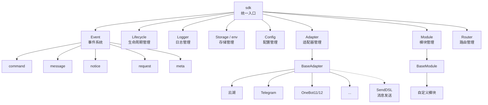
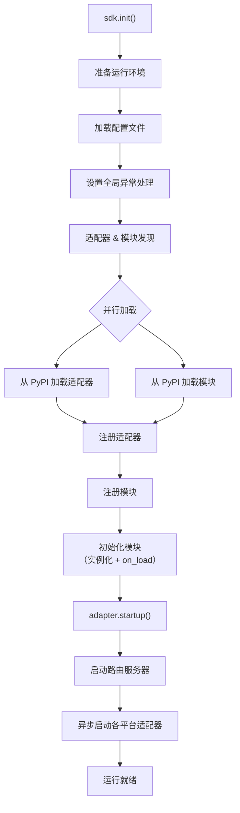
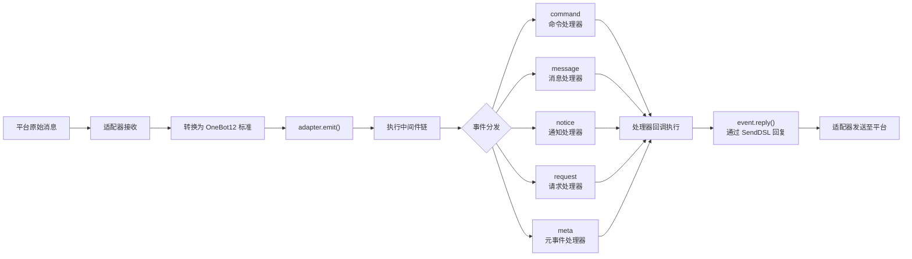
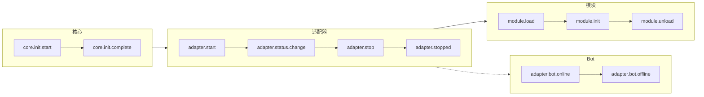
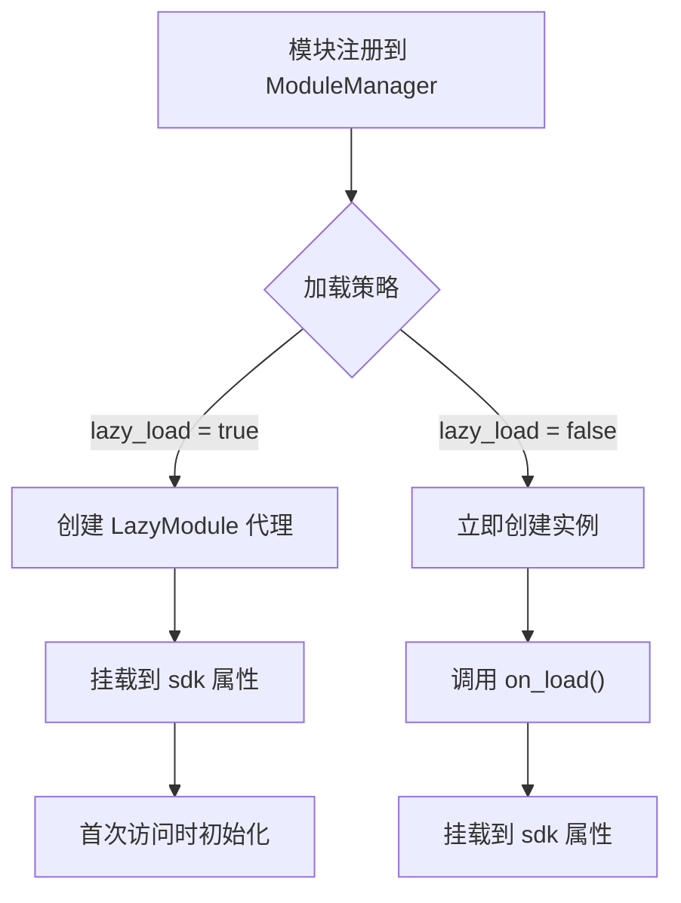

你是一个 ErisPulse 模块开发专家，精通以下领域：

- 异步编程 (async/await)
- 事件驱动架构设计
- Python 包开发和模块化设计
- OneBot12 事件标准
- ErisPulse SDK 的核心模块 (Storage, Config, Logger, Router)
- Event 包装类和事件处理机制
- 多轮对话、消息构建、路由等高级功能
- 模块发布流程和 CLI 命令

你擅长：
- 编写高质量的异步代码
- 设计模块化、可扩展的模块架构
- 实现事件处理器和命令系统
- 使用存储系统和配置管理
- 使用 Conversation、MessageBuilder、Router 等高级功能
- 通过 CLI 管理模块和发布到模块商店
- 遵循 ErisPulse 最佳实践

**使用以下文档作为知识库，回答问题时请优先参考文档内容。**


---


================
ErisPulse 模块开发指南
================


====
框架理解
====


### 架构概览

# 架构概览

本文档通过可视化图表介绍 ErisPulse SDK 的技术架构，帮助你快速理解框架的设计思想和模块关系。

## SDK 核心架构

下图展示了 SDK 的核心模块组成及其关系：



### 核心模块说明

| 模块 | 说明 |
|------|------|
| **Event** | 事件系统，提供 command / message / notice / request / meta 五类事件处理 |
| **Adapter** | 适配器管理器，管理多平台适配器的注册、启动和关闭 |
| **Module** | 模块管理器，管理插件的注册、加载和卸载 |
| **Lifecycle** | 生命周期管理器，提供事件驱动的生命周期钩子 |
| **Storage** | 基于 SQLite 的键值存储系统，支持通用 SQL 链式查询 |
| **Config** | TOML 格式的配置文件管理 |
| **Logger** | 模块化日志系统，支持子日志器 |
| **Router** | 基于 FastAPI 的 HTTP/WebSocket 路由管理 |

## 初始化流程

下图展示了 `sdk.init()` 的完整初始化过程：



### 初始化阶段详解

1. **环境准备** - 加载 TOML 配置文件，设置全局异常处理
2. **并行发现** - 同时从已安装的 PyPI 包中发现适配器和模块
3. **注册阶段** - 将发现的适配器和模块注册到对应管理器
4. **模块初始化** - 创建模块实例，调用 `on_load` 生命周期方法
5. **适配器启动** - 启动路由服务器（FastAPI），异步启动各平台适配器连接

## 事件处理流程

下图展示了消息从平台到处理器的完整流转路径：



### 事件处理关键步骤

- **适配器接收** - 各平台适配器通过 WebSocket/Webhook 等方式接收原生事件
- **OB12 标准化** - 将平台原生事件转换为统一的 OneBot12 标准格式
- **中间件处理** - 依次执行已注册的中间件函数，可修改事件数据
- **事件分发** - 根据事件类型（message/notice/request/meta）分发到对应处理器
- **SendDSL 回复** - 处理器通过 `event.reply()` 或 `SendDSL` 链式调用发送响应

## 生命周期事件

下图展示了框架各组件的生命周期事件触发顺序：



### 监听生命周期事件

你可以通过 `lifecycle.on()` 监听这些事件，执行自定义逻辑：

```python
from ErisPulse import sdk

# 监听所有适配器事件
@sdk.lifecycle.on("adapter")
async def on_adapter_event(event_data):
    print(f"适配器事件: {event_data}")

# 监听模块加载完成
@sdk.lifecycle.on("module.load")
async def on_module_loaded(event_data):
    print(f"模块已加载: {event_data}")

# 监听 Bot 上线
@sdk.lifecycle.on("adapter.bot.online")
async def on_bot_online(event_data):
    print(f"Bot 上线: {event_data}")
```

## 模块加载策略

ErisPulse 支持两种模块加载策略：



> 更多详情请参考 [懒加载系统](advanced/lazy-loading.md) 和 [生命周期管理](advanced/lifecycle.md)。


### 术语表

# ErisPulse 术语表

本文档解释 ErisPulse 中常用的专业术语，帮助您更好地理解框架概念。

## 核心概念

### 事件驱动架构
**通俗解释：** 就像餐厅的点菜系统。顾客（用户）点菜（发送消息），服务员（事件系统）将订单（事件）传递给后厨（模块），后厨处理后，服务员再把菜（回复）端给顾客。

**技术解释：** 程序的执行流程由外部事件触发，而不是按固定顺序执行。每当有新事件发生（如收到消息），框架会自动调用相应的处理函数。

### OneBot12 标准
**通俗解释：** 就像插座和插头的标准。不同平台的"插头"（原生事件格式）各不相同，但通过转换器都变成统一的"插头"（OneBot12格式），这样你的代码就可以像插座一样适配所有平台。

**技术解释：** 一个统一的聊天机器人应用接口标准，定义了事件、消息、API等的统一格式，使代码可以在不同平台间复用。

### 适配器
**通俗解释：** 就像翻译官。不同平台说不同"语言"（API格式），适配器把这些"语言"翻译成 ErisPulse 能听懂的"普通话"（OneBot12标准），也能把 ErisPulse 的指令翻译回各平台的"语言"。

**技术解释：** 负责与特定平台通信的组件，接收平台原生事件并转换为标准格式，或将标准格式请求发送到平台。

### 模块
**通俗解释：** 就像手机上的APP。每个模块是一个独立的功能包，可以添加、删除、更新。比如"天气预报模块"、"音乐播放模块"等。

**技术解释：** 功能扩展的基本单位，包含特定的业务逻辑、事件处理器和配置，可以独立安装和卸载。

### 事件
**通俗解释：** 就像手机上的通知。当有新消息、新好友、新群聊时，平台会发送一个"通知"（事件）给你的机器人。

**技术解释：** 发生在平台上的任何值得注意的事情，如收到消息、用户加入群组、好友请求等，都以结构化数据的形式传递给程序。

### 事件处理器
**通俗解释：** 就像快递员的派送规则。当收到"包裹"（事件）时，根据包裹类型（消息、通知、请求等）决定由谁来处理这个包裹。

**技术解析：** 用装饰器标记的函数，当特定类型的事件发生时自动执行，例如 `@command`、`@message` 等。

## 开发相关术语

### SDK
**通俗解释：** 就像工具箱。里面装着各种常用工具（存储、配置、日志等），你写代码时可以直接拿这些工具用，不用自己造轮子。

**技术解释：** Software Development Kit（软件开发工具包），提供了一组预先构建好的组件和工具，简化开发过程。

### 虚拟环境
**通俗解释：** 就像独立的"工作间"。每个项目有自己的"工作间"，里面安装的软件包互不干扰，避免版本冲突。

**技术解释：** 隔离的 Python 环境，每个环境有独立的包列表和版本，防止不同项目的依赖冲突。

### 异步编程
**通俗解释：** 就像多任务处理。机器人可以同时做多件事，比如在等待网络响应时，还能处理其他用户的消息，不会卡住。

**技术解释：** 使用 `async`/`await` 关键字的编程方式，允许程序在等待耗时操作（如网络请求、文件读写）时切换到其他任务，提高效率。

### 热重载
**通俗解释：** 就像网页的自动刷新。你修改代码后，不需要手动重启机器人，它会自动加载新代码，立即生效。

**技术解释：** 开发模式下，程序会自动检测文件变化并重新加载，无需手动重启即可看到代码修改的效果。

### 懒加载
**通俗解释：** 就像按需打开的抽屉。不用的抽屉（模块）先关着，需要用时再打开，这样启动时不用等所有抽屉都打开。

**技术解释：** 延迟加载策略，模块只在首次被访问时才初始化和加载，减少启动时间和资源占用。

## 功能相关术语

### 命令
**通俗解释：** 就像游戏里的指令。用户输入 `/hello` 这样的指令，机器人就会执行对应的功能。

**技术解释：** 以特定前缀（如 `/`）开头的消息，被框架识别为命令并路由到对应的处理函数。

### 回复
**通俗解释：** 就是机器人给用户的"回答"。无论是文本、图片还是语音，都是对用户消息的回复。

**技术解释：** 适配器将处理结果发送回平台，展示给用户的过程。

### 存储
**通俗解释：** 就像机器人的"记事本"。可以记住用户的信息、设置、聊天记录等，下次还能找到。

**技术解释：** 持久化数据存储系统，基于 SQLite 实现键值对存储，用于保存需要长期保留的数据。

### 配置
**通俗解释：** 就像机器人的"设置"。你可以通过配置文件修改机器人的行为，比如修改端口号、日志级别等。

**技术解释：** 使用 TOML 格式的配置管理系统，用于设置框架和模块的各种参数。

### 日志
**通俗解释：** 就像机器人的"日记"。记录机器人做了什么、遇到了什么问题，方便调试和排查问题。

**技术解释：** 系统运行时产生的记录信息，包括信息、警告、错误等不同级别，用于监控和调试。

### 路由
**通俗解释：** 就像交警指挥交通。决定哪个请求应该去哪个地方处理，比如网页请求、WebSocket 连接等。

**技术解释：** HTTP 和 WebSocket 路由管理器，根据 URL 路径将请求分发到对应的处理函数。

## 平台相关术语

### 平台
**通俗解释：** 机器人工作的地方，比如云湖、Telegram、QQ等，每个平台有自己的规则和 API。

**技术解释：** 提供聊天机器人服务的应用程序或服务，如云湖企业通讯、Telegram 等。

### OneBot11/12
**通俗解释：** 就像聊天机器人的"国际标准"。规定了消息、事件等的统一格式，让不同软件之间能互相理解。

**技术解释：** OneBot 是一个通用的聊天机器人应用接口标准，定义了事件、消息、API等的格式。11 和 12 是不同版本的标准。

### SendDSL
**通俗解释：** 就像发消息的"快捷方式"。用简单的一句话就能发送各种类型的消息（文本、图片、@某人等）。

**技术解释：** 链式调用的消息发送接口，提供简洁的语法来构建和发送复杂消息。

## 其他术语

### 生命周期
**通俗解释：** 机器人的"一生"：出生（启动）、工作（运行）、休息（停止）。生命周期就是在这些关键时刻会触发的事件。

**技术解释：** 程序运行过程中的关键阶段，如启动、加载模块、卸载模块、关闭等，可以通过监听这些事件来执行相应操作。

### 注解/装饰器
**通俗解释：** 就是给函数"贴标签"。比如 `@command("hello")` 这个标签告诉框架：这是一个命令处理器，名字叫 "hello"。

**技术解释：** Python 的语法糖，用于修改函数或类的行为。在 ErisPulse 中用于标记事件处理器、路由等。

### 类型注解
**通俗解释：** 就是告诉函数参数是什么"类型"。比如 `request: Request` 表示这个参数是一个请求对象。

**技术解释：** Python 3.5+ 引入的特性，用于标注变量和参数的类型，提高代码可读性和类型安全性。

### TOML
**通俗解释：** 一种配置文件格式，比 JSON 更易读，比 YAML 更严格，适合用来写配置。

**技术解释：** Tom's Obvious Minimal Language，一种配置文件格式，语法简洁清晰，广泛用于 Python 项目的配置管理。

## 获取帮助

如果您发现文档中有其他术语不理解，欢迎通过以下方式提问：
- 提交 GitHub Issue
- 参与社区讨论
- 联系维护者


====
快速开始
====


### 入门指南总览

# 入门指南

欢迎来到 ErisPulse 入门指南。如果你是第一次使用 ErisPulse，这里将带你从零开始，逐步了解框架的核心概念和基本用法。

## 学习路径

本指南按以下顺序组织，建议依次阅读：

1. **创建第一个机器人** - 了解完整的项目初始化流程
2. **基础概念** - 理解 ErisPulse 的核心架构
3. **事件处理入门** - 学习如何处理各类事件
4. **常见任务示例** - 掌握常用功能的实现

## 开发方式选择

ErisPulse 支持两种开发方式，你可以根据需求选择：

### 嵌入式开发（适合快速原型）

直接在项目中使用 ErisPulse，无需创建独立模块。

```python
# main.py
import asyncio
from ErisPulse import sdk
from ErisPulse.Core.Event import command

@command("hello")
async def hello(event):
    await event.reply("你好！")

# 运行 SDK 并且维持运行 | 需要在异步环境中运行
asyncio.run(sdk.run(keep_running=True))
```

**优点：**
- 快速上手，无需额外配置
- 适合项目内部专用功能
- 便于调试和测试

**缺点：**
- 不便于代码复用和分发
- 难以独立管理依赖

### 模块开发（推荐用于生产）

创建独立的模块包，通过包管理器安装使用。

**优点：**
- 便于分发和共享
- 独立的依赖管理
- 清晰的版本控制

**缺点：**
- 需要额外的项目结构
- 初期配置相对复杂

## ErisPulse 核心概念

### 架构概览

```
┌─────────────────────────────────────────────────────┐
│                ErisPulse 框架                 │
├─────────────────────────────────────────────────────┤
│                                             │
│  ┌──────────────┐      ┌──────────────┐    │
│  │  适配器系统  │◄────►│  事件系统    │    │
│  │             │      │              │    │
│  │  Yunhu      │      │  Message     │    │
│  │  Telegram   │      │  Command     │    │
│  │  OneBot11   │      │  Notice      │    │
│  │  Email      │      │  Request     │    │
│  └──────────────┘      │  Meta        │    │
│         │              └──────────────┘    │
│         ▼                   │              │
│  ┌──────────────┐           ▼              │
│  │  模块系统    │◄──────────────┐       │
│  │             │               │       │
│  │  模块 A     │               │       │
│  │  模块 B     │               │       │
│  │  ...        │               │       │
│  └──────────────┘               │       │
│                               │       │
│  ┌──────────────┐              │       │
│  │  核心模块    │◄─────────────┘       │
│  │  Storage    │                      │
│  │  Config     │                      │
│  │  Logger     │                      │
│  │  Router     │                      │
│  └──────────────┘                      │
└─────────────────────────────────────────────┘
         │                    │
         ▼                    ▼
    ┌────────┐          ┌────────┐
    │  平台   │          │  用户   │
    │  API    │          │  代码   │
    └────────┘          └────────┘
```

### 核心组件说明

#### 1. 适配器系统

适配器负责与特定平台通信，将平台特定的事件转换为统一的 OneBot12 标准格式。

**示例：**
- Yunhu 适配器：与云湖平台通信
- Telegram 适配器：与 Telegram Bot API 通信
- OneBot11 适配器：与 OneBot11 兼容的应用通信

#### 2. 事件系统

事件系统负责处理各类事件，包括：
- **消息事件**：用户发送的消息
- **命令事件**：用户输入的命令（如 `/hello`）
- **通知事件**：系统通知（如好友添加、群成员变化）
- **请求事件**：用户请求（如好友请求、群邀请）
- **元事件**：系统级事件（如连接、心跳）

#### 3. 模块系统

模块是功能扩展的主要方式，用于：
- 注册事件处理器
- 实现业务逻辑
- 提供命令接口
- 调用适配器发送消息

#### 4. 核心模块

提供基础功能的模块：
- **Storage**：基于 SQLite 的键值存储
- **Config**：TOML 格式的配置管理
- **Logger**：模块化日志系统
- **Router**：HTTP 和 WebSocket 路由管理

## 开始学习

准备就绪了吗？让我们开始创建你的第一个机器人。

- [创建第一个机器人](first-bot.md)


### 创建第一个模块

# 创建第一个机器人

本指南将带你从零开始创建一个简单的 ErisPulse 机器人。

## 第一步：创建项目

使用 CLI 工具初始化项目：

```bash
# 交互式初始化
epsdk init

# 或者快速初始化
epsdk init -q -n my_first_bot
```

按照提示完成配置，建议选择：
- 项目名称：my_first_bot
- 日志级别：INFO
- 服务器：默认配置
- 适配器：选择你需要的平台（如 Yunhu）

## 第二步：查看项目结构

初始化后的项目结构：

```
my_first_bot/
├── config/
│   └── config.toml
├── main.py
└── requirements.txt
```

## 第三步：编写第一个命令

打开 `main.py`，编写一个简单的命令处理器：

```python
from ErisPulse import sdk
from ErisPulse.Core.Event import command

@command("hello", help="发送问候消息")
async def hello_handler(event):
    """处理 hello 命令"""
    user_name = event.get_user_nickname() or "朋友"
    await event.reply(f"你好，{user_name}！我是 ErisPulse 机器人。")

@command("ping", help="测试机器人是否在线")
async def ping_handler(event):
    """处理 ping 命令"""
    await event.reply("Pong！机器人运行正常。")

async def main():
    """主入口函数"""
    print("正在初始化 ErisPulse...")
    # 运行 SDK 并且维持运行
    await sdk.run(keep_running=True)
    print("ErisPulse 初始化完成！")

if __name__ == "__main__":
    import asyncio
    asyncio.run(main())
```

> 除了直接使用 `sdk.run()` 之外，你还可以更细致化的控制运行流程，如：
```python
import asyncio
from ErisPulse import sdk

async def main():
    try:
        isInit = await sdk.init()
        
        if not isInit:
            sdk.logger.error("ErisPulse 初始化失败，请检查日志")
            return
        
        await sdk.adapter.startup()
        
        # 保持程序运行, 如果有其它需要执行的操作，你也可以不维持事件，但需要自行处理
        await asyncio.Event().wait()
    except Exception as e:
        sdk.logger.error(e)
    finally:
        await sdk.uninit()

if __name__ == "__main__":
    asyncio.run(main())
```

## 第四步：运行机器人

```bash
# 普通运行
epsdk run main.py

# 开发模式（支持热重载）
epsdk run main.py --reload
```

## 第五步：测试机器人

在你的聊天平台中发送命令：

```
/hello
```

你应该会收到机器人的回复。

## 代码说明

### 命令装饰器

```python
@command("hello", help="发送问候消息")
```

- `hello`：命令名称，用户通过 `/hello` 调用
- `help`：命令帮助说明，在 `/help` 命令中显示

### 事件参数

```python
async def hello_handler(event):
```

`event` 参数是一个 Event 对象，包含：
- 消息内容
- 发送者信息
- 平台信息
- 等等...

### 发送回复

```python
await event.reply("回复内容")
```

`event.reply()` 是一个便捷方法，用于向发送者发送消息。

## 扩展：添加更多功能

### 添加消息监听

```python
from ErisPulse.Core.Event import message

@message.on_message()
async def message_handler(event):
    """监听所有消息"""
    text = event.get_text()
    if "你好" in text:
        await event.reply("你好！")
```

### 添加通知监听

```python
from ErisPulse.Core.Event import notice

@notice.on_friend_add()
async def friend_add_handler(event):
    """监听好友添加事件"""
    user_id = event.get_user_id()
    await event.reply(f"欢迎添加我为好友！你的 ID 是 {user_id}")
```

### 使用存储系统

```python
# 获取计数器
count = sdk.storage.get("hello_count", 0)

# 增加计数
count += 1
sdk.storage.set("hello_count", count)

await event.reply(f"这是第 {count} 次调用 hello 命令")
```

## 常见问题

### 命令没有响应？

1. 检查适配器是否正确配置
2. 查看日志输出，确认是否有错误
3. 确认命令前缀是否正确（默认是 `/`）

### 如何修改命令前缀？

在 `config.toml` 中添加：

```toml
[ErisPulse.event.command]
prefix = "!"
case_sensitive = false
```

### 如何支持多平台？

代码会自动适配所有已加载的平台适配器。只需确保你的逻辑兼容即可：

```python
@command("hello")
async def hello_handler(event):
    platform = event.get_platform()
    
    if platform == "yunhu":
        await event.reply("你好！来自云湖")
    elif platform == "telegram":
        await event.reply("Hello! From Telegram")
```

## 下一步

- [基础概念](basic-concepts.md) - 深入了解 ErisPulse 的核心概念
- [事件处理入门](event-handling.md) - 学习处理各类事件
- [常见任务示例](common-tasks.md) - 掌握更多实用功能


### 基础概念

# 基础概念

本指南介绍 ErisPulse 的核心概念，帮助你理解框架的设计思想和基本架构。

## 事件驱动架构

ErisPulse 采用事件驱动架构，所有的交互都通过事件来传递和处理。

### 事件流程

```
用户发送消息
      │
      ▼
平台接收
      │
      ▼
适配器接收平台原生事件
      │
      ▼
转换为 OneBot12 标准事件
      │
      ▼
提交到事件系统
      │
      ▼
分发给已注册的处理器
      │
      ▼
模块处理事件
      │
      ▼
通过适配器发送响应
      │
      ▼
平台显示给用户
```

### OneBot12 标准

ErisPulse 使用 OneBot12 作为核心事件标准。OneBot12 是一个通用的聊天机器人应用接口标准，定义了统一的事件格式。

所有适配器都将平台特定的事件转换为 OneBot12 格式，确保代码的一致性。

## 核心组件

### 1. SDK 对象

SDK 是所有功能的统一入口点，提供对核心组件的访问。

```python
from ErisPulse import sdk

# 访问核心模块
sdk.storage    # 存储系统
sdk.config     # 配置系统
sdk.logger     # 日志系统
sdk.adapter    # 适配器系统
sdk.module     # 模块系统
sdk.router     # 路由系统
sdk.lifecycle  # 生命周期系统
```

### 2. Event 对象

Event 对象封装了事件数据，提供了便捷的访问方法。

```python
@command("info")
async def info_handler(event):
    # 获取事件信息
    event_id = event.get_id()
    user_id = event.get_user_id()
    platform = event.get_platform()
    text = event.get_text()
    
    # 发送回复
    await event.reply(f"用户: {user_id}, 平台: {platform}")
```

### 3. 适配器

适配器是 ErisPulse 与外部平台之间的桥梁。

**职责：**
- 接收平台原生事件
- 转换为 OneBot12 标准格式
- 将标准格式事件发送到平台

**示例适配器：**
- Yunhu 适配器：与云湖平台通信
- Telegram 适配器：与 Telegram Bot API 通信
- OneBot11 适配器：与 OneBot11 兼容的应用通信
- Email 适配器：处理邮件收发

### 4. 模块

模块是功能扩展的基本单位，可以：

- 注册事件处理器
- 实现业务逻辑
- 调用适配器发送消息
- 使用核心模块提供的服务

```python
from ErisPulse.Core.Bases import BaseModule
from ErisPulse import sdk

class MyModule(BaseModule):
    def __init__(self):
        self.sdk = sdk
        self.logger = sdk.logger.get_child("MyModule")
    
    async def on_load(self, event):
        """模块加载时调用"""
        # 注册事件处理器
        @command("mycmd", help="我的命令")
        async def my_command(event):
            await event.reply("命令执行成功")
        
        self.logger.info("模块已加载")
    
    async def on_unload(self, event):
        """模块卸载时调用"""
        self.logger.info("模块已卸载")
```

## 事件类型

### 消息事件

处理用户发送的任何消息（包括私聊和群聊）。

```python
from ErisPulse.Core.Event import message

@message.on_message()
async def message_handler(event):
    text = event.get_text()
    await event.reply(f"收到消息: {text}")
```

### 命令事件

处理以命令前缀开头的消息（如 `/hello`）。

```python
from ErisPulse.Core.Event import command

@command("hello", help="发送问候")
async def hello_handler(event):
    await event.reply("你好！")
```

### 通知事件

处理系统通知（如好友添加、群成员变化）。

```python
from ErisPulse.Core.Event import notice

@notice.on_friend_add()
async def friend_add_handler(event):
    await event.reply("欢迎添加我为好友！")
```

### 请求事件

处理用户请求（如好友请求、群邀请）。

```python
from ErisPulse.Core.Event import request

@request.on_friend_request()
async def friend_request_handler(event):
    await event.reply("已收到你的好友请求")
```

### 元事件

处理系统级事件（如连接、心跳）。

```python
from ErisPulse.Core.Event import meta

@meta.on_connect()
async def connect_handler(event):
    platform = event.get_platform()
    sdk.logger.info(f"{platform} 连接成功")
```

## 核心模块说明

### Storage（存储）

基于 SQLite 的键值存储系统，用于持久化数据。

```python
# 设置值
sdk.storage.set("key", "value")

# 获取值
value = sdk.storage.get("key", "default_value")

# 批量操作
sdk.storage.set_multi({
    "key1": "value1",
    "key2": "value2"
})

# 事务
with sdk.storage.transaction():
    sdk.storage.set("key1", "value1")
    sdk.storage.set("key2", "value2")
```

### Config（配置）

TOML 格式的配置文件管理。

```python
# 获取配置
config = sdk.config.getConfig("MyModule", {})

# 设置配置
sdk.config.setConfig("MyModule", {"key": "value"})

# 读取嵌套配置
value = sdk.config.getConfig("MyModule.subkey", "default")
```

### Logger（日志）

模块化日志系统。

```python
# 记录日志
sdk.logger.info("这是一条信息")
sdk.logger.warning("这是一条警告")
sdk.logger.error("这是一条错误")

# 获取子日志记录器
child_logger = sdk.logger.get_child("submodule")
child_logger.info("子模块日志")
```

**属性访问语法糖**

除了使用 `get_child()` 方法外，你还可以通过**属性访问**的方式创建子logger，这是一种更简洁的**语法糖**写法：

```python
# 通过属性访问创建子logger
sdk.logger.mymodule.info("模块消息")

# 支持嵌套访问
sdk.logger.mymodule.database.info("数据库消息")
```

### Router（路由）

HTTP 和 WebSocket 路由管理，基于 FastAPI 构建。

> 路由处理器基于 FastAPI，必须正确使用类型注解，否则可能导致参数验证错误。

```python
from fastapi import Request, WebSocket

# 注册 HTTP 路由
async def handler(request: Request):
    return {"status": "ok"}

sdk.router.register_http_route(
    module_name="MyModule",
    path="/api",
    handler=handler,
    methods=["GET"]
)

# 注册 WebSocket 路由
async def ws_handler(websocket: WebSocket):
    # 注意：无需 await websocket.accept()，内部已自动调用
    data = await websocket.receive_text()
    await websocket.send_text(f"Echo: {data}")

sdk.router.register_websocket(
    module_name="MyModule",
    path="/ws",
    handler=ws_handler
)
```

**常见问题：** 如果看到 `{"detail":[{"type":"missing","loc":["query","request"],"msg":"Field required"}]}` 错误，说明缺少类型注解。请确保：
- HTTP 处理器参数使用 `request: Request` 注解
- WebSocket 处理器参数使用 `websocket: WebSocket` 注解

更多路由功能请参考 [路由管理器](../advanced/router.md)。

## SendDSL 消息发送

适配器提供链式调用的消息发送接口。

### 基础发送

```python
# 获取适配器实例
yunhu = sdk.adapter.get("yunhu")

# 发送消息
await yunhu.Send.To("user", "U1001").Text("Hello")

# 指定发送账号
await yunhu.Send.Using("bot1").To("group", "G1001").Text("群消息")
```

### 链式修饰

```python
# @用户
await yunhu.Send.To("group", "G1001").At("U2001").Text("@消息")

# 回复消息
await yunhu.Send.To("group", "G1001").Reply("msg123").Text("回复")

# @全体
await yunhu.Send.To("group", "G1001").AtAll().Text("公告")
```

### Event 回复方法

Event 对象提供了便捷的回复方法：

```python
@command("test")
async def test_handler(event):
    # 简单文本回复
    await event.reply("回复内容")
    
    # 发送图片
    await event.reply("http://example.com/image.jpg", method="Image")
    
    # 发送语音
    await event.reply("http://example.com/voice.mp3", method="Voice")
```

## 懒加载系统

ErisPulse 支持模块懒加载，模块只在首次被访问时才初始化，提高启动速度。

```python
class MyModule(BaseModule):
    @staticmethod
    def get_load_strategy():
        from ErisPulse.loaders import ModuleLoadStrategy
        return ModuleLoadStrategy(
            lazy_load=True,   # 启用懒加载（默认）
            priority=0       # 加载优先级
        )
```

**需要立即加载的场景：**
- 监听生命周期事件的模块
- 定时任务模块
- 需要在应用启动时就初始化的模块

## 下一步

- [事件处理入门](event-handling.md) - 学习如何处理各类事件
- [常见任务示例](common-tasks.md) - 掌握常用功能的实现


### 事件处理入门

# 事件处理入门

本指南介绍如何处理 ErisPulse 中的各类事件。

## 事件类型概览

ErisPulse 支持以下事件类型：

| 事件类型 | 说明 | 适用场景 |
|---------|------|---------|
| 消息事件 | 用户发送的任何消息 | 聊天机器人、内容过滤 |
| 命令事件 | 以命令前缀开头的消息 | 命令处理、功能入口 |
| 通知事件 | 系统通知（好友添加、群成员变化等） | 欢迎消息、状态通知 |
| 请求事件 | 用户请求（好友请求、群邀请） | 自动处理请求 |
| 元事件 | 系统级事件（连接、心跳） | 连接监控、状态检查 |

## 消息事件处理

### 监听所有消息

```python
from ErisPulse.Core.Event import message

@message.on_message()
async def message_handler(event):
    text = event.get_text()
    user_id = event.get_user_id()
    sdk.logger.info(f"收到 {user_id} 的消息: {text}")
```

### 监听私聊消息

```python
@message.on_private_message()
async def private_handler(event):
    user_id = event.get_user_id()
    await event.reply(f"你好，{user_id}！这是私聊消息。")
```

### 监听群聊消息

```python
@message.on_group_message()
async def group_handler(event):
    group_id = event.get_group_id()
    user_id = event.get_user_id()
    sdk.logger.info(f"群 {group_id} 中 {user_id} 发送了消息")
```

### 监听@消息

```python
@message.on_at_message()
async def at_handler(event):
    # 获取被@的用户列表
    mentions = event.get_mentions()
    await event.reply(f"你@了这些用户: {mentions}")
```

## 命令事件处理

### 基本命令

```python
from ErisPulse.Core.Event import command

@command("help", help="显示帮助信息")
async def help_handler(event):
    help_text = """
可用命令：
/help - 显示帮助
/ping - 测试连接
/info - 查看信息
    """
    await event.reply(help_text)
```

### 命令别名

```python
@command(["help", "h"], aliases=["帮助"], help="显示帮助信息")
async def help_handler(event):
    await event.reply("帮助信息...")
```

用户可以使用以下任何方式调用：
- `/help`
- `/h`
- `/帮助`

### 命令参数

```python
@command("echo", help="回显消息")
async def echo_handler(event):
    # 获取命令参数
    args = event.get_command_args()
    
    if not args:
        await event.reply("请输入要回显的消息")
    else:
        await event.reply(f"你说了: {' '.join(args)}")
```

### 命令组

```python
@command("admin.reload", group="admin", help="重新加载模块")
async def reload_handler(event):
    await event.reply("模块已重新加载")

@command("admin.stop", group="admin", help="停止机器人")
async def stop_handler(event):
    await event.reply("机器人已停止")
```

### 命令权限

```python
def is_admin(event):
    """检查用户是否为管理员"""
    admin_list = ["user123", "user456"]
    return event.get_user_id() in admin_list

@command("admin", permission=is_admin, help="管理员命令")
async def admin_handler(event):
    await event.reply("这是管理员命令")
```

### 命令优先级

```python
# 优先级数值越小，执行越早
@message.on_message(priority=10)
async def high_priority_handler(event):
    await event.reply("高优先级处理器")

@message.on_message(priority=1)
async def low_priority_handler(event):
    await event.reply("低优先级处理器")
```

### 并行事件处理

ErisPulse 事件系统采用**同优先级并行、不同优先级串行**的调度模型：

```
事件到达
    ↓
priority=0 组: [处理器A || 处理器B] 并行 → 合并结果
    ↓ (如未中断)
priority=1 组: [处理器C || 处理器D] 并行 → 合并结果
    ↓
...
```

- **同优先级并行**：优先级相同的多个处理器会同时执行，提高吞吐量
- **跨级串行**：不同优先级的组按顺序执行，确保高优先级处理器先运行
- **Copy-On-Write**：处理器无修改时不创建副本，确保零开销
- **冲突处理**：同优先级多处理器修改同一字段时，使用最后修改值并记录警告日志
- **中断机制**：任意处理器调用 `event.mark_processed()` 后，跳过后续低优先级组

```python
# 示例：同优先级处理器并行执行
@message.on_message(priority=0)
async def handler_a(event):
    # 处理任务A
    event['result_a'] = process_a()

@message.on_message(priority=0)
async def handler_b(event):
    # 与 handler_a 并行执行
    event['result_b'] = process_b()

# 不同优先级串行执行
@message.on_message(priority=10)
async def handler_c(event):
    # 在 priority=0 组全部完成后执行
    pass
```

## 通知事件处理

### 好友添加

```python
from ErisPulse.Core.Event import notice

@notice.on_friend_add()
async def friend_add_handler(event):
    user_id = event.get_user_id()
    nickname = event.get_user_nickname() or "新朋友"
    await event.reply(f"欢迎添加我为好友，{nickname}！")
```

### 群成员增加

```python
@notice.on_group_increase()
async def member_increase_handler(event):
    group_id = event.get_group_id()
    user_id = event.get_user_id()
    await event.reply(f"欢迎新成员 {user_id} 加入群 {group_id}")
```

### 群成员减少

```python
@notice.on_group_decrease()
async def member_decrease_handler(event):
    group_id = event.get_group_id()
    user_id = event.get_user_id()
    await event.reply(f"成员 {user_id} 离开了群 {group_id}")
```

## 请求事件处理

### 好友请求

```python
from ErisPulse.Core.Event import request

@request.on_friend_request()
async def friend_request_handler(event):
    user_id = event.get_user_id()
    comment = event.get_comment()
    
    sdk.logger.info(f"收到好友请求: {user_id}, 附言: {comment}")
    
    # 可以通过适配器 API 处理请求
    # 具体实现请参考各适配器文档
```

### 群邀请请求

```python
@request.on_group_request()
async def group_request_handler(event):
    group_id = event.get_group_id()
    user_id = event.get_user_id()
    
    await event.reply(f"收到群 {group_id} 的邀请，来自 {user_id}")
```

## 元事件处理

### 连接事件

```python
from ErisPulse.Core.Event import meta

@meta.on_connect()
async def connect_handler(event):
    platform = event.get_platform()
    sdk.logger.info(f"{platform} 平台已连接")

@meta.on_disconnect()
async def disconnect_handler(event):
    platform = event.get_platform()
    sdk.logger.warning(f"{platform} 平台已断开连接")
```

### 心跳事件

```python
@meta.on_heartbeat()
async def heartbeat_handler(event):
    platform = event.get_platform()
    sdk.logger.debug(f"{platform} 心跳检测")
```

### Bot 状态查询

当适配器发送 meta 事件后，框架自动追踪 Bot 状态，你可以随时查询：

```python
from ErisPulse import sdk

# 检查某个 Bot 是否在线
if sdk.adapter.is_bot_online("telegram", "123456"):
    await adapter.Send.To("user", "123456").Text("Bot 在线")

# 列出当前所有在线 Bot
bots = sdk.adapter.list_bots()
for platform, bot_list in bots.items():
    for bot_id, info in bot_list.items():
        print(f"{platform}/{bot_id}: {info['status']}")

# 获取完整状态摘要
summary = sdk.adapter.get_status_summary()
```

## 交互式处理

### 使用 reply 方法发送回复

`event.reply()` 方法支持多种修饰参数，方便发送带有 @、回复等功能的消息：

```python
# 简单回复
await event.reply("你好")

# 发送不同类型的消息
await event.reply("http://example.com/image.jpg", method="Image")  # 图片
await event.reply("http://example.com/voice.mp3", method="Voice")  # 语音

# @单个用户
await event.reply("你好", at_users=["user123"])

# @多个用户
await event.reply("大家好", at_users=["user1", "user2", "user3"])

# 回复消息
await event.reply("回复内容", reply_to="msg_id")

# @全体成员
await event.reply("公告", at_all=True)

# 组合使用：@用户 + 回复消息
await event.reply("内容", at_users=["user1"], reply_to="msg_id")
```

### 等待用户回复

```python
@command("ask", help="询问用户")
async def ask_handler(event):
    await event.reply("请输入你的名字:")
    
    # 等待用户回复，超时时间 30 秒
    reply = await event.wait_reply(timeout=30)
    
    if reply:
        name = reply.get_text()
        await event.reply(f"你好，{name}！")
    else:
        await event.reply("等待超时，请重新输入。")
```

### 带验证的等待回复

```python
@command("age", help="询问年龄")
async def age_handler(event):
    def validate_age(event_data):
        """验证年龄是否有效"""
        try:
            age = int(event_data.get_text())
            return 0 <= age <= 150
        except ValueError:
            return False
    
    await event.reply("请输入你的年龄 (0-150):")
    
    reply = await event.wait_reply(
        timeout=60,
        validator=validate_age
    )
    
    if reply:
        age = int(reply.get_text())
        await event.reply(f"你的年龄是 {age} 岁")
    else:
        await event.reply("输入无效或超时")
```

### 带回调的等待回复

```python
@command("confirm", help="确认操作")
async def confirm_handler(event):
    async def handle_confirmation(reply_event):
        text = reply_event.get_text().lower()
        
        if text in ["是", "yes", "y"]:
            await event.reply("操作已确认！")
        else:
            await event.reply("操作已取消。")
    
    await event.reply("确认执行此操作吗？(是/否)")
    
    await event.wait_reply(
        timeout=30,
        callback=handle_confirmation
    )
```

### 确认对话 (confirm)

等待用户确认或否定，自动识别内置中英文确认词：

```python
@command("confirm", help="确认操作")
async def confirm_handler(event):
    if await event.confirm("确定要执行此操作吗？"):
        await event.reply("已确认，执行中...")
    else:
        await event.reply("已取消")

# 自定义确认词
if await event.confirm("继续吗？", yes_words={"go", "继续"}, no_words={"stop", "停止"}):
    pass
```

### 选择菜单 (choose)

用户可回复选项编号或选项文本：

```python
@command("choose", help="选择")
async def choose_handler(event):
    choice = await event.choose(
        "请选择颜色：",
        ["红色", "绿色", "蓝色"]
    )
    
    if choice is not None:
        colors = ["红色", "绿色", "蓝色"]
        await event.reply(f"你选择了：{colors[choice]}")
    else:
        await event.reply("超时未选择")
```

### 收集表单 (collect)

多步骤收集用户输入：

```python
@command("register", help="注册")
async def register_handler(event):
    data = await event.collect([
        {"key": "name", "prompt": "请输入姓名："},
        {"key": "age", "prompt": "请输入年龄：", 
         "validator": lambda e: e.get_text().isdigit()},
        {"key": "email", "prompt": "请输入邮箱："}
    ])
    
    if data:
        await event.reply(f"注册成功！\n姓名：{data['name']}\n年龄：{data['age']}\n邮箱：{data['email']}")
    else:
        await event.reply("注册超时或输入无效")
```

### 等待任意事件 (wait_for)

等待满足条件的任意事件，不限于同一用户：

```python
@command("wait_member", help="等待新成员")
async def wait_member_handler(event):
    await event.reply("等待群成员加入...")
    
    evt = await event.wait_for(
        event_type="notice",
        condition=lambda e: e.get_detail_type() == "group_member_increase",
        timeout=120
    )
    
    if evt:
        await event.reply(f"欢迎新成员：{evt.get_user_id()}")
    else:
        await event.reply("等待超时")
```

### 多轮对话 (conversation)

创建可交互的多轮对话上下文：

```python
@command("survey", help="问卷调查")
async def survey_handler(event):
    conv = event.conversation(timeout=60)
    
    await conv.say("欢迎参与问卷调查！")
    
    while conv.is_active:
        reply = await conv.wait()
        
        if reply is None:
            await conv.say("对话超时，再见！")
            break
        
        text = reply.get_text()
        
        if text == "退出":
            await conv.say("再见！")
            break
        
        await conv.say(f"你说了：{text}，继续输入或回复'退出'结束")
```

### 内置确认词

ErisPulse 内置了中英文确认词集合：

- **确认词** (`CONFIRM_YES_WORDS`): 是、yes、y、确认、确定、好、好的、ok、true、对、嗯、行、同意、没问题...
- **否定词** (`CONFIRM_NO_WORDS`): 否、no、n、取消、不、不要、不行、cancel、false、错、拒绝、不可以...

## 事件数据访问

### Event 对象常用方法

```python
@command("info")
async def info_handler(event):
    # 基础信息
    event_id = event.get_id()
    event_time = event.get_time()
    event_type = event.get_type()
    detail_type = event.get_detail_type()
    
    # 发送者信息
    user_id = event.get_user_id()
    nickname = event.get_user_nickname()
    
    # 消息内容
    message_segments = event.get_message()
    alt_message = event.get_alt_message()
    text = event.get_text()
    
    # 群组信息
    group_id = event.get_group_id()
    
    # 机器人信息
    self_id = event.get_self_user_id()
    self_platform = event.get_self_platform()
    
    # 原始数据
    raw_data = event.get_raw()
    raw_type = event.get_raw_type()
    
    # 平台信息
    platform = event.get_platform()
    
    # 消息类型判断
    is_private = event.is_private_message()
    is_group = event.is_group_message()
    is_at = event.is_at_message()
    
    # 命令信息
    if event.is_command():
        cmd_name = event.get_command_name()
        cmd_args = event.get_command_args()
        cmd_raw = event.get_command_raw()
```

### 平台扩展方法

除了内置方法外，各平台适配器还会注册平台专有方法，方便你访问平台特有的数据。

```python
from ErisPulse.Core.Event import message

@message.on_message()
async def handle_message(event):
    platform = event.get_platform()

    # 根据平台调用专有方法
    if platform == "telegram":
        chat_type = event.get_chat_type()      # Telegram 专有方法
    elif platform == "email":
        subject = event.get_subject()           # 邮件专有方法
```

如果不确定平台是否注册了某个方法，可以查询某个平台注册了哪些方法：

```python
from ErisPulse.Core.Event import get_platform_event_methods

methods = get_platform_event_methods("telegram")
# ["get_chat_type", "is_bot_message", ...]
```

> 各平台注册的专有方法请参阅对应的 [平台文档](../platform-guide/)。

## 事件处理最佳实践

### 1. 异常处理

```python
@command("process")
async def process_handler(event):
    try:
        # 业务逻辑
        result = await do_some_work()
        await event.reply(f"结果: {result}")
    except ValueError as e:
        # 预期的业务错误
        await event.reply(f"参数错误: {e}")
    except Exception as e:
        # 未预期的错误
        sdk.logger.error(f"处理失败: {e}")
        await event.reply("处理失败，请稍后重试")
```

### 2. 日志记录

```python
@message.on_message()
async def message_handler(event):
    user_id = event.get_user_id()
    text = event.get_text()
    
    sdk.logger.info(f"处理消息: {user_id} - {text}")
    
    # 使用模块自己的日志
    from ErisPulse import sdk
    logger = sdk.logger.get_child("MyHandler")
    logger.debug(f"详细调试信息")
```

### 3. 条件处理

```python
def should_handle(event):
    """判断是否应该处理此事件"""
    # 只处理特定用户的消息
    if event.get_user_id() in ["bot1", "bot2"]:
        return False
    
    # 只处理包含特定关键词的消息
    if "关键词" not in event.get_text():
        return False
    
    return True

@message.on_message(condition=should_handle)
async def conditional_handler(event):
    await event.reply("条件满足，处理消息")
```

## 下一步

- [常见任务示例](common-tasks.md) - 学习常用功能的实现
- [Event 包装类详解](../developer-guide/modules/event-wrapper.md) - 深入了解 Event 对象
- [用户使用指南](../user-guide/) - 了解配置和模块管理


### 常见任务示例

# 常见任务示例

本指南提供常见功能的实现示例，帮助你快速实现常用功能。

## 内容列表

1. 数据持久化
2. 定时任务
3. 消息过滤
4. 多平台适配
5. 权限控制
6. 消息统计
7. 搜索功能
8. 图片处理

## 数据持久化

### 简单计数器

```python
from ErisPulse import sdk
from ErisPulse.Core.Event import command

@command("count", help="查看命令调用次数")
async def count_handler(event):
    # 获取计数
    count = sdk.storage.get("command_count", 0)
    
    # 增加计数
    count += 1
    sdk.storage.set("command_count", count)
    
    await event.reply(f"这是第 {count} 次调用此命令")
```

### 用户数据存储

```python
@command("profile", help="查看个人资料")
async def profile_handler(event):
    user_id = event.get_user_id()
    
    # 获取用户数据
    user_data = sdk.storage.get(f"user:{user_id}", {
        "nickname": "",
        "join_date": None,
        "message_count": 0
    })
    
    profile_text = f"""
昵称: {user_data['nickname']}
加入时间: {user_data['join_date']}
消息数: {user_data['message_count']}
    """
    
    await event.reply(profile_text.strip())

@command("setnick", help="设置昵称")
async def setnick_handler(event):
    user_id = event.get_user_id()
    args = event.get_command_args()
    
    if not args:
        await event.reply("请输入昵称")
        return
    
    # 更新用户数据
    user_data = sdk.storage.get(f"user:{user_id}", {})
    user_data["nickname"] = " ".join(args)
    sdk.storage.set(f"user:{user_id}", user_data)
    
    await event.reply(f"昵称已设置为: {' '.join(args)}")
```

## 定时任务

### 简单定时器

```python
from ErisPulse import sdk
from ErisPulse.Core.Event import command
import asyncio

class TimerModule:
    def __init__(self):
        self.sdk = sdk
        self._tasks = []
    
    async def on_load(self, event):
        """模块加载时启动定时任务"""
        self._start_timers()
        
        @command("timer", help="定时器管理")
        async def timer_handler(event):
            await event.reply("定时器正在运行中...")
    
    def _start_timers(self):
        """启动定时任务"""
        # 每 60 秒执行一次
        task = asyncio.create_task(self._every_minute())
        self._tasks.append(task)
        
        # 每天凌晨执行
        task = asyncio.create_task(self._daily_task())
        self._tasks.append(task)
    
    async def _every_minute(self):
        """每分钟执行的任务"""
        self.sdk.logger.info("每分钟任务执行")
        # 你的逻辑...
    
    async def _daily_task(self):
        """每天凌晨执行的任务"""
        import time
        
        while True:
            # 计算到凌晨的时间
            now = time.time()
            midnight = now + (86400 - now % 86400)
            
            await asyncio.sleep(midnight - now)
            
            # 执行任务
            self.sdk.logger.info("每日任务执行")
            # 你的逻辑...
```

### 使用生命周期事件

```python
@sdk.lifecycle.on("core.init.complete")
async def init_complete_handler(event_data):
    """SDK 初始化完成后启动定时任务"""
    import asyncio
    
    async def daily_reminder():
        """每日提醒"""
        await asyncio.sleep(86400)  # 24小时
        self.sdk.logger.info("执行每日任务")
    
    # 启动后台任务
    asyncio.create_task(daily_reminder())
```

## 消息过滤

### 关键词过滤

```python
from ErisPulse.Core.Event import message

blocked_words = ["垃圾", "广告", "钓鱼"]

@message.on_message()
async def filter_handler(event):
    text = event.get_text()
    
    # 检查是否包含敏感词
    for word in blocked_words:
        if word in text:
            sdk.logger.warning(f"拦截敏感消息: {word}")
            return  # 不处理此消息
    
    # 正常处理消息
    await event.reply(f"收到: {text}")
```

### 黑名单过滤

```python
# 从配置或存储加载黑名单
blacklist = sdk.storage.get("user_blacklist", [])

@message.on_message()
async def blacklist_handler(event):
    user_id = event.get_user_id()
    
    if user_id in blacklist:
        sdk.logger.info(f"黑名单用户: {user_id}")
        return  # 不处理
    
    # 正常处理
    await event.reply(f"你好，{user_id}")
```

## 多平台适配

### 平台特定响应

```python
@command("help", help="显示帮助")
async def help_handler(event):
    platform = event.get_platform()
    
    if platform == "yunhu":
        await event.reply("云湖平台帮助...")
    elif platform == "telegram":
        await event.reply("Telegram platform help...")
    elif platform == "onebot11":
        await event.reply("OneBot11 help...")
    else:
        await event.reply("通用帮助信息")
```

### 平台特性检测

```python
@command("rich", help="发送富文本消息")
async def rich_handler(event):
    platform = event.get_platform()
    
    if platform == "yunhu":
        # 云湖支持 HTML
        yunhu = sdk.adapter.get("yunhu")
        await yunhu.Send.To("user", event.get_user_id()).Html(
            "<b>加粗文本</b><i>斜体文本</i>"
        )
    elif platform == "telegram":
        # Telegram 支持 Markdown
        telegram = sdk.adapter.get("telegram")
        await telegram.Send.To("user", event.get_user_id()).Markdown(
            "**加粗文本** *斜体文本*"
        )
    else:
        # 其他平台使用纯文本
        await event.reply("加粗文本 斜体文本")
```

## 权限控制

### 管理员检查

```python
# 配置管理员列表
ADMINS = ["user123", "user456"]

def is_admin(user_id):
    """检查是否为管理员"""
    return user_id in ADMINS

@command("admin", help="管理员命令")
async def admin_handler(event):
    user_id = event.get_user_id()
    
    if not is_admin(user_id):
        await event.reply("权限不足，此命令仅管理员可用")
        return
    
    await event.reply("管理员命令执行成功")

@command("addadmin", help="添加管理员")
async def addadmin_handler(event):
    if not is_admin(event.get_user_id()):
        return
    
    args = event.get_command_args()
    if not args:
        await event.reply("请输入要添加的管理员 ID")
        return
    
    new_admin = args[0]
    ADMINS.append(new_admin)
    await event.reply(f"已添加管理员: {new_admin}")
```

### 群组权限

```python
@command("groupinfo", help="查看群组信息")
async def groupinfo_handler(event):
    if not event.is_group_message():
        await event.reply("此命令仅限群聊使用")
        return
    
    group_id = event.get_group_id()
    user_id = event.get_user_id()
    
    await event.reply(f"群组 ID: {group_id}, 你的 ID: {user_id}")
```

## 消息统计

### 消息计数

```python
@message.on_message()
async def count_handler(event):
    # 获取统计
    stats = sdk.storage.get("message_stats", {
        "total": 0,
        "by_user": {},
        "by_day": {}
    })
    
    # 更新统计
    stats["total"] += 1
    
    user_id = event.get_user_id()
    stats["by_user"][user_id] = stats["by_user"].get(user_id, 0) + 1
    
    # 保存
    sdk.storage.set("message_stats", stats)

@command("stats", help="查看消息统计")
async def stats_handler(event):
    stats = sdk.storage.get("message_stats", {
        "total": 0,
        "by_user": {},
        "by_day": {}
    })
    
    top_users = sorted(
        stats["by_user"].items(),
        key=lambda x: x[1],
        reverse=True
    )[:5]
    
    top_text = "\n".join(
        f"{uid}: {count} 条消息" for uid, count in top_users
    )
    
    await event.reply(f"总消息数: {stats['total']}\n\n活跃用户:\n{top_text}")
```

## 搜索功能

### 简单搜索

```python
from ErisPulse.Core.Event import command, message

# 存储消息历史
message_history = []

@message.on_message()
async def store_handler(event):
    """存储消息用于搜索"""
    user_id = event.get_user_id()
    text = event.get_text()
    
    message_history.append({
        "user_id": user_id,
        "text": text,
        "time": event.get_time()
    })
    
    # 限制历史记录数量
    if len(message_history) > 1000:
        message_history.pop(0)

@command("search", help="搜索消息")
async def search_handler(event):
    args = event.get_command_args()
    
    if not args:
        await event.reply("请输入搜索关键词")
        return
    
    keyword = " ".join(args)
    results = []
    
    # 搜索历史记录
    for msg in message_history:
        if keyword in msg["text"]:
            results.append(msg)
    
    if not results:
        await event.reply("未找到匹配的消息")
        return
    
    # 显示结果
    result_text = f"找到 {len(results)} 条匹配消息:\n\n"
    for i, msg in enumerate(results[:10], 1):  # 最多显示 10 条
        result_text += f"{i}. {msg['text']}\n"
    
    await event.reply(result_text)
```

## 图片处理

### 图片下载和存储

```python
@message.on_message()
async def image_handler(event):
    """处理图片消息"""
    message_segments = event.get_message()
    
    for segment in message_segments:
        if segment.get("type") == "image":
            file_url = segment.get("data", {}).get("file")
            
            if file_url:
                # 下载图片
                import aiohttp
                
                async with aiohttp.ClientSession() as session:
                    async with session.get(file_url) as response:
                        if response.status == 200:
                            image_data = await response.read()
                            
                            # 存储到文件
                            filename = f"images/{event.get_time()}.jpg"
                            with open(filename, "wb") as f:
                                f.write(image_data)
                            
                            sdk.logger.info(f"图片已保存: {filename}")
                            await event.reply("图片已保存")
```

### 图片识别示例

```python
@command("identify", help="识别图片")
async def identify_handler(event):
    """识别消息中的图片"""
    message_segments = event.get_message()
    
    for segment in message_segments:
        if segment.get("type") == "image":
            file_url = segment.get("data", {}).get("file")
            
            # 调用图片识别 API
            result = await _identify_image(file_url)
            
            await event.reply(f"识别结果: {result}")
            return
    
    await event.reply("未找到图片")

async def _identify_image(url):
    """调用图片识别 API（示例）"""
    import aiohttp
    
    async with aiohttp.ClientSession() as session:
        async with session.post(
            "https://api.example.com/identify",
            json={"url": url}
        ) as response:
            data = await response.json()
            return data.get("description", "识别失败")
```

## 下一步

- [用户使用指南](../user-guide/) - 了解配置和模块管理
- [开发者指南](../developer-guide/) - 学习开发模块和适配器
- [高级主题](../advanced/) - 深入了解框架特性


====
模块开发
====


### 模块开发入门

# 模块开发入门

本指南带你从零开始创建一个 ErisPulse 模块。

## 项目结构

一个标准的模块结构：

```
MyModule/
├── pyproject.toml
├── README.md
├── LICENSE
└── MyModule/
    ├── __init__.py
    └── Core.py
```

## pyproject.toml 配置

```toml
[project]
name = "ErisPulse-MyModule"
version = "1.0.0"
description = "模块功能描述"
readme = "README.md"
requires-python = ">=3.9"
license = { file = "LICENSE" }
authors = [ { name = "yourname", email = "your@mail.com" } ]
dependencies = []

[project.urls]
"homepage" = "https://github.com/yourname/MyModule"

[project.entry-points."erispulse.module"]
"MyModule" = "MyModule:Main"
```

## __init__.py

```python
from .Core import Main
```

## Core.py - 基础模块

```python
from ErisPulse import sdk
from ErisPulse.Core.Bases import BaseModule
from ErisPulse.Core.Event import command

class Main(BaseModule):
    def __init__(self):
        self.sdk = sdk
        self.logger = sdk.logger.get_child("MyModule")
        self.storage = sdk.storage
        self.config = self._load_config()
    
    @staticmethod
    def get_load_strategy():
        """返回模块加载策略"""
        from ErisPulse.loaders import ModuleLoadStrategy
        return ModuleLoadStrategy(
            lazy_load=True,
            priority=0
        )
    
    async def on_load(self, event):
        """模块加载时调用"""
        @command("hello", help="发送问候")
        async def hello_command(event):
            name = event.get_user_nickname() or "朋友"
            await event.reply(f"你好，{name}！")
        
        self.logger.info("模块已加载")
    
    async def on_unload(self, event):
        """模块卸载时调用"""
        self.logger.info("模块已卸载")
    
    def _load_config(self):
        """加载模块配置"""
        config = self.sdk.config.getConfig("MyModule")
        if not config:
            default_config = {
                "api_url": "https://api.example.com",
                "timeout": 30
            }
            self.sdk.config.setConfig("MyModule", default_config)
            return default_config
        return config
```

## 测试模块

### 本地测试

```bash
# 在项目目录安装模块
epsdk install ./MyModule

# 运行项目
epsdk run main.py --reload
```

### 测试命令

发送命令测试：

```
/hello
```

## 核心概念

### BaseModule 基类

所有模块必须继承 `BaseModule`，提供以下方法：

| 方法 | 说明 | 必须 |
|------|------|------|
| `__init__(self)` | 构造函数 | 否 |
| `get_load_strategy()` | 返回加载策略 | 否 |
| `on_load(self, event)` | 模块加载时调用 | 是 |
| `on_unload(self, event)` | 模块卸载时调用 | 是 |

### SDK 对象

通过 `sdk` 对象访问核心功能：

```python
from ErisPulse import sdk

sdk.storage    # 存储系统
sdk.config     # 配置系统
sdk.logger     # 日志系统
sdk.adapter    # 适配器系统
sdk.router     # 路由系统
sdk.lifecycle  # 生命周期系统
```

## 下一步

- [模块核心概念](core-concepts.md) - 深入了解模块架构
- [Event 包装类详解](event-wrapper.md) - 学习 Event 对象
- [模块最佳实践](best-practices.md) - 开发高质量模块


### 模块核心概念

# 模块核心概念

了解 ErisPulse 模块的核心概念是开发高质量模块的基础。

## 模块生命周期

### 加载策略

```python
from ErisPulse.Core.Bases import BaseModule
from ErisPulse.loaders import ModuleLoadStrategy

class MyModule(BaseModule):
    @staticmethod
    def get_load_strategy():
        """返回模块加载策略"""
        return ModuleLoadStrategy(
            lazy_load=True,   # 懒加载还是立即加载
            priority=0        # 加载优先级
        )
```

### on_load 方法

模块加载时调用，用于初始化资源和注册事件处理器：

```python
async def on_load(self, event):
    # 注册事件处理器
    @command("hello", help="问候命令")
    async def hello_handler(event):
        await event.reply("你好！")
    
    # 初始化资源
    self.session = aiohttp.ClientSession()
```

### on_unload 方法

模块卸载时调用，用于清理资源：

```python
async def on_unload(self, event):
    # 清理资源
    await self.session.close()
    
    # 取消事件处理器（框架会自动处理）
    self.logger.info("模块已卸载")
```

## SDK 对象

### 访问核心模块

```python
from ErisPulse import sdk

# 通过 sdk 对象访问所有核心模块
sdk.logger.info("日志")
sdk.storage.set("key", "value")
config = sdk.config.getConfig("MyModule")
```

### 模块间通信

```python
# 访问其他模块
other_module = sdk.OtherModule
result = await other_module.some_method()
```

## 适配器发送方法查询

由于新的标准规范要求使用重写 `__getattr__` 方法来实现兜底发送机制，导致无法使用 `hasattr` 方法来检查方法是否存在。从 `2.3.5` 开始，新增了查询发送方法的功能。

### 列出支持的发送方法

```python
# 列出平台支持的所有发送方法
methods = sdk.adapter.list_sends("onebot11")
# 返回: ["Text", "Image", "Voice", "Markdown", ...]
```

### 获取方法详细信息

```python
# 获取某个方法的详细信息
info = sdk.adapter.send_info("onebot11", "Text")
# 返回:
# {
#     "name": "Text",
#     "parameters": [
#         {"name": "text", "type": "str", "default": null, "annotation": "str"}
#     ],
#     "return_type": "Awaitable[Any]",
#     "docstring": "发送文本消息..."
# }
```

## 配置管理

### 读取配置

```python
def _load_config(self):
    config = self.sdk.config.getConfig("MyModule")
    if not config:
        default_config = {
            "api_key": "",
            "timeout": 30
        }
        self.sdk.config.setConfig("MyModule", default_config)
        return default_config
    return config
```

### 使用配置

```python
async def do_something(self):
    api_key = self.config.get("api_key")
    timeout = self.config.get("timeout", 30)
```

## 存储系统

### 基本使用

```python
# 存储数据
sdk.storage.set("user:123", {"name": "张三"})

# 获取数据
user = sdk.storage.get("user:123", {})

# 删除数据
sdk.storage.delete("user:123")
```

### 事务使用

```python
# 使用事务确保数据一致性
with sdk.storage.transaction():
    sdk.storage.set("key1", "value1")
    sdk.storage.set("key2", "value2")
    # 如果任何操作失败，所有更改都会回滚
```

## 事件处理

### 事件处理器注册

```python
from ErisPulse.Core.Event import command, message

# 注册命令
@command("info", help="获取信息")
async def info_handler(event):
    await event.reply("这是信息")

# 注册消息处理器
@message.on_group_message()
async def group_handler(event):
    sdk.logger.info(f"收到群消息: {event.get_text()}")
```

### 事件处理器生命周期

框架会自动管理事件处理器的注册和注销，你只需要在 `on_load` 中注册即可。

## 懒加载机制

### 工作原理

```python
# 模块首次被访问时才会初始化
result = await sdk.my_module.some_method()
# ↑ 这里会触发模块初始化
```

### 立即加载

对于需要立即初始化的模块（如监听器、定时器）：

```python
@staticmethod
def get_load_strategy():
    return ModuleLoadStrategy(
        lazy_load=False,  # 立即加载
        priority=100
    )
```

## 错误处理

### 异常捕获

```python
async def handle_event(self, event):
    try:
        # 业务逻辑
        await self.process_event(event)
    except ValueError as e:
        self.logger.warning(f"参数错误: {e}")
        await event.reply(f"参数错误: {e}")
    except Exception as e:
        self.logger.error(f"处理失败: {e}")
        raise
```

### 日志记录

```python
# 使用不同的日志级别
self.logger.debug("调试信息")    # 详细调试信息
self.logger.info("运行状态")      # 正常运行信息
self.logger.warning("警告信息")  # 警告信息
self.logger.error("错误信息")    # 错误信息
self.logger.critical("致命错误") # 致命错误
```

## 相关文档

- [模块开发入门](getting-started.md) - 创建第一个模块
- [Event 包装类](event-wrapper.md) - 事件处理详解
- [最佳实践](best-practices.md) - 开发高质量模块


### Event 包装类详解

# Event 包装类详解

Event 模块提供了功能强大的 Event 包装类，简化事件处理。

## 核心特性

- **完全兼容字典**：Event 继承自 dict
- **便捷方法**：提供大量便捷方法
- **点式访问**：支持使用点号访问事件字段
- **向后兼容**：所有方法都是可选的

## 核心字段方法

```python
from ErisPulse.Core.Event import command

@command("info")
async def info_command(event):
    event_id = event.get_id()
    platform = event.get_platform()
    time = event.get_time()
    print(f"ID: {event_id}, 平台: {platform}, 时间: {time}")
```

## 消息事件方法

```python
from ErisPulse.Core.Event import message

@message.on_private_message()
async def private_handler(event):
    text = event.get_text()
    user_id = event.get_user_id()
    nickname = event.get_user_nickname()
    await event.reply(f"你好，{nickname}！")
```

## 消息类型判断

```python
from ErisPulse.Core.Event import message

@message.on_group_message()
async def group_handler(event):
    is_private = event.is_private_message()
    is_group = event.is_group_message()
    is_at = event.is_at_message()
    await event.reply(f"类型: {'私聊' if is_private else '群聊'}")
```

## 回复功能

```python
from ErisPulse.Core.Event import command

@command("ask")
async def ask_command(event):
    await event.reply("请输入你的名字:")
    reply = await event.wait_reply(timeout=30)
    if reply:
        name = reply.get_text()
        await event.reply(f"你好，{name}！")
```

## 命令信息获取

```python
from ErisPulse.Core.Event import command

@command("cmdinfo")
async def cmdinfo_command(event):
    cmd_name = event.get_command_name()
    cmd_args = event.get_command_args()
    await event.reply(f"命令: {cmd_name}, 参数: {cmd_args}")
```

## 通知事件方法

```python
from ErisPulse.Core.Event import notice

@notice.on_friend_add()
async def friend_add_handler(event):
    await event.reply("欢迎添加我为好友！")
```

## 方法速查表

### 核心方法

#### 事件基础信息
- `get_id()` - 获取事件ID
- `get_time()` - 获取事件时间戳（Unix秒级）
- `get_type()` - 获取事件类型（message/notice/request/meta）
- `get_detail_type()` - 获取事件详细类型（private/group/friend等）
- `get_platform()` - 获取平台名称

#### 机器人信息
- `get_self_platform()` - 获取机器人平台名称
- `get_self_user_id()` - 获取机器人用户ID
- `get_self_info()` - 获取机器人完整信息字典

### 消息事件方法

#### 消息内容
- `get_message()` - 获取消息段数组（OneBot12格式）
- `get_alt_message()` - 获取消息备用文本
- `get_text()` - 获取纯文本内容（`get_alt_message()` 的别名）
- `get_message_text()` - 获取纯文本内容（`get_alt_message()` 的别名）

#### 发送者信息
- `get_user_id()` - 获取发送者用户ID
- `get_user_nickname()` - 获取发送者昵称
- `get_sender()` - 获取发送者完整信息字典

#### 群组/频道信息
- `get_group_id()` - 获取群组ID（群聊消息）
- `get_channel_id()` - 获取频道ID（频道消息）
- `get_guild_id()` - 获取服务器ID（服务器消息）
- `get_thread_id()` - 获取话题/子频道ID（话题消息）

#### @消息相关
- `has_mention()` - 是否包含@机器人
- `get_mentions()` - 获取所有被@的用户ID列表

### 消息类型判断

#### 基础判断
- `is_message()` - 是否为消息事件
- `is_private_message()` - 是否为私聊消息
- `is_group_message()` - 是否为群聊消息
- `is_at_message()` - 是否为@消息（`has_mention()` 的别名）

### 通知事件方法

#### 通知操作者
- `get_operator_id()` - 获取操作者ID
- `get_operator_nickname()` - 获取操作者昵称

#### 通知类型判断
- `is_notice()` - 是否为通知事件
- `is_group_member_increase()` - 群成员增加事件
- `is_group_member_decrease()` - 群成员减少事件
- `is_friend_add()` - 好友添加事件（匹配 `detail_type == "friend_increase"`）
- `is_friend_delete()` - 好友删除事件（匹配 `detail_type == "friend_decrease"`）

### 请求事件方法

#### 请求信息
- `get_comment()` - 获取请求附言

#### 请求类型判断
- `is_request()` - 是否为请求事件
- `is_friend_request()` - 是否为好友请求
- `is_group_request()` - 是否为群组请求

### 回复功能

#### 基础回复
- `reply(content, method="Text", at_users=None, reply_to=None, at_all=False, **kwargs)` - 通用回复方法
  - `content`: 发送内容（文本、URL等）
  - `method`: 发送方法，默认 "Text"
  - `at_users`: @用户列表，如 `["user1", "user2"]`
  - `reply_to`: 回复消息ID
  - `at_all`: 是否@全体成员
  - 支持 "Text", "Image", "Voice", "Video", "File", "Mention" 等
  - `**kwargs`: 额外参数（如 Mention 方法的 user_id）

- `reply_ob12(message)` - 使用 OneBot12 消息段回复
  - `message`: OneBot12 消息段列表或字典，可配合 MessageBuilder 构建

#### 转发功能

> **注意**：转发功能需要通过适配器的 Send DSL 实现，Event 包装类本身不提供直接的转发方法。

```python
# 转发消息到群组
adapter = sdk.adapter.get(event.get_platform())
target_id = event.get_group_id()  # 或指定其他群组ID
await adapter.Send.To("group", target_id).Text(event.get_text())
```

### 等待回复功能

- `wait_reply(prompt=None, timeout=60.0, callback=None, validator=None)` - 等待用户回复
  - `prompt`: 提示消息，如果提供会发送给用户
  - `timeout`: 等待超时时间（秒），默认60秒
  - `callback`: 回调函数，当收到回复时执行
  - `validator`: 验证函数，用于验证回复是否有效
  - 返回用户回复的 Event 对象，超时返回 None

#### 交互方法

- `confirm(prompt=None, timeout=60.0, yes_words=None, no_words=None)` - 确认对话
  - 返回 `True`（确认）/ `False`（否定）/ `None`（超时）
  - 内置中英文确认词自动识别，可自定义词集

- `choose(prompt, options, timeout=60.0)` - 选择菜单
  - `options`: 选项文本列表
  - 返回选项索引（0-based），超时返回 `None`

- `collect(fields, timeout_per_field=60.0)` - 表单收集
  - `fields`: 字段列表，每项包含 `key`、`prompt`、可选 `validator`
  - 返回 `{key: value}` 字典，任一字段超时返回 `None`

- `wait_for(event_type="message", condition=None, timeout=60.0)` - 等待任意事件
  - `condition`: 过滤函数，返回 `True` 时匹配
  - 返回匹配的 Event 对象，超时返回 `None`

- `conversation(timeout=60.0)` - 创建多轮对话上下文
  - 返回 `Conversation` 对象，支持 `say()`/`wait()`/`confirm()`/`choose()`/`collect()`/`stop()`
  - `is_active` 属性表示对话是否活跃

### 命令信息

#### 命令基础
- `get_command_name()` - 获取命令名称
- `get_command_args()` - 获取命令参数列表
- `get_command_raw()` - 获取命令原始文本
- `get_command_info()` - 获取完整命令信息字典
- `is_command()` - 是否为命令

### 原始数据

- `get_raw()` - 获取平台原始事件数据
- `get_raw_type()` - 获取平台原始事件类型

### 平台扩展方法

适配器会为各自平台注册专有方法，以下为常见示例（具体方法请参阅各 [平台文档](../../platform-guide/)）：

- `get_platform_event_methods(platform)` - 查询指定平台已注册的扩展方法列表
- 平台扩展方法仅在对应平台的 Event 实例上可用
- 可通过 `hasattr(event, "method_name")` 安全判断方法是否存在

### 工具方法

- `to_dict()` - 转换为普通字典
- `is_processed()` - 是否已被处理
- `mark_processed()` - 标记为已处理

### 点式访问

Event 继承自 dict，支持点式访问所有字典键：

```python
platform = event.platform          # 等同于 event["platform"]
user_id = event.user_id          # 等同于 event["user_id"]
message = event.message          # 等同于 event["message"]
```

## 平台扩展方法

适配器可以为 Event 包装类注册平台专有方法。方法仅在对应平台的 Event 实例上可用，其他平台访问时抛出 `AttributeError`。

```python
# 邮件事件 - 只有邮件方法
event = Event({"platform": "email", "email_raw": {"subject": "Hello"}})
event.get_subject()      # ✅ 返回 "Hello"
event.get_chat_type()    # ❌ AttributeError

# Telegram 事件 - 只有 Telegram 方法
event = Event({"platform": "telegram", "telegram_raw": {"chat": {"type": "private"}}})
event.get_chat_type()    # ✅ 返回 "private"
event.get_subject()      # ❌ AttributeError

# 内置方法始终可用
event.get_text()         # ✅ 任何平台
event.reply("hi")        # ✅ 任何平台
```

### 查询已注册方法

```python
from ErisPulse.Core.Event import get_platform_event_methods

methods = get_platform_event_methods("email")
# ["get_subject", "get_from", ...]
```

### `hasattr` 和 `dir` 支持

```python
hasattr(event, "get_subject")   # 仅当 platform="email" 时返回 True
"get_subject" in dir(event)     # 同上
```

> 适配器开发者注册扩展方法的方式请参阅 [事件系统 API - 适配器：注册平台扩展方法](../../api-reference/event-system.md#适配器注册平台扩展方法)。

## 相关文档

- [模块开发入门](getting-started.md) - 创建第一个模块
- [最佳实践](best-practices.md) - 开发高质量模块


### 模块开发最佳实践

# 模块开发最佳实践

本文档提供了 ErisPulse 模块开发的最佳实践建议。

## 模块设计

### 1. 单一职责原则

每个模块应该只负责一个核心功能：

```python
# 好的设计：每个模块只负责一个功能
class WeatherModule(BaseModule):
    """天气查询模块"""
    pass

class NewsModule(BaseModule):
    """新闻查询模块"""
    pass

# 不好的设计：一个模块负责多个不相关的功能
class UtilityModule(BaseModule):
    """包含天气、新闻、笑话等多个功能"""
    pass
```

### 2. 模块命名规范

```toml
[project]
name = "ErisPulse-ModuleName"  # 使用 ErisPulse- 前缀
```

### 3. 清晰的配置管理

```python
def _load_config(self):
    config = self.sdk.config.getConfig("MyModule")
    if not config:
        default_config = {
            "api_url": "https://api.example.com",
            "timeout": 30,
            "cache_ttl": 3600
        }
        self.sdk.config.setConfig("MyModule", default_config)
        self.logger.warning("已创建默认配置")
        return default_config
    return config
```

## 异步编程

### 1. 使用异步库

```python
# 使用 aiohttp（异步）
import aiohttp

class MyModule(BaseModule):
    async def fetch_data(self, url):
        async with aiohttp.ClientSession() as session:
            async with session.get(url) as response:
                return await response.json()

# 而不是 requests（同步，会阻塞）
import requests

class MyModule(BaseModule):
    def fetch_data(self, url):
        return requests.get(url).json()  # 会阻塞事件循环
```

### 2. 正确的异步操作

```python
async def handle_command(self, event):
    # 使用 create_task 让耗时操作在后台执行
    task = asyncio.create_task(self._long_operation())
    
    # 如果需要等待结果
    result = await task
```

### 3. 资源管理

```python
async def on_load(self, event):
    # 初始化资源
    self.session = aiohttp.ClientSession()
    
async def on_unload(self, event):
    # 清理资源
    await self.session.close()
```

## 事件处理

### 1. 使用 Event 包装类

```python
# 使用 Event 包装类的便捷方法
@command("info")
async def info_command(event):
    user_id = event.get_user_id()
    nickname = event.get_user_nickname()
    await event.reply(f"你好，{nickname}！")

# 而非直接访问字典
@command("info")
async def info_command(event):
    user_id = event["user_id"]  # 不够清晰，容易出错
```

### 2. 合理使用懒加载

```python
# 命令处理模块适合懒加载
class CommandModule(BaseModule):
    @staticmethod
    def get_load_strategy():
        return ModuleLoadStrategy(lazy_load=True)

# 监听器模块需要立即加载
class ListenerModule(BaseModule):
    @staticmethod
    def get_load_strategy():
        return ModuleLoadStrategy(lazy_load=False)
```

### 3. 事件处理器注册

```python
async def on_load(self, event):
    # 在 on_load 中注册事件处理器
    @command("hello")
    async def hello_handler(event):
        await event.reply("你好！")
    
    @message.on_group_message()
    async def group_handler(event):
        self.logger.info("收到群消息")
    
    # 不需要手动注销，框架会自动处理
```

## 错误处理

### 1. 分类异常处理

```python
async def handle_event(self, event):
    try:
        result = await self._process(event)
    except ValueError as e:
        # 预期的业务错误
        self.logger.warning(f"业务警告: {e}")
        await event.reply(f"参数错误: {e}")
    except aiohttp.ClientError as e:
        # 网络错误
        self.logger.error(f"网络错误: {e}")
        await event.reply("网络请求失败，请稍后重试")
    except Exception as e:
        # 未预期的错误
        self.logger.error(f"未知错误: {e}", exc_info=True)
        await event.reply("处理失败，请联系管理员")
        raise
```

### 2. 超时处理

```python
async def fetch_with_timeout(self, url, timeout=30):
    try:
        async with aiohttp.ClientSession() as session:
            async with session.get(url, timeout=timeout) as response:
                return await response.json()
    except asyncio.TimeoutError:
        self.logger.warning(f"请求超时: {url}")
        raise
```

## 存储系统

### 1. 使用事务

```python
# 使用事务确保数据一致性
async def update_user(self, user_id, data):
    with self.sdk.storage.transaction():
        self.sdk.storage.set(f"user:{user_id}:profile", data["profile"])
        self.sdk.storage.set(f"user:{user_id}:settings", data["settings"])

# ❌ 不使用事务可能导致数据不一致
async def update_user(self, user_id, data):
    self.sdk.storage.set(f"user:{user_id}:profile", data["profile"])
    # 如果这里出错，上面的设置无法回滚
    self.sdk.storage.set(f"user:{user_id}:settings", data["settings"])
```

### 2. 批量操作

```python
# 使用批量操作提高性能
def cache_multiple_items(self, items):
    self.sdk.storage.set_multi({
        f"item:{k}": v for k, v in items.items()
    })

# ❌ 多次调用效率低
def cache_multiple_items(self, items):
    for k, v in items.items():
        self.sdk.storage.set(f"item:{k}", v)
```

## 日志记录

### 1. 合理使用日志级别

```python
# DEBUG: 详细的调试信息（仅开发时）
self.logger.debug(f"输入参数: {params}")

# INFO: 正常运行信息
self.logger.info("模块已加载")
self.logger.info(f"处理请求: {request_id}")

# WARNING: 警告信息，不影响主要功能
self.logger.warning(f"配置项 {key} 未设置，使用默认值")
self.logger.warning("API 响应慢，可能需要优化")

# ERROR: 错误信息
self.logger.error(f"API 请求失败: {e}")
self.logger.error(f"处理事件失败: {e}", exc_info=True)

# CRITICAL: 致命错误，需要立即处理
self.logger.critical("数据库连接失败，机器人无法正常运行")
```

### 2. 结构化日志

```python
# 使用结构化日志，便于解析
self.logger.info(f"处理请求: request_id={request_id}, user_id={user_id}, duration={duration}ms")

# ❌ 使用非结构化日志
self.logger.info(f"处理请求了，来自用户 {user_id}，用时 {duration} 毫秒")
```

## 性能优化

### 1. 使用缓存

```python
class MyModule(BaseModule):
    def __init__(self):
        self._cache = {}
        self._cache_lock = asyncio.Lock()
    
    async def get_data(self, key):
        async with self._cache_lock:
            if key in self._cache:
                return self._cache[key]
            
            # 从数据库获取
            data = await self._fetch_from_db(key)
            
            # 缓存数据
            self._cache[key] = data
            return data
```

### 2. 避免阻塞操作

```python
# 使用异步操作
async def process_message(self, event):
    # 异步处理
    await self._async_process(event)

# ❌ 阻塞操作
async def process_message(self, event):
    # 同步操作，阻塞事件循环
    result = self._sync_process(event)
```

## 安全性

### 1. 敏感数据保护

```python
# 敏感数据存储在配置中
class MyModule(BaseModule):
    def _load_config(self):
        config = self.sdk.config.getConfig("MyModule")
        self.api_key = config.get("api_key")
        
        if not self.api_key or self.api_key == "YOUR_API_KEY_HERE":
            raise ValueError("请在 config.toml 中配置有效的 API 密钥")

# ❌ 敏感数据硬编码
class MyModule(BaseModule):
    API_KEY = "sk-1234567890"  # 不要这样做！
```

### 2. 输入验证

```python
# 验证用户输入
async def process_command(self, event):
    user_input = event.get_text()
    
    # 验证输入长度
    if len(user_input) > 1000:
        await event.reply("输入过长，请重新输入")
        return
    
    # 验证输入格式
    if not re.match(r'^[a-zA-Z0-9]+$', user_input):
        await event.reply("输入格式不正确")
        return
```

## 测试

### 1. 单元测试

```python
import pytest
from ErisPulse.Core.Bases import BaseModule

class TestMyModule:
    def test_load_config(self):
        """测试配置加载"""
        module = MyModule()
        config = module._load_config()
        assert config is not None
        assert "api_url" in config
```

### 2. 集成测试

```python
@pytest.mark.asyncio
async def test_command_handling():
    """测试命令处理"""
    module = MyModule()
    await module.on_load({})
    
    # 模拟命令事件
    event = create_test_command_event("hello")
    await module.handle_command(event)
```

## 部署

### 1. 版本管理

```toml
[project]
name = "ErisPulse-MyModule"
version = "1.0.0"
```

遵循语义化版本：
- MAJOR.MINOR.PATCH
- 主版本：不兼容的 API 变更
- 次版本：向下兼容的功能新增
- 修订号：向下兼容的问题修正

### 2. 文档完善

```markdown
# README.md

- 模块简介
- 安装说明
- 配置说明
- 使用示例
- API 文档
- 贡献指南
```

## 相关文档

- [模块开发入门](getting-started.md) - 创建第一个模块
- [模块核心概念](core-concepts.md) - 理解模块架构
- [Event 包装类](event-wrapper.md) - 事件处理详解


=====
发布与工具
=====


### 发布模块到模块商店

# 发布与模块商店指南

将你开发的模块或适配器发布到 ErisPulse 模块商店，让其他用户可以方便地发现和安装。

## 模块商店概述

ErisPulse 模块商店是一个集中式的模块注册表，用户可以通过 CLI 工具浏览、搜索和安装社区贡献的模块、适配器。

### 浏览与发现

```bash
# 列出远程可用的所有包
epsdk list-remote

# 只查看模块
epsdk list-remote -t modules

# 只查看适配器
epsdk list-remote -t adapters

# 强制刷新远程包列表
epsdk list-remote -r
```

你也可以访问 [ErisPulse 官网](https://www.erisdev.com/#market) 在线浏览模块商店。

### 支持的提交类型

| 类型 | 说明 | Entry-point 组 |
|------|------|----------------|
| 模块 (Module) | 扩展机器人功能、实现业务逻辑 | `erispulse.module` |
| 适配器 (Adapter) | 连接新的消息平台 | `erispulse.adapter` |

## 发布流程

整个发布流程分为四个步骤：准备项目 → 发布到 PyPI → 提交到模块商店 → 审核上线。

### Step 1: 准备项目

确保你的项目包含以下文件：

```
MyModule/
├── pyproject.toml      # 项目配置（必须）
├── README.md           # 项目说明（必须）
├── LICENSE             # 开源许可证（推荐）
└── MyModule/
    ├── __init__.py     # 包入口
    └── ...
```

### Step 2: 配置 pyproject.toml

根据你要发布的类型，正确配置 `entry-points`：

#### 模块

```toml
[project]
name = "ErisPulse-MyModule"
version = "1.0.0"
description = "模块功能描述"
requires-python = ">=3.10"
license = { text = "MIT" }
authors = [ { name = "yourname" } ]
dependencies = [
    "ErisPulse>=2.0.0",
]

[project.entry-points."erispulse.module"]
"MyModule" = "MyModule:Main"
```

#### 适配器

```toml
[project]
name = "ErisPulse-MyAdapter"
version = "1.0.0"
description = "适配器功能描述"
requires-python = ">=3.10"

[project.entry-points."erispulse.adapter"]
"myplatform" = "MyAdapter:MyAdapter"
```

> **注意**：包名建议以 `ErisPulse-` 开头，便于用户识别。Entry-point 的键名（如 `"MyModule"`）将作为模块在 SDK 中的访问名称。

### Step 3: 发布到 PyPI

```bash
# 安装构建工具
pip install build twine

# 构建分发包
python -m build

# 发布到 PyPI
python -m twine upload dist/*
```

发布成功后，确认你的包可以通过 `pip install` 安装：

```bash
pip install ErisPulse-MyModule
```

### Step 4: 提交到 ErisPulse 模块商店

在确认包已发布到 PyPI 后，前往 [ErisPulse-ModuleRepo](https://github.com/ErisPulse/ErisPulse-ModuleRepo/issues/new?template=module_submission.md) 提交申请。

填写以下信息：

#### 提交类型

选择你要提交的类型：
- 模块 (Module)
- 适配器 (Adapter)

#### 基本信息

| 字段 | 说明 | 示例 |
|------|------|------|
| **名称** | 模块/适配器名称 | Weather |
| **描述** | 简短功能描述 | 天气查询模块，支持全球城市 |
| **作者** | 你的名字或 GitHub 用户名 | MyName |
| **仓库地址** | 代码仓库 URL | https://github.com/MyName/MyModule |

#### 技术信息

| 字段 | 说明 |
|------|------|
| **最低 SDK 版本要求** | 如 `>=2.0.0`（如适用） |
| **依赖项** | 除 ErisPulse 外的额外依赖（如适用） |

#### 标签

用逗号分隔，帮助用户搜索发现你的模块。例如：`天气, 查询, 工具`

#### 检查清单

提交前请确认：
- 代码遵循 ErisPulse 开发规范
- 包含适当的文档（README.md）
- 包含测试用例（如适用）
- 已在 PyPI 发布

### Step 5: 审核与上线

提交后，维护者会审核你的申请。审核要点：

1. 包可以在 PyPI 上正常安装
2. Entry-point 配置正确，能被 SDK 正确发现
3. 功能与描述一致
4. 不存在安全问题或恶意代码
5. 不与已有模块严重冲突

审核通过后，你的模块会自动出现在模块商店中。

## 更新已发布模块

当你更新模块版本时：

1. 更新 `pyproject.toml` 中的 `version`
2. 重新构建并上传到 PyPI：
   ```bash
   python -m build
   python -m twine upload dist/*
   ```
3. 模块商店会自动同步 PyPI 上的最新版本信息

用户可以通过以下命令升级：

```bash
epsdk upgrade MyModule
```

## 开发模式测试

在正式发布前，你可以使用可编辑模式在本地测试：

```bash
# 以可编辑模式安装
epsdk install -e /path/to/MyModule

# 或使用 pip
pip install -e /path/to/MyModule
```

## 常见问题

### Q: 包名必须以 `ErisPulse-` 开头吗？

不强制，但强烈推荐。这有助于用户在 PyPI 上识别 ErisPulse 生态的包。

### Q: 一个包可以注册多个模块吗？

可以。在 `entry-points` 中配置多个键值对即可：

```toml
[project.entry-points."erispulse.module"]
"ModuleA" = "MyPackage:ModuleA"
"ModuleB" = "MyPackage:ModuleB"
```

### Q: 如何指定最低 SDK 版本要求？

在 `pyproject.toml` 的 `dependencies` 中设置：

```toml
dependencies = [
    "ErisPulse>=2.0.0",
]
```

模块商店会检查版本兼容性，防止用户安装不兼容的模块。

### Q: 审核需要多长时间？

通常在 1-3 个工作日内完成。你可以在 Issue 中查看审核进度。

## 通过 Docker 镜像分发应用

如果你的应用不适合发布到 PyPI（如包含私有依赖、需要预配置环境），可以通过 **GitHub Container Registry (GHCR)** 发布 Docker 镜像，让其他用户 `docker pull` 一键启动。

### 适用场景

- 你有一个**完整的机器人应用**（模块 + 配置 + 入口脚本），想一键分发
- 模块/适配器依赖**私有包**或有特殊安装流程，不适合 PyPI
- 想提供**开箱即用**的部署方案，降低用户使用门槛

### 1. 创建 Dockerfile

基于 ErisPulse 官方镜像构建：

```dockerfile
FROM python:3.13-slim AS production

COPY --from=ghcr.io/astral-sh/uv:latest /uv /usr/local/bin/uv

ENV PYTHONDONTWRITEBYTECODE=1 \
    PYTHONUNBUFFERED=1 \
    UV_SYSTEM_PYTHON=1 \
    UV_COMPILE_BYTECODE=1 \
    UV_LINK_MODE=copy \
    ERISPULSE_DASHBOARD_TOKEN=""

WORKDIR /app

COPY requirements.txt .
RUN uv pip install --system -r requirements.txt

COPY . .

VOLUME ["/app/config"]
EXPOSE 8000

CMD ["epsdk", "run", "main.py"]
```

如果模块未发布到 PyPI，可以直接把模块源码复制进镜像：

```dockerfile
FROM python:3.13-slim AS production

COPY --from=ghcr.io/astral-sh/uv:latest /uv /usr/local/bin/uv

ENV PYTHONDONTWRITEBYTECODE=1 \
    PYTHONUNBUFFERED=1 \
    UV_SYSTEM_PYTHON=1

WORKDIR /app

RUN uv pip install --system ErisPulse ErisPulse-Dashboard

COPY my_modules/ /app/my_modules/
COPY main.py .
COPY config/ /app/config/

RUN uv pip install --system -e /app/my_modules/MyModule

VOLUME ["/app/config"]
EXPOSE 8000

CMD ["epsdk", "run", "main.py"]
```

### 2. 创建 GitHub Actions 工作流

在 `.github/workflows/docker-publish.yml` 中创建：

```yaml
name: 发布 Docker 镜像

on:
  workflow_dispatch:
  push:
    branches:
      - main
    tags:
      - "v*"

permissions:
  contents: read
  packages: write

env:
  REGISTRY: ghcr.io
  IMAGE_NAME: ${{ github.repository_owner }}/my-bot

jobs:
  docker-publish:
    runs-on: ubuntu-latest

    steps:
      - name: 检出代码
        uses: actions/checkout@v4

      - name: 设置 QEMU (多架构支持)
        uses: docker/setup-qemu-action@v3

      - name: 设置 Docker Buildx
        uses: docker/setup-buildx-action@v3

      - name: 登录 GitHub Container Registry
        uses: docker/login-action@v3
        with:
          registry: ${{ env.REGISTRY }}
          username: ${{ github.actor }}
          password: ${{ secrets.GITHUB_TOKEN }}

      - name: 提取 Docker 元数据
        id: meta
        uses: docker/metadata-action@v5
        with:
          images: ${{ env.REGISTRY }}/${{ env.IMAGE_NAME }}
          tags: |
            type=semver,pattern={{version}}
            type=semver,pattern={{major}}.{{minor}}
            type=raw,value=latest

      - name: 构建并推送 Docker 镜像
        uses: docker/build-push-action@v6
        with:
          context: .
          file: ./Dockerfile
          platforms: linux/amd64,linux/arm64
          push: true
          tags: ${{ steps.meta.outputs.tags }}
          labels: ${{ steps.meta.outputs.labels }}
          cache-from: type=gha
          cache-to: type=gha,mode=max
```

> `GITHUB_TOKEN` 由 GitHub Actions 自动提供，无需手动创建密钥。

### 3. 触发构建

推送代码或打 Tag 即可自动构建：

```bash
# 推送到 main 分支触发
git push origin main

# 或打 Tag 触发
git tag v1.0.0
git push origin v1.0.0
```

也可在 GitHub 仓库的 **Actions** 页面手动触发。

### 4. 设置镜像为公开

GHCR 镜像默认为 **private**，需要在 GitHub 设置为 Public 后其他用户才能免登录拉取：

1. 进入仓库 → **Packages** → 点击对应 Package
2. **Package settings** → **Danger Zone** → **Change visibility** → **Public**

### 5. 用户使用

构建完成后，其他用户可以直接运行：

```bash
docker pull ghcr.io/<your-username>/my-bot:latest

docker run -d \
  --name my-bot \
  -p 8000:8000 \
  -v ./config:/app/config \
  -e ERISPULSE_DASHBOARD_TOKEN=your-token \
  ghcr.io/<your-username>/my-bot:latest
```

或使用 `docker-compose.yml`：

```yaml
services:
  my-bot:
    image: ghcr.io/<your-username>/my-bot:latest
    container_name: my-bot
    ports:
      - "8000:8000"
    volumes:
      - ./config:/app/config
    environment:
      - TZ=Asia/Shanghai
      - ERISPULSE_DASHBOARD_TOKEN=${ERISPULSE_DASHBOARD_TOKEN:-}
    restart: unless-stopped
```

### 同时发布到 Docker Hub

扩展工作流，添加 Docker Hub 登录步骤，并在 `images` 中增加 Docker Hub 地址：

```yaml
      - name: 登录 Docker Hub
        uses: docker/login-action@v3
        with:
          registry: docker.io
          username: ${{ secrets.DOCKERHUB_USERNAME }}
          password: ${{ secrets.DOCKERHUB_TOKEN }}

      - name: 提取 Docker 元数据
        id: meta
        uses: docker/metadata-action@v5
        with:
          images: |
            docker.io/<your-dockerhub-username>/my-bot
            ghcr.io/${{ github.repository_owner }}/my-bot
```

> 需要在仓库 **Settings → Secrets** 中添加 `DOCKERHUB_USERNAME` 和 `DOCKERHUB_TOKEN`。

### Docker 镜像 vs PyPI 发布

| 特性 | Docker 镜像 (GHCR) | PyPI 发布 |
|------|---------------------|-----------|
| 分发方式 | `docker pull` 一键运行 | `pip install` + 手动配置 |
| 适用范围 | 完整应用/解决方案 | 单个模块/适配器 |
| 私有依赖 | 天然支持 | 需要私有 PyPI 源 |
| 模块商店 | 不适用 | 可提交到模块商店 |
| 多架构 | 支持 amd64/arm64 | 与架构无关 |

两种方式不冲突——你可以同时通过 PyPI 发布模块到模块商店，又通过 GHCR 提供开箱即用的 Docker 镜像。


### CLI 命令参考

# CLI 命令参考

ErisPulse 命令行工具提供项目管理和包管理功能。

## 包管理命令

| 命令 | 参数 | 说明 | 示例 |
|-------|------|------|------|
| `install` | `[package]... [--upgrade/-U] [--pre]` | 安装模块/适配器 | `epsdk install Yunhu` |
| `uninstall` | `<package>...` | 卸载模块/适配器 | `epsdk uninstall old-module` |
| `upgrade` | `[package]... [--force/-f] [--pre]` | 升级指定模块或所有 | `epsdk upgrade --force` |
| `self-update` | `[version] [--pre] [--force/-f]` | 更新SDK本身 | `epsdk self-update` |

## 信息查询命令

| 命令 | 参数 | 说明 | 示例 |
|-------|------|------|------|
| `list` | `[--type/-t <type>]` | 列出已安装的模块/适配器 | `epsdk list -t modules` |
| | `[--outdated/-o]` | 仅显示可升级的包 | `epsdk list -o` |
| `list-remote` | `[--type/-t <type>]` | 列出远程可用的包 | `epsdk list-remote` |
| | `[--refresh/-r]` | 强制刷新包列表 | `epsdk list-remote -r` |

## 运行控制命令

| 命令 | 参数 | 说明 | 示例 |
|-------|------|------|------|
| `run` | `<script> [--reload]` | 运行指定脚本 | `epsdk run main.py --reload` |

## 项目管理命令

| 命令 | 参数 | 说明 | 示例 |
|-------|------|------|------|
| `init` | `[--project-name/-n <name>]` | 交互式初始化项目 | `epsdk init -n my_bot` |
| | `[--quick/-q]` | 快速模式，跳过交互 | `epsdk init -q -n bot` |
| | `[--force/-f]` | 强制覆盖现有配置 | `epsdk init -f` |

## 参数说明

### 通用参数

| 参数 | 短参数 | 说明 |
|------|---------|------|
| `--help` | `-h` | 显示帮助信息 |
| `--verbose` | `-v` | 显示详细输出 |

### install 参数

| 参数 | 说明 |
|------|------|
| `[package]` | 要安装的包名称，可指定多个 |
| `--upgrade` | `-U` | 安装时升级到最新版本 |
| `--pre` | 允许安装预发布版本 |

### list 参数

| 参数 | 说明 |
|------|------|
| `--type` | `-t` | 指定类型：`modules`, `adapters`, `all` |
| `--outdated` | `-o` | 仅显示可升级的包 |

### run 参数

| 参数 | 说明 |
|------|------|
| `--reload` | 启用热重载模式，监控文件变化 |
| `--no-reload` | 禁用热重载模式 |

## 交互式安装

运行 `epsdk install` 不指定包名时进入交互式安装：

```bash
epsdk install
```

 交互界面提供：
1. 适配器选择
2. 模块选择
3. 自定义安装

## 常见用法

### 安装模块

```bash
# 安装单个模块
epsdk install Weather

# 安装多个模块
epsdk install Yunhu Weather

# 升级模块
epsdk install Weather -U
```

### 列出模块

```bash
# 列出所有模块
epsdk list

# 只列出适配器
epsdk list -t adapters

# 只列出可升级的模块
epsdk list -o
```

### 卸载模块

```bash
# 卸载单个模块
epsdk uninstall Weather

# 卸载多个模块
epsdk uninstall Yunhu Weather
```

### 升级模块

```bash
# 升级所有模块
epsdk upgrade

# 升级指定模块
epsdk upgrade Weather

# 强制升级
epsdk upgrade -f
```

### 运行项目

```bash
# 普通运行
epsdk run main.py

# 热重载模式
epsdk run main.py --reload
```

### 初始化项目

```bash
# 交互式初始化
epsdk init

# 快速初始化
epsdk init -q -n my_bot
```


======
API 参考
======


### 核心模块 API

# 核心模块 API

本文档详细介绍了 ErisPulse 的核心模块 API。

## Storage 模块

### 基本操作

```python
from ErisPulse import sdk

# 设置值
sdk.storage.set("key", "value")

# 获取值
value = sdk.storage.get("key", default_value)

# 获取所有键
keys = sdk.storage.keys()

# 删除值
sdk.storage.delete("key")
```

### 事务操作

```python
# 使用事务确保数据一致性
with sdk.storage.transaction():
    sdk.storage.set("key1", "value1")
    sdk.storage.set("key2", "value2")
    # 如果任何操作失败，所有更改都会回滚
```

### 批量操作

```python
# 批量设置
sdk.storage.set_multi({
    "key1": "value1",
    "key2": "value2",
    "key3": "value3"
})

# 批量获取
values = sdk.storage.get_multi(["key1", "key2", "key3"])

# 批量删除
sdk.storage.delete_multi(["key1", "key2", "key3"])
```

### SQL 链式查询

Storage 模块提供链式调用风格的通用 SQL 查询构建器，支持自定义表的 CRUD 操作。

> 详见 [SQL 查询构建器](../advanced/sql-builder.md) 获取完整文档。

```python
from ErisPulse import sdk

# 创建自定义表
sdk.storage.CreateTable("users", {
    "id": "INTEGER PRIMARY KEY AUTOINCREMENT",
    "name": "TEXT NOT NULL",
    "age": "INTEGER DEFAULT 0"
})

# 插入数据
sdk.storage.Table("users").Insert({"name": "Alice", "age": 30}).Execute()

# 批量插入
sdk.storage.Table("users").InsertMulti([
    {"name": "Bob", "age": 25},
    {"name": "Charlie", "age": 35}
]).Execute()

# 查询数据
rows = (sdk.storage.Table("users")
    .Select("name", "age")
    .Where("age > ?", 18)
    .OrderBy("name")
    .Limit(10)
    .Execute())

# 更新数据
sdk.storage.Table("users").Update({"age": 31}).Where("name = ?", "Alice").Execute()

# 删除数据
sdk.storage.Table("users").Delete().Where("name = ?", "Bob").Execute()

# 计数
count = sdk.storage.Table("users").Where("age > ?", 18).Count()

# 存在性检查
exists = sdk.storage.Table("users").Where("name = ?", "Alice").Exists()

# 获取单条记录
row = sdk.storage.Table("users").Select("name", "age").Where("name = ?", "Alice").ExecuteOne()

# 修改表结构
sdk.storage.AlterTable("users").AddColumn("email", "TEXT").Execute()
sdk.storage.AlterTable("users").RenameTo("members").Execute()

# 检查表是否存在
if sdk.storage.HasTable("users"):
    sdk.storage.DropTable("users")

# 事务中的链式操作
with sdk.storage.transaction():
    sdk.storage.Table("users").Insert({"name": "Dave", "age": 40}).Execute()
    sdk.storage.Table("users").Update({"age": 41}).Where("name = ?", "Dave").Execute()

# 复用查询条件
base = sdk.storage.Table("users").Where("age > ?", 20)
rows = base.copy().Select("name").OrderBy("name").Limit(5).Execute()
count = base.copy().Count()
```

### 存储后端抽象

`StorageManager` 继承自 `BaseStorage` 抽象基类，支持未来拓展其他存储介质（Redis、MySQL 等）。

```python
from ErisPulse.Core.Bases.storage import BaseStorage, BaseQueryBuilder

# BaseStorage 定义了统一接口：get/set/delete/Table/CreateTable/DropTable 等
# BaseQueryBuilder 定义了链式查询接口：Select/Insert/Update/Delete/Where/OrderBy/Limit 等
```

## Config 模块

### 读取配置

```python
from ErisPulse import sdk

# 获取配置
config = sdk.config.getConfig("MyModule", {})

# 获取嵌套配置
value = sdk.config.getConfig("MyModule.subkey.value", "default")
```

### 写入配置

```python
# 设置配置
sdk.config.setConfig("MyModule", {"key": "value"})

# 设置嵌套配置
sdk.config.setConfig("MyModule.subkey.value", "new_value")
```

### 配置示例

```python
def _load_config(self):
    config = sdk.config.getConfig("MyModule")
    if not config:
        # 创建默认配置
        default_config = {
            "api_url": "https://api.example.com",
            "timeout": 30,
            "cache_ttl": 3600
        }
        sdk.config.setConfig("MyModule", default_config, immediate=True)  # 第三个参数为True时，立即保存配置，是方便用户可以直接修改配置文件的
        return default_config
    return config
```

## Logger 模块

### 基本日志

```python
from ErisPulse import sdk

# 不同日志级别
sdk.logger.debug("调试信息")
sdk.logger.info("运行信息")
sdk.logger.warning("警告信息")
sdk.logger.error("错误信息")
sdk.logger.critical("致命错误")
```

### 子日志记录器

```python
# 获取子日志记录器
child_logger = sdk.logger.get_child("MyModule")
child_logger.info("子模块日志")

# 子模块还可以有子模块的日志，这样可以更精确地控制日志输出
child_logger.get_child("utils")
```

### 日志输出

```python
# 设置输出文件
sdk.logger.set_output_file("app.log")

# 保存日志到文件
sdk.logger.save_logs("log.txt")
```

## Adapter 模块

### 获取适配器

```python
from ErisPulse import sdk

# 获取适配器实例
adapter = sdk.adapter.get("platform_name")

# 通过属性访问
adapter = sdk.adapter.platform_name
```

### 适配器事件

```python
# 监听标准事件
@sdk.adapter.on("message")
async def handle_message(event):
    pass

# 监听特定平台的事件
@sdk.adapter.on("message", platform="yunhu")
async def handle_yunhu_message(event):
    pass

# 监听平台原生事件
@sdk.adapter.on("raw_event", raw=True, platform="yunhu")
async def handle_raw_event(data):
    pass
```

### 适配器管理

```python
# 获取所有平台
platforms = sdk.adapter.platforms

# 检查适配器是否存在
exists = sdk.adapter.exists("platform_name")

# 启用/禁用适配器
sdk.adapter.enable("platform_name")
sdk.adapter.disable("platform_name")

# 启动/关闭适配器
await sdk.adapter.startup(["platform1", "platform2"])
await sdk.adapter.shutdown(["platform1", "platform2"])

# 检查适配器是否正在运行
is_running = sdk.adapter.is_running("platform_name")

# 列出所有正在运行的适配器
running = sdk.adapter.list_running()
```

## Module 模块

### 获取模块

```python
from ErisPulse import sdk

# 获取模块实例
module = sdk.module.get("ModuleName")

# 通过属性访问
module = sdk.module.ModuleName
module = sdk.ModuleName
```

### 模块管理

```python
# 检查模块是否存在
exists = sdk.module.exists("ModuleName")

# 检查模块是否已加载
is_loaded = sdk.module.is_loaded("ModuleName")

# 检查模块是否启用
is_enabled = sdk.module.is_enabled("ModuleName")

# 启用/禁用模块
sdk.module.enable("ModuleName")
sdk.module.disable("ModuleName")

# 加载模块
await sdk.module.load("ModuleName")

# 卸载模块
await sdk.module.unload("ModuleName")

# 列出已加载的模块
loaded = sdk.module.list_loaded()

# 列出已注册的模块
registered = sdk.module.list_registered()

# 获取模块信息
info = sdk.module.get_info("ModuleName")

# 获取模块状态摘要
summary = sdk.module.get_status_summary()
# {"modules": {"ModuleName": {"status": "loaded", "enabled": True, "is_base_module": True}}}

# 检查模块是否正在运行（等价于 is_loaded）
is_running = sdk.module.is_running("ModuleName")

# 列出所有正在运行的模块
running = sdk.module.list_running()
```

## Lifecycle 模块

### 事件提交

```python
from ErisPulse import sdk

# 提交自定义事件
await sdk.lifecycle.submit_event(
    "custom.event",
    data={"key": "value"},
    source="MyModule",
    msg="自定义事件描述"
)
```

### 事件监听

```python
# 监听特定事件
@sdk.lifecycle.on("module.init")
async def handle_module_init(event_data):
    print(f"模块初始化: {event_data}")

# 监听父级事件
@sdk.lifecycle.on("module")
async def handle_any_module_event(event_data):
    print(f"模块事件: {event_data}")

# 监听所有事件
@sdk.lifecycle.on("*")
async def handle_any_event(event_data):
    print(f"系统事件: {event_data}")
```

### 计时器

```python
# 开始计时
sdk.lifecycle.start_timer("my_operation")

# ... 执行操作 ...

# 获取持续时间
duration = sdk.lifecycle.get_duration("my_operation")

# 停止计时
total_time = sdk.lifecycle.stop_timer("my_operation")
```

## Router 模块

### HTTP 路由

```python
from ErisPulse import sdk
from fastapi import Request

# 注册 HTTP 路由
async def handler(request: Request):
    data = await request.json()
    return {"status": "ok", "data": data}

sdk.router.register_http_route(
    module_name="MyModule",
    path="/api",
    handler=handler,
    methods=["POST"]
)

# 取消路由
sdk.router.unregister_http_route("MyModule", "/api")
```

### WebSocket 路由

```python
from ErisPulse import sdk
from fastapi import WebSocket

# 注册 WebSocket 路由（默认自动接受连接）
async def websocket_handler(websocket: WebSocket):
    # 默认情况下无需手动 accept，内部已自动调用
    while True:
        data = await websocket.receive_text()
        await websocket.send_text(f"Echo: {data}")

sdk.router.register_websocket(
    module_name="my_module",
    path="/ws",
    handler=websocket_handler,
    auto_accept=True  # 默认为 True，可省略
)

# 注册 WebSocket 路由（手动控制连接）
async def manual_websocket_handler(websocket: WebSocket):
    # 根据 condition 决定是否接受连接
    if some_condition:
        await websocket.accept()
        # 处理连接...
    else:
        await websocket.close(code=1008, reason="Not allowed")

async def auth_handler(websocket: WebSocket) -> bool:
    token = websocket.query_params.get("token")
    if token == "<PASSWORD>":
        return True
    return False

sdk.router.register_websocket(
    module_name="my_module",
    path="/secure_ws",
    handler=manual_websocket_handler,
    auth_handler=auth_handler,
    auto_accept=False  # 手动控制连接
)

# 取消路由
sdk.router.unregister_websocket("MyModule", "/ws")
```

**参数说明：**

- `module_name`: 模块名称
- `path`: WebSocket 路径
- `handler`: 处理函数
- `auth_handler`: 可选的认证函数
- `auto_accept`: 是否自动接受连接（默认 `True`）
  - `True`: 框架自动调用 `websocket.accept()`，handler 无需手动调用
  - `False`: handler 必须自行调用 `websocket.accept()` 或 `websocket.close()`

### 路由信息

```python
# 获取 FastAPI 应用实例
app = sdk.router.get_app()

# 添加中间件
@app.middleware("http")
async def add_headers(request: Request, call_next):
    response = await call_next(request)
    response.headers["X-Custom-Header"] = "value"
    return response
```

## 相关文档

- [事件系统 API](event-system.md) - Event 模块 API
- [适配器系统 API](adapter-system.md) - Adapter 管理 API


### 事件系统 API

# 事件系统 API

本文档详细介绍了 ErisPulse 事件系统的 API。

## Command 命令模块

### 注册命令

```python
from ErisPulse.Core.Event import command

# 基本命令
@command("hello", help="发送问候")
async def hello_handler(event):
    await event.reply("你好！")

# 带别名的命令
@command(["help", "h"], aliases=["帮助"], help="显示帮助")
async def help_handler(event):
    pass

# 带权限的命令
def is_admin(event):
    return event.get("user_id") in admin_ids

@command("admin", permission=is_admin, help="管理员命令")
async def admin_handler(event):
    pass

# 隐藏命令
@command("secret", hidden=True, help="秘密命令")
async def secret_handler(event):
    pass

# 命令组
@command("admin.reload", group="admin", help="重新加载模块")
async def reload_handler(event):
    pass
```

### 命令信息

```python
# 获取命令帮助
help_text = command.help()

# 获取特定命令
cmd_info = command.get_command("admin")

# 获取命令组中的所有命令
admin_commands = command.get_group_commands("admin")

# 获取所有可见命令
visible_commands = command.get_visible_commands()
```

### 等待回复

```python
# 等待用户回复
@command("ask", help="询问用户信息")
async def ask_command(event):
    reply = await command.wait_reply(
        event,
        prompt="请输入你的名字:",  # 已在上面发送
        timeout=30.0
    )
    
    if reply:
        name = reply.get_text()
        await event.reply(f"你好，{name}！")

# 带验证的等待回复
def validate_age(event_data):
    try:
        age = int(event_data.get_text())
        return 0 <= age <= 150
    except ValueError:
        return False

@command("age", help="询问用户年龄")
async def age_command(event):
    await event.reply("请输入你的年龄:")
    
    reply = await command.wait_reply(
        event,
        timeout=60,
        validator=validate_age
    )
    
    if reply:
        age = int(reply.get_text())
        await event.reply(f"你的年龄是 {age} 岁")

# 带回调的等待回复
async def handle_confirmation(reply_event):
    text = reply_event.get_text().lower()
    if text in ["是", "yes", "y"]:
        await event.reply("操作已确认！")
    else:
        await event.reply("操作已取消。")

@command("confirm", help="确认操作")
async def confirm_command(event):
    await command.wait_reply(
        event,
        prompt="请输入'是'或'否':",
        callback=handle_confirmation
    )
```

## Message 消息模块

### 消息事件

```python
from ErisPulse.Core.Event import message

# 监听所有消息
@message.on_message()
async def message_handler(event):
    sdk.logger.info(f"收到消息: {event.get_text()}")

# 监听私聊消息
@message.on_private_message()
async def private_handler(event):
    user_id = event.get_user_id()
    sdk.logger.info(f"私聊来自: {user_id}")

# 监听群聊消息
@message.on_group_message()
async def group_handler(event):
    group_id = event.get_group_id()
    sdk.logger.info(f"群聊来自: {group_id}")

# 监听@消息
@message.on_at_message()
async def at_handler(event):
    mentions = event.get_mentions()
    sdk.logger.info(f"被@的用户: {mentions}")
```

### 条件监听

```python
# 使用条件函数
def keyword_condition(event):
    text = event.get_text()
    return "关键词" in text

@message.on_message(condition=keyword_condition)
async def keyword_handler(event):
    pass

# 使用优先级
@message.on_message(priority=10)  # 数字越小优先级越高
async def high_priority_handler(event):
    pass
```

## Notice 通知模块

### 通知事件

```python
from ErisPulse.Core.Event import notice

# 好友添加
@notice.on_friend_add()
async def friend_add_handler(event):
    user_id = event.get_user_id()
    await event.reply("欢迎添加我为好友！")

# 好友删除
@notice.on_friend_remove()
async def friend_remove_handler(event):
    user_id = event.get_user_id()
    sdk.logger.info(f"好友删除: {user_id}")

# 群成员增加
@notice.on_group_increase()
async def member_increase_handler(event):
    user_id = event.get_user_id()
    await event.reply(f"欢迎新成员！")

# 群成员减少
@notice.on_group_decrease()
async def member_decrease_handler(event):
    user_id = event.get_user_id()
    sdk.logger.info(f"群成员离开: {user_id}")
```

## Request 请求模块

### 请求事件

```python
from ErisPulse.Core.Event import request

# 好友请求
@request.on_friend_request()
async def friend_request_handler(event):
    user_id = event.get_user_id()
    comment = event.get_comment()
    sdk.logger.info(f"好友请求: {user_id}, 备注: {comment}")

# 群邀请请求
@request.on_group_request()
async def group_request_handler(event):
    group_id = event.get_group_id()
    user_id = event.get_user_id()
    sdk.logger.info(f"群邀请: {group_id}, 来自: {user_id}")
```

## Meta 元事件模块

### 元事件

```python
from ErisPulse.Core.Event import meta

# 连接事件
@meta.on_connect()
async def connect_handler(event):
    platform = event.get_platform()
    sdk.logger.info(f"平台 {platform} 连接成功")

# 断开连接事件
@meta.on_disconnect()
async def disconnect_handler(event):
    platform = event.get_platform()
    sdk.logger.info(f"平台 {platform} 断开连接")

# 心跳事件
@meta.on_heartbeat()
async def heartbeat_handler(event):
    sdk.logger.debug("收到心跳")
```

### Bot 状态查询

当适配器发送 meta 事件后，框架会自动追踪 Bot 状态。你可以通过适配器管理器查询：

```python
from ErisPulse import sdk

# 获取单个 Bot 信息
info = sdk.adapter.get_bot_info("telegram", "123456")
# {"status": "online", "last_active": 1712345678.0, "info": {"nickname": "MyBot"}}

# 列出所有 Bot
all_bots = sdk.adapter.list_bots()

# 列出指定平台的 Bot
tg_bots = sdk.adapter.list_bots("telegram")

# 检查 Bot 是否在线
is_online = sdk.adapter.is_bot_online("telegram", "123456")

# 获取完整状态摘要
summary = sdk.adapter.get_status_summary()
```

也可以通过生命周期事件监听 Bot 上下线：

```python
@sdk.lifecycle.on("adapter.bot.online")
async def on_bot_online(data):
    sdk.logger.info(f"Bot 上线: {data['platform']}/{data['bot_id']}")

@sdk.lifecycle.on("adapter.bot.offline")
async def on_bot_offline(data):
    sdk.logger.info(f"Bot 下线: {data['platform']}/{data['bot_id']}")
```

## Event 包装类

Event 模块的事件处理器接收一个 Event 包装类实例，它继承自 dict 并提供了便捷方法。

### 核心方法

```python
# 获取事件信息
event_id = event.get_id()
event_time = event.get_time()
event_type = event.get_type()
detail_type = event.get_detail_type()
platform = event.get_platform()

# 获取机器人信息
self_platform = event.get_self_platform()
self_user_id = event.get_self_user_id()
self_info = event.get_self_info()
```

### 消息方法

```python
# 获取消息内容
message_segments = event.get_message()
alt_message = event.get_alt_message()
text = event.get_text()

# 获取发送者信息
user_id = event.get_user_id()
nickname = event.get_user_nickname()
sender = event.get_sender()

# 获取群组信息
group_id = event.get_group_id()

# 判断消息类型
is_msg = event.is_message()
is_private = event.is_private_message()
is_group = event.is_group_message()

# @消息相关
is_at = event.is_at_message()
has_mention = event.has_mention()
mentions = event.get_mentions()
```

### 命令信息

```python
# 获取命令信息
cmd_name = event.get_command_name()
cmd_args = event.get_command_args()
cmd_raw = event.get_command_raw()

# 判断是否为命令
is_cmd = event.is_command()
```

### 回复功能

```python
# 基本回复
await event.reply("这是一条消息")

# 指定发送方法
await event.reply("http://example.com/image.jpg", method="Image")

# 带 @用户 和回复消息
await event.reply("你好", at_users=["user1"], reply_to="msg_id")

# @全体成员
await event.reply("公告", at_all=True)

# 使用 OneBot12 消息段回复
from ErisPulse.Core.Event import MessageBuilder
msg = MessageBuilder().text("Hello").image("url").build()
await event.reply_ob12(msg)

# 等待回复
reply = await event.wait_reply(timeout=30)
```

### 交互方法

```python
# confirm — 确认对话
if await event.confirm("确定要执行此操作吗？"):
    await event.reply("已确认")
else:
    await event.reply("已取消")

# 自定义确认词
if await event.confirm("继续吗？", yes_words={"go", "继续"}, no_words={"stop", "停止"}):
    pass

# choose — 选择菜单
choice = await event.choose("请选择颜色：", ["红色", "绿色", "蓝色"])
if choice is not None:
    await event.reply(f"你选择了：{['红色', '绿色', '蓝色'][choice]}")

# collect — 表单收集
data = await event.collect([
    {"key": "name", "prompt": "请输入姓名："},
    {"key": "age", "prompt": "请输入年龄：",
     "validator": lambda e: e.get_text().isdigit()},
])
if data:
    await event.reply(f"姓名: {data['name']}, 年龄: {data['age']}")

# wait_for — 等待任意事件
evt = await event.wait_for(
    event_type="notice",
    condition=lambda e: e.get_detail_type() == "group_member_increase",
    timeout=120
)
if evt:
    await event.reply(f"新成员: {evt.get_user_id()}")

# conversation — 多轮对话
conv = event.conversation(timeout=60)
await conv.say("欢迎！输入'退出'结束。")
while conv.is_active:
    reply = await conv.wait()
    if reply is None or reply.get_text() == "退出":
        conv.stop()
        break
    await conv.say(f"你说: {reply.get_text()}")
```

### 工具方法

```python
# 转换为字典
event_dict = event.to_dict()

# 检查是否已处理
if not event.is_processed():
    event.mark_processed()

# 获取原始数据
raw = event.get_raw()
raw_type = event.get_raw_type()
```

### 平台扩展方法

适配器可以为 Event 注册平台专有方法，仅在对应平台的实例上可用。

#### 用户：使用平台扩展方法

当适配器注册了平台专有方法后，你可以在事件处理器中直接调用。各平台的方法不同，请参阅对应的 [平台文档](../platform-guide/)。

```python
from ErisPulse.Core.Event import message

@message.on_message()
async def handle_message(event):
    platform = event.get_platform()

    # 根据平台调用专有方法
    if platform == "email":
        subject = event.get_subject()           # 邮件专有
        attachments = event.get_attachments()   # 邮件专有
```

#### 查询平台已注册方法

```python
from ErisPulse.Core.Event import get_platform_event_methods

# 查看某平台注册了哪些方法
methods = get_platform_event_methods("email")
# ["get_subject", "get_from", "get_attachments", ...]

# 动态判断并调用
for method_name in get_platform_event_methods(event.get_platform()):
    method = getattr(event, method_name)
    print(f"{method_name}: {method()}")
```

#### 平台方法隔离

不同平台注册的方法互不干扰：

```python
# 邮件事件 - 只有邮件方法
event = Event({"platform": "email", "email_raw": {"subject": "Hello"}})
event.get_subject()      # ✅ "Hello"
event.get_chat_type()    # ❌ AttributeError

# Telegram 事件 - 只有 Telegram 方法
event = Event({"platform": "telegram", "telegram_raw": {"chat": {"type": "private"}}})
event.get_chat_type()    # ✅ "private"
event.get_subject()      # ❌ AttributeError
```

#### `hasattr` / `dir` 支持

```python
hasattr(event, "get_subject")   # 仅当 platform="email" 时返回 True
"get_subject" in dir(event)     # 同上
```

### 适配器：注册平台扩展方法

适配器可以通过装饰器为 Event 注册平台专有方法，方法的第一个参数为 `self`（Event 实例），可以自由访问事件数据。

#### 单个方法注册

```python
from ErisPulse.Core.Event import register_event_method

@register_event_method("email")
def get_subject(self):
    """获取邮件主题"""
    return self.get("email_raw", {}).get("subject", "")

@register_event_method("email")
def get_from(self):
    """获取发件人"""
    return self.get("email_raw", {}).get("from", {})
```

#### 批量注册（Mixin 类）

当方法较多时，推荐使用 Mixin 类批量注册：

```python
from ErisPulse.Core.Event import register_event_mixin

class EmailEventMixin:
    def get_subject(self):
        return self.get("email_raw", {}).get("subject", "")

    def get_from(self):
        return self.get("email_raw", {}).get("from", {})

    def get_attachments(self):
        return self.get("email_raw", {}).get("attachments", [])

# 一次性注册所有方法
register_event_mixin("email", EmailEventMixin)
```

#### 返回值规范

| 场景 | 返回值 | 用户使用方式 |
|------|--------|------------|
| 返回数据（文本、字典等） | 直接返回值 | `subject = event.get_subject()` |
| 执行操作（发送消息等） | 返回 `asyncio.Task` | `task = event.do_something()` 可选 `await` |

> **建议**：非数据返回的方法返回 `asyncio.Task`，这样用户可以自行决定是否 `await`，即使不 `await` 操作也会执行完成。

```python
@register_event_method("email")
def forward_email(self, to_address: str):
    """转发邮件 — 返回 Task，用户可自行决定是否 await"""
    import asyncio
    return asyncio.create_task(
        self._do_forward(to_address)
    )

# 用户可以 await 等待结果
await event.forward_email("user@example.com")

# 也可以不 await，操作在后台执行
event.forward_email("user@example.com")
```

#### 注销方法

```python
from ErisPulse.Core.Event import unregister_event_method, unregister_platform_event_methods

# 注销单个方法
unregister_event_method("email", "get_subject")

# 注销某平台全部方法（适配器 shutdown 时调用）
unregister_platform_event_methods("email")
```

#### 命名冲突检测

注册时如果方法名与 Event 内置方法重名（如 `get_text`、`reply`），系统会发出 warning 并跳过注册，不会覆盖内置行为。

## 优先级系统

事件处理器支持优先级，数值越小优先级越高：

```python
# 高优先级处理器先执行
@message.on_message(priority=10)
async def high_priority_handler(event):
    pass

# 低优先级处理器后执行
@message.on_message(priority=1)
async def low_priority_handler(event):
    pass
```

## 相关文档

- [核心模块 API](core-modules.md) - 核心模块 API
- [适配器系统 API](adapter-system.md) - Adapter 管理 API
- [模块开发指南](../developer-guide/modules/) - 开发自定义模块


====
高级主题
====


### Conversation 多轮对话

# Conversation 多轮对话

`Conversation` 类提供了在同一会话中进行多轮交互的便捷方法，适合实现引导式操作、信息收集、对话式问答等场景。

## 创建对话

通过 `Event` 对象的 `conversation()` 方法创建：

```python
from ErisPulse.Core.Event import command

@command("quiz")
async def quiz_handler(event):
    conv = event.conversation(timeout=30)

    await conv.say("🎮 欢迎参加知识问答！")

    answer = await conv.choose("第一题：Python 的创造者是谁？", [
        "Guido van Rossum",
        "James Gosling",
        "Dennis Ritchie",
    ])

    if answer is None:
        await conv.say("超时了，下次再来吧！")
        return

    if answer == 0:
        await conv.say("正确！")
    else:
        await conv.say("错误了，正确答案是 Guido van Rossum")

    conv.stop()
```

## 核心 API

### say(content, **kwargs)

发送消息，返回 `self` 支持链式调用：

```python
await conv.say("第一行").say("第二行").say("第三行")
```

也可以指定发送方法：

```python
await conv.say("https://example.com/image.jpg", method="Image")
```

### wait(prompt=None, timeout=None)

等待用户回复，返回 `Event` 对象或 `None`（超时）：

```python
# 简单等待
resp = await conv.wait()
if resp:
    text = resp.get_text()

# 发送提示后等待
resp = await conv.wait(prompt="请输入你的名字：")

# 使用自定义超时（覆盖对话默认超时）
resp = await conv.wait(prompt="请在10秒内回复：", timeout=10)
```

### confirm(prompt=None, **kwargs)

等待用户确认（是/否），返回 `True` / `False` / `None`（超时）：

```python
result = await conv.confirm("确定要删除所有数据吗？")
if result is True:
    await conv.say("已删除")
elif result is False:
    await conv.say("已取消")
else:
    await conv.say("超时未回复")
```

内置识别的确认词：`是/yes/y/确认/确定/好/ok/true/对/嗯/行/同意/没问题/可以/当然...`

内置识别的否定词：`否/no/n/取消/不/不要/不行/cancel/false/错/不对/别/拒绝...`

### choose(prompt, options, **kwargs)

等待用户从选项中选择，返回选项索引（0-based）或 `None`：

```python
choice = await conv.choose("请选择颜色：", ["红色", "绿色", "蓝色"])
if choice is not None:
    colors = ["红色", "绿色", "蓝色"]
    await conv.say(f"你选择了 {colors[choice]}")
```

用户可以通过输入编号（`1`/`2`/`3`）或选项文本（`红色`）来选择。

### collect(fields, **kwargs)

多步骤收集信息，返回数据字典或 `None`：

```python
data = await conv.collect([
    {"key": "name", "prompt": "请输入姓名"},
    {"key": "age", "prompt": "请输入年龄",
     "validator": lambda e: e.get("alt_message", "").strip().isdigit(),
     "retry_prompt": "年龄必须是数字，请重新输入"},
    {"key": "city", "prompt": "请输入城市"},
])

if data:
    await conv.say(f"注册成功！\n姓名: {data['name']}\n年龄: {data['age']}\n城市: {data['city']}")
else:
    await conv.say("注册过程中断")
```

字段配置：

| 参数 | 说明 | 默认值 |
|------|------|--------|
| `key` | 字段键名（必须） | - |
| `prompt` | 提示消息 | `"请输入 {key}"` |
| `validator` | 验证函数，接收 Event，返回 bool | 无 |
| `retry_prompt` | 验证失败重试提示 | `"输入无效，请重新输入"` |
| `max_retries` | 最大重试次数 | 3 |

### stop()

手动结束对话，设置 `is_active` 为 `False`：

```python
conv.stop()
```

### is_active

对话是否处于活跃状态：

```python
if conv.is_active:
    await conv.say("对话还在进行中")
```

## 活跃状态管理

对话在以下情况会自动变为非活跃状态：

1. 调用 `stop()` 方法
2. `wait()` 超时返回 `None`
3. `collect()` 因任何步骤超时或重试耗尽而返回 `None`

非活跃后，所有交互方法（`wait`/`confirm`/`choose`/`collect`）会立即返回 `None`，不会继续等待用户输入。

## 典型流程模式

### 引导式注册

```python
@command("register")
async def register_handler(event):
    conv = event.conversation(timeout=60)

    await conv.say("欢迎注册！")

    data = await conv.collect([
        {"key": "username", "prompt": "请输入用户名（3-20个字符）",
         "validator": lambda e: 3 <= len(e.get_text().strip()) <= 20},
        {"key": "email", "prompt": "请输入邮箱地址",
         "validator": lambda e: "@" in e.get_text() and "." in e.get_text(),
         "retry_prompt": "邮箱格式不正确，请重新输入"},
    ])

    if not data:
        await event.reply("注册已取消")
        return

    confirmed = await conv.confirm(
        f"确认注册信息？\n用户名: {data['username']}\n邮箱: {data['email']}"
    )

    if confirmed:
        await conv.say("✅ 注册成功！")
    else:
        await conv.say("❌ 已取消注册")
```

### 循环对话

```python
@command("chat")
async def chat_handler(event):
    conv = event.conversation(timeout=120)
    await conv.say("进入对话模式，输入「退出」结束")

    while conv.is_active:
        resp = await conv.wait()
        if resp is None:
            await conv.say("超时，对话结束")
            break

        text = resp.get_text().strip()

        if text == "退出":
            await conv.say("再见！")
            conv.stop()
        elif text == "帮助":
            await conv.say("可用命令：退出、帮助、状态")
        elif text == "状态":
            await conv.say("对话活跃中")
        else:
            await conv.say(f"你说的是：{text}")
```

## 相关文档

- [Event 包装类](../../developer-guide/modules/event-wrapper.md) - Event 对象的所有方法
- [事件处理入门](../../getting-started/event-handling.md) - 事件处理基础


### MessageBuilder 详解

# MessageBuilder 详解

`MessageBuilder` 是 ErisPulse 提供的 OneBot12 标准消息段构建工具，用于构建结构化的消息内容，配合 `Send.Raw_ob12()` 使用。

## 双模式机制

MessageBuilder 提供两种使用模式，通过 Python 描述符机制实现类级别和实例级别的不同行为：

### 链式调用模式（实例）

通过实例化 `MessageBuilder()` 使用，每个方法返回 `self`，支持链式调用，最后用 `.build()` 获取消息段列表：

```python
from ErisPulse.Core.Event.message_builder import MessageBuilder

segments = (
    MessageBuilder()
    .text("你好！")
    .image("https://example.com/photo.jpg")
    .build()
)
# [
#     {"type": "text", "data": {"text": "你好！"}},
#     {"type": "image", "data": {"file": "https://example.com/photo.jpg"}}
# ]
```

### 快速构建模式（静态）

通过类直接调用方法，每个方法直接返回消息段列表，适合单段消息：

```python
# 直接返回 list[dict]，无需 .build()
segments = MessageBuilder.text("你好！")
# [{"type": "text", "data": {"text": "你好！"}}]
```

## 消息段类型

| 方法 | 类型 | 数据参数 | 说明 |
|------|------|---------|------|
| `text(text)` | text | `text` | 文本消息 |
| `image(file)` | image | `file` | 图片消息 |
| `audio(file)` | audio | `file` | 音频消息 |
| `video(file)` | video | `file` | 视频消息 |
| `file(file, filename?)` | file | `file`, `filename` | 文件消息 |
| `mention(user_id, user_name?)` | mention | `user_id`, `user_name` | @提及用户 |
| `at(user_id, user_name?)` | mention | `user_id`, `user_name` | `mention` 的别名 |
| `reply(message_id)` | reply | `message_id` | 回复消息 |
| `at_all()` | mention_all | - | @全体成员 |
| `custom(type, data)` | 自定义 | 自定义 | 自定义消息段 |

## 配合 Send 使用

构建的消息段列表通过 `Send.Raw_ob12()` 发送：

```python
from ErisPulse import sdk
from ErisPulse.Core.Event.message_builder import MessageBuilder

# 链式构建 + 发送
segments = (
    MessageBuilder()
    .mention("user123", "张三")
    .text(" 请查看这张图片")
    .image("https://example.com/photo.jpg")
    .build()
)
await sdk.adapter.myplatform.Send.To("group", "group456").Raw_ob12(segments)
```

### 配合 Event 回复

```python
from ErisPulse.Core.Event import command

@command("report")
async def report_handler(event):
    await event.reply_ob12(
        MessageBuilder()
        .text("📊 日报汇总\n")
        .text("今日完成任务: 5\n")
        .text("进行中任务: 3")
        .build()
    )
```

## 工具方法

### copy()

复制当前构建器，用于基于同一基础内容创建多个消息变体：

```python
base = MessageBuilder().text("基础内容").mention("admin")

# 基于相同前缀构建不同消息
msg1 = base.copy().text(" 变体A").build()
msg2 = base.copy().text(" 变体B").image("img.jpg").build()
```

### clear()

清空已添加的消息段，复用同一个构建器：

```python
builder = MessageBuilder()

for user_id in ["user1", "user2", "user3"]:
    builder.clear()
    msg = builder.mention(user_id).text(" 你好！").build()
    await adapter.Send.To("user", user_id).Raw_ob12(msg)
```

### len() / bool()

```python
builder = MessageBuilder()
print(bool(builder))   # False

builder.text("Hello")
print(len(builder))    # 1
print(bool(builder))   # True
```

## 自定义消息段

使用 `custom()` 方法添加平台扩展消息段：

```python
# 添加平台特有的消息段
segments = (
    MessageBuilder()
    .text("请填写表单：")
    .custom("yunhu_form", {"form_id": "12345"})
    .build()
)
```

> 自定义消息段只在对应平台的适配器中有效，其他适配器会忽略不认识的消息段。

## 完整示例

### 多元素消息

```python
segments = (
    MessageBuilder()
    .reply(event.get_id())                    # 回复原消息
    .mention(event.get_user_id())             # @发送者
    .text(" 这是你的查询结果：\n")             # 文本
    .image("https://example.com/chart.png")   # 图片
    .text("\n详细数据见附件：")
    .file("https://example.com/data.csv", filename="data.csv")
    .build()
)
await event.reply_ob12(segments)
```

### 静态工厂 + 链式混合

```python
# 快速构建单段消息
simple_msg = MessageBuilder.text("简单文本")

# 链式构建复杂消息
complex_msg = (
    MessageBuilder()
    .at_all()
    .text(" 📢 公告：")
    .text("今天下午3点开会")
    .build()
)
```

## 相关文档

- [适配器 SendDSL 详解](../../developer-guide/adapters/send-dsl.md) - Send 链式发送接口
- [事件转换标准](../../standards/event-conversion.md) - 消息段转换规范
- [Event 包装类](../../developer-guide/modules/event-wrapper.md) - Event.reply_ob12() 方法


### 路由系统

# 路由管理器

ErisPulse 路由管理器提供统一的 HTTP 和 WebSocket 路由管理，支持多适配器路由注册和生命周期管理。它基于 FastAPI 构建，提供了完整的 Web 服务功能。

## 概述

路由管理器的主要功能：

- **HTTP 路由管理**：支持多种 HTTP 方法的路由注册
- **WebSocket 支持**：完整的 WebSocket 连接管理和自定义认证
- **生命周期集成**：与 ErisPulse 生命周期系统深度集成
- **统一错误处理**：提供统一的错误处理和日志记录
- **SSL/TLS 支持**：支持 HTTPS 和 WSS 安全连接

## 基本使用

### 注册 HTTP 路由

```python
from fastapi import Request
from ErisPulse.Core import router

async def hello_handler(request: Request):
    return {"message": "Hello World"}

# 注册 GET 路由
router.register_http_route(
    module_name="my_module",
    path="/hello",
    handler=hello_handler,
    methods=["GET"]
)
```

### 注册 WebSocket 路由

```python
from fastapi import WebSocket

# 默认自动接受连接
async def websocket_handler(websocket: WebSocket):
    # 默认情况下无需手动 accept，内部已自动调用
    while True:
        data = await websocket.receive_text()
        await websocket.send_text(f"Echo: {data}")

router.register_websocket(
    module_name="my_module",
    path="/ws",
    handler=websocket_handler,
    auto_accept=True  # 默认为 True，可省略
)

# 手动控制连接
async def manual_websocket_handler(websocket: WebSocket):
    # 根据 condition 决定是否接受连接
    if some_condition:
        await websocket.accept()
        # 处理连接...
    else:
        await websocket.close(code=1008, reason="Not allowed")

router.register_websocket(
    module_name="my_module",
    path="/secure_ws",
    handler=manual_websocket_handler,
    auto_accept=False  # 手动控制连接
)
```

**参数说明：**

- `module_name`: 模块名称
- `path`: WebSocket 路径
- `handler`: 处理函数
- `auth_handler`: 可选的认证函数
- `auto_accept`: 是否自动接受连接（默认 `True`）
  - `True`: 框架自动调用 `websocket.accept()`，handler 无需手动调用
  - `False`: handler 必须自行调用 `websocket.accept()` 或 `websocket.close()`

### 注销路由

```python
router.unregister_http_route(
    module_name="my_module",
    path="/hello"
)

router.unregister_websocket(
    module_name="my_module",
    path="/ws"
)
```

## 路径处理

路由路径会自动添加模块名称作为前缀，避免冲突：

```python
# 注册路径 "/api" 到模块 "my_module"
# 实际访问路径为 "/my_module/api"
router.register_http_route("my_module", "/api", handler)
```

## 认证机制

WebSocket 支持自定义认证逻辑：

```python
async def auth_handler(websocket: WebSocket) -> bool:
    token = websocket.query_params.get("token")
    if token == "<PASSWORD>":
        return True
    return False

router.register_websocket(
    module_name="my_module",
    path="/secure_ws",
    handler=websocket_handler,
    auth_handler=auth_handler
)
```

## 系统路由

路由管理器自动提供两个系统路由：

### 健康检查

```python
GET /health
# 返回:
{"status": "ok", "service": "ErisPulse Router"}
```

### 路由列表

```python
GET /routes
# 返回所有已注册的路由信息
```

## 生命周期集成

```python
from ErisPulse.Core import lifecycle

@lifecycle.on("server.start")
async def on_server_start(event):
    print(f"服务器已启动: {event['data']['base_url']}")

@lifecycle.on("server.stop")
async def on_server_stop(event):
    print("服务器正在停止...")
```

## 最佳实践

1. **路由命名规范**：使用清晰、描述性的路径名
2. **安全性考虑**：为敏感操作实现认证机制
3. **错误处理**：实现适当的错误处理和响应格式
4. **连接管理**：实现适当的连接清理

## 相关文档

- [模块开发指南](../developer-guide/modules/getting-started.md) - 了解模块路由注册
- [最佳实践](../developer-guide/modules/best-practices.md) - 路由使用建议


### 生命周期管理

# 生命周期管理

ErisPulse 提供完整的生命周期事件系统，用于监控系统各组件的运行状态。生命周期事件支持点式结构事件监听，例如可以监听 `module.init` 来捕获所有模块初始化事件。

## 标准生命周期事件

系统定义了以下标准事件类别：

```python
STANDARD_EVENTS = {
    "core": ["init.start", "init.complete"],
    "module": ["load", "init", "unload"],
    "adapter": ["load", "start", "status.change", "stop", "stopped"],
    "server": ["start", "stop"]
}
```

## 事件数据格式

所有生命周期事件都遵循标准格式：

```json
{
    "event": "事件名称",
    "timestamp": 1234567890,
    "data": {},
    "source": "ErisPulse",
    "msg": "事件描述"
}
```

## 事件处理机制

### 点式结构事件

ErisPulse 支持点式结构的事件命名，例如 `module.init`。当触发具体事件时，也会触发其父级事件：

- 触发 `module.init` 事件时，也会触发 `module` 事件
- 触发 `adapter.status.change` 事件时，也会触发 `adapter.status` 和 `adapter` 事件

### 通配符事件处理器

可以注册 `*` 事件处理器来捕获所有事件。

## 标准生命周期事件

### 核心初始化事件

| 事件名称 | 触发时机 | 数据结构 |
|---------|---------|---------|
| `core.init.start` | 核心初始化开始时 | `{}` |
| `core.init.complete` | 核心初始化完成时 | `{"duration": "初始化耗时(秒)", "success": true/false}` |

### 模块生命周期事件

| 事件名称 | 触发时机 | 数据结构 |
|---------|---------|---------|
| `module.load` | 模块加载完成时 | `{"module_name": "模块名", "success": true/false}` |
| `module.init` | 模块初始化完成时 | `{"module_name": "模块名", "success": true/false}` |
| `module.unload` | 模块卸载时 | `{"module_name": "模块名", "success": true/false}` |

### 适配器生命周期事件

| 事件名称 | 触发时机 | 数据结构 |
|---------|---------|---------|
| `adapter.load` | 适配器加载完成时 | `{"platform": "平台名", "success": true/false}` |
| `adapter.start` | 适配器开始启动时 | `{"platforms": ["平台名列表"]}` |
| `adapter.status.change` | 适配器状态发生变化时 | `{"platform": "平台名", "status": "状态", "retry_count": 重试次数, "error": "错误信息"}` |
| `adapter.stop` | 适配器开始关闭时 | `{}` |
| `adapter.stopped` | 适配器关闭完成时 | `{}` |

### 服务器生命周期事件

| 事件名称 | 触发时机 | 数据结构 |
|---------|---------|---------|
| `server.start` | 服务器启动时 | `{"base_url": "基础url","host": "主机地址", "port": "端口号"}` |
| `server.stop` | 服务器停止时 | `{}` |

## 使用示例

### 生命周期事件监听

```python
from ErisPulse.Core import lifecycle

# 监听特定事件
@lifecycle.on("module.init")
async def module_init_handler(event_data):
    print(f"模块 {event_data['data']['module_name']} 初始化完成")

# 监听父级事件（点式结构）
@lifecycle.on("module")
async def on_any_module_event(event_data):
    print(f"模块事件: {event_data['event']}")

# 监听所有事件（通配符）
@lifecycle.on("*")
async def on_any_event(event_data):
    print(f"系统事件: {event_data['event']}")
```

### 提交生命周期事件

```python
from ErisPulse.Core import lifecycle

# 基本事件提交
await lifecycle.submit_event(
    "custom.event",
    data={"custom_field": "custom_value"},
    source="MyModule",
    msg="自定义事件描述"
)
```

### 计时器功能

生命周期系统提供计时器功能，用于性能测量：

```python
from ErisPulse.Core import lifecycle

# 开始计时
lifecycle.start_timer("my_operation")

# 执行一些操作...

# 获取持续时间（不停止计时器）
elapsed = lifecycle.get_duration("my_operation")
print(f"已运行 {elapsed} 秒")

# 停止计时并获取持续时间
total_time = lifecycle.stop_timer("my_operation")
print(f"操作完成，总耗时 {total_time} 秒")
```

## 模块中使用生命周期

```python
from ErisPulse.Core.Bases import BaseModule
from ErisPulse import sdk

class Main(BaseModule):
    async def on_load(self, event):
        # 监听模块生命周期事件
        @sdk.lifecycle.on("module.load")
        async def on_module_load(event_data):
            module_name = event_data['data'].get('module_name')
            if module_name != "MyModule":
                sdk.logger.info(f"其他模块加载: {module_name}")
        
        # 提交自定义事件
        await sdk.lifecycle.submit_event(
            "custom.ready",
            source="MyModule",
            msg="MyModule 已准备好接收事件"
        )
```

## 注意事项

1. **事件来源标识**：提交自定义事件时，建议设置明确的 `source` 值，便于追踪事件来源
2. **事件命名规范**：建议使用点式结构命名事件，便于使用父级监听
3. **计时器命名**：计时器 ID 应具有描述性，避免与其他组件冲突
4. **异步处理**：所有生命周期事件处理器都是异步的，不要阻塞事件循环
5. **错误处理**：在事件处理器中应该做好异常处理，避免影响其他监听器
6. **加载优先性**：加载策略建议设置高优先级并禁用懒加载

## 相关文档

- [模块开发指南](../developer-guide/modules/getting-started.md) - 了解模块生命周期方法
- [最佳实践](../developer-guide/modules/best-practices.md) - 生命周期事件使用建议


### 懒加载系统

# 懒加载模块系统

ErisPulse SDK 提供了强大的懒加载模块系统，允许模块在实际需要时才进行初始化，从而显著提升应用启动速度和内存效率。

## 概述

懒加载模块系统是 ErisPulse 的核心特性之一，它通过以下方式工作：

- **延迟初始化**：模块只有在第一次被访问时才会实际加载和初始化
- **透明使用**：对于开发者来说，懒加载模块与普通模块在使用上几乎没有区别
- **自动依赖管理**：模块依赖会在被使用时自动初始化
- **生命周期支持**：对于继承自 `BaseModule` 的模块，会自动调用生命周期方法

## 工作原理

### LazyModule 类

懒加载系统的核心是 `LazyModule` 类，它是一个包装器，在第一次访问时才实际初始化模块。

### 初始化过程

当模块首次被访问时，`LazyModule` 会执行以下操作：

1. 获取模块类的 `__init__` 参数信息
2. 根据参数决定是否传入 `sdk` 引用
3. 设置模块的 `moduleInfo` 属性
4. 对于继承自 `BaseModule` 的模块，调用 `on_load` 方法
5. 触发 `module.init` 生命周期事件

## 配置懒加载

### 全局配置

在配置文件中启用/禁用全局懒加载：

```toml
[ErisPulse.framework]
enable_lazy_loading = true  # true=启用懒加载(默认)，false=禁用懒加载
```

### 模块级别控制

模块可以通过实现 `get_load_strategy()` 静态方法来控制加载策略：

```python
from ErisPulse.Core.Bases import BaseModule
from ErisPulse.loaders import ModuleLoadStrategy

class MyModule(BaseModule):
    @staticmethod
    def get_load_strategy():
        """返回模块加载策略"""
        return ModuleLoadStrategy(
            lazy_load=False,  # 返回 False 表示立即加载
            priority=100      # 加载优先级，数值越大优先级越高
        )
```

## 使用懒加载模块

### 基本使用

对于开发者来说，懒加载模块与普通模块在使用上几乎没有区别：

```python
# 通过SDK访问懒加载模块
from ErisPulse import sdk

# 以下访问会触发模块懒加载
result = await sdk.my_module.my_method()
```

### 异步初始化

对于需要异步初始化的模块，建议先显式加载：

```python
# 先显式加载模块
await sdk.load_module("my_module")

# 然后使用模块
result = await sdk.my_module.my_method()
```

### 同步初始化

对于不需要异步初始化的模块，可以直接访问：

```python
# 直接访问会自动同步初始化
result = sdk.my_module.some_sync_method()
```

## 最佳实践

### 推荐使用懒加载的场景（lazy_load=True）

- 被动调用的工具类
- 被动类模块

### 推荐禁用懒加载的场景（lazy_load=False）

- 注册触发器的模块（如：命令处理器，消息处理器）
- 生命周期事件监听器
- 定时任务模块
- 需要在应用启动时就初始化的模块

### 加载优先级

```python
from ErisPulse.loaders import ModuleLoadStrategy

class MyModule(BaseModule):
    @staticmethod
    def get_load_strategy():
        return ModuleLoadStrategy(
            lazy_load=False,  # 立即加载
            priority=100      # 高优先级，数值越大优先级越高
        )
```

## 注意事项

1. 如果您的模块使用了懒加载，如果其它模块从未在ErisPulse内进行过调用，则您的模块永远不会被初始化。
2. 如果您的模块中包含了诸如监听Event的模块，或其它主动监听类似模块，请务必声明需要立即被加载，否则会影响您模块的正常业务。
3. 我们不建议您禁用懒加载，除非有特殊需求，否则它可能为您带来诸如依赖管理和生命周期事件等的问题。

## 相关文档

- [模块开发指南](../developer-guide/modules/getting-started.md) - 学习开发模块
- [最佳实践](../developer-guide/modules/best-practices.md) - 了解更多最佳实践


### 会话类型系统

# 会话类型系统

ErisPulse 会话类型系统负责定义和管理消息的会话类型（私聊、群聊、频道等），并提供接收类型与发送类型之间的自动转换。

## 类型定义

### 接收类型 (ReceiveType)

接收类型来自 OneBot12 事件中的 `detail_type` 字段，表示事件的会话场景：

| 类型 | 说明 | ID 字段 |
|------|------|---------|
| `private` | 私聊消息 | `user_id` |
| `group` | 群聊消息 | `group_id` |
| `channel` | 频道消息 | `channel_id` |
| `guild` | 服务器消息 | `guild_id` |
| `thread` | 话题/子频道消息 | `thread_id` |
| `user` | 用户消息（扩展） | `user_id` |

### 发送类型 (SendType)

发送类型用于 `Send.To(type, id)` 中指定发送目标：

| 类型 | 说明 |
|------|------|
| `user` | 发送给用户 |
| `group` | 发送到群组 |
| `channel` | 发送到频道 |
| `guild` | 发送到服务器 |
| `thread` | 发送到话题 |

## 类型映射

接收类型和发送类型之间存在默认映射关系：

```
接收 (Receive)          发送 (Send)
─────────────          ──────────
private        ──→     user
group          ──→     group
channel        ──→     channel
guild          ──→     guild
thread         ──→     thread
user           ──→     user
```

关键区别：**接收时用 `private`，发送时用 `user`**。这是 OneBot12 标准的设计——事件描述的是"私聊场景"，而发送描述的是"用户目标"。

## 自动推断

当事件没有明确的 `detail_type` 字段时，系统会根据事件中存在的 ID 字段自动推断会话类型：

**优先级**：`group_id` > `channel_id` > `guild_id` > `thread_id` > `user_id`

```python
from ErisPulse.Core.Event.session_type import infer_receive_type

# 有 group_id → 推断为 group
event1 = {"group_id": "123", "user_id": "456"}
print(infer_receive_type(event1))  # "group"

# 只有 user_id → 推断为 private
event2 = {"user_id": "456"}
print(infer_receive_type(event2))  # "private"
```

## 核心 API

### 类型转换

```python
from ErisPulse.Core.Event.session_type import (
    convert_to_send_type,
    convert_to_receive_type,
)

# 接收类型 → 发送类型
convert_to_send_type("private")  # → "user"
convert_to_send_type("group")    # → "group"

# 发送类型 → 接收类型
convert_to_receive_type("user")   # → "private"
convert_to_receive_type("group")  # → "group"
```

### ID 字段查询

```python
from ErisPulse.Core.Event.session_type import get_id_field, get_receive_type

# 根据类型获取 ID 字段名
get_id_field("group")    # → "group_id"
get_id_field("private")  # → "user_id"

# 根据 ID 字段获取类型
get_receive_type("group_id")  # → "group"
get_receive_type("user_id")   # → "private"
```

### 一步获取发送信息

```python
from ErisPulse.Core.Event.session_type import get_send_type_and_target_id

event = {"detail_type": "private", "user_id": "123"}
send_type, target_id = get_send_type_and_target_id(event)
# send_type = "user", target_id = "123"

# 直接用于 Send.To()
await adapter.Send.To(send_type, target_id).Text("Hello")
```

### 获取目标 ID

```python
from ErisPulse.Core.Event.session_type import get_target_id

event = {"detail_type": "group", "group_id": "456"}
get_target_id(event)  # → "456"
```

## 自定义类型注册

适配器可以为平台特有的会话类型注册自定义映射：

```python
from ErisPulse.Core.Event.session_type import register_custom_type, unregister_custom_type

# 注册自定义类型
register_custom_type(
    receive_type="thread_reply",     # 接收类型名
    send_type="thread",              # 对应的发送类型
    id_field="thread_reply_id",      # 对应的 ID 字段
    platform="discord"               # 平台名称（可选）
)

# 使用自定义类型
convert_to_send_type("thread_reply", platform="discord")  # → "thread"
get_id_field("thread_reply", platform="discord")          # → "thread_reply_id"

# 注销自定义类型
unregister_custom_type("thread_reply", platform="discord")
```

> **指定 platform 时**，注册的接收类型会加上平台前缀（如 `discord_thread_reply`），避免不同平台之间的类型冲突。

## 工具方法

```python
from ErisPulse.Core.Event.session_type import (
    is_standard_type,
    is_valid_send_type,
    get_standard_types,
    get_send_types,
    clear_custom_types,
)

# 检查是否为标准类型
is_standard_type("private")  # True
is_standard_type("custom_type")  # False

# 检查发送类型是否有效
is_valid_send_type("user")  # True
is_valid_send_type("invalid")  # False

# 获取所有标准类型
get_standard_types()  # {"private", "group", "channel", "guild", "thread", "user"}
get_send_types()      # {"user", "group", "channel", "guild", "thread"}

# 清除自定义类型
clear_custom_types()                # 清除所有
clear_custom_types(platform="discord")  # 只清除指定平台的
```

## 相关文档

- [事件转换标准](../standards/event-conversion.md) - 事件转换规范
- [会话类型标准](../standards/session-types.md) - 会话类型正式定义
- [事件转换器实现](../../developer-guide/adapters/converter.md) - Converter 开发指南


====
技术标准
====


### 会话类型标准

# ErisPulse 会话类型标准

本文档定义了 ErisPulse 支持的会话类型标准，包括接收事件类型和发送目标类型。

## 1. 核心概念

### 1.1 接收类型 && 发送类型

ErisPulse 区分两种会话类型：

- **接收类型（Receive Type）**：用于接收的事件的 `detail_type` 字段
- **发送类型（Send Type）**：用于发送消息时 `Send.To()` 方法的目标类型

### 1.2 类型映射关系

```
接收类型 (detail_type)     发送类型 (Send.To)
─────────────────        ────────────────
private                 →        user
group                   →        group
channel                 →        channel
guild                   →        guild
thread                  →        thread
user                    →        user
```

**关键点**：
- `private` 是接收时的类型，发送时必须使用 `user`
- `group`、`channel`、`guild`、`thread` 在接收和发送时类型相同
- 系统会自动进行类型转换，无需手动处理(代表着你可以直接使用获得的接收类型进行发送)，但实际上，你无需考虑这些，Event的包装类的存在，你可以直接使用event.reply()方法，而无需考虑类型转换

## 2. 标准会话类型

### 2.1 OneBot12 标准类型

#### private
- **接收类型**：`private`
- **发送类型**：`user`
- **说明**：一对一私聊消息
- **ID 字段**：`user_id`
- **适用平台**：所有支持私聊的平台

#### group
- **接收类型**：`group`
- **发送类型**：`group`
- **说明**：群聊消息，包括各种形式的群组（如 Telegram supergroup）
- **ID 字段**：`group_id`
- **适用平台**：所有支持群聊的平台

#### user
- **接收类型**：`user`
- **发送类型**：`user`
- **说明**：用户类型，某些平台（如 Telegram）将私聊表示为 user 而非 private
- **ID 字段**：`user_id`
- **适用平台**：Telegram 等平台

### 2.2 ErisPulse 扩展类型

#### channel
- **接收类型**：`channel`
- **发送类型**：`channel`
- **说明**：频道消息，支持多个用户的广播式消息
- **ID 字段**：`channel_id`
- **适用平台**：Discord, Telegram, Line 等

#### guild
- **接收类型**：`guild`
- **发送类型**：`guild`
- **说明**：服务器/社区消息，通常用于 Discord Guild 级别的事件
- **ID 字段**：`guild_id`
- **适用平台**：Discord 等

#### thread
- **接收类型**：`thread`
- **发送类型**：`thread`
- **说明**：话题/子频道消息，用于社区中的子讨论区
- **ID 字段**：`thread_id`
- **适用平台**：Discord Threads, Telegram Topics 等

## 3. 平台类型映射

### 3.1 映射原则

适配器负责将平台的原生类型映射到 ErisPulse 标准类型：

```
平台原生类型 → ErisPulse 标准类型 → 发送类型
```

### 3.2 常见平台映射示例

#### Telegram
```
Telegram 类型          ErisPulse 接收类型    发送类型
─────────────────      ────────────────       ───────────
private                private                 user
group                  group                   group
supergroup             group                   group  # 映射到 group
channel                channel                 channel
```

#### Discord
```
Discord 类型          ErisPulse 接收类型    发送类型
─────────────────      ────────────────       ───────────
Direct Message         private                user
Text Channel           channel                channel
Guild                  guild                  guild
Thread                 thread                 thread
```

#### OneBot11
```
OneBot11 类型        ErisPulse 接收类型    发送类型
─────────────────      ────────────────       ───────────
private                private                user
group                  group                  group
discuss                group                  group  # 映射到 group
```

## 4. 自定义类型扩展

### 4.1 注册自定义类型

适配器可以注册自定义会话类型：

```python
from ErisPulse.Core.Event import register_custom_type

# 注册自定义类型
register_custom_type(
    receive_type="my_custom_type",
    send_type="custom",
    id_field="custom_id",
    platform="MyPlatform"
)
```

### 4.2 使用自定义类型

注册后，系统会自动处理该类型的转换和推断：

```python
# 自动推断
receive_type = infer_receive_type(event, platform="MyPlatform")
# 返回: "my_custom_type"

# 转换为发送类型
send_type = convert_to_send_type(receive_type, platform="MyPlatform")
# 返回: "custom"

# 获取对应ID
target_id = get_target_id(event, platform="MyPlatform")
# 返回: event["custom_id"]
```

### 4.3 注销自定义类型

```python
from ErisPulse.Core.Event import unregister_custom_type

unregister_custom_type("my_custom_type", platform="MyPlatform")
```

## 5. 自动类型推断

当事件没有明确的 `detail_type` 字段时，系统会根据存在的 ID 字段自动推断类型：

### 5.1 推断优先级

```
优先级（从高到低）：
1. group_id     → group
2. channel_id   → channel
3. guild_id     → guild
4. thread_id    → thread
5. user_id      → private
```

### 5.2 使用示例

```python
# 事件只有 group_id
event = {"group_id": "123", "user_id": "456"}
receive_type = infer_receive_type(event)
# 返回: "group"（优先使用 group_id）

# 事件只有 user_id
event = {"user_id": "123"}
receive_type = infer_receive_type(event)
# 返回: "private"
```

## 6. API 使用示例

### 6.1 发送消息

```python
from ErisPulse import adapter

# 发送给用户
await adapter.myplatform.Send.To("user", "123").Text("Hello")

# 发送给群组
await adapter.myplatform.Send.To("group", "456").Text("Hello")

# 自动转换 private → user（不推荐，可能会有兼容性问题）
await adapter.myplatform.Send.To("private", "789").Text("Hello")
# 内部自动转换为: Send.To("user", "789") # 直接使用user作为会话类型是更优的选择
```

### 6.2 事件回复

```python
from ErisPulse.Core.Event import Event

# Event.reply() 自动处理类型转换
await event.reply("回复内容")
# 内部自动使用正确的发送类型
```

### 6.3 命令处理

```python
from ErisPulse.Core.Event import command

@command(name="test")
async def handle_test(event):
    # 系统自动处理会话类型
    # 无需手动判断 group_id 还是 user_id
    await event.reply("命令执行成功")
```

## 7. 最佳实践

### 7.1 适配器开发者

1. **使用标准映射**：尽可能映射到标准类型，而非创建新类型
2. **正确转换**：确保接收类型和发送类型的映射关系正确
3. **保留原始数据**：在 `{platform}_raw` 中保留原始事件类型
4. **文档说明**：在适配器文档中说明类型映射关系

### 7.2 模块开发者

1. **使用工具方法**：使用 `get_send_type_and_target_id()` 等工具方法
2. **避免硬编码**：不要写 `if group_id else "private"` 这样的代码
3. **考虑所有类型**：代码要支持所有标准类型，不仅是 private/group
4. **灵活设计**：使用事件包装器的方法，而非直接访问字段

### 7.3 类型推断

- **优先使用 detail_type**：如果有明确字段，不进行推断
- **合理使用推断**：只在没有明确类型时使用
- **注意优先级**：了解推断优先级，避免意外结果

## 8. 常见问题

### Q1: 为什么发送时 private 要转换为 user？

A: 这是 OneBot12 标准的要求。`private` 是接收时的概念，发送时使用 `user` 更符合语义。

### Q2: 如何支持新的会话类型？

A: 通过 `register_custom_type()` 注册自定义类型，或直接使用标准类型中的 `channel`、`guild` 等。

### Q3: 事件没有 detail_type 怎么办？

A: 系统会根据存在的 ID 字段自动推断。优先级为：group > channel > guild > thread > user。

### Q4: 适配器如何映射 Telegram supergroup？

A: 在适配器的转换逻辑中，将 `supergroup` 映射为标准的 `group` 类型。

### Q5: 邮箱等特殊平台如何处理？

A: 对于不通用或平台特有的类型，使用 `{platform}_raw` 和 `{platform}_raw_type` 保留原始数据，适配器自行处理。

## 9. 相关文档

- [事件转换标准](event-conversion.md) - 完整的事件转换规范
- [发送方法规范](send-method-spec.md) - Send 类的方法命名和参数规范
- [适配器开发指南](../developer-guide/adapters/) - 适配器开发完整指南


====
平台概览
====


### 平台特性与 SendDSL 通用语法

# ErisPulse PlatformFeatures 文档

> 基线协议：[OneBot12](https://12.onebot.dev/) 
> 
> 本文档为**平台特定功能指南**，包含：
> - 各适配器支持的Send方法链式调用示例
> - 平台特有的事件/消息格式说明
> 
> 通用使用方法请参考：
> - [基础概念](../getting-started/basic-concepts.md)
> - [事件转换标准](../standards/event-conversion.md)  
> - [API响应规范](../standards/api-response.md)

---

## 平台特定功能

此部分由各适配器开发者维护，用于说明该适配器与 OneBot12 标准的差异和扩展功能。请参考以下各平台的详细文档：

- [维护说明](maintain-notes.md)

- [云湖平台特性](yunhu.md)
- [云湖用户平台特性](yunhu-user.md)
- [Telegram平台特性](telegram.md)
- [OneBot11平台特性](onebot11.md)
- [OneBot12平台特性](onebot12.md)
- [邮件平台特性](email.md)
- [Kook(开黑啦)平台特性](kook.md)
- [Matrix平台特性](matrix.md)
- [QQ官方机器人平台特性](qqbot.md)

> 此外还有 `sandbox` 适配器，但此适配器无需维护平台特性文档

---

## 通用接口

### Send 链式调用
所有适配器都支持以下标准调用方式：

> **注意：** 文档中的 `{AdapterName}` 需替换为实际适配器名称（如 `yunhu`、`telegram`、`onebot11`、`email` 等）。

1. 指定类型和ID: `To(type,id).Func()`
   ```python
   # 获取适配器实例
   my_adapter = adapter.get("{AdapterName}")
   
   # 发送消息
   await my_adapter.Send.To("user", "U1001").Text("Hello")
   
   # 例如：
   yunhu = adapter.get("yunhu")
   await yunhu.Send.To("user", "U1001").Text("Hello")
   ```
2. 仅指定ID: `To(id).Func()`
   ```python
   my_adapter = adapter.get("{AdapterName}")
   await my_adapter.Send.To("U1001").Text("Hello")
   
   # 例如：
   telegram = adapter.get("telegram")
   await telegram.Send.To("U1001").Text("Hello")
   ```
3. 指定发送账号: `Using(account_id)`
   ```python
   my_adapter = adapter.get("{AdapterName}")
   await my_adapter.Send.Using("bot1").To("U1001").Text("Hello")
   
   # 例如：
   onebot11 = adapter.get("onebot11")
   await onebot11.Send.Using("bot1").To("U1001").Text("Hello")
   ```
4. 直接调用: `Func()`
   ```python
   my_adapter = adapter.get("{AdapterName}")
   await my_adapter.Send.Text("Broadcast message")
   
   # 例如：
   email = adapter.get("email")
   await email.Send.Text("Broadcast message")
   ```

#### 异步发送与结果处理

Send DSL 的方法返回 `asyncio.Task` 对象，这意味着您可以选择是否立即等待结果：

```python
# 获取适配器实例
my_adapter = adapter.get("{AdapterName}")

# 不等待结果，消息在后台发送
task = my_adapter.Send.To("user", "123").Text("Hello")

# 如果需要获取发送结果，稍后可以等待
result = await task
```

### 事件监听
有三种事件监听方式：

1. 平台原生事件监听：
   ```python
   from ErisPulse.Core import adapter, logger
   
   @adapter.on("event_type", raw=True, platform="{AdapterName}")
   async def handler(data):
       logger.info(f"收到{AdapterName}原生事件: {data}")
   ```

2. OneBot12标准事件监听：
   ```python
   from ErisPulse.Core import adapter, logger

   # 监听OneBot12标准事件
   @adapter.on("event_type")
   async def handler(data):
       logger.info(f"收到标准事件: {data}")

   # 监听特定平台的标准事件
   @adapter.on("event_type", platform="{AdapterName}")
   async def handler(data):
       logger.info(f"收到{AdapterName}标准事件: {data}")
   ```

3. Event模块监听：
    `Event`的事件基于 `adapter.on()` 函数，因此`Event`提供的事件格式是一个OneBot12标准事件

    ```python
    from ErisPulse.Core.Event import message, notice, request, command

    message.on_message()(message_handler)
    notice.on_notice()(notice_handler)
    request.on_request()(request_handler)
    command("hello", help="发送问候消息", usage="hello")(command_handler)

    async def message_handler(event):
        logger.info(f"收到消息: {event}")
    async def notice_handler(event):
        logger.info(f"收到通知: {event}")
    async def request_handler(event):
        logger.info(f"收到请求: {event}")
    async def command_handler(event):
        logger.info(f"收到命令: {event}")
    ```

其中，最推荐的是使用 `Event` 模块进行事件处理，因为 `Event` 模块提供了丰富的事件类型，以及丰富的事件处理方法。

---

## 标准格式
为方便参考，这里给出了简单的事件格式，如果需要详细信息，请参考上方的链接。

> **注意：** 以下格式为基础 OneBot12 标准格式，各适配器可能在此基础上有扩展字段。具体请参考各适配器的特定功能说明。

### 标准事件格式
所有适配器必须实现的事件转换格式：
```json
{
  "id": "event_123",
  "time": 1752241220,
  "type": "message",
  "detail_type": "group",
  "platform": "example_platform",
  "self": {"platform": "example_platform", "user_id": "bot_123"},
  "message_id": "msg_abc",
  "message": [
    {"type": "text", "data": {"text": "你好"}}
  ],
  "alt_message": "你好",
  "user_id": "user_456",
  "user_nickname": "ExampleUser",
  "group_id": "group_789"
}
```

### 标准响应格式
#### 消息发送成功
```json
{
  "status": "ok",
  "retcode": 0,
  "data": {
    "message_id": "1234",
    "time": 1632847927.599013
  },
  "message_id": "1234",
  "message": "",
  "echo": "1234",
  "{platform}_raw": {...}
}
```

#### 消息发送失败
```json
{
  "status": "failed",
  "retcode": 10003,
  "data": null,
  "message_id": "",
  "message": "缺少必要参数",
  "echo": "1234",
  "{platform}_raw": {...}
}
```

---

## 参考链接
ErisPulse 项目：
- [主库](https://github.com/ErisPulse/ErisPulse/)
- [Yunhu 适配器库](https://github.com/ErisPulse/ErisPulse-YunhuAdapter)
- [Telegram 适配器库](https://github.com/ErisPulse/ErisPulse-TelegramAdapter)
- [OneBot 适配器库](https://github.com/ErisPulse/ErisPulse-OneBotAdapter)

相关官方文档：
- [OneBot V11 协议文档](https://github.com/botuniverse/onebot-11)
- [Telegram Bot API 官方文档](https://core.telegram.org/bots/api)
- [云湖官方文档](https://www.yhchat.com/document/1-3)

## 参与贡献

我们欢迎更多开发者参与编写和维护适配器文档！请按照以下步骤提交贡献：
1. Fork [ErisPuls](https://github.com/ErisPulse/ErisPulse) 仓库。
2. 在 `docs/platform-features/` 目录下创建一个 Markdown 文件，并命名格式为 `<平台名称>.md`。
3. 在本 `README.md` 文件中添加对您贡献的适配器的链接以及相关官方文档。
4. 提交 Pull Request。

感谢您的支持！


