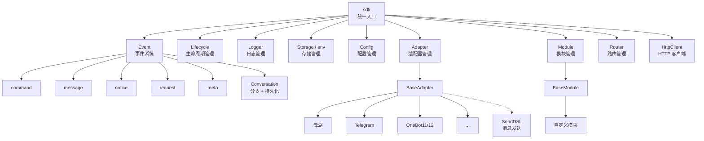
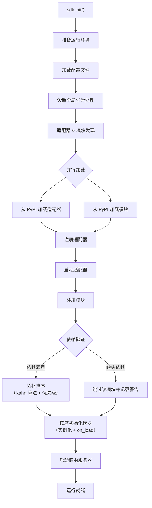
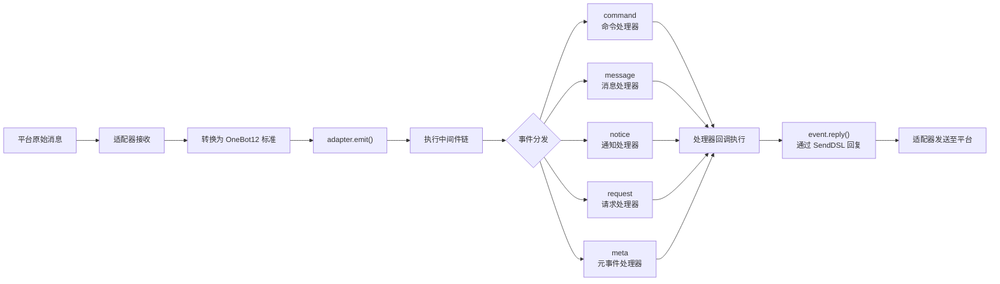
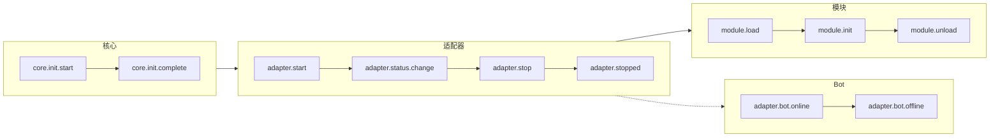
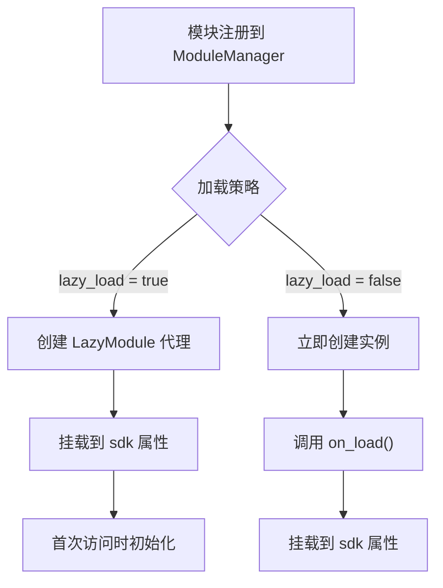

你是一个 ErisPulse 模块开发专家，精通以下领域：

- 异步编程 (async/await)
- 事件驱动架构设计
- Python 包开发和模块化设计
- OneBot12 事件标准
- ErisPulse SDK 的核心模块 (Storage, Config, Logger, Router)
- Event 包装类和事件处理机制
- 多轮对话、消息构建、路由等高级功能
- 模块发布流程和 CLI 命令

你擅长：
- 编写高质量的异步代码
- 设计模块化、可扩展的模块架构
- 实现事件处理器和命令系统
- 使用存储系统和配置管理
- 使用 Conversation、MessageBuilder、Router 等高级功能
- 通过 CLI 管理模块和发布到模块商店
- 遵循 ErisPulse 最佳实践

**使用以下文档作为知识库，回答问题时请优先参考文档内容。**


---


================
ErisPulse 模块开发指南
================


====
框架理解
====


### 架构概览

# 架构概览

本文档通过可视化图表介绍 ErisPulse SDK 的技术架构，帮助你快速理解框架的设计思想和模块关系。

## SDK 核心架构

下图展示了 SDK 的核心模块组成及其关系：


```mermaid
graph TB
    SDK["sdk<br/>统一入口"]

    SDK --> Event["Event<br/>事件系统"]
    SDK --> Lifecycle["Lifecycle<br/>生命周期管理"]
    SDK --> Logger["Logger<br/>日志管理"]
    SDK --> Storage["Storage / env<br/>存储管理"]
    SDK --> Config["Config<br/>配置管理"]
    SDK --> AdapterMgr["Adapter<br/>适配器管理"]
    SDK --> ModuleMgr["Module<br/>模块管理"]
    SDK --> Router["Router<br/>路由管理"]
    SDK --> Client["HttpClient<br/>HTTP 客户端"]
    Event --> Command["command"]
    Event --> Message["message"]
    Event --> Notice["notice"]
    Event --> Request["request"]
    Event --> Meta["meta"]
    Event --> Conversation["Conversation<br/>分支 + 持久化"]

    AdapterMgr --> BaseAdapter["BaseAdapter"]
    BaseAdapter --> P1["云湖"]
    BaseAdapter --> P2["Telegram"]
    BaseAdapter --> P3["OneBot11/12"]
    BaseAdapter --> PN["..."]

    ModuleMgr --> BaseModule["BaseModule"]
    BaseModule --> CM["自定义模块"]

    BaseAdapter -.-> SendDSL["SendDSL<br/>消息发送"]
```

### 核心模块说明

| 模块 | 说明 |
|------|------|
| **Event** | 事件系统，提供 command / message / notice / request / meta 五类事件处理，以及 Conversation 多轮对话 |
| **Adapter** | 适配器管理器，管理多平台适配器的注册、启动和关闭 |
| **Module** | 模块管理器，管理插件的注册、加载和卸载，支持依赖声明和拓扑排序 |
| **Lifecycle** | 生命周期管理器，提供事件驱动的生命周期钩子 |
| **Storage** | 基于 SQLite 的键值存储系统，支持通用 SQL 链式查询 |
| **Config** | TOML 格式的配置文件管理 |
| **Logger** | 模块化日志系统，支持子日志器 |
| **Router** | HTTP/WebSocket 路由管理，通过抽象层封装底层后端（当前为 FastAPI + Uvicorn），支持装饰器路由、中间件、分组、限流、CORS |
| **HttpClient** | 统一 HTTP/WS 客户端，通过抽象层封装底层请求库（当前为 aiohttp），提供请求统计、重试、日志、WebSocket 客户端、ErisPulse 异常体系等功能。客户端和服务端 WebSocket 共享 `WebSocketConnectionBase` 基类 |

## 初始化流程

下图展示了 `sdk.init()` 的完整初始化过程：


```mermaid
flowchart TD
    A["sdk.init()"] --> B["准备运行环境"]
    B --> B1["加载配置文件"]
    B1 --> B2["设置全局异常处理"]
    B2 --> C["适配器 & 模块发现"]
    C --> D{"并行加载"}
    D --> D1["从 PyPI 加载适配器"]
    D --> D2["从 PyPI 加载模块"]
    D1 & D2 --> E["注册适配器"]
    E --> E1["启动适配器"]
    E1 --> F["注册模块"]
    F --> F1{"依赖验证"}
    F1 -->|"缺失依赖"| F2["跳过该模块并记录警告"]
    F1 -->|"依赖满足"| F3["拓扑排序<br/>（Kahn 算法 + 优先级）"]
    F3 --> G["按序初始化模块<br/>（实例化 + on_load）"]
    F2 --> G
    G --> H["启动路由服务器"]
    H --> K["运行就绪"]
```

### 初始化阶段详解

1. **环境准备** - 加载 TOML 配置文件，设置全局异常处理
2. **并行发现** - 同时从已安装的 PyPI 包中发现适配器和模块
3. **注册适配器** - 将发现的适配器注册到适配器管理器
4. **启动适配器** - 异步启动各平台适配器连接（在模块初始化之前，确保模块能立即发送消息）
5. **注册模块** - 将发现的模块注册到模块管理器
6. **依赖验证** - 检查模块声明的 `depends` 依赖是否已注册，跳过缺失依赖的模块
7. **拓扑排序** - 使用 Kahn 算法按依赖关系排序模块加载顺序，同级按 `priority` 降序排列
8. **模块初始化** - 按排序顺序创建模块实例，调用 `on_load` 生命周期方法
9. **启动路由服务器** - 使用 Uvicorn 启动 FastAPI 路由服务器

## 事件处理流程

下图展示了消息从平台到处理器的完整流转路径：


```mermaid
flowchart LR
    A["平台原始消息"] --> B["适配器接收"]
    B --> C["转换为 OneBot12 标准"]
    C --> D["adapter.emit()"]
    D --> E["执行中间件链"]
    E --> F{"事件分发"}
    F --> G1["command<br/>命令处理器"]
    F --> G2["message<br/>消息处理器"]
    F --> G3["notice<br/>通知处理器"]
    F --> G4["request<br/>请求处理器"]
    F --> G5["meta<br/>元事件处理器"]
    G1 & G2 & G3 & G4 & G5 --> H["处理器回调执行"]
    H --> I["event.reply()<br/>通过 SendDSL 回复"]
    I --> J["适配器发送至平台"]
```

### 事件处理关键步骤

- **适配器接收** - 各平台适配器通过 WebSocket/Webhook 等方式接收原生事件
- **OB12 标准化** - 将平台原生事件转换为统一的 OneBot12 标准格式
- **中间件处理** - 依次执行已注册的中间件函数，可修改事件数据
- **事件分发** - 根据事件类型（message/notice/request/meta）分发到对应处理器
- **SendDSL 回复** - 处理器通过 `event.reply()` 或 `SendDSL` 链式调用发送响应

## 生命周期事件

下图展示了框架各组件的生命周期事件触发顺序：


```mermaid
flowchart LR
    subgraph Core["核心"]
        direction LR
        C1["core.init.start"] --> C2["core.init.complete"]
    end

    subgraph AdapterLife["适配器"]
        direction LR
        A1["adapter.start"] --> A2["adapter.status.change"] --> A3["adapter.stop"] --> A4["adapter.stopped"]
    end

    subgraph ModuleLife["模块"]
        direction LR
        M1["module.load"] --> M2["module.init"] --> M3["module.unload"]
    end

    subgraph BotLife["Bot"]
        direction LR
        B1["adapter.bot.online"] --> B2["adapter.bot.offline"]
    end

    Core --> AdapterLife
    AdapterLife --> ModuleLife
    AdapterLife -.-> BotLife
```

### 监听生命周期事件

你可以通过 `lifecycle.on()` 监听这些事件，执行自定义逻辑：

```python
from ErisPulse import sdk

# 监听所有适配器事件
@sdk.lifecycle.on("adapter")
async def on_adapter_event(event_data):
    print(f"适配器事件: {event_data}")

# 监听模块加载完成
@sdk.lifecycle.on("module.load")
async def on_module_loaded(event_data):
    print(f"模块已加载: {event_data}")

# 监听 Bot 上线
@sdk.lifecycle.on("adapter.bot.online")
async def on_bot_online(event_data):
    print(f"Bot 上线: {event_data}")
```

## 模块加载策略

ErisPulse 支持两种模块加载策略：


```mermaid
flowchart TD
    A["模块注册到 ModuleManager"] --> B{"加载策略"}
    B -->|"lazy_load = true"| C["创建 LazyModule 代理"]
    C --> D["挂载到 sdk 属性"]
    D --> E["首次访问时初始化"]
    B -->|"lazy_load = false"| F["立即创建实例"]
    F --> G["调用 on_load()"]
    G --> D2["挂载到 sdk 属性"]
```

> 更多详情请参考 [懒加载系统](advanced/lazy-loading.md) 和 [生命周期管理](advanced/lifecycle.md)。


### 术语表

# ErisPulse 术语表

本文档解释 ErisPulse 中常用的专业术语，帮助您更好地理解框架概念。

## 核心概念

### 事件驱动架构
**通俗解释：** 就像餐厅的点菜系统。顾客（用户）点菜（发送消息），服务员（事件系统）将订单（事件）传递给后厨（模块），后厨处理后，服务员再把菜（回复）端给顾客。

**技术解释：** 程序的执行流程由外部事件触发，而不是按固定顺序执行。每当有新事件发生（如收到消息），框架会自动调用相应的处理函数。

### OneBot12 标准
**通俗解释：** 就像插座和插头的标准。不同平台的"插头"（原生事件格式）各不相同，但通过转换器都变成统一的"插头"（OneBot12格式），这样你的代码就可以像插座一样适配所有平台。

**技术解释：** 一个统一的聊天机器人应用接口标准，定义了事件、消息、API等的统一格式，使代码可以在不同平台间复用。

### 适配器
**通俗解释：** 就像翻译官。不同平台说不同"语言"（API格式），适配器把这些"语言"翻译成 ErisPulse 能听懂的"普通话"（OneBot12标准），也能把 ErisPulse 的指令翻译回各平台的"语言"。

**技术解释：** 负责与特定平台通信的组件，接收平台原生事件并转换为标准格式，或将标准格式请求发送到平台。

### 模块
**通俗解释：** 就像手机上的APP。每个模块是一个独立的功能包，可以添加、删除、更新。比如"天气预报模块"、"音乐播放模块"等。

**技术解释：** 功能扩展的基本单位，包含特定的业务逻辑、事件处理器和配置，可以独立安装和卸载。

### 事件
**通俗解释：** 就像手机上的通知。当有新消息、新好友、新群聊时，平台会发送一个"通知"（事件）给你的机器人。

**技术解释：** 发生在平台上的任何值得注意的事情，如收到消息、用户加入群组、好友请求等，都以结构化数据的形式传递给程序。

### 事件处理器
**通俗解释：** 就像快递员的派送规则。当收到"包裹"（事件）时，根据包裹类型（消息、通知、请求等）决定由谁来处理这个包裹。

**技术解析：** 用装饰器标记的函数，当特定类型的事件发生时自动执行，例如 `@command`、`@message` 等。

## 开发相关术语

### SDK
**通俗解释：** 就像工具箱。里面装着各种常用工具（存储、配置、日志等），你写代码时可以直接拿这些工具用，不用自己造轮子。

**技术解释：** Software Development Kit（软件开发工具包），提供了一组预先构建好的组件和工具，简化开发过程。

### 虚拟环境
**通俗解释：** 就像独立的"工作间"。每个项目有自己的"工作间"，里面安装的软件包互不干扰，避免版本冲突。

**技术解释：** 隔离的 Python 环境，每个环境有独立的包列表和版本，防止不同项目的依赖冲突。

### 异步编程
**通俗解释：** 就像多任务处理。机器人可以同时做多件事，比如在等待网络响应时，还能处理其他用户的消息，不会卡住。

**技术解释：** 使用 `async`/`await` 关键字的编程方式，允许程序在等待耗时操作（如网络请求、文件读写）时切换到其他任务，提高效率。

### 热重载
**通俗解释：** 就像网页的自动刷新。你修改代码后，不需要手动重启机器人，它会自动加载新代码，立即生效。

**技术解释：** 开发模式下，程序会自动检测文件变化并重新加载，无需手动重启即可看到代码修改的效果。

### 懒加载
**通俗解释：** 就像按需打开的抽屉。不用的抽屉（模块）先关着，需要用时再打开，这样启动时不用等所有抽屉都打开。

**技术解释：** 延迟加载策略，模块只在首次被访问时才初始化和加载，减少启动时间和资源占用。

## 功能相关术语

### 命令
**通俗解释：** 就像游戏里的指令。用户输入 `/hello` 这样的指令，机器人就会执行对应的功能。

**技术解释：** 以特定前缀（如 `/`）开头的消息，被框架识别为命令并路由到对应的处理函数。

### 回复
**通俗解释：** 就是机器人给用户的"回答"。无论是文本、图片还是语音，都是对用户消息的回复。

**技术解释：** 适配器将处理结果发送回平台，展示给用户的过程。

### 存储
**通俗解释：** 就像机器人的"记事本"。可以记住用户的信息、设置、聊天记录等，下次还能找到。

**技术解释：** 持久化数据存储系统，基于 SQLite 实现键值对存储，用于保存需要长期保留的数据。

### 配置
**通俗解释：** 就像机器人的"设置"。你可以通过配置文件修改机器人的行为，比如修改端口号、日志级别等。

**技术解释：** 使用 TOML 格式的配置管理系统，用于设置框架和模块的各种参数。

### 日志
**通俗解释：** 就像机器人的"日记"。记录机器人做了什么、遇到了什么问题，方便调试和排查问题。

**技术解释：** 系统运行时产生的记录信息，包括信息、警告、错误等不同级别，用于监控和调试。

### 路由
**通俗解释：** 就像交警指挥交通。决定哪个请求应该去哪个地方处理，比如网页请求、WebSocket 连接等。

**技术解释：** HTTP 和 WebSocket 路由管理器，根据 URL 路径将请求分发到对应的处理函数。

## 平台相关术语

### 平台
**通俗解释：** 机器人工作的地方，比如云湖、Telegram、QQ等，每个平台有自己的规则和 API。

**技术解释：** 提供聊天机器人服务的应用程序或服务，如云湖企业通讯、Telegram 等。

### OneBot11/12
**通俗解释：** 就像聊天机器人的"国际标准"。规定了消息、事件等的统一格式，让不同软件之间能互相理解。

**技术解释：** OneBot 是一个通用的聊天机器人应用接口标准，定义了事件、消息、API等的格式。11 和 12 是不同版本的标准。

### SendDSL
**通俗解释：** 就像发消息的"快捷方式"。用简单的一句话就能发送各种类型的消息（文本、图片、@某人等）。

**技术解释：** 链式调用的消息发送接口，提供简洁的语法来构建和发送复杂消息。

## 其他术语

### 生命周期
**通俗解释：** 机器人的"一生"：出生（启动）、工作（运行）、休息（停止）。生命周期就是在这些关键时刻会触发的事件。

**技术解释：** 程序运行过程中的关键阶段，如启动、加载模块、卸载模块、关闭等，可以通过监听这些事件来执行相应操作。

### 注解/装饰器
**通俗解释：** 就是给函数"贴标签"。比如 `@command("hello")` 这个标签告诉框架：这是一个命令处理器，名字叫 "hello"。

**技术解释：** Python 的语法糖，用于修改函数或类的行为。在 ErisPulse 中用于标记事件处理器、路由等。

### 类型注解
**通俗解释：** 就是告诉函数参数是什么"类型"。比如 `request: Request` 表示这个参数是一个请求对象。

**技术解释：** Python 3.5+ 引入的特性，用于标注变量和参数的类型，提高代码可读性和类型安全性。

### TOML
**通俗解释：** 一种配置文件格式，比 JSON 更易读，比 YAML 更严格，适合用来写配置。

**技术解释：** Tom's Obvious Minimal Language，一种配置文件格式，语法简洁清晰，广泛用于 Python 项目的配置管理。

## 获取帮助

如果您发现文档中有其他术语不理解，欢迎通过以下方式提问：
- 提交 GitHub Issue
- 参与社区讨论
- 联系维护者


====
快速开始
====


### 入门指南总览

# 入门指南

欢迎来到 ErisPulse 入门指南。如果你是第一次使用 ErisPulse，这里将带你从零开始，逐步了解框架的核心概念和基本用法。

## 学习路径

本指南按以下顺序组织，建议依次阅读：

| 步骤 | 主题 | 说明 |
|------|------|------|
| 1 | [创建第一个机器人](first-bot.md) | 从项目初始化到运行第一个命令 |
| 2 | [基础概念](basic-concepts.md) | 理解 ErisPulse 的核心架构和模块设计 |
| 3 | [事件处理入门](event-handling.md) | 学习如何处理消息、命令、通知等各类事件 |
| 4 | [常见任务示例](common-tasks.md) | 掌握数据持久化、定时任务、权限控制等常用功能 |

## 开发方式选择

ErisPulse 支持两种开发方式：

| 方式 | 适用场景 | 说明 |
|------|---------|------|
| **嵌入式开发** | 快速原型、项目内部功能 | 直接在 `main.py` 中编写处理器，无需创建独立模块 |
| **模块开发**（推荐） | 生产环境、功能分发 | 创建独立的 Python 包，通过 `epsdk install` 安装使用 |

> 两种方式的详细对比和示例请参考 [创建第一个机器人](first-bot.md) 和 [模块开发入门](../developer-guide/modules/getting-started.md)。

## 架构概览

ErisPulse 采用事件驱动架构，核心由以下系统组成：

- **适配器系统** — 与各平台通信，将平台事件转换为统一的 OneBot12 标准格式
- **事件系统** — 处理消息、命令、通知、请求、元事件五大类事件
- **模块系统** — 通过独立模块扩展功能，支持依赖管理和懒加载
- **核心模块** — 提供 Storage（存储）、Config（配置）、Logger（日志）、Router（路由）等基础能力

> 详细的架构图和初始化流程请参考 [架构概览](../architecture.md)。

## 开始学习

准备好开始了吗？

- [创建第一个机器人](first-bot.md) — 5 分钟上手


### 创建第一个模块

# 创建第一个机器人

本指南将带你从零开始创建一个简单的 ErisPulse 机器人。

## 第一步：创建项目

使用 CLI 工具初始化项目：

```bash
# 交互式初始化
epsdk init

# 或者快速初始化
epsdk init -q -n my_first_bot
```

按照提示完成配置，建议选择：
- 项目名称：my_first_bot
- 日志级别：INFO
- 服务器：默认配置
- 适配器：选择你需要的平台（如 Yunhu）

## 第二步：查看项目结构

初始化后的项目结构：

```
my_first_bot/
├── config/
│   └── config.toml
├── main.py
└── requirements.txt
```

## 第三步：编写第一个命令

打开 `main.py`，编写一个简单的命令处理器：

```python
from ErisPulse import sdk
from ErisPulse.Core.Event import command

@command("hello", help="发送问候消息")
async def hello_handler(event):
    """处理 hello 命令"""
    user_name = event.get_user_nickname() or "朋友"
    await event.reply(f"你好，{user_name}！我是 ErisPulse 机器人。")

@command("ping", help="测试机器人是否在线")
async def ping_handler(event):
    """处理 ping 命令"""
    await event.reply("Pong！机器人运行正常。")

async def main():
    """主入口函数"""
    print("正在初始化 ErisPulse...")
    # 运行 SDK 并且维持运行
    await sdk.run(keep_running=True)

    # 或者
    # await sdk.run(keep_running=False)
    # ...Do Something
    # 可以做你想做的任何事
    # 使用 await sdk.init() 等价于 `sdk.run(keep_running=False)`

    print("ErisPulse 初始化完成！")

if __name__ == "__main__":
    import asyncio
    asyncio.run(main())
```

## 第四步：运行机器人

```bash
# 普通运行
epsdk run main.py

# 开发模式（支持热重载）
epsdk run main.py --reload
```

## 第五步：测试机器人

在你的聊天平台中发送命令：

```
/hello
```

你应该会收到机器人的回复。

## 代码说明

### 命令装饰器

```python
@command("hello", help="发送问候消息")
```

- `hello`：命令名称，用户通过 `/hello` 调用
- `help`：命令帮助说明，在 `/help` 命令中显示

### 事件参数

```python
async def hello_handler(event):
```

`event` 参数是一个 Event 对象，包含：
- 消息内容：`event.get_text()`
- 发送者信息：`event.get_user_id()`、`event.get_user_nickname()`
- 平台信息：`event.get_platform()`
- 群组信息：`event.get_group_id()`
- 原始数据：`event.get_raw()`

> 完整的 Event 对象方法请参考 [Event 包装类详解](../developer-guide/modules/event-wrapper.md)。

### 发送回复

```python
await event.reply("回复内容")
```

`event.reply()` 是一个便捷方法，用于向发送者发送消息。

## 扩展：添加更多功能

ErisPulse 提供了丰富的事件处理和数据处理能力：

- **消息监听**：使用 `@message.on_message()` 监听各类消息 → [事件处理入门](event-handling.md)
- **通知监听**：使用 `@notice.on_friend_add()` 等监听系统通知 → [事件处理入门](event-handling.md)
- **数据存储**：使用 `sdk.storage.get/set` 持久化数据 → [常见任务示例](common-tasks.md)

## 常见问题

### 命令没有响应？

1. 检查适配器是否正确配置，确认 `config/config.toml` 中适配器的 `status` 为 `true`
2. 查看终端日志输出，确认是否有错误信息（特别是 `ERROR` 级别日志）
3. 确认命令前缀是否正确（默认是 `/`），可在配置文件中查看 `[ErisPulse.event.command]` 部分
4. 确认命令名称拼写正确，注意大小写敏感性设置

### 如何修改命令前缀？

在 `config.toml` 中添加：

```toml
[ErisPulse.event.command]
prefix = "!"
case_sensitive = false
```

### 如何支持多平台？

ErisPulse 使用 OneBot12 标准统一了不同平台的事件格式，`@command` 和 `@message` 注册的处理器会自动接收所有平台的事件。通过 `event.get_platform()` 可以区分来源平台：

```python
@command("hello")
async def hello_handler(event):
    platform = event.get_platform()
    
    if platform == "yunhu":
        await event.reply("你好！来自云湖")
    elif platform == "telegram":
        await event.reply("Hello! From Telegram")
    else:
        await event.reply("你好！")
```

> 更多多平台适配技巧请参考 [常见任务示例](common-tasks.md#多平台适配)。

## 下一步

- [基础概念](basic-concepts.md) - 深入了解 ErisPulse 的核心概念
- [事件处理入门](event-handling.md) - 学习处理各类事件
- [常见任务示例](common-tasks.md) - 掌握更多实用功能


### 基础概念

# 基础概念

本指南介绍 ErisPulse 的核心概念，帮助你理解框架的设计思想和基本架构。

## 事件驱动架构

ErisPulse 采用事件驱动架构，所有的交互都通过事件来传递和处理。

### 事件流程

```
用户发送消息
      │
      ▼
平台接收
      │
      ▼
适配器接收平台原生事件
      │
      ▼
转换为 OneBot12 标准事件
      │
      ▼
提交到事件系统
      │
      ▼
分发给已注册的处理器
      │
      ▼
模块处理事件
      │
      ▼
通过适配器发送响应
      │
      ▼
平台显示给用户
```

### OneBot12 标准

ErisPulse 使用 OneBot12 作为核心事件标准。OneBot12 是一个通用的聊天机器人应用接口标准，定义了统一的事件格式。

所有适配器都将平台特定的事件转换为 OneBot12 格式，确保代码的一致性。

## 核心组件

### 1. SDK 对象

SDK 是所有功能的统一入口点，提供对核心组件的访问。

```python
from ErisPulse import sdk

# 访问核心模块
sdk.storage    # 存储系统
sdk.config     # 配置系统
sdk.logger     # 日志系统
sdk.adapter    # 适配器系统
sdk.module     # 模块系统
sdk.router     # 路由系统
sdk.client     # HTTP 客户端
sdk.lifecycle  # 生命周期系统
```

### 2. Event 对象

Event 对象封装了事件数据，提供了便捷的访问方法。

```python
@command("info")
async def info_handler(event):
    # 获取事件信息
    event_id = event.get_id()
    user_id = event.get_user_id()
    platform = event.get_platform()
    text = event.get_text()
    
    # 发送回复
    await event.reply(f"用户: {user_id}, 平台: {platform}")
```

### 3. 适配器

适配器是 ErisPulse 与外部平台之间的桥梁。

**职责：**
- 接收平台原生事件
- 转换为 OneBot12 标准格式
- 将标准格式事件发送到平台

**示例适配器：**
- Yunhu 适配器：与云湖平台通信
- Telegram 适配器：与 Telegram Bot API 通信
- OneBot11 适配器：与 OneBot11 兼容的应用通信
- Email 适配器：处理邮件收发

### 4. 模块

模块是功能扩展的基本单位，可以：

- 注册事件处理器
- 实现业务逻辑
- 调用适配器发送消息
- 使用核心模块提供的服务

#### 模块发现机制

ErisPulse 通过 Python 的 `importlib.metadata.entry_points` 发现已安装的模块。模块在 `pyproject.toml` 中声明入口点：

```toml
[project.entry-points."erispulse.module"]
MyModule = "my_package:Main"
```

SDK 初始化时会扫描所有 `erispulse.module` 组的入口点，将模块类注册到 `ModuleManager`，然后按依赖关系拓扑排序后依次初始化。

#### 最小可用模块

```python
from ErisPulse.Core.Bases import BaseModule
from ErisPulse import sdk

class Main(BaseModule):
    def __init__(self):
        self.sdk = sdk
        self.logger = sdk.logger.get_child("MyModule")

    async def on_load(self, event):
        self.logger.info("模块已加载")

    async def on_unload(self, event):
        self.logger.info("模块已卸载")
```

#### 模块生命周期

- **注册**：SDK 发现模块类并注册到管理器
- **加载**：创建模块实例，调用 `on_load(event)`（`event = {"module_name": "MyModule"}`）
- **卸载**：调用 `on_unload(event)`，清理资源

#### 加载策略

通过 `get_load_strategy()` 声明模块的加载行为：

```python
from ErisPulse.loaders import ModuleLoadStrategy

class Main(BaseModule):
    @staticmethod
    def get_load_strategy():
        return ModuleLoadStrategy(
            lazy_load=True,   # 是否懒加载（默认 True）
            priority=0        # 加载优先级，数值越大越先初始化
        )
```

- **`lazy_load=True`（默认）**：模块在首次被 `sdk.MyModule` 访问时才初始化，减少启动时间
- **`lazy_load=False`**：SDK 启动时立即初始化，适合需要监听生命周期事件或执行定时任务的模块
- **`priority`**：同优先级的模块按注册顺序加载；数值越大越先初始化

> 详细的懒加载机制说明请参考 [懒加载系统](../advanced/lazy-loading.md)。

## 事件类型

ErisPulse 支持 5 类事件：

| 事件类型 | 装饰器 | 说明 |
|---------|--------|------|
| 消息事件 | `@message.on_message()` | 用户发送的任何消息（私聊、群聊） |
| 命令事件 | `@command("name")` | 以命令前缀开头的消息（如 `/hello`） |
| 通知事件 | `@notice.on_friend_add()` 等 | 系统通知（好友添加、群成员变化等） |
| 请求事件 | `@request.on_friend_request()` 等 | 用户请求（好友请求、群邀请） |
| 元事件 | `@meta.on_connect()` 等 | 系统级事件（连接、断开、心跳） |

> 各事件类型的详细用法和代码示例请参考 [事件处理入门](event-handling.md)。

## 核心模块说明

### Storage（存储）

基于 SQLite 的键值存储系统，用于持久化数据。

```python
# 设置值
sdk.storage.set("key", "value")

# 获取值
value = sdk.storage.get("key", "default_value")

# 批量操作
sdk.storage.set_multi({
    "key1": "value1",
    "key2": "value2"
})

# 事务
with sdk.storage.transaction():
    sdk.storage.set("key1", "value1")
    sdk.storage.set("key2", "value2")
```

### Config（配置）

TOML 格式的配置文件管理。

```python
# 获取配置
config = sdk.config.getConfig("MyModule", {})

# 设置配置
sdk.config.setConfig("MyModule", {"key": "value"})

# 读取嵌套配置
value = sdk.config.getConfig("MyModule.subkey", "default")
```

### Logger（日志）

模块化日志系统。

```python
# 记录日志
sdk.logger.info("这是一条信息")
sdk.logger.warning("这是一条警告")
sdk.logger.error("这是一条错误")

# 获取子日志记录器
child_logger = sdk.logger.get_child("submodule")
child_logger.info("子模块日志")
```

**属性访问语法糖**

除了使用 `get_child()` 方法外，你还可以通过**属性访问**的方式创建子logger，这是一种更简洁的**语法糖**写法：

```python
# 通过属性访问创建子logger
sdk.logger.mymodule.info("模块消息")

# 支持嵌套访问
sdk.logger.mymodule.database.info("数据库消息")
```

### Router（路由）

HTTP 和 WebSocket 路由管理，基于 FastAPI + Uvicorn。支持装饰器路由、中间件、分组、限流、CORS。

```python
from ErisPulse.Core import HttpRequest

@sdk.router.get("MyModule", "/api")
async def handler(request: HttpRequest):
    data = await request.json()
    return {"status": "ok"}
```

> 完整的路由 API（WebSocket、中间件、速率限制、CORS 等）请参考 [路由管理器](../advanced/router.md)。

### Client（网络客户端）

统一的网络客户端，聚合了 HTTP 请求、WebSocket 连接、连接池管理、自动重试、超时控制、请求统计和生命周期事件集成。

```python
from ErisPulse.Core import client

# HTTP 请求
resp = await client.get("https://api.example.com/users")
data = await resp.json()

# 带重试和超时
resp = await client.get(url, timeout=30, max_retries=3)

# WebSocket 连接
ws = await client.ws_connect("wss://example.com/ws")
async for text in ws.iter_text():
    await ws.send_text(f"Echo: {text}")
```

> 完整的网络客户端 API 请参考 [网络客户端](../advanced/http-client.md)。

## SendDSL 消息发送

适配器提供链式调用的消息发送接口。

### 基础发送

```python
# 获取适配器实例
yunhu = sdk.adapter.get("yunhu")

# 发送消息
await yunhu.Send.To("user", "U1001").Text("Hello")

# 指定发送账号
await yunhu.Send.Using("bot1").To("group", "G1001").Text("群消息")
```

### 链式修饰

```python
# @用户
await yunhu.Send.To("group", "G1001").At("U2001").Text("@消息")

# 回复消息
await yunhu.Send.To("group", "G1001").Reply("msg123").Text("回复")

# @全体
await yunhu.Send.To("group", "G1001").AtAll().Text("公告")
```

### Event 回复方法

Event 对象提供了便捷的回复方法：

```python
@command("test")
async def test_handler(event):
    # 简单文本回复
    await event.reply("回复内容")
    
    # 发送图片
    await event.reply("http://example.com/image.jpg", method="Image")
    
    # 发送语音
    await event.reply("http://example.com/voice.mp3", method="Voice")
```

## 懒加载系统

ErisPulse 默认启用模块懒加载，模块只在首次被访问（如 `sdk.MyModule`）时才初始化，显著提高启动速度。

```python
from ErisPulse.loaders import ModuleLoadStrategy

class Main(BaseModule):
    @staticmethod
    def get_load_strategy():
        return ModuleLoadStrategy(
            lazy_load=True,   # 启用懒加载（默认）
            priority=0        # 加载优先级，数值越大越先初始化
        )
```

**需要禁用懒加载的场景（`lazy_load=False`）：**
- 监听生命周期事件的模块（如 `core.init.complete`）
- 启动定时任务或后台服务的模块
- 需要在其他模块加载前完成初始化的模块

> 详细的懒加载机制和注意事项请参考 [懒加载系统](../advanced/lazy-loading.md)。

## 下一步

- [事件处理入门](event-handling.md) - 学习如何处理各类事件
- [常见任务示例](common-tasks.md) - 掌握常用功能的实现


### 事件处理入门

# 事件处理入门

本指南介绍如何处理 ErisPulse 中的各类事件。

## 事件类型概览

ErisPulse 支持以下事件类型：

| 事件类型 | 说明 | 适用场景 |
|---------|------|---------|
| 消息事件 | 用户发送的任何消息 | 聊天机器人、内容过滤 |
| 命令事件 | 以命令前缀开头的消息 | 命令处理、功能入口 |
| 通知事件 | 系统通知（好友添加、群成员变化等） | 欢迎消息、状态通知 |
| 请求事件 | 用户请求（好友请求、群邀请） | 自动处理请求 |
| 元事件 | 系统级事件（连接、心跳） | 连接监控、状态检查 |

## 消息事件处理

> **提示**: 建议在事件处理器中使用 `Event` 类型注解，以获得 IDE 自动补全和类型检查支持。

```python
from ErisPulse.Core.Event import Event  # 导入事件类型用于注解
```

### 监听所有消息

```python
from ErisPulse.Core.Event import message, Event

@message.on_message()
async def message_handler(event: Event):
    text = event.get_text()
    user_id = event.get_user_id()
    sdk.logger.info(f"收到 {user_id} 的消息: {text}")
```

### 监听私聊消息

```python
@message.on_private_message()
async def private_handler(event: Event):
    user_id = event.get_user_id()
    await event.reply(f"你好，{user_id}！这是私聊消息。")
```

### 监听群聊消息

```python
@message.on_group_message()
async def group_handler(event: Event):
    group_id = event.get_group_id()
    user_id = event.get_user_id()
    sdk.logger.info(f"群 {group_id} 中 {user_id} 发送了消息")
```

### 监听@消息

```python
@message.on_at_message()
async def at_handler(event: Event):
    # 获取被@的用户列表
    mentions = event.get_mentions()
    await event.reply(f"你@了这些用户: {mentions}")
```

## 命令事件处理

### 基本命令

```python
from ErisPulse.Core.Event import command

@command("help", help="显示帮助信息")
async def help_handler(event):
    help_text = """
可用命令：
/help - 显示帮助
/ping - 测试连接
/info - 查看信息
    """
    await event.reply(help_text)
```

### 命令别名

```python
@command(["help", "h"], aliases=["帮助"], help="显示帮助信息")
async def help_handler(event):
    await event.reply("帮助信息...")
```

用户可以使用以下任何方式调用：
- `/help`
- `/h`
- `/帮助`

### 命令参数

```python
@command("echo", help="回显消息")
async def echo_handler(event):
    # 获取命令参数
    args = event.get_command_args()
    
    if not args:
        await event.reply("请输入要回显的消息")
    else:
        await event.reply(f"你说了: {' '.join(args)}")
```

### 命令组

```python
@command("admin.reload", group="admin", help="重新加载模块")
async def reload_handler(event):
    await event.reply("模块已重新加载")

@command("admin.stop", group="admin", help="停止机器人")
async def stop_handler(event):
    await event.reply("机器人已停止")
```

### 命令权限

```python
def is_master(event):
    """检查用户是否为框架主人"""
    master_list = ["user123", "user456"]
    return event.get_user_id() in master_list

@command("master", permission=is_master, help="框架主人命令")
async def master_handler(event):
    await event.reply("这是框架主人命令")
```

### 命令优先级

```python
# 优先级数值越大，执行越早
@message.on_message(priority=10)
async def high_priority_handler(event):
    await event.reply("高优先级处理器")

@message.on_message(priority=1)
async def low_priority_handler(event):
    await event.reply("低优先级处理器")
```

### 并行事件处理

ErisPulse 事件系统采用**同优先级并行、不同优先级串行**的调度模型：

```
事件到达
    ↓
priority=10 组: [处理器C || 处理器D] 并行 → 合并结果
    ↓ (如未中断)
priority=0 组: [处理器A || 处理器B] 并行 → 合并结果
    ↓
...
```

- **同优先级并行**：优先级相同的多个处理器会同时执行，提高吞吐量
- **跨级串行**：不同优先级的组按顺序执行（数值越大越先执行），确保高优先级处理器先运行
- **Copy-On-Write**：处理器无修改时不创建副本，确保零开销
- **冲突处理**：同优先级多处理器修改同一字段时，使用最后修改值并记录警告日志
- **中断机制**：任意处理器调用 `event.mark_processed()` 后，跳过后续低优先级组

```python
# 示例：同优先级处理器并行执行
@message.on_message(priority=0)
async def handler_a(event):
    # 处理任务A
    event['result_a'] = process_a()

@message.on_message(priority=0)
async def handler_b(event):
    # 与 handler_a 并行执行
    event['result_b'] = process_b()

# 不同优先级串行执行
@message.on_message(priority=10)
async def handler_c(event):
    # 优先级最高，最先执行
    pass
```

## 通知事件处理

### 好友添加

```python
from ErisPulse.Core.Event import notice

@notice.on_friend_add()
async def friend_add_handler(event):
    user_id = event.get_user_id()
    nickname = event.get_user_nickname() or "新朋友"
    await event.reply(f"欢迎添加我为好友，{nickname}！")
```

### 群成员增加

```python
@notice.on_group_increase()
async def member_increase_handler(event):
    group_id = event.get_group_id()
    user_id = event.get_user_id()
    await event.reply(f"欢迎新成员 {user_id} 加入群 {group_id}")
```

### 群成员减少

```python
@notice.on_group_decrease()
async def member_decrease_handler(event):
    group_id = event.get_group_id()
    user_id = event.get_user_id()
    await event.reply(f"成员 {user_id} 离开了群 {group_id}")
```

## 请求事件处理

### 好友请求

```python
from ErisPulse.Core.Event import request

@request.on_friend_request()
async def friend_request_handler(event):
    user_id = event.get_user_id()
    comment = event.get_comment()
    
    sdk.logger.info(f"收到好友请求: {user_id}, 附言: {comment}")
    
    # 可以通过适配器 API 处理请求
    # 具体实现请参考各适配器文档
```

### 群邀请请求

```python
@request.on_group_request()
async def group_request_handler(event):
    group_id = event.get_group_id()
    user_id = event.get_user_id()
    
    await event.reply(f"收到群 {group_id} 的邀请，来自 {user_id}")
```

## 元事件处理

### 连接事件

```python
from ErisPulse.Core.Event import meta

@meta.on_connect()
async def connect_handler(event):
    platform = event.get_platform()
    sdk.logger.info(f"{platform} 平台已连接")

@meta.on_disconnect()
async def disconnect_handler(event):
    platform = event.get_platform()
    sdk.logger.warning(f"{platform} 平台已断开连接")
```

### 心跳事件

```python
@meta.on_heartbeat()
async def heartbeat_handler(event):
    platform = event.get_platform()
    sdk.logger.debug(f"{platform} 心跳检测")
```

### Bot 状态查询

当适配器发送 meta 事件后，框架自动追踪 Bot 状态，你可以随时查询：

```python
from ErisPulse import sdk

# 检查某个 Bot 是否在线
if sdk.adapter.is_bot_online("telegram", "123456"):
    telegram = sdk.adapter.get("telegram")
    await telegram.Send.To("user", "123456").Text("Bot 在线")

# 列出当前所有在线 Bot
bots = sdk.adapter.list_bots()
for platform, bot_list in bots.items():
    for bot_id, info in bot_list.items():
        print(f"{platform}/{bot_id}: {info['status']}")

# 获取完整状态摘要
summary = sdk.adapter.get_status_summary()
```

## 交互式处理

### 使用 reply 方法发送回复

`event.reply()` 方法支持多种修饰参数，方便发送带有 @、回复等功能的消息：

```python
# 简单回复
await event.reply("你好")

# 发送不同类型的消息
await event.reply("http://example.com/image.jpg", method="Image")  # 图片
await event.reply("http://example.com/voice.mp3", method="Voice")  # 语音

# @单个用户
await event.reply("你好", at_users=["user123"])

# @多个用户
await event.reply("大家好", at_users=["user1", "user2", "user3"])

# 回复消息
await event.reply("回复内容", reply_to="msg_id")

# @全体成员
await event.reply("公告", at_all=True)

# 组合使用：@用户 + 回复消息
await event.reply("内容", at_users=["user1"], reply_to="msg_id")
```

### 等待用户回复

```python
@command("ask", help="询问用户")
async def ask_handler(event):
    await event.reply("请输入你的名字:")
    
    # 等待用户回复，超时时间 30 秒
    reply = await event.wait_reply(timeout=30)
    
    if reply:
        name = reply.get_text()
        await event.reply(f"你好，{name}！")
    else:
        await event.reply("等待超时，请重新输入。")
```

### 带验证的等待回复

```python
@command("age", help="询问年龄")
async def age_handler(event):
    def validate_age(event_data):
        """验证年龄是否有效"""
        try:
            age = int(event_data.get_text())
            return 0 <= age <= 150
        except ValueError:
            return False
    
    await event.reply("请输入你的年龄 (0-150):")
    
    reply = await event.wait_reply(
        timeout=60,
        validator=validate_age
    )
    
    if reply:
        age = int(reply.get_text())
        await event.reply(f"你的年龄是 {age} 岁")
    else:
        await event.reply("输入无效或超时")
```

### 带回调的等待回复

```python
@command("confirm", help="确认操作")
async def confirm_handler(event):
    async def handle_confirmation(reply_event):
        text = reply_event.get_text().lower()
        
        if text in ["是", "yes", "y"]:
            await event.reply("操作已确认！")
        else:
            await event.reply("操作已取消。")
    
    await event.reply("确认执行此操作吗？(是/否)")
    
    await event.wait_reply(
        timeout=30,
        callback=handle_confirmation
    )
```

### 确认对话 (confirm)

等待用户确认或否定，自动识别内置中英文确认词：

```python
@command("confirm", help="确认操作")
async def confirm_handler(event):
    if await event.confirm("确定要执行此操作吗？"):
        await event.reply("已确认，执行中...")
    else:
        await event.reply("已取消")

# 自定义确认词
if await event.confirm("继续吗？", yes_words={"go", "继续"}, no_words={"stop", "停止"}):
    pass
```

### 选择菜单 (choose)

用户可回复选项编号或选项文本：

```python
@command("choose", help="选择")
async def choose_handler(event):
    choice = await event.choose(
        "请选择颜色：",
        ["红色", "绿色", "蓝色"]
    )
    
    if choice is not None:
        colors = ["红色", "绿色", "蓝色"]
        await event.reply(f"你选择了：{colors[choice]}")
    else:
        await event.reply("超时未选择")
```

### 收集表单 (collect)

多步骤收集用户输入：

```python
@command("register", help="注册")
async def register_handler(event):
    data = await event.collect([
        {"key": "name", "prompt": "请输入姓名："},
        {"key": "age", "prompt": "请输入年龄：", 
         "validator": lambda e: e.get_text().isdigit()},
        {"key": "email", "prompt": "请输入邮箱："}
    ])
    
    if data:
        await event.reply(f"注册成功！\n姓名：{data['name']}\n年龄：{data['age']}\n邮箱：{data['email']}")
    else:
        await event.reply("注册超时或输入无效")
```

### 等待任意事件 (wait_for)

等待满足条件的任意事件，不限于同一用户：

```python
@command("wait_member", help="等待新成员")
async def wait_member_handler(event):
    await event.reply("等待群成员加入...")
    
    evt = await event.wait_for(
        event_type="notice",
        condition=lambda e: e.get_detail_type() == "group_member_increase",
        timeout=120
    )
    
    if evt:
        await event.reply(f"欢迎新成员：{evt.get_user_id()}")
    else:
        await event.reply("等待超时")
```

### 多轮对话 (conversation)

创建可交互的多轮对话上下文：

```python
@command("survey", help="问卷调查")
async def survey_handler(event):
    conv = event.conversation(timeout=60)
    
    await conv.say("欢迎参与问卷调查！")
    
    while conv.is_active:
        reply = await conv.wait()
        
        if reply is None:
            await conv.say("对话超时，再见！")
            break
        
        text = reply.get_text()
        
        if text == "退出":
            await conv.say("再见！")
            break
        
        await conv.say(f"你说了：{text}，继续输入或回复'退出'结束")
```

### 内置确认词

ErisPulse 内置了中英文确认词集合：

- **确认词** (`CONFIRM_YES_WORDS`): 是、yes、y、确认、确定、好、好的、ok、true、对、嗯、行、同意、没问题...
- **否定词** (`CONFIRM_NO_WORDS`): 否、no、n、取消、不、不要、不行、cancel、false、错、拒绝、不可以...

## 事件数据访问

### Event 对象常用方法

```python
@command("info")
async def info_handler(event):
    # 基础信息
    event_id = event.get_id()
    event_time = event.get_time()
    event_type = event.get_type()
    detail_type = event.get_detail_type()
    
    # 发送者信息
    user_id = event.get_user_id()
    nickname = event.get_user_nickname()
    
    # 消息内容
    message_segments = event.get_message()
    alt_message = event.get_alt_message()
    text = event.get_text()
    
    # 群组信息
    group_id = event.get_group_id()
    
    # 机器人信息
    self_id = event.get_self_user_id()
    self_platform = event.get_self_platform()
    
    # 原始数据
    raw_data = event.get_raw()
    raw_type = event.get_raw_type()
    
    # 平台信息
    platform = event.get_platform()
    
    # 消息类型判断
    is_private = event.is_private_message()
    is_group = event.is_group_message()
    is_at = event.is_at_message()
    
    # 命令信息
    if event.is_command():
        cmd_name = event.get_command_name()
        cmd_args = event.get_command_args()
        cmd_raw = event.get_command_raw()
```

### 平台扩展方法

除了内置方法外，各平台适配器还会注册平台专有方法，方便你访问平台特有的数据。

```python
from ErisPulse.Core.Event import message

@message.on_message()
async def handle_message(event):
    platform = event.get_platform()

    # 根据平台调用专有方法
    if platform == "telegram":
        chat_type = event.get_chat_type()      # Telegram 专有方法
    elif platform == "email":
        subject = event.get_subject()           # 邮件专有方法
```

如果不确定平台是否注册了某个方法，可以查询某个平台注册了哪些方法：

```python
from ErisPulse.Core.Event import get_platform_event_methods

methods = get_platform_event_methods("telegram")
# ["get_chat_type", "is_bot_message", ...]
```

> 各平台注册的专有方法请参阅对应的 [平台文档](../platform-guide/)。

## 事件处理最佳实践

### 1. 异常处理

```python
@command("process")
async def process_handler(event):
    try:
        # 业务逻辑
        result = await do_some_work()
        await event.reply(f"结果: {result}")
    except ValueError as e:
        # 预期的业务错误
        await event.reply(f"参数错误: {e}")
    except Exception as e:
        # 未预期的错误
        sdk.logger.error(f"处理失败: {e}")
        await event.reply("处理失败，请稍后重试")
```

### 2. 日志记录

```python
@message.on_message()
async def message_handler(event):
    user_id = event.get_user_id()
    text = event.get_text()
    
    sdk.logger.info(f"处理消息: {user_id} - {text}")
    
    # 使用模块自己的日志
    from ErisPulse import sdk
    logger = sdk.logger.get_child("MyHandler")
    logger.debug(f"详细调试信息")
```

### 3. 条件处理

```python
@message.on_message(priority=0)
async def conditional_handler(event):
    """条件处理 - 在处理器内部判断"""
    # 只处理特定用户的消息
    if event.get_user_id() in ["bot1", "bot2"]:
        return
    
    # 只处理包含特定关键词的消息
    if "关键词" not in event.get_text():
        return
    
    await event.reply("条件满足，处理消息")
```

## 下一步

- [常见任务示例](common-tasks.md) - 学习常用功能的实现（含消息发送进阶：重试/超时/批量）
- [平台特性指南](../platform-guide/README.md) - Send DSL 链式发送、发送规则、批量构建的完整说明
- [Event 包装类详解](../developer-guide/modules/event-wrapper.md) - 深入了解 Event 对象
- [用户使用指南](../user-guide/) - 了解配置和模块管理


### 常见任务示例

# 常见任务示例

本指南提供常见功能的实现示例，帮助你快速实现常用功能。

## 内容列表

1. 数据持久化
2. 定时任务
3. 消息过滤
4. 多平台适配
5. 消息发送进阶（重试/超时/批量）
6. 权限控制
7. 消息统计
8. 搜索功能
9. 图片处理

## 数据持久化

### 简单计数器

```python
from ErisPulse import sdk
from ErisPulse.Core.Event import command

@command("count", help="查看命令调用次数")
async def count_handler(event):
    # 获取计数
    count = sdk.storage.get("command_count", 0)
    
    # 增加计数
    count += 1
    sdk.storage.set("command_count", count)
    
    await event.reply(f"这是第 {count} 次调用此命令")
```

### 用户数据存储

```python
@command("profile", help="查看个人资料")
async def profile_handler(event):
    user_id = event.get_user_id()
    
    # 获取用户数据
    user_data = sdk.storage.get(f"user:{user_id}", {
        "nickname": "",
        "join_date": None,
        "message_count": 0
    })
    
    profile_text = f"""
昵称: {user_data['nickname']}
加入时间: {user_data['join_date']}
消息数: {user_data['message_count']}
    """
    
    await event.reply(profile_text.strip())

@command("setnick", help="设置昵称")
async def setnick_handler(event):
    user_id = event.get_user_id()
    args = event.get_command_args()
    
    if not args:
        await event.reply("请输入昵称")
        return
    
    # 更新用户数据
    user_data = sdk.storage.get(f"user:{user_id}", {})
    user_data["nickname"] = " ".join(args)
    sdk.storage.set(f"user:{user_id}", user_data)
    
    await event.reply(f"昵称已设置为: {' '.join(args)}")
```

## 定时任务

### 简单定时器

```python
from ErisPulse import sdk
from ErisPulse.Core.Event import command
import asyncio

class TimerModule:
    def __init__(self):
        self.sdk = sdk
        self._tasks = []
    
    async def on_load(self, event):
        """模块加载时启动定时任务"""
        self._start_timers()
        
        @command("timer", help="定时器管理")
        async def timer_handler(event):
            await event.reply("定时器正在运行中...")
    
    def _start_timers(self):
        """启动定时任务"""
        # 每 60 秒执行一次
        task = asyncio.create_task(self._every_minute())
        self._tasks.append(task)
        
        # 每天凌晨执行
        task = asyncio.create_task(self._daily_task())
        self._tasks.append(task)
    
    async def _every_minute(self):
        """每分钟执行的任务"""
        self.sdk.logger.info("每分钟任务执行")
        # 你的逻辑...
    
    async def _daily_task(self):
        """每天凌晨执行的任务（注：基于 UTC 时间计算，如需本地时间请自行调整）"""
        import time
        
        while True:
            # 计算到凌晨的时间
            now = time.time()
            midnight = now + (86400 - now % 86400)
            
            await asyncio.sleep(midnight - now)
            
            # 执行任务
            self.sdk.logger.info("每日任务执行")
            # 你的逻辑...
```

### 使用生命周期事件

```python
@sdk.lifecycle.on("core.init.complete")
async def init_complete_handler(event_data):
    """SDK 初始化完成后启动定时任务"""
    import asyncio
    
    async def daily_reminder():
        """每日提醒"""
        await asyncio.sleep(86400)  # 24小时
        sdk.logger.info("执行每日任务")
    
    # 启动后台任务
    asyncio.create_task(daily_reminder())
```

## 消息过滤

### 关键词过滤

```python
from ErisPulse.Core.Event import message

blocked_words = ["垃圾", "广告", "钓鱼"]

@message.on_message()
async def filter_handler(event):
    text = event.get_text()
    
    # 检查是否包含敏感词
    for word in blocked_words:
        if word in text:
            sdk.logger.warning(f"拦截敏感消息: {word}")
            return  # 不处理此消息
    
    # 正常处理消息
    await event.reply(f"收到: {text}")
```

### 黑名单过滤

```python
# 从配置或存储加载黑名单
blacklist = sdk.storage.get("user_blacklist", [])

@message.on_message()
async def blacklist_handler(event):
    user_id = event.get_user_id()
    
    if user_id in blacklist:
        sdk.logger.info(f"黑名单用户: {user_id}")
        return  # 不处理
    
    # 正常处理
    await event.reply(f"你好，{user_id}")
```

## 多平台适配

### 平台特定响应

```python
@command("help", help="显示帮助")
async def help_handler(event):
    platform = event.get_platform()
    
    if platform == "yunhu":
        await event.reply("云湖平台帮助...")
    elif platform == "telegram":
        await event.reply("Telegram platform help...")
    elif platform == "onebot11":
        await event.reply("OneBot11 help...")
    else:
        await event.reply("通用帮助信息")
```

### 平台特性检测

```python
@command("rich", help="发送富文本消息")
async def rich_handler(event):
    platform = event.get_platform()
    
    if platform == "yunhu":
        # 云湖支持 HTML
        yunhu = sdk.adapter.get("yunhu")
        await yunhu.Send.To("user", event.get_user_id()).Html(
            "<b>加粗文本</b><i>斜体文本</i>"
        )
    elif platform == "telegram":
        # Telegram 支持 Markdown
        telegram = sdk.adapter.get("telegram")
        await telegram.Send.To("user", event.get_user_id()).Markdown(
            "**加粗文本** *斜体文本*"
        )
    else:
        # 其他平台使用纯文本
        await event.reply("加粗文本 斜体文本")
```

## 消息发送进阶（重试/超时/批量）

除了简单的 `event.reply()`，你还可以通过适配器的 Send DSL 实现更复杂的发送场景：失败自动重试、超时取消、成功后执行逻辑、批量发送多条消息。

> 下面的示例用 `event.get_detail_type()` 和 `event.get_target_id()` 从事件中获取目标类型和 ID（群聊自动取 group_id，私聊自动取 user_id），避免硬编码。

### 发送成功后执行逻辑

```python
@command("pay", help="模拟支付")
async def pay_handler(event):
    yunhu = sdk.adapter.get(event.get_platform())
    user_id = event.get_user_id()
    # 发送成功后才扣积分
    await (yunhu.Send.To(event.get_detail_type(), event.get_target_id())
           .Hook(lambda r: sdk.storage.set(f"points:{user_id}", -10))
           .Text("支付成功，已扣除 10 积分"))
```

### 失败重试 + 超时取消

```python
@command("notice", help="发送重要通知")
async def notice_handler(event):
    adapter_inst = sdk.adapter.get(event.get_platform())
    # 最多重试 3 次，每次超时 10 秒
    task = (adapter_inst.Send.To(event.get_detail_type(), event.get_target_id())
            .Retry(3)
            .Timeout(10)
            .OnError(lambda ctx: sdk.logger.error(f"通知发送失败: {ctx.error}"))
            .Text("这是一条重要通知"))
    # 不等待，后台发送
```

### 批量发送多条消息

一条链路发多条消息，统一执行：

```python
@command("announce", help="发送公告")
async def announce_handler(event):
    adapter_inst = sdk.adapter.get(event.get_platform())
    # 构建多条消息，统一发送（默认并行）
    results = await (adapter_inst.Send.To(event.get_detail_type(), event.get_target_id())
                    .Build()
                    .Text("📋 今日公告")
                    .Image("https://example.com/banner.jpg")
                    .Text("详细内容见上方图片")
                    .Retry(2)            # 失败的条目各自重试
                    .send_all())
    sdk.logger.info(f"批量发送完成，共 {len(results)} 条")
```

> 更完整的规则与批量说明请参考 [平台特性指南](../platform-guide/README.md#发送规则装饰器)。

## 权限控制

### 管理员检查

```python
# 配置主人列表
MASTERS = ["user123", "user456"]

def is_master(user_id):
    """检查是否为框架主人"""
    return user_id in MASTERS

@command("master", help="框架主人命令")
async def master_handler(event):
    user_id = event.get_user_id()
    
    if not is_master(user_id):
        await event.reply("权限不足，此命令仅框架主人可用")
        return
    
    await event.reply("框架主人命令执行成功")

@command("addmaster", help="添加框架主人")
async def addmaster_handler(event):
    if not is_master(event.get_user_id()):
        return
    
    args = event.get("text", "").split()
    if len(args) < 2:
        await event.reply("用法: /addmaster <用户ID>")
        return
    
    new_master = args[0]
    MASTERS.append(new_master)
    await event.reply(f"已添加框架主人: {new_master}")
```

### 群组权限

```python
@command("groupinfo", help="查看群组信息")
async def groupinfo_handler(event):
    if not event.is_group_message():
        await event.reply("此命令仅限群聊使用")
        return
    
    group_id = event.get_group_id()
    user_id = event.get_user_id()
    
    await event.reply(f"群组 ID: {group_id}, 你的 ID: {user_id}")
```

## 消息统计

### 消息计数

> **注意**：以下示例使用 `sdk.storage.get/set` 进行简单计数。在高并发场景下，建议使用 `sdk.storage.transaction()` 保证原子性。

```python
@message.on_message()
async def count_handler(event):
    # 获取统计
    stats = sdk.storage.get("message_stats", {
        "total": 0,
        "by_user": {},
        "by_day": {}
    })
    
    # 更新统计
    stats["total"] += 1
    
    user_id = event.get_user_id()
    stats["by_user"][user_id] = stats["by_user"].get(user_id, 0) + 1
    
    # 保存
    sdk.storage.set("message_stats", stats)

@command("stats", help="查看消息统计")
async def stats_handler(event):
    stats = sdk.storage.get("message_stats", {
        "total": 0,
        "by_user": {},
        "by_day": {}
    })
    
    top_users = sorted(
        stats["by_user"].items(),
        key=lambda x: x[1],
        reverse=True
    )[:5]
    
    top_text = "\n".join(
        f"{uid}: {count} 条消息" for uid, count in top_users
    )
    
    await event.reply(f"总消息数: {stats['total']}\n\n活跃用户:\n{top_text}")
```

## 搜索功能

### 简单搜索

> **注意**：以下示例使用内存列表存储消息历史，**程序重启后数据会丢失**。生产环境建议使用 `sdk.storage` 或 SQLite 表进行持久化存储。

```python
from ErisPulse.Core.Event import command, message

# 存储消息历史
message_history = []

@message.on_message()
async def store_handler(event):
    """存储消息用于搜索"""
    user_id = event.get_user_id()
    text = event.get_text()
    
    message_history.append({
        "user_id": user_id,
        "text": text,
        "time": event.get_time()
    })
    
    # 限制历史记录数量
    if len(message_history) > 1000:
        message_history.pop(0)

@command("search", help="搜索消息")
async def search_handler(event):
    args = event.get_command_args()
    
    if not args:
        await event.reply("请输入搜索关键词")
        return
    
    keyword = " ".join(args)
    results = []
    
    # 搜索历史记录
    for msg in message_history:
        if keyword in msg["text"]:
            results.append(msg)
    
    if not results:
        await event.reply("未找到匹配的消息")
        return
    
    # 显示结果
    result_text = f"找到 {len(results)} 条匹配消息:\n\n"
    for i, msg in enumerate(results[:10], 1):  # 最多显示 10 条
        result_text += f"{i}. {msg['text']}\n"
    
    await event.reply(result_text)
```

## 图片处理

### 图片下载和存储

```python
from ErisPulse.Core import client

@message.on_message()
async def image_handler(event):
    """处理图片消息"""
    message_segments = event.get_message()
    
    for segment in message_segments:
        if segment.get("type") == "image":
            file_url = segment.get("data", {}).get("file")
            
            if file_url:
                # 推荐使用 SDK 内置客户端下载图片
                resp = await client.get(file_url)
                if resp.status == 200:
                    image_data = await resp.read()
                    
                    # 存储到文件
                    filename = f"images/{event.get_time()}.jpg"
                    with open(filename, "wb") as f:
                        f.write(image_data)
                    
                    sdk.logger.info(f"图片已保存: {filename}")
                    await event.reply("图片已保存")
```

### 图片识别示例

> **注意**：以下示例使用占位 API 地址，实际使用时请替换为你自己的图片识别服务。

```python
from ErisPulse.Core import client

@command("identify", help="识别图片")
async def identify_handler(event):
    """识别消息中的图片"""
    message_segments = event.get_message()
    
    for segment in message_segments:
        if segment.get("type") == "image":
            file_url = segment.get("data", {}).get("file")
            
            # 调用图片识别 API
            result = await _identify_image(file_url)
            
            await event.reply(f"识别结果: {result}")
            return
    
    await event.reply("未找到图片")

async def _identify_image(url):
    """调用图片识别 API（示例）- 使用 SDK 内置客户端"""
    resp = await client.post(
        "https://api.example.com/identify",
        json={"url": url}
    )
    data = await resp.json()
    return data.get("description", "识别失败")
```

## 下一步

- [用户使用指南](../user-guide/) - 了解配置和模块管理
- [开发者指南](../developer-guide/) - 学习开发模块和适配器
- [高级主题](../advanced/) - 深入了解框架特性


====
模块开发
====


### 模块开发入门

# 模块开发入门

本指南带你从零开始创建一个 ErisPulse 模块。

## 项目结构

一个标准的模块结构：

```
MyModule/
├── pyproject.toml
├── README.md
├── LICENSE
└── MyModule/
    ├── __init__.py
    └── Core.py
```

## pyproject.toml 配置

```toml
[project]
name = "ErisPulse-MyModule"
version = "1.0.0"
description = "模块功能描述"
readme = "README.md"
requires-python = ">=3.10"
license = { file = "LICENSE" }
authors = [ { name = "yourname", email = "your@mail.com" } ]
dependencies = []

[project.urls]
"homepage" = "https://github.com/yourname/MyModule"

[project.entry-points."erispulse.module"]
"MyModule" = "MyModule:Main"
```

## __init__.py

```python
from .Core import Main
```

## Core.py - 基础模块

```python
from ErisPulse import sdk
from ErisPulse.Core.Bases import BaseModule
from ErisPulse.Core.Event import command

class Main(BaseModule):
    def __init__(self):
        self.sdk = sdk
        self.logger = sdk.logger.get_child("MyModule")
        self.storage = sdk.storage
        self.config = self._load_config()
    
    @staticmethod
    def get_load_strategy():
        """返回模块加载策略"""
        from ErisPulse.loaders import ModuleLoadStrategy
        return ModuleLoadStrategy(
            lazy_load=True,
            priority=0,
            depends=[]  # 可选：依赖的其他模块列表
        )
    
    async def on_load(self, event):
        """模块加载时调用"""
        @command("hello", help="发送问候")
        async def hello_command(event):
            name = event.get_user_nickname() or "朋友"
            await event.reply(f"你好，{name}！")
        
        self.logger.info("模块已加载")
    
    async def on_unload(self, event):
        """模块卸载时调用"""
        self.logger.info("模块已卸载")
    
    def _load_config(self):
        """加载模块配置"""
        config = self.sdk.config.getConfig("MyModule")
        if not config:
            default_config = {
                "api_url": "https://api.example.com",
                "timeout": 30
            }
            self.sdk.config.setConfig("MyModule", default_config)
            return default_config
        return config
```

## 测试模块

### 本地测试

```bash
# 在项目目录安装模块
epsdk install ./MyModule

# 运行项目
epsdk run main.py --reload
```

### 测试命令

发送命令测试：

```
/hello
```

## 核心概念

### BaseModule 基类

所有模块必须继承 `BaseModule`，提供以下方法：

| 方法 | 说明 | 必须 |
|------|------|------|
| `__init__(self)` | 构造函数 | 否 |
| `get_load_strategy()` | 返回加载策略 | 否 |
| `on_load(self, event)` | 模块加载时调用 | 是 |
| `on_unload(self, event)` | 模块卸载时调用 | 是 |

### SDK 对象

通过 `sdk` 对象访问核心功能：

```python
from ErisPulse import sdk

sdk.storage    # 存储系统
sdk.config     # 配置系统
sdk.logger     # 日志系统
sdk.adapter    # 适配器系统
sdk.router     # 路由系统
sdk.lifecycle  # 生命周期系统
```

## 下一步

- [模块核心概念](core-concepts.md) - 深入了解模块架构
- [Event 包装类详解](event-wrapper.md) - 学习 Event 对象
- [模块最佳实践](best-practices.md) - 开发高质量模块


### 模块核心概念

# 模块核心概念

了解 ErisPulse 模块的核心概念是开发高质量模块的基础。

## 模块生命周期

### 加载策略

```python
from ErisPulse.Core.Bases import BaseModule
from ErisPulse.loaders import ModuleLoadStrategy

class MyModule(BaseModule):
    @staticmethod
    def get_load_strategy():
        """返回模块加载策略"""
        return ModuleLoadStrategy(
            lazy_load=True,   # 懒加载还是立即加载
            priority=0,       # 加载优先级（数值越大越先加载）
            depends=["OtherModule"]  # 可选：声明依赖的其他模块
        )
```

> `depends` 声明的模块如果未注册，当前模块将被跳过并记录警告。加载顺序由拓扑排序决定，同层级按 `priority` 降序。

### on_load 方法

模块加载时调用，用于初始化资源和注册事件处理器：

```python
async def on_load(self, event):
    # 注册事件处理器
    @command("hello", help="问候命令")
    async def hello_handler(event):
        await event.reply("你好！")
    
    # 使用 SDK 内置 HTTP 客户端（自动管理连接池，无需手动创建 session）
    # 通过 sdk.client 即可发送请求
```

### on_unload 方法

模块卸载时调用，用于清理资源：

```python
async def on_unload(self, event):
    # 清理自定义资源
    # sdk.client 由框架管理，无需手动关闭
    
    # 取消事件处理器（框架会自动处理）
    self.logger.info("模块已卸载")
```

## SDK 对象

### 访问核心模块

```python
from ErisPulse import sdk

# 通过 sdk 对象访问所有核心模块
sdk.logger.info("日志")
sdk.storage.set("key", "value")
config = sdk.config.getConfig("MyModule")
```

### 模块间通信

```python
# 访问其他模块
other_module = sdk.OtherModule
result = await other_module.some_method()
```

## 适配器发送方法查询

由于新的标准规范要求使用重写 `__getattr__` 方法来实现兜底发送机制，导致无法使用 `hasattr` 方法来检查方法是否存在。从 `2.3.5` 开始，新增了查询发送方法的功能。

### 列出支持的发送方法

```python
# 列出平台支持的所有发送方法
methods = sdk.adapter.list_sends("onebot11")
# 返回: ["Text", "Image", "Voice", "Markdown", ...]
```

### 获取方法详细信息

```python
# 获取某个方法的详细信息
info = sdk.adapter.send_info("onebot11", "Text")
# 返回:
# {
#     "name": "Text",
#     "parameters": [
#         {"name": "text", "type": "str", "default": null, "annotation": "str"}
#     ],
#     "return_type": "Awaitable[Any]",
#     "docstring": "发送文本消息..."
# }
```

## 配置管理

### 声明式配置（推荐）

从 v2.5.2 起，模块可通过 `ConfigClass` 声明配置类，与适配器使用同一套配置 Schema 系统。配置通过 `self.cfg` 实时读取，修改后立即生效：

```python
from dataclasses import dataclass, field
from ErisPulse.Core.Bases import BaseModule
from ErisPulse.runtime.config_schema import BaseConfig

@dataclass
class MyModuleConfig(BaseConfig):
    api_key: str = field(
        default="",
        metadata={
            "description": {"i18n": "my_module.api_key", "default": "API 密钥"},
            "required": True,
            "secret": True,
            "ui": {"widget": "password", "group": "basic", "order": 1},
        },
    )
    timeout: int = field(
        default=30,
        metadata={
            "description": {"i18n": "my_module.timeout", "default": "超时时间（秒）"},
            "ui": {"widget": "number", "group": "advanced", "order": 2},
        },
    )

class MyModule(BaseModule):
    ConfigClass = MyModuleConfig

    async def on_load(self, event):
        self.logger.info("模块已加载")

    async def on_unload(self, event):
        pass

    async def do_something(self):
        cfg = self.cfg  # 实时读取，类型安全
        api_key = cfg.api_key
        timeout = cfg.timeout
```

`BaseConfig` 是通用配置基类，适用于适配器、模块、外部项目等任何场景。配置字段支持 i18n 多语言描述（详见 [i18n 文档](../../advanced/i18n.md#配置字段多语言)）。

### 手动读取配置（兼容方式）

如果不使用声明式配置，也可以直接读写配置存储：

```python
def _load_config(self):
    config = self.sdk.config.getConfig("MyModule")
    if not config:
        default_config = {
            "api_key": "",
            "timeout": 30
        }
        self.sdk.config.setConfig("MyModule", default_config)
        return default_config
    return config
```

> **注意**：手动方式下请避免使用 `self.config` 作为属性名，推荐使用 `self.cfg` 或自定义名称，以免与框架未来的属性冲突。

## 存储系统

### 基本使用

```python
# 存储数据
sdk.storage.set("user:123", {"name": "张三"})

# 获取数据
user = sdk.storage.get("user:123", {})

# 删除数据
sdk.storage.delete("user:123")
```

### 事务使用

```python
# 使用事务确保数据一致性
with sdk.storage.transaction():
    sdk.storage.set("key1", "value1")
    sdk.storage.set("key2", "value2")
    # 如果任何操作失败，所有更改都会回滚
```

## 事件处理

### 事件处理器注册

```python
from ErisPulse.Core.Event import command, message

# 注册命令
@command("info", help="获取信息")
async def info_handler(event):
    await event.reply("这是信息")

# 注册消息处理器
@message.on_group_message()
async def group_handler(event):
    sdk.logger.info(f"收到群消息: {event.get_text()}")
```

### 事件处理器生命周期

框架会自动管理事件处理器的注册和注销，你只需要在 `on_load` 中注册即可。

## 懒加载机制

### 工作原理

```python
# 模块首次被访问时才会初始化
result = await sdk.my_module.some_method()
# ↑ 这里会触发模块初始化
```

### 立即加载

对于需要立即初始化的模块（如监听器、定时器）：

```python
@staticmethod
def get_load_strategy():
    return ModuleLoadStrategy(
        lazy_load=False,  # 立即加载
        priority=100
    )
```

## 错误处理

### 异常捕获

```python
async def handle_event(self, event):
    try:
        # 业务逻辑
        await self.process_event(event)
    except ValueError as e:
        self.logger.warning(f"参数错误: {e}")
        await event.reply(f"参数错误: {e}")
    except Exception as e:
        self.logger.error(f"处理失败: {e}")
        raise
```

### 日志记录

```python
# 使用不同的日志级别
self.logger.debug("调试信息")    # 详细调试信息
self.logger.info("运行状态")      # 正常运行信息
self.logger.warning("警告信息")  # 警告信息
self.logger.error("错误信息")    # 错误信息
self.logger.critical("致命错误") # 致命错误
```

## 相关文档

- [模块开发入门](getting-started.md) - 创建第一个模块
- [Event 包装类](event-wrapper.md) - 事件处理详解
- [最佳实践](best-practices.md) - 开发高质量模块


### Event 包装类详解

# Event 包装类详解

Event 模块提供了功能强大的 Event 包装类，简化事件处理。

## 核心特性

- **完全兼容字典**：Event 继承自 dict
- **便捷方法**：提供大量便捷方法
- **点式访问**：支持使用点号访问事件字段
- **向后兼容**：所有方法都是可选的

## 核心字段方法

```python
from ErisPulse.Core.Event import command

@command("info")
async def info_command(event):
    event_id = event.get_id()
    platform = event.get_platform()
    time = event.get_time()
    print(f"ID: {event_id}, 平台: {platform}, 时间: {time}")
```

## 消息事件方法

```python
from ErisPulse.Core.Event import message

@message.on_private_message()
async def private_handler(event):
    text = event.get_text()
    user_id = event.get_user_id()
    nickname = event.get_user_nickname()
    await event.reply(f"你好，{nickname}！")
```

## 消息类型判断

```python
from ErisPulse.Core.Event import message

@message.on_group_message()
async def group_handler(event):
    is_private = event.is_private_message()
    is_group = event.is_group_message()
    is_at = event.is_at_message()
    await event.reply(f"类型: {'私聊' if is_private else '群聊'}")
```

## 回复功能

```python
from ErisPulse.Core.Event import command

@command("ask")
async def ask_command(event):
    await event.reply("请输入你的名字:")
    reply = await event.wait_reply(timeout=30)
    if reply:
        name = reply.get_text()
        await event.reply(f"你好，{name}！")
```

## 命令信息获取

```python
from ErisPulse.Core.Event import command

@command("cmdinfo")
async def cmdinfo_command(event):
    cmd_name = event.get_command_name()
    cmd_args = event.get_command_args()
    await event.reply(f"命令: {cmd_name}, 参数: {cmd_args}")
```

## 通知事件方法

```python
from ErisPulse.Core.Event import notice

@notice.on_friend_add()
async def friend_add_handler(event):
    await event.reply("欢迎添加我为好友！")
```

## 方法速查表

### 核心方法

#### 事件基础信息
- `get_id()` - 获取事件ID
- `get_time()` - 获取事件时间戳（Unix秒级）
- `get_type()` - 获取事件类型（message/notice/request/meta）
- `get_detail_type()` - 获取事件详细类型（private/group/friend等）
- `get_platform()` - 获取平台名称

#### 机器人信息
- `get_self_platform()` - 获取机器人平台名称
- `get_self_user_id()` - 获取机器人用户ID
- `get_self_account_id()` - 获取机器人账户ID（多Bot模式）
- `get_self_info()` - 获取机器人完整信息字典

#### 会话标识
- `get_target_id()` - 获取统一目标 ID（群聊返回 `group_id`，频道返回 `channel_id`，私聊返回 `user_id`，按 group → channel → guild → thread → user 顺序取首个非空值）
- `get_session_id()` - 获取会话唯一标识，格式为 `{platform}:{detail_type}:{target_id}`

### 消息事件方法

#### 消息内容
- `get_message()` - 获取消息段数组（OneBot12格式）
- `get_alt_message()` - 获取消息备用文本
- `get_text()` - 获取纯文本内容（`get_alt_message()` 的别名）
- `get_message_text()` - 获取纯文本内容（`get_alt_message()` 的别名）

#### 发送者信息
- `get_user_id()` - 获取发送者用户ID
- `get_user_nickname()` - 获取发送者昵称
- `get_sender()` - 获取发送者完整信息字典

#### 群组/频道信息
- `get_group_id()` - 获取群组ID（群聊消息）
- `get_channel_id()` - 获取频道ID（频道消息）
- `get_guild_id()` - 获取服务器ID（服务器消息）
- `get_thread_id()` - 获取话题/子频道ID（话题消息）

#### @消息相关
- `has_mention()` - 是否包含@机器人
- `get_mentions()` - 获取所有被@的用户ID列表

### 消息类型判断

#### 基础判断
- `is_message()` - 是否为消息事件
- `is_private_message()` - 是否为私聊消息
- `is_group_message()` - 是否为群聊消息
- `is_at_message()` - 是否为@消息（`has_mention()` 的别名）

### 通知事件方法

#### 通知操作者
- `get_operator_id()` - 获取操作者ID
- `get_operator_nickname()` - 获取操作者昵称

#### 通知类型判断
- `is_notice()` - 是否为通知事件
- `is_group_member_increase()` - 群成员增加事件
- `is_group_member_decrease()` - 群成员减少事件
- `is_friend_add()` - 好友添加事件（匹配 `detail_type == "friend_increase"`）
- `is_friend_delete()` - 好友删除事件（匹配 `detail_type == "friend_decrease"`）

### 请求事件方法

#### 请求信息
- `get_comment()` - 获取请求附言

#### 请求类型判断
- `is_request()` - 是否为请求事件
- `is_friend_request()` - 是否为好友请求
- `is_group_request()` - 是否为群组请求

### 回复功能

#### 基础回复
- `reply(content, method="Text", at_sender=False, reply_to_message=False, at_users=None, reply_to=None, at_all=False, **kwargs)` - 通用回复方法
  - `content`: 发送内容（文本、URL等）
  - `method`: 发送方法，默认 "Text"，可选 "Image"/"Voice"/"Video"/"File" 等
  - `at_sender`: 是否@发送者（自动提取 user_id）
  - `quote`: 是否引用回复当前消息（自动提取 message_id）
  - `at_users`: @用户列表，如 `["user1", "user2"]`
  - `reply_to`: 手动指定回复的消息 ID
  - `at_all`: 是否@全体成员
  - `**kwargs`: 额外参数（如 Mention 方法的 user_id）

- `reply_ob12(message)` - 使用 OneBot12 消息段回复
  - `message`: OneBot12 消息段列表或字典，可配合 MessageBuilder 构建

#### 平台能力查询
- `supports(method)` - 检查当前平台是否支持某发送方法（如 `"Image"`、`"Voice"`），返回 `bool`
- `available_methods()` - 列出当前平台所有可用发送方法，返回方法名列表

#### 转发功能

> **注意**：转发功能需要通过适配器的 Send DSL 实现，Event 包装类本身不提供直接的转发方法。

```python
# 转发消息到群组
adapter = sdk.adapter.get(event.get_platform())
target_id = event.get_group_id()  # 或指定其他群组ID
await adapter.Send.To("group", target_id).Text(event.get_text())
```

### 等待回复功能

- `wait_reply(prompt=None, timeout=60.0, callback=None, validator=None, method="Text")` - 等待用户回复
  - `prompt`: 提示消息，如果提供会发送给用户
  - `timeout`: 等待超时时间（秒），默认60秒
  - `callback`: 回调函数，当收到回复时执行
  - `validator`: 验证函数，用于验证回复是否有效
  - `method`: 发送提示消息的方法，默认 "Text"
  - 返回用户回复的 Event 对象，超时返回 None

#### 交互方法

- `confirm(prompt=None, timeout=60.0, yes_words=None, no_words=None, method="Text", hint=False)` - 确认对话
  - 返回 `True`（确认）/ `False`（否定）/ `None`（超时）
  - 内置中英文确认词自动识别，可自定义词集
  - `method`: 发送方法，默认 "Text"；支持 "Image"/"Markdown" 等非文本方式发送提示
  - `hint`: 是否在提示末尾自动追加确认词提示（如 "（是/否）"），默认 False

- `choose(prompt, options, timeout=60.0, method="Text", options_format="list", merge_prompt=False)` - 选择菜单
  - `options`: 选项文本列表
  - 返回选项索引（0-based），超时返回 `None`
  - `method`: 发送方法；文本类方法 (Text/Markdown/Html) 将选项拼接到 prompt 一条消息发送；富媒体方法先发富媒体内容再发 Text 选项列表
  - `options_format`: 选项格式，支持 `"list"`（默认，每行一个）、`"inline"`（单行 `1.A | 2.B`）或自定义函数 `(list[str]) -> str`
  - `merge_prompt`: 非文本方法时是否强制合并为一条 Text 消息，默认 False

- `collect(fields, timeout_per_field=60.0)` - 表单收集
  - `fields`: 字段列表，每项包含 `key`、`prompt`、可选 `validator`、可选 `method`
  - 返回 `{key: value}` 字典，任一字段超时返回 `None`
  - 每个 field 支持 `method` 键指定发送方法，例如收集图片时用 `{"key": "avatar", "prompt": "请发送头像", "method": "Image"}`
  - 每个 field 可选 `options` 键（列表），提供时该字段变为选择题（自动调用 choose 逻辑）
  - 每个 field 可选 `options_format` 和 `merge_prompt` 键，控制选项格式和消息合并行为`

- `wait_for(event_type="message", condition=None, timeout=60.0)` - 等待任意事件
  - `condition`: 过滤函数，返回 `True` 时匹配
  - 返回匹配的 Event 对象，超时返回 `None`

- `conversation(timeout=60.0)` - 创建多轮对话上下文
  - 返回 `Conversation` 对象，支持 `say()`/`wait()`/`confirm()`/`choose()`/`collect()`/`stop()`
  - `is_active` 属性表示对话是否活跃

#### 交互方法示例

**confirm() - 确认对话：**

```python
@command("delete", help="删除数据")
async def delete_handler(event):
    if await event.confirm("确定要删除所有数据吗？"):
        sdk.storage.delete("all_data")
        await event.reply("数据已删除")
    else:
        await event.reply("已取消")
```

**confirm() - 带提示词：**

```python
# hint=True 会在提示末尾追加 "（是/否）"
if await event.confirm("确定继续？", hint=True):
    await event.reply("已继续")
# 用户看到：确定继续？（是/否）
```

**choose() - 选择菜单：**

```python
@command("color", help="选择颜色")
async def color_handler(event):
    choice = await event.choose("请选择颜色：", ["红色", "绿色", "蓝色"])
    if choice is not None:
        colors = ["红色", "绿色", "蓝色"]
        await event.reply(f"你选择了：{colors[choice]}")
```

**choose() - 选项格式化与消息合并：**

```python
# inline 格式：选项显示在同一行
choice = await event.choose("请选择：", ["A", "B", "C"], options_format="inline")
# 输出：1.A | 2.B | 3.C

# 自定义格式
choice = await event.choose("请选择：", ["猫", "狗"],
    options_format=lambda opts: " / ".join(opts))
# 输出：猫 / 狗

# 非文本方法 + 合并选项到文本
choice = await event.choose("看图选择：", ["猫", "狗"],
    method="Image", merge_prompt=True)
```

**collect() - 表单收集：**

```python
@command("register", help="注册")
async def register_handler(event):
    data = await event.collect([
        {"key": "name", "prompt": "请输入姓名："},
        {"key": "age", "prompt": "请输入年龄：",
         "validator": lambda e: e.get_text().isdigit()},
    ])
    if data:
        await event.reply(f"注册成功！{data['name']}，{data['age']}岁")
```

**非 Text 方法的 reply：**

```python
await event.reply("http://example.com/img.jpg", method="Image")
await event.reply("http://example.com/audio.mp3", method="Voice")

from ErisPulse.Core.Event import MessageBuilder
segments = MessageBuilder.text("看这张图：").image("http://example.com/img.jpg").build()
await event.reply_ob12(segments)
```

> 完整的 Conversation 多轮对话用法请参考 [Conversation 多轮对话](../../advanced/conversation.md)。

### 命令信息

#### 命令基础
- `get_command_name()` - 获取命令名称
- `get_command_args()` - 获取命令参数列表
- `get_command_raw()` - 获取命令原始文本
- `get_command_info()` - 获取完整命令信息字典
- `is_command()` - 是否为命令

### 原始数据

- `get_raw()` - 获取平台原始事件数据
- `get_raw_type()` - 获取平台原始事件类型

### 平台扩展方法

适配器可以为 Event 包装类注册平台专有方法。方法仅在对应平台的 Event 实例上可用，其他平台访问时抛出 `AttributeError`。

平台方法通过 `Event.__getattribute__` 优先于内置方法生效，因此可以覆写 `confirm`、`choose`、`collect`、`wait_reply` 等内置交互方法，提供平台特色实现（如按钮、卡片等）。内置实现作为 `_builtin_*` 函数导出供覆写方调用。

```python
# 邮件事件 - 只有邮件方法
event = Event({"platform": "email", "email_raw": {"subject": "Hello"}})
event.get_subject()      # ✅ 返回 "Hello"
event.get_chat_type()    # ❌ AttributeError

# Telegram 事件 - 只有 Telegram 方法
event = Event({"platform": "telegram", "telegram_raw": {"chat": {"type": "private"}}})
event.get_chat_type()    # ✅ 返回 "private"
event.get_subject()      # ❌ AttributeError

# 内置方法始终可用
event.get_text()         # ✅ 任何平台
event.reply("hi")        # ✅ 任何平台
```

### 查询已注册方法

```python
from ErisPulse.Core.Event import get_platform_event_methods

methods = get_platform_event_methods("email")
# ["get_subject", "get_from", ...]
```

### `hasattr` 和 `dir` 支持

```python
hasattr(event, "get_subject")   # 仅当 platform="email" 时返回 True
"get_subject" in dir(event)     # 同上
```

### 跨平台扩展（通配符）

`register_event_method` 和 `register_event_mixin` 支持传 `"*"` 作为平台名，注册的方法在**所有平台**的 Event 实例上都可用。适合 AI 对话、上下文管理等需要跨平台复用的功能。

```python
from ErisPulse.Core.Event.wrapper import register_event_method

@register_event_method("*")
async def ai_chat(self, prompt: str):
    # self 为 Event 实例，可访问事件数据和内置方法
    await self.reply(f"AI: {prompt}")
```

注册后，任何平台的事件处理器都能调用 `event.ai_chat(...)`。

方法解析优先级（从高到低）：平台特定方法 → 通配符方法 → 内置方法 → 字典键访问。

> 适配器开发者注册扩展方法的方式请参阅 [事件系统 API - 跨平台扩展](../../api-reference/event-system.md#跨平台扩展通配符)。

## 相关文档

- [模块开发入门](getting-started.md) - 创建第一个模块
- [最佳实践](best-practices.md) - 开发高质量模块


### 模块开发最佳实践

# 模块开发最佳实践

本文档提供了 ErisPulse 模块开发的最佳实践建议。

## 模块设计

### 1. 单一职责原则

每个模块应该只负责一个核心功能：

```python
# 好的设计：每个模块只负责一个功能
class WeatherModule(BaseModule):
    """天气查询模块"""
    pass

class NewsModule(BaseModule):
    """新闻查询模块"""
    pass

# 不好的设计：一个模块负责多个不相关的功能
class UtilityModule(BaseModule):
    """包含天气、新闻、笑话等多个功能"""
    pass
```

### 2. 模块命名规范

```toml
[project]
name = "ErisPulse-ModuleName"  # 使用 ErisPulse- 前缀
```

### 3. 清晰的配置管理

推荐使用声明式配置（`ConfigClass` + `BaseConfig`），获得类型安全、自动模板生成、WebUI 表单支持等能力：

```python
from dataclasses import dataclass, field
from ErisPulse.runtime.config_schema import BaseConfig

@dataclass
class MyModuleConfig(BaseConfig):
    api_url: str = field(default="https://api.example.com", metadata={
        "description": {"i18n": "my_module.api_url", "default": "API 地址"},
    })
    timeout: int = field(default=30, metadata={
        "description": {"i18n": "my_module.timeout", "default": "超时时间（秒）"},
    })
    cache_ttl: int = field(default=3600, metadata={
        "description": {"i18n": "my_module.cache_ttl", "default": "缓存存活时间（秒）"},
    })

class MyModule(BaseModule):
    ConfigClass = MyModuleConfig

    async def do_something(self):
        cfg = self.cfg  # 类型安全，实时读取
        await self._fetch(cfg.api_url, timeout=cfg.timeout)
```

也可以继续使用手动方式读写配置存储（见[模块核心概念](core-concepts.md#配置管理)）。

## 异步编程

### 1. 使用异步库

```python
# 推荐使用 SDK 内置 HTTP 客户端（异步，自动日志和统计）
from ErisPulse.Core import client

class MyModule(BaseModule):
    async def fetch_data(self, url):
        resp = await client.get(url)
        return await resp.json()

# 也可通过 sdk.client 使用（效果相同）
from ErisPulse import sdk

class MyModule(BaseModule):
    async def fetch_data(self, url):
        resp = await sdk.client.get(url)
        return await resp.json()

# 不要使用 aiohttp 直接导入（不便于框架统一管理）
import aiohttp

class MyModule(BaseModule):
    async def fetch_data(self, url):
        async with aiohttp.ClientSession() as session:
            async with session.get(url) as response:
                return await response.json()

# 不要使用 requests（同步，会阻塞事件循环）
import requests

class MyModule(BaseModule):
    def fetch_data(self, url):
        return requests.get(url).json()  # 会阻塞事件循环
```

### 2. 正确的异步操作

```python
async def handle_command(self, event):
    # 使用 create_task 让耗时操作在后台执行
    task = asyncio.create_task(self._long_operation())
    
    # 如果需要等待结果
    result = await task
```

### 3. 资源管理

```python
async def on_load(self, event):
    # SDK 客户端已自动管理连接池，无需手动创建 session
    pass
    
async def on_unload(self, event):
    # 如需自定义客户端，记得清理资源
    pass
```

## 事件处理

### 1. 使用 Event 包装类

```python
# 使用 Event 包装类的便捷方法
@command("info")
async def info_command(event):
    user_id = event.get_user_id()
    nickname = event.get_user_nickname()
    await event.reply(f"你好，{nickname}！")

# 而非直接访问字典
@command("info")
async def info_command(event):
    user_id = event["user_id"]  # 不够清晰，容易出错
```

### 2. 合理使用懒加载

```python
# 命令处理模块需要立即加载
class CommandModule(BaseModule):
    @staticmethod
    def get_load_strategy():
        return ModuleLoadStrategy(lazy_load=False)

# 监听器模块需要立即加载
class ListenerModule(BaseModule):
    @staticmethod
    def get_load_strategy():
        return ModuleLoadStrategy(lazy_load=False)

# 工具模块适合懒加载
class UtilityModule(BaseModule):
    @staticmethod
    def get_load_strategy():
        return ModuleLoadStrategy(lazy_load=True)
```

### 3. 事件处理器注册

```python
async def on_load(self, event):
    # 在 on_load 中注册事件处理器
    @command("hello")
    async def hello_handler(event):
        await event.reply("你好！")
    
    @message.on_group_message()
    async def group_handler(event):
        self.logger.info("收到群消息")
    
    # 不需要手动注销，框架会自动处理
```

## 错误处理

### 1. 分类异常处理

```python
async def handle_event(self, event):
    try:
        result = await self._process(event)
    except ValueError as e:
        # 预期的业务错误
        self.logger.warning(f"业务警告: {e}")
        await event.reply(f"参数错误: {e}")
    except aiohttp.ClientError as e:
        # 网络错误（推荐使用 sdk.client + ClientError 替代）
        # 旧代码直接用 aiohttp 仍可正常工作，但新代码推荐使用 ErisPulse 异常体系
        self.logger.error(f"网络错误: {e}")
        await event.reply("网络请求失败，请稍后重试")
    except Exception as e:
        # 未预期的错误
        self.logger.error(f"未知错误: {e}", exc_info=True)
        await event.reply("处理失败，请联系管理员")
        raise
```

### 2. 超时处理

```python
# 推荐使用 SDK 内置客户端（自带超时和重试）
from ErisPulse.Core import client
from ErisPulse.Core.Bases.errors import ClientTimeoutError

async def fetch_with_timeout(self, url, timeout=30):
    try:
        resp = await client.get(url, timeout=timeout)
        return await resp.json()
    except ClientTimeoutError:
        self.logger.warning(f"请求超时: {url}")
        raise
```

## 存储系统

### 1. 使用事务

```python
# 使用事务确保数据一致性
async def update_user(self, user_id, data):
    with self.sdk.storage.transaction():
        self.sdk.storage.set(f"user:{user_id}:profile", data["profile"])
        self.sdk.storage.set(f"user:{user_id}:settings", data["settings"])

# ❌ 不使用事务可能导致数据不一致
async def update_user(self, user_id, data):
    self.sdk.storage.set(f"user:{user_id}:profile", data["profile"])
    # 如果这里出错，上面的设置无法回滚
    self.sdk.storage.set(f"user:{user_id}:settings", data["settings"])
```

### 2. 批量操作

```python
# 使用批量操作提高性能
def cache_multiple_items(self, items):
    self.sdk.storage.set_multi({
        f"item:{k}": v for k, v in items.items()
    })

# ❌ 多次调用效率低
def cache_multiple_items(self, items):
    for k, v in items.items():
        self.sdk.storage.set(f"item:{k}", v)
```

## 日志记录

### 1. 合理使用日志级别

```python
# DEBUG: 详细的调试信息（仅开发时）
self.logger.debug(f"输入参数: {params}")

# INFO: 正常运行信息
self.logger.info("模块已加载")
self.logger.info(f"处理请求: {request_id}")

# WARNING: 警告信息，不影响主要功能
self.logger.warning(f"配置项 {key} 未设置，使用默认值")
self.logger.warning("API 响应慢，可能需要优化")

# ERROR: 错误信息
self.logger.error(f"API 请求失败: {e}")
self.logger.error(f"处理事件失败: {e}", exc_info=True)

# CRITICAL: 致命错误，需要立即处理
self.logger.critical("数据库连接失败，机器人无法正常运行")
```

### 2. 结构化日志

```python
# 使用结构化日志，便于解析
self.logger.info(f"处理请求: request_id={request_id}, user_id={user_id}, duration={duration}ms")

# ❌ 使用非结构化日志
self.logger.info(f"处理请求了，来自用户 {user_id}，用时 {duration} 毫秒")
```

## 性能优化

### 1. 使用缓存

```python
class MyModule(BaseModule):
    def __init__(self):
        self._cache = {}
        self._cache_lock = asyncio.Lock()
    
    async def get_data(self, key):
        async with self._cache_lock:
            if key in self._cache:
                return self._cache[key]
            
            # 从数据库获取
            data = await self._fetch_from_db(key)
            
            # 缓存数据
            self._cache[key] = data
            return data
```

### 2. 避免阻塞操作

```python
# 使用异步操作
async def process_message(self, event):
    # 异步处理
    await self._async_process(event)

# ❌ 阻塞操作
async def process_message(self, event):
    # 同步操作，阻塞事件循环
    result = self._sync_process(event)
```

## 安全性

### 1. 敏感数据保护

```python
# 敏感数据存储在配置中
class MyModule(BaseModule):
    def _load_config(self):
        config = self.sdk.config.getConfig("MyModule")
        self.api_key = config.get("api_key")
        
        if not self.api_key or self.api_key == "YOUR_API_KEY_HERE":
            raise ValueError("请在 config.toml 中配置有效的 API 密钥")

# ❌ 敏感数据硬编码
class MyModule(BaseModule):
    API_KEY = "sk-1234567890"  # 不要这样做！
```

### 2. 输入验证

```python
# 验证用户输入
async def process_command(self, event):
    user_input = event.get_text()
    
    # 验证输入长度
    if len(user_input) > 1000:
        await event.reply("输入过长，请重新输入")
        return
    
    # 验证输入格式
    if not re.match(r'^[a-zA-Z0-9]+$', user_input):
        await event.reply("输入格式不正确")
        return
```

## 测试

### 1. 单元测试

```python
import pytest
from ErisPulse.Core.Bases import BaseModule

class TestMyModule:
    def test_load_config(self):
        """测试配置加载"""
        module = MyModule()
        config = module._load_config()
        assert config is not None
        assert "api_url" in config
```

### 2. 集成测试

```python
@pytest.mark.asyncio
async def test_command_handling():
    """测试命令处理"""
    module = MyModule()
    await module.on_load({})
    
    # 模拟命令事件
    event = create_test_command_event("hello")
    await module.handle_command(event)
```

## 部署

### 1. 版本管理

```toml
[project]
name = "ErisPulse-MyModule"
version = "1.0.0"
```

遵循语义化版本：
- MAJOR.MINOR.PATCH
- 主版本：不兼容的 API 变更
- 次版本：向下兼容的功能新增
- 修订号：向下兼容的问题修正

### 2. 文档完善

```markdown
# README.md

- 模块简介
- 安装说明
- 配置说明
- 使用示例
- API 文档
- 贡献指南
```

## 相关文档

- [模块开发入门](getting-started.md) - 创建第一个模块
- [模块核心概念](core-concepts.md) - 理解模块架构
- [Event 包装类](event-wrapper.md) - 事件处理详解


=====
发布与工具
=====


### 发布模块到模块商店

# 发布与模块商店指南

将你开发的模块或适配器发布到 ErisPulse 模块商店，让其他用户可以方便地发现和安装。

## 模块商店概述

ErisPulse 模块商店是一个集中式的模块注册表，用户可以通过 CLI 工具浏览、搜索和安装社区贡献的模块、适配器。

### 浏览与发现

```bash
# 列出远程可用的所有包
epsdk list-remote

# 只查看模块
epsdk list-remote -t modules

# 只查看适配器
epsdk list-remote -t adapters

# 强制刷新远程包列表
epsdk list-remote -r
```

你也可以访问 [ErisPulse 官网](https://www.erisdev.com/#market) 在线浏览模块商店。

### 支持的提交类型

| 类型 | 说明 | Entry-point 组 |
|------|------|----------------|
| 模块 (Module) | 扩展机器人功能、实现业务逻辑 | `erispulse.module` |
| 适配器 (Adapter) | 连接新的消息平台 | `erispulse.adapter` |

## 快速发布

整个过程只需要三步：配置项目 → 发布到 PyPI → 提交到模块商店。

### 1. 配置 pyproject.toml

确保项目目录包含 `pyproject.toml`、`README.md`，并根据类型配置 entry-points：

#### 模块

```toml
[project]
name = "ErisPulse-MyModule"
version = "1.0.0"
description = "模块功能描述"
requires-python = ">=3.10"
license = { text = "MIT" }
authors = [ { name = "yourname" } ]
dependencies = [
    "ErisPulse>=2.0.0",
]

[project.entry-points."erispulse.module"]
"MyModule" = "MyModule:Main"
```

#### 适配器

```toml
[project]
name = "ErisPulse-MyAdapter"
version = "1.0.0"
description = "适配器功能描述"
requires-python = ">=3.10"

[project.entry-points."erispulse.adapter"]
"myplatform" = "MyAdapter:MyAdapter"
```

> **注意**：包名建议以 `ErisPulse-` 开头，便于用户识别。Entry-point 的键名（如 `"MyModule"`）将作为模块在 SDK 中的访问名称。

### 2. 发布到 PyPI

```bash
# 构建 + 发布（需要 PyPI 账号）
pip install build twine
python -m build
python -m twine upload dist/*
```

发布成功后验证安装：

```bash
pip install ErisPulse-MyModule
```

### 3. 提交到模块商店

前往 [ErisPulse 模块商店](https://www.erisdev.com/#market)，点击「提交模块」，登录后填写模块信息即可。

支持的登录方式：**GitHub**、**Codeberg**、**云湖**，任选其一即可。

填写要点：
- 模块名称、描述、仓库地址
- 最低 SDK 版本：如果不确定，填写 [ErisPulse 最新发行版](https://pypi.org/project/ErisPulse/) 版本号即可

提交后立即生效，用户可通过模块源安装。模块会被标记为「未验证」，维护者审核通过后改为「已验证」。

> **关于验证状态**：
> - 「未验证」仅表示尚未经过官方审核，不代表模块有问题
> - 用户通过 `epsdk install` 安装未验证模块时会收到风险提示，需确认后才可继续安装

### 4. 管理已发布的模块

在模块商店点击「提交模块」并登录后，切换到「我的模块」标签页，可以：

- **编辑** — 修改模块描述、仓库地址、标签等信息，版本号会自动从 PyPI 同步
- **删除** — 从模块商店移除模块（不可撤销）

> 刚提交的模块可能需要几分钟才会显示在「我的模块」列表中。

## 更新已发布模块

1. 更新 `pyproject.toml` 中的 `version`
2. 重新构建并上传：`python -m build && python -m twine upload dist/*`
3. 模块商店会自动同步 PyPI 上的最新版本

用户通过 `epsdk upgrade MyModule` 即可升级。

## 发布前检查清单

在推送到 PyPI 之前，请逐项确认以下内容：

### 代码质量

- [ ] 所有公开 API 有类型注解（函数签名和返回值）
- [ ] 所有公开方法有文档字符串（`"""..."""` 格式，包含 `:param` / `:return` / `:raises`）
- [ ] 通过 `ruff check`（无警告）
- [ ] 测试覆盖率 ≥ 80%
- [ ] 通过 `pytest` 全部用例

### 兼容性

- [ ] `pyproject.toml` 声明了最低 SDK 版本：`dependencies = ["ErisPulse>=x.y.z"]`
- [ ] 测试了 Python 3.10 / 3.11 / 3.12 / 3.13
- [ ] 测试了目标操作系统（Windows / Linux / macOS，如适用）
- [ ] 无循环导入依赖

### 配置

- [ ] 如果使用声明式配置（`ConfigClass` + `BaseConfig` / `BotAccountConfig`），配置字段有 `description`（推荐 i18n 格式）和 `ui` 元数据
- [ ] 如果注册了 i18n 翻译键，已覆盖所有 5 种语言（zh-CN / zh-TW / en / ja / ru）
- [ ] 敏感字段标记了 `secret=True`

### 文档

- [ ] `README.md` 有安装说明和基本使用示例
- [ ] `README.md` 说明了配置方式（配置文件示例 + 环境变量）
- [ ] `CHANGELOG.md` 记录了所有变更
- [ ] 适配器更新了平台特性文档（支持的 Send 类型、事件类型等）

### 发布

- [ ] `pyproject.toml` 版本号已更新
- [ ] 构建通过：`python -m build`
- [ ] 已推送到 PyPI：`python -m twine upload dist/*`
- [ ] 安装验证通过：`pip install ErisPulse-xxx && epsdk run`

## 开发模式测试

在正式发布前，可以使用可编辑模式在本地测试：

```bash
epsdk install -e /path/to/MyModule
# 或
pip install -e /path/to/MyModule
```

## 常见问题

### 包名必须以 `ErisPulse-` 开头吗？

不强制，但强烈推荐。这有助于用户在 PyPI 上识别 ErisPulse 生态的包。

### 一个包可以注册多个模块吗？

可以。在 `entry-points` 中配置多个键值对即可：

```toml
[project.entry-points."erispulse.module"]
"ModuleA" = "MyPackage:ModuleA"
"ModuleB" = "MyPackage:ModuleB"
```

### 审核需要多长时间？

通常在 1-3 个工作日内完成。你可以在模块商店「我的模块」中查看验证状态。

## 通过 Docker 镜像分发应用

如果你的应用不适合发布到 PyPI（如包含私有依赖、需要预配置环境），可以通过 **GitHub Container Registry (GHCR)** 发布 Docker 镜像，让其他用户 `docker pull` 一键启动。

### 适用场景

- 你有一个**完整的机器人应用**（模块 + 配置 + 入口脚本），想一键分发
- 模块/适配器依赖**私有包**或有特殊安装流程，不适合 PyPI
- 想提供**开箱即用**的部署方案，降低用户使用门槛

### 1. 创建 Dockerfile

基于 ErisPulse 官方镜像构建，只需添加你的模块即可：

```dockerfile
FROM erispulse/erispulse:latest

LABEL org.opencontainers.image.title="ErisPulse-MyModule" \
      org.opencontainers.image.description="模块描述" \
      org.opencontainers.image.url="https://github.com/yourname/ErisPulse-MyModule" \
      org.opencontainers.image.source="https://github.com/yourname/ErisPulse-MyModule"

COPY pyproject.toml README.md ./
COPY MyModule/ ./MyModule/

RUN uv pip install --system -e .
```

如果模块需要额外的系统依赖（如 SSH 客户端等），在 `RUN uv pip install` 之后添加：

```dockerfile
RUN apt-get update && apt-get install -y --no-install-recommends \
    openssh-client \
    && rm -rf /var/lib/apt/lists/*
```

> `erispulse/erispulse:latest` 已包含 ErisPulse、ErisPulse-Dashboard、Python 运行时和 uv，无需重复安装。

### 2. 创建 GitHub Actions 工作流

在 `.github/workflows/docker-publish.yml` 中创建：

```yaml
name: 发布 Docker 镜像

on:
  workflow_dispatch:
  push:
    branches:
      - main
    tags:
      - "v*"

permissions:
  contents: read
  packages: write

env:
  REGISTRY: ghcr.io
  IMAGE_NAME: ${{ github.repository_owner }}/my-bot

jobs:
  docker-publish:
    runs-on: ubuntu-latest

    steps:
      - name: 检出代码
        uses: actions/checkout@v4

      - name: 设置 QEMU (多架构支持)
        uses: docker/setup-qemu-action@v3

      - name: 设置 Docker Buildx
        uses: docker/setup-buildx-action@v3

      - name: 登录 GitHub Container Registry
        uses: docker/login-action@v3
        with:
          registry: ${{ env.REGISTRY }}
          username: ${{ github.actor }}
          password: ${{ secrets.GITHUB_TOKEN }}

      - name: 提取 Docker 元数据
        id: meta
        uses: docker/metadata-action@v5
        with:
          images: ${{ env.REGISTRY }}/${{ env.IMAGE_NAME }}
          tags: |
            type=semver,pattern={{version}}
            type=semver,pattern={{major}}.{{minor}}
            type=raw,value=latest

      - name: 构建并推送 Docker 镜像
        uses: docker/build-push-action@v6
        with:
          context: .
          file: ./Dockerfile
          platforms: linux/amd64,linux/arm64
          push: true
          tags: ${{ steps.meta.outputs.tags }}
          labels: ${{ steps.meta.outputs.labels }}
          cache-from: type=gha
          cache-to: type=gha,mode=max
```

> `GITHUB_TOKEN` 由 GitHub Actions 自动提供，无需手动创建密钥。

### 3. 触发构建

推送代码或打 Tag 即可自动构建：

```bash
# 推送到 main 分支触发
git push origin main

# 或打 Tag 触发
git tag v1.0.0
git push origin v1.0.0
```

也可在 GitHub 仓库的 **Actions** 页面手动触发。

### 4. 设置镜像为公开

GHCR 镜像默认为 **private**，需要在 GitHub 设置为 Public 后其他用户才能免登录拉取：

1. 进入仓库 → **Packages** → 点击对应 Package
2. **Package settings** → **Danger Zone** → **Change visibility** → **Public**

### 5. 用户使用

构建完成后，用户可以用 `docker run` 一行启动：

```bash
docker run -d \
  --name my-bot \
  -p 8000:8000 \
  -v $(pwd)/config:/app/config \
  -e TZ=Asia/Shanghai \
  -e ERISPULSE_DASHBOARD_TOKEN=your-token \
  --restart unless-stopped \
  ghcr.io/<your-username>/my-bot:latest
```

或使用 `docker-compose.yml`：

```yaml
services:
  my-bot:
    image: ghcr.io/<your-username>/my-bot:latest
    container_name: my-bot
    ports:
      - "8000:8000"
    volumes:
      - ./config:/app/config
    environment:
      - TZ=Asia/Shanghai
      - ERISPULSE_DASHBOARD_TOKEN=${ERISPULSE_DASHBOARD_TOKEN:-}
    restart: unless-stopped
```

### 同时发布到 Docker Hub

扩展工作流，在登录步骤前添加 Docker Hub 登录，并在 `images` 中增加 Docker Hub 地址：

```yaml
      - name: 登录 Docker Hub
        uses: docker/login-action@v3
        with:
          registry: docker.io
          username: ${{ secrets.DOCKERHUB_USERNAME }}
          password: ${{ secrets.DOCKERHUB_TOKEN }}

      - name: 提取 Docker 元数据
        id: meta
        uses: docker/metadata-action@v5
        with:
          images: |
            docker.io/<your-dockerhub-username>/my-bot
            ghcr.io/${{ github.repository_owner }}/my-bot
```

> 需要在仓库 **Settings → Secrets** 中添加 `DOCKERHUB_USERNAME` 和 `DOCKERHUB_TOKEN`。

### Docker 镜像 vs PyPI 发布

| 特性 | Docker 镜像 (GHCR) | PyPI 发布 |
|------|---------------------|-----------|
| 分发方式 | `docker pull` 一键运行 | `pip install` + 手动配置 |
| 适用范围 | 完整应用/解决方案 | 单个模块/适配器 |
| 私有依赖 | 天然支持 | 需要私有 PyPI 源 |
| 模块商店 | 不适用 | 可提交到模块商店 |
| 多架构 | 支持 amd64/arm64 | 与架构无关 |

两种方式不冲突——你可以同时通过 PyPI 发布模块到模块商店，又通过 GHCR 提供开箱即用的 Docker 镜像。


### CLI 命令参考

# CLI 命令参考

ErisPulse 命令行工具提供项目管理和包管理功能。

## 包管理命令

| 命令 | 参数 | 说明 | 示例 |
|-------|------|------|------|
| `install` | `[package]... [--upgrade/-U] [--pre]` | 安装模块/适配器 | `epsdk install Yunhu` |
| `uninstall` | `<package>...` | 卸载模块/适配器 | `epsdk uninstall old-module` |
| `upgrade` | `[package]... [--force/-f] [--pre]` | 升级指定模块或所有 | `epsdk upgrade --force` |
| `self-update` | `[version] [--pre] [--force/-f]` | 更新SDK本身 | `epsdk self-update` |

## 信息查询命令

| 命令 | 参数 | 说明 | 示例 |
|-------|------|------|------|
| `list` | `[--type/-t <type>]` | 列出已安装的模块/适配器 | `epsdk list -t modules` |
| | `[--outdated/-o]` | 仅显示可升级的包 | `epsdk list -o` |
| `list-remote` | `[--type/-t <type>]` | 列出远程可用的包 | `epsdk list-remote` |
| | `[--refresh/-r]` | 强制刷新包列表 | `epsdk list-remote -r` |

## 运行控制命令

| 命令 | 参数 | 说明 | 示例 |
|-------|------|------|------|
| `run` | `<script> [--reload]` | 运行指定脚本 | `epsdk run main.py --reload` |

## 项目管理命令

| 命令 | 参数 | 说明 | 示例 |
|-------|------|------|------|
| `init` | `[--project-name/-n <name>]` | 交互式初始化项目 | `epsdk init -n my_bot` |
| | `[--quick/-q]` | 快速模式，跳过交互 | `epsdk init -q -n bot` |
| | `[--force/-f]` | 强制覆盖现有配置 | `epsdk init -f` |
| `create` | `[module\|adapter]` | 创建脚手架项目 | `epsdk create` |
| | `[--name/-n <name>]` | 项目名称 (PascalCase) | `epsdk create module -n MyModule` |
| | `[--description/-d <desc>]` | 项目描述 | `epsdk create adapter -d "xx适配器"` |
| | `[--author/-a <name>]` | 作者名称 | `epsdk create -a yourname` |
| | `[--email/-e <mail>]` | 作者邮箱 | `epsdk create -e you@mail.com` |
| | `[--homepage <url>]` | 项目主页 URL | |
| | `[--output/-o <dir>]` | 输出目录 (默认当前目录) | `epsdk create -o ./projects` |
| | `[--force/-f]` | 强制覆盖已存在的目录 | `epsdk create -f` |

## 参数说明

### 通用参数

| 参数 | 短参数 | 说明 |
|------|---------|------|
| `--help` | `-h` | 显示帮助信息 |
| `--verbose` | `-v` | 显示详细输出 |

### install 参数

| 参数 | 说明 |
|------|------|
| `[package]` | 要安装的包名称，可指定多个 |
| `--upgrade` | `-U` | 安装时升级到最新版本 |
| `--pre` | 允许安装预发布版本 |

### list 参数

| 参数 | 说明 |
|------|------|
| `--type` | `-t` | 指定类型：`modules`, `adapters`, `all` |
| `--outdated` | `-o` | 仅显示可升级的包 |

### run 参数

| 参数 | 说明 |
|------|------|
| `--reload` | 启用热重载模式，监控文件变化 |
| `--no-reload` | 禁用热重载模式 |

## 交互式安装

运行 `epsdk install` 不指定包名时进入交互式安装：

```bash
epsdk install
```

 交互界面提供：
1. 适配器选择
2. 模块选择
3. 自定义安装

## 常见用法

### 安装模块

```bash
# 安装单个模块
epsdk install Weather

# 安装多个模块
epsdk install Yunhu Weather

# 升级模块
epsdk install Weather -U
```

### 列出模块

```bash
# 列出所有模块
epsdk list

# 只列出适配器
epsdk list -t adapters

# 只列出可升级的模块
epsdk list -o
```

### 卸载模块

```bash
# 卸载单个模块
epsdk uninstall Weather

# 卸载多个模块
epsdk uninstall Yunhu Weather
```

### 升级模块

```bash
# 升级所有模块
epsdk upgrade

# 升级指定模块
epsdk upgrade Weather

# 强制升级
epsdk upgrade -f
```

### 运行项目

```bash
# 普通运行
epsdk run main.py

# 热重载模式
epsdk run main.py --reload
```

### 初始化项目

```bash
# 交互式初始化
epsdk init

# 快速初始化
epsdk init -q -n my_bot
```

### 创建脚手架

```bash
# 交互式创建（引导选择类型和填写信息）
epsdk create

# 直接创建 Module 项目
epsdk create module -n MyModule

# 直接创建 Adapter 项目
epsdk create adapter -n MyAdapter

# 完整参数
epsdk create module -n MyModule -d "模块描述" -a "作者" -e "mail@example.com"

# 强制覆盖已有目录
epsdk create module -n MyModule -f
```


======
API 参考
======


### 核心模块 API

# 核心模块 API

本文档提供 ErisPulse 核心模块的 API 快速参考，包含方法签名和简要说明。详细用法和示例请点击各模块的"完整文档"链接。

## Storage 模块

基于 SQLite 的键值存储系统，支持通用 SQL 链式查询。

### 基本操作

```python
from ErisPulse import sdk

sdk.storage.set("key", "value")
value = sdk.storage.get("key", default_value)
keys = sdk.storage.keys()
sdk.storage.delete("key")
```

### 批量操作

```python
sdk.storage.set_multi({"key1": "val1", "key2": "val2"})
values = sdk.storage.get_multi(["key1", "key2"])
sdk.storage.delete_multi(["key1", "key2"])
```

### 事务操作

```python
with sdk.storage.transaction():
    sdk.storage.set("key1", "value1")
    sdk.storage.set("key2", "value2")
```

### 属性访问

```python
sdk.storage.my_key          # 等价于 sdk.storage.get("my_key")
sdk.storage.my_key = "val"  # 等价于 sdk.storage.set("my_key", "val")
```

### SQL 链式查询

Storage 模块提供链式调用风格的通用 SQL 查询构建器，支持自定义表的 CRUD 操作。

```python
sdk.storage.CreateTable("users", {
    "id": "INTEGER PRIMARY KEY AUTOINCREMENT",
    "name": "TEXT NOT NULL",
})

sdk.storage.Table("users").Insert({"name": "Alice"}).Execute()
rows = sdk.storage.Table("users").Select("name").Where("id > ?", 0).Execute()
```

> 完整的链式查询 API（Select/Insert/Update/Delete/Where/OrderBy/Limit、AlterTable、事务等）请参考 [SQL 查询构建器](../advanced/sql-builder.md)。

### 存储后端抽象

`StorageManager` 继承自 `BaseStorage` 抽象基类，支持扩展其他存储介质（Redis、MySQL 等）。

```python
from ErisPulse.Core.Bases.storage import BaseStorage, BaseQueryBuilder
```

### 异步接口

Storage 和 Config 模块均提供异步方法（前缀 `a`），可在异步处理器中安全调用。同步方法继续保留，无需修改现有代码。

```python
# 异步存储
value = await sdk.storage.aget("key")
await sdk.storage.aset("key", "value")
await sdk.storage.adelete("key")
keys = await sdk.storage.aget_all_keys()
await sdk.storage.aclear()

# 异步批量操作
values = await sdk.storage.aget_multi(["k1", "k2"])
await sdk.storage.aset_multi({"k1": "v1", "k2": "v2"})
await sdk.storage.adelete_multi(["k1", "k2"])

# 异步配置
value = await sdk.config.agetConfig("MyModule.key")
await sdk.config.asetConfig("MyModule.key", "value")
await sdk.config.aforce_save()
await sdk.config.areload()
```

## Config 模块

TOML 格式的配置文件管理，支持点号分隔的键路径。

### API 概览

| 方法 | 说明 |
|------|------|
| `getConfig(key, default)` | 读取配置，支持点号路径如 `"MyModule.subkey"` |
| `setConfig(key, value, immediate=False)` | 写入配置。`immediate=True` 时立即保存到文件 |
| `force_save()` | 强制将内存中的配置写入文件 |
| `reload()` | 从文件重新加载配置 |
| `agetConfig(key, default)` | 异步读取配置 |
| `asetConfig(key, value, immediate)` | 异步写入配置 |
| `aforce_save()` | 异步强制保存 |
| `areload()` | 异步重新加载 |

### 示例

```python
config = sdk.config.getConfig("MyModule", {})
value = sdk.config.getConfig("MyModule.timeout", 30)

sdk.config.setConfig("MyModule", {"key": "value"})
sdk.config.setConfig("MyModule.timeout", 60, immediate=True)
```

> `setConfig` 默认采用延迟写入（每 5 秒批量保存），设置 `immediate=True` 可立即持久化到配置文件。配置变更会触发 `config.set` 生命周期事件。

## Logger 模块

模块化日志系统，基于 Rich 输出，支持子日志器和模块级别控制。

### 基本用法

```python
sdk.logger.debug("调试信息")
sdk.logger.info("运行信息")
sdk.logger.warning("警告信息")
sdk.logger.error("错误信息")
sdk.logger.critical("致命错误")
```

### 子日志器

```python
child_logger = sdk.logger.get_child("MyModule")
child_logger.info("子模块日志")

child_logger.get_child("utils")  # 支持嵌套
```

### 日志级别控制

```python
sdk.logger.set_level("DEBUG")                          # 全局级别
sdk.logger.set_module_level("MyModule", "DEBUG")       # 模块级别

# 支持的级别（从低到高）：
# TRACE, DEBUG, INFO, WARNING, ERROR, CRITICAL
# TRACE 为最低级别，输出框架内部详细调试信息（事件分发、路由注册等）
sdk.logger.set_level("TRACE")                          # 开启全部日志
```

### 日志订阅（推模式）

供 Dashboard 等模块实时接收结构化日志，支持等级筛选和历史补发。

```python
# 装饰器方式
@sdk.logger.handler("my-handler", min_level="INFO")
def on_log(log_data: dict):
    # log_data = {
    #     "timestamp": "2026-06-29T22:00:00.123456",
    #     "level": "WARNING", "level_num": 30,
    #     "module": "ErisPulse.Core.adapter",
    #     "message": "严格模式：...",
    # }
    pass

# 直接调用方式
sdk.logger.handler("my-handler", min_level="INFO")(on_log)
sdk.logger.remove_handler("my-handler")
```

| 方法 | 说明 |
|------|------|
| `handler(id, *, min_level)(func)` | 装饰器/直接调用两用。`id` 为空时取函数名。注册时自动补发历史日志 |
| `remove_handler(id)` | 移除订阅器 |

### 输出控制

```python
sdk.logger.set_output_file("app.log")
sdk.logger.save_logs("log.txt")
sdk.logger.get_logs("MyModule")
sdk.logger.set_memory_limit(1000)
```

## Adapter 模块

适配器管理器，管理多平台适配器的注册、启动和关闭。

### API 概览

| 方法 | 说明 |
|------|------|
| `get(platform)` | 获取适配器实例 |
| `exists(platform)` | 检查适配器是否已注册 |
| `enable(platform)` / `disable(platform)` | 启用/禁用适配器 |
| `is_enabled(platform)` | 检查是否启用 |
| `startup(platforms)` / `shutdown(platforms)` | 启动/关闭适配器 |
| `is_running(platform)` | 检查适配器是否正在运行 |
| `list_running()` | 列出所有正在运行的适配器 |
| `platforms` | 获取所有平台名称列表 |

### 适配器事件

```python
@sdk.adapter.on("message")
async def handle_message(event):
    pass

@sdk.adapter.on("message", platform="yunhu")
async def handle_yunhu_message(event):
    pass
```

### Bot 状态查询

```python
sdk.adapter.get_bot_info("telegram", "123456")
sdk.adapter.list_bots("telegram")
sdk.adapter.is_bot_online("telegram", "123456")
sdk.adapter.get_status_summary()
```

> 完整的适配器管理 API 请参考 [适配器系统 API](adapter-system.md)。

## Module 模块

模块管理器，管理插件的注册、加载和卸载。

### API 概览

| 方法 | 说明 |
|------|------|
| `get(name)` | 获取模块实例 |
| `exists(name)` | 检查是否已注册 |
| `is_loaded(name)` | 检查是否已加载 |
| `is_enabled(name)` | 检查是否启用 |
| `enable(name)` / `disable(name)` | 启用/禁用模块 |
| `load(name)` / `unload(name)` | 加载/卸载模块 |
| `list_registered()` | 列出已注册模块 |
| `list_loaded()` | 列出已加载模块 |
| `get_info(name)` | 获取模块信息 |
| `get_status_summary()` | 获取模块状态摘要 |

### 属性访问

```python
module = sdk.module.get("ModuleName")
module = sdk.module.ModuleName
module = sdk.ModuleName  # 等价快捷方式
```

## Lifecycle 模块

事件驱动的生命周期管理器，提供事件提交和监听功能。

### API 概览

| 方法 | 说明 |
|------|------|
| `on(event, priority=0)` | 装饰器注册事件处理器，支持点号匹配和通配符 `*` |
| `register(event, handler, priority=0)` | 函数式注册处理器 |
| `unregister(event, handler=None)` | 移除处理器 |
| `emit(event, data)` | 异步触发事件 |
| `emit_sync(event, data)` | 同步触发事件 |
| `submit_event(event_type, msg, data, source)` | 提交标准格式事件（兼容旧版） |
| `start_timer(id)` / `stop_timer(id)` | 性能计时器 |

### 示例

```python
@sdk.lifecycle.on("module.init")
async def handle_module_init(event_data):
    print(f"模块初始化: {event_data}")

@sdk.lifecycle.on("module")
async def handle_any_module_event(event_data):
    print(f"模块事件: {event_data}")

await sdk.lifecycle.emit("custom.event", {"key": "value"})
```

> 完整的标准事件列表和详细用法请参考 [生命周期管理](../advanced/lifecycle.md)。

## Router 模块

HTTP/WebSocket 路由管理器，基于 FastAPI + Uvicorn，支持装饰器路由、中间件、分组、限流、CORS。

> 完整的路由 API 文档（装饰器路由、WebSocket、中间件、速率限制、CORS、安全头等）请参考 [路由管理器](../advanced/router.md)。

### 快速参考

```python
# HTTP 路由
@sdk.router.get("MyModule", "/api")
async def handler(request: HttpRequest):
    return {"status": "ok"}

# WebSocket 路由
@sdk.router.ws("MyModule", "/ws")
async def ws_handler(ws: WebSocketConnection):
    async for text in ws.iter_text():
        await ws.send_text(f"Echo: {text}")

# 路由分组
group = sdk.router.group("MyModule", prefix="/v1")
@group.get("/users")
async def list_users(request: HttpRequest):
    return {"users": []}
```

## HTTP Client 模块

统一网络客户端，聚合 HTTP 请求、WebSocket 连接、连接池管理、自动重试、请求统计和生命周期事件集成。

> 完整的网络客户端文档（请求方法、响应对象、WebSocket 客户端、异常体系等）请参考 [网络客户端](../advanced/http-client.md)。

### 快速参考

```python
from ErisPulse.Core import client

# HTTP 请求
resp = await client.get("https://api.example.com/users")
data = await resp.json()

# WebSocket
ws = await client.ws_connect("wss://example.com/ws")
async for text in ws.iter_text():
    await ws.send_text(f"Echo: {text}")
```

## SDK 调试

### dump_state()

导出框架当前运行状态的快照，用于调试和诊断。

```python
import json
state = sdk.dump_state()
print(json.dumps(state, indent=2, ensure_ascii=False, default=str))
```

返回结构包含以下子系统的状态：

| 字段 | 说明 |
|------|------|
| `sdk` | SDK 初始化状态、Python 版本、运行平台、时间戳 |
| `adapters` | 已注册/已启动的适配器列表、各平台 Bot 在线状态 |
| `modules` | 已注册/已启用/已禁用/懒加载的模块列表 |
| `events` | 各类事件处理器数量（message/notice/request/meta/commands） |
| `router` | 服务器运行状态、HTTP/WebSocket 路由数量 |

> 新增于 2.5.2

## 相关文档

- [事件系统 API](event-system.md) - Event 模块 API
- [适配器系统 API](adapter-system.md) - Adapter 管理 API
- [SQL 查询构建器](../advanced/sql-builder.md) - SQL 链式查询完整文档
- [路由管理器](../advanced/router.md) - 路由管理器完整文档
- [网络客户端](../advanced/http-client.md) - 网络客户端完整文档
- [生命周期管理](../advanced/lifecycle.md) - 生命周期完整文档


### 事件系统 API

# 事件系统 API

本文档详细介绍了 ErisPulse 事件系统的 API。

## Command 命令模块

### 注册命令

```python
from ErisPulse.Core.Event import command

# 基本命令
@command("hello", help="发送问候")
async def hello_handler(event):
    await event.reply("你好！")

# 带别名的命令
@command(["help", "h"], aliases=["帮助"], help="显示帮助")
async def help_handler(event):
    pass

# 带权限的命令
def is_admin(event):
    return event.get("user_id") in admin_ids

@command("admin", permission=is_admin, help="管理员命令")
async def admin_handler(event):
    pass

# 隐藏命令
@command("secret", hidden=True, help="秘密命令")
async def secret_handler(event):
    pass

# 命令组
@command("admin.reload", group="admin", help="重新加载模块")
async def reload_handler(event):
    pass
```

### 命令信息

```python
# 获取命令帮助
help_text = command.help()

# 获取特定命令
cmd_info = command.get_command("admin")

# 获取命令组中的所有命令
admin_commands = command.get_group_commands("admin")

# 获取所有可见命令
visible_commands = command.get_visible_commands()
```

### 等待回复

```python
# 等待用户回复
@command("ask", help="询问用户信息")
async def ask_command(event):
    reply = await command.wait_reply(
        event,
        prompt="请输入你的名字:",  # 已在上面发送
        timeout=30.0
    )
    
    if reply:
        name = reply.get_text()
        await event.reply(f"你好，{name}！")

# 带验证的等待回复
def validate_age(event_data):
    try:
        age = int(event_data.get_text())
        return 0 <= age <= 150
    except ValueError:
        return False

@command("age", help="询问用户年龄")
async def age_command(event):
    await event.reply("请输入你的年龄:")
    
    reply = await command.wait_reply(
        event,
        timeout=60,
        validator=validate_age
    )
    
    if reply:
        age = int(reply.get_text())
        await event.reply(f"你的年龄是 {age} 岁")

# 带回调的等待回复
async def handle_confirmation(reply_event):
    text = reply_event.get_text().lower()
    if text in ["是", "yes", "y"]:
        await event.reply("操作已确认！")
    else:
        await event.reply("操作已取消。")

@command("confirm", help="确认操作")
async def confirm_command(event):
    await command.wait_reply(
        event,
        prompt="请输入'是'或'否':",
        callback=handle_confirmation
    )
```

## Message 消息模块

### 消息事件

```python
from ErisPulse.Core.Event import message

# 监听所有消息
@message.on_message()
async def message_handler(event):
    sdk.logger.info(f"收到消息: {event.get_text()}")

# 监听私聊消息
@message.on_private_message()
async def private_handler(event):
    user_id = event.get_user_id()
    sdk.logger.info(f"私聊来自: {user_id}")

# 监听群聊消息
@message.on_group_message()
async def group_handler(event):
    group_id = event.get_group_id()
    sdk.logger.info(f"群聊来自: {group_id}")

# 监听@消息
@message.on_at_message()
async def at_handler(event):
    mentions = event.get_mentions()
    sdk.logger.info(f"被@的用户: {mentions}")
```

### 条件监听

```python
# 使用优先级控制执行顺序
@message.on_message(priority=10)  # 数值越大优先级越高
async def high_priority_handler(event):
    pass

# 在处理器内部实现条件过滤
@message.on_message()
async def filtered_handler(event):
    if "关键词" not in event.get_text():
        return
    # 处理包含关键词的消息
    pass
```

## Notice 通知模块

### 通知事件

```python
from ErisPulse.Core.Event import notice

# 好友添加
@notice.on_friend_add()
async def friend_add_handler(event):
    user_id = event.get_user_id()
    await event.reply("欢迎添加我为好友！")

# 好友删除
@notice.on_friend_remove()
async def friend_remove_handler(event):
    user_id = event.get_user_id()
    sdk.logger.info(f"好友删除: {user_id}")

# 群成员增加
@notice.on_group_increase()
async def member_increase_handler(event):
    user_id = event.get_user_id()
    await event.reply(f"欢迎新成员！")

# 群成员减少
@notice.on_group_decrease()
async def member_decrease_handler(event):
    user_id = event.get_user_id()
    sdk.logger.info(f"群成员离开: {user_id}")
```

## Request 请求模块

### 请求事件

```python
from ErisPulse.Core.Event import request

# 好友请求
@request.on_friend_request()
async def friend_request_handler(event):
    user_id = event.get_user_id()
    comment = event.get_comment()
    sdk.logger.info(f"好友请求: {user_id}, 备注: {comment}")

# 群邀请请求
@request.on_group_request()
async def group_request_handler(event):
    group_id = event.get_group_id()
    user_id = event.get_user_id()
    sdk.logger.info(f"群邀请: {group_id}, 来自: {user_id}")
```

## Meta 元事件模块

### 元事件

```python
from ErisPulse.Core.Event import meta

# 连接事件
@meta.on_connect()
async def connect_handler(event):
    platform = event.get_platform()
    sdk.logger.info(f"平台 {platform} 连接成功")

# 断开连接事件
@meta.on_disconnect()
async def disconnect_handler(event):
    platform = event.get_platform()
    sdk.logger.info(f"平台 {platform} 断开连接")

# 心跳事件
@meta.on_heartbeat()
async def heartbeat_handler(event):
    sdk.logger.debug("收到心跳")
```

### Bot 状态查询

当适配器发送 meta 事件后，框架会自动追踪 Bot 状态。查询 API 和生命周期事件监听请参考 [适配器系统 API - Bot 状态管理](adapter-system.md#bot-状态管理)。

## Event 包装类

Event 模块的事件处理器接收一个 Event 包装类实例，它继承自 dict 并提供了便捷方法。

### 核心方法

```python
# 获取事件信息
event_id = event.get_id()
event_time = event.get_time()
event_type = event.get_type()
detail_type = event.get_detail_type()
platform = event.get_platform()

# 获取机器人信息
self_platform = event.get_self_platform()
self_user_id = event.get_self_user_id()
self_info = event.get_self_info()
```

### 会话标识

```python
# 统一目标 ID：群聊返回 group_id，私聊返回 user_id，以此类推
target_id = event.get_target_id()

# 会话唯一标识，格式: {platform}:{detail_type}:{target_id}
session_id = event.get_session_id()
# 示例: "telegram:private:12345"、"qq:group:67890"
```

`get_target_id()` 按以下顺序返回首个非空值：`group_id` → `channel_id` → `guild_id` → `thread_id` → `user_id`。适用于上下文管理、状态存储等需要统一标识会话的场景。

### 消息方法

```python
# 获取消息内容
message_segments = event.get_message()
alt_message = event.get_alt_message()
text = event.get_text()

# 获取发送者信息
user_id = event.get_user_id()
nickname = event.get_user_nickname()
sender = event.get_sender()

# 获取群组信息
group_id = event.get_group_id()

# 判断消息类型
is_msg = event.is_message()
is_private = event.is_private_message()
is_group = event.is_group_message()

# @消息相关
is_at = event.is_at_message()
has_mention = event.has_mention()
mentions = event.get_mentions()
```

### 命令信息

```python
# 获取命令信息
cmd_name = event.get_command_name()
cmd_args = event.get_command_args()
cmd_raw = event.get_command_raw()

# 判断是否为命令
is_cmd = event.is_command()
```

### 回复功能

```python
# 基本回复
await event.reply("这是一条消息")

# 指定发送方法
await event.reply("http://example.com/image.jpg", method="Image")

# 带 @用户 和回复消息
await event.reply("你好", at_users=["user1"], reply_to="msg_id")

# @全体成员
await event.reply("公告", at_all=True)

# 使用 OneBot12 消息段回复
from ErisPulse.Core.Event import MessageBuilder
msg = MessageBuilder().text("Hello").image("url").build()
await event.reply_ob12(msg)

# 等待回复
reply = await event.wait_reply(timeout=30)
```

### 平台能力查询

```python
# 检查当前平台是否支持某种发送方法
if event.supports("Image"):
    await event.reply(url, method="Image")

# 列出当前平台所有可用发送方法
methods = event.available_methods()
# ["Text", "Image", "Voice", ...]
```

### 回复方法

`reply()` 方法支持通过 `method` 参数指定发送类型，以及两个便捷的布尔参数：

```python
# 简单文本回复
await event.reply("你好")

# 回复并@发送者
await event.reply("你好", at_sender=True)

# 回复并引用当前消息
await event.reply("收到", reply_to_message=True)

# 组合使用
await event.reply("收到", at_sender=True, reply_to_message=True)

# 发送图片（使用 method 参数）
if event.supports("Image"):
    await event.reply("http://example.com/img.jpg", method="Image")
else:
    await event.reply("[图片] http://example.com/img.jpg")
```

**参数说明**：

| 参数 | 类型 | 说明 |
|------|------|------|
| `content` | str | 发送内容 |
| `method` | str | 发送方法，默认 "Text"，可选 "Image"/"Voice"/"Video"/"File" 等 |
| `at_sender` | bool | 是否@发送者（自动提取 user_id） |
| `quote` | bool | 是否引用回复当前消息（自动提取 message_id） |
| `at_users` | list[str] | @指定用户列表 |
| `reply_to` | str | 手动指定回复的消息 ID |
| `at_all` | bool | 是否@全体成员 |

### 交互方法

```python
# confirm — 确认对话（返回 True/False/None）
if await event.confirm("确定要执行此操作吗？"):
    await event.reply("已确认")

# 使用非 Text 方式发送确认提示
if await event.confirm("http://example.com/image.jpg", method="Image"):
    await event.reply("已确认图片提示")

# choose — 选择菜单（返回选项索引或 None）
choice = await event.choose("请选择颜色：", ["红色", "绿色", "蓝色"])

# choose 支持指定发送方法，富媒体方法会拆分为两条消息
choice = await event.choose("请选择：", ["A", "B"], method="Markdown")

# collect — 表单收集（返回 {key: value} 字典或 None）
data = await event.collect([
    {"key": "name", "prompt": "请输入姓名："},
    {"key": "age", "prompt": "请输入年龄：",
     "validator": lambda e: e.get_text().isdigit()},
    {"key": "avatar", "prompt": "请发送头像：", "method": "Image"},
])

# wait_for — 等待满足条件的任意事件
evt = await event.wait_for(event_type="notice", condition=lambda e: ..., timeout=120)

# conversation — 多轮对话上下文
conv = event.conversation(timeout=60)
await conv.say("欢迎！")
```

> 完整的交互方法参数说明和更多示例请参考 [Event 包装类详解](../developer-guide/modules/event-wrapper.md) 和 [Conversation 多轮对话](../advanced/conversation.md)。

### 工具方法

```python
# 转换为字典
event_dict = event.to_dict()

# 检查是否已处理
if not event.is_processed():
    event.mark_processed()

# 获取原始数据
raw = event.get_raw()
raw_type = event.get_raw_type()
```

### 平台扩展方法

适配器可以为 Event 注册平台专有方法，仅在对应平台的实例上可用。

#### 用户：使用平台扩展方法

当适配器注册了平台专有方法后，你可以在事件处理器中直接调用。各平台的方法不同，请参阅对应的 [平台文档](../platform-guide/)。

```python
from ErisPulse.Core.Event import message

@message.on_message()
async def handle_message(event):
    platform = event.get_platform()

    # 根据平台调用专有方法
    if platform == "email":
        subject = event.get_subject()           # 邮件专有
        attachments = event.get_attachments()   # 邮件专有
```

#### 查询平台已注册方法

```python
from ErisPulse.Core.Event import get_platform_event_methods

# 查看某平台注册了哪些方法
methods = get_platform_event_methods("email")
# ["get_subject", "get_from", "get_attachments", ...]

# 动态判断并调用
for method_name in get_platform_event_methods(event.get_platform()):
    method = getattr(event, method_name)
    print(f"{method_name}: {method()}")
```

#### 平台方法隔离

不同平台注册的方法互不干扰：

```python
# 邮件事件 - 只有邮件方法
event = Event({"platform": "email", "email_raw": {"subject": "Hello"}})
event.get_subject()      # ✅ "Hello"
event.get_chat_type()    # ❌ AttributeError

# Telegram 事件 - 只有 Telegram 方法
event = Event({"platform": "telegram", "telegram_raw": {"chat": {"type": "private"}}})
event.get_chat_type()    # ✅ "private"
event.get_subject()      # ❌ AttributeError
```

#### `hasattr` / `dir` 支持

```python
hasattr(event, "get_subject")   # 仅当 platform="email" 时返回 True
"get_subject" in dir(event)     # 同上
```

### 适配器：注册平台扩展方法

适配器可以通过装饰器为 Event 注册平台专有方法，方法的第一个参数为 `self`（Event 实例），可以自由访问事件数据。

#### 单个方法注册

```python
from ErisPulse.Core.Event import register_event_method

@register_event_method("email")
def get_subject(self):
    """获取邮件主题"""
    return self.get("email_raw", {}).get("subject", "")

@register_event_method("email")
def get_from(self):
    """获取发件人"""
    return self.get("email_raw", {}).get("from", {})
```

#### 批量注册（Mixin 类）

当方法较多时，推荐使用 Mixin 类批量注册：

```python
from ErisPulse.Core.Event import register_event_mixin

class EmailEventMixin:
    def get_subject(self):
        return self.get("email_raw", {}).get("subject", "")

    def get_from(self):
        return self.get("email_raw", {}).get("from", {})

    def get_attachments(self):
        return self.get("email_raw", {}).get("attachments", [])

# 一次性注册所有方法
register_event_mixin("email", EmailEventMixin)
```

#### 返回值规范

| 场景 | 返回值 | 用户使用方式 |
|------|--------|------------|
| 返回数据（文本、字典等） | 直接返回值 | `subject = event.get_subject()` |
| 执行操作（发送消息等） | 返回 `asyncio.Task` | `task = event.do_something()` 可选 `await` |

> **建议**：非数据返回的方法返回 `asyncio.Task`，这样用户可以自行决定是否 `await`，即使不 `await` 操作也会执行完成。

```python
@register_event_method("email")
def forward_email(self, to_address: str):
    """转发邮件 — 返回 Task，用户可自行决定是否 await"""
    import asyncio
    return asyncio.create_task(
        self._do_forward(to_address)
    )

# 用户可以 await 等待结果
await event.forward_email("user@example.com")

# 也可以不 await，操作在后台执行
event.forward_email("user@example.com")
```

#### 注销方法

```python
from ErisPulse.Core.Event import unregister_event_method, unregister_platform_event_methods

# 注销单个方法
unregister_event_method("email", "get_subject")

# 注销某平台全部方法（适配器 shutdown 时调用）
unregister_platform_event_methods("email")
```

#### 覆写内置方法

`register_event_mixin` / `register_event_method` 支持覆写 Event 内置方法（如 `confirm`、`choose`、`collect`、`wait_reply`、`reply` 等）。注册的平台方法通过 `Event.__getattribute__` 优先于内置方法生效，因此适配器可以提供平台特色的交互实现。

内置实现作为 `_builtin_*` 函数导出，覆写方可以调用它们作为回退：

```python
from ErisPulse.Core.Event import register_event_mixin, _builtin_choose

class YunhuEventMixin:
    async def choose(self, prompt, options, timeout=60, method="Text"):
        # 云湖平台使用按钮组件
        buttons = [[{"text": opt} for opt in options]]
        await self.reply(prompt)
        # ...等待按钮回调或文本回复...
        # 回退到内置逻辑
        return await _builtin_choose(self, None, options, timeout, "Text")

register_event_mixin("yunhu", YunhuEventMixin)
```

## 跨平台扩展（通配符）

`register_event_method` 和 `register_event_mixin` 支持传 `"*"` 作为平台名，注册的方法在**所有平台**的 Event 实例上都可用。适合 AI 对话、上下文管理等需要跨平台复用的功能模块。

### 注册跨平台方法

```python
from ErisPulse.Core.Event.wrapper import register_event_method

@register_event_method("*")
async def ai_chat(self, prompt: str):
    """self 为 Event 实例，可自由访问事件数据和内置方法"""
    await self.reply(f"AI: {prompt}")
```

注册后，所有平台的事件处理器都能调用：

```python
from ErisPulse.Core.Event import message

@message.on_message()
async def handler(event):
    await event.ai_chat(event.get_text())
```

### 方法解析优先级

通过属性访问 Event 方法时，解析顺序为：

1. **平台特定方法**（当前平台的覆写）
2. **通配符方法**（`"*"` 注册的跨平台方法）
3. **内置方法**（`reply`、`confirm` 等）
4. **字典键访问**

> 因此通配符方法可以覆写内置方法（如 `reply`），但会被同名的平台特定方法进一步覆写。

## 优先级系统

事件处理器支持优先级，数值越大优先级越高：

```python
# 高优先级处理器先执行
@message.on_message(priority=10)
async def high_priority_handler(event):
    pass

# 低优先级处理器后执行
@message.on_message(priority=0)
async def low_priority_handler(event):
    pass
```

## 相关文档

- [核心模块 API](core-modules.md) - 核心模块 API
- [适配器系统 API](adapter-system.md) - Adapter 管理 API
- [模块开发指南](../developer-guide/modules/) - 开发自定义模块


====
高级主题
====


### Conversation 多轮对话

# Conversation 多轮对话

`Conversation` 类提供了在同一会话中进行多轮交互的便捷方法，适合实现引导式操作、信息收集、对话式问答等场景。

## 创建对话

通过 `Event` 对象的 `conversation()` 方法创建：

```python
from ErisPulse.Core.Event import command

@command("quiz")
async def quiz_handler(event):
    conv = event.conversation(timeout=30)

    await conv.say("🎮 欢迎参加知识问答！")

    answer = await conv.choose("第一题：Python 的创造者是谁？", [
        "Guido van Rossum",
        "James Gosling",
        "Dennis Ritchie",
    ])

    if answer is None:
        await conv.say("超时了，下次再来吧！")
        return

    if answer == 0:
        await conv.say("正确！")
    else:
        await conv.say("错误了，正确答案是 Guido van Rossum")

    conv.stop()
```

## 核心 API

### say(content, **kwargs)

发送消息，返回 `self` 支持链式调用：

```python
await conv.say("第一行").say("第二行").say("第三行")
```

也可以指定发送方法：

```python
await conv.say("https://example.com/image.jpg", method="Image")
```

### wait(prompt=None, timeout=None)

等待用户回复，返回 `Event` 对象或 `None`（超时）：

```python
# 简单等待
resp = await conv.wait()
if resp:
    text = resp.get_text()

# 发送提示后等待
resp = await conv.wait(prompt="请输入你的名字：")

# 使用自定义超时（覆盖对话默认超时）
resp = await conv.wait(prompt="请在10秒内回复：", timeout=10)
```

### confirm(prompt=None, **kwargs)

等待用户确认（是/否），返回 `True` / `False` / `None`（超时）：

```python
result = await conv.confirm("确定要删除所有数据吗？")
if result is True:
    await conv.say("已删除")
elif result is False:
    await conv.say("已取消")
else:
    await conv.say("超时未回复")
```

内置识别的确认词：`是/yes/y/确认/确定/好/ok/true/对/嗯/行/同意/没问题/可以/当然...`

内置识别的否定词：`否/no/n/取消/不/不要/不行/cancel/false/错/不对/别/拒绝...`

### choose(prompt, options, **kwargs)

等待用户从选项中选择，返回选项索引（0-based）或 `None`：

```python
choice = await conv.choose("请选择颜色：", ["红色", "绿色", "蓝色"])
if choice is not None:
    colors = ["红色", "绿色", "蓝色"]
    await conv.say(f"你选择了 {colors[choice]}")
```

用户可以通过输入编号（`1`/`2`/`3`）或选项文本（`红色`）来选择。

### collect(fields, **kwargs)

多步骤收集信息，返回数据字典或 `None`：

```python
data = await conv.collect([
    {"key": "name", "prompt": "请输入姓名"},
    {"key": "age", "prompt": "请输入年龄",
     "validator": lambda e: e.get("alt_message", "").strip().isdigit(),
     "retry_prompt": "年龄必须是数字，请重新输入"},
    {"key": "city", "prompt": "请输入城市"},
])

if data:
    await conv.say(f"注册成功！\n姓名: {data['name']}\n年龄: {data['age']}\n城市: {data['city']}")
else:
    await conv.say("注册过程中断")
```

字段配置：

| 参数 | 说明 | 默认值 |
|------|------|--------|
| `key` | 字段键名（必须） | - |
| `prompt` | 提示消息 | `"请输入 {key}"` |
| `validator` | 验证函数，接收 Event，返回 bool | 无 |
| `retry_prompt` | 验证失败重试提示 | `"输入无效，请重新输入"` |
| `max_retries` | 最大重试次数 | 3 |
| `condition` | 条件函数，接收已收集数据 dict，返回 bool | 无 |

**条件字段**：使用 `condition` 可以实现动态表单，只有条件满足时才收集该字段：

```python
data = await conv.collect([
    {"key": "has_car", "prompt": "你有车吗？（是/否）"},
    {"key": "car_brand", "prompt": "请输入车型",
     "condition": lambda d: d.get("has_car", "").lower() in ("是", "yes", "y")},
])
```

### stop()

手动结束对话，设置 `is_active` 为 `False`：

```python
conv.stop()
```

### is_active

对话是否处于活跃状态：

```python
if conv.is_active:
    await conv.say("对话还在进行中")
```

## 活跃状态管理

对话在以下情况会自动变为非活跃状态：

1. 调用 `stop()` 方法
2. `wait()` 超时返回 `None`
3. `collect()` 因任何步骤超时或重试耗尽而返回 `None`

非活跃后，所有交互方法（`wait`/`confirm`/`choose`/`collect`）会立即返回 `None`，不会继续等待用户输入。

## 分支与跳转

### @conv.branch(name) 装饰器

使用 `branch()` 注册对话分支，通过 `goto()` 在分支间跳转：

```python
@command("menu")
async def menu_handler(event):
    conv = event.conversation(timeout=60)

    @conv.branch("main")
    async def main_menu():
        await conv.say("=== 主菜单 ===\n1. 个人信息\n2. 设置\n3. 退出")
        resp = await conv.wait()
        if resp is None:
            return
        text = resp.get_text().strip()
        if text == "1":
            await conv.goto("profile")
        elif text == "2":
            await conv.goto("settings")
        elif text == "3":
            await conv.say("再见！")
            conv.stop()

    @conv.branch("profile")
    async def profile():
        await conv.say("=== 个人信息 ===\n姓名: Alice\n0. 返回")
        resp = await conv.wait()
        if resp and resp.get_text().strip() == "0":
            await conv.goto("main")

    @conv.branch("settings")
    async def settings():
        await conv.say("=== 设置 ===\n1. 通知开关\n0. 返回")
        resp = await conv.wait()
        if resp and resp.get_text().strip() == "0":
            await conv.goto("main")

    await conv.start()  # 从第一个注册的分支开始
```

### conv.start(name=None)

启动对话，默认从第一个注册的分支开始：

```python
await conv.start()          # 从第一个分支开始
await conv.start("settings") # 从指定分支开始
```

## 上下文与持久化

### conv.context

每个对话实例内置 `context` 字典，用于在分支间共享状态：

```python
@conv.branch("step1")
async def step1():
    conv.context["username"] = resp.get_text().strip()
    await conv.goto("step2")

@conv.branch("step2")
async def step2():
    name = conv.context.get("username", "未知")
    await conv.say(f"你好，{name}！")
```

### save() / resume() / clear_saved()

对话支持持久化，可在超时或中断后恢复：

```python
# 保存对话状态
conv_id = conv.save()
# conv_id = "user_123_group_456"  # 基于用户和群组自动生成

# ... 之后在同一会话中恢复 ...
conv2 = event.conversation()
if conv2.resume():
    await conv2.say("欢迎回来！继续之前的对话")
else:
    await conv2.say("没有找到之前的对话")

# 清除保存的对话
conv.clear_saved()
```

## 典型流程模式

### 引导式注册

```python
@command("register")
async def register_handler(event):
    conv = event.conversation(timeout=60)

    await conv.say("欢迎注册！")

    data = await conv.collect([
        {"key": "username", "prompt": "请输入用户名（3-20个字符）",
         "validator": lambda e: 3 <= len(e.get_text().strip()) <= 20},
        {"key": "email", "prompt": "请输入邮箱地址",
         "validator": lambda e: "@" in e.get_text() and "." in e.get_text(),
         "retry_prompt": "邮箱格式不正确，请重新输入"},
    ])

    if not data:
        await event.reply("注册已取消")
        return

    confirmed = await conv.confirm(
        f"确认注册信息？\n用户名: {data['username']}\n邮箱: {data['email']}"
    )

    if confirmed:
        await conv.say("✅ 注册成功！")
    else:
        await conv.say("❌ 已取消注册")
```

### 循环对话

```python
@command("chat")
async def chat_handler(event):
    conv = event.conversation(timeout=120)
    await conv.say("进入对话模式，输入「退出」结束")

    while conv.is_active:
        resp = await conv.wait()
        if resp is None:
            await conv.say("超时，对话结束")
            break

        text = resp.get_text().strip()

        if text == "退出":
            await conv.say("再见！")
            conv.stop()
        elif text == "帮助":
            await conv.say("可用命令：退出、帮助、状态")
        elif text == "状态":
            await conv.say("对话活跃中")
        else:
            await conv.say(f"你说的是：{text}")
```

## 相关文档

- [Event 包装类](../developer-guide/modules/event-wrapper.md) - Event 对象的所有方法
- [事件处理入门](../getting-started/event-handling.md) - 事件处理基础


### MessageBuilder 详解

# MessageBuilder 详解

`MessageBuilder` 是 ErisPulse 提供的 OneBot12 标准消息段构建工具，用于构建结构化的消息内容，配合 `Send.Raw_ob12()` 使用。

## 导入方式

`MessageBuilder` 支持以下两种导入方式（效果相同，推荐使用第一种）：

```python
from ErisPulse.Core.Event import MessageBuilder        # 推荐，通过包导出
from ErisPulse.Core.Event.message_builder import MessageBuilder  # 直接导入模块
```

## 双模式机制

MessageBuilder 提供两种使用模式，通过 Python 描述符机制（`__get__`）实现类级别和实例级别的不同行为：当通过类调用方法时，`__get__` 返回静态方法的执行结果；当通过实例调用时，返回 `self` 以支持链式调用。

### 链式调用模式（实例）

通过实例化 `MessageBuilder()` 使用，每个方法返回 `self`，支持链式调用，最后用 `.build()` 获取消息段列表：

```python
from ErisPulse.Core.Event.message_builder import MessageBuilder

segments = (
    MessageBuilder()
    .text("你好！")
    .image("https://example.com/photo.jpg")
    .build()
)
# [
#     {"type": "text", "data": {"text": "你好！"}},
#     {"type": "image", "data": {"file": "https://example.com/photo.jpg"}}
# ]
```

### 快速构建模式（静态）

通过类直接调用方法，每个方法直接返回消息段列表，适合单段消息：

```python
# 直接返回 list[dict]，无需 .build()
segments = MessageBuilder.text("你好！")
# [{"type": "text", "data": {"text": "你好！"}}]
```

## 消息段类型

| 方法 | 类型 | 数据参数 | 说明 |
|------|------|---------|------|
| `text(text)` | text | `text` | 文本消息 |
| `image(file)` | image | `file` | 图片消息 |
| `audio(file)` | audio | `file` | 音频消息 |
| `video(file)` | video | `file` | 视频消息 |
| `file(file, filename?)` | file | `file`, `filename` | 文件消息 |
| `mention(user_id, user_name?)` | mention | `user_id`, `user_name` | @提及用户 |
| `at(user_id, user_name?)` | mention | `user_id`, `user_name` | `mention` 的别名 |
| `reply(message_id)` | reply | `message_id` | 回复消息 |
| `at_all()` | mention_all | - | @全体成员 |
| `custom(type, data)` | 自定义 | 自定义 | 自定义消息段 |

## 配合 Send 使用

构建的消息段列表通过 `Send.Raw_ob12()` 发送：

```python
from ErisPulse import sdk
from ErisPulse.Core.Event.message_builder import MessageBuilder

# 链式构建 + 发送
segments = (
    MessageBuilder()
    .mention("user123", "张三")
    .text(" 请查看这张图片")
    .image("https://example.com/photo.jpg")
    .build()
)
await sdk.adapter.myplatform.Send.To("group", "group456").Raw_ob12(segments)
```

### 配合 Event 回复

```python
from ErisPulse.Core.Event import command

@command("report")
async def report_handler(event):
    await event.reply_ob12(
        MessageBuilder()
        .text("📊 日报汇总\n")
        .text("今日完成任务: 5\n")
        .text("进行中任务: 3")
        .build()
    )
```

## 工具方法

### copy()

复制当前构建器，用于基于同一基础内容创建多个消息变体：

```python
base = MessageBuilder().text("基础内容").mention("admin")

# 基于相同前缀构建不同消息
msg1 = base.copy().text(" 变体A").build()
msg2 = base.copy().text(" 变体B").image("img.jpg").build()
```

### clear()

清空已添加的消息段，复用同一个构建器：

```python
builder = MessageBuilder()

for user_id in ["user1", "user2", "user3"]:
    builder.clear()
    msg = builder.mention(user_id).text(" 你好！").build()
    await adapter.Send.To("user", user_id).Raw_ob12(msg)
```

### len() / bool()

```python
builder = MessageBuilder()
print(bool(builder))   # False

builder.text("Hello")
print(len(builder))    # 1
print(bool(builder))   # True
```

## 自定义消息段

使用 `custom()` 方法添加平台扩展消息段：

```python
# 添加平台特有的消息段
segments = (
    MessageBuilder()
    .text("请填写表单：")
    .custom("yunhu_form", {"form_id": "12345"})
    .build()
)
```

> 自定义消息段只在对应平台的适配器中有效，其他适配器会忽略不认识的消息段。

## 完整示例

### 多元素消息

```python
segments = (
    MessageBuilder()
    .reply(event.get_id())                    # 回复原消息
    .mention(event.get_user_id())             # @发送者
    .text(" 这是你的查询结果：\n")             # 文本
    .image("https://example.com/chart.png")   # 图片
    .text("\n详细数据见附件：")
    .file("https://example.com/data.csv", filename="data.csv")
    .build()
)
await event.reply_ob12(segments)
```

### 静态工厂 + 链式混合

```python
# 快速构建单段消息
simple_msg = MessageBuilder.text("简单文本")

# 链式构建复杂消息
complex_msg = (
    MessageBuilder()
    .at_all()
    .text(" 📢 公告：")
    .text("今天下午3点开会")
    .build()
)
```

## 相关文档

- [适配器 SendDSL 详解](../developer-guide/adapters/send-dsl.md) - Send 链式发送接口
- [事件转换标准](../standards/event-conversion.md) - 消息段转换规范
- [Event 包装类](../developer-guide/modules/event-wrapper.md) - Event.reply_ob12() 方法


### HTTP 客户端

# 网络客户端

ErisPulse 提供了统一的网络客户端，聚合了 HTTP 请求、WebSocket 连接和连接池管理。模块和适配器**必须优先使用**此客户端，而非自行导入 `aiohttp` / `httpx` / `requests` 等第三方库。

## 概述

网络客户端的主要功能：

- **统一接口**：提供 `get` / `post` / `put` / `delete` / `patch` / `request` 方法
- **WebSocket 客户端**：通过 `ws_connect` 建立客户端 WebSocket 连接
- **自动日志**：所有请求自动记录日志和统计信息
- **生命周期集成**：每次请求触发 `client.request` 生命周期事件，WS 连接触发 `client.ws.connect` 事件
- **重试支持**：可配置自动重试次数和间隔
- **超时控制**：独立的连接超时和请求超时
- **连接池复用**：基于 aiohttp.ClientSession 的连接池管理
- **异常体系**：aiohttp 异常自动转换为 ErisPulse 异常 (ClientError 体系)

## 快速开始

### HTTP 请求

```python
from ErisPulse.Core import client

# GET 请求
resp = await client.get("https://httpbin.org/get")
data = await resp.json()
print(resp.status)  # 200

# POST 请求
resp = await client.post(
    "https://httpbin.org/post",
    json={"key": "value"},
)
data = await resp.json()
```

### WebSocket 连接

```python
from ErisPulse.Core import client

ws = await client.ws_connect("wss://example.com/ws")

async for text in ws.iter_text():
    await ws.send_text(f"Echo: {text}")
```

## HttpResponse

所有请求方法返回 `HttpResponse` 对象：

```python
from ErisPulse.Core import client

resp = await client.get("https://httpbin.org/get")

resp.status       # int - HTTP 状态码 (如 200, 404)
resp.reason       # str | None - 状态描述 (如 "OK")
resp.headers      # 响应头 (大小写不敏感)
resp.content_type # str | None - Content-Type
resp.url          # 最终 URL (可能因重定向变化)
resp.raw          # 底层原生响应对象 (当前为 aiohttp.ClientResponse)

# 读取响应体
body = await resp.read()       # bytes
text = await resp.text()       # str
data = await resp.json()       # 解析 JSON
text = await resp.text("gbk")  # 指定编码
```

## 请求方法

### GET

```python
from ErisPulse.Core import client

resp = await client.get(
    "https://api.example.com/users",
    params={"page": "1", "limit": "10"},
    headers={"Authorization": "Bearer token"},
)
```

### POST

```python
from ErisPulse.Core import client

# JSON 请求体
resp = await client.post(
    "https://api.example.com/users",
    json={"name": "Alice", "age": 30},
)

# 表单请求体
resp = await client.post(
    "https://api.example.com/login",
    data={"username": "admin", "password": "123"},
)

# 原始数据
resp = await client.post(
    "https://api.example.com/upload",
    data=b"raw bytes",
    headers={"Content-Type": "application/octet-stream"},
)

# 文件上传 (使用 files 参数, 无需导入 aiohttp)
# 格式: {字段名: 文件对象/bytes/(filename, file)/(filename, file, content_type)}
resp = await client.post(
    "https://api.example.com/upload",
    data={"description": "头像"},            # 可选: 同时携带普通表单字段
    files={
        "file": ("photo.png", open("photo.png", "rb"), "image/png"),
    },
)

# 简化写法: 直接传文件对象
resp = await client.post(
    "https://api.example.com/upload",
    files={"file": open("photo.png", "rb")},
)

# 内存数据直接上传 (无需落盘)
import io

resp = await client.post(
    "https://api.example.com/upload",
    files={"file": ("data.txt", io.BytesIO(b"file content"), "text/plain")},
)
```

### PUT / DELETE / PATCH

```python
from ErisPulse.Core import client

resp = await client.put("https://api.example.com/users/1", json={"name": "Bob"})
resp = await client.delete("https://api.example.com/users/1")
resp = await client.patch("https://api.example.com/users/1", json={"age": 31})
```

### 通用 request

```python
from ErisPulse.Core import client

resp = await client.request(
    "OPTIONS",
    "https://api.example.com/resource",
    headers={"Origin": "https://example.com"},
)
```

## 参数说明

### HTTP 请求参数

| 参数 | 类型 | 说明 |
|------|------|------|
| `url` | `str` | 请求 URL |
| `params` | `dict[str, str]` | 查询参数 (可选) |
| `headers` | `dict[str, str]` | 额外请求头 (可选) |
| `data` | `Any` | 请求体 (表单或原始数据) (可选) |
| `json` | `Any` | JSON 请求体 (可选) |
| `files` | `dict[str, Any]` | 文件上传字段 (可选, 自动构建 multipart/form-data) |
| `timeout` | `float` | 本次请求超时 (秒) (可选, 覆盖默认值) |
| `max_retries` | `int` | 本次最大重试次数 (可选, 覆盖默认值) |

### ws_connect 参数

| 参数 | 类型 | 说明 |
|------|------|------|
| `url` | `str` | WebSocket 服务器 URL |
| `headers` | `dict[str, str]` | 额外请求头 (可选) |
| `heartbeat` | `float` | 心跳间隔秒数 (可选) |

## 超时与重试

```python
from ErisPulse.Core import HttpClient

# 创建带自定义超时的客户端
client = HttpClient(
    timeout=60,           # 请求总超时 60s
    connect_timeout=5,    # 连接超时 5s
    max_retries=3,        # 失败自动重试 3 次
    retry_delay=2,        # 重试间隔 2s
)

# 单次请求覆盖超时
resp = await client.get("https://slow-api.example.com/data", timeout=120)
```

## 自定义默认头

```python
client = HttpClient(
    headers={
        "Authorization": "Bearer token",
        "X-App-Id": "my-app",
    },
    user_agent="MyBot/1.0",
)
```

## 请求统计

```python
from ErisPulse.Core import client

# 查看统计
stats = client.stats
# {"total_requests": 42, "total_errors": 1, "total_bytes_sent": 0, "total_bytes_received": 0}

# 重置统计
client.reset_stats()
```

## 生命周期事件

### HTTP 请求事件

每次请求完成后触发 `client.request` 事件，可用于监控：

```python
from ErisPulse.Core import lifecycle

@lifecycle.on("client.request")
async def on_request(event_data):
    print(f"{event_data['method']} {event_data['url']} -> {event_data['status']} ({event_data['elapsed']}s)")
```

### WebSocket 连接事件

每次 WebSocket 连接建立后触发 `client.ws.connect` 事件：

```python
from ErisPulse.Core import lifecycle

@lifecycle.on("client.ws.connect")
async def on_ws_connect(event_data):
    print(f"WS 连接: {event_data['url']}")
```

## 上下文管理

```python
# 作为上下文管理器，自动关闭会话
async with HttpClient(timeout=30) as client:
    resp = await client.get("https://httpbin.org/get")
    data = await resp.json()
```

## WebSocket 客户端

通过 `client.ws_connect()` 建立 WebSocket 客户端连接，返回 `ClientWebSocket` 对象。客户端和服务端 WebSocket 共享相同的 `WebSocketConnectionBase` 基类，send/receive/iter 接口完全一致。

### 基本用法

```python
from ErisPulse.Core import client

ws = await client.ws_connect("wss://example.com/ws", heartbeat=30)

await ws.send_text("Hello")
await ws.send_bytes(b"\x00\x01\x02")
await ws.send_json({"type": "ping"})
```

### 接收消息

#### 高级方法 (推荐)

自动过滤消息类型，断开时抛出 `WebSocketDisconnect`：

```python
from ErisPulse.Core import client
from ErisPulse.Core.Bases.errors import WebSocketDisconnect

ws = await client.ws_connect("wss://example.com/ws")

# 单条接收
text = await ws.receive_text()    # str
data = await ws.receive_bytes()   # bytes
obj = await ws.receive_json()     # dict / list

# 迭代接收 (自动在断开时停止)
async for text in ws.iter_text():
    print(text)

async for data in ws.iter_bytes():
    print(data)

async for obj in ws.iter_json():
    print(obj)
```

#### 低级方法

使用 `receive()` 和 `iter_messages()` 处理原始消息类型，可区分 TEXT / BINARY / CLOSE / ERROR：

```python
from ErisPulse.Core import client
from ErisPulse.Core.Bases.websocket import WSMessage

ws = await client.ws_connect("wss://example.com/ws")

# 单条接收原始消息
msg = await ws.receive()
# msg.type  -> WSMessage.TEXT / WSMessage.BINARY / WSMessage.CLOSE / WSMessage.ERROR
# msg.data  -> str | bytes | None

# 迭代原始消息 (CLOSE/ERROR 时自动停止)
async for msg in ws.iter_messages():
    if msg.type == WSMessage.TEXT:
        print(f"文本: {msg.data}")
    elif msg.type == WSMessage.BINARY:
        print(f"二进制: {len(msg.data)} bytes")
```

### WSMessage

`WSMessage` 是统一的 WebSocket 消息类型，不依赖底层库：

| 属性 | 类型 | 说明 |
|------|------|------|
| `type` | `str` | 消息类型: `WSMessage.TEXT` / `WSMessage.BINARY` / `WSMessage.CLOSE` / `WSMessage.ERROR` |
| `data` | `Any` | 消息数据 |

### ClientWebSocket 属性

| 属性 | 类型 | 说明 |
|------|------|------|
| `url` | `URL` | 连接 URL |
| `headers` | `Headers` | 响应头 |
| `closed` | `bool` | 连接是否已关闭 |
| `raw` | `object` | 底层原生对象 (aiohttp.ClientWebSocketResponse) |

### 生命周期钩子

与 `服务端 WebSocketConnection` 一致，支持 `on_disconnect` 和 `on_error` 回调：

```python
from ErisPulse.Core import client

ws = await client.ws_connect("wss://example.com/ws")

@ws.on_disconnect
async def handle_disconnect(ws, reason="unknown"):
    print(f"连接断开: {reason}")

@ws.on_error
async def handle_error(ws, error=""):
    print(f"连接错误: {error}")
```

### 关闭连接

```python
await ws.close(code=1000, reason="Normal closure")
```

## 异常体系

ErisPulse 定义了统一的异常层级，通过 `sdk.client` 发起的请求会自动将底层 aiohttp 异常转换为 ErisPulse 异常。

> **向后兼容**：直接使用 `aiohttp.ClientSession` 的旧模块/适配器完全不受影响。异常转换仅在通过 `sdk.client` 发起请求时生效，直接使用 aiohttp 的代码仍然捕获 `aiohttp.ClientError` 等原生异常。两种方式可以共存。

### 异常层级

```
ErisPulseError
├── ClientError                  # 所有 HTTP/WS 客户端请求异常的基类
│   ├── ClientConnectionError    # 连接失败 (DNS 解析失败、连接被拒绝、网络不可达)
│   ├── ClientTimeoutError       # 连接超时或请求超时
│   └── HTTPStatusError          # HTTP 4xx/5xx 状态码错误
└── WebSocketError               # WebSocket 异常基类
    └── WebSocketDisconnect      # WebSocket 连接断开 (客户端和服务端通用)
```

### 异常捕获

```python
from ErisPulse.Core import client
from ErisPulse.Core.Bases.errors import (
    ClientError,
    ClientConnectionError,
    ClientTimeoutError,
    HTTPStatusError,
    WebSocketDisconnect,
    WebSocketError,
)

# HTTP 请求异常处理
try:
    resp = await client.get("https://api.example.com/data")
    data = await resp.json()
except ClientConnectionError:
    print("无法连接到服务器")
except ClientTimeoutError:
    print("请求超时")
except ClientError as e:
    print(f"请求失败: {e}")

# WebSocket 异常处理
try:
    ws = await client.ws_connect("wss://example.com/ws")
    async for text in ws.iter_text():
        await ws.send_text(f"Echo: {text}")
except WebSocketDisconnect as e:
    print(f"连接断开: code={e.code}, reason={e.reason}")
except WebSocketError as e:
    print(f"WebSocket 错误: {e}")
```

### 统一捕获

使用 `ClientError` 统一捕获所有 HTTP/WS 客户端请求异常：

```python
from ErisPulse.Core.Bases.errors import ClientError

try:
    resp = await client.get("https://api.example.com/data")
except ClientError as e:
    print(f"客户端错误: {e}")
```

### HTTPStatusError

当需要在请求后检查状态码并抛出异常时，可手动使用：

```python
from ErisPulse.Core.Bases.errors import HTTPStatusError

resp = await client.get("https://api.example.com/data")
if resp.status >= 400:
    raise HTTPStatusError(resp.status, await resp.text())
```

## 适配器中使用

适配器可使用全局客户端或自行创建客户端实例发送平台 API 请求：

```python
from ErisPulse.Core import client
from ErisPulse.Core.Bases import BaseAdapter
from ErisPulse.Core.Bases.errors import ClientError

class MyAdapter(BaseAdapter):
    async def call_api(self, endpoint, **params):
        try:
            resp = await client.post(
                f"https://api.platform.com/{endpoint}",
                json=params,
                headers={"Authorization": f"Bearer {self.token}"},
            )
            return await resp.json()
        except ClientError as e:
            self.logger.error(f"API 调用失败: {e}")
            raise
```

> 也可通过 `from ErisPulse import sdk` 使用 `sdk.client`，效果相同。

## 最佳实践

1. **优先使用全局客户端**：使用 `from ErisPulse.Core import client` 获取全局单例，便于框架统一管理和监控
2. **避免直接导入 aiohttp**：使用 `client` 替代 `aiohttp.ClientSession`，未来更换底层实现无需修改代码。旧代码直接使用 aiohttp 仍可正常工作，两种方式可以共存
3. **使用 ErisPulse 异常体系**：通过 `sdk.client` 请求时捕获 `ClientError` 而非 `aiohttp.ClientError`，确保代码不依赖特定 HTTP 库。直接使用 aiohttp 的旧代码不受影响
4. **合理设置超时**：根据 API 响应速度设置合理的超时时间，避免长时间阻塞
5. **使用重试机制**：对不稳定的 API 启用重试，提高可靠性
6. **监控请求统计**：通过 `sdk.client.stats` 或 `client.request` 生命周期事件监控请求情况
7. **WebSocket 使用高级方法**：优先使用 `iter_text` / `iter_json` 等高级方法，仅在需要区分消息类型时使用 `iter_messages`

## 相关文档

- [路由管理器](router.md) - HTTP/WebSocket 服务端路由（服务端 WebSocketConnection 与客户端共享同一基类）
- [适配器开发指南](../developer-guide/adapters/getting-started.md) - 适配器中使用 HTTP 客户端
- [生命周期管理](lifecycle.md) - 监听请求事件


### SQL 查询构建器

# SQL 查询构建器

ErisPulse 的 Storage 模块提供链式调用风格的通用 SQL 查询构建器，支持自定义表的创建、查询、更新和删除操作。

## 架构设计

```
Bases/storage.py                    Core/storage.py
┌─────────────────────┐             ┌──────────────────────────┐
│  BaseStorage (ABC)  │◄────────────│  StorageManager          │
│  BaseQueryBuilder   │             │  (SQLite concrete impl)  │
│    (ABC)            │             │                          │
└─────────────────────┘             │  SQLiteQueryBuilder      │
                                    │  AlterTableBuilder       │
                                    └──────────────────────────┘
```

- `BaseStorage` / `BaseQueryBuilder` 是抽象基类，定义统一接口，支持未来拓展其他存储介质（Redis、MySQL 等）
- `StorageManager` 是当前 SQLite 具体实现，完全向后兼容

## 导入

```python
from ErisPulse import sdk
# 或
from ErisPulse.Core import storage

# ABC 基类（用于类型标注或自定义实现）
from ErisPulse.Core.Bases.storage import BaseStorage, BaseQueryBuilder
```

## 表管理

### 创建表

```python
sdk.storage.CreateTable("users", {
    "id": "INTEGER PRIMARY KEY AUTOINCREMENT",
    "name": "TEXT NOT NULL",
    "age": "INTEGER DEFAULT 0",
    "email": "TEXT"
})
```

### 检查表是否存在

```python
if sdk.storage.HasTable("users"):
    print("users 表已存在")
```

### 删除表

```python
sdk.storage.DropTable("users")
```

### 修改表结构

```python
# 添加列
sdk.storage.AlterTable("users").AddColumn("email", "TEXT").Execute()

# 重命名表
sdk.storage.AlterTable("users").RenameTo("members").Execute()

# 链式多个操作
sdk.storage.AlterTable("users") \
    .AddColumn("phone", "TEXT") \
    .AddColumn("address", "TEXT") \
    .Execute()
```

## 链式查询

### 插入数据

```python
# 单行插入（传入字典）
sdk.storage.Table("users").Insert({"name": "Alice", "age": 30}).Execute()

# 批量插入（传入字典列表）
sdk.storage.Table("users").InsertMulti([
    {"name": "Bob", "age": 25},
    {"name": "Charlie", "age": 35},
    {"name": "Dave", "age": 40}
]).Execute()
```

### 查询数据

> **重要**：`Select()` 返回的是 `list[tuple]`（元组列表），不是字典。你需要按列顺序用索引访问。

```python
# 查询所有列
rows = sdk.storage.Table("users").Select().Execute()
# rows: [(1, "Alice", 30), (2, "Bob", 25), ...]

# 查询指定列
rows = sdk.storage.Table("users").Select("name", "age").Execute()
# rows: [("Alice", 30), ("Bob", 25), ...]

# 按索引取值
for row in rows:
    name = row[0]   # "Alice"
    age = row[1]    # 30
```

#### 将元组转为字典

```python
columns = ["id", "name", "age"]
rows = sdk.storage.Table("users").Select(*columns).Execute()

# 方式一：循环中 zip
for row in rows:
    record = dict(zip(columns, row))
    print(record["name"], record["age"])

# 方式二：一次性转为字典列表
records = [dict(zip(columns, row)) for row in rows]
```

#### 获取单条记录

```python
row = sdk.storage.Table("users").Select("name", "age") \
    .Where("id = ?", 1) \
    .ExecuteOne()

# row 是 tuple 或 None
if row is not None:
    name = row[0]  # "Alice"
    age = row[1]   # 30
```

### 条件过滤

> `Where(condition, *params)` 支持传入多个参数，对应多个 `?` 占位符。

```python
# 单条件（一个占位符，一个参数）
rows = sdk.storage.Table("users").Select("name") \
    .Where("age > ?", 18) \
    .Execute()

# 一个 Where 中使用多个占位符
rows = sdk.storage.Table("users").Select("name") \
    .Where("age > ? AND age < ?", 20, 40) \
    .Execute()

# 多次调用 Where（AND 连接）
rows = sdk.storage.Table("users").Select("name") \
    .Where("age > ?", 20) \
    .Where("age < ?", 40) \
    .Execute()
```

### 排序、分页

```python
# 升序
rows = sdk.storage.Table("users").Select("name", "age") \
    .OrderBy("name") \
    .Execute()

# 降序
rows = sdk.storage.Table("users").Select("name") \
    .OrderBy("age", desc=True) \
    .Execute()

# 分页
rows = sdk.storage.Table("users").Select("name") \
    .OrderBy("id") \
    .Limit(10) \
    .Offset(20) \
    .Execute()
```

### 更新数据

```python
# 条件更新
sdk.storage.Table("users") \
    .Update({"age": 31}) \
    .Where("name = ?", "Alice") \
    .Execute()

# 全量更新
sdk.storage.Table("users") \
    .Update({"status": "active"}) \
    .Execute()
```

### 删除数据

```python
# 条件删除
sdk.storage.Table("users") \
    .Delete() \
    .Where("name = ?", "Bob") \
    .Execute()

# 全量删除
sdk.storage.Table("users").Delete().Execute()
```

### 计数与存在性检查

```python
# 计数
count = sdk.storage.Table("users").Count()
count = sdk.storage.Table("users").Where("age > ?", 18).Count()

# 存在性检查
exists = sdk.storage.Table("users").Where("name = ?", "Alice").Exists()
```

## 复用查询条件

使用 `copy()` 深拷贝构建器，复用基础条件：

```python
base = sdk.storage.Table("users").Where("age > ?", 20)

# 基于相同条件查询
rows = base.copy().Select("name").OrderBy("name").Limit(5).Execute()

# 基于相同条件计数
count = base.copy().Count()

# 基于相同条件检查存在性
exists = base.copy().Where("name = ?", "Alice").Exists()
```

## 重置构建器

```python
builder = sdk.storage.Table("users").Select("name").Where("age > ?", 18)
builder.clear()

# 重新构建查询
builder.Select("name", "age").Where("name = ?", "Alice")
rows = builder.Execute()
```

## 事务中使用

链式操作完全支持事务：

```python
# 提交事务
with sdk.storage.transaction():
    sdk.storage.Table("users").Insert({"name": "Eve", "age": 22}).Execute()
    sdk.storage.Table("users").Update({"age": 23}).Where("name = ?", "Eve").Execute()

# 回滚示例
try:
    with sdk.storage.transaction():
        sdk.storage.Table("users").Delete().Where("name = ?", "Alice").Execute()
        raise Exception("force rollback")
except Exception:
    pass
# Alice 的记录仍然存在
```

## 返回值说明

| 操作 | 返回类型 | 说明 |
|------|---------|------|
| `Select().Execute()` | `list[tuple]` | 元组列表，按列顺序排列 |
| `Select().ExecuteOne()` | `tuple \| None` | 单条元组或 None |
| `Insert().Execute()` | `int` | 受影响行数 |
| `InsertMulti().Execute()` | `int` | 插入行数 |
| `Update().Execute()` | `int` | 受影响行数 |
| `Delete().Execute()` | `int` | 受影响行数 |
| `Count()` | `int` | 匹配行数 |
| `Exists()` | `bool` | 是否存在 |

### 返回值处理示例

```python
# Select 返回元组，按索引取值
rows = sdk.storage.Table("users").Select("name", "age").Execute()
first_name = rows[0][0]  # 第一行第一列 name
first_age = rows[0][1]   # 第一行第二列 age

# 推荐：用列名列表 + zip 转为字典，代码更可读
cols = ["name", "age"]
rows = sdk.storage.Table("users").Select(*cols).Execute()
for row in rows:
    d = dict(zip(cols, row))
    print(d["name"], d["age"])

# ExecuteOne 返回单条元组或 None
row = sdk.storage.Table("users").Select("name").Where("id = ?", 1).ExecuteOne()
name = row[0] if row else None

# Insert/Update/Delete 返回受影响行数
affected = sdk.storage.Table("users").Delete().Where("age < ?", 18).Execute()
print(f"删除了 {affected} 条记录")
```

## 参数化查询

所有 WHERE 参数使用 `?` 占位符，参数作为 `Where()` 的后续参数传入（**不是**元组或列表）：

```python
# 正确 ✓ — 多个参数逐一传入
sdk.storage.Table("users").Where("age > ? AND name = ?", 18, "Alice").Execute()

# 正确 ✓ — 多次 Where 调用
sdk.storage.Table("users").Where("age > ?", 18).Where("name = ?", "Alice").Execute()

# 错误 ✗ — 不要传入元组
sdk.storage.Table("users").Where("age > ? AND name = ?", (18, "Alice")).Execute()
# 这会把整个元组当成第一个占位符的值

# 错误 ✗ — 存在 SQL 注入风险
sdk.storage.Table("users").Where(f"name = '{user_input}'").Execute()
```

### Where 参数传递规则

```python
# Where(condition: str, *params: Any)
# params 是可变参数，逐个传入即可

# 单个参数
.Where("name = ?", "Alice")

# 多个参数
.Where("age > ? AND age < ?", 18, 60)

# LIKE 查询
.Where("name LIKE ?", "A%")

# IN 查询（需要手动构造占位符）
.Where("name IN (?, ?, ?)", "Alice", "Bob", "Charlie")
```

## 自定义存储后端

继承 `BaseStorage` 和 `BaseQueryBuilder` 实现自定义存储后端：

```python
from ErisPulse.Core.Bases.storage import BaseStorage, BaseQueryBuilder

class MyQueryBuilder(BaseQueryBuilder):
    def Execute(self):
        # 实现具体执行逻辑
        ...

    def ExecuteOne(self):
        ...

    def Count(self):
        ...

    def Exists(self):
        ...


class MyStorage(BaseStorage):
    def get(self, key, default=None):
        ...

    def set(self, key, value):
        ...

    # 实现其他抽象方法...
    def Table(self, table_name):
        return MyQueryBuilder(self, table_name)
```

## 相关文档

- [核心模块 API](../api-reference/core-modules.md) - Storage 模块完整 API
- [存储基类 API](../api-reference/auto_api/ErisPulse/Core/Bases/storage.md) - BaseStorage/BaseQueryBuilder 抽象接口
- [消息构建器](message-builder.md) - MessageBuilder 链式调用风格参考


### 路由系统

# 路由管理器

ErisPulse 路由管理器提供统一的 HTTP 和 WebSocket 路由管理，支持多适配器路由注册和生命周期管理。底层通过抽象层封装（当前为 FastAPI + Uvicorn）

## 概述

路由管理器的主要功能：

- **装饰器路由**：支持 `@http` / `@get` / `@post` / `@put` / `@delete` / `@ws` 装饰器快捷注册
- **自动注入**：路由处理器无需导入 FastAPI 类型，框架自动注入抽象对象
- **路由分组**：支持带前缀和版本号的 `RouteGroup`
- **路由中间件**：支持 glob 模式匹配的请求拦截
- **速率限制**：内置滑动窗口限流
- **CORS 支持**：一键开启跨域资源共享
- **安全头**：自动添加安全响应头
- **自动文档**：基于 OpenAPI 的交互式文档
- **WebSocket 支持**：完整的 WebSocket 连接管理、自定义认证和生命周期钩子
- **生命周期集成**：与 ErisPulse 生命周期系统深度集成
- **SSL/TLS 支持**：支持 HTTPS 和 WSS 安全连接
- **主页入口**：支持模块在根路由 `/` 注册快捷入口按钮，支持国际化

## 抽象类型

ErisPulse 提供了服务端抽象类型，使模块无需直接依赖 FastAPI：

| 抽象类型 | FastAPI 对应 | 说明 |
|---------|-------------|------|
| `HttpRequest` | `fastapi.Request` | HTTP 请求封装，接口完全兼容 |
| `WebSocketConnection` | `fastapi.WebSocket` | WebSocket 连接封装，额外提供生命周期钩子 |
| `WebSocketDisconnect` | `fastapi.WebSocketDisconnect` | WebSocket 断开异常 |

> `WebSocketConnection` 继承自 `WebSocketConnectionBase`，与客户端 WebSocket (`ClientWebSocket`) 共享相同的 send/receive/iter/close 接口。客户端和服务端 WebSocket 可以使用相同的业务逻辑代码。
>
> 通过 `.raw` 属性可访问底层 FastAPI 原生对象。直接使用 FastAPI 类型的代码也完全兼容。

## 装饰器路由（推荐）

### HTTP 装饰器

```python
from ErisPulse.Core import router
@router.get("my_module", "/info")
async def get_info(request):
    return {"method": request.method, "path": str(request.url)}

# 也可显式标注抽象类型
from ErisPulse.Core import HttpRequest

@router.post("my_module", "/data")
async def post_data(request: HttpRequest):
    data = await request.json()
    return {"received": data}

@router.put("my_module", "/data/{item_id}")
async def update_data(request):
    return {"updated": True}

@router.delete("my_module", "/data/{item_id}")
async def delete_data(request):
    return {"deleted": True}
```

> **自动注入规则**：当处理器第一个参数名为 `request` 或 `req` 且无 FastAPI 类型注解时，框架自动注入 `HttpRequest`。无参数或非请求参数名的处理器不受影响。

### WebSocket 装饰器

```python
from ErisPulse.Core import WebSocketConnection, WebSocketDisconnect

# 基本 WebSocket
@router.ws("my_module", "/ws")
async def websocket_handler(ws):
    async for msg in ws.iter_text():
        await ws.send_text(f"Echo: {msg}")

# 带生命周期钩子的 WebSocket
@router.ws("my_module", "/ws/chat")
async def chat(ws: WebSocketConnection):
    @ws.on_disconnect
    async def on_disconnect(ws, reason="unknown"):
        print(f"用户断开: {reason}")

    @ws.on_error
    async def on_error(ws, error=""):
        print(f"连接错误: {error}")

    async for msg in ws.iter_text():
        await ws.send_text(f"Echo: {msg}")

# 带认证的 WebSocket
async def ws_auth(ws: WebSocketConnection) -> bool:
    token = ws.query_params.get("token")
    return token == "secret"

@router.ws("my_module", "/secure_ws", auth_handler=ws_auth)
async def secure_ws_handler(ws):
    while True:
        data = await ws.receive_text()
        await ws.send_text(f"Echo: {data}")
```

> **注意**：WebSocket 处理器和认证处理器也支持自动注入。无需参数注解即可获得 `WebSocketConnection`。标注 `fastapi.WebSocket` 也可传入原生对象，但推荐使用抽象类型。

## 传统注册方式

```python
async def hello_handler(request):
    return {"message": "Hello World"}

# 基本注册
router.register_http_route(
    module_name="my_module",
    path="/hello",
    handler=hello_handler,
    methods=["GET"],
)

# 带限流和文档信息
router.register_http_route(
    module_name="my_module",
    path="/api/data",
    handler=data_handler,
    methods=["POST"],
    rate_limit="10/minute",
    summary="数据接口",
    tags=["API"],
)
```

### WebSocket 注册

```python
from ErisPulse.Core import WebSocketConnection

async def websocket_handler(ws: WebSocketConnection):
    async for msg in ws.iter_text():
        await ws.send_text(f"Echo: {msg}")

# 基本注册
router.register_websocket(
    module_name="my_module",
    path="/ws",
    handler=websocket_handler,
)

# 带认证的注册（推荐）
async def auth_handler(ws: WebSocketConnection) -> bool:
    token = ws.query_params.get("token")
    return token == "secret"

router.register_websocket(
    module_name="my_module",
    path="/secure_ws",
    handler=websocket_handler,
    auth_handler=auth_handler,
)
```

**参数说明：**

| 参数 | 说明 | 默认值 |
|------|------|--------|
| `module_name` | 模块名称（必须） | - |
| `path` | WebSocket 路径 | - |
| `handler` | 处理函数 | - |
| `auth_handler` | 认证函数，返回 `False` 会自动关闭连接 | `None` |
| `auto_accept` | 是否自动 `accept()` | `True` |

> **推荐**：使用 `auth_handler` 进行连接确认，而非关闭 `auto_accept`。仅在你需要完全控制连接流程时才设置 `auto_accept=False`。

## WebSocket 生命周期钩子

`WebSocketConnection` 提供了断开连接和错误的回调注册，无需手动 try/catch：

```python
from ErisPulse.Core import WebSocketConnection

@router.ws("my_module", "/ws")
async def my_ws(ws: WebSocketConnection):
    # 装饰器方式注册
    @ws.on_disconnect
    async def on_close(ws, reason="unknown"):
        print(f"断开原因: {reason}")

    # 也可直接调用
    async def on_err(ws, error=""):
        print(f"错误: {error}")
    ws.on_error(on_err)

    # 正常业务逻辑
    async for msg in ws.iter_text():
        await ws.send_text(f"Echo: {msg}")
```

## 路由分组

```python
# 创建带前缀的路由组
group = router.group("my_module", prefix="/v1")

@group.get("/users")
async def list_users(request):
    return {"users": []}

@group.post("/users")
async def create_user(request):
    return {"created": True}

# 实际路径: /my_module/v1/users
```

## 路由中间件

中间件支持 glob 模式匹配路径：

```python
@router.middleware("/my_module/*")
async def auth_middleware(request, call_next):
    token = request.headers.get("Authorization")
    if not token:
        return {"error": "Unauthorized"}
    return await call_next(request)

@router.middleware("/my_module/admin/*")
async def admin_middleware(request, call_next):
    return await call_next(request)
```

## 速率限制

使用滑动窗口算法对路由进行限流：

```python
@router.get("my_module", "/limited", rate_limit="10/minute")
async def limited_endpoint(request):
    return {"ok": True}

@router.post("my_module", "/submit", rate_limit="5/minute")
async def submit_data(request):
    return {"submitted": True}
```

速率限制格式：`{次数}/{时间窗口}`，如 `10/minute`、`100/hour`。

## CORS 配置

```python
router.setup_cors(
    allow_origins=["https://example.com"],
    allow_methods=["GET", "POST"],
    allow_headers=["*"],
)
```

也可通过 `config.toml` 配置：

```toml
[router.cors]
allow_origins = ["https://example.com"]
allow_methods = ["GET", "POST"]
allow_headers = ["*"]
```

## 安全头

```python
router.setup_security_headers()
```

自动添加 `X-Content-Type-Options`、`X-Frame-Options`、`X-XSS-Protection` 等安全头。

也可通过 `config.toml` 配置：

```toml
[router.security]
enabled = true
```

## 自动文档

Router 默认启用 OpenAPI 交互式文档：

```python
# 禁用文档
router.disable_docs()

# 自定义文档信息
router.set_docs_info(
    title="My API",
    description="API 文档",
    version="1.0.0"
)
```

## 路径处理

路由路径会自动添加模块名称作为前缀，避免冲突：

```python
# 注册路径 "/api" 到模块 "my_module"
# 实际访问路径为 "/my_module/api"
router.register_http_route("my_module", "/api", handler)
```

## 系统路由

路由管理器自动提供以下系统路由：

### 健康检查

```
GET /health
# 返回:
{"status": "ok", "service": "ErisPulse Router"}
```

### 根页面

```
GET /
# 返回 ErisPulse 品牌页
```

根路由 `/` 显示 ErisPulse 品牌页面，自动检测 Dashboard 可用性并添加入口按钮。

## 主页入口

路由管理器允许外部模块在根路由 `/` 上注册快捷入口按钮，方便用户快速访问各模块的管理页面。

### 注册入口

```python
# 简单注册
router.register_home_entry(
    name="我的面板",
    url="/mymodule/admin",
)

# 带图标的注册（SVG）
router.register_home_entry(
    name="控制台",
    url="/console",
    icon_svg='<svg width="18" height="18" viewBox="0 0 24 24" fill="none" stroke="currentColor" stroke-width="1.8"><path d="M4 17l6-6-6-6"/><path d="M12 19h8"/></svg>',
)

# 支持国际化的注册（项目 i18n 字典格式）
router.register_home_entry(
    name={"i18n": "mymodule.home.entry", "default": "我的面板"},
    url="/mymodule/admin",
)
```

**参数说明：**

| 参数 | 类型 | 说明 | 必填 |
|------|------|------|------|
| `name` | `str` / `dict` | 按钮显示文本；传入 `{"i18n": "key", "default": "文本"}` 字典时使用国际化 | 是 |
| `url` | `str` | 按钮链接地址 | 是 |
| `icon_svg` | `str` | 可选 SVG 图标标记 | 否 |

### Dashboard 自动注册

当检测到 `sdk.Dashboard` 可用时，路由管理器自动在入口列表首位添加 Dashboard 按钮，无需手动注册。

## 生命周期集成

```python
from ErisPulse.Core import lifecycle

@lifecycle.on("server.start")
async def on_server_start(event):
    print(f"服务器已启动: {event['data']['base_url']}")

@lifecycle.on("server.stop")
async def on_server_stop(event):
    print("服务器正在停止...")
```

## 最佳实践

1. **优先使用抽象类型**：使用 `HttpRequest` / `WebSocketConnection` 替代 `fastapi.Request` / `fastapi.WebSocket`，避免硬依赖
2. **利用自动注入**：处理器第一个参数命名为 `request` 或 `req`，无需任何类型注解即可获得 `HttpRequest`
3. **显式传入 module_name**：装饰器第一个参数必须为模块名，不可省略
4. **使用路由分组**：对同一模块的多个路由使用 `group()` 组织
5. **安全性考虑**：为敏感操作实现认证机制和安全头
6. **合理限流**：对高频接口设置速率限制
7. **使用生命周期钩子**：通过 `@ws.on_disconnect` / `@ws.on_error` 处理 WebSocket 异常，避免手动 try/catch

## 相关文档

- [HTTP 客户端](http-client.md) - 使用内置 HTTP 客户端发送请求
- [模块开发指南](../developer-guide/modules/getting-started.md) - 了解模块路由注册
- [最佳实践](../developer-guide/modules/best-practices.md) - 路由使用建议


### 生命周期管理

# 生命周期管理

ErisPulse 提供统一的钩子/生命周期系统，用于监控系统各组件的运行状态，以及实现审计、统计、自定义逻辑等扩展功能。

系统支持三种触发方式：
- `await lifecycle.emit("event", data)` — 精简版，传递任意数据
- `lifecycle.emit_sync("event", data)` — 同步版（用于非异步上下文）
- `await lifecycle.submit_event("event", ...)` — 兼容旧版，自动构建标准事件格式

## 事件处理机制

### 注册处理器

```python
from ErisPulse import sdk

# 装饰器模式
@sdk.lifecycle.on("module.load")
async def on_module_load(data):
    print(f"模块加载: {data}")

# 编程式注册
sdk.lifecycle.register("module.load", on_module_load, priority=10)

# 取消注册
sdk.lifecycle.unregister("module.load", on_module_load)

# 按所有者批量取消注册（模块/适配器卸载时框架自动调用）
removed = sdk.lifecycle.unregister_by_owner("MyModule")
print(f"清理了 {removed} 个生命周期钩子")
```

### 优先级

处理器支持 `priority` 参数，数值越大越先执行（与模块加载器一致）：

```python
@sdk.lifecycle.on("adapter.event.receive", priority=10)  # 最先执行
async def first_handler(data):
    pass

@sdk.lifecycle.on("adapter.event.receive", priority=0)  # 后执行
async def second_handler(data):
    pass
```

### 点式结构事件

触发具体事件时，也会触发其父级事件：
- 触发 `module.load` 时，也会触发 `module`
- 触发 `adapter.event.receive` 时，也会触发 `adapter.event` 和 `adapter`

### 通配符

注册 `*` 捕获所有事件：

```python
@sdk.lifecycle.on("*")
async def on_anything(data):
    print(f"收到事件: {data}")
```

## 钩子断点一览

框架内置了以下钩子断点，用户可以通过 `@sdk.lifecycle.on()` 监听任意断点实现自定义逻辑。

### 核心初始化

| 钩子名称 | 触发时机 | 数据 |
|---------|---------|------|
| `core.init.start` | SDK 初始化开始 | `{}` |
| `core.init.complete` | SDK 初始化完成 | `{"duration": float, "success": bool, "adapters": {"enabled": [str], "disabled": [str]}, "modules": {"enabled": [str], "disabled": [str]}, "error": str(仅失败时)}` |
| `core.uninit.complete` | SDK 反初始化完成 | `{"duration": float, "success": bool, "adapters_closed": int, "modules_unloaded": int, "module_properties_cleared": int, "module_properties_to_clear": [str], "error": str(仅失败时)}` |

### 配置变更

| 钩子名称 | 触发时机 | 数据 |
|---------|---------|------|
| `config.set` | 配置项被修改 | `{"key": str, "old_value": Any, "new_value": Any}` |

**示例：配置审计**

```python
@sdk.lifecycle.on("config.set")
def audit_config(data):
    print(f"[审计] {data['key']}: {data['old_value']} -> {data['new_value']}")
```

### 模块生命周期

| 钩子名称 | 触发时机 | 数据 |
|---------|---------|------|
| `module.register` | 模块类注册到管理器 | `{"module_name": str, "success": bool}` |
| `module.load` | 模块加载完成（实例化成功） | `{"module_name": str, "success": bool}` |
| `module.init` | 模块初始化完毕（含懒加载） | `{"module_name": str, "success": bool}` |
| `module.unload` | 模块卸载 | `{"module_name": str, "success": bool}` |

### 适配器生命周期

| 钩子名称 | 触发时机 | 数据 |
|---------|---------|------|
| `adapter.load` | 适配器注册完成 | `{"platform": str, "success": bool}` |
| `adapter.start` | 适配器启动 | `{"platforms": [str]}` |
| `adapter.status.change` | 适配器状态变化 | `{"platform": str, "status": str, "retry_count": int, "error": str(仅失败时)}` |
| `adapter.stop` | 适配器关闭 | `{"platforms": [str]}` |
| `adapter.stopped` | 适配器关闭完成 | `{"platforms": [str]}` |
| `adapter.bot.online` | Bot 上线 | `{"platform": str, "bot_id": str, "info": dict, "status": str}` |
| `adapter.bot.offline` | Bot 下线 | `{"platform": str, "bot_id": str, "status": str}` |

### 事件接收与处理

| 钩子名称 | 触发时机 | 数据 |
|---------|---------|------|
| `adapter.event.receive` | 收到外部平台事件（最早期） | `{"platform": str, "event_type": str, "raw_event_type": str}` |
| `adapter.event.dispatched` | 事件分发完成 | `{"platform": str, "event_type": str, "raw_event_type": str, "onebot_handlers_count": int}` |
| `event.pre_process` | 事件处理器开始执行前 | `{"event_type": str, "platform": str, "detail_type": str}` |

**示例：事件统计**

```python
event_counter = {}

@sdk.lifecycle.on("adapter.event.receive")
def count_events(data):
    platform = data["platform"]
    event_counter[platform] = event_counter.get(platform, 0) + 1

@sdk.lifecycle.on("adapter.event.dispatched")
def log_unhandled(data):
    if data["onebot_handlers_count"] == 0:
        print(f"[未处理] {data['platform']}/{data['event_type']}")
```

### 消息发送

| 钩子名称 | 触发时机 | 数据 |
|---------|---------|------|
| `message.sending` | 消息即将发送 | `{"platform": str, "method": str, "detail_type": str, "target_id": str, "bot_id": str}` |
| `message.sent` | 消息发送完成 | `{"platform": str, "method": str, "detail_type": str, "target_id": str, "bot_id": str}` |

**示例：消息发送审计**

```python
@sdk.lifecycle.on("message.sending")
def log_sending(data):
    print(f"[发送] -> {data['platform']}/{data['detail_type']}/{data['target_id']} via {data['method']}")
```

### 命令系统

| 钩子名称 | 触发时机 | 数据 |
|---------|---------|------|
| `command.matched` | 命令被匹配并即将执行 | `{"command": str, "args": list[str], "platform": str, "user_id": str}` |
| `command.executed` | 命令执行完成 | `{"command": str, "args": list[str], "platform": str, "user_id": str, "success": bool, "error": str(仅失败时)}` |

**示例：命令统计**

```python
@sdk.lifecycle.on("command.matched")
def count_commands(data):
    print(f"[命令] /{data['command']} from {data['user_id']}@{data['platform']}")
```

### HTTP 路由

| 钩子名称 | 触发时机 | 数据 |
|---------|---------|------|
| `server.request` | HTTP 请求接收 | `{"method": str, "path": str, "client_ip": str}` |
| `server.response` | HTTP 响应发送 | `{"method": str, "path": str, "status_code": int, "client_ip": str}` |

**示例：请求日志**

```python
@sdk.lifecycle.on("server.response")
def log_http(data):
    print(f"[HTTP] {data['method']} {data['path']} -> {data['status_code']}")
```

### WebSocket

| 钩子名称 | 触发时机 | 数据 |
|---------|---------|------|
| `server.start` | 路由服务器启动 | `{"base_url": str, "host": str, "port": int}` |
| `server.stop` | 路由服务器停止 | `{}` |
| `server.websocket.connect` | WebSocket 连接建立 | `{"path": str, "module_name": str, "client_ip": str}` |
| `server.websocket.disconnect` | WebSocket 连接断开 | `{"path": str, "module_name": str, "reason": str, "error": str(仅异常时)}` |

**示例：WebSocket 连接监控**

```python
@sdk.lifecycle.on("server.websocket.connect")
def on_ws_connect(data):
    print(f"[WS] 连接: {data['path']} from {data['client_ip']}")

@sdk.lifecycle.on("server.websocket.disconnect")
def on_ws_disconnect(data):
    print(f"[WS] 断开: {data['path']} ({data['reason']})")
```

## 标准事件定义

```python
STANDARD_EVENTS = {
    "core": ["init.start", "init.complete", "uninit.complete"],
    "module": ["load", "init", "unload", "register"],
    "adapter": [
        "load", "start", "status.change", "stop", "stopped",
        "event.receive", "event.dispatched",
        "bot.online", "bot.offline",
    ],
    "server": [
        "start", "stop",
        "request", "response",
        "websocket.connect", "websocket.disconnect",
    ],
    "event": ["pre_process"],
    "message": ["sending", "sent"],
    "command": ["matched", "executed"],
    "config": ["set"],
}
```

## 完整 API 参考

### 注册与取消

| 方法 | 说明 |
|------|------|
| `@lifecycle.on(event, *, priority=0)` | 装饰器注册处理器 |
| `lifecycle.register(event, handler, *, priority=0)` | 编程式注册 |
| `lifecycle.unregister(event, handler=None)` | 取消注册（handler=None 时取消该事件全部处理器） |

### 触发

| 方法 | 说明 |
|------|------|
| `await lifecycle.emit(event, data=None)` | 异步触发，处理器返回非 None 可修改 data |
| `lifecycle.emit_sync(event, data=None)` | 同步触发，异步处理器以 create_task 调度 |
| `await lifecycle.submit_event(event_type, *, source, msg, data)` | 兼容旧版，自动构建标准事件格式 |

### 工具

| 方法 | 说明 |
|------|------|
| `lifecycle.start_timer(timer_id)` | 开始计时 |
| `lifecycle.get_duration(timer_id)` | 获取已持续时间（秒） |
| `lifecycle.stop_timer(timer_id)` | 停止计时并返回持续时间 |
| `lifecycle.list_hooks()` | 列出所有已注册钩子及处理器数量 |
| `lifecycle.clear()` | 清除所有处理器和计时器 |

## 模块中使用示例

```python
from ErisPulse.Core.Bases import BaseModule
from ErisPulse import sdk

class Main(BaseModule):
    async def on_load(self, event):
        # 实现简单的消息统计
        self.msg_count = 0
        
        @sdk.lifecycle.on("adapter.event.receive")
        async def count(data):
            if data["event_type"] == "message":
                self.msg_count += 1
        
        # 监控所有命令
        @sdk.lifecycle.on("command.matched")
        async def log_cmd(data):
            sdk.logger.info(f"命令执行: /{data['command']} by {data['user_id']}")
        
        # 配置变更审计
        @sdk.lifecycle.on("config.set")
        def audit(data):
            sdk.logger.info(f"配置变更: {data['key']} = {data['new_value']}")
```

## 注意事项

1. **处理器可以是同步或异步**：系统自动识别并正确调用
2. **数据传递**：`emit()` 模式下，处理器返回非 None 值会修改传递给后续处理器的 data
3. **事件命名规范**：建议使用点式结构命名事件，便于使用父级监听
4. **错误隔离**：单个处理器异常不会影响其他处理器执行
5. **同步触发限制**：`emit_sync()` 中异步处理器以 fire-and-forget 方式调度，返回值无法回传
6. **生命周期清理**：调用 `sdk.uninit()` 时，所有已注册的处理器和计时器会被清理
7. **加载优先性**：如需在框架初始化阶段就监听事件，建议设置高优先级并禁用懒加载

## 相关文档

- [模块开发指南](../developer-guide/modules/getting-started.md) - 了解模块生命周期方法
- [最佳实践](../developer-guide/modules/best-practices.md) - 生命周期事件使用建议


### 懒加载系统

# 懒加载模块系统

ErisPulse SDK 提供了强大的懒加载模块系统，允许模块在实际需要时才进行初始化，从而显著提升应用启动速度和内存效率。

## 概述

懒加载模块系统是 ErisPulse 的核心特性之一，它通过以下方式工作：

- **延迟初始化**：模块只有在第一次被访问时才会实际加载和初始化
- **透明使用**：对于开发者来说，懒加载模块与普通模块在使用上几乎没有区别
- **自动依赖管理**：模块依赖会在被使用时自动初始化
- **生命周期支持**：对于继承自 `BaseModule` 的模块，会自动调用生命周期方法

## 工作原理

### LazyModule 类

懒加载系统的核心是 `LazyModule` 类，它是一个包装器，在第一次访问时才实际初始化模块。

### 初始化过程

当模块首次被访问时，`LazyModule` 会执行以下操作：

1. 获取模块类的 `__init__` 参数信息
2. 根据参数决定是否传入 `sdk` 引用
3. 设置模块的 `moduleInfo` 属性
4. 对于继承自 `BaseModule` 的模块，调用 `on_load` 方法
5. 触发 `module.init` 生命周期事件

## 配置懒加载

### 全局配置

在配置文件中启用/禁用全局懒加载：

```toml
[ErisPulse.framework]
enable_lazy_loading = true  # true=启用懒加载(默认)，false=禁用懒加载
```

### 模块级别控制

模块可以通过实现 `get_load_strategy()` 静态方法来控制加载策略：

```python
from ErisPulse.Core.Bases import BaseModule
from ErisPulse.loaders import ModuleLoadStrategy

class MyModule(BaseModule):
    @staticmethod
    def get_load_strategy():
        """返回模块加载策略"""
        return ModuleLoadStrategy(
            lazy_load=False,  # 返回 False 表示立即加载
            priority=100      # 加载优先级，数值越大优先级越高
        )
```

## 使用懒加载模块

### 基本使用

对于开发者来说，懒加载模块与普通模块在使用上几乎没有区别：

```python
# 通过SDK访问懒加载模块
from ErisPulse import sdk

# 以下访问会触发模块懒加载
result = await sdk.my_module.my_method()
```

### 异步初始化

对于需要异步初始化的模块，建议先显式加载：

```python
# 先显式加载模块
await sdk.load_module("my_module")

# 然后使用模块
result = await sdk.my_module.my_method()
```

### 同步初始化

对于不需要异步初始化的模块，可以直接访问：

```python
# 直接访问会自动同步初始化
result = sdk.my_module.some_sync_method()
```

## 最佳实践

### 推荐使用懒加载的场景（lazy_load=True）

- 被动调用的工具类（如数据查询模块，格式转换器等，仅只在其他模块调用时才需要）

### 推荐禁用懒加载的场景（lazy_load=False）

- 注册触发器的模块（如：命令处理器，消息处理器）
- 生命周期事件监听器
- 定时任务模块
- 需要在应用启动时就初始化的模块

> `priority` 参数控制立即加载模块间的初始化顺序，数值越大越先初始化。同优先级的模块按注册顺序加载。

## 注意事项

1. 如果您的模块使用了懒加载，如果其它模块从未在ErisPulse内进行过调用，则您的模块永远不会被初始化。
2. 如果您的模块中包含了诸如监听Event的模块，或其它主动监听类似模块，请务必声明需要立即被加载，否则会影响您模块的正常业务。
3. 我们不建议您禁用懒加载，除非有特殊需求，否则它可能为您带来诸如依赖管理和生命周期事件等的问题。

## 相关文档

- [模块开发指南](../developer-guide/modules/getting-started.md) - 学习开发模块
- [最佳实践](../developer-guide/modules/best-practices.md) - 了解更多最佳实践


### 会话类型系统

# 会话类型系统

ErisPulse 会话类型系统负责定义和管理消息的会话类型（私聊、群聊、频道等），并提供接收类型与发送类型之间的自动转换。

## 类型定义

### 接收类型 (ReceiveType)

接收类型来自 OneBot12 事件中的 `detail_type` 字段，表示事件的会话场景：

| 类型 | 说明 | ID 字段 |
|------|------|---------|
| `private` | 私聊消息 | `user_id` |
| `group` | 群聊消息 | `group_id` |
| `channel` | 频道消息 | `channel_id` |
| `guild` | 服务器消息 | `guild_id` |
| `thread` | 话题/子频道消息 | `thread_id` |
| `user` | 用户消息（扩展） | `user_id` |

### 发送类型 (SendType)

发送类型用于 `Send.To(type, id)` 中指定发送目标：

| 类型 | 说明 |
|------|------|
| `user` | 发送给用户 |
| `group` | 发送到群组 |
| `channel` | 发送到频道 |
| `guild` | 发送到服务器 |
| `thread` | 发送到话题 |

## 类型映射

接收类型和发送类型之间存在默认映射关系：

```
接收 (Receive)          发送 (Send)
─────────────          ──────────
private        ──→     user
group          ──→     group
channel        ──→     channel
guild          ──→     guild
thread         ──→     thread
user           ──→     user
```

关键区别：**接收时用 `private`，发送时用 `user`**。这是 OneBot12 标准的设计——事件描述的是"私聊场景"，而发送描述的是"用户目标"。

## 自动推断

当事件没有明确的 `detail_type` 字段时，系统会根据事件中存在的 ID 字段自动推断会话类型：

**优先级**：`group_id` > `channel_id` > `guild_id` > `thread_id` > `user_id`

```python
from ErisPulse.Core.Event.session_type import infer_receive_type

# 有 group_id → 推断为 group
event1 = {"group_id": "123", "user_id": "456"}
print(infer_receive_type(event1))  # "group"

# 只有 user_id → 推断为 private
event2 = {"user_id": "456"}
print(infer_receive_type(event2))  # "private"
```

## 核心 API

### 类型转换

```python
from ErisPulse.Core.Event.session_type import (
    convert_to_send_type,
    convert_to_receive_type,
)

# 接收类型 → 发送类型
convert_to_send_type("private")  # → "user"
convert_to_send_type("group")    # → "group"

# 发送类型 → 接收类型
convert_to_receive_type("user")   # → "private"
convert_to_receive_type("group")  # → "group"
```

### ID 字段查询

```python
from ErisPulse.Core.Event.session_type import get_id_field, get_receive_type

# 根据类型获取 ID 字段名
get_id_field("group")    # → "group_id"
get_id_field("private")  # → "user_id"

# 根据 ID 字段获取类型
get_receive_type("group_id")  # → "group"
get_receive_type("user_id")   # → "private"
```

### 一步获取发送信息

```python
from ErisPulse.Core.Event.session_type import get_send_type_and_target_id

event = {"detail_type": "private", "user_id": "123"}
send_type, target_id = get_send_type_and_target_id(event)
# send_type = "user", target_id = "123"

# 直接用于 Send.To()
await adapter.Send.To(send_type, target_id).Text("Hello")
```

### 获取目标 ID

```python
from ErisPulse.Core.Event.session_type import get_target_id

event = {"detail_type": "group", "group_id": "456"}
get_target_id(event)  # → "456"
```

## 自定义类型注册

适配器可以为平台特有的会话类型注册自定义映射：

```python
from ErisPulse.Core.Event.session_type import register_custom_type, unregister_custom_type

# 注册自定义类型
register_custom_type(
    receive_type="thread_reply",     # 接收类型名
    send_type="thread",              # 对应的发送类型
    id_field="thread_reply_id",      # 对应的 ID 字段
    platform="discord"               # 平台名称（可选）
)

# 使用自定义类型
convert_to_send_type("thread_reply", platform="discord")  # → "thread"
get_id_field("thread_reply", platform="discord")          # → "thread_reply_id"

# 注销自定义类型
unregister_custom_type("thread_reply", platform="discord")
```

> **指定 platform 时**，注册的接收类型会加上平台前缀（如 `discord_thread_reply`），避免不同平台之间的类型冲突。

## 工具方法

```python
from ErisPulse.Core.Event.session_type import (
    is_standard_type,
    is_valid_send_type,
    get_standard_types,
    get_send_types,
    clear_custom_types,
)

# 检查是否为标准类型
is_standard_type("private")  # True
is_standard_type("custom_type")  # False

# 检查发送类型是否有效
is_valid_send_type("user")  # True
is_valid_send_type("invalid")  # False

# 获取所有标准类型
get_standard_types()  # {"private", "group", "channel", "guild", "thread", "user"}
get_send_types()      # {"user", "group", "channel", "guild", "thread"}

# 清除自定义类型
clear_custom_types()                # 清除所有
clear_custom_types(platform="discord")  # 只清除指定平台的
```

## 相关文档

- [事件转换标准](../standards/event-conversion.md) - 事件转换规范
- [会话类型标准](../standards/session-types.md) - 会话类型正式定义
- [事件转换器实现](../developer-guide/adapters/getting-started.md) - 适配器开发指南


### 国际化（i18n）系统

# 国际化 (i18n) 系统

ErisPulse v2.5.0 起内置了完整的国际化支持。框架核心及 CLI 界面均可根据您的系统语言自动切换显示文本，也支持外部模块注册自己的翻译。

## 支持的语言

| 语言 | 代码 | 说明 |
|------|------|------|
| 简体中文 | `zh-CN` | 默认语言（框架原生语言） |
| 繁體中文 | `zh-TW` | 繁体中文（香港/澳门/台湾） |
| English | `en` | 英文（通用回退语言） |
| 日本語 | `ja` | 日文 |
| Русский | `ru` | 俄文 |

## 快速体验

### 通过环境变量切换

```bash
# Windows PowerShell
$env:ERISPULSE_LANG = "en"
epsdk run

# macOS / Linux
ERISPULSE_LANG=ja epsdk run
```

### 通过配置文件切换

在 `config/config.toml` 中添加：

```toml
[ErisPulse.i18n]
language = "zh-TW"
```

设为 `"auto"`（默认值）则自动检测系统语言。

### 在代码中手动切换

```python
from ErisPulse import i18n

# 手动设置语言
i18n.set_language("en")
print(i18n.get_language())  # "en"

# 重置为自动检测
i18n.reset_language()
```

---

## 语言检测机制

框架按以下优先级检测用户语言：

1. **环境变量 `ERISPULSE_LANG`** — 最高优先级，用于测试和临时切换
2. **Windows API** — `GetUserDefaultLocaleName`（仅 Windows，不受 Git Bash 等工具覆盖 `LANG` 的影响）
3. **环境变量** — `LANGUAGE` > `LC_ALL` > `LC_MESSAGES` > `LANG`（Unix/macOS 标准）
4. **系统 Locale** — `locale.getlocale()` / `locale.getdefaultlocale()`
5. **兜底** — en（英文）

### 就近映射原则

当检测到的语言不是精确匹配时，按就近原则映射到支持的语言：

- `zh-TW`, `zh-HK`, `zh-MO`, `zh-Hant` → **繁体中文**
- 其他所有 `zh-*`（如 `zh-CN`, `zh-SG`）→ **简体中文**
- `en-US`, `en-GB`, `en-AU` 等 → **英文**
- `ja-JP` → **日文**
- `ru-RU` → **俄文**
- 其他未识别语言 → **简体中文（兜底）**

---

## 在模块中使用 i18n

您可以为自己的模块注册翻译文本，让您的模块也支持多语言。

### 注册自定义翻译

```python
from ErisPulse import i18n

# 注册中文翻译
i18n.register("zh-CN", {
    "my_module.welcome": "欢迎使用我的模块！",
    "my_module.goodbye": "再见！",
    "my_module.hello": "你好，{name}！",
}, domain="my_module")

# 注册英文翻译
i18n.register("en", {
    "my_module.welcome": "Welcome to my module!",
    "my_module.goodbye": "Goodbye!",
    "my_module.hello": "Hello, {name}!",
}, domain="my_module")
```

### 使用翻译

```python
from ErisPulse import i18n

# 简单翻译
i18n.t("my_module.welcome")  # 自动使用当前语言

# 带格式化参数
i18n.t("my_module.hello", name="Alice")

# 指定默认值（翻译键不存在时返回）
i18n.t("my_module.unknown_key", default="默认文本")
```

### 在模块类中使用

```python
from dataclasses import dataclass, field
from ErisPulse import i18n
from ErisPulse.Core.Bases import BaseModule
from ErisPulse.runtime.config_schema import BaseConfig

@dataclass
class MyModuleConfig(BaseConfig):
    welcome_msg: str = field(
        default="欢迎",
        metadata={
            "description": {"i18n": "my_module.welcome_msg", "default": "欢迎消息"},
            "ui": {"widget": "text", "group": "basic", "order": 1},
        },
    )

class MyModule(BaseModule):
    ConfigClass = MyModuleConfig

    async def on_load(self, event):
        # 实时读取配置（每次访问都反映最新值）
        self.logger.info(self.cfg.welcome_msg)
        self.logger.info(i18n.t("my_module.welcome"))

    @command("hello")
    async def hello_handler(self, event):
        name = event.get_user_nickname() or "friend"
        await event.reply(i18n.t("my_module.hello", name=name))

    async def on_unload(self, event):
        pass
```

### 卸载翻译

```python
# 卸载整个域的翻译
i18n.unregister_domain("my_module")
```

---

## 配置字段多语言

从 v2.5.2 起，配置 Schema 全面支持 i18n。所有用户可见的文本字段均可引用 i18n 键，WebUI 和其他消费者会自动根据当前语言解析为对应文本。

### 支持的 i18n 字段

| 字段 | 位置 | 说明 |
|------|------|------|
| `description` | field metadata | 字段描述 |
| `options[].label` | `ui.options` | select 控件选项标签 |
| `placeholder` | `ui.placeholder` | 输入框占位符 |
| `group_labels` | `_schema_meta` | 分组显示名（Dashboard 分区标题） |

统一采用 `{"i18n": "key", "default": "文本"}` 格式，纯字符串则原样透传（向后兼容）。

### 声明 i18n 字段

所有用户可见文本字段都支持 i18n：

```python
from dataclasses import dataclass, field
from ErisPulse.runtime.config_schema import BaseConfig

@dataclass
class MyAdapterConfig(BaseConfig):
    # description i18n
    token: str = field(
        default="",
        metadata={
            "description": {"i18n": "my_adapter.token", "default": "平台 Token"},
            "required": True,
            "secret": True,
            "ui": {
                "widget": "password",
                "group": "basic",
                "order": 1,
                # placeholder i18n
                "placeholder": {"i18n": "my_adapter.token.ph", "default": "请输入 Token"},
            },
        },
    )
    # options label i18n
    mode: str = field(
        default="a",
        metadata={
            "description": {"i18n": "my_adapter.mode", "default": "运行模式"},
            "ui": {
                "widget": "select",
                "group": "basic",
                "order": 2,
                "options": [
                    {"label": {"i18n": "my_adapter.mode.a", "default": "模式A"}, "value": "a"},
                    {"label": {"i18n": "my_adapter.mode.b", "default": "模式B"}, "value": "b"},
                ],
            },
        },
    )

    # group_labels i18n（分组显示名）
    _schema_meta = {
        "group_labels": {
            "basic": {"i18n": "my_adapter.group.basic", "default": "基本设置"},
        }
    }
```

`default` 是兜底文本——当翻译未注册或查找失败时显示。

### 注册配置翻译

配置字段的 i18n 键和普通翻译键一样，使用 `i18n.register()` 注册：

```python
from ErisPulse import i18n

# 注册中文（与 default 一致，也可以不同）
i18n.register("zh-CN", {
    "my_adapter.token": "平台 Token",
}, domain="my_adapter")

# 注册英文
i18n.register("en", {
    "my_adapter.token": "Platform Token",
}, domain="my_adapter")
```

也提供了便捷函数 `register_config_i18n()`，可自动从配置类提取键并注册：

```python
from ErisPulse.runtime.config_schema import register_config_i18n

# 自动提取 description.default 作为 zh-CN 翻译
register_config_i18n(MyAdapterConfig, "zh-CN")

# 手动提供英文翻译
register_config_i18n(MyAdapterConfig, "en", {
    "my_adapter.token": "Platform Token",
})
```

### WebUI 如何消费

`get_config_schema()` 返回的 schema 中，i18n 字典会原样透传。WebUI 前端可以根据当前语言调用 `i18n.t()` 解析。

如果需要服务端直接解析为字符串（如返回给不支持 i18n 的前端），使用 `resolve_config_schema()`，它会将 `description`、`options[].label`、`placeholder`、`group_labels` 全部解析为当前语言的文本：

```python
from ErisPulse.runtime.config_schema import resolve_config_schema

# 所有 i18n 字段已解析为当前语言的字符串
schema = resolve_config_schema(MyAdapterConfig)
print(schema["fields"]["token"]["description"])    # "平台 Token" 或 "Platform Token"
print(schema["fields"]["token"]["placeholder"])   # "请输入 Token" 或 "Enter Token"
print(schema["fields"]["mode"]["options"][0]["label"])  # "模式A" 或 "Mode A"
print(schema["group_labels"]["basic"])             # "基本设置" 或 "Basic"
```

## API 参考

### I18nManager

#### 核心方法

| 方法 | 说明 |
|------|------|
| `t(key, default=None, **kwargs)` | 获取翻译文本（`gettext()` 是别名） |
| `set_language(lang)` | 手动设置语言 |
| `get_language()` | 获取当前语言 |
| `reset_language()` | 重置为自动检测（并重新检测环境） |
| `get_supported_languages()` | 获取所有支持的语言列表 |
| `has_translation(key, lang=None)` | 检查翻译键是否存在 |
| `register(lang, translations, domain)` | 注册自定义翻译 |
| `unregister_domain(domain)` | 卸载指定域的所有翻译 |
| `reload()` | 重新加载内置翻译并重新检测语言 |

#### `t()` 方法详解

```python
def t(self, key, /, default=None, **kwargs):
```

- `key` — 翻译键（仅位置参数，不与 `**kwargs` 中的 `key=` 冲突）
- `default` — 翻译不存在时返回的默认值，默认为 `None`（返回键名本身）
- `**kwargs` — 格式化参数，用于填充翻译值中的 `{placeholder}`

示例：

```python
# 翻译定义: "greeting": "你好，{name}！欢迎来到{place}。"
i18n.t("greeting", name="Alice", place="ErisPulse")
# 返回: "你好，Alice！欢迎来到ErisPulse。"
```

### 从 SDK 实例访问

```python
from ErisPulse import sdk

# sdk.i18n 与直接导入的 i18n 是同一个对象
sdk.i18n.set_language("en")
print(sdk.i18n.t("core.sdk.init.starting"))
```

---

## 运行时配置

### 通过配置 API 读取 i18n 配置

```python
from ErisPulse.runtime import get_i18n_config, I18nConfig

config = get_i18n_config()
print(config["language"])  # "auto" 或具体语言代码

# I18nConfig 是 dataclass，可用于生成配置模板
schema = I18nConfig.__dataclass_fields__
```

### 配置项说明

在 `config/config.toml` 的 `[ErisPulse.i18n]` 部分：

```toml
[ErisPulse.i18n]
# 显示语言，可选值:
# - "auto"      — 自动检测系统语言（默认）
# - "zh-CN"     — 简体中文
# - "zh-TW"     — 繁体中文
# - "en"        — 英文
# - "ja"        — 日文
# - "ru"        — 俄文
language = "auto"
```

---

## 最佳实践

### 翻译键命名

建议使用点号分隔的命名空间格式：

```
<模块名>.<类别>.<描述>
```

例如：`my_module.command.hello_desc`、`core.adapter.start_failed`

### 多语言覆盖

不必一次性提供所有语言的翻译，缺失的语言会自动回退到英文，如果英文也没有则显示键名本身。

### 动态内容

对于动态生成的内容（如用户名、数量等），使用 `{placeholder}` 格式化：

```python
# 翻译定义
"user_count": "当前在线用户：{count} 人"

# 使用
i18n.t("user_count", count=len(users))
```

### 日志消息

如果您的模块使用了框架的 Logger，这些消息也会自动使用当前语言：

```python
self.logger.info(i18n.t("my_module.startup"))
```

---

## 与 CLI i18n 的关系

CLI 拥有**独立**的国际化模块（`ErisPulse.CLI.i18n`），与框架核心的国际化模块完全解耦。

- **Core i18n** — 框架核心模块使用，外部模块可注册翻译
- **CLI i18n** — 命令行界面内部使用，不与 Core 共享翻译数据

这种设计确保 CLI 的翻译变更不会影响框架核心的稳定性。


### Dashboard 视窗注册

# Dashboard 视窗注册

Dashboard 支持其他 ErisPulse 模块将自定义的管理页面注册到 Dashboard 的侧边栏中。注册后，用户可以直接在 Dashboard 中切换到该模块的专属视窗页面，无需额外开发独立的前端界面。

> **前提条件**
>
> Dashboard 视窗注册是**可选功能**，需要安装并加载 [ErisPulse-Dashboard](https://pypi.org/project/ErisPulse-Dashboard/) 模块。
>
> - 如果 Dashboard 模块**未安装**或**未加载**，调用 `sdk.Dashboard.register_view()` 会抛出异常
> - 请务必使用 `try/except` 包裹注册代码，确保模块本身的其他功能不受影响
> - 建议在注册前检查 Dashboard 是否可用：`hasattr(sdk, 'Dashboard') and sdk.Dashboard`

---

## 工作原理

```
模块 on_load()
  → 调用 sdk.Dashboard.register_view(...)
  → Dashboard 后端存储视窗信息
  → WebSocket 通知前端
  → 前端动态创建侧边栏导航项 + 页面容器
  → 用户点击即可查看模块视窗
```

---

## 注册 API

```python
sdk.Dashboard.register_view(
    id="MyModule",                    # 必填，唯一标识
    title="我的模块",                  # 中文名称
    title_en="My Module",             # 英文名称
    icon_svg='<svg>...</svg>',        # 侧边栏图标 SVG
    html_content='<div>...</div>',     # 页面 HTML 内容
    js_content='function xxx() {}',    # 页面 JavaScript 逻辑
    css_content='.my-style {}',        # 可选自定义 CSS
    iframe_url='',                     # iframe 模式 URL（与 html_content 二选一）
    loader="loadMyModuleView",         # 切换到该页面时调用的 JS 函数名
    group="group_extensions",          # 侧边栏分组
    group_title="",                    # 自定义分组中文名
    group_title_en="",                 # 自定义分组英文名
)
```

### 参数说明

| 参数 | 类型 | 必填 | 说明 |
|------|------|------|------|
| `id` | `str` | 是 | 视窗唯一标识，建议使用模块名称 |
| `title` | `str` | 否 | 中文显示名称，默认使用 `id` |
| `title_en` | `str` | 否 | 英文显示名称，默认使用 `title` |
| `icon_svg` | `str` | 否 | 侧边栏图标的完整 SVG 字符串 |
| `html_content` | `str` | 否* | 注入模式的页面 HTML 内容 |
| `js_content` | `str` | 否 | 页面 JavaScript 代码 |
| `css_content` | `str` | 否 | 页面自定义 CSS 样式 |
| `iframe_url` | `str` | 否* | iframe 模式的 URL，设置后忽略 `html_content` |
| `loader` | `str` | 否 | 页面激活时自动调用的 JS 函数名 |
| `group` | `str` | 否 | 侧边栏分组标识，默认 `group_extensions` |
| `group_title` | `str` | 否 | 自定义分组的中文标题 |
| `group_title_en` | `str` | 否 | 自定义分组的英文标题 |

> *`html_content` 和 `iframe_url` 至少提供一个，否则页面为空白。

---

## 两种注入模式

### 模式一：HTML/JS 注入（推荐）

直接提供 HTML、JS、CSS 字符串，Dashboard 会将内容注入到页面中。该模式与 Dashboard 样式完全一致，推荐使用 Dashboard 提供的 CSS 类名。

```python
sdk.Dashboard.register_view(
    id="HelloPage",
    title="你好页面", title_en="Hello",
    icon_svg='<svg viewBox="0 0 24 24" fill="none" stroke="currentColor" stroke-width="2"><circle cx="12" cy="12" r="10"/></svg>',
    html_content='<h1 class="page-title">Hello World</h1><div class="card"><div class="card-body">这是一个示例页面</div></div>',
    group="group_tools",
)
```

> 完整的天气模块示例（包含 API 路由、JS 交互等）请见下方 [完整模块示例](#完整模块示例)。

### 模式二：iframe 嵌入

模块提供自己的 HTML 页面 URL（需自行注册路由），Dashboard 以 iframe 方式嵌入。适合需要完全独立 UI 或复杂交互的场景。

```python
sdk.Dashboard.register_view(
    id="MyVisualizer",
    title="数据可视化", title_en="Data Visualizer",
    iframe_url="/MyVisualizer/view",
    group="group_tools",
)
```

> iframe 模式会自动在 URL 后追加 `token` 参数用于认证。

---

## 侧边栏分组

模块可指定视窗所在的侧边栏分组。Dashboard 内置以下分组：

| 分组标识 | 中文名 | 位置 |
|---------|--------|------|
| `group_overview` | 概览 | 第1组 |
| `group_events` | 事件 | 第2组 |
| `group_extensions` | 扩展 | 第3组（默认） |
| `group_system` | 系统 | 第4组 |
| `group_tools` | 工具 | 第5组 |

指定内置分组名，模块视窗会追加到该分组末尾：

```python
group="group_tools"  # 追加到"工具"分组
```

也可以使用自定义分组名（不以 `group_` 开头），Dashboard 会自动创建新分组：

```python
group="my_group",
group_title="我的分组",
group_title_en="My Group",
```

---

## 常用 CSS 类名

模块视窗使用 HTML 注入模式时，可直接使用 Dashboard 已有的 CSS 类名来保持视觉一致性：

| 类名 | 用途 |
|------|------|
| `page-title` | 页面标题，如 `<h1 class="page-title">标题</h1>` |
| `card` | 卡片容器 |
| `card-header` | 卡片标题栏 |
| `card-body` | 卡片内容区域 |
| `grid-2` | 两列网格布局 |
| `grid-3` | 三列网格布局 |
| `btn` | 基础按钮 |
| `btn-primary` | 主按钮（蓝色） |
| `btn-secondary` | 次要按钮 |
| `btn-icon` | 图标按钮 |
| `btn-danger` | 危险操作按钮 |

Dashboard 使用 CSS 变量控制主题色，你可以在模块视窗中直接引用：

| CSS 变量 | 用途 |
|----------|------|
| `var(--bg-p)` | 主背景色 |
| `var(--bg-s)` | 次背景色 |
| `var(--bg-t)` | 三级背景色（卡片等） |
| `var(--tx-p)` | 主文字色 |
| `var(--tx-s)` | 次文字色 |
| `var(--tx-t)` | 辅助文字色 |
| `var(--bd)` | 边框色 |
| `var(--accent)` | 强调色 |
| `var(--ok-c)` | 成功色 |
| `var(--er-c)` | 错误色 |

这些变量会根据 Dashboard 的亮色/暗色主题自动切换，模块无需额外处理。

---

## 认证与 API 调用

在模块视窗的 JS 中调用模块自己的 API 时，需要携带 Dashboard 的 Token 进行认证：

```javascript
var token = localStorage.getItem('__ep_tk__');
var resp = await fetch('/YourModule/api/data', {
    headers: { 'Authorization': 'Bearer ' + token }
});
var data = await resp.json();
```

模块的 API 端点可以自行决定是否验证 Token。如果需要验证，可以从请求头中提取：

```python
async def _api_data(self, request):
    token = request.headers.get("Authorization", "").replace("Bearer ", "")
    if not token:
        return {"error": "Unauthorized"}, 401
    return {"data": "hello"}
```

---

## 完整模块示例

以下是一个完整的天气模块示例，展示如何注册视窗、提供 API 数据、以及在卸载时清理资源：

```python
from ErisPulse import sdk
from ErisPulse.Core.Bases import BaseModule
from ErisPulse.Core.Event import command


class Main(BaseModule):
    def __init__(self):
        self.sdk = sdk
        self.logger = sdk.logger.get_child("Weather")
        self.config = self._load_config()

    @staticmethod
    def get_load_strategy():
        from ErisPulse.loaders import ModuleLoadStrategy
        return ModuleLoadStrategy(lazy_load=False, priority=50)

    async def on_load(self, event):
        self._register_routes()
        self._register_dashboard_view()
        self.logger.info("天气模块已加载")

    async def on_unload(self, event):
        self._unregister_routes()
        if hasattr(self.sdk, 'Dashboard') and self.sdk.Dashboard:
            self.sdk.Dashboard.unregister_view("Weather")
        self.logger.info("天气模块已卸载")

    def _load_config(self):
        config = self.sdk.config.getConfig("Weather")
        if not config:
            default = {"city": "北京", "api_key": ""}
            self.sdk.config.setConfig("Weather", default)
            return default
        return config

    def _register_routes(self):
        r = self.sdk.router
        r.register_http_route("Weather", "/api/current",
                              handler=self._api_current, methods=["GET"])

    def _unregister_routes(self):
        r = self.sdk.router
        try:
            r.unregister_http_route("Weather", "/api/current")
        except Exception:
            pass

    async def _api_current(self, request):
        return {
            "city": self.config.get("city", "北京"),
            "temp": 25,
            "humidity": 60,
        }

    def _register_dashboard_view(self):
        try:
            dashboard = self.sdk.Dashboard
            dashboard.register_view(
                id="Weather",
                title="天气", title_en="Weather",
                icon_svg='<svg viewBox="0 0 24 24" fill="none" stroke="currentColor" stroke-width="2"><circle cx="12" cy="12" r="5"/><line x1="12" y1="1" x2="12" y2="3"/><line x1="12" y1="21" x2="12" y2="23"/><line x1="4.22" y1="4.22" x2="5.64" y2="5.64"/><line x1="18.36" y1="18.36" x2="19.78" y2="19.78"/><line x1="1" y1="12" x2="3" y2="12"/><line x1="21" y1="12" x2="23" y2="12"/><line x1="4.22" y1="19.78" x2="5.64" y2="18.36"/><line x1="18.36" y1="5.64" x2="19.78" y2="4.22"/></svg>',
                html_content='''
                    <h1 class="page-title">天气查询</h1>
                    <p style="color:var(--tx-s);margin-bottom:16px">查看当前天气信息</p>
                    <div class="grid-2">
                        <div class="card">
                            <div class="card-header">当前天气</div>
                            <div class="card-body">
                                <div id="weather-info" style="font-size:14px;color:var(--tx-s)">点击刷新加载</div>
                            </div>
                        </div>
                        <div class="card">
                            <div class="card-header">操作</div>
                            <div class="card-body">
                                <button class="btn btn-primary" onclick="refreshWeather()">刷新</button>
                            </div>
                        </div>
                    </div>
                ''',
                js_content='''
                    async function loadWeatherView() { await refreshWeather(); }
                    async function refreshWeather() {
                        var el = document.getElementById('weather-info');
                        if (!el) return;
                        el.textContent = '加载中...';
                        try {
                            var resp = await fetch('/Weather/api/current', {
                                headers: { 'Authorization': 'Bearer ' + localStorage.getItem('__ep_tk__') }
                            });
                            var data = await resp.json();
                            el.innerHTML = '<p>城市: ' + (data.city || '--') + '</p>' +
                                           '<p>温度: ' + (data.temp || '--') + '°C</p>' +
                                           '<p>湿度: ' + (data.humidity || '--') + '%</p>';
                        } catch (e) {
                            el.textContent = '加载失败: ' + e.message;
                        }
                    }
                ''',
                loader="loadWeatherView",
                group="group_tools",
            )
        except Exception as e:
            self.logger.warning(f"注册 Dashboard 视窗失败: {e}")
```

---

## 注销视窗

模块卸载时应调用 `unregister_view()` 清理已注册的视窗：

```python
async def on_unload(self, event):
    if hasattr(self.sdk, 'Dashboard') and self.sdk.Dashboard:
        self.sdk.Dashboard.unregister_view("Weather")
```

注销后 Dashboard 前端会通过 WebSocket 实时移除侧边栏导航项和页面内容，无需用户刷新。

---

## 注意事项

1. **加载顺序** — Dashboard 的加载优先级为 `99999`（高优先级），你的模块优先级应低于此值（如 `50`），确保 Dashboard 先加载完成
2. **防御性编程** — 注册视窗时使用 `try/except` 包裹，因为 Dashboard 模块可能未安装或未加载
3. **资源清理** — 在 `on_unload` 中调用 `unregister_view()` 移除已注册的视窗
4. **ID 唯一性** — `id` 参数在整个 Dashboard 中必须唯一，建议直接使用模块名称
5. **SVG 图标** — `icon_svg` 应为完整的 `<svg>` 标签，建议尺寸使用 `viewBox="0 0 24 24"`，使用 `stroke="currentColor"` 继承 Dashboard 主题色
6. **JS 函数命名** — `js_content` 中的函数名应具有唯一性（如 `loadWeatherView`），避免与其他模块冲突
7. **动态更新** — 模块注册/注销视窗后，Dashboard 前端会通过 WebSocket 实时更新侧边栏，无需刷新页面


====
技术标准
====


### 会话类型标准

# ErisPulse 会话类型标准

本文档定义了 ErisPulse 支持的会话类型标准，包括接收事件类型和发送目标类型。

## 1. 核心概念

### 1.1 接收类型 && 发送类型

ErisPulse 区分两种会话类型：

- **接收类型（Receive Type）**：用于接收的事件的 `detail_type` 字段
- **发送类型（Send Type）**：用于发送消息时 `Send.To()` 方法的目标类型

### 1.2 类型映射关系

```
接收类型 (detail_type)     发送类型 (Send.To)
─────────────────        ────────────────
private                 →        user
group                   →        group
channel                 →        channel
guild                   →        guild
thread                  →        thread
user                    →        user
```

**关键点**：
- `private` 是接收时的类型，发送时必须使用 `user`
- `group`、`channel`、`guild`、`thread` 在接收和发送时类型相同
- 系统会自动进行类型转换，无需手动处理(代表着你可以直接使用获得的接收类型进行发送)，但实际上，你无需考虑这些，Event的包装类的存在，你可以直接使用event.reply()方法，而无需考虑类型转换

## 2. 标准会话类型

### 2.1 OneBot12 标准类型

#### private
- **接收类型**：`private`
- **发送类型**：`user`
- **说明**：一对一私聊消息
- **ID 字段**：`user_id`
- **适用平台**：所有支持私聊的平台

#### group
- **接收类型**：`group`
- **发送类型**：`group`
- **说明**：群聊消息，包括各种形式的群组（如 Telegram supergroup）
- **ID 字段**：`group_id`
- **适用平台**：所有支持群聊的平台

#### user
- **接收类型**：`user`
- **发送类型**：`user`
- **说明**：用户类型，某些平台（如 Telegram）将私聊表示为 user 而非 private
- **ID 字段**：`user_id`
- **适用平台**：Telegram 等平台

### 2.2 ErisPulse 扩展类型

#### channel
- **接收类型**：`channel`
- **发送类型**：`channel`
- **说明**：频道消息，支持多个用户的广播式消息
- **ID 字段**：`channel_id`
- **适用平台**：Discord, Telegram, Line 等

#### guild
- **接收类型**：`guild`
- **发送类型**：`guild`
- **说明**：服务器/社区消息，通常用于 Discord Guild 级别的事件
- **ID 字段**：`guild_id`
- **适用平台**：Discord 等

#### thread
- **接收类型**：`thread`
- **发送类型**：`thread`
- **说明**：话题/子频道消息，用于社区中的子讨论区
- **ID 字段**：`thread_id`
- **适用平台**：Discord Threads, Telegram Topics 等

## 3. 平台类型映射

### 3.1 映射原则

适配器负责将平台的原生类型映射到 ErisPulse 标准类型：

```
平台原生类型 → ErisPulse 标准类型 → 发送类型
```

### 3.2 常见平台映射示例

#### Telegram
```
Telegram 类型          ErisPulse 接收类型    发送类型
─────────────────      ────────────────       ───────────
private                private                 user
group                  group                   group
supergroup             group                   group  # 映射到 group
channel                channel                 channel
```

#### Discord
```
Discord 类型          ErisPulse 接收类型    发送类型
─────────────────      ────────────────       ───────────
Direct Message         private                user
Text Channel           channel                channel
Guild                  guild                  guild
Thread                 thread                 thread
```

#### OneBot11
```
OneBot11 类型        ErisPulse 接收类型    发送类型
─────────────────      ────────────────       ───────────
private                private                user
group                  group                  group
discuss                group                  group  # 映射到 group
```

## 4. 自定义类型扩展

### 4.1 注册自定义类型

适配器可以注册自定义会话类型：

```python
from ErisPulse.Core.Event import register_custom_type

# 注册自定义类型
register_custom_type(
    receive_type="my_custom_type",
    send_type="custom",
    id_field="custom_id",
    platform="MyPlatform"
)
```

### 4.2 使用自定义类型

注册后，系统会自动处理该类型的转换和推断：

```python
# 自动推断
receive_type = infer_receive_type(event, platform="MyPlatform")
# 返回: "my_custom_type"

# 转换为发送类型
send_type = convert_to_send_type(receive_type, platform="MyPlatform")
# 返回: "custom"

# 获取对应ID
target_id = get_target_id(event, platform="MyPlatform")
# 返回: event["custom_id"]
```

### 4.3 注销自定义类型

```python
from ErisPulse.Core.Event import unregister_custom_type

unregister_custom_type("my_custom_type", platform="MyPlatform")
```

## 5. 自动类型推断

当事件没有明确的 `detail_type` 字段时，系统会根据存在的 ID 字段自动推断类型：

### 5.1 推断优先级

```
优先级（从高到低）：
1. group_id     → group
2. channel_id   → channel
3. guild_id     → guild
4. thread_id    → thread
5. user_id      → private
```

### 5.2 使用示例

```python
# 事件只有 group_id
event = {"group_id": "123", "user_id": "456"}
receive_type = infer_receive_type(event)
# 返回: "group"（优先使用 group_id）

# 事件只有 user_id
event = {"user_id": "123"}
receive_type = infer_receive_type(event)
# 返回: "private"
```

## 6. API 使用示例

### 6.1 发送消息

```python
from ErisPulse import adapter

# 发送给用户
await adapter.myplatform.Send.To("user", "123").Text("Hello")

# 发送给群组
await adapter.myplatform.Send.To("group", "456").Text("Hello")

# 自动转换 private → user（不推荐，可能会有兼容性问题）
await adapter.myplatform.Send.To("private", "789").Text("Hello")
# 内部自动转换为: Send.To("user", "789") # 直接使用user作为会话类型是更优的选择
```

### 6.2 事件回复

```python
from ErisPulse.Core.Event import Event

# Event.reply() 自动处理类型转换
await event.reply("回复内容")
# 内部自动使用正确的发送类型
```

### 6.3 命令处理

```python
from ErisPulse.Core.Event import command

@command(name="test")
async def handle_test(event):
    # 系统自动处理会话类型
    # 无需手动判断 group_id 还是 user_id
    await event.reply("命令执行成功")
```

## 7. 最佳实践

### 7.1 适配器开发者

1. **使用标准映射**：尽可能映射到标准类型，而非创建新类型
2. **正确转换**：确保接收类型和发送类型的映射关系正确
3. **保留原始数据**：在 `{platform}_raw` 中保留原始事件类型
4. **文档说明**：在适配器文档中说明类型映射关系

### 7.2 模块开发者

1. **使用工具方法**：使用 `get_send_type_and_target_id()` 等工具方法
2. **避免硬编码**：不要写 `if group_id else "private"` 这样的代码
3. **考虑所有类型**：代码要支持所有标准类型，不仅是 private/group
4. **灵活设计**：使用事件包装器的方法，而非直接访问字段

### 7.3 类型推断

- **优先使用 detail_type**：如果有明确字段，不进行推断
- **合理使用推断**：只在没有明确类型时使用
- **注意优先级**：了解推断优先级，避免意外结果

## 8. 常见问题

### Q1: 为什么发送时 private 要转换为 user？

A: 这是 OneBot12 标准的要求。`private` 是接收时的概念，发送时使用 `user` 更符合语义。

### Q2: 如何支持新的会话类型？

A: 通过 `register_custom_type()` 注册自定义类型，或直接使用标准类型中的 `channel`、`guild` 等。

### Q3: 事件没有 detail_type 怎么办？

A: 系统会根据存在的 ID 字段自动推断。优先级为：group > channel > guild > thread > user。

### Q4: 适配器如何映射 Telegram supergroup？

A: 在适配器的转换逻辑中，将 `supergroup` 映射为标准的 `group` 类型。

### Q5: 邮箱等特殊平台如何处理？

A: 对于不通用或平台特有的类型，使用 `{platform}_raw` 和 `{platform}_raw_type` 保留原始数据，适配器自行处理。

## 9. 相关文档

- [事件转换标准](event-conversion.md) - 完整的事件转换规范
- [发送方法规范](send-method-spec.md) - Send 类的方法命名和参数规范
- [适配器开发指南](../developer-guide/adapters/) - 适配器开发完整指南


====
平台概览
====


### 平台特性与 SendDSL 通用语法

# ErisPulse PlatformFeatures 文档

> 基线协议：[OneBot12](https://12.onebot.dev/) 
> 
> 本文档为**平台特定功能指南**，包含：
> - 各适配器支持的Send方法链式调用示例
> - 平台特有的事件/消息格式说明
> 
> 通用使用方法请参考：
> - [基础概念](../getting-started/basic-concepts.md)
> - [事件转换标准](../standards/event-conversion.md)  
> - [API响应规范](../standards/api-response.md)

---

## 平台特定功能

此部分由各适配器开发者维护，用于说明该适配器与 OneBot12 标准的差异和扩展功能。请参考以下各平台的详细文档：

- [维护说明](maintain-notes.md)

- [云湖平台特性](yunhu.md)
- [云湖用户平台特性](yunhu_user.md)
- [Telegram平台特性](telegram.md)
- [OneBot11平台特性](onebot11.md)
- [OneBot12平台特性](onebot12.md)
- [邮件平台特性](email.md)
- [Kook(开黑啦)平台特性](kook.md)
- [Matrix平台特性](matrix.md)
- [QQ官方机器人平台特性](qqbot.md)
- [花枫咖啡馆](ideaura.md)
- [Discord](discord.md)
- [Webhook协议桥](webhook.md)
- [微信公众号](wechatmp.md)

> 此外还有 `sandbox` 适配器，但此适配器无需维护平台特性文档

---

## 通用接口

### Send 链式调用
所有适配器都支持以下标准调用方式：

> **注意：** 文档中的 `{AdapterName}` 需替换为实际适配器名称（如 `yunhu`、`telegram`、`onebot11`、`email` 等）。

1. 指定类型和ID: `To(type,id).Func()`
   ```python
   # 获取适配器实例
   my_adapter = adapter.get("{AdapterName}")
   
   # 发送消息
   await my_adapter.Send.To("user", "U1001").Text("Hello")
   
   # 例如：
   yunhu = adapter.get("yunhu")
   await yunhu.Send.To("user", "U1001").Text("Hello")
   ```
2. 仅指定ID: `To(id).Func()`
   ```python
   my_adapter = adapter.get("{AdapterName}")
   await my_adapter.Send.To("U1001").Text("Hello")
   
   # 例如：
   telegram = adapter.get("telegram")
   await telegram.Send.To("U1001").Text("Hello")
   ```
3. 指定发送账号: `Using(account_id)`
   ```python
   my_adapter = adapter.get("{AdapterName}")
   await my_adapter.Send.Using("bot1").To("U1001").Text("Hello")
   
   # 例如：
   onebot11 = adapter.get("onebot11")
   await onebot11.Send.Using("bot1").To("U1001").Text("Hello")
   ```
4. 直接调用: `Func()`
   ```python
   my_adapter = adapter.get("{AdapterName}")
   await my_adapter.Send.Text("Broadcast message")
   
   # 例如：
   email = adapter.get("email")
   await email.Send.Text("Broadcast message")
   ```

#### 异步发送与结果处理

Send DSL 的方法返回 `asyncio.Task` 对象，这意味着您可以选择是否立即等待结果：

```python
# 获取适配器实例
my_adapter = adapter.get("{AdapterName}")

# 不等待结果，消息在后台发送
task = my_adapter.Send.To("user", "123").Text("Hello")

# 如果需要获取发送结果，稍后可以等待
result = await task
```

#### 发送规则装饰器

在实际开发中，经常需要：发送成功后才执行后续逻辑、失败自动重试、超时取消、发送进度监控等。Send DSL 内置了一套发送规则装饰器，通过链式方法附加规则：

| 方法 | 说明 |
|--------|------|
| `.Hook(callback)` | 发送成功后执行的回调（可多次调用） |
| `.Retry(times=1)` | 失败自动重试 N 次（含首次共 N+1 次） |
| `.Timeout(seconds)` | 单次发送超时，超时取消（可与 Retry 叠加） |
| `.Defer(seconds)` | 延迟发送（进程内定时，不持久化） |
| `.OnProgress(callback)` | 各阶段进度回调，传入 SendContext |
| `.OnError(callback)` | 最终失败时的错误回调（仅触发一次） |

```python
yunhu = adapter.get("yunhu")

# 发送成功后才扣积分
await (yunhu.Send.To("user", "123")
       .Hook(lambda r: deduct_points("123"))
       .Text("消费成功"))

# 失败重试 + 超时取消 + 进度监控
def on_progress(ctx):
    print(f"阶段: {ctx.stage}, 尝试: {ctx.attempt + 1}/{ctx.max_attempts}")

task = (yunhu.Send.To("user", "123")
        .Retry(3)              # 最多重试 3 次
        .Timeout(10)           # 每次超时 10 秒
        .OnProgress(on_progress)
        .OnError(lambda ctx: notify_admin(ctx.error))
        .Text("重要通知"))
```

规则方法返回 `self`，必须放在发送方法（Text/Image 等）之前调用。`SendContext` 包含 `stage`（pending/sending/retrying/success/failed/timeout）、`attempt`、`elapsed`、`error`、`result` 等字段，便于监控。

#### 批量构建模式（Build）

一条链路中构建多个发送方法，最后统一执行。适用于“一口气发多条消息”的场景：

```python
yunhu = adapter.get("yunhu")

# 构建多条消息，统一发送
results = await (yunhu.Send.To("user", "123")
                .Build()                     # 进入构建模式
                .Text("通知一")
                .Image("pic.jpg")
                .Text("通知二")
                .send_all())                 # 统一执行
# results = [Text结果, Image结果, Text结果]
```

`.send_all()` 默认**并行**执行（并发发送，效率高）。需要保证消息到达顺序时调用 `.Sequential()` 串行执行：

```python
# 串行执行（保证顺序）+ 失败重试
await (yunhu.Send.To("group", "456")
       .Build()
       .Sequential()                # 按顺序依次发送
       .Retry(2)                     # 失败的条目各自重试
       .Text("第一条").Text("第二条")
       .send_all())
```

批量执行采用**失败继续**策略：某条失败不会中断其他条，失败的条目自动重试。批量也支持整批的 `Hook`（全部成功后触发）、`OnError`（有失败时触发）、`OnProgress`（进度回调）。

> 更详细的规则与批量构建说明请参考 [SendDSL 详解](../developer-guide/adapters/send-dsl.md)。

### 事件监听
有三种事件监听方式：

1. 平台原生事件监听：
   ```python
   from ErisPulse.Core import adapter, logger
   
   @adapter.on("event_type", raw=True, platform="{AdapterName}")
   async def handler(data):
       logger.info(f"收到{AdapterName}原生事件: {data}")
   ```

2. OneBot12标准事件监听：
   ```python
   from ErisPulse.Core import adapter, logger

   # 监听OneBot12标准事件
   @adapter.on("event_type")
   async def handler(data):
       logger.info(f"收到标准事件: {data}")

   # 监听特定平台的标准事件
   @adapter.on("event_type", platform="{AdapterName}")
   async def handler(data):
       logger.info(f"收到{AdapterName}标准事件: {data}")
   ```

3. Event模块监听：
    `Event`的事件基于 `adapter.on()` 函数，因此`Event`提供的事件格式是一个OneBot12标准事件

    ```python
    from ErisPulse.Core.Event import message, notice, request, command

    message.on_message()(message_handler)
    notice.on_notice()(notice_handler)
    request.on_request()(request_handler)
    command("hello", help="发送问候消息", usage="hello")(command_handler)

    async def message_handler(event):
        logger.info(f"收到消息: {event}")
    async def notice_handler(event):
        logger.info(f"收到通知: {event}")
    async def request_handler(event):
        logger.info(f"收到请求: {event}")
    async def command_handler(event):
        logger.info(f"收到命令: {event}")
    ```

其中，最推荐的是使用 `Event` 模块进行事件处理，因为 `Event` 模块提供了丰富的事件类型，以及丰富的事件处理方法。

---

## 标准格式
为方便参考，这里给出了简单的事件格式，如果需要详细信息，请参考上方的链接。

> **注意：** 以下格式为基础 OneBot12 标准格式，各适配器可能在此基础上有扩展字段。具体请参考各适配器的特定功能说明。

### 标准事件格式
所有适配器必须实现的事件转换格式：
```json
{
  "id": "event_123",
  "time": 1752241220,
  "type": "message",
  "detail_type": "group",
  "platform": "example_platform",
  "self": {"platform": "example_platform", "user_id": "bot_123"},
  "message_id": "msg_abc",
  "message": [
    {"type": "text", "data": {"text": "你好"}}
  ],
  "alt_message": "你好",
  "user_id": "user_456",
  "user_nickname": "ExampleUser",
  "group_id": "group_789"
}
```

### 标准响应格式
#### 消息发送成功
```json
{
  "status": "ok",
  "retcode": 0,
  "data": {
    "message_id": "1234",
    "time": 1632847927.599013
  },
  "message_id": "1234",
  "message": "",
  "echo": "1234",
  "{platform}_raw": {...}
}
```

#### 消息发送失败
```json
{
  "status": "failed",
  "retcode": 10003,
  "data": null,
  "message_id": "",
  "message": "缺少必要参数",
  "echo": "1234",
  "{platform}_raw": {...}
}
```

---

## 参考链接
ErisPulse 项目：
- [主库](https://github.com/ErisPulse/ErisPulse/)
- [Yunhu 适配器库](https://github.com/ErisPulse/ErisPulse-YunhuAdapter)
- [Telegram 适配器库](https://github.com/ErisPulse/ErisPulse-TelegramAdapter)
- [OneBot 适配器库](https://github.com/ErisPulse/ErisPulse-OneBotAdapter)

相关官方文档：
- [OneBot V11 协议文档](https://github.com/botuniverse/onebot-11)
- [Telegram Bot API 官方文档](https://core.telegram.org/bots/api)
- [云湖官方文档](https://www.yhchat.com/document/1-3)

## 参与贡献

我们欢迎更多开发者参与编写和维护适配器文档！请按照以下步骤提交贡献：
1. Fork [ErisPuls](https://github.com/ErisPulse/ErisPulse) 仓库。
2. 在 `docs/platform-features/` 目录下创建一个 Markdown 文件，并命名格式为 `<平台名称>.md`。
3. 在本 `README.md` 文件中添加对您贡献的适配器的链接以及相关官方文档。
4. 提交 Pull Request。

感谢您的支持！

