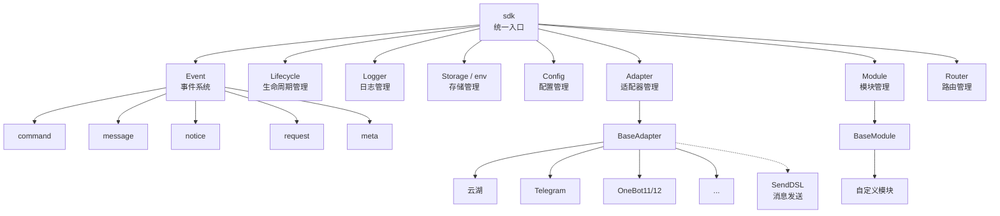
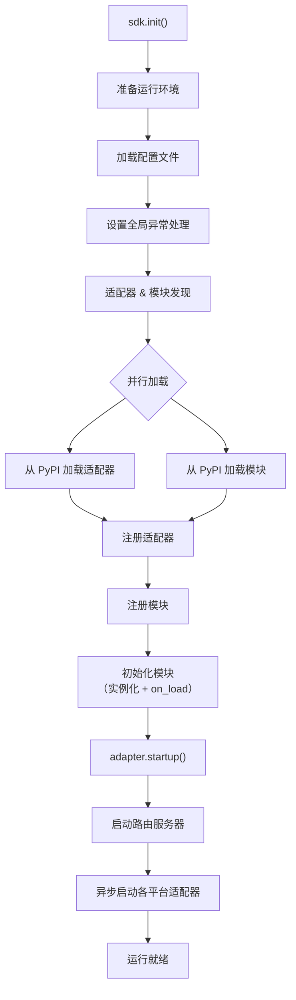
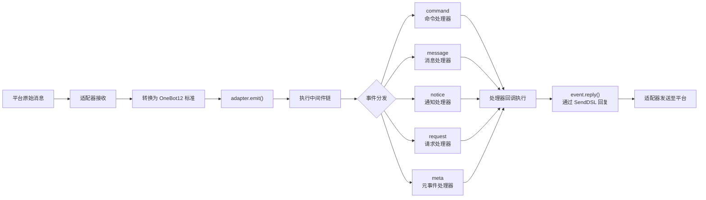
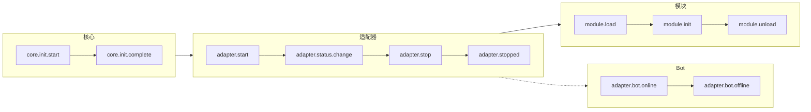
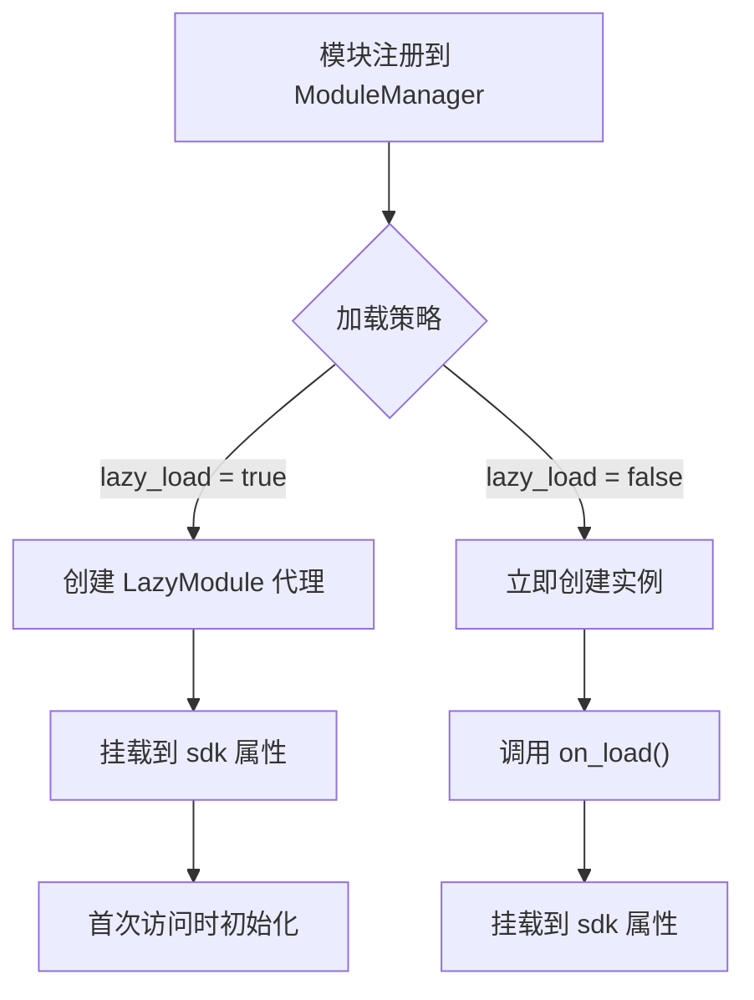

# 架构概览

本文档通过可视化图表介绍 ErisPulse SDK 的技术架构，帮助你快速理解框架的设计思想和模块关系。

## SDK 核心架构

下图展示了 SDK 的核心模块组成及其关系：



### 核心模块说明

| 模块 | 说明 |
|------|------|
| **Event** | 事件系统，提供 command / message / notice / request / meta 五类事件处理 |
| **Adapter** | 适配器管理器，管理多平台适配器的注册、启动和关闭 |
| **Module** | 模块管理器，管理插件的注册、加载和卸载 |
| **Lifecycle** | 生命周期管理器，提供事件驱动的生命周期钩子 |
| **Storage** | 基于 SQLite 的键值存储系统，支持通用 SQL 链式查询 |
| **Config** | TOML 格式的配置文件管理 |
| **Logger** | 模块化日志系统，支持子日志器 |
| **Router** | 基于 FastAPI 的 HTTP/WebSocket 路由管理 |

## 初始化流程

下图展示了 `sdk.init()` 的完整初始化过程：



### 初始化阶段详解

1. **环境准备** - 加载 TOML 配置文件，设置全局异常处理
2. **并行发现** - 同时从已安装的 PyPI 包中发现适配器和模块
3. **注册阶段** - 将发现的适配器和模块注册到对应管理器
4. **模块初始化** - 创建模块实例，调用 `on_load` 生命周期方法
5. **适配器启动** - 启动路由服务器（FastAPI），异步启动各平台适配器连接

## 事件处理流程

下图展示了消息从平台到处理器的完整流转路径：



### 事件处理关键步骤

- **适配器接收** - 各平台适配器通过 WebSocket/Webhook 等方式接收原生事件
- **OB12 标准化** - 将平台原生事件转换为统一的 OneBot12 标准格式
- **中间件处理** - 依次执行已注册的中间件函数，可修改事件数据
- **事件分发** - 根据事件类型（message/notice/request/meta）分发到对应处理器
- **SendDSL 回复** - 处理器通过 `event.reply()` 或 `SendDSL` 链式调用发送响应

## 生命周期事件

下图展示了框架各组件的生命周期事件触发顺序：



### 监听生命周期事件

你可以通过 `lifecycle.on()` 监听这些事件，执行自定义逻辑：

```python
from ErisPulse import sdk

# 监听所有适配器事件
@sdk.lifecycle.on("adapter")
async def on_adapter_event(event_data):
    print(f"适配器事件: {event_data}")

# 监听模块加载完成
@sdk.lifecycle.on("module.load")
async def on_module_loaded(event_data):
    print(f"模块已加载: {event_data}")

# 监听 Bot 上线
@sdk.lifecycle.on("adapter.bot.online")
async def on_bot_online(event_data):
    print(f"Bot 上线: {event_data}")
```

## 模块加载策略

ErisPulse 支持两种模块加载策略：



> 更多详情请参考 [懒加载系统](advanced/lazy-loading.md) 和 [生命周期管理](advanced/lifecycle.md)。