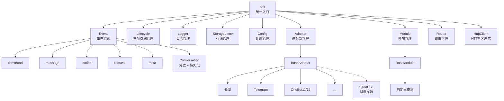
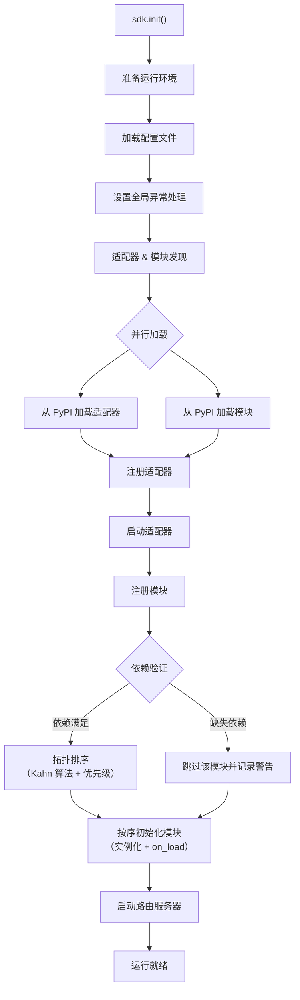
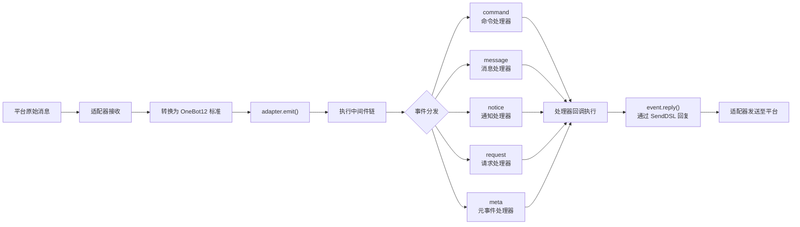
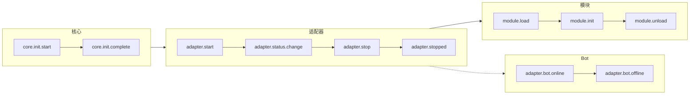
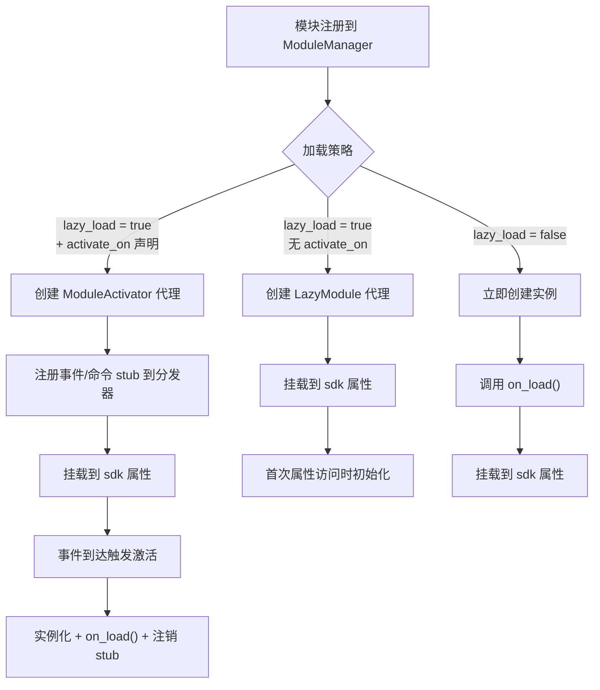
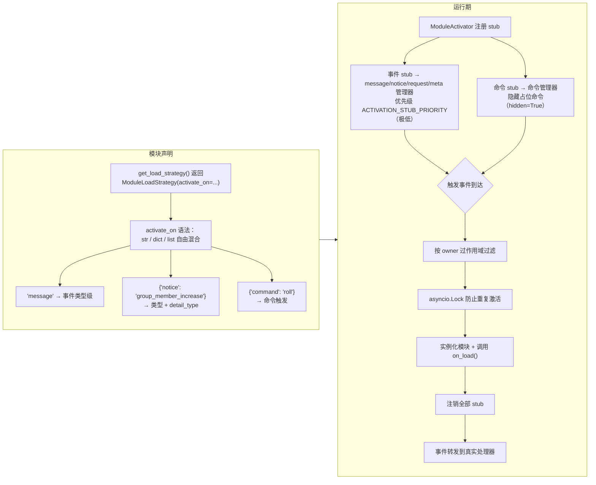
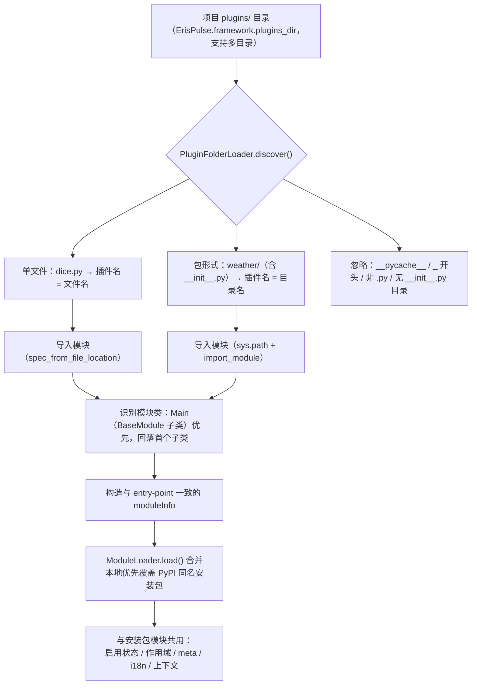
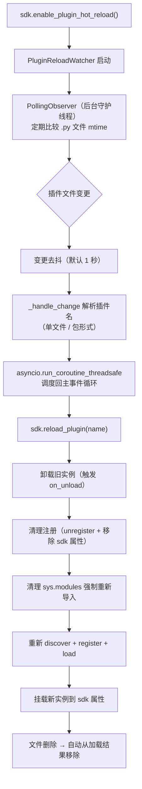

# 架构概览

本文档通过可视化图表介绍 ErisPulse SDK 的技术架构，帮助你快速理解框架的设计思想和模块关系。

## SDK 核心架构

下图展示了 SDK 的核心模块组成及其关系：


```mermaid
graph TB
    SDK["sdk<br/>统一入口"]

    SDK --> Event["Event<br/>事件系统"]
    SDK --> Lifecycle["Lifecycle<br/>生命周期管理"]
    SDK --> Logger["Logger<br/>日志管理"]
    SDK --> Storage["Storage / env<br/>存储管理"]
    SDK --> Config["Config<br/>配置管理"]
    SDK --> AdapterMgr["Adapter<br/>适配器管理"]
    SDK --> ModuleMgr["Module<br/>模块管理"]
    SDK --> Router["Router<br/>路由管理"]
    SDK --> Client["HttpClient<br/>HTTP 客户端"]
    Event --> Command["command"]
    Event --> Message["message"]
    Event --> Notice["notice"]
    Event --> Request["request"]
    Event --> Meta["meta"]
    Event --> Conversation["Conversation<br/>分支 + 持久化"]

    AdapterMgr --> BaseAdapter["BaseAdapter"]
    BaseAdapter --> P1["云湖"]
    BaseAdapter --> P2["Telegram"]
    BaseAdapter --> P3["OneBot11/12"]
    BaseAdapter --> PN["..."]

    ModuleMgr --> BaseModule["BaseModule"]
    BaseModule --> CM["自定义模块"]

    BaseAdapter -.-> SendDSL["SendDSL<br/>消息发送"]
```

### 核心模块说明

| 模块 | 说明 |
|------|------|
| **Event** | 事件系统，提供 command / message / notice / request / meta 五类事件处理，以及 Conversation 多轮对话 |
| **Adapter** | 适配器管理器，管理多平台适配器的注册、启动和关闭 |
| **Module** | 模块管理器，管理插件的注册、加载和卸载，支持依赖声明和拓扑排序 |
| **Lifecycle** | 生命周期管理器，提供事件驱动的生命周期钩子 |
| **Storage** | 基于 SQLite 的键值存储系统，支持通用 SQL 链式查询 |
| **Config** | TOML 格式的配置文件管理 |
| **Logger** | 模块化日志系统，支持子日志器 |
| **Router** | HTTP/WebSocket 路由管理，通过抽象层封装底层后端（当前为 FastAPI + Uvicorn），支持装饰器路由、中间件、分组、限流、CORS |
| **HttpClient** | 统一 HTTP/WS 客户端，通过抽象层封装底层请求库（当前为 aiohttp），提供请求统计、重试、日志、WebSocket 客户端、ErisPulse 异常体系等功能。客户端和服务端 WebSocket 共享 `WebSocketConnectionBase` 基类 |

## 初始化流程

下图展示了 `sdk.init()` 的完整初始化过程：


```mermaid
flowchart TD
    A["sdk.init()"] --> B["准备运行环境"]
    B --> B1["加载配置文件"]
    B1 --> B2["设置全局异常处理"]
    B2 --> C["适配器 & 模块发现"]
    C --> D{"并行加载"}
    D --> D1["从 PyPI 加载适配器"]
    D --> D2["从 PyPI 加载模块"]
    D1 & D2 --> E["注册适配器"]
    E --> E1["启动适配器"]
    E1 --> F["注册模块"]
    F --> F1{"依赖验证"}
    F1 -->|"缺失依赖"| F2["跳过该模块并记录警告"]
    F1 -->|"依赖满足"| F3["拓扑排序<br/>（Kahn 算法 + 优先级）"]
    F3 --> G["按序初始化模块<br/>（实例化 + on_load）"]
    F2 --> G
    G --> H["启动路由服务器"]
    H --> K["运行就绪"]
```

### 初始化阶段详解

1. **环境准备** - 加载 TOML 配置文件，设置全局异常处理
2. **并行发现** - 同时从已安装的 PyPI 包中发现适配器和模块
3. **注册适配器** - 将发现的适配器注册到适配器管理器
4. **启动适配器** - 异步启动各平台适配器连接（在模块初始化之前，确保模块能立即发送消息）
5. **注册模块** - 将发现的模块注册到模块管理器
6. **依赖验证** - 检查模块声明的 `depends` 依赖是否已注册，跳过缺失依赖的模块
7. **拓扑排序** - 使用 Kahn 算法按依赖关系排序模块加载顺序，同级按 `priority` 降序排列
8. **模块初始化** - 按排序顺序创建模块实例，调用 `on_load` 生命周期方法
9. **启动路由服务器** - 使用 Uvicorn 启动 FastAPI 路由服务器

## 事件处理流程

下图展示了消息从平台到处理器的完整流转路径：


```mermaid
flowchart LR
    A["平台原始消息"] --> B["适配器接收"]
    B --> C["转换为 OneBot12 标准"]
    C --> D["adapter.emit()"]
    D --> E["执行中间件链"]
    E --> F{"事件分发"}
    F --> G1["command<br/>命令处理器"]
    F --> G2["message<br/>消息处理器"]
    F --> G3["notice<br/>通知处理器"]
    F --> G4["request<br/>请求处理器"]
    F --> G5["meta<br/>元事件处理器"]
    G1 & G2 & G3 & G4 & G5 --> H["处理器回调执行"]
    H --> I["event.reply()<br/>通过 SendDSL 回复"]
    I --> J["适配器发送至平台"]
```

### 事件处理关键步骤

- **适配器接收** - 各平台适配器通过 WebSocket/Webhook 等方式接收原生事件
- **OB12 标准化** - 将平台原生事件转换为统一的 OneBot12 标准格式
- **中间件处理** - 依次执行已注册的中间件函数，可修改事件数据
- **事件分发** - 根据事件类型（message/notice/request/meta）分发到对应处理器
- **SendDSL 回复** - 处理器通过 `event.reply()` 或 `SendDSL` 链式调用发送响应

## 生命周期事件

下图展示了框架各组件的生命周期事件触发顺序：


```mermaid
flowchart LR
    subgraph Core["核心"]
        direction LR
        C1["core.init.start"] --> C2["core.init.complete"]
    end

    subgraph AdapterLife["适配器"]
        direction LR
        A1["adapter.start"] --> A2["adapter.status.change"] --> A3["adapter.stop"] --> A4["adapter.stopped"]
    end

    subgraph ModuleLife["模块"]
        direction LR
        M1["module.load"] --> M2["module.init"] --> M3["module.unload"]
    end

    subgraph BotLife["Bot"]
        direction LR
        B1["adapter.bot.online"] --> B2["adapter.bot.offline"]
    end

    Core --> AdapterLife
    AdapterLife --> ModuleLife
    AdapterLife -.-> BotLife
```

### 监听生命周期事件

你可以通过 `lifecycle.on()` 监听这些事件，执行自定义逻辑：

```python
from ErisPulse import sdk

# 监听所有适配器事件
@sdk.lifecycle.on("adapter")
async def on_adapter_event(event_data):
    print(f"适配器事件: {event_data}")

# 监听模块加载完成
@sdk.lifecycle.on("module.load")
async def on_module_loaded(event_data):
    print(f"模块已加载: {event_data}")

# 监听 Bot 上线
@sdk.lifecycle.on("adapter.bot.online")
async def on_bot_online(event_data):
    print(f"Bot 上线: {event_data}")
```

## 模块加载策略

ErisPulse 支持三种模块加载策略，由 `get_load_strategy()` 返回的 `ModuleLoadStrategy` 声明：


```mermaid
flowchart TD
    A["模块注册到 ModuleManager"] --> B{"加载策略"}
    B -->|"lazy_load = true<br/>+ activate_on 声明"| C["创建 ModuleActivator 代理"]
    B -->|"lazy_load = true<br/>无 activate_on"| D["创建 LazyModule 代理"]
    B -->|"lazy_load = false"| E["立即创建实例"]
    C --> F["注册事件/命令 stub 到分发器"]
    F --> G["挂载到 sdk 属性"]
    G --> H["事件到达触发激活"]
    H --> I["实例化 + on_load() + 注销 stub"]
    D --> J["挂载到 sdk 属性"]
    J --> K["首次属性访问时初始化"]
    E --> L["调用 on_load()"]
    L --> M["挂载到 sdk 属性"]
```

> 更多详情请参考 [懒加载系统](advanced/lazy-loading.md)、[生命周期管理](advanced/lifecycle.md) 与模块文档。

### 事件驱动懒激活（`activate_on`）触发架构

`activate_on` 允许模块在**首个匹配事件/命令到达时**才加载，避免常驻内存，同时保证事件不丢失：


```mermaid
flowchart LR
    subgraph Declare["模块声明"]
        S1["get_load_strategy() 返回<br/>ModuleLoadStrategy(activate_on=...)"] --> S2["activate_on 语法：<br/>str / dict / list 自由混合"]
        S2 --> S2a["'message' → 事件类型级"]
        S2 --> S2b["{'notice': 'group_member_increase'}<br/>→ 类型 + detail_type"]
        S2 --> S2c["{'command': 'roll'}<br/>→ 命令触发"]
    end

    subgraph Runtime["运行期"]
        R1["ModuleActivator 注册 stub"] --> R1a["事件 stub → message/notice/request/meta 管理器<br/>优先级 ACTIVATION_STUB_PRIORITY（极低）"]
        R1 --> R1b["命令 stub → 命令管理器<br/>隐藏占位命令（hidden=True）"]
        R1a --> R2{"触发事件到达"}
        R1b --> R2
        R2 --> R3["按 owner 过作用域过滤"]
        R3 --> R4["asyncio.Lock 防止重复激活"]
        R4 --> R5["实例化模块 + 调用 on_load()"]
        R5 --> R6["注销全部 stub"]
        R6 --> R7["事件转发到真实处理器"]
    end

    Declare --> Runtime
```

**触发语义要点：**

1. **stub 注册**：事件 stub 以极低优先级（`ACTIVATION_STUB_PRIORITY`）注册到对应事件管理器，确保在同类事件的所有普通处理器**之后**执行；命令 stub 以隐藏占位命令注册，不污染命令列表
2. **作用域过滤**：stub 带模块 owner 身份，未对该 Bot / 会话 / 平台启用的模块不触发
3. **防重入**：`asyncio.Lock` 保证并发事件下只激活一次
4. **事件转发**：激活完成后将当前事件转发给真实处理器（外层分组循环已验证 stub 之后注册的处理器不会被二次处理）
5. **失败语义**：激活失败不重试，stub 一并注销，避免每次事件都重复尝试

## 本地插件文件夹架构

本地插件（`plugins/` 目录）无需打包发布，框架启动时自动发现并加载：


```mermaid
flowchart TD
    A["项目 plugins/ 目录<br/>（ErisPulse.framework.plugins_dir，支持多目录）"] --> B{"PluginFolderLoader.discover()"}
    B --> C["单文件：dice.py → 插件名 = 文件名"]
    B --> D["包形式：weather/（含 __init__.py）→ 插件名 = 目录名"]
    B --> E["忽略：__pycache__ / _ 开头 / 非 .py / 无 __init__.py 目录"]
    C --> F["导入模块（spec_from_file_location）"]
    D --> G["导入模块（sys.path + import_module）"]
    F --> H["识别模块类：Main（BaseModule 子类）优先，回落首个子类"]
    G --> H
    H --> I["构造与 entry-point 一致的 moduleInfo"]
    I --> J["ModuleLoader.load() 合并<br/>本地优先覆盖 PyPI 同名安装包"]
    J --> K["与安装包模块共用：<br/>启用状态 / 作用域 / meta / i18n / 上下文"]
```

**约定与特性：**

- 插件名来源：单文件取文件名，包形式取目录名
- 本地插件 `moduleInfo.meta.source == "plugin_folder"`，与 PyPI 安装包模块无缝共存
- 同名时本地优先（便于本地覆盖调试），被禁用时同时移除同名 entry-point 条目

## 本地插件热重载架构

热重载监控插件文件变更，自动重新加载对应插件：


```mermaid
flowchart TD
    A["sdk.enable_plugin_hot_reload()"] --> B["PluginReloadWatcher 启动"]
    B --> C["PollingObserver（后台守护线程）<br/>定期比较 .py 文件 mtime"]
    C --> D{"插件文件变更"}
    D --> E["变更去抖（默认 1 秒）"]
    E --> F["_handle_change 解析插件名<br/>（单文件 / 包形式）"]
    F --> G["asyncio.run_coroutine_threadsafe<br/>调度回主事件循环"]
    G --> H["sdk.reload_plugin(name)"]
    H --> I["卸载旧实例（触发 on_unload）"]
    I --> J["清理注册（unregister + 移除 sdk 属性）"]
    J --> K["清理 sys.modules 强制重新导入"]
    K --> L["重新 discover + register + load"]
    L --> M["挂载新实例到 sdk 属性"]
    M --> N["文件删除 → 自动从加载结果移除"]
```