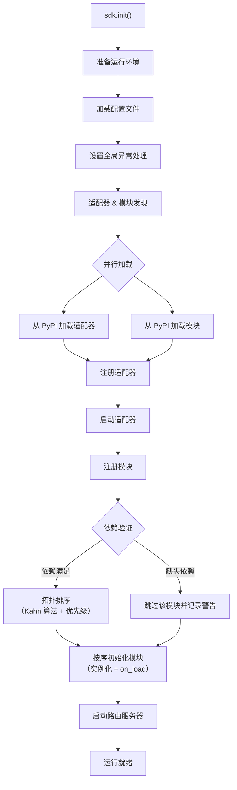
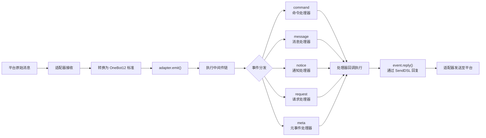
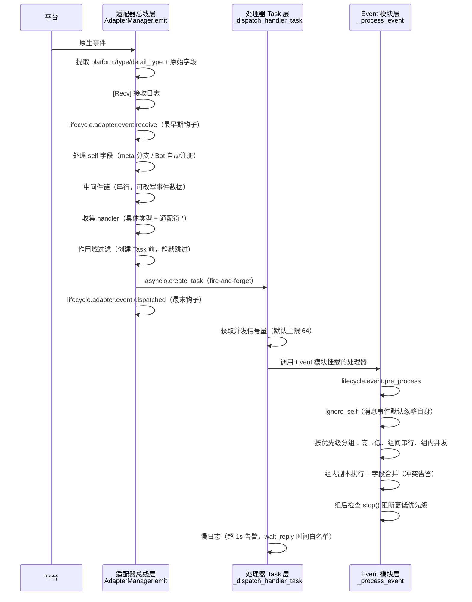
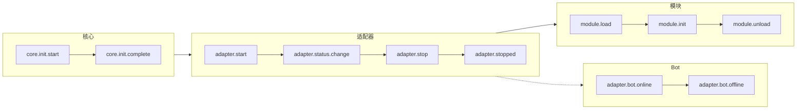
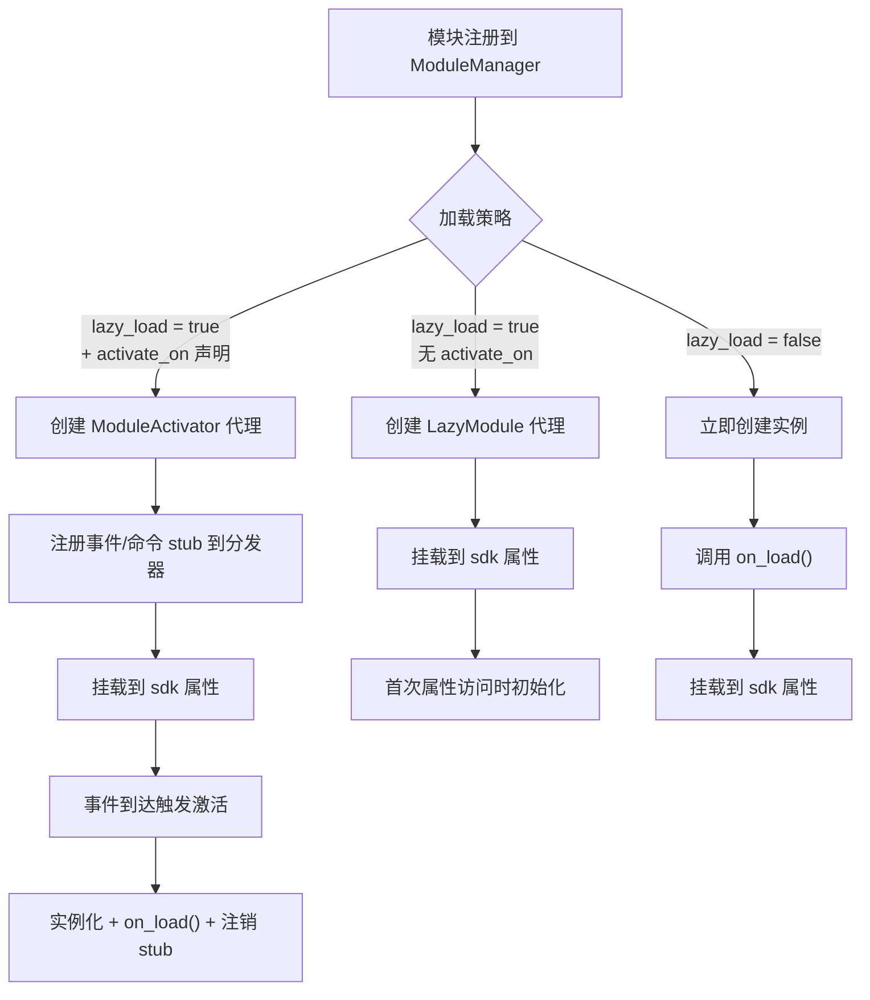
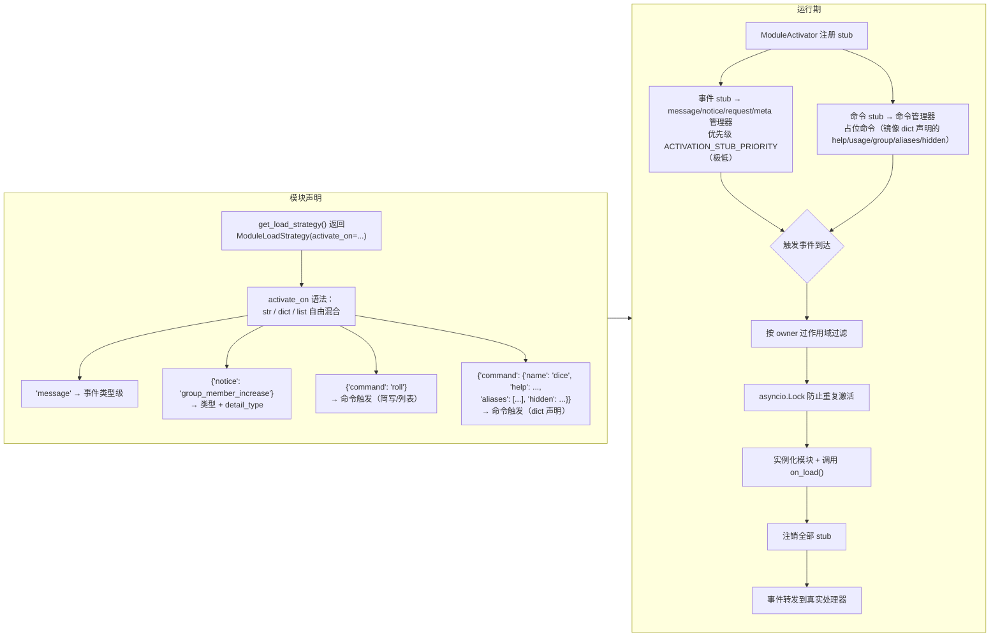
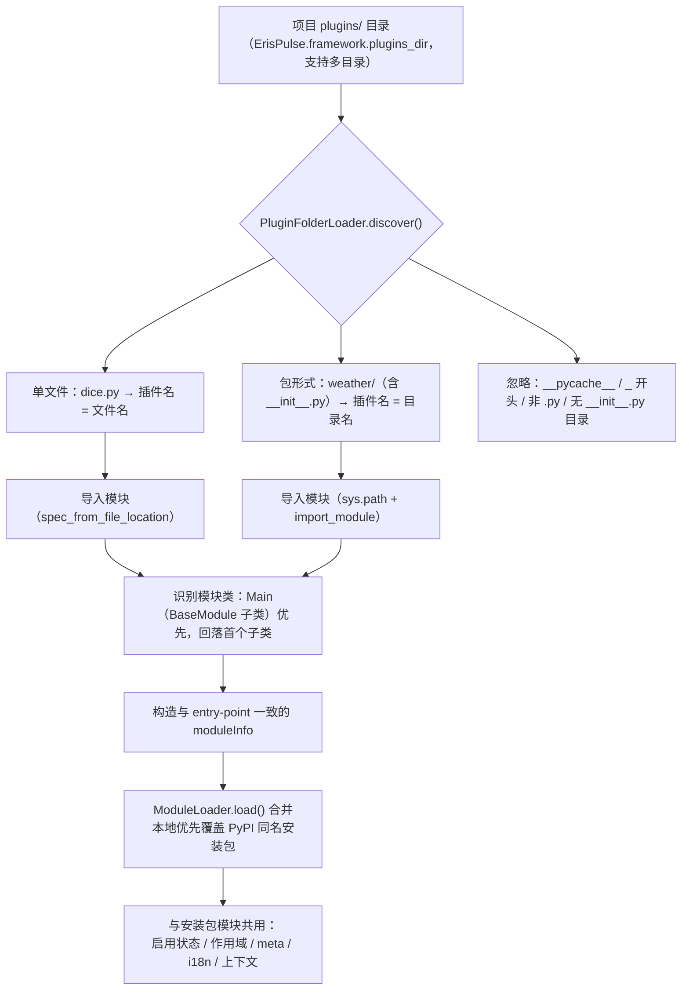
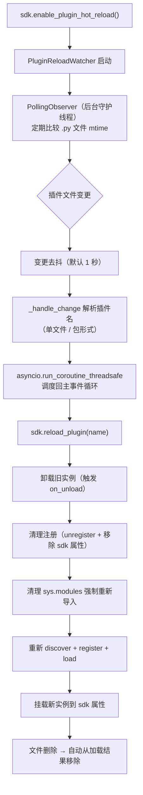

# 架构概览

本文档通过可视化图表介绍 ErisPulse SDK 的技术架构，帮助你快速理解框架的设计思想和模块关系。

## SDK 核心架构

下图展示了 SDK 的核心模块组成及其关系：

```mermaid
graph TB
    SDK["sdk<br/>统一入口"]

    SDK --> Event["Event<br/>事件系统"]
    SDK --> Lifecycle["Lifecycle<br/>生命周期管理"]
    SDK --> Logger["Logger<br/>日志管理"]
    SDK --> Storage["Storage / env<br/>存储管理"]
    SDK --> Config["Config<br/>配置管理"]
    SDK --> AdapterMgr["Adapter<br/>适配器管理"]
    SDK --> ModuleMgr["Module<br/>模块管理"]
    SDK --> Router["Router<br/>路由管理"]
    SDK --> Client["Client<br/>HTTP 客户端"]
    Event --> Command["command"]
    Event --> Message["message"]
    Event --> Notice["notice"]
    Event --> Request["request"]
    Event --> Meta["meta"]
    Event --> Conversation["Conversation<br/>分支 + 持久化"]

    AdapterMgr --> BaseAdapter["BaseAdapter"]
    BaseAdapter --> P1["云湖"]
    BaseAdapter --> P2["Telegram"]
    BaseAdapter --> P3["OneBot11/12"]
    BaseAdapter --> PN["..."]

    ModuleMgr --> BaseModule["BaseModule"]
    BaseModule --> CM["自定义模块"]

    BaseAdapter -.-> SendDSL["SendDSL<br/>消息发送"]
```

### 核心模块说明

| 模块 | 说明 |
|------|------|
| **Event** | 事件系统，提供 command / message / notice / request / meta 五类事件处理，以及 Conversation 多轮对话 |
| **Adapter** | 适配器管理器，管理多平台适配器的注册、启动和关闭 |
| **Module** | 模块管理器，管理插件的注册、加载和卸载，支持依赖声明和拓扑排序 |
| **Lifecycle** | 生命周期管理器，提供事件驱动的生命周期钩子 |
| **Storage** | 基于 SQLite 的键值存储系统，支持通用 SQL 链式查询 |
| **Config** | TOML 格式的配置文件管理 |
| **Logger** | 模块化日志系统，支持子日志器 |
| **Router** | HTTP/WebSocket 路由管理，通过抽象层封装底层后端（当前为 FastAPI + Uvicorn），支持装饰器路由、中间件、分组、限流、CORS |
| **Client** | 统一 HTTP/WS 客户端（2.8.0 前为 `HttpClient`，保留兼容别名），通过抽象层封装底层请求库（当前为 aiohttp），提供请求统计、重试、日志、WebSocket 客户端、ErisPulse 异常体系等功能。客户端和服务端 WebSocket 共享 `WebSocketConnectionBase` 基类 |

## 初始化流程

下图展示了 `sdk.init()` 的完整初始化过程：

```mermaid
flowchart TD
    A["sdk.init()"] --> B["准备运行环境"]
    B --> B1["加载配置文件"]
    B1 --> B2["设置全局异常处理"]
    B2 --> C["适配器 & 模块发现"]
    C --> D{"并行加载"}
    D --> D1["从 PyPI 加载适配器"]
    D --> D2["从 PyPI 加载模块"]
    D1 & D2 --> E["注册适配器"]
    E --> E1["启动适配器"]
    E1 --> F["注册模块"]
    F --> F1{"依赖验证"}
    F1 -->|"缺失依赖"| F2["跳过该模块并记录警告"]
    F1 -->|"依赖满足"| F3["拓扑排序<br/>（Kahn 算法 + 优先级）"]
    F3 --> G["按序初始化模块<br/>（实例化 + on_load）"]
    F2 --> G
    G --> H["启动路由服务器"]
    H --> K["运行就绪"]
```

### 初始化阶段详解

> 完整的初始化链路拆解（Finder / Loader / Manager / Router）、底层入口（`init()` / `init_task()` / `init_sync()`）与手动完整启动见 [启动流程与手动控制](advanced/startup.md)。

## 事件处理流程

下图展示了消息从平台到处理器的完整流转路径：

```mermaid
flowchart LR
    A["平台原始消息"] --> B["适配器接收"]
    B --> C["转换为 OneBot12 标准"]
    C --> D["adapter.emit()"]
    D --> E["执行中间件链"]
    E --> F{"事件分发"}
    F --> G1["command<br/>命令处理器"]
    F --> G2["message<br/>消息处理器"]
    F --> G3["notice<br/>通知处理器"]
    F --> G4["request<br/>请求处理器"]
    F --> G5["meta<br/>元事件处理器"]
    G1 & G2 & G3 & G4 & G5 --> H["处理器回调执行"]
    H --> I["event.reply()<br/>通过 SendDSL 回复"]
    I --> J["适配器发送至平台"]
```

### 事件处理链路详解

上面这张图是「结果」；下面拆开 `adapter.emit()` 之后框架**在背后做了什么**——这是一条三层分发的链路：

```mermaid
sequenceDiagram
    participant P as 平台
    participant A as 适配器总线层<br/>AdapterManager.emit
    participant T as 处理器 Task 层<br/>_dispatch_handler_task
    participant E as Event 模块层<br/>_process_event

    P->>A: 原生事件
    A->>A: 提取 platform/type/detail_type + 原始字段
    A->>A: [Recv] 接收日志
    A->>A: lifecycle.adapter.event.receive（最早期钩子）
    A->>A: 处理 self 字段（meta 分支 / Bot 自动注册）
    A->>A: 中间件链（串行，可改写事件数据）
    A->>A: 收集 handler（具体类型 + 通配符 *）
    A->>A: 作用域过滤（创建 Task 前，静默跳过）
    A->>T: asyncio.create_task（fire-and-forget）
    A->>A: lifecycle.adapter.event.dispatched（最末钩子）
    T->>T: 获取并发信号量（默认上限 64）
    T->>E: 调用 Event 模块挂载的处理器
    E->>E: lifecycle.event.pre_process
    E->>E: ignore_self（消息事件默认忽略自身）
    E->>E: 按优先级分组：高→低、组间串行、组内并发
    E->>E: 组内副本执行 + 字段合并（冲突告警）
    E->>E: 组后检查 stop() 阻断更低优先级
    T->>T: 慢日志（超 1s 告警，wait_reply 时间白名单）
```

**每一步框架做了什么、你能干预什么：**

| 阶段 | 框架做了什么 | 你能干预的 |
|------|-------------|-----------|
| 接收 | 提取标准字段，保留 `{platform}_raw` 原始数据；写 `[Recv]` 日志 | 监听 `adapter.event.receive` 拿到最早期事件 |
| self 字段 | meta 事件走 connect/disconnect/heartbeat 分支；普通事件自动注册 Bot 并触发 `adapter.bot.online` | 监听 `adapter.bot.online` / `bot.offline` |
| 中间件 | **串行**执行，返回值非 None 则替换事件数据 | 注册中间件改写/拦截事件 |
| 分发收集 | 先取具体类型 handler，再取 `*` 通配符 handler | — |
| 作用域过滤 | 按 owner 判定 `scope.is_allowed`（会话级>Bot级>平台级），**不通过则静默跳过** | 配置作用域白名单/黑名单 |
| 调度 | 每个匹配 handler 独立 `asyncio.Task`，`emit()` **不等待** handler 完成即返回 | — |
| 优先级 | 高优先级组先执行；**组间串行、组内并发**（组内各自持有事件副本，改字段合并回原事件，冲突打 WARNING） | `@command(..., priority=N)` / 注册时指定 priority |
| 阻断 | 每处理完一组检查 `event.is_stopped()`，命中则**不再执行更低优先级** | `event.mark_processed(stop=True)` / `event.done()` |

> **常见误区**：
> 1. **作用域过滤是静默的**——被屏蔽的 handler 不报错不响应，只在 TRACE 级日志可见（`core.scope.denied`）。「我的模块没收到消息」优先排查作用域绑定。
> 2. **handler 天然并发**——框架已为每个 handler 建独立 Task，你**不需要**再自己 `asyncio.create_task` 包一层。
> 3. **同优先级组内不阻断**——`mark_processed(stop=True)` 只阻止更低优先级组，同组内已并发的 handler 不会中途被打断。
> 4. **慢日志阈值固定 1 秒**——处理器耗时超 1s 会在日志打 WARNING（`wait_reply` 等待时间已从耗时中剔除），但不中断执行。

> 作用域三级绑定与优先级细节见 [作用域系统](advanced/scope.md)；claim/阻断完整语义见 [事件处理入门](getting-started/event-handling.md)；并发上限配置见 [配置指南](user-guide/configuration.md#框架配置)。

## 生命周期事件

下图展示了框架各组件的生命周期事件触发顺序：

```mermaid
flowchart LR
    subgraph Core["核心"]
        direction LR
        C1["core.init.start"] --> C2["core.init.complete"]
    end

    subgraph AdapterLife["适配器"]
        direction LR
        A1["adapter.start"] --> A2["adapter.status.change"] --> A3["adapter.stop"] --> A4["adapter.stopped"]
    end

    subgraph ModuleLife["模块"]
        direction LR
        M1["module.load"] --> M2["module.init"] --> M3["module.unload"]
    end

    subgraph BotLife["Bot"]
        direction LR
        B1["adapter.bot.online"] --> B2["adapter.bot.offline"]
    end

    Core --> AdapterLife
    AdapterLife --> ModuleLife
    AdapterLife -.-> BotLife
```

### 监听生命周期事件

> 完整的事件监听方法（`lifecycle.on()` / `once()` / `has_handlers()`）、全部生命周期事件列表与数据格式见 [生命周期管理](advanced/lifecycle.md)。

## 模块加载策略

ErisPulse 支持三种模块加载策略，由 `get_load_strategy()` 返回的 `ModuleLoadStrategy` 声明：

```mermaid
flowchart TD
    A["模块注册到 ModuleManager"] --> B{"加载策略"}
    B -->|"lazy_load = true<br/>+ activate_on 声明"| C["创建 ModuleActivator 代理"]
    B -->|"lazy_load = true<br/>无 activate_on"| D["创建 LazyModule 代理"]
    B -->|"lazy_load = false"| E["立即创建实例"]
    C --> F["注册事件/命令 stub 到分发器"]
    F --> G["挂载到 sdk 属性"]
    G --> H["事件到达触发激活"]
    H --> I["实例化 + on_load() + 注销 stub"]
    D --> J["挂载到 sdk 属性"]
    J --> K["首次属性访问时初始化"]
    E --> L["调用 on_load()"]
    L --> M["挂载到 sdk 属性"]
```

> 更多详情请参考 [懒加载系统](advanced/lazy-loading.md)、[生命周期管理](advanced/lifecycle.md) 与模块文档。

### 事件驱动懒激活（`activate_on`）触发架构

> [!NOTE]
> 本特性需要 ErisPulse **2.8.0+**。

`activate_on` 允许模块在**首个匹配事件/命令到达时**才加载，避免常驻内存，同时保证事件不丢失：

```mermaid
flowchart LR
    subgraph Declare["模块声明"]
        S1["get_load_strategy() 返回<br/>ModuleLoadStrategy(activate_on=...)"] --> S2["activate_on 语法：<br/>str / dict / list 自由混合"]
        S2 --> S2a["'message' → 事件类型级"]
        S2 --> S2b["{'notice': 'group_member_increase'}<br/>→ 类型 + detail_type"]
        S2 --> S2c["{'command': 'roll'}<br/>→ 命令触发（简写/列表）"]
        S2 --> S2d["{'command': {'name': 'dice', 'help': ...,<br/>'aliases': [...], 'hidden': ...}}<br/>→ 命令触发（dict 声明）"]
    end

    subgraph Runtime["运行期"]
        R1["ModuleActivator 注册 stub"] --> R1a["事件 stub → message/notice/request/meta 管理器<br/>优先级 ACTIVATION_STUB_PRIORITY（极低）"]
        R1 --> R1b["命令 stub → 命令管理器<br/>占位命令（镜像 dict 声明的 help/usage/group/aliases/hidden）"]
        R1a --> R2{"触发事件到达"}
        R1b --> R2
        R2 --> R3["按 owner 过作用域过滤"]
        R3 --> R4["asyncio.Lock 防止重复激活"]
        R4 --> R5["实例化模块 + 调用 on_load()"]
        R5 --> R6["注销全部 stub"]
        R6 --> R7["事件转发到真实处理器"]
    end

    Declare --> Runtime
```

**触发语义要点：**

> 完整的 `activate_on` 语法（str / dict / list）、命令 dict 声明、占位命令 help 回退链、作用域过滤与失败语义见 [懒加载系统](advanced/lazy-loading.md#事件驱动懒激活activate_on)。

## 本地插件文件夹架构

> [!NOTE]
> 本特性需要 ErisPulse **2.8.0+**。

本地插件（`plugins/` 目录）无需打包发布，框架启动时自动发现并加载：

```mermaid
flowchart TD
    A["项目 plugins/ 目录<br/>（ErisPulse.framework.plugins_dir，支持多目录）"] --> B{"PluginFolderLoader.discover()"}
    B --> C["单文件：dice.py → 插件名 = 文件名"]
    B --> D["包形式：weather/（含 __init__.py）→ 插件名 = 目录名"]
    B --> E["忽略：__pycache__ / _ 开头 / 非 .py / 无 __init__.py 目录"]
    C --> F["导入模块（spec_from_file_location）"]
    D --> G["导入模块（sys.path + import_module）"]
    F --> H["识别模块类：Main（BaseModule 子类）优先，回落首个子类"]
    G --> H
    H --> I["构造与 entry-point 一致的 moduleInfo"]
    I --> J["ModuleLoader.load() 合并<br/>本地优先覆盖 PyPI 同名安装包"]
    J --> K["与安装包模块共用：<br/>启用状态 / 作用域 / meta / i18n / 上下文"]
```

**约定与特性：**

- 插件名来源：单文件取文件名，包形式取目录名
- 本地插件 `moduleInfo.meta.source == "plugin_folder"`，与 PyPI 安装包模块无缝共存
- 同名时本地优先（便于本地覆盖调试），被禁用时同时移除同名 entry-point 条目

## 本地插件热重载架构

热重载监控插件文件变更，自动重新加载对应插件：

```mermaid
flowchart TD
    A["sdk.enable_plugin_hot_reload()"] --> B["PluginReloadWatcher 启动"]
    B --> C["PollingObserver（后台守护线程）<br/>定期比较 .py 文件 mtime"]
    C --> D{"插件文件变更"}
    D --> E["变更去抖（默认 1 秒）"]
    E --> F["_handle_change 解析插件名<br/>（单文件 / 包形式）"]
    F --> G["asyncio.run_coroutine_threadsafe<br/>调度回主事件循环"]
    G --> H["sdk.reload_plugin(name)"]
    H --> I["卸载旧实例（触发 on_unload）"]
    I --> J["清理注册（unregister + 移除 sdk 属性）"]
    J --> K["清理 sys.modules 强制重新导入"]
    K --> L["重新 discover + register + load"]
    L --> M["挂载新实例到 sdk 属性"]
    M --> N["文件删除 → 自动从加载结果移除"]
```