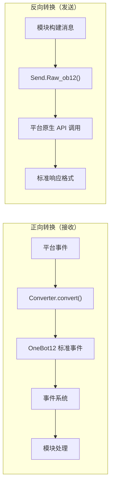

# 适配器开发入门

本指南帮助你开始开发 ErisPulse 适配器，连接新的消息平台。

## 适配器简介

### 什么是适配器

适配器是 ErisPulse 与各个消息平台之间的桥梁，负责：

1. **正向转换**：接收平台事件并转换为 OneBot12 标准格式（Converter）
2. **反向转换**：将 OneBot12 消息段转换为平台 API 调用（`Raw_ob12`）
3. 管理与平台的连接（WebSocket/WebHook）
4. 提供统一的 SendDSL 消息发送接口

### 适配器架构



## 目录结构

标准的适配器包结构：

```
MyAdapter/
├── pyproject.toml          # 项目配置
├── README.md               # 项目说明
├── LICENSE                 # 许可证
└── MyAdapter/
    ├── __init__.py          # 包入口
    ├── Core.py               # 适配器主类
    └── Converter.py          # 事件转换器
```

## 快速开始

### 1. 创建项目

```bash
mkdir MyAdapter && cd MyAdapter
```

### 2. 创建 pyproject.toml

```toml
[project]
name = "ErisPulse-MyAdapter"
version = "1.0.0"
description = "MyAdapter平台适配器"
readme = "README.md"
requires-python = ">=3.10"
license = { file = "LICENSE" }
authors = [ { name = "yourname", email = "your@mail.com" } ]

dependencies = [
    "ErisPulse>=2.4.0"  # ErisPulse 已内置 aiohttp，通常无需单独依赖
]

[project.urls]
"homepage" = "https://github.com/yourname/MyAdapter"

[project.entry-points."erispulse.adapter"]
"MyAdapter" = "MyAdapter:MyAdapter"
```

### 3. 创建适配器主类

框架提供了 `ConfigClass` / `AccountConfigClass` 声明式配置管理，适配器只需声明配置类即可自动加载、校验和生成配置模板。

```python
# MyAdapter/Core.py
from dataclasses import dataclass, field
from ErisPulse.Core import BaseAdapter
from ErisPulse.Core.Bases import BaseConfig

@dataclass
class MyAdapterConfig(BaseConfig):
    """MyAdapter 配置"""
    api_endpoint: str = field(
        default="https://api.example.com",
        metadata={
            "description": {"i18n": "my_adapter.api_endpoint", "default": "API 地址"},
            "required": False,
            "ui": {"widget": "text", "group": "connection", "order": 1},
        },
    )
    token: str = field(
        default="",
        metadata={
            "description": {"i18n": "my_adapter.token", "default": "平台 Token"},
            "required": True,
            "secret": True,
            "ui": {"widget": "password", "group": "basic", "order": 2},
        },
    )

class MyAdapter(BaseAdapter):
    ConfigClass = MyAdapterConfig  # 声明配置类，框架自动管理
    
    # 不需要覆写 __init__！框架自动处理：
    # - self.sdk / self.logger 自动设置
    # - self.cfg 实时读取配置
    # - self.Send / self.Request 自动初始化
    
    def _setup_converter(self):
        from .Converter import MyPlatformConverter
        return MyPlatformConverter()
```

> ⚠️ **关于 `__init__`**：新版本中 `BaseAdapter.__init__(self, sdk=None)` 会自动处理 SDK 引用、日志初始化和配置加载。大多数适配器**不再需要覆写 `__init__`**。详见 [__init__ 注意事项](#init-注意事项)。

> ⚠️ **关于 `super().__init__()`**：`BaseAdapter.__init__()` 负责创建 `Send` 和 `Request` 工厂实例。如果忘记调用，所有消息发送和请求操作都会报 `AttributeError`。详见 [__init__ 注意事项](#init-注意事项)。

### 4. 实现必需方法

```python
class MyAdapter(BaseAdapter):
    # ... __init__ 代码 ...
    
    async def start(self):
        """启动适配器（必须实现）"""
        # 注册 WebSocket 或 WebHook 路由
        router.register_websocket(
            module_name="myplatform",
            path="/ws",
            handler=self._ws_handler
        )
        self.logger.info("适配器已启动")
    
    async def shutdown(self):
        """关闭适配器（必须实现）"""
        router.unregister_websocket(
            module_name="myplatform",
            path="/ws"
        )
        # 清理连接和资源
        self.logger.info("适配器已关闭")
    
    async def call_api(self, endpoint: str, **params):
        """调用平台 API（必须实现）"""
        raise NotImplementedError("需要实现 call_api")
```

#### 主动发送 Meta 事件

适配器应主动发送 meta 事件，让框架追踪 Bot 的在线状态。使用 `emit_meta()` 一行即可完成：

```python
class MyAdapter(BaseAdapter):
    async def _ws_handler(self, websocket):
        bot_id = self._get_bot_id()

        # Bot 上线
        await self.emit_meta("connect", bot_id, user_name="MyBot")

        try:
            while True:
                data = await websocket.receive_text()
                event = self.convert(data)
                if event:
                    await self.adapter.emit(event)
        except WebSocketDisconnect:
            pass
        finally:
            # Bot 下线
            await self.emit_meta("disconnect", bot_id)
```

> 详细的 Bot 状态管理和 Meta 事件说明请参阅 [适配器最佳实践 - Bot 状态管理](best-practices.md#bot-状态管理与-meta-事件)。

### 5. 实现 Send 类

`At`/`AtAll`/`Reply` 修饰器已由框架 SendDSL 基类内置实现，适配器只需实现 `Raw_ob12` 和具体的发送方法即可。

框架提供两个关键辅助方法：
- `self._apply_modifiers(message)` — 自动合并 At/AtAll/Reply 修饰器到消息段
- `self.send_context` — 获取发送上下文字典（`target_type`、`target_id`、`account_id`）

```python
import asyncio

class MyAdapter(BaseAdapter):
    # ... 其他代码 ...

    class Send(BaseAdapter.Send):

        def Raw_ob12(self, message, **kwargs):
            """
            发送 OneBot12 格式消息（必须实现）

            使用 _apply_modifiers 自动合并修饰器状态，
            使用 send_context 获取发送上下文。
            """
            async def _do_send():
                segments = self._apply_modifiers(message)
                return await self._adapter.call_api(
                    endpoint="/send_message",
                    message=segments,
                    **self.send_context,
                    **kwargs
                )
            return asyncio.create_task(_do_send())

        # Text/Image/Voice/Video/File 已从 SendDSL 基类继承，
        # 默认委托给 Raw_ob12，无需重复实现。
        # 如需平台特定逻辑，可覆盖单个方法：
        # def Text(self, text: str):
        #     return self.Raw_ob12([{"type": "text", "data": {"text": text}}])
```

**媒体类发送方法（Image/Video/File）实现要点：**

- 基类的默认实现会将 `file` 参数封装为 OneBot12 消息段传给 `Raw_ob12`，适配器需在 `Raw_ob12` 中处理下载/上传
- `file` 参数应同时支持 `bytes` 二进制数据和 `str` URL 两种类型
- 当传入 URL 时，需先下载文件再上传到平台
- 平台通常需要先调用上传接口获取文件标识，再调用发送接口

**`__getattr__` 魔术方法：**

- 实现方法名大小写不敏感（`Text`、`text`、`TEXT` 都能调用）
- 未定义的方法应返回提示信息而非报错

**`Raw_ob12` 方法：**

- 将 OneBot12 标准消息格式转换为平台格式发送
- 使用 `self._apply_modifiers(message)` 自动处理 At/AtAll/Reply 修饰器
- 使用 `**self.send_context` 传递发送目标信息和账号信息

### 6. 实现转换器

```python
# MyAdapter/Converter.py
import time
import uuid

class MyPlatformConverter:
    def convert(self, raw_event):
        """将平台原生事件转换为 OneBot12 标准格式"""
        if not isinstance(raw_event, dict):
            return None
        
        onebot_event = {
            "id": str(raw_event.get("event_id", uuid.uuid4())),
            "time": int(time.time()),
            "type": self._convert_event_type(raw_event.get("type")),
            "detail_type": self._convert_detail_type(raw_event),
            "platform": "myplatform",
            "self": {
                "platform": "myplatform",
                "user_id": str(raw_event.get("bot_id", ""))
            },
            "myplatform_raw": raw_event,
            "myplatform_raw_type": raw_event.get("type", "")
        }
        
        return onebot_event
    
    def _convert_event_type(self, event_type):
        """转换事件类型"""
        type_map = {
            "message": "message",
            "notice": "notice"
        }
        return type_map.get(event_type, "unknown")
    
    def _convert_detail_type(self, raw_event):
        """转换详细类型"""
        return "private"  # 简化示例
```

### 7. 实现 Request 类（请求操作）

如果你的平台支持好友请求、群邀请等需要 Bot 做出决策的请求，可以实现 `Request` 内部类：

```python
from ErisPulse.Core import BaseAdapter, RequestDSL

class MyAdapter(BaseAdapter):
    # ... Send 和其他代码 ...

    class Request(RequestDSL):
        """请求操作实现（好友请求、群邀请等）"""

        def accept(self, **kwargs):
            """同意请求"""
            async def _do():
                result = await self._adapter.call_api(
                    endpoint="/set_request",
                    request_id=self._request_id,
                    approve=True,
                    **kwargs,
                )
                return {
                    "status": "ok" if result.get("code") == 0 else "failed",
                    "retcode": result.get("code", 0),
                    "data": None,
                    "message_id": "",
                    "message": result.get("message", ""),
                }
            return self._create_task(_do())

        def reject(self, **kwargs):
            """拒绝请求"""
            async def _do():
                result = await self._adapter.call_api(
                    endpoint="/set_request",
                    request_id=self._request_id,
                    approve=False,
                    **kwargs,
                )
                return {
                    "status": "ok" if result.get("code") == 0 else "failed",
                    "retcode": result.get("code", 0),
                    "data": None,
                    "message_id": "",
                    "message": result.get("message", ""),
                }
            return self._create_task(_do())
```

模块开发者使用方式：

```python
from ErisPulse.Core.Event import request

@request.on_friend_request()
async def handle_friend_request(event):
    # 通过 Event 便捷方法
    await event.approve()
    # 或通过适配器直接操作
    await adapter.myplatform.Request("req_id").accept()
```

> 如果平台不支持请求操作，可以不实现 `Request` 内部类。基类默认返回 `retcode=10002`（不支持的操作）。详见 [请求操作规范](../../standards/request-action-spec.md)。

### 8. 创建包入口

```python
# MyAdapter/__init__.py
from .Core import MyAdapter
```

## 依赖声明（可选，2.8.0+）

适配器可以声明对其它适配器或模块的依赖，实现适配器间联动与可选功能：

```python
from typing import ClassVar

class MyAdapter(BaseAdapter):
    # 硬依赖：缺失时跳过启动（警告 + status=skipped-dependency 事件）
    depends: ClassVar[dict] = {
        "adapters": ["onebot11"],   # 依赖的适配器（按平台名）
        "modules": ["TranslateEngine"],  # 依赖的模块（按注册名）
    }
    # 软依赖：缺失不影响启动；模块加载/卸载时收到回调（可选功能模式）
    optional_modules: ClassVar[list] = ["TranslateEngine"]
```

- **启动顺序**：声明了模块硬依赖的适配器会**推迟到模块初始化完成后**再启动
- **软依赖通知**：`optional_modules`（或模块硬依赖）中的模块被加载时调用 `on_dependency_ready(module_name)`；被卸载时调用 `on_dependency_lost(module_name)`（默认空实现，可覆写）——覆盖晚加载与热重载场景：

```python
async def on_dependency_ready(self, module_name):
    """软依赖模块就绪：启用对应可选功能"""
    if module_name == "TranslateEngine":
        self._translate = self.sdk.TranslateEngine

async def on_dependency_lost(self, module_name):
    """软依赖模块丢失：降级功能"""
    if module_name == "TranslateEngine":
        self._translate = None
```

> [!NOTE]
> 本特性需要 ErisPulse **2.8.0+**。

## `__init__` 注意事项

适配器开发中有三个层面可能涉及 `__init__` 重写。以下是每个层面的正确做法。

### 1. BaseAdapter 层（大多数情况不需要重写）

`BaseAdapter.__init__(self, sdk=None)` 负责创建 `Send` / `Request` 工厂实例，并自动完成以下工作：

- 接受 `sdk` 参数并设置 `self.sdk`、`self.logger`
- 如果声明了 `ConfigClass`，可通过 `self.cfg` 实时读取全局配置
- 如果声明了 `AccountConfigClass`，可通过 `self.accounts` 实时读取多账户配置

**大多数情况下不需要覆写 `__init__`**，只需声明 `ConfigClass` 即可：

```python
class MyAdapter(BaseAdapter):
    ConfigClass = MyAdapterConfig  # 声明后框架自动管理配置
    
    async def start(self):
        cfg = self.cfg  # 类型安全，实时读取
        ...
```

如果确实需要自定义初始化，调用 `super().__init__(sdk)` 即可：

```python
class MyAdapter(BaseAdapter):
    ConfigClass = MyAdapterConfig
    
    def __init__(self, sdk=None):
        super().__init__(sdk)  # 传入 sdk
        self.converter = self._setup_converter()
        self.convert = self.converter.convert
```

### 2. Send 内部类（大多数情况不需要重写）

`SendDSL.__init__` 负责链式调用的状态传递（目标类型、目标ID、账号等）。**大多数情况下，你只需要重写方法**（`Raw_ob12`、`Text` 等），不需要重写 `__init__`。

如果确实需要（比如初始化平台特有的状态），**必须透传所有参数**：

```python
class MyAdapter(BaseAdapter):
    class Send(BaseAdapter.Send):
        # 参数：adapter, target_type, target_id, account_id
        def __init__(self, adapter, target_type=None, target_id=None, account_id=None):
            super().__init__(adapter, target_type, target_id, account_id)  # ← 必须透传
            self._my_state = None  # 平台特有初始化
```

**为什么必须透传？** 链式调用的每一步都通过 `self.__class__(...)` 创建新实例：

```python
adapter.Send.To("user", "123")               # → Send(adapter, "user", "123", None)
adapter.Send.To("user", "123").Using("bot1")  # → Send(adapter, "user", "123", "bot1")
```

如果 `__init__` 签名不匹配或没调 `super()`，链式调用就会中断。

### 3. Request 内部类（大多数情况不需要重写）

与 Send 同理。参数为 `adapter`, `request_id`, `account_id`：

```python
class MyAdapter(BaseAdapter):
    class Request(RequestDSL):
        # 参数：adapter, request_id, account_id
        def __init__(self, adapter, request_id=None, account_id=None):
            super().__init__(adapter, request_id, account_id)  # ← 必须透传
            self._my_state = None  # 平台特有初始化
```

### 总结

| 层面 | 什么时候重写 | 必须做的事 |
|------|------------|-----------|
| **BaseAdapter** | 需要自定义初始化逻辑时 | `super().__init__(sdk)` （传入 sdk 参数） |
| **Send 内部类** | 需要初始化发送相关状态时 | `super().__init__(adapter, target_type, target_id, account_id)` |
| **Request 内部类** | 需要初始化请求相关状态时 | `super().__init__(adapter, request_id, account_id)` |
| 三个层面 | 大多数情况 | **声明 ConfigClass 即可，不碰 `__init__`** |

### 9. 连接信息与路由发现

适配器注册路由后，框架会记录所有路由信息。用户可以通过以下 API 查看适配器的连接地址：

```python
from ErisPulse import sdk

# 获取适配器完整连接信息
info = sdk.adapter.get_connection_info("myplatform")
# {
#   "platform": "myplatform",
#   "status": "started",
#   "connection": {
#     "base_url": "http://localhost:8080",
#     "http_routes": [
#       {"path": "/myplatform/webhook", "method": "POST",
#        "url": "http://localhost:8080/myplatform/webhook"}
#     ],
#     "websocket_routes": [
#       {"path": "/myplatform/ws",
#        "url": "ws://localhost:8080/myplatform/ws"}
#     ]
#   }
# }

# 列出所有命名空间（适配器/模块）的路由
namespaces = sdk.router.list_namespaces()
# {"myplatform": {"http": ["/myplatform/webhook"], "websocket": ["/myplatform/ws"]}}

# 获取命名空间的完整连接 URL
urls = sdk.router.get_module_urls("myplatform")
# {"base_url": "http://localhost:8080", "http": [...], "websocket": [...]}

# 获取命名空间的详细路由信息
routes = sdk.router.get_module_routes("myplatform")
# {"http": [{"path": "/myplatform/webhook", "methods": ["POST"]}],
#  "websocket": [{"path": "/myplatform/ws", "auth": false}]}
```

> **提示**：`get_connection_info()` 返回的信息适合展示给用户（如 WebUI），帮助用户配置平台侧的回调地址或 WebSocket 连接地址。路由注册时的 `module_name` 必须与适配器在 ErisPulse 中注册的 `platform` 名称完全一致，否则路由发现将无法正确关联。

### 10. SSE (Server-Sent Events) 支持

ErisPulse 内置了服务器无关的 SSE 支持，模块和适配器可以通过 `@sdk.router.sse()` 注册 SSE 端点。

#### 基本使用

```python
import asyncio
from ErisPulse import sdk

@sdk.router.sse("MyModule", "/events")
async def event_stream(sse):
    """推送 SSE 事件"""
    count = 0
    while not sse.closed:
        await sse.send({"count": count}, event="update")
        count += 1
        await asyncio.sleep(1)
```

#### 使用请求参数

处理器可以声明 `request` 参数来访问客户端请求信息：

```python
@sdk.router.sse("MyModule", "/events")
async def event_stream(request, sse):
    token = request.query_params.get("token")
    if not validate_token(token):
        await sse.close()
        return

    while not sse.closed:
        data = await fetch_data(token)
        await sse.send(data)
        await asyncio.sleep(5)
```

#### SseEmitter API

| 方法 | 说明 |
|------|------|
| `sse.send(data, event=None, id=None, retry=None)` | 发送 SSE 事件。非 str 的 data 自动 JSON 序列化 |
| `sse.close()` | 优雅关闭 SSE 连接（安全调用，可多次） |
| `sse.closed` | 连接是否已关闭 |
| `sse.request` | 底层请求对象（可用于读取 query params、headers） |

#### 在 RouteGroup 中使用

```python
api = sdk.router.group("MyModule", "/api", version="1")

@api.sse("/events")
async def events(sse):
    await sse.send({"msg": "hello"})
```

#### 路由发现

SSE 路由会自动出现在路由发现 API 中：

```python
# list_namespaces 会包含 "sse" 键
sdk.router.list_namespaces()
# {"MyModule": {"http": [...], "websocket": [...], "sse": ["/MyModule/events"]}}

# get_module_routes 会标记 streaming: true
sdk.router.get_module_routes("MyModule")
# {"http": [...], "websocket": [...], "sse": [{"path": "/MyModule/events", "streaming": true}]}

# get_module_urls 会生成完整 URL
sdk.router.get_module_urls("MyModule")
# {"sse": [{"path": "/MyModule/events", "url": "http://localhost:8080/MyModule/events"}]}
```

> **服务器无关设计**：`SseEmitter` 通过回调与底层 HTTP 框架解耦。框架提供了 `register_sse()` 和 `@sse` 装饰器作为统一的注册入口，适配器无需直接依赖任何底层 HTTP 框架即可实现 SSE 端点。

## 下一步

- [适配器核心概念](core-concepts.md) - 了解适配器架构
- [SendDSL 详解](send-dsl.md) - 学习消息发送
- [转换器实现](converter.md) - 了解事件转换
- [适配器最佳实践](best-practices.md) - 开发高质量适配器