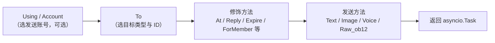

# SendDSL 详解

SendDSL 是 ErisPulse 适配器提供的链式调用风格的消息发送接口。

## 基本调用方式

### 1. 指定类型和ID

```python
await adapter.Send.To("group", "123").Text("Hello")
```

### 2. 仅指定ID

```python
await adapter.Send.To("123").Text("Hello")
```

### 3. 指定发送账号

```python
await adapter.Send.Using("bot1").Text("Hello")
```

### 4. 组合使用

```python
await adapter.Send.Using("bot1").To("group", "123").Text("Hello")
```

## 方法链



## 发送方法

所有发送方法返回 `asyncio.Task` 对象。

### 基本方法（基类内置）

以下标准方法已由 `SendDSL` 基类内置实现，**默认委托给 `Raw_ob12`**，适配器子类无需重复实现即可直接使用，且 IDE 能补全：

| 方法名 | 说明 | 返回值 |
|--------|------|---------|
| `Text(text: str)` | 发送文本消息 | `asyncio.Task` |
| `Image(file: bytes \| str)` | 发送图片 | `asyncio.Task` |
| `Voice(file: bytes \| str)` | 发送语音（OneBot12 `audio` 段） | `asyncio.Task` |
| `Video(file: bytes \| str)` | 发送视频 | `asyncio.Task` |
| `File(file: bytes \| str, filename: str = None)` | 发送文件 | `asyncio.Task` |

适配器可覆盖单个标准方法以提供平台特定逻辑：

```python
class Send(SendDSL):
    def Raw_ob12(self, message, **kwargs):
        # 必须实现
        ...

    # 可选：覆盖 Text 以提供平台特定逻辑
    # def Text(self, text: str):
    #     return self.Raw_ob12([{"type": "text", "data": {"text": text}}])
```

### 协议方法

| 方法名 | 说明 | 返回值 | 是否必须 |
|--------|------|---------|---------|
| `Raw_ob12(message)` | 发送 OneBot12 格式消息 | `asyncio.Task` | **必须实现** |

> **重要**：`Raw_ob12` 是适配器的核心方法，**必须实现**。它是反向转换（OneBot12 → 平台）的统一入口。未实现时基类会记录 error 日志并返回标准错误响应（`status: "failed"`, `retcode: 10002`）。标准方法（`Text`、`Image` 等）默认委托给 `Raw_ob12`。

### 平台特有方法

适配器可在 `Send` 子类中添加平台特有的发送方法（会被 `event.supports()` / `event.available_methods()` 识别）：

```python
class Send(SendDSL):
    def Raw_ob12(self, message, **kwargs): ...

    # 平台特有方法
    def Sticker(self, sticker_id: str):
        return self.Raw_ob12([{"type": "sticker", "data": {"id": sticker_id}}])
```

## 修饰方法

修饰方法返回 `self` 以支持链式调用。

### At 方法

```python
# @单个用户
await adapter.Send.To("group", "123").At("456").Text("你好")

# @多个用户
await adapter.Send.To("group", "123").At("456").At("789").Text("你们好")
```

### AtAll 方法

```python
# @全体成员
await adapter.Send.To("group", "123").AtAll().Text("大家好")
```

### Reply 方法

```python
# 回复消息
await adapter.Send.To("group", "123").Reply("msg_id").Text("回复内容")
```

### 组合修饰

```python
await adapter.Send.To("group", "123").At("456").Reply("msg_id").Text("回复@的消息")
```

### 平台专有修饰方法

除了内置的 `At`/`AtAll`/`Reply`，适配器可以定义**平台专有的修饰方法**。这类方法**只需返回 `self`**，无需任何装饰器——框架会自动识别：

- 返回 `self`（SendDSL 实例）→ 修饰方法，不触发发送包装/生命周期事件，链式继续
- 返回 `Task`/`Awaitable` → 发送方法

```python
class Send(SendDSL):
    def Raw_ob12(self, message, **kwargs): ...

    # 修饰方法：返回 self，不发送
    def Expire(self, seconds: int):
        self._expire = seconds
        return self

    def ForMember(self, user_id: str):
        self._member = user_id
        return self

    # 发送方法：返回 Task，依赖修饰方法设置的状态
    def Board(self, content: str, **kwargs):
        return self.Raw_ob12([{"type": "board", "data": {"text": content}}])
```

使用：

```python
# 修饰方法可连续链式叠加
await adapter.Send.To("group", "big").Expire(3600).ForMember("114").Board("看板内容")
```

## 在 Event 包装类中使用修饰方法

> [!NOTE]
> `reply(via=)` 与 `event.send_chain()` 本特性需要 ErisPulse **2.7.0+**。

`event.reply()` 默认只暴露 `at_sender`/`at_users`/`at_all`/`quote` 等内置修饰参数。要使用平台专有修饰方法，有两种方式：

### 方式一：reply() 的 via 参数

适合少量、已知的修饰方法：

```python
await event.reply("看板内容", method="Board",
                  via=[("Expire", 3600), ("ForMember", "114514")])
```

`via` 是一个列表，每个元素可为：

| 形式 | 等价链式调用 |
|------|-------------|
| `"Name"` | `.Name()` |
| `("Name", arg1, arg2)` | `.Name(arg1, arg2)` |
| `("Name", (arg1,), {kw: val})` | `.Name(arg1, kw=val)` |

### 方式二：event.send_chain()

适合**连续多个修饰方法**或**无内容参数的动作型方法**（如撤回、删除）。`send_chain()` 返回已配置好 `To`/`Using` 的发送链，可自由追加任意修饰方法和发送方法：

```python
# 平台专有修饰方法 + 看板发送
await event.send_chain().Expire(3600).Board("一小时后过期")

# 连续多个修饰方法
await (event.send_chain()
       .Expire(3600)
       .ForMember("114514")
       .Board("看板内容", content_type="markdown"))

# 内置修饰方法同样可用
await event.send_chain().At("123").Reply("msg_id").Text("hi")

# 无内容参数的动作型方法
await event.send_chain().DismissBoard()
```

> `send_chain()` 返回的是完整的 SendDSL 实例，因此**所有链式特性都可用**——不仅是修饰方法，还包括发送规则和批量构建：

```python
# 发送规则：重试 + 超时 + 成功回调
await (event.send_chain()
       .Retry(3).Timeout(10)
       .Hook(lambda r: print("发送成功"))
       .Text("可靠发送"))

# 延迟发送 + 平台修饰 + 看板
await event.send_chain().Defer(5).Expire(3600).Board("延迟看板")

# 批量构建模式
results = await (event.send_chain()
                 .Build()
                 .Text("第一句").Image("pic.jpg").Text("第二句")
                 .send_all())
```

## 账户管理

### Using 方法

`Using()` 用于指定发送消息的账户。传入的标识符会通过 `_resolve_account()` 按以下优先级匹配：

1. **账户名** — 配置中的键名（如 `"default"`、`"bot1"`）
2. **运行时注入的 bot_id** — 从事件转换时自动注入的标识符
3. **任意 str 字段** — 配置中其他字符串字段
4. **兜底** — 第一个启用的账户

```python
# 使用账户名
await adapter.Send.Using("account1").To("user", "123").Text("Hello")

# 使用 bot_id（即事件中的 self.user_id）
await adapter.Send.Using("bot_123").To("user", "123").Text("Hello")
```

### Account 方法

`Account` 方法与 `Using` 等价：

```python
await adapter.Send.Account("account1").To("user", "123").Text("Hello")
```

## 异步处理

### 不等待结果

```python
# 消息在后台发送
task = adapter.Send.To("user", "123").Text("Hello")

# 继续执行其他操作
# ...
```

### 等待结果

```python
# 直接 await 获取结果
result = await adapter.Send.To("user", "123").Text("Hello")
print(f"发送结果: {result}")

# 先保存 Task，稍后等待
task = adapter.Send.To("user", "123").Text("Hello")
# ... 其他操作 ...
result = await task
```

## 发送规则系统

SendDSL 内置了一套发送规则装饰器，通过链式方法附加规则，在最终发送时统一应用。规则覆盖常见的生产场景：超时控制、失败重试、成功回调、延迟发送、优先级丢弃、进度监控。

规则方法**返回 self**（与 At/AtAll/Reply 一样），必须放在发送方法（Text/Image 等）之前调用。规则会随 `To`/`Using`/`Account` 创建的新实例传播。

### 规则方法一览

| 方法 | 说明 |
|--------|------|
| `.Hook(callback)` | 发送成功后执行的回调（可多次调用，按顺序执行） |
| `.Retry(times=1)` | 失败自动重试 N 次（含首次共 N+1 次） |
| `.Timeout(seconds)` | 单次发送超时，超时取消当前尝试（可与 Retry 叠加） |
| `.Defer(seconds=1.0)` | 延迟发送（进程内定时，不持久化） |
| `.Priority(level, drop_if_busy=False)` | 设置优先级；积压时可丢弃 |
| `.OnProgress(callback)` | 各阶段进度回调（传入 `SendContext`） |
| `.OnError(callback)` | 最终失败时的错误回调（仅触发一次） |

### 发送成功后执行逻辑（Hook）

```python
# 同步回调
await (adapter.Send.To("user", "123")
       .Hook(lambda r: print(f"发送成功，消息ID: {r['message_id']}"))
       .Text("你好"))

# 异步回调
async def deduct_points(result):
    await db.update(user_id="123", points=-1)

await adapter.Send.To("user", "123").Hook(deduct_points).Text("扣积分")
```

Hook 仅在发送最终成功（含重试成功）时执行；失败、超时、取消不触发。

### 失败自动重试（Retry）

```python
# 首次失败后重试 2 次，共 3 次尝试
result = await adapter.Send.To("user", "123").Retry(2).Text("带重试")
```

重试触发条件：发送抛出异常、发送超时、发送返回 `status == "failed"` 的响应。

### 超时自动取消（Timeout）

```python
# 单次发送超过 10 秒则取消
await adapter.Send.To("user", "123").Timeout(10).Text("带超时")

# 超时 + 重试：每次尝试 10 秒，最多 3 次
await adapter.Send.To("user", "123").Timeout(10).Retry(2).Text("超时重试")
```

### 进度监控（OnProgress / OnError）

```python
def on_progress(ctx):
    print(f"阶段: {ctx.stage}, 尝试: {ctx.attempt + 1}/{ctx.max_attempts}, 耗时: {ctx.elapsed:.2f}s")
    if ctx.stage == "failed":
        print(f"  错误: {ctx.error!r}")

async def on_error(ctx):
    await notify_admin(f"发送给 {ctx.target_id} 失败: {ctx.error!r}")

await (adapter.Send.To("user", "123")
       .Retry(3).Timeout(10)
       .OnProgress(on_progress)
       .OnError(on_error)
       .Text("监控"))
```

`SendContext` 包含的字段：`task_id`、`platform`、`method`、`target_type`、`target_id`、`bot_id`、`stage`、`attempt`、`max_attempts`、`started_at`、`finished_at`、`elapsed`、`error`、`result`、`extra`。

`stage` 可能的值：`pending`、`sending`、`retrying`、`success`、`failed`、`timeout`、`cancelled`、`dropped`。

### 延迟发送（Defer）

```python
# 5 秒后发送
await adapter.Send.To("user", "123").Defer(5).Text("迟到消息")
```

> 注意：延迟为进程内定时，进程重启会丢失，不提供持久化。

### 优先级与积压丢弃（Priority）

```python
# 低优先级消息，队列积压时自动丢弃
result = await (adapter.Send.To("user", "123")
               .Priority(-1, drop_if_busy=True)
               .Text("可放弃的通知"))
# 若被丢弃，result["status"] == "failed"
```

`drop_if_busy` 启用后，当在途发送任务数超过阈值（默认 64）时直接放弃本次发送。可通过 `.PriorityThreshold(n)` 调整全局阈值。

### 规则组合与后台执行

```python
# 不阻塞主流程，规则照样生效
task = (adapter.Send.To("user", "123")
        .Hook(lambda r: print("发送成功！"))
        .Retry(3)
        .Timeout(10)
        .OnProgress(on_progress)
        .Text("你好"))

# 继续执行其他操作
await handle_next_action()
```

### 规则传播

规则随 `To`/`Using`/`Account` 创建的新实例传播，避免链式调用中规则丢失：

```python
# 规则在 To 之前设置，也会传播到 To 创建的实例
builder = adapter.Send.Retry(3).Timeout(10)
send = builder.To("user", "123")  # send 仍携带 Retry(3) 和 Timeout(10)
await send.Text("hi")
```

多个实例的规则相互独立（hooks 列表深拷贝）。

## 批量构建模式（Build）

除单发模式外，SendDSL 还支持批量构建模式：一条链路中写多个发送方法，最后统一执行。适用于“一口气发多条消息”的场景。

### 进入构建模式

在发送方法之前调用 `.Build()`，返回 `SendBuilder`。此后发送方法（Text/Image 等）不再立即执行，而是累积为发送意图：

```python
results = await (adapter.Send.To("user", "123")
                 .Build()                    # 进入构建模式
                 .Text("第一句")
                 .Image("pic.jpg")
                 .Text("第二句")
                 .send_all())                 # 统一执行
# results = [Text结果, Image结果, Text结果]
```

`.send_all()` 返回 `asyncio.Task`，await 后得到结果列表（按意图顺序）。

### 并行与串行

默认**并行**执行（并发发送，总耗时约等于最慢的一条）。需要保证消息到达顺序时调用 `.Sequential()`：

```python
# 串行：按顺序依次发送
await (adapter.Send.To("group", "456")
       .Build()
       .Sequential()
       .Text("先发这个").Text("再发这个")
       .send_all())

# 并行（默认，可显式调用）
await (adapter.Send.To("group", "456")
       .Build()
       .Parallel()
       .Text("并发1").Text("并发2")
       .send_all())
```

### 失败继续与重试

批量执行采用**失败继续**策略：某条失败不会中断其他条的发送。配合 `.Retry()` 时，失败的条目会自动重试（重试作用于单条，不是重试整批）：

```python
await (adapter.Send.To("user", "123")
       .Build()
       .Retry(2)                       # 每条各自重试 2 次
       .Text("可能失败的").Image("也可能失败的")
       .send_all())
```

### 整批规则与回调

规则统一作用于整批：

| 方法 | 说明 |
|--------|------|
| `.Timeout(seconds)` | 每条发送的单次超时 |
| `.Retry(times)` | 每条发送各自重试（失败继续） |
| `.Defer(seconds)` | 延迟整批发送 |
| `.Hook(callback)` | 整批全部成功后触发，接收 `results` 列表 |
| `.OnError(callback)` | 批次存在失败时触发，接收 `BatchContext` |
| `.OnProgress(callback)` | 每条完成时触发，接收 `BatchContext` |

```python
def on_progress(ctx):
    print(f"进度: {ctx.completed}/{ctx.total}, 成功 {ctx.succeeded}, 失败 {ctx.failed}")

async def on_error(ctx):
    print(f"批次有 {ctx.failed} 条失败")

results = await (adapter.Send.To("user", "123")
               .Build()
               .Retry(2).Timeout(10)
               .OnProgress(on_progress)
               .OnError(on_error)
               .Hook(lambda rs: print("整批完成"))
               .Text("a").Text("b").Text("c")
               .send_all())
```

`BatchContext` 包含：`task_id`、`total`、`completed`、`succeeded`、`failed`、`stage`、`results`、`errors`、`elapsed`、`extra`。

`stage` 可能的值：`pending`、`sending`、`success`（全部成功）、`partial`（部分成功）、`failed`（全部失败）。

### 修饰器与规则的继承

`.Build()` 之前的 At/AtAll/Reply 修饰器和规则会继承到整批，作用于每条消息：

```python
await (adapter.Send.To("group", "456")
       .At("789")                        # 继承：每条消息都 @789
       .Build()
       .Retry(2)                         # 继承 + 追加：每条各自重试
       .Text("@你的通知")
       .Image("公告图")
       .send_all())
```

进入 Build 后仍可追加修饰器（作用于整批）：

```python
await (adapter.Send.To("group", "456")
       .Build()
       .At("111").At("222")             # 追加 @，作用于整批
       .Text("@多人")
       .send_all())
```

### 后台执行

与单发一样，`.send_all()` 返回 Task，可不 await 让其在后台执行：

```python
task = (adapter.Send.To("user", "123")
        .Build()
        .Hook(lambda rs: print("批量发送完成"))
        .Text("a").Text("b")
        .send_all())

# 不阻塞主流程
await do_something_else()
```

## 命名规范

### PascalCase 命名

所有发送方法使用大驼峰命名法：

```python
# ✅ 正确
def Text(self, text: str):
    pass

def Image(self, file: bytes):
    pass

# ❌ 错误
def text(self, text: str):
    pass

def send_image(self, file: bytes):
    pass
```

### 平台特有方法

不推荐添加平台前缀方法：

```python
# ✅ 推荐
def Sticker(self, sticker_id: str):
    pass

# ❌ 不推荐
def TelegramSticker(self, sticker_id: str):
    pass
```

使用 `Raw` 方法替代：

```python
# ✅ 推荐
await adapter.Send.Raw_ob12([{"type": "sticker", ...}])

# ❌ 不推荐
def TelegramSticker(self, ...):
    pass
```

## 返回值

### Task 对象

所有发送方法返回 `asyncio.Task`。适配器只需实现 `Raw_ob12`，标准方法（Text/Image 等）默认委托给它：

```python
import asyncio

def Raw_ob12(self, message, **kwargs):
    async def _do_send():
        segments = self._apply_modifiers(message)
        return await self._adapter.call_api(
            endpoint="/send_message",
            message=segments,
            **self.send_context,
            **kwargs,
        )
    return asyncio.create_task(_do_send())

# Text/Image/Voice/Video/File 已从基类继承，自动委托给 Raw_ob12
# 如需覆盖标准方法，返回 asyncio.Task 即可：
# def Text(self, text: str):
#     return self.Raw_ob12([{"type": "text", "data": {"text": text}}])
```

### 标准化响应

`call_api` 应返回标准化响应。推荐使用 `make_response()` / `make_error()` 方法：

```python
async def call_api(self, endpoint: str, **params):
    try:
        result = await self._do_api_call(endpoint, **params)
        return self.make_response(
            data=result.get("data"),
            message_id=result.get("message_id", ""),
            raw=result,
        )
    except Exception as e:
        return self.make_error(message=str(e))
```

也支持手动构造（旧版方式仍然兼容）：

```python
async def call_api(self, endpoint: str, **params):
    return {
        "status": "ok" or "failed",
        "retcode": 0 or error_code,
        "data": {...},
        "message_id": "msg_id" or "",
        "message": "",
        "{platform}_raw": raw_response
    }
```

## 完整示例

### 基本使用

```python
from ErisPulse.Core import adapter

my_adapter = adapter.get("myplatform")

# 发送文本
await my_adapter.Send.To("user", "123").Text("Hello World!")

# 发送图片
await my_adapter.Send.To("group", "456").Image("https://example.com/image.jpg")

# 发送文件
with open("document.pdf", "rb") as f:
    await my_adapter.Send.To("user", "123").File(f.read())
```

### 链式调用

```python
# @用户 + 回复
await my_adapter.Send.To("group", "456").At("789").Reply("msg123").Text("回复@的消息")

# @全体 + 多个修饰
await my_adapter.Send.Using("bot1").To("group", "456").AtAll().Text("公告消息")
```

### 原始消息与消息构建

`Raw_ob12` 是反向转换的核心入口（接收 OB12 消息段 → 平台 API 调用），`MessageBuilder` 是配合其使用的链式消息段构建工具。

> 完整的 `Raw_ob12` 实现规范、`MessageBuilder` 用法及代码示例请参阅：
> - [发送方法规范 §6 反向转换规范](../../standards/send-method-spec.md#6-反向转换规范onebot12--平台)
> - [发送方法规范 §11 消息构建器](../../standards/send-method-spec.md#11-消息构建器-messagebuilder)

## 相关文档

- [适配器开发入门](getting-started.md) - 创建适配器
- [适配器核心概念](core-concepts.md) - 了解适配器架构
- [适配器最佳实践](best-practices.md) - 开发高质量适配器
- [发送方法规范](../../standards/send-method-spec.md) - 发送方法完整规范