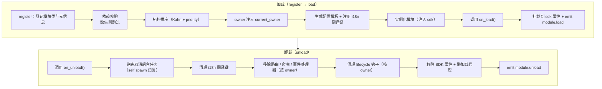

# 模块核心概念

了解 ErisPulse 模块的核心概念是开发高质量模块的基础。

## 模块生命周期

### 加载策略

```python
from ErisPulse.Core.Bases import BaseModule
from ErisPulse.loaders import ModuleLoadStrategy

class MyModule(BaseModule):
    @staticmethod
    def get_load_strategy():
        """返回模块加载策略"""
        return ModuleLoadStrategy(
            lazy_load=True,   # 懒加载还是立即加载
            priority=0,       # 加载优先级（数值越大越先加载）
            depends=["OtherModule"]  # 可选：声明依赖的其他模块
        )
```

> `depends` 声明的模块如果未注册，当前模块将被跳过并记录警告。加载顺序由拓扑排序决定，同层级按 `priority` 降序。

> [!NOTE]
> **级联卸载 / 级联重载**（ErisPulse **2.8.0+**）：卸载被其它模块依赖的模块时，依赖它的模块会**先被级联卸载**（日志说明级联链）；热重载本地插件时，依赖它的插件同样**级联重载**，避免依赖者持有失效实例引用继续运行。声明循环依赖会在加载时以 `RuntimeError` 拒绝。

### on_load 方法

模块加载时调用，用于初始化资源和注册事件处理器：

```python
async def on_load(self, event):
    # 注册事件处理器
    @command("hello", help="问候命令")
    async def hello_handler(event):
        await event.reply("你好！")
    
    # 使用 SDK 内置 HTTP 客户端（自动管理连接池，无需手动创建 session）
    # 通过 sdk.client 即可发送请求
```

### on_unload 方法

模块卸载时调用，用于清理资源：

```python
async def on_unload(self, event):
    # 清理自定义资源
    # sdk.client 由框架管理，无需手动关闭
    
    # 取消事件处理器（框架会自动处理）
    self.logger.info("模块已卸载")
```

> 后台任务的创建与清理（`self.spawn()` / 框架兜底取消）详见 [生命周期管理](../../advanced/lifecycle.md#后台任务归属与自动取消)。

### 卸载与彻底卸载（purge）

> [!NOTE]
> 本特性需要 ErisPulse **2.8.0+**。

`unload()` 默认只**取消加载**（卸载实例与资源），但保留注册存根（模块类与元信息）——模块仍可被 discover 重新发现、`load()` 重新实例化，无需重新 `register()`。

当需要**彻底卸载**（释放模块类引用、清理 `sys.modules`，让插件及其独占依赖可被 GC 回收）时，传入 `purge=True`：

```python
# 只取消加载：保留注册存根，可随时重新 load()
await sdk.module.unload("MyModule")

# 彻底卸载：删除注册存根 + 清理 sys.modules（插件来源）
await sdk.module.unload("MyModule", purge=True)
```

| 语义 | `unload()` 默认 | `unload(purge=True)` |
|------|-----------------|----------------------|
| 卸载实例与资源（事件/task/路由/lifecycle/i18n） | ✅ | ✅ |
| 保留注册存根（模块类与元信息） | ✅ | ❌ 删除 |
| 清理 `sys.modules`（仅插件文件夹来源） | ❌ | ✅ |
| 模块类可被 GC 回收 | ❌ | ✅ |
| 重新加载 | `load()` 直接可用 | 需先 `register()` + `load()` |

> `purge=True` 时级联卸载的依赖者同样被 purge；卸载后框架会 `gc.collect()` 并检查模块类/实例是否可回收，残留引用会在日志中告警（含引用方，DEBUG 级）。

### 生命周期全景

把上面的方法串起来，框架在加载与卸载一个模块时，**在背后为你做的全部事情**：



**加载时框架帮你做了什么**（你只需写 `on_load`，其余自动完成）：

| 环节 | 框架自动做的 |
|------|-------------|
| owner 注入 | 实例化期间用 `owner_scope` 包住模块名——你 `on_load` 里注册的命令/事件/钩子/后台任务**自动归属本模块**，卸载时按 owner 一键清理 |
| 配置模板 | 声明了 `ConfigClass` 的模块，框架自动生成/填充 `ErisPulse.<ModuleName>` 配置段 |
| i18n 翻译键 | 声明了 `I18nClass` 的模块，翻译键自动注册（卸载时自动注销） |
| 依赖拓扑 | 按 `depends` 声明排序，确保被依赖模块先加载；循环依赖以 `RuntimeError` 拒绝 |
| SDK 挂载 | 实例化后挂到 `sdk.<ModuleName>`，你才能 `sdk.MyModule.xxx` 访问 |

**卸载时框架帮你清理的**（对应上面的 U1→U7）：`on_unload` 跑完后再兜底清理——后台任务强制取消（`self.spawn` 创建的，优雅收尾请在 `on_unload` 自行做）、i18n 键、路由、命令/事件处理器、lifecycle 钩子，最后移除 SDK 属性。`purge=True` 额外删除注册存根 + 清理 `sys.modules`。

> 这些自动清理就是「你只需写 `on_load`/`on_unload`，不用手动 unregister」的底气——框架用 owner 归属把「谁注册的谁清理」做成了一键式。

## SDK 对象

### 访问核心模块

```python
from ErisPulse import sdk

# 通过 sdk 对象访问所有核心模块
sdk.logger.info("日志")
sdk.storage.set("key", "value")
config = sdk.config.getConfig("MyModule")
```

### 模块间通信

```python
# 访问其他模块
other_module = sdk.OtherModule
result = await other_module.some_method()
```

## 适配器发送方法查询

由于新的标准规范要求使用重写 `__getattr__` 方法来实现兜底发送机制，导致无法使用 `hasattr` 方法来检查方法是否存在。从 `2.3.5` 开始，新增了查询发送方法的功能。

### 列出支持的发送方法

```python
# 列出平台支持的所有发送方法
methods = sdk.adapter.list_sends("onebot11")
# 返回: ["Text", "Image", "Voice", "Markdown", ...]
```

### 获取方法详细信息

```python
# 获取某个方法的详细信息
info = sdk.adapter.send_info("onebot11", "Text")
# 返回:
# {
#     "name": "Text",
#     "parameters": [
#         {"name": "text", "type": "str", "default": null, "annotation": "str"}
#     ],
#     "return_type": "Awaitable[Any]",
#     "docstring": "发送文本消息..."
# }
```

## 配置管理

### 声明式配置（推荐）

从 v2.5.2 起，模块可通过 `ConfigClass` 声明配置类，与适配器使用同一套配置 Schema 系统。配置通过 `self.cfg` 实时读取，修改后立即生效：

```python
from dataclasses import dataclass, field
from ErisPulse.Core.Bases import BaseModule
from ErisPulse.Core.Bases import BaseConfig

@dataclass
class MyModuleConfig(BaseConfig):
    api_key: str = field(
        default="",
        metadata={
            "description": {"i18n": "my_module.api_key", "default": "API 密钥"},
            "required": True,
            "secret": True,
            "ui": {"widget": "password", "group": "basic", "order": 1},
        },
    )
    timeout: int = field(
        default=30,
        metadata={
            "description": {"i18n": "my_module.timeout", "default": "超时时间（秒）"},
            "ui": {"widget": "number", "group": "advanced", "order": 2},
        },
    )

class MyModule(BaseModule):
    ConfigClass = MyModuleConfig

    def __init__(self, sdk):
        self.sdk = sdk
        self.logger = sdk.logger.get_child("MyModule")

    async def on_load(self, event):
        self.logger.info("模块已加载")

    async def on_unload(self, event):
        pass

    async def do_something(self):
        cfg = self.cfg  # 实时读取，类型安全
        api_key = cfg.api_key
        timeout = cfg.timeout
```

`BaseConfig` 是通用配置基类，适用于适配器、模块、外部项目等任何场景。配置字段支持 i18n 多语言描述（详见 [i18n 文档](../../advanced/i18n.md#配置字段多语言)）。

### 声明式翻译键（v2.7.0+）

从 v2.7.0 起，模块还可以像声明 `ConfigClass` 一样，通过嵌套类 `I18nClass` 集中声明翻译键。框架会在加载时**自动注册**所有声明的翻译键，无需手动调用 `i18n.register()`，且注册时机早于配置模板生成，确保配置描述中引用的 i18n 键已可用。

```python
from ErisPulse.Core.Bases import BaseConfig, BaseI18n, I18nKey

class MyModule(BaseModule):
    # 配置类（可选）
    @dataclass
    class ConfigClass(BaseConfig):
        welcome_msg: str = field(
            default="欢迎",
            metadata={
                "description": {"i18n": "mymodule.welcome_msg", "default": "欢迎消息"},
            },
        )

    # 翻译键集合类（可选）
    class I18nClass(BaseI18n):
        # 属性名自动拼接为完整键路径：<模块名>.<属性名>
        welcome_msg: I18nKey = I18nKey(
            default="Welcome Message",   # 语言无关的兜底
            zh_CN="欢迎消息",
            zh_TW="歡迎訊息",
            en="Welcome Message",
            ja="ウェルカムメッセージ",
            ru="Приветственное сообщение",
        )
        hello: I18nKey = I18nKey(
            default="Hello, {name}!",
            zh_CN="你好，{name}！",
            zh_TW="你好，{name}！",
            en="Hello, {name}!",
            ja="こんにちは、{name}！",
            ru="Привет, {name}!",
        )
```

详情见 [i18n 推荐写法](../../advanced/i18n.md#推荐写法通过-i18nclass-声明翻译键-v270)。

### 手动读取配置（已废弃）

> **已废弃**：请改用 [声明式配置](#声明式配置推荐) + `self.cfg` 实时读取。

```python
class MyModule(BaseModule):
    def __init__(self, sdk):
        self.sdk = sdk

    def _load_config(self):
        config = self.sdk.config.getConfig("MyModule")
        if not config:
            self.sdk.config.setConfig("MyModule", {"api_key": "", "timeout": 30})
            return {"api_key": "", "timeout": 30}
        return config
```

## 存储系统

### 基本使用

```python
# 存储数据
sdk.storage.set("user:123", {"name": "张三"})

# 获取数据
user = sdk.storage.get("user:123", {})

# 删除数据
sdk.storage.delete("user:123")
```

### 事务使用

```python
# 使用事务确保数据一致性
with sdk.storage.transaction():
    sdk.storage.set("key1", "value1")
    sdk.storage.set("key2", "value2")
    # 如果任何操作失败，所有更改都会回滚
```

## 事件处理

### 事件处理器注册

```python
from ErisPulse.Core.Event import command, message

# 注册命令
@command("info", help="获取信息")
async def info_handler(event):
    await event.reply("这是信息")

# 注册消息处理器
@message.on_group_message()
async def group_handler(event):
    sdk.logger.info(f"收到群消息: {event.get_text()}")
```

### 事件处理器生命周期

框架会自动管理事件处理器的注册和注销，你只需要在 `on_load` 中注册即可。

## 懒加载机制

### 工作原理

```python
# 模块首次被访问时才会初始化
result = await sdk.my_module.some_method()
# ↑ 这里会触发模块初始化
```

### 立即加载

对于需要立即初始化的模块（如监听器、定时器）：

```python
@staticmethod
def get_load_strategy():
    return ModuleLoadStrategy(
        lazy_load=False,  # 立即加载
        priority=100
    )
```

## 错误处理

### 异常捕获

```python
async def handle_event(self, event):
    try:
        # 业务逻辑
        await self.process_event(event)
    except ValueError as e:
        self.logger.warning(f"参数错误: {e}")
        await event.reply(f"参数错误: {e}")
    except Exception as e:
        self.logger.error(f"处理失败: {e}")
        raise
```

### 日志记录

```python
# 使用不同的日志级别
self.logger.debug("调试信息")    # 详细调试信息
self.logger.info("运行状态")      # 正常运行信息
self.logger.warning("警告信息")  # 警告信息
self.logger.error("错误信息")    # 错误信息
self.logger.critical("致命错误") # 致命错误
```

## 相关文档

- [模块开发入门](getting-started.md) - 创建第一个模块
- [Event 包装类](event-wrapper.md) - 事件处理详解
- [最佳实践](best-practices.md) - 开发高质量模块