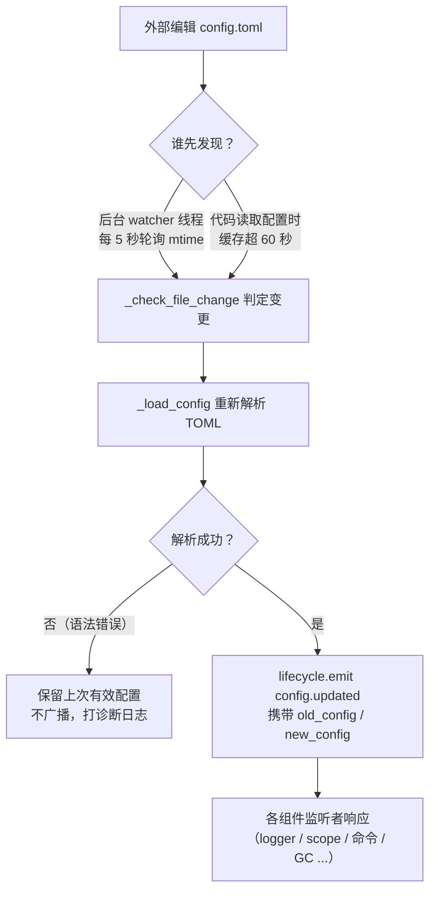

# 配置文件说明
> 这个文档会介绍框架的配置文件，如果有第三方模块需要配置，请参考模块的文档。

ErisPulse 使用 TOML 格式的配置文件 `config/config.toml` 来管理项目配置。

## 配置文件位置

配置文件位于项目根目录的 `config/` 文件夹中：

```
project/
├── config/
│   └── config.toml
├── main.py
```

## 配置加载错误处理

框架在加载 `config.toml` 时会区分三种错误状态，并给出**可操作的诊断信息**，而不是静默回退到默认配置：

| 错误状态 | 触发条件 | 框架行为 |
|---------|---------|---------|
| 文件缺失 | `config.toml` 不存在 | 正常首次启动，静默使用空配置（不报警告） |
| TOML 语法错误 | 文件存在但格式非法（如少了引号、括号未闭合） | 输出**出错行号/列号与原因**，并提示已回退默认配置 |
| 权限/其他错误 | 无读权限、IO 错误等 | 输出**明确原因**，并提示已回退默认配置 |

例如，当你不慎把配置写成了 `port = 8000`（少了引号的字符串）时，日志会输出类似：

```
[ERROR] [Config] 配置文件 config/config.toml 语法错误（第 3 行 第 1 列）: ...
[WARNING] [Config] 配置文件读取失败。继续使用上次有效配置运行，本次文件修改未生效——请修复后重新加载或重启
```

这样你可以在**默认 INFO 级别**下立刻定位问题，而不会困惑"为什么我改的配置没生效"。

> **运行中改坏配置文件？** 如果你在机器人运行期间手动编辑 `config.toml` 引入了语法错误，框架在下次写入（合并配置）时会输出「配置文件已损坏（语法错误，第 X 行），无法合并写入——请先修复配置文件后重启」，而不是令人困惑的「写入失败」。待写入的配置项会被保留，不会丢失。

## 环境变量覆盖

框架支持用环境变量**覆盖** `ErisPulse.*` 配置项（适合 Docker / 容器化 / CI 部署，无需修改 `config.toml`）。

命名规则：把点分路径 `ErisPulse.<section>.<key>` 改为全大写、`.` 替换为 `_`，并加上 `ERISPULSE_` 前缀：

| 配置项 | 环境变量 | 示例值 |
|--------|---------|--------|
| `ErisPulse.server.port` | `ERISPULSE_SERVER_PORT` | `9000` |
| `ErisPulse.server.host` | `ERISPULSE_SERVER_HOST` | `0.0.0.0` |
| `ErisPulse.logger.level` | `ERISPULSE_LOGGER_LEVEL` | `DEBUG` |
| `ErisPulse.framework.strict_mode` | `ERISPULSE_FRAMEWORK_STRICT_MODE` | `false` |

行为说明：
- **优先级最高**：环境变量覆盖「配置文件」与「默认值」，按原值类型自动转换（`bool` / `int` / `float` / 逗号分隔的 `list` / 字符串）
- **不持久化**：覆盖只在运行期生效，不会写回 `config.toml`
- **支持热更新**：运行中修改环境变量后，配合配置监听的重载即可生效

```bash
# Docker 部署示例：不修改 config.toml，直接覆盖端口
ERISPULSE_SERVER_PORT=9000 docker compose up -d
```

> 注：`ErisPulse.server.port` 这类框架配置走 `get_server_config()` 等 API 读取，均受环境变量覆盖影响。

## 配置热更新

从 2.7.0 起，框架对配置热更新做了**系统化支持**。外部修改 `config.toml` 后（后台 watcher 每 5 秒检测一次），或代码调用 `setConfig()` 后，各组件自动响应：

| 组件 | 支持热更新的配置 | 行为 |
|------|----------------|------|
| **日志 Logger** | `logger.level` / `log_files` / `log_dir`（含分段参数）/ `memory_limit` / `format` / `exclude_levels` | 自动重新应用（带变更检测） |
| **命令系统 CommandHandler** | `event.command.prefix` / `case_sensitive` / `allow_space_prefix` / `must_at_bot` | 下一条消息即生效 |
| **适配器并发** | `framework.handler_max_concurrency` | 失效缓存信号量，按新值重建 |
| **主动 GC** | `framework.proactive_gc_*` | 配置变更即时重启 GC 任务，支持运行时调整/禁用/重新启用 |
| **主人系统 Master** | `master.users` | 每次 `is_master()` 检查实时读取，无需重启 |
| **模块/适配器配置** | 各自的配置项 | 触发 `on_config_update(old, new)` 回调 |

**需重启的配置**（无法安全热切换，变更时会输出告警"需重启进程后生效"）：

| 配置 | 原因 |
|------|------|
| `router.cors.*` / `router.security.*` | 中间件在服务启动时写入 FastAPI，运行时无法安全热切换 |
| `storage.use_global_db` | SQLite 文件句柄已在运行时打开，切换路径不安全 |

> **中途编辑保存出错？** 若编辑 `config.toml` 时出现瞬时语法错误，框架会**保留上次有效配置**并输出诊断日志，不会把空配置广播给各组件（避免 `on_config_update` 收到空值误回退默认）。

### 热更新链路内部拆解

「改了配置，各组件怎么知道的？」——背后是一条检测 → 重载 → 广播的链路：



**两条检测路径**（取其一即可，均能兜底）：

| 路径 | 机制 | 触发时机 |
|------|------|---------|
| 后台 watcher | daemon 线程 `config-watcher` 每 **5 秒** `wait` 轮询文件 `mtime` | 外部改文件后最多 5 秒内 |
| 惰性检测 | 任何 `getConfig()` 读取时，若缓存超过 **60 秒**则先查文件 | 下次读配置时 |

> **框架不会误伤自己**：`setConfig()` 写盘时会记录「自身写入的 mtime」，watcher 对比时把它排除，只把**外部编辑**视为变更。

**两类配置变更事件：**

| 事件 | 触发者 | 数据 | 典型场景 |
|------|--------|------|---------|
| `config.set` | 代码 / Dashboard 调 `setConfig()` | `{key, old_value, new_value}` | 单键写入（模板生成、状态记录、运行时改配置） |
| `config.updated` | 外部编辑后 watcher/惰性检测捕获 | `{old_config, new_config, config_file}` | 手改 `config.toml` |

> `setConfig()` 默认**延迟 5 秒落盘**（合并多次写入），`immediate=True` 立即写。watcher 检测到外部修改后只更新内存缓存，**不会**把外部改动回写文件。

**自动响应方清单**（两类事件通常会都订阅，响应内容一致）：

| 组件 | 监听 | 响应 |
|------|------|------|
| Logger | `config.set` + `config.updated` | 级别/文件/目录分段/内存上限/格式/屏蔽等级重新应用（带变更检测，无变化不动） |
| Scope | `config.updated` | 作用域绑定缓存重建 |
| 命令系统 | `config.updated` | 前缀/大小写/空格前缀/must_at_bot 解析参数刷新，下一条消息生效 |
| 适配器并发 | `config.set` + `config.updated` | `handler_max_concurrency` 失效重建信号量 |
| 主动 GC | `config.set` + `config.updated` | `proactive_gc_*` 即时重启 GC 后台任务 |
| 适配器 | 路由到 `on_config_update` | 各适配器 `on_config_update(old, new)` 回调 |
| 模块 | 路由到 `on_config_update` | 各模块 `on_config_update(old, new)` 回调 |
| 存储 | `config.updated` | `use_global_db` 变更**仅告警**（需重启） |
| 路由 | `config.updated` | `cors.*` / `security.*` 变更**仅告警**（需重启） |


## 完整配置示例

```toml
[ErisPulse.server]
host = "0.0.0.0"
port = 8000
auto_start = true
ssl_certfile = ""
ssl_keyfile = ""

[ErisPulse.master]
# users 支持两种写法（二选一）：
#   全局主人（所有平台生效）：users = ["123456", "789012"]
#   按平台指定主人：users = { yunhu = ["123456"], telegram = ["789012"] }
users = {}

[ErisPulse.logger]
level = "INFO"
format = "rich"
log_files = []
log_dir = ""
log_rotation = "size"
log_max_size_mb = 10
log_backup_count = 5
log_rotation_when = "midnight"
memory_limit = 1000
exclude_levels = []

[ErisPulse.framework]
enable_lazy_loading = true
uninit_timeout = 30
strict_mode = 0

[ErisPulse.framework.strict_mode_exceptions]
modules = []
adapters = []

[ErisPulse.storage]
use_global_db = false

[ErisPulse.event.command]
prefix = "/"
case_sensitive = true
allow_space_prefix = false
must_at_bot = false

[ErisPulse.event.message]
ignore_self = true

[ErisPulse.i18n]
language = "auto"
```

## 服务器配置

```toml
[ErisPulse.server]
host = "0.0.0.0"
port = 8000
auto_start = true
ssl_certfile = "/path/to/cert.pem"
ssl_keyfile = "/path/to/key.pem"
```

| 配置项 | 类型 | 默认值 | 说明 |
|---------|------|---------|------|
| host | string | 0.0.0.0 | 监听地址，0.0.0.0 表示所有接口 |
| port | integer | 8000 | 监听端口号 |
| auto_start | boolean | true | 是否在 `sdk.init()` 时自动启动路由服务器。设为 `false` 可跳过路由服务器启动（纯事件/无 WebUI 场景） |
| ssl_certfile | string | 空 | SSL 证书文件路径 |
| ssl_keyfile | string | 空 | SSL 私钥文件路径 |

## 主人系统配置

主人系统用于识别「框架主人」账号（如 Bot 管理员）。`master.users` 支持两种写法：

```toml
[ErisPulse.master]
# 写法一：全局主人（所有平台生效）
users = ["123456", "789012"]

# 写法二：按平台指定主人（dict）
# users = { yunhu = ["123456"], telegram = ["789012"] }
```

| 配置项 | 类型 | 默认值 | 说明 |
|---------|------|---------|------|
| users | array / object | 空 | 主人账号列表。`list` 形式为全局主人（所有平台生效）；`dict` 形式按平台指定（键为平台名，值为该平台的主人账号列表） |

代码中通过 `master.is_master(event)` 或 `master.is_master(platform, user_id)` 检查，每次调用实时读取配置（支持热更新，无需重启）：

```python
from ErisPulse.Core import master

if master.is_master(event):
    await event.reply("主人你好")
```

> 身份判定的完整 API（运行时增删、**自定义身份源 provider 链**）与"用户优先"的
> 覆盖语义（用户可经控制面放开/收紧 `master=True`），见
> [统一控制面 · 主人身份与自定义身份源](../advanced/scope.md#主人身份与自定义身份源provider)。

## 日志配置

```toml
[ErisPulse.logger]
level = "INFO"
log_files = []                # 显式日志文件列表（与 log_dir 互斥，优先级更高）
log_dir = ""                  # 日志目录（设置后自动分段轮转）
log_rotation = "size"         # 分段方式: "size" / "date" / "none"
log_max_size_mb = 10          # size 模式单文件上限（MB）
log_backup_count = 5          # 保留的历史日志文件数
log_rotation_when = "midnight"  # date 模式轮转周期: S/M/H/D/midnight
memory_limit = 1000
exclude_levels = ["EVENT"]
```

| 配置项 | 类型 | 默认值 | 说明 |
|---------|------|---------|------|
| level | string | INFO | 日志级别：TRACE, DEBUG, INFO, WARNING, ERROR, CRITICAL（TRACE 为最低级别，输出框架内部详细调试信息） |
| format | string | rich | 日志输出格式：`rich`（彩色，默认）、`plain`（纯文本无颜色，适合日志采集/管道重定向）、`json`（JSON 结构化，适合 ELK 等） |
| log_files | array | 空 | 日志输出文件列表（显式路径，不分段） |
| log_dir | string | 空 | 日志输出目录（自动创建）。设置后写入目录内 `erispulse.log` 并按 `log_rotation` 自动分段；与 `log_files` 互斥，`log_files` 优先 |
| log_rotation | string | size | 分段方式：`size`（按大小）/ `date`（按时间）/ `none`（不分段） |
| log_max_size_mb | float | 10 | size 模式单文件大小上限（MB），超过后轮转为 `.1`/`.2` 备份 |
| log_backup_count | integer | 5 | 保留的历史日志文件数，超出的最旧备份自动删除 |
| log_rotation_when | string | midnight | date 模式轮转周期：`S`/`M`/`H`/`D`/`midnight`（默认每天零点） |
| memory_limit | integer | 1000 | 内存中保存的日志条数 |
| exclude_levels | array | 空 | 屏蔽指定日志等级。被屏蔽等级的日志**完全丢弃**（不写内存、不推送给 Dashboard 等订阅器、不打印、不写文件）。支持热更新 |

也可在代码中动态切换：

```python
from ErisPulse.Core import logger

# 按大小分段：单文件 10MB，保留 5 份
logger.set_output_dir("logs", rotation="size", max_size_mb=10, backup_count=5)

# 按时间分段：每天零点轮转，保留 7 份
logger.set_output_dir("logs", rotation="date", backup_count=7)
```

> [!NOTE]
> `log_dir` 及分段相关配置需要 ErisPulse **2.8.0+**。

> **隐私保护**：消息收发内容以 **EVENT 等级**（数值 21）记录。设置 `exclude_levels = ["EVENT"]` 即可让后台（如 Dashboard 日志面板）无法看到各群/私聊的消息内容，同时不影响其它等级日志。

> [!NOTE]
> `exclude_levels` 本特性需要 ErisPulse **2.8.0+**。

## 框架配置

```toml
[ErisPulse.framework]
enable_lazy_loading = true
uninit_timeout = 30
strict_mode = 0

[ErisPulse.framework.strict_mode_exceptions]
modules = []
adapters = []
```

| 配置项 | 类型 | 默认值 | 说明 |
|---------|------|---------|------|
| enable_lazy_loading | boolean | true | 是否启用模块懒加载 |
| uninit_timeout | integer | 30 | 优雅关闭的总超时时间（秒），超过后强制终止。0 表示不设超时 |
| strict_mode | integer | 0 | 严格模式级别，见下方「严格模式」说明 |
| handler_max_concurrency | integer | 64 | 事件处理器最大并发 Task 数，设大提高吞吐但增加内存占用 |
| offline_bot_expiry | integer | 3600 | 离线 Bot 记录自动过期时间（秒），0 表示不过期 |

### 主动 GC 配置

SDK 初始化完成后启动主动 GC 后台任务，周期性执行 Python GC 与内部资源回收（离线 Bot 清理等）。全部参数均支持热更新，变更时即时重启任务。

| 配置项 | 类型 | 默认值 | 说明 |
|---------|------|---------|------|
| proactive_gc_interval | number | 300 | 回收间隔（秒），支持小数。0 表示禁用主动 GC |
| proactive_gc_generation | integer | 0 | 常规轮次回收分代（0/1/2，钳制到 0..2）。注意 `gc.collect(2)` 等价于全量回收，默认 0 保持轻量；深度回收由 `proactive_gc_full_every` 周期性触发 |
| proactive_gc_full_every | integer | 20 | 每 N 轮做一次全量回收，0 表示禁用周期性全量。全量回收受 `proactive_gc_memory_growth_mb` 门限约束 |
| proactive_gc_memory_growth_mb | integer | 32 | 全量回收的内存增长门限（MB）：对比上次全量后的内存基线（优先 tracemalloc，其次 RSS），仅当增长达到此值才执行全量回收。0 表示不设门限 |
| proactive_gc_idle_only | boolean | false | 开启后，事件洪峰（存在未完成的 pending handler）时本轮跳过 Python GC，避免停顿与消息处理竞争；内部资源回收不受影响 |
| proactive_gc_gen0_min | integer | 500 | 常规轮次触发回收的 gen0 垃圾量下限：`gc.get_count()[0]` 低于此值直接跳过（空转轮次近乎零开销）。0 表示始终回收 |

> **2.7.1 变更**：默认 `proactive_gc_generation` 由 `2` 调整为 `0`，默认 `proactive_gc_full_every` 由 `0` 调整为 `20`。此前 `generation=2` 意味着每轮都做最重的全量回收；新默认在保持回收覆盖的同时显著降低空转开销。显式配置的旧值仍按字面语义生效。

### 严格模式

严格模式控制模块/适配器在加载阶段不合规或失败时的处理策略。现代模块/适配器都应继承对应的基类（`BaseModule`/`BaseAdapter`），未继承基类的组件会影响框架的上下文系统与兜底清理，可能导致资源泄露。

> **2.5.2 变更**：默认级别从 `1`（跳过）调整为 `0`（宽松），以减少新用户初次使用时遇到的加载问题。未继承基类的组件将以 WARNING 提示并尝试加载，而非直接拒绝。如需恢复旧行为，请显式设置 `strict_mode = 1`。

| 级别 | 名称 | 行为 |
|------|------|------|
| 0 | 宽松（默认） | 违规仅警告，未继承基类的组件仍会尝试加载（兼容旧组件） |
| 1 | 严格-跳过 | 拒绝未继承基类的组件并跳过，其余正常启动 |
| 2 | 严格-致命 | 收集所有违规后统一报告并中止整个启动 |

各级别下，「加载/注册/初始化阶段报错」这类组件自身崩溃始终会被跳过；区别在于：

- **0 → 1**：唯一行为变化是「未继承基类」从「仍加载」变为「跳过」。
- **1 → 2**：所有违规（未继承基类、加载失败、注册失败、初始化失败等）升级为致命，会在启动检查点收集后一次性输出违规清单并中止。

#### 豁免清单

如果某些组件确实暂时无法迁移（例如依赖的旧模块），可以将其加入豁免清单，被列名的组件即使不合规也会按宽松模式对待，继续加载：

```toml
[ErisPulse.framework.strict_mode_exceptions]
modules = ["SeTu", "SomeLegacyModule"]
adapters = ["OldAdapter"]
```

> 当某个组件被严格模式拒绝时，日志会明确提示如何恢复加载（加入豁免清单或调低级别）。

## 存储配置

```toml
[ErisPulse.storage]
use_global_db = false
```

| 配置项 | 类型 | 默认值 | 说明 |
|---------|------|---------|------|
| use_global_db | boolean | false | 是否使用全局数据库（包内）而非项目数据库。`true` 时所有项目共享 ErisPulse 包内的 SQLite 数据库；`false`（默认）时每个项目使用 `config/` 目录下独立的数据库 |

## 事件配置

### 命令配置

```toml
[ErisPulse.event.command]
prefix = "/"
case_sensitive = true
allow_space_prefix = false
```

| 配置项 | 类型 | 默认值 | 说明 |
|---------|------|---------|------|
| prefix | string | / | 命令前缀 |
| case_sensitive | boolean | true | 是否区分大小写（`/Help` 与 `/help` 是否为不同命令） |
| allow_space_prefix | boolean | false | 是否允许空格作为前缀 |
| must_at_bot | boolean | false | 是否必须@机器人才能触发命令（私聊不受限制） |

### 消息配置

```toml
[ErisPulse.event.message]
ignore_self = true
```

| 配置项 | 类型 | 默认值 | 说明 |
|---------|------|---------|------|
| ignore_self | boolean | true | 是否忽略机器人自己的消息 |

## 国际化配置

```toml
[ErisPulse.i18n]
language = "auto"
```

| 配置项 | 类型 | 默认值 | 说明 |
|---------|------|---------|------|
| language | string | auto | 框架内置文本的显示语言。设为 `auto` 自动检测系统语言，也可设为具体代码：`zh-CN`、`zh-TW`、`en`、`ja`、`ru` |

## 模块配置

每个模块可以在配置文件中定义自己的配置：

```toml
[MyModule]
api_url = "https://api.example.com"
timeout = 30
enabled = true
```

在模块中读取和写入配置：

```python
from ErisPulse import sdk

# 读取配置
config = sdk.config.getConfig("MyModule", {})
api_url = config.get("api_url", "https://default.api.com")

# 运行时写入配置（延迟保存）
sdk.config.setConfig("MyModule.timeout", 60)

# 立即保存到文件
sdk.config.setConfig("MyModule.timeout", 60, immediate=True)
```

> `setConfig` 默认采用延迟写入（约每 5 秒批量保存到文件），设置 `immediate=True` 可立即持久化。配置变更会触发 `config.set` 生命周期事件。

## 控制面配置（scope）

> [!NOTE]
> 本特性需要 ErisPulse **2.8.0+**。

统一控制面是权限/访问控制的**唯一**入口，五维配置树：

| 维度 | 控制什么 | 配置路径 |
|------|---------|---------|
| ① 模块 | 某平台 / Bot / 会话里哪些模块可用 | `scope.platforms / bots / sessions` |
| ② 身份 | 某用户 / 群 / Bot / 适配器的事件收不收 | `scope.identity.*` |
| ③ 命令 | 谁能执行某条命令（命令名支持 glob） | `scope.commands` |
| ④ 处理器 | 某模块的处理器按文本过滤 | `scope.handlers` |
| ⑤ 覆盖 | 覆盖模块/命令的实现参数 | `scope.overrides` |

```toml
[ErisPulse.scope]
default_allow = true        # 全局兜底（false = 隐式拒绝严格模式）
cache_size = 1024           # LRU 缓存大小

# ① 模块维度（优先级：会话 > Bot > 平台；条目支持精确 / glob / re: 正则）
[ErisPulse.scope.platforms.onebot11]
modules = ["Chat", "Tool*"]
blocked = ["re:^Danger"]

# ② 身份维度（优先级：用户 > 会话 > Bot > 适配器；每级只写 allow 或 deny 之一）
[ErisPulse.scope.identity.adapters.onebot11]
deny = true                 # 该平台所有事件在入口丢弃
[ErisPulse.scope.identity.users.onebot11]
allow = ["u_admin"]         # 用户键支持 glob / re: 正则
deny = ["u_bad", "spam_*"]

# ③ 命令维度（用户标识 "platform:user_id"）
[ErisPulse.scope.commands."roll*"]
allow = ["onebot11:u_vip"]
deny = ["onebot11:u_bad"]

# ④ 处理器/文本维度（与代码内条件 AND）
[ErisPulse.scope.handlers.MyModule]
pattern = "签到*"

# ⑤ 实现参数覆盖（禁用统一走命令 deny，不在这里）
[ErisPulse.scope.overrides.MyModule.restart]
master = true
hidden = true
```

| 配置项 | 类型 | 说明 |
|---------|------|------|
| `scope.default_allow` | boolean | 全局兜底：未命中规则的放行/拒绝（`true`）。模块/身份"无规则即拒"；命令"无 ACL 即拒" |
| `scope.cache_size` | integer | LRU 缓存大小（默认 1024） |
| `scope.platforms / bots / sessions` | table | ① 模块三级绑定：`{modules=[...], blocked=[...]}` |
| `scope.identity.adapters / bots / sessions / users` | table | ② 身份四级绑定：`{allow=true}` / `{deny=true}` |
| `scope.commands.<命令名>` | table | ③ 命令 ACL：`{allow=[...], deny=[...]}` |
| `scope.handlers.<module>` | table | ④ 文本过滤：`{pattern="...", regex="..."}` |
| `scope.overrides.<module>[.<command>]` | table | ⑤ 参数覆盖：`master` / `hidden` / `aliases` / `prefix` 等 |

> 匹配条目统一语法：精确名 / glob（`*` `?` `[seq]`）/ `re:` 正则，大小写不敏感。
> 五维详解与运行时 API（`sdk.scope.bind_module()` / `bind_identity()` / `block_user()` /
> `allow_user()` / `override()` 等）详见[统一控制面](../advanced/scope.md)。

## 下一步

- [CLI 命令参考](cli-reference.md) - 了解所有命令行命令
- [开发者指南](../developer-guide/) - 学习开发自定义模块