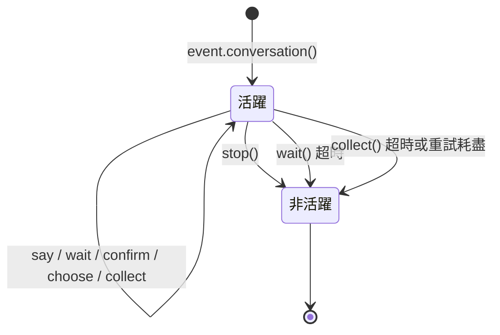

# Conversation 多輪對話

`Conversation` 類提供了在同一會話中進行多輪互動的便捷方法，適合實現引導式操作、資訊收集、對話式問答等場景。

## 創建對話

透過 `Event` 物件的 `conversation()` 方法建立：

```python
from ErisPulse.Core.Event import command

@command("quiz")
async def quiz_handler(event):
    conv = event.conversation(timeout=30)

    await conv.say("🎮 歡迎參加知識問答！")

    answer = await conv.choose("第一題：Python 的創造者是誰？", [
        "Guido van Rossum",
        "James Gosling",
        "Dennis Ritchie",
    ])

    if answer is None:
        await conv.say("超時了，下次再來吧！")
        return

    if answer == 0:
        await conv.say("正確！")
    else:
        await conv.say("錯誤了，正確答案是 Guido van Rossum")

    conv.stop()
```

## 核心 API

### `say(content, **kwargs)`

發送訊息，並返回 `self` 以支援鏈式呼叫：

```python
await conv.say("第一行").say("第二行").say("第三行")
```

也可以指定發送方法：

```python
await conv.say("https://example.com/image.jpg", method="Image")
```

### `wait(prompt=None, timeout=None)`

等待使用者回覆，並返回 `Event` 物件或 `None`（超時）：

```python
# 簡單等待
resp = await conv.wait()
if resp:
    text = resp.get_text()

# 發送提示後等待
resp = await conv.wait(prompt="請輸入你的名字：")

# 使用自訂超時（覆蓋對話預設超時）
resp = await conv.wait(prompt="請在10秒內回覆：", timeout=10)
```

### `confirm(prompt=None, **kwargs)`

等待使用者確認（是/否），並返回 `True` / `False` / `None`（超時）：

```python
result = await conv.confirm("確定要刪除所有資料嗎？")
if result is True:
    await conv.say("已刪除")
elif result is False:
    await conv.say("已取消")
else:
    await conv.say("超時未回覆")
```

內建識別的確認詞：`是/yes/y/確認/確定/好/ok/true/對/嗯/行/同意/沒問題/可以/當然...`

內建識別的否定詞：`否/no/n/取消/不/不要/不行/cancel/false/錯/不對/別/拒絕...`

### `choose(prompt, options, **kwargs)`

等待使用者從選項中選擇，並返回選項索引（0-based）或 `None`：

```python
choice = await conv.choose("請選擇顏色：", ["紅色", "綠色", "藍色"])
if choice is not None:
    colors = ["紅色", "綠色", "藍色"]
    await conv.say(f"你選擇了 {colors[choice]}")
```

使用者可以透過輸入編號（`1`/`2`/`3`）或選項文字（`紅色`）來選擇。

`options_format="auto"`（預設）會根據 method 自動選擇內建樣式：Markdown→無序列表，Html→有序列表，其他→純文字列表。
也支援 `"list"`、`"inline"`、`"md"`、`"html"` 或自訂函數。

支援 `merge_prompt=True` 合併為一條訊息，以及占位符控制選項插入位置（預設 `{options}`，可透過 `placeholder` 自訂）：

```python
choice = await conv.choose(
    "## 請選擇\n{options}",
    ["選項A", "選項B"],
    method="Markdown",
    merge_prompt=True,
)

# 自訂占位符
choice = await conv.choose(
    "請選擇: [choices]",
    ["選項A", "選項B"],
    placeholder="[choices]",
)
```

### `collect(fields, **kwargs)`

多步驟收集資訊，並返回資料字典或 `None`：

```python
data = await conv.collect([
    {"key": "name", "prompt": "請輸入姓名"},
    {"key": "age", "prompt": "請輸入年齡",
     "validator": lambda e: e.get("alt_message", "").strip().isdigit(),
     "retry_prompt": "年齡必須是數字，請重新輸入"},
    {"key": "city", "prompt": "請輸入城市"},
])

if data:
    await conv.say(f"註冊成功！\n姓名: {data['name']}\n年齡: {data['age']}\n城市: {data['city']}")
else:
    await conv.say("註冊過程中斷")
```

欄位配置：

| 參數 | 說明 | 預設值 |
|------|------|--------|
| `key` | 欄位鍵名（必須） | - |
| `prompt` | 提示訊息 | `"請輸入 {key}"` |
| `validator` | 驗證函數，接收 Event，並回傳 bool | 無 |
| `retry_prompt` | 驗證失敗重試提示 | `"輸入無效，請重新輸入"` |
| `max_retries` | 最大重試次數 | 3 |
| `condition` | 條件函數，接收已收集資料 dict，並回傳 bool | 無 |

**條件欄位**：使用 `condition` 可以實現動態表單，只有條件滿足時才收集該欄位：

```python
data = await conv.collect([
    {"key": "has_car", "prompt": "你有車嗎？（是/否）"},
    {"key": "car_brand", "prompt": "請輸入車型",
     "condition": lambda d: d.get("has_car", "").lower() in ("是", "yes", "y")},
])
```

### `stop()`

手動結束對話，並設定 `is_active` 為 `False`：

```python
conv.stop()
```

### `is_active`

對話是否處於活躍狀態：

```python
if conv.is_active:
    await conv.say("對話還在進行中")
```

## 活躍狀態管理



對話在以下情況會自動變為非活躍狀態：

1. 調用 `stop()` 方法
2. `wait()` 超時返回 `None`
3. `collect()` 因任何步驟超時或重試耗盡而返回 `None`

非活躍後，所有交互方法（`wait`/`confirm`/`choose`/`collect`）會立即返回 `None`，不會繼續等待使用者輸入。

## 分支與跳轉

### @conv.branch(name) 裝飾器

使用 `branch()` 註冊對話分支，並透過 `goto()` 在分支間跳轉：

```python
@command("menu")
async def menu_handler(event):
    conv = event.conversation(timeout=60)

    @conv.branch("main")
    async def main_menu():
        await conv.say("=== 主菜單 ===\n1. 個人資訊\n2. 設定\n3. 退出")
        resp = await conv.wait()
        if resp is None:
            return
        text = resp.get_text().strip()
        if text == "1":
            await conv.goto("profile")
        elif text == "2":
            await conv.goto("settings")
        elif text == "3":
            await conv.say("再見！")
            conv.stop()

    @conv.branch("profile")
    async def profile():
        await conv.say("=== 個人資訊 ===\n姓名: Alice\n0. 返回")
        resp = await conv.wait()
        if resp and resp.get_text().strip() == "0":
            await conv.goto("main")

    @conv.branch("settings")
    async def settings():
        await conv.say("=== 設定 ===\n1. 通知開關\n0. 返回")
        resp = await conv.wait()
        if resp and resp.get_text().strip() == "0":
            await conv.goto("main")

    await conv.start()  # 從第一個註冊的分支開始
```

### conv.start(name=None)

啟動對話，預設從第一個註冊的分支開始：

```python
await conv.start()          # 從第一個分支開始
await conv.start("settings") # 從指定分支開始
```

## 上下文與持久化

### conv.context

每個對話實例內建 `context` 字典，用於在分支間共享狀態：

```python
@conv.branch("step1")
async def step1():
    conv.context["username"] = resp.get_text().strip()
    await conv.goto("step2")

@conv.branch("step2")
async def step2():
    name = conv.context.get("username", "未知")
    await conv.say(f"你好，{name}！")
```

### save() / resume() / clear_saved()

對話支援持久化，可在超時或中斷後恢復：

```python
# 保存對話狀態
conv_id = conv.save()
# conv_id = "user_123_group_456"  # 基於使用者和群組自動生成

# ... 之後在同一會話中恢復 ...
conv2 = event.conversation()
if conv2.resume():
    await conv2.say("歡迎回來！繼續之前的對話")
else:
    await conv2.say("沒有找到之前的對話")

# 清除保存的對話
conv.clear_saved()
```

## 典型流程模式

### 引導式註冊

```python
@command("register")
async def register_handler(event):
    conv = event.conversation(timeout=60)

    await conv.say("歡迎註冊！")

    data = await conv.collect([
        {"key": "username", "prompt": "請輸入用戶名（3-20個字符）",
         "validator": lambda e: 3 <= len(e.get_text().strip()) <= 20},
        {"key": "email", "prompt": "請輸入電子郵箱地址",
         "validator": lambda e: "@" in e.get_text() and "." in e.get_text(),
         "retry_prompt": "電子郵箱格式不正確，請重新輸入"},
    ])

    if not data:
        await event.reply("註冊已取消")
        return

    confirmed = await conv.confirm(
        f"確認註冊信息？\n用戶名: {data['username']}\n電子郵箱: {data['email']}"
    )

    if confirmed:
        await conv.say("✅ 註冊成功！")
    else:
        await conv.say("❌ 已取消註冊")
```

### 循環對話

```python
@command("chat")
async def chat_handler(event):
    conv = event.conversation(timeout=120)
    await conv.say("進入對話模式，輸入「退出」結束")

    while conv.is_active:
        resp = await conv.wait()
        if resp is None:
            await conv.say("超時，對話結束")
            break

        text = resp.get_text().strip()

        if text == "退出":
            await conv.say("再見！")
            conv.stop()
        elif text == "幫助":
            await conv.say("可用命令：退出、幫助、狀態")
        elif text == "狀態":
            await conv.say("對話活躍中")
        else:
            await conv.say(f"你說的是：{text}")
```

## 相關文件

- [Event 包裝類](../developer-guide/modules/event-wrapper.md) - Event 物件的所有方法
- [事件處理入門](../getting-started/event-handling.md) - 事件處理基礎