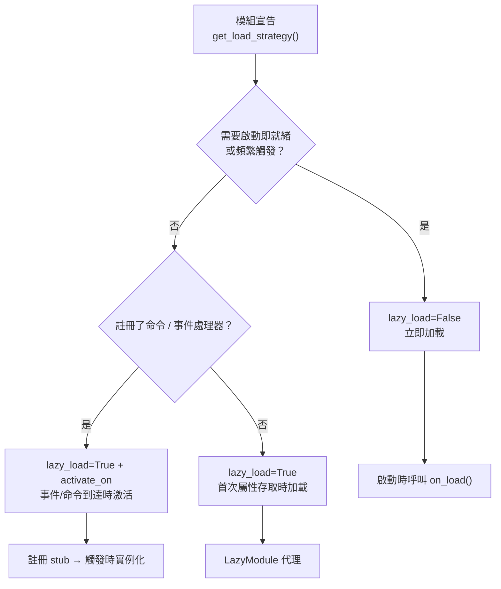

# 慢載模組系統

ErisPulse SDK 提供了強大的慢載模組系統，允許模組在實際需要時才進行初始化，從而顯著提升應用啟動速度和記憶體效率。

## 概述

懶加載模組系統是 ErisPulse 的核心特性之一，它透過以下方式運作：

- **延遲初始化**：模組僅在第一次被存取時才會實際載入和初始化
- **透明使用**：對於開發者而言，懶加載模組與一般模組的使用幾乎沒有差異
- **自動依賴管理**：模組依賴會在被使用時自動初始化
- **生命週期支援**：對於繼承自 `BaseModule` 的模組，會自動呼叫生命週期方法

## 工作原理

### LazyModule 類

懶加載系統的核心是 `LazyModule` 類，它是一個包裝器，在第一次存取時才實際初始化模組。

### 初始化過程

當模組首次被存取時，`LazyModule` 會執行以下操作：

1. 獲取模組類的 `__init__` 參數資訊
2. 根據參數決定是否傳入 `sdk` 引用
3. 設定模組的 `moduleInfo` 屬性
4. 對於繼承自 `BaseModule` 的模組，呼叫 `on_load` 方法
5. 觸發 `module.init` 生命週期事件

## 事件驅動懶激活（activate_on）

> [!NOTE]  
> 此特性需要 ErisPulse **2.8.0+**。

`lazy_load=True` 的模組預設只在**首次屬性存取**時載入。若模組註冊了命令/事件處理器，  
傳統做法只能 `lazy_load=False` 立即載入。`activate_on` 提供了第三種選擇：**宣告觸發器，  
首個匹配事件/命令到達時自動激活模組**——既不常駐記憶體，又不遺失觸發入口。

```python
from ErisPulse.loaders import ModuleLoadStrategy

class MyModule(BaseModule):
    @staticmethod
    def get_load_strategy():
        return ModuleLoadStrategy(
            lazy_load=True,
            activate_on=[
                # ---- 事件觸發（被動到達，無需使用者感知）----
                "message",                                    # 類型級：任何訊息事件
                {"notice": "group_member_increase"},          # 類型 + 單個 detail_type
                {"message": ["private", "group"]},            # 類型 + 多個 detail_type

                # ---- 命令觸發（主動輸入，佔位命令對 Help 可見）----
                {"command": "roll"},                          # 簡寫：命令名
                {"command": ["roll", "dice"]},                # 命令名列表
                {"command": {                                 # dict 聲明（name 必填）
                    "name": "dice",
                    "help": "擲一個骰子",
                    "usage": "/dice",
                    "group": "娛樂",
                    "aliases": ["d"],
                    "hidden": False,
                }},
            ],
        )
```

### 命令 dict 聲明參數

dict 形式鏡像 `@command()` 裝飾器的使用者級參數，用於在模組載入前就註冊佔位命令：

| 參數 | 類型 | 預設 | 說明 |
|------|------|------|------|
| `name` | `str` | **必填** | 命令名；須與 `on_load` 中 `@command(name)` 一致，否則激活後佔位註銷、命令不存在 |
| `help` | `str` | 回退鏈 | Help 中顯示的介紹；未聲明時按回退鏈取值（見下） |
| `usage` | `str` | 自动生成 | 用法行，預設 `{prefix}{name}` |
| `group` | `str` | `None` | 命令分組 |
| `aliases` | `list[str]` | `[]` | 別名同時註冊，**輸入別名同樣觸發激活** |
| `hidden` | `bool` | `False` | `True` 時佔位命令同樣隱藏（與激活後真實命令的隱藏語義對齊）；知道命令名的使用者輸入仍可觸發 |

**不支援** `priority` / `permission` / `master`：佔位命令的使命只是觸發激活，  
權限檢查由激活後的真實命令執行（佔位階段攔截權限反而會讓「輸入命令激活」失效）。

### 佔位命令 help 回退鏈

模組未載入時 Help 顯示的命令介紹，按以下順序取值（取到即止）：

1. dict 聲明的命令級 `help`（最精確）  
2. 模組 `get_meta()` 的 `description`  
3. 模組 `__description__` 屬性  
4. 包元數據的 `Summary`（PyPI 包簡介）  
5. 通用提示：「此命令來自懶載入模組 X，首次使用將自動載入該模組」

### 觸發語義

- **事件 stub**：以極低優先級（`ACTIVATION_STUB_PRIORITY`）註冊到對應事件管理器，  
  在所有普通處理器之後兜底觸發；激活後將當前事件轉發給模組的真實處理器  
- **命令 stub**：註冊佔位命令；激活後佔位註銷、真實命令接管當次觸發  
- **防重入**：`asyncio.Lock` 保證併發觸發下只激活一次  
- **作用域過濾**：stub 帶模組 owner 身份，模組未對該 Bot / 會話 / 平台啟用時不觸發  
- **失敗語義**：激活失敗不重試，stub 一併註銷  
- **去重**：同名命令以簡寫 + dict 混合聲明時去重（dict 优先）；dict 缺 `name`  
  或事件 `detail_type` 误写 dict 时告警并忽略

> 架構圖與完整語義詳見 [架構概覽](../architecture.md#事件驅動懶激活activate_on觸發架構)。

## 配置懶加載

### 全局配置

在配置文件中啟用/禁用全局懶加載：

```toml
[ErisPulse.framework]
enable_lazy_loading = true  # true=啟用懶加載(預設)，false=禁用懶加載
```

### 模組層級控制

模組可以透過實作 `get_load_strategy()` 靜態方法來控制加載策略：

```python
from ErisPulse.Core.Bases import BaseModule
from ErisPulse.loaders import ModuleLoadStrategy

class MyModule(BaseModule):
    @staticmethod
    def get_load_strategy():
        """返回模組加載策略"""
        return ModuleLoadStrategy(
            lazy_load=False,  # 返回 False 表示立即加載
            priority=100      # 加載優先級，數值越大優先級越高
        )
```

## 使用懶加載模組

### 基本使用

對於開發者來說，懶加載模組與普通模組在使用上幾乎沒有區別：

```python
# 通過 SDK 訪問懶加載模組
from ErisPulse import sdk

# 以下訪問會觸發模組懶加載
result = await sdk.my_module.my_method()
```

### 統一的模組獲取入口

無論是通過 SDK 屬性、模組管理器屬性訪問，還是通過 `module.get()` 查詢，
對於「已註冊但尚未加載」的懶加載模組，都會返回同一個懶加載代理，訪問其屬性才會真正觸發初始化：

```python
# 三種方式拿到的都是懶加載代理（在模組未加載時），行為一致、對使用者透明
sdk.my_module          # 觸發加載的入口
sdk.module.my_module   # 同樣返回懶加載代理
sdk.module.get("my_module")  # 也返回懶加載代理，本身不會觸發加載

# 訪問代理的任意屬性才會真正初始化模組
result = await sdk.my_module.my_method()
```

`module.get()` 是**查詢**介面，本身不觸發加載：
- 模組已加載 → 返回真實實例
- 模組已註冊但未加載 → 返回懶加載代理（訪問屬性才初始化）
- 模組未註冊 → 返回 `None`

如需顯式觸發加載，請使用 `await sdk.load_module("my_module")`。

### 異步初始化

對於需要異步初始化的模組，建議先顯式加載：

```python
# 先顯式加載模組
await sdk.load_module("my_module")

# 然後使用模組
result = await sdk.my_module.my_method()
```

### 同步初始化

對於不需要異步初始化的模組，可以直接訪問：

```python
# 直接訪問會自動同步初始化
result = sdk.my_module.some_sync_method()
```

## 最佳實踐

選擇加載策略時，可參考以下決策流程：



### 推薦使用懶加載的場景（lazy_load=True）

- 被動調用的工具類（如資料查詢模組、格式轉換器等，僅當其他模組調用時才需要）
- 註冊命令/事件處理器但非頻繁使用的模組——配合 `activate_on` 聲明觸發器，首個匹配事件/命令到達時自動激活，無需放棄懶加載

### 推薦禁用懶加載的場景（lazy_load=False）

- 需要在啟動時立即就緒的模組（如為其它模組提供基礎服務的核心模組）
- 頻繁觸發的監聽器（每條訊息都要處理）——`activate_on` 轉發有一次激活開銷，頻繁場景立即加載更直接
- 定時任務模組
- 需要在應用啟動時就初始化的模組

> `priority` 參數控制立即加載模組間的初始化順序，數值越大越先初始化。同優先級的模組按註冊順序加載。

## 注意事項

1. 如果您的模組使用了懶加載，如果其他模組從未在 ErisPulse 內被呼叫過，則您的模組永遠不會被初始化。
2. 如果您的模組中包含了例如監聽 Event 的模組，或其它主動監聽類似模組，有兩種選擇：宣告 `activate_on` 觸發器（保持懶加載，事件到達時自動激活），或宣告需要立即被加載（`lazy_load=False`），否則會影響您模組的正常業務。
3. 我們不建議您禁用懶加載，除非有特殊需求，否則它可能會為您帶來例如依賴管理和生命週期事件等的問題。
4. `activate_on` 的命令 dict 聲明中，`name` 必須與模組 `on_load` 中 `@command()` 註冊的真實命令名一致——否則模組激活後占位命令註銷，宣告與實現不一致的命令將不存在。

## 相關文件

- [模組開發指南](../developer-guide/modules/getting-started.md) - 學習開發模組
- [最佳實踐](../developer-guide/modules/best-practices.md) - 了解更多最佳實踐