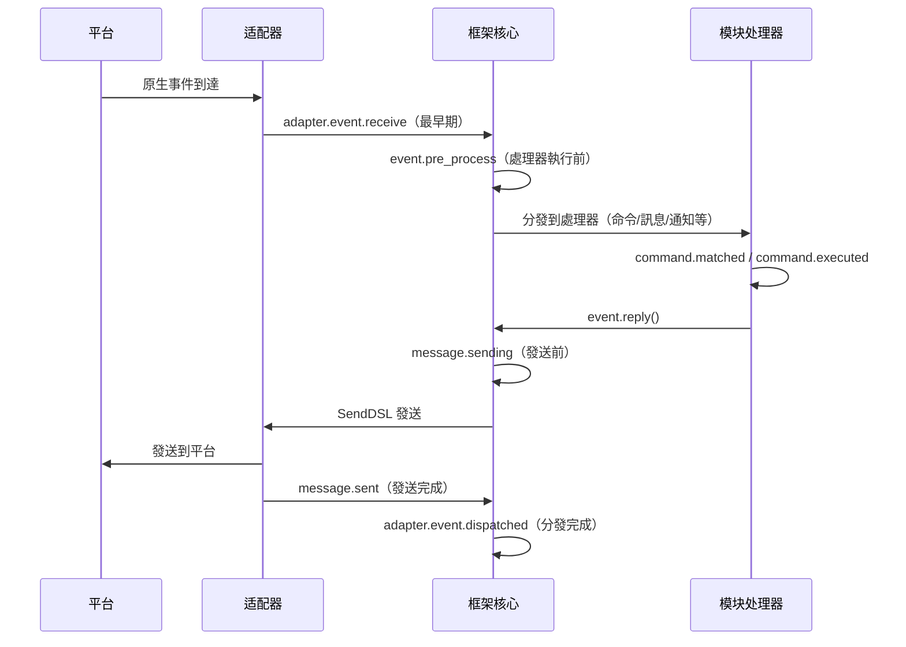

# 生命週期管理

ErisPulse 提供統一的鈎子/生命週期系統，用於監控系統各組件的運行狀態，以及實現審計、統計、自定義邏輯等擴展功能。

系統支援三種觸發方式：
- `await lifecycle.emit("event", data)` — 精簡版，傳遞任意數據
- `lifecycle.emit_sync("event", data)` — 同步版（用於非異步上下文）
- `await lifecycle.submit_event("event", ...)` — 兼容舊版，自動構建標準事件格式


## 事件處理機制

### 註冊處理器

```python
from ErisPulse import sdk

# 裝飾器模式
@sdk.lifecycle.on("module.load")
async def on_module_load(data):
    print(f"模組加載: {data}")

# 編程式註冊
sdk.lifecycle.register("module.load", on_module_load, priority=10)

# 取消註冊
sdk.lifecycle.unregister("module.load", on_module_load)

# 按所有者批量取消註冊（模組/適配器卸載時框架自動調用）
removed = sdk.lifecycle.unregister_by_owner("MyModule")
print(f"清理了 {removed} 個生命週期鉤子")
```

### 優先級

處理器支援 `priority` 參數，數值越大越先執行（與模組加載器一致）：

```python
@sdk.lifecycle.on("adapter.event.receive", priority=10)  # 最先執行
async def first_handler(data):
    pass

@sdk.lifecycle.on("adapter.event.receive", priority=0)  # 後執行
async def second_handler(data):
    pass
```

### 點式結構事件

觸發具體事件時，也會觸發其父級事件：
- 觸發 `module.load` 時，也會觸發 `module`
- 觸發 `adapter.event.receive` 時，也會觸發 `adapter.event` 和 `adapter`

### 通配符

註冊 `*` 捕獲所有事件：

```python
@sdk.lifecycle.on("*")
async def on_anything(data):
    print(f"收到事件: {data}")
```

### 一次性註冊（once）

從 2.7.0 起，`lifecycle.once()` 註冊的處理器在**觸發一次後自動註銷**，適合"首次就緒"這類一次性鉤子：

```python
@sdk.lifecycle.once("core.init.complete")
async def on_first_ready(data):
    print("首次就緒，後續不再觸發")
```

- 與 `on()` 同優先級參數語義（`priority` 數值越大越先執行）
- 自動註銷，無需手動 `unregister`
- 同步/異步處理器均支援

### 監聽者查詢（has_handlers）

熱路徑短路場景可先用 `has_handlers()` 判斷是否有監聽者，避免無謂的事件遍歷與任務調度：

```python
if sdk.lifecycle.has_handlers("message.sending"):
    await sdk.lifecycle.emit("message.sending", send_ctx)
```

- 覆蓋**精確事件名、通配符 `*`、父級事件**三種匹配
- 無任何監聽者時返回 `False`，可安全跳過 `emit`

## 鈎子斷點概覽

一條訊息從平台進入框架到處理完成的典型生命週期事件時序：



框架內建了以下鈎子斷點，使用者可以透過 `@sdk.lifecycle.on()` 監聽任意斷點來實現自訂邏輯。

### 核心初始化

| 鈎子名稱 | 觸發時機 | 數據 |
|---------|---------|------|
| `core.init.start` | SDK 初始化開始 | `{}` |
| `core.init.complete` | SDK 初始化完成 | `{"duration": float, "success": bool, "adapters": {"enabled": [str], "disabled": [str]}, "modules": {"enabled": [str], "disabled": [str]}, "error": str(僅失敗時)}` |
| `core.uninit.complete` | SDK 反初始化完成 | `{"duration": float, "success": bool, "adapters_closed": int, "modules_unloaded": int, "module_properties_cleared": int, "module_properties_to_clear": [str], "error": str(僅失敗時)}` |

### 配置變更

| 鈎子名稱 | 觸發時機 | 數據 |
|---------|---------|------|
| `config.set` | 配置項被修改 | `{"key": str, "old_value": Any, "new_value": Any}` |
| `config.updated` | 外部編輯 config.toml 後檢測到整樹變更 | `{"old_config": dict, "new_config": dict, "config_file": str}` |

**範例：配置審計**

```python
@sdk.lifecycle.on("config.set")
def audit_config(data):
    print(f"[審計] {data['key']}: {data['old_value']} -> {data['new_value']}")
```

### 模組生命週期

| 鈎子名稱 | 觸發時機 | 數據 |
|---------|---------|------|
| `module.register` | 模組類註冊到管理器 | `{"module_name": str, "success": bool}` |
| `module.load` | 模組載入完成（實例化成功） | `{"module_name": str, "success": bool}` |
| `module.init` | 模組初始化完成（含懶載入） | `{"module_name": str, "success": bool}` |
| `module.unload` | 模組卸載 | `{"module_name": str, "success": bool}` |

### 适配器生命週期

| 鈎子名稱 | 觸發時機 | 數據 |
|---------|---------|------|
| `adapter.load` | 适配器註冊完成 | `{"platform": str, "success": bool}` |
| `adapter.start` | 适配器啟動 | `{"platforms": [str]}` |
| `adapter.status.change` | 适配器狀態變更 | `{"platform": str, "status": str, "retry_count": int, "error": str(僅失敗時)}` |
| `adapter.stop` | 适配器關閉 | `{"platforms": [str]}` |
| `adapter.stopped` | 适配器關閉完成 | `{"platforms": [str]}` |
| `adapter.bot.online` | Bot 上線 | `{"platform": str, "bot_id": str, "info": dict, "status": str}` |
| `adapter.bot.offline` | Bot 下線 | `{"platform": str, "bot_id": str, "status": str}` |

### 事件接收與處理

| 鈎子名稱 | 觸發時機 | 數據 |
|---------|---------|------|
| `adapter.event.receive` | 收到外部平台事件（最早期） | `{"platform": str, "event_type": str, "raw_event_type": str}` |
| `adapter.event.dispatched` | 事件分發完成 | `{"platform": str, "event_type": str, "raw_event_type": str, "onebot_handlers_count": int}` |
| `event.pre_process` | 事件處理器開始執行前 | `{"event_type": str, "platform": str, "detail_type": str}` |

**範例：事件統計**

```python
event_counter = {}

@sdk.lifecycle.on("adapter.event.receive")
def count_events(data):
    platform = data["platform"]
    event_counter[platform] = event_counter.get(platform, 0) + 1

@sdk.lifecycle.on("adapter.event.dispatched")
def log_unhandled(data):
    if data["onebot_handlers_count"] == 0:
        print(f"[未處理] {data['platform']}/{data['event_type']}")
```

### 消息發送

| 鈎子名稱 | 觸發時機 | 數據 |
|---------|---------|------|
| `message.sending` | 消息即將發送 | `{"platform": str, "method": str, "detail_type": str, "target_id": str, "bot_id": str}` |
| `message.sent` | 消息發送完成 | `{"platform": str, "method": str, "detail_type": str, "target_id": str, "bot_id": str}` |

**範例：消息發送審計**

```python
@sdk.lifecycle.on("message.sending")
def log_sending(data):
    print(f"[發送] -> {data['platform']}/{data['detail_type']}/{data['target_id']} via {data['method']}")
```

### 命令系統

| 鈎子名稱 | 觸發時機 | 數據 |
|---------|---------|------|
| `command.matched` | 命令被匹配並即將執行 | `{"command": str, "args": list[str], "platform": str, "user_id": str}` |
| `command.executed` | 命令執行完成 | `{"command": str, "args": list[str], "platform": str, "user_id": str, "success": bool, "error": str(僅失敗時)}` |

**範例：命令統計**

```python
@sdk.lifecycle.on("command.matched")
def count_commands(data):
    print(f"[命令] /{data['command']} from {data['user_id']}@{data['platform']}")
```

### HTTP 路由

| 鈎子名稱 | 觸發時機 | 數據 |
|---------|---------|------|
| `server.request` | HTTP 請求接收 | `{"method": str, "path": str, "client_ip": str}` |
| `server.response` | HTTP 回應發送 | `{"method": str, "path": str, "status_code": int, "client_ip": str}` |

**範例：請求日誌**

```python
@sdk.lifecycle.on("server.response")
def log_http(data):
    print(f"[HTTP] {data['method']} {data['path']} -> {data['status_code']}")
```

### WebSocket

| 鈎子名稱 | 觸發時機 | 數據 |
|---------|---------|------|
| `server.start` | 路由伺服器啟動 | `{"base_url": str, "host": str, "port": int}` |
| `server.stop` | 路由伺服器停止 | `{}` |
| `server.websocket.connect` | WebSocket 連接建立 | `{"path": str, "module_name": str, "client_ip": str}` |
| `server.websocket.disconnect` | WebSocket 連接斷開 | `{"path": str, "module_name": str, "reason": str, "error": str(僅異常時)}` |

**範例：WebSocket 連接監控**

```python
@sdk.lifecycle.on("server.websocket.connect")
def on_ws_connect(data):
    print(f"[WS] 連接: {data['path']} from {data['client_ip']}")

@sdk.lifecycle.on("server.websocket.disconnect")
def on_ws_disconnect(data):
    print(f"[WS] 斷開: {data['path']} ({data['reason']})")

## 標準事件定義

```python
STANDARD_EVENTS = {
    "core": ["init.start", "init.complete", "uninit.complete"],
    "module": ["load", "init", "unload", "register"],
    "adapter": [
        "load", "start", "status.change", "stop", "stopped",
        "event.receive", "event.dispatched",
        "bot.online", "bot.offline",
    ],
    "server": [
        "start", "stop",
        "request", "response",
        "websocket.connect", "websocket.disconnect",
    ],
    "event": ["pre_process"],
    "message": ["sending", "sent"],
    "command": ["matched", "executed"],
    "config": ["set"],
}

## 完整 API 參考

### 註冊與取消

| 方法 | 說明 |
|------|------|
| `@lifecycle.on(event, *, priority=0)` | 裝飾器註冊處理程式 |
| `lifecycle.register(event, handler, *, priority=0)` | 程式化註冊 |
| `lifecycle.unregister(event, handler=None)` | 取消註冊（handler=None 時取消該事件全部處理程式） |

### 觸發

| 方法 | 說明 |
|------|------|
| `await lifecycle.emit(event, data=None)` | 異步觸發，處理程式返回非 None 可修改 data |
| `lifecycle.emit_sync(event, data=None)` | 同步觸發，異步處理程式以 create_task 調度 |
| `await lifecycle.submit_event(event_type, *, source, msg, data)` | 兼容舊版，自動構建標準事件格式 |

### 工具

| 方法 | 說明 |
|------|------|
| `lifecycle.start_timer(timer_id)` | 開始計時 |
| `lifecycle.get_duration(timer_id)` | 獲取已持續時間（秒） |
| `lifecycle.stop_timer(timer_id)` | 停止計時並返回持續時間 |
| `lifecycle.list_hooks()` | 列出所有已註冊鉤子及處理程式數量 |
| `lifecycle.clear()` | 清除所有處理程式和計時器 |

## 模組中使用範例

```python
from ErisPulse.Core.Bases import BaseModule
from ErisPulse import sdk

class Main(BaseModule):
    async def on_load(self, event):
        # 實現簡單的訊息統計
        self.msg_count = 0
        
        @sdk.lifecycle.on("adapter.event.receive")
        async def count(data):
            if data["event_type"] == "message":
                self.msg_count += 1
        
        # 監控所有命令
        @sdk.lifecycle.on("command.matched")
        async def log_cmd(data):
            sdk.logger.info(f"命令執行: /{data['command']} by {data['user_id']}")
        
        # 配置變更審計
        @sdk.lifecycle.on("config.set")
        def audit(data):
            sdk.logger.info(f"配置變更: {data['key']} = {data['new_value']}")
```

重要：路徑替換規則  
- 將文件連結中的 `docs/zh-TW/` 替換為 `docs/zh-TW/`  
- 例如：`docs/zh-TW/quick-start.md` 應改為 `docs/zh-TW/quick-start.md`  
- 對於指向非目前語言版本文件的連結（如 `README.xx.md` 形式的連結），保持原樣不要修改  
- 這確保連結指向正確語言的文件版本

## 後台任務歸屬與自動取消

> [!NOTE]  
> 本特性需要 ErisPulse **2.8.0+**。

模組建立的 asyncio 後台任務如果未在 `on_unload` 中取消，會持有 `self` 引用導致模組實例無法被回收（熱重載後舊實例殘留）。框架提供以下兜底機制：

- **`self.spawn(coro)`**（模組內推薦）：任務自動歸屬模組名，模組卸載時框架在 `on_unload` **之後**兜底取消未結束的任務並記錄警告
- **`spawn_background(coro)`**（`ErisPulse.runtime`）：自動捕獲當前 `owner_scope` 上下文；`cancel_owner_tasks(owner)` 按歸屬取消，`cancel_all_background_tasks()` 供 `sdk.uninit()` 兜底
- **適配器**：關閉時對平台名下的後台任務同樣兜底取消

```python
async def on_load(self, event):
    # 推薦：後台任務用 self.spawn()，卸載時框架自動兜底取消
    self.spawn(self._poll())

async def on_unload(self, event):
    # 精細控制的場景仍建議自行取消並等待收尾
    if self._poll_task:
        self._poll_task.cancel()
        await asyncio.gather(self._poll_task, return_exceptions=True)

async def _poll(self):
    while True:
        await asyncio.sleep(60)
        ...
```

> [!IMPORTANT]  
> 框架兜底是**強制 cancel**（`cancel_owner_tasks`），它發生在 `on_unload` 返回之後。因此需要優雅收尾的任務（flush 缓衝、持久化狀態、關閉連接）**必須**在 `on_unload` 裡自行 `cancel()` + `await` 完成——別指望兜底能保留收尾邏輯。框架只保證「不殘留持有 `self` 的任務」，不保證「優雅」。需要 `await` 結果的任務請直接 `await`，不要丟給後台任務。

## 注意事項

1. **處理程序可以是同步或非同步**：系統會自動識別並正確調用
2. **數據傳遞**：在 `emit()` 模式下，處理程序返回非 None 值會修改傳遞給後續處理程序的 data
3. **事件命名規範**：建議使用點式結構命名事件，便於使用父級監聽
4. **錯誤隔離**：單個處理程序異常不會影響其他處理程序執行
5. **同步觸發限制**：`emit_sync()` 中非同步處理程序以 fire-and-forget 方式調度，返回值無法回傳
6. **生命週期清理**：呼叫 `sdk.uninit()` 時，所有已註冊的處理程序和計時器會被清理
7. **加載優先性**：如需在框架初始化階段就監聽事件，建議設定高優先級並禁用懶加載


## 相關文件

- [模組開發指南](../developer-guide/modules/getting-started.md) - 了解模組生命週期方法
- [最佳實踐](../developer-guide/modules/best-practices.md) - 生命週期事件使用建議