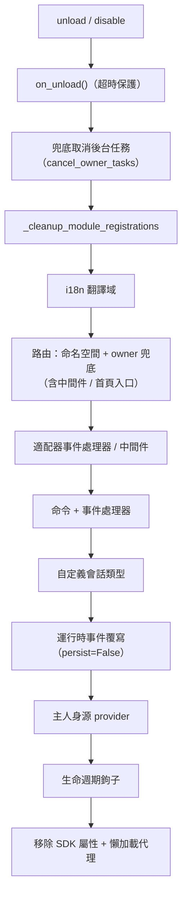

# 所屬權（owner）系統

所屬權是模組「即插即用」的基石：模組在載入期間註冊的所有框架資源自動記名，卸載/禁用時按記名一鍵回收——模組作者只需宣告資源，無需手動撰寫清理邏輯。

> **相關系統**：作用域（scope）在事件分發時決定「資源是否生效」，  
> 所屬權在生命週期中決定「資源歸誰、誰卸載時被回收」。  
> 作用域詳見[統一控制面（scope）](scope.md)，背景任務詳見  
> [生命週期管理](lifecycle.md#背景任務所屬與自動取消)。

{!--< tips >!--}
1. 所屬權在**註冊瞬間**按 `current_owner` 自動記錄，模組程式碼無需修改
2. 卸載/禁用共用同一条清理鏈（`_cleanup_module_registrations`），每步失敗僅告警不中斷
3. 用戶設定語意的資源（持久化覆寫 / scope 規則 / 命令 ACL）**不**隨模組卸載清理
{!--< /tips >!--}

## owner 上下文機制

owner 透過上下文變數 `current_owner` 傳遞（`ErisPulse.runtime.context`）：

```python
from ErisPulse.runtime import owner_scope, get_current_owner

with owner_scope("MyModule"):
    # 此區間內註冊的一切資源自動歸屬 MyModule
    assert get_current_owner() == "MyModule"
```

框架在以下時機自動注入 owner（模組/適配器程式碼無需手動包裝）：

| 時機 | owner 值 | 位置 |
|------|----------|------|
| 模組 `load()` | 模組名 | 實例化 + `on_load` 全程 |
| 適配器 `start()` / `restart()` | 平台名 | 適配器啟動全程 |
| `activate_on` 懶加載 stub 註冊 | 模組名 | 佔位命令/處理器註冊 |
| 事件處理器執行期 | 處理器歸屬模組名 | handler / 命令入口重注入 |

執行期重注入意味著：模組在 `on_load` 裡宣告的命令處理器**運行中**呼叫
註冊型 API（如 `sdk.adapter.on()`、`overrides.*.set(persist=False)`），
同樣會自動歸屬本模組。

## 歸屬資源全景

模組在加載上下文內註冊的以下資源均記錄歸屬，卸載/禁用時自動回收：

| 資源 | 註冊方式 | 清理調用 |
|------|----------|----------|
| 命令 | `@command()` / 命令 dict 聲明 | `command.unregister_by_owner()` |
| 事件處理器 | `@message` / `@notice` / `@request` / `@meta` | `handler.unregister_by_owner()` |
| 適配器事件監聽 | `sdk.adapter.on()` / `raw=True` | `adapter.unregister_handlers_by_owner()` |
| 適配器中間件 | `@sdk.adapter.middleware` | 同上 |
| 路由（HTTP/WS/SSE） | `router.http()` / `websocket()` / `sse()` | 按命名空間 + 按 owner 雙重兜底 |
| 路由中間件 | `@router.middleware()` / `add_middleware()` | `router.unregister_all_by_owner()` |
| Dashboard 首頁入口 | `router.register_home_entry()` | `unregister_home_entries_by_owner()` |
| 自定義會話類型 | `register_custom_type()` | `unregister_custom_types_by_owner()` |
| 後台任務 | `self.spawn()` | `cancel_owner_tasks()` |
| 生命週期鉤子 | `lifecycle.register()` | `lifecycle.unregister_by_owner()` |
| 主人身源 provider | `master.provider` | `master.unregister_by_owner()` |
| i18n 翻譯鍵 | `I18nClass` 聲明（domain=模組名） | `i18n.unregister_domain()` |
| 事件覆寫（執行時） | `overrides.*.set(persist=False)` | `overrides.unregister_by_owner()` |
| 互動會話（wait_reply 等待 / 租約） | `event.wait_reply()` / `sdk.interaction.acquire()` | `interaction.cancel_by_owner()`（等待方立即收到取消） |
| 上下文數據 | `runtime/context` 按 owner 記錄 | 按模組精確清理 |

適配器側的對應資源（以平台名為 owner）在適配器 `shutdown()` / `restart()` 時由 `_cleanup_adapter_resources` 回收，另含：

| 資源 | 清理調用 |
|------|----------|
| 適配器自有的 `on()` 處理器與中間件 | `adapter.unregister_handlers_by_owner(platform)` |
| 平台事件方法擴展（`EventMixin`） | `unregister_platform_event_methods(platform)` |
| 自定義會話類型 | `unregister_custom_types_by_owner(platform)` |
| 互動會話（該平台掛起的 wait_reply / 租約） | `interaction.cancel_by_platform(platform)` |
| i18n 翻譯域（domain=配置鍵） | `i18n.unregister_domain(配置鍵)` |
| 細顆粒命名空間路由 | `router.unregister_all_by_owner(platform)` |

## 卸載/停用清理序列

`unload()` 與 `disable()` 共用同一条清理鏈（每步獨立 try/except，失敗僅記錄日誌，**不中斷後續清理**）：



`sdk.uninit()` 退出時另有全局兜底：全部適配器 shutdown → 全部模塊 unload →
`router.stop()`（清空路由/中間件/首頁入口）→ `cancel_all_background_tasks()` →
清空事件處理器與鉤子。

## 設計邊界：哪些資源不隨卸載清理

歸屬權只回收**模組代碼註冊的執行時資源**。以下資源屬**使用者配置語意**
（控制權在使用者，可能刻意配置），模組卸載後隨配置持續保留：

| 資源 | 語意 | 說明 |
|------|------|------|
| `overrides.*.set(persist=True)` | 持久化覆寫 | 寫入配置檔，跨重啟生效；模組卸載不刪除（使用者顯式配置） |
| `scope.set_action()` 等作用域規則 | 權限控制面 | 由使用者/Dashboard 管理，卸載模組不回收規則 |
| `overrides.acl.set(persist=True)` | 命令 ACL | 同上 |
| Conversation `save()` 持久化 | 多輪對話存檔 | 資料資產不清理 |

執行時暫時寫入（`persist=False`）則隨 owner 回收——**持久化與否即為**<br>**「使用者資產」與「模組執行時狀態」的分界線**。

## 模組作者指南

### 推薦寫法

```python
from ErisPulse import sdk
from ErisPulse.Core.Event import command
from ErisPulse.runtime import owner_scope, spawn_background

class MyModule(BaseModule):
    async def on_load(self, event):
        # 框架資源：自動歸屬，無需手動清理
        self.task = self.spawn(self.polling())      # 後台任務
        sdk.router.register_home_entry("我的模組", "/my")  # 首頁入口

        # 模組自有資源：包進 owner_scope 即納入歸屬體系
        with owner_scope("MyModule"):
            self.client.on_event(self._handle)      # 假想的自定義註冊

    async def on_unload(self, event):
        # 框架資源已被自動回收，只需清理 owner_scope 覆蓋不到的自有資源
        await self.client.close()
```

### 注意事項

- **import 時註冊無歸屬**：模組頂層（import 時）註冊的鉤子/處理程序發生在
  `owner_scope` 之前，會被視為框架級資源（owner=None）而**不被清理**。
  一律放到 `on_load()` 內註冊。
- **自定義 domain 的 i18n 註冊**：`i18n.register(domain=...)` 的 domain
  不等於模組名時不會被自動回收，請保持 domain=模組名。
- **後台任務務必用 `self.spawn()`**：裸 `asyncio.create_task` 不歸屬模組，
  卸載時不會被取消（詳見[生命週期管理](lifecycle.md#後台任務歸屬與自動取消)）。
- 清理鏈「失敗僅告警」：單步清理異常不會阻斷其餘資源回收，日誌 DEBUG/WARNING
  級別可見，排障時可開啟 TRACE。