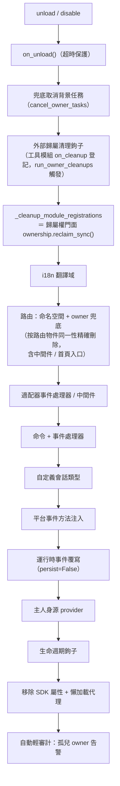

# 所有权（owner）系統

所有權是模組「即插即用」的基石：模組在載入期間註冊的一切框架資源自動記名，卸載/停用時按記名一鍵回收——模組作者只需聲明資源，無需手寫清理邏輯。

> **相關系統**：作用域（scope）在事件分發時決定「資源是否生效」，所有權在生命週期中決定「資源歸誰、誰卸載時被回收」。作用域詳見[統一控制面（scope）](scope.md)，背景任務詳見 [生命週期管理](lifecycle.md#背景任務所有權與自動取消)。

{!--< tips >!--}
1. 所有權在**註冊瞬間**按 `current_owner` 自動記錄，模組程式碼零修改
2. 卸載/停用共用同一條清理鏈（`_cleanup_module_registrations`），每步失敗僅警告不中斷
3. 用戶配置語意的資源（持久化覆寫 / scope 規則 / 命令 ACL）**不**隨模組卸載清理
4. 工具模組托管的外部句柄可用 `on_cleanup(cb)` 掛入清理鏈，對方模組卸載時自動回調（見[工具模組指南](#工具模組指南托管其它模組的句柄)）
{!--< /tips >!--}

## owner 上下文機制

owner 透過上下文變數 `current_owner` 傳遞（`ErisPulse.runtime.context`）：

```python
from ErisPulse.runtime import owner_scope, get_current_owner

with owner_scope("MyModule"):
    # 此區間內註冊的一切資源自動歸屬 MyModule
    assert get_current_owner() == "MyModule"
```

框架在以下時機自動注入 owner（模組/適配器程式碼無需手動包裝）：

| 時機 | owner 值 | 位置 |
|------|----------|------|
| 模組 `load()` | 模組名 | 實例化 + `on_load` 全程 |
| 適配器 `start()` / `restart()` | 平台名 | 適配器啟動全程 |
| `activate_on` 慢載入 stub 註冊 | 模組名 | 占位命令/處理器註冊 |
| 事件處理器執行期 | 處理器歸屬模組名 | handler / 命令入口重注入 |

執行期重注入意味著：模組在 `on_load` 裡宣告的命令處理器**執行中**呼叫
註冊型 API（如 `sdk.adapter.on()`、`overrides.*.set(persist=False)`），
同樣會自動歸屬本模組。

## 歸屬資源全景

模組在載入上下文內註冊的以下資源均記錄歸屬，卸載/禁用時自動回收：

| 資源 | 註冊方式 | 清理調用 |
|------|----------|----------|
| 命令 | `@command()` / 命令 dict 聲明 | `command.unregister_by_owner()` |
| 事件處理器 | `@message` / `@notice` / `@request` / `@meta` | `handler.unregister_by_owner()` |
| 適配器事件監聽 | `sdk.adapter.on()` / `raw=True` | `adapter.unregister_handlers_by_owner()` |
| 適配器中間件 | `@sdk.adapter.middleware` | 同上 |
| 路由（HTTP/WS/SSE） | `router.http()` / `websocket()` / `sse()` | 按命名空間 + 按 owner 雙重兜底 |
| 路由中間件 | `@router.middleware()` / `add_middleware()` | `router.unregister_all_by_owner()` |
| Dashboard 首頁入口 | `router.register_home_entry()` | `unregister_home_entries_by_owner()` |
| 自定義會話類型 | `register_custom_type()` | `unregister_custom_types_by_owner()` |
| 平台事件方法注入 | `register_event_method()` / `register_event_mixin()` | `unregister_event_methods_by_owner()`（模組卸載自動回收，舊閉包不再泄漏） |
| 後台任務 | `self.spawn()` | `cancel_owner_tasks()` |
| 外部歸屬清理鈎子（工具模組托管） | `runtime.on_cleanup(cb)` | `run_owner_cleanups()`（卸載/禁用/適配器關閉鏈內觸發） |
| 生命週期鈎子 | `lifecycle.register()` | `lifecycle.unregister_by_owner()` |
| 主人身源 provider | `master.provider` | `master.unregister_by_owner()` |
| i18n 翻譯鍵 | `I18nClass` 聲明（domain=模組名） | `i18n.unregister_domain()` |
| 事件覆寫（執行時） | `overrides.*.set(persist=False)` | `overrides.unregister_by_owner()` |
| 互動會話（wait_reply 等待 / 租約） | `event.wait_reply()` / `sdk.interaction.acquire()` | `interaction.cancel_by_owner()`（等待方立即收到取消） |
| 上下文數據 | `runtime/context` 按 owner 記錄 | 按模組精確清理 |

適配器側的對應資源（以平台名為 owner）在適配器 `shutdown()` / `restart()`
時由 `_cleanup_adapter_resources` 回收，另含：

| 資源 | 清理調用 |
|------|----------|
| 適配器自有的 `on()` 處理器與中間件 | `adapter.unregister_handlers_by_owner(platform)` |
| 平台事件方法擴展（`EventMixin`） | `unregister_platform_event_methods(platform)` |
| 自定義會話類型 | `unregister_custom_types_by_owner(platform)` |
| 互動會話（該平台掛起的 wait_reply / 租約） | `interaction.cancel_by_platform(platform)` |
| i18n 翻譯域（domain=配置鍵） | `i18n.unregister_domain(配置鍵)` |
| 細顆粒命名空間路由 | `router.unregister_all_by_owner(platform)` |

## 卸載 / 禁用清理序列

`unload()` 與 `disable()` 共用同一条清理鏈（每步獨立 try/except，失敗僅記日誌，**不中斷後續清理**）：



`sdk.uninit()` 退出時另有全局兜底：全部適配器 shutdown → 全部模組 unload →
`router.stop()`（清空路由 / 中間件 / 首頁入口）→ `cancel_all_background_tasks()` →
清空事件處理器與鉤子。

## 歸屬權統一門面（ownership）

清理鏈的十六個步驟收斂在歸屬權統一門面 `ErisPulse.Core.ownership` 下，  
四個動詞覆蓋「註銷、計數、掃描、審計」——子系統各自的 `*_by_owner` 註銷  
函數保持不變，作為門面的內部實現：

| 動詞 | 用途 |
|------|------|
| `ownership.reclaim(owner)` | 統一註銷 owner 名下全部資源（任務取消 → 清理鉤子 → 註冊類資源；異步完整版） |
| `ownership.reclaim_sync(owner)` | 註冊類資源註銷（同步版，供同步卸載路徑） |
| `ownership.counts(owner=None)` | 只讀統計 owner 在冊資源（None 為全部 owner） |
| `ownership.orphans()` | 孤兒掃描：資源在冊而 owner 已註銷（泄漏實錘清單） |
| `ownership.audit(owner, deep=)` | 泄漏審計報告（計數 + 孤兒 + 可選 gc 實例普查） |

```python
from ErisPulse.Core import ownership

ownership.reclaim_sync("MyModule")       # {'commands': 1, 'routes_http': 2, ...}
ownership.counts("MyModule")             # 在冊資源計數
ownership.orphans()                      # [{"owner": "ghost", "total": 2, ...}]
```

**審計入口**：

- 卸載 / 重載後**自動輕審計**：發現孤兒 owner 資源即 WARNING 告警（零開銷計數掃描）
- `sdk.module.audit(name, deep=True)`：模組實例 gc 普查——實例不可回收時  
  給出引用方類型（定位「誰攥著舊實例」）；有全局暫停開銷，僅顯式排障使用
- 深普查屬顯式操作，不設配置鍵、不做自動修復

## 熱重載失敗回滾

熱重載改為 "**卸載前快照 → 失敗自動恢復**"：當新版本出現語法錯誤、依賴缺失、
加載失敗時，舊實例與註冊狀態（註冊表條目、sdk 屬性、sys.modules 條目）
會自動還原，服務不中斷，並在日誌中提示「已回滾到舊實例繼續服務」。

盡力而為語義（文件化的邊界）：

- `on_unload` 已執行的副作用（斷開的連接、取消的任務）不可撤銷——
  恢復後舊實例處於「已收尾」狀態，需再次觸發加載才能完全可用
- 第三方在執行期手動緩存的對舊實例的引用不在恢復範圍內
- 目標包已被卸載（entry-point 消失）視作卸載成功，不做回滾

## 設計邊界：哪些資源不隨卸載清理

所有權只回收**模組程式碼註冊的執行時資源**。以下資源屬**用戶配置語意**
（控制權在用戶，可能刻意配置），模組卸載後隨配置持久保留：

| 資源 | 語意 | 說明 |
|------|------|------|
| `overrides.*.set(persist=True)` | 持久化覆寫 | 寫入配置檔案，跨重啟生效；模組卸載不刪（用戶顯式配置） |
| `scope.set_action()` 等作用域規則 | 權限控制面 | 由用戶/Dashboard 管理，卸載模組不回收規則 |
| `overrides.acl.set(persist=True)` | 命令 ACL | 同上 |
| Conversation `save()` 持久化 | 多輪對話存檔 | 數據資產不清理 |

執行時臨時寫入（`persist=False`）則隨 owner 回收——**持久化與否即**
"用戶資產"與"模組執行時狀態"的分界線。

## 內部實現：所有權如何工作

所有權系統由**兩條獨立鏈路**構成，理解它們的分工是排查所有權問題的前提：

### 歸因鏈（contextvar 傳播）

`runtime/context.py` 的 `current_owner` 等 ContextVar 負責**歸因**——
"此刻這段程式碼註冊的資源/發起的呼叫記在誰頭上"。傳播規則遵循 Python
contextvars 語意：

| 執行路徑 | context 是否傳播 | 歸因結果 |
|---------|----------------|---------|
| 同步呼叫鏈 / `await` 鏈 | ✅ 傳播 | 正確歸因 |
| `owner_scope` 內 `asyncio.create_task` | ✅ 傳播（task 拷貝建立時刻的 context） | 任務**內部**的框架呼叫正確歸因 |
| `run_in_executor` / 裸執行緒 | ❌ 不傳播 | 歸因丟失 |
| 自建事件迴圈 | ❌ 不傳播 | 歸因丟失 |

> 歸因 ≠ 登記：context 傳播只影響"記在誰頭上"，資源能否被清理
> 取決於是否進入了下述取消鏈。

### 取消鏈（任務登記表）

`runtime/tasks.py` 的 `_owner_tasks` 登記表負責**生命週期**——
"owner 名下有哪些未完成任務，卸載時統一取消"。任務進入登記表的途徑：

1. **顯式調度**：`spawn_background()` / `self.spawn()` → 建立時捕獲
   `current_owner`（或顯式 `owner=` 參數）→ 登記入表；
2. **Task Factory 自動登記**（2.8.3）：`install_owner_task_factory()`
   在框架啟動時安裝到主事件迴圈——**任何**任務建立（含第三方庫內部的
   `create_task`）經過工廠時讀取 `current_owner`，非 None 即登記。

登記表自清理：每個任務帶 `done_callback`，完成即從表中移除，無泄漏。

### 取消時序（模組卸載）

```
module.unload()
  → on_unload(event)                    # 模組自行清理（兜底超時保護）
  → 框架註銷該 owner 的命令/事件/鈎子/路由
  → cancel_owner_tasks(owner)           # 任務登記表兜底取消
      → 逐個 task.cancel()              # 排除當前執行取消邏輯的任務自身
      → await gather(pending, timeout)  # 等待回收（超時不再阻塞）
```

### 排查思路

- **資源沒被清理** → 查登記表：`get_owner_tasks("MyModule")` 是否含該任務；
  不含即註冊路徑未經過所有權鏈（import 期 / 執行緒 / 獨立迴圈），對照上表定位。
- **歸因錯誤** → 查 `get_current_owner()` 在出錯時刻的值；異步延遲執行
  （回調/任務）的歸因取自建立時刻 context，而非執行時刻。

## 模組作者指南

### 推薦寫法

```python
from ErisPulse import sdk
from ErisPulse.Core.Event import command
from ErisPulse.runtime import owner_scope, spawn_background

class MyModule(BaseModule):
    async def on_load(self, event):
        # 框架資源：自動歸屬，無需手動清理
        self.task = self.spawn(self.polling())      # 背景任務
        sdk.router.register_home_entry("我的模組", "/my")  # 首頁入口

        # 模組自有資源：包進 owner_scope 即納入所有權體系
        with owner_scope("MyModule"):
            self.client.on_event(self._handle)      # 假想的自定義註冊

    async def on_unload(self, event):
        # 框架資源已被自動回收，只需清理 owner_scope 覆蓋不到的自有資源
        await self.client.close()
```

### 注意事項

- **import 期註冊無所有權**：模組頂層（import 時）註冊的鈎子/處理器發生在
  `owner_scope` 之前，會被視為框架級資源（owner=None）而**不被清理**。
  一律放到 `on_load()` 內註冊。
- **自定義 domain 的 i18n 註冊**：`i18n.register(domain=...)` 的 domain
  不等於模組名時不會被自動回收，請保持 domain=模組名。
- **背景任務推薦 `self.spawn()`**：2.8.3 起裸 `asyncio.create_task` 也會**自動隱式所有權**
  （Task Factory 自動登記，卸載時兜底取消）；但 `self.spawn()` 仍是推薦寫法——
  支援非主迴圈執行緒調度回主迴圈、顯式 `owner=` 指定與 fire-and-forget 防 GC。
  **2.8.3 之前的版本**裸任務不所有權，必須用 `self.spawn()`。
- 清理鏈"失敗僅警告"：單步清理異常不會阻斷其餘資源回收，日誌 DEBUG/WARNING
  級別可見，排障時可開啟 TRACE。

### 註冊時機 → 所有權結果對照表

| 註冊場景 | 所有權結果 | 說明 |
|---------|---------|------|
| `on_load()` 內經框架 API（命令/事件/lifecycle/路由裝飾器）註冊 | 歸屬模組 | 卸載時自動註銷 |
| 模組頂層（import 期）註冊 | **無所有權**（owner=None） | 不被清理，請勿使用 |
| `self.spawn()` 建立的背景任務 | 歸屬模組 | 卸載時自動取消 |
| `owner_scope("Name")` 內經第三方 API 註冊 | 歸屬模組 | 依賴第三方回調在 scope 內同步執行 |
| 裸 `asyncio.create_task`（含 `loop.create_task` / `ensure_future`） | **自動所有權**（Task Factory，2.8.3+） | 建立瞬間讀取 `current_owner`，owner 上下文內自動登記、卸載兜底取消；見下文[內部實現](#內部實現所有權如何工作) |
| 第三方庫異步回調（aiohttp / APScheduler 等）內部建立的任務 | **自動所有權**（Task Factory，2.8.3+） | 回調執行時若 `current_owner` 已注入（如框架處理器執行期間），任務自動登記 |
| `run_in_executor`（執行緒池） | **無所有權**（非 asyncio.Task） | 執行緒不受任務工廠管轄，須自行管理生命週期 |
| 獨立事件迴圈（自建 loop）中的註冊 | **無所有權** | Task Factory 僅安裝於主迴圈；contextvars 也不跨事件迴圈傳播 |

> 原則：**所有權跟隨註冊瞬間的 `current_owner` 上下文**；任何異步延遲、
> 執行緒池、獨立迴圈都會脫離該上下文——需要所有權時請顯式進入 `owner_scope`。

## 工具模組指南：托管其它模組的句柄

**場景**：定時任務、註冊表、連接池這類「工具模組」會替其它模組保管東西——
對方在 `on_load` 裡呼叫 `sdk.Cron.on_trigger(handler)`，你的容器裡就存下了
一個指向對方實例的回調。框架會自動清理對方註冊的一切框架資源，但清理不了
你**私有容器裡的引用**：對方卸載後你的容器還拉著它的實例，它就無法被
GC 回收（記憶體洩漏，`purge` 泄漏診斷報"不可回收"）。

**解法**：在登記對方東西的同一個函數裡呼叫 `on_cleanup()`，
框架會在對方卸載 / 停用時自動回調你的清理函數：

```python
from ErisPulse.Core.Bases import BaseModule
from ErisPulse.runtime import off_cleanup, on_cleanup

class CronModule(BaseModule):
    def __init__(self):
        self._entries = {}  # {模組名: 該模組托管的回調列表}

    def on_trigger(self, handler):
        # 自動識別呼叫方模組名（on_load 直接呼叫 / module.call 均正確），
        # 回傳值是解析出的 owner，可直接用作記名鍵
        owner = on_cleanup(self._drop)
        self._entries.setdefault(owner, []).append(handler)

    def _drop(self, owner: str):
        """對方模組被卸載/停用時由框架自動呼叫：拋棄它的句柄即可"""
        self._entries.pop(owner, None)

    async def on_unload(self, event):
        off_cleanup(self._drop)  # ③ 自己卸載前註銷鈎子，避免鈎子表持有 self
```

框架保證的行為：

| 關注點 | 行為 |
|--------|------|
| 觸發時機 | 對方模組 unload / disable，或適配器關閉——均在框架清理鏈內觸發，早於 purge 泄漏診斷 |
| 調用方識別 | 直接呼叫取 `current_owner`；經 `module.call()` 被呼叫取呼叫方（`current_caller`）；也可 `on_cleanup(cb, owner="模組名")` 显式指定 |
| 回調簽名 | `cb(owner: str)`，同步 / 異步均可；異步帶超時保護（`CLEANUP_CALLBACK_TIMEOUT_SECS`，預設 10 秒） |
| 容錯 | 單個回調異常 / 超時只記日誌，不受影響其餘鈎子與清理鏈 |
| 重複登記 | 同一 `(owner, callback)` 幂等去重 |

**什麼時候不需要**：如果對方註冊的是框架資源（命令、事件處理器、路由、
背景任務……），框架已自動清理（見上文[歸屬資源全景](#歸屬資源全景)）。
只有你私有容器裡持有的對方句柄才需要 `on_cleanup`。
模組開發視角的速查版見
[最佳實踐 · 工具模組](../developer-guide/modules/best-practices.md#工具模組托管別人東西時要接住卸載通知)。