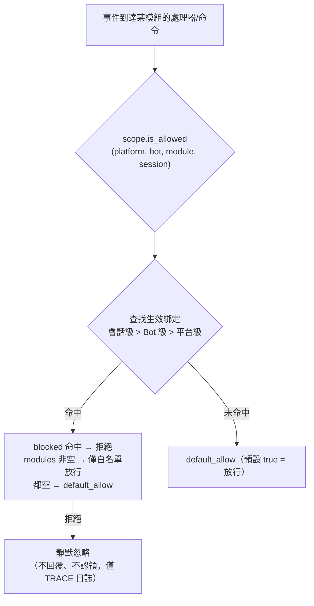

# 統一控制面（scope）

> [!NOTE]  
> 本特性需要 ErisPulse **2.8.0+**。

統一控制面回答六個問題：**哪些模組可用、誰的事件收不收、誰能執行某條命令、  
某模組處理什麼文字、覆蓋哪些實現參數、禁止模組發起哪些出站呼叫**。  
控制權完全交給使用者：在模組 / 適配器 / 命令 / 處理器註冊的**上層**（配置  
`ErisPulse.scope` 或執行時 `sdk.scope`）統一聲明，事件管線在每一級自動讀取並執行。

控制面收斂了原有的多套權限系統，是 2.8.0 權限/訪問控制的**唯一**入口：

| 維度 | 控制什麼 | 拒絕行為 | 配置路徑 |
|------|---------|---------|---------|
| **① 模組** | 哪些模組可用（平台 / Bot / 會話三級） | 靜默忽略（不回覆、不認領） | `scope.platforms / bots / sessions` |
| **② 身份** | 事件收不收（適配器 / Bot / 會話 / 使用者四級） | 入口完全丟棄（靜默） | `scope.identity.*` |
| **③ 命令** | 誰能執行某條命令（命令名支援 glob） | 回覆「權限不足」（顯式） | `scope.commands` |
| **④ 處理器** | 某模組的事件處理器按文字過濾 | 不觸發（靜默） | `scope.handlers` |
| **⑤ 覆蓋** | 覆蓋模組/命令的實現參數（master/hidden/aliases/prefix） | ——（只改參數） | `scope.overrides` |
| **⑥ 出站動作** | 禁止模組發送訊息 / 調用標準 API / 處理請求 | 失敗回應（`retcode=34601`） | `scope.actions` |

{!--< tips >!--}
1. 透過 `from ErisPulse.Core import scope` 導入單例（`sdk.scope` 同物件）
2. `scope.is_allowed(platform, bot_id, module, session_id)` 判斷模組是否可用
3. `scope.is_identity_allowed(platform, bot_id, session_id, user_id)` 判斷事件是否放行
4. `scope.allow_user("roll*", platform, uid)` / `deny_user(...)` 命令 ACL（支援 glob）
5. `scope.override("MyModule", "restart", master=True)` 覆蓋實現參數
6. `scope.set_action("MyModule", "send", False)` 禁止模組回覆/發訊息
7. `scope.get_stats()` 查看過濾統計；`scope.get_topology()` 查看拓撲
{!--< /tips >!--}

## 匹配條目語法（全系統統一）

控制面所有「名字列表」（模組名、身份鍵、命令名）共用同一套匹配語法
（`ErisPulse.Core.text_match`）：

| 語法 | 範例 | 說明 |
|------|------|------|
| 精確名 | `"Chat"` | 全值比較，**大小寫不敏感** |
| glob | `"Tool*"`、`"spam_*"` | `*` 任意串 / `?` 單字符 / `[seq]` 字元集，大小寫不敏感 |
| 正則 | `"re:^Danger.*"` | 以 `re:` 前綴宣告，正則 `search` 匹配，預設大小寫不敏感 |

- 非法正則**靜默降級**為「不匹配」（不拋錯、不崩潰）
- 裝飾器參數（`pattern=` / `regex=`）為固定語義：`pattern` 是 glob、`regex` 是正則源碼
  （不加 `re:` 前綴）；控制面配置裡的正則條目**必須**帶 `re:` 前綴

## 全局兜底：`default_allow`

`default_allow` 是**全域唯一**的兜底開關（預設為 `true`），  
對三個判定維度統一生效：

- **模組維度**：未命中任何綁定 → 由 `default_allow` 決定放行 / 拒絕  
- **身份維度**：未命中任何策略 → 由 `default_allow` 決定放行 / 拒絕  
- **命令維度**：未配置 ACL → 若 `default_allow=true` 則交由開發者預設權限鏈；  
  若為 `false`（嚴格模式）則命令未配置 ACL 即拒絕  

設為 `false` 即開啟「隱式拒絕」嚴格模式：採用白名單式管理，  
**未明確允許者一律拒絕**。

> **例外**：⑥ 出站動作維度**不受** `default_allow` 影響——它是獨立的收緊開關，  
> 預設全允許，僅明確設為 `false` 才會禁止（框架層 owner 為空的呼叫恆定放行）。  
> 這樣嚴格的全域模式不會意外中斷所有模組的消息回覆。

## 配置文件

```toml
[ErisPulse.scope]
default_allow = true        # 全局兜底（false = 隱式拒絕嚴格模式）
cache_size = 1024           # LRU 緩存大小

# ── ① 模組維度（優先級：會話 > Bot > 平台）──
[ErisPulse.scope.platforms.onebot11]
modules = ["Chat", "Tool*"]   # 白名單：精確名 / glob / re: 正則
blocked = ["re:^Danger"]
[ErisPulse.scope.bots.onebot11."123456"]
modules = ["Chat"]
[ErisPulse.scope.sessions.onebot11."789012345"]
modules = ["Chat"]

# ── ② 身份維度（優先級：用戶 > 會話 > Bot > 適配器）──
[ErisPulse.scope.identity.adapters.onebot11]
deny = true                   # 整個適配器的事件全部丟棄
[ErisPulse.scope.identity.bots.onebot11."123456"]
deny = true
[ErisPulse.scope.identity.sessions.onebot11."g_blocked"]
deny = true
[ErisPulse.scope.identity.users.onebot11]
allow = ["u_admin"]           # 用戶鍵支援 glob / re: 正則
deny = ["u_bad", "spam_*"]

# ── ③ 命令維度（命令名支援 glob）──
[ErisPulse.scope.commands."roll*"]
allow = ["onebot11:u_vip"]    # 用戶標識 "platform:user_id"
deny = ["onebot11:u_bad"]

# ── ④ 處理器/文本維度 ──
[ErisPulse.scope.handlers.MyModule]
pattern = "簽到*"             # 與程式碼內 pattern/regex 條件 AND
regex = "re:\\d+\\s*元"

# ── ⑤ 實現參數覆蓋 ──
[ErisPulse.scope.overrides.MyModule.restart]
master = true                 # 僅框架主人可用
hidden = true                 # 幫助中隱藏
aliases = ["rs"]              # 追加別名
prefix = "!"                  # 追加觸發前綴

# ── ⑥ 出站動作維度（預設全允許，顯式禁用才收緊）──
[ErisPulse.scope.actions.MyModule]
send = false                  # 禁止 MyModule 回覆/主動發訊息
api = false                   # 禁止 MyModule 調標準 API（含 call 逃生艙）
request = false               # 禁止 MyModule 處理請求操作 accept/reject
```

## ① 模組維度

回答「在某個上下文中，哪些模組可用」。預設全部開放；配置綁定後才開始過濾，**模組與適配器無需任何更動**。



- **解析優先級：會話級 > Bot 級 > 平台級**，高優先級綁定**整體覆蓋**低優先級
- **靜默語義**：被過濾模組的命令與處理器不觸發、不回覆、不認領（防止跨命令誤匹配），僅 TRACE 級日誌可見（`core.scope.denied`）
- **框架級處理器**（`scope_exempt=True` 或 owner 為空）不受影響；模組名為空（框架層資源）始終放行

## ② 身份維度（事件准入）

回答「誰的事件收不收」。被拒絕的事件在**分發入口完全丟棄**——  
不進入中間件與任何處理器（含框架級），僅 TRACE 級日誌可見（`core.scope.identity_denied`）。

- **解析優先級：用戶 > 會話 > Bot > 適配器**，取最具體的已配置策略；deny 优先於 allow
- 每級綁定是二元策略：`{ allow = true }` 或 `{ deny = true }`
- 用戶鍵支援 glob / 正則（如 `"spam_*"` 拉黑一批垃圾用戶）
- 典型用法——上級 deny、個人 allow 做「例外放行」：

```toml
[ErisPulse.scope.identity.adapters.onebot11]
deny = true
[ErisPulse.scope.identity.users.onebot11]
allow = ["u_admin"]   # 即使適配器級拒絕，u_admin 的事件仍然放行
```

## ③ 命令維度（命令 ACL）

回答「誰能執行某條命令」。判定順序：**deny 命中 → 拒絕；allow 白名單非空且未命中 → 拒絕；均未配置 → 遵循 `default_allow`**（`true` 交給開發者預設權限鏈）。  
被拒絕的命令會顯式回覆「權限不足」。

- 命令名支援 glob：`"roll*"` 一條規則覆蓋 `roll`、`roll_dice` 等一組命令
- 精確鍵優先於 glob 鍵（`commands.roll` 命中時不再查 `commands."roll*"`）
- 使用者標識格式 `"platform:user_id"`（與框架主人系統一致）
- 該維度**只是使用者端的額外閘門**，與命令的 `master` / `permission` 參數串聯：  
  ACL 通過後仍走開發者聲明的預設權限鏈（該預設鏈可用 ⑤ 覆蓋調整）

## ④ 處理器/文字維度

依模組過濾「處理什麼文字」：為某模組設定 `pattern` / `regex` 後，  
該模組的所有事件處理器僅在文字命中時觸發（與程式碼內條件 AND，需同時滿足）。  
適合在不修改模組程式碼的情況下縮小其觸發範圍。

```toml
[ErisPulse.scope.handlers.ChatModule]
pattern = "閒聊*"     # ChatModule 的處理器僅回應以「閒聊」開頭的消息
```

## ⑤ 實現參數覆蓋

在模組/命令註冊的**上層**覆蓋實現參數，不修改模組代碼：

```toml
[ErisPulse.scope.overrides.MyModule.restart]
master = true      # 覆蓋為僅框架主人（也可設 false 放開開發者的主人限制）
hidden = true      # 幫助列表中隱藏
aliases = ["rs"]   # 生效別名
```

> 覆蓋遵循**使用者優先**：開發者宣告的 `master` / `hidden` 等只是預設值，  
> 使用者在此顯式配置後即以使用者配置為準（可收緊也可放開）。  
> 覆蓋只改**實現參數**（master / hidden / aliases / prefix / help / usage 等）。  
> **禁用一條命令不在這裡**——統一走命令維度 deny（`scope.commands` 或  
> `scope.deny_user()`），避免兩套"禁用"語義打架。

## ⑥ 出站動作維度（禁止模組發起出站呼叫）

限制模組**發起的出站動作**：訊息發送 / 標準 API 動作 / 請求操作。  
三類動作對應底層 DSL：`Event.reply` 與 `Send`（send）、`Api` / `call_api`（api）、  
`Request` 的 accept/reject（request）。模組在事件 handler 執行期間發起的出站呼叫  
攜帶模組 owner，由本維度統一判定。

```toml
[ErisPulse.scope.actions.MyModule]
send = false      # 禁止 MyModule 回覆/主動發訊息
api = false       # 禁止 MyModule 調用標準 API 動作（含 call 逃生艙）
request = false   # 禁止 MyModule 對請求事件執行 accept/reject
```

判定語義：**預設全允許**——未配置、或 owner 為空（框架層內部呼叫）均放行；  
僅當使用者顯式設為 `false` 才拒絕，被拒呼叫不發起任何網路請求，直接返回  
標準失敗回應（`retcode = 34601`，見 [api-response §5.3](../standards/api-response.md#53-框架擴展返回碼34xxx-平台錯誤段的低三位自定義)）。三個動作互相獨立，可只禁其一。

```python
# 運行時 API
sdk.scope.set_action("MyModule", "send", False)   # 禁發訊息
sdk.scope.is_action_allowed("MyModule", "send")   # False
sdk.scope.unset_action("MyModule", "send")        # 恢復允許
sdk.scope.get_action_rules("MyModule")            # {"send": False, "api": True, "request": True}
```

## 運行時 API

### 模組維度

```python
from ErisPulse import sdk

# 判斷
sdk.scope.is_allowed("onebot11", "123456", "Chat")
sdk.scope.is_allowed("onebot11", "123456", "Chat", "789012345")
sdk.scope.is_allowed("onebot11", "123456", None)      # 框架層資源 -> True

# 綁定 / 解綁
sdk.scope.bind_module("onebot11", "123456", modules=["Chat", "Tool*"])
sdk.scope.bind_module("onebot11", blocked=["Danger"])             # 平台級
sdk.scope.bind_module("onebot11", "123456", "789012345", modules=["Chat"])  # 會話級
sdk.scope.bind_module("onebot11", "123456", modules=["Music"], merge=True)  # 合併
sdk.scope.bind_module("onebot11", "123456", modules=["Chat"], persist=False)  # 僅運行時
sdk.scope.unbind_module("onebot11", "123456")

# 查詢
sdk.scope.get("onebot11", "123456")   # {"modules": ["Chat"], "blocked": []}
```

### 身份維度

```python
# 判斷事件是否放行
sdk.scope.is_identity_allowed("onebot11", "123456", "group_9", "u1")

# 綁定策略（層級由參數決定：user > session > bot > adapter）
sdk.scope.bind_identity("onebot11", user_id="u_bad", deny=True)
sdk.scope.bind_identity("onebot11", user_id="spam_*", deny=True)   # glob
sdk.scope.bind_identity("onebot11", "123456", "group_9", allow=True)
sdk.scope.unbind_identity("onebot11", user_id="u_bad")

# 用戶黑名單便捷 API
sdk.scope.block_user("onebot11", "u_bad")
sdk.scope.is_user_blocked("onebot11", "u_bad")
sdk.scope.get_blocked_users()        # {"onebot11": ["u_bad"]}
sdk.scope.unblock_user("onebot11", "u_bad")
```

### 命令維度

```python
sdk.scope.is_command_allowed("roll", "onebot11", "u1")
sdk.scope.allow_user("roll*", "onebot11", "u_vip")   # 命令名支援 glob
sdk.scope.deny_user("roll*", "onebot11", "u_bad")
sdk.scope.get_acl("roll*")
sdk.scope.remove_acl("roll*")

# 也可透過命令系統門面（等價委託）
from ErisPulse.Core.Event import command
command.allow_user("restart", "onebot11", "123456")
```

### 處理器與覆蓋維度

```python
sdk.scope.bind_handler("MyModule", pattern="簽到*", regex=r"\d+號")
sdk.scope.unbind_handler("MyModule")

sdk.scope.override("MyModule", "restart", master=True, hidden=True)
sdk.scope.get_override("MyModule", "restart")
sdk.scope.remove_override("MyModule", "restart")
```

### 通用

```python
sdk.scope.list_bindings()   # 全量綁定
sdk.scope.get_topology()    # 拓撲（供 Dashboard）
sdk.scope.get_stats()
# {"module_calls": .., "module_filtered": .., "identity_checks": .., "identity_denied": ..,
#  "command_checks": .., "command_denied": .., "action_checks": .., "action_denied": ..,
#  "cache_hits": .., "cache_misses": ..}
sdk.scope.reset_stats()
sdk.scope.clear()           # 清空全部綁定（僅記憶體生效）
```

## 主人身份與自定義身份來源（provider）

主人系統回答「誰是框架主人」：命令的 `master=True` 參數與業務層的
`master.is_master()` 共用同一套身份判定，判定鏈為
**配置主人 → 運行時記錄 → provider 鏈**。

主人配置（`ErisPulse.master.users`，支援全域 list 與按平台 dict）見
[配置文件](../user-guide/configuration.md#主人系統配置)；本節聚焦身份判定 API 與擴展點。

### 判定與運行時增刪

```python
from ErisPulse.Core import master

master.is_master(event)                      # 從事件判定
master.is_master("yunhu", "123")             # 明確判定
master.add("yunhu", "123")                   # 運行時新增（預設持久化；persist=False 僅內存）
master.remove("yunhu", "123")                # 移除（預設持久化）
master.list()                                # 匯總：{"global": [...], "<platform>": [...]}
```

### 自定義身份來源（provider）

除了配置外，還可以註冊自定義身份來源：`fn(platform, user_id) -> bool`，
內建身份來源（配置 + 運行時記錄）未命中時依序嘗試，任一 provider 放行即認定為主人。
適合對接適配器管理員介面、資料庫角色等外部身份體系。

註冊入口 `master.provider` 支援裝飾器 / 函數式兩種寫法，
註銷統一透過被註冊函數上的 `fn.unregister()`：

```python
from ErisPulse.Core import master

# 寫法一：裝飾器（常駐身份來源，推薦）
@master.provider
def admin_provider(platform, user_id):
    return user_id in {"999"}     # 自訂判定邏輯

master.is_master("yunhu", "999")   # True
admin_provider.unregister()        # 不再需要時註銷

# 寫法二：函數式（模組載入期註冊 / 卸載期註銷）
fn = master.provider(admin_provider)
fn.unregister()
```

> provider 異常會被捕捉並跳過，不阻斷身份判定鏈。
> 綁定執行個體方法無法掛載 `unregister`，需要註冊/註銷配對的場景請使用**模組級函數**。

### 用戶優先：主人生效範圍由用戶最終決定

命令的 `master=True` 只是**開發者預設**：用戶可在控制面
`ErisPulse.scope.overrides.<module>.<cmd>.master = true/false`
覆蓋收緊或放寬（見上文 ⑤ 實現參數覆蓋，用戶顯式設定即生效）。

## 緩存與熱更新

- `is_allowed` / `is_identity_allowed` 的結果帶有 **LRU 緩存**（`scope.cache_size` 可調），  
  `bind_*` / `unbind_*` / 配置熱更新（`config.updated` / `config.set`）會自動失效
- 所有維度的配置修改**立即生效**，無需重啟
- 控制面是「逐事件」判斷，不跨事件記憶：配置變了，下一個事件即按新規則

## 常見問題與注意事項

### 1. 配置層級與覆蓋

- 模塊維度：會話級 > Bot 級 > 平台級，**整體覆蓋**。想「平台允許 Chat，Bot 再加 Music」，
  必須在 Bot 級同時列出兩者
- 身份維度：使用者 > 會話 > Bot > 適配器，取**最具體**的已配置策略（可做例外放行）
- 命令維度：精確命令名優先於 glob 鍵

### 2. 優先使用控制面而不是修改模組代碼

模組聲明的是「開發者預設」（`master=True`、`permission=...`、`pattern=...`）；
控制面聲明的是「使用者最終決定」。實現參數覆蓋遵循**使用者優先**：
使用者顯式配置的 `master = true/false` 直接生效（可收緊可放寬）。
開發者未設的限制使用者可自行收緊；禁用/放行類控制走命令 deny / 身份 allow。

### 3. 模組/命令沒有反應

先懷疑控制面而不是模組本身：

```python
from ErisPulse import sdk

print(sdk.scope.is_allowed(event.get_platform(), bot_id, "MyModule", session_id))
print(sdk.scope.is_identity_allowed(event.get_platform(), bot_id, session_id, user_id))
print(sdk.scope.get_stats())   # module_filtered / identity_denied > 0 代表被靜默過濾
```

被過濾是**靜默**的（模組維度與身份維度不回應，避免暴露規則），但統計會累計；
命令維度被 ACL 拒絕會顯式回應「權限不足」。

### 4. 會話標識跨平台隔離

`(platform, session_id)` 組合才是唯一標識。`scope.sessions.onebot11."789"`
只作用於 onebot11，不影響 telegram 上同為 `789` 的會話。身份維度的使用者鍵同理。

## 拓撲樹 API

`ModuleManager.get_topology()` 與 `AdapterManager.get_topology()` 提供模組/適配器歸屬關係資料，  
`sdk.get_topology()` 一鍵聚合（含控制面 `scope` 五維）：

```python
from ErisPulse import sdk

topology = sdk.get_topology()
# {
#   "modules": {                                   # 模組 → 擁有的資源
#     "Chat": {
#       "loaded": True, "enabled": True,
#       "commands": ["chat", "translate"],
#       "handlers": {"message": 2, "notice": 1},
#       "routes": {"http": ["/Chat/api"], "ws": [], "sse": []},
#       "lifecycle_hooks": 3,
#     }
#   },
#   "adapters": {                                  # 適配器 → Bot → 作用域
#     "onebot11": {
#       "status": "started", "enabled": True,
#       "bots": {"123456": {"status": "online", "scope": {...}}},
#       "scope": {"modules": [...], "blocked": [...]},
#     }
#   },
#   "scope": {                                     # 統一控制面（五維）
#     "platforms": {...}, "bots": {...}, "sessions": {...},
#     "identity": {"adapters": {...}, "bots": {...}, "sessions": {...}, "users": {...}},
#     "commands": {...}, "handlers": {...}, "overrides": {...},
#   },
# }
```

- 模組拓撲聚合了該模組註冊的命令、事件處理器、HTTP/WS/SSE 路由與生命週期鉤子，便於繪製模組資源樹。  
- 適配器拓撲聚合了各適配器狀態、下屬 Bot 狀態及平台級/Bot 級作用域綁定。