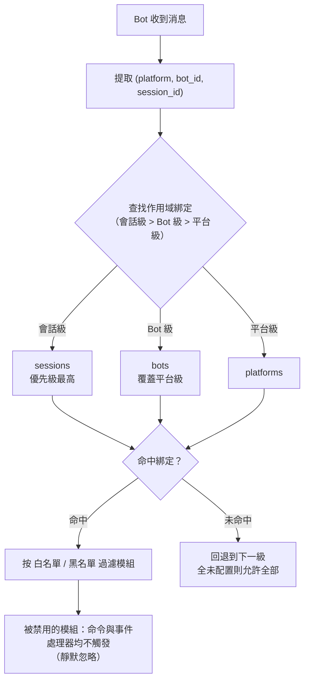

# 模組作用域系統

> [!NOTE]
> 本特性需要 ErisPulse **2.8.0+**。

模組作用域系統用於控制「某個 Bot 只能使用哪些模組」，實現多 Bot 場景下的模組隔離。  
預設情況下所有模組對所有 Bot 開放；僅在配置綁定後才開始過濾，**模組與適配器無需任何變動**即可適配。

{!--< tips >!--}
1. 作用域以「適配器平台 + Bot 標識 + 會話標識」為維度綁定模組
2. 支持白名單（`modules`）與黑名單（`blocked`）兩種方式
3. 被作用域禁用的模組收到訊息時靜默忽略，不回覆提示
4. 支援執行時 `sdk.scope.bind()` / `unbind()` 動態增刪，可持久化
{!--< /tips >!--}


## 工作原理



- **解析優先級：會話級 > Bot 級 > 平台級**，更高優先級未綁定規則時回退到下一級；全部未配置則允許全部模組。
- 事件數據缺少 `self`（無法識別 Bot）時，跳過 Bot 級，按會話級 / 平台級判斷。
- 框架層資源（owner 為空的處理器、命令分發器、事件總線）始終放行，不受作用域影響。

## 配置檔案

```toml
[ErisPulse.scope]
default_allow = true        # 預設允許全部（false = 隱式拒絕嚴格模式）
cache_size = 1024           # is_allowed 的 LRU 快取大小

# 平台級別綁定（作用於該平台所有 Bot / 會話）
[ErisPulse.scope.platforms.onebot11]
modules = ["Chat", "Translate"]   # 白名單：該平台 Bot 只能使用這些模組
blocked = ["Danger"]              # 黑名單：這些模組在該平台被禁用

# Bot 級別綁定（作用於該 Bot 的所有會話，覆蓋平台級別）
[ErisPulse.scope.bots.onebot11."123456"]
modules = ["Chat"]
blocked = []

# 會話級別綁定（作用於某個群組 / 頻道 / 私聊，最具體）
[ErisPulse.scope.sessions.onebot11."789012345"]
modules = ["Chat"]                # 該群組只能使用 Chat
blocked = []
```

語意（模組名稱匹配**大小寫不敏感**）：

| 配置 | 效果 |
|------|------|
| 僅 `modules`（白名單） | 只有列出的模組允許使用 |
| 僅 `blocked`（黑名單） | 列出的模組被禁用，其餘全部允許 |
| 兩者都配置 | 白名單限定範圍，白名單內的模組再剔除黑名單 |
| 兩者都為空 / 未配置 | 遵循 `default_allow`：`true`（預設）允許全部；`false` 則隱式拒絕 |

> `modules` 與 `blocked` 均支援字串或字串清單。模組名稱大小寫不敏感（`"Chat"` 與 `"chat"` 等價）。
> 會話識別為事件的群組 ID（`group_id`）、頻道 ID（`channel_id`）或私聊使用者 ID（`user_id`）。
> **會話識別跨平台隔離**：`(platform, session_id)` 組合唯一識別一個會話，`onebot11` 的 `789` 與 `telegram` 的 `789` 互不影響。

## 執行階段 API

### 判斷模組是否允許

```python
from ErisPulse import sdk

# 某個 Bot 是否允許使用某模組
allowed = sdk.scope.is_allowed("onebot11", "123456", "Chat")

# 指定會話（群組 / 頻道 / 私聊）判斷
allowed = sdk.scope.is_allowed("onebot11", "123456", "Chat", "789012345")
```

### 動態綁定 / 解綁

```python
# 綁定 Bot 級白名單（持久化到配置）
sdk.scope.bind("onebot11", "123456", modules=["Chat", "Translate"])

# 綁定會話級白名單（第三參數為 session_id）
sdk.scope.bind("onebot11", "123456", "789012345", modules=["Chat"])

# 綁定平台級黑名單
sdk.scope.bind("onebot11", blocked=["Danger"])

# 僅執行階段生效（重啟失效）
sdk.scope.bind("onebot11", "123456", modules=["Chat"], persist=False)

# 合併而非取代：把 Music 併入現有白名單（預設 bind 是取代）
sdk.scope.bind("onebot11", "123456", modules=["Music"], merge=True)

# 移除綁定（恢復允許全部）；可指定 session_id 移除會話級綁定
sdk.scope.unbind("onebot11", "123456")
sdk.scope.unbind("onebot11", "123456", "789012345")
```

> `bind()` 預設**取代**該目標的整個綁定；`merge=True` 時將新模組/停用併入現有綁定。

### 查詢綁定

```python
# 取得生效綁定（可指定會話）
sdk.scope.get("onebot11", "123456")              # {"modules": ["Chat"], "blocked": []}
sdk.scope.get("onebot11", "123456", "789012345") # 會話級生效綁定
sdk.scope.get("onebot11")                        # 平台級綁定，無則 None

# 列出全部綁定（platforms / bots / sessions 三桶）
sdk.scope.list_bindings()
```

### 過濾統計（偵錯）

```python
# 查看被作用域靜默過濾的次數與快取命中情況
sdk.scope.get_stats()
# {"is_allowed_calls": 10, "filtered_count": 3, "cache_hits": 5, "cache_misses": 5}

sdk.scope.reset_stats()
```

### 拓撲樹資料

```python
# 作用域部分（供 Dashboard 展示）
sdk.scope.get_topology()

## 常見問題與注意事項

### 1. 配置層級

解析優先級：**會話級 > Bot 級 > 平台級**。高優先級綁定會**整體覆蓋**低優先級。

```toml
# 平台級只允許 Chat
[ErisPulse.scope.platforms.onebot11]
modules = ["Chat"]

# 但 Bot 級只允許 Music → 該 Bot 最終只能用 Music，不能用 Chat！
[ErisPulse.scope.bots.onebot11."123456"]
modules = ["Music"]
```

- 想「平台級允許 Chat，Bot 級再加 Music」，必須在 **Bot 級同時列出兩者**：`modules = ["Chat", "Music"]`。
- 同理，底層黑名單會被上層白名單覆蓋：平台級 `blocked=["Danger"]` + Bot 級 `modules=["Danger"]` → Bot 級整體覆蓋，Danger 可用。層級越高、越具體，越以它為準。

### 2. 它是「逐事件」判斷，不會「粘住」

作用域判斷**只針對當前這一條事件**，不跨事件記憶：
- 會話 g1 禁用了模組 A → 在 g1 的**這條**訊息 A 不觸發；**下一條**訊息獨立重新判斷，若綁定沒變仍不觸發，綁定改了立即生效（LRU 快取會自動失效）。
- 會話 g2 沒配綁定 → 回退到 Bot 級 / 平台級判斷；都沒有則按 `default_allow`。

### 3. 模組沒反應

當你發了訊息模組卻沒反應，先懷疑作用域而不是模組/適配器：

```python
# 在模組代碼或臨時腳本裡加一行定位
from ErisPulse import sdk
print(sdk.scope.is_allowed(event.get_platform(), <bot_id>, "MyModule", <session_id>))
print(sdk.scope.get_stats())          # filtered_count > 0 說明確實被過濾了
```

被過濾是**靜默**的（不回覆，避免暴露作用域規則給用戶），但 `filtered_count` 會累計。

### 4. 會話識別碼跨平台隔離

`(platform, session_id)` 組合才是唯一識別碼。`[ErisPulse.scope.sessions.onebot11."789"]` 只作用於 onebot11 平台，不影響 telegram 上同為 `789` 的會話。

### 5. 效能

`is_allowed()` 結果帶 **LRU 快取**（預設 1024 條，`scope.cache_size` 可調），
配置變更 / `bind()` / `unbind()` 自動失效，高頻事件路徑開銷極小。

## 拓撲樹 API

`ModuleManager.get_topology()` 與 `AdapterManager.get_topology()` 提供模組/適配器歸屬關係資料，
`sdk.get_topology()` 一鍵聚合三者：

```python
from ErisPulse import sdk

topology = sdk.get_topology()
# {
#   "modules": {                                   # 模組 → 擁有的資源
#     "Chat": {
#       "loaded": True, "enabled": True,
#       "load_strategy": {"lazy": False, "priority": 50},
#       "info": {...},
#       "commands": ["chat", "translate"],
#       "handlers": {"message": 2, "notice": 1},
#       "routes": {"http": ["/Chat/api"], "ws": [], "sse": []},
#       "lifecycle_hooks": 3,
#       "scope_applies": True,
#     }
#   },
#   "adapters": {                                  # 適配器 → Bot → 作用域
#     "onebot11": {
#       "status": "started", "enabled": True,
#       "bots": {"123456": {"status": "online", "last_active": ..., "info": {...}, "scope": {...}}},
#       "scope": {"modules": [...], "blocked": [...]},
#     }
#   },
#   "scope": {"platforms": {...}, "bots": {...}, "sessions": {...}}   # 全部作用域綁定
# }

- 模組拓撲聚合了該模組註冊的命令、事件處理器、HTTP/WS/SSE 路由與生命週期鉤子，便於繪製模組資源樹。
- 適配器拓撲聚合了各適配器狀態、下屬 Bot 狀態及平台級/Bot 級作用域綁定。