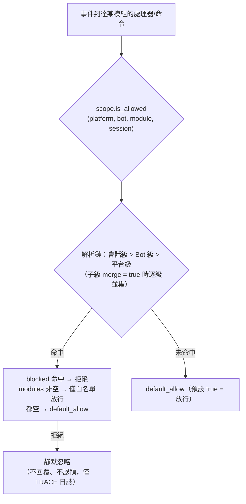

# 作用域（scope）

> [!NOTE]
> 本特性需要 ErisPulse **2.8.0+**。

作用域回答四個問題：**哪些模組可用、誰的事件收不收、某模組處理什麼文字、
模組能向外做什麼**。
控制權完全交給使用者：在模組 / 適配器 / 處理器 / 出站呼叫註冊的**上層**（配置
`ErisPulse.scope` 或執行時 `sdk.scope`）統一聲明，事件管線在入口、處理器篩選
與出站閘口自動讀取並執行。

| 維度 | 控制什麼 | 拒絕行為 | 配置路徑 |
|------|---------|---------|---------|
| **① 模組** | 哪些模組可用（平台 / Bot / 會話三級） | 靜默忽略（不回覆、不認領） | `scope.platforms / bots / sessions` |
| **② 身份** | 事件收不收（適配器 / Bot / 會話 / 用戶四級） | 入口完全丟棄（靜默） | `scope.identity.*` |
| **③ 出站** | 模組能發起哪些出站呼叫（訊息 / API / 請求，方法級白名單/黑名單） | 失敗回應（`retcode=34601`） | `scope.actions` |

> **相關系統**：命令是特殊的訊息事件處理器，其用戶黑白名單（ACL）與
> 實現參數覆寫由命令系統自持（`ErisPulse.event.command`），
> 見 [事件處理入門](../getting-started/event-handling.md) 與 [配置指南](../user-guide/configuration.md)。

{!--< tips >!--}
1. 透過 `from ErisPulse.Core import scope` 導入單例（`sdk.scope` 同物件）
2. 判定：`scope.is_allowed(...)` / `scope.is_identity_allowed(...)` /
   `scope.is_action_allowed(...)` 對應 ①②③ 三個閘口
3. 讀寫：維度化參數方法（IDE 可補全）——
   `scope.set_module(...)` / `scope.set_identity(...)` / `scope.set_action(...)`；
   另有字典式兜底 `scope.get(path)` / `scope.set(path, v)` / `scope.delete(path)`
4. 事件處理器文字條件覆寫見
   [事件處理入門 · 事件覆寫](../getting-started/event-handling.md#事件覆寫不改模組代碼覆寫任意事件類型的行為)；
   命令 ACL / 參數覆寫見[事件處理入門](../getting-started/event-handling.md)
{!--< /tips >!--}

## 匹配條目語法（全系統統一）

作用域所有"名字列表"（模組名、身份鍵、出站條目）共用同一套匹配語法
（`ErisPulse.Core.text_match`）：

| 語法 | 示例 | 說明 |
|------|------|------|
| 精確名 | `"Chat"` | 全值比較，**大小寫不敏感** |
| glob | `"Tool*"`、`"spam_*"` | `*` 任意串 / `?` 單字符 / `[seq]` 字符集，大小寫不敏感 |
| 正則 | `"re:^Danger.*"` | 以 `re:` 前綴聲明，正則 `search` 匹配，默认大小寫不敏感 |

- 非法正則**靜默降級**為"不匹配"（不拋錯、不崩潰）
- 裝飾器參數（`pattern=` / `regex=`）為固定語義：`pattern` 是 glob、`regex` 是正則源碼
  （不加 `re:` 前綴）；作用域配置裡的正則條目**必須**帶 `re:` 前綴

## 全局兜底：`default_allow`

`default_allow` 是**全局唯一**的兜底開關（預設 `true`），
對兩個判定維度統一生效：

- **模組維度**：未命中任何綁定 → `default_allow` 決定放行 / 拒絕
- **身份維度**：未命中任何策略 → `default_allow` 決定放行 / 拒絕

設為 `false` 即開啟"隱式拒絕"嚴格模式：白名單式管理，
**沒顯式允許的一律拒絕**。

> **例外**：③ 出站維度**不受** `default_allow` 影響——它是獨立的收緊開關，
> 預設全允許，僅顯式規則才限制（框架層 owner 為空的呼叫恆放行）。
> 這樣嚴格的全局模式不會意外掐斷所有模組的訊息回覆。
> 命令 ACL 有獨立的 `ErisPulse.event.command.default_allow` 兜底，互不影響。

## 配置檔案

```toml
[ErisPulse.scope]
default_allow = true        # 全局兜底（false = 隱式拒絕嚴格模式）
cache_size = 1024           # LRU 缓存大小

# ── ① 模組維度（優先級：會話 > Bot > 平台）──
[ErisPulse.scope.platforms.onebot11]
modules = ["Chat", "Tool*"]   # 白名單：精確名 / glob / re: 正則
blocked = ["re:^Danger"]
[ErisPulse.scope.bots.onebot11."123456"]
modules = ["Chat"]
merge = true                  # 在平台級綁定基礎上追加（預設整體覆蓋）
[ErisPulse.scope.sessions.onebot11."789012345"]
modules = ["Chat"]

# ── ② 身份維度（優先級：用戶 > 會話 > Bot > 適配器）──
[ErisPulse.scope.identity.adapters.onebot11]
deny = true                   # 整個適配器的事件全部丟棄
[ErisPulse.scope.identity.bots.onebot11."123456"]
deny = true
[ErisPulse.scope.identity.sessions.onebot11."g_blocked"]
deny = true
[ErisPulse.scope.identity.users.onebot11]
allow = ["u_admin"]           # 用戶鍵支援 glob / re: 正則
deny = ["u_bad", "spam_*"]

# ── ③ 出站維度（預設全允許，顯式收緊才禁）──
[ErisPulse.scope.actions.MyModule]
send = { deny = true }                                    # 全禁發送
api = { allow = ["get_*"] }                               # 僅允許查詢類標準 API
request = { deny = true }                                 # 禁止處理請求
```

## ① 模組維度

回答"某個上下文裡，哪些模組可用"。預設全部開放；配置綁定後才開始篩選，
**模組與適配器無需任何改動**。



- **解析優先級：會話級 > Bot 級 > 平台級**，高優先級綁定**整體覆蓋**低優先級；
  子級綁定寫 `merge = true` 時改為與低優先級**逐條目並集**（modules / blocked 各自合併，
  `merge` 本身是控制鍵，不算條目）
- **靜默語義**：被篩選模組的命令與處理器不觸發、不回覆、不認領（防止跨命令誤匹配），
  僅 TRACE 級日誌可見（`core.scope.denied`）
- **框架級處理器**（`scope_exempt=True` 或 owner 為空）不受影響；模組名為空（框架層資源）恆放行
- **會話感知幫助與命令查詢**：命令查詢 API（`command.help` /
  `get_command` / `get_commands` / `get_group_commands` / `get_visible_commands`，
  以及 `module.get_commands_overview`）均支援可選 `event=` 或顯式
  `platform=` / `bot_id=` / `session_id=` 關鍵字——當前會話不可用模組的命令
  不再出現在結果中（`get_command` 回傳 None、單命令幫助按"未註冊"處理，
  與靜默語義一致）；不傳上下文則保持全量行為

### 綁定繼承（merge）

預設整體覆蓋的語義清晰可預測；需要在上級基礎上**追加**時，在子級寫 `merge = true`：

```toml
[ErisPulse.scope.platforms.onebot11]
modules = ["Chat", "Tool"]      # 平台級：允許 Chat、Tool

[ErisPulse.scope.bots.onebot11."123456"]
modules = ["Music"]
merge = true                    # 該 Bot 實際生效 = ["Chat", "Tool", "Music"]
```

- 合併規則：`modules` 與 `blocked` 各自取**並集**；綁定內 `blocked` 仍優先於 `modules`
- 鏈式合併：平台 → Bot → 會話逐級疊加，每一級獨立決定 `merge` 或覆蓋

## ② 身份維度（事件准入）

回答"誰的事件收不收"。被拒絕的事件在**分發入口完全丟棄**——
不進入中間件與任何處理器（含框架級），僅 TRACE 級日誌可見（`core.scope.identity_denied`）。

- **解析優先級：用戶 > 會話 > Bot > 適配器**，取最具體的已配置策略；deny 優先於 allow
- 每級綁定是二元策略：`{ allow = true }` 或 `{ deny = true }`
- 用戶鍵支援 glob / 正則（如 `"spam_*"` 拉黑一批垃圾用戶）
- 典型用法——上級 deny、個人 allow 做"例外放行"：

```toml
[ErisPulse.scope.identity.adapters.onebot11]
deny = true
[ErisPulse.scope.identity.users.onebot11]
allow = ["u_admin"]   # 即使適配器級拒絕，u_admin 的事件仍然放行
```

## ③ 出站維度（限制模組發起出站呼叫）

限制模組**發起的出站動作**：訊息發送 / 標準 API 動作 / 請求操作。
三類動作對應底層 DSL：`Event.reply` 與 `Send`（send）、`Api` / `call_api`（api）、
`Request` 的 accept/reject（request）。模組在事件 handler 執行期發起的出站呼叫
攜帶模組 owner，由本維度統一判定。

### 規則形態（內聯表）

每個動作的規則是一張內聯表：`{ allow = [...], deny = true|[...] }`。
同一動作只能有一種規則（TOML 鍵不可重複，全禁與細粒度二選一）：

```toml
[ErisPulse.scope.actions.MyModule]
send = { deny = true }                                  # 全禁發送（Event.reply / Send DSL）
# 或方法級細粒度：send = { allow = ["Text", "Image*"], deny = ["File"] }
api = { allow = ["get_*"] }                             # 僅放行查詢類標準 API
# 或動作級黑名單：api = { deny = ["set_*", "leave_*"] }
request = { deny = true }                               # 禁止處理請求 accept/reject
```

- `send` 的條目匹配**發送方法名**（`Text` / `Image` / `File` ...），
  `api` 的條目匹配**標準動作名**（`get_group_info` / `set_group_name` ...）
- 條目支援精確名 / glob / `re:` 正則（與全系統統一語法一致，大小寫不敏感）
- `allow` 寫單個字串等價於單條目列表：`send = { allow = "Text" }`

### 判定語義

**預設全允許**——未配置、或 owner 為空（框架層內部呼叫）均放行。
配置規則後按以下順序判定：

1. `deny = true` → 拒絕
2. `deny` 列表命中呼叫名 → 拒絕
3. `allow` 列表非空且呼叫名未命中（或呼叫無名稱）→ 拒絕
4. 其餘放行

被拒呼叫不發起任何網路請求，直接回傳標準失敗回應
（`retcode = 34601`，見 [api-response §5.3](../standards/api-response.md#53-框架擴展返回碼34xxx-平台錯誤段的低三位自定義)）。
三個動作互相獨立，可只限其一。

```python
# 運行時 API
sdk.scope.set_action("MyModule", "send", deny=True)              # 全禁發訊息
sdk.scope.set_action("MyModule", "send", allow=["Text"])         # 僅允許發文本
sdk.scope.is_action_allowed("MyModule", "send", name="Image")    # False
sdk.scope.is_action_allowed("MyModule", "api", name="get_user_info")  # 按規則判定
sdk.scope.delete_action("MyModule", "send")                      # 恢復允許
sdk.scope.get_action("MyModule", "send")                         # 該動作當前規則
```

## 運行時 API

作用域運行時 API 分三層：**判定**（三問）、**維度化讀寫**（每維 `set` / `get` / `delete`
參數化方法，簽名全類型標註，IDE 可補全）、**字典式兜底**（點分路徑直達任意節）。

```python
from ErisPulse import sdk

scope = sdk.scope
```

### 判定（三問）

```python
scope.is_allowed("onebot11", "123456", "Chat")                 # ① 模組維度
scope.is_allowed("onebot11", "123456", "Chat", "789012345")    # 含會話級
scope.is_allowed("onebot11", "123456", None)                   # 框架層資源 -> True

scope.is_identity_allowed("onebot11", "123456", "group_9", "u1")   # ② 身份維度

scope.is_action_allowed("MyModule", "send")                    # ④ 出站維度
scope.is_action_allowed("MyModule", "send", name="Image")      # 方法級細粒度
```

### ① 模組維度

```python
# 綁定（層級由參數決定：session_id > bot_id > 平台級）
scope.set_module("onebot11", bot_id="123456", modules=["Chat", "Tool*"])
scope.set_module("onebot11", blocked=["re:^Danger"])                       # 平台級
scope.set_module("onebot11", bot_id="123456", session_id="g9", modules=["Chat"])  # 會話級
scope.set_module("onebot11", bot_id="123456", modules=["Music"], merge=True)      # 與現有條目並集
scope.set_module("onebot11", bot_id="123456", modules=["Chat"], persist=False)    # 僅運行時

# 讀 / 刪
scope.get_module("onebot11", bot_id="123456")   # {"modules": ["Chat"], "blocked": []}
scope.delete_module("onebot11", bot_id="123456")
```

> `merge=True` 是**寫時並集**（與該級現有綁定合併條目）；跨級解析期的
> `merge = true` 配置鍵見上文[綁定繼承](#綁定繼承merge)——兩者是獨立機制。

> **運行時綁定（`persist=False`）語義**：運行時綁定保存在獨立的覆蓋層中，
> **任意後續配置寫入 / 配置檔案熱更新都不會沖掉它們**（配置樹重建後按寫入順序
> 自動重放，含運行時刪除）。它們不落盤，進程重啟後丟失；模組卸載時該模組寫入的
> 運行時綁定會被兜底清理。隨後對同一路徑執行 `persist=True` 寫入（使用者持久化語義）
> 將取代運行時規則。

### ② 身份維度

```python
# 綁定策略（層級由參數決定：user > session > bot > adapter；allow / deny 二選一）
scope.set_identity("onebot11", user_id="u_bad", deny=True)
scope.set_identity("onebot11", user_id="spam_*", deny=True)    # 鍵支援 glob / re: 正則
scope.set_identity("onebot11", bot_id="123456", session_id="g9", allow=True)

# 讀 / 刪
scope.get_identity("onebot11", user_id="u_bad")   # {"deny": True}
scope.delete_identity("onebot11", user_id="u_bad")
```

### ③ 出站維度

```python
# 設置限制規則（allow: str|list；deny: bool|str|list；整規則替換語義）
scope.set_action("MyModule", "send", deny=True)                    # 全禁發送
scope.set_action("MyModule", "send", allow=["Text"])               # 僅允許發文本
scope.set_action("MyModule", "api", deny=["set_*", "leave_*"])     # 禁管理類 API

# 讀 / 刪
scope.get_action("MyModule", "send")       # {"allow": ["Text"]} 原始規則
scope.delete_action("MyModule", "send")    # 移除單動作
scope.delete_action("MyModule")            # 移除該模組全部動作限制
```

### 通用

```python
scope.get("platforms")   # 字典式兜底：點分路徑讀任意節
scope.topology()         # 全量配置樹（供 Dashboard）
scope.stats()
# {"module_calls": .., "module_filtered": .., "identity_checks": .., "identity_denied": ..,
#  "action_checks": .., "action_denied": .., "cache_hits": .., "cache_misses": ..}
scope.reset_stats()
scope.clear()           # 清空全部配置（僅記憶體生效）
```

### 高級：字典式點分路徑兜底

維度化方法覆蓋日常場景；需要直達任意節點（或未來新增的維度）時，
可用字典式 API——`get` / `set` / `delete` 接受點分路徑（dict 深合併、寫後立讀），
並提供 `scope[path]` / `scope[path] = v` / `del scope[path]` / `path in scope` 協議：

```python
scope.set("bots.onebot11.123456", {"modules": ["Chat"], "blocked": []})
scope.set("identity.users.onebot11.u_bad", {"deny": True})
scope.get("actions.MyModule.send")

scope["platforms.onebot11"]        # 讀（不存在拋 KeyError）
scope["platforms.onebot11"] = {...}  # 寫
del scope["platforms.onebot11"]      # 刪
"actions.MyModule" in scope          # 存在性
```

## 緩存與熱更新

- `is_allowed` / `is_identity_allowed` / `is_action_allowed` 結果帶 **LRU 緩存**
  （`scope.cache_size` 可調），`set` / `delete` /
  配置熱更新（`config.updated` / `config.set`）自動失效
- 所有維度配置改了**立即生效**，無需重啟
- 作用域是"逐事件"判斷，不跨事件記憶：配置變了，下一個事件即按新規則

## 配置格式校驗

加載 / 熱更新時逐節校驗配置格式：類型錯誤的節（如 `platforms` 寫成了字串）、
非法的出站規則（如 `allow` 寫成數字）、未知動作名、未知的頂層鍵（如 `alow` 拼寫錯誤）
會輸出 **WARNING** 並忽略對應節 / 條目，其餘合法配置照常生效——寫錯不再靜默失效。

## 常見問題與注意事項

### 1. 配置層級與覆蓋

- 模組維度：會話級 > Bot 級 > 平台級，**整體覆蓋**（子級 `merge = true` 時逐條目並集）。
  想"平台允許 Chat，Bot 再加 Music"，可在 Bot 級寫 `merge = true`，或同時列出兩者
- 身份維度：用戶 > 會話 > Bot > 適配器，取**最具體**的已配置策略（可做例外放行）
- 命令用戶黑白名單：精確命令名優先於 glob 鍵（見 `event.command.acl`）

### 2. 模組/命令沒反應

先懷疑作用域而不是模組本身：

```python
from ErisPulse import sdk

print(sdk.scope.is_allowed(event.get_platform(), bot_id, "MyModule", session_id))
print(sdk.scope.is_identity_allowed(event.get_platform(), bot_id, session_id, user_id))
print(sdk.scope.stats())   # module_filtered / identity_denied > 0 說明被靜默篩選
```

被篩選是**靜默**的（模組維度與身份維度不回覆，避免暴露規則），但統計會累積；
命令維度被 ACL 拒絕會顯式回覆"權限不足"。

### 3. 出站動作被拒時排查

```python
from ErisPulse import sdk

print(sdk.scope.get("actions.MyModule"))
print(sdk.scope.stats())   # action_denied > 0 說明有呼叫被擋截
```

擋截是**顯式**的：被拒呼叫回傳 `retcode = 34601` 的標準失敗回應（不發起網路請求）。

### 4. 會話標識跨平台隔離

`(platform, session_id)` 組合才是唯一標識。`scope.sessions.onebot11."789"`
只作用於 onebot11，不影響 telegram 上同為 `789` 的會話。身份維度的用戶鍵同理。

## 拓撲樹 API

`ModuleManager.get_topology()` 與 `AdapterManager.get_topology()` 提供模組/適配器歸屬關係資料，
`sdk.get_topology()` 一鍵聚合（含作用域 `scope`）：

```python
from ErisPulse import sdk

topology = sdk.get_topology()
# {
#   "modules": {                                   # 模組 → 擁有的資源
#     "Chat": {
#       "loaded": True, "enabled": True,
#       "commands": ["chat", "translate"],
#       "handlers": {"message": 2, "notice": 1},
#       "routes": {"http": ["/Chat/api"], "ws": [], "sse": []},
#       "lifecycle_hooks": 3,
#     }
#   },
#   "adapters": {                                  # 適配器 → Bot → 作用域
#     "onebot11": {
#       "status": "started", "enabled": True,
#       "bots": {"123456": {"status": "online", "scope": {...}}},
#       "scope": {"modules": [...], "blocked": [...]},
#     }
#   },
#   "scope": {                                     # 作用域（模組 / 身份 / 出站動作）
#     "platforms": {...}, "bots": {...}, "sessions": {...},
#     "identity": {"adapters": {...}, "bots": {...}, "sessions": {...}, "users": {...}},
#     "actions": {...},
#   },
# }
```

- 模組拓撲聚合了該模組註冊的命令、事件處理器、HTTP/WS/SSE 路由與生命週期鉤子，便於繪製模組資源樹。
- 適配器拓撲聚合了各適配器狀態、下屬 Bot 狀態及平台級/Bot 級作用域綁定（模組維度）。