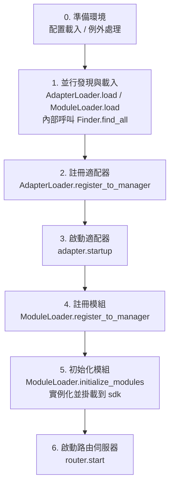

# 啟動流程與手動控制

ErisPulse 的 `await sdk.run()` / `await sdk.init()` 把一整條啟動鏈路封裝成了「一行程式碼」。但當你需要完全自訂啟動流程（例如部分載入、動態註冊、熱插拔、注入自訂載入策略）時，就需要了解這條鏈路內部到底發生了什麼、以及如何手動驅動每一步。

本文把啟動鏈路拆解成獨立的環節，說明各自的職責、呼叫順序，並給出手動完整啟動的範例。

> 本文假設你已經跑過 [第一個機器人](../getting-started/first-bot.md)，了解 `sdk.run(keep_running=True/False)` 兩種模式。本文聚焦於 `init()` **內部**的鏈路拆解，以及 `init()`/`init_task()`/`init_sync()` 等更底層的入口。

## SDK 頂層入口一覽

除了 `run()` 的兩種 `keep_running` 模式，SDK 還提供幾個更底層的初始化入口，區別在於**異步性、回傳值、以及是否包裝例外**：

| 入口 | 異步性 | 回傳值 | 例外處理 | 適用場景 |
|------|--------|--------|----------|----------|
| `await sdk.run(True)` | async，阻塞維持 | `None`（關閉時自動 `uninit`） | 模組/適配器錯誤被攔截，不拖垮程序 | 純 bot 應用 |
| `await sdk.run(False)` | async，不阻塞 | `None`（不自動卸載） | 同上 | 初始化後執行自訂邏輯 |
| `await sdk.init()` | async，需 await | `bool` | 內部捕獲元件例外，失敗回傳 `False` | 手動控制生命週期（配 `uninit()`） |
| `sdk.init_task()` | async，回傳 Task 不阻塞 | `asyncio.Task` | 同 `init()` | 並發執行別的初始化、或事件迴圈尚未運行 |
| `sdk.init_sync()` | **同步**，阻塞目前執行緒 | `bool` | 同 `init()` | 命令列腳本、無事件迴圈的同步入口 |

> **常見誤區**：`await sdk.init()` **不等於** `await sdk.run(keep_running=False)`。兩點不同：① `init()` 回傳 `bool`（失敗時回傳 `False`），`run()` 回傳 `None`；② `init()` 只做初始化、**不自動卸載**，`run()` 在事件迴圈結束時自動 `uninit()`。因此需要手動配對卸載或自訂生命週期時，用 `init()` + `uninit()`。

## 啟動鏈路總覽

`sdk.init()`（確實是其內部的 `Initializer.init()`）按以下順序拉起整個框架：



對應的核心元件：

| 層 | 元件 | 職責 |
|----|------|------|
| 發現 | `AdapterFinder` / `ModuleFinder` | 從已安裝套件的 entry-points 中**發現**適配器/模組 |
| 載入 | `AdapterLoader` / `ModuleLoader` | 發現 + 導入 + 讀取元資料 + 判斷啟用/禁用，回傳物件清單 |
| 註冊 | `*Loader.register_to_manager` | 把物件登記到對應管理器 |
| 管理 | `sdk.adapter` / `sdk.module` | 維護適配器/模組實例，提供啟停介面 |
| 初始化 | `ModuleLoader.initialize_modules` | 建立模組實例並掛載到 `sdk`（處理相依性拓撲排序） |
| 路由 | `sdk.router` | HTTP / WebSocket 伺服器 |

> **重要**：`Finder` 和 `Loader` 是兩層。`Loader` 內部**已經持有**一個 `Finder`（`AdapterLoader` 自帶 `AdapterFinder`，`ModuleLoader` 自帶 `ModuleFinder`）。大多數場景你只需要用 `Loader`，只有需要「只列出不導入」時才會單獨用 `Finder`。

## 各環節詳解

### 1. 發現層：Finder

Finder 只負責「找到有哪些套件提供了適配器/模組」，不導入、不實例化。

```python
from ErisPulse.finders import AdapterFinder, ModuleFinder

adapter_finder = AdapterFinder()
module_finder = ModuleFinder()

# 查找所有已安裝的適配器/模組 entry-points
adapter_entries = adapter_finder.find_all()    # list[EntryPoint]
module_entries = module_finder.find_all()      # list[EntryPoint]

# 按名稱查找單個
entry = module_finder.find_by_name("MyModule")  # EntryPoint | None
```

每個 `EntryPoint` 可以 `.load()` 得到對應的類，但通常不用你手動調——Loader 會做。

### 2. 載入層：Loader

Loader 在 Finder 之上做了「導入 + 讀元資料 + 判斷啟用/禁用」。

```python
from ErisPulse.loaders import AdapterLoader, ModuleLoader
from ErisPulse import sdk

adapter_loader = AdapterLoader()
module_loader = ModuleLoader()

# load() 內部：呼叫 finder.find_all() → 逐個處理 entry-point → 回傳三元組
adapter_objs, enabled_adapters, disabled_adapters = await adapter_loader.load(sdk.adapter)
module_objs, enabled_modules, disabled_modules = await module_loader.load(sdk.module)
```

`load()` 回傳的三元組：

| 回傳值 | 含義 |
|--------|------|
| `objs` (`dict`) | 名稱 → 對象（適配器類 / 模組包裝物件） |
| `enabled` (`list[str]`) | 被啟用的名稱（設定中未禁用） |
| `disabled` (`list[str]`) | 被禁用的名稱 |

#### 載入失敗時的診斷資訊

當某個模組/適配器在載入或初始化階段拋出例外時，框架會跳過該元件並繼續載入其他元件，同時輸出**使用者程式碼幀摘要**，讓你在預設 INFO 級別下即可定位出錯位置，無需手動重開 DEBUG：

```
[ERROR] [ModuleLoader] 從 entry-point 載入模組 MyModule 失敗，已跳過: 'NoneType' object has no attribute 'platform'
  → MyModule/Core.py:42 in on_load
      adapter = sdk.platform
  → AttributeError: 'NoneType' object has no attribute 'platform'
  → 提示: 將日誌級別提高到 DEBUG 可查看完整堆疊；檢查模組 MyModule 的實作程式碼
```

診斷資訊透過 `ErisPulse.runtime.diagnostics` 模組產生，會自動過濾掉框架內部幀，只保留你的程式碼幀。如需在自訂載入邏輯中重用：

```python
from ErisPulse.runtime import log_diagnostic

try:
    risky_init()
except Exception as e:
    log_diagnostic(e)  # 自動提取使用者程式碼幀並寫入 ERROR 日誌
```

該模組還提供 `extract_user_frame()`（回傳結構化幀資訊）和 `format_diagnostic_block()`（回傳多行文字）兩個底層函數。

### 3. 註冊層：register_to_manager

把 Loader 產出的物件登記到管理器，讓 `sdk.adapter` / `sdk.module` 能識別它們。

```python
# 註冊適配器（回傳 bool，表示是否全部成功）
await adapter_loader.register_to_manager(enabled_adapters, adapter_objs, sdk.adapter)

# 註冊模組
await module_loader.register_to_manager(enabled_modules, module_objs, sdk.module)
```

註冊後，適配器已登記到適配器管理器、模組已登記到模組管理器，但**都還未啟動/實例化**。

### 4. 啟動適配器

```python
# 啟動所有已註冊的適配器
await sdk.adapter.startup()
# 或指定平台
await sdk.adapter.startup("yunhu")
await sdk.adapter.startup(["yunhu", "telegram"])
```

> 註冊 ≠ 啟動。`register_to_manager` 只是登記；`startup` 才會呼叫適配器的 `start()`，建立與平台的連接。

### 5. 初始化模組

模組比適配器多一步——需要**實例化**並掛載到 `sdk` 上（這樣你才能 `sdk.MyModule.xxx` 呼叫）。這一步還處理模組間的相依宣告與拓撲排序。

```python
success = await module_loader.initialize_modules(
    enabled_modules, module_objs, sdk.module, sdk
)
```

實例化成功後，模組會出現在 `sdk.<ModuleName>` 上。

### 6. 啟動路由伺服器

```python
await sdk.router.start(
    host="0.0.0.0",
    port=8000,
    ssl_certfile=None,
    ssl_keyfile=None,
)
```

路由伺服器負責接收適配器的 Webhook / WebSocket 回呼。不啟動它，server 模式的適配器無法收訊息。

## 完整手動啟動範例

下面這段程式碼**等於** `await sdk.init()` 的核心流程，但每一步都暴露在你手裡，可以在任意環節插入自訂邏輯：

```python
import asyncio
from ErisPulse import sdk
from ErisPulse.loaders import AdapterLoader, ModuleLoader

async def manual_startup():
    # 0. 準備環境（載入設定、註冊全域例外處理）
    #    _prepare_environment 是 init() 內部的前置步驟；手動流程也需先呼叫，
    #    否則 Loader 讀不到設定，會把所有適配器/模組誤判為禁用。
    if not await sdk._prepare_environment():
        print("環境準備失敗")
        return False

    # 1. 建立載入器（內部各自持有 Finder）
    adapter_loader = AdapterLoader()
    module_loader = ModuleLoader()

    # 2. 並行發現與載入（與 init() 內部一致用 gather）
    (adapter_objs, enabled_adapters, disabled_adapters), \
    (module_objs, enabled_modules, disabled_modules) = await asyncio.gather(
        adapter_loader.load(sdk.adapter),
        module_loader.load(sdk.module),
    )

    # 3. 註冊適配器
    await adapter_loader.register_to_manager(
        enabled_adapters, adapter_objs, sdk.adapter
    )

    # 4. 啟動適配器
    if enabled_adapters:
        await sdk.adapter.startup()

    # 5. 註冊模組
    await module_loader.register_to_manager(
        enabled_modules, module_objs, sdk.module
    )

    # 6. 初始化模組（實例化 + 掛載到 sdk）
    if enabled_modules:
        await module_loader.initialize_modules(
            enabled_modules, module_objs, sdk.module, sdk
        )

    # 7. 啟動路由伺服器
    await sdk.router.start(host="0.0.0.0", port=8000)

    print("手動啟動完成")
    return True

async def main():
    ok = await manual_startup()
    if ok:
        # 阻塞維持運行（手動流程不會自動阻塞）
        await asyncio.Event().wait()

if __name__ == "__main__":
    asyncio.run(main())
```

### 何時該手動啟動？

大多數情況下**不需要**手動啟動，`await sdk.run()` 已經把上面這些都做好了。手動啟動僅在這些場景才有價值：

- **部分載入**：只載入指定的適配器/模組，跳過其他
- **動態註冊**：執行時根據條件註冊新的適配器/模組
- **自訂順序**：需要打亂預設的載入順序（如先啟動某模組再啟動適配器）
- **注入策略**：對 Loader 注入自訂的嚴格模式管理器、載入策略等
- **除錯/診斷**：在某個環節失敗時，手動驅動以定位問題

## 運行時細粒度控制

即使用了 `sdk.run()` 完成啟動，你仍然可以在執行時單獨控制各子系統，而不必重新啟動整個 SDK：

### 適配器熱啟停

```python
# 熱重啟某個適配器（修復連接，不受其他平台影響）
await sdk.adapter.shutdown("yunhu")
await sdk.adapter.startup("yunhu")

# 執行中拉起一個新平台
await sdk.adapter.startup("telegram")

# 臨時下線某平台
await sdk.adapter.shutdown("telegram")
```

> `adapter.startup()` 要求適配器**已被註冊**到管理器。註冊發生在 `init()`/`run()` 內部，所以這是啟動**之後**的細粒度控制。

### 路由伺服器

```python
# 臨時下線 webhook 伺服器
await sdk.router.stop()

# 重新啟動（例如換了端口）
await sdk.router.start(host="0.0.0.0", port=9000)
```

### 模組按需載入

```python
# 手動載入一個（可能是懶載入的）模組
await sdk.load_module("MyModule")
```

## 優雅關閉

從 2.7.0 起，`sdk.shutdown()` 提供**程序化優雅關閉**：設定關閉事件，讓正在 `await sdk.run(keep_running=True)` 掛起的主迴圈回傳，進而觸發 `uninit()` 完成資源清理。

```python
# 在任意協程中呼叫，觸發優雅退出（run() 掛起回傳並自動 uninit）
sdk.shutdown()
```

典型用途：

```python
async def shutdown_after_idle():
    await asyncio.sleep(3600)
    sdk.shutdown()  # 空閒 1 小時後優雅退出
```

**訊號處理**：`run()` 內部會註冊 `SIGTERM` / `SIGHUP` 處理器，將系統訊號轉為優雅關閉——容器編排（Docker `docker stop`）或 `systemd` 停止服務時，進程會走完 `uninit()` 清理而非被強殺。

- Windows 不支援 `loop.add_signal_handler`，訊號處理器會自動跳過（仍可用 `sdk.shutdown()` 或 Ctrl+C 觸發關閉）
- 反覆呼叫 `sdk.shutdown()` 是安全的（事件已設定後再次呼叫為無操作）

## 卸載流程

啟動的反向操作是 `await sdk.uninit()`，它按相反順序清理：

1. 關閉所有適配器（`adapter.shutdown()`）
2. 卸載所有模組
3. 清理所有事件處理器
4. 清理管理器與 SDK 上的模組屬性

手動啟動場景下，記得在退出前呼叫 `uninit()` 保證優雅關閉：

```python
try:
    await asyncio.Event().wait()   # 維持運行
finally:
    await sdk.uninit()
```

## 重啟

SDK 提供兩種重啟方式，都不需要你自己先卸載——框架會自行處理：

| 方式 | 呼叫 | 行為 | 適用場景 |
|------|------|------|----------|
| 熱重啟 | `await sdk.restart()` | 同一進程內 `uninit()` 後重新 `init()`，重新載入適配器/模組 | 重新載入設定、熱更新模組 |
| 硬重啟 | `await sdk.hard_restart()` | `uninit()` 後以**退出碼 42** 退出進程，由外部監督者拉起全新進程 | 怀疑有記憶體/資源洩漏、需要徹底乾淨重啟 |

```python
# 熱重啟：同進程內重新載入（最常用）
await sdk.restart()

# 硬重啟：退出進程，交由外部監督者重啟（見下方「監督者指南」）
await sdk.hard_restart()
```

> **兩點注意**：
> 1. 這兩個方法都用背景任務執行重啟，**立即回傳 `True` 表示「重啟任務已調度」**，而非「重啟已完成」。實際重啟在背景進行，避免中斷目前事件鏈路。
> 2. `hard_restart()` 的原理是：卸載並刷盤設定後，以**退出碼 42**（`HARD_RESTART_EXIT_CODE`）退出進程——**它自身不拉起新進程**，必須由外部監督者檢測到退出碼 42 後重新啟動。若直接 `python main.py` 運行且無任何監督者，進程以碼 42 退出後就結束了，**不會自動重啟**（框架會打警告提示）。

### 什麼時候該用硬重啟？

硬重啟不只是「更徹底的重啟」，它在以下場景比熱重啟更合適、甚至更高效：

- **二進位函式庫（C 扩展）副作用**：熱重啟在同一進程內進行，無法釋放 C 扩展、打開的檔案描述符、執行緒等進程級資源；硬重啟換一個全新進程，這些副作用隨之徹底清零。
- **資源洩漏排查**：懷疑存在記憶體或句柄洩漏時，硬重啟能拿到一個乾淨的環境。
- **對效能敏感的頻繁重啟**：硬重啟省去了同進程內卸載→重新載入的開銷，實際比熱重啟更高效。

> Dashboard 管理面板裡的「框架重啟」功能，底層呼叫的就是 `hard_restart()`。

### 退出碼 42 契約

硬重啟是跨進程協作：**SDK 負責退出（碼 42），監督者負責拉起**。

| 角色 | 行為 |
|------|------|
| SDK（被硬重啟時） | `uninit()` → 刷盤設定 → `os._exit(42)` |
| 監督者 | 檢測到子進程退出碼為 42 → 重新啟動同一命令 |

> `sdk.is_supervised()` 可查詢目前進程是否由監督者啟動（檢測環境變數 `ERISPULSE_SUPERVISED`）。CLI `run` 命令啟動子進程時會自動注入該標記；systemd / Docker 等外部監督者不會注入，`is_supervised()` 回傳 `False`，此時硬重啟後框架會打「未檢測到監督者」警告。

### 監督者指南

選擇適合你的監督者，讓硬重啟真正生效：

#### 1. CLI run 命令（開發/簡單部署，推薦）

`epsdk run main.py` 內建監督迴圈：檢測子進程退出碼，42 時立即重啟；其它異常退出碼按指數退避自動重試；`Ctrl+C` 會先優雅終止子進程（碼 0 視為正常退出，不再拉起）。

```bash
epsdk run main.py
```

#### 2. systemd（Linux 伺服器）

`RestartForceExitStatus=42` 讓退出碼 42 也觸發重啟（預設 `on-failure` 只對非零碼生效）：

```ini
[Service]
ExecStart=/usr/bin/python3 /opt/mybot/main.py
Restart=on-failure
RestartForceExitStatus=42
RestartSec=2
User=mybot
```

#### 3. Docker / docker-compose

容器內 PID 1 是應用進程，退出碼 42 後容器退出——用 `restart` 策略讓它自動重啟：

```yaml
services:
  bot:
    build: .
    restart: unless-stopped   # 任何退出（含 42）都重啟
```

#### 4. PM2（Node 生態維運）

```bash
pm2 start main.py --name mybot --interpreter python3
# 42 被視為退出碼，PM2 預設重啟；設定 restart_delay 防抖
pm2 set mybot.restart_delay 2000
```

#### 5. supervisord

```ini
[program:mybot]
command=python3 /opt/mybot/main.py
autorestart=true
exitcodes=0,2,42    # 42 也視為"正常退出需重啟"
```

#### 6. 純 Python 自訂監督者

```python
import subprocess, sys, time

while True:
    p = subprocess.Popen([sys.executable, "main.py"])
    code = p.wait()
    if code == 42:          # 硬重啟請求
        time.sleep(0.5)
        continue
    if code == 0:           # 正常退出
        break
    time.sleep(3)           # 異常退出，退避重試
```

> **無監督者時的行為**：直接 `python main.py` 運行，呼叫 `hard_restart()` 後進程以碼 42 退出、不會重啟。此時應接入上述任一監督者。

## 相關文件

- [建立第一個機器人](../getting-started/first-bot.md) - `keep_running` 兩種基礎模式入門
- [生命週期管理](lifecycle.md) - 監聽 `core.init.start` / `core.init.complete` 等啟動事件
- [懶載入系統](lazy-loading.md) - 模組懶載入機制與 `load_module`