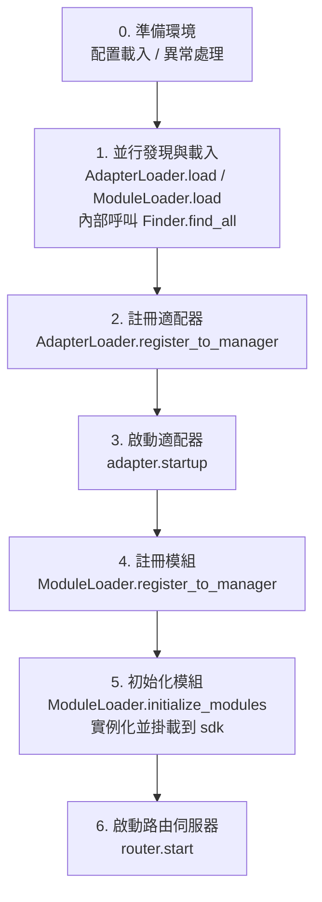

# 啟動流程與手動控制

ErisPulse 的 `await sdk.run()` / `await sdk.init()` 把一整條啟動鏈路封裝成了「一行代碼」。但當你需要完全自定義啟動流程（例如部分載入、動態註冊、熱插拔、注入自定義載入策略）時，就需要了解這條鏈路內部到底發生了什麼、以及如何手動驅動每一步。

本文把啟動鏈路拆解成獨立的環節，說明各自的職責、呼叫順序，並給出手動完整啟動的範例。

> 本文假設你已經跑通過 [第一個機器人](../getting-started/first-bot.md)，了解 `sdk.run(keep_running=True/False)` 兩種模式。本文聚焦於 `init()` **內部**的鏈路拆解，以及 `init()`/`init_task()`/`init_sync()` 等更底層的入口。

## SDK 頂層入口一覽

除了 `run()` 的兩種 `keep_running` 模式，SDK 還提供幾個更底層的初始化入口，區別在於**異步性、返回值、以及是否包裝異常**：

| 入口 | 異步性 | 返回值 | 異常處理 | 適用場景 |
|------|--------|--------|----------|----------|
| `await sdk.run(True)` | async，阻塞維持 | `None`（關閉時自動 `uninit`） | 模組/適配器錯誤被攔截，不拖垮進程 | 純 bot 應用 |
| `await sdk.run(False)` | async，不阻塞 | `None`（不自動卸載） | 同上 | 初始化後執行自定義邏輯 |
| `await sdk.init()` | async，需 await | `bool` | **不包裝**，異常向上拋 | 手動控制生命週期（配 `uninit()`） |
| `sdk.init_task()` | async，返回 Task 不阻塞 | `asyncio.Task` | 同 `init()` | 並發執行別的初始化、或事件迴圈尚未運行 |
| `sdk.init_sync()` | **同步**，阻塞當前執行緒 | `bool` | 同 `init()` | 命令列腳本、無事件迴圈的同步入口 |

> **常見誤區**：`await sdk.init()` **並不等同於** `await sdk.run(keep_running=False)`。兩點不同：① `init()` 返回 `bool`，`run()` 返回 `None`；② `run()` 用 try/except 包裝初始化與運行過程（攔截模組/適配器異常防崩），而 `init()` 不包裝，異常會直接向上拋。需要配對卸載或自定義異常處理時，用 `init()` + `uninit()`。

## 啟動鏈路總覽

`sdk.init()`（確切說是其內部的 `Initializer.init()`）按以下順序拉起整個框架：



對應的核心元件：

| 層 | 元件 | 職責 |
|----|------|------|
| 發現 | `AdapterFinder` / `ModuleFinder` | 從已安裝包的 entry-points 中**發現**適配器/模組 |
| 載入 | `AdapterLoader` / `ModuleLoader` | 發現 + 匯入 + 讀取元數據 + 判斷啟用/禁用，返回物件清單 |
| 註冊 | `*Loader.register_to_manager` | 把物件登記到對應管理器 |
| 管理 | `sdk.adapter` / `sdk.module` | 維護適配器/模組實例，提供啟停介面 |
| 初始化 | `ModuleLoader.initialize_modules` | 建立模組實例並掛載到 `sdk`（處理依賴拓撲排序） |
| 路由 | `sdk.router` | HTTP / WebSocket 伺服器 |

> **重要**：`Finder` 和 `Loader` 是兩層。`Loader` 內部**已經持有**一個 `Finder`（`AdapterLoader` 自帶 `AdapterFinder`，`ModuleLoader` 自帶 `ModuleFinder`）。絕大多數場景你只需要用 `Loader`，只有需要「只列出不匯入」時才會單獨用 `Finder`。

## 各環節詳解

### 1. 發現層：Finder

Finder 只負責「找到有哪些包提供了適配器/模組」，不匯入、不實例化。

```python
from ErisPulse.finders import AdapterFinder, ModuleFinder

adapter_finder = AdapterFinder()
module_finder = ModuleFinder()

# 查找所有已安裝的適配器/模組 entry-points
adapter_entries = adapter_finder.find_all()    # list[EntryPoint]
module_entries = module_finder.find_all()      # list[EntryPoint]

# 按名稱查找單個
entry = module_finder.find_by_name("MyModule")  # EntryPoint | None
```

每個 `EntryPoint` 可以 `.load()` 得到對應的類，但通常不用你手動調——Loader 會做。

### 2. 載入層：Loader

Loader 在 Finder 之上做了「匯入 + 讀元數據 + 判斷啟用/禁用」。

```python
from ErisPulse.loaders import AdapterLoader, ModuleLoader
from ErisPulse import sdk

adapter_loader = AdapterLoader()
module_loader = ModuleLoader()

# load() 內部：呼叫 finder.find_all() → 逐個處理 entry-point → 返回三元組
adapter_objs, enabled_adapters, disabled_adapters = await adapter_loader.load(sdk.adapter)
module_objs, enabled_modules, disabled_modules = await module_loader.load(sdk.module)
```

`load()` 返回的三元組：

| 返回值 | 含義 |
|--------|------|
| `objs` (`dict`) | 名稱 → 物件（適配器類 / 模組包裝物件） |
| `enabled` (`list[str]`) | 被啟用的名稱（配置中未禁用） |
| `disabled` (`list[str]`) | 被禁用的名稱 |

### 3. 註冊層：register_to_manager

把 Loader 產出的物件登記到管理器，讓 `sdk.adapter` / `sdk.module` 能識別它們。

```python
# 註冊適配器（返回 bool，表示是否全部成功）
await adapter_loader.register_to_manager(enabled_adapters, adapter_objs, sdk.adapter)

# 註冊模組
await module_loader.register_to_manager(enabled_modules, module_objs, sdk.module)
```

註冊後，適配器進入 `sdk.adapter._adapters`，模組類進入 `sdk.module`，但**都還未啟動/實例化**。

### 4. 啟動適配器

```python
# 啟動所有已註冊的適配器
await sdk.adapter.startup()
# 或指定平台
await sdk.adapter.startup("yunhu")
await sdk.adapter.startup(["yunhu", "telegram"])
```

> 註冊 ≠ 啟動。`register_to_manager` 只是登記；`startup` 才會呼叫適配器的 `start()`，建立與平台的連接。

### 5. 初始化模組

模組比適配器多一步——需要**實例化**並掛載到 `sdk` 上（這樣你才能 `sdk.MyModule.xxx` 呼叫）。這一步還處理模組間的依賴宣告與拓撲排序。

```python
success = await module_loader.initialize_modules(
    enabled_modules, module_objs, sdk.module, sdk
)
```

實例化成功後，模組會出現在 `sdk.<ModuleName>` 上。

### 6. 啟動路由伺服器

```python
await sdk.router.start(
    host="0.0.0.0",
    port=8000,
    ssl_certfile=None,
    ssl_keyfile=None,
)
```

路由伺服器負責接收適配器的 Webhook / WebSocket 回呼。不啟動它，server 模式的適配器無法收訊息。

## 完整手動啟動範例

下面這段代碼**等價於** `await sdk.init()` 的核心流程，但每一步都暴露在你手裡，可以在任意環節插入自定義邏輯：

```python
import asyncio
from ErisPulse import sdk
from ErisPulse.loaders import AdapterLoader, ModuleLoader

async def manual_startup():
    # 0. 準備環境（載入配置、註冊全域異常處理）
    #    _prepare_environment 是 init() 內部的前置步驟；手動流程也需先呼叫，
    #    否則 Loader 讀不到配置，會把所有適配器/模組誤判為禁用。
    if not await sdk._prepare_environment():
        print("環境準備失敗")
        return False

    # 1. 建立載入器（內部各自持有 Finder）
    adapter_loader = AdapterLoader()
    module_loader = ModuleLoader()

    # 2. 並行發現與載入（與 init() 內部一致用 gather）
    (adapter_objs, enabled_adapters, disabled_adapters), \
    (module_objs, enabled_modules, disabled_modules) = await asyncio.gather(
        adapter_loader.load(sdk.adapter),
        module_loader.load(sdk.module),
    )

    # 3. 註冊適配器
    await adapter_loader.register_to_manager(
        enabled_adapters, adapter_objs, sdk.adapter
    )

    # 4. 啟動適配器
    if enabled_adapters:
        await sdk.adapter.startup()

    # 5. 註冊模組
    await module_loader.register_to_manager(
        enabled_modules, module_objs, sdk.module
    )

    # 6. 初始化模組（實例化 + 挂載到 sdk）
    if enabled_modules:
        await module_loader.initialize_modules(
            enabled_modules, module_objs, sdk.module, sdk
        )

    # 7. 啟動路由伺服器
    await sdk.router.start(host="0.0.0.0", port=8000)

    print("手動啟動完成")
    return True

async def main():
    ok = await manual_startup()
    if ok:
        # 阻塞維持運行（手動流程不會自動阻塞）
        await asyncio.Event().wait()

if __name__ == "__main__":
    asyncio.run(main())
```

### 何時該手動啟動？

絕大多數情況下**不需要**手動啟動，`await sdk.run()` 已經把上面這些都做好了。手動啟動僅在這些場景才有價值：

- **部分載入**：只載入指定的適配器/模組，跳過其他
- **動態註冊**：運行時根據條件註冊新的適配器/模組
- **自定義順序**：需要打亂預設的載入順序（如先啟動某模組再啟動適配器）
- **注入策略**：對 Loader 注入自定義的嚴格模式管理器、載入策略等
- **除錯/診斷**：在某個環節失敗時，手動驅動以定位問題

## 執行時細粒度控制

即使用了 `sdk.run()` 完成啟動，你仍然可以在執行時單獨控制各子系統，而不必重啟整個 SDK：

### 適配器熱啟停

```python
# 熱重啟某個適配器（修復連接，不影響其他平台）
await sdk.adapter.shutdown("yunhu")
await sdk.adapter.startup("yunhu")

# 運行中拉起一個新平台
await sdk.adapter.startup("telegram")

# 臨時下線某平台
await sdk.adapter.shutdown("telegram")
```

> `adapter.startup()` 要求適配器**已被註冊**到管理器。註冊發生在 `init()`/`run()` 內部，所以這是啟動**之後**的細粒度控制。

### 路由伺服器

```python
# 臨時下線 webhook 伺服器
await sdk.router.stop()

# 重新啟動（例如換了埠）
await sdk.router.start(host="0.0.0.0", port=9000)
```

### 模組按需載入

```python
# 手動載入一個（可能是懶載入的）模組
await sdk.load_module("MyModule")
```

## 卸載流程

啟動的反向操作是 `await sdk.uninit()`，它按相反順序清理：

1. 關閉所有適配器（`adapter.shutdown()`）
2. 卸載所有模組
3. 清理所有事件處理器
4. 清理管理器與 SDK 上的模組屬性

手動啟動場景下，記得在退出前呼叫 `uninit()` 保證優雅關閉：

```python
try:
    await asyncio.Event().wait()   # 維持運行
finally:
    await sdk.uninit()
```

## 重啟

SDK 提供兩種重啟方式，都不需要你自己先卸載——框架會自行處理：

| 方式 | 呼叫 | 行為 | 適用場景 |
|------|------|------|----------|
| 熱重啟 | `await sdk.restart()` | 同一進程內 `uninit()` 後重新 `init()`，重新載入適配器/模組 | 重新載入配置、熱更新模組 |
| 硬重啟 | `await sdk.hard_restart()` | `uninit()` 後退出整個進程，由父進程（`epsdk run`）拉起全新進程 | 懷疑有記憶體/資源洩漏、需要徹底乾淨重啟 |

```python
# 熱重啟：同進程內重新載入（最常用）
await sdk.restart()

# 硬重啟：退出進程，需透過 epsdk run 啟動才生效
await sdk.hard_restart()
```

> **兩點注意**：
> 1. 這兩個方法都用背景任務執行重啟，**立即返回 `True` 表示「重啟任務已排程」**，而非「重啟已完成」。實際重啟在背景進行，避免中斷當前事件鏈路。
> 2. `hard_restart()` **必須透過 `epsdk run main.py` 啟動才能生效**。它的原理是：卸載後以**退出碼 42** 退出進程，`epsdk run` 的父進程檢測到 42 才會重新拉起一個全新進程；如果是直接 `python main.py` 啟動，進程以碼 42 退出後就直接結束了，不會自動重啟。

### 什麼時候該用硬重啟？

硬重啟不只是「更徹底的重啟」，它在以下場景比熱重啟更合適、甚至更高效：

- **二進制庫（C 擴充）副作用**：熱重啟在同一進程內進行，無法釋放 C 擴充、開啟的檔案描述符、執行緒等進程級資源；硬重啟換一個全新進程，這些副作用隨之徹底歸零。
- **資源洩漏排查**：懷疑存在記憶體或句柄洩漏時，硬重啟能拿到一個乾淨的環境。
- **對效能敏感的頻繁重啟**：硬重啟省去了同進程內卸載→重新載入的開銷，實際比熱重啟更高效。

> Dashboard 管理面板裡的「框架重啟」功能，底層呼叫的就是 `hard_restart()`。
> 另外就是硬重啟一個要求！必須使用epsdk的run命令進行啟動，否則程式只是會拋出42退出碼進行退出，因為run命令的拉起檢查了42退出碼進行重新拉起進程，這點必須要注意！！！

## 相關文件

- [建立第一個機器人](../getting-started/first-bot.md) - `keep_running` 兩種基礎模式入門
- [生命週期管理](lifecycle.md) - 監聽 `core.init.start` / `core.init.complete` 等啟動事件
- [懶載入系統](lazy-loading.md) - 模組懶載入機制與 `load_module`