你是一个 ErisPulse 适配器开发专家，精通以下领域：

- 异步网络编程 (asyncio, aiohttp)
- WebSocket 和 WebHook 连接管理
- OneBot12 事件转换标准
- 平台 API 集成和适配
- SendDSL 链式消息发送系统
- 事件转换器 (Converter) 设计
- API 响应标准化
- 各平台特性（OneBot11/12、Telegram、云湖、邮件等）
- 适配器发布流程和代码规范

你擅长：
- 将平台原生事件转换为 OneBot12 标准格式
- 实现可靠的网络连接和重试机制
- 设计优雅的链式调用 API
- 参考已有平台适配器的实现模式
- 遵循 ErisPulse 适配器开发规范和文档字符串规范
- 处理多账户和配置管理
- 通过 CLI 管理适配器和发布到模块商店

**使用以下文档作为知识库，回答问题时请优先参考文档内容。**


---


=================
ErisPulse 适配器开发指南
=================


====
框架理解
====


### 架构概览

# 架構概覽

本文檔透過可視化圖表介紹 ErisPulse SDK 的技術架構，幫助你快速理解框架的設計理念和模組關係。

請直接返回翻譯後的完整Markdown內容，不要包含任何其他文字。

再次提醒：如果文件包含語言切換行（各語言名稱用 `` | `` 分隔的行），務必嚴格遵守上方第8條的格式要求，不要寫出 ``[**Label**](file)`` 這類錯誤格式。

## SDK 核心架構

下圖展示了 SDK 的核心模組組成及其關係：


### 核心模組說明

| 模組 | 說明 |
|------|------|
| **Event** | 事件系統，提供 command / message / notice / request / meta 五類事件處理，以及 Conversation 多輪對話 |
| **Adapter** | 適配器管理器，管理多平台適配器的註冊、啟動和關閉 |
| **Module** | 模組管理器，管理插件的註冊、載入和卸載，支援依賴宣告和拓撲排序 |
| **Lifecycle** | 生命週期管理器，提供事件驅動的生命週期鉤子 |
| **Storage** | 基於 SQLite 的鍵值儲存系統，支援通用 SQL 串流查詢 |
| **Config** | TOML 格式的設定檔管理 |
| **Logger** | 模組化日誌系統，支援子日誌器 |
| **Router** | HTTP/WebSocket 路由管理，透過抽象層封裝底層後端（目前為 FastAPI + Uvicorn），支援裝飾器路由、中間件、分組、限流、CORS |
| **HttpClient** | 統一 HTTP/WS 客戶端，透過抽象層封裝底層請求庫（目前為 aiohttp），提供請求統計、重試、日誌、WebSocket 客戶端、ErisPulse 異常體系等功能。客戶端和伺服器 WebSocket 共享 `WebSocketConnectionBase` 基類 |

## 初始化流程

下圖展示了 `sdk.init()` 的完整初始化過程：

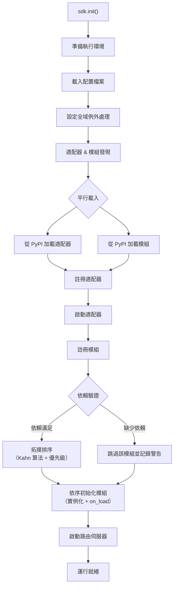

### 初始化階段詳解

> 完整的初始化鏈路拆解（Finder / Loader / Manager / Router）、底層入口（`init()` / `init_task()` / `init_sync()`）與手動完整啟動見 [啟動流程與手動控制](advanced/startup.md)。

## 事件處理流程

下圖展示了訊息從平台到處理器的完整轉流路徑：

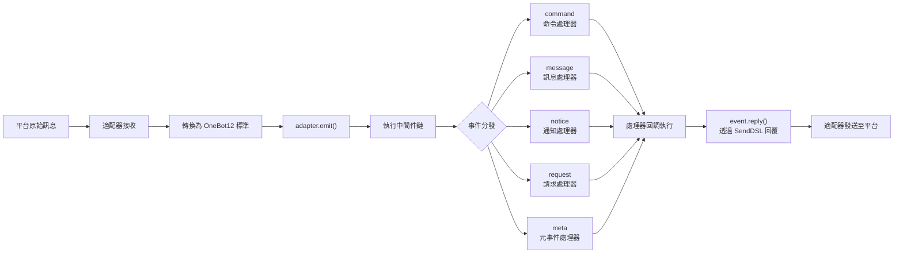

### 事件處理鏈路詳解

上面這張圖是「結果」；下面拆開 `adapter.emit()` 之後框架**在背後做了什麼**——這是一條三層分發的鏈路：

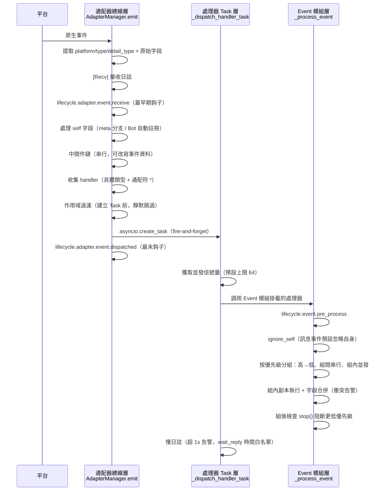

**每一步框架做了什麼、你能干預什麼：**

| 階段 | 框架做了什麼 | 你能干預的 |
|------|-------------|-----------|
| 接收 | 提取標準字段，保留 `{platform}_raw` 原始資料；寫 `[Recv]` 日誌 | 監聽 `adapter.event.receive` 拿到最早期事件 |
| self 字段 | meta 事件走 connect/disconnect/heartbeat 分支；普通事件自動註冊 Bot 並觸發 `adapter.bot.online` | 監聽 `adapter.bot.online` / `bot.offline` |
| 中間件 | **串行**執行，返回值非 None 則取代事件資料 | 註冊中間件改寫/攔截事件 |
| 分發收集 | 先取具體類型 handler，再取 `*` 通配符 handler | — |
| 作用域過濾 | 按 owner 判定 `scope.is_allowed`（會話級>Bot級>平台級），**不通過則靜默跳過** | 配置作用域白名單/黑名單 |
| 調度 | 每個匹配 handler 獨立 `asyncio.Task`，`emit()` **不等待** handler 完成即回傳 | — |
| 優先級 | 高優先級組先執行；**組間串行、組內並發**（組內各自持有事件副本，改字段合併回原事件，衝突打 WARNING） | `@command(..., priority=N)` / 註冊時指定 priority |
| 阻斷 | 每處理完一組檢查 `event.is_stopped()`，命中則**不再執行更低優先級** | `event.mark_processed(stop=True)` / `event.done()` |

> **常見誤區**：
> 1. **作用域過濾是靜默的**——被屏蔽的 handler 不報錯不回應，只在 TRACE 級日誌可見（`core.scope.denied`）。「我的模組沒收到訊息」優先排查作用域綁定。
> 2. **handler 天然並發**——框架已為每個 handler 建獨立 Task，你**不需要**再自己 `asyncio.create_task` 包一層。
> 3. **同優先級組內不阻斷**——`mark_processed(stop=True)` 只阻止更低優先級組，同組內已並發的 handler 不會中途被打斷。
> 4. **慢日誌閾值固定 1 秒**——處理器耗時超 1s 會在日誌打 WARNING（`wait_reply` 等待時間已從耗時中剔除），但不中斷執行。

> 作用域三級綁定與優先級細節見 [作用域系統](docs/zh-TW/advanced/scope.md)；claim/阻斷完整語義見 [事件處理入門](docs/zh-TW/getting-started/event-handling.md)；並發上限配置見 [配置指南](docs/zh-TW/user-guide/configuration.md#框架配置)。

## 生命週期事件

下圖展示了框架各組件的生命週期事件觸發順序：

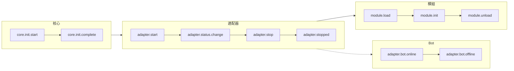

### 監聽生命週期事件

> 完整的事件監聽方法（`lifecycle.on()` / `once()` / `has_handlers()`）、全部生命週期事件列表與資料格式見 [生命週期管理](advanced/lifecycle.md)。

## 模組載入策略

ErisPulse 支援三種模組載入策略，由 `get_load_strategy()` 回傳的 `ModuleLoadStrategy` 聲明：

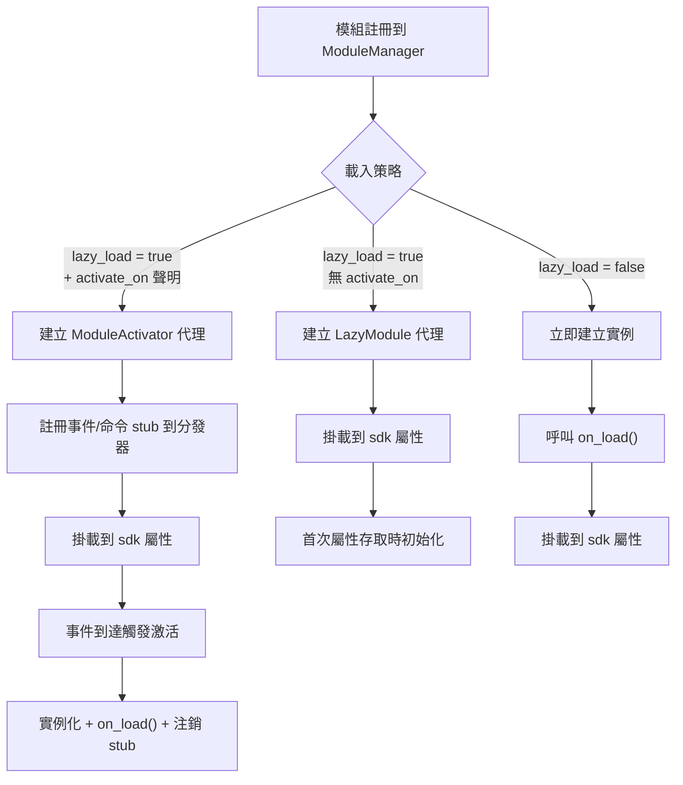

> 更多詳情請參考 [懶載入系統](docs/zh-TW/advanced/lazy-loading.md)、[生命週期管理](docs/zh-TW/advanced/lifecycle.md) 與模組文件。

### 事件驅動懶激活（`activate_on`）觸發架構

> [!NOTE]
> 本特性需要 ErisPulse **2.8.0+**。

`activate_on` 允許模組在**首個匹配事件/命令到達時**才載入，避免常駐記憶體，同時確保事件不遺失：

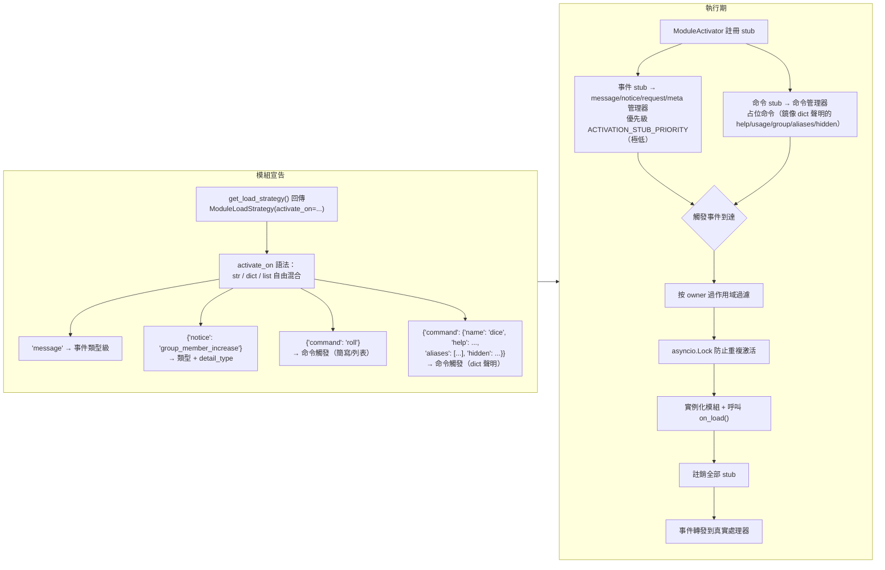

**觸發語義要點：**

> 完整的 `activate_on` 語法（str / dict / list）、命令 dict 聲明、占位命令 help 回退鏈、作用域過濾與失敗語義見 [懶載入系統](docs/zh-TW/advanced/lazy-loading.md#事件驅動懶激活activate_on)。

## 本地插件檔案夾架構

> [!NOTE]  
> 此功能需要 ErisPulse **2.8.0+**。

本地插件（`plugins/` 目錄）無需打包發布，框架啟動時會自動發現並加載：

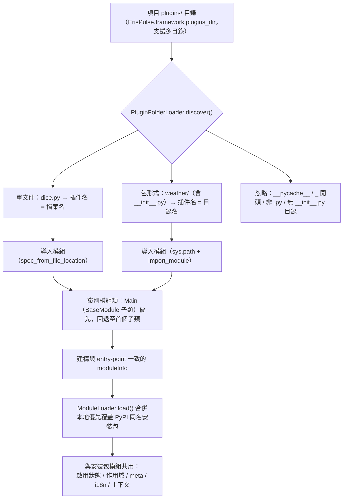

**約定與特性：**

- 插件名來源：單文件取檔案名，包形式取目錄名
- 本地插件 `moduleInfo.meta.source == "plugin_folder"`，與 PyPI 安裝包模組無縫共存
- 同名時本地優先（便於本地覆蓋調試），被禁用時同時移除同名 entry-point 條目

## 本地插件熱重載架構

熱重載會監控插件檔案的變更，並自動重新載入對應的插件：

```mermaid
flowchart TD
    A["sdk.enable_plugin_hot_reload()"] --> B["PluginReloadWatcher 啟動"]
    B --> C["PollingObserver（背景守護執行緒）<br/>定期比較 .py 檔案的 mtime"]
    C --> D{"插件檔案變更"}
    D --> E["變更去抖（預設 1 秒）"]
    E --> F["_handle_change 解析插件名<br/>（單一檔案 / 包形式）"]
    F --> G["asyncio.run_coroutine_threadsafe<br/>調度回主事件循環"]
    G --> H["sdk.reload_plugin(name)"]
    H --> I["卸載舊實例（觸發 on_unload）"]
    I --> J["清理註冊（unregister + 移除 sdk 屬性）"]
    J --> K["清理 sys.modules 強制重新載入"]
    K --> L["重新 discover + register + load"]
    L --> M["掛載新實例到 sdk 屬性"]
    M --> N["檔案刪除 → 自動從載入結果移除"]


====
快速上手
====


### 快速开始

# 快速開始

> **這是你的第一步。** 用 5 分鐘從零跑起一個 ErisPulse 機器人。

## 安裝 ErisPulse

### 一鍵安裝腳本（推薦）

安裝腳本會自動偵測您的環境（Docker、Python、uv），並引導您選擇最適合的安裝方式。

Windows (PowerShell):
```powershell
irm https://get.erisdev.com/install.ps1 -OutFile install.ps1; powershell -ExecutionPolicy Bypass -File install.ps1
```

macOS / Linux:
```bash
curl -fsSL https://get.erisdev.com/install.sh -o install.sh && chmod +x install.sh && ./install.sh
```

腳本會引導您完成：

- **Docker 安裝**（偵測到 Docker 時推薦）：選擇映像來源（Docker Hub / GHCR）、版本通道（穩定版 / 預發布版）、Dashboard 管理面板設定、埠號設定
- **傳統安裝**：自動建立虛擬環境、選擇 ErisPulse 版本、選用安裝 Dashboard 管理面板模組

### 使用 Docker

Docker 映像已內建 ErisPulse 框架和 Dashboard 管理面板。

```bash
# 下載 docker-compose.yml
curl -O https://raw.githubusercontent.com/ErisPulse/ErisPulse/main/docker-compose.yml

# 設定 Dashboard 令牌並啟動
ERISPULSE_DASHBOARD_TOKEN=your-token docker compose up -d
```

<details>
<summary>Docker Hub 不可用？</summary>

使用 GitHub Container Registry 映像，修改 `docker-compose.yml` 中的 image：

```yaml
image: ghcr.io/erispulse/erispulse:latest
```

</details>

啟動後存取 `http://<host>:8000/Dashboard`，使用設定的令牌登入。

### 使用 pip 安裝

確保您的 Python 版本 >= 3.10，然後使用 pip 安裝：

```bash
pip install ErisPulse
```

如果您已安裝 [uv](https://github.com/astral-sh/uv)，也可以使用 `uv pip install ErisPulse`，安裝速度更快。

## 初始化專案

### 互動式初始化（推薦）

```bash
epsdk init
```

這將會啟動一個互動式嚮導，引導您完成：
- 專案名稱設定
- 日誌層級配置
- 伺服器配置（主機和埠口）
- 適配器選擇和配置
- 專案結構建立

### 快速初始化

```bash
# 指定專案名稱的快速模式
epsdk init -q -n my_bot

# 或者只指定專案名稱
epsdk init -n my_bot
```

### 手動建立專案

如果比較偏好手動建立專案：

```bash
mkdir my_bot && cd my_bot
epsdk init

## 安裝模組

### 透過 CLI 安裝

```bash
epsdk install Yunhu AIChat
```

### 查看可用模組

```bash
epsdk list-remote
```

### 互動式安裝

不指定套件名稱時會進入互動式安裝介面：

```bash
epsdk install

## 執行專案

```bash
# 一般執行
epsdk run main.py

# 熱重載模式（開發時推薦）
epsdk run main.py --reload

## 啟用 IDE 補全（選用）

ErisPulse 動態發現模組/適配器，IDE 預設無法補全平台特有方法。
執行以下命令產生型別存根：

```bash
epsdk types
```

產生後用導入的型別作為變數標註即可獲得精確補全（詳見 [IDE 補全指南](./getting-started/ide-completion.md)）：

```python
from _ep_types import Yunhu
from ErisPulse import sdk

adapter: Yunhu = sdk.adapter.get("yunhu")
await adapter.Send.To("group", "123").Board(...)  # 補全平台特有方法

## 專案結構

初始化後的專案結構：

```
my_bot/
├── config/
│   └── config.toml          # 設定檔
└── main.py                  # 入口檔案

## 設定檔

基本的 `config.toml` 設定：

```toml
[ErisPulse.server]
host = "0.0.0.0"
port = 8000

[ErisPulse.logger]
level = "INFO"

[Yunhu_Adapter]
# 适配器設定


### 创建第一个机器人

# 創建第一個機器人

本指南在 [5 分鐘快速開始](../quick-start.md) 的基礎上，帶你編寫第一個命令處理器並理解運行機制。

> 如果你還沒有安裝好 ErisPulse、初始化項目，請先完成 [快速開始](../quick-start.md) 的「安裝」「初始化項目」「運行項目」三步。

## 第一步：編寫第一個命令

打開 `main.py`，編寫一個簡單的命令處理器：

```python
from ErisPulse import sdk
from ErisPulse.Core.Event import command

@command("hello", help="發送問候訊息")
async def hello_handler(event):
    """處理 hello 命令"""
    user_name = event.get_user_nickname() or "朋友"
    await event.reply(f"你好，{user_name}！我是 ErisPulse 機器人。")

@command("ping", help="測試機器人是否在線")
async def ping_handler(event):
    """處理 ping 命令"""
    await event.reply("Pong！機器人運行正常。")

async def main():
    """主入口函數"""
    print("正在啟動 ErisPulse...")
    
    # keep_running=True（預設）：框架阻塞維持運行，直到收到關閉訊號（如 Ctrl+C）
    await sdk.run(keep_running=True)

if __name__ == "__main__":
    import asyncio
    asyncio.run(main())
```

### `keep_running` 參數

`sdk.run(keep_running)` 控制框架是否阻塞維持運行：

- **`keep_running=True`（預設）**：`run()` 會一直阻塞，直到收到關閉訊號（如 Ctrl+C），適合純 bot 應用。
- **`keep_running=False`**：`run()` 初始化完成後立即返回，**框架並不會卸載**——已啟動的適配器/模塊仍作為背景任務繼續處理訊息事件，你可以接著執行自己的邏輯，直到事件循環結束框架才隨之關閉。例如：

```python
async def main():
    await sdk.run(keep_running=False)   # 初始化後立即返回
    # 框架已在背景運行，這裡可以繼續做別的事
    while True:
        await asyncio.sleep(3600)
        print("每小時檢查一次")
```

> 除了 `run()` 的兩種模式，還有 `init()`/`uninit()` 手動控制生命週期、單獨啟停適配器/路由等更精細的方式，見 [啟動流程與手動控制](../advanced/startup.md)。

## 第二步：運行機器人

```bash
# 普通運行
epsdk run main.py

# 開發模式（支援熱重載）
epsdk run main.py --reload
```

## 第三步：測試機器人

在你的聊天平台中發送命令：

```
/hello
```

你應該會收到機器人的回覆。

## 程式碼說明

### 命令裝飾器

```python
@command("hello", help="發送問候訊息")
```

- `hello`：命令名稱，使用者透過 `/hello` 調用
- `help`：命令幫助說明，在 `/help` 命令中顯示

### 事件參數

```python
async def hello_handler(event):
```

`event` 參數是一個 Event 物件，包含：
- 消息內容：`event.get_text()`
- 發送者資訊：`event.get_user_id()`、`event.get_user_nickname()`
- 平台資訊：`event.get_platform()`
- 群組資訊：`event.get_group_id()`
- 原始資料：`event.get_raw()`

> 完整的 Event 物件方法請參考 [Event 包裝類詳解](../developer-guide/modules/event-wrapper.md)。

### 發送回覆

```python
await event.reply("回覆內容")
```

`event.reply()` 是一個便捷方法，用於向發送者發送訊息。

## 擴展：添加更多功能

ErisPulse 提供了豐富的事件處理和資料處理能力：

- **訊息監聽**：使用 `@message.on_message()` 監聽各類訊息 → [事件處理入門](event-handling.md)
- **通知監聽**：使用 `@notice.on_friend_add()` 等監聽系統通知 → [事件處理入門](event-handling.md)
- **資料儲存**：使用 `sdk.storage.get/set` 持久化資料 → [常見任務示例](common-tasks.md)

## 常見問題

### 命令沒有回應？

1. 檢查適配器是否正確配置，確認 `config/config.toml` 中適配器的 `status` 為 `true`
2. 查看終端日誌輸出，確認是否有錯誤資訊（特別是 `ERROR` 級別日誌）
3. 確認命令前綴是否正確（預設是 `/`），可在設定檔中查看 `[ErisPulse.event.command]` 部分
4. 確認命令名稱拼寫正確，注意大小寫敏感性設定

### 如何修改命令前綴？

在 `config.toml` 中添加：

```toml
[ErisPulse.event.command]
prefix = "!"
case_sensitive = false
```

### 如何支援多平台？

ErisPulse 使用 OneBot12 標準統一了不同平台的事件格式，`@command` 和 `@message` 註冊的處理器會自動接收所有平台的事件。透過 `event.get_platform()` 可以區分來源平台：

```python
@command("hello")
async def hello_handler(event):
    platform = event.get_platform()
    
    if platform == "yunhu":
        await event.reply("你好！來自雲湖")
    elif platform == "telegram":
        await event.reply("Hello! From Telegram")
    else:
        await event.reply("你好！")
```

> 更多多平台適配技巧請參考 [常見任務示例](common-tasks.md#多平台適配)。


### 基础概念

# 基礎概念

本指南介紹 ErisPulse 的核心概念，幫助你理解框架的設計思想和基本架構。

## 事件驅動架構

ErisPulse 採用事件驅動架構，所有的互動都透過事件來傳遞和處理。

### 事件流程

```
使用者發送訊息
      │
      ▼
平台接收
      │
      ▼
適配器接收平台原生事件
      │
      ▼
轉換為 OneBot12 標準事件
      │
      ▼
提交到事件系統
      │
      ▼
分發給已註冊的處理器
      │
      ▼
模組處理事件
      │
      ▼
透過適配器發送回應
      │
      ▼
平台顯示給使用者
```

### OneBot12 標準

ErisPulse 使用 OneBot12 作為核心事件標準。OneBot12 是一個通用的聊天機器人應用介面標準，定義了統一的事件格式。

所有適配器都會將平台特定的事件轉換為 OneBot12 格式，確保程式碼的一致性。

## 核心元件

### 1. SDK 物件

SDK 是所有功能的統一入口點，提供對核心元件的存取。

```python
from ErisPulse import sdk

# 存取核心模組
sdk.storage    # 存儲系統
sdk.config     # 配置系統
sdk.logger     # 日誌系統
sdk.adapter    # 適配器系統
sdk.module     # 模組系統
sdk.router     # 路由系統
sdk.client     # HTTP 客戶端
sdk.lifecycle  # 生命週期系統
```

### 2. Event 物件

Event 物件封裝了事件資料，提供了便捷的存取方法。

```python
@command("info")
async def info_handler(event):
    # 獲取事件資訊
    event_id = event.get_id()
    user_id = event.get_user_id()
    platform = event.get_platform()
    text = event.get_text()
    
    # 發送回覆
    await event.reply(f"使用者: {user_id}, 平台: {platform}")
```

### 3. 適配器

適配器是 ErisPulse 與外部平台之間的橋樑。

**職責：**
- 接收平台原生事件
- 轉換為 OneBot12 標準格式
- 將標準格式事件發送到平台

**示例適配器：**
- Yunhu 適配器：與雲湖平台通訊
- Telegram 適配器：與 Telegram Bot API 通訊
- OneBot11 適配器：與 OneBot11 相容的應用通訊
- Email 適配器：處理郵件收發

### 4. 模組

模組是功能擴充的基本單位，可以：

- 註冊事件處理器
- 實現業務邏輯
- 呼叫適配器發送訊息
- 使用核心模組提供的服務

#### 模組發現機制

ErisPulse 透過 Python 的 `importlib.metadata.entry_points` 發現已安裝的模組。模組在 `pyproject.toml` 中宣告入口點：

```toml
[project.entry-points."erispulse.module"]
MyModule = "my_package:Main"
```

SDK 初始化時會掃描所有 `erispulse.module` 組的入口點，將模組類註冊到 `ModuleManager`，然後按依賴關係拓撲排序後依次初始化。

#### 最小可用模組

```python
from ErisPulse.Core.Bases import BaseModule
from ErisPulse import sdk

class Main(BaseModule):
    def __init__(self):
        self.sdk = sdk
        self.logger = sdk.logger.get_child("MyModule")

    async def on_load(self, event):
        self.logger.info("模組已載入")

    async def on_unload(self, event):
        self.logger.info("模組已卸載")
```

#### 模組生命週期

- **註冊**：SDK 發現模組類並註冊到管理器
- **載入**：建立模組實例，呼叫 `on_load(event)`（`event = {"module_name": "MyModule"}`）
- **卸載**：呼叫 `on_unload(event)`，清理資源

#### 載入策略

透過 `get_load_strategy()` 宣告模組的載入行為：

```python
from ErisPulse.loaders import ModuleLoadStrategy

class Main(BaseModule):
    @staticmethod
    def get_load_strategy():
        return ModuleLoadStrategy(
            lazy_load=True,   # 是否懶載入（預設 True）
            priority=0        # 載入優先級，數值越大越先初始化
        )
```

- **`lazy_load=True`（預設）**：模組在首次被 `sdk.MyModule` 存取時才初始化，減少啟動時間
- **`lazy_load=False`**：SDK 啟動時立即初始化，適合需要監聽生命週期事件或執行定時任務的模組
- **`priority`**：同優先級的模組按註冊順序載入；數值越大越先初始化

> 詳細的懶載入機制說明請參考 [懶載入系統](../advanced/lazy-loading.md)。

## 事件類型

ErisPulse 支援 5 類事件：

| 事件類型 | 裝飾器 | 說明 |
|---------|--------|------|
| 訊息事件 | `@message.on_message()` | 使用者發送的任何訊息（私聊、群聊） |
| 命令事件 | `@command("name")` | 以命令字首開頭的訊息（如 `/hello`） |
| 通知事件 | `@notice.on_friend_add()` 等 | 系統通知（好友新增、群成員變化等） |
| 請求事件 | `@request.on_friend_request()` 等 | 使用者請求（好友請求、群邀請） |
| 元事件 | `@meta.on_connect()` 等 | 系統級事件（連線、斷線、心跳） |

> 各事件類型的詳細用法和程式碼範例請參考 [事件處理入門](event-handling.md)。

## 核心模組說明

### Storage（存儲）

基於 SQLite 的鍵值存儲系統，用於持久化資料。

```python
# 設置值
sdk.storage.set("key", "value")

# 獲取值
value = sdk.storage.get("key", "default_value")

# 批量操作
sdk.storage.set_multi({
    "key1": "value1",
    "key2": "value2"
})

# 事務
with sdk.storage.transaction():
    sdk.storage.set("key1", "value1")
    sdk.storage.set("key2", "value2")
```

### Config（配置）

TOML 格式的配置檔案管理。

```python
# 獲取配置
config = sdk.config.getConfig("MyModule", {})

# 設置配置
sdk.config.setConfig("MyModule", {"key": "value"})

# 讀取嵌套配置
value = sdk.config.getConfig("MyModule.subkey", "default")
```

### Logger（日誌）

模組化日誌系統。

```python
# 記錄日誌
sdk.logger.info("這是一條資訊")
sdk.logger.warning("這是一條警告")
sdk.logger.error("這是一條錯誤")

# 獲取子日誌記錄器
child_logger = sdk.logger.get_child("submodule")
child_logger.info("子模組日誌")
```

**屬性存取語法糖**

除了使用 `get_child()` 方法外，你還可以透過**屬性存取**的方式建立子logger，這是一種更簡潔的**語法糖**寫法：

```python
# 透過屬性存取建立子logger
sdk.logger.mymodule.info("模組訊息")

# 支援嵌套存取
sdk.logger.mymodule.database.info("資料庫訊息")
```

### Router（路由）

HTTP 和 WebSocket 路由管理，基於 FastAPI + Uvicorn。支援裝飾器路由、中介軟體、分組、限流、CORS。

```python
from ErisPulse.Core import HttpRequest

@sdk.router.get("MyModule", "/api")
async def handler(request: HttpRequest):
    data = await request.json()
    return {"status": "ok"}
```

> 完整的路由 API（WebSocket、中介軟體、速率限制、CORS 等）請參考 [路由管理器](../advanced/router.md)。

### Client（網絡客戶端）

統一的網絡客戶端，聚合了 HTTP 請求、WebSocket 連線、連線池管理、自動重試、逾時控制、請求統計和生命週期事件整合。

```python
from ErisPulse.Core import client

# HTTP 請求
resp = await client.get("https://api.example.com/users")
data = await resp.json()

# 帶重試和逾時
resp = await client.get(url, timeout=30, max_retries=3)

# WebSocket 連線
ws = await client.ws_connect("wss://example.com/ws")
async for text in ws.iter_text():
    await ws.send_text(f"Echo: {text}")
```

> 完整的網絡客戶端 API 請參考 [網絡客戶端](../advanced/http-client.md)。

## SendDSL 訊息發送

適配器提供鏈式呼叫的訊息發送介面。

### 基礎發送

```python
# 獲取適配器實例
yunhu = sdk.adapter.get("yunhu")

# 發送訊息
await yunhu.Send.To("user", "U1001").Text("Hello")

# 指定發送帳號
await yunhu.Send.Using("bot1").To("group", "G1001").Text("群訊息")
```

### 鏈式修飾

```python
# @使用者
await yunhu.Send.To("group", "G1001").At("U2001").Text("@訊息")

# 回覆訊息
await yunhu.Send.To("group", "G1001").Reply("msg123").Text("回覆")

# @全體
await yunhu.Send.To("group", "G1001").AtAll().Text("公告")
```

### Event 回覆方法

Event 物件提供了便捷的回覆方法：

```python
@command("test")
async def test_handler(event):
    # 簡單文字回覆
    await event.reply("回覆內容")
    
    # 發送圖片
    await event.reply("http://example.com/image.jpg", method="Image")
    
    # 發送語音
    await event.reply("http://example.com/voice.mp3", method="Voice")
```

## 懶載入系統

ErisPulse 預設啟用模組懶載入，模組只在首次被存取（如 `sdk.MyModule`）時才初始化，顯著提高啟動速度。

```python
from ErisPulse.loaders import ModuleLoadStrategy

class Main(BaseModule):
    @staticmethod
    def get_load_strategy():
        return ModuleLoadStrategy(
            lazy_load=True,   # 啟用懶載入（預設）
            priority=0        # 載入優先級，數值越大越先初始化
        )
```

**需要停用懶載入的場景（`lazy_load=False`）：**
- 監聽生命週期事件的模組（如 `core.init.complete`）
- 啟動定時任務或後台服務的模組
- 需要在其他模組載入前完成初始化的模組

> 詳細的懶載入機制和注意事項請參考 [懶載入系統](../advanced/lazy-loading.md)。


### 事件处理入门

# 事件處理入門

本指南介紹如何處理 ErisPulse 中的各類事件。

請直接返回翻譯後的完整 Markdown 內容，不要包含任何其他文字。

再次提醒：如果文件包含語言切換行（各語言名稱用 ` | ` 分隔的行），務必嚴格遵守上方第 8 條的格式要求，不要寫出 `[**Label**](file)` 這類錯誤格式。

## 事件類型概覽

ErisPulse 支援以下事件類型：

| 事件類型 | 說明 | 適用場景 |
|---------|------|---------|
| 訊息事件 | 使用者傳送的任何訊息 | 聊天機器人、內容過濾 |
| 指令事件 | 以指令前綴開頭的訊息 | 指令處理、功能入口 |
| 通知事件 | 系統通知（新增好友、群成員變化等） | 歡迎訊息、狀態通知 |
| 請求事件 | 使用者請求（新增好友請求、群邀請） | 自動化處理請求 |
| 元事件 | 系統級事件（連線、心跳） | 連線監控、狀態檢查 |

## 訊息事件處理

> **提示**: 建議在事件處理器中使用 `Event` 類型註解，以獲得 IDE 自動補全和類型檢查支援。

```python
from ErisPulse.Core.Event import Event  # 匯入事件類型用於註解
```

### 監聽所有訊息

```python
from ErisPulse.Core.Event import message, Event

@message.on_message()
async def message_handler(event: Event):
    text = event.get_text()
    user_id = event.get_user_id()
    sdk.logger.info(f"收到 {user_id} 的訊息: {text}")
```

### 監聽私聊訊息

```python
@message.on_private_message()
async def private_handler(event: Event):
    user_id = event.get_user_id()
    await event.reply(f"你好，{user_id}！這是私聊訊息。")
```

### 監聽群聊訊息

```python
@message.on_group_message()
async def group_handler(event: Event):
    group_id = event.get_group_id()
    user_id = event.get_user_id()
    sdk.logger.info(f"群 {group_id} 中 {user_id} 傳送了訊息")
```

### 監聽@訊息

```python
@message.on_at_message()
async def at_handler(event: Event):
    # 取得被@的使用者清單
    mentions = event.get_mentions()
    await event.reply(f"你@了這些使用者: {mentions}")

## 命令事件處理

### 基本命令

```python
from ErisPulse.Core.Event import command

@command("help", help="顯示幫助資訊")
async def help_handler(event):
    help_text = """
可用命令：
/help - 显示帮助
/ping - 測試連接
/info - 查看資訊
    """
    await event.reply(help_text)
```

### 命令別名

```python
@command(["help", "h"], aliases=["幫助"], help="顯示幫助資訊")
async def help_handler(event):
    await event.reply("幫助資訊...")
```

使用者可以使用以下任何方式呼叫：
- `/help`
- `/h`
- `/幫助`

### 命令參數

```python
@command("echo", help="回顯訊息")
async def echo_handler(event):
    # 獲取命令參數
    args = event.get_command_args()
    
    if not args:
        await event.reply("請輸入要回顯的訊息")
    else:
        await event.reply(f"你說了: {' '.join(args)}")
```

### 命令組

```python
@command("admin.reload", group="admin", help="重新載入模組")
async def reload_handler(event):
    await event.reply("模組已重新載入")

@command("admin.stop", group="admin", help="停止機器人")
async def stop_handler(event):
    await event.reply("機器人已停止")
```

### 命令權限

```python
def is_master(event):
    """檢查使用者是否為框架主人"""
    master_list = ["user123", "user456"]
    return event.get_user_id() in master_list

@command("master", permission=is_master, help="框架主人命令")
async def master_handler(event):
    await event.reply("這是框架主人命令")
```

### 命令優先級

```python
# 優先級數值越大，執行越早
@message.on_message(priority=10)
async def high_priority_handler(event):
    await event.reply("高優先級處理器")

@message.on_message(priority=1)
async def low_priority_handler(event):
    await event.reply("低優先級處理器")
```

### 並行事件處理

ErisPulse 事件系統採用**同優先級並行、不同優先級串行**的調度模型：

```
事件到達
    ↓
priority=10 組: [處理器C || 處理器D] 並行 → 合併結果
    ↓ (如未中斷)
priority=0 組: [處理器A || 處理器B] 並行 → 合併結果
    ↓
...
```

- **同優先級並行**：優先級相同的多個處理器會同時執行，提高吞吐量
- **跨級串行**：不同優先級的組按順序執行（數值越大越先執行），確保高優先級處理器先運行
- **Copy-On-Write**：處理器無修改時不建立副本，確保零開銷
- **衝突處理**：同優先級多處理器修改同一欄位時，使用最後修改值並記錄警告日誌
- **中斷機制**：任意處理器呼叫 `event.done()`（預設）或 `event.done(claim=False)` 後，跳過後續低優先級組。認領與阻斷的區別見下文[「鏈路控制：認領與阻斷」](#鏈路控制認領與阻斷)

```python
# 範例：同優先級處理器並行執行
@message.on_message(priority=0)
async def handler_a(event):
    # 處理任務A
    event['result_a'] = process_a()

@message.on_message(priority=0)
async def handler_b(event):
    # 與 handler_a 並行執行
    event['result_b'] = process_b()

# 不同優先級串行執行
@message.on_message(priority=10)
async def handler_c(event):
    # 優先級最高，最先執行
    pass
```

> **併發上限**：所有匹配 handler 的 Task 會**立即建立**，但透過一個信號量限制**同時在途執行數**，預設上限 **64**（`ErisPulse.framework.handler_max_concurrency`，支援熱更新）。超過上限的 Task 在信號量上排隊，等前面的完成後再進入。事件洪峰時這就是你的「泄壓閥」。
>
> **慢日誌**：單個處理器耗時超過 **1 秒**時，框架會在日誌打 WARNING（`handler_slow`）。`wait_reply` 的等待時間會從耗時裡剔除，不會因為「等人回覆」誤報慢。

## 作用域過濾：為什麼我的模組沒有收到訊息

事件分發會在**建立處理器 Task 之前**進行作用域過濾——根據模組 owner 判定 `scope.is_allowed`（會話級 > Bot 級 > 平台級），**不通過則靜默跳過**，不會報錯也不會回應。

```python
# 假設 config.toml 裡將 MyModule 在某個群組中屏蔽：
[ErisPulse.scope]
block = { yunhu = { group_123 = ["MyModule"] } }
```

此時該群組的訊息到達時，`MyModule` 的命令與事件處理器**都不會被調度**。這不是 bug，而是作用域機制——排查「模組沒有反應」時應優先檢查作用域綁定。

- 三層過濾點：適配器總線級（Task 建立前）、Event 模組級（每個優先級組內）、命令級（權限檢查前）
- 過濾日誌只在 **TRACE** 級可見（`core.scope.denied`），預設 INFO 級看不到任何痕跡
- 框架級處理器（如命令分發器 `scope_exempt=True`）不受作用域影響

> 作用域三級綁定、白名單/黑名單、優先級覆蓋與「default_allow」隱式拒絕語義請見 [作用域系統](../../advanced/scope.md)。

## 鏈路控制：認領與阻斷

> [!NOTE]
> `event.done()` / `event.mark_processed()` 的 `claim=` / `stop=` 參數本特性需要 ErisPulse **2.7.1+**。

ErisPulse 將「認領」與「阻斷」兩個正交語義解耦，透過 `event.done()` 統一控制，便於在命令處理周圍疊加日誌、審計、權限等觀察層。

**兩個概念的準確定義：**

- **認領（claim）**：標記事件已被本處理器處理（寫入 `_processed`）。命令分發器看到已認領的事件會**跳過重複**——避免同一訊息被多個命令處理器重複處理。典型場景：命令匹配成功後認領，阻止命令分發器再介入。
- **阻斷（stop）**：阻止事件向**更低優先級**處理器傳播（寫入 `_propagation_stopped`）。低優先級處理器（如 `on_message`）將不再看到該事件。典型場景：高優先級處理器已完整處理事件，不希望低優先級再執行。

| `event.done(...)` | 認領 | 阻斷 | 場景 |
|-------------------|------|------|------|
| `event.done()` | ✔ | ✔ | 命令 / 處理器處理完的標準做法 |
| `event.done(stop=False)` | ✔ | ✘ | 僅認領，讓低優先級觀察者（日誌 / 統計）繼續看到 |
| `event.done(claim=False)` | ✘ | ✔ | 僅阻斷（如防火牆 / 限流），但不做命令去重 |

`event.done(claim=, stop=)` 是 `event.mark_processed(claim=, stop=)` 的別名，二者參數與行為完全等價。

```python
@command("help")
async def help_cmd(event):
    event.done()            # 認領 + 阻斷（命令處理完的標準做法）

@message.on_message(priority=50)
async def observer(event):
    event.done(stop=False)  # 僅認領：低優先級仍會執行（日誌 / 統計）

@message.on_message(priority=100)
async def firewall(event):
    if denied(event):
        event.done(claim=False)  # 僅阻斷：低優先級不執行，但不做去重
```

### 命令與回覆的 block 配置

命令匹配成功 / `wait_reply` 匹配到回覆後，預設會阻斷傳播（向後相容）。可透過配置放行，讓低優先級處理器（日誌 / 審計 / 權限）也能觀測這些訊息：

```toml
[ErisPulse.event.command]
block = false   # 命令訊息繼續流向低優先級處理器

[ErisPulse.event.wait_reply]
block = false   # 被 wait_reply 消費的回覆繼續流向低優先級處理器

## 通知事件處理

### 好友添加

```python
from ErisPulse.Core.Event import notice

@notice.on_friend_add()
async def friend_add_handler(event):
    user_id = event.get_user_id()
    nickname = event.get_user_nickname() or "新朋友"
    await event.reply(f"歡迎添加我為好友，{nickname}！")
```

### 群成員增加

```python
@notice.on_group_increase()
async def member_increase_handler(event):
    group_id = event.get_group_id()
    user_id = event.get_user_id()
    await event.reply(f"歡迎新成員 {user_id} 加入群 {group_id}")
```

### 群成員減少

```python
@notice.on_group_decrease()
async def member_decrease_handler(event):
    group_id = event.get_group_id()
    user_id = event.get_user_id()
    await event.reply(f"成員 {user_id} 離開了群 {group_id}")

## 請求事件處理

### 好友請求

```python
from ErisPulse.Core.Event import request

@request.on_friend_request()
async def friend_request_handler(event):
    user_id = event.get_user_id()
    comment = event.get_comment()
    
    sdk.logger.info(f"收到好友請求: {user_id}, 附言: {comment}")
    
    # 可以透過適配器 API 處理請求
    # 具體實作請參考各適配器文件
```

### 群組邀請請求

```python
@request.on_group_request()
async def group_request_handler(event):
    group_id = event.get_group_id()
    user_id = event.get_user_id()
    
    await event.reply(f"收到群組 {group_id} 的邀請，來自 {user_id}")

## 元事件處理

### 連接事件

```python
from ErisPulse.Core.Event import meta

@meta.on_connect()
async def connect_handler(event):
    platform = event.get_platform()
    sdk.logger.info(f"{platform} 平台已連接")

@meta.on_disconnect()
async def disconnect_handler(event):
    platform = event.get_platform()
    sdk.logger.warning(f"{platform} 平台已斷開連接")
```

### 心跳事件

```python
@meta.on_heartbeat()
async def heartbeat_handler(event):
    platform = event.get_platform()
    sdk.logger.debug(f"{platform} 心跳檢測")
```

### Bot 狀態查詢

當適配器發送 meta 事件後，框架會自動追蹤 Bot 狀態，你可以隨時查詢：

```python
from ErisPulse import sdk

# 檢查某個 Bot 是否在線
if sdk.adapter.is_bot_online("telegram", "123456"):
    telegram = sdk.adapter.get("telegram")
    await telegram.Send.To("user", "123456").Text("Bot 在線")

# 列出當前所有在線 Bot
bots = sdk.adapter.list_bots()
for platform, bot_list in bots.items():
    for bot_id, info in bot_list.items():
        print(f"{platform}/{bot_id}: {info['status']}")

# 獲取完整狀態摘要
summary = sdk.adapter.get_status_summary()

## 互動式處理

### 使用 reply 方法發送回覆

`event.reply()` 方法支援多種修飾參數，方便發送帶有 @、回覆等功能的消息：

```python
# 簡單回覆
await event.reply("你好")

# 發送不同類型的消息
await event.reply("http://example.com/image.jpg", method="Image")  # 圖片
await event.reply("http://example.com/voice.mp3", method="Voice")  # 語音

# @單個用戶
await event.reply("你好", at_users=["user123"])

# @多個用戶
await event.reply("大家好", at_users=["user1", "user2", "user3"])

# 回覆消息
await event.reply("回覆內容", reply_to="msg_id")

# @全體成員
await event.reply("公告", at_all=True)

# 組合使用：@用戶 + 回覆消息
await event.reply("內容", at_users=["user1"], reply_to="msg_id")
```

### 等待用戶回覆

```python
@command("ask", help="詢問用戶")
async def ask_handler(event):
    await event.reply("請輸入你的名字:")
    
    # 等待用戶回覆，超時時間 30 秒
    reply = await event.wait_reply(timeout=30)
    
    if reply:
        name = reply.get_text()
        await event.reply(f"你好，{name}！")
    else:
        await event.reply("等待超時，請重新輸入。")
```

### 帶驗證的等待回覆

```python
@command("age", help="詢問年齡")
async def age_handler(event):
    def validate_age(event_data):
        """驗證年齡是否有效"""
        try:
            age = int(event_data.get_text())
            return 0 <= age <= 150
        except ValueError:
            return False
    
    await event.reply("請輸入你的年齡 (0-150):")
    
    reply = await event.wait_reply(
        timeout=60,
        validator=validate_age
    )
    
    if reply:
        age = int(reply.get_text())
        await event.reply(f"你的年齡是 {age} 歲")
    else:
        await event.reply("輸入無效或超時")
```

### 帶回調的等待回覆

```python
@command("confirm", help="確認操作")
async def confirm_handler(event):
    async def handle_confirmation(reply_event):
        text = reply_event.get_text().lower()
        
        if text in ["是", "yes", "y"]:
            await event.reply("操作已確認！")
        else:
            await event.reply("操作已取消。")
    
    await event.reply("確認執行此操作嗎？(是/否)")
    
    await event.wait_reply(
        timeout=30,
        callback=handle_confirmation
    )
```

### 確認對話 (confirm)

等待用戶確認或否定，自動識別內置中英文確認詞：

```python
@command("confirm", help="確認操作")
async def confirm_handler(event):
    if await event.confirm("確定要執行此操作嗎？"):
        await event.reply("已確認，執行中...")
    else:
        await event.reply("已取消")

# 自定義確認詞
if await event.confirm("繼續嗎？", yes_words={"go", "繼續"}, no_words={"stop", "停止"}):
    pass
```

### 選擇選單 (choose)

用戶可回覆選項編號或選項文字：

```python
@command("choose", help="選擇")
async def choose_handler(event):
    choice = await event.choose(
        "請選擇顏色：",
        ["紅色", "綠色", "藍色"]
    )
    
    if choice is not None:
        colors = ["紅色", "綠色", "藍色"]
        await event.reply(f"你選擇了：{colors[choice]}")
    else:
        await event.reply("超時未選擇")
```

**合併模式**：`merge_prompt=True` 時將選項拼入提示消息，用用戶指定的 `method` 一條消息發送：

```python
# 用 Markdown 發送合併後的提示 + 選項
choice = await event.choose(
    "## 請選擇顏色\n{options}\n請回覆編號",
    ["紅色", "綠色", "藍色"],
    method="Markdown",
    merge_prompt=True,
)
```

> `{options}` 占位符控制選項插入位置；不寫則附加到 prompt 末尾。
> 可通過 `placeholder` 參數自定義占位符（如 `placeholder="[choices]"`）。
> `options_format="auto"`（預設）根據 method 自動選擇樣式：Markdown→無序列表，Html→有序列表，其他→純文字列表。
> 文本類方法（Text/Markdown/Html 等）預設合併選項到末尾；非文本方法（Image 等）預設拆分為兩條消息。

### 收集表單 (collect)

多步驟收集用戶輸入：

```python
@command("register", help="註冊")
async def register_handler(event):
    data = await event.collect([
        {"key": "name", "prompt": "請輸入姓名："},
        {"key": "age", "prompt": "請輸入年齡：", 
         "validator": lambda e: e.get_text().isdigit()},
        {"key": "email", "prompt": "請輸入郵箱："}
    ])
    
    if data:
        await event.reply(f"註冊成功！\n姓名：{data['name']}\n年齡：{data['age']}\n郵箱：{data['email']}")
    else:
        await event.reply("註冊超時或輸入無效")
```

### 等待任意事件 (wait_for)

等待滿足條件的任意事件，不侷限於同一用戶：

```python
@command("wait_member", help="等待新成員")
async def wait_member_handler(event):
    await event.reply("等待群成員加入...")
    
    evt = await event.wait_for(
        event_type="notice",
        condition=lambda e: e.get_detail_type() == "group_member_increase",
        timeout=120
    )
    
    if evt:
        await event.reply(f"歡迎新成員：{evt.get_user_id()}")
    else:
        await event.reply("等待超時")
```

### 多輪對話 (conversation)

創建可交互的多輪對話上下文：

```python
@command("survey", help="問卷調查")
async def survey_handler(event):
    conv = event.conversation(timeout=60)
    
    await conv.say("歡迎參與問卷調查！")
    
    while conv.is_active:
        reply = await conv.wait()
        
        if reply is None:
            await conv.say("對話超時，再見！")
            break
        
        text = reply.get_text()
        
        if text == "退出":
            await conv.say("再見！")
            break
        
        await conv.say(f"你說了：{text}，繼續輸入或回覆'退出'結束")
```

### 內置確認詞

ErisPulse 內置了中英文確認詞集合：

- **確認詞** (`CONFIRM_YES_WORDS`): 是、yes、y、確認、確定、好、好的、ok、true、對、嗯、行、同意、沒問題...
- **否定詞** (`CONFIRM_NO_WORDS`): 否、no、n、取消、不、不要、不行、cancel、false、錯、拒絕、不可以...

## 事件數據存取

### Event 物件常用方法

```python
@command("info")
async def info_handler(event):
    # 基礎資訊
    event_id = event.get_id()
    event_time = event.get_time()
    event_type = event.get_type()
    detail_type = event.get_detail_type()
    
    # 發送者資訊
    user_id = event.get_user_id()
    nickname = event.get_user_nickname()
    
    # 訊息內容
    message_segments = event.get_message()
    alt_message = event.get_alt_message()
    text = event.get_text()
    
    # 群組資訊
    group_id = event.get_group_id()
    
    # 機器人資訊
    self_id = event.get_self_user_id()
    self_platform = event.get_self_platform()
    
    # 原始資料
    raw_data = event.get_raw()
    raw_type = event.get_raw_type()
    
    # 平台資訊
    platform = event.get_platform()
    
    # 訊息類型判斷
    is_private = event.is_private_message()
    is_group = event.is_group_message()
    is_at = event.is_at_message()
    
    # 命令資訊
    if event.is_command():
        cmd_name = event.get_command_name()
        cmd_args = event.get_command_args()
        cmd_raw = event.get_command_raw()
```

### 平台擴充方法

除了內建方法外，各平台適配器還會註冊平台專屬方法，方便你存取平台特有的資料。

```python
from ErisPulse.Core.Event import message

@message.on_message()
async def handle_message(event):
    platform = event.get_platform()

    # 根據平台呼叫專屬方法
    if platform == "telegram":
        chat_type = event.get_chat_type()      # Telegram 專屬方法
    elif platform == "email":
        subject = event.get_subject()           # 郵件專屬方法
```

如果不确定平台是否註冊了某個方法，可以查詢某個平台註冊了哪些方法：

```python
from ErisPulse.Core.Event import get_platform_event_methods

methods = get_platform_event_methods("telegram")
# ["get_chat_type", "is_bot_message", ...]
```

> 各平台註冊的專屬方法請參閱對應的 [平台文件](../platform-guide/)。

## 事件處理最佳實踐

### 1. 異常處理

```python
@command("process")
async def process_handler(event):
    try:
        # Business logic (業務邏輯)
        result = await do_some_work()
        await event.reply(f"Result: {result}")
    except ValueError as e:
        # Expected business error (預期的業務錯誤)
        await event.reply(f"Parameter error: {e}")
    except Exception as e:
        # Unexpected error (未預期的錯誤)
        sdk.logger.error(f"Processing failed: {e}")
        await event.reply("Processing failed, please try again later")
```

### 2. 日誌記錄

```python
@message.on_message()
async def message_handler(event):
    user_id = event.get_user_id()
    text = event.get_text()
    
    sdk.logger.info(f"Processing message: {user_id} - {text}")
    
    # Use module's own logger (使用模組自己的日誌)
    from ErisPulse import sdk
    logger = sdk.logger.get_child("MyHandler")
    logger.debug(f"Detailed debug information")
```

### 3. 條件處理

```python
@message.on_message(priority=0)
async def conditional_handler(event):
    """Conditional handling - Judgement inside handler (條件處理 - 在處理器內部判斷)"""
    # Only process messages from specific users (只處理特定使用者的訊息)
    if event.get_user_id() in ["bot1", "bot2"]:
        return
    
    # Only process messages containing specific keywords (只處理包含特定關鍵詞的訊息)
    if "keyword" not in event.get_text():
        return
    
    await event.reply("Condition met, processing message")


### IDE 补全

# 類型存根生成（IDE 自動完成）

ErisPulse 透過 entry-points 動態發現模組/適配器，入口點無法在靜態層面得知使用者類別的具體類型。  
`epsdk types` 命令透過掃描已安裝的模組/適配器，產生一個類型存根檔案，讓使用者可以將這些類型用作變數標註，進而獲得 IDE 自動完成。

## 核心設計原則

存根檔案**僅導出類型**，不提供任何執行時實例：

- 所有匯入都在 ``TYPE_CHECKING`` 下，**零執行時開銷、零行為改變**
- 類型名稱採用 entry-point 名的 PascalCase 形式（如 ``yunhu`` → ``Yunhu``），與傳入 ``sdk.adapter.get()`` / ``sdk.module.get()`` 的名稱對應
- 使用者在程式碼中照常用 ``sdk.module.get(...)`` / ``sdk.adapter.get(...)`` 取得實例，只是用匯入的類型做**變數標註**

## 基本用法

在專案根目錄執行：

```bash
epsdk types
```

會在當前目錄產生 `_ep_types.py`，包含所有已安裝模組/適配器的類型。

## 在程式碼中使用

```python
from _ep_types import MyModule, Yunhu
from ErisPulse import sdk

# 用匯入的類型作為變數標註，即可讓 IDE 自動完成該類的方法
my_mod: MyModule = sdk.module.get("MyModule")
my_mod.hello()                  # ← IDE 自動完成 hello

my_adapter: Yunhu = sdk.adapter.get("yunhu")
await my_adapter.Send.To("group", "123").Board(...)   # ← 自動完成平台特有方法
```

## 工作原理

1. 掃描 `erispulse.adapter` / `erispulse.module` entry-points
2. 透過子程序在目標 Python 環境中內省，收集每個適配器/模組的實際類別資訊（包含模組路徑與限定名）
3. 產生 `.py` 檔案，其中：
   - 所有 ``from xxx import Yyy as Zzz`` 都在 ``TYPE_CHECKING`` 下
   - ``Zzz`` 是 entry-point 名的 PascalCase 形式
4. IDE 讀取 ``TYPE_CHECKING`` 部分提供自動完成；執行時不執行任何程式碼

產生的存根範例：

```python
# _ep_types.py（自動產生）
from typing import TYPE_CHECKING

if TYPE_CHECKING:
    # 適配器
    from MyAdapter.Core import MyAdapter as MyAdapter
    from YunhuAdapter.Core import YunhuAdapter as Yunhu

    # 模組
    from MyModule.Core import Main as MyModule

    __all__ = ['MyAdapter', 'Yunhu', 'MyModule']
```

## 命令選項

| 選項 | 說明 |
|------|------|
| `-o, --output PATH` | 指定輸出檔案路徑（預設 `./_ep_types.py`） |
| `--force` | 覆蓋已存在的存根檔案 |
| `--adapters-only` | 僅掃描適配器 |
| `--modules-only` | 僅掃描模組 |

## 何時重新產生

- 安裝/卸載新的模組或適配器後
- 模組/適配器更新了公開 API 後
- IDE 自動完成失效或類型過期時

## 與 SendDSL 標準方法的關係

`SendDSL` 基類已內建標準發送方法（Text/Image/Voice/Video/File），任何方式取得的 SendDSL 實例都能自動完成這些方法。  
`types` 命令主要用於補全**平台特有方法**（如雲湖的 `Board`、沙盒的 `Dice`）和**模組特有方法**。

## 相關文件

- [SendDSL 詳解](../developer-guide/adapters/send-dsl.md) - 標準發送方法說明
- [適配器開發入門](../developer-guide/adapters/getting-started.md) - 建立適配器


=====
适配器开发
=====


### 适配器开发入门

# 介面卡開發入門

本指南將協助你開始開發 ErisPulse 介面卡，連線至新的訊息平台。

請直接返回翻譯後的完整 Markdown 內容，不要包含任何其他文字。

再次提醒：如果文件包含語言切換行（各語言名稱用 `` | `` 分隔的行），務必嚴格遵守上方第 8 條的格式要求，不要寫出 ``[**Label**](file)`` 這類錯誤格式。

## 適配器簡介

### 什麼是適配器

適配器是 ErisPulse 與各個消息平台之間的橋樑，負責：

1. **正向轉換**：接收平台事件並轉換為 OneBot12 標準格式（Converter）
2. **反向轉換**：將 OneBot12 消息段轉換為平台 API 調用（`Raw_ob12`）
3. 管理與平台的連接（WebSocket/WebHook）
4. 提供統一的 SendDSL 消息發送介面

### 適配器架構

```mermaid
flowchart LR
    subgraph receive["正向轉換（接收）"]
        direction TB
        P1["平台事件"] --> C1["Converter.convert()"] --> O1["OneBot12 標準事件"] --> S1["事件系統"] --> M1["模組處理"]
    end
    subgraph send["反向轉換（發送）"]
        direction TB
        M2["模組構建消息"] --> R1["Send.Raw_ob12()"] --> N1["平台原生 API 調用"] --> R2["標準回應格式"]
    end

## 目錄結構

標準的適配器套件結構：

```
MyAdapter/
├── pyproject.toml          # 專案設定
├── README.md               # 專案說明
├── LICENSE                 # 授權條款
└── MyAdapter/
    ├── __init__.py          # 套件進入點
    ├── Core.py               # 適配器主類別
    └── Converter.py          # 事件轉換器
```

請直接返回翻譯後的完整 Markdown 內容，不要包含任何其他文字。

再次提醒：如果文件包含語言切換行（各語言名稱用 `` | `` 分隔的行），務必嚴格遵守上方第 8 條的格式要求，不要寫出 ``[**Label**](file)`` 這類錯誤格式。

## 快速開始

### 1. 建立專案

```bash
mkdir MyAdapter && cd MyAdapter
```

### 2. 建立 pyproject.toml

```toml
[project]
name = "ErisPulse-MyAdapter"
version = "1.0.0"
description = "MyAdapter 平台適配器"
readme = "README.md"
requires-python = ">=3.10"
license = { file = "LICENSE" }
authors = [ { name = "yourname", email = "your@mail.com" } ]

dependencies = [
    "ErisPulse>=2.4.0"  # ErisPulse 已內建 aiohttp，通常無需單獨依賴
]

[project.urls]
"homepage" = "https://github.com/yourname/MyAdapter"

[project.entry-points."erispulse.adapter"]
"MyAdapter" = "MyAdapter:MyAdapter"
```

### 3. 建立適配器主類別

框架提供了 `ConfigClass` / `AccountConfigClass` 宣告式配置管理，適配器只需宣告配置類別即可自動載入、校驗和產生配置範本。

```python
# MyAdapter/Core.py
from dataclasses import dataclass, field
from ErisPulse.Core import BaseAdapter
from ErisPulse.Core.Bases import BaseConfig

@dataclass
class MyAdapterConfig(BaseConfig):
    """MyAdapter 配置"""
    api_endpoint: str = field(
        default="https://api.example.com",
        metadata={
            "description": {"i18n": "my_adapter.api_endpoint", "default": "API 位址"},
            "required": False,
            "ui": {"widget": "text", "group": "connection", "order": 1},
        },
    )
    token: str = field(
        default="",
        metadata={
            "description": {"i18n": "my_adapter.token", "default": "平台 Token"},
            "required": True,
            "secret": True,
            "ui": {"widget": "password", "group": "basic", "order": 2},
        },
    )

class MyAdapter(BaseAdapter):
    ConfigClass = MyAdapterConfig  # 宣告配置類別，框架自動管理
    
    # 不需要覆寫 __init__！框架自動處理：
    # - self.sdk / self.logger 自動設定
    # - self.cfg 即時讀取配置
    # - self.Send / self.Request 自動初始化
    
    def _setup_converter(self):
        from .Converter import MyPlatformConverter
        return MyPlatformConverter()
```

> ⚠️ **關於 `__init__`**：新版本中 `BaseAdapter.__init__(self, sdk=None)` 會自動處理 SDK 參考、日誌初始化和配置載入。大多數適配器**不再需要覆寫 `__init__`**。詳見 [__init__ 注意事項](#init-注意事項)。

> ⚠️ **關於 `super().__init__()`**：`BaseAdapter.__init__()` 負責建立 `Send` 和 `Request` 工廠實例。如果忘記呼叫，所有訊息發送和請求操作都會報 `AttributeError`。詳見 [__init__ 注意事項](#init-注意事項)。

### 4. 實作必要方法

```python
class MyAdapter(BaseAdapter):
    # ... __init__ 代碼 ...
    
    async def start(self):
        """啟動適配器（必須實作）"""
        # 註冊 WebSocket 或 WebHook 路由
        router.register_websocket(
            module_name="myplatform",
            path="/ws",
            handler=self._ws_handler
        )
        self.logger.info("適配器已啟動")
    
    async def shutdown(self):
        """關閉適配器（必須實作）"""
        router.unregister_websocket(
            module_name="myplatform",
            path="/ws"
        )
        # 清理連線和資源
        self.logger.info("適配器已關閉")
    
    async def call_api(self, endpoint: str, **params):
        """呼叫平台 API（必須實作）"""
        raise NotImplementedError("需要實作 call_api")
```

#### 主動發送 Meta 事件

適配器應主動發送 meta 事件，讓框架追蹤 Bot 的線上狀態。使用 `emit_meta()` 一行即可完成：

```python
class MyAdapter(BaseAdapter):
    async def _ws_handler(self, websocket):
        bot_id = self._get_bot_id()

        # Bot 上線
        await self.emit_meta("connect", bot_id, user_name="MyBot")

        try:
            while True:
                data = await websocket.receive_text()
                event = self.convert(data)
                if event:
                    await self.adapter.emit(event)
        except WebSocketDisconnect:
            pass
        finally:
            # Bot 下線
            await self.emit_meta("disconnect", bot_id)
```

> 詳細的 Bot 狀態管理和 Meta 事件說明請參閱 [適配器最佳實踐 - Bot 狀態管理](docs/zh-TW/best-practices.md#bot-狀態管理與-meta-事件)。

### 5. 實作 Send 類別

`At`/`AtAll`/`Reply` 修飾詞已由框架 SendDSL 基類別內建實作，適配器只需實作 `Raw_ob12` 和具體的發送方法即可。

框架提供兩個關鍵輔助方法：
- `self._apply_modifiers(message)` — 自動合併 At/AtAll/Reply 修飾詞到訊息段
- `self.send_context` — 取得發送上下文字典（`target_type`、`target_id`、`account_id`）

```python
import asyncio

class MyAdapter(BaseAdapter):
    # ... 其他代碼 ...

    class Send(BaseAdapter.Send):

        def Raw_ob12(self, message, **kwargs):
            """
            發送 OneBot12 格式訊息（必須實作）

            使用 _apply_modifiers 自動合併修飾詞狀態，
            使用 send_context 取得發送上下文。
            """
            async def _do_send():
                segments = self._apply_modifiers(message)
                return await self._adapter.call_api(
                    endpoint="/send_message",
                    message=segments,
                    **self.send_context,
                    **kwargs
                )
            return asyncio.create_task(_do_send())

        # Text/Image/Voice/Video/File 已從 SendDSL 基類別繼承，
        # 預設委託給 Raw_ob12，無需重複實作。
        # 如需平台特定邏輯，可覆寫單個方法：
        # def Text(self, text: str):
        #     return self.Raw_ob12([{"type": "text", "data": {"text": text}}])
```

**媒體類發送方法（Image/Video/File）實作要點：**

- 基類別的預設實作會將 `file` 參數封裝為 OneBot12 訊息段傳給 `Raw_ob12`，適配器需在 `Raw_ob12` 中處理下載/上傳
- `file` 參數應同時支援 `bytes` 二進位資料和 `str` URL 兩種類型
- 當傳入 URL 時，需先下載檔案再上傳到平台
- 平台通常需要先呼叫上傳介面取得檔案識別，再呼叫發送介面

**`__getattr__` 魔術方法：**

- 實作方法名大小寫不敏感（`Text`、`text`、`TEXT` 都能呼叫）
- 未定義的方法應返回提示資訊而非報錯

**`Raw_ob12` 方法：**

- 將 OneBot12 標準訊息格式轉換為平台格式發送
- 使用 `self._apply_modifiers(message)` 自動處理 At/AtAll/Reply 修飾詞
- 使用 `**self.send_context` 傳遞發送目標資訊和帳號資訊

### 6. 實作轉換器

```python
# MyAdapter/Converter.py
import time
import uuid

class MyPlatformConverter:
    def convert(self, raw_event):
        """將平台原生事件轉換為 OneBot12 標準格式"""
        if not isinstance(raw_event, dict):
            return None
        
        onebot_event = {
            "id": str(raw_event.get("event_id", uuid.uuid4())),
            "time": int(time.time()),
            "type": self._convert_event_type(raw_event.get("type")),
            "detail_type": self._convert_detail_type(raw_event),
            "platform": "myplatform",
            "self": {
                "platform": "myplatform",
                "user_id": str(raw_event.get("bot_id", ""))
            },
            "myplatform_raw": raw_event,
            "myplatform_raw_type": raw_event.get("type", "")
        }
        
        return onebot_event
    
    def _convert_event_type(self, event_type):
        """轉換事件類型"""
        type_map = {
            "message": "message",
            "notice": "notice"
        }
        return type_map.get(event_type, "unknown")
    
    def _convert_detail_type(self, raw_event):
        """轉換詳細類型"""
        return "private"  # 簡化範例
```

### 7. 實作 Request 類別（請求操作）

如果你的平台支援好友請求、群組邀請等需要 Bot 做出決策的請求，可以實作 `Request` 內部類別：

```python
from ErisPulse.Core import BaseAdapter, RequestDSL

class MyAdapter(BaseAdapter):
    # ... Send 和其他代碼 ...

    class Request(RequestDSL):
        """請求操作實作（好友請求、群組邀請等）"""

        def accept(self, **kwargs):
            """同意請求"""
            async def _do():
                result = await self._adapter.call_api(
                    endpoint="/set_request",
                    request_id=self._request_id,
                    approve=True,
                    **kwargs,
                )
                return {
                    "status": "ok" if result.get("code") == 0 else "failed",
                    "retcode": result.get("code", 0),
                    "data": None,
                    "message_id": "",
                    "message": result.get("message", ""),
                }
            return self._create_task(_do())

        def reject(self, **kwargs):
            """拒絕請求"""
            async def _do():
                result = await self._adapter.call_api(
                    endpoint="/set_request",
                    request_id=self._request_id,
                    approve=False,
                    **kwargs,
                )
                return {
                    "status": "ok" if result.get("code") == 0 else "failed",
                    "retcode": result.get("code", 0),
                    "data": None,
                    "message_id": "",
                    "message": result.get("message", ""),
                }
            return self._create_task(_do())
```

模組開發者使用方式：

```python
from ErisPulse.Core.Event import request

@request.on_friend_request()
async def handle_friend_request(event):
    # 通過 Event 便捷方法
    await event.approve()
    # 或通過適配器直接操作
    await adapter.myplatform.Request("req_id").accept()
```

> 如果平台不支援請求操作，可以不實作 `Request` 內部類別。基類別預設返回 `retcode=10002`（不支援的操作）。詳見 [請求操作規範](../../standards/request-action-spec.md)。

### 8. 建立套件入口

```python
# MyAdapter/__init__.py
from .Core import MyAdapter
```

請直接返回翻譯後的完整 Markdown 內容，不要包含任何其他文字。

## 依賴聲明（可選，2.8.0+）

適配器可以聲明對其它適配器或模組的依賴，以實現適配器間的聯動與可選功能：

```python
from typing import ClassVar

class MyAdapter(BaseAdapter):
    # 硬依賴：缺失時跳過啟動（警告 + status=skipped-dependency 事件）
    depends: ClassVar[dict] = {
        "adapters": ["onebot11"],   # 依賴的適配器（按平台名）
        "modules": ["TranslateEngine"],  # 依賴的模組（按註冊名）
    }
    # 軟依賴：缺失不影響啟動；模組加載/卸載時收到回調（可選功能模式）
    optional_modules: ClassVar[list] = ["TranslateEngine"]
```

- **啟動順序**：宣告了模組硬依賴的適配器會**延遲到模組初始化完成後**再啟動
- **軟依賴通知**：`optional_modules`（或模組硬依賴）中的模組被加載時會呼叫 `on_dependency_ready(module_name)`；被卸載時會呼叫 `on_dependency_lost(module_name)`（預設空實作，可覆寫）——用於處理晚加載與熱重載場景：

```python
async def on_dependency_ready(self, module_name):
    """軟依賴模組就緒：啟用對應可選功能"""
    if module_name == "TranslateEngine":
        self._translate = self.sdk.TranslateEngine

async def on_dependency_lost(self, module_name):
    """軟依賴模組丟失：降級功能"""
    if module_name == "TranslateEngine":
        self._translate = None
```

> [!NOTE]
> 本特性需要 ErisPulse **2.8.0+**。

## `__init__` 注意事項

適配器開發中有三個層面可能涉及 `__init__` 重寫。以下是每個層面的正確做法。

### 1. BaseAdapter 層（大多數情況不需要重寫）

`BaseAdapter.__init__(self, sdk=None)` 負責創建 `Send` / `Request` 工廠實例，並自動完成以下工作：

- 接受 `sdk` 參數並設置 `self.sdk`、`self.logger`
- 如果聲明了 `ConfigClass`，可通過 `self.cfg` 實時讀取全局配置
- 如果聲明了 `AccountConfigClass`，可通過 `self.accounts` 實時讀取多帳戶配置

**大多數情況不需要覆寫 `__init__`**，只需聲明 `ConfigClass` 即可：

```python
class MyAdapter(BaseAdapter):
    ConfigClass = MyAdapterConfig  # 聲明後框架自動管理配置
    
    async def start(self):
        cfg = self.cfg  # 類型安全，實時讀取
        ...
```

如果確實需要自定義初始化，調用 `super().__init__(sdk)` 即可：

```python
class MyAdapter(BaseAdapter):
    ConfigClass = MyAdapterConfig
    
    def __init__(self, sdk=None):
        super().__init__(sdk)  # 傳入 sdk
        self.converter = self._setup_converter()
        self.convert = self.converter.convert
```

### 2. Send 內部類（大多數情況不需要重寫）

`SendDSL.__init__` 負責鏈式調用的狀態傳遞（目標類型、目標ID、帳號等）。**大多數情況下，你只需要重寫方法**（`Raw_ob12`、`Text` 等），不需要重寫 `__init__`。

如果確實需要（比如初始化平台特有的狀態），**必須透傳所有參數**：

```python
class MyAdapter(BaseAdapter):
    class Send(BaseAdapter.Send):
        # 參數：adapter, target_type, target_id, account_id
        def __init__(self, adapter, target_type=None, target_id=None, account_id=None):
            super().__init__(adapter, target_type, target_id, account_id)  # ← 必須透傳
            self._my_state = None  # 平台特有初始化
```

**為什麼必須透傳？** 鏈式調用的每一步都通過 `self.__class__(...)` 創建新實例：

```python
adapter.Send.To("user", "123")               # → Send(adapter, "user", "123", None)
adapter.Send.To("user", "123").Using("bot1")  # → Send(adapter, "user", "123", "bot1")
```

如果 `__init__` 簽名不匹配或沒調 `super()`，鏈式調用就會中斷。

### 3. Request 內部類（大多數情況不需要重寫）

與 Send 同理。參數為 `adapter`, `request_id`, `account_id`：

```python
class MyAdapter(BaseAdapter):
    class Request(RequestDSL):
        # 參數：adapter, request_id, account_id
        def __init__(self, adapter, request_id=None, account_id=None):
            super().__init__(adapter, request_id, account_id)  # ← 必須透傳
            self._my_state = None  # 平台特有初始化
```

### 總結

| 層面 | 什麼時候重寫 | 必須做的事 |
|------|------------|-----------|
| **BaseAdapter** | 需要自定義初始化邏輯時 | `super().__init__(sdk)` （傳入 sdk 參數） |
| **Send 內部類** | 需要初始化發送相關狀態時 | `super().__init__(adapter, target_type, target_id, account_id)` |
| **Request 內部類** | 需要初始化請求相關狀態時 | `super().__init__(adapter, request_id, account_id)` |
| 三個層面 | 大多數情況 | **聲明 ConfigClass 即可，不碰 `__init__`** |

### 9. 連接信息與路由發現

適配器註冊路由後，框架會記錄所有路由信息。用戶可以通過以下 API 查看適配器的連接地址：

```python
from ErisPulse import sdk

# 獲取適配器完整連接信息
info = sdk.adapter.get_connection_info("myplatform")
# {
#   "platform": "myplatform",
#   "status": "started",
#   "connection": {
#     "base_url": "http://localhost:8080",
#     "http_routes": [
#       {"path": "/myplatform/webhook", "method": "POST",
#        "url": "http://localhost:8080/myplatform/webhook"}
#     ],
#     "websocket_routes": [
#       {"path": "/myplatform/ws",
#        "url": "ws://localhost:8080/myplatform/ws"}
#     ]
#   }
# }

# 列出所有命名空間（適配器/模組）的路由
namespaces = sdk.router.list_namespaces()
# {"myplatform": {"http": ["/myplatform/webhook"], "websocket": ["/myplatform/ws"]}}

# 獲取命名空間的完整連接 URL
urls = sdk.router.get_module_urls("myplatform")
# {"base_url": "http://localhost:8080", "http": [...], "websocket": [...]}

# 獲取命名空間的詳細路由信息
routes = sdk.router.get_module_routes("myplatform")
# {"http": [{"path": "/myplatform/webhook", "methods": ["POST"]}],
#  "websocket": [{"path": "/myplatform/ws", "auth": false}]}
```

> **提示**：`get_connection_info()` 返回的信息適合展示給用戶（如 WebUI），幫助用戶配置平台側的回調地址或 WebSocket 連接地址。路由註冊時的 `module_name` 必須與適配器在 ErisPulse 中註冊的 `platform` 名稱完全一致，否則路由發現將無法正確關聯。

### 10. SSE (Server-Sent Events) 支援

ErisPulse 內置了服務器無關的 SSE 支援，模組和適配器可以通過 `@sdk.router.sse()` 註冊 SSE 端點。

#### 基本使用

```python
import asyncio
from ErisPulse import sdk

@sdk.router.sse("MyModule", "/events")
async def event_stream(sse):
    """推送 SSE 事件"""
    count = 0
    while not sse.closed:
        await sse.send({"count": count}, event="update")
        count += 1
        await asyncio.sleep(1)
```

#### 使用請求參數

處理器可以聲明 `request` 參數來訪問客戶端請求信息：

```python
@sdk.router.sse("MyModule", "/events")
async def event_stream(request, sse):
    token = request.query_params.get("token")
    if not validate_token(token):
        await sse.close()
        return

    while not sse.closed:
        data = await fetch_data(token)
        await sse.send(data)
        await asyncio.sleep(5)
```

#### SseEmitter API

| 方法 | 說明 |
|------|------|
| `sse.send(data, event=None, id=None, retry=None)` | 發送 SSE 事件。非 str 的 data 自動 JSON 序列化 |
| `sse.close()` | 優雅關閉 SSE 連接（安全調用，可多次） |
| `sse.closed` | 連接是否已關閉 |
| `sse.request` | 底層請求對象（可用於讀取 query params、headers） |

#### 在 RouteGroup 中使用

```python
api = sdk.router.group("MyModule", "/api", version="1")

@api.sse("/events")
async def events(sse):
    await sse.send({"msg": "hello"})
```

#### 路由發現

SSE 路由會自動出現在路由發現 API 中：

```python
# list_namespaces 會包含 "sse" 鍵
sdk.router.list_namespaces()
# {"MyModule": {"http": [...], "websocket": [...], "sse": ["/MyModule/events"]}}

# get_module_routes 會標記 streaming: true
sdk.router.get_module_routes("MyModule")
# {"http": [...], "websocket": [...], "sse": [{"path": "/MyModule/events", "streaming": true}]}

# get_module_urls 會生成完整 URL
sdk.router.get_module_urls("MyModule")
# {"sse": [{"path": "/MyModule/events", "url": "http://localhost:8080/MyModule/events"}]}
```

> **服務器無關設計**：`SseEmitter` 通過回調與底層 HTTP 框架解耦。框架提供了 `register_sse()` 和 `@sse` 裝飾器作為統一的註冊入口，適配器無需直接依賴任何底層 HTTP 框架即可實現 SSE 端點。


### 适配器核心概念

# 適配器核心概念

了解 ErisPulse 適配器的核心概念是開發適配器的基礎。

請直接返回翻譯後的完整 Markdown 內容，不要包含任何其他文字。

再次提醒：如果文件包含語言切換行（各語言名稱用 `` | `` 分隔的行），請務必嚴格遵守上方第8條的格式要求，不要寫出 ``[**Label**](file)`` 這類錯誤格式。

## 適配器架構

### 組件關係

```
正向轉換（接收方向）                           反向轉換（發送方向）
─────────────────                           ─────────────────
                                             
┌──────────────────┐                        ┌──────────────────┐
│ 平台原生事件     │                        │ 模組構建訊息     │
└────────┬─────────┘                        ┌────────┬─────────┘
         │                                           │
         ↓                                           ↓
┌──────────────────┐   ┌──────────────────┐   ┌──────────────────┐
│                  │   │ 適配器 (MyAdapter) │   │                  │
│  Converter       │   │ ┌──────────────┐ │   │ Send.Raw_ob12()  │
│  (事件轉換器)    │──→│ │              │ │   │ (反向轉換入口)   │
│                  │   │ │              │ │   │                  │
└──────────────────┘   │ └──────────────┘ │   └────────┬─────────┘
                       └──────────────────┘            │
                                │                      ↓
                                ↓              ┌──────────────────┐
                       ┌──────────────────┐    │ 平台 API 調用    │
                       │ OneBot12 標準事件 │    └────────┬─────────┘
                       └────────┬─────────┘             │
                                │                      ↓
                                ↓              ┌──────────────────┐
                       ┌──────────────────┐    │ 標準回應格式     │
                       │ 事件系統         │    └──────────────────┘
                       └────────┬─────────┘
                                │
                                ↓
                       ┌──────────────────┐
                       │ 模組 (處理事件)  │
                       └──────────────────┘
```

**核心對稱性**：
- **正向轉換**（Converter）：平台原生事件 → OneBot12 標準事件，原始資料保留在 `{platform}_raw`
- **反向轉換**（Raw_ob12）：OneBot12 訊息段 → 平台 API 調用，回傳標準回應格式

## AdapterManager 适配器管理器

`AdapterManager` 是 ErisPulse 适配器系統的核心組件，負責管理所有平台適配器的註冊、啟動、關閉和事件分發。

### 核心功能

- **適配器註冊**：註冊和管理多個平台適配器
- **生命週期管理**：控制適配器的啟動和關閉
- **事件分發**：分發 OneBot12 標準事件和平台原生事件
- **配置管理**：管理適配器的啟用/禁用狀態
- **中間件支援**：支援 OneBot12 事件中間件

### 基本使用

```python
from ErisPulse import sdk

# 注册适配器（通常由 Loader 自动完成）
sdk.adapter.register("myplatform", MyPlatformAdapter)

# 启动所有适配器
await sdk.adapter.startup()

# 启动指定适配器
await sdk.adapter.startup(["myplatform"])
# 启动全部适配器
await sdk.adapter.startup()

# 获取适配器实例
my_adapter = sdk.adapter.get("myplatform")
# 或通过属性访问
my_adapter = sdk.adapter.myplatform

# 关闭所有适配器
await sdk.adapter.shutdown()
```

### 启动和关闭

#### 启动适配器

```python
# 启动所有已注册的适配器
await sdk.adapter.startup()

# 启动指定平台
await sdk.adapter.startup(["platform1", "platform2"])
```

**啟動流程：**

1. 提交 `adapter.start` 生命週期事件
2. 提交 `adapter.status.change` 事件（starting）
3. 並行啟動各個適配器
4. 如果啟動失敗，自動重試（指數退避策略）
5. 啟動成功後提交 `adapter.status.change` 事件（started）

**重試機制：**

- 前 4 次重試：60秒、10分鐘、30分鐘、60分鐘
- 第 5 次及以後：3 小時固定間隔

#### 關閉適配器

```python
# 關閉所有適配器
await sdk.adapter.shutdown()
```

**關閉流程：**

1. 提交 `adapter.stop` 生命週期事件
2. 調用所有適配器的 `shutdown()` 方法
3. 關閉路由伺服器
4. 清空事件處理器
5. 提交 `adapter.stopped` 生命週期事件

### 配置管理

#### 檢查平台狀態

```python
# 檢查平台是否已註冊
exists = sdk.adapter.exists("myplatform")

# 檢查平台是否啟用
enabled = sdk.adapter.is_enabled("myplatform")

# 使用 in 操作符
if "myplatform" in sdk.adapter:
    print("平台存在且已啟用")
```

#### 列出平台

```python
# 列出所有已註冊的平台
platforms = sdk.adapter.list_registered()

# 列出所有平台及其狀態
status_dict = sdk.adapter.list_items()
# 返回: {"platform1": true, "platform2": false, ...}

# 獲取已啟用的平台列表
enabled_platforms = [p for p, enabled in status_dict.items() if enabled]
```

### 事件監聽

#### OneBot12 標準事件

```python
from ErisPulse import sdk

# 監聽所有平台的標準訊息事件
@sdk.adapter.on("message")
async def handle_message(data):
    print(f"收到 OneBot12 訊息: {data}")

# 監聽特定平台的標準訊息事件
@sdk.adapter.on("message", platform="myplatform")
async def handle_platform_message(data):
    print(f"收到 myplatform 訊息: {data}")

# 監聽所有事件
@sdk.adapter.on("*")
async def handle_any_event(data):
    print(f"收到事件: {data.get('type')}")
```

#### 平台原生事件

```python
# 監聽特定平台的原生事件
@sdk.adapter.on("raw_event_type", raw=True, platform="myplatform")
async def handle_raw_event(data):
    print(f"收到原生事件: {data}")

# 監聽所有平台的原生事件（通配符）
@sdk.adapter.on("*", raw=True)
async def handle_all_raw_events(data):
    print(f"收到原生事件: {data}")
```

#### 事件分發機制

當呼叫 `adapter.emit(event_data)` 時：

1. **中間件處理**：先執行所有 OneBot12 中間件
2. **標準事件分發**：分發到匹配的 OneBot12 事件處理器
3. **原生事件分發**：如果存在原始資料，分發到原生事件處理器

**匹配規則：**

- 精確匹配：`@sdk.adapter.on("message")` 只匹配 `message` 事件
- 通配符：`@sdk.adapter.on("*")` 匹配所有事件
- 平台過濾：`platform="myplatform"` 只分發指定平台的事件

### 中間件

#### 添加中間件

```python
@sdk.adapter.middleware
async def logging_middleware(data):
    """日誌記錄中間件"""
    print(f"處理事件: {data.get('type')}")
    return data  # 必須返回資料

@sdk.adapter.middleware
async def filter_middleware(data):
    """事件過濾中間件"""
    # 過濾不需要的事件
    if data.get("type") == "notice":
        return None  # 返回 None 時中間件鏈會忽略該返回值，保留原資料繼續傳遞
    return data  # 必須返回資料以繼續傳遞
```

#### 中間件執行順序

中間件按照註冊順序執行，後註冊的中間件先執行。

> **注意**：如果中間件返回 `None`（例如忘記 `return data`），框架會忽略該返回值並保留原資料繼續傳遞，同時輸出 warning 級別日誌。這確保了單個中間件的失誤不會導致整個事件鏈中斷。

```python
# 註冊順序
sdk.adapter.middleware(middleware1)  # 最後執行
sdk.adapter.middleware(middleware2)  # 中間執行
sdk.adapter.middleware(middleware3)  # 最先執行

# 執行順序：middleware3 -> middleware2 -> middleware1
```

### 獲取適配器實例

#### get() 方法

```python
adapter = sdk.adapter.get("myplatform")
if adapter:
    await adapter.Send.To("user", "123").Text("Hello")
```

#### 屬性存取

```python
# 透過屬性名存取（不區分大小寫）
adapter = sdk.adapter.myplatform
await adapter.Send.To("user", "123").Text("Hello")

## BaseAdapter 基類

### 基本結構

```python
from dataclasses import dataclass, field
from ErisPulse.Core import BaseAdapter
from ErisPulse.Core.Bases import BaseConfig, BotAccountConfig

@dataclass
class MyConfig(BaseConfig):
    """適配器配置（聲明後框架自動管理）"""
    token: str = field(
        default="",
        metadata={
            "description": {"i18n": "my_adapter.token", "default": "Bot Token"},
            "required": True,
            "secret": True,
            "ui": {"widget": "password", "group": "basic", "order": 1},
        },
    )

class MyAdapter(BaseAdapter):
    ConfigClass = MyConfig  # 聲明配置類
    
    # 無需覆寫 __init__，框架自動處理：
    # - self.sdk, self.logger
    # - self.cfg（類型安全的配置實例，即時讀取）
    # - self.Send, self.Request
    
    async def start(self):
        """啟動適配器（必須實現）"""
        cfg = self.cfg  # 自動加載的類型安全配置
        pass
    
    async def shutdown(self):
        """關閉適配器（必須實現）"""
        pass
    
    async def call_api(self, endpoint: str, **params):
        """調用平台 API（必須實現）"""
        pass
```

### 配置管理

框架提供了宣告式配置管理，透過 dataclass 定義配置結構，框架自動處理加載、驗證和模板生成。

#### 單帳號配置

```python
from dataclasses import dataclass, field
from ErisPulse.Core.Bases import BaseConfig

@dataclass
class TelegramConfig(BaseConfig):
    token: str = field(default="", metadata={
        "description": {"i18n": "telegram.token", "default": "Bot Token"},
        "required": True,
        "secret": True,
        "ui": {"widget": "password", "group": "basic", "order": 1},
    })
    proxy: str = field(default="", metadata={
        "description": {"i18n": "telegram.proxy", "default": "代理地址"},
        "ui": {"widget": "text", "group": "advanced", "order": 10},
    })

class TelegramAdapter(BaseAdapter):
    ConfigClass = TelegramConfig
    
    async def start(self):
        cfg = self.cfg  # 類型安全，即時讀取
        if not cfg.token:
            raise ValueError("未配置 Token")
        await self._connect(cfg.token, proxy=cfg.proxy)
```

#### 多帳號配置

`BotAccountConfig` 基類提供 `enabled` 和 `name` 欄位。絕大多數適配器能從平台協議或登入回應中自動獲取 bot_id，在事件轉換時注入到帳號配置中。：

```python
from dataclasses import dataclass, field
from ErisPulse.Core.Bases import BotAccountConfig

# 大多數適配器：bot_id 運行時自動獲取，無需配置
@dataclass
class MyBotConfig(BotAccountConfig):
    token: str = field(default="", metadata={
        "description": {"i18n": "my_adapter.bot_token", "default": "Token"},
        "required": True,
    })

# 如果登入時無法獲取 bot_id，可讓使用者在配置中填寫
@dataclass
class YunhuBotConfig(BotAccountConfig):
    bot_id: str = field(default="", metadata={
        "description": {"i18n": "yunhu.bot_id", "default": "機器人ID"},
        "required": True,
    })
    token: str = field(default="", metadata={
        "description": {"i18n": "yunhu.token", "default": "Token"},
        "required": True,
    })

class MyAdapter(BaseAdapter):
    AccountConfigClass = MyBotConfig
    
    async def start(self):
        for name, account in self.enabled_accounts.items():
            user_id = await self._login(name, account)
            await self.emit_meta("connect", user_id)
```

#### metadata 約定

欄位 metadata 同時服務於 TOML 注釋生成和 WebUI 表單渲染：

```python
metadata = {
    "description": str | dict,  # 欄位描述（支援 i18n）
    "required": bool,         # 是否必填（驗證 + WebUI 必填標記）
    "secret": bool,           # 是否敏感（WebUI 顯示為 ***，日誌中脫敏）
    "ui": {                   # WebUI 控件配置（舊名 "webui" 仍相容）
        "widget": str,        # 控件類型: "text" | "switch" | "select" | "number" | "password"
        "group": str,         # 分組: "basic" | "advanced" | "connection" 等
        "order": int,         # 排序權重（越小越靠前）
        "options": list,      # select 控件的可選項 [{label, value}]，label 支援 i18n
        "placeholder": str | dict,  # 輸入框佔位符（支援 i18n）
    },
    "extra": dict,            # 額外擴展欄位（透傳到 schema）
}
```

所有使用者可見的文本欄位均支援 i18n，統一採用 `{"i18n": "key", "default": "文本"}` 格式，
純字串則原樣透傳（向後相容）。支援的 i18n 欄位：

| 欄位 | 位置 | 說明 |
|------|------|------|
| `description` | field metadata | 欄位描述 |
| `options[].label` | `ui.options` | select 控件選項標籤 |
| `placeholder` | `ui.placeholder` | 輸入框佔位符 |
| `group_labels` | `_schema_meta` | 分組顯示名（Dashboard 分區標題） |

使用 i18n 時，需提前將翻譯鍵註冊到 i18n 系統（詳見 [i18n 文檔](../../advanced/i18n.md#配置欄位多語言)）。

**description / placeholder / options label** 示例：

```python
token: str = field(
    default="",
    metadata={
        "description": {"i18n": "my_adapter.token", "default": "Bot Token"},
        "ui": {
            "widget": "text",
            "placeholder": {"i18n": "my_adapter.token.ph", "default": "請輸入 Token"},
        },
    },
)
mode: str = field(
    default="a",
    metadata={
        "description": {"i18n": "my_adapter.mode", "default": "模式"},
        "ui": {
            "widget": "select",
            "options": [
                {"label": {"i18n": "my_adapter.mode.a", "default": "選項A"}, "value": "a"},
                {"label": "純字串標籤", "value": "b"},  # 純字串原樣透傳
            ],
        },
    },
)
```

**group_labels** 示例（在配置類定義後聲明）：

```python
MyConfig._schema_meta = {
    "group_labels": {
        "basic": {"i18n": "my_adapter.group.basic", "default": "基本設定"},
        "advanced": {"i18n": "my_adapter.group.advanced", "default": "高級設定"},
    }
}
```

框架的 `resolve_config_schema()` 會根據當前語言自動解析上述所有欄位的 i18n 鍵；
`get_config_schema()` 則原樣透傳 i18n 字典，由前端自行解析。

### 宣告式翻譯鍵（v2.7.0+）

適配器可以像宣告 `ConfigClass` 一樣，透過嵌套類 `I18nClass` 集中宣告翻譯鍵。
框架會在 `__init__` 階段（配置模板生成之前）自動註冊所有宣告的翻譯鍵，
確保配置描述中引用的 i18n 鍵在生成模板時已可用。

```python
from ErisPulse.Core.Bases import BaseAdapter, BaseI18n, I18nKey

class MyAdapter(BaseAdapter):
    class I18nClass(BaseI18n):
        endpoint: I18nKey = I18nKey(
            default="API Endpoint",
            zh_CN="API 地址",
            zh_TW="API 位址",
            en="API Endpoint",
            ja="APIアドレス",
            ru="API адрес",
        )
        token: I18nKey = I18nKey(
            default="Platform Token",
            zh_CN="平台 Token",
            zh_TW="平台權杖",
            en="Platform Token",
            ja="プラットフォームトークン",
            ru="Токен платформы",
        )
```

> ``I18nKey.default`` 是**語言無關的兜底文本**，不會註冊到任何語言。
> 要讓翻譯生效，必須顯式傳入至少一個語言參數。

詳細用法（鍵路徑規則、顯式 key 參數等）見 [i18n 文檔](../../advanced/i18n.md#推薦寫法通過-i18nclass-宣告翻譯鍵-v270)。

### 宣告式事件擴展方法（v2.7.0+）

適配器可以透過 `EventMixin` 集中宣告平台特有的事件擴展方法，框架自動註冊到當前平台。

```python
from ErisPulse.Core import BaseAdapter

class MyAdapter(BaseAdapter):
    class EventMixin:
        def get_chat_name(self):
            """獲取聊天名稱"""
            return self.get("myplatform_raw", {}).get("chat", {}).get("name", "")

        def is_official_message(self):
            """判斷是否為官方消息"""
            raw = self.get("myplatform_raw", {})
            return raw.get("sender", {}).get("is_official", False)
```

註冊後，事件物件直接呼叫這些方法：

```python
@message.on_group_message()
async def handler(event):
    if event.is_official_message():
        chat_name = event.get_chat_name()
        await event.reply(f"[{chat_name}] 官方消息已收到")
```

> 適配器的事件擴展方法註冊到自身平台（``self._platform``）。
> 模組如需跨平台事件擴展，請使用原有的 ``register_event_mixin()`` API。

#### 帳戶解析

多帳號適配器可使用 `_resolve_account()` 自動解析目標帳戶：

```python
async def call_api(self, endpoint: str, **params):
    account_id = params.pop("account_id", None)
    name, account = self._resolve_account(account_id)
    # name: 帳戶名, account: 配置實例
```

解析策略：帳戶名匹配 → `bot_id` 欄位匹配 → 其他 str 欄位匹配 → 第一個啟用帳戶。

#### 配置熱更新

子類可覆寫 `on_config_update()` 回應配置變更：

```python
class MyAdapter(BaseAdapter):
    ConfigClass = MyConfig
    
    def on_config_update(self, old_config, new_config):
        if old_config.token != new_config.token:
            self.logger.info("Token 已更新，將重新連接")
```

### 初始化過程

框架在 `BaseAdapter.__init__(self, sdk=None)` 中自動完成以下工作：

1. **SDK 引用**：設置 `self.sdk`、`self.logger`
2. **Send/Request 工廠**：建立 `self.Send` 和 `self.Request`
3. **配置模板**：如果宣告了 `ConfigClass`，自动生成預設配置模板（首次）
4. **帳戶模板**：如果宣告了 `AccountConfigClass`，自动生成預設帳戶模板（首次）
5. **EventMixin 註冊**：如果宣告了 `EventMixin`，在 `AdapterManager` 注入平台名後自動註冊

配置透過 `self.cfg` / `self.accounts` 即時讀取（每次存取都從配置儲存讀取最新值）。`self.config` 作為 `self.cfg` 的相容別名仍可使用。

大多數適配器無需覆寫 `__init__`。如需自訂初始化：

```python
class MyAdapter(BaseAdapter):
    ConfigClass = MyConfig
    
    def __init__(self, sdk=None):
        super().__init__(sdk)  # 傳入 sdk
        self.converter = self._setup_converter()
        self.convert = self.converter.convert
```

請直接返回翻譯後的完整Markdown內容，不要包含任何其他文字。

## Send 消息發送 DSL

### 繼承關係

```python
class MyAdapter(BaseAdapter):
    class Send(BaseAdapter.Send):
        """Send 嵌套類，繼承自 BaseAdapter.Send"""
        pass
```

### 可用屬性

`Send` 類在呼叫時會自動設定以下屬性：

| 屬性 | 說明 | 設定方式 |
|-----|------|---------|
| `_target_id` | 目標 ID | `To(id)` 或 `To(type, id)` |
| `_target_type` | 目標類型 | `To(type, id)` |
| `_target_to` | 簡化目標 ID | `To(id)` |
| `_account_id` | 發送帳號 ID | `Using(account_id)` |
| `_adapter` | 適配器實例 | 自動設定 |
| `_at_user_ids` | @用戶列表 | `At(user_id)` |
| `_reply_message_id` | 回覆的消息 ID | `Reply(message_id)` |
| `_at_all` | 是否 @全體 | `AtAll()` |

> **推薦**：使用 `self.send_context` 屬性一次性的獲取 `target_type`、`target_id`、`account_id`，比直接存取實例變數更清晰。

### 框架輔助方法

| 方法/屬性 | 說明 |
|-----------|------|
| `self._apply_modifiers(message)` | 將 At/AtAll/Reply 修飾器狀態合併到消息段列表 |
| `self.send_context` | 返回 `{target_type, target_id, account_id}` 字典 |

### 基本方法

適配器只需實現 `Raw_ob12`，標準方法（Text/Image/Voice/Video/File）已從 `SendDSL` 基類繼承並預設委派給它：

```python
class Send(BaseAdapter.Send):
    def Raw_ob12(self, message, **kwargs):
        """必須實現：OneBot12 消息段 → 平台 API"""
        async def _do_send():
            segments = self._apply_modifiers(message)
            return await self._adapter.call_api(
                endpoint="/send_message",
                message=segments,
                **self.send_context,
                **kwargs
            )
        return asyncio.create_task(_do_send())

    # Text/Image/Voice/Video/File 已從基類繼承，自動委派 Raw_ob12，無需重複實現
    # 如需平台特定邏輯，可覆蓋單個方法：
    # def Text(self, text: str):
    #     return self.Raw_ob12([{"type": "text", "data": {"text": text}}])
```

### 鏈式修飾方法

```python
class Send(BaseAdapter.Send):

    def __init__(self, adapter, target_type=None, target_id=None, account_id=None):
        super().__init__(adapter, target_type, target_id, account_id)
        self.buttons = []

    def Button(self, content: list) -> 'Send':
        self.buttons.append(content)
        return self

## 事件轉換器

### 轉換流程

```
平台原始事件
    ↓
Converter.convert()
    ↓
OneBot12 標準事件
```

### 必需欄位

所有轉換後的事件必須包含：

```python
{
    "id": "事件唯一標識",
    "time": 1234567890,           # 10位 Unix 時間戳
    "type": "message/notice/request/meta",
    "detail_type": "事件詳細類型",
    "platform": "平台名稱",
    "self": {
        "platform": "平台名稱",
        "user_id": "機器人ID"     # 必須與 bot_id 一致
    },
    "{platform}_raw": {...},       # 原始數據（必須）
    "{platform}_raw_type": "..."    # 原始類型（必須）
}
```

### 轉換器示例

```python
class MyPlatformConverter:
    def convert(self, raw_event):
        """將平台原生事件轉換為 OneBot12 標準格式"""
        if not isinstance(raw_event, dict):
            return None
        
        # 生成事件 ID
        event_id = raw_event.get("event_id") or str(uuid.uuid4())
        
        # 轉換時間戳
        timestamp = raw_event.get("timestamp")
        if timestamp and timestamp > 10**12:
            timestamp = int(timestamp / 1000)
        else:
            timestamp = int(timestamp) if timestamp else int(time.time())
        
        # 轉換事件類型
        event_type = self._convert_type(raw_event.get("type"))
        detail_type = self._convert_detail_type(raw_event)
        
        # 建構標準事件
        onebot_event = {
            "id": str(event_id),
            "time": timestamp,
            "type": event_type,
            "detail_type": detail_type,
            "platform": "myplatform",
            "self": {
                "platform": "myplatform",
                "user_id": str(raw_event.get("bot_id", ""))
            },
            "myplatform_raw": raw_event,
            "myplatform_raw_type": raw_event.get("type", "")
        }
        
        return onebot_event

## 連接管理

### WebSocket 連接

```python
class MyAdapter(BaseAdapter):
    async def start(self):
        """註冊 WebSocket 路由"""
        router.register_websocket(
            module_name="myplatform",
            path="/ws",
            handler=self._ws_handler,
            auth_handler=self._auth_handler
        )
    
    async def _ws_handler(self, websocket):
        """WebSocket 連接處理器"""
        self.connection = websocket
        
        try:
            while True:
                data = await websocket.receive_text()
                onebot_event = self.convert(data)
                if onebot_event:
                    await self.adapter.emit(onebot_event)
        except WebSocketDisconnect:
            self.logger.info("連接已斷開")
        finally:
            self.connection = None
    
    async def _auth_handler(self, websocket) -> bool:
        """WebSocket 認證"""
        token = websocket.query_params.get("token")
        return token == "valid_token"
```

### WebHook 連接

```python
class MyAdapter(BaseAdapter):
    async def start(self):
        """註冊 WebHook 路由"""
        router.register_http_route(
            module_name="myplatform",
            path="/webhook",
            handler=self._webhook_handler,
            methods=["POST"]
        )
    
    async def _webhook_handler(self, request):
        """WebHook 請求處理器"""
        data = await request.json()
        onebot_event = self.convert(data)
        if onebot_event:
            await self.adapter.emit(onebot_event)
        return {"status": "ok"}
```

> **路由資訊查詢**：適配器註冊的路由（HTTP、WebSocket、SSE）可以透過 `sdk.adapter.get_connection_info(platform)` 和 `sdk.router.get_module_urls(module_name)` 查詢完整連線位址（包含 `base_url` + 路徑）。詳見 [適配器開發入門 - 連線資訊與路由發現](docs/zh-TW/getting-started.md#9-連線資訊與路由發現) 和 [SSE 支援](docs/zh-TW/getting-started.md#10-sse-server-sent-events-支援)。

## API 響應標準

框架提供 `make_response()` 和 `make_error()` 方法來構造標準化響應，無需手動構建響應字典。

### 成功響應

```python
async def call_api(self, endpoint: str, **params):
    try:
        raw_response = await self._platform_api_call(endpoint, **params)
        
        return self.make_response(
            data=raw_response.get("data"),
            message_id=raw_response.get("data", {}).get("message_id", ""),
            raw=raw_response,
        )
    except Exception as e:
        return self.make_error(message=str(e), raw=None)
```

### 手動構造響應（舊版方式仍然相容）

```python
async def call_api(self, endpoint: str, **params):
    return {
        "status": "ok",
        "retcode": 0,
        "data": {...},
        "message_id": "msg_id",
        "message": "",
        "myplatform_raw": raw_response
    }

## 多帳戶支援

### 宣告式配置（推薦）

使用 `AccountConfigClass` 宣告配置類後，框架會自動管理多帳戶載入、驗證和模板生成：

```python
from dataclasses import dataclass, field
from ErisPulse.Core.Bases import BotAccountConfig

@dataclass
class MyBotConfig(BotAccountConfig):
    bot_id: str = field(default="", metadata={"description": "Bot ID", "required": True})
    token: str = field(default="", metadata={"description": "Token", "required": True, "secret": True})

class MyAdapter(BaseAdapter):
    AccountConfigClass = MyBotConfig
    
    async def start(self):
        for name, account in self.enabled_accounts.items():
            self.logger.info(f"啟動帳戶 {name}: {account.bot_id}")
            await self._connect(name, account)
    
    async def call_api(self, endpoint: str, **params):
        account_id = params.pop("account_id", None)
        name, account = self._resolve_account(account_id)
        # 使用 account.token, account.bot_id 等欄位
```

### 帳戶配置檔案

```toml
[MyAdapter.accounts.account1]
bot_id = "bot_001"
token = "token1"
enabled = true

[MyAdapter.accounts.account2]
bot_id = "bot_002"
token = "token2"
enabled = true
```

### 指定帳戶發送

```python
# 使用 Using 方法指定帳戶
my_adapter = adapter.get("myplatform")

# 透過事件中的 self.user_id（推薦，最通用）
await my_adapter.Send.Using(event["self"]["user_id"]).To("user", "123").Text("Hello")

# 透過帳戶名
await my_adapter.Send.Using("account1").To("user", "123").Text("Hello")
```

### self.user_id 與 Using 的關係

框架的事件回覆機制會自動從事件的 `self` 欄位中提取 `account_id`（優先）或 `user_id`，作為 `Using` 參數傳入。適配器開發者需要確保 Converter 中 `self.user_id` 的值與 `_resolve_account()` 能夠正確匹配。

**框架內部行為**：

```python
# 框架提取 bot_id 的邏輯
bot_id = self.get("self", {}).get("account_id", "") or self.get("self", {}).get("user_id", "")

# 僅在 bot_id 非空時調用 Using
if bot_id:
    send_chain = send_chain.Using(bot_id)
```

> **關鍵點**：即使適配器只使用一個 Bot 配置，只要 Converter 正確設定了 `self.user_id`，框架就會將其作為 `Using` 參數傳入。適配器需確保 `self.user_id` 與 `AccountConfigClass` 中的標識欄位（如 `bot_id`）一致，使 `_resolve_account()` 能匹配到正確帳戶。如果 `self.user_id` 為空，框架不會調用 `Using`，此時 `call_api` 收到的 `account_id` 為 `None`，`_resolve_account(None)` 返回第一個啟用的帳戶。

## 錯誤處理

### 連接重試

```python
import asyncio

class MyAdapter(BaseAdapter):
    async def start(self):
        retry_count = 0
        max_retries = 5
        
        while retry_count < max_retries:
            try:
                await self._connect_to_platform()
                break
            except Exception as e:
                retry_count += 1
                if retry_count < max_retries:
                    wait_time = min(60 * (2 ** retry_count), 600)
                    self.logger.warning(f"連接失敗，{wait_time}秒後重試")
                    await asyncio.sleep(wait_time)
                else:
                    raise
```

### API 錯誤處理

```python
async def call_api(self, endpoint: str, **params):
    try:
        # 推薦使用 SDK 內建客戶端
        from ErisPulse.Core import client
        from ErisPulse.Core.Bases.errors import ClientError, ClientTimeoutError
        resp = await client.post(
            f"https://api.platform.com/{endpoint}",
            json=params,
            max_retries=2,
        )
        response = await resp.json()
        return self._standardize_response(response)
    except ClientTimeoutError:
        self.logger.error(f"請求超時: {endpoint}")
        return self._error_response("請求超時", 32000)
    except ClientError as e:
        self.logger.error(f"網路錯誤: {e}")
        return self._error_response("網路請求失敗", 33000)
    except Exception as e:
        self.logger.error(f"未知錯誤: {e}")
        return self._error_response(str(e), 34000)
```

> **向後相容**：直接使用 `aiohttp.ClientSession` 的舊適配器程式碼不受影響，仍然可以捕獲 `aiohttp.ClientError`。兩種方式可以共存。建議新程式碼使用 `sdk.client` + ErisPulse 異常體系。

## Bot 狀態管理

AdapterManager 內建了 Bot 狀態追蹤系統，自動維護所有已註冊 Bot 的線上狀態、活躍時間和元資訊。

### 自動發現機制

當適配器透過 `adapter.emit()` 發送事件時，框架會自動檢查事件中的 `self` 欄位：

- **meta 事件**：根據 `detail_type` 執行對應操作（connect 註冊 / 斷開標記離線 / heartbeat 更新活躍時間）
- **一般事件**（message/notice/request）：自動發現 Bot 並更新活躍時間

```python
# 所有包含 self 欄位的事件都會觸發自動發現
await self.adapter.emit({
    "type": "message",
    "platform": "myplatform",
    "self": {"platform": "myplatform", "user_id": "bot123"},
    # ...
})
# Bot "bot123" 已自動註冊（如果首次出現）並更新活躍時間
```

### Meta 事件類型

| `detail_type` | 說明 | 框架行為 |
|---|---|---|
| `connect` | Bot 連線 | 註冊 Bot 並觸發 `adapter.bot.online` 生命週期事件 |
| `disconnect` | Bot 斷開 | 標記 Bot 離線並觸發 `adapter.bot.offline` 生命週期事件 |
| `heartbeat` | Bot 心跳 | 更新 Bot 活躍時間和元資訊 |

### 適配器發送 Meta 事件

使用 `emit_meta()` 一行即可發送 meta 事件：

```python
class MyAdapter(BaseAdapter):
    async def _on_bot_connect(self, bot_id: str):
        # 一行發送 connect 事件
        await self.emit_meta("connect", bot_id, user_name="MyBot", nickname="我的機器人")

    async def _on_bot_disconnect(self, bot_id: str):
        await self.emit_meta("disconnect", bot_id)
```

也支援手動構造（舊版方式仍然相容）：

```python
await self.adapter.emit({
    "type": "meta",
    "detail_type": "connect",
    "platform": "myplatform",
    "self": {"platform": "myplatform", "user_id": bot_id}
})
```

### `self` 欄位擴展資訊

`self` 欄位除必需的 `platform` 和 `user_id` 外，還支援以下可選欄位：

| 欄位 | 說明 |
|---|---|
| `user_name` | Bot 使用者名稱 |
| `nickname` | Bot 昵稱 |
| `avatar` | Bot 大頭貼 URL |
| `account_id` | 多帳戶標識 |

### Bot 狀態查詢

```python
from ErisPulse import sdk

# 取得單一 Bot 資訊
info = sdk.adapter.get_bot_info("myplatform", "bot123")
# {"status": "online", "last_active": 1712345678.0, "info": {"nickname": "MyBot"}}

# 列出所有 Bot
all_bots = sdk.adapter.list_bots()

# 列出指定平台的 Bot
platform_bots = sdk.adapter.list_bots("myplatform")

# 檢查 Bot 是否線上
is_online = sdk.adapter.is_bot_online("myplatform", "bot123")

# 取得完整狀態摘要（適合 WebUI 展示）
summary = sdk.adapter.get_status_summary()
# {"adapters": {"myplatform": {"status": "started", "bots": {...}}}}
```

### 監聽 Bot 生命週期

```python
from ErisPulse import sdk

@sdk.lifecycle.on("adapter.bot.online")
async def on_bot_online(data):
    platform = data.get("platform")
    bot_id = data.get("bot_id")
    sdk.logger.info(f"Bot 上線: {platform}/{bot_id}")

@sdk.lifecycle.on("adapter.bot.offline")
async def on_bot_offline(data):
    platform = data.get("platform")
    bot_id = data.get("bot_id")
    sdk.logger.info(f"Bot 下線: {platform}/{bot_id}")

## 相關文件

- [適配器開發入門](getting-started.md) - 建立第一個適配器
- [SendDSL 詳解](send-dsl.md) - 學習訊息傳送
- [適配器最佳實踐](best-practices.md) - 開發高品質適配器


### SendDSL 详解

# SendDSL 詳解

SendDSL 是 ErisPulse 适配器提供的鏈式呼叫風格的訊息發送介面。

請直接返回翻譯後的完整 Markdown 內容，不要包含任何其他文字。

再次提醒：如果文件包含語言切換行（各語言名稱用 ` | ` 分隔的行），務必嚴格遵守上方第 8 條的格式要求，不要寫出 `[**Label**](file)` 這類錯誤格式。

## 基本呼叫方式

### 1. 指定類型和 ID

```python
await adapter.Send.To("group", "123").Text("Hello")
```

### 2. 僅指定 ID

```python
await adapter.Send.To("123").Text("Hello")
```

### 3. 指定發送帳號

```python
await adapter.Send.Using("bot1").Text("Hello")
```

### 4. 組合使用

```python
await adapter.Send.Using("bot1").To("group", "123").Text("Hello")

## 方法鏈

```mermaid
flowchart LR
    A["Using / Account<br/>（選擇傳送帳號，可選）"] --> B["To<br/>（選擇目標類型與 ID）"]
    B --> C["修飾方法<br/>At / Reply / Expire / ForMember 等"]
    C --> D["傳送方法<br/>Text / Image / Voice / Raw_ob12"]
    D --> E["返回 asyncio.Task"]

## 發送方法

所有發送方法均會返回 `asyncio.Task` 物件。

### 基本方法（基類內建）

以下標準方法已由 `SendDSL` 基類內建實現，**預設委派給 `Raw_ob12`**，適配器子類無需重複實作即可直接使用，且 IDE 能補全：

| 方法名 | 說明 | 返回值 |
|--------|------|---------|
| `Text(text: str)` | 發送文字訊息 | `asyncio.Task` |
| `Image(file: bytes \| str)` | 發送圖片 | `asyncio.Task` |
| `Voice(file: bytes \| str)` | 發送語音（OneBot12 `audio` 段） | `asyncio.Task` |
| `Video(file: bytes \| str)` | 發送影片 | `asyncio.Task` |
| `File(file: bytes \| str, filename: str = None)` | 發送檔案 | `asyncio.Task` |

適配器可覆蓋單個標準方法以提供平台特定邏輯：

```python
class Send(SendDSL):
    def Raw_ob12(self, message, **kwargs):
        # 必須實作
        ...

    # 可選：覆蓋 Text 以提供平台特定邏輯
    # def Text(self, text: str):
    #     return self.Raw_ob12([{"type": "text", "data": {"text": text}}])
```

### 協議方法

| 方法名 | 說明 | 返回值 | 是否必須 |
|--------|------|---------|---------|
| `Raw_ob12(message)` | 發送 OneBot12 格式訊息 | `asyncio.Task` | **必須實作** |

> **重要**：`Raw_ob12` 是適配器的核心方法，**必須實作**。它是反向轉換（OneBot12 → 平台）的統一入口。未實作時基類會記錄 error 日誌並返回標準錯誤回應（`status: "failed"`, `retcode: 10002`）。標準方法（`Text`、`Image` 等）預設委派給 `Raw_ob12`。

### 平台特有方法

適配器可在 `Send` 子類別中加入平台特有的發送方法（會被 `event.supports()` / `event.available_methods()` 識別）：

```python
class Send(SendDSL):
    def Raw_ob12(self, message, **kwargs): ...

    # 平台特有方法
    def Sticker(self, sticker_id: str):
        return self.Raw_ob12([{"type": "sticker", "data": {"id": sticker_id}}])

## 修飾方法

修飾方法會傳回 `self` 以支援鏈式呼叫。

### At 方法

```python
# @單個使用者
await adapter.Send.To("group", "123").At("456").Text("你好")

# @多個使用者
await adapter.Send.To("group", "123").At("456").At("789").Text("你們好")
```

### AtAll 方法

```python
# @全體成員
await adapter.Send.To("group", "123").AtAll().Text("大家好")
```

### Reply 方法

```python
# 回覆訊息
await adapter.Send.To("group", "123").Reply("msg_id").Text("回覆內容")
```

### 組合修飾

```python
await adapter.Send.To("group", "123").At("456").Reply("msg_id").Text("回覆@的訊息")
```

### 平台專有修飾方法

除了內建的 `At`/`AtAll`/`Reply`，適配器可以定義**平台專有的修飾方法**。這類方法**只需傳回 `self`**，無需任何裝飾器——框架會自動識別：

- 傳回 `self`（SendDSL 實例）→ 修飾方法，不觸發發送包裝/生命週期事件，鏈式繼續
- 傳回 `Task`/`Awaitable` → 發送方法

```python
class Send(SendDSL):
    def Raw_ob12(self, message, **kwargs): ...

    # 修飾方法：傳回 self，不發送
    def Expire(self, seconds: int):
        self._expire = seconds
        return self

    def ForMember(self, user_id: str):
        self._member = user_id
        return self

    # 發送方法：傳回 Task，依賴修飾方法設定的狀態
    def Board(self, content: str, **kwargs):
        return self.Raw_ob12([{"type": "board", "data": {"text": content}}])
```

使用：

```python
# 修飾方法可連續鏈式疊加
await adapter.Send.To("group", "big").Expire(3600).ForMember("114").Board("看板內容")

## 在 Event 包裝類別中使用修飾方法

> [!NOTE]
> `reply(via=)` 與 `event.send_chain()` 本特性需要 ErisPulse **2.7.0+**。

`event.reply()` 預設只暴露 `at_sender`/`at_users`/`at_all`/`quote` 等內建修飾參數。要使用平台專有修飾方法，有兩種方式：

### 方式一：reply() 的 via 參數

適合少量、已知的修飾方法：

```python
await event.reply("看板內容", method="Board",
                  via=[("Expire", 3600), ("ForMember", "114514")])
```

`via` 是一個列表，每個元素可為：

| 形式 | 等價鏈式呼叫 |
|------|-------------|
| `"Name"` | `.Name()` |
| `("Name", arg1, arg2)` | `.Name(arg1, arg2)` |
| `("Name", (arg1,), {kw: val})` | `.Name(arg1, kw=val)` |

### 方式二：event.send_chain()

適合**連續多個修飾方法**或**無內容參數的動作型方法**（如撤回、刪除）。`send_chain()` 返回已配置好 `To`/`Using` 的發送鏈，可自由追加任意修飾方法和發送方法：

```python
# 平台專有修飾方法 + 看板發送
await event.send_chain().Expire(3600).Board("一小時後過期")

# 連續多個修飾方法
await (event.send_chain()
       .Expire(3600)
       .ForMember("114514")
       .Board("看板內容", content_type="markdown"))

# 內建修飾方法同樣可用
await event.send_chain().At("123").Reply("msg_id").Text("hi")

# 無內容參數的動作型方法
await event.send_chain().DismissBoard()
```

> `send_chain()` 返回的是完整的 SendDSL 實例，因此**所有鏈式特性都可用**——不僅是修飾方法，還包括發送規則和批量構建：

```python
# 發送規則：重試 + 超時 + 成功回調
await (event.send_chain()
       .Retry(3).Timeout(10)
       .Hook(lambda r: print("發送成功"))
       .Text("可靠發送"))

# 延遲發送 + 平台修飾 + 看板
await event.send_chain().Defer(5).Expire(3600).Board("延遲看板")

# 批量構建模式
results = await (event.send_chain()
                 .Build()
                 .Text("第一句").Image("pic.jpg").Text("第二句")
                 .send_all())

## 帳戶管理

### Using 方法

`Using()` 用於指定傳送訊息的帳戶。傳入的識別碼會透過 `_resolve_account()` 按以下優先順序匹配：

1. **帳戶名稱** — 配置中的鍵名（如 `"default"`、`"bot1"`）
2. **執行時注入的 bot_id** — 從事件轉換時自動注入的識別碼
3. **任意 str 欄位** — 配置中其他字串欄位
4. **兜底** — 第一個啟用的帳戶

```python
# 使用帳戶名稱
await adapter.Send.Using("account1").To("user", "123").Text("Hello")

# 使用 bot_id（即事件中的 self.user_id）
await adapter.Send.Using("bot_123").To("user", "123").Text("Hello")
```

### Account 方法

`Account` 方法與 `Using` 等價：

```python
await adapter.Send.Account("account1").To("user", "123").Text("Hello")
```

請直接傳回翻譯後的完整 Markdown 內容，不要包含任何其他文字。

再次提醒：如果文件包含語言切換行（以 `` | `` 分隔各語言名稱的行），務必嚴格遵守上方第8條的格式要求，不要寫出 ``[**Label**](file)`` 這類錯誤格式。

## 非同步處理

### 不等待結果

```python
# 訊息在背景中傳送
task = adapter.Send.To("user", "123").Text("Hello")

# 繼續執行其他操作
# ...
```

### 等待結果

```python
# 直接 await 取得結果
result = await adapter.Send.To("user", "123").Text("Hello")
print(f"傳送結果: {result}")

# 先儲存 Task，稍後等待
task = adapter.Send.To("user", "123").Text("Hello")
# ... 其他操作 ...
result = await task

## 傳送規則系統

SendDSL 內建了一套傳送規則裝飾器，透過鏈式方法附加規則，在最終傳送時統一套用。規則涵蓋常見的生產場景：超時控制、失敗重試、成功回調、延遲傳送、優先級丟棄、進度監控。

規則方法**回傳 self**（與 At/AtAll/Reply 一樣），必須放在傳送方法（Text/Image 等）之前呼叫。規則會隨 `To`/`Using`/`Account` 建立的新執行個體傳播。

### 規則方法一覽

| 方法 | 說明 |
|--------|------|
| `.Hook(callback)` | 傳送成功後執行的回調（可多次呼叫，依序執行） |
| `.Retry(times=1)` | 失敗自動重試 N 次（含首次共 N+1 次） |
| `.Timeout(seconds)` | 單次傳送逾時，逾時取消當前嘗試（可與 Retry 叠加） |
| `.Defer(seconds=1.0)` | 延遲傳送（程序內定時，不持久化） |
| `.Priority(level, drop_if_busy=False)` | 設定優先級；積壓時可丟棄 |
| `.OnProgress(callback)` | 各階段進度回調（傳入 `SendContext`） |
| `.OnError(callback)` | 最終失敗時的錯誤回調（僅觸發一次） |

### 傳送成功後執行邏輯（Hook）

```python
# 同步回調
await (adapter.Send.To("user", "123")
       .Hook(lambda r: print(f"傳送成功，訊息ID: {r['message_id']}"))
       .Text("你好"))

# 非同步回調
async def deduct_points(result):
    await db.update(user_id="123", points=-1)

await adapter.Send.To("user", "123").Hook(deduct_points).Text("扣積分")
```

Hook 僅在傳送最終成功（含重試成功）時執行；失敗、逾時、取消不觸發。

### 失敗自動重試（Retry）

```python
# 首次失敗後重試 2 次，共 3 次嘗試
result = await adapter.Send.To("user", "123").Retry(2).Text("帶重試")
```

重試觸發條件：傳送丟出異常、傳送逾時、傳送傳回 `status == "failed"` 的回應。

### 超時自動取消（Timeout）

```python
# 單次傳送超過 10 秒則取消
await adapter.Send.To("user", "123").Timeout(10).Text("帶逾時")

# 逾時 + 重試：每次嘗試 10 秒，最多 3 次
await adapter.Send.To("user", "123").Timeout(10).Retry(2).Text("逾時重試")
```

### 進度監控（OnProgress / OnError）

```python
def on_progress(ctx):
    print(f"階段: {ctx.stage}, 嘗試: {ctx.attempt + 1}/{ctx.max_attempts}, 耗時: {ctx.elapsed:.2f}s")
    if ctx.stage == "failed":
        print(f"  錯誤: {ctx.error!r}")

async def on_error(ctx):
    await notify_admin(f"傳送給 {ctx.target_id} 失敗: {ctx.error!r}")

await (adapter.Send.To("user", "123")
       .Retry(3).Timeout(10)
       .OnProgress(on_progress)
       .OnError(on_error)
       .Text("監控"))
```

`SendContext` 包含的欄位：`task_id`、`platform`、`method`、`target_type`、`target_id`、`bot_id`、`stage`、`attempt`、`max_attempts`、`started_at`、`finished_at`、`elapsed`、`error`、`result`、`extra`。

`stage` 可能的值：`pending`、`sending`、`retrying`、`success`、`failed`、`timeout`、`cancelled`、`dropped`。

### 延遲傳送（Defer）

```python
# 5 秒後傳送
await adapter.Send.To("user", "123").Defer(5).Text("遲到訊息")
```

> 注意：延遲為程序內定時，程序重啟會遺失，不提供持久化。

### 優先級與積壓丟棄（Priority）

```python
# 低優先級訊息，佇列積壓時自動丟棄
result = await (adapter.Send.To("user", "123")
               .Priority(-1, drop_if_busy=True)
               .Text("可放棄的通知"))
# 若被丟棄，result["status"] == "failed"
```

`drop_if_busy` 啟用後，當在途傳送任務數超過閾值（預設 64）時直接放棄本次傳送。可透過 `.PriorityThreshold(n)` 調整全域閾值。

### 規則組合與後台執行

```python
# 不阻擋主流程，規則照樣生效
task = (adapter.Send.To("user", "123")
        .Hook(lambda r: print("傳送成功！"))
        .Retry(3)
        .Timeout(10)
        .OnProgress(on_progress)
        .Text("你好"))

# 繼續執行其他操作
await handle_next_action()
```

### 規則傳播

規則隨 `To`/`Using`/`Account` 建立的新執行個體傳播，避免鏈式呼叫中規則遺失：

```python
# 規則在 To 之前設定，也會傳播到 To 建立的執行個體
builder = adapter.Send.Retry(3).Timeout(10)
send = builder.To("user", "123")  # send 仍攜帶 Retry(3) 和 Timeout(10)
await send.Text("hi")
```

多個執行個體的規則相互獨立（hooks 清單深拷貝）。

請直接傳回翻譯後的完整Markdown內容，不要包含任何其他文字。

再次提醒：如果文件包含語言切換行（各語言名稱用 `` | `` 分隔的行），務必嚴格遵守上方第8條的格式要求，不要寫出 ``[**Label**](file)`` 這類錯誤格式。

## 批次建置模式（Build）

除了單發模式外，SendDSL 還支援批次建置模式：在單條鏈路中寫多個傳送方法，最後統一執行。適用於「一口氣發多條訊息」的場景。

### 進入建置模式

在傳送方法之前呼叫 `.Build()`，傳回 `SendBuilder`。此後傳送方法（Text/Image 等）不再立即執行，而是累積為傳送意圖：

```python
results = await (adapter.Send.To("user", "123")
                 .Build()                    # 進入建置模式
                 .Text("第一句")
                 .Image("pic.jpg")
                 .Text("第二句")
                 .send_all())                 # 統一執行
# results = [Text結果, Image結果, Text結果]
```

`.send_all()` 傳回 `asyncio.Task`，await 後得到結果列表（依照意圖順序）。

### 並行與串行

預設**並行**執行（並發傳送，總耗時約等於最慢的一條）。需要保證訊息到達順序時呼叫 `.Sequential()`：

```python
# 串行：依照順序依序發送
await (adapter.Send.To("group", "456")
       .Build()
       .Sequential()
       .Text("先發這個").Text("再發這個")
       .send_all())

# 並行（預設，可顯式呼叫）
await (adapter.Send.To("group", "456")
       .Build()
       .Parallel()
       .Text("並發1").Text("並發2")
       .send_all())
```

### 失敗繼續與重試

批次執行採用**失敗繼續**策略：某條失敗不會中斷其他條的傳送。搭配 `.Retry()` 時，失敗的項目會自動重試（重試作用於單條，不是重試整批）：

```python
await (adapter.Send.To("user", "123")
       .Build()
       .Retry(2)                       # 每條各自重試 2 次
       .Text("可能失敗的").Image("也可能失敗的")
       .send_all())
```

### 整批規則與回調

規則統一作用於整批：

| 方法 | 說明 |
|--------|------|
| `.Timeout(seconds)` | 每條傳送的一次逾時 |
| `.Retry(times)` | 每條傳送各自重試（失敗繼續） |
| `.Defer(seconds)` | 延遲整批傳送 |
| `.Hook(callback)` | 整批全部成功後觸發，接收 `results` 列表 |
| `.OnError(callback)` | 批次存在失敗時觸發，接收 `BatchContext` |
| `.OnProgress(callback)` | 每條完成時觸發，接收 `BatchContext` |

```python
def on_progress(ctx):
    print(f"進度: {ctx.completed}/{ctx.total}, 成功 {ctx.succeeded}, 失敗 {ctx.failed}")

async def on_error(ctx):
    print(f"批次有 {ctx.failed} 條失敗")

results = await (adapter.Send.To("user", "123")
               .Build()
               .Retry(2).Timeout(10)
               .OnProgress(on_progress)
               .OnError(on_error)
               .Hook(lambda rs: print("整批完成"))
               .Text("a").Text("b").Text("c")
               .send_all())
```

`BatchContext` 包含：`task_id`、`total`、`completed`、`succeeded`、`failed`、`stage`、`results`、`errors`、`elapsed`、`extra`。

`stage` 可能的值：`pending`、`sending`、`success`（全部成功）、`partial`（部分成功）、`failed`（全部失敗）。

### 修飾元與規則的繼承

`.Build()` 之前的 At/AtAll/Reply 修飾元和規則會繼承到整批，作用於每條訊息：

```python
await (adapter.Send.To("group", "456")
       .At("789")                        # 繼承：每條訊息都 @789
       .Build()
       .Retry(2)                         # 繼承 + 追加：每條各自重試
       .Text("@你的通知")
       .Image("公告圖")
       .send_all())
```

進入 Build 後仍可追加修飾元（作用於整批）：

```python
await (adapter.Send.To("group", "456")
       .Build()
       .At("111").At("222")             # 追加 @，作用於整批
       .Text("@多人")
       .send_all())
```

### 後台執行

與單發一樣，`.send_all()` 傳回 Task，可不 await 讓其在後台執行：

```python
task = (adapter.Send.To("user", "123")
        .Build()
        .Hook(lambda rs: print("批次傳送完成"))
        .Text("a").Text("b")
        .send_all())

# 不阻塞主流程
await do_something_else()

## 命名規範

### PascalCase 命名

所有傳送方法使用大駝峰命名法：

```python
# ✅ 正確
def Text(self, text: str):
    pass

def Image(self, file: bytes):
    pass

# ❌ 錯誤
def text(self, text: str):
    pass

def send_image(self, file: bytes):
    pass
```

### 平台特有方法

不建議新增平台前綴方法：

```python
# ✅ 建議
def Sticker(self, sticker_id: str):
    pass

# ❌ 不建議
def TelegramSticker(self, sticker_id: str):
    pass
```

使用 `Raw` 方法取代：

```python
# ✅ 建議
await adapter.Send.Raw_ob12([{"type": "sticker", ...}])

# ❌ 不建議
def TelegramSticker(self, ...):
    pass

## 發送鏈路內部拆解

一次 `await adapter.Send.To("group", "123").Text("x")` 的背後，框架幫你完成了下面這一串事：

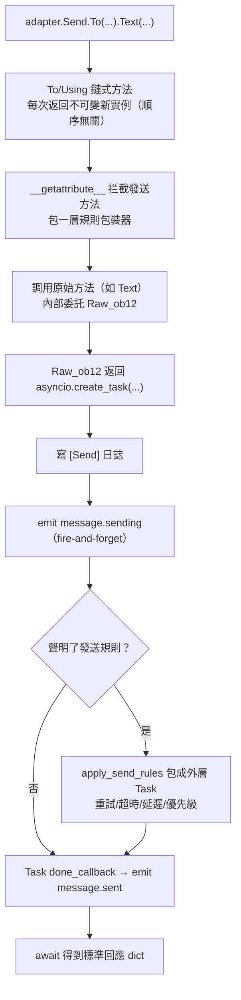

**每一步框架做了什麼：**

| 階段 | 框架做了什麼 |
|------|-------------|
| 鏈式合併 | `To`/`Using`/`Account` 每次呼叫都**新建不可變實例**並繼承已設欄位，因此 `To(...).Using(...)` 與 `Using(...).To(...)` **等價**、順序無關 |
| 方法包裝 | 發送方法（`Text` 等）被 `__getattribute__` 拦截包一層；修飾方法（`To`/`Using`/`At`/`Retry` 等）**不包裝**。嵌套的 `Raw_ob12` 呼叫靠 `_in_rule_wrap` 標記防重複包裝 |
| Task 創建 | `Raw_ob12` 內部 `asyncio.create_task()` 才是 Task 真正的創建點；`Text()` 只是同步返回這個 Task，**不阻塞** |
| 發送日誌 | 寫 `[Send] platform/method -> target` 事件日誌（`exclude_levels=["EVENT"]` 可屏蔽） |
| `message.sending` | 發送方法被呼叫時**立即**以 fire-and-forget 觸發（僅當存在監聽者，先 `has_handlers` 短路） |
| `message.sent` | 綁定在 Task 的 `done_callback` 上——**有規則時覆蓋整個重試流程的最終結果**，無規則時即原始 Task 完成 |

### 帳戶解析回退鏈

當適配器內部呼叫 `_resolve_account(account_id)` 時，按以下順序解析到具體帳戶：

1. 單帳戶適配器（無 `AccountConfigClass`）→ 直接返回
2. 帳戶名精確匹配 `account_id`
3. 各帳戶 `bot_id` 欄位匹配
4. 各帳戶任意 `str` 欄位值匹配（排除 `enabled`/`name`）
5. 兜底第一個啟用的帳戶
6. 全部失敗 → 抛 `ValueError`

> 你傳的 `account_id` 來自：`Using()` 明確指定 > 事件 `self` 欄位（`account_id` 优先於 `user_id`，由 `event.reply()` 自動注入）> 不指定（由適配器兜底第一個啟用帳戶）。

### 發送規則引擎（重試/超時/延遲）

規則在 `Raw_ob12` 返回 Task **之後**包裝成新的外層 Task，不影響主流程。關鍵事實：

| 規則 | 說明 |
|------|------|
| `Retry(n)` | 總嘗試 `n+1` 次；**失敗後立即重發，無指數退避** |
| `Timeout(s)` | 單次發送超時取消（`asyncio.wait_for`），未耗盡則重試 |
| `Defer(s)` | 發送前延遲 sleep |
| `Priority(level, drop_if_busy)` | 积壓超閾值時直接返回 `{status:"failed", retcode:10002, message:"dropped_low_priority"}` |
| `Hook(fn)` | 僅最終成功時按序執行 |
| `on_progress` / `on_error` | 各階段 / 最終失敗回調 |

> **注意**：重試是「立即重發」，沒有退避間隔；若平台限流需要退避，請在 `on_error` 回調裡自行 sleep 後再手動重發。規則的成功判定以返回 dict 的 `status == "ok"` 為準（`retcode == 0`）。

> 標準回應格式與 `retcode` 完整語義見 [API 响应规范](../../standards/api-response.md)。

## 返回值

### Task 物件

所有傳送方法皆會傳回 `asyncio.Task`。適配器只需實作 `Raw_ob12`，標準方法（Text/Image 等）會預設委派給它：

```python
import asyncio

def Raw_ob12(self, message, **kwargs):
    async def _do_send():
        segments = self._apply_modifiers(message)
        return await self._adapter.call_api(
            endpoint="/send_message",
            message=segments,
            **self.send_context,
            **kwargs,
        )
    return asyncio.create_task(_do_send())

# Text/Image/Voice/Video/File 已繼承自基類，自動委派給 Raw_ob12
# 如需覆寫標準方法，回傳 asyncio.Task 即可：
# def Text(self, text: str):
#     return self.Raw_ob12([{"type": "text", "data": {"text": text}}])
```

### 標準化回應

`call_api` 應傳回標準化回應。建議使用 `make_response()` / `make_error()` 方法：

```python
async def call_api(self, endpoint: str, **params):
    try:
        result = await self._do_api_call(endpoint, **params)
        return self.make_response(
            data=result.get("data"),
            message_id=result.get("message_id", ""),
            raw=result,
        )
    except Exception as e:
        return self.make_error(message=str(e))
```

也支援手動建構（舊版方式仍然相容）：

```python
async def call_api(self, endpoint: str, **params):
    return {
        "status": "ok" or "failed",
        "retcode": 0 or error_code,
        "data": {...},
        "message_id": "msg_id" or "",
        "message": "",
        "{platform}_raw": raw_response
    }

## 完整範例

### 基本使用

```python
from ErisPulse.Core import adapter

my_adapter = adapter.get("myplatform")

# 傳送文字
await my_adapter.Send.To("user", "123").Text("Hello World!")

# 傳送圖片
await my_adapter.Send.To("group", "456").Image("https://example.com/image.jpg")

# 傳送檔案
with open("document.pdf", "rb") as f:
    await my_adapter.Send.To("user", "123").File(f.read())
```

### 鏈式呼叫

```python
# @使用者 + 回覆
await my_adapter.Send.To("group", "456").At("789").Reply("msg123").Text("回覆@的訊息")

# @全體 + 多個修飾
await my_adapter.Send.Using("bot1").To("group", "456").AtAll().Text("公告訊息")
```

### 原始訊息與訊息建構

`Raw_ob12` 是反向轉換的核心入口（接收 OB12 訊息段 → 平台 API 呼叫），`MessageBuilder` 是配合其使用的鏈式訊息段建構工具。

> 完整的 `Raw_ob12` 實作規範、`MessageBuilder` 用法及程式碼範例請參閱：
> - [傳送方法規範 §6 反向轉換規範](../../zh-TW/standards/send-method-spec.md#6-反向轉換規範onebot12--平台)
> - [傳送方法規範 §11 訊息建構器](../../zh-TW/standards/send-method-spec.md#11-訊息建構器-messagebuilder)

## 相關文件

- [適配器開發入門](getting-started.md) - 建立適配器
- [適配器核心概念](core-concepts.md) - 了解適配器架構
- [適配器最佳實踐](best-practices.md) - 開發高品質適配器
- [傳送方法規範](../../standards/send-method-spec.md) - 傳送方法完整規範


### 适配器开发最佳实践

# 適配器開發最佳實踐

本文檔提供了 ErisPulse 適配器開發的最佳實踐建議。

請直接返回翻譯後的完整Markdown內容，不要包含任何其他文字。

再次提醒：如果文檔包含語言切換行（各語言名稱用 `` | `` 分隔的行），務必嚴格遵守上方第8條的格式要求，不要寫出 ``[**Label**](file)`` 這類錯誤格式。

## Bot 狀態管理與 Meta 事件

適配器應主動透過 `adapter.emit()` 發送 meta 事件，讓框架自動追蹤 Bot 的連接狀態、上下線和心跳資訊。

### 1. 何時發送 Meta 事件

| 事件 | `detail_type` | 觸發時機 | 框架行為 |
|------|--------------|---------|---------|
| 連接 | `"connect"` | Bot 與平台建立連接時 | 註冊 Bot，觸發 `adapter.bot.online` 生命週期事件 |
| 斷開 | `"disconnect"` | Bot 與平台斷開連接時 | 標記 Bot 離線，觸發 `adapter.bot.offline` 生命週期事件 |
| 心跳 | `"heartbeat"` | 定期發送（建議 30-60 秒） | 更新 Bot 活躍時間和元資訊 |

### 2. 發送 Meta 事件

框架提供 `emit_meta()` 方法，一行即可發送 meta 事件：

```python
class MyAdapter(BaseAdapter):
    async def _ws_handler(self, websocket):
        bot_id = self._get_bot_id()

        # Bot 上線：一行發送 connect 事件
        await self.emit_meta("connect", bot_id, user_name="MyBot", nickname="我的機器人")

        try:
            while True:
                data = await websocket.receive_text()
                event = self.convert(data)
                if event:
                    await self.adapter.emit(event)
        except WebSocketDisconnect:
            pass
        finally:
            # Bot 下線
            await self.emit_meta("disconnect", bot_id)
```

### 3. 心跳事件

適配器應在連接存活期間定期發送心跳事件，更新 Bot 的活躍時間：

```python
class MyAdapter(BaseAdapter):
    async def _heartbeat_loop(self, bot_id: str):
        while self._connected:
            # 向框架發送 meta heartbeat（一行完成）
            await self.emit_meta("heartbeat", bot_id)
            await asyncio.sleep(30)
```

### 4. `self` 字段自動發現

框架的 `adapter.emit()` 會自動處理所有事件（不僅是 meta 事件）中的 `self` 字段：

- **一般事件**（message/notice/request）中的 `self` 字段會自動發現並註冊 Bot
- **`self` 字段擴展資訊**：支援 `user_name`、`nickname`、`avatar`、`account_id` 可選欄位

```python
# 轉換器中包含 self 字段即可自動註冊 Bot
onebot_event = {
    "type": "message",
    "detail_type": "private",
    "platform": "myplatform",
    "self": {
        "platform": "myplatform",
        "user_id": "bot123",
        "user_name": "MyBot",
        "nickname": "我的機器人",
    },
    # ... 其他欄位
}
await self.adapter.emit(onebot_event)
# Bot "bot123" 已自動註冊並更新活躍時間
```

### 5. Bot 狀態查詢

框架提供以下查詢方法：

```python
from ErisPulse import sdk

# 獲取 Bot 詳細資訊
info = sdk.adapter.get_bot_info("myplatform", "bot123")
# {"status": "online", "last_active": 1712345678.0, "info": {"nickname": "MyBot"}}

# 列出所有 Bot（按平台分組）
all_bots = sdk.adapter.list_bots()

# 列出指定平台的 Bot
platform_bots = sdk.adapter.list_bots("myplatform")

# 檢查 Bot 是否在線
is_online = sdk.adapter.is_bot_online("myplatform", "bot123")

# 獲取完整狀態摘要（適合 WebUI 展示）
summary = sdk.adapter.get_status_summary()
# {"adapters": {"myplatform": {"status": "started", "bots": {...}}}}

## 連接管理

### 1. 實現連接重試

```python
import asyncio

class MyAdapter(BaseAdapter):
    async def start(self):
        retry_count = 0
        max_retries = 5
        
        while retry_count < max_retries:
            try:
                await self._connect_to_platform()
                self.logger.info("連接成功")
                break
            except Exception as e:
                retry_count += 1
                if retry_count < max_retries:
                    # 指數退避策略
                    wait_time = min(60 * (2 ** retry_count), 600)
                    self.logger.warning(
                        f"連接失敗，{wait_time}秒後重試 ({retry_count}/{max_retries}): {e}"
                    )
                    await asyncio.sleep(wait_time)
                else:
                    self.logger.error("連接失敗，已達到最大重試次數")
                    raise
```

### 2. 連接狀態管理

```python
class MyAdapter(BaseAdapter):
    async def start(self):
        self.connection = None
        self._connected = False
    
    async def _ws_handler(self, websocket: WebSocket):
        self.connection = websocket
        self._connected = True
        self.logger.info("連接已建立")
        
        try:
            while True:
                data = await websocket.receive_text()
                await self._process_event(data)
        except WebSocketDisconnect:
            self.logger.info("連接已斷開")
        finally:
            self.connection = None
            self._connected = False
```

### 3. 心跳保活與 Meta 心跳

適配器的心跳應同時完成兩個任務：向平台發送心跳保活，並向框架發送 meta heartbeat 事件。

```python
class MyAdapter(BaseAdapter):
    async def start(self):
        self.connection = await self._connect_to_platform()
        self._heartbeat_task = asyncio.create_task(self._heartbeat_loop())

    async def _heartbeat_loop(self):
        while self.connection:
            try:
                # 1. 向平台發送心跳保活
                await self.connection.send_json({"type": "ping"})

                # 2. 向框架發送 meta heartbeat（使用 emit_meta 一行完成）
                await self.emit_meta("heartbeat", self._bot_id)

                await asyncio.sleep(30)
            except Exception as e:
                self.logger.error(f"心跳失敗: {e}")
                break
```

### 4. 連接資訊暴露

適配器註冊的路由應對使用者可見，便於使用者配置平台側的回呼位址。推薦在 `start()` 中主動輸出連接資訊：

```python
class MyAdapter(BaseAdapter):
    async def start(self):
        router.register_websocket(
            module_name=self.platform,
            path="/ws",
            handler=self._ws_handler
        )

        if self.sdk:
            info = self.sdk.adapter.get_connection_info(self.platform)
            if info:
                self.logger.info(f"WebSocket 地址: "
                    f"{info.get('connection', {}).get('base_url', '')}"
                    f"{info.get('connection', {}).get('websocket_routes', [])}")
```

使用者可以透過以下 API 查看適配器的所有路由和連接位址：

```python
from ErisPulse import sdk

# 適配器層級的連接資訊（推薦）
info = sdk.adapter.get_connection_info("myplatform")

# 路由管理器層級的查詢
sdk.router.list_namespaces()              # 列出所有命名空間
sdk.router.get_module_routes("myplatform")  # 詳細路由資訊
sdk.router.get_module_urls("myplatform")    # 完整連接 URL
```

> **注意**：路由註冊時的 `module_name` 必須與適配器在 ErisPulse 中註冊的 `platform` 名稱完全一致，否則 `get_connection_info()` 將無法關聯路由。多帳戶適配器應為每個帳戶註冊子路徑（如 `/account1/webhook`、`/account2/webhook`），而非使用不同的 `module_name`。

## 事件轉換

### 1. 嚴格遵循 OneBot12 標準

```python
class MyPlatformConverter:
    def convert(self, raw_event):
        """轉換事件"""
        onebot_event = {
            "id": str(raw_event.get("event_id", uuid.uuid4())),
            "time": int(time.time()),
            "type": self._convert_type(raw_event.get("type")),
            "detail_type": self._convert_detail_type(raw_event),
            "platform": "myplatform",
            "self": {
                "platform": "myplatform",
                "user_id": str(raw_event.get("bot_id", ""))
            },
            "myplatform_raw": raw_event,  # 保留原始數據（必須）
            "myplatform_raw_type": raw_event.get("type", "")  # 原始類型（必須）
        }
        return onebot_event
```

### 2. 時間戳標準化

```python
def _convert_timestamp(self, timestamp):
    """轉換為 10 位秒級時間戳"""
    if not timestamp:
        return int(time.time())
    
    # 如果是毫秒級時間戳
    if timestamp > 10**12:
        return int(timestamp / 1000)
    
    # 如果是秒級時間戳
    return int(timestamp)
```

### 3. 事件 ID 生成

```python
import uuid

def _generate_event_id(self, raw_event):
    """生成事件 ID"""
    event_id = raw_event.get("event_id")
    if event_id:
        return str(event_id)
    # 如果平台沒有提供 ID，生成 UUID
    return str(uuid.uuid4())

## SendDSL 實現

`At`/`AtAll`/`Reply` 修飾器已由框架 SendDSL 基類內建，適配器只需實現 `Raw_ob12` 和具體發送方法。使用 `self._apply_modifiers(message)` 和 `self.send_context` 簡化開發。

### 1. 必須返回 Task 對象

```python
class Send(BaseAdapter.Send):
    def Raw_ob12(self, message, **kwargs):
        """推薦實現：使用框架輔助方法"""
        async def _do_send():
            segments = self._apply_modifiers(message)
            return await self._adapter.call_api(
                endpoint="/send_message",
                message=segments,
                **self.send_context,
                **kwargs
            )
        return asyncio.create_task(_do_send())

    def Text(self, text: str):
        return self.Raw_ob12([{"type": "text", "data": {"text": text}}])
```

### 2. 鏈式修飾方法返回 self

```python
class Send(BaseAdapter.Send):

    def __init__(self, adapter, target_type=None, target_id=None, account_id=None):
        super().__init__(adapter, target_type, target_id, account_id)
        self.buttons = []

    def Button(self, content: list) -> 'Send':
        self.buttons.append(content)
        return self # 返回 self
```

### 3. 支持平台特有方法

```python
class Send(BaseAdapter.Send):
    def Sticker(self, sticker_id: str):
        """發送表情包"""
        return asyncio.create_task(
            self._adapter.call_api(
                endpoint="/send_sticker",
                message=[{"type": "sticker", "data": {"id": sticker_id}}],
                **self.send_context
            )
        )
    
    def Card(self, card_data: dict):
        """發送卡片消息"""
        return asyncio.create_task(
            self._adapter.call_api(
                endpoint="/send_card",
                message=[{"type": "card", "data": card_data}],
                **self.send_context
            )
        )

## API 回應

### 1. 標準化回應格式

框架提供 `make_response()` 和 `make_error()` 方法來構造標準化的回應：

```python
async def call_api(self, endpoint: str, **params):
    try:
        raw_response = await self._platform_api_call(endpoint, **params)
        
        if raw_response.get("success"):
            return self.make_response(
                data=raw_response.get("data"),
                message_id=raw_response.get("data", {}).get("message_id", ""),
                raw=raw_response,
            )
        else:
            return self.make_error(
                retcode=raw_response.get("code", 10001),
                message=raw_response.get("message", ""),
                raw=raw_response,
            )
    except Exception as e:
        return self.make_error(message=str(e))
```

`make_response()` 會自動生成包含 `{platform}_raw` 鍵的回應字典。`make_error()` 預設使用 `retcode=34000`（Platform Error）。

### 2. 錯誤碼規範

遵循 OneBot12 標準錯誤碼：

```python
# 1xxxx - 動作請求錯誤
10001: Bad Request
10002: Unsupported Action
10003: Bad Param

# 2xxxx - 動作處理器錯誤
20001: Bad Handler
20002: Internal Handler Error

# 3xxxx - 動作執行錯誤
31000: Database Error
32000: Filesystem Error
33000: Network Error
34000: Platform Error
35000: Logic Error
```

請直接返回翻譯後的完整 Markdown 內容，不要包含任何其他文字。

再次提醒：如果文件包含語言切換行（各語言名稱用 `` | `` 分隔的行），請務必嚴格遵守上方第8條的格式要求，不要寫出 ``[**Label**](file)`` 這類錯誤格式。

## 多帳戶支援

### 1. 聲明式配置（推薦）

使用 `AccountConfigClass` 聲明配置類後，框架會自動管理多帳戶的載入、驗證和模板生成。`BotAccountConfig` 基類提供 `enabled` 和 `name` 欄位，適配器無需聲明：

```python
from dataclasses import dataclass, field
from ErisPulse.Core.Bases import BotAccountConfig

@dataclass
class MyBotConfig(BotAccountConfig):
    token: str = field(default="", metadata={
        "description": {"i18n": "my_adapter.bot_token", "default": "Bot Token"},
        "required": True,
        "secret": True,
    })

class MyAdapter(BaseAdapter):
    AccountConfigClass = MyBotConfig
    
    async def start(self):
        for name, account in self.enabled_accounts.items():
            self.logger.info(f"啟動帳戶 {name}")
            await self._connect(name, account.token)
            # bot_id 由框架自動從平台協議/登入回應中獲取並回填
    
    async def call_api(self, endpoint: str, **params):
        account_id = params.pop("account_id", None)
        name, account = self._resolve_account(account_id)
        # name: 帳戶名, account: MyBotConfig 實例
```

配置文件會自動生成為：

```toml
[MyAdapter.accounts.default]
token = ""
enabled = true
name = ""
```

### 2. 帳戶選擇機制

框架內建 `_resolve_account()` 方法，匹配優先順序如下：

1. **帳戶名** — 配置鍵名精確匹配
2. **`bot_id` 欄位** — 自動獲取的 bot_id（即 `event["self"]["user_id"]`）
3. **任意 str 欄位** — 配置中其他字串欄位
4. **兜底** — 第一個啟用的帳戶

```python
# 按帳戶名匹配
name, account = self._resolve_account("account1")

# 按 bot_id 匹配（最常用的方式，來自事件）
name, account = self._resolve_account("bot_123")

# 獲取第一個啟用的帳戶（傳入 None）
name, account = self._resolve_account(None)

## 錯誤處理

### 1. 分類異常處理

使用 `make_error()` 建構標準化的錯誤回應。透過 `sdk.client` 發出請求時捕獲 ErisPulse 異常：

```python
from ErisPulse.Core.Bases.errors import ClientError, ClientTimeoutError

async def call_api(self, endpoint: str, **params):
    try:
        from ErisPulse.Core import client
        resp = await client.post(
            f"https://api.platform.com/{endpoint}",
            json=params,
            max_retries=2,
        )
        response = await resp.json()
        return self.make_response(data=response, raw=response)
    except ClientTimeoutError:
        self.logger.error(f"請求超時: {endpoint}")
        return self.make_error(retcode=32000, message="請求超時")
    except ClientError as e:
        self.logger.error(f"網路錯誤: {e}")
        return self.make_error(retcode=33000, message="網路請求失敗")
    except json.JSONDecodeError:
        self.logger.error("JSON 解析失敗")
        return self.make_error(retcode=10006, message="回應格式錯誤")
    except Exception as e:
        self.logger.error(f"未知錯誤: {e}", exc_info=True)
        return self.make_error(message=str(e))
```

> **向後相容**：直接使用 `aiohttp` 的舊適配器程式碼不受影響，仍可捕獲 `aiohttp.ClientError`。異常轉換僅在透過 `sdk.client` 發出請求時生效。

### 2. 日誌記錄

框架會自動為適配器建立子 logger（`sdk.logger.get_child("MyAdapter")`），無需手動初始化：

```python
class MyAdapter(BaseAdapter):
    # ConfigClass = ...  # 聲明配置類後 self.logger 自動可用
    
    async def start(self):
        self.logger.info("適配器啟動中...")
        # ...
        self.logger.info("適配器啟動完成")
    
    async def shutdown(self):
        self.logger.info("適配器關閉中...")
        # ...
        self.logger.info("適配器關閉完成")

## 測試

### 1. 單元測試

```python
import pytest
from ErisPulse.Core.Bases import BaseAdapter

class TestMyAdapter:
    def test_converter(self):
        """測試轉換器"""
        converter = MyPlatformConverter()
        raw_event = {"type": "message", "content": "Hello"}
        result = converter.convert(raw_event)
        assert result is not None
        assert result["platform"] == "myplatform"
        assert "myplatform_raw" in result
    
    def test_api_response(self):
        """測試 API 回應格式"""
        adapter = MyAdapter()
        response = adapter.call_api("/test", param="value")
        assert "status" in response
        assert "retcode" in response
```

### 2. 集成測試

```python
@pytest.mark.asyncio
async def test_adapter_start():
    """測試適配器啟動"""
    adapter = MyAdapter()
    await adapter.start()
    assert adapter._connected is True

@pytest.mark.asyncio
async def test_send_message():
    """測試傳送訊息"""
    adapter = MyAdapter()
    await adapter.start()
    
    result = await adapter.Send.To("user", "123").Text("Hello")
    assert result is not None

## 反向轉換與訊息建構

`Raw_ob12` 是適配器**必須實現**的方法，是反向轉換（OneBot12 → 平台）的統一入口。標準方法（`Text`、`Image` 等）應委派給 `Raw_ob12`，修飾器狀態（`At`/`Reply`/`AtAll`）需在 `Raw_ob12` 內合併為訊息段。

`MessageBuilder` 是配合 `Raw_ob12` 使用的訊息段建構工具，支援鏈式呼叫和快速建構。

> 完整的實現規範、程式碼範例和使用方法請參閱：
> - [傳送方法規範 §6 反向轉換規範](../../standards/send-method-spec.md#6-反向轉換規範onebot12--平台)
> - [傳送方法規範 §11 訊息建構器](../../standards/send-method-spec.md#11-訊息建構器-messagebuilder)

## 平台事件方法擴展

適配器可以為 Event 包裝類註冊平台專有方法，讓模組開發者能更方便地存取平台特有的資料。

### 1. 使用 Mixin 類批量註冊（推薦）

當平台有許多專有方法時，推薦使用 Mixin 類：

```python
# 在適配器的 start() 或模組層級註冊
from ErisPulse.Core.Event import register_event_mixin

class MyPlatformEventMixin:
    def get_chat_name(self):
        """取得聊天名稱"""
        return self.get("myplatform_raw", {}).get("chat", {}).get("name", "")

    def is_official_message(self):
        """判斷是否為官方訊息"""
        raw = self.get("myplatform_raw", {})
        return raw.get("sender", {}).get("is_official", False)

    def get_message_type(self):
        """取得平台訊息類型"""
        return self.get("myplatform_raw", {}).get("msg_type", "text")

# 批量註冊
register_event_mixin("myplatform", MyPlatformEventMixin)
```

### 2. 使用裝飾器註冊單一方法

```python
from ErisPulse.Core.Event import register_event_method

@register_event_method("myplatform")
def get_chat_name(self):
    return self.get("myplatform_raw", {}).get("chat", {}).get("name", "")
```

### 3. 適配器關閉時清理

```python
from ErisPulse.Core.Event import unregister_platform_event_methods

class MyAdapter(BaseAdapter):
    async def shutdown(self):
        # 清理平台事件方法註冊
        unregister_platform_event_methods("myplatform")
        # ... 其他清理
```

> 更詳細的註冊和註銷說明請參閱 [事件系統 API - 適配器註冊平台擴展方法](../../api-reference/event-system.md#適配器註冊平台擴展方法)。

## 文件維護

### 1. 維護平台特性文件

在 `docs/zh-TW/platform-guide/` 下建立 `{platform}.md` 文件（其他語言版本會自動產生）：

```markdown
# 平台名稱適配器文件

## 基本資訊
- 對應模組版本: 1.0.0
- 維護者: Your Name

## 支援的訊息傳送類型
...

## 特有事件類型
...

## 配置選項
...
```

### 2. 更新版本資訊

發佈新版本時，更新文件中的版本資訊：

```toml
[project]
version = "2.0.0"  # 更新版本號
```

再次提醒：如果文件包含語言切換行（各語言名稱用 `` | `` 分隔的行），務必嚴格遵守上方第8條的格式要求，不要寫出 ``[**Label**](file)`` 這類錯誤格式。

## 相關文件

- [適配器開發入門](docs/zh-TW/getting-started.md) - 建立第一個適配器  
- [適配器核心概念](docs/zh-TW/core-concepts.md) - 了解適配器架構  
- [SendDSL 詳解](docs/zh-TW/send-dsl.md) - 學習訊息傳送


### 事件转换器

# 事件轉換器實現指南

事件轉換器 (Converter) 是適配器的核心組件之一，負責將平台原生事件轉換為 ErisPulse 統一的 OneBot12 標準事件格式。

請直接返回翻譯後的完整Markdown內容，不要包含任何其他文字。

再次提醒：如果文檔包含語言切換行（各語言名稱用 `` | `` 分隔的行），務必嚴格遵守上方第8條的格式要求，不要寫出 ``[**Label**](file)`` 這類錯誤格式。

## Converter 職責

```
平台原生事件 ──→ Converter.convert() ──→ OneBot12 標準事件
```

Converter 只負責**正向轉換**（接收方向），即將平台的原生事件資料轉換為 OneBot12 標準格式。反向轉換（發送方向）由 `Send.Raw_ob12()` 方法處理。

### 核心原則

1. **無損轉換**：原始資料必須完整保留在 `{platform}_raw` 欄位中
2. **標準相容**：轉換後的事件必須符合 OneBot12 標準格式
3. **平台擴展**：平台特有的資料使用 `{platform}_` 前綴欄位儲存

## BaseConverter 基底類（推薦）

自 2.7.0 版本起，框架提供 `BaseConverter` 基底類（`ErisPulse.Core.Bases`），封裝 OneBot12 事件的**共用欄位建構**與**常用訊息段輔助**，讓轉換器只需專注於類型映射：

```python
from ErisPulse.Core.Bases import BaseConverter


class MyConverter(BaseConverter):
    def __init__(self):
        super().__init__(platform="myplatform")

    def convert(self, raw_event: dict) -> dict | None:
        if not isinstance(raw_event, dict):
            return None
        event_type = raw_event.get("type", "")
        base = self.build_base_event(raw_event, event_type)  # id/time/platform/self/raw
        if event_type == "message":
            base["type"] = "message"
            base["detail_type"] = "group" if raw_event.get("group_id") else "private"
            base["user_id"] = str(raw_event.get("sender_id", ""))
            base["message"] = [self.text(raw_event.get("content", ""))]
            base["alt_message"] = raw_event.get("content", "")
            return base
        return None
```

`build_base_event()` 已填入的共用欄位：

| 欄位 | 來源 |
|------|------|
| `id` | `raw_event["event_id"]`，缺省自动生成 UUID |
| `time` | `raw_event["timestamp"]`，缺省當前時間 |
| `platform` | 建構時傳入的 `platform` |
| `self` | `{"platform": ..., "user_id": raw_event["bot_id"]}` |
| `{platform}_raw` | 原始事件（符合「無損轉換」原則） |
| `{platform}_raw_type` | 原始事件類型 |

常用訊息段輔助方法（皆為靜態方法，可直接重用）：

```python
converter.text("hi")          # {"type": "text", "data": {"text": "hi"}}
converter.at("123456")        # {"type": "at", "data": {"user_id": "123456"}}
converter.image("file.png")   # {"type": "image", "data": {"file": "file.png"}}
```

> 手動實現時 `build_base_event` 的共用欄位建構是必須重複撰寫的樣板程式碼，使用 `BaseConverter` 可省去這部分，且天然滿足「無損轉換」（原始事件始終進入 `{platform}_raw`）。

## convert() 方法

### 方法簽名

```python
def convert(self, raw_event: dict) -> dict:
    """
    將平台原生事件轉換為 OneBot12 標準格式

    :param raw_event: 平台原生事件數據
    :return: OneBot12 標準格式事件字典
    """
    pass
```

### 返回值結構

轉換後的事件字典應包含以下標準字段：

```python
{
    "id": "事件唯一ID",
    "time": 1234567890,           # Unix 時間戳（秒）
    "type": "message",             # 事件類型
    "detail_type": "private",      # 詳細類型
    "platform": "myplatform",      # 平台名稱
    "self": {
        "platform": "myplatform",
        "user_id": "bot_user_id"
    },

    # 消息事件字段
    "user_id": "sender_id",
    "message": [...],              # OneBot12 消息段列表
    "alt_message": "純文本內容",

    # 必須保留原始數據
    "myplatform_raw": { ... },     # 平台原生事件完整數據
    "myplatform_raw_type": "原生事件類型名",
}

## 必填欄位映射

### 通用欄位（所有事件類型）

| OB12 欄位 | 類型 | 說明 |
|-----------|------|------|
| `id` | str | 事件唯一標識符 |
| `time` | int | Unix 時間戳（秒） |
| `type` | str | 事件類型：`message` / `notice` / `request` / `meta` |
| `detail_type` | str | 詳細類型：`private` / `group` / `friend` 等 |
| `platform` | str | 平台名稱，與適配器註冊名一致 |
| `self` | dict | 機器人資訊：`{"platform": "...", "user_id": "..."}` |

### 消息事件額外欄位

| OB12 欄位 | 類型 | 說明 |
|-----------|------|------|
| `user_id` | str | 發送者 ID |
| `message` | list[dict] | OneBot12 消息段列表 |
| `alt_message` | str | 純文字備用內容 |

### 通知事件額外欄位

| OB12 欄位 | 類型 | 說明 |
|-----------|------|------|
| `user_id` | str | 相關使用者 ID |
| `operator_id` | str | 操作者 ID（如群組成員變動） |

## 消息段轉換

OneBot12 標準定義了以下消息段類型：

```python
# 文本
{"type": "text", "data": {"text": "Hello"}}

# 圖片
{"type": "image", "data": {"file": "https://example.com/img.jpg"}}

# 音頻
{"type": "audio", "data": {"file": "https://example.com/audio.mp3"}}

# 視頻
{"type": "video", "data": {"file": "https://example.com/video.mp4"}}

# 文件
{"type": "file", "data": {"file": "https://example.com/doc.pdf"}}

# @提及
{"type": "mention", "data": {"user_id": "123"}}

# @全體
{"type": "mention_all", "data": {}}

# 回覆
{"type": "reply", "data": {"message_id": "msg_123"}}
```

如果平台不支援某些消息段類型，可以省略該段或轉換為最接近的標準類型。

## 平台擴展欄位

平台特有的資料應使用 `{platform}_` 前綴儲存，以避免與標準欄位衝突：

```python
{
    # 標準欄位
    "type": "message",
    "detail_type": "group",
    # ...

    # 平台擴展欄位
    "myplatform_raw": { ... },          # 原始事件資料（必須）
    "myplatform_raw_type": "chat",      # 原始事件類型（必須）

    # 其他平台特有欄位
    "myplatform_group_name": "群名稱",
    "myplatform_sender_role": "admin",
}
```

> **重要**：`{platform}_raw` 欄位是必須的，ErisPulse 的事件系統和模組可能依賴它來存取平台原始資料。

請直接返回翻譯後的完整 Markdown 內容，不要包含任何其他文字。

## 完整示例

以下是一個完整的 Converter 實現：

```python
class MyConverter:
    def __init__(self, platform: str):
        self.platform = platform

    def convert(self, raw_event: dict) -> dict:
        event_type = raw_event.get("type", "")

        base_event = {
            "id": raw_event.get("id", ""),
            "time": raw_event.get("timestamp", 0),
            "platform": self.platform,
            "self": {
                "platform": self.platform,
                "user_id": raw_event.get("self_id", ""),
            },
            "myplatform_raw": raw_event,
            "myplatform_raw_type": event_type,
        }

        if event_type == "chat":
            return self._convert_message(raw_event, base_event)
        elif event_type == "notification":
            return self._convert_notice(raw_event, base_event)
        elif event_type == "request":
            return self._convert_request(raw_event, base_event)

        return base_event

    def _convert_message(self, raw: dict, base: dict) -> dict:
        base["type"] = "message"
        base["detail_type"] = "group" if raw.get("group_id") else "private"
        base["user_id"] = raw.get("sender_id", "")
        base["message"] = self._convert_message_segments(raw.get("content", ""))
        base["alt_message"] = raw.get("content", "")

        if raw.get("group_id"):
            base["group_id"] = raw["group_id"]

        return base

    def _convert_message_segments(self, content: str) -> list:
        segments = []
        if content:
            segments.append({"type": "text", "data": {"text": content}})
        return segments

    def _convert_notice(self, raw: dict, base: dict) -> dict:
        base["type"] = "notice"
        notification_type = raw.get("notification_type", "")

        if notification_type == "member_join":
            base["detail_type"] = "group_member_increase"
            base["user_id"] = raw.get("user_id", "")
            base["group_id"] = raw.get("group_id", "")
            base["operator_id"] = raw.get("operator_id", "")
        elif notification_type == "friend_add":
            base["detail_type"] = "friend_increase"
            base["user_id"] = raw.get("user_id", "")

        return base

    def _convert_request(self, raw: dict, base: dict) -> dict:
        base["type"] = "request"
        request_type = raw.get("request_type", "")

        if request_type == "friend":
            base["detail_type"] = "friend"
            base["user_id"] = raw.get("user_id", "")
            base["comment"] = raw.get("message", "")
        elif request_type == "group_invite":
            base["detail_type"] = "group"
            base["group_id"] = raw.get("group_id", "")
            base["user_id"] = raw.get("inviter_id", "")

        return base

## 富媒體訊息轉換範例

實際平台的訊息通常包含圖片、@提及、回覆等富媒體內容。以下是 `_convert_message_segments` 處理多種訊息類型的範例：

```python
def _convert_message_segments(self, raw_content: list) -> list:
    """將平台原生訊息段列表轉換為 OneBot12 標準訊息段"""
    segments = []

    for item in raw_content:
        item_type = item.get("type", "")

        if item_type == "text":
            segments.append({
                "type": "text",
                "data": {"text": item.get("content", "")}
            })

        elif item_type == "image":
            file_url = item.get("url") or item.get("file_id", "")
            segments.append({
                "type": "image",
                "data": {"file": file_url}
            })

        elif item_type == "at":
            segments.append({
                "type": "mention",
                "data": {"user_id": item.get("target_id", "")}
            })

        elif item_type == "reply":
            segments.append({
                "type": "reply",
                "data": {"message_id": item.get("reply_to_id", "")}
            })

        elif item_type == "at_all":
            segments.append({"type": "mention_all", "data": {}})

        else:
            segments.append({
                "type": "text",
                "data": {"text": f"[不支援的訊息類型: {item_type}]"}
            })

    return segments

## 常見陷阱

### 1. 缺少 `{platform}_raw` 欄位

這是最常見的錯誤。缺少原始資料欄位會導致模組無法存取平台特有的資訊。

```python
base_event["myplatform_raw"] = raw_event        # 必須！
base_event["myplatform_raw_type"] = event_type   # 必須！
```

### 2. 時間戳格式錯誤

OneBot12 標準要求 `time` 欄位為 Unix 秒級時間戳（整數）。如果你的平台傳回毫秒時間戳或 ISO 格式字串，需要轉換：

```python
import time

# 毫秒 → 秒
"time": raw_event.get("timestamp", 0) // 1000

# ISO 字串 → 秒
"time": int(time.mktime(time.strptime(raw_event["created_at"], "%Y-%m-%dT%H:%M:%S")))
```

### 3. 缺少 `self` 欄位

`self` 欄位包含機器人自身的資訊，`user_id` 為機器人的帳號 ID。多 Bot 場景下此欄位至關重要：

```python
"self": {
    "platform": self.platform,
    "user_id": raw_event.get("bot_id", ""),   # 機器人自身的 ID
}
```

### 4. detail_type 使用了非標準值

`detail_type` 必須使用 OneBot12 標準定義的值，如 `private`、`group`、`friend_increase`、`group_member_increase` 等。不要使用平台特有的命名。

### 5. 往返一致性

確保 Converter 產生的消息段類型與 Send 端支援的方法對應。例如，如果 Converter 將平台的圖片訊息轉換為 `{"type": "image", ...}`，那麼 Send 端的 `Image()` 方法必須能處理圖片傳送。

請直接返回翻譯後的完整 Markdown 內容，不要包含任何其他文字。

## 最佳實踐

1. **始終保留原始資料**：`{platform}_raw` 欄位不能省略
2. **使用標準訊息段**：盡量將平台訊息轉換為 OneBot12 標準訊息段
3. **合理設定 detail_type**：使用標準類型（`private`/`group`/`channel` 等），不要自訂
4. **處理邊界情況**：原始事件可能缺少某些欄位，使用 `.get()` 並提供合理的預設值
5. **效能考量**：`convert()` 在每個事件上被呼叫，避免在其中執行耗時操作

請直接返回翻譯後的完整 Markdown 內容，不要包含任何其他文字。

再次提醒：如果文件包含語言切換行（各語言名稱用 `` | `` 分隔的行），務必嚴格遵守上方第8條的格式要求，不要寫出 ``[**Label**](file)`` 這類錯誤格式。

## 相關文件

- [適配器核心概念](core-concepts.md) - 適配器整體架構
- [SendDSL 詳解](send-dsl.md) - 反向轉換（發送方向）
- [事件轉換標準](../../standards/event-conversion.md) - 正式的事件轉換規範
- [會話類型系統](../../standards/session-types.md) - 會話類型映射規則


=====
发布与工具
=====


### 发布模块到模块商店

# 發布與模組商店指南

將你開發的模組或適配器發布到 ErisPulse 模組商店，讓其他使用者可以方便地發現和安裝。

## 模組商店概述

ErisPulse 模組商店是一個集中式的模組註冊表，使用者可以透過 CLI 工具瀏覽、搜尋和安裝社群貢獻的模組、適配器。

### 瀏覽與發現

```bash
# 列出遠端可用的所有套件
epsdk list-remote

# 只查看模組
epsdk list-remote -t modules

# 只查看適配器
epsdk list-remote -t adapters

# 強制刷新遠端套件列表
epsdk list-remote -r
```

你也可以訪問 [ErisPulse 官網](https://www.erisdev.com/#market) 在線瀏覽模組商店。

### 支援的提交類型

| 類型 | 說明 | Entry-point 組 |
|------|------|----------------|
| 模組 | 擴充機器人功能、實現業務邏輯 | `erispulse.module` |
| 適配器 | 連接新的訊息平台 | `erispulse.adapter` |

## 快速發布

整個過程只需要三步：配置專案 → 發布到 PyPI → 提交到模組商店。

### 1. 配置 pyproject.toml

確保專案目錄包含 `pyproject.toml`、`README.md`，並根據類型配置 entry-points：

#### 模組

```toml
[project]
name = "ErisPulse-MyModule"
version = "1.0.0"
description = "模組功能描述"
requires-python = ">=3.10"
license = { text = "MIT" }
authors = [ { name = "yourname" } ]
dependencies = [
    "ErisPulse>=2.0.0",
]

[project.entry-points."erispulse.module"]
"MyModule" = "MyModule:Main"
```

#### 適配器

```toml
[project]
name = "ErisPulse-MyAdapter"
version = "1.0.0"
description = "適配器功能描述"
requires-python = ">=3.10"

[project.entry-points."erispulse.adapter"]
"myplatform" = "MyAdapter:MyAdapter"
```

> **注意**：套件名建議以 `ErisPulse-` 開頭，便於使用者識別。Entry-point 的鍵名（如 `"MyModule"`）將作為模組在 SDK 中的存取名稱。

### 2. 發布到 PyPI

```bash
# 建構 + 發布（需要 PyPI 帳號）
pip install build twine
python -m build
python -m twine upload dist/*
```

發布成功後驗證安裝：

```bash
pip install ErisPulse-MyModule
```

### 3. 提交到模組商店

前往 [ErisPulse 模組商店](https://www.erisdev.com/#market)，點擊「提交模組」，登入後填寫模組資訊即可。

支援的登入方式：**GitHub**、**Codeberg**、**雲湖**，任選其一即可。

填寫重點：
- 模組名稱、描述、倉庫地址
- 最低 SDK 版本：如果不确定，填寫 [ErisPulse 最新發行版](https://pypi.org/project/ErisPulse/) 版本號即可

提交後立即生效，使用者可透過模組源安裝。模組會被標記為「未驗證」，維護者審核通過後改為「已驗證」。

> **關於驗證狀態**：
> - 「未驗證」僅表示尚未經過官方審核，不代表模組有問題
> - 使用者透過 `epsdk install` 安裝未驗證模組時會收到風險提示，需確認後才可繼續安裝

### 4. 管理已發布的模組

在模組商店點擊「提交模組」並登入後，切換到「我的模組」標籤頁，可以：

- **編輯** — 修改模組描述、倉庫地址、標籤等資訊，版本號會自動從 PyPI 同步
- **刪除** — 從模組商店移除模組（不可撤銷）

> 剛提交的模組可能需要幾分鐘才會顯示在「我的模組」列表中。

## 更新已發布模組

1. 更新 `pyproject.toml` 中的 `version`
2. 重新建構並上傳：`python -m build && python -m twine upload dist/*`
3. 模組商店會自動同步 PyPI 上的最新版本

使用者透過 `epsdk upgrade MyModule` 即可升級。

## 發布前檢查清單

在推送到 PyPI 之前，請逐項確認以下內容：

### 代碼品質

- [ ] 所有公開 API 有型別註解（函數簽名和返回值）
- [ ] 所有公開方法有文件字串（`"""..."""` 格式，包含 `:param` / `:return` / `:raises`）
- [ ] 透過 `ruff check`（無警告）
- [ ] 測試覆蓋率 ≥ 80%
- [ ] 透過 `pytest` 全部用例

### 相容性

- [ ] `pyproject.toml` 宣告了最低 SDK 版本：`dependencies = ["ErisPulse>=x.y.z"]`
- [ ] 測試了 Python 3.10 / 3.11 / 3.12 / 3.13
- [ ] 測試了目標作業系統（Windows / Linux / macOS，如適用）
- [ ] 無循環匯入依賴

### 配置

- [ ] 如果使用宣告式配置（`ConfigClass` + `BaseConfig` / `BotAccountConfig`），配置欄位有 `description`（推薦 i18n 格式）和 `ui` 元數據
- [ ] 如果註冊了 i18n 翻譯鍵，已覆蓋所有 5 種語言（zh-CN / zh-TW / en / ja / ru）
- [ ] 敏感欄位標記了 `secret=True`

### 文件

- [ ] `README.md` 有安裝說明和基本使用範例
- [ ] `README.md` 說明了配置方式（配置檔案範例 + 環境變數）
- [ ] `CHANGELOG.md` 記錄了所有變更
- [ ] 適配器更新了平台特性文件（支援的 Send 類型、事件類型等）

### 發布

- [ ] `pyproject.toml` 版本號已更新
- [ ] 建構透過：`python -m build`
- [ ] 已推送到 PyPI：`python -m twine upload dist/*`
- [ ] 安裝驗證透過：`pip install ErisPulse-xxx && epsdk run`

## 開發模式測試

在正式發布前，可以使用可編輯模式在本地測試：

```bash
epsdk install -e /path/to/MyModule
# 或
pip install -e /path/to/MyModule
```

## 常見問題

### 套件名必須以 `ErisPulse-` 開頭嗎？

不強制，但強烈推薦。這有助於使用者在 PyPI 上識別 ErisPulse 生態的套件。

### 一個套件可以註冊多個模組嗎？

可以。在 `entry-points` 中配置多個鍵值對即可：

```toml
[project.entry-points."erispulse.module"]
"ModuleA" = "MyPackage:ModuleA"
"ModuleB" = "MyPackage:ModuleB"
```

### 審核需要多久時間？

通常在 1-3 個工作日內完成。你可以在模組商店「我的模組」中查看驗證狀態。

## 透過 Docker 映像分發應用

如果你的應用不適合發布到 PyPI（如包含私有依賴、需要預配置環境），可以透過 **GitHub Container Registry (GHCR)** 發布 Docker 映像，讓其他使用者 `docker pull` 一鍵啟動。

### 適用場景

- 你有一個**完整的機器人應用**（模組 + 配置 + 入口腳本），想一鍵分發
- 模組/適配器依賴**私有包**或有特殊安裝流程，不適合 PyPI
- 想提供**開箱即用**的部署方案，降低使用者使用門檻

### 1. 建立 Dockerfile

基於 ErisPulse 官方映像建構，只需新增你的模組即可：

```dockerfile
FROM erispulse/erispulse:latest

LABEL org.opencontainers.image.title="ErisPulse-MyModule" \
      org.opencontainers.image.description="模組描述" \
      org.opencontainers.image.url="https://github.com/yourname/ErisPulse-MyModule" \
      org.opencontainers.image.source="https://github.com/yourname/ErisPulse-MyModule"

COPY pyproject.toml README.md ./
COPY MyModule/ ./MyModule/

RUN uv pip install --system -e .
```

如果模組需要額外的系統依賴（如 SSH 用戶端等），在 `RUN uv pip install` 之後新增：

```dockerfile
RUN apt-get update && apt-get install -y --no-install-recommends \
    openssh-client \
    && rm -rf /var/lib/apt/lists/*
```

> `erispulse/erispulse:latest` 已包含 ErisPulse、ErisPulse-Dashboard、Python 執行時和 uv，無需重複安裝。

### 2. 建立 GitHub Actions 工作流程

在 `.github/workflows/docker-publish.yml` 中建立：

```yaml
name: 發布 Docker 映像

on:
  workflow_dispatch:
  push:
    branches:
      - main
    tags:
      - "v*"

permissions:
  contents: read
  packages: write

env:
  REGISTRY: ghcr.io
  IMAGE_NAME: ${{ github.repository_owner }}/my-bot

jobs:
  docker-publish:
    runs-on: ubuntu-latest

    steps:
      - name: 檢出代碼
        uses: actions/checkout@v4

      - name: 設置 QEMU (多架構支援)
        uses: docker/setup-qemu-action@v3

      - name: 設置 Docker Buildx
        uses: docker/setup-buildx-action@v3

      - name: 登入 GitHub Container Registry
        uses: docker/login-action@v3
        with:
          registry: ${{ env.REGISTRY }}
          username: ${{ github.actor }}
          password: ${{ secrets.GITHUB_TOKEN }}

      - name: 提取 Docker 元數據
        id: meta
        uses: docker/metadata-action@v5
        with:
          images: ${{ env.REGISTRY }}/${{ env.IMAGE_NAME }}
          tags: |
            type=semver,pattern={{version}}
            type=semver,pattern={{major}}.{{minor}}
            type=raw,value=latest

      - name: 建構並推送 Docker 映像
        uses: docker/build-push-action@v6
        with:
          context: .
          file: ./Dockerfile
          platforms: linux/amd64,linux/arm64
          push: true
          tags: ${{ steps.meta.outputs.tags }}
          labels: ${{ steps.meta.outputs.labels }}
          cache-from: type=gha
          cache-to: type=gha,mode=max
```

> `GITHUB_TOKEN` 由 GitHub Actions 自動提供，無需手動建立金鑰。

### 3. 觸發建構

推送代碼或打 Tag 即可自動建構：

```bash
# 推送到 main 分支觸發
git push origin main

# 或打 Tag 觸發
git tag v1.0.0
git push origin v1.0.0
```

也可在 GitHub 倉庫的 **Actions** 頁面手動觸發。

### 4. 設置映像為公開

GHCR 映像預設為 **private**，需要在 GitHub 設置為 Public 後其他使用者才能免登入拉取：

1. 進入倉庫 → **Packages** → 點擊對應 Package
2. **Package settings** → **Danger Zone** → **Change visibility** → **Public**

### 5. 使用者使用

建構完成後，使用者可以用 `docker run` 一行啟動：

```bash
docker run -d \
  --name my-bot \
  -p 8000:8000 \
  -v $(pwd)/config:/app/config \
  -e TZ=Asia/Shanghai \
  -e ERISPULSE_DASHBOARD_TOKEN=your-token \
  --restart unless-stopped \
  ghcr.io/<your-username>/my-bot:latest
```

或使用 `docker-compose.yml`：

```yaml
services:
  my-bot:
    image: ghcr.io/<your-username>/my-bot:latest
    container_name: my-bot
    ports:
      - "8000:8000"
    volumes:
      - ./config:/app/config
    environment:
      - TZ=Asia/Shanghai
      - ERISPULSE_DASHBOARD_TOKEN=${ERISPULSE_DASHBOARD_TOKEN:-}
    restart: unless-stopped
```

### 同時發布到 Docker Hub

擴充工作流程，在登入步驟前新增 Docker Hub 登入，並在 `images` 中新增 Docker Hub 位址：

```yaml
      - name: 登入 Docker Hub
        uses: docker/login-action@v3
        with:
          registry: docker.io
          username: ${{ secrets.DOCKERHUB_USERNAME }}
          password: ${{ secrets.DOCKERHUB_TOKEN }}

      - name: 提取 Docker 元數據
        id: meta
        uses: docker/metadata-action@v5
        with:
          images: |
            docker.io/<your-dockerhub-username>/my-bot
            ghcr.io/${{ github.repository_owner }}/my-bot
```

> 需要在倉庫 **Settings → Secrets** 中新增 `DOCKERHUB_USERNAME` 和 `DOCKERHUB_TOKEN`。

### Docker 映像 vs PyPI 發布

| 特性 | Docker 映像 (GHCR) | PyPI 發布 |
|------|---------------------|-----------|
| 分發方式 | `docker pull` 一鍵執行 | `pip install` + 手動配置 |
| 適用範圍 | 完整應用/解決方案 | 單一模組/適配器 |
| 私有依賴 | 天然支援 | 需要私有 PyPI 源 |
| 模組商店 | 不適用 | 可提交到模組商店 |
| 多架構 | 支援 amd64/arm64 | 與架構無關 |

兩種方式不衝突——你可以同時透過 PyPI 發布模組到模組商店，又透過 GHCR 提供開箱即用的 Docker 映像。


### CLI 命令参考

# CLI 命令參考

ErisPulse 命令行工具（`epsdk`）提供專案管理和套件管理功能。

> **提示**：所有命令均可透過 `epsdk <命令> --help` 查看詳細的參數說明。

---

請直接返回翻譯後的完整 Markdown 內容，不要包含任何其他文字。

再次提醒：如果文件包含語言切換行（各語言名稱用 `` | `` 分隔的行），務必嚴格遵守上方第8條的格式要求，不要寫出 ``[**Label**](file)`` 這類錯誤格式。

## 套件管理命令

| 命令 | 別名 | 參數 | 說明 |
|------|------|------|------|
| `install` | `i`, `add` | `[套件]... [--upgrade/-U] [--pre] [-e 路徑] [--user] [--no-deps] [-t 目錄] [--index-url URL] [--extra-index-url URL] [--no-cache-dir] [-r 檔案] [-c 檔案] [--force-reinstall] [--ignore-installed] [--compile/--no-compile] [--prefix 目錄] [--src 目錄] [--config-settings 設定] [--no-binary 格式] [--only-binary 格式] [--prefer-binary] [--build-isolation/--no-build-isolation] [--upgrade-strategy {eager,only-if-needed,to-satisfy-only}] [--break-system-packages] [--no-uv]` | 安裝模組/適配器 |
| `uninstall` | `rm`, `remove` | `<套件>... [--no-uv]` | 卸載模組/適配器 |
| `upgrade` | `up` | `[套件]... [--force/-f] [--pre] [--no-uv]` | 升級指定套件或全部 |
| `self-update` | `su`, `update` | `[版本] [--pre] [--force/-f] [--no-uv]` | 更新 SDK 本身 |

請直接返回翻譯後的完整 Markdown 內容，不要包含任何其他文字。

## 臨床診斷命令

| 命令 | 別名 | 參數 | 說明 |
|------|------|------|------|
| `doctor` | `diag` | `[--verbose]` | 臨床診斷環境並輸出健康報告 |

### install

安裝 ErisPulse 模組或適配器套件。若不指定套件名稱則進入互動式安裝介面。

**別名：** `i`, `add`

**參數：**

| 參數 | 短參數 | 說明 |
|------|--------|------|
| `[package]...` | | 要安裝的套件名稱，可指定多個 |
| `--upgrade` | `-U` | 安裝時升級到最新版本 |
| `--pre` | | 允許安裝預發行版本 |
| `--editable` | `-e` | 以可編輯模式安裝（需指定路徑） |
| `--user` | | 安裝到使用者 site-packages 目錄 |
| `--no-deps` | | 不安裝相依性 |
| `--target` | `-t` | 安裝到指定目錄 |
| `--index-url` | | 指定 PyPI 鏡像來源地址 |
| `--extra-index-url` | | 額外 PyPI 鏡像來源地址（可多次指定） |
| `--no-cache-dir` | | 禁用快取 |
| `--requirement` | `-r` | 從 requirements 檔案安裝 |
| `--constraint` | `-c` | 從約束檔案安裝 |
| `--force-reinstall` | | 強制重新安裝 |
| `--ignore-installed` | | 忽略已安裝的套件 |
| `--compile` | | 安裝後編譯 .pyc 檔案 |
| `--no-compile` | | 安裝後不編譯 .pyc 檔案 |
| `--prefix` | | 安裝到指定前綴目錄 |
| `--src` | | 可編輯安裝時使用的原始碼目錄 |
| `--config-settings` | | 傳遞給建置後端的設定（可多次指定） |
| `--no-binary` | | 限制不使用二進位套件（格式如 `:all:`） |
| `--only-binary` | | 限制僅使用二進位套件（格式如 `:all:`） |
| `--prefer-binary` | | 优先選擇二進位套件 |
| `--build-isolation` | | 啟用建置隔離 |
| `--no-build-isolation` | | 禁用建置隔離 |
| `--upgrade-strategy` | | 升級策略：`eager`、`only-if-needed`、`to-satisfy-only` |
| `--break-system-packages` | | 允許修改系統套件管理器管理的 Python 套件 |
| `--no-uv` | | 使用 pip 代替 uv |

**示例：**

```bash
# 安裝單個模組
epsdk install Weather

# 安裝多個模組
epsdk install Yunhu Weather

# 從鏡像源安裝並升級
epsdk install Weather -U --index-url https://pypi.tuna.tsinghua.edu.cn/simple

# 可編輯模式安裝（開發模式）
epsdk install -e ./my-adapter
```

### uninstall

卸載已安裝的 ErisPulse 模組或適配器套件。若不指定套件名稱則進入互動式卸載介面。

**別名：** `rm`, `remove`

**參數：**

| 參數 | 說明 |
|------|------|
| `<package>...` | 要卸載的套件名稱，可指定多個 |
| `--no-uv` | 使用 pip 代替 uv |

**示例：**

```bash
# 卸載單個模組
epsdk uninstall Weather

# 卸載多個模組
epsdk uninstall Yunhu Weather
```

### upgrade

升級已安裝的 ErisPulse 組件。不指定套件名稱則互動式升級全部。

**別名：** `up`

**參數：**

| 參數 | 短參數 | 說明 |
|------|--------|------|
| `[package]...` | | 要升級的套件名稱，可指定多個 |
| `--force` | `-f` | 強制升級，跳過確認 |
| `--pre` | | 允許升級到預發行版本 |
| `--no-uv` | | 使用 pip 代替 uv |

**示例：**

```bash
# 升級所有套件
epsdk upgrade

# 升級指定套件
epsdk upgrade Weather

# 強制升級（跳過確認）
epsdk upgrade -f
```

### self-update

更新 ErisPulse SDK 本身到最新版本。

**別名：** `su`, `update`

**參數：**

| 參數 | 短參數 | 說明 |
|------|--------|------|
| `[version]` | | 指定要更新的目標版本號 |
| `--pre` | | 允許更新到預發行版本 |
| `--force` | `-f` | 強制更新，跳過確認 |
| `--no-uv` | | 使用 pip 代替 uv |

**示例：**

```bash
# 更新到最新穩定版
epsdk self-update

# 更新到指定版本
epsdk self-update 1.2.3

# 允許預發行版本
epsdk self-update --pre

# 強制更新
epsdk self-update -f

## 信息查詢命令

| 命令 | 別名 | 參數 | 說明 |
|------|------|------|------|
| `list` | `l`, `ls` | `[--type/-t {modules,adapters,all}] [--outdated/-o]` | 列出已安裝的組件 |
| `list-remote` | `lsr` | `[--type/-t {modules,adapters,all}] [--refresh/-r]` | 列出遠端可用的組件 |

### list

列出已安裝的 ErisPulse 模組和適配器。

**別名：** `l`, `ls`

**參數：**

| 參數 | 短參數 | 說明 |
|------|--------|------|
| `--type` | `-t` | 指定類型：`modules`、`adapters`、`all`（預設） |
| `--outdated` | `-o` | 僅顯示可升級的套件 |

**示例：**

```bash
# 列出所有已安裝的組件
epsdk list

# 只列出模組
epsdk list -t modules

# 只列出適配器
epsdk list -t adapters

# 僅顯示可升級的套件
epsdk list -o
```

### list-remote

列出遠端倉庫中可用的 ErisPulse 模組和適配器。

**別名：** `lsr`

**參數：**

| 參數 | 短參數 | 說明 |
|------|--------|------|
| `--type` | `-t` | 指定類型：`modules`、`adapters`、`all`（預設） |
| `--refresh` | `-r` | 強制刷新遠端套件列表快取 |

**示例：**

```bash
# 列出所有遠端可用組件
epsdk list-remote

# 只列出遠端模組
epsdk list-remote -t modules

# 強制刷新快取後列出
epsdk list-remote -r

## 運行控制命令

| 命令 | 別名 | 參數 | 說明 |
|------|------|------|------|
| `run` | `r` | `[script] [--reload]` | 執行指定腳本或 SDK |

### run

執行 ErisPulse 項目腳本或直接啟動 SDK。支援熱重載模式。

**別名：** `r`

**參數：**

| 參數 | 說明 |
|------|------|
| `[script]` | 要執行的腳本檔案，不指定則執行 SDK |
| `--reload` | 啟用熱重載模式，監控檔案變更自動重啟 |

**範例：**

```bash
# 直接執行 SDK
epsdk run

# 執行指定腳本檔案
epsdk run main.py

# 熱重載模式執行（檔案變更自動重啟）
epsdk run main.py --reload

# SDK 熱重載模式
epsdk run --reload

## 項目管理命令

| 命令 | 別名 | 參數 | 說明 |
|------|------|------|------|
| `init` | — | `[--project-name/-n <name>] [--quick/-q] [--force/-f] [--here] [--no-uv]` | 初始化 ErisPulse 項目 |
| `create` | — | `{module,adapter} [--name/-n <name>] [--description/-d <desc>] [--author/-a <name>] [--email/-e <mail>] [--homepage <url>] [--output/-o <dir>] [--force/-f]` | 創建模組/適配器腳手架 |

### init

初始化一個新的 ErisPulse 項目。支援互動式與快速模式。

**參數：**

| 參數 | 短參數 | 說明 |
|------|--------|------|
| `--project-name` | `-n` | 項目名稱 |
| `--quick` | `-q` | 快速模式，跳過互動式嚮導 |
| `--force` | `-f` | 強制覆蓋現有配置檔案 |
| `--here` | | 在當前目錄初始化，不建立子目錄 |
| `--no-uv` | | 使用 pip 代替 uv |

**範例：**

```bash
# 互動式初始化
epsdk init

# 快速初始化
epsdk init -q -n my_bot

# 強制覆蓋已有配置
epsdk init -f

# 在當前目錄初始化
epsdk init --here -n my_bot
```

### create

創建 ErisPulse 模組或適配器的腳手架項目。

**參數：**

| 參數 | 短參數 | 說明 |
|------|--------|------|
| `{module,adapter}` | | 要創建的類型：`module` 或 `adapter` |
| `--name` | `-n` | 項目名稱（PascalCase） |
| `--description` | `-d` | 項目描述 |
| `--author` | `-a` | 作者名稱 |
| `--email` | `-e` | 作者郵箱 |
| `--homepage` | | 項目主頁 URL |
| `--output` | `-o` | 輸出目錄（預設當前目錄） |
| `--force` | `-f` | 強制覆蓋已存在的目錄 |
| `--local` | | 創建本地插件（僅 `module` 可用）：生成 `plugins/<name>/` 包結構，免打包安裝 |

**範例：**

```bash
# 互動式創建（引導選擇類型和填寫資訊）
epsdk create

# 直接創建 Module 項目
epsdk create module -n MyModule

# 創建本地插件（放入項目 plugins/ 目錄，啟動時自動發現，支援熱重載）
epsdk create module -n MyModule --local

# 直接創建 Adapter 項目
epsdk create adapter -n MyAdapter

# 完整參數
epsdk create module -n MyModule -d "模組描述" -a "作者" -e "mail@example.com"

# 指定輸出目錄
epsdk create module -n MyModule -o ./projects

# 強制覆蓋已有目錄
epsdk create module -n MyModule -f

## 語言命令

| 命令 | 別名 | 參數 | 說明 |
|------|------|------|------|
| `i18n` | `language`, `lang` | `[lang] [--list/-l]` | 查看或切換 CLI 顯示語言 |

### i18n

查看當前 CLI 語言、列出支援的語言、切換顯示語言。若不指定參數則進入互動式選擇介面。

**別名：** `language`, `lang`

**參數：**

| 參數 | 短參數 | 說明 |
|------|--------|------|
| `[lang]` | | 要切換的語言代碼（如 `zh-CN`、`en`、`ja`、`ru`） |
| `--list` | `-l` | 列出所有支援的語言 |

**範例：**

```bash
# 互動式選擇語言
epsdk i18n

# 切換到英文
epsdk i18n en

# 切換到日文
epsdk i18n ja

# 列出所有支援的語言
epsdk i18n --list

## 類型存根命令

| 命令 | 別名 | 參數 | 說明 |
|------|------|------|------|
| `types` | `t`, `stub` | `[--output/-o <path>] [--force] [--adapters-only] [--modules-only]` | 產生類型存根檔案以啟用 IDE 自動完成 |

### types

掃描已安裝的 ErisPulse 模組和適配器，為它們產生 `.pyi` 類型存根檔案，進而在 IDE 中獲得準確的程式碼自動完成與類型檢查支援。

**別名：** `t`, `stub`

**參數：**

| 參數 | 短參數 | 說明 |
|------|--------|------|
| `--output` | `-o` | 輸出路徑（預設為當前目錄下的 `ep-stubs/`） |
| `--force` | | 強制覆蓋已存在的存根檔案 |
| `--adapters-only` | | 僅產生適配器的類型存根 |
| `--modules-only` | | 僅產生模組的類型存根 |

> **注意：** `--adapters-only` 與 `--modules-only` 相互排斥，同時指定時後者生效。

**範例：**

```bash
# 為所有已安裝的模組和適配器產生類型存根
epsdk types

# 僅產生適配器存根
epsdk types --adapters-only

# 輸出到指定目錄
epsdk types -o ./typings

# 強制覆蓋已有檔案
epsdk types --force
```

---

請直接返回翻譯後的完整 Markdown 內容，不要包含任何其他文字。

## 全局參數

以下參數適用於所有命令：

| 參數 | 短參數 | 說明 |
|------|--------|------|
| `--help` | `-h` | 顯示幫助資訊 |
| `--version` | `-V` | 顯示版本資訊 |
| `--verbose` | `-v` | 顯示詳細輸出（可疊加 `-vv`/`-vvv`） |
| `--no-color` | | 禁用彩色輸出（適合 CI / 日誌收集） |
| `--yes` | `-y` | 自動確認所有互動提示（非互動式運行） |

---

docs/zh-TW/quick-start.md

## 環境診斷

### doctor

> [!NOTE]
> 此命令需要 ErisPulse **2.7.0+**。

診斷目前 CLI 運行環境，並輸出健康報告。用於排查「為什麼無法安裝 / 連不上」之類的問題。

| 參數 | 說明 |
|------|------|
| `--verbose` | 顯示詳細診斷資訊 |

**檢查項目**：
- **Python**：解釋器版本與路徑
- **安裝後端**：使用 `uv` 還是 `pip`
- **目標解釋器**：套件實際安裝到的目標 Python 環境
- **設定檔**：`config/config.toml` 是否存在
- **PyPI 連通性**：能否存取 PyPI（並顯示發現的元件數）
- **系統代理**：是否偵測到代理

```bash
# 運行環境診斷
epsdk doctor

# 使用別名
epsdk diag
```

---

請直接返回翻譯後的完整 Markdown 內容，不要包含任何其他文字。

## 傳統中文

執行 `epsdk install` 時若未指定套件名稱，將進入互動式安裝：

```bash
epsdk install
```

互動介面提供：
1. 驅動程式選擇
2. 模組選擇
3. 自訂安裝

[**English**](docs/zh-TW/quick-start.md) | [**简体中文**](docs/zh-TW/quick-start.md)

## 常見用法

### 安裝模組

```bash
# 安裝單個模組
epsdk install Weather

# 安裝多個模組
epsdk install Yunhu Weather

# 升級模組
epsdk install Weather -U
```

### 列出組件

```bash
# 列出所有組件
epsdk list

# 只列出適配器
epsdk list -t adapters

# 只列出可升級的組件
epsdk list -o

# 查看遠端可用組件
epsdk list-remote
```

### 卸載組件

```bash
# 卸載單個組件
epsdk uninstall Weather

# 卸載多個組件
epsdk uninstall Yunhu Weather
```

### 升級組件

```bash
# 升級所有組件
epsdk upgrade

# 升級指定組件
epsdk upgrade Weather

# 強制升級
epsdk upgrade -f
```

### 運行專案

```bash
# 普通運行
epsdk run main.py

# 熱重載模式
epsdk run main.py --reload
```

### 切換語言

```bash
# 互動式選擇語言
epsdk i18n

# 直接切換到英文
epsdk i18n en

# 列出支援的語言
epsdk i18n --list
```

### 產生類型存根

```bash
# 產生所有類型存根
epsdk types

# 僅產生模組類型存根
epsdk types --modules-only
```

### 初始化專案

```bash
# 互動式初始化
epsdk init

# 快速初始化
epsdk init -q -n my_bot
```

### 建立腳手架

```bash
# 互動式建立（引導選擇類型和填寫資訊）
epsdk create

# 直接建立 Module 專案
epsdk create module -n MyModule

# 直接建立 Adapter 專案
epsdk create adapter -n MyAdapter

# 完整參數
epsdk create module -n MyModule -d "模組描述" -a "作者" -e "mail@example.com"

# 強制覆蓋已有目錄
epsdk create module -n MyModule -f


======
API 参考
======


### 适配器系统 API

# 介面卡系統 API

本文檔詳細介紹 ErisPulse 介面卡系統的 API。

## Adapter 管理器

### 取得介面卡

```python
from ErisPulse import sdk

# 透過名稱取得介面卡
adapter = sdk.adapter.get("platform_name")

# 或者也可以直接透過屬性存取
adapter = sdk.adapter.platform_name
```

### 使用介面卡事件監聽
> 一般情況下，更建議使用`Event`模組進行事件的監聽/處理;
>
> 同時`Event`模組提供了強大的包裝器，可以為您的模組開發帶來更多便利

```python
# 監聽 OneBot12 標準事件
@sdk.adapter.on("message")
async def handle_message(event):
    pass

# 監聽特定平台標準事件
@sdk.adapter.on("message", platform="yunhu")
async def handle_yunhu_message(event):
    pass

# 監聽平台原生事件
@sdk.adapter.on("raw_event", raw=True, platform="yunhu")
async def handle_raw_event(data):
    pass
```

### 介面卡管理

```python
# 取得所有平台
platforms = sdk.adapter.platforms

# 檢查介面卡是否存在
exists = sdk.adapter.exists("platform_name")

# 啟用/停用介面卡
sdk.adapter.enable("platform_name")
sdk.adapter.disable("platform_name")

# 啟動/關閉介面卡
# 以下方法都只展示了傳入參數的情況，無參數時代表啟動/停止全部已註冊介面卡
await sdk.adapter.startup(["platform1", "platform2"])
await sdk.adapter.shutdown(["platform1", "platform2"])

# 檢查介面卡是否正在執行
is_running = sdk.adapter.is_running("platform_name")

# 列出所有正在執行的介面卡
running = sdk.adapter.list_running()
```

## 中間件

中間件在事件分發到處理器之前執行，可以對事件資料進行修改、過濾或記錄。

### 註冊中間件

```python
@sdk.adapter.middleware
async def my_middleware(event):
    sdk.logger.info(f"中間件處理: {event}")
    return event
```

### 中間件執行模型

- **執行順序**：中間件按註冊順序執行（先註冊先執行）
- **資料傳遞**：每個中間件接收上一個中間件傳回的 `event` 資料；如果某個中間件傳回 `None`，則忽略該傳回值並保留原資料繼續傳遞（同時輸出 `warning` 級別日誌）
- **修改資料**：中間件可以修改事件資料並傳回修改後的字典

```python
@sdk.adapter.middleware
async def add_timestamp(event):
    event["processed_at"] = time.time()
    return event

@sdk.adapter.middleware
async def filter_spam(event):
    if event.get("detail_type") == "private":
        text = event.get("alt_message", "")
        if "垃圾廣告" in text:
            return None   # 傳回 None 不會阻止事件傳播，僅忽略此傳回值
    return event
```

> **注意**：中間件目前不支援阻斷事件傳播。如需過濾特定事件，請在事件處理器中透過條件判斷實作。
> 但您可以在Event模組中設定高優先級處理器然後在處理器內使用設定 `event.mark_processed()` 來阻斷低優先級事件處理器

## Send 訊息發送

### 基本發送

```python
# 取得介面卡
adapter = sdk.adapter.get("platform")

# 發送文字訊息
await adapter.Send.To("user", "123").Text("Hello")

# 發送圖片訊息
await adapter.Send.To("group", "456").Image("https://example.com/image.jpg")
```

### 指定發送帳號

```python
# 使用帳號名稱
await adapter.Send.Using("account1").To("user", "123").Text("Hello")

# 使用帳號 ID
await adapter.Send.Using("bot_id").To("user", "123").Text("Hello")
```

### 查詢支援的發送方法

```python
# 列出平台支援的所有發送方法
methods = sdk.adapter.list_sends("onebot11")
# 返回: ["Text", "Image", "Voice", "Markdown", ...]

# 取得某個方法的詳細資訊
info = sdk.adapter.send_info("onebot11", "Text")
# 返回:
# {
#     "name": "Text",
#     "parameters": [
#         {"name": "text", "type": "str", "default": null, "annotation": "str"}
#     ],
#     "return_type": "Awaitable[Any]",
#     "docstring": "發送文字訊息..."
# }
```

### 鏈式修飾

```python
# @用戶
await adapter.Send.To("group", "456").At("789").Text("你好")

# @全體成員
await adapter.Send.To("group", "456").AtAll().Text("大家好")

# 回覆訊息
await adapter.Send.To("group", "456").Reply("msg_id").Text("回覆內容")

# 組合使用
await adapter.Send.To("group", "456").At("789").Reply("msg_id").Text("回覆@的訊息")
```

## API 呼叫

### call_api 方法

> **注意**：`call_api` 是直接呼叫平台原生 API 的底層方法，各平台的參數和傳回值可能不同，請參考對應平台介面卡文件。**推薦使用 Send DSL 發送訊息**，僅在 Send DSL 不支援的場景（如取得平台特有的資料、呼叫平台管理介面等）中使用 `call_api`。

```python
# 呼叫平台 API
result = await adapter.call_api(
    endpoint="/send",
    content="Hello",
    recvId="123",
    recvType="user"
)

# 標準化回應
{
    "status": "ok",
    "retcode": 0,
    "data": {...},
    "message_id": "msg_id",
    "message": "",
    "{platform}_raw": raw_response
}
```

## 介面卡基類

### BaseAdapter 方法

```python
from ErisPulse import sdk
from ErisPulse.Core import BaseAdapter

class MyAdapter(BaseAdapter):
    def __init__(self):
        super().__init__()
        self.sdk = sdk
        # 初始化介面卡
        pass
    
    async def start(self):
        """啟動介面卡（必須實作）"""
        pass
    
    async def shutdown(self):
        """關閉介面卡（必須實作）"""
        pass
    
    async def call_api(self, endpoint: str, **params):
        """呼叫平台 API（必須實作）"""
        pass
```

### Send 嵌套類

```python
class MyAdapter(BaseAdapter):
    class Send(BaseAdapter.Send):
        def Text(self, text: str):
            """發送文字訊息"""
            import asyncio
            return asyncio.create_task(
                self._adapter.call_api(
                    endpoint="/send",
                    content=text,
                    recvId=self._target_id,
                    recvType=self._target_type
                )
            )
```

## Bot 狀態管理

介面卡透過發送 OneBot12 標準的 **`meta` 事件**來告知框架 Bot 的連線狀態。系統自動從中提取 Bot 資訊進行狀態追蹤。

### meta 事件類型

介面卡應發送以下三種 `meta` 事件：

| `type` | `detail_type` | 說明 | 觸發時機 |
|--------|--------------|------|---------|
| `meta` | `connect` | Bot 連線上線 | 介面卡與平台建立連線成功後 |
| `meta` | `heartbeat` | Bot 心跳 | 定期發送（建議 30-60 秒） |
| `meta` | `disconnect` | Bot 斷開連線 | 檢測到連線斷開時 |

### self 欄位擴展

ErisPulse 在 OneBot12 標準的 `self` 欄位上擴展了以下選用欄位：

| 欄位 | 類型 | 說明 |
|------|------|------|
| `self.platform` | string | 平台名稱（OB12 標準） |
| `self.user_id` | string | Bot 用戶 ID（OB12 標準） |
| `self.user_name` | string | Bot 暱稱（ErisPulse 擴展） |
| `self.avatar` | string | Bot 頭像 URL（ErisPulse 擴展） |
| `self.account_id` | string | 多帳號識別（ErisPulse 擴展） |

### meta 事件格式

#### connect — 連線上線

```python
await adapter.emit({
    "id": "unique_id",
    "time": 1712345678,
    "type": "meta",
    "detail_type": "connect",
    "platform": "telegram",
    "self": {
        "platform": "telegram",
        "user_id": "123456",
        "user_name": "MyBot",
        "avatar": "https://example.com/avatar.jpg"
    },
    "telegram_raw": {...},
    "telegram_raw_type": "bot_connected"
})
```

系統處理：註冊 Bot，標記為 `online`，觸發 `adapter.bot.online` 生命週期事件。

#### heartbeat — 心跳

```python
await adapter.emit({
    "id": "unique_id",
    "time": 1712345708,
    "type": "meta",
    "detail_type": "heartbeat",
    "platform": "telegram",
    "self": {
        "platform": "telegram",
        "user_id": "123456"
    }
})
```

系統處理：更新 `last_active` 時間（心跳中也支援更新元資訊）。

#### disconnect — 斷開連線

```python
await adapter.emit({
    "id": "unique_id",
    "time": 1712345738,
    "type": "meta",
    "detail_type": "disconnect",
    "platform": "telegram",
    "self": {
        "platform": "telegram",
        "user_id": "123456"
    }
})
```

系統處理：標記 Bot 為 `offline`，觸發 `adapter.bot.offline` 生命週期事件。

### 一般事件的自動發現

除了 `meta` 事件外，一般事件（`message`/`notice`/`request`）中的 `self` 欄位也會自動發現並註冊 Bot、更新活躍時間。這意味著即使介面卡不發送 `connect` 事件，框架也能從第一條一般事件中發現 Bot。

### 介面卡接入範例

```python
class MyAdapter(BaseAdapter):
    async def start(self):
        # 與平台建立連線...
        connection = await self._connect()
        
        # 連線成功，發送 connect 事件
        await adapter.emit({
            "id": str(uuid4()),
            "time": int(time.time()),
            "type": "meta",
            "detail_type": "connect",
            "platform": "myplatform",
            "self": {
                "platform": "myplatform",
                "user_id": self.bot_id,
                "user_name": self.bot_name,
                "avatar": self.bot_avatar
            },
            "myplatform_raw": raw_data,
            "myplatform_raw_type": "connected"
        })
    
    async def on_disconnect(self):
        # 斷開連線，發送 disconnect 事件
        await adapter.emit({
            "id": str(uuid4()),
            "time": int(time.time()),
            "type": "meta",
            "detail_type": "disconnect",
            "platform": "myplatform",
            "self": {
                "platform": "myplatform",
                "user_id": self.bot_id
            }
        })
```

### 查詢 Bot 狀態

```python
# 取得所有介面卡與 Bot 的完整狀態（WebUI 友好）
summary = sdk.adapter.get_status_summary()
# {
#     "adapters": {
#         "telegram": {
#             "status": "started",
#             "bots": {
#                 "123456": {
#                     "status": "online",
#                     "last_active": 1712345678.0,
#                     "info": {"nickname": "MyBot"}
#                 }
#             }
#         }
#     }
# }

# 列出所有 Bot
all_bots = sdk.adapter.list_bots()

# 列出指定平台的 Bot
tg_bots = sdk.adapter.list_bots("telegram")

# 取得單個 Bot 詳情
info = sdk.adapter.get_bot_info("telegram", "123456")

# 檢查 Bot 是否在線
if sdk.adapter.is_bot_online("telegram", "123456"):
    print("Bot 在線")
```

### Bot 狀態值

| 狀態 | 說明 |
|------|------|
| `online` | 在線（持續收到事件或介面卡主動標記） |
| `offline` | 離線（介面卡主動標記或系統關閉時自動設定） |
| `unknown` | 未知（僅註冊但未確認狀態） |

### 生命週期事件

| 事件名 | 觸發時機 | 資料 |
|--------|---------|------|
| `adapter.bot.online` | 首次自動發現新 Bot | `{platform, bot_id, status}` |
| `adapter.status.change` | 介面卡狀態變化（starting/started/stopping/stopped/stop_failed） | `{platform, status}` |

```python
# 監聽 Bot 上線事件
@sdk.lifecycle.on("adapter.bot.online")
def on_bot_online(event):
    print(f"Bot 上線: {event['data']['platform']}/{event['data']['bot_id']}")

# 監聽介面卡狀態變化
@sdk.lifecycle.on("adapter.status.change")
def on_status_change(event):
    print(f"介面卡狀態: {event['data']['platform']} -> {event['data']['status']}")
```

> 系統關閉時（`shutdown`），所有 Bot 會自動被標記為 `offline`。

## 相關文件

- [核心模組 API](docs/zh-TW/core-modules.md) - 核心模組 API
- [事件系統 API](docs/zh-TW/event-system.md) - Event 模組 API
- [介面卡開發指南](../developer-guide/adapters/) - 開發平台介面卡


### 核心模块 API

# 核心模組 API

本文件提供 ErisPulse 核心模組的 API 快速參考，包含方法簽章與簡要說明。詳細用法與範例請點擊各模組的「完整文件」連結。

```
Language: [简体中文](../zh-CN/README.md) | 繁體中文
```

::: tip
本文件提供 ErisPulse 核心模組的 API 快速參考，包含方法簽章與簡要說明。詳細用法與範例請點擊各模組的「完整文件」連結。
:::

## 模組詳情

下表列出核心模組的主要功能及入口方法。

::: tip
:::

| 模組名稱 | 描述 | 文件連結 |
| :--- | :--- | :--- |
| **ErisCore** | 核心邏輯與初始化 | [完整文件](docs/zh-TW/core/eris-core.md) |
| **Events** | 事件處理 | [完整文件](docs/zh-TW/core/events.md) |
| **Utils** | 工具函式 | [完整文件](docs/zh-TW/core/utils.md) |
| **Schema** | 資料架構與驗證 | [完整文件](docs/zh-TW/core/schema.md) |

::: tip
:::

## 核心模組 API

### ErisCore

核心邏輯與初始化。

::: tip
:::

#### 方法

*   **`init(config: ErisCoreConfig): Promise`** - 初始化核心模組。
    *   **參數**：
        *   `config`: 模組配置。
    *   **回傳**：成功時回傳 `Promise<void>`，失敗時回傳 `Promise<Error>`。
    *   **範例**：
        ```typescript
        const config = {
            logger: 'eris-logger',
            features: ['auth', 'cache'],
        };

        // 這裡是中文註解 - 這裡是中文字串 - 這裡也是中文 - 中文註解2
        const initPromise = erisCore.init(config);

        initPromise.then(() => {
            console.log('Initialization successful - 初始化成功 - success - 中文: 成功');
        }).catch((error) => {
            console.error('Initialization failed - 初始化失敗 - error - 中文: 失敗');
        });
        ```

### Events

事件處理。

::: tip
:::

#### 方法

*   **`on(event: string, listener: (...args: any[]) => void): void`** - 註冊事件監聽器。
    *   **參數**：
        *   `event`: 事件名稱。
        *   `listener`: 回呼函式。
    *   **範例**：
        ```typescript
        // 監聽事件 - 監聽事件
        events.on('messageCreate', (message) => {
            console.log(`Received message from user: ${message.author.username}`);
        });
        ```

### Utils

工具函式。

::: tip
:::

#### 方法

*   **`validate(schema: object, data: any): boolean`** - 驗證資料是否符合架構。
    *   **參數**：
        *   `schema`: 架構定義。
        *   `data`: 要驗證的資料。
    *   **回傳**：布林值，表示是否通過驗證。
    *   **範例**：
        ```typescript
        const schema = {
            name: 'string',
            age: 'number',
        };

        const userData = { name: 'Alice', age: 25 };

        // 驗證 - 中文
        const isValid = utils.validate(schema, userData);
        console.log(isValid ? 'Data is valid - 資料有效 - valid - 中文: 有效' : 'Data is invalid - 資料無效 - invalid - 中文: 無效');
        ```

### Schema

資料架構與驗證。

::: tip
:::

#### 方法

*   **`create(type: string, definition: any): SchemaType`** - 建立架構類型。
    *   **參數**：
        *   `type`: 類型名稱。
        *   `definition`: 架構定義。
    *   **回傳**：新建立的架構類型。
    *   **範例**：
        ```typescript
        const userSchema = schema.create('user', {
            properties: {
                id: 'string',
                name: 'string',
            },
            required: ['id', 'name'],
        });

        const user = {
            id: '12345',
            name: 'Alice',
        };

        // 驗證 - 中文
        if (userSchema.validate(user)) {
            console.log('User is valid - 使用者有效 - valid - 中文: 有效');
        }
        ```

::: tip
:::

**相關連結**：
*   [核心模組概覽](docs/zh-TW/core/README.md)
*   [架構文件](docs/zh-TW/core/schema.md)
*   [工具函式](docs/zh-TW/core/utils.md)

## Storage 模組

基於 SQLite 的鍵值儲存系統，支援通用 SQL 鏈式查詢。

### 基本操作

```python
from ErisPulse import sdk

sdk.storage.set("key", "value")
value = sdk.storage.get("key", default_value)
keys = sdk.storage.keys()
sdk.storage.delete("key")
```

### 批量操作

```python
sdk.storage.set_multi({"key1": "val1", "key2": "val2"})
values = sdk.storage.get_multi(["key1", "key2"])
sdk.storage.delete_multi(["key1", "key2"])
```

### 事務操作

```python
with sdk.storage.transaction():
    sdk.storage.set("key1", "value1")
    sdk.storage.set("key2", "value2")
```

### 屬性存取

```python
sdk.storage.my_key          # 等同於 sdk.storage.get("my_key")
sdk.storage.my_key = "val"  # 等同於 sdk.storage.set("my_key", "val")
```

### SQL 鏈式查詢

Storage 模組提供鏈式呼叫風格的通用 SQL 查詢建構器，支援自訂表的 CRUD 操作。

```python
sdk.storage.CreateTable("users", {
    "id": "INTEGER PRIMARY KEY AUTOINCREMENT",
    "name": "TEXT NOT NULL",
})

sdk.storage.Table("users").Insert({"name": "Alice"}).Execute()
rows = sdk.storage.Table("users").Select("name").Where("id > ?", 0).Execute()
```

> 完整的鏈式查詢 API（Select/Insert/Update/Delete/Where/OrderBy/Limit、AlterTable、事務等）請參考 [SQL 查詢建構器](../zh-TW/advanced/sql-builder.md)。

### 儲存後端抽象

`StorageManager` 繼承自 `BaseStorage` 抽象基底類別，支援擴充其他儲存媒體（Redis、MySQL 等）。

```python
from ErisPulse.Core.Bases.storage import BaseStorage, BaseQueryBuilder
```

### 非同步介面

Storage 和 Config 模組均提供非同步方法（字首 `a`），可在非同步處理器中安全呼叫。同步方法繼續保留，無需修改現有程式碼。

```python
# 非同步儲存
value = await sdk.storage.aget("key")
await sdk.storage.aset("key", "value")
await sdk.storage.adelete("key")
keys = await sdk.storage.aget_all_keys()
await sdk.storage.aclear()

# 非同步批量操作
values = await sdk.storage.aget_multi(["k1", "k2"])
await sdk.storage.aset_multi({"k1": "v1", "k2": "v2"})
await sdk.storage.adelete_multi(["k1", "k2"])

# 非同步設定
value = await sdk.config.agetConfig("MyModule.key")
await sdk.config.asetConfig("MyModule.key", "value")
await sdk.config.aforce_save()
await sdk.config.areload()

## Config 模組

TOML 格式的配置檔案管理，支援點號分隔的鍵路徑。

### API 概覽

| 方法 | 說明 |
|------|------|
| `getConfig(key, default)` | 讀取配置，支援點號路徑如 `"MyModule.subkey"` |
| `setConfig(key, value, immediate=False)` | 寫入配置。`immediate=True` 時立即儲存到檔案 |
| `force_save()` | 強制將記憶體中的配置寫入檔案 |
| `reload()` | 從檔案重新載入配置 |
| `agetConfig(key, default)` | 非同步讀取配置 |
| `asetConfig(key, value, immediate)` | 非同步寫入配置 |
| `aforce_save()` | 非同步強制儲存 |
| `areload()` | 非同步重新載入 |

### 範例

```python
config = sdk.config.getConfig("MyModule", {})
value = sdk.config.getConfig("MyModule.timeout", 30)

sdk.config.setConfig("MyModule", {"key": "value"})
sdk.config.setConfig("MyModule.timeout", 60, immediate=True)
```

> `setConfig` 預設採用延遲寫入（每 5 秒批次儲存），設定 `immediate=True` 可立即持續化到配置檔案。配置變更會觸發 `config.set` 生命週期事件。

## Logger 模組

模組化日誌系統，基於 Rich 輸出，支援子日誌器和模組層級控制。

### 基本用法

```python
sdk.logger.debug("偵錯資訊")
sdk.logger.info("執行資訊")
sdk.logger.warning("警告資訊")
sdk.logger.error("錯誤資訊")
sdk.logger.critical("致命錯誤")
```

### 子日誌器

```python
child_logger = sdk.logger.get_child("MyModule")
child_logger.info("子模組日誌")

child_logger.get_child("utils")  # 支援巢狀
```

### 日誌層級控制

```python
sdk.logger.set_level("DEBUG")                          # 全域層級
sdk.logger.set_module_level("MyModule", "DEBUG")       # 模組層級

# 支援的層級（由低到高）：
# TRACE, DEBUG, INFO, WARNING, ERROR, CRITICAL
# TRACE 為最低層級，輸出框架內部詳細偵錯資訊（事件分發、路由註冊等）
sdk.logger.set_level("TRACE")                          # 開啟全部日誌
```

### 日誌訂閱（推模式）

供 Dashboard 等模組即時接收結構化日誌，支援等級篩選和歷史補發。

> **顯式訂閱低層級日誌**：訂閱器的 `min_level` 可低於全域日誌層級。此時低層級日誌**僅推送到符合的訂閱器**，不會輸出到主控台，也不會寫入記憶體，從而避免污染主日誌串流。
>
> ```python
> # 全域為 INFO，仍可單獨訂閱 DEBUG 日誌
> @sdk.logger.handler("debug-tracer", min_level="DEBUG")
> def on_debug(log_data: dict): ...
> ```

```python
# 裝飾器方式
@sdk.logger.handler("my-handler", min_level="INFO")
def on_log(log_data: dict):
    # log_data = {
    #     "timestamp": "2026-06-29T22:00:00.123456",
    #     "level": "WARNING", "level_num": 30,
    #     "module": "ErisPulse.Core.adapter",
    #     "message": "嚴格模式：...",
    # }
    pass

# 直接呼叫方式
sdk.logger.handler("my-handler", min_level="INFO")(on_log)
sdk.logger.remove_handler("my-handler")
```

| 方法 | 說明 |
|------|------|
| `handler(id, *, min_level)(func)` | 裝飾器/直接呼叫兩用。`id` 為空時取函數名。`min_level` 可低於全域層級（低層級日誌僅推送訂閱器，不進主控台/記憶體）。註冊時自動補發歷史日誌 |
| `remove_handler(id)` | 移除訂閱器 |

### 輸出控制

```python
sdk.logger.set_output_file("app.log")
sdk.logger.save_logs("log.txt")
sdk.logger.get_logs("MyModule")
sdk.logger.set_memory_limit(1000)

## Adapter 模組

Adapter 管理器，管理多平台 Adapter 的註冊、啟動和關閉。

### API 概覽

| 方法 | 說明 |
|------|------|
| `get(platform)` | 取得 Adapter 執行個體 |
| `exists(platform)` | 檢查 Adapter 是否已註冊 |
| `enable(platform)` / `disable(platform)` | 啟用/停用 Adapter |
| `is_enabled(platform)` | 檢查是否已啟用 |
| `startup(platforms)` / `shutdown(platforms)` | 啟動/關閉 Adapter |
| `is_running(platform)` | 檢查 Adapter 是否正在執行 |
| `list_running()` | 列出所有正在執行的 Adapter |
| `platforms` | 取得所有平台名稱列表 |

### Adapter 事件

```python
@sdk.adapter.on("message")
async def handle_message(event):
    pass

@sdk.adapter.on("message", platform="yunhu")
async def handle_yunhu_message(event):
    pass
```

### Bot 狀態查詢

```python
sdk.adapter.get_bot_info("telegram", "123456")
sdk.adapter.list_bots("telegram")
sdk.adapter.is_bot_online("telegram", "123456")
sdk.adapter.get_status_summary()
```

> 完整的 Adapter 管理 API 請參考 [Adapter 系統 API](adapter-system.md)。

## Module 模組

模組管理器，管理插件的註冊、載入和卸載。

### API 概覽

| 方法 | 說明 |
|------|------|
| `get(name)` | 取得模組實例或延遲載入代理（已註冊但未載入時返回代理） |
| `exists(name)` | 檢查是否已註冊 |
| `is_loaded(name)` | 檢查是否已載入 |
| `is_enabled(name)` | 檢查是否啟用 |
| `enable(name)` / `disable(name)` | 啟用/停用模組 |
| `load(name)` / `unload(name)` | 載入/卸載模組 |
| `list_registered()` | 列出已註冊模組 |
| `list_loaded()` | 列出已載入模組 |
| `get_info(name)` | 取得模組資訊 |
| `get_status_summary()` | 取得模組狀態摘要 |

### 屬性存取

```python
module = sdk.module.get("模組名稱")
module = sdk.module.模組名稱
module = sdk.模組名稱  # 等價捷徑方式

## Lifecycle 模組

事件驅動的生命週期管理器，提供事件提交和監聽功能。

### API 概覽

| 方法 | 說明 |
|------|------|
| `on(event, priority=0)` | 裝飾器註冊事件處理器，支援點號匹配和萬用字元 `*` |
| `register(event, handler, priority=0)` | 函式式註冊處理器 |
| `unregister(event, handler=None)` | 移除處理器 |
| `emit(event, data)` | 非同步觸發事件 |
| `emit_sync(event, data)` | 同步觸發事件 |
| `submit_event(event_type, msg, data, source)` | 提交標準格式事件（相容舊版） |
| `start_timer(id)` / `stop_timer(id)` | 效能計時器 |

### 範例

```python
@sdk.lifecycle.on("module.init")
async def handle_module_init(event_data):
    print(f"模組初始化: {event_data}")

@sdk.lifecycle.on("module")
async def handle_any_module_event(event_data):
    print(f"模組事件: {event_data}")

await sdk.lifecycle.emit("custom.event", {"key": "value"})
```

> 完整的標準事件列表和詳細用法請參考 [生命週期管理](../advanced/lifecycle.md)。

## Router 模組

HTTP/WebSocket 路由管理器，基於 FastAPI + Uvicorn，支援裝飾器路由、中介軟體、分組、限流、CORS。

> 完整的路由 API 文件（裝飾器路由、WebSocket、中介軟體、速率限制、CORS、安全標頭等）請參考 [路由管理器](../advanced/router.md)。

### 快速參考

```python
# HTTP 路由
@sdk.router.get("MyModule", "/api")
async def handler(request: HttpRequest):
    return {"status": "ok"}

# WebSocket 路由
@sdk.router.ws("MyModule", "/ws")
async def ws_handler(ws: WebSocketConnection):
    async for text in ws.iter_text():
        await ws.send_text(f"回聲: {text}")

# 路由分組
group = sdk.router.group("MyModule", prefix="/v1")
@group.get("/users")
async def list_users(request: HttpRequest):
    return {"users": []}

## HTTP Client 模組

統一網路用戶端，聚合 HTTP 請求、WebSocket 連線、連線池管理、自動重試、請求統計和生命週期事件整合。

> 完整的網路用戶端文件（請求方法、回應物件、WebSocket 用戶端、異常體系等）請參考 [網路用戶端](../zh-TW/advanced/http-client.md)。

### 快速參考

```python
from ErisPulse.Core import client

# HTTP 請求
resp = await client.get("https://api.example.com/users")
data = await resp.json()

# WebSocket
ws = await client.ws_connect("wss://example.com/ws")
async for text in ws.iter_text():
    await ws.send_text(f"Echo: {text}")

## SDK 偵錯

### dump_state()

匯出目前執行環境的框架快照，用於偵錯和診斷。

```python
import json
state = sdk.dump_state()
print(json.dumps(state, indent=2, ensure_ascii=False, default=str))
```

傳回結構包含以下子系統的狀態：

| 欄位 | 說明 |
|------|------|
| `sdk` | SDK 初始化狀態、Python 版本、執行平台、時間戳 |
| `adapters` | 已註冊/已啟動的適配器清單、各平台 Bot 上線狀態 |
| `modules` | 已註冊/已啟用/已停用/延遲載入的模組清單 |
| `events` | 各類事件處理器數量（message/notice/request/meta/commands） |
| `router` | 伺服器執行狀態、HTTP/WebSocket 路由數量 |

> 新增於 2.5.2

## 相關文件

- [事件系統 API](event-system.md) - Event 模組 API
- [適配器系統 API](adapter-system.md) - Adapter 管理 API
- [SQL 查詢建構器](../advanced/sql-builder.md) - SQL 串聯查詢完整文件
- [路由管理器](../advanced/router.md) - 路由管理器完整文件
- [網路用戶端](../advanced/http-client.md) - 網路用戶端完整文件
- [生命週期管理](../advanced/lifecycle.md) - 生命週期完整文件


====
高级主题
====


### HTTP 客户端

# 網絡客戶端

ErisPulse 提供了統一的網絡客戶端，聚合了 HTTP 請求、WebSocket 連接和連接池管理。模塊和適配器**必須優先使用**此客戶端，而非自行導入 `aiohttp` / `httpx` / `requests` 等第三方庫。

## 概述

網絡客戶端的主要功能：

- **統一接口**：提供 `get` / `post` / `put` / `delete` / `patch` / `request` 方法
- **WebSocket 客戶端**：通過 `ws_connect` 建立客戶端 WebSocket 連接
- **自動日誌**：所有請求自動記錄日誌和統計信息
- **生命週期集成**：每次請求觸發 `client.request` 生命週期事件，WS 連接觸發 `client.ws.connect` 事件
- **重試支持**：可配置自動重試次數和間隔
- **超時控制**：獨立的連接超時和請求超時
- **連接池復用**：基於 aiohttp.ClientSession 的連接池管理
- **異常體系**：aiohttp 異常自動轉換為 ErisPulse 異常 (ClientError 體系)

## 快速開始

### HTTP 請求

```python
from ErisPulse.Core import client

# GET 請求
resp = await client.get("https://httpbin.org/get")
data = await resp.json()
print(resp.status)  # 200

# POST 請求
resp = await client.post(
    "https://httpbin.org/post",
    json={"key": "value"},
)
data = await resp.json()
```

### WebSocket 連接

```python
from ErisPulse.Core import client

ws = await client.ws_connect("wss://example.com/ws")

async for text in ws.iter_text():
    await ws.send_text(f"Echo: {text}")
```

## HttpResponse

所有請求方法返回 `HttpResponse` 對象：

```python
from ErisPulse.Core import client

resp = await client.get("https://httpbin.org/get")

resp.status       # int - HTTP 狀態碼 (如 200, 404)
resp.reason       # str | None - 狀態描述 (如 "OK")
resp.headers      # 响應頭 (大小寫不敏感)
resp.content_type # str | None - Content-Type
resp.url          # 最終 URL (可能因重定向變化)
resp.raw          # 底層原生響應對象 (當前為 aiohttp.ClientResponse)

# 讀取響應體
body = await resp.read()       # bytes
text = await resp.text()       # str
data = await resp.json()       # 解析 JSON
text = await resp.text("gbk")  # 指定編碼
```

## 請求方法

### GET

```python
from ErisPulse.Core import client

resp = await client.get(
    "https://api.example.com/users",
    params={"page": "1", "limit": "10"},
    headers={"Authorization": "Bearer token"},
)
```

### POST

```python
from ErisPulse.Core import client

# JSON 請求體
resp = await client.post(
    "https://api.example.com/users",
    json={"name": "Alice", "age": 30},
)

# 表單請求體
resp = await client.post(
    "https://api.example.com/login",
    data={"username": "admin", "password": "123"},
)

# 原始數據
resp = await client.post(
    "https://api.example.com/upload",
    data=b"raw bytes",
    headers={"Content-Type": "application/octet-stream"},
)

# 文件上傳 (使用 files 參數, 無需導入 aiohttp)
# 格式: {字段名: 文件對象/bytes/(filename, file)/(filename, file, content_type)}
resp = await client.post(
    "https://api.example.com/upload",
    data={"description": "頭像"},            # 可選: 同時攜帶普通表單字段
    files={
        "file": ("photo.png", open("photo.png", "rb"), "image/png"),
    },
)

# 簡化寫法: 直接傳文件對象
resp = await client.post(
    "https://api.example.com/upload",
    files={"file": open("photo.png", "rb")},
)

# 內存數據直接上傳 (無需落盤)
import io

resp = await client.post(
    "https://api.example.com/upload",
    files={"file": ("data.txt", io.BytesIO(b"file content"), "text/plain")},
)
```

### PUT / DELETE / PATCH

```python
from ErisPulse.Core import client

resp = await client.put("https://api.example.com/users/1", json={"name": "Bob"})
resp = await client.delete("https://api.example.com/users/1")
resp = await client.patch("https://api.example.com/users/1", json={"age": 31})
```

### 通用 request

```python
from ErisPulse.Core import client

resp = await client.request(
    "OPTIONS",
    "https://api.example.com/resource",
    headers={"Origin": "https://example.com"},
)
```

## 參數說明

### HTTP 請求參數

| 參數 | 類型 | 說明 |
|------|------|------|
| `url` | `str` | 請求 URL |
| `params` | `dict[str, str]` | 查詢參數 (可選) |
| `headers` | `dict[str, str]` | 預設請求頭 (可選) |
| `data` | `Any` | 請求體 (表單或原始數據) (可選) |
| `json` | `Any` | JSON 請求體 (可選) |
| `files` | `dict[str, Any]` | 文件上傳字段 (可選, 自動構建 multipart/form-data) |
| `timeout` | `float` | 本次請求超時 (秒) (可選, 覆蓋預設值) |
| `max_retries` | `int` | 本次最大重試次數 (可選, 覆蓋預設值) |

### ws_connect 參數

| 參數 | 類型 | 說明 |
|------|------|------|
| `url` | `str` | WebSocket 服務器 URL |
| `headers` | `dict[str, str]` | 預設請求頭 (可選) |
| `heartbeat` | `float` | 心跳間隔秒數 (可選) |

## 超時與重試

```python
from ErisPulse.Core import HttpClient

# 創建帶自定義超時的客戶端
client = HttpClient(
    timeout=60,           # 請求總超時 60s
    connect_timeout=5,    # 連接超時 5s
    max_retries=3,        # 失敗自動重試 3 次
    retry_delay=2,        # 重試間隔 2s
)

# 單次請求覆蓋超時
resp = await client.get("https://slow-api.example.com/data", timeout=120)
```

## 自定義預設頭

```python
client = HttpClient(
    headers={
        "Authorization": "Bearer token",
        "X-App-Id": "my-app",
    },
    user_agent="MyBot/1.0",
)
```

## 請求統計

```python
from ErisPulse.Core import client

# 查看統計
stats = client.stats
# {"total_requests": 42, "total_errors": 1, "total_bytes_sent": 0, "total_bytes_received": 0}

# 重置統計
client.reset_stats()
```

## 生命週期事件

### HTTP 請求事件

每次請求完成後觸發 `client.request` 事件，可用於監控：

```python
from ErisPulse.Core import lifecycle

@lifecycle.on("client.request")
async def on_request(event_data):
    print(f"{event_data['method']} {event_data['url']} -> {event_data['status']} ({event_data['elapsed']}s)")
```

### WebSocket 連接事件

每次 WebSocket 連接建立後觸發 `client.ws.connect` 事件：

```python
from ErisPulse.Core import lifecycle

@lifecycle.on("client.ws.connect")
async def on_ws_connect(event_data):
    print(f"WS 連接: {event_data['url']}")
```

## 上下文管理

```python
# 作為上下文管理器，自動關閉會話
async with HttpClient(timeout=30) as client:
    resp = await client.get("https://httpbin.org/get")
    data = await resp.json()
```

## WebSocket 客戶端

通過 `client.ws_connect()` 建立 WebSocket 客戶端連接，返回 `ClientWebSocket` 對象。客戶端和服務器 WebSocket 共享相同的 `WebSocketConnectionBase` 基類，send/receive/iter 接口完全一致。

### 基本用法

```python
from ErisPulse.Core import client

ws = await client.ws_connect("wss://example.com/ws", heartbeat=30)

await ws.send_text("Hello")
await ws.send_bytes(b"\x00\x01\x02")
await ws.send_json({"type": "ping"})
```

### 接收消息

#### 高級方法 (推薦)

自動過濾消息類型，斷開時拋出 `WebSocketDisconnect`：

```python
from ErisPulse.Core import client
from ErisPulse.Core.Bases.errors import WebSocketDisconnect

ws = await client.ws_connect("wss://example.com/ws")

# 單條接收
text = await ws.receive_text()    # str
data = await ws.receive_bytes()   # bytes
obj = await ws.receive_json()     # dict / list

# 迭代接收 (自動在斷開時停止)
async for text in ws.iter_text():
    print(text)

async for data in ws.iter_bytes():
    print(data)

async for obj in ws.iter_json():
    print(obj)
```

#### 低級方法

使用 `receive()` 和 `iter_messages()` 處理原始消息類型，可區分 TEXT / BINARY / CLOSE / ERROR：

```python
from ErisPulse.Core import client
from ErisPulse.Core.Bases.websocket import WSMessage

ws = await client.ws_connect("wss://example.com/ws")

# 單條接收原始消息
msg = await ws.receive()
# msg.type  -> WSMessage.TEXT / WSMessage.BINARY / WSMessage.CLOSE / WSMessage.ERROR
# msg.data  -> str | bytes | None

# 迭代原始消息 (CLOSE/ERROR 時自動停止)
async for msg in ws.iter_messages():
    if msg.type == WSMessage.TEXT:
        print(f"文本: {msg.data}")
    elif msg.type == WSMessage.BINARY:
        print(f"二進制: {len(msg.data)} bytes")
```

### WSMessage

`WSMessage` 是統一的 WebSocket 消息類型，不依賴底層庫：

| 屬性 | 類型 | 說明 |
|------|------|------|
| `type` | `str` | 消息類型: `WSMessage.TEXT` / `WSMessage.BINARY` / `WSMessage.CLOSE` / `WSMessage.ERROR` |
| `data` | `Any` | 消息數據 |

### ClientWebSocket 屬性

| 屬性 | 類型 | 說明 |
|------|------|------|
| `url` | `URL` | 連接 URL |
| `headers` | `Headers` | 响應頭 |
| `closed` | `bool` | 連接是否已關閉 |
| `raw` | `object` | 底層原生對象 (aiohttp.ClientWebSocketResponse) |

### 生命週期鈎子

與 `服務端 WebSocketConnection` 一致，支持 `on_disconnect` 和 `on_error` 回調：

```python
from ErisPulse.Core import client

ws = await client.ws_connect("wss://example.com/ws")

@ws.on_disconnect
async def handle_disconnect(ws, reason="unknown"):
    print(f"連接斷開: {reason}")

@ws.on_error
async def handle_error(ws, error=""):
    print(f"連接錯誤: {error}")
```

### 關閉連接

```python
await ws.close(code=1000, reason="Normal closure")
```

## 異常體系

ErisPulse 定義了統一的異常層級，通過 `sdk.client` 發起的請求會自動將底層 aiohttp 異常轉換為 ErisPulse 異常。

> **向後兼容**：直接使用 `aiohttp.ClientSession` 的舊模塊/適配器完全不受影響。異常轉換僅在通過 `sdk.client` 發起請求時生效，直接使用 aiohttp 的代碼仍然捕獲 `aiohttp.ClientError` 等原生異常。兩種方式可以共存。

### 異常層級

```
ErisPulseError
├── ClientError                  # 所有 HTTP/WS 客戶端請求異常的基類
│   ├── ClientConnectionError    # 連接失敗 (DNS 解析失敗、連接被拒絕、網絡不可達)
│   ├── ClientTimeoutError       # 連接超時或請求超時
│   └── HTTPStatusError          # HTTP 4xx/5xx 狀態碼錯誤
└── WebSocketError               # WebSocket 異常基類
    └── WebSocketDisconnect      # WebSocket 連接斷開 (客戶端和服務端通用)
```

### 異常捕獲

```python
from ErisPulse.Core import client
from ErisPulse.Core.Bases.errors import (
    ClientError,
    ClientConnectionError,
    ClientTimeoutError,
    HTTPStatusError,
    WebSocketDisconnect,
    WebSocketError,
)

# HTTP 請求異常處理
try:
    resp = await client.get("https://api.example.com/data")
    data = await resp.json()
except ClientConnectionError:
    print("無法連接到伺服器")
except ClientTimeoutError:
    print("請求超時")
except ClientError as e:
    print(f"請求失敗: {e}")

# WebSocket 異常處理
try:
    ws = await client.ws_connect("wss://example.com/ws")
    async for text in ws.iter_text():
        await ws.send_text(f"Echo: {text}")
except WebSocketDisconnect as e:
    print(f"連接斷開: code={e.code}, reason={e.reason}")
except WebSocketError as e:
    print(f"WebSocket 錯誤: {e}")
```

### 統一捕獲

使用 `ClientError` 統一捕獲所有 HTTP/WS 客戶端請求異常：

```python
from ErisPulse.Core.Bases.errors import ClientError

try:
    resp = await client.get("https://api.example.com/data")
except ClientError as e:
    print(f"客戶端錯誤: {e}")
```

### HTTPStatusError

當需要在請求後檢查狀態碼並拋出異常時，可手動使用：

```python
from ErisPulse.Core.Bases.errors import HTTPStatusError

resp = await client.get("https://api.example.com/data")
if resp.status >= 400:
    raise HTTPStatusError(resp.status, await resp.text())
```

## 適配器中使用

適配器可使用全局客戶端或自行創建客戶端實例發送平台 API 請求：

```python
from ErisPulse.Core import client
from ErisPulse.Core.Bases import BaseAdapter
from ErisPulse.Core.Bases.errors import ClientError

class MyAdapter(BaseAdapter):
    async def call_api(self, endpoint, **params):
        try:
            resp = await client.post(
                f"https://api.platform.com/{endpoint}",
                json=params,
                headers={"Authorization": f"Bearer {self.token}"},
            )
            return await resp.json()
        except ClientError as e:
            self.logger.error(f"API 調用失敗: {e}")
            raise
```

> 也可通過 `from ErisPulse import sdk` 使用 `sdk.client`，效果相同。

## 最佳實踐

1. **優先使用全局客戶端**：使用 `from ErisPulse.Core import client` 獲取全局單例，便於框架統一管理和監控
2. **避免直接導入 aiohttp**：使用 `client` 替代 `aiohttp.ClientSession`，未來更換底層實現無需修改代碼。舊代碼直接使用 aiohttp 仍可正常工作，兩種方式可以共存
3. **使用 ErisPulse 異常體系**：通過 `sdk.client` 請求時捕獲 `ClientError` 而非 `aiohttp.ClientError`，確保代碼不依賴特定 HTTP 庫。直接使用 aiohttp 的舊代碼不受影響
4. **合理設置超時**：根據 API 响應速度設置合理的超時時間，避免長時間阻塞
5. **使用重試機制**：對不穩定的 API 啟用重試，提高可靠性
6. **監控請求統計**：通過 `sdk.client.stats` 或 `client.request` 生命週期事件監控請求情況
7. **WebSocket 使用高級方法**：優先使用 `iter_text` / `iter_json` 等高級方法，僅在需要區分消息類型時使用 `iter_messages`


### SQL 查询构建器

# SQL 查詢建構器

ErisPulse 的 Storage 模組提供鏈式呼叫風格的通用 SQL 查詢建構器，支援自訂表的建立、查詢、更新和刪除操作。

## 架構設計

```
Bases/storage.py                    Core/storage.py
┌─────────────────────┐             ┌──────────────────────────┐
│  BaseStorage (ABC)  │◄────────────│  StorageManager          │
│  BaseQueryBuilder   │             │  (SQLite concrete impl)  │
│    (ABC)            │             │                          │
└─────────────────────┘             │  SQLiteQueryBuilder      │
                                    │  AlterTableBuilder       │
                                    └──────────────────────────┘
```

- `BaseStorage` / `BaseQueryBuilder` 是抽象基底類別，定義統一介面，支援未來擴展其他儲存媒介（Redis、MySQL 等）
- `StorageManager` 是當前 SQLite 具體實現，完全向後相容

## 匯入

```python
from ErisPulse import sdk
# 或
from ErisPulse.Core import storage

# ABC 基類（用於類型標註或自訂實現）
from ErisPulse.Core.Bases.storage import BaseStorage, BaseQueryBuilder
```

## 表管理

### 建立表

```python
sdk.storage.CreateTable("users", {
    "id": "INTEGER PRIMARY KEY AUTOINCREMENT",
    "name": "TEXT NOT NULL",
    "age": "INTEGER DEFAULT 0",
    "email": "TEXT"
})
```

### 檢查表是否存在

```python
if sdk.storage.HasTable("users"):
    print("users 表已存在")
```

### 刪除表

```python
sdk.storage.DropTable("users")
```

### 修改表結構

```python
# 欄位
sdk.storage.AlterTable("users").AddColumn("email", "TEXT").Execute()

# 重新命名表
sdk.storage.AlterTable("users").RenameTo("members").Execute()

# 鏈式多個操作
sdk.storage.AlterTable("users") \
    .AddColumn("phone", "TEXT") \
    .AddColumn("address", "TEXT") \
    .Execute()
```

## 鏈式查詢

### 插入資料

```python
# 單行插入
sdk.storage.Table("users").Insert({"name": "Alice", "age": 30}).Execute()

# 批量插入
sdk.storage.Table("users").InsertMulti([
    {"name": "Bob", "age": 25},
    {"name": "Charlie", "age": 35},
    {"name": "Dave", "age": 40}
]).Execute()
```

### 查詢資料

```python
# 查詢所有欄位
rows = sdk.storage.Table("users").Select().Execute()

# 查詢指定欄位
rows = sdk.storage.Table("users").Select("name", "age").Execute()

# 獲取單筆記錄
row = sdk.storage.Table("users").Select("name", "age") \
    .Where("id = ?", 1) \
    .ExecuteOne()
# 回傳 tuple | None，如 ("Alice", 30)
```

### 條件過濾

```python
# 單條件
rows = sdk.storage.Table("users").Select("name") \
    .Where("age > ?", 18) \
    .Execute()

# 多條件（AND 連接）
rows = sdk.storage.Table("users").Select("name") \
    .Where("age > ?", 20) \
    .Where("age < ?", 40) \
    .Execute()
```

### 排序、分頁

```python
# 升序
rows = sdk.storage.Table("users").Select("name", "age") \
    .OrderBy("name") \
    .Execute()

# 降序
rows = sdk.storage.Table("users").Select("name") \
    .OrderBy("age", desc=True) \
    .Execute()

# 分頁
rows = sdk.storage.Table("users").Select("name") \
    .OrderBy("id") \
    .Limit(10) \
    .Offset(20) \
    .Execute()
```

### 更新資料

```python
# 條件更新
sdk.storage.Table("users") \
    .Update({"age": 31}) \
    .Where("name = ?", "Alice") \
    .Execute()

# 全量更新
sdk.storage.Table("users") \
    .Update({"status": "active"}) \
    .Execute()
```

### 刪除資料

```python
# 條件刪除
sdk.storage.Table("users") \
    .Delete() \
    .Where("name = ?", "Bob") \
    .Execute()

# 全量刪除
sdk.storage.Table("users").Delete().Execute()
```

### 計數與存在性檢查

```python
# 計數
count = sdk.storage.Table("users").Count()
count = sdk.storage.Table("users").Where("age > ?", 18).Count()

# 存在性檢查
exists = sdk.storage.Table("users").Where("name = ?", "Alice").Exists()
```

## 複用查詢條件

使用 `copy()` 深拷貝建構器，複用基礎條件：

```python
base = sdk.storage.Table("users").Where("age > ?", 20)

# 基於相同條件查詢
rows = base.copy().Select("name").OrderBy("name").Limit(5).Execute()

# 基於相同條件計數
count = base.copy().Count()

# 基於相同條件檢查存在性
exists = base.copy().Where("name = ?", "Alice").Exists()
```

## 重置建構器

```python
builder = sdk.storage.Table("users").Select("name").Where("age > ?", 18)
builder.clear()

# 重新建構查詢
builder.Select("name", "age").Where("name = ?", "Alice")
rows = builder.Execute()
```

## 事務中使用

鏈式操作完全支援事務：

```python
# 提交事務
with sdk.storage.transaction():
    sdk.storage.Table("users").Insert({"name": "Eve", "age": 22}).Execute()
    sdk.storage.Table("users").Update({"age": 23}).Where("name = ?", "Eve").Execute()

# 回滾範例
try:
    with sdk.storage.transaction():
        sdk.storage.Table("users").Delete().Where("name = ?", "Alice").Execute()
        raise Exception("force rollback")
except Exception:
    pass
# Alice 的記錄仍然存在
```

## 返回值說明

| 操作 | 返回類型 | 說明 |
|------|---------|------|
| `Select().Execute()` | `list[tuple]` | 查詢結果列表 |
| `Select().ExecuteOne()` | `tuple \| None` | 單筆記錄 |
| `Insert().Execute()` | `int` | 受影響行數 |
| `InsertMulti().Execute()` | `int` | 插入行數 |
| `Update().Execute()` | `int` | 受影響行數 |
| `Delete().Execute()` | `int` | 受影響行數 |
| `Count()` | `int` | 符合行數 |
| `Exists()` | `bool` | 是否存在 |

### 返回值處理範例

```python
# Select 返回元組，按索引取值
rows = sdk.storage.Table("users").Select("name", "age").Execute()
first_name = rows[0][0]  # 第一行第一列 name
first_age = rows[0][1]   # 第一行第二列 age

# 推薦：用列名列表 + zip 轉為字典，代碼更可讀
cols = ["name", "age"]
rows = sdk.storage.Table("users").Select(*cols).Execute()
for row in rows:
    d = dict(zip(cols, row))
    print(d["name"], d["age"])

# ExecuteOne 返回單條元組或 None
row = sdk.storage.Table("users").Select("name").Where("id = ?", 1).ExecuteOne()
name = row[0] if row else None

# Insert/Update/Delete 返回受影響行數
affected = sdk.storage.Table("users").Delete().Where("age < ?", 18).Execute()
print(f"刪除了 {affected} 條記錄")
```

## 參數化查詢

所有 WHERE 參數使用 `?` 佔位符，參數作為 `Where()` 的後續參數傳入（**不是**元組或列表）：

```python
# 正確 ✓ — 多個參數逐一傳入
sdk.storage.Table("users").Where("age > ? AND name = ?", 18, "Alice").Execute()

# 正確 ✓ — 多次 Where 調用
sdk.storage.Table("users").Where("age > ?", 18).Where("name = ?", "Alice").Execute()

# 錯誤 ✗ — 不要傳入元組
sdk.storage.Table("users").Where("age > ? AND name = ?", (18, "Alice")).Execute()
# 這會把整個元組當成第一個佔位符的值

# 錯誤 ✗ — 存在 SQL 注入風險
sdk.storage.Table("users").Where(f"name = '{user_input}'").Execute()
```

### Where 參數傳遞規則

```python
# Where(condition: str, *params: Any)
# params 是可變參數，逐個傳入即可

# 單個參數
.Where("name = ?", "Alice")

# 多個參數
.Where("age > ? AND age < ?", 18, 60)

# LIKE 查詢
.Where("name LIKE ?", "A%")

# IN 查詢（需要手動構造佔位符）
.Where("name IN (?, ?, ?)", "Alice", "Bob", "Charlie")
```

## 自訂儲存後端

繼承 `BaseStorage` 和 `BaseQueryBuilder` 實現自訂儲存後端：

```python
from ErisPulse.Core.Bases.storage import BaseStorage, BaseQueryBuilder

class MyQueryBuilder(BaseQueryBuilder):
    def Execute(self):
        # 實現具體執行邏輯
        ...

    def ExecuteOne(self):
        ...

    def Count(self):
        ...

    def Exists(self):
        ...


class MyStorage(BaseStorage):
    def get(self, key, default=None):
        ...

    def set(self, key, value):
        ...

    # 實現其他抽象方法...
    def Table(self, table_name):
        return MyQueryBuilder(self, table_name)
```

## 相關文件

- [核心模組 API](../api-reference/core-modules.md) - Storage 模組完整 API
- [儲存基類 API](../api-reference/auto_api/ErisPulse/Core/Bases/storage.md) - BaseStorage/BaseQueryBuilder 抽象介面
- [訊息建構器](message-builder.md) - MessageBuilder 鏈式呼叫風格參考


### 生命周期管理

# 生命週期管理

ErisPulse 提供統一的鈎子/生命週期系統，用於監控系統各組件的運行狀態，以及實現審計、統計、自定義邏輯等擴展功能。

系統支援三種觸發方式：
- `await lifecycle.emit("event", data)` — 精簡版，傳遞任意數據
- `lifecycle.emit_sync("event", data)` — 同步版（用於非異步上下文）
- `await lifecycle.submit_event("event", ...)` — 兼容舊版，自動構建標準事件格式

請直接返回翻譯後的完整Markdown內容，不要包含任何其他文字。

再次提醒：如果文檔包含語言切換行（各語言名稱用 `` | `` 分隔的行），務必嚴格遵守上方第8條的格式要求，不要寫出 ``[**Label**](file)`` 這類錯誤格式。

## 事件處理機制

### 註冊處理器

```python
from ErisPulse import sdk

# 裝飾器模式
@sdk.lifecycle.on("module.load")
async def on_module_load(data):
    print(f"模組加載: {data}")

# 編程式註冊
sdk.lifecycle.register("module.load", on_module_load, priority=10)

# 取消註冊
sdk.lifecycle.unregister("module.load", on_module_load)

# 按所有者批量取消註冊（模組/適配器卸載時框架自動調用）
removed = sdk.lifecycle.unregister_by_owner("MyModule")
print(f"清理了 {removed} 個生命週期鉤子")
```

### 優先級

處理器支援 `priority` 參數，數值越大越先執行（與模組加載器一致）：

```python
@sdk.lifecycle.on("adapter.event.receive", priority=10)  # 最先執行
async def first_handler(data):
    pass

@sdk.lifecycle.on("adapter.event.receive", priority=0)  # 後執行
async def second_handler(data):
    pass
```

### 點式結構事件

觸發具體事件時，也會觸發其父級事件：
- 觸發 `module.load` 時，也會觸發 `module`
- 觸發 `adapter.event.receive` 時，也會觸發 `adapter.event` 和 `adapter`

### 通配符

註冊 `*` 捕獲所有事件：

```python
@sdk.lifecycle.on("*")
async def on_anything(data):
    print(f"收到事件: {data}")
```

### 一次性註冊（once）

從 2.7.0 起，`lifecycle.once()` 註冊的處理器在**觸發一次後自動註銷**，適合"首次就緒"這類一次性鉤子：

```python
@sdk.lifecycle.once("core.init.complete")
async def on_first_ready(data):
    print("首次就緒，後續不再觸發")
```

- 與 `on()` 同優先級參數語義（`priority` 數值越大越先執行）
- 自動註銷，無需手動 `unregister`
- 同步/異步處理器均支援

### 監聽者查詢（has_handlers）

熱路徑短路場景可先用 `has_handlers()` 判斷是否有監聽者，避免無謂的事件遍歷與任務調度：

```python
if sdk.lifecycle.has_handlers("message.sending"):
    await sdk.lifecycle.emit("message.sending", send_ctx)
```

- 覆蓋**精確事件名、通配符 `*`、父級事件**三種匹配
- 無任何監聽者時返回 `False`，可安全跳過 `emit`

## 鈎子斷點概覽

一條訊息從平台進入框架到處理完成的典型生命週期事件時序：

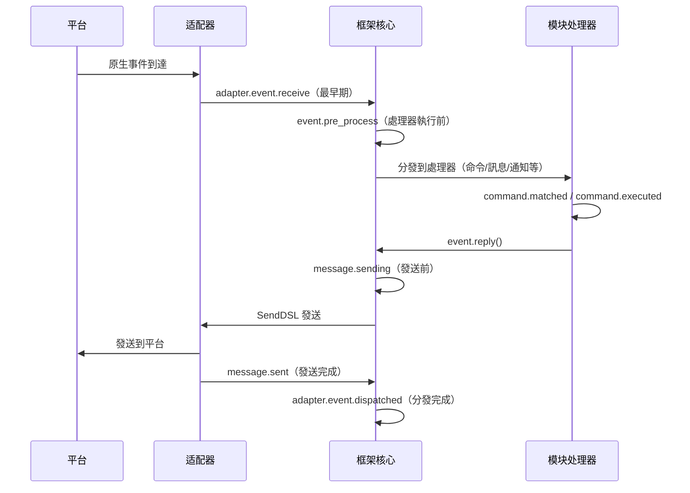

框架內建了以下鈎子斷點，使用者可以透過 `@sdk.lifecycle.on()` 監聽任意斷點來實現自訂邏輯。

### 核心初始化

| 鈎子名稱 | 觸發時機 | 數據 |
|---------|---------|------|
| `core.init.start` | SDK 初始化開始 | `{}` |
| `core.init.complete` | SDK 初始化完成 | `{"duration": float, "success": bool, "adapters": {"enabled": [str], "disabled": [str]}, "modules": {"enabled": [str], "disabled": [str]}, "error": str(僅失敗時)}` |
| `core.uninit.complete` | SDK 反初始化完成 | `{"duration": float, "success": bool, "adapters_closed": int, "modules_unloaded": int, "module_properties_cleared": int, "module_properties_to_clear": [str], "error": str(僅失敗時)}` |

### 配置變更

| 鈎子名稱 | 觸發時機 | 數據 |
|---------|---------|------|
| `config.set` | 配置項被修改 | `{"key": str, "old_value": Any, "new_value": Any}` |
| `config.updated` | 外部編輯 config.toml 後檢測到整樹變更 | `{"old_config": dict, "new_config": dict, "config_file": str}` |

**範例：配置審計**

```python
@sdk.lifecycle.on("config.set")
def audit_config(data):
    print(f"[審計] {data['key']}: {data['old_value']} -> {data['new_value']}")
```

### 模組生命週期

| 鈎子名稱 | 觸發時機 | 數據 |
|---------|---------|------|
| `module.register` | 模組類註冊到管理器 | `{"module_name": str, "success": bool}` |
| `module.load` | 模組載入完成（實例化成功） | `{"module_name": str, "success": bool}` |
| `module.init` | 模組初始化完成（含懶載入） | `{"module_name": str, "success": bool}` |
| `module.unload` | 模組卸載 | `{"module_name": str, "success": bool}` |

### 适配器生命週期

| 鈎子名稱 | 觸發時機 | 數據 |
|---------|---------|------|
| `adapter.load` | 适配器註冊完成 | `{"platform": str, "success": bool}` |
| `adapter.start` | 适配器啟動 | `{"platforms": [str]}` |
| `adapter.status.change` | 适配器狀態變更 | `{"platform": str, "status": str, "retry_count": int, "error": str(僅失敗時)}` |
| `adapter.stop` | 适配器關閉 | `{"platforms": [str]}` |
| `adapter.stopped` | 适配器關閉完成 | `{"platforms": [str]}` |
| `adapter.bot.online` | Bot 上線 | `{"platform": str, "bot_id": str, "info": dict, "status": str}` |
| `adapter.bot.offline` | Bot 下線 | `{"platform": str, "bot_id": str, "status": str}` |

### 事件接收與處理

| 鈎子名稱 | 觸發時機 | 數據 |
|---------|---------|------|
| `adapter.event.receive` | 收到外部平台事件（最早期） | `{"platform": str, "event_type": str, "raw_event_type": str}` |
| `adapter.event.dispatched` | 事件分發完成 | `{"platform": str, "event_type": str, "raw_event_type": str, "onebot_handlers_count": int}` |
| `event.pre_process` | 事件處理器開始執行前 | `{"event_type": str, "platform": str, "detail_type": str}` |

**範例：事件統計**

```python
event_counter = {}

@sdk.lifecycle.on("adapter.event.receive")
def count_events(data):
    platform = data["platform"]
    event_counter[platform] = event_counter.get(platform, 0) + 1

@sdk.lifecycle.on("adapter.event.dispatched")
def log_unhandled(data):
    if data["onebot_handlers_count"] == 0:
        print(f"[未處理] {data['platform']}/{data['event_type']}")
```

### 消息發送

| 鈎子名稱 | 觸發時機 | 數據 |
|---------|---------|------|
| `message.sending` | 消息即將發送 | `{"platform": str, "method": str, "detail_type": str, "target_id": str, "bot_id": str}` |
| `message.sent` | 消息發送完成 | `{"platform": str, "method": str, "detail_type": str, "target_id": str, "bot_id": str}` |

**範例：消息發送審計**

```python
@sdk.lifecycle.on("message.sending")
def log_sending(data):
    print(f"[發送] -> {data['platform']}/{data['detail_type']}/{data['target_id']} via {data['method']}")
```

### 命令系統

| 鈎子名稱 | 觸發時機 | 數據 |
|---------|---------|------|
| `command.matched` | 命令被匹配並即將執行 | `{"command": str, "args": list[str], "platform": str, "user_id": str}` |
| `command.executed` | 命令執行完成 | `{"command": str, "args": list[str], "platform": str, "user_id": str, "success": bool, "error": str(僅失敗時)}` |

**範例：命令統計**

```python
@sdk.lifecycle.on("command.matched")
def count_commands(data):
    print(f"[命令] /{data['command']} from {data['user_id']}@{data['platform']}")
```

### HTTP 路由

| 鈎子名稱 | 觸發時機 | 數據 |
|---------|---------|------|
| `server.request` | HTTP 請求接收 | `{"method": str, "path": str, "client_ip": str}` |
| `server.response` | HTTP 回應發送 | `{"method": str, "path": str, "status_code": int, "client_ip": str}` |

**範例：請求日誌**

```python
@sdk.lifecycle.on("server.response")
def log_http(data):
    print(f"[HTTP] {data['method']} {data['path']} -> {data['status_code']}")
```

### WebSocket

| 鈎子名稱 | 觸發時機 | 數據 |
|---------|---------|------|
| `server.start` | 路由伺服器啟動 | `{"base_url": str, "host": str, "port": int}` |
| `server.stop` | 路由伺服器停止 | `{}` |
| `server.websocket.connect` | WebSocket 連接建立 | `{"path": str, "module_name": str, "client_ip": str}` |
| `server.websocket.disconnect` | WebSocket 連接斷開 | `{"path": str, "module_name": str, "reason": str, "error": str(僅異常時)}` |

**範例：WebSocket 連接監控**

```python
@sdk.lifecycle.on("server.websocket.connect")
def on_ws_connect(data):
    print(f"[WS] 連接: {data['path']} from {data['client_ip']}")

@sdk.lifecycle.on("server.websocket.disconnect")
def on_ws_disconnect(data):
    print(f"[WS] 斷開: {data['path']} ({data['reason']})")

## 標準事件定義

```python
STANDARD_EVENTS = {
    "core": ["init.start", "init.complete", "uninit.complete"],
    "module": ["load", "init", "unload", "register"],
    "adapter": [
        "load", "start", "status.change", "stop", "stopped",
        "event.receive", "event.dispatched",
        "bot.online", "bot.offline",
    ],
    "server": [
        "start", "stop",
        "request", "response",
        "websocket.connect", "websocket.disconnect",
    ],
    "event": ["pre_process"],
    "message": ["sending", "sent"],
    "command": ["matched", "executed"],
    "config": ["set"],
}

## 完整 API 參考

### 註冊與取消

| 方法 | 說明 |
|------|------|
| `@lifecycle.on(event, *, priority=0)` | 裝飾器註冊處理程式 |
| `lifecycle.register(event, handler, *, priority=0)` | 程式化註冊 |
| `lifecycle.unregister(event, handler=None)` | 取消註冊（handler=None 時取消該事件全部處理程式） |

### 觸發

| 方法 | 說明 |
|------|------|
| `await lifecycle.emit(event, data=None)` | 異步觸發，處理程式返回非 None 可修改 data |
| `lifecycle.emit_sync(event, data=None)` | 同步觸發，異步處理程式以 create_task 調度 |
| `await lifecycle.submit_event(event_type, *, source, msg, data)` | 兼容舊版，自動構建標準事件格式 |

### 工具

| 方法 | 說明 |
|------|------|
| `lifecycle.start_timer(timer_id)` | 開始計時 |
| `lifecycle.get_duration(timer_id)` | 獲取已持續時間（秒） |
| `lifecycle.stop_timer(timer_id)` | 停止計時並返回持續時間 |
| `lifecycle.list_hooks()` | 列出所有已註冊鉤子及處理程式數量 |
| `lifecycle.clear()` | 清除所有處理程式和計時器 |

## 模組中使用範例

```python
from ErisPulse.Core.Bases import BaseModule
from ErisPulse import sdk

class Main(BaseModule):
    async def on_load(self, event):
        # 實現簡單的訊息統計
        self.msg_count = 0
        
        @sdk.lifecycle.on("adapter.event.receive")
        async def count(data):
            if data["event_type"] == "message":
                self.msg_count += 1
        
        # 監控所有命令
        @sdk.lifecycle.on("command.matched")
        async def log_cmd(data):
            sdk.logger.info(f"命令執行: /{data['command']} by {data['user_id']}")
        
        # 配置變更審計
        @sdk.lifecycle.on("config.set")
        def audit(data):
            sdk.logger.info(f"配置變更: {data['key']} = {data['new_value']}")
```

重要：路徑替換規則  
- 將文件連結中的 `docs/zh-TW/` 替換為 `docs/zh-TW/`  
- 例如：`docs/zh-TW/quick-start.md` 應改為 `docs/zh-TW/quick-start.md`  
- 對於指向非目前語言版本文件的連結（如 `README.xx.md` 形式的連結），保持原樣不要修改  
- 這確保連結指向正確語言的文件版本

## 後台任務歸屬與自動取消

> [!NOTE]  
> 本特性需要 ErisPulse **2.8.0+**。

模組建立的 asyncio 後台任務如果未在 `on_unload` 中取消，會持有 `self` 引用導致模組實例無法被回收（熱重載後舊實例殘留）。框架提供以下兜底機制：

- **`self.spawn(coro)`**（模組內推薦）：任務自動歸屬模組名，模組卸載時框架在 `on_unload` **之後**兜底取消未結束的任務並記錄警告
- **`spawn_background(coro)`**（`ErisPulse.runtime`）：自動捕獲當前 `owner_scope` 上下文；`cancel_owner_tasks(owner)` 按歸屬取消，`cancel_all_background_tasks()` 供 `sdk.uninit()` 兜底
- **適配器**：關閉時對平台名下的後台任務同樣兜底取消

```python
async def on_load(self, event):
    # 推薦：後台任務用 self.spawn()，卸載時框架自動兜底取消
    self.spawn(self._poll())

async def on_unload(self, event):
    # 精細控制的場景仍建議自行取消並等待收尾
    if self._poll_task:
        self._poll_task.cancel()
        await asyncio.gather(self._poll_task, return_exceptions=True)

async def _poll(self):
    while True:
        await asyncio.sleep(60)
        ...
```

> [!IMPORTANT]  
> 框架兜底是**強制 cancel**（`cancel_owner_tasks`），它發生在 `on_unload` 返回之後。因此需要優雅收尾的任務（flush 缓衝、持久化狀態、關閉連接）**必須**在 `on_unload` 裡自行 `cancel()` + `await` 完成——別指望兜底能保留收尾邏輯。框架只保證「不殘留持有 `self` 的任務」，不保證「優雅」。需要 `await` 結果的任務請直接 `await`，不要丟給後台任務。

## 注意事項

1. **處理程序可以是同步或非同步**：系統會自動識別並正確調用
2. **數據傳遞**：在 `emit()` 模式下，處理程序返回非 None 值會修改傳遞給後續處理程序的 data
3. **事件命名規範**：建議使用點式結構命名事件，便於使用父級監聽
4. **錯誤隔離**：單個處理程序異常不會影響其他處理程序執行
5. **同步觸發限制**：`emit_sync()` 中非同步處理程序以 fire-and-forget 方式調度，返回值無法回傳
6. **生命週期清理**：呼叫 `sdk.uninit()` 時，所有已註冊的處理程序和計時器會被清理
7. **加載優先性**：如需在框架初始化階段就監聽事件，建議設定高優先級並禁用懶加載

請直接返回翻譯後的完整Markdown內容，不要包含任何其他文字。

再次提醒：如果文件包含語言切換行（各語言名稱用 `` | `` 分隔的行），務必嚴格遵守上方第8條的格式要求，不要寫出 ``[**Label**](file)`` 這類錯誤格式。

## 相關文件

- [模組開發指南](../developer-guide/modules/getting-started.md) - 了解模組生命週期方法
- [最佳實踐](../developer-guide/modules/best-practices.md) - 生命週期事件使用建議


### 懶加载系统

# 慢載模組系統

ErisPulse SDK 提供了強大的慢載模組系統，允許模組在實際需要時才進行初始化，從而顯著提升應用啟動速度和記憶體效率。

請直接返回翻譯後的完整 Markdown 內容，不要包含任何其他文字。

再次提醒：如果文件包含語言切換行（各語言名稱用 `` | `` 分隔的行），請務必嚴格遵守上方第8條的格式要求，不要寫出 ``[**Label**](file)`` 這類錯誤格式。

## 概述

懶加載模組系統是 ErisPulse 的核心特性之一，它透過以下方式運作：

- **延遲初始化**：模組只有在第一次被存取時才會實際載入和初始化
- **透明使用**：對開發者來說，懶加載模組與一般模組在使用上幾乎沒有差別
- **自動依賴管理**：模組的依賴會在被使用時自動初始化
- **生命週期支援**：對於繼承自 `BaseModule` 的模組，會自動呼叫生命週期方法

請直接返回翻譯後的完整 Markdown 內容，不要包含任何其他文字。

再次提醒：如果文件包含語言切換行（各語言名稱用 `` | `` 分隔的行），務必嚴格遵守上方第8條的格式要求，不要寫出 ``[**Label**](file)`` 這類錯誤格式。

## 工作原理

### LazyModule 類

懶加載系統的核心是 `LazyModule` 類，它是一個包裝器，在第一次存取時才實際初始化模組。

### 初始化過程

當模組首次被存取時，`LazyModule` 會執行以下操作：

1. 獲取模組類的 `__init__` 參數資訊
2. 根據參數決定是否傳入 `sdk` 引用
3. 設定模組的 `moduleInfo` 屬性
4. 對於繼承自 `BaseModule` 的模組，呼叫 `on_load` 方法
5. 觸發 `module.init` 生命週期事件

## 事件驅動懶激活（activate_on）

> [!NOTE]  
> 本特性需要 ErisPulse **2.8.0+**。

`lazy_load=True` 的模組預設只在**首次屬性存取**時載入。若模組註冊了命令/事件處理器，  
傳統做法只能 `lazy_load=False` 立即載入。`activate_on` 提供了第三種選擇：**宣告觸發器，  
首個匹配事件/命令到達時自動激活模組**——既不常駐記憶體，又不遺失觸發入口。

```python
from ErisPulse.loaders import ModuleLoadStrategy

class MyModule(BaseModule):
    @staticmethod
    def get_load_strategy():
        return ModuleLoadStrategy(
            lazy_load=True,
            activate_on=[
                # ---- 事件觸發（被動到達，無需使用者感知）----
                "message",                                    # 類型級：任何訊息事件
                {"notice": "group_member_increase"},          # 類型 + 單個 detail_type
                {"message": ["private", "group"]},            # 類型 + 多個 detail_type

                # ---- 命令觸發（主動輸入，佔位命令對 Help 可見）----
                {"command": "roll"},                          # 簡寫：命令名
                {"command": ["roll", "dice"]},                # 命令名列表
                {"command": {                                 # dict 聲明（name 必填）
                    "name": "dice",
                    "help": "擲一個骰子",
                    "usage": "/dice",
                    "group": "娛樂",
                    "aliases": ["d"],
                    "hidden": False,
                }},
            ],
        )
```

### 命令 dict 聲明參數

dict 形式鏡像 `@command()` 裝飾器的使用者級參數，用於在模組載入前就註冊佔位命令：

| 參數 | 類型 | 預設 | 說明 |
|------|------|------|------|
| `name` | `str` | **必填** | 命令名；須與 `on_load` 中 `@command(name)` 一致，否則激活後佔位註銷、命令不存在 |
| `help` | `str` | 回退鏈 | Help 中顯示的介紹；未聲明時按回退鏈取值（見下） |
| `usage` | `str` | 自动生成 | 用法行，預設 `{prefix}{name}` |
| `group` | `str` | `None` | 命令分組 |
| `aliases` | `list[str]` | `[]` | 別名同時註冊，**輸入別名同樣觸發激活** |
| `hidden` | `bool` | `False` | `True` 時佔位命令同樣隱藏（與激活後真實命令的隱藏語意對齊）；知道命令名的使用者輸入仍可觸發 |

**不支援** `priority` / `permission` / `master`：佔位命令的使命只是觸發激活，  
權限檢查由激活後的真實命令執行（佔位階段攔截權限反而會讓「輸入命令激活」失效）。

### 佔位命令 help 回退鏈

模組未載入時 Help 顯示的命令介紹，按以下順序取值（取到即止）：

1. dict 聲明的命令級 `help`（最精確）  
2. 模組 `get_meta()` 的 `description`  
3. 模組 `__description__` 屬性  
4. 包元數據的 `Summary`（PyPI 包簡介）  
5. 通用提示：「此命令來自懶載入模組 X，首次使用將自動載入該模組」

### 觸發語意

- **事件 stub**：以極低優先級（`ACTIVATION_STUB_PRIORITY`）註冊到對應事件管理器，  
  在所有普通處理器之後兜底觸發；激活後將當前事件轉發給模組的真實處理器
- **命令 stub**：註冊佔位命令；激活後佔位註銷、真實命令接管當次觸發
- **防重入**：`asyncio.Lock` 保證併發觸發下只激活一次
- **作用域過濾**：stub 帶模組 owner 身份，模組未對該 Bot / 會話 / 平台啟用時不觸發
- **失敗語意**：激活失敗不重試，stub 一併註銷
- **去重**：同名命令以簡寫 + dict 混合聲明時去重（dict 优先）；dict 缺 `name`  
  或事件 `detail_type` 誤寫 dict 時告警並忽略

> 架構圖與完整語意詳見 [架構概覽](../architecture.md#事件驅動懶激活activate_on觸發架構)。

## 配置懶加載

### 全域配置

在設定檔中啟用/停用全域懶加載：

```toml
[ErisPulse.framework]
enable_lazy_loading = true  # true=啟用懶加載(預設值)，false=停用懶加載
```

### 模組層級控制

模組可以透過實作 `get_load_strategy()` 靜態方法來控制加載策略：

```python
from ErisPulse.Core.Bases import BaseModule
from ErisPulse.loaders import ModuleLoadStrategy

class MyModule(BaseModule):
    @staticmethod
    def get_load_strategy():
        """傳回模組加載策略"""
        return ModuleLoadStrategy(
            lazy_load=False,  # 傳回 False 表示立即加載
            priority=100      # 加載優先級，數值越大優先級越高
        )

## 使用 Lazy-Loaded 模組

### 基本用法

對於開發者來說，Lazy-Loaded 模組與一般模組在使用上幾乎沒有差異：

```python
# 透過 SDK 訪問 Lazy-Loaded 模組
from ErisPulse import sdk

# 以下訪問會觸發模組 Lazy-Loading
result = await sdk.my_module.my_method()
```

### 統一的模組獲取入口

無論是透過 SDK 屬性、模組管理器屬性，還是透過 `module.get()` 查詢，
對於「已註冊但尚未載入」的 Lazy-Loaded 模組，都會返回同一個 Lazy-Loaded 代理，只有在訪問其屬性時才會真正觸發初始化：

```python
# 三種方式拿到的都是 Lazy-Loaded 代理（在模組未載入時），行為一致且對使用者透明
sdk.my_module          # 觸發載入的入口
sdk.module.my_module   # 同樣返回 Lazy-Loaded 代理
sdk.module.get("my_module")  # 也返回 Lazy-Loaded 代理，本身不會觸發載入

# 訪問代理的任意屬性才會真正初始化模組
result = await sdk.my_module.my_method()
```

`module.get()` 是**查詢**介面，本身不觸發載入：
- 模組已載入 → 返回真實實例
- 模組已註冊但未載入 → 返回 Lazy-Loaded 代理（訪問屬性才初始化）
- 模組未註冊 → 返回 `None`

如需顯式觸發載入，請使用 `await sdk.load_module("my_module")`。

### 異步初始化

對於需要異步初始化的模組，建議先顯式載入：

```python
# 先顯式載入模組
await sdk.load_module("my_module")

# 然後使用模組
result = await sdk.my_module.my_method()
```

### 同步初始化

對於不需要異步初始化的模組，可以直接訪問：

```python
# 直接訪問會自動同步初始化
result = sdk.my_module.some_sync_method()

## 最佳實踐

選擇載入策略時，可參考以下決策流程：

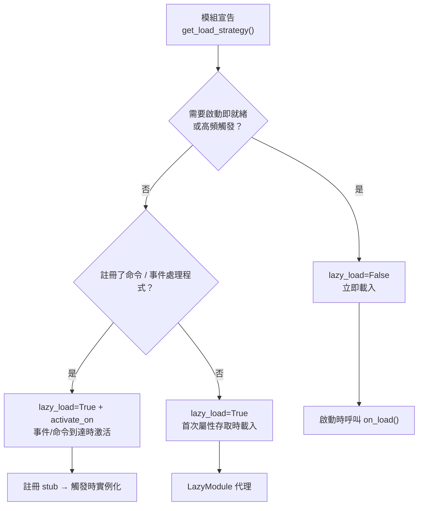

### 推薦使用懶載入的場景（lazy_load=True）

- 被動呼叫的工具類（如資料查詢模組、格式轉換器等，僅在其他模組呼叫時才需要）
- 註冊命令/事件處理程式但非高頻使用的模組——配合 `activate_on` 聲明觸發器，首個匹配事件/命令到達時自動激活，無需放棄懶載入

### 推薦禁用懶載入的場景（lazy_load=False）

- 需要在啟動時立即就緒的模組（如為其它模組提供基礎服務的核心模組）
- 高頻觸發的監聽器（每條訊息都要處理）——`activate_on` 轉發有一次激活開銷，高頻場景立即載入更直接
- 定時任務模組
- 需要在應用啟動時就初始化的模組

> `priority` 參數控制立即載入模組間的初始化順序，數值越大越先初始化。同優先級的模組按註冊順序載入。

請直接返回翻譯後的完整Markdown內容，不要包含任何其他文字。

## 注意事項

1. 如果您的模組使用了懶加載，如果其他模組從未在 ErisPulse 內被呼叫過，則您的模組永遠不會被初始化。
2. 如果您的模組中包含了例如監聽 Event 的模組，或其它主動監聽類似模組，有兩種選擇：宣告 `activate_on` 觸發器（保持懶加載，事件到達時自動激活），或宣告需要立即被加載（`lazy_load=False`），否則會影響您模組的正常業務。
3. 我們不建議您禁用懶加載，除非有特殊需求，否則它可能為您帶來例如依賴管理和生命週期事件等的問題。
4. 在 `activate_on` 的命令 dict 聲明中，`name` 必須與模組 `on_load` 中 `@command()` 註冊的真實命令名一致——否則模組激活後占位命令註銷，宣告與實現不一致的命令將不存在。

請直接返回翻譯後的完整 Markdown 內容，不要包含任何其他文字。

再次提醒：如果文件包含語言切換行（各語言名稱用 `` | `` 分隔的行），請務必嚴格遵守上方第 8 條的格式要求，不要寫出 ``[**Label**](file)`` 這類錯誤格式。

## 相關文件

- [模組開發指南](../developer-guide/modules/getting-started.md) - 學習開發模組
- [最佳實務](../developer-guide/modules/best-practices.md) - 瞭解更多最佳實務


### 国际化（i18n）系统

# 國際化 (i18n) 系統

ErisPulse v2.5.0 起內建了完整的國際化支援。框架核心及 CLI 界面均可根據您的系統語言自動切換顯示文字，也支援外部模組註冊自己的翻譯。

請直接返回翻譯後的完整 Markdown 內容，不要包含任何其他文字。

再次提醒：如果文件包含語言切換行（各語言名稱用 `` | `` 分隔的行），務必嚴格遵守上方第 8 條的格式要求，不要寫出 ``[**標籤**](file)`` 這類錯誤格式。

## 支援的語言

| 語言 | 代碼 | 說明 |
|------|------|------|
| 簡體中文 | `zh-CN` | 預設語言（框架原生語言） |
| 繁體中文 | `zh-TW` | 繁體中文（香港/澳門/臺灣） |
| English | `en` | 英文（通用回退語言） |
| 日本語 | `ja` | 日文 |
| Русский | `ru` | 俄文 |

## 快速體驗

### 透過環境變數切換

```bash
# Windows PowerShell
$env:ERISPULSE_LANG = "en"
epsdk run

# macOS / Linux
ERISPULSE_LANG=ja epsdk run
```

### 透過設定檔案切換

在 `config/config.toml` 中新增：

```toml
[ErisPulse.i18n]
language = "zh-TW"
```

設為 `"auto"`（預設值）則自動偵測系統語言。

### 在程式碼中手動切換

```python
from ErisPulse import i18n

# 手動設定語言
i18n.set_language("en")
print(i18n.get_language())  # "en"

# 重設為自動偵測
i18n.reset_language()
```

---

## 語言檢測機制

框架按照以下優先級檢測使用者語言：

1. **環境變數 `ERISPULSE_LANG`** — 最高優先級，用於測試和暫時切換
2. **Windows API** — `GetUserDefaultLocaleName`（僅 Windows，不受 Git Bash 等工具覆蓋 `LANG` 的影響）
3. **環境變數** — `LANGUAGE` > `LC_ALL` > `LC_MESSAGES` > `LANG`（Unix/macOS 標準）
4. **系統 Locale** — `locale.getlocale()` / `locale.getdefaultlocale()`
5. **兜底** — en（英文）

### 就近映射原則

當檢測到的語言不是精確匹配時，按就近原則映射到支援的語言：

- `zh-TW`, `zh-HK`, `zh-MO`, `zh-Hant` → **繁體中文**
- 其他所有 `zh-*`（如 `zh-CN`, `zh-SG`）→ **簡體中文**
- `en-US`, `en-GB`, `en-AU` 等 → **英文**
- `ja-JP` → **日文**
- `ru-RU` → **俄文**
- 其他未識別語言 → **簡體中文（兜底）**

---

請直接返回翻譯後的完整 Markdown 內容，不要包含任何其他文字。

再次提醒：如果文件包含語言切換行（各語言名稱用 `` | `` 分隔的行），務必嚴格遵守上方第 8 條的格式要求，不要寫出 ``[**Label**](file)`` 這類錯誤格式。

## 在模組中使用 i18n

您可以為自己的模組註冊翻譯文字，讓您的模組也支援多語言。

### 推薦寫法：透過 I18nClass 宣告翻譯鍵（v2.7.0+）

從 v2.7.0 起，模組/適配器可以像宣告 `ConfigClass` 一樣，透過巢狀類 `I18nClass` 宣告翻譯鍵。框架會在載入時**自動註冊**所有宣告的翻譯鍵，無需手動呼叫 `i18n.register()`。

```python
from dataclasses import dataclass, field

from ErisPulse.Core.Bases import BaseConfig, BaseI18n, BaseModule, I18nKey


class MyModule(BaseModule):
    # 設定類別（選用）
    @dataclass
    class ConfigClass(BaseConfig):
        welcome_msg: str = field(
            default="歡迎",
            metadata={
                # 這裡引用了 i18n 鍵 mymodule.welcome_msg
                "description": {"i18n": "mymodule.welcome_msg", "default": "歡迎訊息"},
            },
        )

    # 翻譯鍵集合類別（選用）
    # 宣告的鍵會被框架自動註冊，優先順序早於 ConfigClass 產生預設設定
    class I18nClass(BaseI18n):
        # 屬性名自動拼接為完整鍵路徑：<模組名>.<屬性名>
        welcome_msg: I18nKey = I18nKey(
            default="Welcome Message",   # 語言無關的兜底，不註冊到任何語言
            zh_CN="歡迎訊息",
            en="Welcome Message",
            ja="ウェルカムメッセージ",
            ru="Приветственное сообщение",
            zh_TW="歡迎訊息",
        )
        # 業務用到的其他翻譯鍵
        hello: I18nKey = I18nKey(
            default="Hello, {name}!",
            zh_CN="你好，{name}！",
            zh_TW="你好，{name}！",
            en="Hello, {name}!",
            ja="こんにちは、{name}！",
            ru="Привет, {name}!",
        )

        # 也可以顯式指定完整鍵路徑（不使用屬性名拼接）
        custom: I18nKey = I18nKey(
            key="mymodule.deep.nested.key",
            default="Default text",
            zh_CN="預設文字",
            zh_TW="預設文本",
            en="Default text",
            ja="デフォルトテキスト",
            ru="Текст по умолчанию",
        )
```

#### 為什麼推薦 I18nClass？

| 場景 | 手動 i18n.register() | I18nClass 宣告式 |
|------|-----------------------|------------------|
| 設定描述引用的 i18n 鍵 | 需手動註冊，且要趕在設定產生前 | 框架自動在設定產生前註冊 |
| 多語言翻譯宣告 | 散落在各個 on_load() 中 | 集中在類別裡，一目了然 |
| 鍵名命名一致性 | 容易拼寫錯誤 | 屬性名作為鍵名後綴，IDE 可補全 |
| 卸載時清理 | 需手動 unregister_domain() | 框架使用統一 domain 註冊 |

#### I18nClass 的鍵路徑規則

- **預設**：使用 ``<模組註冊名>.<屬性名>`` 作為完整鍵路徑
  - 範例：模組名為 ``MyModule``，屬性 ``welcome`` → 鍵路徑 ``MyModule.welcome``
- **顯式**：透過 ``I18nKey(key="...")`` 參數指定任意點分路徑
  - 適合深層巢狀的鍵名（如 ``mymodule.config.basic.token``）

#### 在適配器中使用

適配器同樣支援 `I18nClass`，使用方式完全一致：

```python
from ErisPulse.Core import BaseAdapter
from ErisPulse.Core.Bases import BaseConfig, BaseI18n, I18nKey


class MyAdapter(BaseAdapter):
    @dataclass
    class ConfigClass(BaseConfig):
        endpoint: str = field(
            default="",
            metadata={
                # 設定描述引用了 adapter.MyAdapter.endpoint 鍵
                "description": {"i18n": "MyAdapter.endpoint", "default": "API 位址"},
            },
        )

    class I18nClass(BaseI18n):
        # 集中宣告設定描述引用的鍵與其他業務鍵的多語言譯文
        endpoint: I18nKey = I18nKey(
            default="API Endpoint",
            zh_CN="API 位址",
            zh_TW="API 位址",
            en="API Endpoint",
            ja="APIアドレス",
            ru="API адрес",
        )
```

適配器的 `I18nClass` 會在 `__init__` 階段（即設定範本產生之前）自動註冊，確保設定描述引用的 i18n 鍵已可用。

### 手動註冊自訂翻譯（舊寫法）

如果不使用 `I18nClass`，也可以直接呼叫 `i18n.register()` 註冊翻譯文字。

```python
from ErisPulse import i18n

# 註冊中文翻譯
i18n.register("zh-CN", {
    "my_module.welcome": "歡迎使用我的模組！",
    "my_module.goodbye": "再見！",
    "my_module.hello": "你好，{name}！",
}, domain="my_module")

# 註冊英文翻譯
i18n.register("en", {
    "my_module.welcome": "Welcome to my module!",
    "my_module.goodbye": "Goodbye!",
    "my_module.hello": "Hello, {name}!",
}, domain="my_module")
```

### 使用翻譯

```python
from ErisPulse import i18n

# 簡單翻譯
i18n.t("my_module.welcome")  # 自動使用目前語言

# 帶格式化參數
i18n.t("my_module.hello", name="Alice")

# 指定預設值（翻譯鍵不存在時傳回）
i18n.t("my_module.unknown_key", default="預設文本")
```

### 在模組類別中使用

```python
from dataclasses import dataclass, field
from ErisPulse import i18n
from ErisPulse.Core.Bases import BaseConfig, BaseModule

@dataclass
class MyModuleConfig(BaseConfig):
    welcome_msg: str = field(
        default="歡迎",
        metadata={
            "description": {"i18n": "my_module.welcome_msg", "default": "歡迎訊息"},
            "ui": {"widget": "text", "group": "basic", "order": 1},
        },
    )

class MyModule(BaseModule):
    ConfigClass = MyModuleConfig

    async def on_load(self, event):
        # 即時讀取設定（每次存取都反映最新值）
        self.logger.info(self.cfg.welcome_msg)
        self.logger.info(i18n.t("my_module.welcome"))

    @command("hello")
    async def hello_handler(self, event):
        name = event.get_user_nickname() or "friend"
        await event.reply(i18n.t("my_module.hello", name=name))

    async def on_unload(self, event):
        pass
```

### 卸載翻譯

```python
# 卸載整個域的翻譯
i18n.unregister_domain("my_module")
```

---

請直接傳回翻譯後的完整 Markdown 內容，不要包含任何其他文字。

再次提醒：如果文件包含語言切換行（各語言名稱用 `` | `` 分隔的行），務必嚴格遵守上方第 8 條的格式要求，不要寫出 ``[**Label**](file)`` 這類錯誤格式。

## 配置欄位多語言

從 v2.5.2 起，配置 Schema 全面支援 i18n。所有用戶可見的文字欄位均可引用 i18n 鍵，WebUI 和其他消費者會自動根據當前語言解析為對應文字。

### 支援的 i18n 欄位

| 欄位 | 位置 | 說明 |
|------|------|------|
| `description` | field metadata | 欄位描述 |
| `options[].label` | `ui.options` | select 控件選項標籤 |
| `placeholder` | `ui.placeholder` | 輸入框佔位符 |
| `group_labels` | `_schema_meta` | 分組顯示名（Dashboard 區域標題） |

統一採用 `{"i18n": "key", "default": "文本"}` 格式，純字串則原樣透傳（向後相容）。

### 宣告 i18n 欄位

所有用戶可見文字欄位都支援 i18n：

```python
from dataclasses import dataclass, field
from ErisPulse.Core.Bases import BaseConfig

@dataclass
class MyAdapterConfig(BaseConfig):
    # description i18n
    token: str = field(
        default="",
        metadata={
            "description": {"i18n": "my_adapter.token", "default": "平台 Token"},
            "required": True,
            "secret": True,
            "ui": {
                "widget": "password",
                "group": "basic",
                "order": 1,
                # placeholder i18n
                "placeholder": {"i18n": "my_adapter.token.ph", "default": "請輸入 Token"},
            },
        },
    )
    # options label i18n
    mode: str = field(
        default="a",
        metadata={
            "description": {"i18n": "my_adapter.mode", "default": "運行模式"},
            "ui": {
                "widget": "select",
                "group": "basic",
                "order": 2,
                "options": [
                    {"label": {"i18n": "my_adapter.mode.a", "default": "模式A"}, "value": "a"},
                    {"label": {"i18n": "my_adapter.mode.b", "default": "模式B"}, "value": "b"},
                ],
            },
        },
    )

    # group_labels i18n（分組顯示名）
    _schema_meta = {
        "group_labels": {
            "basic": {"i18n": "my_adapter.group.basic", "default": "基本設定"},
        }
    }
```

`default` 是兜底文本——當翻譯未註冊或查找失敗時顯示。

### secret 脫敏與配置校驗

標記為 `"secret": True` 的欄位會自動獲得**脫敏保護**（2.7.0 起）：

- **範本生成脫敏**：`dataclass_to_toml_with_comments()` 生成配置範本時，secret 欄位的真實值不會寫入檔案（顯示為空佔位），避免敏感資訊落盤
- **通用脫敏工具**：`redact_secret(value)` 將非空值替換為 `***`，空值原樣返回，可用於日誌輸出等場景

```python
from ErisPulse.Core.Bases.config_schema import redact_secret

redact_secret("sk-xxxxxx")  # '***'
redact_secret("")           # ''
```

**配置校驗**（`validate_config()`）除 `required` 非空檢查外，2.7.0 起支援：

| 校驗項 | 元數據 | 示例 |
|--------|--------|------|
| 類型匹配 | 欄位宣告類型 | `int` 欄位傳入字串報錯 |
| 列舉約束 | `ui.options` 或頂層 `options` | 值必須屬於允許選項 |
| 數值範圍 | 頂層 `min` / `max` | `metadata={"min": 1, "max": 65535}` |

```python
from ErisPulse.Core.Bases.config_schema import validate_config

@dataclass
class C(BaseConfig):
    mode: str = field(default="a", metadata={"ui": {"widget": "select", "options": ["a", "b"]}})
    port: int = field(default=80, metadata={"min": 1, "max": 65535})

errors = validate_config(C(mode="x", port=70000))  # 兩條錯誤：列舉 + 範圍
```

### 註冊配置翻譯

配置欄位的 i18n 鍵和普通翻譯鍵一樣，使用 `i18n.register()` 註冊：

```python
from ErisPulse import i18n

# 註冊中文（與 default 一致，也可以不同）
i18n.register("zh-CN", {
    "my_adapter.token": "平台 Token",
}, domain="my_adapter")

# 註冊英文
i18n.register("en", {
    "my_adapter.token": "Platform Token",
}, domain="my_adapter")
```
> **推薦寫法**：使用 `I18nClass` 宣告翻譯鍵，框架會自動註冊（詳見上文「推薦寫法」章節），
> 無需手動呼叫 `i18n.register()` 或 `register_config_i18n()`。

也提供了便捷函數 `register_config_i18n()`，可自動從配置類提取鍵並註冊：

```python
from ErisPulse.Core.Bases.config_schema import register_config_i18n

# 自動提取 description.default 作為 zh-CN 翻譯
register_config_i18n(MyAdapterConfig, "zh-CN")

# 手動提供英文翻譯
register_config_i18n(MyAdapterConfig, "en", {
    "my_adapter.token": "Platform Token",
})
```

### WebUI 如何消費

`get_config_schema()` 返回的 schema 中，i18n 字典會原樣透傳。WebUI 前端可以根據當前語言呼叫 `i18n.t()` 解析。

如果需要服務端直接解析為字串（如返回給不支援 i18n 的前端），使用 `resolve_config_schema()`，它會將 `description`、`options[].label`、`placeholder`、`group_labels` 全部解析為當前語言的文字：

```python
from ErisPulse.Core.Bases.config_schema import resolve_config_schema

# 所有 i18n 欄位已解析為當前語言的字串
schema = resolve_config_schema(MyAdapterConfig)
print(schema["fields"]["token"]["description"])    # "平台 Token" 或 "Platform Token"
print(schema["fields"]["token"]["placeholder"])   # "請輸入 Token" 或 "Enter Token"
print(schema["fields"]["mode"]["options"][0]["label"])  # "模式A" 或 "Mode A"
print(schema["group_labels"]["basic"])             # "基本設定" 或 "Basic"
```

> `BaseConfig`、`BotAccountConfig`、`register_config_i18n()`、`resolve_config_schema()`
> 等類型與工具函數的實際定義位於 `ErisPulse.Core.Bases.config_schema`。
> `ErisPulse.runtime.config_schema` 保留為相容性 shim，
> **推薦從 `ErisPulse.Core.Bases` 統一匯入**（i18n 翻譯鍵相關類型除外，
> 它們位於 `ErisPulse.Core.Bases.i18n_schema`）。

請直接返回翻譯後的完整 Markdown 內容，不要包含任何其他文字。

## API 參考

### I18nManager

#### 核心方法

| 方法 | 說明 |
|------|------|
| `t(key, default=None, **kwargs)` | 取得翻譯文字（`gettext()` 是別名） |
| `set_language(lang)` | 手動設定語言 |
| `get_language()` | 取得目前語言 |
| `reset_language()` | 重設為自動偵測（並重新偵測環境） |
| `get_supported_languages()` | 取得所有支援的語言列表 |
| `has_translation(key, lang=None)` | 檢查翻譯鍵是否存在 |
| `register(lang, translations, domain)` | 註冊自訂翻譯 |
| `unregister_domain(domain)` | 解除安裝指定網域的所有翻譯 |
| `reload()` | 重新載入內建翻譯並重新偵測語言 |

#### `t()` 方法詳解

```python
def t(self, key, /, default=None, **kwargs):
```

- `key` — 翻譯鍵（僅位置參數，不與 `**kwargs` 中的 `key=` 衝突）
- `default` — 翻譯不存在時返回的預設值，預設為 `None`（返回鍵名本身）
- `**kwargs` — 格式化參數，用於填入翻譯值中的 `{placeholder}`

範例：

```python
# 翻譯定義: "greeting": "你好，{name}！歡迎來到{place}。"
i18n.t("greeting", name="Alice", place="ErisPulse")
# 返回: "你好，Alice！歡迎來到ErisPulse。"
```

### BaseI18n / I18nKey（宣告式翻譯鍵）

從 v2.7.0 起，`ErisPulse.Core.Bases` 提供了基於類別屬性的翻譯鍵宣告工具（推薦從 `ErisPulse.Core.Bases` 統一匯入）：

> ``I18nKey.default`` 是**語言無關的兜底文字**，不會註冊到任何語言。
> 要讓翻譯生效，必須顯式傳入至少一個語言參數（``zh_CN=`` / ``en=`` / ``ja=`` 等）。
> 這樣各國開發者可以自由使用自己母語填寫 ``default``，框架不做任何假設。

| 名稱 | 說明 |
|------|------|
| `I18nKey(default, *, key=None, zh_CN, zh_TW, en, ja, ru)` | 單個翻譯鍵宣告，`default` 為語言無關的兜底 |
| `BaseI18n` | 翻譯鍵集合基底類別（命名對齊 `BaseConfig`），子類別以類別屬性宣告多個 `I18nKey` |
| `BaseI18n.register(prefix="", domain="app")` | 類別方法：將所有宣告的鍵註冊到 i18n系統 |
| `key` | `I18nKey` 的別名（書寫更簡潔） |

使用範例：

```python
from ErisPulse.Core.Bases import BaseI18n, key

class MyKeys(BaseI18n):
    # 簡潔別名寫法
    hello = key(
        default="Hello",
        zh_CN="你好",
        zh_TW="你好",
        en="Hello",
        ja="こんにちは",
        ru="Привет",
    )
    bye = key(
        default="Bye",
        zh_CN="再見",
        zh_TW="再見",
        en="Bye",
        ja="さようなら",
        ru="До свидания",
    )

# 獨立使用（手動註冊）
MyKeys.register(prefix="myapp.", domain="myapp")
```

### 從 SDK 實例存取

```python
from ErisPulse import sdk

# sdk.i18n 與直接匯入的 i18n 是同一個物件
sdk.i18n.set_language("en")
print(sdk.i18n.t("core.sdk.init.starting"))
```

---

## 執行階段設定

### 使用設定 API 讀取 i18n 設定

```python
from ErisPulse.Core.Bases import I18nConfig
from ErisPulse.runtime import get_i18n_config

config = get_i18n_config()
print(config["language"])  # "auto" 或具體語言代碼

# I18nConfig 是 dataclass，可用於生成設定範本
schema = I18nConfig.__dataclass_fields__
```

### 設定項目說明

在 `config/config.toml` 的 `[ErisPulse.i18n]` 部分：

```toml
[ErisPulse.i18n]
# 顯示語言，可選值:
# - "auto"      — 自動偵測系統語言（預設）
# - "zh-CN"     — 簡體中文
# - "zh-TW"     — 繁體中文
# - "en"        — 英文
# - "ja"        — 日文
# - "ru"        — 俄文
language = "auto"
```

---

## 最佳實踐

### 翻譯鍵命名

建議使用點號分隔的命名空間格式：

```
<模組名>.<類別>.<描述>
```

例如：`my_module.command.hello_desc`、`core.adapter.start_failed`

### 多語言覆蓋

不必一次提供所有語言的翻譯，缺失的語言會自動回退到英文，如果英文也沒有則顯示鍵名本身。

### 動態內容

對於動態生成的內容（如使用者名稱、數量等），使用 `{placeholder}` 格式化：

```python
# 翻譯定義
"user_count": "目前線上使用者：{count} 人"

# 使用
i18n.t("user_count", count=len(users))
```

### 日誌訊息

如果您的模組使用了框架的 Logger，這些訊息也會自動使用目前語言：

```python
self.logger.info(i18n.t("my_module.startup"))
```

---

## 與 CLI i18n 的關係

CLI 擁有**獨立**的國際化模組（`ErisPulse.CLI.i18n`），與框架核心的國際化模組完全解耦。

- **Core i18n** — 框架核心模組使用，外部模組可註冊翻譯
- **CLI i18n** — 命令行介面內部使用，不與 Core 共享翻譯資料

這種設計確保 CLI 的翻譯變更不會影響框架核心的穩定性。


### 模块作用域系统

# 模組作用域系統

> [!NOTE]
> 本特性需要 ErisPulse **2.8.0+**。

模組作用域系統用於控制「某個 Bot 只能使用哪些模組」，實現多 Bot 場景下的模組隔離。  
預設情況下所有模組對所有 Bot 開放；僅在配置綁定後才開始過濾，**模組與適配器無需任何變動**即可適配。

{!--< tips >!--}
1. 作用域以「適配器平台 + Bot 標識 + 會話標識」為維度綁定模組
2. 支持白名單（`modules`）與黑名單（`blocked`）兩種方式
3. 被作用域禁用的模組收到訊息時靜默忽略，不回覆提示
4. 支援執行時 `sdk.scope.bind()` / `unbind()` 動態增刪，可持久化
{!--< /tips >!--}

請直接返回翻譯後的完整 Markdown 內容，不要包含任何其他文字。

再次提醒：如果文件包含語言切換行（各語言名稱用 `` | `` 分隔的行），務必嚴格遵守上方第8條的格式要求，不要寫出 ``[**Label**](file)`` 這類錯誤格式。

## 工作原理

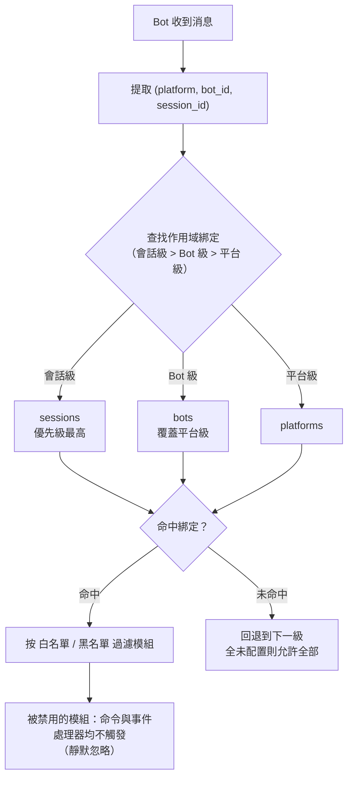

- **解析優先級：會話級 > Bot 級 > 平台級**，更高優先級未綁定規則時回退到下一級；全部未配置則允許全部模組。
- 事件數據缺少 `self`（無法識別 Bot）時，跳過 Bot 級，按會話級 / 平台級判斷。
- 框架層資源（owner 為空的處理器、命令分發器、事件總線）始終放行，不受作用域影響。

## 配置檔案

```toml
[ErisPulse.scope]
default_allow = true        # 預設允許全部（false = 隱式拒絕嚴格模式）
cache_size = 1024           # is_allowed 的 LRU 快取大小

# 平台級別綁定（作用於該平台所有 Bot / 會話）
[ErisPulse.scope.platforms.onebot11]
modules = ["Chat", "Translate"]   # 白名單：該平台 Bot 只能使用這些模組
blocked = ["Danger"]              # 黑名單：這些模組在該平台被禁用

# Bot 級別綁定（作用於該 Bot 的所有會話，覆蓋平台級別）
[ErisPulse.scope.bots.onebot11."123456"]
modules = ["Chat"]
blocked = []

# 會話級別綁定（作用於某個群組 / 頻道 / 私聊，最具體）
[ErisPulse.scope.sessions.onebot11."789012345"]
modules = ["Chat"]                # 該群組只能使用 Chat
blocked = []
```

語意（模組名稱匹配**大小寫不敏感**）：

| 配置 | 效果 |
|------|------|
| 僅 `modules`（白名單） | 只有列出的模組允許使用 |
| 僅 `blocked`（黑名單） | 列出的模組被禁用，其餘全部允許 |
| 兩者都配置 | 白名單限定範圍，白名單內的模組再剔除黑名單 |
| 兩者都為空 / 未配置 | 遵循 `default_allow`：`true`（預設）允許全部；`false` 則隱式拒絕 |

> `modules` 與 `blocked` 均支援字串或字串清單。模組名稱大小寫不敏感（`"Chat"` 與 `"chat"` 等價）。
> 會話識別為事件的群組 ID（`group_id`）、頻道 ID（`channel_id`）或私聊使用者 ID（`user_id`）。
> **會話識別跨平台隔離**：`(platform, session_id)` 組合唯一識別一個會話，`onebot11` 的 `789` 與 `telegram` 的 `789` 互不影響。

## 執行階段 API

### 判斷模組是否允許

```python
from ErisPulse import sdk

# 某個 Bot 是否允許使用某模組
allowed = sdk.scope.is_allowed("onebot11", "123456", "Chat")

# 指定會話（群組 / 頻道 / 私聊）判斷
allowed = sdk.scope.is_allowed("onebot11", "123456", "Chat", "789012345")
```

### 動態綁定 / 解綁

```python
# 綁定 Bot 級白名單（持久化到配置）
sdk.scope.bind("onebot11", "123456", modules=["Chat", "Translate"])

# 綁定會話級白名單（第三參數為 session_id）
sdk.scope.bind("onebot11", "123456", "789012345", modules=["Chat"])

# 綁定平台級黑名單
sdk.scope.bind("onebot11", blocked=["Danger"])

# 僅執行階段生效（重啟失效）
sdk.scope.bind("onebot11", "123456", modules=["Chat"], persist=False)

# 合併而非取代：把 Music 併入現有白名單（預設 bind 是取代）
sdk.scope.bind("onebot11", "123456", modules=["Music"], merge=True)

# 移除綁定（恢復允許全部）；可指定 session_id 移除會話級綁定
sdk.scope.unbind("onebot11", "123456")
sdk.scope.unbind("onebot11", "123456", "789012345")
```

> `bind()` 預設**取代**該目標的整個綁定；`merge=True` 時將新模組/停用併入現有綁定。

### 查詢綁定

```python
# 取得生效綁定（可指定會話）
sdk.scope.get("onebot11", "123456")              # {"modules": ["Chat"], "blocked": []}
sdk.scope.get("onebot11", "123456", "789012345") # 會話級生效綁定
sdk.scope.get("onebot11")                        # 平台級綁定，無則 None

# 列出全部綁定（platforms / bots / sessions 三桶）
sdk.scope.list_bindings()
```

### 過濾統計（偵錯）

```python
# 查看被作用域靜默過濾的次數與快取命中情況
sdk.scope.get_stats()
# {"is_allowed_calls": 10, "filtered_count": 3, "cache_hits": 5, "cache_misses": 5}

sdk.scope.reset_stats()
```

### 拓撲樹資料

```python
# 作用域部分（供 Dashboard 展示）
sdk.scope.get_topology()

## 常見問題與注意事項

### 1. 配置層級

解析優先級：**會話級 > Bot 級 > 平台級**。高優先級綁定會**整體覆蓋**低優先級。

```toml
# 平台級只允許 Chat
[ErisPulse.scope.platforms.onebot11]
modules = ["Chat"]

# 但 Bot 級只允許 Music → 該 Bot 最終只能用 Music，不能用 Chat！
[ErisPulse.scope.bots.onebot11."123456"]
modules = ["Music"]
```

- 想「平台級允許 Chat，Bot 級再加 Music」，必須在 **Bot 級同時列出兩者**：`modules = ["Chat", "Music"]`。
- 同理，底層黑名單會被上層白名單覆蓋：平台級 `blocked=["Danger"]` + Bot 級 `modules=["Danger"]` → Bot 級整體覆蓋，Danger 可用。層級越高、越具體，越以它為準。

### 2. 它是「逐事件」判斷，不會「粘住」

作用域判斷**只針對當前這一條事件**，不跨事件記憶：
- 會話 g1 禁用了模組 A → 在 g1 的**這條**訊息 A 不觸發；**下一條**訊息獨立重新判斷，若綁定沒變仍不觸發，綁定改了立即生效（LRU 快取會自動失效）。
- 會話 g2 沒配綁定 → 回退到 Bot 級 / 平台級判斷；都沒有則按 `default_allow`。

### 3. 模組沒反應

當你發了訊息模組卻沒反應，先懷疑作用域而不是模組/適配器：

```python
# 在模組代碼或臨時腳本裡加一行定位
from ErisPulse import sdk
print(sdk.scope.is_allowed(event.get_platform(), <bot_id>, "MyModule", <session_id>))
print(sdk.scope.get_stats())          # filtered_count > 0 說明確實被過濾了
```

被過濾是**靜默**的（不回覆，避免暴露作用域規則給用戶），但 `filtered_count` 會累計。

### 4. 會話識別碼跨平台隔離

`(platform, session_id)` 組合才是唯一識別碼。`[ErisPulse.scope.sessions.onebot11."789"]` 只作用於 onebot11 平台，不影響 telegram 上同為 `789` 的會話。

### 5. 效能

`is_allowed()` 結果帶 **LRU 快取**（預設 1024 條，`scope.cache_size` 可調），
配置變更 / `bind()` / `unbind()` 自動失效，高頻事件路徑開銷極小。

## 拓撲樹 API

`ModuleManager.get_topology()` 與 `AdapterManager.get_topology()` 提供模組/適配器歸屬關係資料，
`sdk.get_topology()` 一鍵聚合三者：

```python
from ErisPulse import sdk

topology = sdk.get_topology()
# {
#   "modules": {                                   # 模組 → 擁有的資源
#     "Chat": {
#       "loaded": True, "enabled": True,
#       "load_strategy": {"lazy": False, "priority": 50},
#       "info": {...},
#       "commands": ["chat", "translate"],
#       "handlers": {"message": 2, "notice": 1},
#       "routes": {"http": ["/Chat/api"], "ws": [], "sse": []},
#       "lifecycle_hooks": 3,
#       "scope_applies": True,
#     }
#   },
#   "adapters": {                                  # 適配器 → Bot → 作用域
#     "onebot11": {
#       "status": "started", "enabled": True,
#       "bots": {"123456": {"status": "online", "last_active": ..., "info": {...}, "scope": {...}}},
#       "scope": {"modules": [...], "blocked": [...]},
#     }
#   },
#   "scope": {"platforms": {...}, "bots": {...}, "sessions": {...}}   # 全部作用域綁定
# }

- 模組拓撲聚合了該模組註冊的命令、事件處理器、HTTP/WS/SSE 路由與生命週期鉤子，便於繪製模組資源樹。
- 適配器拓撲聚合了各適配器狀態、下屬 Bot 狀態及平台級/Bot 級作用域綁定。


### 启动流程与手动控制

# 啟動流程與手動控制

ErisPulse 的 `await sdk.run()` / `await sdk.init()` 將一整條啟動鏈路封裝成了一行程式碼。但當你需要完全自訂啟動流程（例如部分載入、動態註冊、熱插拔、注入自訂載入策略）時，就需要了解這條鏈路內部到底發生了什麼，以及如何手動驅動每一步。

本文將啟動鏈路拆解成獨立的環節，說明各自的職責、呼叫順序，並給出手動完整啟動的範例。

> 本文假設你已經跑過 [第一個機器人](../getting-started/first-bot.md)，了解 `sdk.run(keep_running=True/False)` 兩種模式。本文聚焦於 `init()` **內部**的鏈路拆解，以及 `init()`/`init_task()`/`init_sync()` 等更底層的入口。

## 啟動流程概覽

ErisPulse 的啟動流程可以分為以下幾個階段：

1. **初始化 SDK**：設定核心配置、載入基本模組。
2. **載入插件**：根據配置動態註冊並載入插件。
3. **建立機器人**：初始化機器人實例，設定事件監聽。
4. **啟動服務**：啟動網路服務、資料庫連接等。
5. **執行主迴圈**：進入主迴圈，處理事件與任務。

以下是各階段的詳細說明與手動驅動範例。

## 手動啟動流程範例

以下是手動驅動完整啟動流程的範例程式碼：

```python
import erispulse as sdk

# 1. 初始化 SDK
await sdk.init(
    config_path="config.yaml",
    plugins=["plugin1", "plugin2"],
    keep_running=True
)

# 2. 建立機器人實例
bot = sdk.Bot(
    token="your-bot-token",
    event_handlers={
        "message": handle_message,
        "command": handle_command,
    }
)

# 3. 啟動網路服務
await sdk.start_server()

# 4. 啟動主迴圈
await sdk.run_bot(bot)
```

## 各階段詳細說明

### 1. 初始化 SDK

初始化 SDK 是啟動流程的第一步，主要負責設定核心配置、載入基本模組。

```python
await sdk.init(
    config_path="config.yaml",  # 配置檔案路徑
    plugins=["plugin1", "plugin2"],  # 插件列表
    keep_running=True  # 是否保持運行
)
```

### 2. 載入插件

載入插件是根據配置動態註冊並載入插件的過程。

```python
# 動態註冊插件
await sdk.register_plugin("plugin1")
await sdk.register_plugin("plugin2")
```

### 3. 建立機器人

建立機器人實例是初始化機器人實例，設定事件監聽的過程。

```python
bot = sdk.Bot(
    token="your-bot-token",  # 機器人令牌
    event_handlers={
        "message": handle_message,  # 訊息事件處理函數
        "command": handle_command,  # 指令事件處理函數
    }
)
```

### 4. 啟動服務

啟動服務是啟動網路服務、資料庫連接等的過程。

```python
await sdk.start_server()  # 啟動網路服務
await sdk.start_database()  # 啟動資料庫連接
```

### 5. 執行主迴圈

執行主迴圈是進入主迴圈，處理事件與任務的過程。

```python
await sdk.run_bot(bot)  # 執行主迴圈
```

## 結語

透過了解啟動流程的各個環節，你可以更靈活地控制 ErisPulse 的啟動過程，實現更複雜的自訂需求。手動驅動啟動流程不僅提供了更多的控制權，也讓你在開發過程中更容易進行調試與測試。

## SDK 頂層入口概覽

除了 `run()` 的兩種 `keep_running` 模式，SDK 還提供了幾個更底層的初始化入口，其差異在於**異步性、返回值，以及是否包裝異常**：

| 入口 | 異步性 | 返回值 | 異常處理 | 適用場景 |
|------|--------|--------|----------|----------|
| `await sdk.run(True)` | async，阻塞維持 | `None`（關閉時自動 `uninit`） | 模組/適配器錯誤被擋住，不拖垮進程 | 純 bot 應用 |
| `await sdk.run(False)` | async，不阻塞 | `None`（不自動卸載） | 同上 | 初始化後執行自定義邏輯 |
| `await sdk.init()` | async，需 await | `bool` | 內部捕獲組件異常，失敗返回 `False` | 手動控制生命週期（配 `uninit()`） |
| `sdk.init_task()` | async，返回 Task 不阻塞 | `asyncio.Task` | 同 `init()` | 並發執行別的初始化、或事件循環尚未運行 |
| `sdk.init_sync()` | **同步**，阻塞當前執行緒 | `bool` | 同 `init()` | 命令列腳本、無事件循環的同步入口 |

> **常見誤區**：`await sdk.init()` **不等於** `await sdk.run(keep_running=False)`。兩點不同：① `init()` 返回 `bool`（失敗時返回 `False`），`run()` 返回 `None`；② `init()` 僅做初始化、**不自動卸載**，`run()` 在事件循環結束時自動 `uninit()`。因此需要手動配對卸載或自定義生命週期時，使用 `init()` + `uninit()`。

docs/zh-TW/quick-start.md

## 啟動鏈路總覽

`sdk.init()`（準確來說是其內部的 `Initializer.init()`）會按照以下順序啟動整個框架：

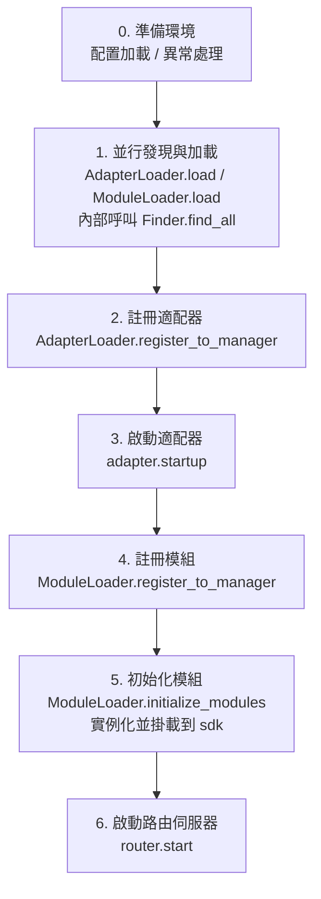

對應的核心組件：

| 層 | 組件 | 職責 |
|----|------|------|
| 發現 | `AdapterFinder` / `ModuleFinder` | 從已安裝套件的 entry-points 中**發現**適配器/模組 |
| 加載 | `AdapterLoader` / `ModuleLoader` | 發現 + 導入 + 讀取元數據 + 判斷啟用/禁用，返回物件清單 |
| 註冊 | `*Loader.register_to_manager` | 把物件登記到對應管理器 |
| 管理 | `sdk.adapter` / `sdk.module` | 維護適配器/模組實例，提供啟停介面 |
| 初始化 | `ModuleLoader.initialize_modules` | 創建模組實例並掛載到 `sdk`（處理依賴拓撲排序） |
| 路由 | `sdk.router` | HTTP / WebSocket 伺服器 |

> **重要**：`Finder` 和 `Loader` 是兩層。`Loader` 內部**已經持有**一個 `Finder`（`AdapterLoader` 自帶 `AdapterFinder`，`ModuleLoader` 自帶 `ModuleFinder`）。大多數場景你只需要用 `Loader`，只有需要「只列出不導入」時才會單獨用 `Finder`。

## 各環節詳解

### 1. 發現層：Finder

Finder 只負責「找到有哪些套件提供了適配器/模組」，不匯入、不實例化。

```python
from ErisPulse.finders import AdapterFinder, ModuleFinder

adapter_finder = AdapterFinder()
module_finder = ModuleFinder()

# 查找所有已安裝的適配器/模組 entry-points
adapter_entries = adapter_finder.find_all()    # list[EntryPoint]
module_entries = module_finder.find_all()      # list[EntryPoint]

# 按名稱查找單個
entry = module_finder.find_by_name("MyModule")  # EntryPoint | None
```

每個 `EntryPoint` 可以 `.load()` 得到對應的類，但通常不用你手動呼叫——Loader 會處理。

### 2. 加載層：Loader

Loader 在 Finder 之上做了「匯入 + 讀取元數據 + 判斷啟用/禁用」。

```python
from ErisPulse.loaders import AdapterLoader, ModuleLoader
from ErisPulse import sdk

adapter_loader = AdapterLoader()
module_loader = ModuleLoader()

# load() 內部：呼叫 finder.find_all() → 逐個處理 entry-point → 返回三元組
adapter_objs, enabled_adapters, disabled_adapters = await adapter_loader.load(sdk.adapter)
module_objs, enabled_modules, disabled_modules = await module_loader.load(sdk.module)
```

`load()` 返回的三元組：

| 返回值 | 含義 |
|--------|------|
| `objs` (`dict`) | 名稱 → 對象（適配器類 / 模組包裝物件） |
| `enabled` (`list[str]`) | 被啟用的名稱（設定中未禁用） |
| `disabled` (`list[str]`) | 被禁用的名稱 |

#### 加載失敗時的診斷資訊

當某個模組/適配器在加載或初始化階段拋出異常時，框架會跳過該元件並繼續加載其他元件，同時輸出**用戶程式碼框架摘要**，讓你在預設的 INFO 級別下即可定位出錯位置，無需手動重開 DEBUG：

```
[ERROR] [ModuleLoader] 從 entry-point 加載模組 MyModule 失敗，已跳過: 'NoneType' object has no attribute 'platform'
  → MyModule/Core.py:42 in on_load
      adapter = sdk.platform
  → AttributeError: 'NoneType' object has no attribute 'platform'
  → 提示: 將日誌級別提高到 DEBUG 可查看完整堆疊；檢查模組 MyModule 的實作程式碼
```

診斷資訊透過 `ErisPulse.runtime.diagnostics` 模組產生，會自動過濾掉框架內部框架，只保留你的程式碼框架。如需在自訂加載邏輯中重用：

```python
from ErisPulse.runtime import log_diagnostic

try:
    risky_init()
except Exception as e:
    log_diagnostic(e)  # 自動提取用戶程式碼框架並寫入 ERROR 日誌
```

該模組還提供 `extract_user_frame()`（返回結構化框架資訊）和 `format_diagnostic_block()`（返回多行文字）兩個底層函數。

### 3. 註冊層：register_to_manager

把 Loader 產出的物件登記到管理器，讓 `sdk.adapter` / `sdk.module` 能識別它們。

```python
# 註冊適配器（返回 bool，表示是否全部成功）
await adapter_loader.register_to_manager(enabled_adapters, adapter_objs, sdk.adapter)

# 註冊模組
await module_loader.register_to_manager(enabled_modules, module_objs, sdk.module)
```

註冊後，適配器已登記到適配器管理器、模組已登記到模組管理器，但**都還未啟動/實例化**。

### 4. 啟動適配器

```python
# 啟動所有已註冊的適配器
await sdk.adapter.startup()
# 或指定平台
await sdk.adapter.startup("yunhu")
await sdk.adapter.startup(["yunhu", "telegram"])
```

> 註冊 ≠ 啟動。`register_to_manager` 只是登記；`startup` 才會呼叫適配器的 `start()`，建立與平台的連接。

### 5. 初始化模組

模組比適配器多一步——需要**實例化**並掛載到 `sdk` 上（這樣你才能 `sdk.MyModule.xxx` 呼叫）。這一步還處理模組間的依賴宣告與拓撲排序。

```python
success = await module_loader.initialize_modules(
    enabled_modules, module_objs, sdk.module, sdk
)
```

實例化成功後，模組會出現在 `sdk.<ModuleName>` 上。

### 6. 啟動路由伺服器

```python
await sdk.router.start(
    host="0.0.0.0",
    port=8000,
    ssl_certfile=None,
    ssl_keyfile=None,
)
```

路由伺服器負責接收適配器的 Webhook / WebSocket 回呼。不啟動它，server 模式的適配器無法接收訊息。

## 完整手動啟動示例

下面這段程式碼**等價於** `await sdk.init()` 的核心流程，但每一步都暴露在你手上，可以在任意環節插入自定義邏輯：

```python
import asyncio
from ErisPulse import sdk
from ErisPulse.loaders import AdapterLoader, ModuleLoader

async def manual_startup():
    # 0. 準備環境（載入設定、註冊全域例外處理）
    #    _prepare_environment 是 init() 內部的前置步驟；手動流程也需先呼叫，
    #    否則 Loader 讀不到設定，會把所有適配器/模組誤判為停用。
    if not await sdk._prepare_environment():
        print("環境準備失敗")
        return False

    # 1. 建立載入器（內部各自持有 Finder）
    adapter_loader = AdapterLoader()
    module_loader = ModuleLoader()

    # 2. 並行發現與載入（與 init() 內部一致用 gather）
    (adapter_objs, enabled_adapters, disabled_adapters), \
    (module_objs, enabled_modules, disabled_modules) = await asyncio.gather(
        adapter_loader.load(sdk.adapter),
        module_loader.load(sdk.module),
    )

    # 3. 註冊適配器
    await adapter_loader.register_to_manager(
        enabled_adapters, adapter_objs, sdk.adapter
    )

    # 4. 啟動適配器
    if enabled_adapters:
        await sdk.adapter.startup()

    # 5. 註冊模組
    await module_loader.register_to_manager(
        enabled_modules, module_objs, sdk.module
    )

    # 6. 初始化模組（實例化 + 掛載到 sdk）
    if enabled_modules:
        await module_loader.initialize_modules(
            enabled_modules, module_objs, sdk.module, sdk
        )

    # 7. 啟動路由伺服器
    await sdk.router.start(host="0.0.0.0", port=8000)

    print("手動啟動完成")
    return True

async def main():
    ok = await manual_startup()
    if ok:
        # 阻塞維持運行（手動流程不會自動阻塞）
        await asyncio.Event().wait()

if __name__ == "__main__":
    asyncio.run(main())
```

### 何時該手動啟動？

大多數情況下**不需要**手動啟動，`await sdk.run()` 已經把上面這些都做好了。手動啟動僅在這些場景才有價值：

- **部分載入**：只載入指定的適配器/模組，跳過其他
- **動態註冊**：執行時根據條件註冊新的適配器/模組
- **自訂順序**：需要打亂預設的載入順序（例如先啟動某模組再啟動適配器）
- **注入策略**：對 Loader 注入自訂的嚴格模式管理器、載入策略等
- **除錯/診斷**：在某個環節失敗時，手動驅動以定位問題

[**English**](docs/zh-TW/quick-start.md) | [**简体中文**](docs/zh-TW/quick-start.md)

## 運行時細粒度控制

即使用了 `sdk.run()` 完成啟動，你仍然可以在運行時單獨控制各子系統，而不必重新啟動整個 SDK：

### 适配器熱啟停

```python
# 熱重啟某個适配器（修復連接，不影響其他平台）
await sdk.adapter.shutdown("yunhu")
await sdk.adapter.startup("yunhu")

# 運行中拉起一個新平台
await sdk.adapter.startup("telegram")

# 臨時下線某平台
await sdk.adapter.shutdown("telegram")
```

> `adapter.startup()` 要求适配器**已被註冊**到管理器。註冊發生在 `init()`/`run()` 內部，所以這是啟動**之後**的細粒度控制。

### 路由伺服器

```python
# 臨時下線 webhook 伺服器
await sdk.router.stop()

# 重新啟動（例如換了端口）
await sdk.router.start(host="0.0.0.0", port=9000)
```

### 模組按需加載

```python
# 手動加載一個（可能是懶加載的）模組
await sdk.load_module("MyModule")

## 優雅關閉

從 2.7.0 版本起，`sdk.shutdown()` 提供**程式化的優雅關閉**：設定關閉事件，讓正在 `await sdk.run(keep_running=True)` 中掛起的主迴圈返回，進而觸發 `uninit()` 完成資源清理。

```python
# 在任何協程中呼叫，觸發優雅退出（run() 挂起返回並自動 uninit）
sdk.shutdown()
```

典型用途：

```python
async def shutdown_after_idle():
    await asyncio.sleep(3600)
    sdk.shutdown()  # 空閒 1 小時後優雅退出
```

**信號處理**：`run()` 內部會註冊 `SIGTERM` / `SIGHUP` 處理器，將系統信號轉為優雅關閉——容器編排（Docker `docker stop`）或 `systemd` 停止服務時，進程會走完 `uninit()` 清理而非被強殺。

- Windows 不支援 `loop.add_signal_handler`，信號處理器會自動跳過（仍可用 `sdk.shutdown()` 或 Ctrl+C 觸發關閉）
- 反覆呼叫 `sdk.shutdown()` 是安全的（事件已設定後再次呼叫為無操作）

[**English**](docs/zh-TW/quick-start.md) | [**简体中文**](docs/zh-TW/quick-start.md)

## 卸載流程

啟動的反向操作是 `await sdk.uninit()`，它按相反順序清理：

1. 關閉所有適配器（`adapter.shutdown()`）
2. 卸載所有模組
3. 清理所有事件處理程式
4. 清理管理器與 SDK 上的模組屬性

手動啟動場景下，記得在退出前呼叫 `uninit()` 以確保優雅關閉：

```python
try:
    await asyncio.Event().wait()   # 維持運行
finally:
    await sdk.uninit()

## 重新啟動

SDK 提供兩種重新啟動方式，都不需要你自己先卸載——框架會自行處理：

| 方式 | 調用 | 行為 | 適用場景 |
|------|------|------|----------|
| 熱重新啟動 | `await sdk.restart()` | 同一進程內 `uninit()` 後重新 `init()`，重新載入適配器/模組 | 重新載入配置、熱更新模組 |
| 硬重新啟動 | `await sdk.hard_restart()` | `uninit()` 後退出整個進程，由父進程（`epsdk run`）拉起全新進程 | 懷疑有記憶體/資源洩漏、需要徹底乾淨重新啟動 |

```python
# 熱重新啟動：同進程內重新載入（最常用）
await sdk.restart()

# 硬重新啟動：退出進程，需透過 epsdk run 啟動才生效
await sdk.hard_restart()
```

> **兩點注意**：
> 1. 這兩個方法都用背景任務執行重新啟動，**立即返回 `True` 表示「重新啟動任務已排程」**，而非「重新啟動已完成」。實際重新啟動在背景進行，避免中斷當前事件鏈路。
> 2. `hard_restart()` **必須透過 `epsdk run main.py` 啟動才能生效**。它的原理是：卸載後以**退出碼 42** 退出進程，`epsdk run` 的父進程檢測到 42 才會重新拉起一個全新進程；如果是直接 `python main.py` 啟動，進程以碼 42 退出後就直接結束了，不會自動重新啟動。

### 什麼時候該用硬重新啟動？

硬重新啟動不只是「更徹底的重新啟動」，它在以下場景比熱重新啟動更合適、甚至更高效：

- **二進制庫（C 擴展）副作用**：熱重新啟動在同一進程內進行，無法釋放 C 擴展、打開的檔案描述符、執行緒等進程級資源；硬重新啟動換一個全新進程，這些副作用隨之徹底清零。
- **資源洩漏排查**：懷疑存在記憶體或句柄洩漏時，硬重新啟動能拿到一個乾淨的環境。
- **對效能敏感的頻繁重新啟動**：硬重新啟動省去了同進程內卸載→重新載入的開銷，實際比熱重新啟動更高效。

> Dashboard 管理介面中的「框架重新啟動」功能，底層呼叫的就是 `hard_restart()`。
> 另外就是硬重新啟動一個要求！必須使用 epsdk 的 run 命令進行啟動，否則程式只是會拋出 42 退出碼進行退出，因為 run 命令的拉起檢查了 42 退出碼進行重新拉起進程，這點必須要注意！！！

## 相關文件

- [建立第一個機器人](../getting-started/first-bot.md) - `keep_running` 兩種基本模式入門
- [生命週期管理](lifecycle.md) - 監聽 `core.init.start` / `core.init.complete` 等啟動事件
- [懶加載系統](lazy-loading.md) - 模組懶加載機制與 `load_module`

請直接返回翻譯後的完整Markdown內容，不要包含任何其他文字。


====
技术标准
====


### 会话类型标准

# ErisPulse 會話類型標準

本文檔定義了 ErisPulse 支援的會話類型標準，包括接收事件類型和發送目標類型。

請直接返回翻譯後的完整 Markdown 內容，不要包含任何其他文字。

再次提醒：如果文件包含語言切換行（各語言名稱用 ` | ` 分隔的行），請務必嚴格遵守上方第 8 條的格式要求，不要寫出 `[**Label**](file)` 這類錯誤格式。

## 1. 核心概念

### 1.1 接收類型 && 發送類型

ErisPulse 區分兩種會話類型：

- **接收類型（Receive Type）**：用於接收的事件的 `detail_type` 欄位
- **發送類型（Send Type）**：用於發送訊息時 `Send.To()` 方法的目標類型

### 1.2 類型映射關係

```
接收類型 (detail_type)     發送類型 (Send.To)
─────────────────        ────────────────
private                 →        user
group                   →        group
channel                 →        channel
guild                   →        guild
thread                  →        thread
user                    →        user
```

**關鍵點**：
- `private` 是接收時的類型，發送時必須使用 `user`
- `group`、`channel`、`guild`、`thread` 在接收和發送時類型相同
- 系統會自動進行類型轉換，無需手動處理(代表著你可以直接使用獲得的接收類型進行發送)，但實際上，你無需考慮這些，Event的包裝類的存在，你可以直接使用event.reply()方法，而無需考慮類型轉換

7. **重要：路徑替換規則**
   - 將文件連結中的 `docs/zh-TW/` 替換為 `docs/zh-TW/`
   - 例如：`docs/zh-TW/quick-start.md` 應改為 `docs/zh-TW/quick-start.md`
   - 對於指向非當前語言版本文件的連結（如 `README.xx.md` 形式的連結），保持原樣不要修改
   - 這確保了連結指向正確語言的文件版本

## 2. 標準會話類型

### 2.1 OneBot12 標準類型

#### private
- **接收類型**：`private`
- **發送類型**：`user`
- **說明**：一對一私聊訊息
- **ID 欄位**：`user_id`
- **適用平台**：所有支援私聊的平台

#### group
- **接收類型**：`group`
- **發送類型**：`group`
- **說明**：群聊訊息，包括各種形式的群組（例如 Telegram supergroup）
- **ID 欄位**：`group_id`
- **適用平台**：所有支援群聊的平台

#### user
- **接收類型**：`user`
- **發送類型**：`user`
- **說明**：使用者類型，某些平台（例如 Telegram）將私聊表示為 user 而非 private
- **ID 欄位**：`user_id`
- **適用平台**：Telegram 等平台

### 2.2 ErisPulse 擴展類型

#### channel
- **接收類型**：`channel`
- **發送類型**：`channel`
- **說明**：頻道訊息，支援多個使用者的廣播式訊息
- **ID 欄位**：`channel_id`
- **適用平台**：Discord, Telegram, Line 等

#### guild
- **接收類型**：`guild`
- **發送類型**：`guild`
- **說明**：伺服器/社群訊息，通常用於 Discord Guild 級別的事件
- **ID 欄位**：`guild_id`
- **適用平台**：Discord 等

#### thread
- **接收類型**：`thread`
- **發送類型**：`thread`
- **說明**：話題/子頻道訊息，用於社群中的子討論區
- **ID 欄位**：`thread_id`
- **適用平台**：Discord Threads, Telegram Topics 等

## 3. 平台類型映射

### 3.1 映射原則

適配器負責將平台的原生類型映射到 ErisPulse 標準類型：

```
平台原生類型 → ErisPulse 標準類型 → 發送類型
```

### 3.2 常見平台映射示例

#### Telegram
```
Telegram 類型          ErisPulse 接收類型    發送類型
─────────────────      ────────────────       ───────────
private                private                 user
group                  group                   group
supergroup             group                   group  # 映射到 group
channel                channel                 channel
```

#### Discord
```
Discord 類型          ErisPulse 接收類型    發送類型
─────────────────      ────────────────       ───────────
Direct Message         private                user
Text Channel           channel                channel
Guild                  guild                  guild
Thread                 thread                 thread
```

#### OneBot11
```
OneBot11 類型        ErisPulse 接收類型    發送類型
─────────────────      ────────────────       ───────────
private                private                user
group                  group                  group
discuss                group                  group  # 映射到 group

## 4. 自訂類型擴展

### 4.1 註冊自訂類型

適配器可以註冊自訂會話類型：

```python
from ErisPulse.Core.Event import register_custom_type

# 注冊自訂類型
register_custom_type(
    receive_type="my_custom_type",
    send_type="custom",
    id_field="custom_id",
    platform="MyPlatform"
)
```

### 4.2 使用自訂類型

註冊後，系統會自動處理該類型的轉換和推斷：

```python
# 自動推斷
receive_type = infer_receive_type(event, platform="MyPlatform")
# 返回: "my_custom_type"

# 轉換為發送類型
send_type = convert_to_send_type(receive_type, platform="MyPlatform")
# 返回: "custom"

# 獲取對應ID
target_id = get_target_id(event, platform="MyPlatform")
# 返回: event["custom_id"]
```

### 4.3 取消註冊自訂類型

```python
from ErisPulse.Core.Event import unregister_custom_type

unregister_custom_type("my_custom_type", platform="MyPlatform")

## 5. 自動類型推斷

當事件沒有明確的 `detail_type` 欄位時，系統會根據存在的 ID 欄位自動推斷類型：

> [!NOTE]
> **2.7.0+ 行為變更**：`detail_type` 只有在是**已知會話類型**（標準或自定義）時才直接採用。notice/request 事件的 `detail_type`（如 `group_member_increase`、`friend_increase`）是**語義子類型**而非會話類型，會轉而根據 ID 欄位推斷正確的會話類型。

### 5.1 推斷優先級

```
優先級（從高到低）：
1. group_id     → group
2. channel_id   → channel
3. guild_id     → guild
4. thread_id    → thread
5. user_id      → private
```

### 5.2 使用示例

```python
# 事件只有 group_id
event = {"group_id": "123", "user_id": "456"}
receive_type = infer_receive_type(event)
# 返回: "group"（優先使用 group_id）

# 事件只有 user_id
event = {"user_id": "123"}
receive_type = infer_receive_type(event)
# 返回: "private"

# notice 事件的 detail_type 是語義子類型，2.7.0+ 會從 ID 欄位推斷
event = {"type": "notice", "detail_type": "group_member_increase", "group_id": "123"}
receive_type = infer_receive_type(event)
# 返回: "group"（而非 "group_member_increase"）

## 6. API 使用範例

### 6.1 發送訊息

```python
from ErisPulse import adapter

# 發送給使用者
await adapter.myplatform.Send.To("user", "123").Text("Hello")

# 發送給群組
await adapter.myplatform.Send.To("group", "456").Text("Hello")

# 自動轉換 private → user（不推薦，可能會有相容性問題）
await adapter.myplatform.Send.To("private", "789").Text("Hello")
# 內部自動轉換為: Send.To("user", "789") # 直接使用user作為會話類型是更優的選擇
```

### 6.2 事件回覆

```python
from ErisPulse.Core.Event import Event

# Event.reply() 自動處理類型轉換
await event.reply("回覆內容")
# 內部自動使用正確的發送類型
```

### 6.3 命令處理

```python
from ErisPulse.Core.Event import command

@command(name="test")
async def handle_test(event):
    # 系統自動處理會話類型
    # 無需手動判斷 group_id 還是 user_id
    await event.reply("命令執行成功")

## 7. 核心 API 參考

### 7.1 類型轉換

```python
from ErisPulse.Core.Event import convert_to_send_type, convert_to_receive_type

# 接收類型 → 發送類型
convert_to_send_type("private")  # → "user"
convert_to_send_type("group")    # → "group"

# 發送類型 → 接收類型
convert_to_receive_type("user")   # → "private"
convert_to_receive_type("group")  # → "group"
```

### 7.2 ID 欄位查詢

```python
from ErisPulse.Core.Event import get_id_field, get_receive_type

get_id_field("group")    # → "group_id"
get_id_field("private")  # → "user_id"

get_receive_type("group_id")  # → "group"
get_receive_type("user_id")   # → "private"
```

### 7.3 一步獲取發送資訊

```python
from ErisPulse.Core.Event import get_send_type_and_target_id

event = {"detail_type": "private", "user_id": "123"}
send_type, target_id = get_send_type_and_target_id(event)
# send_type = "user", target_id = "123"

# 直接用於 Send.To()
await adapter.Send.To(send_type, target_id).Text("Hello")
```

### 7.4 獲取目標 ID

```python
from ErisPulse.Core.Event import get_target_id

event = {"detail_type": "group", "group_id": "456"}
get_target_id(event)  # → "456"

## 8. 工具方法

```python
from ErisPulse.Core.Event import (
    is_standard_type,
    is_valid_send_type,
    get_standard_types,
    get_send_types,
    clear_custom_types,
)

is_standard_type("private")     # True
is_standard_type("custom_type") # False

is_valid_send_type("user")      # True
is_valid_send_type("invalid")   # False

get_standard_types()  # {"private", "group", "channel", "guild", "thread", "user"}
get_send_types()      # {"user", "group", "channel", "guild", "thread"}

clear_custom_types()                # 清除所有
clear_custom_types(platform="discord")  # 只清除指定平台的
```

請直接返回翻譯後的完整Markdown內容，不要包含任何其他文字。

再次提醒：如果文件包含語言切換行（各語言名稱用 `` | `` 分隔的行），務必嚴格遵守上方第8條的格式要求，不要寫出 ``[**Label**](file)`` 這類錯誤格式。

## 9. 最佳實踐

### 7.1 適配器開發者

1. **使用標準映射**：盡可能映射到標準類型，而非創建新類型
2. **正確轉換**：確保接收類型和發送類型的映射關係正確
3. **保留原始數據**：在 `{platform}_raw` 中保留原始事件類型
4. **文檔說明**：在適配器文檔中說明類型映射關係

### 7.2 模組開發者

1. **使用工具方法**：使用 `get_send_type_and_target_id()` 等工具方法
2. **避免硬編碼**：不要寫 `if group_id else "private"` 這樣的程式碼
3. **考慮所有類型**：程式碼要支援所有標準類型，不僅是 private/group
4. **靈活設計**：使用事件包裝器的方法，而非直接存取欄位

### 7.3 類型推斷

- **優先使用 detail_type**：如果有明確欄位，不進行推斷
- **合理使用推斷**：只在沒有明確類型時使用
- **注意優先級**：了解推斷優先級，避免意外結果

請直接返回翻譯後的完整Markdown內容，不要包含任何其他文字。

## 10. 常見問題

### Q1: 為什麼發送時 private 要轉換為 user？

A: 這是 OneBot12 標準的要求。`private` 是接收時的概念，發送時使用 `user` 更符合語義。

### Q2: 如何支援新的會話類型？

A: 透過 `register_custom_type()` 註冊自定義類型，或直接使用標準類型中的 `channel`、`guild` 等。

### Q3: 事件沒有 detail_type 怎麼辦？

A: 系統會根據存在的 ID 欄位自動推斷。優先級為：group > channel > guild > thread > user。

### Q4: 適配器如何映射 Telegram supergroup？

A: 在適配器的轉換邏輯中，將 `supergroup` 映射為標準的 `group` 類型。

### Q5: 郵箱等特殊平台如何處理？

A: 對於不通用或平台特有的類型，使用 `{platform}_raw` 和 `{platform}_raw_type` 保留原始數據，適配器自行處理。

## 11. 相關文件

- [事件轉換標準](event-conversion.md) - 完整的事件轉換規範  
- [發送方法規範](send-method-spec.md) - Send 類的方法命名和參數規範  
- [適配器開發指南](../developer-guide/adapters/) - 適配器開發完整指南


### 事件转换标准

# 适配器標準化轉換規範

## 1. 核心原則
1. 嚴格相容：所有標準欄位必須完全遵循 OneBot12 規範
2. 明確擴展：平台特有功能必須添加 {platform}_ 前綴（如 yunhu_form）
3. 資料完整：原始事件資料必須保留在 {platform}_raw 欄位中，原始事件類型必須保留在 {platform}_raw_type 欄位中
4. 時間統一：所有時間戳必須轉換為 10 位 Unix 時間戳（秒級）
5. 平台統一：platform 項命名必須與你在 ErisPulse 中註冊的名稱/別稱一致

## 2. 標準欄位要求

### 2.1 必須欄位
| 欄位 | 類型 | 說明 |
|------|------|------|
| id | string | 事件唯一識別符 |
| time | integer | Unix 時間戳（秒級） |
| type | string | 事件類型 |
| detail_type | string | 事件詳細類型（詳見[會話類型標準](session-types.md)） |
| platform | string | 平台名稱 |
| self | object | 機器人自身資訊 |
| self.platform | string | 平台名稱 |
| self.user_id | string | 機器人使用者 ID |

**detail_type 規範**：
- 必須使用 ErisPulse 標準會話類型（詳見 [會話類型標準](session-types.md)）
- 支援的類型：`private`, `group`, `user`, `channel`, `guild`, `thread`
- 适配器負責將平台原生類型映射到標準類型

### 2.2 訊息事件欄位
| 欄位 | 類型 | 說明 |
|------|------|------|
| message | array | 訊息段陣列 |
| alt_message | string | 訊息段備用文字 |
| user_id | string | 使用者 ID |
| user_nickname | string | 使用者暱稱（選填） |

### 2.3 通知事件欄位
| 欄位 | 類型 | 說明 |
|------|------|------|
| user_id | string | 使用者 ID |
| user_nickname | string | 使用者暱稱（選填） |
| operator_id | string | 操作者 ID（選填） |

### 2.4 請求事件欄位
| 欄位 | 類型 | 說明 |
|------|------|------|
| user_id | string | 使用者 ID |
| user_nickname | string | 使用者暱稱（選填） |
| comment | string | 請求附言（選填） |
| request_id | string | 請求識別符（**強烈推薦**，用於同意/拒絕請求操作） |

**`request_id` 欄位說明**：
- `request_id` 是請求事件的唯一操作識別符，用於通過 `HandleRequest` DSL 執行同意/拒絕操作
- 适配器在轉換請求事件時，應將平台原生的請求識別映射到此欄位
- 如果平台本身沒有請求 ID，适配器應生成一個唯一識別（如基於時間戳 + 使用者 ID 的雜湊）
- 當 `request_id` 缺失時，`event.approve()` / `event.reject()` 將拋出 `ValueError`

## 3. 事件格式範例

### 3.1 訊息事件
```json
{
  "id": "1234567890",
  "time": 1752241223,
  "type": "message",
  "detail_type": "group",
  "platform": "yunhu",
  "self": {
    "platform": "yunhu",
    "user_id": "bot_123"
  },
  "message": [
    {
      "type": "text",
      "data": {
        "text": "抽獎 超級大獎"
      }
    }
  ],
  "alt_message": "抽獎 超級大獎",
  "user_id": "user_456",
  "user_nickname": "YingXinche",
  "group_id": "group_789",
  "yunhu_raw": {...},
  "yunhu_raw_type": "message.receive.normal",
  "yunhu_command": {
    "name": "抽獎",
    "args": "超級大獎"
  }
}
```

### 3.2 通知事件
```json
{
  "id": "1234567891",
  "time": 1752241224,
  "type": "notice",
  "detail_type": "group_member_increase",
  "platform": "yunhu",
  "self": {
    "platform": "yunhu",
    "user_id": "bot_123"
  },
  "user_id": "user_456",
  "user_nickname": "YingXinche",
  "group_id": "group_789",
  "operator_id": "",
  "yunhu_raw": {...},
  "yunhu_raw_type": "bot.followed"
}
```

### 3.3 請求事件
```json
{
  "id": "1234567892",
  "time": 1752241225,
  "type": "request",
  "detail_type": "friend",
  "platform": "onebot11",
  "self": {
    "platform": "onebot11",
    "user_id": "bot_123"
  },
  "user_id": "user_456",
  "user_nickname": "YingXinche",
  "comment": "請加好友",
  "request_id": "req_abc123",
  "onebot11_raw": {...},
  "onebot11_raw_type": "request"
}
```

## 4. 訊息段標準

### 4.1 標準訊息段

標準訊息段類型**不添加**平台前綴：

| 類型 | 說明 | data 欄位 |
|------|------|----------|
| `text` | 純文字 | `text: str` |
| `image` | 圖片 | `file: str/bytes`, `url: str` |
| `audio` | 音訊 | `file: str/bytes`, `url: str` |
| `video` | 影片 | `file: str/bytes`, `url: str` |
| `file` | 檔案 | `file: str/bytes`, `url: str`, `filename: str` |
| `mention` | @使用者 | `user_id: str`, `user_name: str` |
| `reply` | 回覆 | `message_id: str` |
| `face` | 表情 | `id: str` |
| `location` | 位置 | `latitude: float`, `longitude: float` |

```json
{
  "type": "text",
  "data": {
    "text": "Hello World"
  }
}
```

### 4.2 平台擴展訊息段

平台特有的訊息段需要添加平台前綴：

```json
// 雲湖 - 表單
{"type": "yunhu_form", "data": {"form_id": "123456", "form_name": "報名表"}}

// Telegram - 貼紙
{"type": "telegram_sticker", "data": {"file_id": "CAACAgIAAxkBAA...", "emoji": "😂"}}
```

**擴展訊息段要求**：
1. **data 內部欄位不加前綴**：`{"type": "yunhu_form", "data": {"form_id": "..."}}` 而非 `{"type": "yunhu_form", "data": {"yunhu_form_id": "..."}}`
2. **提供降級方案**：模組可能不識別擴展訊息段，适配器應在 `alt_message` 中提供文字替代
3. **文件完備**：每個擴展訊息段必須在适配器文件中說明 `type`、`data` 結構和使用場景

## 5. 未知事件處理

對於無法識別的事件類型，應產生警告事件：
```json
{
  "id": "1234567893",
  "time": 1752241223,
  "type": "unknown",
  "platform": "yunhu",
  "yunhu_raw": {...},
  "yunhu_raw_type": "unknown",
  "warning": "Unsupported event type: special_event",
  "alt_message": "This event type is not supported by this system."
}
```

---

## 6. 擴展命名規範

### 6.1 欄位命名

**規則**：`{platform}_{field_name}`

```
平台前綴    欄位名            完整欄位名
────────    ───────          ──────────
yunhu       command           yunhu_command
telegram    sticker_file_id   telegram_sticker_file_id
onebot11    anonymous         onebot11_anonymous
email       subject           email_subject
```

**要求**：
- `platform` 必須與适配器註冊時的平台名完全一致（大小寫敏感）
- `field_name` 使用 `snake_case` 命名
- 禁止使用雙下劃線 `__` 開頭（Python 保留）
- 禁止與標準欄位同名（如 `type`、`time`、`message` 等）

### 6.2 訊息段類型命名

**規則**：`{platform}_{segment_type}`

標準訊息段類型（`text`、`image`、`audio`、`video`、`mention`、`reply` 等）**不得**添加平台前綴。只有平台特有的訊息段類型才需要添加前綴。

### 6.3 原始資料欄位命名

以下欄位名是**保留欄位**，所有适配器必須遵循：

| 保留欄位 | 類型 | 說明 |
|---------|------|------|
| `{platform}_raw` | `any` | 平台原始事件資料的完整副本 |
| `{platform}_raw_type` | `string` | 平台原始事件類型識別 |

**要求**：
- `{platform}_raw` 必須是原始資料的深拷貝，而非引用
- `{platform}_raw_type` 必須是字串，即使平台使用數字類型也要轉換為字串
- 這兩個欄位在所有事件中**必須存在**（無法獲取時為 `null` 和空字串 `""`）

### 6.4 平台特有欄位範例

```json
{
  "yunhu_command": {
    "name": "抽獎",
    "args": "超級大獎"
  },
  "yunhu_form": {
    "form_id": "123456"
  },
  "telegram_sticker": {
    "file_id": "CAACAgIAAxkBAA..."
  }
}
```

### 6.5 嵌套擴展欄位

擴展欄位可以是簡單值，也可以是嵌套物件：

```json
{
  "telegram_chat": {
    "id": 123456,
    "type": "supergroup",
    "title": "My Group"
  },
  "telegram_forward_from": {
    "user_id": "789",
    "user_name": "ForwardUser"
  }
}
```

**嵌套欄位要求**：
- 頂層鍵必須帶平台前綴
- 嵌套內部欄位**不添加**平台前綴
- 嵌套深度建議不超過 3 層

### 6.6 `self` 欄位擴展

`self` 物件的標準必選欄位（`platform`、`user_id`）見 §2.1，以下是 ErisPulse 擴展的可選欄位：

| 欄位 | 類型 | 說明 |
|------|------|------|
| `self.user_name` | `string` | 機器人暱稱 |
| `self.avatar` | `string` | 機器人頭像 URL |
| `self.account_id` | `string` | 多帳號模式下的帳號識別 |

> **Bot 狀態追蹤**：适配器通過發送 `type: "meta"` 事件告知框架 Bot 的連線狀態。支援的 `detail_type`：`connect`（上線）、`heartbeat`（心跳）、`disconnect`（離線）。系統自動從中提取 `self` 欄位的 Bot 元資訊進行狀態追蹤。此外，普通事件中的 `self` 欄位也會自動發現 Bot。詳見 [适配器系統 API - Bot 狀態管理](../api-reference/adapter-system.md)。

---

## 7. 會話類型擴展

ErisPulse 在 OneBot12 標準的 `private`、`group` 基礎上擴展了以下會話類型：

| 類型 | OneBot12 標準 | ErisPulse 擴展 | 說明 |
|------|:-----------:|:------------:|------|
| `private` | ✅ | — | 一對一私聊 |
| `group` | ✅ | — | 群聊 |
| `user` | — | ✅ | 使用者類型（Telegram 等） |
| `channel` | — | ✅ | 頻道（廣播式） |
| `guild` | — | ✅ | 伺服器/社群 |
| `thread` | — | ✅ | 話題/子頻道 |

**适配器自定義類型擴展**：

```python
from ErisPulse.Core.Event.session_type import register_custom_type

# 在适配器啟動時註冊
register_custom_type(
    receive_type="email",      # 接收事件中的 detail_type
    send_type="email",         # 發送時的目標類型
    id_field="email_id",       # 對應的 ID 欄位名
    platform="email"           # 平台識別
)
```

**自定義類型要求**：
- 必須在适配器 `start()` 時註冊，在 `shutdown()` 時註銷
- `receive_type` 不應與標準類型重名
- `id_field` 應遵循 `{目標}_id` 的命名模式

> 完整的會話類型定義和映射關係參見 [會話類型標準](session-types.md)。

---

## 8. 模組開發者指南

### 8.1 訪問擴展欄位

```python
from ErisPulse.Core.Event import message

@message()
async def handle_message(event):
    # 訪問標準欄位
    text = event.get_text()
    user_id = event.get_user_id()

    # 訪問平台擴展欄位 - 方式 1：直接 get
    yunhu_command = event.get("yunhu_command")

    # 訪問平台擴展欄位 - 方式 2：點式訪問（Event 包裝類）
    # event.yunhu_command

    # 訪問原始資料
    raw_data = event.get("yunhu_raw")
    raw_type = event.get_raw_type()

    # 判斷平台
    platform = event.get_platform()
    if platform == "yunhu":
        pass
    elif platform == "telegram":
        pass
```

### 8.2 處理擴展訊息段

```python
@message()
async def handle_message(event):
    message_segments = event.get("message", [])

    for segment in message_segments:
        seg_type = segment.get("type")
        seg_data = segment.get("data", {})

        if seg_type == "text":
            text = seg_data["text"]
        elif seg_type.startswith("yunhu_"):
            if seg_type == "yunhu_form":
                form_id = seg_data["form_id"]
        elif seg_type.startswith("telegram_"):
            if seg_type == "telegram_sticker":
                file_id = seg_data["file_id"]
```

### 8.3 最佳實踐

1. **優先使用標準欄位**：不要假設擴展欄位一定存在
2. **平台判斷**：通過 `event.get_platform()` 判斷平台，而非通過擴展欄位是否存在來推斷
3. **優雅降級**：無法處理擴展訊息段時，使用 `alt_message` 作為兜底
4. **不要硬編碼前綴**：使用 `platform` 變數動態拼接

```python
# ✅ 推薦
platform = event.get_platform()
raw_data = event.get(f"{platform}_raw")

# ❌ 不推薦
raw_data = event.get("yunhu_raw")
```

### 8.4 請求事件處理

模組開發者可以通過 `event.approve()` 和 `event.reject()` 對請求事件進行操作：

```python
from ErisPulse.Core.Event import request

# 好友請求：自動同意
@request.on_friend_request()
async def handle_friend_request(event):
    user_name = event.get_user_nickname() or event.get_user_id()
    comment = event.get_comment()
    
    # 同意請求
    result = await event.approve()
    if result.get("status") == "ok":
        print(f"已同意 {user_name} 的好友請求")
    else:
        print(f"同意好友請求失敗: {result.get('message')}")

# 群邀請：根據條件決定
@request.on_group_request()
async def handle_group_request(event):
    comment = event.get_comment()
    
    # 拒絕請求
    result = await event.reject(comment="暫不加入新群")
```

**通過适配器直接操作**（適用於非事件處理器場景）：

```python
from ErisPulse import adapter

# 通過 request_id 直接操作
await adapter.myplatform.Request("req_abc123").accept()
await adapter.myplatform.Request("req_abc123").reject()

# 指定 Bot 帳號操作
await adapter.myplatform.Request("req_abc123").Using("bot1").accept()

# 附帶備註
await adapter.myplatform.Request("req_abc123").accept(comment="歡迎")
```

---

## 9. notice / request 事件的會話類型推斷

### 9.1 問題背景

notice 事件和 request 事件的 `detail_type` 是**語義子類型**（如 `group_member_increase`、`friend_increase`），不是會話類型（如 `group`、`private`）。

```
type        detail_type                  含義            會話類型
────        ───────────                  ────            ────────
message     group                        群聊訊息         group（detail_type 即會話類型）
message     private                      私聊訊息         private（detail_type 即會話類型）
notice      group_member_increase        群成員增加       group（需從 group_id 推斷）
notice      friend_increase              好友增加         private（需從 user_id 推斷）
request     friend                       好友請求         private（需從 user_id 推斷）
request     group                        群請求           group（detail_type 即會話類型）
```

### 9.2 推斷規則

`infer_receive_type()` 的推斷順序：

1. 如果 `detail_type` 是已知會話類型（`private`/`group`/`channel`/`guild`/`thread`/`user`），直接使用
2. 如果 `detail_type` 是自定義會話類型，直接使用
3. 否則（notice/request 的語義子類型），根據 ID 欄位推斷：
   - 有 `group_id` → `"group"`
   - 有 `channel_id` → `"channel"`
   - 有 `guild_id` → `"guild"`
   - 有 `thread_id` → `"thread"`
   - 有 `user_id` → `"private"`

### 9.3 `event.reply()` 目標推斷

notice/request 事件中 `event.reply()` 的發送目標由會話類型推斷決定：

- 群通知事件（含 `group_id`）→ 回覆到**群**
- 好友通知事件（僅含 `user_id`）→ 回覆到**使用者私聊**

```python
from ErisPulse.Core.Event import notice

@notice.on_group_increase()
async def handle_welcome(event):
    group_id = event.get("group_id")    # "group_789"
    user_id = event.get("user_id")      # "user_456"

    # event.reply() 發送到群（group/group_789）
    await event.reply("歡迎入群！")

    # 如需通知管理員（私聊），顯式指定目標：
    await adapter.Send.To("user", "admin_id").Text(f"新成員 {user_id} 加入了 {group_id}")
```

### 9.4 适配器開發建議

確保 notice/request 事件中包含正確的 ID 欄位：

| detail_type | 必須包含的 ID 欄位 | 推斷的會話類型 |
|-------------|-------------------|---------------|
| `group_member_increase` | `group_id` + `user_id` | `group` |
| `group_member_decrease` | `group_id` + `user_id` | `group` |
| `friend_increase` | `user_id` | `private` |
| `friend_decrease` | `user_id` | `private` |
| `friend`（請求） | `user_id` | `private` |
| `group`（請求） | `group_id` | `group` |

---

## 10. 相關文件

- [各平台特性文件](../platform-guide/README.md) - 你可以訪問此文件來了解各個平台特性以及已知的擴展事件和訊息段等。
- [會話類型標準](session-types.md) - 會話類型定義和映射關係
- [發送方法規範](send-method-spec.md) - Send 類別的方法命名、參數規範及反向轉換要求
- [API 回應標準](api-response.md) - 适配器 API 回應格式標準
- [API 動作標準](api-action-spec.md) - OneBot12 標準 API 動作的統一介面

請直接返回翻譯後的完整 Markdown 內容，不要包含任何其他文字。


### API 响应标准

# ErisPulse 適配器標準化回傳規範

## 1. 說明
為什麼會有這個規範？

為了確保各平台發送介面回傳統一性與 OneBot12 相容性，ErisPulse 適配器在 API 回應格式上採用了 OneBot12 定義的訊息發送回傳結構標準。

但 ErisPulse 的協定有一些特殊定義：
- 1. 基礎欄位中，message_id 是必須的，但 OneBot12 標準中無此欄位
- 2. 回傳內容中需要新增 {platform_name}_raw 欄位，用於存放原始回應資料

## 2. 基礎回傳結構
所有動作回應必須包含以下基礎欄位：

| 欄位名 | 資料類型 | 必選 | 說明 |
|-------|---------|------|------|
| status | string | 是 | 執行狀態，必須是 "ok" 或 "failed" |
| retcode | int64 | 是 | 回傳碼，遵循 OneBot12 回傳碼規則 |
| data | any | 是 | 回應資料，成功時包含請求結果，失敗時為 null |
| message_id | string | 是 | 訊息 ID，用於識別訊息，沒有則為空字串 |
| message | string | 是 | 錯誤資訊，成功時為空字串 |
| {platform_name}_raw | any | 否 | 原始回應資料 |

可選欄位：
| 欄位名 | 資料類型 | 必選 | 說明 |
|-------|---------|------|------|
| echo | string | 否 | 當請求中包含 echo 欄位時，原樣回傳 |

## 3. 完整欄位規範

### 3.1 通用欄位

#### 成功回應範例
```json
{
    "status": "ok",
    "retcode": 0,
    "data": {
        "message_id": "1234",
        "time": 1632847927.599013
    },
    "message_id": "1234",
    "message": "",
    "echo": "1234",
    "telegram_raw": {...}
}
```

#### 失敗回應範例
```json
{
    "status": "failed",
    "retcode": 10003,
    "data": null,
    "message_id": "",
    "message": "缺少必要參數: user_id",
    "echo": "1234",
    "telegram_raw": {...}
}
```

### 3.2 回傳碼規範

#### 0 成功（OK）
- 0: 成功（OK）

#### 1xxxx 動作請求錯誤（Request Error）
| 錯誤碼 | 錯誤名 | 說明 |
|-------|-------|------|
| 10001 | Bad Request | 無效的動作請求 |
| 10002 | Unsupported Action | 不支援的動作請求 |
| 10003 | Bad Param | 無效的動作請求參數 |
| 10004 | Unsupported Param | 不支援的動作請求參數 |
| 10005 | Unsupported Segment | 不支援的訊息段類型 |
| 10006 | Bad Segment Data | 無效的訊息段參數 |
| 10007 | Unsupported Segment Data | 不支援的訊息段參數 |
| 10101 | Who Am I | 未指定機器人帳號 |
| 10102 | Unknown Self | 未知的機器人帳號 |

#### 2xxxx 動作處理器錯誤（Handler Error）
| 錯誤碼 | 錯誤名 | 說明 |
|-------|-------|------|
| 20001 | Bad Handler | 動作處理器實作錯誤 |
| 20002 | Internal Handler Error | 動作處理器執行時拋出異常 |

#### 3xxxx 動作執行錯誤（Execution Error）
| 錯誤碼範圍 | 錯誤類型 | 說明 |
|-----------|---------|------|
| 31xxx | Database Error | 資料庫錯誤 |
| 32xxx | Filesystem Error | 檔案系統錯誤 |
| 33xxx | Network Error | 網路錯誤 |
| 34xxx | Platform Error | 機器人平台錯誤 |
| 35xxx | Logic Error | 動作邏輯錯誤 |
| 36xxx | I Am Tired | 實作決定罷工 |

#### 保留錯誤段
- 4xxxx、5xxxx: 保留段，不應使用
- 6xxxx～9xxxx: 其他錯誤段，供實作自定義使用

## 4. 實作要求
1. 所有回應必須包含 status、retcode、data 和 message 欄位
2. 當請求中包含非空 echo 欄位時，回應必須包含相同值的 echo 欄位
3. 回傳碼必須嚴格遵循 OneBot12 規範
4. 錯誤資訊應當是人類可讀的描述

## 5. 擴充規範

ErisPulse 在 OneBot12 標準回傳結構之上做了以下擴充：

### 5.1 `message_id` 必選欄位

OneBot12 標準中 `message_id` 位於 `data` 物件內部且非強制。ErisPulse 將其提升為頂層**必選**欄位：

- 無法取得 `message_id` 時應設為空字串 `""`
- 確保 `message_id` 始終存在，模組無需進行 null 檢查

### 5.2 `{platform}_raw` 原始回應欄位

回傳值中應包含 `{platform}_raw` 欄位，存放平台原始回應資料的完整複本：

```json
{
    "status": "ok",
    "retcode": 0,
    "data": {"message_id": "1234", "time": 1632847927},
    "message_id": "1234",
    "message": "",
    "telegram_raw": {
        "ok": true,
        "result": {"message_id": 1234, "date": 1632847927, ...}
    }
}
```

**要求**：
- `{platform}_raw` 必須是原始回應的深層複製，而非引用
- `platform` 必須與適配器註冊時的平台名稱完全一致（區分大小寫）
- 原始回應中的錯誤資訊也應保留，便於除錯

### 5.3 適配器實作檢查清單

- [ ] 包含 `status`、`retcode`、`data`、`message_id`、`message` 欄位
- [ ] 回傳碼遵循 OneBot12 規範（詳見 §3.2）
- [ ] `message_id` 始終存在（無法取得時為空字串）
- [ ] `{platform}_raw` 包含平台原始回應資料

## 6. 注意事項
- 對於 3xxxx 錯誤碼，低三位可由實作自行定義
- 避免使用保留錯誤段 (4xxxx、5xxxx)
- 錯誤資訊應當簡潔明瞭，便於除錯


### 发送方法规范

# ErisPulse 發送方法規範

本文檔定義了 ErisPulse 适配器中 Send 類發送方法的命名規範、參數規範和反向轉換要求。

## 1. 標準方法命名

所有發送方法使用 **大駝峰命名法（PascalCase）**，首字母大寫。

### 1.1 標準發送方法

| 方法名 | 說明 | 參數類型 |
|-------|------|---------|
| `Text` | 發送文本消息 | `str` |
| `Image` | 發送圖片 | `bytes` \| `str` (URL/路徑) |
| `Voice` | 發送語音 | `bytes` \| `str` (URL/路徑) |
| `Video` | 發送視頻 | `bytes` \| `str` (URL/路徑) |
| `File` | 發送文件 | `bytes` \| `str` (URL/路徑) |
| `At` | @用戶/群組 | `str` (user_id) |
| `Face` | 發送表情 | `str` (emoji) |
| `Reply` | 回覆消息 | `str` (message_id) |
| `Forward` | 轉發消息 | `str` (message_id) |
| `Markdown` | 發送 Markdown 消息 | `str` |
| `HTML` | 發送 HTML 消息 | `str` |
| `Card` | 發送卡片消息 | `dict` |

### 1.2 鏈式修飾方法

| 方法名 | 說明 | 參數類型 |
|-------|------|---------|
| `At` | @用戶（可多次調用） | `str` (user_id) |
| `AtAll` | @全體成員 | 無 |
| `Reply` | 回覆消息 | `str` (message_id) |

### 1.3 協議方法

| 方法名 | 說明 | 是否必須 |
|-------|------|---------|
| `Raw_ob12` | 發送 OneBot12 格式消息段 | 必須 |

**`Raw_ob12` 是必須實現的方法**。這是適配器的核心職責之一：接收 OneBot12 標準消息段並将其轉換為平台原生 API 調用。`Raw_ob12` 是反向轉換（OneBot12 → 平台）的統一入口，確保模組可以不依賴平台特有方法，直接使用標準消息段發送消息。

**未重寫 `Raw_ob12` 時的行為**：基類預設實現會記錄 **error 級別**日誌並返回標準錯誤響應格式（`status: "failed"`, `retcode: 10002`），提示適配器開發者必須實現此方法。

### 1.4 推薦的擴展命名約定

適配器如需支援發送非 OneBot12 格式的原始數據（如平台特定 JSON、XML 等），推薦使用以下命名約定：

| 推薦方法名 | 說明 |
|-----------|------|
| `Raw_json` | 發送任意 JSON 數據 |
| `Raw_xml` | 發送任意 XML 數據 |

**注意**：這些方法**不是**基類提供的預設方法，也不強制要求實現。它們僅作為命名約定，適配器可依需求自行定義。如果適配器不支援這些格式，則無需定義。

**消息建構器（MessageBuilder）**：ErisPulse 提供了 `MessageBuilder` 工具類，用於方便地建構 OneBot12 消息段列表，配合 `Raw_ob12` 使用。詳見 [消息建構器](#11-消息建構器-messagebuilder) 章節。

## 2. 參數規範詳解

### 2.1 媒體消息參數規範

媒體消息（`Image`、`Voice`、`Video`、`File`）支援兩種參數類型：

#### 2.1.1 字符串參數（URL 或文件路徑）

**格式：** `str`

**支援類型：**
- **URL**：網路資源地址（如 `https://example.com/image.jpg`）
- **文件路徑**：本地文件路徑（如 `/path/to/file.jpg` 或 `C:\\path\\to\\file.jpg`）

**使用場景：**
- 文件已在網路上，直接發送 URL
- 文件在本地磁盤，發送文件路徑
- 希望適配器自動處理文件上傳

**推薦：** 優先使用 URL，如果 URL 不可用則使用本地文件路徑

**示例：**
```python
# 使用 URL
send.Image("https://example.com/image.jpg")

# 使用本地文件路徑
send.Image("/path/to/local/image.jpg")
send.Image("C:\\path\\to\\local\\image.jpg")
```

#### 2.1.2 二進制數據參數

**格式：** `bytes`

**使用場景：**
- 文件已在記憶體中（如從網路下載、從其他來源讀取）
- 需要處理後再發送（如圖片壓縮、格式轉換）
- 避免重複讀取文件

**注意事項：**
- 大文件上傳可能消耗較多記憶體
- 建議設定合理的文件大小限制

**示例：**
```python
# 從網路讀取後發送
import requests
image_data = requests.get("https://example.com/image.jpg").content
send.Image(image_data)

# 從文件讀取後發送
with open("/path/to/local/image.jpg", "rb") as f:
    image_data = f.read()
send.Image(image_data)
```

#### 2.1.3 參數處理優先級

當適配器接收到媒體消息參數時，應按以下順序處理：

1. **URL 參數**：直接使用 URL 發送(部分平台適配器可能存在URL下載後再上傳的操作)
2. **文件路徑**：檢測是否為本地路徑，若是則上傳文件
3. **二進制數據**：直接上傳二進制數據

**適配器實現建議：**
```python
def Image(self, image: Union[bytes, str]):
    if isinstance(image, str):
        # 判斷是 URL 還是本地路徑
        if image.startswith(("http://", "https://")):
            # URL 直接發送
            return self._send_image_by_url(image)
        else:
            # 本地路徑，讀取後上傳
            with open(image, "rb") as f:
                return self._upload_image(f.read())
    elif isinstance(image, bytes):
        # 二進制數據，直接上傳
        return self._upload_image(image)
```

### 2.2 @用戶參數規範

**方法：** `At`（修飾方法）

**參數：** `user_id` (`str`)

**要求：**
- `user_id` 應為字串類型的用戶標識符
- 不同平台的 `user_id` 格式可能不同（數字、UUID、字串等）
- 適配器負責將 `user_id` 轉換為平台特定的格式
- 注意需要把真正的發送方法調用放在最後的位置

**示例：**
```python
# 單個 @ 用戶
Send.To("group", "g123").At("123456").Text("你好")

# 多個 @ 用戶（鏈式調用）
send.To("group", "g123").At("123456").At("789012").Text("大家好")
```

### 2.3 回覆消息參數規範

**方法：** `Reply`（修飾方法）

**參數：** `message_id` (`str`)

**要求：**
- `message_id` 應為字串類型的消息標識符
- 應為之前收到的消息的 ID
- 某些平台可能不支援回覆功能，適配器應優雅降級

**示例：**
```python
send.To("group", "g123").Reply("msg_123456").Text("收到")
```

## 3. 平台特有方法命名

**不推薦**在 Send 類中直接添加平台前綴方法。建議使用通用方法名或 `Raw_{協議}` 方法。

**不推薦：**
```python
def YunhuForm(self, form_id: str):  # ❌ 不推薦
    pass

def TelegramSticker(self, sticker_id: str):  # ❌ 不推薦
    pass
```

**推薦：**
```python
def Form(self, form_id: str):  # ✅ 通用方法名
    pass

def Sticker(self, sticker_id: str):  # ✅ 通用方法名
    pass

def Raw_ob12(self, message):  # ✅ 發送 OneBot12 格式
    pass
```

**擴展方法要求**：
- 方法名使用 PascalCase，不加平台前綴
- 必須返回 `asyncio.Task` 對象
- 必須提供完整的類型註解和文件字串
- 參數設計應盡量與標準方法風格一致

## 4. 參數命名規範

| 參數名 | 說明 | 類型 |
|-------|------|------|
| `text` | 文本內容 | `str` |
| `url` / `file` | 文件 URL 或二進制數據 | `str` / `bytes` |
| `user_id` | 用戶 ID | `str` / `int` |
| `group_id` | 群組 ID | `str` / `int` |
| `message_id` | 消息 ID | `str` |
| `data` | 數據物件（如卡片數據） | `dict` |

## 5. 返回值規範

- **發送方法**（如 `Text`, `Image`）：必須返回 `asyncio.Task` 對象
- **修飾方法**（如 `At`, `Reply`, `AtAll`）：必須返回 `self` 以支援鏈式調用

---

## 6. 反向轉換規範（OneBot12 → 平台）

適配器不僅需要將平台原生事件轉換為 OneBot12 格式（正向轉換），還**必須**提供將 OneBot12 消息段轉換回平台原生 API 調用的能力（反向轉換）。反向轉換的統一入口是 `Raw_ob12` 方法。

### 6.1 轉換模型

```
正向轉換（接收方向）                反向轉換（發送方向）
─────────────────                ─────────────────
平台原生事件                       OneBot12 消息段列表
    │                                  │
    ▼                                  ▼
Converter.convert()               Send.Raw_ob12()
    │                                  │
    ▼                                  ▼
OneBot12 標準事件                  平台原生 API 調用
（含 {platform}_raw）             （返回標準響應格式）
```

**核心對稱性**：正向轉換保留原始數據在 `{platform}_raw` 中，反向轉換接受 OneBot12 標準格式並還原為平台調用。

### 6.2 `Raw_ob12` 實現規範

`Raw_ob12` 接收 OneBot12 標準消息段列表，必須將其轉換為平台原生 API 調用。

**方法簽名**：

```python
def Raw_ob12(self, message_segments: List[Dict]) -> asyncio.Task:
    """
    發送 OneBot12 標準消息段

    :param message_segments: OneBot12 消息段列表
        [
            {"type": "text", "data": {"text": "Hello"}},
            {"type": "image", "data": {"file": "https://..."}},
            {"type": "mention", "data": {"user_id": "123"}},
        ]
    :return: asyncio.Task，await 後返回標準響應格式
    """
```

**實現要求**：

1. **必須處理所有標準消息段類型**：至少支援 `text`、`image`、`audio`、`video`、`file`、`mention`、`reply`
2. **必須處理平台擴展消息段**：對於 `{platform}_xxx` 類型的消息段，轉換為平台對應的原生調用
3. **必須返回標準響應格式**：遵循 [API 響應標準](api-response.md)
4. **不支援的消息段應跳過並記錄警告**，不應拋出異常導致整條消息發送失敗

### 6.3 消息段轉換規則

#### 6.3.1 標準消息段轉換

適配器必須實現以下標準消息段的轉換：

| OneBot12 消息段 | 轉換要求 |
|----------------|---------|
| `text` | 直接使用 `data.text` |
| `image` | 根據 `data.file` 類型處理：URL 直接使用，bytes 上傳，本地路徑讀取後上傳 |
| `audio` | 同 image 處理邏輯 |
| `video` | 同 image 處理邏輯 |
| `file` | 同 image 處理邏輯，注意 `data.filename` |
| `mention` | 轉換為平台的 @用戶 機制（如 Telegram 的 `entities`，雲湖的 `at_uid`） |
| `reply` | 轉換為平台的回覆引用機制 |
| `face` | 轉換為平台的表情發送機制，不支援則跳過 |
| `location` | 轉換為平台的位置發送機制，不支援則跳過 |

#### 6.3.2 平台擴展消息段轉換

對於帶平台前綴的消息段，適配器應識別並轉換：

```python
def _convert_ob12_segments(self, segments: List[Dict]) -> Any:
    """將 OneBot12 消息段轉換為平台原生格式"""
    platform_prefix = f"{self._platform_name}_"
    
    for segment in segments:
        seg_type = segment["type"]
        seg_data = segment["data"]
        
        if seg_type.startswith(platform_prefix):
            # 平台擴展消息段 → 平台原生調用
            self._handle_platform_segment(seg_type, seg_data)
        elif seg_type in self._standard_segment_handlers:
            # 標準消息段 → 平台等價操作
            self._standard_segment_handlers[seg_type](seg_data)
        else:
            # 未知消息段 → 記錄警告並跳過
            logger.warning(f"不支援的消息段類型: {seg_type}")
```

#### 6.3.3 復合消息段處理

一條消息可能包含多個消息段，適配器需要正確處理復合消息：

```python
# 模組發送包含文本+圖片+@用戶 的消息
await send.Raw_ob12([
    {"type": "mention", "data": {"user_id": "123"}},
    {"type": "text", "data": {"text": "你好"}},
    {"type": "image", "data": {"file": "https://example.com/img.jpg"}}
])
```

**處理策略**：
- **優先合併**：如果平台支援在一條消息中同時包含文本、圖片、@等，應合併發送
- **退而拆分**：如果平台不支援合併，按順序拆分為多條消息發送
- **保持順序**：消息段的發送順序應與列表順序一致

### 6.4 `Raw_ob12` 與標準方法的關係

適配器的標準發送方法（`Text`、`Image` 等）**已由 `SendDSL` 基類內建實現並預設委託給 `Raw_ob12`**，適配器子類無需重複實現：

```python
class Send(SendDSL):
    def Raw_ob12(self, message_segments: List[Dict]) -> asyncio.Task:
        """核心實現：OneBot12 消息段 → 平台 API（必須實現）"""
        return asyncio.create_task(self._send_ob12(message_segments))

    # Text/Image/Voice/Video/File 已從基類繼承，自動委託 Raw_ob12
    # 如需平台特定邏輯，可覆蓋單個方法：
    # def Text(self, text: str) -> asyncio.Task:
    #     return self.Raw_ob12([{"type": "text", "data": {"text": text}}])
```

**好處**：
- 轉換邏輯集中在 `Raw_ob12` 一處，減少重複程式碼
- 標準方法和 `Raw_ob12` 行為完全一致
- 模組無論使用 `Text()` 還是 `Raw_ob12()` 都能得到相同結果
- 基類提供類型簽名，IDE 能補全標準方法

### 6.5 實現示例

```python
class YunhuSend(SendDSL):
    """雲湖平台 Send 實現"""
    
    def Raw_ob12(self, message_segments: list) -> asyncio.Task:
        """OneBot12 消息段 → 雲湖 API 調用"""
        return asyncio.create_task(self._do_send(message_segments))
    
    async def _do_send(self, segments: list) -> dict:
        """實際發送邏輯"""
        # 1. 解析修飾器狀態
        at_users = self._at_users or []
        reply_to = self._reply_to
        at_all = self._at_all
        
        # 2. 轉換消息段
        yunhu_elements = []
        for seg in segments:
            seg_type = seg["type"]
            seg_data = seg["data"]
            
            if seg_type == "text":
                yunhu_elements.append({"type": "text", "content": seg_data["text"]})
            elif seg_type == "image":
                yunhu_elements.append({"type": "image", "url": seg_data["file"]})
            elif seg_type == "mention":
                at_users.append(seg_data["user_id"])
            elif seg_type == "reply":
                reply_to = seg_data["message_id"]
            elif seg_type == "yunhu_form":
                # 平台擴展消息段
                yunhu_elements.append({"type": "form", "form_id": seg_data["form_id"]})
            else:
                logger.warning(f"雲湖不支援的消息段: {seg_type}")
        
        # 3. 調用雲湖 API
        response = await self._call_yunhu_api(yunhu_elements, at_users, reply_to, at_all)
        
        # 4. 返回標準響應格式
        return {
            "status": "ok" if response["code"] == 0 else "failed",
            "retcode": response["code"],
            "data": {"message_id": response.get("msg_id", ""), "time": int(time.time())},
            "message_id": response.get("msg_id", ""),
            "message": "",
            "yunhu_raw": response
        }
```

---

## 7. 方法發現

模組開發者可以透過 API 查詢適配器支援的發送方法：

```python
from ErisPulse import adapter

# 列出所有發送方法
methods = adapter.list_sends("myplatform")
# ["Batch", "Form", "Image", "Recall", "Sticker", "Text", ...]

# 查看方法詳情
info = adapter.send_info("myplatform", "Form")
# {
#     "name": "Form",
#     "parameters": [{"name": "form_id", "type": "str", ...}],
#     "return_type": "Awaitable[Any]",
#     "docstring": "發送雲湖表單"
# }
```

---

## 8. 已註冊的發送方法擴展

| 平台 | 方法名 | 說明 |
|------|--------|------|
| onebot12 | `Mention` | @用戶（OneBot12 風格） |
| onebot12 | `Sticker` | 發送貼紙 |
| onebot12 | `Location` | 發送位置 |
| onebot12 | `Recall` | 撤回消息 |
| onebot12 | `Edit` | 編輯消息 |
| onebot12 | `Batch` | 批量發送 |

> **注意**：發送方法不加平台前綴，不同平台的同名方法可以有不同的實現。

---

## 9. 適配器開發注意事項

關於如何正確重寫 `BaseAdapter`、`Send`、`Request` 的 `__init__`，詳見 [適配器開發入門 - `__init__` 注意事項](../../developer-guide/adapters/getting-started.md#init-注意事項)。

---

---

## 10. 適配器實現檢查清單

### 發送方法
- [ ] 標準方法（`Text`, `Image` 等）已實現
- [ ] 返回值均為 `asyncio.Task`
- [ ] 修飾方法（`At`, `Reply`, `AtAll`）返回 `self`
- [ ] 平台擴展方法使用 PascalCase，無平台前綴
- [ ] 所有方法有完整的類型註解和文件字串

### 反向轉換
- [ ] `Raw_ob12` **已實現**（必須，不可跳過）
- [ ] `Raw_ob12` 能處理所有標準消息段（`text`, `image`, `audio`, `video`, `file`, `mention`, `reply`）
- [ ] `Raw_ob12` 能處理平台擴展消息段（`{platform}_xxx` 類型）
- [ ] 標準發送方法（`Text`, `Image` 等）內部委託給 `Raw_ob12`，而非獨立實現轉換邏輯
- [ ] 不支援的消息段跳過並記錄警告，不拋出異常
- [ ] 復合消息段正確處理（合併或按序拆分）

---

## 10. 消息建構器（MessageBuilder）

`MessageBuilder` 是 ErisPulse 提供的消息段建構工具，配合 `Raw_ob12` 使用，簡化 OneBot12 消息段的建構過程。

### 11.1 導入

```python
from ErisPulse.Core import MessageBuilder
# 或
from ErisPulse.Core.Event import MessageBuilder
```

### 11.2 鏈式調用建構

```python
# 建構包含文本、圖片、@用戶的消息
segments = (
    MessageBuilder()
    .mention("123456")
    .text("你好，看看這張圖")
    .image("https://example.com/img.jpg")
    .reply("msg_789")
    .build()
)

# 發送
await adapter.Send.To("group", "456").Raw_ob12(segments)
```

### 11.3 快速建構單段

```python
# 快速建構單個消息段（返回 list[dict]，可直接傳給 Raw_ob12）
await adapter.Send.To("user", "123").Raw_ob12(MessageBuilder.text("Hello"))
await adapter.Send.To("group", "456").Raw_ob12(MessageBuilder.image("https://..."))
await adapter.Send.To("group", "456").Raw_ob12(MessageBuilder.mention("123"))
await adapter.Send.To("group", "456").Raw_ob12(MessageBuilder.reply("msg_id"))
await adapter.Send.To("group", "456").Raw_ob12(MessageBuilder.at_all())
```

### 11.4 配合 Event.reply_ob12 使用

```python
from ErisPulse.Core import MessageBuilder

@message()
async def handle(event: Event):
    await event.reply_ob12(
        MessageBuilder()
        .mention(event.get_user_id())
        .text("收到你的消息")
        .build()
    )
```

### 11.5 支援的消息段方法

| 方法 | 說明 | data 字段 |
|------|------|----------|
| `text(text)` | 文本 | `text` |
| `image(file)` | 圖片 | `file` |
| `audio(file)` | 音頻 | `file` |
| `video(file)` | 視頻 | `file` |
| `file(file, filename=None)` | 文件 | `file`, `filename`(可選) |
| `mention(user_id, user_name=None)` | @用戶 | `user_id`, `user_name`(可選) |
| `at(user_id, user_name=None)` | @用戶（`mention` 的別名） | 同 `mention` |
| `reply(message_id)` | 回覆 | `message_id` |
| `at_all()` | @全體成員 | `{}` |
| `custom(type, data)` | 自定義/平台擴展 | 自定義 |

### 11.6 工具方法

```python
builder = MessageBuilder().text("基礎內容")

# 複製（深拷貝）
msg1 = builder.copy().image("img1").build()
msg2 = builder.copy().image("img2").build()

# 清空
builder.clear().text("新內容").build()

# 判斷是否為空
if builder:
    print(f"包含 {len(builder)} 個消息段")
```

---

## 11. 相關文件

- [事件轉換標準](event-conversion.md) - 完整的事件轉換規範、擴展命名和消息段標準
- [API 響應標準](api-response.md) - 適配器 API 響應格式標準
- [會話類型標準](session-types.md) - 會話類型定義和映射關係
- [請求操作規範](request-action-spec.md) - 請求事件字段要求、HandleRequest DSL 及適配器實現要求


### 请求操作规范

# ErisPulse 請求操作規範

本文檔定義了 ErisPulse 配接器中請求事件操作的標準化規範，包括請求事件的字段要求、Request DSL 的使用方式和配接器實現要求。

## 1. 概述

請求事件（`type: "request"`）是 OneBot12 標準中定義的特殊事件類型，代表需要 Bot 做出決策的請求（如好友請求、群邀請等）。

與消息事件不同，請求事件需要**雙向互動**：
1. **接收**：配接器將平台原生請求轉換為標準請求事件
2. **響應**：模組通過 `Request` DSL 或 `Event.approve()`/`Event.reject()` 執行操作

```
平台原生請求事件
    │
    ▼
Converter.convert()        ← 配接器實現（正向轉換）
    │
    ▼
標準請求事件 (含 request_id)
    │
    ├─→ 模組處理器 @request.on_friend_request()
    │       │
    │       ├─→ event.approve()     ← 同意請求
    │       └─→ event.reject()      ← 拒絕請求
    │               │
    │               ▼
    │       adapter.Request(request_id).accept()
    │               │
    │               ▼
    │       BaseAdapter.Request.accept()  ← 配接器重寫
    │               │
    │               ▼
    │       平台 API 調用
    │
    └─→ 或直接通過配接器操作
            await adapter.Request("req_id").accept()
```

## 2. 請求事件字段要求

### 2.1 標準字段

請求事件除必須包含 OneBot12 標準字段外，還需包含以下字段：

| 字段 | 類型 | 必選 | 說明 |
|------|------|------|------|
| `request_id` | string | **強烈推薦** | 請求標識符，用於同意/拒絕操作 |
| `user_id` | string | 是 | 請求發起者ID |
| `user_nickname` | string | 否 | 請求發起者暱稱 |
| `comment` | string | 否 | 請求附言 |

### 2.2 `request_id` 欄位

`request_id` 是請求操作的核心標識符：

- **用途**：標識一個可操作的請求，供 `Request` DSL 使用
- **生成規則**：
  - 優先使用平台原生的請求標識（如 OneBot11 的 `flag` 字段、Telegram 的 `chat_invite_link` 等）
  - 如果平台沒有原生請求ID，配接器應生成一個唯一標識（建議格式：`{platform}_{timestamp}_{user_id}`）
- **唯一性**：在同一平台範圍內應保持唯一
- **缺失行為**：當 `request_id` 缺失時，`event.approve()` / `event.reject()` 將拋出 `ValueError`

### 2.3 請求事件示例

```json
{
  "id": "evt_123456",
  "time": 1752241225,
  "type": "request",
  "detail_type": "friend",
  "platform": "onebot11",
  "self": {
    "platform": "onebot11",
    "user_id": "bot_123"
  },
  "user_id": "user_456",
  "user_nickname": "YingXinche",
  "comment": "請加好友",
  "request_id": "flag_abc123",
  "onebot11_raw": {...},
  "onebot11_raw_type": "request"
}
```

## 3. Request DSL

### 3.1 連式呼叫

`Request` 提供與 `Send` 風格一致的連式呼叫接口：

```python
# 基本用法
await adapter.Request("req_id").accept()
await adapter.Request("req_id").reject()

# 指定 Bot 帳號
await adapter.Request("req_id").Using("bot1").accept()

# 附帶備註（通過 kwargs）
await adapter.Request("req_id").accept(comment="歡迎")
await adapter.Request("req_id").reject(comment="暫不添加")

# 組合使用
await adapter.Request("req_id").Using("bot1").accept(comment="歡迎")
```

### 3.2 方法列表

| 方法 | 說明 | 返回值 |
|------|------|--------|
| `Using(account_id)` | 指定執行操作的 Bot 帳號 | `RequestDSL`（支援連式呼叫） |
| `accept(**kwargs)` | 同意請求 | `asyncio.Task`（await 後返回標準響應） |
| `reject(**kwargs)` | 拒絕請求 | `asyncio.Task`（await 後返回標準響應） |

### 3.3 返回值格式

操作返回標準 API 響應格式：

**成功**：
```json
{
    "status": "ok",
    "retcode": 0,
    "data": null,
    "message_id": "",
    "message": ""
}
```

**失敗**：
```json
{
    "status": "failed",
    "retcode": 34001,
    "data": null,
    "message_id": "",
    "message": "請求已過期或不存在的"
}
```

**未實現**（配接器未重寫 `accept`/`reject`）：
```json
{
    "status": "failed",
    "retcode": 10002,
    "data": null,
    "message_id": "",
    "message": "平台 MyAdapter 未實現請求操作 (accept)"
}
```

## 4. Event 便捷方法

`Event` 包裝類提供了便捷方法，適合在請求事件處理器中使用：

```python
from ErisPulse.Core.Event import request

@request.on_friend_request()
async def handle_friend_request(event):
    # 檢查請求ID
    request_id = event.get_request_id()
    if not request_id:
        print("警告：請求事件缺少 request_id")
        return
    
    # 同意請求
    result = await event.approve()
    
    # 或拒絕請求
    # result = await event.reject(comment="暫不添加好友")
    
    # 檢查結果
    if result.get("status") == "ok":
        print("操作成功")
    else:
        print(f"操作失敗: {result.get('message')}")
```

### 4.1 Event 方法列表

| 方法 | 說明 | 返回值 |
|------|------|--------|
| `get_request_id()` | 獲取請求ID | `str` |
| `approve(comment=None)` | 同意當前請求事件 | 標準響應格式 |
| `reject(comment=None)` | 拒絕當前請求事件 | 標準響應格式 |

## 5. 配接器實現要求

### 5.1 轉換器要求

配接器的轉換器在轉換請求事件時，**必須**正確設置 `request_id` 字段：

```python
def convert_request_event(self, raw_event: dict) -> dict:
    """轉換平台原生請求事件"""
    return {
        "id": self._generate_event_id(raw_event),
        "time": int(time.time()),
        "type": "request",
        "detail_type": self._map_request_type(raw_event),  # "friend" 或 "group"
        "platform": self._platform_name,
        "self": {
            "platform": self._platform_name,
            "user_id": str(self._bot_id),
        },
        "user_id": str(raw_event.get("user_id", "")),
        "user_nickname": raw_event.get("nickname", ""),
        "comment": raw_event.get("message", ""),
        "request_id": self._extract_request_id(raw_event),  # ← 關鍵字段
        f"{self._platform_name}_raw": raw_event,
        f"{self._platform_name}_raw_type": raw_event.get("type", ""),
    }

def _extract_request_id(self, raw_event: dict) -> str:
    """
    從平台原生事件提取請求ID
    
    優先使用平台原生ID，若無則生成唯一ID
    """
    # 優先使用平台原生ID
    if flag := raw_event.get("flag"):
        return str(flag)
    if request_key := raw_event.get("request_key"):
        return str(request_key)
    
    # 兜底：生成唯一ID
    import hashlib
    raw = f"{self._platform_name}_{raw_event.get('user_id')}_{raw_event.get('timestamp')}"
    return hashlib.md5(raw.encode()).hexdigest()
```

### 5.2 Request 內部類實現

配接器在 `Request` 內部類中重寫 `accept` 和 `reject` 即可：

```python
from ErisPulse.Core import BaseAdapter, RequestDSL

class MyAdapter(BaseAdapter):
    
    class Request(RequestDSL):
        """MyPlatform 請求操作實現"""
        
        def accept(self, **kwargs):
            """
            同意請求
            
            :param kwargs: 擴展參數，如 comment="備註"
            :return: asyncio.Task
            """
            async def _do():
                try:
                    result = await self._adapter.call_api(
                        endpoint="/set_request",
                        request_id=self._request_id,
                        approve=True,
                        **kwargs,
                    )
                    return {
                        "status": "ok" if result.get("code") == 0 else "failed",
                        "retcode": result.get("code", 0),
                        "data": None,
                        "message_id": "",
                        "message": result.get("message", ""),
                    }
                except Exception as e:
                    return {
                        "status": "failed",
                        "retcode": 34001,
                        "data": None,
                        "message_id": "",
                        "message": f"請求操作失敗: {e}",
                    }
            
            return self._create_task(_do())
        
        def reject(self, **kwargs):
            """拒絕請求"""
            async def _do():
                try:
                    result = await self._adapter.call_api(
                        endpoint="/set_request",
                        request_id=self._request_id,
                        approve=False,
                        **kwargs,
                    )
                    return {
                        "status": "ok" if result.get("code") == 0 else "failed",
                        "retcode": result.get("code", 0),
                        "data": None,
                        "message_id": "",
                        "message": result.get("message", ""),
                    }
                except Exception as e:
                    return {
                        "status": "failed",
                        "retcode": 34001,
                        "data": None,
                        "message_id": "",
                        "message": f"請求操作失敗: {e}",
                    }
            
            return self._create_task(_do())
```

### 5.3 平台不支援請求操作

如果平台本身不支援好友請求/群邀請操作（如某些平台自動處理請求），配接器可以：

1. **不重寫 `Request` 內部類**：使用基類預設實現，呼叫 `accept()`/`reject()` 時返回 `retcode=10002`
2. **在轉換時跳過 `request_id`**：不生成 `request_id`，讓 `event.approve()` 拋出 `ValueError`
3. **記錄日誌**：在 `accept`/`reject` 中記錄警告並返回適當錯誤碼

### 5.4 總結：Send 與 Request 並行

配接器有兩個並行的 DSL 內部類，各司其職：

```
BaseAdapter
├── Send(SendDSL)     ← 消息發送
│   ├── Raw_ob12()    ← 必須實現
│   ├── Text()        ← 推薦實現
│   └── Image()       ← 按需實現
│
└── Request(RequestDSL) ← 請求操作
    ├── accept()        ← 按需實現
    └── reject()        ← 按需實現
```

### 5.5 配接器 `__init__` 注意事項

重寫 `Request` 內部類的 `__init__` 時，必須透傳參數並呼叫 `super().__init__()`，詳見 [配接器開發入門 - `__init__` 注意事項](../../developer-guide/adapters/getting-started.md#init-注意事項)（`Request` 同理，參數為 `adapter, request_id, account_id`）。

## 6. 配接器實現檢查清單

### 基礎要求
- [ ] 若重寫了 `__init__`，已呼叫 `super().__init__()`（確保 Send / Request 工廠初始化）

### 請求事件轉換
- [ ] 請求事件包含 `request_id` 欄位（強烈推薦）
- [ ] `detail_type` 正確映射為 `"friend"` 或 `"group"`
- [ ] 保留平台原始資料在 `{platform}_raw` 欄位中
- [ ] `request_id` 生成規則有文件說明

### 請求操作
- [ ] `Request` 內部類已實現（如平台支援請求操作）
- [ ] `accept()` 方法已實現
- [ ] `reject()` 方法已實現
- [ ] 操作返回標準 API 響應格式
- [ ] 不支援的操作返回 `retcode=10002`
- [ ] 網路錯誤返回 `retcode=33xxx`（遵循 API 響應標準）

## 7. 錯誤碼擴展

請求操作相關的推薦錯誤碼（遵循 [API 響應標準](api-response.md) §3.2）：

| 錯誤碼 | 錯誤名 | 說明 |
|-------|-------|------|
| 34001 | Request Not Found | 請求不存在或已過期 |
| 34002 | Request Already Handled | 請求已被處理 |
| 34003 | Request Not Supported | 平台不支援該類型的請求操作 |
| 34004 | Permission Denied | Bot 無權處理此請求 |

## 8. 相關文檔

- [事件轉換標準](event-conversion.md) - 完整的事件轉換規範
- [API 響應標準](api-response.md) - 配接器 API 響應格式標準
- [發送方法規範](send-method-spec.md) - Send 類的方法命名和參數規範
- [會話類型標準](session-types.md) - 會話類型定義和映射關係


### API 动作标准

# ErisPulse API 動作標準

本文檔定義 ErisPulse 适配器中 **OneBot12 標準 API 動作**的統一介面規範，使模組開發者可以面向標準介面編程，由适配器負責映射到平台原生 API。

## 1. 設計背景

在 ErisPulse 中，訊息段（訊息收發）和事件格式已經完全遵循 OneBot12 標準，但 **API 動作呼叫**（如獲取用戶資訊、獲取群列表、撤回訊息等）此前未統一——模組開發者必須為每個平台寫不同的 `call_api` 呼叫。

`ApiDSL` 通過提供強類型的標準動作方法，解決這個問題：

```
模組代碼（跨平台統一）             适配器實現（平台特定）
─────────────────              ──────────────────
adapter.Api.get_user_info("123")  →  适配器 call_api / 覆蓋
adapter.Api.get_group_list()      →  适配器 call_api / 覆蓋
adapter.Api.delete_message("id")  →  适配器 call_api / 覆蓋
```

## 2. 三層 DSL 並行結構

ErisPulse 适配器有三個並行的 DSL 內部類，各司其職：

```
BaseAdapter
├── Send(SendDSL)       ← 訊息發送（Text/Image/Raw_ob12）
├── Request(RequestDSL)  ← 請求操作（accept/reject）
└── Api(ApiDSL)          ← 標準 API 動作（資訊查詢/群管理/訊息管理/檔案操作）★
```

| DSL | 職責 | 方法風格 | 返回值 |
|-----|------|---------|--------|
| `Send` | 發送訊息 | 鏈式 + `asyncio.Task` | 標準響應 |
| `Request` | 處理請求事件 | `asyncio.Task` | 標準響應 |
| `Api` | 查詢/管理操作 | `async` 方法 | 標準響應 |

## 3. 標準動作列表

### 3.1 用戶相關

| 方法 | OB12 動作 | 參數 | data 返回 |
|------|----------|------|----------|
| `get_self_info()` | `get_self_info` | 無 | `user_id`, `user_name`, `user_displayname` |
| `get_user_info(user_id)` | `get_user_info` | `user_id: str` | `user_id`, `user_name`, `user_displayname`, `user_remark` |
| `get_friend_list()` | `get_friend_list` | 無 | `list[get_user_info 響應]` |

### 3.2 群組相關

| 方法 | OB12 動作 | 參數 | data 返回 |
|------|----------|------|----------|
| `get_group_info(group_id)` | `get_group_info` | `group_id: str` | `group_id`, `group_name` |
| `get_group_list()` | `get_group_list` | 無 | `list[get_group_info 響應]` |
| `get_group_member_info(group_id, user_id)` | `get_group_member_info` | `group_id: str`, `user_id: str` | `user_id`, `user_name`, `user_displayname` |
| `get_group_member_list(group_id)` | `get_group_member_list` | `group_id: str` | `list[get_group_member_info 響應]` |
| `set_group_name(group_id, group_name)` | `set_group_name` | `group_id: str`, `group_name: str` | 無 |
| `leave_group(group_id)` | `leave_group` | `group_id: str` | 無 |

### 3.3 訊息管理

| 方法 | OB12 動作 | 參數 | 說明 |
|------|----------|------|------|
| `delete_message(message_id)` | `delete_message` | `message_id: str` | 撤回/刪除訊息 |

> **發送訊息**（`send_message`）由 `SendDSL` 的 `Raw_ob12` 處理，不在 `ApiDSL` 中重複。

### 3.4 檔案操作

| 方法 | OB12 動作 | 參數 | data 返回 |
|------|----------|------|----------|
| `upload_file(*, type, name, ...)` | `upload_file` | `type`, `name`, `url`/`path`/`data`, `headers?`, `sha256?` | `file_id` |
| `get_file(file_id, type)` | `get_file` | `file_id: str`, `type: str` | `name`, `url`/`path`/`data` |

`upload_file` 的 `type` 參數：
- `"url"`：透過 URL 上傳（需提供 `url`）
- `"path"`：透過本地路徑上傳（需提供 `path`）
- `"data"`：透過二進位資料上傳（需提供 `data`）

### 3.5 通用擴展動作

| 方法 | 說明 |
|------|------|
| `call(action, **params)` | 平台擴展動作的逃生艙，遵循 OB12 擴展命名規則 `{prefix}.{action}` |

## 4. 使用方式

### 4.1 基本呼叫

```python
from ErisPulse import adapter

# 獲取用戶資訊（跨平台統一）
result = await adapter.myplatform.Api.get_user_info("123456")
if result["status"] == "ok":
    user_name = result["data"]["user_name"]
    print(f"用戶名: {user_name}")

# 獲取群列表
result = await adapter.myplatform.Api.get_group_list()
groups = result["data"]

# 撤回訊息
await adapter.myplatform.Api.delete_message("msg_123456")
```

### 4.2 指定 Bot 賬號（多賬號模式）

```python
# 使用指定 Bot 賬號執行操作
info = await adapter.myplatform.Api.Using("bot1").get_self_info()
```

### 4.3 平台擴展動作

```python
# 呼叫平台特有的擴展動作（建議使用 {prefix}.{action} 命名）
result = await adapter.telegram.Api.call(
    "telegram.send_sticker",
    sticker_id="CAACAgIAAxkBAA...",
)
```

### 4.4 在事件處理器中使用

```python
from ErisPulse.Core.Event import message

@message()
async def handle(event):
    # 獲取發送者詳細資訊
    user_id = event.get_user_id()
    platform = event.get_platform()

    result = await getattr(adapter, platform).Api.get_user_info(user_id)
    if result["status"] == "ok":
        user_name = result["data"]["user_name"]
        await event.reply(f"你好，{user_name}！")
```

## 5. 适配器實現

### 5.1 預設行為（零配置）

`ApiDSL` 的預設實現將標準動作名作為 `endpoint` 直接傳遞給 `adapter.call_api()`：

```python
# ApiDSL 預設實現等價於：
async def get_user_info(self, user_id: str) -> dict:
    return await self._adapter.call_api("get_user_info", user_id=user_id, account_id=self._account_id)
```

**適用場景**：适配器後端本來就是 OneBot12 實現（如 NapCat、Lagrange 等），`call_api` 天然支援標準動作名。

### 5.2 覆蓋標準方法（映射到平台原生 API）

适配器可覆蓋單個標準方法，將其映射到平台原生 API：

```python
class MyAdapter(BaseAdapter):

    class Api(BaseAdapter.Api):
        """MyPlatform 標準 API 動作實現"""

        async def get_user_info(self, user_id: str) -> dict:
            # 映射到平台原生 API
            raw = await self._adapter._request("GET", f"/users/{user_id}")
            if raw.get("code") != 0:
                return self._adapter.make_error(retcode=34001, message="用戶不存在")

            user = raw["data"]
            return self._adapter.make_response(
                data={
                    "user_id": str(user["id"]),
                    "user_name": user.get("nick", ""),
                    "user_displayname": user.get("display_name", ""),
                    "user_remark": user.get("remark", ""),
                },
                raw=raw,
            )

        async def get_friend_list(self) -> dict:
            raw = await self._adapter._request("GET", "/friends")
            friends = [
                {
                    "user_id": str(u["id"]),
                    "user_name": u.get("nick", ""),
                    "user_displayname": u.get("display_name", ""),
                    "user_remark": u.get("remark", ""),
                }
                for u in raw.get("data", [])
            ]
            return self._adapter.make_response(data=friends, raw=raw)
```

### 5.3 未支援的動作

适配器未覆蓋的標準方法走預設實現（委託給 `call_api`）。如果 `call_api` 也不支援該動作，應返回標準錯誤響應：

```python
async def call_api(self, endpoint: str, **params):
    if endpoint not in self._supported_endpoints:
        return self.make_error(retcode=10002, message=f"不支援的動作: {endpoint}")
    # ... 平台 API 呼叫
```

模組開發者可透過返回值的 `retcode` 判斷是否支援：

```python
result = await adapter.myplatform.Api.get_friend_list()
if result["retcode"] == 10002:
    print("該平台不支援獲取好友列表")
```

## 6. 響應格式

所有 `ApiDSL` 方法返回標準 API 響應格式（詳見 [API 響應標準](docs/zh-TW/api-response.md)）：

```json
{
    "status": "ok",
    "retcode": 0,
    "data": { ... },
    "message_id": "",
    "message": "",
    "myplatform_raw": { ... }
}
```

> **注意**：資訊查詢類動作的 `message_id` 為空字串（僅訊息發送類動作才有 `message_id`）。

## 7. 與 SendDSL / RequestDSL 的關係

| 場景 | 使用 DSL | 範例 |
|------|---------|------|
| 發送訊息 | `Send` | `adapter.Send.To("group", "123").Text("hi")` |
| 同意/拒絕請求 | `Request` | `adapter.Request("req_id").accept()` |
| 獲取用戶/群資訊 | `Api` | `adapter.Api.get_user_info("123")` |
| 撤回訊息 | `Api` | `adapter.Api.delete_message("msg_id")` |
| 退出群 | `Api` | `adapter.Api.leave_group("group_id")` |

## 8. 适配器實現檢查清單

### 標準動作
- [ ] `call_api` 能處理標準動作名（或覆蓋對應 `ApiDSL` 方法）
- [ ] 不支援的動作返回 `retcode=10002`
- [ ] 返回值遵循標準 API 響應格式
- [ ] `data` 欄位包含 OB12 標準定義的欄位

### 擴展動作
- [ ] 平台擴展動作使用 `{prefix}.{action}` 命名
- [ ] 擴展動作的參數和響應仍遵循 OB12 動作請求/響應結構

## 9. 相關文檔

- [API 響應標準](docs/zh-TW/api-response.md) - 适配器 API 響應格式標準
- [發送方法規範](docs/zh-TW/send-method-spec.md) - Send 類的方法命名和參數規範
- [請求操作規範](docs/zh-TW/request-action-spec.md) - Request DSL 的使用方式
- [事件轉換標準](docs/zh-TW/event-conversion.md) - 事件格式和訊息段標準


====
生态模块
====


### ErisPulse-App 安装与使用

# ErisPulse-App

[ErisPulse-App](https://github.com/ErisPulse/ErisPulse-App) 是由 ErisDev 直接維護的 **官方多端用戶端**（Android / Windows / Linux / macOS 均已發布），
提供完全原生的圖形化管理介面：在手機或電腦上建立、執行、管理多個機器人實例，
無需終端機，也無需單獨安裝 Python 環境。

> [!IMPORTANT]
> ErisPulse-App 是**獨立安裝的用戶端程式**，不是 `epsdk install` 安裝的模組。
> 它內建了 Python 執行時環境與 ErisPulse SDK，安裝即用——**手機上也能直接執行**。

请直接返回翻译后的完整Markdown内容，不要包含任何其他文字。

再次提醒：如果文档包含语言切换行（各语言名称用 `` | `` 分隔的行），务必严格遵守上方第8条的格式要求，不要写出 ``[**Label**](file)`` 这类错误格式。

## 功能速覽

- **多實例管理**：建立 / 啟動 / 停止 / 刪除多個實例，連接埠與存取權杖自動分配，支援全新環境或克隆既有環境
- **概覽儀表板**：適配器 / 模組 / 在線機器人 / 事件總數統計，CPU / 記憶體佔用告警變色
- **模組商店**：搜尋與標籤篩選、一鍵安裝 / 升級 / 解除安裝、指定版本安裝、pip 映像源與 Git 套件支援
- **事件流 + 事件構建器**：即時事件查看，視覺化建構測試事件並提交至適配器
- **監控**：日誌 / 生命週期 / 審計三合一檢視
- **指令管理**：前置字串與別名等全域設定、啟停與平台黑白名單
- **機器人總覽 / 設定 / 檔案管理**：原生介面直接操作實例
- **背景常駐**：Android 前台服務保活；Windows 最小化至系統匣，關閉視窗不中斷實例
- **模組動態視窗**：模組註冊的頁面自動出現在側邊導覽（與 Dashboard 同分組），點擊直接導向

請直接返回翻譯後的完整 Markdown 內容，不要包含任何其他文字。

## 支援平台

所有平台的安裝程式均可從 [GitHub Releases](https://github.com/ErisPulse/ErisPulse-App/releases) 下載，按需選擇即可：

| 平台 | 安裝程式 | 說明 |
|------|--------|------|
| Android | `online-*.apk` / `offline-*.apk` | **手機直接執行**，無需電腦 |
| Windows | `windows-x64-setup.exe` / `windows-x64.zip` | 安裝版 / 免安裝版 |
| Linux | `linux-x64.tar.gz` | 解壓即用 |
| macOS | `macos-arm64.zip` | Apple Silicon（arm64） |

一個 Flutter 程式庫涵蓋所有平台。

## 安裝方式（Android / 手機直接執行）

從 [GitHub Releases](https://github.com/ErisPulse/ErisPulse-App/releases) 下載 APK 安裝即可，有兩種建構：

| 建構 | 執行時映像 | 適用場景 |
|------|-----------|---------|
| `erispulse-app-online-*.apk` | 首次啟動時下載 | 安裝檔更小，適合網路良好 |
| `erispulse-app-offline-*.apk` | 已打包進 APK | 離線自包含，安裝後無需上網 |

兩種建構安裝步驟相同：

1. 下載並安裝 APK，啟動時允許通知權限（用於保持後台服務存活）
2. 首頁出現初始化橫幅後點擊執行首次初始化（含進度與日誌檢視）
3. 建立一個實例並啟動
4. 在 App 內建的管理介面設定配接器與模型 API Key

> 離線包自包含——安裝後無需網路。如果首次啟動下載慢或不穩定，
> 可在設定頁將下載來源切換為映像（ghfast / gh-proxy）。

### 安裝方式（桌面端：Windows / Linux / macOS）

1. 從 [GitHub Releases](https://github.com/ErisPulse/ErisPulse-App/releases) 下載對應平台安裝包
   （Windows `setup.exe` 或免安裝 `zip`、Linux `tar.gz`、macOS `zip`）
2. 安裝並啟動
3. 在歡迎頁選擇要安裝的 ErisPulse SDK 版本（預設最新）並安裝
4. 建立實例並啟動

---

## 運作原理

```
┌────────────────────────────────────────────────────┐
│  ErisPulse-App (Flutter)                            │
│                                                    │
│  原生 UI ── Dashboard REST / WS API                │
│       │                                            │
│       ├── Android：前台服務 + proot + Ubuntu rootfs│
│       │        + Python + ErisPulse 實例           │
│       └── 桌面端：內建 Python + 直接進程管理         │
└────────────────────────────────────────────────────┘
```

- **Android**：實例運行在前台服務（background isolate）托管的 proot（使用者態 chroot）內，UI 關閉後機器人仍持續運行，崩潰自動重啟
- **桌面端**：實例作為 App 的直接子進程運行；Windows 支援最小化到系統匣背景常駐（關閉視窗不中斷實例），App 重啟後自動恢復對仍在運行實例的管理，退出時統一停止全部實例
- 所有平台的原生 UI 都透過 `127.0.0.1:<port>/Dashboard/*` 的 REST / WebSocket API 與實例通訊，與 [ErisPulse-Dashboard](dashboard.md) 共用同一套 API

---

## 與 SDK 的關係

- App 內建 ErisPulse SDK：Android 端打包在 Ubuntu 映像中，桌面端從 PyPI 安裝
  （歡迎頁可選版本，預設最新）
- App 中的執行個體與命令列 `epsdk` 建立的執行個體等價，可使用相同的模組 / 適配器
- 模組開發者可透過 [儀表板視窗註冊 API](docs/zh-TW/dashboard.md) 註冊自訂頁面：
  視窗會自動出現在 App 側邊導航（分組與儀表板一致），點擊跳轉對應頁面渲染

---

請直接傳回翻譯後的完整 Markdown 內容，不要包含任何其他文字。


### Dashboard 使用与视窗注册

# ErisPulse-Dashboard

[ErisPulse-Dashboard](https://pypi.org/project/ErisPulse-Dashboard/) 是 ErisDev 直接維護的 **Web 管理面板模組**，為 ErisPulse 提供視覺化的執行階段管理介面：模組啟停、設定編輯、日誌查看、事件流監控等。

> [!IMPORTANT]
> Dashboard **不是** ErisPulse 框架的內建功能，需要單獨安裝：
>
> ```bash
> epsdk install Dashboard
> ```

Dashboard 還支援其他 ErisPulse 模組將自訂的管理頁面註冊到側邊欄。註冊後，使用者可以直接在 Dashboard 中切換到該模組的專屬視窗頁面，無需額外開發獨立的前端介面。

> [!NOTE]
> 視窗註冊是**選用功能**。
>
> - 如果 Dashboard 模組**未安裝**或**未載入**，呼叫 `sdk.Dashboard.register_view()` 會拋出異常
> - 請務必使用 `try/except` 包裹註冊程式碼，確保模組本身的其他功能不受影響
> - 建議在註冊前檢查 Dashboard 是否可用：`hasattr(sdk, 'Dashboard') and sdk.Dashboard`

---

## 運作原理

```
模組 on_load()
  → 呼叫 sdk.Dashboard.register_view(...)
  → Dashboard 後端儲存視窗資訊
  → WebSocket 通知前端
  → 前端動態建立側邊欄導覽項目 + 頁面容器
  → 使用者點擊即可查看模組視窗
```

---

## 註冊 API

```python
sdk.Dashboard.register_view(
    id="MyModule",                    # 必填，唯一識別
    title="我的模組",                  # 中文名稱
    title_en="My Module",             # 英文名稱
    icon_svg='<svg>...</svg>',        # 側邊欄圖示 SVG
    html_content='<div>...</div>',     # 頁面 HTML 內容
    js_content='function xxx() {}',    # 頁面 JavaScript 邏輯
    css_content='.my-style {}',        # 選用自訂 CSS
    iframe_url='',                     # iframe 模式 URL（與 html_content 二選一）
    loader="loadMyModuleView",         # 切換到該頁面時呼叫的 JS 函數名
    group="group_extensions",          # 側邊欄分組
    group_title="",                    # 自訂分組中文名稱
    group_title_en="",                 # 自訂分組英文名稱
)
```

### 參數說明

| 參數 | 類型 | 必填 | 說明 |
|------|------|------|------|
| `id` | `str` | 是 | 視窗唯一識別，建議使用模組名稱 |
| `title` | `str` | 否 | 中文顯示名稱，預設使用 `id` |
| `title_en` | `str` | 否 | 英文顯示名稱，預設使用 `title` |
| `icon_svg` | `str` | 否 | 側邊欄圖示的完整 SVG 字串 |
| `html_content` | `str` | 否* | 註入模式的頁面 HTML 內容 |
| `js_content` | `str` | 否 | 頁面 JavaScript 程式碼 |
| `css_content` | `str` | 否 | 頁面自訂 CSS 樣式 |
| `iframe_url` | `str` | 否* | iframe 模式的 URL，設定後忽略 `html_content` |
| `loader` | `str` | 否 | 頁面啟動時自動呼叫的 JS 函數名 |
| `group` | `str` | 否 | 側邊欄分組識別，預設 `group_extensions` |
| `group_title` | `str` | 否 | 自訂分組的中文標題 |
| `group_title_en` | `str` | 否 | 自訂分組的英文標題 |

> *`html_content` 和 `iframe_url` 至少提供一個，否則頁面為空白。

---

## 兩種註入模式

### 模式一：HTML/JS 註入（推薦）

直接提供 HTML、JS、CSS 字串，Dashboard 會將內容註入到頁面中。該模式與 Dashboard 樣式完全一致，推薦使用 Dashboard 提供的 CSS 類別名稱。

```python
sdk.Dashboard.register_view(
    id="HelloPage",
    title="你好頁面", title_en="Hello",
    icon_svg='<svg viewBox="0 0 24 24" fill="none" stroke="currentColor" stroke-width="2"><circle cx="12" cy="12" r="10"/></svg>',
    html_content='<h1 class="page-title">Hello World</h1><div class="card"><div class="card-body">這是一個範例頁面</div></div>',
    group="group_tools",
)
```

> 完整的氣象模組範例（包含 API 路由、JS 互動等）請見下方 [完整模組範例](#完整模組範例)。

### 模式二：iframe 嵌入

模組提供自己的 HTML 頁面 URL（需自行註冊路由），Dashboard 以 iframe 方式嵌入。適合需要完全獨立 UI 或複雜互動的場景。

```python
sdk.Dashboard.register_view(
    id="MyVisualizer",
    title="資料視覺化", title_en="Data Visualizer",
    iframe_url="/MyVisualizer/view",
    group="group_tools",
)
```

> iframe 模式會自動在 URL 後附加 `token` 參數用於認證。

---

## 側邊欄分組

模組可指定視窗所在的側邊欄分組。Dashboard 內建以下分組：

| 分組識別 | 中文名 | 位置 |
|---------|--------|------|
| `group_overview` | 概覽 | 第1組 |
| `group_events` | 事件 | 第2組 |
| `group_extensions` | 擴充 | 第3組（預設） |
| `group_system` | 系統 | 第4組 |
| `group_tools` | 工具 | 第5組 |

指定內建分組名稱，模組視窗會附加到該分組末尾：

```python
group="group_tools"  # 附加到"工具"分組
```

也可以使用自訂分組名稱（不以 `group_` 開頭），Dashboard 會自動建立新分組：

```python
group="my_group",
group_title="我的分組",
group_title_en="My Group",
```

---

## 常用 CSS 類別名稱

模組視窗使用 HTML 註入模式時，可直接使用 Dashboard 已有的 CSS 類別名稱來保持視覺一致性：

| 類別名 | 用途 |
|------|------|
| `page-title` | 頁面標題，如 `<h1 class="page-title">標題</h1>` |
| `card` | 卡片容器 |
| `card-header` | 卡片標題列 |
| `card-body` | 卡片內容區域 |
| `grid-2` | 雙欄網格佈局 |
| `grid-3` | 三欄網格佈局 |
| `btn` | 基礎按鈕 |
| `btn-primary` | 主按鈕（藍色） |
| `btn-secondary` | 次要按鈕 |
| `btn-icon` | 圖示按鈕 |
| `btn-danger` | 危險操作按鈕 |

Dashboard 使用 CSS 變數控制主題色，您可以在模組視窗中直接引用：

| CSS 變數 | 用途 |
|----------|------|
| `var(--bg-p)` | 主背景色 |
| `var(--bg-s)` | 次背景色 |
| `var(--bg-t)` | 三級背景色（卡片等） |
| `var(--tx-p)` | 主文字色 |
| `var(--tx-s)` | 次文字色 |
| `var(--tx-t)` | 輔助文字色 |
| `var(--bd)` | 邊框色 |
| `var(--accent)` | 強調色 |
| `var(--ok-c)` | 成功色 |
| `var(--er-c)` | 錯誤色 |

這些變數會根據 Dashboard 的亮色/暗色主題自動切換，模組無需額外處理。

---

## 認證與 API 呼叫

在模組視窗的 JS 中呼叫模組自己的 API 時，需要攜帶 Dashboard 的 Token 進行認證：

```javascript
var token = localStorage.getItem('__ep_tk__');
var resp = await fetch('/YourModule/api/data', {
    headers: { 'Authorization': 'Bearer ' + token }
});
var data = await resp.json();
```

模組的 API 端點可以自行決定是否驗證 Token。如果需要驗證，可以從請求標頭中提取：

```python
async def _api_data(self, request):
    token = request.headers.get("Authorization", "").replace("Bearer ", "")
    if not token:
        return {"error": "Unauthorized"}, 401
    return {"data": "hello"}
```

---

## 完整模組範例

以下是一個完整的氣象模組範例，展示如何註冊視窗、提供 API 資料、以及在卸載時清理資源：

```python
from ErisPulse import sdk
from ErisPulse.Core.Bases import BaseModule
from ErisPulse.Core.Event import command


class Main(BaseModule):
    def __init__(self):
        self.sdk = sdk
        self.logger = sdk.logger.get_child("Weather")
        self.config = self._load_config()

    @staticmethod
    def get_load_strategy():
        from ErisPulse.loaders import ModuleLoadStrategy
        return ModuleLoadStrategy(lazy_load=False, priority=50)

    async def on_load(self, event):
        self._register_routes()
        self._register_dashboard_view()
        self.logger.info("氣象模組已載入")

    async def on_unload(self, event):
        self._unregister_routes()
        if hasattr(self.sdk, 'Dashboard') and self.sdk.Dashboard:
            self.sdk.Dashboard.unregister_view("Weather")
        self.logger.info("氣象模組已卸載")

    def _load_config(self):
        config = self.sdk.config.getConfig("Weather")
        if not config:
            default = {"city": "北京", "api_key": ""}
            self.sdk.config.setConfig("Weather", default)
            return default
        return config

    def _register_routes(self):
        r = self.sdk.router
        r.register_http_route("Weather", "/api/current",
                              handler=self._api_current, methods=["GET"])

    def _unregister_routes(self):
        r = self.sdk.router
        try:
            r.unregister_http_route("Weather", "/api/current")
        except Exception:
            pass

    async def _api_current(self, request):
        return {
            "city": self.config.get("city", "北京"),
            "temp": 25,
            "humidity": 60,
        }

    def _register_dashboard_view(self):
        try:
            dashboard = self.sdk.Dashboard
            dashboard.register_view(
                id="Weather",
                title="天氣", title_en="Weather",
                icon_svg='<svg viewBox="0 0 24 24" fill="none" stroke="currentColor" stroke-width="2"><circle cx="12" cy="12" r="5"/><line x1="12" y1="1" x2="12" y2="3"/><line x1="12" y1="21" x2="12" y2="23"/><line x1="4.22" y1="4.22" x2="5.64" y2="5.64"/><line x1="18.36" y1="18.36" x2="19.78" y2="19.78"/><line x1="1" y1="12" x2="3" y2="12"/><line x1="21" y1="12" x2="23" y2="12"/><line x1="4.22" y1="19.78" x2="5.64" y2="18.36"/><line x1="18.36" y1="5.64" x2="19.78" y2="4.22"/></svg>',
                html_content='''
                    <h1 class="page-title">天氣查詢</h1>
                    <p style="color:var(--tx-s);margin-bottom:16px">查看目前天氣資訊</p>
                    <div class="grid-2">
                        <div class="card">
                            <div class="card-header">目前天氣</div>
                            <div class="card-body">
                                <div id="weather-info" style="font-size:14px;color:var(--tx-s)">點擊重新整理載入</div>
                            </div>
                        </div>
                        <div class="card">
                            <div class="card-header">操作</div>
                            <div class="card-body">
                                <button class="btn btn-primary" onclick="refreshWeather()">重新整理</button>
                            </div>
                        </div>
                    </div>
                ''',
                js_content='''
                    async function loadWeatherView() { await refreshWeather(); }
                    async function refreshWeather() {
                        var el = document.getElementById('weather-info');
                        if (!el) return;
                        el.textContent = '載入中...';
                        try {
                            var resp = await fetch('/Weather/api/current', {
                                headers: { 'Authorization': 'Bearer ' + localStorage.getItem('__ep_tk__') }
                            });
                            var data = await resp.json();
                            el.innerHTML = '<p>城市: ' + (data.city || '--') + '</p>' +
                                           '<p>溫度: ' + (data.temp || '--') + '°C</p>' +
                                           '<p>濕度: ' + (data.humidity || '--') + '%</p>';
                        } catch (e) {
                            el.textContent = '載入失敗: ' + e.message;
                        }
                    }
                ''',
                loader="loadWeatherView",
                group="group_tools",
            )
        except Exception as e:
            self.logger.warning(f"註冊 Dashboard 視窗失敗: {e}")
```

---

## 登出視窗

模組卸載時應呼叫 `unregister_view()` 清理已註冊的視窗：

```python
async def on_unload(self, event):
    if hasattr(self.sdk, 'Dashboard') and self.sdk.Dashboard:
        self.sdk.Dashboard.unregister_view("Weather")
```

登出後 Dashboard 前端會透過 WebSocket 即時移除側邊欄導覽項目和頁面內容，無需使用者重新整理。

---

## 注意事項

1. **載入順序** — Dashboard 的載入優先級為 `99999`（高優先級），您的模組優先級應低於此值（如 `50`），確保 Dashboard 先載入完成
2. **防禦性程式設計** — 註冊視窗時使用 `try/except` 包裹，因為 Dashboard 模組可能未安裝或未載入
3. **資源清理** — 在 `on_unload` 中呼叫 `unregister_view()` 移除已註冊的視窗
4. **ID 唯一性** — `id` 參數在整個 Dashboard 中必須唯一，建議直接使用模組名稱
5. **SVG 圖示** — `icon_svg` 應為完整的 `<svg>` 標籤，建議尺寸使用 `viewBox="0 0 24 24"`，使用 `stroke="currentColor"` 繼承 Dashboard 主題色
6. **JS 函數命名** — `js_content` 中的函數名應具有唯一性（如 `loadWeatherView`），避免與其他模組衝突
7. **動態更新** — 模組註冊/登出視窗後，Dashboard 前端會透過 WebSocket 即時更新側邊欄，無需重新整理頁面


### Takumi 图片渲染

# ErisPulse-Takumi

[ErisPulse-Takumi](https://pypi.org/project/ErisPulse-Takumi/) 是由 ccd2s 維護的 **第三方圖片渲染模組**，基於 [takumi-py](https://github.com/BalconyJH/takumi-py)，讓 Bot 能夠將 HTML、節點樹、Jinja 模板、SVG、動畫渲染為圖片。模組 **內建中英文字體**（Noto Sans SC / Roboto / Source Code Pro），無需額外配置。

> [!IMPORTANT]
> Takumi **不是** ErisPulse 框架的內建功能，需要單獨安裝：
>
> ```bash
> epsdk install Takumi
> ```

適用場景：

- 將資料/統計渲染為卡片圖片
- 將 Markdown / 長文字渲染為排版穩定的圖片，規避平台樣式差異
- 產生 SVG / 動畫，實現動態視覺效果
- 中英混排圖文（內建字體開箱即用）

---

## 安裝與啟用

```bash
epsdk install Takumi
```

安裝後模組會自動載入，在設定中確認啟用：

```toml
[Takumi]
enabled = true
```

---

## 快速上手

模組自動載入後，透過模組管理器取得，或使用 `sdk` 快捷方式：

```python
from ErisPulse import sdk

takumi = sdk.module.get("Takumi")
# 等價寫法：takumi = sdk.Takumi
```

### 渲染 HTML

```python
png = takumi.render_html(
    """
    <div class="card">
      <h1>你好，ErisPulse</h1>
      <p>由 Takumi 渲染</p>
    </div>
    """,
    stylesheets=["""
    .card {
      width: 800px;
      padding: 48px;
      color: white;
      background: #111827;
      font-family: "Noto Sans SC";
    }
    """],
    width=800,
    height=None,   # 按內容自動撐高
    lang="zh-CN",
)
```

### 渲染節點樹

```python
png = takumi.render_node(
    {
        "type": "text",
        "text": "中文和 English 都可直接渲染",
        "style": {"fontSize": 48, "color": "#111827"},
    },
    width=800,
    height=None,
    lang="zh-CN",
)
```

`png` 是 `bytes`，可透過 `event.reply(png, method="Image")` 傳送（詳見 [發送渲染結果](zh-TW/send-render-result)）。

---

## 渲染 API

`sdk.Takumi` 代理了底層 `takumi_py.Renderer` 的所有能力：所有渲染、測量、SVG、動畫、模板方法都可直接在 `sdk.Takumi` 上呼叫。對於這些方法，模組會在呼叫時**自動注入內建字體回退堆疊**（`takumi.families`），無需手動傳遞 `font_families`；若顯式傳入則尊重呼叫方設定。

### 方法總覽

| 類別 | 方法 | 返回 | 說明 |
|------|------|------|------|
| 靜態渲染 | `render_html(html, ...)` | `bytes` | 渲染 HTML 字串 |
| | `render_node(node, ...)` | `bytes` | 渲染節點樹（dict） |
| | `render_template(name, ctx, ...)` | `bytes` | 渲染 Jinja 模板 |
| | `render_compiled(node, ...)` | `bytes` | 渲染預編譯節點 |
| SVG 輸出 | `render_svg_html(html, ...)` | `str` | 輸出 SVG（HTML 輸入） |
| | `render_svg_node(node, ...)` | `str` | 輸出 SVG（節點樹輸入） |
| | `render_svg_template(name, ctx, ...)` | `str` | 輸出 SVG（模板輸入） |
| | `render_svg_compiled(node, ...)` | `str` | 輸出 SVG（預編譯輸入） |
| 動畫 | `render_animation(scenes, ...)` | `bytes` | 編碼多幀動畫 |
| | `render_sequence_at_time(scenes, time_ms, ...)` | `bytes` | 取序列某一時刻幀 |
| 測量 | `measure_node(node, ...)` | `dict` | 測量節點樹佈局 |
| | `measure_html(html, ...)` | `dict` | 測量 HTML 佈局 |
| | `measure_compiled(node, ...)` | `dict` | 測量預編譯節點 |
| 編譯 | `compile_node(node)` | `CompiledNode` | 編譯節點樹 |
| | `compile_html(html, ...)` | `CompiledNode` | 編譯 HTML |
| 字體 | `register_font(font)` | `list[str]` | 註冊自訂字體，返回 family 列表 |
| | `register_fonts(fonts)` | `list[str]` | 批量註冊 |

> `CompiledNode` 暴露 `resource_urls()` 方法，可預先發現待載入的 HTTP(S) 圖片參考，便於提前準備資源。

### 通用參數

以下參數適用於靜態渲染與 SVG 方法（動畫方法另有 `fps` 等，見對應範例）：

| 參數 | 類型 | 預設值 | 說明 |
|------|------|--------|------|
| `stylesheets` | `list[str]` | `None` | 文件級 CSS 字串列表；內聯 `style` 仍隨 HTML 一起解析 |
| `width` | `int \| None` | `1200` | 視口寬度（像素）；`None` 按佈局推斷 |
| `height` | `int \| None` | `630` | 畫布高度（像素）；`None` 按內容自動撐高（見 [視口與輸出格式](#視口與輸出格式)） |
| `lang` | `str \| None` | `None` | BCP-47 語言標籤（如 `zh-CN`），影響文字整形與換行 |
| `font_families` | `list[str]` | 自動注入 | 字體回退堆疊；便捷方法預設注入內建字體 |
| `format` | `str` | `"png"` | 輸出格式（見 [視口與輸出格式](#視口與輸出格式)） |
| `device_pixel_ratio` | `float` | `1.0` | 設備像素比，控制輸出解析度 |
| `time_ms` | `int` | `0` | 動畫取樣時刻（毫秒） |
| `dithering` | `str` | `"none"` | 抖動演算法：`none` / `ordered-bayer` / `floyd-steinberg` |
| `quality` | `int \| None` | `None` | 有損編碼品質 |
| `lossless` | `bool \| None` | `None` | 是否無損編碼 |
| `images` | `list` | `None` | 本次渲染的圖片資源（`ImageResource` 或 `(src, bytes)` 元組） |
| `keyframes` | `Mapping` | `None` | 結構化關鍵幀，無需寫入 `@keyframes` |
| `options` | `RenderOptions` | — | 以 `RenderOptions(...)` 聚合傳參，欄位與上表一致 |

完整欄位定義見 `takumi_py.RenderOptions`。

### 節點樹範例

```python
png = takumi.render_node(
    {
        "type": "container",
        "style": {"padding": "32px", "backgroundColor": "#111827"},
        "children": [
            {"type": "text", "text": "標題", "style": {"fontSize": 32, "color": "white"}},
            {"type": "text", "text": "正文", "style": {"fontSize": 18, "color": "#9ca3af"}},
        ],
    },
    width=800,
    height=None,
    lang="zh-CN",
)
```

### Jinja 模板範例

```python
png = takumi.render_template(
    "card.html.jinja",
    {"title": "Takumi", "subtitle": "Jinja to image"},
    stylesheets=["""
    .card {
      width: 800px;
      padding: 48px;
      color: white;
      background: #111827;
    }
    """],
    width=800,
    height=None,
    lang="zh-CN",
)
```

> 可透過 `filters={...}` 注入自訂 Jinja 過濾器，或 `environment=...` 傳入完整 `jinja2.Environment`。模板目錄與環境設定詳見 [takumi-py 模板文件](https://github.com/BalconyJH/takumi-py/blob/main/docs/zh-TW/guides/templates.md)。

### SVG 輸出範例

```python
svg = takumi.render_svg_html(
    '<div class="card">Hello</div>',
    stylesheets=[".card { width: 800px; color: black; }"],
    width=800,
    height=None,
)
```

### 動畫範例

```python
from takumi_py import AnimationScene

webp = takumi.render_animation(
    [
        AnimationScene(
            {"type": "container", "style": {"width": "100%", "height": "100%", "backgroundColor": "black"}},
            duration_ms=100,
        ),
        AnimationScene(
            {"type": "container", "style": {"width": "100%", "height": "100%", "backgroundColor": "white"}},
            duration_ms=100,
        ),
    ],
    width=64,
    height=64,
    fps=20,
    format="webp",
)
```

> 每幀由 `AnimationScene(node, duration_ms=...)` 構成，`duration_ms` 必須為正數。

---

## 視埠與輸出格式

### 輸出格式

| 場景 | `format` 取值 |
|------|---------------|
| 靜態圖片 | `png`（預設） / `jpeg` / `jpg` / `webp` / `ico` / `raw` |
| 動畫 | `webp`（預設） / `apng` / `gif` |

`format="raw"` 返回行主序 RGBA 位元組串流，用於自訂像素級處理。

### 關於 width 與 height

`width` 與 `height` 的角色不對稱：

- `width` 是**視埠寬度**，文字與佈局按它換行、回流。**應固定**為具體數值（如 `800`），否則畫布會按內容自然寬度拉伸、文字不換行，尺寸不可控。
- `height` 是**畫布高度**，隨內容增長。`height` 預設值為 `630`；傳入 `height=None` 時，Takumi 會**根據內容自動撐高畫布**（auto viewport）。

> [!TIP]
> **推薦組合：固定 `width` + `height=None`。** 僅當需要固定尺寸畫布或裁切效果時，才傳入具體的 `height`。

> [!NOTE]
> `width` / `height` 任一在技術上都可傳 `None` 讓其按佈局推斷（如節點自身已宣告尺寸時）；兩者都給定時，輸出尺寸為確定值。

---

## 字體

### 內建字體

| 字體 | family | 類別 |
|------|--------|------|
| Noto Sans SC | `Noto Sans SC` | sans-serif |
| Roboto | `Roboto` | sans-serif |
| Roboto Italic | `Roboto` | sans-serif（italic） |
| Source Code Pro | `Source Code Pro` | monospace |
| Source Code Pro Italic | `Source Code Pro` | monospace（italic） |

模組屬性：

| 屬性 | 說明 |
|------|------|
| `takumi.fonts` | 內建字型檔案名稱清單 |
| `takumi.families` | 已註冊的字型 family 清單 |

### 自動注入

`sdk.Takumi` 上的全部渲染、測量、SVG、動畫、模板方法會自動注入 `takumi.families` 作為字型回退堆疊。若直接呼叫 `takumi.renderer`（原生實例）或透過 `create_renderer()` 建立的獨立實例，則需手動傳 `font_families=takumi.families`。

### 自訂字體

```python
from takumi_py import FontResource

families = takumi.renderer.register_font(
    FontResource(
        font_bytes,
        name="MyFont",
        weight=400,
        style="normal",
        generic_family="sans-serif",
    )
)
```

`register_font` 回傳已註冊的 family 名稱清單，可在後續渲染時作為 `font_families` 傳入。

---

## 渲染器執行個體

### 原生 Renderer

`takumi.renderer` 是原始的 `takumi_py.Renderer` 執行個體。直接呼叫時需手動傳 `font_families`：

```python
png = takumi.renderer.render_html(
    "<div>你好</div>",
    font_families=takumi.families,
    lang="zh-CN",
)
```

### 獨立 Renderer

需要隔離字型 / 圖片 / 資源快取時（長生命週期程式、多租戶情境），可建立獨立的 `Renderer`，內建字型會自動註冊：

```python
renderer = takumi.create_renderer(cache_max_bytes=64 * 1024 * 1024)

png = renderer.render_html(
    "<div>獨立 Renderer</div>",
    font_families=takumi.families,
    width=800,
    height=None,
    lang="zh-CN",
)
```

`create_renderer()` 接受 `takumi_py.Renderer` 的建構參數：

| 參數 | 類型 | 預設值 | 說明 |
|------|------|--------|------|
| `load_default_fonts` | `bool` | `False` | 是否載入 takumi-py 自帶字型（內建字型始終載入） |
| `fonts` | `list[FontResource]` | `None` | 額外註冊的自訂字型 |
| `cache_max_bytes` | `int \| None` | `None` | 資源快取上限（位元組）；`0` 禁用 |
| `persistent_images` | `list` | `None` | 持久化圖片資源 |

> 獨立執行個體不經過模組代理，因此若要保留統一的內建字型回退堆疊，需顯式傳入 `font_families=takumi.families`。若顯式傳入 `font_families`，模組會尊重呼叫方設定，不再注入預設回退堆疊；`RenderOptions(font_families=...)` 同樣有效。

---

## 傳送渲染結果

渲染得到的圖片為 `bytes`，可透過事件回覆直接傳送：

```python
from ErisPulse import sdk

takumi = sdk.Takumi
png = takumi.render_html("<div>hello</div>", lang="zh-TW")

# 方式一：以 Image 方法回覆
await event.reply(png, method="Image")

# 方式二：透過 OneBot12 訊息段回覆
from ErisPulse.Core.Event import MessageBuilder
await event.reply_ob12(
    MessageBuilder().image(png).build()
)
```

> 不同平台對圖片的封裝由適配器統一處理。詳見 [MessageBuilder 詳解](../advanced/message-builder.md) 與 [傳送方法規範](../standards/send-method-spec.md)。

## 設定

```toml
[Takumi]
enabled = true
```

---


======
平台特性指南
======


### 平台特性总览

# ErisPulse PlatformFeatures 文檔

> 基線協議：[OneBot12](https://12.onebot.dev/) 
> 
> 本文檔為**平台特定功能指南**，包含：
> - 各適配器支援的Send方法鏈式呼叫示例
> - 平台特有的事件/訊息格式說明
> 
> 通用使用方法請參考：
> - [基礎概念](../getting-started/basic-concepts.md)
> - [事件轉換標準](../standards/event-conversion.md)  
> - [API回應規範](../standards/api-response.md)

---

## 平台特定功能

此部分由各適配器開發者維護，用於說明該適配器與 OneBot12 標準的差異和擴展功能。請參考以下各平台的詳細文件：

- [維護說明](maintain-notes.md)

- [雲湖平台特性](yunhu.md)
- [雲湖用戶平台特性](yunhu_user.md)
- [Telegram平台特性](telegram.md)
- [OneBot11平台特性](onebot11.md)
- [OneBot12平台特性](onebot12.md)
- [郵件平台特性](email.md)
- [Kook(開黑啦)平台特性](kook.md)
- [Matrix平台特性](matrix.md)
- [QQ官方機器人平台特性](qqbot.md)
- [花楓咖啡館](ideaura.md)
- [Discord](discord.md)
- [Webhook協議橋](webhook.md)
- [微信公眾號](wechatmp.md)

> 此外還有 `sandbox` 適配器，但此適配器無需維護平台特性文件

---

## 通用介面

### Send 鏈式呼叫
所有適配器都支援以下標準呼叫方式：

> **注意：** 文件中的 `{AdapterName}` 需替換為實際適配器名稱（如 `yunhu`、`telegram`、`onebot11`、`email` 等）。

1. 指定類型和ID: `To(type,id).Func()`
   ```python
   # 獲取適配器實例
   my_adapter = adapter.get("{AdapterName}")
   
   # 發送訊息
   await my_adapter.Send.To("user", "U1001").Text("Hello")
   
   # 例如：
   yunhu = adapter.get("yunhu")
   await yunhu.Send.To("user", "U1001").Text("Hello")
   ```
2. 僅指定ID: `To(id).Func()`
   ```python
   my_adapter = adapter.get("{AdapterName}")
   await my_adapter.Send.To("U1001").Text("Hello")
   
   # 例如：
   telegram = adapter.get("telegram")
   await telegram.Send.To("U1001").Text("Hello")
   ```
3. 指定發送帳號: `Using(account_id)`
   ```python
   my_adapter = adapter.get("{AdapterName}")
   await my_adapter.Send.Using("bot1").To("U1001").Text("Hello")
   
   # 例如：
   onebot11 = adapter.get("onebot11")
   await onebot11.Send.Using("bot1").To("U1001").Text("Hello")
   ```
4. 直接呼叫: `Func()`
   ```python
   my_adapter = adapter.get("{AdapterName}")
   await my_adapter.Send.Text("廣播訊息")
   
   # 例如：
   email = adapter.get("email")
   await email.Send.Text("廣播訊息")
   ```

#### 異步發送與結果處理

Send DSL 的方法返回 `asyncio.Task` 物件，這意味著您可以選擇是否立即等待結果：

```python
# 獲取適配器實例
my_adapter = adapter.get("{AdapterName}")

# 不等待結果，訊息在背景發送
task = my_adapter.Send.To("user", "123").Text("Hello")

# 如果需要獲取發送結果，稍後可以等待
result = await task
```

#### 發送規則裝飾器

在實際開發中，經常需要：發送成功後才執行後續邏輯、失敗自動重試、超時取消、發送進度監控等。Send DSL 內建了一套發送規則裝飾器，透過鏈式方法附加規則：

| 方法 | 說明 |
|--------|------|
| `.Hook(callback)` | 發送成功後執行的回調（可多次呼叫） |
| `.Retry(times=1)` | 失敗自動重試 N 次（含首次共 N+1 次） |
| `.Timeout(seconds)` | 單次發送超時，超時取消（可與 Retry 叠加） |
| `.Defer(seconds)` | 延遲發送（進程內定時，不持久化） |
| `.OnProgress(callback)` | 各階段進度回調，傳入 SendContext |
| `.OnError(callback)` | 最終失敗時的錯誤回調（僅觸發一次） |

```python
yunhu = adapter.get("yunhu")

# 發送成功後才扣積分
await (yunhu.Send.To("user", "123")
       .Hook(lambda r: deduct_points("123"))
       .Text("消費成功"))

# 失敗重試 + 超時取消 + 進度監控
def on_progress(ctx):
    print(f"階段: {ctx.stage}, 嘗試: {ctx.attempt + 1}/{ctx.max_attempts}")

task = (yunhu.Send.To("user", "123")
        .Retry(3)              # 最多重試 3 次
        .Timeout(10)           # 每次超時 10 秒
        .OnProgress(on_progress)
        .OnError(lambda ctx: notify_admin(ctx.error))
        .Text("重要通知"))
```

規則方法返回 `self`，必須放在發送方法（Text/Image 等）之前呼叫。`SendContext` 包含 `stage`（pending/sending/retrying/success/failed/timeout）、`attempt`、`elapsed`、`error`、`result` 等字段，便於監控。

#### 批量建構模式（Build）

一條鏈路中建構多個發送方法，最後統一執行。適用於「一口氣發多條訊息」的場景：

```python
yunhu = adapter.get("yunhu")

# 建構多條訊息，統一發送
results = await (yunhu.Send.To("user", "123")
                .Build()                     # 進入建構模式
                .Text("通知一")
                .Image("pic.jpg")
                .Text("通知二")
                .send_all())                 # 統一執行
# results = [Text結果, Image結果, Text結果]
```

`.send_all()` 默認**並行**執行（併發發送，效率高）。需要保證訊息到達順序時呼叫 `.Sequential()` 串行執行：

```python
# 串行執行（保證順序）+ 失敗重試
await (yunhu.Send.To("group", "456")
       .Build()
       .Sequential()                # 按順序依次發送
       .Retry(2)                     # 失敗的條目各自重試
       .Text("第一條").Text("第二條")
       .send_all())
```

批量執行採用**失敗繼續**策略：某條失敗不會中斷其他條，失敗的條目自動重試。批量也支援整批的 `Hook`（全部成功後觸發）、`OnError`（有失敗時觸發）、`OnProgress`（進度回調）。

> 更詳細的規則與批量建構說明請參考 [SendDSL 詳解](../developer-guide/adapters/send-dsl.md)。

### 事件監聽
有三種事件監聽方式：

1. 平台原生事件監聽：
   ```python
   from ErisPulse.Core import adapter, logger
   
   @adapter.on("event_type", raw=True, platform="{AdapterName}")
   async def handler(data):
       logger.info(f"收到{AdapterName}原生事件: {data}")
   ```

2. OneBot12標準事件監聽：
   ```python
   from ErisPulse.Core import adapter, logger

   # 監聽OneBot12標準事件
   @adapter.on("event_type")
   async def handler(data):
       logger.info(f"收到標準事件: {data}")

   # 監聽特定平台的標準事件
   @adapter.on("event_type", platform="{AdapterName}")
   async def handler(data):
       logger.info(f"收到{AdapterName}標準事件: {data}")
   ```

3. Event模組監聽：
    `Event`的事件基於 `adapter.on()` 函數，因此`Event`提供的事件格式是一個OneBot12標準事件

    ```python
    from ErisPulse.Core.Event import message, notice, request, command

    message.on_message()(message_handler)
    notice.on_notice()(notice_handler)
    request.on_request()(request_handler)
    command("hello", help="發送問候訊息", usage="hello")(command_handler)

    async def message_handler(event):
        logger.info(f"收到訊息: {event}")
    async def notice_handler(event):
        logger.info(f"收到通知: {event}")
    async def request_handler(event):
        logger.info(f"收到請求: {event}")
    async def command_handler(event):
        logger.info(f"收到命令: {event}")
    ```

其中，最推薦的是使用 `Event` 模組進行事件處理，因為 `Event` 模組提供了豐富的事件類型，以及豐富的事件處理方法。

---

## 標準格式
為方便參考，這裡給出了簡單的事件格式，如果需要詳細資訊，請參考上方的連結。

> **注意：** 以下格式為基礎 OneBot12 標準格式，各適配器可能在此基礎上有擴展欄位。具體請參考各適配器的特定功能說明。

### 標準事件格式
所有適配器必須實現的事件轉換格式：
```json
{
  "id": "event_123",
  "time": 1752241220,
  "type": "message",
  "detail_type": "group",
  "platform": "example_platform",
  "self": {"platform": "example_platform", "user_id": "bot_123"},
  "message_id": "msg_abc",
  "message": [
    {"type": "text", "data": {"text": "你好"}}
  ],
  "alt_message": "你好",
  "user_id": "user_456",
  "user_nickname": "ExampleUser",
  "group_id": "group_789"
}
```

### 標準回應格式
#### 訊息發送成功
```json
{
  "status": "ok",
  "retcode": 0,
  "data": {
    "message_id": "1234",
    "time": 1632847927.599013
  },
  "message_id": "1234",
  "message": "",
  "echo": "1234",
  "{platform}_raw": {...}
}
```

#### 訊息發送失敗
```json
{
  "status": "failed",
  "retcode": 10003,
  "data": null,
  "message_id": "",
  "message": "缺少必要參數",
  "echo": "1234",
  "{platform}_raw": {...}
}
```

---

## 參考連結
ErisPulse 項目：
- [主庫](https://github.com/ErisPulse/ErisPulse/)
- [Yunhu 適配器庫](https://github.com/ErisPulse/ErisPulse-YunhuAdapter)
- [Telegram 適配器庫](https://github.com/ErisPulse/ErisPulse-TelegramAdapter)
- [OneBot 適配器庫](https://github.com/ErisPulse/ErisPulse-OneBotAdapter)

相關官方文件：
- [OneBot V11 協議文件](https://github.com/botuniverse/onebot-11)
- [Telegram Bot API 官方文件](https://core.telegram.org/bots/api)
- [雲湖官方文件](https://www.yhchat.com/document/1-3)

## 參與貢獻

我們歡迎更多開發者參與編寫和維護適配器文件！請按照以下步驟提交貢獻：
1. Fork [ErisPuls](https://github.com/ErisPulse/ErisPulse) 倉庫。
2. 在 `docs/platform-features/` 目錄下建立一個 Markdown 檔案，並命名格式為 `<平台名稱>.md`。
3. 在本 `README.md` 檔案中新增對您貢獻的適配器的連結以及相關官方文件。
4. 提交 Pull Request。

感謝您的支持！


### OneBot11 适配

# OneBot11 平台特性文件

OneBot11Adapter 是基於 OneBot V11 協議建構的適配器。

---

請直接返回翻譯後的完整 Markdown 內容，不要包含任何其他文字。

再次提醒：如果文件包含語言切換行（各語言名稱用 `` | `` 分隔的行），務必嚴格遵守上方第 8 條的格式要求，不要寫出 ``[**Label**](file)`` 這類錯誤格式。

## 文件資訊

- 對應模組版本: 4.0.0
- 維護者: ErisPulse

請直接返回翻譯後的完整Markdown內容，不要包含任何其他文字。

再次提醒：如果文件包含語言切換行（各語言名稱用 `` | `` 分隔的行），務必嚴格遵守上方第8條的格式要求，不要寫出 ``[**Label**](file)`` 這類錯誤格式。

## 基本資訊

- 平台簡介：OneBot 是一個聊天機器人應用介面標準
- 適配器名稱：OneBotAdapter
- 支援的協定/API版本：OneBot V11
- 多帳戶支援：預設多帳戶架構，支援同時設定和執行多個 OneBot 帳戶
- 配置鍵名：`OneBotAdapter`

請直接返回翻譯後的完整 Markdown 內容，不要包含任何其他文字。

## 支援的消息發送類型

所有發送方法均透過鏈式語法實現，例如：
```python
from ErisPulse.Core import adapter
onebot = adapter.get("onebot11")

# 使用預設帳戶發送
await onebot.Send.To("group", group_id).Text("Hello World!")

# 指定特定帳戶發送
await onebot.Send.Using("main").To("group", group_id).Text("來自主帳戶的消息")

# 鏈式修飾：@使用者 + 回覆
await onebot.Send.To("group", group_id).At(123456).Reply(msg_id).Text("回覆訊息")

# @全體成員
await onebot.Send.To("group", group_id).AtAll().Text("公告訊息")
```

### 基礎發送方法

- `.Text(text: str)`：發送純文字訊息。
- `.Image(file: Union[str, bytes], filename: str = "image.png")`：發送圖片（支援 URL、Base64 或 bytes）。
- `.Voice(file: Union[str, bytes], filename: str = "voice.amr")`：發送語音訊息。
- `.Video(file: Union[str, bytes], filename: str = "video.mp4")`：發送影片訊息。
- `.Face(id: Union[str, int])`：發送 QQ 表情。
- `.File(file: Union[str, bytes], filename: str = "file.dat")`：發送檔案（自動判斷類型）。
- `.Raw_ob12(message: List[Dict], **kwargs)`：發送 OneBot12 格式訊息（自動轉換為 OB11）。
- `.Recall(message_id: Union[str, int])`：撤回訊息。

### 群操作方法

以下方法需透過 `To("group", group_id)` 指定目標群，使用群上下文執行操作：

- `.Kick(user_id, reject_add_request=False)`：踢出群成員。
- `.Ban(user_id, duration=1800)`：禁言群成員（秒），0 表示解禁。
- `.WholeBan(enable=True)`：開啟/關閉全體禁言。
- `.SetAdmin(user_id, enable=True)`：設定/取消群管理員。
- `.SetCard(user_id, card="")`：設定群名片。
- `.SetGroupName(name)`：修改群名稱。
- `.Leave(is_dismiss=False)`：退群（群主可解散）。
- `.SetTitle(user_id, title="")`：設定群頭銜。
- `.SetPortrait(file)`：設定群頭像。

### 查詢方法

- `.GetMsg(message_id)`：獲取訊息內容。
- `.GetForwardMsg(id)`：獲取合併轉發訊息。
- `.GetLoginInfo()`：獲取目前登入號資訊。
- `.GetFriendList()`：獲取好友列表。
- `.GetGroupInfo()`：獲取群資訊（需 `To("group", group_id)`）。
- `.GetGroupList()`：獲取群列表。
- `.GetGroupMemberInfo(user_id)`：獲取群成員資訊（需 `To("group", group_id)`）。
- `.GetGroupMemberList()`：獲取群成員列表（需 `To("group", group_id)`）。

### 好友操作方法

- `.Like(user_id, times=1)`：發送好友讚（最多 10 次）。

### 鏈式修飾方法（可組合使用）

鏈式修飾方法返回 `self`，支援鏈式呼叫，必須在最終發送方法前呼叫：

- `.At(user_id: Union[str, int], name: str = None)`：@指定使用者（可多次呼叫）。
- `.AtAll()`：@全體成員。
- `.Reply(message_id: Union[str, int])`：回覆指定訊息。

### 鏈式呼叫範例

```python
# 基礎發送
await onebot.Send.To("group", 123456).Text("Hello")

# @單個使用者
await onebot.Send.To("group", 123456).At(789012).Text("你好")

# @多個使用者
await onebot.Send.To("group", 123456).At(111).At(222).At(333).Text("大家好")

# 發送 OneBot12 格式訊息
ob12_msg = [{"type": "text", "data": {"text": "Hello"}}]
await onebot.Send.To("group", 123456).Raw_ob12(ob12_msg)

# 點讚
await onebot.Send.Like(123456, times=10)

# 禁言群成員
await onebot.Send.To("group", 123456).Ban(789012, duration=3600)

# 解禁
await onebot.Send.To("group", 123456).Ban(789012, duration=0)

# 踢人
await onebot.Send.To("group", 123456).Kick(789012)

# 設定群管理員
await onebot.Send.To("group", 123456).SetAdmin(789012)

# 修改群名
await onebot.Send.To("group", 123456).SetGroupName("新群名")

# 獲取群資訊
result = await onebot.Send.To("group", 123456).GetGroupInfo()

# 指定帳戶操作
await onebot.Send.Using("main").To("group", 123456).Ban(789012)
```

### 不支援的類型處理

如果呼叫未定義的發送方法，適配器會回傳文字提示：
```python
# 呼叫不存在的方法
await onebot.Send.To("group", 123456).SomeUnsupportedMethod(arg1, arg2)
# 實際發送: "[不支援的發送類型] 方法名: SomeUnsupportedMethod, 參數: [...]"

## 請求操作（Request DSL）

適配器提供請求操作 DSL，用於處理好友請求和群請求（加群/邀請）的同意/拒絕操作。

### Event 快捷方法

請求事件支援 `event.approve()` 和 `event.reject()` 快捷方法，內部自動呼叫 Request DSL：

```python
from ErisPulse.Core.Event import request

@request.on_friend_request()
async def handle_friend_request(event):
    comment = event.get("comment", "")

    if comment == "passphrase":
        await event.approve()
    else:
        await event.reject()

@request.on_group_request()
async def handle_group_request(event):
    group_id = event.get("group_id")
    await event.approve()
```

### 手動呼叫 Request DSL

```python
# 同意請求
await onebot.Request("flag_string").accept()

# 拒絕請求
await onebot.Request("flag_string").reject()

# 指定帳號操作
await onebot.Request("flag_string").Using("main").accept()
```

### 完整示例

```python
from ErisPulse.Core.Event import request

@request.on_friend_request()
async def handle_friend_request(event):
    comment = event.get("comment", "")

    # 方式一：使用 Event 快捷方法
    if comment == "passphrase":
        await event.approve()
    else:
        await event.reject()

    # 方式二：使用 Request DSL
    flag = event.get("flag")
    if comment == "passphrase":
        await onebot.Request(flag).accept()
    else:
        await onebot.Request(flag).reject()
```

### 請求操作回傳值

```python
{
    "status": "ok",
    "retcode": 0,
    "data": {...},
    "message_id": "",
    "message": ""
}

## 事件類型映射

### 標準 OB12 映射

| OB11 原始類型 | 轉換後 detail_type | 說明 |
|--------------|-------------------|------|
| message_type: private | `private` | 私聊消息 |
| message_type: group | `group` | 群聊消息 |
| request_type: friend | `friend` | 好友請求 |
| request_type: group | `group` | 群請求 |
| meta_event_type: heartbeat | `heartbeat` | 心跳 |
| notice_type: group_upload | `group_file_upload` | 群文件上傳 |
| notice_type: group_admin | `group_admin_change` | 群管理員變動 |
| notice_type: group_increase | `group_member_increase` | 群成員增加 |
| notice_type: group_decrease | `group_member_decrease` | 群成員減少 |
| notice_type: group_ban | `group_ban` | 群禁言 |
| notice_type: friend_add | `friend_increase` | 好友添加 |
| notice_type: friend_delete | `friend_decrease` | 好友刪除 |
| notice_type: group_recall / friend_recall | `message_recall` | 消息撤回 |

### 平台特有事件（onebot11_ 前綴）

| OB11 原始類型 | 轉換後 detail_type | 說明 |
|--------------|-------------------|------|
| meta_event_type: lifecycle | `onebot11_lifecycle` | OneBot 實現生命週期 |
| notify + sub_type: honor | `onebot11_honor` | 群榮譽變更 |
| notify + sub_type: poke | `onebot11_poke` | 戳一戳 |
| notify + sub_type: lucky_king | `onebot11_lucky_king` | 群紅包運氣王 |
| CQ 碼未知類型 | 消息段 `onebot11_{type}` | 未識別的 CQ 碼 |

### 事件示例

```python
// 好友請求
{
  "type": "request",
  "detail_type": "friend",
  "user_id": "789012",
  "comment": "請加好友",
  "request_id": "flag_abc123",
  "flag": "flag_abc123"
}

// 心跳
{
  "type": "meta_event",
  "detail_type": "heartbeat",
  "interval": 5000,
  "status": {...}
}

// 生命週期（平台特有）
{
  "type": "meta_event",
  "detail_type": "onebot11_lifecycle",
  "sub_type": "enable"
}

// 戳一戳（平台特有）
{
  "type": "notice",
  "detail_type": "onebot11_poke",
  "group_id": "123456",
  "user_id": "789012",
  "target_id": "345678"
}

// 群紅包運氣王（平台特有）
{
  "type": "notice",
  "detail_type": "onebot11_lucky_king",
  "group_id": "123456",
  "user_id": "789012",
  "target_id": "345678"
}

// 榮譽變更（平台特有）
{
  "type": "notice",
  "detail_type": "onebot11_honor",
  "group_id": "123456",
  "user_id": "789012",
  "honor_type": "talkative"
}

// CQ 碼擴展消息段
{
  "type": "message",
  "message": [
    {"type": "onebot11_shake", "data": {}}
  ]
}
```

### 擴展欄位說明

- 所有特有欄位均以 `onebot11_` 前綴標識
- 保留原始事件數據在 `onebot11_raw` 欄位
- 保留原始事件類型在 `onebot11_raw_type` 欄位
- 消息內容中的 CQ 碼會轉換為相應的消息段（標準類型無前綴，未知類型加 `onebot11_` 前綴）
- 回覆消息會添加 `reply` 類型的消息段
- @消息會添加 `mention` 類型的消息段

## 事件擴展方法

OneBot11 适配器為事件物件註冊了以下平台專有方法，可在事件處理器中直接調用：

```python
from ErisPulse.Core.Event import message

@message.on_message()
async def handle_message(event):
    raw_self_id = event.get_raw_self_id()
    sender_info = event.get_sender_info()
    sender_role = event.get_sender_role()
```

### 方法列表

| 方法 | 返回類型 | 說明 |
|------|----------|------|
| `get_raw_event()` | `dict` | 獲取 OneBot11 完整原始事件數據 |
| `get_raw_self_id()` | `str` | 獲取原始 self_id（Bot 的 QQ 號） |
| `get_sender_info()` | `dict` | 獲取完整的發送者資訊（包含 nickname、role、level 等） |
| `get_sender_role()` | `str` | 獲取發送者在群內的角色（owner/admin/member） |
| `get_sender_level()` | `int` | 獲取發送者等級 |
| `get_sender_title()` | `str` | 獲取發送者群頭銜 |
| `is_system_message()` | `bool` | 判斷是否為系統訊息（sub_type == "system"） |

### 使用示例

```python
from ErisPulse.Core.Event import message, command

@message.on_group_message()
async def handle_group(event):
    role = event.get_sender_role()
    if role == "admin" or role == "owner":
        await event.reply("管理員好！")

    title = event.get_sender_title()
    if title:
        await event.reply(f"你的頭銜是: {title}")

@command("whoami")
async def whoami(event):
    info = event.get_sender_info()
    nickname = info.get("nickname", "未知")
    level = event.get_sender_level()
    await event.reply(f"暱稱: {nickname}, 等級: {level}")

## 配置選項

OneBot11 适配器採用多帳戶架構，每個帳戶獨立配置。配置鍵名為 `OneBotAdapter`。

### 帳戶配置欄位

| 欄位 | 類型 | 必填 | 默認值 | 說明 |
|------|------|------|--------|------|
| `bot_id` | `str` | 是 | `""` | 機器人 QQ 號，用於標識帳戶 |
| `mode` | `str` | 否 | `"server"` | 運行模式：`"server"`（被動監聽）或 `"client"`（主動連接） |
| `url` | `str` | 否 | `"ws://127.0.0.1:3001"` | Client 模式的 WebSocket 位址 |
| `token` | `str` | 否 | `""` | 認證 Token（Client 模式連接 Token / Server 模式驗證 Token） |
| `server_path` | `str` | 否 | `"/"` | Server 模式的 WebSocket 路徑 |
| `enabled` | `bool` | 否 | `true` | 是否啟用該帳戶 |
| `name` | `str` | 否 | `""` | 帳戶備註名稱 |

### 內建默認值

- 重連間隔：30秒
- API調用超時：30秒

### 配置範例

```toml
[OneBotAdapter.accounts.main]
bot_id = "123456789"
mode = "server"
server_path = "/onebot-main"
token = "main_token"
enabled = true

[OneBotAdapter.accounts.backup]
bot_id = "987654321"
mode = "client"
url = "ws://127.0.0.1:3002"
token = "backup_token"
enabled = true

[OneBotAdapter.accounts.test]
bot_id = "111222333"
mode = "client"
url = "ws://127.0.0.1:3003"
enabled = false
```

### 默認配置

如果未配置任何帳戶，適配器會自動建立：
```toml
[OneBotAdapter.accounts.default]
bot_id = ""
mode = "server"
server_path = "/"
enabled = true

## 發送方法回傳值

所有發送方法均返回一個 Task 物件，可以直接 await 獲取發送結果。回傳結果遵循 ErisPulse 适配器標準化回傳規範：

```python
{
    "status": "ok",
    "retcode": 0,
    "data": {...},
    "message_id": "123456",
    "message": "",
    "onebot11_raw": {...}
}
```

### 多帳戶發送語法

```python
# 帳戶選擇方法
await onebot.Send.Using("main").To("group", 123456).Text("主帳戶訊息")
await onebot.Send.Using("backup").To("group", 123456).Image("http://example.com/image.jpg")

# 透過 bot_id 選擇帳戶
await onebot.Send.Using("123456789").To("group", 123456).Text("透過 QQ 號選擇")

# API 調用方式
await onebot.call_api("send_msg", account_id="main", group_id=123456, message="Hello")
```

### 帳戶解析優先順序

`call_api` 和 `Using()` 中 `account_id` 參數的解析優先順序：
1. 精確匹配帳戶名稱
2. 匹配 `bot_id` 欄位
3. 匹配帳戶的任意 `str` 類型欄位
4. 回退到第一個已啟用的帳戶

[**English**](docs/zh-TW/quick-start.md) | [**简体中文**](docs/zh-TW/quick-start.md)

## 異步處理機制

OneBot11 适配器採用異步非阻塞設計，確保：

1. 消息發送不會阻塞事件處理循環  
2. 多個並發發送操作可以同時進行  
3. API 回應能夠即時處理  
4. WebSocket 連接保持活躍狀態  
5. 多帳號並發處理，每個帳號獨立運行  

docs/zh-TW/async-processing.md

## 錯誤處理

適配器提供完善的錯誤處理機制：
1. 網路連接異常自動重連（支援每個帳戶獨立重連，間隔30秒）
2. API 呼叫超時處理（固定30秒超時）
3. 連接失敗時自動按間隔重試

請直接返回翻譯後的完整Markdown內容，不要包含任何其他文字。

再次提醒：如果文件包含語言切換行（各語言名稱用 `` | `` 分隔的行），務必嚴格遵守上方第8條的格式要求，不要寫出 ``[**Label**](file)`` 這類錯誤格式。

## 事件處理增強

多帳戶模式下，所有事件都會自動添加帳戶資訊：
```python
{
    "type": "message",
    "detail_type": "private",
    "self": {"user_id": "123456789", "platform": "onebot11"},
    "platform": "onebot11",
    // ... 其他事件欄位
}
```

適配器自動維護 `self_id → account_name` 映射，`event.reply()` 無需手動指定帳戶即可正確路由至來源帳戶。

## 管理介面

```python
# 獲取所有帳戶資訊
accounts = onebot.accounts

# 檢查帳戶連接狀態
connection_status = {
    account_id: connection is not None and not connection.closed
    for account_id, connection in onebot.connections.items()
}

# 動態啟用/停用帳戶（需要重新啟動適配器）
onebot.accounts["test"].enabled = False
```

7. **重要：路徑替換規則**
   - 將文件連結中的 `docs/zh-TW/` 替換為 `docs/zh-TW/`
   - 例如：`docs/zh-TW/quick-start.md` 應改為 `docs/zh-TW/quick-start.md`
   - 對於指向非目前語言版本文件的連結（如 `README.xx.md` 形式的連結），保持原樣不要修改
   - 這確保了連結指向正確語言的文件版本

## self_id 自動映射

適配器會自動建立 OneBot `self_id`（QQ號）到 `account_name` 的映射關係，用於事件回傳路由：

```python
# 適配器內部自動完成
# 當收到事件時，self.user_id 欄位填充為 bot_id
# 適配器自動記錄: self_id("123456789") → account_name("main")

# 因此 event.reply() 可以自動找到正確的帳戶發送訊息
@message.on_message()
async def handler(event):
    await event.reply("自動路由到正確的帳戶")
```

[**English**](docs/zh-TW/quick-start.md) | [**简体中文**](docs/zh-TW/quick-start.md)


### OneBot12 适配

# OneBot12 平台特性文件

OneBot12Adapter 是基於 OneBot V12 協議建構的適配器，作為 ErisPulse 框架的基線協議適配器。

---

## 文件資訊

- 對應模組版本: 4.0.0
- 維護者: ErisPulse
- 協議版本: OneBot V12

## 基本資訊

- 平台簡介：OneBot V12 是一個通用的聊天機器人應用介面標準，是 ErisPulse 框架的基線協議
- 適配器名稱：OneBot12Adapter
- 支援的協議/API版本：OneBot V12
- 多帳戶支援：完全多帳戶架構，支援同時配置和執行多個 OneBot12 帳戶

## 支援的訊息傳送類型

所有傳送方法均透過鏈式語法實現，例如：

```python
from ErisPulse.Core import adapter
onebot12 = adapter.get("onebot12")

# 使用預設帳戶傳送
await onebot12.Send.To("group", group_id).Text("Hello World!")

# 指定特定帳戶傳送
await onebot12.Send.To("group", group_id).Account("main").Text("來自主帳戶的訊息")
```

### 大小寫不敏感呼叫

所有傳送方法和鏈式修飾方法均支援大小寫不敏感呼叫，適配器會自動映射到正確的標準方法名：

```python
# 以下所有呼叫方式等價
await onebot12.Send.To("user", 123).Text("hello")
await onebot12.Send.To("user", 123).text("hello")
await onebot12.Send.To("user", 123).TEXT("hello")

# 鏈式修飾方法同樣支援
await onebot12.Send.To("group", 123).At(456).Text("hello")
await onebot12.Send.To("group", 123).at(456).TEXT("hello")
await onebot12.Send.To("group", 123).AT(456).text("hello")
```

### 不支援的方法呼叫

當呼叫不存在的方法時，適配器會返回友善的文本提示，而不是拋出異常：

```python
# 呼叫不支援的方法
result = await onebot12.Send.To("user", 123).UnsupportedMethod("test")

# 返回的結果是傳送的文本訊息
# 消息內容: [不支援的傳送類型] 方法名: UnsupportedMethod, 參數: [args[0]: 'test']
```

### 基礎訊息類型

- `.Text(text: str)`：傳送純文字訊息
- `.Image(file: Union[str, bytes], filename: str = "image.png")`：傳送圖片訊息（支援 URL、Base64 或 bytes）
- `.Audio(file: Union[str, bytes], filename: str = "audio.ogg")`：傳送音訊訊息
- `.Voice(file: Union[str, bytes], filename: str = "voice.ogg")`：傳送語音訊息（Audio 的別名，相容 OneBot11）
- `.Video(file: Union[str, bytes], filename: str = "video.mp4")`：傳送視訊訊息

### 鏈式修飾方法（返回 self 支援鏈式呼叫）

- `.At(user_id: Union[str, int])`：@使用者（可多次呼叫）
- `.AtAll()`：@全體成員
- `.Reply(message_id: Union[str, int])`：回覆訊息

### 原始訊息傳送

- `.Raw_ob12(message: Union[Dict, List[Dict]], **kwargs)`：傳送 OneBot12 原始格式訊息（符合命名規範）

### 其他訊息類型

- `.Sticker(file_id: str)`：傳送表情包/貼紙
- `.Location(latitude: float, longitude: float, title: str = "", content: str = "")`：傳送位置

### 管理功能

- `.Recall(message_id: Union[str, int])`：撤回訊息
- `.Edit(message_id: Union[str, int], content: Union[str, List[Dict]])`：編輯訊息
- `.Raw(message_segments: List[Dict])`：傳送原生 OneBot12 訊息段
- `.Batch(target_ids: List[str], message: Union[str, List[Dict]], target_type: str = "user")`：批量傳送訊息

## OneBot12 標準事件

OneBot12 適配器完全遵循 OneBot12 標準，事件格式無需轉換，直接提交至框架。

### 新增特性：原始事件類型欄位

符合 `standards/event-conversion.md` 規範，所有事件都會保留原始事件類型欄位 `onebot12_raw_type`：

```python
{
    "id": "event-id",
    "type": "message",              # 事件類型
    "onebot12_raw_type": "message", # 原始事件類型（與 type 相同）
    "detail_type": "private",
    "self": {"user_id": "bot-id"},
    "user_id": "user-id",
    "message": [{"type": "text", "data": {"text": "Hello"}}],
    "alt_message": "Hello",
    "time": 1234567890
}
```

### 訊息事件 (Message Events)

```python
# 私聊訊息
{
    "id": "event-id",
    "type": "message",
    "onebot12_raw_type": "message",
    "detail_type": "private",
    "self": {"user_id": "bot-id"},
    "user_id": "user-id",
    "message": [{"type": "text", "data": {"text": "Hello"}}],
    "alt_message": "Hello",
    "time": 1234567890
}

# 群聊訊息
{
    "id": "event-id",
    "type": "message",
    "onebot12_raw_type": "message",
    "detail_type": "group",
    "self": {"user_id": "bot-id"},
    "user_id": "user-id",
    "group_id": "group-id",
    "message": [{"type": "text", "data": {"text": "Hello group"}}],
    "alt_message": "Hello group",
    "time": 1234567890
}
```

### 通知事件 (Notice Events)

```python
# 群成員增加
{
    "id": "event-id",
    "type": "notice",
    "onebot12_raw_type": "notice",
    "detail_type": "group_member_increase",
    "self": {"user_id": "bot-id"},
    "group_id": "group-id",
    "user_id": "user-id",
    "operator_id": "operator-id",
    "sub_type": "approve",
    "time": 1234567890
}

# 群成員減少
{
    "id": "event-id",
    "type": "notice",
    "onebot12_raw_type": "notice",
    "detail_type": "group_member_decrease",
    "self": {"user_id": "bot-id"},
    "group_id": "group-id",
    "user_id": "user-id",
    "operator_id": "operator-id",
    "sub_type": "leave",
    "time": 1234567890
}
```

### 請求事件 (Request Events)

```python
# 好友請求
{
    "id": "event-id",
    "type": "request",
    "onebot12_raw_type": "request",
    "detail_type": "friend",
    "self": {"user_id": "bot-id"},
    "user_id": "user-id",
    "comment": "申請訊息",
    "flag": "request-flag",
    "time": 1234567890
}

# 群邀請請求
{
    "id": "event-id",
    "type": "request",
    "onebot12_raw_type": "request",
    "detail_type": "group",
    "self": {"user_id": "bot-id"},
    "group_id": "group-id",
    "user_id": "user-id",
    "comment": "申請訊息",
    "flag": "request-flag",
    "sub_type": "invite",
    "time": 1234567890
}
```

### 元事件 (Meta Events)

```python
# 生命週期事件
{
    "id": "event-id",
    "type": "meta_event",
    "onebot12_raw_type": "meta_event",
    "detail_type": "lifecycle",
    "self": {"user_id": "bot-id"},
    "sub_type": "enable",
    "time": 1234567890
}

# 心跳事件
{
    "id": "event-id",
    "type": "meta_event",
    "onebot12_raw_type": "meta_event",
    "detail_type": "heartbeat",
    "self": {"user_id": "bot-id"},
    "interval": 5000,
    "status": {"online": true},
    "time": 1234567890
}
```

## 配置選項

### 帳戶配置

每個帳戶獨立配置以下選項：

- `mode`: 該帳戶的執行模式 ("server" 或 "client")
- `server_path`: Server 模式下的 WebSocket 路徑
- `server_token`: Server 模式下的認證 Token（選用）
- `client_url`: Client 模式下要連線的 WebSocket 位址
- `client_token`: Client 模式下的認證 Token（選用）
- `enabled`: 是否啟用該帳戶
- `platform`: 平台識別，預設為 "onebot12"
- `implementation`: 實現識別，如 "go-cqhttp"（選用）

### 配置範例

```toml
[OneBotv12_Adapter.accounts.main]
mode = "server"
server_path = "/onebot12-main"
server_token = "main_token"
enabled = true
platform = "onebot12"
implementation = "go-cqhttp"

[OneBotv12_Adapter.accounts.backup]
mode = "client"
client_url = "ws://127.0.0.1:3002"
client_token = "backup_token"
enabled = true
platform = "onebot12"
implementation = "shinonome"

[OneBotv12_Adapter.accounts.test]
mode = "client"
client_url = "ws://127.0.0.1:3003"
enabled = false
```

### 預設配置

如果未配置任何帳戶，適配器會自動建立：

```toml
[OneBotv12_Adapter.accounts.default]
mode = "server"
server_path = "/onebot12"
enabled = true
platform = "onebot12"
```

## 傳送方法傳回值

### 訊息傳送方法
所有訊息傳送方法（如 `.Text()`, `.Image()`, `.Raw_ob12()` 等）均傳回一個 `asyncio.Task` 物件，可以直接 await 獲取傳送結果：

```python
task = await onebot12.Send.To("group", 123456).Text("Hello")
```

### 鏈式修飾方法
所有鏈式修飾方法（如 `.At()`, `.AtAll()`, `.Reply()`）均傳回 `self`，支援鏈式呼叫：

```python
# 組合使用多個修飾方法
await onebot12.Send.To("group", 123456).Reply("msg123").At(789).At(790).Text("文本")
```

## API 回應標準

適配器遵循 ErisPulse 標準化回應規範（`standards/api-response.md`）：

```python
# 成功回應
{
    "status": "ok",              // 必須：執行狀態
    "retcode": 0,                // 必須：回傳碼（0 表示成功）
    "data": {                     // 必須：回應資料
        "message_id": "123456",
        "time": 1632847927.599013
    },
    "message_id": "123456",       // 必須：訊息 ID（無則為空字串）
    "message": "",                // 必須：錯誤訊息（成功時為空）
    "echo": "1234",               // 可選：原樣回傳請求中的 echo
    "onebot12_raw": {...}        // 可選：原始回應資料
}

# 失敗回應
{
    "status": "failed",           // 必須：執行狀態
    "retcode": 10003,            // 必須：回傳碼（非 0 表示失敗）
    "data": None,                // 必須：失敗時為 null
    "message_id": "",            // 必須：失敗時為空字串
    "message": "缺少必要參數",    // 必須：錯誤描述
    "echo": "1234",              // 可選：原樣回傳請求中的 echo
    "onebot12_raw": {...}        // 可選：原始回應資料
}
```

### 錯誤碼規範

遵循 OneBot12 標準錯誤碼：

- **0**: 成功
- **1xxxx**: 動作請求錯誤
- **2xxxx**: 動作處理器錯誤
- **3xxxx**: 動作執行錯誤（33001 為網路超時）

### 多帳戶傳送語法

```python
# 帳戶選擇方法
await onebot12.Send.Using("main").To("group", 123456).Text("主帳戶訊息")
await onebot12.Send.Using("backup").To("group", 123456).Image("http://example.com/image.jpg")

# API 呼叫方式
await onebot12.call_api("send_message", account_id="main", 
    detail_type="group", group_id=123456, 
    content=[{"type": "text", "data": {"text": "Hello"}}])
```

## 非同步處理機制

OneBot12 適配器採用非同步非阻塞設計：

1. 訊息傳送不會阻斷事件處理迴圈
2. 多個並發傳送操作可以同時進行
3. API 回應能夠及時處理
4. WebSocket 連線保持活躍狀態
5. 多帳戶並發處理，每個帳戶獨立執行

## 錯誤處理

適配器提供完善的錯誤處理機制：

1. 網路連線異常自動重連（支援每個帳戶獨立重連，間隔 30 秒）
2. API 呼叫逾時處理（固定 30 秒逾時）
3. 訊息傳送失敗自動重試（最多 3 次重試）
4. 不支援的方法呼叫會返回友善的文本提示

## 事件處理增強

多帳戶模式下，所有事件都會自動新增帳戶資訊：

```python
{
    "type": "message",
    "onebot12_raw_type": "message",  // 原始事件類型
    "detail_type": "private",
    "self": {"user_id": "123456"},  // 發送事件的帳戶 ID（標準欄位）
    "platform": "onebot12",
    // ... 其他事件欄位
}
```

## 管理介面

```python
# 獲取所有帳戶資訊
accounts = onebot12.accounts

# 檢查帳戶連線狀態
connection_status = {
    account_id: connection is not None and not connection.closed
    for account_id, connection in onebot12.connections.items()
}

# 動態啟用/禁用帳戶（需要重啟適配器）
onebot12.accounts["test"].enabled = False
```

## OneBot12 標準特性

### 訊息段標準

OneBot12 使用標準化的訊息段格式：

```python
# 文字訊息段
{"type": "text", "data": {"text": "Hello"}}

# 圖片訊息段
{"type": "image", "data": {"file_id": "image-id"}}

# 提及訊息段
{"type": "mention", "data": {"user_id": "user-id", "user_name": "Username"}}

# 回覆訊息段
{"type": "reply", "data": {"message_id": "msg-id"}}
```

### API 標準

遵循 OneBot12 標準 API 規範：

- `send_message`: 傳送訊息
- `delete_message`: 撤回訊息
- `edit_message`: 編輯訊息
- `get_message`: 獲取訊息
- `get_self_info`: 獲取自身資訊
- `get_user_info`: 獲取使用者資訊
- `get_group_info`: 獲取群組資訊

## 最佳實踐

1. **配置管理**: 建議使用多帳戶配置，將不同用途的機器人分開管理
2. **錯誤處理**: 始終檢查 API 呼叫的回傳狀態
3. **訊息傳送**: 使用合適的訊息類型，避免傳送不支援的訊息
4. **連線監控**: 定期檢查連線狀態，確保服務可用性
5. **效能優化**: 批量傳送時使用 Batch 方法，減少網路開銷
6. **方法呼叫**: 推薦使用標準的大駝峰命名（如 `.Text()`），但也支援小寫形式以相容不同程式設計風格 (這種方式可能會不相容舊版本)


### Telegram 适配

# Telegram 平台特性文件

TelegramAdapter 是基於 Telegram Bot API 建立的適配器，支援多種訊息類型和事件處理。

---

請直接返回翻譯後的完整 Markdown 內容，不要包含任何其他文字。

再次提醒：如果文件包含語言切換行（各語言名稱用 `` | `` 分隔的行），務必嚴格遵守上方第8條的格式要求，不要寫出 ``[**Label**](file)`` 這類錯誤格式。

## 文件資訊

- 對應模組版本: 4.1.1
- 維護者: ErisPulse

請直接返回翻譯後的完整Markdown內容，不要包含任何其他文字。

再次提醒：如果文件包含語言切換行（各語言名稱用 `` | `` 分隔的行），務必嚴格遵守上方第8條的格式要求，不要寫出 ``[**Label**](file)`` 這類錯誤格式。

## 基本資訊

- 平台簡介：Telegram 是一個跨平台的即時通訊軟體
- 適配器名稱：TelegramAdapter
- 支援的協定/API版本：Telegram Bot API
- 會話類型映射：`private` → 發送時用 `user`，`group`/`supergroup` → `group`，`channel` → `channel`

請直接返回翻譯後的完整 Markdown 內容，不要包含任何其他文字。

## 支援的消息傳送類型

所有傳送方法均透過鏈式語法實作，例如：
```python
from ErisPulse.Core import adapter
telegram = adapter.get("telegram")

await telegram.Send.To("user", user_id).Text("Hello World!")
```

### 基本傳送方法

| 方法 | 說明 | 參數 |
|------|------|------|
| `.Text(text)` | 發送純文字訊息 | `text: str` |
| `.Face(emoji)` | 發送表情骰子 | `emoji: str`（如 🎲 🎯 🏀） |
| `.Markdown(text, content_type)` | 發送 Markdown 格式訊息 | `content_type` 預設為 `"MarkdownV2"` |
| `.HTML(text)` | 發送 HTML 格式訊息 | `text: str` |
| `.Sticker(file)` | 發送貼紙 | `file: str (file_id/URL) \| bytes` |
| `.Location(lat, lng)` | 發送位置 | `latitude: float, longitude: float` |
| `.Venue(lat, lng, title, addr)` | 發送地點 | 含標題和地址 |
| `.Contact(phone, first, last)` | 發送聯絡人 | 含電話號碼和姓名 |

### 媒體傳送方法

所有媒體方法支援 `bytes`（上傳）和 `str`（file_id / URL）兩種輸入：

| 方法 | 說明 |
|------|------|
| `.Image(file, caption, content_type)` | 發送圖片 |
| `.Video(file, caption, content_type)` | 發送影片 |
| `.Voice(file, caption)` | 發送語音 |
| `.Audio(file, caption, content_type)` | 發送音訊 |
| `.File(file, caption)` | 發送檔案 |
| `.Document(file, caption, content_type)` | `File` 的別名 |

### 訊息管理方法

| 方法 | 說明 |
|------|------|
| `.Edit(message_id, text, content_type)` | 編輯已有訊息 |
| `.Recall(message_id)` | 刪除指定訊息 |
| `.Forward(from_chat_id, message_id)` | 轉發訊息（保留來源） |
| `.CopyMessage(from_chat_id, message_id)` | 複製訊息（不帶來源） |
| `.AnswerCallback(callback_query_id, text, show_alert)` | 回應回調查詢 |

### 原始訊息傳送

- `.Raw_ob12(message: List[Dict])`：發送 OneBot12 標準格式訊息
- `.Raw_json(json_str: str)`：發送原始 JSON 格式訊息

### 鏈式修飾方法

| 方法 | 說明 |
|------|------|
| `.At(user_id)` | @指定用戶（透過 Telegram entities 實現，可多次呼叫） |
| `.AtAll()` | @全體成員（發送 `@All` 文字） |
| `.Reply(message_id)` | 回覆指定訊息 |
| `.Keyboard(inline_keyboard)` | 設定內聯鍵盤（`list[list[dict]]`） |
| `.ProtectContent(protect)` | 保護內容（防止轉發和保存） |
| `.Silent(silent)` | 靜默傳送（不通知使用者） |

### 傳送範例

```python
# 基本文本傳送
await telegram.Send.To("user", user_id).Text("Hello World!")

# 帶內聯鍵盤的訊息
from ErisPulse import sdk
telegram = sdk.adapter.get("telegram")
keyboard = [
    [{"text": "按鈕1", "callback_data": "btn1"}, {"text": "按鈕2", "callback_data": "btn2"}],
    [{"text": "訪問官網", "url": "https://example.com"}],
]
await telegram.Send.To("group", group_id).Keyboard(keyboard).Text("請選擇：")

# 媒體傳送（URL 方式）
await telegram.Send.To("group", group_id).Image("https://example.com/image.jpg", caption="圖片")

# @用戶
await telegram.Send.To("group", group_id).At("6117725680").Text("你好！")

# 回覆 + 保護內容
await telegram.Send.To("group", group_id).Reply("12345").ProtectContent().Text("機密訊息")

# 靜默傳送
await telegram.Send.To("group", group_id).Silent().Text("靜默通知")

# 回應回調查詢
await telegram.Send.AnswerCallback(callback_query_id, text="已處理", show_alert=False)

# OneBot12 組合訊息
ob12_message = [
    {"type": "text", "data": {"text": "複雜訊息："}},
    {"type": "mention", "data": {"user_id": "6117725680", "user_name": "使用者名稱"}},
    {"type": "reply", "data": {"message_id": "12345"}},
    {"type": "image", "data": {"file": "https://http.cat/200"}}
]
await telegram.Send.To("group", group_id).Raw_ob12(ob12_message)

# 發送貼紙
await telegram.Send.To("user", user_id).Sticker("CAACAgIAAxkBAA...")  # file_id

# 發送位置
await telegram.Send.To("user", user_id).Location(39.9042, 116.4074)

## 特有事件類型

Telegram 事件轉換遵循 OneBot12 標準，同時透過 `telegram_` 前綴提供平台擴展。

### 消息事件 detail_type 映射

| Telegram chat.type | OneBot12 detail_type | 發送目標類型 |
|---|---|---|
| `private` | `private` | `user` |
| `group` | `group` | `group` |
| `supergroup` | `group` | `group` |
| `channel` | `channel` | `channel` |

### 特有事件類型

| detail_type | 說明 |
|---|---|
| `telegram_callback_query` | 回調查詢（內聯鍵盤按鈕點擊） |
| `telegram_inline_query` | 內聯查詢 |
| `telegram_chosen_inline_result` | 選擇的內聯結果 |
| `telegram_poll` | 投票事件 |
| `telegram_poll_answer` | 投票答案 |
| `telegram_my_chat_member` | Bot 自身成員狀態變更 |
| `telegram_chat_member` | 聊天成員變更 |
| `telegram_chat_join_request` | 加入聊天請求 |
| `telegram_shipping_query` | 運費查詢 |
| `telegram_pre_checkout_query` | 預付款查詢 |

### 標準消息段類型

轉換後的消息段使用 OneBot12 標準格式：

| 消息段類型 | 說明 | data 字段 |
|---|---|---|
| `text` | 純文字（不含 @用戶名） | `text` |
| `mention` | @用戶（標準 OB12） | `user_id`, `user_name` |
| `reply` | 回覆引用 | `message_id`, `user_id` |
| `image` | 圖片 | `file_id`, `url` |
| `video` | 影片 | `file_id`, `url`, `duration`, `width`, `height` |
| `voice` | 語音 | `file_id`, `url`, `duration` |
| `audio` | 音頻 | `file_id`, `url`, `duration`, `title`, `performer` |
| `file` | 檔案 | `file_id`, `url`, `file_name`, `file_size`, `mime_type` |
| `location` | 位置 | `latitude`, `longitude`, 可選 `title`, `address` |

### 平台擴展消息段

以 `telegram_` 前綴標識的擴展消息段：

| 消息段類型 | 說明 | data 字段 |
|---|---|---|
| `telegram_sticker` | 貼紙 | `file_id`, `emoji`, `sticker_type`, `url` |
| `telegram_animation` | GIF 動畫 | `file_id`, `url`, `duration`, `caption` |
| `telegram_contact` | 聯絡人 | `phone_number`, `first_name`, `last_name`, `user_id` |
| `telegram_inline_keyboard` | 內聯鍵盤 | `inline_keyboard` |

### 事件示例

#### 群聊消息（含 @提及）
```python
{
  "type": "message",
  "detail_type": "group",
  "platform": "telegram",
  "user_id": "6117725680",
  "user_nickname": "WSu2059",
  "group_id": "-1002850921906",
  "message_id": "172",
  "message": [
    {"type": "text", "data": {"text": "/it.echo "}},
    {"type": "mention", "data": {"user_id": "", "user_name": "@nm123_91178"}}
  ],
  "alt_message": "/it.echo @nm123_91178",
  "telegram_chat": {
    "id": -1002850921906,
    "title": "ErisPulse",
    "username": "erispulse",
    "type": "supergroup"
  }
}
```

#### 回調查詢事件
```python
{
  "type": "notice",
  "detail_type": "telegram_callback_query",
  "user_id": "123456",
  "user_nickname": "YingXinche",
  "telegram_callback_id": "cb_123",
  "telegram_callback_data": "callback_data",
  "message_id": "msg_456"
}
```

#### 內聯查詢事件
```python
{
  "type": "request",
  "detail_type": "telegram_inline_query",
  "user_id": "789012",
  "user_nickname": "YingXinche",
  "telegram_query_id": "iq_789",
  "telegram_query_text": "search_text",
  "telegram_query_offset": "0"
}
```

#### 帶內聯鍵盤的訊息
```python
{
  "type": "message",
  "detail_type": "group",
  "message": [
    {"type": "text", "data": {"text": "請選擇："}},
    {
      "type": "telegram_inline_keyboard",
      "data": {
        "inline_keyboard": [
          [{"text": "按鈕1", "callback_data": "btn1"}],
          [{"text": "訪問", "url": "https://example.com"}]
        ]
      }
    }
  ]
}

## Event Mixin 扩展方法

適配器註冊了以下平台專有方法，僅在 `platform == "telegram"` 時可用：

### 消息相關

| 方法 | 返回類型 | 說明 |
|------|----------|------|
| `is_bot_message()` | `bool` | 判斷消息是否來自機器人 |
| `is_edited_message()` | `bool` | 判斷是否為編輯過的消息 |
| `is_topic_message()` | `bool` | 判斷是否為主題/Topic 消息 |
| `get_update_id()` | `int` | 獲取 Telegram update ID |
| `get_chat_title()` | `str` | 獲取聊天標題 |
| `get_chat_username()` | `str` | 獲取聊天用戶名 |
| `get_forward_from()` | `dict` | 獲取轉發來源資訊 |
| `get_topic_id()` | `str` | 獲取主題 ID |

### 回調查詢相關

| 方法 | 返回類型 | 說明 |
|------|----------|------|
| `get_callback_data()` | `str` | 獲取回調查詢的 callback_data |
| `get_callback_id()` | `str` | 獲取回調查詢 ID（用於應答） |

### 消息段資料提取

| 方法 | 返回類型 | 說明 |
|------|----------|------|
| `get_inline_keyboard()` | `list` | 獲取消息中的內聯鍵盤 |
| `get_sticker_info()` | `dict` | 獲取貼紙資訊 |
| `get_contact_info()` | `dict` | 獲取聯絡人資訊 |
| `get_location()` | `dict` | 獲取位置資訊 |

### 使用範例

```python
from ErisPulse.Core.Event import message, notice

@message.on_message()
async def handle_message(event):
    if event.get("platform") != "telegram":
        return

    # 消息屬性
    if event.is_bot_message():
        return  # 忽略機器人消息

    if event.is_edited_message():
        print("這是編輯過的消息")

    # 聊天資訊
    title = event.get_chat_title()
    username = event.get_chat_username()

    # 轉發來源
    forward = event.get_forward_from()

    # 消息段資料
    sticker = event.get_sticker_info()
    contact = event.get_contact_info()
    location = event.get_location()
    keyboard = event.get_inline_keyboard()

    # 主題
    if event.is_topic_message():
        topic_id = event.get_topic_id()

@notice.on_notice()
async def handle_notice(event):
    if event.get("platform") != "telegram":
        return

    if event.get("detail_type") == "telegram_callback_query":
        callback_data = event.get_callback_data()
        callback_id = event.get_callback_id()

        # 應答回調查詢
        telegram = sdk.adapter.get("telegram")
        await telegram.Send.AnswerCallback(callback_id, text="已點擊")

        # 回覆消息
        await event.reply(f"你點擊了：{callback_data}")

## 擴展欄位說明

- 所有獨有欄位均以 `telegram_` 前綴標識
- 保留原始資料在 `telegram_raw` 欄位
- 保留原始事件類型在 `telegram_raw_type` 欄位
- 頻道訊息使用 `detail_type="channel"`
- 私聊訊息使用 `detail_type="private"`（發送時需轉換為 `user`）
- 論題訊息包含 `thread_id` 欄位
- `@` 提及使用標準 `mention` 消息段類型（`type: "mention"`），文本中不含 @使用者名稱

請直接返回翻譯後的完整Markdown內容，不要包含任何其他文字。

## 配置選項

Telegram 适配器支援多帳號設定：

### 配置示例
```toml
[Telegram_Adapter.accounts.default]
token = "YOUR_BOT_TOKEN"
enabled = true

[Telegram_Adapter.accounts.bot2]
token = "ANOTHER_BOT_TOKEN"
enabled = true
```

### 運行模式

Telegram 适配器僅支援 **Polling（輪詢）** 模式，Webhook 模式已移除。

### 代理配置

如需透過代理連線 Telegram API，請使用系統級代理（環境變數 `ALL_PROXY` / `HTTPS_PROXY`）。

### 舊版配置遷移

舊版單 token 配置會自動相容：
```toml
# 舊版格式（仍可使用，但建議遷移）
[Telegram_Adapter]
token = "YOUR_BOT_TOKEN"
```

建議遷移到新格式：
```toml
[Telegram_Adapter.accounts.default]
token = "YOUR_BOT_TOKEN"
enabled = true


### 云湖适配

# 雲湖平台特性文件

YunhuAdapter 是基於雲湖協定建構的適配器，整合了所有雲湖功能模組，提供統一的事件處理和訊息操作介面。

---

請直接返回翻譯後的完整 Markdown 文件，不要包含任何其他文字。

再次提醒：如果文件包含語言切換行（各語言名稱用 `` | `` 分隔的行），務必嚴格遵守上方第8條的格式要求，不要寫出 ``[**Label**](file)`` 這類錯誤格式。

## 文件資訊

- 對應模組版本: 4.3.0
- 維護者: ErisPulse

請直接返回翻譯後的完整Markdown內容，不要包含任何其他文字。

再次提醒：如果文件包含語言切換行（各語言名稱用 `` | `` 分隔的行），務必嚴格遵守上方第8條的格式要求，不要寫出 ``[**Label**](file)`` 這類錯誤格式。

## 基本資訊

- 平台簡介：雲湖（Yunhu）是一個企業級即時通訊平台
- 適配器名稱：YunhuAdapter
- 多帳戶支援：支援透過 bot_id 來識別並設定多個雲湖機器人帳戶
- 鏈式修飾支援：支援 `.Reply()` 等鏈式修飾方法
- OneBot12 兼容：支援發送 OneBot12 格式訊息

請直接返回翻譯後的完整 Markdown 內容，不要包含任何其他文字。

## 支援的消息傳送類型

所有傳送方法皆透過鏈式語法實作，例如：
```python
from ErisPulse.Core import adapter
yunhu = adapter.get("yunhu")

await yunhu.Send.To("user", user_id).Text("Hello World!")
```

支援的傳送類型包括：
- `.Text(text: str)`：傳送純文字訊息。
- `.Html(html: str)`：傳送HTML格式訊息。
- `.Markdown(markdown: str)`：傳送Markdown格式訊息。
- `.A2UI(text: str)`：傳送A2UI格式訊息。
- `.Image(file: bytes, stream: bool = False, filename: str = None)`：傳送圖片訊息，支援流式上傳和自訂檔名。
- `.Video(file: bytes, stream: bool = False, filename: str = None)`：傳送影片訊息，支援流式上傳和自訂檔名。
- `.File(file: bytes, stream: bool = False, filename: str = None)`：傳送檔案訊息，支援流式上傳和自訂檔名。
- `.Batch(target_ids: List[str], message: str, content_type: str = "text", **kwargs)`：批量傳送訊息。
- `.Edit(msg_id: str, text: str, content_type: str = "text", buttons: List = None)`：編輯已有訊息。
- `.Recall(msg_id: str)`：撤回訊息。
- `.Board(content: str, content_type: str = "text")`：發布公告看板。作用域由 `To()` 推斷（指定目標=本地看板，未指定=全域看板）。鏈式修飾：`.Expire(duration)` 相對過期（秒）、`.ExpireAt(timestamp)` 絕對過期（秒級時間戳）、`.ForMember(member_id)` 群成員看板；**內容為空時自動轉為撤銷看板**。仍兼容舊式 `Board("local", "公告")` 显式 scope 寫法。
- `.DismissBoard()`：撤銷公告看板。作用域同樣由 `To()` 推斷，支援 `.ForMember(member_id)`；仍兼容舊式 `DismissBoard("local")` 寫法。
- `.Stream(content_type: str, content_generator: AsyncGenerator, **kwargs)`：傳送流式訊息。

### 群組管理方法

所有群組管理方法需要透過鏈式語法指定群組，例如：
```python
from ErisPulse.Core import adapter
yunhu = adapter.get("yunhu")

await yunhu.Send.To("group", group_id).Kick(user_id)
```

- `.Kick(user_id: str)`：移除群成員。機器人需要`允許移除群成員`權限。
- `.Ban(user_id: str, duration: int = 600)`：用戶禁言。`duration`為禁言時長（秒），0為解禁，-1為永久禁言。機器人需要`允許禁言用戶`權限。
- `.CreateTag(tag: str, color: str = None, desc: str = None, sort: int = None)`：建立群標籤。`color`格式為#RRGGBB，`sort`越小越靠前。機器人需要`允許控制標籤組`權限。
- `.EditTag(tag: str, new_tag: str = None, color: str = None, desc: str = None, sort: int = None)`：修改群標籤。各參數可選，不傳則不修改。機器人需要`允許控制標籤組`權限。
- `.DeleteTag(tag: str)`：刪除群標籤。機器人需要`允許控制標籤組`權限。
- `.GetTagList()`：獲取群標籤列表。回傳包含`list`陣列的回應資料。
- `.AddUserTag(user_id: str, tag: str)`：給用戶添加標籤。機器人需要`允許控制標籤組`權限。
- `.RemoveUserTag(user_id: str, tag: str)`：給用戶移除標籤。機器人需要`允許控制標籤組`權限。
- `.SetMsgTypeLimit(types: str)`：控制群內訊息類型。`types`為訊息類型名稱，多個用逗號分隔（如`"text,image,video"`），空字串表示不限制。機器人需要`允許修改群資訊`權限。

### 訊息查詢方法

獲取指定會話（用戶/群）的歷史訊息列表，需要透過鏈式語法指定目標，例如：
```python
from ErisPulse.Core import adapter
yunhu = adapter.get("yunhu")

result = await yunhu.Send.To("group", group_id).GetMessages(before=10)
```

- `.GetMessages(message_id: str = None, before: int = None, after: int = None)`：獲取會話歷史訊息。回傳包含`list`陣列和`total`總數的回應資料。
  - `message_id`：訊息ID（可選）。不填時配合`before`回傳最近的N條訊息。
  - `before`：回傳指定訊息ID前N條。
  - `after`：回傳指定訊息ID後N條。
  - > **注意：** `before` 和 `after` 至少需指定一個且大於0，否則伺服器不會回傳任何訊息。

Board 作用域由 `To()` 自動推斷：
- 指定 `To(target_type, target_id)` → 本地看板（指定用戶/群組）
- 未指定 `To()` → 全域看板

```python
# 本地看板（60 秒後相對過期）
await yunhu.Send.To("group", group_id).Expire(60).Board("公告", content_type="markdown")

# 群成員看板（僅指定成員可見）
await yunhu.Send.To("group", group_id).ForMember(user_id).Board("僅你可見")

# 絕對時間戳過期
await yunhu.Send.To("group", group_id).ExpireAt(1785208268).Board("指定時間過期")

# 全域看板
await yunhu.Send.Board("全域公告")

# 清空本地看板（內容為空 → 自動撤銷）
await yunhu.Send.To("group", group_id).Board("")
```

### 按鈕參數說明

`buttons` 參數是一個嵌套列表，表示按鈕的佈局和功能。每個按鈕物件包含以下欄位：

| 欄位         | 類型   | 是否必填 | 說明                                                                 |
|--------------|--------|----------|----------------------------------------------------------------------|
| `text`       | string | 是       | 按鈕上的文字                                                         |
| `actionType` | int    | 是       | 動作類型：<br>`1`: 跳轉 URL<br>`2`: 複製<br>`3`: 點擊回報            |
| `url`        | string | 否       | 當 `actionType=1` 時使用，表示跳轉的目標 URL                         |
| `value`      | string | 否       | 當 `actionType=2` 時，該值會複製到剪貼簿<br>當 `actionType=3` 時，該值會發送給訂閱端 |

範例：
```python
buttons = [
    [
        {"text": "複製", "actionType": 2, "value": "xxxx"},
        {"text": "點擊跳轉", "actionType": 1, "url": "http://www.baidu.com"},
        {"text": "回報事件", "actionType": 3, "value": "xxxxx"}
    ]
]
await yunhu.Send.To("user", user_id).Buttons(buttons).Text("帶按鈕的訊息")
```
> **注意：**
> - 只有使用者點擊了**按鈕回報事件**的按鈕才會收到推送，**複製**和**跳轉URL**均無法收到推送。

### 鏈式修飾方法（可組合使用）

鏈式修飾方法回傳 `self`，支援鏈式呼叫，必須在最終發送方法前呼叫：

- `.Reply(message_id: str)`：回覆指定訊息。
- `.At(user_id: str)`：@指定用戶。
- `.AtAll()`：@所有人。
- `.Buttons(buttons: List)`：添加按鈕。

### 鏈式呼叫範例

```python
# 基礎發送
await yunhu.Send.To("user", user_id).Text("Hello")

# 回覆訊息
await yunhu.Send.To("group", group_id).Reply(msg_id).Text("回覆訊息")

# 回覆 + 按鈕
await yunhu.Send.To("group", group_id).Reply(msg_id).Buttons(buttons).Text("帶回覆和按鈕的訊息")
```

### 群組管理範例

```python
from ErisPulse.Core import adapter
yunhu = adapter.get("yunhu")

# 移除群成員
await yunhu.Send.To("group", group_id).Kick(user_id)

# 用戶禁言（10分鐘）
await yunhu.Send.To("group", group_id).Ban(user_id, duration=600)

# 解除禁言
await yunhu.Send.To("group", group_id).Ban(user_id, duration=0)

# 永久禁言
await yunhu.Send.To("group", group_id).Ban(user_id, duration=-1)

# 建立群標籤
await yunhu.Send.To("group", group_id).CreateTag("VIP用戶", color="#FF5733", desc="VIP會員")

# 修改群標籤
await yunhu.Send.To("group", group_id).EditTag("VIP用戶", new_tag="SVIP用戶", color="#33C4FF")

# 刪除群標籤
await yunhu.Send.To("group", group_id).DeleteTag("VIP用戶")

# 獲取群標籤列表
result = await yunhu.Send.To("group", group_id).GetTagList()

# 給用戶添加標籤
await yunhu.Send.To("group", group_id).AddUserTag(user_id, "VIP用戶")

# 移除用戶標籤
await yunhu.Send.To("group", group_id).RemoveUserTag(user_id, "VIP用戶")

# 設定訊息類型限制
await yunhu.Send.To("group", group_id).SetMsgTypeLimit("text,image,video")

# 取消訊息類型限制
await yunhu.Send.To("group", group_id).SetMsgTypeLimit("")
```

### 訊息查詢範例

```python
from ErisPulse.Core import adapter
yunhu = adapter.get("yunhu")

# 獲取群最近10條訊息（共回傳10條）
result = await yunhu.Send.To("group", group_id).GetMessages(before=10)

# 獲取群中指定訊息ID前10條（共回傳11條）
result = await yunhu.Send.To("group", group_id).GetMessages(message_id="msg_xxx", before=10)

# 獲取群中指定訊息ID前後各10條（共回傳21條）
result = await yunhu.Send.To("group", group_id).GetMessages(message_id="msg_xxx", before=10, after=10)

# 獲取用戶會話歷史訊息
result = await yunhu.Send.To("user", user_id).GetMessages(message_id="msg_xxx", before=10)
```

### OneBot12訊息支援

適配器支援發送 OneBot12 格式的訊息，便於跨平台訊息相容：

- `.Raw_ob12(message: List[Dict], **kwargs)`：發送 OneBot12 格式訊息。

```python
# 發送 OneBot12 格式訊息
ob12_msg = [{"type": "text", "data": {"text": "Hello"}}]
await yunhu.Send.To("user", user_id).Raw_ob12(ob12_msg)

# 配合鏈式修飾
ob12_msg = [{"type": "text", "data": {"text": "回覆訊息"}}]
await yunhu.Send.To("group", group_id).Reply(msg_id).Raw_ob12(ob12_msg)

## 標準 API 動作 (ApiDSL)

> [!NOTE]  
> 本特性需要 ErisPulse **2.7.0+** 且 YunhuAdapter **4.3.0+**。

除了 `Send` 串流發送，適配器還提供 `Api` 內部類，公開 OneBot12 標準 API 動作與雲湖平台擴展動作。所有方法回傳標準回應格式。

```python
from ErisPulse.Core import adapter
yunhu = adapter.get("yunhu")

# 信息查詢（透過公開 Web API，無需驗證）
result = await yunhu.Api.get_self_info()              # 機器人自身資訊
result = await yunhu.Api.get_user_info("7058262")     # 任意使用者資訊
result = await yunhu.Api.get_group_info("635409929")  # 群組資訊

# 檔案操作
result = await yunhu.Api.upload_file(type="path", name="a.png", path="./a.png")
result = await yunhu.Api.get_file("https://chat-file.jwznb.com/xxx")

# 撤回訊息（需額外提供 chat_id + chat_type）
await yunhu.Api.delete_message("msg_id", chat_id="123", chat_type="group")

# 多帳戶：指定 Bot 帳號
info = await yunhu.Api.Using("bot1").get_self_info()
```

### 支援的標準動作

| 方法 | 說明 | 數據來源 |
|------|------|---------|
| `get_self_info()` | 機器人自身資訊 | 公開 Web API（bot-info） |
| `get_user_info(user_id)` | 使用者資訊（任意使用者可查） | 公開 Web API（user/homepage） |
| `get_group_info(group_id)` | 群組資訊 | 公開 Web API（group-info） |
| `upload_file(*, type, name, ...)` | 上傳檔案（自動判定 image/video/file） | Bot 開放 API |
| `get_file(file_id)` | 取得檔案（file_id 即 URL） | — |
| `delete_message(message_id, *, chat_id, chat_type)` | 撤回訊息 | Bot 開放 API（/bot/recall） |

> **注意**：`get_self_info` / `get_user_info` / `get_group_info` 透過**非官方公開 Web API**（chat-web-go.jwzhd.com）實現，這些介面無需驗證但非官方文件、可能隨平台更新變動；失敗時回傳標準錯誤回應。

### 不支援的標準動作

以下標準動作雲湖無對應 API，呼叫時回傳 `retcode=10002`（不支援的操作）：
- `get_friend_list`（Bot 開放 API 的「機器人使用者列表」尚在待上線狀態）
- `get_group_list` / `get_group_member_info` / `get_group_member_list`
- `set_group_name` / `leave_group`

### 平台擴展動作

透過 `Api.call("yunhu.xxx", **params)` 呼叫雲湖特有動作（參數採用 OB12 風格命名，適配器自動翻譯為雲湖欄位）：

| 擴展動作 | 說明 | 等價 Send 方法 |
|---------|------|---------------|
| `yunhu.recall` | 撤回訊息（msg_id, chat_id, chat_type） | `Send.To(...).Recall(msg_id)` |
| `yunhu.kick` | 移除群組成員（group_id, user_id） | `Send.To("group", g).Kick(uid)` |
| `yunhu.ban` | 禁言（group_id, user_id, duration） | `Send.To("group", g).Ban(uid, duration)` |
| `yunhu.unban` | 解除禁言（group_id, user_id） | `Send.To("group", g).Ban(uid, duration=0)` |
| `yunhu.tag.create/edit/delete/list` | 群組標籤 CRUD（group_id, ...） | `Send.To("group", g).CreateTag(...)` 等 |
| `yunhu.tag.relate` / `yunhu.tag.relate_cancel` | 給使用者添加/移除標籤 | `Send.To("group", g).AddUserTag(...)` 等 |
| `yunhu.set_member_title` / `yunhu.unset_member_title` | **成員頭銜語意別名**（標籤≈頭銜，內部映射到 tag.relate） | — |
| `yunhu.msg_type_limit` | 群組訊息類型限制（group_id, type） | `Send.To("group", g).SetMsgTypeLimit(...)` |
| `yunhu.get_messages` | 取得歷史訊息（chat_id, chat_type, message_id?, before?, after?） | `Send.To(...).GetMessages(...)` |
| `yunhu.bot_info` | 公開 bot-info 查詢（bot_id） | — |
| `yunhu.user_homepage` | 公開使用者主頁查詢（user_id） | — |

```python
# 平台擴展示例
await yunhu.Api.call("yunhu.kick", group_id="123", user_id="456")
await yunhu.Api.call("yunhu.set_member_title", group_id="123", user_id="456", title="VIP")
result = await yunhu.Api.call("yunhu.get_messages", chat_id="123", chat_type="group", before=10)
```

> **標籤與頭銜**：雲湖的「標籤」語意等同 OneBot12 群組成員 `title`。`yunhu.set_member_title` 是 `yunhu.tag.relate` 的原生語意別名，二者內部映射到同一端點。群組訊息事件中發送者角色由 `senderUserLevel` 映射到標準 `role` 欄位（owner/admin/member）。

## 發送方法返回值

所有發送方法均返回一個 Task 對象，可以直接 await 獲取發送結果。返回結果遵循 ErisPulse 適配器標準化返回規範：

```python
{
    "status": "ok",           // 執行狀態
    "retcode": 0,             // 返回碼
    "data": {...},            // 响應數據
    "self": {...},            // 自身資訊（包含 bot_id）
    "message_id": "123456",   // 消息ID
    "message": "",            // 錯誤資訊
    "yunhu_raw": {...}        // 原始響應數據
}
```

請直接返回翻譯後的完整Markdown內容，不要包含任何其他文字。

## 特有事件類型

需要 platform=="yunhu" 檢測再使用本平台特性

### 核心差異點

1. 特有事件類型：
    - 表單（如表單指令）：yunhu_form
    - 表情包/貼紙訊息段：yunhu_expression
    - 按鈕點擊：yunhu_button_click
    - A2UI按鈕點擊：yunhu_a2ui_button
    - 機器人設定：yunhu_bot_setting
    - 快捷選單：yunhu_shortcut_menu
2. 標準欄位擴展（4.3.0+）：
    - 訊息事件新增標準 `role` 欄位（由雲湖 `senderUserLevel` 映射為 `owner`/`admin`/`member`）
    - 新增 `user_avatar` 欄位（發送者頭像 URL）
3. 擴展欄位：
    - 所有特有欄位均以yunhu_前綴標識
    - 保留原始資料在yunhu_raw欄位
    - 私聊中self.user_id表示機器人ID

### 特殊欄位示例

```python
# 表單命令
{
  "type": "message",
  "detail_type": "private",
  "yunhu_command": {
    "name": "表單指令名",
    "id": "指令ID",
    "form": {
      "字段ID1": {
        "id": "字段ID1",
        "type": "input/textarea/select/radio/checkbox/switch",
        "label": "字段標籤",
        "value": "字段值"
      }
    }
  }
}

# 按鈕事件
{
  "type": "notice",
  "detail_type": "yunhu_button_click",
  "user_id": "點擊按鈕的用戶ID",
  "user_nickname": "用戶暱稱",
  "message_id": "訊息ID",
  "yunhu_button": {
    "id": "按鈕ID（可能為空）",
    "value": "按鈕值"
  }
}

# A2UI按鈕事件
{
  "type": "notice",
  "detail_type": "yunhu_a2ui_button",
  "user_id": "操作用戶ID",
  "user_nickname": "用戶暱稱",
  "message_id": "訊息ID",
  "yunhu_a2ui": {
    "recv_id": "接收者ID",
    "recv_type": "接收者類型",
    "action_name": "操作名稱",
    "source_component_id": "來源組件ID",
    "form_context": {},
    "interaction_json": "互動資料JSON字串"
  }
}

### 按鈕點擊事件處理示例

```python
from ErisPulse.Core.Event import notice

@notice.on_notice()
async def handle_yunhu_notice(event):
    """處理雲湖通知事件

    使用通用的 on_notice() 裝飾器來處理所有通知事件，
    然後通過 detail_type 區分不同類型的通知
    event.reply() 會自動透過雲湖平台回覆
    """

# 檢查是否是按鈕點擊事件  
    if event.get("detail_type") == "yunhu_button_click":  
        user_id = event.get_user_id()  
        user_nickname = event.get_user_nickname()  
        button_value = event.get("yunhu_button", {}).get("value", "")  

        print(f"用戶 {user_nickname}({user_id}) 點擊了按鈕: {button_value}")

# 使用 event.reply() 自動回覆（會根據平台自動選擇正確的發送方式）  
        如果 button_value == "confirm":
            await event.reply("你點擊了確認按鈕！")
        elif button_value == "cancel":
            await event.reply("操作已取消")
        else:
            await event.reply(f"收到你的選擇: {button_value}")

# 處理快捷選單事件
    elif event.get("detail_type") == "yunhu_shortcut_menu":
        menu_id = event.get("yunhu_menu", {}).get("id", "")
        await event.reply(f"觸發了快捷選單: {menu_id}")

[**返回上一頁**](../README.md)

# 處理機器人設定變更
    elif event.get("detail_type") == "yunhu_bot_setting":
        settings = event.get("yunhu_setting", {})
        await event.reply(f"設定已更新: {settings}")

7. **重要：路徑替換規則**
   - 將文件連結中的 `docs/zh-TW/` 替換為 `docs/zh-TW/`
   - 例如：`docs/zh-TW/quick-start.md` 應改為 `docs/zh-TW/quick-start.md`
   - 對於指向非當前語言版本文件的連結（如 `README.xx.md` 形式的連結），保持原樣不要修改
   - 這確保連結指向正確語言的文件版本

# 處理 A2UI 按鈕事件
    elif event.get("detail_type") == "yunhu_a2ui_button":
        a2ui = event.get("yunhu_a2ui", {})
        action_name = a2ui.get("action_name", "")
        form_context = a2ui.get("form_context", {})
        await event.reply(f"A2UI 操作: {action_name}, 表單數據: {form_context}")
```

### 使用鏈式呼叫發送帶按鈕訊息

```python
from ErisPulse import sdk

yunhu = sdk.adapter.get("yunhu")

buttons = [
    [
        {"text": "確認", "actionType": 3, "value": "confirm"},
        {"text": "取消", "actionType": 3, "value": "cancel"},
        {"text": "詳細檢視", "actionType": 1, "url": "http://example.com/detail"}
    ]
]

# 發送帶按鈕的消息到群組  
await yunhu.Send.To("group", "123456").Buttons(buttons).Text("請確認以下操作")

# 發送帶按鈕的消息到用戶私聊  
await yunhu.Send.To("user", "789").Buttons(buttons).Text("請選擇你的偏好設置")  

### 發送A2UI消息  

```python  
from ErisPulse import sdk  

yunhu = sdk.adapter.get("yunhu")

# 發送A2UI訊息
await yunhu.Send.To("user", user_id).A2UI("A2UI互動卡片內容")
```

# 機器人設定
{
  "type": "notice",
  "detail_type": "yunhu_bot_setting",
  "group_id": "群組ID（可能為空）",
  "user_nickname": "用戶暱稱",
  "yunhu_setting": {
    "設定項ID": {
      "id": "設定項ID",
      "type": "input/radio/checkbox/select/switch",
      "value": "設定值"
    }
  }
}

# 快捷選單
{
  "type": "notice",
  "detail_type": "yunhu_shortcut_menu",
  "user_id": "觸發選單的用戶ID",
  "user_nickname": "用戶暱稱",
  "group_id": "群組ID（如果是群聊）",
  "yunhu_menu": {
    "id": "選單ID",
    "type": "選單類型(整數)",
    "action": "選單動作(整數)"
  }
}

## Event Mixin 擴展方法

適配器註冊了以下平台專有方法，僅在 `platform == "yunhu"` 時可用：

| 方法 | 返回類型 | 說明 |
|------|----------|------|
| `get_raw_event()` | `dict` | 獲取雲湖原始事件數據（`yunhu_raw`） |
| `get_sender_level()` | `str` | 發送者雲湖原生等級（owner/administrator/member/unknown） |
| `get_sender_role()` | `str` | 發送者 OneBot12 標準 role（owner/admin/member） |
| `get_sender_title()` | `str` | 發送者頭銜（標準 `title` 欄位存取器，預留） |
| `get_sender_avatar()` | `str` | 發送者頭像 URL |
| `get_command()` | `dict` | 指令數據（僅指令消息事件，`yunhu_command`） |
| `get_button_value()` | `str` | 按鈕點擊事件的 value（`yunhu_button.value`） |
| `get_a2ui_action()` | `str` | A2UI 按鈕事件的 actionName |
| `get_a2ui_form_context()` | `dict` | A2UI 按鈕事件的表單上下文 |
| `get_menu_id()` | `str` | 快捷選單事件 ID（`yunhu_menu.id`） |
| `get_setting()` | `dict` | 機器人設定事件的設定數據（`yunhu_setting`） |
| `is_command_message()` | `bool` | 是否為指令消息 |
| `is_button_click()` | `bool` | 是否為按鈕點擊事件 |
| `is_a2ui_button()` | `bool` | 是否為 A2UI 按鈕事件 |

```python
from ErisPulse.Core.Event import notice

@notice.on_notice()
async def handle_yunhu_notice(event):
    if event.get("platform") != "yunhu":
        return

    if event.is_button_click():
        value = event.get_button_value()
        await event.reply(f"你點擊了按鈕: {value}")

    if event.get("detail_type") == "yunhu_shortcut_menu":
        menu_id = event.get_menu_id()

## 擴展欄位說明

- 所有獨有欄位均以 `yunhu_` 前綴標識，避免與標準欄位衝突
- 保留原始數據在 `yunhu_raw` 欄位，便於訪問雲湖平台的完整原始數據
- `self.user_id` 表示機器人ID（從配置中的bot_id獲取）
- 表單指令通過 `yunhu_command` 欄位提供結構化數據
- 按鈕點擊事件通過 `yunhu_button` 欄位提供按鈕相關資訊
- A2UI按鈕事件通過 `yunhu_a2ui` 欄位提供A2UI互動相關資訊
- 機器人設定變更通過 `yunhu_setting` 欄位提供設定項數據
- 快捷菜單操作通過 `yunhu_menu` 欄位提供菜單相關資訊
- 表情包/貼紙訊息通過 `yunhu_expression` 訊息段提供貼紙數據（sticker_id、貼紙包ID、圖片尺寸等）

### 表情包/貼紙訊息段 (yunhu_expression)

當使用者發送表情包或貼紙時，訊息段類型為 `yunhu_expression`：

```json
{
  "type": "yunhu_expression",
  "data": {
    "sticker_id": "35154",
    "sticker_pack_id": "1670",
    "expression_id": "0",
    "image_name": "sticker/fabb9077f2ba302402ea871cab3686ad7a3fc52c.gif",
    "width": 500,
    "height": 500
  }
}
```

| 欄位 | 類型 | 說明 |
|------|------|------|
| `sticker_id` | string | 貼紙唯一標識 |
| `sticker_pack_id` | string | 貼紙包ID |
| `expression_id` | string | 表情ID |
| `image_name` | string | 表情圖片檔案路徑 |
| `width` | int | 圖片寬度（可選） |
| `height` | int | 圖片高度（可選） |

使用範例：
```python
from ErisPulse.Core.Event import message

@message.on_message()
async def handle_message(event):
    if event.get_platform() == "yunhu":
        for segment in event.get("message", []):
            if segment.get("type") == "yunhu_expression":
                data = segment["data"]
                print(f"收到表情包: sticker_id={data['sticker_id']}, 包ID={data['sticker_pack_id']}")

## 多Bot配置

### 配置說明

雲湖適配器支援同時配置和運行多個雲湖機器人帳戶。

```toml
# config.toml
[Yunhu_Adapter.accounts.bot1]
token = "your_bot1_token"  # 機器人token（必填）
mode = "ws"  # 接收模式（可選，預設為"ws"，可選值："ws"、"webhook"）
webhook_path = "/webhook/bot1"  # Webhook路徑（可選，預設為"/webhook"）
enabled = true  # 是否啟用（可選，預設為true）

[Yunhu_Adapter.accounts.bot2]
token = "your_bot2_token"  # 第二個機器人的token
webhook_path = "/webhook/bot2"  # 獨立的webhook路徑
enabled = true
```

**配置項說明：**
- `token`：雲湖平台提供的API token（必填）
- `mode`：接收模式（可選，預設為 `"ws"`，可選值 `"ws"`、`"webhook"`）
- `webhook_path`：接收雲湖事件的HTTP路徑（可選，預設為"/webhook"，僅 webhook 模式使用）
- `enabled`：是否啟用該帳戶（可選，預設為true）

**重要提示：**
1. 雲湖平台的機器人ID在**運行時自動檢測**，無需在配置中指定
2. webhook 模式下每個bot都應該有獨立的`webhook_path`，以便接收各自的webhook事件
3. 在雲湖平台配置webhook時，請為每個bot配置對應的URL，例如：
   - Bot1: `https://your-domain.com/webhook/bot1`
   - Bot2: `https://your-domain.com/webhook/bot2`

### 使用Send DSL指定Bot

可以透過`Using()`方法指定使用哪個bot發送訊息。該方法支援兩種參數：
- **帳戶名**：配置中的 bot 名稱（如 `bot1`, `bot2`）
- **bot_id**：配置中的 `bot_id` 值

```python
from ErisPulse.Core import adapter
yunhu = adapter.get("yunhu")

# 使用帳戶名發送訊息
await yunhu.Send.Using("bot1").To("user", "user123").Text("Hello from bot1!")

# 使用 bot_id 發送訊息（自動匹配對應帳戶）
await yunhu.Send.Using("30535459").To("group", "group456").Text("Hello from bot!")

# 不指定時使用第一個啟用的bot
await yunhu.Send.To("user", "user123").Text("Hello from default bot!")
```

> **提示：** 使用 `bot_id` 時，系統會自動查找配置中匹配的帳戶。這在處理事件回覆時特別有用，可以直接使用 `event["self"]["user_id"]` 來回覆同一帳戶。

### 事件中的Bot標識

接收到的事件會自動包含對應的`bot_id`資訊：

```python
from ErisPulse.Core.Event import message

@message.on_message()
async def handle_message(event):
    if event["platform"] == "yunhu":
        # 獲取觸發事件的機器人ID
        bot_id = event["self"]["user_id"]
        print(f"訊息來自Bot: {bot_id}")
        
        # 使用相同bot回覆訊息
        yunhu = adapter.get("yunhu")
        await yunhu.Send.Using(bot_id).To(
            event["detail_type"],
            event["user_id"] if event["detail_type"] == "private" else event["group_id"]
        ).Text("回覆訊息")
```

### 日誌資訊

適配器會在日誌中自動包含 `bot_id` 資訊，便於除錯和追蹤：

```
[INFO] [yunhu] [bot:30535459] 收到來自使用者 user123 的私聊訊息
[INFO] [yunhu] [bot:12345678] 訊息發送成功，message_id: abc123
```

### 管理介面

```python
# 獲取所有帳戶資訊
bots = yunhu.bots

# 檢查帳戶是否啟用
bot_status = {
    bot_name: bot_config.enabled
    for bot_name, bot_config in yunhu.bots.items()
}

# 動態啟用/禁用帳戶（需要重啟適配器）
yunhu.bots["bot1"].enabled = False
```

### 舊配置相容

舊版 `[Yunhu_Adapter.bots.*]` 配置（含 `bot_id` 字段）會自動遷移至 `accounts` 格式（`bot_id` 已改為運行時自動檢測，配置中的值會被忽略）；建議盡快遷移至新格式。


### 邮件适配

# 郵件平台特性文件

EmailAdapter 是基於 SMTP/IMAP 協議的郵件適配器，支援郵件發送、接收和處理。

---

請直接返回翻譯後的完整 Markdown 文件，不要包含任何其他文字。

再次提醒：如果文件包含語言切換行（各語言名稱用 `` | `` 分隔的行），務必嚴格遵守上方第8條的格式要求，不要寫出 ``[**Label**](file)`` 這類錯誤格式。

## 文件資訊

- 對應模組版本: 4.1.0
- 維護者: ErisPulse

請直接返回翻譯後的完整Markdown內容，不要包含任何其他文字。

再次提醒：如果文件包含語言切換行（各語言名稱用 `` | `` 分隔的行），務必嚴格遵守上方第8條的格式要求，不要寫出 ``[**Label**](file)`` 這類錯誤格式。

## 基本資訊

- 平台簡介：透過標準 SMTP/IMAP 協議收發郵件的通用適配器
- 適配器名稱：EmailAdapter
- 多帳戶支援：支援同時設定多個郵箱帳戶
- 連接方式：IMAP 長輪詢接收 + SMTP 發送
- 認證方式：郵箱地址 + 密碼/授權碼
- OneBot12 兼容：支援發送 OneBot12 格式訊息

請直接返回翻譯後的完整 Markdown 內容，不要包含任何其他文字。

## 配置說明

### 全局配置（EmailAdapter）

| 配置項目 | 類型 | 預設值 | 說明 |
|--------|------|--------|------|
| `imap_server` | str | `imap.example.com` | 預設 IMAP 伺服器位址 |
| `imap_port` | int | `993` | 預設 IMAP 端口 |
| `smtp_server` | str | `smtp.example.com` | 預設 SMTP 伺服器位址 |
| `smtp_port` | int | `465` | 預設 SMTP 端口 |
| `ssl` | bool | `true` | 是否預設啟用 SSL |
| `timeout` | int | `30` | 預設連線超時（秒） |
| `poll_interval` | int | `60` | IMAP 輪詢間隔（秒） |
| `max_retries` | int | `3` | 連線失敗最大重試次數 |

### 帳戶配置（EmailAdapter.accounts）

每個帳戶對應一個獨立的電子信箱。帳戶層級的設定優先於全域設定。

```toml
[EmailAdapter.accounts.default]
email = "user@example.com"
password = "your-password-or-auth-code"
imap_server = "imap.example.com"    # 可選，留空使用全域預設
imap_port = 993                      # 可選
smtp_server = "smtp.example.com"    # 可選
smtp_port = 465                      # 可選
ssl = true                           # 可選
timeout = 30                         # 可選
enabled = true

[EmailAdapter.accounts.backup]
email = "backup@example.com"
password = "another-password"
enabled = true

## 支援的消息傳送類型

所有發送方法均透過鏈式語法實現：

```python
from ErisPulse.Core import adapter
mail = adapter.get("email")

# 簡單純文字郵件
await mail.Send.To("private", "to@example.com").Subject("測試").Text("內容")

# 帶附件的 HTML 郵件
await mail.Send.To("private", "to@example.com") \
    .Subject("HTML郵件") \
    .Cc(["cc1@example.com", "cc2@example.com"]) \
    .Attachment("report.pdf") \
    .Html("<h1>HTML內容</h1>")

# 使用 Raw_ob12 發送標準 OB12 消息
await mail.Send.To("private", "to@example.com").Raw_ob12([
    {"type": "text", "data": {"text": "郵件正文"}},
    {"type": "file", "data": {"file": "/path/to/attachment.pdf"}},
])

# 指定發送帳戶（多帳戶）
await mail.Send.Using("default").To("private", "to@example.com").Text("內容")
```

> 注意：使用鏈式語法時，參數方法（Subject / Cc / Attachment 等）必須在發送方法（Text / Html / Raw_ob12）之前呼叫。

### 基礎發送方法

| 方法 | 說明 |
|------|------|
| `.Text(text: str)` | 發送純文字郵件 |
| `.Html(html: str)` | 發送 HTML 格式郵件 |
| `.Raw_ob12(message, **kwargs)` | 發送 OneBot12 格式訊息 |

### 鏈式修飾方法（返回 self，可組合使用）

| 方法 | 說明 |
|------|------|
| `.Subject(subject: str)` | 設定郵件主旨 |
| `.Cc(emails: Union[str, List[str]])` | 設定抄送地址 |
| `.Bcc(emails: Union[str, List[str]])` | 設定密送地址 |
| `.ReplyTo(email: str)` | 設定回覆地址 |
| `.Attachment(file, filename: str = None)` | 添加附件 |

### OB12 消息段反向轉換（Raw_ob12）

| OB12 消息段 | 轉換為郵件內容 |
|------------|--------------|
| `text` | 純文字正文 |
| `image` | 圖片附件 |
| `video` | 影片附件 |
| `file` | 檔案附件 |
| `audio` | 音訊附件 |
| `markdown` | 轉為 HTML 正文 |

## 特有事件類型

### 核心差異點

1. 郵件事件均為 `message` 類型，`detail_type` 固定為 `private`
2. `user_id` 為寄件人**純郵箱地址**，`user_nickname` 為寄件人顯示名
3. `message` 消息段為標準 OB12 格式（text 段 + file 段）
4. 郵件主題透過 `email_subject` 擴展欄位獲取
5. 完整原始資料保留在 `email_raw` 欄位中

### 新郵件事件（email_new）

```json
{
  "id": "<message-id@example.com>",
  "time": 1751990446,
  "type": "message",
  "detail_type": "private",
  "platform": "email",
  "self": {
    "platform": "email",
    "user_id": "bot@example.com"
  },
  "message": [
    {
      "type": "text",
      "data": {
        "text": "郵件正文內容"
      }
    }
  ],
  "alt_message": "郵件主題",
  "user_id": "sender@example.com",
  "user_nickname": "Saber"
}
```

### 帶附件的郵件

```json
{
  "message": [
    {
      "type": "text",
      "data": {
        "text": "請查收附件"
      }
    },
    {
      "type": "file",
      "data": {
        "file_id": "document.pdf",
        "file_name": "document.pdf",
        "size": 102400
      }
    }
  ]
}
```

### 回覆郵件事件（email_reply）

當郵件包含 `References` 或 `In-Reply-To` 標頭時，`email_raw_type` 為 `email_reply`：

```json
{
  "email_raw_type": "email_reply",
  "email_raw": {
    "references": "<original-msg-id@example.com>",
    "in_reply_to": "<original-msg-id@example.com>"
  }
}

## 擴展欄位說明

| 欄位 | 類型 | 說明 |
|------|------|------|
| `email_raw` | dict | 完整原始郵件資料（subject/from/to/date/cc/bcc/text_content/html_content/attachments 等） |
| `email_raw_type` | str | 原始事件類型：`email_new`（新郵件）或 `email_reply`（回覆郵件） |
| `email_subject` | str | 郵件主旨（方便存取） |
| `email_from` | str | 寄件人純郵箱地址（方便存取） |
| `attachments` | list | 附件資料清單（包含二進位 `data` 欄位，向後相容） |

docs/zh-TW/quick-start.md

## 標準事件示例

### 完整郵件事件

```json
{
  "id": "<abc123@example.com>",
  "time": 1751990446,
  "type": "message",
  "detail_type": "private",
  "platform": "email",
  "self": {
    "platform": "email",
    "user_id": "bot@example.com"
  },
  "message": [
    {
      "type": "text",
      "data": {
        "text": "請查收附件"
      }
    },
    {
      "type": "file",
      "data": {
        "file_id": "document.pdf",
        "file_name": "document.pdf",
        "size": 102400
      }
    }
  ],
  "alt_message": "會議通知",
  "user_id": "sender@example.com",
  "user_nickname": "Sender",
  "email_subject": "會議通知",
  "email_from": "sender@example.com",
  "email_raw": {
    "subject": "會議通知",
    "from": "\"Sender\" <sender@example.com>",
    "to": "<bot@example.com>",
    "date": "Wed, 9 Jul 2026 02:00:46 +0800",
    "message_id": "<abc123@example.com>",
    "references": "",
    "in_reply_to": "",
    "cc": "",
    "bcc": "",
    "text_content": "請查收附件",
    "html_content": "<p>請查收附件</p>",
    "attachments": ["document.pdf"]
  },
  "email_raw_type": "email_new",
  "attachments": [
    {
      "filename": "document.pdf",
      "content_type": "application/pdf",
      "size": 102400,
      "data": "..."
    }
  ]
}

## 發送方法返回值

```json
{
  "status": "ok",
  "retcode": 0,
  "data": {
    "message_id": "<sent-msg-id@example.com>",
    "time": 1751990446
  },
  "message_id": "<sent-msg-id@example.com>",
  "message": "",
  "email_raw": {
    "success": true,
    "message": "Email sent successfully"
  }
}
```

7. **重要：路徑替換規則**
   - 將文件鏈接中的 `docs/zh-TW/` 替換為 `docs/zh-TW/`
   - 例如：`docs/zh-TW/quick-start.md` 應改為 `docs/zh-TW/quick-start.md`
   - 對於指向非當前語言版本文件的鏈接（如 `README.xx.md` 形式的鏈接），保持原樣不要修改
   - 這確保了鏈接指向正確語言的文件版本

## 事件處理範例

```python
from ErisPulse.Core.Event import message

@message.on_message()
async def handle_email(event):
    if event.get("platform") != "email":
        return
    # 寄件人純郵件地址
    sender = event["user_id"]              # sender@example.com
    
    # 寄件人顯示名
    nickname = event.get("user_nickname")  # Sender
    
    # 郵件主題
    subject = event.get("email_subject")   # 會議通知
    
    # 純文字正文（第一個 text 段）
    text = event.get_text()
    
    # 完整原始資料
    raw = event.get("email_raw", {})
    html = raw.get("html_content", "")
    
    # 處理附件
    for seg in event.get("message", []):
        if seg["type"] == "file":
            filename = seg["data"]["file_name"]
            size = seg["data"]["size"]
    
    # 回覆郵件
    await event.reply(f"已收到：{subject}")
```

[**English**](docs/zh-TW/quick-start.md)


### Kook 适配

# Kook平台特性文件

KookAdapter 是基於 Kook（開黑啦）Bot WebSocket 協議構建的適配器，整合了 Kook 所有功能模組，提供統一的事件處理和消息操作介面。

---

## 文件資訊

- 對應模組版本: 0.1.0
- 維護者: ShanFish

## 基本資訊

- 平台簡介：Kook（原開黑啦）是一款支援文字、語音、視訊通訊的社群平台，提供完整的 Bot 開發介面
- 适配器名稱：KookAdapter
- 多帳戶支援：支援同時配置多個 Kook 機器人
- 連線方式：WebSocket 長連線（透過 Kook 網關）
- 認證方式：基於 Bot Token 進行身份認證
- 連式修飾支援：支援 `.Reply()`、`.At()`、`.AtAll()` 等連式修飾方法
- OneBot12相容：支援傳送 OneBot12 格式消息

## 配置說明

KookAdapter 支援多帳戶配置，每個帳戶對應一個獨立的 Kook 機器人。

```toml
# config.toml
# 帳戶1
[KookAdapter.accounts.default]
token = "YOUR_BOT_TOKEN"     # Kook Bot Token（必填，格式: Bot xxx/xxx）
bot_id = ""                   # Bot 用戶ID（可選，不填則從 token 中解析）
compress = true               # 是否啟用 WebSocket 壓縮（可選，預設為 true）
enabled = true                # 是否啟用（可選，預設為 true）

# 帳戶2
[KookAdapter.accounts.bot2]
token = "ANOTHER_BOT_TOKEN"
bot_id = ""
enabled = true
```

> 兼容舊配置：若檢測到舊的單帳戶 `[KookAdapter]` 配置（含 token），會自動遷移為 `accounts.default`。

**配置項說明（每個帳戶）：**
- `token`：Kook Bot 的 Token（必填），從 [Kook開發者中心](https://developer.kookapp.cn) 獲取，格式為 `Bot xxx/xxx`
- `bot_id`：Bot 的用戶ID（可選），如果不填寫，適配器會嘗試從 token 中自動解析。建議手動填寫以確保準確性
- `compress`：是否啟用 WebSocket 資料壓縮（可選，預設為 `true`），啟用後使用 zlib 解壓資料
- `enabled`：是否啟用該帳戶（可選，預設為 true）

**API環境：**
- Kook API 基礎地址：`https://www.kookapp.cn/api/v3`
- WebSocket 網關透過 API 動態獲取：`POST /gateway/index`

## 支援的消息傳送類型

所有傳送方法均透過連式語法實現，例如：
```python
from ErisPulse.Core import adapter
kook = adapter.get("kook")

await kook.Send.To("group", channel_id).Text("Hello World!")
```

支援的傳送類型包括：
- `.Text(text: str)`：傳送純文本消息。
- `.Image(file: bytes | str)`：傳送圖片消息，支援檔案路徑、URL、二進位資料。
- `.Video(file: bytes | str)`：傳送影片消息，支援檔案路徑、URL、二進位資料。
- `.File(file: bytes | str, filename: str = None)`：傳送檔案消息，支援檔案路徑、URL、二進位資料。
- `.Voice(file: bytes | str)`：傳送語音消息，支援檔案路徑、URL、二進位資料。
- `.Markdown(text: str)`：傳送 KMarkdown 格式消息。
- `.Card(card_data: dict)`：傳送卡片消息（CardMessage）。
- `.Raw_ob12(message: List[Dict], **kwargs)`：傳送 OneBot12 格式消息。

### 連式修飾方法（可組合使用）

連式修飾方法返回 `self`，支援連式呼叫，必須在最終傳送方法前呼叫：

- `.Reply(message_id: str)`：回覆（引用）指定消息。
- `.At(user_id: str)`：@指定用戶，可多次呼叫以@多個用戶。
- `.AtAll()`：@所有人。

### 連式呼叫範例

```python
# 基礎傳送
await kook.Send.To("group", channel_id).Text("Hello")

# 回覆消息
await kook.Send.To("group", channel_id).Reply(msg_id).Text("回覆消息")

# @用戶
await kook.Send.To("group", channel_id).At("user_id").Text("你好")

# @多個用戶
await kook.Send.To("group", channel_id).At("user1").At("user2").Text("多用戶@")

# @全體
await kook.Send.To("group", channel_id).AtAll().Text("公告")

# 組合使用
await kook.Send.To("group", channel_id).Reply(msg_id).At("user_id").Text("複合消息")
```

### OneBot12消息支援

適配器支援傳送 OneBot12 格式的消息，便於跨平台消息相容：

```python
# 傳送 OneBot12 格式消息
ob12_msg = [{"type": "text", "data": {"text": "Hello"}}]
await kook.Send.To("group", channel_id).Raw_ob12(ob12_msg)

# 配合連式修飾
ob12_msg = [{"type": "text", "data": {"text": "回覆消息"}}]
await kook.Send.To("group", channel_id).Reply(msg_id).Raw_ob12(ob12_msg)

# 在 Raw_ob12 中使用 mention 和 reply 消息段
ob12_msg = [
    {"type": "text", "data": {"text": "Hello "}},
    {"type": "mention", "data": {"user_id": "user_id"}},
    {"type": "reply", "data": {"message_id": "msg_id"}}
]
await kook.Send.To("group", channel_id).Raw_ob12(ob12_msg)
```

### 額外操作方法

除傳送消息外，Kook 適配器還支援以下操作：

```python
# 編輯消息（僅支援 KMarkdown type=9 和 CardMessage type=10）
await kook.Send.To("group", channel_id).Edit(msg_id, "**更新後的內容**")

# 撤回消息
await kook.Send.To("group", channel_id).Recall(msg_id)

# 上傳檔案（獲取檔案URL）
result = await kook.Send.Upload("C:/path/to/file.jpg")
file_url = result["data"]["url"]
```

## 傳送方法返回值

所有傳送方法均返回一個 Task 物件，可以直接 await 獲取傳送結果。返回結果遵循 ErisPulse 適配器標準化返回規範：

```python
{
    "status": "ok",           // 執行狀態: "ok" 或 "failed"
    "retcode": 0,             // 返回碼（Kook API 的 code）
    "data": {...},            // 響應資料
    "message_id": "xxx",      // 消息ID
    "message": "",            // 錯誤訊息
    "kook_raw": {...}         // 原始響應資料
}
```

### 錯誤碼說明

| retcode | 說明 |
|---------|------|
| 0 | 成功 |
| 40100 | Token 無效或未提供 |
| 40101 | Token 過期 |
| 40102 | Token 與 Bot 不匹配 |
| 40103 | 缺少權限 |
| 40000 | 參數錯誤 |
| 40400 | 目標不存在 |
| 40300 | 無權限操作 |
| 50000 | 伺服器內部錯誤 |
| -1 | 適配器內部錯誤 |

## 特有事件類型

需要 `platform=="kook"` 檢測再使用本平台特性

### 核心差異點

1. **頻道系統**：Kook 使用伺服器（Guild）和頻道（Channel）兩層結構，頻道是消息的基本傳送目標
2. **消息類型**：Kook 支援文本(1)、圖片(2)、影片(3)、檔案(4)、語音(8)、KMarkdown(9)、卡片消息(10)等多種消息類型
3. **私信系統**：Kook 區分頻道消息和私信消息，使用不同的 API 端點
4. **消息序號**：Kook WebSocket 使用 `sn` 序號保證消息有序性，支援消息暫存和亂序重排
5. **消息編輯與撤回**：支援編輯已發送的消息（僅 KMarkdown 和 CardMessage）和撤回消息

### 擴展欄位

- 所有特有欄位均以 `kook_` 前綴標識
- 保留原始資料在 `kook_raw` 欄位
- `kook_raw_type` 標識原始 Kook 消息類型編號（如 `1` 為文本、`255` 為通知事件）

### 特殊欄位範例

```python
# 頻道文本消息
{
  "type": "message",
  "detail_type": "group",
  "user_id": "用戶ID",
  "group_id": "頻道ID",
  "channel_id": "頻道ID",
  "message_id": "消息ID",
  "kook_raw": {...},
  "kook_raw_type": "1",
  "message": [
    {"type": "text", "data": {"text": "Hello"}}
  ],
  "alt_message": "Hello"
}

# 帶圖片的消息
{
  "type": "message",
  "detail_type": "group",
  "user_id": "用戶ID",
  "group_id": "頻道ID",
  "channel_id": "頻道ID",
  "message_id": "消息ID",
  "kook_raw": {...},
  "kook_raw_type": "2",
  "message": [
    {"type": "image", "data": {"file": "圖片URL", "url": "圖片URL"}}
  ],
  "alt_message": "圖片內容"
}

# KMarkdown消息
{
  "type": "message",
  "detail_type": "group",
  "user_id": "用戶ID",
  "group_id": "頻道ID",
  "message_id": "消息ID",
  "kook_raw": {...},
  "kook_raw_type": "9",
  "message": [
    {"type": "text", "data": {"text": "解析後的純文本"}}
  ]
}

# 卡片消息
{
  "type": "message",
  "detail_type": "group",
  "user_id": "用戶ID",
  "group_id": "頻道ID",
  "message_id": "消息ID",
  "kook_raw": {...},
  "kook_raw_type": "10",
  "message": [
    {"type": "json", "data": {"data": "卡片JSON內容"}}
  ]
}

# 私聊消息
{
  "type": "message",
  "detail_type": "private",
  "user_id": "用戶ID",
  "message_id": "消息ID",
  "kook_raw": {...},
  "kook_raw_type": "1",
  "message": [
    {"type": "text", "data": {"text": "私聊內容"}}
  ]
}
```

### 消息段類型

Kook 的消息類型根據 `type` 欄位自動轉換為對應消息段：

| Kook type | 轉換類型 | 說明 |
|---|---|---|
| 1 | `text` | 文本消息 |
| 2 | `image` | 圖片消息 |
| 3 | `video` | 影片消息 |
| 4 | `file` | 檔案消息 |
| 8 | `record` | 語音消息 |
| 9 | `text` | KMarkdown消息（提取純文本內容） |
| 10 | `json` | 卡片消息（原始JSON） |

消息段結構範例：
```json
{
  "type": "image",
  "data": {
    "file": "圖片URL",
    "url": "圖片URL"
  }
}
```

### Mention消息段

當消息中包含@資訊時，會在消息段前插入 `mention` 消息段：

```json
{
  "type": "mention",
  "data": {
    "user_id": "被@用戶ID"
  }
}
```

### mention_all消息段

當消息為@全體時，會插入 `mention_all` 消息段：

```json
{
  "type": "mention_all",
  "data": {}
}
```

## WebSocket連線

### 連線流程

1. 使用 Bot Token 呼叫 `POST /gateway/index` 獲取 WebSocket 網關位址
2. 連線到 WebSocket 網關
3. 收到 HELLO（s=1）信令，驗證連線狀態
4. 開始心跳循環（PING，s=2，每30秒一次）
5. 接收消息事件（s=0），使用 sn 序號保證有序性
6. 收到心跳響應 PONG（s=3）

### 信令類型

| 信令 | s值 | 說明 |
|------|-----|------|
| HELLO | 1 | 伺服器歡迎信令，連線成功後收到 |
| PING | 2 | 客戶端心跳，每30秒發送一次，攜帶當前 sn |
| PONG | 3 | 心跳響應 |
| RESUME | 4 | 恢復連線信令，攜帶 sn 恢復會話 |
| RECONNECT | 5 | 伺服器要求重連，需要重新獲取網關 |
| RESUME_ACK | 6 | RESUME 成功響應 |

### 斷線重連

- 連線異常斷開後，適配器自動重試連線
- 如果之前有 `sn > 0`，會首先嘗試 RESUME（s=4）恢復連線
- RESUME 失敗後，重置 sn 和消息隊列，重新進行全新連線（HELLO 流程）
- 收到 RECONNECT（s=5）信令時，清空狀態並重新連線

### 消息序號機制

Kook WebSocket 使用 `sn`（遞增序號）保證消息有序性：

- 每收到一條消息事件（s=0），sn 遞增
- 如果收到的消息 sn 不連續，進入暫存模式
- 暫存區中的消息按 sn 排序，等待缺失消息到達後按序處理
- 暫存區清空後自動退出暫存模式

## 使用示例

### 處理頻道消息

```python
from ErisPulse.Core.Event import message
from ErisPulse import sdk

kook = sdk.adapter.get("kook")

@message.on_message()
async def handle_group_msg(event):
    if event.get("platform") != "kook":
        return
    if event.get("detail_type") != "group":
        return

    text = event.get_text()
    channel_id = event.get("group_id")

    if text == "hello":
        await kook.Send.To("group", channel_id).Text("Hello!")
```

### 處理私聊消息

```python
@message.on_message()
async def handle_private_msg(event):
    if event.get("platform") != "kook":
        return
    if event.get("detail_type") != "private":
        return

    text = event.get_text()
    user_id = event.get("user_id")

    await kook.Send.To("user", user_id).Text(f"你說了: {text}")
```

### 處理通知事件（表情回應等）

```python
from ErisPulse.Core.Event import notice

@notice.on_notice()
async def handle_notice(event):
    if event.get("platform") != "kook":
        return

    sub_type = event.get("sub_type")

    if sub_type == "added_reaction":
        emoji = event.get("emoji", {})
        user_id = event.get("user_id")
        msg_id = event.get("message_id")
        print(f"用戶 {user_id} 對消息 {msg_id} 添加了表情回應")

    elif sub_type == "deleted_reaction":
        emoji = event.get("emoji", {})
        user_id = event.get("user_id")
        msg_id = event.get("message_id")
        print(f"用戶 {user_id} 移除了消息 {msg_id} 的表情回應")
```

### 發送媒體消息

```python
# 發送圖片（URL）
await kook.Send.To("group", channel_id).Image("https://example.com/image.png")

# 發送圖片（二進位）
with open("image.png", "rb") as f:
    image_bytes = f.read()
await kook.Send.To("group", channel_id).Image(image_bytes)

# 發送影片
await kook.Send.To("group", channel_id).Video("https://example.com/video.mp4")

# 發送檔案
await kook.Send.To("group", channel_id).File("https://example.com/file.pdf", filename="document.pdf")

# 發送語音
await kook.Send.To("group", channel_id).Voice("https://example.com/voice.mp3")
```

### 發送KMarkdown和卡片消息

```python
# KMarkdown
await kook.Send.To("group", channel_id).Markdown("**粗體** *斜體* [連結](https://example.com)")

# 卡片消息
card = {
    "type": "card",
    "theme": "primary",
    "size": "lg",
    "modules": [
        {"type": "header", "text": {"type": "plain-text", "content": "標題"}},
        {"type": "section", "text": {"type": "kmarkdown", "content": "內容"}}
    ]
}
await kook.Send.To("group", channel_id).Card(card)
```

### 消息編輯與撤回

```python
# 發送消息
result = await kook.Send.To("group", channel_id).Markdown("**原始內容**")
msg_id = result["data"]["msg_id"]

# 編輯消息（僅支援 KMarkdown 和 CardMessage）
await kook.Send.To("group", channel_id).Edit(msg_id, "**更新後的內容**")

# 撤回消息
await kook.Send.To("group", channel_id).Recall(msg_id)
```

### 處理私信消息的編輯和刪除通知

```python
@notice.on_notice()
async def handle_private_notice(event):
    if event.get("platform") != "kook":
        return

    sub_type = event.get("sub_type")

    if sub_type == "updated_private_message":
        msg_id = event.get("message_id")
        content = event.get("content")
        print(f"私信消息已更新: {msg_id}, 新內容: {content}")

    elif sub_type == "deleted_private_message":
        msg_id = event.get("message_id")
        print(f"私信消息已刪除: {msg_id}")


### Matrix 适配

# Matrix平台特性文件

MatrixAdapter 是基於 [Matrix協議](https://spec.matrix.org/) 建構的適配器，整合了 Matrix 協議的所有核心功能模組，提供統一的事件處理和訊息操作介面。

---

請直接返回翻譯後的完整 Markdown 文件，不要包含任何其他文字。

再次提醒：如果文件包含語言切換行（各語言名稱用 `` | `` 分隔的行），務必嚴格遵守上方第8條的格式要求，不要寫出 ``[**Label**](file)`` 這類錯誤格式。

## 文件資訊

- 對應模組版本: 4.1.0
- 維護者: ErisPulse

請直接返回翻譯後的完整Markdown內容，不要包含任何其他文字。

再次提醒：如果文件包含語言切換行（各語言名稱用 `` | `` 分隔的行），務必嚴格遵守上方第8條的格式要求，不要寫出 ``[**Label**](file)`` 這類錯誤格式。

## 基本資訊

- 平台簡介：Matrix 是一個開放的去中心化通訊協定，支援私聊、群組等多種場景
- 適配器名稱：MatrixAdapter
- 多帳號支援：支援同時設定多個 Matrix 帳號
- 連接方式：Long Polling（透過 Matrix Sync API `/sync`）
- 認證方式：基於 access_token 或 user_id + password 登入獲取 token
- 鏈式修飾支援：支援 `.Reply()`、`.At()`、`.AtAll()` 等鏈式修飾方法
- OneBot12 兼容：支援發送 OneBot12 格式訊息

7. **重要：路徑替換規則**
   - 將文件連結中的 `docs/zh-TW/` 替換為 `docs/zh-TW/`
   - 例如：`docs/zh-TW/quick-start.md` 應改為 `docs/zh-TW/quick-start.md`
   - 對於指向非目前語言版本文件的連結（如 `README.xx.md` 形式的連結），保持原樣不要修改
   - 這確保了連結指向正確語言的文件版本

## 配置說明

MatrixAdapter 支援多帳戶配置，每個帳戶獨立設定 homeserver 和認證資訊。

```toml
# config.toml
# 帳戶1
[Matrix_Adapter.accounts.default]
homeserver = "https://matrix.org"          # Matrix 伺服器位址（必填）
access_token = "YOUR_ACCESS_TOKEN"          # 訪問權杖（與 user_id+password 二選一）
user_id = ""                                # Matrix 用戶 ID（如 @bot:matrix.org）
password = ""                               # Matrix 用戶密碼
auto_accept_invites = true                  # 是否自動接受房間邀請（可選，預設為 true）
enabled = true                              # 是否啟用（可選，預設為 true）

# 帳戶2
[Matrix_Adapter.accounts.bot2]
homeserver = "https://matrix.example.com"
access_token = "ANOTHER_TOKEN"
enabled = true
```

> 兼容舊配置：若偵測到舊的單帳戶 `[Matrix_Adapter]` 配置（包含 access_token），會自動遷移為 `accounts.default`。

**配置項說明（每個帳戶）：**
- `homeserver`：Matrix 伺服器位址（必填），預設為 `https://matrix.org`
- `access_token`：訪問權杖，可從 Matrix 客戶端取得。如果已有 token，直接填寫即可
- `user_id`：Matrix 用戶 ID（如 `@bot:matrix.org`），與 `password` 搭配使用進行登入
- `password`：Matrix 用戶密碼，用於自動登入以取得 access_token
- `auto_accept_invites`：是否自動接受房間邀請，預設為 `true`
- `enabled`：是否啟用該帳戶（可選，預設為 true）

**認證方式：**
- 方式一（推薦）：直接提供 `access_token`
- 方式二：提供 `user_id` 和 `password`，適配器會自動呼叫登入介面以取得 token

[**Quick Start**](docs/zh-TW/quick-start.md) | [**Configuration**](docs/zh-TW/configuration.md) | [**FAQ**](docs/zh-TW/faq.md) | [**Changelog**](docs/zh-TW/changelog.md)

## 支援的消息傳送類型

所有傳送方法均透過串接語法實作，例如：
```python
from ErisPulse.Core import adapter
matrix = adapter.get("matrix")

await matrix.Send.To("group", room_id).Text("Hello World!")
```

支援的傳送類型包括：
- `.Text(text: str)`：傳送純文字訊息。
- `.Image(file: bytes | str)`：傳送圖片訊息，支援檔案路徑、URL、MXC URI、二進位資料。
- `.Voice(file: bytes | str)`：傳送語音訊息，支援檔案路徑、URL、MXC URI、二進位資料。
- `.Video(file: bytes | str)`：傳送影片訊息，支援檔案路徑、URL、MXC URI、二進位資料。
- `.File(file: bytes | str, filename: str = "")`：傳送檔案訊息，支援檔案路徑、URL、MXC URI、二進位資料。
- `.Notice(text: str)`：傳送通知訊息（Matrix 的 m.notice 類型）。
- `.Html(html: str, fallback: str = "")`：傳送 HTML 格式訊息，支援富文本內容。
- `.Raw_ob12(message: List[Dict], **kwargs)`：傳送 OneBot12 格式訊息。

### 串接修飾方法（可組合使用）

串接修飾方法回傳 `self`，支援串接呼叫，必須在最終傳送方法前呼叫：

- `.Reply(message_id: str)`：回覆指定訊息（透過 Matrix `m.in_reply_to` 關係）。
- `.At(user_id: str)`：@指定使用者（透過 Matrix `m.mentions` 欄位實作）。
- `.AtAll()`：@房間內所有人（透過 Matrix `@room` 提及實作）。

### 串接呼叫範例

```python
# 基礎傳送
await matrix.Send.To("user", dm_room_id).Text("Hello")

# 回覆訊息
await matrix.Send.To("group", room_id).Reply("$event_id").Text("回覆訊息")

# @使用者
await matrix.Send.To("group", room_id).At("@user:matrix.org").Text("你好")

# @所有人
await matrix.Send.To("group", room_id).AtAll().Text("公告通知")

# 組合使用：回覆 + @
await matrix.Send.To("group", room_id).Reply("$event_id").At("@user:matrix.org").Text("複合訊息")

# 發送 HTML 訊息
await matrix.Send.To("group", room_id).Html("<h1>標題</h1><p>內容</p>", fallback="標題\n內容")

# 發送通知訊息
await matrix.Send.To("group", room_id).Notice("系統通知")
```

### OneBot12 訊息支援

適配器支援傳送 OneBot12 格式的訊息，便於跨平台訊息相容：

```python
# 發送 OneBot12 格式訊息
ob12_msg = [{"type": "text", "data": {"text": "Hello"}}]
await matrix.Send.To("user", dm_room_id).Raw_ob12(ob12_msg)

# 配合串接修飾
ob12_msg = [{"type": "text", "data": {"text": "回覆訊息"}}]
await matrix.Send.To("group", room_id).Reply("$event_id").Raw_ob12(ob12_msg)

# 複雜訊息
ob12_msg = [
    {"type": "text", "data": {"text": "看這張圖片："}},
    {"type": "image", "data": {"file": "https://example.com/image.png"}},
    {"type": "text", "data": {"text": "不錯吧？"}}
]
await matrix.Send.To("group", room_id).Raw_ob12(ob12_msg)

## 發送方法返回值

所有發送方法均返回一個 Task 對象，可以直接 await 獲取發送結果。返回結果遵循 ErisPulse 适配器标准化返回规范：

```python
{
    "status": "ok",           // 執行狀態: "ok" 或 "failed"
    "retcode": 0,             // 返回碼
    "data": {...},            // 响應數據
    "message_id": "$event_id", // Matrix事件ID
    "message": "",            // 錯誤信息
    "matrix_raw": {...}       // 原始響應數據
}
```

### 錯誤碼說明

| retcode | 說明 |
|---------|------|
| 0 | 成功 |
| 32000 | 請求超時或媒體上傳失敗 |
| 33000 | API調用異常 |
| 34000 | API返回了意外格式或業務錯誤 |

請直接返回翻譯後的完整Markdown內容，不要包含任何其他文字。

## 特有事件類型

需要 `platform=="matrix"` 檢測再使用本平台特性

### 核心差異點

1. **去中心化架構**：Matrix 是一個去中心化的通信協議，使用者ID格式為 `@user:server.domain`，房間ID格式為 `!room_id:server.domain`
2. **房間概念**：Matrix 不區分群聊和私聊，所有對話都是"房間"。適配器透過 DM（Direct Message）帳戶資料自動識別私聊房間
3. **Long Polling 同步**：使用 `/sync` API 進行長輪詢以取得新事件，而非 WebSocket
4. **MXC URI**：媒體檔案透過 `mxc://server.domain/media_id` 格式引用
5. **HTML 富文本**：支援透過 `formatted_body` 發送 HTML 格式訊息
6. **表情回應**：支援訊息層級的表情回應（Reaction），有別於傳統的回覆訊息
7. **訊息編輯**：支援透過 `m.replace` 關係編輯已發送的訊息
8. **訊息撤回**：支援透過 `m.room.redaction` 撤回/刪除訊息

### 擴展欄位

- 所有特有欄位均以 `matrix_` 前綴標識
- 保留原始資料在 `matrix_raw` 欄位
- `matrix_raw_type` 標識原始Matrix事件類型（如 `m.room.message`、`m.room.member`）

### 特殊欄位範例

```python
# 群組訊息
{
  "type": "message",
  "detail_type": "group",
  "user_id": "@user:matrix.org",
  "group_id": "!room_id:matrix.org",
  "matrix_room_id": "!room_id:matrix.org"
}

# 私聊訊息
{
  "type": "message",
  "detail_type": "private",
  "user_id": "@user:matrix.org",
  "matrix_room_id": "!dm_room_id:matrix.org"
}

# 表情回應
{
  "type": "notice",
  "detail_type": "matrix_reaction",
  "matrix_reaction_event_id": "$reacted_msg_id",
  "matrix_reaction_key": "👍"
}

# 訊息撤回
{
  "type": "notice",
  "detail_type": "matrix_redaction",
  "matrix_redacted_event_id": "$deleted_msg_id"
}

# 訊息編輯
{
  "type": "message",
  "detail_type": "group",
  "matrix_edit": true,
  "matrix_original_event_id": "$original_event_id"
}

# 線程訊息
{
  "type": "message",
  "detail_type": "group",
  "thread_id": "$thread_root_id"
}
```

### 訊息段類型

Matrix訊息根據 `msgtype` 自動轉換為對應的訊息段：

| msgtype | 轉換類型 | 說明 |
|---|---|---|
| m.text | `text` | 文本訊息 |
| m.notice | `text` | 通知訊息 |
| m.emote | `text` | 動作訊息 |
| m.image | `image` | 圖片訊息 |
| m.audio | `voice` | 音訊訊息 |
| m.video | `video` | 影片訊息 |
| m.file | `file` | 檔案訊息 |
| m.location | `location` | 位置訊息 |

訊息段結構範例：

```json
// 文本訊息（帶HTML）
{
  "type": "text",
  "data": {
    "text": "純文本內容",
    "html": "<b>HTML內容</b>"
  }
}

// 圖片訊息
{
  "type": "image",
  "data": {
    "url": "mxc://matrix.org/abc123",
    "filename": "photo.png",
    "matrix_mxc": "mxc://matrix.org/abc123",
    "info": {
      "mimetype": "image/png",
      "w": 800,
      "h": 600,
      "size": 123456
    }
  }
}

// 位置訊息
{
  "type": "location",
  "data": {
    "latitude": 0.0,
    "longitude": 0.0,
    "matrix_geo_uri": "geo:39.9,116.4",
    "text": "北京市"
  }
}
```

### Event Mixin 方法

MatrixAdapter 註冊了以下事件混入方法，可在事件處理中直接呼叫：

| 方法 | 回傳類型 | 說明 |
|------|----------|------|
| `get_room_id()` | `str` | 取得房間ID |
| `get_matrix_event_type()` | `str` | 取得原始Matrix事件類型 |
| `get_matrix_sender()` | `str` | 取得原始發送者ID |
| `get_reaction_key()` | `str` | 取得回應表情 |
| `is_edited()` | `bool` | 判斷訊息是否為編輯訊息 |
| `is_notice()` | `bool` | 判斷訊息是否為 m.notice 類型 |

```python
@message.on_message()
async def handle_message(event):
    if event.get("platform") != "matrix":
        return

    room_id = event.get_room_id()
    event_type = event.get_matrix_event_type()
    sender = event.get_matrix_sender()
    is_edited = event.is_edited()
    is_notice = event.is_notice()

## Sync API 連接

### 同步流程

1. 使用 access_token 或 user_id + password 進行認證
2. 呼叫 `/_matrix/client/v3/account/whoami` 以取得 bot_user_id
3. 發出 connect 元事件
4. 執行初始同步（`/_matrix/client/v3/sync?timeout=0`）以取得 `next_batch` token
5. 發現 DM 房間（`/_matrix/client/v3/user/{user_id}/account_data/m.direct`）
6. 開始 Long Polling 同步循環（`/_matrix/client/v3/sync?since={next_batch}&timeout=30000`）
7. 處理每次同步回傳的新事件並轉換發出

### 心跳機制

- 適配器每 30 秒發出一次 `heartbeat` 元事件
- 連接成功時發出 `connect` 元事件
- 關閉時發出 `disconnect` 元事件

### 房間邀請

- 收到房間邀請（`invite` 狀態的房間）時，如果 `auto_accept_invites` 配置為 `true`（預設值），適配器會自動加入房間
- 加入房間呼叫 `/_matrix/client/v3/join/{room_id}` 接口

## 使用範例

### 處理群組訊息

```python
from ErisPulse.Core.Event import message
from ErisPulse import sdk

matrix = sdk.adapter.get("matrix")

@message.on_message()
async def handle_group_msg(event):
    if event.get("platform") != "matrix":
        return
    if event.get("detail_type") != "group":
        return

    text = event.get_text()
    room_id = event.get("group_id")

    if text == "hello":
        await matrix.Send.To("group", room_id).Reply(
            event.get("message_id")
        ).Text("Hello!")
```

### 處理表情回應

```python
from ErisPulse.Core.Event import notice

@notice.on_notice()
async def handle_reaction(event):
    if event.get("platform") != "matrix":
        return

    if event.get("detail_type") == "matrix_reaction":
        reaction_key = event.get("matrix_reaction_key")
        reacted_event_id = event.get("matrix_reaction_event_id")
        room_id = event.get_room_id()
        # 處理表情回應...
```

### 發送媒體訊息

```python
# 發送圖片（URL）
await matrix.Send.To("group", room_id).Image("https://example.com/image.png")

# 發送圖片（MXC URI）
await matrix.Send.To("group", room_id).Image("mxc://matrix.org/abc123")

# 發送圖片（二進位數據）
with open("image.png", "rb") as f:
    image_bytes = f.read()
await matrix.Send.To("group", room_id).Image(image_bytes)

# 發送圖片（本地檔案路徑）
await matrix.Send.To("group", room_id).Image("/path/to/image.png")

# 發送檔案（附檔名）
await matrix.Send.To("group", room_id).File("/path/to/document.pdf", filename="文件.pdf")
```

### 處理訊息編輯

```python
@message.on_message()
async def handle_edited_message(event):
    if event.get("platform") != "matrix":
        return

    if event.is_edited():
        original_id = event.get("matrix_original_event_id")
        # 處理編輯訊息...
```

### 監聽成員變更

```python
@notice.on_notice()
async def handle_member_change(event):
    if event.get("platform") != "matrix":
        return

    detail_type = event.get("detail_type")

    if detail_type == "group_member_increase":
        user_id = event.get("user_id")
        nickname = event.get("user_nickname")
        print(f"用戶 {nickname} ({user_id}) 加入了房間")

    elif detail_type == "group_member_decrease":
        user_id = event.get("user_id")
        operator_id = event.get("operator_id")
        print(f"用戶 {user_id} 被移除，操作者: {operator_id}")


### QQBot 适配

# QQBot平台特性文件

QQBotAdapter 是基於QQBot（QQ機器人文件）協議構建的適配器，整合了QQBot所有功能模塊，提供統一的事件處理和消息操作接口。

---

## 文件資訊

- 對應模塊版本: 1.0.0
- 維護者: ErisPulse

## 基本資訊

- 平台簡介：QQBot是QQ官方提供的機器人的開發接口，支援群聊、私聊、頻道等多種場景
- 適配器名稱：QQBotAdapter
- 連接方式：WebSocket 長連接（通過QQBot網關）
- 認證方式：基於 appId + clientSecret 獲取 access_token
- 鏈式修飾支持：支持 `.Reply()`、`.At()`、`.AtAll()`、`.Keyboard()` 等鏈式修飾方法
- OneBot12兼容：支持發送 OneBot12 格式消息

## 配置說明

```toml
# config.toml
[QQBot_Adapter]
appid = "YOUR_APPID"          # QQ機器人應用ID（必填）
secret = "YOUR_CLIENT_SECRET"  # QQ機器人客戶端密鑰（必填）
sandbox = false                 # 是否使用沙盒環境（可選，默認為false）
intents = [1, 30, 25]          # 訂閱的事件 intents 位（可選）
gateway_url = "wss://api.sgroup.qq.com/websocket/"  # 自定義網關地址（可選）
```

**配置項說明：**
- `appid`：QQ機器人的應用ID（必填），從QQ開放平台獲取
- `secret`：QQ機器人的客戶端密鑰（必填），從QQ開放平台獲取
- `sandbox`：是否使用沙盒環境，沙盒環境API地址為 `https://sandbox.api.sgroup.qq.com`
- `intents`：事件訂閱 intents 列表，每個值會被左移位後按位或運算
  - `1`：頻道相關事件
  - `25`：頻道消息事件
  - `30`：群@消息事件
- `gateway_url`：WebSocket 網關地址，默認為 `wss://api.sgroup.qq.com/websocket/`

**API環境：**
- 正式環境：`https://api.sgroup.qq.com`
- 沙盒環境：`https://sandbox.api.sgroup.qq.com`

## 支援的消息發送類型

所有發送方法均通過鏈式語法實現，例如：
```python
from ErisPulse.Core import adapter
qqbot = adapter.get("qqbot")

await qqbot.Send.To("user", user_openid).Text("Hello World!")
```

支援的發送類型包括：
- `.Text(text: str)`：發送純文本消息。
- `.Image(file: bytes | str)`：發送圖片消息，支援文件路徑、URL、二進制數據。
- `.Markdown(content: str)`：發送Markdown格式消息。
- `.Ark(template_id: int, kv: list)`：發送Ark模板消息。
- `.Embed(embed_data: dict)`：發送Embed消息。
- `.Raw_ob12(message: List[Dict], **kwargs)`：發送 OneBot12 格式消息。

### 鏈式修飾方法（可組合使用）

鏈式修飾方法返回 `self`，支持鏈式調用，必須在最終發送方法前調用：

- `.Reply(message_id: str)`：回覆指定消息。
- `.At(user_id: str)`：@指定用戶（以 `<@user_id>` 格式插入內容）。
- `.AtAll()`：@所有人（插入 `@所有人` 文本）。
- `.Keyboard(keyboard: dict)`：添加鍵盤按鈕。

### 鏈式調用示例

```python
# 基礎發送
await qqbot.Send.To("user", user_openid).Text("Hello")

# 回覆消息
await qqbot.Send.To("group", group_openid).Reply(msg_id).Text("回覆消息")

# 回覆 + 按鈕
await qqbot.Send.To("group", group_openid).Reply(msg_id).Keyboard(keyboard).Text("帶回覆和鍵盤的消息")

# @用戶
await qqbot.Send.To("group", group_openid).At("member_openid").Text("你好")

# 組合使用
await qqbot.Send.To("group", group_openid).Reply(msg_id).At("member_openid").Keyboard(keyboard).Text("複合消息")
```

### OneBot12消息支援

適配器支持發送 OneBot12 格式的消息，便於跨平台消息兼容：

```python
# 發送 OneBot12 格式消息
ob12_msg = [{"type": "text", "data": {"text": "Hello"}}]
await qqbot.Send.To("user", user_openid).Raw_ob12(ob12_msg)

# 配合鏈式修飾
ob12_msg = [{"type": "text", "data": {"text": "回覆消息"}}]
await qqbot.Send.To("group", group_openid).Reply(msg_id).Raw_ob12(ob12_msg)
```

## 發送方法返回值

所有發送方法均返回一個 Task 對象，可以直接 await 獲取發送結果。返回結果遵循 ErisPulse 適配器標準化返回規範：

```python
{
    "status": "ok",           // 執行狀態: "ok" 或 "failed"
    "retcode": 0,             // 返回碼
    "data": {...},            // 響應數據
    "message_id": "123456",   // 消息ID
    "message": "",            // 錯誤信息
    "qqbot_raw": {...}        // 原始響應數據
}
```

### 錯誤碼說明

| retcode | 說明 |
|---------|------|
| 0 | 成功 |
| 10003 | 無法確定發送目標 |
| 32000 | 請求超時 |
| 33000 | API調用異常 |
| 34000 | API返回了意外格式或業務錯誤 |

## 特有事件類型

需要 `platform=="qqbot"` 檢測再使用本平台特性

### 核心差異點

1. **openid體系**：QQBot使用 openid 而非 QQ號，用戶和群的標識均為 openid 字符串
2. **群消息必須@**：群內消息僅在用戶@機器人時才會收到（`GROUP_AT_MESSAGE_CREATE`）
3. **頻道系統**：QQBot支持頻道（Guild）和子頻道（Channel）的消息和事件
4. **消息審核**：發送的消息可能需要經過審核，通過 `qqbot_audit_pass`/`qqbot_audit_reject` 事件通知結果
5. **被動回覆**：群消息和私聊消息支持被動回覆機制，需要在發送時攜帶 `msg_id`

### 擴展字段

- 所有特有字段均以 `qqbot_` 前綴標識
- 保留原始數據在 `qqbot_raw` 字段
- `qqbot_raw_type` 標識原始QQBot事件類型（如 `C2C_MESSAGE_CREATE`）
- 附件數據通過 `qqbot_attachment` 字段保存原始附件信息

### 特殊字段示例

```python
# 群@消息
{
  "type": "message",
  "detail_type": "group",
  "user_id": "MEMBER_OPENID",
  "group_id": "GROUP_OPENID",
  "qqbot_group_openid": "GROUP_OPENID",
  "qqbot_member_openid": "MEMBER_OPENID",
  "qqbot_event_id": "消息事件ID",
  "qqbot_reply_token": "回覆token"
}

# 私聊消息
{
  "type": "message",
  "detail_type": "private",
  "user_id": "USER_OPENID",
  "qqbot_openid": "USER_OPENID",
  "qqbot_event_id": "消息事件ID",
  "qqbot_reply_token": "回覆token"
}

# 交互事件
{
  "type": "notice",
  "detail_type": "qqbot_interaction",
  "qqbot_interaction_id": "交互ID",
  "qqbot_interaction_type": "交互類型",
  "qqbot_interaction_data": {
    "...": "交互數據"
  }
}

# 消息審核
{
  "type": "notice",
  "detail_type": "qqbot_audit_pass",
  "qqbot_audit_id": "審核ID",
  "qqbot_message_id": "消息ID"
}

# 消息刪除
{
  "type": "notice",
  "detail_type": "qqbot_message_delete",
  "message_id": "被刪除的消息ID",
  "operator_id": "操作者ID"
}

# 表情回應
{
  "type": "notice",
  "detail_type": "qqbot_reaction_add",
  "qqbot_raw": {
    "...": "原始數據"
  }
}
```

### 頻道消息段

頻道消息支持 `mentions` 字段，轉換後以 `mention` 消息段表示：

```json
{
  "type": "mention",
  "data": {
    "user_id": "被@用戶ID",
    "user_name": "被@用戶暱稱"
  }
}
```

### 附件消息段

QQBot的附件根據 `content_type` 自動轉換為對應消息段：

| content_type 前綴 | 轉換類型 | 說明 |
|---|---|---|
| `image` | `image` | 圖片消息 |
| `video` | `video` | 视频消息 |
| `audio` | `voice` | 語音消息 |
| 其他 | `file` | 文件消息 |

附件消息段結構：
```json
{
  "type": "image",
  "data": {
    "url": "附件URL",
    "qqbot_attachment": {
      "content_type": "image/png",
      "url": "原始附件URL"
    }
  }
}
```

## WebSocket連接

### 連接流程

1. 使用 appId + clientSecret 獲取 access_token
2. 連接到 WebSocket 網關
3. 收到 OP_HELLO（op=10）消息，獲取心跳間隔
4. 發送 OP_IDENTIFY（op=2）進行身份驗證
5. 收到 READY 事件，獲取 session_id 和 bot_id
6. 開始心跳循環（OP_HEARTBEAT，op=1）
7. 接收事件分發（OP_DISPATCH，op=0）

### 斷線重連

- 支持自動重連，最大重連次數為50次
- 重連等待時間採用指數退避算法：`min(5 * 2^min(count, 6), 300)` 秒
- 支持會話恢復（OP_RESUME，op=6），使用 session_id + seq 恢復
- 收到 OP_RECONNECT（op=7）或 OP_INVALID_SESSION（op=9）時自動觸發重連

### Token刷新

- access_token 有效期通常為7200秒
- 適配器自動每 7080 秒（7200-120）刷新一次 token
- 刷新接口：`POST https://bots.qq.com/app/getAppAccessToken`

## 事件訂閱（Intents）

intents 值通過位運算組合：

```python
intents = [1, 30, 25]
value = 0
for intent in intents:
    value |= (1 << intent)
```

常用的 intent 位：

| intent值 | 說明 |
|----------|------|
| 1 | 頻道相關事件（GUILD_CREATE等） |
| 25 | 頻道消息事件（AT_MESSAGE_CREATE等） |
| 30 | 群@消息事件（GROUP_AT_MESSAGE_CREATE等） |

## 使用示例

### 處理群消息

```python
from ErisPulse.Core.Event import message
from ErisPulse import sdk

qqbot = sdk.adapter.get("qqbot")

@message.on_message()
async def handle_group_msg(event):
    if event.get("platform") != "qqbot":
        return
    if event.get("detail_type") != "group":
        return

    text = event.get_text()
    group_id = event.get("group_id")

    if text == "hello":
        await qqbot.Send.To("group", group_id).Reply(
            event.get("message_id")
        ).Text("Hello!")
```

### 處理交互事件

```python
from ErisPulse.Core.Event import notice

@notice.on_notice()
async def handle_interaction(event):
    if event.get("platform") != "qqbot":
        return

    if event.get("detail_type") == "qqbot_interaction":
        interaction_id = event.get("qqbot_interaction_id", "")
        interaction_data = event.get("qqbot_interaction_data", {})
        # 處理交互...
```

### 發送媒體消息

```python
# 發送圖片（URL）
await qqbot.Send.To("group", group_openid).Image("https://example.com/image.png")

# 發送圖片（二進制）
with open("image.png", "rb") as f:
    image_bytes = f.read()
await qqbot.Send.To("user", user_openid).Image(image_bytes)
```

### 監聽消息審核結果

```python
@notice.on_notice()
async def handle_audit(event):
    if event.get("platform") != "qqbot":
        return

    detail_type = event.get("detail_type")

    if detail_type == "qqbot_audit_pass":
        msg_id = event.get("qqbot_message_id")
        print(f"消息審核通過: {msg_id}")

    elif detail_type == "qqbot_audit_reject":
        reason = event.get("qqbot_audit_reject_reason", "")
        print(f"消息審核拒絕: {reason}")


### 云湖用户端适配

# 雲湖用戶平台特性文件

YunhuUserAdapter 是基於雲湖用戶帳戶協議構建的適配器，透過用戶郵箱帳戶登入，使用 WebSocket 接收事件，提供統一的事件處理和消息操作介面。

---

## 文件資訊

- 對應模組版本: 1.4.0
- 維護者: wsu2059

## 基本資訊

- 平台簡介：雲湖（Yunhu）是一個企業級即時通訊平台，本適配器透過**用戶帳戶**（而非機器人帳戶）與之交互
- 適配器名稱：YunhuUserAdapter
- 多帳戶支援：支援透過帳戶名識別並配置多個用戶帳戶
- 連式修飾支援：支援 `.Reply()` 等連式修飾方法
- OneBot12相容：支援發送 OneBot12 格式消息
- 通信方式：透過郵箱登入獲取 token，使用 WebSocket 接收事件，HTTP + Protobuf 協議發送消息
- 會話類型：支援私聊（user）、群聊（group）、機器人會話（bot）

## 支援的消息發送類型

所有發送方法均透過連式語法實現，例如：
```python
from ErisPulse.Core import adapter
yunhu_user = adapter.get("yunhu_user")

await yunhu_user.Send.To("user", user_id).Text("Hello World!")
```

支援的發送類型包括：
- `.Text(text: str, buttons: Optional[List] = None)`：發送純文本消息。
- `.Html(html: str, buttons: Optional[List] = None)`：發送HTML格式消息。
- `.Markdown(markdown: str, buttons: Optional[List] = None)`：發送Markdown格式消息。
- `.Image(file: Union[str, bytes], buttons: Optional[List] = None)`：發送圖片消息，支援URL、本地路徑或二進制數據。
- `.Video(file: Union[str, bytes], buttons: Optional[List] = None)`：發送視頻消息，支援URL、本地路徑或二進制數據。
- `.Audio(file: Union[str, bytes], buttons: Optional[List] = None)`：發送語音消息，支援URL、本地路徑或二進制數據，自動檢測音頻時長。
- `.Voice(file: Union[str, bytes], buttons: Optional[List] = None)`：`.Audio()` 的別名。
- `.File(file: Union[str, bytes], file_name: Optional[str] = None, buttons: Optional[List] = None)`：發送文件消息，支援URL、本地路徑或二進制數據。
- `.Face(file: Union[str, bytes], buttons: Optional[List] = None)`：發送表情/貼紙消息，支援貼紙ID、貼紙URL或二進位圖片數據。
- `.A2ui(a2ui_data: Union[str, Dict, List], buttons: Optional[List] = None)`：發送A2UI消息（消息類型14），A2UI JSON 數據會填入 text 字段發送。
- `.Edit(msg_id: str, text: str, content_type: str = "text")`：編輯已有消息。
- `.Recall(msg_id: str)`：撤回消息。
- `.Raw_ob12(message: Union[List, Dict])`：發送 OneBot12 格式消息。

### 媒體文件處理

所有媒體類型（圖片、視頻、音頻、文件）支援以下輸入方式：
- **URL**：`"https://example.com/image.jpg"` — 自動下載後上傳
- **本地路徑**：`"/path/to/file.jpg"` — 自動讀取後上傳
- **二進制數據**：`open("file.jpg", "rb").read()` — 直接上傳

媒體文件會自動上傳到七牛雲存儲，支援以下特性：
- 自動透過 `filetype` 庫檢測文件類型和 MIME
- 自動計算文件大小
- 音頻文件自動檢測時長（支援 MP3、MP4/M4A 格式）

### 按鈕參數說明

`buttons` 參數是一個嵌套列表，表示按鈕的佈局和功能。每個按鈕物件包含以下字段：

| 字段         | 類型   | 是否必填 | 說明                                                                 |
|--------------|--------|----------|----------------------------------------------------------------------|
| `text`       | string | 是       | 按鈕上的文字                                                         |
| `actionType` | int    | 是       | 動作類型：<br>`1`: 跳轉 URL<br>`2`: 複製<br>`3`: 點擊匯報            |
| `url`        | string | 否       | 當 `actionType=1` 時使用，表示跳轉的目標 URL                         |
| `value`      | string | 否       | 當 `actionType=2` 時，該值會複製到剪貼板<br>當 `actionType=3` 時，該值會發送給訂閱端 |

示例：
```python
buttons = [
    [
        {"text": "複製", "actionType": 2, "value": "xxxx"},
        {"text": "點擊跳轉", "actionType": 1, "url": "http://www.baidu.com"},
        {"text": "匯報事件", "actionType": 3, "value": "xxxxx"}
    ]
]
await yunhu_user.Send.To("user", user_id).Buttons(buttons).Text("帶按鈕的消息")
```

### 連式修飾方法（可組合使用）

連式修飾方法返回 `self`，支援連式調用，必須在最終發送方法前調用：

- `.Reply(message_id: str)`：回覆指定消息。
- `.At(user_id: str)`：@指定用戶（文本形式 @user_id）。
- `.AtAll()`：@所有人（偽@全體，發送 @all 文本）。
- `.Buttons(buttons: List)`：添加按鈕。

> **注意：** 因為用戶帳戶較為特殊，即便不是管理員也可以 @全體，但這裡的 `AtAll()` 只會發送一個艾特全體的文本，是一個偽@全體。

### 連式調用示例

```python
# 基礎發送
await yunhu_user.Send.To("user", user_id).Text("Hello")

# 回覆消息
await yunhu_user.Send.To("group", group_id).Reply(msg_id).Text("回覆消息")

# 回覆 + 按鈕
await yunhu_user.Send.To("group", group_id).Reply(msg_id).Buttons(buttons).Text("帶回覆和按鈕的消息")

# 指定帳戶 + 回覆 + 按鈕
await yunhu_user.Send.Using("default").To("group", group_id).Reply(msg_id).Buttons(buttons).Text("完整連式調用")
```

### OneBot12消息支援

適配器支援發送 OneBot12 格式的消息，便於跨平台消息相容：

- `.Raw_ob12(message: List[Dict], **kwargs)`：發送 OneBot12 格式消息。

```python
# 發送 OneBot12 格式消息
ob12_msg = [{"type": "text", "data": {"text": "Hello"}}]
await yunhu_user.Send.To("user", user_id).Raw_ob12(ob12_msg)

# 配合連式修飾
ob12_msg = [{"type": "text", "data": {"text": "回覆消息"}}]
await yunhu_user.Send.To("group", group_id).Reply(msg_id).Raw_ob12(ob12_msg)
```

Raw_ob12 支援自動將混合消息段分組處理：
- `text`、`mention` 類型可合併為一組發送
- `image`、`video`、`audio`、`file`、`face`、`markdown`、`html`、`a2ui` 等類型各自獨立成組
- `reply` 類型可附加到任何組

## 發送方法返回值

所有發送方法均返回一個 Task 物件，可以直接 await 獲取發送結果。返回結果遵循 ErisPulse 適配器標準化返回規範：

```python
{
    "status": "ok",           // 執行狀態
    "retcode": 0,             // 返回碼
    "data": {...},            // 響應數據
    "message_id": "123456",   // 消息ID
    "message": "",            // 錯誤信息
    "yunhu_user_raw": {...}   // 原始響應數據
}
```

## 特有事件類型

需要 `platform == "yunhu_user"` 檢測再使用本平台特性

### 核心差異點

1. 特有事件類型：
    - 超級文件分享：`yunhu_user_file_send`
    - 機器人公告看板：`yunhu_user_bot_board`
    - 消息編輯通知：`message_edit`
    - 消息刪除通知：`message_delete`（撤回）
2. 特有消息段類型：
    - 表單消息段：`yunhu_user_form`
    - 文章消息段：`yunhu_user_post`
    - 貼紙消息段：`yunhu_user_sticker`
    - 按鈕消息段：`yunhu_user_button`
    - A2UI 消息段：`a2ui`
3. 擴展字段：
    - 所有特有字段均以 `yunhu_user_` 前綴標識
    - 保留原始數據在 `yunhu_user_raw` 字段
    - 原始事件類型記錄在 `yunhu_user_raw_type` 字段
    - 私聊中 `self.user_id` 表示當前登錄用戶ID

### 支援的原始事件類型

| 原始事件類型 | OneBot12 類型 | 說明 |
|-------------|--------------|------|
| `push_message` | `message` | 推送消息（私聊、群聊、Bot 會話） |
| `edit_message` | `notice` (`message_edit`) | 消息編輯事件 |
| `file_send_message` | `notice` (`yunhu_user_file_send`) | 超級文件分享事件 |
| `bot_board_message` | `notice` (`yunhu_user_bot_board`) | 機器人公告看板事件 |

> 其他事件類型（如 `heartbeat_ack`、`draft_input`、`stream_message` 等）會被忽略。

### OneBot12 支援的 detail_type

| OneBot12 detail_type | 雲湖 chat_type | 說明 |
|---------------------|---------------|------|
| `private` | 1 | 私聊消息 |
| `group` | 2 | 群聊消息 |
| `bot` | 3 | 機器人會話 |

### 消息事件示例

```python
{
    "id": "event_id",
    "time": 1234567890,
    "type": "message",
    "detail_type": "group",
    "platform": "yunhu_user",
    "self": {
        "platform": "yunhu_user",
        "user_id": "your_user_id"
    },
    "message": [
        {"type": "text", "data": {"text": "消息內容"}}
    ],
    "alt_message": "消息內容",
    "user_id": "sender_user_id",
    "user_nickname": "發送者暱稱",
    "group_id": "group_id",
    "message_id": "msg_id",
    "yunhu_user_raw": {...},
    "yunhu_user_raw_type": "push_message"
}
```

### 消息編輯通知示例

```python
{
    "type": "notice",
    "detail_type": "message_edit",
    "platform": "yunhu_user",
    "self": {
        "platform": "yunhu_user",
        "user_id": "your_user_id"
    },
    "message_id": "msg_id",
    "user_id": "sender_user_id",
    "user_nickname": "發送者暱稱",
    "edit_time": 1234567890,
    "group_id": "group_id",
    "yunhu_user_raw": {...},
    "yunhu_user_raw_type": "edit_message"
}
```

### 超級文件分享事件示例

```python
{
    "type": "notice",
    "detail_type": "yunhu_user_file_send",
    "platform": "yunhu_user",
    "self": {
        "platform": "yunhu_user",
        "user_id": "your_user_id"
    },
    "user_id": "send_user_id",
    "user_nickname": "",
    "yunhu_user_file_send": {
        "send_user_id": "發送者ID",
        "user_id": "接收用戶ID",
        "send_type": "發送類型",
        "data": "文件數據"
    },
    "yunhu_user_raw": {...},
    "yunhu_user_raw_type": "file_send_message"
}
```

### 機器人公告看板事件示例

```python
{
    "type": "notice",
    "detail_type": "yunhu_user_bot_board",
    "platform": "yunhu_user",
    "self": {
        "platform": "yunhu_user",
        "user_id": "your_user_id"
    },
    "bot_id": "bot_id",
    "bot_name": "機器人名稱",
    "yunhu_user_bot_board": {
        "bot_id": "bot_id",
        "chat_id": "chat_id",
        "chat_type": 1,
        "content": "公告內容",
        "content_type": 1,
        "last_update_time": 1234567890
    },
    "yunhu_user_raw": {...},
    "yunhu_user_raw_type": "bot_board_message"
}
```

### 事件處理示例

```python
from ErisPulse.Core.Event import message, notice

@message.on_message()
async def handle_yunhu_user_message(event):
    """處理雲湖用戶消息"""
    if event.get("platform") != "yunhu_user":
        return
    
    user_id = event.get("user_id", "")
    user_nickname = event.get("user_nickname", "")
    alt_message = event.get("alt_message", "")
    
    print(f"用戶 {user_nickname}({user_id}): {alt_message}")
    
    # 檢查消息段中的特有類型
    for segment in event.get("message", []):
        seg_type = segment.get("type", "")
        
        if seg_type == "yunhu_user_form":
            form_data = segment["data"]["form"]
            print(f"收到表單消息: {form_data}")
        
        elif seg_type == "yunhu_user_post":
            post_data = segment["data"]
            print(f"收到文章消息: {post_data.get('post_title', '')}")
        
        elif seg_type == "yunhu_user_sticker":
            sticker_url = segment["data"]["file_id"]
            print(f"收到貼紙消息: {sticker_url}")
        
        elif seg_type == "yunhu_user_button":
            buttons = segment["data"]["buttons"]
            print(f"消息包含按鈕: {buttons}")
        
        elif seg_type == "a2ui":
            a2ui_data = segment["data"]["a2ui"]
            print(f"收到A2UI消息: {a2ui_data}")
    
    # 使用 event.reply() 自動回覆
    await event.reply(f"Echo: {alt_message}")

@notice.on_notice()
async def handle_yunhu_user_notice(event):
    """處理雲湖用戶通知事件"""
    if event.get("platform") != "yunhu_user":
        return
    
    detail_type = event.get("detail_type", "")
    
    if detail_type == "message_edit":
        message_id = event.get("message_id", "")
        user_nickname = event.get("user_nickname", "")
        edit_time = event.get("edit_time", 0)
        print(f"用戶 {user_nickname} 編輯了消息 {message_id}")
    
    elif detail_type == "yunhu_user_file_send":
        file_data = event.get("yunhu_user_file_send", {})
        print(f"收到超級文件分享: {file_data}")
    
    elif detail_type == "yunhu_user_bot_board":
        board_data = event.get("yunhu_user_bot_board", {})
        bot_name = event.get("bot_name", "")
        print(f"機器人 {bot_name} 發布了公告: {board_data.get('content', '')}")
```

## 擴展字段說明

- 所有特有字段均以 `yunhu_user_` 前綴標識，避免與標準字段衝突
- 保留原始數據在 `yunhu_user_raw` 字段，便於訪問雲湖平台的完整原始數據
- 原始事件類型記錄在 `yunhu_user_raw_type` 字段（如 `push_message`、`edit_message` 等）
- `self.user_id` 表示當前登錄用戶ID（從登錄響應中獲取）
- 超級文件分享透過 `yunhu_user_file_send` 字段提供文件分享數據
- 機器人公告看板透過 `yunhu_user_bot_board` 字段提供公告數據

### 特有消息段類型

#### 表單消息段 (yunhu_user_form)

當 content_type 為 5 時，消息段類型為 `yunhu_user_form`：

```json
{
    "type": "yunhu_user_form",
    "data": {
        "form": "表單數據"
    }
}
```

#### 文章消息段 (yunhu_user_post)

當 content_type 為 6 時，消息段類型為 `yunhu_user_post`：

```json
{
    "type": "yunhu_user_post",
    "data": {
        "post_id": "文章ID",
        "post_title": "文章標題",
        "post_content": "文章內容"
    }
}
```

| 字段 | 類型 | 說明 |
|------|------|------|
| `post_id` | string | 文章唯一標識 |
| `post_title` | string | 文章標題 |
| `post_content` | string | 文章內容 |

#### 貼紙消息段 (yunhu_user_sticker)

當 content_type 為 7 時，消息段類型為 `yunhu_user_sticker`：

```json
{
    "type": "yunhu_user_sticker",
    "data": {
        "file_id": "貼紙圖片URL"
    }
}
```

| 字段 | 類型 | 說明 |
|------|------|------|
| `file_id` | string | 貼紙圖片URL |

#### 按鈕消息段 (yunhu_user_button)

消息中包含按鈕時，會附加 `yunhu_user_button` 消息段：

```json
{
    "type": "yunhu_user_button",
    "data": {
        "buttons": [[{"text": "按鈕文字", "actionType": 3, "value": "值"}]]
    }
}
```

#### A2UI 消息段 (a2ui)

當 content_type 為 14 時，消息段類型為 `a2ui`：

```json
{
    "type": "a2ui",
    "data": {
        "a2ui": "A2UI JSON數據"
    }
}
```

---

## 多帳戶配置

### 配置說明

YunhuUserAdapter 支援同時配置和運行多個用戶帳戶。

```toml
# config.toml
[YunhuUserAdapter]
ws_reconnect_interval = 30  # WebSocket重連間隔（秒）
ws_timeout = 70             # WebSocket超時時間（秒）

[YunhuUserAdapter.accounts.default]
email = "user1@example.com"  # 用戶郵箱（必填）
password = "password1"       # 用戶密碼（必填）
platform = "windows"         # 登錄平台（可選，默認windows）
device_id = ""               # 設備ID（可選，不填自動生成）
enabled = true               # 是否啟用（可選，默認為true）

[YunhuUserAdapter.accounts.account2]
email = "user2@example.com"
password = "password2"
platform = "android"
device_id = "fixed_device_id_2"
enabled = true
```

**配置項說明：**
- `email`：用戶郵箱（必填），用於登錄雲湖平台
- `password`：用戶密碼（必填）
- `platform`：登錄平台標識（可選，默認為 `windows`），可選值：`windows`、`macos`、`linux`、`ios`、`android`
- `device_id`：設備ID（可選，不填自動生成），建議填寫固定值以保持會話一致性
- `enabled`：是否啟用該帳戶（可選，默認為 `true`）

**適配器級別配置：**
- `ws_reconnect_interval`：WebSocket 重連間隔（秒，默認 30）
- `ws_timeout`：WebSocket 超時時間（秒，默認 70）

**重要提示：**
1. 適配器使用郵箱登錄方式獲取 token，登錄後透過 WebSocket 接收事件
2. WebSocket 連接斷開後會自動重連，最多重試 3 次
3. 建議為每個帳戶設置固定的 `device_id`，以保持會話一致性
4. 未修改的模板帳戶（默認郵箱和密碼）會被自動跳過

### 使用Send DSL指定帳戶

可以透過 `Using()` 方法指定使用哪個帳戶發送消息。該方法支援兩種參數：
- **帳戶名**：配置中的帳戶名稱（如 `default`、`account2`）
- **user_id**：登錄後獲取的用戶 ID

```python
from ErisPulse.Core import adapter
yunhu_user = adapter.get("yunhu_user")

# 使用帳戶名發送消息
await yunhu_user.Send.Using("default").To("user", "user123").Text("Hello from account1!")

# 使用 user_id 發送消息（自動匹配對應帳戶）
await yunhu_user.Send.Using("user_id_here").To("group", "group456").Text("Hello from user!")

# 不指定時使用第一個啟用的帳戶
await yunhu_user.Send.To("user", "user123").Text("Hello from default account!")
```

> **提示：** 使用 `user_id` 時，系統會自動查找配置中匹配的帳戶。這在處理事件回覆時特別有用，可以直接使用 `event["self"]["user_id"]` 來回覆同一帳戶。

### 事件中的帳戶標識

接收到的事件會自動包含對應的用戶ID資訊：

```python
from ErisPulse.Core.Event import message

@message.on_message()
async def handle_message(event):
    if event["platform"] == "yunhu_user":
        # 獲取當前登錄用戶ID
        my_user_id = event["self"]["user_id"]
        print(f"消息來自帳戶: {my_user_id}")
        
        # 使用相同帳戶回覆消息
        yunhu_user = adapter.get("yunhu_user")
        await yunhu_user.Send.Using(my_user_id).To(
            event["detail_type"],
            event["user_id"] if event["detail_type"] == "private" else event["group_id"]
        ).Text("回覆消息")
```

### 日誌信息

適配器會在日誌中自動包含帳戶資訊，便於調試和追蹤：

```
[INFO] 帳戶 default (user1@example.com) 登錄成功，用戶ID: 12345678
[INFO] 帳戶 default WebSocket 監聽任務已啟動
[INFO] 帳戶 account2 (user2@example.com) 登錄成功，用戶ID: 87654321
```

### 管理介面

```python
# 獲取所有帳戶資訊
accounts = yunhu_user.accounts
# 返回格式: {"default": {"name": "default", "email": "...", "token": "...", "user_id": "...", ...}, ...}

# 檢查帳戶是否啟用
for account_name, account_config in yunhu_user._account_configs.items():
    print(f"{account_name}: enabled={account_config.enabled}")

# 透過帳戶名獲取 HTTP 客戶端
http_client = yunhu_user._get_http_client("default")

# 透過 user_id 查找帳戶
account_name = yunhu_user._get_account_by_user_id("12345678")
```

## API 調用

適配器提供 `call_api` 方法，支援直接調用平台 API：

```python
# 發送消息
result = await yunhu_user.call_api("/send", 
    target_type="group", 
    target_id="group_id",
    account_id="default",
    message={"text": "Hello", "msg_type": 1}
)

# 編輯消息
result = await yunhu_user.call_api("/edit",
    target_type="group",
    target_id="group_id",
    msg_id="msg_id",
    text="新內容",
    content_type="text"
)

# 撤回消息
result = await yunhu_user.call_api("/recall",
    target_type="group",
    target_id="group_id",
    msg_id="msg_id"
)

# 批量撤回消息
result = await yunhu_user.call_api("/recall_batch",
    target_type="group",
    target_id="group_id",
    msg_id_list=["msg_id_1", "msg_id_2"]
)

# 獲取消息列表
result = await yunhu_user.call_api("/list",
    chat_id="group_id",
    chat_type=2,
    msg_count=10,
    msg_id=""
)

# 獲取消息編輯記錄
result = await yunhu_user.call_api("/list_edit_record",
    msg_id="msg_id",
    size=10,
    page=1
)

# 按鈕事件報告
result = await yunhu_user.call_api("/button_report",
    chat_id="group_id",
    chat_type=2,
    msg_id="msg_id",
    user_id="user_id",
    button_value="button_value"
)
```

**支援的 API 端點：**

| 端點 | 說明 |
|------|------|
| `/send` | 發送消息 |
| `/edit` | 編輯消息 |
| `/recall` | 撤回消息 |
| `/recall_batch` | 批量撤回消息 |
| `/list` | 獲取消息列表 |
| `/list_by_seq` | 通過序列獲取消息 |
| `/list_by_mid_seq` | 通過消息ID和序列獲取消息 |
| `/list_edit_record` | 獲取消息編輯記錄 |
| `/button_report` | 按鈕事件報告 |


### 平台文档维护说明

# 文檔維護說明

本文件由各適配器開發者維護，用於說明該適配器與 OneBot12 標準的差異和擴展功能。請適配器開發者在發布新版本時同步更新此文件。

## 更新要求

1. 準確描述平台特有的傳送方法和參數
2. 詳細說明與 OneBot12 標準的差異點
3. 提供清晰的程式碼範例和參數說明
4. 保持文件格式統一，便於用戶查閱
5. 及時更新版本資訊和維護者聯絡方式

## 文件結構規範

### 1. 基本資訊部分
每個平台特性文件應包含以下基本資訊：
```markdown
# 平台名稱適配器文件

適配器名稱：[適配器類名]
平台簡介：[平台簡要介紹]
支援的協定/API版本：[具體協定或API版本]
維護者：[維護者姓名/團隊]
對應模組版本: [版本號]
```

### 2. 支援的訊息傳送類型
詳細列出所有支援的傳送方法及其參數：
```markdown
## 支援的訊息傳送類型

所有傳送方法均透過鏈式語法實現，例如：
[程式碼範例]

支援的傳送類型包括：
- 方法1：說明
- 方法2：說明
- ...

### 參數說明
| 參數 | 類型 | 說明 |
|------|------|------|
| 參數名 | 類型 | 說明 |
```

### 3. 特有事件類型
詳細描述平台特有的事件類型及格式：
```markdown
## 特有事件類型

[平台名稱]事件轉換到OneBot12協定，其中標準欄位完全遵守OneBot12協定，但存在以下差異：

### 核心差異點
1. 特有事件類型：
   - 事件類型1：說明
   - 事件類型2：說明
2. 擴展欄位：
   - 欄位說明

### 特殊欄位範例
[JSON範例]
```

### 4. 擴展欄位說明
```markdown
## 擴展欄位說明

- 所有特有欄位均以 `[platform]_` 前綴識別
- 保留原始資料在 `[platform]_raw` 欄位
- [其他特殊欄位說明]
```

### 5. 配置選項（如適用）
```markdown
## 配置選項

[平台名稱] 適配器支援以下配置選項：

### 基本配置
- 配置項1：說明
- 配置項2：說明

### 特殊配置
- 特殊配置項1：說明
```

## 內容編寫規範

### 程式碼範例規範
1. 所有程式碼範例必須是可執行的完整範例
2. 使用標準導入方式：
```python
from ErisPulse.Core import adapter
[適配器實例] = adapter.get("[適配器名稱]")
```
3. 提供多種使用場景的範例

### 文件格式規範
1. 使用標準 Markdown 語法
2. 標題層級清晰，最多使用 4 級標題
3. 表格使用標準 Markdown 表格格式
4. 程式碼區塊使用適當的語言標識

### 版本更新說明
每次更新文件時，應在文件頂部更新版本資訊：
```markdown
## 文件資訊

- 對應模組版本：[新版本號]
- 維護者：[維護者資訊]
- 最後更新：[日期]
```

## 質量檢查清單

在提交文件更新前，請檢查以下內容：

- [ ] 文件結構符合規範要求
- [ ] 所有程式碼範例可以正常執行
- [ ] 參數說明完整準確
- [ ] 事件格式範例符合實際輸出
- [ ] 連結和引用正確無誤
- [ ] 語法和拼寫無錯誤
- [ ] 版本資訊已更新
- [ ] 維護者資訊準確

## 參考文檔

編寫時請參考以下文檔以確保一致性：
- [OneBot12 標準文檔](https://12.onebot.dev/)
- [ErisPulse 核心概念](../getting-started/basic-concepts.md)
- [事件轉換標準](../standards/event-conversion.md)
- [API 回應規範](../standards/api-response.md)
- [其他平台適配器文檔](./)

## 貢獻流程

1. Fork [ErisPulse](https://github.com/ErisPulse/ErisPulse) 儲存庫
2. 在 `docs/platform-features/` 目錄下修改對應的平台文件
3. 確保文件符合上述規範要求
4. 提交 Pull Request 並詳細說明修改內容

如有疑問，請聯絡相關適配器維護者或在專案 Issues 中提問。


### 花枫咖啡馆适配

# 花楓咖啡館（RockyChat）平台特性文件

IdeauraAdapter 是基於花楓咖啡館（RockyChat）平台 API 建構的適配器，整合了所有平台功能模組，提供統一的事件處理和訊息操作介面。

---

docs/zh-TW/quick-start.md

## 文件資訊

- 對應模組: ErisPulse-Ideaura  
- 對應模組版本: 4.0.1  
- 維護者: ErisPulse  

請直接返回翻譯後的完整 Markdown 內容，不要包含任何其他文字。  

再次提醒：如果文件包含語言切換行（各語言名稱用 `` | `` 分隔的行），務必嚴格遵守上方第8條的格式要求，不要寫出 ``[**Label**](file)`` 這類錯誤格式。

## 基本資訊

- 平台簡介：花楓咖啡館（RockyChat）是一個即時通訊平台
- 適配器名稱：IdeauraAdapter
- 多帳戶支援：支援透過 Bot Token 配置多個帳戶
- 鏈式修飾支援：支援 `.At()`、`.AtAll()`、`.Reply()`、`.Command()` 等鏈式修飾方法
- OneBot12 兼容：支援發送 OneBot12 格式訊息

請直接返回翻譯後的完整 Markdown 內容，不要包含任何其他文字。

再次提醒：如果文件包含語言切換行（各語言名稱用 `` | `` 分隔的行），務必嚴格遵守上方第8條的格式要求，不要寫出 ``[**Label**](file)`` 這類錯誤格式。

## 支援的消息傳送類型

所有傳送方法均透過鏈式語法實現，例如：
```python
from ErisPulse.Core import adapter
ideaura = adapter.get("ideaura")

await ideaura.Send.To("group", "chatroom").Text("Hello World!")
```

支援的傳送類型包括：
- `.Text(text: str)`：傳送純文字訊息。
- `.Image(file, filename: str = None)`：傳送圖片訊息，支援 bytes/URL/本地路徑。
- `.Video(file, filename: str = None)`：傳送影片訊息，支援 bytes/URL/本地路徑。
- `.File(file, filename: str = None)`：傳送檔案訊息，支援 bytes/URL/本地路徑。
- `.Voice(file, filename: str = None)`：傳送語音訊息（以檔案形式傳送）。
- `.Face(face_id: str)`：傳送表情（以純文字形式傳送 emoji）。
- `.Markdown(text: str)`：傳送 Markdown 格式訊息。
- `.Html(html: str)`：傳送 HTML 格式訊息。
- `.Edit(message_id: str, text: str, content_type: str = "text")`：編輯已有訊息。
- `.Recall(message_id: str)`：撤回訊息。

### 鏈式修飾方法（可組合使用）

鏈式修飾方法返回 `self`，支援鏈式呼叫，必須在最終傳送方法前呼叫：

- `.At(user_id: str, name: str = None)`：@指定用戶。
- `.AtAll()`：@所有人。
- `.Reply(message_id: str)`：回覆指定訊息。
- `.Command(command_id: str)`：觸發 Bot 指令，配合傳送方法使用（將訊息作為指定指令傳送）。

### 鏈式呼叫範例

```python
# 基礎傳送
await ideaura.Send.To("user", user_id).Text("Hello")

# 觸發 Bot 指令
await ideaura.Send.To("group", "chatroom").Command("550e8400-e29b-41d4-a716-446655440000").Text("/weather 北京")

# @用戶
await ideaura.Send.To("group", "chatroom").At("456").Text("@李四 你好")

# @多人
await ideaura.Send.To("group", "chatroom").At("456").At("789").Text("@多人")

# 回覆訊息
await ideaura.Send.To("group", "chatroom").Reply(msg_id).Text("回覆訊息")

# 回覆 + @
await ideaura.Send.To("group", "chatroom").Reply(msg_id).At("456").Text("回覆並@")
```

### 發送到不同目標

```python
# 發送到聊天室
await ideaura.Send.To("group", "chatroom").Text("聊天室訊息")

# 發送到話題
await ideaura.Send.To("group", "topic_id").Text("話題訊息")

# 發送私聊訊息
await ideaura.Send.To("user", "user_id").Text("私聊訊息")
```

### OneBot12 訊息支援

適配器支援傳送 OneBot12 格式訊息，便於跨平台訊息相容：

- `.Raw_ob12(message: List[Dict], **kwargs)`：傳送 OneBot12 格式訊息。

```python
# 發送 OneBot12 格式訊息
ob12_msg = [{"type": "text", "data": {"text": "Hello"}}]
await ideaura.Send.To("user", user_id).Raw_ob12(ob12_msg)

# 配合鏈式修飾
ob12_msg = [{"type": "text", "data": {"text": "回覆訊息"}}]
await ideaura.Send.To("group", "chatroom").Reply(msg_id).Raw_ob12(ob12_msg)

## 發送方法返回值

所有發送方法均返回一個 Task 對象，可以直接 await 獲取發送結果。返回結果遵循 ErisPulse 适配器标准化返回规范：

```python
{
    "status": "ok",           // 執行狀態
    "retcode": 0,             // 返回碼
    "data": {...},            // 响應數據
    "self": {...},            // 自身信息（包含 user_id）
    "message_id": "123456",   // 消息ID
    "message": "",            // 錯誤信息
    "ideaura_raw": {...}      // 原始響應數據
}
```

請直接返回翻譯後的完整Markdown內容，不要包含任何其他文字。

## 特有事件類型

需要 `platform=="ideaura"` 檢測再使用本平台特性

### 核心差異點

1. 特有事件類型：
    - 消息編輯：ideaura_message_edit
    - 消息撤回：ideaura_message_recall
    - 消息轉發：ideaura_message_forward
    - 消息已讀：ideaura_message_read
    - 好友被拒：ideaura_friend_rejected
    - 好友上線：ideaura_friend_online
    - 好友下線：ideaura_friend_offline
    - 用戶狀態變更：ideaura_user_status_change
    - 轉發消息段：ideaura_forwarded
    - 編輯標記段：ideaura_edited
    - Markdown消息段：ideaura_markdown
    - HTML消息段：ideaura_html
    - Bot指令消息段：ideaura_command
2. 擴展字段：
    - 所有特有字段均以 `ideaura_` 前綴標識
    - 保留原始數據在 `ideaura_raw` 字段
    - `self.user_id` 表示當前帳戶的用戶ID

### 消息編輯事件

```python
{
  "type": "notice",
  "detail_type": "ideaura_message_edit",
  "platform": "ideaura",
  "message_id": "消息ID",
  "user_id": "編輯者ID",
  "ideaura_new_content": "編輯後的內容",
  "ideaura_updated_message": { ... },
  "ideaura_source_type": "chatroom/topic/private"
}
```

### 消息撤回事件

```python
{
  "type": "notice",
  "detail_type": "ideaura_message_recall",
  "platform": "ideaura",
  "message_id": "被撤回的消息ID",
  "user_id": "撤回者ID",
  "group_id": "chatroom",
  "ideaura_source_type": "chatroom",
  "ideaura_recall_time": "撤回時間",
  "ideaura_is_self": false
}
```

### 消息轉發事件

```python
{
  "type": "notice",
  "detail_type": "ideaura_message_forward",
  "platform": "ideaura",
  "message_id": "原始消息ID",
  "user_id": "轉發者ID",
  "ideaura_forward_to": "目標話題ID",
  "ideaura_original_message_id": "原始消息ID",
  "ideaura_forwarded_message_id": "轉發後的新消息ID"
}
```

### 消息已讀事件

```python
{
  "type": "notice",
  "detail_type": "ideaura_message_read",
  "platform": "ideaura",
  "message_id": "消息ID",
  "ideaura_reader_id": "已讀者ID",
  "ideaura_reader_name": "已讀者暱稱"
}
```

### 好友上線事件

```python
{
  "type": "notice",
  "detail_type": "ideaura_friend_online",
  "platform": "ideaura",
  "user_id": "好友ID",
  "user_nickname": "好友暱稱",
  "ideaura_friend_avatar": "頭像URL",
  "ideaura_presence_status": "online"
}
```

### 好友下線事件

```python
{
  "type": "notice",
  "detail_type": "ideaura_friend_offline",
  "platform": "ideaura",
  "user_id": "好友ID",
  "ideaura_presence_status": "offline"
}
```

### 用戶狀態變更事件

```python
{
  "type": "notice",
  "detail_type": "ideaura_user_status_change",
  "platform": "ideaura",
  "user_id": "用戶ID",
  "ideaura_status": "新狀態",
  "ideaura_previous_status": "舊狀態"
}
```

### 好友請求事件

```python
{
  "type": "request",
  "detail_type": "friend",
  "platform": "ideaura",
  "user_id": "請求者ID",
  "user_nickname": "請求者暱稱",
  "ideaura_request_id": "請求ID",
  "ideaura_message": "驗證消息"
}
```

### 好友被拒事件

```python
{
  "type": "notice",
  "detail_type": "ideaura_friend_rejected",
  "platform": "ideaura",
  "user_id": "拒絕者ID",
  "user_nickname": "拒絕者暱稱",
  "ideaura_request_id": "請求ID",
  "ideaura_requester_id": "請求發起者ID",
  "ideaura_requester_name": "請求發起者暱稱"
}
```

### 轉發消息段 (ideaura_forwarded)

當收到轉發消息時，消息段類型為 `ideaura_forwarded`：

```json
{
  "type": "ideaura_forwarded",
  "data": {
    "forward_source_id": "1001",
    "original_message_id": "1001"
  }
}
```

| 字段 | 類型 | 說明 |
|------|------|------|
| `forward_source_id` | string | 轉發源消息ID |
| `original_message_id` | string | 原始消息ID |

### Bot 指令消息段 (ideaura_command)

當用戶觸發 Bot 指令時，消息段類型為 `ideaura_command`：

```json
{
  "type": "ideaura_command",
  "data": {
    "command_id": "550e8400-e29b-41d4-a716-446655440000"
  }
}
```

| 字段 | 類型 | 說明 |
|------|------|------|
| `command_id` | string | 指令 UUID |

### 事件處理示例

```python
from ErisPulse.Core.Event import notice, message

@message.on_message()
async def handle_message(event):
    if event.get_platform() == "ideaura":
        # 處理消息事件
        for segment in event.get("message", []):
            if segment.get("type") == "ideaura_forwarded":
                data = segment["data"]
                print(f"轉發消息，源ID: {data['forward_source_id']}")

@notice.on_notice()
async def handle_notice(event):
    if event.get_platform() != "ideaura":
        return

    detail_type = event.get("detail_type")

    if detail_type == "ideaura_message_edit":
        new_content = event.get("ideaura_new_content", "")
        print(f"消息被編輯: {new_content}")

    elif detail_type == "ideaura_message_recall":
        message_id = event.get("message_id")
        print(f"消息被撤回: {message_id}")

    elif detail_type == "ideaura_friend_online":
        friend_name = event.get_user_nickname()
        print(f"好友上線: {friend_name}")

    elif detail_type == "ideaura_user_status_change":
        status = event.get("ideaura_status")
        print(f"用戶狀態變更: {status}")

## Event Mixin 擴展方法

適配器註冊了以下平台專有方法，僅在 `platform == "ideaura"` 時可用：

| 方法 | 返回類型 | 說明 |
|------|----------|------|
| `get_source_type()` | `str` | 消息來源類型（`chatroom`/`topic`/`private`） |
| `get_sender_name()` | `str` | 發送者暱稱 |
| `get_sender_avatar()` | `str` | 發送者頭像 URL |
| `is_sender_bot()` | `bool` | 發送者是否為機器人 |
| `is_receiver_bot()` | `bool` | 接收者是否為機器人 |
| `get_command_id()` | `str` | 觸發的 Bot 指令 ID（若有，`ideaura_command_id`） |
| `get_command()` | `str` | `get_command_id()` 的別名 |
| `get_topic_name()` | `str` | 話題名稱 |
| `get_message_type()` | `str` | 消息類型（normal/edited/forwarded/quoted） |
| `get_message_subtype()` | `str` | 消息子類型（text/image/video/file/markdown/html） |
| `is_self_message()` | `bool` | 是否為自己發送的消息 |

```python
from ErisPulse.Core.Event import message

@message.on_message()
async def handle_message(event):
    if event.get_platform() != "ideaura":
        return

    # 獲取觸發的 Bot 指令 ID（若有）
    cmd_id = event.get_command_id()
    if cmd_id:
        print(f"收到指令: {cmd_id}")

## 多帳戶配置

### 配置說明

IdeauraAdapter 支援同時配置和執行多個帳戶，使用 **Bot Token** 進行驗證。

> [!WARNING]
> 從 4.0.1 版本起**移除電郵密碼登入**，僅支援 Bot Token。Bot Token 需前往 [MSCPO 開放平台](https://open.mscpo.com/rockychat/bots) 取得（以 `bot-token-` 開頭）。

```toml
# config.toml
# 帳戶1
[IdeauraAdapter.accounts.default]
token = "bot-token-xxxxxx1"      # 機器人 API Token（必填）
enabled = true                   # 是否啟用（可選，預設為 true）

# 帳戶2
[IdeauraAdapter.accounts.bot2]
token = "bot-token-xxxxxx2"
enabled = true

# 可選：自訂伺服器位址
[IdeauraAdapter]
base_url = "https://api.mscpo.com/api/rockychat"
ws_url = "wss://api-cofe.allons-y.uk:3009/mqtt"
heartbeat_interval = 30
```

**配置項說明：**
- `token`：機器人 API Token（必填，以 `bot-token-` 開頭）
- `enabled`：是否啟用該帳戶（可選，預設為 true）

**全域配置項：**
- `base_url`：API 伺服器位址（可選，預設為 `https://api.mscpo.com/api/rockychat`）
- `ws_url`：WebSocket 伺服器位址（可選，預設為花楓咖啡館官方位址）
- `heartbeat_interval`：心跳間隔秒數（可選，預設 30 秒）

### 使用 Send DSL 指定帳戶

可以透過 `Using()` 方法指定使用哪個帳戶傳送訊息：

```python
from ErisPulse.Core import adapter
ideaura = adapter.get("ideaura")

# 使用帳戶名發送訊息
await ideaura.Send.Using("default").To("user", "user123").Text("Hello from account 1!")

# 使用 user_id 發送訊息（自動匹配對應帳戶）
await ideaura.Send.Using("456").To("group", "chatroom").Text("Hello from account 2!")

# 不指定時使用第一個啟用的帳戶
await ideaura.Send.To("user", "user123").Text("Hello from default account!")
```

### 事件中的帳戶標識

接收到的事件會自動包含對應的帳戶資訊：

```python
from ErisPulse.Core.Event import message

@message.on_message()
async def handle_message(event):
    if event["platform"] == "ideaura":
        account_id = event["self"]["user_id"]
        print(f"訊息來自帳戶: {account_id}")

## 擴展字段說明

- 所有特有字段均以 `ideaura_` 前綴標識，避免與標準字段衝突
- 保留原始數據在 `ideaura_raw` 字段，便於訪問平台的完整原始數據
- `self.user_id` 表示當前登錄帳戶的用戶ID
- `ideaura_source_type`：消息來源類型（`chatroom`/`topic`/`private`）
- `ideaura_sender_name`：發送者暱稱
- `ideaura_sender_avatar`：發送者頭像URL
- `ideaura_sender_is_bot`：發送者是否為機器人
- `ideaura_is_self`：是否為自己發送的消息（自消息已被過濾）
- `ideaura_topic_name`：話題名稱
- `ideaura_message_type`：消息類型（normal/edited/forwarded/quoted）
- `ideaura_message_subtype`：消息子類型（text/image/video/file/markdown/html）

### 文件處理特性

- 文件大小限制：10MB（下載和本地讀取均有限制）
- 自動文件類型檢測：通過文件頭魔術字節檢測實際類型
- 智能文件名解析：對 `.bin`/`.dat`/`.tmp` 等無意義擴展名自動修正
- 支援 bytes、URL、本地路徑三種文件輸入方式
- URL 文件自動下載並上傳到伺服器

### 支援的文件類型

通過魔術字節自動檢測：

| 類型 | 擴展名 |
|------|--------|
| 圖片 | png, jpg, gif, webp |
| 視頻 | mp4, avi, flv |
| 音頻 | mp3, wav, ogg |
| 文檔 | pdf, docx |

## 注意事項

1. API 伺服器預設位址為 `https://api.mscpo.com/api/rockychat`（可透過 `base_url` 自訂）；WebSocket 位址 `wss://api-cofe.allons-y.uk:3009/mqtt` 為平台固有位址，不隨適配器名稱變更
2. 適配器使用 WebSocket 長連線接收事件，支援自動重連（固定 5 秒延遲）
3. 自身發送的消息（`isSelf: true`）會被自動過濾，不會產生事件
4. @全體（`AtAll()`）需要管理員權限
5. 檔案上傳大小限制為 10MB
6. 音訊檔案作為 `file` 子類型發送（平台不區分獨立音訊類型）
7. 表情（`Face()`）以純文字形式發送 emoji
8. 程式退出時請呼叫 `shutdown()` 確保資源釋放

請直接返回翻譯後的完整 Markdown 內容，不要包含任何其他文字。

再次提醒：如果文件包含語言切換行（各語言名稱用 `` | `` 分隔的行），務必嚴格遵守上方第 8 條的格式要求，不要寫出 ``[**Label**](file)`` 這類錯誤格式。


### Discord 适配

# Discord 平台特性文件

DiscordAdapter 是一個基於 Discord Gateway (WebSocket) 和 REST API v10 協議構建的適配器，整合了 Discord Bot 的核心功能，提供統一的事件處理和訊息操作介面。

---

請直接傳回翻譯後的完整 Markdown 內容，不要包含任何其他文字。

## 文件資訊

- 對應模組版本: 4.1.0
- 維護者: ErisPulse
- Discord API 版本: v10

## 基本資訊

- 平台簡介：Discord 是一款廣受歡迎的社群通訊平台，支援伺服器、頻道、私人訊息等多種會話形式，提供完善的 Bot 開發介面
- 連接器名稱：DiscordAdapter
- 多帳戶支援：支援同時設定多個 Discord 機器人
- 連線方式：Gateway WebSocket（接收事件）+ REST API（傳送訊息/呼叫介面）
- 驗證方式：Bot Token（HTTP 標頭 `Authorization: Bot {token}`，Gateway IDENTIFY payload 搭帶 token）
- 鏈式修飾支援：支援 `.Reply()`、`.At()`、`.AtAll()` 等鏈式修飾方法
- OneBot12 相容性：支援傳送 OneBot12 格式訊息

## 設定說明

DiscordAdapter 支援多帳戶設定，每個帳戶對應一個獨立的 Discord Bot。

```toml
# config.toml

# 帳戶1
[DiscordAdapter.accounts.default]
token = "YOUR_BOT_TOKEN"       # Discord Bot Token（必填）
intents = 33281                 # Gateway Intents（選用，預設 33281）
enabled = true                  # 是否啟用（選用，預設 true）

# 帳戶2
[DiscordAdapter.accounts.bot2]
token = "ANOTHER_BOT_TOKEN"
intents = 33281
enabled = true
```

**設定項目說明（每個帳戶）：**

- `token`：Discord Bot Token（必填），從 [Discord Developer Portal](https://discord.com/developers/applications) 取得
- `intents`：Gateway Intents 位元遮罩（選用，預設 `33281`），決定 Bot 訂閱的事件類型
- `bot_id`：Bot 的使用者 ID（選用，執行階段從 READY 事件自動取得，無需手動填寫）
- `enabled`：是否啟用該帳戶（選用，預設 `true`）

### Gateway Intents

Intents 使用位元遮罩，計算方式為各 Intent 值按位或（`|`）：

| Intent | 位 | 值 | 說明 | Privileged |
|-------|------|------|------|------|
| GUILDS | `1 << 0` | 1 | 伺服器建立/刪除/更新、頻道、角色變更 | 否 |
| GUILD_MEMBERS | `1 << 1` | 2 | 成員加入/離開/更新 | 是 |
| GUILD_MESSAGES | `1 << 9` | 512 | 伺服器訊息收發 | 否 |
| MESSAGE_CONTENT | `1 << 15` | 32768 | 訊息內容（無此 Intents 時 content 為空） | 是 |

預設值 `33281` = `GUILDS(1) | GUILD_MESSAGES(512) | MESSAGE_CONTENT(32768)`。

> **注意**：Privileged Intents 需在 Discord Developer Portal → Bot → Privileged Gateway Intents 中開啟。如果 Bot 在超過 100 個伺服器中，還需透過 Discord 審核。

**API 環境：**
- Discord REST API 基礎位址：`https://discord.com/api/v10`
- Gateway WebSocket 位址：透過 `GET /gateway/bot` 動態取得，通常為 `wss://gateway.discord.gg/?v=10&encoding=json`

## 支援的訊息傳送類型

所有傳送方法皆透過鏈式語法實現，例如：
```python
from ErisPulse.Core import adapter
discord = adapter.get("discord")

await discord.Send.To("group", channel_id).Text("Hello World!")
```

支援的傳送類型包括：
- `.Text(text: str)`：傳送純文字訊息。
- `.Embed(embed: dict | list)`：傳送 Embed 嵌入訊息，支援單個或多個 Embed。
- `.Image(file: bytes | str, filename: str = "image.png")`：傳送圖片，支援二進位資料或 URL。
- `.File(file: bytes | str, filename: str = None)`：傳送檔案，支援二進位資料或 URL。
- `.Reply(content: str, message_id: str)`：回覆指定訊息（便利終端方法）。
- `.Raw_ob12(message: List[Dict], **kwargs)`：傳送 OneBot12 格式訊息。
- `.Raw_json(json_str: str)`：傳送任意 Discord API 要求 JSON。

### 鏈式修飾方法（可組合使用）

鏈式修飾方法會回傳 `self`，支援鏈式呼叫，必須在最終傳送方法前呼叫：

- `.Reply(message_id: str)`：回覆（引用）指定訊息，設定 `message_reference`。
- `.At(user_id: str)`：@指定使用者，轉換為 `<@user_id>`，可多次呼叫。
- `.AtAll()`：@所有人，轉換為 `@everyone`。

### 鏈式呼叫範例

```python
# 基礎傳送
await discord.Send.To("group", channel_id).Text("Hello")

# 回覆訊息
await discord.Send.To("group", channel_id).Reply(msg_id).Text("回覆訊息")

# 便利回覆（一步到位）
await discord.Send.To("group", channel_id).Reply("回覆內容", msg_id)

# @使用者
await discord.Send.To("group", channel_id).At("user_id").Text("你好")

# @多個使用者
await discord.Send.To("group", channel_id).At("user1").At("user2").Text("多使用者@")

# @全體
await discord.Send.To("group", channel_id).AtAll().Text("公告")

# 組合使用
await discord.Send.To("group", channel_id).Reply(msg_id).At("user_id").Text("複合訊息")

# Embed 嵌入訊息
embed = {
    "title": "通知",
    "description": "這是一條嵌入訊息",
    "color": 5814783,
    "fields": [{"name": "欄位", "value": "值", "inline": True}],
}
await discord.Send.To("group", channel_id).Embed(embed)

# 傳送圖片
await discord.Send.To("group", channel_id).Image("https://example.com/image.png")
```

### 私信傳送

傳送私信時，配接器會自動建立 DM 頻道：

```python
# 傳送私信
await discord.Send.To("user", user_id).Text("私信內容")
await discord.Send.To("user", user_id).Embed(embed)
```

### 訊息操作

```python
# 撤回訊息
await discord.Send.To("group", channel_id).Recall(msg_id)

# OneBot12 格式
ob12_msg = [
    {"type": "text", "data": {"text": "Hello "}},
    {"type": "mention", "data": {"user_id": "user_id"}},
]
await discord.Send.To("group", channel_id).Raw_ob12(ob12_msg)

## 傳送方法傳回值

所有傳送方法皆會回傳一個 Task 物件，可直接 await 以取得傳送結果。傳回結果遵循 ErisPulse 适配器標準化回傳規範：

```python
{
    "status": "ok",           // 執行狀態: "ok" 或 "failed"
    "retcode": 0,             // 回傳碼（0 為成功）
    "data": {...},            // Discord API 原始回應
    "message_id": "xxx",      // 訊息 ID（傳送訊息時）
    "message": "",            // 錯誤訊息
    "discord_raw": {...}      // 原始回應資料
}
```

### 錯誤碼說明

| retcode | 說明 |
|---------|------|
| 0 | 成功 |
| 33001 | 網路錯誤（連線失敗、逾時等） |
| 34000 | Discord API 回傳錯誤（權限不足、參數錯誤等） |

## 特有事件類型

需要 `platform == "discord"` 檢測再使用本平台特性。

### 核心差異點

1. **伺服器/頻道系統**：Discord 使用伺服器 和頻道 兩層結構，頻道是訊息的基本傳送目標
2. **Gateway 事件**：所有事件透過 WebSocket Gateway 接收，使用 Opcode + Dispatch 機制
3. **Intents 訂閱**：透過位遮罩訂閱事件類型，`MESSAGE_CONTENT` 需要特權權限
4. **訊息段落類型**：支援文字、圖片、檔案、影片、音訊、Embed、Sticker 等訊息段落
5. **Mention 格式**：Discord 使用 `<@user_id>` 格式表示使用者提及

### 擴充欄位

所有特有欄位均以 `discord_` 前綴標識：
- `discord_raw`：原始 Discord 事件資料
- `discord_raw_type`：原始事件類型名（如 `MESSAGE_CREATE`）
- `discord_guild_id`：伺服器 ID
- `discord_channel_id`：頻道 ID

### detail_type 對應

| Discord 場景 | detail_type | 說明 |
|---|---|---|
| 頻道訊息 | `channel` | ErisPulse 擴充類型 |
| 私訊（DM） | `private` | OneBot12 標準類型 |

### 事件類型對應

| Discord 事件 | OneBot12 type | detail_type | 說明 |
|---|---|---|---|
| MESSAGE_CREATE | message | channel/private | 訊息建立 |
| MESSAGE_UPDATE | message | channel/private | 訊息編輯 |
| MESSAGE_DELETE | notice | group_message_delete / private_message_delete | 訊息刪除 |
| GUILD_MEMBER_ADD | notice | group_member_increase | 成員加入 |
| GUILD_MEMBER_REMOVE | notice | group_member_decrease | 成員離開 |
| GUILD_MEMBER_UPDATE | notice | group_member_update | 成員資訊更新 |
| GUILD_ROLE_CREATE | notice | group_role_create | 角色建立 |
| GUILD_ROLE_DELETE | notice | group_role_delete | 角色刪除 |
| CHANNEL_CREATE | notice | channel_create | 頻道建立 |
| CHANNEL_DELETE | notice | channel_delete | 頻道刪除 |
| INTERACTION_CREATE | request | interaction | 互動（按鈕、命令等） |

### 特殊欄位範例

```python
# 頻道文字訊息
{
  "type": "message",
  "detail_type": "channel",
  "user_id": "發送者ID",
  "user_nickname": "使用者名稱",
  "group_id": "頻道ID",
  "message_id": "訊息ID",
  "discord_raw": {...},
  "discord_raw_type": "MESSAGE_CREATE",
  "discord_guild_id": "伺服器ID",
  "discord_channel_id": "頻道ID",
  "message": [
    {"type": "text", "data": {"text": "Hello"}}
  ],
  "alt_message": "Hello"
}

# 私訊訊息
{
  "type": "message",
  "detail_type": "private",
  "user_id": "發送者ID",
  "user_nickname": "使用者名稱",
  "message_id": "訊息ID",
  "discord_raw": {...},
  "discord_raw_type": "MESSAGE_CREATE",
  "discord_channel_id": "DM頻道ID",
  "message": [
    {"type": "text", "data": {"text": "私訊內容"}}
  ],
  "alt_message": "私訊內容"
}

# 帶 Embed 的訊息
{
  "type": "message",
  "detail_type": "channel",
  "message": [
    {"type": "discord_embed", "data": {"embed": {...}}}
  ],
  "alt_message": "[嵌入訊息]"
}

# 帶附件的訊息
{
  "type": "message",
  "detail_type": "channel",
  "message": [
    {"type": "text", "data": {"text": "看這張圖"}},
    {"type": "image", "data": {"file": "圖片URL", "url": "圖片URL", "file_name": "image.png"}}
  ],
  "alt_message": "看這張圖[圖片]"
}
```

### 訊息段落類型

Discord 訊息內容根據 `content`、`attachments`、`embeds` 欄位自動轉換為對應訊息段落：

| 來源 | 轉換類型 | 說明 |
|---|---|---|
| content 文字 | `text` | 純文字內容 |
| content `<@id>` | `mention` | 使用者提及 |
| content `<@&id>` | `discord_role_mention` | 角色提及 |
| content `<#id>` | `discord_channel_mention` | 頻道提及 |
| attachments (image/*) | `image` | 圖片附件 |
| attachments (video/*) | `video` | 影片附件 |
| attachments (audio/*) | `audio` | 音訊附件 |
| attachments (其他) | `file` | 檔案附件 |
| embeds | `discord_embed` | 嵌入訊息 |
| sticker_items | `discord_sticker` | 貼紙 |

### discord_embed 訊息段落

```json
{
  "type": "discord_embed",
  "data": {
    "embed": {
      "title": "標題",
      "description": "描述",
      "color": 12345,
      "fields": [...],
      "image": {"url": "..."},
      "thumbnail": {"url": "..."},
      "footer": {"text": "..."}
    }
  }
}

## 閘道連線

### 連線流程

1. 調用 `GET /gateway/bot` 獲取 WebSocket 閘道 URL
2. 連接到 `wss://gateway.discord.gg/?v=10&encoding=json`
3. 收到 opcode 10 HELLO：包含 `heartbeat_interval`
4. 發送 opcode 2 IDENTIFY：攜帶 token、intents、properties
5. 開始心跳循環：按 `heartbeat_interval` 定時發送 opcode 1 Heartbeat
6. 收到 opcode 0 Dispatch：事件分發（`t`=事件名, `s`=序號, `d`=資料）
7. 收到 opcode 11 Heartbeat ACK：心跳確認

### Opcode 說明

| Opcode | 名稱 | 方向 | 說明 |
|--------|------|------|------|
| 0 | Dispatch | 接收 | 事件分發（含 `t`、`s`、`d` 欄位） |
| 1 | Heartbeat | 發送/接收 | 心跳（攜帶最後 seq） |
| 2 | Identify | 發送 | 身份認證 |
| 6 | Resume | 發送 | 恢復會話 |
| 7 | Reconnect | 接收 | 伺服器要求重連 |
| 9 | Invalid Session | 接收 | 無效會話 |
| 10 | Hello | 接收 | 連線握手（含 heartbeat_interval） |
| 11 | Heartbeat ACK | 接收 | 心跳確認 |

### 斷線重連與 RESUME

- 連線中斷後，適配器自動重試連線
- 如果之前有 `session_id`，優先嘗試 RESUME（opcode 6）恢復會話
- RESUME 攜帶 `token`、`session_id`、最後 `seq`，恢復後補發遺漏事件
- 收到 opcode 7（Reconnect）時，保持會話狀態並重連
- 收到 opcode 9（Invalid Session）且 `d=false` 時，清除會話並重新 IDENTIFY

### 心跳機制

- 收到 HELLO 後，等待 `heartbeat_interval * random()` 毫秒發送首次心跳
- 此後每隔 `heartbeat_interval` 毫秒發送一次心跳
- 心跳攜帶最後的 `seq` 值（opcode 1，`d: seq`）
- 若發送心跳後 `heartbeat_interval` 內未收到 ACK（opcode 11），視為連線異常並重連

## 使用範例

### 處理頻道訊息

```python
from ErisPulse.Core.Event import message
from ErisPulse import sdk

discord = sdk.adapter.get("discord")

@message.on_message()
async def handle_group_msg(event):
    if event.get("platform") != "discord":
        return

    text = event.get_text()
    channel_id = event.get("group_id")

    if text == "hello":
        await discord.Send.To("group", channel_id).Text("Hello!")
```

### 處理私訊

```python
@message.on_message()
async def handle_private_msg(event):
    if event.get("platform") != "discord":
        return
    if not event.is_dm():
        return

    text = event.get_text()
    user_id = event.get("user_id")

    await discord.Send.To("user", user_id).Text(f"你說了: {text}")
```

### 發送 Embed 訊息

```python
embed = {
    "title": "伺服器公告",
    "description": "歡迎使用 ErisPulse Discord 适配器",
    "color": 3447003,
    "fields": [
        {"name": "版本", "value": "4.0.0", "inline": True},
        {"name": "框架", "value": "ErisPulse", "inline": True},
    ],
    "footer": {"text": "Powered by ErisPulse"},
    "timestamp": "2025-01-01T00:00:00.000Z",
}
await discord.Send.To("group", channel_id).Embed(embed)
```

### 使用 Discord 特有方法

```python
@message.on_message()
async def handle(event):
    if event.get("platform") != "discord":
        return

    channel_id = event.get_channel_id()
    guild_id = event.get_guild_id()
    is_dm = event.is_dm()
    embeds = event.get_embeds()
    attachments = event.get_attachments()

    if embeds:
        await discord.Send.To("group", channel_id).Text(
            f"收到 {len(embeds)} 個 Embed"
        )
```

### 處理互動事件

```python
from ErisPulse.Core.Event import request

@request.on_request()
async def handle_interaction(event):
    if event.get("platform") != "discord":
        return

    interaction = event.get_interaction_data()
    if interaction.get("type") == 3:  # MESSAGE_COMPONENT
        await event.reply("按鈕已點擊！")


### Webhook 适配

# 平台特性說明 — Webhook 通用橋接適配器

本文檔詳細說明 Webhook 适配器的雙向橋接協議、欄位映射與實現特性。

## 總覽

Webhook 适配器是一個**協議級橋接器**，不綁定任何特定平台。它透過 HTTP 收發訊息，使任何能發起 HTTP 請求的系統都能接入 ErisPulse。

```
入站方向                                出站方向
────────                                ────────
外部系統                                ErisPulse 模組
   │                                       │
   │ POST JSON                             │ Send.Text(...)
   ▼                                       ▼
┌──────────────────────────────────────────────────┐
│              WebhookAdapter                       │
│  ┌──────────────────┐   ┌──────────────────┐    │
│  │ 入站路由          │   │ 出站轉發          │    │
│  │ GET  (健康檢查)   │   │ client.post()    │    │
│  │ POST (接收事件)   │   │ → outgoing_url   │    │
│  └────────┬─────────┘   └────────▲─────────┘    │
│           │                      │               │
│           ▼                      │               │
│  ┌──────────────────┐   ┌──────────────────┐    │
│  │ WebhookConverter │   │ Send 類          │    │
│  │ JSON → OneBot12  │   │ 消息段 → JSON    │    │
│  └────────┬─────────┘   └────────▲─────────┘    │
└───────────┼──────────────────────┼───────────────┘
            ▼                      │
     adapter.emit(event)    call_api("send_message")
            │                      │
            ▼                      │
       ErisPulse 事件系統 ◄────────┘
```

## 多帳戶模型

每個帳戶是一個獨立的橋接配置，互不干擾：

| 帳戶 | bot_id | callback_path | outgoing_url | secret |
|------|--------|---------------|--------------|--------|
| `default` | `webhook_bot` | `/webhook/default` | `https://a.com/recv` | `key1` |
| `discord` | `discord_bot` | `/webhook/discord` | `https://b.com/send` | `key2` |

每個帳戶啟動時獨立註冊路由、獨立 emit connect。

## 入站協議

### 1. 健康檢查（GET）

- **路徑**：`{callback_path}`
- **方法**：`GET`
- **鑑權**：無
- **回應**：

```json
{"status": "ok", "account": "default"}
```

### 2. 接收事件（POST）

- **路徑**：`{callback_path}`
- **方法**：`POST`
- **Content-Type**：`application/json`
- **鑑權**（配置 secret 時）：Header `X-Webhook-Secret` 或 Query `?secret=`

#### 請求 Body

```json
{
  "user_id": "u123",
  "user_nickname": "使用者名稱",
  "group_id": "群組ID（僅群組會話）",
  "detail_type": "private",
  "message": [
    {"type": "text", "data": {"text": "訊息內容"}}
  ],
  "raw": {}
}
```

| 欄位 | 必填 | 說明 |
|------|------|------|
| `user_id` | 是 | 發送者 ID |
| `user_nickname` | 否 | 發送者暱稱 |
| `group_id` | 否 | 群組/頻道 ID（群組會話時提供） |
| `detail_type` | 否 | 會話類型（`private`/`group`），預設用帳戶預設值 |
| `message` | 是 | OneBot12 消息段陣列 |
| `raw` | 否 | 原始資料，原樣存入 `webhook_raw` |

#### 回應

```json
{"status": "ok"}
```

錯誤回應帶 HTTP 狀態碼：

| 狀態碼 | 含義 |
|--------|------|
| 400 | 無效 JSON / body 非物件 |
| 401 | 鑑權失敗 |
| 404 | 未知帳戶 |
| 500 | 事件分發失敗 |

### 3. 欄位映射（入站 JSON → OneBot12 事件）

| 入站 JSON | OneBot12 事件欄位 | 說明 |
|-----------|-------------------|------|
| — | `id` | 自動產生 |
| — | `time` | 當前 Unix 時間戳（秒） |
| — | `type` | 固定 `message` |
| `detail_type` | `detail_type` | 預設用帳戶預設值 |
| — | `platform` | 固定 `webhook` |
| — | `self.platform` | 固定 `webhook` |
| — | `self.user_id` | 帳戶 `bot_id` |
| `user_id` | `user_id` | 傳遞 |
| `user_nickname` | `user_nickname` | 傳遞（可選） |
| `group_id` | `group_id` | 傳遞（可選） |
| `message` | `message` | 傳遞 |
| 完整 body | `webhook_raw` | 原始請求 |
| 帳戶名 | `webhook_account` | 產生事件的帳戶名 |
| `type` 或 `message` | `webhook_raw_type` | 原始事件類型 |

## 出站協議

### 1. 發送訊息

當模組調用 `Send.To(...).Text(...)` 等方法時，適配器向 `outgoing_url` 發起 POST：

- **方法**：`POST`
- **Content-Type**：`application/json`
- **鑑權 Header**（配置 secret 時）：`X-Webhook-Secret: {secret}`

#### 請求 Body

```json
{
  "target_type": "private",
  "target_id": "target_user_id",
  "account": "default",
  "message": [
    {"type": "text", "data": {"text": "訊息內容"}}
  ],
  "timestamp": 1700000000
}
```

| 欄位 | 說明 |
|------|------|
| `target_type` | 目標類型（來自 `Send.To(type, id)`），預設用帳戶預設值 |
| `target_id` | 目標 ID（來自 `Send.To`） |
| `account` | 發送帳戶名 |
| `message` | OneBot12 消息段陣列 |
| `timestamp` | 發送時間戳（秒） |

### 2. 回應標準化

適配器把出站目標返回的回應標準化為 ErisPulse 標準回應格式：

```json
{
  "status": "ok",
  "retcode": 0,
  "data": {"message_id": "...", ...},
  "message_id": "...",
  "message": "",
  "webhook_raw": {}
}
```

從目標回應 JSON 的 `message_id` 欄位提取訊息 ID。若目標未返回 `message_id`，則為空字串。

請求失敗時返回錯誤回應（`status: "failed"`, `retcode: 33001`）。

## Send 方法

| 方法 | 說明 |
|------|------|
| `Text(text)` | 發送文字，封裝為 `[{"type":"text","data":{"text":text}}]` |
| `Image(file)` | 發送圖片，封裝為 `[{"type":"image","data":{"file":file}}]` |
| `Raw_ob12(message)` | 發送 OneBot12 原始消息段 |
| `Json(data)` | 原始 JSON 傳遞，封裝為 `[{"type":"json","data":{"raw":data}}]` |

`At` / `AtAll` / `Reply` 修飾器由框架基類提供，透過 `_apply_modifiers` 合併到消息段。

## 事件擴展方法（WebhookEventMixin）

| 方法 | 說明 |
|------|------|
| `get_raw_data()` | 取得原始請求 body（`webhook_raw`） |
| `get_detail_type()` | 取得會話類型 |
| `get_webhook_account()` | 取得產生該事件的帳戶名 |

## 特性矩陣

| 特性 | 支援情況 |
|------|----------|
| 多帳戶 | ✅ 每個帳戶獨立橋接 |
| 入站鑑權 | ✅ Header / Query 雙模式 |
| 健康檢查 | ✅ GET 返回狀態 |
| 出站鑑權 | ✅ Header 攜帶 secret |
| OneBot12 標準事件 | ✅ 完整標準欄位 |
| Meta 事件 | ✅ connect / disconnect |
| 路由發現 | ✅ 注冊到 `webhook` 命名空間 |
| WebSocket | ❌ 僅 HTTP |
| 媒體上傳 | ❌ 透過 URL 傳遞，不代傳二進位 |

## 注意事項

1. **單向出站**：若 `outgoing_url` 留空，該帳戶僅作入站接收，發送操作會返回錯誤
2. **密鑰安全**：`secret` 在配置中以密文儲存（metadata secret），傳輸建議使用 HTTPS
3. **路徑唯一**：多個帳戶的 `callback_path` 必須互不相同，避免路由衝突
4. **冪等性**：適配器不保證入站事件去重，外部系統應自行處理重試
5. **超時**：出站請求使用 ErisPulse 內建 `client`，繼承全域超時配置


### 微信公众号适配

# 微信公眾號 (WechatMp) 適配器 - 平台特性文件

請直接返回翻譯後的完整 Markdown 內容，不要包含任何其他文字。

再次提醒：如果文件包含語言切換行（各語言名稱用 `` | `` 分隔的行），務必嚴格遵守上方第8條的格式要求，不要寫出 ``[**Label**](file)`` 這類錯誤格式。

## 基本資訊
- 模組名稱: `ErisPulse-WechatMpAdapter`
- 平台標識: `mp`（別名: `wechat_mp`）
- 模組版本: 4.1.0
- 維護者: ErisPulse
- 依賴: `cryptography`

請直接返回翻譯後的完整Markdown內容，不要包含任何其他文字。

## 支援的消息傳送類型

| 方法 | 說明 | 微信 API |
|------|------|---------|
| `Text(text)` | 發送文字 | 客服消息 `message/custom/send` |
| `Image(file)` | 發送圖片（自動上傳獲取 media_id） | 客服消息 + `media/upload` |
| `Voice(file)` | 發送語音（自動上傳獲取 media_id） | 客服消息 + `media/upload` |
| `Video(file, title, description)` | 發送影片（自動上傳獲取 media_id） | 客服消息 + `media/upload` |
| `Music(url, title, description, ...)` | 發送音樂 | 客服消息 |
| `News(articles)` | 發送圖文消息 | 客服消息 |
| `Template(template_id, data, url)` | 發送模板消息 | `message/template/send` |
| `Menu(head_content, list, tail_content)` | 發送選單消息 | 客服消息 `msgmenu` |
| `Raw_ob12(message)` | 發送 OneBot12 標準消息段 | - |

### 媒體文件說明
- 支援三種參數類型：
  - `str` URL（以 `http://` / `https://` 開頭）：自動下載後上傳
  - `str` 本地檔案路徑：自動讀取後上傳
  - `bytes` 二進位資料：直接上傳
  - `str` media_id：以 `media:` 前綴可直接重用已上傳的 media_id
- 上傳後獲得臨時素材 `media_id`，有效期 3 天

### 重要限制
- 客服消息只能在用戶與公眾號互動後 **48 小時內** 主動發送
- 超過 48 小時需使用模板消息（需用戶授權場景）
- 未認證服務號（`verified=false`）無法主動發送，只能被動回覆（見上方「認證服務號與被動回覆」）

## 事件類型

### 消息事件 (message)
所有使用者訊息均為 `detail_type: private`（公眾號 1v1 場景）。

| 微信 MsgType | 消息段類型 | 說明 |
|-------------|-----------|------|
| `text` | `text` | 文字訊息 |
| `image` | `image` | 圖片訊息 |
| `voice` | `voice` | 語音訊息（含語音辨識結果） |
| `video` | `video` | 影片訊息 |
| `shortvideo` | `video` | 小影片（標記 `mp_shortvideo`） |
| `location` | `location` | 地理位置訊息 |
| `link` | `text` | 鏈接訊息（轉為文字） |

### 通知事件 (notice)
事件透過 `mp_event` 欄位區分具體類型。

| 微信 Event | `mp_event` | 說明 |
|-----------|-----------|------|
| `subscribe` | `subscribe` | 關注公眾號 |
| `unsubscribe` | `unsubscribe` | 取消關注 |
| `SCAN` | `scan` | 掃描帶參數二維碼 |
| `LOCATION` | `location_report` | 上報地理位置 |
| `CLICK` | `menu_click` | 自訂選單點擊 |
| `VIEW` | `menu_view` | 選單跳轉連結 |
| `TEMPLATESENDJOBFINISH` | `template_send_finish` | 模板訊息發送結果 |
| `MASSSENDJOBFINISH` | `mass_send_finish` | 群發訊息發送結果 |

## 平台擴展欄位

事件物件中的微信特有欄位（`mp_` 前綴）：

| 欄位 | 類型 | 說明 |
|------|------|------|
| `mp_raw` | str | 原始 XML 數據 |
| `mp_raw_type` | str | 原始消息/事件類型 |
| `mp_msg_id` | str | 微信消息 ID |
| `mp_event` | str | 事件類型（僅事件通知） |
| `mp_event_key` | str | 事件 Key（選單點擊/掃描等） |
| `mp_to_user` | str | 接收方微信號（公眾號原始 ID） |
| `mp_from_user` | str | 發送方 OpenID |
| `mp_data` | dict | 解析後的 XML 字典數據 |

請直接返回翻譯後的完整 Markdown 內容，不要包含任何其他文字。

## 事件擴展方法

透過 `register_event_mixin("mp", ...)` 註冊後，在事件物件上可直接呼叫：

| 方法 | 返回值 | 說明 |
|------|--------|------|
| `get_openid()` | str | 發送者 OpenID |
| `get_msg_type()` | str | 微信原始消息類型 |
| `get_event()` | str | 事件類型（僅事件通知） |
| `get_content()` | str | 消息純文字內容 |
| `get_raw_xml()` | str | 原始 XML 數據 |

請直接返回翻譯後的完整 Markdown 內容，不要包含任何其他文字。

再次提醒：如果文件包含語言切換行（各語言名稱用 `` | `` 分隔的行），務必嚴格遵守上方第8條的格式要求，不要寫出 ``[**Label**](file)`` 這類錯誤格式。

## 配置選項

### 多帳號配置

每個帳號對應一個公眾號：

```toml
[WechatMpAdapter.accounts.main]
appid = "wx1234567890abcdef"
appsecret = "your_app_secret_here"
token = "your_callback_token"
encoding_aes_key = ""                    # 安全模式/兼容模式才需要（43位）
callback_path = "/mp/main"               # 回調路徑
verified = true                          # 是否為認證服務號（影響主動發送能力）
enable = true

[WechatMpAdapter.accounts.secondary]
appid = "wx0987654321fedcba"
appsecret = "another_app_secret"
token = "another_callback_token"
callback_path = "/mp/secondary"
enable = true
```

### 配置字段說明

| 字段 | 必填 | 說明 |
|------|------|------|
| `appid` | 是 | 公眾號 AppID |
| `appsecret` | 是 | 公眾號 AppSecret（secret） |
| `token` | 否 | 回調驗證 Token（建議填寫以啟用簽名驗證） |
| `encoding_aes_key` | 否 | 消息加解密密鑰（43位，安全模式必需） |
| `callback_path` | 否 | 回調路徑模板，預設 `/mp/{account}`，`{account}` 會被帳號名替換 |
| `verified` | 否 | 是否為**認證服務號**，預設 `true`（見下方說明） |
| `enable` | 否 | 是否啟用，預設 true |

### 認證服務號與被動回覆（verified）

- `verified = true`（預設，認證服務號）：可隨時使用**客服消息**主動推送（48 小時視窗內）與模板消息
- `verified = false`（未認證訂閱號）：
  - 客服消息 / 模板消息**只能在 webhook 被動回覆上下文中發送**（收到用戶消息後 15 秒內、一次回覆）——適配器會自動將發送截獲為被動回覆
  - 主動推送（如定時任務）返回 `retcode=34003` 錯誤

## 加密模式說明

微信公眾號提供三種訊息加解密模式：

| 模式 | 說明 | encoding_aes_key | 驗證欄位 |
|------|------|-----------------|---------|
| 明文模式 | XML 明文傳輸 | 不需要 | `signature` |
| 兼容模式 | 明文+密文同時存在 | 可選 | `signature` / `msg_signature` |
| 安全模式 | 全部加密 | 必需 | `msg_signature` |

本適配器自動處理：
- 明文模式：驗證 `signature`，直接解析 XML
- 安全/兼容模式：檢測 `Encrypt` 欄位，驗證 `msg_signature`，使用 AES-256-CBC 解密
- 解密依賴 `cryptography` 庫（已宣告在 dependencies 中）

請直接返回翻譯後的完整Markdown內容，不要包含任何其他文字。

## 回調路由

適配器為每個已啟用帳戶註冊兩個路由（GET + POST）：

- **GET**：微信伺服器接入驗證，驗證簽名後返回 `echostr`
- **POST**：接收使用者訊息和事件，驗證簽名→解密（如需）→轉換→emit

實際訪問路徑會自動添加模組前綴，例如註冊路徑 `/mp/main`，
實際訪問路徑為 `/mp_{account}_verify/mp/main` 和 `/mp_{account}_message/mp/main`。

## API 回應

所有 `call_api` 調用返回標準化響應：

- 成功：`status: "ok"`, `retcode: 0`
- 失敗：`status: "failed"`, `retcode: 34000+errcode`
- 始終包含 `mp_raw`（原始響應）、`message_id`

[**返回頂部**](docs/zh-TW/quick-start.md)


====
代码规范
====


### 文档字符串规范

# ErisPulse 註解風格規範

在建立 EP 核心方法時，必須新增方法註解，註解格式如下：

## 模組層級文件註解

每個模組檔案開頭應包含模組文件註解：
```python
"""
[模組名稱]
[模組功能描述]

{!--< tips >!--}
重要使用說明或注意事項
{!--< /tips >!--}
"""
```

## 方法註解

### 基本格式
```python
def func(param1: type1, param2: type2) -> return_type:
    """
    [功能描述]
    
    :param param1: [類型1] [參數描述1]
    :param param2: [類型2] [參數描述2]
    :return: [返回類型] [返回描述]
    """
    pass
```

### 完整格式（適用於複雜方法）
```python
def complex_func(param1: type1, param2: type2 = None) -> Tuple[type1, type2]:
    """
    [功能詳細描述]
    [可包含多行描述]
    
    :param param1: [類型1] [參數描述1]
    :param param2: [類型2] [可選參數描述2] (預設: None)
    
    :return: 
        type1: [返回參數1描述]
        type2: [返回參數2描述]
    
    :raises ErrorType: [錯誤描述]
    """
    pass
```

## 特殊標籤（用於 API 文件生成）

當方法註解包含以下內容時，將在 API 文件建置時產生對應效果：

| 標籤格式 | 作用 | 範例 |
|---------|------|------|
| `{!--< internal-use >!--}` | 標記為內部使用，不生成文件 | `{!--< internal-use >!--}` |
| `{!--< ignore >!--}` | 忽略此方法，不生成文件 | `{!--< ignore >!--}` |
| `{!--< deprecated >!--}` | 標記為已棄用方法 | `{!--< deprecated >!--} 請使用new_func()取代` |
| `{!--< experimental >!--}` | 標記為實驗性功能 | `{!--< experimental >!--} 可能不穩定` |
| `{!--< tips >!--}...{!--< /tips >!--}` | 多行提示內容 | `{!--< tips >!--}\n重要提示內容\n{!--< /tips >!--}` |
| `{!--< tips >!--}` | 單行提示內容 | `{!--< tips >!--} 注意: 此方法需要先初始化` |

## 最佳建議

1. **類型標註**：使用 Python 類型標註語法
   ```python
   def func(param: int) -> str:
   ```

2. **參數說明**：對可選參數註明預設值
   ```python
   :param timeout: [int] 超時時間(秒) (預設: 30)
   ```

3. **回傳值**：多回傳值使用 `Tuple` 或明確說明
   ```python
   :return: 
       str: 狀態資訊
       int: 狀態碼
   ```

4. **異常說明**：使用 `:raises:` 標註可能拋出的異常
   ```python
   :raises ValueError: 當參數無效時拋出
   ```

5. **內部方法**：非公開 API 應新增 `{!--< internal-use >!--}` 標籤

6. **已棄用方法**：標記已棄用方法並提供替代方案
   ```python
   {!--< deprecated >!--} 請使用new_method()取代 | 2025-07-09

