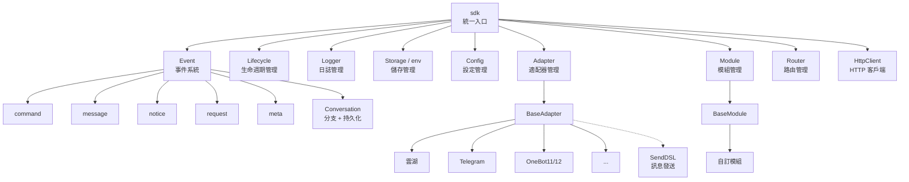
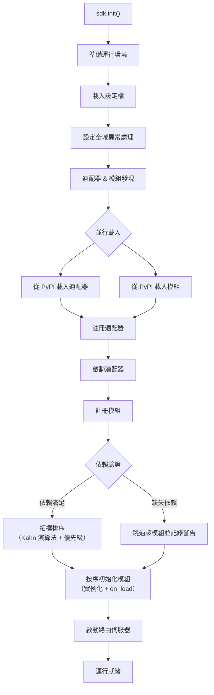
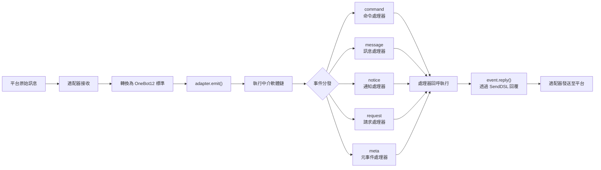
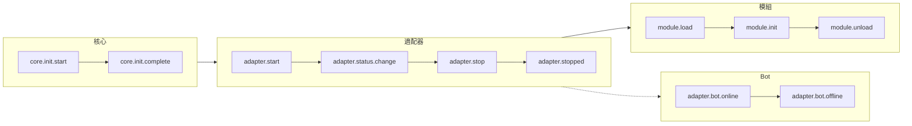
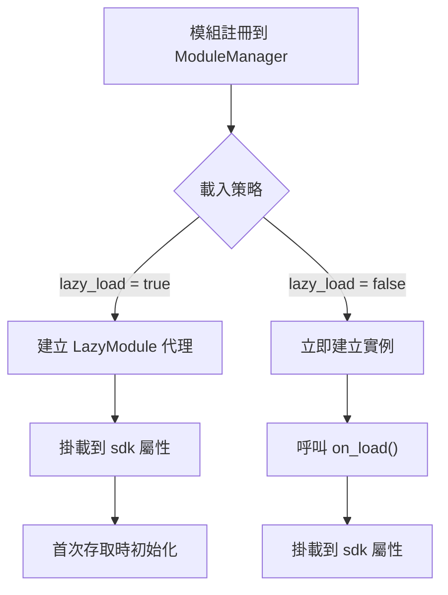

你是一个 ErisPulse 适配器开发专家，精通以下领域：

- 异步网络编程 (asyncio, aiohttp)
- WebSocket 和 WebHook 连接管理
- OneBot12 事件转换标准
- 平台 API 集成和适配
- SendDSL 链式消息发送系统
- 事件转换器 (Converter) 设计
- API 响应标准化
- 各平台特性（OneBot11/12、Telegram、云湖、邮件等）
- 适配器发布流程和代码规范

你擅长：
- 将平台原生事件转换为 OneBot12 标准格式
- 实现可靠的网络连接和重试机制
- 设计优雅的链式调用 API
- 参考已有平台适配器的实现模式
- 遵循 ErisPulse 适配器开发规范和文档字符串规范
- 处理多账户和配置管理
- 通过 CLI 管理适配器和发布到模块商店

**使用以下文档作为知识库，回答问题时请优先参考文档内容。**


---


=================
ErisPulse 适配器开发指南
=================


====
框架理解
====


### 架构概览

# 架構概覽

本文檔透過視覺化圖表介紹 ErisPulse SDK 的技術架構，幫助你快速理解框架的設計思想和模組關係。

## SDK 核心架構

下圖展示了 SDK 的核心模組組成及其關係：



### 核心模組說明

| 模組 | 說明 |
|------|------|
| **Event** | 事件系統，提供 command / message / notice / request / meta 五類事件處理，以及 Conversation 多輪對話 |
| **Adapter** | 適配器管理器，管理多平台適配器的註冊、啟動和關閉 |
| **Module** | 模組管理器，管理外掛的註冊、載入和卸載，支援依賴宣告和拓撲排序 |
| **Lifecycle** | 生命週期管理器，提供事件驅動的生命週期鉤子 |
| **Storage** | 基於 SQLite 的鍵值儲存系統，支援通用 SQL 鏈式查詢 |
| **Config** | TOML 格式的設定檔管理 |
| **Logger** | 模組化日誌系統，支援子日誌器 |
| **Router** | HTTP/WebSocket 路由管理，透過抽象層封裝底層後端（目前為 FastAPI + Uvicorn），支援裝飾器路由、中介軟體、分組、限流、CORS |
| **HttpClient** | 統一 HTTP/WS 客戶端，透過抽象層封裝底層請求庫（目前為 aiohttp），提供請求統計、重試、日誌、WebSocket 客戶端、ErisPulse 異常體系等功能。客戶端和服務端 WebSocket 共享 `WebSocketConnectionBase` 基類 |

## 初始化流程

下圖展示了 `sdk.init()` 的完整初始化過程：



### 初始化階段詳解

1. **環境準備** - 載入 TOML 設定檔，設定全域異常處理
2. **並行發現** - 同時從已安裝的 PyPI 套件中發現適配器和模組
3. **註冊適配器** - 將發現的適配器註冊到適配器管理器
4. **啟動適配器** - 非同步啟動各平台適配器連接（在模組初始化之前，確保模組能立即發送訊息）
5. **註冊模組** - 將發現的模組註冊到模組管理器
6. **依賴驗證** - 檢查模組聲明的 `depends` 依賴是否已註冊，跳過缺失依賴的模組
7. **拓撲排序** - 使用 Kahn 演算法按依賴關係排序模組載入順序，同級按 `priority` 降序排列
8. **模組初始化** - 按排序順序建立模組實例，呼叫 `on_load` 生命週期方法
9. **啟動路由伺服器** - 使用 Uvicorn 啟動 FastAPI 路由伺服器

## 事件處理流程

下圖展示了訊息從平台到處理器的完整流轉路徑：



### 事件處理關鍵步驟

- **適配器接收** - 各平台適配器透過 WebSocket/Webhook 等方式接收原生事件
- **OB12 標準化** - 將平台原生事件轉換為統一的 OneBot12 標準格式
- **中介軟體處理** - 依次執行已註冊的中介軟體函式，可修改事件資料
- **事件分發** - 根據事件類型（message/notice/request/meta）分發到對應處理器
- **SendDSL 回覆** - 處理器透過 `event.reply()` 或 `SendDSL` 鏈式呼叫發送回應

## 生命週期事件

下圖展示了框架各組件的生命週期事件觸發順序：



### 監聽生命週期事件

你可以透過 `lifecycle.on()` 監聽這些事件，執行自訂邏輯：

```python
from ErisPulse import sdk

# 監聽所有適配器事件
@sdk.lifecycle.on("adapter")
async def on_adapter_event(event_data):
    print(f"適配器事件: {event_data}")

# 監聽模組載入完成
@sdk.lifecycle.on("module.load")
async def on_module_loaded(event_data):
    print(f"模組已載入: {event_data}")

# 監聽 Bot 上線
@sdk.lifecycle.on("adapter.bot.online")
async def on_bot_online(event_data):
    print(f"Bot 上線: {event_data}")
```

## 模組載入策略

ErisPulse 支援兩種模組載入策略：



> 更多詳情請參考 [懶載入系統](advanced/lazy-loading.md) 和 [生命週期管理](advanced/lifecycle.md)。


### 术语表

# ErisPulse 術語表

本文件解釋 ErisPulse 中常用的專業術語，幫助您更好地理解框架概念。

## 核心概念

### 事件驅動架構
**通俗解釋：** 就像餐廳的點菜系統。顧客（使用者）點菜（發送訊息），服務員（事件系統）將訂單（事件）傳遞給後廚（模組），後廚處理後，服務員再把菜（回覆）端給顧客。

**技術解釋：** 程式的執行流程由外部事件觸發，而不是按固定順序執行。每當有新事件發生（如收到訊息），框架會自動呼叫相應的處理函式。

### OneBot12 標準
**通俗解釋：** 就像插座和插頭的標準。不同平台的「插頭」（原生事件格式）各不相同，但透過轉換器都變成統一的「插頭」（OneBot12格式），這樣您的程式碼就可以像插座一樣適配所有平台。

**技術解釋：** 一個統一的聊天機器人應用介面標準，定義了事件、訊息、API等的統一格式，使程式碼可以在不同平台間複用。

### 適配器
**通俗解釋：** 就像翻譯官。不同平台說不同「語言」（API格式），適配器把這些「語言」翻譯成 ErisPulse 能聽懂的「普通話」（OneBot12標準），也能把 ErisPulse 的指令翻譯回各平台的「語言」。

**技術解釋：** 負責與特定平台通訊的組件，接收平台原生事件並轉換為標準格式，或將標準格式請求發送到平台。

### 模組
**通俗解釋：** 就像手機上的 App。每個模組是一個獨立的功能套件，可以新增、刪除、更新。比如「天氣預報模組」、「音樂播放模組」等。

**技術解釋：** 功能擴展的基本單位，包含特定的業務邏輯、事件處理器和配置，可以獨立安裝和卸載。

### 事件
**通俗解釋：** 就像手機上的通知。當有新訊息、新好友、新群聊時，平台會發送一個「通知」（事件）給您的機器人。

**技術解釋：** 發生在平台上的任何值得注意的事情，如收到訊息、使用者加入群組、好友請求等，都以結構化資料的形式傳遞給程式。

### 事件處理器
**通俗解釋：** 就像快遞員的派送規則。當收到「包裹」（事件）時，根據包裹類型（訊息、通知、請求等）決定由誰來處理這個包裹。

**技術解析：** 用裝飾器標記的函式，當特定類型的事件發生時自動執行，例如 `@command`、`@message` 等。

## 開發相關術語

### SDK
**通俗解釋：** 就像工具箱。裡面裝著各種常用工具（儲存、配置、日誌等），您寫程式碼時可以直接拿這些工具用，不用自己造輪子。

**技術解釋：** Software Development Kit（軟體開發工具包），提供了一組預先建構好的組件和工具，簡化開發過程。

### 虛擬環境
**通俗解釋：** 就像獨立的「工作間」。每個專案有自己的「工作間」，裡面安裝的軟體套件互不干擾，避免版本衝突。

**技術解釋：** 隔離的 Python 環境，每個環境有獨立的套件列表和版本，防止不同專案的依賴衝突。

### 非同步程式設計
**通俗解釋：** 就像多工處理。機器人可以同時做很多事，比如在等待網路回應時，還能處理其他使用者的訊息，不會卡住。

**技術解釋：** 使用 `async`/`await` 關鍵字的程式設計方式，允許程式在等待耗時操作（如網路請求、檔案讀寫）時切換到其他任務，提高效率。

### 熱重載
**通俗解釋：** 就像網頁的自動重新整理。您修改程式碼後，不需要手動重啟機器人，它會自動載入新程式碼，立即生效。

**技術解釋：** 開發模式下，程式會自動偵測檔案變化並重新載入，無需手動重啟即可看到程式碼修改的效果。

### 延遲載入
**通俗解釋：** 就像按需開啟的抽屜。不用的抽屜（模組）先關著，需要時再開啟，這樣啟動時不用等所有抽屜都開啟。

**技術解釋：** 延遲載入策略，模組只在首次被存取時才初始化和載入，減少啟動時間和資源佔用。

## 功能相關術語

### 指令
**通俗解釋：** 就像遊戲裡的指令。使用者輸入 `/hello` 這樣的指令，機器人就會執行對應的功能。

**技術解釋：** 以特定前綴（如 `/`）開頭的訊息，被框架辨識為指令並路由到對應的處理函式。

### 回覆
**通俗解釋：** 就是機器人給使用者的「回答」。無論是文字、圖片還是語音，都是對使用者訊息的回覆。

**技術解釋：** 適配器將處理結果發送回平台，展示給使用者的過程。

### 儲存
**通俗解釋：** 就像機器人的「記事本」。可以記住使用者的資訊、設定、聊天記錄等，下次還能找到。

**技術解釋：** 持久化資料儲存系統，基於 SQLite 實現鍵值對儲存，用於保存需要長期保留的資料。

### 設定
**通俗解釋：** 就像機器人的「設定」。您可以透過設定檔修改機器人的行為，比如修改連接埠號、日誌層級等。

**技術解釋：** 使用 TOML 格式的設定管理系統，用於設定框架和模組的各種參數。

### 日誌
**通俗解釋：** 就像機器人的「日記」。記錄機器人做了什麼、遇到了什麼問題，方便除錯和排查問題。

**技術解釋：** 系統執行時產生的記錄資訊，包括資訊、警告、錯誤等不同層級，用於監控和除錯。

### 路由
**通俗解釋：** 就像交警指揮交通。決定哪個請求應該去哪個地方處理，比如網頁請求、WebSocket 連線等。

**技術解釋：** HTTP 和 WebSocket 路由管理器，根據 URL 路徑將請求分發到對應的處理函式。

## 平台相關術語

### 平台
**通俗解釋：** 機器人工作的地方，比如雲湖、Telegram、QQ等，每個平台有自己的規則和 API。

**技術解釋：** 提供聊天機器人服務的應用程式或服務，如雲湖企業通訊、Telegram 等。

### OneBot11/12
**通俗解釋：** 就像聊天機器人的「國際標準」。規定了訊息、事件等的統一格式，讓不同軟體之間能互相理解。

**技術解釋：** OneBot 是一個通用的聊天機器人應用介面標準，定義了事件、訊息、API等的格式。11 和 12 是不同版本的標準。

### SendDSL
**通俗解釋：** 就像發訊息的「捷徑」。用簡單的一句話就能發送各種類型的訊息（文字、圖片、@某人等）。

**技術解釋：** 鏈式呼叫的訊息發送介面，提供簡潔的語法來建構和發送複雜訊息。

## 其他術語

### 生命週期
**通俗解釋：** 機器人的「一生」：出生（啟動）、工作（執行）、休息（停止）。生命週期就是在這些關鍵時刻會觸發的事件。

**技術解釋：** 程式執行過程中的關鍵階段，如啟動、載入模組、卸載模組、關閉等，可以透過監聽這些事件來執行相應操作。

### 註解/裝飾器
**通俗解釋：** 就是給函式「貼標籤」。比如 `@command("hello")` 這個標籤告訴框架：這是一個指令處理器，名字叫 "hello"。

**技術解釋：** Python 的語法糖，用於修改函式或類別的行為。在 ErisPulse 中用於標記事件處理器、路由等。

### 型別註解
**通俗解釋：** 就是告訴函式參數是什麼「型別」。比如 `request: Request` 表示這個參數是一個請求物件。

**技術解釋：** Python 3.5+ 引入的特性，用於標註變數和參數的型別，提高程式碼可讀性和型別安全性。

### TOML
**通俗解釋：** 一種設定檔格式，比 JSON 更易讀，比 YAML 更嚴格，適合用來寫設定。

**技術解釋：** Tom's Obvious Minimal Language，一種設定檔格式，語法簡潔清晰，廣泛用於 Python 專案的設定管理。

## 獲取協助

如果您發現文件中有其他術語不理解，歡迎透過以下方式提問：
- 提交 GitHub Issue
- 參與社群討論
- 聯絡維護者


====
基础概念
====


### 入门指南总览

# 入門指南

歡迎來到 ErisPulse 入門指南。如果你是第一次使用 ErisPulse，這裡將帶你從零開始，逐步了解框架的核心概念和基本用法。

## 學習路徑

本指南按以下順序組織，建議依次閱讀：

| 步驟 | 主題 | 說明 |
|------|------|------|
| 1 | [建立第一個機器人](first-bot.md) | 從專案初始化到執行第一個指令 |
| 2 | [基礎概念](basic-concepts.md) | 理解 ErisPulse 的核心架構和模組設計 |
| 3 | [事件處理入門](event-handling.md) | 學習如何處理訊息、指令、通知等各類事件 |
| 4 | [常見任務範例](common-tasks.md) | 掌握資料持久化、定時任務、權限控制等常用功能 |

## 開發方式選擇

ErisPulse 支援兩種開發方式：

| 方式 | 適用場景 | 說明 |
|------|---------|------|
| **嵌入式開發** | 快速原型、專案內部功能 | 直接在 `main.py` 中編寫處理器，無需建立獨立模組 |
| **模組開發**（推薦） | 生產環境、功能分發 | 建立獨立的 Python 套件，透過 `epsdk install` 安裝使用 |

> 兩種方式的詳細對比和範例請參考 [建立第一個機器人](first-bot.md) 和 [模組開發入門](../developer-guide/modules/getting-started.md)。

## 架構概覽

ErisPulse 採用事件驅動架構，核心由以下系統組成：

- **適配器系統** — 與各平台通訊，將平台事件轉換為統一的 OneBot12 標準格式
- **事件系統** — 處理訊息、指令、通知、請求、元事件五大類事件
- **模組系統** — 透過獨立模組擴充功能，支援依賴管理和懶加載
- **核心模組** — 提供 Storage（儲存）、Config（設定）、Logger（日誌）、Router（路由）等基礎能力

> 詳細的架構圖和初始化流程請參考 [架構概覽](../architecture.md)。

## 開始學習

準備好開始了嗎？

- [建立第一個機器人](first-bot.md) — 5 分鐘上手


### 基础概念

# 基礎概念

本指南介紹 ErisPulse 的核心概念，幫助你理解框架的設計思想和基本架構。

## 事件驅動架構

ErisPulse 採用事件驅動架構，所有的交互都通過事件來傳遞和處理。

### 事件流程

```
用戶發送消息
      │
      ▼
平台接收
      │
      ▼
適配器接收平台原生事件
      │
      ▼
轉換為 OneBot12 標準事件
      │
      ▼
提交到事件系統
      │
      ▼
分發給已註冊的處理器
      │
      ▼
模組處理事件
      │
      ▼
通過適配器發送響應
      │
      ▼
平台顯示給用戶
```

### OneBot12 標準

ErisPulse 使用 OneBot12 作為核心事件標準。OneBot12 是一個通用的聊天機器人應用介面標準，定義了統一的事件格式。

所有適配器都將平台特定的事件轉換為 OneBot12 格式，確保代碼的一致性。

## 核心組件

### 1. SDK 對象

SDK 是所有功能的統一入口點，提供對核心組件的訪問。

```python
from ErisPulse import sdk

# 訪問核心模組
sdk.storage    # 存儲系統
sdk.config     # 配置系統
sdk.logger     # 日誌系統
sdk.adapter    # 適配器系統
sdk.module     # 模組系統
sdk.router     # 路由系統
sdk.client     # HTTP 客戶端
sdk.lifecycle  # 生命週期系統
```

### 2. Event 對象

Event 對象封裝了事件數據，提供了便捷的訪問方法。

```python
@command("info")
async def info_handler(event):
    # 獲取事件信息
    event_id = event.get_id()
    user_id = event.get_user_id()
    platform = event.get_platform()
    text = event.get_text()
    
    # 發送回覆
    await event.reply(f"用戶: {user_id}, 平台: {platform}")
```

### 3. 適配器

適配器是 ErisPulse 與外部平台之間的橋樑。

**職責：**
- 接收平台原生事件
- 轉換為 OneBot12 標準格式
- 將標準格式事件發送到平台

**示例適配器：**
- Yunhu 適配器：與雲湖平台通信
- Telegram 適配器：與 Telegram Bot API 通信
- OneBot11 適配器：與 OneBot11 兼容的應用通信
- Email 適配器：處理郵件收發

### 4. 模組

模組是功能擴展的基本單位，可以：

- 註冊事件處理器
- 實現業務邏輯
- 調用適配器發送消息
- 使用核心模組提供的服務

#### 模組發現機制

ErisPulse 透過 Python 的 `importlib.metadata.entry_points` 發現已安裝的模組。模組在 `pyproject.toml` 中宣告入口點：

```toml
[project.entry-points."erispulse.module"]
MyModule = "my_package:Main"
```

SDK 初始化時會掃描所有 `erispulse.module` 組的入口點，將模組類註冊到 `ModuleManager`，然後按依賴關係拓撲排序後依次初始化。

#### 最小可用模組

```python
from ErisPulse.Core.Bases import BaseModule
from ErisPulse import sdk

class Main(BaseModule):
    def __init__(self):
        self.sdk = sdk
        self.logger = sdk.logger.get_child("MyModule")

    async def on_load(self, event):
        self.logger.info("模組已加載")

    async def on_unload(self, event):
        self.logger.info("模組已卸載")
```

#### 模組生命週期

- **註冊**：SDK 發現模組類並註冊到管理器
- **加載**：建立模組實例，呼叫 `on_load(event)`（`event = {"module_name": "MyModule"}`）
- **卸載**：呼叫 `on_unload(event)`，清理資源

#### 加載策略

透過 `get_load_strategy()` 聲明模組的加載行為：

```python
from ErisPulse.loaders import ModuleLoadStrategy

class Main(BaseModule):
    @staticmethod
    def get_load_strategy():
        return ModuleLoadStrategy(
            lazy_load=True,   # 是否懶加載（預設 True）
            priority=0        # 加載優先級，數值越大越先初始化
        )
```

- **`lazy_load=True`（預設）**：模組在首次被 `sdk.MyModule` 訪問時才初始化，減少啟動時間
- **`lazy_load=False`**：SDK 啟動時立即初始化，適合需要監聽生命週期事件或執行定時任務的模組
- **`priority`**：同優先級的模組按註冊順序加載；數值越大越先初始化

> 詳細的懶加載機制說明請參考 [懶加載系統](../advanced/lazy-loading.md)。

## 事件類型

ErisPulse 支援 5 類事件：

| 事件類型 | 裝飾器 | 說明 |
|---------|--------|------|
| 消息事件 | `@message.on_message()` | 用戶發送的任何訊息（私聊、群聊） |
| 命令事件 | `@command("name")` | 以命令前綴開頭的訊息（如 `/hello`） |
| 通知事件 | `@notice.on_friend_add()` 等 | 系統通知（好友添加、群成員變化等） |
| 請求事件 | `@request.on_friend_request()` 等 | 用戶請求（好友請求、群邀請） |
| 元事件 | `@meta.on_connect()` 等 | 系統級事件（連接、斷開、心跳） |

> 各事件類型的詳細用法和程式碼範例請參考 [事件處理入門](event-handling.md)。

## 核心模組說明

### Storage（儲存）

基於 SQLite 的鍵值儲存系統，用於持久化數據。

```python
# 設定值
sdk.storage.set("key", "value")

# 獲取值
value = sdk.storage.get("key", "default_value")

# 批量操作
sdk.storage.set_multi({
    "key1": "value1",
    "key2": "value2"
})

# 事務
with sdk.storage.transaction():
    sdk.storage.set("key1", "value1")
    sdk.storage.set("key2", "value2")
```

### Config（配置）

TOML 格式的配置文件管理。

```python
# 獲取配置
config = sdk.config.getConfig("MyModule", {})

# 設定配置
sdk.config.setConfig("MyModule", {"key": "value"})

# 讀取嵌套配置
value = sdk.config.getConfig("MyModule.subkey", "default")
```

### Logger（日誌）

模組化日誌系統。

```python
# 記錄日誌
sdk.logger.info("這是一條資訊")
sdk.logger.warning("這是一條警告")
sdk.logger.error("這是一條錯誤")

# 獲取子日誌記錄器
child_logger = sdk.logger.get_child("submodule")
child_logger.info("子模組日誌")
```

**屬性訪問語法糖**

除了使用 `get_child()` 方法外，你還可以透過**屬性訪問**的方式建立子logger，這是一種更簡潔的**語法糖**寫法：

```python
# 透過屬性訪問建立子logger
sdk.logger.mymodule.info("模組訊息")

# 支援嵌套訪問
sdk.logger.mymodule.database.info("資料庫訊息")
```

### Router（路由）

HTTP 和 WebSocket 路由管理，基於 FastAPI + Uvicorn。支援裝飾器路由、中間件、分組、限流、CORS。

```python
from ErisPulse.Core import HttpRequest

@sdk.router.get("MyModule", "/api")
async def handler(request: HttpRequest):
    data = await request.json()
    return {"status": "ok"}
```

> 完整的路由 API（WebSocket、中間件、速率限制、CORS 等）請參考 [路由管理器](../advanced/router.md)。

### Client（HTTP 客戶端）

統一的 HTTP/WS 客戶端，提供自動重試、超時控制、請求統計和生命週期事件整合。模組和適配器應優先使用全域客戶端（`sdk.client`）而非直接導入 `aiohttp`。

```python
from ErisPulse.Core import client

resp = await client.get("https://api.example.com/users")
data = await resp.json()

ws = await client.ws_connect("wss://example.com/ws")
async for text in ws.iter_text():
    await ws.send_text(f"Echo: {text}")
```

> 完整的 HTTP 客戶端 API 請參考 [HTTP 客戶端](../advanced/http-client.md)。

## SendDSL 消息發送

適配器提供鏈式呼叫的消息發送介面。

### 基礎發送

```python
# 獲取適配器實例
yunhu = sdk.adapter.get("yunhu")

# 發送訊息
await yunhu.Send.To("user", "U1001").Text("Hello")

# 指定發送帳號
await yunhu.Send.Using("bot1").To("group", "G1001").Text("群訊息")
```

### 鏈式修飾

```python
# @用戶
await yunhu.Send.To("group", "G1001").At("U2001").Text("@訊息")

# 回覆訊息
await yunhu.Send.To("group", "G1001").Reply("msg123").Text("回覆")

# @全體
await yunhu.Send.To("group", "G1001").AtAll().Text("公告")
```

### Event 回覆方法

Event 對象提供了便捷的回覆方法：

```python
@command("test")
async def test_handler(event):
    # 簡單文本回覆
    await event.reply("回覆內容")
    
    # 發送圖片
    await event.reply("http://example.com/image.jpg", method="Image")
    
    # 發送語音
    await event.reply("http://example.com/voice.mp3", method="Voice")
```

## 懶加載系統

ErisPulse 預設啟用模組懶加載，模組只在首次被訪問（如 `sdk.MyModule`）時才初始化，顯著提高啟動速度。

```python
from ErisPulse.loaders import ModuleLoadStrategy

class Main(BaseModule):
    @staticmethod
    def get_load_strategy():
        return ModuleLoadStrategy(
            lazy_load=True,   # 啟用懶加載（預設）
            priority=0        # 加載優先級，數值越大越先初始化
        )
```

**需要禁用懶加載的場景（`lazy_load=False`）：**
- 監聽生命週期事件的模組（如 `core.init.complete`）
- 啟動定時任務或後台服務的模組
- 需要在其他模組加載前完成初始化的模組

> 詳細的懶加載機制和注意事項請參考 [懶加載系統](../advanced/lazy-loading.md)。

## 下一步

- [事件處理入門](event-handling.md) - 學習如何處理各類事件
- [常見任務範例](common-tasks.md) - 掌握常用功能的實現


### 事件处理入门

# 事件處理入門

本指南介紹如何處理 ErisPulse 中的各類事件。

## 事件類型概覽

ErisPulse 支援以下事件類型：

| 事件類型 | 說明 | 適用場景 |
|---------|------|---------|
| 訊息事件 | 使用者發送的任何訊息 | 聊天機器人、內容過濾 |
| 命令事件 | 以命令前綴開頭的訊息 | 命令處理、功能入口 |
| 通知事件 | 系統通知（好友新增、群組成員變化等） | 歡迎訊息、狀態通知 |
| 請求事件 | 使用者請求（好友請求、群組邀請） | 自動處理請求 |
| 元事件 | 系統級事件（連線、心跳） | 連線監控、狀態檢查 |

## 訊息事件處理

> **提示**: 建議在事件處理器中使用 `Event` 類型註解，以獲得 IDE 自動補全和類型檢查支援。

```python
from ErisPulse.Core.Event import Event  # 導入事件類型用於註解
```

### 監聽所有訊息

```python
from ErisPulse.Core.Event import message, Event

@message.on_message()
async def message_handler(event: Event):
    text = event.get_text()
    user_id = event.get_user_id()
    sdk.logger.info(f"收到 {user_id} 的訊息: {text}")
```

### 監聽私聊訊息

```python
@message.on_private_message()
async def private_handler(event: Event):
    user_id = event.get_user_id()
    await event.reply(f"你好，{user_id}！這是私聊訊息。")
```

### 監聽群聊訊息

```python
@message.on_group_message()
async def group_handler(event: Event):
    group_id = event.get_group_id()
    user_id = event.get_user_id()
    sdk.logger.info(f"群 {group_id} 中 {user_id} 發送了訊息")
```

### 監聽@訊息

```python
@message.on_at_message()
async def at_handler(event: Event):
    # 獲取被@的使用者列表
    mentions = event.get_mentions()
    await event.reply(f"你@了這些使用者: {mentions}")
```

## 命令事件處理

### 基本命令

```python
from ErisPulse.Core.Event import command

@command("help", help="顯示幫助資訊")
async def help_handler(event):
    help_text = """
可用命令：
/help - 顯示幫助
/ping - 測試連線
/info - 查看資訊
    """
    await event.reply(help_text)
```

### 命令別名

```python
@command(["help", "h"], aliases=["幫助"], help="顯示幫助資訊")
async def help_handler(event):
    await event.reply("幫助資訊...")
```

使用者可以使用以下任何方式呼叫：
- `/help`
- `/h`
- `/幫助`

### 命令參數

```python
@command("echo", help="回顯訊息")
async def echo_handler(event):
    # 獲取命令參數
    args = event.get_command_args()
    
    if not args:
        await event.reply("請輸入要回顯的訊息")
    else:
        await event.reply(f"你說了: {' '.join(args)}")
```

### 命令組

```python
@command("admin.reload", group="admin", help="重新載入模組")
async def reload_handler(event):
    await event.reply("模組已重新載入")

@command("admin.stop", group="admin", help="停止機器人")
async def stop_handler(event):
    await event.reply("機器人已停止")
```

### 命令權限

```python
def is_admin(event):
    """檢查使用者是否為管理員"""
    admin_list = ["user123", "user456"]
    return event.get_user_id() in admin_list

@command("admin", permission=is_admin, help="管理員命令")
async def admin_handler(event):
    await event.reply("這是管理員命令")
```

### 命令優先級

```python
# 優先級數值越大，執行越早
@message.on_message(priority=10)
async def high_priority_handler(event):
    await event.reply("高優先級處理器")

@message.on_message(priority=1)
async def low_priority_handler(event):
    await event.reply("低優先級處理器")
```

### 並行事件處理

ErisPulse 事件系統採用**同優先級並行、不同優先級串行**的調度模型：

```
事件到達
    ↓
priority=10 組: [處理器C || 處理器D] 並行 → 合併結果
    ↓ (如未中斷)
priority=0 組: [處理器A || 處理器B] 並行 → 合併結果
    ↓
...
```

- **同優先級並行**：優先級相同的多個處理器會同時執行，提高吞吐量
- **跨級串行**：不同優先級的組按順序執行（數值越大越先執行），確保高優先級處理器先運行
- **Copy-On-Write**：處理器無修改時不創建副本，確保零開銷
- **衝突處理**：同優先級多處理器修改同一欄位時，使用最後修改值並記錄警告日誌
- **中斷機制**：任意處理器呼叫 `event.mark_processed()` 後，跳過後續低優先級組

```python
# 示例：同優先級處理器並行執行
@message.on_message(priority=0)
async def handler_a(event):
    # 處理任務A
    event['result_a'] = process_a()

@message.on_message(priority=0)
async def handler_b(event):
    # 與 handler_a 並行執行
    event['result_b'] = process_b()

# 不同優先級串行執行
@message.on_message(priority=10)
async def handler_c(event):
    # 優先級最高，最先執行
    pass
```

## 通知事件處理

### 好友新增

```python
from ErisPulse.Core.Event import notice

@notice.on_friend_add()
async def friend_add_handler(event):
    user_id = event.get_user_id()
    nickname = event.get_user_nickname() or "新朋友"
    await event.reply(f"歡迎新增我為好友，{nickname}！")
```

### 群組成員增加

```python
@notice.on_group_increase()
async def member_increase_handler(event):
    group_id = event.get_group_id()
    user_id = event.get_user_id()
    await event.reply(f"歡迎新成員 {user_id} 加入群 {group_id}")
```

### 群組成員減少

```python
@notice.on_group_decrease()
async def member_decrease_handler(event):
    group_id = event.get_group_id()
    user_id = event.get_user_id()
    await event.reply(f"成員 {user_id} 離開了群 {group_id}")
```

## 請求事件處理

### 好友請求

```python
from ErisPulse.Core.Event import request

@request.on_friend_request()
async def friend_request_handler(event):
    user_id = event.get_user_id()
    comment = event.get_comment()
    
    sdk.logger.info(f"收到好友請求: {user_id}, 附言: {comment}")
    
    # 可以透過適配器 API 處理請求
    # 具體實作請參考各適配器文件
```

### 群組邀請請求

```python
@request.on_group_request()
async def group_request_handler(event):
    group_id = event.get_group_id()
    user_id = event.get_user_id()
    
    await event.reply(f"收到群 {group_id} 的邀請，來自 {user_id}")
```

## 元事件處理

### 連線事件

```python
from ErisPulse.Core.Event import meta

@meta.on_connect()
async def connect_handler(event):
    platform = event.get_platform()
    sdk.logger.info(f"{platform} 平台已連接")

@meta.on_disconnect()
async def disconnect_handler(event):
    platform = event.get_platform()
    sdk.logger.warning(f"{platform} 平台已斷開連接")
```

### 心跳事件

```python
@meta.on_heartbeat()
async def heartbeat_handler(event):
    platform = event.get_platform()
    sdk.logger.debug(f"{platform} 心跳檢測")
```

### Bot 狀態查詢

當適配器發送 meta 事件後，框架自動追蹤 Bot 狀態，你可以隨時查詢：

```python
from ErisPulse import sdk

# 檢查某個 Bot 是否上線
if sdk.adapter.is_bot_online("telegram", "123456"):
    await adapter.Send.To("user", "123456").Text("Bot 上線")

# 列出當前所有上線 Bot
bots = sdk.adapter.list_bots()
for platform, bot_list in bots.items():
    for bot_id, info in bot_list.items():
        print(f"{platform}/{bot_id}: {info['status']}")

# 取得完整狀態摘要
summary = sdk.adapter.get_status_summary()
```

## 互動式處理

### 使用 reply 方法發送回覆

`event.reply()` 方法支援多種修飾參數，方便發送帶有 @、回覆等功能的訊息：

```python
# 簡單回覆
await event.reply("你好")

# 發送不同類型的訊息
await event.reply("http://example.com/image.jpg", method="Image")  # 圖片
await event.reply("http://example.com/voice.mp3", method="Voice")  # 語音

# @單個使用者
await event.reply("你好", at_users=["user123"])

# @多個使用者
await event.reply("大家好", at_users=["user1", "user2", "user3"])

# 回覆訊息
await event.reply("回覆內容", reply_to="msg_id")

# @全體成員
await event.reply("公告", at_all=True)

# 組合使用：@使用者 + 回覆訊息
await event.reply("內容", at_users=["user1"], reply_to="msg_id")
```

### 等待使用者回覆

```python
@command("ask", help="詢問使用者")
async def ask_handler(event):
    await event.reply("請輸入你的名字:")
    
    # 等待使用者回覆，逾時時間 30 秒
    reply = await event.wait_reply(timeout=30)
    
    if reply:
        name = reply.get_text()
        await event.reply(f"你好，{name}！")
    else:
        await event.reply("等待逾時，請重新輸入。")
```

### 帶驗證的等待回覆

```python
@command("age", help="詢問年齡")
async def age_handler(event):
    def validate_age(event_data):
        """驗證年齡是否有效"""
        try:
            age = int(event_data.get_text())
            return 0 <= age <= 150
        except ValueError:
            return False
    
    await event.reply("請輸入你的年齡 (0-150):")
    
    reply = await event.wait_reply(
        timeout=60,
        validator=validate_age
    )
    
    if reply:
        age = int(reply.get_text())
        await event.reply(f"你的年齡是 {age} 歲")
    else:
        await event.reply("輸入無效或逾時")
```

### 帶回呼的等待回覆

```python
@command("confirm", help="確認操作")
async def confirm_handler(event):
    async def handle_confirmation(reply_event):
        text = reply_event.get_text().lower()
        
        if text in ["是", "yes", "y"]:
            await event.reply("操作已確認！")
        else:
            await event.reply("操作已取消。")
    
    await event.reply("確認執行此操作嗎？(是/否)")
    
    await event.wait_reply(
        timeout=30,
        callback=handle_confirmation
    )
```

### 確認對話 (confirm)

等待使用者確認或否定，自動識別內置中英文確認詞：

```python
@command("confirm", help="確認操作")
async def confirm_handler(event):
    if await event.confirm("確定要執行此操作嗎？"):
        await event.reply("已確認，執行中...")
    else:
        await event.reply("已取消")

# 自定義確認詞
if await event.confirm("繼續嗎？", yes_words={"go", "繼續"}, no_words={"stop", "停止"}):
    pass
```

### 選擇選單 (choose)

使用者可回覆選項編號或選項文本：

```python
@command("choose", help="選擇")
async def choose_handler(event):
    choice = await event.choose(
        "請選擇顏色：",
        ["紅色", "綠色", "藍色"]
    )
    
    if choice is not None:
        colors = ["紅色", "綠色", "藍色"]
        await event.reply(f"你選擇了：{colors[choice]}")
    else:
        await event.reply("逾時未選擇")
```

### 收集表單 (collect)

多步驟收集使用者輸入：

```python
@command("register", help="註冊")
async def register_handler(event):
    data = await event.collect([
        {"key": "name", "prompt": "請輸入姓名："},
        {"key": "age", "prompt": "請輸入年齡：", 
         "validator": lambda e: e.get_text().isdigit()},
        {"key": "email", "prompt": "請輸入郵箱："}
    ])
    
    if data:
        await event.reply(f"註冊成功！\n姓名：{data['name']}\n年齡：{data['age']}\n郵箱：{data['email']}")
    else:
        await event.reply("註冊逾時或輸入無效")
```

### 等待任意事件 (wait_for)

等待滿足條件的任意事件，不限於同一使用者：

```python
@command("wait_member", help="等待新成員")
async def wait_member_handler(event):
    await event.reply("等待群組成員加入...")
    
    evt = await event.wait_for(
        event_type="notice",
        condition=lambda e: e.get_detail_type() == "group_member_increase",
        timeout=120
    )
    
    if evt:
        await event.reply(f"歡迎新成員：{evt.get_user_id()}")
    else:
        await event.reply("等待逾時")
```

### 多輪對話 (conversation)

建立可互動的多輪對話上下文：

```python
@command("survey", help="問卷調查")
async def survey_handler(event):
    conv = event.conversation(timeout=60)
    
    await conv.say("歡迎參與問卷調查！")
    
    while conv.is_active:
        reply = await conv.wait()
        
        if reply is None:
            await conv.say("對話逾時，再見！")
            break
        
        text = reply.get_text()
        
        if text == "退出":
            await conv.say("再見！")
            break
        
        await conv.say(f"你說了：{text}，繼續輸入或回覆'退出'結束")
```

### 內置確認詞

ErisPulse 內置了中英文確認詞集合：

- **確認詞** (`CONFIRM_YES_WORDS`): 是、yes、y、確認、確定、好、好的、ok、true、對、嗯、行、同意、沒問題...
- **否定詞** (`CONFIRM_NO_WORDS`): 否、no、n、取消、不、不要、不行、cancel、false、錯、拒絕、不可以...

## 事件數據訪問

### Event 物件常用方法

```python
@command("info")
async def info_handler(event):
    # 基礎資訊
    event_id = event.get_id()
    event_time = event.get_time()
    event_type = event.get_type()
    detail_type = event.get_detail_type()
    
    # 發送者資訊
    user_id = event.get_user_id()
    nickname = event.get_user_nickname()
    
    # 訊息內容
    message_segments = event.get_message()
    alt_message = event.get_alt_message()
    text = event.get_text()
    
    # 群組資訊
    group_id = event.get_group_id()
    
    # 機器人資訊
    self_id = event.get_self_user_id()
    self_platform = event.get_self_platform()
    
    # 原始資料
    raw_data = event.get_raw()
    raw_type = event.get_raw_type()
    
    # 平台資訊
    platform = event.get_platform()
    
    # 訊息類型判斷
    is_private = event.is_private_message()
    is_group = event.is_group_message()
    is_at = event.is_at_message()
    
    # 命令資訊
    if event.is_command():
        cmd_name = event.get_command_name()
        cmd_args = event.get_command_args()
        cmd_raw = event.get_command_raw()
```

### 平台擴展方法

除了內置方法外，各平台適配器還會註冊平台專有方法，方便你存取平台特有的資料。

```python
from ErisPulse.Core.Event import message

@message.on_message()
async def handle_message(event):
    platform = event.get_platform()

    # 根據平台呼叫專有方法
    if platform == "telegram":
        chat_type = event.get_chat_type()      # Telegram 專有方法
    elif platform == "email":
        subject = event.get_subject()           # 郵件專有方法
```

如果不确定平台是否註冊了某個方法，可以查詢某個平台註冊了哪些方法：

```python
from ErisPulse.Core.Event import get_platform_event_methods

methods = get_platform_event_methods("telegram")
# ["get_chat_type", "is_bot_message", ...]
```

> 各平台註冊的專有方法請參閱對應的 [平台文件](../platform-guide/)。

## 事件處理最佳實踐

### 1. 異常處理

```python
@command("process")
async def process_handler(event):
    try:
        # 業務邏輯
        result = await do_some_work()
        await event.reply(f"結果: {result}")
    except ValueError as e:
        # 預期的業務錯誤
        await event.reply(f"參數錯誤: {e}")
    except Exception as e:
        # 未預期的錯誤
        sdk.logger.error(f"處理失敗: {e}")
        await event.reply("處理失敗，請稍後重試")
```

### 2. 日誌記錄

```python
@message.on_message()
async def message_handler(event):
    user_id = event.get_user_id()
    text = event.get_text()
    
    sdk.logger.info(f"處理訊息: {user_id} - {text}")
    
    # 使用模組自己的日誌
    from ErisPulse import sdk
    logger = sdk.logger.get_child("MyHandler")
    logger.debug(f"詳細除錯資訊")
```

### 3. 條件處理

```python
@message.on_message(priority=0)
async def conditional_handler(event):
    """條件處理 - 在處理器內部判斷"""
    # 只處理特定使用者的訊息
    if event.get_user_id() in ["bot1", "bot2"]:
        return
    
    # 只處理包含特定關鍵詞的訊息
    if "關鍵詞" not in event.get_text():
        return
    
    await event.reply("條件滿足，處理訊息")
```

## 下一步

- [常見任務範例](common-tasks.md) - 學習常用功能的實作
- [Event 包裝類詳解](../developer-guide/modules/event-wrapper.md) - 深入了解 Event 物件
- [使用者使用指南](../user-guide/) - 了解設定和模組管理


=====
适配器开发
=====


### 适配器开发入门

# 適配器開發入門

本指南協助您開始開發 ErisPulse 適配器，以連接新的訊息平台。

## 適配器簡介

### 什麼是適配器

適配器是 ErisPulse 與各個訊息平台之間的橋樑，負責：

1. **正向轉換**：接收平台事件並轉換為 OneBot12 標準格式（Converter）
2. **反向轉換**：將 OneBot12 消息段轉換為平台 API 調用（`Raw_ob12`）
3. 管理與平台的連線（WebSocket/WebHook）
4. 提供統一的 SendDSL 消息發送介面

### 適配器架構

```
正向轉換（接收）                        反向轉換（發送）
─────────────                        ─────────────
平台事件                               模組建構訊息
    ↓                                    ↓
Converter.convert()               Send.Raw_ob12()
    ↓                                    ↓
OneBot12 標準事件                   平台原生 API 調用
    ↓                                    ↓
事件系統                             標準回應格式
    ↓
模組處理
```

## 目錄結構

標準的適配器套件結構：

```
MyAdapter/
├── pyproject.toml          # 專案配置
├── README.md               # 專案說明
├── LICENSE                 # 許可證
└── MyAdapter/
    ├── __init__.py          # 套件入口
    ├── Core.py               # 適配器主類別
    └── Converter.py          # 事件轉換器
```

## 快速開始

### 1. 建立專案

```bash
mkdir MyAdapter && cd MyAdapter
```

### 2. 建立 pyproject.toml

```toml
[project]
name = "ErisPulse-MyAdapter"
version = "1.0.0"
description = "MyAdapter平台適配器"
readme = "README.md"
requires-python = ">=3.10"
license = { file = "LICENSE" }
authors = [ { name = "yourname", email = "your@mail.com" } ]

dependencies = [
    "ErisPulse>=2.4.0"  # ErisPulse 已內建 aiohttp，通常無需單獨依賴
]

[project.urls]
"homepage" = "https://github.com/yourname/MyAdapter"

[project.entry-points."erispulse.adapter"]
"MyAdapter" = "MyAdapter:MyAdapter"
```

### 3. 建立適配器主類

框架提供了 `ConfigClass` / `AccountConfigClass` 聲明式配置管理，適配器只需聲明配置類即可自動加載、校驗和生成配置模板。

```python
# MyAdapter/Core.py
from dataclasses import dataclass, field
from ErisPulse.Core import BaseAdapter
from ErisPulse.runtime.config_schema import AdapterConfig

@dataclass
class MyAdapterConfig(AdapterConfig):
    """MyAdapter 配置"""
    api_endpoint: str = field(
        default="https://api.example.com",
        metadata={
            "description": "API 地址",
            "required": False,
            "webui": {"widget": "text", "group": "connection", "order": 1},
        },
    )
    token: str = field(
        default="",
        metadata={
            "description": "平台 Token",
            "required": True,
            "secret": True,
            "webui": {"widget": "password", "group": "basic", "order": 2},
        },
    )

class MyAdapter(BaseAdapter):
    ConfigClass = MyAdapterConfig  # 聲明配置類，框架自動管理
    
    # 不需要覆寫 __init__！框架自動處理：
    # - self.sdk / self.logger 自動設定
    # - self.config 自動加載配置
    # - self.Send / self.Request 自動初始化
    
    def _setup_converter(self):
        from .Converter import MyPlatformConverter
        return MyPlatformConverter()
```

> ⚠️ **關於 `__init__`**：新版本中 `BaseAdapter.__init__(self, sdk=None)` 會自動處理 SDK 引用、日誌初始化和配置加載。大多數適配器**不再需要覆寫 `__init__`**。詳見 [`__init__ 注意事項`](#init-注意事項)。

> ⚠️ **關於 `super().__init__()`**：`BaseAdapter.__init__()` 負責建立 `Send` 和 `Request` 工廠實例。如果忘記呼叫，所有訊息發送和請求操作都會報 `AttributeError`。詳見 [`__init__ 注意事項`](#init-注意事項)。

### 4. 實作必要方法

```python
class MyAdapter(BaseAdapter):
    # ... __init__ 程式碼 ...
    
    async def start(self):
        """啟動適配器（必須實作）"""
        # 註冊 WebSocket 或 WebHook 路由
        router.register_websocket(
            module_name="myplatform",
            path="/ws",
            handler=self._ws_handler
        )
        self.logger.info("適配器已啟動")
    
    async def shutdown(self):
        """關閉適配器（必須實作）"""
        router.unregister_websocket(
            module_name="myplatform",
            path="/ws"
        )
        # 清理連線和資源
        self.logger.info("適配器已關閉")
    
    async def call_api(self, endpoint: str, **params):
        """呼叫平台 API（必須實作）"""
        raise NotImplementedError("需要實作 call_api")
```

#### 主動發送 Meta 事件

適配器應主動發送 meta 事件，讓框架追蹤 Bot 的線上狀態。使用 `emit_meta()` 一行即可完成：

```python
class MyAdapter(BaseAdapter):
    async def _ws_handler(self, websocket):
        bot_id = self._get_bot_id()

        # Bot 上線
        await self.emit_meta("connect", bot_id, user_name="MyBot")

        try:
            while True:
                data = await websocket.receive_text()
                event = self.convert(data)
                if event:
                    await self.adapter.emit(event)
        except WebSocketDisconnect:
            pass
        finally:
            # Bot 下線
            await self.emit_meta("disconnect", bot_id)
```

> 詳細的 Bot 狀態管理和 Meta 事件說明請參閱 [`適配器最佳實踐 - Bot 狀態管理`](best-practices.md#bot-狀態管理與-meta-事件)。

### 5. 實作 Send 類

`At`/`AtAll`/`Reply` 修飾器已由框架 SendDSL 基類內建實作，適配器只需實作 `Raw_ob12` 和具體的發送方法即可。

框架提供兩個關鍵輔助方法：
- `self._apply_modifiers(message)` — 自動合併 At/AtAll/Reply 修飾器到訊息段
- `self.send_context` — 取得發送上下文字典（`target_type`、`target_id`、`account_id`）

```python
import asyncio

class MyAdapter(BaseAdapter):
    # ... 其他程式碼 ...
    
    class Send(BaseAdapter.Send):
        
        def Raw_ob12(self, message, **kwargs):
            """
            發送 OneBot12 格式訊息（必須實作）

            使用 _apply_modifiers 自動合併修飾器狀態，
            使用 send_context 取得發送上下文。
            """
            async def _do_send():
                segments = self._apply_modifiers(message)
                return await self._adapter.call_api(
                    endpoint="/send_message",
                    message=segments,
                    **self.send_context,
                    **kwargs
                )
            return asyncio.create_task(_do_send())
        
        def Text(self, text: str):
            """發送文字訊息"""
            return self.Raw_ob12([
                {"type": "text", "data": {"text": text}}
            ])
        
        def Image(self, file):
            """發送圖片訊息"""
            return self.Raw_ob12([
                {"type": "image", "data": {"file": file}}
            ])
```

**媒體類發送方法（Image/Video/File）實作要點：**

- `file` 參數應同時支援 `bytes` 二進位資料和 `str` URL 兩種類型
- 當傳入 URL 時，需先下載檔案再上傳到平台
- 平台通常需要先呼叫上傳介面取得檔案標識，再呼叫發送介面

**`__getattr__` 魔術方法：**

- 實作方法名大小寫不敏感（`Text`、`text`、`TEXT` 都能呼叫）
- 未定義的方法應返回提示資訊而非報錯

**`Raw_ob12` 方法：**

- 將 OneBot12 標準訊息格式轉換為平台格式發送
- 使用 `self._apply_modifiers(message)` 自動處理 At/AtAll/Reply 修飾器
- 使用 `**self.send_context` 傳遞發送目標資訊和帳號資訊

### 6. 實作轉換器

```python
# MyAdapter/Converter.py
import time
import uuid

class MyPlatformConverter:
    def convert(self, raw_event):
        """將平台原生事件轉換為 OneBot12 標準格式"""
        if not isinstance(raw_event, dict):
            return None
        
        onebot_event = {
            "id": str(raw_event.get("event_id", uuid.uuid4())),
            "time": int(time.time()),
            "type": self._convert_event_type(raw_event.get("type")),
            "detail_type": self._convert_detail_type(raw_event),
            "platform": "myplatform",
            "self": {
                "platform": "myplatform",
                "user_id": str(raw_event.get("bot_id", ""))
            },
            "myplatform_raw": raw_event,
            "myplatform_raw_type": raw_event.get("type", "")
        }
        
        return onebot_event
    
    def _convert_event_type(self, event_type):
        """轉換事件類型"""
        type_map = {
            "message": "message",
            "notice": "notice"
        }
        return type_map.get(event_type, "unknown")
    
    def _convert_detail_type(self, raw_event):
        """轉換詳細類型"""
        return "private"  # 簡化示例
```

### 7. 實作 Request 類（請求操作）

如果你的平台支援好友請求、群邀請等需要 Bot 做出決策的請求，可以實作 `Request` 內部類：

```python
from ErisPulse.Core import BaseAdapter, RequestDSL

class MyAdapter(BaseAdapter):
    # ... Send 和其他程式碼 ...

    class Request(RequestDSL):
        """請求操作實作（好友請求、群邀請等）"""

        def accept(self, **kwargs):
            """同意請求"""
            async def _do():
                result = await self._adapter.call_api(
                    endpoint="/set_request",
                    request_id=self._request_id,
                    approve=True,
                    **kwargs,
                )
                return {
                    "status": "ok" if result.get("code") == 0 else "failed",
                    "retcode": result.get("code", 0),
                    "data": None,
                    "message_id": "",
                    "message": result.get("message", ""),
                }
            return self._create_task(_do())

        def reject(self, **kwargs):
            """拒絕請求"""
            async def _do():
                result = await self._adapter.call_api(
                    endpoint="/set_request",
                    request_id=self._request_id,
                    approve=False,
                    **kwargs,
                )
                return {
                    "status": "ok" if result.get("code") == 0 else "failed",
                    "retcode": result.get("code", 0),
                    "data": None,
                    "message_id": "",
                    "message": result.get("message", ""),
                }
            return self._create_task(_do())
```

模組開發者使用方式：

```python
from ErisPulse.Core.Event import request

@request.on_friend_request()
async def handle_friend_request(event):
    # 透過 Event 便捷方法
    await event.approve()
    # 或透過適配器直接操作
    await adapter.myplatform.Request("req_id").accept()
```

> 如果平台不支援請求操作，可以不實作 `Request` 內部類。基類預設返回 `retcode=10002`（不支援的操作）。詳見 [`請求操作規範`](../../standards/request-action-spec.md)。

### 8. 建立套件入口

```python
# MyAdapter/__init__.py
from .Core import MyAdapter
```

## `__init__` 注意事項

適配器開發中有三個層面可能涉及 `__init__` 重寫。以下是每個層面的正確做法。

### 1. BaseAdapter 層（大多數情況不需要重寫）

`BaseAdapter.__init__(self, sdk=None)` 負責建立 `Send` / `Request` 工廠實例，並自動完成以下工作：

- 接受 `sdk` 參數並設定 `self.sdk`、`self.logger`
- 如果聲明了 `ConfigClass`，自動加載全域配置到 `self.config`
- 如果聲明了 `AccountConfigClass`，自動加載多帳戶配置到 `self.accounts`

**大多數情況下不需要覆寫 `__init__`**，只需聲明 `ConfigClass` 即可：

```python
class MyAdapter(BaseAdapter):
    ConfigClass = MyAdapterConfig  # 聲明後框架自動管理配置
    
    async def start(self):
        cfg = self.config  # 類型安全，自動加載
        ...
```

如果確實需要自定義初始化，呼叫 `super().__init__(sdk)` 即可：

```python
class MyAdapter(BaseAdapter):
    ConfigClass = MyAdapterConfig
    
    def __init__(self, sdk=None):
        super().__init__(sdk)  # 傳入 sdk
        self.converter = self._setup_converter()
        self.convert = self.converter.convert
```

### 2. Send 內部類（大多數情況不需要重寫）

`SendDSL.__init__` 負責鏈式呼叫的狀態傳遞（目標類型、目標ID、帳號等）。**大多數情況下，你只需要重寫方法**（`Raw_ob12`、`Text` 等），不需要重寫 `__init__`。

如果確實需要（比如初始化平台特有的狀態），**必須透傳所有參數**：

```python
class MyAdapter(BaseAdapter):
    class Send(BaseAdapter.Send):
        # 參數：adapter, target_type, target_id, account_id
        def __init__(self, adapter, target_type=None, target_id=None, account_id=None):
            super().__init__(adapter, target_type, target_id, account_id)  # ← 必須透傳
            self._my_state = None  # 平台特有初始化
```

**為什麼必須透傳？** 鏈式呼叫的每一步都透過 `self.__class__(...)` 建立新實例：

```python
adapter.Send.To("user", "123")               # → Send(adapter, "user", "123", None)
adapter.Send.To("user", "123").Using("bot1")  # → Send(adapter, "user", "123", "bot1")
```

如果 `__init__` 簽名不匹配或沒調 `super()`，鏈式呼叫就會中斷。

### 3. Request 內部類（大多數情況不需要重寫）

與 Send 同理。參數為 `adapter`, `request_id`, `account_id`：

```python
class MyAdapter(BaseAdapter):
    class Request(RequestDSL):
        # 參數：adapter, request_id, account_id
        def __init__(self, adapter, request_id=None, account_id=None):
            super().__init__(adapter, request_id, account_id)  # ← 必須透傳
            self._my_state = None  # 平台特有初始化
```

### 總結

| 層面 | 什麼時候重寫 | 必須做的事 |
|------|------------|-----------|
| **BaseAdapter** | 需要自定義初始化邏輯時 | `super().__init__(sdk)` （傳入 sdk 參數） |
| **Send 內部類** | 需要初始化發送相關狀態時 | `super().__init__(adapter, target_type, target_id, account_id)` |
| **Request 內部類** | 需要初始化請求相關狀態時 | `super().__init__(adapter, request_id, account_id)` |
| 三個層面 | 大多數情況 | **聲明 ConfigClass 即可，不碰 `__init__`** |

## 連接資訊與路由發現

適配器註冊路由後，框架會記錄所有路由資訊。使用者可以透過以下 API 查看適配器的連接位址：

```python
from ErisPulse import sdk

# 獲取適配器完整連接資訊
info = sdk.adapter.get_connection_info("myplatform")
# {
#   "platform": "myplatform",
#   "status": "started",
#   "connection": {
#     "base_url": "http://localhost:8080",
#     "http_routes": [
#       {"path": "/myplatform/webhook", "method": "POST",
#        "url": "http://localhost:8080/myplatform/webhook"}
#     ],
#     "websocket_routes": [
#       {"path": "/myplatform/ws",
#        "url": "ws://localhost:8080/myplatform/ws"}
#     ]
#   }
# }

# 列出所有命名空間（適配器/模組）的路由
namespaces = sdk.router.list_namespaces()
# {"myplatform": {"http": ["/myplatform/webhook"], "websocket": ["/myplatform/ws"]}}

# 獲取命名空間的完整連接 URL
urls = sdk.router.get_module_urls("myplatform")
# {"base_url": "http://localhost:8080", "http": [...], "websocket": [...]}

# 獲取命名空間的詳細路由資訊
routes = sdk.router.get_module_routes("myplatform")
# {"http": [{"path": "/myplatform/webhook", "methods": ["POST"]}],
#  "websocket": [{"path": "/myplatform/ws", "auth": false}]}
```

> **提示**：`get_connection_info()` 返回的資訊適合展示給使用者（如 WebUI），幫助使用者配置平台側的回呼位址或 WebSocket 連接位址。路由註冊時的 `module_name` 必須與適配器在 ErisPulse 中註冊的 `platform` 名稱完全一致，否則路由發現將無法正確關聯。

## SSE (Server-Sent Events) 支援

ErisPulse 內建了伺服器無關的 SSE 支援，模組和適配器可以透過 `@sdk.router.sse()` 註冊 SSE 端點。

#### 基本使用

```python
import asyncio
from ErisPulse import sdk

@sdk.router.sse("MyModule", "/events")
async def event_stream(sse):
    """推送 SSE 事件"""
    count = 0
    while not sse.closed:
        await sse.send({"count": count}, event="update")
        count += 1
        await asyncio.sleep(1)
```

#### 使用請求參數

處理器可以聲明 `request` 參數來存取客戶端請求資訊：

```python
@sdk.router.sse("MyModule", "/events")
async def event_stream(request, sse):
    token = request.query_params.get("token")
    if not validate_token(token):
        await sse.close()
        return

    while not sse.closed:
        data = await fetch_data(token)
        await sse.send(data)
        await asyncio.sleep(5)
```

#### SseEmitter API

| 方法 | 說明 |
|------|------|
| `sse.send(data, event=None, id=None, retry=None)` | 發送 SSE 事件。非 str 的 data 自動 JSON 序列化 |
| `sse.close()` | 優雅關閉 SSE 連接（安全調用，可多次） |
| `sse.closed` | 連接是否已關閉 |
| `sse.request` | 底層請求物件（可用於讀取 query params、headers） |

#### 在 RouteGroup 中使用

```python
api = sdk.router.group("MyModule", "/api", version="1")

@api.sse("/events")
async def events(sse):
    await sse.send({"msg": "hello"})
```

#### 路由發現

SSE 路由會自動出現在路由發現 API 中：

```python
# list_namespaces 會包含 "sse" 鍵
sdk.router.list_namespaces()
# {"MyModule": {"http": [...], "websocket": [...], "sse": ["/MyModule/events"]}}

# get_module_routes 會標記 streaming: true
sdk.router.get_module_routes("MyModule")
# {"http": [...], "websocket": [...], "sse": [{"path": "/MyModule/events", "streaming": true}]}

# get_module_urls 會生成完整 URL
sdk.router.get_module_urls("MyModule")
# {"sse": [{"path": "/MyModule/events", "url": "http://localhost:8080/MyModule/events"}]}
```

> **伺服器無關設計**：`SseEmitter` 透過回呼與底層 HTTP 框架解耦。框架提供了 `register_sse()` 和 `@sse` 裝飾器作為統一的註冊入口，適配器無需直接依賴任何底層 HTTP 框架即可實作 SSE 端點。

## 下一步

- [適配器核心概念](core-concepts.md) - 了解適配器架構
- [SendDSL 詳解](send-dsl.md) - 學習消息發送
- [轉換器實現](converter.md) - 了解事件轉換
- [適配器最佳實踐](best-practices.md) - 開發高品質適配器


### 适配器核心概念

# 介接器核心概念

了解 ErisPulse 介接器的核心概念是開發介接器的基礎。

## 介接器架構

### 組件關係

```
正向轉換（接收方向）                           反向轉換（發送方向）
─────────────────                           ─────────────────
                                             
┌──────────────────┐                        ┌──────────────────┐
│ 平台原生事件     │                        │ 模組建構訊息     │
└────────┬─────────┘                        └────────┬─────────┘
         │                                           │
         ↓                                           ↓
┌──────────────────┐   ┌──────────────────┐   ┌──────────────────┐
│                  │   │ 介接器 (MyAdapter) │   │                  │
│  Converter       │   │ ┌──────────────┐ │   │ Send.Raw_ob12()  │
│  (事件轉換器)    │──→│ │              │ │   │ (反向轉換入口)   │
│                  │   │ │              │ │   │                  │
└──────────────────┘   │ └──────────────┘ │   └────────┬─────────┘
                       └──────────────────┘            │
                                │                      ↓
                                ↓              ┌──────────────────┐
                       ┌──────────────────┐    │ 平台 API 呼叫    │
                       │ OneBot12 標準事件 │    └────────┬─────────┘
                       └────────┬─────────┘             │
                                │                      ↓
                                ↓              ┌──────────────────┐
                       ┌──────────────────┐    │ 標準響應格式     │
                       │ 事件系統         │    └──────────────────┘
                       └────────┬─────────┘
                                │
                                ↓
                       ┌──────────────────┐
                       │ 模組 (處理事件)  │
                       └──────────────────┘
```

**核心對稱性**：
- **正向轉換**（Converter）：平台原生事件 → OneBot12 標準事件，原始資料保留在 `{platform}_raw`
- **反向轉換**（Raw_ob12）：OneBot12 訊息段 → 平台 API 呼叫，返回標準響應格式

## AdapterManager 介接器管理器

`AdapterManager` 是 ErisPulse 介接器系統的核心組件，負責管理所有平台介接器的註冊、啟動、關閉和事件分發。

### 核心功能

- **介接器註冊**：註冊和管理多個平台介接器
- **生命週期管理**：控制介接器的啟動和關閉
- **事件分發**：分發 OneBot12 標準事件和平台原生事件
- **設定管理**：管理介接器的啟用/停用狀態
- **中介軟體支援**：支援 OneBot12 事件中介軟體

### 基本使用

```python
from ErisPulse import sdk

# 註冊介接器（通常由 Loader 自動完成）
sdk.adapter.register("myplatform", MyPlatformAdapter)

# 啟動所有介接器
await sdk.adapter.startup()

# 啟動指定介接器
await sdk.adapter.startup(["myplatform"])
# 啟動全部介接器
await sdk.adapter.startup()

# 取得介接器實例
my_adapter = sdk.adapter.get("myplatform")
# 或透過屬性存取
my_adapter = sdk.adapter.myplatform

# 關閉所有介接器
await sdk.adapter.shutdown()
```

### 啟動和關閉

#### 啟動介接器

```python
# 啟動所有已註冊的介接器
await sdk.adapter.startup()

# 啟動指定平台
await sdk.adapter.startup(["platform1", "platform2"])
```

**啟動流程：**

1. 提交 `adapter.start` 生命週期事件
2. 提交 `adapter.status.change` 事件（starting）
3. 並行啟動各個介接器
4. 如果啟動失敗，自動重試（指數退避策略）
5. 啟動成功後提交 `adapter.status.change` 事件（started）

**重試機制：**

- 前 4 次重試：60秒、10分鐘、30分鐘、60分鐘
- 第 5 次及以後：3 小時固定間隔

#### 關閉介接器

```python
# 關閉所有介接器
await sdk.adapter.shutdown()
```

**關閉流程：**

1. 提交 `adapter.stop` 生命週期事件
2. 呼叫所有介接器的 `shutdown()` 方法
3. 關閉路由伺服器
4. 清空事件處理器
5. 提交 `adapter.stopped` 生命週期事件

### 設定管理

#### 檢查平台狀態

```python
# 檢查平台是否已註冊
exists = sdk.adapter.exists("myplatform")

# 檢查平台是否啟用
enabled = sdk.adapter.is_enabled("myplatform")

# 使用 in 運算子
if "myplatform" in sdk.adapter:
    print("平台存在且已啟用")
```

#### 列出平台

```python
# 列出所有已註冊的平台
platforms = sdk.adapter.list_registered()

# 列出所有平台及其狀態
status_dict = sdk.adapter.list_items()
# 傳回: {"platform1": true, "platform2": false, ...}

# 取得已啟用的平台列表
enabled_platforms = [p for p, enabled in status_dict.items() if enabled]
```

### 事件監聽

#### OneBot12 標準事件

```python
from ErisPulse import sdk

# 監聽所有平台的標準訊息事件
@sdk.adapter.on("message")
async def handle_message(data):
    print(f"收到 OneBot12 訊息: {data}")

# 監聽特定平台的標準訊息事件
@sdk.adapter.on("message", platform="myplatform")
async def handle_platform_message(data):
    print(f"收到 myplatform 訊息: {data}")

# 監聽所有事件
@sdk.adapter.on("*")
async def handle_any_event(data):
    print(f"收到事件: {data.get('type')}")
```

#### 平台原生事件

```python
# 監聽特定平台的原生事件
@sdk.adapter.on("raw_event_type", raw=True, platform="myplatform")
async def handle_raw_event(data):
    print(f"收到原生事件: {data}")

# 監聽所有平台的原生事件（萬用字元）
@sdk.adapter.on("*", raw=True)
async def handle_all_raw_events(data):
    print(f"收到原生事件: {data}")
```

#### 事件分發機制

當呼叫 `adapter.emit(event_data)` 時：

1. **中介軟體處理**：先執行所有 OneBot12 中介軟體
2. **標準事件分發**：分發到匹配的 OneBot12 事件處理器
3. **原生事件分發**：如果存在原始資料，分發到原生事件處理器

**匹配規則：**

- 精確匹配：`@sdk.adapter.on("message")` 只匹配 `message` 事件
- 萬用字元：`@sdk.adapter.on("*")` 匹配所有事件
- 平台過濾：`platform="myplatform"` 只分發指定平台的事件

### 中介軟體

#### 新增中介軟體

```python
@sdk.adapter.middleware
async def logging_middleware(data):
    """日誌記錄中介軟體"""
    print(f"處理事件: {data.get('type')}")
    return data  # 必須傳回資料

@sdk.adapter.middleware
async def filter_middleware(data):
    """事件過濾中介軟體"""
    # 過濾不需要的事件
    if data.get("type") == "notice":
        return None  # 傳回 None 時中介軟體鏈會忽略該返回值，保留原資料繼續傳遞
    return data  # 必須傳回資料以繼續傳遞
```

#### 中介軟體執行順序

中介軟體按照註冊順序執行，後註冊的中介軟體先執行。

> **注意**：如果中介軟體返回 `None`（例如忘記 `return data`），框架會忽略該返回值並保留原資料繼續傳遞，同時輸出 warning 級別日誌。這確保了單個中介軟體的失誤不會導致整個事件鏈中斷。

```python
# 註冊順序
sdk.adapter.middleware(middleware1)  # 最後執行
sdk.adapter.middleware(middleware2)  # 中間執行
sdk.adapter.middleware(middleware3)  # 最先執行

# 執行順序：middleware3 -> middleware2 -> middleware1
```

### 取得介接器實例

#### get() 方法

```python
adapter = sdk.adapter.get("myplatform")
if adapter:
    await adapter.Send.To("user", "123").Text("Hello")
```

#### 屬性存取

```python
# 透過屬性名稱存取（不區分大小寫）
adapter = sdk.adapter.myplatform
await adapter.Send.To("user", "123").Text("Hello")
```

## BaseAdapter 基類

### 基本結構

```python
from dataclasses import dataclass, field
from ErisPulse.Core import BaseAdapter
from ErisPulse.runtime.config_schema import AdapterConfig, BotAccountConfig

@dataclass
class MyConfig(AdapterConfig):
    """介接器設定（宣告後框架自動管理）"""
    token: str = field(
        default="",
        metadata={
            "description": "Bot Token",
            "required": True,
            "secret": True,
            "webui": {"widget": "password", "group": "basic", "order": 1},
        },
    )

class MyAdapter(BaseAdapter):
    ConfigClass = MyConfig  # 宣告設定類
    
    # 無需覆寫 __init__，框架自動處理：
    # - self.sdk, self.logger
    # - self.config（類型安全的設定實例）
    # - self.Send, self.Request
    
    async def start(self):
        """啟動介接器（必須實作）"""
        cfg = self.config  # 自動載入的類型安全設定
        pass
    
    async def shutdown(self):
        """關閉介接器（必須實作）"""
        pass
    
    async def call_api(self, endpoint: str, **params):
        """呼叫平台 API（必須實作）"""
        pass
```

### 設定管理

框架提供了宣告式設定管理，透過 dataclass 定義設定結構，框架自動處理載入、校驗和範本生成。

#### 單帳戶設定

```python
from dataclasses import dataclass, field
from ErisPulse.runtime.config_schema import AdapterConfig

@dataclass
class TelegramConfig(AdapterConfig):
    token: str = field(default="", metadata={
        "description": "Bot Token",
        "required": True,
        "secret": True,
        "webui": {"widget": "password", "group": "basic", "order": 1},
    })
    proxy: str = field(default="", metadata={
        "description": "代理位址",
        "webui": {"widget": "text", "group": "advanced", "order": 10},
    })

class TelegramAdapter(BaseAdapter):
    ConfigClass = TelegramConfig
    
    async def start(self):
        cfg = self.config  # 類型安全，自動載入
        if not cfg.token:
            raise ValueError("未設定 Token")
        await self._connect(cfg.token, proxy=cfg.proxy)
```

#### 多帳戶設定

`BotAccountConfig` 基類提供 `enabled` 和 `name` 欄位。絕大多數介接器能從平台協定或登入回應中自動取得 bot_id，在事件轉換時注入到帳戶設定中。：

```python
from dataclasses import dataclass, field
from ErisPulse.runtime.config_schema import BotAccountConfig

# 絕大多數介接器：bot_id 執行時自動取得，無需設定
@dataclass
class MyBotConfig(BotAccountConfig):
    token: str = field(default="", metadata={"description": "Token", "required": True})

# 如果登入時無法取得 bot_id，可以讓使用者在設定中填寫
@dataclass
class YunhuBotConfig(BotAccountConfig):
    bot_id: str = field(default="", metadata={"description": "機器人ID", "required": True})
    token: str = field(default="", metadata={"description": "Token", "required": True})

class MyAdapter(BaseAdapter):
    AccountConfigClass = MyBotConfig
    
    async def start(self):
        for name, account in self.enabled_accounts.items():
            user_id = await self._login(name, account)
            await self.emit_meta("connect", user_id)
```

#### metadata 約定

欄位 metadata 同時服務於 TOML 註釋生成和 WebUI 表單渲染：

```python
metadata = {
    "description": str,       # 欄位描述（TOML註釋 + WebUI label）
    "required": bool,         # 是否必填（校驗 + WebUI 必填標記）
    "secret": bool,           # 是否敏感（WebUI 顯示為 ***，日誌中脫敏）
    "webui": {
        "widget": str,        # 控件類型: "text" | "switch" | "select" | "number" | "password"
        "group": str,         # 分組: "basic" | "advanced" | "connection" 等
        "order": int,         # 排序權重（越小越靠前）
        "options": list,      # select 控件的可選項 [{label, value}]
        "placeholder": str,   # 輸入框佔位符
    }
}
```

#### 帳戶解析

多帳戶介接器可使用 `_resolve_account()` 自動解析目標帳戶：

```python
async def call_api(self, endpoint: str, **params):
    account_id = params.pop("account_id", None)
    name, account = self._resolve_account(account_id)
    # name: 帳戶名, account: 設定實例
```

解析策略：帳戶名匹配 → `bot_id` 欄位匹配 → 其他 str 欄位匹配 → 第一個啟用帳戶。

#### 設定熱更新

子類可覆寫 `on_config_update()` 回應設定變更：

```python
class MyAdapter(BaseAdapter):
    ConfigClass = MyConfig
    
    def on_config_update(self, old_config, new_config):
        if old_config.token != new_config.token:
            self.logger.info("Token 已更新，將重新連接")
```

### 初始化過程

框架在 `BaseAdapter.__init__(self, sdk=None)` 中自動完成以下工作：

1. **SDK 引用**：設定 `self.sdk`、`self.logger`
2. **Send/Request 工廠**：建立 `self.Send` 和 `self.Request`
3. **設定載入**：如果宣告了 `ConfigClass`，自動載入到 `self.config`
4. **帳戶載入**：如果宣告了 `AccountConfigClass`，自動載入到 `self.accounts`

大多數介接器無需覆寫 `__init__`。如需自訂初始化：

```python
class MyAdapter(BaseAdapter):
    ConfigClass = MyConfig
    
    def __init__(self, sdk=None):
        super().__init__(sdk)  # 傳入 sdk
        self.converter = self._setup_converter()
        self.convert = self.converter.convert
```

## Send 訊息發送 DSL

### 繼承關係

```python
class MyAdapter(BaseAdapter):
    class Send(BaseAdapter.Send):
        """Send 嵌套類，繼承自 BaseAdapter.Send"""
        pass
```

### 可用屬性

`Send` 類在呼叫時會自動設定以下屬性：

| 屬性 | 說明 | 設定方式 |
|-----|------|---------|
| `_target_id` | 目標ID | `To(id)` 或 `To(type, id)` |
| `_target_type` | 目標類型 | `To(type, id)` |
| `_target_to` | 簡化目標ID | `To(id)` |
| `_account_id` | 發送帳號ID | `Using(account_id)` |
| `_adapter` | 介接器實例 | 自動設定 |
| `_at_user_ids` | @用戶列表 | `At(user_id)` |
| `_reply_message_id` | 回覆的訊息ID | `Reply(message_id)` |
| `_at_all` | 是否@全體 | `AtAll()` |

> **推薦**：使用 `self.send_context` 屬性一次性取得 `target_type`、`target_id`、`account_id`，比直接存取實例變數更清晰。

### 框架輔助方法

| 方法/屬性 | 說明 |
|-----------|------|
| `self._apply_modifiers(message)` | 將 At/AtAll/Reply 修飾器狀態合併到訊息段列表 |
| `self.send_context` | 傳回 `{target_type, target_id, account_id}` 字典 |

### 基本方法

```python
class Send(BaseAdapter.Send):
    def Raw_ob12(self, message, **kwargs):
        """推薦實作方式"""
        async def _do_send():
            segments = self._apply_modifiers(message)
            return await self._adapter.call_api(
                endpoint="/send_message",
                message=segments,
                **self.send_context,
                **kwargs
            )
        return asyncio.create_task(_do_send())

    def Text(self, text: str):
        """發送文字訊息"""
        return self.Raw_ob12([
            {"type": "text", "data": {"text": text}}
        ])
```

### 鏈式修飾方法

```python
class Send(BaseAdapter.Send):

    def __init__(self, adapter, target_type=None, target_id=None, account_id=None):
        super().__init__(adapter, target_type, target_id, account_id)
        self.buttons = []

    def Button(self, content: list) -> 'Send':
        self.buttons.append(content)
        return self
```

## 事件轉換器

### 轉換流程

```
平台原始事件
    ↓
Converter.convert()
    ↓
OneBot12 標準事件
```

### 必需欄位

所有轉換後的事件必須包含：

```python
{
    "id": "事件唯一識別",
    "time": 1234567890,           # 10位 Unix 時間戳
    "type": "message/notice/request/meta",
    "detail_type": "事件詳細類型",
    "platform": "平台名稱",
    "self": {
        "platform": "平台名稱",
        "user_id": "機器人ID"     # 必須與 bot_id 一致
    },
    "{platform}_raw": {...},       # 原始資料（必須）
    "{platform}_raw_type": "..."    # 原始類型（必須）
}
```

### 轉換器示例

```python
class MyPlatformConverter:
    def convert(self, raw_event):
        """將平台原生事件轉換為 OneBot12 標準格式"""
        if not isinstance(raw_event, dict):
            return None
        
        # 生成事件 ID
        event_id = raw_event.get("event_id") or str(uuid.uuid4())
        
        # 轉換時間戳
        timestamp = raw_event.get("timestamp")
        if timestamp and timestamp > 10**12:
            timestamp = int(timestamp / 1000)
        else:
            timestamp = int(timestamp) if timestamp else int(time.time())
        
        # 轉換事件類型
        event_type = self._convert_type(raw_event.get("type"))
        detail_type = self._convert_detail_type(raw_event)
        
        # 建構標準事件
        onebot_event = {
            "id": str(event_id),
            "time": timestamp,
            "type": event_type,
            "detail_type": detail_type,
            "platform": "myplatform",
            "self": {
                "platform": "myplatform",
                "user_id": str(raw_event.get("bot_id", ""))
            },
            "myplatform_raw": raw_event,
            "myplatform_raw_type": raw_event.get("type", "")
        }
        
        return onebot_event
```

## 連接管理

### WebSocket 連接

```python
from fastapi import WebSocket

class MyAdapter(BaseAdapter):
    async def start(self):
        """註冊 WebSocket 路由"""
        router.register_websocket(
            module_name="myplatform",
            path="/ws",
            handler=self._ws_handler,
            auth_handler=self._auth_handler
        )
    
    async def _ws_handler(self, websocket):
        """WebSocket 連接處理器"""
        self.connection = websocket
        
        try:
            while True:
                data = await websocket.receive_text()
                onebot_event = self.convert(data)
                if onebot_event:
                    await self.adapter.emit(onebot_event)
        except WebSocketDisconnect:
            self.logger.info("連接已斷開")
        finally:
            self.connection = None
    
    async def _auth_handler(self, websocket) -> bool:
        """WebSocket 認證"""
        token = websocket.query_params.get("token")
        return token == "valid_token"
```

### WebHook 連接

```python
from fastapi import Request

class MyAdapter(BaseAdapter):
    async def start(self):
        """註冊 WebHook 路由"""
        router.register_http_route(
            module_name="myplatform",
            path="/webhook",
            handler=self._webhook_handler,
            methods=["POST"]
        )
    
    async def _webhook_handler(self, request):
        """WebHook 請求處理器"""
        data = await request.json()
        onebot_event = self.convert(data)
        if onebot_event:
            await self.adapter.emit(onebot_event)
        return {"status": "ok"}
```

> **路由信息查詢**：介接器註冊的路由（HTTP、WebSocket、SSE）可以透過 `sdk.adapter.get_connection_info(platform)` 和 `sdk.router.get_module_urls(module_name)` 查詢完整連接位址（包含 `base_url` + 路徑）。詳見 [介接器開發入門 - 連接信息與路由發現](getting-started.md#9-連接信息與路由發現) 和 [SSE 支援](getting-started.md#10-sse-server-sent-events-支援)。

## API 回應標準

框架提供 `make_response()` 和 `make_error()` 方法建構標準化回應，無需手動建構回應字典。

### 成功回應

```python
async def call_api(self, endpoint: str, **params):
    try:
        raw_response = await self._platform_api_call(endpoint, **params)
        
        return self.make_response(
            data=raw_response.get("data"),
            message_id=raw_response.get("data", {}).get("message_id", ""),
            raw=raw_response,
        )
    except Exception as e:
        return self.make_error(message=str(e), raw=None)
```

### 手動建構回應（舊版方式仍然相容）

```python
async def call_api(self, endpoint: str, **params):
    return {
        "status": "ok",
        "retcode": 0,
        "data": {...},
        "message_id": "msg_id",
        "message": "",
        "myplatform_raw": raw_response
    }
```

## 多帳戶支援

### 声明式配置（推薦）

使用 `AccountConfigClass` 宣告設定類後，框架自動管理多帳戶載入、校驗和範本生成：

```python
from dataclasses import dataclass, field
from ErisPulse.runtime.config_schema import BotAccountConfig

@dataclass
class MyBotConfig(BotAccountConfig):
    bot_id: str = field(default="", metadata={"description": "Bot ID", "required": True})
    token: str = field(default="", metadata={"description": "Token", "required": True, "secret": True})

class MyAdapter(BaseAdapter):
    AccountConfigClass = MyBotConfig
    
    async def start(self):
        for name, account in self.enabled_accounts.items():
            self.logger.info(f"啟動帳戶 {name}: {account.bot_id}")
            await self._connect(name, account)
    
    async def call_api(self, endpoint: str, **params):
        account_id = params.pop("account_id", None)
        name, account = self._resolve_account(account_id)
        # 使用 account.token, account.bot_id 等欄位
```

### 账户配置文件

```toml
[MyAdapter.accounts.account1]
bot_id = "bot_001"
token = "token1"
enabled = true

[MyAdapter.accounts.account2]
bot_id = "bot_002"
token = "token2"
enabled = true
```

### 指定账户发送

```python
# 使用 Using 方法指定帳戶
my_adapter = adapter.get("myplatform")

# 透過事件中的 self.user_id（推薦，最通用）
await my_adapter.Send.Using(event["self"]["user_id"]).To("user", "123").Text("Hello")

# 透過帳戶名
await my_adapter.Send.Using("account1").To("user", "123").Text("Hello")
```

### self.user_id 與 Using 的關係

框架的事件回覆機制會自動從事件的 `self` 欄位中提取 `account_id`（優先）或 `user_id`，作為 `Using` 參數傳入。介接器開發者需要確保 Converter 中 `self.user_id` 的值與 `_resolve_account()` 能夠正確匹配。

**框架內部行為**（`Event._get_adapter_and_target`）：

```python
# 框架提取 bot_id 的邏輯
bot_id = self.get("self", {}).get("account_id", "") or self.get("self", {}).get("user_id", "")

# 僅在 bot_id 非空時呼叫 Using
if bot_id:
    send_chain = send_chain.Using(bot_id)
```

> **關鍵點**：即使介接器只使用一個 Bot 配置，只要 Converter 正確設定了 `self.user_id`，框架就會將其作為 `Using` 參數傳入。介接器需確保 `self.user_id` 與 `AccountConfigClass` 中的識別欄位（如 `bot_id`）一致，使 `_resolve_account()` 能匹配到正確帳戶。如果 `self.user_id` 為空，框架不會呼叫 `Using`，此時 `call_api` 收到的 `account_id` 為 `None`，`_resolve_account(None)` 返回第一個啟用的帳戶。

## 錯誤處理

### 連接重試

```python
import asyncio

class MyAdapter(BaseAdapter):
    async def start(self):
        retry_count = 0
        max_retries = 5
        
        while retry_count < max_retries:
            try:
                await self._connect_to_platform()
                break
            except Exception as e:
                retry_count += 1
                if retry_count < max_retries:
                    wait_time = min(60 * (2 ** retry_count), 600)
                    self.logger.warning(f"連接失敗，{wait_time}秒後重試")
                    await asyncio.sleep(wait_time)
                else:
                    raise
```

### API 錯誤處理

```python
async def call_api(self, endpoint: str, **params):
    try:
        # 推薦使用 SDK 內建客戶端
        from ErisPulse.Core import client
        from ErisPulse.Core.Bases.errors import ClientError, ClientTimeoutError
        resp = await client.post(
            f"https://api.platform.com/{endpoint}",
            json=params,
            max_retries=2,
        )
        response = await resp.json()
        return self._standardize_response(response)
    except ClientTimeoutError:
        self.logger.error(f"請求超時: {endpoint}")
        return self._error_response("請求超時", 32000)
    except ClientError as e:
        self.logger.error(f"網路錯誤: {e}")
        return self._error_response("網路請求失敗", 33000)
    except Exception as e:
        self.logger.error(f"未知錯誤: {e}")
        return self._error_response(str(e), 34000)
```

> **向後相容**：直接使用 `aiohttp.ClientSession` 的舊介接器程式碼不受影響，仍然可以擷取 `aiohttp.ClientError`。兩種方式可以共存。推薦新程式碼使用 `sdk.client` + ErisPulse 異常體系。

## Bot 狀態管理

AdapterManager 內建了 Bot 狀態追蹤系統，自動維護所有已註冊 Bot 的線上狀態、活躍時間和元資訊。

### 自動發現機制

當介接器透過 `adapter.emit()` 發送事件時，框架會自動檢查事件中的 `self` 欄位：

- **meta 事件**：根據 `detail_type` 執行對應操作（connect 註冊/斷開標記離線/heartbeat 更新活躍時間）
- **普通事件**（message/notice/request）：自動發現 Bot 並更新活躍時間

```python
# 所有包含 self 欄位的事件都會觸發自動發現
await self.adapter.emit({
    "type": "message",
    "platform": "myplatform",
    "self": {"platform": "myplatform", "user_id": "bot123"},
    # ...
})
# Bot "bot123" 已自動註冊（如果首次出現）並更新活躍時間
```

### Meta 事件類型

| `detail_type` | 說明 | 框架行為 |
|---|---|---|
| `connect` | Bot 連接 | 註冊 Bot 並觸發 `adapter.bot.online` 生命週期事件 |
| `disconnect` | Bot 斷開 | 標記 Bot 離線並觸發 `adapter.bot.offline` 生命週期事件 |
| `heartbeat` | Bot 心跳 | 更新 Bot 活躍時間和元資訊 |

### 介接器發送 Meta 事件

使用 `emit_meta()` 一行即可發送 meta 事件：

```python
class MyAdapter(BaseAdapter):
    async def _on_bot_connect(self, bot_id: str):
        # 一行發送 connect 事件
        await self.emit_meta("connect", bot_id, user_name="MyBot", nickname="我的機器人")

    async def _on_bot_disconnect(self, bot_id: str):
        await self.emit_meta("disconnect", bot_id)
```

也支援手動建構（舊版方式仍然相容）：

```python
await self.adapter.emit({
    "type": "meta",
    "detail_type": "connect",
    "platform": "myplatform",
    "self": {"platform": "myplatform", "user_id": bot_id}
})
```

### `self` 欄位擴展資訊

`self` 欄位除必需的 `platform` 和 `user_id` 外，還支援以下可選欄位：

| 欄位 | 說明 |
|---|---|
| `user_name` | Bot 用戶名 |
| `nickname` | Bot 昵稱 |
| `avatar` | Bot 頭像 URL |
| `account_id` | 多帳戶識別 |

### Bot 狀態查詢

```python
from ErisPulse import sdk

# 取得單個 Bot 資訊
info = sdk.adapter.get_bot_info("myplatform", "bot123")
# {"status": "online", "last_active": 1712345678.0, "info": {"nickname": "MyBot"}}

# 列出所有 Bot
all_bots = sdk.adapter.list_bots()

# 列出指定平台的 Bot
platform_bots = sdk.adapter.list_bots("myplatform")

# 檢查 Bot 是否線上
is_online = sdk.adapter.is_bot_online("myplatform", "bot123")

# 取得完整狀態摘要（適合 WebUI 展示）
summary = sdk.adapter.get_status_summary()
# {"adapters": {"myplatform": {"status": "started", "bots": {...}}}}
```

### 監聽 Bot 生命週期

```python
from ErisPulse import sdk

@sdk.lifecycle.on("adapter.bot.online")
async def on_bot_online(data):
    platform = data.get("platform")
    bot_id = data.get("bot_id")
    sdk.logger.info(f"Bot 上線: {platform}/{bot_id}")

@sdk.lifecycle.on("adapter.bot.offline")
async def on_bot_offline(data):
    platform = data.get("platform")
    bot_id = data.get("bot_id")
    sdk.logger.info(f"Bot 下線: {platform}/{bot_id}")
```

## 相關文件

- [介接器開發入門](getting-started.md) - 建立第一個介接器
- [SendDSL 詳解](send-dsl.md) - 學習訊息發送
- [介接器最佳實踐](best-practices.md) - 開發高品質介接器


### SendDSL 详解

# SendDSL 詳解

SendDSL 是 ErisPulse 介接器提供的鏈式調用風格的訊息發送介面。

## 基本調用方式

### 1. 指定類型和 ID

```python
await adapter.Send.To("group", "123").Text("Hello")
```

### 2. 僅指定 ID

```python
await adapter.Send.To("123").Text("Hello")
```

### 3. 指定發送帳號

```python
await adapter.Send.Using("bot1").Text("Hello")
```

### 4. 組合使用

```python
await adapter.Send.Using("bot1").To("group", "123").Text("Hello")
```

## 方法鏈

```
Using/Account() → To() → [修飾方法] → [發送方法]
```

## 發送方法

所有發送方法必須返回 `asyncio.Task` 物件。

### 基本方法

| 方法名 | 說明 | 返回值 |
|--------|------|---------|
| `Text(text: str)` | 發送文字訊息 | `asyncio.Task` |
| `Image(file: bytes \| str)` | 發送圖片 | `asyncio.Task` |
| `Voice(file: bytes \| str)` | 發送語音 | `asyncio.Task` |
| `Video(file: bytes \| str)` | 發送影片 | `asyncio.Task` |
| `File(file: bytes \| str)` | 發送檔案 | `asyncio.Task` |

### 協議方法

| 方法名 | 說明 | 返回值 | 是否必須 |
|--------|------|---------|---------|
| `Raw_ob12(message)` | 發送 OneBot12 格式訊息 | `asyncio.Task` | **必須實作** |

> **重要**：`Raw_ob12` 是介接器的核心方法，**必須實作**。它是反向轉換（OneBot12 → 平台）的統一入口。未實作時基底類別會記錄 error 日誌並返回標準錯誤回應（`status: "failed"`, `retcode: 10002`）。標準方法（`Text`、`Image` 等）內部應委託給 `Raw_ob12`。

## 修飾方法

修飾方法返回 `self` 以支援鏈式調用。

### At 方法

```python
# @單個使用者
await adapter.Send.To("group", "123").At("456").Text("你好")

# @多個使用者
await adapter.Send.To("group", "123").At("456").At("789").Text("你們好")
```

### AtAll 方法

```python
# @全體成員
await adapter.Send.To("group", "123").AtAll().Text("大家好")
```

### Reply 方法

```python
# 回覆訊息
await adapter.Send.To("group", "123").Reply("msg_id").Text("回覆內容")
```

### 組合修飾

```python
await adapter.Send.To("group", "123").At("456").Reply("msg_id").Text("回覆@的訊息")
```

## 帳號管理

### Using 方法

`Using()` 用於指定發送訊息的帳號。傳入的識別符會透過 `_resolve_account()` 按以下優先級匹配：

1. **帳號名** — 配置中的鍵名（如 `"default"`、`"bot1"`）
2. **運行時注入的 bot_id** — 從事件轉換時自動注入的識別符
3. **任意 str 欄位** — 配置中其他字串欄位
4. **兜底** — 第一個啟用的帳號

```python
# 使用帳號名
await adapter.Send.Using("account1").To("user", "123").Text("Hello")

# 使用 bot_id（即事件中的 self.user_id）
await adapter.Send.Using("bot_123").To("user", "123").Text("Hello")
```

### Account 方法

`Account` 方法與 `Using` 等價：

```python
await adapter.Send.Account("account1").To("user", "123").Text("Hello")
```

## 非同步處理

### 不等待結果

```python
# 訊息在後台發送
task = adapter.Send.To("user", "123").Text("Hello")

# 繼續執行其他操作
# ...
```

### 等待結果

```python
# 直接 await 取得結果
result = await adapter.Send.To("user", "123").Text("Hello")
print(f"發送結果: {result}")

# 先儲存 Task，稍後等待
task = adapter.Send.To("user", "123").Text("Hello")
# ... 其他操作 ...
result = await task
```

## 命名規範

### PascalCase 命名

所有發送方法使用大駝峰命名法：

```python
# ✅ 正確
def Text(self, text: str):
    pass

def Image(self, file: bytes):
    pass

# ❌ 錯誤
def text(self, text: str):
    pass

def send_image(self, file: bytes):
    pass
```

### 平台特有方法

不推薦添加平台前綴方法：

```python
# ✅ 推薦
def Sticker(self, sticker_id: str):
    pass

# ❌ 不推薦
def TelegramSticker(self, sticker_id: str):
    pass
```

使用 `Raw` 方法替代：

```python
# ✅ 推薦
await adapter.Send.Raw_ob12([{"type": "sticker", ...}])

# ❌ 不推薦
def TelegramSticker(self, ...):
    pass
```

## 返回值

### Task 物件

所有發送方法返回 `asyncio.Task`：

```python
import asyncio

def Text(self, text: str):
    return asyncio.create_task(
        self._adapter.call_api(
            endpoint="/send",
            content=text,
            recvId=self._target_id,
            recvType=self._target_type
        )
    )
```

### 標準化回應

`call_api` 應返回標準化回應。推薦使用 `make_response()` / `make_error()` 方法：

```python
async def call_api(self, endpoint: str, **params):
    try:
        result = await self._do_api_call(endpoint, **params)
        return self.make_response(
            data=result.get("data"),
            message_id=result.get("message_id", ""),
            raw=result,
        )
    except Exception as e:
        return self.make_error(message=str(e))
```

也支援手動構造（舊版方式仍然相容）：

```python
async def call_api(self, endpoint: str, **params):
    return {
        "status": "ok" or "failed",
        "retcode": 0 or error_code,
        "data": {...},
        "message_id": "msg_id" or "",
        "message": "",
        "{platform}_raw": raw_response
    }
```

## 完整範例

### 基本使用

```python
from ErisPulse.Core import adapter

my_adapter = adapter.get("myplatform")

# 發送文字
await my_adapter.Send.To("user", "123").Text("Hello World!")

# 發送圖片
await my_adapter.Send.To("group", "456").Image("https://example.com/image.jpg")

# 發送檔案
with open("document.pdf", "rb") as f:
    await my_adapter.Send.To("user", "123").File(f.read())
```

### 鏈式調用

```python
# @使用者 + 回覆
await my_adapter.Send.To("group", "456").At("789").Reply("msg123").Text("回覆@的訊息")

# @全體 + 多個修飾
await my_adapter.Send.Using("bot1").To("group", "456").AtAll().Text("公告訊息")
```

### 原始訊息與訊息構建

`Raw_ob12` 是反向轉換的核心入口（接收 OB12 訊息段 → 平台 API 調用），`MessageBuilder` 是配合其使用的鏈式訊息段構建工具。

> 完整的 `Raw_ob12` 實作規範、`MessageBuilder` 用法及程式碼範例請參閱：
> - [發送方法規範 §6 反向轉換規範](../../standards/send-method-spec.md#6-反向轉換規範onebot12--平台)
> - [發送方法規範 §11 消息構建器](../../standards/send-method-spec.md#11-消息構建器-messagebuilder)

## 相關文件

- [介接器開發入門](getting-started.md) - 建立介接器
- [介接器核心概念](core-concepts.md) - 了解介接器架構
- [介接器最佳實踐](best-practices.md) - 開發高品質介接器
- [發送方法規範](../../standards/send-method-spec.md) - 發送方法完整規範


### 适配器开发最佳实践

# 配接器開發最佳實踐

本文檔提供了 ErisPulse 配接器開發的最佳實踐建議。

## Bot 狀態管理與 Meta 事件

配接器應主動透過 `adapter.emit()` 發送 meta 事件，讓框架自動追蹤 Bot 的連線狀態、上下線和心跳資訊。

### 1. 何時發送 Meta 事件

| 事件 | `detail_type` | 觸發時機 | 框架行為 |
|------|--------------|---------|---------|
| 連線 | `"connect"` | Bot 與平台建立連線時 | 註冊 Bot，觸發 `adapter.bot.online` 生命週期事件 |
| 斷開 | `"disconnect"` | Bot 與平台斷開連線時 | 標記 Bot 離線，觸發 `adapter.bot.offline` 生命週期事件 |
| 心跳 | `"heartbeat"` | 定期發送（建議 30-60 秒） | 更新 Bot 活躍時間和元資訊 |

### 2. 發送 Meta 事件

框架提供 `emit_meta()` 方法，一行即可發送 meta 事件：

```python
class MyAdapter(BaseAdapter):
    async def _ws_handler(self, websocket):
        bot_id = self._get_bot_id()

        # Bot 上線：一行發送 connect 事件
        await self.emit_meta("connect", bot_id, user_name="MyBot", nickname="我的機器人")

        try:
            while True:
                data = await websocket.receive_text()
                event = self.convert(data)
                if event:
                    await self.adapter.emit(event)
        except WebSocketDisconnect:
            pass
        finally:
            # Bot 下線
            await self.emit_meta("disconnect", bot_id)
```

### 3. 心跳事件

配接器應在連線存活期間定期發送心跳事件，更新 Bot 的活躍時間：

```python
class MyAdapter(BaseAdapter):
    async def _heartbeat_loop(self, bot_id: str):
        while self._connected:
            # 向框架發送 meta heartbeat（一行完成）
            await self.emit_meta("heartbeat", bot_id)
            await asyncio.sleep(30)
```

### 4. `self` 欄位自動發現

框架的 `adapter.emit()` 會自動處理所有事件（不僅是 meta 事件）中的 `self` 欄位：

- **普通事件**（message/notice/request）中的 `self` 欄位會自動發現並註冊 Bot
- **`self` 欄位擴充資訊**：支援 `user_name`、`nickname`、`avatar`、`account_id` 可選欄位

```python
# 轉換器中包含 self 欄位即可自動註冊 Bot
onebot_event = {
    "type": "message",
    "detail_type": "private",
    "platform": "myplatform",
    "self": {
        "platform": "myplatform",
        "user_id": "bot123",
        "user_name": "MyBot",
        "nickname": "我的機器人",
    },
    # ... 其他欄位
}
await self.adapter.emit(onebot_event)
# Bot "bot123" 已自動註冊並更新活躍時間
```

### 5. Bot 狀態查詢

框架提供以下查詢方法：

```python
from ErisPulse import sdk

# 取得 Bot 詳細資訊
info = sdk.adapter.get_bot_info("myplatform", "bot123")
# {"status": "online", "last_active": 1712345678.0, "info": {"nickname": "MyBot"}}

# 列出所有 Bot（按平台分組）
all_bots = sdk.adapter.list_bots()

# 列出指定平台的 Bot
platform_bots = sdk.adapter.list_bots("myplatform")

# 檢查 Bot 是否在線
is_online = sdk.adapter.is_bot_online("myplatform", "bot123")

# 取得完整狀態摘要（適合 WebUI 展示）
summary = sdk.adapter.get_status_summary()
# {"adapters": {"myplatform": {"status": "started", "bots": {...}}}}
```

## 連線管理

### 1. 實作連線重試

```python
import asyncio

class MyAdapter(BaseAdapter):
    async def start(self):
        retry_count = 0
        max_retries = 5
        
        while retry_count < max_retries:
            try:
                await self._connect_to_platform()
                self.logger.info("連線成功")
                break
            except Exception as e:
                retry_count += 1
                if retry_count < max_retries:
                    # 指數退避策略
                    wait_time = min(60 * (2 ** retry_count), 600)
                    self.logger.warning(
                        f"連線失敗，{wait_time}秒後重試 ({retry_count}/{max_retries}): {e}"
                    )
                    await asyncio.sleep(wait_time)
                else:
                    self.logger.error("連線失敗，已達到最大重試次數")
                    raise
```

### 2. 連線狀態管理

```python
class MyAdapter(BaseAdapter):
    async def start(self):
        self.connection = None
        self._connected = False
    
    async def _ws_handler(self, websocket: WebSocket):
        self.connection = websocket
        self._connected = True
        self.logger.info("連線已建立")
        
        try:
            while True:
                data = await websocket.receive_text()
                await self._process_event(data)
        except WebSocketDisconnect:
            self.logger.info("連線已斷開")
        finally:
            self.connection = None
            self._connected = False
```

### 3. 心跳保活與 Meta 心跳

配接器的心跳應同時完成兩個任務：向平台發送心跳保活，並向框架發送 meta heartbeat 事件。

```python
class MyAdapter(BaseAdapter):
    async def start(self):
        self.connection = await self._connect_to_platform()
        self._heartbeat_task = asyncio.create_task(self._heartbeat_loop())

    async def _heartbeat_loop(self):
        while self.connection:
            try:
                # 1. 向平台發送心跳保活
                await self.connection.send_json({"type": "ping"})

                # 2. 向框架發送 meta heartbeat（使用 emit_meta 一行完成）
                await self.emit_meta("heartbeat", self._bot_id)

                await asyncio.sleep(30)
            except Exception as e:
                self.logger.error(f"心跳失敗: {e}")
                break
```

### 4. 連線資訊暴露

配接器註冊的路由應對使用者可見，便於使用者配置平台側的回調地址。推薦在 `start()` 中主動輸出連線資訊：

```python
class MyAdapter(BaseAdapter):
    async def start(self):
        router.register_websocket(
            module_name=self.platform,
            path="/ws",
            handler=self._ws_handler
        )

        if self.sdk:
            info = self.sdk.adapter.get_connection_info(self.platform)
            if info:
                self.logger.info(f"WebSocket 位址: "
                    f"{info.get('connection', {}).get('base_url', '')}"
                    f"{info.get('connection', {}).get('websocket_routes', [])}")
```

使用者可以透過以下 API 查看配接器的所有路由和連線地址：

```python
from ErisPulse import sdk

# 配接器層級的連線資訊（推薦）
info = sdk.adapter.get_connection_info("myplatform")

# 路由管理員層級的查詢
sdk.router.list_namespaces()              # 列出所有命名空間
sdk.router.get_module_routes("myplatform")  # 詳細路由資訊
sdk.router.get_module_urls("myplatform")    # 完整連線 URL
```

> **注意**：路由註冊時的 `module_name` 必須與配接器在 ErisPulse 中註冊的 `platform` 名稱完全一致，否則 `get_connection_info()` 將無法關聯路由。多帳號配接器應為每個帳號註冊子路徑（如 `/account1/webhook`、`/account2/webhook`），而非使用不同的 `module_name`。

## 事件轉換

### 1. 嚴格遵循 OneBot12 標準

```python
class MyPlatformConverter:
    def convert(self, raw_event):
        """轉換事件"""
        onebot_event = {
            "id": str(raw_event.get("event_id", uuid.uuid4())),
            "time": int(time.time()),
            "type": self._convert_type(raw_event.get("type")),
            "detail_type": self._convert_detail_type(raw_event),
            "platform": "myplatform",
            "self": {
                "platform": "myplatform",
                "user_id": str(raw_event.get("bot_id", ""))
            },
            "myplatform_raw": raw_event,  # 保留原始資料（必須）
            "myplatform_raw_type": raw_event.get("type", "")  # 原始類型（必須）
        }
        return onebot_event
```

### 2. 時間戳標準化

```python
def _convert_timestamp(self, timestamp):
    """轉換為 10 位秒級時間戳"""
    if not timestamp:
        return int(time.time())
    
    # 如果是毫秒級時間戳
    if timestamp > 10**12:
        return int(timestamp / 1000)
    
    # 如果是秒級時間戳
    return int(timestamp)
```

### 3. 事件 ID 產生

```python
import uuid

def _generate_event_id(self, raw_event):
    """產生事件 ID"""
    event_id = raw_event.get("event_id")
    if event_id:
        return str(event_id)
    # 如果平台沒有提供 ID，產生 UUID
    return str(uuid.uuid4())
```

## SendDSL 實作

`At`/`AtAll`/`Reply` 修飾器已由框架 SendDSL 基類內建，配接器只需實作 `Raw_ob12` 和具體傳送方法。使用 `self._apply_modifiers(message)` 和 `self.send_context` 簡化開發。

### 1. 必須返回 Task 物件

```python
class Send(BaseAdapter.Send):
    def Raw_ob12(self, message, **kwargs):
        """推薦實作：使用框架輔助方法"""
        async def _do_send():
            segments = self._apply_modifiers(message)
            return await self._adapter.call_api(
                endpoint="/send_message",
                message=segments,
                **self.send_context,
                **kwargs
            )
        return asyncio.create_task(_do_send())

    def Text(self, text: str):
        return self.Raw_ob12([{"type": "text", "data": {"text": text}}])
```

### 2. 鏈式修飾方法返回 self

```python
class Send(BaseAdapter.Send):

    def __init__(self, adapter, target_type=None, target_id=None, account_id=None):
        super().__init__(adapter, target_type, target_id, account_id)
        self.buttons = []

    def Button(self, content: list) -> 'Send':
        self.buttons.append(content)
        return self # 必須返回 self
```

### 3. 支援平台特有方法

```python
class Send(BaseAdapter.Send):
    def Sticker(self, sticker_id: str):
        """傳送表情包"""
        return asyncio.create_task(
            self._adapter.call_api(
                endpoint="/send_sticker",
                message=[{"type": "sticker", "data": {"id": sticker_id}}],
                **self.send_context
            )
        )
    
    def Card(self, card_data: dict):
        """傳送卡片訊息"""
        return asyncio.create_task(
            self._adapter.call_api(
                endpoint="/send_card",
                message=[{"type": "card", "data": {"card_data": card_data}}],
                **self.send_context
            )
        )
```

## API 回應

### 1. 標準化回應格式

框架提供 `make_response()` 和 `make_error()` 方法構造標準化回應：

```python
async def call_api(self, endpoint: str, **params):
    try:
        raw_response = await self._platform_api_call(endpoint, **params)
        
        if raw_response.get("success"):
            return self.make_response(
                data=raw_response.get("data"),
                message_id=raw_response.get("data", {}).get("message_id", ""),
                raw=raw_response,
            )
        else:
            return self.make_error(
                retcode=raw_response.get("code", 10001),
                message=raw_response.get("message", ""),
                raw=raw_response,
            )
    except Exception as e:
        return self.make_error(message=str(e))
```

`make_response()` 會自動生成包含 `{platform}_raw` 鍵的回應字典。`make_error()` 預設使用 `retcode=34000`（Platform Error）。

### 2. 錯誤碼規範

遵循 OneBot12 標準錯誤碼：

```python
# 1xxxx - 動作請求錯誤
10001: Bad Request
10002: Unsupported Action
10003: Bad Param

# 2xxxx - 動作處理器錯誤
20001: Bad Handler
20002: Internal Handler Error

# 3xxxx - 動作執行錯誤
31000: Database Error
32000: Filesystem Error
33000: Network Error
34000: Platform Error
35000: Logic Error
```

## 多帳號支援

### 1. 宣告式設定（推薦）

使用 `AccountConfigClass` 宣告設定類後，框架自動管理多帳號載入、校驗和範本產生：

```python
from dataclasses import dataclass, field
from ErisPulse.runtime.config_schema import BotAccountConfig

@dataclass
class MyBotConfig(BotAccountConfig):
    token: str = field(default="", metadata={
        "description": "Bot Token",
        "required": True,
        "secret": True,
    })

class MyAdapter(BaseAdapter):
    AccountConfigClass = MyBotConfig
    
    async def start(self):
        for name, account in self.enabled_accounts.items():
            self.logger.info(f"啟動帳戶 {name}")
            await self._connect(name, account.token)
    
    async def call_api(self, endpoint: str, **params):
        account_id = params.pop("account_id", None)
        name, account = self._resolve_account(account_id)
        # name: 帳戶名, account: MyBotConfig 實例
```

設定檔案自動生為：

```toml
[MyAdapter.accounts.default]
token = ""
enabled = true
name = ""
```

### 2. 帳號選擇機制

框架內建 `_resolve_account()` 方法，支援多種匹配策略：

```python
# 按帳戶名匹配
name, account = self._resolve_account("account1")

# 按 bot_id 欄位匹配（如果設定中有 bot_id 欄位）
name, account = self._resolve_account("bot_123")

# 取得第一個啟用的帳戶（傳入 None）
name, account = self._resolve_account(None)
```

## 錯誤處理

### 1. 分類異常處理

使用 `make_error()` 構造標準化錯誤回應。透過 `sdk.client` 請求時捕獲 ErisPulse 異常：

```python
from ErisPulse.Core.Bases.errors import ClientError, ClientTimeoutError

async def call_api(self, endpoint: str, **params):
    try:
        from ErisPulse.Core import client
        resp = await client.post(
            f"https://api.platform.com/{endpoint}",
            json=params,
            max_retries=2,
        )
        response = await resp.json()
        return self.make_response(data=response, raw=response)
    except ClientTimeoutError:
        self.logger.error(f"請求逾時: {endpoint}")
        return self.make_error(retcode=32000, message="請求逾時")
    except ClientError as e:
        self.logger.error(f"網路錯誤: {e}")
        return self.make_error(retcode=33000, message="網路請求失敗")
    except json.JSONDecodeError:
        self.logger.error("JSON 解析失敗")
        return self.make_error(retcode=10006, message="回應格式錯誤")
    except Exception as e:
        self.logger.error(f"未知錯誤: {e}", exc_info=True)
        return self.make_error(message=str(e))
```

> **向後相容**：直接使用 `aiohttp` 的舊配接器程式碼不受影響，仍可捕獲 `aiohttp.ClientError`。異常轉換僅在透過 `sdk.client` 發起請求時生效。

### 2. 日誌記錄

框架自動為配接器建立子 logger（`sdk.logger.get_child("MyAdapter")`），無需手動初始化：

```python
class MyAdapter(BaseAdapter):
    # ConfigClass = ...  # 宣告設定類後 self.logger 自動可用
    
    async def start(self):
        self.logger.info("配接器啟動中...")
        # ...
        self.logger.info("配接器啟動完成")
    
    async def shutdown(self):
        self.logger.info("配接器關閉中...")
        # ...
        self.logger.info("配接器關閉完成")
```

## 測試

### 1. 單元測試

```python
import pytest
from ErisPulse.Core.Bases import BaseAdapter

class TestMyAdapter:
    def test_converter(self):
        """測試轉換器"""
        converter = MyPlatformConverter()
        raw_event = {"type": "message", "content": "Hello"}
        result = converter.convert(raw_event)
        assert result is not None
        assert result["platform"] == "myplatform"
        assert "myplatform_raw" in result
    
    def test_api_response(self):
        """測試 API 回應格式"""
        adapter = MyAdapter()
        response = adapter.call_api("/test", param="value")
        assert "status" in response
        assert "retcode" in response
```

### 2. 整合測試

```python
@pytest.mark.asyncio
async def test_adapter_start():
    """測試配接器啟動"""
    adapter = MyAdapter()
    await adapter.start()
    assert adapter._connected is True

@pytest.mark.asyncio
async def test_send_message():
    """測試傳送訊息"""
    adapter = MyAdapter()
    await adapter.start()
    
    result = await adapter.Send.To("user", "123").Text("Hello")
    assert result is not None
```

## 反向轉換與訊息建構

`Raw_ob12` 是配接器**必須實作**的方法，是反向轉換（OneBot12 → 平台）的統一入口。標準方法（`Text`、`Image` 等）應委託給 `Raw_ob12`，修飾器狀態（`At`/`Reply`/`AtAll`）需在 `Raw_ob12` 內合併為訊息段。

`MessageBuilder` 是配合 `Raw_ob12` 使用的訊息段構建工具，支援鏈式呼叫和快速建構。

> 完整的實作規範、程式碼示例和使用方法請參閱：
> - [傳送方法規範 §6 反向轉換規範](../../standards/send-method-spec.md#6-反向轉換規範onebot12--平台)
> - [傳送方法規範 §11 訊息建構器](../../standards/send-method-spec.md#11-訊息建構器-messagebuilder)

## 平台事件方法擴充

配接器可以為 Event 包裝類註冊平台專有方法，讓模組開發者能更方便地存取平台特有資料。

### 1. 使用 Mixin 類別批量註冊（推薦）

當平台有多個專有方法時，推薦使用 Mixin 類別：

```python
# 在配接器的 start() 或模組層級註冊
from ErisPulse.Core.Event import register_event_mixin

class MyPlatformEventMixin:
    def get_chat_name(self):
        """取得聊天名稱"""
        return self.get("myplatform_raw", {}).get("chat", {}).get("name", "")

    def is_official_message(self):
        """判斷是否為官方訊息"""
        raw = self.get("myplatform_raw", {})
        return raw.get("sender", {}).get("is_official", False)

    def get_message_type(self):
        """取得平台訊息類型"""
        return self.get("myplatform_raw", {}).get("msg_type", "text")

# 批量註冊
register_event_mixin("myplatform", MyPlatformEventMixin)
```

### 2. 使用裝飾器註冊單一方法

```python
from ErisPulse.Core.Event import register_event_method

@register_event_method("myplatform")
def get_chat_name(self):
    return self.get("myplatform_raw", {}).get("chat", {}).get("name", "")
```

### 3. 配接器關閉時清理

```python
from ErisPulse.Core.Event import unregister_platform_event_methods

class MyAdapter(BaseAdapter):
    async def shutdown(self):
        # 清理平台事件方法註冊
        unregister_platform_event_methods("myplatform")
        # ... 其他清理
```

> 更詳細的註冊和註銷說明請參閱 [事件系統 API - 註冊平台擴充方法](../../api-reference/event-system.md#配接器註冊平台擴充方法)。

## 文件維護

### 1. 維護平台特性文件

在 `docs/zh-CN/platform-guide/` 下建立 `{platform}.md` 文件(其它語言版本會自動生成)：

```markdown
# 平台名稱配接器文件

## 基本資訊
- 對應模組版本: 1.0.0
- 維護者: Your Name

## 支援的訊息傳送類型
...

## 特有事件類型
...

## 設定選項
...
```

### 2. 更新版本資訊

發布新版本時，更新文件中的版本資訊：

```toml
[project]
version = "2.0.0"  # 更新版本號
```

## 相關文件

- [配接器開發入門](getting-started.md) - 建立第一個配接器
- [配接器核心概念](core-concepts.md) - 了解配接器架構
- [SendDSL 詳解](send-dsl.md) - 學習訊息傳送


### 事件转换器

# 事件轉換器實現指南

事件轉換器 (Converter) 是適配器的核心組件之一，負責將平台原生事件轉換為 ErisPulse 統一的 OneBot12 標準事件格式。

## Converter 職責

```
平台原生事件 ──→ Converter.convert() ──→ OneBot12 標準事件
```

Converter 只負責**正向轉換**（接收方向），即將平台的原生事件數據轉換為 OneBot12 標準格式。反向轉換（發送方向）由 `Send.Raw_ob12()` 方法處理。

### 核心原則

1. **無損轉換**：原始數據必須完整保留在 `{platform}_raw` 欄位中
2. **標準兼容**：轉換後的事件必須符合 OneBot12 標準格式
3. **平台擴展**：平台特有數據使用 `{platform}_` 前綴欄位儲存

## convert() 方法

### 方法簽名

```python
def convert(self, raw_event: dict) -> dict:
    """
    將平台原生事件轉換為 OneBot12 標準格式

    :param raw_event: 平台原生事件數據
    :return: OneBot12 標準格式事件字典
    """
    pass
```

### 返回值結構

轉換後的事件字典應包含以下標準欄位：

```python
{
    "id": "事件唯一ID",
    "time": 1234567890,           # Unix 時間戳（秒）
    "type": "message",             # 事件類型
    "detail_type": "private",      # 詳細類型
    "platform": "myplatform",      # 平台名稱
    "self": {
        "platform": "myplatform",
        "user_id": "bot_user_id"
    },

    # 訊息事件欄位
    "user_id": "sender_id",
    "message": [...],              # OneBot12 訊息段列表
    "alt_message": "純文本內容",

    # 必須保留原始數據
    "myplatform_raw": { ... },     # 平台原生事件完整數據
    "myplatform_raw_type": "原生事件類型名",
}
```

## 必填欄位映射

### 通用欄位（所有事件類型）

| OB12 欄位 | 類型 | 說明 |
|-----------|------|------|
| `id` | str | 事件唯一標識符 |
| `time` | int | Unix 時間戳（秒） |
| `type` | str | 事件類型：`message` / `notice` / `request` / `meta` |
| `detail_type` | str | 詳細類型：`private` / `group` / `friend` 等 |
| `platform` | str | 平台名稱，與適配器註冊名一致 |
| `self` | dict | 機器人信息：`{"platform": "...", "user_id": "..."}` |

### 訊息事件額外欄位

| OB12 欄位 | 類型 | 說明 |
|-----------|------|------|
| `user_id` | str | 發送者 ID |
| `message` | list[dict] | OneBot12 訊息段列表 |
| `alt_message` | str | 純文本備用內容 |

### 通知事件額外欄位

| OB12 欄位 | 類型 | 說明 |
|-----------|------|------|
| `user_id` | str | 相關用戶 ID |
| `operator_id` | str | 操作者 ID（如群成員變動） |

## 訊息段轉換

OneBot12 標準定義了以下訊息段類型：

```python
# 文本
{"type": "text", "data": {"text": "Hello"}}

# 圖片
{"type": "image", "data": {"file": "https://example.com/img.jpg"}}

# 音頻
{"type": "audio", "data": {"file": "https://example.com/audio.mp3"}}

# 影片
{"type": "video", "data": {"file": "https://example.com/video.mp4"}}

# 檔案
{"type": "file", "data": {"file": "https://example.com/doc.pdf"}}

# @提及
{"type": "mention", "data": {"user_id": "123"}}

# @全體
{"type": "mention_all", "data": {}}

# 回覆
{"type": "reply", "data": {"message_id": "msg_123"}}
```

如果平台有不支持的訊息段類型，可以省略該段或轉換為最接近的標準類型。

## 平台擴展欄位

平台特有的數據應使用 `{platform}_` 前綴儲存，避免與標準欄位衝突：

```python
{
    # 標準欄位
    "type": "message",
    "detail_type": "group",
    # ...

    # 平台擴展欄位
    "myplatform_raw": { ... },          # 原始事件數據（必須）
    "myplatform_raw_type": "chat",      # 原始事件類型（必須）

    # 其他平台特有欄位
    "myplatform_group_name": "群名稱",
    "myplatform_sender_role": "admin",
}
```

> **重要**：`{platform}_raw` 欄位是必須的，ErisPulse 的事件系統和模組可能依賴它來存取平台原始數據。

## 完整示例

以下是一個完整的 Converter 實現：

```python
class MyConverter:
    def __init__(self, platform: str):
        self.platform = platform

    def convert(self, raw_event: dict) -> dict:
        event_type = raw_event.get("type", "")

        base_event = {
            "id": raw_event.get("id", ""),
            "time": raw_event.get("timestamp", 0),
            "platform": self.platform,
            "self": {
                "platform": self.platform,
                "user_id": raw_event.get("self_id", ""),
            },
            "myplatform_raw": raw_event,
            "myplatform_raw_type": event_type,
        }

        if event_type == "chat":
            return self._convert_message(raw_event, base_event)
        elif event_type == "notification":
            return self._convert_notice(raw_event, base_event)
        elif event_type == "request":
            return self._convert_request(raw_event, base_event)

        return base_event

    def _convert_message(self, raw: dict, base: dict) -> dict:
        base["type"] = "message"
        base["detail_type"] = "group" if raw.get("group_id") else "private"
        base["user_id"] = raw.get("sender_id", "")
        base["message"] = self._convert_message_segments(raw.get("content", ""))
        base["alt_message"] = raw.get("content", "")

        if raw.get("group_id"):
            base["group_id"] = raw["group_id"]

        return base

    def _convert_message_segments(self, content: str) -> list:
        segments = []
        if content:
            segments.append({"type": "text", "data": {"text": content}})
        return segments

    def _convert_notice(self, raw: dict, base: dict) -> dict:
        base["type"] = "notice"
        notification_type = raw.get("notification_type", "")

        if notification_type == "member_join":
            base["detail_type"] = "group_member_increase"
            base["user_id"] = raw.get("user_id", "")
            base["group_id"] = raw.get("group_id", "")
            base["operator_id"] = raw.get("operator_id", "")
        elif notification_type == "friend_add":
            base["detail_type"] = "friend_increase"
            base["user_id"] = raw.get("user_id", "")

        return base

    def _convert_request(self, raw: dict, base: dict) -> dict:
        base["type"] = "request"
        request_type = raw.get("request_type", "")

        if request_type == "friend":
            base["detail_type"] = "friend"
            base["user_id"] = raw.get("user_id", "")
            base["comment"] = raw.get("message", "")
        elif request_type == "group_invite":
            base["detail_type"] = "group"
            base["group_id"] = raw.get("group_id", "")
            base["user_id"] = raw.get("inviter_id", "")

        return base
```

## 富媒體訊息轉換示例

實際平台的訊息通常包含圖片、@提及、回覆等富媒體內容。以下是 `_convert_message_segments` 處理多種訊息類型的示例：

```python
def _convert_message_segments(self, raw_content: list) -> list:
    """將平台原生訊息段列表轉換為 OneBot12 標準訊息段"""
    segments = []

    for item in raw_content:
        item_type = item.get("type", "")

        if item_type == "text":
            segments.append({
                "type": "text",
                "data": {"text": item.get("content", "")}
            })

        elif item_type == "image":
            file_url = item.get("url") or item.get("file_id", "")
            segments.append({
                "type": "image",
                "data": {"file": file_url}
            })

        elif item_type == "at":
            segments.append({
                "type": "mention",
                "data": {"user_id": item.get("target_id", "")}
            })

        elif item_type == "reply":
            segments.append({
                "type": "reply",
                "data": {"message_id": item.get("reply_to_id", "")}
            })

        elif item_type == "at_all":
            segments.append({"type": "mention_all", "data": {}})

        else:
            segments.append({
                "type": "text",
                "data": {"text": f"[不支援的訊息類型: {item_type}]"}
            })

    return segments
```

## 常見陷阱

### 1. 缺少 `{platform}_raw` 欄位

這是最常見的錯誤。缺少原始數據欄位會導致模組無法存取平台特有的信息。

```python
base_event["myplatform_raw"] = raw_event        # 必須！
base_event["myplatform_raw_type"] = event_type   # 必須！
```

### 2. 時間戳格式錯誤

OneBot12 標準要求 `time` 欄位為 Unix 秒級時間戳（整數）。如果你的平台返回毫秒時間戳或 ISO 格式字串，需要轉換：

```python
import time

# 毫秒 → 秒
"time": raw_event.get("timestamp", 0) // 1000

# ISO 字串 → 秒
"time": int(time.mktime(time.strptime(raw_event["created_at"], "%Y-%m-%dT%H:%M:%S")))
```

### 3. 缺少 `self` 欄位

`self` 欄位包含機器人自身信息，`user_id` 為機器人的帳號 ID。多 Bot 場景下此欄位至關重要：

```python
"self": {
    "platform": self.platform,
    "user_id": raw_event.get("bot_id", ""),   # 機器人自身的 ID
}
```

### 4. detail_type 使用了非標準值

`detail_type` 必須使用 OneBot12 標準定義的值，如 `private`、`group`、`friend_increase`、`group_member_increase` 等。不要使用平台特有的命名。

### 5. 往返一致性

確保 Converter 生成的訊息段類型與 Send 端支援的方法對應。例如，如果 Converter 將平台的圖片訊息轉換為 `{"type": "image", ...}`，那麼 Send 端的 `Image()` 方法必須能處理圖片發送。

## 最佳實踐

1. **總是保留原始數據**：`{platform}_raw` 欄位不能省略
2. **使用標準訊息段**：盡量將平台訊息轉換為 OneBot12 標準訊息段
3. **合理設置 detail_type**：使用標準類型（`private`/`group`/`channel` 等），不要自定義
4. **處理邊界情況**：原始事件可能缺少某些欄位，使用 `.get()` 並提供合理預設值
5. **性能考慮**：`convert()` 在每個事件上調用，避免在其中執行耗時操作

## 相關文檔

- [適配器核心概念](core-concepts.md) - 適配器整體架構
- [SendDSL 詳解](send-dsl.md) - 反向轉換（發送方向）
- [事件轉換標準](../../standards/event-conversion.md) - 正式的事件轉換規範
- [會話類型系統](../../advanced/session-types.md) - 會話類型映射規則


=====
发布与工具
=====


### 发布模块到模块商店

# 發布與模組商店指南

將你開發的模組或適配器發布到 ErisPulse 模組商店，讓其他用戶可以方便地發現和安裝。

## 模組商店概述

ErisPulse 模組商店是一個集中式的模組註冊表，用戶可以透過 CLI 工具瀏覽、搜尋和安裝社群貢獻的模組、適配器。

### 瀏覽與發現

```bash
# 列出遠端可用的所有套件
epsdk list-remote

# 只查看模組
epsdk list-remote -t modules

# 只查看適配器
epsdk list-remote -t adapters

# 強制刷新遠端套件列表
epsdk list-remote -r
```

你也可以訪問 [ErisPulse 官網](https://www.erisdev.com/#market) 在線瀏覽模組商店。

### 支援的提交類型

| 類型 | 說明 | Entry-point 組 |
|------|------|----------------|
| 模組 (Module) | 擴展機器人功能、實現業務邏輯 | `erispulse.module` |
| 適配器 (Adapter) | 連接新的訊息平台 | `erispulse.adapter` |

## 快速發布

整個過程只需要三步：配置專案 → 發布到 PyPI → 提交到模組商店。

### 1. 配置 pyproject.toml

確保專案目錄包含 `pyproject.toml`、`README.md`，並根據類型配置 entry-points：

#### 模組

```toml
[project]
name = "ErisPulse-MyModule"
version = "1.0.0"
description = "模組功能描述"
requires-python = ">=3.10"
license = { text = "MIT" }
authors = [ { name = "yourname" } ]
dependencies = [
    "ErisPulse>=2.0.0",
]

[project.entry-points."erispulse.module"]
"MyModule" = "MyModule:Main"
```

#### 適配器

```toml
[project]
name = "ErisPulse-MyAdapter"
version = "1.0.0"
description = "適配器功能描述"
requires-python = ">=3.10"

[project.entry-points."erispulse.adapter"]
"myplatform" = "MyAdapter:MyAdapter"
```

> **注意**：套件名稱建議以 `ErisPulse-` 開頭，便於用戶識別。Entry-point 的鍵名（如 `"MyModule"`）將作為模組在 SDK 中的存取名稱。

### 2. 發布到 PyPI

```bash
# 建構 + 發布（需要 PyPI 帳號）
pip install build twine
python -m build
python -m twine upload dist/*
```

發布成功後驗證安裝：

```bash
pip install ErisPulse-MyModule
```

### 3. 提交到模組商店

前往 [ErisPulse 模組商店](https://www.erisdev.com/#market)，點擊「提交模組」，登入後填寫模組資訊即可。

支援的登入方式：**GitHub**、**Codeberg**、**雲湖**，任選其一即可。

填寫要點：
- 模組名稱、描述、倉庫地址
- 最低 SDK 版本：如果不確定，填寫 [ErisPulse 最新發行版](https://pypi.org/project/ErisPulse/) 版本號即可

提交後立即生效，用戶可透過模組源安裝。模組會被標記為「未驗證」，維護者審核通過後改為「已驗證」。

> **關於驗證狀態**：
> - 「未驗證」僅表示尚未經過官方審核，不代表模組有問題
> - 用戶透過 `epsdk install` 安裝未驗證模組時會收到風險提示，需確認後才可繼續安裝

### 4. 管理已發布模組

在模組商店點擊「提交模組」並登入後，切換到「我的模組」標籤頁，可以：

- **編輯** — 修改模組描述、倉庫地址、標籤等信息，版本號會自動從 PyPI 同步
- **刪除** — 從模組商店移除模組（不可撤銷）

> 剛提交的模組可能需要幾分鐘才會顯示在「我的模組」列表中。

## 更新已發布模組

1. 更新 `pyproject.toml` 中的 `version`
2. 重新建構並上傳：`python -m build && python -m twine upload dist/*`
3. 模組商店會自動同步 PyPI 上的最新版本

用戶透過 `epsdk upgrade MyModule` 即可升級。

## 開發模式測試

在正式發布前，可以使用可編輯模式在本地測試：

```bash
epsdk install -e /path/to/MyModule
# 或
pip install -e /path/to/MyModule
```

## 常見問題

### 套件名稱必須以 `ErisPulse-` 開頭嗎？

不強制，但強烈推薦。這有助於用戶在 PyPI 上識別 ErisPulse 生態的套件。

### 一個套件可以註冊多個模組嗎？

可以。在 `entry-points` 中配置多個鍵值對即可：

```toml
[project.entry-points."erispulse.module"]
"ModuleA" = "MyPackage:ModuleA"
"ModuleB" = "MyPackage:ModuleB"
```

### 審核需要多長時間？

通常在 1-3 個工作日內完成。你可以在模組商店「我的模組」中查看驗證狀態。

## 透過 Docker 鏡像分發應用

如果應用不適合發布到 PyPI（如包含私有依賴、需要預配置環境），可以透過 **GitHub Container Registry (GHCR)** 發布 Docker 鏡像，讓其他用戶 `docker pull` 一鍵啟動。

### 適用場景

- 你有一個**完整的機器人應用**（模組 + 配置 + 入口腳本），想一鍵分發
- 模組/適配器依賴**私有套件**或有特殊安裝流程，不適合 PyPI
- 想提供**開箱即用**的部署方案，降低用戶使用門檻

### 1. 建立 Dockerfile

基於 ErisPulse 官方鏡像建構，只需添加你的模組即可：

```dockerfile
FROM erispulse/erispulse:latest

LABEL org.opencontainers.image.title="ErisPulse-MyModule" \
      org.opencontainers.image.description="模組描述" \
      org.opencontainers.image.url="https://github.com/yourname/ErisPulse-MyModule" \
      org.opencontainers.image.source="https://github.com/yourname/ErisPulse-MyModule"

COPY pyproject.toml README.md ./
COPY MyModule/ ./MyModule/

RUN uv pip install --system -e .
```

如果模組需要額外的系統依賴（如 SSH 客戶端等），在 `RUN uv pip install` 之後添加：

```dockerfile
RUN apt-get update && apt-get install -y --no-install-recommends \
    openssh-client \
    && rm -rf /var/lib/apt/lists/*
```

> `erispulse/erispulse:latest` 已包含 ErisPulse、ErisPulse-Dashboard、Python 運行時和 uv，無需重複安裝。

### 2. 建立 GitHub Actions 工作流

在 `.github/workflows/docker-publish.yml` 中建立：

```yaml
name: 發布 Docker 鏡像

on:
  workflow_dispatch:
  push:
    branches:
      - main
    tags:
      - "v*"

permissions:
  contents: read
  packages: write

env:
  REGISTRY: ghcr.io
  IMAGE_NAME: ${{ github.repository_owner }}/my-bot

jobs:
  docker-publish:
    runs-on: ubuntu-latest

    steps:
      - name: 檢出程式碼
        uses: actions/checkout@v4

      - name: 設定 QEMU (多架構支援)
        uses: docker/setup-qemu-action@v3

      - name: 設定 Docker Buildx
        uses: docker/setup-buildx-action@v3

      - name: 登入 GitHub Container Registry
        uses: docker/login-action@v3
        with:
          registry: ${{ env.REGISTRY }}
          username: ${{ github.actor }}
          password: ${{ secrets.GITHUB_TOKEN }}

      - name: 提取 Docker 元數據
        id: meta
        uses: docker/metadata-action@v5
        with:
          images: ${{ env.REGISTRY }}/${{ env.IMAGE_NAME }}
          tags: |
            type=semver,pattern={{version}}
            type=semver,pattern={{major}}.{{minor}}
            type=raw,value=latest

      - name: 建構並推送 Docker 鏡像
        uses: docker/build-push-action@v6
        with:
          context: .
          file: ./Dockerfile
          platforms: linux/amd64,linux/arm64
          push: true
          tags: ${{ steps.meta.outputs.tags }}
          labels: ${{ steps.meta.outputs.labels }}
          cache-from: type=gha
          cache-to: type=gha,mode=max
```

> `GITHUB_TOKEN` 由 GitHub Actions 自動提供，無需手動建立密鑰。

### 3. 觸發建構

推送程式碼或打 Tag 即可自動建構：

```bash
# 推送到 main 分支觸發
git push origin main

# 或打 Tag 觸發
git tag v1.0.0
git push origin v1.0.0
```

也可在 GitHub 倉庫的 **Actions** 頁面手動觸發。

### 4. 設定鏡像為公開

GHCR 鏡像預設為 **private**，需要在 GitHub 設定為 Public 後其他用戶才能免登錄拉取：

1. 進入倉庫 → **Packages** → 點擊對應 Package
2. **Package settings** → **Danger Zone** → **Change visibility** → **Public**

### 5. 用戶使用

建構完成後，其他用戶可以直接執行：

```bash
docker pull ghcr.io/<your-username>/my-bot:latest

docker run -d \
  --name my-bot \
  -p 8000:8000 \
  -v $(pwd)/config:/app/config \
  -e TZ=Asia/Shanghai \
  -e ERISPULSE_DASHBOARD_TOKEN=your-token \
  --restart unless-stopped \
  ghcr.io/<your-username>/my-bot:latest
```

或使用 `docker-compose.yml`：

```yaml
services:
  my-bot:
    image: ghcr.io/<your-username>/my-bot:latest
    container_name: my-bot
    ports:
      - "8000:8000"
    volumes:
      - ./config:/app/config
    environment:
      - TZ=Asia/Shanghai
      - ERISPULSE_DASHBOARD_TOKEN=${ERISPULSE_DASHBOARD_TOKEN:-}
    restart: unless-stopped
```

### 同時發布到 Docker Hub

擴展工作流，在登入步驟前添加 Docker Hub 登入，並在 `images` 中增加 Docker Hub 地址：

```yaml
      - name: 登入 Docker Hub
        uses: docker/login-action@v3
        with:
          registry: docker.io
          username: ${{ secrets.DOCKERHUB_USERNAME }}
          password: ${{ secrets.DOCKERHUB_TOKEN }}

      - name: 提取 Docker 元數據
        id: meta
        uses: docker/metadata-action@v5
        with:
          images: |
            docker.io/<your-dockerhub-username>/my-bot
            ghcr.io/${{ github.repository_owner }}/my-bot
```

> 需要在倉庫 **Settings → Secrets** 中添加 `DOCKERHUB_USERNAME` 和 `DOCKERHUB_TOKEN`。

### Docker 鏡像 vs PyPI 發布

| 特性 | Docker 鏡像 (GHCR) | PyPI 發布 |
|------|---------------------|-----------|
| 分發方式 | `docker pull` 一鍵運行 | `pip install` + 手動配置 |
| 適用範圍 | 完整應用/解決方案 | 單一模組/適配器 |
| 私有依賴 | 天然支援 | 需要私有 PyPI 源 |
| 模組商店 | 不適用 | 可提交到模組商店 |
| 多架構 | 支援 amd64/arm64 | 與架構無關 |

兩種方式不衝突——你可以同時透過 PyPI 發布模組到模組商店，又透過 GHCR 提供開箱即用的 Docker 鏡像。


### CLI 命令参考

# CLI 命令參考

ErisPulse 命令列工具提供專案管理和套件管理功能。

## 套件管理命令

| 命令 | 參數 | 說明 | 範例 |
|-------|------|------|------|
| `install` | `[package]... [--upgrade/-U] [--pre]` | 安裝模組/適配器 | `epsdk install Yunhu` |
| `uninstall` | `<package>...` | 解除安裝模組/適配器 | `epsdk uninstall old-module` |
| `upgrade` | `[package]... [--force/-f] [--pre]` | 升級指定模組或所有 | `epsdk upgrade --force` |
| `self-update` | `[version] [--pre] [--force/-f]` | 更新 SDK 本身 | `epsdk self-update` |

## 資訊查詢命令

| 命令 | 參數 | 說明 | 範例 |
|-------|------|------|------|
| `list` | `[--type/-t <type>]` | 列出已安裝的模組/適配器 | `epsdk list -t modules` |
| | `[--outdated/-o]` | 僅顯示可升級的套件 | `epsdk list -o` |
| `list-remote` | `[--type/-t <type>]` | 列出遠端可用的套件 | `epsdk list-remote` |
| | `[--refresh/-r]` | 強制刷新套件列表 | `epsdk list-remote -r` |

## 執行控制命令

| 命令 | 參數 | 說明 | 範例 |
|-------|------|------|------|
| `run` | `<script> [--reload]` | 執行指定腳本 | `epsdk run main.py --reload` |

## 專案管理命令

| 命令 | 參數 | 說明 | 範例 |
|-------|------|------|------|
| `init` | `[--project-name/-n <name>]` | 互動式初始化專案 | `epsdk init -n my_bot` |
| | `[--quick/-q]` | 快速模式，跳過互動 | `epsdk init -q -n bot` |
| | `[--force/-f]` | 強制覆蓋現有設定 | `epsdk init -f` |
| `create` | `[module\|adapter]` | 建立腳手架專案 | `epsdk create` |
| | `[--name/-n <name>]` | 專案名稱 (PascalCase) | `epsdk create module -n MyModule` |
| | `[--description/-d <desc>]` | 專案描述 | `epsdk create adapter -d "xx適配器"` |
| | `[--author/-a <name>]` | 作者名稱 | `epsdk create -a yourname` |
| | `[--email/-e <mail>]` | 作者郵箱 | `epsdk create -e you@mail.com` |
| | `[--homepage <url>]` | 專案主頁 URL | |
| | `[--output/-o <dir>]` | 輸出目錄 (預設目前目錄) | `epsdk create -o ./projects` |
| | `[--force/-f]` | 強制覆蓋已存在的目錄 | `epsdk create -f` |

## 參數說明

### 通用參數

| 參數 | 短參數 | 說明 |
|------|---------|------|
| `--help` | `-h` | 顯示幫助訊息 |
| `--verbose` | `-v` | 顯示詳細輸出 |

### install 參數

| 參數 | 說明 |
|------|------|
| `[package]` | 要安裝的套件名稱，可指定多個 |
| `--upgrade` | `-U` | 安裝時升級到最新版本 |
| `--pre` | 允許安裝預發行版本 |

### list 參數

| 參數 | 說明 |
|------|------|
| `--type` | `-t` | 指定類型：`modules`, `adapters`, `all` |
| `--outdated` | `-o` | 僅顯示可升級的套件 |

### run 參數

| 參數 | 說明 |
|------|------|
| `--reload` | 啟用熱重載模式，監控檔案變化 |
| `--no-reload` | 停用熱重載模式 |

## 互動式安裝

執行 `epsdk install` 不指定套件名稱時進入互動式安裝：

```bash
epsdk install
```

互動介面提供：
1. 適配器選擇
2. 模組選擇
3. 自訂安裝

## 常見用法

### 安裝模組

```bash
# 安裝單個模組
epsdk install Weather

# 安裝多個模組
epsdk install Yunhu Weather

# 升級模組
epsdk install Weather -U
```

### 列出模組

```bash
# 列出所有模組
epsdk list

# 只列出適配器
epsdk list -t adapters

# 只列出可升級的模組
epsdk list -o
```

### 解除安裝模組

```bash
# 解除安裝單個模組
epsdk uninstall Weather

# 解除安裝多個模組
epsdk uninstall Yunhu Weather
```

### 升級模組

```bash
# 升級所有模組
epsdk upgrade

# 升級指定模組
epsdk upgrade Weather

# 強制升級
epsdk upgrade -f
```

### 執行專案

```bash
# 普通執行
epsdk run main.py

# 熱重載模式
epsdk run main.py --reload
```

### 初始化專案

```bash
# 互動式初始化
epsdk init

# 快速初始化
epsdk init -q -n my_bot
```

### 建立腳手架

```bash
# 互動式建立（引導選擇類型和填寫資訊）
epsdk create

# 直接建立 Module 專案
epsdk create module -n MyModule

# 直接建立 Adapter 專案
epsdk create adapter -n MyAdapter

# 完整參數
epsdk create module -n MyModule -d "模組描述" -a "作者" -e "mail@example.com"

# 強制覆蓋已有目錄
epsdk create module -n MyModule -f


======
API 参考
======


### 适配器系统 API

# 介面卡系統 API

本文檔詳細介紹了 ErisPulse 介面卡系統的 API。

## Adapter 管理器

### 取得介面卡

```python
from ErisPulse import sdk

# 透過名稱取得介面卡
adapter = sdk.adapter.get("platform_name")

# 或者也可以直接透過屬性存取
adapter = sdk.adapter.platform_name
```

### 使用介面卡事件監聽
> 一般情況下，更建議使用 `Event` 模組進行事件的監聽/處理;
>
> 同時 `Event` 模組提供了強大的包裝器，可以為您的模組開發帶來更多便利

```python
# 監聽 OneBot12 標準事件
@sdk.adapter.on("message")
async def handle_message(event):
    pass

# 監聽特定平台的標準事件
@sdk.adapter.on("message", platform="yunhu")
async def handle_yunhu_message(event):
    pass

# 監聽平台原生事件
@sdk.adapter.on("raw_event", raw=True, platform="yunhu")
async def handle_raw_event(data):
    pass
```

### 介面卡管理

```python
# 取得所有平台
platforms = sdk.adapter.platforms

# 檢查介面卡是否存在
exists = sdk.adapter.exists("platform_name")

# 啟用/停用介面卡
sdk.adapter.enable("platform_name")
sdk.adapter.disable("platform_name")

# 啟動/關閉介面卡
# 以下方法都只展示了傳入參數的情況，無參數時代表啟動/停止全部已註冊介面卡
await sdk.adapter.startup(["platform1", "platform2"])
await sdk.adapter.shutdown(["platform1", "platform2"])

# 檢查介面卡是否正在執行
is_running = sdk.adapter.is_running("platform_name")

# 列出所有正在執行的介面卡
running = sdk.adapter.list_running()
```

## 中介軟體

中介軟體在事件分發到處理器之前執行，可以對事件資料進行修改、過濾或記錄。

### 註冊中介軟體

```python
@sdk.adapter.middleware
async def my_middleware(event):
    sdk.logger.info(f"中介軟體處理: {event}")
    return event
```

### 中介軟體執行模型

- **執行順序**：中介軟體按註冊順序執行（先註冊先執行）
- **資料傳遞**：每個中介軟體接收上一個中介軟體返回的 `event` 資料；如果某個中介軟體返回 `None`，則忽略該返回值並保留原資料繼續傳遞（同時輸出 `warning` 級別日誌）
- **修改資料**：中介軟體可以修改事件資料並返回修改後的字典

```python
@sdk.adapter.middleware
async def add_timestamp(event):
    event["processed_at"] = time.time()
    return event

@sdk.adapter.middleware
async def filter_spam(event):
    if event.get("detail_type") == "private":
        text = event.get("alt_message", "")
        if "垃圾廣告" in text:
            return None   # 返回 None 不會阻止事件傳播，僅忽略此返回值
    return event
```

> **注意**：中介軟體目前不支援阻斷事件傳播。如需過濾特定事件，請在事件處理器中透過條件判斷實現。

## Send 訊息發送

### 基本發送

```python
# 取得介面卡
adapter = sdk.adapter.get("platform")

# 發送文字訊息
await adapter.Send.To("user", "123").Text("Hello")

# 發送圖片訊息
await adapter.Send.To("group", "456").Image("https://example.com/image.jpg")
```

### 指定發送帳號

```python
# 使用帳戶名
await adapter.Send.Using("account1").To("user", "123").Text("Hello")

# 使用帳戶 ID
await adapter.Send.Using("bot_id").To("user", "123").Text("Hello")
```

### 查詢支援的發送方法

```python
# 列出平台支援的所有發送方法
methods = sdk.adapter.list_sends("onebot11")
# 回傳: ["Text", "Image", "Voice", "Markdown", ...]

# 取得某個方法的詳細資訊
info = sdk.adapter.send_info("onebot11", "Text")
# 回傳:
# {
#     "name": "Text",
#     "parameters": [
#         {"name": "text", "type": "str", "default": null, "annotation": "str"}
#     ],
#     "return_type": "Awaitable[Any]",
#     "docstring": "發送文字訊息..."
# }
```

### 鏈式修飾

```python
# @使用者
await adapter.Send.To("group", "456").At("789").Text("你好")

# @全體成員
await adapter.Send.To("group", "456").AtAll().Text("大家好")

# 回覆訊息
await adapter.Send.To("group", "456").Reply("msg_id").Text("回覆內容")

# 組合使用
await adapter.Send.To("group", "456").At("789").Reply("msg_id").Text("回覆@的訊息")
```

## API 呼叫

### call_api 方法

> **注意**：`call_api` 是直接呼叫平台原生 API 的底層方法，各平台的參數和回傳值可能不同，請參考對應平台介面卡文件。**推薦使用 Send DSL 發送訊息**，僅在 Send DSL 不支援的場景（如取得平台特有的資料、呼叫平台管理介面等）中使用 `call_api`。

```python
# 呼叫平台 API
result = await adapter.call_api(
    endpoint="/send",
    content="Hello",
    recvId="123",
    recvType="user"
)

# 標準化回應
{
    "status": "ok",
    "retcode": 0,
    "data": {...},
    "message_id": "msg_id",
    "message": "",
    "{platform}_raw": raw_response
}
```

## 介面卡基類

### BaseAdapter 方法

```python
from ErisPulse import sdk
from ErisPulse.Core import BaseAdapter

class MyAdapter(BaseAdapter):
    def __init__(self):
        super().__init__()
        self.sdk = sdk
        # 初始化介面卡
        pass
    
    async def start(self):
        """啟動介面卡（必須實作）"""
        pass
    
    async def shutdown(self):
        """關閉介面卡（必須實作）"""
        pass
    
    async def call_api(self, endpoint: str, **params):
        """呼叫平台 API（必須實作）"""
        pass
```

### Send 巢狀類別

```python
class MyAdapter(BaseAdapter):
    class Send(BaseAdapter.Send):
        def Text(self, text: str):
            """發送文字訊息"""
            import asyncio
            return asyncio.create_task(
                self._adapter.call_api(
                    endpoint="/send",
                    content=text,
                    recvId=self._target_id,
                    recvType=self._target_type
                )
            )
```

## Bot 狀態管理

介面卡透過發送 OneBot12 標準的 **`meta` 事件**來告知框架 Bot 的連線狀態。系統自動從中提取 Bot 資訊進行狀態追蹤。

### meta 事件類型

介面卡應發送以下三種 `meta` 事件：

| `type` | `detail_type` | 說明 | 觸發時機 |
|--------|--------------|------|---------|
| `meta` | `connect` | Bot 連線上線 | 介面卡與平台建立連線成功後 |
| `meta` | `heartbeat` | Bot 心跳 | 定期發送（建議 30-60 秒） |
| `meta` | `disconnect` | Bot 斷開連線 | 檢測到連線斷開時 |

### self 欄位擴展

ErisPulse 在 OneBot12 標準的 `self` 欄位上擴展了以下可選欄位：

| 欄位 | 類型 | 說明 |
|------|------|------|
| `self.platform` | string | 平台名稱（OB12 標準） |
| `self.user_id` | string | Bot 使用者 ID（OB12 標準） |
| `self.user_name` | string | Bot 暱稱（ErisPulse 擴展） |
| `self.avatar` | string | Bot 頭像 URL（ErisPulse 擴展） |
| `self.account_id` | string | 多帳戶標識（ErisPulse 擴展） |

### meta 事件格式

#### connect — 連線上線

```python
await adapter.emit({
    "id": "unique_id",
    "time": 1712345678,
    "type": "meta",
    "detail_type": "connect",
    "platform": "telegram",
    "self": {
        "platform": "telegram",
        "user_id": "123456",
        "user_name": "MyBot",
        "avatar": "https://example.com/avatar.jpg"
    },
    "telegram_raw": {...},
    "telegram_raw_type": "bot_connected"
})
```

系統處理：註冊 Bot，標記為 `online`，觸發 `adapter.bot.online` 生命週期事件。

#### heartbeat — 心跳

```python
await adapter.emit({
    "id": "unique_id",
    "time": 1712345708,
    "type": "meta",
    "detail_type": "heartbeat",
    "platform": "telegram",
    "self": {
        "platform": "telegram",
        "user_id": "123456"
    }
})
```

系統處理：更新 `last_active` 時間（心跳中也支援更新元資訊）。

#### disconnect — 斷開連線

```python
await adapter.emit({
    "id": "unique_id",
    "time": 1712345738,
    "type": "meta",
    "detail_type": "disconnect",
    "platform": "telegram",
    "self": {
        "platform": "telegram",
        "user_id": "123456"
    }
})
```

系統處理：標記 Bot 為 `offline`，觸發 `adapter.bot.offline` 生命週期事件。

### 普通事件的自動發現

除了 `meta` 事件外，普通事件（`message`/`notice`/`request`）中的 `self` 欄位也會自動發現並註冊 Bot、更新活躍時間。這意味著即使介面卡不發送 `connect` 事件，框架也能從第一條普通事件中發現 Bot。

### 介面卡接入範例

```python
class MyAdapter(BaseAdapter):
    async def start(self):
        # 與平台建立連線...
        connection = await self._connect()
        
        # 連線成功，發送 connect 事件
        await adapter.emit({
            "id": str(uuid4()),
            "time": int(time.time()),
            "type": "meta",
            "detail_type": "connect",
            "platform": "myplatform",
            "self": {
                "platform": "myplatform",
                "user_id": self.bot_id,
                "user_name": self.bot_name,
                "avatar": self.bot_avatar
            },
            "myplatform_raw": raw_data,
            "myplatform_raw_type": "connected"
        })
    
    async def on_disconnect(self):
        # 斷開連線，發送 disconnect 事件
        await adapter.emit({
            "id": str(uuid4()),
            "time": int(time.time()),
            "type": "meta",
            "detail_type": "disconnect",
            "platform": "myplatform",
            "self": {
                "platform": "myplatform",
                "user_id": self.bot_id
            }
        })
```

### 查詢 Bot 狀態

```python
# 取得所有介面卡與 Bot 的完整狀態（WebUI 友善）
summary = sdk.adapter.get_status_summary()
# {
#     "adapters": {
#         "telegram": {
#             "status": "started",
#             "bots": {
#                 "123456": {
#                     "status": "online",
#                     "last_active": 1712345678.0,
#                     "info": {"nickname": "MyBot"}
#                 }
#             }
#         }
#     }
# }

# 列出所有 Bot
all_bots = sdk.adapter.list_bots()

# 列出指定平台的 Bot
tg_bots = sdk.adapter.list_bots("telegram")

# 取得單個 Bot 詳細資訊
info = sdk.adapter.get_bot_info("telegram", "123456")

# 檢查 Bot 是否線上
if sdk.adapter.is_bot_online("telegram", "123456"):
    print("Bot 線上")
```

### Bot 狀態值

| 狀態 | 說明 |
|------|------|
| `online` | 線上（持續收到事件或介面卡主動標記） |
| `offline` | 離線（介面卡主動標記或系統關閉時自動設定） |
| `unknown` | 未知（僅註冊但未確認狀態） |

### 生命週期事件

| 事件名 | 觸發時機 | 資料 |
|--------|---------|------|
| `adapter.bot.online` | 首次自動發現新 Bot | `{platform, bot_id, status}` |
| `adapter.status.change` | 介面卡狀態變化（starting/started/stopping/stopped/stop_failed） | `{platform, status}` |

```python
# 監聽 Bot 上線事件
@sdk.lifecycle.on("adapter.bot.online")
def on_bot_online(event):
    print(f"Bot 上線: {event['data']['platform']}/{event['data']['bot_id']}")

# 監聽介面卡狀態變化
@sdk.lifecycle.on("adapter.status.change")
def on_status_change(event):
    print(f"介面卡狀態: {event['data']['platform']} -> {event['data']['status']}")
```

> 系統關閉時（`shutdown`），所有 Bot 會自動被標記為 `offline`。

## 相關文件

- [核心模組 API](core-modules.md) - 核心模組 API
- [事件系統 API](event-system.md) - Event 模組 API
- [介面卡開發指南](../developer-guide/adapters/) - 開發平台介面卡


### 核心模块 API

# 核心模組 API

本文檔提供 ErisPulse 核心模組的 API 快速參考，包含方法簽名和簡要說明。詳細用法和範例請點擊各模組的「完整文檔」連結。

## Storage 模組

基於 SQLite 的鍵值存儲系統，支援通用 SQL 鏈式查詢。

### 基本操作

```python
from ErisPulse import sdk

sdk.storage.set("key", "value")
value = sdk.storage.get("key", default_value)
keys = sdk.storage.keys()
sdk.storage.delete("key")
```

### 批次操作

```python
sdk.storage.set_multi({"key1": "val1", "key2": "val2"})
values = sdk.storage.get_multi(["key1", "key2"])
sdk.storage.delete_multi(["key1", "key2"])
```

### 事務操作

```python
with sdk.storage.transaction():
    sdk.storage.set("key1", "value1")
    sdk.storage.set("key2", "value2")
```

### 屬性存取

```python
sdk.storage.my_key          # 等價於 sdk.storage.get("my_key")
sdk.storage.my_key = "val"  # 等價於 sdk.storage.set("my_key", "val")
```

### SQL 鏈式查詢

Storage 模組提供鏈式呼叫風格的通用 SQL 查詢建構器，支援自訂表的 CRUD 操作。

```python
sdk.storage.CreateTable("users", {
    "id": "INTEGER PRIMARY KEY AUTOINCREMENT",
    "name": "TEXT NOT NULL",
})

sdk.storage.Table("users").Insert({"name": "Alice"}).Execute()
rows = sdk.storage.Table("users").Select("name").Where("id > ?", 0).Execute()
```

> 完整的鏈式查詢 API（Select/Insert/Update/Delete/Where/OrderBy/Limit、AlterTable、事務等）請參考 [SQL 查詢建構器](../advanced/sql-builder.md)。

### 存儲後端抽象

`StorageManager` 繼承自 `BaseStorage` 抽象基類，支援擴展其他存儲介質（Redis、MySQL 等）。

```python
from ErisPulse.Core.Bases.storage import BaseStorage, BaseQueryBuilder
```

## Config 模組

TOML 格式的配置檔案管理，支援點號分隔的鍵路徑。

### API 概覽

| 方法 | 說明 |
|------|------|
| `getConfig(key, default)` | 讀取配置，支援點號路徑如 `"MyModule.subkey"` |
| `setConfig(key, value, immediate=False)` | 寫入配置。`immediate=True` 時立即儲存到檔案 |
| `force_save()` | 強制將記憶體中的配置寫入檔案 |
| `reload()` | 從檔案重新載入配置 |

### 範例

```python
config = sdk.config.getConfig("MyModule", {})
value = sdk.config.getConfig("MyModule.timeout", 30)

sdk.config.setConfig("MyModule", {"key": "value"})
sdk.config.setConfig("MyModule.timeout", 60, immediate=True)
```

> `setConfig` 預設採用延遲寫入（每 5 秒批次儲存），設定 `immediate=True` 可立即持久化到配置檔案。配置變更會觸發 `config.set` 生命週期事件。

## Logger 模組

模組化日誌系統，基於 Rich 輸出，支援子日誌器和模組層級控制。

### 基本用法

```python
sdk.logger.debug("除錯資訊")
sdk.logger.info("執行資訊")
sdk.logger.warning("警告資訊")
sdk.logger.error("錯誤資訊")
sdk.logger.critical("致命錯誤")
```

### 子日誌器

```python
child_logger = sdk.logger.get_child("MyModule")
child_logger.info("子模組日誌")

child_logger.get_child("utils")  # 支援巢狀
```

### 日誌層級控制

```python
sdk.logger.set_level("DEBUG")                          # 全局層級
sdk.logger.set_module_level("MyModule", "DEBUG")       # 模組層級
```

### 輸出控制

```python
sdk.logger.set_output_file("app.log")
sdk.logger.save_logs("log.txt")
sdk.logger.get_logs("MyModule")
sdk.logger.set_memory_limit(1000)
```

## Adapter 模組

適配器管理器，管理多平台適配器的註冊、啟動和關閉。

### API 概覽

| 方法 | 說明 |
|------|------|
| `get(platform)` | 取得適配器實例 |
| `exists(platform)` | 檢查適配器是否已註冊 |
| `enable(platform)` / `disable(platform)` | 啟用/停用適配器 |
| `is_enabled(platform)` | 檢查是否啟用 |
| `startup(platforms)` / `shutdown(platforms)` | 啟動/關閉適配器 |
| `is_running(platform)` | 檢查適配器是否正在運行 |
| `list_running()` | 列出所有正在運行的適配器 |
| `platforms` | 取得所有平台名稱列表 |

### 適配器事件

```python
@sdk.adapter.on("message")
async def handle_message(event):
    pass

@sdk.adapter.on("message", platform="yunhu")
async def handle_yunhu_message(event):
    pass
```

### Bot 狀態查詢

```python
sdk.adapter.get_bot_info("telegram", "123456")
sdk.adapter.list_bots("telegram")
sdk.adapter.is_bot_online("telegram", "123456")
sdk.adapter.get_status_summary()
```

> 完整的適配器管理 API 請參考 [適配器系統 API](adapter-system.md)。

## Module 模組

模組管理器，管理外掛的註冊、載入和卸載。

### API 概覽

| 方法 | 說明 |
|------|------|
| `get(name)` | 取得模組實例 |
| `exists(name)` | 檢查是否已註冊 |
| `is_loaded(name)` | 檢查是否已載入 |
| `is_enabled(name)` | 檢查是否啟用 |
| `enable(name)` / `disable(name)` | 啟用/停用模組 |
| `load(name)` / `unload(name)` | 載入/卸載模組 |
| `list_registered()` | 列出已註冊模組 |
| `list_loaded()` | 列出已載入模組 |
| `get_info(name)` | 取得模組資訊 |
| `get_status_summary()` | 取得模組狀態摘要 |

### 屬性存取

```python
module = sdk.module.get("ModuleName")
module = sdk.module.ModuleName
module = sdk.ModuleName  # 等價快捷方式
```

## Lifecycle 模組

事件驅動的生命週期管理器，提供事件提交和監聽功能。

### API 概覽

| 方法 | 說明 |
|------|------|
| `on(event, priority=0)` | 裝飾器註冊事件處理器，支援點號匹配和萬用字元 `*` |
| `register(event, handler, priority=0)` | 函式式註冊處理器 |
| `unregister(event, handler=None)` | 移除處理器 |
| `emit(event, data)` | 非同步觸發事件 |
| `emit_sync(event, data)` | 同步觸發事件 |
| `submit_event(event_type, msg, data, source)` | 提交標準格式事件（相容舊版） |
| `start_timer(id)` / `stop_timer(id)` | 效能計時器 |

### 範例

```python
@sdk.lifecycle.on("module.init")
async def handle_module_init(event_data):
    print(f"模組初始化: {event_data}")

@sdk.lifecycle.on("module")
async def handle_any_module_event(event_data):
    print(f"模組事件: {event_data}")

await sdk.lifecycle.emit("custom.event", {"key": "value"})
```

> 完整的標準事件列表和詳細用法請參考 [生命週期管理](../advanced/lifecycle.md)。

## Router 模組

HTTP/WebSocket 路由管理器，基於 FastAPI + Uvicorn，支援裝飾器路由、中間件、分組、限流、CORS。

> 完整的路由 API 文檔（裝飾器路由、WebSocket、中間件、速率限制、CORS、安全頭等）請參考 [路由管理器](../advanced/router.md)。

### 快速參考

```python
# HTTP 路由
@sdk.router.get("MyModule", "/api")
async def handler(request: HttpRequest):
    return {"status": "ok"}

# WebSocket 路由
@sdk.router.ws("MyModule", "/ws")
async def ws_handler(ws: WebSocketConnection):
    async for text in ws.iter_text():
        await ws.send_text(f"Echo: {text}")

# 路由分組
group = sdk.router.group("MyModule", prefix="/v1")
@group.get("/users")
async def list_users(request: HttpRequest):
    return {"users": []}
```

## HTTP Client 模組

統一 HTTP/WS 客戶端，基於 aiohttp，提供請求統計、重試、日誌、ErisPulse 異常體系。

> 完整的 HTTP 客戶端文檔（請求方法、響應物件、WebSocket 客戶端、異常體系等）請參考 [HTTP 客戶端](../advanced/http-client.md)。

### 快速參考

```python
from ErisPulse.Core import client

# HTTP 請求
resp = await client.get("https://api.example.com/users")
data = await resp.json()

# WebSocket
ws = await client.ws_connect("wss://example.com/ws")
async for text in ws.iter_text():
    await ws.send_text(f"Echo: {text}")
```

## 相關文檔

- [事件系統 API](event-system.md) - Event 模組 API
- [適配器系統 API](adapter-system.md) - Adapter 管理 API
- [SQL 查詢建構器](../advanced/sql-builder.md) - SQL 鏈式查詢完整文檔
- [路由管理器](../advanced/router.md) - 路由管理器完整文檔
- [HTTP 客戶端](../advanced/http-client.md) - HTTP 客戶端完整文檔
- [生命週期管理](../advanced/lifecycle.md) - 生命週期完整文檔


====
高级主题
====


### HTTP 客户端

# HTTP 客戶端

ErisPulse 提供了統一的 HTTP/WS 客戶端，模組和適配器應優先使用此客戶端發送 HTTP 請求和建立 WebSocket 連線，而非自行匯入 `aiohttp` / `httpx` 等第三方函式庫。

## 概述

HTTP/WS 客戶端的主要功能：

- **統一介面**：提供 `get` / `post` / `put` / `delete` / `patch` / `request` 方法
- **WebSocket 客戶端**：透過 `ws_connect` 建立客戶端 WebSocket 連線
- **自動日誌**：所有請求自動記錄日誌和統計資訊
- **生命週期整合**：每次請求觸發 `client.request` 生命週期事件，WS 連線觸發 `client.ws.connect` 事件
- **重試支援**：可配置自動重試次數和間隔
- **逾時控制**：獨立的連線逾時和請求逾時
- **連線集區複用**：基於 aiohttp.ClientSession 的連線集區管理
- **異常體系**：aiohttp 異常自動轉換為 ErisPulse 異常 (ClientError 體系)

## 快速開始

### HTTP 請求

```python
from ErisPulse.Core import client

# GET 請求
resp = await client.get("https://httpbin.org/get")
data = await resp.json()
print(resp.status)  # 200

# POST 請求
resp = await client.post(
    "https://httpbin.org/post",
    json={"key": "value"},
)
data = await resp.json()
```

### WebSocket 連線

```python
from ErisPulse.Core import client

ws = await client.ws_connect("wss://example.com/ws")

async for text in ws.iter_text():
    await ws.send_text(f"Echo: {text}")
```

## HttpResponse

所有請求方法傳回 `HttpResponse` 物件：

```python
from ErisPulse.Core import client

resp = await client.get("https://httpbin.org/get")

resp.status       # int - HTTP 狀態碼 (如 200, 404)
resp.reason       # str | None - 狀態描述 (如 "OK")
resp.headers      # 回應標頭 (大小寫不敏感)
resp.content_type # str | None - Content-Type
resp.url          # 最終 URL (可能因重定向變化)
resp.raw          # 底層原生回應物件 (目前為 aiohttp.ClientResponse)

# 讀取回應主體
body = await resp.read()       # bytes
text = await resp.text()       # str
data = await resp.json()       # 解析 JSON
text = await resp.text("gbk")  # 指定編碼
```

## 請求方法

### GET

```python
from ErisPulse.Core import client

resp = await client.get(
    "https://api.example.com/users",
    params={"page": "1", "limit": "10"},
    headers={"Authorization": "Bearer token"},
)
```

### POST

```python
from ErisPulse.Core import client

# JSON 請求體
resp = await client.post(
    "https://api.example.com/users",
    json={"name": "Alice", "age": 30},
)

# 表單請求體
resp = await client.post(
    "https://api.example.com/login",
    data={"username": "admin", "password": "123"},
)

# 原始資料
resp = await client.post(
    "https://api.example.com/upload",
    data=b"raw bytes",
    headers={"Content-Type": "application/octet-stream"},
)
```

### PUT / DELETE / PATCH

```python
from ErisPulse.Core import client

resp = await client.put("https://api.example.com/users/1", json={"name": "Bob"})
resp = await client.delete("https://api.example.com/users/1")
resp = await client.patch("https://api.example.com/users/1", json={"age": 31})
```

### 通用 request

```python
from ErisPulse.Core import client

resp = await client.request(
    "OPTIONS",
    "https://api.example.com/resource",
    headers={"Origin": "https://example.com"},
)
```

## 參數說明

### HTTP 請求參數

| 參數 | 類型 | 說明 |
|------|------|------|
| `url` | `str` | 請求 URL |
| `params` | `dict[str, str]` | 查詢參數 (可選) |
| `headers` | `dict[str, str]` | 額外請求標頭 (可選) |
| `data` | `Any` | 請求體 (表單或原始資料) (可選) |
| `json` | `Any` | JSON 請求體 (可選) |
| `timeout` | `float` | 本次請求逾時 (秒) (可選, 覆蓋預設值) |
| `max_retries` | `int` | 本次最大重試次數 (可選, 覆蓋預設值) |

### ws_connect 參數

| 參數 | 類型 | 說明 |
|------|------|------|
| `url` | `str` | WebSocket 伺服器 URL |
| `headers` | `dict[str, str]` | 額外請求標頭 (可選) |
| `heartbeat` | `float` | 心跳間隔秒數 (可選) |

## 逾時與重試

```python
from ErisPulse.Core import HttpClient

# 建立帶自訂逾時的客戶端
client = HttpClient(
    timeout=60,           # 請求總逾時 60s
    connect_timeout=5,    # 連線逾時 5s
    max_retries=3,        # 失敗自動重試 3 次
    retry_delay=2,        # 重試間隔 2s
)

# 單次請求覆蓋逾時
resp = await client.get("https://slow-api.example.com/data", timeout=120)
```

## 自訂預設標頭

```python
client = HttpClient(
    headers={
        "Authorization": "Bearer token",
        "X-App-Id": "my-app",
    },
    user_agent="MyBot/1.0",
)
```

## 請求統計

```python
from ErisPulse.Core import client

# 查看統計
stats = client.stats
# {"total_requests": 42, "total_errors": 1, "total_bytes_sent": 0, "total_bytes_received": 0}

# 重置統計
client.reset_stats()
```

## 生命週期事件

### HTTP 請求事件

每次請求完成後觸發 `client.request` 事件，可用於監控：

```python
from ErisPulse.Core import lifecycle

@lifecycle.on("client.request")
async def on_request(event_data):
    print(f"{event_data['method']} {event_data['url']} -> {event_data['status']} ({event_data['elapsed']}s)")
```

### WebSocket 連線事件

每次 WebSocket 連線建立後觸發 `client.ws.connect` 事件：

```python
from ErisPulse.Core import lifecycle

@lifecycle.on("client.ws.connect")
async def on_ws_connect(event_data):
    print(f"WS 連線: {event_data['url']}")
```

## 上下文管理

```python
# 作為上下文管理器，自動關閉會話
async with HttpClient(timeout=30) as client:
    resp = await client.get("https://httpbin.org/get")
    data = await resp.json()
```

## WebSocket 客戶端

透過 `client.ws_connect()` 建立 WebSocket 客戶端連線，傳回 `ClientWebSocket` 物件。客戶端和服務端 WebSocket 共享相同的 `WebSocketConnectionBase` 基類，send/receive/iter 介面完全一致。

### 基本用法

```python
from ErisPulse.Core import client

ws = await client.ws_connect("wss://example.com/ws", heartbeat=30)

await ws.send_text("Hello")
await ws.send_bytes(b"\x00\x01\x02")
await ws.send_json({"type": "ping"})
```

### 接收訊息

#### 高級方法 (推薦)

自動過濾訊息類型，斷開時拋出 `WebSocketDisconnect`：

```python
from ErisPulse.Core import client
from ErisPulse.Core.Bases.errors import WebSocketDisconnect

ws = await client.ws_connect("wss://example.com/ws")

# 單條接收
text = await ws.receive_text()    # str
data = await ws.receive_bytes()   # bytes
obj = await ws.receive_json()     # dict / list

# 迭代接收 (自動在斷開時停止)
async for text in ws.iter_text():
    print(text)

async for data in ws.iter_bytes():
    print(data)

async for obj in ws.iter_json():
    print(obj)
```

#### 低階方法

使用 `receive()` 和 `iter_messages()` 處理原始訊息類型，可區分 TEXT / BINARY / CLOSE / ERROR：

```python
from ErisPulse.Core import client
from ErisPulse.Core.Bases.websocket import WSMessage

ws = await client.ws_connect("wss://example.com/ws")

# 單條接收原始訊息
msg = await ws.receive()
# msg.type  -> WSMessage.TEXT / WSMessage.BINARY / WSMessage.CLOSE / WSMessage.ERROR
# msg.data  -> str | bytes | None

# 迭代原始訊息 (CLOSE/ERROR 時自動停止)
async for msg in ws.iter_messages():
    if msg.type == WSMessage.TEXT:
        print(f"文本: {msg.data}")
    elif msg.type == WSMessage.BINARY:
        print(f"二進位: {len(msg.data)} bytes")
```

### WSMessage

`WSMessage` 是統一的 WebSocket 訊息類型，不依賴底層函式庫：

| 屬性 | 類型 | 說明 |
|------|------|------|
| `type` | `str` | 訊息類型: `WSMessage.TEXT` / `WSMessage.BINARY` / `WSMessage.CLOSE` / `WSMessage.ERROR` |
| `data` | `Any` | 訊息資料 |

### ClientWebSocket 屬性

| 屬性 | 類型 | 說明 |
|------|------|------|
| `url` | `URL` | 連線 URL |
| `headers` | `Headers` | 回應標頭 |
| `closed` | `bool` | 連線是否已關閉 |
| `raw` | `object` | 底層原生物件 (aiohttp.ClientWebSocketResponse) |

### 生命週期鉤子

與 `服務端 WebSocketConnection` 一致，支援 `on_disconnect` 和 `on_error` 回調：

```python
from ErisPulse.Core import client

ws = await client.ws_connect("wss://example.com/ws")

@ws.on_disconnect
async def handle_disconnect(ws, reason="unknown"):
    print(f"連線斷開: {reason}")

@ws.on_error
async def handle_error(ws, error=""):
    print(f"連線錯誤: {error}")
```

### 關閉連線

```python
await ws.close(code=1000, reason="Normal closure")
```

## 異常體系

ErisPulse 定義了統一的異常層級，透過 `sdk.client` 發起的請求會自動將底層 aiohttp 異常轉換為 ErisPulse 異常。

> **向後相容**：直接使用 `aiohttp.ClientSession` 的舊模組/適配器完全不受影響。異常轉換僅在透過 `sdk.client` 發起請求時生效，直接使用 aiohttp 的程式碼仍然捕獲 `aiohttp.ClientError` 等原生異常。兩種方式可以共存。

### 異常層級

```
ErisPulseError
├── ClientError                  # 所有 HTTP/WS 客戶端請求異常的基類
│   ├── ClientConnectionError    # 連線失敗 (DNS 解析失敗、連線被拒絕、網路不可達)
│   ├── ClientTimeoutError       # 連線逾時或請求逾時
│   └── HTTPStatusError          # HTTP 4xx/5xx 狀態碼錯誤
└── WebSocketError               # WebSocket 異常基類
    └── WebSocketDisconnect      # WebSocket 連線斷開 (客戶端和服務端通用)
```

### 異常捕獲

```python
from ErisPulse.Core import client
from ErisPulse.Core.Bases.errors import (
    ClientError,
    ClientConnectionError,
    ClientTimeoutError,
    HTTPStatusError,
    WebSocketDisconnect,
    WebSocketError,
)

# HTTP 請求異常處理
try:
    resp = await client.get("https://api.example.com/data")
    data = await resp.json()
except ClientConnectionError:
    print("無法連線到伺服器")
except ClientTimeoutError:
    print("請求逾時")
except ClientError as e:
    print(f"請求失敗: {e}")

# WebSocket 異常處理
try:
    ws = await client.ws_connect("wss://example.com/ws")
    async for text in ws.iter_text():
        await ws.send_text(f"Echo: {text}")
except WebSocketDisconnect as e:
    print(f"連線斷開: code={e.code}, reason={e.reason}")
except WebSocketError as e:
    print(f"WebSocket 錯誤: {e}")
```

### 統一捕獲

使用 `ClientError` 統一捕獲所有 HTTP/WS 客戶端請求異常：

```python
from ErisPulse.Core.Bases.errors import ClientError

try:
    resp = await client.get("https://api.example.com/data")
except ClientError as e:
    print(f"客戶端錯誤: {e}")
```

### HTTPStatusError

當需要在請求後檢查狀態碼並拋出異常時，可手動使用：

```python
from ErisPulse.Core.Bases.errors import HTTPStatusError

resp = await client.get("https://api.example.com/data")
if resp.status >= 400:
    raise HTTPStatusError(resp.status, await resp.text())
```

## 適配器中使用

適配器可使用全域客戶端或自行建立客戶端實例發送平台 API 請求：

```python
from ErisPulse.Core import client
from ErisPulse.Core.Bases import BaseAdapter
from ErisPulse.Core.Bases.errors import ClientError

class MyAdapter(BaseAdapter):
    async def call_api(self, endpoint, **params):
        try:
            resp = await client.post(
                f"https://api.platform.com/{endpoint}",
                json=params,
                headers={"Authorization": f"Bearer {self.token}"},
            )
            return await resp.json()
        except ClientError as e:
            self.logger.error(f"API 呼叫失敗: {e}")
            raise
```

> 也可透過 `from ErisPulse import sdk` 使用 `sdk.client`，效果相同。

## 最佳實踐

1. **優先使用全域客戶端**：使用 `from ErisPulse.Core import client` 取得全域單例，便於框架統一管理和監控
2. **避免直接匯入 aiohttp**：使用 `client` 取代 `aiohttp.ClientSession`，未來更換底層實作無需修改程式碼。舊程式碼直接使用 aiohttp 仍可正常工作，兩種方式可以共存
3. **使用 ErisPulse 異常體系**：透過 `sdk.client` 請求時捕獲 `ClientError` 而非 `aiohttp.ClientError`，確保程式碼不依賴特定 HTTP 函式庫。直接使用 aiohttp 的舊程式碼不受影響
4. **合理設定逾時**：根據 API 回應速度設定合理的逾時時間，避免長時間封鎖
5. **使用重試機制**：對不穩定的 API 啟用重試，提高可靠性
6. **監控請求統計**：透過 `sdk.client.stats` 或 `client.request` 生命週期事件監控請求情況
7. **WebSocket 使用高階方法**：優先使用 `iter_text` / `iter_json` 等高階方法，僅在需要區分訊息類型時使用 `iter_messages`

## 相關文件

- [路由管理器](router.md) - HTTP/WebSocket 伺服器端路由（服務端 WebSocketConnection 與客戶端共享同一基類）
- [適配器開發指南](../developer-guide/adapters/getting-started.md) - 適配器中使用 HTTP 客戶端
- [生命週期管理](lifecycle.md) - 監聽請求事件


### SQL 查询构建器

# SQL 查詢建構器

ErisPulse 的 Storage 模組提供鏈式呼叫風格的通用 SQL 查詢建構器，支援自訂表的建立、查詢、更新和刪除操作。

## 架構設計

```
Bases/storage.py                    Core/storage.py
┌─────────────────────┐             ┌──────────────────────────┐
│  BaseStorage (ABC)  │◄────────────│  StorageManager          │
│  BaseQueryBuilder   │             │  (SQLite concrete impl)  │
│    (ABC)            │             │                          │
└─────────────────────┘             │  SQLiteQueryBuilder      │
                                    │  AlterTableBuilder       │
                                    └──────────────────────────┘
```

- `BaseStorage` / `BaseQueryBuilder` 是抽象基底類別，定義統一介面，支援未來擴展其他儲存媒介（Redis、MySQL 等）
- `StorageManager` 是當前 SQLite 具體實現，完全向後相容

## 匯入

```python
from ErisPulse import sdk
# 或
from ErisPulse.Core import storage

# ABC 基類（用於類型標註或自訂實現）
from ErisPulse.Core.Bases.storage import BaseStorage, BaseQueryBuilder
```

## 表管理

### 建立表

```python
sdk.storage.CreateTable("users", {
    "id": "INTEGER PRIMARY KEY AUTOINCREMENT",
    "name": "TEXT NOT NULL",
    "age": "INTEGER DEFAULT 0",
    "email": "TEXT"
})
```

### 檢查表是否存在

```python
if sdk.storage.HasTable("users"):
    print("users 表已存在")
```

### 刪除表

```python
sdk.storage.DropTable("users")
```

### 修改表結構

```python
# 欄位
sdk.storage.AlterTable("users").AddColumn("email", "TEXT").Execute()

# 重新命名表
sdk.storage.AlterTable("users").RenameTo("members").Execute()

# 鏈式多個操作
sdk.storage.AlterTable("users") \
    .AddColumn("phone", "TEXT") \
    .AddColumn("address", "TEXT") \
    .Execute()
```

## 鏈式查詢

### 插入資料

```python
# 單行插入
sdk.storage.Table("users").Insert({"name": "Alice", "age": 30}).Execute()

# 批量插入
sdk.storage.Table("users").InsertMulti([
    {"name": "Bob", "age": 25},
    {"name": "Charlie", "age": 35},
    {"name": "Dave", "age": 40}
]).Execute()
```

### 查詢資料

```python
# 查詢所有欄位
rows = sdk.storage.Table("users").Select().Execute()

# 查詢指定欄位
rows = sdk.storage.Table("users").Select("name", "age").Execute()

# 獲取單筆記錄
row = sdk.storage.Table("users").Select("name", "age") \
    .Where("id = ?", 1) \
    .ExecuteOne()
# 回傳 tuple | None，如 ("Alice", 30)
```

### 條件過濾

```python
# 單條件
rows = sdk.storage.Table("users").Select("name") \
    .Where("age > ?", 18) \
    .Execute()

# 多條件（AND 連接）
rows = sdk.storage.Table("users").Select("name") \
    .Where("age > ?", 20) \
    .Where("age < ?", 40) \
    .Execute()
```

### 排序、分頁

```python
# 升序
rows = sdk.storage.Table("users").Select("name", "age") \
    .OrderBy("name") \
    .Execute()

# 降序
rows = sdk.storage.Table("users").Select("name") \
    .OrderBy("age", desc=True) \
    .Execute()

# 分頁
rows = sdk.storage.Table("users").Select("name") \
    .OrderBy("id") \
    .Limit(10) \
    .Offset(20) \
    .Execute()
```

### 更新資料

```python
# 條件更新
sdk.storage.Table("users") \
    .Update({"age": 31}) \
    .Where("name = ?", "Alice") \
    .Execute()

# 全量更新
sdk.storage.Table("users") \
    .Update({"status": "active"}) \
    .Execute()
```

### 刪除資料

```python
# 條件刪除
sdk.storage.Table("users") \
    .Delete() \
    .Where("name = ?", "Bob") \
    .Execute()

# 全量刪除
sdk.storage.Table("users").Delete().Execute()
```

### 計數與存在性檢查

```python
# 計數
count = sdk.storage.Table("users").Count()
count = sdk.storage.Table("users").Where("age > ?", 18).Count()

# 存在性檢查
exists = sdk.storage.Table("users").Where("name = ?", "Alice").Exists()
```

## 複用查詢條件

使用 `copy()` 深拷貝建構器，複用基礎條件：

```python
base = sdk.storage.Table("users").Where("age > ?", 20)

# 基於相同條件查詢
rows = base.copy().Select("name").OrderBy("name").Limit(5).Execute()

# 基於相同條件計數
count = base.copy().Count()

# 基於相同條件檢查存在性
exists = base.copy().Where("name = ?", "Alice").Exists()
```

## 重置建構器

```python
builder = sdk.storage.Table("users").Select("name").Where("age > ?", 18)
builder.clear()

# 重新建構查詢
builder.Select("name", "age").Where("name = ?", "Alice")
rows = builder.Execute()
```

## 事務中使用

鏈式操作完全支援事務：

```python
# 提交事務
with sdk.storage.transaction():
    sdk.storage.Table("users").Insert({"name": "Eve", "age": 22}).Execute()
    sdk.storage.Table("users").Update({"age": 23}).Where("name = ?", "Eve").Execute()

# 回滾範例
try:
    with sdk.storage.transaction():
        sdk.storage.Table("users").Delete().Where("name = ?", "Alice").Execute()
        raise Exception("force rollback")
except Exception:
    pass
# Alice 的記錄仍然存在
```

## 返回值說明

| 操作 | 返回類型 | 說明 |
|------|---------|------|
| `Select().Execute()` | `list[tuple]` | 查詢結果列表 |
| `Select().ExecuteOne()` | `tuple \| None` | 單筆記錄 |
| `Insert().Execute()` | `int` | 受影響行數 |
| `InsertMulti().Execute()` | `int` | 插入行數 |
| `Update().Execute()` | `int` | 受影響行數 |
| `Delete().Execute()` | `int` | 受影響行數 |
| `Count()` | `int` | 符合行數 |
| `Exists()` | `bool` | 是否存在 |

### 返回值處理範例

```python
# Select 返回元組，按索引取值
rows = sdk.storage.Table("users").Select("name", "age").Execute()
first_name = rows[0][0]  # 第一行第一列 name
first_age = rows[0][1]   # 第一行第二列 age

# 推薦：用列名列表 + zip 轉為字典，代碼更可讀
cols = ["name", "age"]
rows = sdk.storage.Table("users").Select(*cols).Execute()
for row in rows:
    d = dict(zip(cols, row))
    print(d["name"], d["age"])

# ExecuteOne 返回單條元組或 None
row = sdk.storage.Table("users").Select("name").Where("id = ?", 1).ExecuteOne()
name = row[0] if row else None

# Insert/Update/Delete 返回受影響行數
affected = sdk.storage.Table("users").Delete().Where("age < ?", 18).Execute()
print(f"刪除了 {affected} 條記錄")
```

## 參數化查詢

所有 WHERE 參數使用 `?` 佔位符，參數作為 `Where()` 的後續參數傳入（**不是**元組或列表）：

```python
# 正確 ✓ — 多個參數逐一傳入
sdk.storage.Table("users").Where("age > ? AND name = ?", 18, "Alice").Execute()

# 正確 ✓ — 多次 Where 調用
sdk.storage.Table("users").Where("age > ?", 18).Where("name = ?", "Alice").Execute()

# 錯誤 ✗ — 不要傳入元組
sdk.storage.Table("users").Where("age > ? AND name = ?", (18, "Alice")).Execute()
# 這會把整個元組當成第一個佔位符的值

# 錯誤 ✗ — 存在 SQL 注入風險
sdk.storage.Table("users").Where(f"name = '{user_input}'").Execute()
```

### Where 參數傳遞規則

```python
# Where(condition: str, *params: Any)
# params 是可變參數，逐個傳入即可

# 單個參數
.Where("name = ?", "Alice")

# 多個參數
.Where("age > ? AND age < ?", 18, 60)

# LIKE 查詢
.Where("name LIKE ?", "A%")

# IN 查詢（需要手動構造佔位符）
.Where("name IN (?, ?, ?)", "Alice", "Bob", "Charlie")
```

## 自訂儲存後端

繼承 `BaseStorage` 和 `BaseQueryBuilder` 實現自訂儲存後端：

```python
from ErisPulse.Core.Bases.storage import BaseStorage, BaseQueryBuilder

class MyQueryBuilder(BaseQueryBuilder):
    def Execute(self):
        # 實現具體執行邏輯
        ...

    def ExecuteOne(self):
        ...

    def Count(self):
        ...

    def Exists(self):
        ...


class MyStorage(BaseStorage):
    def get(self, key, default=None):
        ...

    def set(self, key, value):
        ...

    # 實現其他抽象方法...
    def Table(self, table_name):
        return MyQueryBuilder(self, table_name)
```

## 相關文件

- [核心模組 API](../api-reference/core-modules.md) - Storage 模組完整 API
- [儲存基類 API](../api-reference/auto_api/ErisPulse/Core/Bases/storage.md) - BaseStorage/BaseQueryBuilder 抽象介面
- [訊息建構器](message-builder.md) - MessageBuilder 鏈式呼叫風格參考


### 生命周期管理

# 生命週期管理

ErisPulse 提供統一的鉤子/生命週期系統，用於監控系統各組件的運行狀態，以及實現審計、統計、自訂邏輯等擴展功能。

系統支援三種觸發方式：
- `await lifecycle.emit("event", data)` — 精簡版，傳遞任意資料
- `lifecycle.emit_sync("event", data)` — 同步版（用於非非同步上下文）
- `await lifecycle.submit_event("event", ...)` — 相容舊版，自動建構標準事件格式

## 事件處理機制

### 註冊處理器

```python
from ErisPulse import sdk

# 裝飾器模式
@sdk.lifecycle.on("module.load")
async def on_module_load(data):
    print(f"模組載入: {data}")

# 程式式註冊
sdk.lifecycle.register("module.load", on_module_load, priority=10)

# 取消註冊
sdk.lifecycle.unregister("module.load", on_module_load)
```

### 優先級

處理器支援 `priority` 參數，數值越大越先執行（與模組載入器一致）：

```python
@sdk.lifecycle.on("adapter.event.receive", priority=10)  # 最先執行
async def first_handler(data):
    pass

@sdk.lifecycle.on("adapter.event.receive", priority=0)  # 後執行
async def second_handler(data):
    pass
```

### 點式結構事件

觸發具體事件時，也會觸發其父級事件：
- 觸發 `module.load` 時，也會觸發 `module`
- 觸發 `adapter.event.receive` 時，也會觸發 `adapter.event` 和 `adapter`

### 萬用字元

註冊 `*` 捕獲所有事件：

```python
@sdk.lifecycle.on("*")
async def on_anything(data):
    print(f"收到事件: {data}")
```

## 鉤子中斷點一覽

框架內建了以下鉤子中斷點，使用者可以透過 `@sdk.lifecycle.on()` 監聽任意中斷點實現自訂邏輯。

### 核心初始化

| 鉤子名稱 | 觸發時機 | 資料 |
|---------|---------|------|
| `core.init.start` | SDK 初始化開始 | `{}` |
| `core.init.complete` | SDK 初始化完成 | `{"duration": float, "success": bool, "adapters": {"enabled": [str], "disabled": [str]}, "modules": {"enabled": [str], "disabled": [str]}, "error": str(僅失敗時)}` |
| `core.uninit.complete` | SDK 反初始化完成 | `{"duration": float, "success": bool, "adapters_closed": int, "modules_unloaded": int, "module_properties_cleared": int, "module_properties_to_clear": [str], "error": str(僅失敗時)}` |

### 配置變更

| 鉤子名稱 | 觸發時機 | 資料 |
|---------|---------|------|
| `config.set` | 配置項被修改 | `{"key": str, "old_value": Any, "new_value": Any}` |

**示例：配置審計**

```python
@sdk.lifecycle.on("config.set")
def audit_config(data):
    print(f"[審計] {data['key']}: {data['old_value']} -> {data['new_value']}")
```

### 模組生命週期

| 鉤子名稱 | 觸發時機 | 資料 |
|---------|---------|------|
| `module.register` | 模組類註冊到管理器 | `{"module_name": str, "success": bool}` |
| `module.load` | 模組載入完成（實例化成功） | `{"module_name": str, "success": bool}` |
| `module.init` | 模組初始化完畢（含延遲載入） | `{"module_name": str, "success": bool}` |
| `module.unload` | 模組卸載 | `{"module_name": str, "success": bool}` |

### 適配器生命週期

| 鉤子名稱 | 觸發時機 | 資料 |
|---------|---------|------|
| `adapter.load` | 適配器註冊完成 | `{"platform": str, "success": bool}` |
| `adapter.start` | 適配器啟動 | `{"platforms": [str]}` |
| `adapter.status.change` | 適配器狀態變化 | `{"platform": str, "status": str, "retry_count": int, "error": str(僅失敗時)}` |
| `adapter.stop` | 適配器關閉 | `{"platforms": [str]}` |
| `adapter.stopped` | 適配器關閉完成 | `{"platforms": [str]}` |
| `adapter.bot.online` | Bot 上線 | `{"platform": str, "bot_id": str, "info": dict, "status": str}` |
| `adapter.bot.offline` | Bot 下線 | `{"platform": str, "bot_id": str, "status": str}` |

### 事件接收與處理

| 鉤子名稱 | 觸發時機 | 資料 |
|---------|---------|------|
| `adapter.event.receive` | 收到外部平台事件（最早） | `{"platform": str, "event_type": str, "raw_event_type": str}` |
| `adapter.event.dispatched` | 事件分發完成 | `{"platform": str, "event_type": str, "raw_event_type": str, "onebot_handlers_count": int}` |
| `event.pre_process` | 事件處理器開始執行前 | `{"event_type": str, "platform": str, "detail_type": str}` |

**示例：事件統計**

```python
event_counter = {}

@sdk.lifecycle.on("adapter.event.receive")
def count_events(data):
    platform = data["platform"]
    event_counter[platform] = event_counter.get(platform, 0) + 1

@sdk.lifecycle.on("adapter.event.dispatched")
def log_unhandled(data):
    if data["onebot_handlers_count"] == 0:
        print(f"[未處理] {data['platform']}/{data['event_type']}")
```

### 訊息發送

| 鉤子名稱 | 觸發時機 | 資料 |
|---------|---------|------|
| `message.sending` | 訊息即將發送 | `{"platform": str, "method": str, "detail_type": str, "target_id": str, "bot_id": str}` |
| `message.sent` | 訊息發送完成 | `{"platform": str, "method": str, "detail_type": str, "target_id": str, "bot_id": str}` |

**示例：訊息發送審計**

```python
@sdk.lifecycle.on("message.sending")
def log_sending(data):
    print(f"[發送] -> {data['platform']}/{data['detail_type']}/{data['target_id']} via {data['method']}")
```

### 命令系統

| 鉤子名稱 | 觸發時機 | 資料 |
|---------|---------|------|
| `command.matched` | 命令被匹配並即將執行 | `{"command": str, "args": list[str], "platform": str, "user_id": str}` |
| `command.executed` | 命令執行完成 | `{"command": str, "args": list[str], "platform": str, "user_id": str, "success": bool, "error": str(僅失敗時)}` |

**示例：命令統計**

```python
@sdk.lifecycle.on("command.matched")
def count_commands(data):
    print(f"[命令] /{data['command']} from {data['user_id']}@{data['platform']}")
```

### HTTP 路由

| 鉤子名稱 | 觸發時機 | 資料 |
|---------|---------|------|
| `server.request` | HTTP 請求接收 | `{"method": str, "path": str, "client_ip": str}` |
| `server.response` | HTTP 回應發送 | `{"method": str, "path": str, "status_code": int, "client_ip": str}` |

**示例：請求日誌**

```python
@sdk.lifecycle.on("server.response")
def log_http(data):
    print(f"[HTTP] {data['method']} {data['path']} -> {data['status_code']}")
```

### WebSocket

| 鉤子名稱 | 觸發時機 | 資料 |
|---------|---------|------|
| `server.start` | 路由伺服器啟動 | `{"base_url": str, "host": str, "port": int}` |
| `server.stop` | 路由伺服器停止 | `{}` |
| `server.websocket.connect` | WebSocket 連線建立 | `{"path": str, "module_name": str, "client_ip": str}` |
| `server.websocket.disconnect` | WebSocket 連線斷開 | `{"path": str, "module_name": str, "reason": str, "error": str(僅異常時)}` |

**示例：WebSocket 連線監控**

```python
@sdk.lifecycle.on("server.websocket.connect")
def on_ws_connect(data):
    print(f"[WS] 連線: {data['path']} from {data['client_ip']}")

@sdk.lifecycle.on("server.websocket.disconnect")
def on_ws_disconnect(data):
    print(f"[WS] 斷開: {data['path']} ({data['reason']})")
```

## 標準事件定義

```python
STANDARD_EVENTS = {
    "core": ["init.start", "init.complete", "uninit.complete"],
    "module": ["load", "init", "unload", "register"],
    "adapter": [
        "load", "start", "status.change", "stop", "stopped",
        "event.receive", "event.dispatched",
        "bot.online", "bot.offline",
    ],
    "server": [
        "start", "stop",
        "request", "response",
        "websocket.connect", "websocket.disconnect",
    ],
    "event": ["pre_process"],
    "message": ["sending", "sent"],
    "command": ["matched", "executed"],
    "config": ["set"],
}
```

## 完整 API 參考

### 註冊與取消

| 方法 | 說明 |
|------|------|
| `@lifecycle.on(event, *, priority=0)` | 裝飾器註冊處理器 |
| `lifecycle.register(event, handler, *, priority=0)` | 程式式註冊 |
| `lifecycle.unregister(event, handler=None)` | 取消註冊（handler=None 時取消該事件全部處理器） |

### 觸發

| 方法 | 說明 |
|------|------|
| `await lifecycle.emit(event, data=None)` | 非同步觸發，處理器返回非 None 可修改 data |
| `lifecycle.emit_sync(event, data=None)` | 同步觸發，非同步處理器以 create_task 調度 |
| `await lifecycle.submit_event(event_type, *, source, msg, data)` | 相容舊版，自動建構標準事件格式 |

### 工具

| 方法 | 說明 |
|------|------|
| `lifecycle.start_timer(timer_id)` | 開始計時 |
| `lifecycle.get_duration(timer_id)` | 獲取已持續時間（秒） |
| `lifecycle.stop_timer(timer_id)` | 停止計時並返回持續時間 |
| `lifecycle.list_hooks()` | 列出所有已註冊鉤子及處理器數量 |
| `lifecycle.clear()` | 清除所有處理器和計時器 |

## 模組中使用範例

```python
from ErisPulse.Core.Bases import BaseModule
from ErisPulse import sdk

class Main(BaseModule):
    async def on_load(self, event):
        # 實現簡單的訊息統計
        self.msg_count = 0
        
        @sdk.lifecycle.on("adapter.event.receive")
        async def count(data):
            if data["event_type"] == "message":
                self.msg_count += 1
        
        # 監控所有命令
        @sdk.lifecycle.on("command.matched")
        async def log_cmd(data):
            sdk.logger.info(f"命令執行: /{data['command']} by {data['user_id']}")
        
        # 配置變更審計
        @sdk.lifecycle.on("config.set")
        def audit(data):
            sdk.logger.info(f"配置變更: {data['key']} = {data['new_value']}")
```

## 注意事項

1. **處理器可以是同步或非同步**：系統自動識別並正確調用
2. **資料傳遞**：`emit()` 模式下，處理器返回非 None 值會修改傳遞給後續處理器的 data
3. **事件命名規範**：建議使用點式結構命名事件，便於使用父級監聽
4. **錯誤隔離**：單個處理器異常不會影響其他處理器執行
5. **同步觸發限制**：`emit_sync()` 中非同步處理器以 fire-and-forge 方式調度，返回值無法回傳
6. **生命週期清理**：調用 `sdk.uninit()` 時，所有已註冊的處理器和計時器會被清理
7. **載入優先性**：如需在框架初始化階段就監聽事件，建議設定高優先級並停用延遲載入

## 相關文件

- [模組開發指南](../developer-guide/modules/getting-started.md) - 了解模組生命週期方法
- [最佳實踐](../developer-guide/modules/best-practices.md) - 生命週期事件使用建議


### 懒加载系统

# 延遲載入模組系統

ErisPulse SDK 提供了強大的延遲載入模組系統，允許模組在實際需要時才進行初始化，從而顯著提升應用程式啟動速度和記憶體效率。

## 概述

延遲載入模組系統是 ErisPulse 的核心特性之一，它透過以下方式運作：

- **延遲初始化**：模組只有在第一次被存取時才會實際載入和初始化
- **透明使用**：對於開發者來說，延遲載入模組與一般模組在使用上幾乎沒有區別
- **自動依賴管理**：模組依賴會在被使用時自動初始化
- **生命週期支援**：對於繼承自 `BaseModule` 的模組，會自動呼叫生命週期方法

## 工作原理

### LazyModule 類別

延遲載入系統的核心是 `LazyModule` 類別，它是一個包裝器，在第一次存取時才實際初始化模組。

### 初始化過程

當模組首次被存取時，`LazyModule` 會執行以下操作：

1. 取得模組類別的 `__init__` 參數資訊
2. 根據參數決定是否傳入 `sdk` 參照
3. 設定模組的 `moduleInfo` 屬性
4. 對於繼承自 `BaseModule` 的模組，呼叫 `on_load` 方法
5. 觸發 `module.init` 生命週期事件

## 配置延遲載入

### 全域設定

在組態檔案中啟用/停用全域延遲載入：

```toml
[ErisPulse.framework]
enable_lazy_loading = true  # true=啟用延遲載入(預設)，false=停用延遲載入
```

### 模組層級控制

模組可以透過實作 `get_load_strategy()` 靜態方法來控制載入策略：

```python
from ErisPulse.Core.Bases import BaseModule
from ErisPulse.loaders import ModuleLoadStrategy

class MyModule(BaseModule):
    @staticmethod
    def get_load_strategy():
        """傳回模組載入策略"""
        return ModuleLoadStrategy(
            lazy_load=False,  # 傳回 False 表示立即載入
            priority=100      # 載入優先級，數值越大優先級越高
        )
```

## 使用延遲載入模組

### 基本使用

對於開發者來說，延遲載入模組與一般模組在使用上幾乎沒有區別：

```python
# 透過 SDK 存取延遲載入模組
from ErisPulse import sdk

# 以下存取會觸發模組延遲載入
result = await sdk.my_module.my_method()
```

### 非同步初始化

對於需要非同步初始化的模組，建議先顯式載入：

```python
# 先顯式載入模組
await sdk.load_module("my_module")

# 然後使用模組
result = await sdk.my_module.my_method()
```

### 同步初始化

對於不需要非同步初始化的模組，可以直接存取：

```python
# 直接存取會自動同步初始化
result = sdk.my_module.some_sync_method()
```

## 最佳實踐

### 建議使用延遲載入的情境 (lazy_load=True)

- 被動呼叫的工具類（如資料查詢模組、格式轉換器等，僅只在其他模組呼叫時才需要）

### 建議停用延遲載入的情境 (lazy_load=False)

- 註冊觸發器的模組（如：指令處理器、訊息處理器）
- 生命週期事件監聽器
- 定時任務模組
- 需要在應用程式啟動時就初始化的模組

> `priority` 參數控制立即載入模組間的初始化順序，數值越大越先初始化。同優先級的模組按註冊順序載入。

## 注意事項

1. 如果您的模組使用了延遲載入，如果其它模組從未在 ErisPulse 內進行過呼叫，則您的模組永遠不會被初始化。
2. 如果您的模組中包含了諸如監聽 Event 的模組，或其它主動監聽類似模組，請務必宣告需要立即被載入，否則會影響您模組的正常業務。
3. 我們不建議您停用延遲載入，除非有特殊需求，否則它可能為您帶來諸如依賴管理和生命週期事件等的問題。

## 相關文件

- [模組開發指南](../developer-guide/modules/getting-started.md) - 學習開發模組
- [最佳實踐](../developer-guide/modules/best-practices.md) - 瞭解更多最佳實踐


### Dashboard 视窗注册

# Dashboard 視窗註冊

Dashboard 支援其他 ErisPulse 模組將自訂的管理頁面註冊到 Dashboard 的側邊欄中。註冊後，使用者可以直接在 Dashboard 中切換到該模組的專屬視窗頁面，無需額外開發獨立的前端介面。

> **前提條件**
>
> Dashboard 視窗註冊是**可選功能**，需要安裝並載入 [ErisPulse-Dashboard](https://pypi.org/project/ErisPulse-Dashboard/) 模組。
>
> - 如果 Dashboard 模組**未安裝**或**未載入**，呼叫 `sdk.Dashboard.register_view()` 會拋出異常
> - 請務必使用 `try/except` 包裹註冊程式碼，確保模組本身的其他功能不受影響
> - 建議在註冊前檢查 Dashboard 是否可用：`hasattr(sdk, 'Dashboard') and sdk.Dashboard`

---

## 工作原理

```
模組 on_load()
  → 呼叫 sdk.Dashboard.register_view(...)
  → Dashboard 後端儲存視窗資訊
  → WebSocket 通知前端
  → 前端動態建立側邊欄導航項 + 頁面容器
  → 使用者點擊即可查看模組視窗
```

---

## 註冊 API

```python
sdk.Dashboard.register_view(
    id="MyModule",                    # 必填，唯一標識
    title="我的模組",                  # 中文名稱
    title_en="My Module",             # 英文名稱
    icon_svg='<svg>...</svg>',        # 側邊欄圖標 SVG
    html_content='<div>...</div>',     # 頁面 HTML 內容
    js_content='function xxx() {}',    # 頁面 JavaScript 邏輯
    css_content='.my-style {}',        # 可選自訂 CSS
    iframe_url='',                     # iframe 模式 URL（與 html_content 二選一）
    loader="loadMyModuleView",         # 切換到該頁面時呼叫的 JS 函數名
    group="group_extensions",          # 側邊欄分組
    group_title="",                    # 自訂分組中文名
    group_title_en="",                 # 自訂分組英文名
)
```

### 參數說明

| 參數 | 類型 | 必填 | 說明 |
|------|------|------|------|
| `id` | `str` | 是 | 視窗唯一標識，建議使用模組名稱 |
| `title` | `str` | 否 | 中文顯示名稱，預設使用 `id` |
| `title_en` | `str` | 否 | 英文顯示名稱，預設使用 `title` |
| `icon_svg` | `str` | 否 | 側邊欄圖標的完整 SVG 字符串 |
| `html_content` | `str` | 否* | 注入模式的頁面 HTML 內容 |
| `js_content` | `str` | 否 | 頁面 JavaScript 程式碼 |
| `css_content` | `str` | 否 | 頁面自訂 CSS 樣式 |
| `iframe_url` | `str` | 否* | iframe 模式的 URL，設定後忽略 `html_content` |
| `loader` | `str` | 否 | 頁面激活時自動呼叫的 JS 函數名 |
| `group` | `str` | 否 | 側邊欄分組標識，預設 `group_extensions` |
| `group_title` | `str` | 否 | 自訂分組的中文標題 |
| `group_title_en` | `str` | 否 | 自訂分組的英文標題 |

> *`html_content` 和 `iframe_url` 至少提供一個，否則頁面為空白。

---

## 兩種注入模式

### 模式一：HTML/JS 注入（推薦）

直接提供 HTML、JS、CSS 字符串，Dashboard 會將內容注入到頁面中。該模式與 Dashboard 樣式完全一致，推薦使用 Dashboard 提供的 CSS 類名。

```python
sdk.Dashboard.register_view(
    id="HelloPage",
    title="你好頁面", title_en="Hello",
    icon_svg='<svg viewBox="0 0 24 24" fill="none" stroke="currentColor" stroke-width="2"><circle cx="12" cy="12" r="10"/></svg>',
    html_content='<h1 class="page-title">Hello World</h1><div class="card"><div class="card-body">這是一個示例頁面</div></div>',
    group="group_tools",
)
```

> 完整的天氣模組示例（包含 API 路由、JS 互動等）請見下方 [完整模組示例](#完整模組示例)。

### 模式二：iframe 嵌入

模組提供自己的 HTML 頁面 URL（需自行註冊路由），Dashboard 以 iframe 方式嵌入。適合需要完全獨立 UI 或複雜互動的場景。

```python
sdk.Dashboard.register_view(
    id="MyVisualizer",
    title="數據可視化", title_en="Data Visualizer",
    iframe_url="/MyVisualizer/view",
    group="group_tools",
)
```

> iframe 模式會自動在 URL 後追加 `token` 參數用於認證。

---

## 側邊欄分組

模組可指定視窗所在的側邊欄分組。Dashboard 內建以下分組：

| 分組標識 | 中文名 | 位置 |
|---------|--------|------|
| `group_overview` | 概覽 | 第1組 |
| `group_events` | 事件 | 第2組 |
| `group_extensions` | 擴展 | 第3組（預設） |
| `group_system` | 系統 | 第4組 |
| `group_tools` | 工具 | 第5組 |

指定內建分組名，模組視窗會追加到該分組末尾：

```python
group="group_tools"  # 追加到"工具"分組
```

也可以使用自訂分組名（不以 `group_` 開頭），Dashboard 會自動建立新分組：

```python
group="my_group",
group_title="我的分組",
group_title_en="My Group",
```

---

## 常用 CSS 類名

模組視窗使用 HTML 注入模式時，可直接使用 Dashboard 已有的 CSS 類名來保持視覺一致性：

| 類名 | 用途 |
|------|------|
| `page-title` | 頁面標題，如 `<h1 class="page-title">標題</h1>` |
| `card` | 卡片容器 |
| `card-header` | 卡片標題欄 |
| `card-body` | 卡片內容區域 |
| `grid-2` | 兩列網格佈局 |
| `grid-3` | 三列網格佈局 |
| `btn` | 基礎按鈕 |
| `btn-primary` | 主按鈕（藍色） |
| `btn-secondary` | 次要按鈕 |
| `btn-icon` | 圖標按鈕 |
| `btn-danger` | 危險操作按鈕 |

Dashboard 使用 CSS 變量控制主題色，你可以在模組視窗中直接引用：

| CSS 變量 | 用途 |
|----------|------|
| `var(--bg-p)` | 主背景色 |
| `var(--bg-s)` | 次背景色 |
| `var(--bg-t)` | 三级背景色（卡片等） |
| `var(--tx-p)` | 主文字色 |
| `var(--tx-s)` | 次文字色 |
| `var(--tx-t)` | 輔助文字色 |
| `var(--bd)` | 邊框色 |
| `var(--accent)` | 強調色 |
| `var(--ok-c)` | 成功色 |
| `var(--er-c)` | 錯誤色 |

這些變量會根據 Dashboard 的亮色/暗色主題自動切換，模組無需額外處理。

---

## 認證與 API 呼叫

在模組視窗的 JS 中呼叫模組自己的 API 時，需要攜帶 Dashboard 的 Token 進行認證：

```javascript
var token = localStorage.getItem('__ep_tk__');
var resp = await fetch('/YourModule/api/data', {
    headers: { 'Authorization': 'Bearer ' + token }
});
var data = await resp.json();
```

模組的 API 端點可以自行決定是否驗證 Token。如果需要驗證，可以從請求頭中提取：

```python
async def _api_data(self, request):
    token = request.headers.get("Authorization", "").replace("Bearer ", "")
    if not token:
        return {"error": "Unauthorized"}, 401
    return {"data": "hello"}
```

---

## 完整模組示例

以下是一個完整的天氣模組示例，展示如何註冊視窗、提供 API 數據、以及在卸載時清理資源：

```python
from ErisPulse import sdk
from ErisPulse.Core.Bases import BaseModule
from ErisPulse.Core.Event import command


class Main(BaseModule):
    def __init__(self):
        self.sdk = sdk
        self.logger = sdk.logger.get_child("Weather")
        self.config = self._load_config()

    @staticmethod
    def get_load_strategy():
        from ErisPulse.loaders import ModuleLoadStrategy
        return ModuleLoadStrategy(lazy_load=False, priority=50)

    async def on_load(self, event):
        self._register_routes()
        self._register_dashboard_view()
        self.logger.info("天氣模組已載入")

    async def on_unload(self, event):
        self._unregister_routes()
        if hasattr(self.sdk, 'Dashboard') and self.sdk.Dashboard:
            self.sdk.Dashboard.unregister_view("Weather")
        self.logger.info("天氣模組已卸載")

    def _load_config(self):
        config = self.sdk.config.getConfig("Weather")
        if not config:
            default = {"city": "北京", "api_key": ""}
            self.sdk.config.setConfig("Weather", default)
            return default
        return config

    def _register_routes(self):
        r = self.sdk.router
        r.register_http_route("Weather", "/api/current",
                              handler=self._api_current, methods=["GET"])

    def _unregister_routes(self):
        r = self.sdk.router
        try:
            r.unregister_http_route("Weather", "/api/current")
        except Exception:
            pass

    async def _api_current(self, request):
        return {
            "city": self.config.get("city", "北京"),
            "temp": 25,
            "humidity": 60,
        }

    def _register_dashboard_view(self):
        try:
            dashboard = self.sdk.Dashboard
            dashboard.register_view(
                id="Weather",
                title="天氣", title_en="Weather",
                icon_svg='<svg viewBox="0 0 24 24" fill="none" stroke="currentColor" stroke-width="2"><circle cx="12" cy="12" r="5"/><line x1="12" y1="1" x2="12" y2="3"/><line x1="12" y1="21" x2="12" y2="23"/><line x1="4.22" y1="4.22" x2="5.64" y2="5.64"/><line x1="18.36" y1="18.36" x2="19.78" y2="19.78"/><line x1="1" y1="12" x2="3" y2="12"/><line x1="21" y1="12" x2="23" y2="12"/><line x1="4.22" y1="19.78" x2="5.64" y2="18.36"/><line x1="18.36" y1="5.64" x2="19.78" y2="4.22"/></svg>',
                html_content='''
                    <h1 class="page-title">天氣查詢</h1>
                    <p style="color:var(--tx-s);margin-bottom:16px">查看當前天氣資訊</p>
                    <div class="grid-2">
                        <div class="card">
                            <div class="card-header">當前天氣</div>
                            <div class="card-body">
                                <div id="weather-info" style="font-size:14px;color:var(--tx-s)">點擊刷新載入</div>
                            </div>
                        </div>
                        <div class="card">
                            <div class="card-header">操作</div>
                            <div class="card-body">
                                <button class="btn btn-primary" onclick="refreshWeather()">刷新</button>
                            </div>
                        </div>
                    </div>
                ''',
                js_content='''
                    async function loadWeatherView() { await refreshWeather(); }
                    async function refreshWeather() {
                        var el = document.getElementById('weather-info');
                        if (!el) return;
                        el.textContent = '載入中...';
                        try {
                            var resp = await fetch('/Weather/api/current', {
                                headers: { 'Authorization': 'Bearer ' + localStorage.getItem('__ep_tk__') }
                            });
                            var data = await resp.json();
                            el.innerHTML = '<p>城市: ' + (data.city || '--') + '</p>' +
                                           '<p>溫度: ' + (data.temp || '--') + '°C</p>' +
                                           '<p>濕度: ' + (data.humidity || '--') + '%</p>';
                        } catch (e) {
                            el.textContent = '載入失敗: ' + e.message;
                        }
                    }
                ''',
                loader="loadWeatherView",
                group="group_tools",
            )
        except Exception as e:
            self.logger.warning(f"註冊 Dashboard 視窗失敗: {e}")
```

---

## 註銷視窗

模組卸載時應呼叫 `unregister_view()` 清理已註冊的視窗：

```python
async def on_unload(self, event):
    if hasattr(self.sdk, 'Dashboard') and self.sdk.Dashboard:
        self.sdk.Dashboard.unregister_view("Weather")
```

註銷後 Dashboard 前端會透過 WebSocket 即時移除側邊欄導航項和頁面內容，無需使用者刷新。

---

## 注意事項

1. **載入順序** — Dashboard 的載入優先級為 `99999`（高優先級），你的模組優先級應低於此值（如 `50`），確保 Dashboard 先載入完成
2. **防禦性編程** — 註冊視窗時使用 `try/except` 包裹，因為 Dashboard 模組可能未安裝或未載入
3. **資源清理** — 在 `on_unload` 中呼叫 `unregister_view()` 移除已註冊的視窗
4. **ID 唯一性** — `id` 參數在整个 Dashboard 中必須唯一，建議直接使用模組名稱
5. **SVG 圖標** — `icon_svg` 應為完整的 `<svg>` 標籤，建議尺寸使用 `viewBox="0 0 24 24"`，使用 `stroke="currentColor"` 繼承 Dashboard 主題色
6. **JS 函數命名** — `js_content` 中的函數名應具有唯一性（如 `loadWeatherView`），避免與其他模組衝突
7. **動態更新** — 模組註冊/註銷視窗後，Dashboard 前端會透過 WebSocket 實時更新側邊欄，無需刷新頁面


====
技术标准
====


### 会话类型标准

# ErisPulse 會話類型標準

本文文件定義了 ErisPulse 支援的會話類型標準，包括接收事件類型與發送目標類型。

## 1. 核心概念

### 1.1 接收類型 && 發送類型

ErisPulse 區分兩種會話類型：

- **接收類型**：用於接收的事件的 `detail_type` 欄位
- **發送類型**：用於發送訊息時 `Send.To()` 方法的目的類型

### 1.2 類型對應關係

```
接收類型 (detail_type)     發送類型 (Send.To)
─────────────────        ────────────────
private                 →        user
group                   →        group
channel                 →        channel
guild                   →        guild
thread                  →        thread
user                    →        user
```

**關鍵點**：
- `private` 是接收時的類型，發送時必須使用 `user`
- `group`、`channel`、`guild`、`thread` 在接收和發送時類型相同
- 系統會自動進行類型轉換，無需手動處理（這代表著你可以直接使用獲得的接收類型進行發送），但實際上，你無需考慮這些。由於 Event 的包裝類的存在，你可以直接使用 `event.reply()` 方法，而無需考慮類型轉換。

## 2. 標準會話類型

### 2.1 OneBot12 標準類型

#### private
- **接收類型**：`private`
- **發送類型**：`user`
- **說明**：一對一私聊訊息
- **ID 欄位**：`user_id`
- **適用平台**：所有支援私聊的平台

#### group
- **接收類型**：`group`
- **發送類型**：`group`
- **說明**：群組聊天訊息，包括各種形式的群組（如 Telegram supergroup）
- **ID 欄位**：`group_id`
- **適用平台**：所有支援群組聊天的平台

#### user
- **接收類型**：`user`
- **發送類型**：`user`
- **說明**：使用者類型，某些平台（如 Telegram）將私聊表示為 user 而非 private
- **ID 欄位**：`user_id`
- **適用平台**：Telegram 等平台

### 2.2 ErisPulse 擴展類型

#### channel
- **接收類型**：`channel`
- **發送類型**：`channel`
- **說明**：頻道訊息，支援多個使用者的廣播式訊息
- **ID 欄位**：`channel_id`
- **適用平台**：Discord, Telegram, Line 等

#### guild
- **接收類型**：`guild`
- **發送類型**：`guild`
- **說明**：伺服器/社群訊息，通常用於 Discord Guild 級別的事件
- **ID 欄位**：`guild_id`
- **適用平台**：Discord 等

#### thread
- **接收類型**：`thread`
- **發送類型**：`thread`
- **說明**：話題/子頻道訊息，用於社群中的子討論區
- **ID 欄位**：`thread_id`
- **適用平台**：Discord Threads, Telegram Topics 等

## 3. 平台類型對應

### 3.1 對應原則

介面卡負責將平台的原生類型對應到 ErisPulse 標準類型：

```
平台原生類型 → ErisPulse 標準類型 → 發送類型
```

### 3.2 常見平台對應範例

#### Telegram
```
Telegram 類型          ErisPulse 接收類型    發送類型
─────────────────      ────────────────       ───────────
private                private                 user
group                  group                   group  # 對應到 group
channel                channel                 channel
```

#### Discord
```
Discord 類型          ErisPulse 接收類型    發送類型
─────────────────      ────────────────       ───────────
Direct Message         private                user
Text Channel           channel                channel
Guild                  guild                  guild
Thread                 thread                 thread
```

#### OneBot11
```
OneBot11 類型        ErisPulse 接收類型    發送類型
─────────────────      ────────────────       ───────────
private                private                user
group                  group                  group
discuss                group                  group  # 對應到 group
```

## 4. 自訂類型擴展

### 4.1 註冊自訂類型

介面卡可以註冊自訂會話類型：

```python
from ErisPulse.Core.Event import register_custom_type

# 註冊自訂類型
register_custom_type(
    receive_type="my_custom_type",
    send_type="custom",
    id_field="custom_id",
    platform="MyPlatform"
)
```

### 4.2 使用自訂類型

註冊後，系統會自動處理該類型的轉換與推斷：

```python
# 自動推斷
receive_type = infer_receive_type(event, platform="MyPlatform")
# 返回: "my_custom_type"

# 轉換為發送類型
send_type = convert_to_send_type(receive_type, platform="MyPlatform")
# 返回: "custom"

# 取得對應 ID
target_id = get_target_id(event, platform="MyPlatform")
# 返回: event["custom_id"]
```

### 4.3 取消註冊自訂類型

```python
from ErisPulse.Core.Event import unregister_custom_type

unregister_custom_type("my_custom_type", platform="MyPlatform")
```

## 5. 自動類型推斷

當事件沒有明確的 `detail_type` 欄位時，系統會根據存在的 ID 欄位自動推斷類型：

### 5.1 推斷優先順序

```
優先順序（由高到低）：
1. group_id     → group
2. channel_id   → channel
3. guild_id     → guild
4. thread_id    → thread
5. user_id      → private
```

### 5.2 使用範例

```python
# 事件只有 group_id
event = {"group_id": "123", "user_id": "456"}
receive_type = infer_receive_type(event)
# 返回: "group"（優先使用 group_id）

# 事件只有 user_id
event = {"user_id": "123"}
receive_type = infer_receive_type(event)
# 返回: "private"
```

## 6. API 使用範例

### 6.1 發送訊息

```python
from ErisPulse import adapter

# 發送給使用者
await adapter.myplatform.Send.To("user", "123").Text("Hello")

# 發送給群組
await adapter.myplatform.Send.To("group", "456").Text("Hello")

# 自動轉換 private → user（不推薦，可能有相容性問題）
await adapter.myplatform.Send.To("private", "789").Text("Hello")
# 內部自動轉換為: Send.To("user", "789") # 直接使用 user 作為會話類型是更優的選擇
```

### 6.2 事件回覆

```python
from ErisPulse.Core.Event import Event

# Event.reply() 自動處理類型轉換
await event.reply("回覆內容")
# 內部自動使用正確的發送類型
```

### 6.3 命令處理

```python
from ErisPulse.Core.Event import command

@command(name="test")
async def handle_test(event):
    # 系統自動處理會話類型
    # 無需手動判斷 group_id 還是 user_id
    await event.reply("命令執行成功")
```

## 7. 最佳實務

### 7.1 介面卡開發者

1. **使用標準對應**：盡可能對應到標準類型，而非建立新類型
2. **正確轉換**：確保接收類型和發送類型的對應關係正確
3. **保留原始資料**：在 `{platform}_raw` 中保留原始事件類型
4. **文件說明**：在介面卡文件中說明類型對應關係

### 7.2 模組開發者

1. **使用工具方法**：使用 `get_send_type_and_target_id()` 等工具方法
2. **避免硬編碼**：不要寫 `if group_id else "private"` 這樣的程式碼
3. **考慮所有類型**：程式碼要支援所有標準類型，不只是 private/group
4. **靈活設計**：使用事件包裝器的方法，而非直接存取欄位

### 7.3 類型推斷

- **優先使用 detail_type**：如果有明確欄位，不進行推斷
- **合理使用推斷**：只在沒有明確類型時使用
- **注意優先順序**：了解推斷優先順序，避免意外結果

## 8. 常見問題

### Q1: 為什麼發送時 private 要轉換為 user？

A: 這是 OneBot12 標準的要求。`private` 是接收時的概念，發送時使用 `user` 更符合語意。

### Q2: 如何支援新的會話類型？

A: 透過 `register_custom_type()` 註冊自訂類型，或直接使用標準類型中的 `channel`、`guild` 等。

### Q3: 事件沒有 detail_type 怎麼辦？

A: 系統會根據存在的 ID 欄位自動推斷。優先順序為：group > channel > guild > thread > user。

### Q4: 介面卡如何對應 Telegram supergroup？

A: 在介面卡的轉換邏輯中，將 `supergroup` 對應到標準的 `group` 類型。

### Q5: 郵件等特殊平台如何處理？

A: 針對不通用或平台特有的類型，使用 `{platform}_raw` 和 `{platform}_raw_type` 保留原始資料，介面卡自行處理。

## 9. 相關文件

- [事件轉換標準](event-conversion.md) - 完整的事件轉換規範
- [發送方法規範](send-method-spec.md) - Send 類別的方法命名和參數規範
- [介面卡開發指南](../developer-guide/adapters/) - 介面卡開發完整指南

請直接返回翻譯後的完整 Markdown 內容，不要包含任何其他文字。


### 事件转换标准

# 適配器標準化轉換規範

## 1. 核心原則
1. **嚴格相容**：所有標準欄位必須完全遵循 OneBot12 規範
2. **明確擴展**：平台特有功能必須添加 {platform}_ 前綴（如 yunhu_form）
3. **資料完整**：原始事件資料必須保留在 {platform}_raw 欄位中，原始事件類型必須保留在 {platform}_raw_type 欄位中
4. **時間統一**：所有時間戳必須轉換為 10 位 Unix 時間戳（秒級）
5. **平台統一**：platform 項命名必須與你在 ErisPulse 中註冊的名稱/別稱一致

## 2. 標準欄位要求

### 2.1 必須欄位
| 欄位 | 類型 | 說明 |
|------|------|------|
| id | string | 事件唯一識別碼 |
| time | integer | Unix 時間戳（秒級） |
| type | string | 事件類型 |
| detail_type | string | 事件詳細類型（詳見[會話類型標準](session-types.md)） |
| platform | string | 平台名稱 |
| self | object | 機器人自身資訊 |
| self.platform | string | 平台名稱 |
| self.user_id | string | 機器人用戶 ID |

**detail_type 規範**：
- 必須使用 ErisPulse 標準會話類型（詳見 [會話類型標準](session-types.md)）
- 支援的類型：`private`, `group`, `user`, `channel`, `guild`, `thread`
- 適配器負責將平台原生類型映射到標準類型

### 2.2 訊息事件欄位
| 欄位 | 類型 | 說明 |
|------|------|------|
| message | array | 訊息段陣列 |
| alt_message | string | 訊息段備用文字 |
| user_id | string | 用戶 ID |
| user_nickname | string | 用戶暱稱（可選） |

### 2.3 通知事件欄位
| 欄位 | 類型 | 說明 |
|------|------|------|
| user_id | string | 用戶 ID |
| user_nickname | string | 用戶暱稱（可選） |
| operator_id | string | 操作者 ID（可選） |

### 2.4 請求事件欄位
| 欄位 | 類型 | 說明 |
|------|------|------|
| user_id | string | 用戶 ID |
| user_nickname | string | 用戶暱稱（可選） |
| comment | string | 請求附言（可選） |
| request_id | string | 請求識別碼（**強烈推薦**，用於同意/拒絕請求操作） |

**`request_id` 欄位說明**：
- `request_id` 是請求事件的唯一操作識別碼，用於通過 `HandleRequest` DSL 執行同意/拒絕操作
- 適配器在轉換請求事件時，應將平台原生的請求識別映射到此欄位
- 如果平台本身沒有請求ID，適配器應生成一個唯一識別（如基於時間戳+用戶ID的哈希）
- 當 `request_id` 缺失時，`event.approve()` / `event.reject()` 將拋出 `ValueError`

## 3. 事件格式範例

### 3.1 訊息事件
```json
{
  "id": "1234567890",
  "time": 1752241223,
  "type": "message",
  "detail_type": "group",
  "platform": "yunhu",
  "self": {
    "platform": "yunhu",
    "user_id": "bot_123"
  },
  "message": [
    {
      "type": "text",
      "data": {
        "text": "抽獎 超級大獎"
      }
    }
  ],
  "alt_message": "抽獎 超級大獎",
  "user_id": "user_456",
  "user_nickname": "YingXinche",
  "group_id": "group_789",
  "yunhu_raw": {...},
  "yunhu_raw_type": "message.receive.normal",
  "yunhu_command": {
    "name": "抽獎",
    "args": "超級大獎"
  }
}
```

### 3.2 通知事件
```json
{
  "id": "1234567891",
  "time": 1752241224,
  "type": "notice",
  "detail_type": "group_member_increase",
  "platform": "yunhu",
  "self": {
    "platform": "yunhu",
    "user_id": "bot_123"
  },
  "user_id": "user_456",
  "user_nickname": "YingXinche",
  "group_id": "group_789",
  "operator_id": "",
  "yunhu_raw": {...},
  "yunhu_raw_type": "bot.followed"
}
```

### 3.3 請求事件
```json
{
  "id": "1234567892",
  "time": 1752241225,
  "type": "request",
  "detail_type": "friend",
  "platform": "onebot11",
  "self": {
    "platform": "onebot11",
    "user_id": "bot_123"
  },
  "user_id": "user_456",
  "user_nickname": "YingXinche",
  "comment": "請加好友",
  "request_id": "req_abc123",
  "onebot11_raw": {...},
  "onebot11_raw_type": "request"
}
```

## 4. 訊息段標準

### 4.1 標準訊息段

標準訊息段類型**不添加**平台前綴：

| 類型 | 說明 | data 欄位 |
|------|------|----------|
| `text` | 純文字 | `text: str` |
| `image` | 圖片 | `file: str/bytes`, `url: str` |
| `audio` | 音訊 | `file: str/bytes`, `url: str` |
| `video` | 影片 | `file: str/bytes`, `url: str` |
| `file` | 檔案 | `file: str/bytes`, `url: str`, `filename: str` |
| `mention` | @用戶 | `user_id: str`, `user_name: str` |
| `reply` | 回覆 | `message_id: str` |
| `face` | 表情 | `id: str` |
| `location` | 位置 | `latitude: float`, `longitude: float` |

```json
{
  "type": "text",
  "data": {
    "text": "Hello World"
  }
}
```

### 4.2 平台擴展訊息段

平台特有的訊息段需要添加平台前綴：

```json
// 雲湖 - 表單
{"type": "yunhu_form", "data": {"form_id": "123456", "form_name": "報名表"}}

// Telegram - 貼紙
{"type": "telegram_sticker", "data": {"file_id": "CAACAgIAAxkBAA...", "emoji": "😂"}}
```

**擴展訊息段要求**：
1. **data 內部欄位不加前綴**：`{"type": "yunhu_form", "data": {"form_id": "..."}}` 而非 `{"type": "yunhu_form", "data": {"yunhu_form_id": "..."}}`
2. **提供降級方案**：模組可能無法識別擴展訊息段，適配器應在 `alt_message` 中提供文字替代
3. **文件完備**：每個擴展訊息段必須在適配器文件中說明 `type`、`data` 結構和使用場景

## 5. 未知事件處理

對於無法識別的事件類型，應生成警告事件：
```json
{
  "id": "1234567893",
  "time": 1752241223,
  "type": "unknown",
  "platform": "yunhu",
  "yunhu_raw": {...},
  "yunhu_raw_type": "unknown",
  "warning": "不支援的事件類型: special_event",
  "alt_message": "此系統不支援此事件類型。"
}
```

---

## 6. 擴展命名規範

### 6.1 欄位命名

**規則**：`{platform}_{field_name}`

```
平台前綴    欄位名稱          完整欄位名
────────    ───────          ──────────
yunhu       command           yunhu_command
telegram    sticker_file_id   telegram_sticker_file_id
onebot11    anonymous         onebot11_anonymous
email       subject           email_subject
```

**要求**：
- `platform` 必須與適配器註冊時的平台名完全一致（大小寫敏感）
- `field_name` 使用 `snake_case` 命名
- 禁止使用雙底線 `__` 開頭（Python 保留）
- 禁止與標準欄位同名（如 `type`、`time`、`message` 等）

### 6.2 訊息段類型命名

**規則**：`{platform}_{segment_type}`

標準訊息段類型（`text`、`image`、`audio`、`video`、`mention`、`reply` 等）**不得**添加平台前綴。只有平台特有的訊息段類型才需要添加前綴。

### 6.3 原始資料欄位命名

以下欄位名是**保留欄位**，所有適配器必須遵循：

| 保留欄位 | 類型 | 說明 |
|---------|------|------|
| `{platform}_raw` | `any` | 平台原始事件資料的完整副本 |
| `{platform}_raw_type` | `string` | 平台原始事件類型識別 |

**要求**：
- `{platform}_raw` 必須是原始資料的深拷貝，而非引用
- `{platform}_raw_type` 必須是字串，即使平台使用數字類型也要轉換為字串
- 這兩個欄位在所有事件中**必須存在**（無法獲取時為 `null` 和空字串 `""`）

### 6.4 平台特有欄位範例

```json
{
  "yunhu_command": {
    "name": "抽獎",
    "args": "超級大獎"
  },
  "yunhu_form": {
    "form_id": "123456"
  },
  "telegram_sticker": {
    "file_id": "CAACAgIAAxkBAA..."
  }
}
```

### 6.5 嵌套擴充欄位

擴充欄位可以是簡單值，也可以是嵌套物件：

```json
{
  "telegram_chat": {
    "id": 123456,
    "type": "supergroup",
    "title": "My Group"
  },
  "telegram_forward_from": {
    "user_id": "789",
    "user_name": "ForwardUser"
  }
}
```

**嵌套欄位要求**：
- 頂層鍵必須帶平台前綴
- 嵌套內部欄位**不添加**平台前綴
- 嵌套深度建議不超過 3 層

### 6.6 `self` 欄位擴展

`self` 物件的標準必選欄位（`platform`、`


### API 响应标准

# ErisPulse 適配器標準化回傳規範

## 1. 說明
為什麼會有這個規範？

為了確保各平台發送介面回傳統一性與 OneBot12 相容性，ErisPulse 適配器在 API 回應格式上採用了 OneBot12 定義的訊息發送回傳結構標準。

但 ErisPulse 的協定有一些特殊定義：
- 1. 基礎欄位中，message_id 是必須的，但 OneBot12 標準中無此欄位
- 2. 回傳內容中需要新增 {platform_name}_raw 欄位，用於存放原始回應資料

## 2. 基礎回傳結構
所有動作回應必須包含以下基礎欄位：

| 欄位名 | 資料類型 | 必選 | 說明 |
|-------|---------|------|------|
| status | string | 是 | 執行狀態，必須是 "ok" 或 "failed" |
| retcode | int64 | 是 | 回傳碼，遵循 OneBot12 回傳碼規則 |
| data | any | 是 | 回應資料，成功時包含請求結果，失敗時為 null |
| message_id | string | 是 | 訊息 ID，用於識別訊息，沒有則為空字串 |
| message | string | 是 | 錯誤資訊，成功時為空字串 |
| {platform_name}_raw | any | 否 | 原始回應資料 |

可選欄位：
| 欄位名 | 資料類型 | 必選 | 說明 |
|-------|---------|------|------|
| echo | string | 否 | 當請求中包含 echo 欄位時，原樣回傳 |

## 3. 完整欄位規範

### 3.1 通用欄位

#### 成功回應範例
```json
{
    "status": "ok",
    "retcode": 0,
    "data": {
        "message_id": "1234",
        "time": 1632847927.599013
    },
    "message_id": "1234",
    "message": "",
    "echo": "1234",
    "telegram_raw": {...}
}
```

#### 失敗回應範例
```json
{
    "status": "failed",
    "retcode": 10003,
    "data": null,
    "message_id": "",
    "message": "缺少必要參數: user_id",
    "echo": "1234",
    "telegram_raw": {...}
}
```

### 3.2 回傳碼規範

#### 0 成功（OK）
- 0: 成功（OK）

#### 1xxxx 動作請求錯誤（Request Error）
| 錯誤碼 | 錯誤名 | 說明 |
|-------|-------|------|
| 10001 | Bad Request | 無效的動作請求 |
| 10002 | Unsupported Action | 不支援的動作請求 |
| 10003 | Bad Param | 無效的動作請求參數 |
| 10004 | Unsupported Param | 不支援的動作請求參數 |
| 10005 | Unsupported Segment | 不支援的訊息段類型 |
| 10006 | Bad Segment Data | 無效的訊息段參數 |
| 10007 | Unsupported Segment Data | 不支援的訊息段參數 |
| 10101 | Who Am I | 未指定機器人帳號 |
| 10102 | Unknown Self | 未知的機器人帳號 |

#### 2xxxx 動作處理器錯誤（Handler Error）
| 錯誤碼 | 錯誤名 | 說明 |
|-------|-------|------|
| 20001 | Bad Handler | 動作處理器實作錯誤 |
| 20002 | Internal Handler Error | 動作處理器執行時拋出異常 |

#### 3xxxx 動作執行錯誤（Execution Error）
| 錯誤碼範圍 | 錯誤類型 | 說明 |
|-----------|---------|------|
| 31xxx | Database Error | 資料庫錯誤 |
| 32xxx | Filesystem Error | 檔案系統錯誤 |
| 33xxx | Network Error | 網路錯誤 |
| 34xxx | Platform Error | 機器人平台錯誤 |
| 35xxx | Logic Error | 動作邏輯錯誤 |
| 36xxx | I Am Tired | 實作決定罷工 |

#### 保留錯誤段
- 4xxxx、5xxxx: 保留段，不應使用
- 6xxxx～9xxxx: 其他錯誤段，供實作自定義使用

## 4. 實作要求
1. 所有回應必須包含 status、retcode、data 和 message 欄位
2. 當請求中包含非空 echo 欄位時，回應必須包含相同值的 echo 欄位
3. 回傳碼必須嚴格遵循 OneBot12 規範
4. 錯誤資訊應當是人類可讀的描述

## 5. 擴充規範

ErisPulse 在 OneBot12 標準回傳結構之上做了以下擴充：

### 5.1 `message_id` 必選欄位

OneBot12 標準中 `message_id` 位於 `data` 物件內部且非強制。ErisPulse 將其提升為頂層**必選**欄位：

- 無法取得 `message_id` 時應設為空字串 `""`
- 確保 `message_id` 始終存在，模組無需進行 null 檢查

### 5.2 `{platform}_raw` 原始回應欄位

回傳值中應包含 `{platform}_raw` 欄位，存放平台原始回應資料的完整複本：

```json
{
    "status": "ok",
    "retcode": 0,
    "data": {"message_id": "1234", "time": 1632847927},
    "message_id": "1234",
    "message": "",
    "telegram_raw": {
        "ok": true,
        "result": {"message_id": 1234, "date": 1632847927, ...}
    }
}
```

**要求**：
- `{platform}_raw` 必須是原始回應的深層複製，而非引用
- `platform` 必須與適配器註冊時的平台名稱完全一致（區分大小寫）
- 原始回應中的錯誤資訊也應保留，便於除錯

### 5.3 適配器實作檢查清單

- [ ] 包含 `status`、`retcode`、`data`、`message_id`、`message` 欄位
- [ ] 回傳碼遵循 OneBot12 規範（詳見 §3.2）
- [ ] `message_id` 始終存在（無法取得時為空字串）
- [ ] `{platform}_raw` 包含平台原始回應資料

## 6. 注意事項
- 對於 3xxxx 錯誤碼，低三位可由實作自行定義
- 避免使用保留錯誤段 (4xxxx、5xxxx)
- 錯誤資訊應當簡潔明瞭，便於除錯


### 发送方法规范

# ErisPulse 發送方法規範

本文檔定義了 ErisPulse 適配器中 Send 類別發送方法的命名規範、參數規範和反向轉換要求。

## 1. 標準方法命名

所有發送方法使用 **大駝峰命名法（PascalCase）**，首字母大寫。

### 1.1 標準發送方法

| 方法名 | 說明 | 參數類型 |
|-------|------|---------|
| `Text` | 發送文字訊息 | `str` |
| `Image` | 發送圖片 | `bytes` \| `str` (URL/路徑) |
| `Voice` | 發送語音 | `bytes` \| `str` (URL/路徑) |
| `Video` | 發送視頻 | `bytes` \| `str` (URL/路徑) |
| `File` | 發送檔案 | `bytes` \| `str` (URL/路徑) |
| `At` | @用戶/群組 | `str` (user_id) |
| `Face` | 發送表情 | `str` (emoji) |
| `Reply` | 回覆訊息 | `str` (message_id) |
| `Forward` | 轉發訊息 | `str` (message_id) |
| `Markdown` | 發送 Markdown 訊息 | `str` |
| `HTML` | 發送 HTML 訊息 | `str` |
| `Card` | 發送卡片訊息 | `dict` |

### 1.2 鏈式修飾方法

| 方法名 | 說明 | 參數類型 |
|-------|------|---------|
| `At` | @用戶（可多次調用） | `str` (user_id) |
| `AtAll` | @全體成員 | 無 |
| `Reply` | 回覆訊息 | `str` (message_id) |

### 1.3 協議方法

| 方法名 | 說明 | 是否必須 |
|-------|------|---------|
| `Raw_ob12` | 發送 OneBot12 格式訊息段 | 必須 |

**`Raw_ob12` 是必須實作的方法**。這是適配器的核心職責之一：接收 OneBot12 標準訊息段並將其轉換為平台原生 API 呼叫。`Raw_ob12` 是反向轉換（OneBot12 → 平台）的統一入口，確保模組可以不依賴平台特有方法，直接使用標準訊息段發送訊息。

**未重寫 `Raw_ob12` 時的行為**：基類預設實作會記錄 **error 級別**日誌並返回標準錯誤回應格式（`status: "failed"`, `retcode: 10002`），提示適配器開發者必須實作此方法。

### 1.4 推薦的擴展命名約定

適配器如需支援發送非 OneBot12 格式的原始資料（如平台特定 JSON、XML 等），推薦使用以下命名約定：

| 推薦方法名 | 說明 |
|-----------|------|
| `Raw_json` | 發送任意 JSON 資料 |
| `Raw_xml` | 發送任意 XML 資料 |

**注意**：這些方法**不是**基類提供的預設方法，也不強制要求實作。它們僅作為命名約定，適配器可根據需要自行定義。如果適配器不支援這些格式，則無需定義。

**訊息構建器**：ErisPulse 提供了 `MessageBuilder` 工具類別，用於方便地構建 OneBot12 訊息段列表，搭配 `Raw_ob12` 使用。詳見 [訊息構建器](#12-訊息構建器-messagebuilder) 章節。

## 2. 參數規範詳解

### 2.1 媒體訊息參數規範

媒體訊息（`Image`、`Voice`、`Video`、`File`）支援兩種參數類型：

#### 2.1.1 字串參數（URL 或檔案路徑）

**格式：** `str`

**支援類型：**
- **URL**：網路資源位址（如 `https://example.com/image.jpg`）
- **檔案路徑**：本機檔案路徑（如 `/path/to/file.jpg` 或 `C:\\path\\to\\file.jpg`）

**使用場景：**
- 檔案已在網路上，直接發送 URL
- 檔案在本地磁碟，發送檔案路徑
- 希望適配器自動處理檔案上傳

**推薦：** 優先使用 URL，如果 URL 不可用則使用本機檔案路徑

**範例：**
```python
# 使用 URL
send.Image("https://example.com/image.jpg")

# 使用本地檔案路徑
send.Image("/path/to/local/image.jpg")
send.Image("C:\\path\\to\\local\\image.jpg")
```

#### 2.1.2 二進位數據參數

**格式：** `bytes`

**使用場景：**
- 檔案已在記憶體中（如從網路下載、從其他來源讀取）
- 需要處理後再發送（如圖片壓縮、格式轉換）
- 避免重複讀取檔案

**注意事項：**
- 大檔案上傳可能消耗較多記憶體
- 建議設定合理的檔案大小限制

**範例：**
```python
# 從網路讀取後發送
import requests
image_data = requests.get("https://example.com/image.jpg").content
send.Image(image_data)

# 從檔案讀取後發送
with open("/path/to/local/image.jpg", "rb") as f:
    image_data = f.read()
send.Image(image_data)
```

#### 2.1.3 參數處理優先順序

當適配器接收到媒體訊息參數時，應按以下順序處理：

1. **URL 參數**：直接使用 URL 發送(部分平台適配器可能存在 URL 下載後再上傳的操作)
2. **檔案路徑**：檢測是否為本地路徑，若是則上傳檔案
3. **二進位數據**：直接上傳二進位數據

**適配器實作建議：**
```python
def Image(self, image: Union[bytes, str]):
    if isinstance(image, str):
        # 判斷是 URL 還是本地路徑
        if image.startswith(("http://", "https://")):
            # URL 直接發送
            return self._send_image_by_url(image)
        else:
            # 本地路徑，讀取後上傳
            with open(image, "rb") as f:
                return self._upload_image(f.read())
    elif isinstance(image, bytes):
        # 二進位數據，直接上傳
        return self._upload_image(image)
```

### 2.2 @用戶參數規範

**方法：** `At`（修飾方法）

**參數：** `user_id` (`str`)

**要求：**
- `user_id` 應為字串類型的使用者識別符
- 不同平台的 `user_id` 格式可能不同（數字、UUID、字串等）
- 適配器負責將 `user_id` 轉換為平台特定的格式
- 注意需要把真正的發送方法呼叫放在最後的位置

**範例：**
```python
# 單個 @ 用戶
Send.To("group", "g123").At("123456").Text("你好")

# 多個 @ 用戶（鏈式調用）
send.To("group", "g123").At("123456").At("789012").Text("大家好")
```

### 2.3 回覆訊息參數規範

**方法：** `Reply`（修飾方法）

**參數：** `message_id` (`str`)

**要求：**
- `message_id` 應為字串類型的訊息識別符
- 應為之前收到的訊息的 ID
- 某些平台可能不支援回覆功能，適配器應優雅降級

**範例：**
```python
send.To("group", "g123").Reply("msg_123456").Text("收到")
```

## 3. 平台特有方法命名

**不推薦**在 `Send` 類別中直接新增平台前綴方法。建議使用通用方法名或 `Raw_{協議}` 方法。

**不推薦：**
```python
def YunhuForm(self, form_id: str):  # ❌ 不推薦
    pass

def TelegramSticker(self, sticker_id: str):  # ❌ 不推薦
    pass
```

**推薦：**
```python
def Form(self, form_id: str):  # ✅ 通用方法名
    pass

def Sticker(self, sticker_id: str):  # ✅ 通用方法名
    pass

def Raw_ob12(self, message):  # ✅ 發送 OneBot12 格式
    pass
```

**擴展方法要求**：
- 方法名使用 PascalCase，不加平台前綴
- 必須返回 `asyncio.Task` 物件
- 必須提供完整的類型註解和文件字串
- 參數設計應盡量與標準方法風格一致

## 4. 參數命名規範

| 參數名 | 說明 | 類型 |
|-------|------|------|
| `text` | 文字內容 | `str` |
| `url` / `file` | 檔案 URL 或二進位數據 | `str` / `bytes` |
| `user_id` | 用戶 ID | `str` / `int` |
| `group_id` | 群組 ID | `str` / `int` |
| `message_id` | 訊息 ID | `str` |
| `data` | 數據對象（如卡片數據） | `dict` |

## 5. 返回值規範

- **發送方法**（如 `Text`, `Image`）：必須返回 `asyncio.Task` 物件
- **修飾方法**（如 `At`, `Reply`, `AtAll`）：必須返回 `self` 以支援鏈式調用

---

## 6. 反向轉換規範（OneBot12 → 平台）

適配器不僅需要將平台原生事件轉換為 OneBot12 格式（正向轉換），還**必須**提供將 OneBot12 訊息段轉換回平台原生 API 呼叫的能力（反向轉換）。反向轉換的統一入口是 `Raw_ob12` 方法。

### 6.1 轉換模型

```
正向轉換（接收方向）                反向轉換（發送方向）
─────────────────                ─────────────────
平台原生事件                       OneBot12 訊息段列表
    │                                  │
    ▼                                  ▼
Converter.convert()               Send.Raw_ob12()
    │                                  │
    ▼                                  ▼
OneBot12 標準事件                  平台原生 API 呼叫
（含 {platform}_raw）             （返回標準回應格式）
```

**核心對稱性**：正向轉換保留原始資料在 `{platform}_raw` 中，反向轉換接受 OneBot12 標準格式並還原為平台呼叫。

### 6.2 `Raw_ob12` 實作規範

`Raw_ob12` 接收 OneBot12 標準訊息段列表，必須將其轉換為平台原生 API 呼叫。

**方法簽名**：

```python
def Raw_ob12(self, message_segments: List[Dict]) -> asyncio.Task:
    """
    發送 OneBot12 標準訊息段

    :param message_segments: OneBot12 訊息段列表
        [
            {"type": "text", "data": {"text": "Hello"}},
            {"type": "image", "data": {"file": "https://..."}},
            {"type": "mention", "data": {"user_id": "123"}},
        ]
    :return: asyncio.Task，await 後返回標準回應格式
    """
```

**實作要求**：

1. **必須處理所有標準訊息段類型**：至少支援 `text`、`image`、`audio`、`video`、`file`、`mention`、`reply`
2. **必須處理平台擴展訊息段**：對於 `{platform}_xxx` 類型的訊息段，轉換為平台對應的原生呼叫
3. **必須返回標準回應格式**：遵循 [API 回應標準](api-response.md)
4. **不支援的訊息段應跳過並記錄警告**，不應拋出異常導致整條訊息發送失敗

### 6.3 訊息段轉換規則

#### 6.3.1 標準訊息段轉換

適配器必須實現以下標準訊息段的轉換：

| OneBot12 訊息段 | 轉換要求 |
|----------------|---------|
| `text` | 直接使用 `data.text` |
| `image` | 根據 `data.file` 類型處理：URL 直接使用，bytes 上傳，本地路徑讀取後上傳 |
| `audio` | 同 image 處理邏輯 |
| `video` | 同 image 處理邏輯 |
| `file` | 同 image 處理邏輯，注意 `data.filename` |
| `mention` | 轉換為平台的 @用戶 機制（如 Telegram 的 `entities`，雲湖的 `at_uid`） |
| `reply` | 轉換為平台的回覆引用機制 |
| `face` | 轉換為平台的表情發送機制，不支援則跳過 |
| `location` | 轉換為平台的位置發送機制，不支援則跳過 |

#### 6.3.2 平台擴展訊息段轉換

對於帶平台前綴的訊息段，適配器應識別並轉換：

```python
def _convert_ob12_segments(self, segments: List[Dict]) -> Any:
    """將 OneBot12 訊息段轉換為平台原生格式"""
    platform_prefix = f"{self._platform_name}_"
    
    for segment in segments:
        seg_type = segment["type"]
        seg_data = segment["data"]
        
        if seg_type.startswith(platform_prefix):
            # 平台擴展訊息段 → 平台原生呼叫
            self._handle_platform_segment(seg_type, seg_data)
        elif seg_type in self._standard_segment_handlers:
            # 標準訊息段 → 平台等價操作
            self._standard_segment_handlers[seg_type](seg_data)
        else:
            # 未知訊息段 → 記錄警告並跳過
            logger.warning(f"不支援的訊息段類型: {seg_type}")
```

#### 6.3.3 複合訊息段處理

一條訊息可能包含多個訊息段，適配器需要正確處理複合訊息：

```python
# 模組發送包含文本+圖片+@用戶 的訊息
await send.Raw_ob12([
    {"type": "mention", "data": {"user_id": "123"}},
    {"type": "text", "data": {"text": "你好"}},
    {"type": "image", "data": {"file": "https://example.com/img.jpg"}}
])
```

**處理策略**：
- **優先合併**：如果平台支援在一條訊息中同時包含文本、圖片、@等，應合併發送
- **退而拆分**：如果平台不支援合併，按順序拆分為多條訊息發送
- **保持順序**：訊息段的發送順序應與列表順序一致

### 6.4 `Raw_ob12` 與標準方法的關係

適配器的標準發送方法（`Text`、`Image` 等）內部應委託給 `Raw_ob12`，而非獨立實作：

```python
class Send(SendDSL):
    def Raw_ob12(self, message_segments: List[Dict]) -> asyncio.Task:
        """核心實作：OneBot12 訊息段 → 平台 API"""
        return asyncio.create_task(self._send_ob12(message_segments))
    
    def Text(self, text: str) -> asyncio.Task:
        """標準方法，委託給 Raw_ob12"""
        return self.Raw_ob12([
            {"type": "text", "data": {"text": text}}
        ])
    
    def Image(self, image: Union[str, bytes]) -> asyncio.Task:
        """標準方法，委託給 Raw_ob12"""
        return self.Raw_ob12([
            {"type": "image", "data": {"file": image}}
        ])
```

**好處**：
- 轉換邏輯集中在 `Raw_ob12` 一處，減少重複代碼
- 標準方法和 `Raw_ob12` 行為完全一致
- 模組無論使用 `Text()` 還是 `Raw_ob12()` 都能得到相同結果

### 6.5 實作範例

```python
class YunhuSend(SendDSL):
    """雲湖平台 Send 實作"""
    
    def Raw_ob12(self, message_segments: list) -> asyncio.Task:
        """OneBot12 訊息段 → 雲湖 API 呼叫"""
        return asyncio.create_task(self._do_send(message_segments))
    
    async def _do_send(self, segments: list) -> dict:
        """實際發送邏輯"""
        # 1. 解析修飾器狀態
        at_users = self._at_users or []
        reply_to = self._reply_to
        at_all = self._at_all
        
        # 2. 轉換訊息段
        yunhu_elements = []
        for seg in segments:
            seg_type = seg["type"]
            seg_data = seg["data"]
            
            if seg_type == "text":
                yunhu_elements.append({"type": "text", "content": seg_data["text"]})
            elif seg_type == "image":
                yunhu_elements.append({"type": "image", "url": seg_data["file"]})
            elif seg_type == "mention":
                at_users.append(seg_data["user_id"])
            elif seg_type == "reply":
                reply_to = seg_data["message_id"]
            elif seg_type == "yunhu_form":
                # 平台擴展訊息段
                yunhu_elements.append({"type": "form", "form_id": seg_data["form_id"]})
            else:
                logger.warning(f"雲湖不支援的訊息段: {seg_type}")
        
        # 3. 呼叫雲湖 API
        response = await self._call_yunhu_api(yunhu_elements, at_users, reply_to, at_all)
        
        # 4. 返回標準回應格式
        return {
            "status": "ok" if response["code"] == 0 else "failed",
            "retcode": response["code"],
            "data": {"message_id": response.get("msg_id", ""), "time": int(time.time())},
            "message_id": response.get("msg_id", ""),
            "message": "",
            "yunhu_raw": response
        }
```

---

## 7. 方法發現

模組開發者可以透過 API 查詢適配器支持的發送方法：

```python
from ErisPulse import adapter

# 列出所有發送方法
methods = adapter.list_sends("myplatform")
# ["Batch", "Form", "Image", "Recall", "Sticker", "Text", ...]

# 查看方法詳情
info = adapter.send_info("myplatform", "Form")
# {
#     "name": "Form",
#     "parameters": [{"name": "form_id", "type": "str", ...}],
#     "return_type": "Awaitable[Any]",
#     "docstring": "發送雲湖表單"
# }
```

---

## 8. 已註冊的發送方法擴展

| 平台 | 方法名 | 說明 |
|------|--------|------|
| onebot12 | `Mention` | @用戶（OneBot12 風格） |
| onebot12 | `Sticker` | 發送貼紙 |
| onebot12 | `Location` | 發送位置 |
| onebot12 | `Recall` | 撤回訊息 |
| onebot12 | `Edit` | 編輯訊息 |
| onebot12 | `Batch` | 批量發送 |

> **注意**：發送方法不加平台前綴，不同平台的同名方法可以有不同的實作。

---

## 9. 適配器開發注意事項

關於如何正確重寫 `BaseAdapter`、`Send`、`Request` 的 `__init__`，詳見 [適配器開發入門 - `__init__` 注意事項](../../developer-guide/adapters/getting-started.md#init-注意事項)。

---

---

## 10. 適配器實作檢查清單

### 發送方法
- [ ] 標準方法（`Text`, `Image` 等）已實作
- [ ] 返回值均為 `asyncio.Task`
- [ ] 修飾方法（`At`, `Reply`, `AtAll`）返回 `self`
- [ ] 平台擴展方法使用 PascalCase，無平台前綴
- [ ] 所有方法有完整的類型註解和文件字串

### 反向轉換
- [ ] `Raw_ob12` **已實作**（必須，不可跳過）
- [ ] `Raw_ob12` 能處理所有標準訊息段（`text`, `image`, `audio`, `video`, `file`, `mention`, `reply`）
- [ ] `Raw_ob12` 能處理平台擴展訊息段（`{platform}_xxx` 類型）
- [ ] 標準發送方法（`Text`, `Image` 等）內部委託給 `Raw_ob12`，而非獨立實作轉換邏輯
- [ ] 不支援的訊息段跳過並記錄警告，不拋出異常
- [ ] 複合訊息段正確處理（合併或按序拆分）

---

## 12. 訊息構建器（MessageBuilder）

`MessageBuilder` 是 ErisPulse 提供的訊息段構建工具，配合 `Raw_ob12` 使用，簡化 OneBot12 訊息段的構建過程。

### 12.1 導入

```python
from ErisPulse.Core import MessageBuilder
# 或
from ErisPulse.Core.Event import MessageBuilder
```

### 12.2 鏈式呼叫構建

```python
# 構建包含文字、圖片、@用戶的訊息
segments = (
    MessageBuilder()
    .mention("123456")
    .text("你好，看看這張圖")
    .image("https://example.com/img.jpg")
    .reply("msg_789")
    .build()
)

# 發送
await adapter.Send.To("group", "456").Raw_ob12(segments)
```

### 12.3 快速構建單段

```python
# 快速構建單個訊息段（返回 list[dict]，可直接傳給 Raw_ob12）
await adapter.Send.To("user", "123").Raw_ob12(MessageBuilder.text("Hello"))
await adapter.Send.To("group", "456").Raw_ob12(MessageBuilder.image("https://..."))
await adapter.Send.To("group", "456").Raw_ob12(MessageBuilder.mention("123"))
await adapter.Send.To("group", "456").Raw_ob12(MessageBuilder.reply("msg_id"))
await adapter.Send.To("group", "456").Raw_ob12(MessageBuilder.at_all())
```

### 12.4 配合 Event.reply_ob12 使用

```python
from ErisPulse.Core import MessageBuilder

@message()
async def handle(event: Event):
    await event.reply_ob12(
        MessageBuilder()
        .mention(event.get_user_id())
        .text("收到你的訊息")
        .build()
    )
```

### 12.5 支援的訊息段方法

| 方法 | 說明 | data 字段 |
|------|------|----------|
| `text(text)` | 文本 | `text` |
| `image(file)` | 圖片 | `file` |
| `audio(file)` | 音頻 | `file` |
| `video(file)` | 視頻 | `file` |
| `file(file, filename=None)` | 檔案 | `file`, `filename`(可選) |
| `mention(user_id, user_name=None)` | @用戶 | `user_id`, `user_name`(可選) |
| `at(user_id, user_name=None)` | @用戶（`mention` 的別名） | 同 `mention` |
| `reply(message_id)` | 回覆 | `message_id` |
| `at_all()` | @全體成員 | `{}` |
| `custom(type, data)` | 自定義/平台擴展 | 自定義 |

### 12.6 工具方法

```python
builder = MessageBuilder().text("基礎內容")

# 複製（深拷貝）
msg1 = builder.copy().image("img1").build()
msg2 = builder.copy().image("img2").build()

# 清空
builder.clear().text("新內容").build()

# 判斷是否為空
if builder:
    print(f"包含 {len(builder)} 個訊息段")
```

---

## 13. 相關文件

- [事件轉換標準](event-conversion.md) - 完整的事件轉換規範、擴展命名和訊息段標準
- [API 回應標準](api-response.md) - 適配器 API 回應格式標準
- [會話類型標準](session-types.md) - 會話類型定義和映射關係
- [請求操作規範](request-action-spec.md) - 請求事件字段要求、HandleRequest DSL 及適配器實作要求


### 请求操作规范

# ErisPulse 請求操作規範

本文檔定義了 ErisPulse 配接器中請求事件操作的標準化規範，包括請求事件的字段要求、Request DSL 的使用方式和配接器實現要求。

## 1. 概述

請求事件（`type: "request"`）是 OneBot12 標準中定義的特殊事件類型，代表需要 Bot 做出決策的請求（如好友請求、群邀請等）。

與消息事件不同，請求事件需要**雙向互動**：
1. **接收**：配接器將平台原生請求轉換為標準請求事件
2. **響應**：模組通過 `Request` DSL 或 `Event.approve()`/`Event.reject()` 執行操作

```
平台原生請求事件
    │
    ▼
Converter.convert()        ← 配接器實現（正向轉換）
    │
    ▼
標準請求事件 (含 request_id)
    │
    ├─→ 模組處理器 @request.on_friend_request()
    │       │
    │       ├─→ event.approve()     ← 同意請求
    │       └─→ event.reject()      ← 拒絕請求
    │               │
    │               ▼
    │       adapter.Request(request_id).accept()
    │               │
    │               ▼
    │       BaseAdapter.Request.accept()  ← 配接器重寫
    │               │
    │               ▼
    │       平台 API 調用
    │
    └─→ 或直接通過配接器操作
            await adapter.Request("req_id").accept()
```

## 2. 請求事件字段要求

### 2.1 標準字段

請求事件除必須包含 OneBot12 標準字段外，還需包含以下字段：

| 字段 | 類型 | 必選 | 說明 |
|------|------|------|------|
| `request_id` | string | **強烈推薦** | 請求標識符，用於同意/拒絕操作 |
| `user_id` | string | 是 | 請求發起者ID |
| `user_nickname` | string | 否 | 請求發起者暱稱 |
| `comment` | string | 否 | 請求附言 |

### 2.2 `request_id` 欄位

`request_id` 是請求操作的核心標識符：

- **用途**：標識一個可操作的請求，供 `Request` DSL 使用
- **生成規則**：
  - 優先使用平台原生的請求標識（如 OneBot11 的 `flag` 字段、Telegram 的 `chat_invite_link` 等）
  - 如果平台沒有原生請求ID，配接器應生成一個唯一標識（建議格式：`{platform}_{timestamp}_{user_id}`）
- **唯一性**：在同一平台範圍內應保持唯一
- **缺失行為**：當 `request_id` 缺失時，`event.approve()` / `event.reject()` 將拋出 `ValueError`

### 2.3 請求事件示例

```json
{
  "id": "evt_123456",
  "time": 1752241225,
  "type": "request",
  "detail_type": "friend",
  "platform": "onebot11",
  "self": {
    "platform": "onebot11",
    "user_id": "bot_123"
  },
  "user_id": "user_456",
  "user_nickname": "YingXinche",
  "comment": "請加好友",
  "request_id": "flag_abc123",
  "onebot11_raw": {...},
  "onebot11_raw_type": "request"
}
```

## 3. Request DSL

### 3.1 連式呼叫

`Request` 提供與 `Send` 風格一致的連式呼叫接口：

```python
# 基本用法
await adapter.Request("req_id").accept()
await adapter.Request("req_id").reject()

# 指定 Bot 帳號
await adapter.Request("req_id").Using("bot1").accept()

# 附帶備註（通過 kwargs）
await adapter.Request("req_id").accept(comment="歡迎")
await adapter.Request("req_id").reject(comment="暫不添加")

# 組合使用
await adapter.Request("req_id").Using("bot1").accept(comment="歡迎")
```

### 3.2 方法列表

| 方法 | 說明 | 返回值 |
|------|------|--------|
| `Using(account_id)` | 指定執行操作的 Bot 帳號 | `RequestDSL`（支援連式呼叫） |
| `accept(**kwargs)` | 同意請求 | `asyncio.Task`（await 後返回標準響應） |
| `reject(**kwargs)` | 拒絕請求 | `asyncio.Task`（await 後返回標準響應） |

### 3.3 返回值格式

操作返回標準 API 響應格式：

**成功**：
```json
{
    "status": "ok",
    "retcode": 0,
    "data": null,
    "message_id": "",
    "message": ""
}
```

**失敗**：
```json
{
    "status": "failed",
    "retcode": 34001,
    "data": null,
    "message_id": "",
    "message": "請求已過期或不存在的"
}
```

**未實現**（配接器未重寫 `accept`/`reject`）：
```json
{
    "status": "failed",
    "retcode": 10002,
    "data": null,
    "message_id": "",
    "message": "平台 MyAdapter 未實現請求操作 (accept)"
}
```

## 4. Event 便捷方法

`Event` 包裝類提供了便捷方法，適合在請求事件處理器中使用：

```python
from ErisPulse.Core.Event import request

@request.on_friend_request()
async def handle_friend_request(event):
    # 檢查請求ID
    request_id = event.get_request_id()
    if not request_id:
        print("警告：請求事件缺少 request_id")
        return
    
    # 同意請求
    result = await event.approve()
    
    # 或拒絕請求
    # result = await event.reject(comment="暫不添加好友")
    
    # 檢查結果
    if result.get("status") == "ok":
        print("操作成功")
    else:
        print(f"操作失敗: {result.get('message')}")
```

### 4.1 Event 方法列表

| 方法 | 說明 | 返回值 |
|------|------|--------|
| `get_request_id()` | 獲取請求ID | `str` |
| `approve(comment=None)` | 同意當前請求事件 | 標準響應格式 |
| `reject(comment=None)` | 拒絕當前請求事件 | 標準響應格式 |

## 5. 配接器實現要求

### 5.1 轉換器要求

配接器的轉換器在轉換請求事件時，**必須**正確設置 `request_id` 字段：

```python
def convert_request_event(self, raw_event: dict) -> dict:
    """轉換平台原生請求事件"""
    return {
        "id": self._generate_event_id(raw_event),
        "time": int(time.time()),
        "type": "request",
        "detail_type": self._map_request_type(raw_event),  # "friend" 或 "group"
        "platform": self._platform_name,
        "self": {
            "platform": self._platform_name,
            "user_id": str(self._bot_id),
        },
        "user_id": str(raw_event.get("user_id", "")),
        "user_nickname": raw_event.get("nickname", ""),
        "comment": raw_event.get("message", ""),
        "request_id": self._extract_request_id(raw_event),  # ← 關鍵字段
        f"{self._platform_name}_raw": raw_event,
        f"{self._platform_name}_raw_type": raw_event.get("type", ""),
    }

def _extract_request_id(self, raw_event: dict) -> str:
    """
    從平台原生事件提取請求ID
    
    優先使用平台原生ID，若無則生成唯一ID
    """
    # 優先使用平台原生ID
    if flag := raw_event.get("flag"):
        return str(flag)
    if request_key := raw_event.get("request_key"):
        return str(request_key)
    
    # 兜底：生成唯一ID
    import hashlib
    raw = f"{self._platform_name}_{raw_event.get('user_id')}_{raw_event.get('timestamp')}"
    return hashlib.md5(raw.encode()).hexdigest()
```

### 5.2 Request 內部類實現

配接器在 `Request` 內部類中重寫 `accept` 和 `reject` 即可：

```python
from ErisPulse.Core import BaseAdapter, RequestDSL

class MyAdapter(BaseAdapter):
    
    class Request(RequestDSL):
        """MyPlatform 請求操作實現"""
        
        def accept(self, **kwargs):
            """
            同意請求
            
            :param kwargs: 擴展參數，如 comment="備註"
            :return: asyncio.Task
            """
            async def _do():
                try:
                    result = await self._adapter.call_api(
                        endpoint="/set_request",
                        request_id=self._request_id,
                        approve=True,
                        **kwargs,
                    )
                    return {
                        "status": "ok" if result.get("code") == 0 else "failed",
                        "retcode": result.get("code", 0),
                        "data": None,
                        "message_id": "",
                        "message": result.get("message", ""),
                    }
                except Exception as e:
                    return {
                        "status": "failed",
                        "retcode": 34001,
                        "data": None,
                        "message_id": "",
                        "message": f"請求操作失敗: {e}",
                    }
            
            return self._create_task(_do())
        
        def reject(self, **kwargs):
            """拒絕請求"""
            async def _do():
                try:
                    result = await self._adapter.call_api(
                        endpoint="/set_request",
                        request_id=self._request_id,
                        approve=False,
                        **kwargs,
                    )
                    return {
                        "status": "ok" if result.get("code") == 0 else "failed",
                        "retcode": result.get("code", 0),
                        "data": None,
                        "message_id": "",
                        "message": result.get("message", ""),
                    }
                except Exception as e:
                    return {
                        "status": "failed",
                        "retcode": 34001,
                        "data": None,
                        "message_id": "",
                        "message": f"請求操作失敗: {e}",
                    }
            
            return self._create_task(_do())
```

### 5.3 平台不支援請求操作

如果平台本身不支援好友請求/群邀請操作（如某些平台自動處理請求），配接器可以：

1. **不重寫 `Request` 內部類**：使用基類預設實現，呼叫 `accept()`/`reject()` 時返回 `retcode=10002`
2. **在轉換時跳過 `request_id`**：不生成 `request_id`，讓 `event.approve()` 拋出 `ValueError`
3. **記錄日誌**：在 `accept`/`reject` 中記錄警告並返回適當錯誤碼

### 5.4 總結：Send 與 Request 並行

配接器有兩個並行的 DSL 內部類，各司其職：

```
BaseAdapter
├── Send(SendDSL)     ← 消息發送
│   ├── Raw_ob12()    ← 必須實現
│   ├── Text()        ← 推薦實現
│   └── Image()       ← 按需實現
│
└── Request(RequestDSL) ← 請求操作
    ├── accept()        ← 按需實現
    └── reject()        ← 按需實現
```

### 5.5 配接器 `__init__` 注意事項

重寫 `Request` 內部類的 `__init__` 時，必須透傳參數並呼叫 `super().__init__()`，詳見 [配接器開發入門 - `__init__` 注意事項](../../developer-guide/adapters/getting-started.md#init-注意事項)（`Request` 同理，參數為 `adapter, request_id, account_id`）。

## 6. 配接器實現檢查清單

### 基礎要求
- [ ] 若重寫了 `__init__`，已呼叫 `super().__init__()`（確保 Send / Request 工廠初始化）

### 請求事件轉換
- [ ] 請求事件包含 `request_id` 欄位（強烈推薦）
- [ ] `detail_type` 正確映射為 `"friend"` 或 `"group"`
- [ ] 保留平台原始資料在 `{platform}_raw` 欄位中
- [ ] `request_id` 生成規則有文件說明

### 請求操作
- [ ] `Request` 內部類已實現（如平台支援請求操作）
- [ ] `accept()` 方法已實現
- [ ] `reject()` 方法已實現
- [ ] 操作返回標準 API 響應格式
- [ ] 不支援的操作返回 `retcode=10002`
- [ ] 網路錯誤返回 `retcode=33xxx`（遵循 API 響應標準）

## 7. 錯誤碼擴展

請求操作相關的推薦錯誤碼（遵循 [API 響應標準](api-response.md) §3.2）：

| 錯誤碼 | 錯誤名 | 說明 |
|-------|-------|------|
| 34001 | Request Not Found | 請求不存在或已過期 |
| 34002 | Request Already Handled | 請求已被處理 |
| 34003 | Request Not Supported | 平台不支援該類型的請求操作 |
| 34004 | Permission Denied | Bot 無權處理此請求 |

## 8. 相關文檔

- [事件轉換標準](event-conversion.md) - 完整的事件轉換規範
- [API 響應標準](api-response.md) - 配接器 API 響應格式標準
- [發送方法規範](send-method-spec.md) - Send 類的方法命名和參數規範
- [會話類型標準](session-types.md) - 會話類型定義和映射關係


======
平台特性指南
======


### 平台特性总览

# ErisPulse PlatformFeatures 文檔

> 基線協定：[OneBot12](https://12.onebot.dev/) 
> 
> 本文件為**平台特定功能指南**，包含：
> - 各適配器支援的 Send 方法鏈式調用範例
> - 平台特有的事件/訊息格式說明
> 
> 通用使用方法請參考：
> - [基礎概念](../getting-started/basic-concepts.md)
> - [事件轉換標準](../standards/event-conversion.md)  
> - [API 回應規範](../standards/api-response.md)

---

## 平台特定功能

此部分由各適配器開發者維護，用於說明該適配器與 OneBot12 標準的差異和擴展功能。請參考以下各平台的詳細文件：

- [維護說明](maintain-notes.md)

- [雲湖平台特性](yunhu.md)
- [雲湖用戶平台特性](yunhu_user.md)
- [Telegram平台特性](telegram.md)
- [OneBot11平台特性](onebot11.md)
- [OneBot12平台特性](onebot12.md)
- [電子郵件平台特性](email.md)
- [Kook(開黑啦)平台特性](kook.md)
- [Matrix平台特性](matrix.md)
- [QQ官方機器人平台特性](qqbot.md)
- [花楓咖啡館](ideaura.md)

> 此外還有 `sandbox` 適配器，但此適配器無需維護平台特性文件

---

## 通用介面

### Send 鏈式調用
所有適配器都支援以下標準調用方式：

> **注意：** 文件中的 `{AdapterName}` 需替換為實際適配器名稱（如 `yunhu`、`telegram`、`onebot11`、`email` 等）。

1. 指定類型和ID: `To(type,id).Func()`
   ```python
   # 取得適配器實例
   my_adapter = adapter.get("{AdapterName}")
   
   # 傳送訊息
   await my_adapter.Send.To("user", "U1001").Text("Hello")
   
   # 例如：
   yunhu = adapter.get("yunhu")
   await yunhu.Send.To("user", "U1001").Text("Hello")
   ```
2. 僅指定ID: `To(id).Func()`
   ```python
   my_adapter = adapter.get("{AdapterName}")
   await my_adapter.Send.To("U1001").Text("Hello")
   
   # 例如：
   telegram = adapter.get("telegram")
   await telegram.Send.To("U1001").Text("Hello")
   ```
3. 指定傳送帳號: `Using(account_id)`
   ```python
   my_adapter = adapter.get("{AdapterName}")
   await my_adapter.Send.Using("bot1").To("U1001").Text("Hello")
   
   # 例如：
   onebot11 = adapter.get("onebot11")
   await onebot11.Send.Using("bot1").To("U1001").Text("Hello")
   ```
4. 直接調用: `Func()`
   ```python
   my_adapter = adapter.get("{AdapterName}")
   await my_adapter.Send.Text("Broadcast message")
   
   # 例如：
   email = adapter.get("email")
   await email.Send.Text("Broadcast message")
   ```

#### 非同步發送與結果處理

Send DSL 的方法會傳回 `asyncio.Task` 物件，這表示您可以選擇是否立即等待結果：

```python
# 取得適配器實例
my_adapter = adapter.get("{AdapterName}")

# 不等待結果，訊息在背景中發送
task = my_adapter.Send.To("user", "123").Text("Hello")

# 如果需要取得發送結果，稍後可以等待
result = await task
```

### 事件監聽
有三種事件監聽方式：

1. 平台原生事件監聽：
   ```python
   from ErisPulse.Core import adapter, logger
   
   @adapter.on("event_type", raw=True, platform="{AdapterName}")
   async def handler(data):
       logger.info(f"收到{AdapterName}原生事件: {data}")
   ```

2. OneBot12標準事件監聽：
   ```python
   from ErisPulse.Core import adapter, logger

   # 監聽OneBot12標準事件
   @adapter.on("event_type")
   async def handler(data):
       logger.info(f"收到標準事件: {data}")

   # 監聽特定平台的標準事件
   @adapter.on("event_type", platform="{AdapterName}")
   async def handler(data):
       logger.info(f"收到{AdapterName}標準事件: {data}")
   ```

3. Event模組監聽：
    `Event` 的事件基於 `adapter.on()` 函數，因此`Event`提供的事件格式是一個OneBot12標準事件

    ```python
    from ErisPulse.Core.Event import message, notice, request, command

    message.on_message()(message_handler)
    notice.on_notice()(notice_handler)
    request.on_request()(request_handler)
    command("hello", help="傳送問候訊息", usage="hello")(command_handler)

    async def message_handler(event):
        logger.info(f"收到訊息: {event}")
    async def notice_handler(event):
        logger.info(f"收到通知: {event}")
    async def request_handler(event):
        logger.info(f"收到請求: {event}")
    async def command_handler(event):
        logger.info(f"收到指令: {event}")
    ```

其中，最推薦的是使用 `Event` 模組進行事件處理，因為 `Event` 模組提供了豐富的事件類型，以及豐富的事件處理方法。

---

## 標準格式
為方便參考，這裡給出了簡單的事件格式，如果需要詳細資訊，請參考上方的連結。

> **注意：** 以下格式為基礎 OneBot12 標準格式，各適配器可能在此基礎上有擴展欄位。具體請參考各適配器的特定功能說明。

### 標準事件格式
所有適配器必須實現的事件轉換格式：
```json
{
  "id": "event_123",
  "time": 1752241220,
  "type": "message",
  "detail_type": "group",
  "platform": "example_platform",
  "self": {"platform": "example_platform", "user_id": "bot_123"},
  "message_id": "msg_abc",
  "message": [
    {"type": "text", "data": {"text": "你好"}}
  ],
  "alt_message": "你好",
  "user_id": "user_456",
  "user_nickname": "ExampleUser",
  "group_id": "group_789"
}
```

### 標準回應格式
#### 訊息傳送成功
```json
{
  "status": "ok",
  "retcode": 0,
  "data": {
    "message_id": "1234",
    "time": 1632847927.599013
  },
  "message_id": "1234",
  "message": "",
  "echo": "1234",
  "{platform}_raw": {...}
}
```

#### 訊息傳送失敗
```json
{
  "status": "failed",
  "retcode": 10003,
  "data": null,
  "message_id": "",
  "message": "缺少必要參數",
  "echo": "1234",
  "{platform}_raw": {...}
}
```

---

## 參考連結
ErisPulse 專案：
- [主庫](https://github.com/ErisPulse/ErisPulse/)
- [Yunhu 適配器庫](https://github.com/ErisPulse/ErisPulse-YunhuAdapter)
- [Telegram 適配器庫](https://github.com/ErisPulse/ErisPulse-TelegramAdapter)
- [OneBot 適配器庫](https://github.com/ErisPulse/ErisPulse-OneBotAdapter)

相關官方文件：
- [OneBot V11 協議文件](https://github.com/botuniverse/onebot-11)
- [Telegram Bot API 官方文件](https://core.telegram.org/bots/api)
- [雲湖官方文件](https://www.yhchat.com/document/1-3)

## 參與貢獻

我們歡迎更多開發者參與編寫和維護適配器文件！請按照以下步驟提交貢獻：
1. Fork [ErisPulse](https://github.com/ErisPulse/ErisPulse) 儲存庫。
2. 在 `docs/platform-features/` 目錄下建立一個 Markdown 檔案，並命名格式為 `<平台名稱>.md`。
3. 在本 `README.md` 檔案中新增對您貢獻的適配器的連結以及相關官方文件。
4. 提交 Pull Request。

感謝您的支援！


### OneBot11 适配

# OneBot11 平台特性文件

OneBot11Adapter 是基於 OneBot V11 協議建構的適配器。

---

## 文件資訊

- 對應模組版本: 3.6.0
- 維護者: ErisPulse

## 基本資料

- 平台簡介：OneBot 是一個聊天機器人應用程式介面標準
- 適配器名稱：OneBotAdapter
- 支援的協定/API版本：OneBot V11
- 多帳號支援：預設多帳號架構，支援同時設定和執行多個 OneBot 帳號
- 舊版設定相容性：相容舊版設定格式，提供遷移提醒（非自動遷移）

## 支援的訊息傳送類型

所有傳送方法均透過鏈式語法實現，例如：
```python
from ErisPulse.Core import adapter
onebot = adapter.get("onebot11")

# 使用預設帳號傳送
await onebot.Send.To("group", group_id).Text("Hello World!")

# 指定特定帳號傳送
await onebot.Send.Using("main").To("group", group_id).Text("來自主帳號的訊息")

# 鏈式修飾：@使用者 + 回覆
await onebot.Send.To("group", group_id).At(123456).Reply(msg_id).Text("回覆訊息")

# @全體成員
await onebot.Send.To("group", group_id).AtAll().Text("公告訊息")
```

### 基礎傳送方法

- `.Text(text: str)`：傳送純文字訊息。
- `.Image(file: Union[str, bytes], filename: str = "image.png")`：傳送圖片（支援 URL、Base64 或 bytes）。
- `.Voice(file: Union[str, bytes], filename: str = "voice.amr")`：傳送語音訊息。
- `.Video(file: Union[str, bytes], filename: str = "video.mp4")`：傳送視訊訊息。
- `.Face(id: Union[str, int])`：傳送 QQ 表情。
- `.File(file: Union[str, bytes], filename: str = "file.dat")`：傳送檔案（自動判斷類型）。
- `.Raw_ob12(message: List[Dict], **kwargs)`：傳送 OneBot12 格式訊息（自動轉換為 OB11）。
- `.Recall(message_id: Union[str, int])`：撤回訊息。

### 鏈式修飾方法（可組合使用）

鏈式修飾方法傳回 `self`，支援鏈式呼叫，必須在最終傳送方法前呼叫：

- `.At(user_id: Union[str, int], name: str = None)`：@指定使用者（可多次呼叫）。
- `.AtAll()`：@全體成員。
- `.Reply(message_id: Union[str, int])`：回覆指定訊息。

### 鏈式呼叫範例

```python
# 基礎傳送
await onebot.Send.To("group", 123456).Text("Hello")

# @單個使用者
await onebot.Send.To("group", 123456).At(789012).Text("你好")

# @多個使用者
await onebot.Send.To("group", 123456).At(111).At(222).At(333).Text("大家好")

# 傳送 OneBot12 格式訊息
ob12_msg = [{"type": "text", "data": {"text": "Hello"}}]
await onebot.Send.To("group", 123456).Raw_ob12(ob12_msg)
```

### 不支援的類型處理

如果呼叫未定義的傳送方法，適配器會傳回文字提示：
```python
# 呼叫不存在的方法
await onebot.Send.To("group", 123456).SomeUnsupportedMethod(arg1, arg2)
# 實際發送: "[不支援的傳送類型] 方法名: SomeUnsupportedMethod, 參數: [...]"
```

## 專屬事件類型

OneBot11 事件轉換到 OneBot12 協議，其中標準欄位完全遵守 OneBot12 協議，但存在以下差異：

### 核心差異點

1. 專屬事件類型：
   - CQ 碼擴展事件：onebot11_cq_{type}
   - 榮譽變更事件：onebot11_honor
   - 戳一戳事件：onebot11_poke
   - 群紅包運氣王事件：onebot11_lucky_king

2. 擴展欄位：
   - 所有專屬欄位均以 onebot11_ 前綴識別
   - 保留原始 CQ 碼訊息在 onebot11_raw_message 欄位
   - 保留原始事件資料在 onebot11_raw 欄位

### 特殊欄位範例

```python
// 荣誉变更事件
{
  "type": "notice",
  "detail_type": "onebot11_honor",
  "group_id": "123456",
  "user_id": "789012",
  "onebot11_honor_type": "talkative",
  "onebot11_operation": "set"
}

// 戳一戳事件
{
  "type": "notice",
  "detail_type": "onebot11_poke",
  "group_id": "123456",
  "user_id": "789012",
  "target_id": "345678",
  "onebot11_poke_type": "normal"
}

// 群红包运气王事件
{
  "type": "notice",
  "detail_type": "onebot11_lucky_king",
  "group_id": "123456",
  "user_id": "789012",
  "target_id": "345678"
}

// CQ码消息段
{
  "type": "message",
  "message": [
    {
      "type": "onebot11_face",
      "data": {"id": "123"}
    },
    {
      "type": "onebot11_shake",
      "data": {} 
    }
  ]
}
```

### 擴展欄位說明

- 所有專屬欄位均以 `onebot11_` 前綴識別
- 保留原始 CQ 碼訊息在 `onebot11_raw_message` 欄位
- 保留原始事件資料在 `onebot11_raw` 欄位
- 訊息內容中的 CQ 碼會轉換為相應的訊息段
- 回覆訊息會新增 `reply` 類型的訊息段
- @訊息會新增 `mention` 類型的訊息段

## 設定選項

OneBot 適配器每個帳號獨立設定以下選項：

### 帳號設定
- `mode`: 該帳號的運行模式 ("server" 或 "client")
- `server_path`: Server 模式下的 WebSocket 路徑
- `server_token`: Server 模式下的認證 Token（選填）
- `client_url`: Client 模式下要連線的 WebSocket 位址
- `client_token`: Client 模式下的認證 Token（選填）
- `enabled`: 是否啟用該帳號

### 內建預設值
- 重連間隔：30 秒
- API 呼叫逾時：30 秒
- 最大重試次數：3 次

### 設定範例
```toml
[OneBotv11_Adapter.accounts.main]
mode = "server"
server_path = "/onebot-main"
server_token = "main_token"
enabled = true

[OneBotv11_Adapter.accounts.backup]
mode = "client"
client_url = "ws://127.0.0.1:3002"
client_token = "backup_token"
enabled = true

[OneBotv11_Adapter.accounts.test]
mode = "client"
client_url = "ws://127.0.0.1:3003"
enabled = false
```

### 預設設定
如果未設定任何帳號，適配器會自動建立：
```toml
[OneBotv11_Adapter.accounts.default]
mode = "server"
server_path = "/"
enabled = true
```

## 傳送方法傳回值

所有傳送方法均傳回一個 Task 物件，可以直接 await 取得傳送結果。傳回結果遵循 ErisPulse 適配器標準化傳回規範：

```python
{
    "status": "ok",           // 執行狀態
    "retcode": 0,             // 回傳碼
    "data": {...},            // 回應資料
    "self": {...},            // 自身資訊
    "message_id": "123456",   // 訊息 ID
    "message": "",            // 錯誤資訊
    "onebot_raw": {...}       // 原始回應資料
}
```

### 多帳號傳送語法

```python
# 帳號選擇方法
await onebot.Send.Using("main").To("group", 123456).Text("主帳號訊息")
await onebot.Send.Using("backup").To("group", 123456).Image("http://example.com/image.jpg")

# API 呼叫方式
await onebot.call_api("send_msg", account_id="main", group_id=123456, message="Hello")
```

## 非同步處理機制

OneBot 適配器採用非同步非阻擋設計，確保：
1. 訊息傳送不會阻擋事件處理循環
2. 多個並發傳送操作可以同時進行
3. API 回應能夠及時處理
4. WebSocket 連線保持活躍狀態
5. 多帳號並發處理，每個帳號獨立運行

## 錯誤處理

適配器提供完善的錯誤處理機制：
1. 網路連線異常自動重連（支援每個帳號獨立重連，間隔 30 秒）
2. API 呼叫逾時處理（固定 30 秒逾時）
3. 訊息傳送失敗重試（最多 3 次重試）

## 事件處理增強

多帳號模式下，所有事件都會自動新增帳號資訊：
```python
{
    "type": "message",
    "detail_type": "private",
    "self": {"user_id": "main"},  // 新增：傳送事件的帳號 ID（標準欄位）
    "platform": "onebot11",
    // ... 其他事件欄位
}
```

## 管理介面

```python
# 取得所有帳號資訊
accounts = onebot.accounts

# 檢查帳號連線狀態
connection_status = {
    account_id: connection is not None and not connection.closed
    for account_id, connection in onebot.connections.items()
}

# 動態啟用/禁用帳號（需要重啟適配器）
onebot.accounts["test"].enabled = False


### OneBot12 适配

# OneBot12 平台特性文件

OneBot12Adapter 是基於 OneBot V12 協議建構的適配器，作為 ErisPulse 框架的基線協議適配器。

---

## 文件資訊

- 對應模組版本: 1.0.0
- 維護者: ErisPulse
- 協議版本: OneBot V12

## 基本資訊

- 平台簡介：OneBot V12 是一個通用的聊天機器人應用介面標準，是 ErisPulse 框架的基線協議
- 適配器名稱：OneBot12Adapter
- 支援的協議/API版本：OneBot V12
- 多帳戶支援：完全多帳戶架構，支援同時配置和執行多個 OneBot12 帳戶

## 支援的訊息傳送類型

所有傳送方法均透過鏈式語法實現，例如：

```python
from ErisPulse.Core import adapter
onebot12 = adapter.get("onebot12")

# 使用預設帳戶傳送
await onebot12.Send.To("group", group_id).Text("Hello World!")

# 指定特定帳戶傳送
await onebot12.Send.To("group", group_id).Account("main").Text("來自主帳戶的訊息")
```

### 基礎訊息類型

- `.Text(text: str)`：傳送純文字訊息
- `.Image(file: Union[str, bytes], filename: str = "image.png")`：傳送圖片訊息（支援 URL、Base64 或 bytes）
- `.Audio(file: Union[str, bytes], filename: str = "audio.ogg")`：傳送音訊訊息
- `.Video(file: Union[str, bytes], filename: str = "video.mp4")`：傳送視訊訊息

### 互動訊息類型

- `.Mention(user_id: Union[str, int], user_name: str = None)`：傳送 @ 訊息
- `.Reply(message_id: Union[str, int], content: str = None)`：傳送回覆訊息
- `.Sticker(file_id: str)`：傳送貼圖/貼紙
- `.Location(latitude: float, longitude: float, title: str = "", content: str = "")`：傳送位置

### 管理功能

- `.Recall(message_id: Union[str, int])`：撤回訊息
- `.Edit(message_id: Union[str, int], content: Union[str, List[Dict]])`：編輯訊息
- `.Raw(message_segments: List[Dict])`：傳送原生 OneBot12 訊息段
- `.Batch(target_ids: List[str], message: Union[str, List[Dict]], target_type: str = "user")`：批量傳送訊息

## OneBot12 標準事件

OneBot12 適配器完全遵循 OneBot12 標準，事件格式無需轉換，直接提交至框架。

### 訊息事件

```python
# 私聊訊息
{
    "id": "event-id",
    "type": "message",
    "detail_type": "private",
    "self": {"user_id": "bot-id"},
    "user_id": "user-id",
    "message": [{"type": "text", "data": {"text": "Hello"}}],
    "alt_message": "Hello",
    "time": 1234567890
}

# 群組訊息
{
    "id": "event-id",
    "type": "message",
    "detail_type": "group",
    "self": {"user_id": "bot-id"},
    "user_id": "user-id",
    "group_id": "group-id",
    "message": [{"type": "text", "data": {"text": "Hello group"}}],
    "alt_message": "Hello group",
    "time": 1234567890
}
```

### 通知事件

```python
# 群組成員增加
{
    "id": "event-id",
    "type": "notice",
    "detail_type": "group_member_increase",
    "self": {"user_id": "bot-id"},
    "group_id": "group-id",
    "user_id": "user-id",
    "operator_id": "operator-id",
    "sub_type": "approve",
    "time": 1234567890
}

# 群組成員減少
{
    "id": "event-id",
    "type": "notice", 
    "detail_type": "group_member_decrease",
    "self": {"user_id": "bot-id"},
    "group_id": "group-id",
    "user_id": "user-id",
    "operator_id": "operator-id",
    "sub_type": "leave",
    "time": 1234567890
}
```

### 請求事件

```python
# 好友請求
{
    "id": "event-id",
    "type": "request",
    "detail_type": "friend",
    "self": {"user_id": "bot-id"},
    "user_id": "user-id",
    "comment": "申請訊息",
    "flag": "request-flag",
    "time": 1234567890
}

# 群組邀請請求
{
    "id": "event-id",
    "type": "request",
    "detail_type": "group",
    "self": {"user_id": "bot-id"},
    "group_id": "group-id",
    "user_id": "user-id",
    "comment": "申請訊息",
    "flag": "request-flag",
    "sub_type": "invite",
    "time": 1234567890
}
```

### 元事件

```python
# 生命週期事件
{
    "id": "event-id",
    "type": "meta_event",
    "detail_type": "lifecycle",
    "self": {"user_id": "bot-id"},
    "sub_type": "enable",
    "time": 1234567890
}

# 心跳事件
{
    "id": "event-id",
    "type": "meta_event",
    "detail_type": "heartbeat",
    "self": {"user_id": "bot-id"},
    "interval": 5000,
    "status": {"online": true},
    "time": 1234567890
}
```

## 配置選項

### 帳戶配置

每個帳戶獨立配置以下選項：

- `mode`: 該帳戶的執行模式 ("server" 或 "client")
- `server_path`: Server 模式下的 WebSocket 路徑
- `server_token`: Server 模式下的認證 Token（選用）
- `client_url`: Client 模式下要連線的 WebSocket 位址
- `client_token`: Client 模式下的認證 Token（選用）
- `enabled`: 是否啟用該帳戶
- `platform`: 平台識別，預設為 "onebot12"
- `implementation`: 實現識別，如 "go-cqhttp"（選用）

### 配置範例

```toml
[OneBotv12_Adapter.accounts.main]
mode = "server"
server_path = "/onebot12-main"
server_token = "main_token"
enabled = true
platform = "onebot12"
implementation = "go-cqhttp"

[OneBotv12_Adapter.accounts.backup]
mode = "client"
client_url = "ws://127.0.0.1:3002"
client_token = "backup_token"
enabled = true
platform = "onebot12"
implementation = "shinonome"

[OneBotv12_Adapter.accounts.test]
mode = "client"
client_url = "ws://127.0.0.1:3003"
enabled = false
```

### 預設配置

如果未配置任何帳戶，適配器會自動建立：

```toml
[OneBotv12_Adapter.accounts.default]
mode = "server"
server_path = "/onebot12"
enabled = true
platform = "onebot12"
```

## 傳送方法傳回值

所有傳送方法均傳回一個 Task 物件，可以直接 await 獲取傳送結果。傳回結果遵循 OneBot12 標準：

```python
{
    "status": "ok",           // 執行狀態
    "retcode": 0,             // 傳回碼
    "data": {...},            // 響應資料
    "self": {"user_id": "account-id"},  // 帳戶資訊
    "message_id": "123456",   // 訊息 ID
    "message": ""             // 錯誤訊息
}
```

### 多帳戶傳送語法

```python
# 帳戶選擇方法
await onebot12.Send.Using("main").To("group", 123456).Text("主帳戶訊息")
await onebot12.Send.Using("backup").To("group", 123456).Image("http://example.com/image.jpg")

# API 呼叫方式
await onebot12.call_api("send_message", account_id="main", 
    detail_type="group", group_id=123456, 
    content=[{"type": "text", "data": {"text": "Hello"}}])
```

## 非同步處理機制

OneBot12 適配器採用非同步非阻塞設計：

1. 訊息傳送不會阻斷事件處理迴圈
2. 多個並發傳送操作可以同時進行
3. API 響應能夠及時處理
4. WebSocket 連線保持活躍狀態
5. 多帳戶並發處理，每個帳戶獨立執行

## 錯誤處理

適配器提供完善的錯誤處理機制：

1. 網路連線異常自動重連（支援每個帳戶獨立重連，間隔 30 秒）
2. API 呼叫逾時處理（固定 30 秒逾時）
3. 訊息傳送失敗自動重試（最多 3 次重試）

## 事件處理增強

多帳戶模式下，所有事件都會自動新增帳戶資訊：

```python
{
    "type": "message",
    "detail_type": "private",
    "platform": "onebot12",
    // ... 其他事件欄位
}
```

## 管理介面

```python
# 獲取所有帳戶資訊
accounts = onebot12.accounts

# 檢查帳戶連線狀態
connection_status = {
    account_id: connection is not None and not connection.closed
    for account_id, connection in onebot12.connections.items()
}

# 動態啟用/禁用帳戶（需要重啟適配器）
onebot12.accounts["test"].enabled = False
```

## OneBot12 標準特性

### 訊息段標準

OneBot12 使用標準化的訊息段格式：

```python
# 文字訊息段
{"type": "text", "data": {"text": "Hello"}}

# 圖片訊息段
{"type": "image", "data": {"file_id": "image-id"}}

# 提及訊息段
{"type": "mention", "data": {"user_id": "user-id", "user_name": "Username"}}

# 回覆訊息段
{"type": "reply", "data": {"message_id": "msg-id"}}
```

### API 標準

遵循 OneBot12 標準 API 規範：

- `send_message`: 傳送訊息
- `delete_message`: 撤回訊息
- `edit_message`: 編輯訊息
- `get_message`: 獲取訊息
- `get_self_info`: 獲取自身資訊
- `get_user_info`: 獲取使用者資訊
- `get_group_info`: 獲取群組資訊

## 最佳實踐

1. **配置管理**：建議使用多帳戶配置，將不同用途的機器人分開管理
2. **錯誤處理**：始終檢查 API 呼叫的傳回狀態
3. **訊息傳送**：使用合適的訊息類型，避免傳送不支援的訊息
4. **連線監控**：定期檢查連線狀態，確保服務可用性
5. **效能優化**：批量傳送時使用 Batch 方法，減少網路開銷


### Telegram 适配

# Telegram 平台特性文件

TelegramAdapter 是基於 Telegram Bot API 建立的適配器，支援多種訊息類型與事件處理。

---

## 文件資訊

- 對應模組版本: 3.6.5
- 維護者: ErisPulse

## 基本資訊

- 平台簡介：Telegram 是一個跨平台的即時通訊軟體
- 適配器名稱：TelegramAdapter
- 支援的協定/API版本：Telegram Bot API
- 會話類型映射：`private` → 發送時用 `user`，`group`/`supergroup` → `group`，`channel` → `channel`

## 支援的訊息傳送類型

所有傳送方法均透過鏈式語法實現，例如：
```python
from ErisPulse.Core import adapter
telegram = adapter.get("telegram")

await telegram.Send.To("user", user_id).Text("Hello World!")
```

### 基本傳送方法

| 方法 | 說明 | 參數 |
|------|------|------|
| `.Text(text)` | 傳送純文字訊息 | `text: str` |
| `.Face(emoji)` | 傳送表情骰子 | `emoji: str`（如 🎲 🎯 🏀） |
| `.Markdown(text, content_type)` | 傳送 Markdown 格式訊息 | `content_type` 預設 `"MarkdownV2"` |
| `.HTML(text)` | 傳送 HTML 格式訊息 | `text: str` |
| `.Sticker(file)` | 傳送貼紙 | `file: str (file_id/URL) \| bytes` |
| `.Location(lat, lng)` | 傳送位置 | `latitude: float, longitude: float` |
| `.Venue(lat, lng, title, addr)` | 傳送地點 | 含標題和地址 |
| `.Contact(phone, first, last)` | 傳送聯絡人 | 含電話號碼和姓名 |

### 媒體傳送方法

所有媒體方法支援 `bytes`（上傳）和 `str`（file_id / URL）兩種輸入：

| 方法 | 說明 |
|------|------|
| `.Image(file, caption, content_type)` | 傳送圖片 |
| `.Video(file, caption, content_type)` | 傳送影片 |
| `.Voice(file, caption)` | 傳送語音 |
| `.Audio(file, caption, content_type)` | 傳送音訊 |
| `.File(file, caption)` | 傳送檔案 |
| `.Document(file, caption, content_type)` | File 的別名 |

### 訊息管理方法

| 方法 | 說明 |
|------|------|
| `.Edit(message_id, text, content_type)` | 編輯既有訊息 |
| `.Recall(message_id)` | 刪除指定訊息 |
| `.Forward(from_chat_id, message_id)` | 轉發訊息（保留來源） |
| `.CopyMessage(from_chat_id, message_id)` | 複製訊息（不帶來源） |
| `.AnswerCallback(callback_query_id, text, show_alert)` | 應答回調查詢 |

### 原始訊息傳送

- `.Raw_ob12(message: List[Dict])`：傳送 OneBot12 標準格式訊息
- `.Raw_json(json_str: str)`：傳送原始 JSON 格式訊息

### 鏈式修飾方法

| 方法 | 說明 |
|------|------|
| `.At(user_id)` | @指定用戶（透過 Telegram entities 實現，可多次呼叫） |
| `.AtAll()` | @全體成員（傳送 `@All` 文字） |
| `.Reply(message_id)` | 回覆指定訊息 |
| `.Keyboard(inline_keyboard)` | 設定內聯鍵盤（`list[list[dict]]`） |
| `.ProtectContent(protect)` | 保護內容（防止轉發和保存） |
| `.Silent(silent)` | 靜默傳送（不通知用戶） |

### 傳送範例

```python
# 基本文本傳送
await telegram.Send.To("user", user_id).Text("Hello World!")

# 帶內聯鍵盤的訊息
from ErisPulse import sdk
telegram = sdk.adapter.get("telegram")
keyboard = [
    [{"text": "按鈕1", "callback_data": "btn1"}, {"text": "按鈕2", "callback_data": "btn2"}],
    [{"text": "訪問官網", "url": "https://example.com"}],
]
await telegram.Send.To("group", group_id).Keyboard(keyboard).Text("請選擇：")

# 媒體傳送（URL 方式）
await telegram.Send.To("group", group_id).Image("https://example.com/image.jpg", caption="圖片")

# @用戶
await telegram.Send.To("group", group_id).At("6117725680").Text("你好！")

# 回覆 + 保護內容
await telegram.Send.To("group", group_id).Reply("12345").ProtectContent().Text("機密訊息")

# 靜默傳送
await telegram.Send.To("group", group_id).Silent().Text("靜默通知")

# 應答回調查詢
await telegram.Send.AnswerCallback(callback_query_id, text="已處理", show_alert=False)

# OneBot12 組合訊息
ob12_message = [
    {"type": "text", "data": {"text": "複雜訊息："}},
    {"type": "mention", "data": {"user_id": "6117725680", "user_name": "用戶名"}},
    {"type": "reply", "data": {"message_id": "12345"}},
    {"type": "image", "data": {"file": "https://http.cat/200"}}
]
await telegram.Send.To("group", group_id).Raw_ob12(ob12_message)

# 傳送貼紙
await telegram.Send.To("user", user_id).Sticker("CAACAgIAAxkBAA...")  # file_id

# 傳送位置
await telegram.Send.To("user", user_id).Location(39.9042, 116.4074)
```

## 特有事件類型

Telegram 事件轉換遵循 OneBot12 標準，同時透過 `telegram_` 前綴提供平台擴展。

### 訊息事件 detail_type 映射

| Telegram chat.type | OneBot12 detail_type | 傳送目標類型 |
|---|---|---|
| `private` | `private` | `user` |
| `group` | `group` | `group` |
| `supergroup` | `group` | `group` |
| `channel` | `channel` | `channel` |

### 特有事件類型

| detail_type | 說明 |
|---|---|
| `telegram_callback_query` | 回調查詢（內聯鍵盤按鈕點擊） |
| `telegram_inline_query` | 內聯查詢 |
| `telegram_chosen_inline_result` | 選擇的內聯結果 |
| `telegram_poll` | 投票事件 |
| `telegram_poll_answer` | 投票答案 |
| `telegram_my_chat_member` | Bot 自身成員狀態變更 |
| `telegram_chat_member` | 聊天成員變更 |
| `telegram_chat_join_request` | 加入聊天請求 |
| `telegram_shipping_query` | 運費查詢 |
| `telegram_pre_checkout_query` | 預付款查詢 |

### 標準訊息段類型

轉換後的訊息段使用 OneBot12 標準格式：

| 訊息段類型 | 說明 | data 字段 |
|---|---|---|
| `text` | 純文字（不含 @用戶名） | `text` |
| `mention` | @用戶（標準 OB12） | `user_id`, `user_name` |
| `reply` | 回覆引用 | `message_id`, `user_id` |
| `image` | 圖片 | `file_id`, `url` |
| `video` | 影片 | `file_id`, `url`, `duration`, `width`, `height` |
| `voice` | 語音 | `file_id`, `url`, `duration` |
| `audio` | 音訊 | `file_id`, `url`, `duration`, `title`, `performer` |
| `file` | 檔案 | `file_id`, `url`, `file_name`, `file_size`, `mime_type` |
| `location` | 位置 | `latitude`, `longitude`, 可選 `title`, `address` |

### 平台擴展訊息段

以 `telegram_` 前綴標識的擴展訊息段：

| 訊息段類型 | 說明 | data 字段 |
|---|---|---|
| `telegram_sticker` | 貼紙 | `file_id`, `emoji`, `sticker_type`, `url` |
| `telegram_animation` | GIF 動畫 | `file_id`, `url`, `duration`, `caption` |
| `telegram_contact` | 聯絡人 | `phone_number`, `first_name`, `last_name`, `user_id` |
| `telegram_inline_keyboard` | 內聯鍵盤 | `inline_keyboard` |

### 事件範例

#### 群聊訊息（含 @提及）
```python
{
  "type": "message",
  "detail_type": "group",
  "platform": "telegram",
  "user_id": "6117725680",
  "user_nickname": "WSu2059",
  "group_id": "-1002850921906",
  "message_id": "172",
  "message": [
    {"type": "text", "data": {"text": "/it.echo "}},
    {"type": "mention", "data": {"user_id": "", "user_name": "@nm123_91178"}}
  ],
  "alt_message": "/it.echo @nm123_91178",
  "telegram_chat": {
    "id": -1002850921906,
    "title": "ErisPulse",
    "username": "erispulse",
    "type": "supergroup"
  }
}
```

#### 回調查詢事件
```python
{
  "type": "notice",
  "detail_type": "telegram_callback_query",
  "user_id": "123456",
  "user_nickname": "YingXinche",
  "telegram_callback_id": "cb_123",
  "telegram_callback_data": "callback_data",
  "message_id": "msg_456"
}
```

#### 內聯查詢事件
```python
{
  "type": "request",
  "detail_type": "telegram_inline_query",
  "user_id": "789012",
  "user_nickname": "YingXinche",
  "telegram_query_id": "iq_789",
  "telegram_query_text": "search_text",
  "telegram_query_offset": "0"
}
```

#### 帶內聯鍵盤的訊息
```python
{
  "type": "message",
  "detail_type": "group",
  "message": [
    {"type": "text", "data": {"text": "請選擇："}},
    {
      "type": "telegram_inline_keyboard",
      "data": {
        "inline_keyboard": [
          [{"text": "按鈕1", "callback_data": "btn1"}],
          [{"text": "訪問", "url": "https://example.com"}]
        ]
      }
    }
  ]
}
```

## Event Mixin 擴展方法

適配器註冊了以下平台專有方法，僅在 `platform == "telegram"` 時可用：

### 訊息相關

| 方法 | 返回類型 | 說明 |
|------|----------|------|
| `is_bot_message()` | `bool` | 判斷訊息是否來自機器人 |
| `is_edited_message()` | `bool` | 判斷是否為編輯過的訊息 |
| `is_topic_message()` | `bool` | 判斷是否為話題/Topic 訊息 |
| `get_update_id()` | `int` | 獲取 Telegram update ID |
| `get_chat_title()` | `str` | 獲取聊天標題 |
| `get_chat_username()` | `str` | 獲取聊天用戶名 |
| `get_forward_from()` | `dict` | 獲取轉發來源資訊 |
| `get_topic_id()` | `str` | 獲取話題 ID |

### 回調查詢相關

| 方法 | 返回類型 | 說明 |
|------|----------|------|
| `get_callback_data()` | `str` | 獲取回調查詢的 callback_data |
| `get_callback_id()` | `str` | 獲取回調查詢 ID（用於應答） |

### 訊息段資料提取

| 方法 | 返回類型 | 說明 |
|------|----------|------|
| `get_inline_keyboard()` | `list` | 獲取訊息中的內聯鍵盤 |
| `get_sticker_info()` | `dict` | 獲取貼紙資訊 |
| `get_contact_info()` | `dict` | 獲取聯絡人資訊 |
| `get_location()` | `dict` | 獲取位置資訊 |

### 使用範例

```python
from ErisPulse.Core.Event import message, notice

@message.on_message()
async def handle_message(event):
    if event.get("platform") != "telegram":
        return

    # 訊息屬性
    if event.is_bot_message():
        return  # 忽略機器人訊息

    if event.is_edited_message():
        print("這是編輯過的訊息")

    # 聊天資訊
    title = event.get_chat_title()
    username = event.get_chat_username()

    # 轉發來源
    forward = event.get_forward_from()

    # 訊息段資料
    sticker = event.get_sticker_info()
    contact = event.get_contact_info()
    location = event.get_location()
    keyboard = event.get_inline_keyboard()

    # 話題
    if event.is_topic_message():
        topic_id = event.get_topic_id()

@notice.on_notice()
async def handle_notice(event):
    if event.get("platform") != "telegram":
        return

    if event.get("detail_type") == "telegram_callback_query":
        callback_data = event.get_callback_data()
        callback_id = event.get_callback_id()

        # 應答回調查詢
        telegram = sdk.adapter.get("telegram")
        await telegram.Send.AnswerCallback(callback_id, text="已點擊")

        # 回覆訊息
        await event.reply(f"你點擊了：{callback_data}")
```

## 擴展欄位說明

- 所有特有欄位均以 `telegram_` 前綴標識
- 保留原始資料在 `telegram_raw` 欄位
- 保留原始事件類型在 `telegram_raw_type` 欄位
- 頻道訊息使用 `detail_type="channel"`
- 私聊訊息使用 `detail_type="private"`（傳送時需轉換為 `user`）
- 話題訊息包含 `thread_id` 欄位
- `@` 提及使用標準 `mention` 訊息段類型（`type: "mention"`），文字中不含 @用戶名

## 設定選項

Telegram 適配器支援以下設定選項：

### 基本設定
- `token`: Telegram Bot Token
- `proxy_enabled`: 是否啟用代理

### 代理設定
- `proxy.host`: 代理伺服器位址
- `proxy.port`: 代理埠號
- `proxy.type`: 代理類型 (`"socks4"` 或 `"socks5"`)

### 執行模式

Telegram 適配器僅支援 **Polling（輪詢）** 模式，Webhook 模式已移除。

設定範例：
```toml
[Telegram_Adapter]
token = "YOUR_BOT_TOKEN"
proxy_enabled = false

[Telegram_Adapter.proxy]
host = "127.0.0.1"
port = 1080
type = "socks5"


### 云湖适配

# 雲湖平台特性文件

YunhuAdapter 是基於雲湖協議建構的適配器，整合了所有雲湖功能模組，提供統一的事件處理和訊息操作介面。

---

## 文件資訊

- 對應模組版本: 3.10.1
- 維護者: ErisPulse

## 基本資訊

- 平台簡介：雲湖（Yunhu）是一個企業級即時通訊平台
- 適配器名稱：YunhuAdapter
- 多帳號支援：支援透過 bot_id 識別並設定多個雲湖機器人帳號
- 鏈式修飾支援：支援 `.Reply()` 等鏈式修飾方法
- OneBot12 相容：支援傳送 OneBot12 格式訊息

## 支援的訊息傳送類型

所有傳送方法均透過鏈式語法實現，例如：
```python
from ErisPulse.Core import adapter
yunhu = adapter.get("yunhu")

await yunhu.Send.To("user", user_id).Text("Hello World!")
```

支援的傳送類型包括：
- `.Text(text: str)`：傳送純文字訊息。
- `.Html(html: str)`：傳送 HTML 格式訊息。
- `.Markdown(markdown: str)`：傳送 Markdown 格式訊息。
- `.A2UI(text: str)`：傳送 A2UI 格式訊息。
- `.Image(file: bytes, stream: bool = False, filename: str = None)`：傳送圖片訊息，支援流式上傳和自訂檔名。
- `.Video(file: bytes, stream: bool = False, filename: str = None)`：傳送影片訊息，支援流式上傳和自訂檔名。
- `.File(file: bytes, stream: bool = False, filename: str = None)`：傳送檔案訊息，支援流式上傳和自訂檔名。
- `.Batch(target_ids: List[str], message: str, content_type: str = "text", **kwargs)`：批量傳送訊息。
- `.Edit(msg_id: str, text: str, content_type: str = "text", buttons: List = None)`：編輯既有訊息。
- `.Recall(msg_id: str)`：撤回訊息。
- `.Board(scope: str, content: str, **kwargs)`：發布公告看板，scope 支援 `local` 和 `global`。
- `.DismissBoard(scope: str, **kwargs)`：撤銷公告看板。
- `.Stream(content_type: str, content_generator: AsyncGenerator, **kwargs)`：傳送流式訊息。

Board board_type 支援以下類型：
- `local`：指定使用者看板
- `global`：全域看板

### 按鈕參數說明

`buttons` 參數是一個巢狀列表，表示按鈕的佈局和功能。每個按鈕物件包含以下欄位：

| 欄位 | 類型 | 是否必填 | 說明 |
|------|------|----------|------|
| `text` | string | 是 | 按鈕上的文字 |
| `actionType` | int | 是 | 動作類型：<br>`1`: 跳轉 URL<br>`2`: 複製<br>`3`: 點擊回報 |
| `url` | string | 否 | 當 `actionType=1` 時使用，表示跳轉的目標 URL |
| `value` | string | 否 | 當 `actionType=2` 時，該值會複製到剪貼簿<br>當 `actionType=3` 時，該值會傳送給訂閱端 |

範例：
```python
buttons = [
    [
        {"text": "複製", "actionType": 2, "value": "xxxx"},
        {"text": "點擊跳轉", "actionType": 1, "url": "http://www.baidu.com"},
        {"text": "回報事件", "actionType": 3, "value": "xxxxx"}
    ]
]
await yunhu.Send.To("user", user_id).Buttons(buttons).Text("帶按鈕的訊息")
```
> **注意：**
> - 只有使用者點擊了**按鈕回報事件**的按鈕才會收到推播，**複製**和**跳轉 URL** 均無法收到推播。

### 鏈式修飾方法（可組合使用）

鏈式修飾方法回傳 `self`，支援鏈式呼叫，必須在最終傳送方法前呼叫：

- `.Reply(message_id: str)`：回覆指定訊息。
- `.At(user_id: str)`：@指定使用者。
- `.AtAll()`：@所有人。
- `.Buttons(buttons: List)`：添加按鈕。

### 鏈式呼叫範例

```python
# 基礎傳送
await yunhu.Send.To("user", user_id).Text("Hello")

# 回覆訊息
await yunhu.Send.To("group", group_id).Reply(msg_id).Text("回覆訊息")

# 回覆 + 按鈕
await yunhu.Send.To("group", group_id).Reply(msg_id).Buttons(buttons).Text("帶回覆和按鈕的訊息")
```

### OneBot12 訊息支援

適配器支援傳送 OneBot12 格式的訊息，便於跨平台訊息相容：

- `.Raw_ob12(message: List[Dict], **kwargs)`：傳送 OneBot12 格式訊息。

```python
# 傳送 OneBot12 格式訊息
ob12_msg = [{"type": "text", "data": {"text": "Hello"}}]
await yunhu.Send.To("user", user_id).Raw_ob12(ob12_msg)

# 配合鏈式修飾
ob12_msg = [{"type": "text", "data": {"text": "回覆訊息"}}]
await yunhu.Send.To("group", group_id).Reply(msg_id).Raw_ob12(ob12_msg)
```

## 傳送方法回傳值

所有傳送方法均回傳一個 Task 物件，可以直接 await 取得傳送結果。回傳結果遵循 ErisPulse 適配器標準化回傳規範：

```python
{
    "status": "ok",           // 執行狀態
    "retcode": 0,             // 回傳碼
    "data": {...},            // 回應資料
    "self": {...},            // 自身資訊（包含 bot_id）
    "message_id": "123456",   // 訊息 ID
    "message": "",            // 錯誤訊息
    "yunhu_raw": {...}        // 原始回應資料
}
```

## 特有事件類型

需要檢測 platform=="yunhu" 才能使用本平台特性

### 核心差異點

1. 特有事件類型：
    - 表單（如表單指令）：yunhu_form
    - 表情包/貼紙訊息段：yunhu_expression
    - 按鈕點擊：yunhu_button_click
    - A2UI 按鈕點擊：yunhu_a2ui_button
    - 機器人設定：yunhu_bot_setting
    - 快捷選單：yunhu_shortcut_menu
2. 擴充欄位：
    - 所有特有欄位均以 yunhu_ 前綴識別
    - 保留原始資料在 yunhu_raw 欄位
    - 私聊中 self.user_id 表示機器人 ID

### 特殊欄位範例

```python
# 表單指令
{
  "type": "message",
  "detail_type": "private",
  "yunhu_command": {
    "name": "表單指令名",
    "id": "指令 ID",
    "form": {
      "欄位 ID1": {
        "id": "欄位 ID1",
        "type": "input/textarea/select/radio/checkbox/switch",
        "label": "欄位標籤",
        "value": "欄位值"
      }
    }
  }
}

# 按鈕事件
{
  "type": "notice",
  "detail_type": "yunhu_button_click",
  "user_id": "點擊按鈕的使用者 ID",
  "user_nickname": "使用者暱稱",
  "message_id": "訊息 ID",
  "yunhu_button": {
    "id": "按鈕 ID（可能為空）",
    "value": "按鈕值"
  }
}

# A2UI按鈕事件
{
  "type": "notice",
  "detail_type": "yunhu_a2ui_button",
  "user_id": "操作使用者 ID",
  "user_nickname": "使用者暱稱",
  "message_id": "訊息 ID",
  "yunhu_a2ui": {
    "recv_id": "接收者 ID",
    "recv_type": "接收者類型",
    "action_name": "操作名稱",
    "source_component_id": "來源組件 ID",
    "form_context": {},
    "interaction_json": "交互資料 JSON 字串"
  }
}

### 按鈕點擊事件處理範例

```python
from ErisPulse.Core.Event import notice

@notice.on_notice()
async def handle_yunhu_notice(event):
    """處理雲湖通知事件

    使用通用的 on_notice() 裝飾器來處理所有通知事件，
    然後通過 detail_type 區分不同類型的通知
    event.reply() 會自動通過雲湖平台回覆
    """
    # 檢查是否是按鈕點擊事件
    if event.get("detail_type") == "yunhu_button_click":
        user_id = event.get_user_id()
        user_nickname = event.get_user_nickname()
        button_value = event.get("yunhu_button", {}).get("value", "")

        print(f"使用者 {user_nickname}({user_id}) 點擊了按鈕: {button_value}")

        # 使用 event.reply() 自動回覆（會根據平台自動選擇正確的傳送方式）
        if button_value == "confirm":
            await event.reply("你點擊了確認按鈕！")
        elif button_value == "cancel":
            await event.reply("操作已取消")
        else:
            await event.reply(f"收到你的選擇: {button_value}")

    # 處理快捷選單事件
    elif event.get("detail_type") == "yunhu_shortcut_menu":
        menu_id = event.get("yunhu_menu", {}).get("id", "")
        await event.reply(f"觸發了快捷選單: {menu_id}")

    # 處理機器人設定變更
    elif event.get("detail_type") == "yunhu_bot_setting":
        settings = event.get("yunhu_setting", {})
        await event.reply(f"設定已更新: {settings}")

    # 處理 A2UI 按鈕事件
    elif event.get("detail_type") == "yunhu_a2ui_button":
        a2ui = event.get("yunhu_a2ui", {})
        action_name = a2ui.get("action_name", "")
        form_context = a2ui.get("form_context", {})
        await event.reply(f"A2UI 操作: {action_name}, 表單資料: {form_context}")
```

### 使用鏈式呼叫傳送帶按鈕訊息

```python
from ErisPulse import sdk

yunhu = sdk.adapter.get("yunhu")

buttons = [
    [
        {"text": "確認", "actionType": 3, "value": "confirm"},
        {"text": "取消", "actionType": 3, "value": "cancel"},
        {"text": "查看詳情", "actionType": 1, "url": "http://example.com/detail"}
    ]
]

# 傳送帶按鈕的訊息到群組
await yunhu.Send.To("group", "123456").Buttons(buttons).Text("請確認以下操作")

# 傳送帶按鈕的訊息到使用者私聊
await yunhu.Send.To("user", "789").Buttons(buttons).Text("請選擇你的偏好設定")
```

### 傳送 A2UI 訊息

```python
from ErisPulse import sdk

yunhu = sdk.adapter.get("yunhu")

# 傳送 A2UI 訊息
await yunhu.Send.To("user", user_id).A2UI("A2UI 交互卡片內容")
```

# 機器人設定
{
  "type": "notice",
  "detail_type": "yunhu_bot_setting",
  "group_id": "群組 ID（可能為空）",
  "user_nickname": "使用者暱稱",
  "yunhu_setting": {
    "設定項 ID": {
      "id": "設定項 ID",
      "type": "input/radio/checkbox/select/switch",
      "value": "設定值"
    }
  }
}

# 快捷選單
{
  "type": "notice",
  "detail_type": "yunhu_shortcut_menu",
  "user_id": "觸發選單的使用者 ID",
  "user_nickname": "使用者暱稱",
  "group_id": "群組 ID（如果是群聊）",
  "yunhu_menu": {
    "id": "選單 ID",
    "type": "選單類型（整數）",
    "action": "選單動作（整數）"
  }
}
```

## 擴充欄位說明

- 所有特有欄位均以 `yunhu_` 前綴識別，避免與標準欄位衝突
- 保留原始資料在 `yunhu_raw` 欄位，便於存取雲湖平台的完整原始資料
- `self.user_id` 表示機器人 ID（從設定中的 bot_id 取得）
- 表單指令透過 `yunhu_command` 欄位提供結構化資料
- 按鈕點擊事件透過 `yunhu_button` 欄位提供按鈕相關資訊
- A2UI 按鈕事件透過 `yunhu_a2ui` 欄位提供 A2UI 交互相關資訊
- 機器人設定變更透過 `yunhu_setting` 欄位提供設定項資料
- 快捷選單操作透過 `yunhu_menu` 欄位提供選單相關資訊
- 表情包/貼紙訊息透過 `yunhu_expression` 訊息段提供貼紙資料（sticker_id、貼紙包 ID、圖片尺寸等）

### 表情包/貼紙訊息段 (yunhu_expression)

當使用者傳送表情包或貼紙時，訊息段類型為 `yunhu_expression`：

```json
{
  "type": "yunhu_expression",
  "data": {
    "sticker_id": "35154",
    "sticker_pack_id": "1670",
    "expression_id": "0",
    "image_name": "sticker/fabb9077f2ba302402ea871cab3686ad7a3fc52c.gif",
    "width": 500,
    "height": 500
  }
}
```

| 欄位 | 類型 | 說明 |
|------|------|------|
| `sticker_id` | string | 貼紙唯一識別 |
| `sticker_pack_id` | string | 貼紙包 ID |
| `expression_id` | string | 表情 ID |
| `image_name` | string | 表情圖片檔案路徑 |
| `width` | int | 圖片寬度（可選） |
| `height` | int | 圖片高度（可選） |

使用範例：
```python
from ErisPulse.Core.Event import message

@message.on_message()
async def handle_message(event):
    if event.get_platform() == "yunhu":
        for segment in event.get("message", []):
            if segment.get("type") == "yunhu_expression":
                data = segment["data"]
                print(f"收到表情包: sticker_id={data['sticker_id']}, 包ID={data['sticker_pack_id']}")
```

---

## 多機器人設定

### 設定說明

雲湖適配器支援同時設定和執行多個雲湖機器人帳號。

```toml
# config.toml
[Yunhu_Adapter.bots.bot1]
bot_id = "30535459"  # 機器人 ID（必填）
token = "your_bot1_token"  # 機器人 token（必填）
webhook_path = "/webhook/bot1"  # Webhook 路徑（可選，預設為 "/webhook"）
enabled = true  # 是否啟用（可選，預設為 true）

[Yunhu_Adapter.bots.bot2]
bot_id = "12345678"  # 第二個機器人的 ID
token = "your_bot2_token"  # 第二個機器人的 token
webhook_path = "/webhook/bot2"  # 獨立的 webhook 路徑
enabled = true
```

**設定項說明：**
- `bot_id`：機器人的唯一識別 ID（必填），用於識別是哪個機器人觸發的事件
- `token`：雲湖平台提供的 API token（必填）
- `webhook_path`：接收雲湖事件的 HTTP 路徑（可選，預設為 "/webhook"）
- `enabled`：是否啟用該 bot（可選，預設為 true）

**重要提示：**
1. 雲湖平台的事件中不包含機器人 ID，因此必須在設定中明確指定 `bot_id`
2. 每個 bot 都應該有獨立的 `webhook_path`，以便接收各自的 webhook 事件
3. 在雲湖平台設定 webhook 時，請為每個 bot 設定對應的 URL，例如：
   - Bot1: `https://your-domain.com/webhook/bot1`
   - Bot2: `https://your-domain.com/webhook/bot2`

### 使用 Send DSL 指定機器人

可以透過 `Using()` 方法指定使用哪個 bot 傳送訊息。此方法支援兩種參數：
- **帳號名稱**：設定中的 bot 名稱（如 `bot1`, `bot2`）
- `bot_id`：設定中的 `bot_id` 值

```python
from ErisPulse.Core import adapter
yunhu = adapter.get("yunhu")

# 使用帳號名稱傳送訊息
await yunhu.Send.Using("bot1").To("user", "user123").Text("Hello from bot1!")

# 使用 bot_id 傳送訊息（自動匹配對應帳號）
await yunhu.Send.Using("30535459").To("group", "group456").Text("Hello from bot!")

# 不指定時使用第一個啟用的 bot
await yunhu.Send.To("user", "user123").Text("Hello from default bot!")
```

> **提示：** 使用 `bot_id` 時，系統會自動尋找設定中匹配的帳號。這在處理事件回覆時特別有用，可以直接使用 `event["self"]["user_id"]` 來回覆同一帳號。

### 事件中的機器人識別

接收到的事件會自動包含對應的 `bot_id` 資訊：

```python
from ErisPulse.Core.Event import message

@message.on_message()
async def handle_message(event):
    if event["platform"] == "yunhu":
        # 取得觸發事件的機器人 ID
        bot_id = event["self"]["user_id"]
        print(f"訊息來自 Bot: {bot_id}")
        
        # 使用相同 bot 回覆訊息
        yunhu = adapter.get("yunhu")
        await yunhu.Send.Using(bot_id).To(
            event["detail_type"],
            event["user_id"] if event["detail_type"] == "private" else event["group_id"]
        ).Text("回覆訊息")
```

### 日誌資訊

適配器會在日誌中自動包含 `bot_id` 資訊，便於除錯和追蹤：

```
[INFO] [yunhu] [bot:30535459] 收到來自使用者 user123 的私聊訊息
[INFO] [yunhu] [bot:12345678] 訊息傳送成功，message_id: abc123
```

### 管理介面

```python
# 取得所有帳號資訊
bots = yunhu.bots

# 檢查帳號是否啟用
bot_status = {
    bot_name: bot_config.enabled
    for bot_name, bot_config in yunhu.bots.items()
}

# 動態啟用/禁用帳號（需要重啟適配器）
yunhu.bots["bot1"].enabled = False
```

### 舊設定相容

系統會自動相容舊格式的設定，但建議遷移到新設定格式以獲得更好的多 bot 支援。


### 邮件适配

# 郵件平台特性文檔

MailAdapter 是基於 SMTP/IMAP 協議的郵件配接器，支援郵件傳送、接收與處理。

---

## 文檔資訊

- 對應模組版本: 1.0.0
- 維護者: ErisPulse


## 支援的訊息傳送類型

所有傳送方法均透過鏈式語法實現，例如：
```python
from ErisPulse.Core import adapter
mail = adapter.get("email")

# 簡單文字郵件
await mail.Send.Using("from@example.com").To("to@example.com").Subject("測試").Text("內容")

# 帶附件的 HTML 郵件
await mail.Send.Using("from@example.com")
    .To("to@example.com")
    .Subject("HTML 郵件")
    .Cc(["cc1@example.com", "cc2@example.com"])
    .Attachment("report.pdf")
    .Html("<h1>HTML 內容</h1>")

# 注意：使用鏈式語法時，參數方法必須在傳送方法（Text，Html）之前設定
```

支援的傳送類型包括：
- `.Text(text: str)`：傳送純文字郵件
- `.Html(html: str)`：傳送 HTML 格式郵件
- `.Attachment(file: str, filename: str = None)`：新增附件
- `.Cc(emails: Union[str, List[str]])`：設定抄送
- `.Bcc(emails: Union[str, List[str]])`：設定密送
- `.ReplyTo(email: str)`：設定回覆地址

### 特有參數說明

| 參數       | 類型               | 說明                          |
|------------|--------------------|-----------------------------|
| Subject    | str                | 郵件主題                      |
| From       | str                | 寄件者地址(透過 Using 設定)      |
| To         | str                | 收件者地址                    |
| Cc         | str 或 List[str]   | 抄送地址列表                  |
| Bcc        | str 或 List[str]   | 密送地址列表                  |
| Attachment | str 或 Path        | 附件檔案路徑                 |

## 特有事件類型

郵件接收事件格式：
```python
{
  "type": "message",
  "detail_type": "private",  # 郵件預設為私聊
  "platform": "email",
  "self": {"platform": "email", "user_id": account_id},
  "message": [
    {
      "type": "text",
      "data": {
        "text": f"Subject: {subject}\nFrom: {from_}\n\n{text_content}"
      }
    }
  ],
  "email_raw": {
    "subject": subject,
    "from": from_,
    "to": to,
    "date": date,
    "text_content": text_content,
    "html_content": html_content,
    "attachments": [att["filename"] for att in attachments]
  },
  "attachments": [  # 附件資料列表
    {
      "filename": "document.pdf",
      "content_type": "application/pdf",
      "size": 1024,
      "data": b"..."  # 附件二進位資料
    }
  ]
}
```

## 擴充欄位說明

- `email_raw`: 包含原始郵件資料
- `attachments`: 附件資料列表

## OneBot12 協議轉換說明

郵件事件轉換到 OneBot12 協議，主要差異點：

### 核心差異點

1. 特有欄位：
   - `email_raw`: 包含原始郵件資料
   - `attachments`: 附件資料列表

2. 特殊處理：
   - 郵件主題和寄件者資訊會包含在訊息文字中
   - 附件資料會以二進位形式提供
   - HTML 內容會保留在 email_raw 欄位中

### 範例

```python
{
  "type": "message",
  "platform": "email",
  "message": [
    {
      "type": "text",
      "data": {
        "text": "Subject: 會議通知\nFrom: sender@example.com\n\n請查收附件"
      }
    }
  ],
  "email_raw": {
    "subject": "會議通知",
    "from": "sender@example.com",
    "to": "receiver@example.com",
    "html_content": "<p>請查收附件</p>",
    "attachments": ["document.pdf"]
  },
  "attachments": [
    {
      "filename": "document.pdf",
      "data": b"...",  # 附件二進位資料
      "size": 1024
    }
  ]
}


### Kook 适配

# Kook平台特性文件

KookAdapter 是基於Kook（開黑啦）Bot WebSocket 協議構建的適配器，整合了Kook所有功能模組，提供統一的事件處理和消息操作介面。

---

## 文件資訊

- 對應模組版本: 0.1.0
- 維護者: ShanFish

## 基本資訊

- 平台簡介：Kook（原開黑啦）是一款支援文字、語音、視訊通訊的社群平台，提供完整的 Bot 開發介面
- 適配器名稱：KookAdapter
- 連線方式：WebSocket 長連線（透過Kook網關）
- 認證方式：基於 Bot Token 進行身份認證
- 連式修飾支援：支援 `.Reply()`、`.At()`、`.AtAll()` 等連式修飾方法
- OneBot12相容：支援傳送 OneBot12 格式消息

## 配置說明

```toml
# config.toml
[KookAdapter]
token = "YOUR_BOT_TOKEN"     # Kook Bot Token（必填，格式: Bot xxx/xxx）
bot_id = ""                   # Bot 用戶ID（可選，不填則從 token 中解析）
compress = true               # 是否啟用 WebSocket 壓縮（可選，預設為 true）
```

**配置項說明：**
- `token`：Kook Bot 的 Token（必填），從 [Kook開發者中心](https://developer.kookapp.cn) 獲取，格式為 `Bot xxx/xxx`
- `bot_id`：Bot 的用戶ID（可選），如果不填寫，適配器會嘗試從 token 中自動解析。建議手動填寫以确保準確性
- `compress`：是否啟用 WebSocket 資料壓縮（可選，預設為 `true`），啟用後使用 zlib 解壓資料

**API環境：**
- Kook API 基礎地址：`https://www.kookapp.cn/api/v3`
- WebSocket 網關透過 API 動態獲取：`POST /gateway/index`

## 支援的消息傳送類型

所有傳送方法均透過連式語法實現，例如：
```python
from ErisPulse.Core import adapter
kook = adapter.get("kook")

await kook.Send.To("group", channel_id).Text("Hello World!")
```

支援的傳送類型包括：
- `.Text(text: str)`：傳送純文本消息。
- `.Image(file: bytes | str)`：傳送圖片消息，支援檔案路徑、URL、二進位資料。
- `.Video(file: bytes | str)`：傳送影片消息，支援檔案路徑、URL、二進位資料。
- `.File(file: bytes | str, filename: str = None)`：傳送檔案消息，支援檔案路徑、URL、二進位資料。
- `.Voice(file: bytes | str)`：傳送語音消息，支援檔案路徑、URL、二進位資料。
- `.Markdown(text: str)`：傳送KMarkdown格式消息。
- `.Card(card_data: dict)`：傳送卡片消息（CardMessage）。
- `.Raw_ob12(message: List[Dict], **kwargs)`：傳送 OneBot12 格式消息。

### 連式修飾方法（可組合使用）

連式修飾方法返回 `self`，支援連式呼叫，必須在最終傳送方法前呼叫：

- `.Reply(message_id: str)`：回覆（引用）指定消息。
- `.At(user_id: str)`：@指定用戶，可多次呼叫以@多個用戶。
- `.AtAll()`：@所有人。

### 連式呼叫範例

```python
# 基礎傳送
await kook.Send.To("group", channel_id).Text("Hello")

# 回覆消息
await kook.Send.To("group", channel_id).Reply(msg_id).Text("回覆消息")

# @用戶
await kook.Send.To("group", channel_id).At("user_id").Text("你好")

# @多個用戶
await kook.Send.To("group", channel_id).At("user1").At("user2").Text("多用戶@")

# @全體
await kook.Send.To("group", channel_id).AtAll().Text("公告")

# 組合使用
await kook.Send.To("group", channel_id).Reply(msg_id).At("user_id").Text("複合消息")
```

### OneBot12消息支援

適配器支援傳送 OneBot12 格式的消息，便於跨平台消息相容：

```python
# 傳送 OneBot12 格式消息
ob12_msg = [{"type": "text", "data": {"text": "Hello"}}]
await kook.Send.To("group", channel_id).Raw_ob12(ob12_msg)

# 配合連式修飾
ob12_msg = [{"type": "text", "data": {"text": "回覆消息"}}]
await kook.Send.To("group", channel_id).Reply(msg_id).Raw_ob12(ob12_msg)

# 在 Raw_ob12 中使用 mention 和 reply 消息段
ob12_msg = [
    {"type": "text", "data": {"text": "Hello "}},
    {"type": "mention", "data": {"user_id": "user_id"}},
    {"type": "reply", "data": {"message_id": "msg_id"}}
]
await kook.Send.To("group", channel_id).Raw_ob12(ob12_msg)
```

### 額外操作方法

除傳送消息外，Kook適配器還支援以下操作：

```python
# 編輯消息（僅支援 KMarkdown type=9 和 CardMessage type=10）
await kook.Send.To("group", channel_id).Edit(msg_id, "**更新後的內容**")

# 撤回消息
await kook.Send.To("group", channel_id).Recall(msg_id)

# 上傳檔案（獲取檔案URL）
result = await kook.Send.Upload("C:/path/to/file.jpg")
file_url = result["data"]["url"]
```

## 傳送方法返回值

所有傳送方法均返回一個 Task 物件，可以直接 await 獲取傳送結果。返回結果遵循 ErisPulse 適配器標準化返回規範：

```python
{
    "status": "ok",           // 執行狀態: "ok" 或 "failed"
    "retcode": 0,             // 返回碼（Kook API 的 code）
    "data": {...},            // 響應資料
    "message_id": "xxx",      // 消息ID
    "message": "",            // 錯誤訊息
    "kook_raw": {...}         // 原始響應資料
}
```

### 錯誤碼說明

| retcode | 說明 |
|---------|------|
| 0 | 成功 |
| 40100 | Token 無效或未提供 |
| 40101 | Token 過期 |
| 40102 | Token 與 Bot 不匹配 |
| 40103 | 缺少權限 |
| 40000 | 參數錯誤 |
| 40400 | 目標不存在 |
| 40300 | 無權限操作 |
| 50000 | 伺服器內部錯誤 |
| -1 | 適配器內部錯誤 |

## 特有事件類型

需要 `platform=="kook"` 檢測再使用本平台特性

### 核心差異點

1. **頻道系統**：Kook 使用伺服器（Guild）和頻道（Channel）兩層結構，頻道是消息的基本傳送目標
2. **消息類型**：Kook 支援文本(1)、圖片(2)、影片(3)、檔案(4)、語音(8)、KMarkdown(9)、卡片消息(10)等多種消息類型
3. **私信系統**：Kook 區分頻道消息和私信消息，使用不同的 API 端點
4. **消息序號**：Kook WebSocket 使用 `sn` 序號保證消息有序性，支援消息暫存和亂序重排
5. **消息編輯與撤回**：支援編輯已發送的消息（僅 KMarkdown 和 CardMessage）和撤回消息

### 擴展欄位

- 所有特有欄位均以 `kook_` 前綴標識
- 保留原始資料在 `kook_raw` 欄位
- `kook_raw_type` 標識原始Kook消息類型編號（如 `1` 為文本、`255` 為通知事件）

### 特殊欄位範例

```python
# 頻道文本消息
{
  "type": "message",
  "detail_type": "group",
  "user_id": "用戶ID",
  "group_id": "頻道ID",
  "channel_id": "頻道ID",
  "message_id": "消息ID",
  "kook_raw": {...},
  "kook_raw_type": "1",
  "message": [
    {"type": "text", "data": {"text": "Hello"}}
  ],
  "alt_message": "Hello"
}

# 帶圖片的消息
{
  "type": "message",
  "detail_type": "group",
  "user_id": "用戶ID",
  "group_id": "頻道ID",
  "channel_id": "頻道ID",
  "message_id": "消息ID",
  "kook_raw": {...},
  "kook_raw_type": "2",
  "message": [
    {"type": "image", "data": {"file": "圖片URL", "url": "圖片URL"}}
  ],
  "alt_message": "圖片內容"
}

# KMarkdown消息
{
  "type": "message",
  "detail_type": "group",
  "user_id": "用戶ID",
  "group_id": "頻道ID",
  "channel_id": "頻道ID",
  "message_id": "消息ID",
  "kook_raw": {...},
  "kook_raw_type": "9",
  "message": [
    {"type": "text", "data": {"text": "解析後的純文本"}}
  ]
}

# 卡片消息
{
  "type": "message",
  "detail_type": "group",
  "user_id": "用戶ID",
  "group_id": "頻道ID",
  "channel_id": "頻道ID",
  "message_id": "消息ID",
  "kook_raw": {...},
  "kook_raw_type": "10",
  "message": [
    {"type": "json", "data": {"data": "卡片JSON內容"}}
  ]
}

# 私聊消息
{
  "type": "message",
  "detail_type": "private",
  "user_id": "用戶ID",
  "message_id": "消息ID",
  "kook_raw": {...},
  "kook_raw_type": "1",
  "message": [
    {"type": "text", "data": {"text": "私聊內容"}}
  ]
}
```

### 消息段類型

Kook 的消息類型根據 `type` 欄位自動轉換為對應消息段：

| Kook type | 轉換類型 | 說明 |
|---|---|---|
| 1 | `text` | 文本消息 |
| 2 | `image` | 圖片消息 |
| 3 | `video` | 影片消息 |
| 4 | `file` | 檔案消息 |
| 8 | `record` | 語音消息 |
| 9 | `text` | KMarkdown消息（提取純文本內容） |
| 10 | `json` | 卡片消息（原始JSON） |

消息段結構範例：
```json
{
  "type": "image",
  "data": {
    "file": "圖片URL",
    "url": "圖片URL"
  }
}
```

### Mention消息段

當消息中包含@資訊時，會在消息段前插入 `mention` 消息段：

```json
{
  "type": "mention",
  "data": {
    "user_id": "被@用戶ID"
  }
}
```

### mention_all消息段

當消息為@全體時，會插入 `mention_all` 消息段：

```json
{
  "type": "mention_all",
  "data": {}
}
```

## WebSocket連線

### 連線流程

1. 使用 Bot Token 呼叫 `POST /gateway/index` 獲取 WebSocket 網關位址
2. 連線到 WebSocket 網關
3. 收到 HELLO（s=1）信令，驗證連線狀態
4. 開始心跳循環（PING，s=2，每30秒一次）
5. 接收消息事件（s=0），使用 sn 序號保證有序性
6. 收到心跳響應 PONG（s=3）

### 信令類型

| 信令 | s值 | 說明 |
|------|-----|------|
| HELLO | 1 | 伺服器歡迎信令，連線成功後收到 |
| PING | 2 | 客戶端心跳，每30秒發送一次，攜帶當前 sn |
| PONG | 3 | 心跳響應 |
| RESUME | 4 | 恢復連線信令，攜帶 sn 恢復會話 |
| RECONNECT | 5 | 伺服器要求重連，需要重新獲取網關 |
| RESUME_ACK | 6 | RESUME 成功響應 |

### 斷線重連

- 連線異常斷開後，適配器自動重試連線
- 如果之前有 `sn > 0`，會首先嘗試


### Matrix 适配

# Matrix平台特性文件

MatrixAdapter 是基於 [Matrix協議](https://spec.matrix.org/) 構建的適配器，整合了Matrix協議的所有核心功能模組，提供統一的事件處理和消息操作介面。

---

## 文件資訊

- 對應模組版本: 1.0.0
- 維護者: ErisPulse

## 基本資訊

- 平台簡介：Matrix是一個開放的去中心化通訊協議，支援私聊、群組等多種場景
- 適配器名稱：MatrixAdapter
- 連接方式：Long Polling（通過 Matrix Sync API `/sync`）
- 認證方式：基於 access_token 或 user_id + password 登入獲取 token
- 鏈式修飾支援：支援 `.Reply()`、`.At()`、`.AtAll()` 等鏈式修飾方法
- OneBot12相容：支援傳送 OneBot12 格式消息

## 配置說明

```toml
# config.toml
[Matrix_Adapter]
homeserver = "https://matrix.org"          # Matrix伺服器位址（必填）
access_token = "YOUR_ACCESS_TOKEN"          # 存取令牌（與 user_id+password 二選一）
user_id = ""                                # Matrix使用者ID（如 @bot:matrix.org）
password = ""                               # Matrix使用者密碼
auto_accept_invites = true                  # 是否自動接受房間邀請（可選，預設為true）
```

**配置項說明：**
- `homeserver`：Matrix伺服器位址（必填），預設為 `https://matrix.org`
- `access_token`：存取令牌，可從Matrix用戶端獲取。如果已有 token，直接填寫即可
- `user_id`：Matrix用戶ID（如 `@bot:matrix.org`），與 `password` 配合使用進行登入
- `password`：Matrix用戶密碼，用於自動登入獲取 access_token
- `auto_accept_invites`：是否自動接受房間邀請，預設為 `true`

**認證方式：**
- 方式一（推薦）：直接提供 `access_token`
- 方式二：提供 `user_id` 和 `password`，適配器會自動呼叫登入介面獲取 token

## 支援的消息發送類型

所有發送方法均透過鏈式語法實現，例如：
```python
from ErisPulse.Core import adapter
matrix = adapter.get("matrix")

await matrix.Send.To("group", room_id).Text("Hello World!")
```

支援的發送類型包括：
- `.Text(text: str)`：發送純文字消息。
- `.Image(file: bytes | str)`：發送圖片消息，支援檔案路徑、URL、MXC URI、二進位元數據。
- `.Voice(file: bytes | str)`：發送語音消息，支援檔案路徑、URL、MXC URI、二進位元數據。
- `.Video(file: bytes | str)`：發送影片消息，支援檔案路徑、URL、MXC URI、二進位元數據。
- `.File(file: bytes | str, filename: str = "")`：發送檔案消息，支援檔案路徑、URL、MXC URI、二進位元數據。
- `.Notice(text: str)`：發送通知消息（Matrix的 m.notice 類型）。
- `.Html(html: str, fallback: str = "")`：發送HTML格式消息，支援富文本內容。
- `.Raw_ob12(message: List[Dict], **kwargs)`：發送 OneBot12 格式消息。

### 鏈式修飾方法（可組合使用）

鏈式修飾方法返回 `self`，支援鏈式呼叫，必須在最終發送方法前呼叫：

- `.Reply(message_id: str)`：回覆指定訊息（透過 Matrix `m.in_reply_to` 關係）。
- `.At(user_id: str)`：@指定用戶（透過 Matrix `m.mentions` 欄位實現）。
- `.AtAll()`：@房間內所有人（透過 Matrix `@room` 提及實現）。

### 鏈式呼叫示例

```python
# 基礎發送
await matrix.Send.To("user", dm_room_id).Text("Hello")

# 回覆訊息
await matrix.Send.To("group", room_id).Reply("$event_id").Text("回覆訊息")

# @用戶
await matrix.Send.To("group", room_id).At("@user:matrix.org").Text("你好")

# @所有人
await matrix.Send.To("group", room_id).AtAll().Text("公告通知")

# 組合使用：回覆 + @
await matrix.Send.To("group", room_id).Reply("$event_id").At("@user:matrix.org").Text("複合訊息")

# 發送HTML訊息
await matrix.Send.To("group", room_id).Html("<h1>標題</h1><p>內容</p>", fallback="標題\n內容")

# 發送通知訊息
await matrix.Send.To("group", room_id).Notice("系統通知")
```

### OneBot12訊息支援

適配器支援發送 OneBot12 格式訊息，便於跨平台訊息相容：

```python
# 發送 OneBot12 格式訊息
ob12_msg = [{"type": "text", "data": {"text": "Hello"}}]
await matrix.Send.To("user", dm_room_id).Raw_ob12(ob12_msg)

# 配合鏈式修飾
ob12_msg = [{"type": "text", "data": {"text": "回覆訊息"}}]
await matrix.Send.To("group", room_id).Reply("$event_id").Raw_ob12(ob12_msg)

# 複雜訊息
ob12_msg = [
    {"type": "text", "data": {"text": "看這張圖片："}},
    {"type": "image", "data": {"file": "https://example.com/image.png"}},
    {"type": "text", "data": {"text": "不錯吧？"}}
]
await matrix.Send.To("group", room_id).Raw_ob12(ob12_msg)
```

## 發送方法返回值

所有發送方法均返回一個 Task 物件，可直接 await 獲取發送結果。返回結果遵循 ErisPulse 適配器標準化返回規範：

```python
{
    "status": "ok",           // 執行狀態: "ok" 或 "failed"
    "retcode": 0,             // 返回碼
    "data": {...},            // 回應資料
    "message_id": "$event_id", // Matrix事件ID
    "message": "",            // 錯誤資訊
    "matrix_raw": {...}       // 原始回應資料
}
```

### 錯誤碼說明

| retcode | 說明 |
|---------|------|
| 0 | 成功 |
| 32000 | 請求超時或媒體上傳失敗 |
| 33000 | API呼叫異常 |
| 34000 | API回傳了意外格式或業務錯誤 |

## 特有事件類型

需要 `platform=="matrix"` 檢測再使用本平台特性

### 核心差異點

1. **去中心化架構**：Matrix 是一個去中心化的通訊協議，用戶ID格式為 `@user:server.domain`，房間ID格式為 `!room_id:server.domain`
2. **房間概念**：Matrix 不區分群聊和私聊，所有會話都是"房間"。適配器透過 DM（Direct Message）帳戶資料自動識別私聊房間
3. **Long Polling 同步**：使用 `/sync` API 進行長輪詢獲取新事件，而非 WebSocket
4. **MXC URI**：媒體檔案透過 `mxc://server.domain/media_id` 格式引用
5. **HTML 富文字**：支援透過 `formatted_body` 發送 HTML 格式訊息
6. **表情回應**：支援訊息層級的表情回應（Reaction），區別於傳統的回覆訊息
7. **訊息編輯**：支援透過 `m.replace` 關係編輯已發送的訊息
8. **訊息撤回**：支援透過 `m.room.redaction` 撤回/刪除訊息

### 擴展欄位

- 所有特有欄位均以 `matrix_` 前綴標示
- 保留原始資料在 `matrix_raw` 欄位
- `matrix_raw_type` 標示原始Matrix事件類型（如 `m.room.message`、`m.room.member`）

### 特殊欄位示例

```python
# 群組訊息
{
  "type": "message",
  "detail_type": "group",
  "user_id": "@user:matrix.org",
  "group_id": "!room_id:matrix.org",
  "matrix_room_id": "!room_id:matrix.org"
}

# 私聊訊息
{
  "type": "message",
  "detail_type": "private",
  "user_id": "@user:matrix.org",
  "matrix_room_id": "!dm_room_id:matrix.org"
}

# 表情回應
{
  "type": "notice",
  "detail_type": "matrix_reaction",
  "matrix_reaction_event_id": "$reacted_msg_id",
  "matrix_reaction_key": "👍"
}

# 訊息撤回
{
  "type": "notice",
  "detail_type": "matrix_redaction",
  "matrix_redacted_event_id": "$deleted_msg_id"
}

# 訊息編輯
{
  "type": "message",
  "detail_type": "group",
  "matrix_edit": true,
  "matrix_original_event_id": "$original_event_id"
}

# 線程訊息
{
  "type": "message",
  "detail_type": "group",
  "thread_id": "$thread_root_id"
}
```

### 訊息段類型

Matrix訊息根據 `msgtype` 自動轉換為對應的訊息段：

| msgtype | 轉換類型 | 說明 |
|---|---|---|
| m.text | `text` | 文字訊息 |
| m.notice | `text` | 通知訊息 |
| m.emote | `text` | 動作訊息 |
| m.image | `image` | 圖片訊息 |
| m.audio | `voice` | 音頻訊息 |
| m.video | `video` | 影片訊息 |
| m.file | `file` | 檔案訊息 |
| m.location | `location` | 位置訊息 |

訊息段結構示例：

```json
// 文字訊息（帶HTML）
{
  "type": "text",
  "data": {
    "text": "純文字內容",
    "html": "<b>HTML內容</b>"
  }
}

// 圖片訊息
{
  "type": "image",
  "data": {
    "url": "mxc://matrix.org/abc123",
    "filename": "photo.png",
    "matrix_mxc": "mxc://matrix.org/abc123",
    "info": {
      "mimetype": "image/png",
      "w": 800,
      "h": 600,
      "size": 123456
    }
  }
}

// 位置訊息
{
  "type": "location",
  "data": {
    "latitude": 0.0,
    "longitude": 0.0,
    "matrix_geo_uri": "geo:39.9,116.4",
    "text": "北京市"
  }
}
```

### Event Mixin 方法

MatrixAdapter 註冊了以下事件混入方法，可在事件處理中直接呼叫：

| 方法 | 回傳類型 | 說明 |
|------|----------|------|
| `get_room_id()` | `str` | 獲取房間ID |
| `get_matrix_event_type()` | `str` | 獲取原始Matrix事件類型 |
| `get_matrix_sender()` | `str` | 獲取原始發送者ID |
| `get_reaction_key()` | `str` | 獲取回應表情 |
| `is_edited()` | `bool` | 判斷訊息是否為編輯訊息 |
| `is_notice()` | `bool` | 判斷訊息是否為 m.notice 類型 |

```python
@message.on_message()
async def handle_message(event):
    if event.get("platform") != "matrix":
        return

    room_id = event.get_room_id()
    event_type = event.get_matrix_event_type()
    sender = event.get_matrix_sender()
    is_edited = event.is_edited()
    is_notice = event.is_notice()
```

## Sync API 連接

### 同步流程

1. 使用 access_token 或 user_id + password 進行認證
2. 呼叫 `/_matrix/client/v3/account/whoami` 獲取 bot_user_id
3. 發出 connect 元事件
4. 執行初始同步（`/_matrix/client/v3/sync?timeout=0`）獲取 `next_batch` token
5. 發現 DM 房間（`/_matrix/client/v3/user/{user_id}/account_data/m.direct`）
6. 開始 Long Polling 同步循環（`/_matrix/client/v3/sync?since={next_batch}&timeout=30000`）
7. 處理每次同步回傳的新事件並轉換發出

### 心跳機制

- 適配器每 30 秒發出一次 `heartbeat` 元事件
- 連接成功時發出 `connect` 元事件
- 關閉時發出 `disconnect` 元事件

### 房間邀請

- 收到房間邀請（`invite` 狀態的房間）時，如果 `auto_accept_invites` 配置為 `true`（預設），適配器會自動加入房間
- 加入房間呼叫 `/_matrix/client/v3/join/{room_id}` 介面

## 使用示例

### 處理群組訊息

```python
from ErisPulse.Core.Event import message
from ErisPulse import sdk

matrix = sdk.adapter.get("matrix")

@message.on_message()
async def handle_group_msg(event):
    if event.get("platform") != "matrix":
        return
    if event.get("detail_type") != "group":
        return

    text = event.get_text()
    room_id = event.get("group_id")

    if text == "hello":
        await matrix.Send.To("group", room_id).Reply(
            event.get("message_id")
        ).Text("Hello!")
```

### 處理表情回應

```python
from ErisPulse.Core.Event import notice

@notice.on_notice()
async def handle_reaction(event):
    if event.get("platform") != "matrix":
        return

    if event.get("detail_type") == "matrix_reaction":
        reaction_key = event.get("matrix_reaction_key")
        reacted_event_id = event.get("matrix_reaction_event_id")
        room_id = event.get_room_id()
        # 處理表情回應...
```

### 發送媒體訊息

```python
# 發送圖片（URL）
await matrix.Send.To("group", room_id).Image("https://example.com/image.png")

# 發送圖片（MXC URI）
await matrix.Send.To("group", room_id).Image("mxc://matrix.org/abc123")

# 發送圖片（二進位元數據）
with open("image.png", "rb") as f:
    image_bytes = f.read()
await matrix.Send.To("group", room_id).Image(image_bytes)

# 發送圖片（本地檔案路徑）
await matrix.Send.To("group", room_id).Image("/path/to/image.png")

# 發送檔案（帶檔案名）
await matrix.Send.To("group", room_id).File("/path/to/document.pdf", filename="文件.pdf")
```

### 處理訊息編輯

```python
@message.on_message()
async def handle_edited_message(event):
    if event.get("platform") != "matrix":
        return

    if event.is_edited():
        original_id = event.get("matrix_original_event_id")
        # 處理編輯訊息...
```

### 監聽成員變更

```python
@notice.on_notice()
async def handle_member_change(event):
    if event.get("platform") != "matrix":
        return

    detail_type = event.get("detail_type")

    if detail_type == "group_member_increase":
        user_id = event.get("user_id")
        nickname = event.get("user_nickname")
        print(f"用戶 {nickname} ({user_id}) 加入了房間")

    elif detail_type == "group_member_decrease":
        user_id = event.get("user_id")
        operator_id = event.get("operator_id")
        print(f"用戶 {user_id} 被移除，操作者: {operator_id}")


### QQBot 适配

# QQBot平台特性文件

QQBotAdapter 是基於QQBot（QQ機器人文件）協議構建的適配器，整合了QQBot所有功能模塊，提供統一的事件處理和消息操作接口。

---

## 文件資訊

- 對應模塊版本: 1.0.0
- 維護者: ErisPulse

## 基本資訊

- 平台簡介：QQBot是QQ官方提供的機器人的開發接口，支援群聊、私聊、頻道等多種場景
- 適配器名稱：QQBotAdapter
- 連接方式：WebSocket 長連接（通過QQBot網關）
- 認證方式：基於 appId + clientSecret 獲取 access_token
- 鏈式修飾支持：支持 `.Reply()`、`.At()`、`.AtAll()`、`.Keyboard()` 等鏈式修飾方法
- OneBot12兼容：支持發送 OneBot12 格式消息

## 配置說明

```toml
# config.toml
[QQBot_Adapter]
appid = "YOUR_APPID"          # QQ機器人應用ID（必填）
secret = "YOUR_CLIENT_SECRET"  # QQ機器人客戶端密鑰（必填）
sandbox = false                 # 是否使用沙盒環境（可選，默認為false）
intents = [1, 30, 25]          # 訂閱的事件 intents 位（可選）
gateway_url = "wss://api.sgroup.qq.com/websocket/"  # 自定義網關地址（可選）
```

**配置項說明：**
- `appid`：QQ機器人的應用ID（必填），從QQ開放平台獲取
- `secret`：QQ機器人的客戶端密鑰（必填），從QQ開放平台獲取
- `sandbox`：是否使用沙盒環境，沙盒環境API地址為 `https://sandbox.api.sgroup.qq.com`
- `intents`：事件訂閱 intents 列表，每個值會被左移位後按位或運算
  - `1`：頻道相關事件
  - `25`：頻道消息事件
  - `30`：群@消息事件
- `gateway_url`：WebSocket 網關地址，默認為 `wss://api.sgroup.qq.com/websocket/`

**API環境：**
- 正式環境：`https://api.sgroup.qq.com`
- 沙盒環境：`https://sandbox.api.sgroup.qq.com`

## 支援的消息發送類型

所有發送方法均通過鏈式語法實現，例如：
```python
from ErisPulse.Core import adapter
qqbot = adapter.get("qqbot")

await qqbot.Send.To("user", user_openid).Text("Hello World!")
```

支援的發送類型包括：
- `.Text(text: str)`：發送純文本消息。
- `.Image(file: bytes | str)`：發送圖片消息，支援文件路徑、URL、二進制數據。
- `.Markdown(content: str)`：發送Markdown格式消息。
- `.Ark(template_id: int, kv: list)`：發送Ark模板消息。
- `.Embed(embed_data: dict)`：發送Embed消息。
- `.Raw_ob12(message: List[Dict], **kwargs)`：發送 OneBot12 格式消息。

### 鏈式修飾方法（可組合使用）

鏈式修飾方法返回 `self`，支持鏈式調用，必須在最終發送方法前調用：

- `.Reply(message_id: str)`：回覆指定消息。
- `.At(user_id: str)`：@指定用戶（以 `<@user_id>` 格式插入內容）。
- `.AtAll()`：@所有人（插入 `@所有人` 文本）。
- `.Keyboard(keyboard: dict)`：添加鍵盤按鈕。

### 鏈式調用示例

```python
# 基礎發送
await qqbot.Send.To("user", user_openid).Text("Hello")

# 回覆消息
await qqbot.Send.To("group", group_openid).Reply(msg_id).Text("回覆消息")

# 回覆 + 按鈕
await qqbot.Send.To("group", group_openid).Reply(msg_id).Keyboard(keyboard).Text("帶回覆和鍵盤的消息")

# @用戶
await qqbot.Send.To("group", group_openid).At("member_openid").Text("你好")

# 組合使用
await qqbot.Send.To("group", group_openid).Reply(msg_id).At("member_openid").Keyboard(keyboard).Text("複合消息")
```

### OneBot12消息支援

適配器支持發送 OneBot12 格式的消息，便於跨平台消息兼容：

```python
# 發送 OneBot12 格式消息
ob12_msg = [{"type": "text", "data": {"text": "Hello"}}]
await qqbot.Send.To("user", user_openid).Raw_ob12(ob12_msg)

# 配合鏈式修飾
ob12_msg = [{"type": "text", "data": {"text": "回覆消息"}}]
await qqbot.Send.To("group", group_openid).Reply(msg_id).Raw_ob12(ob12_msg)
```

## 發送方法返回值

所有發送方法均返回一個 Task 對象，可以直接 await 獲取發送結果。返回結果遵循 ErisPulse 適配器標準化返回規範：

```python
{
    "status": "ok",           // 執行狀態: "ok" 或 "failed"
    "retcode": 0,             // 返回碼
    "data": {...},            // 響應數據
    "message_id": "123456",   // 消息ID
    "message": "",            // 錯誤信息
    "qqbot_raw": {...}        // 原始響應數據
}
```

### 錯誤碼說明

| retcode | 說明 |
|---------|------|
| 0 | 成功 |
| 10003 | 無法確定發送目標 |
| 32000 | 請求超時 |
| 33000 | API調用異常 |
| 34000 | API返回了意外格式或業務錯誤 |

## 特有事件類型

需要 `platform=="qqbot"` 檢測再使用本平台特性

### 核心差異點

1. **openid體系**：QQBot使用 openid 而非 QQ號，用戶和群的標識均為 openid 字符串
2. **群消息必須@**：群內消息僅在用戶@機器人時才會收到（`GROUP_AT_MESSAGE_CREATE`）
3. **頻道系統**：QQBot支持頻道（Guild）和子頻道（Channel）的消息和事件
4. **消息審核**：發送的消息可能需要經過審核，通過 `qqbot_audit_pass`/`qqbot_audit_reject` 事件通知結果
5. **被動回覆**：群消息和私聊消息支持被動回覆機制，需要在發送時攜帶 `msg_id`

### 擴展字段

- 所有特有字段均以 `qqbot_` 前綴標識
- 保留原始數據在 `qqbot_raw` 字段
- `qqbot_raw_type` 標識原始QQBot事件類型（如 `C2C_MESSAGE_CREATE`）
- 附件數據通過 `qqbot_attachment` 字段保存原始附件信息

### 特殊字段示例

```python
# 群@消息
{
  "type": "message",
  "detail_type": "group",
  "user_id": "MEMBER_OPENID",
  "group_id": "GROUP_OPENID",
  "qqbot_group_openid": "GROUP_OPENID",
  "qqbot_member_openid": "MEMBER_OPENID",
  "qqbot_event_id": "消息事件ID",
  "qqbot_reply_token": "回覆token"
}

# 私聊消息
{
  "type": "message",
  "detail_type": "private",
  "user_id": "USER_OPENID",
  "qqbot_openid": "USER_OPENID",
  "qqbot_event_id": "消息事件ID",
  "qqbot_reply_token": "回覆token"
}

# 交互事件
{
  "type": "notice",
  "detail_type": "qqbot_interaction",
  "qqbot_interaction_id": "交互ID",
  "qqbot_interaction_type": "交互類型",
  "qqbot_interaction_data": {
    "...": "交互數據"
  }
}

# 消息審核
{
  "type": "notice",
  "detail_type": "qqbot_audit_pass",
  "qqbot_audit_id": "審核ID",
  "qqbot_message_id": "消息ID"
}

# 消息刪除
{
  "type": "notice",
  "detail_type": "qqbot_message_delete",
  "message_id": "被刪除的消息ID",
  "operator_id": "操作者ID"
}

# 表情回應
{
  "type": "notice",
  "detail_type": "qqbot_reaction_add",
  "qqbot_raw": {
    "...": "原始數據"
  }
}
```

### 頻道消息段

頻道消息支持 `mentions` 字段，轉換後以 `mention` 消息段表示：

```json
{
  "type": "mention",
  "data": {
    "user_id": "被@用戶ID",
    "user_name": "被@用戶暱稱"
  }
}
```

### 附件消息段

QQBot的附件根據 `content_type` 自動轉換為對應消息段：

| content_type 前綴 | 轉換類型 | 說明 |
|---|---|---|
| `image` | `image` | 圖片消息 |
| `video` | `video` | 视频消息 |
| `audio` | `voice` | 語音消息 |
| 其他 | `file` | 文件消息 |

附件消息段結構：
```json
{
  "type": "image",
  "data": {
    "url": "附件URL",
    "qqbot_attachment": {
      "content_type": "image/png",
      "url": "原始附件URL"
    }
  }
}
```

## WebSocket連接

### 連接流程

1. 使用 appId + clientSecret 獲取 access_token
2. 連接到 WebSocket 網關
3. 收到 OP_HELLO（op=10）消息，獲取心跳間隔
4. 發送 OP_IDENTIFY（op=2）進行身份驗證
5. 收到 READY 事件，獲取 session_id 和 bot_id
6. 開始心跳循環（OP_HEARTBEAT，op=1）
7. 接收事件分發（OP_DISPATCH，op=0）

### 斷線重連

- 支持自動重連，最大重連次數為50次
- 重連等待時間採用指數退避算法：`min(5 * 2^min(count, 6), 300)` 秒
- 支持會話恢復（OP_RESUME，op=6），使用 session_id + seq 恢復
- 收到 OP_RECONNECT（op=7）或 OP_INVALID_SESSION（op=9）時自動觸發重連

### Token刷新

- access_token 有效期通常為7200秒
- 適配器自動每 7080 秒（7200-120）刷新一次 token
- 刷新接口：`POST https://bots.qq.com/app/getAppAccessToken`

## 事件訂閱（Intents）

intents 值通過位運算組合：

```python
intents = [1, 30, 25]
value = 0
for intent in intents:
    value |= (1 << intent)
```

常用的 intent 位：

| intent值 | 說明 |
|----------|------|
| 1 | 頻道相關事件（GUILD_CREATE等） |
| 25 | 頻道消息事件（AT_MESSAGE_CREATE等） |
| 30 | 群@消息事件（GROUP_AT_MESSAGE_CREATE等） |

## 使用示例

### 處理群消息

```python
from ErisPulse.Core.Event import message
from ErisPulse import sdk

qqbot = sdk.adapter.get("qqbot")

@message.on_message()
async def handle_group_msg(event):
    if event.get("platform") != "qqbot":
        return
    if event.get("detail_type") != "group":
        return

    text = event.get_text()
    group_id = event.get("group_id")

    if text == "hello":
        await qqbot.Send.To("group", group_id).Reply(
            event.get("message_id")
        ).Text("Hello!")
```

### 處理交互事件

```python
from ErisPulse.Core.Event import notice

@notice.on_notice()
async def handle_interaction(event):
    if event.get("platform") != "qqbot":
        return

    if event.get("detail_type") == "qqbot_interaction":
        interaction_id = event.get("qqbot_interaction_id", "")
        interaction_data = event.get("qqbot_interaction_data", {})
        # 處理交互...
```

### 發送媒體消息

```python
# 發送圖片（URL）
await qqbot.Send.To("group", group_openid).Image("https://example.com/image.png")

# 發送圖片（二進制）
with open("image.png", "rb") as f:
    image_bytes = f.read()
await qqbot.Send.To("user", user_openid).Image(image_bytes)
```

### 監聽消息審核結果

```python
@notice.on_notice()
async def handle_audit(event):
    if event.get("platform") != "qqbot":
        return

    detail_type = event.get("detail_type")

    if detail_type == "qqbot_audit_pass":
        msg_id = event.get("qqbot_message_id")
        print(f"消息審核通過: {msg_id}")

    elif detail_type == "qqbot_audit_reject":
        reason = event.get("qqbot_audit_reject_reason", "")
        print(f"消息審核拒絕: {reason}")


### 云湖用户端适配

# 雲湖用戶平台特性文件

YunhuUserAdapter 是基於雲湖用戶帳戶協議構建的適配器，透過用戶郵箱帳戶登入，使用 WebSocket 接收事件，提供統一的事件處理和消息操作介面。

---

## 文件資訊

- 對應模組版本: 1.4.0
- 維護者: wsu2059

## 基本資訊

- 平台簡介：雲湖（Yunhu）是一個企業級即時通訊平台，本適配器透過**用戶帳戶**（而非機器人帳戶）與之交互
- 適配器名稱：YunhuUserAdapter
- 多帳戶支援：支援透過帳戶名識別並配置多個用戶帳戶
- 連式修飾支援：支援 `.Reply()` 等連式修飾方法
- OneBot12相容：支援發送 OneBot12 格式消息
- 通信方式：透過郵箱登入獲取 token，使用 WebSocket 接收事件，HTTP + Protobuf 協議發送消息
- 會話類型：支援私聊（user）、群聊（group）、機器人會話（bot）

## 支援的消息發送類型

所有發送方法均透過連式語法實現，例如：
```python
from ErisPulse.Core import adapter
yunhu_user = adapter.get("yunhu_user")

await yunhu_user.Send.To("user", user_id).Text("Hello World!")
```

支援的發送類型包括：
- `.Text(text: str, buttons: Optional[List] = None)`：發送純文本消息。
- `.Html(html: str, buttons: Optional[List] = None)`：發送HTML格式消息。
- `.Markdown(markdown: str, buttons: Optional[List] = None)`：發送Markdown格式消息。
- `.Image(file: Union[str, bytes], buttons: Optional[List] = None)`：發送圖片消息，支援URL、本地路徑或二進制數據。
- `.Video(file: Union[str, bytes], buttons: Optional[List] = None)`：發送視頻消息，支援URL、本地路徑或二進制數據。
- `.Audio(file: Union[str, bytes], buttons: Optional[List] = None)`：發送語音消息，支援URL、本地路徑或二進制數據，自動檢測音頻時長。
- `.Voice(file: Union[str, bytes], buttons: Optional[List] = None)`：`.Audio()` 的別名。
- `.File(file: Union[str, bytes], file_name: Optional[str] = None, buttons: Optional[List] = None)`：發送文件消息，支援URL、本地路徑或二進制數據。
- `.Face(file: Union[str, bytes], buttons: Optional[List] = None)`：發送表情/貼紙消息，支援貼紙ID、貼紙URL或二進位圖片數據。
- `.A2ui(a2ui_data: Union[str, Dict, List], buttons: Optional[List] = None)`：發送A2UI消息（消息類型14），A2UI JSON 數據會填入 text 字段發送。
- `.Edit(msg_id: str, text: str, content_type: str = "text")`：編輯已有消息。
- `.Recall(msg_id: str)`：撤回消息。
- `.Raw_ob12(message: Union[List, Dict])`：發送 OneBot12 格式消息。

### 媒體文件處理

所有媒體類型（圖片、視頻、音頻、文件）支援以下輸入方式：
- **URL**：`"https://example.com/image.jpg"` — 自動下載後上傳
- **本地路徑**：`"/path/to/file.jpg"` — 自動讀取後上傳
- **二進制數據**：`open("file.jpg", "rb").read()` — 直接上傳

媒體文件會自動上傳到七牛雲存儲，支援以下特性：
- 自動透過 `filetype` 庫檢測文件類型和 MIME
- 自動計算文件大小
- 音頻文件自動檢測時長（支援 MP3、MP4/M4A 格式）

### 按鈕參數說明

`buttons` 參數是一個嵌套列表，表示按鈕的佈局和功能。每個按鈕物件包含以下字段：

| 字段         | 類型   | 是否必填 | 說明                                                                 |
|--------------|--------|----------|----------------------------------------------------------------------|
| `text`       | string | 是       | 按鈕上的文字                                                         |
| `actionType` | int    | 是       | 動作類型：<br>`1`: 跳轉 URL<br>`2`: 複製<br>`3`: 點擊匯報            |
| `url`        | string | 否       | 當 `actionType=1` 時使用，表示跳轉的目標 URL                         |
| `value`      | string | 否       | 當 `actionType=2` 時，該值會複製到剪貼板<br>當 `actionType=3` 時，該值會發送給訂閱端 |

示例：
```python
buttons = [
    [
        {"text": "複製", "actionType": 2, "value": "xxxx"},
        {"text": "點擊跳轉", "actionType": 1, "url": "http://www.baidu.com"},
        {"text": "匯報事件", "actionType": 3, "value": "xxxxx"}
    ]
]
await yunhu_user.Send.To("user", user_id).Buttons(buttons).Text("帶按鈕的消息")
```

### 連式修飾方法（可組合使用）

連式修飾方法返回 `self`，支援連式調用，必須在最終發送方法前調用：

- `.Reply(message_id: str)`：回覆指定消息。
- `.At(user_id: str)`：@指定用戶（文本形式 @user_id）。
- `.AtAll()`：@所有人（偽@全體，發送 @all 文本）。
- `.Buttons(buttons: List)`：添加按鈕。

> **注意：** 因為用戶帳戶較為特殊，即便不是管理員也可以 @全體，但這裡的 `AtAll()` 只會發送一個艾特全體的文本，是一個偽@全體。

### 連式調用示例

```python
# 基礎發送
await yunhu_user.Send.To("user", user_id).Text("Hello")

# 回覆消息
await yunhu_user.Send.To("group", group_id).Reply(msg_id).Text("回覆消息")

# 回覆 + 按鈕
await yunhu_user.Send.To("group", group_id).Reply(msg_id).Buttons(buttons).Text("帶回覆和按鈕的消息")

# 指定帳戶 + 回覆 + 按鈕
await yunhu_user.Send.Using("default").To("group", group_id).Reply(msg_id).Buttons(buttons).Text("完整連式調用")
```

### OneBot12消息支援

適配器支援發送 OneBot12 格式的消息，便於跨平台消息相容：

- `.Raw_ob12(message: List[Dict], **kwargs)`：發送 OneBot12 格式消息。

```python
# 發送 OneBot12 格式消息
ob12_msg = [{"type": "text", "data": {"text": "Hello"}}]
await yunhu_user.Send.To("user", user_id).Raw_ob12(ob12_msg)

# 配合連式修飾
ob12_msg = [{"type": "text", "data": {"text": "回覆消息"}}]
await yunhu_user.Send.To("group", group_id).Reply(msg_id).Raw_ob12(ob12_msg)
```

Raw_ob12 支援自動將混合消息段分組處理：
- `text`、`mention` 類型可合併為一組發送
- `image`、`video`、`audio`、`file`、`face`、`markdown`、`html`、`a2ui` 等類型各自獨立成組
- `reply` 類型可附加到任何組

## 發送方法返回值

所有發送方法均返回一個 Task 物件，可以直接 await 獲取發送結果。返回結果遵循 ErisPulse 適配器標準化返回規範：

```python
{
    "status": "ok",           // 執行狀態
    "retcode": 0,             // 返回碼
    "data": {...},            // 響應數據
    "message_id": "123456",   // 消息ID
    "message": "",            // 錯誤信息
    "yunhu_user_raw": {...}   // 原始響應數據
}
```

## 特有事件類型

需要 `platform == "yunhu_user"` 檢測再使用本平台特性

### 核心差異點

1. 特有事件類型：
    - 超級文件分享：`yunhu_user_file_send`
    - 機器人公告看板：`yunhu_user_bot_board`
    - 消息編輯通知：`message_edit`
    - 消息刪除通知：`message_delete`（撤回）
2. 特有消息段類型：
    - 表單消息段：`yunhu_user_form`
    - 文章消息段：`yunhu_user_post`
    - 貼紙消息段：`yunhu_user_sticker`
    - 按鈕消息段：`yunhu_user_button`
    - A2UI 消息段：`a2ui`
3. 擴展字段：
    - 所有特有字段均以 `yunhu_user_` 前綴標識
    - 保留原始數據在 `yunhu_user_raw` 字段
    - 原始事件類型記錄在 `yunhu_user_raw_type` 字段
    - 私聊中 `self.user_id` 表示當前登錄用戶ID

### 支援的原始事件類型

| 原始事件類型 | OneBot12 類型 | 說明 |
|-------------|--------------|------|
| `push_message` | `message` | 推送消息（私聊、群聊、Bot 會話） |
| `edit_message` | `notice` (`message_edit`) | 消息編輯事件 |
| `file_send_message` | `notice` (`yunhu_user_file_send`) | 超級文件分享事件 |
| `bot_board_message` | `notice` (`yunhu_user_bot_board`) | 機器人公告看板事件 |

> 其他事件類型（如 `heartbeat_ack`、`draft_input`、`stream_message` 等）會被忽略。

### OneBot12 支援的 detail_type

| OneBot12 detail_type | 雲湖 chat_type | 說明 |
|---------------------|---------------|------|
| `private` | 1 | 私聊消息 |
| `group` | 2 | 群聊消息 |
| `bot` | 3 | 機器人會話 |

### 消息事件示例

```python
{
    "id": "event_id",
    "time": 1234567890,
    "type": "message",
    "detail_type": "group",
    "platform": "yunhu_user",
    "self": {
        "platform": "yunhu_user",
        "user_id": "your_user_id"
    },
    "message": [
        {"type": "text", "data": {"text": "消息內容"}}
    ],
    "alt_message": "消息內容",
    "user_id": "sender_user_id",
    "user_nickname": "發送者暱稱",
    "group_id": "group_id",
    "message_id": "msg_id",
    "yunhu_user_raw": {...},
    "yunhu_user_raw_type": "push_message"
}
```

### 消息編輯通知示例

```python
{
    "type": "notice",
    "detail_type": "message_edit",
    "platform": "yunhu_user",
    "self": {
        "platform": "yunhu_user",
        "user_id": "your_user_id"
    },
    "message_id": "msg_id",
    "user_id": "sender_user_id",
    "user_nickname": "發送者暱稱",
    "edit_time": 1234567890,
    "group_id": "group_id",
    "yunhu_user_raw": {...},
    "yunhu_user_raw_type": "edit_message"
}
```

### 超級文件分享事件示例

```python
{
    "type": "notice",
    "detail_type": "yunhu_user_file_send",
    "platform": "yunhu_user",
    "self": {
        "platform": "yunhu_user",
        "user_id": "your_user_id"
    },
    "user_id": "send_user_id",
    "user_nickname": "",
    "yunhu_user_file_send": {
        "send_user_id": "發送者ID",
        "user_id": "接收用戶ID",
        "send_type": "發送類型",
        "data": "文件數據"
    },
    "yunhu_user_raw": {...},
    "yunhu_user_raw_type": "file_send_message"
}
```

### 機器人公告看板事件示例

```python
{
    "type": "notice",
    "detail_type": "yunhu_user_bot_board",
    "platform": "yunhu_user",
    "self": {
        "platform": "yunhu_user",
        "user_id": "your_user_id"
    },
    "bot_id": "bot_id",
    "bot_name": "機器人名稱",
    "yunhu_user_bot_board": {
        "bot_id": "bot_id",
        "chat_id": "chat_id",
        "chat_type": 1,
        "content": "公告內容",
        "content_type": 1,
        "last_update_time": 1234567890
    },
    "yunhu_user_raw": {...},
    "yunhu_user_raw_type": "bot_board_message"
}
```

### 事件處理示例

```python
from ErisPulse.Core.Event import message, notice

@message.on_message()
async def handle_yunhu_user_message(event):
    """處理雲湖用戶消息"""
    if event.get("platform") != "yunhu_user":
        return
    
    user_id = event.get("user_id", "")
    user_nickname = event.get("user_nickname", "")
    alt_message = event.get("alt_message", "")
    
    print(f"用戶 {user_nickname}({user_id}): {alt_message}")
    
    # 檢查消息段中的特有類型
    for segment in event.get("message", []):
        seg_type = segment.get("type", "")
        
        if seg_type == "yunhu_user_form":
            form_data = segment["data"]["form"]
            print(f"收到表單消息: {form_data}")
        
        elif seg_type == "yunhu_user_post":
            post_data = segment["data"]
            print(f"收到文章消息: {post_data.get('post_title', '')}")
        
        elif seg_type == "yunhu_user_sticker":
            sticker_url = segment["data"]["file_id"]
            print(f"收到貼紙消息: {sticker_url}")
        
        elif seg_type == "yunhu_user_button":
            buttons = segment["data"]["buttons"]
            print(f"消息包含按鈕: {buttons}")
        
        elif seg_type == "a2ui":
            a2ui_data = segment["data"]["a2ui"]
            print(f"收到A2UI消息: {a2ui_data}")
    
    # 使用 event.reply() 自動回覆
    await event.reply(f"Echo: {alt_message}")

@notice.on_notice()
async def handle_yunhu_user_notice(event):
    """處理雲湖用戶通知事件"""
    if event.get("platform") != "yunhu_user":
        return
    
    detail_type = event.get("detail_type", "")
    
    if detail_type == "message_edit":
        message_id = event.get("message_id", "")
        user_nickname = event.get("user_nickname", "")
        edit_time = event.get("edit_time", 0)
        print(f"用戶 {user_nickname} 編輯了消息 {message_id}")
    
    elif detail_type == "yunhu_user_file_send":
        file_data = event.get("yunhu_user_file_send", {})
        print(f"收到超級文件分享: {file_data}")
    
    elif detail_type == "yunhu_user_bot_board":
        board_data = event.get("yunhu_user_bot_board", {})
        bot_name = event.get("bot_name", "")
        print(f"機器人 {bot_name} 發布了公告: {board_data.get('content', '')}")
```

## 擴展字段說明

- 所有特有字段均以 `yunhu_user_` 前綴標識，避免與標準字段衝突
- 保留原始數據在 `yunhu_user_raw` 字段，便於訪問雲湖平台的完整原始數據
- 原始事件類型記錄在 `yunhu_user_raw_type` 字段（如 `push_message`、`edit_message` 等）
- `self.user_id` 表示當前登錄用戶ID（從登錄響應中獲取）
- 超級文件分享透過 `yunhu_user_file_send` 字段提供文件分享數據
- 機器人公告看板透過 `yunhu_user_bot_board` 字段提供公告數據

### 特有消息段類型

#### 表單消息段 (yunhu_user_form)

當 content_type 為 5 時，消息段類型為 `yunhu_user_form`：

```json
{
    "type": "yunhu_user_form",
    "data": {
        "form": "表單數據"
    }
}
```

#### 文章消息段 (yunhu_user_post)

當 content_type 為 6 時，消息段類型為 `yunhu_user_post`：

```json
{
    "type": "yunhu_user_post",
    "data": {
        "post_id": "文章ID",
        "post_title": "文章標題",
        "post_content": "文章內容"
    }
}
```

| 字段 | 類型 | 說明 |
|------|------|------|
| `post_id` | string | 文章唯一標識 |
| `post_title` | string | 文章標題 |
| `post_content` | string | 文章內容 |

#### 貼紙消息段 (yunhu_user_sticker)

當 content_type 為 7 時，消息段類型為 `yunhu_user_sticker`：

```json
{
    "type": "yunhu_user_sticker",
    "data": {
        "file_id": "貼紙圖片URL"
    }
}
```

| 字段 | 類型 | 說明 |
|------|------|------|
| `file_id` | string | 貼紙圖片URL |

#### 按鈕消息段 (yunhu_user_button)

消息中包含按鈕時，會附加 `yunhu_user_button` 消息段：

```json
{
    "type": "yunhu_user_button",
    "data": {
        "buttons": [[{"text": "按鈕文字", "actionType": 3, "value": "值"}]]
    }
}
```

#### A2UI 消息段 (a2ui)

當 content_type 為 14 時，消息段類型為 `a2ui`：

```json
{
    "type": "a2ui",
    "data": {
        "a2ui": "A2UI JSON數據"
    }
}
```

---

## 多帳戶配置

### 配置說明

YunhuUserAdapter 支援同時配置和運行多個用戶帳戶。

```toml
# config.toml
[YunhuUserAdapter]
ws_reconnect_interval = 30  # WebSocket重連間隔（秒）
ws_timeout = 70             # WebSocket超時時間（秒）

[YunhuUserAdapter.accounts.default]
email = "user1@example.com"  # 用戶郵箱（必填）
password = "password1"       # 用戶密碼（必填）
platform = "windows"         # 登錄平台（可選，默認windows）
device_id = ""               # 設備ID（可選，不填自動生成）
enabled = true               # 是否啟用（可選，默認為true）

[YunhuUserAdapter.accounts.account2]
email = "user2@example.com"
password = "password2"
platform = "android"
device_id = "fixed_device_id_2"
enabled = true
```

**配置項說明：**
- `email`：用戶郵箱（必填），用於登錄雲湖平台
- `password`：用戶密碼（必填）
- `platform`：登錄平台標識（可選，默認為 `windows`），可選值：`windows`、`macos`、`linux`、`ios`、`android`
- `device_id`：設備ID（可選，不填自動生成），建議填寫固定值以保持會話一致性
- `enabled`：是否啟用該帳戶（可選，默認為 `true`）

**適配器級別配置：**
- `ws_reconnect_interval`：WebSocket 重連間隔（秒，默認 30）
- `ws_timeout`：WebSocket 超時時間（秒，默認 70）

**重要提示：**
1. 適配器使用郵箱登錄方式獲取 token，登錄後透過 WebSocket 接收事件
2. WebSocket 連接斷開後會自動重連，最多重試 3 次
3. 建議為每個帳戶設置固定的 `device_id`，以保持會話一致性
4. 未修改的模板帳戶（默認郵箱和密碼）會被自動跳過

### 使用Send DSL指定帳戶

可以透過 `Using()` 方法指定使用哪個帳戶發送消息。該方法支援兩種參數：
- **帳戶名**：配置中的帳戶名稱（如 `default`、`account2`）
- **user_id**：登錄後獲取的用戶 ID

```python
from ErisPulse.Core import adapter
yunhu_user = adapter.get("yunhu_user")

# 使用帳戶名發送消息
await yunhu_user.Send.Using("default").To("user", "user123").Text("Hello from account1!")

# 使用 user_id 發送消息（自動匹配對應帳戶）
await yunhu_user.Send.Using("user_id_here").To("group", "group456").Text("Hello from user!")

# 不指定時使用第一個啟用的帳戶
await yunhu_user.Send.To("user", "user123").Text("Hello from default account!")
```

> **提示：** 使用 `user_id` 時，系統會自動查找配置中匹配的帳戶。這在處理事件回覆時特別有用，可以直接使用 `event["self"]["user_id"]` 來回覆同一帳戶。

### 事件中的帳戶標識

接收到的事件會自動包含對應的用戶ID資訊：

```python
from ErisPulse.Core.Event import message

@message.on_message()
async def handle_message(event):
    if event["platform"] == "yunhu_user":
        # 獲取當前登錄用戶ID
        my_user_id = event["self"]["user_id"]
        print(f"消息來自帳戶: {my_user_id}")
        
        # 使用相同帳戶回覆消息
        yunhu_user = adapter.get("yunhu_user")
        await yunhu_user.Send.Using(my_user_id).To(
            event["detail_type"],
            event["user_id"] if event["detail_type"] == "private" else event["group_id"]
        ).Text("回覆消息")
```

### 日誌信息

適配器會在日誌中自動包含帳戶資訊，便於調試和追蹤：

```
[INFO] 帳戶 default (user1@example.com) 登錄成功，用戶ID: 12345678
[INFO] 帳戶 default WebSocket 監聽任務已啟動
[INFO] 帳戶 account2 (user2@example.com) 登錄成功，用戶ID: 87654321
```

### 管理介面

```python
# 獲取所有帳戶資訊
accounts = yunhu_user.accounts
# 返回格式: {"default": {"name": "default", "email": "...", "token": "...", "user_id": "...", ...}, ...}

# 檢查帳戶是否啟用
for account_name, account_config in yunhu_user._account_configs.items():
    print(f"{account_name}: enabled={account_config.enabled}")

# 透過帳戶名獲取 HTTP 客戶端
http_client = yunhu_user._get_http_client("default")

# 透過 user_id 查找帳戶
account_name = yunhu_user._get_account_by_user_id("12345678")
```

## API 調用

適配器提供 `call_api` 方法，支援直接調用平台 API：

```python
# 發送消息
result = await yunhu_user.call_api("/send", 
    target_type="group", 
    target_id="group_id",
    account_id="default",
    message={"text": "Hello", "msg_type": 1}
)

# 編輯消息
result = await yunhu_user.call_api("/edit",
    target_type="group",
    target_id="group_id",
    msg_id="msg_id",
    text="新內容",
    content_type="text"
)

# 撤回消息
result = await yunhu_user.call_api("/recall",
    target_type="group",
    target_id="group_id",
    msg_id="msg_id"
)

# 批量撤回消息
result = await yunhu_user.call_api("/recall_batch",
    target_type="group",
    target_id="group_id",
    msg_id_list=["msg_id_1", "msg_id_2"]
)

# 獲取消息列表
result = await yunhu_user.call_api("/list",
    chat_id="group_id",
    chat_type=2,
    msg_count=10,
    msg_id=""
)

# 獲取消息編輯記錄
result = await yunhu_user.call_api("/list_edit_record",
    msg_id="msg_id",
    size=10,
    page=1
)

# 按鈕事件報告
result = await yunhu_user.call_api("/button_report",
    chat_id="group_id",
    chat_type=2,
    msg_id="msg_id",
    user_id="user_id",
    button_value="button_value"
)
```

**支援的 API 端點：**

| 端點 | 說明 |
|------|------|
| `/send` | 發送消息 |
| `/edit` | 編輯消息 |
| `/recall` | 撤回消息 |
| `/recall_batch` | 批量撤回消息 |
| `/list` | 獲取消息列表 |
| `/list_by_seq` | 通過序列獲取消息 |
| `/list_by_mid_seq` | 通過消息ID和序列獲取消息 |
| `/list_edit_record` | 獲取消息編輯記錄 |
| `/button_report` | 按鈕事件報告 |


### 平台文档维护说明

# 文檔維護說明

本文件由各適配器開發者維護，用於說明該適配器與 OneBot12 標準的差異和擴展功能。請適配器開發者在發布新版本時同步更新此文件。

## 更新要求

1. 準確描述平台特有的傳送方法和參數
2. 詳細說明與 OneBot12 標準的差異點
3. 提供清晰的程式碼範例和參數說明
4. 保持文件格式統一，便於用戶查閱
5. 及時更新版本資訊和維護者聯絡方式

## 文件結構規範

### 1. 基本資訊部分
每個平台特性文件應包含以下基本資訊：
```markdown
# 平台名稱適配器文件

適配器名稱：[適配器類名]
平台簡介：[平台簡要介紹]
支援的協定/API版本：[具體協定或API版本]
維護者：[維護者姓名/團隊]
對應模組版本: [版本號]
```

### 2. 支援的訊息傳送類型
詳細列出所有支援的傳送方法及其參數：
```markdown
## 支援的訊息傳送類型

所有傳送方法均透過鏈式語法實現，例如：
[程式碼範例]

支援的傳送類型包括：
- 方法1：說明
- 方法2：說明
- ...

### 參數說明
| 參數 | 類型 | 說明 |
|------|------|------|
| 參數名 | 類型 | 說明 |
```

### 3. 特有事件類型
詳細描述平台特有的事件類型及格式：
```markdown
## 特有事件類型

[平台名稱]事件轉換到OneBot12協定，其中標準欄位完全遵守OneBot12協定，但存在以下差異：

### 核心差異點
1. 特有事件類型：
   - 事件類型1：說明
   - 事件類型2：說明
2. 擴展欄位：
   - 欄位說明

### 特殊欄位範例
[JSON範例]
```

### 4. 擴展欄位說明
```markdown
## 擴展欄位說明

- 所有特有欄位均以 `[platform]_` 前綴識別
- 保留原始資料在 `[platform]_raw` 欄位
- [其他特殊欄位說明]
```

### 5. 配置選項（如適用）
```markdown
## 配置選項

[平台名稱] 適配器支援以下配置選項：

### 基本配置
- 配置項1：說明
- 配置項2：說明

### 特殊配置
- 特殊配置項1：說明
```

## 內容編寫規範

### 程式碼範例規範
1. 所有程式碼範例必須是可執行的完整範例
2. 使用標準導入方式：
```python
from ErisPulse.Core import adapter
[適配器實例] = adapter.get("[適配器名稱]")
```
3. 提供多種使用場景的範例

### 文件格式規範
1. 使用標準 Markdown 語法
2. 標題層級清晰，最多使用 4 級標題
3. 表格使用標準 Markdown 表格格式
4. 程式碼區塊使用適當的語言標識

### 版本更新說明
每次更新文件時，應在文件頂部更新版本資訊：
```markdown
## 文件資訊

- 對應模組版本：[新版本號]
- 維護者：[維護者資訊]
- 最後更新：[日期]
```

## 質量檢查清單

在提交文件更新前，請檢查以下內容：

- [ ] 文件結構符合規範要求
- [ ] 所有程式碼範例可以正常執行
- [ ] 參數說明完整準確
- [ ] 事件格式範例符合實際輸出
- [ ] 連結和引用正確無誤
- [ ] 語法和拼寫無錯誤
- [ ] 版本資訊已更新
- [ ] 維護者資訊準確

## 參考文檔

編寫時請參考以下文檔以確保一致性：
- [OneBot12 標準文檔](https://12.onebot.dev/)
- [ErisPulse 核心概念](../getting-started/basic-concepts.md)
- [事件轉換標準](../standards/event-conversion.md)
- [API 回應規範](../standards/api-response.md)
- [其他平台適配器文檔](./)

## 貢獻流程

1. Fork [ErisPulse](https://github.com/ErisPulse/ErisPulse) 儲存庫
2. 在 `docs/platform-features/` 目錄下修改對應的平台文件
3. 確保文件符合上述規範要求
4. 提交 Pull Request 並詳細說明修改內容

如有疑問，請聯絡相關適配器維護者或在專案 Issues 中提問。


### 花枫咖啡馆适配

# 花楓咖啡館（Ideaura）平台特性文件

IdeauraAdapter 是基於花楓咖啡館（Allons）平台 API 構建的適配器，整合了所有平台功能模組，提供統一的事件處理和消息操作接口。

---

## 文件資訊

- 對應模組: ErisPulse-Ideaura
- 維護者: ErisPulse

## 基本資訊

- 平台簡介：花楓咖啡館（Allons）是一個即時通訊平台
- 適配器名稱：IdeauraAdapter
- 多帳戶支持：支持通過 email/password 配置多個帳戶
- 鏈式修飾支持：支持 `.At()`、`.AtAll()`、`.Reply()` 等鏈式修飾方法
- OneBot12相容：支持發送 OneBot12 格式消息

## 支援的消息發送類型

所有發送方法均通過鏈式語法實現，例如：
```python
from ErisPulse.Core import adapter
ideaura = adapter.get("ideaura")

await ideaura.Send.To("group", "chatroom").Text("Hello World!")
```

支援的發送類型包括：
- `.Text(text: str)`：發送純文本消息。
- `.Image(file, filename: str = None)`：發送圖片消息，支持 bytes/URL/本地路徑。
- `.Video(file, filename: str = None)`：發送視頻消息，支持 bytes/URL/本地路徑。
- `.File(file, filename: str = None)`：發送文件消息，支持 bytes/URL/本地路徑。
- `.Voice(file, filename: str = None)`：發送語音消息（作為文件發送）。
- `.Face(face_id: str)`：發送表情（以純文本形式發送 emoji）。
- `.Markdown(text: str)`：發送 Markdown 格式消息。
- `.Html(html: str)`：發送 HTML 格式消息。
- `.Edit(message_id: str, text: str, content_type: str = "text")`：編輯已有消息。
- `.Recall(message_id: str)`：撤回消息。

### 鏈式修飾方法（可組合使用）

鏈式修飾方法返回 `self`，支援鏈式調用，必須在最終發送方法前調用：

- `.At(user_id: str, name: str = None)`：@指定用戶。
- `.AtAll()`：@所有人。
- `.Reply(message_id: str)`：回覆指定消息。

### 鏈式調用示例

```python
# 基礎發送
await ideaura.Send.To("user", user_id).Text("Hello")

# @用戶
await ideaura.Send.To("group", "chatroom").At("456").Text("@李四 你好")

# @多人
await ideaura.Send.To("group", "chatroom").At("456").At("789").Text("@多人")

# 回覆消息
await ideaura.Send.To("group", "chatroom").Reply(msg_id).Text("回覆消息")

# 回覆 + @
await ideaura.Send.To("group", "chatroom").Reply(msg_id).At("456").Text("回覆並@")
```

### 發送到不同目標

```python
# 發送到聊天室
await ideaura.Send.To("group", "chatroom").Text("聊天室消息")

# 發送到話題
await ideaura.Send.To("group", "topic_id").Text("話題消息")

# 發送私聊消息
await ideaura.Send.To("user", "user_id").Text("私聊消息")
```

### OneBot12消息支援

適配器支援發送 OneBot12 格式的消息，便於跨平台消息相容：

- `.Raw_ob12(message: List[Dict], **kwargs)`：發送 OneBot12 格式消息。

```python
# 發送 OneBot12 格式消息
ob12_msg = [{"type": "text", "data": {"text": "Hello"}}]
await ideaura.Send.To("user", user_id).Raw_ob12(ob12_msg)

# 配合鏈式修飾
ob12_msg = [{"type": "text", "data": {"text": "回覆消息"}}]
await ideaura.Send.To("group", "chatroom").Reply(msg_id).Raw_ob12(ob12_msg)
```

## 發送方法返回值

所有發送方法均返回一個 Task 對象，可以直接 await 獲取發送結果。返回結果遵循 ErisPulse 適配器標準化返回規範：

```python
{
    "status": "ok",           // 執行狀態
    "retcode": 0,             // 返回碼
    "data": {...},            // 響應數據
    "self": {...},            // 自身信息（包含 user_id）
    "message_id": "123456",   // 消息ID
    "message": "",            // 錯誤信息
    "ideaura_raw": {...}      // 原始響應數據
}
```

## 特有事件類型

需要 `platform=="ideaura"` 檢測再使用本平台特性

### 核心差異點

1. 特有事件類型：
    - 消息編輯：ideaura_message_edit
    - 消息撤回：ideaura_message_recall
    - 消息轉發：ideaura_message_forward
    - 消息已讀：ideaura_message_read
    - 好友被拒：ideaura_friend_rejected
    - 好友上線：ideaura_friend_online
    - 好友下線：ideaura_friend_offline
    - 用戶狀態變更：ideaura_user_status_change
    - 轉發消息段：ideaura_forwarded
    - 編輯標記段：ideaura_edited
    - Markdown消息段：ideaura_markdown
    - HTML消息段：ideaura_html
2. 扩展字段：
    - 所有特有字段均以 `ideaura_` 前綴標識
    - 保留原始數據在 `ideaura_raw` 字段
    - `self.user_id` 表示當前帳戶的用戶ID

### 消息編輯事件

```python
{
  "type": "notice",
  "detail_type": "ideaura_message_edit",
  "platform": "ideaura",
  "message_id": "消息ID",
  "user_id": "編輯者ID",
  "ideaura_new_content": "編輯後的內容",
  "ideaura_updated_message": { ... },
  "ideaura_source_type": "chatroom/topic/private"
}
```

### 消息撤回事件

```python
{
  "type": "notice",
  "detail_type": "ideaura_message_recall",
  "platform": "ideaura",
  "message_id": "被撤回的消息ID",
  "user_id": "撤回者ID",
  "group_id": "chatroom",
  "ideaura_source_type": "chatroom",
  "ideaura_recall_time": "撤回時間",
  "ideaura_is_self": false
}
```

### 消息轉發事件

```python
{
  "type": "notice",
  "detail_type": "ideaura_message_forward",
  "platform": "ideaura",
  "message_id": "原始消息ID",
  "user_id": "轉發者ID",
  "ideaura_forward_to": "目標話題ID",
  "ideaura_original_message_id": "原始消息ID",
  "ideaura_forwarded_message_id": "轉發後的新消息ID"
}
```

### 消息已讀事件

```python
{
  "type": "notice",
  "detail_type": "ideaura_message_read",
  "platform": "ideaura",
  "message_id": "消息ID",
  "ideaura_reader_id": "已讀者ID",
  "ideaura_reader_name": "已讀者暱稱"
}
```

### 好友上線事件

```python
{
  "type": "notice",
  "detail_type": "ideaura_friend_online",
  "platform": "ideaura",
  "user_id": "好友ID",
  "user_nickname": "好友暱稱",
  "ideaura_friend_avatar": "頭像URL",
  "ideaura_presence_status": "online"
}
```

### 好友下線事件

```python
{
  "type": "notice",
  "detail_type": "ideaura_friend_offline",
  "platform": "ideaura",
  "user_id": "好友ID",
  "ideaura_presence_status": "offline"
}
```

### 用戶狀態變更事件

```python
{
  "type": "notice",
  "detail_type": "ideaura_user_status_change",
  "platform": "ideaura",
  "user_id": "用戶ID",
  "ideaura_status": "新狀態",
  "ideaura_previous_status": "舊狀態"
}
```

### 好友請求事件

```python
{
  "type": "request",
  "detail_type": "friend",
  "platform": "ideaura",
  "user_id": "請求者ID",
  "user_nickname": "請求者暱稱",
  "ideaura_request_id": "請求ID",
  "ideaura_message": "驗證消息"
}
```

### 好友被拒事件

```python
{
  "type": "notice",
  "detail_type": "ideaura_friend_rejected",
  "platform": "ideaura",
  "user_id": "拒絕者ID",
  "user_nickname": "拒絕者暱稱",
  "ideaura_request_id": "請求ID",
  "ideaura_requester_id": "請求發起者ID",
  "ideaura_requester_name": "請求發起者暱稱"
}
```

### 轉發消息段 (ideaura_forwarded)

當收到轉發消息時，消息段類型為 `ideaura_forwarded`：

```json
{
  "type": "ideaura_forwarded",
  "data": {
    "forward_source_id": "1001",
    "original_message_id": "1001"
  }
}
```

| 字段 | 類型 | 說明 |
|------|------|------|
| `forward_source_id` | string | 轉發源消息ID |
| `original_message_id` | string | 原始消息ID |

### 事件處理示例

```python
from ErisPulse.Core.Event import notice, message

@message.on_message()
async def handle_message(event):
    if event.get_platform() == "ideaura":
        # 處理消息事件
        for segment in event.get("message", []):
            if segment.get("type") == "ideaura_forwarded":
                data = segment["data"]
                print(f"轉發消息，源ID: {data['forward_source_id']}")

@notice.on_notice()
async def handle_notice(event):
    if event.get_platform() != "ideaura":
        return

    detail_type = event.get("detail_type")

    if detail_type == "ideaura_message_edit":
        new_content = event.get("ideaura_new_content", "")
        print(f"消息被編輯: {new_content}")

    elif detail_type == "ideaura_message_recall":
        message_id = event.get("message_id")
        print(f"消息被撤回: {message_id}")

    elif detail_type == "ideaura_friend_online":
        friend_name = event.get_user_nickname()
        print(f"好友上線: {friend_name}")

    elif detail_type == "ideaura_user_status_change":
        status = event.get("ideaura_status")
        print(f"用戶狀態變更: {status}")
```

---

## 多帳戶配置

### 配置說明

IdeauraAdapter 支援同時配置和運行多個帳戶。

```toml
# config.toml
[IdeauraAdapter.accounts.default]
email = "user1@example.com"     # 登錄郵箱（必填）
password = "password1"          # 登錄密碼（必填）
enabled = true                  # 是否啟用（可選，預設為true）

[IdeauraAdapter.accounts.bot2]
email = "user2@example.com"
password = "password2"
enabled = true

# 可選：自定義伺服器地址
[IdeauraAdapter]
base_url = "https://api-cofe.allons-y.uk:3009"
ws_url = "wss://api-cofe.allons-y.uk:3009/mqtt"
heartbeat_interval = 30
```

**配置項說明：**
- `email`：帳戶登錄郵箱（必填）
- `password`：帳戶登錄密碼（必填）
- `enabled`：是否啟用該帳戶（可選，預設為true）

**全域配置項：**
- `base_url`：API 伺服器地址（可選，預設為花楓咖啡館官方地址）
- `ws_url`：WebSocket 伺服器地址（可選，預設為花楓咖啡館官方地址）
- `heartbeat_interval`：心跳間隔秒數（可選，預設30秒）

### 使用 Send DSL 指定帳戶

可以透過 `Using()` 方法指定使用哪個帳戶發送消息：

```python
from ErisPulse.Core import adapter
ideaura = adapter.get("ideaura")

# 使用帳戶名發送消息
await ideaura.Send.Using("default").To("user", "user123").Text("Hello from account 1!")

# 使用 user_id 發送消息（自動匹配對應帳戶）
await ideaura.Send.Using("456").To("group", "chatroom").Text("Hello from account 2!")

# 不指定時使用第一個啟用的帳戶
await ideaura.Send.To("user", "user123").Text("Hello from default account!")
```

### 事件中的帳戶標識

接收到的事件會自動包含對應的帳戶信息：

```python
from ErisPulse.Core.Event import message

@message.on_message()
async def handle_message(event):
    if event["platform"] == "ideaura":
        account_id = event["self"]["user_id"]
        print(f"消息來自帳戶: {account_id}")
```

---

## 扩展字段說明

- 所有特有字段均以 `ideaura_` 前綴標識，避免與標準字段衝突
- 保留原始數據在 `ideaura_raw` 字段，便於訪問平台的完整原始數據
- `self.user_id` 表示當前登錄帳戶的用戶ID
- `ideaura_source_type`：消息來源類型（`chatroom`/`topic`/`private`）
- `ideaura_sender_name`：發送者暱稱
- `ideaura_sender_avatar`：發送者頭像URL
- `ideaura_sender_is_bot`：發送者是否為機器人
- `ideaura_is_self`：是否為自己發送的消息（自消息已被過濾）
- `ideaura_topic_name`：話題名稱
- `ideaura_message_type`：消息類型（normal/edited/forwarded/quoted）
- `ideaura_message_subtype`：消息子類型（text/image/video/file/markdown/html）

### 文件處理特性

- 文件大小限制：10MB（下載和本地讀取均有限制）
- 自動文件類型檢測：通過文件頭魔法字節檢測實際類型
- 智能文件名解析：對 `.bin`/`.dat`/`.tmp` 等無意義擴展名自動修正
- 支援 bytes、URL、本地路徑三種文件輸入方式
- URL 文件自動下載並上傳到伺服器

### 支援的文件類型

通過魔法字節自動檢測：

| 類型 | 擴展名 |
|------|--------|
| 圖片 | png, jpg, gif, webp |
| 視頻 | mp4, avi, flv |
| 音頻 | mp3, wav, ogg |
| 文檔 | pdf, docx |

---

## 注意事項

1. 伺服器地址 `api-cofe.allons-y.uk` 是平台固有地址，不隨適配器名稱變化
2. 適配器使用 WebSocket 長連接接收事件，支援自動重連（固定5秒延遲）
3. 自身發送的消息（`isSelf: true`）會被自動過濾，不會產生事件
4. @全體（`AtAll()`）需要管理員權限
5. 文件上傳大小限制為 10MB
6. 音頻文件作為 `file` 子類型發送（平台不區分獨立音頻類型）
7. 表情（`Face()`）以純文本形式發送 emoji
8. 程序退出時請調用 `shutdown()` 確保資源釋放


====
代码规范
====


### 文档字符串规范

# ErisPulse 註解風格規範

在建立 EP 核心方法時，必須新增方法註解，註解格式如下：

## 模組層級文件註解

每個模組檔案開頭應包含模組文件註解：
```python
"""
[模組名稱]
[模組功能描述]

{!--< tips >!--}
重要使用說明或注意事項
{!--< /tips >!--}
"""
```

## 方法註解

### 基本格式
```python
def func(param1: type1, param2: type2) -> return_type:
    """
    [功能描述]
    
    :param param1: [類型1] [參數描述1]
    :param param2: [類型2] [參數描述2]
    :return: [返回類型] [返回描述]
    """
    pass
```

### 完整格式（適用於複雜方法）
```python
def complex_func(param1: type1, param2: type2 = None) -> Tuple[type1, type2]:
    """
    [功能詳細描述]
    [可包含多行描述]
    
    :param param1: [類型1] [參數描述1]
    :param param2: [類型2] [可選參數描述2] (預設: None)
    
    :return: 
        type1: [返回參數1描述]
        type2: [返回參數2描述]
    
    :raises ErrorType: [錯誤描述]
    """
    pass
```

## 特殊標籤（用於 API 文件生成）

當方法註解包含以下內容時，將在 API 文件建置時產生對應效果：

| 標籤格式 | 作用 | 範例 |
|---------|------|------|
| `{!--< internal-use >!--}` | 標記為內部使用，不生成文件 | `{!--< internal-use >!--}` |
| `{!--< ignore >!--}` | 忽略此方法，不生成文件 | `{!--< ignore >!--}` |
| `{!--< deprecated >!--}` | 標記為已棄用方法 | `{!--< deprecated >!--} 請使用new_func()取代` |
| `{!--< experimental >!--}` | 標記為實驗性功能 | `{!--< experimental >!--} 可能不穩定` |
| `{!--< tips >!--}...{!--< /tips >!--}` | 多行提示內容 | `{!--< tips >!--}\n重要提示內容\n{!--< /tips >!--}` |
| `{!--< tips >!--}` | 單行提示內容 | `{!--< tips >!--} 注意: 此方法需要先初始化` |

## 最佳建議

1. **類型標註**：使用 Python 類型標註語法
   ```python
   def func(param: int) -> str:
   ```

2. **參數說明**：對可選參數註明預設值
   ```python
   :param timeout: [int] 超時時間(秒) (預設: 30)
   ```

3. **回傳值**：多回傳值使用 `Tuple` 或明確說明
   ```python
   :return: 
       str: 狀態資訊
       int: 狀態碼
   ```

4. **異常說明**：使用 `:raises:` 標註可能拋出的異常
   ```python
   :raises ValueError: 當參數無效時拋出
   ```

5. **內部方法**：非公開 API 應新增 `{!--< internal-use >!--}` 標籤

6. **已棄用方法**：標記已棄用方法並提供替代方案
   ```python
   {!--< deprecated >!--} 請使用new_method()取代 | 2025-07-09
