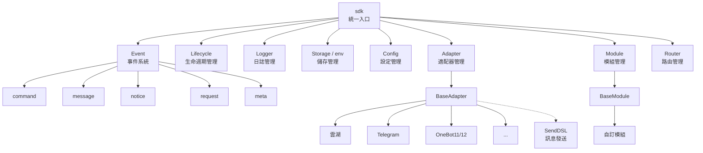
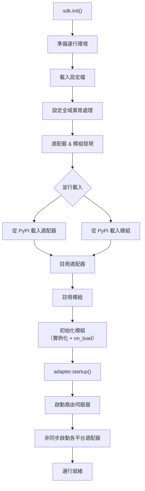
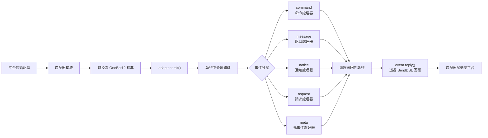
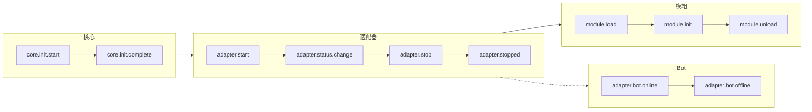
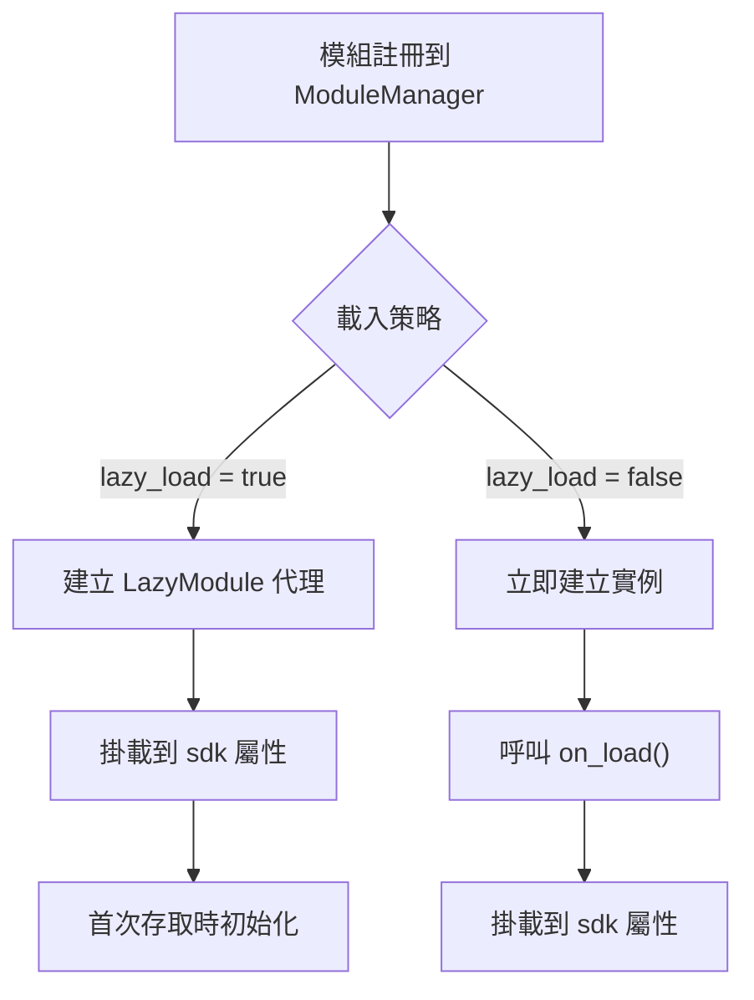

你是一个 ErisPulse 全栈开发专家，精通以下领域：

- ErisPulse 框架的核心架构和设计理念
- 模块开发和适配器开发
- 异步编程和事件驱动架构
- OneBot12 事件标准和平台适配
- SDK 核心模块 (Storage, Config, Logger, Router, Lifecycle)
- Event 包装类和事件处理系统
- 懒加载系统和生命周期管理
- SendDSL 消息发送系统
- 路由系统和 FastAPI 集成
- 各平台特性指南（OneBot11/12、Telegram、云湖、邮件等）
- 模块/适配器发布流程和模块商店
- 代码规范和文档字符串规范
- 已知问题追踪和历史 Bug 记录

你擅长：
- 编写高质量的异步 Python 代码
- 设计模块化、可扩展的架构
- 开发模块、适配器
- 使用 ErisPulse 的所有核心功能
- 遵循 ErisPulse 的最佳实践和代码规范
- 解决跨平台兼容性问题
- 通过 CLI 管理项目和发布

**使用以下文档作为知识库，回答问题时请优先参考文档内容。**


---


# ErisPulse 完整开发物料

> **注意**：本文档内容较多，建议仅用于具有强大上下文能力的 AI 模型


---


====
框架理解
====


### 架构概览

# 架構概覽

本文檔透過視覺化圖表介紹 ErisPulse SDK 的技術架構，幫助你快速理解框架的設計思想和模組關係。

## SDK 核心架構

下圖展示了 SDK 的核心模組組成及其關係：



### 核心模組說明

| 模組 | 說明 |
|------|------|
| **Event** | 事件系統，提供 command / message / notice / request / meta 五類事件處理 |
| **Adapter** | 適配器管理器，管理多平台適配器的註冊、啟動和關閉 |
| **Module** | 模組管理器，管理外掛的註冊、載入和卸載 |
| **Lifecycle** | 生命週期管理器，提供事件驅動的生命週期鉤子 |
| **Storage** | 基於 SQLite 的鍵值儲存系統，支援通用 SQL 鏈式查詢 |
| **Config** | TOML 格式的設定檔管理 |
| **Logger** | 模組化日誌系統，支援子日誌器 |
| **Router** | 基於 FastAPI 的 HTTP/WebSocket 路由管理 |

## 初始化流程

下圖展示了 `sdk.init()` 的完整初始化過程：



### 初始化階段詳解

1. **環境準備** - 載入 TOML 設定檔，設定全域異常處理
2. **並行發現** - 同時從已安裝的 PyPI 套件中發現適配器和模組
3. **註冊階段** - 將發現的適配器和模組註冊到對應管理器
4. **模組初始化** - 建立模組實例，呼叫 `on_load` 生命週期方法
5. **適配器啟動** - 啟動路由伺服器（FastAPI），非同步啟動各平台適配器連線

## 事件處理流程

下圖展示了訊息從平台到處理器的完整流轉路徑：



### 事件處理關鍵步驟

- **適配器接收** - 各平台適配器透過 WebSocket/Webhook 等方式接收原生事件
- **OB12 標準化** - 將平台原生事件轉換為統一的 OneBot12 標準格式
- **中介軟體處理** - 依次執行已註冊的中介軟體函式，可修改事件資料
- **事件分發** - 根據事件類型（message/notice/request/meta）分發到對應處理器
- **SendDSL 回覆** - 處理器透過 `event.reply()` 或 `SendDSL` 鏈式呼叫發送回應

## 生命週期事件

下圖展示了框架各組件的生命週期事件觸發順序：



### 監聽生命週期事件

你可以透過 `lifecycle.on()` 監聽這些事件，執行自訂邏輯：

```python
from ErisPulse import sdk

# 監聽所有適配器事件
@sdk.lifecycle.on("adapter")
async def on_adapter_event(event_data):
    print(f"適配器事件: {event_data}")

# 監聽模組載入完成
@sdk.lifecycle.on("module.load")
async def on_module_loaded(event_data):
    print(f"模組已載入: {event_data}")

# 監聽 Bot 上線
@sdk.lifecycle.on("adapter.bot.online")
async def on_bot_online(event_data):
    print(f"Bot 上線: {event_data}")
```

## 模組載入策略

ErisPulse 支援兩種模組載入策略：



> 更多詳情請參考 [延遲載入系統](advanced/lazy-loading.md) 和 [生命週期管理](advanced/lifecycle.md)。


### 术语表

# ErisPulse 術語表

本文件解釋 ErisPulse 中常用的專業術語，幫助您更好地理解框架概念。

## 核心概念

### 事件驅動架構
**通俗解釋：** 就像餐廳的點菜系統。顧客（使用者）點菜（發送訊息），服務員（事件系統）將訂單（事件）傳遞給後廚（模組），後廚處理後，服務員再把菜（回覆）端給顧客。

**技術解釋：** 程式的執行流程由外部事件觸發，而不是按固定順序執行。每當有新事件發生（如收到訊息），框架會自動呼叫相應的處理函式。

### OneBot12 標準
**通俗解釋：** 就像插座和插頭的標準。不同平台的「插頭」（原生事件格式）各不相同，但透過轉換器都變成統一的「插頭」（OneBot12格式），這樣您的程式碼就可以像插座一樣適配所有平台。

**技術解釋：** 一個統一的聊天機器人應用介面標準，定義了事件、訊息、API等的統一格式，使程式碼可以在不同平台間複用。

### 適配器
**通俗解釋：** 就像翻譯官。不同平台說不同「語言」（API格式），適配器把這些「語言」翻譯成 ErisPulse 能聽懂的「普通話」（OneBot12標準），也能把 ErisPulse 的指令翻譯回各平台的「語言」。

**技術解釋：** 負責與特定平台通訊的組件，接收平台原生事件並轉換為標準格式，或將標準格式請求發送到平台。

### 模組
**通俗解釋：** 就像手機上的 App。每個模組是一個獨立的功能套件，可以新增、刪除、更新。比如「天氣預報模組」、「音樂播放模組」等。

**技術解釋：** 功能擴展的基本單位，包含特定的業務邏輯、事件處理器和配置，可以獨立安裝和卸載。

### 事件
**通俗解釋：** 就像手機上的通知。當有新訊息、新好友、新群聊時，平台會發送一個「通知」（事件）給您的機器人。

**技術解釋：** 發生在平台上的任何值得注意的事情，如收到訊息、使用者加入群組、好友請求等，都以結構化資料的形式傳遞給程式。

### 事件處理器
**通俗解釋：** 就像快遞員的派送規則。當收到「包裹」（事件）時，根據包裹類型（訊息、通知、請求等）決定由誰來處理這個包裹。

**技術解析：** 用裝飾器標記的函式，當特定類型的事件發生時自動執行，例如 `@command`、`@message` 等。

## 開發相關術語

### SDK
**通俗解釋：** 就像工具箱。裡面裝著各種常用工具（儲存、配置、日誌等），您寫程式碼時可以直接拿這些工具用，不用自己造輪子。

**技術解釋：** Software Development Kit（軟體開發工具包），提供了一組預先建構好的組件和工具，簡化開發過程。

### 虛擬環境
**通俗解釋：** 就像獨立的「工作間」。每個專案有自己的「工作間」，裡面安裝的軟體套件互不干擾，避免版本衝突。

**技術解釋：** 隔離的 Python 環境，每個環境有獨立的套件列表和版本，防止不同專案的依賴衝突。

### 非同步程式設計
**通俗解釋：** 就像多工處理。機器人可以同時做很多事，比如在等待網路回應時，還能處理其他使用者的訊息，不會卡住。

**技術解釋：** 使用 `async`/`await` 關鍵字的程式設計方式，允許程式在等待耗時操作（如網路請求、檔案讀寫）時切換到其他任務，提高效率。

### 熱重載
**通俗解釋：** 就像網頁的自動重新整理。您修改程式碼後，不需要手動重啟機器人，它會自動載入新程式碼，立即生效。

**技術解釋：** 開發模式下，程式會自動偵測檔案變化並重新載入，無需手動重啟即可看到程式碼修改的效果。

### 延遲載入
**通俗解釋：** 就像按需開啟的抽屜。不用的抽屜（模組）先關著，需要時再開啟，這樣啟動時不用等所有抽屜都開啟。

**技術解釋：** 延遲載入策略，模組只在首次被存取時才初始化和載入，減少啟動時間和資源佔用。

## 功能相關術語

### 指令
**通俗解釋：** 就像遊戲裡的指令。使用者輸入 `/hello` 這樣的指令，機器人就會執行對應的功能。

**技術解釋：** 以特定前綴（如 `/`）開頭的訊息，被框架辨識為指令並路由到對應的處理函式。

### 回覆
**通俗解釋：** 就是機器人給使用者的「回答」。無論是文字、圖片還是語音，都是對使用者訊息的回覆。

**技術解釋：** 適配器將處理結果發送回平台，展示給使用者的過程。

### 儲存
**通俗解釋：** 就像機器人的「記事本」。可以記住使用者的資訊、設定、聊天記錄等，下次還能找到。

**技術解釋：** 持久化資料儲存系統，基於 SQLite 實現鍵值對儲存，用於保存需要長期保留的資料。

### 設定
**通俗解釋：** 就像機器人的「設定」。您可以透過設定檔修改機器人的行為，比如修改連接埠號、日誌層級等。

**技術解釋：** 使用 TOML 格式的設定管理系統，用於設定框架和模組的各種參數。

### 日誌
**通俗解釋：** 就像機器人的「日記」。記錄機器人做了什麼、遇到了什麼問題，方便除錯和排查問題。

**技術解釋：** 系統執行時產生的記錄資訊，包括資訊、警告、錯誤等不同層級，用於監控和除錯。

### 路由
**通俗解釋：** 就像交警指揮交通。決定哪個請求應該去哪個地方處理，比如網頁請求、WebSocket 連線等。

**技術解釋：** HTTP 和 WebSocket 路由管理器，根據 URL 路徑將請求分發到對應的處理函式。

## 平台相關術語

### 平台
**通俗解釋：** 機器人工作的地方，比如雲湖、Telegram、QQ等，每個平台有自己的規則和 API。

**技術解釋：** 提供聊天機器人服務的應用程式或服務，如雲湖企業通訊、Telegram 等。

### OneBot11/12
**通俗解釋：** 就像聊天機器人的「國際標準」。規定了訊息、事件等的統一格式，讓不同軟體之間能互相理解。

**技術解釋：** OneBot 是一個通用的聊天機器人應用介面標準，定義了事件、訊息、API等的格式。11 和 12 是不同版本的標準。

### SendDSL
**通俗解釋：** 就像發訊息的「捷徑」。用簡單的一句話就能發送各種類型的訊息（文字、圖片、@某人等）。

**技術解釋：** 鏈式呼叫的訊息發送介面，提供簡潔的語法來建構和發送複雜訊息。

## 其他術語

### 生命週期
**通俗解釋：** 機器人的「一生」：出生（啟動）、工作（執行）、休息（停止）。生命週期就是在這些關鍵時刻會觸發的事件。

**技術解釋：** 程式執行過程中的關鍵階段，如啟動、載入模組、卸載模組、關閉等，可以透過監聽這些事件來執行相應操作。

### 註解/裝飾器
**通俗解釋：** 就是給函式「貼標籤」。比如 `@command("hello")` 這個標籤告訴框架：這是一個指令處理器，名字叫 "hello"。

**技術解釋：** Python 的語法糖，用於修改函式或類別的行為。在 ErisPulse 中用於標記事件處理器、路由等。

### 型別註解
**通俗解釋：** 就是告訴函式參數是什麼「型別」。比如 `request: Request` 表示這個參數是一個請求物件。

**技術解釋：** Python 3.5+ 引入的特性，用於標註變數和參數的型別，提高程式碼可讀性和型別安全性。

### TOML
**通俗解釋：** 一種設定檔格式，比 JSON 更易讀，比 YAML 更嚴格，適合用來寫設定。

**技術解釋：** Tom's Obvious Minimal Language，一種設定檔格式，語法簡潔清晰，廣泛用於 Python 專案的設定管理。

## 獲取協助

如果您發現文件中有其他術語不理解，歡迎透過以下方式提問：
- 提交 GitHub Issue
- 參與社群討論
- 聯絡維護者


====
快速开始
====

# 快速開始

> 遇到不理解的術語？查看 [術語表](terminology.md) 獲取通俗易懂的解釋。

## 安裝 ErisPulse

### 使用 pip 安裝

確保你的 Python 版本 >= 3.10，然後使用 pip 安裝 ErisPulse：

```bash
pip install ErisPulse
```

### 使用 uv 安裝（推薦）

`uv` 是一個更快的 Python 工具鏈，推薦使用。如果你不確定什麼是"工具鏈"，可以理解為更高效的安裝和管理 Python 套件的工具。

#### 安裝 uv

```bash
pip install uv
```

#### 建立專案並安裝

```bash
uv python install 3.12              # 安裝 Python 3.12
uv venv                             # 建立虛擬環境
.venv\Scripts\activate               # 啟用環境
# source .venv/bin/activate          # Linux/Mac
uv pip install ErisPulse --upgrade  # 安裝框架
```

## 初始化專案

### 互動式初始化（推薦）

```bash
epsdk init
```

這將啟動一個互動式嚮導，引導您完成：
- 專案名稱設定
- 日誌層級設定
- 伺服器設定（主機和連接埠）
- 適配器選擇和設定
- 專案結構建立

### 快速初始化

```bash
# 指定專案名稱的快速模式
epsdk init -q -n my_bot

# 或只指定專案名稱
epsdk init -n my_bot
```

### 手動建立專案

如果更喜歡手動建立專案：

```bash
mkdir my_bot && cd my_bot
epsdk init
```

## 安裝模組

### 透過 CLI 安裝

```bash
epsdk install Yunhu AIChat
```

### 檢視可用模組

```bash
epsdk list-remote
```

### 互動式安裝

未指定套件名稱時進入互動式安裝介面：

```bash
epsdk install
```

## 執行專案

```bash
# 一般執行
epsdk run main.py

# 熱重載模式（開發時推薦）
epsdk run main.py --reload
```

## 專案結構

初始化後的專案結構：

```
my_bot/
├── config/
│   └── config.toml          # 設定檔
└── main.py                  # 入口檔案

```

## 設定檔

基本的 `config.toml` 設定：

```toml
[ErisPulse.server]
host = "0.0.0.0"
port = 8000

[ErisPulse.logger]
level = "INFO"

[Yunhu_Adapter]
# 適配器設定
```

## 下一步

- [入門指南總覽](getting-started/README.md) - 瞭解 ErisPulse 的基本概念
- [建立第一個機器人](getting-started/first-bot.md) - 建立一個簡單的機器人
- [使用者使用指南](user-guide/) - 深入瞭解設定和模組管理
- [開發者指南](developer-guide/) - 開發自訂模組和適配器


====
入门指南
====


### 入门指南总览

# 入門指南

歡迎來到 ErisPulse 入門指南。如果你是第一次使用 ErisPulse，這裡將帶你從零開始，逐步了解框架的核心概念和基本用法。

## 學習路徑

本指南按以下順序組織，建議依次閱讀：

1. **建立第一個機器人** - 了解完整的專案初始化流程
2. **基礎概念** - 理解 ErisPulse 的核心架構
3. **事件處理入門** - 學習如何處理各類事件
4. **常見任務範例** - 掌握常用功能的實作

## 開發方式選擇

ErisPulse 支援兩種開發方式，你可以根據需求選擇：

### 嵌入式開發（適合快速原型）

直接在專案中使用 ErisPulse，無需建立獨立模組。

```python
# main.py
import asyncio
from ErisPulse import sdk
from ErisPulse.Core.Event import command

@command("hello")
async def hello(event):
    await event.reply("你好！")

# 執行 SDK 並且維持運作 | 需要在非同步環境中運作
asyncio.run(sdk.run(keep_running=True))
```

**優點：**
- 快速上手，無需額外配置
- 適合專案內部專用功能
- 便於除錯和測試

**缺點：**
- 不便於程式碼複用和分發
- 難以獨立管理依賴

### 模組開發（推薦用於生產）

建立獨立的模組套件，透過套件管理員安裝使用。

**優點：**
- 便於分發和共享
- 獨立的依賴管理
- 清晰的版本控制

**缺點：**
- 需要額外的專案結構
- 初期設定相對複雜

## ErisPulse 核心概念

### 架構概覽

```
┌─────────────────────────────────────────────────────┐
│                ErisPulse 框架                 │
├─────────────────────────────────────────────────────┤
│                                             │
│  ┌──────────────┐      ┌──────────────┐    │
│  │  適配器系統  │◄────►│  事件系統    │    │
│  │             │      │              │    │
│  │  Yunhu      │      │  Message     │    │
│  │  Telegram   │      │  Command     │    │
│  │  OneBot11   │      │  Notice      │    │
│  │  Email      │      │  Request     │    │
│  └──────────────┘      │  Meta        │    │
│         │              └──────────────┘    │
│         ▼                   │              │
│  ┌──────────────┐           ▼              │
│  │  模組系統    │◄──────────────┐       │
│  │             │               │       │
│  │  模組 A     │               │       │
│  │  模組 B     │               │       │
│  │  ...        │               │       │
│  └──────────────┘               │       │
│                               │       │
│  ┌──────────────┐              │       │
│  │  核心模組    │◄─────────────┘       │
│  │  Storage    │                      │
│  │  Config     │                      │
│  │  Logger     │                      │
│  │  Router     │                      │
│  └──────────────┘                      │
└─────────────────────────────────────────────┘
         │                    │
         ▼                    ▼
    ┌────────┐          ┌────────┐
    │  平台   │          │ 使用者  │
    │  API    │          │ 程式碼  │
    └────────┘          └────────┘
```

### 核心元件說明

#### 1. 適配器系統

適配器負責與特定平台通訊，將平台特定的事件轉換為統一的 OneBot12 標準格式。

**範例：**
- Yunhu 適配器：與雲湖平台通訊
- Telegram 適配器：與 Telegram Bot API 通訊
- OneBot11 適配器：與 OneBot11 相容的應用程式通訊

#### 2. 事件系統

事件系統負責處理各類事件，包括：
- **訊息事件**：使用者發送的訊息
- **指令事件**：使用者輸入的指令（如 `/hello`）
- **通知事件**：系統通知（如好友新增、群組成員變化）
- **請求事件**：使用者請求（如好友請求、群組邀請）
- **元事件**：系統層級事件（如連線、心跳）

#### 3. 模組系統

模組是功能擴充的主要方式，用於：
- 註冊事件處理器
- 實作業務邏輯
- 提供指令介面
- 呼叫適配器發送訊息

#### 4. 核心模組

提供基礎功能的模組：
- **Storage**：基於 SQLite 的鍵值儲存
- **Config**：TOML 格式的設定管理
- **Logger**：模組化日誌系統
- **Router**：HTTP 和 WebSocket 路由管理

## 開始學習

準備好了嗎？讓我們開始建立你的第一個機器人。

- [建立第一個機器人](first-bot.md)


### 创建第一个机器人

# 建立第一個機器人

本指南將帶你從零開始建立一個簡單的 ErisPulse 機器人。

## 第一步：建立專案

使用 CLI 工具初始化專案：

```bash
# 互動式初始化
epsdk init

# 或是快速初始化
epsdk init -q -n my_first_bot
```

按照提示完成設定，建議選擇：
- 專案名稱：my_first_bot
- 日誌層級：INFO
- 伺服器：預設配置
- 適配器：選擇你需要的平台（如 Yunhu）

## 第二步：查看專案結構

初始化後的專案結構：

```
my_first_bot/
├── config/
│   └── config.toml
├── main.py
└── requirements.txt
```

## 第三步：編寫第一個指令

開啟 `main.py`，編寫一個簡單的指令處理器：

```python
from ErisPulse import sdk
from ErisPulse.Core.Event import command

@command("hello", help="發送問候訊息")
async def hello_handler(event):
    """處理 hello 指令"""
    user_name = event.get_user_nickname() or "朋友"
    await event.reply(f"你好，{user_name}！我是 ErisPulse 機器人。")

@command("ping", help="測試機器人是否在線")
async def ping_handler(event):
    """處理 ping 指令"""
    await event.reply("Pong！機器人運作正常。")

async def main():
    """主入口函數"""
    print("正在初始化 ErisPulse...")
    # 執行 SDK 並且維持運行
    await sdk.run(keep_running=True)
    print("ErisPulse 初始化完成！")

if __name__ == "__main__":
    import asyncio
    asyncio.run(main())
```

> 除了直接使用 `sdk.run()` 之外，你還可以更精細地控制執行流程，如：
```python
import asyncio
from ErisPulse import sdk

async def main():
    try:
        isInit = await sdk.init()
        
        if not isInit:
            sdk.logger.error("ErisPulse 初始化失敗，請檢查日誌")
            return
        
        await sdk.adapter.startup()
        
        # 保持程式運行，如果有其他需要執行的操作，你也可以不維持事件，但需要自行處理
        await asyncio.Event().wait()
    except Exception as e:
        sdk.logger.error(e)
    finally:
        await sdk.uninit()

if __name__ == "__main__":
    asyncio.run(main())
```

## 第四步：執行機器人

```bash
# 一般執行
epsdk run main.py

# 開發模式（支援熱重載）
epsdk run main.py --reload
```

## 第五步：測試機器人

在你的聊天平台中傳送指令：

```
/hello
```

你應該會收到機器人的回覆。

## 程式碼說明

### 指令裝飾器

```python
@command("hello", help="發送問候訊息")
```

- `hello`：指令名稱，使用者透過 `/hello` 呼叫
- `help`：指令說明，在 `/help` 指令中顯示

### 事件參數

```python
async def hello_handler(event):
```

`event` 參數是一個 Event 物件，包含：
- 訊息內容
- 發送者資訊
- 平台資訊
- 等等...

### 傳送回覆

```python
await event.reply("回覆內容")
```

`event.reply()` 是一個便捷方法，用於向發送者傳送訊息。

## 擴充：新增更多功能

### 新增訊息監聽

```python
from ErisPulse.Core.Event import message

@message.on_message()
async def message_handler(event):
    """監聽所有訊息"""
    text = event.get_text()
    if "你好" in text:
        await event.reply("你好！")
```

### 新增通知監聽

```python
from ErisPulse.Core.Event import notice

@notice.on_friend_add()
async def friend_add_handler(event):
    """監聽好友新增事件"""
    user_id = event.get_user_id()
    await event.reply(f"歡迎新增我為好友！你的 ID 是 {user_id}")
```

### 使用儲存系統

```python
# 取得計數器
count = sdk.storage.get("hello_count", 0)

# 增加計數
count += 1
sdk.storage.set("hello_count", count)

await event.reply(f"這是第 {count} 次呼叫 hello 指令")
```

## 常見問題

### 指令沒有回應？

1. 檢查適配器是否正確設定
2. 查看日誌輸出，確認是否有錯誤
3. 確認指令前綴是否正確（預設是 `/`）

### 如何修改指令前綴？

在 `config.toml` 中新增：

```toml
[ErisPulse.event.command]
prefix = "!"
case_sensitive = false
```

### 如何支援多平台？

程式碼會自動適配所有已載入的平台適配器。只需確保你的邏輯相容即可：

```python
@command("hello")
async def hello_handler(event):
    platform = event.get_platform()
    
    if platform == "yunhu":
        await event.reply("你好！來自雲湖")
    elif platform == "telegram":
        await event.reply("Hello! From Telegram")
```

## 下一步

- [基礎概念](basic-concepts.md) - 深入了解 ErisPulse 的核心概念
- [事件處理入門](event-handling.md) - 學習處理各類事件
- [常見任務範例](common-tasks.md) - 掌握更多實用功能


### 基础概念

# 基礎概念

本指南介紹 ErisPulse 的核心概念，幫助你理解框架的設計思想和基本架構。

## 事件驅動架構

ErisPulse 採用事件驅動架構，所有的交互都通過事件來傳遞和處理。

### 事件流程

```
用戶發送訊息
      │
      ▼
平台接收
      │
      ▼
適配器接收平台原生事件
      │
      ▼
轉換為 OneBot12 標準事件
      │
      ▼
提交到事件系統
      │
      ▼
分發給已註冊的處理器
      │
      ▼
模組處理事件
      │
      ▼
通過適配器發送響應
      │
      ▼
平台顯示給用戶
```

### OneBot12 標準

ErisPulse 使用 OneBot12 作為核心事件標準。OneBot12 是一個通用的聊天機器人應用介面標準，定義了統一的事件格式。

所有適配器都將平台特定的事件轉換為 OneBot12 格式，確保代碼的一致性。

## 核心組件

### 1. SDK 對象

SDK 是所有功能的統一入口點，提供對核心組件的訪問。

```python
from ErisPulse import sdk

# 訪問核心模組
sdk.storage    # 存儲系統
sdk.config     # 配置系統
sdk.logger     # 日


### 事件处理入门

# 事件處理入門

本指南介紹如何處理 ErisPulse 中的各類事件。

## 事件類型概覽

ErisPulse 支援以下事件類型：

| 事件類型 | 說明 | 適用場景 |
|---------|------|---------|
| 訊息事件 | 使用者發送的任何訊息 | 聊天機器人、內容過濾 |
| 命令事件 | 以命令前綴開頭的訊息 | 命令處理、功能入口 |
| 通知事件 | 系統通知（好友新增、群組成員變化等） | 歡迎訊息、狀態通知 |
| 請求事件 | 使用者請求（好友請求、群組邀請） | 自動處理請求 |
| 元事件 | 系統級事件（連線、心跳） | 連線監控、狀態檢查 |

## 訊息事件處理

### 監聽所有訊息

```python
from ErisPulse.Core.Event import message

@message.on_message()
async def message_handler(event):
    text = event.get_text()
    user_id = event.get_user_id()
    sdk.logger.info(f"收到 {user_id} 的訊息: {text}")
```

### 監聽私聊訊息

```python
@message.on_private_message()
async def private_handler(event):
    user_id = event.get_user_id()
    await event.reply(f"你好，{user_id}！這是私聊訊息。")
```

### 監聽群聊訊息

```python
@message.on_group_message()
async def group_handler(event):
    group_id = event.get_group_id()
    user_id = event.get_user_id()
    sdk.logger.info(f"群組 {group_id} 中 {user_id} 發送了訊息")
```

### 監聽@訊息

```python
@message.on_at_message()
async def at_handler(event):
    # 取得被@的使用者列表
    mentions = event.get_mentions()
    await event.reply(f"你@了這些使用者: {mentions}")
```

## 命令事件處理

### 基本命令

```python
from ErisPulse.Core.Event import command

@command("help", help="顯示幫助資訊")
async def help_handler(event):
    help_text = """
可用命令：
/help - 顯示幫助
/ping - 測試連線
/info - 查看資訊
    """
    await event.reply(help_text)
```

### 命令別名

```python
@command(["help", "h"], aliases=["幫助"], help="顯示幫助資訊")
async def help_handler(event):
    await event.reply("幫助資訊...")
```

使用者可以使用以下任何方式呼叫：
- `/help`
- `/h`
- `/幫助`

### 命令參數

```python
@command("echo", help="回顯訊息")
async def echo_handler(event):
    # 取得命令參數
    args = event.get_command_args()
    
    if not args:
        await event.reply("請輸入要回顯的訊息")
    else:
        await event.reply(f"你說了: {' '.join(args)}")
```

### 命令組

```python
@command("admin.reload", group="admin", help="重新載入模組")
async def reload_handler(event):
    await event.reply("模組已重新載入")

@command("admin.stop", group="admin", help="停止機器人")
async def stop_handler(event):
    await event.reply("機器人已停止")
```

### 命令權限

```python
def is_admin(event):
    """檢查使用者是否為管理員"""
    admin_list = ["user123", "user456"]
    return event.get_user_id() in admin_list

@command("admin", permission=is_admin, help="管理員命令")
async def admin_handler(event):
    await event.reply("這是管理員命令")
```

### 命令優先級

```python
# 優先級數值越小，執行越早
@message.on_message(priority=10)
async def high_priority_handler(event):
    await event.reply("高優先級處理器")

@message.on_message(priority=1)
async def low_priority_handler(event):
    await event.reply("低優先級處理器")
```

### 並行事件處理

ErisPulse 事件系統採用**同優先級並行、不同優先級串行**的調度模型：

```
事件到達
    ↓
priority=0 組: [處理器A || 處理器B] 並行 → 合併結果
    ↓ (如未中斷)
priority=1 組: [處理器C || 處理器D] 並行 → 合併結果
    ↓
...
```

- **同優先級並行**：優先級相同的多個處理器會同時執行，提高吞吐量
- **跨級串行**：不同優先級的組按順序執行，確保高優先級處理器先執行
- **Copy-On-Write**：處理器無修改時不建立副本，確保零開銷
- **衝突處理**：同優先級多處理器修改同一欄位時，使用最後修改值並記錄警告日誌
- **中斷機制**：任意處理器呼叫 `event.mark_processed()` 後，跳過後續低優先級組

```python
# 示例：同優先級處理器並行執行
@message.on_message(priority=0)
async def handler_a(event):
    # 處理任務A
    event['result_a'] = process_a()

@message.on_message(priority=0)
async def handler_b(event):
    # 與 handler_a 並行執行
    event['result_b'] = process_b()

# 不同優先級串行執行
@message.on_message(priority=10)
async def handler_c(event):
    # 在 priority=0 組全部完成後執行
    pass
```

## 通知事件處理

### 好友新增

```python
from ErisPulse.Core.Event import notice

@notice.on_friend_add()
async def friend_add_handler(event):
    user_id = event.get_user_id()
    nickname = event.get_user_nickname() or "新朋友"
    await event.reply(f"歡迎新增我為好友，{nickname}！")
```

### 群組成員增加

```python
@notice.on_group_increase()
async def member_increase_handler(event):
    group_id = event.get_group_id()
    user_id = event.get_user_id()
    await event.reply(f"歡迎新成員 {user_id} 加入群組 {group_id}")
```

### 群組成員減少

```python
@notice.on_group_decrease()
async def member_decrease_handler(event):
    group_id = event.get_group_id()
    user_id = event.get_user_id()
    await event.reply(f"成員 {user_id} 離開了群組 {group_id}")
```

## 請求事件處理

### 好友請求

```python
from ErisPulse.Core.Event import request

@request.on_friend_request()
async def friend_request_handler(event):
    user_id = event.get_user_id()
    comment = event.get_comment()
    
    sdk.logger.info(f"收到好友請求: {user_id}, 附言: {comment}")
    
    # 可以透過適配器 API 處理請求
    # 具體實作請參考各適配器文件
```

### 群組邀請請求

```python
@request.on_group_request()
async def group_request_handler(event):
    group_id = event.get_group_id()
    user_id = event.get_user_id()
    
    await event.reply(f"收到群組 {group_id} 的邀請，來自 {user_id}")
```

## 元事件處理

### 連線事件

```python
from ErisPulse.Core.Event import meta

@meta.on_connect()
async def connect_handler(event):
    platform = event.get_platform()
    sdk.logger.info(f"{platform} 平台已連線")

@meta.on_disconnect()
async def disconnect_handler(event):
    platform = event.get_platform()
    sdk.logger.warning(f"{platform} 平台已斷線")
```

### 心跳事件

```python
@meta.on_heartbeat()
async def heartbeat_handler(event):
    platform = event.get_platform()
    sdk.logger.debug(f"{platform} 心跳檢測")
```

### Bot 狀態查詢

當適配器發送 meta 事件後，框架自動追蹤 Bot 狀態，你可以隨時查詢：

```python
from ErisPulse import sdk

# 檢查某個 Bot 是否上線
if sdk.adapter.is_bot_online("telegram", "123456"):
    await adapter.Send.To("user", "123456").Text("Bot 上線")

# 列出當前所有上線 Bot
bots = sdk.adapter.list_bots()
for platform, bot_list in bots.items():
    for bot_id, info in bot_list.items():
        print(f"{platform}/{bot_id}: {info['status']}")

# 取得完整狀態摘要
summary = sdk.adapter.get_status_summary()
```

## 互動式處理

### 使用 reply 方法發送回覆

`event.reply()` 方法支援多種修飾參數，方便發送帶有 @、回覆等功能的訊息：

```python
# 簡單回覆
await event.reply("你好")

# 發送不同類型的訊息
await event.reply("http://example.com/image.jpg", method="Image")  # 圖片
await event.reply("http://example.com/voice.mp3", method="Voice")  # 語音

# @單個使用者
await event.reply("你好", at_users=["user123"])

# @多個使用者
await event.reply("大家好", at_users=["user1", "user2", "user3"])

# 回覆訊息
await event.reply("回覆內容", reply_to="msg_id")

# @全體成員
await event.reply("公告", at_all=True)

# 組合使用：@使用者 + 回覆訊息
await event.reply("內容", at_users=["user1"], reply_to="msg_id")
```

### 等待使用者回覆

```python
@command("ask", help="詢問使用者")
async def ask_handler(event):
    await event.reply("請輸入你的名字:")
    
    # 等待使用者回覆，逾時時間 30 秒
    reply = await event.wait_reply(timeout=30)
    
    if reply:
        name = reply.get_text()
        await event.reply(f"你好，{name}！")
    else:
        await event.reply("等待逾時，請重新輸入。")
```

### 帶驗證的等待回覆

```python
@command("age", help="詢問年齡")
async def age_handler(event):
    def validate_age(event_data):
        """驗證年齡是否有效"""
        try:
            age = int(event_data.get_text())
            return 0 <= age <= 150
        except ValueError:
            return False
    
    await event.reply("請輸入你的年齡 (0-150):")
    
    reply = await event.wait_reply(
        timeout=60,
        validator=validate_age
    )
    
    if reply:
        age = int(reply.get_text())
        await event.reply(f"你的年齡是 {age} 歲")
    else:
        await event.reply("輸入無效或逾時")
```

### 帶回呼的等待回覆

```python
@command("confirm", help="確認操作")
async def confirm_handler(event):
    async def handle_confirmation(reply_event):
        text = reply_event.get_text().lower()
        
        if text in ["是", "yes", "y"]:
            await event.reply("操作已確認！")
        else:
            await event.reply("操作已取消。")
    
    await event.reply("確認執行此操作嗎？(是/否)")
    
    await event.wait_reply(
        timeout=30,
        callback=handle_confirmation
    )
```

### 確認對話

等待使用者確認或否定，自動識別內建中英文確認詞：

```python
@command("confirm", help="確認操作")
async def confirm_handler(event):
    if await event.confirm("確定要執行此操作嗎？"):
        await event.reply("已確認，執行中...")
    else:
        await event.reply("已取消")

# 自訂確認詞
if await event.confirm("繼續嗎？", yes_words={"go", "繼續"}, no_words={"stop", "停止"}):
    pass
```

### 選擇選單

使用者可回覆選項編號或選項文字：

```python
@command("choose", help="選擇")
async def choose_handler(event):
    choice = await event.choose(
        "請選擇顏色：",
        ["紅色", "綠色", "藍色"]
    )
    
    if choice is not None:
        colors = ["紅色", "綠色", "藍色"]
        await event.reply(f"你選擇了：{colors[choice]}")
    else:
        await event.reply("逾時未選擇")
```

### 收集表單

多步驟收集使用者輸入：

```python
@command("register", help="註冊")
async def register_handler(event):
    data = await event.collect([
        {"key": "name", "prompt": "請輸入姓名："},
        {"key": "age", "prompt": "請輸入年齡：", 
         "validator": lambda e: e.get_text().isdigit()},
        {"key": "email", "prompt": "請輸入信箱："}
    ])
    
    if data:
        await event.reply(f"註冊成功！\n姓名：{data['name']}\n年齡：{data['age']}\n信箱：{data['email']}")
    else:
        await event.reply("註冊逾時或輸入無效")
```

### 等待任意事件

等待滿足條件的任意事件，不限於同一使用者：

```python
@command("wait_member", help="等待新成員")
async def wait_member_handler(event):
    await event.reply("等待群組成員加入...")
    
    evt = await event.wait_for(
        event_type="notice",
        condition=lambda e: e.get_detail_type() == "group_member_increase",
        timeout=120
    )
    
    if evt:
        await event.reply(f"歡迎新成員：{evt.get_user_id()}")
    else:
        await event.reply("等待逾時")
```

### 多輪對話

建立可互動的多輪對話上下文：

```python
@command("survey", help="問卷調查")
async def survey_handler(event):
    conv = event.conversation(timeout=60)
    
    await conv.say("歡迎參與問卷調查！")
    
    while conv.is_active:
        reply = await conv.wait()
        
        if reply is None:
            await conv.say("對話逾時，再見！")
            break


### 常见任务示例

# 常見任務範例

本指南提供常見功能的實作範例，協助您快速實作常用功能。

## 內容列表

1. 資料持久化
2. 定時任務
3. 訊息過濾
4. 多平台適配
5. 權限控制
6. 訊息統計
7. 搜尋功能
8. 圖片處理

## 資料持久化

### 簡單計數器

```python
from ErisPulse import sdk
from ErisPulse.Core.Event import command

@command("count", help="查看指令呼叫次數")
async def count_handler(event):
    # 取得計數
    count = sdk.storage.get("command_count", 0)
    
    # 增加計數
    count += 1
    sdk.storage.set("command_count", count)
    
    await event.reply(f"這是第 {count} 次呼叫此指令")
```

### 使用者資料儲存

```python
@command("profile", help="查看個人資料")
async def profile_handler(event):
    user_id = event.get_user_id()
    
    # 取得使用者資料
    user_data = sdk.storage.get(f"user:{user_id}", {
        "nickname": "",
        "join_date": None,
        "message_count": 0
    })
    
    profile_text = f"""
暱稱: {user_data['nickname']}
加入時間: {user_data['join_date']}
訊息數: {user_data['message_count']}
    """
    
    await event.reply(profile_text.strip())

@command("setnick", help="設定暱稱")
async def setnick_handler(event):
    user_id = event.get_user_id()
    args = event.get_command_args()
    
    if not args:
        await event.reply("請輸入暱稱")
        return
    
    # 更新使用者資料
    user_data = sdk.storage.get(f"user:{user_id}", {})
    user_data["nickname"] = " ".join(args)
    sdk.storage.set(f"user:{user_id}", user_data)
    
    await event.reply(f"暱稱已設定為: {' '.join(args)}")
```

## 定時任務

### 簡單定時器

```python
from ErisPulse import sdk
from ErisPulse.Core.Event import command
import asyncio

class TimerModule:
    def __init__(self):
        self.sdk = sdk
        self._tasks = []
    
    async def on_load(self, event):
        """模組載入時啟動定時任務"""
        self._start_timers()
        
        @command("timer", help="定時器管理")
        async def timer_handler(event):
            await event.reply("定時器正在運作中...")
    
    def _start_timers(self):
        """啟動定時任務"""
        # 每 60 秒執行一次
        task = asyncio.create_task(self._every_minute())
        self._tasks.append(task)
        
        # 每天凌晨執行
        task = asyncio.create_task(self._daily_task())
        self._tasks.append(task)
    
    async def _every_minute(self):
        """每分鐘執行的任務"""
        self.sdk.logger.info("每分鐘任務執行")
        # 您的邏輯...
    
    async def _daily_task(self):
        """每天凌晨執行的任務"""
        import time
        
        while True:
            # 計算到凌晨的時間
            now = time.time()
            midnight = now + (86400 - now % 86400)
            
            await asyncio.sleep(midnight - now)
            
            # 執行任務
            self.sdk.logger.info("每日任務執行")
            # 您的邏輯...
```

### 使用生命週期事件

```python
@sdk.lifecycle.on("core.init.complete")
async def init_complete_handler(event_data):
    """SDK 初始化完成後啟動定時任務"""
    import asyncio
    
    async def daily_reminder():
        """每日提醒"""
        await asyncio.sleep(86400)  # 24小時
        self.sdk.logger.info("執行每日任務")
    
    # 啟動背景任務
    asyncio.create_task(daily_reminder())
```

## 訊息過濾

### 關鍵詞過濾

```python
from ErisPulse.Core.Event import message

blocked_words = ["垃圾", "廣告", "釣魚"]

@message.on_message()
async def filter_handler(event):
    text = event.get_text()
    
    # 檢查是否包含敏感詞
    for word in blocked_words:
        if word in text:
            sdk.logger.warning(f"攔截敏感訊息: {word}")
            return  # 不處理此訊息
    
    # 正常處理訊息
    await event.reply(f"收到: {text}")
```

### 黑名單過濾

```python
# 從設定或儲存載入黑名單
blacklist = sdk.storage.get("user_blacklist", [])

@message.on_message()
async def blacklist_handler(event):
    user_id = event.get_user_id()
    
    if user_id in blacklist:
        sdk.logger.info(f"黑名單使用者: {user_id}")
        return  # 不處理
    
    # 正常處理
    await event.reply(f"您好，{user_id}")
```

## 多平台適配

### 平台特定回應

```python
@command("help", help="顯示說明")
async def help_handler(event):
    platform = event.get_platform()
    
    if platform == "yunhu":
        await event.reply("雲湖平台說明...")
    elif platform == "telegram":
        await event.reply("Telegram platform help...")
    elif platform == "onebot11":
        await event.reply("OneBot11 help...")
    else:
        await event.reply("通用說明資訊")
```

### 平台特性檢測

```python
@command("rich", help="傳送富文本訊息")
async def rich_handler(event):
    platform = event.get_platform()
    
    if platform == "yunhu":
        # 雲湖支援 HTML
        yunhu = sdk.adapter.get("yunhu")
        await yunhu.Send.To("user", event.get_user_id()).Html(
            "<b>粗體文字</b><i>斜體文字</i>"
        )
    elif platform == "telegram":
        # Telegram 支援 Markdown
        telegram = sdk.adapter.get("telegram")
        await telegram.Send.To("user", event.get_user_id()).Markdown(
            "**粗體文字** *斜體文字*"
        )
    else:
        # 其他平台使用純文字
        await event.reply("粗體文字 斜體文字")
```

## 權限控制

### 管理員檢查

```python
# 設定管理員清單
ADMINS = ["user123", "user456"]

def is_admin(user_id):
    """檢查是否為管理員"""
    return user_id in ADMINS

@command("admin", help="管理員指令")
async def admin_handler(event):
    user_id = event.get_user_id()
    
    if not is_admin(user_id):
        await event.reply("權限不足，此指令僅限管理員使用")
        return
    
    await event.reply("管理員指令執行成功")

@command("addadmin", help="新增管理員")
async def addadmin_handler(event):
    if not is_admin(event.get_user_id()):
        return
    
    args = event.get_command_args()
    if not args:
        await event.reply("請輸入要新增的管理員 ID")
        return
    
    new_admin = args[0]
    ADMINS.append(new_admin)
    await event.reply(f"已新增管理員: {new_admin}")
```

### 群組權限

```python
@command("groupinfo", help="檢視群組資訊")
async def groupinfo_handler(event):
    if not event.is_group_message():
        await event.reply("此指令僅限群組使用")
        return
    
    group_id = event.get_group_id()
    user_id = event.get_user_id()
    
    await event.reply(f"群組 ID: {group_id}, 您的 ID: {user_id}")
```

## 訊息統計

### 訊息計數

```python
@message.on_message()
async def count_handler(event):
    # 取得統計
    stats = sdk.storage.get("message_stats", {
        "total": 0,
        "by_user": {},
        "by_day": {}
    })
    
    # 更新統計
    stats["total"] += 1
    
    user_id = event.get_user_id()
    stats["by_user"][user_id] = stats["by_user"].get(user_id, 0) + 1
    
    # 儲存
    sdk.storage.set("message_stats", stats)

@command("stats", help="檢視訊息統計")
async def stats_handler(event):
    stats = sdk.storage.get("message_stats", {
        "total": 0,
        "by_user": {},
        "by_day": {}
    })
    
    top_users = sorted(
        stats["by_user"].items(),
        key=lambda x: x[1],
        reverse=True
    )[:5]
    
    top_text = "\n".join(
        f"{uid}: {count} 則訊息" for uid, count in top_users
    )
    
    await event.reply(f"總訊息數: {stats['total']}\n\n活躍使用者:\n{top_text}")
```

## 搜尋功能

### 簡單搜尋

```python
from ErisPulse.Core.Event import command, message

# 儲存訊息歷史
message_history = []

@message.on_message()
async def store_handler(event):
    """儲存訊息用於搜尋"""
    user_id = event.get_user_id()
    text = event.get_text()
    
    message_history.append({
        "user_id": user_id,
        "text": text,
        "time": event.get_time()
    })
    
    # 限制歷史記錄數量
    if len(message_history) > 1000:
        message_history.pop(0)

@command("search", help="搜尋訊息")
async def search_handler(event):
    args = event.get_command_args()
    
    if not args:
        await event.reply("請輸入搜尋關鍵詞")
        return
    
    keyword = " ".join(args)
    results = []
    
    # 搜尋歷史記錄
    for msg in message_history:
        if keyword in msg["text"]:
            results.append(msg)
    
    if not results:
        await event.reply("未找到符合的訊息")
        return
    
    # 顯示結果
    result_text = f"找到 {len(results)} 則符合訊息:\n\n"
    for i, msg in enumerate(results[:10], 1):  # 最多顯示 10 則
        result_text += f"{i}. {msg['text']}\n"
    
    await event.reply(result_text)
```

## 圖片處理

### 圖片下載與儲存

```python
@message.on_message()
async def image_handler(event):
    """處理圖片訊息"""
    message_segments = event.get_message()
    
    for segment in message_segments:
        if segment.get("type") == "image":
            file_url = segment.get("data", {}).get("file")
            
            if file_url:
                # 下載圖片
                import aiohttp
                
                async with aiohttp.ClientSession() as session:
                    async with session.get(file_url) as response:
                        if response.status == 200:
                            image_data = await response.read()
                            
                            # 儲存至檔案
                            filename = f"images/{event.get_time()}.jpg"
                            with open(filename, "wb") as f:
                                f.write(image_data)
                            
                            sdk.logger.info(f"圖片已儲存: {filename}")
                            await event.reply("圖片已儲存")
```

### 圖片辨識範例

```python
@command("identify", help="辨識圖片")
async def identify_handler(event):
    """辨識訊息中的圖片"""
    message_segments = event.get_message()
    
    for segment in message_segments:
        if segment.get("type") == "image":
            file_url = segment.get("data", {}).get("file")
            
            # 呼叫圖片辨識 API
            result = await _identify_image(file_url)
            
            await event.reply(f"辨識結果: {result}")
            return
    
    await event.reply("未找到圖片")

async def _identify_image(url):
    """呼叫圖片辨識 API（範例）"""
    import aiohttp
    
    async with aiohttp.ClientSession() as session:
        async with session.post(
            "https://api.example.com/identify",
            json={"url": url}
        ) as response:
            data = await response.json()
            return data.get("description", "辨識失敗")
```

## 下一步

- [使用者使用指南](../user-guide/) - 了解設定與模組管理
- [開發者指南](../developer-guide/) - 學習開發模組與介面卡
- [進階主題](../advanced/) - 深入了解框架特性


====
用户指南
====


### 安装和配置

# 安裝與設定

本指南將介紹如何安裝 ErisPulse 並設定你的專案。

## 系統需求

- Python 3.10 或更高版本
- pip 或 uv（推薦）
- 足夠的磁碟空間（至少 100MB）

## 安裝方式

### 方式一：使用 pip 安裝

```bash
# 安裝 ErisPulse
pip install ErisPulse

# 升級到最新版本
pip install ErisPulse --upgrade
```

### 方式二：使用 uv 安裝（推薦）

uv 是一個更快的 Python 工具鏈，推薦用於開發環境。

#### 安裝 uv

```bash
# 使用 pip 安裝 uv
pip install uv

# 驗證安裝
uv --version
```

#### 建立虛擬環境

```bash
# 建立專案目錄 && cd my_bot
mkdir my_bot && cd my_bot

# 安裝 Python 3.12
uv python install 3.12

# 建立虛擬環境
uv venv
```

#### 啟用虛擬環境

```bash
# Windows
.venv\Scripts\activate

# Linux/Mac
source .venv/bin/activate
```

#### 安裝 ErisPulse

```bash
# 安裝 ErisPulse
uv pip install ErisPulse --upgrade
```

## 專案初始化

### 互動式初始化

```bash
epsdk init
```

按照提示完成：
1. 輸入專案名稱
2. 選擇日誌級別
3. 設定伺服器參數
4. 選擇適配器
5. 設定適配器參數

### 快速初始化

```bash
# 快速模式，跳過互動式設定
epsdk init -q -n my_bot
```

### 設定說明

初始化後會生成 `config/config.toml` 檔案：

```toml
[ErisPulse.server]
host = "0.0.0.0"
port = 8000

[ErisPulse.logger]
level = "INFO"

[ErisPulse.framework]
enable_lazy_loading = true
···

```

## 模組安裝

### 從遠端倉庫安裝

```bash
# 安裝指定模組
epsdk install Yunhu

# 安裝多個模組
epsdk install Yunhu Weather
```

### 從本機安裝

```bash
# 安裝本機模組
epsdk install ./my-module
```

### 互動式安裝

```bash
# 不指定套件名進入互動式安裝
epsdk install
```

## 驗證安裝

### 檢查安裝

```bash
# 檢查 ErisPulse 版本
epsdk --version
```

### 運行測試

```bash
# 執行專案
epsdk run main.py
```

如果看到類似的輸出說明安裝成功：

```
[INFO] 正在初始化 ErisPulse...
[INFO] 適配器已載入: Yunhu
[INFO] 模組已載入: MyModule
[INFO] ErisPulse 初始化完成
```

## 常見問題

### 安裝失敗

1. 檢查 Python 版本是否 >= 3.10
2. 嘗試使用 `uv` 取代 `pip`
3. 檢查網路連線是否正常

### 設定錯誤

1. 檢查 `config.toml` 語法是否正確
2. 確認所有必要的設定項都已填寫
3. 查看日誌以獲取詳細錯誤資訊

### 模組安裝失敗

1. 確認模組名稱是否正確
2. 檢查網路連線
3. 使用 `epsdk list-remote` 查看可用模組

## 下一個步驟

- [CLI 命令參考](cli-reference.md) - 了解所有命令行命令
- [設定檔說明](configuration.md) - 詳細了解設定選項


### CLI 命令参考

# CLI 命令參考

ErisPulse 命令列工具提供專案管理和套件管理功能。

## 套件管理命令

| 命令 | 參數 | 說明 | 範例 |
|-------|------|------|------|
| `install` | `[package]... [--upgrade/-U] [--pre]` | 安裝模組/適配器 | `epsdk install Yunhu` |
| `uninstall` | `<package>...` | 解除安裝模組/適配器 | `epsdk uninstall old-module` |
| `upgrade` | `[package]... [--force/-f] [--pre]` | 升級指定模組或所有 | `epsdk upgrade --force` |
| `self-update` | `[version] [--pre] [--force/-f]` | 更新 SDK 本身 | `epsdk self-update` |

## 資訊查詢命令

| 命令 | 參數 | 說明 | 範例 |
|-------|------|------|------|
| `list` | `[--type/-t <type>]` | 列出已安裝的模組/適配器 | `epsdk list -t modules` |
| | `[--outdated/-o]` | 僅顯示可升級的套件 | `epsdk list -o` |
| `list-remote` | `[--type/-t <type>]` | 列出遠端可用的套件 | `epsdk list-remote` |
| | `[--refresh/-r]` | 強制刷新套件列表 | `epsdk list-remote -r` |

## 執行控制命令

| 命令 | 參數 | 說明 | 範例 |
|-------|------|------|------|
| `run` | `<script> [--reload]` | 執行指定腳本 | `epsdk run main.py --reload` |

## 專案管理命令

| 命令 | 參數 | 說明 | 範例 |
|-------|------|------|------|
| `init` | `[--project-name/-n <name>]` | 互動式初始化專案 | `epsdk init -n my_bot` |
| | `[--quick/-q]` | 快速模式，跳過互動 | `epsdk init -q -n bot` |
| | `[--force/-f]` | 強制覆蓋現有設定 | `epsdk init -f` |

## 參數說明

### 通用參數

| 參數 | 短參數 | 說明 |
|------|---------|------|
| `--help` | `-h` | 顯示說明訊息 |
| `--verbose` | `-v` | 顯示詳細輸出 |

### install 參數

| 參數 | 說明 |
|------|------|
| `[package]` | 要安裝的套件名稱，可指定多個 |
| `--upgrade` | `-U` | 安裝時升級到最新版本 |
| `--pre` | 允許安裝預發行版本 |

### list 參數

| 參數 | 說明 |
|------|------|
| `--type` | `-t` | 指定類型：`modules`, `adapters`, `all` |
| `--outdated` | `-o` | 僅顯示可升級的套件 |

### run 參數

| 參數 | 說明 |
|------|------|
| `--reload` | 啟用熱重載模式，監控檔案變化 |
| `--no-reload` | 停用熱重載模式 |

## 互動式安裝

執行 `epsdk install` 不指定套件名稱時進入互動式安裝：

```bash
epsdk install
```

互動介面提供：
1. 適配器選擇
2. 模組選擇
3. 自訂安裝

## 常見用法

### 安裝模組

```bash
# 安裝單個模組
epsdk install Weather

# 安裝多個模組
epsdk install Yunhu Weather

# 升級模組
epsdk install Weather -U
```

### 列出模組

```bash
# 列出所有模組
epsdk list

# 只列出適配器
epsdk list -t adapters

# 只列出可升級的模組
epsdk list -o
```

### 解除安裝模組

```bash
# 解除安裝單個模組
epsdk uninstall Weather

# 解除安裝多個模組
epsdk uninstall Yunhu Weather
```

### 升級模組

```bash
# 升級所有模組
epsdk upgrade

# 升級指定模組
epsdk upgrade Weather

# 強制升級
epsdk upgrade -f
```

### 執行專案

```bash
# 普通執行
epsdk run main.py

# 熱重載模式
epsdk run main.py --reload
```

### 初始化專案

```bash
# 互動式初始化
epsdk init

# 快速初始化
epsdk init -q -n my_bot


### 配置文件说明

# 配置檔案說明
> 這份文件將介紹框架的配置檔案，如果有第三方模組需要配置，請參考模組的文件。

ErisPulse 使用 TOML 格式的配置檔案 `config/config.toml` 來管理專案配置。

## 配置檔案位置

配置檔案位於專案根目錄的 `config/` 資料夾中：

```
project/
├── config/
│   └── config.toml
├── main.py
```

## 完整配置範例

```toml
[ErisPulse.server]
host = "0.0.0.0"
port = 8000
ssl_certfile = ""
ssl_keyfile = ""

[ErisPulse.logger]
level = "INFO"
log_files = []
memory_limit = 1000

[ErisPulse.framework]
enable_lazy_loading = true

[ErisPulse.storage]
use_global_db = false

[ErisPulse.event.command]
prefix = "/"
case_sensitive = false
allow_space_prefix = false
must_at_bot = false

[ErisPulse.event.message]
ignore_self = true
```

## 伺服器配置

```toml
[ErisPulse.server]
host = "0.0.0.0"
port = 8000
ssl_certfile = "/path/to/cert.pem"
ssl_keyfile = "/path/to/key.pem"
```

| 配置項 | 類型 | 預設值 | 說明 |
|---------|------|---------|------|
| host | string | 0.0.0.0 | 監聽位址，0.0.0.0 表示所有介面 |
| port | integer | 8000 | 監聽埠號 |
| ssl_certfile | string | 空 | SSL 憑證檔案路徑 |
| ssl_keyfile | string | 空 | SSL 私鑰檔案路徑 |

## 日誌配置

```toml
[ErisPulse.logger]
level = "INFO"
log_files = ["app.log", "debug.log"]
memory_limit = 1000
```

| 配置項 | 類型 | 預設值 | 說明 |
|---------|------|---------|------|
| level | string | INFO | 日誌層級：DEBUG, INFO, WARNING, ERROR, CRITICAL |
| log_files | array | 空 | 日誌輸出檔案列表 |
| memory_limit | integer | 1000 | 記憶體中保存的日誌筆數 |

## 框架配置

```toml
[ErisPulse.framework]
enable_lazy_loading = true
```

| 配置項 | 類型 | 預設值 | 說明 |
|---------|------|---------|------|
| enable_lazy_loading | boolean | true | 是否啟用模組懶加載 |

## 儲存配置

```toml
[ErisPulse.storage]
use_global_db = false
```

| 配置項 | 類型 | 預設值 | 說明 |
|---------|------|---------|------|
| use_global_db | boolean | false | 是否使用全域資料庫（套件內）而非專案資料庫 |

## 事件配置

### 指令配置

```toml
[ErisPulse.event.command]
prefix = "/"
case_sensitive = false
allow_space_prefix = false
```

| 配置項 | 類型 | 預設值 | 說明 |
|---------|------|---------|------|
| prefix | string | / | 指令前綴 |
| case_sensitive | boolean | false | 是否區分大小寫 |
| allow_space_prefix | boolean | false | 是否允許空格作為前綴 |
| must_at_bot | boolean | false | 是否必須@機器人才能觸發指令（私聊不受限制） |

### 訊息配置

```toml
[ErisPulse.event.message]
ignore_self = true
```

| 配置項 | 類型 | 預設值 | 說明 |
|---------|------|---------|------|
| ignore_self | boolean | true | 是否忽略機器人自己的訊息 |

## 模組配置

每個模組可以在配置檔案中定義自己的配置：

```toml
[MyModule]
api_url = "https://api.example.com"
timeout = 30
enabled = true
```

在模組中讀取配置：

```python
from ErisPulse import sdk

config = sdk.config.getConfig("MyModule", {})
api_url = config.get("api_url", "https://default.api.com")
```

## 下一步

- [模組管理](modules-management.md) - 了解如何管理已安裝的模組
- [開發者指南](../developer-guide/) - 學習開發自定義模組


### 部署指南

# 部署指南

將 ErisPulse 機器人部署到生產環境的最佳實踐。

## Docker 部署（推薦）

ErisPulse 提供官方 Docker 映像，內建 ErisPulse 框架和 Dashboard 管理面板，支援 `linux/amd64` 和 `linux/arm64` 架構。

### 快速啟動

```bash
# 拉取映像
docker pull erispulse/erispulse:latest

# 下載 docker-compose.yml
curl -O https://raw.githubusercontent.com/ErisPulse/ErisPulse/main/docker-compose.yml

# 設定 Dashboard 登入令牌並啟動
ERISPULSE_DASHBOARD_TOKEN=your-token docker compose up -d
```

啟動後訪問 `http://localhost:8000/Dashboard`，使用設定的令牌作為密碼登入。

### 國內映像加速

如果 Docker Hub 無法存取，可以使用 GitHub Container Registry 拉取映像：

```bash
docker pull ghcr.io/erispulse/erispulse:latest
```

使用 ghcr.io 映像時，需要修改 `docker-compose.yml` 中的 image：

```yaml
services:
  erispulse:
    image: ghcr.io/erispulse/erispulse:latest
```

### docker-compose.yml

```yaml
services:
  erispulse:
    image: erispulse/erispulse:latest
    container_name: erispulse
    ports:
      - "${ERISPULSE_PORT:-8000}:8000"
    volumes:
      - ./config:/app/config
    environment:
      - TZ=${TZ:-Asia/Shanghai}
      - ERISPULSE_DASHBOARD_TOKEN=${ERISPULSE_DASHBOARD_TOKEN:-}
    restart: unless-stopped
```

### 環境變數

| 變數 | 預設值 | 說明 |
|------|--------|------|
| `ERISPULSE_PORT` | `8000` | Dashboard 連接埠對應 |
| `ERISPULSE_DASHBOARD_TOKEN` | 自動生成 | Dashboard 登入令牌（強烈建議設定） |
| `TZ` | `Asia/Shanghai` | 時區 |

### 資料持久化

`./config` 目錄掛載了配置檔案和資料庫，包含：

- `config/config.toml` — 配置檔案
- `config/config.db` — SQLite 儲存資料庫

## Dashboard 管理面板

ErisPulse Docker 映像內建 Dashboard 模組，提供 Web 可視化管理介面。

### 功能概覽

| 功能 | 說明 |
|------|------|
| 儀表板 | 系統概覽、CPU/記憶體監控、運行時長、事件統計 |
| 機器人管理 | 查看各平台機器人在線狀態和資訊 |
| 事件查看 | 實時事件流，支援按類型和平台過濾 |
| 日誌查看 | 按模組和等級過濾的日誌查看器 |
| 模組管理 | 查看、載入、卸載已安裝的模組和適配器 |
| 模組商店 | 瀏覽遠端可用套件並一鍵安裝 |
| 配置編輯 | 在線編輯 `config.toml` |
| 儲存管理 | 瀏覽和編輯 Key-Value 儲存資料 |
| 備份 | 匯出/匯入配置和儲存資料 |
| 審計日誌 | 記錄所有管理操作 |

### 透過 Dashboard 安裝模組

Dashboard 整合了模組商店功能，你可以：

1. **從商店安裝**：瀏覽遠端模組列表，選擇需要的模組一鍵安裝
2. **上傳本地套件**：直接上傳 `.whl` 或 `.zip` 檔案進行安裝，方便測試個人開發的模組

> **模組開發者的快速測試流程**：使用 Docker 部署後，在 Dashboard 中透過「上傳本地套件」功能直接上傳你建構的 `.whl` 檔案進行測試，無需手動操作容器。

## 健康檢查

SDK 內建健康檢查端點：

```bash
# 簡單檢查
curl http://localhost:8000/ping

# 詳細狀態
curl http://localhost:8000/health
```

Docker 健康檢查可在 `docker-compose.yml` 中新增：

```yaml
services:
  erispulse:
    healthcheck:
      test: ["CMD", "curl", "-f", "http://localhost:8000/ping"]
      interval: 30s
      timeout: 10s
      retries: 3
```

## 反向代理

如果需要透過 Nginx 等反向代理暴露 Dashboard：

```nginx
server {
    listen 80;
    server_name bot.example.com;

    location / {
        proxy_pass http://127.0.0.1:8000;
        proxy_set_header Host $host;
        proxy_set_header X-Real-IP $remote_addr;
        proxy_set_header X-Forwarded-For $proxy_add_x_forwarded_for;
    }

    # WebSocket 支援（Dashboard 實時事件流需要）
    location /Dashboard/ws {
        proxy_pass http://127.0.0.1:8000;
        proxy_http_version 1.1;
        proxy_set_header Upgrade $http_upgrade;
        proxy_set_header Connection "upgrade";
    }
}
```

SSL 可使用 Let's Encrypt：

```bash
sudo certbot --nginx -d bot.example.com
```

## 手動部署（pip）

如果不使用 Docker，也可以手動部署。

### 生產環境配置

```toml
# config/config.toml

[ErisPulse.server]
host = "0.0.0.0"
port = 8000

[ErisPulse.logger]
level = "INFO"
file_output = true
max_lines = 5000

[ErisPulse.module]
lazy_load = true
```

### systemd (Linux)

建立 `/etc/systemd/system/erispulse-bot.service`：

```ini
[Unit]
Description=ErisPulse Bot
After=network.target

[Service]
Type=simple
User=bot
WorkingDirectory=/opt/erispulse-bot
ExecStart=/opt/erispulse-bot/venv/bin/epsdk run main.py
Restart=always
RestartSec=5
StandardOutput=journal
StandardError=journal

[Install]
WantedBy=multi-user.target
```

管理：

```bash
sudo systemctl daemon-reload
sudo systemctl start erispulse-bot
sudo systemctl enable erispulse-bot
sudo journalctl -u erispulse-bot -f
```

### Supervisor

建立 `/etc/supervisor/conf.d/erispulse-bot.conf`：

```ini
[program:erispulse-bot]
command=/opt/erispulse-bot/venv/bin/python -m ErisPulse run main.py
directory=/opt/erispulse-bot
user=bot
autostart=true
autorestart=true
stderr_logfile=/var/log/erispulse-bot/err.log
stdout_logfile=/var/log/erispulse-bot/out.log
```

## 安全建議

1. **設定 Dashboard 令牌**：使用強隨機令牌，不要使用預設值
2. **不要暴露連接埠到公網**：除非使用反向代理 + SSL，否則將 Dashboard 連接埠限制在內網
3. **保護資料目錄**：`config/` 目錄包含配置和資料庫，設定適當的檔案權限
4. **定期更新**：使用 `epsdk self-update` 或拉取最新 Docker 映像
5. **不要以 root 執行**：手動部署時建立專用使用者
6. **使用 Docker 重啟策略**：`restart: unless-stopped` 確保異常退出後自動重啟

## 多實例部署

執行多個機器人實例時：

1. 每個實例使用獨立的專案目錄和 `docker-compose.yml`
2. 使用不同的連接埠：`ERISPULSE_PORT=8001`
3. 使用不同的容器名稱：`container_name: erispulse-bot2`

## 更新與維護

### Docker 方式

```bash
# 拉取最新映像
docker compose pull

# 重啟使用新映像
docker compose up -d
```

### pip 方式

```bash
epsdk self-update
epsdk upgrade
```

### 備份

定期備份 `config/` 目錄：

```bash
# Docker 部署
tar czf erispulse-backup-$(date +%Y%m%d).tar.gz config/

# 或在 Dashboard 中使用「備份」功能匯出


=====
开发者指南
=====


### 开发者指南总览

# 開發者指南

本指南協助您開發自訂模組和適配器，以擴充 ErisPulse 的功能。

## 內容列表

### 模組開發

1. [模組開發入門](modules/getting-started.md) - 建立第一個模組
2. [模組核心概念](modules/core-concepts.md) - 模組的核心概念與架構
3. [Event 包裝類詳解](modules/event-wrapper.md) - Event 物件的完整說明
4. [模組最佳實踐](modules/best-practices.md) - 開發高品質模組的建議

### 適配器開發

1. [適配器開發入門](adapters/getting-started.md) - 建立第一個適配器
2. [適配器核心概念](adapters/core-concepts.md) - 適配器的核心概念
3. [SendDSL 詳解](adapters/send-dsl.md) - Send 訊息傳送 DSL 的完整說明
4. [事件轉換器](adapters/converter.md) - 實作事件轉換器
5. [適配器最佳實踐](adapters/best-practices.md) - 開發高品質適配器的建議

### 發布指南

- [發布與模組商店指南](publishing.md) - 將您的作品發布到 PyPI 和 ErisPulse 模組商店

## 開發準備

在開始開發之前，請確保您：

1. 閱讀了[基礎概念](../getting-started/basic-concepts.md)
2. 熟悉了[事件處理](../getting-started/event-handling.md)
3. 安裝了開發環境（Python >= 3.10）
4. 安裝了 ErisPulse SDK

## 開發類型選擇

根據您的需求選擇合適的開發類型：

### 模組開發

**適用場景：**
- 擴充機器人功能
- 實作特定業務邏輯
- 提供指令與訊息處理

**範例：**
- 天氣查詢機器人
- 音樂播放器
- 資料收集工具

**入門指南：** [模組開發入門](modules/getting-started.md)

### 適配器開發

**適用場景：**
- 連接新的訊息平台
- 實作跨平台通訊
- 提供平台特定功能

**範例：**
- Discord 適配器
- Slack 適配器
- 自訂平台適配器

**入門指南：** [適配器開發入門](adapters/getting-started.md)

## 開發工具

### 專案範本

ErisPulse 提供了範例專案作為參考：

- `examples/example-module/` - 模組範例
- `examples/example-adapter/` - 適配器範例

### 開發模式

使用熱重載模式進行開發：

```bash
epsdk run main.py --reload
```

### 除錯技巧

啟用 DEBUG 層級日誌：

```toml
[ErisPulse.logger]
level = "DEBUG"
```

使用模組自己的日誌記錄器：

```python
from ErisPulse import sdk

logger = sdk.logger.get_child("MyModule")
logger.debug("除錯資訊")
```

## 發布您的模組

完整的發布流程請參考 [發布與模組商店指南](publishing.md)，包括：

- PyPI 發布步驟
- ErisPulse 模組商店提交流程
- 適配器的發布

### 快速參考

```bash
# 建構並發布到 PyPI
python -m build
python -m twine upload dist/*
```

然後前往 [ErisPulse-ModuleRepo](https://github.com/ErisPulse/ErisPulse-ModuleRepo/issues/new?template=module_submission.md) 提交到模組商店。

## 相關文件

- [標準規範](../standards/) - 確保相容性的技術標準
- [平台特性指南](../platform-guide/) - 了解各平台適配器的特性


模块开发
----


### 模块开发入门

# 模組開發入門

本指南帶你從零開始建立一個 ErisPulse 模組。

## 專案結構

一個標準的模組結構：

```
MyModule/
├── pyproject.toml
├── README.md
├── LICENSE
└── MyModule/
    ├── __init__.py
    └── Core.py
```

## pyproject.toml 配置

```toml
[project]
name = "ErisPulse-MyModule"
version = "1.0.0"
description = "模組功能描述"
readme = "README.md"
requires-python = ">=3.9"
license = { file = "LICENSE" }
authors = [ { name = "yourname", email = "your@mail.com" } ]
dependencies = []

[project.urls]
"homepage" = "https://github.com/yourname/MyModule"

[project.entry-points."erispulse.module"]
"MyModule" = "MyModule:Main"
```

## __init__.py

```python
from .Core import Main
```

## Core.py - 基礎模組

```python
from ErisPulse import sdk
from ErisPulse.Core.Bases import BaseModule
from ErisPulse.Core.Event import command

class Main(BaseModule):
    def __init__(self):
        self.sdk = sdk
        self.logger = sdk.logger.get_child("MyModule")
        self.storage = sdk.storage
        self.config = self._load_config()
    
    @staticmethod
    def get_load_strategy():
        """返回模組載入策略"""
        from ErisPulse.loaders import ModuleLoadStrategy
        return ModuleLoadStrategy(
            lazy_load=True,
            priority=0
        )
    
    async def on_load(self, event):
        """模組載入時呼叫"""
        @command("hello", help="發送問候")
        async def hello_command(event):
            name = event.get_user_nickname() or "朋友"
            await event.reply(f"你好，{name}！")
        
        self.logger.info("模組已載入")
    
    async def on_unload(self, event):
        """模組卸載時呼叫"""
        self.logger.info("模組已卸載")
    
    def _load_config(self):
        """載入模組配置"""
        config = self.sdk.config.getConfig("MyModule")
        if not config:
            default_config = {
                "api_url": "https://api.example.com",
                "timeout": 30
            }
            self.sdk.config.setConfig("MyModule", default_config)
            return default_config
        return config
```

## 測試模組

### 本地測試

```bash
# 在專案目錄安裝模組
epsdk install ./MyModule

# 執行專案
epsdk run main.py --reload
```

### 測試指令

發送指令測試：

```
/hello
```

## 核心概念

### BaseModule 基礎類別

所有模組必須繼承 `BaseModule`，提供以下方法：

| 方法 | 說明 | 必要 |
|------|------|------|
| `__init__(self)` | 建構函式 | 否 |
| `get_load_strategy()` | 返回載入策略 | 否 |
| `on_load(self, event)` | 模組載入時呼叫 | 是 |
| `on_unload(self, event)` | 模組卸載時呼叫 | 是 |

### SDK 物件

通過 `sdk` 物件存取核心功能：

```python
from ErisPulse import sdk

sdk.storage    # 儲存系統
sdk.config     # 設定系統
sdk.logger     # 日誌系統
sdk.adapter    # 介面卡系統
sdk.router     # 路由系統
sdk.lifecycle  # 生命週期系統
```

## 下一步

- [模組核心概念](core-concepts.md) - 深入了解模組架構
- [Event 包裝類別詳解](event-wrapper.md) - 學習 Event 物件
- [模組最佳實踐](best-practices.md) - 開發高品質模組


### 模块核心概念

# 模組核心概念

了解 ErisPulse 模組的核心概念是開發高品質模組的基礎。

## 模組生命週期

### 載入策略

```python
from ErisPulse.Core.Bases import BaseModule
from ErisPulse.loaders import ModuleLoadStrategy

class MyModule(BaseModule):
    @staticmethod
    def get_load_strategy():
        """傳回模組載入策略"""
        return ModuleLoadStrategy(
            lazy_load=True,   # 延遲載入還是立即載入
            priority=0        # 載入優先級
        )
```

### on_load 方法

模組載入時呼叫，用於初始化資源和註冊事件處理器：

```python
async def on_load(self, event):
    # 註冊事件處理器
    @command("hello", help="問候指令")
    async def hello_handler(event):
        await event.reply("你好！")
    
    # 初始化資源
    self.session = aiohttp.ClientSession()
```

### on_unload 方法

模組卸載時呼叫，用於清理資源：

```python
async def on_unload(self, event):
    # 清理資源
    await self.session.close()
    
    # 取消事件處理器（框架會自動處理）
    self.logger.info("模組已卸載")
```

## SDK 物件

### 存取核心模組

```python
from ErisPulse import sdk

# 透過 sdk 物件存取所有核心模組
sdk.logger.info("日誌")
sdk.storage.set("key", "value")
config = sdk.config.getConfig("MyModule")
```

### 模組間通訊

```python
# 存取其他模組
other_module = sdk.OtherModule
result = await other_module.some_method()
```

## 適配器發送方法查詢

由於新的標準規範要求使用重寫 `__getattr__` 方法來實現兜底發送機制，導致無法使用 `hasattr` 方法來檢查方法是否存在。從 `2.3.5` 開始，新增了查詢發送方法的功能。

### 列出支援的發送方法

```python
# 列出平台支援的所有發送方法
methods = sdk.adapter.list_sends("onebot11")
# 傳回: ["Text", "Image", "Voice", "Markdown", ...]
```

### 取得方法詳細資訊

```python
# 取得某個方法的詳細資訊
info = sdk.adapter.send_info("onebot11", "Text")
# 傳回:
# {
#     "name": "Text",
#     "parameters": [
#         {"name": "text", "type": "str", "default": null, "annotation": "str"}
#     ],
#     "return_type": "Awaitable[Any]",
#     "docstring": "發送文字訊息..."
# }
```

## 設定管理

### 讀取設定

```python
def _load_config(self):
    config = self.sdk.config.getConfig("MyModule")
    if not config:
        default_config = {
            "api_key": "",
            "timeout": 30
        }
        self.sdk.config.setConfig("MyModule", default_config)
        return default_config
    return config
```

### 使用設定

```python
async def do_something(self):
    api_key = self.config.get("api_key")
    timeout = self.config.get("timeout", 30)
```

## 儲存系統

### 基本使用

```python
# 儲存資料
sdk.storage.set("user:123", {"name": "張三"})

# 取得資料
user = sdk.storage.get("user:123", {})

# 刪除資料
sdk.storage.delete("user:123")
```

### 交易使用

```python
# 使用交易確保資料一致性
with sdk.storage.transaction():
    sdk.storage.set("key1", "value1")
    sdk.storage.set("key2", "value2")
    # 如果任何操作失敗，所有變更都會還原
```

## 事件處理

### 事件處理器註冊

```python
from ErisPulse.Core.Event import command, message

# 註冊指令
@command("info", help="取得資訊")
async def info_handler(event):
    await event.reply("這是資訊")

# 註冊訊息處理器
@message.on_group_message()
async def group_handler(event):
    sdk.logger.info(f"收到群組訊息: {event.get_text()}")
```

### 事件處理器生命週期

框架會自動管理事件處理器的註冊和註銷，你只需要在 `on_load` 中註冊即可。

## 延遲載入機制

### 工作原理

```python
# 模組首次被存取時才會初始化
result = await sdk.my_module.some_method()
# ↑ 這裡會觸發模組初始化
```

### 立即載入

對於需要立即初始化的模組（如監聽器、定時器）：

```python
@staticmethod
def get_load_strategy():
    return ModuleLoadStrategy(
        lazy_load=False,  # 立即載入
        priority=100
    )
```

## 錯誤處理

### 例外捕獲

```python
async def handle_event(self, event):
    try:
        # 業務邏輯
        await self.process_event(event)
    except ValueError as e:
        self.logger.warning(f"參數錯誤: {e}")
        await event.reply(f"參數錯誤: {e}")
    except Exception as e:
        self.logger.error(f"處理失敗: {e}")
        raise
```

### 日誌記錄

```python
# 使用不同的日誌層級
self.logger.debug("除錯資訊")    # 詳細除錯資訊
self.logger.info("執行狀態")      # 正常執行資訊
self.logger.warning("警告資訊")  # 警告資訊
self.logger.error("錯誤資訊")    # 錯誤資訊
self.logger.critical("嚴重錯誤") # 嚴重錯誤
```

## 相關文件

- [模組開發入門](getting-started.md) - 建立第一個模組
- [Event 包裝類別](event-wrapper.md) - 事件處理詳解
- [最佳實務](best-practices.md) - 開發高品質模組


### Event 包装类详解

# Event 包裝類詳解

Event 模組提供了功能強大的 Event 包裝類，簡化事件處理。

## 核心特性

- **完全相容字典**：Event 繼承自 dict
- **便捷方法**：提供大量便捷方法
- **點式存取**：支援使用點號存取事件欄位
- **向後相容**：所有方法都是可選的

## 核心欄位方法

```python
from ErisPulse.Core.Event import command

@command("info")
async def info_command(event):
    event_id = event.get_id()
    platform = event.get_platform()
    time = event.get_time()
    print(f"ID: {event_id}, 平台: {platform}, 時間: {time}")
```

## 訊息事件方法

```python
from ErisPulse.Core.Event import message

@message.on_private_message()
async def private_handler(event):
    text = event.get_text()
    user_id = event.get_user_id()
    nickname = event.get_user_nickname()
    await event.reply(f"你好，{nickname}！")
```

## 訊息類型判斷

```python
from ErisPulse.Core.Event import message

@message.on_group_message()
async def group_handler(event):
    is_private = event.is_private_message()
    is_group = event.is_group_message()
    is_at = event.is_at_message()
    await event.reply(f"類型: {'私訊' if is_private else '群聊'}")
```

## 回覆功能

```python
from ErisPulse.Core.Event import command

@command("ask")
async def ask_command(event):
    await event.reply("請輸入你的名字:")
    reply = await event.wait_reply(timeout=30)
    if reply:
        name = reply.get_text()
        await event.reply(f"你好，{name}！")
```

## 指令資訊獲取

```python
from ErisPulse.Core.Event import command

@command("cmdinfo")
async def cmdinfo_command(event):
    cmd_name = event.get_command_name()
    cmd_args = event.get_command_args()
    await event.reply(f"指令: {cmd_name}, 參數: {cmd_args}")
```

## 通知事件方法

```python
from ErisPulse.Core.Event import notice

@notice.on_friend_add()
async def friend_add_handler(event):
    await event.reply("歡迎新增我為好友！")
```

## 方法速查表

### 核心方法

#### 事件基礎資訊
- `get_id()` - 取得事件 ID
- `get_time()` - 取得事件時間戳記（Unix 秒級）
- `get_type()` - 取得事件類型（message/notice/request/meta）
- `get_detail_type()` - 取得事件詳細類型（private/group/friend 等）
- `get_platform()` - 取得平台名稱

#### 機器人資訊
- `get_self_platform()` - 取得機器人平台名稱
- `get_self_user_id()` - 取得機器人使用者 ID
- `get_self_info()` - 取得機器人完整資訊字典

### 訊息事件方法

#### 訊息內容
- `get_message()` - 取得訊息段陣列（OneBot12 格式）
- `get_alt_message()` - 取得訊息備用文字
- `get_text()` - 取得純文字內容（`get_alt_message()` 的別名）
- `get_message_text()` - 取得純文字內容（`get_alt_message()` 的別名）

#### 發送者資訊
- `get_user_id()` - 取得發送者使用者 ID
- `get_user_nickname()` - 取得發送者暱稱
- `get_sender()` - 取得發送者完整資訊字典

#### 群組/頻道資訊
- `get_group_id()` - 取得群組 ID（群聊訊息）
- `get_channel_id()` - 取得頻道 ID（頻道訊息）
- `get_guild_id()` - 取得伺服器 ID（伺服器訊息）
- `get_thread_id()` - 取得話題/子頻道 ID（話題訊息）

#### @ 訊息相關
- `has_mention()` - 是否包含 @ 機器人
- `get_mentions()` - 取得所有被 @ 的使用者 ID 列表

### 訊息類型判斷

#### 基礎判斷
- `is_message()` - 是否為訊息事件
- `is_private_message()` - 是否為私訊
- `is_group_message()` - 是否為群聊訊息
- `is_at_message()` - 是否為 @ 訊息（`has_mention()` 的別名）

### 通知事件方法

#### 通知操作者
- `get_operator_id()` - 取得操作者 ID
- `get_operator_nickname()` - 取得操作者暱稱

#### 通知類型判斷
- `is_notice()` - 是否為通知事件
- `is_group_member_increase()` - 群成員增加事件
- `is_group_member_decrease()` - 群成員減少事件
- `is_friend_add()` - 好友新增事件（匹配 `detail_type == "friend_increase"`）
- `is_friend_delete()` - 好友刪除事件（匹配 `detail_type == "friend_decrease"`）

### 請求事件方法

#### 請求資訊
- `get_comment()` - 取得請求附言

#### 請求類型判斷
- `is_request()` - 是否為請求事件
- `is_friend_request()` - 是否為好友請求
- `is_group_request()` - 是否為群組請求

### 回覆功能

#### 基礎回覆
- `reply(content, method="Text", at_users=None, reply_to=None, at_all=False, **kwargs)` - 通用回覆方法
  - `content`: 傳送內容（文字、URL 等）
  - `method`: 傳送方法，預設 "Text"
  - `at_users`: @ 使用者列表，如 `["user1", "user2"]`
  - `reply_to`: 回覆訊息 ID
  - `at_all`: 是否 @ 全體成員
  - 支援 "Text", "Image", "Voice", "Video", "File", "Mention" 等
  - `**kwargs`: 額外參數（如 Mention 方法的 user_id）

- `reply_ob12(message)` - 使用 OneBot12 訊息段回覆
  - `message`: OneBot12 訊息段列表或字典，可配合 MessageBuilder 構建

#### 轉發功能

> **注意**：轉發功能需要透過介面卡的 Send DSL 實現，Event 包裝類本身不提供直接的轉發方法。

```python
# 轉發訊息到群組
adapter = sdk.adapter.get(event.get_platform())
target_id = event.get_group_id()  # 或指定其他群組ID
await adapter.Send.To("group", target_id).Text(event.get_text())
```

### 等待回覆功能

- `wait_reply(prompt=None, timeout=60.0, callback=None, validator=None)` - 等待使用者回覆
  - `prompt`: 提示訊息，如果提供會發送給使用者
  - `timeout`: 等待超時時間（秒），預設 60 秒
  - `callback`: 回呼函數，當收到回覆時執行
  - `validator`: 驗證函數，用於驗證回覆是否有效
  - 返回使用者回覆的 Event 物件，超時返回 None

#### 互動方法

- `confirm(prompt=None, timeout=60.0, yes_words=None, no_words=None)` - 確認對話
  - 返回 `True`（確認）/ `False`（否定）/ `None`（超時）
  - 內建中英文確認詞自動識別，可自訂詞集

- `choose(prompt, options, timeout=60.0)` - 選擇選單
  - `options`: 選項文字列表
  - 返回選項索引（0-based），超時返回 `None`

- `collect(fields, timeout_per_field=60.0)` - 表單收集
  - `fields`: 欄位列表，每項包含 `key`、`prompt`、可選 `validator`
  - 返回 `{key: value}` 字典，任一欄位超時返回 `None`

- `wait_for(event_type="message", condition=None, timeout=60.0)` - 等待任意事件
  - `condition`: 過濾函數，返回 `True` 時匹配
  - 返回匹配的 Event 物件，超時返回 `None`

- `conversation(timeout=60.0)` - 建立多輪對話上下文
  - 返回 `Conversation` 物件，支援 `say()`/`wait()`/`confirm()`/`choose()`/`collect()`/`stop()`
  - `is_active` 屬性表示對話是否活躍

### 指令資訊

#### 指令基礎
- `get_command_name()` - 取得指令名稱
- `get_command_args()` - 取得指令參數列表
- `get_command_raw()` - 取得指令原始文字
- `get_command_info()` - 取得完整指令資訊字典
- `is_command()` - 是否為指令

### 原始資料

- `get_raw()` - 取得平台原始事件資料
- `get_raw_type()` - 取得平台原始事件類型

### 平台擴充方法

介面卡會為各自平台註冊專有方法，以下為常見範例（具體方法請參閱各 [平台文件](../../platform-guide/)）：

- `get_platform_event_methods(platform)` - 查詢指定平台已註冊的擴充方法列表
- 平台擴充方法僅在對應平台的 Event 實例上可用
- 可透過 `hasattr(event, "method_name")` 安全判斷方法是否存在

### 工具方法

- `to_dict()` - 轉換為普通字典
- `is_processed()` - 是否已被處理
- `mark_processed()` - 標記為已處理

### 點式存取

Event 繼承自 dict，支援點式存取所有字典鍵：

```python
platform = event.platform          # 等同於 event["platform"]
user_id = event.user_id          # 等同於 event["user_id"]
message = event.message          # 等同於 event["message"]
```

## 平台擴充方法

介面卡可以為 Event 包裝類註冊平台專屬方法。方法僅在對應平台的 Event 實例上可用，其他平台存取時拋出 `AttributeError`。

```python
# 郵件事件 - 只有郵件方法
event = Event({"platform": "email", "email_raw": {"subject": "Hello"}})
event.get_subject()      # ✅ 返回 "Hello"
event.get_chat_type()    # ❌ AttributeError

# Telegram 事件 - 只有 Telegram 方法
event = Event({"platform": "telegram", "telegram_raw": {"chat": {"type": "private"}}})
event.get_chat_type()    # ✅ 返回 "private"
event.get_subject()      # ❌ AttributeError

# 內建方法始終可用
event.get_text()         # ✅ 任何平台
event.reply("hi")        # ✅ 任何平台
```

### 查詢已註冊方法

```python
from ErisPulse.Core.Event import get_platform_event_methods

methods = get_platform_event_methods("email")
# ["get_subject", "get_from", ...]
```

### `hasattr` 和 `dir` 支援

```python
hasattr(event, "get_subject")   # 僅當 platform="email" 時返回 True
"get_subject" in dir(event)     # 同上
```

> 介面卡開發者註冊擴充方法的方式請參閱 [事件系統 API - 介面卡：註冊平台擴充方法](../../api-reference/event-system.md#介面卡註冊平台擴充方法)。

## 相關文件

- [模組開發入門](getting-started.md) - 建立第一個模組
- [最佳實踐](best-practices.md) - 開發高品質模組


### 模块开发最佳实践

# 模組開發最佳實務

本文件提供了 ErisPulse 模組開發的最佳實務建議。

## 模組設計

### 1. 單一職責原則

每個模組應該只負責一個核心功能：

```python
# 好的設計：每個模組只負責一個功能
class WeatherModule(BaseModule):
    """天氣查詢模組"""
    pass

class NewsModule(BaseModule):
    """新聞查詢模組"""
    pass

# 不好的設計：一個模組負責多個不相關的功能
class UtilityModule(BaseModule):
    """包含天氣、新聞、笑話等多個功能"""
    pass
```

### 2. 模組命名規範

```toml
[project]
name = "ErisPulse-ModuleName"  # 使用 ErisPulse- 前綴
```

### 3. 清晰的設定管理

```python
def _load_config(self):
    config = self.sdk.config.getConfig("MyModule")
    if not config:
        default_config = {
            "api_url": "https://api.example.com",
            "timeout": 30,
            "cache_ttl": 3600
        }
        self.sdk.config.setConfig("MyModule", default_config)
        self.logger.warning("已建立預設設定")
        return default_config
    return config
```

## 非同步程式設計

### 1. 使用非同步程式庫

```python
# 使用 aiohttp（非同步）
import aiohttp

class MyModule(BaseModule):
    async def fetch_data(self, url):
        async with aiohttp.ClientSession() as session:
            async with session.get(url) as response:
                return await response.json()

# 而不是 requests（同步，會阻塞）
import requests

class MyModule(BaseModule):
    def fetch_data(self, url):
        return requests.get(url).json()  # 會阻塞事件迴圈
```

### 2. 正確的非同步操作

```python
async def handle_command(self, event):
    # 使用 create_task 讓耗時操作在背景執行
    task = asyncio.create_task(self._long_operation())
    
    # 如果需要等待結果
    result = await task
```

### 3. 資源管理

```python
async def on_load(self, event):
    # 初始化資源
    self.session = aiohttp.ClientSession()
    
async def on_unload(self, event):
    # 清理資源
    await self.session.close()
```

## 事件處理

### 1. 使用 Event 包裝類別

```python
# 使用 Event 包裝類別的便捷方法
@command("info")
async def info_command(event):
    user_id = event.get_user_id()
    nickname = event.get_user_nickname()
    await event.reply(f"你好，{nickname}！")

# 而非直接存取字典
@command("info")
async def info_command(event):
    user_id = event["user_id"]  # 不夠清晰，容易出錯
```

### 2. 合理使用延遲載入

```python
# 命令處理模組適合延遲載入
class CommandModule(BaseModule):
    @staticmethod
    def get_load_strategy():
        return ModuleLoadStrategy(lazy_load=True)

# 監聽器模組需要立即載入
class ListenerModule(BaseModule):
    @staticmethod
    def get_load_strategy():
        return ModuleLoadStrategy(lazy_load=False)
```

### 3. 事件處理器註冊

```python
async def on_load(self, event):
    # 在 on_load 中註冊事件處理器
    @command("hello")
    async def hello_handler(event):
        await event.reply("你好！")
    
    @message.on_group_message()
    async def group_handler(event):
        self.logger.info("收到群訊息")
    
    # 不需要手動註銷，框架會自動處理
```

## 錯誤處理

### 1. 分類異常處理

```python
async def handle_event(self, event):
    try:
        result = await self._process(event)
    except ValueError as e:
        # 預期的業務錯誤
        self.logger.warning(f"業務警告: {e}")
        await event.reply(f"參數錯誤: {e}")
    except aiohttp.ClientError as e:
        # 網路錯誤
        self.logger.error(f"網路錯誤: {e}")
        await event.reply("網路請求失敗，請稍後重試")
    except Exception as e:
        # 未預期的錯誤
        self.logger.error(f"未知錯誤: {e}", exc_info=True)
        await event.reply("處理失敗，請聯絡管理員")
        raise
```

### 2. 逾時處理

```python
async def fetch_with_timeout(self, url, timeout=30):
    try:
        async with aiohttp.ClientSession() as session:
            async with session.get(url, timeout=timeout) as response:
                return await response.json()
    except asyncio.TimeoutError:
        self.logger.warning(f"請求逾時: {url}")
        raise
```

## 儲存系統

### 1. 使用交易

```python
# 使用交易確保資料一致性
async def update_user(self, user_id, data):
    with self.sdk.storage.transaction():
        self.sdk.storage.set(f"user:{user_id}:profile", data["profile"])
        self.sdk.storage.set(f"user:{user_id}:settings", data["settings"])

# ❌ 不使用交易可能導致資料不一致
async def update_user(self, user_id, data):
    self.sdk.storage.set(f"user:{user_id}:profile", data["profile"])
    # 如果這裡出錯，上面的設定無法還原
    self.sdk.storage.set(f"user:{user_id}:settings", data["settings"])
```

### 2. 批次操作

```python
# 使用批次操作提高效能
def cache_multiple_items(self, items):
    self.sdk.storage.set_multi({
        f"item:{k}": v for k, v in items.items()
    })

# ❌ 多次呼叫效率低
def cache_multiple_items(self, items):
    for k, v in items.items():
        self.sdk.storage.set(f"item:{k}", v)
```

## 日誌記錄

### 1. 合理使用日誌層級

```python
# DEBUG: 詳細的除錯資訊（僅開發時）
self.logger.debug(f"輸入參數: {params}")

# INFO: 正常執行資訊
self.logger.info("模組已載入")
self.logger.info(f"處理請求: {request_id}")

# WARNING: 警告資訊，不影響主要功能
self.logger.warning(f"設定項 {key} 未設定，使用預設值")
self.logger.warning("API 回應慢，可能需要優化")

# ERROR: 錯誤資訊
self.logger.error(f"API 請求失敗: {e}")
self.logger.error(f"處理事件失敗: {e}", exc_info=True)

# CRITICAL: 致命錯誤，需要立即處理
self.logger.critical("資料庫連線失敗，機器人無法正常執行")
```

### 2. 結構化日誌

```python
# 使用結構化日誌，便於解析
self.logger.info(f"處理請求: request_id={request_id}, user_id={user_id}, duration={duration}ms")

# ❌ 使用非結構化日誌
self.logger.info(f"處理請求了，來自使用者 {user_id}，用時 {duration} 毫秒")
```

## 效能優化

### 1. 使用快取

```python
class MyModule(BaseModule):
    def __init__(self):
        self._cache = {}
        self._cache_lock = asyncio.Lock()
    
    async def get_data(self, key):
        async with self._cache_lock:
            if key in self._cache:
                return self._cache[key]
            
            # 從資料庫取得
            data = await self._fetch_from_db(key)
            
            # 快取資料
            self._cache[key] = data
            return data
```

### 2. 避免阻塞操作

```python
# 使用非同步操作
async def process_message(self, event):
    # 非同步處理
    await self._async_process(event)

# ❌ 阻塞操作
async def process_message(self, event):
    # 同步操作，阻塞事件迴圈
    result = self._sync_process(event)
```

## 安全性

### 1. 敏感資料保護

```python
# 敏感資料儲存在設定中
class MyModule(BaseModule):
    def _load_config(self):
        config = self.sdk.config.getConfig("MyModule")
        self.api_key = config.get("api_key")
        
        if not self.api_key or self.api_key == "YOUR_API_KEY_HERE":
            raise ValueError("請在 config.toml 中設定有效的 API 金鑰")

# ❌ 敏感資料硬式編碼
class MyModule(BaseModule):
    API_KEY = "sk-1234567890"  # 不要這樣做！
```

### 2. 輸入驗證

```python
# 驗證使用者輸入
async def process_command(self, event):
    user_input = event.get_text()
    
    # 驗證輸入長度
    if len(user_input) > 1000:
        await event.reply("輸入過長，請重新輸入")
        return
    
    # 驗證輸入格式
    if not re.match(r'^[a-zA-Z0-9]+$', user_input):
        await event.reply("輸入格式不正確")
        return
```

## 測試

### 1. 單元測試

```python
import pytest
from ErisPulse.Core.Bases import BaseModule

class TestMyModule:
    def test_load_config(self):
        """測試設定載入"""
        module = MyModule()
        config = module._load_config()
        assert config is not None
        assert "api_url" in config
```

### 2. 整合測試

```python
@pytest.mark.asyncio
async def test_command_handling():
    """測試命令處理"""
    module = MyModule()
    await module.on_load({})
    
    # 模擬命令事件
    event = create_test_command_event("hello")
    await module.handle_command(event)
```

## 部署

### 1. 版本管理

```toml
[project]
name = "ErisPulse-MyModule"
version = "1.0.0"
```

遵循語意化版本：
- MAJOR.MINOR.PATCH
- 主版本：不相容的 API 變更
- 次版本：向下相容的功能新增
- 修訂號：向下相容的問題修正

### 2. 文件完善

```markdown
# README.md

- 模組簡介
- 安裝說明
- 設定說明
- 使用範例
- API 文件
- 貢獻指南
```

## 相關文件

- [模組開發入門](getting-started.md) - 建立第一個模組
- [模組核心概念](core-concepts.md) - 理解模組架構
- [Event 包裝類別](event-wrapper.md) - 事件處理詳解


适配器开发
-----


### 适配器开发入门

# 適配器開發入門

本指南協助您開始開發 ErisPulse 適配器，以連接新的訊息平台。

## 適配器簡介

### 什麼是適配器

適配器是 ErisPulse 與各個訊息平台之間的橋樑，負責：

1. **正向轉換**：接收平台事件並轉換為 OneBot12 標準格式（Converter）
2. **反向轉換**：將 OneBot12 訊息段轉換為平台 API 呼叫（`Raw_ob12`）
3. 管理與平台的連線（WebSocket/WebHook）
4. 提供統一的 SendDSL 訊息發送介面

### 適配器架構

```
正向轉換（接收）                        反向轉換（發送）
─────────────                        ─────────────
平台事件                               模組建構訊息
    ↓                                    ↓
Converter.convert()               Send.Raw_ob12()
    ↓                                    ↓
OneBot12 標準事件                   平台原生 API 呼叫
    ↓                                    ↓
事件系統                             標準回應格式
    ↓
模組處理
```

## 目錄結構

標準的適配器套件結構：

```
MyAdapter/
├── pyproject.toml          # 專案配置
├── README.md               # 專案說明
├── LICENSE                 # 許可證
└── MyAdapter/
    ├── __init__.py          # 套件入口
    ├── Core.py               # 適配器主類別
    └── Converter.py          # 事件轉換器
```

## 快速開始

### 1. 建立專案

```bash
mkdir MyAdapter && cd MyAdapter
```

### 2. 建立 pyproject.toml

```toml
[project]
name = "ErisPulse-MyAdapter"
version = "1.0.0"
description = "MyAdapter平台適配器"
readme = "README.md"
requires-python = ">=3.9"
license = { file = "LICENSE" }
authors = [ { name = "yourname", email = "your@mail.com" } ]

dependencies = [
    "aiohttp>=3.8.0"
]

[project.urls]
"homepage" = "https://github.com/yourname/MyAdapter"

[project.entry-points."erispulse.adapter"]
"MyAdapter" = "MyAdapter:MyAdapter"
```

### 3. 建立適配器主類別

```python
# MyAdapter/Core.py
from ErisPulse import sdk
from ErisPulse.Core import BaseAdapter
from ErisPulse.Core import router, logger, config as config_manager, adapter

class MyAdapter(BaseAdapter):
    def __init__(self, sdk):
        self.sdk = sdk
        self.logger = logger.get_child("MyAdapter")
        self.config_manager = config_manager
        self.adapter = adapter
        
        self.config = self._get_config()
        self.converter = self._setup_converter()
        self.convert = self.converter.convert
        
        self.logger.info("MyAdapter 初始化完成")
    
    def _setup_converter(self):
        from .Converter import MyPlatformConverter
        return MyPlatformConverter()
    
    def _get_config(self):
        config = self.config_manager.getConfig("MyAdapter", {})
        if config is None:
            default_config = {
                "api_endpoint": "https://api.example.com",
                "timeout": 30
            }
            self.config_manager.setConfig("MyAdapter", default_config)
            return default_config
        return config
```

### 4. 實作必要方法

```python
class MyAdapter(BaseAdapter):
    # ... __init__ 程式碼 ...
    
    async def start(self):
        """啟動適配器（必須實作）"""
        # 註冊 WebSocket 或 WebHook 路由
        router.register_websocket(
            module_name="myplatform",
            path="/ws",
            handler=self._ws_handler
        )
        self.logger.info("適配器已啟動")
    
    async def shutdown(self):
        """關閉適配器（必須實作）"""
        router.unregister_websocket(
            module_name="myplatform",
            path="/ws"
        )
        # 清理連線和資源
        self.logger.info("適配器已關閉")
    
    async def call_api(self, endpoint: str, **params):
        """呼叫平台 API（必須實作）"""
        raise NotImplementedError("需要實作 call_api")
```

#### 主動發送 Meta 事件

適配器應主動發送 meta 事件，讓框架追蹤 Bot 的線上狀態：

```python
class MyAdapter(BaseAdapter):
    async def _ws_handler(self, websocket):
        bot_id = self._get_bot_id()

        # Bot 上線
        await self.adapter.emit({
            "type": "meta",
            "detail_type": "connect",
            "platform": "myplatform",
            "self": {"platform": "myplatform", "user_id": bot_id}
        })

        try:
            while True:
                data = await websocket.receive_text()
                event = self.convert(data)
                if event:
                    await self.adapter.emit(event)
        except WebSocketDisconnect:
            pass
        finally:
            # Bot 下線
            await self.adapter.emit({
                "type": "meta",
                "detail_type": "disconnect",
                "platform": "myplatform",
                "self": {"platform": "myplatform", "user_id": bot_id}
            })
```

> 詳細的 Bot 狀態管理和 Meta 事件說明請參閱 [適配器最佳實踐 - Bot 狀態管理](best-practices.md#bot-狀態管理與-meta-事件)。

### 5. 實作 Send 類別

```python
import asyncio

class MyAdapter(BaseAdapter):
    # ... 其他程式碼 ...
    
    class Send(BaseAdapter.Send):
        
        def Text(self, text: str):
            """發送文字訊息"""
            return asyncio.create_task(
                self._adapter.call_api(
                    endpoint="/send",
                    content=text,
                    recvId=self._target_id,
                    recvType=self._target_type
                )
            )
        
        def Image(self, file):
            """發送圖片訊息"""
            # 實作見下方說明
            pass
        
        def Raw_ob12(self, message, **kwargs):
            """
            發送 OneBot12 格式訊息（必須實作）

            完整實作規範和範例請參閱：
            ../../standards/send-method-spec.md#6-反向轉換規範onebot12--平台
            """
            if isinstance(message, dict):
                message = [message]
            return asyncio.create_task(self._do_send(message))
```

**媒體類發送方法 實作要點：**

- `file` 參數應同時支援 `bytes` 二進位資料和 `str` URL 兩種類型
- 當傳入 URL 時，需先下載檔案再上傳到平台
- 平台通常需要先呼叫上傳介面取得檔案識別碼，再呼叫發送介面

**`__getattr__` 魔術方法：**

- 實作方法名稱大小寫不敏感（`Text`、`text`、`TEXT` 都能呼叫）
- 未定義的方法應返回提示資訊而非報錯

**`Raw_ob12` 方法：**

- 將 OneBot12 標準訊息格式轉換為平台格式發送
- 處理訊息段陣列，根據 `type` 欄位分發到對應的發送方法

### 6. 實作轉換器

```python
# MyAdapter/Converter.py
import time
import uuid

class MyPlatformConverter:
    def convert(self, raw_event):
        """將平台原生事件轉換為 OneBot12 標準格式"""
        if not isinstance(raw_event, dict):
            return None
        
        onebot_event = {
            "id": str(raw_event.get("event_id", uuid.uuid4())),
            "time": int(time.time()),
            "type": self._convert_event_type(raw_event.get("type")),
            "detail_type": self._convert_detail_type(raw_event),
            "platform": "myplatform",
            "self": {
                "platform": "myplatform",
                "user_id": str(raw_event.get("bot_id", ""))
            },
            "myplatform_raw": raw_event,
            "myplatform_raw_type": raw_event.get("type", "")
        }
        
        return onebot_event
    
    def _convert_event_type(self, event_type):
        """轉換事件類型"""
        type_map = {
            "message": "message",
            "notice": "notice"
        }
        return type_map.get(event_type, "unknown")
    
    def _convert_detail_type(self, raw_event):
        """轉換詳細類型"""
        return "private"  # 簡化範例
```

### 7. 建立套件入口

```python
# MyAdapter/__init__.py
from .Core import MyAdapter
```

## 下一步

- [適配器核心概念](core-concepts.md) - 了解適配器架構
- [SendDSL 詳解](send-dsl.md) - 學習訊息發送
- [轉換器實作](converter.md) - 了解事件轉換
- [適配器最佳實踐](best-practices.md) - 開發高品質適配器


### 适配器核心概念

# 介接器核心概念

了解 ErisPulse 介接器的核心概念是開發介接器的基礎。

## 介接器架構

### 組件關係

```
正向轉換（接收方向）                           反向轉換（發送方向）
─────────────────                           ─────────────────
                                             
┌──────────────────┐                        ┌──────────────────┐
│ 平台原生事件     │                        │ 模組建構訊息     │
└────────┬─────────┘                        └────────┬─────────┘
         │                                           │
         ↓                                           ↓
┌──────────────────┐   ┌──────────────────┐   ┌──────────────────┐
│                  │   │ 介接器 (MyAdapter) │   │                  │
│  Converter       │   │ ┌──────────────┐ │   │ Send.Raw_ob12()  │
│  (事件轉換器)    │──→│ │              │ │   │ (反向轉換入口)   │
│                  │   │ │              │ │   │                  │
└──────────────────┘   │ └──────────────┘ │   └────────┬─────────┘
                       └──────────────────┘            │
                                │                      ↓
                                ↓              ┌──────────────────┐
                       ┌──────────────────┐    │ 平台 API 呼叫    │
                       │ OneBot12 標準事件 │    └────────┬─────────┘
                       └────────┬─────────┘             │
                                │                      ↓
                                ↓              ┌──────────────────┐
                       ┌──────────────────┐    │ 標準響應格式     │
                       │ 事件系統         │    └──────────────────┘
                       └────────┬─────────┘
                                │
                                ↓
                       ┌──────────────────┐
                       │ 模組 (處理事件)  │
                       └──────────────────┘
```

**核心對稱性**：
- **正向轉換**（Converter）：平台原生事件 → OneBot12 標準事件，原始資料保留在 `{platform}_raw`
- **反向轉換**（Raw_ob12）：OneBot12 訊息段 → 平台 API 呼叫，傳回標準響應格式

## AdapterManager 介接器管理器

`AdapterManager` 是 ErisPulse 介接器系統的核心組件，負責管理所有平台介接器的註冊、啟動、關閉和事件分發。

### 核心功能

- **介接器註冊**：註冊和管理多個平台介接器
- **生命週期管理**：控制介接器的啟動和關閉
- **事件分發**：分發 OneBot12 標準事件和平台原生事件
- **設定管理**：管理介接器的啟用/停用狀態
- **中介軟體支援**：支援 OneBot12 事件中介軟體

### 基本使用

```python
from ErisPulse import sdk

# 註冊介接器（通常由 Loader 自動完成）
sdk.adapter.register("myplatform", MyPlatformAdapter)

# 啟動所有介接器
await sdk.adapter.startup()

# 啟動指定介接器
await sdk.adapter.startup(["myplatform"])
# 啟動全部介接器
await sdk.adapter.startup()

# 取得介接器實例
my_adapter = sdk.adapter.get("myplatform")
# 或透過屬性存取
my_adapter = sdk.adapter.myplatform

# 關閉所有介接器
await sdk.adapter.shutdown()
```

### 啟動和關閉

#### 啟動介接器

```python
# 啟動所有已註冊的介接器
await sdk.adapter.startup()

# 啟動指定平台
await sdk.adapter.startup(["platform1", "platform2"])
```

**啟動流程：**

1. 提交 `adapter.start` 生命週期事件
2. 提交 `adapter.status.change` 事件（starting）
3. 並行啟動各個介接器
4. 如果啟動失敗，自動重試（指數退避策略）
5. 啟動成功後提交 `adapter.status.change` 事件（started）

**重試機制：**

- 前 4 次重試：60秒、10分鐘、30分鐘、60分鐘
- 第 5 次及以後：3 小時固定間隔

#### 關閉介接器

```python
# 關閉所有介接器
await sdk.adapter.shutdown()
```

**關閉流程：**

1. 提交 `adapter.stop` 生命週期事件
2. 呼叫所有介接器的 `shutdown()` 方法
3. 關閉路由伺服器
4. 清空事件處理器
5. 提交 `adapter.stopped` 生命週期事件

### 設定管理

#### 檢查平台狀態

```python
# 檢查平台是否已註冊
exists = sdk.adapter.exists("myplatform")

# 檢查平台是否啟用
enabled = sdk.adapter.is_enabled("myplatform")

# 使用 in 運算子
if "myplatform" in sdk.adapter:
    print("平台存在且已啟用")
```

#### 列出平台

```python
# 列出所有已註冊的平台
platforms = sdk.adapter.list_registered()

# 列出所有平台及其狀態
status_dict = sdk.adapter.list_items()
# 傳回: {"platform1": true, "platform2": false, ...}

# 取得已啟用的平台列表
enabled_platforms = [p for p, enabled in status_dict.items() if enabled]
```

### 事件監聽

#### OneBot12 標準事件

```python
from ErisPulse import sdk

# 監聽所有平台的標準訊息事件
@sdk.adapter.on("message")
async def handle_message(data):
    print(f"收到 OneBot12 訊息: {data}")

# 監聽特定平台的標準訊息事件
@sdk.adapter.on("message", platform="myplatform")
async def handle_platform_message(data):
    print(f"收到 myplatform 訊息: {data}")

# 監聽所有事件
@sdk.adapter.on("*")
async def handle_any_event(data):
    print(f"收到事件: {data.get('type')}")
```

#### 平台原生事件

```python
# 監聽特定平台的原生事件
@sdk.adapter.on("raw_event_type", raw=True, platform="myplatform")
async def handle_raw_event(data):
    print(f"收到原生事件: {data}")

# 監聽所有平台的原生事件（萬用字元）
@sdk.adapter.on("*", raw=True)
async def handle_all_raw_events(data):
    print(f"收到原生事件: {data}")
```

#### 事件分發機制

當呼叫 `adapter.emit(event_data)` 時：

1. **中介軟體處理**：先執行所有 OneBot12 中介軟體
2. **標準事件分發**：分發到匹配的 OneBot12 事件處理器
3. **原生事件分發**：如果存在原始資料，分發到原生事件處理器

**匹配規則：**

- 精確匹配：`@sdk.adapter.on("message")` 只匹配 `message` 事件
- 萬用字元：`@sdk.adapter.on("*")` 匹配所有事件
- 平台過濾：`platform="myplatform"` 只分發指定平台的事件

### 中介軟體

#### 新增中介軟體

```python
@sdk.adapter.middleware
async def logging_middleware(data):
    """日誌記錄中介軟體"""
    print(f"處理事件: {data.get('type')}")
    return data  # 必須傳回資料

@sdk.adapter.middleware
async def filter_middleware(data):
    """事件過濾中介軟體"""
    # 過濾不需要的事件
    if data.get("type") == "notice":
        return None  # 傳回 None 會阻止事件繼續分發
    return data
```

#### 中介軟體執行順序

中介軟體按照註冊順序執行，後註冊的中介軟體先執行。

```python
# 註冊順序
sdk.adapter.middleware(middleware1)  # 最後執行
sdk.adapter.middleware(middleware2)  # 中間執行
sdk.adapter.middleware(middleware3)  # 最先執行

# 執行順序：middleware3 -> middleware2 -> middleware1
```

### 取得介接器實例

#### get() 方法

```python
adapter = sdk.adapter.get("myplatform")
if adapter:
    await adapter.Send.To("user", "123").Text("Hello")
```

#### 屬性存取

```python
# 透過屬性名稱存取（不區分大小寫）
adapter = sdk.adapter.myplatform
await adapter.Send.To("user", "123").Text("Hello")
```

## BaseAdapter 基類

### 基本結構

```python
from ErisPulse.Core import BaseAdapter

class MyAdapter(BaseAdapter):
    def __init__(self, sdk):
        # 初始化介接器
        pass
    
    async def start(self):
        """啟動介接器（必須實作）"""
        pass
    
    async def shutdown(self):
        """關閉介接器（必須實作）"""
        pass
    
    async def call_api(self, endpoint: str, **params):
        """呼叫平台 API（必須實作）"""
        pass
```

### 初始化過程

```python
class MyAdapter(BaseAdapter):
    def __init__(self, sdk):
        # 取得 SDK 引用
        self.sdk = sdk
        
        # 取得核心模組
        self.logger = logger.get_child("MyAdapter")
        self.config_manager = config_manager
        self.adapter = adapter
        
        # 載入設定
        self.config = self._get_config()
        
        # 設定轉換器
        self.converter = self._setup_converter()
        self.convert = self.converter.convert
```

## Send 訊息發送 DSL

### 繼承關係

```python
class MyAdapter(BaseAdapter):
    class Send(BaseAdapter.Send):
        """Send 巢狀類，繼承自 BaseAdapter.Send"""
        pass
```

### 可用屬性

`Send` 類在呼叫時會自動設定以下屬性：

| 屬性 | 說明 | 設定方式 |
|-----|------|---------|
| `_target_id` | 目標ID | `To(id)` 或 `To(type, id)` |
| `_target_type` | 目標類型 | `To(type, id)` |
| `_target_to` | 簡化目標ID | `To(id)` |
| `_account_id` | 發送帳號ID | `Using(account_id)` |
| `_adapter` | 介接器實例 | 自動設定 |

### 基本方法

```python
class Send(BaseAdapter.Send):
    def Text(self, text: str):
        """發送文字訊息（必須傳回 Task）"""
        import asyncio
        return asyncio.create_task(
            self._adapter.call_api(
                endpoint="/send",
                content=text,
                recvId=self._target_id,
                recvType=self._target_type
            )
        )
```

### 鏈式修飾方法

```python
class Send(BaseAdapter.Send):
    def __init__(self, adapter, target_type=None, target_id=None, account_id=None):
        super().__init__(adapter, target_type, target_id, account_id)
        self._at_user_ids = []
        self._reply_message_id = None
        self._at_all = False
    
    def At(self, user_id: str) -> 'Send':
        """@使用者（可多次呼叫）"""
        self._at_user_ids.append(user_id)
        return self
    
    def AtAll(self) -> 'Send':
        """@全體成員"""
        self._at_all = True
        return self
    
    def Reply(self, message_id: str) -> 'Send':
        """回覆訊息"""
        self._reply_message_id = message_id
        return self
```

## 事件轉換器

### 轉換流程

```
平台原始事件
    ↓
Converter.convert()
    ↓
OneBot12 標準事件
```

### 必需欄位

所有轉換後的事件必須包含：

```python
{
    "id": "事件唯一識別",
    "time": 1234567890,           # 10位 Unix 時間戳
    "type": "message/notice/request/meta",
    "detail_type": "事件詳細類型",
    "platform": "平台名稱",
    "self": {
        "platform": "平台名稱",
        "user_id": "機器人ID"
    },
    "{platform}_raw": {...},       # 原始資料（必須）
    "{platform}_raw_type": "..."    # 原始類型（必須）
}
```

### 轉換器範例

```python
class MyPlatformConverter:
    def convert(self, raw_event):
        """將平台原生事件轉換為 OneBot12 標準格式"""
        if not isinstance(raw_event, dict):
            return None
        
        # 生成事件 ID
        event_id = raw_event.get("event_id") or str(uuid.uuid4())
        
        # 轉換時間戳
        timestamp = raw_event.get("timestamp")
        if timestamp and timestamp > 10**12:
            timestamp = int(timestamp / 1000)
        else:
            timestamp = int(timestamp) if timestamp else int(time.time())
        
        # 轉換事件類型
        event_type = self._convert_type(raw_event.get("type"))
        detail_type = self._convert_detail_type(raw_event)
        
        # 建構標準事件
        onebot_event = {
            "id": str(event_id),
            "time": timestamp,
            "type": event_type,
            "detail_type": detail_type,
            "platform": "myplatform",
            "self": {
                "platform": "myplatform",
                "user_id": str(raw_event.get("bot_id", ""))
            },
            "myplatform_raw": raw_event,
            "myplatform_raw_type": raw_event.get("type", "")
        }
        
        return onebot_event
```

## 連線管理

### WebSocket 連線

```python
from fastapi import WebSocket

class MyAdapter(BaseAdapter):
    async def start(self):
        """註冊 WebSocket 路由"""
        router.register_websocket(
            module_name="myplatform",
            path="/ws",
            handler=self._ws_handler,
            auth_handler=self._auth_handler
        )
    
    async def _ws_handler(self, websocket: WebSocket):
        """WebSocket 連線處理器"""
        self.connection = websocket
        
        try:
            while True:
                data = await websocket.receive_text()
                onebot_event = self.convert(data)
                if onebot_event:
                    await self.adapter.emit(onebot_event)
        except WebSocketDisconnect:
            self.logger.info("連線已中斷")
        finally:
            self.connection = None
    
    async def _auth_handler(self, websocket: WebSocket) -> bool:
        """WebSocket 驗證"""
        token = websocket.query_params.get("token")
        return token == "valid_token"
```

### WebHook 連線


### SendDSL 详解

# SendDSL 詳解

SendDSL 是 ErisPulse 介接器提供的鏈式調用風格的訊息發送介面。

## 基本調用方式

### 1. 指定類型和 ID

```python
await adapter.Send.To("group", "123").Text("Hello")
```

### 2. 僅指定 ID

```python
await adapter.Send.To("123").Text("Hello")
```

### 3. 指定發送帳號

```python
await adapter.Send.Using("bot1").Text("Hello")
```

### 4. 組合使用

```python
await adapter.Send.Using("bot1").To("group", "123").Text("Hello")
```

## 方法鏈

```
Using/Account() → To() → [修飾方法] → [發送方法]
```

## 發送方法

所有發送方法必須返回 `asyncio.Task` 物件。

### 基本方法

| 方法名 | 說明 | 返回值 |
|--------|------|---------|
| `Text(text: str)` | 發送文字訊息 | `asyncio.Task` |
| `Image(file: bytes \| str)` | 發送圖片 | `asyncio.Task` |
| `Voice(file: bytes \| str)` | 發送語音 | `asyncio.Task` |
| `Video(file: bytes \| str)` | 發送影片 | `asyncio.Task` |
| `File(file: bytes \| str)` | 發送檔案 | `asyncio.Task` |

### 協議方法

| 方法名 | 說明 | 返回值 | 是否必須 |
|--------|------|---------|---------|
| `Raw_ob12(message)` | 發送 OneBot12 格式訊息 | `asyncio.Task` | **必須實作** |

> **重要**：`Raw_ob12` 是介接器的核心方法，**必須實作**。它是反向轉換（OneBot12 → 平台）的統一入口。未實作時基底類別會記錄 error 日誌並返回標準錯誤回應（`status: "failed"`, `retcode: 10002`）。標準方法（`Text`、`Image` 等）內部應委託給 `Raw_ob12`。

## 修飾方法

修飾方法返回 `self` 以支援鏈式調用。

### At 方法

```python
# @單個使用者
await adapter.Send.To("group", "123").At("456").Text("你好")

# @多個使用者
await adapter.Send.To("group", "123").At("456").At("789").Text("你們好")
```

### AtAll 方法

```python
# @全體成員
await adapter.Send.To("group", "123").AtAll().Text("大家好")
```

### Reply 方法

```python
# 回覆訊息
await adapter.Send.To("group", "123").Reply("msg_id").Text("回覆內容")
```

### 組合修飾

```python
await adapter.Send.To("group", "123").At("456").Reply("msg_id").Text("回覆@的訊息")
```

## 帳號管理

### Using 方法

```python
# 使用帳號名
await adapter.Send.Using("account1").To("user", "123").Text("Hello")

# 使用帳號 ID
await adapter.Send.Using("bot_id").To("user", "123").Text("Hello")
```

### Account 方法

`Account` 方法與 `Using` 等價：

```python
await adapter.Send.Account("account1").To("user", "123").Text("Hello")
```

## 非同步處理

### 不等待結果

```python
# 訊息在後台發送
task = adapter.Send.To("user", "123").Text("Hello")

# 繼續執行其他操作
# ...
```

### 等待結果

```python
# 直接 await 取得結果
result = await adapter.Send.To("user", "123").Text("Hello")
print(f"發送結果: {result}")

# 先儲存 Task，稍後等待
task = adapter.Send.To("user", "123").Text("Hello")
# ... 其他操作 ...
result = await task
```

## 命名規範

### PascalCase 命名

所有發送方法使用大駝峰命名法：

```python
# ✅ 正確
def Text(self, text: str):
    pass

def Image(self, file: bytes):
    pass

# ❌ 錯誤
def text(self, text: str):
    pass

def send_image(self, file: bytes):
    pass
```

### 平台特有方法

不推薦添加平台前綴方法：

```python
# ✅ 推薦
def Sticker(self, sticker_id: str):
    pass

# ❌ 不推薦
def TelegramSticker(self, sticker_id: str):
    pass
```

使用 `Raw` 方法替代：

```python
# ✅ 推薦
await adapter.Send.Raw_ob12([{"type": "sticker", ...}])

# ❌ 不推薦
def TelegramSticker(self, ...):
    pass
```

## 返回值

### Task 物件

所有發送方法返回 `asyncio.Task`：

```python
import asyncio

def Text(self, text: str):
    return asyncio.create_task(
        self._adapter.call_api(
            endpoint="/send",
            content=text,
            recvId=self._target_id,
            recvType=self._target_type
        )
    )
```

### 標準化回應

`call_api` 應返回標準化回應：

```python
async def call_api(self, endpoint: str, **params):
    return {
        "status": "ok" or "failed",
        "retcode": 0 or error_code,
        "data": {...},
        "message_id": "msg_id" or "",
        "message": "",
        "{platform}_raw": raw_response
    }
```

## 完整範例

### 基本使用

```python
from ErisPulse.Core import adapter

my_adapter = adapter.get("myplatform")

# 發送文字
await my_adapter.Send.To("user", "123").Text("Hello World!")

# 發送圖片
await my_adapter.Send.To("group", "456").Image("https://example.com/image.jpg")

# 發送檔案
with open("document.pdf", "rb") as f:
    await my_adapter.Send.To("user", "123").File(f.read())
```

### 鏈式調用

```python
# @使用者 + 回覆
await my_adapter.Send.To("group", "456").At("789").Reply("msg123").Text("回覆@的訊息")

# @全體 + 多個修飾
await my_adapter.Send.Using("bot1").To("group", "456").AtAll().Text("公告訊息")
```

### 原始訊息與訊息構建

`Raw_ob12` 是反向轉換的核心入口（接收 OB12 訊息段 → 平台 API 調用），`MessageBuilder` 是配合其使用的鏈式訊息段構建工具。

> 完整的 `Raw_ob12` 實作規範、`MessageBuilder` 用法及程式碼範例請參閱：
> - [發送方法規範 §6 反向轉換規範](../../standards/send-method-spec.md#6-反向轉換規範onebot12--平台)
> - [發送方法規範 §11 訊息構建器](../../standards/send-method-spec.md#11-訊息構建器-messagebuilder)

## 相關文件

- [介接器開發入門](getting-started.md) - 建立介接器
- [介接器核心概念](core-concepts.md) - 了解介接器架構
- [介接器最佳實踐](best-practices.md) - 開發高品質介接器
- [發送方法命名規範](../../standards/send-type-naming.md) - 命名規範


### 适配器开发最佳实践

# 配接器開發最佳實踐

本文件提供了 ErisPulse 配接器開發的最佳實踐建議。

## Bot 狀態管理與 Meta 事件

配接器應主動透過 `adapter.emit()` 發送 meta 事件，讓框架自動追蹤 Bot 的連線狀態、上下線和心跳資訊。

### 1. 何時發送 Meta 事件

| 事件 | `detail_type` | 觸發時機 | 框架行為 |
|------|--------------|---------|---------|
| 連線 | `"connect"` | Bot 與平台建立連線時 | 註冊 Bot，觸發 `adapter.bot.online` 生命週期事件 |
| 斷開 | `"disconnect"` | Bot 與平台斷開連線時 | 標記 Bot 離線，觸發 `adapter.bot.offline` 生命週期事件 |
| 心跳 | `"heartbeat"` | 定期發送（建議 30-60 秒） | 更新 Bot 活躍時間和元資訊 |

### 2. 發送 Meta 事件

```python
class MyAdapter(BaseAdapter):
    async def _ws_handler(self, websocket):
        bot_id = self._get_bot_id()

        # Bot 上線：發送 connect 事件
        await self.adapter.emit({
            "type": "meta",
            "detail_type": "connect",
            "platform": "myplatform",
            "self": {
                "platform": "myplatform",
                "user_id": bot_id,
                "user_name": "MyBot",
                "nickname": "我的機器人",
                "avatar": "https://example.com/avatar.png",
            }
        })

        try:
            while True:
                data = await websocket.receive_text()
                event = self.convert(data)
                if event:
                    await self.adapter.emit(event)
        except WebSocketDisconnect:
            pass
        finally:
            # Bot 下線：發送 disconnect 事件
            await self.adapter.emit({
                "type": "meta",
                "detail_type": "disconnect",
                "platform": "myplatform",
                "self": {
                    "platform": "myplatform",
                    "user_id": bot_id,
                }
            })
```

### 3. 心跳事件

配接器應在連線存活期間定期發送心跳事件，更新 Bot 的活躍時間：

```python
class MyAdapter(BaseAdapter):
    async def _heartbeat_loop(self, bot_id: str):
        while self._connected:
            await self.adapter.emit({
                "type": "meta",
                "detail_type": "heartbeat",
                "platform": "myplatform",
                "self": {
                    "platform": "myplatform",
                    "user_id": bot_id,
                }
            })
            await asyncio.sleep(30)
```

### 4. `self` 欄位自動發現

框架的 `adapter.emit()` 會自動處理所有事件（不僅是 meta 事件）中的 `self` 欄位：

- **普通事件**（message/notice/request）中的 `self` 欄位會自動發現並註冊 Bot
- **`self` 欄位擴充資訊**：支援 `user_name`、`nickname`、`avatar`、`account_id` 可選欄位

```python
# 轉換器中包含 self 欄位即可自動註冊 Bot
onebot_event = {
    "type": "message",
    "detail_type": "private",
    "platform": "myplatform",
    "self": {
        "platform": "myplatform",
        "user_id": "bot123",
        "user_name": "MyBot",
        "nickname": "我的機器人",
    },
    # ... 其他欄位
}
await self.adapter.emit(onebot_event)
# Bot "bot123" 已自動註冊並更新活躍時間
```

### 5. Bot 狀態查詢

框架提供以下查詢方法：

```python
from ErisPulse import sdk

# 取得 Bot 詳細資訊
info = sdk.adapter.get_bot_info("myplatform", "bot123")
# {"status": "online", "last_active": 1712345678.0, "info": {"nickname": "MyBot"}}

# 列出所有 Bot（按平台分組）
all_bots = sdk.adapter.list_bots()

# 列出指定平台的 Bot
platform_bots = sdk.adapter.list_bots("myplatform")

# 檢查 Bot 是否上線
is_online = sdk.adapter.is_bot_online("myplatform", "bot123")

# 取得完整狀態摘要（適合 WebUI 展示）
summary = sdk.adapter.get_status_summary()
# {"adapters": {"myplatform": {"status


### 事件转换器

# 事件轉換器實現指南

事件轉換器 (Converter) 是適配器的核心組件之一，負責將平台原生事件轉換為 ErisPulse 統一的 OneBot12 標準事件格式。

## Converter 職責

```
平台原生事件 ──→ Converter.convert() ──→ OneBot12 標準事件
```

Converter 只負責**正向轉換**（接收方向），即將平台的原生事件數據轉換為 OneBot12 標準格式。反向轉換（發送方向）由 `Send.Raw_ob12()` 方法處理。

### 核心原則

1. **無損轉換**：原始數據必須完整保留在 `{platform}_raw` 欄位中
2. **標準兼容**：轉換後的事件必須符合 OneBot12 標準格式
3. **平台擴展**：平台特有數據使用 `{platform}_` 前綴欄位儲存

## convert() 方法

### 方法簽名

```python
def convert(self, raw_event: dict) -> dict:
    """
    將平台原生事件轉換為 OneBot12 標準格式

    :param raw_event: 平台原生事件數據
    :return: OneBot12 標準格式事件字典
    """
    pass
```

### 返回值結構

轉換後的事件字典應包含以下標準欄位：

```python
{
    "id": "事件唯一ID",
    "time": 1234567890,           # Unix 時間戳（秒）
    "type": "message",             # 事件類型
    "detail_type": "private",      # 詳細類型
    "platform": "myplatform",      # 平台名稱
    "self": {
        "platform": "myplatform",
        "user_id": "bot_user_id"
    },

    # 訊息事件欄位
    "user_id": "sender_id",
    "message": [...],              # OneBot12 訊息段列表
    "alt_message": "純文本內容",

    # 必須保留原始數據
    "myplatform_raw": { ... },     # 平台原生事件完整數據
    "myplatform_raw_type": "原生事件類型名",
}
```

## 必填欄位映射

### 通用欄位（所有事件類型）

| OB12 欄位 | 類型 | 說明 |
|-----------|------|------|
| `id` | str | 事件唯一標識符 |
| `time` | int | Unix 時間戳（秒） |
| `type` | str | 事件類型：`message` / `notice` / `request` / `meta` |
| `detail_type` | str | 詳細類型：`private` / `group` / `friend` 等 |
| `platform` | str | 平台名稱，與適配器註冊名一致 |
| `self` | dict | 機器人信息：`{"platform": "...", "user_id": "..."}` |

### 訊息事件額外欄位

| OB12 欄位 | 類型 | 說明 |
|-----------|------|------|
| `user_id` | str | 發送者 ID |
| `message` | list[dict] | OneBot12 訊息段列表 |
| `alt_message` | str | 純文本備用內容 |

### 通知事件額外欄位

| OB12 欄位 | 類型 | 說明 |
|-----------|------|------|
| `user_id` | str | 相關用戶 ID |
| `operator_id` | str | 操作者 ID（如群成員變動） |

## 訊息段轉換

OneBot12 標準定義了以下訊息段類型：

```python
# 文本
{"type": "text", "data": {"text": "Hello"}}

# 圖片
{"type": "image", "data": {"file": "https://example.com/img.jpg"}}

# 音頻
{"type": "audio", "data": {"file": "https://example.com/audio.mp3"}}

# 影片
{"type": "video", "data": {"file": "https://example.com/video.mp4"}}

# 檔案
{"type": "file", "data": {"file": "https://example.com/doc.pdf"}}

# @提及
{"type": "mention", "data": {"user_id": "123"}}

# @全體
{"type": "mention_all", "data": {}}

# 回覆
{"type": "reply", "data": {"message_id": "msg_123"}}
```

如果平台有不支持的訊息段類型，可以省略該段或轉換為最接近的標準類型。

## 平台擴展欄位

平台特有的數據應使用 `{platform}_` 前綴儲存，避免與標準欄位衝突：

```python
{
    # 標準欄位
    "type": "message",
    "detail_type": "group",
    # ...

    # 平台擴展欄位
    "myplatform_raw": { ... },          # 原始事件數據（必須）
    "myplatform_raw_type": "chat",      # 原始事件類型（必須）

    # 其他平台特有欄位
    "myplatform_group_name": "群名稱",
    "myplatform_sender_role": "admin",
}
```

> **重要**：`{platform}_raw` 欄位是必須的，ErisPulse 的事件系統和模組可能依賴它來存取平台原始數據。

## 完整示例

以下是一個完整的 Converter 實現：

```python
class MyConverter:
    def __init__(self, platform: str):
        self.platform = platform

    def convert(self, raw_event: dict) -> dict:
        event_type = raw_event.get("type", "")

        base_event = {
            "id": raw_event.get("id", ""),
            "time": raw_event.get("timestamp", 0),
            "platform": self.platform,
            "self": {
                "platform": self.platform,
                "user_id": raw_event.get("self_id", ""),
            },
            "myplatform_raw": raw_event,
            "myplatform_raw_type": event_type,
        }

        if event_type == "chat":
            return self._convert_message(raw_event, base_event)
        elif event_type == "notification":
            return self._convert_notice(raw_event, base_event)
        elif event_type == "request":
            return self._convert_request(raw_event, base_event)

        return base_event

    def _convert_message(self, raw: dict, base: dict) -> dict:
        base["type"] = "message"
        base["detail_type"] = "group" if raw.get("group_id") else "private"
        base["user_id"] = raw.get("sender_id", "")
        base["message"] = self._convert_message_segments(raw.get("content", ""))
        base["alt_message"] = raw.get("content", "")

        if raw.get("group_id"):
            base["group_id"] = raw["group_id"]

        return base

    def _convert_message_segments(self, content: str) -> list:
        segments = []
        if content:
            segments.append({"type": "text", "data": {"text": content}})
        return segments

    def _convert_notice(self, raw: dict, base: dict) -> dict:
        base["type"] = "notice"
        notification_type = raw.get("notification_type", "")

        if notification_type == "member_join":
            base["detail_type"] = "group_member_increase"
            base["user_id"] = raw.get("user_id", "")
            base["group_id"] = raw.get("group_id", "")
            base["operator_id"] = raw.get("operator_id", "")
        elif notification_type == "friend_add":
            base["detail_type"] = "friend_increase"
            base["user_id"] = raw.get("user_id", "")

        return base

    def _convert_request(self, raw: dict, base: dict) -> dict:
        base["type"] = "request"
        request_type = raw.get("request_type", "")

        if request_type == "friend":
            base["detail_type"] = "friend"
            base["user_id"] = raw.get("user_id", "")
            base["comment"] = raw.get("message", "")
        elif request_type == "group_invite":
            base["detail_type"] = "group"
            base["group_id"] = raw.get("group_id", "")
            base["user_id"] = raw.get("inviter_id", "")

        return base
```

## 最佳實踐

1. **總是保留原始數據**：`{platform}_raw` 欄位不能省略
2. **使用標準訊息段**：盡量將平台訊息轉換為 OneBot12 標準訊息段
3. **合理設置 detail_type**：使用標準類型（`private`/`group`/`channel` 等），不要自定義
4. **處理邊界情況**：原始事件可能缺少某些欄位，使用 `.get()` 並提供合理預設值
5. **性能考慮**：`convert()` 在每個事件上調用，避免在其中執行耗時操作

## 相關文檔

- [適配器核心概念](core-concepts.md) - 適配器整體架構
- [SendDSL 詳解](send-dsl.md) - 反向轉換（發送方向）
- [事件轉換標準](../../standards/event-conversion.md) - 正式的事件轉換規範
- [會話類型系統](../../advanced/session-types.md) - 會話類型映射規則


### 发布与模块商店指南

# 發布與模組商店指南

將你開發的模組或適配器發布到 ErisPulse 模組商店，讓其他用戶可以方便地發現和安裝。

## 模組商店概述

ErisPulse 模組商店是一個集中式的模組註冊表，用戶可以透過 CLI 工具瀏覽、搜尋和安裝社群貢獻的模組、適配器。

### 瀏覽與發現

```bash
# 列出遠端可用的所有套件
epsdk list-remote

# 只查看模組
epsdk list-remote -t modules

# 只查看適配器
epsdk list-remote -t adapters

# 強制刷新遠端套件列表
epsdk list-remote -r
```

你也可以訪問 [ErisPulse 官網](https://www.erisdev.com/#market) 在線瀏覽模組商店。

### 支援的提交類型

| 類型 | 說明 | Entry-point 組 |
|------|------|----------------|
| 模組 (Module) | 擴展機器人功能、實現業務邏輯 | `erispulse.module` |
| 適配器 (Adapter) | 連接新的訊息平台 | `erispulse.adapter` |

## 發布流程

整個發布流程分為四個步驟：準備專案 → 發布到 PyPI → 提交到模組商店 → 審核上線。

### 步驟 1: 準備專案

確保你的專案包含以下檔案：

```
MyModule/
├── pyproject.toml      # 專案配置（必須）
├── README.md           # 專案說明（必須）
├── LICENSE             # 開源許可證（推薦）
└── MyModule/
    ├── __init__.py     # 套件入口
    └── ...
```

### 步驟 2: 配置 pyproject.toml

根據你要發布的類型，正確配置 `entry-points`：

#### 模組

```toml
[project]
name = "ErisPulse-MyModule"
version = "1.0.0"
description = "模組功能描述"
requires-python = ">=3.10"
license = { text = "MIT" }
authors = [ { name = "yourname" } ]
dependencies = [
    "ErisPulse>=2.0.0",
]

[project.entry-points."erispulse.module"]
"MyModule" = "MyModule:Main"
```

#### 適配器

```toml
[project]
name = "ErisPulse-MyAdapter"
version = "1.0.0"
description = "適配器功能描述"
requires-python = ">=3.10"

[project.entry-points."erispulse.adapter"]
"myplatform" = "MyAdapter:MyAdapter"
```

> **注意**：套件名稱建議以 `ErisPulse-` 開頭，便於用戶識別。Entry-point 的鍵名（如 `"MyModule"`）將作為模組在 SDK 中的存取名稱。

### 步驟 3: 發布到 PyPI

```bash
# 安裝建構工具
pip install build twine

# 建構分發套件
python -m build

# 發布到 PyPI
python -m twine upload dist/*
```

發布成功後，確認你的套件可以透過 `pip install` 安裝：

```bash
pip install ErisPulse-MyModule
```

### 步驟 4: 提交


======
API 参考
======


### 核心模块 API

# 核心模組 API

本文檔詳細介紹了 ErisPulse 的核心模組 API。

## Storage 模組

### 基本操作

```python
from ErisPulse import sdk

# 設定值
sdk.storage.set("key", "value")

# 取得值
value = sdk.storage.get("key", default_value)

# 取得所有鍵
keys = sdk.storage.keys()

# 刪除值
sdk.storage.delete("key")
```

### 事務操作

```python
# 使用事務確保資料一致性
with sdk.storage.transaction():
    sdk.storage.set("key1", "value1")
    sdk.storage.set("key2", "value2")
    # 如果任何操作失敗，所有變更都會回滾
```

### 批次操作

```python
# 批次設定
sdk.storage.set_multi({
    "key1": "value1",
    "key2": "value2",
    "key3": "value3"
})

# 批次取得
values = sdk.storage.get_multi(["key1", "key2", "key3"])

# 批次刪除
sdk.storage.delete_multi(["key1", "key2", "key3"])
```

### SQL 鏈式查詢

Storage 模組提供鏈式呼叫風格的通用 SQL 查詢建構器，支援自訂表的 CRUD 操作。

> 詳見 [SQL 查詢建構器](../advanced/sql-builder.md) 取得完整文件。

```python
from ErisPulse import sdk

# 建立自訂表
sdk.storage.CreateTable("users", {
    "id": "INTEGER PRIMARY KEY AUTOINCREMENT",
    "name": "TEXT NOT NULL",
    "age": "INTEGER DEFAULT 0"
})

# 插入資料
sdk.storage.Table("users").Insert({"name": "Alice", "age": 30}).Execute()

# 批次插入
sdk.storage.Table("users").InsertMulti([
    {"name": "Bob", "age": 25},
    {"name": "Charlie", "age": 35}
]).Execute()

# 查詢資料
rows = (sdk.storage.Table("users")
    .Select("name", "age")
    .Where("age > ?", 18)
    .OrderBy("name")
    .Limit(10)
    .Execute())

# 更新資料
sdk.storage.Table("users").Update({"age": 31}).Where("name = ?", "Alice").Execute()

# 刪除資料
sdk.storage.Table("users").Delete().Where("name = ?", "Bob").Execute()

# 計數
count = sdk.storage.Table("users").Where("age > ?", 18).Count()

# 存在性檢查
exists = sdk.storage.Table("users").Where("name = ?", "Alice").Exists()

# 取得單條記錄
row = sdk.storage.Table("users").Select("name", "age").Where("name = ?", "Alice").ExecuteOne()

# 修改表結構
sdk.storage.AlterTable("users").AddColumn("email", "TEXT").Execute()
sdk.storage.AlterTable("users").RenameTo("members").Execute()

# 檢查表是否存在
if sdk.storage.HasTable("users"):
    sdk.storage.DropTable("users")

# 事務中的鏈式操作
with sdk.storage.transaction():
    sdk.storage.Table("users").Insert({"name": "Dave", "age": 40}).Execute()
    sdk.storage.Table("users").Update({"age": 41}).Where("name = ?", "Dave").Execute()

# 複用查詢條件
base = sdk.storage.Table("users").Where("age > ?", 20)
rows = base.copy().Select("name").OrderBy("name").Limit(5).Execute()
count = base.copy().Count()
```

### 存儲後端抽象

`StorageManager` 繼承自 `BaseStorage` 抽象基類，支援未來拓展其他存儲介質（Redis、MySQL 等）。

```python
from ErisPulse.Core.Bases.storage import BaseStorage, BaseQueryBuilder

# BaseStorage 定義了統一介面：get/set/delete/Table/CreateTable/DropTable 等
# BaseQueryBuilder 定義了鏈式查詢介面：Select/Insert/Update/Delete/Where/OrderBy/Limit 等
```

## Config 模組

### 讀取配置

```python
from ErisPulse import sdk

# 取得配置
config = sdk.config.getConfig("MyModule", {})

# 取得巢狀配置
value = sdk.config.getConfig("MyModule.subkey.value", "default")
```

### 寫入配置

```python
# 設定配置
sdk.config.setConfig("MyModule", {"key": "value"})

# 設定巢狀配置
sdk.config.setConfig("MyModule.subkey.value", "new_value")
```

### 配置範例

```python
def _load_config(self):
    config = sdk.config.getConfig("MyModule")
    if not config:
        # 建立預設配置
        default_config = {
            "api_url": "https://api.example.com",
            "timeout": 30,
            "cache_ttl": 3600
        }
        sdk.config.setConfig("MyModule", default_config, immediate=True)  # 第三個參數為 True 時，立即儲存配置，是方便使用者可以直接修改設定檔的
        return default_config
    return config
```

## Logger 模組

### 基本日誌

```python
from ErisPulse import sdk

# 不同日誌層級
sdk.logger.debug("除錯資訊")
sdk.logger.info("執行資訊")
sdk.logger.warning("警告資訊")
sdk.logger.error("錯誤資訊")
sdk.logger.critical("致命錯誤")
```

### 子日誌記錄器

```python
# 取得子日誌記錄器
child_logger = sdk.logger.get_child("MyModule")
child_logger.info("子模組日誌")

# 子模組還可以有子模組的日誌，這樣可以更精確地控制日誌輸出
child_logger.get_child("utils")
```

### 日誌輸出

```python
# 設定輸出檔案
sdk.logger.set_output_file("app.log")

# 儲存日誌到檔案
sdk.logger.save_logs("log.txt")
```

## Adapter 模組

### 取得適配器

```python
from ErisPulse import sdk

# 取得適配器實例
adapter = sdk.adapter.get("platform_name")

# 透過屬性存取
adapter = sdk.adapter.platform_name
```

### 適配器事件

```python
# 監聽標準事件
@sdk.adapter.on("message")
async def handle_message(event):
    pass

# 監聽特定平台的事件
@sdk.adapter.on("message", platform="yunhu")
async def handle_yunhu_message(event):
    pass

# 監聽平台原生事件
@sdk.adapter.on("raw_event", raw=True, platform="yunhu")
async def handle_raw_event(data):
    pass
```

### 適配器管理

```python
# 取得所有平台
platforms = sdk.adapter.platforms

# 檢查適配器是否存在
exists = sdk.adapter.exists("platform_name")

# 啟用/停用適配器
sdk.adapter.enable("platform_name")
sdk.adapter.disable("platform_name")

# 啟動/關閉適配器
await sdk.adapter.startup(["platform1", "platform2"])
await sdk.adapter.shutdown(["platform1", "platform2"])

# 檢查適配器是否正在執行
is_running = sdk.adapter.is_running("platform_name")

# 列出所有正在執行的適配器
running = sdk.adapter.list_running()
```

## Module 模組

### 取得模組

```python
from ErisPulse import sdk

# 取得模組實例
module = sdk.module.get("ModuleName")

# 透過屬性存取
module = sdk.module.ModuleName
module = sdk.ModuleName
```

### 模組管理

```python
# 檢查模組是否存在
exists = sdk.module.exists("ModuleName")

# 檢查模組是否已載入
is_loaded = sdk.module.is_loaded("ModuleName")

# 檢查模組是否啟用
is_enabled = sdk.module.is_enabled("ModuleName")

# 啟用/停用模組
sdk.module.enable("ModuleName")
sdk.module.disable("ModuleName")

# 載入模組
await sdk.module.load("ModuleName")

# 卸載模組
await sdk.module.unload("ModuleName")

# 列出已載入的模組
loaded = sdk.module.list_loaded()

# 列出已註冊的模組
registered = sdk.module.list_registered()

# 取得模組資訊
info = sdk.module.get_info("ModuleName")

# 取得模組狀態摘要
summary = sdk.module.get_status_summary()
# {"modules": {"ModuleName": {"status": "loaded", "enabled": True, "is_base_module": True}}}

# 檢查模組是否正在執行（等價於 is_loaded）
is_running = sdk.module.is_running("ModuleName")

# 列出所有正在執行的模組
running = sdk.module.list_running()
```

## Lifecycle 模組

### 事件提交

```python
from ErisPulse import sdk

# 提交自訂事件
await sdk.lifecycle.submit_event(
    "custom.event",
    data={"key": "value"},
    source="MyModule",
    msg="自訂事件描述"
)
```

### 事件監聽

```python
# 監聽特定事件
@sdk.lifecycle.on("module.init")
async def handle_module_init(event_data):
    print(f"模組初始化: {event_data}")

# 監聽父級事件
@sdk.lifecycle.on("module")
async def handle_any_module_event(event_data):
    print(f"模組事件: {event_data}")

# 監聽所有事件
@sdk.lifecycle.on("*")
async def handle_any_event(event_data):
    print(f"系統事件: {event_data}")
```

### 計時器

```python
# 開始計時
sdk.lifecycle.start_timer("my_operation")

# ... 執行操作 ...

# 取得持續時間
duration = sdk.lifecycle.get_duration("my_operation")

# 停止計時
total_time = sdk.lifecycle.stop_timer("my_operation")
```

## Router 模組

### HTTP 路由

```python
from ErisPulse import sdk
from fastapi import Request

# 註冊 HTTP 路由
async def handler(request: Request):
    data = await request.json()
    return {"status": "ok", "data": data}

sdk.router.register_http_route(
    module_name="MyModule",
    path="/api",
    handler=handler,
    methods=["POST"]
)

# 取消路由
sdk.router.unregister_http_route("MyModule", "/api")
```

### WebSocket 路由

```python
from ErisPulse import sdk
from fastapi import WebSocket

# 註冊 WebSocket 路由（預設自動接受連線）
async def websocket_handler(websocket: WebSocket):
    # 預設情況下無需手動 accept，內部已自動呼叫
    while True:
        data = await websocket.receive_text()
        await websocket.send_text(f"Echo: {data}")

sdk.router.register_websocket(
    module_name="my_module",
    path="/ws",
    handler=websocket_handler,
    auto_accept=True  # 預設為 True，可省略
)

# 註冊 WebSocket 路由（手動控制連線）
async def manual_websocket_handler(websocket: WebSocket):
    # 根據 condition 決定是否接受連線
    if some_condition:
        await websocket.accept()
        # 處理連線...
    else:
        await websocket.close(code=1008, reason="Not allowed")

async def auth_handler(websocket: WebSocket) -> bool:
    token = websocket.query_params.get("token")
    if token == "<PASSWORD>":
        return True
    return False

sdk.router.register_websocket(
    module_name="my_module",
    path="/secure_ws",
    handler=manual_websocket_handler,
    auth_handler=auth_handler,
    auto_accept=False  # 手動控制連線
)

# 取消路由
sdk.router.unregister_websocket("MyModule", "/ws")
```

**參數說明：**

- `module_name`: 模組名稱
- `path`: WebSocket 路徑
- `handler`: 處理函式
- `auth_handler`: 可選的認證函式
- `auto_accept`: 是否自動接受連線（預設 `True`）
  - `True`: 框架自動呼叫 `websocket.accept()`，handler 無需手動呼叫
  - `False`: handler 必須自行呼叫 `websocket.accept()` 或 `websocket.close()`

### 路由資訊

```python
# 取得 FastAPI 應用實例
app = sdk.router.get_app()

# 新增中介軟體
@app.middleware("http")
async def add_headers(request: Request, call_next):
    response = await call_next(request)
    response.headers["X-Custom-Header"] = "value"
    return response
```

## 相關文件

- [事件系統 API](event-system.md) -


### 事件系统 API

# 事件系統 API

本文件詳細介紹了 ErisPulse 事件系統的 API。

## Command 命令模組

### 註冊命令

```python
from ErisPulse.Core.Event import command

# 基本命令
@command("hello", help="發送問候")
async def hello_handler(event):
    await event.reply("你好！")

# 帶別名的命令
@command(["help", "h"], aliases=["幫助"], help="顯示說明")
async def help_handler(event):
    pass

# 帶權限的命令
def is_admin(event):
    return event.get("user_id") in admin_ids

@command("admin", permission=is_admin, help="管理員命令")
async def admin_handler(event):
    pass

# 隱藏命令
@command("secret", hidden=True, help="秘密命令")
async def secret_handler(event):
    pass

# 命令群組
@command("admin.reload", group="admin", help="重新載入模組")
async def reload_handler(event):
    pass
```

### 命令資訊

```python
# 獲取命令說明
help_text = command.help()

# 獲取特定命令
cmd_info = command.get_command("admin")

# 獲取命令群組中的所有命令
admin_commands = command.get_group_commands("admin")

# 獲取所有可見命令
visible_commands = command.get_visible_commands()
```

### 等待回覆

```python
# 等待使用者回覆
@command("ask", help="詢問使用者資訊")
async def ask_command(event):
    reply = await command.wait_reply(
        event,
        prompt="請輸入你的名字:",  # 已在上面發送
        timeout=30.0
    )
    
    if reply:
        name = reply.get_text()
        await event.reply(f"你好，{name}！")

# 帶驗證的等待回覆
def validate_age(event_data):
    try:
        age = int(event_data.get_text())
        return 0 <= age <= 150
    except ValueError:
        return False

@command("age", help="詢問使用者年齡")
async def age_command(event):
    await event.reply("請輸入你的年齡:")
    
    reply = await command.wait_reply(
        event,
        timeout=60,
        validator=validate_age
    )
    
    if reply:
        age = int(reply.get_text())
        await event.reply(f"你的年齡是 {age} 歲")

# 帶回調的等待回覆
async def handle_confirmation(reply_event):
    text = reply_event.get_text().lower()
    if text in ["是", "yes", "y"]:
        await event.reply("操作已確認！")
    else:
        await event.reply("操作已取消。")

@command("confirm", help="確認操作")
async def confirm_command(event):
    await command.wait_reply(
        event,
        prompt="請輸入'是'或'否':",
        callback=handle_confirmation
    )
```

## Message 訊息模組

### 訊息事件

```python
from ErisPulse.Core.Event import message

# 監聽所有訊息
@message.on_message()
async def message_handler(event):
    sdk.logger.info(f"收到訊息: {event.get_text()}")

# 監聽私聊訊息
@message.on_private_message()
async def private_handler(event):
    user_id = event.get_user_id()
    sdk.logger.info(f"私聊來自: {user_id}")

# 監聽群聊訊息
@message.on_group_message()
async def group_handler(event):
    group_id = event.get_group_id()
    sdk.logger.info(f"群聊來自: {group_id}")

# 監聽@訊息
@message.on_at_message()
async def at_handler(event):
    mentions = event.get_mentions()
    sdk.logger.info(f"被@的使用者: {mentions}")
```

### 條件監聽

```python
# 使用條件函數
def keyword_condition(event):
    text = event.get_text()
    return "關鍵字" in text

@message.on_message(condition=keyword_condition)
async def keyword_handler(event):
    pass

# 使用優先級
@message.on_message(priority=10)  # 數字越小優先級越高
async def high_priority_handler(event):
    pass
```

## Notice 通知模組

### 通知事件

```python
from ErisPulse.Core.Event import notice

# 好友新增
@notice.on_friend_add()
async def friend_add_handler(event):
    user_id = event.get_user_id()
    await event.reply("歡迎新增我為好友！")

# 好友刪除
@notice.on_friend_remove()
async def friend_remove_handler(event):
    user_id = event.get_user_id()
    sdk.logger.info(f"好友刪除: {user_id}")

# 群成員新增
@notice.on_group_increase()
async def member_increase_handler(event):
    user_id = event.get_user_id()
    await event.reply(f"歡迎新成員！")

# 群成員減少
@notice.on_group_decrease()
async def member_decrease_handler(event):
    user_id = event.get_user_id()
    sdk.logger.info(f"群成員離開: {user_id}")
```

## Request 請求模組

### 請求事件

```python
from ErisPulse.Core.Event import request

# 好友請求
@request.on_friend_request()
async def friend_request_handler(event):
    user_id = event.get_user_id()
    comment = event.get_comment()
    sdk.logger.info(f"好友請求: {user_id}, 備註: {comment}")

# 群邀請請求
@request.on_group_request()
async def group_request_handler(event):
    group_id = event.get_group_id()
    user_id = event.get_user_id()
    sdk.logger.info(f"群邀請: {group_id}, 來自: {user_id}")
```

## Meta 元事件模組

### 元事件

```python
from ErisPulse.Core.Event import meta

# 連線事件
@meta.on_connect()
async def connect_handler(event):
    platform = event.get_platform()
    sdk.logger.info(f"平台 {platform} 連線成功")

# 斷開連線事件
@meta.on_disconnect()
async def disconnect_handler(event):
    platform = event.get_platform()
    sdk.logger.info(f"平台 {platform} 斷開連線")

# 心跳事件
@meta.on_heartbeat()
async def heartbeat_handler(event):
    sdk.logger.debug("收到心跳")
```

### Bot 狀態查詢

當適配器發送 meta 事件後，框架會自動追蹤 Bot 狀態。你可以透過適配器管理器查詢：

```python
from ErisPulse import sdk

# 獲取單個 Bot 資訊
info = sdk.adapter.get_bot_info("telegram", "123456")
# {"status": "online", "last_active": 1712345678.0, "info": {"nickname": "MyBot"}}

# 列出所有 Bot
all_bots = sdk.adapter.list_bots()

# 列出指定平台的 Bot
tg_bots = sdk.adapter.list_bots("telegram")

# 檢查 Bot 是否上線
is_online = sdk.adapter.is_bot_online("telegram", "123456")

# 獲取完整狀態摘要
summary = sdk.adapter.get_status_summary()
```

也可以透過生命週期事件監聽 Bot 上下線：

```python
@sdk.lifecycle.on("adapter.bot.online")
async def on_bot_online(data):
    sdk.logger.info(f"Bot 上線: {data['platform']}/{data['bot_id']}")

@sdk.lifecycle.on("adapter.bot.offline")
async def on_bot_offline(data):
    sdk.logger.info(f"Bot 下線: {data['platform']}/{data['bot_id']}")
```

## Event 包裝類

Event 模組的事件處理器接收一個 Event 包裝類實例，它繼承自 dict 並提供了便捷方法。

### 核心方法

```python
# 獲取事件資訊
event_id = event.get_id()
event_time = event.get_time()
event_type = event.get_type()
detail_type = event.get_detail_type()
platform = event.get_platform()

# 獲取機器人資訊
self_platform = event.get_self_platform()
self_user_id = event.get_self_user_id()
self_info = event.get_self_info()
```

### 訊息方法

```python
# 獲取訊息內容
message_segments = event.get_message()
alt_message = event.get_alt_message()
text = event.get_text()

# 獲取發送者資訊
user_id = event.get_user_id()
nickname = event.get_user_nickname()
sender = event.get_sender()

# �


### 适配器系统 API

# 介面卡系統 API

本文件詳細介紹了 ErisPulse 介面卡系統的 API。

## Adapter 管理器

### 取得介面卡

```python
from ErisPulse import sdk

# 透過名稱取得介面卡
adapter = sdk.adapter.get("platform_name")

# 或者也可以直接透過屬性存取
adapter = sdk.adapter.platform_name
```

### 使用介面卡事件監聽
> 一般情況下，更建議使用 `Event` 模組進行事件的監聽/處理;
>
> 同時 `Event` 模組提供了強大的包裝器，可以為您的模組開發帶來更多便利

```python
# 監聽 OneBot12 標準事件
@sdk.adapter.on("message")
async def handle_message(event):
    pass

# 監聽特定平台的標準事件
@sdk.adapter.on("message", platform="yunhu")
async def handle_yunhu_message(event):
    pass

# 監聽平台原生事件
@sdk.adapter.on("raw_event", raw=True, platform="yunhu")
async def handle_raw_event(data):
    pass
```

### 介面卡管理

```python
# 取得所有平台
platforms = sdk.adapter.platforms

# 檢查介面卡是否存在
exists = sdk.adapter.exists("platform_name")

# 啟用/停用介面卡
sdk.adapter.enable("platform_name")
sdk.adapter.disable("platform_name")

# 啟動/關閉介面卡
# 以下方法都只展示了傳入參數的情況，無參數時代表啟動/停止全部已註冊介面卡
await sdk.adapter.startup(["platform1", "platform2"])
await sdk.adapter.shutdown(["platform1", "platform2"])

# 檢查介面卡是否正在執行
is_running = sdk.adapter.is_running("platform_name")

# 列出所有正在執行的介面卡
running = sdk.adapter.list_running()
```

## 中介軟體

### 註冊中介軟體

```python
# 新增中介軟體
@sdk.adapter.middleware
async def my_middleware(event):
    # 處理事件
    sdk.logger.info(f"中介軟體處理: {event}")
    return event
```

### 中介軟體執行順序

中介軟體依照註冊順序執行，在事件分發到處理器之前執行。

## Send 訊息發送

### 基本發送

```python
# 取得介面卡
adapter = sdk.adapter.get("platform")

# 發送文字訊息
await adapter.Send.To("user", "123").Text("Hello")

# 發送圖片訊息
await adapter.Send.To("group", "456").Image("https://example.com/image.jpg")
```

### 指定發送帳號

```python
# 使用帳戶名稱
await adapter.Send.Using("account1").To("user", "123").Text("Hello")

# 使用帳戶 ID
await adapter.Send.Using("bot_id").To("user", "123").Text("Hello")
```

### 查詢支援的發送方法

```python
# 列出平台支援的所有發送方法
methods = sdk.adapter.list_sends("onebot11")
# 回傳: ["Text", "Image", "Voice", "Markdown", ...]

# 取得某個方法的詳細資訊
info = sdk.adapter.send_info("onebot11", "Text")
# 回傳:
# {
#     "name": "Text",
#     "parameters": [
#         {"name": "text", "type": "str", "default": null, "annotation": "str"}
#     ],
#     "return_type": "Awaitable[Any]",
#     "docstring": "發送文字訊息..."
# }
```

### 鏈式修飾

```python
# @使用者
await adapter.Send.To("group", "456").At("789").Text("你好")

# @全體成員
await adapter.Send.To("group", "456").AtAll().Text("大家好")

# 回覆訊息
await adapter.Send.To("group", "456").Reply("msg_id").Text("回覆內容")

# 組合使用
await adapter.Send.To("group", "456").At("789").Reply("msg_id").Text("回覆@的訊息")
```

## API 呼叫

### call_api 方法
> 注意，各個平台的 API 呼叫方式可能不同，請參考對於平台介面卡文件
> 並不建議直接使用 call_api 方法，建議使用 Send 類別進行訊息發送

```python
# 呼叫平台 API
result = await adapter.call_api(
    endpoint="/send",
    content="Hello",
    recvId="123",
    recvType="user"
)

# 標準化回應
{
    "status": "ok",
    "retcode": 0,
    "data": {...},
    "message_id": "msg_id",
    "message": "",
    "{platform}_raw": raw_response
}
```

## 介面卡基類

### BaseAdapter 方法

```python
from ErisPulse import sdk
from ErisPulse.Core import BaseAdapter

class MyAdapter(BaseAdapter):
    def __init__(self):
        self.sdk = sdk
        # 初始化介面卡
        pass
    
    async def start(self):
        """啟動介面卡（必須實作）"""
        pass
    
    async def shutdown(self):
        """關閉介面卡（必須實作）"""
        pass
    
    async def call_api(self, endpoint: str, **params):
        """呼叫平台 API（必須實作）"""
        pass
```

### Send 巢狀類別

```python
class MyAdapter(BaseAdapter):
    class Send(BaseAdapter.Send):
        def Text(self, text: str):
            """發送文字訊息"""
            import asyncio
            return asyncio.create_task(
                self._adapter.call_api(
                    endpoint="/send",
                    content=text,
                    recvId=self._target_id,
                    recvType=self._target_type
                )
            )
```

## Bot 狀態管理

介面卡透過發送 OneBot12 標準的 **`meta` 事件**來告知框架 Bot 的連線狀態。系統自動從中提取 Bot 資訊進行狀態追蹤。

### meta 事件類型

介面卡應發送以下三種 `meta` 事件：

| `type` | `detail_type` | 說明 | 觸發時機 |
|--------|--------------|------|---------|
| `meta` | `connect` | Bot 連線上線 | 介面卡與平台建立連線成功後 |
| `meta` | `heartbeat` | Bot 心跳 | 定期發送（建議 30-60 秒） |
| `meta` | `disconnect` | Bot 斷開連線 | 檢測到連線斷開時 |

### self 欄位擴展

ErisPulse 在 OneBot12 標準的 `self` 欄位上擴展了以下可選欄位：

| 欄位 | 類型 | 說明 |
|------|------|------|
| `self.platform` | string | 平台名稱（OB12 標準） |
| `self.user_id` | string | Bot 使用者 ID（OB12 標準） |
| `self.user_name` | string | Bot 暱稱（ErisPulse 擴展） |
| `self.avatar` | string | Bot 頭像 URL（ErisPulse 擴展） |
| `self.account_id` | string | 多帳戶標識（ErisPulse 擴展） |

### meta 事件格式

#### connect — 連線上線

```python
await adapter.emit({
    "id": "unique_id",
    "time": 1712345678,
    "type": "meta",
    "detail_type": "connect",
    "platform": "telegram",
    "self": {
        "platform": "telegram",
        "user_id": "123456",
        "user_name": "MyBot",
        "avatar": "https://example.com/avatar.jpg"
    },
    "telegram_raw": {...},
    "telegram_raw_type": "bot_connected"
})
```

系統處理：註冊 Bot，標記為 `online`，觸發 `adapter.bot.online` 生命週期事件。

#### heartbeat — 心跳

```python
await adapter.emit({
    "id": "unique_id",
    "time": 1712345708,
    "type": "meta",
    "detail_type": "heartbeat",
    "platform": "telegram",
    "self": {
        "platform": "telegram",
        "user_id": "123456"
    }
})
```

系統處理：更新 `last_active` 時間（心跳中也支援更新元資訊）。

#### disconnect — 斷開連線

```python
await adapter.emit({
    "id": "unique_id",
    "time": 1712345738,
    "type": "meta",
    "detail_type": "disconnect",
    "platform": "telegram",
    "self": {
        "platform": "telegram",
        "user_id": "123456"
    }
})
```

系統處理：標記 Bot 為 `offline`，觸發 `adapter.bot.offline` 生命週期事件。

### 普通事件的自動發現

除了 `meta` 事件外，普通事件（`message`/`notice`/`request`）中的 `self` 欄位也會自動發現並註冊 Bot、更新活躍時間。這意味著即使介面卡不發送 `connect` 事件，框架也能從第一條普通事件中發現 Bot。

### 介面卡接入範例

```python
class MyAdapter(BaseAdapter):
    async def start(self):
        # 與平台建立連線...
        connection = await self._connect()
        
        # 連線成功，發送 connect 事件
        await adapter.emit({
            "id": str(uuid4()),
            "time": int(time.time()),
            "type": "meta",
            "detail_type": "connect",
            "platform": "myplatform",
            "self": {
                "platform": "myplatform",
                "user_id": self.bot_id,
                "user_name": self.bot_name,
                "avatar": self.bot_avatar
            },
            "myplatform_raw": raw_data,
            "myplatform_raw_type": "connected"
        })
    
    async def on_disconnect(self):
        # 斷開連線，發送 disconnect 事件
        await adapter.emit({
            "id": str(uuid4()),
            "time": int(time.time()),
            "type": "meta",
            "detail_type": "disconnect",
            "platform": "myplatform",
            "self": {
                "platform": "myplatform",
                "user_id": self.bot_id
            }
        })
```

### 查詢 Bot 狀態

```python
# 取得所有介面卡與 Bot 的完整狀態（WebUI 友善）
summary = sdk.adapter.get_status_summary()
# {
#     "adapters": {
#         "telegram": {
#             "status": "started",
#             "bots": {
#                 "123456": {
#                     "status": "online",
#                     "last_active": 1712345678.0,
#                     "info": {"nickname": "MyBot"}
#                 }
#             }
#         }
#     }
# }

# 列出所有 Bot
all_bots = sdk.adapter.list_bots()

# 列出指定平台的 Bot
tg_bots = sdk.adapter.list_bots("telegram")

# 取得單個 Bot 詳細資訊
info = sdk.adapter.get_bot_info("telegram", "123456")

# 檢查 Bot 是否線上
if sdk.adapter.is_bot_online("telegram", "123456"):
    print("Bot 線上")
```

### Bot 狀態值

| 狀態 | 說明 |
|------|------|
| `online` | 線上（持續收到事件或介面卡主動標記） |
| `offline` | 離線（介面卡主動標記或系統關閉時自動設定） |
| `unknown` | 未知（僅註冊但未確認狀態） |

### 生命週期事件

| 事件名 | 觸發時機 | 資料 |
|--------|---------|------|
| `adapter.bot.online` | 首次自動發現新 Bot | `{platform, bot_id, status}` |
| `adapter.status.change` | 介面卡狀態變化（starting/started/stopping/stopped/stop_failed） | `{platform, status}` |

```python
# 監聽 Bot 上線事件
@sdk.lifecycle.on("adapter.bot.online")
def on_bot_online(event):
    print(f"Bot 上線: {event['data']['platform']}/{event['data']['bot_id']}")

# 監聽介面卡狀態變化
@sdk.lifecycle.on("adapter.status.change")
def on_status_change(event):
    print(f"介面卡狀態: {event['data']['platform']} -> {event['data']['status']}")
```

> 系統關閉時（`shutdown`），所有 Bot 會自動被標記為 `offline`。

## 相關文件

- [核心模組 API](core-modules.md) - 核心模組 API
- [事件系統 API](event-system.md) - Event 模組 API
- [介面卡開發指南](../developer-guide/adapters/) - 開發平台介面卡


====
技术标准
====


### 会话类型标准

# ErisPulse 會話類型標準

本文文件定義了 ErisPulse 支援的會話類型標準，包括接收事件類型與發送目標類型。

## 1. 核心概念

### 1.1 接收類型 && 發送類型

ErisPulse 區分兩種會話類型：

- **接收類型**：用於接收的事件的 `detail_type` 欄位
- **發送類型**：用於發送訊息時 `Send.To()` 方法的目的類型

### 1.2 類型對應關係

```
接收類型 (detail_type)     發送類型 (Send.To)
─────────────────        ────────────────
private                 →        user
group                   →        group
channel                 →        channel
guild                   →        guild
thread                  →        thread
user                    →        user
```

**關鍵點**：
- `private` 是接收時的類型，發送時必須使用 `user`
- `group`、`channel`、`guild`、`thread` 在接收和發送時類型相同
- 系統會自動進行類型轉換，無需手動處理（這代表著你可以直接使用獲得的接收類型進行發送），但實際上，你無需考慮這些。由於 Event 的包裝類的存在，你可以直接使用 `event.reply()` 方法，而無需考慮類型轉換。

## 2. 標準會話類型

### 2.1 OneBot12 標準類型

#### private
- **接收類型**：`private`
- **發送類型**：`user`
- **說明**：一對一私聊訊息
- **ID 欄位**：`user_id`
- **適用平台**：所有支援私聊的平台

#### group
- **接收類型**：`group`
- **發送類型**：`group`
- **說明**：群組聊天訊息，包括各種形式的群組（如 Telegram supergroup）
- **ID 欄位**：`group_id`
- **適用平台**：所有支援群組聊天的平台

#### user
- **接收類型**：`user`
- **發送類型**：`user`
- **說明**：使用者類型，某些平台（如 Telegram）將私聊表示為 user 而非 private
- **ID 欄位**：`user_id`
- **適用平台**：Telegram 等平台

### 2.2 ErisPulse 擴展類型

#### channel
- **接收類型**：`channel`
- **發送類型**：`channel`
- **說明**：頻道訊息，支援多個使用者的廣播式訊息
- **ID 欄位**：`channel_id`
- **適用平台**：Discord, Telegram, Line 等

#### guild
- **接收類型**：`guild`
- **發送類型**：`guild`
- **說明**：伺服器/社群訊息，通常用於 Discord Guild 級別的事件
- **ID 欄位**：`guild_id`
- **適用平台**：Discord 等

#### thread
- **接收類型**：`thread`
- **發送類型**：`thread`
- **說明**：話題/子頻道訊息，用於社群中的子討論區
- **ID 欄位**：`thread_id`
- **適用平台**：Discord Threads, Telegram Topics 等

## 3. 平台類型對應

### 3.1 對應原則

介面卡負責將平台的原生類型對應到 ErisPulse 標準類型：

```
平台原生類型 → ErisPulse 標準類型 → 發送類型
```

### 3.2 常見平台對應範例

#### Telegram
```
Telegram 類型          ErisPulse 接收類型    發送類型
─────────────────      ────────────────       ───────────
private                private                 user
group                  group                   group  # 對應到 group
channel                channel                 channel
```

#### Discord
```
Discord 類型          ErisPulse 接收類型    發送類型
─────────────────      ────────────────       ───────────
Direct Message         private                user
Text Channel           channel                channel
Guild                  guild                  guild
Thread                 thread                 thread
```

#### OneBot11
```
OneBot11 類型        ErisPulse 接收類型    發送類型
─────────────────      ────────────────       ───────────
private                private                user
group                  group                  group
discuss                group                  group  # 對應到 group
```

## 4. 自訂類型擴展

### 4.1 註冊自訂類型

介面卡可以註冊自訂會話類型：

```python
from ErisPulse.Core.Event import register_custom_type

# 註冊自訂類型
register_custom_type(
    receive_type="my_custom_type",
    send_type="custom",
    id_field="custom_id",
    platform="MyPlatform"
)
```

### 4.2 使用自訂類型

註冊後，系統會自動處理該類型的轉換與推斷：

```python
# 自動推斷
receive_type = infer_receive_type(event, platform="MyPlatform")
# 返回: "my_custom_type"

# 轉換為發送類型
send_type = convert_to_send_type(receive_type, platform="MyPlatform")
# 返回: "custom"

# 取得對應 ID
target_id = get_target_id(event, platform="MyPlatform")
# 返回: event["custom_id"]
```

### 4.3 取消註冊自訂類型

```python
from ErisPulse.Core.Event import unregister_custom_type

unregister_custom_type("my_custom_type", platform="MyPlatform")
```

## 5. 自動類型推斷

當事件沒有明確的 `detail_type` 欄位時，系統會根據存在的 ID 欄位自動推斷類型：

### 5.1 推斷優先順序

```
優先順序（由高到低）：
1. group_id     → group
2. channel_id   → channel
3. guild_id     → guild
4. thread_id    → thread
5. user_id      → private
```

### 5.2 使用範例

```python
# 事件只有 group_id
event = {"group_id": "123", "user_id": "456"}
receive_type = infer_receive_type(event)
# 返回: "group"（優先使用 group_id）

# 事件只有 user_id
event = {"user_id": "123"}
receive_type = infer_receive_type(event)
# 返回: "private"
```

## 6. API 使用範例

### 6.1 發送訊息

```python
from ErisPulse import adapter

# 發送給使用者
await adapter.myplatform.Send.To("user", "123").Text("Hello")

# 發送給群組
await adapter.myplatform.Send.To("group", "456").Text("Hello")

# 自動轉換 private → user（不推薦，可能有相容性問題）
await adapter.myplatform.Send.To("private", "789").Text("Hello")
# 內部自動轉換為: Send.To("user", "789") # 直接使用 user 作為會話類型是更優的選擇
```

### 6.2 事件回覆

```python
from ErisPulse.Core.Event import Event

# Event.reply() 自動處理類型轉換
await event.reply("回覆內容")
# 內部自動使用正確的發送類型
```

### 6.3 命令處理

```python
from ErisPulse.Core.Event import command

@command(name="test")
async def handle_test(event):
    # 系統自動處理會話類型
    # 無需手動判斷 group_id 還是 user_id
    await event.reply("命令執行成功")
```

## 7. 最佳實務

### 7.1 介面卡開發者

1. **使用標準對應**：盡可能對應到標準類型，而非建立新類型
2. **正確轉換**：確保接收類型和發送類型的對應關係正確
3. **保留原始資料**：在 `{platform}_raw` 中保留原始事件類型
4. **文件說明**：在介面卡文件中說明類型對應關係

### 7.2 模組開發者

1. **使用工具方法**：使用 `get_send_type_and_target_id()` 等工具方法
2. **避免硬編碼**：不要寫 `if group_id else "private"` 這樣的程式碼
3. **考慮所有類型**：程式碼要支援所有標準類型，不只是 private/group
4. **靈活設計**：使用事件包裝器的方法，而非直接存取欄位

### 7.3 類型推斷

- **優先使用 detail_type**：如果有明確欄位，不進行推斷
- **合理使用推斷**：只在沒有明確類型時使用
- **注意優先順序**：了解推斷優先順序，避免意外結果

## 8. 常見問題

### Q1: 為什麼發送時 private 要轉換為 user？

A: 這是 OneBot12 標準的要求。`private` 是接收時的概念，發送時使用 `user` 更符合語意。

### Q2: 如何支援新的會話類型？

A: 透過 `register_custom_type()` 註冊自訂類型，或直接使用標準類型中的 `channel`、`guild` 等。

### Q3: 事件沒有 detail_type 怎麼辦？

A: 系統會根據存在的 ID 欄位自動推斷。優先順序為：group > channel > guild > thread > user。

### Q4: 介面卡如何對應 Telegram supergroup？

A: 在介面卡的轉換邏輯中，將 `supergroup` 對應到標準的 `group` 類型。

### Q5: 郵件等特殊平台如何處理？

A: 針對不通用或平台特有的類型，使用 `{platform}_raw` 和 `{platform}_raw_type` 保留原始資料，介面卡自行處理。

## 9. 相關文件

- [事件轉換標準](event-conversion.md) - 完整的事件轉換規範
- [發送方法規範](send-method-spec.md) - Send 類別的方法命名和參數規範
- [介面卡開發指南](../developer-guide/adapters/) - 介面卡開發完整指南

請直接返回翻譯後的完整 Markdown 內容，不要包含任何其他文字。


### 事件转换标准

# 適配器標準化轉換規範

## 1. 核心原則
1. **嚴格相容**：所有標準欄位必須完全遵循 OneBot12 規範
2. **明確擴展**：平台特有功能必須添加 {platform}_ 前綴（如 yunhu_form）
3. **資料完整**：原始事件資料必須保留在 {platform}_raw 欄位中，原始事件類型必須保留在 {platform}_raw_type 欄位中
4. **時間統一**：所有時間戳必須轉換為 10 位 Unix 時間戳（秒級）
5. **平台統一**：platform 項命名必須與你在 ErisPulse 中註冊的名稱/別稱一致

## 2. 標準欄位要求

### 2.1 必須欄位
| 欄位 | 類型 | 說明 |
|------|------|------|
| id | string | 事件唯一識別碼 |
| time | integer | Unix 時間戳（秒級） |
| type | string | 事件類型 |
| detail_type | string | 事件詳細類型（詳見[會話類型標準](session-types.md)） |
| platform | string | 平台名稱 |
| self | object | 機器人自身資訊 |
| self.platform | string | 平台名稱 |
| self.user_id | string | 機器人用戶 ID |

**detail_type 規範**：
- 必須使用 ErisPulse 標準會話類型（詳見 [會話類型標準](session-types.md)）
- 支援的類型：`private`, `group`, `user`, `channel`, `guild`, `thread`
- 適配器負責將平台原生類型映射到標準類型

### 2.2 訊息事件欄位
| 欄位 | 類型 | 說明 |
|------|------|------|
| message | array | 訊息段陣列 |
| alt_message | string | 訊息段備用文字 |
| user_id | string | 用戶 ID |
| user_nickname | string | 用戶暱稱（可選） |

### 2.3 通知事件欄位
| 欄位 | 類型 | 說明 |
|------|------|------|
| user_id | string | 用戶 ID |
| user_nickname | string | 用戶暱稱（可選） |
| operator_id | string | 操作者 ID（可選） |

### 2.4 請求事件欄位
| 欄位 | 類型 | 說明 |
|------|------|------|
| user_id | string | 用戶 ID |
| user_nickname | string | 用戶暱稱（可選） |
| comment | string | 請求附言（可選） |

## 3. 事件格式範例

### 3.1 訊息事件
```json
{
  "id": "1234567890",
  "time": 1752241223,
  "type": "message",
  "detail_type": "group",
  "platform": "yunhu",
  "self": {
    "platform": "yunhu",
    "user_id": "bot_123"
  },
  "message": [
    {
      "type": "text",
      "data": {
        "text": "抽獎 超級大獎"
      }
    }
  ],
  "alt_message": "抽獎 超級大獎",
  "user_id": "user_456",
  "user_nickname": "YingXinche",
  "group_id": "group_789",
  "yunhu_raw": {...},
  "yunhu_raw_type": "message.receive.normal",
  "yunhu_command": {
    "name": "抽獎",
    "args": "超級大獎"
  }
}
```

### 3.2 通知事件
```json
{
  "id": "1234567891",
  "time": 1752241224,
  "type": "notice",
  "detail_type": "group_member_increase",
  "platform": "yunhu",
  "self": {
    "platform": "yunhu",
    "user_id": "bot_123"
  },
  "user_id": "user_456",
  "user_nickname": "YingXinche",
  "group_id": "group_789",
  "operator_id": "",
  "yunhu_raw": {...},
  "yunhu_raw_type": "bot.followed"
}
```

### 3.3 請求事件
```json
{
  "id": "1234567892",
  "time": 1752241225,
  "type": "request",
  "detail_type": "friend",
  "platform": "onebot11",
  "self": {
    "platform": "onebot11",
    "user_id": "bot_123"
  },
  "user_id": "user_456",
  "user_nickname": "YingXinche",
  "comment": "請加好友",
  "onebot11_raw": {...},
  "onebot11_raw_type": "request"
}
```

## 4. 訊息段標準

### 4.1 通用訊息段

標準訊息段類型**不添加**平台前綴：

| 類型 | 說明 | data 欄位 |
|------|------|----------|
| `text` | 純文字 | `text: str` |
| `image` | 圖片 | `file: str/bytes`, `url: str` |
| `audio` | 音訊 | `file: str/bytes`, `url: str` |
| `video` | 影片 | `file: str/bytes`, `url: str` |
| `file` | 檔案 | `file: str/bytes`, `url: str`, `filename: str` |
| `mention` | @用戶 | `user_id: str`, `user_name: str` |
| `reply` | 回覆 | `message_id: str` |
| `face` | 表情 | `id: str` |
| `location` | 位置 | `latitude: float`, `longitude: float` |

```json
{
  "type": "text",
  "data": {
    "text": "Hello World"
  }
}
```

### 4.2 平台擴展訊息段

平台特有的訊息段需要添加平台前綴：

```json
// 雲湖 - 表單
{"type": "yunhu_form", "data": {"form_id": "123456", "form_name": "報名表"}}

// Telegram - 貼紙
{"type": "telegram_sticker", "data": {"file_id": "CAACAgIAAxkBAA...", "emoji": "😂"}}
```

**擴展訊息段要求**：
1. **data 內部欄位不加前綴**：`{"type": "yunhu_form", "data": {"form_id": "..."}}` 而非 `{"type": "yunhu_form", "data": {"yunhu_form_id": "..."}}`
2. **提供降級方案**：模組可能無法識別擴展訊息段，適配器應在 `alt_message` 中提供文字替代
3. **文件完備**：每個擴展訊息段必�


### API 响应标准

# ErisPulse 適配器標準化回傳規範

## 1. 說明
為什麼會有這個規範？

為了確保各平台發送介面回傳統一性與 OneBot12 相容性，ErisPulse 適配器在 API 回應格式上採用了 OneBot12 定義的訊息發送回傳結構標準。

但 ErisPulse 的協定有一些特殊定義：
- 1. 基礎欄位中，message_id 是必須的，但 OneBot12 標準中無此欄位
- 2. 回傳內容中需要新增 {platform_name}_raw 欄位，用於存放原始回應資料

## 2. 基礎回傳結構
所有動作回應必須包含以下基礎欄位：

| 欄位名 | 資料類型 | 必選 | 說明 |
|-------|---------|------|------|
| status | string | 是 | 執行狀態，必須是 "ok" 或 "failed" |
| retcode | int64 | 是 | 回傳碼，遵循 OneBot12 回傳碼規則 |
| data | any | 是 | 回應資料，成功時包含請求結果，失敗時為 null |
| message_id | string | 是 | 訊息 ID，用於識別訊息，沒有則為空字串 |
| message | string | 是 | 錯誤資訊，成功時為空字串 |
| {platform_name}_raw | any | 否 | 原始回應資料 |

可選欄位：
| 欄位名 | 資料類型 | 必選 | 說明 |
|-------|---------|------|------|
| echo | string | 否 | 當請求中包含 echo 欄位時，原樣回傳 |

## 3. 完整欄位規範

### 3.1 通用欄位

#### 成功回應範例
```json
{
    "status": "ok",
    "retcode": 0,
    "data": {
        "message_id": "1234",
        "time": 1632847927.599013
    },
    "message_id": "1234",
    "message": "",
    "echo": "1234",
    "telegram_raw": {...}
}
```

#### 失敗回應範例
```json
{
    "status": "failed",
    "retcode": 10003,
    "data": null,
    "message_id": "",
    "message": "缺少必要參數: user_id",
    "echo": "1234",
    "telegram_raw": {...}
}
```

### 3.2 回傳碼規範

#### 0 成功（OK）
- 0: 成功（OK）

#### 1xxxx 動作請求錯誤（Request Error）
| 錯誤碼 | 錯誤名 | 說明 |
|-------|-------|------|
| 10001 | Bad Request | 無效的動作請求 |
| 10002 | Unsupported Action | 不支援的動作請求 |
| 10003 | Bad Param | 無效的動作請求參數 |
| 10004 | Unsupported Param | 不支援的動作請求參數 |
| 10005 | Unsupported Segment | 不支援的訊息段類型 |
| 10006 | Bad Segment Data | 無效的訊息段參數 |
| 10007 | Unsupported Segment Data | 不支援的訊息段參數 |
| 10101 | Who Am I | 未指定機器人帳號 |
| 10102 | Unknown Self | 未知的機器人帳號 |

#### 2xxxx 動作處理器錯誤（Handler Error）
| 錯誤碼 | 錯誤名 | 說明 |
|-------|-------|------|
| 20001 | Bad Handler | 動作處理器實作錯誤 |
| 20002 | Internal Handler Error | 動作處理器執行時拋出異常 |

#### 3xxxx 動作執行錯誤（Execution Error）
| 錯誤碼範圍 | 錯誤類型 | 說明 |
|-----------|---------|------|
| 31xxx | Database Error | 資料庫錯誤 |
| 32xxx | Filesystem Error | 檔案系統錯誤 |
| 33xxx | Network Error | 網路錯誤 |
| 34xxx | Platform Error | 機器人平台錯誤 |
| 35xxx | Logic Error | 動作邏輯錯誤 |
| 36xxx | I Am Tired | 實作決定罷工 |

#### 保留錯誤段
- 4xxxx、5xxxx: 保留段，不應使用
- 6xxxx～9xxxx: 其他錯誤段，供實作自定義使用

## 4. 實作要求
1. 所有回應必須包含 status、retcode、data 和 message 欄位
2. 當請求中包含非空 echo 欄位時，回應必須包含相同值的 echo 欄位
3. 回傳碼必須嚴格遵循 OneBot12 規範
4. 錯誤資訊應當是人類可讀的描述

## 5. 擴充規範

ErisPulse 在 OneBot12 標準回傳結構之上做了以下擴充：

### 5.1 `message_id` 必選欄位

OneBot12 標準中 `message_id` 位於 `data` 物件內部且非強制。ErisPulse 將其提升為頂層**必選**欄位：

- 無法取得 `message_id` 時應設為空字串 `""`
- 確保 `message_id` 始終存在，模組無需進行 null 檢查

### 5.2 `{platform}_raw` 原始回應欄位

回傳值中應包含 `{platform}_raw` 欄位，存放平台原始回應資料的完整複本：

```json
{
    "status": "ok",
    "retcode": 0,
    "data": {"message_id": "1234", "time": 1632847927},
    "message_id": "1234",
    "message": "",
    "telegram_raw": {
        "ok": true,
        "result": {"message_id": 1234, "date": 1632847927, ...}
    }
}
```

**要求**：
- `{platform}_raw` 必須是原始回應的深層複製，而非引用
- `platform` 必須與適配器註冊時的平台名稱完全一致（區分大小寫）
- 原始回應中的錯誤資訊也應保留，便於除錯

### 5.3 適配器實作檢查清單

- [ ] 包含 `status`、`retcode`、`data`、`message_id`、`message` 欄位
- [ ] 回傳碼遵循 OneBot12 規範（詳見 §3.2）
- [ ] `message_id` 始終存在（無法取得時為空字串）
- [ ] `{platform}_raw` 包含平台原始回應資料

## 6. 注意事項
- 對於 3xxxx 錯誤碼，低三位可由實作自行定義
- 避免使用保留錯誤段 (4xxxx、5xxxx)
- 錯誤資訊應當簡潔明瞭，便於除錯


### 发送方法规范

# ErisPulse 發送方法規範

本文件定義了 ErisPulse 適配器中 `Send` 類別發送方法的命名規範、參數規範和反向轉換要求。

## 1. 標準方法命名

所有發送方法使用 **大駝峰命名法**，首字母大寫。

### 1.1 標準發送方法

| 方法名 | 說明 | 參數類型 |
|-------|------|---------|
| `Text` | 傳送文字訊息 | `str` |
| `Image` | 傳送圖片 | `bytes` \| `str` (URL/路徑) |
| `Voice` | 傳送語音 | `bytes` \| `str` (URL/路徑) |
| `Video` | 傳送視頻 | `bytes` \| `str` (URL/路徑) |
| `File` | 傳送檔案 | `bytes` \| `str` (URL/路徑) |
| `At` | @用戶/群組 | `str` (user_id) |
| `Face` | 傳送表情 | `str` (emoji) |
| `Reply` | 回覆訊息 | `str` (message_id) |
| `Forward` | 轉發訊息 | `str` (message_id) |
| `Markdown` | 傳送 Markdown 訊息 | `str` |
| `HTML` | 傳送 HTML 訊息 | `str` |
| `Card` | 傳送卡片訊息 | `dict` |

### 1.2 鏈式修飾方法

| 方法名 | 說明 | 參數類型 |
|-------|------|---------|
| `At` | @用戶（可多次調用） | `str` (user_id) |
| `AtAll` | @全體成員 | 無 |
| `Reply` | 回覆訊息 | `str` (message_id) |

### 1.3 協議方法

| 方法名 | 說明 | 是否必須 |
|-------|------|---------|
| `Raw_ob12` | 傳送 OneBot12 格式訊息段 | 必須 |

**`Raw_ob12` 是必須實現的方法**。這是適配器的核心職責之一：接收 OneBot12 標準訊息段並將其轉換為平台原生 API 呼叫。`Raw_ob12` 是反向轉換（OneBot12 → 平台）的統一入口，確保模組可以不依賴平台特有方法，直接使用標準訊息段發送訊息。

**未重寫 `Raw_ob12` 時的行為**：基類預設實作會記錄 **error 級別**日誌並返回標準錯誤回應格式（`status: "failed"`, `retcode: 10002`），提示適配器開發者必須實現此方法。

### 1.4 推薦的擴展命名約定

適配器如需支援傳送非 OneBot12 格式的原始資料（如平台特定 JSON、XML 等），推薦使用以下命名約定：

| 推薦方法名 | 說明 |
|-----------|------|
| `Raw_json` | 傳送任意 JSON 資料 |
| `Raw_xml` | 傳送任意 XML 資料 |

**注意**：這些方法**不是**基類提供的預設方法，也不強制要求實作。它們僅作為命名約定，適配器可根據需要自行定義。如果適配器不支援這些格式，則無需定義。

**訊息構建器**：ErisPulse 提供了 `MessageBuilder` 工具類別，用於方便地構建 OneBot12 訊息段列表，搭配 `Raw_ob12` 使用。詳見 [訊息構建器](#11-訊息構建器-messagebuilder) 章節。

## 2. 參數規範詳解

### 2.1 媒體訊息參數規範

媒體訊息（`Image`、`Voice`、`Video`、`File`）支援兩種參數類型：

#### 2.1.1 字串參數（URL 或檔案路徑）

**格式：** `str`

**支援類型：**
- **URL**：網路資源位址（如 `https://example.com/image.jpg`）
- **檔案路徑**：本機檔案路徑（如 `/path/to/file.jpg` 或 `C:\\path\\to\\file.jpg`）

**使用場景：**
- 檔案已在網路上，直接發送 URL
- 檔案在本地磁碟，發送檔案路徑
- 希望適配器自動處理檔案上傳

**推薦：** 優先使用 URL，如果 URL 不可用則使用本機檔案路徑

**範例：**
```python
# 使用 URL
send.Image("https://example.com/image.jpg")

# 使用本地檔案路徑
send.Image("/path/to/local/image.jpg")
send.Image("C:\\path\\to\\local\\image.jpg")
```

#### 2.1.2 二進位數據參數

**格式：** `bytes`

**使用場景：**
- 檔案已在記憶體中（如從網路下載、從其他來源讀取）
- 需要處理後再發送（如圖片壓縮、格式轉換）
- 避免重複讀取檔案

**注意事項：**
- 大檔案上傳可能消耗較多記憶體
- 建議設定合理的檔案大小限制

**範例：**
```python
# 從網路讀取後發送
import requests
image_data = requests.get("https://example.com/image.jpg").content
send.Image(image_data)

# 從檔案讀取後發送
with open("/path/to/local/image.jpg", "rb") as f:
    image_data = f.read()
send.Image(image_data)
```

#### 2.1.3 參數處理優先順序

當適配器接收到媒體訊息參數時，應按以下順序處理：

1. **URL 參數**：直接使用 URL 發送(部分平台適配器可能存在 URL 下載後再上傳的操作)
2. **檔案路徑**：檢測是否為本地路徑，若是則上傳檔案
3. **二進位數據**：直接上傳二進位數據

**適配器實作建議：**
```python
def Image(self, image: Union[bytes, str]):
    if isinstance(image, str):
        # 判斷是 URL 還是本地路徑
        if image.startswith(("http://", "https://")):
            # URL 直接發送
            return self._send_image_by_url(image)
        else:
            # 本地路徑，讀取後上傳
            with open(image, "rb") as f:
                return self._upload_image(f.read())
    elif isinstance(image, bytes):
        # 二進位數據，直接上傳
        return self._upload_image(image)
```

### 2.2 @用戶參數規範

**方法：** `At`（修飾方法）

**參數：** `user_id` (`str`)

**要求：**
- `user_id` 應為字串類型的使用者識別符
- 不同平台的 `user_id` 格式可能不同（數字、UUID、字串等）
- 適配器負責將 `user_id` 轉換為平台特定的格式
- 注意需要把真正的發送方法呼叫放在最後的位置

**範例：**
```python
# 單個 @ 用戶
Send.To("group", "g123").At("123456").Text("你好")

# 多個 @ 用戶（鏈式調用）
send.To("group", "g123").At("123456").At("789012").Text("大家好")
```

### 2.3 回覆訊息參數規範

**方法：** `Reply`（修飾方法）

**參數：** `message_id` (`str`)

**要求：**
- `message_id` 應為字串類型的訊息識別符
- 應為之前收到的訊息的 ID
- 某些平台可能不支援回覆功能，適配器應優雅降級

**範例：**
```python
send.To("group", "g123").Reply("msg_123456").Text("收到")
```

## 3. 平台特有方法命名

**不推薦**在 `Send` 類別中直接新增平台前綴方法。建議使用通用方法名或 `Raw_{協議}` 方法。

**不推薦：**
```python
def YunhuForm(self, form_id: str):  # ❌ 不推薦
    pass

def TelegramSticker(self, sticker_id: str):  # ❌ 不推薦
    pass
```

**推薦：**
```python
def Form(self, form_id: str):  # ✅ 通用方法名
    pass

def Sticker(self, sticker_id: str):  # ✅ 通用方法名
    pass

def Raw_ob12(self, message):  # ✅ 發送 OneBot12 格式
    pass
```

**擴展方法要求**：
- 方法名使用 PascalCase，不加平台前綴
- 必須返回 `asyncio.Task` 物件
- 必須提供完整的類型註解和文件字串
- 參數設計應盡量與標準方法風格一致

## 4. 參數命名規範

| 參數名 | 說明 | 類型 |
|-------|------|------|
| `text` | 文字內容 | `str` |
| `url` / `file` | 檔案 URL 或二進位數據 | `str` / `bytes` |
| `user_id` | 用戶 ID | `str` / `int` |
| `group_id` | 群組 ID | `str` / `int` |
| `message_id` | 訊息 ID | `str` |
| `data` | 數據對象（如卡片數據） | `dict` |

## 5. 返回值規範

- **發送方法**（如 `Text`, `Image`）：必須返回 `asyncio.Task` 物件
- **修飾方法**（如 `At`, `Reply`, `AtAll`）：必須返回 `self` 以支援鏈式調用

---

## 6. 反向轉換規範（OneBot12 → 平台）

適配器不僅需要將平台原生事件轉換為 OneBot12 格式（正向轉換），還**必須**提供將 OneBot12 訊息段轉換回平台原生 API 呼叫的能力（反向轉換）。反向轉換的統一入口是 `Raw_ob12` 方法。

### 6.1 轉換模型

```
正向轉換（接收方向）                反向轉換（發送方向）
─────────────────                ─────────────────
平台原生事件                       OneBot12 訊息段列表
    │                                  │
    ▼                                  ▼
Converter.convert()               Send.Raw_ob12()
    │                                  │
    ▼                                  ▼
OneBot12 標準事件                  平台原生 API 呼叫
（含 {platform}_raw）             （返回標準回應格式）
```

**核心對稱性**：正向轉換保留原始資料在 `{platform}_raw` 中，反向轉換接受 OneBot12 標準格式並還原為平台呼叫。

### 6.2 `Raw_ob12` 實作規範

`Raw_ob12` 接收 OneBot12 標準訊息段列表，必須將其轉換為平台原生 API 呼叫。

**方法簽名**：

```python
def Raw_ob12(self, message_segments: List[Dict]) -> asyncio.Task:
    """
    發送 OneBot12 標準訊息段

    :param message_segments: OneBot12 訊息段列表
        [
            {"type": "text", "data": {"text": "Hello"}},
            {"type": "image", "data": {"file": "https://..."}},
            {"type": "mention", "data": {"user_id": "123"}},
        ]
    :return: asyncio.Task，await 後返回標準回應格式
    """
```

**實作要求**：

1. **必須處理所有標準訊息段類型**：至少支援 `text`、`image`、`audio`、`video`、`file`、`mention`、`reply`
2. **必須處理平台擴展訊息段**：對於 `{platform}_xxx` 類型的訊息段，轉換為平台對應的原生呼叫
3. **必須返回標準回應格式**：遵循 [API 回應標準](api-response.md)
4. **不支援的訊息段應跳過並記錄警告**，不應拋出異常導致整條訊息發送失敗

### 6.3 訊息段轉換規則

#### 6.3.1 標準訊息段轉換

適配器必須實現以下標準訊息段的轉換：

| OneBot12 訊息段 | 轉換要求 |
|----------------|---------|
| `text` | 直接使用 `data.text` |
| `image` | 根據 `data.file` 類型處理：URL 直接使用，bytes 上傳，本地路徑讀取後上傳 |
| `audio` | 同 image 處理邏輯 |
| `video` | 同 image 處理邏輯 |
| `file` | 同 image 處理邏輯，注意 `data.filename` |
| `mention` | 轉換為平台的 @用戶 機制（如 Telegram 的 `entities`，雲湖的 `at_uid`） |
| `reply` | 轉換為平台的回覆引用機制 |
| `face` | 轉換為平台的表情發送機制，不支援則跳過 |
| `location` | 轉換為平台的位置發送機制，不支援則跳過 |

#### 6.3.2 平台擴展訊息段轉換

對於帶平台前綴的訊息段，適配器應識別並轉換：

```python
def _convert_ob12_segments(self, segments: List[Dict]) -> Any:
    """將 OneBot12 訊息段轉換為平台原生格式"""
    platform_prefix = f"{self._platform_name}_"
    
    for segment in segments:
        seg_type = segment["type"]
        seg_data = segment["data"]
        
        if seg_type.startswith(platform_prefix):
            # 平台擴展訊息段 → 平台原生呼叫
            self._handle_platform_segment(seg_type, seg_data)
        elif seg_type in self._standard_segment_handlers:
            # 標準訊息段 → 平台等價操作
            self._standard_segment_handlers[seg_type](seg_data)
        else:
            # 未知訊息段 → 記錄警告並跳過
            logger.warning(f"不支援的訊息段類型: {seg_type}")
```

#### 6.3.3 複合訊息段處理

一條訊息可能包含多個訊息段，適配器需要正確處理複合訊息：

```python
# 模組發送包含文本+圖片+@用戶 的訊息
await send.Raw_ob12([
    {"type": "mention", "data": {"user_id": "123"}},
    {"type": "text", "data": {"text": "你好"}},
    {"type": "image", "data": {"file": "https://example.com/img.jpg"}}
])
```

**處理策略**：
- **優先合併**：如果平台支援在一條訊息中同時包含文本、圖片、@等，應合併發送
- **退而拆分**：如果平台不支援合併，按順序拆分為多條訊息發送
- **保持順序**：訊息段的發送順序應與列表順序一致

### 6.4 `Raw_ob12` 與標準方法的關係

適配器的標準發送方法（`Text`、`Image` 等）內部應委託給 `Raw_ob12`，而非獨立實作：

```python
class Send(SendDSL):
    def Raw_ob12(self, message_segments: List[Dict]) -> asyncio.Task:
        """核心實作：OneBot12 訊息段 → 平台 API"""
        return asyncio.create_task(self._send_ob12(message_segments))
    
    def Text(self, text: str) -> asyncio.Task:
        """標準方法，委託給 Raw_ob12"""
        return self.Raw_ob12([
            {"type": "text", "data": {"text": text}}
        ])
    
    def Image(self, image: Union[str, bytes]) -> asyncio.Task:
        """標準方法，委託給 Raw_ob12"""
        return self.Raw_ob12([
            {"type": "image", "data": {"file": image}}
        ])
```

**好處**：
- 轉換邏輯集中在 `Raw_ob12` 一處，減少重複代碼
- 標準方法和 `Raw_ob12` 行為完全一致
- 模組無論使用 `Text()` 還是 `Raw_ob12()` 都能得到相同結果

### 6.5 實作範例

```python
class YunhuSend(SendDSL):
    """雲湖平台 Send 實作"""
    
    def Raw_ob12(self, message_segments: list) -> asyncio.Task:
        """OneBot12 訊息段 → 雲湖 API 呼叫"""
        return asyncio.create_task(self._do_send(message_segments))
    
    async def _do_send(self, segments: list) -> dict:
        """實際發送邏輯"""
        # 1. 解析修飾器狀態
        at_users = self._at_users or []
        reply_to = self._reply_to
        at_all = self._at_all
        
        # 2. 轉換訊息段
        yunhu_elements = []
        for seg in segments:
            seg_type = seg["type"]
            seg_data = seg["data"]
            
            if seg_type == "text":
                yunhu_elements.append({"type": "text", "content": seg_data["text"]})
            elif seg_type == "image":
                yunhu_elements.append({"type": "image", "url": seg_data["file"]})
            elif seg_type == "mention":
                at_users.append(seg_data["user_id"])
            elif seg_type == "reply":
                reply_to = seg_data["message_id"]
            elif seg_type == "yunhu_form":
                # 平台擴展訊息段
                yunhu_elements.append({"type": "form", "form_id": seg_data["form_id"]})
            else:
                logger.warning(f"雲湖不支援的訊息段: {seg_type}")
        
        # 3. 呼叫雲湖 API
        response = await self._call_yunhu_api(yunhu_elements, at_users, reply_to, at_all)
        
        # 4. 返回標準回應格式
        return {
            "status": "ok" if response["code"] == 0 else "failed",
            "retcode": response["code"],
            "data": {"message_id": response.get("msg_id", ""), "time": int(time.time())},
            "message_id": response.get("msg_id", ""),
            "message": "",
            "yunhu_raw":


====
高级主题
====


### 懒加载系统

# 延遲載入模組系統

ErisPulse SDK 提供了強大的延遲載入模組系統，允許模組在實際需要時才進行初始化，從而顯著提升應用程式啟動速度和記憶體效率。

## 概述

延遲載入模組系統是 ErisPulse 的核心特性之一，它透過以下方式運作：

- **延遲初始化**：模組只有在第一次被存取時才會實際載入和初始化
- **透明使用**：對於開發者來說，延遲載入模組與一般模組在使用上幾乎沒有區別
- **自動依賴管理**：模組依賴會在被使用時自動初始化
- **生命週期支援**：對於繼承自 `BaseModule` 的模組，會自動呼叫生命週期方法

## 工作原理

### LazyModule 類別

延遲載入系統的核心是 `LazyModule` 類別，它是一個包裝器，在第一次存取時才實際初始化模組。

### 初始化過程

當模組首次被存取時，`LazyModule` 會執行以下操作：

1. 取得模組類別的 `__init__` 參數資訊
2. 根據參數決定是否傳入 `sdk` 參照
3. 設定模組的 `moduleInfo` 屬性
4. 對於繼承自 `BaseModule` 的模組，呼叫 `on_load` 方法
5. 觸發 `module.init` 生命週期事件

## 配置延遲載入

### 全域設定

在組態檔案中啟用/停用全域延遲載入：

```toml
[ErisPulse.framework]
enable_lazy_loading = true  # true=啟用延遲載入(預設)，false=停用延遲載入
```

### 模組層級控制

模組可以透過實作 `get_load_strategy()` 靜態方法來控制載入策略：

```python
from ErisPulse.Core.Bases import BaseModule
from ErisPulse.loaders import ModuleLoadStrategy

class MyModule(BaseModule):
    @staticmethod
    def get_load_strategy():
        """傳回模組載入策略"""
        return ModuleLoadStrategy(
            lazy_load=False,  # 傳回 False 表示立即載入
            priority=100      # 載入優先級，數值越大優先級越高
        )
```

## 使用延遲載入模組

### 基本使用

對於開發者來說，延遲載入模組與一般模組在使用上幾乎沒有區別：

```python
# 透過 SDK 存取延遲載入模組
from ErisPulse import sdk

# 以下存取會觸發模組延遲載入
result = await sdk.my_module.my_method()
```

### 非同步初始化

對於需要非同步初始化的模組，建議先顯式載入：

```python
# 先顯式載入模組
await sdk.load_module("my_module")

# 然後使用模組
result = await sdk.my_module.my_method()
```

### 同步初始化

對於不需要非同步初始化的模組，可以直接存取：

```python
# 直接存取會自動同步初始化
result = sdk.my_module.some_sync_method()
```

## 最佳實踐

### 建議使用延遲載入的情境 (lazy_load=True)

- 被動呼叫的工具類別
- 被動類模組

### 建議停用延遲載入的情境 (lazy_load=False)

- 註冊觸發器的模組（如：指令處理器、訊息處理器）
- 生命週期事件監聽器
- 定時任務模組
- 需要在應用程式啟動時就初始化的模組

### 載入優先級

```python
from ErisPulse.loaders import ModuleLoadStrategy

class MyModule(BaseModule):
    @staticmethod
    def get_load_strategy():
        return ModuleLoadStrategy(
            lazy_load=False,  # 立即載入
            priority=100      # 高優先級，數值越大優先級越高
        )
```

## 注意事項

1. 如果您的模組使用了延遲載入，如果其它模組從未在 ErisPulse 內進行過呼叫，則您的模組永遠不會被初始化。
2. 如果您的模組中包含了諸如監聽 Event 的模組，或其它主動監聽類似模組，請務必宣告需要立即被載入，否則會影響您模組的正常業務。
3. 我們不建議您停用延遲載入，除非有特殊需求，否則它可能為您帶來諸如依賴管理和生命週期事件等的問題。

## 相關文件

- [模組開發指南](../developer-guide/modules/getting-started.md) - 學習開發模組
- [最佳實踐](../developer-guide/modules/best-practices.md) - 瞭解更多最佳實踐


### 生命周期管理

# 生命週期管理

ErisPulse 提供完整的生命週期事件系統，用於監控系統各組件的運行狀態。生命週期事件支援點式結構事件監聽，例如可以監聽 `module.init` 來捕獲所有模組初始化事件。

## 標準生命週期事件

系統定義了以下標準事件類別：

```python
STANDARD_EVENTS = {
    "core": ["init.start", "init.complete"],
    "module": ["load", "init", "unload"],
    "adapter": ["load", "start", "status.change", "stop", "stopped"],
    "server": ["start", "stop"]
}
```

## 事件資料格式

所有生命週期事件都遵循標準格式：

```json
{
    "event": "事件名稱",
    "timestamp": 1234567890,
    "data": {},
    "source": "ErisPulse",
    "msg": "事件描述"
}
```

## 事件處理機制

### 點式結構事件

ErisPulse 支援點式結構的事件命名，例如 `module.init`。當觸發具體事件時，也會觸發其父級事件：

- 觸發 `module.init` 事件時，也會觸發 `module` 事件
- 觸發 `adapter.status.change` 事件時，也會觸發 `adapter.status` 和 `adapter` 事件

### 萬用字元事件處理器

可以註冊 `*` 事件處理器來捕獲所有事件。

## 標準生命週期事件

### 核心初始化事件

| 事件名稱 | 觸發時機 | 資料結構 |
|---------|---------|---------|
| `core.init.start` | 核心初始化開始時 | `{}` |
| `core.init.complete` | 核心初始化完成時 | `{"duration": "初始化耗時(秒)", "success": true/false}` |

### 模組生命週期事件

| 事件名稱 | 觸發時機 | 資料結構 |
|---------|---------|---------|
| `module.load` | 模組載入完成時 | `{"module_name": "模組名", "success": true/false}` |
| `module.init` | 模組初始化完成時 | `{"module_name": "模組名", "success": true/false}` |
| `module.unload` | 模組卸載時 | `{"module_name": "模組名", "success": true/false}` |

### 適配器生命週期事件

| 事件名稱 | 觸發時機 | 資料結構 |
|---------|---------|---------|
| `adapter.load` | 適配器載入完成時 | `{"platform": "平台名", "success": true/false}` |
| `adapter.start` | 適配器開始啟動時 | `{"platforms": ["平台名列表"]}` |
| `adapter.status.change` | 適配器狀態發生變化時 | `{"platform": "平台名", "status": "狀態", "retry_count": 重試次數, "error": "錯誤資訊"}` |
| `adapter.stop` | 適配器開始關閉時 | `{}` |
| `adapter.stopped` | 適配器關閉完成時 | `{}` |

### 伺服器生命週期事件

| 事件名稱 | 觸發時機 | 資料結構 |
|---------|---------|---------|
| `server.start` | 伺服器啟動時 | `{"base_url": "基礎url","host": "主機位址", "port": "埠號"}` |
| `server.stop` | 伺服器停止時 | `{}` |

## 使用範例

### 生命週期事件監聽

```python
from ErisPulse.Core import lifecycle

# 監聽特定事件
@lifecycle.on("module.init")
async def module_init_handler(event_data):
    print(f"模組 {event_data['data']['module_name']} 初始化完成")

# 監聽父級事件（點式結構）
@lifecycle.on("module")
async def on_any_module_event(event_data):
    print(f"模組事件: {event_data['event']}")

# 監聽所有事件（萬用字元）
@lifecycle.on("*")
async def on_any_event(event_data):
    print(f"系統事件: {event_data['event']}")
```

### 提交生命週期事件

```python
from ErisPulse.Core import lifecycle

# 基本事件提交
await lifecycle.submit_event(
    "custom.event",
    data={"custom_field": "custom_value"},
    source="MyModule",
    msg="自訂事件描述"
)
```

### 計時器功能

生命週期系統提供計時器功能，用於效能測量：

```python
from ErisPulse.Core import lifecycle

# 開始計時
lifecycle.start_timer("my_operation")

# 執行一些操作...

# 獲取持續時間（不停止計時器）
elapsed = lifecycle.get_duration("my_operation")
print(f"已運行 {elapsed} 秒")

# 停止計時並獲取持續時間
total_time = lifecycle.stop_timer("my_operation")
print(f"操作完成，總耗時 {total_time} 秒")
```

## 模組中使用生命週期

```python
from ErisPulse.Core.Bases import BaseModule
from ErisPulse import sdk

class Main(BaseModule):
    async def on_load(self, event):
        # 監聽模組生命週期事件
        @sdk.lifecycle.on("module.load")
        async def on_module_load(event_data):
            module_name = event_data['data'].get('module_name')
            if module_name != "MyModule":
                sdk.logger.info(f"其他模組載入: {module_name}")
        
        # 提交自訂事件
        await sdk.lifecycle.submit_event(
            "custom.ready",
            source="MyModule",
            msg="MyModule 已準備好接收事件"
        )
```

## 注意事項

1. **事件來源標識**：提交自訂事件時，建議設置明確的 `source` 值，便於追蹤事件來源
2. **事件命名規範**：建議使用點式結構命名事件，便於使用父級監聽
3. **計時器命名**：計時器 ID 應具有描述性，避免與其他組件衝突
4. **非同步處理**：所有生命週期事件處理器都是非同步的，不要阻塞事件迴圈
5. **錯誤處理**：在事件處理器中應該做好異常處理，避免影響其他監聽器
6. **載入優先性**：載入策略建議設置高優先級並停用延遲載入

## 相關文件

- [模組開發指南](../developer-guide/modules/getting-started.md) - 了解模組生命週期方法
- [最佳實踐](../developer-guide/modules/best-practices.md) - 生命週期事件使用建議


### 路由系统

# 路由管理器

ErisPulse 路由管理器提供統一的 HTTP 和 WebSocket 路由管理，支援多適配器路由註冊和生命週期管理。它基於 FastAPI 構建，提供了完整的 Web 服務功能。

## 概述

路由管理器的主要功能：

- **HTTP 路由管理**：支援多種 HTTP 方法的路由註冊
- **WebSocket 支援**：完整的 WebSocket 連線管理和自訂認證
- **生命週期整合**：與 ErisPulse 生命週期系統深度整合
- **統一錯誤處理**：提供統一的錯誤處理和日誌記錄
- **SSL/TLS 支援**：支援 HTTPS 和 WSS 安全連線

## 基本使用

### 註冊 HTTP 路由

```python
from fastapi import Request
from ErisPulse.Core import router

async def hello_handler(request: Request):
    return {"message": "Hello World"}

# 註冊 GET 路由
router.register_http_route(
    module_name="my_module",
    path="/hello",
    handler=hello_handler,
    methods=["GET"]
)
```

### 註冊 WebSocket 路由

```python
from fastapi import WebSocket

# 預設自動接受連線
async def websocket_handler(websocket: WebSocket):
    # 預設情況下無需手動 accept，內部已自動呼叫
    while True:
        data = await websocket.receive_text()
        await websocket.send_text(f"Echo: {data}")

router.register_websocket(
    module_name="my_module",
    path="/ws",
    handler=websocket_handler,
    auto_accept=True  # 預設為 True，可省略
)

# 手動控制連線
async def manual_websocket_handler(websocket: WebSocket):
    # 根據 condition 決定是否接受連線
    if some_condition:
        await websocket.accept()
        # 處理連線...
    else:
        await websocket.close(code=1008, reason="Not allowed")

router.register_websocket(
    module_name="my_module",
    path="/secure_ws",
    handler=manual_websocket_handler,
    auto_accept=False  # 手動控制連線
)
```

**參數說明：**

- `module_name`: 模組名稱
- `path`: WebSocket 路徑
- `handler`: 處理函式
- `auth_handler`: 可選的認證函式
- `auto_accept`: 是否自動接受連線（預設 `True`）
  - `True`: 框架自動呼叫 `websocket.accept()`，handler 無需手動呼叫
  - `False`: handler 必須自行呼叫 `websocket.accept()` 或 `websocket.close()`

### 註銷路由

```python
router.unregister_http_route(
    module_name="my_module",
    path="/hello"
)

router.unregister_websocket(
    module_name="my_module",
    path="/ws"
)
```

## 路徑處理

路由路徑會自動添加模組名稱作為前綴，避免衝突：

```python
# 註冊路徑 "/api" 到模組 "my_module"
# 實際存取路徑為 "/my_module/api"
router.register_http_route("my_module", "/api", handler)
```

## 認證機制

WebSocket 支援自訂認證邏輯：

```python
async def auth_handler(websocket: WebSocket) -> bool:
    token = websocket.query_params.get("token")
    if token == "<PASSWORD>":
        return True
    return False

router.register_websocket(
    module_name="my_module",
    path="/secure_ws",
    handler=websocket_handler,
    auth_handler=auth_handler
)
```

## 系統路由

路由管理器自動提供兩個系統路由：

### 健康檢查

```python
GET /health
# 回傳:
{"status": "ok", "service": "ErisPulse Router"}
```

### 路由列表

```python
GET /routes
# 回傳所有已註冊的路由資訊
```

## 生命週期整合

```python
from ErisPulse.Core import lifecycle

@lifecycle.on("server.start")
async def on_server_start(event):
    print(f"伺服器已啟動: {event['data']['base_url']}")

@lifecycle.on("server.stop")
async def on_server_stop(event):
    print("伺服器正在停止...")
```

## 最佳實務

1. **路由命名規範**：使用清晰、描述性的路徑名稱
2. **安全性考量**：為敏感操作實作認證機制
3. **錯誤處理**：實作適當的錯誤處理和回應格式
4. **連線管理**：實作適當的連線清理

## 相關文件

- [模組開發指南](../developer-guide/modules/getting-started.md) - 了解模組路由註冊
- [最佳實務](../developer-guide/modules/best-practices.md) - 路由使用建議


### MessageBuilder 详解

# MessageBuilder 詳解

`MessageBuilder` 是 ErisPulse 提供的 OneBot12 標準消息段構建工具，用於構建結構化的消息內容，配合 `Send.Raw_ob12()` 使用。

## 雙模式機制

MessageBuilder 提供兩種使用模式，通過 Python 描述符機制實現類級別和實例級別的不同行為：

### 鏈式調用模式（實例）

通過實例化 `MessageBuilder()` 使用，每個方法返回 `self`，支持鏈式調用，最後用 `.build()` 獲取消息段列表：

```python
from ErisPulse.Core.Event.message_builder import MessageBuilder

segments = (
    MessageBuilder()
    .text("你好！")
    .image("https://example.com/photo.jpg")
    .build()
)
# [
#     {"type": "text", "data": {"text": "你好！"}},
#     {"type": "image", "data": {"file": "https://example.com/photo.jpg"}}
# ]
```

### 快速構建模式（靜態）

通過類直接調用方法，每個方法直接返回消息段列表，適合單段消息：

```python
# 直接返回 list[dict]，無需 .build()
segments = MessageBuilder.text("你好！")
# [{"type": "text", "data": {"text": "你好！"}}]
```

## 消息段類型

| 方法 | 類型 | 數據參數 | 說明 |
|------|------|---------|------|
| `text(text)` | text | `text` | 文本消息 |
| `image(file)` | image | `file` | 圖片消息 |
| `audio(file)` | audio | `file` | 音頻消息 |
| `video(file)` | video | `file` | 視頻消息 |
| `file(file, filename?)` | file | `file`, `filename` | 文件消息 |
| `mention(user_id, user_name?)` | mention | `user_id`, `user_name` | @提及用戶 |
| `at(user_id, user_name?)` | mention | `user_id`, `user_name` | `mention` 的別名 |
| `reply(message_id)` | reply | `message_id` | 回覆消息 |
| `at_all()` | mention_all | - | @全體成員 |
| `custom(type, data)` | 自定義 | 自定義 | 自定義消息段 |

## 配合 Send 使用

構建的消息段列表通過 `Send.Raw_ob12()` 發送：

```python
from ErisPulse import sdk
from ErisPulse.Core.Event.message_builder import MessageBuilder

# 鏈式構建 + 發送
segments = (
    MessageBuilder()
    .mention("user123", "張三")
    .text(" 請查看這張圖片")
    .image("https://example.com/photo.jpg")
    .build()
)
await sdk.adapter.myplatform.Send.To("group", "group456").Raw_ob12(segments)
```

### 配合 Event 回覆

```python
from ErisPulse.Core.Event import command

@command("report")
async def report_handler(event):
    await event.reply_ob12(
        MessageBuilder()
        .text("📊 日報匯總\n")
        .text("今日完成任務: 5\n")
        .text("進行中任務: 3")
        .build()
    )
```

## 工具方法

### copy()

複製當前構建器，用於基於同一基礎內容創建多個消息變體：

```python
base = MessageBuilder().text("基礎內容").mention("admin")

# 基於相同前綴構建不同消息
msg1 = base.copy().text(" 變體A").build()
msg2 = base.copy().text(" 變體B").image("img.jpg").build()
```

### clear()

清空已添加的消息段，複用同一個構建器：

```python
builder = MessageBuilder()

for user_id in ["user1", "user2", "user3"]:
    builder.clear()
    msg = builder.mention(user_id).text(" 你好！").build()
    await adapter.Send.To("user", user_id).Raw_ob12(msg)
```

### len() / bool()

```python
builder = MessageBuilder()
print(bool(builder))   # False

builder.text("Hello")
print(len(builder))    # 1
print(bool(builder))   # True
```

## 自定義消息段

使用 `custom()` 方法添加平台擴展消息段：

```python
# 添加平台特有的消息段
segments = (
    MessageBuilder()
    .text("請填寫表單：")
    .custom("yunhu_form", {"form_id": "12345"})
    .build()
)
```

> 自定義消息段只在對應平台的適配器中有效，其他適配器會忽略不認識的消息段。

## 完整示例

### 多元素消息

```python
segments = (
    MessageBuilder()
    .reply(event.get_id())                    # 回覆原消息
    .mention(event.get_user_id())             # @發送者
    .text(" 這是你的查詢結果：\n")             # 文本
    .image("https://example.com/chart.png")   # 圖片
    .text("\n詳細數據見附件：")
    .file("https://example.com/data.csv", filename="data.csv")
    .build()
)
await event.reply_ob12(segments)
```

### 靜態工廠 + 鏈式混合

```python
# 快速構建單段消息
simple_msg = MessageBuilder.text("簡單文本")

# 鏈式構建複雜消息
complex_msg = (
    MessageBuilder()
    .at_all()
    .text(" 📢 公告：")
    .text("今天下午3點開會")
    .build()
)
```

## 相關文檔

- [適配器 SendDSL 詳解](../../developer-guide/adapters/send-dsl.md) - Send 鏈式發送接口
- [事件轉換標準](../../standards/event-conversion.md) - 消息段轉換規範
- [Event 包裝類](../../developer-guide/modules/event-wrapper.md) - Event.reply_ob12() 方法


### 会话类型系统

# 會話類型系統

ErisPulse 會話類型系統負責定義和管理訊息的會話類型（私聊、群聊、頻道等），並提供接收類型與發送類型之間的自動轉換。

## 類型定義

### 接收類型

接收類型來自 OneBot12 事件中的 `detail_type` 欄位，表示事件的會話場景：

| 類型 | 說明 | ID 欄位 |
|------|------|---------|
| `private` | 私聊訊息 | `user_id` |
| `group` | 群聊訊息 | `group_id` |
| `channel` | 頻道訊息 | `channel_id` |
| `guild` | 服務器訊息 | `guild_id` |
| `thread` | 話題/子頻道訊息 | `thread_id` |
| `user` | 用戶訊息（擴展） | `user_id` |

### 發送類型

發送類型用於 `Send.To(type, id)` 中指定發送目標：

| 類型 | 說明 |
|------|------|
| `user` | 發送給用戶 |
| `group` | 發送到群組 |
| `channel` | 發送到頻道 |
| `guild` | 發送到服務器 |
| `thread` | 發送到話題 |

## 類型對應

接收類型和發送類型之間存在預設對應關係：

```
接收 (Receive)          發送 (Send)
─────────────          ──────────
private        ──→     user
group          ──→     group
channel        ──→     channel
guild          ──→     guild
thread         ──→     thread
user           ──→     user
```

關鍵區別：**接收時用 `private`，發送時用 `user`**。這是 OneBot12 標準的設計——事件描述的是"私聊場景"，而發送描述的是"用戶目標"。

## 自動推斷

當事件沒有明確的 `detail_type` 欄位時，系統會根據事件中存在的 ID 欄位自動推斷會話類型：

**優先級**：`group_id` > `channel_id` > `guild_id` > `thread_id` > `user_id`

```python
from ErisPulse.Core.Event.session_type import infer_receive_type

# 有 group_id → 推斷為 group
event1 = {"group_id": "123", "user_id": "456"}
print(infer_receive_type(event1))  # "group"

# 只有 user_id → 推斷為 private
event2 = {"user_id": "456"}
print(infer_receive_type(event2))  # "private"
```

## 核心 API

### 類型轉換

```python
from ErisPulse.Core.Event.session_type import (
    convert_to_send_type,
    convert_to_receive_type,
)

# 接收類型 → 發送類型
convert_to_send_type("private")  # → "user"
convert_to_send_type("group")    # → "group"

# 發送類型 → 接收類型
convert_to_receive_type("user")   # → "private"
convert_to_receive_type("group")  # → "group"
```

### ID 欄位查詢

```python
from ErisPulse.Core.Event.session_type import get_id_field, get_receive_type

# 根據類型獲取 ID 欄位名
get_id_field("group")    # → "group_id"
get_id_field("private")  # → "user_id"

# 根據 ID 欄位獲取類型
get_receive_type("group_id")  # → "group"
get_receive_type("user_id")   # → "private"
```

### 一步獲取發送資訊

```python
from ErisPulse.Core.Event.session_type import get_send_type_and_target_id

event = {"detail_type": "private", "user_id": "123"}
send_type, target_id = get_send_type_and_target_id(event)
# send_type = "user", target_id = "123"

# 直接用於 Send.To()
await adapter.Send.To(send_type, target_id).Text("Hello")
```

### 獲取目標 ID

```python
from ErisPulse.Core.Event.session_type import get_target_id

event = {"detail_type": "group", "group_id": "456"}
get_target_id(event)  # → "456"
```

## 自訂類型註冊

適配器可以為平台特有的會話類型註冊自訂對應：

```python
from ErisPulse.Core.Event.session_type import register_custom_type, unregister_custom_type

# 註冊自訂類型
register_custom_type(
    receive_type="thread_reply",     # 接收類型名
    send_type="thread",              # 對應的發送類型
    id_field="thread_reply_id",      # 對應的 ID 欄位
    platform="discord"               # 平台名稱（可選）
)

# 使用自訂類型
convert_to_send_type("thread_reply", platform="discord")  # → "thread"
get_id_field("thread_reply", platform="discord")          # → "thread_reply_id"

# 註銷自訂類型
unregister_custom_type("thread_reply", platform="discord")
```

> **指定 platform 時**，註冊的接收類型會加上平台前綴（如 `discord_thread_reply`），避免不同平台之間的類型衝突。

## 工具方法

```python
from ErisPulse.Core.Event.session_type import (
    is_standard_type,
    is_valid_send_type,
    get_standard_types,
    get_send_types,
    clear_custom_types,
)

# 檢查是否為標準類型
is_standard_type("private")  # True
is_standard_type("custom_type")  # False

# 檢查發送類型是否有效
is_valid_send_type("user")  # True
is_valid_send_type("invalid")  # False

# 獲取所有標準類型
get_standard_types()  # {"private", "group", "channel", "guild", "thread", "user"}
get_send_types()      # {"user", "group", "channel", "guild", "thread"}

# 清除自訂類型
clear_custom_types()                # 清除所有
clear_custom_types(platform="discord")  # 只清除指定平台的
```

## 相關文件

- [事件轉換標準](../standards/event-conversion.md) - 事件轉換規範
- [會話類型標準](../standards/session-types.md) - 會話類型正式定義
- [事件轉換器實現](../../developer-guide/adapters/converter.md) - Converter 開發指南


### Conversation 多轮对话

# Conversation 多輪對話

`Conversation` 類提供了在同一會話中進行多輪交互的便捷方法，適合實現引導式操作、信息收集、對話式問答等場景。

## 創建對話

通過 `Event` 對象的 `conversation()` 方法創建：

```python
from ErisPulse.Core.Event import command

@command("quiz")
async def quiz_handler(event):
    conv = event.conversation(timeout=30)

    await conv.say("🎮 歡迎參加知識問答！")

    answer = await conv.choose("第一題：Python 的創造者是誰？", [
        "Guido van Rossum",
        "James Gosling",
        "Dennis Ritchie",
    ])

    if answer is None:
        await conv.say("超時了，下次再來吧！")
        return

    if answer == 0:
        await conv.say("正確！")
    else:
        await conv.say("錯誤了，正確答案是 Guido van Rossum")

    conv.stop()
```

## 核心 API

### say(content, **kwargs)

發送消息，返回 `self` 支援鏈式調用：

```python
await conv.say("第一行").say("第二行").say("第三行")
```

也可以指定發送方法：

```python
await conv.say("https://example.com/image.jpg", method="Image")
```

### wait(prompt=None, timeout=None)

等待用戶回覆，返回 `Event` 對象或 `None`（超時）：

```python
# 簡單等待
resp = await conv.wait()
if resp:
    text = resp.get_text()

# 發送提示後等待
resp = await conv.wait(prompt="請輸入你的名字：")

# 使用自訂超時（對話預設超時）
resp = await conv.wait(prompt="請在10秒內回覆：", timeout=10)
```

### confirm(prompt=None, **kwargs)

等待用戶確認（是/否），返回 `True` / `False` / `None`（超時）：

```python
result = await conv.confirm("確定要刪除所有數據嗎？")
if result is True:
    await conv.say("已刪除")
elif result is False:
    await conv.say("已取消")
else:
    await conv.say("超時未回覆")
```

內置識別的確認詞：`是/yes/y/確認/確定/好/ok/true/對/嗯/行/同意/沒問題/可以/當然...`

內置識別的否定詞：`否/no/n/取消/不/不要/不行/cancel/false/錯/不對/別/拒絕...`

### choose(prompt, options, **kwargs)

等待用戶從選項中選擇，返回選項索引（0-based）或 `None`：

```python
choice = await conv.choose("請選擇顏色：", ["紅色", "綠色", "藍色"])
if choice is not None:
    colors = ["紅色", "綠色", "藍色"]
    await conv.say(f"你選擇了 {colors[choice]}")
```

用戶可以通過輸入編號（`1`/`2`/`3`）或選項文本（`紅色`）來選擇。

### collect(fields, **kwargs)

多步驟收集信息，返回數據字典或 `None`：

```python
data = await conv.collect([
    {"key": "name", "prompt": "請輸入姓名"},
    {"key": "age", "prompt": "請輸入年齡",
     "validator": lambda e: e.get("alt_message", "").strip().isdigit(),
     "retry_prompt": "年齡必須是數字，請重新輸入"},
    {"key": "city", "prompt": "請輸入城市"},
])

if data:
    await conv.say(f"註冊成功！\n姓名: {data['name']}\n年齡: {data['age']}\n城市: {data['city']}")
else:
    await conv.say("註冊過程中斷")
```

字段配置：

| 參數 | 說明 | 預設值 |
|------|------|--------|
| `key` | 字段鍵名（必須） | - |
| `prompt` | 提示消息 | `"請輸入 {key}"` |
| `validator` | 驗證函數，接收 Event，返回 bool | 無 |
| `retry_prompt` | 驗證失敗重試提示 | `"輸入無效，請重新輸入"` |
| `max_retries` | 最大重試次數 | 3 |

### stop()

手動結束對話，設置 `is_active` 為 `False`：

```python
conv.stop()
```

### is_active

對話是否處於活躍狀態：

```python
if conv.is_active:
    await conv.say("對話還在進行中")
```

## 活躍狀態管理

對話在以下情況會自動變為非活躍狀態：

1. 調用 `stop()` 方法
2. `wait()` 超時返回 `None`
3. `collect()` 因任何步驟超時或重試耗盡而返回 `None`

非活躍後，所有交互方法（`wait`/`confirm`/`choose`/`collect`）會立即返回 `None`，不會繼續等待用戶輸入。

## 典型流程模式

### 引導式註冊

```python
@command("register")
async def register_handler(event):
    conv = event.conversation(timeout=60)

    await conv.say("歡迎註冊！")

    data = await conv.collect([
        {"key": "username", "prompt": "請輸入用戶名（3-20個字符）",
         "validator": lambda e: 3 <= len(e.get_text().strip()) <= 20},
        {"key": "email", "prompt": "請輸入郵箱地址",
         "validator": lambda e: "@" in e.get_text() and "." in e.get_text(),
         "retry_prompt": "郵箱格式不正確，請重新輸入"},
    ])

    if not data:
        await event.reply("註冊已取消")
        return

    confirmed = await conv.confirm(
        f"確認註冊信息？\n用戶名: {data['username']}\n郵箱: {data['email']}"
    )

    if confirmed:
        await conv.say("✅ 註冊成功！")
    else:
        await conv.say("❌ 已取消註冊")
```

### 循環對話

```python
@command("chat")
async def chat_handler(event):
    conv = event.conversation(timeout=120)
    await conv.say("進入對話模式，輸入「退出」結束")

    while conv.is_active:
        resp = await conv.wait()
        if resp is None:
            await conv.say("超時，對話結束")
            break

        text = resp.get_text().strip()

        if text == "退出":
            await conv.say("再見！")
            conv.stop()
        elif text == "帮助":
            await conv.say("可用命令：退出、帮助、状态")
        elif text == "状态":
            await conv.say("對話活躍中")
        else:
            await conv.say(f"你說的是：{text}")
```

## 相關文檔

- [Event 包裝類](../../developer-guide/modules/event-wrapper.md) - Event 對象的所有方法
- [事件處理入門](../../getting-started/event-handling.md) - 事件處理基礎


======
平台特性指南
======


### 平台特性总览

# ErisPulse 平台功能文件

> 基線協定：[OneBot12](https://12.onebot.dev/) 
> 
> 本文件為**平台特定功能指南**，包含：
> - 各適配器支援的 Send 方法鏈式調用範例
> - 平台特有的事件/訊息格式說明
> 
> 通用使用方法請參考：
> - [基礎概念](../getting-started/basic-concepts.md)
> - [事件轉換標準](../standards/event-conversion.md)  
> - [API 回應規範](../standards/api-response.md)

---

## 平台特定功能

此部分由各適配器開發者維護，用於說明該適配器與 OneBot12 標準的差異和擴展功能。請參考以下各平台的詳細文件：

- [維護說明](maintain-notes.md)

- [雲湖平台特性](yunhu.md)
- [雲湖用戶平台特性](yunhu-user.md)
- [Telegram平台特性](telegram.md)
- [OneBot11平台特性](onebot11.md)
- [OneBot12平台特性](onebot12.md)
- [電子郵件平台特性](email.md)
- [Kook(開黑啦)平台特性](kook.md)
- [Matrix平台特性](matrix.md)
- [QQ官方機器人平台特性](qqbot.md)

> 此外還有 `sandbox` 適配器，但此適配器無需維護平台特性文件

---

## 通用介面

### Send 鏈式調用
所有適配器都支援以下標準調用方式：

> **注意：** 文件中的 `{AdapterName}` 需替換為實際適配器名稱（如 `yunhu`、`telegram`、`onebot11`、`email` 等）。

1. 指定類型和ID: `To(type,id).Func()`
   ```python
   # 取得適配器實例
   my_adapter = adapter.get("{AdapterName}")
   
   # 傳送訊息
   await my_adapter.Send.To("user", "U1001").Text("Hello")
   
   # 例如：
   yunhu = adapter.get("yunhu")
   await yunhu.Send.To("user", "U1001").Text("Hello")
   ```
2. 僅指定ID: `To(id).Func()`
   ```python
   my_adapter = adapter.get("{AdapterName}")
   await my_adapter.Send.To("U1001").Text("Hello")
   
   # 例如：
   telegram = adapter.get("telegram")
   await telegram.Send.To("U1001").Text("Hello")
   ```
3. 指定傳送帳號: `Using(account_id)`
   ```python
   my_adapter = adapter.get("{AdapterName}")
   await my_adapter.Send.Using("bot1").To("U1001").Text("Hello")
   
   # 例如：
   onebot11 = adapter.get("onebot11")
   await onebot11.Send.Using("bot1").To("U1001").Text("Hello")
   ```
4. 直接調用: `Func()`
   ```python
   my_adapter = adapter.get("{AdapterName}")
   await my_adapter.Send.Text("Broadcast message")
   
   # 例如：
   email = adapter.get("email")
   await email.Send.Text("Broadcast message")
   ```

#### 非同步發送與結果處理

Send DSL 的方法會傳回 `asyncio.Task` 物件，這表示您可以選擇是否立即等待結果：

```python
# 取得適配器實例
my_adapter = adapter.get("{AdapterName}")

# 不等待結果，訊息在背景中發送
task = my_adapter.Send.To("user", "123").Text("Hello")

# 如果需要取得發送結果，稍後可以等待
result = await task
```

### 事件監聽
有三種事件監聽方式：

1. 平台原生事件監聽：
   ```python
   from ErisPulse.Core import adapter, logger
   
   @adapter.on("event_type", raw=True, platform="{AdapterName}")
   async def handler(data):
       logger.info(f"收到{AdapterName}原生事件: {data}")
   ```

2. OneBot12標準事件監聽：
   ```python
   from ErisPulse.Core import adapter, logger

   # 監聽OneBot12標準事件
   @adapter.on("event_type")
   async def handler(data):
       logger.info(f"收到標準事件: {data}")

   # 監聽特定平台的標準事件
   @adapter.on("event_type", platform="{AdapterName}")
   async def handler(data):
       logger.info(f"收到{AdapterName}標準事件: {data}")
   ```

3. Event模組監聽：
    `Event` 的事件基於 `adapter.on()` 函數，因此`Event`提供的事件格式是一個OneBot12標準事件

    ```python
    from ErisPulse.Core.Event import message, notice, request, command

    message.on_message()(message_handler)
    notice.on_notice()(notice_handler)
    request.on_request()(request_handler)
    command("hello", help="傳送問候訊息", usage="hello")(command_handler)

    async def message_handler(event):
        logger.info(f"收到訊息: {event}")
    async def notice_handler(event):
        logger.info(f"收到通知: {event}")
    async def request_handler(event):
        logger.info(f"收到請求: {event}")
    async def command_handler(event):
        logger.info(f"收到指令: {event}")
    ```

其中，最推薦的是使用 `Event` 模組進行事件處理，因為 `Event` 模組提供了豐富的事件類型，以及豐富的事件處理方法。

---

## 標準格式
為方便參考，這裡給出了簡單的事件格式，如果需要詳細資訊，請參考上方的連結。

> **注意：** 以下格式為基礎 OneBot12 標準格式，各適配器可能在此基礎上有擴展欄位。具體請參考各適配器的特定功能說明。

### 標準事件格式
所有適配器必須實現的事件轉換格式：
```json
{
  "id": "event_123",
  "time": 1752241220,
  "type": "message",
  "detail_type": "group",
  "platform": "example_platform",
  "self": {"platform": "example_platform", "user_id": "bot_123"},
  "message_id": "msg_abc",
  "message": [
    {"type": "text", "data": {"text": "你好"}}
  ],
  "alt_message": "你好",
  "user_id": "user_456",
  "user_nickname": "ExampleUser",
  "group_id": "group_789"
}
```

### 標準回應格式
#### 訊息傳送成功
```json
{
  "status": "ok",
  "retcode": 0,
  "data": {
    "message_id": "1234",
    "time": 1632847927.599013
  },
  "message_id": "1234",
  "message": "",
  "echo": "1234",
  "{platform}_raw": {...}
}
```

#### 訊息傳送失敗
```json
{
  "status": "failed",
  "retcode": 10003,
  "data": null,
  "message_id": "",
  "message": "缺少必要參數",
  "echo": "1234",
  "{platform}_raw": {...}
}
```

---

## 參考連結
ErisPulse 專案：
- [主庫](https://github.com/ErisPulse/ErisPulse/)
- [Yunhu 適配器庫](https://github.com/ErisPulse/ErisPulse-YunhuAdapter)
- [Telegram 適配器庫](https://github.com/ErisPulse/ErisPulse-TelegramAdapter)
- [OneBot 適配器庫](https://github.com/ErisPulse/ErisPulse-OneBotAdapter)

相關官方文件：
- [OneBot V11 協定文件](https://github.com/botuniverse/onebot-11)
- [Telegram Bot API 官方文件](https://core.telegram.org/bots/api)
- [雲湖官方文件](https://www.yhchat.com/document/1-3)

## 參與貢獻

我們歡迎更多開發者參與編寫和維護適配器文件！請按照以下步驟提交貢獻：
1. Fork [ErisPuls](https://github.com/ErisPulse/ErisPulse) 儲存庫。
2. 在 `docs/platform-features/` 目錄下建立一個 Markdown 檔案，並命名格式為 `<平台名稱>.md`。
3. 在本 `README.md` 檔案中新增對您貢獻的適配器的連結以及相關官方文件。
4. 提交 Pull Request。

感謝您的支援！


### OneBot11 适配

# OneBot11 平台特性文件

OneBot11Adapter 是基於 OneBot V11 協議建構的適配器。

---

## 文件資訊

- 對應模組版本: 3.6.0
- 維護者: ErisPulse

## 基本資料

- 平台簡介：OneBot 是一個聊天機器人應用程式介面標準
- 適配器名稱：OneBotAdapter
- 支援的協定/API版本：OneBot V11
- 多帳號支援：預設多帳號架構，支援同時設定和執行多個 OneBot 帳號
- 舊版設定相容性：相容舊版設定格式，提供遷移提醒（非自動遷移）

## 支援的訊息傳送類型

所有傳送方法均透過鏈式語法實現，例如：
```python
from ErisPulse.Core import adapter
onebot = adapter.get("onebot11")

# 使用預設帳號傳送
await onebot.Send.To("group", group_id).Text("Hello World!")

# 指定特定帳號傳送
await onebot.Send.Using("main").To("group", group_id).Text("來自主帳號的訊息")

# 鏈式修飾：@使用者 + 回覆
await onebot.Send.To("group", group_id).At(123456).Reply(msg_id).Text("回覆訊息")

# @全體成員
await onebot.Send.To("group", group_id).AtAll().Text("公告訊息")
```

### 基礎傳送方法

- `.Text(text: str)`：傳送純文字訊息。
- `.Image(file: Union[str, bytes], filename: str = "image.png")`：傳送圖片（支援 URL、Base64 或 bytes）。
- `.Voice(file: Union[str, bytes], filename: str = "voice.amr")`：傳送語音訊息。
- `.Video(file: Union[str, bytes], filename: str = "video.mp4")`：傳送視訊訊息。
- `.Face(id: Union[str, int])`：傳送 QQ 表情。
- `.File(file: Union[str, bytes], filename: str = "file.dat")`：傳送檔案（自動判斷類型）。
- `.Raw_ob12(message: List[Dict], **kwargs)`：傳送 OneBot12 格式訊息（自動轉換為 OB11）。
- `.Recall(message_id: Union[str, int])`：撤回訊息。

### 鏈式修飾方法（可組合使用）

鏈式修飾方法傳回 `self`，支援鏈式呼叫，必須在最終傳送方法前呼叫：

- `.At(user_id: Union[str, int], name: str = None)`：@指定使用者（可多次呼叫）。
- `.AtAll()`：@全體成員。
- `.Reply(message_id: Union[str, int])`：回覆指定訊息。

### 鏈式呼叫範例

```python
# 基礎傳送
await onebot.Send.To("group", 123456).Text("Hello")

# @單個使用者
await onebot.Send.To("group", 123456).At(789012).Text("你好")

# @多個使用者
await onebot.Send.To("group", 123456).At(111).At(222).At(333).Text("大家好")

# 傳送 OneBot12 格式訊息
ob12_msg = [{"type": "text", "data": {"text": "Hello"}}]
await onebot.Send.To("group", 123456).Raw_ob12(ob12_msg)
```

### 不支援的類型處理

如果呼叫未定義的傳送方法，適配器會傳回文字提示：
```python
# 呼叫不存在的方法
await onebot.Send.To("group", 123456).SomeUnsupportedMethod(arg1, arg2)
# 實際發送: "[不支援的傳送類型] 方法名: SomeUnsupportedMethod, 參數: [...]"
```

## 專屬事件類型

OneBot11 事件轉換到 OneBot12 協議，其中標準欄位完全遵守 OneBot12 協議，但存在以下差異：

### 核心差異點

1. 專屬事件類型：
   - CQ 碼擴展事件：onebot11_cq_{type}
   - 榮譽變更事件：onebot11_honor
   - 戳一戳事件：onebot11_poke
   - 群紅包運氣王事件：onebot11_lucky_king

2. 擴展欄位：
   - 所有專屬欄位均以 onebot11_ 前綴識別
   - 保留原始 CQ 碼訊息在 onebot11_raw_message 欄位
   - 保留原始事件資料在 onebot11_raw 欄位

### 特殊欄位範例

```python
// 荣誉变更事件
{
  "type": "notice",
  "detail_type": "onebot11_honor",
  "group_id": "123456",
  "user_id": "789012",
  "onebot11_honor_type": "talkative",
  "onebot11_operation": "set"
}

// 戳一戳事件
{
  "type": "notice",
  "detail_type": "onebot11_poke",
  "group_id": "123456",
  "user_id": "789012",
  "target_id": "345678",
  "onebot11_poke_type": "normal"
}

// 群红包运气王事件
{
  "type": "notice",
  "detail_type": "onebot11_lucky_king",
  "group_id": "123456",
  "user_id": "789012",
  "target_id": "345678"
}

// CQ码消息段
{
  "type": "message",
  "message": [
    {
      "type": "onebot11_face",
      "data": {"id": "123"}
    },
    {
      "type": "onebot11_shake",
      "data": {} 
    }
  ]
}
```

### 擴展欄位說明

- 所有專屬欄位均以 `onebot11_` 前綴識別
- 保留原始 CQ 碼訊息在 `onebot11_raw_message` 欄位
- 保留原始事件資料在 `onebot11_raw` 欄位
- 訊息內容中的 CQ 碼會轉換為相應的訊息段
- 回覆訊息會新增 `reply` 類型的訊息段
- @訊息會新增 `mention` 類型的訊息段

## 設定選項

OneBot 適配器每個帳號獨立設定以下選項：

### 帳號設定
- `mode`: 該帳號的運行模式 ("server" 或 "client")
- `server_path`: Server 模式下的 WebSocket 路徑
- `server_token`: Server 模式下的認證 Token（選填）
- `client_url`: Client 模式下要連線的 WebSocket 位址
- `client_token`: Client 模式下的認證 Token（選填）
- `enabled`: 是否啟用該帳號

### 內建預設值
- 重連間隔：30 秒
- API 呼叫逾時：30 秒
- 最大重試次數：3 次

### 設定範例
```toml
[OneBotv11_Adapter.accounts.main]
mode = "server"
server_path = "/onebot-main"
server_token = "main_token"
enabled = true

[OneBotv11_Adapter.accounts.backup]
mode = "client"
client_url = "ws://127.0.0.1:3002"
client_token = "backup_token"
enabled = true

[OneBotv11_Adapter.accounts.test]
mode = "client"
client_url = "ws://127.0.0.1:3003"
enabled = false
```

### 預設設定
如果未設定任何帳號，適配器會自動建立：
```toml
[OneBotv11_Adapter.accounts.default]
mode = "server"
server_path = "/"
enabled = true
```

## 傳送方法傳回值

所有傳送方法均傳回一個 Task 物件，可以直接 await 取得傳送結果。傳回結果遵循 ErisPulse 適配器標準化傳回規範：

```python
{
    "status": "ok",           // 執行狀態
    "retcode": 0,             // 回傳碼
    "data": {...},            // 回應資料
    "self": {...},            // 自身資訊
    "message_id": "123456",   // 訊息 ID
    "message": "",            // 錯誤資訊
    "onebot_raw": {...}       // 原始回應資料
}
```

### 多帳號傳送語法

```python
# 帳號選擇方法
await onebot.Send.Using("main").To("group", 123456).Text("主帳號訊息")
await onebot.Send.Using("backup").To("group", 123456).Image("http://example.com/image.jpg")

# API 呼叫方式
await onebot.call_api("send_msg", account_id="main", group_id=123456, message="Hello")
```

## 非同步處理機制

OneBot 適配器採用非同步非阻擋設計，確保：
1. 訊息傳送不會阻擋事件處理循環
2. 多個並發傳送操作可以同時進行
3. API 回應能夠及時處理
4. WebSocket 連線保持活躍狀態
5. 多帳號並發處理，每個帳號獨立運行

## 錯誤處理

適配器提供完善的錯誤處理機制：
1. 網路連線異常自動重連（支援每個帳號獨立重連，間隔 30 秒）
2. API 呼叫逾時處理（固定 30 秒逾時）
3. 訊息傳送失敗重試（最多 3 次重試）

## 事件處理增強

多帳號模式下，所有事件都會自動新增帳號資訊：
```python
{
    "type": "message",
    "detail_type": "private",
    "self": {"user_id": "main"},  // 新增：傳送事件的帳號 ID（標準欄位）
    "platform": "onebot11",
    // ... 其他事件欄位
}
```

## 管理介面

```python
# 取得所有帳號資訊
accounts = onebot.accounts

# 檢查帳號連線狀態
connection_status = {
    account_id: connection is not None and not connection.closed
    for account_id, connection in onebot.connections.items()
}

# 動態啟用/禁用帳號（需要重啟適配器）
onebot.accounts["test"].enabled = False


### OneBot12 适配

# OneBot12 平台特性文件

OneBot12Adapter 是基於 OneBot V12 協議建構的適配器，作為 ErisPulse 框架的基線協議適配器。

---

## 文件資訊

- 對應模組版本: 1.0.0
- 維護者: ErisPulse
- 協議版本: OneBot V12

## 基本資訊

- 平台簡介：OneBot V12 是一個通用的聊天機器人應用介面標準，是 ErisPulse 框架的基線協議
- 適配器名稱：OneBot12Adapter
- 支援的協議/API版本：OneBot V12
- 多帳戶支援：完全多帳戶架構，支援同時配置和執行多個 OneBot12 帳戶

## 支援的訊息傳送類型

所有傳送方法均透過鏈式語法實現，例如：

```python
from ErisPulse.Core import adapter
onebot12 = adapter.get("onebot12")

# 使用預設帳戶傳送
await onebot12.Send.To("group", group_id).Text("Hello World!")

# 指定特定帳戶傳送
await onebot12.Send.To("group", group_id).Account("main").Text("來自主帳戶的訊息")
```

### 基礎訊息類型

- `.Text(text: str)`：傳送純文字訊息
- `.Image(file: Union[str, bytes], filename: str = "image.png")`：傳送圖片訊息（支援 URL、Base64 或 bytes）
- `.Audio(file: Union[str, bytes], filename: str = "audio.ogg")`：傳送音訊訊息
- `.Video(file: Union[str, bytes], filename: str = "video.mp4")`：傳送視訊訊息

### 互動訊息類型

- `.Mention(user_id: Union[str, int], user_name: str = None)`：傳送 @ 訊息
- `.Reply(message_id: Union[str, int], content: str = None)`：傳送回覆訊息
- `.Sticker(file_id: str)`：傳送貼圖/貼紙
- `.Location(latitude: float, longitude: float, title: str = "", content: str = "")`：傳送位置

### 管理功能

- `.Recall(message_id: Union[str, int])`：撤回訊息
- `.Edit(message_id: Union[str, int], content: Union[str, List[Dict]])`：編輯訊息
- `.Raw(message_segments: List[Dict])`：傳送原生 OneBot12 訊息段
- `.Batch(target_ids: List[str], message: Union[str, List[Dict]], target_type: str = "user")`：批量傳送訊息

## OneBot12 標準事件

OneBot12 適配器完全遵循 OneBot12 標準，事件格式無需轉換，直接提交至框架。

### 訊息事件

```python
# 私聊訊息
{
    "id": "event-id",
    "type": "message",
    "detail_type": "private",
    "self": {"user_id": "bot-id"},
    "user_id": "user-id",
    "message": [{"type": "text", "data": {"text": "Hello"}}],
    "alt_message": "Hello",
    "time": 1234567890
}

# 群組訊息
{
    "id": "event-id",
    "type": "message",
    "detail_type": "group",
    "self": {"user_id": "bot-id"},
    "user_id": "user-id",
    "group_id": "group-id",
    "message": [{"type": "text", "data": {"text": "Hello group"}}],
    "alt_message": "Hello group",
    "time": 1234567890
}
```

### 通知事件

```python
# 群組成員增加
{
    "id": "event-id",
    "type": "notice",
    "detail_type": "group_member_increase",
    "self": {"user_id": "bot-id"},
    "group_id": "group-id",
    "user_id": "user-id",
    "operator_id": "operator-id",
    "sub_type": "approve",
    "time": 1234567890
}

# 群組成員減少
{
    "id": "event-id",
    "type": "notice", 
    "detail_type": "group_member_decrease",
    "self": {"user_id": "bot-id"},
    "group_id": "group-id",
    "user_id": "user-id",
    "operator_id": "operator-id",
    "sub_type": "leave",
    "time": 1234567890
}
```

### 請求事件

```python
# 好友請求
{
    "id": "event-id",
    "type": "request",
    "detail_type": "friend",
    "self": {"user_id": "bot-id"},
    "user_id": "user-id",
    "comment": "申請訊息",
    "flag": "request-flag",
    "time": 1234567890
}

# 群組邀請請求
{
    "id": "event-id",
    "type": "request",
    "detail_type": "group",
    "self": {"user_id": "bot-id"},
    "group_id": "group-id",
    "user_id": "user-id",
    "comment": "申請訊息",
    "flag": "request-flag",
    "sub_type": "invite",
    "time": 1234567890
}
```

### 元事件

```python
# 生命週期事件
{
    "id": "event-id",
    "type": "meta_event",
    "detail_type": "lifecycle",
    "self": {"user_id": "bot-id"},
    "sub_type": "enable",
    "time": 1234567890
}

# 心跳事件
{
    "id": "event-id",
    "type": "meta_event",
    "detail_type": "heartbeat",
    "self": {"user_id": "bot-id"},
    "interval": 5000,
    "status": {"online": true},
    "time": 1234567890
}
```

## 配置選項

### 帳戶配置

每個帳戶獨立配置以下選項：

- `mode`: 該帳戶的執行模式 ("server" 或 "client")
- `server_path`: Server 模式下的 WebSocket 路徑
- `server_token`: Server 模式下的認證 Token（選用）
- `client_url`: Client 模式下要連線的 WebSocket 位址
- `client_token`: Client 模式下的認證 Token（選用）
- `enabled`: 是否啟用該帳戶
- `platform`: 平台識別，預設為 "onebot12"
- `implementation`: 實現識別，如 "go-cqhttp"（選用）

### 配置範例

```toml
[OneBotv12_Adapter.accounts.main]
mode = "server"
server_path = "/onebot12-main"
server_token = "main_token"
enabled = true
platform = "onebot12"
implementation = "go-cqhttp"

[OneBotv12_Adapter.accounts.backup]
mode = "client"
client_url = "ws://127.0.0.1:3002"
client_token = "backup_token"
enabled = true
platform = "onebot12"
implementation = "shinonome"

[OneBotv12_Adapter.accounts.test]
mode = "client"
client_url = "ws://127.0.0.1:3003"
enabled = false
```

### 預設配置

如果未配置任何帳戶，適配器會自動建立：

```toml
[OneBotv12_Adapter.accounts.default]
mode = "server"
server_path = "/onebot12"
enabled = true
platform = "onebot12"
```

## 傳送方法傳回值

所有傳送方法均傳回一個 Task 物件，可以直接 await 獲取傳送結果。傳回結果遵循 OneBot12 標準：

```python
{
    "status": "ok",           // 執行狀態
    "retcode": 0,             // 傳回碼
    "data": {...},            // 響應資料
    "self": {"user_id": "account-id"},  // 帳戶資訊
    "message_id": "123456",   // 訊息 ID
    "message": ""             // 錯誤訊息
}
```

### 多帳戶傳送語法

```python
# 帳戶選擇方法
await onebot12.Send.Using("main").To("group", 123456).Text("主帳戶訊息")
await onebot12.Send.Using("backup").To("group", 123456).Image("http://example.com/image.jpg")

# API 呼叫方式
await onebot12.call_api("send_message", account_id="main", 
    detail_type="group", group_id=123456, 
    content=[{"type": "text", "data": {"text": "Hello"}}])
```

## 非同步處理機制

OneBot12 適配器採用非同步非阻塞設計：

1. 訊息傳送不會阻斷事件處理迴圈
2. 多個並發傳送操作可以同時進行
3. API 響應能夠及時處理
4. WebSocket 連線保持活躍狀態
5. 多帳戶並發處理，每個帳戶獨立執行

## 錯誤處理

適配器提供完善的錯誤處理機制：

1. 網路連線異常自動重連（支援每個帳戶獨立重連，間隔 30 秒）
2. API 呼叫逾時處理（固定 30 秒逾時）
3. 訊息傳送失敗自動重試（最多 3 次重試）

## 事件處理增強

多帳戶模式下，所有事件都會自動新增帳戶資訊：

```python
{
    "type": "message",
    "detail_type": "private",
    "platform": "onebot12",
    // ... 其他事件欄位
}
```

## 管理介面

```python
# 獲取所有帳戶資訊
accounts = onebot12.accounts

# 檢查帳戶連線狀態
connection_status = {
    account_id: connection is not None and not connection.closed
    for account_id, connection in onebot12.connections.items()
}

# 動態啟用/禁用帳戶（需要重啟適配器）
onebot12.accounts["test"].enabled = False
```

## OneBot12 標準特性

### 訊息段標準

OneBot12 使用標準化的訊息段格式：

```python
# 文字訊息段
{"type": "text", "data": {"text": "Hello"}}

# 圖片訊息段
{"type": "image", "data": {"file_id": "image-id"}}

# 提及訊息段
{"type": "mention", "data": {"user_id": "user-id", "user_name": "Username"}}

# 回覆訊息段
{"type": "reply", "data": {"message_id": "msg-id"}}
```

### API 標準

遵循 OneBot12 標準 API 規範：

- `send_message`: 傳送訊息
- `delete_message`: 撤回訊息
- `edit_message`: 編輯訊息
- `get_message`: 獲取訊息
- `get_self_info`: 獲取自身資訊
- `get_user_info`: 獲取使用者資訊
- `get_group_info`: 獲取群組資訊

## 最佳實踐

1. **配置管理**：建議使用多帳戶配置，將不同用途的機器人分開管理
2. **錯誤處理**：始終檢查 API 呼叫的傳回狀態
3. **訊息傳送**：使用合適的訊息類型，避免傳送不支援的訊息
4. **連線監控**：定期檢查連線狀態，確保服務可用性
5. **效能優化**：批量傳送時使用 Batch 方法，減少網路開銷


### Telegram 适配

# Telegram 平台特性文件

TelegramAdapter 是基於 Telegram Bot API 建立的適配器，支援多種訊息類型與事件處理。

---

## 文件資訊

- 對應模組版本: 3.5.0
- 維護者: ErisPulse

## 基本資訊

- 平台簡介：Telegram 是一個跨平台的即時通訊軟體
- 適配器名稱：TelegramAdapter
- 支援的協定/API版本：Telegram Bot API

## 支援的訊息傳送類型

所有傳送方法均透過鏈式語法實現，例如：
```python
from ErisPulse.Core import adapter
telegram = adapter.get("telegram")

await telegram.Send.To("user", user_id).Text("Hello World!")
```

### 基本傳送方法

- `.Text(text: str)`：傳送純文字訊息。
- `.Face(emoji: str)`：傳送表情訊息。
- `.Markdown(text: str, content_type: str = "MarkdownV2")`：傳送 Markdown 格式訊息。
- `.HTML(text: str)`：傳送 HTML 格式訊息。

### 媒體傳送方法

所有媒體方法支援兩種輸入方式：
- **URL 方式**：直接傳入字串 URL
- **檔案上傳**：傳入 bytes 類型資料

- `.Image(file: bytes | str, caption: str = "", content_type: str = None)`：傳送圖片訊息
- `.Video(file: bytes | str, caption: str = "", content_type: str = None)`：傳送影片訊息
- `.Voice(file: bytes | str, caption: str = "")`：傳送語音訊息
- `.Audio(file: bytes | str, caption: str = "", content_type: str = None)`：傳送音訊訊息
- `.File(file: bytes | str, caption: str = "")`：傳送檔案訊息
- `.Document(file: bytes | str, caption: str = "", content_type: str = None)`：傳送文件訊息

### 訊息管理方法

- `.Edit(message_id: int, text: str, content_type: str = None)`：編輯既有訊息。
- `.Recall(message_id: int)`：刪除指定訊息。

### 原始訊息傳送

- `.Raw_ob12(message: List[Dict])`：傳送 OneBot12 標準格式訊息
  - 支援複雜組合訊息（文字 + @用戶 + 回覆 + 媒體）
  - 自動將文字作為媒體訊息的 caption
- `.Raw_json(json_str: str)`：傳送原始 JSON 格式訊息

### 鏈式修飾方法

- `.At(user_id: str)`：@指定用戶（可多次呼叫）
- `.AtAll()`：@全體成員
- `.Reply(message_id: str)`：回覆指定訊息

### 方法名稱對應

傳送方法支援大小寫不敏感呼叫，透過對應表自動轉換為標準方法名：
```python
# 以下寫法等效
telegram.Send.To("group", 123).Text("hello")
telegram.Send.To("group", 123).text("hello")
telegram.Send.To("group", 123).TEXT("hello")
```

### 傳送範例

```python
# 基本文本傳送
await telegram.Send.To("group", group_id).Text("Hello World!")

# 媒體傳送（URL 方式）
await telegram.Send.To("group", group_id).Image("https://example.com/image.jpg", caption="這是一張圖片")

# 媒體傳送（檔案上傳）
with open("image.jpg", "rb") as f:
    await telegram.Send.To("group", group_id).Image(f.read())

# @用戶
await telegram.Send.To("group", group_id).At("6117725680").Text("你好！")

# 回覆訊息
await telegram.Send.To("group", group_id).Reply("12345").Text("回覆內容")

# 組合使用
await telegram.Send.To("group", group_id).Reply("12345").At("6117725680").Image("https://example.com/image.jpg", caption="看這張圖")

# OneBot12 組合訊息
ob12_message = [
    {"type": "text", "data": {"text": "複雜組合訊息："}},
    {"type": "mention", "data": {"user_id": "6117725680", "name": "用戶名"}},
    {"type": "reply", "data": {"message_id": "12345"}},
    {"type": "image", "data": {"file": "https://http.cat/200"}}
]
await telegram.Send.To("group", group_id).Raw_ob12(ob12_message)
```

### 不支援的方法提示

呼叫不支援的傳送方法時，會自動傳送文字提示：
```python
# 不支援的傳送類型
await telegram.Send.To("group", group_id).UnknownMethod("data")
# 將傳送：[不支援的傳送類型] 方法名: UnknownMethod, 參數: [...]
```

## 特有事件類型

Telegram 事件轉換到 OneBot12 協定，其中標準欄位完全遵守 OneBot12 協定，但存在以下差異：

### 核心差異點

1. 特有事件類型：
   - 內聯查詢：telegram_inline_query
   - 回調查詢：telegram_callback_query
   - 投票事件：telegram_poll
   - 投票答案：telegram_poll_answer

2. 擴展欄位：
   - 所有特有欄位均以 telegram_ 前綴識別
   - 保留原始資料在 telegram_raw 欄位
   - 頻道訊息使用 detail_type="channel"

### 事件監聽方式

Telegram 適配器支援兩種方式監聽事件：

```python
# 使用原始事件名
@sdk.adapter.Telegram.on("message")
async def handle_message(event):
    pass

# 使用對應後的事件名
@sdk.adapter.Telegram.on("message")
async def handle_message(event):
    pass
```

### 特殊欄位範例

```python
# 回調查詢事件
{
  "type": "notice",
  "detail_type": "telegram_callback_query",
  "user_id": "123456",
  "user_nickname": "YingXinche",
  "telegram_callback_data": {
    "id": "cb_123",
    "data": "callback_data",
    "message_id": "msg_456"
  }
}

# 內聯查詢事件
{
  "type": "notice",
  "detail_type": "telegram_inline_query",
  "user_id": "789012",
  "user_nickname": "YingXinche",
  "telegram_inline_query": {
    "id": "iq_789",
    "query": "search_text",
    "offset": "0"
  }
}

# 頻道訊息
{
  "type": "message",
  "detail_type": "channel",
  "message_id": "msg_345",
  "channel_id": "channel_123",
  "telegram_chat": {
    "title": "News Channel",
    "username": "news_official"
  }
}
```

## 擴展欄位說明

- 所有特有欄位均以 `telegram_` 前綴識別
- 保留原始資料在 `telegram_raw` 欄位
- 頻道訊息使用 `detail_type="channel"`
- 訊息內容中的實體（如粗體、連結等）會轉換為對應的訊息段
- 回覆訊息會新增 `telegram_reply` 類型的訊息段

## 設定選項

Telegram 適配器支援以下設定選項：

### 基本設定
- `token`: Telegram Bot Token
- `proxy_enabled`: 是否啟用代理

### 代理設定
- `proxy.host`: 代理伺服器位址
- `proxy.port`: 代理埠號
- `proxy.type`: 代理類型 ("socks4" 或 "socks5")

### 執行模式

Telegram 適配器僅支援 **Polling（輪詢）** 模式，Webhook 模式已移除。

設定範例：
```toml
[Telegram_Adapter]
token = "YOUR_BOT_TOKEN"
proxy_enabled = false

[Telegram_Adapter.proxy]
host = "127.0.0.1"
port = 1080
type = "socks5"


### 云湖适配

# 雲湖平台特性文件

YunhuAdapter 是基於雲湖協議建構的適配器，整合了所有雲湖功能模組，提供統一的事件處理和訊息操作介面。

---

## 文件資訊

- 對應模組版本: 3.5.1
- 維護者: ErisPulse

## 基本資訊

- 平台簡介：雲湖（Yunhu）是一個企業級即時通訊平台
- 適配器名稱：YunhuAdapter
- 多帳號支援：支援透過 bot_id 識別並設定多個雲湖機器人帳號
- 鏈式修飾支援：支援 `.Reply()` 等鏈式修飾方法
- OneBot12 相容：支援傳送 OneBot12 格式訊息

## 支援的訊息傳送類型

所有傳送方法均透過鏈式語法實現，例如：
```python
from ErisPulse.Core import adapter
yunhu = adapter.get("yunhu")

await yunhu.Send.To("user", user_id).Text("Hello World!")
```

支援的傳送類型包括：
- `.Text(text: str, buttons: List = None, parent_id: str = "")`：傳送純文字訊息，可選添加按鈕和父訊息ID。
- `.Html(html: str, buttons: List = None, parent_id: str = "")`：傳送 HTML 格式訊息。
- `.Markdown(markdown: str, buttons: List = None, parent_id: str = "")`：傳送 Markdown 格式訊息。
- `.Image(file: bytes, buttons: List = None, parent_id: str = "", stream: bool = False, filename: str = None)`：傳送圖片訊息，支援流式上傳和自訂檔名。
- `.Video(file: bytes, buttons: List = None, parent_id: str = "", stream: bool = False, filename: str = None)`：傳送影片訊息，支援流式上傳和自訂檔名。
- `.File(file: bytes, buttons: List = None, parent_id: str = "", stream: bool = False, filename: str = None)`：傳送檔案訊息，支援流式上傳和自訂檔名。
- `.Batch(target_ids: List[str], message: str, content_type: str = "text", **kwargs)`：批量傳送訊息。
- `.Edit(msg_id: str, text: str, content_type: str = "text", buttons: List = None)`：編輯既有訊息。
- `.Recall(msg_id: str)`：撤回訊息。
- `.Board(scope: str, content: str, **kwargs)`：發布公告看板，scope支援 `local` 和 `global`。
- `.DismissBoard(scope: str, **kwargs)`：撤銷公告看板。
- `.Stream(content_type: str, content_generator: AsyncGenerator, **kwargs)`：傳送流式訊息。

Board board_type 支援以下類型：
- `local`：指定使用者看板
- `global`：全域看板

### 按鈕參數說明

`buttons` 參數是一個巢狀列表，表示按鈕的佈局和功能。每個按鈕物件包含以下欄位：

| 欄位 | 類型 | 是否必填 | 說明 |
|------|------|----------|------|
| `text` | string | 是 | 按鈕上的文字 |
| `actionType` | int | 是 | 動作類型：<br>`1`: 跳轉 URL<br>`2`: 複製<br>`3`: 點擊回報 |
| `url` | string | 否 | 當 `actionType=1` 時使用，表示跳轉的目標 URL |
| `value` | string | 否 | 當 `actionType=2` 時，該值會複製到剪貼簿<br>當 `actionType=3` 時，該值會傳送給訂閱端 |

範例：
```python
buttons = [
    [
        {"text": "複製", "actionType": 2, "value": "xxxx"},
        {"text": "點擊跳轉", "actionType": 1, "url": "http://www.baidu.com"},
        {"text": "回報事件", "actionType": 3, "value": "xxxxx"}
    ]
]
await yunhu.Send.To("user", user_id).Text("帶按鈕的訊息", buttons=buttons)
```
> **注意：**
> - 只有使用者點擊了**按鈕回報事件**的按鈕才會收到推播，**複製**和**跳轉 URL** 均無法收到推播。

### 鏈式修飾方法（可組合使用）

鏈式修飾方法回傳 `self`，支援鏈式呼叫，必須在最終傳送方法前呼叫：

- `.Reply(message_id: str)`：回覆指定訊息。
- `.At(user_id: str)`：@指定使用者。
- `.AtAll()`：@所有人。
- `.Buttons(buttons: List)`：添加按鈕。

### 鏈式呼叫範例

```python
# 基礎傳送
await yunhu.Send.To("user", user_id).Text("Hello")

# 回覆訊息
await yunhu.Send.To("group", group_id).Reply(msg_id).Text("回覆訊息")

# 回覆 + 按鈕
await yunhu.Send.To("group", group_id).Reply(msg_id).Buttons(buttons).Text("帶回覆和按鈕的訊息")
```

### OneBot12 訊息支援

適配器支援傳送 OneBot12 格式的訊息，便於跨平台訊息相容：

- `.Raw_ob12(message: List[Dict], **kwargs)`：傳送 OneBot12 格式訊息。

```python
# 傳送 OneBot12 格式訊息
ob12_msg = [{"type": "text", "data": {"text": "Hello"}}]
await yunhu.Send.To("user", user_id).Raw_ob12(ob12_msg)

# 配合鏈式修飾
ob12_msg = [{"type": "text", "data": {"text": "回覆訊息"}}]
await yunhu.Send.To("group", group_id).Reply(msg_id).Raw_ob12(ob12_msg)
```

## 傳送方法回傳值

所有傳送方法均回傳一個 Task 物件，可以直接 await 取得傳送結果。回傳結果遵循 ErisPulse 適配器標準化回傳規範：

```python
{
    "status": "ok",           // 執行狀態
    "retcode": 0,             // 回傳碼
    "data": {...},            // 回應資料
    "self": {...},            // 自身資訊（包含 bot_id）
    "message_id": "123456",   // 訊息 ID
    "message": "",            // 錯誤訊息
    "yunhu_raw": {...}        // 原始回應資料
}
```

## 特有事件類型

需要檢測 platform=="yunhu" 才能使用本平台特性

### 核心差異點

1. 特有事件類型：
    - 表單（如表單指令）：yunhu_form
    - 按鈕點擊：yunhu_button_click
    - 機器人設定：yunhu_bot_setting
    - 快捷選單：yunhu_shortcut_menu
2. 擴充欄位：
    - 所有特有欄位均以 yunhu_ 前綴識別
    - 保留原始資料在 yunhu_raw 欄位
    - 私聊中 self.user_id 表示機器人 ID

### 特殊欄位範例

```python
# 表單指令
{
  "type": "message",
  "detail_type": "private",
  "yunhu_command": {
    "name": "表單指令名",
    "id": "指令 ID",
    "form": {
      "欄位 ID1": {
        "id": "欄位 ID1",
        "type": "input/textarea/select/radio/checkbox/switch",
        "label": "欄位標籤",
        "value": "欄位值"
      }
    }
  }
}

# 按鈕事件
{
  "type": "notice",
  "detail_type": "yunhu_button_click",
  "user_id": "點擊按鈕的使用者 ID",
  "user_nickname": "使用者暱稱",
  "message_id": "訊息 ID",
  "yunhu_button": {
    "id": "按鈕 ID（可能為空）",
    "value": "按鈕值"
  }
}

# 機器人設定
{
  "type": "notice",
  "detail_type": "yunhu_bot_setting",
  "group_id": "群組 ID（可能為空）",
  "user_nickname": "使用者暱稱",
  "yunhu_setting": {
    "設定項 ID": {
      "id": "設定項 ID",
      "type": "input/radio/checkbox/select/switch",
      "value": "設定值"
    }
  }
}

# 快捷選單
{
  "type": "notice",
  "detail_type": "yunhu_shortcut_menu",
  "user_id": "觸發選單的使用者 ID",
  "user_nickname": "使用者暱稱",
  "group_id": "群組 ID（如果是群聊）",
  "yunhu_menu": {
    "id": "選單 ID",
    "type": "選單類型（整數）",
    "action": "選單動作（整數）"
  }
}
```

## 擴充欄位說明

- 所有特有欄位均以 `yunhu_` 前綴識別，避免與標準欄位衝突
- 保留原始資料在 `yunhu_raw` 欄位，便於存取雲湖平台的完整原始資料
- `self.user_id` 表示機器人 ID（從設定中的 bot_id 取得）
- 表單指令透過 `yunhu_command` 欄位提供結構化資料
- 按鈕點擊事件透過 `yunhu_button` 欄位提供按鈕相關資訊
- 機器人設定變更透過 `yunhu_setting` 欄位提供設定項資料
- 快捷選單操作透過 `yunhu_menu` 欄位提供選單相關資訊

---

## 多機器人設定

### 設定說明

雲湖適配器支援同時設定和執行多個雲湖機器人帳號。

```toml
# config.toml
[Yunhu_Adapter.bots.bot1]
bot_id = "30535459"  # 機器人 ID（必填）
token = "your_bot1_token"  # 機器人 token（必填）
webhook_path = "/webhook/bot1"  # Webhook 路徑（可選，預設為 "/webhook"）
enabled = true  # 是否啟用（可選，預設為 true）

[Yunhu_Adapter.bots.bot2]
bot_id = "12345678"  # 第二個機器人的 ID
token = "your_bot2_token"  # 第二個機器人的 token
webhook_path = "/webhook/bot2"  # 獨立的 webhook 路徑
enabled = true
```

**設定項說明：**
- `bot_id`：機器人的唯一識別 ID（必填），用於識別是哪個機器人觸發的事件
- `token`：雲湖平台提供的 API token（必填）
- `webhook_path`：接收雲湖事件的 HTTP 路徑（可選，預設為 "/webhook"）
- `enabled`：是否啟用該 bot（可選，預設為 true）

**重要提示：**
1. 雲湖平台的事件中不包含機器人 ID，因此必須在設定中明確指定 `bot_id`
2. 每個 bot 都應該有獨立的 `webhook_path`，以便接收各自的 webhook 事件
3. 在雲湖平台設定 webhook 時，請為每個 bot 設定對應的 URL，例如：
   - Bot1: `https://your-domain.com/webhook/bot1`
   - Bot2: `https://your-domain.com/webhook/bot2`

### 使用 Send DSL 指定機器人

可以透過 `Using()` 方法指定使用哪個 bot 傳送訊息。此方法支援兩種參數：
- **帳號名稱**：設定中的 bot 名稱（如 `bot1`, `bot2`）
- **bot_id**：設定中的 `bot_id` 值

```python
from ErisPulse.Core import adapter
yunhu = adapter.get("yunhu")

# 使用帳號名稱傳送訊息
await yunhu.Send.Using("bot1").To("user", "user123").Text("Hello from bot1!")

# 使用 bot_id 傳送訊息（自動匹配對應帳號）
await yunhu.Send.Using("30535459").To("group", "group456").Text("Hello from bot!")

# 不指定時使用第一個啟用的 bot
await yunhu.Send.To("user", "user123").Text("Hello from default bot!")
```

> **提示：** 使用 `bot_id` 時，系統會自動尋找設定中匹配的帳號。這在處理事件回覆時特別有用，可以直接使用 `event["self"]["user_id"]` 來回覆同一帳號。

### 事件中的機器人識別

接收到的事件會自動包含對應的 `bot_id` 資訊：

```python
from ErisPulse.Core.Event import message

@message.on_message()
async def handle_message(event):
    if event["platform"] == "yunhu":
        # 取得觸發事件的機器人 ID
        bot_id = event["self"]["user_id"]
        print(f"訊息來自 Bot: {bot_id}")
        
        # 使用相同 bot 回覆訊息
        yunhu = adapter.get("yunhu")
        await yunhu.Send.Using(bot_id).To(
            event["detail_type"],
            event["user_id"] if event["detail_type"] == "private" else event["group_id"]
        ).Text("回覆訊息")
```

### 日誌資訊

適配器會在日誌中自動包含 `bot_id` 資訊，便於除錯和追蹤：

```
[INFO] [yunhu] [bot:30535459] 收到來自使用者 user123 的私聊訊息
[INFO] [yunhu] [bot:12345678] 訊息傳送成功，message_id: abc123
```

### 管理介面

```python
# 取得所有帳號資訊
bots = yunhu.bots

# 檢查帳號是否啟用
bot_status = {
    bot_name: bot_config.enabled
    for bot_name, bot_config in yunhu.bots.items()
}

# 動態啟用/禁用帳號（需要重啟適配器）
yunhu.bots["bot1"].enabled = False
```

### 舊設定相容

系統會自動相容舊格式的設定，但建議遷移到新設定格式以獲得更好的多 bot 支援。


### 邮件适配

# 郵件平台特性文檔

MailAdapter 是基於 SMTP/IMAP 協議的郵件配接器，支援郵件傳送、接收與處理。

---

## 文檔資訊

- 對應模組版本: 1.0.0
- 維護者: ErisPulse


## 支援的訊息傳送類型

所有傳送方法均透過鏈式語法實現，例如：
```python
from ErisPulse.Core import adapter
mail = adapter.get("email")

# 簡單文字郵件
await mail.Send.Using("from@example.com").To("to@example.com").Subject("測試").Text("內容")

# 帶附件的 HTML 郵件
await mail.Send.Using("from@example.com")
    .To("to@example.com")
    .Subject("HTML 郵件")
    .Cc(["cc1@example.com", "cc2@example.com"])
    .Attachment("report.pdf")
    .Html("<h1>HTML 內容</h1>")

# 注意：使用鏈式語法時，參數方法必須在傳送方法（Text，Html）之前設定
```

支援的傳送類型包括：
- `.Text(text: str)`：傳送純文字郵件
- `.Html(html: str)`：傳送 HTML 格式郵件
- `.Attachment(file: str, filename: str = None)`：新增附件
- `.Cc(emails: Union[str, List[str]])`：設定抄送
- `.Bcc(emails: Union[str, List[str]])`：設定密送
- `.ReplyTo(email: str)`：設定回覆地址

### 特有參數說明

| 參數       | 類型               | 說明                          |
|------------|--------------------|-----------------------------|
| Subject    | str                | 郵件主題                      |
| From       | str                | 寄件者地址(透過 Using 設定)      |
| To         | str                | 收件者地址                    |
| Cc         | str 或 List[str]   | 抄送地址列表                  |
| Bcc        | str 或 List[str]   | 密送地址列表                  |
| Attachment | str 或 Path        | 附件檔案路徑                 |

## 特有事件類型

郵件接收事件格式：
```python
{
  "type": "message",
  "detail_type": "private",  # 郵件預設為私聊
  "platform": "email",
  "self": {"platform": "email", "user_id": account_id},
  "message": [
    {
      "type": "text",
      "data": {
        "text": f"Subject: {subject}\nFrom: {from_}\n\n{text_content}"
      }
    }
  ],
  "email_raw": {
    "subject": subject,
    "from": from_,
    "to": to,
    "date": date,
    "text_content": text_content,
    "html_content": html_content,
    "attachments": [att["filename"] for att in attachments]
  },
  "attachments": [  # 附件資料列表
    {
      "filename": "document.pdf",
      "content_type": "application/pdf",
      "size": 1024,
      "data": b"..."  # 附件二進位資料
    }
  ]
}
```

## 擴充欄位說明

- `email_raw`: 包含原始郵件資料
- `attachments`: 附件資料列表

## OneBot12 協議轉換說明

郵件事件轉換到 OneBot12 協議，主要差異點：

### 核心差異點

1. 特有欄位：
   - `email_raw`: 包含原始郵件資料
   - `attachments`: 附件資料列表

2. 特殊處理：
   - 郵件主題和寄件者資訊會包含在訊息文字中
   - 附件資料會以二進位形式提供
   - HTML 內容會保留在 email_raw 欄位中

### 範例

```python
{
  "type": "message",
  "platform": "email",
  "message": [
    {
      "type": "text",
      "data": {
        "text": "Subject: 會議通知\nFrom: sender@example.com\n\n請查收附件"
      }
    }
  ],
  "email_raw": {
    "subject": "會議通知",
    "from": "sender@example.com",
    "to": "receiver@example.com",
    "html_content": "<p>請查收附件</p>",
    "attachments": ["document.pdf"]
  },
  "attachments": [
    {
      "filename": "document.pdf",
      "data": b"...",  # 附件二進位資料
      "size": 1024
    }
  ]
}


### Kook 适配

# Kook平台特性文件

KookAdapter 是基於Kook（開黑啦）Bot WebSocket 協議構建的適配器，整合了Kook所有功能模組，提供統一的事件處理和消息操作介面。

---

## 文件資訊

- 對應模組版本: 0.1.0
- 維護者: ShanFish

## 基本資訊

- 平台簡介：Kook（原開黑啦）是一款支援文字、語音、視訊通訊的社群平台，提供完整的 Bot 開發介面
- 適配器名稱：KookAdapter
- 連線方式：WebSocket 長連線（透過Kook網關）
- 認證方式：基於 Bot Token 進行身份認證
- 連式修飾支援：支援 `.Reply()`、`.At()`、`.AtAll()` 等連式修飾方法
- OneBot12相容：支援傳送 OneBot12 格式消息

## 配置說明

```toml
# config.toml
[KookAdapter]
token = "YOUR_BOT_TOKEN"     # Kook Bot Token（必填，格式: Bot xxx/xxx）
bot_id = ""                   # Bot 用戶ID（可選，不填則從 token 中解析）
compress = true               # 是否啟用 WebSocket 壓縮（可選，預設為 true）
```

**配置項說明：**
- `token`：Kook Bot 的 Token（必填），從 [Kook開發者中心](https://developer.kookapp.cn) 獲取，格式為 `Bot xxx/xxx`
- `bot_id`：Bot 的用戶ID（可選），如果不填寫，適配器會嘗試從 token 中自動解析。建議手動填寫以确保準確性
- `compress`：是否啟用 WebSocket 資料壓縮（可選，預設為 `true`），啟用後使用 zlib 解壓資料

**API環境：**
- Kook API 基礎地址：`https://www.kookapp.cn/api/v3`
- WebSocket 網關透過 API 動態獲取：`POST /gateway/index`

## 支援的消息傳送類型

所有傳送方法均透過連式語法實現，例如：
```python
from ErisPulse.Core import adapter
kook = adapter.get("kook")

await kook.Send.To("group", channel_id).Text("Hello World!")
```

支援的傳送類型包括：
- `.Text(text: str)`：傳送純文本消息。
- `.Image(file: bytes | str)`：傳送圖片消息，支援檔案路徑、URL、二進位資料。
- `.Video(file: bytes | str)`：傳送影片消息，支援檔案路徑、URL、二進位資料。
- `.File(file: bytes | str, filename: str = None)`：傳送檔案消息，支援檔案路徑、URL、二進位資料。
- `.Voice(file: bytes | str)`：傳送語音消息，支援檔案路徑、URL、二進位資料。
- `.Markdown(text: str)`：傳送KMarkdown格式消息。
- `.Card(card_data: dict)`：傳送卡片消息（CardMessage）。
- `.Raw_ob12(message: List[Dict], **kwargs)`：傳送 OneBot12 格式消息。

### 連式修飾方法（可組合使用）

連式修飾方法返回 `self`，支援連式呼叫，必須在最終傳送方法前呼叫：

- `.Reply(message_id: str)`：回覆（引用）指定消息。
- `.At(user_id: str)`：@指定用戶，可多次呼叫以@多個用戶。
- `.AtAll()`：@所有人。

### 連式呼叫範例

```python
# 基礎傳送
await kook.Send.To("group", channel_id).Text("Hello")

# 回覆消息
await kook.Send.To("group", channel_id).Reply(msg_id).Text("回覆消息")

# @用戶
await kook.Send.To("group", channel_id).At("user_id").Text("你好")

# @多個用戶
await kook.Send.To("group", channel_id).At("user1").At("user2").Text("多用戶@")

# @全體
await kook.Send.To("group", channel_id).AtAll().Text("公告")

# 組合使用
await kook.Send.To("group", channel_id).Reply(msg_id).At("user_id").Text("複合消息")
```

### OneBot12消息支援

適配器支援傳送 OneBot12 格式的消息，便於跨平台消息相容：

```python
# 傳送 OneBot12 格式消息
ob12_msg = [{"type": "text", "data": {"text": "Hello"}}]
await kook.Send.To("group", channel_id).Raw_ob12(ob12_msg)

# 配合連式修飾
ob12_msg = [{"type": "text", "data": {"text": "回覆消息"}}]
await kook.Send.To("group", channel_id).Reply(msg_id).Raw_ob12(ob12_msg)

# 在 Raw_ob12 中使用 mention 和 reply 消息段
ob12_msg = [
    {"type": "text", "data": {"text": "Hello "}},
    {"type": "mention", "data": {"user_id": "user_id"}},
    {"type": "reply", "data": {"message_id": "msg_id"}}
]
await kook.Send.To("group", channel_id).Raw_ob12(ob12_msg)
```

### 額外操作方法

除傳送消息外，Kook適配器還支援以下操作：

```python
# 編輯消息（僅支援 KMarkdown type=9 和 CardMessage type=10）
await kook.Send.To("group", channel_id).Edit(msg_id, "**更新後的內容**")

# 撤回消息
await kook.Send.To("group", channel_id).Recall(msg_id)

# 上傳檔案（獲取檔案URL）
result = await kook.Send.Upload("C:/path/to/file.jpg")
file_url = result["data"]["url"]
```

## 傳送方法返回值

所有傳送方法均返回一個 Task 物件，可以直接 await 獲取傳送結果。返回結果遵循 ErisPulse 適配器標準化返回規範：

```python
{
    "status": "ok",           // 執行狀態: "ok" 或 "failed"
    "retcode": 0,             // 返回碼（Kook API 的 code）
    "data": {...},            // 響應資料
    "message_id": "xxx",      // 消息ID
    "message": "",            // 錯誤訊息
    "kook_raw": {...}         // 原始響應資料
}
```

### 錯誤碼說明

| retcode | 說明 |
|---------|------|
| 0 | 成功 |
| 40100 | Token 無效或未提供 |
| 40101 | Token 過期 |
| 40102 | Token 與 Bot 不匹配 |
| 40103 | 缺少權限 |
| 40000 | 參數錯誤 |
| 40400 | 目標不存在 |
| 40300 | 無權限操作 |
| 50000 | 伺服器內部錯誤 |
| -1 | 適配器內部錯誤 |

## 特有事件類型

需要 `platform=="kook"` 檢測再使用本平台特性

### 核心差異點

1. **頻道系統**：Kook 使用伺服器（Guild）和頻道（Channel）兩層結構，頻道是消息的基本傳送目標
2. **消息類型**：Kook 支援文本(1)、圖片(2)、影片(3)、檔案(4)、語音(8)、KMarkdown(9)、卡片消息(10)等多種消息類型
3. **私信系統**：Kook 區分頻道消息和私信消息，使用不同的 API 端點
4. **消息序號**：Kook WebSocket 使用 `sn` 序號保證消息有序性，支援消息暫存和亂序重排
5. **消息編輯與撤回**：支援編輯已發送的消息（僅 KMarkdown 和 CardMessage）和撤回消息

### 擴展欄位

- 所有特有欄位均以 `kook_` 前綴標識
- 保留原始資料在 `kook_raw` 欄位
- `kook_raw_type` 標識原始Kook消息類型編號（如 `1` 為文本、`255` 為通知事件）

### 特殊欄位範例

```python
# 頻道文本消息
{
  "type": "message",
  "detail_type": "group",
  "user_id": "用戶ID",
  "group_id": "頻道ID",
  "channel_id": "頻道ID",
  "message_id": "消息ID",
  "kook_raw": {...},
  "kook_raw_type": "1",
  "message": [
    {"type": "text", "data": {"text": "Hello"}}
  ],
  "alt_message": "Hello"
}

# 帶圖片的消息
{
  "type": "message",
  "detail_type": "group",
  "user_id": "用戶ID",
  "group_id": "頻道ID",
  "channel_id": "頻道ID",
  "message_id": "消息ID",
  "kook_raw": {...},
  "kook_raw_type": "2",
  "message": [
    {"type": "image", "data": {"file": "圖片URL", "url": "圖片URL"}}
  ],
  "alt_message": "圖片內容"
}

# KMarkdown消息
{
  "type": "message",
  "detail_type": "group",
  "user_id": "用戶ID",
  "group_id": "頻道ID",
  "channel_id": "頻道ID",
  "message_id": "消息ID",
  "kook_raw": {...},
  "kook_raw_type": "9",
  "message": [
    {"type": "text", "data": {"text": "解析後的純文本"}}
  ]
}

# 卡片消息
{
  "type": "message",
  "detail_type": "group",
  "user_id": "用戶ID",
  "group_id": "頻道ID",
  "channel_id": "頻道ID",
  "message_id": "消息ID",
  "kook_raw": {...},
  "kook_raw_type": "10",
  "message": [
    {"type": "json", "data": {"data": "卡片JSON內容"}}
  ]
}

# 私聊消息
{
  "type": "message",
  "detail_type": "private",
  "user_id": "用戶ID",
  "message_id": "消息ID",
  "kook_raw": {...},
  "kook_raw_type": "1",
  "message": [
    {"type": "text", "data": {"text": "私聊內容"}}
  ]
}
```

### 消息段類型

Kook 的消息類型根據 `type` 欄位自動轉換為對應消息段：

| Kook type | 轉換類型 | 說明 |
|---|---|---|
| 1 | `text` | 文本消息 |
| 2 | `image` | 圖片消息 |
| 3 | `video` | 影片消息 |
| 4 | `file` | 檔案消息 |
| 8 | `record` | 語音消息 |
| 9 | `text` | KMarkdown消息（提取純文本內容） |
| 10 | `json` | 卡片消息（原始JSON） |

消息段結構範例：
```json
{
  "type": "image",
  "data": {
    "file": "圖片URL",
    "url": "圖片URL"
  }
}
```

### Mention消息段

當消息中包含@資訊時，會在消息段前插入 `mention` 消息段：

```json
{
  "type": "mention",
  "data": {
    "user_id": "被@用戶ID"
  }
}
```

### mention_all消息段

當消息為@全體時，會插入 `mention_all` 消息段：

```json
{
  "type": "mention_all",
  "data": {}
}
```

## WebSocket連線

### 連線流程

1. 使用 Bot Token 呼叫 `POST /gateway/index` 獲取 WebSocket 網關位址
2. 連線到 WebSocket 網關
3. 收到 HELLO（s=1）信令，驗證連線狀態
4. 開始心跳循環（PING，s=2，每30秒一次）
5. 接收消息事件（s=0），使用 sn 序號保證有序性
6. 收到心跳響應 PONG（s=3）

### 信令類型

| 信令 | s值 | 說明 |
|------|-----|------|
| HELLO | 1 | 伺服器歡迎信令，連線成功後收到 |
| PING | 2 | 客戶端心跳，每30秒發送一次，攜帶當前 sn |
| PONG | 3 | 心跳響應 |
| RESUME | 4 | 恢復連線信令，攜帶 sn 恢復會話 |
| RECONNECT | 5 | 伺服器要求重連，需要重新獲取網關 |
| RESUME_ACK | 6 | RESUME 成功響應 |

### 斷線重連

- 連線異常斷開後，適配器自動重試連線
- 如果之前有 `sn > 0`，會首先嘗試


### Matrix 适配

# Matrix平台特性文件

MatrixAdapter 是基於 [Matrix協議](https://spec.matrix.org/) 構建的適配器，整合了Matrix協議的所有核心功能模組，提供統一的事件處理和消息操作介面。

---

## 文件資訊

- 對應模組版本: 1.0.0
- 維護者: ErisPulse

## 基本資訊

- 平台簡介：Matrix是一個開放的去中心化通訊協議，支援私聊、群組等多種場景
- 適配器名稱：MatrixAdapter
- 連接方式：Long Polling（通過 Matrix Sync API `/sync`）
- 認證方式：基於 access_token 或 user_id + password 登入獲取 token
- 鏈式修飾支援：支援 `.Reply()`、`.At()`、`.AtAll()` 等鏈式修飾方法
- OneBot12相容：支援傳送 OneBot12 格式消息

## 配置說明

```toml
# config.toml
[Matrix_Adapter]
homeserver = "https://matrix.org"          # Matrix伺服器位址（必填）
access_token = "YOUR_ACCESS_TOKEN"          # 存取令牌（與 user_id+password 二選一）
user_id = ""                                # Matrix使用者ID（如 @bot:matrix.org）
password = ""                               # Matrix使用者密碼
auto_accept_invites = true                  # 是否自動接受房間邀請（可選，預設為true）
```

**配置項說明：**
- `homeserver`：Matrix伺服器位址（必填），預設為 `https://matrix.org`
- `access_token`：存取令牌，可從Matrix用戶端獲取。如果已有 token，直接填寫即可
- `user_id`：


### QQBot 适配

# QQBot平台特性文件

QQBotAdapter 是基於QQBot（QQ機器人文件）協議構建的適配器，整合了QQBot所有功能模塊，提供統一的事件處理和消息操作接口。

---

## 文件資訊

- 對應模塊版本: 1.0.0
- 維護者: ErisPulse

## 基本資訊

- 平台簡介：QQBot是QQ官方提供的機器人的開發接口，支援群聊、私聊、頻道等多種場景
- 適配器名稱：QQBotAdapter
- 連接方式：WebSocket 長連接（通過QQBot網關）
- 認證方式：基於 appId + clientSecret 獲取 access_token
- 鏈式修飾支持：支持 `.Reply()`、`.At()`、`.AtAll()`、`.Keyboard()` 等鏈式修飾方法
- OneBot12兼容：支持發送 OneBot12 格式消息

## 配置說明

```toml
# config.toml
[QQBot_Adapter]
appid = "YOUR_APPID"          # QQ機器人應用ID（必填）
secret = "YOUR_CLIENT_SECRET"  # QQ機器人客戶端密鑰（必填）
sandbox = false                 # 是否使用沙盒環境（可選，默認為false）
intents = [1, 30, 25]          # 訂閱的事件 intents 位（可選）
gateway_url = "wss://api.sgroup.qq.com/websocket/"  # 自定義網關地址（可選）
```

**配置項說明：**
- `appid`：QQ機器人的應用ID（必填），從QQ開放平台獲取
- `secret`：QQ機器人的客戶端密鑰（必填），從QQ開放平台獲取
- `sandbox`：是否使用沙盒環境，沙盒環境API地址為 `https://sandbox.api.sgroup.qq.com`
- `intents`：事件訂閱 intents 列表，每個值會被左移位後按位或運算
  - `1`：頻道相關事件
  - `25`：頻道消息事件
  - `30`：群@消息事件
- `gateway_url`：WebSocket 網關地址，默認為 `wss://api.sgroup.qq.com/websocket/`

**API環境：**
- 正式環境：`https://api.sgroup.qq.com`
- 沙盒環境：`https://sandbox.api.sgroup.qq.com`

## 支援的消息發送類型

所有發送方法均通過鏈式語法實現，例如：
```python
from ErisPulse.Core import adapter
qqbot = adapter.get("qqbot")

await qqbot.Send.To("user", user_openid).Text("Hello World!")
```

支援的發送類型包括：
- `.Text(text: str)`：發送純文本消息。
- `.Image(file: bytes | str)`：發送圖片消息，支援文件路徑、URL、二進制數據。
- `.Markdown(content: str)`：發送Markdown格式消息。
- `.Ark(template_id: int, kv: list)`：發送Ark模板消息。
- `.Embed(embed_data: dict)`：發送Embed消息。
- `.Raw_ob12(message: List[Dict], **kwargs)`：發送 OneBot12 格式消息。

### 鏈式修飾方法（可組合使用）

鏈式修飾方法返回 `self`，支持鏈式調用，必須在最終發送方法前調用：

- `.Reply(message_id: str)`：回覆指定消息。
- `.At(user_id: str)`：@指定用戶（以 `<@user_id>` 格式插入內容）。
- `.AtAll()`：@所有人（插入 `@所有人` 文本）。
- `.Keyboard(keyboard: dict)`：添加鍵盤按鈕。

### 鏈式調用示例

```python
# 基礎發送
await qqbot.Send.To("user", user_openid).Text("Hello")

# 回覆消息
await qqbot.Send.To("group", group_openid).Reply(msg_id).Text("回覆消息")

# 回覆 + 按鈕
await qqbot.Send.To("group", group_openid).Reply(msg_id).Keyboard(keyboard).Text("帶回覆和鍵盤的消息")

# @用戶
await qqbot.Send.To("group", group_openid).At("member_openid").Text("你好")

# 組合使用
await qqbot.Send.To("group", group_openid).Reply(msg_id).At("member_openid").Keyboard(keyboard).Text("複合消息")
```

### OneBot12消息支援

適配器支持發送 OneBot12 格式的消息，便於跨平台消息兼容：

```python
# 發送 OneBot12 格式消息
ob12_msg = [{"type": "text", "data": {"text": "Hello"}}]
await qqbot.Send.To("user", user_openid).Raw_ob12(ob12_msg)

# 配合鏈式修飾
ob12_msg = [{"type": "text", "data": {"text": "回覆消息"}}]
await qqbot.Send.To("group", group_openid).Reply(msg_id).Raw_ob12(ob12_msg)
```

## 發送方法返回值

所有發送方法均返回一個 Task 對象，可以直接 await 獲取發送結果。返回結果遵循 ErisPulse 適配器標準化返回規範：

```python
{
    "status": "ok",           // 執行狀態: "ok" 或 "failed"
    "retcode": 0,             // 返回碼
    "data": {...},            // 響應數據
    "message_id": "123456",   // 消息ID
    "message": "",            // 錯誤信息
    "qqbot_raw": {...}        // 原始響應數據
}
```

### 錯誤碼說明

| retcode | 說明 |
|---------|------|
| 0 | 成功 |
| 10003 | 無法確定發送目標 |
| 32000 | 請求超時 |
| 33000 | API調用異常 |
| 34000 | API返回了意外格式或業務錯誤 |

## 特有事件類型

需要 `platform=="qqbot"` 檢測再使用本平台特性

### 核心差異點

1. **openid體系**：QQBot使用 openid 而非 QQ號，用戶和群的標識均為 openid 字符串
2. **群消息必須@**：群內消息僅在用戶@機器人時才會收到（`GROUP_AT_MESSAGE_CREATE`）
3. **頻道系統**：QQBot支持頻道（Guild）和子頻道（Channel）的消息和事件
4. **消息審核**：發送的消息可能需要經過審核，通過 `qqbot_audit_pass`/`qqbot_audit_reject` 事件通知結果
5. **被動回覆**：群消息和私聊消息支持被動回覆機制，需要在發送時攜帶 `msg_id`

### 擴展字段

- 所有特有字段均以 `qqbot_` 前綴標識
- 保留原始數據在 `qqbot_raw` 字段
- `qqbot_raw_type` 標識原始QQBot事件類型（如 `C2C_MESSAGE_CREATE`）
- 附件數據通過 `qqbot_attachment` 字段保存原始附件信息

### 特殊字段示例

```python
# 群@消息
{
  "type": "message",
  "detail_type": "group",
  "user_id": "MEMBER_OPENID",
  "group_id": "GROUP_OPENID",
  "qqbot_group_openid": "GROUP_OPENID",
  "qqbot_member_openid": "MEMBER_OPENID",
  "qqbot_event_id": "消息事件ID",
  "qqbot_reply_token": "回覆token"
}

# 私聊消息
{
  "type": "message",
  "detail_type": "private",
  "user_id": "USER_OPENID",
  "qqbot_openid": "USER_OPENID",
  "qqbot_event_id": "消息事件ID",
  "qqbot_reply_token": "回覆token"
}

# 交互事件
{
  "type": "notice",
  "detail_type": "qqbot_interaction",
  "qqbot_interaction_id": "交互ID",
  "qqbot_interaction_type": "交互類型",
  "qqbot_interaction_data": {
    "...": "交互數據"
  }
}

# 消息審核
{
  "type": "notice",
  "detail_type": "qqbot_audit_pass",
  "qqbot_audit_id": "審核ID",
  "qqbot_message_id": "消息ID"
}

# 消息刪除
{
  "type": "notice",
  "detail_type": "qqbot_message_delete",
  "message_id": "被刪除的消息ID",
  "operator_id": "操作者ID"
}

# 表情回應
{
  "type": "notice",
  "detail_type": "qqbot_reaction_add",
  "qqbot_raw": {
    "...": "原始數據"
  }
}
```

### 頻道消息段

頻道消息支持 `mentions` 字段，轉換後以 `mention` 消息段表示：

```json
{
  "type": "mention",
  "data": {
    "user_id": "被@用戶ID",
    "user_name": "被@用戶暱稱"
  }
}
```

### 附件消息段

QQBot的附件根據 `content_type` 自動轉換為對應消息段：

| content_type 前綴 | 轉換類型 | 說明 |
|---|---|---|
| `image` | `image` | 圖片消息 |
| `video` | `video` | 视频消息 |
| `audio` | `voice` | 語音消息 |
| 其他 | `file` | 文件消息 |

附件消息段結構：
```json
{
  "type": "image",
  "data": {
    "url": "附件URL",
    "qqbot_attachment": {
      "content_type": "image/png",
      "url": "原始附件URL"
    }
  }
}
```

## WebSocket連接

### 連接流程

1. 使用 appId + clientSecret 獲取 access_token
2. 連接到 WebSocket 網關
3. 收到 OP_HELLO（op=10）消息，獲取心跳間隔
4. 發送 OP_IDENTIFY（op=2）進行身份驗證
5. 收到 READY 事件，獲取 session_id 和 bot_id
6. 開始心跳循環（OP_HEARTBEAT，op=1）
7. 接收事件分發（OP_DISPATCH，op=0）

### 斷線重連

- 支持自動重連，最大重連次數為50次
- 重連等待時間採用指數退避算法：`min(5 * 2^min(count, 6), 300)` 秒
- 支持會話恢復（OP_RESUME，op=6），使用 session_id + seq 恢復
- 收到 OP_RECONNECT（op=7）或 OP_INVALID_SESSION（op=9）時自動觸發重連

### Token刷新

- access_token 有效期通常為7200秒
- 適配器自動每 7080 秒（7200-120）刷新一次 token
- 刷新接口：`POST https://bots.qq.com/app/getAppAccessToken`

## 事件訂閱（Intents）

intents 值通過位運算組合：

```python
intents = [1, 30, 25]
value = 0
for intent in intents:
    value |= (1 << intent)
```

常用的 intent 位：

| intent值 | 說明 |
|----------|------|
| 1 | 頻道相關事件（GUILD_CREATE等） |
| 25 | 頻道消息事件（AT_MESSAGE_CREATE等） |
| 30 | 群@消息事件（GROUP_AT_MESSAGE_CREATE等） |

## 使用示例

### 處理群消息

```python
from ErisPulse.Core.Event import message
from ErisPulse import sdk

qqbot = sdk.adapter.get("qqbot")

@message.on_message()
async def handle_group_msg(event):
    if event.get("platform") != "qqbot":
        return
    if event.get("detail_type") != "group":
        return

    text = event.get_text()
    group_id = event.get("group_id")

    if text == "hello":
        await qqbot.Send.To("group", group_id).Reply(
            event.get("message_id")
        ).Text("Hello!")
```

### 處理交互事件

```python
from ErisPulse.Core.Event import notice

@notice.on_notice()
async def handle_interaction(event):
    if event.get("platform") != "qqbot":
        return

    if event.get("detail_type") == "qqbot_interaction":
        interaction_id = event.get("qqbot_interaction_id", "")
        interaction_data = event.get("qqbot_interaction_data", {})
        # 處理交互...
```

### 發送媒體消息

```python
# 發送圖片（URL）
await qqbot.Send.To("group", group_openid).Image("https://example.com/image.png")

# 發送圖片（二進制）
with open("image.png", "rb") as f:
    image_bytes = f.read()
await qqbot.Send.To("user", user_openid).Image(image_bytes)
```

### 監聽消息審核結果

```python
@notice.on_notice()
async def handle_audit(event):
    if event.get("platform") != "qqbot":
        return

    detail_type = event.get("detail_type")

    if detail_type == "qqbot_audit_pass":
        msg_id = event.get("qqbot_message_id")
        print(f"消息審核通過: {msg_id}")

    elif detail_type == "qqbot_audit_reject":
        reason = event.get("qqbot_audit_reject_reason", "")
        print(f"消息審核拒絕: {reason}")


### 云湖用户端适配

# 雲湖用戶平台特性文件

YunhuUserAdapter 是基於雲湖用戶帳戶協議構建的適配器，透過用戶郵箱帳戶登入，使用 WebSocket 接收事件，提供統一的事件處理和消息操作介面。

---

## 文件資訊

- 對應模組版本: 1.4.0
- 維護者: wsu2059

## 基本資訊

- 平台簡介：雲湖（Yunhu）是一個企業級即時通訊平台，本適配器透過**用戶帳戶**（而非機器人帳戶）與之交互
- 適配器名稱：YunhuUserAdapter
- 多帳戶支援：支援透過帳戶名識別並配置多個用戶帳戶
- 連式修飾支援：支援 `.Reply()` 等連式修飾方法
- OneBot12相容：支援發送 OneBot12 格式消息
- 通信方式：透過郵箱登入獲取 token，使用 WebSocket 接收事件，HTTP + Protobuf 協議發送消息
- 會話類型：支援私聊（user）、群聊（group）、機器人會話（bot）

## 支援的消息發送類型

所有發送方法均透過連式語法實現，例如：
```python
from ErisPulse.Core import adapter
yunhu_user = adapter.get("yunhu_user")

await yunhu_user.Send.To("user", user_id).Text("Hello World!")
```

支援的發送類型包括：
- `.Text(text: str, buttons: Optional[List] = None)`：發送純文本消息。
- `.Html(html: str, buttons: Optional[List] = None)`：發送HTML格式消息。
- `.Markdown(markdown: str, buttons: Optional[List] = None)`：發送Markdown格式消息。
- `.Image(file: Union[str, bytes], buttons: Optional[List] = None)`：發送圖片消息，支援URL、本地路徑或二進制數據。
- `.Video(file: Union[str, bytes], buttons: Optional[List] = None)`：發送視頻消息，支援URL、本地路徑或二進制數據。
- `.Audio(file: Union[str, bytes], buttons: Optional[List] = None)`：發送語音消息，支援URL、本地路徑或二進制數據，自動檢測音頻時長。
- `.Voice(file: Union[str, bytes], buttons: Optional[List] = None)`：`.Audio()` 的別名。
- `.File(file: Union[str, bytes], file_name: Optional[str] = None, buttons: Optional[List] = None)`：發送文件消息，支援URL、本地路徑或二進制數據。
- `.Face(file: Union[str, bytes], buttons: Optional[List] = None)`：發送表情/貼紙消息，支援貼紙ID、貼紙URL或二進位圖片數據。
- `.A2ui(a2ui_data: Union[str, Dict, List], buttons: Optional[List] = None)`：發送A2UI消息（消息類型14），A2UI JSON 數據會填入 text 字段發送。
- `.Edit(msg_id: str, text: str, content_type: str = "text")`：編輯已有消息。
- `.Recall(msg_id: str)`：撤回消息。
- `.Raw_ob12(message: Union[List, Dict])`：發送 OneBot12 格式消息。

### 媒體文件處理

所有媒體類型（圖片、視頻、音頻、文件）支援以下輸入方式：
- **URL**：`"https://example.com/image.jpg"` — 自動下載後上傳
- **本地路徑**：`"/path/to/file.jpg"` — 自動讀取後上傳
- **二進制數據**：`open("file.jpg", "rb").read()` — 直接上傳

媒體文件會自動上傳到七牛雲存儲，支援以下特性：
- 自動透過 `filetype` 庫檢測文件類型和 MIME
- 自動計算文件大小
- 音頻文件自動檢測時長（支援 MP3、MP4/M4A 格式）

### 按鈕參數說明

`buttons` 參數是一個嵌套列表，表示按鈕的佈局和功能。每個按鈕物件包含以下字段：

| 字段         | 類型   | 是否必填 | 說明                                                                 |
|--------------|--------|----------|----------------------------------------------------------------------|
| `text`       | string | 是       | 按鈕上的文字                                                         |
| `actionType` | int    | 是       | 動作類型：<br>`1`: 跳轉 URL<br>`2`: 複製<br>`3`: 點擊匯報            |
| `url`        | string | 否       | 當 `actionType=1` 時使用，表示跳轉的目標 URL                         |
| `value`      | string | 否       | 當 `actionType=2` 時，該值會複製到剪貼板<br>當 `actionType=3` 時，該值會發送給訂閱端 |

示例：
```python
buttons = [
    [
        {"text": "複製", "actionType": 2, "value": "xxxx"},
        {"text": "點擊跳轉", "actionType": 1, "url": "http://www.baidu.com"},
        {"text": "匯報事件", "actionType": 3, "value": "xxxxx"}
    ]
]
await yunhu_user.Send.To("user", user_id).Buttons(buttons).Text("帶按鈕的消息")
```

### 連式修飾方法（可組合使用）

連式修飾方法返回 `self`，支援連式調用，必須在最終發送方法前調用：

- `.Reply(message_id: str)`：回覆指定消息。
- `.At(user_id: str)`：@指定用戶（文本形式 @user_id）。
- `.AtAll()`：@所有人（偽@全體，發送 @all 文本）。
- `.Buttons(buttons: List)`：添加按鈕。

> **注意：** 因為用戶帳戶較為特殊，即便不是管理員也可以 @全體，但這裡的 `AtAll()` 只會發送一個艾特全體的文本，是一個偽@全體。

### 連式調用示例

```python
# 基礎發送
await yunhu_user.Send.To("user", user_id).Text("Hello")

# 回覆消息
await yunhu_user.Send.To("group", group_id).Reply(msg_id).Text("回覆消息")

# 回覆 + 按鈕
await yunhu_user.Send.To("group", group_id).Reply(msg_id).Buttons(buttons).Text("帶回覆和按鈕的消息")

# 指定帳戶 + 回覆 + 按鈕
await yunhu_user.Send.Using("default").To("group", group_id).Reply(msg_id).Buttons(buttons).Text("完整連式調用")
```

### OneBot12消息支援

適配器支援發送 OneBot12 格式的消息，便於跨平台消息相容：

- `.Raw_ob12(message: List[Dict], **kwargs)`：發送 OneBot12 格式消息。

```python
# 發送 OneBot12 格式消息
ob12_msg = [{"type": "text", "data": {"text": "Hello"}}]
await yunhu_user.Send.To("user", user_id).Raw_ob12(ob12_msg)

# 配合連式修飾
ob12_msg = [{"type": "text", "data": {"text": "回覆消息"}}]
await yunhu_user.Send.To("group", group_id).Reply(msg_id).Raw_ob12(ob12_msg)
```

Raw_ob12 支援自動將混合消息段分組處理：
- `text`、`mention` 類型可合併為一組發送
- `image`、`video`、`audio`、`file`、`face`、`markdown`、`html`、`a2ui` 等類型各自獨立成組
- `reply` 類型可附加到任何組

## 發送方法返回值

所有發送方法均返回一個 Task 物件，可以直接 await 獲取發送結果。返回結果遵循 ErisPulse 適配器標準化返回規範：

```python
{
    "status": "ok",           // 執行狀態
    "retcode": 0,             // 返回碼
    "data": {...},            // 響應數據
    "message_id": "123456",   // 消息ID
    "message": "",            // 錯誤信息
    "yunhu_user_raw": {...}   // 原始響應數據
}
```

## 特有事件類型

需要 `platform == "yunhu_user"` 檢測再使用本平台特性

### 核心差異點

1. 特有事件類型：
    - 超級文件分享：`yunhu_user_file_send`
    - 機器人公告看板：`yunhu_user_bot_board`
    - 消息編輯通知：`message_edit`
    - �


### 平台文档维护说明

# 文檔維護說明

本文件由各適配器開發者維護，用於說明該適配器與 OneBot12 標準的差異和擴展功能。請適配器開發者在發布新版本時同步更新此文件。

## 更新要求

1. 準確描述平台特有的傳送方法和參數
2. 詳細說明與 OneBot12 標準的差異點
3. 提供清晰的程式碼範例和參數說明
4. 保持文件格式統一，便於用戶查閱
5. 及時更新版本資訊和維護者聯絡方式

## 文件結構規範

### 1. 基本資訊部分
每個平台特性文件應包含以下基本資訊：
```markdown
# 平台名稱適配器文件

適配器名稱：[適配器類名]
平台簡介：[平台簡要介紹]
支援的協定/API版本：[具體協定或API版本]
維護者：[維護者姓名/團隊]
對應模組版本: [版本號]
```

### 2. 支援的訊息傳送類型
詳細列出所有支援的傳送方法及其參數：
```markdown
## 支援的訊息傳送類型

所有傳送方法均透過鏈式語法實現，例如：
[程式碼範例]

支援的傳送類型包括：
- 方法1：說明
- 方法2：說明
- ...

### 參數說明
| 參數 | 類型 | 說明 |
|------|------|------|
| 參數名 | 類型 | 說明 |
```

### 3. 特有事件類型
詳細描述平台特有的事件類型及格式：
```markdown
## 特有事件類型

[平台名稱]事件轉換到OneBot12協定，其中標準欄位完全遵守OneBot12協定，但存在以下差異：

### 核心差異點
1. 特有事件類型：
   - 事件類型1：說明
   - 事件類型2：說明
2. 擴展欄位：
   - 欄位說明

### 特殊欄位範例
[JSON範例]
```

### 4. 擴展欄位說明
```markdown
## 擴展欄位說明

- 所有特有欄位均以 `[platform]_` 前綴識別
- 保留原始資料在 `[platform]_raw` 欄位
- [其他特殊欄位說明]
```

### 5. 配置選項（如適用）
```markdown
## 配置選項

[平台名稱] 適配器支援以下配置選項：

### 基本配置
- 配置項1：說明
- 配置項2：說明

### 特殊配置
- 特殊配置項1：說明
```

## 內容編寫規範

### 程式碼範例規範
1. 所有程式碼範例必須是可執行的完整範例
2. 使用標準導入方式：
```python
from ErisPulse.Core import adapter
[適配器實例] = adapter.get("[適配器名稱]")
```
3. 提供多種使用場景的範例

### 文件格式規範
1. 使用標準 Markdown 語法
2. 標題層級清晰，最多使用 4 級標題
3. 表格使用標準 Markdown 表格格式
4. 程式碼區塊使用適當的語言標識

### 版本更新說明
每次更新文件時，應在文件頂部更新版本資訊：
```markdown
## 文件資訊

- 對應模組版本：[新版本號]
- 維護者：[維護者資訊]
- 最後更新：[日期]
```

## 質量檢查清單

在提交文件更新前，請檢查以下內容：

- [ ] 文件結構符合規範要求
- [ ] 所有程式碼範例可以正常執行
- [ ] 參數說明完整準確
- [ ] 事件格式範例符合實際輸出
- [ ] 連結和引用正確無誤
- [ ] 語法和拼寫無錯誤
- [ ] 版本資訊已更新
- [ ] 維護者資訊準確

## 參考文檔

編寫時請參考以下文檔以確保一致性：
- [OneBot12 標準文檔](https://12.onebot.dev/)
- [ErisPulse 核心概念](../core/concepts.md)
- [事件轉換標準](../standards/event-conversion.md)
- [API 回應規範](../standards/api-response.md)
- [其他平台適配器文檔](./)

## 貢獻流程

1. Fork [ErisPulse](https://github.com/ErisPulse/ErisPulse) 儲存庫
2. 在 `docs/platform-features/` 目錄下修改對應的平台文件
3. 確保文件符合上述規範要求
4. 提交 Pull Request 並詳細說明修改內容

如有疑問，請聯絡相關適配器維護者或在專案 Issues 中提問。


====
代码规范
====


### 文档字符串规范

# ErisPulse 註解風格規範

在建立 EP 核心方法時，必須新增方法註解，註解格式如下：

## 模組層級文件註解

每個模組檔案開頭應包含模組文件註解：
```python
"""
[模組名稱]
[模組功能描述]

{!--< tips >!--}
重要使用說明或注意事項
{!--< /tips >!--}
"""
```

## 方法註解

### 基本格式
```python
def func(param1: type1, param2: type2) -> return_type:
    """
    [功能描述]
    
    :param param1: [類型1] [參數描述1]
    :param param2: [類型2] [參數描述2]
    :return: [返回類型] [返回描述]
    """
    pass
```

### 完整格式（適用於複雜方法）
```python
def complex_func(param1: type1, param2: type2 = None) -> Tuple[type1, type2]:
    """
    [功能詳細描述]
    [可包含多行描述]
    
    :param param1: [類型1] [參數描述1]
    :param param2: [類型2] [可選參數描述2] (預設: None)
    
    :return: 
        type1: [返回參數1描述]
        type2: [返回參數2描述]
    
    :raises ErrorType: [錯誤描述]
    """
    pass
```

## 特殊標籤（用於 API 文件生成）

當方法註解包含以下內容時，將在 API 文件建置時產生對應效果：

| 標籤格式 | 作用 | 範例 |
|---------|------|------|
| `{!--< internal-use >!--}` | 標記為內部使用，不生成文件 | `{!--< internal-use >!--}` |
| `{!--< ignore >!--}` | 忽略此方法，不生成文件 | `{!--< ignore >!--}` |
| `{!--< deprecated >!--}` | 標記為已棄用方法 | `{!--< deprecated >!--} 請使用new_func()取代` |
| `{!--< experimental >!--}` | 標記為實驗性功能 | `{!--< experimental >!--} 可能不穩定` |
| `{!--< tips >!--}...{!--< /tips >!--}` | 多行提示內容 | `{!--< tips >!--}\n重要提示內容\n{!--< /tips >!--}` |
| `{!--< tips >!--}` | 單行提示內容 | `{!--< tips >!--} 注意: 此方法需要先初始化` |

## 最佳建議

1. **類型標註**：使用 Python 類型標註語法
   ```python
   def func(param: int) -> str:
   ```

2. **參數說明**：對可選參數註明預設值
   ```python
   :param timeout: [int] 超時時間(秒) (預設: 30)
   ```

3. **回傳值**：多回傳值使用 `Tuple` 或明確說明
   ```python
   :return: 
       str: 狀態資訊
       int: 狀態碼
   ```

4. **異常說明**：使用 `:raises:` 標註可能拋出的異常
   ```python
   :raises ValueError: 當參數無效時拋出
   ```

5. **內部方法**：非公開 API 應新增 `{!--< internal-use >!--}` 標籤

6. **已棄用方法**：標記已棄用方法並提供替代方案
   ```python
   {!--< deprecated >!--} 請使用new_method()取代 | 2025-07-09


======
已知问题追踪
======


### 历史 Bug 记录

# Bug 追蹤器

本文檔記錄 ErisPulse SDK 的已知 Bug 和修復情況。

---

## 已修復的 Bug

### [BUG-001] Init 指令適配器配置路徑類型錯誤

**問題**: 使用 `ep init` 指令進行互動式初始化時，選擇配置適配器會出現類型錯誤：

```
互動式初始化失敗: unsupported operand type(s) for /: 'str' and 'str'
```

**原因**: 2.3.7 版本調整配置檔路徑時，方法參數類型不一致。`_configure_adapters_interactive_sync` 接收 `str` 類型參數，但內部使用 `Path` 的 `/` 運算子拼接路徑。

**影響版本**: 2.3.7 - 2.3.9-dev.1

**修復版本**: 2.3.9-dev.1

**修復內容**: 將 `_configure_adapters_interactive_sync` 方法的參數類型從 `str` 改為 `Path`，呼叫時直接傳遞 `Path` 物件。

**修復日期**: 2026/03/23

---

### [BUG-002] 重啟後指令事件失效

**問題**: 呼叫 `sdk.restart()` 後，透過 `@command` 註冊的指令無法被觸發，表現為發送指令後機器人無響應。

**原因**: `adapter.shutdown()` 清空事件總線後，`BaseEventHandler` 的 `_linked_to_adapter_bus` 狀態未重置為 `False`，導致 `_process_event` 方法認為已經掛載到適配器總線，跳過重新掛載操作。

**影響版本**: 2.2.x - 2.4.0-dev.2

**修復版本**: 2.4.0-dev.3

**修復內容**: 引入 `_linked_to_adapter_bus` 狀態追蹤，`_clear_handlers()` 斷開總線連接後，下次 `register()` 自動重新掛載，適配 shutdown/restart 場景。

**修復日期**: 2026/04/09

---

### [BUG-003] 生命週期事件處理器未清理

**問題**: `sdk.restart()` 後，舊的生命週期事件處理器仍然存在並重複觸發，導致同一個事件被多次處理。

**原因**: `lifecycle._handlers` 字典在 `uninit()` 時從未被清理，restart 後舊處理器與新處理器同時存在。

**影響版本**: 2.3.0 - 2.4.0-dev.2

**修復版本**: 2.4.0-dev.3

**修復內容**: 在 `Uninitializer` 的清理流程末尾（所有事件提交之後），清空 `lifecycle._handlers`。

**修復日期**: 2026/04/09

---

### [BUG-004] Event.confirm() 確認詞集合賦值重複

**問題**: `Event.confirm()` 方法中，`_yes`、`_no`、`_all` 三個變數的賦值代碼被完全重複了兩次（共6行），導致無意義的重複計算。

**原因**: 代碼複製貼上錯誤。

**影響版本**: 2.4.0-dev.4

**修復版本**: 2.4.2-dev.1

**修復內容**: 刪除 `wrapper.py` 中 739-741 行的重複賦值代碼。

**修復日期**: 2026/04/13

---

### [BUG-005] MessageBuilder.at 方法定義被覆蓋（死代碼）

**問題**: `MessageBuilder` 類中 `at` 方法被定義了三次：一個實例方法、一個靜態方法、最後被 `_DualMethod` 賦值覆蓋。前兩個定義是永遠不會被執行的死代碼。

**原因**: 重構為 `_DualMethod` 雙模式描述符時，忘記刪除舊的手動定義。

**影響版本**: 2.4.0-dev.0

**修復版本**: 2.4.2-dev.1

**修復內容**: 刪除 `message_builder.py` 中 159-181 行的兩個死 `at` 方法定義，只保留 `_DualMethod` 賦值。

**修復日期**: 2026/04/13

---

### [BUG-006] Event.is_friend_add/is_friend_delete 的 detail_type 與 OB12 標準不一致

**問題**: `Event.is_friend_add()` 檢查 `detail_type == "friend_add"`，`Event.is_friend_delete()` 檢查 `detail_type == "friend_delete"`，但 OneBot12 標準定義的 `detail_type` 值為 `"friend_increase"` 和 `"friend_decrease"`。與 `notice.py` 中 `on_friend_add`/`on_friend_remove` 裝飾器使用的值不一致，導致透過裝飾器註冊的處理器觸發時，對應的 `is_friend_add()`/`is_friend_delete()` 判斷方法返回 `False`。

**原因**: `wrapper.py` 中使用了非標準的命名，而 `notice.py` 使用了正確的 OB12 標準命名。

**影響版本**: rq實裝至今

**修復版本**: 2.4.2-dev.1

**修復內容**: 將 `is_friend_add()` 的匹配值從 `"friend_add"` 改為 `"friend_increase"`，`is_friend_delete()` 從 `"friend_delete"` 改為 `"friend_decrease"`。

**修復日期**: 2026/04/13

---

### [BUG-007] adapter.clear() 未清理 _started_instances 導致重啟後狀態不正確

**問題**: `AdapterManager.clear()` 方法清除了 `_adapters`、`_adapter_info`、處理器和 `_bots`，但遺漏了 `_started_instances` 集合。如果適配器正在運行時呼叫 `clear()`，`_started_instances` 會保留懸空引用，導致重啟後狀態判斷錯誤。

**原因**: 2.4.0-dev.1 引入 `_started_instances` 時未在 `clear()` 中同步清理。

**影響版本**: 2.4.0-dev.1 - 2.4.2-dev.0

**修復版本**: 2.4.2-dev.1

**修復內容**: 在 `clear()` 方法中添加 `self._started_instances.clear()`。

**修復日期**: 2026/04/13

---

### [BUG-008] command.wait_reply() 使用已棄用的 asyncio.get_event_loop()

**問題**: `CommandHandler.wait_reply()` 方法使用 `asyncio.get_event_loop()` 建立 future 和獲取時間戳，該方法在 Python 3.10+ 中已棄用，在非同步上下文中應使用 `asyncio.get_running_loop()`。與同檔案中 `wrapper.py` 的 `wait_for()` 方法使用的 `get_running_loop()` 不一致。

**原因**: 開發時使用了舊版 API，後續新增的 `wait_for()` 使用了正確的 API 但未回溯修復舊代碼。

**影響版本**: 2.3.0-dev.0

**修復版本**: 2.4.2-dev.1

**修復內容**: 將 `command.py` 中兩處 `asyncio.get_event_loop()` 替換為 `asyncio.get_running_loop()`。

**修復日期**: 2026/04/13

---

### [BUG-009] Event.collect() 字段缺少 key 時靜默跳過

**問題**: `Event.collect()` 方法在遍歷字段列表時，如果某個字段字典缺少 `key`，會靜默跳過該字段，不輸出任何日誌或警告。開發者如果拼寫錯誤（如 `"Key"` 而非 `"key"`），整個字段會被悄悄忽略，導致下游行為難以排查。

**原因**: 缺少輸入驗證和錯誤反饋。

**影響版本**: 2.4.0-dev.4

**修復版本**: 2.4.2-dev.1

**修復內容**: 在跳過前添加 `logger.warning()` 記錄缺少 `key` 的字段資訊。

**修復日期**: 2026/04/13

---

### [BUG-010] LazyModule 同步存取 BaseModule 導致未初始化完成

**問題**: 使用者在同步上下文中存取懶載入的 BaseModule 屬性時，模組使用 `loop.create_task()` 非同步初始化但不等待，導致屬性存取時可能未初始化完成，引發競態條件。

**原因**: `_ensure_initialized()` 對 BaseModule 使用 `loop.create_task(self._initialize())` 後立即返回，未確保初始化完成。

**影響版本**: 2.4.0-dev.0 - 2.4.2-dev.1

**修復版本**: 2.4.2-dev.2

**修復內容**: 在同步上下文中，BaseModule 的初始化改為使用 `asyncio.run(self._initialize())`，確保初始化完成後再返回。保持透明代理特性，使用者無需感知同步/非同步差異。

**修復日期**: 2026/04/21

---

### [BUG-011] 配置系統多線寫入導致資料遺失

**問題**: 在多線程環境下，多個線程同時呼叫 `config.setConfig()` 時，`_flush_config()` 讀取-修改-寫入操作不是原子性的，可能導致部分寫入遺失。

**原因**: `_flush_config()` 雖然使用了 `RLock`，但檔案讀取和寫入之間沒有檔案鎖保護，且 `_schedule_write` 的 Timer 可能被多次觸發導致覆蓋。

**影響版本**: 2.3.0 - 2.4.2-dev.1

**修復版本**: 2.4.2-dev.2

**修復內容**:
1. 添加檔案鎖機制（`_file_lock`）確保檔案操作原子性
2. 使用暫存檔案寫入後原子性重新命名（`os.replace`/`os.rename`）
3. 改進 `_schedule_write` 的 Timer 取消和重新排程邏輯

**修復日期**: 2026/04/21

---

### [BUG-012] SDK 屬性存取錯誤資訊不準確

**問題**: 存取不存在的屬性時，錯誤提示"您可能使用了錯誤的SDK註冊物件"，可能誤導使用者，實際可能是模組未啟用或名稱拼寫錯誤。

**原因**: `__getattribute__` 的錯誤資訊沒有區分不同場景，統一給出模糊的提示。

**影響版本**: 2.0.0 - 2.4.2-dev.1

**修復版本**: 2.4.2-dev.2

**修復內容**: 根據屬性名稱區分不同場景：
1. 已註冊但未啟用：提示模組/適配器未啟用
2. 完全不存在：提示檢查名稱拼寫
同時將原始 AttributeError 重新拋出，便於上層捕捉。

**修復日期**: 2026/04/21

---

### [BUG-013] Uninitializer 對未初始化 LazyModule 的清理邏輯過於複雜

**問題**: `Uninitializer` 為從未被存取過的 LazyModule 建立臨時實例來呼叫 `on_unload`，代碼複雜且容易出錯。

**原因**: 企圖為所有 LazyModule 呼叫生命週期方法，但未初始化的模組不需要也不應該被初始化。

**影響版本**: 2.4.0-dev.0 - 2.4.2-dev.1

**修復版本**: 2.4.2-dev.2

**修復內容**: 簡化清理邏輯，只處理已初始化的 LazyModule：
1. 跳過未初始化的 LazyModule，不建立臨時實例
2. 只為已初始化的模組呼叫 `on_unload`
3. 刪除複雜的臨時實例建立邏輯

**修復日期**: 2026/04/21

---

### [BUG-014] Windows 下 CTRL+C 無法停止程式

**問題**: 在 Windows 上直接執行 `python main.py` 時，按下 CTRL+C 無法終止程式。程式正常啟動並輸出路由伺服器資訊後，CTRL+C 完全無響應，只能透過工作管理員強殺進程。而透過 `epsdk run` 啟動時可以正常停止——但 `epsdk run` 是透過子進程模型執行的。

**原因**: Hypercorn ASGI 伺服器的 `serve()` 函數內部透過 `signal.signal(SIGINT, handler)` 註冊了自己的 SIGINT 處理器，覆蓋了 Python 預設的 `KeyboardInterrupt` 處理機制。當透過 `asyncio.create_task()` 啟動 Hypercorn 作為後台任務時，Hypercorn 的內部 shutdown 流程無法正常觸發（因為它期望的是 `worker_serve` 模式），導致 CTRL+C 訊號被 Hypercorn 吞掉但會引發任何清理動作。

**影響版本**: [2.3.6 - 2.4.2]

**修復版本**: 2.4.3-dev.0

**修復內容**:
1. 將 ASGI 伺服器從 Hypercorn 切換為 Uvicorn（`pyproject.toml` 依賴變更）
2. 使用 `uvicorn.Server._serve()` 直接啟動伺服器，**繞過** `capture_signals()` 訊號處理上下文管理器
3. 透過 `server.should_exit = True` 實現優雅停止，超時則取消後台任務
4. 同步移除子進程執行模型和 `runtime/cleanup.py` 清理模組（子進程清理機制不再需要）

**修復日期**: 2026/04/28

