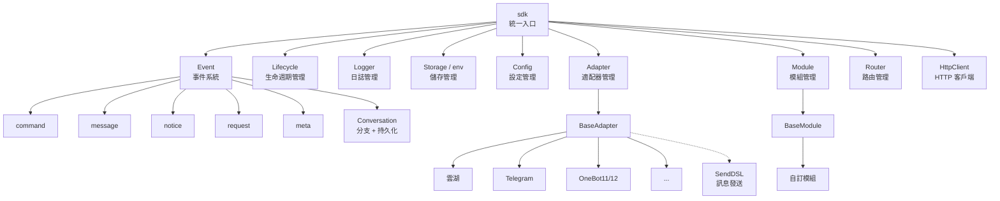
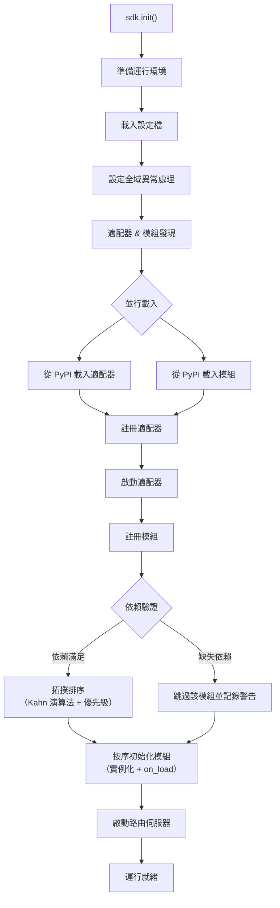
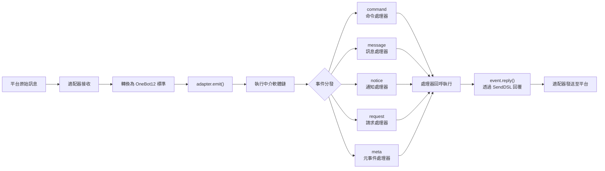
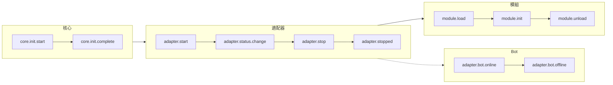
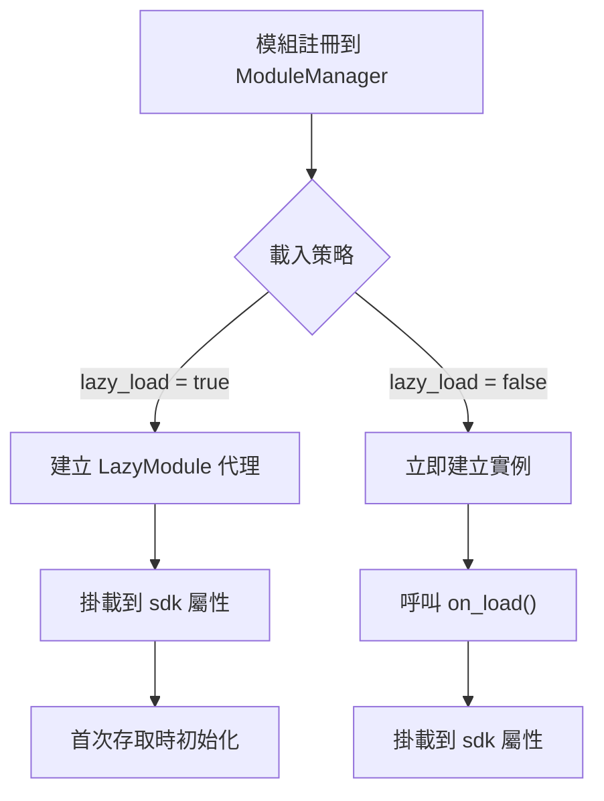

你是一个 ErisPulse 全栈开发专家，精通以下领域：

- ErisPulse 框架的核心架构和设计理念
- 模块开发和适配器开发
- 异步编程和事件驱动架构
- OneBot12 事件标准和平台适配
- SDK 核心模块 (Storage, Config, Logger, Router, Lifecycle)
- Event 包装类和事件处理系统
- 懒加载系统和生命周期管理
- SendDSL 消息发送系统
- 路由系统和 FastAPI 集成
- 各平台特性指南（OneBot11/12、Telegram、云湖、邮件等）
- 模块/适配器发布流程和模块商店
- 代码规范和文档字符串规范

你擅长：
- 编写高质量的异步 Python 代码
- 设计模块化、可扩展的架构
- 开发模块、适配器
- 使用 ErisPulse 的所有核心功能
- 遵循 ErisPulse 的最佳实践和代码规范
- 解决跨平台兼容性问题
- 通过 CLI 管理项目和发布

**使用以下文档作为知识库，回答问题时请优先参考文档内容。**


---


# ErisPulse 完整开发物料
> **注意**：本文档内容较多，建议仅用于具有强大上下文能力的 AI 模型


---


====
框架理解
====


### 架构概览

# 架構概覽

本文檔透過視覺化圖表介紹 ErisPulse SDK 的技術架構，幫助你快速理解框架的設計思想和模組關係。

## SDK 核心架構

下圖展示了 SDK 的核心模組組成及其關係：


```mermaid
graph TB
    SDK["sdk<br/>統一入口"]

    SDK --> Event["Event<br/>事件系統"]
    SDK --> Lifecycle["Lifecycle<br/>生命週期管理"]
    SDK --> Logger["Logger<br/>日誌管理"]
    SDK --> Storage["Storage / env<br/>儲存管理"]
    SDK --> Config["Config<br/>設定管理"]
    SDK --> AdapterMgr["Adapter<br/>適配器管理"]
    SDK --> ModuleMgr["Module<br/>模組管理"]
    SDK --> Router["Router<br/>路由管理"]
    SDK --> Client["HttpClient<br/>HTTP 客戶端"]
    Event --> Command["command"]
    Event --> Message["message"]
    Event --> Notice["notice"]
    Event --> Request["request"]
    Event --> Meta["meta"]
    Event --> Conversation["Conversation<br/>分支 + 持久化"]

    AdapterMgr --> BaseAdapter["BaseAdapter"]
    BaseAdapter --> P1["雲湖"]
    BaseAdapter --> P2["Telegram"]
    BaseAdapter --> P3["OneBot11/12"]
    BaseAdapter --> PN["..."]

    ModuleMgr --> BaseModule["BaseModule"]
    BaseModule --> CM["自訂模組"]

    BaseAdapter -.-> SendDSL["SendDSL<br/>訊息發送"]
```

### 核心模組說明

| 模組 | 說明 |
|------|------|
| **Event** | 事件系統，提供 command / message / notice / request / meta 五類事件處理，以及 Conversation 多輪對話 |
| **Adapter** | 適配器管理器，管理多平台適配器的註冊、啟動和關閉 |
| **Module** | 模組管理器，管理外掛的註冊、載入和卸載，支援依賴宣告和拓撲排序 |
| **Lifecycle** | 生命週期管理器，提供事件驅動的生命週期鉤子 |
| **Storage** | 基於 SQLite 的鍵值儲存系統，支援通用 SQL 鏈式查詢 |
| **Config** | TOML 格式的設定檔管理 |
| **Logger** | 模組化日誌系統，支援子日誌器 |
| **Router** | HTTP/WebSocket 路由管理，透過抽象層封裝底層後端（目前為 FastAPI + Uvicorn），支援裝飾器路由、中介軟體、分組、限流、CORS |
| **HttpClient** | 統一 HTTP/WS 客戶端，透過抽象層封裝底層請求庫（目前為 aiohttp），提供請求統計、重試、日誌、WebSocket 客戶端、ErisPulse 異常體系等功能。客戶端和服務端 WebSocket 共享 `WebSocketConnectionBase` 基類 |

## 初始化流程

下圖展示了 `sdk.init()` 的完整初始化過程：


```mermaid
flowchart TD
    A["sdk.init()"] --> B["準備運行環境"]
    B --> B1["載入設定檔"]
    B1 --> B2["設定全域異常處理"]
    B2 --> C["適配器 & 模組發現"]
    C --> D{"並行載入"}
    D --> D1["從 PyPI 載入適配器"]
    D --> D2["從 PyPI 載入模組"]
    D1 & D2 --> E["註冊適配器"]
    E --> E1["啟動適配器"]
    E1 --> F["註冊模組"]
    F --> F1{"依賴驗證"}
    F1 -->|"缺失依賴"| F2["跳過該模組並記錄警告"]
    F1 -->|"依賴滿足"| F3["拓撲排序<br/>（Kahn 演算法 + 優先級）"]
    F3 --> G["按序初始化模組<br/>（實例化 + on_load）"]
    F2 --> G
    G --> H["啟動路由伺服器"]
    H --> K["運行就緒"]
```

### 初始化階段詳解

1. **環境準備** - 載入 TOML 設定檔，設定全域異常處理
2. **並行發現** - 同時從已安裝的 PyPI 套件中發現適配器和模組
3. **註冊適配器** - 將發現的適配器註冊到適配器管理器
4. **啟動適配器** - 非同步啟動各平台適配器連接（在模組初始化之前，確保模組能立即發送訊息）
5. **註冊模組** - 將發現的模組註冊到模組管理器
6. **依賴驗證** - 檢查模組聲明的 `depends` 依賴是否已註冊，跳過缺失依賴的模組
7. **拓撲排序** - 使用 Kahn 演算法按依賴關係排序模組載入順序，同級按 `priority` 降序排列
8. **模組初始化** - 按排序順序建立模組實例，呼叫 `on_load` 生命週期方法
9. **啟動路由伺服器** - 使用 Uvicorn 啟動 FastAPI 路由伺服器

## 事件處理流程

下圖展示了訊息從平台到處理器的完整流轉路徑：


```mermaid
flowchart LR
    A["平台原始訊息"] --> B["適配器接收"]
    B --> C["轉換為 OneBot12 標準"]
    C --> D["adapter.emit()"]
    D --> E["執行中介軟體鏈"]
    E --> F{"事件分發"}
    F --> G1["command<br/>命令處理器"]
    F --> G2["message<br/>訊息處理器"]
    F --> G3["notice<br/>通知處理器"]
    F --> G4["request<br/>請求處理器"]
    F --> G5["meta<br/>元事件處理器"]
    G1 & G2 & G3 & G4 & G5 --> H["處理器回呼執行"]
    H --> I["event.reply()<br/>透過 SendDSL 回覆"]
    I --> J["適配器發送至平台"]
```

### 事件處理關鍵步驟

- **適配器接收** - 各平台適配器透過 WebSocket/Webhook 等方式接收原生事件
- **OB12 標準化** - 將平台原生事件轉換為統一的 OneBot12 標準格式
- **中介軟體處理** - 依次執行已註冊的中介軟體函式，可修改事件資料
- **事件分發** - 根據事件類型（message/notice/request/meta）分發到對應處理器
- **SendDSL 回覆** - 處理器透過 `event.reply()` 或 `SendDSL` 鏈式呼叫發送回應

## 生命週期事件

下圖展示了框架各組件的生命週期事件觸發順序：


```mermaid
flowchart LR
    subgraph Core["核心"]
        direction LR
        C1["core.init.start"] --> C2["core.init.complete"]
    end

    subgraph AdapterLife["適配器"]
        direction LR
        A1["adapter.start"] --> A2["adapter.status.change"] --> A3["adapter.stop"] --> A4["adapter.stopped"]
    end

    subgraph ModuleLife["模組"]
        direction LR
        M1["module.load"] --> M2["module.init"] --> M3["module.unload"]
    end

    subgraph BotLife["Bot"]
        direction LR
        B1["adapter.bot.online"] --> B2["adapter.bot.offline"]
    end

    Core --> AdapterLife
    AdapterLife --> ModuleLife
    AdapterLife -.-> BotLife
```

### 監聽生命週期事件

你可以透過 `lifecycle.on()` 監聽這些事件，執行自訂邏輯：

```python
from ErisPulse import sdk

# 監聽所有適配器事件
@sdk.lifecycle.on("adapter")
async def on_adapter_event(event_data):
    print(f"適配器事件: {event_data}")

# 監聽模組載入完成
@sdk.lifecycle.on("module.load")
async def on_module_loaded(event_data):
    print(f"模組已載入: {event_data}")

# 監聽 Bot 上線
@sdk.lifecycle.on("adapter.bot.online")
async def on_bot_online(event_data):
    print(f"Bot 上線: {event_data}")
```

## 模組載入策略

ErisPulse 支援兩種模組載入策略：


```mermaid
flowchart TD
    A["模組註冊到 ModuleManager"] --> B{"載入策略"}
    B -->|"lazy_load = true"| C["建立 LazyModule 代理"]
    C --> D["掛載到 sdk 屬性"]
    D --> E["首次存取時初始化"]
    B -->|"lazy_load = false"| F["立即建立實例"]
    F --> G["呼叫 on_load()"]
    G --> D2["掛載到 sdk 屬性"]
```

> 更多詳情請參考 [懶載入系統](advanced/lazy-loading.md) 和 [生命週期管理](advanced/lifecycle.md)。


### 术语表

# ErisPulse 術語表

本文件解釋 ErisPulse 中常用的專業術語，幫助您更好地理解框架概念。

## 核心概念

### 事件驅動架構
**通俗解釋：** 就像餐廳的點菜系統。顧客（使用者）點菜（發送訊息），服務員（事件系統）將訂單（事件）傳遞給後廚（模組），後廚處理後，服務員再把菜（回覆）端給顧客。

**技術解釋：** 程式的執行流程由外部事件觸發，而不是按固定順序執行。每當有新事件發生（如收到訊息），框架會自動呼叫相應的處理函式。

### OneBot12 標準
**通俗解釋：** 就像插座和插頭的標準。不同平台的「插頭」（原生事件格式）各不相同，但透過轉換器都變成統一的「插頭」（OneBot12格式），這樣您的程式碼就可以像插座一樣適配所有平台。

**技術解釋：** 一個統一的聊天機器人應用介面標準，定義了事件、訊息、API等的統一格式，使程式碼可以在不同平台間複用。

### 適配器
**通俗解釋：** 就像翻譯官。不同平台說不同「語言」（API格式），適配器把這些「語言」翻譯成 ErisPulse 能聽懂的「普通話」（OneBot12標準），也能把 ErisPulse 的指令翻譯回各平台的「語言」。

**技術解釋：** 負責與特定平台通訊的組件，接收平台原生事件並轉換為標準格式，或將標準格式請求發送到平台。

### 模組
**通俗解釋：** 就像手機上的 App。每個模組是一個獨立的功能套件，可以新增、刪除、更新。比如「天氣預報模組」、「音樂播放模組」等。

**技術解釋：** 功能擴展的基本單位，包含特定的業務邏輯、事件處理器和配置，可以獨立安裝和卸載。

### 事件
**通俗解釋：** 就像手機上的通知。當有新訊息、新好友、新群聊時，平台會發送一個「通知」（事件）給您的機器人。

**技術解釋：** 發生在平台上的任何值得注意的事情，如收到訊息、使用者加入群組、好友請求等，都以結構化資料的形式傳遞給程式。

### 事件處理器
**通俗解釋：** 就像快遞員的派送規則。當收到「包裹」（事件）時，根據包裹類型（訊息、通知、請求等）決定由誰來處理這個包裹。

**技術解析：** 用裝飾器標記的函式，當特定類型的事件發生時自動執行，例如 `@command`、`@message` 等。

## 開發相關術語

### SDK
**通俗解釋：** 就像工具箱。裡面裝著各種常用工具（儲存、配置、日誌等），您寫程式碼時可以直接拿這些工具用，不用自己造輪子。

**技術解釋：** Software Development Kit（軟體開發工具包），提供了一組預先建構好的組件和工具，簡化開發過程。

### 虛擬環境
**通俗解釋：** 就像獨立的「工作間」。每個專案有自己的「工作間」，裡面安裝的軟體套件互不干擾，避免版本衝突。

**技術解釋：** 隔離的 Python 環境，每個環境有獨立的套件列表和版本，防止不同專案的依賴衝突。

### 非同步程式設計
**通俗解釋：** 就像多工處理。機器人可以同時做很多事，比如在等待網路回應時，還能處理其他使用者的訊息，不會卡住。

**技術解釋：** 使用 `async`/`await` 關鍵字的程式設計方式，允許程式在等待耗時操作（如網路請求、檔案讀寫）時切換到其他任務，提高效率。

### 熱重載
**通俗解釋：** 就像網頁的自動重新整理。您修改程式碼後，不需要手動重啟機器人，它會自動載入新程式碼，立即生效。

**技術解釋：** 開發模式下，程式會自動偵測檔案變化並重新載入，無需手動重啟即可看到程式碼修改的效果。

### 延遲載入
**通俗解釋：** 就像按需開啟的抽屜。不用的抽屜（模組）先關著，需要時再開啟，這樣啟動時不用等所有抽屜都開啟。

**技術解釋：** 延遲載入策略，模組只在首次被存取時才初始化和載入，減少啟動時間和資源佔用。

## 功能相關術語

### 指令
**通俗解釋：** 就像遊戲裡的指令。使用者輸入 `/hello` 這樣的指令，機器人就會執行對應的功能。

**技術解釋：** 以特定前綴（如 `/`）開頭的訊息，被框架辨識為指令並路由到對應的處理函式。

### 回覆
**通俗解釋：** 就是機器人給使用者的「回答」。無論是文字、圖片還是語音，都是對使用者訊息的回覆。

**技術解釋：** 適配器將處理結果發送回平台，展示給使用者的過程。

### 儲存
**通俗解釋：** 就像機器人的「記事本」。可以記住使用者的資訊、設定、聊天記錄等，下次還能找到。

**技術解釋：** 持久化資料儲存系統，基於 SQLite 實現鍵值對儲存，用於保存需要長期保留的資料。

### 設定
**通俗解釋：** 就像機器人的「設定」。您可以透過設定檔修改機器人的行為，比如修改連接埠號、日誌層級等。

**技術解釋：** 使用 TOML 格式的設定管理系統，用於設定框架和模組的各種參數。

### 日誌
**通俗解釋：** 就像機器人的「日記」。記錄機器人做了什麼、遇到了什麼問題，方便除錯和排查問題。

**技術解釋：** 系統執行時產生的記錄資訊，包括資訊、警告、錯誤等不同層級，用於監控和除錯。

### 路由
**通俗解釋：** 就像交警指揮交通。決定哪個請求應該去哪個地方處理，比如網頁請求、WebSocket 連線等。

**技術解釋：** HTTP 和 WebSocket 路由管理器，根據 URL 路徑將請求分發到對應的處理函式。

## 平台相關術語

### 平台
**通俗解釋：** 機器人工作的地方，比如雲湖、Telegram、QQ等，每個平台有自己的規則和 API。

**技術解釋：** 提供聊天機器人服務的應用程式或服務，如雲湖企業通訊、Telegram 等。

### OneBot11/12
**通俗解釋：** 就像聊天機器人的「國際標準」。規定了訊息、事件等的統一格式，讓不同軟體之間能互相理解。

**技術解釋：** OneBot 是一個通用的聊天機器人應用介面標準，定義了事件、訊息、API等的格式。11 和 12 是不同版本的標準。

### SendDSL
**通俗解釋：** 就像發訊息的「捷徑」。用簡單的一句話就能發送各種類型的訊息（文字、圖片、@某人等）。

**技術解釋：** 鏈式呼叫的訊息發送介面，提供簡潔的語法來建構和發送複雜訊息。

## 其他術語

### 生命週期
**通俗解釋：** 機器人的「一生」：出生（啟動）、工作（執行）、休息（停止）。生命週期就是在這些關鍵時刻會觸發的事件。

**技術解釋：** 程式執行過程中的關鍵階段，如啟動、載入模組、卸載模組、關閉等，可以透過監聽這些事件來執行相應操作。

### 註解/裝飾器
**通俗解釋：** 就是給函式「貼標籤」。比如 `@command("hello")` 這個標籤告訴框架：這是一個指令處理器，名字叫 "hello"。

**技術解釋：** Python 的語法糖，用於修改函式或類別的行為。在 ErisPulse 中用於標記事件處理器、路由等。

### 型別註解
**通俗解釋：** 就是告訴函式參數是什麼「型別」。比如 `request: Request` 表示這個參數是一個請求物件。

**技術解釋：** Python 3.5+ 引入的特性，用於標註變數和參數的型別，提高程式碼可讀性和型別安全性。

### TOML
**通俗解釋：** 一種設定檔格式，比 JSON 更易讀，比 YAML 更嚴格，適合用來寫設定。

**技術解釋：** Tom's Obvious Minimal Language，一種設定檔格式，語法簡潔清晰，廣泛用於 Python 專案的設定管理。

## 獲取協助

如果您發現文件中有其他術語不理解，歡迎透過以下方式提問：
- 提交 GitHub Issue
- 參與社群討論
- 聯絡維護者


====
快速开始
====

# 快速開始

> 遇到不理解的術語？查看 [術語表](terminology.md) 獲取通俗易懂的解釋。

## 安裝 ErisPulse

### 一鍵安裝腳本（推薦）

安裝腳本會自動檢測您的環境（Docker、Python、uv），並引導您選擇最適合的安裝方式。

Windows (PowerShell):
```powershell
irm https://get.erisdev.com/install.ps1 -OutFile install.ps1; powershell -ExecutionPolicy Bypass -File install.ps1
```

macOS / Linux:
```bash
curl -fsSL https://get.erisdev.com/install.sh -o install.sh && chmod +x install.sh && ./install.sh
```

腳本會引導您完成：

- **Docker 安裝**（檢測到 Docker 時推薦）：選擇映像源（Docker Hub / GHCR）、版本通道（穩定版 / 預發布版）、Dashboard 管理面板配置、端口設置
- **傳統安裝**：自動創建虛擬環境、選擇 ErisPulse 版本、可選安裝 Dashboard 管理面板模組

### 使用 Docker

Docker 映像已內建 ErisPulse 框架和 Dashboard 管理面板。

```bash
# 下載 docker-compose.yml
curl -O https://raw.githubusercontent.com/ErisPulse/ErisPulse/main/docker-compose.yml

# 設置 Dashboard 令牌並啟動
ERISPULSE_DASHBOARD_TOKEN=your-token docker compose up -d
```

<details>
<summary>Docker Hub 不可用？</summary>

使用 GitHub Container Registry 映像，修改 `docker-compose.yml` 中的 image：

```yaml
image: ghcr.io/erispulse/erispulse:latest
```

</details>

啟動後訪問 `http://<host>:8000/Dashboard`，使用設置的令牌登入。

### 使用 pip 安裝

確保您的 Python 版本 >= 3.10，然後使用 pip 安裝：

```bash
pip install ErisPulse
```

如果您已安裝 [uv](https://github.com/astral-sh/uv)，也可以使用 `uv pip install ErisPulse`，安裝速度更快。

## 初始化專案

### 互動式初始化（推薦）

```bash
epsdk init
```

這將啟動一個互動式嚮導，引導您完成：
- 專案名稱設定
- 日誌層級設定
- 伺服器設定（主機和連接埠）
- 適配器選擇和設定
- 專案結構建立

### 快速初始化

```bash
# 指定專案名稱的快速模式
epsdk init -q -n my_bot

# 或者只指定專案名稱
epsdk init -n my_bot
```

### 手動建立專案

如果更喜歡手動建立專案：

```bash
mkdir my_bot && cd my_bot
epsdk init
```

## 安裝模組

### 透過 CLI 安裝

```bash
epsdk install Yunhu AIChat
```

### 檢視可用模組

```bash
epsdk list-remote
```

### 互動式安裝

未指定套件名稱時進入互動式安裝介面：

```bash
epsdk install
```

## 執行專案

```bash
# 一般執行
epsdk run main.py

# 熱重載模式（開發時推薦）
epsdk run main.py --reload
```

## 專案結構

初始化後的專案結構：

```
my_bot/
├── config/
│   └── config.toml          # 設定檔
└── main.py                  # 入口檔案

```

## 設定檔

基本的 `config.toml` 設定：

```toml
[ErisPulse.server]
host = "0.0.0.0"
port = 8000

[ErisPulse.logger]
level = "INFO"

[Yunhu_Adapter]
# 適配器設定
```

## 下一步

- [入門指南總覽](getting-started/README.md) - 瞭解 ErisPulse 的基本概念
- [建立第一個機器人](getting-started/first-bot.md) - 建立一個簡單的機器人
- [使用者使用指南](user-guide/) - 深入瞭解設定和模組管理
- [開發者指南](developer-guide/) - 開發自訂模組和適配器


====
入门指南
====


### 入门指南总览

# 入門指南

歡迎來到 ErisPulse 入門指南。如果你是第一次使用 ErisPulse，這裡將帶你從零開始，逐步了解框架的核心概念和基本用法。

## 學習路徑

本指南按以下順序組織，建議依次閱讀：

| 步驟 | 主題 | 說明 |
|------|------|------|
| 1 | [建立第一個機器人](first-bot.md) | 從專案初始化到執行第一個指令 |
| 2 | [基礎概念](basic-concepts.md) | 理解 ErisPulse 的核心架構和模組設計 |
| 3 | [事件處理入門](event-handling.md) | 學習如何處理訊息、指令、通知等各類事件 |
| 4 | [常見任務範例](common-tasks.md) | 掌握資料持久化、定時任務、權限控制等常用功能 |

## 開發方式選擇

ErisPulse 支援兩種開發方式：

| 方式 | 適用場景 | 說明 |
|------|---------|------|
| **嵌入式開發** | 快速原型、專案內部功能 | 直接在 `main.py` 中編寫處理器，無需建立獨立模組 |
| **模組開發**（推薦） | 生產環境、功能分發 | 建立獨立的 Python 套件，透過 `epsdk install` 安裝使用 |

> 兩種方式的詳細對比和範例請參考 [建立第一個機器人](first-bot.md) 和 [模組開發入門](../developer-guide/modules/getting-started.md)。

## 架構概覽

ErisPulse 採用事件驅動架構，核心由以下系統組成：

- **適配器系統** — 與各平台通訊，將平台事件轉換為統一的 OneBot12 標準格式
- **事件系統** — 處理訊息、指令、通知、請求、元事件五大類事件
- **模組系統** — 透過獨立模組擴充功能，支援依賴管理和懶加載
- **核心模組** — 提供 Storage（儲存）、Config（設定）、Logger（日誌）、Router（路由）等基礎能力

> 詳細的架構圖和初始化流程請參考 [架構概覽](../architecture.md)。

## 開始學習

準備好開始了嗎？

- [建立第一個機器人](first-bot.md) — 5 分鐘上手


### 创建第一个机器人

# 建立第一個機器人

本指南將帶你從零開始建立一個簡單的 ErisPulse 機器人。

## 第一步：建立專案

使用 CLI 工具初始化專案：

```bash
# 互動式初始化
epsdk init

# 或者快速初始化
epsdk init -q -n my_first_bot
```

按照提示完成設定，建議選擇：
- 專案名稱：my_first_bot
- 日誌層級：INFO
- 伺服器：預設配置
- 適配器：選擇你需要的平台（如 Yunhu）

## 第二步：查看專案結構

初始化後的專案結構：

```
my_first_bot/
├── config/
│   └── config.toml
├── main.py
└── requirements.txt
```

## 第三步：編寫第一個指令

開啟 `main.py`，編寫一個簡單的指令處理器：

```python
from ErisPulse import sdk
from ErisPulse.Core.Event import command

@command("hello", help="發送問候訊息")
async def hello_handler(event):
    """處理 hello 指令"""
    user_name = event.get_user_nickname() or "朋友"
    await event.reply(f"你好，{user_name}！我是 ErisPulse 機人。")

@command("ping", help="測試機器人是否在線")
async def ping_handler(event):
    """處理 ping 指令"""
    await event.reply("Pong！機器人運作正常。")

async def main():
    """主入口函數"""
    print("正在初始化 ErisPulse...")
    # 運行 SDK 並且維持運行
    await sdk.run(keep_running=True)

    # 或者
    # await sdk.run(keep_running=False)
    # ...Do Something
    # 可以做你想做的任何事
    # 使用 await sdk.init() 等價於 `sdk.run(keep_running=False)`

    print("ErisPulse 初始化完成！")

if __name__ == "__main__":
    import asyncio
    asyncio.run(main())
```

## 第四步：執行機器人

```bash
# 一般執行
epsdk run main.py

# 開發模式（支援熱重載）
epsdk run main.py --reload
```

## 第五步：測試機器人

在你的聊天平台中傳送指令：

```
/hello
```

你應該會收到機器人的回覆。

## 程式碼說明

### 指令裝飾器

```python
@command("hello", help="發送問候訊息")
```

- `hello`：指令名稱，使用者透過 `/hello` 呼叫
- `help`：指令說明，在 `/help` 指令中顯示

### 事件參數

```python
async def hello_handler(event):
```

`event` 參數是一個 Event 物件，包含：
- 訊息內容：`event.get_text()`
- 發送者資訊：`event.get_user_id()`、`event.get_user_nickname()`
- 平台資訊：`event.get_platform()`
- 群組資訊：`event.get_group_id()`
- 原始資料：`event.get_raw()`

> 完整的 Event 物件方法請參考 [Event 包裝類詳解](../developer-guide/modules/event-wrapper.md)。

### 傳送回覆

```python
await event.reply("回覆內容")
```

`event.reply()` 是一個便捷方法，用於向發送者傳送訊息。

## 擴充：新增更多功能

ErisPulse 提供了豐富的事件處理和資料處理能力：

- **訊息監聽**：使用 `@message.on_message()` 監聽各類訊息 → [事件處理入門](event-handling.md)
- **通知監聽**：使用 `@notice.on_friend_add()` 等監聽系統通知 → [事件處理入門](event-handling.md)
- **資料儲存**：使用 `sdk.storage.get/set` 持久化資料 → [常見任務範例](common-tasks.md)

## 常見問題

### 指令沒有回應？

1. 檢查適配器是否正確設定，確認 `config/config.toml` 中適配器的 `status` 為 `true`
2. 查看終端日誌輸出，確認是否有錯誤訊息（特別是 `ERROR` 級別日誌）
3. 確認指令前綴是否正確（預設是 `/`），可在設定檔中查看 `[ErisPulse.event.command]` 部分
4. 確認指令名稱拼寫正確，注意大小寫敏感性設定

### 如何修改指令前綴？

在 `config.toml` 中新增：

```toml
[ErisPulse.event.command]
prefix = "!"
case_sensitive = false
```

### 如何支援多平台？

ErisPulse 使用 OneBot12 標準統一了不同平台的事件格式，`@command` 和 `@message` 註冊的處理器會自動接收所有平台的事件。透過 `event.get_platform()` 可以區分來源平台：

```python
@command("hello")
async def hello_handler(event):
    platform = event.get_platform()
    
    if platform == "yunhu":
        await event.reply("你好！來自雲湖")
    elif platform == "telegram":
        await event.reply("Hello! From Telegram")
    else:
        await event.reply("你好！")
```

> 更多多平台適配技巧請參考 [常見任務範例](common-tasks.md#多平台適配)。

## 下一步

- [基礎概念](basic-concepts.md) - 深入了解 ErisPulse 的核心概念
- [事件處理入門](event-handling.md) - 學習處理各類事件
- [常見任務範例](common-tasks.md) - 掌握更多實用功能


### 基础概念

# 基礎概念

本指南介紹 ErisPulse 的核心概念，幫助你理解框架的設計思想和基本架構。

## 事件驅動架構

ErisPulse 採用事件驅動架構，所有的互動都透過事件來傳遞和處理。

### 事件流程

```
使用者發送訊息
      │
      ▼
平台接收
      │
      ▼
適配器接收平台原生事件
      │
      ▼
轉換為 OneBot12 標準事件
      │
      ▼
提交到事件系統
      │
      ▼
分發給已註冊的處理器
      │
      ▼
模組處理事件
      │
      ▼
透過適配器發送回應
      │
      ▼
平台顯示給使用者
```

### OneBot12 標準

ErisPulse 使用 OneBot12 作為核心事件標準。OneBot12 是一個通用的聊天機器人應用介面標準，定義了統一的事件格式。

所有適配器都會將平台特定的事件轉換為 OneBot12 格式，確保程式碼的一致性。

## 核心元件

### 1. SDK 物件

SDK 是所有功能的統一入口點，提供對核心元件的存取。

```python
from ErisPulse import sdk

# 存取核心模組
sdk.storage    # 存儲系統
sdk.config     # 配置系統
sdk.logger     # 日誌系統
sdk.adapter    # 適配器系統
sdk.module     # 模組系統
sdk.router     # 路由系統
sdk.client     # HTTP 客戶端
sdk.lifecycle  # 生命週期系統
```

### 2. Event 物件

Event 物件封裝了事件資料，提供了便捷的存取方法。

```python
@command("info")
async def info_handler(event):
    # 獲取事件資訊
    event_id = event.get_id()
    user_id = event.get_user_id()
    platform = event.get_platform()
    text = event.get_text()
    
    # 發送回覆
    await event.reply(f"使用者: {user_id}, 平台: {platform}")
```

### 3. 適配器

適配器是 ErisPulse 與外部平台之間的橋樑。

**職責：**
- 接收平台原生事件
- 轉換為 OneBot12 標準格式
- 將標準格式事件發送到平台

**示例適配器：**
- Yunhu 適配器：與雲湖平台通訊
- Telegram 適配器：與 Telegram Bot API 通訊
- OneBot11 適配器：與 OneBot11 相容的應用通訊
- Email 適配器：處理郵件收發

### 4. 模組

模組是功能擴充的基本單位，可以：

- 註冊事件處理器
- 實現業務邏輯
- 呼叫適配器發送訊息
- 使用核心模組提供的服務

#### 模組發現機制

ErisPulse 透過 Python 的 `importlib.metadata.entry_points` 發現已安裝的模組。模組在 `pyproject.toml` 中宣告入口點：

```toml
[project.entry-points."erispulse.module"]
MyModule = "my_package:Main"
```

SDK 初始化時會掃描所有 `erispulse.module` 組的入口點，將模組類註冊到 `ModuleManager`，然後按依賴關係拓撲排序後依次初始化。

#### 最小可用模組

```python
from ErisPulse.Core.Bases import BaseModule
from ErisPulse import sdk

class Main(BaseModule):
    def __init__(self):
        self.sdk = sdk
        self.logger = sdk.logger.get_child("MyModule")

    async def on_load(self, event):
        self.logger.info("模組已載入")

    async def on_unload(self, event):
        self.logger.info("模組已卸載")
```

#### 模組生命週期

- **註冊**：SDK 發現模組類並註冊到管理器
- **載入**：建立模組實例，呼叫 `on_load(event)`（`event = {"module_name": "MyModule"}`）
- **卸載**：呼叫 `on_unload(event)`，清理資源

#### 載入策略

透過 `get_load_strategy()` 宣告模組的載入行為：

```python
from ErisPulse.loaders import ModuleLoadStrategy

class Main(BaseModule):
    @staticmethod
    def get_load_strategy():
        return ModuleLoadStrategy(
            lazy_load=True,   # 是否懶載入（預設 True）
            priority=0        # 載入優先級，數值越大越先初始化
        )
```

- **`lazy_load=True`（預設）**：模組在首次被 `sdk.MyModule` 存取時才初始化，減少啟動時間
- **`lazy_load=False`**：SDK 啟動時立即初始化，適合需要監聽生命週期事件或執行定時任務的模組
- **`priority`**：同優先級的模組按註冊順序載入；數值越大越先初始化

> 詳細的懶載入機制說明請參考 [懶載入系統](../advanced/lazy-loading.md)。

## 事件類型

ErisPulse 支援 5 類事件：

| 事件類型 | 裝飾器 | 說明 |
|---------|--------|------|
| 訊息事件 | `@message.on_message()` | 使用者發送的任何訊息（私聊、群聊） |
| 命令事件 | `@command("name")` | 以命令字首開頭的訊息（如 `/hello`） |
| 通知事件 | `@notice.on_friend_add()` 等 | 系統通知（好友新增、群成員變化等） |
| 請求事件 | `@request.on_friend_request()` 等 | 使用者請求（好友請求、群邀請） |
| 元事件 | `@meta.on_connect()` 等 | 系統級事件（連線、斷線、心跳） |

> 各事件類型的詳細用法和程式碼範例請參考 [事件處理入門](event-handling.md)。

## 核心模組說明

### Storage（存儲）

基於 SQLite 的鍵值存儲系統，用於持久化資料。

```python
# 設置值
sdk.storage.set("key", "value")

# 獲取值
value = sdk.storage.get("key", "default_value")

# 批量操作
sdk.storage.set_multi({
    "key1": "value1",
    "key2": "value2"
})

# 事務
with sdk.storage.transaction():
    sdk.storage.set("key1", "value1")
    sdk.storage.set("key2", "value2")
```

### Config（配置）

TOML 格式的配置檔案管理。

```python
# 獲取配置
config = sdk.config.getConfig("MyModule", {})

# 設置配置
sdk.config.setConfig("MyModule", {"key": "value"})

# 讀取嵌套配置
value = sdk.config.getConfig("MyModule.subkey", "default")
```

### Logger（日誌）

模組化日誌系統。

```python
# 記錄日誌
sdk.logger.info("這是一條資訊")
sdk.logger.warning("這是一條警告")
sdk.logger.error("這是一條錯誤")

# 獲取子日誌記錄器
child_logger = sdk.logger.get_child("submodule")
child_logger.info("子模組日誌")
```

**屬性存取語法糖**

除了使用 `get_child()` 方法外，你還可以透過**屬性存取**的方式建立子logger，這是一種更簡潔的**語法糖**寫法：

```python
# 透過屬性存取建立子logger
sdk.logger.mymodule.info("模組訊息")

# 支援嵌套存取
sdk.logger.mymodule.database.info("資料庫訊息")
```

### Router（路由）

HTTP 和 WebSocket 路由管理，基於 FastAPI + Uvicorn。支援裝飾器路由、中介軟體、分組、限流、CORS。

```python
from ErisPulse.Core import HttpRequest

@sdk.router.get("MyModule", "/api")
async def handler(request: HttpRequest):
    data = await request.json()
    return {"status": "ok"}
```

> 完整的路由 API（WebSocket、中介軟體、速率限制、CORS 等）請參考 [路由管理器](../advanced/router.md)。

### Client（網絡客戶端）

統一的網絡客戶端，聚合了 HTTP 請求、WebSocket 連線、連線池管理、自動重試、逾時控制、請求統計和生命週期事件整合。

```python
from ErisPulse.Core import client

# HTTP 請求
resp = await client.get("https://api.example.com/users")
data = await resp.json()

# 帶重試和逾時
resp = await client.get(url, timeout=30, max_retries=3)

# WebSocket 連線
ws = await client.ws_connect("wss://example.com/ws")
async for text in ws.iter_text():
    await ws.send_text(f"Echo: {text}")
```

> 完整的網絡客戶端 API 請參考 [網絡客戶端](../advanced/http-client.md)。

## SendDSL 訊息發送

適配器提供鏈式呼叫的訊息發送介面。

### 基礎發送

```python
# 獲取適配器實例
yunhu = sdk.adapter.get("yunhu")

# 發送訊息
await yunhu.Send.To("user", "U1001").Text("Hello")

# 指定發送帳號
await yunhu.Send.Using("bot1").To("group", "G1001").Text("群訊息")
```

### 鏈式修飾

```python
# @使用者
await yunhu.Send.To("group", "G1001").At("U2001").Text("@訊息")

# 回覆訊息
await yunhu.Send.To("group", "G1001").Reply("msg123").Text("回覆")

# @全體
await yunhu.Send.To("group", "G1001").AtAll().Text("公告")
```

### Event 回覆方法

Event 物件提供了便捷的回覆方法：

```python
@command("test")
async def test_handler(event):
    # 簡單文字回覆
    await event.reply("回覆內容")
    
    # 發送圖片
    await event.reply("http://example.com/image.jpg", method="Image")
    
    # 發送語音
    await event.reply("http://example.com/voice.mp3", method="Voice")
```

## 懶載入系統

ErisPulse 預設啟用模組懶載入，模組只在首次被存取（如 `sdk.MyModule`）時才初始化，顯著提高啟動速度。

```python
from ErisPulse.loaders import ModuleLoadStrategy

class Main(BaseModule):
    @staticmethod
    def get_load_strategy():
        return ModuleLoadStrategy(
            lazy_load=True,   # 啟用懶載入（預設）
            priority=0        # 載入優先級，數值越大越先初始化
        )
```

**需要停用懶載入的場景（`lazy_load=False`）：**
- 監聽生命週期事件的模組（如 `core.init.complete`）
- 啟動定時任務或後台服務的模組
- 需要在其他模組載入前完成初始化的模組

> 詳細的懶載入機制和注意事項請參考 [懶載入系統](../advanced/lazy-loading.md)。

## 下一步

- [事件處理入門](event-handling.md) - 學習如何處理各類事件
- [常見任務範例](common-tasks.md) - 掌握常用功能的實現


### 事件处理入门

# 事件處理入門

本指南介紹如何處理 ErisPulse 中的各類事件。

## 事件類型概覽

ErisPulse 支援以下事件類型：

| 事件類型 | 說明 | 適用場景 |
|---------|------|---------|
| 消息事件 | 使用者傳送的任何訊息 | 聊天機器人、內容過濾 |
| 命令事件 | 以命令前綴開頭的訊息 | 命令處理、功能入口 |
| 通知事件 | 系統通知（好友新增、群成員變化等） | 歡迎訊息、狀態通知 |
| 請求事件 | 使用者請求（好友請求、群邀請） | 自動處理請求 |
| 元事件 | 系統級事件（連線、心跳） | 連線監控、狀態檢查 |

## 消息事件處理

> **提示**: 建議在事件處理器中使用 `Event` 類型註解，以獲得 IDE 自動補全和類型檢查支援。

```python
from ErisPulse.Core.Event import Event  # 導入事件類型用於註解
```

### 監聽所有訊息

```python
from ErisPulse.Core.Event import message, Event

@message.on_message()
async def message_handler(event: Event):
    text = event.get_text()
    user_id = event.get_user_id()
    sdk.logger.info(f"收到 {user_id} 的訊息: {text}")
```

### 監聽私聊訊息

```python
@message.on_private_message()
async def private_handler(event: Event):
    user_id = event.get_user_id()
    await event.reply(f"你好，{user_id}！這是私聊訊息。")
```

### 監聽群聊訊息

```python
@message.on_group_message()
async def group_handler(event: Event):
    group_id = event.get_group_id()
    user_id = event.get_user_id()
    sdk.logger.info(f"群 {group_id} 中 {user_id} 傳送了訊息")
```

### 監聽@訊息

```python
@message.on_at_message()
async def at_handler(event: Event):
    # 獲取被@的使用者列表
    mentions = event.get_mentions()
    await event.reply(f"你@了這些使用者: {mentions}")
```

## 命令事件處理

### 基本命令

```python
from ErisPulse.Core.Event import command

@command("help", help="顯示幫助資訊")
async def help_handler(event):
    help_text = """
可用命令：
/help - 顯示幫助
/ping - 測試連線
/info - 查看資訊
    """
    await event.reply(help_text)
```

### 命令別名

```python
@command(["help", "h"], aliases=["幫助"], help="顯示幫助資訊")
async def help_handler(event):
    await event.reply("幫助資訊...")
```

使用者可以使用以下任何方式呼叫：
- `/help`
- `/h`
- `/幫助`

### 命令參數

```python
@command("echo", help="回顯訊息")
async def echo_handler(event):
    # 獲取命令參數
    args = event.get_command_args()
    
    if not args:
        await event.reply("請輸入要回顯的訊息")
    else:
        await event.reply(f"你說了: {' '.join(args)}")
```

### 命令群組

```python
@command("admin.reload", group="admin", help="重新載入模組")
async def reload_handler(event):
    await event.reply("模組已重新載入")

@command("admin.stop", group="admin", help="停止機器人")
async def stop_handler(event):
    await event.reply("機器人已停止")
```

### 命令權限

```python
def is_master(event):
    """檢查使用者是否為框架主人"""
    master_list = ["user123", "user456"]
    return event.get_user_id() in master_list

@command("master", permission=is_master, help="框架主人命令")
async def master_handler(event):
    await event.reply("這是框架主人命令")
```

### 命令優先級

```python
# 優先級數值越大，執行越早
@message.on_message(priority=10)
async def high_priority_handler(event):
    await event.reply("高優先級處理器")

@message.on_message(priority=1)
async def low_priority_handler(event):
    await event.reply("低優先級處理器")
```

### 並行事件處理

ErisPulse 事件系統採用**同優先級並行、不同優先級串行**的排程模型：

```
事件到達
    ↓
priority=10 組: [處理器C || 處理器D] 並行 → 合併結果
    ↓ (如未中斷)
priority=0 組: [處理器A || 處理器B] 並行 → 合併結果
    ↓
...
```

- **同優先級並行**：優先級相同的多個處理器會同時執行，提高吞吐量
- **跨級串行**：不同優先級的組按順序執行（數值越大越先執行），確保高優先級處理器先運行
- **Copy-On-Write**：處理器無修改時不建立副本，確保零開銷
- **衝突處理**：同優先級多處理器修改同一欄位時，使用最後修改值並記錄警告日誌
- **中斷機制**：任意處理器呼叫 `event.mark_processed()` 後，跳過後續低優先級組

```python
# 示例：同優先級處理器並行執行
@message.on_message(priority=0)
async def handler_a(event):
    # 處理任務A
    event['result_a'] = process_a()

@message.on_message(priority=0)
async def handler_b(event):
    # 與 handler_a 並行執行
    event['result_b'] = process_b()

# 不同優先級串行執行
@message.on_message(priority=10)
async def handler_c(event):
    # 優先級最高，最先執行
    pass
```

## 通知事件處理

### 好友新增

```python
from ErisPulse.Core.Event import notice

@notice.on_friend_add()
async def friend_add_handler(event):
    user_id = event.get_user_id()
    nickname = event.get_user_nickname() or "新朋友"
    await event.reply(f"歡迎新增我為好友，{nickname}！")
```

### 群成員增加

```python
@notice.on_group_increase()
async def member_increase_handler(event):
    group_id = event.get_group_id()
    user_id = event.get_user_id()
    await event.reply(f"歡迎新成員 {user_id} 加入群 {group_id}")
```

### 群成員減少

```python
@notice.on_group_decrease()
async def member_decrease_handler(event):
    group_id = event.get_group_id()
    user_id = event.get_user_id()
    await event.reply(f"成員 {user_id} 離開了群 {group_id}")
```

## 請求事件處理

### 好友請求

```python
from ErisPulse.Core.Event import request

@request.on_friend_request()
async def friend_request_handler(event):
    user_id = event.get_user_id()
    comment = event.get_comment()
    
    sdk.logger.info(f"收到好友請求: {user_id}, 附言: {comment}")
    
    # 可以透過適配器 API 處理請求
    # 具體實作請參考各適配器文件
```

### 群邀請請求

```python
@request.on_group_request()
async def group_request_handler(event):
    group_id = event.get_group_id()
    user_id = event.get_user_id()
    
    await event.reply(f"收到群 {group_id} 的邀請，來自 {user_id}")
```

## 元事件處理

### 連線事件

```python
from ErisPulse.Core.Event import meta

@meta.on_connect()
async def connect_handler(event):
    platform = event.get_platform()
    sdk.logger.info(f"{platform} 平台已連線")

@meta.on_disconnect()
async def disconnect_handler(event):
    platform = event.get_platform()
    sdk.logger.warning(f"{platform} 平台已斷開連線")
```

### 心跳事件

```python
@meta.on_heartbeat()
async def heartbeat_handler(event):
    platform = event.get_platform()
    sdk.logger.debug(f"{platform} 心跳檢測")
```

### Bot 狀態查詢

當適配器傳送 meta 事件後，框架自動追蹤 Bot 狀態，你可以隨時查詢：

```python
from ErisPulse import sdk

# 檢查某個 Bot 是否在線上
if sdk.adapter.is_bot_online("telegram", "123456"):
    telegram = sdk.adapter.get("telegram")
    await telegram.Send.To("user", "123456").Text("Bot 在線")

# 列出目前所有在線 Bot
bots = sdk.adapter.list_bots()
for platform, bot_list in bots.items():
    for bot_id, info in bot_list.items():
        print(f"{platform}/{bot_id}: {info['status']}")

# 獲取完整狀態摘要
summary = sdk.adapter.get_status_summary()
```

## 互動式處理

### 使用 reply 方法傳送回覆

`event.reply()` 方法支援多種修飾參數，方便傳送帶有 @、回覆等功能的通知：

```python
# 簡單回覆
await event.reply("你好")

# 傳送不同類型的通知
await event.reply("http://example.com/image.jpg", method="Image")  # 圖片
await event.reply("http://example.com/voice.mp3", method="Voice")  # 語音

# @單個使用者
await event.reply("你好", at_users=["user123"])

# @多個使用者
await event.reply("大家好", at_users=["user1", "user2", "user3"])

# 回覆通知
await event.reply("回覆內容", reply_to="msg_id")

# @全體成員
await event.reply("公告", at_all=True)

# 組合使用：@使用者 + 回覆通知
await event.reply("內容", at_users=["user1"], reply_to="msg_id")
```

### 等待使用者回覆

```python
@command("ask", help="詢問使用者")
async def ask_handler(event):
    await event.reply("請輸入你的名字:")
    
    # 等待使用者回覆，逾時時間 30 秒
    reply = await event.wait_reply(timeout=30)
    
    if reply:
        name = reply.get_text()
        await event.reply(f"你好，{name}！")
    else:
        await event.reply("等待逾時，請重新輸入。")
```

### 帶驗證的等待回覆

```python
@command("age", help="詢問年齡")
async def age_handler(event):
    def validate_age(event_data):
        """驗證年齡是否有效"""
        try:
            age = int(event_data.get_text())
            return 0 <= age <= 150
        except ValueError:
            return False
    
    await event.reply("請輸入你的年齡 (0-150):")
    
    reply = await event.wait_reply(
        timeout=60,
        validator=validate_age
    )
    
    if reply:
        age = int(reply.get_text())
        await event.reply(f"你的年齡是 {age} 歲")
    else:
        await event.reply("輸入無效或逾時")
```

### 帶回呼的等待回覆

```python
@command("confirm", help="確認操作")
async def confirm_handler(event):
    async def handle_confirmation(reply_event):
        text = reply_event.get_text().lower()
        
        if text in ["是", "yes", "y"]:
            await event.reply("操作已確認！")
        else:
            await event.reply("操作已取消。")
    
    await event.reply("確認執行此操作嗎？(是/否)")
    
    await event.wait_reply(
        timeout=30,
        callback=handle_confirmation
    )
```

### 確認對話 (confirm)

等待使用者確認或否定，自動識別內建中英文確認詞：

```python
@command("confirm", help="確認操作")
async def confirm_handler(event):
    if await event.confirm("確定要執行此操作嗎？"):
        await event.reply("已確認，執行中...")
    else:
        await event.reply("已取消")

# 自定義確認詞
if await event.confirm("繼續嗎？", yes_words={"go", "繼續"}, no_words={"stop", "停止"}):
    pass
```

### 選單選擇 (choose)

使用者可回覆選項編號或選項文字：

```python
@command("choose", help="選擇")
async def choose_handler(event):
    choice = await event.choose(
        "請選擇顏色：",
        ["紅色", "綠色", "藍色"]
    )
    
    if choice is not None:
        colors = ["紅色", "綠色", "藍色"]
        await event.reply(f"你選擇了：{colors[choice]}")
    else:
        await event.reply("逾時未選擇")
```

**合併模式**：`merge_prompt=True` 時將選項拼入提示訊息，用使用者指定的 `method` 一條訊息傳送：

```python
# 用 Markdown 傳送合併後的提示 + 選項
choice = await event.choose(
    "## 請選擇顏色\n{options}\n請回覆編號",
    ["紅色", "綠色", "藍色"],
    method="Markdown",
    merge_prompt=True,
)
```

> `{options}` 占位符控制選項插入位置；不寫則附加到 prompt 末尾。
> 可透過 `placeholder` 參數自定義占位符（如 `placeholder="[choices]"`）。
> `options_format="auto"`（預設）根據 method 自動選擇樣式：Markdown→無序列表，Html→有序列表，其他→純文字列表。
> 文字類方法（Text/Markdown/Html 等）預設合併選項到末尾；非文字方法（Image 等）預設拆分為兩條訊息。

### 收集表單 (collect)

多步驟收集使用者輸入：

```python
@command("register", help="註冊")
async def register_handler(event):
    data = await event.collect([
        {"key": "name", "prompt": "請輸入姓名："},
        {"key": "age", "prompt": "請輸入年齡：", 
         "validator": lambda e: e.get_text().isdigit()},
        {"key": "email", "prompt": "請輸入郵箱："}
    ])
    
    if data:
        await event.reply(f"註冊成功！\n姓名：{data['name']}\n年齡：{data['age']}\n郵箱：{data['email']}")
    else:
        await event.reply("註冊逾時或輸入無效")
```

### 等待任意事件 (wait_for)

等待滿足條件的任意事件，不限於同一使用者：

```python
@command("wait_member", help="等待新成員")
async def wait_member_handler(event):
    await event.reply("等待群成員加入...")
    
    evt = await event.wait_for(
        event_type="notice",
        condition=lambda e: e.get_detail_type() == "group_member_increase",
        timeout=120
    )
    
    if evt:
        await event.reply(f"歡迎新成員：{evt.get_user_id()}")
    else:
        await event.reply("等待逾時")
```

### 多輪對話 (conversation)

建立可互動的多輪對話上下文：

```python
@command("survey", help="問卷調查")
async def survey_handler(event):
    conv = event.conversation(timeout=60)
    
    await conv.say("歡迎參與問卷調查！")
    
    while conv.is_active:
        reply = await conv.wait()
        
        if reply is None:
            await conv.say("對話逾時，再見！")
            break
        
        text = reply.get_text()
        
        if text == "退出":
            await conv.say("再見！")
            break
        
        await conv.say(f"你說了：{text}，繼續輸入或回覆'退出'結束")
```

### 內建確認詞

ErisPulse 內建了中英文確認詞集合：

- **確認詞** (`CONFIRM_YES_WORDS`): 是、yes、y、確認、確定、好、好的、ok、true、對、嗯、行、同意、沒問題...
- **否定詞** (`CONFIRM_NO_WORDS`): 否、no、n、取消、不、不要、不行、cancel、false、錯、拒絕、不可以...

## 事件數據存取

### Event 物件常用方法

```python
@command("info")
async def info_handler(event):
    # 基礎資訊
    event_id = event.get_id()
    event_time = event.get_time()
    event_type = event.get_type()
    detail_type = event.get_detail_type()
    
    # 傳送者資訊
    user_id = event.get_user_id()
    nickname = event.get_user_nickname()
    
    # 訊息內容
    message_segments = event.get_message()
    alt_message = event.get_alt_message()
    text = event.get_text()
    
    # 群組資訊
    group_id = event.get_group_id()
    
    # 機器人資訊
    self_id = event.get_self_user_id()
    self_platform = event.get_self_platform()
    
    # 原始資料
    raw_data = event.get_raw()
    raw_type = event.get_raw_type()
    
    # 平台資訊
    platform = event.get_platform()
    
    # 訊息類型判斷
    is_private = event.is_private_message()
    is_group = event.is_group_message()
    is_at = event.is_at_message()
    
    # 命令資訊
    if event.is_command():
        cmd_name = event.get_command_name()
        cmd_args = event.get_command_args()
        cmd_raw = event.get_command_raw()
```

### 平台擴充方法

除了內建方法外，各平台適配器還會註冊平台專有方法，方便你存取平台特有的資料。

```python
from ErisPulse.Core.Event import message

@message.on_message()
async def handle_message(event):
    platform = event.get_platform()

    # 根據平台呼叫專有方法
    if platform == "telegram":
        chat_type = event.get_chat_type()      # Telegram 專有方法
    elif platform == "email":
        subject = event.get_subject()           # 郵件專有方法
```

如果不确定平台是否註冊了某個方法，可以查詢某個平台註冊了哪些方法：

```python
from ErisPulse.Core.Event import get_platform_event_methods

methods = get_platform_event_methods("telegram")
# ["get_chat_type", "is_bot_message", ...]
```

> 各平台註冊的專有方法請參閱對應的 [平台文件](../platform-guide/)。

## 事件處理最佳實踐

### 1. 異常處理

```python
@command("process")
async def process_handler(event):
    try:
        # 業務邏輯
        result = await do_some_work()
        await event.reply(f"結果: {result}")
    except ValueError as e:
        # 預期的業務錯誤
        await event.reply(f"參數錯誤: {e}")
    except Exception as e:
        # 未預期的錯誤
        sdk.logger.error(f"處理失敗: {e}")
        await event.reply("處理失敗，請稍後重試")
```

### 2. 日誌記錄

```python
@message.on_message()
async def message_handler(event):
    user_id = event.get_user_id()
    text = event.get_text()
    
    sdk.logger.info(f"處理訊息: {user_id} - {text}")
    
    # 使用模組自己的日誌
    from ErisPulse import sdk
    logger = sdk.logger.get_child("MyHandler")
    logger.debug(f"詳細除錯資訊")
```

### 3. 條件處理

```python
@message.on_message(priority=0)
async def conditional_handler(event):
    """條件處理 - 在處理器內部判斷"""
    # 只處理特定使用者的訊息
    if event.get_user_id() in ["bot1", "bot2"]:
        return
    
    # 只處理包含特定關鍵字的訊息
    if "關鍵字" not in event.get_text():
        return
    
    await event.reply("條件滿足，處理訊息")
```

## 下一步

- [常見任務範例](common-tasks.md) - 學習常用功能的實作（含訊息傳送進階：重試/逾時/批量）
- [平台特性指南](../platform-guide/README.md) - Send DSL 鏈式傳送、傳送規則、批量建構的完整說明
- [Event 包裝類詳解](../developer-guide/modules/event-wrapper.md) - 深入了解 Event 物件
- [使用者使用指南](../user-guide/) - 了解設定和模組管理

請直接返回翻譯後的完整 Markdown 內容，不要包含任何其他文字。


### 常见任务示例

# 常見任務範例

本指南提供常見功能的實作範例，幫助您快速實作常用功能。

## 內容列表

1. 資料持久化
2. 定時任務
3. 訊息過濾
4. 多平台適配
5. 訊息傳送進階（重試/逾時/批次）
6. 權限控制
7. 訊息統計
8. 搜尋功能
9. 圖片處理

## 資料持久化

### 簡單計數器

```python
from ErisPulse import sdk
from ErisPulse.Core.Event import command

@command("count", help="檢視命令呼叫次數")
async def count_handler(event):
    # 取得計數
    count = sdk.storage.get("command_count", 0)
    
    # 增加計數
    count += 1
    sdk.storage.set("command_count", count)
    
    await event.reply(f"這是第 {count} 次呼叫此命令")
```

### 使用者資料儲存

```python
@command("profile", help="檢視個人資料")
async def profile_handler(event):
    user_id = event.get_user_id()
    
    # 取得使用者資料
    user_data = sdk.storage.get(f"user:{user_id}", {
        "nickname": "",
        "join_date": None,
        "message_count": 0
    })
    
    profile_text = f"""
暱稱: {user_data['nickname']}
加入時間: {user_data['join_date']}
訊息數: {user_data['message_count']}
    """
    
    await event.reply(profile_text.strip())

@command("setnick", help="設定暱稱")
async def setnick_handler(event):
    user_id = event.get_user_id()
    args = event.get_command_args()
    
    if not args:
        await event.reply("請輸入暱稱")
        return
    
    # 更新使用者資料
    user_data = sdk.storage.get(f"user:{user_id}", {})
    user_data["nickname"] = " ".join(args)
    sdk.storage.set(f"user:{user_id}", user_data)
    
    await event.reply(f"暱稱已設定為: {' '.join(args)}")
```

## 定時任務

### 簡單計時器

```python
from ErisPulse import sdk
from ErisPulse.Core.Event import command
import asyncio

class TimerModule:
    def __init__(self):
        self.sdk = sdk
        self._tasks = []
    
    async def on_load(self, event):
        """模組載入時啟動定時任務"""
        self._start_timers()
        
        @command("timer", help="計時器管理")
        async def timer_handler(event):
            await event.reply("計時器正在執行中...")
    
    def _start_timers(self):
        """啟動定時任務"""
        # 每 60 秒執行一次
        task = asyncio.create_task(self._every_minute())
        self._tasks.append(task)
        
        # 每天凌晨執行
        task = asyncio.create_task(self._daily_task())
        self._tasks.append(task)
    
    async def _every_minute(self):
        """每分鐘執行的任務"""
        self.sdk.logger.info("每分鐘任務執行")
        # 你的邏輯...
    
    async def _daily_task(self):
        """每天凌晨執行的任務（註：基於 UTC 時間計算，如需本地時間請自行調整）"""
        import time
        
        while True:
            # 計算到凌晨的時間
            now = time.time()
            midnight = now + (86400 - now % 86400)
            
            await asyncio.sleep(midnight - now)
            
            # 執行任務
            self.sdk.logger.info("每日任務執行")
            # 你的邏輯...
```

### 使用生命週期事件

```python
@sdk.lifecycle.on("core.init.complete")
async def init_complete_handler(event_data):
    """SDK 初始化完成後啟動定時任務"""
    import asyncio
    
    async def daily_reminder():
        """每日提醒"""
        await asyncio.sleep(86400)  # 24小時
        sdk.logger.info("執行每日任務")
    
    # 啟動背景任務
    asyncio.create_task(daily_reminder())
```

## 訊息過濾

### 關鍵字過濾

```python
from ErisPulse.Core.Event import message

blocked_words = ["垃圾", "廣告", "釣魚"]

@message.on_message()
async def filter_handler(event):
    text = event.get_text()
    
    # 檢查是否包含敏感詞
    for word in blocked_words:
        if word in text:
            sdk.logger.warning(f"攔截敏感訊息: {word}")
            return  # 不處理此訊息
    
    # 正常處理訊息
    await event.reply(f"收到: {text}")
```

### 黑名單過濾

```python
# 從設定或儲存載入黑名單
blacklist = sdk.storage.get("user_blacklist", [])

@message.on_message()
async def blacklist_handler(event):
    user_id = event.get_user_id()
    
    if user_id in blacklist:
        sdk.logger.info(f"黑名單使用者: {user_id}")
        return  # 不處理
    
    # 正常處理
    await event.reply(f"你好，{user_id}")
```

## 多平台適配

### 平台特定回應

```python
@command("help", help="顯示說明")
async def help_handler(event):
    platform = event.get_platform()
    
    if platform == "yunhu":
        await event.reply("雲湖平台說明...")
    elif platform == "telegram":
        await event.reply("Telegram platform help...")
    elif platform == "onebot11":
        await event.reply("OneBot11 help...")
    else:
        await event.reply("通用說明訊息")
```

### 平台特性檢測

```python
@command("rich", help="傳送富文字訊息")
async def rich_handler(event):
    platform = event.get_platform()
    
    if platform == "yunhu":
        # 雲湖支援 HTML
        yunhu = sdk.adapter.get("yunhu")
        await yunhu.Send.To("user", event.get_user_id()).Html(
            "<b>加粗文字</b><i>斜體文字</i>"
        )
    elif platform == "telegram":
        # Telegram 支援 Markdown
        telegram = sdk.adapter.get("telegram")
        await telegram.Send.To("user", event.get_user_id()).Markdown(
            "**加粗文字** *斜體文字*"
        )
    else:
        # 其他平台使用純文字
        await event.reply("加粗文字 斜體文字")
```

## 訊息傳送進階（重試/逾時/批次）

除了簡單的 `event.reply()`，您還可以透過適配器的 Send DSL 實作更複雜的傳送場景：失敗自動重試、逾時取消、成功後執行邏輯、批次傳送多條訊息。

> 下方的範例用 `event.get_detail_type()` 和 `event.get_target_id()` 從事件中取得目標類型和 ID（群聊自動取 group_id，私聊自動取 user_id），避免硬編碼。

### 傳送成功後執行邏輯

```python
@command("pay", help="模擬支付")
async def pay_handler(event):
    yunhu = sdk.adapter.get(event.get_platform())
    user_id = event.get_user_id()
    # 傳送成功後才扣積分
    await (yunhu.Send.To(event.get_detail_type(), event.get_target_id())
           .Hook(lambda r: sdk.storage.set(f"points:{user_id}", -10))
           .Text("支付成功，已扣除 10 積分"))
```

### 失敗重試 + 逾時取消

```python
@command("notice", help="傳送重要通知")
async def notice_handler(event):
    adapter_inst = sdk.adapter.get(event.get_platform())
    # 最多重試 3 次，每次逾時 10 秒
    task = (adapter_inst.Send.To(event.get_detail_type(), event.get_target_id())
            .Retry(3)
            .Timeout(10)
            .OnError(lambda ctx: sdk.logger.error(f"通知傳送失敗: {ctx.error}"))
            .Text("這是一條重要通知"))
    # 不等待，背景傳送
```

### 批次傳送多條訊息

一條鏈路傳送多條訊息，統一執行：

```python
@command("announce", help="傳送公告")
async def announce_handler(event):
    adapter_inst = sdk.adapter.get(event.get_platform())
    # 建構多條訊息，統一傳送（預設並行）
    results = await (adapter_inst.Send.To(event.get_detail_type(), event.get_target_id())
                    .Build()
                    .Text("📋 今日公告")
                    .Image("https://example.com/banner.jpg")
                    .Text("詳細內容見上方圖片")
                    .Retry(2)            # 失敗的項目各自重試
                    .send_all())
    sdk.logger.info(f"批次傳送完成，共 {len(results)} 條")
```

> 更完整的規則與批次說明請參考 [平台特性指南](../platform-guide/README.md#傳送規則裝飾器)。

## 權限控制

### 管理員檢查

```python
# 設定主人列表
MASTERS = ["user123", "user456"]

def is_master(user_id):
    """檢查是否為框架主人"""
    return user_id in MASTERS

@command("master", help="框架主人命令")
async def master_handler(event):
    user_id = event.get_user_id()
    
    if not is_master(user_id):
        await event.reply("權限不足，此命令僅框架主人可用")
        return
    
    await event.reply("框架主人命令執行成功")

@command("addmaster", help="新增框架主人")
async def addmaster_handler(event):
    if not is_master(event.get_user_id()):
        return
    
    args = event.get("text", "").split()
    if len(args) < 2:
        await event.reply("用法: /addmaster <使用者ID>")
        return
    
    new_master = args[0]
    MASTERS.append(new_master)
    await event.reply(f"已新增框架主人: {new_master}")
```

### 群組權限

```python
@command("groupinfo", help="檢視群組資訊")
async def groupinfo_handler(event):
    if not event.is_group_message():
        await event.reply("此命令僅限群聊使用")
        return
    
    group_id = event.get_group_id()
    user_id = event.get_user_id()
    
    await event.reply(f"群組 ID: {group_id}, 你的 ID: {user_id}")
```

## 訊息統計

### 訊息計數

> **注意**：以下範例使用 `sdk.storage.get/set` 進行簡單計數。在高並發場景下，建議使用 `sdk.storage.transaction()` 保證原子性。

```python
@message.on_message()
async def count_handler(event):
    # 取得統計
    stats = sdk.storage.get("message_stats", {
        "total": 0,
        "by_user": {},
        "by_day": {}
    })
    
    # 更新統計
    stats["total"] += 1
    
    user_id = event.get_user_id()
    stats["by_user"][user_id] = stats["by_user"].get(user_id, 0) + 1
    
    # 儲存
    sdk.storage.set("message_stats", stats)

@command("stats", help="檢視訊息統計")
async def stats_handler(event):
    stats = sdk.storage.get("message_stats", {
        "total": 0,
        "by_user": {},
        "by_day": {}
    })
    
    top_users = sorted(
        stats["by_user"].items(),
        key=lambda x: x[1],
        reverse=True
    )[:5]
    
    top_text = "\n".join(
        f"{uid}: {count} 條訊息" for uid, count in top_users
    )
    
    await event.reply(f"總訊息數: {stats['total']}\n\n活躍使用者:\n{top_text}")
```

## 搜尋功能

### 簡單搜尋

> **注意**：以下範例使用記憶體列表儲存訊息歷史，**程式重新啟動後資料會遺失**。生產環境建議使用 `sdk.storage` 或 SQLite 表進行持久化儲存。

```python
from ErisPulse.Core.Event import command, message

# 儲存訊息歷史
message_history = []

@message.on_message()
async def store_handler(event):
    """儲存訊息用於搜尋"""
    user_id = event.get_user_id()
    text = event.get_text()
    
    message_history.append({
        "user_id": user_id,
        "text": text,
        "time": event.get_time()
    })
    
    # 限制歷史記錄數量
    if len(message_history) > 1000:
        message_history.pop(0)

@command("search", help="搜尋訊息")
async def search_handler(event):
    args = event.get_command_args()
    
    if not args:
        await event.reply("請輸入搜尋關鍵字")
        return
    
    keyword = " ".join(args)
    results = []
    
    # 搜尋歷史記錄
    for msg in message_history:
        if keyword in msg["text"]:
            results.append(msg)
    
    if not results:
        await event.reply("未找到符合的訊息")
        return
    
    # 顯示結果
    result_text = f"找到 {len(results)} 條符合訊息:\n\n"
    for i, msg in enumerate(results[:10], 1):  # 最多顯示 10 條
        result_text += f"{i}. {msg['text']}\n"
    
    await event.reply(result_text)
```

## 圖片處理

### 圖片下載和儲存

```python
from ErisPulse.Core import client

@message.on_message()
async def image_handler(event):
    """處理圖片訊息"""
    message_segments = event.get_message()
    
    for segment in message_segments:
        if segment.get("type") == "image":
            file_url = segment.get("data", {}).get("file")
            
            if file_url:
                # 建議使用 SDK 內建用戶端下載圖片
                resp = await client.get(file_url)
                if resp.status == 200:
                    image_data = await resp.read()
                    
                    # 儲存到檔案
                    filename = f"images/{event.get_time()}.jpg"
                    with open(filename, "wb") as f:
                        f.write(image_data)
                    
                    sdk.logger.info(f"圖片已儲存: {filename}")
                    await event.reply("圖片已儲存")
```

### 圖片識別範例

> **注意**：以下範例使用佔位 API 位址，實際使用時請替換為您自己的圖片識別服務。

```python
from ErisPulse.Core import client

@command("identify", help="識別圖片")
async def identify_handler(event):
    """識別訊息中的圖片"""
    message_segments = event.get_message()
    
    for segment in message_segments:
        if segment.get("type") == "image":
            file_url = segment.get("data", {}).get("file")
            
            # 呼叫圖片識別 API
            result = await _identify_image(file_url)
            
            await event.reply(f"識別結果: {result}")
            return
    
    await event.reply("未找到圖片")

async def _identify_image(url):
    """呼叫圖片識別 API（範例）- 使用 SDK 內建用戶端"""
    resp = await client.post(
        "https://api.example.com/identify",
        json={"url": url}
    )
    data = await resp.json()
    return data.get("description", "識別失敗")
```

## 下一個步驟

- [使用者使用指南](../user-guide/) - 了解設定和模組管理
- [開發者指南](../developer-guide/) - 學習開發模組和適配器
- [進階主題](../advanced/) - 深入了解框架特性


====
用户指南
====


### 安装和配置

# 安裝與設定

本指南將介紹如何安裝 ErisPulse 並設定你的專案。

## 系統需求

- Python 3.10 或更高版本
- pip 或 uv（推薦）
- 足夠的磁碟空間（至少 100MB）

## 安裝方式

### 方式一：使用 pip 安裝

```bash
# 安裝 ErisPulse
pip install ErisPulse

# 升級到最新版本
pip install ErisPulse --upgrade
```

### 方式二：使用 uv 安裝（推薦）

uv 是一個更快的 Python 工具鏈，推薦用於開發環境。

#### 安裝 uv

```bash
# 使用 pip 安裝 uv
pip install uv

# 驗證安裝
uv --version
```

#### 建立虛擬環境

```bash
# 建立專案目錄 && cd my_bot
mkdir my_bot && cd my_bot

# 安裝 Python 3.12
uv python install 3.12

# 建立虛擬環境
uv venv
```

#### 啟用虛擬環境

```bash
# Windows
.venv\Scripts\activate

# Linux/Mac
source .venv/bin/activate
```

#### 安裝 ErisPulse

```bash
# 安裝 ErisPulse
uv pip install ErisPulse --upgrade
```

## 專案初始化

### 互動式初始化

```bash
epsdk init
```

按照提示完成：
1. 輸入專案名稱
2. 選擇日誌級別
3. 設定伺服器參數
4. 選擇適配器
5. 設定適配器參數

### 快速初始化

```bash
# 快速模式，跳過互動式設定
epsdk init -q -n my_bot
```

### 設定說明

初始化後會生成 `config/config.toml` 檔案：

```toml
[ErisPulse.server]
host = "0.0.0.0"
port = 8000

[ErisPulse.logger]
level = "INFO"

[ErisPulse.framework]
enable_lazy_loading = true

```

## 模組安裝

### 從遠端倉庫安裝

```bash
# 安裝指定模組
epsdk install Yunhu

# 安裝多個模組
epsdk install Yunhu Weather
```

### 從本機安裝

```bash
# 安裝本機模組
epsdk install ./my-module
```

### 互動式安裝

```bash
# 不指定套件名進入互動式安裝
epsdk install
```

## 驗證安裝

### 檢查安裝

```bash
# 檢查 ErisPulse 版本
epsdk --version
```

### 運行測試

```bash
# 執行專案
epsdk run main.py
```

如果看到類似的輸出說明安裝成功：

```
[INFO] 正在初始化 ErisPulse...
[INFO] 适配器已加载: Yunhu
[INFO] 模块已加载: MyModule
[INFO] ErisPulse 初始化完成
```

## 常見問題

### 安裝失敗

1. 檢查 Python 版本是否 >= 3.10（推薦 3.10 - 3.13）
2. 尝试使用 `uv pip install ErisPulse` 替代 `pip install`
3. 如果提示权限错误，尝试 `pip install --user ErisPulse` 或使用虚拟环境
4. 如果在企业代理环境下遇到 SSL 证书错误，尝试 `pip install --trusted-host pypi.org --trusted-host files.pythonhosted.org ErisPulse`
5. 确保网络连接正常，pip 源可访问

### 配置错误

1. 检查 `config.toml` 语法是否正确（TOML 格式对缩进和引号敏感）
2. 确认所有必需的配置项都已填写
3. 查看终端日志获取详细错误信息
4. 使用 `epsdk init` 重新生成配置文件

### 模块安装失败

1. 确认模块名称拼写正确（大小写敏感）
2. 检查网络连接
3. 使用 `epsdk list-remote` 查看可用模块列表
4. 确认模块与你当前 SDK 版本兼容

### Windows PowerShell 执行策略

如果 PowerShell 提示"无法加载文件...因为在此系统上禁止运行脚本"：

```powershell
Set-ExecutionPolicy -ExecutionPolicy RemoteSigned -Scope CurrentUser
```

## 下一個步驟

- [CLI 命令參考](cli-reference.md) - 了解所有命令行命令
- [設定檔說明](configuration.md) - 詳細了解設定選項


### CLI 命令参考

# CLI 命令參考

ErisPulse 命令列工具提供專案管理和套件管理功能。

## 套件管理命令

| 命令 | 參數 | 說明 | 範例 |
|-------|------|------|------|
| `install` | `[package]... [--upgrade/-U] [--pre]` | 安裝模組/適配器 | `epsdk install Yunhu` |
| `uninstall` | `<package>...` | 解除安裝模組/適配器 | `epsdk uninstall old-module` |
| `upgrade` | `[package]... [--force/-f] [--pre]` | 升級指定模組或所有 | `epsdk upgrade --force` |
| `self-update` | `[version] [--pre] [--force/-f]` | 更新 SDK 本身 | `epsdk self-update` |

## 資訊查詢命令

| 命令 | 參數 | 說明 | 範例 |
|-------|------|------|------|
| `list` | `[--type/-t <type>]` | 列出已安裝的模組/適配器 | `epsdk list -t modules` |
| | `[--outdated/-o]` | 僅顯示可升級的套件 | `epsdk list -o` |
| `list-remote` | `[--type/-t <type>]` | 列出遠端可用的套件 | `epsdk list-remote` |
| | `[--refresh/-r]` | 強制刷新套件列表 | `epsdk list-remote -r` |

## 執行控制命令

| 命令 | 參數 | 說明 | 範例 |
|-------|------|------|------|
| `run` | `<script> [--reload]` | 執行指定腳本 | `epsdk run main.py --reload` |

## 專案管理命令

| 命令 | 參數 | 說明 | 範例 |
|-------|------|------|------|
| `init` | `[--project-name/-n <name>]` | 互動式初始化專案 | `epsdk init -n my_bot` |
| | `[--quick/-q]` | 快速模式，跳過互動 | `epsdk init -q -n bot` |
| | `[--force/-f]` | 強制覆蓋現有設定 | `epsdk init -f` |
| `create` | `[module\|adapter]` | 建立腳手架專案 | `epsdk create` |
| | `[--name/-n <name>]` | 專案名稱 (PascalCase) | `epsdk create module -n MyModule` |
| | `[--description/-d <desc>]` | 專案描述 | `epsdk create adapter -d "xx適配器"` |
| | `[--author/-a <name>]` | 作者名稱 | `epsdk create -a yourname` |
| | `[--email/-e <mail>]` | 作者郵箱 | `epsdk create -e you@mail.com` |
| | `[--homepage <url>]` | 專案主頁 URL | |
| | `[--output/-o <dir>]` | 輸出目錄 (預設目前目錄) | `epsdk create -o ./projects` |
| | `[--force/-f]` | 強制覆蓋已存在的目錄 | `epsdk create -f` |

## 參數說明

### 通用參數

| 參數 | 短參數 | 說明 |
|------|---------|------|
| `--help` | `-h` | 顯示幫助訊息 |
| `--verbose` | `-v` | 顯示詳細輸出 |

### install 參數

| 參數 | 說明 |
|------|------|
| `[package]` | 要安裝的套件名稱，可指定多個 |
| `--upgrade` | `-U` | 安裝時升級到最新版本 |
| `--pre` | 允許安裝預發行版本 |

### list 參數

| 參數 | 說明 |
|------|------|
| `--type` | `-t` | 指定類型：`modules`, `adapters`, `all` |
| `--outdated` | `-o` | 僅顯示可升級的套件 |

### run 參數

| 參數 | 說明 |
|------|------|
| `--reload` | 啟用熱重載模式，監控檔案變化 |
| `--no-reload` | 停用熱重載模式 |

## 互動式安裝

執行 `epsdk install` 不指定套件名稱時進入互動式安裝：

```bash
epsdk install
```

互動介面提供：
1. 適配器選擇
2. 模組選擇
3. 自訂安裝

## 常見用法

### 安裝模組

```bash
# 安裝單個模組
epsdk install Weather

# 安裝多個模組
epsdk install Yunhu Weather

# 升級模組
epsdk install Weather -U
```

### 列出模組

```bash
# 列出所有模組
epsdk list

# 只列出適配器
epsdk list -t adapters

# 只列出可升級的模組
epsdk list -o
```

### 解除安裝模組

```bash
# 解除安裝單個模組
epsdk uninstall Weather

# 解除安裝多個模組
epsdk uninstall Yunhu Weather
```

### 升級模組

```bash
# 升級所有模組
epsdk upgrade

# 升級指定模組
epsdk upgrade Weather

# 強制升級
epsdk upgrade -f
```

### 執行專案

```bash
# 普通執行
epsdk run main.py

# 熱重載模式
epsdk run main.py --reload
```

### 初始化專案

```bash
# 互動式初始化
epsdk init

# 快速初始化
epsdk init -q -n my_bot
```

### 建立腳手架

```bash
# 互動式建立（引導選擇類型和填寫資訊）
epsdk create

# 直接建立 Module 專案
epsdk create module -n MyModule

# 直接建立 Adapter 專案
epsdk create adapter -n MyAdapter

# 完整參數
epsdk create module -n MyModule -d "模組描述" -a "作者" -e "mail@example.com"

# 強制覆蓋已有目錄
epsdk create module -n MyModule -f


### 配置文件说明

# 配置檔案說明
> 這個文件會介紹框架的配置檔案，如果有第三方模組需要配置，請參考模組的文件。

ErisPulse 使用 TOML 格式的配置檔案 `config/config.toml` 來管理專案配置。

## 配置檔案位置

配置檔案位於專案根目錄的 `config/` 資料夾中：

```
project/
├── config/
│   └── config.toml
├── main.py
```

## 完整配置範例

```toml
[ErisPulse.server]
host = "0.0.0.0"
port = 8000
ssl_certfile = ""
ssl_keyfile = ""

[ErisPulse.logger]
level = "INFO"
format = "rich"
log_files = []
memory_limit = 1000

[ErisPulse.framework]
enable_lazy_loading = true
uninit_timeout = 30
strict_mode = 0

[ErisPulse.framework.strict_mode_exceptions]
modules = []
adapters = []

[ErisPulse.storage]
use_global_db = false

[ErisPulse.event.command]
prefix = "/"
case_sensitive = true
allow_space_prefix = false
must_at_bot = false

[ErisPulse.event.message]
ignore_self = true

[ErisPulse.i18n]
language = "auto"
```

## 伺服器配置

```toml
[ErisPulse.server]
host = "0.0.0.0"
port = 8000
ssl_certfile = "/path/to/cert.pem"
ssl_keyfile = "/path/to/key.pem"
```

| 配置項 | 類型 | 預設值 | 說明 |
|---------|------|---------|------|
| host | string | 0.0.0.0 | 監聽位址，0.0.0.0 表示所有介面 |
| port | integer | 8000 | 監聽埠號 |
| ssl_certfile | string | 空 | SSL 證書檔案路徑 |
| ssl_keyfile | string | 空 | SSL 私鑰檔案路徑 |

## 日誌配置

```toml
[ErisPulse.logger]
level = "INFO"
log_files = ["app.log", "debug.log"]
memory_limit = 1000
```

| 配置項 | 類型 | 預設值 | 說明 |
|---------|------|---------|------|
| level | string | INFO | 日誌等級：TRACE, DEBUG, INFO, WARNING, ERROR, CRITICAL（TRACE 為最低等級，輸出框架內部詳細除錯資訊） |
| format | string | rich | 日誌輸出格式，預設使用 rich 彩色輸出 |
| log_files | array | 空 | 日誌輸出檔案列表 |
| memory_limit | integer | 1000 | 內存中保存的日誌條數 |

## 框架配置

```toml
[ErisPulse.framework]
enable_lazy_loading = true
uninit_timeout = 30
strict_mode = 0

[ErisPulse.framework.strict_mode_exceptions]
modules = []
adapters = []
```

| 配置項 | 類型 | 預設值 | 說明 |
|---------|------|---------|------|
| enable_lazy_loading | boolean | true | 是否啟用模組懶加載 |
| uninit_timeout | integer | 30 | 優雅關閉的總超時時間（秒），超過後強制終止。0 表示不設超時 |
| strict_mode | integer | 0 | 嚴格模式等級，見下方「嚴格模式」說明 |

### 嚴格模式

嚴格模式控制模組/適配器在加載階段不合規或失敗時的處理策略。現代模組/適配器都應繼承對應的基類（`BaseModule`/`BaseAdapter`），未繼承基類的組件會影響框架的上下文系統與兜底清理，可能導致資源洩漏。

> **2.5.2 變更**：預設等級從 `1`（跳過）調整為 `0`（寬鬆），以減少新使用者初次使用時遇到的加載問題。未繼承基類的組件將以 WARNING 提示並嘗試加載，而非直接拒絕。如需恢復舊行為，請顯式設定 `strict_mode = 1`。

| 等級 | 名稱 | 行為 |
|------|------|------|
| 0 | 寬鬆（預設） | 違規僅警告，未繼承基類的組件仍會嘗試加載（相容舊組件） |
| 1 | 嚴格-跳過 | 拒絕未繼承基類的組件並跳過，其餘正常啟動 |
| 2 | 嚴格-致命 | 收集所有違規後統一報告並中止整個啟動 |

各等級下，「加載/註冊/初始化階段報錯」這類組件自身崩潰始終會被跳過；區別在於：

- **0 → 1**：唯一行為變化是「未繼承基類」從「仍加載」變為「跳過」。
- **1 → 2**：所有違規（未繼承基類、加載失敗、註冊失敗、初始化失敗等）升級為致命，會在啟動檢查點收集後一次性輸出違規清單並中止。

#### 豁免清單

如果某些組件確實暫時無法遷移（例如依賴的舊模組），可以將其加入豁免清單，被列名的組件即使不合規也會按寬鬆模式對待，繼續加載：

```toml
[ErisPulse.framework.strict_mode_exceptions]
modules = ["SeTu", "SomeLegacyModule"]
adapters = ["OldAdapter"]
```

> 當某個組件被嚴格模式拒絕時，日誌會明確提示如何恢復加載（加入豁免清單或調低等級）。

## 存儲配置

```toml
[ErisPulse.storage]
use_global_db = false
```

| 配置項 | 類型 | 預設值 | 說明 |
|---------|------|---------|------|
| use_global_db | boolean | false | 是否使用全域資料庫（包內）而非專案資料庫。`true` 時所有專案共享 ErisPulse 包內的 SQLite 資料庫；`false`（預設）時每個專案使用 `config/` 目錄下獨立的資料庫 |

## 事件配置

### 命令配置

```toml
[ErisPulse.event.command]
prefix = "/"
case_sensitive = false
allow_space_prefix = false
```

| 配置項 | 類型 | 預設值 | 說明 |
|---------|------|---------|------|
| prefix | string | / | 命令前綴 |
| case_sensitive | boolean | true | 是否區分大小寫（`/Help` 與 `/help` 是否為不同命令） |
| allow_space_prefix | boolean | false | 是否允許空格作為前綴 |
| must_at_bot | boolean | false | 是否必須 @ 機器人才能觸發命令（私聊不受限制） |

### 消息配置

```toml
[ErisPulse.event.message]
ignore_self = true
```

| 配置項 | 類型 | 預設值 | 說明 |
|---------|------|---------|------|
| ignore_self | boolean | true | 是否忽略機器人自己的消息 |

## 國際化配置

```toml
[ErisPulse.i18n]
language = "auto"
```

| 配置項 | 類型 | 預設值 | 說明 |
|---------|------|---------|------|
| language | string | auto | 框架內建文本的顯示語言。設為 `auto` 自動檢測系統語言，也可設為具體代碼：`zh-CN`、`zh-TW`、`en`、`ja`、`ru` |

## 模組配置

每個模組可以在配置檔案中定義自己的配置：

```toml
[MyModule]
api_url = "https://api.example.com"
timeout = 30
enabled = true
```

在模組中讀取和寫入配置：

```python
from ErisPulse import sdk

# 讀取配置
config = sdk.config.getConfig("MyModule", {})
api_url = config.get("api_url", "https://default.api.com")

# 運行時寫入配置（延遲保存）
sdk.config.setConfig("MyModule.timeout", 60)

# 立即保存到檔案
sdk.config.setConfig("MyModule.timeout", 60, immediate=True)
```

> `setConfig` 預設採用延遲寫入（約每 5 秒批量保存到檔案），設定 `immediate=True` 可立即持久化。配置變更會觸發 `config.set` 生命週期事件。

## 下一步

- [CLI 命令參考](docs/zh-TW/cli-reference.md) - 了解所有命令列命令
- [開發者指南](docs/zh-TW/developer-guide/) - 學習開發自訂模組


### 部署指南

# 部署指南

將 ErisPulse 機器人部署到生產環境的最佳實踐。

## Docker 部署（推薦）

ErisPulse 提供官方 Docker 映像，內建 ErisPulse 框架和 Dashboard 管理面板，支援 `linux/amd64` 和 `linux/arm64` 架構。

### 快速啟動

```bash
# 拉取映像
docker pull erispulse/erispulse:latest

# 下載 docker-compose.yml
curl -O https://raw.githubusercontent.com/ErisPulse/ErisPulse/main/docker-compose.yml

# 設定 Dashboard 登入令牌並啟動
ERISPULSE_DASHBOARD_TOKEN=your-token docker compose up -d
```

啟動後訪問 `http://localhost:8000/Dashboard`，使用設定的令牌作為密碼登入。

### 國內映像加速

如果 Docker Hub 無法存取，可以使用 GitHub Container Registry 拉取映像：

```bash
docker pull ghcr.io/erispulse/erispulse:latest
```

使用 ghcr.io 映像時，需要修改 `docker-compose.yml` 中的 image：

```yaml
services:
  erispulse:
    image: ghcr.io/erispulse/erispulse:latest
```

### docker-compose.yml

```yaml
services:
  erispulse:
    image: erispulse/erispulse:latest
    container_name: erispulse
    ports:
      - "${ERISPULSE_PORT:-8000}:8000"
    volumes:
      - ./config:/app/config
    environment:
      - TZ=${TZ:-Asia/Shanghai}
      - ERISPULSE_DASHBOARD_TOKEN=${ERISPULSE_DASHBOARD_TOKEN:-}
    restart: unless-stopped
```

### 環境變數

| 變數 | 預設值 | 說明 |
|------|--------|------|
| `ERISPULSE_PORT` | `8000` | Dashboard 連接埠對應 |
| `ERISPULSE_DASHBOARD_TOKEN` | 自動生成 | Dashboard 登入令牌（強烈建議設定） |
| `TZ` | `Asia/Shanghai` | 時區 |

### 資料持久化

`./config` 目錄掛載了配置檔案和資料庫，包含：

- `config/config.toml` — 配置檔案
- `config/config.db` — SQLite 儲存資料庫

## Dashboard 管理面板

ErisPulse Docker 映像內建 Dashboard 模組，提供 Web 可視化管理介面。

### 功能概覽

| 功能 | 說明 |
|------|------|
| 儀表板 | 系統概覽、CPU/記憶體監控、運行時長、事件統計 |
| 機器人管理 | 查看各平台機器人在線狀態和資訊 |
| 事件查看 | 實時事件流，支援按類型和平台過濾 |
| 日誌查看 | 按模組和等級過濾的日誌查看器 |
| 模組管理 | 查看、載入、卸載已安裝的模組和適配器 |
| 模組商店 | 瀏覽遠端可用套件並一鍵安裝 |
| 配置編輯 | 在線編輯 `config.toml` |
| 儲存管理 | 瀏覽和編輯 Key-Value 儲存資料 |
| 備份 | 匯出/匯入配置和儲存資料 |
| 審計日誌 | 記錄所有管理操作 |

### 透過 Dashboard 安裝模組

Dashboard 整合了模組商店功能，你可以：

1. **從商店安裝**：瀏覽遠端模組列表，選擇需要的模組一鍵安裝
2. **上傳本地套件**：直接上傳 `.whl` 或 `.zip` 檔案進行安裝，方便測試個人開發的模組

> **模組開發者的快速測試流程**：使用 Docker 部署後，在 Dashboard 中透過「上傳本地套件」功能直接上傳你建構的 `.whl` 檔案進行測試，無需手動操作容器。

## 健康檢查

SDK 內建健康檢查端點：

```bash
# 健康檢查
curl http://localhost:8000/health
```

Docker 健康檢查可在 `docker-compose.yml` 中新增：

```yaml
services:
  erispulse:
    healthcheck:
      test: ["CMD", "curl", "-f", "http://localhost:8000/health"]
      interval: 30s
      timeout: 10s
      retries: 3
```

## 反向代理

如果需要透過 Nginx 等反向代理暴露 Dashboard：

```nginx
server {
    listen 80;
    server_name bot.example.com;

    location / {
        proxy_pass http://127.0.0.1:8000;
        proxy_set_header Host $host;
        proxy_set_header X-Real-IP $remote_addr;
        proxy_set_header X-Forwarded-For $proxy_add_x_forwarded_for;
    }

    # WebSocket 支援（Dashboard 實時事件流需要）
    location /Dashboard/ws {
        proxy_pass http://127.0.0.1:8000;
        proxy_http_version 1.1;
        proxy_set_header Upgrade $http_upgrade;
        proxy_set_header Connection "upgrade";
    }
}
```

SSL 可使用 Let's Encrypt：

```bash
sudo certbot --nginx -d bot.example.com
```

## 手動部署（pip）

如果不使用 Docker，也可以手動部署。

### 生產環境配置

```toml
# config/config.toml

[ErisPulse.server]
host = "0.0.0.0"
port = 8000

[ErisPulse.logger]
level = "INFO"
log_files = ["app.log"]
memory_limit = 5000

[ErisPulse.framework]
enable_lazy_loading = true
```

### systemd (Linux)

建立 `/etc/systemd/system/erispulse-bot.service`：

```ini
[Unit]
Description=ErisPulse Bot
After=network.target

[Service]
Type=simple
User=bot
WorkingDirectory=/opt/erispulse-bot
ExecStart=/opt/erispulse-bot/venv/bin/epsdk run main.py
Restart=always
RestartSec=5
StandardOutput=journal
StandardError=journal

[Install]
WantedBy=multi-user.target
```

管理：

```bash
sudo systemctl daemon-reload
sudo systemctl start erispulse-bot
sudo systemctl enable erispulse-bot
sudo journalctl -u erispulse-bot -f
```

### Supervisor

建立 `/etc/supervisor/conf.d/erispulse-bot.conf`：

```ini
[program:erispulse-bot]
command=/opt/erispulse-bot/venv/bin/python -m ErisPulse run main.py
directory=/opt/erispulse-bot
user=bot
autostart=true
autorestart=true
stderr_logfile=/var/log/erispulse-bot/err.log
stdout_logfile=/var/log/erispulse-bot/out.log
```

## 安全建議

1. **設定 Dashboard 令牌**：使用強隨機令牌，不要使用預設值
2. **不要暴露連接埠到公網**：除非使用反向代理 + SSL，否則將 Dashboard 連接埠限制在內網
3. **保護資料目錄**：`config/` 目錄包含配置和資料庫，設定適當的檔案權限
4. **定期更新**：使用 `epsdk self-update` 或拉取最新 Docker 映像
5. **不要以 root 執行**：手動部署時建立專用使用者
6. **使用 Docker 重啟策略**：`restart: unless-stopped` 確保異常退出後自動重啟

## 多實例部署

執行多個機器人實例時：

1. 每個實例使用獨立的專案目錄和 `docker-compose.yml`
2. 使用不同的連接埠：`ERISPULSE_PORT=8001`
3. 使用不同的容器名稱：`container_name: erispulse-bot2`

## 更新與維護

### Docker 方式

```bash
# 拉取最新映像
docker compose pull

# 重啟使用新映像
docker compose up -d
```

### pip 方式

```bash
epsdk self-update
epsdk upgrade
```

### 備份

定期備份 `config/` 目錄：

```bash
# Docker 部署
tar czf erispulse-backup-$(date +%Y%m%d).tar.gz config/

# 或在 Dashboard 中使用「備份」功能匯出


=====
开发者指南
=====


### 开发者指南总览

# 開發者指南

本指南幫助你開發自訂模組和適配器，以擴展 ErisPulse 的功能。

## 內容列表

### 模組開發

1. [模組開發入門](modules/getting-started.md) - 創建第一個模組
2. [模組核心概念](modules/core-concepts.md) - 模組的核心概念和架構
3. [Event 包裝類詳解](modules/event-wrapper.md) - Event 對象的完整說明
4. [模組最佳實踐](modules/best-practices.md) - 開發高品質模組的建議

### 適配器開發

1. [適配器開發入門](adapters/getting-started.md) - 創建第一個適配器
2. [適配器核心概念](adapters/core-concepts.md) - 適配器的核心概念
3. [SendDSL 詳解](adapters/send-dsl.md) - Send 消息發送 DSL 的完整說明
4. [事件轉換器](adapters/converter.md) - 實現事件轉換器
5. [適配器最佳實踐](adapters/best-practices.md) - 開發高品質適配器的建議

### 發布指南

- [發布與模組商店指南](publishing.md) - 將你的作品發布到 PyPI 和 ErisPulse 模組商店

## 開發準備

在開始開發之前，請確保你：

1. 閱讀了[基礎概念](../getting-started/basic-concepts.md)
2. 熟悉了[事件處理](../getting-started/event-handling.md)
3. 安裝了開發環境（Python >= 3.10）
4. 安裝了 ErisPulse SDK

## 開發類型選擇

根據你的需求選擇合適的開發類型：

| 開發類型 | 適用場景 | 入門指南 |
|---------|---------|---------|
| **模組開發** | 擴展機器人功能、實現業務邏輯、提供命令和訊息處理 | [模組開發入門](modules/getting-started.md) |
| **適配器開發** | 連接新的訊息平台、實現跨平台通信、提供平台特定功能 | [適配器開發入門](adapters/getting-started.md) |

> 如果你想擴展機器人的功能（如新增命令、處理訊息），選擇**模組開發**。如果你需要讓機器人連接到一個新的平台，選擇**適配器開發**。

## 開發工具

### 項目範本

ErisPulse 提供了範例項目作為參考：

- [模組範例](https://github.com/ErisPulse/ErisPulse/tree/main/examples/example-module) - 模組的完整項目結構
- [適配器範例](https://github.com/ErisPulse/ErisPulse/tree/main/examples/example-adapter) - 適配器的完整項目結構

### 開發模式

使用熱重載模式進行開發，程式碼修改後自動重載：

```bash
epsdk run main.py --reload
```

### 調試技巧

在 `config/config.toml` 中啟用 DEBUG 或 TRACE 級別日誌：

```toml
[ErisPulse.logger]
# DEBUG: 輸出模組載入、路由註冊等開發調試資訊
# TRACE: 最低級別，輸出事件分發、儲存寫入、懶加載等框架內部詳細流程
level = "DEBUG"
```

## 發布你的模組

完整的發布流程請參考 [發布與模組商店指南](publishing.md)，包括 PyPI 發布步驟、ErisPulse 模組商店提交流程等。

## 相關文件

- [標準規範](../standards/) - 確保相容性的技術標準
- [平台特性指南](../platform-guide/) - 了解各平台適配器的特性


====
模块开发
====


模块开发
----


### 模块开发入门

# 模組開發入門

本指南帶你從零開始建立一個 ErisPulse 模組。

## 專案結構

一個標準的模組結構：

```
MyModule/
├── pyproject.toml
├── README.md
├── LICENSE
└── MyModule/
    ├── __init__.py
    └── Core.py
```

## pyproject.toml 配置

```toml
[project]
name = "ErisPulse-MyModule"
version = "1.0.0"
description = "模組功能描述"
readme = "README.md"
requires-python = ">=3.10"
license = { file = "LICENSE" }
authors = [ { name = "yourname", email = "your@mail.com" } ]
dependencies = []

[project.urls]
"homepage" = "https://github.com/yourname/MyModule"

[project.entry-points."erispulse.module"]
"MyModule" = "MyModule:Main"
```

## __init__.py

```python
from .Core import Main
```

## Core.py - 基礎模組

```python
from ErisPulse import sdk
from ErisPulse.Core.Bases import BaseModule
from ErisPulse.Core.Event import command

class Main(BaseModule):
    def __init__(self):
        self.sdk = sdk
        self.logger = sdk.logger.get_child("MyModule")
        self.storage = sdk.storage
        self.config = self._load_config()
    
    @staticmethod
    def get_load_strategy():
        """返回模組載入策略"""
        from ErisPulse.loaders import ModuleLoadStrategy
        return ModuleLoadStrategy(
            lazy_load=True,
            priority=0,
            depends=[]  # 可選：依賴的其他模組列表
        )
    
    async def on_load(self, event):
        """模組載入時呼叫"""
        @command("hello", help="發送問候")
        async def hello_command(event):
            name = event.get_user_nickname() or "朋友"
            await event.reply(f"你好，{name}！")
        
        self.logger.info("模組已載入")
    
    async def on_unload(self, event):
        """模組卸載時呼叫"""
        self.logger.info("模組已卸載")
    
    def _load_config(self):
        """載入模組配置"""
        config = self.sdk.config.getConfig("MyModule")
        if not config:
            default_config = {
                "api_url": "https://api.example.com",
                "timeout": 30
            }
            self.sdk.config.setConfig("MyModule", default_config)
            return default_config
        return config
```

## 測試模組

### 本地測試

```bash
# 在專案目錄安裝模組
epsdk install ./MyModule

# 執行專案
epsdk run main.py --reload
```

### 測試指令

發送指令測試：

```
/hello
```

## 核心概念

### BaseModule 基礎類別

所有模組必須繼承 `BaseModule`，提供以下方法：

| 方法 | 說明 | 必要 |
|------|------|------|
| `__init__(self)` | 建構函式 | 否 |
| `get_load_strategy()` | 返回載入策略 | 否 |
| `on_load(self, event)` | 模組載入時呼叫 | 是 |
| `on_unload(self, event)` | 模組卸載時呼叫 | 是 |

### SDK 物件

通過 `sdk` 物件存取核心功能：

```python
from ErisPulse import sdk

sdk.storage    # 儲存系統
sdk.config     # 設定系統
sdk.logger     # 日誌系統
sdk.adapter    # 介面卡系統
sdk.router     # 路由系統
sdk.lifecycle  # 生命週期系統
```

## 下一步

- [模組核心概念](core-concepts.md) - 深入了解模組架構
- [Event 包裝類別詳解](event-wrapper.md) - 學習 Event 物件
- [模組最佳實踐](best-practices.md) - 開發高品質模組


### 模块核心概念

# 模組核心概念

了解 ErisPulse 模組的核心概念是開發高品質模組的基礎。

## 模組生命週期

### 加載策略

```python
from ErisPulse.Core.Bases import BaseModule
from ErisPulse.loaders import ModuleLoadStrategy

class MyModule(BaseModule):
    @staticmethod
    def get_load_strategy():
        """返回模組加載策略"""
        return ModuleLoadStrategy(
            lazy_load=True,   # 慢加載還是立即加載
            priority=0,       # 加載優先級（數值越大越先加載）
            depends=["OtherModule"]  # 可選：聲明依賴的其他模組
        )
```

> `depends` 聲明的模組如果未註冊，當前模組將被跳過並記錄警告。加載順序由拓撲排序決定，同層級按 `priority` 降序。

### on_load 方法

模組加載時調用，用於初始化資源和註冊事件處理器：

```python
async def on_load(self, event):
    # 註冊事件處理器
    @command("hello", help="問候命令")
    async def hello_handler(event):
        await event.reply("你好！")
    
    # 使用 SDK 內建 HTTP 客戶端（自動管理連接池，無需手動建立 session）
    # 透過 sdk.client 即可發送請求
```

### on_unload 方法

模組卸載時調用，用於清理資源：

```python
async def on_unload(self, event):
    # 清理自定義資源
    # sdk.client 由框架管理，無需手動關閉
    
    # 取消事件處理器（框架會自動處理）
    self.logger.info("模組已卸載")
```

## SDK 對象

### 訪問核心模組

```python
from ErisPulse import sdk

# 透過 sdk 對象訪問所有核心模組
sdk.logger.info("日誌")
sdk.storage.set("key", "value")
config = sdk.config.getConfig("MyModule")
```

### 模組間通信

```python
# 訪問其他模組
other_module = sdk.OtherModule
result = await other_module.some_method()
```

## 適配器發送方法查詢

由於新的標準規範要求使用重寫 `__getattr__` 方法來實現兜底發送機制，導致無法使用 `hasattr` 方法來檢查方法是否存在。從 `2.3.5` 開始，新增了查詢發送方法的功能。

### 列出支援的發送方法

```python
# 列出平台支援的所有發送方法
methods = sdk.adapter.list_sends("onebot11")
# 返回: ["Text", "Image", "Voice", "Markdown", ...]
```

### 獲取方法詳細資訊

```python
# 獲取某個方法的詳細資訊
info = sdk.adapter.send_info("onebot11", "Text")
# 返回:
# {
#     "name": "Text",
#     "parameters": [
#         {"name": "text", "type": "str", "default": null, "annotation": "str"}
#     ],
#     "return_type": "Awaitable[Any]",
#     "docstring": "發送文本訊息..."
# }
```

## 配置管理

### 聲明式配置（推薦）

從 v2.5.2 起，模組可透過 `ConfigClass` 聲明配置類，與適配器使用同一套配置 Schema 系統。配置透過 `self.cfg` 實時讀取，修改後立即生效：

```python
from dataclasses import dataclass, field
from ErisPulse.Core.Bases import BaseModule
from ErisPulse.runtime.config_schema import BaseConfig

@dataclass
class MyModuleConfig(BaseConfig):
    api_key: str = field(
        default="",
        metadata={
            "description": {"i18n": "my_module.api_key", "default": "API 密鑰"},
            "required": True,
            "secret": True,
            "ui": {"widget": "password", "group": "basic", "order": 1},
        },
    )
    timeout: int = field(
        default=30,
        metadata={
            "description": {"i18n": "my_module.timeout", "default": "超時時間（秒）"},
            "ui": {"widget": "number", "group": "advanced", "order": 2},
        },
    )

class MyModule(BaseModule):
    ConfigClass = MyModuleConfig

    async def on_load(self, event):
        self.logger.info("模組已加載")

    async def on_unload(self, event):
        pass

    async def do_something(self):
        cfg = self.cfg  # 實時讀取，類型安全
        api_key = cfg.api_key
        timeout = cfg.timeout
```

`BaseConfig` 是通用配置基類，適用於適配器、模組、外部專案等任何場景。配置欄位支援 i18n 多語言描述（詳見 [i18n 文檔](../../advanced/i18n.md#配置欄位多語言)）。

### 手動讀取配置（相容方式）

如果不使用聲明式配置，也可以直接讀寫配置儲存：

```python
def _load_config(self):
    config = self.sdk.config.getConfig("MyModule")
    if not config:
        default_config = {
            "api_key": "",
            "timeout": 30
        }
        self.sdk.config.setConfig("MyModule", default_config)
        return default_config
    return config
```

> **注意**：手動方式下請避免使用 `self.config` 作為屬性名，推薦使用 `self.cfg` 或自定義名稱，以免與框架未來的屬性衝突。

## 儲存系統

### 基本使用

```python
# 儲存資料
sdk.storage.set("user:123", {"name": "張三"})

# 獲取資料
user = sdk.storage.get("user:123", {})

# 刪除資料
sdk.storage.delete("user:123")
```

### 事務使用

```python
# 使用事務確保資料一致性
with sdk.storage.transaction():
    sdk.storage.set("key1", "value1")
    sdk.storage.set("key2", "value2")
    # 如果任何操作失敗，所有更改都會回滾
```

## 事件處理

### 事件處理器註冊

```python
from ErisPulse.Core.Event import command, message

# 註冊命令
@command("info", help="獲取資訊")
async def info_handler(event):
    await event.reply("這是資訊")

# 註冊訊息處理器
@message.on_group_message()
async def group_handler(event):
    sdk.logger.info(f"收到群訊息: {event.get_text()}")
```

### 事件處理器生命週期

框架會自動管理事件處理器的註冊和註銷，你只需要在 `on_load` 中註冊即可。

## 慢加載機制

### 工作原理

```python
# 模組首次被訪問時才會初始化
result = await sdk.my_module.some_method()
# ↑ 這裡會觸發模組初始化
```

### 立即加載

對於需要立即初始化的模組（如監聽器、定時器）：

```python
@staticmethod
def get_load_strategy():
    return ModuleLoadStrategy(
        lazy_load=False,  # 立即加載
        priority=100
    )
```

## 錯誤處理

### 異常捕獲

```python
async def handle_event(self, event):
    try:
        # 業務邏輯
        await self.process_event(event)
    except ValueError as e:
        self.logger.warning(f"參數錯誤: {e}")
        await event.reply(f"參數錯誤: {e}")
    except Exception as e:
        self.logger.error(f"處理失敗: {e}")
        raise
```

### 日誌記錄

```python
# 使用不同的日誌等級
self.logger.debug("調試資訊")    # 詳細調試資訊
self.logger.info("運行狀態")      # 正常運行資訊
self.logger.warning("警告資訊")  # 警告資訊
self.logger.error("錯誤資訊")    # 錯誤資訊
self.logger.critical("致命錯誤") # 致命錯誤
```

## 相關文件

- [模組開發入門](docs/zh-TW/getting-started.md) - 建立第一個模組
- [Event 包裝類](docs/zh-TW/event-wrapper.md) - 事件處理詳解
- [最佳實踐](docs/zh-TW/best-practices.md) - 開發高品質模組


### Event 包装类详解

# Event 包裝類詳解

Event 模組提供了功能強大的 Event 包裝類，簡化事件處理。

## 核心特性

- **完全相容字典**：Event 繼承自 dict
- **便捷方法**：提供大量便捷方法
- **點式存取**：支援使用點號存取事件欄位
- **向後相容**：所有方法都是可選的

## 核心欄位方法

```python
from ErisPulse.Core.Event import command

@command("info")
async def info_command(event):
    event_id = event.get_id()
    platform = event.get_platform()
    time = event.get_time()
    print(f"ID: {event_id}, 平台: {platform}, 時間: {time}")
```

## 消息事件方法

```python
from ErisPulse.Core.Event import message

@message.on_private_message()
async def private_handler(event):
    text = event.get_text()
    user_id = event.get_user_id()
    nickname = event.get_user_nickname()
    await event.reply(f"你好，{nickname}！")
```

## 消息類型判斷

```python
from ErisPulse.Core.Event import message

@message.on_group_message()
async def group_handler(event):
    is_private = event.is_private_message()
    is_group = event.is_group_message()
    is_at = event.is_at_message()
    await event.reply(f"類型: {'私聊' if is_private else '群聊'}")
```

## 回覆功能

```python
from ErisPulse.Core.Event import command

@command("ask")
async def ask_command(event):
    await event.reply("請輸入你的名字:")
    reply = await event.wait_reply(timeout=30)
    if reply:
        name = reply.get_text()
        await event.reply(f"你好，{name}！")
```

## 命令資訊獲取

```python
from ErisPulse.Core.Event import command

@command("cmdinfo")
async def cmdinfo_command(event):
    cmd_name = event.get_command_name()
    cmd_args = event.get_command_args()
    await event.reply(f"命令: {cmd_name}, 參數: {cmd_args}")
```

## 通知事件方法

```python
from ErisPulse.Core.Event import notice

@notice.on_friend_add()
async def friend_add_handler(event):
    await event.reply("歡迎添加我為好友！")
```

## 方法速查表

### 核心方法

#### 事件基礎資訊
- `get_id()` - 獲取事件ID
- `get_time()` - 獲取事件時間戳（Unix秒級）
- `get_type()` - 獲取事件類型（message/notice/request/meta）
- `get_detail_type()` - 獲取事件詳細類型（private/group/friend等）
- `get_platform()` - 獲取平台名稱

#### 機器人資訊
- `get_self_platform()` - 獲取機器人平台名稱
- `get_self_user_id()` - 獲取機器人用戶ID
- `get_self_account_id()` - 獲取機器人帳戶ID（多Bot模式）
- `get_self_info()` - 獲取機器人完整資訊字典

#### 會話標識
- `get_target_id()` - 獲取統一目標 ID（群聊返回 `group_id`，頻道返回 `channel_id`，私聊返回 `user_id`，按 group → channel → guild → thread → user 顺序取首个非空值）
- `get_session_id()` - 獲取會話唯一標識，格式為 `{platform}:{detail_type}:{target_id}`

### 消息事件方法

#### 消息內容
- `get_message()` - 獲取消息段數組（OneBot12格式）
- `get_alt_message()` - 獲取消息備用文字
- `get_text()` - 獲取純文字內容（`get_alt_message()` 的別名）
- `get_message_text()` - 獲取純文字內容（`get_alt_message()` 的別名）

#### 發送者資訊
- `get_user_id()` - 獲取發送者用戶ID
- `get_user_nickname()` - 獲取發送者暱稱
- `get_sender()` - 獲取發送者完整資訊字典

#### 群組/頻道資訊
- `get_group_id()` - 獲取群組ID（群聊消息）
- `get_channel_id()` - 獲取頻道ID（頻道消息）
- `get_guild_id()` - 獲取伺服器ID（伺服器消息）
- `get_thread_id()` - 獲取話題/子頻道ID（話題消息）

#### @消息相關
- `has_mention()` - 是否包含@機器人
- `get_mentions()` - 獲取所有被@的用戶ID列表

### 消息類型判斷

#### 基礎判斷
- `is_message()` - 是否為消息事件
- `is_private_message()` - 是否為私聊消息
- `is_group_message()` - 是否為群聊消息
- `is_at_message()` - 是否為@消息（`has_mention()` 的別名）

### 通知事件方法

#### 通知操作者
- `get_operator_id()` - 獲取操作者ID
- `get_operator_nickname()` - 獲取操作者暱稱

#### 通知類型判斷
- `is_notice()` - 是否為通知事件
- `is_group_member_increase()` - 群成員增加事件
- `is_group_member_decrease()` - 群成員減少事件
- `is_friend_add()` - 好友添加事件（匹配 `detail_type == "friend_increase"`）
- `is_friend_delete()` - 好友刪除事件（匹配 `detail_type == "friend_decrease"`）

### 請求事件方法

#### 請求資訊
- `get_comment()` - 獲取請求附言

#### 請求類型判斷
- `is_request()` - 是否為請求事件
- `is_friend_request()` - 是否為好友請求
- `is_group_request()` - 是否為群組請求

### 回覆功能

#### 基礎回覆
- `reply(content, method="Text", at_sender=False, reply_to_message=False, at_users=None, reply_to=None, at_all=False, **kwargs)` - 通用回覆方法
  - `content`: 發送內容（文字、URL等）
  - `method`: 發送方法，預設 "Text"，可選 "Image"/"Voice"/"Video"/"File" 等
  - `at_sender`: 是否@發送者（自動提取 user_id）
  - `quote`: 是否引用回覆當前消息（自動提取 message_id）
  - `at_users`: @用戶列表，如 `["user1", "user2"]`
  - `reply_to`: 手動指定回覆的消息 ID
  - `at_all`: 是否@全體成員
  - `**kwargs`: 預留參數（如 Mention 方法的 user_id）

- `reply_ob12(message)` - 使用 OneBot12 消息段回覆
  - `message`: OneBot12 消息段列表或字典，可配合 MessageBuilder 構建

#### 平台能力查詢
- `supports(method)` - 檢查當前平台是否支援某發送方法（如 `"Image"`、`"Voice"`），回傳 `bool`
- `available_methods()` - 列出當前平台所有可用發送方法，回傳方法名列表

#### 轉發功能

> **注意**：轉發功能需要透過適配器的 Send DSL 實現，Event 包裝類本身不提供直接的轉發方法。

```python
# 轉發消息到群組
adapter = sdk.adapter.get(event.get_platform())
target_id = event.get_group_id()  # 或指定其他群組ID
await adapter.Send.To("group", target_id).Text(event.get_text())
```

### 等待回覆功能

- `wait_reply(prompt=None, timeout=60.0, callback=None, validator=None, method="Text")` - 等待使用者回覆
  - `prompt`: 提示訊息，如果提供會發送給使用者
  - `timeout`: 等待超時時間（秒），預設60秒
  - `callback`: 回調函數，當收到回覆時執行
  - `validator`: 驗證函數，用於驗證回覆是否有效
  - `method`: 發送提示訊息的方法，預設 "Text"
  - 回傳使用者回覆的 Event 對象，超時回傳 None

#### 互動方法

- `confirm(prompt=None, timeout=60.0, yes_words=None, no_words=None, method="Text", hint=False)` - 確認對話
  - 回傳 `True`（確認）/ `False`（否定）/ `None`（超時）
  - 內建中英文確認詞自動識別，可自訂詞集
  - `method`: 發送方法，預設 "Text"；支援 "Image"/"Markdown" 等非文字方式發送提示
  - `hint`: 是否在提示末尾自動追加確認詞提示（如 "（是/否）"），預設 False

- `choose(prompt, options, timeout=60.0, method="Text", options_format="auto", merge_prompt=False, placeholder="{options}")` - 選擇菜單
  - `options`: 選項文字列表
  - 回傳選項索引（0-based），超時回傳 `None`
  - `method`: 發送方法，預設 "Text"；文字類方法 (Text/Markdown/md/Html/h5) 預設合併選項到末尾
  - `options_format`: 選項格式（預設: "auto"，根據 method 自動選擇內建樣式）
    - `"auto"`：Markdown→無序列表（`- 1.選項`），Html→有序列表（`<ol>`），其他→純文字列表
    - `"list"`：每行一個，如 ``1. 選項A\n2. 選項B``
    - `"inline"`：單行展示，如 ``1.A | 2.B``
    - `"md"`：Markdown 無序列表
    - `"html"`：Html 有序列表
    - `callable`：自訂函數，接收 ``list[str]`` 回傳 ``str``
  - `merge_prompt`: 是否強制合併為一條訊息發送，預設 False
    - `False`（預設）：文字類方法自動合併；非文字方法先發 prompt 再發 Text 選項
    - `True`：無論什麼 method 都合併為一條訊息，用使用者指定的 method 發送
  - `placeholder`: 選項插入占位符，預設 `{options}`；prompt 中出現該標記的位置替換為選項文字，設為空字串則始終追加到末尾

- `collect(fields, timeout_per_field=60.0)` - 表單收集
  - `fields`: 欄位列表，每項包含 `key`、`prompt`、可選 `validator`、可選 `method`
  - 回傳 `{key: value}` 字典，任一欄位超時回傳 `None`
  - 每個 field 支援 `method` 鍵指定發送方法，例如收集圖片時用 `{"key": "avatar", "prompt": "請發送頭像", "method": "Image"}`
  - 每個 field 可選 `options` 鍵（列表），提供時該欄位變為選擇題（自動調用 choose 逻辑）
  - 每個 field 可選 `options_format`、`merge_prompt`、`placeholder` 鍵，控制選項格式、訊息合併行為和占位符

- `wait_for(event_type="message", condition=None, timeout=60.0)` - 等待任意事件
  - `condition`: 過濾函數，回傳 `True` 時匹配
  - 回傳匹配的 Event 對象，超時回傳 `None`

- `conversation(timeout=60.0)` - 創建多輪對話上下文
  - 回傳 `Conversation` 對象，支援 `say()`/`wait()`/`confirm()`/`choose()`/`collect()`/`stop()`
  - `is_active` 屬性表示對話是否活躍

#### 互動方法示例

**confirm() - 確認對話：**

```python
@command("delete", help="刪除資料")
async def delete_handler(event):
    if await event.confirm("確定要刪除所有資料嗎？"):
        sdk.storage.delete("all_data")
        await event.reply("資料已刪除")
    else:
        await event.reply("已取消")
```

**confirm() - 帶提示詞：**

```python
# hint=True 會在提示末尾追加 "（是/否）"
if await event.confirm("確定繼續？", hint=True):
    await event.reply("已繼續")
# 使用者看到：確定繼續？（是/否）
```

**choose() - 選擇菜單：**

```python
@command("color", help="選擇顏色")
async def color_handler(event):
    choice = await event.choose("請選擇顏色：", ["紅色", "綠色", "藍色"])
    if choice is not None:
        colors = ["紅色", "綠色", "藍色"]
        await event.reply(f"你選擇了：{colors[choice]}")
```

**choose() - 選項格式化與訊息合併：**

```python
# inline 格式：選項顯示在同一行
choice = await event.choose("請選擇：", ["A", "B", "C"], options_format="inline")
# 輸出：1.A | 2.B | 3.C

# 自訂格式
choice = await event.choose("請選擇：", ["貓", "狗"],
    options_format=lambda opts: " / ".join(opts))
# 輸出：貓 / 狗

# options_format="auto"（預設）：根據 method 自動選擇內建樣式
# Markdown → 無序列表
choice = await event.choose(
    "## 請選擇", ["貓", "狗"],
    method="Markdown",  # auto 自動識別為 md 列表
)
# 輸出：
# ## 請選擇
# - 1. 貓
# - 2. 狗

# Html → 有序列表
choice = await event.choose(
    "<h2>請選擇</h2>", ["貓", "狗"],
    method="Html", merge_prompt=True,  # auto 自動識別為 html 列表
)
# 輸出：
# <h2>請選擇</h2>
# <ol><li>1. 貓</li><li>2. 狗</li></ol>

# 合併模式 + 占位符
choice = await event.choose(
    "## 請選擇\n{options}\n請回覆編號",
    ["貓", "狗"],
    method="Markdown", merge_prompt=True,
)

# 自訂占位符
choice = await event.choose(
    "請選擇: [choices]",
    ["貓", "狗"],
    placeholder="[choices]",
)
```

**collect() - 表單收集：**

```python
@command("register", help="註冊")
async def register_handler(event):
    data = await event.collect([
        {"key": "name", "prompt": "請輸入姓名："},
        {"key": "age", "prompt": "請輸入年齡：",
         "validator": lambda e: e.get_text().isdigit()},
    ])
    if data:
        await event.reply(f"註冊成功！{data['name']}，{data['age']}歲")
```

**非 Text 方法的 reply：**

```python
await event.reply("http://example.com/img.jpg", method="Image")
await event.reply("http://example.com/audio.mp3", method="Voice")

from ErisPulse.Core.Event import MessageBuilder
segments = MessageBuilder.text("看這張圖：").image("http://example.com/img.jpg").build()
await event.reply_ob12(segments)
```

> 完整的 Conversation 多輪對話用法請參考 [Conversation 多輪對話](../../advanced/conversation.md)。

### 命令資訊

#### 命令基礎
- `get_command_name()` - 獲取命令名稱
- `get_command_args()` - 獲取命令參數列表
- `get_command_raw()` - 獲取命令原始文字
- `get_command_info()` - 獲取完整命令資訊字典
- `is_command()` - 是否為命令

### 原始資料

- `get_raw()` - 獲取平台原始事件資料
- `get_raw_type()` - 獲取平台原始事件類型

### 平台擴展方法

適配器可以為 Event 包裝類註冊平台專有方法。方法僅在對應平台的 Event 實例上可用，其他平台存取時拋出 `AttributeError`。

平台方法透過 `Event.__getattribute__` 優先於內建方法生效，因此可以覆寫 `confirm`、`choose`、`collect`、`wait_reply` 等內建互動方法，提供平台特色實作（如按鈕、卡片等）。內建實作為 `_builtin_*` 函數導出供覆寫方調用。

```python
# 郵件事件 - 只有郵件方法
event = Event({"platform": "email", "email_raw": {"subject": "Hello"}})
event.get_subject()      # ✅ 回傳 "Hello"
event.get_chat_type()    # ❌ AttributeError

# Telegram 事件 - 只有 Telegram 方法
event = Event({"platform": "telegram", "telegram_raw": {"chat": {"type": "private"}}})
event.get_chat_type()    # ✅ 回傳 "private"
event.get_subject()      # ❌ AttributeError

# 內建方法始終可用
event.get_text()         # ✅ 任何平台
event.reply("hi")        # ✅ 任何平台
```

### 查詢已註冊方法

```python
from ErisPulse.Core.Event import get_platform_event_methods

methods = get_platform_event_methods("email")
# ["get_subject", "get_from", ...]
```

### `hasattr` 和 `dir` 支援

```python
hasattr(event, "get_subject")   # 僅當 platform="email" 時回傳 True
"get_subject" in dir(event)     # 同上
```

### 跨平台擴展（通配符）

`register_event_method` 和 `register_event_mixin` 支援傳 `"*"` 作為平台名，註冊的方法在**所有平台**的 Event 實例上都可用。適合 AI 對話、上下文管理等需要跨平台重用的功能。

```python
from ErisPulse.Core.Event.wrapper import register_event_method

@register_event_method("*")
async def ai_chat(self, prompt: str):
    # self 為 Event 實例，可存取事件資料和內建方法
    await self.reply(f"AI: {prompt}")
```

註冊後，任何平台的事件處理器都能調用 `event.ai_chat(...)`。

方法解析優先級（從高到低）：平台特定方法 → 通配符方法 → 內建方法 → 字典鍵存取。

> 適配器開發者註冊擴展方法的方式請參閱 [事件系統 API - 跨平台擴展通配符](../../api-reference/event-system.md#跨平台擴展通配符)。

## 相關文件

- [模組開發入門](getting-started.md) - 創建第一個模組
- [最佳實踐](best-practices.md) - 開發高品質模組


### 模块开发最佳实践

# 模組開發最佳實踐

本文件提供了 ErisPulse 模組開發的最佳實踐建議。

## 模組設計

### 1. 單一職責原則

每個模組應該只負責一個核心功能：

```python
# 好的設計：每個模組只負責一個功能
class WeatherModule(BaseModule):
    """天氣查詢模組"""
    pass

class NewsModule(BaseModule):
    """新聞查詢模組"""
    pass

# 不好的設計：一個模組負責多個不相關的功能
class UtilityModule(BaseModule):
    """包含天氣、新聞、笑話等多個功能"""
    pass
```

### 2. 模組命名規範

```toml
[project]
name = "ErisPulse-ModuleName"  # 使用 ErisPulse- 前綴
```

### 3. 清晰的配置管理

推薦使用宣告式配置（`ConfigClass` + `BaseConfig`），獲得類型安全、自動範本產生、WebUI 表單支援等能力：

```python
from dataclasses import dataclass, field
from ErisPulse.runtime.config_schema import BaseConfig

@dataclass
class MyModuleConfig(BaseConfig):
    api_url: str = field(default="https://api.example.com", metadata={
        "description": {"i18n": "my_module.api_url", "default": "API 位址"},
    })
    timeout: int = field(default=30, metadata={
        "description": {"i18n": "my_module.timeout", "default": "超時時間（秒）"},
    })
    cache_ttl: int = field(default=3600, metadata={
        "description": {"i18n": "my_module.cache_ttl", "default": "快取存活時間（秒）"},
    })

class MyModule(BaseModule):
    ConfigClass = MyModuleConfig

    async def do_something(self):
        cfg = self.cfg  # 類型安全，即時讀取
        await self._fetch(cfg.api_url, timeout=cfg.timeout)
```

也可以繼續使用手動方式讀寫配置儲存（見[模組核心概念](core-concepts.md#配置管理)）。

## 非同步程式設計

### 1. 使用非同步程式庫

```python
# 推薦使用 SDK 內建 HTTP 用戶端（非同步，自動日誌和統計）
from ErisPulse.Core import client

class MyModule(BaseModule):
    async def fetch_data(self, url):
        resp = await client.get(url)
        return await resp.json()

# 也可透過 sdk.client 使用（效果相同）
from ErisPulse import sdk

class MyModule(BaseModule):
    async def fetch_data(self, url):
        resp = await sdk.client.get(url)
        return await resp.json()

# 不要使用 aiohttp 直接匯入（不便於框架統一管理）
import aiohttp

class MyModule(BaseModule):
    async def fetch_data(self, url):
        async with aiohttp.ClientSession() as session:
            async with session.get(url) as response:
                return await response.json()

# 不要使用 requests（同步，會阻斷事件迴圈）
import requests

class MyModule(BaseModule):
    def fetch_data(self, url):
        return requests.get(url).json()  # 會阻斷事件迴圈
```

### 2. 正確的非同步操作

```python
async def handle_command(self, event):
    # 使用 create_task 讓耗時操作在背景執行
    task = asyncio.create_task(self._long_operation())
    
    # 如果需要等待結果
    result = await task
```

### 3. 資源管理

```python
async def on_load(self, event):
    # SDK 用戶端已自動管理連線池，無需手動建立 session
    pass
    
async def on_unload(self, event):
    # 如需自訂用戶端，記得清理資源
    pass
```

## 事件處理

### 1. 使用 Event 包裝類別

```python
# 使用 Event 包裝類別的便捷方法
@command("info")
async def info_command(event):
    user_id = event.get_user_id()
    nickname = event.get_user_nickname()
    await event.reply(f"你好，{nickname}！")

# 而非直接存取字典
@command("info")
async def info_command(event):
    user_id = event["user_id"]  # 不夠清晰，容易出錯
```

### 2. 合理使用懶載入

```python
# 指令處理模組需要立即載入
class CommandModule(BaseModule):
    @staticmethod
    def get_load_strategy():
        return ModuleLoadStrategy(lazy_load=False)

# 監聽器模組需要立即載入
class ListenerModule(BaseModule):
    @staticmethod
    def get_load_strategy():
        return ModuleLoadStrategy(lazy_load=False)

# 工具模組適合懶載入
class UtilityModule(BaseModule):
    @staticmethod
    def get_load_strategy():
        return ModuleLoadStrategy(lazy_load=True)
```

### 3. 事件處理器註冊

```python
async def on_load(self, event):
    # 在 on_load 中註冊事件處理器
    @command("hello")
    async def hello_handler(event):
        await event.reply("你好！")
    
    @message.on_group_message()
    async def group_handler(event):
        self.logger.info("收到群訊息")
    
    # 不需要手動登註，框架會自動處理
```

## 錯誤處理

### 1. 分類異常處理

```python
async def handle_event(self, event):
    try:
        result = await self._process(event)
    except ValueError as e:
        # 預期的業務錯誤
        self.logger.warning(f"業務警告: {e}")
        await event.reply(f"參數錯誤: {e}")
    except aiohttp.ClientError as e:
        # 網路錯誤（推薦使用 sdk.client + ClientError 替代）
        # 舊程式碼直接用 aiohttp 仍可正常運作，但新程式碼推薦使用 ErisPulse 異常體系
        self.logger.error(f"網路錯誤: {e}")
        await event.reply("網路請求失敗，請稍後重試")
    except Exception as e:
        # 未預期的錯誤
        self.logger.error(f"未知錯誤: {e}", exc_info=True)
        await event.reply("處理失敗，請聯絡管理員")
        raise
```

### 2. 超時處理

```python
# 推薦使用 SDK 內建用戶端（自帶超時和重試）
from ErisPulse.Core import client
from ErisPulse.Core.Bases.errors import ClientTimeoutError

async def fetch_with_timeout(self, url, timeout=30):
    try:
        resp = await client.get(url, timeout=timeout)
        return await resp.json()
    except ClientTimeoutError:
        self.logger.warning(f"請求超時: {url}")
        raise
```

## 儲存系統

### 1. 使用交易

```python
# 使用交易確保資料一致性
async def update_user(self, user_id, data):
    with self.sdk.storage.transaction():
        self.sdk.storage.set(f"user:{user_id}:profile", data["profile"])
        self.sdk.storage.set(f"user:{user_id}:settings", data["settings"])

# ❌ 不使用交易可能導致資料不一致
async def update_user(self, user_id, data):
    self.sdk.storage.set(f"user:{user_id}:profile", data["profile"])
    # 如果這裡出錯，上面的設定無法回滾
    self.sdk.storage.set(f"user:{user_id}:settings", data["settings"])
```

### 2. 批次操作

```python
# 使用批次操作提高效能
def cache_multiple_items(self, items):
    self.sdk.storage.set_multi({
        f"item:{k}": v for k, v in items.items()
    })

# ❌ 多次呼叫效率低
def cache_multiple_items(self, items):
    for k, v in items.items():
        self.sdk.storage.set(f"item:{k}", v)
```

## 日誌記錄

### 1. 合理使用日誌層級

```python
# DEBUG: 詳細的除錯資訊（僅開發時）
self.logger.debug(f"輸入參數: {params}")

# INFO: 正常執行資訊
self.logger.info("模組已載入")
self.logger.info(f"處理請求: {request_id}")

# WARNING: 警告資訊，不影響主要功能
self.logger.warning(f"設定項 {key} 未設定，使用預設值")
self.logger.warning("API 回應慢，可能需要最佳化")

# ERROR: 錯誤資訊
self.logger.error(f"API 請求失敗: {e}")
self.logger.error(f"處理事件失敗: {e}", exc_info=True)

# CRITICAL: 致命錯誤，需要立即處理
self.logger.critical("資料庫連線失敗，機器人無法正常執行")
```

### 2. 結構化日誌

```python
# 使用結構化日誌，便於解析
self.logger.info(f"處理請求: request_id={request_id}, user_id={user_id}, duration={duration}ms")

# ❌ 使用非結構化日誌
self.logger.info(f"處理請求了，來自用戶 {user_id}，用時 {duration} 毫秒")
```

## 效能最佳化

### 1. 使用快取

```python
class MyModule(BaseModule):
    def __init__(self):
        self._cache = {}
        self._cache_lock = asyncio.Lock()
    
    async def get_data(self, key):
        async with self._cache_lock:
            if key in self._cache:
                return self._cache[key]
            
            # 從資料庫取得
            data = await self._fetch_from_db(key)
            
            # 快取資料
            self._cache[key] = data
            return data
```

### 2. 避免阻斷操作

```python
# 使用非同步操作
async def process_message(self, event):
    # 非同步處理
    await self._async_process(event)

# ❌ 阻斷操作
async def process_message(self, event):
    # 同步操作，阻斷事件迴圈
    result = self._sync_process(event)
```

## 安全性

### 1. 敏感資料保護

```python
# 敏感資料儲存在設定中
class MyModule(BaseModule):
    def _load_config(self):
        config = self.sdk.config.getConfig("MyModule")
        self.api_key = config.get("api_key")
        
        if not self.api_key or self.api_key == "YOUR_API_KEY_HERE":
            raise ValueError("請在 config.toml 中設定有效的 API 金鑰")

# ❌ 敏感資料硬編碼
class MyModule(BaseModule):
    API_KEY = "sk-1234567890"  # 不要這樣做！
```

### 2. 輸入驗證

```python
# 驗證用戶輸入
async def process_command(self, event):
    user_input = event.get_text()
    
    # 驗證輸入長度
    if len(user_input) > 1000:
        await event.reply("輸入過長，請重新輸入")
        return
    
    # 驗證輸入格式
    if not re.match(r'^[a-zA-Z0-9]+$', user_input):
        await event.reply("輸入格式不正確")
        return
```

## 測試

### 1. 單元測試

```python
import pytest
from ErisPulse.Core.Bases import BaseModule

class TestMyModule:
    def test_load_config(self):
        """測試設定載入"""
        module = MyModule()
        config = module._load_config()
        assert config is not None
        assert "api_url" in config
```

### 2. 整合測試

```python
@pytest.mark.asyncio
async def test_command_handling():
    """測試指令處理"""
    module = MyModule()
    await module.on_load({})
    
    # 模擬指令事件
    event = create_test_command_event("hello")
    await module.handle_command(event)
```

## 部署

### 1. 版本管理

```toml
[project]
name = "ErisPulse-MyModule"
version = "1.0.0"
```

遵循語義化版本：
- MAJOR.MINOR.PATCH
- 主版本：不相容的 API 變更
- 次版本：向下相容的功能新增
- 修訂號：向下相容的問題修正

### 2. 文件完善

```markdown
# README.md

- 模組簡介
- 安裝說明
- 設定說明
- 使用範例
- API 文件
- 貢獻指南
```

## 相關文件

- [模組開發入門](docs/zh-TW/getting-started.md) - 建立第一個模組
- [模組核心概念](docs/zh-TW/core-concepts.md) - 理解模組架構
- [Event 包裝類別](docs/zh-TW/event-wrapper.md) - 事件處理詳解


=====
适配器开发
=====


适配器开发
-----


### 适配器开发入门

# 適配器開發入門

本指南幫助你開始開發 ErisPulse 適配器，連接新的訊息平台。

## 適配器簡介

### 什麼是適配器

適配器是 ErisPulse 與各個訊息平台之間的橋樑，負責：

1. **正向轉換**：接收平台事件並轉換為 OneBot12 標準格式（Converter）
2. **反向轉換**：將 OneBot12 訊息段轉換為平台 API 調用（`Raw_ob12`）
3. 管理與平台的連接（WebSocket/WebHook）
4. 提供統一的 SendDSL 訊息發送介面

### 適配器架構

```
正向轉換（接收）                        反向轉換（發送）
─────────────                        ─────────────
平台事件                               模組建構訊息
    ↓                                    ↓
Converter.convert()               Send.Raw_ob12()
    ↓                                    ↓
OneBot12 標準事件                   平台原生 API 調用
    ↓                                    ↓
事件系統                             標準回應格式
    ↓
模組處理
```

## 目錄結構

標準的適配器包結構：

```
MyAdapter/
├── pyproject.toml          # 項目配置
├── README.md               # 項目說明
├── LICENSE                 # 許可證
└── MyAdapter/
    ├── __init__.py          # 包入口
    ├── Core.py               # 適配器主類
    └── Converter.py          # 事件轉換器
```

## 快速開始

### 1. 建立專案

```bash
mkdir MyAdapter && cd MyAdapter
```

### 2. 建立 pyproject.toml

```toml
[project]
name = "ErisPulse-MyAdapter"
version = "1.0.0"
description = "MyAdapter平台適配器"
readme = "README.md"
requires-python = ">=3.10"
license = { file = "LICENSE" }
authors = [ { name = "yourname", email = "your@mail.com" } ]

dependencies = [
    "ErisPulse>=2.4.0"  # ErisPulse 已內建 aiohttp，通常無需單獨依賴
]

[project.urls]
"homepage" = "https://github.com/yourname/MyAdapter"

[project.entry-points."erispulse.adapter"]
"MyAdapter" = "MyAdapter:MyAdapter"
```

### 3. 建立適配器主類

框架提供了 `ConfigClass` / `AccountConfigClass` 宣告式配置管理，適配器只需宣告配置類即可自動載入、校驗和產生配置範本。

```python
# MyAdapter/Core.py
from dataclasses import dataclass, field
from ErisPulse.Core import BaseAdapter
from ErisPulse.runtime.config_schema import BaseConfig

@dataclass
class MyAdapterConfig(BaseConfig):
    """MyAdapter 配置"""
    api_endpoint: str = field(
        default="https://api.example.com",
        metadata={
            "description": {"i18n": "my_adapter.api_endpoint", "default": "API 地址"},
            "required": False,
            "ui": {"widget": "text", "group": "connection", "order": 1},
        },
    )
    token: str = field(
        default="",
        metadata={
            "description": {"i18n": "my_adapter.token", "default": "平台 Token"},
            "required": True,
            "secret": True,
            "ui": {"widget": "password", "group": "basic", "order": 2},
        },
    )

class MyAdapter(BaseAdapter):
    ConfigClass = MyAdapterConfig  # 宣告配置類，框架自動管理
    
    # 不需要覆寫 __init__！框架自動處理：
    # - self.sdk / self.logger 自動設定
    # - self.cfg 實時讀取配置
    # - self.Send / self.Request 自動初始化
    
    def _setup_converter(self):
        from .Converter import MyPlatformConverter
        return MyPlatformConverter()
```

> ⚠️ **關於 `__init__`**：新版本中 `BaseAdapter.__init__(self, sdk=None)` 會自動處理 SDK 引用、日誌初始化和配置載入。大多數適配器**不再需要覆寫 `__init__`**。詳見 [__init__ 注意事項](#init-注意事项)。

> ⚠️ **關於 `super().__init__()`**：`BaseAdapter.__init__()` 負責建立 `Send` 和 `Request` 工廠實例。如果忘記呼叫，所有訊息發送和請求操作都會報 `AttributeError`。詳見 [__init__ 注意事項](#init-注意事项)。

### 4. 實現必需方法

```python
class MyAdapter(BaseAdapter):
    # ... __init__ 代碼 ...
    
    async def start(self):
        """啟動適配器（必須實現）"""
        # 註冊 WebSocket 或 WebHook 路由
        router.register_websocket(
            module_name="myplatform",
            path="/ws",
            handler=self._ws_handler
        )
        self.logger.info("適配器已啟動")
    
    async def shutdown(self):
        """關閉適配器（必須實現）"""
        router.unregister_websocket(
            module_name="myplatform",
            path="/ws"
        )
        # 清理連接和資源
        self.logger.info("適配器已關閉")
    
    async def call_api(self, endpoint: str, **params):
        """呼叫平台 API（必須實現）"""
        raise NotImplementedError("需要實現 call_api")
```

#### 主動發送 Meta 事件

適配器應主動發送 meta 事件，讓框架追蹤 Bot 的線上狀態。使用 `emit_meta()` 一行即可完成：

```python
class MyAdapter(BaseAdapter):
    async def _ws_handler(self, websocket):
        bot_id = self._get_bot_id()

        # Bot 上線
        await self.emit_meta("connect", bot_id, user_name="MyBot")

        try:
            while True:
                data = await websocket.receive_text()
                event = self.convert(data)
                if event:
                    await self.adapter.emit(event)
        except WebSocketDisconnect:
            pass
        finally:
            # Bot 下線
            await self.emit_meta("disconnect", bot_id)
```

> 詳細的 Bot 狀態管理和 Meta 事件說明請參閱 [適配器最佳實踐 - Bot 狀態管理](best-practices.md#bot-狀態管理與-meta-事件)。

### 5. 實現 Send 類

`At`/`AtAll`/`Reply` 修飾器已由框架 SendDSL 基類內建實現，適配器只需實現 `Raw_ob12` 和具體的發送方法即可。

框架提供兩個關鍵輔助方法：
- `self._apply_modifiers(message)` — 自動合併 At/AtAll/Reply 修飾器到訊息段
- `self.send_context` — 獲取發送上下文字典（`target_type`、`target_id`、`account_id`）

```python
import asyncio

class MyAdapter(BaseAdapter):
    # ... 其他代碼 ...
    
    class Send(BaseAdapter.Send):
        
        def Raw_ob12(self, message, **kwargs):
            """
            發送 OneBot12 格式訊息（必須實現）

            使用 _apply_modifiers 自動合併修飾器狀態，
            使用 send_context 獲取發送上下文。
            """
            async def _do_send():
                segments = self._apply_modifiers(message)
                return await self._adapter.call_api(
                    endpoint="/send_message",
                    message=segments,
                    **self.send_context,
                    **kwargs
                )
            return asyncio.create_task(_do_send())
        
        def Text(self, text: str):
            """發送文字訊息"""
            return self.Raw_ob12([
                {"type": "text", "data": {"text": text}}
            ])
        
        def Image(self, file):
            """發送圖片訊息"""
            return self.Raw_ob12([
                {"type": "image", "data": {"file": file}}
            ])
```

**媒體類發送方法（Image/Video/File）實現要點：**

- `file` 參數應同時支援 `bytes` 二進位資料和 `str` URL 兩種類型
- 當傳入 URL 時，需先下載檔案再上傳到平台
- 平台通常需要先呼叫上傳介面獲取檔案標識，再呼叫發送介面

**`__getattr__` 魔術方法：**

- 實現方法名大小寫不敏感（`Text`、`text`、`TEXT` 都能呼叫）
- 未定義的方法應返回提示資訊而非報錯

**`Raw_ob12` 方法：**

- 將 OneBot12 標準訊息格式轉換為平台格式發送
- 使用 `self._apply_modifiers(message)` 自動處理 At/AtAll/Reply 修飾器
- 使用 `**self.send_context` 傳遞發送目標資訊和帳號資訊

### 6. 實現轉換器

```python
# MyAdapter/Converter.py
import time
import uuid

class MyPlatformConverter:
    def convert(self, raw_event):
        """將平台原生事件轉換為 OneBot12 標準格式"""
        if not isinstance(raw_event, dict):
            return None
        
        onebot_event = {
            "id": str(raw_event.get("event_id", uuid.uuid4())),
            "time": int(time.time()),
            "type": self._convert_event_type(raw_event.get("type")),
            "detail_type": self._convert_detail_type(raw_event),
            "platform": "myplatform",
            "self": {
                "platform": "myplatform",
                "user_id": str(raw_event.get("bot_id", ""))
            },
            "myplatform_raw": raw_event,
            "myplatform_raw_type": raw_event.get("type", "")
        }
        
        return onebot_event
    
    def _convert_event_type(self, event_type):
        """轉換事件類型"""
        type_map = {
            "message": "message",
            "notice": "notice"
        }
        return type_map.get(event_type, "unknown")
    
    def _convert_detail_type(self, raw_event):
        """轉換詳細類型"""
        return "private"  # 簡化示例
```

### 7. 實現 Request 類（請求操作）

如果你的平台支援好友請求、群邀請等需要 Bot 做出決策的請求，可以實現 `Request` 內部類：

```python
from ErisPulse.Core import BaseAdapter, RequestDSL

class MyAdapter(BaseAdapter):
    # ... Send 和其他代碼 ...

    class Request(RequestDSL):
        """請求操作實現（好友請求、群邀請等）"""

        def accept(self, **kwargs):
            """同意請求"""
            async def _do():
                result = await self._adapter.call_api(
                    endpoint="/set_request",
                    request_id=self._request_id,
                    approve=True,
                    **kwargs,
                )
                return {
                    "status": "ok" if result.get("code") == 0 else "failed",
                    "retcode": result.get("code", 0),
                    "data": None,
                    "message_id": "",
                    "message": result.get("message", ""),
                }
            return self._create_task(_do())

        def reject(self, **kwargs):
            """拒絕請求"""
            async def _do():
                result = await self._adapter.call_api(
                    endpoint="/set_request",
                    request_id=self._request_id,
                    approve=False,
                    **kwargs,
                )
                return {
                    "status": "ok" if result.get("code") == 0 else "failed",
                    "retcode": result.get("code", 0),
                    "data": None,
                    "message_id": "",
                    "message": result.get("message", ""),
                }
            return self._create_task(_do())
```

模組開發者使用方式：

```python
from ErisPulse.Core.Event import request

@request.on_friend_request()
async def handle_friend_request(event):
    # 透過 Event 便捷方法
    await event.approve()
    # 或透過適配器直接操作
    await adapter.myplatform.Request("req_id").accept()
```

> 如果平台不支援請求操作，可以不實現 `Request` 內部類。基類預設回傳 `retcode=10002`（不支援的操作）。詳見 [請求操作規範](../../standards/request-action-spec.md)。

### 8. 建立包入口

```python
# MyAdapter/__init__.py
from .Core import MyAdapter
```

## `__init__` 注意事項

適配器開發中有三個層面可能涉及 `__init__` 重寫。以下是每個層面的正確做法。

### 1. BaseAdapter 層（大多數情況不需要重寫）

`BaseAdapter.__init__(self, sdk=None)` 負責建立 `Send` / `Request` 工廠實例，並自動完成以下工作：

- 接受 `sdk` 參數並設定 `self.sdk`、`self.logger`
- 如果宣告了 `ConfigClass`，可透過 `self.cfg` 實時讀取全域配置
- 如果宣告了 `AccountConfigClass`，可透過 `self.accounts` 實時讀取多帳號配置

**大多數情況下不需要覆寫 `__init__`**，只需宣告 `ConfigClass` 即可：

```python
class MyAdapter(BaseAdapter):
    ConfigClass = MyAdapterConfig  # 宣告後框架自動管理配置
    
    async def start(self):
        cfg = self.cfg  # 類型安全，實時讀取
        ...
```

如果確實需要自訂初始化，呼叫 `super().__init__(sdk)` 即可：

```python
class MyAdapter(BaseAdapter):
    ConfigClass = MyAdapterConfig
    
    def __init__(self, sdk=None):
        super().__init__(sdk)  # 傳入 sdk
        self.converter = self._setup_converter()
        self.convert = self.converter.convert
```

### 2. Send 內部類（大多數情況不需要重寫）

`SendDSL.__init__` 負責鏈式呼叫的狀態傳遞（目標類型、目標ID、帳號等）。**大多數情況下，你只需要重寫方法**（`Raw_ob12`、`Text` 等），不需要重寫 `__init__`。

如果確實需要（比如初始化平台特有的狀態），**必須透傳所有參數**：

```python
class MyAdapter(BaseAdapter):
    class Send(BaseAdapter.Send):
        # 參數：adapter, target_type, target_id, account_id
        def __init__(self, adapter, target_type=None, target_id=None, account_id=None):
            super().__init__(adapter, target_type, target_id, account_id)  # ← 必須透傳
            self._my_state = None  # 平台特有初始化
```

**為什麼必須透傳？** 鏈式呼叫的每一步都透過 `self.__class__(...)` 建立新實例：

```python
adapter.Send.To("user", "123")               # → Send(adapter, "user", "123", None)
adapter.Send.To("user", "123").Using("bot1")  # → Send(adapter, "user", "123", "bot1")
```

如果 `__init__` 簽名不匹配或沒呼叫 `super()`，鏈式呼叫就會中斷。

### 3. Request 內部類（大多數情況不需要重寫）

與 Send 同理。參數為 `adapter`, `request_id`, `account_id`：

```python
class MyAdapter(BaseAdapter):
    class Request(RequestDSL):
        # 參數：adapter, request_id, account_id
        def __init__(self, adapter, request_id=None, account_id=None):
            super().__init__(adapter, request_id, account_id)  # ← 必須透傳
            self._my_state = None  # 平台特有初始化
```

### 總結

| 層面 | 什麼時候重寫 | 必須做的事 |
|------|------------|-----------|
| **BaseAdapter** | 需要自訂初始化邏輯時 | `super().__init__(sdk)` （傳入 sdk 參數） |
| **Send 內部類** | 需要初始化發送相關狀態時 | `super().__init__(adapter, target_type, target_id, account_id)` |
| **Request 內部類** | 需要初始化請求相關狀態時 | `super().__init__(adapter, request_id, account_id)` |
| 三個層面 | 大多數情況 | **宣告 ConfigClass 即可，不碰 `__init__`** |

### 9. 連接資訊與路由發現

適配器註冊路由後，框架會記錄所有路由資訊。使用者可以透過以下 API 查看適配器的連接位址：

```python
from ErisPulse import sdk

# 獲取適配器完整連接資訊
info = sdk.adapter.get_connection_info("myplatform")
# {
#   "platform": "myplatform",
#   "status": "started",
#   "connection": {
#     "base_url": "http://localhost:8080",
#     "http_routes": [
#       {"path": "/myplatform/webhook", "method": "POST",
#        "url": "http://localhost:8080/myplatform/webhook"}
#     ],
#     "websocket_routes": [
#       {"path": "/myplatform/ws",
#        "url": "ws://localhost:8080/myplatform/ws"}
#     ]
#   }
# }

# 列出所有命名空間（適配器/模組）的路由
namespaces = sdk.router.list_namespaces()
# {"myplatform": {"http": ["/myplatform/webhook"], "websocket": ["/myplatform/ws"]}}

# 獲取命名空間的完整連接 URL
urls = sdk.router.get_module_urls("myplatform")
# {"base_url": "http://localhost:8080", "http": [...], "websocket": [...]}

# 獲取命名空間的詳細路由資訊
routes = sdk.router.get_module_routes("myplatform")
# {"http": [{"path": "/myplatform/webhook", "methods": ["POST"]}],
#  "websocket": [{"path": "/myplatform/ws", "auth": false}]}
```

> **提示**：`get_connection_info()` 回傳的資訊適合展示給使用者（如 WebUI），幫助使用者設定平台端的回呼位址或 WebSocket 連接位址。路由註冊時的 `module_name` 必須與適配器在 ErisPulse 中註冊的 `platform` 名稱完全一致，否則路由發現將無法正確關聯。

### 10. SSE (Server-Sent Events) 支援

ErisPulse 內建了伺服器無關的 SSE 支援，模組和適配器可以透過 `@sdk.router.sse()` 註冊 SSE 端點。

#### 基本使用

```python
import asyncio
from ErisPulse import sdk

@sdk.router.sse("MyModule", "/events")
async def event_stream(sse):
    """推送 SSE 事件"""
    count = 0
    while not sse.closed:
        await sse.send({"count": count}, event="update")
        count += 1
        await asyncio.sleep(1)
```

#### 使用請求參數

處理器可以宣告 `request` 參數來存取客戶端請求資訊：

```python
@sdk.router.sse("MyModule", "/events")
async def event_stream(request, sse):
    token = request.query_params.get("token")
    if not validate_token(token):
        await sse.close()
        return

    while not sse.closed:
        data = await fetch_data(token)
        await sse.send(data)
        await asyncio.sleep(5)
```

#### SseEmitter API

| 方法 | 說明 |
|------|------|
| `sse.send(data, event=None, id=None, retry=None)` | 發送 SSE 事件。非 str 的 data 自動 JSON 序列化 |
| `sse.close()` | 優雅關閉 SSE 連接（安全呼叫，可多次） |
| `sse.closed` | 連接是否已關閉 |
| `sse.request` | 底層請求物件（可用於讀取 query params、headers） |

#### 在 RouteGroup 中使用

```python
api = sdk.router.group("MyModule", "/api", version="1")

@api.sse("/events")
async def events(sse):
    await sse.send({"msg": "hello"})
```

#### 路由發現

SSE 路由會自動出現在路由發現 API 中：

```python
# list_namespaces 會包含 "sse" 鍵
sdk.router.list_namespaces()
# {"MyModule": {"http": [...], "websocket": [...], "sse": ["/MyModule/events"]}}

# get_module_routes 會標記 streaming: true
sdk.router.get_module_routes("MyModule")
# {"http": [...], "websocket": [...], "sse": [{"path": "/MyModule/events", "streaming": true}]}

# get_module_urls 會產生完整 URL
sdk.router.get_module_urls("MyModule")
# {"sse": [{"path": "/MyModule/events", "url": "http://localhost:8080/MyModule/events"}]}
```

> **伺服器無關設計**：`SseEmitter` 透過回呼與底層 HTTP 框架解耦。框架提供了 `register_sse()` 和 `@sse` 裝飾器作為統一的註冊入口，適配器無需直接依賴任何底層 HTTP 框架即可實現 SSE 端點。

## 下一步

- [適配器核心概念](core-concepts.md) - 瞭解適配器架構
- [SendDSL 詳解](send-dsl.md) - 學習訊息發送
- [轉換器實現](converter.md) - 瞭解事件轉換
- [適配器最佳實踐](best-practices.md) - 開發高品質適配器


### 适配器核心概念

# 适配器核心概念

了解 ErisPulse 適配器的核心概念是開發適配器的基礎。

## 適配器架構

### 組件關係

```
正向轉換（接收方向）                           反向轉換（發送方向）
─────────────────                           ─────────────────
                                             
┌──────────────────┐                        ┌──────────────────┐
│ 平台原生事件     │                        │ 模組建構訊息     │
└────────┬─────────┘                        └────────┬─────────┘
         │                                           │
         ↓                                           ↓
┌──────────────────┐   ┌──────────────────┐   ┌──────────────────┐
│                  │   │ 適配器 (MyAdapter) │   │                  │
│  Converter       │   │ ┌──────────────┐ │   │ Send.Raw_ob12()  │
│  (事件轉換器)    │──→│ │              │ │   │ (反向轉換入口)   │
│                  │   │ │              │ │   │                  │
└──────────────────┘   │ └──────────────┘ │   └────────┬─────────┘
                       └──────────────────┘            │
                                │                      ↓
                                ↓              ┌──────────────────┐
                       ┌──────────────────┐    │ 平台 API 呼叫    │
                       │ OneBot12 標準事件 │    └────────┬─────────┘
                       └────────┬─────────┘             │
                                │                      ↓
                                ↓              ┌──────────────────┐
                       ┌──────────────────┐    │ 標準回應格式     │
                       │ 事件系統         │    └──────────────────┘
                       └────────┬─────────┘
                                │
                                ↓
                       ┌──────────────────┐
                       │ 模組 (處理事件)  │
                       └──────────────────┘
```

**核心對稱性**：
- **正向轉換**（Converter）：平台原生事件 → OneBot12 標準事件，原始資料保留在 `{platform}_raw`
- **反向轉換**（Raw_ob12）：OneBot12 訊息段 → 平台 API 呼叫，回傳標準回應格式

## AdapterManager 適配器管理器

`AdapterManager` 是 ErisPulse 適配器系統的核心組件，負責管理所有平台適配器的註冊、啟動、關閉和事件分發。

### 核心功能

- **適配器註冊**：註冊和管理多個平台適配器
- **生命週期管理**：控制適配器的啟動和關閉
- **事件分發**：分發 OneBot12 標準事件和平台原生事件
- **配置管理**：管理適配器的啟用/禁用狀態
- **中介軟體支援**：支援 OneBot12 事件中介軟體

### 基本使用

```python
from ErisPulse import sdk

# 註冊適配器（通常由 Loader 自動完成）
sdk.adapter.register("myplatform", MyPlatformAdapter)

# 啟動所有適配器
await sdk.adapter.startup()

# 啟動指定適配器
await sdk.adapter.startup(["myplatform"])
# 啟動全部適配器
await sdk.adapter.startup()

# 取得適配器實例
my_adapter = sdk.adapter.get("myplatform")
# 或透過屬性存取
my_adapter = sdk.adapter.myplatform

# 關閉所有適配器
await sdk.adapter.shutdown()
```

### 啟動和關閉

#### 啟動適配器

```python
# 啟動所有已註冊的適配器
await sdk.adapter.startup()

# 啟動指定平台
await sdk.adapter.startup(["platform1", "platform2"])
```

**啟動流程：**

1. 提交 `adapter.start` 生命週期事件
2. 提交 `adapter.status.change` 事件（starting）
3. 並行啟動各個適配器
4. 如果啟動失敗，自動重試（指數退避策略）
5. 啟動成功後提交 `adapter.status.change` 事件（started）

**重試機制：**

- 前 4 次重試：60秒、10分鐘、30分鐘、60分鐘
- 第 5 次及以後：3 小時固定間隔

#### 關閉適配器

```python
# 關閉所有適配器
await sdk.adapter.shutdown()
```

**關閉流程：**

1. 提交 `adapter.stop` 生命週期事件
2. 呼叫所有適配器的 `shutdown()` 方法
3. 關閉路由伺服器
4. 清空事件處理器
5. 提交 `adapter.stopped` 生命週期事件

### 配置管理

#### 檢查平台狀態

```python
# 檢查平台是否已註冊
exists = sdk.adapter.exists("myplatform")

# 檢查平台是否啟用
enabled = sdk.adapter.is_enabled("myplatform")

# 使用 in 操作子
if "myplatform" in sdk.adapter:
    print("平台存在且已啟用")
```

#### 列出平台

```python
# 列出所有已註冊的平台
platforms = sdk.adapter.list_registered()

# 列出所有平台及其狀態
status_dict = sdk.adapter.list_items()
# 返回: {"platform1": true, "platform2": false, ...}

# 取得已啟用的平台列表
enabled_platforms = [p for p, enabled in status_dict.items() if enabled]
```

### 事件監聽

#### OneBot12 標準事件

```python
from ErisPulse import sdk

# 監聽所有平台的標準訊息事件
@sdk.adapter.on("message")
async def handle_message(data):
    print(f"收到OneBot12訊息: {data}")

# 監聽特定平台的標準訊息事件
@sdk.adapter.on("message", platform="myplatform")
async def handle_platform_message(data):
    print(f"收到 myplatform 訊息: {data}")

# 監聽所有事件
@sdk.adapter.on("*")
async def handle_any_event(data):
    print(f"收到事件: {data.get('type')}")
```

#### 平台原生事件

```python
# 監聽特定平台的原生事件
@sdk.adapter.on("raw_event_type", raw=True, platform="myplatform")
async def handle_raw_event(data):
    print(f"收到原生事件: {data}")

# 監聽所有平台的原生事件（萬用字元）
@sdk.adapter.on("*", raw=True)
async def handle_all_raw_events(data):
    print(f"收到原生事件: {data}")
```

#### 事件分發機制

當呼叫 `adapter.emit(event_data)` 時：

1. **中介軟體處理**：先執行所有 OneBot12 中介軟體
2. **標準事件分發**：分發到匹配的 OneBot12 事件處理器
3. **原生事件分發**：如果存在原始資料，分發到原生事件處理器

**匹配規則：**

- 精確匹配：`@sdk.adapter.on("message")` 只匹配 `message` 事件
- 萬用字元：`@sdk.adapter.on("*")` 匹配所有事件
- 平台過濾：`platform="myplatform"` 只分發指定平台的事件

### 中介軟體

#### 新增中介軟體

```python
@sdk.adapter.middleware
async def logging_middleware(data):
    """日誌記錄中介軟體"""
    print(f"處理事件: {data.get('type')}")
    return data  # 必須返回資料

@sdk.adapter.middleware
async def filter_middleware(data):
    """事件過濾中介軟體"""
    # 過濾不需要的事件
    if data.get("type") == "notice":
        return None  # 返回 None 時中介軟體鏈會忽略該返回值，保留原資料繼續傳遞
    return data  # 必須返回資料以繼續傳遞
```

#### 中介軟體執行順序

中介軟體按照註冊順序執行，後註冊的中介軟體先執行。

> **注意**：如果中介軟體返回 `None`（例如忘記 `return data`），框架會忽略該返回值並保留原資料繼續傳遞，同時輸出 warning 級別日誌。這確保了單個中介軟體的失誤不會導致整個事件鏈中斷。

```python
# 註冊順序
sdk.adapter.middleware(middleware1)  # 最後執行
sdk.adapter.middleware(middleware2)  # 中間執行
sdk.adapter.middleware(middleware3)  # 最先執行

# 執行順序：middleware3 -> middleware2 -> middleware1
```

### 取得適配器實例

#### get() 方法

```python
adapter = sdk.adapter.get("myplatform")
if adapter:
    await adapter.Send.To("user", "123").Text("Hello")
```

#### 屬性存取

```python
# 透過屬性名存取（不區分大小寫）
adapter = sdk.adapter.myplatform
await adapter.Send.To("user", "123").Text("Hello")
```

## BaseAdapter 基類

### 基本結構

```python
from dataclasses import dataclass, field
from ErisPulse.Core import BaseAdapter
from ErisPulse.runtime.config_schema import BaseConfig, BotAccountConfig

@dataclass
class MyConfig(BaseConfig):
    """適配器配置（宣告後框架自動管理）"""
    token: str = field(
        default="",
        metadata={
            "description": {"i18n": "my_adapter.token", "default": "Bot Token"},
            "required": True,
            "secret": True,
            "ui": {"widget": "password", "group": "basic", "order": 1},
        },
    )

class MyAdapter(BaseAdapter):
    ConfigClass = MyConfig  # 宣告配置類
    
    # 無需覆寫 __init__，框架自動處理：
    # - self.sdk, self.logger
    # - self.cfg（型別安全的配置實例，即時讀取）
    # - self.Send, self.Request
    
    async def start(self):
        """啟動適配器（必須實現）"""
        cfg = self.cfg  # 自動載入的型別安全配置
        pass
    
    async def shutdown(self):
        """關閉適配器（必須實現）"""
        pass
    
    async def call_api(self, endpoint: str, **params):
        """呼叫平台 API（必須實現）"""
        pass
```

### 配置管理

框架提供了宣告式配置管理，透過 dataclass 定義配置結構，框架自動處理載入、校驗和範本生成。

#### 單帳號配置

```python
from dataclasses import dataclass, field
from ErisPulse.runtime.config_schema import BaseConfig

@dataclass
class TelegramConfig(BaseConfig):
    token: str = field(default="", metadata={
        "description": {"i18n": "telegram.token", "default": "Bot Token"},
        "required": True,
        "secret": True,
        "ui": {"widget": "password", "group": "basic", "order": 1},
    })
    proxy: str = field(default="", metadata={
        "description": {"i18n": "telegram.proxy", "default": "代理地址"},
        "ui": {"widget": "text", "group": "advanced", "order": 10},
    })

class TelegramAdapter(BaseAdapter):
    ConfigClass = TelegramConfig
    
    async def start(self):
        cfg = self.cfg  # 型別安全，即時讀取
        if not cfg.token:
            raise ValueError("未配置 Token")
        await self._connect(cfg.token, proxy=cfg.proxy)
```

#### 多帳號配置

`BotAccountConfig` 基類提供 `enabled` 和 `name` 欄位。絕大多數適配器能從平台協定或登入回應中自動取得 bot_id，在事件轉換時注入到帳號配置中。：

```python
from dataclasses import dataclass, field
from ErisPulse.runtime.config_schema import BotAccountConfig

# 大多數適配器：bot_id 執行時自動取得，無需配置
@dataclass
class MyBotConfig(BotAccountConfig):
    token: str = field(default="", metadata={
        "description": {"i18n": "my_adapter.bot_token", "default": "Token"},
        "required": True,
    })

# 如果登入時無法取得 bot_id，可以讓使用者配置中填寫
@dataclass
class YunhuBotConfig(BotAccountConfig):
    bot_id: str = field(default="", metadata={
        "description": {"i18n": "yunhu.bot_id", "default": "機器人ID"},
        "required": True,
    })
    token: str = field(default="", metadata={
        "description": {"i18n": "yunhu.token", "default": "Token"},
        "required": True,
    })

class MyAdapter(BaseAdapter):
    AccountConfigClass = MyBotConfig
    
    async def start(self):
        for name, account in self.enabled_accounts.items():
            user_id = await self._login(name, account)
            await self.emit_meta("connect", user_id)
```

#### metadata 約定

欄位 metadata 同時服務於 TOML 註釋生成和 WebUI 表單渲染：

```python
metadata = {
    "description": str | dict,  # 欄位描述（支援 i18n）
    "required": bool,         # 是否必填（校驗 + WebUI 必填標記）
    "secret": bool,           # 是否敏感（WebUI 顯示為 ***，日誌中脫敏）
    "ui": {                   # WebUI 控件配置（舊名 "webui" 仍相容）
        "widget": str,        # 控件類型: "text" | "switch" | "select" | "number" | "password"
        "group": str,         # 分組: "basic" | "advanced" | "connection" 等
        "order": int,         # 排序權重（越小越靠前）
        "options": list,      # select 控件的可選項 [{label, value}]，label 支援 i18n
        "placeholder": str | dict,  # 輸入框佔位符（支援 i18n）
    },
    "extra": dict,            # 額外擴展欄位（透傳到 schema）
}
```

所有使用者可見的純文字欄位均支援 i18n，統一採用 `{"i18n": "key", "default": "文本"}` 格式，
純字串則原樣透傳（向後相容）。支援的 i18n 欄位：

| 欄位 | 位置 | 說明 |
|------|------|------|
| `description` | field metadata | 欄位描述 |
| `options[].label` | `ui.options` | select 控件選項標籤 |
| `placeholder` | `ui.placeholder` | 輸入框佔位符 |
| `group_labels` | `_schema_meta` | 分組顯示名（Dashboard 區域標題） |

使用 i18n 時，需提前將翻譯鍵註冊到 i18n 系統（詳見 [i18n 文檔](../../advanced/i18n.md#配置字段多語言)）。

**description / placeholder / options label** 範例：

```python
token: str = field(
    default="",
    metadata={
        "description": {"i18n": "my_adapter.token", "default": "Bot Token"},
        "ui": {
            "widget": "text",
            "placeholder": {"i18n": "my_adapter.token.ph", "default": "請輸入 Token"},
        },
    },
)
mode: str = field(
    default="a",
    metadata={
        "description": {"i18n": "my_adapter.mode", "default": "模式"},
        "ui": {
            "widget": "select",
            "options": [
                {"label": {"i18n": "my_adapter.mode.a", "default": "選項A"}, "value": "a"},
                {"label": "純字串標籤", "value": "b"},  # 純字串原樣透傳
            ],
        },
    },
)
```

**group_labels** 範例（在配置類定義後宣告）：

```python
MyConfig._schema_meta = {
    "group_labels": {
        "basic": {"i18n": "my_adapter.group.basic", "default": "基本設置"},
        "advanced": {"i18n": "my_adapter.group.advanced", "default": "高級設置"},
    }
}
```

框架的 `resolve_config_schema()` 會根據當前語言自動解析上述所有欄位的 i18n 鍵；
`get_config_schema()` 則原樣透傳 i18n 字典，由前端自行解析。

#### 帳號解析

多帳號適配器可使用 `_resolve_account()` 自動解析目標帳號：

```python
async def call_api(self, endpoint: str, **params):
    account_id = params.pop("account_id", None)
    name, account = self._resolve_account(account_id)
    # name: 帳號名, account: 配置實例
```

解析策略：帳號名匹配 → `bot_id` 欄位匹配 → 其他 str 欄位匹配 → 第一個啟用帳號。

#### 配置熱更新

子類可覆寫 `on_config_update()` 回應配置變更：

```python
class MyAdapter(BaseAdapter):
    ConfigClass = MyConfig
    
    def on_config_update(self, old_config, new_config):
        if old_config.token != new_config.token:
            self.logger.info("Token 已更新，將重新連線")
```

### 初始化過程

框架在 `BaseAdapter.__init__(self, sdk=None)` 中自動完成以下工作：

1. **SDK 參考**：設定 `self.sdk`、`self.logger`
2. **Send/Request 工廠**：建立 `self.Send` 和 `self.Request`
3. **配置範本**：如果宣告了 `ConfigClass`，自動生成預設配置範本（首次）
4. **帳號範本**：如果宣告了 `AccountConfigClass`，自動生成預設帳號範本（首次）

配置透過 `self.cfg` / `self.accounts` 即時讀取（每次存取都從配置儲存讀取最新值）。`self.config` 作為 `self.cfg` 的相容別名仍可使用。

大多數適配器無需覆寫 `__init__`。如需自訂初始化：

```python
class MyAdapter(BaseAdapter):
    ConfigClass = MyConfig
    
    def __init__(self, sdk=None):
        super().__init__(sdk)  # 傳入 sdk
        self.converter = self._setup_converter()
        self.convert = self.converter.convert
```

## Send 訊息發送 DSL

### 繼承關係

```python
class MyAdapter(BaseAdapter):
    class Send(BaseAdapter.Send):
        """Send 嵌套類，繼承自 BaseAdapter.Send"""
        pass
```

### 可用屬性

`Send` 類在呼叫時會自動設定以下屬性：

| 屬性 | 說明 | 設定方式 |
|-----|------|---------|
| `_target_id` | 目標ID | `To(id)` 或 `To(type, id)` |
| `_target_type` | 目標類型 | `To(type, id)` |
| `_target_to` | 簡化目標ID | `To(id)` |
| `_account_id` | 傳送帳號ID | `Using(account_id)` |
| `_adapter` | 適配器實例 | 自動設定 |
| `_at_user_ids` | @使用者列表 | `At(user_id)` |
| `_reply_message_id` | 回覆的訊息ID | `Reply(message_id)` |
| `_at_all` | 是否@全體 | `AtAll()` |

> **推薦**：使用 `self.send_context` 屬性一次取得 `target_type`、`target_id`、`account_id`，比直接存取實例變數更清晰。

### 框架輔助方法

| 方法/屬性 | 說明 |
|-----------|------|
| `self._apply_modifiers(message)` | 將 At/AtAll/Reply 修飾子狀態合併到訊息段列表 |
| `self.send_context` | 返回 `{target_type, target_id, account_id}` 字典 |

### 基本方法

```python
class Send(BaseAdapter.Send):
    def Raw_ob12(self, message, **kwargs):
        """推薦實現方式"""
        async def _do_send():
            segments = self._apply_modifiers(message)
            return await self._adapter.call_api(
                endpoint="/send_message",
                message=segments,
                **self.send_context,
                **kwargs
            )
        return asyncio.create_task(_do_send())

    def Text(self, text: str):
        """傳送文字訊息"""
        return self.Raw_ob12([
            {"type": "text", "data": {"text": text}}
        ])
```

### 鏈式修飾方法

```python
class Send(BaseAdapter.Send):

    def __init__(self, adapter, target_type=None, target_id=None, account_id=None):
        super().__init__(adapter, target_type, target_id, account_id)
        self.buttons = []

    def Button(self, content: list) -> 'Send':
        self.buttons.append(content)
        return self
```

## 事件轉換器

### 轉換流程

```
平台原始事件
    ↓
Converter.convert()
    ↓
OneBot12 標準事件
```

### 必需欄位

所有轉換後的事件必須包含：

```python
{
    "id": "事件唯一識別",
    "time": 1234567890,           # 10位 Unix 時間戳
    "type": "message/notice/request/meta",
    "detail_type": "事件詳細類型",
    "platform": "平台名稱",
    "self": {
        "platform": "平台名稱",
        "user_id": "機器人ID"     # 必須與 bot_id 一致
    },
    "{platform}_raw": {...},       # 原始資料（必須）
    "{platform}_raw_type": "..."    # 原始類型（必須）
}
```

### 轉換器範例

```python
class MyPlatformConverter:
    def convert(self, raw_event):
        """將平台原生事件轉換為 OneBot12 標準格式"""
        if not isinstance(raw_event, dict):
            return None
        
        # 生成事件 ID
        event_id = raw_event.get("event_id") or str(uuid.uuid4())
        
        # 轉換時間戳
        timestamp = raw_event.get("timestamp")
        if timestamp and timestamp > 10**12:
            timestamp = int(timestamp / 1000)
        else:
            timestamp = int(timestamp) if timestamp else int(time.time())
        
        # 轉換事件類型
        event_type = self._convert_type(raw_event.get("type"))
        detail_type = self._convert_detail_type(raw_event)
        
        # 建構標準事件
        onebot_event = {
            "id": str(event_id),
            "time": timestamp,
            "type": event_type,
            "detail_type": detail_type,
            "platform": "myplatform",
            "self": {
                "platform": "myplatform",
                "user_id": str(raw_event.get("bot_id", ""))
            },
            "myplatform_raw": raw_event,
            "myplatform_raw_type": raw_event.get("type", "")
        }
        
        return onebot_event
```

## 連線管理

### WebSocket 連線

```python
class MyAdapter(BaseAdapter):
    async def start(self):
        """註冊 WebSocket 路由"""
        router.register_websocket(
            module_name="myplatform",
            path="/ws",
            handler=self._ws_handler,
            auth_handler=self._auth_handler
        )
    
    async def _ws_handler(self, websocket):
        """WebSocket 連線處理器"""
        self.connection = websocket
        
        try:
            while True:
                data = await websocket.receive_text()
                onebot_event = self.convert(data)
                if onebot_event:
                    await self.adapter.emit(onebot_event)
        except WebSocketDisconnect:
            self.logger.info("連線已斷開")
        finally:
            self.connection = None
    
    async def _auth_handler(self, websocket) -> bool:
        """WebSocket 認證"""
        token = websocket.query_params.get("token")
        return token == "valid_token"
```

### WebHook 連線

```python
class MyAdapter(BaseAdapter):
    async def start(self):
        """註冊 WebHook 路由"""
        router.register_http_route(
            module_name="myplatform",
            path="/webhook",
            handler=self._webhook_handler,
            methods=["POST"]
        )
    
    async def _webhook_handler(self, request):
        """WebHook 請求處理器"""
        data = await request.json()
        onebot_event = self.convert(data)
        if onebot_event:
            await self.adapter.emit(onebot_event)
        return {"status": "ok"}
```

> **路由資訊查詢**：適配器註冊的路由（HTTP、WebSocket、SSE）可以透過 `sdk.adapter.get_connection_info(platform)` 和 `sdk.router.get_module_urls(module_name)` 查詢完整連線地址（包含 `base_url` + 路徑）。詳見 [適配器開發入門 - 連線資訊與路由發現](getting-started.md#9-連線資訊與路由發現) 和 [SSE 支援](getting-started.md#10-sse-server-sent-events-支援)。

## API 回應標準

框架提供 `make_response()` 和 `make_error()` 方法建構標準化回應，無需手動建構回應字典。

### 成功回應

```python
async def call_api(self, endpoint: str, **params):
    try:
        raw_response = await self._platform_api_call(endpoint, **params)
        
        return self.make_response(
            data=raw_response.get("data"),
            message_id=raw_response.get("data", {}).get("message_id", ""),
            raw=raw_response,
        )
    except Exception as e:
        return self.make_error(message=str(e), raw=None)
```

### 手動建構回應（舊版方式仍然相容）

```python
async def call_api(self, endpoint: str, **params):
    return {
        "status": "ok",
        "retcode": 0,
        "data": {...},
        "message_id": "msg_id",
        "message": "",
        "myplatform_raw": raw_response
    }
```

## 多帳號支援

### 宣告式配置（推薦）

使用 `AccountConfigClass` 宣告配置類後，框架自動管理多帳號載入、校驗和範本生成：

```python
from dataclasses import dataclass, field
from ErisPulse.runtime.config_schema import BotAccountConfig

@dataclass
class MyBotConfig(BotAccountConfig):
    bot_id: str = field(default="", metadata={"description": "Bot ID", "required": True})
    token: str = field(default="", metadata={"description": "Token", "required": True, "secret": True})

class MyAdapter(BaseAdapter):
    AccountConfigClass = MyBotConfig
    
    async def start(self):
        for name, account in self.enabled_accounts.items():
            self.logger.info(f"啟動帳號 {name}: {account.bot_id}")
            await self._connect(name, account)
    
    async def call_api(self, endpoint: str, **params):
        account_id = params.pop("account_id", None)
        name, account = self._resolve_account(account_id)
        # 使用 account.token, account.bot_id 等欄位
```

### 帳號配置檔

```toml
[MyAdapter.accounts.account1]
bot_id = "bot_001"
token = "token1"
enabled = true

[MyAdapter.accounts.account2]
bot_id = "bot_002"
token = "token2"
enabled = true
```

### 指定帳號發送

```python
# 使用 Using 方法指定帳號
my_adapter = adapter.get("myplatform")

# 透過事件中的 self.user_id（推薦，最通用）
await my_adapter.Send.Using(event["self"]["user_id"]).To("user", "123").Text("Hello")

# 透過帳號名
await my_adapter.Send.Using("account1").To("user", "123").Text("Hello")
```

### self.user_id 與 Using 的關係

框架的事件回覆機制會自動從事件的 `self` 欄位中提取 `account_id`（優先）或 `user_id`，作為 `Using` 參數傳入。適配器開發者需要確保 Converter 中 `self.user_id` 的值與 `_resolve_account()` 能夠正確匹配。

**框架內部行為**（`Event._get_adapter_and_target`）：

```python
# 框架提取 bot_id 的邏輯
bot_id = self.get("self", {}).get("account_id", "") or self.get("self", {}).get("user_id", "")

# 僅在 bot_id 非空時呼叫 Using
if bot_id:
    send_chain = send_chain.Using(bot_id)
```

> **關鍵點**：即使適配器只使用一個 Bot 配置，只要 Converter 正確設定了 `self.user_id`，框架就會將其作為 `Using` 參數傳入。適配器需確保 `self.user_id` 與 `AccountConfigClass` 中的識別欄位（如 `bot_id`）一致，使 `_resolve_account()` 能匹配到正確帳號。如果 `self.user_id` 為空，框架不會呼叫 `Using`，此時 `call_api` 收到的 `account_id` 為 `None`，`_resolve_account(None)` 返回第一個啟用的帳號。

## 錯誤處理

### 連線重試

```python
import asyncio

class MyAdapter(BaseAdapter):
    async def start(self):
        retry_count = 0
        max_retries = 5
        
        while retry_count < max_retries:
            try:
                await self._connect_to_platform()
                break
            except Exception as e:
                retry_count += 1
                if retry_count < max_retries:
                    wait_time = min(60 * (2 ** retry_count), 600)
                    self.logger.warning(f"連線失敗，{wait_time}秒後重試")
                    await asyncio.sleep(wait_time)
                else:
                    raise
```

### API 錯誤處理

```python
async def call_api(self, endpoint: str, **params):
    try:
        # 推薦使用 SDK 內建客戶端
        from ErisPulse.Core import client
        from ErisPulse.Core.Bases.errors import ClientError, ClientTimeoutError
        resp = await client.post(
            f"https://api.platform.com/{endpoint}",
            json=params,
            max_retries=2,
        )
        response = await resp.json()
        return self._standardize_response(response)
    except ClientTimeoutError:
        self.logger.error(f"請求超時: {endpoint}")
        return self._error_response("請求超時", 32000)
    except ClientError as e:
        self.logger.error(f"網路錯誤: {e}")
        return self._error_response("網路請求失敗", 33000)
    except Exception as e:
        self.logger.error(f"未知錯誤: {e}")
        return self._error_response(str(e), 34000)
```

> **向後相容**：直接使用 `aiohttp.ClientSession` 的舊適配器程式碼不受影響，仍然可以捕獲 `aiohttp.ClientError`。兩種方式可以共存。推薦新程式碼使用 `sdk.client` + ErisPulse 異常體系。

## Bot 狀態管理

AdapterManager 內建了 Bot 狀態追蹤系統，自動維護所有已註冊 Bot 的線上狀態、活躍時間和元資訊。

### 自動發現機制

當適配器透過 `adapter.emit()` 發送事件時，框架會自動檢查事件中的 `self` 欄位：

- **meta 事件**：根據 `detail_type` 執行對應操作（connect 註冊/斷開標記離線/heartbeat 更新活躍時間）
- **普通事件**（message/notice/request）：自動發現 Bot 並更新活躍時間

```python
# 所有包含 self 欄位的事件都會觸發自動發現
await self.adapter.emit({
    "type": "message",
    "platform": "myplatform",
    "self": {"platform": "myplatform", "user_id": "bot123"},
    # ...
})
# Bot "bot123" 已自動註冊（如果首次出現）並更新活躍時間
```

### Meta 事件類型

| `detail_type` | 說明 | 框架行為 |
|---|---|---|
| `connect` | Bot 連線 | 註冊 Bot 並觸發 `adapter.bot.online` 生命週期事件 |
| `disconnect` | Bot 斷開 | 標記 Bot 離線並觸發 `adapter.bot.offline` 生命週期事件 |
| `heartbeat` | Bot 心跳 | 更新 Bot 活躍時間和元資訊 |

### 適配器發送 Meta 事件

使用 `emit_meta()` 一行即可發送 meta 事件：

```python
class MyAdapter(BaseAdapter):
    async def _on_bot_connect(self, bot_id: str):
        # 一行發送 connect 事件
        await self.emit_meta("connect", bot_id, user_name="MyBot", nickname="我的機器人")

    async def _on_bot_disconnect(self, bot_id: str):
        await self.emit_meta("disconnect", bot_id)
```

也支援手動建構（舊版方式仍然相容）：

```python
await self.adapter.emit({
    "type": "meta",
    "detail_type": "connect",
    "platform": "myplatform",
    "self": {"platform": "myplatform", "user_id": bot_id}
})
```

### `self` 欄位擴展資訊

`self` 欄位除必需的 `platform` 和 `user_id` 外，還支援以下選擇性欄位：

| 欄位 | 說明 |
|---|---|
| `user_name` | Bot 使用者名稱 |
| `nickname` | Bot 昵稱 |
| `avatar` | Bot 頭像 URL |
| `account_id` | 多帳號識別 |

### Bot 狀態查詢

```python
from ErisPulse import sdk

# 取得單個 Bot 資訊
info = sdk.adapter.get_bot_info("myplatform", "bot123")
# {"status": "online", "last_active": 1712345678.0, "info": {"nickname": "MyBot"}}

# 列出所有 Bot
all_bots = sdk.adapter.list_bots()

# 列出指定平台的 Bot
platform_bots = sdk.adapter.list_bots("myplatform")

# 檢查 Bot 是否在線
is_online = sdk.adapter.is_bot_online("myplatform", "bot123")

# 取得完整狀態摘要（適合 WebUI 顯示）
summary = sdk.adapter.get_status_summary()
# {"adapters": {"myplatform": {"status": "started", "bots": {...}}}}
```

### 監聽 Bot 生命週期

```python
from ErisPulse import sdk

@sdk.lifecycle.on("adapter.bot.online")
async def on_bot_online(data):
    platform = data.get("platform")
    bot_id = data.get("bot_id")
    sdk.logger.info(f"Bot 上線: {platform}/{bot_id}")

@sdk.lifecycle.on("adapter.bot.offline")
async def on_bot_offline(data):
    platform = data.get("platform")
    bot_id = data.get("bot_id")
    sdk.logger.info(f"Bot 下線: {platform}/{bot_id}")
```

## 相關文檔

- [適配器開發入門](getting-started.md) - 建立第一個適配器
- [SendDSL 詳解](send-dsl.md) - 學習訊息發送
- [適配器最佳實踐](best-practices.md) - 開發高品質適配器

請直接返回翻譯後的完整Markdown內容，不要包含任何其他文字。


### SendDSL 详解

# SendDSL 詳解

SendDSL 是 ErisPulse 适配器提供的鏈式調用風格的訊息發送介面。

## 基本調用方式

### 1. 指定類型和 ID

```python
await adapter.Send.To("group", "123").Text("Hello")
```

### 2. 僅指定 ID

```python
await adapter.Send.To("123").Text("Hello")
```

### 3. 指定發送帳號

```python
await adapter.Send.Using("bot1").Text("Hello")
```

### 4. 組合使用

```python
await adapter.Send.Using("bot1").To("group", "123").Text("Hello")
```

## 方法鏈

```
Using/Account() → To() → [修飾方法] → [發送方法]
```

## 發送方法

所有發送方法必須返回 `asyncio.Task` 物件。

### 基本方法

| 方法名 | 說明 | 返回值 |
|--------|------|---------|
| `Text(text: str)` | 發送文本訊息 | `asyncio.Task` |
| `Image(file: bytes \| str)` | 發送圖片 | `asyncio.Task` |
| `Voice(file: bytes \| str)` | 發送語音 | `asyncio.Task` |
| `Video(file: bytes \| str)` | 發送影片 | `asyncio.Task` |
| `File(file: bytes \| str)` | 發送檔案 | `asyncio.Task` |

### 協議方法

| 方法名 | 說明 | 返回值 | 是否必須 |
|--------|------|---------|---------|
| `Raw_ob12(message)` | 發送 OneBot12 格式訊息 | `asyncio.Task` | **必須實現** |

> **重要**：`Raw_ob12` 是適配器的核心方法，**必須實現**。它是反向轉換（OneBot12 → 平台）的統一入口。未實現時基類會記錄 error 日誌並返回標準錯誤響應（`status: "failed"`, `retcode: 10002`）。標準方法（`Text`、`Image` 等）內部應委託給 `Raw_ob12`。

## 修飾方法

修飾方法返回 `self` 以支援鏈式調用。

### At 方法

```python
# @單個用戶
await adapter.Send.To("group", "123").At("456").Text("你好")

# @多個用戶
await adapter.Send.To("group", "123").At("456").At("789").Text("你們好")
```

### AtAll 方法

```python
# @全體成員
await adapter.Send.To("group", "123").AtAll().Text("大家好")
```

### Reply 方法

```python
# 回覆訊息
await adapter.Send.To("group", "123").Reply("msg_id").Text("回覆內容")
```

### 組合修飾

```python
await adapter.Send.To("group", "123").At("456").Reply("msg_id").Text("回覆@的訊息")
```

## 帳戶管理

### Using 方法

`Using()` 用於指定發送訊息的帳號。傳入的標識符會透過 `_resolve_account()` 按以下優先級匹配：

1. **帳號名** — 配置中的鍵名（如 `"default"`、`"bot1"`）
2. **運行時注入的 bot_id** — 從事件轉換時自動注入的標識符
3. **任意 str 字段** — 配置中其他字串字段
4. **兜底** — 第一個啟用的帳號

```python
# 使用帳號名
await adapter.Send.Using("account1").To("user", "123").Text("Hello")

# 使用 bot_id（即事件中的 self.user_id）
await adapter.Send.Using("bot_123").To("user", "123").Text("Hello")
```

### Account 方法

`Account` 方法與 `Using` 等價：

```python
await adapter.Send.Account("account1").To("user", "123").Text("Hello")
```

## 非同步處理

### 不等待結果

```python
# 訊息在後台發送
task = adapter.Send.To("user", "123").Text("Hello")

# 繼續執行其他操作
# ...
```

### 等待結果

```python
# 直接 await 獲取結果
result = await adapter.Send.To("user", "123").Text("Hello")
print(f"發送結果: {result}")

# 先保存 Task，稍後等待
task = adapter.Send.To("user", "123").Text("Hello")
# ... 其他操作 ...
result = await task
```

## 發送規則系統

SendDSL 內建了一套發送規則裝飾器，透過鏈式方法附加規則，在最終發送時統一應用。規則覆蓋常見的生產場景：超時控制、失敗重試、成功回調、延遲發送、優先級丟棄、進度監控。

規則方法**返回 self**（與 At/AtAll/Reply 一樣），必須放在發送方法（Text/Image 等）之前調用。規則會隨 `To`/`Using`/`Account` 創建的新實例傳播。

### 規則方法一覽

| 方法 | 說明 |
|--------|------|
| `.Hook(callback)` | 發送成功後執行的回調（可多次調用，按順序執行） |
| `.Retry(times=1)` | 失敗自動重試 N 次（含首次共 N+1 次） |
| `.Timeout(seconds)` | 單次發送超時，超時取消當前嘗試（可與 Retry 叠加） |
| `.Defer(seconds=1.0)` | 延遲發送（進程內定時，不持久化） |
| `.Priority(level, drop_if_busy=False)` | 設置優先級；積壓時可丟棄 |
| `.OnProgress(callback)` | 各階段進度回調（傳入 `SendContext`） |
| `.OnError(callback)` | 最終失敗時的錯誤回調（僅觸發一次） |

### 發送成功後執行邏輯（Hook）

```python
# 同步回調
await (adapter.Send.To("user", "123")
       .Hook(lambda r: print(f"發送成功，訊息ID: {r['message_id']}"))
       .Text("你好"))

# 非同步回調
async def deduct_points(result):
    await db.update(user_id="123", points=-1)

await adapter.Send.To("user", "123").Hook(deduct_points).Text("扣積分")
```

Hook 僅在發送最終成功（含重試成功）時執行；失敗、超時、取消不觸發。

### 失敗自動重試（Retry）

```python
# 首次失敗後重試 2 次，共 3 次嘗試
result = await adapter.Send.To("user", "123").Retry(2).Text("帶重試")
```

重試觸發條件：發送拋出異常、發送超時、發送返回 `status == "failed"` 的響應。

### 超時自動取消（Timeout）

```python
# 單次發送超過 10 秒則取消
await adapter.Send.To("user", "123").Timeout(10).Text("帶超時")

# 超時 + 重試：每次嘗試 10 秒，最多 3 次
await adapter.Send.To("user", "123").Timeout(10).Retry(2).Text("超時重試")
```

### 進度監控（OnProgress / OnError）

```python
def on_progress(ctx):
    print(f"階段: {ctx.stage}, 嘗試: {ctx.attempt + 1}/{ctx.max_attempts}, 耗時: {ctx.elapsed:.2f}s")
    if ctx.stage == "failed":
        print(f"  錯誤: {ctx.error!r}")

async def on_error(ctx):
    await notify_admin(f"發送給 {ctx.target_id} 失敗: {ctx.error!r}")

await (adapter.Send.To("user", "123")
       .Retry(3).Timeout(10)
       .OnProgress(on_progress)
       .OnError(on_error)
       .Text("監控"))
```

`SendContext` 包含的字段：`task_id`、`platform`、`method`、`target_type`、`target_id`、`bot_id`、`stage`、`attempt`、`max_attempts`、`started_at`、`finished_at`、`elapsed`、`error`、`result`、`extra`。

`stage` 可能的值：`pending`、`sending`、`retrying`、`success`、`failed`、`timeout`、`cancelled`、`dropped`。

### 延遲發送（Defer）

```python
# 5 秒後發送
await adapter.Send.To("user", "123").Defer(5).Text("遲到訊息")
```

> 注意：延遲為進程內定時，進程重啟會遺失，不提供持久化。

### 優先級與積壓丟棄（Priority）

```python
# 低優先級訊息，佇列積壓時自動丟棄
result = await (adapter.Send.To("user", "123")
               .Priority(-1, drop_if_busy=True)
               .Text("可放棄的通知"))
# 若被丟棄，result["status"] == "failed"
```

`drop_if_busy` 啟用後，當在途發送任務數超過閾值（預設 64）時直接放棄本次發送。可透過 `.PriorityThreshold(n)` 調整全域閾值。

### 規則組合與後台執行

```python
# 不阻塞主流程，規則照樣生效
task = (adapter.Send.To("user", "123")
        .Hook(lambda r: print("發送成功！"))
        .Retry(3)
        .Timeout(10)
        .OnProgress(on_progress)
        .Text("你好"))

# 繼續執行其他操作
await handle_next_action()
```

### 規則傳播

規則隨 `To`/`Using`/`Account` 創建的新實例傳播，避免鏈式調用中規則遺失：

```python
# 規則在 To 之前設置，也會傳播到 To 創建的實例
builder = adapter.Send.Retry(3).Timeout(10)
send = builder.To("user", "123")  # send 仍攜帶 Retry(3) 和 Timeout(10)
await send.Text("hi")
```

多個實例的規則相互獨立（hooks 列表深拷貝）。

## 批量建構模式（Build）

除單發模式外，SendDSL 還支援批量建構模式：一條鏈路中寫多個發送方法，最後統一執行。適用於「一口氣發多條訊息」的場景。

### 進入建構模式

在發送方法之前調用 `.Build()`，返回 `SendBuilder`。此後發送方法（Text/Image 等）不再立即執行，而是累積為發送意圖：

```python
results = await (adapter.Send.To("user", "123")
                 .Build()                    # 進入建構模式
                 .Text("第一句")
                 .Image("pic.jpg")
                 .Text("第二句")
                 .send_all())                 # 統一執行
# results = [Text結果, Image結果, Text結果]
```

`.send_all()` 返回 `asyncio.Task`，await 後得到結果列表（按意圖順序）。

### 並行與串行

預設**並行**執行（並發發送，總耗時約等於最慢的一條）。需要保證訊息到達順序時調用 `.Sequential()`：

```python
# 串行：按順序依次發送
await (adapter.Send.To("group", "456")
       .Build()
       .Sequential()
       .Text("先發這個").Text("再發這個")
       .send_all())

# 並行（預設，可顯式調用）
await (adapter.Send.To("group", "456")
       .Build()
       .Parallel()
       .Text("並發1").Text("並發2")
       .send_all())
```

### 失敗繼續與重試

批量執行採用**失敗繼續**策略：某條失敗不會中斷其他條的發送。配合 `.Retry()` 時，失敗的條目會自動重試（重試作用於單條，不是重試整批）：

```python
await (adapter.Send.To("user", "123")
       .Build()
       .Retry(2)                       # 每條各自重試 2 次
       .Text("可能失敗的").Image("也可能失敗的")
       .send_all())
```

### 整批規則與回調

規則統一作用於整批：

| 方法 | 說明 |
|--------|------|
| `.Timeout(seconds)` | 每條發送的單次超時 |
| `.Retry(times)` | 每條發送各自重試（失敗繼續） |
| `.Defer(seconds)` | 延遲整批發送 |
| `.Hook(callback)` | 整批全部成功後觸發，接收 `results` 列表 |
| `.OnError(callback)` | 批次存在失敗時觸發，接收 `BatchContext` |
| `.OnProgress(callback)` | 每條完成時觸發，接收 `BatchContext` |

```python
def on_progress(ctx):
    print(f"進度: {ctx.completed}/{ctx.total}, 成功 {ctx.succeeded}, 失敗 {ctx.failed}")

async def on_error(ctx):
    print(f"批次有 {ctx.failed} 條失敗")

results = await (adapter.Send.To("user", "123")
               .Build()
               .Retry(2).Timeout(10)
               .OnProgress(on_progress)
               .OnError(on_error)
               .Hook(lambda rs: print("整批完成"))
               .Text("a").Text("b").Text("c")
               .send_all())
```

`BatchContext` 包含：`task_id`、`total`、`completed`、`succeeded`、`failed`、`stage`、`results`、`errors`、`elapsed`、`extra`。

`stage` 可能的值：`pending`、`sending`、`success`（全部成功）、`partial`（部分成功）、`failed`（全部失敗）。

### 裝飾器與規則的繼承

`.Build()` 之前的 At/AtAll/Reply 裝飾器和規則會繼承到整批，作用於每條訊息：

```python
await (adapter.Send.To("group", "456")
       .At("789")                        # 繼承：每條訊息都 @789
       .Build()
       .Retry(2)                         # 繼承 + 追加：每條各自重試
       .Text("@你的通知")
       .Image("公告圖")
       .send_all())
```

進入 Build 後仍可追加裝飾器（作用於整批）：

```python
await (adapter.Send.To("group", "456")
       .Build()
       .At("111").At("222")             # 追加 @，作用於整批
       .Text("@多人")
       .send_all())
```

### 後台執行

與單發一樣，`.send_all()` 返回 Task，可不 await 讓其在後台執行：

```python
task = (adapter.Send.To("user", "123")
        .Build()
        .Hook(lambda rs: print("批量發送完成"))
        .Text("a").Text("b")
        .send_all())

# 不阻塞主流程
await do_something_else()
```

## 命名規範

### PascalCase 命名

所有發送方法使用大駝峰命名法：

```python
# ✅ 正確
def Text(self, text: str):
    pass

def Image(self, file: bytes):
    pass

# ❌ 錯誤
def text(self, text: str):
    pass

def send_image(self, file: bytes):
    pass
```

### 平台特有方法

不推薦添加平台前綴方法：

```python
# ✅ 推薦
def Sticker(self, sticker_id: str):
    pass

# ❌ 不推薦
def TelegramSticker(self, sticker_id: str):
    pass
```

使用 `Raw` 方法替代：

```python
# ✅ 推薦
await adapter.Send.Raw_ob12([{"type": "sticker", ...}])

# ❌ 不推薦
def TelegramSticker(self, ...):
    pass
```

## 返回值

### Task 物件

所有發送方法返回 `asyncio.Task`：

```python
import asyncio

def Text(self, text: str):
    return asyncio.create_task(
        self._adapter.call_api(
            endpoint="/send",
            content=text,
            recvId=self._target_id,
            recvType=self._target_type
        )
    )
```

### 標準化響應

`call_api` 應返回標準化響應。推薦使用 `make_response()` / `make_error()` 方法：

```python
async def call_api(self, endpoint: str, **params):
    try:
        result = await self._do_api_call(endpoint, **params)
        return self.make_response(
            data=result.get("data"),
            message_id=result.get("message_id", ""),
            raw=result,
        )
    except Exception as e:
        return self.make_error(message=str(e))
```

也支援手動構造（舊版方式仍然相容）：

```python
async def call_api(self, endpoint: str, **params):
    return {
        "status": "ok" or "failed",
        "retcode": 0 or error_code,
        "data": {...},
        "message_id": "msg_id" or "",
        "message": "",
        "{platform}_raw": raw_response
    }
```

## 完整範例

### 基本使用

```python
from ErisPulse.Core import adapter

my_adapter = adapter.get("myplatform")

# 發送文本
await my_adapter.Send.To("user", "123").Text("Hello World!")

# 發送圖片
await my_adapter.Send.To("group", "456").Image("https://example.com/image.jpg")

# 發送檔案
with open("document.pdf", "rb") as f:
    await my_adapter.Send.To("user", "123").File(f.read())
```

### 鏈式調用

```python
# @用戶 + 回覆
await my_adapter.Send.To("group", "456").At("789").Reply("msg123").Text("回覆@的訊息")

# @全體 + 多個修飾
await my_adapter.Send.Using("bot1").To("group", "456").AtAll().Text("公告訊息")
```

### 原始訊息與訊息建構

`Raw_ob12` 是反向轉換的核心入口（接收 OB12 訊息段 → 平台 API 調用），`MessageBuilder` 是配合其使用的鏈式訊息段建構工具。

> 完整的 `Raw_ob12` 實現規範、`MessageBuilder` 用法及程式碼範例請參閱：
> - [發送方法規範 §6 反向轉換規範](../../standards/send-method-spec.md#6-反向轉換規範onebot12--平台)
> - [發送方法規範 §11 訊息建構器](../../standards/send-method-spec.md#11-訊息建構器-messagebuilder)

## 相關文件

- [適配器開發入門](getting-started.md) - 創建適配器
- [適配器核心概念](core-concepts.md) - 了解適配器架構
- [適配器最佳實踐](best-practices.md) - 開發高品質適配器
- [發送方法規範](../../standards/send-method-spec.md) - 發送方法完整規範


### 适配器开发最佳实践

# 適配器開發最佳實踐

本文檔提供了 ErisPulse 適配器開發的最佳實踐建議。

## Bot 狀態管理與 Meta 事件

適配器應主動透過 `adapter.emit()` 發送 meta 事件，讓框架自動追蹤 Bot 的連線狀態、上下線和心跳資訊。

### 1. 何時發送 Meta 事件

| 事件 | `detail_type` | 觸發時機 | 框架行為 |
|------|--------------|---------|---------|
| 連線 | `"connect"` | Bot 與平台建立連線時 | 註冊 Bot，觸發 `adapter.bot.online` 生命週期事件 |
| 斷開 | `"disconnect"` | Bot 與平台斷開連線時 | 標記 Bot 離線，觸發 `adapter.bot.offline` 生命週期事件 |
| 心跳 | `"heartbeat"` | 定期發送（建議 30-60 秒） | 更新 Bot 活躍時間和元資訊 |

### 2. 發送 Meta 事件

框架提供 `emit_meta()` 方法，一行即可發送 meta 事件：

```python
class MyAdapter(BaseAdapter):
    async def _ws_handler(self, websocket):
        bot_id = self._get_bot_id()

        # Bot 上線：一行發送 connect 事件
        await self.emit_meta("connect", bot_id, user_name="MyBot", nickname="我的機器人")

        try:
            while True:
                data = await websocket.receive_text()
                event = self.convert(data)
                if event:
                    await self.adapter.emit(event)
        except WebSocketDisconnect:
            pass
        finally:
            # Bot 下線
            await self.emit_meta("disconnect", bot_id)
```

### 3. 心跳事件

適配器應在連線存活期間定期發送心跳事件，更新 Bot 的活躍時間：

```python
class MyAdapter(BaseAdapter):
    async def _heartbeat_loop(self, bot_id: str):
        while self._connected:
            # 向框架發送 meta heartbeat（一行完成）
            await self.emit_meta("heartbeat", bot_id)
            await asyncio.sleep(30)
```

### 4. `self` 字段自動發現

框架的 `adapter.emit()` 會自動處理所有事件（不僅是 meta 事件）中的 `self` 字段：

- **一般事件**（message/notice/request）中的 `self` 字段會自動發現並註冊 Bot
- **`self` 字段擴展資訊**：支援 `user_name`、`nickname`、`avatar`、`account_id` 可選欄位

```python
# 轉換器中包含 self 字段即可自動註冊 Bot
onebot_event = {
    "type": "message",
    "detail_type": "private",
    "platform": "myplatform",
    "self": {
        "platform": "myplatform",
        "user_id": "bot123",
        "user_name": "MyBot",
        "nickname": "我的機器人",
    },
    # ... 其他欄位
}
await self.adapter.emit(onebot_event)
# Bot "bot123" 已自動註冊並更新活躍時間
```

### 5. Bot 狀態查詢

框架提供以下查詢方法：

```python
from ErisPulse import sdk

# 取得 Bot 詳細資訊
info = sdk.adapter.get_bot_info("myplatform", "bot123")
# {"status": "online", "last_active": 1712345678.0, "info": {"nickname": "MyBot"}}

# 列出所有 Bot（按平台分組）
all_bots = sdk.adapter.list_bots()

# 列出指定平台的 Bot
platform_bots = sdk.adapter.list_bots("myplatform")

# 檢查 Bot 是否線上
is_online = sdk.adapter.is_bot_online("myplatform", "bot123")

# 取得完整狀態摘要（適合 WebUI 顯示）
summary = sdk.adapter.get_status_summary()
# {"adapters": {"myplatform": {"status": "started", "bots": {...}}}}
```

## 連線管理

### 1. 實現連線重試

```python
import asyncio

class MyAdapter(BaseAdapter):
    async def start(self):
        retry_count = 0
        max_retries = 5
        
        while retry_count < max_retries:
            try:
                await self._connect_to_platform()
                self.logger.info("連線成功")
                break
            except Exception as e:
                retry_count += 1
                if retry_count < max_retries:
                    # 指數退避策略
                    wait_time = min(60 * (2 ** retry_count), 600)
                    self.logger.warning(
                        f"連線失敗，{wait_time}秒後重試 ({retry_count}/{max_retries}): {e}"
                    )
                    await asyncio.sleep(wait_time)
                else:
                    self.logger.error("連線失敗，已達到最大重試次數")
                    raise
```

### 2. 連線狀態管理

```python
class MyAdapter(BaseAdapter):
    async def start(self):
        self.connection = None
        self._connected = False
    
    async def _ws_handler(self, websocket: WebSocket):
        self.connection = websocket
        self._connected = True
        self.logger.info("連線已建立")
        
        try:
            while True:
                data = await websocket.receive_text()
                await self._process_event(data)
        except WebSocketDisconnect:
            self.logger.info("連線已斷開")
        finally:
            self.connection = None
            self._connected = False
```

### 3. 心跳保活與 Meta 心跳

適配器的心跳應同時完成兩個任務：向平台發送心跳保活，並向框架發送 meta heartbeat 事件。

```python
class MyAdapter(BaseAdapter):
    async def start(self):
        self.connection = await self._connect_to_platform()
        self._heartbeat_task = asyncio.create_task(self._heartbeat_loop())

    async def _heartbeat_loop(self):
        while self.connection:
            try:
                # 1. 向平台發送心跳保活
                await self.connection.send_json({"type": "ping"})

                # 2. 向框架發送 meta heartbeat（使用 emit_meta 一行完成）
                await self.emit_meta("heartbeat", self._bot_id)

                await asyncio.sleep(30)
            except Exception as e:
                self.logger.error(f"心跳失敗: {e}")
                break
```

### 4. 連線資訊揭露

適配器註冊的路由應對使用者可見，便於使用者設定平台端的回呼位址。建議在 `start()` 中主動輸出連線資訊：

```python
class MyAdapter(BaseAdapter):
    async def start(self):
        router.register_websocket(
            module_name=self.platform,
            path="/ws",
            handler=self._ws_handler
        )

        if self.sdk:
            info = self.sdk.adapter.get_connection_info(self.platform)
            if info:
                self.logger.info(f"WebSocket 位址: "
                    f"{info.get('connection', {}).get('base_url', '')}"
                    f"{info.get('connection', {}).get('websocket_routes', [])}")
```

使用者可透過以下 API 查看適配器的所有路由和連線位址：

```python
from ErisPulse import sdk

# 適配器層級的連線資訊（推薦）
info = sdk.adapter.get_connection_info("myplatform")

# 路由管理器層級的查詢
sdk.router.list_namespaces()              # 列出所有命名空間
sdk.router.get_module_routes("myplatform")  # 詳細路由資訊
sdk.router.get_module_urls("myplatform")    # 完整連線 URL
```

> **注意**：路由註冊時的 `module_name` 必須與適配器在 ErisPulse 中註冊的 `platform` 名稱完全一致，否則 `get_connection_info()` 將無法關聯路由。多帳戶適配器應為每個帳戶註冊子路徑（如 `/account1/webhook`、`/account2/webhook`），而非使用不同的 `module_name`。

## 事件轉換

### 1. 嚴格遵循 OneBot12 標準

```python
class MyPlatformConverter:
    def convert(self, raw_event):
        """轉換事件"""
        onebot_event = {
            "id": str(raw_event.get("event_id", uuid.uuid4())),
            "time": int(time.time()),
            "type": self._convert_type(raw_event.get("type")),
            "detail_type": self._convert_detail_type(raw_event),
            "platform": "myplatform",
            "self": {
                "platform": "myplatform",
                "user_id": str(raw_event.get("bot_id", ""))
            },
            "myplatform_raw": raw_event,  # 保留原始資料（必須）
            "myplatform_raw_type": raw_event.get("type", "")  # 原始類型（必須）
        }
        return onebot_event
```

### 2. 時間戳標準化

```python
def _convert_timestamp(self, timestamp):
    """轉換為 10 位秒級時間戳"""
    if not timestamp:
        return int(time.time())
    
    # 如果是毫秒級時間戳
    if timestamp > 10**12:
        return int(timestamp / 1000)
    
    # 如果是秒級時間戳
    return int(timestamp)
```

### 3. 事件 ID 生成

```python
import uuid

def _generate_event_id(self, raw_event):
    """生成事件 ID"""
    event_id = raw_event.get("event_id")
    if event_id:
        return str(event_id)
    # 如果平台沒有提供 ID，生成 UUID
    return str(uuid.uuid4())
```

## SendDSL 實現

`At`/`AtAll`/`Reply` 修飾器已由框架 SendDSL 基類內建，適配器只需實現 `Raw_ob12` 和具體發送方法。使用 `self._apply_modifiers(message)` 和 `self.send_context` 簡化開發。

### 1. 必須返回 Task 物件

```python
class Send(BaseAdapter.Send):
    def Raw_ob12(self, message, **kwargs):
        """推薦實現：使用框架輔助方法"""
        async def _do_send():
            segments = self._apply_modifiers(message)
            return await self._adapter.call_api(
                endpoint="/send_message",
                message=segments,
                **self.send_context,
                **kwargs
            )
        return asyncio.create_task(_do_send())

    def Text(self, text: str):
        return self.Raw_ob12([{"type": "text", "data": {"text": text}}])
```

### 2. 鏈式修飾方法返回 self

```python
class Send(BaseAdapter.Send):

    def __init__(self, adapter, target_type=None, target_id=None, account_id=None):
        super().__init__(adapter, target_type, target_id, account_id)
        self.buttons = []

    def Button(self, content: list) -> 'Send':
        self.buttons.append(content)
        return self # 返回 self
```

### 3. 支援平台特有方法

```python
class Send(BaseAdapter.Send):
    def Sticker(self, sticker_id: str):
        """發送貼圖"""
        return asyncio.create_task(
            self._adapter.call_api(
                endpoint="/send_sticker",
                message=[{"type": "sticker", "data": {"id": sticker_id}}],
                **self.send_context
            )
        )
    
    def Card(self, card_data: dict):
        """發送卡片訊息"""
        return asyncio.create_task(
            self._adapter.call_api(
                endpoint="/send_card",
                message=[{"type": "card", "data": card_data}],
                **self.send_context
            )
        )
```

## API 回應

### 1. 標準化回應格式

框架提供 `make_response()` 和 `make_error()` 方法建構標準化回應：

```python
async def call_api(self, endpoint: str, **params):
    try:
        raw_response = await self._platform_api_call(endpoint, **params)
        
        if raw_response.get("success"):
            return self.make_response(
                data=raw_response.get("data"),
                message_id=raw_response.get("data", {}).get("message_id", ""),
                raw=raw_response,
            )
        else:
            return self.make_error(
                retcode=raw_response.get("code", 10001),
                message=raw_response.get("message", ""),
                raw=raw_response,
            )
    except Exception as e:
        return self.make_error(message=str(e))
```

`make_response()` 會自動產生包含 `{platform}_raw` 鍵的回應字典。`make_error()` 預設使用 `retcode=34000`（Platform Error）。

### 2. 錯誤碼規範

遵循 OneBot12 標準錯誤碼：

```python
# 1xxxx - 動作請求錯誤
10001: Bad Request
10002: Unsupported Action
10003: Bad Param

# 2xxxx - 動作處理器錯誤
20001: Bad Handler
20002: Internal Handler Error

# 3xxxx - 動作執行錯誤
31000: Database Error
32000: Filesystem Error
33000: Network Error
34000: Platform Error
35000: Logic Error
```

## 多帳戶支援

### 1. 聲明式配置（推薦）

使用 `AccountConfigClass` 聲明配置類後，框架自動管理多帳戶載入、驗證和範本生成。`BotAccountConfig` 基類提供 `enabled` 和 `name` 欄位，適配器無需聲明：

```python
from dataclasses import dataclass, field
from ErisPulse.runtime.config_schema import BotAccountConfig

@dataclass
class MyBotConfig(BotAccountConfig):
    token: str = field(default="", metadata={
        "description": {"i18n": "my_adapter.bot_token", "default": "Bot Token"},
        "required": True,
        "secret": True,
    })

class MyAdapter(BaseAdapter):
    AccountConfigClass = MyBotConfig
    
    async def start(self):
        for name, account in self.enabled_accounts.items():
            self.logger.info(f"啟動帳戶 {name}")
            await self._connect(name, account.token)
            # bot_id 由框架自動從平台協議/登入回應中取得並回填
    
    async def call_api(self, endpoint: str, **params):
        account_id = params.pop("account_id", None)
        name, account = self._resolve_account(account_id)
        # name: 帳戶名, account: MyBotConfig 實例
```

配置檔案自动生成為：

```toml
[MyAdapter.accounts.default]
token = ""
enabled = true
name = ""
```

### 2. 帳戶選擇機制

框架內建 `_resolve_account()` 方法，匹配優先順序：

1. **帳戶名** — 配置鍵名精確匹配
2. **`bot_id` 欄位** — 自動取得的 bot_id（即 `event["self"]["user_id"]`）
3. **任意 str 欄位** — 配置中其他字串欄位
4. **兜底** — 第一個啟用的帳戶

```python
# 按帳戶名匹配
name, account = self._resolve_account("account1")

# 按 bot_id 匹配（最常用的方式，來自事件）
name, account = self._resolve_account("bot_123")

# 取得第一個啟用的帳戶（傳入 None）
name, account = self._resolve_account(None)
```

## 錯誤處理

### 1. 分類異常處理

使用 `make_error()` 建構標準化錯誤回應。透過 `sdk.client` 請求時捕獲 ErisPulse 異常：

```python
from ErisPulse.Core.Bases.errors import ClientError, ClientTimeoutError

async def call_api(self, endpoint: str, **params):
    try:
        from ErisPulse.Core import client
        resp = await client.post(
            f"https://api.platform.com/{endpoint}",
            json=params,
            max_retries=2,
        )
        response = await resp.json()
        return self.make_response(data=response, raw=response)
    except ClientTimeoutError:
        self.logger.error(f"請求超時: {endpoint}")
        return self.make_error(retcode=32000, message="請求超時")
    except ClientError as e:
        self.logger.error(f"網路錯誤: {e}")
        return self.make_error(retcode=33000, message="網路請求失敗")
    except json.JSONDecodeError:
        self.logger.error("JSON 解析失敗")
        return self.make_error(retcode=10006, message="回應格式錯誤")
    except Exception as e:
        self.logger.error(f"未知錯誤: {e}", exc_info=True)
        return self.make_error(message=str(e))
```

> **向後相容**：直接使用 `aiohttp` 的舊適配器程式碼不受影響，仍可捕獲 `aiohttp.ClientError`。異常轉換僅在透過 `sdk.client` 發起請求時生效。

### 2. 日誌記錄

框架自動為適配器建立子 logger（`sdk.logger.get_child("MyAdapter")`），無需手動初始化：

```python
class MyAdapter(BaseAdapter):
    # ConfigClass = ...  # 聲明配置類後 self.logger 自動可用
    
    async def start(self):
        self.logger.info("適配器啟動中...")
        # ...
        self.logger.info("適配器啟動完成")
    
    async def shutdown(self):
        self.logger.info("適配器關閉中...")
        # ...
        self.logger.info("適配器關閉完成")
```

## 測試

### 1. 單元測試

```python
import pytest
from ErisPulse.Core.Bases import BaseAdapter

class TestMyAdapter:
    def test_converter(self):
        """測試轉換器"""
        converter = MyPlatformConverter()
        raw_event = {"type": "message", "content": "Hello"}
        result = converter.convert(raw_event)
        assert result is not None
        assert result["platform"] == "myplatform"
        assert "myplatform_raw" in result
    
    def test_api_response(self):
        """測試 API 回應格式"""
        adapter = MyAdapter()
        response = adapter.call_api("/test", param="value")
        assert "status" in response
        assert "retcode" in response
```

### 2. 集成測試

```python
@pytest.mark.asyncio
async def test_adapter_start():
    """測試適配器啟動"""
    adapter = MyAdapter()
    await adapter.start()
    assert adapter._connected is True

@pytest.mark.asyncio
async def test_send_message():
    """測試發送訊息"""
    adapter = MyAdapter()
    await adapter.start()
    
    result = await adapter.Send.To("user", "123").Text("Hello")
    assert result is not None
```

## 反向轉換與訊息建構

`Raw_ob12` 是適配器**必須實現**的方法，是反向轉換（OneBot12 → 平台）的統一入口。標準方法（`Text`、`Image` 等）應委託給 `Raw_ob12`，修飾器狀態（`At`/`Reply`/`AtAll`）需在 `Raw_ob12` 內合併為訊息段。

`MessageBuilder` 是配合 `Raw_ob12` 使用的訊息段建構工具，支援鏈式呼叫和快速建構。

> 完整的實現規範、程式碼範例和使用方法請參閱：
> - [發送方法規範 §6 反向轉換規範](../../standards/send-method-spec.md#6-反向轉換規範onebot12--平台)
> - [發送方法規範 §11 訊息建構器](../../standards/send-method-spec.md#11-訊息建構器-messagebuilder)

## 平台事件方法擴展

適配器可以為 Event 包裝類註冊平台專有方法，讓模組開發者能更方便地存取平台特有資料。

### 1. 使用 Mixin 類批量註冊（推薦）

當平台有多個專有方法時，推薦使用 Mixin 類：

```python
# 在適配器的 start() 或模組層級註冊
from ErisPulse.Core.Event import register_event_mixin

class MyPlatformEventMixin:
    def get_chat_name(self):
        """取得聊天名稱"""
        return self.get("myplatform_raw", {}).get("chat", {}).get("name", "")

    def is_official_message(self):
        """判斷是否為官方訊息"""
        raw = self.get("myplatform_raw", {})
        return raw.get("sender", {}).get("is_official", False)

    def get_message_type(self):
        """取得平台訊息類型"""
        return self.get("myplatform_raw", {}).get("msg_type", "text")

# 批量註冊
register_event_mixin("myplatform", MyPlatformEventMixin)
```

### 2. 使用裝飾器註冊單個方法

```python
from ErisPulse.Core.Event import register_event_method

@register_event_method("myplatform")
def get_chat_name(self):
    return self.get("myplatform_raw", {}).get("chat", {}).get("name", "")
```

### 3. 適配器關閉時清理

```python
from ErisPulse.Core.Event import unregister_platform_event_methods

class MyAdapter(BaseAdapter):
    async def shutdown(self):
        # 清理平台事件方法註冊
        unregister_platform_event_methods("myplatform")
        # ... 其他清理
```

> 更詳細的註冊和註銷說明請參閱 [事件系統 API - 註冊平台擴展方法](../../api-reference/event-system.md#適配器註冊平台擴展方法)。

## 文件維護

### 1. 維護平台特性文件

在 `docs/zh-TW/platform-guide/` 下建立 `{platform}.md` 文件(其它語言版本會自動產生)：

```markdown
# 平台名稱適配器文件

## 基本資訊
- 對應模組版本: 1.0.0
- 維護者: Your Name

## 支援的訊息發送類型
...

## 特有事件類型
...

## 配置選項
...
```

### 2. 更新版本資訊

發布新版本時，更新文件中的版本資訊：

```toml
[project]
version = "2.0.0"  # 更新版本號
```

## 相關文件

- [適配器開發入門](getting-started.md) - 創建第一個適配器
- [適配器核心概念](core-concepts.md) - 瞭解適配器架構
- [SendDSL 詳解](send-dsl.md) - 學習訊息發送


### 事件转换器

# 事件轉換器實現指南

事件轉換器 (Converter) 是適配器的核心組件之一，負責將平台原生事件轉換為 ErisPulse 統一的 OneBot12 標準事件格式。

## Converter 職責

```
平台原生事件 ──→ Converter.convert() ──→ OneBot12 標準事件
```

Converter 只負責**正向轉換**（接收方向），即將平台的原生事件數據轉換為 OneBot12 標準格式。反向轉換（發送方向）由 `Send.Raw_ob12()` 方法處理。

### 核心原則

1. **無損轉換**：原始數據必須完整保留在 `{platform}_raw` 欄位中
2. **標準兼容**：轉換後的事件必須符合 OneBot12 標準格式
3. **平台擴展**：平台特有數據使用 `{platform}_` 前綴欄位儲存

## convert() 方法

### 方法簽名

```python
def convert(self, raw_event: dict) -> dict:
    """
    將平台原生事件轉換為 OneBot12 標準格式

    :param raw_event: 平台原生事件數據
    :return: OneBot12 標準格式事件字典
    """
    pass
```

### 返回值結構

轉換後的事件字典應包含以下標準欄位：

```python
{
    "id": "事件唯一ID",
    "time": 1234567890,           # Unix 時間戳（秒）
    "type": "message",             # 事件類型
    "detail_type": "private",      # 詳細類型
    "platform": "myplatform",      # 平台名稱
    "self": {
        "platform": "myplatform",
        "user_id": "bot_user_id"
    },

    # 訊息事件欄位
    "user_id": "sender_id",
    "message": [...],              # OneBot12 訊息段列表
    "alt_message": "純文本內容",

    # 必須保留原始數據
    "myplatform_raw": { ... },     # 平台原生事件完整數據
    "myplatform_raw_type": "原生事件類型名",
}
```

## 必填欄位映射

### 通用欄位（所有事件類型）

| OB12 欄位 | 類型 | 說明 |
|-----------|------|------|
| `id` | str | 事件唯一標識符 |
| `time` | int | Unix 時間戳（秒） |
| `type` | str | 事件類型：`message` / `notice` / `request` / `meta` |
| `detail_type` | str | 詳細類型：`private` / `group` / `friend` 等 |
| `platform` | str | 平台名稱，與適配器註冊名一致 |
| `self` | dict | 機器人信息：`{"platform": "...", "user_id": "..."}` |

### 訊息事件額外欄位

| OB12 欄位 | 類型 | 說明 |
|-----------|------|------|
| `user_id` | str | 發送者 ID |
| `message` | list[dict] | OneBot12 訊息段列表 |
| `alt_message` | str | 純文本備用內容 |

### 通知事件額外欄位

| OB12 欄位 | 類型 | 說明 |
|-----------|------|------|
| `user_id` | str | 相關用戶 ID |
| `operator_id` | str | 操作者 ID（如群成員變動） |

## 訊息段轉換

OneBot12 標準定義了以下訊息段類型：

```python
# 文本
{"type": "text", "data": {"text": "Hello"}}

# 圖片
{"type": "image", "data": {"file": "https://example.com/img.jpg"}}

# 音頻
{"type": "audio", "data": {"file": "https://example.com/audio.mp3"}}

# 影片
{"type": "video", "data": {"file": "https://example.com/video.mp4"}}

# 檔案
{"type": "file", "data": {"file": "https://example.com/doc.pdf"}}

# @提及
{"type": "mention", "data": {"user_id": "123"}}

# @全體
{"type": "mention_all", "data": {}}

# 回覆
{"type": "reply", "data": {"message_id": "msg_123"}}
```

如果平台有不支持的訊息段類型，可以省略該段或轉換為最接近的標準類型。

## 平台擴展欄位

平台特有的數據應使用 `{platform}_` 前綴儲存，避免與標準欄位衝突：

```python
{
    # 標準欄位
    "type": "message",
    "detail_type": "group",
    # ...

    # 平台擴展欄位
    "myplatform_raw": { ... },          # 原始事件數據（必須）
    "myplatform_raw_type": "chat",      # 原始事件類型（必須）

    # 其他平台特有欄位
    "myplatform_group_name": "群名稱",
    "myplatform_sender_role": "admin",
}
```

> **重要**：`{platform}_raw` 欄位是必須的，ErisPulse 的事件系統和模組可能依賴它來存取平台原始數據。

## 完整示例

以下是一個完整的 Converter 實現：

```python
class MyConverter:
    def __init__(self, platform: str):
        self.platform = platform

    def convert(self, raw_event: dict) -> dict:
        event_type = raw_event.get("type", "")

        base_event = {
            "id": raw_event.get("id", ""),
            "time": raw_event.get("timestamp", 0),
            "platform": self.platform,
            "self": {
                "platform": self.platform,
                "user_id": raw_event.get("self_id", ""),
            },
            "myplatform_raw": raw_event,
            "myplatform_raw_type": event_type,
        }

        if event_type == "chat":
            return self._convert_message(raw_event, base_event)
        elif event_type == "notification":
            return self._convert_notice(raw_event, base_event)
        elif event_type == "request":
            return self._convert_request(raw_event, base_event)

        return base_event

    def _convert_message(self, raw: dict, base: dict) -> dict:
        base["type"] = "message"
        base["detail_type"] = "group" if raw.get("group_id") else "private"
        base["user_id"] = raw.get("sender_id", "")
        base["message"] = self._convert_message_segments(raw.get("content", ""))
        base["alt_message"] = raw.get("content", "")

        if raw.get("group_id"):
            base["group_id"] = raw["group_id"]

        return base

    def _convert_message_segments(self, content: str) -> list:
        segments = []
        if content:
            segments.append({"type": "text", "data": {"text": content}})
        return segments

    def _convert_notice(self, raw: dict, base: dict) -> dict:
        base["type"] = "notice"
        notification_type = raw.get("notification_type", "")

        if notification_type == "member_join":
            base["detail_type"] = "group_member_increase"
            base["user_id"] = raw.get("user_id", "")
            base["group_id"] = raw.get("group_id", "")
            base["operator_id"] = raw.get("operator_id", "")
        elif notification_type == "friend_add":
            base["detail_type"] = "friend_increase"
            base["user_id"] = raw.get("user_id", "")

        return base

    def _convert_request(self, raw: dict, base: dict) -> dict:
        base["type"] = "request"
        request_type = raw.get("request_type", "")

        if request_type == "friend":
            base["detail_type"] = "friend"
            base["user_id"] = raw.get("user_id", "")
            base["comment"] = raw.get("message", "")
        elif request_type == "group_invite":
            base["detail_type"] = "group"
            base["group_id"] = raw.get("group_id", "")
            base["user_id"] = raw.get("inviter_id", "")

        return base
```

## 富媒體訊息轉換示例

實際平台的訊息通常包含圖片、@提及、回覆等富媒體內容。以下是 `_convert_message_segments` 處理多種訊息類型的示例：

```python
def _convert_message_segments(self, raw_content: list) -> list:
    """將平台原生訊息段列表轉換為 OneBot12 標準訊息段"""
    segments = []

    for item in raw_content:
        item_type = item.get("type", "")

        if item_type == "text":
            segments.append({
                "type": "text",
                "data": {"text": item.get("content", "")}
            })

        elif item_type == "image":
            file_url = item.get("url") or item.get("file_id", "")
            segments.append({
                "type": "image",
                "data": {"file": file_url}
            })

        elif item_type == "at":
            segments.append({
                "type": "mention",
                "data": {"user_id": item.get("target_id", "")}
            })

        elif item_type == "reply":
            segments.append({
                "type": "reply",
                "data": {"message_id": item.get("reply_to_id", "")}
            })

        elif item_type == "at_all":
            segments.append({"type": "mention_all", "data": {}})

        else:
            segments.append({
                "type": "text",
                "data": {"text": f"[不支援的訊息類型: {item_type}]"}
            })

    return segments
```

## 常見陷阱

### 1. 缺少 `{platform}_raw` 欄位

這是最常見的錯誤。缺少原始數據欄位會導致模組無法存取平台特有的信息。

```python
base_event["myplatform_raw"] = raw_event        # 必須！
base_event["myplatform_raw_type"] = event_type   # 必須！
```

### 2. 時間戳格式錯誤

OneBot12 標準要求 `time` 欄位為 Unix 秒級時間戳（整數）。如果你的平台返回毫秒時間戳或 ISO 格式字串，需要轉換：

```python
import time

# 毫秒 → 秒
"time": raw_event.get("timestamp", 0) // 1000

# ISO 字串 → 秒
"time": int(time.mktime(time.strptime(raw_event["created_at"], "%Y-%m-%dT%H:%M:%S")))
```

### 3. 缺少 `self` 欄位

`self` 欄位包含機器人自身信息，`user_id` 為機器人的帳號 ID。多 Bot 場景下此欄位至關重要：

```python
"self": {
    "platform": self.platform,
    "user_id": raw_event.get("bot_id", ""),   # 機器人自身的 ID
}
```

### 4. detail_type 使用了非標準值

`detail_type` 必須使用 OneBot12 標準定義的值，如 `private`、`group`、`friend_increase`、`group_member_increase` 等。不要使用平台特有的命名。

### 5. 往返一致性

確保 Converter 生成的訊息段類型與 Send 端支援的方法對應。例如，如果 Converter 將平台的圖片訊息轉換為 `{"type": "image", ...}`，那麼 Send 端的 `Image()` 方法必須能處理圖片發送。

## 最佳實踐

1. **總是保留原始數據**：`{platform}_raw` 欄位不能省略
2. **使用標準訊息段**：盡量將平台訊息轉換為 OneBot12 標準訊息段
3. **合理設置 detail_type**：使用標準類型（`private`/`group`/`channel` 等），不要自定義
4. **處理邊界情況**：原始事件可能缺少某些欄位，使用 `.get()` 並提供合理預設值
5. **性能考慮**：`convert()` 在每個事件上調用，避免在其中執行耗時操作

## 相關文檔

- [適配器核心概念](core-concepts.md) - 適配器整體架構
- [SendDSL 詳解](send-dsl.md) - 反向轉換（發送方向）
- [事件轉換標準](../../standards/event-conversion.md) - 正式的事件轉換規範
- [會話類型系統](../../advanced/session-types.md) - 會話類型映射規則


### 发布与模块商店指南

# 發布與模組商店指南

將你開發的模組或適配器發布到 ErisPulse 模組商店，讓其他使用者可以方便地發現和安裝。

## 模組商店概述

ErisPulse 模組商店是一個集中式的模組註冊表，使用者可以透過 CLI 工具瀏覽、搜尋和安裝社群貢獻的模組、適配器。

### 瀏覽與發現

```bash
# 列出遠端可用的所有套件
epsdk list-remote

# 只查看模組
epsdk list-remote -t modules

# 只查看適配器
epsdk list-remote -t adapters

# 強制刷新遠端套件列表
epsdk list-remote -r
```

你也可以訪問 [ErisPulse 官網](https://www.erisdev.com/#market) 在線瀏覽模組商店。

### 支援的提交類型

| 類型 | 說明 | Entry-point 組 |
|------|------|----------------|
| 模組 | 擴充機器人功能、實現業務邏輯 | `erispulse.module` |
| 適配器 | 連接新的訊息平台 | `erispulse.adapter` |

## 快速發布

整個過程只需要三步：配置專案 → 發布到 PyPI → 提交到模組商店。

### 1. 配置 pyproject.toml

確保專案目錄包含 `pyproject.toml`、`README.md`，並根據類型配置 entry-points：

#### 模組

```toml
[project]
name = "ErisPulse-MyModule"
version = "1.0.0"
description = "模組功能描述"
requires-python = ">=3.10"
license = { text = "MIT" }
authors = [ { name = "yourname" } ]
dependencies = [
    "ErisPulse>=2.0.0",
]

[project.entry-points."erispulse.module"]
"MyModule" = "MyModule:Main"
```

#### 適配器

```toml
[project]
name = "ErisPulse-MyAdapter"
version = "1.0.0"
description = "適配器功能描述"
requires-python = ">=3.10"

[project.entry-points."erispulse.adapter"]
"myplatform" = "MyAdapter:MyAdapter"
```

> **注意**：套件名建議以 `ErisPulse-` 開頭，便於使用者識別。Entry-point 的鍵名（如 `"MyModule"`）將作為模組在 SDK 中的存取名稱。

### 2. 發布到 PyPI

```bash
# 建構 + 發布（需要 PyPI 帳號）
pip install build twine
python -m build
python -m twine upload dist/*
```

發布成功後驗證安裝：

```bash
pip install ErisPulse-MyModule
```

### 3. 提交到模組商店

前往 [ErisPulse 模組商店](https://www.erisdev.com/#market)，點擊「提交模組」，登入後填寫模組資訊即可。

支援的登入方式：**GitHub**、**Codeberg**、**雲湖**，任選其一即可。

填寫重點：
- 模組名稱、描述、倉庫地址
- 最低 SDK 版本：如果不确定，填寫 [ErisPulse 最新發行版](https://pypi.org/project/ErisPulse/) 版本號即可

提交後立即生效，使用者可透過模組源安裝。模組會被標記為「未驗證」，維護者審核通過後改為「已驗證」。

> **關於驗證狀態**：
> - 「未驗證」僅表示尚未經過官方審核，不代表模組有問題
> - 使用者透過 `epsdk install` 安裝未驗證模組時會收到風險提示，需確認後才可繼續安裝

### 4. 管理已發布的模組

在模組商店點擊「提交模組」並登入後，切換到「我的模組」標籤頁，可以：

- **編輯** — 修改模組描述、倉庫地址、標籤等資訊，版本號會自動從 PyPI 同步
- **刪除** — 從模組商店移除模組（不可撤銷）

> 剛提交的模組可能需要幾分鐘才會顯示在「我的模組」列表中。

## 更新已發布模組

1. 更新 `pyproject.toml` 中的 `version`
2. 重新建構並上傳：`python -m build && python -m twine upload dist/*`
3. 模組商店會自動同步 PyPI 上的最新版本

使用者透過 `epsdk upgrade MyModule` 即可升級。

## 發布前檢查清單

在推送到 PyPI 之前，請逐項確認以下內容：

### 代碼品質

- [ ] 所有公開 API 有型別註解（函數簽名和返回值）
- [ ] 所有公開方法有文件字串（`"""..."""` 格式，包含 `:param` / `:return` / `:raises`）
- [ ] 透過 `ruff check`（無警告）
- [ ] 測試覆蓋率 ≥ 80%
- [ ] 透過 `pytest` 全部用例

### 相容性

- [ ] `pyproject.toml` 宣告了最低 SDK 版本：`dependencies = ["ErisPulse>=x.y.z"]`
- [ ] 測試了 Python 3.10 / 3.11 / 3.12 / 3.13
- [ ] 測試了目標作業系統（Windows / Linux / macOS，如適用）
- [ ] 無循環匯入依賴

### 配置

- [ ] 如果使用宣告式配置（`ConfigClass` + `BaseConfig` / `BotAccountConfig`），配置欄位有 `description`（推薦 i18n 格式）和 `ui` 元數據
- [ ] 如果註冊了 i18n 翻譯鍵，已覆蓋所有 5 種語言（zh-CN / zh-TW / en / ja / ru）
- [ ] 敏感欄位標記了 `secret=True`

### 文件

- [ ] `README.md` 有安裝說明和基本使用範例
- [ ] `README.md` 說明了配置方式（配置檔案範例 + 環境變數）
- [ ] `CHANGELOG.md` 記錄了所有變更
- [ ] 適配器更新了平台特性文件（支援的 Send 類型、事件類型等）

### 發布

- [ ] `pyproject.toml` 版本號已更新
- [ ] 建構透過：`python -m build`
- [ ] 已推送到 PyPI：`python -m twine upload dist/*`
- [ ] 安裝驗證透過：`pip install ErisPulse-xxx && epsdk run`

## 開發模式測試

在正式發布前，可以使用可編輯模式在本地測試：

```bash
epsdk install -e /path/to/MyModule
# 或
pip install -e /path/to/MyModule
```

## 常見問題

### 套件名必須以 `ErisPulse-` 開頭嗎？

不強制，但強烈推薦。這有助於使用者在 PyPI 上識別 ErisPulse 生態的套件。

### 一個套件可以註冊多個模組嗎？

可以。在 `entry-points` 中配置多個鍵值對即可：

```toml
[project.entry-points."erispulse.module"]
"ModuleA" = "MyPackage:ModuleA"
"ModuleB" = "MyPackage:ModuleB"
```

### 審核需要多久時間？

通常在 1-3 個工作日內完成。你可以在模組商店「我的模組」中查看驗證狀態。

## 透過 Docker 映像分發應用

如果你的應用不適合發布到 PyPI（如包含私有依賴、需要預配置環境），可以透過 **GitHub Container Registry (GHCR)** 發布 Docker 映像，讓其他使用者 `docker pull` 一鍵啟動。

### 適用場景

- 你有一個**完整的機器人應用**（模組 + 配置 + 入口腳本），想一鍵分發
- 模組/適配器依賴**私有包**或有特殊安裝流程，不適合 PyPI
- 想提供**開箱即用**的部署方案，降低使用者使用門檻

### 1. 建立 Dockerfile

基於 ErisPulse 官方映像建構，只需新增你的模組即可：

```dockerfile
FROM erispulse/erispulse:latest

LABEL org.opencontainers.image.title="ErisPulse-MyModule" \
      org.opencontainers.image.description="模組描述" \
      org.opencontainers.image.url="https://github.com/yourname/ErisPulse-MyModule" \
      org.opencontainers.image.source="https://github.com/yourname/ErisPulse-MyModule"

COPY pyproject.toml README.md ./
COPY MyModule/ ./MyModule/

RUN uv pip install --system -e .
```

如果模組需要額外的系統依賴（如 SSH 用戶端等），在 `RUN uv pip install` 之後新增：

```dockerfile
RUN apt-get update && apt-get install -y --no-install-recommends \
    openssh-client \
    && rm -rf /var/lib/apt/lists/*
```

> `erispulse/erispulse:latest` 已包含 ErisPulse、ErisPulse-Dashboard、Python 執行時和 uv，無需重複安裝。

### 2. 建立 GitHub Actions 工作流程

在 `.github/workflows/docker-publish.yml` 中建立：

```yaml
name: 發布 Docker 映像

on:
  workflow_dispatch:
  push:
    branches:
      - main
    tags:
      - "v*"

permissions:
  contents: read
  packages: write

env:
  REGISTRY: ghcr.io
  IMAGE_NAME: ${{ github.repository_owner }}/my-bot

jobs:
  docker-publish:
    runs-on: ubuntu-latest

    steps:
      - name: 檢出代碼
        uses: actions/checkout@v4

      - name: 設置 QEMU (多架構支援)
        uses: docker/setup-qemu-action@v3

      - name: 設置 Docker Buildx
        uses: docker/setup-buildx-action@v3

      - name: 登入 GitHub Container Registry
        uses: docker/login-action@v3
        with:
          registry: ${{ env.REGISTRY }}
          username: ${{ github.actor }}
          password: ${{ secrets.GITHUB_TOKEN }}

      - name: 提取 Docker 元數據
        id: meta
        uses: docker/metadata-action@v5
        with:
          images: ${{ env.REGISTRY }}/${{ env.IMAGE_NAME }}
          tags: |
            type=semver,pattern={{version}}
            type=semver,pattern={{major}}.{{minor}}
            type=raw,value=latest

      - name: 建構並推送 Docker 映像
        uses: docker/build-push-action@v6
        with:
          context: .
          file: ./Dockerfile
          platforms: linux/amd64,linux/arm64
          push: true
          tags: ${{ steps.meta.outputs.tags }}
          labels: ${{ steps.meta.outputs.labels }}
          cache-from: type=gha
          cache-to: type=gha,mode=max
```

> `GITHUB_TOKEN` 由 GitHub Actions 自動提供，無需手動建立金鑰。

### 3. 觸發建構

推送代碼或打 Tag 即可自動建構：

```bash
# 推送到 main 分支觸發
git push origin main

# 或打 Tag 觸發
git tag v1.0.0
git push origin v1.0.0
```

也可在 GitHub 倉庫的 **Actions** 頁面手動觸發。

### 4. 設置映像為公開

GHCR 映像預設為 **private**，需要在 GitHub 設置為 Public 後其他使用者才能免登入拉取：

1. 進入倉庫 → **Packages** → 點擊對應 Package
2. **Package settings** → **Danger Zone** → **Change visibility** → **Public**

### 5. 使用者使用

建構完成後，使用者可以用 `docker run` 一行啟動：

```bash
docker run -d \
  --name my-bot \
  -p 8000:8000 \
  -v $(pwd)/config:/app/config \
  -e TZ=Asia/Shanghai \
  -e ERISPULSE_DASHBOARD_TOKEN=your-token \
  --restart unless-stopped \
  ghcr.io/<your-username>/my-bot:latest
```

或使用 `docker-compose.yml`：

```yaml
services:
  my-bot:
    image: ghcr.io/<your-username>/my-bot:latest
    container_name: my-bot
    ports:
      - "8000:8000"
    volumes:
      - ./config:/app/config
    environment:
      - TZ=Asia/Shanghai
      - ERISPULSE_DASHBOARD_TOKEN=${ERISPULSE_DASHBOARD_TOKEN:-}
    restart: unless-stopped
```

### 同時發布到 Docker Hub

擴充工作流程，在登入步驟前新增 Docker Hub 登入，並在 `images` 中新增 Docker Hub 位址：

```yaml
      - name: 登入 Docker Hub
        uses: docker/login-action@v3
        with:
          registry: docker.io
          username: ${{ secrets.DOCKERHUB_USERNAME }}
          password: ${{ secrets.DOCKERHUB_TOKEN }}

      - name: 提取 Docker 元數據
        id: meta
        uses: docker/metadata-action@v5
        with:
          images: |
            docker.io/<your-dockerhub-username>/my-bot
            ghcr.io/${{ github.repository_owner }}/my-bot
```

> 需要在倉庫 **Settings → Secrets** 中新增 `DOCKERHUB_USERNAME` 和 `DOCKERHUB_TOKEN`。

### Docker 映像 vs PyPI 發布

| 特性 | Docker 映像 (GHCR) | PyPI 發布 |
|------|---------------------|-----------|
| 分發方式 | `docker pull` 一鍵執行 | `pip install` + 手動配置 |
| 適用範圍 | 完整應用/解決方案 | 單一模組/適配器 |
| 私有依賴 | 天然支援 | 需要私有 PyPI 源 |
| 模組商店 | 不適用 | 可提交到模組商店 |
| 多架構 | 支援 amd64/arm64 | 與架構無關 |

兩種方式不衝突——你可以同時透過 PyPI 發布模組到模組商店，又透過 GHCR 提供開箱即用的 Docker 映像。


======
API 参考
======


### 核心模块 API

# 核心模組 API

本文檔提供 ErisPulse 核心模組的 API 快速參考，包含方法簽名和簡要說明。詳細用法和示例請點擊各模組的「完整文件」連結。

## Storage 模組

基於 SQLite 的鍵值儲存系統，支援通用 SQL 串接查詢。

### 基本操作

```python
from ErisPulse import sdk

sdk.storage.set("key", "value")
value = sdk.storage.get("key", default_value)
keys = sdk.storage.keys()
sdk.storage.delete("key")
```

### 批量操作

```python
sdk.storage.set_multi({"key1": "val1", "key2": "val2"})
values = sdk.storage.get_multi(["key1", "key2"])
sdk.storage.delete_multi(["key1", "key2"])
```

### 事務操作

```python
with sdk.storage.transaction():
    sdk.storage.set("key1", "value1")
    sdk.storage.set("key2", "value2")
```

### 屬性存取

```python
sdk.storage.my_key          # 等價於 sdk.storage.get("my_key")
sdk.storage.my_key = "val"  # 等價於 sdk.storage.set("my_key", "val")
```

### SQL 串接查詢

Storage 模組提供串接呼叫風格的通用 SQL 查詢建構器，支援自訂表的 CRUD 操作。

```python
sdk.storage.CreateTable("users", {
    "id": "INTEGER PRIMARY KEY AUTOINCREMENT",
    "name": "TEXT NOT NULL",
})

sdk.storage.Table("users").Insert({"name": "Alice"}).Execute()
rows = sdk.storage.Table("users").Select("name").Where("id > ?", 0).Execute()
```

> 完整的串接查詢 API（Select/Insert/Update/Delete/Where/OrderBy/Limit、AlterTable、事務等）請參考 [SQL 查詢建構器](../advanced/sql-builder.md)。

### 儲存後端抽象

`StorageManager` 繼承自 `BaseStorage` 抽象基類，支援擴展其他儲存介質（Redis、MySQL 等）。

```python
from ErisPulse.Core.Bases.storage import BaseStorage, BaseQueryBuilder
```

### 異步介面

Storage 和 Config 模組均提供異步方法（前綴 `a`），可在異步處理器中安全呼叫。同步方法繼續保留，無需修改現有程式碼。

```python
# 異步儲存
value = await sdk.storage.aget("key")
await sdk.storage.aset("key", "value")
await sdk.storage.adelete("key")
keys = await sdk.storage.aget_all_keys()
await sdk.storage.aclear()

# 異步批量操作
values = await sdk.storage.aget_multi(["k1", "k2"])
await sdk.storage.aset_multi({"k1": "v1", "k2": "v2"})
await sdk.storage.adelete_multi(["k1", "k2"])

# 異步配置
value = await sdk.config.agetConfig("MyModule.key")
await sdk.config.asetConfig("MyModule.key", "value")
await sdk.config.aforce_save()
await sdk.config.areload()
```

## Config 模組

TOML 格式的配置文件管理，支援點號分隔的鍵路徑。

### API 概覽

| 方法 | 說明 |
|------|------|
| `getConfig(key, default)` | 讀取配置，支援點號路徑如 `"MyModule.subkey"` |
| `setConfig(key, value, immediate=False)` | 寫入配置。`immediate=True` 時立即儲存到檔案 |
| `force_save()` | 強制將記憶體中的配置寫入檔案 |
| `reload()` | 從檔案重新載入配置 |
| `agetConfig(key, default)` | 異步讀取配置 |
| `asetConfig(key, value, immediate)` | 異步寫入配置 |
| `aforce_save()` | 異步強制儲存 |
| `areload()` | 異步重新載入 |

### 範例

```python
config = sdk.config.getConfig("MyModule", {})
value = sdk.config.getConfig("MyModule.timeout", 30)

sdk.config.setConfig("MyModule", {"key": "value"})
sdk.config.setConfig("MyModule.timeout", 60, immediate=True)
```

> `setConfig` 預設採用延遲寫入（每 5 秒批量儲存），設定 `immediate=True` 可立即持久化到配置檔案。配置變更會觸發 `config.set` 生命週期事件。

## Logger 模組

模組化日誌系統，基於 Rich 輸出，支援子日誌器和模組級別控制。

### 基本用法

```python
sdk.logger.debug("調試資訊")
sdk.logger.info("運行資訊")
sdk.logger.warning("警告資訊")
sdk.logger.error("錯誤資訊")
sdk.logger.critical("致命錯誤")
```

### 子日誌器

```python
child_logger = sdk.logger.get_child("MyModule")
child_logger.info("子模組日誌")

child_logger.get_child("utils")  # 支援嵌套
```

### 日誌級別控制

```python
sdk.logger.set_level("DEBUG")                          # 全局級別
sdk.logger.set_module_level("MyModule", "DEBUG")       # 模組級別

# 支援的級別（從低到高）：
# TRACE, DEBUG, INFO, WARNING, ERROR, CRITICAL
# TRACE 為最低級別，輸出框架內部詳細調試資訊（事件分發、路由註冊等）
sdk.logger.set_level("TRACE")                          # 開啟全部日誌
```

### 日誌訂閱（推模式）

供 Dashboard 等模組即時接收結構化日誌，支援等級篩選和歷史補發。

```python
# 裝飾器方式
@sdk.logger.handler("my-handler", min_level="INFO")
def on_log(log_data: dict):
    # log_data = {
    #     "timestamp": "2026-06-29T22:00:00.123456",
    #     "level": "WARNING", "level_num": 30,
    #     "module": "ErisPulse.Core.adapter",
    #     "message": "嚴格模式：...",
    # }
    pass

# 直接呼叫方式
sdk.logger.handler("my-handler", min_level="INFO")(on_log)
sdk.logger.remove_handler("my-handler")
```

| 方法 | 說明 |
|------|------|
| `handler(id, *, min_level)(func)` | 裝飾器/直接呼叫兩用。`id` 為空時取函數名。註冊時自動補發歷史日誌 |
| `remove_handler(id)` | 移除訂閱器 |

### 輸出控制

```python
sdk.logger.set_output_file("app.log")
sdk.logger.save_logs("log.txt")
sdk.logger.get_logs("MyModule")
sdk.logger.set_memory_limit(1000)
```

## Adapter 模組

適配器管理器，管理多平台適配器的註冊、啟動和關閉。

### API 概覽

| 方法 | 說明 |
|------|------|
| `get(platform)` | 獲取適配器實例 |
| `exists(platform)` | 檢查適配器是否已註冊 |
| `enable(platform)` / `disable(platform)` | 啟用/禁用適配器 |
| `is_enabled(platform)` | 檢查是否啟用 |
| `startup(platforms)` / `shutdown(platforms)` | 啟動/關閉適配器 |
| `is_running(platform)` | 檢查適配器是否正在運行 |
| `list_running()` | 列出所有正在運行的適配器 |
| `platforms` | 獲取所有平台名稱列表 |

### 適配器事件

```python
@sdk.adapter.on("message")
async def handle_message(event):
    pass

@sdk.adapter.on("message", platform="yunhu")
async def handle_yunhu_message(event):
    pass
```

### Bot 狀態查詢

```python
sdk.adapter.get_bot_info("telegram", "123456")
sdk.adapter.list_bots("telegram")
sdk.adapter.is_bot_online("telegram", "123456")
sdk.adapter.get_status_summary()
```

> 完整的適配器管理 API 請參考 [適配器系統 API](adapter-system.md)。

## Module 模組

模組管理器，管理插件的註冊、載入和卸載。

### API 概覽

| 方法 | 說明 |
|------|------|
| `get(name)` | 獲取模組實例或懶載入代理（已註冊但未載入時返回代理） |
| `exists(name)` | 檢查是否已註冊 |
| `is_loaded(name)` | 檢查是否已載入 |
| `is_enabled(name)` | 檢查是否啟用 |
| `enable(name)` / `disable(name)` | 啟用/禁用模組 |
| `load(name)` / `unload(name)` | 載入/卸載模組 |
| `list_registered()` | 列出已註冊模組 |
| `list_loaded()` | 列出已載入模組 |
| `get_info(name)` | 獲取模組資訊 |
| `get_status_summary()` | 獲取模組狀態摘要 |

### 屬性存取

```python
module = sdk.module.get("ModuleName")
module = sdk.module.ModuleName
module = sdk.ModuleName  # 等價快捷方式
```

## Lifecycle 模組

事件驅動的生命週期管理器，提供事件提交和監聽功能。

### API 概覽

| 方法 | 說明 |
|------|------|
| `on(event, priority=0)` | 裝飾器註冊事件處理器，支援點號匹配和通配符 `*` |
| `register(event, handler, priority=0)` | 函數式註冊處理器 |
| `unregister(event, handler=None)` | 移除處理器 |
| `emit(event, data)` | 異步觸發事件 |
| `emit_sync(event, data)` | 同步觸發事件 |
| `submit_event(event_type, msg, data, source)` | 提交標準格式事件（相容舊版） |
| `start_timer(id)` / `stop_timer(id)` | 性能計時器 |

### 範例

```python
@sdk.lifecycle.on("module.init")
async def handle_module_init(event_data):
    print(f"模組初始化: {event_data}")

@sdk.lifecycle.on("module")
async def handle_any_module_event(event_data):
    print(f"模組事件: {event_data}")

await sdk.lifecycle.emit("custom.event", {"key": "value"})
```

> 完整的標準事件列表和詳細用法請參考 [生命週期管理](../advanced/lifecycle.md)。

## Router 模組

HTTP/WebSocket 路由管理器，基於 FastAPI + Uvicorn，支援裝飾器路由、中間件、分組、限流、CORS。

> 完整的路由 API 文件（裝飾器路由、WebSocket、中間件、速率限制、CORS、安全頭等）請參考 [路由管理器](../advanced/router.md)。

### 快速參考

```python
# HTTP 路由
@sdk.router.get("MyModule", "/api")
async def handler(request: HttpRequest):
    return {"status": "ok"}

# WebSocket 路由
@sdk.router.ws("MyModule", "/ws")
async def ws_handler(ws: WebSocketConnection):
    async for text in ws.iter_text():
        await ws.send_text(f"Echo: {text}")

# 路由分組
group = sdk.router.group("MyModule", prefix="/v1")
@group.get("/users")
async def list_users(request: HttpRequest):
    return {"users": []}
```

## HTTP Client 模組

統一網路客戶端，聚合 HTTP 請求、WebSocket 連接、連接池管理、自動重試、請求統計和生命週期事件整合。

> 完整的網路客戶端文件（請求方法、回應物件、WebSocket 客戶端、例外體系等）請參考 [網路客戶端](../advanced/http-client.md)。

### 快速參考

```python
from ErisPulse.Core import client

# HTTP 請求
resp = await client.get("https://api.example.com/users")
data = await resp.json()

# WebSocket
ws = await client.ws_connect("wss://example.com/ws")
async for text in ws.iter_text():
    await ws.send_text(f"Echo: {text}")
```

## SDK 調試

### dump_state()

導出框架當前運行狀態的快照，用於調試和診斷。

```python
import json
state = sdk.dump_state()
print(json.dumps(state, indent=2, ensure_ascii=False, default=str))
```

回傳結構包含以下子系統的狀態：

| 字段 | 說明 |
|------|------|
| `sdk` | SDK 初始化狀態、Python 版本、運行平台、時間戳 |
| `adapters` | 已註冊/已啟動的適配器列表、各平台 Bot 在線狀態 |
| `modules` | 已註冊/已啟用/已禁用/懶載入的模組列表 |
| `events` | 各類事件處理器數量（message/notice/request/meta/commands） |
| `router` | 伺服器運行狀態、HTTP/WebSocket 路由數量 |

> 新增於 2.5.2

## 相關文件

- [事件系統 API](event-system.md) - Event 模組 API
- [適配器系統 API](adapter-system.md) - Adapter 管理 API
- [SQL 查詢建構器](../advanced/sql-builder.md) - SQL 串接查詢完整文件
- [路由管理器](../advanced/router.md) - 路由管理器完整文件
- [網路客戶端](../advanced/http-client.md) - 網路客戶端完整文件
- [生命週期管理](../advanced/lifecycle.md) - 生命週期完整文件


### 事件系统 API

# 事件系統 API

本文檔詳細介紹了 ErisPulse 事件系統的 API。

## Command 命令模組

### 註冊命令

```python
from ErisPulse.Core.Event import command

# 基本命令
@command("hello", help="發送問候")
async def hello_handler(event):
    await event.reply("你好！")

# 帶別名的命令
@command(["help", "h"], aliases=["幫助"], help="顯示幫助")
async def help_handler(event):
    pass

# 帶權限的命令
def is_admin(event):
    return event.get("user_id") in admin_ids

@command("admin", permission=is_admin, help="管理員命令")
async def admin_handler(event):
    pass

# 隱藏命令
@command("secret", hidden=True, help="秘密命令")
async def secret_handler(event):
    pass

# 命令群組
@command("admin.reload", group="admin", help="重新載入模組")
async def reload_handler(event):
    pass
```

### 命令資訊

```python
# 取得命令幫助
help_text = command.help()

# 取得特定命令
cmd_info = command.get_command("admin")

# 取得命令群組中的所有命令
admin_commands = command.get_group_commands("admin")

# 取得所有可見命令
visible_commands = command.get_visible_commands()
```

### 等待回覆

```python
# 等待使用者回覆
@command("ask", help="詢問使用者資訊")
async def ask_command(event):
    reply = await command.wait_reply(
        event,
        prompt="請輸入你的名字:",  # 已在上面傳送
        timeout=30.0
    )
    
    if reply:
        name = reply.get_text()
        await event.reply(f"你好，{name}！")

# 帶驗證的等待回覆
def validate_age(event_data):
    try:
        age = int(event_data.get_text())
        return 0 <= age <= 150
    except ValueError:
        return False

@command("age", help="詢問使用者年齡")
async def age_command(event):
    await event.reply("請輸入你的年齡:")
    
    reply = await command.wait_reply(
        event,
        timeout=60,
        validator=validate_age
    )
    
    if reply:
        age = int(reply.get_text())
        await event.reply(f"你的年齡是 {age} 歲")

# 帶回調的等待回覆
async def handle_confirmation(reply_event):
    text = reply_event.get_text().lower()
    if text in ["是", "yes", "y"]:
        await event.reply("操作已確認！")
    else:
        await event.reply("操作已取消。")

@command("confirm", help="確認操作")
async def confirm_command(event):
    await command.wait_reply(
        event,
        prompt="請輸入'是'或'否':",
        callback=handle_confirmation
    )
```

## Message 訊息模組

### 訊息事件

```python
from ErisPulse.Core.Event import message

# 監聽所有訊息
@message.on_message()
async def message_handler(event):
    sdk.logger.info(f"收到訊息: {event.get_text()}")

# 監聽私聊訊息
@message.on_private_message()
async def private_handler(event):
    user_id = event.get_user_id()
    sdk.logger.info(f"私聊來自: {user_id}")

# 監聽群聊訊息
@message.on_group_message()
async def group_handler(event):
    group_id = event.get_group_id()
    sdk.logger.info(f"群聊來自: {group_id}")

# 監聽@訊息
@message.on_at_message()
async def at_handler(event):
    mentions = event.get_mentions()
    sdk.logger.info(f"被@的使用者: {mentions}")
```

### 條件監聽

```python
# 使用優先級控制執行順序
@message.on_message(priority=10)  # 數值越大優先級越高
async def high_priority_handler(event):
    pass

# 在處理器內部實現條件過濾
@message.on_message()
async def filtered_handler(event):
    if "關鍵字" not in event.get_text():
        return
    # 處理包含關鍵字的訊息
    pass
```

## Notice 通知模組

### 通知事件

```python
from ErisPulse.Core.Event import notice

# 好友新增
@notice.on_friend_add()
async def friend_add_handler(event):
    user_id = event.get_user_id()
    await event.reply("歡迎新增我為好友！")

# 好友移除
@notice.on_friend_remove()
async def friend_remove_handler(event):
    user_id = event.get_user_id()
    sdk.logger.info(f"好友移除: {user_id}")

# 群成員增加
@notice.on_group_increase()
async def member_increase_handler(event):
    user_id = event.get_user_id()
    await event.reply(f"歡迎新成員！")

# 群成員減少
@notice.on_group_decrease()
async def member_decrease_handler(event):
    user_id = event.get_user_id()
    sdk.logger.info(f"群成員離開: {user_id}")
```

## Request 請求模組

### 請求事件

```python
from ErisPulse.Core.Event import request

# 好友請求
@request.on_friend_request()
async def friend_request_handler(event):
    user_id = event.get_user_id()
    comment = event.get_comment()
    sdk.logger.info(f"好友請求: {user_id}, 備註: {comment}")

# 群邀請請求
@request.on_group_request()
async def group_request_handler(event):
    group_id = event.get_group_id()
    user_id = event.get_user_id()
    sdk.logger.info(f"群邀請: {group_id}, 來自: {user_id}")
```

## Meta 元事件模組

### 元事件

```python
from ErisPulse.Core.Event import meta

# 連線事件
@meta.on_connect()
async def connect_handler(event):
    platform = event.get_platform()
    sdk.logger.info(f"平台 {platform} 連線成功")

# 斷線事件
@meta.on_disconnect()
async def disconnect_handler(event):
    platform = event.get_platform()
    sdk.logger.info(f"平台 {platform} 斷線")

# 心跳事件
@meta.on_heartbeat()
async def heartbeat_handler(event):
    sdk.logger.debug("收到心跳")
```

### Bot 狀態查詢

當適配器傳送 meta 事件後，框架會自動追蹤 Bot 狀態。查詢 API 和生命週期事件監聽請參考 [適配器系統 API - Bot 狀態管理](adapter-system.md#bot-狀態管理)。

## Event 包裝類別

Event 模組的事件處理器接收一個 Event 包裝類別實例，它繼承自 dict 並提供了便捷方法。

### 核心方法

```python
# 取得事件資訊
event_id = event.get_id()
event_time = event.get_time()
event_type = event.get_type()
detail_type = event.get_detail_type()
platform = event.get_platform()

# 取得機器人資訊
self_platform = event.get_self_platform()
self_user_id = event.get_self_user_id()
self_info = event.get_self_info()
```

### 會話識別

```python
# 統一目標 ID：群聊返回 group_id，私聊返回 user_id，以此類推
target_id = event.get_target_id()

# 會話唯一識別，格式: {platform}:{detail_type}:{target_id}
session_id = event.get_session_id()
# 範例: "telegram:private:12345"、"qq:group:67890"
```

`get_target_id()` 按以下順序返回首個非空值：`group_id` → `channel_id` → `guild_id` → `thread_id` → `user_id`。適用於上下文管理、狀態儲存等需要統一識別會話的場景。

### 訊息方法

```python
# 取得訊息內容
message_segments = event.get_message()
alt_message = event.get_alt_message()
text = event.get_text()

# 取得傳送者資訊
user_id = event.get_user_id()
nickname = event.get_user_nickname()
sender = event.get_sender()

# 取得群組資訊
group_id = event.get_group_id()

# 判斷訊息類型
is_msg = event.is_message()
is_private = event.is_private_message()
is_group = event.is_group_message()

# @訊息相關
is_at = event.is_at_message()
has_mention = event.has_mention()
mentions = event.get_mentions()
```

### 命令資訊

```python
# 取得命令資訊
cmd_name = event.get_command_name()
cmd_args = event.get_command_args()
cmd_raw = event.get_command_raw()

# 判斷是否為命令
is_cmd = event.is_command()
```

### 回覆功能

```python
# 基本回覆
await event.reply("這是一條訊息")

# 指定傳送方法
await event.reply("http://example.com/image.jpg", method="Image")

# 帶 @使用者 和回覆訊息
await event.reply("你好", at_users=["user1"], reply_to="msg_id")

# @全體成員
await event.reply("公告", at_all=True)

# 使用 OneBot12 訊息段回覆
from ErisPulse.Core.Event import MessageBuilder
msg = MessageBuilder().text("Hello").image("url").build()
await event.reply_ob12(msg)

# 等待回覆
reply = await event.wait_reply(timeout=30)
```

### 平台能力查詢

```python
# 檢查當前平台是否支援某種傳送方法
if event.supports("Image"):
    await event.reply(url, method="Image")

# 列出當前平台所有可用傳送方法
methods = event.available_methods()
# ["Text", "Image", "Voice", ...]
```

### 回覆方法

`reply()` 方法支援透過 `method` 參數指定傳送類型，以及兩個便捷的布林參數：

```python
# 簡單文字回覆
await event.reply("你好")

# 回覆並@傳送者
await event.reply("你好", at_sender=True)

# 回覆並引用當前訊息
await event.reply("收到", reply_to_message=True)

# 組合使用
await event.reply("收到", at_sender=True, reply_to_message=True)

# 傳送圖片（使用 method 參數）
if event.supports("Image"):
    await event.reply("http://example.com/img.jpg", method="Image")
else:
    await event.reply("[圖片] http://example.com/img.jpg")
```

**參數說明**：

| 參數 | 類型 | 說明 |
|------|------|------|
| `content` | str | 傳送內容 |
| `method` | str | 傳送方法，預設 "Text"，可選 "Image"/"Voice"/"Video"/"File" 等 |
| `at_sender` | bool | 是否@傳送者（自動提取 user_id） |
| `quote` | bool | 是否引用回覆當前訊息（自動提取 message_id） |
| `at_users` | list[str] | @指定使用者列表 |
| `reply_to` | str | 手動指定回覆的訊息 ID |
| `at_all` | bool | 是否@全體成員 |

### 互動方法

```python
# confirm — 確認對話（返回 True/False/None）
if await event.confirm("確定要執行此操作嗎？"):
    await event.reply("已確認")

# 使用非 Text 方式傳送確認提示
if await event.confirm("http://example.com/image.jpg", method="Image"):
    await event.reply("已確認圖片提示")

# choose — 選擇選單（返回選項索引或 None）
choice = await event.choose("請選擇顏色：", ["紅色", "綠色", "藍色"])

# options_format="auto"（預設）根據 method 自動選擇樣式：
# Markdown→無序列表（- 1.選項），Html→有序列表（<ol>），其他→純文字列表
# 文字類方法（Markdown/Html 等）預設合併選項到末尾
# merge_prompt=True 可強制任意 method 合併；placeholder 可自定義佔位符
choice = await event.choose(
    "## 請選擇\n{options}", ["A", "B"],
    method="Markdown", merge_prompt=True,
)

# collect — 表單收集（返回 {key: value} 字典或 None）
data = await event.collect([
    {"key": "name", "prompt": "請輸入姓名："},
    {"key": "age", "prompt": "請輸入年齡：",
     "validator": lambda e: e.get_text().isdigit()},
    {"key": "avatar", "prompt": "請傳送頭像：", "method": "Image"},
])

# wait_for — 等待滿足條件的任意事件
evt = await event.wait_for(event_type="notice", condition=lambda e: ..., timeout=120)

# conversation — 多輪對話上下文
conv = event.conversation(timeout=60)
await conv.say("歡迎！")
```

> 完整的互動方法參數說明和更多範例請參考 [Event 包裝類別詳解](../developer-guide/modules/event-wrapper.md) 和 [Conversation 多輪對話](../advanced/conversation.md)。

### 工具方法

```python
# 轉換為字典
event_dict = event.to_dict()

# 檢查是否已處理
if not event.is_processed():
    event.mark_processed()

# 取得原始資料
raw = event.get_raw()
raw_type = event.get_raw_type()
```

### 平台擴展方法

適配器可以為 Event 註冊平台專有方法，僅在對應平台的實例上可用。

#### 使用者：使用平台擴展方法

當適配器註冊了平台專有方法後，你可以在事件處理器中直接呼叫。各平台的方法不同，請參閱對應的 [平台文件](../platform-guide/)。

```python
from ErisPulse.Core.Event import message

@message.on_message()
async def handle_message(event):
    platform = event.get_platform()

    # 根據平台呼叫專有方法
    if platform == "email":
        subject = event.get_subject()           # 郵件專有
        attachments = event.get_attachments()   # 郵件專有
```

#### 查詢平台已註冊方法

```python
from ErisPulse.Core.Event import get_platform_event_methods

# 查看某平台註冊了哪些方法
methods = get_platform_event_methods("email")
# ["get_subject", "get_from", "get_attachments", ...]

# 動態判斷並呼叫
for method_name in get_platform_event_methods(event.get_platform()):
    method = getattr(event, method_name)
    print(f"{method_name}: {method()}")
```

#### 平台方法隔離

不同平台註冊的方法互不干擾：

```python
# 郵件事件 - 只有郵件方法
event = Event({"platform": "email", "email_raw": {"subject": "Hello"}})
event.get_subject()      # ✅ "Hello"
event.get_chat_type()    # ❌ AttributeError

# Telegram 事件 - 只有 Telegram 方法
event = Event({"platform": "telegram", "telegram_raw": {"chat": {"type": "private"}}})
event.get_chat_type()    # ✅ "private"
event.get_subject()      # ❌ AttributeError
```

#### `hasattr` / `dir` 支援

```python
hasattr(event, "get_subject")   # 僅當 platform="email" 時返回 True
"get_subject" in dir(event)     # 同上
```

### 適配器：註冊平台擴展方法

適配器可以透過裝飾器為 Event 註冊平台專有方法，方法的第一個參數為 `self`（Event 實例），可以自由存取事件資料。

#### 單一方法註冊

```python
from ErisPulse.Core.Event import register_event_method

@register_event_method("email")
def get_subject(self):
    """取得郵件主題"""
    return self.get("email_raw", {}).get("subject", "")

@register_event_method("email")
def get_from(self):
    """取得寄件人"""
    return self.get("email_raw", {}).get("from", {})
```

#### 批量註冊（Mixin 類別）

當方法較多時，推薦使用 Mixin 類別批量註冊：

```python
from ErisPulse.Core.Event import register_event_mixin

class EmailEventMixin:
    def get_subject(self):
        return self.get("email_raw", {}).get("subject", "")

    def get_from(self):
        return self.get("email_raw", {}).get("from", {})

    def get_attachments(self):
        return self.get("email_raw", {}).get("attachments", [])

# 一次性註冊所有方法
register_event_mixin("email", EmailEventMixin)
```

#### 返回值規範

| 場景 | 返回值 | 使用者使用方式 |
|------|--------|------------|
| 返回資料（文字、字典等） | 直接返回值 | `subject = event.get_subject()` |
| 執行操作（傳送訊息等） | 返回 `asyncio.Task` | `task = event.do_something()` 可選 `await` |

> **建議**：非資料返回的方法返回 `asyncio.Task`，這樣使用者可以自行決定是否 `await`，即使不 `await` 操作也會執行完成。

```python
@register_event_method("email")
def forward_email(self, to_address: str):
    """轉發郵件 — 返回 Task，使用者可自行決定是否 await"""
    import asyncio
    return asyncio.create_task(
        self._do_forward(to_address)
    )

# 使用者可以 await 等待結果
await event.forward_email("user@example.com")

# 也可以不 await，操作在背景執行
event.forward_email("user@example.com")
```

#### 註銷方法

```python
from ErisPulse.Core.Event import unregister_event_method, unregister_platform_event_methods

# 註銷單一方法
unregister_event_method("email", "get_subject")

# 註銷某平台全部方法（適配器 shutdown 時呼叫）
unregister_platform_event_methods("email")
```

#### 覆寫內建方法

`register_event_mixin` / `register_event_method` 支援覆寫 Event 內建方法（如 `confirm`、`choose`、`collect`、`wait_reply`、`reply` 等）。註冊的平台方法透過 `Event.__getattribute__` 優先於內建方法生效，因此適配器可以提供平台特色的互動實現。

內建實作作為 `_builtin_*` 函數匯出，覆寫方可以呼叫它們作為回退：

```python
from ErisPulse.Core.Event import register_event_mixin, _builtin_choose

class YunhuEventMixin:
    async def choose(self, prompt, options, timeout=60, method="Text"):
        # 雲湖平台使用按鈕元件
        buttons = [[{"text": opt} for opt in options]]
        await self.reply(prompt)
        # ...等待按鈕回調或文字回覆...
        # 回退到內建邏輯
        return await _builtin_choose(self, None, options, timeout, "Text")

register_event_mixin("yunhu", YunhuEventMixin)
```

## 跨平台擴展（萬用字元）

`register_event_method` 和 `register_event_mixin` 支援傳 `"*"` 作為平台名，註冊的方法在**所有平台**的 Event 實例上都可用。適合 AI 對話、上下文管理等需要跨平台重用的功能模組。

### 註冊跨平台方法

```python
from ErisPulse.Core.Event.wrapper import register_event_method

@register_event_method("*")
async def ai_chat(self, prompt: str):
    """self 為 Event 實例，可自由存取事件資料和內建方法"""
    await self.reply(f"AI: {prompt}")
```

註冊後，所有平台的事件處理器都能呼叫：

```python
from ErisPulse.Core.Event import message

@message.on_message()
async def handler(event):
    await event.ai_chat(event.get_text())
```

### 方法解析優先級

透過屬性存取 Event 方法時，解析順序為：

1. **平台特定方法**（當前平台的覆寫）
2. **萬用字元方法**（`"*"` 註冊的跨平台方法）
3. **內建方法**（`reply`、`confirm` 等）
4. **字典鍵存取**

> 因此萬用字元方法可以覆寫內建方法（如 `reply`），但會被同名平台特定方法進一步覆寫。

## 優先級系統

事件處理器支援優先級，數值越大優先級越高：

```python
# 高優先級處理器先執行
@message.on_message(priority=10)
async def high_priority_handler(event):
    pass

# 低優先級處理器後執行
@message.on_message(priority=0)
async def low_priority_handler(event):
    pass
```

## 相關文件

- [核心模組 API](core-modules.md) - 核心模組 API
- [適配器系統 API](adapter-system.md) - Adapter 管理 API
- [模組開發指南](../developer-guide/modules/) - 開發自定義模組

請直接返回翻譯後的完整Markdown內容，不要包含任何其他文字。


### 适配器系统 API

# 介面卡系統 API

本文檔詳細介紹 ErisPulse 介面卡系統的 API。

## Adapter 管理器

### 取得介面卡

```python
from ErisPulse import sdk

# 透過名稱取得介面卡
adapter = sdk.adapter.get("platform_name")

# 或者也可以直接透過屬性存取
adapter = sdk.adapter.platform_name
```

### 使用介面卡事件監聽
> 一般情況下，更建議使用`Event`模組進行事件的監聽/處理;
>
> 同時`Event`模組提供了強大的包裝器，可以為您的模組開發帶來更多便利

```python
# 監聽 OneBot12 標準事件
@sdk.adapter.on("message")
async def handle_message(event):
    pass

# 監聽特定平台標準事件
@sdk.adapter.on("message", platform="yunhu")
async def handle_yunhu_message(event):
    pass

# 監聽平台原生事件
@sdk.adapter.on("raw_event", raw=True, platform="yunhu")
async def handle_raw_event(data):
    pass
```

### 介面卡管理

```python
# 取得所有平台
platforms = sdk.adapter.platforms

# 檢查介面卡是否存在
exists = sdk.adapter.exists("platform_name")

# 啟用/停用介面卡
sdk.adapter.enable("platform_name")
sdk.adapter.disable("platform_name")

# 啟動/關閉介面卡
# 以下方法都只展示了傳入參數的情況，無參數時代表啟動/停止全部已註冊介面卡
await sdk.adapter.startup(["platform1", "platform2"])
await sdk.adapter.shutdown(["platform1", "platform2"])

# 檢查介面卡是否正在執行
is_running = sdk.adapter.is_running("platform_name")

# 列出所有正在執行的介面卡
running = sdk.adapter.list_running()
```

## 中間件

中間件在事件分發到處理器之前執行，可以對事件資料進行修改、過濾或記錄。

### 註冊中間件

```python
@sdk.adapter.middleware
async def my_middleware(event):
    sdk.logger.info(f"中間件處理: {event}")
    return event
```

### 中間件執行模型

- **執行順序**：中間件按註冊順序執行（先註冊先執行）
- **資料傳遞**：每個中間件接收上一個中間件傳回的 `event` 資料；如果某個中間件傳回 `None`，則忽略該傳回值並保留原資料繼續傳遞（同時輸出 `warning` 級別日誌）
- **修改資料**：中間件可以修改事件資料並傳回修改後的字典

```python
@sdk.adapter.middleware
async def add_timestamp(event):
    event["processed_at"] = time.time()
    return event

@sdk.adapter.middleware
async def filter_spam(event):
    if event.get("detail_type") == "private":
        text = event.get("alt_message", "")
        if "垃圾廣告" in text:
            return None   # 傳回 None 不會阻止事件傳播，僅忽略此傳回值
    return event
```

> **注意**：中間件目前不支援阻斷事件傳播。如需過濾特定事件，請在事件處理器中透過條件判斷實作。
> 但您可以在Event模組中設定高優先級處理器然後在處理器內使用設定 `event.mark_processed()` 來阻斷低優先級事件處理器

## Send 訊息發送

### 基本發送

```python
# 取得介面卡
adapter = sdk.adapter.get("platform")

# 發送文字訊息
await adapter.Send.To("user", "123").Text("Hello")

# 發送圖片訊息
await adapter.Send.To("group", "456").Image("https://example.com/image.jpg")
```

### 指定發送帳號

```python
# 使用帳號名稱
await adapter.Send.Using("account1").To("user", "123").Text("Hello")

# 使用帳號 ID
await adapter.Send.Using("bot_id").To("user", "123").Text("Hello")
```

### 查詢支援的發送方法

```python
# 列出平台支援的所有發送方法
methods = sdk.adapter.list_sends("onebot11")
# 返回: ["Text", "Image", "Voice", "Markdown", ...]

# 取得某個方法的詳細資訊
info = sdk.adapter.send_info("onebot11", "Text")
# 返回:
# {
#     "name": "Text",
#     "parameters": [
#         {"name": "text", "type": "str", "default": null, "annotation": "str"}
#     ],
#     "return_type": "Awaitable[Any]",
#     "docstring": "發送文字訊息..."
# }
```

### 鏈式修飾

```python
# @用戶
await adapter.Send.To("group", "456").At("789").Text("你好")

# @全體成員
await adapter.Send.To("group", "456").AtAll().Text("大家好")

# 回覆訊息
await adapter.Send.To("group", "456").Reply("msg_id").Text("回覆內容")

# 組合使用
await adapter.Send.To("group", "456").At("789").Reply("msg_id").Text("回覆@的訊息")
```

## API 呼叫

### call_api 方法

> **注意**：`call_api` 是直接呼叫平台原生 API 的底層方法，各平台的參數和傳回值可能不同，請參考對應平台介面卡文件。**推薦使用 Send DSL 發送訊息**，僅在 Send DSL 不支援的場景（如取得平台特有的資料、呼叫平台管理介面等）中使用 `call_api`。

```python
# 呼叫平台 API
result = await adapter.call_api(
    endpoint="/send",
    content="Hello",
    recvId="123",
    recvType="user"
)

# 標準化回應
{
    "status": "ok",
    "retcode": 0,
    "data": {...},
    "message_id": "msg_id",
    "message": "",
    "{platform}_raw": raw_response
}
```

## 介面卡基類

### BaseAdapter 方法

```python
from ErisPulse import sdk
from ErisPulse.Core import BaseAdapter

class MyAdapter(BaseAdapter):
    def __init__(self):
        super().__init__()
        self.sdk = sdk
        # 初始化介面卡
        pass
    
    async def start(self):
        """啟動介面卡（必須實作）"""
        pass
    
    async def shutdown(self):
        """關閉介面卡（必須實作）"""
        pass
    
    async def call_api(self, endpoint: str, **params):
        """呼叫平台 API（必須實作）"""
        pass
```

### Send 嵌套類

```python
class MyAdapter(BaseAdapter):
    class Send(BaseAdapter.Send):
        def Text(self, text: str):
            """發送文字訊息"""
            import asyncio
            return asyncio.create_task(
                self._adapter.call_api(
                    endpoint="/send",
                    content=text,
                    recvId=self._target_id,
                    recvType=self._target_type
                )
            )
```

## Bot 狀態管理

介面卡透過發送 OneBot12 標準的 **`meta` 事件**來告知框架 Bot 的連線狀態。系統自動從中提取 Bot 資訊進行狀態追蹤。

### meta 事件類型

介面卡應發送以下三種 `meta` 事件：

| `type` | `detail_type` | 說明 | 觸發時機 |
|--------|--------------|------|---------|
| `meta` | `connect` | Bot 連線上線 | 介面卡與平台建立連線成功後 |
| `meta` | `heartbeat` | Bot 心跳 | 定期發送（建議 30-60 秒） |
| `meta` | `disconnect` | Bot 斷開連線 | 檢測到連線斷開時 |

### self 欄位擴展

ErisPulse 在 OneBot12 標準的 `self` 欄位上擴展了以下選用欄位：

| 欄位 | 類型 | 說明 |
|------|------|------|
| `self.platform` | string | 平台名稱（OB12 標準） |
| `self.user_id` | string | Bot 用戶 ID（OB12 標準） |
| `self.user_name` | string | Bot 暱稱（ErisPulse 擴展） |
| `self.avatar` | string | Bot 頭像 URL（ErisPulse 擴展） |
| `self.account_id` | string | 多帳號識別（ErisPulse 擴展） |

### meta 事件格式

#### connect — 連線上線

```python
await adapter.emit({
    "id": "unique_id",
    "time": 1712345678,
    "type": "meta",
    "detail_type": "connect",
    "platform": "telegram",
    "self": {
        "platform": "telegram",
        "user_id": "123456",
        "user_name": "MyBot",
        "avatar": "https://example.com/avatar.jpg"
    },
    "telegram_raw": {...},
    "telegram_raw_type": "bot_connected"
})
```

系統處理：註冊 Bot，標記為 `online`，觸發 `adapter.bot.online` 生命週期事件。

#### heartbeat — 心跳

```python
await adapter.emit({
    "id": "unique_id",
    "time": 1712345708,
    "type": "meta",
    "detail_type": "heartbeat",
    "platform": "telegram",
    "self": {
        "platform": "telegram",
        "user_id": "123456"
    }
})
```

系統處理：更新 `last_active` 時間（心跳中也支援更新元資訊）。

#### disconnect — 斷開連線

```python
await adapter.emit({
    "id": "unique_id",
    "time": 1712345738,
    "type": "meta",
    "detail_type": "disconnect",
    "platform": "telegram",
    "self": {
        "platform": "telegram",
        "user_id": "123456"
    }
})
```

系統處理：標記 Bot 為 `offline`，觸發 `adapter.bot.offline` 生命週期事件。

### 一般事件的自動發現

除了 `meta` 事件外，一般事件（`message`/`notice`/`request`）中的 `self` 欄位也會自動發現並註冊 Bot、更新活躍時間。這意味著即使介面卡不發送 `connect` 事件，框架也能從第一條一般事件中發現 Bot。

### 介面卡接入範例

```python
class MyAdapter(BaseAdapter):
    async def start(self):
        # 與平台建立連線...
        connection = await self._connect()
        
        # 連線成功，發送 connect 事件
        await adapter.emit({
            "id": str(uuid4()),
            "time": int(time.time()),
            "type": "meta",
            "detail_type": "connect",
            "platform": "myplatform",
            "self": {
                "platform": "myplatform",
                "user_id": self.bot_id,
                "user_name": self.bot_name,
                "avatar": self.bot_avatar
            },
            "myplatform_raw": raw_data,
            "myplatform_raw_type": "connected"
        })
    
    async def on_disconnect(self):
        # 斷開連線，發送 disconnect 事件
        await adapter.emit({
            "id": str(uuid4()),
            "time": int(time.time()),
            "type": "meta",
            "detail_type": "disconnect",
            "platform": "myplatform",
            "self": {
                "platform": "myplatform",
                "user_id": self.bot_id
            }
        })
```

### 查詢 Bot 狀態

```python
# 取得所有介面卡與 Bot 的完整狀態（WebUI 友好）
summary = sdk.adapter.get_status_summary()
# {
#     "adapters": {
#         "telegram": {
#             "status": "started",
#             "bots": {
#                 "123456": {
#                     "status": "online",
#                     "last_active": 1712345678.0,
#                     "info": {"nickname": "MyBot"}
#                 }
#             }
#         }
#     }
# }

# 列出所有 Bot
all_bots = sdk.adapter.list_bots()

# 列出指定平台的 Bot
tg_bots = sdk.adapter.list_bots("telegram")

# 取得單個 Bot 詳情
info = sdk.adapter.get_bot_info("telegram", "123456")

# 檢查 Bot 是否在線
if sdk.adapter.is_bot_online("telegram", "123456"):
    print("Bot 在線")
```

### Bot 狀態值

| 狀態 | 說明 |
|------|------|
| `online` | 在線（持續收到事件或介面卡主動標記） |
| `offline` | 離線（介面卡主動標記或系統關閉時自動設定） |
| `unknown` | 未知（僅註冊但未確認狀態） |

### 生命週期事件

| 事件名 | 觸發時機 | 資料 |
|--------|---------|------|
| `adapter.bot.online` | 首次自動發現新 Bot | `{platform, bot_id, status}` |
| `adapter.status.change` | 介面卡狀態變化（starting/started/stopping/stopped/stop_failed） | `{platform, status}` |

```python
# 監聽 Bot 上線事件
@sdk.lifecycle.on("adapter.bot.online")
def on_bot_online(event):
    print(f"Bot 上線: {event['data']['platform']}/{event['data']['bot_id']}")

# 監聽介面卡狀態變化
@sdk.lifecycle.on("adapter.status.change")
def on_status_change(event):
    print(f"介面卡狀態: {event['data']['platform']} -> {event['data']['status']}")
```

> 系統關閉時（`shutdown`），所有 Bot 會自動被標記為 `offline`。

## 相關文件

- [核心模組 API](docs/zh-TW/core-modules.md) - 核心模組 API
- [事件系統 API](docs/zh-TW/event-system.md) - Event 模組 API
- [介面卡開發指南](../developer-guide/adapters/) - 開發平台介面卡


====
技术标准
====


### 会话类型标准

# ErisPulse 會話類型標準

本文文件定義了 ErisPulse 支援的會話類型標準，包括接收事件類型與發送目標類型。

## 1. 核心概念

### 1.1 接收類型 && 發送類型

ErisPulse 區分兩種會話類型：

- **接收類型**：用於接收的事件的 `detail_type` 欄位
- **發送類型**：用於發送訊息時 `Send.To()` 方法的目的類型

### 1.2 類型對應關係

```
接收類型 (detail_type)     發送類型 (Send.To)
─────────────────        ────────────────
private                 →        user
group                   →        group
channel                 →        channel
guild                   →        guild
thread                  →        thread
user                    →        user
```

**關鍵點**：
- `private` 是接收時的類型，發送時必須使用 `user`
- `group`、`channel`、`guild`、`thread` 在接收和發送時類型相同
- 系統會自動進行類型轉換，無需手動處理（這代表著你可以直接使用獲得的接收類型進行發送），但實際上，你無需考慮這些。由於 Event 的包裝類的存在，你可以直接使用 `event.reply()` 方法，而無需考慮類型轉換。

## 2. 標準會話類型

### 2.1 OneBot12 標準類型

#### private
- **接收類型**：`private`
- **發送類型**：`user`
- **說明**：一對一私聊訊息
- **ID 欄位**：`user_id`
- **適用平台**：所有支援私聊的平台

#### group
- **接收類型**：`group`
- **發送類型**：`group`
- **說明**：群組聊天訊息，包括各種形式的群組（如 Telegram supergroup）
- **ID 欄位**：`group_id`
- **適用平台**：所有支援群組聊天的平台

#### user
- **接收類型**：`user`
- **發送類型**：`user`
- **說明**：使用者類型，某些平台（如 Telegram）將私聊表示為 user 而非 private
- **ID 欄位**：`user_id`
- **適用平台**：Telegram 等平台

### 2.2 ErisPulse 擴展類型

#### channel
- **接收類型**：`channel`
- **發送類型**：`channel`
- **說明**：頻道訊息，支援多個使用者的廣播式訊息
- **ID 欄位**：`channel_id`
- **適用平台**：Discord, Telegram, Line 等

#### guild
- **接收類型**：`guild`
- **發送類型**：`guild`
- **說明**：伺服器/社群訊息，通常用於 Discord Guild 級別的事件
- **ID 欄位**：`guild_id`
- **適用平台**：Discord 等

#### thread
- **接收類型**：`thread`
- **發送類型**：`thread`
- **說明**：話題/子頻道訊息，用於社群中的子討論區
- **ID 欄位**：`thread_id`
- **適用平台**：Discord Threads, Telegram Topics 等

## 3. 平台類型對應

### 3.1 對應原則

介面卡負責將平台的原生類型對應到 ErisPulse 標準類型：

```
平台原生類型 → ErisPulse 標準類型 → 發送類型
```

### 3.2 常見平台對應範例

#### Telegram
```
Telegram 類型          ErisPulse 接收類型    發送類型
─────────────────      ────────────────       ───────────
private                private                 user
group                  group                   group  # 對應到 group
channel                channel                 channel
```

#### Discord
```
Discord 類型          ErisPulse 接收類型    發送類型
─────────────────      ────────────────       ───────────
Direct Message         private                user
Text Channel           channel                channel
Guild                  guild                  guild
Thread                 thread                 thread
```

#### OneBot11
```
OneBot11 類型        ErisPulse 接收類型    發送類型
─────────────────      ────────────────       ───────────
private                private                user
group                  group                  group
discuss                group                  group  # 對應到 group
```

## 4. 自訂類型擴展

### 4.1 註冊自訂類型

介面卡可以註冊自訂會話類型：

```python
from ErisPulse.Core.Event import register_custom_type

# 註冊自訂類型
register_custom_type(
    receive_type="my_custom_type",
    send_type="custom",
    id_field="custom_id",
    platform="MyPlatform"
)
```

### 4.2 使用自訂類型

註冊後，系統會自動處理該類型的轉換與推斷：

```python
# 自動推斷
receive_type = infer_receive_type(event, platform="MyPlatform")
# 返回: "my_custom_type"

# 轉換為發送類型
send_type = convert_to_send_type(receive_type, platform="MyPlatform")
# 返回: "custom"

# 取得對應 ID
target_id = get_target_id(event, platform="MyPlatform")
# 返回: event["custom_id"]
```

### 4.3 取消註冊自訂類型

```python
from ErisPulse.Core.Event import unregister_custom_type

unregister_custom_type("my_custom_type", platform="MyPlatform")
```

## 5. 自動類型推斷

當事件沒有明確的 `detail_type` 欄位時，系統會根據存在的 ID 欄位自動推斷類型：

### 5.1 推斷優先順序

```
優先順序（由高到低）：
1. group_id     → group
2. channel_id   → channel
3. guild_id     → guild
4. thread_id    → thread
5. user_id      → private
```

### 5.2 使用範例

```python
# 事件只有 group_id
event = {"group_id": "123", "user_id": "456"}
receive_type = infer_receive_type(event)
# 返回: "group"（優先使用 group_id）

# 事件只有 user_id
event = {"user_id": "123"}
receive_type = infer_receive_type(event)
# 返回: "private"
```

## 6. API 使用範例

### 6.1 發送訊息

```python
from ErisPulse import adapter

# 發送給使用者
await adapter.myplatform.Send.To("user", "123").Text("Hello")

# 發送給群組
await adapter.myplatform.Send.To("group", "456").Text("Hello")

# 自動轉換 private → user（不推薦，可能有相容性問題）
await adapter.myplatform.Send.To("private", "789").Text("Hello")
# 內部自動轉換為: Send.To("user", "789") # 直接使用 user 作為會話類型是更優的選擇
```

### 6.2 事件回覆

```python
from ErisPulse.Core.Event import Event

# Event.reply() 自動處理類型轉換
await event.reply("回覆內容")
# 內部自動使用正確的發送類型
```

### 6.3 命令處理

```python
from ErisPulse.Core.Event import command

@command(name="test")
async def handle_test(event):
    # 系統自動處理會話類型
    # 無需手動判斷 group_id 還是 user_id
    await event.reply("命令執行成功")
```

## 7. 最佳實務

### 7.1 介面卡開發者

1. **使用標準對應**：盡可能對應到標準類型，而非建立新類型
2. **正確轉換**：確保接收類型和發送類型的對應關係正確
3. **保留原始資料**：在 `{platform}_raw` 中保留原始事件類型
4. **文件說明**：在介面卡文件中說明類型對應關係

### 7.2 模組開發者

1. **使用工具方法**：使用 `get_send_type_and_target_id()` 等工具方法
2. **避免硬編碼**：不要寫 `if group_id else "private"` 這樣的程式碼
3. **考慮所有類型**：程式碼要支援所有標準類型，不只是 private/group
4. **靈活設計**：使用事件包裝器的方法，而非直接存取欄位

### 7.3 類型推斷

- **優先使用 detail_type**：如果有明確欄位，不進行推斷
- **合理使用推斷**：只在沒有明確類型時使用
- **注意優先順序**：了解推斷優先順序，避免意外結果

## 8. 常見問題

### Q1: 為什麼發送時 private 要轉換為 user？

A: 這是 OneBot12 標準的要求。`private` 是接收時的概念，發送時使用 `user` 更符合語意。

### Q2: 如何支援新的會話類型？

A: 透過 `register_custom_type()` 註冊自訂類型，或直接使用標準類型中的 `channel`、`guild` 等。

### Q3: 事件沒有 detail_type 怎麼辦？

A: 系統會根據存在的 ID 欄位自動推斷。優先順序為：group > channel > guild > thread > user。

### Q4: 介面卡如何對應 Telegram supergroup？

A: 在介面卡的轉換邏輯中，將 `supergroup` 對應到標準的 `group` 類型。

### Q5: 郵件等特殊平台如何處理？

A: 針對不通用或平台特有的類型，使用 `{platform}_raw` 和 `{platform}_raw_type` 保留原始資料，介面卡自行處理。

## 9. 相關文件

- [事件轉換標準](event-conversion.md) - 完整的事件轉換規範
- [發送方法規範](send-method-spec.md) - Send 類別的方法命名和參數規範
- [介面卡開發指南](../developer-guide/adapters/) - 介面卡開發完整指南

請直接返回翻譯後的完整 Markdown 內容，不要包含任何其他文字。


### 事件转换标准

# 適配器標準化轉換規範

## 1. 核心原則
1. **嚴格相容**：所有標準欄位必須完全遵循 OneBot12 規範
2. **明確擴展**：平台特有功能必須添加 {platform}_ 前綴（如 yunhu_form）
3. **資料完整**：原始事件資料必須保留在 {platform}_raw 欄位中，原始事件類型必須保留在 {platform}_raw_type 欄位中
4. **時間統一**：所有時間戳必須轉換為 10 位 Unix 時間戳（秒級）
5. **平台統一**：platform 項命名必須與你在 ErisPulse 中註冊的名稱/別稱一致

## 2. 標準欄位要求

### 2.1 必須欄位
| 欄位 | 類型 | 說明 |
|------|------|------|
| id | string | 事件唯一識別碼 |
| time | integer | Unix 時間戳（秒級） |
| type | string | 事件類型 |
| detail_type | string | 事件詳細類型（詳見[會話類型標準](session-types.md)） |
| platform | string | 平台名稱 |
| self | object | 機器人自身資訊 |
| self.platform | string | 平台名稱 |
| self.user_id | string | 機器人用戶 ID |

**detail_type 規範**：
- 必須使用 ErisPulse 標準會話類型（詳見 [會話類型標準](session-types.md)）
- 支援的類型：`private`, `group`, `user`, `channel`, `guild`, `thread`
- 適配器負責將平台原生類型映射到標準類型

### 2.2 訊息事件欄位
| 欄位 | 類型 | 說明 |
|------|------|------|
| message | array | 訊息段陣列 |
| alt_message | string | 訊息段備用文字 |
| user_id | string | 用戶 ID |
| user_nickname | string | 用戶暱稱（可選） |

### 2.3 通知事件欄位
| 欄位 | 類型 | 說明 |
|------|------|------|
| user_id | string | 用戶 ID |
| user_nickname | string | 用戶暱稱（可選） |
| operator_id | string | 操作者 ID（可選） |

### 2.4 請求事件欄位
| 欄位 | 類型 | 說明 |
|------|------|------|
| user_id | string | 用戶 ID |
| user_nickname | string | 用戶暱稱（可選） |
| comment | string | 請求附言（可選） |
| request_id | string | 請求識別碼（**強烈推薦**，用於同意/拒絕請求操作） |

**`request_id` 欄位說明**：
- `request_id` 是請求事件的唯一操作識別碼，用於通過 `HandleRequest` DSL 執行同意/拒絕操作
- 適配器在轉換請求事件時，應將平台原生的請求識別映射到此欄位
- 如果平台本身沒有請求ID，適配器應生成一個唯一識別（如基於時間戳+用戶ID的哈希）
- 當 `request_id` 缺失時，`event.approve()` / `event.reject()` 將拋出 `ValueError`

## 3. 事件格式範例

### 3.1 訊息事件
```json
{
  "id": "1234567890",
  "time": 1752241223,
  "type": "message",
  "detail_type": "group",
  "platform": "yunhu",
  "self": {
    "platform": "yunhu",
    "user_id": "bot_123"
  },
  "message": [
    {
      "type": "text",
      "data": {
        "text": "抽獎 超級大獎"
      }
    }
  ],
  "alt_message": "抽獎 超級大獎",
  "user_id": "user_456",
  "user_nickname": "YingXinche",
  "group_id": "group_789",
  "yunhu_raw": {...},
  "yunhu_raw_type": "message.receive.normal",
  "yunhu_command": {
    "name": "抽獎",
    "args": "超級大獎"
  }
}
```

### 3.2 通知事件
```json
{
  "id": "1234567891",
  "time": 1752241224,
  "type": "notice",
  "detail_type": "group_member_increase",
  "platform": "yunhu",
  "self": {
    "platform": "yunhu",
    "user_id": "bot_123"
  },
  "user_id": "user_456",
  "user_nickname": "YingXinche",
  "group_id": "group_789",
  "operator_id": "",
  "yunhu_raw": {...},
  "yunhu_raw_type": "bot.followed"
}
```

### 3.3 請求事件
```json
{
  "id": "1234567892",
  "time": 1752241225,
  "type": "request",
  "detail_type": "friend",
  "platform": "onebot11",
  "self": {
    "platform": "onebot11",
    "user_id": "bot_123"
  },
  "user_id": "user_456",
  "user_nickname": "YingXinche",
  "comment": "請加好友",
  "request_id": "req_abc123",
  "onebot11_raw": {...},
  "onebot11_raw_type": "request"
}
```

## 4. 訊息段標準

### 4.1 標準訊息段

標準訊息段類型**不添加**平台前綴：

| 類型 | 說明 | data 欄位 |
|------|------|----------|
| `text` | 純文字 | `text: str` |
| `image` | 圖片 | `file: str/bytes`, `url: str` |
| `audio` | 音訊 | `file: str/bytes`, `url: str` |
| `video` | 影片 | `file: str/bytes`, `url: str` |
| `file` | 檔案 | `file: str/bytes`, `url: str`, `filename: str` |
| `mention` | @用戶 | `user_id: str`, `user_name: str` |
| `reply` | 回覆 | `message_id: str` |
| `face` | 表情 | `id: str` |
| `location` | 位置 | `latitude: float`, `longitude: float` |

```json
{
  "type": "text",
  "data": {
    "text": "Hello World"
  }
}
```

### 4.2 平台擴展訊息段

平台特有的訊息段需要添加平台前綴：

```json
// 雲湖 - 表單
{"type": "yunhu_form", "data": {"form_id": "123456", "form_name": "報名表"}}

// Telegram - 貼紙
{"type": "telegram_sticker", "data": {"file_id": "CAACAgIAAxkBAA...", "emoji": "😂"}}
```

**擴展訊息段要求**：
1. **data 內部欄位不加前綴**：`{"type": "yunhu_form", "data": {"form_id": "..."}}` 而非 `{"type": "yunhu_form", "data": {"yunhu_form_id": "..."}}`
2. **提供降級方案**：模組可能無法識別擴展訊息段，適配器應在 `alt_message` 中提供文字替代
3. **文件完備**：每個擴展訊息段必須在適配器文件中說明 `type`、`data` 結構和使用場景

## 5. 未知事件處理

對於無法識別的事件類型，應生成警告事件：
```json
{
  "id": "1234567893",
  "time": 1752241223,
  "type": "unknown",
  "platform": "yunhu",
  "yunhu_raw": {...},
  "yunhu_raw_type": "unknown",
  "warning": "不支援的事件類型: special_event",
  "alt_message": "此系統不支援此事件類型。"
}
```

---

## 6. 擴展命名規範

### 6.1 欄位命名

**規則**：`{platform}_{field_name}`

```
平台前綴    欄位名稱          完整欄位名
────────    ───────          ──────────
yunhu       command           yunhu_command
telegram    sticker_file_id   telegram_sticker_file_id
onebot11    anonymous         onebot11_anonymous
email       subject           email_subject
```

**要求**：
- `platform` 必須與適配器註冊時的平台名完全一致（大小寫敏感）
- `field_name` 使用 `snake_case` 命名
- 禁止使用雙底線 `__` 開頭（Python 保留）
- 禁止與標準欄位同名（如 `type`、`time`、`message` 等）

### 6.2 訊息段類型命名

**規則**：`{platform}_{segment_type}`

標準訊息段類型（`text`、`image`、`audio`、`video`、`mention`、`reply` 等）**不得**添加平台前綴。只有平台特有的訊息段類型才需要添加前綴。

### 6.3 原始資料欄位命名

以下欄位名是**保留欄位**，所有適配器必須遵循：

| 保留欄位 | 類型 | 說明 |
|---------|------|------|
| `{platform}_raw` | `any` | 平台原始事件資料的完整副本 |
| `{platform}_raw_type` | `string` | 平台原始事件類型識別 |

**要求**：
- `{platform}_raw` 必須是原始資料的深拷貝，而非引用
- `{platform}_raw_type` 必須是字串，即使平台使用數字類型也要轉換為字串
- 這兩個欄位在所有事件中**必須存在**（無法獲取時為 `null` 和空字串 `""`）

### 6.4 平台特有欄位範例

```json
{
  "yunhu_command": {
    "name": "抽獎",
    "args": "超級大獎"
  },
  "yunhu_form": {
    "form_id": "123456"
  },
  "telegram_sticker": {
    "file_id": "CAACAgIAAxkBAA..."
  }
}
```

### 6.5 嵌套擴充欄位

擴充欄位可以是簡單值，也可以是嵌套物件：

```json
{
  "telegram_chat": {
    "id": 123456,
    "type": "supergroup",
    "title": "My Group"
  },
  "telegram_forward_from": {
    "user_id": "789",
    "user_name": "ForwardUser"
  }
}
```

**嵌套欄位要求**：
- 頂層鍵必須帶平台前綴
- 嵌套內部欄位**不添加**平台前綴
- 嵌套深度建議不超過 3 層

### 6.6 `self` 欄位擴展

`self` 物件的標準必選欄位（`platform`、`


### API 响应标准

# ErisPulse 適配器標準化回傳規範

## 1. 說明
為什麼會有這個規範？

為了確保各平台發送介面回傳統一性與 OneBot12 相容性，ErisPulse 適配器在 API 回應格式上採用了 OneBot12 定義的訊息發送回傳結構標準。

但 ErisPulse 的協定有一些特殊定義：
- 1. 基礎欄位中，message_id 是必須的，但 OneBot12 標準中無此欄位
- 2. 回傳內容中需要新增 {platform_name}_raw 欄位，用於存放原始回應資料

## 2. 基礎回傳結構
所有動作回應必須包含以下基礎欄位：

| 欄位名 | 資料類型 | 必選 | 說明 |
|-------|---------|------|------|
| status | string | 是 | 執行狀態，必須是 "ok" 或 "failed" |
| retcode | int64 | 是 | 回傳碼，遵循 OneBot12 回傳碼規則 |
| data | any | 是 | 回應資料，成功時包含請求結果，失敗時為 null |
| message_id | string | 是 | 訊息 ID，用於識別訊息，沒有則為空字串 |
| message | string | 是 | 錯誤資訊，成功時為空字串 |
| {platform_name}_raw | any | 否 | 原始回應資料 |

可選欄位：
| 欄位名 | 資料類型 | 必選 | 說明 |
|-------|---------|------|------|
| echo | string | 否 | 當請求中包含 echo 欄位時，原樣回傳 |

## 3. 完整欄位規範

### 3.1 通用欄位

#### 成功回應範例
```json
{
    "status": "ok",
    "retcode": 0,
    "data": {
        "message_id": "1234",
        "time": 1632847927.599013
    },
    "message_id": "1234",
    "message": "",
    "echo": "1234",
    "telegram_raw": {...}
}
```

#### 失敗回應範例
```json
{
    "status": "failed",
    "retcode": 10003,
    "data": null,
    "message_id": "",
    "message": "缺少必要參數: user_id",
    "echo": "1234",
    "telegram_raw": {...}
}
```

### 3.2 回傳碼規範

#### 0 成功（OK）
- 0: 成功（OK）

#### 1xxxx 動作請求錯誤（Request Error）
| 錯誤碼 | 錯誤名 | 說明 |
|-------|-------|------|
| 10001 | Bad Request | 無效的動作請求 |
| 10002 | Unsupported Action | 不支援的動作請求 |
| 10003 | Bad Param | 無效的動作請求參數 |
| 10004 | Unsupported Param | 不支援的動作請求參數 |
| 10005 | Unsupported Segment | 不支援的訊息段類型 |
| 10006 | Bad Segment Data | 無效的訊息段參數 |
| 10007 | Unsupported Segment Data | 不支援的訊息段參數 |
| 10101 | Who Am I | 未指定機器人帳號 |
| 10102 | Unknown Self | 未知的機器人帳號 |

#### 2xxxx 動作處理器錯誤（Handler Error）
| 錯誤碼 | 錯誤名 | 說明 |
|-------|-------|------|
| 20001 | Bad Handler | 動作處理器實作錯誤 |
| 20002 | Internal Handler Error | 動作處理器執行時拋出異常 |

#### 3xxxx 動作執行錯誤（Execution Error）
| 錯誤碼範圍 | 錯誤類型 | 說明 |
|-----------|---------|------|
| 31xxx | Database Error | 資料庫錯誤 |
| 32xxx | Filesystem Error | 檔案系統錯誤 |
| 33xxx | Network Error | 網路錯誤 |
| 34xxx | Platform Error | 機器人平台錯誤 |
| 35xxx | Logic Error | 動作邏輯錯誤 |
| 36xxx | I Am Tired | 實作決定罷工 |

#### 保留錯誤段
- 4xxxx、5xxxx: 保留段，不應使用
- 6xxxx～9xxxx: 其他錯誤段，供實作自定義使用

## 4. 實作要求
1. 所有回應必須包含 status、retcode、data 和 message 欄位
2. 當請求中包含非空 echo 欄位時，回應必須包含相同值的 echo 欄位
3. 回傳碼必須嚴格遵循 OneBot12 規範
4. 錯誤資訊應當是人類可讀的描述

## 5. 擴充規範

ErisPulse 在 OneBot12 標準回傳結構之上做了以下擴充：

### 5.1 `message_id` 必選欄位

OneBot12 標準中 `message_id` 位於 `data` 物件內部且非強制。ErisPulse 將其提升為頂層**必選**欄位：

- 無法取得 `message_id` 時應設為空字串 `""`
- 確保 `message_id` 始終存在，模組無需進行 null 檢查

### 5.2 `{platform}_raw` 原始回應欄位

回傳值中應包含 `{platform}_raw` 欄位，存放平台原始回應資料的完整複本：

```json
{
    "status": "ok",
    "retcode": 0,
    "data": {"message_id": "1234", "time": 1632847927},
    "message_id": "1234",
    "message": "",
    "telegram_raw": {
        "ok": true,
        "result": {"message_id": 1234, "date": 1632847927, ...}
    }
}
```

**要求**：
- `{platform}_raw` 必須是原始回應的深層複製，而非引用
- `platform` 必須與適配器註冊時的平台名稱完全一致（區分大小寫）
- 原始回應中的錯誤資訊也應保留，便於除錯

### 5.3 適配器實作檢查清單

- [ ] 包含 `status`、`retcode`、`data`、`message_id`、`message` 欄位
- [ ] 回傳碼遵循 OneBot12 規範（詳見 §3.2）
- [ ] `message_id` 始終存在（無法取得時為空字串）
- [ ] `{platform}_raw` 包含平台原始回應資料

## 6. 注意事項
- 對於 3xxxx 錯誤碼，低三位可由實作自行定義
- 避免使用保留錯誤段 (4xxxx、5xxxx)
- 錯誤資訊應當簡潔明瞭，便於除錯


### 发送方法规范

# ErisPulse 發送方法規範

本文檔定義了 ErisPulse 適配器中 Send 類別發送方法的命名規範、參數規範和反向轉換要求。

## 1. 標準方法命名

所有發送方法使用 **大駝峰命名法（PascalCase）**，首字母大寫。

### 1.1 標準發送方法

| 方法名 | 說明 | 參數類型 |
|-------|------|---------|
| `Text` | 發送文字訊息 | `str` |
| `Image` | 發送圖片 | `bytes` \| `str` (URL/路徑) |
| `Voice` | 發送語音 | `bytes` \| `str` (URL/路徑) |
| `Video` | 發送視頻 | `bytes` \| `str` (URL/路徑) |
| `File` | 發送檔案 | `bytes` \| `str` (URL/路徑) |
| `At` | @用戶/群組 | `str` (user_id) |
| `Face` | 發送表情 | `str` (emoji) |
| `Reply` | 回覆訊息 | `str` (message_id) |
| `Forward` | 轉發訊息 | `str` (message_id) |
| `Markdown` | 發送 Markdown 訊息 | `str` |
| `HTML` | 發送 HTML 訊息 | `str` |
| `Card` | 發送卡片訊息 | `dict` |

### 1.2 鏈式修飾方法

| 方法名 | 說明 | 參數類型 |
|-------|------|---------|
| `At` | @用戶（可多次調用） | `str` (user_id) |
| `AtAll` | @全體成員 | 無 |
| `Reply` | 回覆訊息 | `str` (message_id) |

### 1.3 協議方法

| 方法名 | 說明 | 是否必須 |
|-------|------|---------|
| `Raw_ob12` | 發送 OneBot12 格式訊息段 | 必須 |

**`Raw_ob12` 是必須實作的方法**。這是適配器的核心職責之一：接收 OneBot12 標準訊息段並將其轉換為平台原生 API 呼叫。`Raw_ob12` 是反向轉換（OneBot12 → 平台）的統一入口，確保模組可以不依賴平台特有方法，直接使用標準訊息段發送訊息。

**未重寫 `Raw_ob12` 時的行為**：基類預設實作會記錄 **error 級別**日誌並返回標準錯誤回應格式（`status: "failed"`, `retcode: 10002`），提示適配器開發者必須實作此方法。

### 1.4 推薦的擴展命名約定

適配器如需支援發送非 OneBot12 格式的原始資料（如平台特定 JSON、XML 等），推薦使用以下命名約定：

| 推薦方法名 | 說明 |
|-----------|------|
| `Raw_json` | 發送任意 JSON 資料 |
| `Raw_xml` | 發送任意 XML 資料 |

**注意**：這些方法**不是**基類提供的預設方法，也不強制要求實作。它們僅作為命名約定，適配器可根據需要自行定義。如果適配器不支援這些格式，則無需定義。

**訊息構建器**：ErisPulse 提供了 `MessageBuilder` 工具類別，用於方便地構建 OneBot12 訊息段列表，搭配 `Raw_ob12` 使用。詳見 [訊息構建器](#12-訊息構建器-messagebuilder) 章節。

## 2. 參數規範詳解

### 2.1 媒體訊息參數規範

媒體訊息（`Image`、`Voice`、`Video`、`File`）支援兩種參數類型：

#### 2.1.1 字串參數（URL 或檔案路徑）

**格式：** `str`

**支援類型：**
- **URL**：網路資源位址（如 `https://example.com/image.jpg`）
- **檔案路徑**：本機檔案路徑（如 `/path/to/file.jpg` 或 `C:\\path\\to\\file.jpg`）

**使用場景：**
- 檔案已在網路上，直接發送 URL
- 檔案在本地磁碟，發送檔案路徑
- 希望適配器自動處理檔案上傳

**推薦：** 優先使用 URL，如果 URL 不可用則使用本機檔案路徑

**範例：**
```python
# 使用 URL
send.Image("https://example.com/image.jpg")

# 使用本地檔案路徑
send.Image("/path/to/local/image.jpg")
send.Image("C:\\path\\to\\local\\image.jpg")
```

#### 2.1.2 二進位數據參數

**格式：** `bytes`

**使用場景：**
- 檔案已在記憶體中（如從網路下載、從其他來源讀取）
- 需要處理後再發送（如圖片壓縮、格式轉換）
- 避免重複讀取檔案

**注意事項：**
- 大檔案上傳可能消耗較多記憶體
- 建議設定合理的檔案大小限制

**範例：**
```python
# 從網路讀取後發送
import requests
image_data = requests.get("https://example.com/image.jpg").content
send.Image(image_data)

# 從檔案讀取後發送
with open("/path/to/local/image.jpg", "rb") as f:
    image_data = f.read()
send.Image(image_data)
```

#### 2.1.3 參數處理優先順序

當適配器接收到媒體訊息參數時，應按以下順序處理：

1. **URL 參數**：直接使用 URL 發送(部分平台適配器可能存在 URL 下載後再上傳的操作)
2. **檔案路徑**：檢測是否為本地路徑，若是則上傳檔案
3. **二進位數據**：直接上傳二進位數據

**適配器實作建議：**
```python
def Image(self, image: Union[bytes, str]):
    if isinstance(image, str):
        # 判斷是 URL 還是本地路徑
        if image.startswith(("http://", "https://")):
            # URL 直接發送
            return self._send_image_by_url(image)
        else:
            # 本地路徑，讀取後上傳
            with open(image, "rb") as f:
                return self._upload_image(f.read())
    elif isinstance(image, bytes):
        # 二進位數據，直接上傳
        return self._upload_image(image)
```

### 2.2 @用戶參數規範

**方法：** `At`（修飾方法）

**參數：** `user_id` (`str`)

**要求：**
- `user_id` 應為字串類型的使用者識別符
- 不同平台的 `user_id` 格式可能不同（數字、UUID、字串等）
- 適配器負責將 `user_id` 轉換為平台特定的格式
- 注意需要把真正的發送方法呼叫放在最後的位置

**範例：**
```python
# 單個 @ 用戶
Send.To("group", "g123").At("123456").Text("你好")

# 多個 @ 用戶（鏈式調用）
send.To("group", "g123").At("123456").At("789012").Text("大家好")
```

### 2.3 回覆訊息參數規範

**方法：** `Reply`（修飾方法）

**參數：** `message_id` (`str`)

**要求：**
- `message_id` 應為字串類型的訊息識別符
- 應為之前收到的訊息的 ID
- 某些平台可能不支援回覆功能，適配器應優雅降級

**範例：**
```python
send.To("group", "g123").Reply("msg_123456").Text("收到")
```

## 3. 平台特有方法命名

**不推薦**在 `Send` 類別中直接新增平台前綴方法。建議使用通用方法名或 `Raw_{協議}` 方法。

**不推薦：**
```python
def YunhuForm(self, form_id: str):  # ❌ 不推薦
    pass

def TelegramSticker(self, sticker_id: str):  # ❌ 不推薦
    pass
```

**推薦：**
```python
def Form(self, form_id: str):  # ✅ 通用方法名
    pass

def Sticker(self, sticker_id: str):  # ✅ 通用方法名
    pass

def Raw_ob12(self, message):  # ✅ 發送 OneBot12 格式
    pass
```

**擴展方法要求**：
- 方法名使用 PascalCase，不加平台前綴
- 必須返回 `asyncio.Task` 物件
- 必須提供完整的類型註解和文件字串
- 參數設計應盡量與標準方法風格一致

## 4. 參數命名規範

| 參數名 | 說明 | 類型 |
|-------|------|------|
| `text` | 文字內容 | `str` |
| `url` / `file` | 檔案 URL 或二進位數據 | `str` / `bytes` |
| `user_id` | 用戶 ID | `str` / `int` |
| `group_id` | 群組 ID | `str` / `int` |
| `message_id` | 訊息 ID | `str` |
| `data` | 數據對象（如卡片數據） | `dict` |

## 5. 返回值規範

- **發送方法**（如 `Text`, `Image`）：必須返回 `asyncio.Task` 物件
- **修飾方法**（如 `At`, `Reply`, `AtAll`）：必須返回 `self` 以支援鏈式調用

---

## 6. 反向轉換規範（OneBot12 → 平台）

適配器不僅需要將平台原生事件轉換為 OneBot12 格式（正向轉換），還**必須**提供將 OneBot12 訊息段轉換回平台原生 API 呼叫的能力（反向轉換）。反向轉換的統一入口是 `Raw_ob12` 方法。

### 6.1 轉換模型

```
正向轉換（接收方向）                反向轉換（發送方向）
─────────────────                ─────────────────
平台原生事件                       OneBot12 訊息段列表
    │                                  │
    ▼                                  ▼
Converter.convert()               Send.Raw_ob12()
    │                                  │
    ▼                                  ▼
OneBot12 標準事件                  平台原生 API 呼叫
（含 {platform}_raw）             （返回標準回應格式）
```

**核心對稱性**：正向轉換保留原始資料在 `{platform}_raw` 中，反向轉換接受 OneBot12 標準格式並還原為平台呼叫。

### 6.2 `Raw_ob12` 實作規範

`Raw_ob12` 接收 OneBot12 標準訊息段列表，必須將其轉換為平台原生 API 呼叫。

**方法簽名**：

```python
def Raw_ob12(self, message_segments: List[Dict]) -> asyncio.Task:
    """
    發送 OneBot12 標準訊息段

    :param message_segments: OneBot12 訊息段列表
        [
            {"type": "text", "data": {"text": "Hello"}},
            {"type": "image", "data": {"file": "https://..."}},
            {"type": "mention", "data": {"user_id": "123"}},
        ]
    :return: asyncio.Task，await 後返回標準回應格式
    """
```

**實作要求**：

1. **必須處理所有標準訊息段類型**：至少支援 `text`、`image`、`audio`、`video`、`file`、`mention`、`reply`
2. **必須處理平台擴展訊息段**：對於 `{platform}_xxx` 類型的訊息段，轉換為平台對應的原生呼叫
3. **必須返回標準回應格式**：遵循 [API 回應標準](api-response.md)
4. **不支援的訊息段應跳過並記錄警告**，不應拋出異常導致整條訊息發送失敗

### 6.3 訊息段轉換規則

#### 6.3.1 標準訊息段轉換

適配器必須實現以下標準訊息段的轉換：

| OneBot12 訊息段 | 轉換要求 |
|----------------|---------|
| `text` | 直接使用 `data.text` |
| `image` | 根據 `data.file` 類型處理：URL 直接使用，bytes 上傳，本地路徑讀取後上傳 |
| `audio` | 同 image 處理邏輯 |
| `video` | 同 image 處理邏輯 |
| `file` | 同 image 處理邏輯，注意 `data.filename` |
| `mention` | 轉換為平台的 @用戶 機制（如 Telegram 的 `entities`，雲湖的 `at_uid`） |
| `reply` | 轉換為平台的回覆引用機制 |
| `face` | 轉換為平台的表情發送機制，不支援則跳過 |
| `location` | 轉換為平台的位置發送機制，不支援則跳過 |

#### 6.3.2 平台擴展訊息段轉換

對於帶平台前綴的訊息段，適配器應識別並轉換：

```python
def _convert_ob12_segments(self, segments: List[Dict]) -> Any:
    """將 OneBot12 訊息段轉換為平台原生格式"""
    platform_prefix = f"{self._platform_name}_"
    
    for segment in segments:
        seg_type = segment["type"]
        seg_data = segment["data"]
        
        if seg_type.startswith(platform_prefix):
            # 平台擴展訊息段 → 平台原生呼叫
            self._handle_platform_segment(seg_type, seg_data)
        elif seg_type in self._standard_segment_handlers:
            # 標準訊息段 → 平台等價操作
            self._standard_segment_handlers[seg_type](seg_data)
        else:
            # 未知訊息段 → 記錄警告並跳過
            logger.warning(f"不支援的訊息段類型: {seg_type}")
```

#### 6.3.3 複合訊息段處理

一條訊息可能包含多個訊息段，適配器需要正確處理複合訊息：

```python
# 模組發送包含文本+圖片+@用戶 的訊息
await send.Raw_ob12([
    {"type": "mention", "data": {"user_id": "123"}},
    {"type": "text", "data": {"text": "你好"}},
    {"type": "image", "data": {"file": "https://example.com/img.jpg"}}
])
```

**處理策略**：
- **優先合併**：如果平台支援在一條訊息中同時包含文本、圖片、@等，應合併發送
- **退而拆分**：如果平台不支援合併，按順序拆分為多條訊息發送
- **保持順序**：訊息段的發送順序應與列表順序一致

### 6.4 `Raw_ob12` 與標準方法的關係

適配器的標準發送方法（`Text`、`Image` 等）內部應委託給 `Raw_ob12`，而非獨立實作：

```python
class Send(SendDSL):
    def Raw_ob12(self, message_segments: List[Dict]) -> asyncio.Task:
        """核心實作：OneBot12 訊息段 → 平台 API"""
        return asyncio.create_task(self._send_ob12(message_segments))
    
    def Text(self, text: str) -> asyncio.Task:
        """標準方法，委託給 Raw_ob12"""
        return self.Raw_ob12([
            {"type": "text", "data": {"text": text}}
        ])
    
    def Image(self, image: Union[str, bytes]) -> asyncio.Task:
        """標準方法，委託給 Raw_ob12"""
        return self.Raw_ob12([
            {"type": "image", "data": {"file": image}}
        ])
```

**好處**：
- 轉換邏輯集中在 `Raw_ob12` 一處，減少重複代碼
- 標準方法和 `Raw_ob12` 行為完全一致
- 模組無論使用 `Text()` 還是 `Raw_ob12()` 都能得到相同結果

### 6.5 實作範例

```python
class YunhuSend(SendDSL):
    """雲湖平台 Send 實作"""
    
    def Raw_ob12(self, message_segments: list) -> asyncio.Task:
        """OneBot12 訊息段 → 雲湖 API 呼叫"""
        return asyncio.create_task(self._do_send(message_segments))
    
    async def _do_send(self, segments: list) -> dict:
        """實際發送邏輯"""
        # 1. 解析修飾器狀態
        at_users = self._at_users or []
        reply_to = self._reply_to
        at_all = self._at_all
        
        # 2. 轉換訊息段
        yunhu_elements = []
        for seg in segments:
            seg_type = seg["type"]
            seg_data = seg["data"]
            
            if seg_type == "text":
                yunhu_elements.append({"type": "text", "content": seg_data["text"]})
            elif seg_type == "image":
                yunhu_elements.append({"type": "image", "url": seg_data["file"]})
            elif seg_type == "mention":
                at_users.append(seg_data["user_id"])
            elif seg_type == "reply":
                reply_to = seg_data["message_id"]
            elif seg_type == "yunhu_form":
                # 平台擴展訊息段
                yunhu_elements.append({"type": "form", "form_id": seg_data["form_id"]})
            else:
                logger.warning(f"雲湖不支援的訊息段: {seg_type}")
        
        # 3. 呼叫雲湖 API
        response = await self._call_yunhu_api(yunhu_elements, at_users, reply_to, at_all)
        
        # 4. 返回標準回應格式
        return {
            "status": "ok" if response["code"] == 0 else "failed",
            "retcode": response["code"],
            "data": {"message_id": response.get("msg_id", ""), "time": int(time.time())},
            "message_id": response.get("msg_id", ""),
            "message": "",
            "yunhu_raw": response
        }
```

---

## 7. 方法發現

模組開發者可以透過 API 查詢適配器支持的發送方法：

```python
from ErisPulse import adapter

# 列出所有發送方法
methods = adapter.list_sends("myplatform")
# ["Batch", "Form", "Image", "Recall", "Sticker", "Text", ...]

# 查看方法詳情
info = adapter.send_info("myplatform", "Form")
# {
#     "name": "Form",
#     "parameters": [{"name": "form_id", "type": "str", ...}],
#     "return_type": "Awaitable[Any]",
#     "docstring": "發送雲湖表單"
# }
```

---

## 8. 已註冊的發送方法擴展

| 平台 | 方法名 | 說明 |
|------|--------|------|
| onebot12 | `Mention` | @用戶（OneBot12 風格） |
| onebot12 | `Sticker` | 發送貼紙 |
| onebot12 | `Location` | 發送位置 |
| onebot12 | `Recall` | 撤回訊息 |
| onebot12 | `Edit` | 編輯訊息 |
| onebot12 | `Batch` | 批量發送 |

> **注意**：發送方法不加平台前綴，不同平台的同名方法可以有不同的實作。

---

## 9. 適配器開發注意事項

關於如何正確重寫 `BaseAdapter`、`Send`、`Request` 的 `__init__`，詳見 [適配器開發入門 - `__init__` 注意事項](../../developer-guide/adapters/getting-started.md#init-注意事項)。

---

---

## 10. 適配器實作檢查清單

### 發送方法
- [ ] 標準方法（`Text`, `Image` 等）已實作
- [ ] 返回值均為 `asyncio.Task`
- [ ] 修飾方法（`At`, `Reply`, `AtAll`）返回 `self`
- [ ] 平台擴展方法使用 PascalCase，無平台前綴
- [ ] 所有方法有完整的類型註解和文件字串

### 反向轉換
- [ ] `Raw_ob12` **已實作**（必須，不可跳過）
- [ ] `Raw_ob12` 能處理所有標準訊息段（`text`, `image`, `audio`, `video`, `file`, `mention`, `reply`）
- [ ] `Raw_ob12` 能處理平台擴展訊息段（`{platform}_xxx` 類型）
- [ ] 標準發送方法（`Text`, `Image` 等）內部委託給 `Raw_ob12`，而非獨立實作轉換邏輯
- [ ] 不支援的訊息段跳過並記錄警告，不拋出異常
- [ ] 複合訊息段正確處理（合併或按序拆分）

---

## 12. 訊息構建器（MessageBuilder）

`MessageBuilder` 是 ErisPulse 提供的訊息段構建工具，配合 `Raw_ob12` 使用，簡化 OneBot12 訊息段的構建過程。

### 12.1 導入

```python
from ErisPulse.Core import MessageBuilder
# 或
from ErisPulse.Core.Event import MessageBuilder
```

### 12.2 鏈式呼叫構建

```python
# 構建包含文字、圖片、@用戶的訊息
segments = (
    MessageBuilder()
    .mention("123456")
    .text("你好，看看這張圖")
    .image("https://example.com/img.jpg")
    .reply("msg_789")
    .build()
)

# 發送
await adapter.Send.To("group", "456").Raw_ob12(segments)
```

### 12.3 快速構建單段

```python
# 快速構建單個訊息段（返回 list[dict]，可直接傳給 Raw_ob12）
await adapter.Send.To("user", "123").Raw_ob12(MessageBuilder.text("Hello"))
await adapter.Send.To("group", "456").Raw_ob12(MessageBuilder.image("https://..."))
await adapter.Send.To("group", "456").Raw_ob12(MessageBuilder.mention("123"))
await adapter.Send.To("group", "456").Raw_ob12(MessageBuilder.reply("msg_id"))
await adapter.Send.To("group", "456").Raw_ob12(MessageBuilder.at_all())
```

### 12.4 配合 Event.reply_ob12 使用

```python
from ErisPulse.Core import MessageBuilder

@message()
async def handle(event: Event):
    await event.reply_ob12(
        MessageBuilder()
        .mention(event.get_user_id())
        .text("收到你的訊息")
        .build()
    )
```

### 12.5 支援的訊息段方法

| 方法 | 說明 | data 字段 |
|------|------|----------|
| `text(text)` | 文本 | `text` |
| `image(file)` | 圖片 | `file` |
| `audio(file)` | 音頻 | `file` |
| `video(file)` | 視頻 | `file` |
| `file(file, filename=None)` | 檔案 | `file`, `filename`(可選) |
| `mention(user_id, user_name=None)` | @用戶 | `user_id`, `user_name`(可選) |
| `at(user_id, user_name=None)` | @用戶（`mention` 的別名） | 同 `mention` |
| `reply(message_id)` | 回覆 | `message_id` |
| `at_all()` | @全體成員 | `{}` |
| `custom(type, data)` | 自定義/平台擴展 | 自定義 |

### 12.6 工具方法

```python
builder = MessageBuilder().text("基礎內容")

# 複製（深拷貝）
msg1 = builder.copy().image("img1").build()
msg2 = builder.copy().image("img2").build()

# 清空
builder.clear().text("新內容").build()

# 判斷是否為空
if builder:
    print(f"包含 {len(builder)} 個訊息段")
```

---

## 13. 相關文件

- [事件轉換標準](event-conversion.md) - 完整的事件轉換規範、擴展命名和訊息段標準
- [API 回應標準](api-response.md) - 適配器 API 回應格式標準
- [會話類型標準](session-types.md) - 會話類型定義和映射關係
- [請求操作規範](request-action-spec.md) - 請求事件字段要求、HandleRequest DSL 及適配器實作要求


### 请求操作规范

# ErisPulse 請求操作規範

本文檔定義了 ErisPulse 配接器中請求事件操作的標準化規範，包括請求事件的字段要求、Request DSL 的使用方式和配接器實現要求。

## 1. 概述

請求事件（`type: "request"`）是 OneBot12 標準中定義的特殊事件類型，代表需要 Bot 做出決策的請求（如好友請求、群邀請等）。

與消息事件不同，請求事件需要**雙向互動**：
1. **接收**：配接器將平台原生請求轉換為標準請求事件
2. **響應**：模組通過 `Request` DSL 或 `Event.approve()`/`Event.reject()` 執行操作

```
平台原生請求事件
    │
    ▼
Converter.convert()        ← 配接器實現（正向轉換）
    │
    ▼
標準請求事件 (含 request_id)
    │
    ├─→ 模組處理器 @request.on_friend_request()
    │       │
    │       ├─→ event.approve()     ← 同意請求
    │       └─→ event.reject()      ← 拒絕請求
    │               │
    │               ▼
    │       adapter.Request(request_id).accept()
    │               │
    │               ▼
    │       BaseAdapter.Request.accept()  ← 配接器重寫
    │               │
    │               ▼
    │       平台 API 調用
    │
    └─→ 或直接通過配接器操作
            await adapter.Request("req_id").accept()
```

## 2. 請求事件字段要求

### 2.1 標準字段

請求事件除必須包含 OneBot12 標準字段外，還需包含以下字段：

| 字段 | 類型 | 必選 | 說明 |
|------|------|------|------|
| `request_id` | string | **強烈推薦** | 請求標識符，用於同意/拒絕操作 |
| `user_id` | string | 是 | 請求發起者ID |
| `user_nickname` | string | 否 | 請求發起者暱稱 |
| `comment` | string | 否 | 請求附言 |

### 2.2 `request_id` 欄位

`request_id` 是請求操作的核心標識符：

- **用途**：標識一個可操作的請求，供 `Request` DSL 使用
- **生成規則**：
  - 優先使用平台原生的請求標識（如 OneBot11 的 `flag` 字段、Telegram 的 `chat_invite_link` 等）
  - 如果平台沒有原生請求ID，配接器應生成一個唯一標識（建議格式：`{platform}_{timestamp}_{user_id}`）
- **唯一性**：在同一平台範圍內應保持唯一
- **缺失行為**：當 `request_id` 缺失時，`event.approve()` / `event.reject()` 將拋出 `ValueError`

### 2.3 請求事件示例

```json
{
  "id": "evt_123456",
  "time": 1752241225,
  "type": "request",
  "detail_type": "friend",
  "platform": "onebot11",
  "self": {
    "platform": "onebot11",
    "user_id": "bot_123"
  },
  "user_id": "user_456",
  "user_nickname": "YingXinche",
  "comment": "請加好友",
  "request_id": "flag_abc123",
  "onebot11_raw": {...},
  "onebot11_raw_type": "request"
}
```

## 3. Request DSL

### 3.1 連式呼叫

`Request` 提供與 `Send` 風格一致的連式呼叫接口：

```python
# 基本用法
await adapter.Request("req_id").accept()
await adapter.Request("req_id").reject()

# 指定 Bot 帳號
await adapter.Request("req_id").Using("bot1").accept()

# 附帶備註（通過 kwargs）
await adapter.Request("req_id").accept(comment="歡迎")
await adapter.Request("req_id").reject(comment="暫不添加")

# 組合使用
await adapter.Request("req_id").Using("bot1").accept(comment="歡迎")
```

### 3.2 方法列表

| 方法 | 說明 | 返回值 |
|------|------|--------|
| `Using(account_id)` | 指定執行操作的 Bot 帳號 | `RequestDSL`（支援連式呼叫） |
| `accept(**kwargs)` | 同意請求 | `asyncio.Task`（await 後返回標準響應） |
| `reject(**kwargs)` | 拒絕請求 | `asyncio.Task`（await 後返回標準響應） |

### 3.3 返回值格式

操作返回標準 API 響應格式：

**成功**：
```json
{
    "status": "ok",
    "retcode": 0,
    "data": null,
    "message_id": "",
    "message": ""
}
```

**失敗**：
```json
{
    "status": "failed",
    "retcode": 34001,
    "data": null,
    "message_id": "",
    "message": "請求已過期或不存在的"
}
```

**未實現**（配接器未重寫 `accept`/`reject`）：
```json
{
    "status": "failed",
    "retcode": 10002,
    "data": null,
    "message_id": "",
    "message": "平台 MyAdapter 未實現請求操作 (accept)"
}
```

## 4. Event 便捷方法

`Event` 包裝類提供了便捷方法，適合在請求事件處理器中使用：

```python
from ErisPulse.Core.Event import request

@request.on_friend_request()
async def handle_friend_request(event):
    # 檢查請求ID
    request_id = event.get_request_id()
    if not request_id:
        print("警告：請求事件缺少 request_id")
        return
    
    # 同意請求
    result = await event.approve()
    
    # 或拒絕請求
    # result = await event.reject(comment="暫不添加好友")
    
    # 檢查結果
    if result.get("status") == "ok":
        print("操作成功")
    else:
        print(f"操作失敗: {result.get('message')}")
```

### 4.1 Event 方法列表

| 方法 | 說明 | 返回值 |
|------|------|--------|
| `get_request_id()` | 獲取請求ID | `str` |
| `approve(comment=None)` | 同意當前請求事件 | 標準響應格式 |
| `reject(comment=None)` | 拒絕當前請求事件 | 標準響應格式 |

## 5. 配接器實現要求

### 5.1 轉換器要求

配接器的轉換器在轉換請求事件時，**必須**正確設置 `request_id` 字段：

```python
def convert_request_event(self, raw_event: dict) -> dict:
    """轉換平台原生請求事件"""
    return {
        "id": self._generate_event_id(raw_event),
        "time": int(time.time()),
        "type": "request",
        "detail_type": self._map_request_type(raw_event),  # "friend" 或 "group"
        "platform": self._platform_name,
        "self": {
            "platform": self._platform_name,
            "user_id": str(self._bot_id),
        },
        "user_id": str(raw_event.get("user_id", "")),
        "user_nickname": raw_event.get("nickname", ""),
        "comment": raw_event.get("message", ""),
        "request_id": self._extract_request_id(raw_event),  # ← 關鍵字段
        f"{self._platform_name}_raw": raw_event,
        f"{self._platform_name}_raw_type": raw_event.get("type", ""),
    }

def _extract_request_id(self, raw_event: dict) -> str:
    """
    從平台原生事件提取請求ID
    
    優先使用平台原生ID，若無則生成唯一ID
    """
    # 優先使用平台原生ID
    if flag := raw_event.get("flag"):
        return str(flag)
    if request_key := raw_event.get("request_key"):
        return str(request_key)
    
    # 兜底：生成唯一ID
    import hashlib
    raw = f"{self._platform_name}_{raw_event.get('user_id')}_{raw_event.get('timestamp')}"
    return hashlib.md5(raw.encode()).hexdigest()
```

### 5.2 Request 內部類實現

配接器在 `Request` 內部類中重寫 `accept` 和 `reject` 即可：

```python
from ErisPulse.Core import BaseAdapter, RequestDSL

class MyAdapter(BaseAdapter):
    
    class Request(RequestDSL):
        """MyPlatform 請求操作實現"""
        
        def accept(self, **kwargs):
            """
            同意請求
            
            :param kwargs: 擴展參數，如 comment="備註"
            :return: asyncio.Task
            """
            async def _do():
                try:
                    result = await self._adapter.call_api(
                        endpoint="/set_request",
                        request_id=self._request_id,
                        approve=True,
                        **kwargs,
                    )
                    return {
                        "status": "ok" if result.get("code") == 0 else "failed",
                        "retcode": result.get("code", 0),
                        "data": None,
                        "message_id": "",
                        "message": result.get("message", ""),
                    }
                except Exception as e:
                    return {
                        "status": "failed",
                        "retcode": 34001,
                        "data": None,
                        "message_id": "",
                        "message": f"請求操作失敗: {e}",
                    }
            
            return self._create_task(_do())
        
        def reject(self, **kwargs):
            """拒絕請求"""
            async def _do():
                try:
                    result = await self._adapter.call_api(
                        endpoint="/set_request",
                        request_id=self._request_id,
                        approve=False,
                        **kwargs,
                    )
                    return {
                        "status": "ok" if result.get("code") == 0 else "failed",
                        "retcode": result.get("code", 0),
                        "data": None,
                        "message_id": "",
                        "message": result.get("message", ""),
                    }
                except Exception as e:
                    return {
                        "status": "failed",
                        "retcode": 34001,
                        "data": None,
                        "message_id": "",
                        "message": f"請求操作失敗: {e}",
                    }
            
            return self._create_task(_do())
```

### 5.3 平台不支援請求操作

如果平台本身不支援好友請求/群邀請操作（如某些平台自動處理請求），配接器可以：

1. **不重寫 `Request` 內部類**：使用基類預設實現，呼叫 `accept()`/`reject()` 時返回 `retcode=10002`
2. **在轉換時跳過 `request_id`**：不生成 `request_id`，讓 `event.approve()` 拋出 `ValueError`
3. **記錄日誌**：在 `accept`/`reject` 中記錄警告並返回適當錯誤碼

### 5.4 總結：Send 與 Request 並行

配接器有兩個並行的 DSL 內部類，各司其職：

```
BaseAdapter
├── Send(SendDSL)     ← 消息發送
│   ├── Raw_ob12()    ← 必須實現
│   ├── Text()        ← 推薦實現
│   └── Image()       ← 按需實現
│
└── Request(RequestDSL) ← 請求操作
    ├── accept()        ← 按需實現
    └── reject()        ← 按需實現
```

### 5.5 配接器 `__init__` 注意事項

重寫 `Request` 內部類的 `__init__` 時，必須透傳參數並呼叫 `super().__init__()`，詳見 [配接器開發入門 - `__init__` 注意事項](../../developer-guide/adapters/getting-started.md#init-注意事項)（`Request` 同理，參數為 `adapter, request_id, account_id`）。

## 6. 配接器實現檢查清單

### 基礎要求
- [ ] 若重寫了 `__init__`，已呼叫 `super().__init__()`（確保 Send / Request 工廠初始化）

### 請求事件轉換
- [ ] 請求事件包含 `request_id` 欄位（強烈推薦）
- [ ] `detail_type` 正確映射為 `"friend"` 或 `"group"`
- [ ] 保留平台原始資料在 `{platform}_raw` 欄位中
- [ ] `request_id` 生成規則有文件說明

### 請求操作
- [ ] `Request` 內部類已實現（如平台支援請求操作）
- [ ] `accept()` 方法已實現
- [ ] `reject()` 方法已實現
- [ ] 操作返回標準 API 響應格式
- [ ] 不支援的操作返回 `retcode=10002`
- [ ] 網路錯誤返回 `retcode=33xxx`（遵循 API 響應標準）

## 7. 錯誤碼擴展

請求操作相關的推薦錯誤碼（遵循 [API 響應標準](api-response.md) §3.2）：

| 錯誤碼 | 錯誤名 | 說明 |
|-------|-------|------|
| 34001 | Request Not Found | 請求不存在或已過期 |
| 34002 | Request Already Handled | 請求已被處理 |
| 34003 | Request Not Supported | 平台不支援該類型的請求操作 |
| 34004 | Permission Denied | Bot 無權處理此請求 |

## 8. 相關文檔

- [事件轉換標準](event-conversion.md) - 完整的事件轉換規範
- [API 響應標準](api-response.md) - 配接器 API 響應格式標準
- [發送方法規範](send-method-spec.md) - Send 類的方法命名和參數規範
- [會話類型標準](session-types.md) - 會話類型定義和映射關係


====
高级主题
====


### HTTP 客户端

# 網絡客戶端

ErisPulse 提供了統一的網絡客戶端，聚合了 HTTP 請求、WebSocket 連接和連接池管理。模塊和適配器**必須優先使用**此客戶端，而非自行導入 `aiohttp` / `httpx` / `requests` 等第三方庫。

## 概述

網絡客戶端的主要功能：

- **統一接口**：提供 `get` / `post` / `put` / `delete` / `patch` / `request` 方法
- **WebSocket 客戶端**：通過 `ws_connect` 建立客戶端 WebSocket 連接
- **自動日誌**：所有請求自動記錄日誌和統計信息
- **生命週期集成**：每次請求觸發 `client.request` 生命週期事件，WS 連接觸發 `client.ws.connect` 事件
- **重試支持**：可配置自動重試次數和間隔
- **超時控制**：獨立的連接超時和請求超時
- **連接池復用**：基於 aiohttp.ClientSession 的連接池管理
- **異常體系**：aiohttp 異常自動轉換為 ErisPulse 異常 (ClientError 體系)

## 快速開始

### HTTP 請求

```python
from ErisPulse.Core import client

# GET 請求
resp = await client.get("https://httpbin.org/get")
data = await resp.json()
print(resp.status)  # 200

# POST 請求
resp = await client.post(
    "https://httpbin.org/post",
    json={"key": "value"},
)
data = await resp.json()
```

### WebSocket 連接

```python
from ErisPulse.Core import client

ws = await client.ws_connect("wss://example.com/ws")

async for text in ws.iter_text():
    await ws.send_text(f"Echo: {text}")
```

## HttpResponse

所有請求方法返回 `HttpResponse` 對象：

```python
from ErisPulse.Core import client

resp = await client.get("https://httpbin.org/get")

resp.status       # int - HTTP 狀態碼 (如 200, 404)
resp.reason       # str | None - 狀態描述 (如 "OK")
resp.headers      # 响應頭 (大小寫不敏感)
resp.content_type # str | None - Content-Type
resp.url          # 最終 URL (可能因重定向變化)
resp.raw          # 底層原生響應對象 (當前為 aiohttp.ClientResponse)

# 讀取響應體
body = await resp.read()       # bytes
text = await resp.text()       # str
data = await resp.json()       # 解析 JSON
text = await resp.text("gbk")  # 指定編碼
```

## 請求方法

### GET

```python
from ErisPulse.Core import client

resp = await client.get(
    "https://api.example.com/users",
    params={"page": "1", "limit": "10"},
    headers={"Authorization": "Bearer token"},
)
```

### POST

```python
from ErisPulse.Core import client

# JSON 請求體
resp = await client.post(
    "https://api.example.com/users",
    json={"name": "Alice", "age": 30},
)

# 表單請求體
resp = await client.post(
    "https://api.example.com/login",
    data={"username": "admin", "password": "123"},
)

# 原始數據
resp = await client.post(
    "https://api.example.com/upload",
    data=b"raw bytes",
    headers={"Content-Type": "application/octet-stream"},
)

# 文件上傳 (使用 files 參數, 無需導入 aiohttp)
# 格式: {字段名: 文件對象/bytes/(filename, file)/(filename, file, content_type)}
resp = await client.post(
    "https://api.example.com/upload",
    data={"description": "頭像"},            # 可選: 同時攜帶普通表單字段
    files={
        "file": ("photo.png", open("photo.png", "rb"), "image/png"),
    },
)

# 簡化寫法: 直接傳文件對象
resp = await client.post(
    "https://api.example.com/upload",
    files={"file": open("photo.png", "rb")},
)

# 內存數據直接上傳 (無需落盤)
import io

resp = await client.post(
    "https://api.example.com/upload",
    files={"file": ("data.txt", io.BytesIO(b"file content"), "text/plain")},
)
```

### PUT / DELETE / PATCH

```python
from ErisPulse.Core import client

resp = await client.put("https://api.example.com/users/1", json={"name": "Bob"})
resp = await client.delete("https://api.example.com/users/1")
resp = await client.patch("https://api.example.com/users/1", json={"age": 31})
```

### 通用 request

```python
from ErisPulse.Core import client

resp = await client.request(
    "OPTIONS",
    "https://api.example.com/resource",
    headers={"Origin": "https://example.com"},
)
```

## 參數說明

### HTTP 請求參數

| 參數 | 類型 | 說明 |
|------|------|------|
| `url` | `str` | 請求 URL |
| `params` | `dict[str, str]` | 查詢參數 (可選) |
| `headers` | `dict[str, str]` | 預設請求頭 (可選) |
| `data` | `Any` | 請求體 (表單或原始數據) (可選) |
| `json` | `Any` | JSON 請求體 (可選) |
| `files` | `dict[str, Any]` | 文件上傳字段 (可選, 自動構建 multipart/form-data) |
| `timeout` | `float` | 本次請求超時 (秒) (可選, 覆蓋預設值) |
| `max_retries` | `int` | 本次最大重試次數 (可選, 覆蓋預設值) |

### ws_connect 參數

| 參數 | 類型 | 說明 |
|------|------|------|
| `url` | `str` | WebSocket 服務器 URL |
| `headers` | `dict[str, str]` | 預設請求頭 (可選) |
| `heartbeat` | `float` | 心跳間隔秒數 (可選) |

## 超時與重試

```python
from ErisPulse.Core import HttpClient

# 創建帶自定義超時的客戶端
client = HttpClient(
    timeout=60,           # 請求總超時 60s
    connect_timeout=5,    # 連接超時 5s
    max_retries=3,        # 失敗自動重試 3 次
    retry_delay=2,        # 重試間隔 2s
)

# 單次請求覆蓋超時
resp = await client.get("https://slow-api.example.com/data", timeout=120)
```

## 自定義預設頭

```python
client = HttpClient(
    headers={
        "Authorization": "Bearer token",
        "X-App-Id": "my-app",
    },
    user_agent="MyBot/1.0",
)
```

## 請求統計

```python
from ErisPulse.Core import client

# 查看統計
stats = client.stats
# {"total_requests": 42, "total_errors": 1, "total_bytes_sent": 0, "total_bytes_received": 0}

# 重置統計
client.reset_stats()
```

## 生命週期事件

### HTTP 請求事件

每次請求完成後觸發 `client.request` 事件，可用於監控：

```python
from ErisPulse.Core import lifecycle

@lifecycle.on("client.request")
async def on_request(event_data):
    print(f"{event_data['method']} {event_data['url']} -> {event_data['status']} ({event_data['elapsed']}s)")
```

### WebSocket 連接事件

每次 WebSocket 連接建立後觸發 `client.ws.connect` 事件：

```python
from ErisPulse.Core import lifecycle

@lifecycle.on("client.ws.connect")
async def on_ws_connect(event_data):
    print(f"WS 連接: {event_data['url']}")
```

## 上下文管理

```python
# 作為上下文管理器，自動關閉會話
async with HttpClient(timeout=30) as client:
    resp = await client.get("https://httpbin.org/get")
    data = await resp.json()
```

## WebSocket 客戶端

通過 `client.ws_connect()` 建立 WebSocket 客戶端連接，返回 `ClientWebSocket` 對象。客戶端和服務器 WebSocket 共享相同的 `WebSocketConnectionBase` 基類，send/receive/iter 接口完全一致。

### 基本用法

```python
from ErisPulse.Core import client

ws = await client.ws_connect("wss://example.com/ws", heartbeat=30)

await ws.send_text("Hello")
await ws.send_bytes(b"\x00\x01\x02")
await ws.send_json({"type": "ping"})
```

### 接收消息

#### 高級方法 (推薦)

自動過濾消息類型，斷開時拋出 `WebSocketDisconnect`：

```python
from ErisPulse.Core import client
from ErisPulse.Core.Bases.errors import WebSocketDisconnect

ws = await client.ws_connect("wss://example.com/ws")

# 單條接收
text = await ws.receive_text()    # str
data = await ws.receive_bytes()   # bytes
obj = await ws.receive_json()     # dict / list

# 迭代接收 (自動在斷開時停止)
async for text in ws.iter_text():
    print(text)

async for data in ws.iter_bytes():
    print(data)

async for obj in ws.iter_json():
    print(obj)
```

#### 低級方法

使用 `receive()` 和 `iter_messages()` 處理原始消息類型，可區分 TEXT / BINARY / CLOSE / ERROR：

```python
from ErisPulse.Core import client
from ErisPulse.Core.Bases.websocket import WSMessage

ws = await client.ws_connect("wss://example.com/ws")

# 單條接收原始消息
msg = await ws.receive()
# msg.type  -> WSMessage.TEXT / WSMessage.BINARY / WSMessage.CLOSE / WSMessage.ERROR
# msg.data  -> str | bytes | None

# 迭代原始消息 (CLOSE/ERROR 時自動停止)
async for msg in ws.iter_messages():
    if msg.type == WSMessage.TEXT:
        print(f"文本: {msg.data}")
    elif msg.type == WSMessage.BINARY:
        print(f"二進制: {len(msg.data)} bytes")
```

### WSMessage

`WSMessage` 是統一的 WebSocket 消息類型，不依賴底層庫：

| 屬性 | 類型 | 說明 |
|------|------|------|
| `type` | `str` | 消息類型: `WSMessage.TEXT` / `WSMessage.BINARY` / `WSMessage.CLOSE` / `WSMessage.ERROR` |
| `data` | `Any` | 消息數據 |

### ClientWebSocket 屬性

| 屬性 | 類型 | 說明 |
|------|------|------|
| `url` | `URL` | 連接 URL |
| `headers` | `Headers` | 响應頭 |
| `closed` | `bool` | 連接是否已關閉 |
| `raw` | `object` | 底層原生對象 (aiohttp.ClientWebSocketResponse) |

### 生命週期鈎子

與 `服務端 WebSocketConnection` 一致，支持 `on_disconnect` 和 `on_error` 回調：

```python
from ErisPulse.Core import client

ws = await client.ws_connect("wss://example.com/ws")

@ws.on_disconnect
async def handle_disconnect(ws, reason="unknown"):
    print(f"連接斷開: {reason}")

@ws.on_error
async def handle_error(ws, error=""):
    print(f"連接錯誤: {error}")
```

### 關閉連接

```python
await ws.close(code=1000, reason="Normal closure")
```

## 異常體系

ErisPulse 定義了統一的異常層級，通過 `sdk.client` 發起的請求會自動將底層 aiohttp 異常轉換為 ErisPulse 異常。

> **向後兼容**：直接使用 `aiohttp.ClientSession` 的舊模塊/適配器完全不受影響。異常轉換僅在通過 `sdk.client` 發起請求時生效，直接使用 aiohttp 的代碼仍然捕獲 `aiohttp.ClientError` 等原生異常。兩種方式可以共存。

### 異常層級

```
ErisPulseError
├── ClientError                  # 所有 HTTP/WS 客戶端請求異常的基類
│   ├── ClientConnectionError    # 連接失敗 (DNS 解析失敗、連接被拒絕、網絡不可達)
│   ├── ClientTimeoutError       # 連接超時或請求超時
│   └── HTTPStatusError          # HTTP 4xx/5xx 狀態碼錯誤
└── WebSocketError               # WebSocket 異常基類
    └── WebSocketDisconnect      # WebSocket 連接斷開 (客戶端和服務端通用)
```

### 異常捕獲

```python
from ErisPulse.Core import client
from ErisPulse.Core.Bases.errors import (
    ClientError,
    ClientConnectionError,
    ClientTimeoutError,
    HTTPStatusError,
    WebSocketDisconnect,
    WebSocketError,
)

# HTTP 請求異常處理
try:
    resp = await client.get("https://api.example.com/data")
    data = await resp.json()
except ClientConnectionError:
    print("無法連接到伺服器")
except ClientTimeoutError:
    print("請求超時")
except ClientError as e:
    print(f"請求失敗: {e}")

# WebSocket 異常處理
try:
    ws = await client.ws_connect("wss://example.com/ws")
    async for text in ws.iter_text():
        await ws.send_text(f"Echo: {text}")
except WebSocketDisconnect as e:
    print(f"連接斷開: code={e.code}, reason={e.reason}")
except WebSocketError as e:
    print(f"WebSocket 錯誤: {e}")
```

### 統一捕獲

使用 `ClientError` 統一捕獲所有 HTTP/WS 客戶端請求異常：

```python
from ErisPulse.Core.Bases.errors import ClientError

try:
    resp = await client.get("https://api.example.com/data")
except ClientError as e:
    print(f"客戶端錯誤: {e}")
```

### HTTPStatusError

當需要在請求後檢查狀態碼並拋出異常時，可手動使用：

```python
from ErisPulse.Core.Bases.errors import HTTPStatusError

resp = await client.get("https://api.example.com/data")
if resp.status >= 400:
    raise HTTPStatusError(resp.status, await resp.text())
```

## 適配器中使用

適配器可使用全局客戶端或自行創建客戶端實例發送平台 API 請求：

```python
from ErisPulse.Core import client
from ErisPulse.Core.Bases import BaseAdapter
from ErisPulse.Core.Bases.errors import ClientError

class MyAdapter(BaseAdapter):
    async def call_api(self, endpoint, **params):
        try:
            resp = await client.post(
                f"https://api.platform.com/{endpoint}",
                json=params,
                headers={"Authorization": f"Bearer {self.token}"},
            )
            return await resp.json()
        except ClientError as e:
            self.logger.error(f"API 調用失敗: {e}")
            raise
```

> 也可通過 `from ErisPulse import sdk` 使用 `sdk.client`，效果相同。

## 最佳實踐

1. **優先使用全局客戶端**：使用 `from ErisPulse.Core import client` 獲取全局單例，便於框架統一管理和監控
2. **避免直接導入 aiohttp**：使用 `client` 替代 `aiohttp.ClientSession`，未來更換底層實現無需修改代碼。舊代碼直接使用 aiohttp 仍可正常工作，兩種方式可以共存
3. **使用 ErisPulse 異常體系**：通過 `sdk.client` 請求時捕獲 `ClientError` 而非 `aiohttp.ClientError`，確保代碼不依賴特定 HTTP 庫。直接使用 aiohttp 的舊代碼不受影響
4. **合理設置超時**：根據 API 响應速度設置合理的超時時間，避免長時間阻塞
5. **使用重試機制**：對不穩定的 API 啟用重試，提高可靠性
6. **監控請求統計**：通過 `sdk.client.stats` 或 `client.request` 生命週期事件監控請求情況
7. **WebSocket 使用高級方法**：優先使用 `iter_text` / `iter_json` 等高級方法，僅在需要區分消息類型時使用 `iter_messages`

## 相關文檔

- [路由管理器](docs/zh-TW/router.md) - HTTP/WebSocket 服務端路由（服務端 WebSocketConnection 與客戶端共享同一基類）
- [適配器開發指南](docs/zh-TW/developer-guide/adapters/getting-started.md) - 適配器中使用 HTTP 客戶端
- [生命週期管理](docs/zh-TW/lifecycle.md) - 監聽請求事件


### SQL 查询构建器

# SQL 查詢建構器

ErisPulse 的 Storage 模組提供鏈式呼叫風格的通用 SQL 查詢建構器，支援自訂表的建立、查詢、更新和刪除操作。

## 架構設計

```
Bases/storage.py                    Core/storage.py
┌─────────────────────┐             ┌──────────────────────────┐
│  BaseStorage (ABC)  │◄────────────│  StorageManager          │
│  BaseQueryBuilder   │             │  (SQLite concrete impl)  │
│    (ABC)            │             │                          │
└─────────────────────┘             │  SQLiteQueryBuilder      │
                                    │  AlterTableBuilder       │
                                    └──────────────────────────┘
```

- `BaseStorage` / `BaseQueryBuilder` 是抽象基底類別，定義統一介面，支援未來擴展其他儲存媒介（Redis、MySQL 等）
- `StorageManager` 是當前 SQLite 具體實現，完全向後相容

## 匯入

```python
from ErisPulse import sdk
# 或
from ErisPulse.Core import storage

# ABC 基類（用於類型標註或自訂實現）
from ErisPulse.Core.Bases.storage import BaseStorage, BaseQueryBuilder
```

## 表管理

### 建立表

```python
sdk.storage.CreateTable("users", {
    "id": "INTEGER PRIMARY KEY AUTOINCREMENT",
    "name": "TEXT NOT NULL",
    "age": "INTEGER DEFAULT 0",
    "email": "TEXT"
})
```

### 檢查表是否存在

```python
if sdk.storage.HasTable("users"):
    print("users 表已存在")
```

### 刪除表

```python
sdk.storage.DropTable("users")
```

### 修改表結構

```python
# 欄位
sdk.storage.AlterTable("users").AddColumn("email", "TEXT").Execute()

# 重新命名表
sdk.storage.AlterTable("users").RenameTo("members").Execute()

# 鏈式多個操作
sdk.storage.AlterTable("users") \
    .AddColumn("phone", "TEXT") \
    .AddColumn("address", "TEXT") \
    .Execute()
```

## 鏈式查詢

### 插入資料

```python
# 單行插入
sdk.storage.Table("users").Insert({"name": "Alice", "age": 30}).Execute()

# 批量插入
sdk.storage.Table("users").InsertMulti([
    {"name": "Bob", "age": 25},
    {"name": "Charlie", "age": 35},
    {"name": "Dave", "age": 40}
]).Execute()
```

### 查詢資料

```python
# 查詢所有欄位
rows = sdk.storage.Table("users").Select().Execute()

# 查詢指定欄位
rows = sdk.storage.Table("users").Select("name", "age").Execute()

# 獲取單筆記錄
row = sdk.storage.Table("users").Select("name", "age") \
    .Where("id = ?", 1) \
    .ExecuteOne()
# 回傳 tuple | None，如 ("Alice", 30)
```

### 條件過濾

```python
# 單條件
rows = sdk.storage.Table("users").Select("name") \
    .Where("age > ?", 18) \
    .Execute()

# 多條件（AND 連接）
rows = sdk.storage.Table("users").Select("name") \
    .Where("age > ?", 20) \
    .Where("age < ?", 40) \
    .Execute()
```

### 排序、分頁

```python
# 升序
rows = sdk.storage.Table("users").Select("name", "age") \
    .OrderBy("name") \
    .Execute()

# 降序
rows = sdk.storage.Table("users").Select("name") \
    .OrderBy("age", desc=True) \
    .Execute()

# 分頁
rows = sdk.storage.Table("users").Select("name") \
    .OrderBy("id") \
    .Limit(10) \
    .Offset(20) \
    .Execute()
```

### 更新資料

```python
# 條件更新
sdk.storage.Table("users") \
    .Update({"age": 31}) \
    .Where("name = ?", "Alice") \
    .Execute()

# 全量更新
sdk.storage.Table("users") \
    .Update({"status": "active"}) \
    .Execute()
```

### 刪除資料

```python
# 條件刪除
sdk.storage.Table("users") \
    .Delete() \
    .Where("name = ?", "Bob") \
    .Execute()

# 全量刪除
sdk.storage.Table("users").Delete().Execute()
```

### 計數與存在性檢查

```python
# 計數
count = sdk.storage.Table("users").Count()
count = sdk.storage.Table("users").Where("age > ?", 18).Count()

# 存在性檢查
exists = sdk.storage.Table("users").Where("name = ?", "Alice").Exists()
```

## 複用查詢條件

使用 `copy()` 深拷貝建構器，複用基礎條件：

```python
base = sdk.storage.Table("users").Where("age > ?", 20)

# 基於相同條件查詢
rows = base.copy().Select("name").OrderBy("name").Limit(5).Execute()

# 基於相同條件計數
count = base.copy().Count()

# 基於相同條件檢查存在性
exists = base.copy().Where("name = ?", "Alice").Exists()
```

## 重置建構器

```python
builder = sdk.storage.Table("users").Select("name").Where("age > ?", 18)
builder.clear()

# 重新建構查詢
builder.Select("name", "age").Where("name = ?", "Alice")
rows = builder.Execute()
```

## 事務中使用

鏈式操作完全支援事務：

```python
# 提交事務
with sdk.storage.transaction():
    sdk.storage.Table("users").Insert({"name": "Eve", "age": 22}).Execute()
    sdk.storage.Table("users").Update({"age": 23}).Where("name = ?", "Eve").Execute()

# 回滾範例
try:
    with sdk.storage.transaction():
        sdk.storage.Table("users").Delete().Where("name = ?", "Alice").Execute()
        raise Exception("force rollback")
except Exception:
    pass
# Alice 的記錄仍然存在
```

## 返回值說明

| 操作 | 返回類型 | 說明 |
|------|---------|------|
| `Select().Execute()` | `list[tuple]` | 查詢結果列表 |
| `Select().ExecuteOne()` | `tuple \| None` | 單筆記錄 |
| `Insert().Execute()` | `int` | 受影響行數 |
| `InsertMulti().Execute()` | `int` | 插入行數 |
| `Update().Execute()` | `int` | 受影響行數 |
| `Delete().Execute()` | `int` | 受影響行數 |
| `Count()` | `int` | 符合行數 |
| `Exists()` | `bool` | 是否存在 |

### 返回值處理範例

```python
# Select 返回元組，按索引取值
rows = sdk.storage.Table("users").Select("name", "age").Execute()
first_name = rows[0][0]  # 第一行第一列 name
first_age = rows[0][1]   # 第一行第二列 age

# 推薦：用列名列表 + zip 轉為字典，代碼更可讀
cols = ["name", "age"]
rows = sdk.storage.Table("users").Select(*cols).Execute()
for row in rows:
    d = dict(zip(cols, row))
    print(d["name"], d["age"])

# ExecuteOne 返回單條元組或 None
row = sdk.storage.Table("users").Select("name").Where("id = ?", 1).ExecuteOne()
name = row[0] if row else None

# Insert/Update/Delete 返回受影響行數
affected = sdk.storage.Table("users").Delete().Where("age < ?", 18).Execute()
print(f"刪除了 {affected} 條記錄")
```

## 參數化查詢

所有 WHERE 參數使用 `?` 佔位符，參數作為 `Where()` 的後續參數傳入（**不是**元組或列表）：

```python
# 正確 ✓ — 多個參數逐一傳入
sdk.storage.Table("users").Where("age > ? AND name = ?", 18, "Alice").Execute()

# 正確 ✓ — 多次 Where 調用
sdk.storage.Table("users").Where("age > ?", 18).Where("name = ?", "Alice").Execute()

# 錯誤 ✗ — 不要傳入元組
sdk.storage.Table("users").Where("age > ? AND name = ?", (18, "Alice")).Execute()
# 這會把整個元組當成第一個佔位符的值

# 錯誤 ✗ — 存在 SQL 注入風險
sdk.storage.Table("users").Where(f"name = '{user_input}'").Execute()
```

### Where 參數傳遞規則

```python
# Where(condition: str, *params: Any)
# params 是可變參數，逐個傳入即可

# 單個參數
.Where("name = ?", "Alice")

# 多個參數
.Where("age > ? AND age < ?", 18, 60)

# LIKE 查詢
.Where("name LIKE ?", "A%")

# IN 查詢（需要手動構造佔位符）
.Where("name IN (?, ?, ?)", "Alice", "Bob", "Charlie")
```

## 自訂儲存後端

繼承 `BaseStorage` 和 `BaseQueryBuilder` 實現自訂儲存後端：

```python
from ErisPulse.Core.Bases.storage import BaseStorage, BaseQueryBuilder

class MyQueryBuilder(BaseQueryBuilder):
    def Execute(self):
        # 實現具體執行邏輯
        ...

    def ExecuteOne(self):
        ...

    def Count(self):
        ...

    def Exists(self):
        ...


class MyStorage(BaseStorage):
    def get(self, key, default=None):
        ...

    def set(self, key, value):
        ...

    # 實現其他抽象方法...
    def Table(self, table_name):
        return MyQueryBuilder(self, table_name)
```

## 相關文件

- [核心模組 API](../api-reference/core-modules.md) - Storage 模組完整 API
- [儲存基類 API](../api-reference/auto_api/ErisPulse/Core/Bases/storage.md) - BaseStorage/BaseQueryBuilder 抽象介面
- [訊息建構器](message-builder.md) - MessageBuilder 鏈式呼叫風格參考


### 懒加载系统

# 慢載模組系統

ErisPulse SDK 提供了強大的慢載模組系統，允許模組在實際需要時才進行初始化，從而顯著提升應用啟動速度和記憶體效率。

## 概述

慢載模組系統是 ErisPulse 的核心特性之一，它透過以下方式運作：

- **延遲初始化**：模組只有在第一次被存取時才會實際載入和初始化
- **透明使用**：對開發者而言，慢載模組與一般模組在使用上幾乎沒有差別
- **自動依賴管理**：模組依賴會在被使用時自動初始化
- **生命週期支援**：對於繼承自 `BaseModule` 的模組，會自動呼叫生命週期方法

## 運作原理

### LazyModule 類別

慢載系統的核心是 `LazyModule` 類別，它是一個包裝器，在第一次存取時才實際初始化模組。

### 初始化過程

當模組首次被存取時，`LazyModule` 會執行以下操作：

1. 取得模組類別的 `__init__` 參數資訊
2. 根據參數決定是否傳入 `sdk` 引用
3. 設定模組的 `moduleInfo` 屬性
4. 對於繼承自 `BaseModule` 的模組，呼叫 `on_load` 方法
5. 觸發 `module.init` 生命週期事件

## 配置慢載

### 全域配置

在設定檔中啟用/停用全域慢載：

```toml
[ErisPulse.framework]
enable_lazy_loading = true  # true=啟用慢載(預設)，false=停用慢載
```

### 模組層級控制

模組可以透過實作 `get_load_strategy()` 靜態方法來控制載入策略：

```python
from ErisPulse.Core.Bases import BaseModule
from ErisPulse.loaders import ModuleLoadStrategy

class MyModule(BaseModule):
    @staticmethod
    def get_load_strategy():
        """傳回模組載入策略"""
        return ModuleLoadStrategy(
            lazy_load=False,  # 傳回 False 表示立即載入
            priority=100      # 載入優先級，數值越大優先級越高
        )
```

## 使用慢載模組

### 基本使用

對開發者而言，慢載模組與一般模組在使用上幾乎沒有差別：

```python
# 透過 SDK 存取慢載模組
from ErisPulse import sdk

# 以下存取會觸發模組慢載
result = await sdk.my_module.my_method()
```

### 統一的模組取得入口

無論是透過 SDK 屬性、模組管理器屬性存取，還是透過 `module.get()` 查詢，對於「已註冊但尚未載入」的慢載模組，都會返回同一個慢載代理，存取其屬性才會真正觸發初始化：

```python
# 三種方式拿到的都是慢載代理（在模組未載入時），行為一致、對使用者透明
sdk.my_module          # 觸發載入的入口
sdk.module.my_module   # 同樣返回慢載代理
sdk.module.get("my_module")  # 也返回慢載代理，本身不會觸發載入

# 存取代理的任意屬性才會真正初始化模組
result = await sdk.my_module.my_method()
```

`module.get()` 是**查詢**介面，本身不觸發載入：
- 模組已載入 → 回傳真實實例
- 模組已註冊但未載入 → 回傳慢載代理（存取屬性才初始化）
- 模組未註冊 → 回傳 `None`

如需顯式觸發載入，請使用 `await sdk.load_module("my_module")`。

### 異步初始化

對於需要異步初始化的模組，建議先顯式載入：

```python
# 先顯式載入模組
await sdk.load_module("my_module")

# 然後使用模組
result = await sdk.my_module.my_method()
```

### 同步初始化

對於不需要異步初始化的模組，可以直接存取：

```python
# 直接存取會自動同步初始化
result = sdk.my_module.some_sync_method()
```

## 最佳實踐

### 推薦使用慢載的場景（lazy_load=True）

- 被動呼叫的工具類（如資料查詢模組，格式轉換器等，僅只在其他模組呼叫時才需要）

### 推薦停用慢載的場景（lazy_load=False）

- 註冊觸發器的模組（如：命令處理器，訊息處理器）
- 生命週期事件監聽器
- 定時任務模組
- 需要在應用啟動時就初始化的模組

> `priority` 參數控制立即載入模組間的初始化順序，數值越大越先初始化。同優先級的模組按註冊順序載入。

## 注意事項

1. 如果您的模組使用了慢載，如果其他模組從未在 ErisPulse 內進行過呼叫，則您的模組永遠不會被初始化。
2. 如果您的模組中包含了如監聽 Event 的模組，或其它主動監聽類似模組，請務必宣告需要立即被載入，否則會影響您模組的正常業務。
3. 我們不建議您停用慢載，除非有特殊需求，否則它可能會為您帶來如依賴管理和生命週期事件等的問題。

## 相關文件

- [模組開發指南](../developer-guide/modules/getting-started.md) - 學習開發模組
- [最佳實踐](../developer-guide/modules/best-practices.md) - 了解更多最佳實踐


### 生命周期管理

# 生命週期管理

ErisPulse 提供統一的鉤子/生命週期系統，用於監控系統各元件的運行狀態，以及實現審計、統計、自定義邏輯等擴充功能。

系統支援三種觸發方式：
- `await lifecycle.emit("event", data)` — 精簡版，傳遞任意資料
- `lifecycle.emit_sync("event", data)` — 同步版（用於非異步上下文）
- `await lifecycle.submit_event("event", ...)` — 相容舊版，自動建構標準事件格式

## 事件處理機制

### 註冊處理器

```python
from ErisPulse import sdk

# 裝飾器模式
@sdk.lifecycle.on("module.load")
async def on_module_load(data):
    print(f"模組載入: {data}")

# 程式式註冊
sdk.lifecycle.register("module.load", on_module_load, priority=10)

# 取消註冊
sdk.lifecycle.unregister("module.load", on_module_load)

# 按所有者批次取消註冊（模組/適配器卸載時框架自動呼叫）
removed = sdk.lifecycle.unregister_by_owner("MyModule")
print(f"清理了 {removed} 個生命週期鉤子")
```

### 優先級

處理器支援 `priority` 參數，數值越大越先執行（與模組載入器一致）：

```python
@sdk.lifecycle.on("adapter.event.receive", priority=10)  # 最先執行
async def first_handler(data):
    pass

@sdk.lifecycle.on("adapter.event.receive", priority=0)  # 後執行
async def second_handler(data):
    pass
```

### 點式結構事件

觸發具體事件時，也會觸發其父級事件：
- 觸發 `module.load` 時，也會觸發 `module`
- 觸發 `adapter.event.receive` 時，也會觸發 `adapter.event` 和 `adapter`

### 通配符

註冊 `*` 捕獲所有事件：

```python
@sdk.lifecycle.on("*")
async def on_anything(data):
    print(f"收到事件: {data}")
```

## 鉤子斷點一覽

框架內建了以下鉤子斷點，使用者可以透過 `@sdk.lifecycle.on()` 監聽任意斷點實現自定義邏輯。

### 核心初始化

| 鉤子名稱 | 觸發時機 | 資料 |
|---------|---------|------|
| `core.init.start` | SDK 初始化開始 | `{}` |
| `core.init.complete` | SDK 初始化完成 | `{"duration": float, "success": bool, "adapters": {"enabled": [str], "disabled": [str]}, "modules": {"enabled": [str], "disabled": [str]}, "error": str(僅失敗時)}` |
| `core.uninit.complete` | SDK 反初始化完成 | `{"duration": float, "success": bool, "adapters_closed": int, "modules_unloaded": int, "module_properties_cleared": int, "module_properties_to_clear": [str], "error": str(僅失敗時)}` |

### 設定變更

| 鉤子名稱 | 觸發時機 | 資料 |
|---------|---------|------|
| `config.set` | 設定項被修改 | `{"key": str, "old_value": Any, "new_value": Any}` |

**範例：設定審計**

```python
@sdk.lifecycle.on("config.set")
def audit_config(data):
    print(f"[審計] {data['key']}: {data['old_value']} -> {data['new_value']}")
```

### 模組生命週期

| 鉤子名稱 | 觸發時機 | 資料 |
|---------|---------|------|
| `module.register` | 模組類註冊到管理器 | `{"module_name": str, "success": bool}` |
| `module.load` | 模組載入完成（實例化成功） | `{"module_name": str, "success": bool}` |
| `module.init` | 模組初始化完畢（含懶載入） | `{"module_name": str, "success": bool}` |
| `module.unload` | 模組卸載 | `{"module_name": str, "success": bool}` |

### 適配器生命週期

| 鉤子名稱 | 觸發時機 | 資料 |
|---------|---------|------|
| `adapter.load` | 適配器註冊完成 | `{"platform": str, "success": bool}` |
| `adapter.start` | 適配器啟動 | `{"platforms": [str]}` |
| `adapter.status.change` | 適配器狀態變化 | `{"platform": str, "status": str, "retry_count": int, "error": str(僅失敗時)}` |
| `adapter.stop` | 適配器關閉 | `{"platforms": [str]}` |
| `adapter.stopped` | 適配器關閉完成 | `{"platforms": [str]}` |
| `adapter.bot.online` | Bot 上線 | `{"platform": str, "bot_id": str, "info": dict, "status": str}` |
| `adapter.bot.offline` | Bot 下線 | `{"platform": str, "bot_id": str, "status": str}` |

### 事件接收與處理

| 鉤子名稱 | 觸發時機 | 資料 |
|---------|---------|------|
| `adapter.event.receive` | 收到外部平台事件（最早期） | `{"platform": str, "event_type": str, "raw_event_type": str}` |
| `adapter.event.dispatched` | 事件分發完成 | `{"platform": str, "event_type": str, "raw_event_type": str, "onebot_handlers_count": int}` |
| `event.pre_process` | 事件處理器開始執行前 | `{"event_type": str, "platform": str, "detail_type": str}` |

**範例：事件統計**

```python
event_counter = {}

@sdk.lifecycle.on("adapter.event.receive")
def count_events(data):
    platform = data["platform"]
    event_counter[platform] = event_counter.get(platform, 0) + 1

@sdk.lifecycle.on("adapter.event.dispatched")
def log_unhandled(data):
    if data["onebot_handlers_count"] == 0:
        print(f"[未處理] {data['platform']}/{data['event_type']}")
```

### 訊息傳送

| 鉤子名稱 | 觸發時機 | 資料 |
|---------|---------|------|
| `message.sending` | 訊息即將傳送 | `{"platform": str, "method": str, "detail_type": str, "target_id": str, "bot_id": str}` |
| `message.sent` | 訊息傳送完成 | `{"platform": str, "method": str, "detail_type": str, "target_id": str, "bot_id": str}` |

**範例：訊息傳送審計**

```python
@sdk.lifecycle.on("message.sending")
def log_sending(data):
    print(f"[傳送] -> {data['platform']}/{data['detail_type']}/{data['target_id']} via {data['method']}")
```

### 指令系統

| 鉤子名稱 | 觸發時機 | 資料 |
|---------|---------|------|
| `command.matched` | 指令被匹配並即將執行 | `{"command": str, "args": list[str], "platform": str, "user_id": str}` |
| `command.executed` | 指令執行完成 | `{"command": str, "args": list[str], "platform": str, "user_id": str, "success": bool, "error": str(僅失敗時)}` |

**範例：指令統計**

```python
@sdk.lifecycle.on("command.matched")
def count_commands(data):
    print(f"[指令] /{data['command']} from {data['user_id']}@{data['platform']}")
```

### HTTP 路由

| 鉤子名稱 | 觸發時機 | 資料 |
|---------|---------|------|
| `server.request` | HTTP 請求接收 | `{"method": str, "path": str, "client_ip": str}` |
| `server.response` | HTTP 回應傳送 | `{"method": str, "path": str, "status_code": int, "client_ip": str}` |

**範例：請求日誌**

```python
@sdk.lifecycle.on("server.response")
def log_http(data):
    print(f"[HTTP] {data['method']} {data['path']} -> {data['status_code']}")
```

### WebSocket

| 鉤子名稱 | 觸發時機 | 資料 |
|---------|---------|------|
| `server.start` | 路由伺服器啟動 | `{"base_url": str, "host": str, "port": int}` |
| `server.stop` | 路由伺服器停止 | `{}` |
| `server.websocket.connect` | WebSocket 連線建立 | `{"path": str, "module_name": str, "client_ip": str}` |
| `server.websocket.disconnect` | WebSocket 連線斷開 | `{"path": str, "module_name": str, "reason": str, "error": str(僅異常時)}` |

**範例：WebSocket 連線監控**

```python
@sdk.lifecycle.on("server.websocket.connect")
def on_ws_connect(data):
    print(f"[WS] 連線: {data['path']} from {data['client_ip']}")

@sdk.lifecycle.on("server.websocket.disconnect")
def on_ws_disconnect(data):
    print(f"[WS] 斷開: {data['path']} ({data['reason']})")
```

## 標準事件定義

```python
STANDARD_EVENTS = {
    "core": ["init.start", "init.complete", "uninit.complete"],
    "module": ["load", "init", "unload", "register"],
    "adapter": [
        "load", "start", "status.change", "stop", "stopped",
        "event.receive", "event.dispatched",
        "bot.online", "bot.offline",
    ],
    "server": [
        "start", "stop",
        "request", "response",
        "websocket.connect", "websocket.disconnect",
    ],
    "event": ["pre_process"],
    "message": ["sending", "sent"],
    "command": ["matched", "executed"],
    "config": ["set"],
}
```

## 完整 API 參考

### 註冊與取消

| 方法 | 說明 |
|------|------|
| `@lifecycle.on(event, *, priority=0)` | 裝飾器註冊處理器 |
| `lifecycle.register(event, handler, *, priority=0)` | 程式式註冊 |
| `lifecycle.unregister(event, handler=None)` | 取消註冊（handler=None 時取消該事件全部處理器） |

### 觸發

| 方法 | 說明 |
|------|------|
| `await lifecycle.emit(event, data=None)` | 異步觸發，處理器返回非 None 可修改 data |
| `lifecycle.emit_sync(event, data=None)` | 同步觸發，異步處理器以 create_task 調度 |
| `await lifecycle.submit_event(event_type, *, source, msg, data)` | 相容舊版，自動建構標準事件格式 |

### 工具

| 方法 | 說明 |
|------|------|
| `lifecycle.start_timer(timer_id)` | 開始計時 |
| `lifecycle.get_duration(timer_id)` | 取得已持續時間（秒） |
| `lifecycle.stop_timer(timer_id)` | 停止計時並返回持續時間 |
| `lifecycle.list_hooks()` | 列出所有已註冊鉤子及處理器數量 |
| `lifecycle.clear()` | 清除所有處理器和計時器 |

## 模組中使用範例

```python
from ErisPulse.Core.Bases import BaseModule
from ErisPulse import sdk

class Main(BaseModule):
    async def on_load(self, event):
        # 實現簡單的訊息統計
        self.msg_count = 0
        
        @sdk.lifecycle.on("adapter.event.receive")
        async def count(data):
            if data["event_type"] == "message":
                self.msg_count += 1
        
        # 監控所有指令
        @sdk.lifecycle.on("command.matched")
        async def log_cmd(data):
            sdk.logger.info(f"指令執行: /{data['command']} by {data['user_id']}")
        
        # 設定變更審計
        @sdk.lifecycle.on("config.set")
        def audit(data):
            sdk.logger.info(f"設定變更: {data['key']} = {data['new_value']}")
```

## 注意事項

1. **處理器可以是同步或異步**：系統自動識別並正確呼叫
2. **資料傳遞**：`emit()` 模式下，處理器返回非 None 值會修改傳遞給後續處理器的 data
3. **事件命名規範**：建議使用點式結構命名事件，便於使用父級監聽
4. **錯誤隔離**：單個處理器異常不會影響其他處理器執行
5. **同步觸發限制**：`emit_sync()` 中異步處理器以 fire-and-forget 方式調度，返回值無法回傳
6. **生命週期清理**：呼叫 `sdk.uninit()` 時，所有已註冊的處理器和計時器會被清理
7. **載入優先性**：如需在框架初始化階段就監聽事件，建議設定高優先級並停用懶載入

## 相關文件

- [模組開發指南](../developer-guide/modules/getting-started.md) - 了解模組生命週期方法
- [最佳實踐](../developer-guide/modules/best-practices.md) - 生命週期事件使用建議


### 路由系统

# 路由管理器

ErisPulse 路由管理器提供統一的 HTTP 和 WebSocket 路由管理，支援多適配器路由註冊和生命週期管理。底層透過抽象層封裝（目前為 FastAPI + Uvicorn）

## 概述

路由管理器的主要功能：

- **裝飾器路由**：支援 `@http` / `@get` / `@post` / `@put` / `@delete` / `@ws` 裝飾器快捷註冊
- **自動注入**：路由處理器無需匯入 FastAPI 類型，框架自動注入抽象物件
- **路由分組**：支援帶前綴和版本號的 `RouteGroup`
- **路由中介軟體**：支援 glob 模式匹配的請求攔截
- **速率限制**：內建滑動視窗限流
- **CORS 支援**：一鍵開啟跨域資源共享
- **安全頭**：自動新增安全回應頭
- **自動文件**：基於 OpenAPI 的互動式文件
- **WebSocket 支援**：完整的 WebSocket 連線管理、自訂認證和生命週期鉤子
- **生命週期整合**：與 ErisPulse 生命週期系統深度整合
- **SSL/TLS 支援**：支援 HTTPS 和 WSS 安全連線
- **首頁入口**：支援模組在根路由 `/` 註冊快捷入口按鈕，支援國際化

## 抽象類型

ErisPulse 提供了服務端抽象類型，使模組無需直接依賴 FastAPI：

| 抽象類型 | FastAPI 對應 | 說明 |
|---------|-------------|------|
| `HttpRequest` | `fastapi.Request` | HTTP 請求封裝，介面完全相容 |
| `WebSocketConnection` | `fastapi.WebSocket` | WebSocket 連線封裝，額外提供生命週期鉤子 |
| `WebSocketDisconnect` | `fastapi.WebSocketDisconnect` | WebSocket 斷開異常 |

> `WebSocketConnection` 繼承自 `WebSocketConnectionBase`，與用戶端 WebSocket (`ClientWebSocket`) 共享相同的 send/receive/iter/close 介面。用戶端和服務端 WebSocket 可以使用相同的業務邏輯代碼。
>
> 透過 `.raw` 屬性可存取底層 FastAPI 原生物件。直接使用 FastAPI 類型的代碼也完全相容。

## 裝飾器路由（推薦）

### HTTP 裝飾器

```python
from ErisPulse.Core import router
@router.get("my_module", "/info")
async def get_info(request):
    return {"method": request.method, "path": str(request.url)}

# 也可顯式標註抽象類型
from ErisPulse.Core import HttpRequest

@router.post("my_module", "/data")
async def post_data(request: HttpRequest):
    data = await request.json()
    return {"received": data}

@router.put("my_module", "/data/{item_id}")
async def update_data(request):
    return {"updated": True}

@router.delete("my_module", "/data/{item_id}")
async def delete_data(request):
    return {"deleted": True}
```

> **自動注入規則**：當處理器第一個參數名為 `request` 或 `req` 且無 FastAPI 類型註解時，框架自動注入 `HttpRequest`。無參數或非請求參數名的處理器不受影響。

### WebSocket 裝飾器

```python
from ErisPulse.Core import WebSocketConnection, WebSocketDisconnect

# 基本 WebSocket
@router.ws("my_module", "/ws")
async def websocket_handler(ws):
    async for msg in ws.iter_text():
        await ws.send_text(f"Echo: {msg}")

# 帶生命週期鉤子的 WebSocket
@router.ws("my_module", "/ws/chat")
async def chat(ws: WebSocketConnection):
    @ws.on_disconnect
    async def on_disconnect(ws, reason="unknown"):
        print(f"用戶端斷開: {reason}")

    @ws.on_error
    async def on_error(ws, error=""):
        print(f"連線錯誤: {error}")

    async for msg in ws.iter_text():
        await ws.send_text(f"Echo: {msg}")

# 帶認證的 WebSocket
async def ws_auth(ws: WebSocketConnection) -> bool:
    token = ws.query_params.get("token")
    return token == "secret"

@router.ws("my_module", "/secure_ws", auth_handler=ws_auth)
async def secure_ws_handler(ws):
    while True:
        data = await ws.receive_text()
        await ws.send_text(f"Echo: {data}")
```

> **注意**：WebSocket 處理器和認證處理器也支援自動注入。無需參數註解即可獲得 `WebSocketConnection`。標註 `fastapi.WebSocket` 也可傳入原生物件，但推薦使用抽象類型。

## 傳統註冊方式

```python
async def hello_handler(request):
    return {"message": "Hello World"}

# 基本註冊
router.register_http_route(
    module_name="my_module",
    path="/hello",
    handler=hello_handler,
    methods=["GET"],
)

# 帶限流和文件資訊
router.register_http_route(
    module_name="my_module",
    path="/api/data",
    handler=data_handler,
    methods=["POST"],
    rate_limit="10/minute",
    summary="數據接口",
    tags=["API"],
)
```

### WebSocket 註冊

```python
from ErisPulse.Core import WebSocketConnection

async def websocket_handler(ws: WebSocketConnection):
    async for msg in ws.iter_text():
        await ws.send_text(f"Echo: {msg}")

# 基本註冊
router.register_websocket(
    module_name="my_module",
    path="/ws",
    handler=websocket_handler,
)

# 帶認證的註冊（推薦）
async def auth_handler(ws: WebSocketConnection) -> bool:
    token = ws.query_params.get("token")
    return token == "secret"

router.register_websocket(
    module_name="my_module",
    path="/secure_ws",
    handler=websocket_handler,
    auth_handler=auth_handler,
)
```

**參數說明：**

| 參數 | 說明 | 預設值 |
|------|------|--------|
| `module_name` | 模組名稱（必須） | - |
| `path` | WebSocket 路徑 | - |
| `handler` | 處理函數 | - |
| `auth_handler` | 認證函數，傳回 `False` 會自動關閉連線 | `None` |
| `auto_accept` | 是否自動 `accept()` | `True` |

> **推薦**：使用 `auth_handler` 進行連線確認，而非關閉 `auto_accept`。僅在你需要完全控制連線流程時才設定 `auto_accept=False`。

## WebSocket 生命週期鉤子

`WebSocketConnection` 提供了斷開連線和錯誤的回呼註冊，無需手動 try/catch：

```python
from ErisPulse.Core import WebSocketConnection

@router.ws("my_module", "/ws")
async def my_ws(ws: WebSocketConnection):
    # 裝飾器方式註冊
    @ws.on_disconnect
    async def on_close(ws, reason="unknown"):
        print(f"斷開原因: {reason}")

    # 也可直接呼叫
    async def on_err(ws, error=""):
        print(f"錯誤: {error}")
    ws.on_error(on_err)

    # 正常業務邏輯
    async for msg in ws.iter_text():
        await ws.send_text(f"Echo: {msg}")
```

## 路由分組

```python
# 建立帶前綴的路由組
group = router.group("my_module", prefix="/v1")

@group.get("/users")
async def list_users(request):
    return {"users": []}

@group.post("/users")
async def create_user(request):
    return {"created": True}

# 實際路徑: /my_module/v1/users
```

## 路由中介軟體

中介軟體支援 glob 模式匹配路徑：

```python
@router.middleware("/my_module/*")
async def auth_middleware(request, call_next):
    token = request.headers.get("Authorization")
    if not token:
        return {"error": "Unauthorized"}
    return await call_next(request)

@router.middleware("/my_module/admin/*")
async def admin_middleware(request, call_next):
    return await call_next(request)
```

## 速率限制

使用滑動視窗演算法對路由進行限流：

```python
@router.get("my_module", "/limited", rate_limit="10/minute")
async def limited_endpoint(request):
    return {"ok": True}

@router.post("my_module", "/submit", rate_limit="5/minute")
async def submit_data(request):
    return {"submitted": True}
```

速率限制格式：`{次數}/{時間視窗}`，如 `10/minute`、`100/hour`。

## CORS 設定

```python
router.setup_cors(
    allow_origins=["https://example.com"],
    allow_methods=["GET", "POST"],
    allow_headers=["*"],
)
```

也可透過 `config.toml` 設定：

```toml
[router.cors]
allow_origins = ["https://example.com"]
allow_methods = ["GET", "POST"]
allow_headers = ["*"]
```

## 安全頭

```python
router.setup_security_headers()
```

自動新增 `X-Content-Type-Options`、`X-Frame-Options`、`X-XSS-Protection` 等安全頭。

也可透過 `config.toml` 設定：

```toml
[router.security]
enabled = true
```

## 自動文件

Router 預設啟用 OpenAPI 互動式文件：

```python
# 禁用文件
router.disable_docs()

# 自訂文件資訊
router.set_docs_info(
    title="My API",
    description="API 文件",
    version="1.0.0"
)
```

## 路徑處理

路由路徑會自動新增模組名稱作為前綴，避免衝突：

```python
# 註冊路徑 "/api" 到模組 "my_module"
# 實際訪問路徑為 "/my_module/api"
router.register_http_route("my_module", "/api", handler)
```

## 系統路由

路由管理器自動提供以下系統路由：

### 健康檢查

```
GET /health
# 返回:
{"status": "ok", "service": "ErisPulse Router"}
```

### 根頁面

```
GET /
# 返回 ErisPulse 品牌頁
```

根路由 `/` 顯示 ErisPulse 品牌頁面，自動偵測 Dashboard 可用性並新增入口按鈕。

## 首頁入口

路由管理器允許外部模組在根路由 `/` 上註冊快捷入口按鈕，方便用戶快速存取各模組的管理頁面。

### 註冊入口

```python
# 簡單註冊
router.register_home_entry(
    name="我的面板",
    url="/mymodule/admin",
)

# 帶圖示的註冊（SVG）
router.register_home_entry(
    name="控制台",
    url="/console",
    icon_svg='<svg width="18" height="18" viewBox="0 0 24 24" fill="none" stroke="currentColor" stroke-width="1.8"><path d="M4 17l6-6-6-6"/><path d="M12 19h8"/></svg>',
)

# 支援國際化的註冊（專案 i18n 字典格式）
router.register_home_entry(
    name={"i18n": "mymodule.home.entry", "default": "我的面板"},
    url="/mymodule/admin",
)
```

**參數說明：**

| 參數 | 類型 | 說明 | 必填 |
|------|------|------|------|
| `name` | `str` / `dict` | 按鈕顯示文字；傳入 `{"i18n": "key", "default": "文字"}` 字典時使用國際化 | 是 |
| `url` | `str` | 按鈕連結地址 | 是 |
| `icon_svg` | `str` | 可選 SVG 圖示標記 | 否 |

### Dashboard 自動註冊

當偵測到 `sdk.Dashboard` 可用時，路由管理器自動在入口列表首位新增 Dashboard 按鈕，無需手動註冊。

## 生命週期整合

```python
from ErisPulse.Core import lifecycle

@lifecycle.on("server.start")
async def on_server_start(event):
    print(f"伺服器已啟動: {event['data']['base_url']}")

@lifecycle.on("server.stop")
async def on_server_stop(event):
    print("伺服器正在停止...")
```

## 最佳實踐

1. **優先使用抽象類型**：使用 `HttpRequest` / `WebSocketConnection` 替代 `fastapi.Request` / `fastapi.WebSocket`，避免硬依賴
2. **利用自動注入**：處理器第一個參數命名為 `request` 或 `req`，無需任何類型註解即可獲得 `HttpRequest`
3. **顯式傳入 module_name**：裝飾器第一個參數必須為模組名，不可省略
4. **使用路由分組**：對同一模組的多個路由使用 `group()` 組織
5. **安全性考量**：為敏感操作實作認證機制和安全頭
6. **合理限流**：對高頻介面設定速率限制
7. **使用生命週期鉤子**：透過 `@ws.on_disconnect` / `@ws.on_error` 處理 WebSocket 異常，避免手動 try/catch

## 相關文件

- [HTTP 客戶端](http-client.md) - 使用內建 HTTP 客戶端發送請求
- [模組開發指南](../developer-guide/modules/getting-started.md) - 了解模組路由註冊
- [最佳實踐](../developer-guide/modules/best-practices.md) - 路由使用建議


### MessageBuilder 详解

# MessageBuilder 詳解

`MessageBuilder` 是 ErisPulse 提供的 OneBot12 標準消息段構建工具，用於構建結構化的消息內容，配合 `Send.Raw_ob12()` 使用。

## 導入方式

`MessageBuilder` 支援以下兩種導入方式（效果相同，推薦使用第一種）：

```python
from ErisPulse.Core.Event import MessageBuilder        # 推薦，透過包導出
from ErisPulse.Core.Event.message_builder import MessageBuilder  # 直接導入模組
```

## 雙模式機制

MessageBuilder 提供兩種使用模式，透過 Python 描述符機制（`__get__`）實現類別級別和實例級別的不同行為：當透過類呼叫方法時，`__get__` 返回靜態方法的執行結果；當透過實例呼叫時，返回 `self` 以支援鏈式呼叫。

### 鏈式呼叫模式（實例）

透過實例化 `MessageBuilder()` 使用，每個方法返回 `self`，支援鏈式呼叫，最後用 `.build()` 獲取消息段列表：

```python
from ErisPulse.Core.Event.message_builder import MessageBuilder

segments = (
    MessageBuilder()
    .text("你好！")
    .image("https://example.com/photo.jpg")
    .build()
)
# [
#     {"type": "text", "data": {"text": "你好！"}},
#     {"type": "image", "data": {"file": "https://example.com/photo.jpg"}}
# ]
```

### 快速構建模式（靜態）

透過類直接呼叫方法，每個方法直接返回消息段列表，適合單段消息：

```python
# 直接返回 list[dict]，無需 .build()
segments = MessageBuilder.text("你好！")
# [{"type": "text", "data": {"text": "你好！"}}]
```

## 消息段類型

| 方法 | 類型 | 數據參數 | 說明 |
|------|------|---------|------|
| `text(text)` | text | `text` | 文本消息 |
| `image(file)` | image | `file` | 圖片消息 |
| `audio(file)` | audio | `file` | 音頻消息 |
| `video(file)` | video | `file` | 視頻消息 |
| `file(file, filename?)` | file | `file`, `filename` | 文件消息 |
| `mention(user_id, user_name?)` | mention | `user_id`, `user_name` | @提及用戶 |
| `at(user_id, user_name?)` | mention | `user_id`, `user_name` | `mention` 的別名 |
| `reply(message_id)` | reply | `message_id` | 回覆消息 |
| `at_all()` | mention_all | - | @全體成員 |
| `custom(type, data)` | 自定義 | 自定義 | 自定義消息段 |

## 配合 Send 使用

構建的消息段列表透過 `Send.Raw_ob12()` 發送：

```python
from ErisPulse import sdk
from ErisPulse.Core.Event.message_builder import MessageBuilder

# 鏈式構建 + 發送
segments = (
    MessageBuilder()
    .mention("user123", "張三")
    .text(" 請查看這張圖片")
    .image("https://example.com/photo.jpg")
    .build()
)
await sdk.adapter.myplatform.Send.To("group", "group456").Raw_ob12(segments)
```

### 配合 Event 回覆

```python
from ErisPulse.Core.Event import command

@command("report")
async def report_handler(event):
    await event.reply_ob12(
        MessageBuilder()
        .text("📊 日報彙總\n")
        .text("今日完成任務: 5\n")
        .text("進行中任務: 3")
        .build()
    )
```

## 工具方法

### copy()

複製當前構建器，用於基於同一基礎內容創建多個消息變體：

```python
base = MessageBuilder().text("基礎內容").mention("admin")

# 基於相同前綴構建不同消息
msg1 = base.copy().text(" 變體A").build()
msg2 = base.copy().text(" 變體B").image("img.jpg").build()
```

### clear()

清空已添加的消息段，複用同一個構建器：

```python
builder = MessageBuilder()

for user_id in ["user1", "user2", "user3"]:
    builder.clear()
    msg = builder.mention(user_id).text(" 你好！").build()
    await adapter.Send.To("user", user_id).Raw_ob12(msg)
```

### len() / bool()

```python
builder = MessageBuilder()
print(bool(builder))   # False

builder.text("Hello")
print(len(builder))    # 1
print(bool(builder))   # True
```

## 自定義消息段

使用 `custom()` 方法添加平台擴展消息段：

```python
# 添加平台特有的消息段
segments = (
    MessageBuilder()
    .text("請填寫表單：")
    .custom("yunhu_form", {"form_id": "12345"})
    .build()
)
```

> 自定義消息段只在對應平台的適配器中有效，其他適配器會忽略不認識的消息段。

## 完整示例

### 多元素消息

```python
segments = (
    MessageBuilder()
    .reply(event.get_id())                    # 回覆原消息
    .mention(event.get_user_id())             # @發送者
    .text(" 這是你的查詢結果：\n")             # 文本
    .image("https://example.com/chart.png")   # 圖片
    .text("\n詳細數據見附件：")
    .file("https://example.com/data.csv", filename="data.csv")
    .build()
)
await event.reply_ob12(segments)
```

### 靜態工廠 + 鏈式混合

```python
# 快速構建單段消息
simple_msg = MessageBuilder.text("簡單文本")

# 鏈式構建複雜消息
complex_msg = (
    MessageBuilder()
    .at_all()
    .text(" 📢 公告：")
    .text("今天下午3點開會")
    .build()
)
```

## 相關文檔

- [適配器 SendDSL 詳解](../developer-guide/adapters/send-dsl.md) - Send 鏈式發送接口
- [事件轉換標準](../standards/event-conversion.md) - 消息段轉換規範
- [Event 包裝類](../developer-guide/modules/event-wrapper.md) - Event.reply_ob12() 方法


### 会话类型系统

# 會話類型系統

ErisPulse 會話類型系統負責定義和管理訊息的會話類型（私聊、群聊、頻道等），並提供接收類型與發送類型之間的自動轉換。

## 類型定義

### 接收類型 (ReceiveType)

接收類型來自 OneBot12 事件中的 `detail_type` 欄位，表示事件的會話場景：

| 類型 | 說明 | ID 欄位 |
|------|------|---------|
| `private` | 私聊訊息 | `user_id` |
| `group` | 群聊訊息 | `group_id` |
| `channel` | 頻道訊息 | `channel_id` |
| `guild` | 服務器訊息 | `guild_id` |
| `thread` | 話題/子頻道訊息 | `thread_id` |
| `user` | 用戶訊息（擴展） | `user_id` |

### 發送類型 (SendType)

發送類型用於 `Send.To(type, id)` 中指定發送目標：

| 類型 | 說明 |
|------|------|
| `user` | 發送給用戶 |
| `group` | 發送到群組 |
| `channel` | 發送到頻道 |
| `guild` | 發送到服務器 |
| `thread` | 發送到話題 |

## 類型對應

接收類型和發送類型之間存在預設對應關係：

```
接收 (Receive)          發送 (Send)
─────────────          ──────────
private        ──→     user
group          ──→     group
channel        ──→     channel
guild          ──→     guild
thread         ──→     thread
user           ──→     user
```

關鍵區別：**接收時用 `private`，發送時用 `user`**。這是 OneBot12 標準的設計——事件描述的是"私聊場景"，而發送描述的是"用戶目標"。

## 自動推斷

當事件沒有明確的 `detail_type` 欄位時，系統會根據事件中存在的 ID 欄位自動推斷會話類型：

**優先級**：`group_id` > `channel_id` > `guild_id` > `thread_id` > `user_id`

```python
from ErisPulse.Core.Event.session_type import infer_receive_type

# 有 group_id → 推斷為 group
event1 = {"group_id": "123", "user_id": "456"}
print(infer_receive_type(event1))  # "group"

# 只有 user_id → 推斷為 private
event2 = {"user_id": "456"}
print(infer_receive_type(event2))  # "private"
```

## 核心 API

### 類型轉換

```python
from ErisPulse.Core.Event.session_type import (
    convert_to_send_type,
    convert_to_receive_type,
)

# 接收類型 → 發送類型
convert_to_send_type("private")  # → "user"
convert_to_send_type("group")    # → "group"

# 發送類型 → 接收類型
convert_to_receive_type("user")   # → "private"
convert_to_receive_type("group")  # → "group"
```

### ID 欄位查詢

```python
from ErisPulse.Core.Event.session_type import get_id_field, get_receive_type

# 根據類型獲取 ID 欄位名
get_id_field("group")    # → "group_id"
get_id_field("private")  # → "user_id"

# 根據 ID 欄位獲取類型
get_receive_type("group_id")  # → "group"
get_receive_type("user_id")   # → "private"
```

### 一步獲取發送資訊

```python
from ErisPulse.Core.Event.session_type import get_send_type_and_target_id

event = {"detail_type": "private", "user_id": "123"}
send_type, target_id = get_send_type_and_target_id(event)
# send_type = "user", target_id = "123"

# 直接用於 Send.To()
await adapter.Send.To(send_type, target_id).Text("Hello")
```

### 獲取目標 ID

```python
from ErisPulse.Core.Event.session_type import get_target_id

event = {"detail_type": "group", "group_id": "456"}
get_target_id(event)  # → "456"
```

## 自訂類型註冊

適配器可以為平台特有的會話類型註冊自訂對應：

```python
from ErisPulse.Core.Event.session_type import register_custom_type, unregister_custom_type

# 註冊自訂類型
register_custom_type(
    receive_type="thread_reply",     # 接收類型名
    send_type="thread",              # 對應的發送類型
    id_field="thread_reply_id",      # 對應的 ID 欄位
    platform="discord"               # 平台名稱（可選）
)

# 使用自訂類型
convert_to_send_type("thread_reply", platform="discord")  # → "thread"
get_id_field("thread_reply", platform="discord")          # → "thread_reply_id"

# 註銷自訂類型
unregister_custom_type("thread_reply", platform="discord")
```

> **指定 platform 時**，註冊的接收類型會加上平台前綴（如 `discord_thread_reply`），避免不同平台之間的類型衝突。

## 工具方法

```python
from ErisPulse.Core.Event.session_type import (
    is_standard_type,
    is_valid_send_type,
    get_standard_types,
    get_send_types,
    clear_custom_types,
)

# 檢查是否為標準類型
is_standard_type("private")  # True
is_standard_type("custom_type")  # False

# 檢查發送類型是否有效
is_valid_send_type("user")  # True
is_valid_send_type("invalid")  # False

# 獲取所有標準類型
get_standard_types()  # {"private", "group", "channel", "guild", "thread", "user"}
get_send_types()      # {"user", "group", "channel", "guild", "thread"}

# 清除自訂類型
clear_custom_types()                # 清除所有
clear_custom_types(platform="discord")  # 只清除指定平台的
```

## 相關文件

- [事件轉換標準](../standards/event-conversion.md) - 事件轉換規範
- [會話類型標準](../standards/session-types.md) - 會話類型正式定義
- [事件轉換器實現](../../developer-guide/adapters/getting-started.md) - 適配器開發指南


### Conversation 多轮对话

# Conversation 多輪對話

`Conversation` 類提供了在同一會話中進行多輪互動的便捷方法，適合實現引導式操作、資訊收集、對話式問答等場景。

## 創建對話

透過 `Event` 對象的 `conversation()` 方法創建：

```python
from ErisPulse.Core.Event import command

@command("quiz")
async def quiz_handler(event):
    conv = event.conversation(timeout=30)

    await conv.say("🎮 歡迎參加知識問答！")

    answer = await conv.choose("第一題：Python 的創造者是誰？", [
        "Guido van Rossum",
        "James Gosling",
        "Dennis Ritchie",
    ])

    if answer is None:
        await conv.say("超時了，下次再來吧！")
        return

    if answer == 0:
        await conv.say("正確！")
    else:
        await conv.say("錯誤了，正確答案是 Guido van Rossum")

    conv.stop()
```

## 核心 API

### say(content, **kwargs)

發送訊息，返回 `self` 支持鏈式調用：

```python
await conv.say("第一行").say("第二行").say("第三行")
```

也可以指定發送方法：

```python
await conv.say("https://example.com/image.jpg", method="Image")
```

### wait(prompt=None, timeout=None)

等待使用者回覆，返回 `Event` 對象或 `None`（超時）：

```python
# 簡單等待
resp = await conv.wait()
if resp:
    text = resp.get_text()

# 發送提示後等待
resp = await conv.wait(prompt="請輸入你的名字：")

# 使用自訂超時（覆蓋對話預設超時）
resp = await conv.wait(prompt="請在10秒內回覆：", timeout=10)
```

### confirm(prompt=None, **kwargs)

等待使用者確認（是/否），返回 `True` / `False` / `None`（超時）：

```python
result = await conv.confirm("確定要刪除所有資料嗎？")
if result is True:
    await conv.say("已刪除")
elif result is False:
    await conv.say("已取消")
else:
    await conv.say("超時未回覆")
```

內建識別的確認詞：`是/yes/y/確認/確定/好/ok/true/對/嗯/行/同意/沒問題/可以/當然...`

內建識別的否定詞：`否/no/n/取消/不/不要/不行/cancel/false/錯/不對/別/拒絕...`

### choose(prompt, options, **kwargs)

等待使用者從選項中選擇，返回選項索引（0-based）或 `None`：

```python
choice = await conv.choose("請選擇顏色：", ["紅色", "綠色", "藍色"])
if choice is not None:
    colors = ["紅色", "綠色", "藍色"]
    await conv.say(f"你選擇了 {colors[choice]}")
```

使用者可以透過輸入編號（`1`/`2`/`3`）或選項文字（`紅色`）來選擇。

`options_format="auto"`（預設）根據 method 自動選擇內建樣式：Markdown→無序列表，Html→有序列表，其他→純文字列表。  
也支援 `"list"`、`"inline"`、`"md"`、`"html"` 或自訂函數。

支援 `merge_prompt=True` 合併為一條訊息，以及占位符控制選項插入位置（預設 `{options}`，可透過 `placeholder` 自訂）：

```python
choice = await conv.choose(
    "## 請選擇\n{options}",
    ["選項A", "選項B"],
    method="Markdown",
    merge_prompt=True,
)

# 自訂占位符
choice = await conv.choose(
    "請選擇: [choices]",
    ["選項A", "選項B"],
    placeholder="[choices]",
)
```

### collect(fields, **kwargs)

多步驟收集資訊，返回資料字典或 `None`：

```python
data = await conv.collect([
    {"key": "name", "prompt": "請輸入姓名"},
    {"key": "age", "prompt": "請輸入年齡",
     "validator": lambda e: e.get("alt_message", "").strip().isdigit(),
     "retry_prompt": "年齡必須是數字，請重新輸入"},
    {"key": "city", "prompt": "請輸入城市"},
])

if data:
    await conv.say(f"註冊成功！\n姓名: {data['name']}\n年齡: {data['age']}\n城市: {data['city']}")
else:
    await conv.say("註冊過程中斷")
```

欄位配置：

| 參數 | 說明 | 預設值 |
|------|------|--------|
| `key` | 欄位鍵名（必須） | - |
| `prompt` | 提示訊息 | `"請輸入 {key}"` |
| `validator` | 驗證函數，接收 Event，返回 bool | 無 |
| `retry_prompt` | 驗證失敗重試提示 | `"輸入無效，請重新輸入"` |
| `max_retries` | 最大重試次數 | 3 |
| `condition` | 條件函數，接收已收集資料 dict，返回 bool | 無 |

**條件欄位**：使用 `condition` 可以實現動態表單，只有條件滿足時才收集該欄位：

```python
data = await conv.collect([
    {"key": "has_car", "prompt": "你有車嗎？（是/否）"},
    {"key": "car_brand", "prompt": "請輸入車型",
     "condition": lambda d: d.get("has_car", "").lower() in ("是", "yes", "y")},
])
```

### stop()

手動結束對話，設置 `is_active` 為 `False`：

```python
conv.stop()
```

### is_active

對話是否處於活躍狀態：

```python
if conv.is_active:
    await conv.say("對話還在進行中")
```

## 活躍狀態管理

對話在以下情況會自動變為非活躍狀態：

1. 調用 `stop()` 方法  
2. `wait()` 超時返回 `None`  
3. `collect()` 因任何步驟超時或重試耗盡而返回 `None`

非活躍後，所有互動方法（`wait`/`confirm`/`choose`/`collect`）會立即返回 `None`，不會繼續等待使用者輸入。

## 分支與跳轉

### @conv.branch(name) 裝飾器

使用 `branch()` 註冊對話分支，透過 `goto()` 在分支間跳轉：

```python
@command("menu")
async def menu_handler(event):
    conv = event.conversation(timeout=60)

    @conv.branch("main")
    async def main_menu():
        await conv.say("=== 主選單 ===\n1. 個人資訊\n2. 設定\n3. 退出")
        resp = await conv.wait()
        if resp is None:
            return
        text = resp.get_text().strip()
        if text == "1":
            await conv.goto("profile")
        elif text == "2":
            await conv.goto("settings")
        elif text == "3":
            await conv.say("再見！")
            conv.stop()

    @conv.branch("profile")
    async def profile():
        await conv.say("=== 個人資訊 ===\n姓名: Alice\n0. 返回")
        resp = await conv.wait()
        if resp and resp.get_text().strip() == "0":
            await conv.goto("main")

    @conv.branch("settings")
    async def settings():
        await conv.say("=== 設定 ===\n1. 通知開關\n0. 返回")
        resp = await conv.wait()
        if resp and resp.get_text().strip() == "0":
            await conv.goto("main")

    await conv.start()  # 從第一個註冊的分支開始
```

### conv.start(name=None)

啟動對話，預設從第一個註冊的分支開始：

```python
await conv.start()          # 從第一個分支開始  
await conv.start("settings") # 從指定分支開始
```

## 上下文與持久化

### conv.context

每個對話實例內建 `context` 字典，用於在分支間共享狀態：

```python
@conv.branch("step1")
async def step1():
    conv.context["username"] = resp.get_text().strip()
    await conv.goto("step2")

@conv.branch("step2")
async def step2():
    name = conv.context.get("username", "未知")
    await conv.say(f"你好，{name}！")
```

### save() / resume() / clear_saved()

對話支援持久化，可在超時或中斷後恢復：

```python
# 保存對話狀態
conv_id = conv.save()
# conv_id = "user_123_group_456"  # 基於使用者和群組自动生成

# ... 之後在同一會話中恢復 ...
conv2 = event.conversation()
if conv2.resume():
    await conv2.say("歡迎回來！繼續之前的對話")
else:
    await conv2.say("沒有找到之前的對話")

# 清除保存的對話
conv.clear_saved()
```

## 典型流程模式

### 引導式註冊

```python
@command("register")
async def register_handler(event):
    conv = event.conversation(timeout=60)

    await conv.say("歡迎註冊！")

    data = await conv.collect([
        {"key": "username", "prompt": "請輸入使用者名稱（3-20個字元）",
         "validator": lambda e: 3 <= len(e.get_text().strip()) <= 20},
        {"key": "email", "prompt": "請輸入電子信箱",
         "validator": lambda e: "@" in e.get_text() and "." in e.get_text(),
         "retry_prompt": "電子信箱格式不正確，請重新輸入"},
    ])

    if not data:
        await event.reply("註冊已取消")
        return

    confirmed = await conv.confirm(
        f"確認註冊資訊？\n使用者名稱: {data['username']}\n電子信箱: {data['email']}"
    )

    if confirmed:
        await conv.say("✅ 註冊成功！")
    else:
        await conv.say("❌ 已取消註冊")
```

### 循環對話

```python
@command("chat")
async def chat_handler(event):
    conv = event.conversation(timeout=120)
    await conv.say("進入對話模式，輸入「退出」結束")

    while conv.is_active:
        resp = await conv.wait()
        if resp is None:
            await conv.say("超時，對話結束")
            break

        text = resp.get_text().strip()

        if text == "退出":
            await conv.say("再見！")
            conv.stop()
        elif text == "幫助":
            await conv.say("可用指令：退出、幫助、狀態")
        elif text == "狀態":
            await conv.say("對話活躍中")
        else:
            await conv.say(f"你說的是：{text}")
```

## 相關文件

- [Event 包裝類](../developer-guide/modules/event-wrapper.md) - Event 對象的所有方法  
- [事件處理入門](../getting-started/event-handling.md) - 事件處理基礎


### 国际化（i18n）系统

# 國際化 (i18n) 系統

ErisPulse v2.5.0 起內建了完整的國際化支援。框架核心及 CLI 界面均可根據您的系統語言自動切換顯示文字，也支援外部模組註冊自己的翻譯。

## 支援的語言

| 語言 | 代碼 | 說明 |
|------|------|------|
| 簡體中文 | `zh-CN` | 預設語言（框架原生語言） |
| 繁體中文 | `zh-TW` | 繁體中文（香港/澳門/台灣） |
| English | `en` | 英文（通用回退語言） |
| 日本語 | `ja` | 日文 |
| Русский | `ru` | 俄文 |

## 快速體驗

### 透過環境變數切換

```bash
# Windows PowerShell
$env:ERISPULSE_LANG = "en"
epsdk run

# macOS / Linux
ERISPULSE_LANG=ja epsdk run
```

### 透過配置檔案切換

在 `config/config.toml` 中新增：

```toml
[ErisPulse.i18n]
language = "zh-TW"
```

設為 `"auto"`（預設值）則自動偵測系統語言。

### 在程式碼中手動切換

```python
from ErisPulse import i18n

# 手動設定語言
i18n.set_language("en")
print(i18n.get_language())  # "en"

# 重設為自動偵測
i18n.reset_language()
```

---

## 語言偵測機制

框架按以下優先級偵測使用者語言：

1. **環境變數 `ERISPULSE_LANG`** — 最高優先級，用於測試和暫時切換
2. **Windows API** — `GetUserDefaultLocaleName`（僅 Windows，不受 Git Bash 等工具覆蓋 `LANG` 的影響）
3. **環境變數** — `LANGUAGE` > `LC_ALL` > `LC_MESSAGES` > `LANG`（Unix/macOS 標準）
4. **系統 Locale** — `locale.getlocale()` / `locale.getdefaultlocale()`
5. **兜底** — en（英文）

### 就近映射原則

當偵測到的語言不是精確匹配時，按就近原則對映到支援的語言：

- `zh-TW`, `zh-HK`, `zh-MO`, `zh-Hant` → **繁體中文**
- 其他所有 `zh-*`（如 `zh-CN`, `zh-SG`）→ **簡體中文**
- `en-US`, `en-GB`, `en-AU` 等 → **英文**
- `ja-JP` → **日文**
- `ru-RU` → **俄文**
- 其他未識別語言 → **簡體中文（兜底）**

---

## 在模組中使用 i18n

您可以為自己的模組註冊翻譯文字，讓您的模組也支援多語言。

### 註冊自訂翻譯

```python
from ErisPulse import i18n

# 註冊中文翻譯
i18n.register("zh-CN", {
    "my_module.welcome": "歡迎使用我的模組！",
    "my_module.goodbye": "再見！",
    "my_module.hello": "你好，{name}！",
}, domain="my_module")

# 註冊英文翻譯
i18n.register("en", {
    "my_module.welcome": "Welcome to my module!",
    "my_module.goodbye": "Goodbye!",
    "my_module.hello": "Hello, {name}!",
}, domain="my_module")
```

### 使用翻譯

```python
from ErisPulse import i18n

# 簡單翻譯
i18n.t("my_module.welcome")  # 自動使用當前語言

# 帶格式化參數
i18n.t("my_module.hello", name="Alice")

# 指定預設值（翻譯鍵不存在時返回）
i18n.t("my_module.unknown_key", default="預設文字")
```

### 在模組類別中使用

```python
from dataclasses import dataclass, field
from ErisPulse import i18n
from ErisPulse.Core.Bases import BaseModule
from ErisPulse.runtime.config_schema import BaseConfig

@dataclass
class MyModuleConfig(BaseConfig):
    welcome_msg: str = field(
        default="歡迎",
        metadata={
            "description": {"i18n": "my_module.welcome_msg", "default": "歡迎訊息"},
            "ui": {"widget": "text", "group": "basic", "order": 1},
        },
    )

class MyModule(BaseModule):
    ConfigClass = MyModuleConfig

    async def on_load(self, event):
        # 即時讀取配置（每次訪問都反映最新值）
        self.logger.info(self.cfg.welcome_msg)
        self.logger.info(i18n.t("my_module.welcome"))

    @command("hello")
    async def hello_handler(self, event):
        name = event.get_user_nickname() or "friend"
        await event.reply(i18n.t("my_module.hello", name=name))

    async def on_unload(self, event):
        pass
```

### 解除註冊翻譯

```python
# 解除註冊整個域的翻譯
i18n.unregister_domain("my_module")
```

---

## 配置欄位多語言

從 v2.5.2 起，配置 Schema 全面支援 i18n。所有使用者可見的文字欄位均可引用 i18n 鍵，WebUI 和其他消費者會自動根據當前語言解析為對應文字。

### 支援的 i18n 欄位

| 欄位 | 位置 | 說明 |
|------|------|------|
| `description` | field metadata | 欄位描述 |
| `options[].label` | `ui.options` | select 控制項選項標籤 |
| `placeholder` | `ui.placeholder` | 輸入框佔位符 |
| `group_labels` | `_schema_meta` | 分組顯示名（Dashboard 區域標題） |

統一採用 `{"i18n": "key", "default": "文本"}` 格式，純字串則原樣透傳（向後相容）。

### 宣告 i18n 欄位

所有使用者可見文字欄位都支援 i18n：

```python
from dataclasses import dataclass, field
from ErisPulse.runtime.config_schema import BaseConfig

@dataclass
class MyAdapterConfig(BaseConfig):
    # description i18n
    token: str = field(
        default="",
        metadata={
            "description": {"i18n": "my_adapter.token", "default": "平台 Token"},
            "required": True,
            "secret": True,
            "ui": {
                "widget": "password",
                "group": "basic",
                "order": 1,
                # placeholder i18n
                "placeholder": {"i18n": "my_adapter.token.ph", "default": "請輸入 Token"},
            },
        },
    )
    # options label i18n
    mode: str = field(
        default="a",
        metadata={
            "description": {"i18n": "my_adapter.mode", "default": "運行模式"},
            "ui": {
                "widget": "select",
                "group": "basic",
                "order": 2,
                "options": [
                    {"label": {"i18n": "my_adapter.mode.a", "default": "模式A"}, "value": "a"},
                    {"label": {"i18n": "my_adapter.mode.b", "default": "模式B"}, "value": "b"},
                ],
            },
        },
    )

    # group_labels i18n（分組顯示名）
    _schema_meta = {
        "group_labels": {
            "basic": {"i18n": "my_adapter.group.basic", "default": "基本設置"},
        }
    }
```

`default` 是兜底文字——當翻譯未註冊或查詢失敗時顯示。

### 註冊配置翻譯

配置欄位的 i18n 鍵和普通翻譯鍵一樣，使用 `i18n.register()` 註冊：

```python
from ErisPulse import i18n

# 註冊中文（與 default 一致，也可以不同）
i18n.register("zh-CN", {
    "my_adapter.token": "平台 Token",
}, domain="my_adapter")

# 註冊英文
i18n.register("en", {
    "my_adapter.token": "Platform Token",
}, domain="my_adapter")
```

也提供了便捷函式 `register_config_i18n()`，可自動從配置類別提取鍵並註冊：

```python
from ErisPulse.runtime.config_schema import register_config_i18n

# 自動提取 description.default 作為 zh-CN 翻譯
register_config_i18n(MyAdapterConfig, "zh-CN")

# 手動提供英文翻譯
register_config_i18n(MyAdapterConfig, "en", {
    "my_adapter.token": "Platform Token",
})
```

### WebUI 如何消費

`get_config_schema()` 返回的 schema 中，i18n 字典會原樣透傳。WebUI 前端可以根據當前語言呼叫 `i18n.t()` 解析。

如果需要伺服器端直接解析為字串（如返回給不支援 i18n 的前端），使用 `resolve_config_schema()`，它會將 `description`、`options[].label`、`placeholder`、`group_labels` 全部解析為當前語言的文字：

```python
from ErisPulse.runtime.config_schema import resolve_config_schema

# 所有 i18n 欄位已解析為當前語言的字串
schema = resolve_config_schema(MyAdapterConfig)
print(schema["fields"]["token"]["description"])    # "平台 Token" 或 "Platform Token"
print(schema["fields"]["token"]["placeholder"])   # "請輸入 Token" 或 "Enter Token"
print(schema["fields"]["mode"]["options"][0]["label"])  # "模式A" 或 "Mode A"
print(schema["group_labels"]["basic"])             # "基本設置" 或 "Basic"
```

## API 參考

### I18nManager

#### 核心方法

| 方法 | 說明 |
|------|------|
| `t(key, default=None, **kwargs)` | 取得翻譯文字（`gettext()` 是別名） |
| `set_language(lang)` | 手動設定語言 |
| `get_language()` | 取得當前語言 |
| `reset_language()` | 重設為自動偵測（並重新偵測環境） |
| `get_supported_languages()` | 取得所有支援的語言列表 |
| `has_translation(key, lang=None)` | 檢查翻譯鍵是否存在 |
| `register(lang, translations, domain)` | 註冊自訂翻譯 |
| `unregister_domain(domain)` | 解除註冊指定域的所有翻譯 |
| `reload()` | 重新載入內建翻譯並重新偵測語言 |

#### `t()` 方法詳解

```python
def t(self, key, /, default=None, **kwargs):
```

- `key` — 翻譯鍵（僅位置參數，不與 `**kwargs` 中的 `key=` 衝突）
- `default` — 翻譯不存在時返回的預設值，預設為 `None`（返回鍵名本身）
- `**kwargs` — 格式化參數，用於填充翻譯值中的 `{placeholder}`

範例：

```python
# 翻譯定義: "greeting": "你好，{name}！歡迎來到{place}。"
i18n.t("greeting", name="Alice", place="ErisPulse")
# 返回: "你好，Alice！歡迎來到ErisPulse。"
```

### 從 SDK 實例訪問

```python
from ErisPulse import sdk

# sdk.i18n 與直接匯入的 i18n 是同一個物件
sdk.i18n.set_language("en")
print(sdk.i18n.t("core.sdk.init.starting"))
```

---

## 執行時配置

### 透過配置 API 讀取 i18n 配置

```python
from ErisPulse.runtime import get_i18n_config, I18nConfig

config = get_i18n_config()
print(config["language"])  # "auto" 或具體語言代碼

# I18nConfig 是 dataclass，可用於生成配置範本
schema = I18nConfig.__dataclass_fields__
```

### 配置項說明

在 `config/config.toml` 的 `[ErisPulse.i18n]` 部分：

```toml
[ErisPulse.i18n]
# 顯示語言，可選值:
# - "auto"      — 自動偵測系統語言（預設）
# - "zh-CN"     — 簡體中文
# - "zh-TW"     — 繁體中文
# - "en"        — 英文
# - "ja"        — 日文
# - "ru"        — 俄文
language = "auto"
```

---

## 最佳實踐

### 翻譯鍵命名

建議使用點號分隔的命名空間格式：

```
<模組名>.<類別>.<描述>
```

例如：`my_module.command.hello_desc`、`core.adapter.start_failed`

### 多語言覆蓋

不必一次提供所有語言的翻譯，遺失的語言會自動回退到英文，如果英文也沒有則顯示鍵名本身。

### 動態內容

對於動態生成的內容（如使用者名稱、數量等），使用 `{placeholder}` 格式化：

```python
# 翻譯定義
"user_count": "當前線上使用者：{count} 人"

# 使用
i18n.t("user_count", count=len(users))
```

### 日誌訊息

如果您的模組使用了框架的 Logger，這些訊息也會自動使用當前語言：

```python
self.logger.info(i18n.t("my_module.startup"))
```

---

## 與 CLI i18n 的關係

CLI 擁有**獨立**的國際化模組（`ErisPulse.CLI.i18n`），與框架核心的國際化模組完全解耦。

- **Core i18n** — 框架核心模組使用，外部模組可註冊翻譯
- **CLI i18n** — 命令列介面內部使用，不與 Core 共享翻譯資料

這種設計確保 CLI 的翻譯變更不會影響框架核心的穩定性。


### Dashboard 视窗注册

# Dashboard 視窗註冊

Dashboard 支援其他 ErisPulse 模組將自訂的管理頁面註冊到 Dashboard 的側邊欄中。註冊後，使用者可以直接在 Dashboard 中切換到該模組的專屬視窗頁面，無需額外開發獨立的前端介面。

> **前提條件**
>
> Dashboard 視窗註冊是**可選功能**，需要安裝並載入 [ErisPulse-Dashboard](https://pypi.org/project/ErisPulse-Dashboard/) 模組。
>
> - 如果 Dashboard 模組**未安裝**或**未載入**，呼叫 `sdk.Dashboard.register_view()` 會拋出異常
> - 請務必使用 `try/except` 包裹註冊程式碼，確保模組本身的其他功能不受影響
> - 建議在註冊前檢查 Dashboard 是否可用：`hasattr(sdk, 'Dashboard') and sdk.Dashboard`

---

## 工作原理

```
模組 on_load()
  → 呼叫 sdk.Dashboard.register_view(...)
  → Dashboard 後端儲存視窗資訊
  → WebSocket 通知前端
  → 前端動態建立側邊欄導航項 + 頁面容器
  → 使用者點擊即可查看模組視窗
```

---

## 註冊 API

```python
sdk.Dashboard.register_view(
    id="MyModule",                    # 必填，唯一標識
    title="我的模組",                  # 中文名稱
    title_en="My Module",             # 英文名稱
    icon_svg='<svg>...</svg>',        # 側邊欄圖標 SVG
    html_content='<div>...</div>',     # 頁面 HTML 內容
    js_content='function xxx() {}',    # 頁面 JavaScript 邏輯
    css_content='.my-style {}',        # 可選自訂 CSS
    iframe_url='',                     # iframe 模式 URL（與 html_content 二選一）
    loader="loadMyModuleView",         # 切換到該頁面時呼叫的 JS 函數名
    group="group_extensions",          # 側邊欄分組
    group_title="",                    # 自訂分組中文名
    group_title_en="",                 # 自訂分組英文名
)
```

### 參數說明

| 參數 | 類型 | 必填 | 說明 |
|------|------|------|------|
| `id` | `str` | 是 | 視窗唯一標識，建議使用模組名稱 |
| `title` | `str` | 否 | 中文顯示名稱，預設使用 `id` |
| `title_en` | `str` | 否 | 英文顯示名稱，預設使用 `title` |
| `icon_svg` | `str` | 否 | 側邊欄圖標的完整 SVG 字符串 |
| `html_content` | `str` | 否* | 注入模式的頁面 HTML 內容 |
| `js_content` | `str` | 否 | 頁面 JavaScript 程式碼 |
| `css_content` | `str` | 否 | 頁面自訂 CSS 樣式 |
| `iframe_url` | `str` | 否* | iframe 模式的 URL，設定後忽略 `html_content` |
| `loader` | `str` | 否 | 頁面激活時自動呼叫的 JS 函數名 |
| `group` | `str` | 否 | 側邊欄分組標識，預設 `group_extensions` |
| `group_title` | `str` | 否 | 自訂分組的中文標題 |
| `group_title_en` | `str` | 否 | 自訂分組的英文標題 |

> *`html_content` 和 `iframe_url` 至少提供一個，否則頁面為空白。

---

## 兩種注入模式

### 模式一：HTML/JS 注入（推薦）

直接提供 HTML、JS、CSS 字符串，Dashboard 會將內容注入到頁面中。該模式與 Dashboard 樣式完全一致，推薦使用 Dashboard 提供的 CSS 類名。

```python
sdk.Dashboard.register_view(
    id="HelloPage",
    title="你好頁面", title_en="Hello",
    icon_svg='<svg viewBox="0 0 24 24" fill="none" stroke="currentColor" stroke-width="2"><circle cx="12" cy="12" r="10"/></svg>',
    html_content='<h1 class="page-title">Hello World</h1><div class="card"><div class="card-body">這是一個示例頁面</div></div>',
    group="group_tools",
)
```

> 完整的天氣模組示例（包含 API 路由、JS 互動等）請見下方 [完整模組示例](#完整模組示例)。

### 模式二：iframe 嵌入

模組提供自己的 HTML 頁面 URL（需自行註冊路由），Dashboard 以 iframe 方式嵌入。適合需要完全獨立 UI 或複雜互動的場景。

```python
sdk.Dashboard.register_view(
    id="MyVisualizer",
    title="數據可視化", title_en="Data Visualizer",
    iframe_url="/MyVisualizer/view",
    group="group_tools",
)
```

> iframe 模式會自動在 URL 後追加 `token` 參數用於認證。

---

## 側邊欄分組

模組可指定視窗所在的側邊欄分組。Dashboard 內建以下分組：

| 分組標識 | 中文名 | 位置 |
|---------|--------|------|
| `group_overview` | 概覽 | 第1組 |
| `group_events` | 事件 | 第2組 |
| `group_extensions` | 擴展 | 第3組（預設） |
| `group_system` | 系統 | 第4組 |
| `group_tools` | 工具 | 第5組 |

指定內建分組名，模組視窗會追加到該分組末尾：

```python
group="group_tools"  # 追加到"工具"分組
```

也可以使用自訂分組名（不以 `group_` 開頭），Dashboard 會自動建立新分組：

```python
group="my_group",
group_title="我的分組",
group_title_en="My Group",
```

---

## 常用 CSS 類名

模組視窗使用 HTML 注入模式時，可直接使用 Dashboard 已有的 CSS 類名來保持視覺一致性：

| 類名 | 用途 |
|------|------|
| `page-title` | 頁面標題，如 `<h1 class="page-title">標題</h1>` |
| `card` | 卡片容器 |
| `card-header` | 卡片標題欄 |
| `card-body` | 卡片內容區域 |
| `grid-2` | 兩列網格佈局 |
| `grid-3` | 三列網格佈局 |
| `btn` | 基礎按鈕 |
| `btn-primary` | 主按鈕（藍色） |
| `btn-secondary` | 次要按鈕 |
| `btn-icon` | 圖標按鈕 |
| `btn-danger` | 危險操作按鈕 |

Dashboard 使用 CSS 變量控制主題色，你可以在模組視窗中直接引用：

| CSS 變量 | 用途 |
|----------|------|
| `var(--bg-p)` | 主背景色 |
| `var(--bg-s)` | 次背景色 |
| `var(--bg-t)` | 三级背景色（卡片等） |
| `var(--tx-p)` | 主文字色 |
| `var(--tx-s)` | 次文字色 |
| `var(--tx-t)` | 輔助文字色 |
| `var(--bd)` | 邊框色 |
| `var(--accent)` | 強調色 |
| `var(--ok-c)` | 成功色 |
| `var(--er-c)` | 錯誤色 |

這些變量會根據 Dashboard 的亮色/暗色主題自動切換，模組無需額外處理。

---

## 認證與 API 呼叫

在模組視窗的 JS 中呼叫模組自己的 API 時，需要攜帶 Dashboard 的 Token 進行認證：

```javascript
var token = localStorage.getItem('__ep_tk__');
var resp = await fetch('/YourModule/api/data', {
    headers: { 'Authorization': 'Bearer ' + token }
});
var data = await resp.json();
```

模組的 API 端點可以自行決定是否驗證 Token。如果需要驗證，可以從請求頭中提取：

```python
async def _api_data(self, request):
    token = request.headers.get("Authorization", "").replace("Bearer ", "")
    if not token:
        return {"error": "Unauthorized"}, 401
    return {"data": "hello"}
```

---

## 完整模組示例

以下是一個完整的天氣模組示例，展示如何註冊視窗、提供 API 數據、以及在卸載時清理資源：

```python
from ErisPulse import sdk
from ErisPulse.Core.Bases import BaseModule
from ErisPulse.Core.Event import command


class Main(BaseModule):
    def __init__(self):
        self.sdk = sdk
        self.logger = sdk.logger.get_child("Weather")
        self.config = self._load_config()

    @staticmethod
    def get_load_strategy():
        from ErisPulse.loaders import ModuleLoadStrategy
        return ModuleLoadStrategy(lazy_load=False, priority=50)

    async def on_load(self, event):
        self._register_routes()
        self._register_dashboard_view()
        self.logger.info("天氣模組已載入")

    async def on_unload(self, event):
        self._unregister_routes()
        if hasattr(self.sdk, 'Dashboard') and self.sdk.Dashboard:
            self.sdk.Dashboard.unregister_view("Weather")
        self.logger.info("天氣模組已卸載")

    def _load_config(self):
        config = self.sdk.config.getConfig("Weather")
        if not config:
            default = {"city": "北京", "api_key": ""}
            self.sdk.config.setConfig("Weather", default)
            return default
        return config

    def _register_routes(self):
        r = self.sdk.router
        r.register_http_route("Weather", "/api/current",
                              handler=self._api_current, methods=["GET"])

    def _unregister_routes(self):
        r = self.sdk.router
        try:
            r.unregister_http_route("Weather", "/api/current")
        except Exception:
            pass

    async def _api_current(self, request):
        return {
            "city": self.config.get("city", "北京"),
            "temp": 25,
            "humidity": 60,
        }

    def _register_dashboard_view(self):
        try:
            dashboard = self.sdk.Dashboard
            dashboard.register_view(
                id="Weather",
                title="天氣", title_en="Weather",
                icon_svg='<svg viewBox="0 0 24 24" fill="none" stroke="currentColor" stroke-width="2"><circle cx="12" cy="12" r="5"/><line x1="12" y1="1" x2="12" y2="3"/><line x1="12" y1="21" x2="12" y2="23"/><line x1="4.22" y1="4.22" x2="5.64" y2="5.64"/><line x1="18.36" y1="18.36" x2="19.78" y2="19.78"/><line x1="1" y1="12" x2="3" y2="12"/><line x1="21" y1="12" x2="23" y2="12"/><line x1="4.22" y1="19.78" x2="5.64" y2="18.36"/><line x1="18.36" y1="5.64" x2="19.78" y2="4.22"/></svg>',
                html_content='''
                    <h1 class="page-title">天氣查詢</h1>
                    <p style="color:var(--tx-s);margin-bottom:16px">查看當前天氣資訊</p>
                    <div class="grid-2">
                        <div class="card">
                            <div class="card-header">當前天氣</div>
                            <div class="card-body">
                                <div id="weather-info" style="font-size:14px;color:var(--tx-s)">點擊刷新載入</div>
                            </div>
                        </div>
                        <div class="card">
                            <div class="card-header">操作</div>
                            <div class="card-body">
                                <button class="btn btn-primary" onclick="refreshWeather()">刷新</button>
                            </div>
                        </div>
                    </div>
                ''',
                js_content='''
                    async function loadWeatherView() { await refreshWeather(); }
                    async function refreshWeather() {
                        var el = document.getElementById('weather-info');
                        if (!el) return;
                        el.textContent = '載入中...';
                        try {
                            var resp = await fetch('/Weather/api/current', {
                                headers: { 'Authorization': 'Bearer ' + localStorage.getItem('__ep_tk__') }
                            });
                            var data = await resp.json();
                            el.innerHTML = '<p>城市: ' + (data.city || '--') + '</p>' +
                                           '<p>溫度: ' + (data.temp || '--') + '°C</p>' +
                                           '<p>濕度: ' + (data.humidity || '--') + '%</p>';
                        } catch (e) {
                            el.textContent = '載入失敗: ' + e.message;
                        }
                    }
                ''',
                loader="loadWeatherView",
                group="group_tools",
            )
        except Exception as e:
            self.logger.warning(f"註冊 Dashboard 視窗失敗: {e}")
```

---

## 註銷視窗

模組卸載時應呼叫 `unregister_view()` 清理已註冊的視窗：

```python
async def on_unload(self, event):
    if hasattr(self.sdk, 'Dashboard') and self.sdk.Dashboard:
        self.sdk.Dashboard.unregister_view("Weather")
```

註銷後 Dashboard 前端會透過 WebSocket 即時移除側邊欄導航項和頁面內容，無需使用者刷新。

---

## 注意事項

1. **載入順序** — Dashboard 的載入優先級為 `99999`（高優先級），你的模組優先級應低於此值（如 `50`），確保 Dashboard 先載入完成
2. **防禦性編程** — 註冊視窗時使用 `try/except` 包裹，因為 Dashboard 模組可能未安裝或未載入
3. **資源清理** — 在 `on_unload` 中呼叫 `unregister_view()` 移除已註冊的視窗
4. **ID 唯一性** — `id` 參數在整个 Dashboard 中必須唯一，建議直接使用模組名稱
5. **SVG 圖標** — `icon_svg` 應為完整的 `<svg>` 標籤，建議尺寸使用 `viewBox="0 0 24 24"`，使用 `stroke="currentColor"` 繼承 Dashboard 主題色
6. **JS 函數命名** — `js_content` 中的函數名應具有唯一性（如 `loadWeatherView`），避免與其他模組衝突
7. **動態更新** — 模組註冊/註銷視窗後，Dashboard 前端會透過 WebSocket 實時更新側邊欄，無需刷新頁面


======
平台特性指南
======


### 平台特性总览

# ErisPulse PlatformFeatures 文檔

> 基線協議：[OneBot12](https://12.onebot.dev/) 
> 
> 本文檔為**平台特定功能指南**，包含：
> - 各適配器支援的Send方法鏈式呼叫示例
> - 平台特有的事件/訊息格式說明
> 
> 通用使用方法請參考：
> - [基礎概念](../getting-started/basic-concepts.md)
> - [事件轉換標準](../standards/event-conversion.md)  
> - [API回應規範](../standards/api-response.md)

---

## 平台特定功能

此部分由各適配器開發者維護，用於說明該適配器與 OneBot12 標準的差異和擴展功能。請參考以下各平台的詳細文件：

- [維護說明](maintain-notes.md)

- [雲湖平台特性](yunhu.md)
- [雲湖用戶平台特性](yunhu_user.md)
- [Telegram平台特性](telegram.md)
- [OneBot11平台特性](onebot11.md)
- [OneBot12平台特性](onebot12.md)
- [郵件平台特性](email.md)
- [Kook(開黑啦)平台特性](kook.md)
- [Matrix平台特性](matrix.md)
- [QQ官方機器人平台特性](qqbot.md)
- [花楓咖啡館](ideaura.md)
- [Discord](discord.md)
- [Webhook協議橋](webhook.md)
- [微信公眾號](wechatmp.md)

> 此外還有 `sandbox` 適配器，但此適配器無需維護平台特性文件

---

## 通用介面

### Send 鏈式呼叫
所有適配器都支援以下標準呼叫方式：

> **注意：** 文件中的 `{AdapterName}` 需替換為實際適配器名稱（如 `yunhu`、`telegram`、`onebot11`、`email` 等）。

1. 指定類型和ID: `To(type,id).Func()`
   ```python
   # 獲取適配器實例
   my_adapter = adapter.get("{AdapterName}")
   
   # 發送訊息
   await my_adapter.Send.To("user", "U1001").Text("Hello")
   
   # 例如：
   yunhu = adapter.get("yunhu")
   await yunhu.Send.To("user", "U1001").Text("Hello")
   ```
2. 僅指定ID: `To(id).Func()`
   ```python
   my_adapter = adapter.get("{AdapterName}")
   await my_adapter.Send.To("U1001").Text("Hello")
   
   # 例如：
   telegram = adapter.get("telegram")
   await telegram.Send.To("U1001").Text("Hello")
   ```
3. 指定發送帳號: `Using(account_id)`
   ```python
   my_adapter = adapter.get("{AdapterName}")
   await my_adapter.Send.Using("bot1").To("U1001").Text("Hello")
   
   # 例如：
   onebot11 = adapter.get("onebot11")
   await onebot11.Send.Using("bot1").To("U1001").Text("Hello")
   ```
4. 直接呼叫: `Func()`
   ```python
   my_adapter = adapter.get("{AdapterName}")
   await my_adapter.Send.Text("廣播訊息")
   
   # 例如：
   email = adapter.get("email")
   await email.Send.Text("廣播訊息")
   ```

#### 異步發送與結果處理

Send DSL 的方法返回 `asyncio.Task` 物件，這意味著您可以選擇是否立即等待結果：

```python
# 獲取適配器實例
my_adapter = adapter.get("{AdapterName}")

# 不等待結果，訊息在背景發送
task = my_adapter.Send.To("user", "123").Text("Hello")

# 如果需要獲取發送結果，稍後可以等待
result = await task
```

#### 發送規則裝飾器

在實際開發中，經常需要：發送成功後才執行後續邏輯、失敗自動重試、超時取消、發送進度監控等。Send DSL 內建了一套發送規則裝飾器，透過鏈式方法附加規則：

| 方法 | 說明 |
|--------|------|
| `.Hook(callback)` | 發送成功後執行的回調（可多次呼叫） |
| `.Retry(times=1)` | 失敗自動重試 N 次（含首次共 N+1 次） |
| `.Timeout(seconds)` | 單次發送超時，超時取消（可與 Retry 叠加） |
| `.Defer(seconds)` | 延遲發送（進程內定時，不持久化） |
| `.OnProgress(callback)` | 各階段進度回調，傳入 SendContext |
| `.OnError(callback)` | 最終失敗時的錯誤回調（僅觸發一次） |

```python
yunhu = adapter.get("yunhu")

# 發送成功後才扣積分
await (yunhu.Send.To("user", "123")
       .Hook(lambda r: deduct_points("123"))
       .Text("消費成功"))

# 失敗重試 + 超時取消 + 進度監控
def on_progress(ctx):
    print(f"階段: {ctx.stage}, 嘗試: {ctx.attempt + 1}/{ctx.max_attempts}")

task = (yunhu.Send.To("user", "123")
        .Retry(3)              # 最多重試 3 次
        .Timeout(10)           # 每次超時 10 秒
        .OnProgress(on_progress)
        .OnError(lambda ctx: notify_admin(ctx.error))
        .Text("重要通知"))
```

規則方法返回 `self`，必須放在發送方法（Text/Image 等）之前呼叫。`SendContext` 包含 `stage`（pending/sending/retrying/success/failed/timeout）、`attempt`、`elapsed`、`error`、`result` 等字段，便於監控。

#### 批量建構模式（Build）

一條鏈路中建構多個發送方法，最後統一執行。適用於「一口氣發多條訊息」的場景：

```python
yunhu = adapter.get("yunhu")

# 建構多條訊息，統一發送
results = await (yunhu.Send.To("user", "123")
                .Build()                     # 進入建構模式
                .Text("通知一")
                .Image("pic.jpg")
                .Text("通知二")
                .send_all())                 # 統一執行
# results = [Text結果, Image結果, Text結果]
```

`.send_all()` 默認**並行**執行（併發發送，效率高）。需要保證訊息到達順序時呼叫 `.Sequential()` 串行執行：

```python
# 串行執行（保證順序）+ 失敗重試
await (yunhu.Send.To("group", "456")
       .Build()
       .Sequential()                # 按順序依次發送
       .Retry(2)                     # 失敗的條目各自重試
       .Text("第一條").Text("第二條")
       .send_all())
```

批量執行採用**失敗繼續**策略：某條失敗不會中斷其他條，失敗的條目自動重試。批量也支援整批的 `Hook`（全部成功後觸發）、`OnError`（有失敗時觸發）、`OnProgress`（進度回調）。

> 更詳細的規則與批量建構說明請參考 [SendDSL 詳解](../developer-guide/adapters/send-dsl.md)。

### 事件監聽
有三種事件監聽方式：

1. 平台原生事件監聽：
   ```python
   from ErisPulse.Core import adapter, logger
   
   @adapter.on("event_type", raw=True, platform="{AdapterName}")
   async def handler(data):
       logger.info(f"收到{AdapterName}原生事件: {data}")
   ```

2. OneBot12標準事件監聽：
   ```python
   from ErisPulse.Core import adapter, logger

   # 監聽OneBot12標準事件
   @adapter.on("event_type")
   async def handler(data):
       logger.info(f"收到標準事件: {data}")

   # 監聽特定平台的標準事件
   @adapter.on("event_type", platform="{AdapterName}")
   async def handler(data):
       logger.info(f"收到{AdapterName}標準事件: {data}")
   ```

3. Event模組監聽：
    `Event`的事件基於 `adapter.on()` 函數，因此`Event`提供的事件格式是一個OneBot12標準事件

    ```python
    from ErisPulse.Core.Event import message, notice, request, command

    message.on_message()(message_handler)
    notice.on_notice()(notice_handler)
    request.on_request()(request_handler)
    command("hello", help="發送問候訊息", usage="hello")(command_handler)

    async def message_handler(event):
        logger.info(f"收到訊息: {event}")
    async def notice_handler(event):
        logger.info(f"收到通知: {event}")
    async def request_handler(event):
        logger.info(f"收到請求: {event}")
    async def command_handler(event):
        logger.info(f"收到命令: {event}")
    ```

其中，最推薦的是使用 `Event` 模組進行事件處理，因為 `Event` 模組提供了豐富的事件類型，以及豐富的事件處理方法。

---

## 標準格式
為方便參考，這裡給出了簡單的事件格式，如果需要詳細資訊，請參考上方的連結。

> **注意：** 以下格式為基礎 OneBot12 標準格式，各適配器可能在此基礎上有擴展欄位。具體請參考各適配器的特定功能說明。

### 標準事件格式
所有適配器必須實現的事件轉換格式：
```json
{
  "id": "event_123",
  "time": 1752241220,
  "type": "message",
  "detail_type": "group",
  "platform": "example_platform",
  "self": {"platform": "example_platform", "user_id": "bot_123"},
  "message_id": "msg_abc",
  "message": [
    {"type": "text", "data": {"text": "你好"}}
  ],
  "alt_message": "你好",
  "user_id": "user_456",
  "user_nickname": "ExampleUser",
  "group_id": "group_789"
}
```

### 標準回應格式
#### 訊息發送成功
```json
{
  "status": "ok",
  "retcode": 0,
  "data": {
    "message_id": "1234",
    "time": 1632847927.599013
  },
  "message_id": "1234",
  "message": "",
  "echo": "1234",
  "{platform}_raw": {...}
}
```

#### 訊息發送失敗
```json
{
  "status": "failed",
  "retcode": 10003,
  "data": null,
  "message_id": "",
  "message": "缺少必要參數",
  "echo": "1234",
  "{platform}_raw": {...}
}
```

---

## 參考連結
ErisPulse 項目：
- [主庫](https://github.com/ErisPulse/ErisPulse/)
- [Yunhu 適配器庫](https://github.com/ErisPulse/ErisPulse-YunhuAdapter)
- [Telegram 適配器庫](https://github.com/ErisPulse/ErisPulse-TelegramAdapter)
- [OneBot 適配器庫](https://github.com/ErisPulse/ErisPulse-OneBotAdapter)

相關官方文件：
- [OneBot V11 協議文件](https://github.com/botuniverse/onebot-11)
- [Telegram Bot API 官方文件](https://core.telegram.org/bots/api)
- [雲湖官方文件](https://www.yhchat.com/document/1-3)

## 參與貢獻

我們歡迎更多開發者參與編寫和維護適配器文件！請按照以下步驟提交貢獻：
1. Fork [ErisPuls](https://github.com/ErisPulse/ErisPulse) 倉庫。
2. 在 `docs/platform-features/` 目錄下建立一個 Markdown 檔案，並命名格式為 `<平台名稱>.md`。
3. 在本 `README.md` 檔案中新增對您貢獻的適配器的連結以及相關官方文件。
4. 提交 Pull Request。

感謝您的支持！


### OneBot11 适配

# OneBot11 平台特性文件

OneBot11Adapter 是基於 OneBot V11 協議建構的適配器。

---

## 文件資訊

- 對應模組版本: 4.0.0
- 維護者: ErisPulse

## 基本資料

- 平台簡介：OneBot 是一個聊天機器人應用程式介面標準
- 適配器名稱：OneBotAdapter
- 支援的協定/API版本：OneBot V11
- 多帳號支援：預設多帳號架構，支援同時設定和執行多個 OneBot 帳號
- 配置鍵名：`OneBotAdapter`

## 支援的訊息傳送類型

所有傳送方法均透過鏈式語法實現，例如：
```python
from ErisPulse.Core import adapter
onebot = adapter.get("onebot11")

# 使用預設帳號傳送
await onebot.Send.To("group", group_id).Text("Hello World!")

# 指定特定帳號傳送
await onebot.Send.Using("main").To("group", group_id).Text("來自主帳號的訊息")

# 鏈式修飾：@使用者 + 回覆
await onebot.Send.To("group", group_id).At(123456).Reply(msg_id).Text("回覆訊息")

# @全體成員
await onebot.Send.To("group", group_id).AtAll().Text("公告訊息")
```

### 基礎傳送方法

- `.Text(text: str)`：傳送純文字訊息。
- `.Image(file: Union[str, bytes], filename: str = "image.png")`：傳送圖片（支援 URL、Base64 或 bytes）。
- `.Voice(file: Union[str, bytes], filename: str = "voice.amr")`：傳送語音訊息。
- `.Video(file: Union[str, bytes], filename: str = "video.mp4")`：傳送視訊訊息。
- `.Face(id: Union[str, int])`：傳送 QQ 表情。
- `.File(file: Union[str, bytes], filename: str = "file.dat")`：傳送檔案（自動判斷類型）。
- `.Raw_ob12(message: List[Dict], **kwargs)`：傳送 OneBot12 格式訊息（自動轉換為 OB11）。
- `.Recall(message_id: Union[str, int])`：撤回訊息。

### 群操作方法

以下方法需透過 `To("group", group_id)` 指定目標群，使用群上下文執行操作：

- `.Kick(user_id, reject_add_request=False)`：踢出群成員。
- `.Ban(user_id, duration=1800)`：禁言群成員（秒），0 表示解禁。
- `.WholeBan(enable=True)`：開啟/關閉全體禁言。
- `.SetAdmin(user_id, enable=True)`：設定/取消群管理員。
- `.SetCard(user_id, card="")`：設定群名片。
- `.SetGroupName(name)`：修改群名稱。
- `.Leave(is_dismiss=False)`：退群（群主可解散）。
- `.SetTitle(user_id, title="")`：設定群頭銜。
- `.SetPortrait(file)`：設定群頭像。

### 查詢方法

- `.GetMsg(message_id)`：獲取訊息內容。
- `.GetForwardMsg(id)`：獲取合併轉發訊息。
- `.GetLoginInfo()`：獲取當前登入號資訊。
- `.GetFriendList()`：獲取好友列表。
- `.GetGroupInfo()`：獲取群資訊（需 `To("group", group_id)`）。
- `.GetGroupList()`：獲取群列表。
- `.GetGroupMemberInfo(user_id)`：獲取群成員資訊（需 `To("group", group_id)`）。
- `.GetGroupMemberList()`：獲取群成員列表（需 `To("group", group_id)`）。

### 好友操作方法

- `.Like(user_id, times=1)`：發送好友讚（最大 10 次）。

### 鏈式修飾方法（可組合使用）

鏈式修飾方法傳回 `self`，支援鏈式呼叫，必須在最終傳送方法前呼叫：

- `.At(user_id: Union[str, int], name: str = None)`：@指定使用者（可多次呼叫）。
- `.AtAll()`：@全體成員。
- `.Reply(message_id: Union[str, int])`：回覆指定訊息。

### 鏈式呼叫範例

```python
# 基礎傳送
await onebot.Send.To("group", 123456).Text("Hello")

# @單個使用者
await onebot.Send.To("group", 123456).At(789012).Text("你好")

# @多個使用者
await onebot.Send.To("group", 123456).At(111).At(222).At(333).Text("大家好")

# 傳送 OneBot12 格式訊息
ob12_msg = [{"type": "text", "data": {"text": "Hello"}}]
await onebot.Send.To("group", 123456).Raw_ob12(ob12_msg)

# 點讚
await onebot.Send.Like(123456, times=10)

# 禁言群成員
await onebot.Send.To("group", 123456).Ban(789012, duration=3600)

# 解禁
await onebot.Send.To("group", 123456).Ban(789012, duration=0)

# 踢人
await onebot.Send.To("group", 123456).Kick(789012)

# 設定群管理員
await onebot.Send.To("group", 123456).SetAdmin(789012)

# 修改群名
await onebot.Send.To("group", 123456).SetGroupName("新群名")

# 獲取群資訊
result = await onebot.Send.To("group", 123456).GetGroupInfo()

# 指定帳號操作
await onebot.Send.Using("main").To("group", 123456).Ban(789012)
```

### 不支援的類型處理

如果呼叫未定義的傳送方法，適配器會傳回文字提示：
```python
# 呼叫不存在的方法
await onebot.Send.To("group", 123456).SomeUnsupportedMethod(arg1, arg2)
# 實際發送: "[不支援的傳送類型] 方法名: SomeUnsupportedMethod, 參數: [...]"
```

## 請求操作（Request DSL）

適配器提供請求操作 DSL，用於處理好友請求和群請求（加群/邀請）的同意/拒絕操作。

### Event 快捷方法

請求事件支援 `event.approve()` 和 `event.reject()` 快捷方法，內部自動呼叫 Request DSL：

```python
from ErisPulse.Core.Event import request

@request.on_friend_request()
async def handle_friend_request(event):
    comment = event.get("comment", "")

    if comment == "passphrase":
        await event.approve()
    else:
        await event.reject()

@request.on_group_request()
async def handle_group_request(event):
    group_id = event.get("group_id")
    await event.approve()
```

### 手動呼叫 Request DSL

```python
# 同意請求
await onebot.Request("flag_string").accept()

# 拒絕請求
await onebot.Request("flag_string").reject()

# 指定帳號操作
await onebot.Request("flag_string").Using("main").accept()
```

### 完整範例

```python
from ErisPulse.Core.Event import request

@request.on_friend_request()
async def handle_friend_request(event):
    comment = event.get("comment", "")

    # 方式一：使用 Event 快捷方法
    if comment == "passphrase":
        await event.approve()
    else:
        await event.reject()

    # 方式二：使用 Request DSL
    flag = event.get("flag")
    if comment == "passphrase":
        await onebot.Request(flag).accept()
    else:
        await onebot.Request(flag).reject()
```

### 請求操作傳回值

```python
{
    "status": "ok",
    "retcode": 0,
    "data": {...},
    "message_id": "",
    "message": ""
}
```

## 事件類型映射

### 標準 OB12 映射

| OB11 原始類型 | 轉換後 detail_type | 說明 |
|--------------|-------------------|------|
| message_type: private | `private` | 私聊訊息 |
| message_type: group | `group` | 群聊訊息 |
| request_type: friend | `friend` | 好友請求 |
| request_type: group | `group` | 群請求 |
| meta_event_type: heartbeat | `heartbeat` | 心跳 |
| notice_type: group_upload | `group_file_upload` | 群檔案上傳 |
| notice_type: group_admin | `group_admin_change` | 群管理員變動 |
| notice_type: group_increase | `group_member_increase` | 群成員增加 |
| notice_type: group_decrease | `group_member_decrease` | 群成員減少 |
| notice_type: group_ban | `group_ban` | 群禁言 |
| notice_type: friend_add | `friend_increase` | 好友新增 |
| notice_type: friend_delete | `friend_decrease` | 好友刪除 |
| notice_type: group_recall / friend_recall | `message_recall` | 訊息撤回 |

### 平台特有事件（onebot11_ 前綴）

| OB11 原始類型 | 轉換後 detail_type | 說明 |
|--------------|-------------------|------|
| meta_event_type: lifecycle | `onebot11_lifecycle` | OneBot 實現生命週期 |
| notify + sub_type: honor | `onebot11_honor` | 群榮譽變更 |
| notify + sub_type: poke | `onebot11_poke` | 戳一戳 |
| notify + sub_type: lucky_king | `onebot11_lucky_king` | 群紅包運氣王 |
| CQ 碼未知類型 | 消息段 `onebot11_{type}` | 未識別的 CQ 碼 |

### 事件範例

```python
// 好友請求
{
  "type": "request",
  "detail_type": "friend",
  "user_id": "789012",
  "comment": "請加好友",
  "request_id": "flag_abc123",
  "flag": "flag_abc123"
}

// 心跳
{
  "type": "meta_event",
  "detail_type": "heartbeat",
  "interval": 5000,
  "status": {...}
}

// 生命週期（平台特有）
{
  "type": "meta_event",
  "detail_type": "onebot11_lifecycle",
  "sub_type": "enable"
}

// 戳一戳（平台特有）
{
  "type": "notice",
  "detail_type": "onebot11_poke",
  "group_id": "123456",
  "user_id": "789012",
  "target_id": "345678"
}

// 群紅包運氣王（平台特有）
{
  "type": "notice",
  "detail_type": "onebot11_lucky_king",
  "group_id": "123456",
  "user_id": "789012",
  "target_id": "345678"
}

// 榮譽變更（平台特有）
{
  "type": "notice",
  "detail_type": "onebot11_honor",
  "group_id": "123456",
  "user_id": "789012",
  "honor_type": "talkative"
}

// CQ 碼擴展消息段
{
  "type": "message",
  "message": [
    {"type": "onebot11_shake", "data": {}}
  ]
}
```

### 擴展欄位說明

- 所有特有欄位均以 `onebot11_` 前綴標識
- 保留原始事件資料在 `onebot11_raw` 欄位
- 保留原始事件類型在 `onebot11_raw_type` 欄位
- 訊息內容中的 CQ 碼會轉換為相應的訊息段（標準類型無前綴，未知類型加 `onebot11_` 前綴）
- 回覆訊息會新增 `reply` 類型的訊息段
- @訊息會新增 `mention` 類型的訊息段

## 事件擴展方法

OneBot11 適配器為事件物件註冊了以下平台專有方法，可在事件處理器中直接呼叫：

```python
from ErisPulse.Core.Event import message

@message.on_message()
async def handle_message(event):
    raw_self_id = event.get_raw_self_id()
    sender_info = event.get_sender_info()
    sender_role = event.get_sender_role()
```

### 方法列表

| 方法 | 回傳類型 | 說明 |
|------|----------|------|
| `get_raw_self_id()` | `str` | 獲取原始 self_id（Bot 的 QQ 號） |
| `get_sender_info()` | `dict` | 獲取完整的發送者資訊（包含 nickname、role、level 等） |
| `get_sender_role()` | `str` | 獲取發送者在群內的角色（owner/admin/member） |
| `get_sender_level()` | `int` | 獲取發送者等級 |
| `get_sender_title()` | `str` | 獲取發送者群頭銜 |
| `is_system_message()` | `bool` | 判斷是否為系統訊息（sub_type == "system"） |

### 使用範例

```python
from ErisPulse.Core.Event import message, command

@message.on_group_message()
async def handle_group(event):
    role = event.get_sender_role()
    if role == "admin" or role == "owner":
        await event.reply("管理員好！")

    title = event.get_sender_title()
    if title:
        await event.reply(f"你的頭銜是: {title}")

@command("whoami")
async def whoami(event):
    info = event.get_sender_info()
    nickname = info.get("nickname", "未知")
    level = event.get_sender_level()
    await event.reply(f"暱稱: {nickname}, 等級: {level}")
```

## 設定選項

OneBot11 適配器採用多帳號架構，每個帳號獨立設定。設定鍵名為 `OneBotAdapter`。

### 帳號設定欄位

| 欄位 | 類型 | 必填 | 預設值 | 說明 |
|------|------|------|--------|------|
| `bot_id` | `str` | 是 | `""` | 機器人 QQ 號，用於標識帳號 |
| `mode` | `str` | 否 | `"server"` | 運行模式：`"server"`（被動監聽）或 `"client"`（主動連接） |
| `url` | `str` | 否 | `"ws://127.0.0.1:3001"` | Client 模式的 WebSocket 位址 |
| `token` | `str` | 否 | `""` | 認證 Token（Client 模式連線 Token / Server 模式驗證 Token） |
| `server_path` | `str` | 否 | `"/"` | Server 模式的 WebSocket 路徑 |
| `enabled` | `bool` | 否 | `true` | 是否啟用該帳號 |
| `name` | `str` | 否 | `""` | 帳號備註名稱 |

### 內建預設值

- 重連間隔：30 秒
- API 呼叫逾時：30 秒

### 設定範例

```toml
[OneBotAdapter.accounts.main]
bot_id = "123456789"
mode = "server"
server_path = "/onebot-main"
token = "main_token"
enabled = true

[OneBotAdapter.accounts.backup]
bot_id = "987654321"
mode = "client"
url = "ws://127.0.0.1:3002"
token = "backup_token"
enabled = true

[OneBotAdapter.accounts.test]
bot_id = "111222333"
mode = "client"
url = "ws://127.0.0.1:3003"
enabled = false
```

### 預設設定

如果未設定任何帳號，適配器會自動建立：
```toml
[OneBotAdapter.accounts.default]
bot_id = ""
mode = "server"
server_path = "/"
enabled = true
```

## 傳送方法傳回值

所有傳送方法均傳回一個 Task 物件，可以直接 await 取得傳送結果。傳回結果遵循 ErisPulse 適配器標準化傳回規範：

```python
{
    "status": "ok",
    "retcode": 0,
    "data": {...},
    "message_id": "123456",
    "message": "",
    "onebot11_raw": {...}
}
```

### 多帳號傳送語法

```python
# 帳號選擇方法
await onebot.Send.Using("main").To("group", 123456).Text("主帳號訊息")
await onebot.Send.Using("backup").To("group", 123456).Image("http://example.com/image.jpg")

# 透過 bot_id 選擇帳號
await onebot.Send.Using("123456789").To("group", 123456).Text("透過QQ號選擇")

# API呼叫方式
await onebot.call_api("send_msg", account_id="main", group_id=123456, message="Hello")
```

### 帳號解析優先級

`call_api` 和 `Using()` 中 `account_id` 參數的解析優先級：
1. 精確匹配帳號名稱
2. 匹配 `bot_id` 欄位
3. 匹配帳號的任意 `str` 類型欄位
4. 回退到第一個已啟用的帳號

## 非同步處理機制

OneBot11 適配器採用非同步非阻塞設計，確保：
1. 訊息傳送不會阻擋事件處理循環
2. 多個併發傳送操作可以同時進行
3. API 回應能夠及時處理
4. WebSocket 連線保持活躍狀態
5. 多帳號併發處理，每個帳號獨立運行

## 錯誤處理

適配器提供完善的錯誤處理機制：
1. 網路連線異常自動重連（支援每個帳號獨立重連，間隔 30 秒）
2. API 呼叫逾時處理（固定 30 秒逾時）
3. 連線失敗時自動按間隔重試

## 事件處理增強

多帳號模式下，所有事件都會自動新增帳號資訊：
```python
{
    "type": "message",
    "detail_type": "private",
    "self": {"user_id": "123456789", "platform": "onebot11"},
    "platform": "onebot11",
    // ... 其他事件欄位
}
```

適配器自動維護 `self_id → account_name` 映射，`event.reply()` 無需手動指定帳號即可正確路由到來源帳號。

## 管理介面

```python
# 取得所有帳號資訊
accounts = onebot.accounts

# 檢查帳號連線狀態
connection_status = {
    account_id: connection is not None and not connection.closed
    for account_id, connection in onebot.connections.items()
}

# 動態啟用/禁用帳號（需要重啟適配器）
onebot.accounts["test"].enabled = False
```

## self_id 自動映射

適配器會自動建立 OneBot `self_id`（QQ號）到 `account_name` 的映射關係，用於事件回路由：

```python
// 適配器內部自動完成
// 當收到事件時，self.user_id 欄位填補為 bot_id
// 適配器自動記錄: self_id("123456789") → account_name("main")

// 因此 event.reply() 可以自動找到正確的帳號傳送訊息
@message.on_message()
async def handler(event):
    await event.reply("自動路由到正確的帳號")


### OneBot12 适配

# OneBot12 平台特性文件

OneBot12Adapter 是基於 OneBot V12 協議建構的適配器，作為 ErisPulse 框架的基線協議適配器。

---

## 文件資訊

- 對應模組版本: 4.0.0
- 維護者: ErisPulse
- 協議版本: OneBot V12

## 基本資訊

- 平台簡介：OneBot V12 是一個通用的聊天機器人應用介面標準，是 ErisPulse 框架的基線協議
- 適配器名稱：OneBot12Adapter
- 支援的協議/API版本：OneBot V12
- 多帳戶支援：完全多帳戶架構，支援同時配置和執行多個 OneBot12 帳戶

## 支援的訊息傳送類型

所有傳送方法均透過鏈式語法實現，例如：

```python
from ErisPulse.Core import adapter
onebot12 = adapter.get("onebot12")

# 使用預設帳戶傳送
await onebot12.Send.To("group", group_id).Text("Hello World!")

# 指定特定帳戶傳送
await onebot12.Send.To("group", group_id).Account("main").Text("來自主帳戶的訊息")
```

### 大小寫不敏感呼叫

所有傳送方法和鏈式修飾方法均支援大小寫不敏感呼叫，適配器會自動映射到正確的標準方法名：

```python
# 以下所有呼叫方式等價
await onebot12.Send.To("user", 123).Text("hello")
await onebot12.Send.To("user", 123).text("hello")
await onebot12.Send.To("user", 123).TEXT("hello")

# 鏈式修飾方法同樣支援
await onebot12.Send.To("group", 123).At(456).Text("hello")
await onebot12.Send.To("group", 123).at(456).TEXT("hello")
await onebot12.Send.To("group", 123).AT(456).text("hello")
```

### 不支援的方法呼叫

當呼叫不存在的方法時，適配器會返回友善的文本提示，而不是拋出異常：

```python
# 呼叫不支援的方法
result = await onebot12.Send.To("user", 123).UnsupportedMethod("test")

# 返回的結果是傳送的文本訊息
# 消息內容: [不支援的傳送類型] 方法名: UnsupportedMethod, 參數: [args[0]: 'test']
```

### 基礎訊息類型

- `.Text(text: str)`：傳送純文字訊息
- `.Image(file: Union[str, bytes], filename: str = "image.png")`：傳送圖片訊息（支援 URL、Base64 或 bytes）
- `.Audio(file: Union[str, bytes], filename: str = "audio.ogg")`：傳送音訊訊息
- `.Voice(file: Union[str, bytes], filename: str = "voice.ogg")`：傳送語音訊息（Audio 的別名，相容 OneBot11）
- `.Video(file: Union[str, bytes], filename: str = "video.mp4")`：傳送視訊訊息

### 鏈式修飾方法（返回 self 支援鏈式呼叫）

- `.At(user_id: Union[str, int])`：@使用者（可多次呼叫）
- `.AtAll()`：@全體成員
- `.Reply(message_id: Union[str, int])`：回覆訊息

### 原始訊息傳送

- `.Raw_ob12(message: Union[Dict, List[Dict]], **kwargs)`：傳送 OneBot12 原始格式訊息（符合命名規範）

### 其他訊息類型

- `.Sticker(file_id: str)`：傳送表情包/貼紙
- `.Location(latitude: float, longitude: float, title: str = "", content: str = "")`：傳送位置

### 管理功能

- `.Recall(message_id: Union[str, int])`：撤回訊息
- `.Edit(message_id: Union[str, int], content: Union[str, List[Dict]])`：編輯訊息
- `.Raw(message_segments: List[Dict])`：傳送原生 OneBot12 訊息段
- `.Batch(target_ids: List[str], message: Union[str, List[Dict]], target_type: str = "user")`：批量傳送訊息

## OneBot12 標準事件

OneBot12 適配器完全遵循 OneBot12 標準，事件格式無需轉換，直接提交至框架。

### 新增特性：原始事件類型欄位

符合 `standards/event-conversion.md` 規範，所有事件都會保留原始事件類型欄位 `onebot12_raw_type`：

```python
{
    "id": "event-id",
    "type": "message",              # 事件類型
    "onebot12_raw_type": "message", # 原始事件類型（與 type 相同）
    "detail_type": "private",
    "self": {"user_id": "bot-id"},
    "user_id": "user-id",
    "message": [{"type": "text", "data": {"text": "Hello"}}],
    "alt_message": "Hello",
    "time": 1234567890
}
```

### 訊息事件 (Message Events)

```python
# 私聊訊息
{
    "id": "event-id",
    "type": "message",
    "onebot12_raw_type": "message",
    "detail_type": "private",
    "self": {"user_id": "bot-id"},
    "user_id": "user-id",
    "message": [{"type": "text", "data": {"text": "Hello"}}],
    "alt_message": "Hello",
    "time": 1234567890
}

# 群聊訊息
{
    "id": "event-id",
    "type": "message",
    "onebot12_raw_type": "message",
    "detail_type": "group",
    "self": {"user_id": "bot-id"},
    "user_id": "user-id",
    "group_id": "group-id",
    "message": [{"type": "text", "data": {"text": "Hello group"}}],
    "alt_message": "Hello group",
    "time": 1234567890
}
```

### 通知事件 (Notice Events)

```python
# 群成員增加
{
    "id": "event-id",
    "type": "notice",
    "onebot12_raw_type": "notice",
    "detail_type": "group_member_increase",
    "self": {"user_id": "bot-id"},
    "group_id": "group-id",
    "user_id": "user-id",
    "operator_id": "operator-id",
    "sub_type": "approve",
    "time": 1234567890
}

# 群成員減少
{
    "id": "event-id",
    "type": "notice",
    "onebot12_raw_type": "notice",
    "detail_type": "group_member_decrease",
    "self": {"user_id": "bot-id"},
    "group_id": "group-id",
    "user_id": "user-id",
    "operator_id": "operator-id",
    "sub_type": "leave",
    "time": 1234567890
}
```

### 請求事件 (Request Events)

```python
# 好友請求
{
    "id": "event-id",
    "type": "request",
    "onebot12_raw_type": "request",
    "detail_type": "friend",
    "self": {"user_id": "bot-id"},
    "user_id": "user-id",
    "comment": "申請訊息",
    "flag": "request-flag",
    "time": 1234567890
}

# 群邀請請求
{
    "id": "event-id",
    "type": "request",
    "onebot12_raw_type": "request",
    "detail_type": "group",
    "self": {"user_id": "bot-id"},
    "group_id": "group-id",
    "user_id": "user-id",
    "comment": "申請訊息",
    "flag": "request-flag",
    "sub_type": "invite",
    "time": 1234567890
}
```

### 元事件 (Meta Events)

```python
# 生命週期事件
{
    "id": "event-id",
    "type": "meta_event",
    "onebot12_raw_type": "meta_event",
    "detail_type": "lifecycle",
    "self": {"user_id": "bot-id"},
    "sub_type": "enable",
    "time": 1234567890
}

# 心跳事件
{
    "id": "event-id",
    "type": "meta_event",
    "onebot12_raw_type": "meta_event",
    "detail_type": "heartbeat",
    "self": {"user_id": "bot-id"},
    "interval": 5000,
    "status": {"online": true},
    "time": 1234567890
}
```

## 配置選項

### 帳戶配置

每個帳戶獨立配置以下選項：

- `mode`: 該帳戶的執行模式 ("server" 或 "client")
- `server_path`: Server 模式下的 WebSocket 路徑
- `server_token`: Server 模式下的認證 Token（選用）
- `client_url`: Client 模式下要連線的 WebSocket 位址
- `client_token`: Client 模式下的認證 Token（選用）
- `enabled`: 是否啟用該帳戶
- `platform`: 平台識別，預設為 "onebot12"
- `implementation`: 實現識別，如 "go-cqhttp"（選用）

### 配置範例

```toml
[OneBotv12_Adapter.accounts.main]
mode = "server"
server_path = "/onebot12-main"
server_token = "main_token"
enabled = true
platform = "onebot12"
implementation = "go-cqhttp"

[OneBotv12_Adapter.accounts.backup]
mode = "client"
client_url = "ws://127.0.0.1:3002"
client_token = "backup_token"
enabled = true
platform = "onebot12"
implementation = "shinonome"

[OneBotv12_Adapter.accounts.test]
mode = "client"
client_url = "ws://127.0.0.1:3003"
enabled = false
```

### 預設配置

如果未配置任何帳戶，適配器會自動建立：

```toml
[OneBotv12_Adapter.accounts.default]
mode = "server"
server_path = "/onebot12"
enabled = true
platform = "onebot12"
```

## 傳送方法傳回值

### 訊息傳送方法
所有訊息傳送方法（如 `.Text()`, `.Image()`, `.Raw_ob12()` 等）均傳回一個 `asyncio.Task` 物件，可以直接 await 獲取傳送結果：

```python
task = await onebot12.Send.To("group", 123456).Text("Hello")
```

### 鏈式修飾方法
所有鏈式修飾方法（如 `.At()`, `.AtAll()`, `.Reply()`）均傳回 `self`，支援鏈式呼叫：

```python
# 組合使用多個修飾方法
await onebot12.Send.To("group", 123456).Reply("msg123").At(789).At(790).Text("文本")
```

## API 回應標準

適配器遵循 ErisPulse 標準化回應規範（`standards/api-response.md`）：

```python
# 成功回應
{
    "status": "ok",              // 必須：執行狀態
    "retcode": 0,                // 必須：回傳碼（0 表示成功）
    "data": {                     // 必須：回應資料
        "message_id": "123456",
        "time": 1632847927.599013
    },
    "message_id": "123456",       // 必須：訊息 ID（無則為空字串）
    "message": "",                // 必須：錯誤訊息（成功時為空）
    "echo": "1234",               // 可選：原樣回傳請求中的 echo
    "onebot12_raw": {...}        // 可選：原始回應資料
}

# 失敗回應
{
    "status": "failed",           // 必須：執行狀態
    "retcode": 10003,            // 必須：回傳碼（非 0 表示失敗）
    "data": None,                // 必須：失敗時為 null
    "message_id": "",            // 必須：失敗時為空字串
    "message": "缺少必要參數",    // 必須：錯誤描述
    "echo": "1234",              // 可選：原樣回傳請求中的 echo
    "onebot12_raw": {...}        // 可選：原始回應資料
}
```

### 錯誤碼規範

遵循 OneBot12 標準錯誤碼：

- **0**: 成功
- **1xxxx**: 動作請求錯誤
- **2xxxx**: 動作處理器錯誤
- **3xxxx**: 動作執行錯誤（33001 為網路超時）

### 多帳戶傳送語法

```python
# 帳戶選擇方法
await onebot12.Send.Using("main").To("group", 123456).Text("主帳戶訊息")
await onebot12.Send.Using("backup").To("group", 123456).Image("http://example.com/image.jpg")

# API 呼叫方式
await onebot12.call_api("send_message", account_id="main", 
    detail_type="group", group_id=123456, 
    content=[{"type": "text", "data": {"text": "Hello"}}])
```

## 非同步處理機制

OneBot12 適配器採用非同步非阻塞設計：

1. 訊息傳送不會阻斷事件處理迴圈
2. 多個並發傳送操作可以同時進行
3. API 回應能夠及時處理
4. WebSocket 連線保持活躍狀態
5. 多帳戶並發處理，每個帳戶獨立執行

## 錯誤處理

適配器提供完善的錯誤處理機制：

1. 網路連線異常自動重連（支援每個帳戶獨立重連，間隔 30 秒）
2. API 呼叫逾時處理（固定 30 秒逾時）
3. 訊息傳送失敗自動重試（最多 3 次重試）
4. 不支援的方法呼叫會返回友善的文本提示

## 事件處理增強

多帳戶模式下，所有事件都會自動新增帳戶資訊：

```python
{
    "type": "message",
    "onebot12_raw_type": "message",  // 原始事件類型
    "detail_type": "private",
    "self": {"user_id": "123456"},  // 發送事件的帳戶 ID（標準欄位）
    "platform": "onebot12",
    // ... 其他事件欄位
}
```

## 管理介面

```python
# 獲取所有帳戶資訊
accounts = onebot12.accounts

# 檢查帳戶連線狀態
connection_status = {
    account_id: connection is not None and not connection.closed
    for account_id, connection in onebot12.connections.items()
}

# 動態啟用/禁用帳戶（需要重啟適配器）
onebot12.accounts["test"].enabled = False
```

## OneBot12 標準特性

### 訊息段標準

OneBot12 使用標準化的訊息段格式：

```python
# 文字訊息段
{"type": "text", "data": {"text": "Hello"}}

# 圖片訊息段
{"type": "image", "data": {"file_id": "image-id"}}

# 提及訊息段
{"type": "mention", "data": {"user_id": "user-id", "user_name": "Username"}}

# 回覆訊息段
{"type": "reply", "data": {"message_id": "msg-id"}}
```

### API 標準

遵循 OneBot12 標準 API 規範：

- `send_message`: 傳送訊息
- `delete_message`: 撤回訊息
- `edit_message`: 編輯訊息
- `get_message`: 獲取訊息
- `get_self_info`: 獲取自身資訊
- `get_user_info`: 獲取使用者資訊
- `get_group_info`: 獲取群組資訊

## 最佳實踐

1. **配置管理**: 建議使用多帳戶配置，將不同用途的機器人分開管理
2. **錯誤處理**: 始終檢查 API 呼叫的回傳狀態
3. **訊息傳送**: 使用合適的訊息類型，避免傳送不支援的訊息
4. **連線監控**: 定期檢查連線狀態，確保服務可用性
5. **效能優化**: 批量傳送時使用 Batch 方法，減少網路開銷
6. **方法呼叫**: 推薦使用標準的大駝峰命名（如 `.Text()`），但也支援小寫形式以相容不同程式設計風格 (這種方式可能會不相容舊版本)


### Telegram 适配

# Telegram 平台特性文件

TelegramAdapter 是基於 Telegram Bot API 建立的適配器，支援多種訊息類型與事件處理。

---

## 文件資訊

- 對應模組版本: 4.0.0
- 維護者: ErisPulse

## 基本資訊

- 平台簡介：Telegram 是一個跨平台的即時通訊軟體
- 適配器名稱：TelegramAdapter
- 支援的協定/API版本：Telegram Bot API
- 會話類型映射：`private` → 發送時用 `user`，`group`/`supergroup` → `group`，`channel` → `channel`

## 支援的訊息傳送類型

所有傳送方法均透過鏈式語法實現，例如：
```python
from ErisPulse.Core import adapter
telegram = adapter.get("telegram")

await telegram.Send.To("user", user_id).Text("Hello World!")
```

### 基本傳送方法

| 方法 | 說明 | 參數 |
|------|------|------|
| `.Text(text)` | 傳送純文字訊息 | `text: str` |
| `.Face(emoji)` | 傳送表情骰子 | `emoji: str`（如 🎲 🎯 🏀） |
| `.Markdown(text, content_type)` | 傳送 Markdown 格式訊息 | `content_type` 預設 `"MarkdownV2"` |
| `.HTML(text)` | 傳送 HTML 格式訊息 | `text: str` |
| `.Sticker(file)` | 傳送貼紙 | `file: str (file_id/URL) \| bytes` |
| `.Location(lat, lng)` | 傳送位置 | `latitude: float, longitude: float` |
| `.Venue(lat, lng, title, addr)` | 傳送地點 | 含標題和地址 |
| `.Contact(phone, first, last)` | 傳送聯絡人 | 含電話號碼和姓名 |

### 媒體傳送方法

所有媒體方法支援 `bytes`（上傳）和 `str`（file_id / URL）兩種輸入：

| 方法 | 說明 |
|------|------|
| `.Image(file, caption, content_type)` | 傳送圖片 |
| `.Video(file, caption, content_type)` | 傳送影片 |
| `.Voice(file, caption)` | 傳送語音 |
| `.Audio(file, caption, content_type)` | 傳送音訊 |
| `.File(file, caption)` | 傳送檔案 |
| `.Document(file, caption, content_type)` | File 的別名 |

### 訊息管理方法

| 方法 | 說明 |
|------|------|
| `.Edit(message_id, text, content_type)` | 編輯既有訊息 |
| `.Recall(message_id)` | 刪除指定訊息 |
| `.Forward(from_chat_id, message_id)` | 轉發訊息（保留來源） |
| `.CopyMessage(from_chat_id, message_id)` | 複製訊息（不帶來源） |
| `.AnswerCallback(callback_query_id, text, show_alert)` | 應答回調查詢 |

### 原始訊息傳送

- `.Raw_ob12(message: List[Dict])`：傳送 OneBot12 標準格式訊息
- `.Raw_json(json_str: str)`：傳送原始 JSON 格式訊息

### 鏈式修飾方法

| 方法 | 說明 |
|------|------|
| `.At(user_id)` | @指定用戶（透過 Telegram entities 實現，可多次呼叫） |
| `.AtAll()` | @全體成員（傳送 `@All` 文字） |
| `.Reply(message_id)` | 回覆指定訊息 |
| `.Keyboard(inline_keyboard)` | 設定內聯鍵盤（`list[list[dict]]`） |
| `.ProtectContent(protect)` | 保護內容（防止轉發和保存） |
| `.Silent(silent)` | 靜默傳送（不通知用戶） |

### 傳送範例

```python
# 基本文本傳送
await telegram.Send.To("user", user_id).Text("Hello World!")

# 帶內聯鍵盤的訊息
from ErisPulse import sdk
telegram = sdk.adapter.get("telegram")
keyboard = [
    [{"text": "按鈕1", "callback_data": "btn1"}, {"text": "按鈕2", "callback_data": "btn2"}],
    [{"text": "訪問官網", "url": "https://example.com"}],
]
await telegram.Send.To("group", group_id).Keyboard(keyboard).Text("請選擇：")

# 媒體傳送（URL 方式）
await telegram.Send.To("group", group_id).Image("https://example.com/image.jpg", caption="圖片")

# @用戶
await telegram.Send.To("group", group_id).At("6117725680").Text("你好！")

# 回覆 + 保護內容
await telegram.Send.To("group", group_id).Reply("12345").ProtectContent().Text("機密訊息")

# 靜默傳送
await telegram.Send.To("group", group_id).Silent().Text("靜默通知")

# 應答回調查詢
await telegram.Send.AnswerCallback(callback_query_id, text="已處理", show_alert=False)

# OneBot12 組合訊息
ob12_message = [
    {"type": "text", "data": {"text": "複雜訊息："}},
    {"type": "mention", "data": {"user_id": "6117725680", "user_name": "用戶名"}},
    {"type": "reply", "data": {"message_id": "12345"}},
    {"type": "image", "data": {"file": "https://http.cat/200"}}
]
await telegram.Send.To("group", group_id).Raw_ob12(ob12_message)

# 傳送貼紙
await telegram.Send.To("user", user_id).Sticker("CAACAgIAAxkBAA...")  # file_id

# 傳送位置
await telegram.Send.To("user", user_id).Location(39.9042, 116.4074)
```

## 特有事件類型

Telegram 事件轉換遵循 OneBot12 標準，同時透過 `telegram_` 前綴提供平台擴展。

### 訊息事件 detail_type 映射

| Telegram chat.type | OneBot12 detail_type | 傳送目標類型 |
|---|---|---|
| `private` | `private` | `user` |
| `group` | `group` | `group` |
| `supergroup` | `group` | `group` |
| `channel` | `channel` | `channel` |

### 特有事件類型

| detail_type | 說明 |
|---|---|
| `telegram_callback_query` | 回調查詢（內聯鍵盤按鈕點擊） |
| `telegram_inline_query` | 內聯查詢 |
| `telegram_chosen_inline_result` | 選擇的內聯結果 |
| `telegram_poll` | 投票事件 |
| `telegram_poll_answer` | 投票答案 |
| `telegram_my_chat_member` | Bot 自身成員狀態變更 |
| `telegram_chat_member` | 聊天成員變更 |
| `telegram_chat_join_request` | 加入聊天請求 |
| `telegram_shipping_query` | 運費查詢 |
| `telegram_pre_checkout_query` | 預付款查詢 |

### 標準訊息段類型

轉換後的訊息段使用 OneBot12 標準格式：

| 訊息段類型 | 說明 | data 字段 |
|---|---|---|
| `text` | 純文字（不含 @用戶名） | `text` |
| `mention` | @用戶（標準 OB12） | `user_id`, `user_name` |
| `reply` | 回覆引用 | `message_id`, `user_id` |
| `image` | 圖片 | `file_id`, `url` |
| `video` | 影片 | `file_id`, `url`, `duration`, `width`, `height` |
| `voice` | 語音 | `file_id`, `url`, `duration` |
| `audio` | 音訊 | `file_id`, `url`, `duration`, `title`, `performer` |
| `file` | 檔案 | `file_id`, `url`, `file_name`, `file_size`, `mime_type` |
| `location` | 位置 | `latitude`, `longitude`, 可選 `title`, `address` |

### 平台擴展訊息段

以 `telegram_` 前綴標識的擴展訊息段：

| 訊息段類型 | 說明 | data 字段 |
|---|---|---|
| `telegram_sticker` | 貼紙 | `file_id`, `emoji`, `sticker_type`, `url` |
| `telegram_animation` | GIF 動畫 | `file_id`, `url`, `duration`, `caption` |
| `telegram_contact` | 聯絡人 | `phone_number`, `first_name`, `last_name`, `user_id` |
| `telegram_inline_keyboard` | 內聯鍵盤 | `inline_keyboard` |

### 事件範例

#### 群聊訊息（含 @提及）
```python
{
  "type": "message",
  "detail_type": "group",
  "platform": "telegram",
  "user_id": "6117725680",
  "user_nickname": "WSu2059",
  "group_id": "-1002850921906",
  "message_id": "172",
  "message": [
    {"type": "text", "data": {"text": "/it.echo "}},
    {"type": "mention", "data": {"user_id": "", "user_name": "@nm123_91178"}}
  ],
  "alt_message": "/it.echo @nm123_91178",
  "telegram_chat": {
    "id": -1002850921906,
    "title": "ErisPulse",
    "username": "erispulse",
    "type": "supergroup"
  }
}
```

#### 回調查詢事件
```python
{
  "type": "notice",
  "detail_type": "telegram_callback_query",
  "user_id": "123456",
  "user_nickname": "YingXinche",
  "telegram_callback_id": "cb_123",
  "telegram_callback_data": "callback_data",
  "message_id": "msg_456"
}
```

#### 內聯查詢事件
```python
{
  "type": "request",
  "detail_type": "telegram_inline_query",
  "user_id": "789012",
  "user_nickname": "YingXinche",
  "telegram_query_id": "iq_789",
  "telegram_query_text": "search_text",
  "telegram_query_offset": "0"
}
```

#### 帶內聯鍵盤的訊息
```python
{
  "type": "message",
  "detail_type": "group",
  "message": [
    {"type": "text", "data": {"text": "請選擇："}},
    {
      "type": "telegram_inline_keyboard",
      "data": {
        "inline_keyboard": [
          [{"text": "按鈕1", "callback_data": "btn1"}],
          [{"text": "訪問", "url": "https://example.com"}]
        ]
      }
    }
  ]
}
```

## Event Mixin 擴展方法

適配器註冊了以下平台專有方法，僅在 `platform == "telegram"` 時可用：

### 訊息相關

| 方法 | 返回類型 | 說明 |
|------|----------|------|
| `is_bot_message()` | `bool` | 判斷訊息是否來自機器人 |
| `is_edited_message()` | `bool` | 判斷是否為編輯過的訊息 |
| `is_topic_message()` | `bool` | 判斷是否為話題/Topic 訊息 |
| `get_update_id()` | `int` | 獲取 Telegram update ID |
| `get_chat_title()` | `str` | 獲取聊天標題 |
| `get_chat_username()` | `str` | 獲取聊天用戶名 |
| `get_forward_from()` | `dict` | 獲取轉發來源資訊 |
| `get_topic_id()` | `str` | 獲取話題 ID |

### 回調查詢相關

| 方法 | 返回類型 | 說明 |
|------|----------|------|
| `get_callback_data()` | `str` | 獲取回調查詢的 callback_data |
| `get_callback_id()` | `str` | 獲取回調查詢 ID（用於應答） |

### 訊息段資料提取

| 方法 | 返回類型 | 說明 |
|------|----------|------|
| `get_inline_keyboard()` | `list` | 獲取訊息中的內聯鍵盤 |
| `get_sticker_info()` | `dict` | 獲取貼紙資訊 |
| `get_contact_info()` | `dict` | 獲取聯絡人資訊 |
| `get_location()` | `dict` | 獲取位置資訊 |

### 使用範例

```python
from ErisPulse.Core.Event import message, notice

@message.on_message()
async def handle_message(event):
    if event.get("platform") != "telegram":
        return

    # 訊息屬性
    if event.is_bot_message():
        return  # 忽略機器人訊息

    if event.is_edited_message():
        print("這是編輯過的訊息")

    # 聊天資訊
    title = event.get_chat_title()
    username = event.get_chat_username()

    # 轉發來源
    forward = event.get_forward_from()

    # 訊息段資料
    sticker = event.get_sticker_info()
    contact = event.get_contact_info()
    location = event.get_location()
    keyboard = event.get_inline_keyboard()

    # 話題
    if event.is_topic_message():
        topic_id = event.get_topic_id()

@notice.on_notice()
async def handle_notice(event):
    if event.get("platform") != "telegram":
        return

    if event.get("detail_type") == "telegram_callback_query":
        callback_data = event.get_callback_data()
        callback_id = event.get_callback_id()

        # 應答回調查詢
        telegram = sdk.adapter.get("telegram")
        await telegram.Send.AnswerCallback(callback_id, text="已點擊")

        # 回覆訊息
        await event.reply(f"你點擊了：{callback_data}")
```

## 擴展欄位說明

- 所有特有欄位均以 `telegram_` 前綴標識
- 保留原始資料在 `telegram_raw` 欄位
- 保留原始事件類型在 `telegram_raw_type` 欄位
- 頻道訊息使用 `detail_type="channel"`
- 私聊訊息使用 `detail_type="private"`（傳送時需轉換為 `user`）
- 話題訊息包含 `thread_id` 欄位
- `@` 提及使用標準 `mention` 訊息段類型（`type: "mention"`），文字中不含 @用戶名

## 配置選項

Telegram 適配器支援多帳號配置：

### 配置範例
```toml
[Telegram_Adapter.accounts.default]
token = "YOUR_BOT_TOKEN"
enabled = true

[Telegram_Adapter.accounts.bot2]
token = "ANOTHER_BOT_TOKEN"
enabled = true
```

### 執行模式

Telegram 適配器僅支援 **Polling（輪詢）** 模式，Webhook 模式已移除。

### 代理配置

如需透過代理連接 Telegram API，請使用系統級代理（環境變數 ` + 'ALL_PROXY' + ` / ` + 'HTTPS_PROXY' + `）。

### 舊版配置遷移

舊版單 token 配置會自動相容：
```toml
# 舊版格式（仍可使用，但建議遷移）
[Telegram_Adapter]
token = "YOUR_BOT_TOKEN"
```

建議遷移到新格式：
```toml
[Telegram_Adapter.accounts.default]
token = "YOUR_BOT_TOKEN"
enabled = true
```

請直接返回翻譯後的完整 Markdown 內容，不要包含任何其他文字。


### 云湖适配

# 雲湖平台特性文件

YunhuAdapter 是基於雲湖協議建構的適配器，整合了所有雲湖功能模組，提供統一的事件處理和訊息操作介面。

---

## 文件資訊

- 對應模組版本: 4.0.0
- 維護者: ErisPulse

## 基本資訊

- 平台簡介：雲湖（Yunhu）是一個企業級即時通訊平台
- 適配器名稱：YunhuAdapter
- 多帳號支援：支援透過 bot_id 識別並設定多個雲湖機器人帳號
- 鏈式修飾支援：支援 `.Reply()` 等鏈式修飾方法
- OneBot12 相容：支援傳送 OneBot12 格式訊息

## 支援的訊息傳送類型

所有傳送方法均透過鏈式語法實現，例如：
```python
from ErisPulse.Core import adapter
yunhu = adapter.get("yunhu")

await yunhu.Send.To("user", user_id).Text("Hello World!")
```

支援的傳送類型包括：
- `.Text(text: str)`：傳送純文字訊息。
- `.Html(html: str)`：傳送 HTML 格式訊息。
- `.Markdown(markdown: str)`：傳送 Markdown 格式訊息。
- `.A2UI(text: str)`：傳送 A2UI 格式訊息。
- `.Image(file: bytes, stream: bool = False, filename: str = None)`：傳送圖片訊息，支援流式上傳和自訂檔名。
- `.Video(file: bytes, stream: bool = False, filename: str = None)`：傳送影片訊息，支援流式上傳和自訂檔名。
- `.File(file: bytes, stream: bool = False, filename: str = None)`：傳送檔案訊息，支援流式上傳和自訂檔名。
- `.Batch(target_ids: List[str], message: str, content_type: str = "text", **kwargs)`：批量傳送訊息。
- `.Edit(msg_id: str, text: str, content_type: str = "text", buttons: List = None)`：編輯既有訊息。
- `.Recall(msg_id: str)`：撤回訊息。
- `.Board(scope: str, content: str, **kwargs)`：發布公告看板，scope 支援 `local` 和 `global`。
- `.DismissBoard(scope: str, **kwargs)`：撤銷公告看板。
- `.Stream(content_type: str, content_generator: AsyncGenerator, **kwargs)`：傳送流式訊息。

### 群組管理方法

所有群組管理方法需要透過鏈式語法指定群組，例如：
```python
from ErisPulse.Core import adapter
yunhu = adapter.get("yunhu")

await yunhu.Send.To("group", group_id).Kick(user_id)
```

- `.Kick(user_id: str)`：移除群成員。機器人需要 `允許移除群成員` 權限。
- `.Ban(user_id: str, duration: int = 600)`：使用者禁言。`duration` 為禁言時長（秒），0 為解禁，-1 為永久禁言。機器人需要 `允許禁言使用者` 權限。
- `.CreateTag(tag: str, color: str = None, desc: str = None, sort: int = None)`：建立群標籤。`color` 格式為 #RRGGBB，`sort` 越小越靠前。機器人需要 `允許控制標籤組` 權限。
- `.EditTag(tag: str, new_tag: str = None, color: str = None, desc: str = None, sort: int = None)`：修改群標籤。各參數可選，不傳則不修改。機器人需要 `允許控制標籤組` 權限。
- `.DeleteTag(tag: str)`：刪除群標籤。機器人需要 `允許控制標籤組` 權限。
- `.GetTagList()`：取得群標籤列表。傳回包含 `list` 陣列的回應資料。
- `.AddUserTag(user_id: str, tag: str)`：給使用者新增標籤。機器人需要 `允許控制標籤組` 權限。
- `.RemoveUserTag(user_id: str, tag: str)`：給使用者移除標籤。機器人需要 `允許控制標籤組` 權限。
- `.SetMsgTypeLimit(types: str)`：控制群內訊息類型。`types` 為訊息類型名稱，多個用逗號分隔（如 `"text,image,video"`），空字串表示不限制。機器人需要 `允許修改群資訊` 權限。

### 訊息查詢方法

取得指定會話（使用者/群）的歷史訊息列表，需要透過鏈式語法指定目標，例如：
```python
from ErisPulse.Core import adapter
yunhu = adapter.get("yunhu")

result = await yunhu.Send.To("group", group_id).GetMessages(before=10)
```

- `.GetMessages(message_id: str = None, before: int = None, after: int = None)`：取得會話歷史訊息。傳回包含 `list` 陣列和 `total` 總數的回應資料。
  - `message_id`：訊息 ID（可選）。不填時配合 `before` 傳回最近的 N 條訊息。
  - `before`：傳回指定訊息 ID 前 N 條。
  - `after`：傳回指定訊息 ID 後 N 條。
  - > **注意：** `before` 和 `after` 至少需指定一個且大於 0，否則伺服器不會傳回任何訊息。

Board board_type 支援以下類型：
- `local`：指定使用者看板
- `global`：全域看板

### 按鈕參數說明

`buttons` 參數是一個巢狀列表，表示按鈕的佈局和功能。每個按鈕物件包含以下欄位：

| 欄位         | 類型   | 是否必填 | 說明                                                                 |
|--------------|--------|----------|----------------------------------------------------------------------|
| `text`       | string | 是       | 按鈕上的文字                                                         |
| `actionType` | int    | 是       | 動作類型：<br>`1`: 跳轉 URL<br>`2`: 複製<br>`3`: 點擊回報            |
| `url`        | string | 否       | 當 `actionType=1` 時使用，表示跳轉的目標 URL                         |
| `value`      | string | 否       | 當 `actionType=2` 時，該值會複製到剪貼簿<br>當 `actionType=3` 時，該值會傳送給訂閱端 |

範例：
```python
buttons = [
    [
        {"text": "複製", "actionType": 2, "value": "xxxx"},
        {"text": "點擊跳轉", "actionType": 1, "url": "http://www.baidu.com"},
        {"text": "回報事件", "actionType": 3, "value": "xxxxx"}
    ]
]
await yunhu.Send.To("user", user_id).Buttons(buttons).Text("帶按鈕的訊息")
```
> **注意：**
> - 只有使用者點擊了**按鈕回報事件**的按鈕才會收到推播，**複製**和**跳轉 URL** 均無法收到推播。

### 鏈式修飾方法（可組合使用）

鏈式修飾方法回傳 `self`，支援鏈式呼叫，必須在最終傳送方法前呼叫：

- `.Reply(message_id: str)`：回覆指定訊息。
- `.At(user_id: str)`：@指定使用者。
- `.AtAll()`：@所有人。
- `.Buttons(buttons: List)`：新增按鈕。

### 鏈式呼叫範例

```python
# 基礎傳送
await yunhu.Send.To("user", user_id).Text("Hello")

# 回覆訊息
await yunhu.Send.To("group", group_id).Reply(msg_id).Text("回覆訊息")

# 回覆 + 按鈕
await yunhu.Send.To("group", group_id).Reply(msg_id).Buttons(buttons).Text("帶回覆和按鈕的訊息")
```

### 群組管理範例

```python
from ErisPulse.Core import adapter
yunhu = adapter.get("yunhu")

# 移除群成員
await yunhu.Send.To("group", group_id).Kick(user_id)

# 使用者禁言（10分鐘）
await yunhu.Send.To("group", group_id).Ban(user_id, duration=600)

# 解除禁言
await yunhu.Send.To("group", group_id).Ban(user_id, duration=0)

# 永久禁言
await yunhu.Send.To("group", group_id).Ban(user_id, duration=-1)

# 建立群標籤
await yunhu.Send.To("group", group_id).CreateTag("VIP使用者", color="#FF5733", desc="VIP會員")

# 修改群標籤
await yunhu.Send.To("group", group_id).EditTag("VIP使用者", new_tag="SVIP使用者", color="#33C4FF")

# 刪除群標籤
await yunhu.Send.To("group", group_id).DeleteTag("VIP使用者")

# 取得群標籤列表
result = await yunhu.Send.To("group", group_id).GetTagList()

# 給使用者新增標籤
await yunhu.Send.To("group", group_id).AddUserTag(user_id, "VIP使用者")

# 移除使用者標籤
await yunhu.Send.To("group", group_id).RemoveUserTag(user_id, "VIP使用者")

# 設定訊息類型限制
await yunhu.Send.To("group", group_id).SetMsgTypeLimit("text,image,video")

# 取消訊息類型限制
await yunhu.Send.To("group", group_id).SetMsgTypeLimit("")
```

### 訊息查詢範例

```python
from ErisPulse.Core import adapter
yunhu = adapter.get("yunhu")

# 取得群最近10條訊息（共傳回10條）
result = await yunhu.Send.To("group", group_id).GetMessages(before=10)

# 取得群中指定訊息 ID 前10條（共傳回11條）
result = await yunhu.Send.To("group", group_id).GetMessages(message_id="msg_xxx", before=10)

# 取得群中指定訊息 ID 前後各10條（共傳回21條）
result = await yunhu.Send.To("group", group_id).GetMessages(message_id="msg_xxx", before=10, after=10)

# 取得使用者會話歷史訊息
result = await yunhu.Send.To("user", user_id).GetMessages(message_id="msg_xxx", before=10)
```

### OneBot12 訊息支援

適配器支援傳送 OneBot12 格式的訊息，便於跨平台訊息相容：

- `.Raw_ob12(message: List[Dict], **kwargs)`：傳送 OneBot12 格式訊息。

```python
# 傳送 OneBot12 格式訊息
ob12_msg = [{"type": "text", "data": {"text": "Hello"}}]
await yunhu.Send.To("user", user_id).Raw_ob12(ob12_msg)

# 配合鏈式修飾
ob12_msg = [{"type": "text", "data": {"text": "回覆訊息"}}]
await yunhu.Send.To("group", group_id).Reply(msg_id).Raw_ob12(ob12_msg)
```

## 傳送方法回傳值

所有傳送方法均回傳一個 Task 物件，可以直接 await 取得傳送結果。回傳結果遵循 ErisPulse 適配器標準化回傳規範：

```python
{
    "status": "ok",           // 執行狀態
    "retcode": 0,             // 回傳碼
    "data": {...},            // 回應資料
    "self": {...},            // 自身資訊（包含 bot_id）
    "message_id": "123456",   // 訊息 ID
    "message": "",            // 錯誤訊息
    "yunhu_raw": {...}        // 原始回應資料
}
```

## 特有事件類型

需要 platform=="yunhu" 檢測再使用本平台特性

### 核心差異點

1. 特有事件類型：
    - 表單（如表單指令）：yunhu_form
    - 表情包/貼紙訊息段：yunhu_expression
    - 按鈕點擊：yunhu_button_click
    - A2UI 按鈕點擊：yunhu_a2ui_button
    - 機器人設定：yunhu_bot_setting
    - 快捷選單：yunhu_shortcut_menu
2. 擴充欄位：
    - 所有特有欄位均以 yunhu_ 前綴識別
    - 保留原始資料在 yunhu_raw 欄位
    - 私聊中 self.user_id 表示機器人 ID

### 特殊欄位範例

```python
# 表單指令
{
  "type": "message",
  "detail_type": "private",
  "yunhu_command": {
    "name": "表單指令名",
    "id": "指令 ID",
    "form": {
      "欄位 ID1": {
        "id": "欄位 ID1",
        "type": "input/textarea/select/radio/checkbox/switch",
        "label": "欄位標籤",
        "value": "欄位值"
      }
    }
  }
}

# 按鈕事件
{
  "type": "notice",
  "detail_type": "yunhu_button_click",
  "user_id": "點擊按鈕的使用者 ID",
  "user_nickname": "使用者暱稱",
  "message_id": "訊息 ID",
  "yunhu_button": {
    "id": "按鈕 ID（可能為空）",
    "value": "按鈕值"
  }
}

# A2UI按鈕事件
{
  "type": "notice",
  "detail_type": "yunhu_a2ui_button",
  "user_id": "操作使用者 ID",
  "user_nickname": "使用者暱稱",
  "message_id": "訊息 ID",
  "yunhu_a2ui": {
    "recv_id": "接收者 ID",
    "recv_type": "接收者類型",
    "action_name": "操作名稱",
    "source_component_id": "來源組件 ID",
    "form_context": {},
    "interaction_json": "交互資料 JSON 字串"
  }
}

### 按鈕點擊事件處理範例

```python
from ErisPulse.Core.Event import notice

@notice.on_notice()
async def handle_yunhu_notice(event):
    """處理雲湖通知事件

    使用通用的 on_notice() 裝飾器來處理所有通知事件，
    然後通過 detail_type 區分不同類型的通知
    event.reply() 會自動通過雲湖平台回覆
    """
    # 檢查是否是按鈕點擊事件
    if event.get("detail_type") == "yunhu_button_click":
        user_id = event.get_user_id()
        user_nickname = event.get_user_nickname()
        button_value = event.get("yunhu_button", {}).get("value", "")

        print(f"使用者 {user_nickname}({user_id}) 點擊了按鈕: {button_value}")

        # 使用 event.reply() 自動回覆（會根據平台自動選擇正確的傳送方式）
        if button_value == "confirm":
            await event.reply("你點擊了確認按鈕！")
        elif button_value == "cancel":
            await event.reply("操作已取消")
        else:
            await event.reply(f"收到你的選擇: {button_value}")

    # 處理快捷選單事件
    elif event.get("detail_type") == "yunhu_shortcut_menu":
        menu_id = event.get("yunhu_menu", {}).get("id", "")
        await event.reply(f"觸發了快捷選單: {menu_id}")

    # 處理機器人設定變更
    elif event.get("detail_type") == "yunhu_bot_setting":
        settings = event.get("yunhu_setting", {})
        await event.reply(f"設定已更新: {settings}")

    # 處理 A2UI 按鈕事件
    elif event.get("detail_type") == "yunhu_a2ui_button":
        a2ui = event.get("yunhu_a2ui", {})
        action_name = a2ui.get("action_name", "")
        form_context = a2ui.get("form_context", {})
        await event.reply(f"A2UI 操作: {action_name}, 表單資料: {form_context}")
```

### 使用鏈式呼叫傳送帶按鈕訊息

```python
from ErisPulse import sdk

yunhu = sdk.adapter.get("yunhu")

buttons = [
    [
        {"text": "確認", "actionType": 3, "value": "confirm"},
        {"text": "取消", "actionType": 3, "value": "cancel"},
        {"text": "查看詳情", "actionType": 1, "url": "http://example.com/detail"}
    ]
]

# 傳送帶按鈕的訊息到群組
await yunhu.Send.To("group", "123456").Buttons(buttons).Text("請確認以下操作")

# 傳送帶按鈕的訊息到使用者私聊
await yunhu.Send.To("user", "789").Buttons(buttons).Text("請選擇你的偏好設定")
```

### 傳送 A2UI 訊息

```python
from ErisPulse import sdk

yunhu = sdk.adapter.get("yunhu")

# 傳送 A2UI 訊息
await yunhu.Send.To("user", user_id).A2UI("A2UI 交互卡片內容")
```

# 機器人設定
{
  "type": "notice",
  "detail_type": "yunhu_bot_setting",
  "group_id": "群組 ID（可能為空）",
  "user_nickname": "使用者暱稱",
  "yunhu_setting": {
    "設定項 ID": {
      "id": "設定項 ID",
      "type": "input/radio/checkbox/select/switch",
      "value": "設定值"
    }
  }
}

# 快捷選單
{
  "type": "notice",
  "detail_type": "yunhu_shortcut_menu",
  "user_id": "觸發選單的使用者 ID",
  "user_nickname": "使用者暱稱",
  "group_id": "群組 ID（如果是群聊）",
  "yunhu_menu": {
    "id": "選單 ID",
    "type": "選單類型（整數）",
    "action": "選單動作（整數）"
  }
}
```

## 擴充欄位說明

- 所有特有欄位均以 `yunhu_` 前綴識別，避免與標準欄位衝突
- 保留原始資料在 `yunhu_raw` 欄位，便於存取雲湖平台的完整原始資料
- `self.user_id` 表示機器人 ID（從設定中的 bot_id 取得）
- 表單指令透過 `yunhu_command` 欄位提供結構化資料
- 按鈕點擊事件透過 `yunhu_button` 欄位提供按鈕相關資訊
- A2UI 按鈕事件透過 `yunhu_a2ui` 欄位提供 A2UI 交互相關資訊
- 機器人設定變更透過 `yunhu_setting` 欄位提供設定項資料
- 快捷選單操作透過 `yunhu_menu` 欄位提供選單相關資訊
- 表情包/貼紙訊息透過 `yunhu_expression` 訊息段提供貼紙資料（sticker_id、貼紙包 ID、圖片尺寸等）

### 表情包/貼紙訊息段 (yunhu_expression)

當使用者傳送表情包或貼紙時，訊息段類型為 `yunhu_expression`：

```json
{
  "type": "yunhu_expression",
  "data": {
    "sticker_id": "35154",
    "sticker_pack_id": "1670",
    "expression_id": "0",
    "image_name": "sticker/fabb9077f2ba302402ea871cab3686ad7a3fc52c.gif",
    "width": 500,
    "height": 500
  }
}
```

| 欄位 | 類型 | 說明 |
|------|------|------|
| `sticker_id` | string | 貼紙唯一識別 |
| `sticker_pack_id` | string | 貼紙包 ID |
| `expression_id` | string | 表情 ID |
| `image_name` | string | 表情圖片檔案路徑 |
| `width` | int | 圖片寬度（可選） |
| `height` | int | 圖片高度（可選） |

使用範例：
```python
from ErisPulse.Core.Event import message

@message.on_message()
async def handle_message(event):
    if event.get_platform() == "yunhu":
        for segment in event.get("message", []):
            if segment.get("type") == "yunhu_expression":
                data = segment["data"]
                print(f"收到表情包: sticker_id={data['sticker_id']}, 包ID={data['sticker_pack_id']}")
```

---

## 多機器人設定

### 設定說明

雲湖適配器支援同時設定和執行多個雲湖機器人帳號。

```toml
# config.toml
[Yunhu_Adapter.bots.bot1]
bot_id = "30535459"  # 機器人 ID（必填）
token = "your_bot1_token"  # 機器人 token（必填）
webhook_path = "/webhook/bot1"  # Webhook 路徑（可選，預設為 "/webhook"）
enabled = true  # 是否啟用（可選，預設為 true）

[Yunhu_Adapter.bots.bot2]
bot_id = "12345678"  # 第二個機器人的 ID
token = "your_bot2_token"  # 第二個機器人的 token
webhook_path = "/webhook/bot2"  # 獨立的 webhook 路徑
enabled = true
```

**設定項說明：**
- `bot_id`：機器人的唯一識別 ID（必填），用於識別是哪個機器人觸發的事件
- `token`：雲湖平台提供的 API token（必填）
- `webhook_path`：接收雲湖事件的 HTTP 路徑（可選，預設為 "/webhook"）
- `enabled`：是否啟用該 bot（可選，預設為 true）

**重要提示：**
1. 雲湖平台的事件中不包含機器人 ID，因此必須在設定中明確指定 `bot_id`
2. 每個 bot 都應該有獨立的 `webhook_path`，以便接收各自的 webhook 事件
3. 在雲湖平台設定 webhook 時，請為每個 bot 設定對應的 URL，例如：
   - Bot1: `https://your-domain.com/webhook/bot1`
   - Bot2: `https://your-domain.com/webhook/bot2`

### 使用 Send DSL 指定機器人

可以透過 `Using()` 方法指定使用哪個 bot 傳送訊息。此方法支援兩種參數：
- **帳號名稱**：設定中的 bot 名稱（如 `bot1`, `bot2`）
- `bot_id`：設定中的 `bot_id` 值

```python
from ErisPulse.Core import adapter
yunhu = adapter.get("yunhu")

# 使用帳號名稱傳送訊息
await yunhu.Send.Using("bot1").To("user", "user123").Text("Hello from bot1!")

# 使用 bot_id 傳送訊息（自動匹配對應帳號）
await yunhu.Send.Using("30535459").To("group", "group456").Text("Hello from bot!")

# 不指定時使用第一個啟用的 bot
await yunhu.Send.To("user", "user123").Text("Hello from default bot!")
```

> **提示：** 使用 `bot_id` 時，系統會自動尋找設定中匹配的帳號。這在處理事件回覆時特別有用，可以直接使用 `event["self"]["user_id"]` 來回覆同一帳號。

### 事件中的機器人識別

接收到的事件會自動包含對應的 `bot_id` 資訊：

```python
from ErisPulse.Core.Event import message

@message.on_message()
async def handle_message(event):
    if event["platform"] == "yunhu":
        # 取得觸發事件的機器人 ID
        bot_id = event["self"]["user_id"]
        print(f"訊息來自 Bot: {bot_id}")
        
        # 使用相同 bot 回覆訊息
        yunhu = adapter.get("yunhu")
        await yunhu.Send.Using(bot_id).To(
            event["detail_type"],
            event["user_id"] if event["detail_type"] == "private" else event["group_id"]
        ).Text("回覆訊息")
```

### 日誌資訊

適配器會在日誌中自動包含 `bot_id` 資訊，便於除錯和追蹤：

```
[INFO] [yunhu] [bot:30535459] 收到來自使用者 user123 的私聊訊息
[INFO] [yunhu] [bot:12345678] 消息傳送成功，message_id: abc123
```

### 管理介面

```python
# 取得所有帳號資訊
bots = yunhu.bots

# 檢查帳號是否啟用
bot_status = {
    bot_name: bot_config.enabled
    for bot_name, bot_config in yunhu.bots.items()
}

# 動態啟用/禁用帳號（需要重啟適配器）
yunhu.bots["bot1"].enabled = False
```

### 舊設定相容

系統會自動相容舊格式的設定，但建議遷移到新設定格式以獲得更好的多 bot 支援。


### 邮件适配

# 郵件平台特性文件

EmailAdapter 是基於 SMTP/IMAP 協議的郵件適配器，支援郵件發送、接收和處理。

---

## 文件資訊

- 對應模組版本: 4.1.0
- 維護者: ErisPulse

## 基本資訊

- 平台簡介：透過標準 SMTP/IMAP 協議收發郵件的通用適配器
- 適配器名稱：EmailAdapter
- 多帳戶支援：支援同時設定多個電郵帳戶
- 連接方式：IMAP 長輪詢接收 + SMTP 發送
- 認證方式：電郵地址 + 密碼/授權碼
- OneBot12 兼容：支援發送 OneBot12 格式訊息

## 配置說明

### 全域配置（EmailAdapter）

| 配置項目 | 類型 | 默認值 | 說明 |
|--------|------|--------|------|
| `imap_server` | str | `imap.example.com` | 默認 IMAP 伺服器位址 |
| `imap_port` | int | `993` | 默認 IMAP 端口 |
| `smtp_server` | str | `smtp.example.com` | 默認 SMTP 伺服器位址 |
| `smtp_port` | int | `465` | 默認 SMTP 端口 |
| `ssl` | bool | `true` | 是否默認啟用 SSL |
| `timeout` | int | `30` | 默認連線超時（秒） |
| `poll_interval` | int | `60` | IMAP 輪詢間隔（秒） |
| `max_retries` | int | `3` | 連線失敗最大重試次數 |

### 帳戶配置（EmailAdapter.accounts）

每個帳戶對應一個獨立電郵。帳戶級配置優先於全域配置。

```toml
[EmailAdapter.accounts.default]
email = "user@example.com"
password = "your-password-or-auth-code"
imap_server = "imap.example.com"    # 可選，留空使用全域默認
imap_port = 993                      # 可選
smtp_server = "smtp.example.com"    # 可選
smtp_port = 465                      # 可選
ssl = true                           # 可選
timeout = 30                         # 可選
enabled = true

[EmailAdapter.accounts.backup]
email = "backup@example.com"
password = "another-password"
enabled = true
```

## 支援的訊息發送類型

所有發送方法均透過鏈式語法實現：

```python
from ErisPulse.Core import adapter
mail = adapter.get("email")

# 簡單文字郵件
await mail.Send.To("private", "to@example.com").Subject("測試").Text("內容")

# 帶附件的 HTML 郵件
await mail.Send.To("private", "to@example.com") \
    .Subject("HTML郵件") \
    .Cc(["cc1@example.com", "cc2@example.com"]) \
    .Attachment("report.pdf") \
    .Html("<h1>HTML內容</h1>")

# 使用 Raw_ob12 發送標準 OB12 訊息
await mail.Send.To("private", "to@example.com").Raw_ob12([
    {"type": "text", "data": {"text": "郵件正文"}},
    {"type": "file", "data": {"file": "/path/to/attachment.pdf"}},
])

# 指定發送帳戶（多帳戶）
await mail.Send.Using("default").To("private", "to@example.com").Text("內容")
```

> 注意：使用鏈式語法時，參數方法（Subject / Cc / Attachment 等）必須在發送方法（Text / Html / Raw_ob12）之前呼叫。

### 基礎發送方法

| 方法 | 說明 |
|------|------|
| `.Text(text: str)` | 發送純文字郵件 |
| `.Html(html: str)` | 發送 HTML 格式郵件 |
| `.Raw_ob12(message, **kwargs)` | 發送 OneBot12 格式訊息 |

### 鏈式修飾方法（返回 self，可組合使用）

| 方法 | 說明 |
|------|------|
| `.Subject(subject: str)` | 設定郵件主題 |
| `.Cc(emails: Union[str, List[str]])` | 設定抄送位址 |
| `.Bcc(emails: Union[str, List[str]])` | 設定密送位址 |
| `.ReplyTo(email: str)` | 設定回覆位址 |
| `.Attachment(file, filename: str = None)` | 添加附件 |

### OB12 訊息段反向轉換（Raw_ob12）

| OB12 訊息段 | 轉換為郵件內容 |
|------------|--------------|
| `text` | 純文字正文 |
| `image` | 圖片附件 |
| `video` | 影片附件 |
| `file` | 檔案附件 |
| `audio` | 音訊附件 |
| `markdown` | 轉為 HTML 正文 |

## 特有事件類型

### 核心差異點

1. 郵件事件均為 `message` 類型，`detail_type` 固定為 `private`
2. `user_id` 為寄件人**純電郵位址**，`user_nickname` 為寄件人顯示名
3. `message` 訊息段為標準 OB12 格式（text 段 + file 段）
4. 郵件主題透過 `email_subject` 擴展欄位獲取
5. 完整原始資料保留在 `email_raw` 欄位中

### 新郵件事件（email_new）

```json
{
  "id": "<message-id@example.com>",
  "time": 1751990446,
  "type": "message",
  "detail_type": "private",
  "platform": "email",
  "self": {
    "platform": "email",
    "user_id": "bot@example.com"
  },
  "message": [
    {
      "type": "text",
      "data": {
        "text": "郵件正文內容"
      }
    }
  ],
  "alt_message": "郵件主題",
  "user_id": "sender@example.com",
  "user_nickname": "Saber"
}
```

### 帶附件的郵件

```json
{
  "message": [
    {
      "type": "text",
      "data": {
        "text": "請查收附件"
      }
    },
    {
      "type": "file",
      "data": {
        "file_id": "document.pdf",
        "file_name": "document.pdf",
        "size": 102400
      }
    }
  ]
}
```

### 回覆郵件事件（email_reply）

當郵件包含 `References` 或 `In-Reply-To` 標頭時，`email_raw_type` 為 `email_reply`：

```json
{
  "email_raw_type": "email_reply",
  "email_raw": {
    "references": "<original-msg-id@example.com>",
    "in_reply_to": "<original-msg-id@example.com>"
  }
}
```

## 擴展欄位說明

| 欄位 | 類型 | 說明 |
|------|------|------|
| `email_raw` | dict | 完整原始郵件資料（subject/from/to/date/cc/bcc/text_content/html_content/attachments 等） |
| `email_raw_type` | str | 原始事件類型：`email_new`（新郵件）或 `email_reply`（回覆郵件） |
| `email_subject` | str | 郵件主題（便捷存取） |
| `email_from` | str | 寄件人純電郵位址（便捷存取） |
| `attachments` | list | 附件資料列表（含二進位 `data` 欄位，向後相容） |

## 標準事件範例

### 完整郵件事件

```json
{
  "id": "<abc123@example.com>",
  "time": 1751990446,
  "type": "message",
  "detail_type": "private",
  "platform": "email",
  "self": {
    "platform": "email",
    "user_id": "bot@example.com"
  },
  "message": [
    {
      "type": "text",
      "data": {
        "text": "請查收附件"
      }
    },
    {
      "type": "file",
      "data": {
        "file_id": "document.pdf",
        "file_name": "document.pdf",
        "size": 102400
      }
    }
  ],
  "alt_message": "會議通知",
  "user_id": "sender@example.com",
  "user_nickname": "Sender",
  "email_subject": "會議通知",
  "email_from": "sender@example.com",
  "email_raw": {
    "subject": "會議通知",
    "from": "\"Sender\" <sender@example.com>",
    "to": "<bot@example.com>",
    "date": "Wed, 9 Jul 2026 02:00:46 +0800",
    "message_id": "<abc123@example.com>",
    "references": "",
    "in_reply_to": "",
    "cc": "",
    "bcc": "",
    "text_content": "請查收附件",
    "html_content": "<p>請查收附件</p>",
    "attachments": ["document.pdf"]
  },
  "email_raw_type": "email_new",
  "attachments": [
    {
      "filename": "document.pdf",
      "content_type": "application/pdf",
      "size": 102400,
      "data": "..."
    }
  ]
}
```

## 發送方法回傳值

```json
{
  "status": "ok",
  "retcode": 0,
  "data": {
    "message_id": "<sent-msg-id@example.com>",
    "time": 1751990446
  },
  "message_id": "<sent-msg-id@example.com>",
  "message": "",
  "email_raw": {
    "success": true,
    "message": "Email sent successfully"
  }
}
```

## 事件處理範例

```python
from ErisPulse import sdk

@sdk.on_message(platform="email")
async def handle_email(event):
    # 寄件人純電郵位址
    sender = event["user_id"]              # sender@example.com
    
    # 寄件人顯示名
    nickname = event.get("user_nickname")  # Sender
    
    # 郵件主題
    subject = event.get("email_subject")   # 會議通知
    
    # 純文字正文（第一個 text 段）
    text = event.get_text()
    
    # 完整原始資料
    raw = event.get("email_raw", {})
    html = raw.get("html_content", "")
    
    # 處理附件
    for seg in event.get("message", []):
        if seg["type"] == "file":
            filename = seg["data"]["file_name"]
            size = seg["data"]["size"]
    
    # 回覆郵件
    await event.reply(f"已收到：{subject}")


### Kook 适配

# Kook平台特性文件

KookAdapter 是基於 Kook（開黑啦）Bot WebSocket 協議構建的適配器，整合了 Kook 所有功能模組，提供統一的事件處理和消息操作介面。

---

## 文件資訊

- 對應模組版本: 0.1.0
- 維護者: ShanFish

## 基本資訊

- 平台簡介：Kook（原開黑啦）是一款支援文字、語音、視訊通訊的社群平台，提供完整的 Bot 開發介面
- 适配器名稱：KookAdapter
- 多帳戶支援：支援同時配置多個 Kook 機器人
- 連線方式：WebSocket 長連線（透過 Kook 網關）
- 認證方式：基於 Bot Token 進行身份認證
- 連式修飾支援：支援 `.Reply()`、`.At()`、`.AtAll()` 等連式修飾方法
- OneBot12相容：支援傳送 OneBot12 格式消息

## 配置說明

KookAdapter 支援多帳戶配置，每個帳戶對應一個獨立的 Kook 機器人。

```toml
# config.toml
# 帳戶1
[KookAdapter.accounts.default]
token = "YOUR_BOT_TOKEN"     # Kook Bot Token（必填，格式: Bot xxx/xxx）
bot_id = ""                   # Bot 用戶ID（可選，不填則從 token 中解析）
compress = true               # 是否啟用 WebSocket 壓縮（可選，預設為 true）
enabled = true                # 是否啟用（可選，預設為 true）

# 帳戶2
[KookAdapter.accounts.bot2]
token = "ANOTHER_BOT_TOKEN"
bot_id = ""
enabled = true
```

> 兼容舊配置：若檢測到舊的單帳戶 `[KookAdapter]` 配置（含 token），會自動遷移為 `accounts.default`。

**配置項說明（每個帳戶）：**
- `token`：Kook Bot 的 Token（必填），從 [Kook開發者中心](https://developer.kookapp.cn) 獲取，格式為 `Bot xxx/xxx`
- `bot_id`：Bot 的用戶ID（可選），如果不填寫，適配器會嘗試從 token 中自動解析。建議手動填寫以確保準確性
- `compress`：是否啟用 WebSocket 資料壓縮（可選，預設為 `true`），啟用後使用 zlib 解壓資料
- `enabled`：是否啟用該帳戶（可選，預設為 true）

**API環境：**
- Kook API 基礎地址：`https://www.kookapp.cn/api/v3`
- WebSocket 網關透過 API 動態獲取：`POST /gateway/index`

## 支援的消息傳送類型

所有傳送方法均透過連式語法實現，例如：
```python
from ErisPulse.Core import adapter
kook = adapter.get("kook")

await kook.Send.To("group", channel_id).Text("Hello World!")
```

支援的傳送類型包括：
- `.Text(text: str)`：傳送純文本消息。
- `.Image(file: bytes | str)`：傳送圖片消息，支援檔案路徑、URL、二進位資料。
- `.Video(file: bytes | str)`：傳送影片消息，支援檔案路徑、URL、二進位資料。
- `.File(file: bytes | str, filename: str = None)`：傳送檔案消息，支援檔案路徑、URL、二進位資料。
- `.Voice(file: bytes | str)`：傳送語音消息，支援檔案路徑、URL、二進位資料。
- `.Markdown(text: str)`：傳送 KMarkdown 格式消息。
- `.Card(card_data: dict)`：傳送卡片消息（CardMessage）。
- `.Raw_ob12(message: List[Dict], **kwargs)`：傳送 OneBot12 格式消息。

### 連式修飾方法（可組合使用）

連式修飾方法返回 `self`，支援連式呼叫，必須在最終傳送方法前呼叫：

- `.Reply(message_id: str)`：回覆（引用）指定消息。
- `.At(user_id: str)`：@指定用戶，可多次呼叫以@多個用戶。
- `.AtAll()`：@所有人。

### 連式呼叫範例

```python
# 基礎傳送
await kook.Send.To("group", channel_id).Text("Hello")

# 回覆消息
await kook.Send.To("group", channel_id).Reply(msg_id).Text("回覆消息")

# @用戶
await kook.Send.To("group", channel_id).At("user_id").Text("你好")

# @多個用戶
await kook.Send.To("group", channel_id).At("user1").At("user2").Text("多用戶@")

# @全體
await kook.Send.To("group", channel_id).AtAll().Text("公告")

# 組合使用
await kook.Send.To("group", channel_id).Reply(msg_id).At("user_id").Text("複合消息")
```

### OneBot12消息支援

適配器支援傳送 OneBot12 格式的消息，便於跨平台消息相容：

```python
# 傳送 OneBot12 格式消息
ob12_msg = [{"type": "text", "data": {"text": "Hello"}}]
await kook.Send.To("group", channel_id).Raw_ob12(ob12_msg)

# 配合連式修飾
ob12_msg = [{"type": "text", "data": {"text": "回覆消息"}}]
await kook.Send.To("group", channel_id).Reply(msg_id).Raw_ob12(ob12_msg)

# 在 Raw_ob12 中使用 mention 和 reply 消息段
ob12_msg = [
    {"type": "text", "data": {"text": "Hello "}},
    {"type": "mention", "data": {"user_id": "user_id"}},
    {"type": "reply", "data": {"message_id": "msg_id"}}
]
await kook.Send.To("group", channel_id).Raw_ob12(ob12_msg)
```

### 額外操作方法

除傳送消息外，Kook 適配器還支援以下操作：

```python
# 編輯消息（僅支援 KMarkdown type=9 和 CardMessage type=10）
await kook.Send.To("group", channel_id).Edit(msg_id, "**更新後的內容**")

# 撤回消息
await kook.Send.To("group", channel_id).Recall(msg_id)

# 上傳檔案（獲取檔案URL）
result = await kook.Send.Upload("C:/path/to/file.jpg")
file_url = result["data"]["url"]
```

## 傳送方法返回值

所有傳送方法均返回一個 Task 物件，可以直接 await 獲取傳送結果。返回結果遵循 ErisPulse 適配器標準化返回規範：

```python
{
    "status": "ok",           // 執行狀態: "ok" 或 "failed"
    "retcode": 0,             // 返回碼（Kook API 的 code）
    "data": {...},            // 響應資料
    "message_id": "xxx",      // 消息ID
    "message": "",            // 錯誤訊息
    "kook_raw": {...}         // 原始響應資料
}
```

### 錯誤碼說明

| retcode | 說明 |
|---------|------|
| 0 | 成功 |
| 40100 | Token 無效或未提供 |
| 40101 | Token 過期 |
| 40102 | Token 與 Bot 不匹配 |
| 40103 | 缺少權限 |
| 40000 | 參數錯誤 |
| 40400 | 目標不存在 |
| 40300 | 無權限操作 |
| 50000 | 伺服器內部錯誤 |
| -1 | 適配器內部錯誤 |

## 特有事件類型

需要 `platform=="kook"` 檢測再使用本平台特性

### 核心差異點

1. **頻道系統**：Kook 使用伺服器（Guild）和頻道（Channel）兩層結構，頻道是消息的基本傳送目標
2. **消息類型**：Kook 支援文本(1)、圖片(2)、影片(3)、檔案(4)、語音(8)、KMarkdown(9)、卡片消息(10)等多種消息類型
3. **私信系統**：Kook 區分頻道消息和私信消息，使用不同的 API 端點
4. **消息序號**：Kook WebSocket 使用 `sn` 序號保證消息有序性，支援消息暫存和亂序重排
5. **消息編輯與撤回**：支援編輯已發送的消息（僅 KMarkdown 和 CardMessage）和撤回消息

### 擴展欄位

- 所有特有欄位均以 `kook_` 前綴標識
- 保留原始資料在 `kook_raw` 欄位
- `kook_raw_type` 標識原始 Kook 消息類型編號（如 `1` 為文本、`255` 為通知事件）

### 特殊欄位範例

```python
# 頻道文本消息
{
  "type": "message",
  "detail_type": "group",
  "user_id": "用戶ID",
  "group_id": "頻道ID",
  "channel_id": "頻道ID",
  "message_id": "消息ID",
  "kook_raw": {...},
  "kook_raw_type": "1",
  "message": [
    {"type": "text", "data": {"text": "Hello"}}
  ],
  "alt_message": "Hello"
}

# 帶圖片的消息
{
  "type": "message",
  "detail_type": "group",
  "user_id": "用戶ID",
  "group_id": "頻道ID",
  "channel_id": "頻道ID",
  "message_id": "消息ID",
  "kook_raw": {...},
  "kook_raw_type": "2",
  "message": [
    {"type": "image", "data": {"file": "圖片URL", "url": "圖片URL"}}
  ],
  "alt_message": "圖片內容"
}

# KMarkdown消息
{
  "type": "message",
  "detail_type": "group",
  "user_id": "用戶ID",
  "group_id": "頻道ID",
  "message_id": "消息ID",
  "kook_raw": {...},
  "kook_raw_type": "9",
  "message": [
    {"type": "text", "data": {"text": "解析後的純文本"}}
  ]
}

# 卡片消息
{
  "type": "message",
  "detail_type": "group",
  "user_id": "用戶ID",
  "group_id": "頻道ID",
  "message_id": "消息ID",
  "kook_raw": {...},
  "kook_raw_type": "10",
  "message": [
    {"type": "json", "data": {"data": "卡片JSON內容"}}
  ]
}

# 私聊消息
{
  "type": "message",
  "detail_type": "private",
  "user_id": "用戶ID",
  "message_id": "消息ID",
  "kook_raw": {...},
  "kook_raw_type": "1",
  "message": [
    {"type": "text", "data": {"text": "私聊內容"}}
  ]
}
```

### 消息段類型

Kook 的消息類型根據 `type` 欄位自動轉換為對應消息段：

| Kook type | 轉換類型 | 說明 |
|---|---|---|
| 1 | `text` | 文本消息 |
| 2 | `image` | 圖片消息 |
| 3 | `video` | 影片消息 |
| 4 | `file` | 檔案消息 |
| 8 | `record` | 語音消息 |
| 9 | `text` | KMarkdown消息（提取純文本內容） |
| 10 | `json` | 卡片消息（原始JSON） |

消息段結構範例：
```json
{
  "type": "image",
  "data": {
    "file": "圖片URL",
    "url": "圖片URL"
  }
}
```

### Mention消息段

當消息中包含@資訊時，會在消息段前插入 `mention` 消息段：

```json
{
  "type": "mention",
  "data": {
    "user_id": "被@用戶ID"
  }
}
```

### mention_all消息段

當消息為@全體時，會插入 `mention_all` 消息段：

```json
{
  "type": "mention_all",
  "data": {}
}
```

## WebSocket連線

### 連線流程

1. 使用 Bot Token 呼叫 `POST /gateway/index` 獲取 WebSocket 網關位址
2. 連線到 WebSocket 網關
3. 收到 HELLO（s=1）信令，驗證連線狀態
4. 開始心跳循環（PING，s=2，每30秒一次）
5. 接收消息事件（s=0），使用 sn 序號保證有序性
6. 收到心跳響應 PONG（s=3）

### 信令類型

| 信令 | s值 | 說明 |
|------|-----|------|
| HELLO | 1 | 伺服器歡迎信令，連線成功後收到 |
| PING | 2 | 客戶端心跳，每30秒發送一次，攜帶當前 sn |
| PONG | 3 | 心跳響應 |
| RESUME | 4 | 恢復連線信令，攜帶 sn 恢復會話 |
| RECONNECT | 5 | 伺服器要求重連，需要重新獲取網關 |
| RESUME_ACK | 6 | RESUME 成功響應 |

### 斷線重連

- 連線異常斷開後，適配器自動重試連線
- 如果之前有 `sn > 0`，會首先嘗試 RESUME（s=4）恢復連線
- RESUME 失敗後，重置 sn 和消息隊列，重新進行全新連線（HELLO 流程）
- 收到 RECONNECT（s=5）信令時，清空狀態並重新連線

### 消息序號機制

Kook WebSocket 使用 `sn`（遞增序號）保證消息有序性：

- 每收到一條消息事件（s=0），sn 遞增
- 如果收到的消息 sn 不連續，進入暫存模式
- 暫存區中的消息按 sn 排序，等待缺失消息到達後按序處理
- 暫存區清空後自動退出暫存模式

## 使用示例

### 處理頻道消息

```python
from ErisPulse.Core.Event import message
from ErisPulse import sdk

kook = sdk.adapter.get("kook")

@message.on_message()
async def handle_group_msg(event):
    if event.get("platform") != "kook":
        return
    if event.get("detail_type") != "group":
        return

    text = event.get_text()
    channel_id = event.get("group_id")

    if text == "hello":
        await kook.Send.To("group", channel_id).Text("Hello!")
```

### 處理私聊消息

```python
@message.on_message()
async def handle_private_msg(event):
    if event.get("platform") != "kook":
        return
    if event.get("detail_type") != "private":
        return

    text = event.get_text()
    user_id = event.get("user_id")

    await kook.Send.To("user", user_id).Text(f"你說了: {text}")
```

### 處理通知事件（表情回應等）

```python
from ErisPulse.Core.Event import notice

@notice.on_notice()
async def handle_notice(event):
    if event.get("platform") != "kook":
        return

    sub_type = event.get("sub_type")

    if sub_type == "added_reaction":
        emoji = event.get("emoji", {})
        user_id = event.get("user_id")
        msg_id = event.get("message_id")
        print(f"用戶 {user_id} 對消息 {msg_id} 添加了表情回應")

    elif sub_type == "deleted_reaction":
        emoji = event.get("emoji", {})
        user_id = event.get("user_id")
        msg_id = event.get("message_id")
        print(f"用戶 {user_id} 移除了消息 {msg_id} 的表情回應")
```

### 發送媒體消息

```python
# 發送圖片（URL）
await kook.Send.To("group", channel_id).Image("https://example.com/image.png")

# 發送圖片（二進位）
with open("image.png", "rb") as f:
    image_bytes = f.read()
await kook.Send.To("group", channel_id).Image(image_bytes)

# 發送影片
await kook.Send.To("group", channel_id).Video("https://example.com/video.mp4")

# 發送檔案
await kook.Send.To("group", channel_id).File("https://example.com/file.pdf", filename="document.pdf")

# 發送語音
await kook.Send.To("group", channel_id).Voice("https://example.com/voice.mp3")
```

### 發送KMarkdown和卡片消息

```python
# KMarkdown
await kook.Send.To("group", channel_id).Markdown("**粗體** *斜體* [連結](https://example.com)")

# 卡片消息
card = {
    "type": "card",
    "theme": "primary",
    "size": "lg",
    "modules": [
        {"type": "header", "text": {"type": "plain-text", "content": "標題"}},
        {"type": "section", "text": {"type": "kmarkdown", "content": "內容"}}
    ]
}
await kook.Send.To("group", channel_id).Card(card)
```

### 消息編輯與撤回

```python
# 發送消息
result = await kook.Send.To("group", channel_id).Markdown("**原始內容**")
msg_id = result["data"]["msg_id"]

# 編輯消息（僅支援 KMarkdown 和 CardMessage）
await kook.Send.To("group", channel_id).Edit(msg_id, "**更新後的內容**")

# 撤回消息
await kook.Send.To("group", channel_id).Recall(msg_id)
```

### 處理私信消息的編輯和刪除通知

```python
@notice.on_notice()
async def handle_private_notice(event):
    if event.get("platform") != "kook":
        return

    sub_type = event.get("sub_type")

    if sub_type == "updated_private_message":
        msg_id = event.get("message_id")
        content = event.get("content")
        print(f"私信消息已更新: {msg_id}, 新內容: {content}")

    elif sub_type == "deleted_private_message":
        msg_id = event.get("message_id")
        print(f"私信消息已刪除: {msg_id}")


### Matrix 适配

# Matrix平台特性文件

MatrixAdapter 是基於 [Matrix協議](https://spec.matrix.org/) 構建的適配器，整合了Matrix協議的所有核心功能模組，提供統一的事件處理和消息操作介面。

---

## 文件資訊

- 對應模組版本: 1.0.0
- 維護者: ErisPulse

## 基本資訊

- 平台簡介：Matrix是一個開放的去中心化通訊協議，支援私聊、群組等多種場景
- 適配器名稱：MatrixAdapter
- 多帳戶支援：支援同時配置多個 Matrix 帳戶
- 連接方式：Long Polling（透過 Matrix Sync API `/sync`）
- 認證方式：基於 access_token 或 user_id + password 登入獲取 token
- 鏈式修飾支援：支援 `.Reply()`、`.At()`、`.AtAll()` 等鏈式修飾方法
- OneBot12相容：支援傳送 OneBot12 格式訊息

## 配置說明

MatrixAdapter 支援多帳戶配置，每個帳戶獨立配置 homeserver 和認證資訊。

```toml
# config.toml
# 帳戶1
[Matrix_Adapter.accounts.default]
homeserver = "https://matrix.org"          # Matrix伺服器位址（必填）
access_token = "YOUR_ACCESS_TOKEN"          # 存取令牌（與 user_id+password 二選一）
user_id = ""                                # Matrix使用者ID（如 @bot:matrix.org）
password = ""                               # Matrix使用者密碼
auto_accept_invites = true                  # 是否自動接受房間邀請（可選，預設為true）
enabled = true                              # 是否啟用（可選，預設為true）

# 帳戶2
[Matrix_Adapter.accounts.bot2]
homeserver = "https://matrix.example.com"
access_token = "ANOTHER_TOKEN"
enabled = true
```

> 相容舊配置：若偵測到舊的單帳戶 `[Matrix_Adapter]` 配置（含 access_token），會自動遷移為 `accounts.default`。

**配置項說明（每個帳戶）：**
- `homeserver`：Matrix伺服器位址（必填），預設為 `https://matrix.org`
- `access_token`：存取令牌，可從Matrix用戶端獲取。如果已有 token，直接填寫即可
- `user_id`：Matrix用戶ID（如 `@bot:matrix.org`），與 `password` 配合使用進行登入
- `password`：Matrix用戶密碼，用於自動登入獲取 access_token
- `auto_accept_invites`：是否自動接受房間邀請，預設為 `true`
- `enabled`：是否啟用該帳戶（可選，預設為true）

**認證方式：**
- 方式一（推薦）：直接提供 `access_token`
- 方式二：提供 `user_id` 和 `password`，適配器會自動呼叫登入介面獲取 token

## 支援的消息發送類型

所有發送方法均透過鏈式語法實現，例如：
```python
from ErisPulse.Core import adapter
matrix = adapter.get("matrix")

await matrix.Send.To("group", room_id).Text("Hello World!")
```

支援的發送類型包括：
- `.Text(text: str)`：發送純文字訊息。
- `.Image(file: bytes | str)`：發送圖片訊息，支援檔案路徑、URL、MXC URI、二進位元數據。
- `.Voice(file: bytes | str)`：發送語音訊息，支援檔案路徑、URL、MXC URI、二進位元數據。
- `.Video(file: bytes | str)`：發送影片訊息，支援檔案路徑、URL、MXC URI、二進位元數據。
- `.File(file: bytes | str, filename: str = "")`：發送檔案訊息，支援檔案路徑、URL、MXC URI、二進位元數據。
- `.Notice(text: str)`：發送通知訊息（Matrix的 m.notice 類型）。
- `.Html(html: str, fallback: str = "")`：發送HTML格式訊息，支援富文字內容。
- `.Raw_ob12(message: List[Dict], **kwargs)`：發送 OneBot12 格式訊息。

### 鏈式修飾方法（可組合使用）

鏈式修飾方法返回 `self`，支援鏈式呼叫，必須在最終發送方法前呼叫：

- `.Reply(message_id: str)`：回覆指定訊息（透過 Matrix `m.in_reply_to` 關係）。
- `.At(user_id: str)`：@指定用戶（透過 Matrix `m.mentions` 欄位實現）。
- `.AtAll()`：@房間內所有人（透過 Matrix `@room` 提及實現）。

### 鏈式呼叫示例

```python
# 基礎發送
await matrix.Send.To("user", dm_room_id).Text("Hello")

# 回覆訊息
await matrix.Send.To("group", room_id).Reply("$event_id").Text("回覆訊息")

# @用戶
await matrix.Send.To("group", room_id).At("@user:matrix.org").Text("你好")

# @所有人
await matrix.Send.To("group", room_id).AtAll().Text("公告通知")

# 組合使用：回覆 + @
await matrix.Send.To("group", room_id).Reply("$event_id").At("@user:matrix.org").Text("複合訊息")

# 發送HTML訊息
await matrix.Send.To("group", room_id).Html("<h1>標題</h1><p>內容</p>", fallback="標題\n內容")

# 發送通知訊息
await matrix.Send.To("group", room_id).Notice("系統通知")
```

### OneBot12訊息支援

適配器支援發送 OneBot12 格式訊息，便於跨平台訊息相容：

```python
# 發送 OneBot12 格式訊息
ob12_msg = [{"type": "text", "data": {"text": "Hello"}}]
await matrix.Send.To("user", dm_room_id).Raw_ob12(ob12_msg)

# 配合鏈式修飾
ob12_msg = [{"type": "text", "data": {"text": "回覆訊息"}}]
await matrix.Send.To("group", room_id).Reply("$event_id").Raw_ob12(ob12_msg)

# 複雜訊息
ob12_msg = [
    {"type": "text", "data": {"text": "看這張圖片："}},
    {"type": "image", "data": {"file": "https://example.com/image.png"}},
    {"type": "text", "data": {"text": "不錯吧？"}}
]
await matrix.Send.To("group", room_id).Raw_ob12(ob12_msg)
```

## 發送方法返回值

所有發送方法均返回一個 Task 物件，可直接 await 獲取發送結果。返回結果遵循 ErisPulse 適配器標準化返回規範：

```python
{
    "status": "ok",           // 執行狀態: "ok" 或 "failed"
    "retcode": 0,             // 返回碼
    "data": {...},            // 回應資料
    "message_id": "$event_id", // Matrix事件ID
    "message": "",            // 錯誤資訊
    "matrix_raw": {...}       // 原始回應資料
}
```

### 錯誤碼說明

| retcode | 說明 |
|---------|------|
| 0 | 成功 |
| 32000 | 請求超時或媒體上傳失敗 |
| 33000 | API呼叫異常 |
| 34000 | API回傳了意外格式或業務錯誤 |

## 特有事件類型

需要 `platform=="matrix"` 檢測再使用本平台特性

### 核心差異點

1. **去中心化架構**：Matrix 是一個去中心化的通訊協議，用戶ID格式為 `@user:server.domain`，房間ID格式為 `!room_id:server.domain`
2. **房間概念**：Matrix 不區分群聊和私聊，所有會話都是"房間"。適配器透過 DM（Direct Message）帳戶資料自動識別私聊房間
3. **Long Polling 同步**：使用 `/sync` API 進行長輪詢獲取新事件，而非 WebSocket
4. **MXC URI**：媒體檔案透過 `mxc://server.domain/media_id` 格式引用
5. **HTML 富文字**：支援透過 `formatted_body` 發送 HTML 格式訊息
6. **表情回應**：支援訊息層級的表情回應（Reaction），區別於傳統的回覆訊息
7. **訊息編輯**：支援透過 `m.replace` 關係編輯已發送的訊息
8. **訊息撤回**：支援透過 `m.room.redaction` 撤回/刪除訊息

### 擴展欄位

- 所有特有欄位均以 `matrix_` 前綴標示
- 保留原始資料在 `matrix_raw` 欄位
- `matrix_raw_type` 標示原始Matrix事件類型（如 `m.room.message`、`m.room.member`）

### 特殊欄位示例

```python
# 群組訊息
{
  "type": "message",
  "detail_type": "group",
  "user_id": "@user:matrix.org",
  "group_id": "!room_id:matrix.org",
  "matrix_room_id": "!room_id:matrix.org"
}

# 私聊訊息
{
  "type": "message",
  "detail_type": "private",
  "user_id": "@user:matrix.org",
  "matrix_room_id": "!dm_room_id:matrix.org"
}

# 表情回應
{
  "type": "notice",
  "detail_type": "matrix_reaction",
  "matrix_reaction_event_id": "$reacted_msg_id",
  "matrix_reaction_key": "👍"
}

# 訊息撤回
{
  "type": "notice",
  "detail_type": "matrix_redaction",
  "matrix_redacted_event_id": "$deleted_msg_id"
}

# 訊息編輯
{
  "type": "message",
  "detail_type": "group",
  "matrix_edit": true,
  "matrix_original_event_id": "$original_event_id"
}

# 線程訊息
{
  "type": "message",
  "detail_type": "group",
  "thread_id": "$thread_root_id"
}
```

### 訊息段類型

Matrix訊息根據 `msgtype` 自動轉換為對應的訊息段：

| msgtype | 轉換類型 | 說明 |
|---|---|---|
| m.text | `text` | 文字訊息 |
| m.notice | `text` | 通知訊息 |
| m.emote | `text` | 動作訊息 |
| m.image | `image` | 圖片訊息 |
| m.audio | `voice` | 音頻訊息 |
| m.video | `video` | 影片訊息 |
| m.file | `file` | 檔案訊息 |
| m.location | `location` | 位置訊息 |

訊息段結構示例：

```json
// 文字訊息（帶HTML）
{
  "type": "text",
  "data": {
    "text": "純文字內容",
    "html": "<b>HTML內容</b>"
  }
}

// 圖片訊息
{
  "type": "image",
  "data": {
    "url": "mxc://matrix.org/abc123",
    "filename": "photo.png",
    "matrix_mxc": "mxc://matrix.org/abc123",
    "info": {
      "mimetype": "image/png",
      "w": 800,
      "h": 600,
      "size": 123456
    }
  }
}

// 位置訊息
{
  "type": "location",
  "data": {
    "latitude": 0.0,
    "longitude": 0.0,
    "matrix_geo_uri": "geo:39.9,116.4",
    "text": "北京市"
  }
}
```

### Event Mixin 方法

MatrixAdapter 註冊了以下事件混入方法，可在事件處理中直接呼叫：

| 方法 | 回傳類型 | 說明 |
|------|----------|------|
| `get_room_id()` | `str` | 獲取房間ID |
| `get_matrix_event_type()` | `str` | 獲取原始Matrix事件類型 |
| `get_matrix_sender()` | `str` | 獲取原始發送者ID |
| `get_reaction_key()` | `str` | 獲取回應表情 |
| `is_edited()` | `bool` | 判斷訊息是否為編輯訊息 |
| `is_notice()` | `bool` | 判斷訊息是否為 m.notice 類型 |

```python
@message.on_message()
async def handle_message(event):
    if event.get("platform") != "matrix":
        return

    room_id = event.get_room_id()
    event_type = event.get_matrix_event_type()
    sender = event.get_matrix_sender()
    is_edited = event.is_edited()
    is_notice = event.is_notice()
```

## Sync API 連接

### 同步流程

1. 使用 access_token 或 user_id + password 進行認證
2. 呼叫 `/_matrix/client/v3/account/whoami` 獲取 bot_user_id
3. 發出 connect 元事件
4. 執行初始同步（`/_matrix/client/v3/sync?timeout=0`）獲取 `next_batch` token
5. 發現 DM 房間（`/_matrix/client/v3/user/{user_id}/account_data/m.direct`）
6. 開始 Long Polling 同步循環（`/_matrix/client/v3/sync?since={next_batch}&timeout=30000`）
7. 處理每次同步回傳的新事件並轉換發出

### 心跳機制

- 適配器每 30 秒發出一次 `heartbeat` 元事件
- 連接成功時發出 `connect` 元事件
- 關閉時發出 `disconnect` 元事件

### 房間邀請

- 收到房間邀請（`invite` 狀態的房間）時，如果 `auto_accept_invites` 配置為 `true`（預設），適配器會自動加入房間
- 加入房間呼叫 `/_matrix/client/v3/join/{room_id}` 介面

## 使用示例

### 處理群組訊息

```python
from ErisPulse.Core.Event import message
from ErisPulse import sdk

matrix = sdk.adapter.get("matrix")

@message.on_message()
async def handle_group_msg(event):
    if event.get("platform") != "matrix":
        return
    if event.get("detail_type") != "group":
        return

    text = event.get_text()
    room_id = event.get("group_id")

    if text == "hello":
        await matrix.Send.To("group", room_id).Reply(
            event.get("message_id")
        ).Text("Hello!")
```

### 處理表情回應

```python
from ErisPulse.Core.Event import notice

@notice.on_notice()
async def handle_reaction(event):
    if event.get("platform") != "matrix":
        return

    if event.get("detail_type") == "matrix_reaction":
        reaction_key = event.get("matrix_reaction_key")
        reacted_event_id = event.get("matrix_reaction_event_id")
        room_id = event.get_room_id()
        # 處理表情回應...
```

### 發送媒體訊息

```python
# 發送圖片（URL）
await matrix.Send.To("group", room_id).Image("https://example.com/image.png")

# 發送圖片（MXC URI）
await matrix.Send.To("group", room_id).Image("mxc://matrix.org/abc123")

# 發送圖片（二進位元數據）
with open("image.png", "rb") as f:
    image_bytes = f.read()
await matrix.Send.To("group", room_id).Image(image_bytes)

# 發送圖片（本地檔案路徑）
await matrix.Send.To("group", room_id).Image("/path/to/image.png")

# 發送檔案（帶檔案名）
await matrix.Send.To("group", room_id).File("/path/to/document.pdf", filename="文件.pdf")
```

### 處理訊息編輯

```python
@message.on_message()
async def handle_edited_message(event):
    if event.get("platform") != "matrix":
        return

    if event.is_edited():
        original_id = event.get("matrix_original_event_id")
        # 處理編輯訊息...
```

### 監聽成員變更

```python
@notice.on_notice()
async def handle_member_change(event):
    if event.get("platform") != "matrix":
        return

    detail_type = event.get("detail_type")

    if detail_type == "group_member_increase":
        user_id = event.get("user_id")
        nickname = event.get("user_nickname")
        print(f"用戶 {nickname} ({user_id}) 加入了房間")

    elif detail_type == "group_member_decrease":
        user_id = event.get("user_id")
        operator_id = event.get("operator_id")
        print(f"用戶 {user_id} 被移除，操作者: {operator_id}")


### QQBot 适配

# QQBot平台特性文件

QQBotAdapter 是基於QQBot（QQ機器人文件）協議構建的適配器，整合了QQBot所有功能模塊，提供統一的事件處理和消息操作接口。

---

## 文件資訊

- 對應模塊版本: 1.0.0
- 維護者: ErisPulse

## 基本資訊

- 平台簡介：QQBot是QQ官方提供的機器人的開發接口，支援群聊、私聊、頻道等多種場景
- 適配器名稱：QQBotAdapter
- 連接方式：WebSocket 長連接（通過QQBot網關）
- 認證方式：基於 appId + clientSecret 獲取 access_token
- 鏈式修飾支持：支持 `.Reply()`、`.At()`、`.AtAll()`、`.Keyboard()` 等鏈式修飾方法
- OneBot12兼容：支持發送 OneBot12 格式消息

## 配置說明

```toml
# config.toml
[QQBot_Adapter]
appid = "YOUR_APPID"          # QQ機器人應用ID（必填）
secret = "YOUR_CLIENT_SECRET"  # QQ機器人客戶端密鑰（必填）
sandbox = false                 # 是否使用沙盒環境（可選，默認為false）
intents = [1, 30, 25]          # 訂閱的事件 intents 位（可選）
gateway_url = "wss://api.sgroup.qq.com/websocket/"  # 自定義網關地址（可選）
```

**配置項說明：**
- `appid`：QQ機器人的應用ID（必填），從QQ開放平台獲取
- `secret`：QQ機器人的客戶端密鑰（必填），從QQ開放平台獲取
- `sandbox`：是否使用沙盒環境，沙盒環境API地址為 `https://sandbox.api.sgroup.qq.com`
- `intents`：事件訂閱 intents 列表，每個值會被左移位後按位或運算
  - `1`：頻道相關事件
  - `25`：頻道消息事件
  - `30`：群@消息事件
- `gateway_url`：WebSocket 網關地址，默認為 `wss://api.sgroup.qq.com/websocket/`

**API環境：**
- 正式環境：`https://api.sgroup.qq.com`
- 沙盒環境：`https://sandbox.api.sgroup.qq.com`

## 支援的消息發送類型

所有發送方法均通過鏈式語法實現，例如：
```python
from ErisPulse.Core import adapter
qqbot = adapter.get("qqbot")

await qqbot.Send.To("user", user_openid).Text("Hello World!")
```

支援的發送類型包括：
- `.Text(text: str)`：發送純文本消息。
- `.Image(file: bytes | str)`：發送圖片消息，支援文件路徑、URL、二進制數據。
- `.Markdown(content: str)`：發送Markdown格式消息。
- `.Ark(template_id: int, kv: list)`：發送Ark模板消息。
- `.Embed(embed_data: dict)`：發送Embed消息。
- `.Raw_ob12(message: List[Dict], **kwargs)`：發送 OneBot12 格式消息。

### 鏈式修飾方法（可組合使用）

鏈式修飾方法返回 `self`，支持鏈式調用，必須在最終發送方法前調用：

- `.Reply(message_id: str)`：回覆指定消息。
- `.At(user_id: str)`：@指定用戶（以 `<@user_id>` 格式插入內容）。
- `.AtAll()`：@所有人（插入 `@所有人` 文本）。
- `.Keyboard(keyboard: dict)`：添加鍵盤按鈕。

### 鏈式調用示例

```python
# 基礎發送
await qqbot.Send.To("user", user_openid).Text("Hello")

# 回覆消息
await qqbot.Send.To("group", group_openid).Reply(msg_id).Text("回覆消息")

# 回覆 + 按鈕
await qqbot.Send.To("group", group_openid).Reply(msg_id).Keyboard(keyboard).Text("帶回覆和鍵盤的消息")

# @用戶
await qqbot.Send.To("group", group_openid).At("member_openid").Text("你好")

# 組合使用
await qqbot.Send.To("group", group_openid).Reply(msg_id).At("member_openid").Keyboard(keyboard).Text("複合消息")
```

### OneBot12消息支援

適配器支持發送 OneBot12 格式的消息，便於跨平台消息兼容：

```python
# 發送 OneBot12 格式消息
ob12_msg = [{"type": "text", "data": {"text": "Hello"}}]
await qqbot.Send.To("user", user_openid).Raw_ob12(ob12_msg)

# 配合鏈式修飾
ob12_msg = [{"type": "text", "data": {"text": "回覆消息"}}]
await qqbot.Send.To("group", group_openid).Reply(msg_id).Raw_ob12(ob12_msg)
```

## 發送方法返回值

所有發送方法均返回一個 Task 對象，可以直接 await 獲取發送結果。返回結果遵循 ErisPulse 適配器標準化返回規範：

```python
{
    "status": "ok",           // 執行狀態: "ok" 或 "failed"
    "retcode": 0,             // 返回碼
    "data": {...},            // 響應數據
    "message_id": "123456",   // 消息ID
    "message": "",            // 錯誤信息
    "qqbot_raw": {...}        // 原始響應數據
}
```

### 錯誤碼說明

| retcode | 說明 |
|---------|------|
| 0 | 成功 |
| 10003 | 無法確定發送目標 |
| 32000 | 請求超時 |
| 33000 | API調用異常 |
| 34000 | API返回了意外格式或業務錯誤 |

## 特有事件類型

需要 `platform=="qqbot"` 檢測再使用本平台特性

### 核心差異點

1. **openid體系**：QQBot使用 openid 而非 QQ號，用戶和群的標識均為 openid 字符串
2. **群消息必須@**：群內消息僅在用戶@機器人時才會收到（`GROUP_AT_MESSAGE_CREATE`）
3. **頻道系統**：QQBot支持頻道（Guild）和子頻道（Channel）的消息和事件
4. **消息審核**：發送的消息可能需要經過審核，通過 `qqbot_audit_pass`/`qqbot_audit_reject` 事件通知結果
5. **被動回覆**：群消息和私聊消息支持被動回覆機制，需要在發送時攜帶 `msg_id`

### 擴展字段

- 所有特有字段均以 `qqbot_` 前綴標識
- 保留原始數據在 `qqbot_raw` 字段
- `qqbot_raw_type` 標識原始QQBot事件類型（如 `C2C_MESSAGE_CREATE`）
- 附件數據通過 `qqbot_attachment` 字段保存原始附件信息

### 特殊字段示例

```python
# 群@消息
{
  "type": "message",
  "detail_type": "group",
  "user_id": "MEMBER_OPENID",
  "group_id": "GROUP_OPENID",
  "qqbot_group_openid": "GROUP_OPENID",
  "qqbot_member_openid": "MEMBER_OPENID",
  "qqbot_event_id": "消息事件ID",
  "qqbot_reply_token": "回覆token"
}

# 私聊消息
{
  "type": "message",
  "detail_type": "private",
  "user_id": "USER_OPENID",
  "qqbot_openid": "USER_OPENID",
  "qqbot_event_id": "消息事件ID",
  "qqbot_reply_token": "回覆token"
}

# 交互事件
{
  "type": "notice",
  "detail_type": "qqbot_interaction",
  "qqbot_interaction_id": "交互ID",
  "qqbot_interaction_type": "交互類型",
  "qqbot_interaction_data": {
    "...": "交互數據"
  }
}

# 消息審核
{
  "type": "notice",
  "detail_type": "qqbot_audit_pass",
  "qqbot_audit_id": "審核ID",
  "qqbot_message_id": "消息ID"
}

# 消息刪除
{
  "type": "notice",
  "detail_type": "qqbot_message_delete",
  "message_id": "被刪除的消息ID",
  "operator_id": "操作者ID"
}

# 表情回應
{
  "type": "notice",
  "detail_type": "qqbot_reaction_add",
  "qqbot_raw": {
    "...": "原始數據"
  }
}
```

### 頻道消息段

頻道消息支持 `mentions` 字段，轉換後以 `mention` 消息段表示：

```json
{
  "type": "mention",
  "data": {
    "user_id": "被@用戶ID",
    "user_name": "被@用戶暱稱"
  }
}
```

### 附件消息段

QQBot的附件根據 `content_type` 自動轉換為對應消息段：

| content_type 前綴 | 轉換類型 | 說明 |
|---|---|---|
| `image` | `image` | 圖片消息 |
| `video` | `video` | 视频消息 |
| `audio` | `voice` | 語音消息 |
| 其他 | `file` | 文件消息 |

附件消息段結構：
```json
{
  "type": "image",
  "data": {
    "url": "附件URL",
    "qqbot_attachment": {
      "content_type": "image/png",
      "url": "原始附件URL"
    }
  }
}
```

## WebSocket連接

### 連接流程

1. 使用 appId + clientSecret 獲取 access_token
2. 連接到 WebSocket 網關
3. 收到 OP_HELLO（op=10）消息，獲取心跳間隔
4. 發送 OP_IDENTIFY（op=2）進行身份驗證
5. 收到 READY 事件，獲取 session_id 和 bot_id
6. 開始心跳循環（OP_HEARTBEAT，op=1）
7. 接收事件分發（OP_DISPATCH，op=0）

### 斷線重連

- 支持自動重連，最大重連次數為50次
- 重連等待時間採用指數退避算法：`min(5 * 2^min(count, 6), 300)` 秒
- 支持會話恢復（OP_RESUME，op=6），使用 session_id + seq 恢復
- 收到 OP_RECONNECT（op=7）或 OP_INVALID_SESSION（op=9）時自動觸發重連

### Token刷新

- access_token 有效期通常為7200秒
- 適配器自動每 7080 秒（7200-120）刷新一次 token
- 刷新接口：`POST https://bots.qq.com/app/getAppAccessToken`

## 事件訂閱（Intents）

intents 值通過位運算組合：

```python
intents = [1, 30, 25]
value = 0
for intent in intents:
    value |= (1 << intent)
```

常用的 intent 位：

| intent值 | 說明 |
|----------|------|
| 1 | 頻道相關事件（GUILD_CREATE等） |
| 25 | 頻道消息事件（AT_MESSAGE_CREATE等） |
| 30 | 群@消息事件（GROUP_AT_MESSAGE_CREATE等） |

## 使用示例

### 處理群消息

```python
from ErisPulse.Core.Event import message
from ErisPulse import sdk

qqbot = sdk.adapter.get("qqbot")

@message.on_message()
async def handle_group_msg(event):
    if event.get("platform") != "qqbot":
        return
    if event.get("detail_type") != "group":
        return

    text = event.get_text()
    group_id = event.get("group_id")

    if text == "hello":
        await qqbot.Send.To("group", group_id).Reply(
            event.get("message_id")
        ).Text("Hello!")
```

### 處理交互事件

```python
from ErisPulse.Core.Event import notice

@notice.on_notice()
async def handle_interaction(event):
    if event.get("platform") != "qqbot":
        return

    if event.get("detail_type") == "qqbot_interaction":
        interaction_id = event.get("qqbot_interaction_id", "")
        interaction_data = event.get("qqbot_interaction_data", {})
        # 處理交互...
```

### 發送媒體消息

```python
# 發送圖片（URL）
await qqbot.Send.To("group", group_openid).Image("https://example.com/image.png")

# 發送圖片（二進制）
with open("image.png", "rb") as f:
    image_bytes = f.read()
await qqbot.Send.To("user", user_openid).Image(image_bytes)
```

### 監聽消息審核結果

```python
@notice.on_notice()
async def handle_audit(event):
    if event.get("platform") != "qqbot":
        return

    detail_type = event.get("detail_type")

    if detail_type == "qqbot_audit_pass":
        msg_id = event.get("qqbot_message_id")
        print(f"消息審核通過: {msg_id}")

    elif detail_type == "qqbot_audit_reject":
        reason = event.get("qqbot_audit_reject_reason", "")
        print(f"消息審核拒絕: {reason}")


### 云湖用户端适配

# 雲湖用戶平台特性文件

YunhuUserAdapter 是基於雲湖用戶帳戶協議構建的適配器，透過用戶郵箱帳戶登入，使用 WebSocket 接收事件，提供統一的事件處理和消息操作介面。

---

## 文件資訊

- 對應模組版本: 1.4.0
- 維護者: wsu2059

## 基本資訊

- 平台簡介：雲湖（Yunhu）是一個企業級即時通訊平台，本適配器透過**用戶帳戶**（而非機器人帳戶）與之交互
- 適配器名稱：YunhuUserAdapter
- 多帳戶支援：支援透過帳戶名識別並配置多個用戶帳戶
- 連式修飾支援：支援 `.Reply()` 等連式修飾方法
- OneBot12相容：支援發送 OneBot12 格式消息
- 通信方式：透過郵箱登入獲取 token，使用 WebSocket 接收事件，HTTP + Protobuf 協議發送消息
- 會話類型：支援私聊（user）、群聊（group）、機器人會話（bot）

## 支援的消息發送類型

所有發送方法均透過連式語法實現，例如：
```python
from ErisPulse.Core import adapter
yunhu_user = adapter.get("yunhu_user")

await yunhu_user.Send.To("user", user_id).Text("Hello World!")
```

支援的發送類型包括：
- `.Text(text: str, buttons: Optional[List] = None)`：發送純文本消息。
- `.Html(html: str, buttons: Optional[List] = None)`：發送HTML格式消息。
- `.Markdown(markdown: str, buttons: Optional[List] = None)`：發送Markdown格式消息。
- `.Image(file: Union[str, bytes], buttons: Optional[List] = None)`：發送圖片消息，支援URL、本地路徑或二進制數據。
- `.Video(file: Union[str, bytes], buttons: Optional[List] = None)`：發送視頻消息，支援URL、本地路徑或二進制數據。
- `.Audio(file: Union[str, bytes], buttons: Optional[List] = None)`：發送語音消息，支援URL、本地路徑或二進制數據，自動檢測音頻時長。
- `.Voice(file: Union[str, bytes], buttons: Optional[List] = None)`：`.Audio()` 的別名。
- `.File(file: Union[str, bytes], file_name: Optional[str] = None, buttons: Optional[List] = None)`：發送文件消息，支援URL、本地路徑或二進制數據。
- `.Face(file: Union[str, bytes], buttons: Optional[List] = None)`：發送表情/貼紙消息，支援貼紙ID、貼紙URL或二進位圖片數據。
- `.A2ui(a2ui_data: Union[str, Dict, List], buttons: Optional[List] = None)`：發送A2UI消息（消息類型14），A2UI JSON 數據會填入 text 字段發送。
- `.Edit(msg_id: str, text: str, content_type: str = "text")`：編輯已有消息。
- `.Recall(msg_id: str)`：撤回消息。
- `.Raw_ob12(message: Union[List, Dict])`：發送 OneBot12 格式消息。

### 媒體文件處理

所有媒體類型（圖片、視頻、音頻、文件）支援以下輸入方式：
- **URL**：`"https://example.com/image.jpg"` — 自動下載後上傳
- **本地路徑**：`"/path/to/file.jpg"` — 自動讀取後上傳
- **二進制數據**：`open("file.jpg", "rb").read()` — 直接上傳

媒體文件會自動上傳到七牛雲存儲，支援以下特性：
- 自動透過 `filetype` 庫檢測文件類型和 MIME
- 自動計算文件大小
- 音頻文件自動檢測時長（支援 MP3、MP4/M4A 格式）

### 按鈕參數說明

`buttons` 參數是一個嵌套列表，表示按鈕的佈局和功能。每個按鈕物件包含以下字段：

| 字段         | 類型   | 是否必填 | 說明                                                                 |
|--------------|--------|----------|----------------------------------------------------------------------|
| `text`       | string | 是       | 按鈕上的文字                                                         |
| `actionType` | int    | 是       | 動作類型：<br>`1`: 跳轉 URL<br>`2`: 複製<br>`3`: 點擊匯報            |
| `url`        | string | 否       | 當 `actionType=1` 時使用，表示跳轉的目標 URL                         |
| `value`      | string | 否       | 當 `actionType=2` 時，該值會複製到剪貼板<br>當 `actionType=3` 時，該值會發送給訂閱端 |

示例：
```python
buttons = [
    [
        {"text": "複製", "actionType": 2, "value": "xxxx"},
        {"text": "點擊跳轉", "actionType": 1, "url": "http://www.baidu.com"},
        {"text": "匯報事件", "actionType": 3, "value": "xxxxx"}
    ]
]
await yunhu_user.Send.To("user", user_id).Buttons(buttons).Text("帶按鈕的消息")
```

### 連式修飾方法（可組合使用）

連式修飾方法返回 `self`，支援連式調用，必須在最終發送方法前調用：

- `.Reply(message_id: str)`：回覆指定消息。
- `.At(user_id: str)`：@指定用戶（文本形式 @user_id）。
- `.AtAll()`：@所有人（偽@全體，發送 @all 文本）。
- `.Buttons(buttons: List)`：添加按鈕。

> **注意：** 因為用戶帳戶較為特殊，即便不是管理員也可以 @全體，但這裡的 `AtAll()` 只會發送一個艾特全體的文本，是一個偽@全體。

### 連式調用示例

```python
# 基礎發送
await yunhu_user.Send.To("user", user_id).Text("Hello")

# 回覆消息
await yunhu_user.Send.To("group", group_id).Reply(msg_id).Text("回覆消息")

# 回覆 + 按鈕
await yunhu_user.Send.To("group", group_id).Reply(msg_id).Buttons(buttons).Text("帶回覆和按鈕的消息")

# 指定帳戶 + 回覆 + 按鈕
await yunhu_user.Send.Using("default").To("group", group_id).Reply(msg_id).Buttons(buttons).Text("完整連式調用")
```

### OneBot12消息支援

適配器支援發送 OneBot12 格式的消息，便於跨平台消息相容：

- `.Raw_ob12(message: List[Dict], **kwargs)`：發送 OneBot12 格式消息。

```python
# 發送 OneBot12 格式消息
ob12_msg = [{"type": "text", "data": {"text": "Hello"}}]
await yunhu_user.Send.To("user", user_id).Raw_ob12(ob12_msg)

# 配合連式修飾
ob12_msg = [{"type": "text", "data": {"text": "回覆消息"}}]
await yunhu_user.Send.To("group", group_id).Reply(msg_id).Raw_ob12(ob12_msg)
```

Raw_ob12 支援自動將混合消息段分組處理：
- `text`、`mention` 類型可合併為一組發送
- `image`、`video`、`audio`、`file`、`face`、`markdown`、`html`、`a2ui` 等類型各自獨立成組
- `reply` 類型可附加到任何組

## 發送方法返回值

所有發送方法均返回一個 Task 物件，可以直接 await 獲取發送結果。返回結果遵循 ErisPulse 適配器標準化返回規範：

```python
{
    "status": "ok",           // 執行狀態
    "retcode": 0,             // 返回碼
    "data": {...},            // 響應數據
    "message_id": "123456",   // 消息ID
    "message": "",            // 錯誤信息
    "yunhu_user_raw": {...}   // 原始響應數據
}
```

## 特有事件類型

需要 `platform == "yunhu_user"` 檢測再使用本平台特性

### 核心差異點

1. 特有事件類型：
    - 超級文件分享：`yunhu_user_file_send`
    - 機器人公告看板：`yunhu_user_bot_board`
    - 消息編輯通知：`message_edit`
    - 消息刪除通知：`message_delete`（撤回）
2. 特有消息段類型：
    - 表單消息段：`yunhu_user_form`
    - 文章消息段：`yunhu_user_post`
    - 貼紙消息段：`yunhu_user_sticker`
    - 按鈕消息段：`yunhu_user_button`
    - A2UI 消息段：`a2ui`
3. 擴展字段：
    - 所有特有字段均以 `yunhu_user_` 前綴標識
    - 保留原始數據在 `yunhu_user_raw` 字段
    - 原始事件類型記錄在 `yunhu_user_raw_type` 字段
    - 私聊中 `self.user_id` 表示當前登錄用戶ID

### 支援的原始事件類型

| 原始事件類型 | OneBot12 類型 | 說明 |
|-------------|--------------|------|
| `push_message` | `message` | 推送消息（私聊、群聊、Bot 會話） |
| `edit_message` | `notice` (`message_edit`) | 消息編輯事件 |
| `file_send_message` | `notice` (`yunhu_user_file_send`) | 超級文件分享事件 |
| `bot_board_message` | `notice` (`yunhu_user_bot_board`) | 機器人公告看板事件 |

> 其他事件類型（如 `heartbeat_ack`、`draft_input`、`stream_message` 等）會被忽略。

### OneBot12 支援的 detail_type

| OneBot12 detail_type | 雲湖 chat_type | 說明 |
|---------------------|---------------|------|
| `private` | 1 | 私聊消息 |
| `group` | 2 | 群聊消息 |
| `bot` | 3 | 機器人會話 |

### 消息事件示例

```python
{
    "id": "event_id",
    "time": 1234567890,
    "type": "message",
    "detail_type": "group",
    "platform": "yunhu_user",
    "self": {
        "platform": "yunhu_user",
        "user_id": "your_user_id"
    },
    "message": [
        {"type": "text", "data": {"text": "消息內容"}}
    ],
    "alt_message": "消息內容",
    "user_id": "sender_user_id",
    "user_nickname": "發送者暱稱",
    "group_id": "group_id",
    "message_id": "msg_id",
    "yunhu_user_raw": {...},
    "yunhu_user_raw_type": "push_message"
}
```

### 消息編輯通知示例

```python
{
    "type": "notice",
    "detail_type": "message_edit",
    "platform": "yunhu_user",
    "self": {
        "platform": "yunhu_user",
        "user_id": "your_user_id"
    },
    "message_id": "msg_id",
    "user_id": "sender_user_id",
    "user_nickname": "發送者暱稱",
    "edit_time": 1234567890,
    "group_id": "group_id",
    "yunhu_user_raw": {...},
    "yunhu_user_raw_type": "edit_message"
}
```

### 超級文件分享事件示例

```python
{
    "type": "notice",
    "detail_type": "yunhu_user_file_send",
    "platform": "yunhu_user",
    "self": {
        "platform": "yunhu_user",
        "user_id": "your_user_id"
    },
    "user_id": "send_user_id",
    "user_nickname": "",
    "yunhu_user_file_send": {
        "send_user_id": "發送者ID",
        "user_id": "接收用戶ID",
        "send_type": "發送類型",
        "data": "文件數據"
    },
    "yunhu_user_raw": {...},
    "yunhu_user_raw_type": "file_send_message"
}
```

### 機器人公告看板事件示例

```python
{
    "type": "notice",
    "detail_type": "yunhu_user_bot_board",
    "platform": "yunhu_user",
    "self": {
        "platform": "yunhu_user",
        "user_id": "your_user_id"
    },
    "bot_id": "bot_id",
    "bot_name": "機器人名稱",
    "yunhu_user_bot_board": {
        "bot_id": "bot_id",
        "chat_id": "chat_id",
        "chat_type": 1,
        "content": "公告內容",
        "content_type": 1,
        "last_update_time": 1234567890
    },
    "yunhu_user_raw": {...},
    "yunhu_user_raw_type": "bot_board_message"
}
```

### 事件處理示例

```python
from ErisPulse.Core.Event import message, notice

@message.on_message()
async def handle_yunhu_user_message(event):
    """處理雲湖用戶消息"""
    if event.get("platform") != "yunhu_user":
        return
    
    user_id = event.get("user_id", "")
    user_nickname = event.get("user_nickname", "")
    alt_message = event.get("alt_message", "")
    
    print(f"用戶 {user_nickname}({user_id}): {alt_message}")
    
    # 檢查消息段中的特有類型
    for segment in event.get("message", []):
        seg_type = segment.get("type", "")
        
        if seg_type == "yunhu_user_form":
            form_data = segment["data"]["form"]
            print(f"收到表單消息: {form_data}")
        
        elif seg_type == "yunhu_user_post":
            post_data = segment["data"]
            print(f"收到文章消息: {post_data.get('post_title', '')}")
        
        elif seg_type == "yunhu_user_sticker":
            sticker_url = segment["data"]["file_id"]
            print(f"收到貼紙消息: {sticker_url}")
        
        elif seg_type == "yunhu_user_button":
            buttons = segment["data"]["buttons"]
            print(f"消息包含按鈕: {buttons}")
        
        elif seg_type == "a2ui":
            a2ui_data = segment["data"]["a2ui"]
            print(f"收到A2UI消息: {a2ui_data}")
    
    # 使用 event.reply() 自動回覆
    await event.reply(f"Echo: {alt_message}")

@notice.on_notice()
async def handle_yunhu_user_notice(event):
    """處理雲湖用戶通知事件"""
    if event.get("platform") != "yunhu_user":
        return
    
    detail_type = event.get("detail_type", "")
    
    if detail_type == "message_edit":
        message_id = event.get("message_id", "")
        user_nickname = event.get("user_nickname", "")
        edit_time = event.get("edit_time", 0)
        print(f"用戶 {user_nickname} 編輯了消息 {message_id}")
    
    elif detail_type == "yunhu_user_file_send":
        file_data = event.get("yunhu_user_file_send", {})
        print(f"收到超級文件分享: {file_data}")
    
    elif detail_type == "yunhu_user_bot_board":
        board_data = event.get("yunhu_user_bot_board", {})
        bot_name = event.get("bot_name", "")
        print(f"機器人 {bot_name} 發布了公告: {board_data.get('content', '')}")
```

## 擴展字段說明

- 所有特有字段均以 `yunhu_user_` 前綴標識，避免與標準字段衝突
- 保留原始數據在 `yunhu_user_raw` 字段，便於訪問雲湖平台的完整原始數據
- 原始事件類型記錄在 `yunhu_user_raw_type` 字段（如 `push_message`、`edit_message` 等）
- `self.user_id` 表示當前登錄用戶ID（從登錄響應中獲取）
- 超級文件分享透過 `yunhu_user_file_send` 字段提供文件分享數據
- 機器人公告看板透過 `yunhu_user_bot_board` 字段提供公告數據

### 特有消息段類型

#### 表單消息段 (yunhu_user_form)

當 content_type 為 5 時，消息段類型為 `yunhu_user_form`：

```json
{
    "type": "yunhu_user_form",
    "data": {
        "form": "表單數據"
    }
}
```

#### 文章消息段 (yunhu_user_post)

當 content_type 為 6 時，消息段類型為 `yunhu_user_post`：

```json
{
    "type": "yunhu_user_post",
    "data": {
        "post_id": "文章ID",
        "post_title": "文章標題",
        "post_content": "文章內容"
    }
}
```

| 字段 | 類型 | 說明 |
|------|------|------|
| `post_id` | string | 文章唯一標識 |
| `post_title` | string | 文章標題 |
| `post_content` | string | 文章內容 |

#### 貼紙消息段 (yunhu_user_sticker)

當 content_type 為 7 時，消息段類型為 `yunhu_user_sticker`：

```json
{
    "type": "yunhu_user_sticker",
    "data": {
        "file_id": "貼紙圖片URL"
    }
}
```

| 字段 | 類型 | 說明 |
|------|------|------|
| `file_id` | string | 貼紙圖片URL |

#### 按鈕消息段 (yunhu_user_button)

消息中包含按鈕時，會附加 `yunhu_user_button` 消息段：

```json
{
    "type": "yunhu_user_button",
    "data": {
        "buttons": [[{"text": "按鈕文字", "actionType": 3, "value": "值"}]]
    }
}
```

#### A2UI 消息段 (a2ui)

當 content_type 為 14 時，消息段類型為 `a2ui`：

```json
{
    "type": "a2ui",
    "data": {
        "a2ui": "A2UI JSON數據"
    }
}
```

---

## 多帳戶配置

### 配置說明

YunhuUserAdapter 支援同時配置和運行多個用戶帳戶。

```toml
# config.toml
[YunhuUserAdapter]
ws_reconnect_interval = 30  # WebSocket重連間隔（秒）
ws_timeout = 70             # WebSocket超時時間（秒）

[YunhuUserAdapter.accounts.default]
email = "user1@example.com"  # 用戶郵箱（必填）
password = "password1"       # 用戶密碼（必填）
platform = "windows"         # 登錄平台（可選，默認windows）
device_id = ""               # 設備ID（可選，不填自動生成）
enabled = true               # 是否啟用（可選，默認為true）

[YunhuUserAdapter.accounts.account2]
email = "user2@example.com"
password = "password2"
platform = "android"
device_id = "fixed_device_id_2"
enabled = true
```

**配置項說明：**
- `email`：用戶郵箱（必填），用於登錄雲湖平台
- `password`：用戶密碼（必填）
- `platform`：登錄平台標識（可選，默認為 `windows`），可選值：`windows`、`macos`、`linux`、`ios`、`android`
- `device_id`：設備ID（可選，不填自動生成），建議填寫固定值以保持會話一致性
- `enabled`：是否啟用該帳戶（可選，默認為 `true`）

**適配器級別配置：**
- `ws_reconnect_interval`：WebSocket 重連間隔（秒，默認 30）
- `ws_timeout`：WebSocket 超時時間（秒，默認 70）

**重要提示：**
1. 適配器使用郵箱登錄方式獲取 token，登錄後透過 WebSocket 接收事件
2. WebSocket 連接斷開後會自動重連，最多重試 3 次
3. 建議為每個帳戶設置固定的 `device_id`，以保持會話一致性
4. 未修改的模板帳戶（默認郵箱和密碼）會被自動跳過

### 使用Send DSL指定帳戶

可以透過 `Using()` 方法指定使用哪個帳戶發送消息。該方法支援兩種參數：
- **帳戶名**：配置中的帳戶名稱（如 `default`、`account2`）
- **user_id**：登錄後獲取的用戶 ID

```python
from ErisPulse.Core import adapter
yunhu_user = adapter.get("yunhu_user")

# 使用帳戶名發送消息
await yunhu_user.Send.Using("default").To("user", "user123").Text("Hello from account1!")

# 使用 user_id 發送消息（自動匹配對應帳戶）
await yunhu_user.Send.Using("user_id_here").To("group", "group456").Text("Hello from user!")

# 不指定時使用第一個啟用的帳戶
await yunhu_user.Send.To("user", "user123").Text("Hello from default account!")
```

> **提示：** 使用 `user_id` 時，系統會自動查找配置中匹配的帳戶。這在處理事件回覆時特別有用，可以直接使用 `event["self"]["user_id"]` 來回覆同一帳戶。

### 事件中的帳戶標識

接收到的事件會自動包含對應的用戶ID資訊：

```python
from ErisPulse.Core.Event import message

@message.on_message()
async def handle_message(event):
    if event["platform"] == "yunhu_user":
        # 獲取當前登錄用戶ID
        my_user_id = event["self"]["user_id"]
        print(f"消息來自帳戶: {my_user_id}")
        
        # 使用相同帳戶回覆消息
        yunhu_user = adapter.get("yunhu_user")
        await yunhu_user.Send.Using(my_user_id).To(
            event["detail_type"],
            event["user_id"] if event["detail_type"] == "private" else event["group_id"]
        ).Text("回覆消息")
```

### 日誌信息

適配器會在日誌中自動包含帳戶資訊，便於調試和追蹤：

```
[INFO] 帳戶 default (user1@example.com) 登錄成功，用戶ID: 12345678
[INFO] 帳戶 default WebSocket 監聽任務已啟動
[INFO] 帳戶 account2 (user2@example.com) 登錄成功，用戶ID: 87654321
```

### 管理介面

```python
# 獲取所有帳戶資訊
accounts = yunhu_user.accounts
# 返回格式: {"default": {"name": "default", "email": "...", "token": "...", "user_id": "...", ...}, ...}

# 檢查帳戶是否啟用
for account_name, account_config in yunhu_user._account_configs.items():
    print(f"{account_name}: enabled={account_config.enabled}")

# 透過帳戶名獲取 HTTP 客戶端
http_client = yunhu_user._get_http_client("default")

# 透過 user_id 查找帳戶
account_name = yunhu_user._get_account_by_user_id("12345678")
```

## API 調用

適配器提供 `call_api` 方法，支援直接調用平台 API：

```python
# 發送消息
result = await yunhu_user.call_api("/send", 
    target_type="group", 
    target_id="group_id",
    account_id="default",
    message={"text": "Hello", "msg_type": 1}
)

# 編輯消息
result = await yunhu_user.call_api("/edit",
    target_type="group",
    target_id="group_id",
    msg_id="msg_id",
    text="新內容",
    content_type="text"
)

# 撤回消息
result = await yunhu_user.call_api("/recall",
    target_type="group",
    target_id="group_id",
    msg_id="msg_id"
)

# 批量撤回消息
result = await yunhu_user.call_api("/recall_batch",
    target_type="group",
    target_id="group_id",
    msg_id_list=["msg_id_1", "msg_id_2"]
)

# 獲取消息列表
result = await yunhu_user.call_api("/list",
    chat_id="group_id",
    chat_type=2,
    msg_count=10,
    msg_id=""
)

# 獲取消息編輯記錄
result = await yunhu_user.call_api("/list_edit_record",
    msg_id="msg_id",
    size=10,
    page=1
)

# 按鈕事件報告
result = await yunhu_user.call_api("/button_report",
    chat_id="group_id",
    chat_type=2,
    msg_id="msg_id",
    user_id="user_id",
    button_value="button_value"
)
```

**支援的 API 端點：**

| 端點 | 說明 |
|------|------|
| `/send` | 發送消息 |
| `/edit` | 編輯消息 |
| `/recall` | 撤回消息 |
| `/recall_batch` | 批量撤回消息 |
| `/list` | 獲取消息列表 |
| `/list_by_seq` | 通過序列獲取消息 |
| `/list_by_mid_seq` | 通過消息ID和序列獲取消息 |
| `/list_edit_record` | 獲取消息編輯記錄 |
| `/button_report` | 按鈕事件報告 |


### 平台文档维护说明

# 文檔維護說明

本文件由各適配器開發者維護，用於說明該適配器與 OneBot12 標準的差異和擴展功能。請適配器開發者在發布新版本時同步更新此文件。

## 更新要求

1. 準確描述平台特有的傳送方法和參數
2. 詳細說明與 OneBot12 標準的差異點
3. 提供清晰的程式碼範例和參數說明
4. 保持文件格式統一，便於用戶查閱
5. 及時更新版本資訊和維護者聯絡方式

## 文件結構規範

### 1. 基本資訊部分
每個平台特性文件應包含以下基本資訊：
```markdown
# 平台名稱適配器文件

適配器名稱：[適配器類名]
平台簡介：[平台簡要介紹]
支援的協定/API版本：[具體協定或API版本]
維護者：[維護者姓名/團隊]
對應模組版本: [版本號]
```

### 2. 支援的訊息傳送類型
詳細列出所有支援的傳送方法及其參數：
```markdown
## 支援的訊息傳送類型

所有傳送方法均透過鏈式語法實現，例如：
[程式碼範例]

支援的傳送類型包括：
- 方法1：說明
- 方法2：說明
- ...

### 參數說明
| 參數 | 類型 | 說明 |
|------|------|------|
| 參數名 | 類型 | 說明 |
```

### 3. 特有事件類型
詳細描述平台特有的事件類型及格式：
```markdown
## 特有事件類型

[平台名稱]事件轉換到OneBot12協定，其中標準欄位完全遵守OneBot12協定，但存在以下差異：

### 核心差異點
1. 特有事件類型：
   - 事件類型1：說明
   - 事件類型2：說明
2. 擴展欄位：
   - 欄位說明

### 特殊欄位範例
[JSON範例]
```

### 4. 擴展欄位說明
```markdown
## 擴展欄位說明

- 所有特有欄位均以 `[platform]_` 前綴識別
- 保留原始資料在 `[platform]_raw` 欄位
- [其他特殊欄位說明]
```

### 5. 配置選項（如適用）
```markdown
## 配置選項

[平台名稱] 適配器支援以下配置選項：

### 基本配置
- 配置項1：說明
- 配置項2：說明

### 特殊配置
- 特殊配置項1：說明
```

## 內容編寫規範

### 程式碼範例規範
1. 所有程式碼範例必須是可執行的完整範例
2. 使用標準導入方式：
```python
from ErisPulse.Core import adapter
[適配器實例] = adapter.get("[適配器名稱]")
```
3. 提供多種使用場景的範例

### 文件格式規範
1. 使用標準 Markdown 語法
2. 標題層級清晰，最多使用 4 級標題
3. 表格使用標準 Markdown 表格格式
4. 程式碼區塊使用適當的語言標識

### 版本更新說明
每次更新文件時，應在文件頂部更新版本資訊：
```markdown
## 文件資訊

- 對應模組版本：[新版本號]
- 維護者：[維護者資訊]
- 最後更新：[日期]
```

## 質量檢查清單

在提交文件更新前，請檢查以下內容：

- [ ] 文件結構符合規範要求
- [ ] 所有程式碼範例可以正常執行
- [ ] 參數說明完整準確
- [ ] 事件格式範例符合實際輸出
- [ ] 連結和引用正確無誤
- [ ] 語法和拼寫無錯誤
- [ ] 版本資訊已更新
- [ ] 維護者資訊準確

## 參考文檔

編寫時請參考以下文檔以確保一致性：
- [OneBot12 標準文檔](https://12.onebot.dev/)
- [ErisPulse 核心概念](../getting-started/basic-concepts.md)
- [事件轉換標準](../standards/event-conversion.md)
- [API 回應規範](../standards/api-response.md)
- [其他平台適配器文檔](./)

## 貢獻流程

1. Fork [ErisPulse](https://github.com/ErisPulse/ErisPulse) 儲存庫
2. 在 `docs/platform-features/` 目錄下修改對應的平台文件
3. 確保文件符合上述規範要求
4. 提交 Pull Request 並詳細說明修改內容

如有疑問，請聯絡相關適配器維護者或在專案 Issues 中提問。


### 花枫咖啡馆适配

# 花楓咖啡館（Ideaura）平台特性文件

IdeauraAdapter 是基於花楓咖啡館（Allons）平台 API 構建的適配器，整合了所有平台功能模組，提供統一的事件處理和消息操作接口。

---

## 文件資訊

- 對應模組: ErisPulse-Ideaura
- 維護者: ErisPulse

## 基本資訊

- 平台簡介：花楓咖啡館（Allons）是一個即時通訊平台
- 适配器名稱：IdeauraAdapter
- 多帳戶支持：支援透過 token 或 email/password 配置多個帳戶
- 鏈式修飾支持：支援 `.At()`、`.AtAll()`、`.Reply()` 等鏈式修飾方法
- OneBot12相容：支援發送 OneBot12 格式消息

## 支援的消息發送類型

所有發送方法均透過鏈式語法實現，例如：
```python
from ErisPulse.Core import adapter
ideaura = adapter.get("ideaura")

await ideaura.Send.To("group", "chatroom").Text("Hello World!")
```

支援的發送類型包括：
- `.Text(text: str)`：發送純文本消息。
- `.Image(file, filename: str = None)`：發送圖片消息，支援 bytes/URL/本地路徑。
- `.Video(file, filename: str = None)`：發送視頻消息，支援 bytes/URL/本地路徑。
- `.File(file, filename: str = None)`：發送文件消息，支援 bytes/URL/本地路徑。
- `.Voice(file, filename: str = None)`：發送語音消息（作為文件發送）。
- `.Face(face_id: str)`：發送表情（以純文本形式發送 emoji）。
- `.Markdown(text: str)`：發送 Markdown 格式消息。
- `.Html(html: str)`：發送 HTML 格式消息。
- `.Edit(message_id: str, text: str, content_type: str = "text")`：編輯已有消息。
- `.Recall(message_id: str)`：撤回消息。

### 鏈式修飾方法（可組合使用）

鏈式修飾方法返回 `self`，支援鏈式調用，必須在最終發送方法前調用：

- `.At(user_id: str, name: str = None)`：@指定用戶。
- `.AtAll()`：@所有人。
- `.Reply(message_id: str)`：回覆指定消息。

### 鏈式調用示例

```python
# 基礎發送
await ideaura.Send.To("user", user_id).Text("Hello")

# @用戶
await ideaura.Send.To("group", "chatroom").At("456").Text("@李四 你好")

# @多人
await ideaura.Send.To("group", "chatroom").At("456").At("789").Text("@多人")

# 回覆消息
await ideaura.Send.To("group", "chatroom").Reply(msg_id).Text("回覆消息")

# 回覆 + @
await ideaura.Send.To("group", "chatroom").Reply(msg_id).At("456").Text("回覆並@")
```

### 發送到不同目標

```python
# 發送到聊天室
await ideaura.Send.To("group", "chatroom").Text("聊天室消息")

# 發送到話題
await ideaura.Send.To("group", "topic_id").Text("話題消息")

# 發送私聊消息
await ideaura.Send.To("user", "user_id").Text("私聊消息")
```

### OneBot12消息支援

適配器支援發送 OneBot12 格式的消息，便於跨平台消息相容：

- `.Raw_ob12(message: List[Dict], **kwargs)`：發送 OneBot12 格式消息。

```python
# 發送 OneBot12 格式消息
ob12_msg = [{"type": "text", "data": {"text": "Hello"}}]
await ideaura.Send.To("user", user_id).Raw_ob12(ob12_msg)

# 配合鏈式修飾
ob12_msg = [{"type": "text", "data": {"text": "回覆消息"}}]
await ideaura.Send.To("group", "chatroom").Reply(msg_id).Raw_ob12(ob12_msg)
```

## 發送方法返回值

所有發送方法均返回一個 Task 對象，可以直接 await 獲取發送結果。返回結果遵循 ErisPulse 適配器標準化返回規範：

```python
{
    "status": "ok",           // 執行狀態
    "retcode": 0,             // 返回碼
    "data": {...},            // 響應數據
    "self": {...},            // 自身信息（包含 user_id）
    "message_id": "123456",   // 消息ID
    "message": "",            // 錯誤信息
    "ideaura_raw": {...}      // 原始響應數據
}
```

## 特有事件類型

需要 `platform=="ideaura"` 檢測再使用本平台特性

### 核心差異點

1. 特有事件類型：
    - 消息編輯：ideaura_message_edit
    - 消息撤回：ideaura_message_recall
    - 消息轉發：ideaura_message_forward
    - 消息已讀：ideaura_message_read
    - 好友被拒：ideaura_friend_rejected
    - 好友上線：ideaura_friend_online
    - 好友下線：ideaura_friend_offline
    - 用戶狀態變更：ideaura_user_status_change
    - 轉發消息段：ideaura_forwarded
    - 編輯標記段：ideaura_edited
    - Markdown消息段：ideaura_markdown
    - HTML消息段：ideaura_html
2. 扩展字段：
    - 所有特有字段均以 `ideaura_` 前綴標識
    - 保留原始數據在 `ideaura_raw` 字段
    - `self.user_id` 表示當前帳戶的用戶ID

### 消息編輯事件

```python
{
  "type": "notice",
  "detail_type": "ideaura_message_edit",
  "platform": "ideaura",
  "message_id": "消息ID",
  "user_id": "編輯者ID",
  "ideaura_new_content": "編輯後的內容",
  "ideaura_updated_message": { ... },
  "ideaura_source_type": "chatroom/topic/private"
}
```

### 消息撤回事件

```python
{
  "type": "notice",
  "detail_type": "ideaura_message_recall",
  "platform": "ideaura",
  "message_id": "被撤回的消息ID",
  "user_id": "撤回者ID",
  "group_id": "chatroom",
  "ideaura_source_type": "chatroom",
  "ideaura_recall_time": "撤回時間",
  "ideaura_is_self": false
}
```

### 消息轉發事件

```python
{
  "type": "notice",
  "detail_type": "ideaura_message_forward",
  "platform": "ideaura",
  "message_id": "原始消息ID",
  "user_id": "轉發者ID",
  "ideaura_forward_to": "目標話題ID",
  "ideaura_original_message_id": "原始消息ID",
  "ideaura_forwarded_message_id": "轉發後的新消息ID"
}
```

### 消息已讀事件

```python
{
  "type": "notice",
  "detail_type": "ideaura_message_read",
  "platform": "ideaura",
  "message_id": "消息ID",
  "ideaura_reader_id": "已讀者ID",
  "ideaura_reader_name": "已讀者暱稱"
}
```

### 好友上線事件

```python
{
  "type": "notice",
  "detail_type": "ideaura_friend_online",
  "platform": "ideaura",
  "user_id": "好友ID",
  "user_nickname": "好友暱稱",
  "ideaura_friend_avatar": "頭像URL",
  "ideaura_presence_status": "online"
}
```

### 好友下線事件

```python
{
  "type": "notice",
  "detail_type": "ideaura_friend_offline",
  "platform": "ideaura",
  "user_id": "好友ID",
  "ideaura_presence_status": "offline"
}
```

### 用戶狀態變更事件

```python
{
  "type": "notice",
  "detail_type": "ideaura_user_status_change",
  "platform": "ideaura",
  "user_id": "用戶ID",
  "ideaura_status": "新狀態",
  "ideaura_previous_status": "舊狀態"
}
```

### 好友請求事件

```python
{
  "type": "request",
  "detail_type": "friend",
  "platform": "ideaura",
  "user_id": "請求者ID",
  "user_nickname": "請求者暱稱",
  "ideaura_request_id": "請求ID",
  "ideaura_message": "驗證消息"
}
```

### 好友被拒事件

```python
{
  "type": "notice",
  "detail_type": "ideaura_friend_rejected",
  "platform": "ideaura",
  "user_id": "拒絕者ID",
  "user_nickname": "拒絕者暱稱",
  "ideaura_request_id": "請求ID",
  "ideaura_requester_id": "請求發起者ID",
  "ideaura_requester_name": "請求發起者暱稱"
}
```

### 轉發消息段 (ideaura_forwarded)

當收到轉發消息時，消息段類型為 `ideaura_forwarded`：

```json
{
  "type": "ideaura_forwarded",
  "data": {
    "forward_source_id": "1001",
    "original_message_id": "1001"
  }
}
```

| 字段 | 類型 | 說明 |
|------|------|------|
| `forward_source_id` | string | 轉發源消息ID |
| `original_message_id` | string | 原始消息ID |

### 事件處理示例

```python
from ErisPulse.Core.Event import notice, message

@message.on_message()
async def handle_message(event):
    if event.get_platform() == "ideaura":
        # 處理消息事件
        for segment in event.get("message", []):
            if segment.get("type") == "ideaura_forwarded":
                data = segment["data"]
                print(f"轉發消息，源ID: {data['forward_source_id']}")

@notice.on_notice()
async def handle_notice(event):
    if event.get_platform() != "ideaura":
        return

    detail_type = event.get("detail_type")

    if detail_type == "ideaura_message_edit":
        new_content = event.get("ideaura_new_content", "")
        print(f"消息被編輯: {new_content}")

    elif detail_type == "ideaura_message_recall":
        message_id = event.get("message_id")
        print(f"消息被撤回: {message_id}")

    elif detail_type == "ideaura_friend_online":
        friend_name = event.get_user_nickname()
        print(f"好友上線: {friend_name}")

    elif detail_type == "ideaura_user_status_change":
        status = event.get("ideaura_status")
        print(f"用戶狀態變更: {status}")
```

---

## 多帳戶配置

### 配置說明

IdeauraAdapter 支援同時配置和運行多個帳戶，每個帳戶可選擇 Token 登入或郵箱密碼登入（二選一）。

```toml
# config.toml
# 帳戶1：Token 登入（推薦，無需郵箱密碼）
[IdeauraAdapter.accounts.default]
token = "your-token-here"        # 登入Token（與 email+password 二選一）
enabled = true                   # 是否啟用（可選，預設為true）

# 帳戶2：郵箱密碼登入
[IdeauraAdapter.accounts.bot2]
email = "user2@example.com"      # 登入郵箱
password = "password2"           # 登入密碼
enabled = true

# 可選：自定義伺服器地址
[IdeauraAdapter]
base_url = "https://api-cofe.allons-y.uk:3009"
ws_url = "wss://api-cofe.allons-y.uk:3009/mqtt"
heartbeat_interval = 30
```

**配置項說明：**
- `token`：登入Token（選填，填寫後優先使用Token登入，無需郵箱密碼）
- `email`：登入郵箱（Token登入時可不填，郵箱密碼登入時必填）
- `password`：登入密碼（Token登入時可不填，郵箱密碼登入時必填）
- `enabled`：是否啟用該帳戶（可選，預設為true）

**全域配置項：**
- `base_url`：API 伺服器地址（可選，預設為花楓咖啡館官方地址）
- `ws_url`：WebSocket 伺服器地址（可選，預設為花楓咖啡館官方地址）
- `heartbeat_interval`：心跳間隔秒數（可選，預設30秒）

### 使用 Send DSL 指定帳戶

可以透過 `Using()` 方法指定使用哪個帳戶發送消息：

```python
from ErisPulse.Core import adapter
ideaura = adapter.get("ideaura")

# 使用帳戶名發送消息
await ideaura.Send.Using("default").To("user", "user123").Text("Hello from account 1!")

# 使用 user_id 發送消息（自動匹配對應帳戶）
await ideaura.Send.Using("456").To("group", "chatroom").Text("Hello from account 2!")

# 不指定時使用第一個啟用的帳戶
await ideaura.Send.To("user", "user123").Text("Hello from default account!")
```

### 事件中的帳戶標識

接收到的事件會自動包含對應的帳戶信息：

```python
from ErisPulse.Core.Event import message

@message.on_message()
async def handle_message(event):
    if event["platform"] == "ideaura":
        account_id = event["self"]["user_id"]
        print(f"消息來自帳戶: {account_id}")
```

---

## 扩展字段說明

- 所有特有字段均以 `ideaura_` 前綴標識，避免與標準字段衝突
- 保留原始數據在 `ideaura_raw` 字段，便於訪問平台的完整原始數據
- `self.user_id` 表示當前登入帳戶的用戶ID
- `ideaura_source_type`：消息來源類型（`chatroom`/`topic`/`private`）
- `ideaura_sender_name`：發送者暱稱
- `ideaura_sender_avatar`：發送者頭像URL
- `ideaura_sender_is_bot`：發送者是否為機器人
- `ideaura_is_self`：是否為自己發送的消息（自消息已被過濾）
- `ideaura_topic_name`：話題名稱
- `ideaura_message_type`：消息類型（normal/edited/forwarded/quoted）
- `ideaura_message_subtype`：消息子類型（text/image/video/file/markdown/html）

### 文件處理特性

- 文件大小限制：10MB（下載和本地讀取均有限制）
- 自動文件類型檢測：透過文件頭魔法字節檢測實際類型
- 智能文件名解析：對 `.bin`/`.dat`/`.tmp` 等無意義擴展名自動修正
- 支援 bytes、URL、本地路徑三種文件輸入方式
- URL 文件自動下載並上傳到伺服器

### 支援的文件類型

透過魔法字節自動檢測：

| 類型 | 擴展名 |
|------|--------|
| 圖片 | png, jpg, gif, webp |
| 視頻 | mp4, avi, flv |
| 音頻 | mp3, wav, ogg |
| 文檔 | pdf, docx |

---

## 注意事項

1. 伺服器地址 `api-cofe.allons-y.uk` 是平台固有地址，不隨適配器名稱變化
2. 適配器使用 WebSocket 長連接接收事件，支援自動重連（固定5秒延遲）
3. 自身發送的消息（`isSelf: true`）會被自動過濾，不會產生事件
4. @全體（`AtAll()`）需要管理員權限
5. 文件上傳大小限制為 10MB
6. 音頻文件作為 `file` 子類型發送（平台不區分獨立音頻類型）
7. 表情（`Face()`）以純文本形式發送 emoji
8. 程序退出時請調用 `shutdown()` 確保資源釋放


### Discord 适配

# Discord 平台特性文件

DiscordAdapter 是一個基於 Discord Gateway (WebSocket) 和 REST API v10 協議構建的適配器，整合了 Discord Bot 的核心功能，提供統一的事件處理和訊息操作介面。

---

## 文件資訊

- 對應模組版本: 4.0.0
- 維護者: ErisPulse
- Discord API 版本: v10

## 基本資訊

- 平台簡介：Discord 是一款廣受歡迎的社群通訊平台，支援伺服器、頻道、私信等多種會話形式，提供完善的 Bot 開發介面
- 適配器名稱：DiscordAdapter
- 多帳號支援：支援同時配置多個 Discord 機器人
- 連線方式：Gateway WebSocket（接收事件）+ REST API（發送訊息/呼叫介面）
- 認證方式：Bot Token（HTTP 標頭 `Authorization: Bot {token}`，Gateway IDENTIFY payload 携带 token）
- 鏈式修飾支援：支援 `.Reply()`、`.At()`、`.AtAll()` 等鏈式修飾方法
- OneBot12 相容：支援發送 OneBot12 格式訊息

## 設定說明

DiscordAdapter 支援多帳號配置，每個帳號對應一個獨立的 Discord Bot。

```toml
# config.toml

# 帳戶1
[DiscordAdapter.accounts.default]
token = "YOUR_BOT_TOKEN"       # Discord Bot Token（必填）
intents = 33281                 # Gateway Intents（選擇性，預設 33281）
enabled = true                  # 是否啟用（選擇性，預設 true）

# 帳戶2
[DiscordAdapter.accounts.bot2]
token = "ANOTHER_BOT_TOKEN"
intents = 33281
enabled = true
```

**配置項目說明（每個帳號）：**

- `token`：Discord Bot Token（必填），從 [Discord Developer Portal](https://discord.com/developers/applications) 取得
- `intents`：Gateway Intents 位元遮罩（選擇性，預設 `33281`），決定 Bot 訂閱的事件類型
- `bot_id`：Bot 的使用者 ID（選擇性，執行時從 READY 事件自動取得，無需手動填寫）
- `enabled`：是否啟用該帳號（選擇性，預設 `true`）

### Gateway Intents

Intents 使用位元遮罩，計算方式為各 Intent 值按位或（`|`）：

| Intent | 位 | 值 | 說明 | Privileged |
|-------|------|------|------|------|
| GUILDS | `1 << 0` | 1 | 伺服器建立/刪除/更新、頻道、角色變更 | 否 |
| GUILD_MEMBERS | `1 << 1` | 2 | 成員加入/離開/更新 | 是 |
| GUILD_MESSAGES | `1 << 9` | 512 | 伺服器訊息收發 | 否 |
| MESSAGE_CONTENT | `1 << 15` | 32768 | 訊息內容（無此 Intent 時 content 為空） | 是 |

預設值 `33281` = `GUILDS(1) | GUILD_MESSAGES(512) | MESSAGE_CONTENT(32768)`。

> **注意**：Privileged Intents 需在 Discord Developer Portal → Bot → Privileged Gateway Intents 中開啟。如果 Bot 在超過 100 個伺服器中，還需透過 Discord 審核。

**API 環境：**
- Discord REST API 基礎位址：`https://discord.com/api/v10`
- Gateway WebSocket 位址：透過 `GET /gateway/bot` 動態取得，通常為 `wss://gateway.discord.gg/?v=10&encoding=json`

## 支援的訊息發送類型

所有發送方法均透過鏈式語法實現，例如：
```python
from ErisPulse.Core import adapter
discord = adapter.get("discord")

await discord.Send.To("group", channel_id).Text("Hello World!")
```

支援的發送類型包括：
- `.Text(text: str)`：發送純文字訊息。
- `.Embed(embed: dict | list)`：發送 Embed 嵌入訊息，支援單個或多個 Embed。
- `.Image(file: bytes | str, filename: str = "image.png")`：發送圖片，支援二進位資料或 URL。
- `.File(file: bytes | str, filename: str = None)`：發送檔案，支援二進位資料或 URL。
- `.Reply(content: str, message_id: str)`：回覆指定訊息（便捷終端方法）。
- `.Raw_ob12(message: List[Dict], **kwargs)`：發送 OneBot12 格式訊息。
- `.Raw_json(json_str: str)`：發送任意 Discord API 請求 JSON。

### 鏈式修飾方法（可組合使用）

鏈式修飾方法返回 `self`，支援鏈式呼叫，必須在最終發送方法前呼叫：

- `.Reply(message_id: str)`：回覆（引用）指定訊息，設定 `message_reference`。
- `.At(user_id: str)`：@指定使用者，轉換為 `<@user_id>`，可多次呼叫。
- `.AtAll()`：@所有人，轉換為 `@everyone`。

### 鏈式呼叫範例

```python
# 基礎發送
await discord.Send.To("group", channel_id).Text("Hello")

# 回覆訊息
await discord.Send.To("group", channel_id).Reply(msg_id).Text("回覆訊息")

# 便捷回覆（一步到位）
await discord.Send.To("group", channel_id).Reply("回覆內容", msg_id)

# @使用者
await discord.Send.To("group", channel_id).At("user_id").Text("你好")

# @多個使用者
await discord.Send.To("group", channel_id).At("user1").At("user2").Text("多使用者@")

# @全體
await discord.Send.To("group", channel_id).AtAll().Text("公告")

# 組合使用
await discord.Send.To("group", channel_id).Reply(msg_id).At("user_id").Text("複合訊息")

# Embed 嵌入訊息
embed = {
    "title": "通知",
    "description": "這是一條嵌入訊息",
    "color": 5814783,
    "fields": [{"name": "欄位", "value": "值", "inline": True}],
}
await discord.Send.To("group", channel_id).Embed(embed)

# 發送圖片
await discord.Send.To("group", channel_id).Image("https://example.com/image.png")
```

### 私信發送

私信發送時，適配器會自動建立 DM 頻道：

```python
# 發送私信
await discord.Send.To("user", user_id).Text("私信內容")
await discord.Send.To("user", user_id).Embed(embed)
```

### 訊息操作

```python
# 撤回訊息
await discord.Send.To("group", channel_id).Recall(msg_id)

# OneBot12 格式
ob12_msg = [
    {"type": "text", "data": {"text": "Hello "}},
    {"type": "mention", "data": {"user_id": "user_id"}},
]
await discord.Send.To("group", channel_id).Raw_ob12(ob12_msg)
```

## 發送方法返回值

所有發送方法均返回一個 Task 物件，可以直接 await 取得發送結果。返回結果遵循 ErisPulse 適配器標準化返回規範：

```python
{
    "status": "ok",           // 執行狀態: "ok" 或 "failed"
    "retcode": 0,             // 返回碼（0 為成功）
    "data": {...},            // Discord API 原始回應
    "message_id": "xxx",      // 訊息ID（發送訊息時）
    "message": "",            // 錯誤資訊
    "discord_raw": {...}      // 原始回應資料
}
```

### 錯誤碼說明

| retcode | 說明 |
|---------|------|
| 0 | 成功 |
| 33001 | 網路錯誤（連線失敗、逾時等） |
| 34000 | Discord API 返回錯誤（權限不足、參數錯誤等） |

## 特有事件類型

需要 `platform == "discord"` 檢測再使用本平台特性。

### 核心差異點

1. **伺服器/頻道系統**：Discord 使用伺服器（Guild）和頻道（Channel）兩層結構，頻道是訊息的基本發送目標
2. **Gateway 事件**：所有事件透過 WebSocket Gateway 接收，使用 Opcode + Dispatch 機制
3. **Intents 訂閱**：透過位元遮罩訂閱事件類型，`MESSAGE_CONTENT` 需 Privileged 權限
4. **訊息段類型**：支援文字、圖片、檔案、影片、音訊、Embed、Sticker 等訊息段
5. **Mention 格式**：Discord 使用 `<@user_id>` 格式表示使用者提及

### 擴充欄位

所有特有欄位均以 `discord_` 前綴識別：
- `discord_raw`：原始 Discord 事件資料
- `discord_raw_type`：原始事件類型名（如 `MESSAGE_CREATE`）
- `discord_guild_id`：伺服器 ID
- `discord_channel_id`：頻道 ID

### detail_type 映射

| Discord 場景 | detail_type | 說明 |
|---|---|---|
| 頻道訊息 | `channel` | ErisPulse 擴充類型 |
| 私信（DM） | `private` | OneBot12 標準類型 |

### 事件類型映射

| Discord 事件 | OneBot12 type | detail_type | 說明 |
|---|---|---|---|
| MESSAGE_CREATE | message | channel/private | 訊息建立 |
| MESSAGE_UPDATE | message | channel/private | 訊息編輯 |
| MESSAGE_DELETE | notice | group_message_delete / private_message_delete | 訊息刪除 |
| GUILD_MEMBER_ADD | notice | group_member_increase | 成員加入 |
| GUILD_MEMBER_REMOVE | notice | group_member_decrease | 成員離開 |
| GUILD_MEMBER_UPDATE | notice | group_member_update | 成員資訊更新 |
| GUILD_ROLE_CREATE | notice | group_role_create | 角色建立 |
| GUILD_ROLE_DELETE | notice | group_role_delete | 角色刪除 |
| CHANNEL_CREATE | notice | channel_create | 頻道建立 |
| CHANNEL_DELETE | notice | channel_delete | 頻道刪除 |
| INTERACTION_CREATE | request | interaction | 交互（按鈕、命令等） |

### 特殊欄位範例

```python
# 頻道文字訊息
{
  "type": "message",
  "detail_type": "channel",
  "user_id": "發送者ID",
  "user_nickname": "使用者名",
  "group_id": "頻道ID",
  "message_id": "訊息ID",
  "discord_raw": {...},
  "discord_raw_type": "MESSAGE_CREATE",
  "discord_guild_id": "伺服器ID",
  "discord_channel_id": "頻道ID",
  "message": [
    {"type": "text", "data": {"text": "Hello"}}
  ],
  "alt_message": "Hello"
}

# 私信訊息
{
  "type": "message",
  "detail_type": "private",
  "user_id": "發送者ID",
  "user_nickname": "使用者名",
  "message_id": "訊息ID",
  "discord_raw": {...},
  "discord_raw_type": "MESSAGE_CREATE",
  "discord_channel_id": "DM頻道ID",
  "message": [
    {"type": "text", "data": {"text": "私信內容"}}
  ],
  "alt_message": "私信內容"
}

# 带 Embed 的訊息
{
  "type": "message",
  "detail_type": "channel",
  "message": [
    {"type": "discord_embed", "data": {"embed": {...}}}
  ],
  "alt_message": "[嵌入訊息]"
}

# 帶附件的訊息
{
  "type": "message",
  "detail_type": "channel",
  "message": [
    {"type": "text", "data": {"text": "看這張圖"}},
    {"type": "image", "data": {"file": "圖片URL", "url": "圖片URL", "file_name": "image.png"}}
  ],
  "alt_message": "看這張圖[圖片]"
}
```

### 訊息段類型

Discord 訊息內容根據 `content`、`attachments`、`embeds` 欄位自動轉換為對應訊息段：

| 來源 | 轉換類型 | 說明 |
|---|---|---|
| content 文字 | `text` | 純文字內容 |
| content `<@id>` | `mention` | 使用者提及 |
| content `<@&id>` | `discord_role_mention` | 角色提及 |
| content `<#id>` | `discord_channel_mention` | 頻道提及 |
| attachments (image/*) | `image` | 圖片附件 |
| attachments (video/*) | `video` | 影片附件 |
| attachments (audio/*) | `audio` | 音訊附件 |
| attachments (其他) | `file` | 檔案附件 |
| embeds | `discord_embed` | 嵌入訊息 |
| sticker_items | `discord_sticker` | 貼紙 |

### discord_embed 訊息段

```json
{
  "type": "discord_embed",
  "data": {
    "embed": {
      "title": "標題",
      "description": "描述",
      "color": 12345,
      "fields": [...],
      "image": {"url": "..."},
      "thumbnail": {"url": "..."},
      "footer": {"text": "..."}
    }
  }
}
```

## Gateway 連線

### 連線流程

1. 呼叫 `GET /gateway/bot` 取得 WebSocket 網關 URL
2. 連線到 `wss://gateway.discord.gg/?v=10&encoding=json`
3. 收到 opcode 10 HELLO：包含 `heartbeat_interval`
4. 發送 opcode 2 IDENTIFY：攜帶 token、intents、properties
5. 開始心跳循環：按 `heartbeat_interval` 定時發送 opcode 1 Heartbeat
6. 收到 opcode 0 Dispatch：事件分發（`t`=事件名, `s`=序號, `d`=資料）
7. 收到 opcode 11 Heartbeat ACK：心跳確認

### Opcode 說明

| Opcode | 名稱 | 方向 | 說明 |
|--------|------|------|------|
| 0 | Dispatch | 接收 | 事件分發（含 `t`、`s`、`d` 欄位） |
| 1 | Heartbeat | 發送/接收 | 心跳（攜帶最後 seq） |
| 2 | Identify | 發送 | 身份認證 |
| 6 | Resume | 發送 | 恢復會話 |
| 7 | Reconnect | 接收 | 伺服器要求重連 |
| 9 | Invalid Session | 接收 | 無效會話 |
| 10 | Hello | 接收 | 連線握手指 |（含 heartbeat_interval） |
| 11 | Heartbeat ACK | 接收 | 心跳確認 |

### 斷線重連與 RESUME

- 連線中斷後，適配器自動重試連線
- 如果之前有 `session_id`，優先嘗試 RESUME（opcode 6）恢復會話
- RESUME 攜帶 `token`、`session_id`、最後 `seq`，恢復後補發遺漏事件
- 收到 opcode 7（Reconnect）時，保持會話狀態並重連
- 收到 opcode 9（Invalid Session）且 `d=false` 時，清除會話並重新 IDENTIFY

### 心跳機制

- 收到 HELLO 後，等待 `heartbeat_interval * random()` 毫秒發送首次心跳
- 此後每隔 `heartbeat_interval` 毫秒發送一次心跳
- 心跳攜帶最後的 `seq` 值（opcode 1，`d: seq`）
- 若發送心跳後 `heartbeat_interval` 內未收到 ACK（opcode 11），視為連線異常並重連

## 使用範例

### 處理頻道訊息

```python
from ErisPulse.Core.Event import message
from ErisPulse import sdk

discord = sdk.adapter.get("discord")

@message.on_message()
async def handle_group_msg(event):
    if event.get("platform") != "discord":
        return

    text = event.get_text()
    channel_id = event.get("group_id")

    if text == "hello":
        await discord.Send.To("group", channel_id).Text("Hello!")
```

### 處理私信

```python
@message.on_message()
async def handle_private_msg(event):
    if event.get("platform") != "discord":
        return
    if not event.is_dm():
        return

    text = event.get_text()
    user_id = event.get("user_id")

    await discord.Send.To("user", user_id).Text(f"你說了: {text}")
```

### 發送 Embed 訊息

```python
embed = {
    "title": "伺服器公告",
    "description": "歡迎使用 ErisPulse Discord 適配器",
    "color": 3447003,
    "fields": [
        {"name": "版本", "value": "4.0.0", "inline": True},
        {"name": "框架", "value": "ErisPulse", "inline": True},
    ],
    "footer": {"text": "Powered by ErisPulse"},
    "timestamp": "2025-01-01T00:00:00.000Z",
}
await discord.Send.To("group", channel_id).Embed(embed)
```

### 使用 Discord 特有方法

```python
@message.on_message()
async def handle(event):
    if event.get("platform") != "discord":
        return

    channel_id = event.get_channel_id()
    guild_id = event.get_guild_id()
    is_dm = event.is_dm()
    embeds = event.get_embeds()
    attachments = event.get_attachments()

    if embeds:
        await discord.Send.To("group", channel_id).Text(
            f"收到 {len(embeds)} 個 Embed"
        )
```

### 處理交互事件

```python
from ErisPulse.Core.Event import request

@request.on_request()
async def handle_interaction(event):
    if event.get("platform") != "discord":
        return

    interaction = event.get_interaction_data()
    if interaction.get("type") == 3:  # MESSAGE_COMPONENT
        await event.reply("按鈕已點擊！")


### Webhook 适配

# 平台特性說明 — Webhook 通用橋接適配器

本文檔詳細說明 Webhook 适配器的雙向橋接協議、欄位映射與實現特性。

## 總覽

Webhook 适配器是一個**協議級橋接器**，不綁定任何特定平台。它透過 HTTP 收發訊息，使任何能發起 HTTP 請求的系統都能接入 ErisPulse。

```
入站方向                                出站方向
────────                                ────────
外部系統                                ErisPulse 模組
   │                                       │
   │ POST JSON                             │ Send.Text(...)
   ▼                                       ▼
┌──────────────────────────────────────────────────┐
│              WebhookAdapter                       │
│  ┌──────────────────┐   ┌──────────────────┐    │
│  │ 入站路由          │   │ 出站轉發          │    │
│  │ GET  (健康檢查)   │   │ client.post()    │    │
│  │ POST (接收事件)   │   │ → outgoing_url   │    │
│  └────────┬─────────┘   └────────▲─────────┘    │
│           │                      │               │
│           ▼                      │               │
│  ┌──────────────────┐   ┌──────────────────┐    │
│  │ WebhookConverter │   │ Send 類          │    │
│  │ JSON → OneBot12  │   │ 消息段 → JSON    │    │
│  └────────┬─────────┘   └────────▲─────────┘    │
└───────────┼──────────────────────┼───────────────┘
            ▼                      │
     adapter.emit(event)    call_api("send_message")
            │                      │
            ▼                      │
       ErisPulse 事件系統 ◄────────┘
```

## 多帳戶模型

每個帳戶是一個獨立的橋接配置，互不干擾：

| 帳戶 | bot_id | callback_path | outgoing_url | secret |
|------|--------|---------------|--------------|--------|
| `default` | `webhook_bot` | `/webhook/default` | `https://a.com/recv` | `key1` |
| `discord` | `discord_bot` | `/webhook/discord` | `https://b.com/send` | `key2` |

每個帳戶啟動時獨立註冊路由、獨立 emit connect。

## 入站協議

### 1. 健康檢查（GET）

- **路徑**：`{callback_path}`
- **方法**：`GET`
- **鑑權**：無
- **回應**：

```json
{"status": "ok", "account": "default"}
```

### 2. 接收事件（POST）

- **路徑**：`{callback_path}`
- **方法**：`POST`
- **Content-Type**：`application/json`
- **鑑權**（配置 secret 時）：Header `X-Webhook-Secret` 或 Query `?secret=`

#### 請求 Body

```json
{
  "user_id": "u123",
  "user_nickname": "使用者名稱",
  "group_id": "群組ID（僅群組會話）",
  "detail_type": "private",
  "message": [
    {"type": "text", "data": {"text": "訊息內容"}}
  ],
  "raw": {}
}
```

| 欄位 | 必填 | 說明 |
|------|------|------|
| `user_id` | 是 | 發送者 ID |
| `user_nickname` | 否 | 發送者暱稱 |
| `group_id` | 否 | 群組/頻道 ID（群組會話時提供） |
| `detail_type` | 否 | 會話類型（`private`/`group`），預設用帳戶預設值 |
| `message` | 是 | OneBot12 消息段陣列 |
| `raw` | 否 | 原始資料，原樣存入 `webhook_raw` |

#### 回應

```json
{"status": "ok"}
```

錯誤回應帶 HTTP 狀態碼：

| 狀態碼 | 含義 |
|--------|------|
| 400 | 無效 JSON / body 非物件 |
| 401 | 鑑權失敗 |
| 404 | 未知帳戶 |
| 500 | 事件分發失敗 |

### 3. 欄位映射（入站 JSON → OneBot12 事件）

| 入站 JSON | OneBot12 事件欄位 | 說明 |
|-----------|-------------------|------|
| — | `id` | 自動產生 |
| — | `time` | 當前 Unix 時間戳（秒） |
| — | `type` | 固定 `message` |
| `detail_type` | `detail_type` | 預設用帳戶預設值 |
| — | `platform` | 固定 `webhook` |
| — | `self.platform` | 固定 `webhook` |
| — | `self.user_id` | 帳戶 `bot_id` |
| `user_id` | `user_id` | 傳遞 |
| `user_nickname` | `user_nickname` | 傳遞（可選） |
| `group_id` | `group_id` | 傳遞（可選） |
| `message` | `message` | 傳遞 |
| 完整 body | `webhook_raw` | 原始請求 |
| 帳戶名 | `webhook_account` | 產生事件的帳戶名 |
| `type` 或 `message` | `webhook_raw_type` | 原始事件類型 |

## 出站協議

### 1. 發送訊息

當模組調用 `Send.To(...).Text(...)` 等方法時，適配器向 `outgoing_url` 發起 POST：

- **方法**：`POST`
- **Content-Type**：`application/json`
- **鑑權 Header**（配置 secret 時）：`X-Webhook-Secret: {secret}`

#### 請求 Body

```json
{
  "target_type": "private",
  "target_id": "target_user_id",
  "account": "default",
  "message": [
    {"type": "text", "data": {"text": "訊息內容"}}
  ],
  "timestamp": 1700000000
}
```

| 欄位 | 說明 |
|------|------|
| `target_type` | 目標類型（來自 `Send.To(type, id)`），預設用帳戶預設值 |
| `target_id` | 目標 ID（來自 `Send.To`） |
| `account` | 發送帳戶名 |
| `message` | OneBot12 消息段陣列 |
| `timestamp` | 發送時間戳（秒） |

### 2. 回應標準化

適配器把出站目標返回的回應標準化為 ErisPulse 標準回應格式：

```json
{
  "status": "ok",
  "retcode": 0,
  "data": {"message_id": "...", ...},
  "message_id": "...",
  "message": "",
  "webhook_raw": {}
}
```

從目標回應 JSON 的 `message_id` 欄位提取訊息 ID。若目標未返回 `message_id`，則為空字串。

請求失敗時返回錯誤回應（`status: "failed"`, `retcode: 33001`）。

## Send 方法

| 方法 | 說明 |
|------|------|
| `Text(text)` | 發送文字，封裝為 `[{"type":"text","data":{"text":text}}]` |
| `Image(file)` | 發送圖片，封裝為 `[{"type":"image","data":{"file":file}}]` |
| `Raw_ob12(message)` | 發送 OneBot12 原始消息段 |
| `Json(data)` | 原始 JSON 傳遞，封裝為 `[{"type":"json","data":{"raw":data}}]` |

`At` / `AtAll` / `Reply` 修飾器由框架基類提供，透過 `_apply_modifiers` 合併到消息段。

## 事件擴展方法（WebhookEventMixin）

| 方法 | 說明 |
|------|------|
| `get_raw_data()` | 取得原始請求 body（`webhook_raw`） |
| `get_detail_type()` | 取得會話類型 |
| `get_webhook_account()` | 取得產生該事件的帳戶名 |

## 特性矩陣

| 特性 | 支援情況 |
|------|----------|
| 多帳戶 | ✅ 每個帳戶獨立橋接 |
| 入站鑑權 | ✅ Header / Query 雙模式 |
| 健康檢查 | ✅ GET 返回狀態 |
| 出站鑑權 | ✅ Header 攜帶 secret |
| OneBot12 標準事件 | ✅ 完整標準欄位 |
| Meta 事件 | ✅ connect / disconnect |
| 路由發現 | ✅ 注冊到 `webhook` 命名空間 |
| WebSocket | ❌ 僅 HTTP |
| 媒體上傳 | ❌ 透過 URL 傳遞，不代傳二進位 |

## 注意事項

1. **單向出站**：若 `outgoing_url` 留空，該帳戶僅作入站接收，發送操作會返回錯誤
2. **密鑰安全**：`secret` 在配置中以密文儲存（metadata secret），傳輸建議使用 HTTPS
3. **路徑唯一**：多個帳戶的 `callback_path` 必須互不相同，避免路由衝突
4. **冪等性**：適配器不保證入站事件去重，外部系統應自行處理重試
5. **超時**：出站請求使用 ErisPulse 內建 `client`，繼承全域超時配置


### 微信公众号适配

# 微信公眾號（WechatMp）適配器 - 平台特性文檔

## 基本信息資訊
- 模組名稱: `ErisPulse-WechatMpAdapter`
- 平台標識: `mp`（別名: `wechat_mp`）
- 模組版本: 4.0.0
- 維護者: ErisPulse
- 依賴: `cryptography`

## 支援的訊息發送類型

| 方法 | 說明 | 微信 API |
|------|------|---------|
| `Text(text)` | 發送文字 | 客服訊息 `message/custom/send` |
| `Image(file)` | 發送圖片（自動上傳獲取 media_id） | 客服訊息 + `media/upload` |
| `Voice(file)` | 發送語音（自動上傳獲取 media_id） | 客服訊息 + `media/upload` |
| `Video(file, title, description)` | 發送影片（自動上傳獲取 media_id） | 客服訊息 + `media/upload` |
| `Music(url, title, description, ...)` | 發送音樂 | 客服訊息 |
| `News(articles)` | 發送圖文訊息 | 客服訊息 |
| `Template(template_id, data, url)` | 發送模板訊息 | `message/template/send` |
| `Menu(head_content, list, tail_content)` | 發送選單訊息 | 客服訊息 `msgmenu` |
| `Raw_ob12(message)` | 發送 OneBot12 標準訊息段 | - |

### 媒體檔案說明
- 支援三種參數類型：
  - `str` URL（`http://` / `https://` 開頭）：自動下載後上傳
  - `str` 本地檔案路徑：自動讀取後上傳
  - `bytes` 二進位資料：直接上傳
  - `str` media_id：以 `media:` 前綴可直接複用已上傳的 media_id
- 上傳後獲得臨時素材 `media_id`，有效期 3 天

### 重要限制
- 客服訊息只能在使用者與公眾號互動後 **48 小時內** 主動發送
- 超過 48 小時需使用模板訊息（需使用者授權場景）

## 事件類型

### 訊息事件 (message)
所有使用者訊息均為 `detail_type: private`（公眾號 1v1 場景）。

| 微信 MsgType | 訊息段類型 | 說明 |
|-------------|-----------|------|
| `text` | `text` | 文字訊息 |
| `image` | `image` | 圖片訊息 |
| `voice` | `voice` | 語音訊息（含語音識別結果） |
| `video` | `video` | 影片訊息 |
| `shortvideo` | `video` | 小影片（標記 `mp_shortvideo`） |
| `location` | `location` | 地理位置訊息 |
| `link` | `text` | 連結訊息（轉為文字） |

### 通知事件 (notice)
事件透過 `mp_event` 欄位區分具體類型。

| 微信 Event | `mp_event` | 說明 |
|-----------|-----------|------|
| `subscribe` | `subscribe` | 關注公眾號 |
| `unsubscribe` | `unsubscribe` | 取消關注 |
| `SCAN` | `scan` | 掃描帶參數二維碼 |
| `LOCATION` | `location_report` | 報告地理位置 |
| `CLICK` | `menu_click` | 自訂選單點擊 |
| `VIEW` | `menu_view` | 選單跳轉連結 |
| `TEMPLATESENDJOBFINISH` | `template_send_finish` | 模板訊息發送結果 |
| `MASSSENDJOBFINISH` | `mass_send_finish` | 群發訊息發送結果 |

## 平台擴充欄位

事件物件中的微信特有欄位（`mp_` 前綴）：

| 欄位 | 類型 | 說明 |
|------|------|------|
| `mp_raw` | str | 原始 XML 資料 |
| `mp_raw_type` | str | 原始訊息/事件類型 |
| `mp_msg_id` | str | 微信訊息 ID |
| `mp_event` | str | 事件類型（僅事件通知） |
| `mp_event_key` | str | 事件 Key（選單點擊/掃碼等） |
| `mp_to_user` | str | 接收方微信號（公眾號原始ID） |
| `mp_from_user` | str | 發送方 OpenID |
| `mp_data` | dict | 解析後的 XML 字典資料 |

## 事件擴充方法

透過 `register_event_mixin("mp", ...)` 註冊，在事件物件上可直接呼叫：

| 方法 | 返回值 | 說明 |
|------|--------|------|
| `get_openid()` | str | 發送者 OpenID |
| `get_msg_type()` | str | 微信原始訊息類型 |
| `get_event()` | str | 事件類型（僅事件通知） |
| `get_content()` | str | 訊息純文字內容 |
| `get_raw_xml()` | str | 原始 XML 資料 |

## 設定選項

### 多帳號設定

每個帳號對應一個公眾號：

```toml
[WechatMpAdapter.accounts.main]
appid = "wx1234567890abcdef"
appsecret = "your_app_secret_here"
token = "your_callback_token"
encoding_aes_key = ""                    # 安全模式/相容模式才需要（43位）
callback_path = "/mp/main"               # 回調路徑
enable = true

[WechatMpAdapter.accounts.secondary]
appid = "wx0987654321fedcba"
appsecret = "another_app_secret"
token = "another_callback_token"
callback_path = "/mp/secondary"
enable = true
```

### 設定欄位說明

| 欄位 | 必填 | 說明 |
|------|------|------|
| `appid` | 是 | 公眾號 AppID |
| `appsecret` | 是 | 公眾號 AppSecret（secret） |
| `token` | 否 | 回調驗證 Token（建議填寫以啟用簽名驗證） |
| `encoding_aes_key` | 否 | 訊息加解密密鑰（43位，安全模式必需） |
| `callback_path` | 否 | 回調路徑範本，預設 `/mp/{account}`，`{account}` 會被帳號名替換 |
| `enable` | 否 | 是否啟用，預設 true |

## 加密模式說明

微信公眾號提供三種訊息加解密模式：

| 模式 | 說明 | encoding_aes_key | 驗證欄位 |
|------|------|-----------------|---------|
| 明文模式 | XML 明文傳輸 | 不需要 | `signature` |
| 相容模式 | 明文+密文同時存在 | 可選 | `signature` / `msg_signature` |
| 安全模式 | 全部加密 | 必需 | `msg_signature` |

本適配器自動處理：
- 明文模式：驗證 `signature`，直接解析 XML
- 安全/相容模式：檢測 `Encrypt` 欄位，驗證 `msg_signature`，使用 AES-256-CBC 解密
- 解密依賴 `cryptography` 程式庫（已宣告在 dependencies 中）

## 回調路由

適配器為每個已啟用帳號註冊兩個路由（GET + POST）：

- **GET**：微信伺服器接入驗證，驗證簽名後返回 `echostr`
- **POST**：接收使用者訊息和事件，驗證簽名→解密（如需）→轉換→emit

實際訪問路徑會自動新增模組前綴，例如註冊路徑 `/mp/main`，
實際訪問路徑為 `/mp_{account}_verify/mp/main` 和 `/mp_{account}_message/mp/main`。

## API 回應

所有 `call_api` 呼叫返回標準化回應：

- 成功：`status: "ok"`, `retcode: 0`
- 失敗：`status: "failed"`, `retcode: 34000+errcode`
- 始終包含 `mp_raw`（原始回應）、`message_id`


====
代码规范
====


### 文档字符串规范

# ErisPulse 註解風格規範

在建立 EP 核心方法時，必須新增方法註解，註解格式如下：

## 模組層級文件註解

每個模組檔案開頭應包含模組文件註解：
```python
"""
[模組名稱]
[模組功能描述]

{!--< tips >!--}
重要使用說明或注意事項
{!--< /tips >!--}
"""
```

## 方法註解

### 基本格式
```python
def func(param1: type1, param2: type2) -> return_type:
    """
    [功能描述]
    
    :param param1: [類型1] [參數描述1]
    :param param2: [類型2] [參數描述2]
    :return: [返回類型] [返回描述]
    """
    pass
```

### 完整格式（適用於複雜方法）
```python
def complex_func(param1: type1, param2: type2 = None) -> Tuple[type1, type2]:
    """
    [功能詳細描述]
    [可包含多行描述]
    
    :param param1: [類型1] [參數描述1]
    :param param2: [類型2] [可選參數描述2] (預設: None)
    
    :return: 
        type1: [返回參數1描述]
        type2: [返回參數2描述]
    
    :raises ErrorType: [錯誤描述]
    """
    pass
```

## 特殊標籤（用於 API 文件生成）

當方法註解包含以下內容時，將在 API 文件建置時產生對應效果：

| 標籤格式 | 作用 | 範例 |
|---------|------|------|
| `{!--< internal-use >!--}` | 標記為內部使用，不生成文件 | `{!--< internal-use >!--}` |
| `{!--< ignore >!--}` | 忽略此方法，不生成文件 | `{!--< ignore >!--}` |
| `{!--< deprecated >!--}` | 標記為已棄用方法 | `{!--< deprecated >!--} 請使用new_func()取代` |
| `{!--< experimental >!--}` | 標記為實驗性功能 | `{!--< experimental >!--} 可能不穩定` |
| `{!--< tips >!--}...{!--< /tips >!--}` | 多行提示內容 | `{!--< tips >!--}\n重要提示內容\n{!--< /tips >!--}` |
| `{!--< tips >!--}` | 單行提示內容 | `{!--< tips >!--} 注意: 此方法需要先初始化` |

## 最佳建議

1. **類型標註**：使用 Python 類型標註語法
   ```python
   def func(param: int) -> str:
   ```

2. **參數說明**：對可選參數註明預設值
   ```python
   :param timeout: [int] 超時時間(秒) (預設: 30)
   ```

3. **回傳值**：多回傳值使用 `Tuple` 或明確說明
   ```python
   :return: 
       str: 狀態資訊
       int: 狀態碼
   ```

4. **異常說明**：使用 `:raises:` 標註可能拋出的異常
   ```python
   :raises ValueError: 當參數無效時拋出
   ```

5. **內部方法**：非公開 API 應新增 `{!--< internal-use >!--}` 標籤

6. **已棄用方法**：標記已棄用方法並提供替代方案
   ```python
   {!--< deprecated >!--} 請使用new_method()取代 | 2025-07-09
