你是一个 ErisPulse 模块开发专家，精通以下领域：

- 异步编程 (async/await)
- 事件驱动架构设计
- Python 包开发和模块化设计
- OneBot12 事件标准
- ErisPulse SDK 的核心模块 (Storage, Config, Logger, Router)
- Event 包装类和事件处理机制
- 多轮对话、消息构建、路由等高级功能
- 模块发布流程和 CLI 命令

你擅长：
- 编写高质量的异步代码
- 设计模块化、可扩展的模块架构
- 实现事件处理器和命令系统
- 使用存储系统和配置管理
- 使用 Conversation、MessageBuilder、Router 等高级功能
- 通过 CLI 管理模块和发布到模块商店
- 遵循 ErisPulse 最佳实践

**使用以下文档作为知识库，回答问题时请优先参考文档内容。**


---


================
ErisPulse 模块开发指南
================


====
框架理解
====


### 架构概览

# 架構概覽

本文檔透過可視化圖表介紹 ErisPulse SDK 的技術架構，幫助你快速理解框架的設計理念和模組關係。

請直接返回翻譯後的完整Markdown內容，不要包含任何其他文字。

再次提醒：如果文件包含語言切換行（各語言名稱用 `` | `` 分隔的行），務必嚴格遵守上方第8條的格式要求，不要寫出 ``[**Label**](file)`` 這類錯誤格式。

## SDK 核心架構

下圖展示了 SDK 的核心模組組成及其關係：

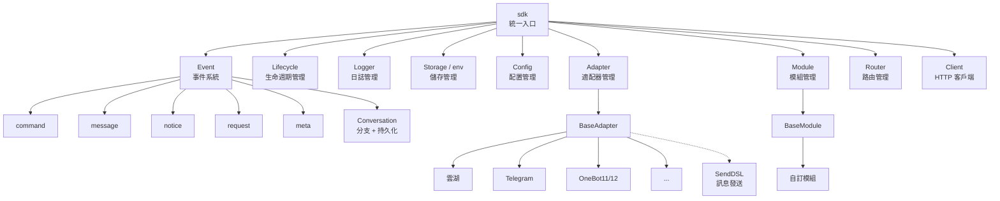

### 核心模組說明

| 模組 | 說明 |
|------|------|
| **Event** | 事件系統，提供 command / message / notice / request / meta 五類事件處理，以及 Conversation 多輪對話 |
| **Adapter** | 適配器管理器，管理多平台適配器的註冊、啟動和關閉 |
| **Module** | 模組管理器，管理插件的註冊、載入和卸載，支援依賴宣告和拓撲排序 |
| **Lifecycle** | 生命週期管理器，提供事件驅動的生命週期鉤子 |
| **Storage** | 基於 SQLite 的鍵值儲存系統，支援通用 SQL 串流查詢 |
| **Config** | TOML 格式的設定檔管理 |
| **Logger** | 模組化日誌系統，支援子日誌器 |
| **Router** | HTTP/WebSocket 路由管理，透過抽象層封裝底層後端（目前為 FastAPI + Uvicorn），支援裝飾器路由、中間件、分組、限流、CORS |
| **Client** | 統一 HTTP/WS 客戶端（2.8.0 前為 `HttpClient`，保留相容別名），透過抽象層封裝底層請求庫（目前為 aiohttp），提供請求統計、重試、日誌、WebSocket 客戶端、ErisPulse 異常體系等功能。客戶端和伺服器 WebSocket 共享 `WebSocketConnectionBase` 基類 |

## 初始化流程

下圖展示了 `sdk.init()` 的完整初始化過程：

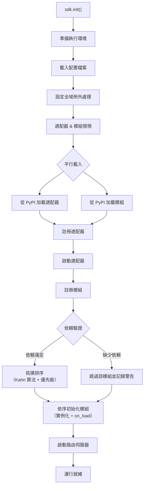

### 初始化階段詳解

> 完整的初始化鏈路拆解（Finder / Loader / Manager / Router）、底層入口（`init()` / `init_task()` / `init_sync()`）與手動完整啟動見 [啟動流程與手動控制](advanced/startup.md)。

## 事件處理流程

下圖展示了訊息從平台到處理器的完整轉流路徑：

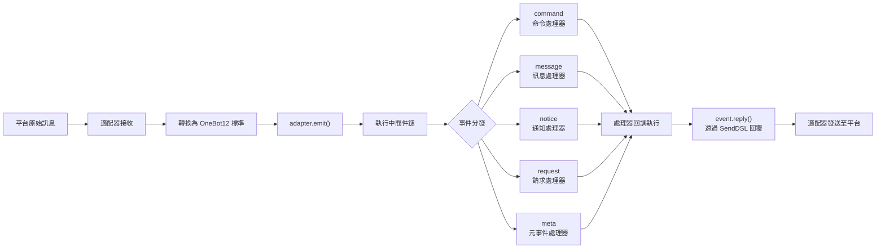

### 事件處理鏈路詳解

上面這張圖是「結果」；下面拆開 `adapter.emit()` 之後框架**在背後做了什麼**——這是一條三層分發的鏈路：

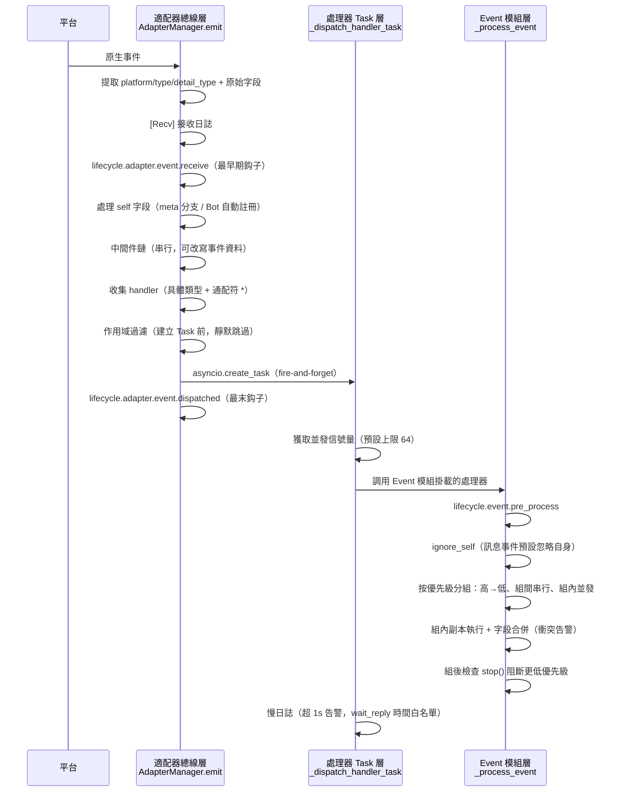

**每一步框架做了什麼、你能干預什麼：**

| 階段 | 框架做了什麼 | 你能干預的 |
|------|-------------|-----------|
| 接收 | 提取標準字段，保留 `{platform}_raw` 原始資料；寫 `[Recv]` 日誌 | 監聽 `adapter.event.receive` 拿到最早期事件 |
| self 字段 | meta 事件走 connect/disconnect/heartbeat 分支；普通事件自動註冊 Bot 並觸發 `adapter.bot.online` | 監聽 `adapter.bot.online` / `bot.offline` |
| 中間件 | **串行**執行，返回值非 None 則取代事件資料 | 註冊中間件改寫/攔截事件 |
| 分發收集 | 先取具體類型 handler，再取 `*` 通配符 handler | — |
| 作用域過濾 | 按 owner 判定 `scope.is_allowed`（會話級>Bot級>平台級），**不通過則靜默跳過** | 配置作用域白名單/黑名單 |
| 調度 | 每個匹配 handler 獨立 `asyncio.Task`，`emit()` **不等待** handler 完成即回傳 | — |
| 優先級 | 高優先級組先執行；**組間串行、組內並發**（組內各自持有事件副本，改字段合併回原事件，衝突打 WARNING） | `@command(..., priority=N)` / 註冊時指定 priority |
| 阻斷 | 每處理完一組檢查 `event.is_stopped()`，命中則**不再執行更低優先級** | `event.mark_processed(stop=True)` / `event.done()` |

> **常見誤區**：
> 1. **作用域過濾是靜默的**——被屏蔽的 handler 不報錯不回應，只在 TRACE 級日誌可見（`core.scope.denied`）。「我的模組沒收到訊息」優先排查作用域綁定。
> 2. **handler 天然並發**——框架已為每個 handler 建獨立 Task，你**不需要**再自己 `asyncio.create_task` 包一層。
> 3. **同優先級組內不阻斷**——`mark_processed(stop=True)` 只阻止更低優先級組，同組內已並發的 handler 不會中途被打斷。
> 4. **慢日誌閾值固定 1 秒**——處理器耗時超 1s 會在日誌打 WARNING（`wait_reply` 等待時間已從耗時中剔除），但不中斷執行。

> 作用域三級綁定與優先級細節見 [作用域系統](docs/zh-TW/advanced/scope.md)；claim/阻斷完整語義見 [事件處理入門](docs/zh-TW/getting-started/event-handling.md)；並發上限配置見 [配置指南](docs/zh-TW/user-guide/configuration.md#框架配置)。

## 生命週期事件

下圖展示了框架各組件的生命週期事件觸發順序：

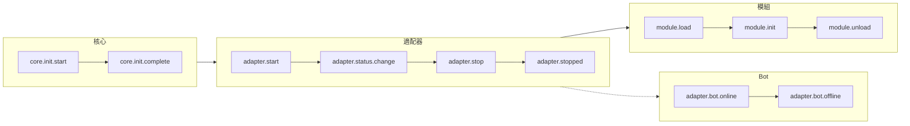

### 監聽生命週期事件

> 完整的事件監聽方法（`lifecycle.on()` / `once()` / `has_handlers()`）、全部生命週期事件列表與資料格式見 [生命週期管理](advanced/lifecycle.md)。

## 模組載入策略

ErisPulse 支援三種模組載入策略，由 `get_load_strategy()` 回傳的 `ModuleLoadStrategy` 聲明：

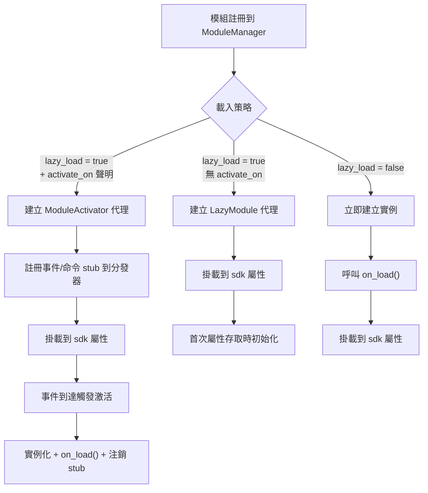

> 更多詳情請參考 [懶載入系統](docs/zh-TW/advanced/lazy-loading.md)、[生命週期管理](docs/zh-TW/advanced/lifecycle.md) 與模組文件。

### 事件驅動懶激活（`activate_on`）觸發架構

> [!NOTE]
> 本特性需要 ErisPulse **2.8.0+**。

`activate_on` 允許模組在**首個匹配事件/命令到達時**才載入，避免常駐記憶體，同時確保事件不遺失：

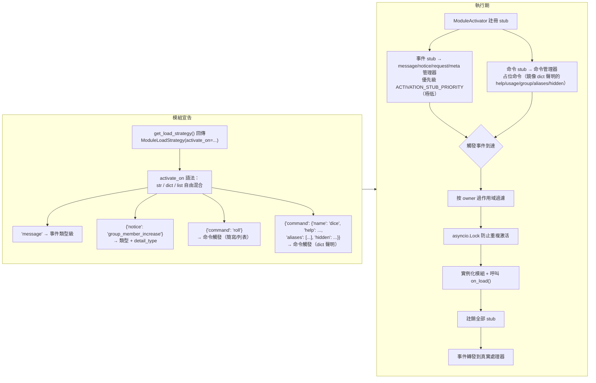

**觸發語義要點：**

> 完整的 `activate_on` 語法（str / dict / list）、命令 dict 聲明、占位命令 help 回退鏈、作用域過濾與失敗語義見 [懶載入系統](docs/zh-TW/advanced/lazy-loading.md#事件驅動懶激活activate_on)。

## 本地插件檔案夾架構

> [!NOTE]  
> 此功能需要 ErisPulse **2.8.0+**。

本地插件（`plugins/` 目錄）無需打包發布，框架啟動時會自動發現並加載：

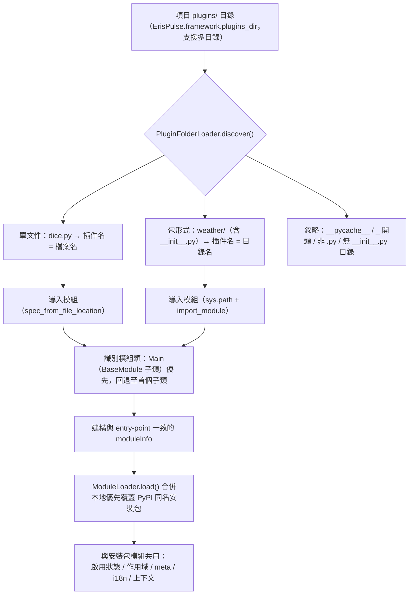

**約定與特性：**

- 插件名來源：單文件取檔案名，包形式取目錄名
- 本地插件 `moduleInfo.meta.source == "plugin_folder"`，與 PyPI 安裝包模組無縫共存
- 同名時本地優先（便於本地覆蓋調試），被禁用時同時移除同名 entry-point 條目

## 本地插件熱重載架構

熱重載會監控插件檔案的變更，並自動重新載入對應的插件：

```mermaid
flowchart TD
    A["sdk.enable_plugin_hot_reload()"] --> B["PluginReloadWatcher 啟動"]
    B --> C["PollingObserver（背景守護執行緒）<br/>定期比較 .py 檔案的 mtime"]
    C --> D{"插件檔案變更"}
    D --> E["變更去抖（預設 1 秒）"]
    E --> F["_handle_change 解析插件名<br/>（單一檔案 / 包形式）"]
    F --> G["asyncio.run_coroutine_threadsafe<br/>調度回主事件循環"]
    G --> H["sdk.reload_plugin(name)"]
    H --> I["卸載舊實例（觸發 on_unload）"]
    I --> J["清理註冊（unregister + 移除 sdk 屬性）"]
    J --> K["清理 sys.modules 強制重新載入"]
    K --> L["重新 discover + register + load"]
    L --> M["掛載新實例到 sdk 屬性"]
    M --> N["檔案刪除 → 自動從載入結果移除"]


====
快速上手
====


### 快速开始

# 快速開始

> **這是你的第一步。** 用 5 分鐘從零跑起一個 ErisPulse 機器人。

## 安裝 ErisPulse

### 一鍵安裝腳本（推薦）

安裝腳本會自動偵測您的環境（Docker、Python、uv），並引導您選擇最適合的安裝方式。

Windows (PowerShell):
```powershell
irm https://get.erisdev.com/install.ps1 -OutFile install.ps1; powershell -ExecutionPolicy Bypass -File install.ps1
```

macOS / Linux:
```bash
curl -fsSL https://get.erisdev.com/install.sh -o install.sh && chmod +x install.sh && ./install.sh
```

腳本會引導您完成：

- **Docker 安裝**（偵測到 Docker 時推薦）：選擇映像來源（Docker Hub / GHCR）、版本通道（穩定版 / 預發布版）、Dashboard 管理面板設定、埠號設定
- **傳統安裝**：自動建立虛擬環境、選擇 ErisPulse 版本、選用安裝 Dashboard 管理面板模組

### 使用 Docker

Docker 映像已內建 ErisPulse 框架和 Dashboard 管理面板。

```bash
# 下載 docker-compose.yml
curl -O https://raw.githubusercontent.com/ErisPulse/ErisPulse/main/docker-compose.yml

# 設定 Dashboard 令牌並啟動
ERISPULSE_DASHBOARD_TOKEN=your-token docker compose up -d
```

<details>
<summary>Docker Hub 不可用？</summary>

使用 GitHub Container Registry 映像，修改 `docker-compose.yml` 中的 image：

```yaml
image: ghcr.io/erispulse/erispulse:latest
```

</details>

啟動後存取 `http://<host>:8000/Dashboard`，使用設定的令牌登入。

### 使用 pip 安裝

確保您的 Python 版本 >= 3.10，然後使用 pip 安裝：

```bash
pip install ErisPulse
```

如果您已安裝 [uv](https://github.com/astral-sh/uv)，也可以使用 `uv pip install ErisPulse`，安裝速度更快。

## 初始化專案

### 互動式初始化（推薦）

```bash
epsdk init
```

這將會啟動一個互動式嚮導，引導您完成：
- 專案名稱設定
- 日誌層級配置
- 伺服器配置（主機和埠口）
- 適配器選擇和配置
- 專案結構建立

### 快速初始化

```bash
# 指定專案名稱的快速模式
epsdk init -q -n my_bot

# 或者只指定專案名稱
epsdk init -n my_bot
```

### 手動建立專案

如果比較偏好手動建立專案：

```bash
mkdir my_bot && cd my_bot
epsdk init

## 安裝模組

### 透過 CLI 安裝

```bash
epsdk install Yunhu AIChat
```

### 查看可用模組

```bash
epsdk list-remote
```

### 互動式安裝

不指定套件名稱時會進入互動式安裝介面：

```bash
epsdk install

## 執行專案

```bash
# 一般執行
epsdk run main.py

# 熱重載模式（開發時推薦）
epsdk run main.py --reload

## 啟用 IDE 補全（選用）

ErisPulse 動態發現模組/適配器，IDE 預設無法補全平台特有方法。
執行以下命令產生型別存根：

```bash
epsdk types
```

產生後用導入的型別作為變數標註即可獲得精確補全（詳見 [IDE 補全指南](./getting-started/ide-completion.md)）：

```python
from _ep_types import Yunhu
from ErisPulse import sdk

adapter: Yunhu = sdk.adapter.get("yunhu")
await adapter.Send.To("group", "123").Board(...)  # 補全平台特有方法

## 專案結構

初始化後的專案結構：

```
my_bot/
├── config/
│   └── config.toml          # 設定檔
└── main.py                  # 入口檔案

## 設定檔

基本的 `config.toml` 設定：

```toml
[ErisPulse.server]
host = "0.0.0.0"
port = 8000

[ErisPulse.logger]
level = "INFO"

[Yunhu_Adapter]
# 适配器設定


### 创建第一个机器人

# 創建第一個機器人

本指南在 [5 分鐘快速開始](../quick-start.md) 的基礎上，帶你編寫第一個命令處理器並理解運行機制。

> 如果你還沒有安裝好 ErisPulse、初始化項目，請先完成 [快速開始](../quick-start.md) 的「安裝」「初始化項目」「運行項目」三步。

## 第一步：編寫第一個命令

打開 `main.py`，編寫一個簡單的命令處理器：

```python
from ErisPulse import sdk
from ErisPulse.Core.Event import command

@command("hello", help="發送問候訊息")
async def hello_handler(event):
    """處理 hello 命令"""
    user_name = event.get_user_nickname() or "朋友"
    await event.reply(f"你好，{user_name}！我是 ErisPulse 機器人。")

@command("ping", help="測試機器人是否在線")
async def ping_handler(event):
    """處理 ping 命令"""
    await event.reply("Pong！機器人運行正常。")

async def main():
    """主入口函數"""
    print("正在啟動 ErisPulse...")
    
    # keep_running=True（預設）：框架阻塞維持運行，直到收到關閉訊號（如 Ctrl+C）
    await sdk.run(keep_running=True)

if __name__ == "__main__":
    import asyncio
    asyncio.run(main())
```

### `keep_running` 參數

`sdk.run(keep_running)` 控制框架是否阻塞維持運行：

- **`keep_running=True`（預設）**：`run()` 會一直阻塞，直到收到關閉訊號（如 Ctrl+C），適合純 bot 應用。
- **`keep_running=False`**：`run()` 初始化完成後立即返回，**框架並不會卸載**——已啟動的適配器/模塊仍作為背景任務繼續處理訊息事件，你可以接著執行自己的邏輯，直到事件循環結束框架才隨之關閉。例如：

```python
async def main():
    await sdk.run(keep_running=False)   # 初始化後立即返回
    # 框架已在背景運行，這裡可以繼續做別的事
    while True:
        await asyncio.sleep(3600)
        print("每小時檢查一次")
```

> 除了 `run()` 的兩種模式，還有 `init()`/`uninit()` 手動控制生命週期、單獨啟停適配器/路由等更精細的方式，見 [啟動流程與手動控制](../advanced/startup.md)。

## 第二步：運行機器人

```bash
# 普通運行
epsdk run main.py

# 開發模式（支援熱重載）
epsdk run main.py --reload
```

## 第三步：測試機器人

在你的聊天平台中發送命令：

```
/hello
```

你應該會收到機器人的回覆。

## 程式碼說明

### 命令裝飾器

```python
@command("hello", help="發送問候訊息")
```

- `hello`：命令名稱，使用者透過 `/hello` 調用
- `help`：命令幫助說明，在 `/help` 命令中顯示

### 事件參數

```python
async def hello_handler(event):
```

`event` 參數是一個 Event 物件，包含：
- 消息內容：`event.get_text()`
- 發送者資訊：`event.get_user_id()`、`event.get_user_nickname()`
- 平台資訊：`event.get_platform()`
- 群組資訊：`event.get_group_id()`
- 原始資料：`event.get_raw()`

> 完整的 Event 物件方法請參考 [Event 包裝類詳解](../developer-guide/modules/event-wrapper.md)。

### 發送回覆

```python
await event.reply("回覆內容")
```

`event.reply()` 是一個便捷方法，用於向發送者發送訊息。

## 擴展：添加更多功能

ErisPulse 提供了豐富的事件處理和資料處理能力：

- **訊息監聽**：使用 `@message.on_message()` 監聽各類訊息 → [事件處理入門](event-handling.md)
- **通知監聽**：使用 `@notice.on_friend_add()` 等監聽系統通知 → [事件處理入門](event-handling.md)
- **資料儲存**：使用 `sdk.storage.get/set` 持久化資料 → [常見任務示例](common-tasks.md)

## 常見問題

### 命令沒有回應？

1. 檢查適配器是否正確配置，確認 `config/config.toml` 中適配器的 `status` 為 `true`
2. 查看終端日誌輸出，確認是否有錯誤資訊（特別是 `ERROR` 級別日誌）
3. 確認命令前綴是否正確（預設是 `/`），可在設定檔中查看 `[ErisPulse.event.command]` 部分
4. 確認命令名稱拼寫正確，注意大小寫敏感性設定

### 如何修改命令前綴？

在 `config.toml` 中添加：

```toml
[ErisPulse.event.command]
prefix = "!"
case_sensitive = false
```

### 如何支援多平台？

ErisPulse 使用 OneBot12 標準統一了不同平台的事件格式，`@command` 和 `@message` 註冊的處理器會自動接收所有平台的事件。透過 `event.get_platform()` 可以區分來源平台：

```python
@command("hello")
async def hello_handler(event):
    platform = event.get_platform()
    
    if platform == "yunhu":
        await event.reply("你好！來自雲湖")
    elif platform == "telegram":
        await event.reply("Hello! From Telegram")
    else:
        await event.reply("你好！")
```

> 更多多平台適配技巧請參考 [常見任務示例](common-tasks.md#多平台適配)。


### 基础概念

# 基礎概念

本指南介紹 ErisPulse 的核心概念，幫助你理解框架的設計思想和基本架構。

## 事件驅動架構

ErisPulse 採用事件驅動架構，所有的互動都透過事件來傳遞和處理。

### 事件流程

```
使用者發送訊息
      │
      ▼
平台接收
      │
      ▼
適配器接收平台原生事件
      │
      ▼
轉換為 OneBot12 標準事件
      │
      ▼
提交到事件系統
      │
      ▼
分發給已註冊的處理器
      │
      ▼
模組處理事件
      │
      ▼
透過適配器發送回應
      │
      ▼
平台顯示給使用者
```

### OneBot12 標準

ErisPulse 使用 OneBot12 作為核心事件標準。OneBot12 是一個通用的聊天機器人應用介面標準，定義了統一的事件格式。

所有適配器都會將平台特定的事件轉換為 OneBot12 格式，確保程式碼的一致性。

## 核心元件

### 1. SDK 物件

SDK 是所有功能的統一入口點，提供對核心元件的存取。

```python
from ErisPulse import sdk

# 存取核心模組
sdk.storage    # 存儲系統
sdk.config     # 配置系統
sdk.logger     # 日誌系統
sdk.adapter    # 適配器系統
sdk.module     # 模組系統
sdk.router     # 路由系統
sdk.client     # HTTP 客戶端
sdk.lifecycle  # 生命週期系統
```

### 2. Event 物件

Event 物件封裝了事件資料，提供了便捷的存取方法。

```python
@command("info")
async def info_handler(event):
    # 獲取事件資訊
    event_id = event.get_id()
    user_id = event.get_user_id()
    platform = event.get_platform()
    text = event.get_text()
    
    # 發送回覆
    await event.reply(f"使用者: {user_id}, 平台: {platform}")
```

### 3. 適配器

適配器是 ErisPulse 與外部平台之間的橋樑。

**職責：**
- 接收平台原生事件
- 轉換為 OneBot12 標準格式
- 將標準格式事件發送到平台

**示例適配器：**
- Yunhu 適配器：與雲湖平台通訊
- Telegram 適配器：與 Telegram Bot API 通訊
- OneBot11 適配器：與 OneBot11 相容的應用通訊
- Email 適配器：處理郵件收發

### 4. 模組

模組是功能擴充的基本單位，可以：

- 註冊事件處理器
- 實現業務邏輯
- 呼叫適配器發送訊息
- 使用核心模組提供的服務

#### 模組發現機制

ErisPulse 透過 Python 的 `importlib.metadata.entry_points` 發現已安裝的模組。模組在 `pyproject.toml` 中宣告入口點：

```toml
[project.entry-points."erispulse.module"]
MyModule = "my_package:Main"
```

SDK 初始化時會掃描所有 `erispulse.module` 組的入口點，將模組類註冊到 `ModuleManager`，然後按依賴關係拓撲排序後依次初始化。

#### 最小可用模組

```python
from ErisPulse.Core.Bases import BaseModule
from ErisPulse import sdk

class Main(BaseModule):
    def __init__(self):
        self.sdk = sdk
        self.logger = sdk.logger.get_child("MyModule")

    async def on_load(self, event):
        self.logger.info("模組已載入")

    async def on_unload(self, event):
        self.logger.info("模組已卸載")
```

#### 模組生命週期

- **註冊**：SDK 發現模組類並註冊到管理器
- **載入**：建立模組實例，呼叫 `on_load(event)`（`event = {"module_name": "MyModule"}`）
- **卸載**：呼叫 `on_unload(event)`，清理資源

#### 載入策略

透過 `get_load_strategy()` 宣告模組的載入行為：

```python
from ErisPulse.loaders import ModuleLoadStrategy

class Main(BaseModule):
    @staticmethod
    def get_load_strategy():
        return ModuleLoadStrategy(
            lazy_load=True,   # 是否懶載入（預設 True）
            priority=0        # 載入優先級，數值越大越先初始化
        )
```

- **`lazy_load=True`（預設）**：模組在首次被 `sdk.MyModule` 存取時才初始化，減少啟動時間
- **`lazy_load=False`**：SDK 啟動時立即初始化，適合需要監聽生命週期事件或執行定時任務的模組
- **`priority`**：同優先級的模組按註冊順序載入；數值越大越先初始化

> 詳細的懶載入機制說明請參考 [懶載入系統](../advanced/lazy-loading.md)。

## 事件類型

ErisPulse 支援 5 類事件：

| 事件類型 | 裝飾器 | 說明 |
|---------|--------|------|
| 訊息事件 | `@message.on_message()` | 使用者發送的任何訊息（私聊、群聊） |
| 命令事件 | `@command("name")` | 以命令字首開頭的訊息（如 `/hello`） |
| 通知事件 | `@notice.on_friend_add()` 等 | 系統通知（好友新增、群成員變化等） |
| 請求事件 | `@request.on_friend_request()` 等 | 使用者請求（好友請求、群邀請） |
| 元事件 | `@meta.on_connect()` 等 | 系統級事件（連線、斷線、心跳） |

> 各事件類型的詳細用法和程式碼範例請參考 [事件處理入門](event-handling.md)。

## 核心模組說明

### Storage（存儲）

基於 SQLite 的鍵值存儲系統，用於持久化資料。

```python
# 設置值
sdk.storage.set("key", "value")

# 獲取值
value = sdk.storage.get("key", "default_value")

# 批量操作
sdk.storage.set_multi({
    "key1": "value1",
    "key2": "value2"
})

# 事務
with sdk.storage.transaction():
    sdk.storage.set("key1", "value1")
    sdk.storage.set("key2", "value2")
```

### Config（配置）

TOML 格式的配置檔案管理。

```python
# 獲取配置
config = sdk.config.getConfig("MyModule", {})

# 設置配置
sdk.config.setConfig("MyModule", {"key": "value"})

# 讀取嵌套配置
value = sdk.config.getConfig("MyModule.subkey", "default")
```

### Logger（日誌）

模組化日誌系統。

```python
# 記錄日誌
sdk.logger.info("這是一條資訊")
sdk.logger.warning("這是一條警告")
sdk.logger.error("這是一條錯誤")

# 獲取子日誌記錄器
child_logger = sdk.logger.get_child("submodule")
child_logger.info("子模組日誌")
```

**屬性存取語法糖**

除了使用 `get_child()` 方法外，你還可以透過**屬性存取**的方式建立子logger，這是一種更簡潔的**語法糖**寫法：

```python
# 透過屬性存取建立子logger
sdk.logger.mymodule.info("模組訊息")

# 支援嵌套存取
sdk.logger.mymodule.database.info("資料庫訊息")
```

### Router（路由）

HTTP 和 WebSocket 路由管理，基於 FastAPI + Uvicorn。支援裝飾器路由、中介軟體、分組、限流、CORS。

```python
from ErisPulse.Core import HttpRequest

@sdk.router.get("MyModule", "/api")
async def handler(request: HttpRequest):
    data = await request.json()
    return {"status": "ok"}
```

> 完整的路由 API（WebSocket、中介軟體、速率限制、CORS 等）請參考 [路由管理器](../advanced/router.md)。

### Client（網絡客戶端）

統一的網絡客戶端，聚合了 HTTP 請求、WebSocket 連線、連線池管理、自動重試、逾時控制、請求統計和生命週期事件整合。

```python
from ErisPulse.Core import client

# HTTP 請求
resp = await client.get("https://api.example.com/users")
data = await resp.json()

# 帶重試和逾時
resp = await client.get(url, timeout=30, max_retries=3)

# WebSocket 連線
ws = await client.ws_connect("wss://example.com/ws")
async for text in ws.iter_text():
    await ws.send_text(f"Echo: {text}")
```

> 完整的網絡客戶端 API 請參考 [網絡客戶端](../advanced/http-client.md)。

## SendDSL 訊息發送

適配器提供鏈式呼叫的訊息發送介面。

### 基礎發送

```python
# 獲取適配器實例
yunhu = sdk.adapter.get("yunhu")

# 發送訊息
await yunhu.Send.To("user", "U1001").Text("Hello")

# 指定發送帳號
await yunhu.Send.Using("bot1").To("group", "G1001").Text("群訊息")
```

### 鏈式修飾

```python
# @使用者
await yunhu.Send.To("group", "G1001").At("U2001").Text("@訊息")

# 回覆訊息
await yunhu.Send.To("group", "G1001").Reply("msg123").Text("回覆")

# @全體
await yunhu.Send.To("group", "G1001").AtAll().Text("公告")
```

### Event 回覆方法

Event 物件提供了便捷的回覆方法：

```python
@command("test")
async def test_handler(event):
    # 簡單文字回覆
    await event.reply("回覆內容")
    
    # 發送圖片
    await event.reply("http://example.com/image.jpg", method="Image")
    
    # 發送語音
    await event.reply("http://example.com/voice.mp3", method="Voice")
```

## 懶載入系統

ErisPulse 預設啟用模組懶載入，模組只在首次被存取（如 `sdk.MyModule`）時才初始化，顯著提高啟動速度。

```python
from ErisPulse.loaders import ModuleLoadStrategy

class Main(BaseModule):
    @staticmethod
    def get_load_strategy():
        return ModuleLoadStrategy(
            lazy_load=True,   # 啟用懶載入（預設）
            priority=0        # 載入優先級，數值越大越先初始化
        )
```

**需要停用懶載入的場景（`lazy_load=False`）：**
- 監聽生命週期事件的模組（如 `core.init.complete`）
- 啟動定時任務或後台服務的模組
- 需要在其他模組載入前完成初始化的模組

> 詳細的懶載入機制和注意事項請參考 [懶載入系統](../advanced/lazy-loading.md)。


### 事件处理入门

# 事件處理入門

本指南介紹如何處理 ErisPulse 中的各類事件。

請直接返回翻譯後的完整 Markdown 內容，不要包含任何其他文字。

再次提醒：如果文件包含語言切換行（各語言名稱用 ` | ` 分隔的行），務必嚴格遵守上方第 8 條的格式要求，不要寫出 `[**Label**](file)` 這類錯誤格式。

## 事件類型概覽

ErisPulse 支援以下事件類型：

| 事件類型 | 說明 | 適用場景 |
|---------|------|---------|
| 訊息事件 | 使用者傳送的任何訊息 | 聊天機器人、內容過濾 |
| 指令事件 | 以指令前綴開頭的訊息 | 指令處理、功能入口 |
| 通知事件 | 系統通知（新增好友、群成員變化等） | 歡迎訊息、狀態通知 |
| 請求事件 | 使用者請求（新增好友請求、群邀請） | 自動化處理請求 |
| 元事件 | 系統級事件（連線、心跳） | 連線監控、狀態檢查 |

## 訊息事件處理

> **提示**: 建議在事件處理器中使用 `Event` 類型註解，以獲得 IDE 自動補全和類型檢查支援。

```python
from ErisPulse.Core.Event import Event  # 匯入事件類型用於註解
```

### 監聽所有訊息

```python
from ErisPulse.Core.Event import message, Event

@message.on_message()
async def message_handler(event: Event):
    text = event.get_text()
    user_id = event.get_user_id()
    sdk.logger.info(f"收到 {user_id} 的訊息: {text}")
```

### 監聽私聊訊息

```python
@message.on_private_message()
async def private_handler(event: Event):
    user_id = event.get_user_id()
    await event.reply(f"你好，{user_id}！這是私聊訊息。")
```

### 監聽群聊訊息

```python
@message.on_group_message()
async def group_handler(event: Event):
    group_id = event.get_group_id()
    user_id = event.get_user_id()
    sdk.logger.info(f"群 {group_id} 中 {user_id} 傳送了訊息")
```

### 監聽@訊息

```python
@message.on_at_message()
async def at_handler(event: Event):
    # 取得被@的使用者清單
    mentions = event.get_mentions()
    await event.reply(f"你@了這些使用者: {mentions}")

## 命令事件處理

### 基本命令

```python
from ErisPulse.Core.Event import command

@command("help", help="顯示幫助資訊")
async def help_handler(event):
    help_text = """
可用命令：
/help - 显示帮助
/ping - 測試連接
/info - 查看資訊
    """
    await event.reply(help_text)
```

### 命令別名

```python
@command(["help", "h"], aliases=["幫助"], help="顯示幫助資訊")
async def help_handler(event):
    await event.reply("幫助資訊...")
```

使用者可以使用以下任何方式呼叫：
- `/help`
- `/h`
- `/幫助`

### 命令參數

```python
@command("echo", help="回顯訊息")
async def echo_handler(event):
    # 獲取命令參數
    args = event.get_command_args()
    
    if not args:
        await event.reply("請輸入要回顯的訊息")
    else:
        await event.reply(f"你說了: {' '.join(args)}")
```

### 命令組

```python
@command("admin.reload", group="admin", help="重新載入模組")
async def reload_handler(event):
    await event.reply("模組已重新載入")

@command("admin.stop", group="admin", help="停止機器人")
async def stop_handler(event):
    await event.reply("機器人已停止")
```

### 命令權限

```python
def is_master(event):
    """檢查使用者是否為框架主人"""
    master_list = ["user123", "user456"]
    return event.get_user_id() in master_list

@command("master", permission=is_master, help="框架主人命令")
async def master_handler(event):
    await event.reply("這是框架主人命令")
```

### 命令優先級

```python
# 優先級數值越大，執行越早
@message.on_message(priority=10)
async def high_priority_handler(event):
    await event.reply("高優先級處理器")

@message.on_message(priority=1)
async def low_priority_handler(event):
    await event.reply("低優先級處理器")
```

### 並行事件處理

ErisPulse 事件系統採用**同優先級並行、不同優先級串行**的調度模型：

```
事件到達
    ↓
priority=10 組: [處理器C || 處理器D] 並行 → 合併結果
    ↓ (如未中斷)
priority=0 組: [處理器A || 處理器B] 並行 → 合併結果
    ↓
...
```

- **同優先級並行**：優先級相同的多個處理器會同時執行，提高吞吐量
- **跨級串行**：不同優先級的組按順序執行（數值越大越先執行），確保高優先級處理器先運行
- **Copy-On-Write**：處理器無修改時不建立副本，確保零開銷
- **衝突處理**：同優先級多處理器修改同一欄位時，使用最後修改值並記錄警告日誌
- **中斷機制**：任意處理器呼叫 `event.done()`（預設）或 `event.done(claim=False)` 後，跳過後續低優先級組。認領與阻斷的區別見下文[「鏈路控制：認領與阻斷」](#鏈路控制認領與阻斷)

```python
# 範例：同優先級處理器並行執行
@message.on_message(priority=0)
async def handler_a(event):
    # 處理任務A
    event['result_a'] = process_a()

@message.on_message(priority=0)
async def handler_b(event):
    # 與 handler_a 並行執行
    event['result_b'] = process_b()

# 不同優先級串行執行
@message.on_message(priority=10)
async def handler_c(event):
    # 優先級最高，最先執行
    pass
```

> **併發上限**：所有匹配 handler 的 Task 會**立即建立**，但透過一個信號量限制**同時在途執行數**，預設上限 **64**（`ErisPulse.framework.handler_max_concurrency`，支援熱更新）。超過上限的 Task 在信號量上排隊，等前面的完成後再進入。事件洪峰時這就是你的「泄壓閥」。
>
> **慢日誌**：單個處理器耗時超過 **1 秒**時，框架會在日誌打 WARNING（`handler_slow`）。`wait_reply` 的等待時間會從耗時裡剔除，不會因為「等人回覆」誤報慢。

## 作用域過濾：為什麼我的模組沒有收到訊息

事件分發會在**建立處理器 Task 之前**進行作用域過濾——根據模組 owner 判定 `scope.is_allowed`（會話級 > Bot 級 > 平台級），**不通過則靜默跳過**，不會報錯也不會回應。

```python
# 假設 config.toml 裡將 MyModule 在某個群組中屏蔽：
[ErisPulse.scope]
block = { yunhu = { group_123 = ["MyModule"] } }
```

此時該群組的訊息到達時，`MyModule` 的命令與事件處理器**都不會被調度**。這不是 bug，而是作用域機制——排查「模組沒有反應」時應優先檢查作用域綁定。

- 三層過濾點：適配器總線級（Task 建立前）、Event 模組級（每個優先級組內）、命令級（權限檢查前）
- 過濾日誌只在 **TRACE** 級可見（`core.scope.denied`），預設 INFO 級看不到任何痕跡
- 框架級處理器（如命令分發器 `scope_exempt=True`）不受作用域影響

> 作用域三級綁定、白名單/黑名單、優先級覆蓋與「default_allow」隱式拒絕語義請見 [作用域系統](../../advanced/scope.md)。

## 鏈路控制：認領與阻斷

> [!NOTE]
> `event.done()` / `event.mark_processed()` 的 `claim=` / `stop=` 參數本特性需要 ErisPulse **2.7.1+**。

ErisPulse 將「認領」與「阻斷」兩個正交語義解耦，透過 `event.done()` 統一控制，便於在命令處理周圍疊加日誌、審計、權限等觀察層。

**兩個概念的準確定義：**

- **認領（claim）**：標記事件已被本處理器處理（寫入 `_processed`）。命令分發器看到已認領的事件會**跳過重複**——避免同一訊息被多個命令處理器重複處理。典型場景：命令匹配成功後認領，阻止命令分發器再介入。
- **阻斷（stop）**：阻止事件向**更低優先級**處理器傳播（寫入 `_propagation_stopped`）。低優先級處理器（如 `on_message`）將不再看到該事件。典型場景：高優先級處理器已完整處理事件，不希望低優先級再執行。

| `event.done(...)` | 認領 | 阻斷 | 場景 |
|-------------------|------|------|------|
| `event.done()` | ✔ | ✔ | 命令 / 處理器處理完的標準做法 |
| `event.done(stop=False)` | ✔ | ✘ | 僅認領，讓低優先級觀察者（日誌 / 統計）繼續看到 |
| `event.done(claim=False)` | ✘ | ✔ | 僅阻斷（如防火牆 / 限流），但不做命令去重 |

`event.done(claim=, stop=)` 是 `event.mark_processed(claim=, stop=)` 的別名，二者參數與行為完全等價。

```python
@command("help")
async def help_cmd(event):
    event.done()            # 認領 + 阻斷（命令處理完的標準做法）

@message.on_message(priority=50)
async def observer(event):
    event.done(stop=False)  # 僅認領：低優先級仍會執行（日誌 / 統計）

@message.on_message(priority=100)
async def firewall(event):
    if denied(event):
        event.done(claim=False)  # 僅阻斷：低優先級不執行，但不做去重
```

### 命令與回覆的 block 配置

命令匹配成功 / `wait_reply` 匹配到回覆後，預設會阻斷傳播（向後相容）。可透過配置放行，讓低優先級處理器（日誌 / 審計 / 權限）也能觀測這些訊息：

```toml
[ErisPulse.event.command]
block = false   # 命令訊息繼續流向低優先級處理器

[ErisPulse.event.wait_reply]
block = false   # 被 wait_reply 消費的回覆繼續流向低優先級處理器

## 通知事件處理

### 好友添加

```python
from ErisPulse.Core.Event import notice

@notice.on_friend_add()
async def friend_add_handler(event):
    user_id = event.get_user_id()
    nickname = event.get_user_nickname() or "新朋友"
    await event.reply(f"歡迎添加我為好友，{nickname}！")
```

### 群成員增加

```python
@notice.on_group_increase()
async def member_increase_handler(event):
    group_id = event.get_group_id()
    user_id = event.get_user_id()
    await event.reply(f"歡迎新成員 {user_id} 加入群 {group_id}")
```

### 群成員減少

```python
@notice.on_group_decrease()
async def member_decrease_handler(event):
    group_id = event.get_group_id()
    user_id = event.get_user_id()
    await event.reply(f"成員 {user_id} 離開了群 {group_id}")

## 請求事件處理

### 好友請求

```python
from ErisPulse.Core.Event import request

@request.on_friend_request()
async def friend_request_handler(event):
    user_id = event.get_user_id()
    comment = event.get_comment()
    
    sdk.logger.info(f"收到好友請求: {user_id}, 附言: {comment}")
    
    # 可以透過適配器 API 處理請求
    # 具體實作請參考各適配器文件
```

### 群組邀請請求

```python
@request.on_group_request()
async def group_request_handler(event):
    group_id = event.get_group_id()
    user_id = event.get_user_id()
    
    await event.reply(f"收到群組 {group_id} 的邀請，來自 {user_id}")

## 元事件處理

### 連接事件

```python
from ErisPulse.Core.Event import meta

@meta.on_connect()
async def connect_handler(event):
    platform = event.get_platform()
    sdk.logger.info(f"{platform} 平台已連接")

@meta.on_disconnect()
async def disconnect_handler(event):
    platform = event.get_platform()
    sdk.logger.warning(f"{platform} 平台已斷開連接")
```

### 心跳事件

```python
@meta.on_heartbeat()
async def heartbeat_handler(event):
    platform = event.get_platform()
    sdk.logger.debug(f"{platform} 心跳檢測")
```

### Bot 狀態查詢

當適配器發送 meta 事件後，框架會自動追蹤 Bot 狀態，你可以隨時查詢：

```python
from ErisPulse import sdk

# 檢查某個 Bot 是否在線
if sdk.adapter.is_bot_online("telegram", "123456"):
    telegram = sdk.adapter.get("telegram")
    await telegram.Send.To("user", "123456").Text("Bot 在線")

# 列出當前所有在線 Bot
bots = sdk.adapter.list_bots()
for platform, bot_list in bots.items():
    for bot_id, info in bot_list.items():
        print(f"{platform}/{bot_id}: {info['status']}")

# 獲取完整狀態摘要
summary = sdk.adapter.get_status_summary()

## 互動式處理

### 使用 reply 方法發送回覆

`event.reply()` 方法支援多種修飾參數，方便發送帶有 @、回覆等功能的消息：

```python
# 簡單回覆
await event.reply("你好")

# 發送不同類型的消息
await event.reply("http://example.com/image.jpg", method="Image")  # 圖片
await event.reply("http://example.com/voice.mp3", method="Voice")  # 語音

# @單個用戶
await event.reply("你好", at_users=["user123"])

# @多個用戶
await event.reply("大家好", at_users=["user1", "user2", "user3"])

# 回覆消息
await event.reply("回覆內容", reply_to="msg_id")

# @全體成員
await event.reply("公告", at_all=True)

# 組合使用：@用戶 + 回覆消息
await event.reply("內容", at_users=["user1"], reply_to="msg_id")
```

### 等待用戶回覆

```python
@command("ask", help="詢問用戶")
async def ask_handler(event):
    await event.reply("請輸入你的名字:")
    
    # 等待用戶回覆，超時時間 30 秒
    reply = await event.wait_reply(timeout=30)
    
    if reply:
        name = reply.get_text()
        await event.reply(f"你好，{name}！")
    else:
        await event.reply("等待超時，請重新輸入。")
```

### 帶驗證的等待回覆

```python
@command("age", help="詢問年齡")
async def age_handler(event):
    def validate_age(event_data):
        """驗證年齡是否有效"""
        try:
            age = int(event_data.get_text())
            return 0 <= age <= 150
        except ValueError:
            return False
    
    await event.reply("請輸入你的年齡 (0-150):")
    
    reply = await event.wait_reply(
        timeout=60,
        validator=validate_age
    )
    
    if reply:
        age = int(reply.get_text())
        await event.reply(f"你的年齡是 {age} 歲")
    else:
        await event.reply("輸入無效或超時")
```

### 帶回調的等待回覆

```python
@command("confirm", help="確認操作")
async def confirm_handler(event):
    async def handle_confirmation(reply_event):
        text = reply_event.get_text().lower()
        
        if text in ["是", "yes", "y"]:
            await event.reply("操作已確認！")
        else:
            await event.reply("操作已取消。")
    
    await event.reply("確認執行此操作嗎？(是/否)")
    
    await event.wait_reply(
        timeout=30,
        callback=handle_confirmation
    )
```

### 確認對話 (confirm)

等待用戶確認或否定，自動識別內置中英文確認詞：

```python
@command("confirm", help="確認操作")
async def confirm_handler(event):
    if await event.confirm("確定要執行此操作嗎？"):
        await event.reply("已確認，執行中...")
    else:
        await event.reply("已取消")

# 自定義確認詞
if await event.confirm("繼續嗎？", yes_words={"go", "繼續"}, no_words={"stop", "停止"}):
    pass
```

### 選擇選單 (choose)

用戶可回覆選項編號或選項文字：

```python
@command("choose", help="選擇")
async def choose_handler(event):
    choice = await event.choose(
        "請選擇顏色：",
        ["紅色", "綠色", "藍色"]
    )
    
    if choice is not None:
        colors = ["紅色", "綠色", "藍色"]
        await event.reply(f"你選擇了：{colors[choice]}")
    else:
        await event.reply("超時未選擇")
```

**合併模式**：`merge_prompt=True` 時將選項拼入提示消息，用用戶指定的 `method` 一條消息發送：

```python
# 用 Markdown 發送合併後的提示 + 選項
choice = await event.choose(
    "## 請選擇顏色\n{options}\n請回覆編號",
    ["紅色", "綠色", "藍色"],
    method="Markdown",
    merge_prompt=True,
)
```

> `{options}` 占位符控制選項插入位置；不寫則附加到 prompt 末尾。
> 可通過 `placeholder` 參數自定義占位符（如 `placeholder="[choices]"`）。
> `options_format="auto"`（預設）根據 method 自動選擇樣式：Markdown→無序列表，Html→有序列表，其他→純文字列表。
> 文本類方法（Text/Markdown/Html 等）預設合併選項到末尾；非文本方法（Image 等）預設拆分為兩條消息。

### 收集表單 (collect)

多步驟收集用戶輸入：

```python
@command("register", help="註冊")
async def register_handler(event):
    data = await event.collect([
        {"key": "name", "prompt": "請輸入姓名："},
        {"key": "age", "prompt": "請輸入年齡：", 
         "validator": lambda e: e.get_text().isdigit()},
        {"key": "email", "prompt": "請輸入郵箱："}
    ])
    
    if data:
        await event.reply(f"註冊成功！\n姓名：{data['name']}\n年齡：{data['age']}\n郵箱：{data['email']}")
    else:
        await event.reply("註冊超時或輸入無效")
```

### 等待任意事件 (wait_for)

等待滿足條件的任意事件，不侷限於同一用戶：

```python
@command("wait_member", help="等待新成員")
async def wait_member_handler(event):
    await event.reply("等待群成員加入...")
    
    evt = await event.wait_for(
        event_type="notice",
        condition=lambda e: e.get_detail_type() == "group_member_increase",
        timeout=120
    )
    
    if evt:
        await event.reply(f"歡迎新成員：{evt.get_user_id()}")
    else:
        await event.reply("等待超時")
```

### 多輪對話 (conversation)

創建可交互的多輪對話上下文：

```python
@command("survey", help="問卷調查")
async def survey_handler(event):
    conv = event.conversation(timeout=60)
    
    await conv.say("歡迎參與問卷調查！")
    
    while conv.is_active:
        reply = await conv.wait()
        
        if reply is None:
            await conv.say("對話超時，再見！")
            break
        
        text = reply.get_text()
        
        if text == "退出":
            await conv.say("再見！")
            break
        
        await conv.say(f"你說了：{text}，繼續輸入或回覆'退出'結束")
```

### 內置確認詞

ErisPulse 內置了中英文確認詞集合：

- **確認詞** (`CONFIRM_YES_WORDS`): 是、yes、y、確認、確定、好、好的、ok、true、對、嗯、行、同意、沒問題...
- **否定詞** (`CONFIRM_NO_WORDS`): 否、no、n、取消、不、不要、不行、cancel、false、錯、拒絕、不可以...

## 事件數據存取

### Event 物件常用方法

```python
@command("info")
async def info_handler(event):
    # 基礎資訊
    event_id = event.get_id()
    event_time = event.get_time()
    event_type = event.get_type()
    detail_type = event.get_detail_type()
    
    # 發送者資訊
    user_id = event.get_user_id()
    nickname = event.get_user_nickname()
    
    # 訊息內容
    message_segments = event.get_message()
    alt_message = event.get_alt_message()
    text = event.get_text()
    
    # 群組資訊
    group_id = event.get_group_id()
    
    # 機器人資訊
    self_id = event.get_self_user_id()
    self_platform = event.get_self_platform()
    
    # 原始資料
    raw_data = event.get_raw()
    raw_type = event.get_raw_type()
    
    # 平台資訊
    platform = event.get_platform()
    
    # 訊息類型判斷
    is_private = event.is_private_message()
    is_group = event.is_group_message()
    is_at = event.is_at_message()
    
    # 命令資訊
    if event.is_command():
        cmd_name = event.get_command_name()
        cmd_args = event.get_command_args()
        cmd_raw = event.get_command_raw()
```

### 平台擴充方法

除了內建方法外，各平台適配器還會註冊平台專屬方法，方便你存取平台特有的資料。

```python
from ErisPulse.Core.Event import message

@message.on_message()
async def handle_message(event):
    platform = event.get_platform()

    # 根據平台呼叫專屬方法
    if platform == "telegram":
        chat_type = event.get_chat_type()      # Telegram 專屬方法
    elif platform == "email":
        subject = event.get_subject()           # 郵件專屬方法
```

如果不确定平台是否註冊了某個方法，可以查詢某個平台註冊了哪些方法：

```python
from ErisPulse.Core.Event import get_platform_event_methods

methods = get_platform_event_methods("telegram")
# ["get_chat_type", "is_bot_message", ...]
```

> 各平台註冊的專屬方法請參閱對應的 [平台文件](../platform-guide/)。

## 事件處理最佳實踐

### 1. 異常處理

```python
@command("process")
async def process_handler(event):
    try:
        # Business logic (業務邏輯)
        result = await do_some_work()
        await event.reply(f"Result: {result}")
    except ValueError as e:
        # Expected business error (預期的業務錯誤)
        await event.reply(f"Parameter error: {e}")
    except Exception as e:
        # Unexpected error (未預期的錯誤)
        sdk.logger.error(f"Processing failed: {e}")
        await event.reply("Processing failed, please try again later")
```

### 2. 日誌記錄

```python
@message.on_message()
async def message_handler(event):
    user_id = event.get_user_id()
    text = event.get_text()
    
    sdk.logger.info(f"Processing message: {user_id} - {text}")
    
    # Use module's own logger (使用模組自己的日誌)
    from ErisPulse import sdk
    logger = sdk.logger.get_child("MyHandler")
    logger.debug(f"Detailed debug information")
```

### 3. 條件處理

```python
@message.on_message(priority=0)
async def conditional_handler(event):
    """Conditional handling - Judgement inside handler (條件處理 - 在處理器內部判斷)"""
    # Only process messages from specific users (只處理特定使用者的訊息)
    if event.get_user_id() in ["bot1", "bot2"]:
        return
    
    # Only process messages containing specific keywords (只處理包含特定關鍵詞的訊息)
    if "keyword" not in event.get_text():
        return
    
    await event.reply("Condition met, processing message")


### IDE 补全

# 類型存根生成（IDE 自動完成）

ErisPulse 透過 entry-points 動態發現模組/適配器，入口點無法在靜態層面得知使用者類別的具體類型。  
`epsdk types` 命令透過掃描已安裝的模組/適配器，產生一個類型存根檔案，讓使用者可以將這些類型用作變數標註，進而獲得 IDE 自動完成。

## 核心設計原則

存根檔案**僅導出類型**，不提供任何執行時實例：

- 所有匯入都在 ``TYPE_CHECKING`` 下，**零執行時開銷、零行為改變**
- 類型名稱採用 entry-point 名的 PascalCase 形式（如 ``yunhu`` → ``Yunhu``），與傳入 ``sdk.adapter.get()`` / ``sdk.module.get()`` 的名稱對應
- 使用者在程式碼中照常用 ``sdk.module.get(...)`` / ``sdk.adapter.get(...)`` 取得實例，只是用匯入的類型做**變數標註**

## 基本用法

在專案根目錄執行：

```bash
epsdk types
```

會在當前目錄產生 `_ep_types.py`，包含所有已安裝模組/適配器的類型。

## 在程式碼中使用

```python
from _ep_types import MyModule, Yunhu
from ErisPulse import sdk

# 用匯入的類型作為變數標註，即可讓 IDE 自動完成該類的方法
my_mod: MyModule = sdk.module.get("MyModule")
my_mod.hello()                  # ← IDE 自動完成 hello

my_adapter: Yunhu = sdk.adapter.get("yunhu")
await my_adapter.Send.To("group", "123").Board(...)   # ← 自動完成平台特有方法
```

## 工作原理

1. 掃描 `erispulse.adapter` / `erispulse.module` entry-points
2. 透過子程序在目標 Python 環境中內省，收集每個適配器/模組的實際類別資訊（包含模組路徑與限定名）
3. 產生 `.py` 檔案，其中：
   - 所有 ``from xxx import Yyy as Zzz`` 都在 ``TYPE_CHECKING`` 下
   - ``Zzz`` 是 entry-point 名的 PascalCase 形式
4. IDE 讀取 ``TYPE_CHECKING`` 部分提供自動完成；執行時不執行任何程式碼

產生的存根範例：

```python
# _ep_types.py（自動產生）
from typing import TYPE_CHECKING

if TYPE_CHECKING:
    # 適配器
    from MyAdapter.Core import MyAdapter as MyAdapter
    from YunhuAdapter.Core import YunhuAdapter as Yunhu

    # 模組
    from MyModule.Core import Main as MyModule

    __all__ = ['MyAdapter', 'Yunhu', 'MyModule']
```

## 命令選項

| 選項 | 說明 |
|------|------|
| `-o, --output PATH` | 指定輸出檔案路徑（預設 `./_ep_types.py`） |
| `--force` | 覆蓋已存在的存根檔案 |
| `--adapters-only` | 僅掃描適配器 |
| `--modules-only` | 僅掃描模組 |

## 何時重新產生

- 安裝/卸載新的模組或適配器後
- 模組/適配器更新了公開 API 後
- IDE 自動完成失效或類型過期時

## 與 SendDSL 標準方法的關係

`SendDSL` 基類已內建標準發送方法（Text/Image/Voice/Video/File），任何方式取得的 SendDSL 實例都能自動完成這些方法。  
`types` 命令主要用於補全**平台特有方法**（如雲湖的 `Board`、沙盒的 `Dice`）和**模組特有方法**。

## 相關文件

- [SendDSL 詳解](../developer-guide/adapters/send-dsl.md) - 標準發送方法說明
- [適配器開發入門](../developer-guide/adapters/getting-started.md) - 建立適配器


====
模块开发
====


### 模块开发入门

# 模組開發入門

本指南將引導您從零開始建立一個 ErisPulse 模組。

## 專案結構

標準的模組結構：

```
MyModule/
├── pyproject.toml
├── README.md
├── LICENSE
└── MyModule/
    ├── __init__.py
    └── Core.py

## pyproject.toml 配置

```toml
[project]
name = "ErisPulse-MyModule"
version = "1.0.0"
description = "模組功能描述"
readme = "README.md"
requires-python = ">=3.10"
license = { file = "LICENSE" }
authors = [ { name = "yourname", email = "your@mail.com" } ]
dependencies = []

[project.urls]
"homepage" = "https://github.com/yourname/MyModule"

[project.entry-points."erispulse.module"]
"MyModule" = "MyModule:Main"

## __init__.py

```python
from .Core import Main

## Core.py - 基礎模組

```python
from ErisPulse import sdk
from ErisPulse.Core.Bases import BaseModule
from ErisPulse.Core.Event import command

class Main(BaseModule):
    def __init__(self, sdk):
        self.sdk = sdk
        self.logger = sdk.logger.get_child("MyModule")
        self.storage = sdk.storage
    
    @staticmethod
    def get_load_strategy():
        """返回模組加載策略"""
        from ErisPulse.loaders import ModuleLoadStrategy
        return ModuleLoadStrategy(
            lazy_load=True,
            priority=0,
            depends=[],  # 可選：依賴的其他模組列表
            # 可選：事件驅動懶激活——聲名觸發器，首個匹配事件/命令到達時自動加載
            # activate_on=[{"command": {"name": "hello", "help": "發送問候"}}],
        )
    
    async def on_load(self, event):
        """模組加載時調用"""
        @command("hello", help="發送問候")
        async def hello_command(event):
            name = event.get_user_nickname() or "朋友"
            await event.reply(f"你好，{name}！")
        
        self.logger.info("模組已加載")
    
    async def on_unload(self, event):
        """模組卸載時調用"""
        self.logger.info("模組已卸載")
```

> **配置讀取**：上面的基礎示例未使用配置。需要讀取配置時，推薦聲名嵌套的 `ConfigClass` 並透過 `self.cfg` 即時讀取（見 [模組核心概念](core-concepts.md#聲名式配置推薦)）。手動調用 `_load_config()` 的舊寫法已廢棄。

## 測試模組

### 本機測試

```bash
# 在專案目錄安裝模組
epsdk install ./MyModule

# 執行專案
epsdk run main.py --reload
```

### 測試指令

傳送指令測試：

```
/hello

## 核心概念

### BaseModule 基類

所有模組必須繼承 `BaseModule`，提供以下方法：

| 方法 | 說明 | 必須 |
|------|------|------|
| `__init__(self, sdk)` | 建構函數（框架傳入 `sdk` 實例） | 否 |
| `get_load_strategy()` | 返回載入策略 | 否 |
| `get_meta()` | 返回模組介紹元資訊（可選） | 否 |
| `on_load(self, event)` | 模組載入時呼叫 | 是 |
| `on_unload(self, event)` | 模組卸載時呼叫 | 是 |

### 模組介紹 meta

> [!NOTE]
> 本特性需要 ErisPulse **2.8.0+**。

透過 `get_meta()` 聲明模組的介紹元資訊（這個模組是用來做什麼的、屬於哪一類等）。  
元資訊是模組的**通用介紹資料**，供 help 模組、Dashboard 模組列表、模組商店等各類介面/生態模組消費。

與 `get_load_strategy()` 返回 `ModuleLoadStrategy` 一致，**推薦返回 `ModuleMeta` 配置類實例**（屬性類型、IDE 自動補全），也相容直接返回 dict：

```python
class MyModule(BaseModule):
    @staticmethod
    def get_meta() -> ModuleMeta:
        return ModuleMeta(
            name="天氣",               # 顯示名（預設註冊名）
            description="查詢城市天氣",  # 模組簡介
            version="1.0.0",
            author="ErisDev",
            group="工具",               # 功能分組
            tags=["天氣", "查詢"],
        )
```

相容寫法（dict）：

```python
class MyModule(BaseModule):
    @staticmethod
    def get_meta() -> dict:
        return {
            "name": "天氣",
            "description": "查詢城市天氣",
            "version": "1.0.0",
            "author": "ErisDev",
            "group": "工具",
            "tags": ["天氣", "查詢"],
        }
```

- `module.get_meta("MyModule")` 讀取已解析的元資訊（類宣告 > 註冊 info，自動補全該模組的命令名）。
- `module.get_commands_overview()` 聚合「模組 meta + 其註冊的命令（別名/分組/幫助）」，按模組組織的命令總覽。
- 命令歸屬模組透過 `cmd_info["owner"]` 取得（註冊時由上下文系統自動注入）。

#### meta 字段的 i18n 支援

元資訊字段值可用純字串，或 i18n 字典 `{"i18n": "key.path", "default": "兜底文本"}`（與配置 `description` 約定一致）。  
翻譯鍵透過 `I18nClass` 聲明註冊，`module.get_meta()` 讀取時自動解析為當前語言文本：

```python
class MyModule(BaseModule):
    class I18nClass(BaseI18n):
        meta_description: I18nKey = I18nKey(
            default="Weather lookup",
            zh_CN="查詢城市天氣",
            en="Weather lookup",
        )

    @staticmethod
    def get_meta() -> ModuleMeta:
        return ModuleMeta(
            name="天氣",
            description={"i18n": "MyModule.meta_description", "default": "Weather lookup"},
        )
```

### SDK 物件

透過 `sdk` 物件存取核心功能：

```python
from ErisPulse import sdk

sdk.storage    # 儲存系統
sdk.config     # 配置系統
sdk.logger     # 日誌系統
sdk.adapter    # 適配器系統
sdk.router     # 路由系統
sdk.lifecycle  # 生命週期系統
```

請直接返回翻譯後的完整Markdown內容，不要包含任何其他文字。

## 下一階段

- [模組核心概念](core-concepts.md) - 深入了解模組架構
- [Event 包裝類別詳解](event-wrapper.md) - 學習 Event 物件
- [模組最佳實踐](best-practices.md) - 開發高品質模組


### 模块核心概念

# 模組核心概念

了解 ErisPulse 模組的核心概念是開發高品質模組的基礎。

## 模組生命週期

### 加載策略

```python
from ErisPulse.Core.Bases import BaseModule
from ErisPulse.loaders import ModuleLoadStrategy

class MyModule(BaseModule):
    @staticmethod
    def get_load_strategy():
        """返回模組加載策略"""
        return ModuleLoadStrategy(
            lazy_load=True,   # 慣性加載還是立即加載
            priority=0,       # 加載優先級（數值越大越先加載）
            depends=["OtherModule"]  # 可選：聲明依賴的其他模組
        )
```

> `depends` 聲明的模組如果未註冊，當前模組將被跳過並記錄警告。加載順序由拓撲排序決定，同層級按 `priority` 降序。

> [!NOTE]
> **級聯卸載 / 級聯重載**（ErisPulse **2.8.0+**）：卸載被其它模組依賴的模組時，依賴它的模組會**先被級聯卸載**（日誌說明級聯鏈）；熱重載本地插件時，依賴它的插件同樣**級聯重載**，避免依賴者持有失效實例引用繼續運行。聲明循環依賴會在加載時以 `RuntimeError` 拒絕。

### on_load 方法

模組加載時調用，用於初始化資源和註冊事件處理器：

```python
async def on_load(self, event):
    # 註冊事件處理器
    @command("hello", help="問候命令")
    async def hello_handler(event):
        await event.reply("你好！")
    
    # 使用 SDK 內建 HTTP 客戶端（自動管理連接池，無需手動建立 session）
    # 透過 sdk.client 即可發送請求
```

### on_unload 方法

模組卸載時調用，用於清理資源：

```python
async def on_unload(self, event):
    # 清理自訂資源
    # sdk.client 由框架管理，無需手動關閉
    
    # 取消事件處理器（框架會自動處理）
    self.logger.info("模組已卸載")
```

> 後台任務的建立與清理（`self.spawn()` / 框架兜底取消）詳見 [生命週期管理](../../advanced/lifecycle.md#後台任務歸屬與自動取消)。

### 卸載與徹底卸載（purge）

> [!NOTE]
> 本特性需要 ErisPulse **2.8.0+**。

`unload()` 預設只**取消加載**（卸載實例與資源），但保留註冊存根（模組類與元資訊）——模組仍可被 discover 重新發現、`load()` 重新實例化，無需重新 `register()`。

當需要**徹底卸載**（釋放模組類引用、清理 `sys.modules`，讓插件及其獨占依賴可被 GC 回收）時，傳入 `purge=True`：

```python
# 只取消加載：保留註冊存根，可隨時重新 load()
await sdk.module.unload("MyModule")

# 彻底卸載：刪除註冊存根 + 清理 sys.modules（插件來源）
await sdk.module.unload("MyModule", purge=True)
```

| 語義 | `unload()` 預設 | `unload(purge=True)` |
|------|-----------------|----------------------|
| 卸載實例與資源（事件/task/路由/lifecycle/i18n） | ✅ | ✅ |
| 保留註冊存根（模組類與元資訊） | ✅ | ❌ 刪除 |
| 清理 `sys.modules`（僅插件資料夾來源） | ❌ | ✅ |
| 模組類可被 GC 回收 | ❌ | ✅ |
| 重新加載 | `load()` 直接可用 | 需先 `register()` + `load()` |

> `purge=True` 時級聯卸載的依賴者同樣被 purge；卸載後框架會 `gc.collect()` 並檢查模組類/實例是否可回收，殘留引用會在日誌中告警（含引用方，DEBUG 級）。

### 生命週期全景

將上面的方法串起來，框架在加載與卸載一個模組時，**在背後為你做的全部事情**：

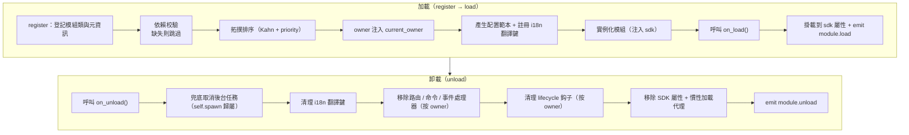

**加載時框架幫你做了什麼**（你只需寫 `on_load`，其餘自動完成）：

| 環節 | 框架自動做的 |
|------|-------------|
| owner 注入 | 實例化期間用 `owner_scope` 包住模組名——你 `on_load` 裡註冊的命令/事件/鈎子/後台任務**自動歸屬本模組**，卸載時按 owner 一鍵清理 |
| 配置範本 | 聲明了 `ConfigClass` 的模組，框架自动生成/填補 `ErisPulse.<ModuleName>` 配置段 |
| i18n 翻譯鍵 | 聲明了 `I18nClass` 的模組，翻譯鍵自動註冊（卸載時自動註銷） |
| 依賴拓撲 | 按 `depends` 聲明排序，確保被依賴模組先加載；循環依賴以 `RuntimeError` 拒絕 |
| SDK 挂載 | 實例化後掛到 `sdk.<ModuleName>`，你才能 `sdk.MyModule.xxx` 訪問 |

**卸載時框架幫你清理的**（對應上面的 U1→U7）：`on_unload` 跑完後再兜底清理——後台任務強制取消（`self.spawn` 創建的，優雅收尾請在 `on_unload` 自行做）、i18n 鍵、路由、命令/事件處理器、lifecycle 鈎子，最後移除 SDK 屬性。`purge=True` 預設額外刪除註冊存根 + 清理 `sys.modules`。

> 這些自動清理就是「你只需寫 `on_load`/`on_unload`，不用手動 unregister」的底氣——框架用 owner 歸屬把「誰註冊的誰清理」做成了一鍵式。

## SDK 物件

### 存取核心模組

```python
from ErisPulse import sdk

# 透過 sdk 物件存取所有核心模組
sdk.logger.info("日誌")
sdk.storage.set("key", "value")
config = sdk.config.getConfig("MyModule")
```

### 模組間通訊

```python
# 存取其他模組
other_module = sdk.OtherModule
result = await other_module.some_method()

## 查詢 Adapter 發送方法

由於新的標準規範要求使用重寫 `__getattr__` 方法來實現兜底發送機制，導致無法使用 `hasattr` 方法來檢查方法是否存在。從 `2.3.5` 開始，新增了查詢發送方法的功能。

### 列出支援的發送方法

```python
# 列出平台支援的所有發送方法
methods = sdk.adapter.list_sends("onebot11")
# 返回: ["Text", "Image", "Voice", "Markdown", ...]
```

### 取得方法詳細資訊

```python
# 取得某個方法的詳細資訊
info = sdk.adapter.send_info("onebot11", "Text")
# 返回:
# {
#     "name": "Text",
#     "parameters": [
#         {"name": "text", "type": "str", "default": null, "annotation": "str"}
#     ],
#     "return_type": "Awaitable[Any]",
#     "docstring": "發送文字訊息..."
# }

## 配置管理

### 宣告式配置（推薦）

從 v2.5.2 起，模組可透過 `ConfigClass` 宣告配置類別，與適配器使用同一套配置 Schema 系統。配置透過 `self.cfg` 即時讀取，修改後立即生效：

```python
from dataclasses import dataclass, field
from ErisPulse.Core.Bases import BaseModule
from ErisPulse.Core.Bases import BaseConfig

@dataclass
class MyModuleConfig(BaseConfig):
    api_key: str = field(
        default="",
        metadata={
            "description": {"i18n": "my_module.api_key", "default": "API 密鑰"},
            "required": True,
            "secret": True,
            "ui": {"widget": "password", "group": "basic", "order": 1},
        },
    )
    timeout: int = field(
        default=30,
        metadata={
            "description": {"i18n": "my_module.timeout", "default": "逾時時間（秒）"},
            "ui": {"widget": "number", "group": "advanced", "order": 2},
        },
    )

class MyModule(BaseModule):
    ConfigClass = MyModuleConfig

    def __init__(self, sdk):
        self.sdk = sdk
        self.logger = sdk.logger.get_child("MyModule")

    async def on_load(self, event):
        self.logger.info("模組已載入")

    async def on_unload(self, event):
        pass

    async def do_something(self):
        cfg = self.cfg  # 即時讀取，類型安全
        api_key = cfg.api_key
        timeout = cfg.timeout
```

`BaseConfig` 是通用配置基底類別，適用於適配器、模組、外部專案等任何情境。配置欄位支援 i18n 多語言描述（詳見 [i18n 文件](../../advanced/i18n.md#配置字段多語言)）。

### 宣告式翻譯鍵（v2.7.0+）

從 v2.7.0 起，模組還可以像宣告 `ConfigClass` 一樣，透過巢狀類別 `I18nClass` 集中宣告翻譯鍵。框架會在載入時**自動註冊**所有宣告的翻譯鍵，無需手動呼叫 `i18n.register()`，且註冊時機早於配置範本生成，確保配置描述中引用的 i18n 鍵已可用。

```python
from ErisPulse.Core.Bases import BaseConfig, BaseI18n, I18nKey

class MyModule(BaseModule):
    # 配置類別（選用）
    @dataclass
    class ConfigClass(BaseConfig):
        welcome_msg: str = field(
            default="歡迎",
            metadata={
                "description": {"i18n": "mymodule.welcome_msg", "default": "歡迎訊息"},
            },
        )

    # 翻譯鍵集合類別（選用）
    class I18nClass(BaseI18n):
        # 屬性名自動拼接為完整鍵路徑：<模組名>.<屬性名>
        welcome_msg: I18nKey = I18nKey(
            default="Welcome Message",   # 語言無關的兜底
            zh_CN="歡迎訊息",
            zh_TW="歡迎訊息",
            en="Welcome Message",
            ja="ウェルカムメッセージ",
            ru="Приветственное сообщение",
        )
        hello: I18nKey = I18nKey(
            default="Hello, {name}!",
            zh_CN="你好，{name}！",
            zh_TW="你好，{name}！",
            en="Hello, {name}!",
            ja="こんにちは、{name}！",
            ru="Привет, {name}!",
        )
```

詳情見 [i18n 推薦寫法](../../advanced/i18n.md#推薦寫法透過-i18nclass-宣告翻譯鍵-v270)。

### 手動讀取配置（已廢棄）

> **已廢棄**：請改用 [宣告式配置](#宣告式配置推薦) + `self.cfg` 即時讀取。

```python
class MyModule(BaseModule):
    def __init__(self, sdk):
        self.sdk = sdk

    def _load_config(self):
        config = self.sdk.config.getConfig("MyModule")
        if not config:
            self.sdk.config.setConfig("MyModule", {"api_key": "", "timeout": 30})
            return {"api_key": "", "timeout": 30}
        return config

## 儲存系統

### 基本使用

```python
# 儲存資料
sdk.storage.set("user:123", {"name": "張三"})

# 取得資料
user = sdk.storage.get("user:123", {})

# 刪除資料
sdk.storage.delete("user:123")
```

### 交易使用

```python
# 使用交易確保資料一致性
with sdk.storage.transaction():
    sdk.storage.set("key1", "value1")
    sdk.storage.set("key2", "value2")
    # 如果任何操作失敗，所有變更都會回滾

## 事件處理

### 事件處理器註冊

```python
from ErisPulse.Core.Event import command, message

# 註冊命令
@command("info", help="取得資訊")
async def info_handler(event):
    await event.reply("這是資訊")

# 註冊訊息處理器
@message.on_group_message()
async def group_handler(event):
    sdk.logger.info(f"收到群組訊息: {event.get_text()}")
```

### 事件處理器生命週期

框架會自動管理事件處理器的註冊與註銷，你只需要在 `on_load` 中註冊即可。

## 懶載入機制

### 運作原理

```python
# 模組首次被存取時才會初始化
result = await sdk.my_module.some_method()
# ↑ 這裡會觸發模組初始化
```

### 立即載入

對於需要立即初始化的模組（如監聽器、計時器）：

```python
@staticmethod
def get_load_strategy():
    return ModuleLoadStrategy(
        lazy_load=False,  # 立即載入
        priority=100
    )

## 錯誤處理

### 例外擷取

```python
async def handle_event(self, event):
    try:
        # 業務邏輯
        await self.process_event(event)
    except ValueError as e:
        self.logger.warning(f"參數錯誤: {e}")
        await event.reply(f"參數錯誤: {e}")
    except Exception as e:
        self.logger.error(f"處理失敗: {e}")
        raise
```

### 日誌記錄

```python
# 使用不同的日誌層級
self.logger.debug("除錯資訊")    # 詳細除錯資訊
self.logger.info("執行狀態")      # 正常執行資訊
self.logger.warning("警告資訊")  # 警告資訊
self.logger.error("錯誤資訊")    # 錯誤資訊
self.logger.critical("致命錯誤") # 致命錯誤

## 相關文件

- [模組開發入門](getting-started.md) - 建立第一個模組
- [Event 包裝類別](event-wrapper.md) - 事件處理詳解
- [最佳實踐](best-practices.md) - 開發高品質模組


### Event 包装类详解

# Event 包裝類詳解

Event 模組提供了功能強大的 Event 包裝類，簡化事件處理。

請直接返回翻譯後的完整 Markdown 內容，不要包含任何其他文字。

再次提醒：如果文件包含語言切換行（各語言名稱用 `` | `` 分隔的行），請務必嚴格遵守上方第8條的格式要求，不要寫出 ``[**Label**](file)`` 這類錯誤格式。

## 為 event 參數添加類型註解

事件處理器的 `event` 參數是 **Event 包裝類**（dict 子類）。強烈建議為它添加類型註解：

```python
from ErisPulse.Core.Event import Event

@message.on_private_message()
async def handler(event: Event):
    text = event.get_text()   # IDE 自動補全所有便捷方法
    await event.reply(text)   # 拼寫錯誤在靜態檢查時即可發現
```

不加註解時 IDE 無法識別 Event 上的方法（`get_text()` / `reply()` / `wait_reply()` / 平台擴展方法均不提示），只能靠記憶拼寫。

> **注意區分**：事件處理器回調的 `event` 是 **Event 包裝類**（註解為 `Event`）；模組生命週期方法 `on_load` / `on_unload` 的 `event` 是普通 **dict**（註解為 `dict`），二者不要混淆。

[**English**](docs/zh-TW/quick-start.md)

## 核心特性

- **完全相容字典**：Event 繼承自 dict
- **便捷方法**：提供大量便捷方法
- **點式存取**：支援使用點號存取事件欄位
- **向後相容**：所有方法都是可選的

請直接返回翻譯後的完整Markdown內容，不要包含任何其他文字。

再次提醒：如果文件包含語言切換行（各語言名稱用 `` | `` 分隔的行），務必嚴格遵守上方第8條的格式要求，不要寫出 ``[**Label**](file)`` 這類錯誤格式。

## 核心字段方法

```python
from ErisPulse.Core.Event import command

@command("info")
async def info_command(event: Event):
    event_id = event.get_id()
    platform = event.get_platform()
    time = event.get_time()
    print(f"ID: {event_id}, 平台: {platform}, 時間: {time}")
```

[**回到顶部**](#top)

## 消息事件方法

```python
from ErisPulse.Core.Event import message

@message.on_private_message()
async def private_handler(event: Event):
    text = event.get_text()
    user_id = event.get_user_id()
    nickname = event.get_user_nickname()
    await event.reply(f"你好，{nickname}！")
```

[**快速入門**](docs/zh-TW/quick-start.md) | [**核心概念**](docs/zh-TW/core-concepts.md) | [**事件處理**](docs/zh-TW/event-handling.md) | [**API 參考**](docs/zh-TW/api-reference.md)

## 消息類型判斷

```python
from ErisPulse.Core.Event import message

@message.on_group_message()
async def group_handler(event: Event):
    is_private = event.is_private_message()
    is_group = event.is_group_message()
    is_at = event.is_at_message()
    await event.reply(f"類型: {'私聊' if is_private else '群聊'}")
```

7. **重要：路徑替換規則**
   - 將文件連結中的 `docs/zh-TW/` 替換為 `docs/zh-TW/`
   - 例如：`docs/zh-TW/quick-start.md` 應改為 `docs/zh-TW/quick-start.md`
   - 對於指向非當前語言版本文件的連結（如 `README.xx.md` 形式的連結），保持原樣不要修改
   - 這確保了連結指向正確語言的文件版本

## 回應功能

```python
from ErisPulse.Core.Event import command

@command("ask")
async def ask_command(event: Event):
    await event.reply("請輸入你的名字:")
    reply = await event.wait_reply(timeout=30)
    if reply:
        name = reply.get_text()
        await event.reply(f"你好，{name}！")
```

請直接返回翻譯後的完整Markdown內容，不要包含任何其他文字。

再次提醒：如果文件包含語言切換行（各語言名稱用 `` | `` 分隔的行），務必嚴格遵守上方第8條的格式要求，不要寫出 ``[**Label**](file)`` 這類錯誤格式。

## 命令資訊獲取

```python
from ErisPulse.Core.Event import command

@command("cmdinfo")
async def cmdinfo_command(event: Event):
    cmd_name = event.get_command_name()
    cmd_args = event.get_command_args()
    await event.reply(f"命令: {cmd_name}, 參數: {cmd_args}")
```

7. **重要：路徑替換規則**
   - 將文件鏈接中的 `docs/zh-TW/` 替換為 `docs/zh-TW/`
   - 例如：`docs/zh-TW/quick-start.md` 應改為 `docs/zh-TW/quick-start.md`
   - 對於指向非當前語言版本文件的鏈接（如 `README.xx.md` 形式的鏈接），保持原樣不要修改
   - 這確保了鏈接指向正確語言的文件版本

## 通知事件方法

```python
from ErisPulse.Core.Event import notice

@notice.on_friend_add()
async def friend_add_handler(event: Event):
    await event.reply("歡迎添加我為好友！")
```

請直接返回翻譯後的完整Markdown內容，不要包含任何其他文字。

再次提醒：如果文件包含語言切換行（各語言名稱用 `` | `` 分隔的行），務必嚴格遵守上方第8條的格式要求，不要寫出 ``[**Label**](file)`` 這類錯誤格式。

## 方法速查表

### 核心方法

#### 事件基礎信息
- `get_id()` - 獲取事件ID
- `get_time()` - 獲取事件時間戳（Unix秒級）
- `get_type()` - 獲取事件類型（message/notice/request/meta）
- `get_detail_type()` - 獲取事件詳細類型（private/group/friend等）
- `get_platform()` - 獲取平台名稱

#### 机器人信息
- `get_self_platform()` - 獲取機器人平台名稱
- `get_self_user_id()` - 獲取機器人用戶ID
- `get_self_account_id()` - 獲取機器人賬戶ID（多Bot模式）
- `get_self_info()` - 獲取機器人完整信息字典

#### 會話標識
- `get_target_id()` - 獲取統一目標 ID（群聊返回 `group_id`，頻道返回 `channel_id`，私聊返回 `user_id`，按 group → channel → guild → thread → user 顺序取首个非空值）
- `get_session_id()` - 獲取會話唯一標識，格式為 `{platform}:{detail_type}:{target_id}`

### 消息事件方法

#### 消息內容
- `get_message()` - 獲取消息段數組（OneBot12格式）
- `get_alt_message()` - 獲取消息備用文本
- `get_text()` - 獲取純文本內容（`get_alt_message()` 的別名）
- `get_message_text()` - 獲取純文本內容（`get_alt_message()` 的別名）

#### 發送者信息
- `get_user_id()` - 獲取發送者用戶ID
- `get_user_nickname()` - 獲取發送者暱稱
- `get_sender()` - 獲取發送者完整信息字典

#### 群組/頻道信息
- `get_group_id()` - 獲取群組ID（群聊消息）
- `get_channel_id()` - 獲取頻道ID（頻道消息）
- `get_guild_id()` - 獲取伺服器ID（伺服器消息）
- `get_thread_id()` - 獲取話題/子頻道ID（話題消息）

#### @消息相關
- `has_mention()` - 是否包含@機器人
- `get_mentions()` - 獲取所有被@的用戶ID列表

### 消息類型判斷

#### 基礎判斷
- `is_message()` - 是否為消息事件
- `is_private_message()` - 是否為私聊消息
- `is_group_message()` - 是否為群聊消息
- `is_at_message()` - 是否為@消息（`has_mention()` 的別名）

### 通知事件方法

#### 通知操作者
- `get_operator_id()` - 獲取操作者ID
- `get_operator_nickname()` - 獲取操作者暱稱

#### 通知類型判斷
- `is_notice()` - 是否為通知事件
- `is_group_member_increase()` - 群成員增加事件
- `is_group_member_decrease()` - 群成員減少事件
- `is_friend_add()` - 好友添加事件（匹配 `detail_type == "friend_increase"`）
- `is_friend_delete()` - 好友刪除事件（匹配 `detail_type == "friend_decrease"`）

### 請求事件方法

#### 請求信息
- `get_comment()` - 獲取請求附言

#### 請求類型判斷
- `is_request()` - 是否為請求事件
- `is_friend_request()` - 是否為好友請求
- `is_group_request()` - 是否為群組請求

### 回覆功能

#### 基礎回覆
- `reply(content, method="Text", at_sender=False, quote=False, at_users=None, reply_to=None, at_all=False, via=None, **kwargs)` - 通用回覆方法
  - `content`: 發送內容（文本、URL等）
  - `method`: 發送方法，預設 "Text"，可選 "Image"/"Voice"/"Video"/"File" 等
  - `at_sender`: 是否@發送者（自動提取 user_id）
  - `quote`: 是否引用回覆當前消息（自動提取 message_id）
  - `at_users`: @用戶列表，如 `["user1", "user2"]`
  - `reply_to`: 手動指定回覆的消息 ID
  - `at_all`: 是否@全體成員
  - `**kwargs`: 額外參數（如 Mention 方法的 user_id）

- `reply_ob12(message)` - 使用 OneBot12 消息段回覆
  - `message`: OneBot12 消息段列表或字典，可配合 MessageBuilder 構建

#### 平台能力查詢
- `supports(method)` - 檢查當前平台是否支援某發送方法（如 `"Image"`、`"Voice"`），返回 `bool`
- `available_methods()` - 列出當前平台所有可用發送方法，返回方法名列表

#### 轉發功能

> **注意**：轉發功能需要通過適配器的 Send DSL 實現，Event 包裝類本身不提供直接的轉發方法。

```python
# 轉發消息到群組
adapter = sdk.adapter.get(event.get_platform())
target_id = event.get_group_id()  # 或指定其他群組ID
await adapter.Send.To("group", target_id).Text(event.get_text())
```

### 等待回覆功能

- `wait_reply(prompt=None, timeout=60.0, callback=None, validator=None, method="Text")` - 等待用戶回覆
  - `prompt`: 提示消息，如果提供會發送給用戶
  - `timeout`: 等待超時時間（秒），預設60秒
  - `callback`: 回調函數，當收到回覆時執行
  - `validator`: 驗證函數，用於驗證回覆是否有效
  - `method`: 發送提示消息的方法，預設 "Text"
  - 返回用戶回覆的 Event 對象，超時返回 None

#### 交互方法

- `confirm(prompt=None, timeout=60.0, yes_words=None, no_words=None, method="Text", hint=False)` - 確認對話
  - 返回 `True`（確認）/ `False`（否定）/ `None`（超時）
  - 內建中英文確認詞自動識別，可自定義詞集
  - `method`: 發送方法，預設 "Text"；支援 "Image"/"Markdown" 等非文本方式發送提示
  - `hint`: 是否在提示末尾自動追加確認詞提示（如 "（是/否）"），預設 False

- `choose(prompt, options, timeout=60.0, method="Text", options_format="auto", merge_prompt=False, placeholder="{options}")` - 選擇菜單
  - `options`: 選項文本列表
  - 返回選項索引（0-based），超時返回 `None`
  - `method`: 發送方法，預設 "Text"；文本類方法 (Text/Markdown/md/Html/h5) 預設合併選項到末尾
  - `options_format`: 選項格式（預設: "auto"，根據 method 自動選擇內建樣式）
    - `"auto"`：Markdown→無序列表（`- 1.選項`），Html→有序列表（`<ol>`），其他→純文本列表
    - `"list"`：每行一個，如 ``1. 選項A\n2. 選項B``
    - `"inline"`：單行展示，如 ``1.A | 2.B``
    - `"md"`：Markdown 無序列表
    - `"html"`：Html 有序列表
    - `callable`：自定義函數，接收 ``list[str]`` 返回 ``str``
  - `merge_prompt`: 是否強制合併為一條消息發送，預設 False
    - `False`（預設）：文本類方法自動合併；非文本方法先發 prompt 再發 Text 選項
    - `True`：無論什麼 method 都合併為一條消息，用用戶指定的 method 發送
  - `placeholder`: 選項插入占位符，預設 `{options}`；prompt 中出現該標記的位置替換為選項文本，設為空字串則始終追加到末尾

- `collect(fields, timeout_per_field=60.0)` - 表單收集
  - `fields`: 字段列表，每項包含 `key`、`prompt`、可選 `validator`、可選 `method`
  - 返回 `{key: value}` 字典，任一字段超時返回 `None`
  - 每個 field 支持 `method` 鍵指定發送方法，例如收集圖片時用 `{"key": "avatar", "prompt": "請發送頭像", "method": "Image"}`
  - 每個 field 可選 `options` 鍵（列表），提供時該字段變為選擇題（自動調用 choose 逻辑）
  - 每個 field 可選 `options_format`、`merge_prompt`、`placeholder` 鍵，控制選項格式、消息合併行為和占位符

- `wait_for(event_type="message", condition=None, timeout=60.0)` - 等待任意事件
  - `condition`: 過濾函數，返回 `True` 時匹配
  - 返回匹配的 Event 對象，超時返回 `None`

- `conversation(timeout=60.0)` - 創建多輪對話上下文
  - 返回 `Conversation` 對象，支援 `say()`/`wait()`/`confirm()`/`choose()`/`collect()`/`stop()`
  - `is_active` 屬性表示對話是否活躍

#### 交互方法示例

**confirm() - 確認對話：**

```python
@command("delete", help="刪除數據")
async def delete_handler(event: Event):
    if await event.confirm("確定要刪除所有數據嗎？"):
        sdk.storage.delete("all_data")
        await event.reply("數據已刪除")
    else:
        await event.reply("已取消")
```

**confirm() - 帶提示詞：**

```python
# hint=True 會在提示末尾追加 "（是/否）"
if await event.confirm("確定繼續？", hint=True):
    await event.reply("已繼續")
# 用戶看到：確定繼續？（是/否）
```

**choose() - 選擇菜單：**

```python
@command("color", help="選擇顏色")
async def color_handler(event: Event):
    choice = await event.choose("請選擇顏色：", ["紅色", "綠色", "藍色"])
    if choice is not None:
        colors = ["紅色", "綠色", "藍色"]
        await event.reply(f"你選擇了：{colors[choice]}")
```

**choose() - 選項格式化與消息合併：**

```python
# inline 格式：選項顯示在同一行
choice = await event.choose("請選擇：", ["A", "B", "C"], options_format="inline")
# 輸出：1.A | 2.B | 3.C

# 自定義格式
choice = await event.choose("請選擇：", ["貓", "狗"],
    options_format=lambda opts: " / ".join(opts))
# 輸出：貓 / 狗

# options_format="auto"（預設）：根據 method 自動選擇內建樣式
# Markdown → 無序列表
choice = await event.choose(
    "## 請選擇", ["貓", "狗"],
    method="Markdown",  # auto 自動識別為 md 列表
)
# 輸出：
# ## 請選擇
# - 1. 貓
# - 2. 狗

# Html → 有序列表
choice = await event.choose(
    "<h2>請選擇</h2>", ["貓", "狗"],
    method="Html", merge_prompt=True,  # auto 自動識別為 html 列表
)
# 輸出：
# <h2>請選擇</h2>
# <ol><li>1. 貓</li><li>2. 狗</li></ol>

# 合併模式 + 占位符
choice = await event.choose(
    "## 請選擇\n{options}\n請回覆編號",
    ["貓", "狗"],
    method="Markdown", merge_prompt=True,
)

# 自定義占位符
choice = await event.choose(
    "請選擇: [choices]",
    ["貓", "狗"],
    placeholder="[choices]",
)
```

**collect() - 表單收集：**

```python
@command("register", help="註冊")
async def register_handler(event: Event):
    data = await event.collect([
        {"key": "name", "prompt": "請輸入姓名："},
        {"key": "age", "prompt": "請輸入年齡：",
         "validator": lambda e: e.get_text().isdigit()},
    ])
    if data:
        await event.reply(f"註冊成功！{data['name']}，{data['age']}歲")
```

**非 Text 方法的 reply：**

```python
await event.reply("http://example.com/img.jpg", method="Image")
await event.reply("http://example.com/audio.mp3", method="Voice")

from ErisPulse.Core.Event import MessageBuilder
segments = MessageBuilder.text("看這張圖：").image("http://example.com/img.jpg").build()
await event.reply_ob12(segments)
```

> 完整的 Conversation 多輪對話用法請參考 [Conversation 多輪對話](../../advanced/conversation.md)。

### 命令信息

#### 命令基礎
- `get_command_name()` - 獲取命令名稱
- `get_command_args()` - 獲取命令參數列表
- `get_command_raw()` - 獲取命令原始文本
- `get_command_info()` - 獲取完整命令信息字典
- `is_command()` - 是否為命令

### 原始數據

- `get_raw()` - 獲取平台原始事件數據
- `get_raw_type()` - 獲取平台原始事件類型

### 平台擴展方法

適配器可以為 Event 包裝類註冊平台專有方法。方法僅在對應平台的 Event 實例上可用，其他平台訪問時拋出 `AttributeError`。

平台方法通過 `Event.__getattribute__` 优先於內建方法生效，因此可以覆寫 `confirm`、`choose`、`collect`、`wait_reply` 等內建交互方法，提供平台特色實現（如按鈕、卡片等）。內建實現作為 `_builtin_*` 函數導出供覆寫方調用。

```python
# 郵件事件 - 只有郵件方法
event = Event({"platform": "email", "email_raw": {"subject": "Hello"}})
event.get_subject()      # ✅ 返回 "Hello"
event.get_chat_type()    # ❌ AttributeError

# Telegram 事件 - 只有 Telegram 方法
event = Event({"platform": "telegram", "telegram_raw": {"chat": {"type": "private"}}})
event.get_chat_type()    # ✅ 返回 "private"
event.get_subject()      # ❌ AttributeError

# 內建方法始終可用
event.get_text()         # ✅ 任何平台
event.reply("hi")        # ✅ 任何平台
```

### 查詢已註冊方法

```python
from ErisPulse.Core.Event import get_platform_event_methods

methods = get_platform_event_methods("email")
# ["get_subject", "get_from", ...]
```

### `hasattr` 和 `dir` 支持

```python
hasattr(event, "get_subject")   # 僅當 platform="email" 時返回 True
"get_subject" in dir(event)     # 同上
```

### 跨平台擴展（通配符）

`register_event_method` 和 `register_event_mixin` 支持傳 `"*"` 作為平台名，註冊的方法在**所有平台**的 Event 實例上都可用。適合 AI 對話、上下文管理等需要跨平台複用的功能。

```python
from ErisPulse.Core.Event.wrapper import register_event_method

@register_event_method("*")
async def ai_chat(self, prompt: str):
    # self 為 Event 實例，可訪問事件數據和內建方法
    await self.reply(f"AI: {prompt}")
```

註冊後，任何平台的事件處理器都能調用 `event.ai_chat(...)`。

方法解析優先級（從高到低）：平台特定方法 → 通配符方法 → 內建方法 → 字典鍵訪問。

> 適配器開發者註冊擴展方法的方式請參閱 [事件系統 API - 跨平台擴展通配符](../../api-reference/event-system.md#跨平台擴展通配符)。

## 相關文件

- [模組開發入門](getting-started.md) - 建立第一個模組
- [最佳實務](best-practices.md) - 開發高品質模組


### 模块开发最佳实践

# 模組開發最佳實踐

本文檔提供了 ErisPulse 模組開發的最佳實踐建議。

請直接返回翻譯後的完整 Markdown 內容，不要包含任何其他文字。

再次提醒：如果文檔包含語言切換行（各語言名稱用 `` | `` 分隔的行），務必嚴格遵守上方第 8 條的格式要求，不要寫出 ``[**Label**](file)`` 這類錯誤格式。

## 模組設計

### 1. 單一職責原則

每個模組應該只負責一個核心功能：

```python
# 好的設計：每個模組只負責一個功能
class WeatherModule(BaseModule):
    """天氣查詢模組"""
    pass

class NewsModule(BaseModule):
    """新聞查詢模組"""
    pass

# 不好的設計：一個模組負責多個不相關的功能
class UtilityModule(BaseModule):
    """包含天氣、新聞、笑話等多個功能"""
    pass
```

### 2. 模組命名規範

```toml
[project]
name = "ErisPulse-ModuleName"  # 使用 ErisPulse- 前綴
```

### 3. 清晰的配置管理

推薦使用宣告式配置（`ConfigClass` + `BaseConfig`），獲得類型安全、自動範本生成、WebUI 表單支援等能力：

```python
from dataclasses import dataclass, field
from ErisPulse.Core.Bases import BaseConfig

@dataclass
class MyModuleConfig(BaseConfig):
    api_url: str = field(default="https://api.example.com", metadata={
        "description": {"i18n": "my_module.api_url", "default": "API 位址"},
    })
    timeout: int = field(default=30, metadata={
        "description": {"i18n": "my_module.timeout", "default": "逾時時間（秒）"},
    })
    cache_ttl: int = field(default=3600, metadata={
        "description": {"i18n": "my_module.cache_ttl", "default": "快取存活時間（秒）"},
    })

class MyModule(BaseModule):
    ConfigClass = MyModuleConfig

    async def do_something(self):
        cfg = self.cfg  # 類型安全，實時讀取
        await self._fetch(cfg.api_url, timeout=cfg.timeout)
```

也可以在繼續使用手動方式讀寫配置儲存（見[模組核心概念](../zh-TW/core-concepts.md#配置管理)）。

### 宣告式翻譯鍵（v2.7.0+）

模組可以透過 `I18nClass` 集中宣告翻譯鍵，框架自動註冊到 i18n 系統，無需手動呼叫 `i18n.register()`。

```python
from ErisPulse.Core.Bases import BaseI18n, I18nKey

class MyModule(BaseModule):
    class I18nClass(BaseI18n):
        # 帶佔位符的業務翻譯鍵
        welcome: I18nKey = I18nKey(
            default="Welcome, {name}!",
            zh_CN="歡迎你，{name}！",
            zh_TW="歡迎你，{name}！",
            en="Welcome, {name}!",
            ja="ようこそ、{name}！",
            ru="Добро пожаловать, {name}!",
        )
        # 配置欄位描述的翻譯
        api_url: I18nKey = I18nKey(
            default="API URL",
            zh_CN="API 位址",
            zh_TW="API 位址",
            en="API URL",
            ja="API URL",
            ru="API URL",
        )
```

詳細用法見 [i18n 文檔](../../advanced/i18n.md#推薦寫法透過-i18nclass-宣告翻譯鍵-v270)。

## 異步程式設計

### 1. 使用異步庫

```python
# 推薦使用 SDK 內建 HTTP 客戶端（異步，自動日誌和統計）
from ErisPulse.Core import client

class MyModule(BaseModule):
    async def fetch_data(self, url):
        resp = await client.get(url)
        return await resp.json()

# 也可透過 sdk.client 使用（效果相同）
from ErisPulse import sdk

class MyModule(BaseModule):
    async def fetch_data(self, url):
        resp = await sdk.client.get(url)
        return await resp.json()

# 不要使用 aiohttp 直接導入（不利於框架統一管理）
import aiohttp

class MyModule(BaseModule):
    async def fetch_data(self, url):
        async with aiohttp.ClientSession() as session:
            async with session.get(url) as response:
                return await response.json()

# 不要使用 requests（同步，會阻塞事件循環）
import requests

class MyModule(BaseModule):
    def fetch_data(self, url):
        return requests.get(url).json()  # 會阻塞事件循環
```

### 2. 正確的異步操作

```python
from ErisPulse.Core.Event import Event  # event: Event 注解可獲得 IDE 自動補全

async def handle_command(self, event: Event):
    # 需要等待結果的耗時操作：直接 await（生命週期明確）
    result = await self._long_operation()

async def on_load(self, event: dict):
    # 後台任務（輪詢/定時/fire-and-forget）：使用 self.spawn()，
    # 模組卸載時框架在 on_unload 之後兜底取消，避免持有 self 導致泄漏
    self.spawn(self._poll())
```

> [!NOTE]
> 後台任務推薦 `self.spawn()`（ErisPulse **2.8.0+**），而不是 `asyncio.create_task`——後者建立的裸任務不歸屬模組，卸載時不會被自動清理，會持有 `self` 引用導致模組實例無法被回收（熱重載泄漏）。詳見 [生命週期管理](../../advanced/lifecycle.md#後台任務歸屬與自動取消)。

### 3. 資源管理

```python
async def on_load(self, event):
    # SDK 客戶端已自動管理連接池，無需手動建立 session
    pass
    
async def on_unload(self, event):
    # 如需自訂客戶端，記得清理資源
    pass

## 事件處理

### 1. 使用 Event 包裝類

```python
# 使用 Event 包裝類的便捷方法
@command("info")
async def info_command(event: Event):
    user_id = event.get_user_id()
    nickname = event.get_user_nickname()
    await event.reply(f"你好，{nickname}！")

# 而非直接訪問字典
@command("info")
async def info_command(event: Event):
    user_id = event["user_id"]  # 不夠清晰，容易出錯
```

### 2. 合理使用懶加載

```python
# 低頻命令模組：聲明 activate_on 觸發器，首個匹配命令到達時自動激活（保持懶加載）
class CommandModule(BaseModule):
    @staticmethod
    def get_load_strategy():
        return ModuleLoadStrategy(lazy_load=True, activate_on=[
            {"command": {"name": "dice", "help": "擲一個骰子", "aliases": ["d"]}},
        ])

# 低頻監聽器模組：聲明事件觸發器，事件到達時自動激活
class ListenerModule(BaseModule):
    @staticmethod
    def get_load_strategy():
        return ModuleLoadStrategy(lazy_load=True, activate_on=[
            {"notice": "group_member_increase"},
        ])

# 高頻觸發（每條消息都要處理）或啟動時就必須就緒的模組：立即加載
class HotListenerModule(BaseModule):
    @staticmethod
    def get_load_strategy():
        return ModuleLoadStrategy(lazy_load=False)

# 工具模組適合懶加載
class UtilityModule(BaseModule):
    @staticmethod
    def get_load_strategy():
        return ModuleLoadStrategy(lazy_load=True)
```

> `activate_on` 的完整語法（事件三形式 / 命令簡寫與 dict 聲明 / help 回退鏈）見
> [懶加載模組系統](../../advanced/lazy-loading.md#事件驅動懶激活activate_on)。

### 3. 事件處理器註冊

```python
async def on_load(self, event):
    # 在 on_load 中註冊事件處理器
    @command("hello")
    async def hello_handler(event: Event):
        await event.reply("你好！")
    
    @message.on_group_message()
    async def group_handler(event: Event):
        self.logger.info("收到群消息")
    
    # 不需要手動註銷，框架會自動處理

## 錯誤處理

### 1. 分類異常處理

```python
async def handle_event(self, event: Event):
    try:
        result = await self._process(event)
    except ValueError as e:
        # 預期的業務錯誤
        self.logger.warning(f"業務警告: {e}")
        await event.reply(f"參數錯誤: {e}")
    except aiohttp.ClientError as e:
        # 網絡錯誤（推薦使用 sdk.client + ClientError 替代）
        # 邊緣代碼直接使用 aiohttp 仍可正常運作，但新代碼推薦使用 ErisPulse 異常體系
        self.logger.error(f"網絡錯誤: {e}")
        await event.reply("網絡請求失敗，請稍後重試")
    except Exception as e:
        # 未預期的錯誤
        self.logger.error(f"未知錯誤: {e}", exc_info=True)
        await event.reply("處理失敗，請聯繫管理員")
        raise
```

### 2. 超時處理

```python
# 推薦使用 SDK 內建客戶端（內建超時和重試）
from ErisPulse.Core import client
from ErisPulse.Core.Bases.errors import ClientTimeoutError

async def fetch_with_timeout(self, url, timeout=30):
    try:
        resp = await client.get(url, timeout=timeout)
        return await resp.json()
    except ClientTimeoutError:
        self.logger.warning(f"請求超時: {url}")
        raise

## 儲存系統

### 1. 使用交易

```python
# 使用交易確保資料一致性
async def update_user(self, user_id, data):
    with self.sdk.storage.transaction():
        self.sdk.storage.set(f"user:{user_id}:profile", data["profile"])
        self.sdk.storage.set(f"user:{user_id}:settings", data["settings"])

# ❌ 不使用交易可能導致資料不一致
async def update_user(self, user_id, data):
    self.sdk.storage.set(f"user:{user_id}:profile", data["profile"])
    # 如果這裡出錯，上面的設定無法回滾
    self.sdk.storage.set(f"user:{user_id}:settings", data["settings"])
```

### 2. 批次操作

```python
# 使用批次操作提高效能
def cache_multiple_items(self, items):
    self.sdk.storage.set_multi({
        f"item:{k}": v for k, v in items.items()
    })

# ❌ 多次呼叫效率低
def cache_multiple_items(self, items):
    for k, v in items.items():
        self.sdk.storage.set(f"item:{k}", v)

## 日誌記錄

### 1. 合理使用日誌層級

```python
# DEBUG: 詳細的除錯資訊（僅開發時）
self.logger.debug(f"輸入參數: {params}")

# INFO: 正常執行資訊
self.logger.info("模組已載入")
self.logger.info(f"處理請求: {request_id}")

# WARNING: 警告訊息，不影響主要功能
self.logger.warning(f"設定項 {key} 未設定，使用預設值")
self.logger.warning("API 回應慢，可能需要最佳化")

# ERROR: 錯誤訊息
self.logger.error(f"API 請求失敗: {e}")
self.logger.error(f"處理事件失敗: {e}", exc_info=True)

# CRITICAL: 致命錯誤，需要立即處理
self.logger.critical("資料庫連線失敗，機器人無法正常執行")
```

### 2. 結構化日誌

```python
# 使用結構化日誌，便於解析
self.logger.info(f"處理請求: request_id={request_id}, user_id={user_id}, duration={duration}ms")

# ❌ 使用非結構化日誌
self.logger.info(f"處理請求了，來自使用者 {user_id}，時用 {duration} 毫秒")

## 性能優化

### 1. 使用快取

```python
class MyModule(BaseModule):
    def __init__(self):
        self._cache = {}
        self._cache_lock = asyncio.Lock()
    
    async def get_data(self, key):
        async with self._cache_lock:
            if key in self._cache:
                return self._cache[key]
            
            # 從資料庫獲取
            data = await self._fetch_from_db(key)
            
            # 快取資料
            self._cache[key] = data
            return data
```

### 2. 避免阻塞操作

```python
# 使用非同步操作
async def process_message(self, event: Event):
    # 非同步處理
    await self._async_process(event)

# ❌ 阻塞操作
async def process_message(self, event: Event):
    # 同步操作，阻塞事件循環
    result = self._sync_process(event)
```

請直接返回翻譯後的完整Markdown內容，不要包含任何其他文字。

再次提醒：如果文件包含語言切換行（各語言名稱用 `` | `` 分隔的行），務必嚴格遵守上方第8條的格式要求，不要寫出 ``[**Label**](file)`` 這類錯誤格式。

## 安全性

### 1. 敏感數據保護

```python
# 敏感數據儲存在配置中（聲明式 ConfigClass，secret 欄位不會進入日誌/匯出）
from dataclasses import dataclass, field
from ErisPulse.Core.Bases import BaseModule, BaseConfig

@dataclass
class MyModuleConfig(BaseConfig):
    api_key: str = field(
        default="",
        metadata={"description": "API 密鑰", "secret": True},
    )

class MyModule(BaseModule):
    ConfigClass = MyModuleConfig

    def check_api_key(self):
        if not self.cfg.api_key or self.cfg.api_key == "YOUR_API_KEY_HERE":
            raise ValueError("請在 config.toml 中配置有效的 API 密鑰")

# ❌ 敏感數據硬編碼
class MyModule(BaseModule):
    API_KEY = "sk-1234567890"  # 不要這樣做！
```

### 2. 輸入驗證

```python
# 驗證使用者輸入
async def process_command(self, event: Event):
    user_input = event.get_text()
    
    # 驗證輸入長度
    if len(user_input) > 1000:
        await event.reply("輸入過長，請重新輸入")
        return
    
    # 驗證輸入格式
    if not re.match(r'^[a-zA-Z0-9]+$', user_input):
        await event.reply("輸入格式不正確")
        return

## 測試

### 1. 單元測試

```python
import pytest
from ErisPulse.Core.Bases import BaseModule

class TestMyModule:
    def test_config_defaults(self):
        """測試配置預設值"""
        config = MyModule.ConfigClass()
        assert config.timeout == 30
```

### 2. 集成測試

```python
@pytest.mark.asyncio
async def test_command_handling():
    """測試命令處理"""
    module = MyModule()
    await module.on_load({})
    
    # 模擬命令事件
    event = create_test_command_event("hello")
    await module.handle_command(event)

## 部署

### 1. 版本管理

```toml
[project]
name = "ErisPulse-MyModule"
version = "1.0.0"
```

遵循語義化版本：
- MAJOR.MINOR.PATCH
- 主版本：不相容的 API 變更
- 次版本：向下相容的功能新增
- 修訂號：向下相容的問題修正

### 2. README 頭部

`epsdk create` 生成的 README 已內建 ErisPulse 頭部標識（Logo + 徽章行）。兩種推薦模式：

**模式 A — 僅 ErisPulse Logo（預設）：**

```markdown
<div align="center">


# MyModule

**一句話描述**

<p>
  <a href="https://pypi.org/project/ErisPulse-MyModule/"></a>
  <a href="https://pypi.org/project/ErisPulse-MyModule/"></a>
  <a href="./LICENSE"></a>
  <a href="https://github.com/ErisPulse/ErisPulse"></a>
</p>

</div>
```

**模式 B — 模塊圖標 × ErisPulse Logo（有自定義圖標時）：**

```markdown
<div align="center">


<span style="font-size:44px;color:#c8c8c8;margin:0 18px;vertical-align:middle;">×</span>


# MyModule
（徽章行同上）
</div>
```

可按需追加 GitHub Stars、Downloads 等徽章。Logo 也可下載到專案本地（`.github/assets/ErisPulseLogo.png`）改為相對路徑引用。

## 相關文件

- [模組開發入門](getting-started.md) - 建立第一個模組
- [模組核心概念](core-concepts.md) - 理解模組架構
- [Event 封裝類別](event-wrapper.md) - 事件處理詳解


=====
发布与工具
=====


### 发布模块到模块商店

# 發布與模組商店指南

將你開發的模組或適配器發布到 ErisPulse 模組商店，讓其他使用者可以方便地發現和安裝。

## 模組商店概述

ErisPulse 模組商店是一個集中式的模組註冊表，使用者可以透過 CLI 工具瀏覽、搜尋和安裝社群貢獻的模組、適配器。

### 瀏覽與發現

```bash
# 列出遠端可用的所有套件
epsdk list-remote

# 只查看模組
epsdk list-remote -t modules

# 只查看適配器
epsdk list-remote -t adapters

# 強制刷新遠端套件列表
epsdk list-remote -r
```

你也可以訪問 [ErisPulse 官網](https://www.erisdev.com/#market) 在線瀏覽模組商店。

### 支援的提交類型

| 類型 | 說明 | Entry-point 組 |
|------|------|----------------|
| 模組 | 擴充機器人功能、實現業務邏輯 | `erispulse.module` |
| 適配器 | 連接新的訊息平台 | `erispulse.adapter` |

## 快速發布

整個過程只需要三步：配置專案 → 發布到 PyPI → 提交到模組商店。

### 1. 配置 pyproject.toml

確保專案目錄包含 `pyproject.toml`、`README.md`，並根據類型配置 entry-points：

#### 模組

```toml
[project]
name = "ErisPulse-MyModule"
version = "1.0.0"
description = "模組功能描述"
requires-python = ">=3.10"
license = { text = "MIT" }
authors = [ { name = "yourname" } ]
dependencies = [
    "ErisPulse>=2.0.0",
]

[project.entry-points."erispulse.module"]
"MyModule" = "MyModule:Main"
```

#### 適配器

```toml
[project]
name = "ErisPulse-MyAdapter"
version = "1.0.0"
description = "適配器功能描述"
requires-python = ">=3.10"

[project.entry-points."erispulse.adapter"]
"myplatform" = "MyAdapter:MyAdapter"
```

> **注意**：套件名建議以 `ErisPulse-` 開頭，便於使用者識別。Entry-point 的鍵名（如 `"MyModule"`）將作為模組在 SDK 中的存取名稱。

### 2. 發布到 PyPI

```bash
# 建構 + 發布（需要 PyPI 帳號）
pip install build twine
python -m build
python -m twine upload dist/*
```

發布成功後驗證安裝：

```bash
pip install ErisPulse-MyModule
```

### 3. 提交到模組商店

前往 [ErisPulse 模組商店](https://www.erisdev.com/#market)，點擊「提交模組」，登入後填寫模組資訊即可。

支援的登入方式：**GitHub**、**Codeberg**、**雲湖**，任選其一即可。

填寫重點：
- 模組名稱、描述、倉庫地址
- 最低 SDK 版本：如果不确定，填寫 [ErisPulse 最新發行版](https://pypi.org/project/ErisPulse/) 版本號即可

提交後立即生效，使用者可透過模組源安裝。模組會被標記為「未驗證」，維護者審核通過後改為「已驗證」。

> **關於驗證狀態**：
> - 「未驗證」僅表示尚未經過官方審核，不代表模組有問題
> - 使用者透過 `epsdk install` 安裝未驗證模組時會收到風險提示，需確認後才可繼續安裝

### 4. 管理已發布的模組

在模組商店點擊「提交模組」並登入後，切換到「我的模組」標籤頁，可以：

- **編輯** — 修改模組描述、倉庫地址、標籤等資訊，版本號會自動從 PyPI 同步
- **刪除** — 從模組商店移除模組（不可撤銷）

> 剛提交的模組可能需要幾分鐘才會顯示在「我的模組」列表中。

## 更新已發布模組

1. 更新 `pyproject.toml` 中的 `version`
2. 重新建構並上傳：`python -m build && python -m twine upload dist/*`
3. 模組商店會自動同步 PyPI 上的最新版本

使用者透過 `epsdk upgrade MyModule` 即可升級。

## 發布前檢查清單

在推送到 PyPI 之前，請逐項確認以下內容：

### 代碼品質

- [ ] 所有公開 API 有型別註解（函數簽名和返回值）
- [ ] 所有公開方法有文件字串（`"""..."""` 格式，包含 `:param` / `:return` / `:raises`）
- [ ] 透過 `ruff check`（無警告）
- [ ] 測試覆蓋率 ≥ 80%
- [ ] 透過 `pytest` 全部用例

### 相容性

- [ ] `pyproject.toml` 宣告了最低 SDK 版本：`dependencies = ["ErisPulse>=x.y.z"]`
- [ ] 測試了 Python 3.10 / 3.11 / 3.12 / 3.13
- [ ] 測試了目標作業系統（Windows / Linux / macOS，如適用）
- [ ] 無循環匯入依賴

### 配置

- [ ] 如果使用宣告式配置（`ConfigClass` + `BaseConfig` / `BotAccountConfig`），配置欄位有 `description`（推薦 i18n 格式）和 `ui` 元數據
- [ ] 如果註冊了 i18n 翻譯鍵，已覆蓋所有 5 種語言（zh-CN / zh-TW / en / ja / ru）
- [ ] 敏感欄位標記了 `secret=True`

### 文件

- [ ] `README.md` 有安裝說明和基本使用範例
- [ ] `README.md` 說明了配置方式（配置檔案範例 + 環境變數）
- [ ] `CHANGELOG.md` 記錄了所有變更
- [ ] 適配器更新了平台特性文件（支援的 Send 類型、事件類型等）

### 發布

- [ ] `pyproject.toml` 版本號已更新
- [ ] 建構透過：`python -m build`
- [ ] 已推送到 PyPI：`python -m twine upload dist/*`
- [ ] 安裝驗證透過：`pip install ErisPulse-xxx && epsdk run`

## 開發模式測試

在正式發布前，可以使用可編輯模式在本地測試：

```bash
epsdk install -e /path/to/MyModule
# 或
pip install -e /path/to/MyModule
```

## 常見問題

### 套件名必須以 `ErisPulse-` 開頭嗎？

不強制，但強烈推薦。這有助於使用者在 PyPI 上識別 ErisPulse 生態的套件。

### 一個套件可以註冊多個模組嗎？

可以。在 `entry-points` 中配置多個鍵值對即可：

```toml
[project.entry-points."erispulse.module"]
"ModuleA" = "MyPackage:ModuleA"
"ModuleB" = "MyPackage:ModuleB"
```

### 審核需要多久時間？

通常在 1-3 個工作日內完成。你可以在模組商店「我的模組」中查看驗證狀態。

## 透過 Docker 映像分發應用

如果你的應用不適合發布到 PyPI（如包含私有依賴、需要預配置環境），可以透過 **GitHub Container Registry (GHCR)** 發布 Docker 映像，讓其他使用者 `docker pull` 一鍵啟動。

### 適用場景

- 你有一個**完整的機器人應用**（模組 + 配置 + 入口腳本），想一鍵分發
- 模組/適配器依賴**私有包**或有特殊安裝流程，不適合 PyPI
- 想提供**開箱即用**的部署方案，降低使用者使用門檻

### 1. 建立 Dockerfile

基於 ErisPulse 官方映像建構，只需新增你的模組即可：

```dockerfile
FROM erispulse/erispulse:latest

LABEL org.opencontainers.image.title="ErisPulse-MyModule" \
      org.opencontainers.image.description="模組描述" \
      org.opencontainers.image.url="https://github.com/yourname/ErisPulse-MyModule" \
      org.opencontainers.image.source="https://github.com/yourname/ErisPulse-MyModule"

COPY pyproject.toml README.md ./
COPY MyModule/ ./MyModule/

RUN uv pip install --system -e .
```

如果模組需要額外的系統依賴（如 SSH 用戶端等），在 `RUN uv pip install` 之後新增：

```dockerfile
RUN apt-get update && apt-get install -y --no-install-recommends \
    openssh-client \
    && rm -rf /var/lib/apt/lists/*
```

> `erispulse/erispulse:latest` 已包含 ErisPulse、ErisPulse-Dashboard、Python 執行時和 uv，無需重複安裝。

### 2. 建立 GitHub Actions 工作流程

在 `.github/workflows/docker-publish.yml` 中建立：

```yaml
name: 發布 Docker 映像

on:
  workflow_dispatch:
  push:
    branches:
      - main
    tags:
      - "v*"

permissions:
  contents: read
  packages: write

env:
  REGISTRY: ghcr.io
  IMAGE_NAME: ${{ github.repository_owner }}/my-bot

jobs:
  docker-publish:
    runs-on: ubuntu-latest

    steps:
      - name: 檢出代碼
        uses: actions/checkout@v4

      - name: 設置 QEMU (多架構支援)
        uses: docker/setup-qemu-action@v3

      - name: 設置 Docker Buildx
        uses: docker/setup-buildx-action@v3

      - name: 登入 GitHub Container Registry
        uses: docker/login-action@v3
        with:
          registry: ${{ env.REGISTRY }}
          username: ${{ github.actor }}
          password: ${{ secrets.GITHUB_TOKEN }}

      - name: 提取 Docker 元數據
        id: meta
        uses: docker/metadata-action@v5
        with:
          images: ${{ env.REGISTRY }}/${{ env.IMAGE_NAME }}
          tags: |
            type=semver,pattern={{version}}
            type=semver,pattern={{major}}.{{minor}}
            type=raw,value=latest

      - name: 建構並推送 Docker 映像
        uses: docker/build-push-action@v6
        with:
          context: .
          file: ./Dockerfile
          platforms: linux/amd64,linux/arm64
          push: true
          tags: ${{ steps.meta.outputs.tags }}
          labels: ${{ steps.meta.outputs.labels }}
          cache-from: type=gha
          cache-to: type=gha,mode=max
```

> `GITHUB_TOKEN` 由 GitHub Actions 自動提供，無需手動建立金鑰。

### 3. 觸發建構

推送代碼或打 Tag 即可自動建構：

```bash
# 推送到 main 分支觸發
git push origin main

# 或打 Tag 觸發
git tag v1.0.0
git push origin v1.0.0
```

也可在 GitHub 倉庫的 **Actions** 頁面手動觸發。

### 4. 設置映像為公開

GHCR 映像預設為 **private**，需要在 GitHub 設置為 Public 後其他使用者才能免登入拉取：

1. 進入倉庫 → **Packages** → 點擊對應 Package
2. **Package settings** → **Danger Zone** → **Change visibility** → **Public**

### 5. 使用者使用

建構完成後，使用者可以用 `docker run` 一行啟動：

```bash
docker run -d \
  --name my-bot \
  -p 8000:8000 \
  -v $(pwd)/config:/app/config \
  -e TZ=Asia/Shanghai \
  -e ERISPULSE_DASHBOARD_TOKEN=your-token \
  --restart unless-stopped \
  ghcr.io/<your-username>/my-bot:latest
```

或使用 `docker-compose.yml`：

```yaml
services:
  my-bot:
    image: ghcr.io/<your-username>/my-bot:latest
    container_name: my-bot
    ports:
      - "8000:8000"
    volumes:
      - ./config:/app/config
    environment:
      - TZ=Asia/Shanghai
      - ERISPULSE_DASHBOARD_TOKEN=${ERISPULSE_DASHBOARD_TOKEN:-}
    restart: unless-stopped
```

### 同時發布到 Docker Hub

擴充工作流程，在登入步驟前新增 Docker Hub 登入，並在 `images` 中新增 Docker Hub 位址：

```yaml
      - name: 登入 Docker Hub
        uses: docker/login-action@v3
        with:
          registry: docker.io
          username: ${{ secrets.DOCKERHUB_USERNAME }}
          password: ${{ secrets.DOCKERHUB_TOKEN }}

      - name: 提取 Docker 元數據
        id: meta
        uses: docker/metadata-action@v5
        with:
          images: |
            docker.io/<your-dockerhub-username>/my-bot
            ghcr.io/${{ github.repository_owner }}/my-bot
```

> 需要在倉庫 **Settings → Secrets** 中新增 `DOCKERHUB_USERNAME` 和 `DOCKERHUB_TOKEN`。

### Docker 映像 vs PyPI 發布

| 特性 | Docker 映像 (GHCR) | PyPI 發布 |
|------|---------------------|-----------|
| 分發方式 | `docker pull` 一鍵執行 | `pip install` + 手動配置 |
| 適用範圍 | 完整應用/解決方案 | 單一模組/適配器 |
| 私有依賴 | 天然支援 | 需要私有 PyPI 源 |
| 模組商店 | 不適用 | 可提交到模組商店 |
| 多架構 | 支援 amd64/arm64 | 與架構無關 |

兩種方式不衝突——你可以同時透過 PyPI 發布模組到模組商店，又透過 GHCR 提供開箱即用的 Docker 映像。


### CLI 命令参考

# CLI 命令參考

ErisPulse 命令行工具（`epsdk`）提供專案管理和套件管理功能。

> **提示**：所有命令均可透過 `epsdk <命令> --help` 查看詳細的參數說明。

---

請直接返回翻譯後的完整 Markdown 內容，不要包含任何其他文字。

再次提醒：如果文件包含語言切換行（各語言名稱用 `` | `` 分隔的行），務必嚴格遵守上方第8條的格式要求，不要寫出 ``[**Label**](file)`` 這類錯誤格式。

## 套件管理命令

| 命令 | 別名 | 參數 | 說明 |
|------|------|------|------|
| `install` | `i`, `add` | `[套件]... [--upgrade/-U] [--pre] [-e 路徑] [--user] [--no-deps] [-t 目錄] [--index-url URL] [--extra-index-url URL] [--no-cache-dir] [-r 檔案] [-c 檔案] [--force-reinstall] [--ignore-installed] [--compile/--no-compile] [--prefix 目錄] [--src 目錄] [--config-settings 設定] [--no-binary 格式] [--only-binary 格式] [--prefer-binary] [--build-isolation/--no-build-isolation] [--upgrade-strategy {eager,only-if-needed,to-satisfy-only}] [--break-system-packages] [--no-uv]` | 安裝模組/適配器 |
| `uninstall` | `rm`, `remove` | `<套件>... [--no-uv]` | 卸載模組/適配器 |
| `upgrade` | `up` | `[套件]... [--force/-f] [--pre] [--no-uv]` | 升級指定套件或全部 |
| `self-update` | `su`, `update` | `[版本] [--pre] [--force/-f] [--no-uv]` | 更新 SDK 本身 |

請直接返回翻譯後的完整 Markdown 內容，不要包含任何其他文字。

## 臨床診斷命令

| 命令 | 別名 | 參數 | 說明 |
|------|------|------|------|
| `doctor` | `diag` | `[--verbose]` | 臨床診斷環境並輸出健康報告 |

### install

安裝 ErisPulse 模組或適配器套件。若不指定套件名稱則進入互動式安裝介面。

**別名：** `i`, `add`

**參數：**

| 參數 | 短參數 | 說明 |
|------|--------|------|
| `[package]...` | | 要安裝的套件名稱，可指定多個 |
| `--upgrade` | `-U` | 安裝時升級到最新版本 |
| `--pre` | | 允許安裝預發行版本 |
| `--editable` | `-e` | 以可編輯模式安裝（需指定路徑） |
| `--user` | | 安裝到使用者 site-packages 目錄 |
| `--no-deps` | | 不安裝相依性 |
| `--target` | `-t` | 安裝到指定目錄 |
| `--index-url` | | 指定 PyPI 鏡像來源地址 |
| `--extra-index-url` | | 額外 PyPI 鏡像來源地址（可多次指定） |
| `--no-cache-dir` | | 禁用快取 |
| `--requirement` | `-r` | 從 requirements 檔案安裝 |
| `--constraint` | `-c` | 從約束檔案安裝 |
| `--force-reinstall` | | 強制重新安裝 |
| `--ignore-installed` | | 忽略已安裝的套件 |
| `--compile` | | 安裝後編譯 .pyc 檔案 |
| `--no-compile` | | 安裝後不編譯 .pyc 檔案 |
| `--prefix` | | 安裝到指定前綴目錄 |
| `--src` | | 可編輯安裝時使用的原始碼目錄 |
| `--config-settings` | | 傳遞給建置後端的設定（可多次指定） |
| `--no-binary` | | 限制不使用二進位套件（格式如 `:all:`） |
| `--only-binary` | | 限制僅使用二進位套件（格式如 `:all:`） |
| `--prefer-binary` | | 优先選擇二進位套件 |
| `--build-isolation` | | 啟用建置隔離 |
| `--no-build-isolation` | | 禁用建置隔離 |
| `--upgrade-strategy` | | 升級策略：`eager`、`only-if-needed`、`to-satisfy-only` |
| `--break-system-packages` | | 允許修改系統套件管理器管理的 Python 套件 |
| `--no-uv` | | 使用 pip 代替 uv |

**示例：**

```bash
# 安裝單個模組
epsdk install Weather

# 安裝多個模組
epsdk install Yunhu Weather

# 從鏡像源安裝並升級
epsdk install Weather -U --index-url https://pypi.tuna.tsinghua.edu.cn/simple

# 可編輯模式安裝（開發模式）
epsdk install -e ./my-adapter
```

### uninstall

卸載已安裝的 ErisPulse 模組或適配器套件。若不指定套件名稱則進入互動式卸載介面。

**別名：** `rm`, `remove`

**參數：**

| 參數 | 說明 |
|------|------|
| `<package>...` | 要卸載的套件名稱，可指定多個 |
| `--no-uv` | 使用 pip 代替 uv |

**示例：**

```bash
# 卸載單個模組
epsdk uninstall Weather

# 卸載多個模組
epsdk uninstall Yunhu Weather
```

### upgrade

升級已安裝的 ErisPulse 組件。不指定套件名稱則互動式升級全部。

**別名：** `up`

**參數：**

| 參數 | 短參數 | 說明 |
|------|--------|------|
| `[package]...` | | 要升級的套件名稱，可指定多個 |
| `--force` | `-f` | 強制升級，跳過確認 |
| `--pre` | | 允許升級到預發行版本 |
| `--no-uv` | | 使用 pip 代替 uv |

**示例：**

```bash
# 升級所有套件
epsdk upgrade

# 升級指定套件
epsdk upgrade Weather

# 強制升級（跳過確認）
epsdk upgrade -f
```

### self-update

更新 ErisPulse SDK 本身到最新版本。

**別名：** `su`, `update`

**參數：**

| 參數 | 短參數 | 說明 |
|------|--------|------|
| `[version]` | | 指定要更新的目標版本號 |
| `--pre` | | 允許更新到預發行版本 |
| `--force` | `-f` | 強制更新，跳過確認 |
| `--no-uv` | | 使用 pip 代替 uv |

**示例：**

```bash
# 更新到最新穩定版
epsdk self-update

# 更新到指定版本
epsdk self-update 1.2.3

# 允許預發行版本
epsdk self-update --pre

# 強制更新
epsdk self-update -f

## 信息查詢命令

| 命令 | 別名 | 參數 | 說明 |
|------|------|------|------|
| `list` | `l`, `ls` | `[--type/-t {modules,adapters,all}] [--outdated/-o]` | 列出已安裝的組件 |
| `list-remote` | `lsr` | `[--type/-t {modules,adapters,all}] [--refresh/-r]` | 列出遠端可用的組件 |

### list

列出已安裝的 ErisPulse 模組和適配器。

**別名：** `l`, `ls`

**參數：**

| 參數 | 短參數 | 說明 |
|------|--------|------|
| `--type` | `-t` | 指定類型：`modules`、`adapters`、`all`（預設） |
| `--outdated` | `-o` | 僅顯示可升級的套件 |

**示例：**

```bash
# 列出所有已安裝的組件
epsdk list

# 只列出模組
epsdk list -t modules

# 只列出適配器
epsdk list -t adapters

# 僅顯示可升級的套件
epsdk list -o
```

### list-remote

列出遠端倉庫中可用的 ErisPulse 模組和適配器。

**別名：** `lsr`

**參數：**

| 參數 | 短參數 | 說明 |
|------|--------|------|
| `--type` | `-t` | 指定類型：`modules`、`adapters`、`all`（預設） |
| `--refresh` | `-r` | 強制刷新遠端套件列表快取 |

**示例：**

```bash
# 列出所有遠端可用組件
epsdk list-remote

# 只列出遠端模組
epsdk list-remote -t modules

# 強制刷新快取後列出
epsdk list-remote -r

## 運行控制命令

| 命令 | 別名 | 參數 | 說明 |
|------|------|------|------|
| `run` | `r` | `[script] [--reload]` | 執行指定腳本或 SDK |

### run

執行 ErisPulse 項目腳本或直接啟動 SDK。支援熱重載模式。

**別名：** `r`

**參數：**

| 參數 | 說明 |
|------|------|
| `[script]` | 要執行的腳本檔案，不指定則執行 SDK |
| `--reload` | 啟用熱重載模式，監控檔案變更自動重啟 |

**範例：**

```bash
# 直接執行 SDK
epsdk run

# 執行指定腳本檔案
epsdk run main.py

# 熱重載模式執行（檔案變更自動重啟）
epsdk run main.py --reload

# SDK 熱重載模式
epsdk run --reload

## 項目管理命令

| 命令 | 別名 | 參數 | 說明 |
|------|------|------|------|
| `init` | — | `[--project-name/-n <name>] [--quick/-q] [--force/-f] [--here] [--no-uv]` | 初始化 ErisPulse 項目 |
| `create` | — | `{module,adapter} [--name/-n <name>] [--description/-d <desc>] [--author/-a <name>] [--email/-e <mail>] [--homepage <url>] [--output/-o <dir>] [--force/-f]` | 創建模組/適配器腳手架 |

### init

初始化一個新的 ErisPulse 項目。支援互動式與快速模式。

**參數：**

| 參數 | 短參數 | 說明 |
|------|--------|------|
| `--project-name` | `-n` | 項目名稱 |
| `--quick` | `-q` | 快速模式，跳過互動式嚮導 |
| `--force` | `-f` | 強制覆蓋現有配置檔案 |
| `--here` | | 在當前目錄初始化，不建立子目錄 |
| `--no-uv` | | 使用 pip 代替 uv |

**範例：**

```bash
# 互動式初始化
epsdk init

# 快速初始化
epsdk init -q -n my_bot

# 強制覆蓋已有配置
epsdk init -f

# 在當前目錄初始化
epsdk init --here -n my_bot
```

### create

創建 ErisPulse 模組或適配器的腳手架項目。

**參數：**

| 參數 | 短參數 | 說明 |
|------|--------|------|
| `{module,adapter}` | | 要創建的類型：`module` 或 `adapter` |
| `--name` | `-n` | 項目名稱（PascalCase） |
| `--description` | `-d` | 項目描述 |
| `--author` | `-a` | 作者名稱 |
| `--email` | `-e` | 作者郵箱 |
| `--homepage` | | 項目主頁 URL |
| `--output` | `-o` | 輸出目錄（預設當前目錄） |
| `--force` | `-f` | 強制覆蓋已存在的目錄 |
| `--local` | | 創建本地插件（僅 `module` 可用）：生成 `plugins/<name>/` 包結構，免打包安裝 |

**範例：**

```bash
# 互動式創建（引導選擇類型和填寫資訊）
epsdk create

# 直接創建 Module 項目
epsdk create module -n MyModule

# 創建本地插件（放入項目 plugins/ 目錄，啟動時自動發現，支援熱重載）
epsdk create module -n MyModule --local

# 直接創建 Adapter 項目
epsdk create adapter -n MyAdapter

# 完整參數
epsdk create module -n MyModule -d "模組描述" -a "作者" -e "mail@example.com"

# 指定輸出目錄
epsdk create module -n MyModule -o ./projects

# 強制覆蓋已有目錄
epsdk create module -n MyModule -f

## 語言命令

| 命令 | 別名 | 參數 | 說明 |
|------|------|------|------|
| `i18n` | `language`, `lang` | `[lang] [--list/-l]` | 查看或切換 CLI 顯示語言 |

### i18n

查看當前 CLI 語言、列出支援的語言、切換顯示語言。若不指定參數則進入互動式選擇介面。

**別名：** `language`, `lang`

**參數：**

| 參數 | 短參數 | 說明 |
|------|--------|------|
| `[lang]` | | 要切換的語言代碼（如 `zh-CN`、`en`、`ja`、`ru`） |
| `--list` | `-l` | 列出所有支援的語言 |

**範例：**

```bash
# 互動式選擇語言
epsdk i18n

# 切換到英文
epsdk i18n en

# 切換到日文
epsdk i18n ja

# 列出所有支援的語言
epsdk i18n --list

## 類型存根命令

| 命令 | 別名 | 參數 | 說明 |
|------|------|------|------|
| `types` | `t`, `stub` | `[--output/-o <path>] [--force] [--adapters-only] [--modules-only]` | 產生類型存根檔案以啟用 IDE 自動完成 |

### types

掃描已安裝的 ErisPulse 模組和適配器，為它們產生 `.pyi` 類型存根檔案，進而在 IDE 中獲得準確的程式碼自動完成與類型檢查支援。

**別名：** `t`, `stub`

**參數：**

| 參數 | 短參數 | 說明 |
|------|--------|------|
| `--output` | `-o` | 輸出路徑（預設為當前目錄下的 `ep-stubs/`） |
| `--force` | | 強制覆蓋已存在的存根檔案 |
| `--adapters-only` | | 僅產生適配器的類型存根 |
| `--modules-only` | | 僅產生模組的類型存根 |

> **注意：** `--adapters-only` 與 `--modules-only` 相互排斥，同時指定時後者生效。

**範例：**

```bash
# 為所有已安裝的模組和適配器產生類型存根
epsdk types

# 僅產生適配器存根
epsdk types --adapters-only

# 輸出到指定目錄
epsdk types -o ./typings

# 強制覆蓋已有檔案
epsdk types --force
```

---

請直接返回翻譯後的完整 Markdown 內容，不要包含任何其他文字。

## 全局參數

以下參數適用於所有命令：

| 參數 | 短參數 | 說明 |
|------|--------|------|
| `--help` | `-h` | 顯示幫助資訊 |
| `--version` | `-V` | 顯示版本資訊 |
| `--verbose` | `-v` | 顯示詳細輸出（可疊加 `-vv`/`-vvv`） |
| `--no-color` | | 禁用彩色輸出（適合 CI / 日誌收集） |
| `--yes` | `-y` | 自動確認所有互動提示（非互動式運行） |

---

docs/zh-TW/quick-start.md

## 環境診斷

### doctor

> [!NOTE]
> 此命令需要 ErisPulse **2.7.0+**。

診斷目前 CLI 運行環境，並輸出健康報告。用於排查「為什麼無法安裝 / 連不上」之類的問題。

| 參數 | 說明 |
|------|------|
| `--verbose` | 顯示詳細診斷資訊 |

**檢查項目**：
- **Python**：解釋器版本與路徑
- **安裝後端**：使用 `uv` 還是 `pip`
- **目標解釋器**：套件實際安裝到的目標 Python 環境
- **設定檔**：`config/config.toml` 是否存在
- **PyPI 連通性**：能否存取 PyPI（並顯示發現的元件數）
- **系統代理**：是否偵測到代理

```bash
# 運行環境診斷
epsdk doctor

# 使用別名
epsdk diag
```

---

請直接返回翻譯後的完整 Markdown 內容，不要包含任何其他文字。

## 傳統中文

執行 `epsdk install` 時若未指定套件名稱，將進入互動式安裝：

```bash
epsdk install
```

互動介面提供：
1. 驅動程式選擇
2. 模組選擇
3. 自訂安裝

[**English**](docs/zh-TW/quick-start.md) | [**简体中文**](docs/zh-TW/quick-start.md)

## 常見用法

### 安裝模組

```bash
# 安裝單個模組
epsdk install Weather

# 安裝多個模組
epsdk install Yunhu Weather

# 升級模組
epsdk install Weather -U
```

### 列出組件

```bash
# 列出所有組件
epsdk list

# 只列出適配器
epsdk list -t adapters

# 只列出可升級的組件
epsdk list -o

# 查看遠端可用組件
epsdk list-remote
```

### 卸載組件

```bash
# 卸載單個組件
epsdk uninstall Weather

# 卸載多個組件
epsdk uninstall Yunhu Weather
```

### 升級組件

```bash
# 升級所有組件
epsdk upgrade

# 升級指定組件
epsdk upgrade Weather

# 強制升級
epsdk upgrade -f
```

### 運行專案

```bash
# 普通運行
epsdk run main.py

# 熱重載模式
epsdk run main.py --reload
```

### 切換語言

```bash
# 互動式選擇語言
epsdk i18n

# 直接切換到英文
epsdk i18n en

# 列出支援的語言
epsdk i18n --list
```

### 產生類型存根

```bash
# 產生所有類型存根
epsdk types

# 僅產生模組類型存根
epsdk types --modules-only
```

### 初始化專案

```bash
# 互動式初始化
epsdk init

# 快速初始化
epsdk init -q -n my_bot
```

### 建立腳手架

```bash
# 互動式建立（引導選擇類型和填寫資訊）
epsdk create

# 直接建立 Module 專案
epsdk create module -n MyModule

# 直接建立 Adapter 專案
epsdk create adapter -n MyAdapter

# 完整參數
epsdk create module -n MyModule -d "模組描述" -a "作者" -e "mail@example.com"

# 強制覆蓋已有目錄
epsdk create module -n MyModule -f


======
API 参考
======


### 核心模块 API

# 核心模組 API

本文件提供 ErisPulse 核心模組的 API 快速參考，包含方法簽章與簡要說明。詳細用法與範例請點擊各模組的「完整文件」連結。

```
Language: [简体中文](../zh-CN/README.md) | 繁體中文
```

::: tip
本文件提供 ErisPulse 核心模組的 API 快速參考，包含方法簽章與簡要說明。詳細用法與範例請點擊各模組的「完整文件」連結。
:::

## 模組詳情

下表列出核心模組的主要功能及入口方法。

::: tip
:::

| 模組名稱 | 描述 | 文件連結 |
| :--- | :--- | :--- |
| **ErisCore** | 核心邏輯與初始化 | [完整文件](docs/zh-TW/core/eris-core.md) |
| **Events** | 事件處理 | [完整文件](docs/zh-TW/core/events.md) |
| **Utils** | 工具函式 | [完整文件](docs/zh-TW/core/utils.md) |
| **Schema** | 資料架構與驗證 | [完整文件](docs/zh-TW/core/schema.md) |

::: tip
:::

## 核心模組 API

### ErisCore

核心邏輯與初始化。

::: tip
:::

#### 方法

*   **`init(config: ErisCoreConfig): Promise`** - 初始化核心模組。
    *   **參數**：
        *   `config`: 模組配置。
    *   **回傳**：成功時回傳 `Promise<void>`，失敗時回傳 `Promise<Error>`。
    *   **範例**：
        ```typescript
        const config = {
            logger: 'eris-logger',
            features: ['auth', 'cache'],
        };

        // 這裡是中文註解 - 這裡是中文字串 - 這裡也是中文 - 中文註解2
        const initPromise = erisCore.init(config);

        initPromise.then(() => {
            console.log('Initialization successful - 初始化成功 - success - 中文: 成功');
        }).catch((error) => {
            console.error('Initialization failed - 初始化失敗 - error - 中文: 失敗');
        });
        ```

### Events

事件處理。

::: tip
:::

#### 方法

*   **`on(event: string, listener: (...args: any[]) => void): void`** - 註冊事件監聽器。
    *   **參數**：
        *   `event`: 事件名稱。
        *   `listener`: 回呼函式。
    *   **範例**：
        ```typescript
        // 監聽事件 - 監聽事件
        events.on('messageCreate', (message) => {
            console.log(`Received message from user: ${message.author.username}`);
        });
        ```

### Utils

工具函式。

::: tip
:::

#### 方法

*   **`validate(schema: object, data: any): boolean`** - 驗證資料是否符合架構。
    *   **參數**：
        *   `schema`: 架構定義。
        *   `data`: 要驗證的資料。
    *   **回傳**：布林值，表示是否通過驗證。
    *   **範例**：
        ```typescript
        const schema = {
            name: 'string',
            age: 'number',
        };

        const userData = { name: 'Alice', age: 25 };

        // 驗證 - 中文
        const isValid = utils.validate(schema, userData);
        console.log(isValid ? 'Data is valid - 資料有效 - valid - 中文: 有效' : 'Data is invalid - 資料無效 - invalid - 中文: 無效');
        ```

### Schema

資料架構與驗證。

::: tip
:::

#### 方法

*   **`create(type: string, definition: any): SchemaType`** - 建立架構類型。
    *   **參數**：
        *   `type`: 類型名稱。
        *   `definition`: 架構定義。
    *   **回傳**：新建立的架構類型。
    *   **範例**：
        ```typescript
        const userSchema = schema.create('user', {
            properties: {
                id: 'string',
                name: 'string',
            },
            required: ['id', 'name'],
        });

        const user = {
            id: '12345',
            name: 'Alice',
        };

        // 驗證 - 中文
        if (userSchema.validate(user)) {
            console.log('User is valid - 使用者有效 - valid - 中文: 有效');
        }
        ```

::: tip
:::

**相關連結**：
*   [核心模組概覽](docs/zh-TW/core/README.md)
*   [架構文件](docs/zh-TW/core/schema.md)
*   [工具函式](docs/zh-TW/core/utils.md)

## Storage 模組

基於 SQLite 的鍵值儲存系統，支援通用 SQL 鏈式查詢。

### 基本操作

```python
from ErisPulse import sdk

sdk.storage.set("key", "value")
value = sdk.storage.get("key", default_value)
keys = sdk.storage.keys()
sdk.storage.delete("key")
```

### 批量操作

```python
sdk.storage.set_multi({"key1": "val1", "key2": "val2"})
values = sdk.storage.get_multi(["key1", "key2"])
sdk.storage.delete_multi(["key1", "key2"])
```

### 事務操作

```python
with sdk.storage.transaction():
    sdk.storage.set("key1", "value1")
    sdk.storage.set("key2", "value2")
```

### 屬性存取

```python
sdk.storage.my_key          # 等同於 sdk.storage.get("my_key")
sdk.storage.my_key = "val"  # 等同於 sdk.storage.set("my_key", "val")
```

### SQL 鏈式查詢

Storage 模組提供鏈式呼叫風格的通用 SQL 查詢建構器，支援自訂表的 CRUD 操作。

```python
sdk.storage.CreateTable("users", {
    "id": "INTEGER PRIMARY KEY AUTOINCREMENT",
    "name": "TEXT NOT NULL",
})

sdk.storage.Table("users").Insert({"name": "Alice"}).Execute()
rows = sdk.storage.Table("users").Select("name").Where("id > ?", 0).Execute()
```

> 完整的鏈式查詢 API（Select/Insert/Update/Delete/Where/OrderBy/Limit、AlterTable、事務等）請參考 [SQL 查詢建構器](../zh-TW/advanced/sql-builder.md)。

### 儲存後端抽象

`StorageManager` 繼承自 `BaseStorage` 抽象基底類別，支援擴充其他儲存媒體（Redis、MySQL 等）。

```python
from ErisPulse.Core.Bases.storage import BaseStorage, BaseQueryBuilder
```

### 非同步介面

Storage 和 Config 模組均提供非同步方法（字首 `a`），可在非同步處理器中安全呼叫。同步方法繼續保留，無需修改現有程式碼。

```python
# 非同步儲存
value = await sdk.storage.aget("key")
await sdk.storage.aset("key", "value")
await sdk.storage.adelete("key")
keys = await sdk.storage.aget_all_keys()
await sdk.storage.aclear()

# 非同步批量操作
values = await sdk.storage.aget_multi(["k1", "k2"])
await sdk.storage.aset_multi({"k1": "v1", "k2": "v2"})
await sdk.storage.adelete_multi(["k1", "k2"])

# 非同步設定
value = await sdk.config.agetConfig("MyModule.key")
await sdk.config.asetConfig("MyModule.key", "value")
await sdk.config.aforce_save()
await sdk.config.areload()

## Config 模組

TOML 格式的配置檔案管理，支援點號分隔的鍵路徑。

### API 概覽

| 方法 | 說明 |
|------|------|
| `getConfig(key, default)` | 讀取配置，支援點號路徑如 `"MyModule.subkey"` |
| `setConfig(key, value, immediate=False)` | 寫入配置。`immediate=True` 時立即儲存到檔案 |
| `force_save()` | 強制將記憶體中的配置寫入檔案 |
| `reload()` | 從檔案重新載入配置 |
| `agetConfig(key, default)` | 非同步讀取配置 |
| `asetConfig(key, value, immediate)` | 非同步寫入配置 |
| `aforce_save()` | 非同步強制儲存 |
| `areload()` | 非同步重新載入 |

### 範例

```python
config = sdk.config.getConfig("MyModule", {})
value = sdk.config.getConfig("MyModule.timeout", 30)

sdk.config.setConfig("MyModule", {"key": "value"})
sdk.config.setConfig("MyModule.timeout", 60, immediate=True)
```

> `setConfig` 預設採用延遲寫入（每 5 秒批次儲存），設定 `immediate=True` 可立即持續化到配置檔案。配置變更會觸發 `config.set` 生命週期事件。

## Logger 模組

模組化日誌系統，基於 Rich 輸出，支援子日誌器和模組層級控制。

### 基本用法

```python
sdk.logger.debug("偵錯資訊")
sdk.logger.info("執行資訊")
sdk.logger.warning("警告資訊")
sdk.logger.error("錯誤資訊")
sdk.logger.critical("致命錯誤")
```

### 子日誌器

```python
child_logger = sdk.logger.get_child("MyModule")
child_logger.info("子模組日誌")

child_logger.get_child("utils")  # 支援巢狀
```

### 日誌層級控制

```python
sdk.logger.set_level("DEBUG")                          # 全域層級
sdk.logger.set_module_level("MyModule", "DEBUG")       # 模組層級

# 支援的層級（由低到高）：
# TRACE, DEBUG, INFO, WARNING, ERROR, CRITICAL
# TRACE 為最低層級，輸出框架內部詳細偵錯資訊（事件分發、路由註冊等）
sdk.logger.set_level("TRACE")                          # 開啟全部日誌
```

### 日誌訂閱（推模式）

供 Dashboard 等模組即時接收結構化日誌，支援等級篩選和歷史補發。

> **顯式訂閱低層級日誌**：訂閱器的 `min_level` 可低於全域日誌層級。此時低層級日誌**僅推送到符合的訂閱器**，不會輸出到主控台，也不會寫入記憶體，從而避免污染主日誌串流。
>
> ```python
> # 全域為 INFO，仍可單獨訂閱 DEBUG 日誌
> @sdk.logger.handler("debug-tracer", min_level="DEBUG")
> def on_debug(log_data: dict): ...
> ```

```python
# 裝飾器方式
@sdk.logger.handler("my-handler", min_level="INFO")
def on_log(log_data: dict):
    # log_data = {
    #     "timestamp": "2026-06-29T22:00:00.123456",
    #     "level": "WARNING", "level_num": 30,
    #     "module": "ErisPulse.Core.adapter",
    #     "message": "嚴格模式：...",
    # }
    pass

# 直接呼叫方式
sdk.logger.handler("my-handler", min_level="INFO")(on_log)
sdk.logger.remove_handler("my-handler")
```

| 方法 | 說明 |
|------|------|
| `handler(id, *, min_level)(func)` | 裝飾器/直接呼叫兩用。`id` 為空時取函數名。`min_level` 可低於全域層級（低層級日誌僅推送訂閱器，不進主控台/記憶體）。註冊時自動補發歷史日誌 |
| `remove_handler(id)` | 移除訂閱器 |

### 輸出控制

```python
sdk.logger.set_output_file("app.log")
sdk.logger.save_logs("log.txt")
sdk.logger.get_logs("MyModule")
sdk.logger.set_memory_limit(1000)

## Adapter 模組

Adapter 管理器，管理多平台 Adapter 的註冊、啟動和關閉。

### API 概覽

| 方法 | 說明 |
|------|------|
| `get(platform)` | 取得 Adapter 執行個體 |
| `exists(platform)` | 檢查 Adapter 是否已註冊 |
| `enable(platform)` / `disable(platform)` | 啟用/停用 Adapter |
| `is_enabled(platform)` | 檢查是否已啟用 |
| `startup(platforms)` / `shutdown(platforms)` | 啟動/關閉 Adapter |
| `is_running(platform)` | 檢查 Adapter 是否正在執行 |
| `list_running()` | 列出所有正在執行的 Adapter |
| `platforms` | 取得所有平台名稱列表 |

### Adapter 事件

```python
@sdk.adapter.on("message")
async def handle_message(event):
    pass

@sdk.adapter.on("message", platform="yunhu")
async def handle_yunhu_message(event):
    pass
```

### Bot 狀態查詢

```python
sdk.adapter.get_bot_info("telegram", "123456")
sdk.adapter.list_bots("telegram")
sdk.adapter.is_bot_online("telegram", "123456")
sdk.adapter.get_status_summary()
```

> 完整的 Adapter 管理 API 請參考 [Adapter 系統 API](adapter-system.md)。

## Module 模組

模組管理器，管理插件的註冊、載入和卸載。

### API 概覽

| 方法 | 說明 |
|------|------|
| `get(name)` | 取得模組實例或延遲載入代理（已註冊但未載入時返回代理） |
| `exists(name)` | 檢查是否已註冊 |
| `is_loaded(name)` | 檢查是否已載入 |
| `is_enabled(name)` | 檢查是否啟用 |
| `enable(name)` / `disable(name)` | 啟用/停用模組 |
| `load(name)` / `unload(name)` | 載入/卸載模組 |
| `list_registered()` | 列出已註冊模組 |
| `list_loaded()` | 列出已載入模組 |
| `get_info(name)` | 取得模組資訊 |
| `get_status_summary()` | 取得模組狀態摘要 |

### 屬性存取

```python
module = sdk.module.get("模組名稱")
module = sdk.module.模組名稱
module = sdk.模組名稱  # 等價捷徑方式

## Lifecycle 模組

事件驅動的生命週期管理器，提供事件提交和監聽功能。

### API 概覽

| 方法 | 說明 |
|------|------|
| `on(event, priority=0)` | 裝飾器註冊事件處理器，支援點號匹配和萬用字元 `*` |
| `register(event, handler, priority=0)` | 函式式註冊處理器 |
| `unregister(event, handler=None)` | 移除處理器 |
| `emit(event, data)` | 非同步觸發事件 |
| `emit_sync(event, data)` | 同步觸發事件 |
| `submit_event(event_type, msg, data, source)` | 提交標準格式事件（相容舊版） |
| `start_timer(id)` / `stop_timer(id)` | 效能計時器 |

### 範例

```python
@sdk.lifecycle.on("module.init")
async def handle_module_init(event_data):
    print(f"模組初始化: {event_data}")

@sdk.lifecycle.on("module")
async def handle_any_module_event(event_data):
    print(f"模組事件: {event_data}")

await sdk.lifecycle.emit("custom.event", {"key": "value"})
```

> 完整的標準事件列表和詳細用法請參考 [生命週期管理](../advanced/lifecycle.md)。

## Router 模組

HTTP/WebSocket 路由管理器，基於 FastAPI + Uvicorn，支援裝飾器路由、中介軟體、分組、限流、CORS。

> 完整的路由 API 文件（裝飾器路由、WebSocket、中介軟體、速率限制、CORS、安全標頭等）請參考 [路由管理器](../advanced/router.md)。

### 快速參考

```python
# HTTP 路由
@sdk.router.get("MyModule", "/api")
async def handler(request: HttpRequest):
    return {"status": "ok"}

# WebSocket 路由
@sdk.router.ws("MyModule", "/ws")
async def ws_handler(ws: WebSocketConnection):
    async for text in ws.iter_text():
        await ws.send_text(f"回聲: {text}")

# 路由分組
group = sdk.router.group("MyModule", prefix="/v1")
@group.get("/users")
async def list_users(request: HttpRequest):
    return {"users": []}

## HTTP Client 模組

統一網路用戶端，聚合 HTTP 請求、WebSocket 連線、連線池管理、自動重試、請求統計和生命週期事件整合。

> 完整的網路用戶端文件（請求方法、回應物件、WebSocket 用戶端、異常體系等）請參考 [網路用戶端](../zh-TW/advanced/http-client.md)。

### 快速參考

```python
from ErisPulse.Core import client

# HTTP 請求
resp = await client.get("https://api.example.com/users")
data = await resp.json()

# WebSocket
ws = await client.ws_connect("wss://example.com/ws")
async for text in ws.iter_text():
    await ws.send_text(f"Echo: {text}")

## SDK 偵錯

### dump_state()

匯出目前執行環境的框架快照，用於偵錯和診斷。

```python
import json
state = sdk.dump_state()
print(json.dumps(state, indent=2, ensure_ascii=False, default=str))
```

傳回結構包含以下子系統的狀態：

| 欄位 | 說明 |
|------|------|
| `sdk` | SDK 初始化狀態、Python 版本、執行平台、時間戳 |
| `adapters` | 已註冊/已啟動的適配器清單、各平台 Bot 上線狀態 |
| `modules` | 已註冊/已啟用/已停用/延遲載入的模組清單 |
| `events` | 各類事件處理器數量（message/notice/request/meta/commands） |
| `router` | 伺服器執行狀態、HTTP/WebSocket 路由數量 |

> 新增於 2.5.2

## 相關文件

- [事件系統 API](event-system.md) - Event 模組 API
- [適配器系統 API](adapter-system.md) - Adapter 管理 API
- [SQL 查詢建構器](../advanced/sql-builder.md) - SQL 串聯查詢完整文件
- [路由管理器](../advanced/router.md) - 路由管理器完整文件
- [網路用戶端](../advanced/http-client.md) - 網路用戶端完整文件
- [生命週期管理](../advanced/lifecycle.md) - 生命週期完整文件


### 事件系统 API

# 事件系統 API

本文檔詳細介紹了 ErisPulse 事件系統的 API。

事件系統將平台事件按類型分發到五類處理器：

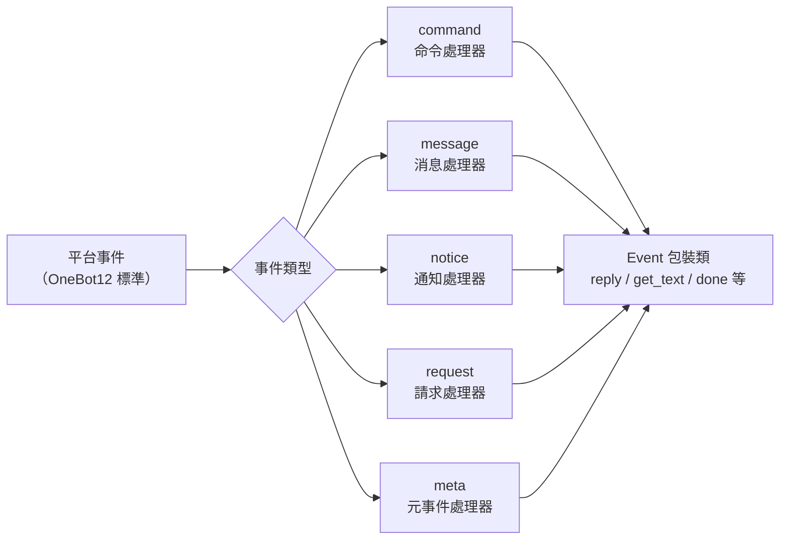

7. **重要：路徑替換規則**
   - 將文檔連結中的 `docs/zh-TW/` 替換為 `docs/zh-TW/`
   - 例如：`docs/zh-TW/quick-start.md` 應改為 `docs/zh-TW/quick-start.md`
   - 對於指向非目前語言版本文件的連結（如 `README.xx.md` 形式的連結），保持原樣不要修改
   - 這確保了連結指向正確語言的文件版本

## Command 命令模組

### 註冊命令

```python
from ErisPulse.Core.Event import command

# 基本命令
@command("hello", help="傳送問候")
async def hello_handler(event):
    await event.reply("你好！")

# 帶別名的命令
@command(["help", "h"], aliases=["協助"], help="顯示說明")
async def help_handler(event):
    pass

# 帶權限的命令
def is_admin(event):
    return event.get("user_id") in admin_ids

@command("admin", permission=is_admin, help="管理員命令")
async def admin_handler(event):
    pass

# 隱藏命令
@command("secret", hidden=True, help="秘密命令")
async def secret_handler(event):
    pass

# 命令群組
@command("admin.reload", group="admin", help="重新載入模組")
async def reload_handler(event):
    pass
```

### 命令資訊

```python
# 取得命令說明
help_text = command.help()

# 取得特定命令
cmd_info = command.get_command("admin")

# 取得命令群組中的所有命令
admin_commands = command.get_group_commands("admin")

# 取得所有可見命令
visible_commands = command.get_visible_commands()
```

### 等待回覆

```python
# 等待使用者回覆
@command("ask", help="詢問使用者資訊")
async def ask_command(event):
    reply = await command.wait_reply(
        event,
        prompt="請輸入你的名字:",  # 已在上面傳送
        timeout=30.0
    )
    
    if reply:
        name = reply.get_text()
        await event.reply(f"你好，{name}！")

# 帶驗證的等待回覆
def validate_age(event_data):
    try:
        age = int(event_data.get_text())
        return 0 <= age <= 150
    except ValueError:
        return False

@command("age", help="詢問使用者年齡")
async def age_command(event):
    await event.reply("請輸入你的年齡:")
    
    reply = await command.wait_reply(
        event,
        timeout=60,
        validator=validate_age
    )
    
    if reply:
        age = int(reply.get_text())
        await event.reply(f"你的年齡是 {age} 歲")

# 帶回呼的等待回覆
async def handle_confirmation(reply_event):
    text = reply_event.get_text().lower()
    if text in ["是", "yes", "y"]:
        await event.reply("操作已確認！")
    else:
        await event.reply("操作已取消。")

@command("confirm", help="確認操作")
async def confirm_command(event):
    await command.wait_reply(
        event,
        prompt="請輸入'是'或'否':",
        callback=handle_confirmation
    )

## Message 訊息模組

### 訊息事件

```python
from ErisPulse.Core.Event import message

# 監聽所有訊息
@message.on_message()
async def message_handler(event):
    sdk.logger.info(f"收到訊息: {event.get_text()}")

# 監聽私聊訊息
@message.on_private_message()
async def private_handler(event):
    user_id = event.get_user_id()
    sdk.logger.info(f"私聊來自: {user_id}")

# 監聽群聊訊息
@message.on_group_message()
async def group_handler(event):
    group_id = event.get_group_id()
    sdk.logger.info(f"群聊來自: {group_id}")

# 監聽@訊息
@message.on_at_message()
async def at_handler(event):
    mentions = event.get_mentions()
    sdk.logger.info(f"被@的使用者: {mentions}")
```

### 條件監聽

```python
# 使用優先級控制執行順序
@message.on_message(priority=10)  # 數值越大優先級越高
async def high_priority_handler(event):
    pass

# 在處理器內部實作條件過濾
@message.on_message()
async def filtered_handler(event):
    if "關鍵字" not in event.get_text():
        return
    # 處理包含關鍵字的訊息
    pass

## Notice 通知模組

### 通知事件

```python
from ErisPulse.Core.Event import notice

# 好友添加
@notice.on_friend_add()
async def friend_add_handler(event):
    user_id = event.get_user_id()
    await event.reply("歡迎添加我為好友！")

# 好友刪除
@notice.on_friend_remove()
async def friend_remove_handler(event):
    user_id = event.get_user_id()
    sdk.logger.info(f"好友刪除: {user_id}")

# 群成員增加
@notice.on_group_increase()
async def member_increase_handler(event):
    user_id = event.get_user_id()
    await event.reply(f"歡迎新成員！")

# 群成員減少
@notice.on_group_decrease()
async def member_decrease_handler(event):
    user_id = event.get_user_id()
    sdk.logger.info(f"群成員離開: {user_id}")

## Request 请求模組

### 請求事件

```python
from ErisPulse.Core.Event import request

# 好友請求
@request.on_friend_request()
async def friend_request_handler(event):
    user_id = event.get_user_id()
    comment = event.get_comment()
    sdk.logger.info(f"好友請求: {user_id}, 備註: {comment}")

# 群組邀請請求
@request.on_group_request()
async def group_request_handler(event):
    group_id = event.get_group_id()
    user_id = event.get_user_id()
    sdk.logger.info(f"群組邀請: {group_id}, 來自: {user_id}")

## Meta 元事件模組

### 元事件

```python
from ErisPulse.Core.Event import meta

# 連接事件
@meta.on_connect()
async def connect_handler(event):
    platform = event.get_platform()
    sdk.logger.info(f"平台 {platform} 連接成功")

# 斷線事件
@meta.on_disconnect()
async def disconnect_handler(event):
    platform = event.get_platform()
    sdk.logger.info(f"平台 {platform} 斷線")

# 心跳事件
@meta.on_heartbeat()
async def heartbeat_handler(event):
    sdk.logger.debug("收到心跳")
```

### Bot 狀態查詢

當適配器發送 meta 事件後，框架會自動追蹤 Bot 狀態。查詢 API 和生命週期事件監聽請參考 [適配器系統 API - Bot 狀態管理](adapter-system.md#bot-狀態管理)。

## Event 包裝類

Event 模組的事件處理程式接收一個 Event 包裝類實例，它繼承自 dict 並提供了便捷方法。

### 核心方法

```python
# 獲取事件資訊
event_id = event.get_id()
event_time = event.get_time()
event_type = event.get_type()
detail_type = event.get_detail_type()
platform = event.get_platform()

# 獲取機器人資訊
self_platform = event.get_self_platform()
self_user_id = event.get_self_user_id()
self_info = event.get_self_info()
```

### 會話標識

```python
# 統一目標 ID：群聊返回 group_id，私聊返回 user_id，以此類推
target_id = event.get_target_id()

# 會話唯一標識，格式: {platform}:{detail_type}:{target_id}
session_id = event.get_session_id()
# 示例: "telegram:private:12345"、"qq:group:67890"
```

`get_target_id()` 按以下順序返回首個非空值：`group_id` → `channel_id` → `guild_id` → `thread_id` → `user_id`。適用於上下文管理、狀態儲存等需要統一標識會話的場景。

### 消息方法

```python
# 獲取消息內容
message_segments = event.get_message()
alt_message = event.get_alt_message()
text = event.get_text()

# 獲取發送者資訊
user_id = event.get_user_id()
nickname = event.get_user_nickname()
sender = event.get_sender()

# 獲取群組資訊
group_id = event.get_group_id()

# 判斷消息類型
is_msg = event.is_message()
is_private = event.is_private_message()
is_group = event.is_group_message()

# @消息相關
is_at = event.is_at_message()
has_mention = event.has_mention()
mentions = event.get_mentions()
```

### 命令資訊

```python
# 獲取命令資訊
cmd_name = event.get_command_name()
cmd_args = event.get_command_args()
cmd_raw = event.get_command_raw()

# 判斷是否為命令
is_cmd = event.is_command()
```

### 回覆功能

```python
# 基本回覆
await event.reply("這是一條訊息")

# 指定發送方法
await event.reply("http://example.com/image.jpg", method="Image")

# 帶 @使用者 和回覆訊息
await event.reply("你好", at_users=["user1"], reply_to="msg_id")

# @全體成員
await event.reply("公告", at_all=True)

# 使用平台專有修飾方法（via 參數）
await event.reply("看板內容", method="Board",
                  via=[("Expire", 3600), ("ForMember", "114514")])

# 獲取發送鏈，自由追加修飾方法和發送方法（適合連續多個修飾 / 動作型方法）
await event.send_chain().Expire(3600).Board("看板內容")
await event.send_chain().DismissBoard()

# 使用 OneBot12 消息段回覆
from ErisPulse.Core.Event import MessageBuilder
msg = MessageBuilder().text("Hello").image("url").build()
await event.reply_ob12(msg)

# 等待回覆
reply = await event.wait_reply(timeout=30)
```

### 平台能力查詢

```python
# 檢查目前平台是否支援某種發送方法
if event.supports("Image"):
    await event.reply(url, method="Image")

# 列出目前平台所有可用發送方法
methods = event.available_methods()
# ["Text", "Image", "Voice", ...]
```

### 回覆方法

`reply()` 方法支援透過 `method` 參數指定發送類型，以及兩個便利的布林參數：

```python
# 簡單文字回覆
await event.reply("你好")

# 回覆並@發送者
await event.reply("你好", at_sender=True)

# 回覆並引用目前訊息
await event.reply("收到", quote=True)

# 組合使用
await event.reply("收到", at_sender=True, quote=True)

# 發送圖片（使用 method 參數）
if event.supports("Image"):
    await event.reply("http://example.com/img.jpg", method="Image")
else:
    await event.reply("[圖片] http://example.com/img.jpg")
```

**參數說明**：

| 參數 | 類型 | 說明 |
|------|------|------|
| `content` | str | 發送內容 |
| `method` | str | 發送方法，預設 "Text"，可選 "Image"/"Voice"/"Video"/"File" 等 |
| `at_sender` | bool | 是否@發送者（自動提取 user_id） |
| `quote` | bool | 是否引用回覆目前訊息（自動提取 message_id） |
| `at_users` | list[str] | @指定使用者清單 |
| `reply_to` | str | 手動指定回覆的訊息 ID |
| `at_all` | bool | 是否@全體成員 |

### 互動方法

```python
# confirm — 確認對話（回傳 True/False/None）
if await event.confirm("確定要執行此操作嗎？"):
    await event.reply("已確認")

# 使用非 Text 方式發送確認提示
if await event.confirm("http://example.com/image.jpg", method="Image"):
    await event.reply("已確認圖片提示")

# choose — 選擇選單（回傳選項索引或 None）
choice = await event.choose("請選擇顏色：", ["紅色", "綠色", "藍色"])

# options_format="auto"（預設）根據 method 自動選擇樣式：
# Markdown→無序列表（- 1.選項），Html→有序列表（<ol>），其他→純文字列表
# 文字類方法（Markdown/Html 等）預設合併選項到末尾
# merge_prompt=True 可強制任意 method 合併；placeholder 可自訂占位符
choice = await event.choose(
    "## 請選擇\n{options}", ["A", "B"],
    method="Markdown", merge_prompt=True,
)

# collect — 表單收集（回傳 {key: value} 字典或 None）
data = await event.collect([
    {"key": "name", "prompt": "請輸入姓名："},
    {"key": "age", "prompt": "請輸入年齡：",
     "validator": lambda e: e.get_text().isdigit()},
    {"key": "avatar", "prompt": "請發送頭像：", "method": "Image"},
])

# wait_for — 等待滿足條件的任意事件
evt = await event.wait_for(event_type="notice", condition=lambda e: ..., timeout=120)

# conversation — 多輪對話上下文
conv = event.conversation(timeout=60)
await conv.say("歡迎！")
```

> 完整的互動方法參數說明和更多範例請參考 [Event 包裝類詳解](../developer-guide/modules/event-wrapper.md) 和 [Conversation 多輪對話](../advanced/conversation.md)。

### 工具方法

```python
# 轉換為字典（過濾以 _ 開頭的內部鍵）
event_dict = event.to_dict()

# 獲取原始資料
raw = event.get_raw()
raw_type = event.get_raw_type()
```

### 鏈路控制

`event.done(claim=, stop=)` 統一控制「認領」與「阻斷」兩個正交語意：

- **認領（claim）**：標記事件已被處理（`_processed`），命令分發器據此跳過去重
- **阻斷（stop）**：阻止向低優先級處理器傳播（`_propagation_stopped`）

```python
# 認領 + 阻斷（預設）
event.done()

# 僅認領，不阻斷（低優先級觀察者仍能看到）
event.done(stop=False)

# 僅阻斷，不認領（如防火牆 / 限流）
event.done(claim=False)

# mark_processed 是主方法，done 是其別名
event.mark_processed()             # 等價 event.done()
event.mark_processed(stop=False)   # 等價 event.done(stop=False)

# 查詢狀態
event.is_processed()  # 是否已認領
event.is_stopped()    # 是否已阻斷傳播
```

### 平台擴展方法

適配器可以為 Event 註冊平台專有方法，僅在對應平台的實例上可用。

#### 使用者：使用平台擴展方法

當適配器註冊了平台專有方法後，你可以在事件處理程式中直接呼叫。各平台的方法不同，請參閱對應的 [平台文件](../platform-guide/)。

```python
from ErisPulse.Core.Event import message

@message.on_message()
async def handle_message(event):
    platform = event.get_platform()

    # 根據平台呼叫專有方法
    if platform == "email":
        subject = event.get_subject()           # 郵件專有
        attachments = event.get_attachments()   # 郵件專有
```

#### 查詢平台已註冊方法

```python
from ErisPulse.Core.Event import get_platform_event_methods

# 查看某平台註冊了哪些方法
methods = get_platform_event_methods("email")
# ["get_subject", "get_from", "get_attachments", ...]

# 動態判斷並呼叫
for method_name in get_platform_event_methods(event.get_platform()):
    method = getattr(event, method_name)
    print(f"{method_name}: {method()}")
```

#### 平台方法隔離

不同平台註冊的方法互不干擾：

```python
# 郵件事件 - 只有郵件方法
event = Event({"platform": "email", "email_raw": {"subject": "Hello"}})
event.get_subject()      # ✅ "Hello"
event.get_chat_type()    # ❌ AttributeError

# Telegram 事件 - 只有 Telegram 方法
event = Event({"platform": "telegram", "telegram_raw": {"chat": {"type": "private"}}})
event.get_chat_type()    # ✅ "private"
event.get_subject()      # ❌ AttributeError
```

#### `hasattr` / `dir` 支援

```python
hasattr(event, "get_subject")   # 僅當 platform="email" 時回傳 True
"get_subject" in dir(event)     # 同上
```

### 適配器：註冊平台擴展方法

適配器可以透過裝飾器為 Event 註冊平台專有方法，方法的第一個參數為 `self`（Event 實例），可以自由存取事件資料。

#### 單個方法註冊

```python
from ErisPulse.Core.Event import register_event_method

@register_event_method("email")
def get_subject(self):
    """獲取郵件主旨"""
    return self.get("email_raw", {}).get("subject", "")

@register_event_method("email")
def get_from(self):
    """獲取寄件人"""
    return self.get("email_raw", {}).get("from", {})
```

#### 批量註冊（Mixin 類）

當方法較多時，推薦使用 Mixin 類批量註冊：

```python
from ErisPulse.Core.Event import register_event_mixin

class EmailEventMixin:
    def get_subject(self):
        return self.get("email_raw", {}).get("subject", "")

    def get_from(self):
        return self.get("email_raw", {}).get("from", {})

    def get_attachments(self):
        return self.get("email_raw", {}).get("attachments", [])

# 一次性註冊所有方法
register_event_mixin("email", EmailEventMixin)
```

#### 回傳值規範

| 場景 | 回傳值 | 使用方式 |
|------|--------|----------|
| 回傳資料（文字、字典等） | 直接回傳值 | `subject = event.get_subject()` |
| 執行操作（發送訊息等） | 回傳 `asyncio.Task` | `task = event.do_something()` 可選 `await` |

> **建議**：非資料回傳的方法回傳 `asyncio.Task`，這樣使用者可以自行決定是否 `await`，即使不 `await` 操作也會執行完成。

```python
@register_event_method("email")
def forward_email(self, to_address: str):
    """轉發郵件 — 回傳 Task，使用者可自行決定是否 await"""
    import asyncio
    return asyncio.create_task(
        self._do_forward(to_address)
    )

# 使用者可以 await 等待結果
await event.forward_email("user@example.com")

# 也可以不 await，操作在背景執行
event.forward_email("user@example.com")
```

#### 注銷方法

```python
from ErisPulse.Core.Event import unregister_event_method, unregister_platform_event_methods

# 注銷單個方法
unregister_event_method("email", "get_subject")

# 注銷某平台全部方法（適配器 shutdown 時呼叫）
unregister_platform_event_methods("email")
```

#### 覆寫內建方法

`register_event_mixin` / `register_event_method` 支援覆寫 Event 內建方法（如 `confirm`、`choose`、`collect`、`wait_reply`、`reply` 等）。註冊的平台方法透過 `Event.__getattribute__` 會優先於內建方法生效，因此適配器可以提供平台特色的互動實作。

內建實作為 `_builtin_*` 函式導出，覆寫方可以呼叫它們作為回退：

```python
from ErisPulse.Core.Event import register_event_mixin, _builtin_choose

class YunhuEventMixin:
    async def choose(self, prompt, options, timeout=60, method="Text"):
        # 云湖平台使用按鈕元件
        buttons = [[{"text": opt} for opt in options]]
        await self.reply(prompt)
        # ...等待按鈕回調或文字回覆...
        # 回退到內建邏輯
        return await _builtin_choose(self, None, options, timeout, "Text")

register_event_mixin("yunhu", YunhuEventMixin)

## 跨平台擴充（萬用字元）

`register_event_method` 和 `register_event_mixin` 支援傳遞 `"*"` 作為平台名，註冊的方法在**所有平台**的 Event 實例上都可用。適合 AI 對話、上下文管理管理等需要跨平台重複使用的功能模組。

### 註冊跨平台方法

```python
from ErisPulse.Core.Event.wrapper import register_event_method

@register_event_method("*")
async def ai_chat(self, prompt: str):
    """self 為 Event 實例，可自由存取事件資料和內建方法"""
    await self.reply(f"AI: {prompt}")
```

註冊後，所有平台的事件處理器都能呼叫：

```python
from ErisPulse.Core.Event import message

@message.on_message()
async def handler(event):
    await event.ai_chat(event.get_text())
```

### 方法解析優先順序

透過屬性存取 Event 方法時，解析順序為：

1. **平台特定方法**（當前平台的覆寫）
2. **萬用字元方法**（`"*"` 註冊的跨平台方法）
3. **內建方法**（`reply`、`confirm` 等）
4. **字典鍵存取**

> 因此萬用字元方法可以覆寫內建方法（如 `reply`），但會被同名的平台特定方法進一步覆寫。

## 優先級系統

事件處理器支援優先級，數值越大優先級越高：

```python
# 高優先級處理器先執行
@message.on_message(priority=10)
async def high_priority_handler(event):
    pass

# 低優先級處理器後執行
@message.on_message(priority=0)
async def low_priority_handler(event):
    pass

## 相關文件

- [核心模組 API](../zh-TW/core-modules.md) - 核心模組 API
- [適配器系統 API](../zh-TW/adapter-system.md) - Adapter 管理 API
- [模組開發指南](../developer-guide/modules/) - 開發自訂模組


====
高级主题
====


### Conversation 多轮对话

# Conversation 多輪對話

`Conversation` 類別提供了在同一會話中進行多輪互動的便捷方法，適合實現引導式操作、資訊收集、對話式問答等場景。

請直接返回翻譯後的完整 Markdown 內容，不要包含任何其他文字。

再次提醒：如果文件包含語言切換行（各語言名稱用 `` | `` 分隔的行），務必嚴格遵守上方第 8 條的格式要求，不要寫出 ``[**Label**](file)`` 這類錯誤格式。

## 建立對話

使用 `Event` 物件的 `conversation()` 方法建立：

```python
from ErisPulse.Core.Event import command

@command("quiz")
async def quiz_handler(event):
    conv = event.conversation(timeout=30)

    await conv.say("🎮 歡迎參加知識問答！")

    answer = await conv.choose("第一題：Python 的創造者是誰？", [
        "Guido van Rossum",
        "James Gosling",
        "Dennis Ritchie",
    ])

    if answer is None:
        await conv.say("逾時了，下次再來吧！")
        return

    if answer == 0:
        await conv.say("正確！")
    else:
        await conv.say("錯誤了，正確答案是 Guido van Rossum")

    conv.stop()
```

請直接返回翻譯後的完整 Markdown 內容，不要包含任何其他文字。

再次提醒：如果文件包含語言切換行（各語言名稱用 `` | `` 分隔的行），務必嚴格遵守上方第8條的格式要求，不要寫出 ``[**Label**](file)`` 這類錯誤格式。

## 核心 API

### say(content, **kwargs)

發送訊息，返回 `self` 支持鏈式呼叫：

```python
await conv.say("第一行").say("第二行").say("第三行")
```

也可以指定發送方法：

```python
await conv.say("https://example.com/image.jpg", method="Image")
```

### wait(prompt=None, timeout=None)

等待使用者回覆，返回 `Event` 對象或 `None`（超時）：

```python
# 簡單等待
resp = await conv.wait()
if resp:
    text = resp.get_text()

# 發送提示後等待
resp = await conv.wait(prompt="請輸入你的名字：")

# 使用自訂超時（覆蓋對話預設超時）
resp = await conv.wait(prompt="請在10秒內回覆：", timeout=10)
```

### confirm(prompt=None, **kwargs)

等待使用者確認（是/否），返回 `True` / `False` / `None`（超時）：

```python
result = await conv.confirm("確定要刪除所有資料嗎？")
if result is True:
    await conv.say("已刪除")
elif result is False:
    await conv.say("已取消")
else:
    await conv.say("超時未回覆")
```

內建識別的確認詞：`是/yes/y/確認/確定/好/ok/true/對/嗯/行/同意/沒問題/可以/當然...`

內建識別的否定詞：`否/no/n/取消/不/不要/不行/cancel/false/錯/不對/別/拒絕...`

### choose(prompt, options, **kwargs)

等待使用者從選項中選擇，返回選項索引（0-based）或 `None`：

```python
choice = await conv.choose("請選擇顏色：", ["紅色", "綠色", "藍色"])
if choice is not None:
    colors = ["紅色", "綠色", "藍色"]
    await conv.say(f"你選擇了 {colors[choice]}")
```

使用者可以透過輸入編號（`1`/`2`/`3`）或選項文字（`紅色`）來選擇。

`options_format="auto"`（預設）根據 method 自動選擇內建樣式：Markdown→無序列表，Html→有序列表，其他→純文字列表。  
也支援 `"list"`、`"inline"`、`"md"`、`"html"` 或自訂函數。

支援 `merge_prompt=True` 合併為一條訊息，以及占位符控制選項插入位置（預設 `{options}`，可透過 `placeholder` 自訂）：

```python
choice = await conv.choose(
    "## 請選擇\n{options}",
    ["選項A", "選項B"],
    method="Markdown",
    merge_prompt=True,
)

# 自訂占位符
choice = await conv.choose(
    "請選擇: [choices]",
    ["選項A", "選項B"],
    placeholder="[choices]",
)
```

### collect(fields, **kwargs)

多步驟收集資訊，返回資料字典或 `None`：

```python
data = await conv.collect([
    {"key": "name", "prompt": "請輸入姓名"},
    {"key": "age", "prompt": "請輸入年齡",
     "validator": lambda e: e.get("alt_message", "").strip().isdigit(),
     "retry_prompt": "年齡必須是數字，請重新輸入"},
    {"key": "city", "prompt": "請輸入城市"},
])

if data:
    await conv.say(f"註冊成功！\n姓名: {data['name']}\n年齡: {data['age']}\n城市: {data['city']}")
else:
    await conv.say("註冊過程中斷")
```

欄位配置：

| 參數 | 說明 | 預設值 |
|------|------|--------|
| `key` | 欄位鍵名（必須） | - |
| `prompt` | 提示訊息 | `"請輸入 {key}"` |
| `validator` | 驗證函數，接收 Event，回傳 bool | 無 |
| `retry_prompt` | 驗證失敗重試提示 | `"輸入無效，請重新輸入"` |
| `max_retries` | 最大重試次數 | 3 |
| `condition` | 條件函數，接收已收集資料 dict，回傳 bool | 無 |

**條件欄位**：使用 `condition` 可以實現動態表單，只有條件滿足時才收集該欄位：

```python
data = await conv.collect([
    {"key": "has_car", "prompt": "你有車嗎？（是/否）"},
    {"key": "car_brand", "prompt": "請輸入車型",
     "condition": lambda d: d.get("has_car", "").lower() in ("是", "yes", "y")},
])
```

### stop()

手動結束對話，設定 `is_active` 為 `False`：

```python
conv.stop()
```

### is_active

對話是否處於活躍狀態：

```python
if conv.is_active:
    await conv.say("對話還在進行中")

## 活躍狀態管理

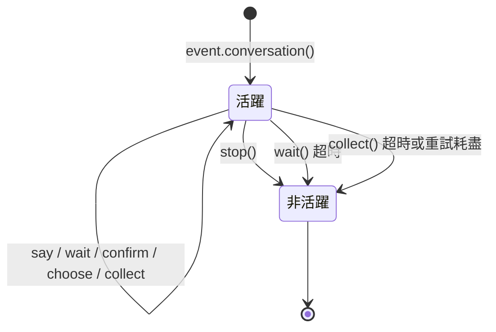

對話在以下情況會自動變為非活躍狀態：

1. 調用 `stop()` 方法
2. `wait()` 超時返回 `None`
3. `collect()` 因任何步驟超時或重試耗盡而返回 `None`

非活躍後，所有互動方法（`wait`/`confirm`/`choose`/`collect`）會立即返回 `None`，不會繼續等待使用者輸入。

[**English**](docs/zh-TW/quick-start.md) | [**简体中文**](docs/zh-TW/quick-start.md)

## 分支與跳轉

### @conv.branch(name) 裝飾器

使用 `branch()` 註冊對話分支，透過 `goto()` 在分支間跳轉：

```python
@command("menu")
async def menu_handler(event):
    conv = event.conversation(timeout=60)

    @conv.branch("main")
    async def main_menu():
        await conv.say("=== 主菜單 ===\n1. 個人資訊\n2. 設定\n3. 退出")
        resp = await conv.wait()
        if resp is None:
            return
        text = resp.get_text().strip()
        if text == "1":
            await conv.goto("profile")
        elif text == "2":
            await conv.goto("settings")
        elif text == "3":
            await conv.say("再見！")
            conv.stop()

    @conv.branch("profile")
    async def profile():
        await conv.say("=== 個人資訊 ===\n姓名: Alice\n0. 返回")
        resp = await conv.wait()
        if resp and resp.get_text().strip() == "0":
            await conv.goto("main")

    @conv.branch("settings")
    async def settings():
        await conv.say("=== 設定 ===\n1. 通知開關\n0. 返回")
        resp = await conv.wait()
        if resp and resp.get_text().strip() == "0":
            await conv.goto("main")

    await conv.start()  # 從第一個註冊的分支開始
```

### conv.start(name=None)

啟動對話，預設從第一個註冊的分支開始：

```python
await conv.start()          # 從第一個分支開始
await conv.start("settings") # 從指定分支開始

## 上下文與持久化

### conv.context

每個對話實例內建 `context` 字典，用於在分支之間共享狀態：

```python
@conv.branch("step1")
async def step1():
    conv.context["username"] = resp.get_text().strip()
    await conv.goto("step2")

@conv.branch("step2")
async def step2():
    name = conv.context.get("username", "未知")
    await conv.say(f"你好，{name}！")
```

### save() / resume() / clear_saved()

對話支援持久化，可在逾時或中斷後恢復：

```python
# 保存對話狀態
conv_id = conv.save()
# conv_id = "user_123_group_456"  # 基於使用者和群組自动生成

# ... 之後在同一會話中恢復 ...
conv2 = event.conversation()
if conv2.resume():
    await conv2.say("歡迎回來！繼續之前的對話")
else:
    await conv2.say("沒有找到之前的對話")

# 清除保存的對話
conv.clear_saved()
```

[**English**](docs/zh-TW/README.md)

## 典型流程模式

### 引導式註冊

```python
@command("register")
async def register_handler(event):
    conv = event.conversation(timeout=60)

    await conv.say("歡迎註冊！")

    data = await conv.collect([
        {"key": "username", "prompt": "請輸入用戶名（3-20個字符）",
         "validator": lambda e: 3 <= len(e.get_text().strip()) <= 20},
        {"key": "email", "prompt": "請輸入電子郵箱地址",
         "validator": lambda e: "@" in e.get_text() and "." in e.get_text(),
         "retry_prompt": "電子郵箱格式不正確，請重新輸入"},
    ])

    if not data:
        await event.reply("註冊已取消")
        return

    confirmed = await conv.confirm(
        f"確認註冊資訊？\n用戶名: {data['username']}\n電子郵箱: {data['email']}"
    )

    if confirmed:
        await conv.say("✅ 註冊成功！")
    else:
        await conv.say("❌ 已取消註冊")
```

### 循環對話

```python
@command("chat")
async def chat_handler(event):
    conv = event.conversation(timeout=120)
    await conv.say("進入對話模式，輸入「退出」結束")

    while conv.is_active:
        resp = await conv.wait()
        if resp is None:
            await conv.say("超時，對話結束")
            break

        text = resp.get_text().strip()

        if text == "退出":
            await conv.say("再見！")
            conv.stop()
        elif text == "幫助":
            await conv.say("可用命令：退出、幫助、狀態")
        elif text == "狀態":
            await conv.say("對話活躍中")
        else:
            await conv.say(f"你說的是：{text}")

## 相關文件

- [Event 包裝類](../developer-guide/modules/event-wrapper.md) - Event 物件的所有方法
- [事件處理入門](../getting-started/event-handling.md) - 事件處理基礎


### MessageBuilder 详解

# MessageBuilder 詳解

`MessageBuilder` 是 ErisPulse 提供的 OneBot12 標準消息段構建工具，用於構建結構化的消息內容，配合 `Send.Raw_ob12()` 使用。

## 導入方式

`MessageBuilder` 支援以下兩種導入方式（效果相同，推薦使用第一種）：

```python
from ErisPulse.Core.Event import MessageBuilder        # 推薦，透過包導出
from ErisPulse.Core.Event.message_builder import MessageBuilder  # 直接導入模組
```

## 雙模式機制

MessageBuilder 提供兩種使用模式，透過 Python 描述符機制（`__get__`）實現類別級別和實例級別的不同行為：當透過類呼叫方法時，`__get__` 返回靜態方法的執行結果；當透過實例呼叫時，返回 `self` 以支援鏈式呼叫。

### 鏈式呼叫模式（實例）

透過實例化 `MessageBuilder()` 使用，每個方法返回 `self`，支援鏈式呼叫，最後用 `.build()` 獲取消息段列表：

```python
from ErisPulse.Core.Event.message_builder import MessageBuilder

segments = (
    MessageBuilder()
    .text("你好！")
    .image("https://example.com/photo.jpg")
    .build()
)
# [
#     {"type": "text", "data": {"text": "你好！"}},
#     {"type": "image", "data": {"file": "https://example.com/photo.jpg"}}
# ]
```

### 快速構建模式（靜態）

透過類直接呼叫方法，每個方法直接返回消息段列表，適合單段消息：

```python
# 直接返回 list[dict]，無需 .build()
segments = MessageBuilder.text("你好！")
# [{"type": "text", "data": {"text": "你好！"}}]
```

## 消息段類型

| 方法 | 類型 | 數據參數 | 說明 |
|------|------|---------|------|
| `text(text)` | text | `text` | 文本消息 |
| `image(file)` | image | `file` | 圖片消息 |
| `audio(file)` | audio | `file` | 音頻消息 |
| `video(file)` | video | `file` | 視頻消息 |
| `file(file, filename?)` | file | `file`, `filename` | 文件消息 |
| `mention(user_id, user_name?)` | mention | `user_id`, `user_name` | @提及用戶 |
| `at(user_id, user_name?)` | mention | `user_id`, `user_name` | `mention` 的別名 |
| `reply(message_id)` | reply | `message_id` | 回覆消息 |
| `at_all()` | mention_all | - | @全體成員 |
| `custom(type, data)` | 自定義 | 自定義 | 自定義消息段 |

## 配合 Send 使用

構建的消息段列表透過 `Send.Raw_ob12()` 發送：

```python
from ErisPulse import sdk
from ErisPulse.Core.Event.message_builder import MessageBuilder

# 鏈式構建 + 發送
segments = (
    MessageBuilder()
    .mention("user123", "張三")
    .text(" 請查看這張圖片")
    .image("https://example.com/photo.jpg")
    .build()
)
await sdk.adapter.myplatform.Send.To("group", "group456").Raw_ob12(segments)
```

### 配合 Event 回覆

```python
from ErisPulse.Core.Event import command

@command("report")
async def report_handler(event):
    await event.reply_ob12(
        MessageBuilder()
        .text("📊 日報彙總\n")
        .text("今日完成任務: 5\n")
        .text("進行中任務: 3")
        .build()
    )
```

## 工具方法

### copy()

複製當前構建器，用於基於同一基礎內容創建多個消息變體：

```python
base = MessageBuilder().text("基礎內容").mention("admin")

# 基於相同前綴構建不同消息
msg1 = base.copy().text(" 變體A").build()
msg2 = base.copy().text(" 變體B").image("img.jpg").build()
```

### clear()

清空已添加的消息段，複用同一個構建器：

```python
builder = MessageBuilder()

for user_id in ["user1", "user2", "user3"]:
    builder.clear()
    msg = builder.mention(user_id).text(" 你好！").build()
    await adapter.Send.To("user", user_id).Raw_ob12(msg)
```

### len() / bool()

```python
builder = MessageBuilder()
print(bool(builder))   # False

builder.text("Hello")
print(len(builder))    # 1
print(bool(builder))   # True
```

## 自定義消息段

使用 `custom()` 方法添加平台擴展消息段：

```python
# 添加平台特有的消息段
segments = (
    MessageBuilder()
    .text("請填寫表單：")
    .custom("yunhu_form", {"form_id": "12345"})
    .build()
)
```

> 自定義消息段只在對應平台的適配器中有效，其他適配器會忽略不認識的消息段。

## 完整示例

### 多元素消息

```python
segments = (
    MessageBuilder()
    .reply(event.get_id())                    # 回覆原消息
    .mention(event.get_user_id())             # @發送者
    .text(" 這是你的查詢結果：\n")             # 文本
    .image("https://example.com/chart.png")   # 圖片
    .text("\n詳細數據見附件：")
    .file("https://example.com/data.csv", filename="data.csv")
    .build()
)
await event.reply_ob12(segments)
```

### 靜態工廠 + 鏈式混合

```python
# 快速構建單段消息
simple_msg = MessageBuilder.text("簡單文本")

# 鏈式構建複雜消息
complex_msg = (
    MessageBuilder()
    .at_all()
    .text(" 📢 公告：")
    .text("今天下午3點開會")
    .build()
)
```


### HTTP 客户端

# 網路客戶端

ErisPulse 提供了統一的網路客戶端，聚合了 HTTP 請求、WebSocket 連接和連接池管理。模組和適配器**必須優先使用**此客戶端，而非自行導入 `aiohttp` / `httpx` / `requests` 等第三方庫。

請直接返回翻譯後的完整 Markdown 內容，不要包含任何其他文字。

再次提醒：如果文件包含語言切換行（各語言名稱用 `` | `` 分隔的行），請務必嚴格遵守上方第8條的格式要求，不要寫出 ``[**Label**](file)`` 這類錯誤格式。

## 概述

網路客戶端的主要功能：

- **統一介面**：提供 `get` / `post` / `put` / `delete` / `patch` / `request` 方法
- **WebSocket 客戶端**：透過 `ws_connect` 建立客戶端 WebSocket 連接
- **自動日誌**：所有請求自動記錄日誌和統計資訊
- **生命週期整合**：每次請求觸發 `client.request` 生命週期事件，WS 連接觸發 `client.ws.connect` 事件
- **重試支援**：可配置自動重試次數和間隔
- **超時控制**：獨立的連接超時和請求超時
- **連接池複用**：基於 aiohttp.ClientSession 的連接池管理
- **異常體系**：aiohttp 異常自動轉換為 ErisPulse 異常 (ClientError 体系)

請直接返回翻譯後的完整Markdown內容，不要包含任何其他文字。

再次提醒：如果文件包含語言切換行（各語言名稱用 `` | `` 分隔的行），請務必嚴格遵守上方第8條的格式要求，不要寫出 ``[**Label**](file)`` 這類錯誤格式。

## 快速入門

### HTTP 請求

```python
from ErisPulse.Core import client

# GET 請求
resp = await client.get("https://httpbin.org/get")
data = await resp.json()
print(resp.status)  # 200

# POST 請求
resp = await client.post(
    "https://httpbin.org/post",
    json={"key": "value"},
)
data = await resp.json()
```

### WebSocket 連接

```python
from ErisPulse.Core import client

ws = await client.ws_connect("wss://example.com/ws")

async for text in ws.iter_text():
    await ws.send_text(f"Echo: {text}")
```

請直接返回翻譯後的完整 Markdown 內容，不要包含任何其他文字。

再次提醒：如果文件包含語言切換行（各語言名稱用 `` | `` 分隔的行），請務必嚴格遵守上方第8條的格式要求，不要寫出 ``[**Label**](file)`` 這類錯誤格式。

## HttpResponse

所有請求方法都會返回 `HttpResponse` 物件：

```python
from ErisPulse.Core import client

resp = await client.get("https://httpbin.org/get")

resp.status       # int - HTTP 狀態碼 (例如 200, 404)
resp.reason       # str | None - 狀態描述 (例如 "OK")
resp.headers      # 回應標頭 (大小寫不敏感)
resp.content_type # str | None - Content-Type
resp.url          # 最終 URL (可能因重定向而變更)
resp.raw          # 底層原生回應物件 (目前為 aiohttp.ClientResponse)

# 讀取回應主體
body = await resp.read()       # bytes
text = await resp.text()       # str
data = await resp.json()       # 解析 JSON
text = await resp.text("gbk")  # 指定編碼
```

請直接返回翻譯後的完整 Markdown 內容，不要包含任何其他文字。

## 請求方法

### GET

```python
from ErisPulse.Core import client

resp = await client.get(
    "https://api.example.com/users",
    params={"page": "1", "limit": "10"},
    headers={"Authorization": "Bearer token"},
)
```

### POST

```python
from ErisPulse.Core import client

# JSON 請求體
resp = await client.post(
    "https://api.example.com/users",
    json={"name": "Alice", "age": 30},
)

# 表單請求體
resp = await client.post(
    "https://api.example.com/login",
    data={"username": "admin", "password": "123"},
)

# 原始數據
resp = await client.post(
    "https://api.example.com/upload",
    data=b"raw bytes",
    headers={"Content-Type": "application/octet-stream"},
)

# 文件上傳 (使用 files 參數, 無需導入 aiohttp)
# 格式: {字段名: 文件物件/bytes/(檔名, 檔案)/(檔名, 檔案, content_type)}
resp = await client.post(
    "https://api.example.com/upload",
    data={"description": "頭像"},            # 可選: 同時攜帶普通表單字段
    files={
        "file": ("photo.png", open("photo.png", "rb"), "image/png"),
    },
)

# 簡化寫法: 直接傳文件物件
resp = await client.post(
    "https://api.example.com/upload",
    files={"file": open("photo.png", "rb")},
)

# 內存數據直接上傳 (無需落盤)
import io

resp = await client.post(
    "https://api.example.com/upload",
    files={"file": ("data.txt", io.BytesIO(b"file content"), "text/plain")},
)
```

### PUT / DELETE / PATCH

```python
from ErisPulse.Core import client

resp = await client.put("https://api.example.com/users/1", json={"name": "Bob"})
resp = await client.delete("https://api.example.com/users/1")
resp = await client.patch("https://api.example.com/users/1", json={"age": 31})
```

### 通用 request

```python
from ErisPulse.Core import client

resp = await client.request(
    "OPTIONS",
    "https://api.example.com/resource",
    headers={"Origin": "https://example.com"},
)

## 參數說明

### HTTP 請求參數

| 參數 | 類型 | 說明 |
|------|------|------|
| `url` | `str` | 請求 URL |
| `params` | `dict[str, str]` | 查詢參數 (可選) |
| `headers` | `dict[str, str]` | 額外請求頭 (可選) |
| `data` | `Any` | 請求主體 (表單或原始數據) (可選) |
| `json` | `Any` | JSON 請求主體 (可選) |
| `files` | `dict[str, Any]` | 檔案上傳欄位 (可選, 自動建立 multipart/form-data) |
| `timeout` | `float` | 本次請求超時 (秒) (可選, 覆蓋預設值) |
| `max_retries` | `int` | 本次最大重試次數 (可選, 覆蓋預設值) |

### ws_connect 參數

| 參數 | 類型 | 說明 |
|------|------|------|
| `url` | `str` | WebSocket 伺服器 URL |
| `headers` | `dict[str, str]` | 額外請求頭 (可選) |
| `heartbeat` | `float` | 心跳間隔秒數 (可選) |

## 超時與重試

```python
from ErisPulse.Core import Client

# 建立帶自訂超時的客戶端
client = Client(
    timeout=60,           # 請求總超時 60 秒
    connect_timeout=5,    # 連線超時 5 秒
    max_retries=3,        # 失敗自動重試 3 次
    retry_delay=2,        # 重試間隔 2 秒
)

# 單次請求覆蓋超時
resp = await client.get("https://slow-api.example.com/data", timeout=120)
```

> [!NOTE]
> 客戶端類別自 2.8.0 版起更名為 `Client`（`sdk.client` 屬性名不變）；舊名 `HttpClient` 保留為相容別名，舊代碼無需修改。

[**簡體中文**](docs/zh-TW/timeout-retry.md) | [**繁體中文**](docs/zh-TW/timeout-retry.md) | [**English**](docs/en/timeout-retry.md)

## 自訂預設標頭

```python
client = Client(
    headers={
        "Authorization": "Bearer token",
        "X-App-Id": "my-app",
    },
    user_agent="MyBot/1.0",
)

## 請求統計

```python
from ErisPulse.Core import client

# 查看統計
stats = client.stats
# {"total_requests": 42, "total_errors": 1, "total_bytes_sent": 0, "total_bytes_received": 0}

# 重設統計
client.reset_stats()

## 生命週期事件

### HTTP 請求事件

每次請求完成後觸發 `client.request` 事件，可用於監控：

```python
from ErisPulse.Core import lifecycle

@lifecycle.on("client.request")
async def on_request(event_data):
    print(f"{event_data['method']} {event_data['url']} -> {event_data['status']} ({event_data['elapsed']}s)")
```

### WebSocket 連接事件

每次 WebSocket 連接建立後觸發 `client.ws.connect` 事件：

```python
from ErisPulse.Core import lifecycle

@lifecycle.on("client.ws.connect")
async def on_ws_connect(event_data):
    print(f"WS 連接: {event_data['url']}")

## 上下文管理

```python
# 作為上下文管理器，自動關閉會話
async with Client(timeout=30) as client:
    resp = await client.get("https://httpbin.org/get")
    data = await resp.json()
```

7. **重要：路徑替換規則**
   - 將文件連結中的 `docs/zh-TW/` 替換為 `docs/zh-TW/`
   - 例如：`docs/zh-TW/quick-start.md` 應改為 `docs/zh-TW/quick-start.md`
   - 對於指向非當前語言版本文件的連結（如 `README.xx.md` 形式的連結），保持原樣不要修改
   - 這確保連結指向正確語言的文件版本

## WebSocket 客戶端

透過 `client.ws_connect()` 建立 WebSocket 客戶端連接，回傳 `ClientWebSocket` 物件。客戶端與服務端 WebSocket 共享相同的 `WebSocketConnectionBase` 基類，send/receive/iter 接口完全一致。

### 基本用法

```python
from ErisPulse.Core import client

ws = await client.ws_connect("wss://example.com/ws", heartbeat=30)

await ws.send_text("Hello")
await ws.send_bytes(b"\x00\x01\x02")
await ws.send_json({"type": "ping"})
```

### 接收訊息

#### 高階方法 (推薦)

自動過濾訊息類型，斷開時拋出 `WebSocketDisconnect`：

```python
from ErisPulse.Core import client
from ErisPulse.Core.Bases.errors import WebSocketDisconnect

ws = await client.ws_connect("wss://example.com/ws")

# 單筆接收
text = await ws.receive_text()    # str
data = await ws.receive_bytes()   # bytes
obj = await ws.receive_json()     # dict / list

# 迭代接收 (斷開時自動停止)
async for text in ws.iter_text():
    print(text)

async for data in ws.iter_bytes():
    print(data)

async for obj in ws.iter_json():
    print(obj)
```

#### 低階方法

使用 `receive()` 和 `iter_messages()` 處理原始訊息類型，可區分 TEXT / BINARY / CLOSE / ERROR：

```python
from ErisPulse.Core import client
from ErisPulse.Core.Bases.websocket import WSMessage

ws = await client.ws_connect("wss://example.com/ws")

# 單筆接收原始訊息
msg = await ws.receive()
# msg.type  -> WSMessage.TEXT / WSMessage.BINARY / WSMessage.CLOSE / WSMessage.ERROR
# msg.data  -> str | bytes | None

# 迭代原始訊息 (CLOSE/ERROR 時自動停止)
async for msg in ws.iter_messages():
    if msg.type == WSMessage.TEXT:
        print(f"文本: {msg.data}")
    elif msg.type == WSMessage.BINARY:
        print(f"二進位: {len(msg.data)} bytes")
```

### WSMessage

`WSMessage` 是統一的 WebSocket 訊息類型，不依賴底層函式庫：

| 屬性 | 類型 | 說明 |
|------|------|------|
| `type` | `str` | 訊息類型: `WSMessage.TEXT` / `WSMessage.BINARY` / `WSMessage.CLOSE` / `WSMessage.ERROR` |
| `data` | `Any` | 訊息資料 |

### ClientWebSocket 屬性

| 屬性 | 類型 | 說明 |
|------|------|------|
| `url` | `URL` | 連接 URL |
| `headers` | `Headers` | 回應標頭 |
| `closed` | `bool` | 連接是否已關閉 |
| `raw` | `object` | 底層原生物件 (aiohttp.ClientWebSocketResponse) |

### 生命週期鉤子

與 `服務端 WebSocketConnection` 一致，支援 `on_disconnect` 和 `on_error` 回呼：

```python
from ErisPulse.Core import client

ws = await client.ws_connect("wss://example.com/ws")

@ws.on_disconnect
async def handle_disconnect(ws, reason="unknown"):
    print(f"連接斷開: {reason}")

@ws.on_error
async def handle_error(ws, error=""):
    print(f"連接錯誤: {error}")
```

### 關閉連接

```python
await ws.close(code=1000, reason="Normal closure")

## 異常體系

ErisPulse 定義了統一的異常層級，透過 `sdk.client` 發起的請求會自動將底層 aiohttp 異常轉換為 ErisPulse 異常。

> **向後相容**：直接使用 `aiohttp.ClientSession` 的舊模組/適配器完全不受影響。異常轉換僅在透過 `sdk.client` 發起請求時生效，直接使用 aiohttp 的程式碼仍然捕獲 `aiohttp.ClientError` 等原生異常。兩種方式可以共存。

### 異常層級

```
ErisPulseError
├── ClientError                  # 所有 HTTP/WS 客戶端請求異常的基類
│   ├── ClientConnectionError    # 連線失敗 (DNS 解析失敗、連線被拒絕、網路不可達)
│   ├── ClientTimeoutError       # 連線超時或請求超時
│   └── HTTPStatusError          # HTTP 4xx/5xx 狀態碼錯誤
└── WebSocketError               # WebSocket 異常基類
    └── WebSocketDisconnect      # WebSocket 連線中斷 (客戶端和服務端通用)
```

### 異常捕獲

```python
from ErisPulse.Core import client
from ErisPulse.Core.Bases.errors import (
    ClientError,
    ClientConnectionError,
    ClientTimeoutError,
    HTTPStatusError,
    WebSocketDisconnect,
    WebSocketError,
)

# HTTP 請求異常處理
try:
    resp = await client.get("https://api.example.com/data")
    data = await resp.json()
except ClientConnectionError:
    print("無法連接到伺服器")
except ClientTimeoutError:
    print("請求超時")
except ClientError as e:
    print(f"請求失敗: {e}")

# WebSocket 異常處理
try:
    ws = await client.ws_connect("wss://example.com/ws")
    async for text in ws.iter_text():
        await ws.send_text(f"Echo: {text}")
except WebSocketDisconnect as e:
    print(f"連線中斷: code={e.code}, reason={e.reason}")
except WebSocketError as e:
    print(f"WebSocket 錯誤: {e}")
```

### 統一捕獲

使用 `ClientError` 統一捕獲所有 HTTP/WS 客戶端請求異常：

```python
from ErisPulse.Core.Bases.errors import ClientError

try:
    resp = await client.get("https://api.example.com/data")
except ClientError as e:
    print(f"客戶端錯誤: {e}")
```

### HTTPStatusError

當需要在請求後檢查狀態碼並拋出異常時，可手動使用：

```python
from ErisPulse.Core.Bases.errors import HTTPStatusError

resp = await client.get("https://api.example.com/data")
if resp.status >= 400:
    raise HTTPStatusError(resp.status, await resp.text())

## 在適配器中使用

適配器可以使用全域客戶端或自行建立客戶端實例來發送平台 API 請求：

```python
from ErisPulse.Core import client
from ErisPulse.Core.Bases import BaseAdapter
from ErisPulse.Core.Bases.errors import ClientError

class MyAdapter(BaseAdapter):
    async def call_api(self, endpoint, **params):
        try:
            resp = await client.post(
                f"https://api.platform.com/{endpoint}",
                json=params,
                headers={"Authorization": f"Bearer {self.token}"},
            )
            return await resp.json()
        except ClientError as e:
            self.logger.error(f"API 調用失敗: {e}")
            raise
```

> 也可以透過 `from ErisPulse import sdk` 使用 `sdk.client`，效果相同。

## 重要：路徑替換規則
- 將文件連結中的 `docs/zh-TW/` 替換為 `docs/zh-TW/`
- 例如：`docs/zh-TW/quick-start.md` 應改為 `docs/zh-TW/quick-start.md`
- 對於指向非當前語言版本文件的連結（如 `README.xx.md` 形式的連結），保持原樣不要修改
- 這確保了連結指向正確語言的文件版本

## 最佳實踐

1. **優先使用全域客戶端**：使用 `from ErisPulse.Core import client` 取得全域單例，便於框架統一管理和監控
2. **避免直接導入 aiohttp**：使用 `client` 替代 `aiohttp.ClientSession`，未來更換底層實作無需修改程式碼。舊程式碼直接使用 aiohttp 仍可正常運作，兩種方式可以共存
3. **使用 ErisPulse 異常體系**：透過 `sdk.client` 發出請求時捕獲 `ClientError` 而非 `aiohttp.ClientError`，確保程式碼不依賴特定 HTTP 庫。直接使用 aiohttp 的舊程式碼不受影響
4. **合理設定超時**：根據 API 回應速度設定合理的超時時間，避免長時間阻塞
5. **使用重試機制**：對不穩定的 API 啟用重試，提高可靠性
6. **監控請求統計**：透過 `sdk.client.stats` 或 `client.request` 生命週期事件監控請求情況
7. **WebSocket 使用高階方法**：優先使用 `iter_text` / `iter_json` 等高階方法，僅在需要區分訊息類型時使用 `iter_messages`

請直接返回翻譯後的完整 Markdown 內容，不要包含任何其他文字。

## 相關文件

- [路由管理器](router.md) - HTTP/WebSocket 服務端路由（服務端 WebSocketConnection 與客戶端共享同一基類）
- [適配器開發指南](../developer-guide/adapters/getting-started.md) - 適配器中使用 HTTP 客戶端
- [生命週期管理](lifecycle.md) - 監聽請求事件


### SQL 查询构建器

# SQL 查詢建構器

ErisPulse 的 Storage 模組提供鏈式呼叫風格的通用 SQL 查詢建構器，支援自訂表的建立、查詢、更新和刪除操作。

## 架構設計

```
Bases/storage.py                    Core/storage.py
┌─────────────────────┐             ┌──────────────────────────┐
│  BaseStorage (ABC)  │◄────────────│  StorageManager          │
│  BaseQueryBuilder   │             │  (SQLite concrete impl)  │
│    (ABC)            │             │                          │
└─────────────────────┘             │  SQLiteQueryBuilder      │
                                    │  AlterTableBuilder       │
                                    └──────────────────────────┘
```

- `BaseStorage` / `BaseQueryBuilder` 是抽象基底類別，定義統一介面，支援未來擴展其他儲存媒介（Redis、MySQL 等）
- `StorageManager` 是當前 SQLite 具體實現，完全向後相容

## 匯入

```python
from ErisPulse import sdk
# 或
from ErisPulse.Core import storage

# ABC 基類（用於類型標註或自訂實現）
from ErisPulse.Core.Bases.storage import BaseStorage, BaseQueryBuilder
```

## 表管理

### 建立表

```python
sdk.storage.CreateTable("users", {
    "id": "INTEGER PRIMARY KEY AUTOINCREMENT",
    "name": "TEXT NOT NULL",
    "age": "INTEGER DEFAULT 0",
    "email": "TEXT"
})
```

### 檢查表是否存在

```python
if sdk.storage.HasTable("users"):
    print("users 表已存在")
```

### 刪除表

```python
sdk.storage.DropTable("users")
```

### 修改表結構

```python
# 欄位
sdk.storage.AlterTable("users").AddColumn("email", "TEXT").Execute()

# 重新命名表
sdk.storage.AlterTable("users").RenameTo("members").Execute()

# 鏈式多個操作
sdk.storage.AlterTable("users") \
    .AddColumn("phone", "TEXT") \
    .AddColumn("address", "TEXT") \
    .Execute()
```

## 鏈式查詢

### 插入資料

```python
# 單行插入
sdk.storage.Table("users").Insert({"name": "Alice", "age": 30}).Execute()

# 批量插入
sdk.storage.Table("users").InsertMulti([
    {"name": "Bob", "age": 25},
    {"name": "Charlie", "age": 35},
    {"name": "Dave", "age": 40}
]).Execute()
```

### 查詢資料

```python
# 查詢所有欄位
rows = sdk.storage.Table("users").Select().Execute()

# 查詢指定欄位
rows = sdk.storage.Table("users").Select("name", "age").Execute()

# 獲取單筆記錄
row = sdk.storage.Table("users").Select("name", "age") \
    .Where("id = ?", 1) \
    .ExecuteOne()
# 回傳 tuple | None，如 ("Alice", 30)
```

### 條件過濾

```python
# 單條件
rows = sdk.storage.Table("users").Select("name") \
    .Where("age > ?", 18) \
    .Execute()

# 多條件（AND 連接）
rows = sdk.storage.Table("users").Select("name") \
    .Where("age > ?", 20) \
    .Where("age < ?", 40) \
    .Execute()
```

### 排序、分頁

```python
# 升序
rows = sdk.storage.Table("users").Select("name", "age") \
    .OrderBy("name") \
    .Execute()

# 降序
rows = sdk.storage.Table("users").Select("name") \
    .OrderBy("age", desc=True) \
    .Execute()

# 分頁
rows = sdk.storage.Table("users").Select("name") \
    .OrderBy("id") \
    .Limit(10) \
    .Offset(20) \
    .Execute()
```

### 更新資料

```python
# 條件更新
sdk.storage.Table("users") \
    .Update({"age": 31}) \
    .Where("name = ?", "Alice") \
    .Execute()

# 全量更新
sdk.storage.Table("users") \
    .Update({"status": "active"}) \
    .Execute()
```

### 刪除資料

```python
# 條件刪除
sdk.storage.Table("users") \
    .Delete() \
    .Where("name = ?", "Bob") \
    .Execute()

# 全量刪除
sdk.storage.Table("users").Delete().Execute()
```

### 計數與存在性檢查

```python
# 計數
count = sdk.storage.Table("users").Count()
count = sdk.storage.Table("users").Where("age > ?", 18).Count()

# 存在性檢查
exists = sdk.storage.Table("users").Where("name = ?", "Alice").Exists()
```

## 複用查詢條件

使用 `copy()` 深拷貝建構器，複用基礎條件：

```python
base = sdk.storage.Table("users").Where("age > ?", 20)

# 基於相同條件查詢
rows = base.copy().Select("name").OrderBy("name").Limit(5).Execute()

# 基於相同條件計數
count = base.copy().Count()

# 基於相同條件檢查存在性
exists = base.copy().Where("name = ?", "Alice").Exists()
```

## 重置建構器

```python
builder = sdk.storage.Table("users").Select("name").Where("age > ?", 18)
builder.clear()

# 重新建構查詢
builder.Select("name", "age").Where("name = ?", "Alice")
rows = builder.Execute()
```

## 事務中使用

鏈式操作完全支援事務：

```python
# 提交事務
with sdk.storage.transaction():
    sdk.storage.Table("users").Insert({"name": "Eve", "age": 22}).Execute()
    sdk.storage.Table("users").Update({"age": 23}).Where("name = ?", "Eve").Execute()

# 回滾範例
try:
    with sdk.storage.transaction():
        sdk.storage.Table("users").Delete().Where("name = ?", "Alice").Execute()
        raise Exception("force rollback")
except Exception:
    pass
# Alice 的記錄仍然存在
```

## 返回值說明

| 操作 | 返回類型 | 說明 |
|------|---------|------|
| `Select().Execute()` | `list[tuple]` | 查詢結果列表 |
| `Select().ExecuteOne()` | `tuple \| None` | 單筆記錄 |
| `Insert().Execute()` | `int` | 受影響行數 |
| `InsertMulti().Execute()` | `int` | 插入行數 |
| `Update().Execute()` | `int` | 受影響行數 |
| `Delete().Execute()` | `int` | 受影響行數 |
| `Count()` | `int` | 符合行數 |
| `Exists()` | `bool` | 是否存在 |

### 返回值處理範例

```python
# Select 返回元組，按索引取值
rows = sdk.storage.Table("users").Select("name", "age").Execute()
first_name = rows[0][0]  # 第一行第一列 name
first_age = rows[0][1]   # 第一行第二列 age

# 推薦：用列名列表 + zip 轉為字典，代碼更可讀
cols = ["name", "age"]
rows = sdk.storage.Table("users").Select(*cols).Execute()
for row in rows:
    d = dict(zip(cols, row))
    print(d["name"], d["age"])

# ExecuteOne 返回單條元組或 None
row = sdk.storage.Table("users").Select("name").Where("id = ?", 1).ExecuteOne()
name = row[0] if row else None

# Insert/Update/Delete 返回受影響行數
affected = sdk.storage.Table("users").Delete().Where("age < ?", 18).Execute()
print(f"刪除了 {affected} 條記錄")
```

## 參數化查詢

所有 WHERE 參數使用 `?` 佔位符，參數作為 `Where()` 的後續參數傳入（**不是**元組或列表）：

```python
# 正確 ✓ — 多個參數逐一傳入
sdk.storage.Table("users").Where("age > ? AND name = ?", 18, "Alice").Execute()

# 正確 ✓ — 多次 Where 調用
sdk.storage.Table("users").Where("age > ?", 18).Where("name = ?", "Alice").Execute()

# 錯誤 ✗ — 不要傳入元組
sdk.storage.Table("users").Where("age > ? AND name = ?", (18, "Alice")).Execute()
# 這會把整個元組當成第一個佔位符的值

# 錯誤 ✗ — 存在 SQL 注入風險
sdk.storage.Table("users").Where(f"name = '{user_input}'").Execute()
```

### Where 參數傳遞規則

```python
# Where(condition: str, *params: Any)
# params 是可變參數，逐個傳入即可

# 單個參數
.Where("name = ?", "Alice")

# 多個參數
.Where("age > ? AND age < ?", 18, 60)

# LIKE 查詢
.Where("name LIKE ?", "A%")

# IN 查詢（需要手動構造佔位符）
.Where("name IN (?, ?, ?)", "Alice", "Bob", "Charlie")
```

## 自訂儲存後端

繼承 `BaseStorage` 和 `BaseQueryBuilder` 實現自訂儲存後端：

```python
from ErisPulse.Core.Bases.storage import BaseStorage, BaseQueryBuilder

class MyQueryBuilder(BaseQueryBuilder):
    def Execute(self):
        # 實現具體執行邏輯
        ...

    def ExecuteOne(self):
        ...

    def Count(self):
        ...

    def Exists(self):
        ...


class MyStorage(BaseStorage):
    def get(self, key, default=None):
        ...

    def set(self, key, value):
        ...

    # 實現其他抽象方法...
    def Table(self, table_name):
        return MyQueryBuilder(self, table_name)
```

## 相關文件

- [核心模組 API](../api-reference/core-modules.md) - Storage 模組完整 API
- [儲存基類 API](../api-reference/auto_api/ErisPulse/Core/Bases/storage.md) - BaseStorage/BaseQueryBuilder 抽象介面
- [訊息建構器](message-builder.md) - MessageBuilder 鏈式呼叫風格參考


### 路由系统

# 路由管理器

ErisPulse 路由管理器提供統一的 HTTP 和 WebSocket 路由管理，支援多適配器路由註冊和生命週期管理。底層透過抽象層封裝（目前為 FastAPI + Uvicorn）

## 概述

路由管理器的主要功能：

- **裝飾器路由**：支援 `@http` / `@get` / `@post` / `@put` / `@delete` / `@ws` 裝飾器快捷註冊
- **自動注入**：路由處理器無需匯入 FastAPI 類型，框架自動注入抽象物件
- **路由分組**：支援帶前綴和版本號的 `RouteGroup`
- **路由中間件**：支援 glob 模式匹配的請求攔截
- **速率限制**：內建滑動視窗限流
- **CORS 支援**：一鍵開啟跨域資源共享
- **安全頭**：自動添加安全回應頭
- **自動文件**：基於 OpenAPI 的互動式文件
- **WebSocket 支援**：完整的 WebSocket 連線管理、自訂認證和生命週期鉤子
- **生命週期整合**：與 ErisPulse 生命週期系統深度整合
- **SSL/TLS 支援**：支援 HTTPS 和 WSS 安全連線
- **主頁入口**：支援模組在根路由 `/` 註冊快捷入口按鈕，支援國際化

## 抽象類型

ErisPulse 提供了服務端抽象類型，使模組無需直接依賴 FastAPI：

| 抽象類型 | FastAPI 對應 | 說明 |
|---------|-------------|------|
| `HttpRequest` | `fastapi.Request` | HTTP 請求封裝，介面完全相容 |
| `WebSocketConnection` | `fastapi.WebSocket` | WebSocket 連線封裝，額外提供生命週期鉤子 |
| `WebSocketDisconnect` | `fastapi.WebSocketDisconnect` | WebSocket 斷開異常 |

> `WebSocketConnection` 繼承自 `WebSocketConnectionBase`，與客戶端 WebSocket (`ClientWebSocket`) 共享相同的 send/receive/iter/close 介面。客戶端和服務端 WebSocket 可以使用相同的業務邏輯程式碼。
>
> 透過 `.raw` 屬性可存取底層 FastAPI 原生物件。直接使用 FastAPI 類型的程式碼也完全相容。

## 裝飾器路由（推薦）

### HTTP 裝飾器

```python
from ErisPulse.Core import router
@router.get("my_module", "/info")
async def get_info(request):
    return {"method": request.method, "path": str(request.url)}

# 也可顯式標註抽象類型
from ErisPulse.Core import HttpRequest

@router.post("my_module", "/data")
async def post_data(request: HttpRequest):
    data = await request.json()
    return {"received": data}

@router.put("my_module", "/data/{item_id}")
async def update_data(request):
    return {"updated": True}

@router.delete("my_module", "/data/{item_id}")
async def delete_data(request):
    return {"deleted": True}
```

> **自動注入規則**：當處理器第一個參數名為 `request` 或 `req` 且無 FastAPI 類型註解時，框架自動注入 `HttpRequest`。無參數或非請求參數名的處理器不受影響。

### WebSocket 裝飾器

```python
from ErisPulse.Core import WebSocketConnection, WebSocketDisconnect

# 基本 WebSocket
@router.ws("my_module", "/ws")
async def websocket_handler(ws):
    async for msg in ws.iter_text():
        await ws.send_text(f"Echo: {msg}")

# 帶生命週期鉤子的 WebSocket
@router.ws("my_module", "/ws/chat")
async def chat(ws: WebSocketConnection):
    @ws.on_disconnect
    async def on_disconnect(ws, reason="unknown"):
        print(f"用戶斷開: {reason}")

    @ws.on_error
    async def on_error(ws, error=""):
        print(f"連線錯誤: {error}")

    async for msg in ws.iter_text():
        await ws.send_text(f"Echo: {msg}")

# 帶認證的 WebSocket
async def ws_auth(ws: WebSocketConnection) -> bool:
    token = ws.query_params.get("token")
    return token == "secret"

@router.ws("my_module", "/secure_ws", auth_handler=ws_auth)
async def secure_ws_handler(ws):
    while True:
        data = await ws.receive_text()
        await ws.send_text(f"Echo: {data}")
```

> **注意**：WebSocket 處理器和認證處理器也支援自動注入。無需參數註解即可獲得 `WebSocketConnection`。標註 `fastapi.WebSocket` 也可傳入原生物件，但推薦使用抽象類型。

## 傳統註冊方式

```python
async def hello_handler(request):
    return {"message": "Hello World"}

# 基本註冊
router.register_http_route(
    module_name="my_module",
    path="/hello",
    handler=hello_handler,
    methods=["GET"],
)

# 帶限流和文件資訊
router.register_http_route(
    module_name="my_module",
    path="/api/data",
    handler=data_handler,
    methods=["POST"],
    rate_limit="10/minute",
    summary="數據介面",
    tags=["API"],
)
```

### WebSocket 註冊

```python
from ErisPulse.Core import WebSocketConnection

async def websocket_handler(ws: WebSocketConnection):
    async for msg in ws.iter_text():
        await ws.send_text(f"Echo: {msg}")

# 基本註冊
router.register_websocket(
    module_name="my_module",
    path="/ws",
    handler=websocket_handler,
)

# 帶認證的註冊（推薦）
async def auth_handler(ws: WebSocketConnection) -> bool:
    token = ws.query_params.get("token")
    return token == "secret"

router.register_websocket(
    module_name="my_module",
    path="/secure_ws",
    handler=websocket_handler,
    auth_handler=auth_handler,
)
```

**參數說明：**

| 參數 | 說明 | 預設值 |
|------|------|--------|
| `module_name` | 模組名稱（必須） | - |
| `path` | WebSocket 路徑 | - |
| `handler` | 處理函數 | - |
| `auth_handler` | 認證函數，回傳 `False` 會自動關閉連線 | `None` |
| `auto_accept` | 是否自動 `accept()` | `True` |

> **推薦**：使用 `auth_handler` 進行連線確認，而非關閉 `auto_accept`。僅在你需要完全控制連線流程時才設定 `auto_accept=False`。

## WebSocket 生命週期鉤子

`WebSocketConnection` 提供了斷開連線和錯誤的回調註冊，無需手動 try/catch：

```python
from ErisPulse.Core import WebSocketConnection

@router.ws("my_module", "/ws")
async def my_ws(ws: WebSocketConnection):
    # 裝飾器方式註冊
    @ws.on_disconnect
    async def on_close(ws, reason="unknown"):
        print(f"斷開原因: {reason}")

    # 也可直接呼叫
    async def on_err(ws, error=""):
        print(f"錯誤: {error}")
    ws.on_error(on_err)

    # 正常業務邏輯
    async for msg in ws.iter_text():
        await ws.send_text(f"Echo: {msg}")
```

## 路由分組

```python
# 建立帶前綴的路由組
group = router.group("my_module", prefix="/v1")

@group.get("/users")
async def list_users(request):
    return {"users": []}

@group.post("/users")
async def create_user(request):
    return {"created": True}

# 實際路徑: /my_module/v1/users
```

## 路由中間件

中間件支援 glob 模式匹配路徑：

```python
@router.middleware("/my_module/*")
async def auth_middleware(request, call_next):
    token = request.headers.get("Authorization")
    if not token:
        return {"error": "Unauthorized"}
    return await call_next(request)

@router.middleware("/my_module/admin/*")
async def admin_middleware(request, call_next):
    return await call_next(request)
```

## 請求關聯 ID（X-Request-ID）

從 2.7.0 起，每個 HTTP 請求都會攜帶一個 `X-Request-ID` 關聯 ID，用於日誌 / 鏈路追蹤串聯：

- **生成規則**：優先沿用客戶端傳入的 `X-Request-ID` 請求頭（分散式追蹤場景）；否則自產生 UUID
- **回應頭**：回應會回寫 `X-Request-ID`，方便客戶端把請求與日誌對應
- **生命週期事件**：`server.request` 與 `server.response` 事件資料中新增 `request_id` 欄位

```python
# 在模組中監聽請求事件，按 request_id 串聯請求-回應
@sdk.lifecycle.on("server.request")
async def on_request(data):
    print(f"[{data['request_id']}] {data['method']} {data['path']}")

@sdk.lifecycle.on("server.response")
async def on_response(data):
    print(f"[{data['request_id']}] -> {data['status_code']}")
```

客戶端可自訂 ID 以便跨服務追蹤：

```bash
curl -H "X-Request-ID: my-trace-id" http://localhost:8080/my_module/health
```

## 速率限制

使用滑動視窗演算法對路由進行限流：

```python
@router.get("my_module", "/limited", rate_limit="10/minute")
async def limited_endpoint(request):
    return {"ok": True}

@router.post("my_module", "/submit", rate_limit="5/minute")
async def submit_data(request):
    return {"submitted": True}
```

速率限制格式：`{次數}/{時間視窗}`，如 `10/minute`、`100/hour`。

## CORS 配置

```python
router.setup_cors(
    allow_origins=["https://example.com"],
    allow_methods=["GET", "POST"],
    allow_headers=["*"],
)
```

也可透過 `config.toml` 配置：

```toml
[router.cors]
allow_origins = ["https://example.com"]
allow_methods = ["GET", "POST"]
allow_headers = ["*"]
```

## 安全頭

```python
router.setup_security_headers()
```

自動添加 `X-Content-Type-Options`、`X-Frame-Options`、`X-XSS-Protection` 等安全頭。

也可透過 `config.toml` 配置：

```toml
[router.security]
enabled = true
```

## 自動文件

Router 預設啟用 OpenAPI 互動式文件：

```python
# 禁用文件
router.disable_docs()

# 自訂文件資訊
router.set_docs_info(
    title="My API",
    description="API 文件",
    version="1.0.0"
)
```

## 路徑處理

路由路徑會自動添加模組名稱作為前綴，避免衝突：

```python
# 註冊路徑 "/api" 到模組 "my_module"
# 實際存取路徑為 "/my_module/api"
router.register_http_route("my_module", "/api", handler)
```

## 系統路由

路由管理器自動提供以下系統路由：

### 健康檢查

```
GET /health
# 回傳:
{"status": "ok", "service": "ErisPulse Router"}
```

### 根頁面

```
GET /
# 回傳 ErisPulse 品牌頁
```

根路由 `/` 顯示 ErisPulse 品牌頁面，自動檢測 Dashboard 可用性並添加入口按鈕。

## 主頁入口

路由管理器允許外部模組在根路由 `/` 上註冊快捷入口按鈕，方便使用者快速存取各模組的管理頁面。

### 註冊入口

```python
# 簡單註冊
router.register_home_entry(
    name="我的面板",
    url="/mymodule/admin",
)

# 帶圖示的註冊（SVG）
router.register_home_entry(
    name="控制台",
    url="/console",
    icon_svg='<svg width="18" height="18" viewBox="0 0 24 24" fill="none" stroke="currentColor" stroke-width="1.8"><path d="M4 17l6-6-6-6"/><path d="M12 19h8"/></svg>',
)

# 支援國際化的註冊（項目 i18n 字典格式）
router.register_home_entry(
    name={"i18n": "mymodule.home.entry", "default": "我的面板"},
    url="/mymodule/admin",
)
```

**參數說明：**

| 參數 | 類型 | 說明 | 必填 |
|------|------|------|------|
| `name` | `str` / `dict` | 按鈕顯示文字；傳入 `{"i18n": "key", "default": "文字"}` 字典時使用國際化 | 是 |
| `url` | `str` | 按鈕連結位址 | 是 |
| `icon_svg` | `str` | 可選 SVG 圖示標記 | 否 |

### Dashboard 自動註冊

當檢測到 `sdk.Dashboard` 可用時，路由管理器自動在入口列表首位添加 Dashboard 按鈕，無需手動註冊。

## 生命週期整合

```python
from ErisPulse.Core import lifecycle

@lifecycle.on("server.start")
async def on_server_start(event):
    print(f"伺服器已啟動: {event['data']['base_url']}")

@lifecycle.on("server.stop")
async def on_server_stop(event):
    print("伺服器正在停止...")
```

## 最佳實踐

1. **優先使用抽象類型**：使用 `HttpRequest` / `WebSocketConnection` 替代 `fastapi.Request` / `fastapi.WebSocket`，避免硬依賴
2. **利用自動注入**：處理器第一個參數命名為 `request` 或 `req`，無需任何類型註解即可獲得 `HttpRequest`
3. **顯式傳入 module_name**：裝飾器第一個參數必須為模組名，不可省略
4. **使用路由分組**：對同一模組的多個路由使用 `group()` 組織
5. **安全性考量**：為敏感操作實作認證機制和安全頭
6. **合理限流**：對高頻介面設定速率限制
7. **使用生命週期鉤子**：透過 `@ws.on_disconnect` / `@ws.on_error` 處理 WebSocket 異常，避免手動 try/catch

## 相關文件

- [HTTP 客戶端](docs/zh-TW/http-client.md) - 使用內建 HTTP 客戶端發送請求
- [模組開發指南](docs/zh-TW/developer-guide/modules/getting-started.md) - 了解模組路由註冊
- [最佳實踐](docs/zh-TW/developer-guide/modules/best-practices.md) - 路由使用建議


### 生命周期管理

# 生命週期管理

ErisPulse 提供統一的鈎子/生命週期系統，用於監控系統各組件的運行狀態，以及實現審計、統計、自定義邏輯等擴展功能。

系統支援三種觸發方式：
- `await lifecycle.emit("event", data)` — 精簡版，傳遞任意數據
- `lifecycle.emit_sync("event", data)` — 同步版（用於非異步上下文）
- `await lifecycle.submit_event("event", ...)` — 兼容舊版，自動構建標準事件格式

請直接返回翻譯後的完整Markdown內容，不要包含任何其他文字。

再次提醒：如果文檔包含語言切換行（各語言名稱用 `` | `` 分隔的行），務必嚴格遵守上方第8條的格式要求，不要寫出 ``[**Label**](file)`` 這類錯誤格式。

## 事件處理機制

### 註冊處理器

```python
from ErisPulse import sdk

# 裝飾器模式
@sdk.lifecycle.on("module.load")
async def on_module_load(data):
    print(f"模組加載: {data}")

# 編程式註冊
sdk.lifecycle.register("module.load", on_module_load, priority=10)

# 取消註冊
sdk.lifecycle.unregister("module.load", on_module_load)

# 按所有者批量取消註冊（模組/適配器卸載時框架自動調用）
removed = sdk.lifecycle.unregister_by_owner("MyModule")
print(f"清理了 {removed} 個生命週期鉤子")
```

### 優先級

處理器支援 `priority` 參數，數值越大越先執行（與模組加載器一致）：

```python
@sdk.lifecycle.on("adapter.event.receive", priority=10)  # 最先執行
async def first_handler(data):
    pass

@sdk.lifecycle.on("adapter.event.receive", priority=0)  # 後執行
async def second_handler(data):
    pass
```

### 點式結構事件

觸發具體事件時，也會觸發其父級事件：
- 觸發 `module.load` 時，也會觸發 `module`
- 觸發 `adapter.event.receive` 時，也會觸發 `adapter.event` 和 `adapter`

### 通配符

註冊 `*` 捕獲所有事件：

```python
@sdk.lifecycle.on("*")
async def on_anything(data):
    print(f"收到事件: {data}")
```

### 一次性註冊（once）

從 2.7.0 起，`lifecycle.once()` 註冊的處理器在**觸發一次後自動註銷**，適合"首次就緒"這類一次性鉤子：

```python
@sdk.lifecycle.once("core.init.complete")
async def on_first_ready(data):
    print("首次就緒，後續不再觸發")
```

- 與 `on()` 同優先級參數語義（`priority` 數值越大越先執行）
- 自動註銷，無需手動 `unregister`
- 同步/異步處理器均支援

### 監聽者查詢（has_handlers）

熱路徑短路場景可先用 `has_handlers()` 判斷是否有監聽者，避免無謂的事件遍歷與任務調度：

```python
if sdk.lifecycle.has_handlers("message.sending"):
    await sdk.lifecycle.emit("message.sending", send_ctx)
```

- 覆蓋**精確事件名、通配符 `*`、父級事件**三種匹配
- 無任何監聽者時返回 `False`，可安全跳過 `emit`

## 鈎子斷點概覽

一條訊息從平台進入框架到處理完成的典型生命週期事件時序：

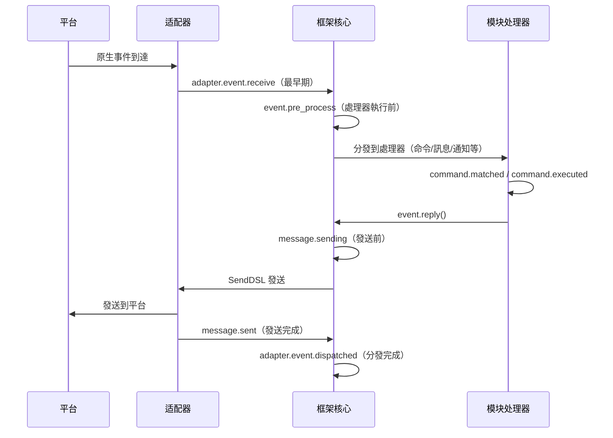

框架內建了以下鈎子斷點，使用者可以透過 `@sdk.lifecycle.on()` 監聽任意斷點來實現自訂邏輯。

### 核心初始化

| 鈎子名稱 | 觸發時機 | 數據 |
|---------|---------|------|
| `core.init.start` | SDK 初始化開始 | `{}` |
| `core.init.complete` | SDK 初始化完成 | `{"duration": float, "success": bool, "adapters": {"enabled": [str], "disabled": [str]}, "modules": {"enabled": [str], "disabled": [str]}, "error": str(僅失敗時)}` |
| `core.uninit.complete` | SDK 反初始化完成 | `{"duration": float, "success": bool, "adapters_closed": int, "modules_unloaded": int, "module_properties_cleared": int, "module_properties_to_clear": [str], "error": str(僅失敗時)}` |

### 配置變更

| 鈎子名稱 | 觸發時機 | 數據 |
|---------|---------|------|
| `config.set` | 配置項被修改 | `{"key": str, "old_value": Any, "new_value": Any}` |
| `config.updated` | 外部編輯 config.toml 後檢測到整樹變更 | `{"old_config": dict, "new_config": dict, "config_file": str}` |

**範例：配置審計**

```python
@sdk.lifecycle.on("config.set")
def audit_config(data):
    print(f"[審計] {data['key']}: {data['old_value']} -> {data['new_value']}")
```

### 模組生命週期

| 鈎子名稱 | 觸發時機 | 數據 |
|---------|---------|------|
| `module.register` | 模組類註冊到管理器 | `{"module_name": str, "success": bool}` |
| `module.load` | 模組載入完成（實例化成功） | `{"module_name": str, "success": bool}` |
| `module.init` | 模組初始化完成（含懶載入） | `{"module_name": str, "success": bool}` |
| `module.unload` | 模組卸載 | `{"module_name": str, "success": bool}` |

### 适配器生命週期

| 鈎子名稱 | 觸發時機 | 數據 |
|---------|---------|------|
| `adapter.load` | 适配器註冊完成 | `{"platform": str, "success": bool}` |
| `adapter.start` | 适配器啟動 | `{"platforms": [str]}` |
| `adapter.status.change` | 适配器狀態變更 | `{"platform": str, "status": str, "retry_count": int, "error": str(僅失敗時)}` |
| `adapter.stop` | 适配器關閉 | `{"platforms": [str]}` |
| `adapter.stopped` | 适配器關閉完成 | `{"platforms": [str]}` |
| `adapter.bot.online` | Bot 上線 | `{"platform": str, "bot_id": str, "info": dict, "status": str}` |
| `adapter.bot.offline` | Bot 下線 | `{"platform": str, "bot_id": str, "status": str}` |

### 事件接收與處理

| 鈎子名稱 | 觸發時機 | 數據 |
|---------|---------|------|
| `adapter.event.receive` | 收到外部平台事件（最早期） | `{"platform": str, "event_type": str, "raw_event_type": str}` |
| `adapter.event.dispatched` | 事件分發完成 | `{"platform": str, "event_type": str, "raw_event_type": str, "onebot_handlers_count": int}` |
| `event.pre_process` | 事件處理器開始執行前 | `{"event_type": str, "platform": str, "detail_type": str}` |

**範例：事件統計**

```python
event_counter = {}

@sdk.lifecycle.on("adapter.event.receive")
def count_events(data):
    platform = data["platform"]
    event_counter[platform] = event_counter.get(platform, 0) + 1

@sdk.lifecycle.on("adapter.event.dispatched")
def log_unhandled(data):
    if data["onebot_handlers_count"] == 0:
        print(f"[未處理] {data['platform']}/{data['event_type']}")
```

### 消息發送

| 鈎子名稱 | 觸發時機 | 數據 |
|---------|---------|------|
| `message.sending` | 消息即將發送 | `{"platform": str, "method": str, "detail_type": str, "target_id": str, "bot_id": str}` |
| `message.sent` | 消息發送完成 | `{"platform": str, "method": str, "detail_type": str, "target_id": str, "bot_id": str}` |

**範例：消息發送審計**

```python
@sdk.lifecycle.on("message.sending")
def log_sending(data):
    print(f"[發送] -> {data['platform']}/{data['detail_type']}/{data['target_id']} via {data['method']}")
```

### 命令系統

| 鈎子名稱 | 觸發時機 | 數據 |
|---------|---------|------|
| `command.matched` | 命令被匹配並即將執行 | `{"command": str, "args": list[str], "platform": str, "user_id": str}` |
| `command.executed` | 命令執行完成 | `{"command": str, "args": list[str], "platform": str, "user_id": str, "success": bool, "error": str(僅失敗時)}` |

**範例：命令統計**

```python
@sdk.lifecycle.on("command.matched")
def count_commands(data):
    print(f"[命令] /{data['command']} from {data['user_id']}@{data['platform']}")
```

### HTTP 路由

| 鈎子名稱 | 觸發時機 | 數據 |
|---------|---------|------|
| `server.request` | HTTP 請求接收 | `{"method": str, "path": str, "client_ip": str}` |
| `server.response` | HTTP 回應發送 | `{"method": str, "path": str, "status_code": int, "client_ip": str}` |

**範例：請求日誌**

```python
@sdk.lifecycle.on("server.response")
def log_http(data):
    print(f"[HTTP] {data['method']} {data['path']} -> {data['status_code']}")
```

### WebSocket

| 鈎子名稱 | 觸發時機 | 數據 |
|---------|---------|------|
| `server.start` | 路由伺服器啟動 | `{"base_url": str, "host": str, "port": int}` |
| `server.stop` | 路由伺服器停止 | `{}` |
| `server.websocket.connect` | WebSocket 連接建立 | `{"path": str, "module_name": str, "client_ip": str}` |
| `server.websocket.disconnect` | WebSocket 連接斷開 | `{"path": str, "module_name": str, "reason": str, "error": str(僅異常時)}` |

**範例：WebSocket 連接監控**

```python
@sdk.lifecycle.on("server.websocket.connect")
def on_ws_connect(data):
    print(f"[WS] 連接: {data['path']} from {data['client_ip']}")

@sdk.lifecycle.on("server.websocket.disconnect")
def on_ws_disconnect(data):
    print(f"[WS] 斷開: {data['path']} ({data['reason']})")

## 標準事件定義

```python
STANDARD_EVENTS = {
    "core": ["init.start", "init.complete", "uninit.complete"],
    "module": ["load", "init", "unload", "register"],
    "adapter": [
        "load", "start", "status.change", "stop", "stopped",
        "event.receive", "event.dispatched",
        "bot.online", "bot.offline",
    ],
    "server": [
        "start", "stop",
        "request", "response",
        "websocket.connect", "websocket.disconnect",
    ],
    "event": ["pre_process"],
    "message": ["sending", "sent"],
    "command": ["matched", "executed"],
    "config": ["set"],
}

## 完整 API 參考

### 註冊與取消

| 方法 | 說明 |
|------|------|
| `@lifecycle.on(event, *, priority=0)` | 裝飾器註冊處理程式 |
| `lifecycle.register(event, handler, *, priority=0)` | 程式化註冊 |
| `lifecycle.unregister(event, handler=None)` | 取消註冊（handler=None 時取消該事件全部處理程式） |

### 觸發

| 方法 | 說明 |
|------|------|
| `await lifecycle.emit(event, data=None)` | 異步觸發，處理程式返回非 None 可修改 data |
| `lifecycle.emit_sync(event, data=None)` | 同步觸發，異步處理程式以 create_task 調度 |
| `await lifecycle.submit_event(event_type, *, source, msg, data)` | 兼容舊版，自動構建標準事件格式 |

### 工具

| 方法 | 說明 |
|------|------|
| `lifecycle.start_timer(timer_id)` | 開始計時 |
| `lifecycle.get_duration(timer_id)` | 獲取已持續時間（秒） |
| `lifecycle.stop_timer(timer_id)` | 停止計時並返回持續時間 |
| `lifecycle.list_hooks()` | 列出所有已註冊鉤子及處理程式數量 |
| `lifecycle.clear()` | 清除所有處理程式和計時器 |

## 模組中使用範例

```python
from ErisPulse.Core.Bases import BaseModule
from ErisPulse import sdk

class Main(BaseModule):
    async def on_load(self, event):
        # 實現簡單的訊息統計
        self.msg_count = 0
        
        @sdk.lifecycle.on("adapter.event.receive")
        async def count(data):
            if data["event_type"] == "message":
                self.msg_count += 1
        
        # 監控所有命令
        @sdk.lifecycle.on("command.matched")
        async def log_cmd(data):
            sdk.logger.info(f"命令執行: /{data['command']} by {data['user_id']}")
        
        # 配置變更審計
        @sdk.lifecycle.on("config.set")
        def audit(data):
            sdk.logger.info(f"配置變更: {data['key']} = {data['new_value']}")
```

重要：路徑替換規則  
- 將文件連結中的 `docs/zh-TW/` 替換為 `docs/zh-TW/`  
- 例如：`docs/zh-TW/quick-start.md` 應改為 `docs/zh-TW/quick-start.md`  
- 對於指向非目前語言版本文件的連結（如 `README.xx.md` 形式的連結），保持原樣不要修改  
- 這確保連結指向正確語言的文件版本

## 後台任務歸屬與自動取消

> [!NOTE]  
> 本特性需要 ErisPulse **2.8.0+**。

模組建立的 asyncio 後台任務如果未在 `on_unload` 中取消，會持有 `self` 引用導致模組實例無法被回收（熱重載後舊實例殘留）。框架提供以下兜底機制：

- **`self.spawn(coro)`**（模組內推薦）：任務自動歸屬模組名，模組卸載時框架在 `on_unload` **之後**兜底取消未結束的任務並記錄警告
- **`spawn_background(coro)`**（`ErisPulse.runtime`）：自動捕獲當前 `owner_scope` 上下文；`cancel_owner_tasks(owner)` 按歸屬取消，`cancel_all_background_tasks()` 供 `sdk.uninit()` 兜底
- **適配器**：關閉時對平台名下的後台任務同樣兜底取消

```python
async def on_load(self, event):
    # 推薦：後台任務用 self.spawn()，卸載時框架自動兜底取消
    self.spawn(self._poll())

async def on_unload(self, event):
    # 精細控制的場景仍建議自行取消並等待收尾
    if self._poll_task:
        self._poll_task.cancel()
        await asyncio.gather(self._poll_task, return_exceptions=True)

async def _poll(self):
    while True:
        await asyncio.sleep(60)
        ...
```

> [!IMPORTANT]  
> 框架兜底是**強制 cancel**（`cancel_owner_tasks`），它發生在 `on_unload` 返回之後。因此需要優雅收尾的任務（flush 缓衝、持久化狀態、關閉連接）**必須**在 `on_unload` 裡自行 `cancel()` + `await` 完成——別指望兜底能保留收尾邏輯。框架只保證「不殘留持有 `self` 的任務」，不保證「優雅」。需要 `await` 結果的任務請直接 `await`，不要丟給後台任務。

## 注意事項

1. **處理程序可以是同步或非同步**：系統會自動識別並正確調用
2. **數據傳遞**：在 `emit()` 模式下，處理程序返回非 None 值會修改傳遞給後續處理程序的 data
3. **事件命名規範**：建議使用點式結構命名事件，便於使用父級監聽
4. **錯誤隔離**：單個處理程序異常不會影響其他處理程序執行
5. **同步觸發限制**：`emit_sync()` 中非同步處理程序以 fire-and-forget 方式調度，返回值無法回傳
6. **生命週期清理**：呼叫 `sdk.uninit()` 時，所有已註冊的處理程序和計時器會被清理
7. **加載優先性**：如需在框架初始化階段就監聽事件，建議設定高優先級並禁用懶加載

請直接返回翻譯後的完整Markdown內容，不要包含任何其他文字。

再次提醒：如果文件包含語言切換行（各語言名稱用 `` | `` 分隔的行），務必嚴格遵守上方第8條的格式要求，不要寫出 ``[**Label**](file)`` 這類錯誤格式。

## 相關文件

- [模組開發指南](../developer-guide/modules/getting-started.md) - 了解模組生命週期方法
- [最佳實踐](../developer-guide/modules/best-practices.md) - 生命週期事件使用建議


### 懶加载系统

# 慢載模組系統

ErisPulse SDK 提供了強大的慢載模組系統，允許模組在實際需要時才進行初始化，從而顯著提升應用啟動速度和記憶體效率。

請直接返回翻譯後的完整 Markdown 內容，不要包含任何其他文字。

再次提醒：如果文件包含語言切換行（各語言名稱用 `` | `` 分隔的行），請務必嚴格遵守上方第8條的格式要求，不要寫出 ``[**Label**](file)`` 這類錯誤格式。

## 概述

懶加載模組系統是 ErisPulse 的核心特性之一，它透過以下方式運作：

- **延遲初始化**：模組只有在第一次被存取時才會實際載入和初始化
- **透明使用**：對開發者來說，懶加載模組與一般模組在使用上幾乎沒有差別
- **自動依賴管理**：模組的依賴會在被使用時自動初始化
- **生命週期支援**：對於繼承自 `BaseModule` 的模組，會自動呼叫生命週期方法

請直接返回翻譯後的完整 Markdown 內容，不要包含任何其他文字。

再次提醒：如果文件包含語言切換行（各語言名稱用 `` | `` 分隔的行），務必嚴格遵守上方第8條的格式要求，不要寫出 ``[**Label**](file)`` 這類錯誤格式。

## 工作原理

### LazyModule 類

懶加載系統的核心是 `LazyModule` 類，它是一個包裝器，在第一次存取時才實際初始化模組。

### 初始化過程

當模組首次被存取時，`LazyModule` 會執行以下操作：

1. 獲取模組類的 `__init__` 參數資訊
2. 根據參數決定是否傳入 `sdk` 引用
3. 設定模組的 `moduleInfo` 屬性
4. 對於繼承自 `BaseModule` 的模組，呼叫 `on_load` 方法
5. 觸發 `module.init` 生命週期事件

## 事件驅動懶激活（activate_on）

> [!NOTE]  
> 本特性需要 ErisPulse **2.8.0+**。

`lazy_load=True` 的模組預設只在**首次屬性存取**時載入。若模組註冊了命令/事件處理器，  
傳統做法只能 `lazy_load=False` 立即載入。`activate_on` 提供了第三種選擇：**宣告觸發器，  
首個匹配事件/命令到達時自動激活模組**——既不常駐記憶體，又不遺失觸發入口。

```python
from ErisPulse.loaders import ModuleLoadStrategy

class MyModule(BaseModule):
    @staticmethod
    def get_load_strategy():
        return ModuleLoadStrategy(
            lazy_load=True,
            activate_on=[
                # ---- 事件觸發（被動到達，無需使用者感知）----
                "message",                                    # 類型級：任何訊息事件
                {"notice": "group_member_increase"},          # 類型 + 單個 detail_type
                {"message": ["private", "group"]},            # 類型 + 多個 detail_type

                # ---- 命令觸發（主動輸入，佔位命令對 Help 可見）----
                {"command": "roll"},                          # 簡寫：命令名
                {"command": ["roll", "dice"]},                # 命令名列表
                {"command": {                                 # dict 聲明（name 必填）
                    "name": "dice",
                    "help": "擲一個骰子",
                    "usage": "/dice",
                    "group": "娛樂",
                    "aliases": ["d"],
                    "hidden": False,
                }},
            ],
        )
```

### 命令 dict 聲明參數

dict 形式鏡像 `@command()` 裝飾器的使用者級參數，用於在模組載入前就註冊佔位命令：

| 參數 | 類型 | 預設 | 說明 |
|------|------|------|------|
| `name` | `str` | **必填** | 命令名；須與 `on_load` 中 `@command(name)` 一致，否則激活後佔位註銷、命令不存在 |
| `help` | `str` | 回退鏈 | Help 中顯示的介紹；未聲明時按回退鏈取值（見下） |
| `usage` | `str` | 自动生成 | 用法行，預設 `{prefix}{name}` |
| `group` | `str` | `None` | 命令分組 |
| `aliases` | `list[str]` | `[]` | 別名同時註冊，**輸入別名同樣觸發激活** |
| `hidden` | `bool` | `False` | `True` 時佔位命令同樣隱藏（與激活後真實命令的隱藏語意對齊）；知道命令名的使用者輸入仍可觸發 |

**不支援** `priority` / `permission` / `master`：佔位命令的使命只是觸發激活，  
權限檢查由激活後的真實命令執行（佔位階段攔截權限反而會讓「輸入命令激活」失效）。

### 佔位命令 help 回退鏈

模組未載入時 Help 顯示的命令介紹，按以下順序取值（取到即止）：

1. dict 聲明的命令級 `help`（最精確）  
2. 模組 `get_meta()` 的 `description`  
3. 模組 `__description__` 屬性  
4. 包元數據的 `Summary`（PyPI 包簡介）  
5. 通用提示：「此命令來自懶載入模組 X，首次使用將自動載入該模組」

### 觸發語意

- **事件 stub**：以極低優先級（`ACTIVATION_STUB_PRIORITY`）註冊到對應事件管理器，  
  在所有普通處理器之後兜底觸發；激活後將當前事件轉發給模組的真實處理器
- **命令 stub**：註冊佔位命令；激活後佔位註銷、真實命令接管當次觸發
- **防重入**：`asyncio.Lock` 保證併發觸發下只激活一次
- **作用域過濾**：stub 帶模組 owner 身份，模組未對該 Bot / 會話 / 平台啟用時不觸發
- **失敗語意**：激活失敗不重試，stub 一併註銷
- **去重**：同名命令以簡寫 + dict 混合聲明時去重（dict 优先）；dict 缺 `name`  
  或事件 `detail_type` 誤寫 dict 時告警並忽略

> 架構圖與完整語意詳見 [架構概覽](../architecture.md#事件驅動懶激活activate_on觸發架構)。

## 配置懶加載

### 全域配置

在設定檔中啟用/停用全域懶加載：

```toml
[ErisPulse.framework]
enable_lazy_loading = true  # true=啟用懶加載(預設值)，false=停用懶加載
```

### 模組層級控制

模組可以透過實作 `get_load_strategy()` 靜態方法來控制加載策略：

```python
from ErisPulse.Core.Bases import BaseModule
from ErisPulse.loaders import ModuleLoadStrategy

class MyModule(BaseModule):
    @staticmethod
    def get_load_strategy():
        """傳回模組加載策略"""
        return ModuleLoadStrategy(
            lazy_load=False,  # 傳回 False 表示立即加載
            priority=100      # 加載優先級，數值越大優先級越高
        )

## 使用 Lazy-Loaded 模組

### 基本用法

對於開發者來說，Lazy-Loaded 模組與一般模組在使用上幾乎沒有差異：

```python
# 透過 SDK 訪問 Lazy-Loaded 模組
from ErisPulse import sdk

# 以下訪問會觸發模組 Lazy-Loading
result = await sdk.my_module.my_method()
```

### 統一的模組獲取入口

無論是透過 SDK 屬性、模組管理器屬性，還是透過 `module.get()` 查詢，
對於「已註冊但尚未載入」的 Lazy-Loaded 模組，都會返回同一個 Lazy-Loaded 代理，只有在訪問其屬性時才會真正觸發初始化：

```python
# 三種方式拿到的都是 Lazy-Loaded 代理（在模組未載入時），行為一致且對使用者透明
sdk.my_module          # 觸發載入的入口
sdk.module.my_module   # 同樣返回 Lazy-Loaded 代理
sdk.module.get("my_module")  # 也返回 Lazy-Loaded 代理，本身不會觸發載入

# 訪問代理的任意屬性才會真正初始化模組
result = await sdk.my_module.my_method()
```

`module.get()` 是**查詢**介面，本身不觸發載入：
- 模組已載入 → 返回真實實例
- 模組已註冊但未載入 → 返回 Lazy-Loaded 代理（訪問屬性才初始化）
- 模組未註冊 → 返回 `None`

如需顯式觸發載入，請使用 `await sdk.load_module("my_module")`。

### 異步初始化

對於需要異步初始化的模組，建議先顯式載入：

```python
# 先顯式載入模組
await sdk.load_module("my_module")

# 然後使用模組
result = await sdk.my_module.my_method()
```

### 同步初始化

對於不需要異步初始化的模組，可以直接訪問：

```python
# 直接訪問會自動同步初始化
result = sdk.my_module.some_sync_method()

## 最佳實踐

選擇載入策略時，可參考以下決策流程：

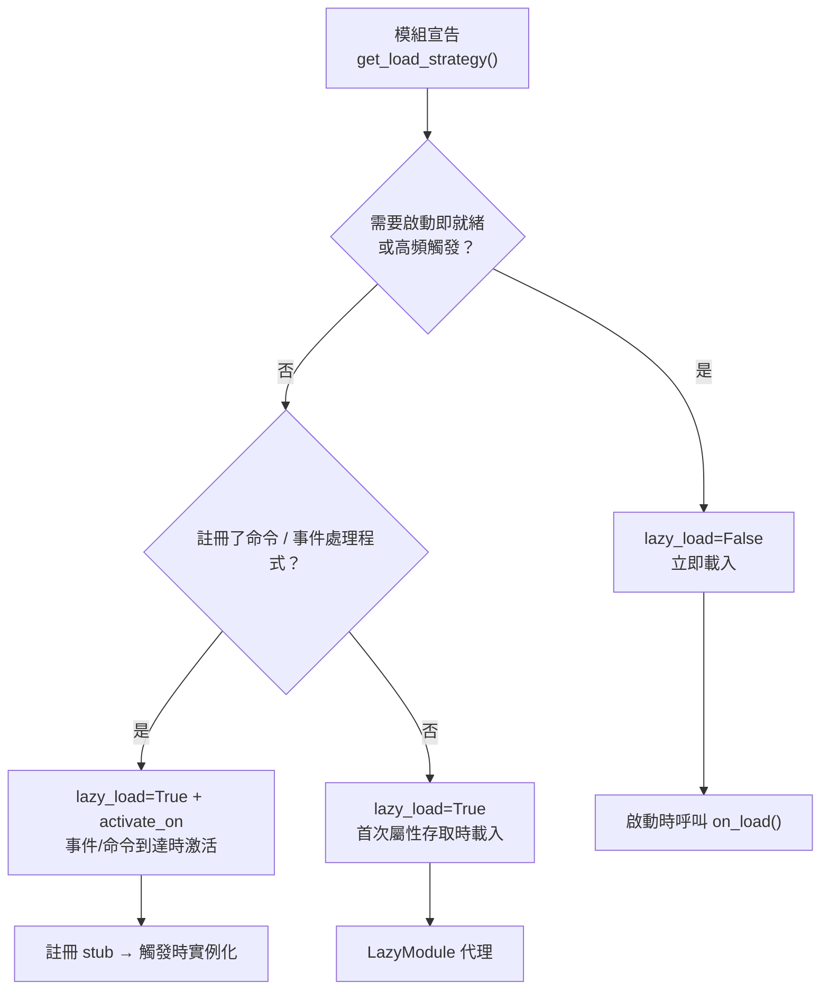

### 推薦使用懶載入的場景（lazy_load=True）

- 被動呼叫的工具類（如資料查詢模組、格式轉換器等，僅在其他模組呼叫時才需要）
- 註冊命令/事件處理程式但非高頻使用的模組——配合 `activate_on` 聲明觸發器，首個匹配事件/命令到達時自動激活，無需放棄懶載入

### 推薦禁用懶載入的場景（lazy_load=False）

- 需要在啟動時立即就緒的模組（如為其它模組提供基礎服務的核心模組）
- 高頻觸發的監聽器（每條訊息都要處理）——`activate_on` 轉發有一次激活開銷，高頻場景立即載入更直接
- 定時任務模組
- 需要在應用啟動時就初始化的模組

> `priority` 參數控制立即載入模組間的初始化順序，數值越大越先初始化。同優先級的模組按註冊順序載入。

請直接返回翻譯後的完整Markdown內容，不要包含任何其他文字。

## 注意事項

1. 如果您的模組使用了懶加載，如果其他模組從未在 ErisPulse 內被呼叫過，則您的模組永遠不會被初始化。
2. 如果您的模組中包含了例如監聽 Event 的模組，或其它主動監聽類似模組，有兩種選擇：宣告 `activate_on` 觸發器（保持懶加載，事件到達時自動激活），或宣告需要立即被加載（`lazy_load=False`），否則會影響您模組的正常業務。
3. 我們不建議您禁用懶加載，除非有特殊需求，否則它可能為您帶來例如依賴管理和生命週期事件等的問題。
4. 在 `activate_on` 的命令 dict 聲明中，`name` 必須與模組 `on_load` 中 `@command()` 註冊的真實命令名一致——否則模組激活後占位命令註銷，宣告與實現不一致的命令將不存在。

請直接返回翻譯後的完整 Markdown 內容，不要包含任何其他文字。

再次提醒：如果文件包含語言切換行（各語言名稱用 `` | `` 分隔的行），請務必嚴格遵守上方第 8 條的格式要求，不要寫出 ``[**Label**](file)`` 這類錯誤格式。

## 相關文件

- [模組開發指南](../developer-guide/modules/getting-started.md) - 學習開發模組
- [最佳實務](../developer-guide/modules/best-practices.md) - 瞭解更多最佳實務


### 国际化（i18n）系统

# 國際化 (i18n) 系統

ErisPulse v2.5.0 起內建了完整的國際化支援。框架核心及 CLI 界面均可根據您的系統語言自動切換顯示文字，也支援外部模組註冊自己的翻譯。

請直接返回翻譯後的完整 Markdown 內容，不要包含任何其他文字。

再次提醒：如果文件包含語言切換行（各語言名稱用 `` | `` 分隔的行），務必嚴格遵守上方第 8 條的格式要求，不要寫出 ``[**標籤**](file)`` 這類錯誤格式。

## 支援的語言

| 語言 | 代碼 | 說明 |
|------|------|------|
| 簡體中文 | `zh-CN` | 預設語言（框架原生語言） |
| 繁體中文 | `zh-TW` | 繁體中文（香港/澳門/臺灣） |
| English | `en` | 英文（通用回退語言） |
| 日本語 | `ja` | 日文 |
| Русский | `ru` | 俄文 |

## 快速體驗

### 透過環境變數切換

```bash
# Windows PowerShell
$env:ERISPULSE_LANG = "en"
epsdk run

# macOS / Linux
ERISPULSE_LANG=ja epsdk run
```

### 透過設定檔案切換

在 `config/config.toml` 中新增：

```toml
[ErisPulse.i18n]
language = "zh-TW"
```

設為 `"auto"`（預設值）則自動偵測系統語言。

### 在程式碼中手動切換

```python
from ErisPulse import i18n

# 手動設定語言
i18n.set_language("en")
print(i18n.get_language())  # "en"

# 重設為自動偵測
i18n.reset_language()
```

---

## 語言檢測機制

框架按照以下優先級檢測使用者語言：

1. **環境變數 `ERISPULSE_LANG`** — 最高優先級，用於測試和暫時切換
2. **Windows API** — `GetUserDefaultLocaleName`（僅 Windows，不受 Git Bash 等工具覆蓋 `LANG` 的影響）
3. **環境變數** — `LANGUAGE` > `LC_ALL` > `LC_MESSAGES` > `LANG`（Unix/macOS 標準）
4. **系統 Locale** — `locale.getlocale()` / `locale.getdefaultlocale()`
5. **兜底** — en（英文）

### 就近映射原則

當檢測到的語言不是精確匹配時，按就近原則映射到支援的語言：

- `zh-TW`, `zh-HK`, `zh-MO`, `zh-Hant` → **繁體中文**
- 其他所有 `zh-*`（如 `zh-CN`, `zh-SG`）→ **簡體中文**
- `en-US`, `en-GB`, `en-AU` 等 → **英文**
- `ja-JP` → **日文**
- `ru-RU` → **俄文**
- 其他未識別語言 → **簡體中文（兜底）**

---

請直接返回翻譯後的完整 Markdown 內容，不要包含任何其他文字。

再次提醒：如果文件包含語言切換行（各語言名稱用 `` | `` 分隔的行），務必嚴格遵守上方第 8 條的格式要求，不要寫出 ``[**Label**](file)`` 這類錯誤格式。

## 在模組中使用 i18n

您可以為自己的模組註冊翻譯文字，讓您的模組也支援多語言。

### 推薦寫法：透過 I18nClass 宣告翻譯鍵（v2.7.0+）

從 v2.7.0 起，模組/適配器可以像宣告 `ConfigClass` 一樣，透過巢狀類 `I18nClass` 宣告翻譯鍵。框架會在載入時**自動註冊**所有宣告的翻譯鍵，無需手動呼叫 `i18n.register()`。

```python
from dataclasses import dataclass, field

from ErisPulse.Core.Bases import BaseConfig, BaseI18n, BaseModule, I18nKey


class MyModule(BaseModule):
    # 設定類別（選用）
    @dataclass
    class ConfigClass(BaseConfig):
        welcome_msg: str = field(
            default="歡迎",
            metadata={
                # 這裡引用了 i18n 鍵 mymodule.welcome_msg
                "description": {"i18n": "mymodule.welcome_msg", "default": "歡迎訊息"},
            },
        )

    # 翻譯鍵集合類別（選用）
    # 宣告的鍵會被框架自動註冊，優先順序早於 ConfigClass 產生預設設定
    class I18nClass(BaseI18n):
        # 屬性名自動拼接為完整鍵路徑：<模組名>.<屬性名>
        welcome_msg: I18nKey = I18nKey(
            default="Welcome Message",   # 語言無關的兜底，不註冊到任何語言
            zh_CN="歡迎訊息",
            en="Welcome Message",
            ja="ウェルカムメッセージ",
            ru="Приветственное сообщение",
            zh_TW="歡迎訊息",
        )
        # 業務用到的其他翻譯鍵
        hello: I18nKey = I18nKey(
            default="Hello, {name}!",
            zh_CN="你好，{name}！",
            zh_TW="你好，{name}！",
            en="Hello, {name}!",
            ja="こんにちは、{name}！",
            ru="Привет, {name}!",
        )

        # 也可以顯式指定完整鍵路徑（不使用屬性名拼接）
        custom: I18nKey = I18nKey(
            key="mymodule.deep.nested.key",
            default="Default text",
            zh_CN="預設文字",
            zh_TW="預設文本",
            en="Default text",
            ja="デフォルトテキスト",
            ru="Текст по умолчанию",
        )
```

#### 為什麼推薦 I18nClass？

| 場景 | 手動 i18n.register() | I18nClass 宣告式 |
|------|-----------------------|------------------|
| 設定描述引用的 i18n 鍵 | 需手動註冊，且要趕在設定產生前 | 框架自動在設定產生前註冊 |
| 多語言翻譯宣告 | 散落在各個 on_load() 中 | 集中在類別裡，一目了然 |
| 鍵名命名一致性 | 容易拼寫錯誤 | 屬性名作為鍵名後綴，IDE 可補全 |
| 卸載時清理 | 需手動 unregister_domain() | 框架使用統一 domain 註冊 |

#### I18nClass 的鍵路徑規則

- **預設**：使用 ``<模組註冊名>.<屬性名>`` 作為完整鍵路徑
  - 範例：模組名為 ``MyModule``，屬性 ``welcome`` → 鍵路徑 ``MyModule.welcome``
- **顯式**：透過 ``I18nKey(key="...")`` 參數指定任意點分路徑
  - 適合深層巢狀的鍵名（如 ``mymodule.config.basic.token``）

#### 在適配器中使用

適配器同樣支援 `I18nClass`，使用方式完全一致：

```python
from ErisPulse.Core import BaseAdapter
from ErisPulse.Core.Bases import BaseConfig, BaseI18n, I18nKey


class MyAdapter(BaseAdapter):
    @dataclass
    class ConfigClass(BaseConfig):
        endpoint: str = field(
            default="",
            metadata={
                # 設定描述引用了 adapter.MyAdapter.endpoint 鍵
                "description": {"i18n": "MyAdapter.endpoint", "default": "API 位址"},
            },
        )

    class I18nClass(BaseI18n):
        # 集中宣告設定描述引用的鍵與其他業務鍵的多語言譯文
        endpoint: I18nKey = I18nKey(
            default="API Endpoint",
            zh_CN="API 位址",
            zh_TW="API 位址",
            en="API Endpoint",
            ja="APIアドレス",
            ru="API адрес",
        )
```

適配器的 `I18nClass` 會在 `__init__` 階段（即設定範本產生之前）自動註冊，確保設定描述引用的 i18n 鍵已可用。

### 手動註冊自訂翻譯（舊寫法）

如果不使用 `I18nClass`，也可以直接呼叫 `i18n.register()` 註冊翻譯文字。

```python
from ErisPulse import i18n

# 註冊中文翻譯
i18n.register("zh-CN", {
    "my_module.welcome": "歡迎使用我的模組！",
    "my_module.goodbye": "再見！",
    "my_module.hello": "你好，{name}！",
}, domain="my_module")

# 註冊英文翻譯
i18n.register("en", {
    "my_module.welcome": "Welcome to my module!",
    "my_module.goodbye": "Goodbye!",
    "my_module.hello": "Hello, {name}!",
}, domain="my_module")
```

### 使用翻譯

```python
from ErisPulse import i18n

# 簡單翻譯
i18n.t("my_module.welcome")  # 自動使用目前語言

# 帶格式化參數
i18n.t("my_module.hello", name="Alice")

# 指定預設值（翻譯鍵不存在時傳回）
i18n.t("my_module.unknown_key", default="預設文本")
```

### 在模組類別中使用

```python
from dataclasses import dataclass, field
from ErisPulse import i18n
from ErisPulse.Core.Bases import BaseConfig, BaseModule

@dataclass
class MyModuleConfig(BaseConfig):
    welcome_msg: str = field(
        default="歡迎",
        metadata={
            "description": {"i18n": "my_module.welcome_msg", "default": "歡迎訊息"},
            "ui": {"widget": "text", "group": "basic", "order": 1},
        },
    )

class MyModule(BaseModule):
    ConfigClass = MyModuleConfig

    async def on_load(self, event):
        # 即時讀取設定（每次存取都反映最新值）
        self.logger.info(self.cfg.welcome_msg)
        self.logger.info(i18n.t("my_module.welcome"))

    @command("hello")
    async def hello_handler(self, event):
        name = event.get_user_nickname() or "friend"
        await event.reply(i18n.t("my_module.hello", name=name))

    async def on_unload(self, event):
        pass
```

### 卸載翻譯

```python
# 卸載整個域的翻譯
i18n.unregister_domain("my_module")
```

---

請直接傳回翻譯後的完整 Markdown 內容，不要包含任何其他文字。

再次提醒：如果文件包含語言切換行（各語言名稱用 `` | `` 分隔的行），務必嚴格遵守上方第 8 條的格式要求，不要寫出 ``[**Label**](file)`` 這類錯誤格式。

## 配置欄位多語言

從 v2.5.2 起，配置 Schema 全面支援 i18n。所有用戶可見的文字欄位均可引用 i18n 鍵，WebUI 和其他消費者會自動根據當前語言解析為對應文字。

### 支援的 i18n 欄位

| 欄位 | 位置 | 說明 |
|------|------|------|
| `description` | field metadata | 欄位描述 |
| `options[].label` | `ui.options` | select 控件選項標籤 |
| `placeholder` | `ui.placeholder` | 輸入框佔位符 |
| `group_labels` | `_schema_meta` | 分組顯示名（Dashboard 區域標題） |

統一採用 `{"i18n": "key", "default": "文本"}` 格式，純字串則原樣透傳（向後相容）。

### 宣告 i18n 欄位

所有用戶可見文字欄位都支援 i18n：

```python
from dataclasses import dataclass, field
from ErisPulse.Core.Bases import BaseConfig

@dataclass
class MyAdapterConfig(BaseConfig):
    # description i18n
    token: str = field(
        default="",
        metadata={
            "description": {"i18n": "my_adapter.token", "default": "平台 Token"},
            "required": True,
            "secret": True,
            "ui": {
                "widget": "password",
                "group": "basic",
                "order": 1,
                # placeholder i18n
                "placeholder": {"i18n": "my_adapter.token.ph", "default": "請輸入 Token"},
            },
        },
    )
    # options label i18n
    mode: str = field(
        default="a",
        metadata={
            "description": {"i18n": "my_adapter.mode", "default": "運行模式"},
            "ui": {
                "widget": "select",
                "group": "basic",
                "order": 2,
                "options": [
                    {"label": {"i18n": "my_adapter.mode.a", "default": "模式A"}, "value": "a"},
                    {"label": {"i18n": "my_adapter.mode.b", "default": "模式B"}, "value": "b"},
                ],
            },
        },
    )

    # group_labels i18n（分組顯示名）
    _schema_meta = {
        "group_labels": {
            "basic": {"i18n": "my_adapter.group.basic", "default": "基本設定"},
        }
    }
```

`default` 是兜底文本——當翻譯未註冊或查找失敗時顯示。

### secret 脫敏與配置校驗

標記為 `"secret": True` 的欄位會自動獲得**脫敏保護**（2.7.0 起）：

- **範本生成脫敏**：`dataclass_to_toml_with_comments()` 生成配置範本時，secret 欄位的真實值不會寫入檔案（顯示為空佔位），避免敏感資訊落盤
- **通用脫敏工具**：`redact_secret(value)` 將非空值替換為 `***`，空值原樣返回，可用於日誌輸出等場景

```python
from ErisPulse.Core.Bases.config_schema import redact_secret

redact_secret("sk-xxxxxx")  # '***'
redact_secret("")           # ''
```

**配置校驗**（`validate_config()`）除 `required` 非空檢查外，2.7.0 起支援：

| 校驗項 | 元數據 | 示例 |
|--------|--------|------|
| 類型匹配 | 欄位宣告類型 | `int` 欄位傳入字串報錯 |
| 列舉約束 | `ui.options` 或頂層 `options` | 值必須屬於允許選項 |
| 數值範圍 | 頂層 `min` / `max` | `metadata={"min": 1, "max": 65535}` |

```python
from ErisPulse.Core.Bases.config_schema import validate_config

@dataclass
class C(BaseConfig):
    mode: str = field(default="a", metadata={"ui": {"widget": "select", "options": ["a", "b"]}})
    port: int = field(default=80, metadata={"min": 1, "max": 65535})

errors = validate_config(C(mode="x", port=70000))  # 兩條錯誤：列舉 + 範圍
```

### 註冊配置翻譯

配置欄位的 i18n 鍵和普通翻譯鍵一樣，使用 `i18n.register()` 註冊：

```python
from ErisPulse import i18n

# 註冊中文（與 default 一致，也可以不同）
i18n.register("zh-CN", {
    "my_adapter.token": "平台 Token",
}, domain="my_adapter")

# 註冊英文
i18n.register("en", {
    "my_adapter.token": "Platform Token",
}, domain="my_adapter")
```
> **推薦寫法**：使用 `I18nClass` 宣告翻譯鍵，框架會自動註冊（詳見上文「推薦寫法」章節），
> 無需手動呼叫 `i18n.register()` 或 `register_config_i18n()`。

也提供了便捷函數 `register_config_i18n()`，可自動從配置類提取鍵並註冊：

```python
from ErisPulse.Core.Bases.config_schema import register_config_i18n

# 自動提取 description.default 作為 zh-CN 翻譯
register_config_i18n(MyAdapterConfig, "zh-CN")

# 手動提供英文翻譯
register_config_i18n(MyAdapterConfig, "en", {
    "my_adapter.token": "Platform Token",
})
```

### WebUI 如何消費

`get_config_schema()` 返回的 schema 中，i18n 字典會原樣透傳。WebUI 前端可以根據當前語言呼叫 `i18n.t()` 解析。

如果需要服務端直接解析為字串（如返回給不支援 i18n 的前端），使用 `resolve_config_schema()`，它會將 `description`、`options[].label`、`placeholder`、`group_labels` 全部解析為當前語言的文字：

```python
from ErisPulse.Core.Bases.config_schema import resolve_config_schema

# 所有 i18n 欄位已解析為當前語言的字串
schema = resolve_config_schema(MyAdapterConfig)
print(schema["fields"]["token"]["description"])    # "平台 Token" 或 "Platform Token"
print(schema["fields"]["token"]["placeholder"])   # "請輸入 Token" 或 "Enter Token"
print(schema["fields"]["mode"]["options"][0]["label"])  # "模式A" 或 "Mode A"
print(schema["group_labels"]["basic"])             # "基本設定" 或 "Basic"
```

> `BaseConfig`、`BotAccountConfig`、`register_config_i18n()`、`resolve_config_schema()`
> 等類型與工具函數的實際定義位於 `ErisPulse.Core.Bases.config_schema`。
> `ErisPulse.runtime.config_schema` 保留為相容性 shim，
> **推薦從 `ErisPulse.Core.Bases` 統一匯入**（i18n 翻譯鍵相關類型除外，
> 它們位於 `ErisPulse.Core.Bases.i18n_schema`）。

請直接返回翻譯後的完整 Markdown 內容，不要包含任何其他文字。

## API 參考

### I18nManager

#### 核心方法

| 方法 | 說明 |
|------|------|
| `t(key, default=None, **kwargs)` | 取得翻譯文字（`gettext()` 是別名） |
| `set_language(lang)` | 手動設定語言 |
| `get_language()` | 取得目前語言 |
| `reset_language()` | 重設為自動偵測（並重新偵測環境） |
| `get_supported_languages()` | 取得所有支援的語言列表 |
| `has_translation(key, lang=None)` | 檢查翻譯鍵是否存在 |
| `register(lang, translations, domain)` | 註冊自訂翻譯 |
| `unregister_domain(domain)` | 解除安裝指定網域的所有翻譯 |
| `reload()` | 重新載入內建翻譯並重新偵測語言 |

#### `t()` 方法詳解

```python
def t(self, key, /, default=None, **kwargs):
```

- `key` — 翻譯鍵（僅位置參數，不與 `**kwargs` 中的 `key=` 衝突）
- `default` — 翻譯不存在時返回的預設值，預設為 `None`（返回鍵名本身）
- `**kwargs` — 格式化參數，用於填入翻譯值中的 `{placeholder}`

範例：

```python
# 翻譯定義: "greeting": "你好，{name}！歡迎來到{place}。"
i18n.t("greeting", name="Alice", place="ErisPulse")
# 返回: "你好，Alice！歡迎來到ErisPulse。"
```

### BaseI18n / I18nKey（宣告式翻譯鍵）

從 v2.7.0 起，`ErisPulse.Core.Bases` 提供了基於類別屬性的翻譯鍵宣告工具（推薦從 `ErisPulse.Core.Bases` 統一匯入）：

> ``I18nKey.default`` 是**語言無關的兜底文字**，不會註冊到任何語言。
> 要讓翻譯生效，必須顯式傳入至少一個語言參數（``zh_CN=`` / ``en=`` / ``ja=`` 等）。
> 這樣各國開發者可以自由使用自己母語填寫 ``default``，框架不做任何假設。

| 名稱 | 說明 |
|------|------|
| `I18nKey(default, *, key=None, zh_CN, zh_TW, en, ja, ru)` | 單個翻譯鍵宣告，`default` 為語言無關的兜底 |
| `BaseI18n` | 翻譯鍵集合基底類別（命名對齊 `BaseConfig`），子類別以類別屬性宣告多個 `I18nKey` |
| `BaseI18n.register(prefix="", domain="app")` | 類別方法：將所有宣告的鍵註冊到 i18n系統 |
| `key` | `I18nKey` 的別名（書寫更簡潔） |

使用範例：

```python
from ErisPulse.Core.Bases import BaseI18n, key

class MyKeys(BaseI18n):
    # 簡潔別名寫法
    hello = key(
        default="Hello",
        zh_CN="你好",
        zh_TW="你好",
        en="Hello",
        ja="こんにちは",
        ru="Привет",
    )
    bye = key(
        default="Bye",
        zh_CN="再見",
        zh_TW="再見",
        en="Bye",
        ja="さようなら",
        ru="До свидания",
    )

# 獨立使用（手動註冊）
MyKeys.register(prefix="myapp.", domain="myapp")
```

### 從 SDK 實例存取

```python
from ErisPulse import sdk

# sdk.i18n 與直接匯入的 i18n 是同一個物件
sdk.i18n.set_language("en")
print(sdk.i18n.t("core.sdk.init.starting"))
```

---

## 執行階段設定

### 使用設定 API 讀取 i18n 設定

```python
from ErisPulse.Core.Bases import I18nConfig
from ErisPulse.runtime import get_i18n_config

config = get_i18n_config()
print(config["language"])  # "auto" 或具體語言代碼

# I18nConfig 是 dataclass，可用於生成設定範本
schema = I18nConfig.__dataclass_fields__
```

### 設定項目說明

在 `config/config.toml` 的 `[ErisPulse.i18n]` 部分：

```toml
[ErisPulse.i18n]
# 顯示語言，可選值:
# - "auto"      — 自動偵測系統語言（預設）
# - "zh-CN"     — 簡體中文
# - "zh-TW"     — 繁體中文
# - "en"        — 英文
# - "ja"        — 日文
# - "ru"        — 俄文
language = "auto"
```

---

## 最佳實踐

### 翻譯鍵命名

建議使用點號分隔的命名空間格式：

```
<模組名>.<類別>.<描述>
```

例如：`my_module.command.hello_desc`、`core.adapter.start_failed`

### 多語言覆蓋

不必一次提供所有語言的翻譯，缺失的語言會自動回退到英文，如果英文也沒有則顯示鍵名本身。

### 動態內容

對於動態生成的內容（如使用者名稱、數量等），使用 `{placeholder}` 格式化：

```python
# 翻譯定義
"user_count": "目前線上使用者：{count} 人"

# 使用
i18n.t("user_count", count=len(users))
```

### 日誌訊息

如果您的模組使用了框架的 Logger，這些訊息也會自動使用目前語言：

```python
self.logger.info(i18n.t("my_module.startup"))
```

---

## 與 CLI i18n 的關係

CLI 擁有**獨立**的國際化模組（`ErisPulse.CLI.i18n`），與框架核心的國際化模組完全解耦。

- **Core i18n** — 框架核心模組使用，外部模組可註冊翻譯
- **CLI i18n** — 命令行介面內部使用，不與 Core 共享翻譯資料

這種設計確保 CLI 的翻譯變更不會影響框架核心的穩定性。


### 模块作用域系统

# 模組作用域系統

> [!NOTE]
> 本特性需要 ErisPulse **2.8.0+**。

模組作用域系統用於控制「某個 Bot 只能使用哪些模組」，實現多 Bot 場景下的模組隔離。  
預設情況下所有模組對所有 Bot 開放；僅在配置綁定後才開始過濾，**模組與適配器無需任何變動**即可適配。

{!--< tips >!--}
1. 作用域以「適配器平台 + Bot 標識 + 會話標識」為維度綁定模組
2. 支持白名單（`modules`）與黑名單（`blocked`）兩種方式
3. 被作用域禁用的模組收到訊息時靜默忽略，不回覆提示
4. 支援執行時 `sdk.scope.bind()` / `unbind()` 動態增刪，可持久化
{!--< /tips >!--}

請直接返回翻譯後的完整 Markdown 內容，不要包含任何其他文字。

再次提醒：如果文件包含語言切換行（各語言名稱用 `` | `` 分隔的行），務必嚴格遵守上方第8條的格式要求，不要寫出 ``[**Label**](file)`` 這類錯誤格式。

## 工作原理

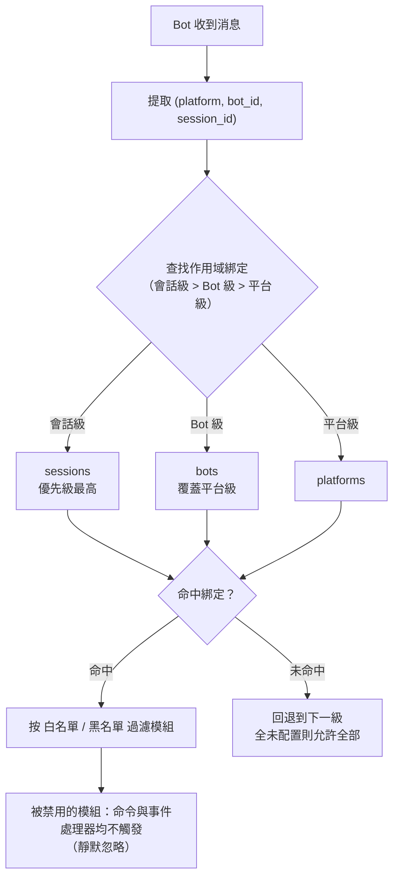

- **解析優先級：會話級 > Bot 級 > 平台級**，更高優先級未綁定規則時回退到下一級；全部未配置則允許全部模組。
- 事件數據缺少 `self`（無法識別 Bot）時，跳過 Bot 級，按會話級 / 平台級判斷。
- 框架層資源（owner 為空的處理器、命令分發器、事件總線）始終放行，不受作用域影響。

## 配置檔案

```toml
[ErisPulse.scope]
default_allow = true        # 預設允許全部（false = 隱式拒絕嚴格模式）
cache_size = 1024           # is_allowed 的 LRU 快取大小

# 平台級別綁定（作用於該平台所有 Bot / 會話）
[ErisPulse.scope.platforms.onebot11]
modules = ["Chat", "Translate"]   # 白名單：該平台 Bot 只能使用這些模組
blocked = ["Danger"]              # 黑名單：這些模組在該平台被禁用

# Bot 級別綁定（作用於該 Bot 的所有會話，覆蓋平台級別）
[ErisPulse.scope.bots.onebot11."123456"]
modules = ["Chat"]
blocked = []

# 會話級別綁定（作用於某個群組 / 頻道 / 私聊，最具體）
[ErisPulse.scope.sessions.onebot11."789012345"]
modules = ["Chat"]                # 該群組只能使用 Chat
blocked = []
```

語意（模組名稱匹配**大小寫不敏感**）：

| 配置 | 效果 |
|------|------|
| 僅 `modules`（白名單） | 只有列出的模組允許使用 |
| 僅 `blocked`（黑名單） | 列出的模組被禁用，其餘全部允許 |
| 兩者都配置 | 白名單限定範圍，白名單內的模組再剔除黑名單 |
| 兩者都為空 / 未配置 | 遵循 `default_allow`：`true`（預設）允許全部；`false` 則隱式拒絕 |

> `modules` 與 `blocked` 均支援字串或字串清單。模組名稱大小寫不敏感（`"Chat"` 與 `"chat"` 等價）。
> 會話識別為事件的群組 ID（`group_id`）、頻道 ID（`channel_id`）或私聊使用者 ID（`user_id`）。
> **會話識別跨平台隔離**：`(platform, session_id)` 組合唯一識別一個會話，`onebot11` 的 `789` 與 `telegram` 的 `789` 互不影響。

## 執行階段 API

### 判斷模組是否允許

```python
from ErisPulse import sdk

# 某個 Bot 是否允許使用某模組
allowed = sdk.scope.is_allowed("onebot11", "123456", "Chat")

# 指定會話（群組 / 頻道 / 私聊）判斷
allowed = sdk.scope.is_allowed("onebot11", "123456", "Chat", "789012345")
```

### 動態綁定 / 解綁

```python
# 綁定 Bot 級白名單（持久化到配置）
sdk.scope.bind("onebot11", "123456", modules=["Chat", "Translate"])

# 綁定會話級白名單（第三參數為 session_id）
sdk.scope.bind("onebot11", "123456", "789012345", modules=["Chat"])

# 綁定平台級黑名單
sdk.scope.bind("onebot11", blocked=["Danger"])

# 僅執行階段生效（重啟失效）
sdk.scope.bind("onebot11", "123456", modules=["Chat"], persist=False)

# 合併而非取代：把 Music 併入現有白名單（預設 bind 是取代）
sdk.scope.bind("onebot11", "123456", modules=["Music"], merge=True)

# 移除綁定（恢復允許全部）；可指定 session_id 移除會話級綁定
sdk.scope.unbind("onebot11", "123456")
sdk.scope.unbind("onebot11", "123456", "789012345")
```

> `bind()` 預設**取代**該目標的整個綁定；`merge=True` 時將新模組/停用併入現有綁定。

### 查詢綁定

```python
# 取得生效綁定（可指定會話）
sdk.scope.get("onebot11", "123456")              # {"modules": ["Chat"], "blocked": []}
sdk.scope.get("onebot11", "123456", "789012345") # 會話級生效綁定
sdk.scope.get("onebot11")                        # 平台級綁定，無則 None

# 列出全部綁定（platforms / bots / sessions 三桶）
sdk.scope.list_bindings()
```

### 過濾統計（偵錯）

```python
# 查看被作用域靜默過濾的次數與快取命中情況
sdk.scope.get_stats()
# {"is_allowed_calls": 10, "filtered_count": 3, "cache_hits": 5, "cache_misses": 5}

sdk.scope.reset_stats()
```

### 拓撲樹資料

```python
# 作用域部分（供 Dashboard 展示）
sdk.scope.get_topology()

## 常見問題與注意事項

### 1. 配置層級

解析優先級：**會話級 > Bot 級 > 平台級**。高優先級綁定會**整體覆蓋**低優先級。

```toml
# 平台級只允許 Chat
[ErisPulse.scope.platforms.onebot11]
modules = ["Chat"]

# 但 Bot 級只允許 Music → 該 Bot 最終只能用 Music，不能用 Chat！
[ErisPulse.scope.bots.onebot11."123456"]
modules = ["Music"]
```

- 想「平台級允許 Chat，Bot 級再加 Music」，必須在 **Bot 級同時列出兩者**：`modules = ["Chat", "Music"]`。
- 同理，底層黑名單會被上層白名單覆蓋：平台級 `blocked=["Danger"]` + Bot 級 `modules=["Danger"]` → Bot 級整體覆蓋，Danger 可用。層級越高、越具體，越以它為準。

### 2. 它是「逐事件」判斷，不會「粘住」

作用域判斷**只針對當前這一條事件**，不跨事件記憶：
- 會話 g1 禁用了模組 A → 在 g1 的**這條**訊息 A 不觸發；**下一條**訊息獨立重新判斷，若綁定沒變仍不觸發，綁定改了立即生效（LRU 快取會自動失效）。
- 會話 g2 沒配綁定 → 回退到 Bot 級 / 平台級判斷；都沒有則按 `default_allow`。

### 3. 模組沒反應

當你發了訊息模組卻沒反應，先懷疑作用域而不是模組/適配器：

```python
# 在模組代碼或臨時腳本裡加一行定位
from ErisPulse import sdk
print(sdk.scope.is_allowed(event.get_platform(), <bot_id>, "MyModule", <session_id>))
print(sdk.scope.get_stats())          # filtered_count > 0 說明確實被過濾了
```

被過濾是**靜默**的（不回覆，避免暴露作用域規則給用戶），但 `filtered_count` 會累計。

### 4. 會話識別碼跨平台隔離

`(platform, session_id)` 組合才是唯一識別碼。`[ErisPulse.scope.sessions.onebot11."789"]` 只作用於 onebot11 平台，不影響 telegram 上同為 `789` 的會話。

### 5. 效能

`is_allowed()` 結果帶 **LRU 快取**（預設 1024 條，`scope.cache_size` 可調），
配置變更 / `bind()` / `unbind()` 自動失效，高頻事件路徑開銷極小。

## 拓撲樹 API

`ModuleManager.get_topology()` 與 `AdapterManager.get_topology()` 提供模組/適配器歸屬關係資料，
`sdk.get_topology()` 一鍵聚合三者：

```python
from ErisPulse import sdk

topology = sdk.get_topology()
# {
#   "modules": {                                   # 模組 → 擁有的資源
#     "Chat": {
#       "loaded": True, "enabled": True,
#       "load_strategy": {"lazy": False, "priority": 50},
#       "info": {...},
#       "commands": ["chat", "translate"],
#       "handlers": {"message": 2, "notice": 1},
#       "routes": {"http": ["/Chat/api"], "ws": [], "sse": []},
#       "lifecycle_hooks": 3,
#       "scope_applies": True,
#     }
#   },
#   "adapters": {                                  # 適配器 → Bot → 作用域
#     "onebot11": {
#       "status": "started", "enabled": True,
#       "bots": {"123456": {"status": "online", "last_active": ..., "info": {...}, "scope": {...}}},
#       "scope": {"modules": [...], "blocked": [...]},
#     }
#   },
#   "scope": {"platforms": {...}, "bots": {...}, "sessions": {...}}   # 全部作用域綁定
# }

- 模組拓撲聚合了該模組註冊的命令、事件處理器、HTTP/WS/SSE 路由與生命週期鉤子，便於繪製模組資源樹。
- 適配器拓撲聚合了各適配器狀態、下屬 Bot 狀態及平台級/Bot 級作用域綁定。


### 启动流程与手动控制

# 啟動流程與手動控制

ErisPulse 的 `await sdk.run()` / `await sdk.init()` 將一整條啟動鏈路封裝成了一行程式碼。但當你需要完全自訂啟動流程（例如部分載入、動態註冊、熱插拔、注入自訂載入策略）時，就需要了解這條鏈路內部到底發生了什麼，以及如何手動驅動每一步。

本文將啟動鏈路拆解成獨立的環節，說明各自的職責、呼叫順序，並給出手動完整啟動的範例。

> 本文假設你已經跑過 [第一個機器人](../getting-started/first-bot.md)，了解 `sdk.run(keep_running=True/False)` 兩種模式。本文聚焦於 `init()` **內部**的鏈路拆解，以及 `init()`/`init_task()`/`init_sync()` 等更底層的入口。

## 啟動流程概覽

ErisPulse 的啟動流程可以分為以下幾個階段：

1. **初始化 SDK**：設定核心配置、載入基本模組。
2. **載入插件**：根據配置動態註冊並載入插件。
3. **建立機器人**：初始化機器人實例，設定事件監聽。
4. **啟動服務**：啟動網路服務、資料庫連接等。
5. **執行主迴圈**：進入主迴圈，處理事件與任務。

以下是各階段的詳細說明與手動驅動範例。

## 手動啟動流程範例

以下是手動驅動完整啟動流程的範例程式碼：

```python
import erispulse as sdk

# 1. 初始化 SDK
await sdk.init(
    config_path="config.yaml",
    plugins=["plugin1", "plugin2"],
    keep_running=True
)

# 2. 建立機器人實例
bot = sdk.Bot(
    token="your-bot-token",
    event_handlers={
        "message": handle_message,
        "command": handle_command,
    }
)

# 3. 啟動網路服務
await sdk.start_server()

# 4. 啟動主迴圈
await sdk.run_bot(bot)
```

## 各階段詳細說明

### 1. 初始化 SDK

初始化 SDK 是啟動流程的第一步，主要負責設定核心配置、載入基本模組。

```python
await sdk.init(
    config_path="config.yaml",  # 配置檔案路徑
    plugins=["plugin1", "plugin2"],  # 插件列表
    keep_running=True  # 是否保持運行
)
```

### 2. 載入插件

載入插件是根據配置動態註冊並載入插件的過程。

```python
# 動態註冊插件
await sdk.register_plugin("plugin1")
await sdk.register_plugin("plugin2")
```

### 3. 建立機器人

建立機器人實例是初始化機器人實例，設定事件監聽的過程。

```python
bot = sdk.Bot(
    token="your-bot-token",  # 機器人令牌
    event_handlers={
        "message": handle_message,  # 訊息事件處理函數
        "command": handle_command,  # 指令事件處理函數
    }
)
```

### 4. 啟動服務

啟動服務是啟動網路服務、資料庫連接等的過程。

```python
await sdk.start_server()  # 啟動網路服務
await sdk.start_database()  # 啟動資料庫連接
```

### 5. 執行主迴圈

執行主迴圈是進入主迴圈，處理事件與任務的過程。

```python
await sdk.run_bot(bot)  # 執行主迴圈
```

## 結語

透過了解啟動流程的各個環節，你可以更靈活地控制 ErisPulse 的啟動過程，實現更複雜的自訂需求。手動驅動啟動流程不僅提供了更多的控制權，也讓你在開發過程中更容易進行調試與測試。

## SDK 頂層入口概覽

除了 `run()` 的兩種 `keep_running` 模式，SDK 還提供了幾個更底層的初始化入口，其差異在於**異步性、返回值，以及是否包裝異常**：

| 入口 | 異步性 | 返回值 | 異常處理 | 適用場景 |
|------|--------|--------|----------|----------|
| `await sdk.run(True)` | async，阻塞維持 | `None`（關閉時自動 `uninit`） | 模組/適配器錯誤被擋住，不拖垮進程 | 純 bot 應用 |
| `await sdk.run(False)` | async，不阻塞 | `None`（不自動卸載） | 同上 | 初始化後執行自定義邏輯 |
| `await sdk.init()` | async，需 await | `bool` | 內部捕獲組件異常，失敗返回 `False` | 手動控制生命週期（配 `uninit()`） |
| `sdk.init_task()` | async，返回 Task 不阻塞 | `asyncio.Task` | 同 `init()` | 並發執行別的初始化、或事件循環尚未運行 |
| `sdk.init_sync()` | **同步**，阻塞當前執行緒 | `bool` | 同 `init()` | 命令列腳本、無事件循環的同步入口 |

> **常見誤區**：`await sdk.init()` **不等於** `await sdk.run(keep_running=False)`。兩點不同：① `init()` 返回 `bool`（失敗時返回 `False`），`run()` 返回 `None`；② `init()` 僅做初始化、**不自動卸載**，`run()` 在事件循環結束時自動 `uninit()`。因此需要手動配對卸載或自定義生命週期時，使用 `init()` + `uninit()`。

docs/zh-TW/quick-start.md

## 啟動鏈路總覽

`sdk.init()`（準確來說是其內部的 `Initializer.init()`）會按照以下順序啟動整個框架：

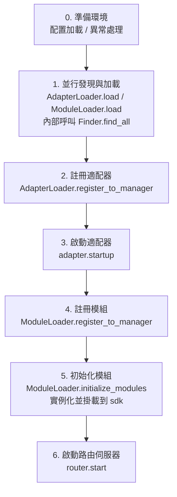

對應的核心組件：

| 層 | 組件 | 職責 |
|----|------|------|
| 發現 | `AdapterFinder` / `ModuleFinder` | 從已安裝套件的 entry-points 中**發現**適配器/模組 |
| 加載 | `AdapterLoader` / `ModuleLoader` | 發現 + 導入 + 讀取元數據 + 判斷啟用/禁用，返回物件清單 |
| 註冊 | `*Loader.register_to_manager` | 把物件登記到對應管理器 |
| 管理 | `sdk.adapter` / `sdk.module` | 維護適配器/模組實例，提供啟停介面 |
| 初始化 | `ModuleLoader.initialize_modules` | 創建模組實例並掛載到 `sdk`（處理依賴拓撲排序） |
| 路由 | `sdk.router` | HTTP / WebSocket 伺服器 |

> **重要**：`Finder` 和 `Loader` 是兩層。`Loader` 內部**已經持有**一個 `Finder`（`AdapterLoader` 自帶 `AdapterFinder`，`ModuleLoader` 自帶 `ModuleFinder`）。大多數場景你只需要用 `Loader`，只有需要「只列出不導入」時才會單獨用 `Finder`。

## 各環節詳解

### 1. 發現層：Finder

Finder 只負責「找到有哪些套件提供了適配器/模組」，不匯入、不實例化。

```python
from ErisPulse.finders import AdapterFinder, ModuleFinder

adapter_finder = AdapterFinder()
module_finder = ModuleFinder()

# 查找所有已安裝的適配器/模組 entry-points
adapter_entries = adapter_finder.find_all()    # list[EntryPoint]
module_entries = module_finder.find_all()      # list[EntryPoint]

# 按名稱查找單個
entry = module_finder.find_by_name("MyModule")  # EntryPoint | None
```

每個 `EntryPoint` 可以 `.load()` 得到對應的類，但通常不用你手動呼叫——Loader 會處理。

### 2. 加載層：Loader

Loader 在 Finder 之上做了「匯入 + 讀取元數據 + 判斷啟用/禁用」。

```python
from ErisPulse.loaders import AdapterLoader, ModuleLoader
from ErisPulse import sdk

adapter_loader = AdapterLoader()
module_loader = ModuleLoader()

# load() 內部：呼叫 finder.find_all() → 逐個處理 entry-point → 返回三元組
adapter_objs, enabled_adapters, disabled_adapters = await adapter_loader.load(sdk.adapter)
module_objs, enabled_modules, disabled_modules = await module_loader.load(sdk.module)
```

`load()` 返回的三元組：

| 返回值 | 含義 |
|--------|------|
| `objs` (`dict`) | 名稱 → 對象（適配器類 / 模組包裝物件） |
| `enabled` (`list[str]`) | 被啟用的名稱（設定中未禁用） |
| `disabled` (`list[str]`) | 被禁用的名稱 |

#### 加載失敗時的診斷資訊

當某個模組/適配器在加載或初始化階段拋出異常時，框架會跳過該元件並繼續加載其他元件，同時輸出**用戶程式碼框架摘要**，讓你在預設的 INFO 級別下即可定位出錯位置，無需手動重開 DEBUG：

```
[ERROR] [ModuleLoader] 從 entry-point 加載模組 MyModule 失敗，已跳過: 'NoneType' object has no attribute 'platform'
  → MyModule/Core.py:42 in on_load
      adapter = sdk.platform
  → AttributeError: 'NoneType' object has no attribute 'platform'
  → 提示: 將日誌級別提高到 DEBUG 可查看完整堆疊；檢查模組 MyModule 的實作程式碼
```

診斷資訊透過 `ErisPulse.runtime.diagnostics` 模組產生，會自動過濾掉框架內部框架，只保留你的程式碼框架。如需在自訂加載邏輯中重用：

```python
from ErisPulse.runtime import log_diagnostic

try:
    risky_init()
except Exception as e:
    log_diagnostic(e)  # 自動提取用戶程式碼框架並寫入 ERROR 日誌
```

該模組還提供 `extract_user_frame()`（返回結構化框架資訊）和 `format_diagnostic_block()`（返回多行文字）兩個底層函數。

### 3. 註冊層：register_to_manager

把 Loader 產出的物件登記到管理器，讓 `sdk.adapter` / `sdk.module` 能識別它們。

```python
# 註冊適配器（返回 bool，表示是否全部成功）
await adapter_loader.register_to_manager(enabled_adapters, adapter_objs, sdk.adapter)

# 註冊模組
await module_loader.register_to_manager(enabled_modules, module_objs, sdk.module)
```

註冊後，適配器已登記到適配器管理器、模組已登記到模組管理器，但**都還未啟動/實例化**。

### 4. 啟動適配器

```python
# 啟動所有已註冊的適配器
await sdk.adapter.startup()
# 或指定平台
await sdk.adapter.startup("yunhu")
await sdk.adapter.startup(["yunhu", "telegram"])
```

> 註冊 ≠ 啟動。`register_to_manager` 只是登記；`startup` 才會呼叫適配器的 `start()`，建立與平台的連接。

### 5. 初始化模組

模組比適配器多一步——需要**實例化**並掛載到 `sdk` 上（這樣你才能 `sdk.MyModule.xxx` 呼叫）。這一步還處理模組間的依賴宣告與拓撲排序。

```python
success = await module_loader.initialize_modules(
    enabled_modules, module_objs, sdk.module, sdk
)
```

實例化成功後，模組會出現在 `sdk.<ModuleName>` 上。

### 6. 啟動路由伺服器

```python
await sdk.router.start(
    host="0.0.0.0",
    port=8000,
    ssl_certfile=None,
    ssl_keyfile=None,
)
```

路由伺服器負責接收適配器的 Webhook / WebSocket 回呼。不啟動它，server 模式的適配器無法接收訊息。

## 完整手動啟動示例

下面這段程式碼**等價於** `await sdk.init()` 的核心流程，但每一步都暴露在你手上，可以在任意環節插入自定義邏輯：

```python
import asyncio
from ErisPulse import sdk
from ErisPulse.loaders import AdapterLoader, ModuleLoader

async def manual_startup():
    # 0. 準備環境（載入設定、註冊全域例外處理）
    #    _prepare_environment 是 init() 內部的前置步驟；手動流程也需先呼叫，
    #    否則 Loader 讀不到設定，會把所有適配器/模組誤判為停用。
    if not await sdk._prepare_environment():
        print("環境準備失敗")
        return False

    # 1. 建立載入器（內部各自持有 Finder）
    adapter_loader = AdapterLoader()
    module_loader = ModuleLoader()

    # 2. 並行發現與載入（與 init() 內部一致用 gather）
    (adapter_objs, enabled_adapters, disabled_adapters), \
    (module_objs, enabled_modules, disabled_modules) = await asyncio.gather(
        adapter_loader.load(sdk.adapter),
        module_loader.load(sdk.module),
    )

    # 3. 註冊適配器
    await adapter_loader.register_to_manager(
        enabled_adapters, adapter_objs, sdk.adapter
    )

    # 4. 啟動適配器
    if enabled_adapters:
        await sdk.adapter.startup()

    # 5. 註冊模組
    await module_loader.register_to_manager(
        enabled_modules, module_objs, sdk.module
    )

    # 6. 初始化模組（實例化 + 掛載到 sdk）
    if enabled_modules:
        await module_loader.initialize_modules(
            enabled_modules, module_objs, sdk.module, sdk
        )

    # 7. 啟動路由伺服器
    await sdk.router.start(host="0.0.0.0", port=8000)

    print("手動啟動完成")
    return True

async def main():
    ok = await manual_startup()
    if ok:
        # 阻塞維持運行（手動流程不會自動阻塞）
        await asyncio.Event().wait()

if __name__ == "__main__":
    asyncio.run(main())
```

### 何時該手動啟動？

大多數情況下**不需要**手動啟動，`await sdk.run()` 已經把上面這些都做好了。手動啟動僅在這些場景才有價值：

- **部分載入**：只載入指定的適配器/模組，跳過其他
- **動態註冊**：執行時根據條件註冊新的適配器/模組
- **自訂順序**：需要打亂預設的載入順序（例如先啟動某模組再啟動適配器）
- **注入策略**：對 Loader 注入自訂的嚴格模式管理器、載入策略等
- **除錯/診斷**：在某個環節失敗時，手動驅動以定位問題

[**English**](docs/zh-TW/quick-start.md) | [**简体中文**](docs/zh-TW/quick-start.md)

## 運行時細粒度控制

即使用了 `sdk.run()` 完成啟動，你仍然可以在運行時單獨控制各子系統，而不必重新啟動整個 SDK：

### 适配器熱啟停

```python
# 熱重啟某個适配器（修復連接，不影響其他平台）
await sdk.adapter.shutdown("yunhu")
await sdk.adapter.startup("yunhu")

# 運行中拉起一個新平台
await sdk.adapter.startup("telegram")

# 臨時下線某平台
await sdk.adapter.shutdown("telegram")
```

> `adapter.startup()` 要求适配器**已被註冊**到管理器。註冊發生在 `init()`/`run()` 內部，所以這是啟動**之後**的細粒度控制。

### 路由伺服器

```python
# 臨時下線 webhook 伺服器
await sdk.router.stop()

# 重新啟動（例如換了端口）
await sdk.router.start(host="0.0.0.0", port=9000)
```

### 模組按需加載

```python
# 手動加載一個（可能是懶加載的）模組
await sdk.load_module("MyModule")

## 優雅關閉

從 2.7.0 版本起，`sdk.shutdown()` 提供**程式化的優雅關閉**：設定關閉事件，讓正在 `await sdk.run(keep_running=True)` 中掛起的主迴圈返回，進而觸發 `uninit()` 完成資源清理。

```python
# 在任何協程中呼叫，觸發優雅退出（run() 挂起返回並自動 uninit）
sdk.shutdown()
```

典型用途：

```python
async def shutdown_after_idle():
    await asyncio.sleep(3600)
    sdk.shutdown()  # 空閒 1 小時後優雅退出
```

**信號處理**：`run()` 內部會註冊 `SIGTERM` / `SIGHUP` 處理器，將系統信號轉為優雅關閉——容器編排（Docker `docker stop`）或 `systemd` 停止服務時，進程會走完 `uninit()` 清理而非被強殺。

- Windows 不支援 `loop.add_signal_handler`，信號處理器會自動跳過（仍可用 `sdk.shutdown()` 或 Ctrl+C 觸發關閉）
- 反覆呼叫 `sdk.shutdown()` 是安全的（事件已設定後再次呼叫為無操作）

[**English**](docs/zh-TW/quick-start.md) | [**简体中文**](docs/zh-TW/quick-start.md)

## 卸載流程

啟動的反向操作是 `await sdk.uninit()`，它按相反順序清理：

1. 關閉所有適配器（`adapter.shutdown()`）
2. 卸載所有模組
3. 清理所有事件處理程式
4. 清理管理器與 SDK 上的模組屬性

手動啟動場景下，記得在退出前呼叫 `uninit()` 以確保優雅關閉：

```python
try:
    await asyncio.Event().wait()   # 維持運行
finally:
    await sdk.uninit()

## 重新啟動

SDK 提供兩種重新啟動方式，都不需要你自己先卸載——框架會自行處理：

| 方式 | 呼叫 | 行為 | 適用場景 |
|------|------|------|----------|
| 熱重新啟動 | `await sdk.restart()` | 同一進程內 `uninit()` 後重新 `init()`，重新載入適配器/模組 | 重新載入設定、熱更新模組 |
| 硬重新啟動 | `await sdk.hard_restart()` | `uninit()` 後以**退出碼 42** 退出進程，由外部監督者拉起全新進程 | 懷疑有記憶體/資源泄漏、需要徹底乾淨重新啟動 |

```python
# 熱重新啟動：同進程內重新載入（最常用）
await sdk.restart()

# 硬重新啟動：退出進程，交由外部監督者重新啟動（見下方「監督者指南」）
await sdk.hard_restart()
```

> **兩點注意**：
> 1. 這兩個方法都用後台任務執行重新啟動，**立即返回 `True` 表示「重新啟動任務已排程」**，而非「重新啟動已完成」。實際重新啟動在後台進行，避免中斷當前事件鏈路。
> 2. `hard_restart()` 的原理是：卸載並刷盤設定後，以**退出碼 42**（`HARD_RESTART_EXIT_CODE`）退出進程——**它自身不拉起新進程**，必須由外部監督者檢測到退出碼 42 後重新啟動。若直接 `python main.py` 運行且無任何監督者，進程以碼 42 退出後就結束了，**不會自動重新啟動**（框架會打警告提示）。

### 什麼時候該使用硬重新啟動？

硬重新啟動不只是"更徹底的重新啟動"，它在以下場景比熱重新啟動更合適、甚至更高效：

- **二進制庫（C 扩展）副作用**：熱重新啟動在同一進程內進行，無法釋放 C 扩展、打開的檔案描述符、執行緒等進程級資源；硬重新啟動換一個全新進程，這些副作用隨之徹底清零。
- **資源泄漏排查**：懷疑存在記憶體或句柄泄漏時，硬重新啟動能拿到一個乾淨的環境。
- **對效能敏感的頻繁重新啟動**：硬重新啟動省去了同進程內卸載→重新載入的開銷，實際比熱重新啟動更高效。

> Dashboard 管理介面裡的「框架重新啟動」功能，底層呼叫的就是 `hard_restart()`。

### 退出碼 42 契約

硬重新啟動是跨進程協作：**SDK 負責退出（碼 42），監督者負責拉起**。

| 角色 | 行為 |
|------|------|
| SDK（被硬重新啟動時） | `uninit()` → 刷盤設定 → `os._exit(42)` |
| 監督者 | 檢測到子進程退出碼為 42 → 重新啟動同一命令 |

> `sdk.is_supervised()` 可查詢目前進程是否由監督者啟動（檢測環境變數 `ERISPULSE_SUPERVISED`）。CLI `run` 命令啟動子進程時會自動注入該標記；systemd / Docker 等外部監督者不會注入，`is_supervised()` 返回 `False`，此時硬重新啟動後框架會打「未檢測到監督者」警告。

### 監督者指南

選擇適合你的監督者，讓硬重新啟動真正生效：

#### 1. CLI run 命令（開發/簡單部署，推薦）

`epsdk run main.py` 內建監督迴圈：檢測子進程退出碼，42 時立即重新啟動；其它異常退出碼按指數退避自動重試；`Ctrl+C` 會先優雅終止子進程（碼 0 視為正常退出，不再拉起）。

```bash
epsdk run main.py
```

#### 2. systemd（Linux 伺服器）

`RestartForceExitStatus=42` 讓退出碼 42 也觸發重新啟動（預設 `on-failure` 只對非零碼生效）：

```ini
[Service]
ExecStart=/usr/bin/python3 /opt/mybot/main.py
Restart=on-failure
RestartForceExitStatus=42
RestartSec=2
User=mybot
```

#### 3. Docker / docker-compose

容器內 PID 1 是應用進程，退出碼 42 後容器退出——用 `restart` 策略讓它自動重新啟動：

```yaml
services:
  bot:
    build: .
    restart: unless-stopped   # 任何退出（含 42）都重新啟動
```

#### 4. PM2（Node 生態維運）

```bash
pm2 start main.py --name mybot --interpreter python3
# 42 被視為退出碼，PM2 預設重新啟動；設定 restart_delay 防抖
pm2 set mybot.restart_delay 2000
```

#### 5. supervisord

```ini
[program:mybot]
command=python3 /opt/mybot/main.py
autorestart=true
exitcodes=0,2,42    # 42 也視為"正常退出需重新啟動"
```

#### 6. 純 Python 自訂監督者

```python
import subprocess, sys, time

while True:
    p = subprocess.Popen([sys.executable, "main.py"])
    code = p.wait()
    if code == 42:          # 硬重新啟動請求
        time.sleep(0.5)
        continue
    if code == 0:           # 正常退出
        break
    time.sleep(3)           # 異常退出，退避重試
```

> **無監督者時的行為**：直接 `python main.py` 運行，呼叫 `hard_restart()` 後進程以碼 42 退出、不會重新啟動。此時應接入上述任一監督者。

## 相關文件

- [建立第一個機器人](../getting-started/first-bot.md) - `keep_running` 兩種基本模式入門
- [生命週期管理](lifecycle.md) - 監聽 `core.init.start` / `core.init.complete` 等啟動事件
- [懶加載系統](lazy-loading.md) - 模組懶加載機制與 `load_module`

請直接返回翻譯後的完整Markdown內容，不要包含任何其他文字。


====
技术标准
====


### 会话类型标准

# ErisPulse 會話類型標準

本文檔定義了 ErisPulse 支援的會話類型標準，包括接收事件類型和發送目標類型。

請直接返回翻譯後的完整 Markdown 內容，不要包含任何其他文字。

再次提醒：如果文件包含語言切換行（各語言名稱用 ` | ` 分隔的行），請務必嚴格遵守上方第 8 條的格式要求，不要寫出 `[**Label**](file)` 這類錯誤格式。

## 1. 核心概念

### 1.1 接收類型 && 發送類型

ErisPulse 區分兩種會話類型：

- **接收類型（Receive Type）**：用於接收的事件的 `detail_type` 欄位
- **發送類型（Send Type）**：用於發送訊息時 `Send.To()` 方法的目標類型

### 1.2 類型映射關係

```
接收類型 (detail_type)     發送類型 (Send.To)
─────────────────        ────────────────
private                 →        user
group                   →        group
channel                 →        channel
guild                   →        guild
thread                  →        thread
user                    →        user
```

**關鍵點**：
- `private` 是接收時的類型，發送時必須使用 `user`
- `group`、`channel`、`guild`、`thread` 在接收和發送時類型相同
- 系統會自動進行類型轉換，無需手動處理(代表著你可以直接使用獲得的接收類型進行發送)，但實際上，你無需考慮這些，Event的包裝類的存在，你可以直接使用event.reply()方法，而無需考慮類型轉換

7. **重要：路徑替換規則**
   - 將文件連結中的 `docs/zh-TW/` 替換為 `docs/zh-TW/`
   - 例如：`docs/zh-TW/quick-start.md` 應改為 `docs/zh-TW/quick-start.md`
   - 對於指向非當前語言版本文件的連結（如 `README.xx.md` 形式的連結），保持原樣不要修改
   - 這確保了連結指向正確語言的文件版本

## 2. 標準會話類型

### 2.1 OneBot12 標準類型

#### private
- **接收類型**：`private`
- **發送類型**：`user`
- **說明**：一對一私聊訊息
- **ID 欄位**：`user_id`
- **適用平台**：所有支援私聊的平台

#### group
- **接收類型**：`group`
- **發送類型**：`group`
- **說明**：群聊訊息，包括各種形式的群組（例如 Telegram supergroup）
- **ID 欄位**：`group_id`
- **適用平台**：所有支援群聊的平台

#### user
- **接收類型**：`user`
- **發送類型**：`user`
- **說明**：使用者類型，某些平台（例如 Telegram）將私聊表示為 user 而非 private
- **ID 欄位**：`user_id`
- **適用平台**：Telegram 等平台

### 2.2 ErisPulse 擴展類型

#### channel
- **接收類型**：`channel`
- **發送類型**：`channel`
- **說明**：頻道訊息，支援多個使用者的廣播式訊息
- **ID 欄位**：`channel_id`
- **適用平台**：Discord, Telegram, Line 等

#### guild
- **接收類型**：`guild`
- **發送類型**：`guild`
- **說明**：伺服器/社群訊息，通常用於 Discord Guild 級別的事件
- **ID 欄位**：`guild_id`
- **適用平台**：Discord 等

#### thread
- **接收類型**：`thread`
- **發送類型**：`thread`
- **說明**：話題/子頻道訊息，用於社群中的子討論區
- **ID 欄位**：`thread_id`
- **適用平台**：Discord Threads, Telegram Topics 等

## 3. 平台類型映射

### 3.1 映射原則

適配器負責將平台的原生類型映射到 ErisPulse 標準類型：

```
平台原生類型 → ErisPulse 標準類型 → 發送類型
```

### 3.2 常見平台映射示例

#### Telegram
```
Telegram 類型          ErisPulse 接收類型    發送類型
─────────────────      ────────────────       ───────────
private                private                 user
group                  group                   group
supergroup             group                   group  # 映射到 group
channel                channel                 channel
```

#### Discord
```
Discord 類型          ErisPulse 接收類型    發送類型
─────────────────      ────────────────       ───────────
Direct Message         private                user
Text Channel           channel                channel
Guild                  guild                  guild
Thread                 thread                 thread
```

#### OneBot11
```
OneBot11 類型        ErisPulse 接收類型    發送類型
─────────────────      ────────────────       ───────────
private                private                user
group                  group                  group
discuss                group                  group  # 映射到 group

## 4. 自訂類型擴展

### 4.1 註冊自訂類型

適配器可以註冊自訂會話類型：

```python
from ErisPulse.Core.Event import register_custom_type

# 注冊自訂類型
register_custom_type(
    receive_type="my_custom_type",
    send_type="custom",
    id_field="custom_id",
    platform="MyPlatform"
)
```

### 4.2 使用自訂類型

註冊後，系統會自動處理該類型的轉換和推斷：

```python
# 自動推斷
receive_type = infer_receive_type(event, platform="MyPlatform")
# 返回: "my_custom_type"

# 轉換為發送類型
send_type = convert_to_send_type(receive_type, platform="MyPlatform")
# 返回: "custom"

# 獲取對應ID
target_id = get_target_id(event, platform="MyPlatform")
# 返回: event["custom_id"]
```

### 4.3 取消註冊自訂類型

```python
from ErisPulse.Core.Event import unregister_custom_type

unregister_custom_type("my_custom_type", platform="MyPlatform")

## 5. 自動類型推斷

當事件沒有明確的 `detail_type` 欄位時，系統會根據存在的 ID 欄位自動推斷類型：

> [!NOTE]
> **2.7.0+ 行為變更**：`detail_type` 只有在是**已知會話類型**（標準或自定義）時才直接採用。notice/request 事件的 `detail_type`（如 `group_member_increase`、`friend_increase`）是**語義子類型**而非會話類型，會轉而根據 ID 欄位推斷正確的會話類型。

### 5.1 推斷優先級

```
優先級（從高到低）：
1. group_id     → group
2. channel_id   → channel
3. guild_id     → guild
4. thread_id    → thread
5. user_id      → private
```

### 5.2 使用示例

```python
# 事件只有 group_id
event = {"group_id": "123", "user_id": "456"}
receive_type = infer_receive_type(event)
# 返回: "group"（優先使用 group_id）

# 事件只有 user_id
event = {"user_id": "123"}
receive_type = infer_receive_type(event)
# 返回: "private"

# notice 事件的 detail_type 是語義子類型，2.7.0+ 會從 ID 欄位推斷
event = {"type": "notice", "detail_type": "group_member_increase", "group_id": "123"}
receive_type = infer_receive_type(event)
# 返回: "group"（而非 "group_member_increase"）

## 6. API 使用範例

### 6.1 發送訊息

```python
from ErisPulse import adapter

# 發送給使用者
await adapter.myplatform.Send.To("user", "123").Text("Hello")

# 發送給群組
await adapter.myplatform.Send.To("group", "456").Text("Hello")

# 自動轉換 private → user（不推薦，可能會有相容性問題）
await adapter.myplatform.Send.To("private", "789").Text("Hello")
# 內部自動轉換為: Send.To("user", "789") # 直接使用user作為會話類型是更優的選擇
```

### 6.2 事件回覆

```python
from ErisPulse.Core.Event import Event

# Event.reply() 自動處理類型轉換
await event.reply("回覆內容")
# 內部自動使用正確的發送類型
```

### 6.3 命令處理

```python
from ErisPulse.Core.Event import command

@command(name="test")
async def handle_test(event):
    # 系統自動處理會話類型
    # 無需手動判斷 group_id 還是 user_id
    await event.reply("命令執行成功")

## 7. 核心 API 參考

### 7.1 類型轉換

```python
from ErisPulse.Core.Event import convert_to_send_type, convert_to_receive_type

# 接收類型 → 發送類型
convert_to_send_type("private")  # → "user"
convert_to_send_type("group")    # → "group"

# 發送類型 → 接收類型
convert_to_receive_type("user")   # → "private"
convert_to_receive_type("group")  # → "group"
```

### 7.2 ID 欄位查詢

```python
from ErisPulse.Core.Event import get_id_field, get_receive_type

get_id_field("group")    # → "group_id"
get_id_field("private")  # → "user_id"

get_receive_type("group_id")  # → "group"
get_receive_type("user_id")   # → "private"
```

### 7.3 一步獲取發送資訊

```python
from ErisPulse.Core.Event import get_send_type_and_target_id

event = {"detail_type": "private", "user_id": "123"}
send_type, target_id = get_send_type_and_target_id(event)
# send_type = "user", target_id = "123"

# 直接用於 Send.To()
await adapter.Send.To(send_type, target_id).Text("Hello")
```

### 7.4 獲取目標 ID

```python
from ErisPulse.Core.Event import get_target_id

event = {"detail_type": "group", "group_id": "456"}
get_target_id(event)  # → "456"

## 8. 工具方法

```python
from ErisPulse.Core.Event import (
    is_standard_type,
    is_valid_send_type,
    get_standard_types,
    get_send_types,
    clear_custom_types,
)

is_standard_type("private")     # True
is_standard_type("custom_type") # False

is_valid_send_type("user")      # True
is_valid_send_type("invalid")   # False

get_standard_types()  # {"private", "group", "channel", "guild", "thread", "user"}
get_send_types()      # {"user", "group", "channel", "guild", "thread"}

clear_custom_types()                # 清除所有
clear_custom_types(platform="discord")  # 只清除指定平台的
```

請直接返回翻譯後的完整Markdown內容，不要包含任何其他文字。

再次提醒：如果文件包含語言切換行（各語言名稱用 `` | `` 分隔的行），務必嚴格遵守上方第8條的格式要求，不要寫出 ``[**Label**](file)`` 這類錯誤格式。

## 9. 最佳實踐

### 7.1 適配器開發者

1. **使用標準映射**：盡可能映射到標準類型，而非創建新類型
2. **正確轉換**：確保接收類型和發送類型的映射關係正確
3. **保留原始數據**：在 `{platform}_raw` 中保留原始事件類型
4. **文檔說明**：在適配器文檔中說明類型映射關係

### 7.2 模組開發者

1. **使用工具方法**：使用 `get_send_type_and_target_id()` 等工具方法
2. **避免硬編碼**：不要寫 `if group_id else "private"` 這樣的程式碼
3. **考慮所有類型**：程式碼要支援所有標準類型，不僅是 private/group
4. **靈活設計**：使用事件包裝器的方法，而非直接存取欄位

### 7.3 類型推斷

- **優先使用 detail_type**：如果有明確欄位，不進行推斷
- **合理使用推斷**：只在沒有明確類型時使用
- **注意優先級**：了解推斷優先級，避免意外結果

請直接返回翻譯後的完整Markdown內容，不要包含任何其他文字。

## 10. 常見問題

### Q1: 為什麼發送時 private 要轉換為 user？

A: 這是 OneBot12 標準的要求。`private` 是接收時的概念，發送時使用 `user` 更符合語義。

### Q2: 如何支援新的會話類型？

A: 透過 `register_custom_type()` 註冊自定義類型，或直接使用標準類型中的 `channel`、`guild` 等。

### Q3: 事件沒有 detail_type 怎麼辦？

A: 系統會根據存在的 ID 欄位自動推斷。優先級為：group > channel > guild > thread > user。

### Q4: 適配器如何映射 Telegram supergroup？

A: 在適配器的轉換邏輯中，將 `supergroup` 映射為標準的 `group` 類型。

### Q5: 郵箱等特殊平台如何處理？

A: 對於不通用或平台特有的類型，使用 `{platform}_raw` 和 `{platform}_raw_type` 保留原始數據，適配器自行處理。

## 11. 相關文件

- [事件轉換標準](event-conversion.md) - 完整的事件轉換規範  
- [發送方法規範](send-method-spec.md) - Send 類的方法命名和參數規範  
- [適配器開發指南](../developer-guide/adapters/) - 適配器開發完整指南


====
生态模块
====


### ErisPulse-App 安装与使用

# ErisPulse-App

[ErisPulse-App](https://github.com/ErisPulse/ErisPulse-App) 是由 ErisDev 直接維護的 **官方多端用戶端**（Android / Windows / Linux / macOS 均已發布），
提供完全原生的圖形化管理介面：在手機或電腦上建立、執行、管理多個機器人實例，
無需終端機，也無需單獨安裝 Python 環境。

> [!IMPORTANT]
> ErisPulse-App 是**獨立安裝的用戶端程式**，不是 `epsdk install` 安裝的模組。
> 它內建了 Python 執行時環境與 ErisPulse SDK，安裝即用——**手機上也能直接執行**。

请直接返回翻译后的完整Markdown内容，不要包含任何其他文字。

再次提醒：如果文档包含语言切换行（各语言名称用 `` | `` 分隔的行），务必严格遵守上方第8条的格式要求，不要写出 ``[**Label**](file)`` 这类错误格式。

## 功能速覽

- **多實例管理**：建立 / 啟動 / 停止 / 刪除多個實例，連接埠與存取權杖自動分配，支援全新環境或克隆既有環境
- **概覽儀表板**：適配器 / 模組 / 在線機器人 / 事件總數統計，CPU / 記憶體佔用告警變色
- **模組商店**：搜尋與標籤篩選、一鍵安裝 / 升級 / 解除安裝、指定版本安裝、pip 映像源與 Git 套件支援
- **事件流 + 事件構建器**：即時事件查看，視覺化建構測試事件並提交至適配器
- **監控**：日誌 / 生命週期 / 審計三合一檢視
- **指令管理**：前置字串與別名等全域設定、啟停與平台黑白名單
- **機器人總覽 / 設定 / 檔案管理**：原生介面直接操作實例
- **背景常駐**：Android 前台服務保活；Windows 最小化至系統匣，關閉視窗不中斷實例
- **模組動態視窗**：模組註冊的頁面自動出現在側邊導覽（與 Dashboard 同分組），點擊直接導向

請直接返回翻譯後的完整 Markdown 內容，不要包含任何其他文字。

## 支援平台

所有平台的安裝程式均可從 [GitHub Releases](https://github.com/ErisPulse/ErisPulse-App/releases) 下載，按需選擇即可：

| 平台 | 安裝程式 | 說明 |
|------|--------|------|
| Android | `online-*.apk` / `offline-*.apk` | **手機直接執行**，無需電腦 |
| Windows | `windows-x64-setup.exe` / `windows-x64.zip` | 安裝版 / 免安裝版 |
| Linux | `linux-x64.tar.gz` | 解壓即用 |
| macOS | `macos-arm64.zip` | Apple Silicon（arm64） |

一個 Flutter 程式庫涵蓋所有平台。

## 安裝方式（Android / 手機直接執行）

從 [GitHub Releases](https://github.com/ErisPulse/ErisPulse-App/releases) 下載 APK 安裝即可，有兩種建構：

| 建構 | 執行時映像 | 適用場景 |
|------|-----------|---------|
| `erispulse-app-online-*.apk` | 首次啟動時下載 | 安裝檔更小，適合網路良好 |
| `erispulse-app-offline-*.apk` | 已打包進 APK | 離線自包含，安裝後無需上網 |

兩種建構安裝步驟相同：

1. 下載並安裝 APK，啟動時允許通知權限（用於保持後台服務存活）
2. 首頁出現初始化橫幅後點擊執行首次初始化（含進度與日誌檢視）
3. 建立一個實例並啟動
4. 在 App 內建的管理介面設定配接器與模型 API Key

> 離線包自包含——安裝後無需網路。如果首次啟動下載慢或不穩定，
> 可在設定頁將下載來源切換為映像（ghfast / gh-proxy）。

### 安裝方式（桌面端：Windows / Linux / macOS）

1. 從 [GitHub Releases](https://github.com/ErisPulse/ErisPulse-App/releases) 下載對應平台安裝包
   （Windows `setup.exe` 或免安裝 `zip`、Linux `tar.gz`、macOS `zip`）
2. 安裝並啟動
3. 在歡迎頁選擇要安裝的 ErisPulse SDK 版本（預設最新）並安裝
4. 建立實例並啟動

---

## 運作原理

```
┌────────────────────────────────────────────────────┐
│  ErisPulse-App (Flutter)                            │
│                                                    │
│  原生 UI ── Dashboard REST / WS API                │
│       │                                            │
│       ├── Android：前台服務 + proot + Ubuntu rootfs│
│       │        + Python + ErisPulse 實例           │
│       └── 桌面端：內建 Python + 直接進程管理         │
└────────────────────────────────────────────────────┘
```

- **Android**：實例運行在前台服務（background isolate）托管的 proot（使用者態 chroot）內，UI 關閉後機器人仍持續運行，崩潰自動重啟
- **桌面端**：實例作為 App 的直接子進程運行；Windows 支援最小化到系統匣背景常駐（關閉視窗不中斷實例），App 重啟後自動恢復對仍在運行實例的管理，退出時統一停止全部實例
- 所有平台的原生 UI 都透過 `127.0.0.1:<port>/Dashboard/*` 的 REST / WebSocket API 與實例通訊，與 [ErisPulse-Dashboard](dashboard.md) 共用同一套 API

---

## 與 SDK 的關係

- App 內建 ErisPulse SDK：Android 端打包在 Ubuntu 映像中，桌面端從 PyPI 安裝
  （歡迎頁可選版本，預設最新）
- App 中的執行個體與命令列 `epsdk` 建立的執行個體等價，可使用相同的模組 / 適配器
- 模組開發者可透過 [儀表板視窗註冊 API](docs/zh-TW/dashboard.md) 註冊自訂頁面：
  視窗會自動出現在 App 側邊導航（分組與儀表板一致），點擊跳轉對應頁面渲染

---

請直接傳回翻譯後的完整 Markdown 內容，不要包含任何其他文字。


### Dashboard 使用与视窗注册

# ErisPulse-Dashboard

[ErisPulse-Dashboard](https://pypi.org/project/ErisPulse-Dashboard/) 是 ErisDev 直接維護的 **Web 管理面板模組**，為 ErisPulse 提供視覺化的執行階段管理介面：模組啟停、設定編輯、日誌查看、事件流監控等。

> [!IMPORTANT]
> Dashboard **不是** ErisPulse 框架的內建功能，需要單獨安裝：
>
> ```bash
> epsdk install Dashboard
> ```

Dashboard 還支援其他 ErisPulse 模組將自訂的管理頁面註冊到側邊欄。註冊後，使用者可以直接在 Dashboard 中切換到該模組的專屬視窗頁面，無需額外開發獨立的前端介面。

> [!NOTE]
> 視窗註冊是**選用功能**。
>
> - 如果 Dashboard 模組**未安裝**或**未載入**，呼叫 `sdk.Dashboard.register_view()` 會拋出異常
> - 請務必使用 `try/except` 包裹註冊程式碼，確保模組本身的其他功能不受影響
> - 建議在註冊前檢查 Dashboard 是否可用：`hasattr(sdk, 'Dashboard') and sdk.Dashboard`

---

## 運作原理

```
模組 on_load()
  → 呼叫 sdk.Dashboard.register_view(...)
  → Dashboard 後端儲存視窗資訊
  → WebSocket 通知前端
  → 前端動態建立側邊欄導覽項目 + 頁面容器
  → 使用者點擊即可查看模組視窗
```

---

## 註冊 API

```python
sdk.Dashboard.register_view(
    id="MyModule",                    # 必填，唯一識別
    title="我的模組",                  # 中文名稱
    title_en="My Module",             # 英文名稱
    icon_svg='<svg>...</svg>',        # 側邊欄圖示 SVG
    html_content='<div>...</div>',     # 頁面 HTML 內容
    js_content='function xxx() {}',    # 頁面 JavaScript 邏輯
    css_content='.my-style {}',        # 選用自訂 CSS
    iframe_url='',                     # iframe 模式 URL（與 html_content 二選一）
    loader="loadMyModuleView",         # 切換到該頁面時呼叫的 JS 函數名
    group="group_extensions",          # 側邊欄分組
    group_title="",                    # 自訂分組中文名稱
    group_title_en="",                 # 自訂分組英文名稱
)
```

### 參數說明

| 參數 | 類型 | 必填 | 說明 |
|------|------|------|------|
| `id` | `str` | 是 | 視窗唯一識別，建議使用模組名稱 |
| `title` | `str` | 否 | 中文顯示名稱，預設使用 `id` |
| `title_en` | `str` | 否 | 英文顯示名稱，預設使用 `title` |
| `icon_svg` | `str` | 否 | 側邊欄圖示的完整 SVG 字串 |
| `html_content` | `str` | 否* | 註入模式的頁面 HTML 內容 |
| `js_content` | `str` | 否 | 頁面 JavaScript 程式碼 |
| `css_content` | `str` | 否 | 頁面自訂 CSS 樣式 |
| `iframe_url` | `str` | 否* | iframe 模式的 URL，設定後忽略 `html_content` |
| `loader` | `str` | 否 | 頁面啟動時自動呼叫的 JS 函數名 |
| `group` | `str` | 否 | 側邊欄分組識別，預設 `group_extensions` |
| `group_title` | `str` | 否 | 自訂分組的中文標題 |
| `group_title_en` | `str` | 否 | 自訂分組的英文標題 |

> *`html_content` 和 `iframe_url` 至少提供一個，否則頁面為空白。

---

## 兩種註入模式

### 模式一：HTML/JS 註入（推薦）

直接提供 HTML、JS、CSS 字串，Dashboard 會將內容註入到頁面中。該模式與 Dashboard 樣式完全一致，推薦使用 Dashboard 提供的 CSS 類別名稱。

```python
sdk.Dashboard.register_view(
    id="HelloPage",
    title="你好頁面", title_en="Hello",
    icon_svg='<svg viewBox="0 0 24 24" fill="none" stroke="currentColor" stroke-width="2"><circle cx="12" cy="12" r="10"/></svg>',
    html_content='<h1 class="page-title">Hello World</h1><div class="card"><div class="card-body">這是一個範例頁面</div></div>',
    group="group_tools",
)
```

> 完整的氣象模組範例（包含 API 路由、JS 互動等）請見下方 [完整模組範例](#完整模組範例)。

### 模式二：iframe 嵌入

模組提供自己的 HTML 頁面 URL（需自行註冊路由），Dashboard 以 iframe 方式嵌入。適合需要完全獨立 UI 或複雜互動的場景。

```python
sdk.Dashboard.register_view(
    id="MyVisualizer",
    title="資料視覺化", title_en="Data Visualizer",
    iframe_url="/MyVisualizer/view",
    group="group_tools",
)
```

> iframe 模式會自動在 URL 後附加 `token` 參數用於認證。

---

## 側邊欄分組

模組可指定視窗所在的側邊欄分組。Dashboard 內建以下分組：

| 分組識別 | 中文名 | 位置 |
|---------|--------|------|
| `group_overview` | 概覽 | 第1組 |
| `group_events` | 事件 | 第2組 |
| `group_extensions` | 擴充 | 第3組（預設） |
| `group_system` | 系統 | 第4組 |
| `group_tools` | 工具 | 第5組 |

指定內建分組名稱，模組視窗會附加到該分組末尾：

```python
group="group_tools"  # 附加到"工具"分組
```

也可以使用自訂分組名稱（不以 `group_` 開頭），Dashboard 會自動建立新分組：

```python
group="my_group",
group_title="我的分組",
group_title_en="My Group",
```

---

## 常用 CSS 類別名稱

模組視窗使用 HTML 註入模式時，可直接使用 Dashboard 已有的 CSS 類別名稱來保持視覺一致性：

| 類別名 | 用途 |
|------|------|
| `page-title` | 頁面標題，如 `<h1 class="page-title">標題</h1>` |
| `card` | 卡片容器 |
| `card-header` | 卡片標題列 |
| `card-body` | 卡片內容區域 |
| `grid-2` | 雙欄網格佈局 |
| `grid-3` | 三欄網格佈局 |
| `btn` | 基礎按鈕 |
| `btn-primary` | 主按鈕（藍色） |
| `btn-secondary` | 次要按鈕 |
| `btn-icon` | 圖示按鈕 |
| `btn-danger` | 危險操作按鈕 |

Dashboard 使用 CSS 變數控制主題色，您可以在模組視窗中直接引用：

| CSS 變數 | 用途 |
|----------|------|
| `var(--bg-p)` | 主背景色 |
| `var(--bg-s)` | 次背景色 |
| `var(--bg-t)` | 三級背景色（卡片等） |
| `var(--tx-p)` | 主文字色 |
| `var(--tx-s)` | 次文字色 |
| `var(--tx-t)` | 輔助文字色 |
| `var(--bd)` | 邊框色 |
| `var(--accent)` | 強調色 |
| `var(--ok-c)` | 成功色 |
| `var(--er-c)` | 錯誤色 |

這些變數會根據 Dashboard 的亮色/暗色主題自動切換，模組無需額外處理。

---

## 認證與 API 呼叫

在模組視窗的 JS 中呼叫模組自己的 API 時，需要攜帶 Dashboard 的 Token 進行認證：

```javascript
var token = localStorage.getItem('__ep_tk__');
var resp = await fetch('/YourModule/api/data', {
    headers: { 'Authorization': 'Bearer ' + token }
});
var data = await resp.json();
```

模組的 API 端點可以自行決定是否驗證 Token。如果需要驗證，可以從請求標頭中提取：

```python
async def _api_data(self, request):
    token = request.headers.get("Authorization", "").replace("Bearer ", "")
    if not token:
        return {"error": "Unauthorized"}, 401
    return {"data": "hello"}
```

---

## 完整模組範例

以下是一個完整的氣象模組範例，展示如何註冊視窗、提供 API 資料、以及在卸載時清理資源：

```python
from ErisPulse import sdk
from ErisPulse.Core.Bases import BaseModule
from ErisPulse.Core.Event import command


class Main(BaseModule):
    def __init__(self):
        self.sdk = sdk
        self.logger = sdk.logger.get_child("Weather")
        self.config = self._load_config()

    @staticmethod
    def get_load_strategy():
        from ErisPulse.loaders import ModuleLoadStrategy
        return ModuleLoadStrategy(lazy_load=False, priority=50)

    async def on_load(self, event):
        self._register_routes()
        self._register_dashboard_view()
        self.logger.info("氣象模組已載入")

    async def on_unload(self, event):
        self._unregister_routes()
        if hasattr(self.sdk, 'Dashboard') and self.sdk.Dashboard:
            self.sdk.Dashboard.unregister_view("Weather")
        self.logger.info("氣象模組已卸載")

    def _load_config(self):
        config = self.sdk.config.getConfig("Weather")
        if not config:
            default = {"city": "北京", "api_key": ""}
            self.sdk.config.setConfig("Weather", default)
            return default
        return config

    def _register_routes(self):
        r = self.sdk.router
        r.register_http_route("Weather", "/api/current",
                              handler=self._api_current, methods=["GET"])

    def _unregister_routes(self):
        r = self.sdk.router
        try:
            r.unregister_http_route("Weather", "/api/current")
        except Exception:
            pass

    async def _api_current(self, request):
        return {
            "city": self.config.get("city", "北京"),
            "temp": 25,
            "humidity": 60,
        }

    def _register_dashboard_view(self):
        try:
            dashboard = self.sdk.Dashboard
            dashboard.register_view(
                id="Weather",
                title="天氣", title_en="Weather",
                icon_svg='<svg viewBox="0 0 24 24" fill="none" stroke="currentColor" stroke-width="2"><circle cx="12" cy="12" r="5"/><line x1="12" y1="1" x2="12" y2="3"/><line x1="12" y1="21" x2="12" y2="23"/><line x1="4.22" y1="4.22" x2="5.64" y2="5.64"/><line x1="18.36" y1="18.36" x2="19.78" y2="19.78"/><line x1="1" y1="12" x2="3" y2="12"/><line x1="21" y1="12" x2="23" y2="12"/><line x1="4.22" y1="19.78" x2="5.64" y2="18.36"/><line x1="18.36" y1="5.64" x2="19.78" y2="4.22"/></svg>',
                html_content='''
                    <h1 class="page-title">天氣查詢</h1>
                    <p style="color:var(--tx-s);margin-bottom:16px">查看目前天氣資訊</p>
                    <div class="grid-2">
                        <div class="card">
                            <div class="card-header">目前天氣</div>
                            <div class="card-body">
                                <div id="weather-info" style="font-size:14px;color:var(--tx-s)">點擊重新整理載入</div>
                            </div>
                        </div>
                        <div class="card">
                            <div class="card-header">操作</div>
                            <div class="card-body">
                                <button class="btn btn-primary" onclick="refreshWeather()">重新整理</button>
                            </div>
                        </div>
                    </div>
                ''',
                js_content='''
                    async function loadWeatherView() { await refreshWeather(); }
                    async function refreshWeather() {
                        var el = document.getElementById('weather-info');
                        if (!el) return;
                        el.textContent = '載入中...';
                        try {
                            var resp = await fetch('/Weather/api/current', {
                                headers: { 'Authorization': 'Bearer ' + localStorage.getItem('__ep_tk__') }
                            });
                            var data = await resp.json();
                            el.innerHTML = '<p>城市: ' + (data.city || '--') + '</p>' +
                                           '<p>溫度: ' + (data.temp || '--') + '°C</p>' +
                                           '<p>濕度: ' + (data.humidity || '--') + '%</p>';
                        } catch (e) {
                            el.textContent = '載入失敗: ' + e.message;
                        }
                    }
                ''',
                loader="loadWeatherView",
                group="group_tools",
            )
        except Exception as e:
            self.logger.warning(f"註冊 Dashboard 視窗失敗: {e}")
```

---

## 登出視窗

模組卸載時應呼叫 `unregister_view()` 清理已註冊的視窗：

```python
async def on_unload(self, event):
    if hasattr(self.sdk, 'Dashboard') and self.sdk.Dashboard:
        self.sdk.Dashboard.unregister_view("Weather")
```

登出後 Dashboard 前端會透過 WebSocket 即時移除側邊欄導覽項目和頁面內容，無需使用者重新整理。

---

## 注意事項

1. **載入順序** — Dashboard 的載入優先級為 `99999`（高優先級），您的模組優先級應低於此值（如 `50`），確保 Dashboard 先載入完成
2. **防禦性程式設計** — 註冊視窗時使用 `try/except` 包裹，因為 Dashboard 模組可能未安裝或未載入
3. **資源清理** — 在 `on_unload` 中呼叫 `unregister_view()` 移除已註冊的視窗
4. **ID 唯一性** — `id` 參數在整個 Dashboard 中必須唯一，建議直接使用模組名稱
5. **SVG 圖示** — `icon_svg` 應為完整的 `<svg>` 標籤，建議尺寸使用 `viewBox="0 0 24 24"`，使用 `stroke="currentColor"` 繼承 Dashboard 主題色
6. **JS 函數命名** — `js_content` 中的函數名應具有唯一性（如 `loadWeatherView`），避免與其他模組衝突
7. **動態更新** — 模組註冊/登出視窗後，Dashboard 前端會透過 WebSocket 即時更新側邊欄，無需重新整理頁面


### Takumi 图片渲染

# ErisPulse-Takumi

[ErisPulse-Takumi](https://pypi.org/project/ErisPulse-Takumi/) 是由 ccd2s 維護的 **第三方圖片渲染模組**，基於 [takumi-py](https://github.com/BalconyJH/takumi-py)，讓 Bot 能夠將 HTML、節點樹、Jinja 模板、SVG、動畫渲染為圖片。模組 **內建中英文字體**（Noto Sans SC / Roboto / Source Code Pro），無需額外配置。

> [!IMPORTANT]
> Takumi **不是** ErisPulse 框架的內建功能，需要單獨安裝：
>
> ```bash
> epsdk install Takumi
> ```

適用場景：

- 將資料/統計渲染為卡片圖片
- 將 Markdown / 長文字渲染為排版穩定的圖片，規避平台樣式差異
- 產生 SVG / 動畫，實現動態視覺效果
- 中英混排圖文（內建字體開箱即用）

---

## 安裝與啟用

```bash
epsdk install Takumi
```

安裝後模組會自動載入，在設定中確認啟用：

```toml
[Takumi]
enabled = true
```

---

## 快速上手

模組自動載入後，透過模組管理器取得，或使用 `sdk` 快捷方式：

```python
from ErisPulse import sdk

takumi = sdk.module.get("Takumi")
# 等價寫法：takumi = sdk.Takumi
```

### 渲染 HTML

```python
png = takumi.render_html(
    """
    <div class="card">
      <h1>你好，ErisPulse</h1>
      <p>由 Takumi 渲染</p>
    </div>
    """,
    stylesheets=["""
    .card {
      width: 800px;
      padding: 48px;
      color: white;
      background: #111827;
      font-family: "Noto Sans SC";
    }
    """],
    width=800,
    height=None,   # 按內容自動撐高
    lang="zh-CN",
)
```

### 渲染節點樹

```python
png = takumi.render_node(
    {
        "type": "text",
        "text": "中文和 English 都可直接渲染",
        "style": {"fontSize": 48, "color": "#111827"},
    },
    width=800,
    height=None,
    lang="zh-CN",
)
```

`png` 是 `bytes`，可透過 `event.reply(png, method="Image")` 傳送（詳見 [發送渲染結果](zh-TW/send-render-result)）。

---

## 渲染 API

`sdk.Takumi` 代理了底層 `takumi_py.Renderer` 的所有能力：所有渲染、測量、SVG、動畫、模板方法都可直接在 `sdk.Takumi` 上呼叫。對於這些方法，模組會在呼叫時**自動注入內建字體回退堆疊**（`takumi.families`），無需手動傳遞 `font_families`；若顯式傳入則尊重呼叫方設定。

### 方法總覽

| 類別 | 方法 | 返回 | 說明 |
|------|------|------|------|
| 靜態渲染 | `render_html(html, ...)` | `bytes` | 渲染 HTML 字串 |
| | `render_node(node, ...)` | `bytes` | 渲染節點樹（dict） |
| | `render_template(name, ctx, ...)` | `bytes` | 渲染 Jinja 模板 |
| | `render_compiled(node, ...)` | `bytes` | 渲染預編譯節點 |
| SVG 輸出 | `render_svg_html(html, ...)` | `str` | 輸出 SVG（HTML 輸入） |
| | `render_svg_node(node, ...)` | `str` | 輸出 SVG（節點樹輸入） |
| | `render_svg_template(name, ctx, ...)` | `str` | 輸出 SVG（模板輸入） |
| | `render_svg_compiled(node, ...)` | `str` | 輸出 SVG（預編譯輸入） |
| 動畫 | `render_animation(scenes, ...)` | `bytes` | 編碼多幀動畫 |
| | `render_sequence_at_time(scenes, time_ms, ...)` | `bytes` | 取序列某一時刻幀 |
| 測量 | `measure_node(node, ...)` | `dict` | 測量節點樹佈局 |
| | `measure_html(html, ...)` | `dict` | 測量 HTML 佈局 |
| | `measure_compiled(node, ...)` | `dict` | 測量預編譯節點 |
| 編譯 | `compile_node(node)` | `CompiledNode` | 編譯節點樹 |
| | `compile_html(html, ...)` | `CompiledNode` | 編譯 HTML |
| 字體 | `register_font(font)` | `list[str]` | 註冊自訂字體，返回 family 列表 |
| | `register_fonts(fonts)` | `list[str]` | 批量註冊 |

> `CompiledNode` 暴露 `resource_urls()` 方法，可預先發現待載入的 HTTP(S) 圖片參考，便於提前準備資源。

### 通用參數

以下參數適用於靜態渲染與 SVG 方法（動畫方法另有 `fps` 等，見對應範例）：

| 參數 | 類型 | 預設值 | 說明 |
|------|------|--------|------|
| `stylesheets` | `list[str]` | `None` | 文件級 CSS 字串列表；內聯 `style` 仍隨 HTML 一起解析 |
| `width` | `int \| None` | `1200` | 視口寬度（像素）；`None` 按佈局推斷 |
| `height` | `int \| None` | `630` | 畫布高度（像素）；`None` 按內容自動撐高（見 [視口與輸出格式](#視口與輸出格式)） |
| `lang` | `str \| None` | `None` | BCP-47 語言標籤（如 `zh-CN`），影響文字整形與換行 |
| `font_families` | `list[str]` | 自動注入 | 字體回退堆疊；便捷方法預設注入內建字體 |
| `format` | `str` | `"png"` | 輸出格式（見 [視口與輸出格式](#視口與輸出格式)） |
| `device_pixel_ratio` | `float` | `1.0` | 設備像素比，控制輸出解析度 |
| `time_ms` | `int` | `0` | 動畫取樣時刻（毫秒） |
| `dithering` | `str` | `"none"` | 抖動演算法：`none` / `ordered-bayer` / `floyd-steinberg` |
| `quality` | `int \| None` | `None` | 有損編碼品質 |
| `lossless` | `bool \| None` | `None` | 是否無損編碼 |
| `images` | `list` | `None` | 本次渲染的圖片資源（`ImageResource` 或 `(src, bytes)` 元組） |
| `keyframes` | `Mapping` | `None` | 結構化關鍵幀，無需寫入 `@keyframes` |
| `options` | `RenderOptions` | — | 以 `RenderOptions(...)` 聚合傳參，欄位與上表一致 |

完整欄位定義見 `takumi_py.RenderOptions`。

### 節點樹範例

```python
png = takumi.render_node(
    {
        "type": "container",
        "style": {"padding": "32px", "backgroundColor": "#111827"},
        "children": [
            {"type": "text", "text": "標題", "style": {"fontSize": 32, "color": "white"}},
            {"type": "text", "text": "正文", "style": {"fontSize": 18, "color": "#9ca3af"}},
        ],
    },
    width=800,
    height=None,
    lang="zh-CN",
)
```

### Jinja 模板範例

```python
png = takumi.render_template(
    "card.html.jinja",
    {"title": "Takumi", "subtitle": "Jinja to image"},
    stylesheets=["""
    .card {
      width: 800px;
      padding: 48px;
      color: white;
      background: #111827;
    }
    """],
    width=800,
    height=None,
    lang="zh-CN",
)
```

> 可透過 `filters={...}` 注入自訂 Jinja 過濾器，或 `environment=...` 傳入完整 `jinja2.Environment`。模板目錄與環境設定詳見 [takumi-py 模板文件](https://github.com/BalconyJH/takumi-py/blob/main/docs/zh-TW/guides/templates.md)。

### SVG 輸出範例

```python
svg = takumi.render_svg_html(
    '<div class="card">Hello</div>',
    stylesheets=[".card { width: 800px; color: black; }"],
    width=800,
    height=None,
)
```

### 動畫範例

```python
from takumi_py import AnimationScene

webp = takumi.render_animation(
    [
        AnimationScene(
            {"type": "container", "style": {"width": "100%", "height": "100%", "backgroundColor": "black"}},
            duration_ms=100,
        ),
        AnimationScene(
            {"type": "container", "style": {"width": "100%", "height": "100%", "backgroundColor": "white"}},
            duration_ms=100,
        ),
    ],
    width=64,
    height=64,
    fps=20,
    format="webp",
)
```

> 每幀由 `AnimationScene(node, duration_ms=...)` 構成，`duration_ms` 必須為正數。

---

## 視埠與輸出格式

### 輸出格式

| 場景 | `format` 取值 |
|------|---------------|
| 靜態圖片 | `png`（預設） / `jpeg` / `jpg` / `webp` / `ico` / `raw` |
| 動畫 | `webp`（預設） / `apng` / `gif` |

`format="raw"` 返回行主序 RGBA 位元組串流，用於自訂像素級處理。

### 關於 width 與 height

`width` 與 `height` 的角色不對稱：

- `width` 是**視埠寬度**，文字與佈局按它換行、回流。**應固定**為具體數值（如 `800`），否則畫布會按內容自然寬度拉伸、文字不換行，尺寸不可控。
- `height` 是**畫布高度**，隨內容增長。`height` 預設值為 `630`；傳入 `height=None` 時，Takumi 會**根據內容自動撐高畫布**（auto viewport）。

> [!TIP]
> **推薦組合：固定 `width` + `height=None`。** 僅當需要固定尺寸畫布或裁切效果時，才傳入具體的 `height`。

> [!NOTE]
> `width` / `height` 任一在技術上都可傳 `None` 讓其按佈局推斷（如節點自身已宣告尺寸時）；兩者都給定時，輸出尺寸為確定值。

---

## 字體

### 內建字體

| 字體 | family | 類別 |
|------|--------|------|
| Noto Sans SC | `Noto Sans SC` | sans-serif |
| Roboto | `Roboto` | sans-serif |
| Roboto Italic | `Roboto` | sans-serif（italic） |
| Source Code Pro | `Source Code Pro` | monospace |
| Source Code Pro Italic | `Source Code Pro` | monospace（italic） |

模組屬性：

| 屬性 | 說明 |
|------|------|
| `takumi.fonts` | 內建字型檔案名稱清單 |
| `takumi.families` | 已註冊的字型 family 清單 |

### 自動注入

`sdk.Takumi` 上的全部渲染、測量、SVG、動畫、模板方法會自動注入 `takumi.families` 作為字型回退堆疊。若直接呼叫 `takumi.renderer`（原生實例）或透過 `create_renderer()` 建立的獨立實例，則需手動傳 `font_families=takumi.families`。

### 自訂字體

```python
from takumi_py import FontResource

families = takumi.renderer.register_font(
    FontResource(
        font_bytes,
        name="MyFont",
        weight=400,
        style="normal",
        generic_family="sans-serif",
    )
)
```

`register_font` 回傳已註冊的 family 名稱清單，可在後續渲染時作為 `font_families` 傳入。

---

## 渲染器執行個體

### 原生 Renderer

`takumi.renderer` 是原始的 `takumi_py.Renderer` 執行個體。直接呼叫時需手動傳 `font_families`：

```python
png = takumi.renderer.render_html(
    "<div>你好</div>",
    font_families=takumi.families,
    lang="zh-CN",
)
```

### 獨立 Renderer

需要隔離字型 / 圖片 / 資源快取時（長生命週期程式、多租戶情境），可建立獨立的 `Renderer`，內建字型會自動註冊：

```python
renderer = takumi.create_renderer(cache_max_bytes=64 * 1024 * 1024)

png = renderer.render_html(
    "<div>獨立 Renderer</div>",
    font_families=takumi.families,
    width=800,
    height=None,
    lang="zh-CN",
)
```

`create_renderer()` 接受 `takumi_py.Renderer` 的建構參數：

| 參數 | 類型 | 預設值 | 說明 |
|------|------|--------|------|
| `load_default_fonts` | `bool` | `False` | 是否載入 takumi-py 自帶字型（內建字型始終載入） |
| `fonts` | `list[FontResource]` | `None` | 額外註冊的自訂字型 |
| `cache_max_bytes` | `int \| None` | `None` | 資源快取上限（位元組）；`0` 禁用 |
| `persistent_images` | `list` | `None` | 持久化圖片資源 |

> 獨立執行個體不經過模組代理，因此若要保留統一的內建字型回退堆疊，需顯式傳入 `font_families=takumi.families`。若顯式傳入 `font_families`，模組會尊重呼叫方設定，不再注入預設回退堆疊；`RenderOptions(font_families=...)` 同樣有效。

---

## 傳送渲染結果

渲染得到的圖片為 `bytes`，可透過事件回覆直接傳送：

```python
from ErisPulse import sdk

takumi = sdk.Takumi
png = takumi.render_html("<div>hello</div>", lang="zh-TW")

# 方式一：以 Image 方法回覆
await event.reply(png, method="Image")

# 方式二：透過 OneBot12 訊息段回覆
from ErisPulse.Core.Event import MessageBuilder
await event.reply_ob12(
    MessageBuilder().image(png).build()
)
```

> 不同平台對圖片的封裝由適配器統一處理。詳見 [MessageBuilder 詳解](../advanced/message-builder.md) 與 [傳送方法規範](../standards/send-method-spec.md)。

## 設定

```toml
[Takumi]
enabled = true
```

---


====
平台概览
====


### 平台特性与 SendDSL 通用语法

# ErisPulse PlatformFeatures 文檔

> 基線協議：[OneBot12](https://12.onebot.dev/) 
> 
> 本文檔為**平台特定功能指南**，包含：
> - 各適配器支援的Send方法鏈式呼叫示例
> - 平台特有的事件/訊息格式說明
> 
> 通用使用方法請參考：
> - [基礎概念](../getting-started/basic-concepts.md)
> - [事件轉換標準](../standards/event-conversion.md)  
> - [API回應規範](../standards/api-response.md)

---

## 平台特定功能

此部分由各適配器開發者維護，用於說明該適配器與 OneBot12 標準的差異和擴展功能。請參考以下各平台的詳細文件：

- [維護說明](maintain-notes.md)

- [雲湖平台特性](yunhu.md)
- [雲湖用戶平台特性](yunhu_user.md)
- [Telegram平台特性](telegram.md)
- [OneBot11平台特性](onebot11.md)
- [OneBot12平台特性](onebot12.md)
- [郵件平台特性](email.md)
- [Kook(開黑啦)平台特性](kook.md)
- [Matrix平台特性](matrix.md)
- [QQ官方機器人平台特性](qqbot.md)
- [花楓咖啡館](ideaura.md)
- [Discord](discord.md)
- [Webhook協議橋](webhook.md)
- [微信公眾號](wechatmp.md)

> 此外還有 `sandbox` 適配器，但此適配器無需維護平台特性文件

---

## 通用介面

### Send 鏈式呼叫
所有適配器都支援以下標準呼叫方式：

> **注意：** 文件中的 `{AdapterName}` 需替換為實際適配器名稱（如 `yunhu`、`telegram`、`onebot11`、`email` 等）。

1. 指定類型和ID: `To(type,id).Func()`
   ```python
   # 獲取適配器實例
   my_adapter = adapter.get("{AdapterName}")
   
   # 發送訊息
   await my_adapter.Send.To("user", "U1001").Text("Hello")
   
   # 例如：
   yunhu = adapter.get("yunhu")
   await yunhu.Send.To("user", "U1001").Text("Hello")
   ```
2. 僅指定ID: `To(id).Func()`
   ```python
   my_adapter = adapter.get("{AdapterName}")
   await my_adapter.Send.To("U1001").Text("Hello")
   
   # 例如：
   telegram = adapter.get("telegram")
   await telegram.Send.To("U1001").Text("Hello")
   ```
3. 指定發送帳號: `Using(account_id)`
   ```python
   my_adapter = adapter.get("{AdapterName}")
   await my_adapter.Send.Using("bot1").To("U1001").Text("Hello")
   
   # 例如：
   onebot11 = adapter.get("onebot11")
   await onebot11.Send.Using("bot1").To("U1001").Text("Hello")
   ```
4. 直接呼叫: `Func()`
   ```python
   my_adapter = adapter.get("{AdapterName}")
   await my_adapter.Send.Text("廣播訊息")
   
   # 例如：
   email = adapter.get("email")
   await email.Send.Text("廣播訊息")
   ```

#### 異步發送與結果處理

Send DSL 的方法返回 `asyncio.Task` 物件，這意味著您可以選擇是否立即等待結果：

```python
# 獲取適配器實例
my_adapter = adapter.get("{AdapterName}")

# 不等待結果，訊息在背景發送
task = my_adapter.Send.To("user", "123").Text("Hello")

# 如果需要獲取發送結果，稍後可以等待
result = await task
```

#### 發送規則裝飾器

在實際開發中，經常需要：發送成功後才執行後續邏輯、失敗自動重試、超時取消、發送進度監控等。Send DSL 內建了一套發送規則裝飾器，透過鏈式方法附加規則：

| 方法 | 說明 |
|--------|------|
| `.Hook(callback)` | 發送成功後執行的回調（可多次呼叫） |
| `.Retry(times=1)` | 失敗自動重試 N 次（含首次共 N+1 次） |
| `.Timeout(seconds)` | 單次發送超時，超時取消（可與 Retry 叠加） |
| `.Defer(seconds)` | 延遲發送（進程內定時，不持久化） |
| `.OnProgress(callback)` | 各階段進度回調，傳入 SendContext |
| `.OnError(callback)` | 最終失敗時的錯誤回調（僅觸發一次） |

```python
yunhu = adapter.get("yunhu")

# 發送成功後才扣積分
await (yunhu.Send.To("user", "123")
       .Hook(lambda r: deduct_points("123"))
       .Text("消費成功"))

# 失敗重試 + 超時取消 + 進度監控
def on_progress(ctx):
    print(f"階段: {ctx.stage}, 嘗試: {ctx.attempt + 1}/{ctx.max_attempts}")

task = (yunhu.Send.To("user", "123")
        .Retry(3)              # 最多重試 3 次
        .Timeout(10)           # 每次超時 10 秒
        .OnProgress(on_progress)
        .OnError(lambda ctx: notify_admin(ctx.error))
        .Text("重要通知"))
```

規則方法返回 `self`，必須放在發送方法（Text/Image 等）之前呼叫。`SendContext` 包含 `stage`（pending/sending/retrying/success/failed/timeout）、`attempt`、`elapsed`、`error`、`result` 等字段，便於監控。

#### 批量建構模式（Build）

一條鏈路中建構多個發送方法，最後統一執行。適用於「一口氣發多條訊息」的場景：

```python
yunhu = adapter.get("yunhu")

# 建構多條訊息，統一發送
results = await (yunhu.Send.To("user", "123")
                .Build()                     # 進入建構模式
                .Text("通知一")
                .Image("pic.jpg")
                .Text("通知二")
                .send_all())                 # 統一執行
# results = [Text結果, Image結果, Text結果]
```

`.send_all()` 默認**並行**執行（併發發送，效率高）。需要保證訊息到達順序時呼叫 `.Sequential()` 串行執行：

```python
# 串行執行（保證順序）+ 失敗重試
await (yunhu.Send.To("group", "456")
       .Build()
       .Sequential()                # 按順序依次發送
       .Retry(2)                     # 失敗的條目各自重試
       .Text("第一條").Text("第二條")
       .send_all())
```

批量執行採用**失敗繼續**策略：某條失敗不會中斷其他條，失敗的條目自動重試。批量也支援整批的 `Hook`（全部成功後觸發）、`OnError`（有失敗時觸發）、`OnProgress`（進度回調）。

> 更詳細的規則與批量建構說明請參考 [SendDSL 詳解](../developer-guide/adapters/send-dsl.md)。

### 事件監聽
有三種事件監聽方式：

1. 平台原生事件監聽：
   ```python
   from ErisPulse.Core import adapter, logger
   
   @adapter.on("event_type", raw=True, platform="{AdapterName}")
   async def handler(data):
       logger.info(f"收到{AdapterName}原生事件: {data}")
   ```

2. OneBot12標準事件監聽：
   ```python
   from ErisPulse.Core import adapter, logger

   # 監聽OneBot12標準事件
   @adapter.on("event_type")
   async def handler(data):
       logger.info(f"收到標準事件: {data}")

   # 監聽特定平台的標準事件
   @adapter.on("event_type", platform="{AdapterName}")
   async def handler(data):
       logger.info(f"收到{AdapterName}標準事件: {data}")
   ```

3. Event模組監聽：
    `Event`的事件基於 `adapter.on()` 函數，因此`Event`提供的事件格式是一個OneBot12標準事件

    ```python
    from ErisPulse.Core.Event import message, notice, request, command

    message.on_message()(message_handler)
    notice.on_notice()(notice_handler)
    request.on_request()(request_handler)
    command("hello", help="發送問候訊息", usage="hello")(command_handler)

    async def message_handler(event):
        logger.info(f"收到訊息: {event}")
    async def notice_handler(event):
        logger.info(f"收到通知: {event}")
    async def request_handler(event):
        logger.info(f"收到請求: {event}")
    async def command_handler(event):
        logger.info(f"收到命令: {event}")
    ```

其中，最推薦的是使用 `Event` 模組進行事件處理，因為 `Event` 模組提供了豐富的事件類型，以及豐富的事件處理方法。

---

## 標準格式
為方便參考，這裡給出了簡單的事件格式，如果需要詳細資訊，請參考上方的連結。

> **注意：** 以下格式為基礎 OneBot12 標準格式，各適配器可能在此基礎上有擴展欄位。具體請參考各適配器的特定功能說明。

### 標準事件格式
所有適配器必須實現的事件轉換格式：
```json
{
  "id": "event_123",
  "time": 1752241220,
  "type": "message",
  "detail_type": "group",
  "platform": "example_platform",
  "self": {"platform": "example_platform", "user_id": "bot_123"},
  "message_id": "msg_abc",
  "message": [
    {"type": "text", "data": {"text": "你好"}}
  ],
  "alt_message": "你好",
  "user_id": "user_456",
  "user_nickname": "ExampleUser",
  "group_id": "group_789"
}
```

### 標準回應格式
#### 訊息發送成功
```json
{
  "status": "ok",
  "retcode": 0,
  "data": {
    "message_id": "1234",
    "time": 1632847927.599013
  },
  "message_id": "1234",
  "message": "",
  "echo": "1234",
  "{platform}_raw": {...}
}
```

#### 訊息發送失敗
```json
{
  "status": "failed",
  "retcode": 10003,
  "data": null,
  "message_id": "",
  "message": "缺少必要參數",
  "echo": "1234",
  "{platform}_raw": {...}
}
```

---

## 參考連結
ErisPulse 項目：
- [主庫](https://github.com/ErisPulse/ErisPulse/)
- [Yunhu 適配器庫](https://github.com/ErisPulse/ErisPulse-YunhuAdapter)
- [Telegram 適配器庫](https://github.com/ErisPulse/ErisPulse-TelegramAdapter)
- [OneBot 適配器庫](https://github.com/ErisPulse/ErisPulse-OneBotAdapter)

相關官方文件：
- [OneBot V11 協議文件](https://github.com/botuniverse/onebot-11)
- [Telegram Bot API 官方文件](https://core.telegram.org/bots/api)
- [雲湖官方文件](https://www.yhchat.com/document/1-3)

## 參與貢獻

我們歡迎更多開發者參與編寫和維護適配器文件！請按照以下步驟提交貢獻：
1. Fork [ErisPuls](https://github.com/ErisPulse/ErisPulse) 倉庫。
2. 在 `docs/platform-features/` 目錄下建立一個 Markdown 檔案，並命名格式為 `<平台名稱>.md`。
3. 在本 `README.md` 檔案中新增對您貢獻的適配器的連結以及相關官方文件。
4. 提交 Pull Request。

感謝您的支持！

