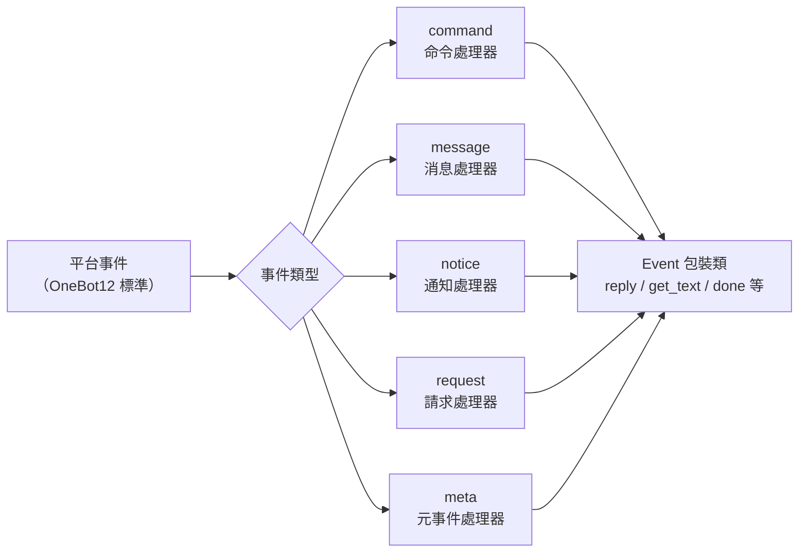

# 事件系統 API

本文檔詳細介紹了 ErisPulse 事件系統的 API。

事件系統將平台事件按類型分發到五類處理器：



## Command 命令模組

### 註冊命令

```python
from ErisPulse.Core.Event import command

# 基本命令
@command("hello", help="發送問候")
async def hello_handler(event):
    await event.reply("你好！")

# 帶別名的命令
@command(["help", "h"], aliases=["幫助"], help="顯示幫助")
async def help_handler(event):
    pass

# 帶權限的命令
def is_admin(event):
    return event.get("user_id") in admin_ids

@command("admin", permission=is_admin, help="管理員命令")
async def admin_handler(event):
    pass

# 隱藏命令
@command("secret", hidden=True, help="秘密命令")
async def secret_handler(event):
    pass

# 命令組
@command("admin.reload", group="admin", help="重新載入模組")
async def reload_handler(event):
    pass
```

### 命令資訊

所有命令查詢 API 均支援可選的**會話上下文**：傳 `event=`（Event 或 dict）或
顯式 `platform=` / `bot_id=` / `session_id=`（與 event 叠加時顯式參數優先），
即按控制面模組維度過濾當前會話不可用模組的命令（詳見 advanced/scope.md）；
全部為可選關鍵字參數，不傳時保持原有全量行為。

```python
# 獲取命令幫助
help_text = command.help()

# 會話感知幫助：只列出當前會話可用的命令
help_text = command.help(event=event)

# 獲取特定命令（返回合併覆蓋後的生效參數；會話不可用時返回 None）
cmd_info = command.get_command("admin")
cmd_info = command.get_command("admin", event=event)

# 獲取所有命令（會話感知時過濾不可用模組的命令）
all_commands = command.get_commands()
all_commands = command.get_commands(event=event)

# 獲取命令組中的所有命令（支援會話感知過濾）
admin_commands = command.get_group_commands("admin")
admin_commands = command.get_group_commands("admin", event=event)

# 獲取所有可見命令
visible_commands = command.get_visible_commands()

# 會話感知的可見命令（event 或顯式關鍵字任一即可）
visible_commands = command.get_visible_commands(event=event)
visible_commands = command.get_visible_commands(
    platform=event.get("platform"),
    bot_id=event.get_self_account_id(),
    session_id=event.get_session_id(),
)
```

### 等待回覆

```python
# 等待使用者回覆
@command("ask", help="詢問使用者資訊")
async def ask_command(event):
    reply = await command.wait_reply(
        event,
        prompt="請輸入你的名字:",  # 已在上面發送
        timeout=30.0
    )
    
    if reply:
        name = reply.get_text()
        await event.reply(f"你好，{name}！")

# 帶驗證的等待回覆
def validate_age(event_data):
    try:
        age = int(event_data.get_text())
        return 0 <= age <= 150
    except ValueError:
        return False

@command("age", help="詢問使用者年齡")
async def age_command(event):
    await event.reply("請輸入你的年齡:")
    
    reply = await command.wait_reply(
        event,
        timeout=60,
        validator=validate_age
    )
    
    if reply:
        age = int(reply.get_text())
        await event.reply(f"你的年齡是 {age} 歲")

# 帶回調的等待回覆
async def handle_confirmation(reply_event):
    text = reply_event.get_text().lower()
    if text in ["是", "yes", "y"]:
        await event.reply("操作已確認！")
    else:
        await event.reply("操作已取消。")

@command("confirm", help="確認操作")
async def confirm_command(event):
    await command.wait_reply(
        event,
        prompt="請輸入'是'或'否':",
        callback=handle_confirmation
    )
```

## Message 消息模組

### 消息事件

```python
from ErisPulse.Core.Event import message

# 監聽所有消息
@message.on_message()
async def message_handler(event):
    sdk.logger.info(f"收到消息: {event.get_text()}")

# 監聽私聊消息
@message.on_private_message()
async def private_handler(event):
    user_id = event.get_user_id()
    sdk.logger.info(f"私聊來自: {user_id}")

# 監聽群聊消息
@message.on_group_message()
async def group_handler(event):
    group_id = event.get_group_id()
    sdk.logger.info(f"群聊來自: {group_id}")

# 監聽@消息
@message.on_at_message()
async def at_handler(event):
    mentions = event.get_mentions()
    sdk.logger.info(f"被@的使用者: {mentions}")
```

### 條件監聽

```python
# 使用優先級控制執行順序
@message.on_message(priority=10)  # 數值越大優先級越高
async def high_priority_handler(event):
    pass

# 在處理器內部實作條件過濾
@message.on_message()
async def filtered_handler(event):
    if "關鍵詞" not in event.get_text():
        return
    # 處理包含關鍵詞的消息
    pass
```

## Notice 通知模組

### 通知事件

```python
from ErisPulse.Core.Event import notice

# 好友添加
@notice.on_friend_add()
async def friend_add_handler(event):
    user_id = event.get_user_id()
    await event.reply("歡迎添加我為好友！")

# 好友刪除
@notice.on_friend_remove()
async def friend_remove_handler(event):
    user_id = event.get_user_id()
    sdk.logger.info(f"好友刪除: {user_id}")

# 群成員增加
@notice.on_group_increase()
async def member_increase_handler(event):
    user_id = event.get_user_id()
    await event.reply(f"歡迎新成員！")

# 群成員減少
@notice.on_group_decrease()
async def member_decrease_handler(event):
    user_id = event.get_user_id()
    sdk.logger.info(f"群成員離開: {user_id}")
```

## Request 請求模組

### 請求事件

```python
from ErisPulse.Core.Event import request

# 好友請求
@request.on_friend_request()
async def friend_request_handler(event):
    user_id = event.get_user_id()
    comment = event.get_comment()
    sdk.logger.info(f"好友請求: {user_id}, 備註: {comment}")

# 群邀請請求
@request.on_group_request()
async def group_request_handler(event):
    group_id = event.get_group_id()
    user_id = event.get_user_id()
    sdk.logger.info(f"群邀請: {group_id}, 來自: {user_id}")
```

## Meta 元事件模組

### 元事件

```python
from ErisPulse.Core.Event import meta

# 連接事件
@meta.on_connect()
async def connect_handler(event):
    platform = event.get_platform()
    sdk.logger.info(f"平台 {platform} 連接成功")

# 斷開連接事件
@meta.on_disconnect()
async def disconnect_handler(event):
    platform = event.get_platform()
    sdk.logger.info(f"平台 {platform} 斷開連接")

# 心跳事件
@meta.on_heartbeat()
async def heartbeat_handler(event):
    sdk.logger.debug("收到心跳")
```

### Bot 狀態查詢

當適配器發送 meta 事件後，框架會自動追蹤 Bot 狀態。查詢 API 和生命週期事件監聽請參考 [適配器系統 API - Bot 狀態管理](adapter-system.md#bot-狀態管理)。

## Event 包裝類

Event 模組的事件處理器接收一個 Event 包裝類實例，它繼承自 dict 並提供了便捷方法。

### 核心方法

```python
# 獲取事件資訊
event_id = event.get_id()
event_time = event.get_time()
event_type = event.get_type()
detail_type = event.get_detail_type()
platform = event.get_platform()

# 獲取機器人資訊
self_platform = event.get_self_platform()
self_user_id = event.get_self_user_id()
self_info = event.get_self_info()
```

### 會話標識

```python
# 統一目標 ID：群聊返回 group_id，私聊返回 user_id，以此類推
target_id = event.get_target_id()

# 會話唯一標識，格式: {platform}:{detail_type}:{target_id}
session_id = event.get_session_id()
# 示例: "telegram:private:12345"、"qq:group:67890"
```

`get_target_id()` 按以下順序返回首個非空值：`group_id` → `channel_id` → `guild_id` → `thread_id` → `user_id`。適用於上下文管理、狀態儲存等需要統一標識會話的場景。

### 消息方法

```python
# 獲取消息內容
message_segments = event.get_message()
alt_message = event.get_alt_message()
text = event.get_text()

# 獲取發送者資訊
user_id = event.get_user_id()
nickname = event.get_user_nickname()
sender = event.get_sender()

# 獲取群組資訊
group_id = event.get_group_id()

# 判斷消息類型
is_msg = event.is_message()
is_private = event.is_private_message()
is_group = event.is_group_message()

# @消息相關
is_at = event.is_at_message()
has_mention = event.has_mention()
mentions = event.get_mentions()
```

### 命令資訊

```python
# 獲取命令資訊
cmd_name = event.get_command_name()
cmd_args = event.get_command_args()
cmd_raw = event.get_command_raw()

# 判斷是否為命令
is_cmd = event.is_command()
```

### 回覆功能

```python
# 基本回覆
await event.reply("這是一條消息")

# 指定發送方法
await event.reply("http://example.com/image.jpg", method="Image")

# 帶 @使用者 和回覆消息
await event.reply("你好", at_users=["user1"], reply_to="msg_id")

# @全體成員
await event.reply("公告", at_all=True)

# 使用平台專有修飾方法（via 參數）
await event.reply("看板內容", method="Board",
                  via=[("Expire", 3600), ("ForMember", "114514")])

# 獲取發送鏈，自由追加修飾方法和發送方法（適合連續多個修飾 / 動作型方法）
await event.send_chain().Expire(3600).Board("看板內容")
await event.send_chain().DismissBoard()

# 使用 OneBot12 消息段回覆
from ErisPulse.Core.Event import MessageBuilder
msg = MessageBuilder().text("Hello").image("url").build()
await event.reply_ob12(msg)

# 等待回覆
reply = await event.wait_reply(timeout=30)
```

### 平台能力查詢

```python
# 檢查當前平台是否支援某種發送方法
if event.supports("Image"):
    await event.reply(url, method="Image")

# 列出當前平台所有可用發送方法
methods = event.available_methods()
# ["Text", "Image", "Voice", "Video", ...]
```

### 回覆方法

`reply()` 方法支援透過 `method` 參數指定發送類型，以及兩個便捷的布林參數：

```python
# 簡單文本回覆
await event.reply("你好")

# 回覆並@發送者
await event.reply("你好", at_sender=True)

# 回覆並引用當前消息
await event.reply("收到", quote=True)

# 組合使用
await event.reply("收到", at_sender=True, quote=True)

# 發送圖片（使用 method 參數）
if event.supports("Image"):
    await event.reply("http://example.com/img.jpg", method="Image")
else:
    await event.reply("[圖片] http://example.com/img.jpg")
```

**參數說明**：

| 參數 | 類型 | 說明 |
|------|------|------|
| `content` | str | 發送內容 |
| `method` | str | 發送方法，預設 "Text"，可選 "Image"/"Voice"/"Video"/"File" 等 |
| `at_sender` | bool | 是否@發送者（自動提取 user_id） |
| `quote` | bool | 是否引用回覆當前消息（自動提取 message_id） |
| `at_users` | list[str] | @指定使用者列表 |
| `reply_to` | str | 手動指定回覆的消息 ID |
| `at_all` | bool | 是否@全體成員 |

### 互動方法

```python
# confirm — 確認對話（返回 True/False/None）
if await event.confirm("確定要執行此操作嗎？"):
    await event.reply("已確認")

# 使用非 Text 方式發送確認提示
if await event.confirm("http://example.com/image.jpg", method="Image"):
    await event.reply("已確認圖片提示")

# choose — 選擇菜單（返回選項索引或 None）
choice = await event.choose("請選擇顏色：", ["紅色", "綠色", "藍色"])

# options_format="auto"（預設）根據 method 自動選擇樣式：
# Markdown→無序列表（- 1.選項），Html→有序列表（<ol>），其他→純文本列表
# 文本類方法（Markdown/Html 等）預設合併選項到末尾
# merge_prompt=True 可強制任意 method 合併；placeholder 可自訂占位符
choice = await event.choose(
    "## 請選擇\n{options}", ["A", "B"],
    method="Markdown", merge_prompt=True,
)

# collect — 表單收集（返回 {key: value} 字典或 None）
data = await event.collect([
    {"key": "name", "prompt": "請輸入姓名："},
    {"key": "age", "prompt": "請輸入年齡：",
     "validator": lambda e: e.get_text().isdigit()},
    {"key": "avatar", "prompt": "請發送頭像：", "method": "Image"},
])

# wait_for — 等待滿足條件的任意事件
evt = await event.wait_for(event_type="notice", condition=lambda e: ..., timeout=120)

# conversation — 多輪對話上下文
conv = event.conversation(timeout=60)
await conv.say("歡迎！")
```

> 完整的互動方法參數說明和更多示例請參考 [Event 包裝類詳解](../developer-guide/modules/event-wrapper.md) 和 [Conversation 多輪對話](../advanced/conversation.md)。

### 工具方法

```python
# 轉換為字典（過濾以 _ 開頭的內部鍵）
event_dict = event.to_dict()

# 獲取原始資料
raw = event.get_raw()
raw_type = event.get_raw_type()
```

### 鏈路控制

`event.done(claim=, stop=)` 統一控制「認領」與「阻斷」兩個正交語義：

- **認領（claim）**：標記事件已被處理（`_processed`），命令分發器據此跳過去重
- **阻斷（stop）**：阻止向低優先級處理器傳播（`_propagation_stopped`）

```python
# 認領 + 阻斷（預設）
event.done()

# 僅認領，不阻斷（低優先級觀察者仍能看到）
event.done(stop=False)

# 僅阻斷，不認領（如防火牆 / 限流）
event.done(claim=False)

# mark_processed 是主方法，done 是其別名
event.mark_processed()             # 等價 event.done()
event.mark_processed(stop=False)   # 等價 event.done(stop=False)

# 查询狀態
event.is_processed()  # 是否已認領
event.is_stopped()    # 是否已阻斷傳播
```

### 平台擴展方法

適配器可以為 Event 註冊平台專有方法，僅在對應平台的實例上可用。

#### 使用者：使用平台擴展方法

當適配器註冊了平台專有方法後，你可以在事件處理器中直接調用。各平台的方法不同，請參閱對應的 [平台文件](../platform-guide/)。

```python
from ErisPulse.Core.Event import message

@message.on_message()
async def handle_message(event):
    platform = event.get_platform()

    # 根據平台調用專有方法
    if platform == "email":
        subject = event.get_subject()           # 郵件專有
        attachments = event.get_attachments()   # 郵件專有
```

#### 查詢平台已註冊方法

```python
from ErisPulse.Core.Event import get_platform_event_methods

# 查看某平台註冊了哪些方法
methods = get_platform_event_methods("email")
# ["get_subject", "get_from", "get_attachments", ...]

# 動態判斷並調用
for method_name in get_platform_event_methods(event.get_platform()):
    method = getattr(event, method_name)
    print(f"{method_name}: {method()}")
```

#### 平台方法隔離

不同平台註冊的方法互不干擾：

```python
# 郵件事件 - 只有郵件方法
event = Event({"platform": "email", "email_raw": {"subject": "Hello"}})
event.get_subject()      # ✅ "Hello"
event.get_chat_type()    # ❌ AttributeError

# Telegram 事件 - 只有 Telegram 方法
event = Event({"platform": "telegram", "telegram_raw": {"chat": {"type": "private"}}})
event.get_chat_type()    # ✅ "private"
event.get_subject()      # ❌ AttributeError
```

#### `hasattr` / `dir` 支援

```python
hasattr(event, "get_subject")   # 僅當 platform="email" 時返回 True
"get_subject" in dir(event)     # 同上
```

### 適配器：註冊平台擴展方法

適配器可以透過裝飾器為 Event 註冊平台專有方法，方法的第一個參數為 `self`（Event 實例），可以自由訪問事件資料。

#### 單個方法註冊

```python
from ErisPulse.Core.Event import register_event_method

@register_event_method("email")
def get_subject(self):
    """獲取郵件主題"""
    return self.get("email_raw", {}).get("subject", "")

@register_event_method("email")
def get_from(self):
    """獲取發件人"""
    return self.get("email_raw", {}).get("from", {})
```

#### 批量註冊（Mixin 類）

當方法較多時，推薦使用 Mixin 類批量註冊：

```python
from ErisPulse.Core.Event import register_event_mixin

class EmailEventMixin:
    def get_subject(self):
        return self.get("email_raw", {}).get("subject", "")

    def get_from(self):
        return self.get("email_raw", {}).get("from", {})

    def get_attachments(self):
        return self.get("email_raw", {}).get("attachments", [])

# 一次性註冊所有方法
register_event_mixin("email", EmailEventMixin)
```

#### 返回值規範

| 場景 | 返回值 | 使用者使用方式 |
|------|--------|------------|
| 返回資料（文字、字典等） | 直接返回值 | `subject = event.get_subject()` |
| 執行操作（發送消息等） | 返回 `asyncio.Task` | `task = event.do_something()` 可選 `await` |

> **建議**：非資料返回的方法返回 `asyncio.Task`，這樣使用者可以自行決定是否 `await`，即使不 `await` 操作也會執行完成。

```python
@register_event_method("email")
def forward_email(self, to_address: str):
    """轉發郵件 — 返回 Task，使用者可自行決定是否 await"""
    import asyncio
    return asyncio.create_task(
        self._do_forward(to_address)
    )

# 使用者可以 await 等待結果
await event.forward_email("user@example.com")

# 也可以不 await，操作在背景執行
event.forward_email("user@example.com")
```

#### 注銷方法

```python
from ErisPulse.Core.Event import unregister_event_method, unregister_platform_event_methods

# 注銷單個方法
unregister_event_method("email", "get_subject")

# 注銷某平台全部方法（適配器 shutdown 時調用）
unregister_platform_event_methods("email")
```

#### 覆寫內建方法

`register_event_mixin` / `register_event_method` 支援覆寫 Event 內建方法（如 `confirm`、`choose`、`collect`、`wait_reply`、`reply` 等）。註冊的平台方法透過 `Event.__getattribute__` 優先於內建方法生效，因此適配器可以提供平台特色的互動實作。

內建實作為 `_builtin_*` 函數導出，覆寫方可以調用它們作為回退：

```python
from ErisPulse.Core.Event import register_event_mixin, _builtin_choose

class YunhuEventMixin:
    async def choose(self, prompt, options, timeout=60, method="Text"):
        # 云湖平台使用按鈕元件
        buttons = [[{"text": opt} for opt in options]]
        await self.reply(prompt)
        # ...等待按鈕回調或文字回覆...
        # 回退到內建邏輯
        return await _builtin_choose(self, None, options, timeout, "Text")

register_event_mixin("yunhu", YunhuEventMixin)
```

## 跨平台擴展（通配符）

`register_event_method` 和 `register_event_mixin` 支援傳 `"*"` 作為平台名，註冊的方法在**所有平台**的 Event 實例上都可用。適合 AI 對話、上下文管理等需要跨平台複用的功能模組。

### 註冊跨平台方法

```python
from ErisPulse.Core.Event.wrapper import register_event_method

@register_event_method("*")
async def ai_chat(self, prompt: str):
    """self 為 Event 實例，可自由訪問事件資料和內建方法"""
    await self.reply(f"AI: {prompt}")
```

註冊後，所有平台的事件處理器都能調用：

```python
from ErisPulse.Core.Event import message

@message.on_message()
async def handler(event):
    await event.ai_chat(event.get_text())
```

### 方法解析優先級

透過屬性存取 Event 方法時，解析順序為：

1. **平台特定方法**（當前平台的覆寫）
2. **通配符方法**（`"*"` 註冊的跨平台方法）
3. **內建方法**（`reply`、`confirm` 等）
4. **字典鍵存取**

> 因此通配符方法可以覆寫內建方法（如 `reply`），但會被同名的平台特定方法進一步覆寫。

## 優先級系統

事件處理器支援優先級，數值越大優先級越高：

```python
# 高優先級處理器先執行
@message.on_message(priority=10)
async def high_priority_handler(event):
    pass

# 低優先級處理器後執行
@message.on_message(priority=0)
async def low_priority_handler(event):
    pass
```

## 相關文件

- [核心模組 API](core-modules.md) - 核心模組 API
- [適配器系統 API](adapter-system.md) - Adapter 管理 API
- [模組開發指南](../developer-guide/modules/) - 開發自訂模組