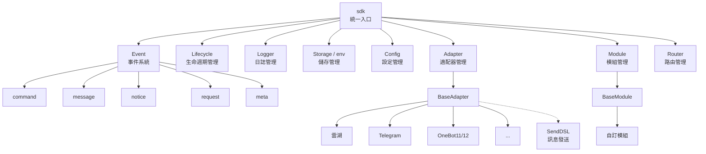
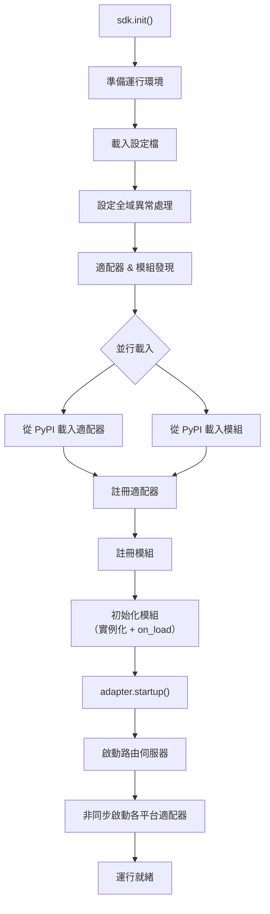
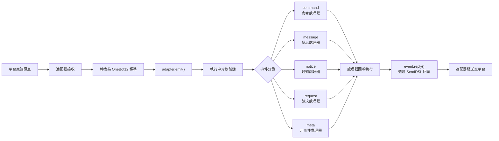
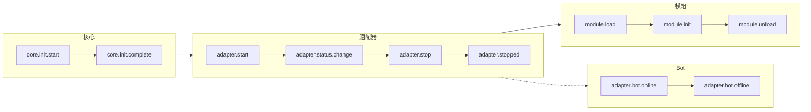
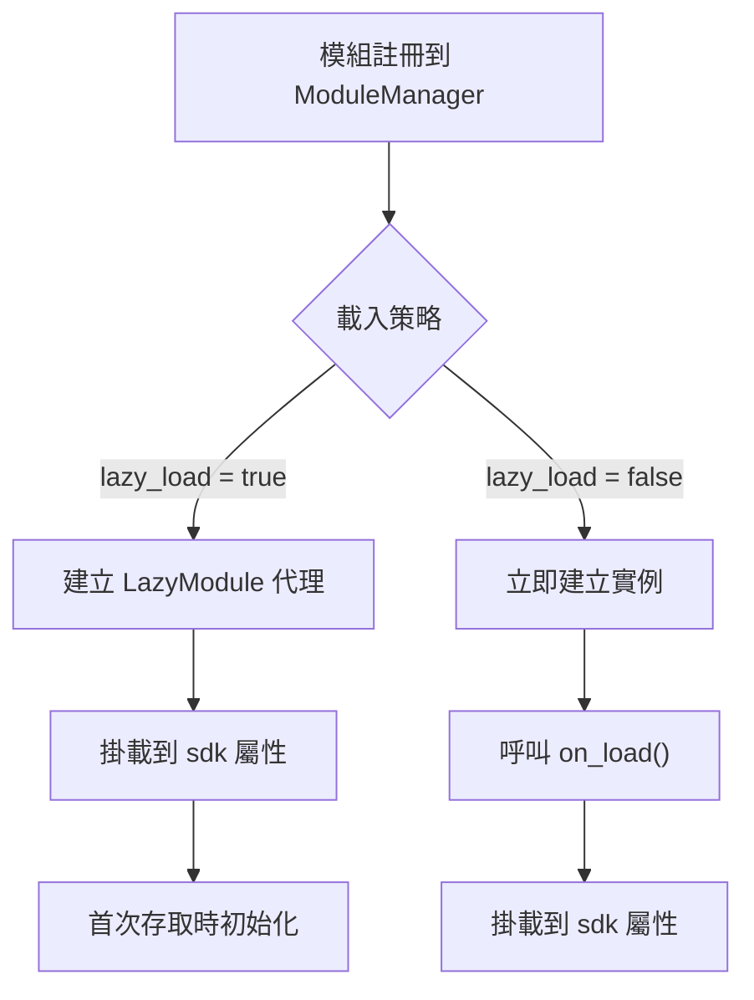

# 架構概覽

本文檔透過視覺化圖表介紹 ErisPulse SDK 的技術架構，幫助你快速理解框架的設計思想和模組關係。

## SDK 核心架構

下圖展示了 SDK 的核心模組組成及其關係：



### 核心模組說明

| 模組 | 說明 |
|------|------|
| **Event** | 事件系統，提供 command / message / notice / request / meta 五類事件處理 |
| **Adapter** | 適配器管理器，管理多平台適配器的註冊、啟動和關閉 |
| **Module** | 模組管理器，管理外掛的註冊、載入和卸載 |
| **Lifecycle** | 生命週期管理器，提供事件驅動的生命週期鉤子 |
| **Storage** | 基於 SQLite 的鍵值儲存系統，支援通用 SQL 鏈式查詢 |
| **Config** | TOML 格式的設定檔管理 |
| **Logger** | 模組化日誌系統，支援子日誌器 |
| **Router** | 基於 FastAPI 的 HTTP/WebSocket 路由管理 |

## 初始化流程

下圖展示了 `sdk.init()` 的完整初始化過程：



### 初始化階段詳解

1. **環境準備** - 載入 TOML 設定檔，設定全域異常處理
2. **並行發現** - 同時從已安裝的 PyPI 套件中發現適配器和模組
3. **註冊階段** - 將發現的適配器和模組註冊到對應管理器
4. **模組初始化** - 建立模組實例，呼叫 `on_load` 生命週期方法
5. **適配器啟動** - 啟動路由伺服器（FastAPI），非同步啟動各平台適配器連線

## 事件處理流程

下圖展示了訊息從平台到處理器的完整流轉路徑：



### 事件處理關鍵步驟

- **適配器接收** - 各平台適配器透過 WebSocket/Webhook 等方式接收原生事件
- **OB12 標準化** - 將平台原生事件轉換為統一的 OneBot12 標準格式
- **中介軟體處理** - 依次執行已註冊的中介軟體函式，可修改事件資料
- **事件分發** - 根據事件類型（message/notice/request/meta）分發到對應處理器
- **SendDSL 回覆** - 處理器透過 `event.reply()` 或 `SendDSL` 鏈式呼叫發送回應

## 生命週期事件

下圖展示了框架各組件的生命週期事件觸發順序：



### 監聽生命週期事件

你可以透過 `lifecycle.on()` 監聽這些事件，執行自訂邏輯：

```python
from ErisPulse import sdk

# 監聽所有適配器事件
@sdk.lifecycle.on("adapter")
async def on_adapter_event(event_data):
    print(f"適配器事件: {event_data}")

# 監聽模組載入完成
@sdk.lifecycle.on("module.load")
async def on_module_loaded(event_data):
    print(f"模組已載入: {event_data}")

# 監聽 Bot 上線
@sdk.lifecycle.on("adapter.bot.online")
async def on_bot_online(event_data):
    print(f"Bot 上線: {event_data}")
```

## 模組載入策略

ErisPulse 支援兩種模組載入策略：



> 更多詳情請參考 [延遲載入系統](advanced/lazy-loading.md) 和 [生命週期管理](advanced/lifecycle.md)。