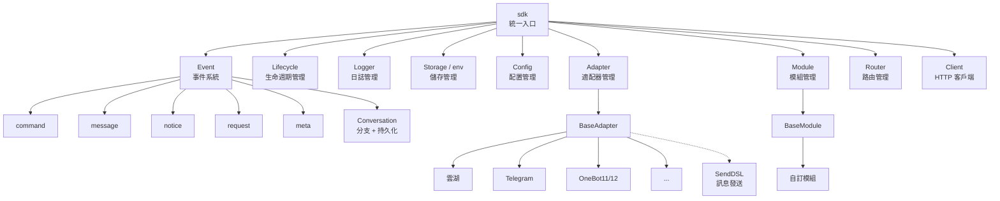
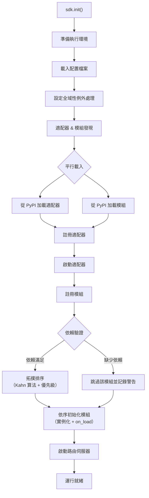
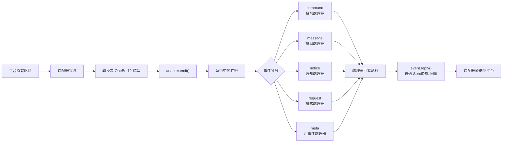
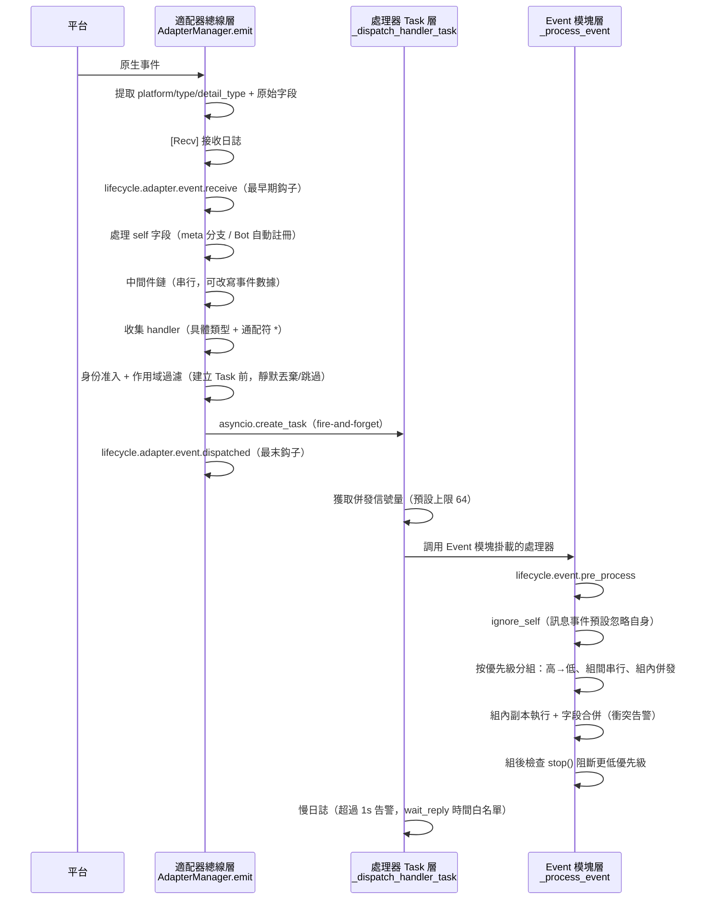
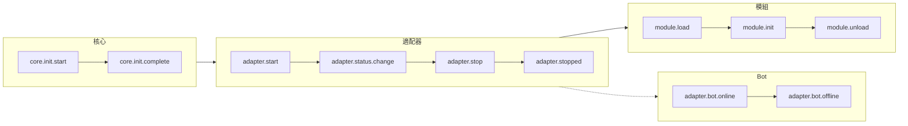
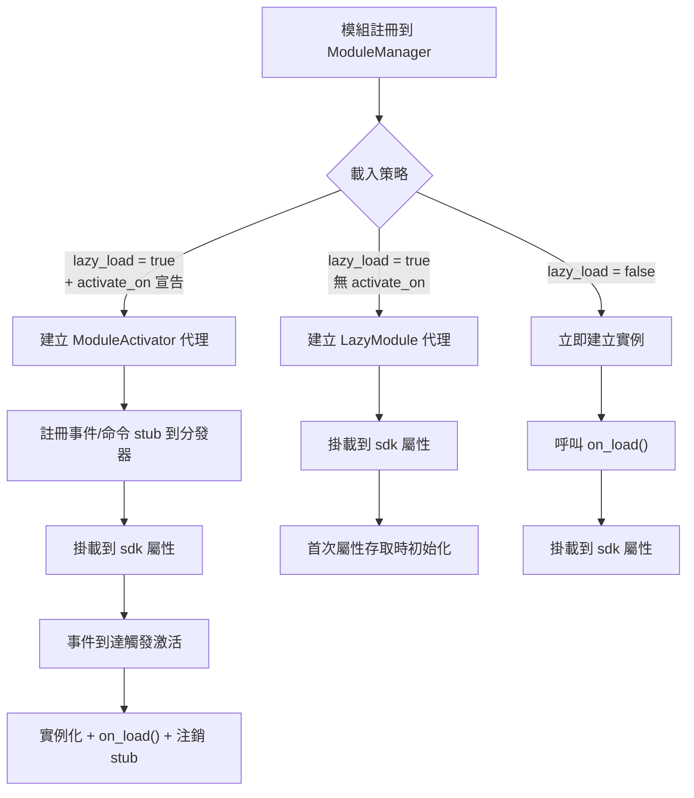
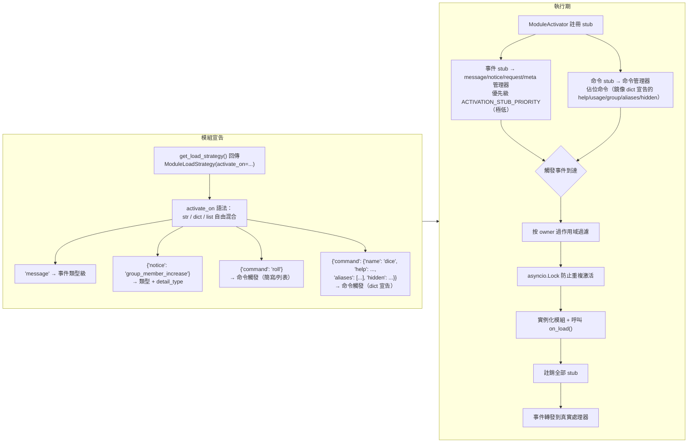
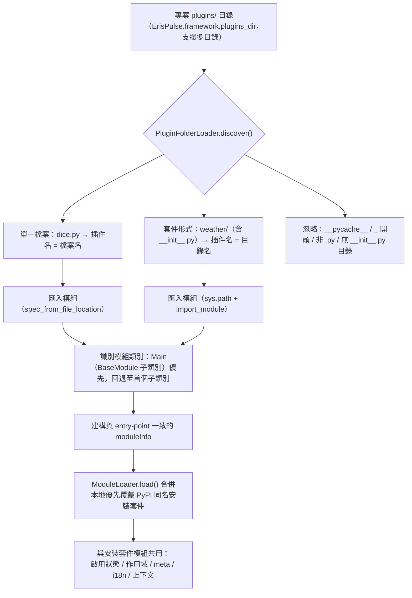
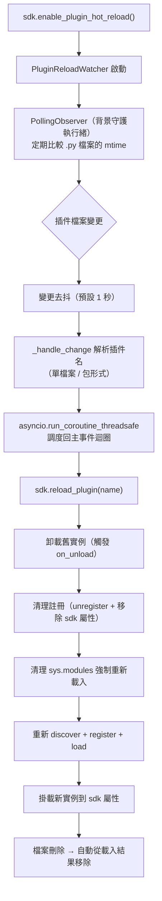

# 架構概覽

本文檔透過可視化圖表介紹 ErisPulse SDK 的技術架構，幫助你快速理解框架的設計理念和模組關係。

## SDK 核心架構

下圖展示了 SDK 的核心模組組成及其關係：

```mermaid
graph TB
    SDK["sdk<br/>統一入口"]

    SDK --> Event["Event<br/>事件系統"]
    SDK --> Lifecycle["Lifecycle<br/>生命週期管理"]
    SDK --> Logger["Logger<br/>日誌管理"]
    SDK --> Storage["Storage / env<br/>儲存管理"]
    SDK --> Config["Config<br/>配置管理"]
    SDK --> AdapterMgr["Adapter<br/>適配器管理"]
    SDK --> ModuleMgr["Module<br/>模組管理"]
    SDK --> Router["Router<br/>路由管理"]
    SDK --> Client["Client<br/>HTTP 客戶端"]
    Event --> Command["command"]
    Event --> Message["message"]
    Event --> Notice["notice"]
    Event --> Request["request"]
    Event --> Meta["meta"]
    Event --> Conversation["Conversation<br/>分支 + 持久化"]

    AdapterMgr --> BaseAdapter["BaseAdapter"]
    BaseAdapter --> P1["雲湖"]
    BaseAdapter --> P2["Telegram"]
    BaseAdapter --> P3["OneBot11/12"]
    BaseAdapter --> PN["..."]

    ModuleMgr --> BaseModule["BaseModule"]
    BaseModule --> CM["自訂模組"]

    BaseAdapter -.-> SendDSL["SendDSL<br/>訊息發送"]
```

### 核心模組說明

| 模組 | 說明 |
|------|------|
| **Event** | 事件系統，提供 command / message / notice / request / meta 五類事件處理，以及 Conversation 多輪對話 |
| **Adapter** | 適配器管理器，管理多平台適配器的註冊、啟動和關閉 |
| **Module** | 模組管理器，管理插件的註冊、加載和卸載，支援依賴宣告和拓撲排序 |
| **Lifecycle** | 生命週期管理器，提供事件驅動的生命週期鉤子 |
| **Storage** | 基於 SQLite 的鍵值儲存系統，支援通用 SQL 鏈式查詢 |
| **Config** | TOML 格式的配置文件管理 |
| **Logger** | 模組化日誌系統，支援子日誌器 |
| **Router** | HTTP/WebSocket 路由管理，透過抽象層封裝底層後端（目前為 FastAPI + Uvicorn），支援裝飾器路由、中間件、分組、限流、CORS |
| **Client** | 統一 HTTP/WS 客戶端（2.8.0 前為 `HttpClient`，保留相容別名），透過抽象層封裝底層請求庫（目前為 aiohttp），提供請求統計、重試、日誌、WebSocket 客戶端、ErisPulse 異常體系等功能。客戶端和伺服器 WebSocket 共享 `WebSocketConnectionBase` 基類 |

## 初始化流程

下圖展示了 `sdk.init()` 的完整初始化過程：

```mermaid
flowchart TD
    A["sdk.init()"] --> B["準備執行環境"]
    B --> B1["載入配置檔案"]
    B1 --> B2["設定全域性例外處理"]
    B2 --> C["適配器 & 模組發現"]
    C --> D{"平行載入"}
    D --> D1["從 PyPI 加載適配器"]
    D --> D2["從 PyPI 加載模組"]
    D1 & D2 --> E["註冊適配器"]
    E --> E1["啟動適配器"]
    E1 --> F["註冊模組"]
    F --> F1{"依賴驗證"}
    F1 -->|"缺少依賴"| F2["跳過該模組並記錄警告"]
    F1 -->|"依賴滿足"| F3["拓撲排序<br/>（Kahn 算法 + 優先級）"]
    F3 --> G["依序初始化模組<br/>（實例化 + on_load）"]
    F2 --> G
    G --> H["啟動路由伺服器"]
    H --> K["運行就緒"]
```

### 初始化階段詳解

> 完整的初始化鏈路拆解（Finder / Loader / Manager / Router）、底層入口（`init()` / `init_task()` / `init_sync()`）與手動完整啟動見 [啟動流程與手動控制](advanced/startup.md)。

## 事件處理流程

下圖展示了訊息從平台到處理器的完整轉流路徑：

```mermaid
flowchart LR
    A["平台原始訊息"] --> B["適配器接收"]
    B --> C["轉換為 OneBot12 標準"]
    C --> D["adapter.emit()"]
    D --> E["執行中間件鏈"]
    E --> F{"事件分發"}
    F --> G1["command<br/>命令處理器"]
    F --> G2["message<br/>訊息處理器"]
    F --> G3["notice<br/>通知處理器"]
    F --> G4["request<br/>請求處理器"]
    F --> G5["meta<br/>元事件處理器"]
    G1 & G2 & G3 & G4 & G5 --> H["處理器回調執行"]
    H --> I["event.reply()<br/>透過 SendDSL 回覆"]
    I --> J["適配器發送至平台"]
```

### 事件處理鏈路詳解

上面這張圖是「結果」；下面拆開 `adapter.emit()` 之後框架**在背後做了什麼**——這是一條三層分發的鏈路：

```mermaid
sequenceDiagram
    participant P as 平台
    participant A as 適配器總線層<br/>AdapterManager.emit
    participant T as 處理器 Task 層<br/>_dispatch_handler_task
    participant E as Event 模塊層<br/>_process_event

    P->>A: 原生事件
    A->>A: 提取 platform/type/detail_type + 原始字段
    A->>A: [Recv] 接收日誌
    A->>A: lifecycle.adapter.event.receive（最早期鈎子）
    A->>A: 處理 self 字段（meta 分支 / Bot 自動註冊）
    A->>A: 中間件鏈（串行，可改寫事件數據）
    A->>A: 收集 handler（具體類型 + 通配符 *）
    A->>A: 身份准入 + 作用域過濾（建立 Task 前，靜默丟棄/跳過）
    A->>T: asyncio.create_task（fire-and-forget）
    A->>A: lifecycle.adapter.event.dispatched（最末鈎子）
    T->>T: 獲取併發信號量（預設上限 64）
    T->>E: 調用 Event 模塊掛載的處理器
    E->>E: lifecycle.event.pre_process
    E->>E: ignore_self（訊息事件預設忽略自身）
    E->>E: 按優先級分組：高→低、組間串行、組內併發
    E->>E: 組內副本執行 + 字段合併（衝突告警）
    E->>E: 組後檢查 stop() 阻斷更低優先級
    T->>T: 慢日誌（超過 1s 告警，wait_reply 時間白名單）
```

**每一步框架做了什麼、你能干預什麼：**

| 階段 | 框架做了什麼 | 你能干預的 |
|------|-------------|-----------|
| 接收 | 提取標準字段，保留 `{platform}_raw` 原始數據；寫 `[Recv]` 日誌 | 監聽 `adapter.event.receive` 拿到最早期事件 |
| self 字段 | meta 事件走 connect/disconnect/heartbeat 分支；普通事件自動註冊 Bot 並觸發 `adapter.bot.online` | 監聽 `adapter.bot.online` / `bot.offline` |
| 中間件 | **串行**執行，返回值非 None 則替換事件數據 | 註冊中間件改寫/攔截事件 |
| 分發收集 | 先取具體類型 handler，再取 `*` 通配符 handler | — |
| 身份維度 | 分發入口按 用戶>會話>Bot>適配器 判定事件收不收（`scope.is_identity_allowed`），**拒絕則整個事件丟棄** | `ErisPulse.scope.identity` 綁定 |
| 作用域過濾 | 按模組 owner 判定 `scope.is_allowed`（會話級>Bot級>平台級），**不通過則靜默跳過** | 配置作用域白名單/黑名單 |
| 調度 | 每個匹配 handler 獨立 `asyncio.Task`，`emit()` **不等待** handler 完成即返回 | — |
| 優先級 | 高優先級組先執行；**組間串行、組內併發**（組內各自持有事件副本，改字段合併回原事件，衝突打 WARNING） | `@command(..., priority=N)` / 註冊時指定 priority |
| 阻斷 | 每處理完一組檢查 `event.is_stopped()`，命中則**不再執行更低優先級** | `event.mark_processed(stop=True)` / `event.done()` |

> **常見誤區**：
> 1. **作用域過濾是靜默的**——被屏蔽的 handler 不報錯不回應，只在 TRACE 級日誌可見（`core.scope.denied`）。「我的模組沒收到訊息」優先排查作用域綁定。
> 2. **handler 天然併發**——框架已為每個 handler 建獨立 Task，你**不需要**再自己 `asyncio.create_task` 包一層。
> 3. **同優先級組內不阻斷**——`mark_processed(stop=True)` 只阻止更低優先級組，同組內已併發的 handler 不會中途被打斷。
> 4. **慢日誌閾值固定 1 秒**——處理器耗時超過 1s 會在日誌打 WARNING（`wait_reply` 等待時間已從耗時中剔除），但不中斷執行。

> 作用域三級綁定與優先級細節見 [作用域系統](advanced/scope.md)；claim/阻斷完整語義見 [事件處理入門](getting-started/event-handling.md)；併發上限配置見 [配置指南](user-guide/configuration.md#框架配置)。

## 生命週期事件

下圖展示了框架各組件的生命週期事件觸發順序：

```mermaid
flowchart LR
    subgraph Core["核心"]
        direction LR
        C1["core.init.start"] --> C2["core.init.complete"]
    end

    subgraph AdapterLife["適配器"]
        direction LR
        A1["adapter.start"] --> A2["adapter.status.change"] --> A3["adapter.stop"] --> A4["adapter.stopped"]
    end

    subgraph ModuleLife["模組"]
        direction LR
        M1["module.load"] --> M2["module.init"] --> M3["module.unload"]
    end

    subgraph BotLife["Bot"]
        direction LR
        B1["adapter.bot.online"] --> B2["adapter.bot.offline"]
    end

    Core --> AdapterLife
    AdapterLife --> ModuleLife
    AdapterLife -.-> BotLife
```

### 監聽生命週期事件

> 完整的事件監聽方法（`lifecycle.on()` / `once()` / `has_handlers()`）、全部生命週期事件列表與資料格式見 [生命週期管理](advanced/lifecycle.md)。

## 模組載入策略

ErisPulse 支援三種模組載入策略，由 `get_load_strategy()` 回傳的 `ModuleLoadStrategy` 宣告：

```mermaid
flowchart TD
    A["模組註冊到 ModuleManager"] --> B{"載入策略"}
    B -->|"lazy_load = true<br/>+ activate_on 宣告"| C["建立 ModuleActivator 代理"]
    B -->|"lazy_load = true<br/>無 activate_on"| D["建立 LazyModule 代理"]
    B -->|"lazy_load = false"| E["立即建立實例"]
    C --> F["註冊事件/命令 stub 到分發器"]
    F --> G["掛載到 sdk 屬性"]
    G --> H["事件到達觸發激活"]
    H --> I["實例化 + on_load() + 注銷 stub"]
    D --> J["掛載到 sdk 屬性"]
    J --> K["首次屬性存取時初始化"]
    E --> L["呼叫 on_load()"]
    L --> M["掛載到 sdk 屬性"]
```

> 更多詳情請參考 [懶載入系統](advanced/lazy-loading.md)、[生命週期管理](advanced/lifecycle.md) 與模組文件。

### 事件驅動懶激活（`activate_on`）觸發架構

> [!NOTE]
> 本特性需要 ErisPulse **2.8.0+**。

`activate_on` 允許模組在**首個匹配事件/命令到達時**才載入，避免常駐記憶體，同時確保事件不遺失：

```mermaid
flowchart LR
    subgraph Declare["模組宣告"]
        S1["get_load_strategy() 回傳<br/>ModuleLoadStrategy(activate_on=...)"] --> S2["activate_on 語法：<br/>str / dict / list 自由混合"]
        S2 --> S2a["'message' → 事件類型級"]
        S2 --> S2b["{'notice': 'group_member_increase'}<br/>→ 類型 + detail_type"]
        S2 --> S2c["{'command': 'roll'}<br/>→ 命令觸發（簡寫/列表）"]
        S2 --> S2d["{'command': {'name': 'dice', 'help': ...,<br/>'aliases': [...], 'hidden': ...}}<br/>→ 命令觸發（dict 宣告）"]
    end

    subgraph Runtime["執行期"]
        R1["ModuleActivator 註冊 stub"] --> R1a["事件 stub → message/notice/request/meta 管理器<br/>優先級 ACTIVATION_STUB_PRIORITY（極低）"]
        R1 --> R1b["命令 stub → 命令管理器<br/>佔位命令（鏡像 dict 宣告的 help/usage/group/aliases/hidden）"]
        R1a --> R2{"觸發事件到達"}
        R1b --> R2
        R2 --> R3["按 owner 過作用域過濾"]
        R3 --> R4["asyncio.Lock 防止重複激活"]
        R4 --> R5["實例化模組 + 呼叫 on_load()"]
        R5 --> R6["註銷全部 stub"]
        R6 --> R7["事件轉發到真實處理器"]
    end

    Declare --> Runtime
```

**觸發語義要點：**

> 完整的 `activate_on` 語法（str / dict / list）、命令 dict 宣告、佔位命令 help 回退鏈、作用域過濾與失敗語義見 [懶載入系統](advanced/lazy-loading.md#事件驅動懶激活activate_on)。

## 本地插件檔案夾架構

> [!NOTE]
> 本特性需要 ErisPulse **2.8.0+**。

本地插件（`plugins/` 目錄）無需打包發布，框架啟動時自動發現並載入：

```mermaid
flowchart TD
    A["專案 plugins/ 目錄<br/>（ErisPulse.framework.plugins_dir，支援多目錄）"] --> B{"PluginFolderLoader.discover()"}
    B --> C["單一檔案：dice.py → 插件名 = 檔案名"]
    B --> D["套件形式：weather/（含 __init__.py）→ 插件名 = 目錄名"]
    B --> E["忽略：__pycache__ / _ 開頭 / 非 .py / 無 __init__.py 目錄"]
    C --> F["匯入模組（spec_from_file_location）"]
    D --> G["匯入模組（sys.path + import_module）"]
    F --> H["識別模組類別：Main（BaseModule 子類別）優先，回退至首個子類別"]
    G --> H
    H --> I["建構與 entry-point 一致的 moduleInfo"]
    I --> J["ModuleLoader.load() 合併<br/>本地優先覆蓋 PyPI 同名安裝套件"]
    J --> K["與安裝套件模組共用：<br/>啟用狀態 / 作用域 / meta / i18n / 上下文"]
```

**約定與特性：**

- 插件名來源：單一檔案取檔案名，套件形式取目錄名
- 本地插件 `moduleInfo.meta.source == "plugin_folder"`，與 PyPI 安裝套件模組無縫共存
- 同名時本地優先（便於本地覆蓋調試），被停用時同時移除同名 entry-point 條目

## 本地插件熱重載架構

熱重載會監控插件檔案的變更，並自動重新載入對應的插件：

```mermaid
flowchart TD
    A["sdk.enable_plugin_hot_reload()"] --> B["PluginReloadWatcher 啟動"]
    B --> C["PollingObserver（背景守護執行緒）<br/>定期比較 .py 檔案的 mtime"]
    C --> D{"插件檔案變更"}
    D --> E["變更去抖（預設 1 秒）"]
    E --> F["_handle_change 解析插件名<br/>（單檔案 / 包形式）"]
    F --> G["asyncio.run_coroutine_threadsafe<br/>調度回主事件迴圈"]
    G --> H["sdk.reload_plugin(name)"]
    H --> I["卸載舊實例（觸發 on_unload）"]
    I --> J["清理註冊（unregister + 移除 sdk 屬性）"]
    J --> K["清理 sys.modules 強制重新載入"]
    K --> L["重新 discover + register + load"]
    L --> M["掛載新實例到 sdk 屬性"]
    M --> N["檔案刪除 → 自動從載入結果移除"]
```