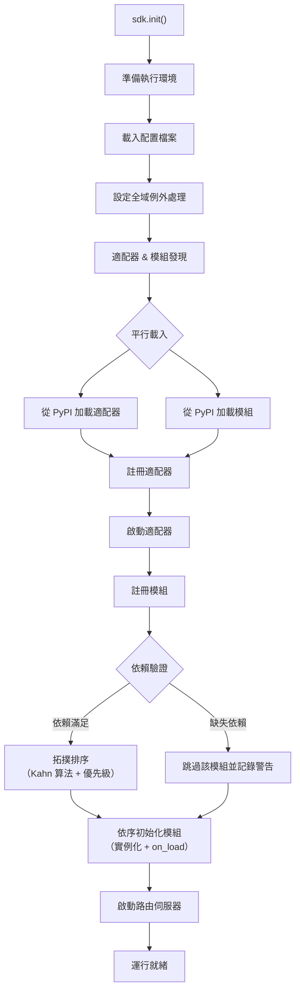
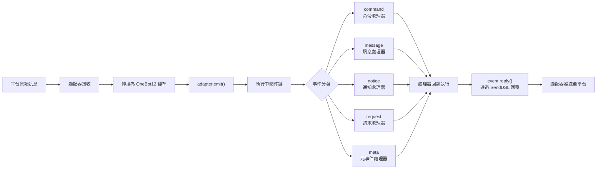
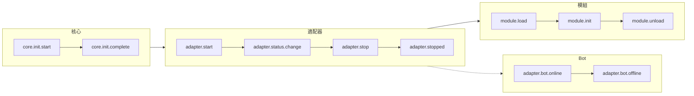
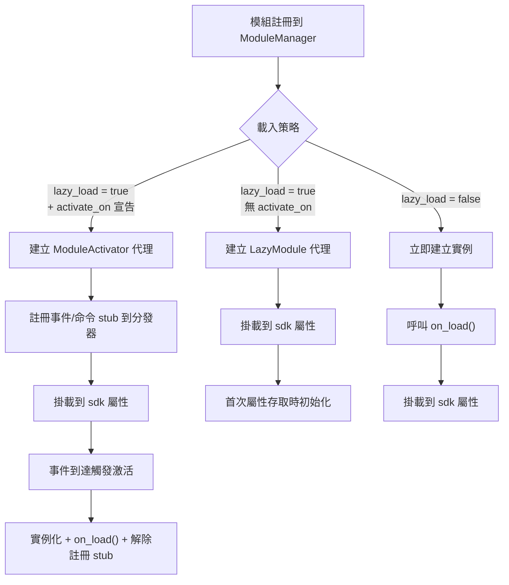
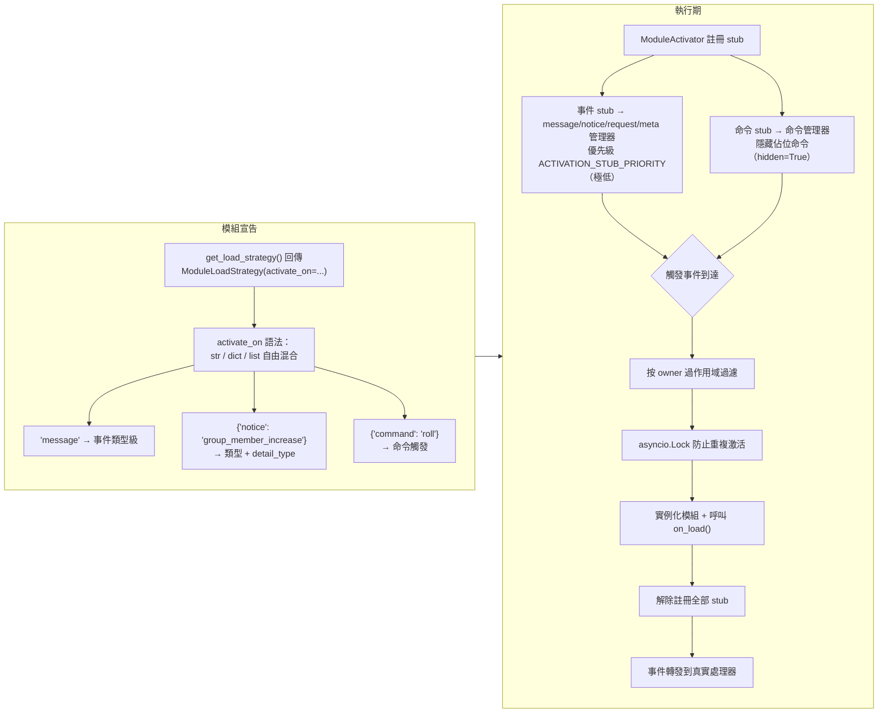
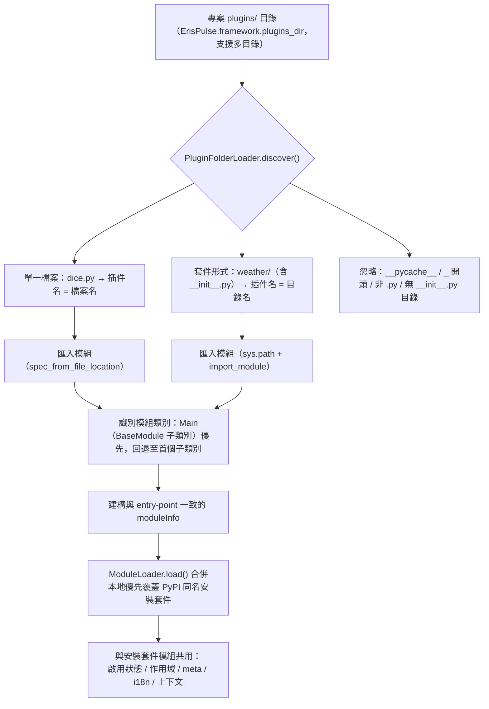

# 架構概覽

本文檔透過可視化圖表介紹 ErisPulse SDK 的技術架構，幫助你快速理解框架的設計理念和模組關係。

請直接返回翻譯後的完整Markdown內容，不要包含任何其他文字。

再次提醒：如果文件包含語言切換行（各語言名稱用 `` | `` 分隔的行），務必嚴格遵守上方第8條的格式要求，不要寫出 ``[**Label**](file)`` 這類錯誤格式。

## SDK 核心架構

下圖展示了 SDK 的核心模組組成及其關係：


```mermaid
graph TB
    SDK["sdk<br/>統一入口"]

    SDK --> Event["Event<br/>事件系統"]
    SDK --> Lifecycle["Lifecycle<br/>生命週期管理"]
    SDK --> Logger["Logger<br/>日誌管理"]
    SDK --> Storage["Storage / env<br/>儲存管理"]
    SDK --> Config["Config<br/>配置管理"]
    SDK --> AdapterMgr["Adapter<br/>適配器管理"]
    SDK --> ModuleMgr["Module<br/>模組管理"]
    SDK --> Router["Router<br/>路由管理"]
    SDK --> Client["HttpClient<br/>HTTP 客戶端"]
    Event --> Command["command"]
    Event --> Message["message"]
    Event --> Notice["notice"]
    Event --> Request["request"]
    Event --> Meta["meta"]
    Event --> Conversation["Conversation<br/>分支 + 持久化"]

    AdapterMgr --> BaseAdapter["BaseAdapter"]
    BaseAdapter --> P1["雲湖"]
    BaseAdapter --> P2["Telegram"]
    BaseAdapter --> P3["OneBot11/12"]
    BaseAdapter --> PN["..."]

    ModuleMgr --> BaseModule["BaseModule"]
    BaseModule --> CM["自訂模組"]

    BaseAdapter -.-> SendDSL["SendDSL<br/>訊息發送"]
```

### 核心模組說明

| 模組 | 說明 |
|------|------|
| **Event** | 事件系統，提供 command / message / notice / request / meta 五類事件處理，以及 Conversation 多輪對話 |
| **Adapter** | 適配器管理器，管理多平台適配器的註冊、啟動和關閉 |
| **Module** | 模組管理器，管理插件的註冊、載入和卸載，支援依賴宣告和拓撲排序 |
| **Lifecycle** | 生命週期管理器，提供事件驅動的生命週期鉤子 |
| **Storage** | 基於 SQLite 的鍵值儲存系統，支援通用 SQL 串流查詢 |
| **Config** | TOML 格式的設定檔管理 |
| **Logger** | 模組化日誌系統，支援子日誌器 |
| **Router** | HTTP/WebSocket 路由管理，透過抽象層封裝底層後端（目前為 FastAPI + Uvicorn），支援裝飾器路由、中間件、分組、限流、CORS |
| **HttpClient** | 統一 HTTP/WS 客戶端，透過抽象層封裝底層請求庫（目前為 aiohttp），提供請求統計、重試、日誌、WebSocket 客戶端、ErisPulse 異常體系等功能。客戶端和伺服器 WebSocket 共享 `WebSocketConnectionBase` 基類 |

## 初始化流程

下圖展示了 `sdk.init()` 的完整初始化過程：


```mermaid
flowchart TD
    A["sdk.init()"] --> B["準備執行環境"]
    B --> B1["載入配置檔案"]
    B1 --> B2["設定全域例外處理"]
    B2 --> C["適配器 & 模組發現"]
    C --> D{"平行載入"}
    D --> D1["從 PyPI 加載適配器"]
    D --> D2["從 PyPI 加載模組"]
    D1 & D2 --> E["註冊適配器"]
    E --> E1["啟動適配器"]
    E1 --> F["註冊模組"]
    F --> F1{"依賴驗證"}
    F1 -->|"缺失依賴"| F2["跳過該模組並記錄警告"]
    F1 -->|"依賴滿足"| F3["拓撲排序<br/>（Kahn 算法 + 優先級）"]
    F3 --> G["依序初始化模組<br/>（實例化 + on_load）"]
    F2 --> G
    G --> H["啟動路由伺服器"]
    H --> K["運行就緒"]
```

### 初始化階段詳解

1. **環境準備** - 加載 TOML 配置檔案，設定全域例外處理
2. **平行發現** - 同時從已安裝的 PyPI 套件中發現適配器和模組
3. **註冊適配器** - 將發現的適配器註冊到適配器管理器
4. **啟動適配器** - 異步啟動各平台適配器連接（在模組初始化之前，確保模組能立即傳送訊息）
5. **註冊模組** - 將發現的模組註冊到模組管理器
6. **依賴驗證** - 檢查模組宣告的 `depends` 依賴是否已註冊，跳過缺失依賴的模組
7. **拓撲排序** - 使用 Kahn 算法按依賴關係排序模組載入順序，同級按 `priority` 降序排列
8. **模組初始化** - 按排序順序建立模組實例，呼叫 `on_load` 生命週期方法
9. **啟動路由伺服器** - 使用 Uvicorn 啟動 FastAPI 路由伺服器

## 事件處理流程

下圖展示了訊息從平台到處理器的完整轉流路徑：


```mermaid
flowchart LR
    A["平台原始訊息"] --> B["適配器接收"]
    B --> C["轉換為 OneBot12 標準"]
    C --> D["adapter.emit()"]
    D --> E["執行中間件鏈"]
    E --> F{"事件分發"}
    F --> G1["command<br/>命令處理器"]
    F --> G2["message<br/>訊息處理器"]
    F --> G3["notice<br/>通知處理器"]
    F --> G4["request<br/>請求處理器"]
    F --> G5["meta<br/>元事件處理器"]
    G1 & G2 & G3 & G4 & G5 --> H["處理器回調執行"]
    H --> I["event.reply()<br/>透過 SendDSL 回覆"]
    I --> J["適配器發送至平台"]
```

### 事件處理關鍵步驟

- **適配器接收** - 各平台適配器透過 WebSocket/Webhook 等方式接收原生事件
- **OB12 標準化** - 將平台原生事件轉換為統一的 OneBot12 標準格式
- **中間件處理** - 依序執行已註冊的中間件函數，可修改事件資料
- **事件分發** - 根據事件類型（message/notice/request/meta）分發到對應處理器
- **SendDSL 回覆** - 處理器透過 `event.reply()` 或 `SendDSL` 串接呼叫發送回應

## 生命周期事件

下圖展示了框架各組件的生命周期事件觸發順序：


```mermaid
flowchart LR
    subgraph Core["核心"]
        direction LR
        C1["core.init.start"] --> C2["core.init.complete"]
    end

    subgraph AdapterLife["適配器"]
        direction LR
        A1["adapter.start"] --> A2["adapter.status.change"] --> A3["adapter.stop"] --> A4["adapter.stopped"]
    end

    subgraph ModuleLife["模組"]
        direction LR
        M1["module.load"] --> M2["module.init"] --> M3["module.unload"]
    end

    subgraph BotLife["Bot"]
        direction LR
        B1["adapter.bot.online"] --> B2["adapter.bot.offline"]
    end

    Core --> AdapterLife
    AdapterLife --> ModuleLife
    AdapterLife -.-> BotLife
```

### 監聽生命周期事件

你可以透過 `lifecycle.on()` 監聽這些事件，執行自訂邏輯：

```python
from ErisPulse import sdk

# 監聽所有適配器事件
@sdk.lifecycle.on("adapter")
async def on_adapter_event(event_data):
    print(f"適配器事件: {event_data}")

# 監聽模組載入完成
@sdk.lifecycle.on("module.load")
async def on_module_loaded(event_data):
    print(f"模組已載入: {event_data}")

# 監聽 Bot 上線
@sdk.lifecycle.on("adapter.bot.online")
async def on_bot_online(event_data):
    print(f"Bot 上線: {event_data}")

## 模組載入策略

ErisPulse 支援三種模組載入策略，由 `get_load_strategy()` 回傳的 `ModuleLoadStrategy` 宣告：


```mermaid
flowchart TD
    A["模組註冊到 ModuleManager"] --> B{"載入策略"}
    B -->|"lazy_load = true<br/>+ activate_on 宣告"| C["建立 ModuleActivator 代理"]
    B -->|"lazy_load = true<br/>無 activate_on"| D["建立 LazyModule 代理"]
    B -->|"lazy_load = false"| E["立即建立實例"]
    C --> F["註冊事件/命令 stub 到分發器"]
    F --> G["掛載到 sdk 屬性"]
    G --> H["事件到達觸發激活"]
    H --> I["實例化 + on_load() + 解除註冊 stub"]
    D --> J["掛載到 sdk 屬性"]
    J --> K["首次屬性存取時初始化"]
    E --> L["呼叫 on_load()"]
    L --> M["掛載到 sdk 屬性"]
```

> 更多詳情請參考 [懶加載系統](docs/zh-TW/advanced/lazy-loading.md)、[生命週期管理](docs/zh-TW/advanced/lifecycle.md) 與模組文件。

### 事件驅動懶激活（`activate_on`）觸發架構

`activate_on` 允許模組在**首個匹配事件/命令到達時**才載入，避免常駐記憶體，同時確保事件不遺失：


```mermaid
flowchart LR
    subgraph Declare["模組宣告"]
        S1["get_load_strategy() 回傳<br/>ModuleLoadStrategy(activate_on=...)"] --> S2["activate_on 語法：<br/>str / dict / list 自由混合"]
        S2 --> S2a["'message' → 事件類型級"]
        S2 --> S2b["{'notice': 'group_member_increase'}<br/>→ 類型 + detail_type"]
        S2 --> S2c["{'command': 'roll'}<br/>→ 命令觸發"]
    end

    subgraph Runtime["執行期"]
        R1["ModuleActivator 註冊 stub"] --> R1a["事件 stub → message/notice/request/meta 管理器<br/>優先級 ACTIVATION_STUB_PRIORITY（極低）"]
        R1 --> R1b["命令 stub → 命令管理器<br/>隱藏佔位命令（hidden=True）"]
        R1a --> R2{"觸發事件到達"}
        R1b --> R2
        R2 --> R3["按 owner 過作用域過濾"]
        R3 --> R4["asyncio.Lock 防止重複激活"]
        R4 --> R5["實例化模組 + 呼叫 on_load()"]
        R5 --> R6["解除註冊全部 stub"]
        R6 --> R7["事件轉發到真實處理器"]
    end

    Declare --> Runtime
```

**觸發語義要點：**

1. **stub 註冊**：事件 stub 以極低優先級（`ACTIVATION_STUB_PRIORITY`）註冊到對應事件管理器，確保在同類事件的所有普通處理器**之後**執行；命令 stub 以隱藏佔位命令註冊，不污染命令列表
2. **作用域過濾**：stub 帶模組 owner 身份，未對該 Bot / 會話 / 平台啟用的模組不觸發
3. **防重入**：`asyncio.Lock` 保證併發事件下只激活一次
4. **事件轉發**：激活完成後將當前事件轉發給真實處理器（外層分組迴圈已驗證 stub 之後註冊的處理器不會被二次處理）
5. **失敗語義**：激活失敗不重試，stub 一併解除註冊，避免每次事件都重複嘗試

## 本地插件檔案夾架構

本地插件（`plugins/` 目錄）無需打包發布，框架啟動時會自動發現並載入：


```mermaid
flowchart TD
    A["專案 plugins/ 目錄<br/>（ErisPulse.framework.plugins_dir，支援多目錄）"] --> B{"PluginFolderLoader.discover()"}
    B --> C["單一檔案：dice.py → 插件名 = 檔案名"]
    B --> D["套件形式：weather/（含 __init__.py）→ 插件名 = 目錄名"]
    B --> E["忽略：__pycache__ / _ 開頭 / 非 .py / 無 __init__.py 目錄"]
    C --> F["匯入模組（spec_from_file_location）"]
    D --> G["匯入模組（sys.path + import_module）"]
    F --> H["識別模組類別：Main（BaseModule 子類別）優先，回退至首個子類別"]
    G --> H
    H --> I["建構與 entry-point 一致的 moduleInfo"]
    I --> J["ModuleLoader.load() 合併<br/>本地優先覆蓋 PyPI 同名安裝套件"]
    J --> K["與安裝套件模組共用：<br/>啟用狀態 / 作用域 / meta / i18n / 上下文"]
```

**約定與特性：**

- 插件名來源：單一檔案取檔案名，套件形式取目錄名
- 本地插件 `moduleInfo.meta.source == "plugin_folder"`，與 PyPI 安裝套件模組無縫共存
- 同名時本地優先（便於本地覆蓋調試），被禁用時同時移除同名 entry-point 條目

## 本地插件熱重載架構

熱重載會監控插件檔案的變更，並自動重新載入對應的插件：

```mermaid
flowchart TD
    A["sdk.enable_plugin_hot_reload()"] --> B["PluginReloadWatcher 啟動"]
    B --> C["PollingObserver（背景守護執行緒）<br/>定期比較 .py 檔案的 mtime"]
    C --> D{"插件檔案變更"}
    D --> E["變更去抖（預設 1 秒）"]
    E --> F["_handle_change 解析插件名<br/>（單一檔案 / 包形式）"]
    F --> G["asyncio.run_coroutine_threadsafe<br/>調度回主事件循環"]
    G --> H["sdk.reload_plugin(name)"]
    H --> I["卸載舊實例（觸發 on_unload）"]
    I --> J["清理註冊（unregister + 移除 sdk 屬性）"]
    J --> K["清理 sys.modules 強制重新載入"]
    K --> L["重新 discover + register + load"]
    L --> M["掛載新實例到 sdk 屬性"]
    M --> N["檔案刪除 → 自動從載入結果移除"]