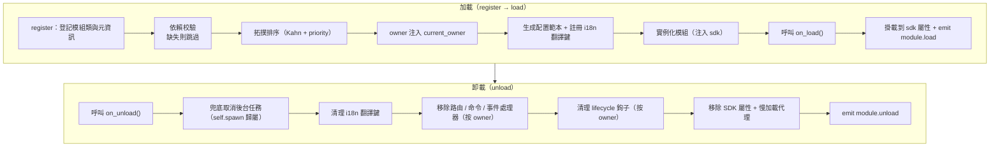

# 模組核心概念

了解 ErisPulse 模組的核心概念是開發高品質模組的基礎。

## 模組生命週期

### 加載策略

```python
from ErisPulse.Core.Bases import BaseModule
from ErisPulse.loaders import ModuleLoadStrategy

class MyModule(BaseModule):
    @staticmethod
    def get_load_strategy():
        """返回模組加載策略"""
        return ModuleLoadStrategy(
            lazy_load=True,   # 慢加載還是立即加載
            priority=0,       # 加載優先級（數值越大越先加載）
            depends=["OtherModule"]  # 可選：聲明依賴的其他模組
        )
```

> `depends` 聲明的模組如果未註冊，當前模組將被跳過並記錄警告。加載順序由拓撲排序決定，同層級按 `priority` 降序。

> [!NOTE]
> **級聯卸載 / 級聯重載**（ErisPulse **2.8.0+**）：卸載被其它模組依賴的模組時，依賴它的模組會**先被級聯卸載**（日誌說明級聯鏈）；熱重載本地插件時，依賴它的插件同樣**級聯重載**，避免依賴者持有失效實例引用繼續運行。聲明循環依賴會在加載時以 `RuntimeError` 拒絕。

### on_load 方法

模組加載時調用，用於初始化資源和註冊事件處理器：

```python
async def on_load(self, event):
    # 註冊事件處理器
    @command("hello", help="問候命令")
    async def hello_handler(event):
        await event.reply("你好！")
    
    # 使用 SDK 內建 HTTP 客戶端（自動管理連接池，無需手動建立 session）
    # 透過 sdk.client 即可發送請求
```

### on_unload 方法

模組卸載時調用，用於清理資源：

```python
async def on_unload(self, event):
    # 清理自定義資源
    # sdk.client 由框架管理，無需手動關閉
    
    # 取消事件處理器（框架會自動處理）
    self.logger.info("模組已卸載")
```

> 後台任務的建立與清理（`self.spawn()` / 框架兜底取消）詳見 [生命週期管理](../../advanced/lifecycle.md#後台任務歸屬與自動取消)。

### 卸載與徹底卸載（purge）

> [!NOTE]
> 本特性需要 ErisPulse **2.8.0+**。

`unload()` 預設只**取消加載**（卸載實例與資源），但保留註冊存根（模組類與元資訊）——模組仍可被 discover 重新發現、`load()` 重新實例化，無需重新 `register()`。

當需要**徹底卸載**（釋放模組類引用、清理 `sys.modules`，讓插件及其獨佔依賴可被 GC 回收）時，傳入 `purge=True`：

```python
# 只取消加載：保留註冊存根，可隨時重新 load()
await sdk.module.unload("MyModule")

# 彻底卸載：刪除註冊存根 + 清理 sys.modules（插件來源）
await sdk.module.unload("MyModule", purge=True)
```

| 語義 | `unload()` 預設 | `unload(purge=True)` |
|------|-----------------|----------------------|
| 卸載實例與資源（事件/task/路由/lifecycle/i18n） | ✅ | ✅ |
| 保留註冊存根（模組類與元資訊） | ✅ | ❌ 刪除 |
| 清理 `sys.modules`（僅插件資料夾來源） | ❌ | ✅ |
| 模組類可被 GC 回收 | ❌ | ✅ |
| 重新加載 | `load()` 直接可用 | 需先 `register()` + `load()` |

> `purge=True` 時級聯卸載的依賴者同樣被 purge；卸載後框架會 `gc.collect()` 並檢查模組類/實例是否可回收，殘留引用會在日誌中告警（含引用方，DEBUG 級）。

### 生命週期全景

把上面的方法串起來，框架在加載與卸載一個模組時，**在背後為你做的全部事情**：



**加載時框架幫你做了什麼**（你只需寫 `on_load`，其餘自動完成）：

| 環節 | 框架自動做的 |
|------|-------------|
| owner 注入 | 實例化期間用 `owner_scope` 包住模組名——你 `on_load` 裡註冊的命令/事件/鉤子/後台任務**自動歸屬本模組**，卸載時按 owner 一鍵清理 |
| 配置範本 | 聲明了 `ConfigClass` 的模組，框架自动生成/填補 `ErisPulse.<ModuleName>` 配置段 |
| i18n 翻譯鍵 | 聲明了 `I18nClass` 的模組，翻譯鍵自動註冊（卸載時自動註銷） |
| 依賴拓撲 | 按 `depends` 聲明排序，確保被依賴模組先加載；循環依賴以 `RuntimeError` 拒絕 |
| SDK 挂載 | 實例化後掛到 `sdk.<ModuleName>`，你才能 `sdk.MyModule.xxx` 訪問 |

**卸載時框架幫你清理的**（對應上面的 U1→U7）：`on_unload` 跑完後再兜底清理——後台任務強制取消（`self.spawn` 建立的，優雅收尾請在 `on_unload` 自行做）、i18n 鍵、路由、命令/事件處理器、lifecycle 鉤子，最後移除 SDK 屬性。`purge=True` 預設額外刪除註冊存根 + 清理 `sys.modules`。

> 這些自動清理就是「你只需寫 `on_load`/`on_unload`，不用手動 unregister」的底氣——框架用 owner 歸屬把「誰註冊的誰清理」做成了一鍵式。

## SDK 物件

### 訪問核心模組

```python
from ErisPulse import sdk

# 透過 sdk 物件存取所有核心模組
sdk.logger.info("日誌")
sdk.storage.set("key", "value")
config = sdk.config.getConfig("MyModule")
```

### 模組間通訊

```python
# 訪問其他模組
other_module = sdk.OtherModule
result = await other_module.some_method()
```

## 適配器發送方法查詢

由於新的標準規範要求使用重寫 `__getattr__` 方法來實現兜底發送機制，導致無法使用 `hasattr` 方法來檢查方法是否存在。從 `2.3.5` 開始，新增了查詢發送方法的功能。

### 列出支援的發送方法

```python
# 列出平台支援的所有發送方法
methods = sdk.adapter.list_sends("onebot11")
# 返回: ["Text", "Image", "Voice", "Markdown", ...]
```

### 獲取方法詳細資訊

```python
# 獲取某個方法的詳細資訊
info = sdk.adapter.send_info("onebot11", "Text")
# 返回:
# {
#     "name": "Text",
#     "parameters": [
#         {"name": "text", "type": "str", "default": null, "annotation": "str"}
#     ],
#     "return_type": "Awaitable[Any]",
#     "docstring": "發送文本訊息..."
# }
```

## 配置管理

### 聲明式配置（推薦）

從 v2.5.2 開始，模組可透過 `ConfigClass` 聲明配置類，與適配器使用同一套配置 Schema 系統。配置透過 `self.cfg` 即時讀取，修改後立即生效：

```python
from dataclasses import dataclass, field
from ErisPulse.Core.Bases import BaseModule
from ErisPulse.Core.Bases import BaseConfig

@dataclass
class MyModuleConfig(BaseConfig):
    api_key: str = field(
        default="",
        metadata={
            "description": {"i18n": "my_module.api_key", "default": "API 密鑰"},
            "required": True,
            "secret": True,
            "ui": {"widget": "password", "group": "basic", "order": 1},
        },
    )
    timeout: int = field(
        default=30,
        metadata={
            "description": {"i18n": "my_module.timeout", "default": "超時時間（秒）"},
            "ui": {"widget": "number", "group": "advanced", "order": 2},
        },
    )

class MyModule(BaseModule):
    ConfigClass = MyModuleConfig

    def __init__(self, sdk):
        self.sdk = sdk
        self.logger = sdk.logger.get_child("MyModule")

    async def on_load(self, event):
        self.logger.info("模組已載入")

    async def on_unload(self, event):
        pass

    async def do_something(self):
        cfg = self.cfg  # 即時讀取，類型安全
        api_key = cfg.api_key
        timeout = cfg.timeout
```

`BaseConfig` 是通用配置基類，適用於適配器、模組、外部專案等任何場景。配置欄位支援 i18n 多語言描述（詳見 [i18n 文檔](../../advanced/i18n.md#配置欄位多語言)）。

### 聲明式翻譯鍵（v2.7.0+）

從 v2.7.0 開始，模組也可以像宣告 `ConfigClass` 一樣，透過嵌套類 `I18nClass` 集中宣告翻譯鍵。框架會在載入時**自動註冊**所有宣告的翻譯鍵，無需手動呼叫 `i18n.register()`，且註冊時機早於配置模板生成，確保配置描述中引用的 i18n 鍵已可用。

```python
from ErisPulse.Core.Bases import BaseConfig, BaseI18n, I18nKey

class MyModule(BaseModule):
    # 配置類（可選）
    @dataclass
    class ConfigClass(BaseConfig):
        welcome_msg: str = field(
            default="歡迎",
            metadata={
                "description": {"i18n": "mymodule.welcome_msg", "default": "歡迎訊息"},
            },
        )

    # 翻譯鍵集合類（可選）
    class I18nClass(BaseI18n):
        # 屬性名自動拼接為完整鍵路徑：<模組名>.<屬性名>
        welcome_msg: I18nKey = I18nKey(
            default="Welcome Message",   # 語言無關的兜底
            zh_CN="歡迎訊息",
            zh_TW="歡迎訊息",
            en="Welcome Message",
            ja="ウェルカムメッセージ",
            ru="Приветственное сообщение",
        )
        hello: I18nKey = I18nKey(
            default="Hello, {name}!",
            zh_CN="你好，{name}！",
            zh_TW="你好，{name}！",
            en="Hello, {name}!",
            ja="こんにちは、{name}！",
            ru="Привет, {name}!",
        )
```

詳情見 [i18n 推薦寫法](../../advanced/i18n.md#推薦寫法通過-i18nclass-宣告翻譯鍵-v270)。

### 手動讀取配置（已廢棄）

> **已廢棄**：請改用 [聲明式配置](#聲明式配置推薦) + `self.cfg` 即時讀取。

```python
class MyModule(BaseModule):
    def __init__(self, sdk):
        self.sdk = sdk

    def _load_config(self):
        config = self.sdk.config.getConfig("MyModule")
        if not config:
            self.sdk.config.setConfig("MyModule", {"api_key": "", "timeout": 30})
            return {"api_key": "", "timeout": 30}
        return config
```

## 存儲系統

### 基本使用

```python
# 存儲數據
sdk.storage.set("user:123", {"name": "張三"})

# 獲取數據
user = sdk.storage.get("user:123", {})

# 刪除數據
sdk.storage.delete("user:123")
```

### 事務使用

```python
# 使用事務確保數據一致性
with sdk.storage.transaction():
    sdk.storage.set("key1", "value1")
    sdk.storage.set("key2", "value2")
    # 如果任何操作失敗，所有更改都會回滾
```

## 事件處理

### 事件處理器註冊

```python
from ErisPulse.Core.Event import command, message

# 註冊命令
@command("info", help="獲取資訊")
async def info_handler(event):
    await event.reply("這是資訊")

# 註冊訊息處理器
@message.on_group_message()
async def group_handler(event):
    sdk.logger.info(f"收到群訊息: {event.get_text()}")
```

### 事件處理器生命週期

框架會自動管理事件處理器的註冊與註銷，你只需要在 `on_load` 中註冊即可。

## 慢載機制

### 工作原理

```python
# 模塊首次被存取時才會初始化
result = await sdk.my_module.some_method()
# ↑ 這裡會觸發模塊初始化
```

### 立即載入

對於需要立即初始化的模塊（如監聽器、定時器）：

```python
@staticmethod
def get_load_strategy():
    return ModuleLoadStrategy(
        lazy_load=False,  # 立即載入
        priority=100
    )
```

## 錯誤處理

### 異常捕獲

```python
async def handle_event(self, event):
    try:
        # 業務邏輯
        await self.process_event(event)
    except ValueError as e:
        self.logger.warning(f"參數錯誤: {e}")
        await event.reply(f"參數錯誤: {e}")
    except Exception as e:
        self.logger.error(f"處理失敗: {e}")
        raise
```

### 日誌記錄

```python
# 使用不同的日誌級別
self.logger.debug("除錯資訊")    # 詳細除錯資訊
self.logger.info("運行狀態")      # 正常運行資訊
self.logger.warning("警告資訊")  # 警告資訊
self.logger.error("錯誤資訊")    # 錯誤資訊
self.logger.critical("致命錯誤") # 致命錯誤
```

## 相關文件

- [模組開發入門](getting-started.md) - 建立第一個模組
- [Event 包裝類別](event-wrapper.md) - 事件處理詳解
- [最佳實踐](best-practices.md) - 開發高品質模組