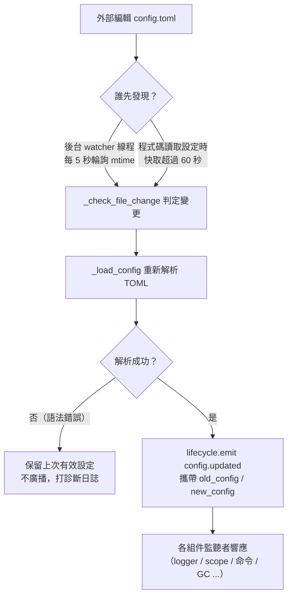

# 配置文件說明
> 本文檔將介紹框架的配置文件，如果第三方模組需要配置，請參考模組的文件。

ErisPulse 使用 TOML 格式的配置文件 `config/config.toml` 來管理專案設定。

## 配置文件位置

配置文件位於專案根目錄的 `config/` 資料夾中：

```
project/
├── config/
│   └── config.toml
├── main.py
```

## 配置載入錯誤處理

框架在載入 `config.toml` 時會區分三種錯誤狀態，並提供**可操作的診斷資訊**，而不是靜默回退到預設配置：

| 錯誤狀態 | 觸發條件 | 框架行為 |
|---------|---------|---------|
| 檔案缺失 | `config.toml` 不存在 | 正常首次啟動，靜默使用空配置（不發出警告） |
| TOML 語法錯誤 | 檔案存在但格式非法（例如少了引號、括號未閉合） | 輸出**出錯行號/列號與原因**，並提示已回退預設配置 |
| 權限/其他錯誤 | 無讀取權限、IO 錯誤等 | 輸出**明確原因**，並提示已回退預設配置 |

例如，當你不小心把配置寫成了 `port = 8000`（缺少引號的字串）時，日誌會輸出類似：

```
[ERROR] [Config] 配置文件 config/config.toml 語法錯誤（第 3 行 第 1 列）: ...
[WARNING] [Config] 配置文件讀取失敗。繼續使用上次有效配置運行，本次文件修改未生效——請修復後重新載入或重新啟動
```

這樣你可以在**預設的 INFO 級別**下立刻定位問題，而不會困惑「為什麼我修改的配置沒有生效」。

> **運行中改壞配置檔案？** 如果你在機器人運行期間手動編輯 `config.toml` 引入了語法錯誤，框架在下次寫入（合併配置）時會輸出「配置檔案已損壞（語法錯誤，第 X 行），無法合併寫入——請先修復配置檔案後重新啟動」，而不是令人困惑的「寫入失敗」。待寫入的配置項目會被保留，不會遺失。

## 環境變數覆蓋

框架支援使用環境變數**覆蓋** `ErisPulse.*` 配置項（適合 Docker / 容器化 / CI 部署，無需修改 `config.toml`）。

命名規則：將點分路徑 `ErisPulse.<section>.<key>` 改為全大寫、`.` 替換為 `_`，並加上 `ERISPULSE_` 前綴：

| 配置項 | 環境變數 | 示例值 |
|--------|---------|--------|
| `ErisPulse.server.port` | `ERISPULSE_SERVER_PORT` | `9000` |
| `ErisPulse.server.host` | `ERISPULSE_SERVER_HOST` | `0.0.0.0` |
| `ErisPulse.logger.level` | `ERISPULSE_LOGGER_LEVEL` | `DEBUG` |
| `ErisPulse.framework.strict_mode` | `ERISPULSE_FRAMEWORK_STRICT_MODE` | `false` |

行為說明：
- **優先級最高**：環境變數覆蓋「配置文件」與「預設值」，並按原值類型自動轉換（`bool` / `int` / `float` / 逗號分隔的 `list` / 字串）
- **不持久化**：覆蓋只在執行期間生效，不會寫回 `config.toml`
- **支援熱更新**：執行中修改環境變數後，配合配置監聽的重載即可生效

```bash
# Docker 部署示例：不修改 config.toml，直接覆蓋端口
ERISPULSE_SERVER_PORT=9000 docker compose up -d
```

> 注：`ErisPulse.server.port` 這類框架配置走 `get_server_config()` 等 API 讀取，均受環境變數覆蓋影響。

## 配置熱更新

從 2.7.0 開始，框架對配置熱更新做了**系統化支援**。外部修改 `config.toml` 後（後台 watcher 每 5 秒檢測一次），或程式碼呼叫 `setConfig()` 後，各組件自動響應：

| 組件 | 支援熱更新的設定 | 行為 |
|------|----------------|------|
| **日誌 Logger** | `logger.level` / `log_files` / `log_dir`（含分段參數）/ `memory_limit` / `format` / `exclude_levels` | 自動重新應用（帶變更檢測） |
| **命令系統 CommandHandler** | `event.command.prefix` / `case_sensitive` / `allow_space_prefix` / `must_at_bot` | 下一條訊息即生效 |
| **適配器併發** | `framework.handler_max_concurrency` | 失效快取信號量，按新值重建 |
| **主動 GC** | `framework.proactive_gc_*` | 設定變更即時重啟 GC 任務，支援執行時調整/停用/重新啟用 |
| **主人系統 Master** | `master.users` | 每次 `is_master()` 檢查即時讀取，無需重啟 |
| **模組/適配器設定** | 各自的設定項目 | 觸發 `on_config_update(old, new)` 回呼 |

**需重啟的設定**（無法安全熱切換，變更時會輸出警告「需重啟程序後生效」）：

| 設定 | 原因 |
|------|------|
| `router.cors.*` / `router.security.*` | 中間件在服務啟動時寫入 FastAPI，執行時無法安全熱切換 |
| `storage.use_global_db` | SQLite 檔案句柄已在執行時開啟，切換路徑不安全 |

> **中途編輯儲存出錯？** 若編輯 `config.toml` 時出現瞬間語法錯誤，框架會**保留上次有效設定**並輸出診斷日誌，不會把空設定廣播給各組件（避免 `on_config_update` 收到空值誤回退預設值）。

### 熱更新鏈路內部拆解

「改了設定，各組件怎麼知道的？」——背後是一條檢測 → 重載 → 廣播的鏈路：



**兩條檢測路徑**（取其一即可，均能兜底）：

| 路徑 | 機制 | 觸發時機 |
|------|------|---------|
| 後台 watcher | daemon 線程 `config-watcher` 每 **5 秒** `wait` 輪詢檔案 `mtime` | 外部改檔案後最多 5 秒內 |
| 慣性檢測 | 任何 `getConfig()` 讀取時，若快取超過 **60 秒**則先查檔案 | 下次讀取設定時 |

> **框架不會誤傷自己**：`setConfig()` 寫盤時會記錄「自身寫入的 mtime」，watcher 對比時把它排除，只把**外部編輯**視為變更。

**兩類設定變更事件：**

| 事件 | 觸發者 | 數據 | 典型場景 |
|------|--------|------|---------|
| `config.set` | 程式碼 / Dashboard 調 `setConfig()` | `{key, old_value, new_value}` | 單鍵寫入（模板生成、狀態記錄、執行時改設定） |
| `config.updated` | 外部編輯後 watcher/慣性檢測捕獲 | `{old_config, new_config, config_file}` | 手動改 `config.toml` |

> `setConfig()` 預設**延遲 5 秒落盤**（合併多次寫入），`immediate=True` 立即寫。watcher 檢測到外部修改後只更新記憶體快取，**不會**把外部變動回寫檔案。

**自動響應方清單**（兩類事件通常會都訂閱，響應內容一致）：

| 組件 | 監聽 | 响應 |
|------|------|------|
| Logger | `config.set` + `config.updated` | 級別/檔案/目錄分段/記憶體上限/格式/屏蔽等級重新應用（帶變更檢測，無變化不動） |
| Scope | `config.updated` | 作用域綁定快取重建 |
| 命令系統 | `config.updated` | 前綴/大小寫/空格前綴/must_at_bot 解析參數刷新，下一條訊息生效 |
| 適配器併發 | `config.set` + `config.updated` | `handler_max_concurrency` 失效重建信號量 |
| 主動 GC | `config.set` + `config.updated` | `proactive_gc_*` 即時重啟 GC 後台任務 |
| 適配器 | 路由到 `on_config_update` | 各適配器 `on_config_update(old, new)` 回呼 |
| 模組 | 路由到 `on_config_update` | 各模組 `on_config_update(old, new)` 回呼 |
| 存儲 | `config.updated` | `use_global_db` 變更**僅警告**（需重啟） |
| 路由 | `config.updated` | `cors.*` / `security.*` 變更**僅警告**（需重啟） |

## 完整配置示例

```toml
[ErisPulse.server]
host = "0.0.0.0"
port = 8000
auto_start = true
ssl_certfile = ""
ssl_keyfile = ""

[ErisPulse.master]
# users 支持兩種寫法（二選一）：
#   全局主人（所有平台生效）：users = ["123456", "789012"]
#   按平台指定主人：users = { yunhu = ["123456"], telegram = ["789012"] }
users = {}

[ErisPulse.logger]
level = "INFO"
format = "rich"
log_files = []
log_dir = ""
log_rotation = "size"
log_max_size_mb = 10
log_backup_count = 5
log_rotation_when = "midnight"
memory_limit = 1000
exclude_levels = []

[ErisPulse.framework]
enable_lazy_loading = true
uninit_timeout = 30
strict_mode = 0

[ErisPulse.framework.strict_mode_exceptions]
modules = []
adapters = []

[ErisPulse.storage]
use_global_db = false

[ErisPulse.event.command]
prefix = "/"
case_sensitive = true
allow_space_prefix = false
must_at_bot = false

[ErisPulse.event.message]
ignore_self = true

[ErisPulse.i18n]
language = "auto"
```

## 伺服器配置

```toml
[ErisPulse.server]
host = "0.0.0.0"
port = 8000
auto_start = true
ssl_certfile = "/path/to/cert.pem"
ssl_keyfile = "/path/to/key.pem"
```

| 配置項 | 類型 | 默認值 | 說明 |
|---------|------|---------|------|
| host | string | 0.0.0.0 | 監聽位址，0.0.0.0 表示所有介面 |
| port | integer | 8000 | 監聽埠號 |
| auto_start | boolean | true | 是否在 `sdk.init()` 時自動啟動路由伺服器。設為 `false` 可跳過路由伺服器啟動（純事件/無 WebUI 場景） |
| ssl_certfile | string | 空 | SSL 證書檔案路徑 |
| ssl_keyfile | string | 空 | SSL 私鑰檔案路徑 |

## 主人系統配置

主人系統用於識別「框架主人」帳號（如 Bot 管理員）。`master.users` 支援兩種寫法：

```toml
[ErisPulse.master]
# 寫法一：全域主人（所有平台生效）
users = ["123456", "789012"]

# 寫法二：按平台指定主人（dict）
# users = { yunhu = ["123456"], telegram = ["789012"] }
```

| 配置項 | 類型 | 預設值 | 說明 |
|---------|------|---------|------|
| users | array / object | 空 | 主人帳號列表。`list` 形式為全域主人（所有平台生效）；`dict` 形式按平台指定（鍵為平台名，值為該平台的主人帳號列表） |

程式碼中透過 `master.is_master(event)` 或 `master.is_master(platform, user_id)` 檢查，每次呼叫即時讀取設定（支援熱更新，無需重啟）：

```python
from ErisPulse.Core import master

if master.is_master(event):
    await event.reply("主人你好")
```

## 日誌配置

```toml
[ErisPulse.logger]
level = "INFO"
log_files = []                # 明確的日誌檔案列表（與 log_dir 互斥，優先級更高）
log_dir = ""                  # 日誌目錄（設定後自動分段輪轉）
log_rotation = "size"         # 分段方式: "size" / "date" / "none"
log_max_size_mb = 10          # size 模式單檔案上限（MB）
log_backup_count = 5          # 保留的歷史日誌檔案數
log_rotation_when = "midnight"  # date 模式輪轉週期: S/M/H/D/midnight
memory_limit = 1000
exclude_levels = ["EVENT"]
```

| 配置項 | 類型 | 默認值 | 說明 |
|---------|------|---------|------|
| level | string | INFO | 日誌等級：TRACE, DEBUG, INFO, WARNING, ERROR, CRITICAL（TRACE 為最低等級，輸出框架內部詳細除錯資訊） |
| format | string | rich | 日誌輸出格式：`rich`（彩色，預設）、`plain`（純文本無顏色，適合日誌採集/管道重定向）、`json`（JSON 結構化，適合 ELK 等） |
| log_files | array | 空 | 日誌輸出檔案列表（明確路徑，不分段） |
| log_dir | string | 空 | 日誌輸出目錄（自動建立）。設定後寫入目錄內 `erispulse.log` 並按 `log_rotation` 自動分段；與 `log_files` 互斥，`log_files` 優先 |
| log_rotation | string | size | 分段方式：`size`（按大小）/ `date`（按時間）/ `none`（不分段） |
| log_max_size_mb | float | 10 | size 模式單檔案大小上限（MB），超過後輪轉為 `.1`/`.2` 備份 |
| log_backup_count | integer | 5 | 保留的歷史日誌檔案數，超出的最舊備份自動刪除 |
| log_rotation_when | string | midnight | date 模式輪轉週期：`S`/`M`/`H`/`D`/`midnight`（預設每天零點） |
| memory_limit | integer | 1000 | 內存中保存的日誌條數 |
| exclude_levels | array | 空 | 屏蔽指定日誌等級。被屏蔽等級的日誌**完全丟棄**（不寫內存、不推送到 Dashboard 等訂閱器、不列印、不寫檔案）。支援熱更新 |

也可在程式碼中動態切換：

```python
from ErisPulse.Core import logger

# 按大小分段：單檔案 10MB，保留 5 份
logger.set_output_dir("logs", rotation="size", max_size_mb=10, backup_count=5)

# 按時間分段：每天零點輪轉，保留 7 份
logger.set_output_dir("logs", rotation="date", backup_count=7)
```

> [!NOTE]
> `log_dir` 及分段相關配置需要 ErisPulse **2.8.0+**。

> **隱私保護**：訊息收發內容以 **EVENT 等級**（數值 21）記錄。設定 `exclude_levels = ["EVENT"]` 即可讓後台（如 Dashboard 日誌面板）無法看到各群/私聊的訊息內容，同時不影響其它等級日誌。

> [!NOTE]
> `exclude_levels` 本特性需要 ErisPulse **2.8.0+**。

## 框架配置

```toml
[ErisPulse.framework]
enable_lazy_loading = true
uninit_timeout = 30
strict_mode = 0

[ErisPulse.framework.strict_mode_exceptions]
modules = []
adapters = []
```

| 配置項 | 類型 | 默認值 | 說明 |
|---------|------|---------|------|
| enable_lazy_loading | boolean | true | 是否啟用模組懶加載 |
| uninit_timeout | integer | 30 | 優雅關閉的總超時時間（秒），超過後強制終止。0 表示不設超時 |
| strict_mode | integer | 0 | 嚴格模式級別，見下方「嚴格模式」說明 |
| handler_max_concurrency | integer | 64 | 事件處理器最大併發 Task 數，設大提高吞吐但增加記憶體佔用 |
| offline_bot_expiry | integer | 3600 | 離線 Bot 記錄自動過期時間（秒），0 表示不過期 |

### 主動 GC 配置

SDK 初始化完成後啟動主動 GC 後台任務，週期性執行 Python GC 與內部資源回收（離線 Bot 清理等）。全部參數均支援熱更新，變更時即時重啟任務。

| 配置項 | 類型 | 默認值 | 說明 |
|---------|------|---------|------|
| proactive_gc_interval | number | 300 | 回收間隔（秒），支援小數。0 表示禁用主動 GC |
| proactive_gc_generation | integer | 0 | 常規輪次回收分代（0/1/2，钳制到 0..2）。注意 `gc.collect(2)` 等價於全量回收，默认 0 保持輕量；深度回收由 `proactive_gc_full_every` 週期性觸發 |
| proactive_gc_full_every | integer | 20 | 每 N 輪做一次全量回收，0 表示禁用週期性全量。全量回收受 `proactive_gc_memory_growth_mb` 門限約束 |
| proactive_gc_memory_growth_mb | integer | 32 | 全量回收的記憶體增長門限（MB）：對比上次全量後的記憶體基線（優先 tracemalloc，其次 RSS），僅當增長達到此值才執行全量回收。0 表示不設門限 |
| proactive_gc_idle_only | boolean | false | 開啟後，事件洪峰（存在未完成的 pending handler）時本轮跳過 Python GC，避免停頓與訊息處理競爭；內部資源回收不受影響 |
| proactive_gc_gen0_min | integer | 500 | 常規輪次觸發回收的 gen0 垃圾量下限：`gc.get_count()[0]` 低於此值直接跳過（空轉輪次近乎零開銷）。0 表示始終回收 |

> **2.7.1 變更**：默認 `proactive_gc_generation` 由 `2` 調整為 `0`，默認 `proactive_gc_full_every` 由 `0` 調整為 `20`。此前 `generation=2` 意味著每輪都做最重的全量回收；新默認在保持回收覆蓋的同時顯著降低空轉開銷。顯式配置的舊值仍按字面語義生效。

### 嚴格模式

嚴格模式控制模組/適配器在加載階段不合規或失敗時的處理策略。現代模組/適配器都應繼承對應的基類（`BaseModule`/`BaseAdapter`），未繼承基類的組件會影響框架的上下文系統與兜底清理，可能導致資源洩漏。

> **2.5.2 變更**：默認級別從 `1`（跳過）調整為 `0`（寬鬆），以減少新用戶初次使用時遇到的加載問題。未繼承基類的組件將以 WARNING 提示並嘗試加載，而非直接拒絕。如需恢復舊行為，請顯式設定 `strict_mode = 1`。

| 級別 | 名稱 | 行為 |
|------|------|------|
| 0 | 寬鬆（默認） | 違規僅警告，未繼承基類的組件仍會嘗試加載（相容舊組件） |
| 1 | 嚴格-跳過 | 拒絕未繼承基類的組件並跳過，其餘正常啟動 |
| 2 | 嚴格-致命 | 收集所有違規後統一報告並中止整個啟動 |

各級別下，「加載/註冊/初始化階段報錯」這類組件自身崩潰始終會被跳過；區別在於：

- **0 → 1**：唯一行為變化是「未繼承基類」從「仍加載」變為「跳過」。
- **1 → 2**：所有違規（未繼承基類、加載失敗、註冊失敗、初始化失敗等）升級為致命，會在啟動檢查點收集後一次性輸出違規清單並中止。

#### 豁免清單

如果某些組件確實暫時無法遷移（例如依賴的舊模組），可以將其加入豁免清單，被列名的組件即使不合規也會按寬鬆模式對待，繼續加載：

```toml
[ErisPulse.framework.strict_mode_exceptions]
modules = ["SeTu", "SomeLegacyModule"]
adapters = ["OldAdapter"]
```

> 當某個組件被嚴格模式拒絕時，日誌會明確提示如何恢復加載（加入豁免清單或調低級別）。

## 存儲配置

```toml
[ErisPulse.storage]
use_global_db = false
```

| 配置項 | 類型 | 默認值 | 說明 |
|---------|------|---------|------|
| use_global_db | boolean | false | 是否使用全域資料庫（包內）而非專案資料庫。`true` 時所有專案共享 ErisPulse 包內的 SQLite 資料庫；`false`（預設）時每個專案使用 `config/` 目錄下獨立的資料庫 |

## 事件配置

### 命令配置

```toml
[ErisPulse.event.command]
prefix = "/"
case_sensitive = true
allow_space_prefix = false
```

| 配置項目 | 類型 | 預設值 | 說明 |
|---------|------|---------|------|
| prefix | string | / | 命令前綴 |
| case_sensitive | boolean | true | 是否區分大小寫（`/Help` 與 `/help` 是否為不同命令） |
| allow_space_prefix | boolean | false | 是否允許空格作為前綴 |
| must_at_bot | boolean | false | 是否必須@機器人才能觸發命令（私聊不受限制） |

### 消息配置

```toml
[ErisPulse.event.message]
ignore_self = true
```

| 配置項目 | 類型 | 預設值 | 說明 |
|---------|------|---------|------|
| ignore_self | boolean | true | 是否忽略機器人自己的消息 |

## 國際化配置

```toml
[ErisPulse.i18n]
language = "auto"
```

| 配置項 | 類型 | 默認值 | 說明 |
|---------|------|---------|------|
| language | string | auto | 框架內置文本的顯示語言。設為 `auto` 自動檢測系統語言，也可設為具體代碼：`zh-CN`、`zh-TW`、`en`、`ja`、`ru` |

## 模組配置

每個模組可以在配置文件中定義自己的配置：

```toml
[MyModule]
api_url = "https://api.example.com"
timeout = 30
enabled = true
```

在模組中讀取和寫入配置：

```python
from ErisPulse import sdk

# 讀取配置
config = sdk.config.getConfig("MyModule", {})
api_url = config.get("api_url", "https://default.api.com")

# 運行時寫入配置（延遲保存）
sdk.config.setConfig("MyModule.timeout", 60)

# 立即保存到檔案
sdk.config.setConfig("MyModule.timeout", 60, immediate=True)
```

> `setConfig` 預設採用延遲寫入（約每 5 秒批量保存到檔案），設定 `immediate=True` 可立即持久化。配置變更會觸發 `config.set` 生命週期事件。

## 控制面配置（scope）

> [!NOTE]
> 此功能需要 ErisPulse **2.8.0+**。

統一控制面是權限/訪問控制的**唯一**入口，由五維配置樹組成：

| 維度 | 控制什麼 | 配置路徑 |
|------|---------|---------|
| ① 模塊 | 某平台 / Bot / 會話中哪些模塊可用 | `scope.platforms / bots / sessions` |
| ② 身份 | 某用戶 / 群 / Bot / 适配器的事件是否接收 | `scope.identity.*` |
| ③ 命令 | 誰能執行某條命令（命令名支持 glob） | `scope.commands` |
| ④ 處理器 | 某模塊的處理器按文本過濾 | `scope.handlers` |
| ⑤ 覆蓋 | 覆蓋模塊/命令的實現參數 | `scope.overrides` |

```toml
[ErisPulse.scope]
default_allow = true        # 全局兜底（false = 隱式拒絕嚴格模式）
cache_size = 1024           # LRU 缓存大小

# ① 模塊維度（優先級：會話 > Bot > 平台；條目支持精確 / glob / re: 正則）
[ErisPulse.scope.platforms.onebot11]
modules = ["Chat", "Tool*"]
blocked = ["re:^Danger"]

# ② 身份維度（優先級：用戶 > 會話 > Bot > 适配器；每級只寫 allow 或 deny 之一）
[ErisPulse.scope.identity.adapters.onebot11]
deny = true                 # 該平台所有事件在入口丟棄
[ErisPulse.scope.identity.users.onebot11]
allow = ["u_admin"]         # 用戶鍵支持 glob / re: 正則
deny = ["u_bad", "spam_*"]

# ③ 命令維度（用戶標識 "platform:user_id"）
[ErisPulse.scope.commands."roll*"]
allow = ["onebot11:u_vip"]
deny = ["onebot11:u_bad"]

# ④ 處理器/文本維度（與代碼內條件 AND）
[ErisPulse.scope.handlers.MyModule]
pattern = "簽到*"

# ⑤ 實現參數覆蓋（禁用統一走命令 deny，不在這裡）
[ErisPulse.scope.overrides.MyModule.restart]
master = true
hidden = true
```

| 配置項 | 類型 | 說明 |
|---------|------|------|
| `scope.default_allow` | boolean | 全局兜底：未命中規則的放行/拒絕（`true`）。模塊/身份"無規則即拒"；命令"無 ACL 即拒" |
| `scope.cache_size` | integer | LRU 缓存大小（默認 1024） |
| `scope.platforms / bots / sessions` | table | ① 模塊三級綁定：`{modules=[...], blocked=[...]}` |
| `scope.identity.adapters / bots / sessions / users` | table | ② 身份四級綁定：`{allow=true}` / `{deny=true}` |
| `scope.commands.<命令名>` | table | ③ 命令 ACL：`{allow=[...], deny=[...]}` |
| `scope.handlers.<module>` | table | ④ 文本過濾：`{pattern="...", regex="..."}` |
| `scope.overrides.<module>[.<command>]` | table | ⑤ 參數覆蓋：`master` / `hidden` / `aliases` / `prefix` 等 |

> 匹配條目統一語法：精確名 / glob（`*` `?` `[seq]`）/ `re:` 正則，大小寫不敏感。
> 五維詳解與運行時 API（`sdk.scope.bind_module()` / `bind_identity()` / `block_user()` /
> `allow_user()` / `override()` 等）詳見[統一控制面](../advanced/scope.md)。

## 下一步

- [CLI 命令參考](cli-reference.md) - 了解所有命令列命令
- [開發者指南](../developer-guide/) - 學習開發自訂模組